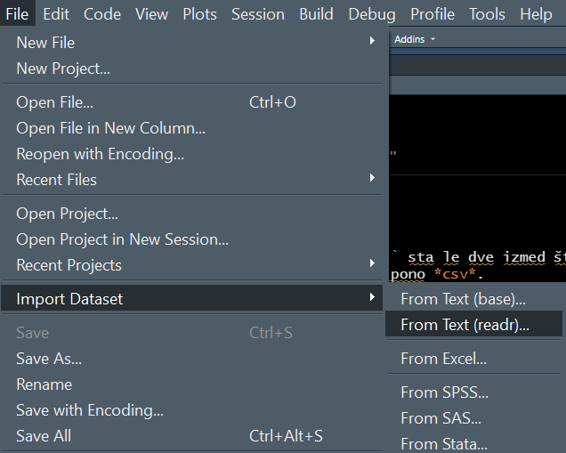
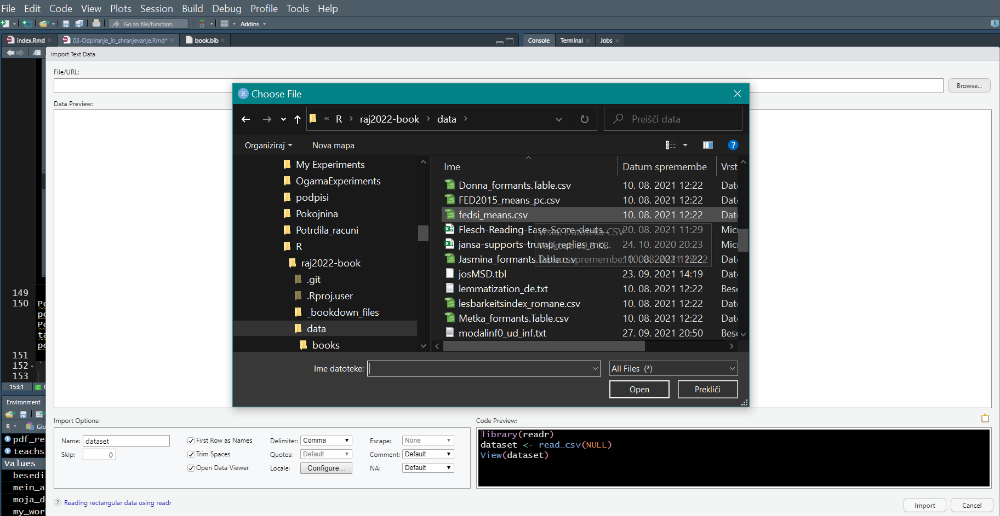

# R & RStudio

Eine der ersten Fragen nach der Installation von `R` und `RStudio` betrifft das Öffnen, Speichern und Bearbeiten von Dateien, die sich auf Ihrer Festplatte befinden oder im Internet zugänglich sind.   

## Programme

In diesem Abschnitt verwenden wir die folgenden Programme (libraries) und Programmsammlungen: 

```{r message=FALSE, warning=FALSE}
library(tidyverse) # zbirka knjižnic za delo s tabelami
library(readtext) # branje besedil 
library(readxl) # branje Excelovih preglednic
library(writexl) # pisanje & shranjevanje Excelovih tabel
library(rmarkdown) # tu: za lepši izgled tabel
library(kableExtra) # za lepši izgled tabel
```

Es gibt viele Möglichkeiten, Dateien zu öffnen und zu speichern. Im Folgenden stelle ich Ihnen einige der häufigsten vor:


## Textdatei öffnen

Wir wollen einen Text öffnen und einlesen und ihn anschließend analysieren. Eine Möglichkeit, einen Text in den Arbeitsspeicher zu laden, ist die Kombination der beiden folgenden Befehle oder Funktionen:    
- `read_lines()` zum Öffnen und Lesen einer Datei;   
- `file.choose()`, um eine Datei mit der Maus auszuwählen. 

Es öffnet sich ein Dialogfenster und wie in einem Textverarbeitungsprogramm (z.B. Word, Open Office, ...) oder einem Tabellenkalkulationsprogramm (Excel, Calc) müssen Sie den Ordner ausfindig machen, der die gewünschte Datei enthält. In diesem Fall ist dies die Textdatei *tom.txt* im Ordner *.../data/books*). 

Der Inhalt der Textdatei wird in der (von uns bestimmten) Variablen *text* gespeichert. 

```{r eval=FALSE, message=FALSE, warning=FALSE, include=FALSE}
besedilo = read_lines(file = file.choose())
```

Normalerweise wollen wir diesen Prozess automatisieren. Daher tragen wir den Pfad zur Datei (d.h. in welchem Ordner sich die Datei befindet) und den Namen der Datei, an der wir interessiert sind, in ein Programmskript. Benutzer des Betriebssystems `Windows` sollten sich bei der Pfadangabe daran gewöhnen, den Schrägstrich "/" anstelle des Schrägstrichs "\" zu verwenden (wie das in den Operationssystem `Unix` oder `MacOS` üblich ist). 

Wenn der Text nicht innerhalb eines RStudio-Projekts geöffnet wird, muss der vollständige Pfad zur Zieldatei angegeben werden. 

Wenn ein Projekt in `RStudio` erstellt wurde (*New Project* im Menü *File*), dann ist es nicht notwendig, den vollständigen Pfad zur Datei anzugeben. Es reicht aus, die Ordner anzugeben, die dem Arbeitsverzeichnis (*working directory*) untergeordnet sind. 

Wie kann ich den **Pfad zum Arbeitsverzeichnis** herausfinden?   
- Schreiben Sie den Befehl `getwd()` in die Konsole (Console) oder ins Programmskript. Der Pfad kann kopiert oder als Konstante (oder Variable) gespeichert werden.    
- Im Dateimanager oder Explorer, der sich standardmäßig auf der rechten Seite von "RStudio" befindet, können wir mit der Maus auf *Mehr* (*More*) klicken und dann die Option *Pfad des Arbeitsverzeichnisses in die Zwischenablage kopieren* wählen (*Copy Folder Path to Clipboard*). 

Im Menü *Mehr* (*More*) finden wir auch eine Option zum Ändern des Arbeitsverzeichnisses *Als Arbeitsverzeichnis festlegen* (*Set as Working Directory*), was aber in einem *RStudio*-Projekt normalerweise nicht notwendig ist. Das Setzen des Arbeitsverzeichnisses wird ebenfalls mit der Funktion `setwd()` durchgeführt.

```{r}
getwd()
moja_delovna_mapa <- getwd()
mein_arbeitsverzeichnis <- getwd()
my_working_directory <- getwd()
```

In unserem Beispiel lautet der Pfad zum Arbeitsordner "D:/Users/teodo/Documents/R/raj2022-book". 

Die gewünschte Textdatei *tom.txt* befindet sich im Unterordner *.../data/books*). Wenn wir vorher ein`RStudio`-*project* erstellt haben, genügt die Angabe des Unterordners und die Hinzufügung des Zieldateinamens -- alles in Anführungszeichen. 

```{r message=FALSE, warning=FALSE}
library(tidyverse)
# in RStudio project
besedilo = read_lines("data/books/tom.txt")
```

Der gesamte Pfad zur Zieldatei kann kopiert und eingefügt werden. Um Schreibfehler zu vermeiden und um sich wiederholtes Schreiben zu ersparen, ist es besser, Programmskripte im Rahmen von `RStudio`- *Projekten* anzulegen und dann entweder als R- oder Rmarkdown-Datei zu speichern. 

```{r message=FALSE, warning=FALSE}
library(tidyverse)
# full path
besedilo <- read_lines("D:/Users/teodo/Documents/R/raj2022-book/data/books/tom.txt")
```

Eine weitere Möglichkeit ist das **Einfügen** von Adressen oder Pfaden in eine Datei mit `paste()` oder `paste0()`. Die erste Funktion fügt ein Leerzeichen zwischen jedem eingefügten Teil des Pfades ein, während die zweite Funktion Pfadteile (oder beliebige Textteile) ohne Leerzeichen zusammenklebt.  

In den beiden folgenden Beispielen werden drei Komponenten bzw. zwei Bestandteile eines Dateipfades zusammengeklebt. 

```{r message=FALSE, warning=FALSE}
library(tidyverse)
# full path with paste0()
besedilo <- read_lines(paste0(moja_delovna_mapa,
                              "/",
                              "data/books/tom.txt"))
besedilo <- read_lines(paste0(moja_delovna_mapa,
                              "/data/books/tom.txt"))
```

Zusätzlich zu `paste()` und `paste0()` verwenden wir andere Bibliotheken zum Einfügen, z.B. `glue` und `here`. 

Die Bibliothek (*library*) `here` ist sehr beliebt für das Einfügen von Dateipfadkomponenten. Die Funktion `here()` selbst bestimmt das aktuelle Arbeitsverzeichnis. Pfadkomponenten werden auf die gleiche Weise wie bei der Funktion `paste()` oder einfach mit Kommas verkettet. Der Vorteil der Funktion `here()` besteht also darin, dass Schrägstriche im Dateipfad vermieden werden. Benutzer des Betriebssystems `Windows` werden sich über diese Funktion besonders freuen, da sie anfangs oft übersehen, dass sie im Dateipfad die falschen Schrägstriche ("\" statt "/") eingefügt haben. 

```{r message=FALSE, warning=FALSE}
library(tidyverse)
library(here)

# full path with here()
besedilo <- read_lines(here("data", "books", "tom.txt"))

here("data", "books", "tom.txt")
```

Das Öffnen eines Textes von einer Webadresse (*url*) ist ebenfalls möglich, aber meist ist es notwendig, den HTML-Code zu entfernen. 

```{r}
url <- 
  "http://teachsam.de/deutsch/d_literatur/d_aut/bor/bor_kuech_txt.htm"
teachsam_kuechenuhr <- read_lines(url) 
head(teachsam_kuechenuhr)
```

Es ist wesentlich einfacher, eine Webseite mit Programmen wie z.B. der `rvest`-Bibliothek den HTML-Code zu entfernen und auf diese Weise einen sauberen Text von einer Webseite herunterzuladen. Das Extrahieren von Text oder Tabellen aus Webseiten (*Webscraping*) ist eine Technik für fortgeschrittene Benutzer. 

```{r}
library(rvest)
html_document <- read_html(url)

# detected with Selector Gadget in in Chrome browser
path <- "blockquote blockquote"
text <- html_document %>%
  html_node(path) %>%
  html_text(trim = T)
```

In dem Text, der von der Bibliothek `rvest` von der Webseite abgerufen wurde, entfernt die Funktion `str_squish()` unerwünschte Leerstellen. Der Text wird mit der Funktion `str_sub()` angezeigt. Im folgenden Beispiel werden nur die ersten 200 Zeichen des Textes angezeigt. Es wird nicht empfohlen, den gesamten Text auf dem Bildschirm ausgeben zu lassen, da dies sehr viel Zeit in Anspruch nehmen kann und den für die Analyse benötigten Arbeitsspeicher belegt. 

```{r}
teachsam_kuechenuhr_rvest <- text %>% str_squish()
str_sub(teachsam_kuechenuhr_rvest, start = 1, end = 200)
```

Solange es sich nur um den Inhalt einer einzigen Webseite handelt, ist eine Programmierung in der Programmiersprache `R` (oder irgend einer anderen Programmiersprache) nicht unbedingt erforderlich. Der Text kann natürlich von der Webseite in einen Notizblock (`Notepad`) oder ein Textverarbeitungsprogramm (z.B. `Word`, `Libre Office`) kopiert und dann in einer Datei gespeichert werden. Das *Webscraping* mit der `rvest`-Bibliothek ist jedoch eine viel effizientere Technik, da es möglich ist, Tausende von Texten (z.B. Zeitungsartikel) von Webseiten in sehr kurzer Zeit herunterzuladen und auf einer Festplatte zu speichern. 


## Öffnen mehrerer Texte

Mit der Funktion `readtext()`, die mit dem Programm `library(readtext)` geladen wird, lassen sich leicht mehrere Texte von der Festplatte öffnen. 

Wenn Sie statt des Dateinamens nur ein Sternchen und die Dateierweiterung (z.B. \*.txt) im ausgewählten Verzeichnis (z.B. "data/books/") angeben, dann öffnet das Programm alle Textdateien mit dieser Erweiterung und speichert diese Sammlung in einer vom Benutzer bestimmten Variablen (z.B. "texts"). Das Programm erstellt eine Tabelle mit den gelesenen Texten und Metadaten dieser Texte.

Die Funktion `readtext()` öffnet Texte mit verschiedenen Dateisuffixen: *txt, csv, docx, pdf, xml, ...*. 

Die Option `encoding` (*Kodierung*) ermöglicht die Angabe des Zeichensatzes (*code page*), in dem die Texte gespeichert wurden. Vorgegeben ist in der Regel die Codepage `*UTF-8*`, die die meisten Sonderzeichen von verschiedenen Sprachen (auch Deutsch und Slowenisch) enthält. Sie können auch irgend einen anderen Zeichensatz angeben, und zwar immer eingerahmt in Anführungszeichen, z. B. "*latin1*" für einen westeuropäischen Zeichensatz oder "*latin2*" für einen mittel- und osteuropäischen Zeichensatz. 

```{r message=FALSE, warning=FALSE}
library(readtext)
besedila = readtext("data/books/*.txt", encoding = "UTF-8")
besedila
```

Auch das Öffnen eines Textes von einer Webadresse (`url`) ist möglich, z.B. *PDF*-Dateien. Der Text wird mitsamt Metadaten in einer Tabelle gespeichert, die sowohl Eigenschaften eines Datensatzes (`data.frame`) als auch die einer Liste (`list`) aufweist. 

```{r message=FALSE, warning=FALSE}
library(readtext)
url <- 
  "https://www.moutard.de/wordpress/archiv/sek2dt/muster/kuechenuhr_i.pdf"
pdf_readtext = readtext(url)
pdf_readtext
```


## Öffnen von Tabellen

Es gibt eine Vielzahl von Programmfunktionen, mit denen man Tabellen in verschiedenen Formaten öffnen kann. Die Funktionen `read_csv()` oder `read_csv2()` sind nur zwei der Funktionen zum Öffnen einer Tabelle mit der Endung *csv* (diese lassen sich übrigens auch mit `Excel` oder `Calc` öffnen). 

Für Anfänger ist es sicher attraktiv, eine Tabelle über das Menü und mit Maus zu importieren *File > Import Dataset > ...* (*Datei > Datensatz importieren > ...*).

```{r echo=FALSE, message=FALSE, warning=FALSE}

```

Dann öffnet sich -- ähnlich wie beim Statistikprogramm `IBM SPSS` -- ein Dialogfeld mit einem Assistenten zum Importieren einer Tabelle oder eines Datensatzes, so dass das entsprechende Format festgelegt werden kann. 

```{r echo=FALSE, message=FALSE, warning=FALSE}

```

Außerdem zeigt `RStudio` an, welcher Programmierbefehl zum Öffnen der Tabelle in das Programmskript eingefügt werden kann. Auf diese Weise können Sie die notwendigen Programmierschritte zum Öffnen von Tabellen erlernen. 

Für die automatische Ausführung des Programmskripts ist es jedoch am besten, eine Befehlszeile zu verfassen, um die Tabelle einzulesen und (optional) anzuzeigen: 

```{r message=FALSE, warning=FALSE}
library(tidyverse)
# read data frame
tabela = read_csv2("data/plural_Subj_sum.csv")

# show first rows
head(tabela) %>% 
  rmarkdown::paged_table() # prettier

```

`RStudio` ermöglicht auch den Import von Datensätzen aus einigen anderen Statistikprogrammen (z.B. `SPSS`, `STATA`) und Tabellenkalkulationsprogrammen (`Excel`). Zusätzlich installierbare Softwarefunktionen bieten noch mehr Importmöglichkeiten (z.B. die `readxl`-Bibliothek für den Import von Excel-Tabellen). 

Das Öffnen einer Tabelle von einer Webadresse (`url`) ist ebenfalls möglich, z.B. entweder mit den Funktionen `read_csv()` oder `read_csv2()` oder mit der Funktion `read_delim()`.

```{r}
url <- 
  "https://perso.telecom-paristech.fr/eagan/class/igr204/data/cars.csv"

car_dataset <- read_delim(url, delim = ";",
                         # c = character, n = number
                         col_types = "cnnnnnnnn")

car_dataset <- read_csv2(url, 
                         # c = character, n = number
                         col_types = "cnnnnnnnn")

car_dataset <- car_dataset[-1,] # remove first row after column name
head(car_dataset)
```

Die Option *col_types* stellt sicher, dass beim Aufrufen der Datei ein angemessenes Datenformat (alphanumerische Zeichenkette, Dezimalzahl usw.) verwendet wird.


## Öffnen einer Excel-Tabelle

`Excel` von `Microsoft` ist ein beliebtes Tabellenprogramm. Daher gibt es auch in der Programmiersprache `R` mehrere Programme, die das Öffnen von `Excel`-Dateien (Suffix *xlsx*) erlauben, z.B. die Funktion `read_xlsx()` oder `read_excel()` des Programms `readxl`.

```{r message=FALSE, warning=FALSE}
library(readxl)
excel = read_xlsx("data/S03_Vokalformanten_Diagramme.xlsx", sheet = "A1-4_alle")
head(excel) %>% 
  rmarkdown::paged_table()

```


## Datei speichern

Standardmäßig speichern die meisten Softwarefunktionen Datensätze gemäß der heutzutage bevorzugten Unicode-Zeichensatztabelle, die auch sprachspezifische und andere spezielle Symbole zulässt. 

Bei bestimmten Programmfunktionen muss dies eventuell angegeben werden, z.B. `encoding="UTF-8"` bzw. `fileEncoding="UTF-8"`.

Im Falle der nachfolgenden `tidyverse`-Funktionen gilt jedoch, dass standardmäßig im UTF-8-Format gespeichert wird, falls keine gegenteilige Angabe gemacht wird. 

```{r message=FALSE, warning=FALSE}
library(tidyverse)

# shranjevanje posamičnega besedila
write_lines(besedilo, "moje_besedilo.txt")

# shranjevanje tabele, v kateri je zbirka besedil
write_csv2(besedila, "moja_tabela_z_besedili.csv")

library(writexl)
# shranjevanje preglednice
write_xlsx(tabela, "moja_tabela.xlsx")

# shranjevanje tabele, v kateri je zibrka besedil
# Excel dovoljuje do 32767 znakov.
# ta zbirko presega to mejo, zato je ne moremo shraniti v Excelovi preglednici

# write_xlsx(besedila, "moja_tabela_z_besedili.xlsx")

```


Nun folgen weitere grundlegende Datei-Operationen in `R`: z.B.    
- Download von Zip-Dateien (zip files);   
- Extrahieren von komprimierten Dateien in ein Verzeichnis (extract compressed files to a folder);   
- Überprüfen und Anlegen eines oder mehrer Verzeichnisse (check & create a folder or subfolders);    
- Durchsuchen und Lesen von Dateien in einem Verzeichnis (list & read files in a folder).   


## Download von Zip-Dateien

Eine Softwarefunktion zum Herunterladen einer Datei aus dem Internet, unter Verwendung der Funktion `download.file()`, die die Angabe der Webadresse (*url*) und den Pfad (*location*, *pot*) zum Speichern der Datei benötigt. 

Im folgenden Beispiel wird die komprimierte Datei im *Arbeitsverzeichnis* dieses *R*-Projekts gespeichert. Um uns etwas Schreibarbeit zu ersparen, verwenden wir wieder die Funktion `here()`.

```{r message=FALSE, warning=FALSE}
url <- "https://github.com/tpetric7/tpetric7.github.io/archive/refs/heads/main.zip"
# location <- "d:/Users/teodo/Downloads/tpetric7-master.zip"
location <- here("tpetric7-master.zip")

download.file(url, location)
```


## Verzeichnisse

### Existenz eines Verzeichnisses prüfen 

Ist ein Verzeichnis bereits vorhanden? Wir überprüfen dies mit der Funktion `dir.exists()`, die nach dem Dateipfad fragt. Auch hier verwenden wir die Funktion `here()`, um den Dateipfad anzugeben. 

Eine `TRUE`-Ausgabe bedeutet, dass der Ordner existiert, eine `FALSE`-Ausgabe bedeutet, dass er noch nicht angelegt ist. 

```{r message=FALSE, warning=FALSE}
# pot <- "d:/Users/teodo/Downloads/tpetric7-master"
pot <- here("tpetric7-master")
exist <- dir.exists(pot)
exist

```


### Verzeichnis anlegen 

Wenn ein Verzeichnis noch nicht existiert, können wir es erstellen. Ist es bereits angelegt ist, können wir Auskunft darüber erhalten. 

Das *Erstellen* eines neuen Verzeichnisses erfolgt mit der Funktion `dir.create()`, die nach dem Pfadnamen des neuen Ordners fragt. Dieser Programmierbefehl wird oft mit der bedingten Anweisung `ifelse()` kombiniert. Der Bedingungssatz beginnt mit einer Bedingung. Im folgenden Beispiel ist dies *exist == FALSE*. Wenn die Bedingung erfüllt ist (d.h. dass der Ordner noch nicht existiert), dann gibt das Programm `TRUE` aus und erstellt einen Ordner mit einem Namen nach unserer Wahl. Wenn die Bedingung nicht erfüllt ist (d.h. dass der Ordner mit dem angegebenen Namen bereits existiert ), dann wird *directory already exists* (*Verzeichnis existiert bereits*) ausgegeben. 

```{r message=FALSE, warning=FALSE}
ifelse(exist == FALSE, 
       dir.create(pot, showWarnings = TRUE, recursive = TRUE), 
       "directory already exists")
```


### Unterverzeichnisse anlegen

Wir wollen mehrere Verzeichnisse anlegen.    
- Definieren wir zunächst einen Vektor mit Namen der Verzeichnisse. In der Programmschleife benötigen wir den Namen des Vektors *subfolder_names*.    
- Wir verwenden die Programmschleife `for(){}`, die so lange läuft, bis die Programmfunktion jedem Verzeichnis einen Namen zugewiesen hat.    
- Wie oft die Schleife ausgeführt wird, wird durch eine Zahl angegeben. Wir könnten die Zahl 4 angeben, da wir zuvor vier Namen für die neuen Ordner definiert haben. Eine elegantere Methode ist die Verwendung der Funktion `length()` (*Länge* des Vektors), die dem Programm das letzte Glied der Sequenz mitteilt, d.h. das Ende der Schleife. Der Zähler *i* ist anfangs gleich eins und wird nach jedem Schleifendurchlauf um eins erhöht. Da der Vektor vier Namen enthält, endet die Ausführung der Programmschleife nach dem vierten Durchlauf.    
- In der Schleife führen wir am Schluss die Funktion `dir.create()` aus. Das Ergebnis speichern wir in einer Variable namens *folder* (*Ordner*). 

Im folgenden Beispiel erstellt das Programm Unterordner in dem Ordner (die Variable heißt *pot*, dt. "Pfad"), den wir oben erstellt haben. 

```{r message=FALSE, warning=FALSE}
subfolder_names <- c("a","b","c","d") 
for (i in 1:length(subfolder_names)){
  folder <- dir.create(paste0(pot, "/", subfolder_names[i]))
}

```


### Verzeichnis entfernen

Das Programm kann die Verknüpfung mit Ordnern mit der Funktion `unlink()` aufheben. Im folgenden Beispiel werden wir vier (leere) Verzeichnisse entfernen, die wir kurz zuvor erstellt haben (siehe oben die dafür verwendeten Ordnernamen!). 

Wir entfernen zuerst nur einen Ordner. 

```{r}
unlink(here(pot, "a"), recursive = TRUE)
```

Sie können auch mehrere Verzeichnis mit einem Befehl entfernen. In diesem Fall brauchen wir eine Programmschleife. 

Im folgenden Beispiel werden die verbleibenden drei Unterordner entfernt: der Zähler *i* beginnt also mit 2 und endet mit 4, was durch `length()` angegeben wird. Die Option *recursive = TRUE* bedeutet, dass das Programm auch alle Unterverzeichnisse in diesen Ordnern löscht. 

```{r message=FALSE, warning=FALSE}
for (i in 2:length(subfolder_names)){
  unlink(here(pot, subfolder_names[i]), recursive = TRUE)
}
```


## Zip-Dateien entpacken und löschen

Die komprimierte Datei wird mit der Funktion `unzip()` entpackt, und der Pfad oder Ort der entpackten Datei wird mit der Option *exdir* angegeben. 

Im folgenden Beispiel wird davon ausgegangen, dass Sie die gezippte Datei bereits auf die Festplatte heruntergeladen haben, und zwar in das Arbeitsverzeichnis. 

```{r message=FALSE, warning=FALSE}
# unzip("d:/Users/teodo/Downloads/tpetric7-master.zip", exdir = pot)
unzip("tpetric7-master.zip", exdir = pot)
```

Das Verzeichnis und die komprimierte Datei werden nicht mehr benötigt. In den nächsten beiden Schritten werden wir beide und alles, was sich darin befindet, wieder entfernen. 

```{r}
unlink(pot, recursive = TRUE)
unlink("tpetric7-master.zip", recursive = TRUE)
```


## Dateilisten anzeigen

Die Liste der Dateien in einem oder mehreren Verzeichnissen auf der Festplatte eines Computers wird mit der Funktion `list.files()` angezeigt. 

```{r message=FALSE, warning=FALSE}
seznam <- list.files("data/books", pattern = "\\.txt$", recursive = TRUE, full.names = TRUE)
seznam

```


## Mehrere Dateien öffnen

### quanteda: 

Die oben bereits besprochene Funktion `readtext()` kann mehrere Dateien in einem oder mehreren Verzeichnissen öffnen. Wenn diese Funktion mal nicht verwendet werden kann, gibt es mehrere andere Möglichkeiten. 

### tidyverse:

Im `tidyverse`-Programmpaket ist das Programm `purrr` mit der Funktion `map()` verfügbar, die die klassische `for(){}`-Schleife effizient zu ersetzen vermag. 

Im folgenden Beispiel verwenden wir die Funktion `read_lines()`, um den Text aus einer Liste zu öffnen, die wir zuvor mit der Funktion `list.files()` erstellt haben. Die Funktion `map()` hingegen hat den gleichen Zweck wie die `for()`-Schleife, ist aber kürzer. Auf diese Weise wird der gesamte Text der Dateiliste in den Arbeitsspeicher des Computers geladen und in einer beliebig benannten Variable gespeichert.    

Die Funktion `substr()` hingegen ermöglicht es uns, den gesamten Text oder normalerweise nur einen Teil des Textes anzuzeigen. Wir haben oben eine ähnliche Funktion verwendet, `str_sub()`. Im folgenden Beispiel wollen wir den Inhalt der ersten Datei [1] und der zweiten Datei [2] in der Liste sehen. Wir wollen nicht den gesamten Text drucken, sondern nur die ersten 50 oder 70 Zeichen. 

```{r message=FALSE, warning=FALSE}
library(tidyverse)
alltxt <- seznam %>% map(read_lines)

substr(alltxt[1], 1, 50)
substr(alltxt[2], 1, 70)

```

### Base R:

Im Grundfunktionssatz der Programmiersprache `R` hat der `lapply()`-Befehl eine ähnliche Funktion wie der `map()`-Befehl oder die `for()`-Schleife. Die Funktion `map()` verfügt jedoch über weitere fortgeschrittene Optionen, die wir hier nicht ausschöpfen. 

```{r message=FALSE, warning=FALSE}
alltxt <- lapply(seznam, readLines)

substr(alltxt[1], 1, 50)
substr(alltxt[2], 1, 70)

```

## Zeichensatz konvertieren

Die Zeichensatztabelle (*code page*) kann durch die Funktion `iconv()` ersetzt werden. Die unten folgende Programmzeile wandelt den Text *tom.txt* (siehe oben) von der Codepage "*UTF-8*" in die Codepage "*latin1*" um. 

Die Funktion `Encoding()` ermittelt die Zeichensatztabelle (*Code page*) eines Textes. Die Funktion `str_sub()`, die zur Anzeige eines Textausschnitts dient, wurde bereits oben eingeführt. 

```{r}
alltxt1_converted <- iconv(besedilo, from = "UTF-8", to = "latin1")
Encoding(alltxt1_converted)
str_sub(alltxt1_converted, 4800, 4900)
```


## Datensatz vorbereiten

Oft müssen wir einen Datensatz oder eine Tabelle umwandeln, um die Antwort auf eine Forschungsfrage zu finden. Die Datenumwandlung wird oft im Englischen als *Data Wrangling* ("Datenringen, Datenraufen") bezeichnet. Im Folgenden werden wir uns einige der gebräuchlichsten `Tidyverse`-Funktionen zur Vorbereitung eines Datensatzes oder einer Tabelle ansehen:   
- `select()`   
- `group_by()`   
- `filter()`   
- `mutate()`   
- `count()`   
- `summarise()`   
- `arrange()`   
- `separate()`   
- `unite()`   
- `pivot_longer()`   
- `pivot_wider()`   
- `pull()`   
- `Date()`.

Die Funktionsweise der einzelnen Programmfunktionen wird anhand des Datensatzes *tweets_rollingstones.rds* veranschaulicht, den wir zunächst mit `read_rds()` öffnen. 

```{r message=FALSE, warning=FALSE}
tweets_rollingstones <- read_rds("data/tweets_rollingstones.rds")
```

Wenn wir dem Namen des Datensatzes das Zeichen `$` hinzufügen, werden die Variablen (Spalten der Tabelle) angezeigt: z.B. *tweets_rollingstones$user_id*, *tweets_rollingstones$text* usw. 

Der Operator `%>%%` (Tastenkürzel: *Crtl+Shift+M*) verbindet die Programmschritte bzw. Zeilen miteinander:    
(a) die Schritte werden in zeitlicher Reihenfolge ausgeführt, und    
(b) die folgenden Schritte übernehmen das Objekt aus dem ersten Programmschritt (d.h. den Datensatz).    
Dies verkürzt die einzelnen Programmschritte.   
In vielen Fällen kann man stattdessen auch den Operator `|>` (Base-`R`-Funktion) einsetzen.   

Die Funktion `head()` begrenzt die Anzahl der auszugebenden Datenzeilen.   

```{r message=FALSE, warning=FALSE}
tweets_rollingstones$created_at %>% head(3)
```

Andere Möglichkeiten, die Namen von Variablen (Spalten) in einer Tabelle anzuzeigen, sind z.B. `names()` oder `colnames()`. Sie können auch die Funktionen `glimpse()` oder `skim()` des Programms `skim` verwenden, die ausführlichere Auskunft über die Struktur und Variablennamen im Datensatz geben. Eine ähnliche Funktion hat auch die `summary()`-Funktion, die zu den Grundfunktionen der `R`-Programmiersprache gehört. 

Die folgende Datenausgabe ist auf 10 Namen begrenzt. Ermöglicht wird dies durch die Funktion `head()`.

```{r message=FALSE, warning=FALSE}
names(tweets_rollingstones) %>% head(10)
# colnames(tweets_rollingstones)
# glimpse(tweets_rollingstones)
# skimr::skim(tweets_rollingstones)
```


### select()

Mit der Funktion `select()` können Sie Spalten in einer Tabelle auswählen. Es gibt mehrere Auswahlmöglichkeiten. Im folgenden Beispiel wird nur eine Spalte (Variable) ausgewählt und die drei ersten Zeilen davon angezeigt. 

```{r message=FALSE, warning=FALSE}
tweets_rollingstones %>% select(screen_name) %>% head(3)
```

Sie können mehrere aufeinanderfolgende Spalten auswählen, indem Sie einen Doppelpunkt zwischen die Namen der äußeren Variablen (Spalten in der Tabelle) setzen. Ein Komma wird zwischen zwei Variablen gesetzt, die im Datensatz nicht unmittelbar nacheinander auftreten. Im folgenden Beispiel werden vier Spalten ausgewählt, von denen die letzten drei nacheinander erscheinen, daher wird ein Doppelpunkt zwischen den Variablen *created_at* und *text* verwendet. Auf die erste Spalte *user_id* folgt ein Komma, weil zwischen ihr und *created_at* eine weitere Spalte liegt, die wir nicht ausgewählt haben.

```{r message=FALSE, warning=FALSE}
tweets_rollingstones %>% 
  select(user_id, created_at:text) %>% # which columns?
  head(3) %>% # 3 rows only
  rmarkdown::paged_table() # prettier table
```

Das *Minus* vor dem Spaltennamen bedeutet, dass Sie die Spalte ausschließen möchten. Mehrere Spalten können gleichzeitig eliminiert werden, indem das Zeichen `c()` mit vorangestelltem *Minus* verwendet wird.

```{r message=FALSE, warning=FALSE}
tweets_rollingstones %>% 
  select(lang, location, user_id:status_id, 
         source, created_at:text) %>%
  select(-lang) %>% # remove one column
  select(-c(user_id, status_id)) %>%  # remove two columns
  select(-c(created_at, screen_name:text)) %>%  # multiple columns
  head(3) %>%
  rmarkdown::paged_table()
```


### filter()

Während die Funktion `select()` Spalten (Variablen) auswählt oder eliminiert, können wir mit der Funktion `filter()` die Anzahl der Zeilen begrenzen, die wir im Verlauf der Analyse verwenden möchten. Es muss zumindest eine Bedingung angegeben werden, es können jedoch auch mehrere (komplexe) Bedingungen sein. Vorsicht ist geboten bei der Verwendung logischer Operatoren (z. B. *Doppelgleichheitszeichen*: *==* statt einfachem Gleichheitszeichen: *=*). 

Das folgende Beispiel zeigt eine einfache Filterung eines Datensatzes. In späteren Kapiteln werden wir oft komplexere Filtermuster benötigen, die Funktionen wie `str_detect()` und Kenntnisse über *reguläre Ausdrücke* (*regular expressions*) verlangen. 

Die Filterbedingung ist die Auswahl von slowenischen Tweets, d.h. die Spalte *lang* ("language, Sprache") muss die Zeichenkette "*sl*" enthalten. Zeilen, die diese Bedingung nicht erfüllen, werden in der gefilterten Tabelle nicht angezeigt. 

```{r message=FALSE, warning=FALSE}
tweets_rollingstones %>% 
  select(lang, user_id, created_at:text) %>% # which columns?
  filter(lang == "sl") %>% # Slovenian tweets only
  head(3) %>% # 3 rows only
  rmarkdown::paged_table() # prettier table
```

Solange dieses Ergebnis nicht gespeichert wird (z. B. als *tweets_rollingstones_slovenski*), bleibt der Datensatz unverändert. Das Gleiche gilt für alle anderen erwähnten Funktionen zur Anpassung von Tabellen. Das Format oder Ergebnis, das wir behalten wollen, muss unter einem (neuen) Namen gespeichert werden. 

Es können mehrere Bedingungen verwendet werden. Um Bedingungen miteinander zu verknüpfen, verwenden wir einen logischen Operator: Anstelle des *Plus (+)*-Zeichens fügen wir `&` (d.h. *ampersand*) ein, und um eine alternative Bedingung aufzurufen, verwenden wir den logischen Operator `|` (d.h. *oder*). Der logische Operator `&` bedeutet, dass beide Bedingungen erfüllt sein müssen. Wenn wir den logischen Operator `|` einfügen würden, wäre es ausreichend, wenn mindestens eine dieser Bedingungen erfüllt wäre, und es wäre zulässig, wenn beide erfüllt wären. 

Im folgenden Beispiel werden zwei Bedingungen verwendet: Der Tweet muss auf Slowenisch sein (Spalte *lang == "sl"*) und die Spalte *location* (*Ort*) darf nicht leer sein (*location != ""*). Die erste Bedingung enthält den logischen Operator `==` (zwei Gleichheitszeichen!), und die zweite Bedingung enthält den logischen Operator `!=` (Ausrufezeichen + Gleichheitszeichen). Mit dem Ausrufezeichen wird das Gleichheitszeichen negiert. 

```{r message=FALSE, warning=FALSE}
tweets_rollingstones %>% 
  select(lang, user_id, location, created_at:text) %>% # which columns?
  filter(lang == "sl" & location != "") %>% # Slovenian tweets only
  head(3) %>% # 3 rows only
  rmarkdown::paged_table() # prettier table
```


### group_by()

Die `group_by()`-Funktion ermöglicht das Gruppieren aller Datensatzspalten nach einer Spalte oder nach mehreren Spalten. Die Gruppierung der Spalte(n) ist oft erwünscht im Zusammenhang mit anderen Funktionen, die den Datensatz zusammenfassen (aggregieren), wie z.B. bei Verwendung der `summarise()`-Funktion.  

```{r message=FALSE, warning=FALSE}
tweets_rollingstones %>% 
  select(lang, user_id, location, created_at:text) %>% # which columns?
  group_by(lang) %>% 
  tail(3) %>% # 3 last rows only
  rmarkdown::paged_table() # prettier table
```


### mutate()

Mit der `mutate()`-Funktion bilden wir neue Tabellenspalten (Variablen) oder verändern bereits bestehende. 

Im folgenden Beispiel bilden wir die Spalte *tweet_length*, die mit Hilfe der Funktion `nchar()` die Anzahl der Zeichen in der Tabellenspalte *text* auszählt. 

```{r message=FALSE, warning=FALSE}
tweets_rollingstones %>% 
  select(lang, text) %>% # which columns?
  # how many characters does each tweet have? - nchar()
  mutate(tweet_length = nchar(text)) %>% # new column
  select(lang, tweet_length, text) %>%  # re-ordering of columns
  head(5) %>% # show only first five rows
  rmarkdown::paged_table() # prettier table
```


### count()

Mit der `count()`-Funktion kann man die Anzahl von Kategorienwerten ermitteln. Beim Auszählen ist der `group_by()`-Befehl nicht notwendig, da der `count()`-Befehl die Daten vor dem Auszählen gruppiert. 

Im folgenden Beispiel wird ausgezählt, wie viele Tweets in jeder der drei Sprachen (englisch, deutsch, slowenisch) im Datensatz vorkommen. Es ist ersichtlich, dass dieser Datensatz vor allem englische Tweets enthält. 

```{r message=FALSE, warning=FALSE}
tweets_rollingstones %>% 
  select(lang, user_id, location, created_at:text) %>% # which columns?
  count(lang) %>% 
  rmarkdown::paged_table() # prettier table
```


### summarise()

Die `summarise()`- oder `summarize()`-Funktion dient der Zusammenfassung (Aggregation) von Datenwerten. 

Im folgenden Beispiel wird die Auswahl des Datensatzes nach den der Spalte für die Sprachen (*lang*) gruppiert. Daher berechnet der folgende `summarise()`-Befehl die durchschnittliche Länge der Tweets (`mean(nchar(text))`) pro Sprache (*de, en, sl*).  

Ohne den `group_by()`-Befehl erhielte man mit dem summarise()-Befehl den Durchschnittswert für alle Tweets (ohne Sprachen zu unterscheiden).

```{r message=FALSE, warning=FALSE}
tweets_rollingstones %>% 
  group_by(lang) %>% 
  summarise(tweet_length = mean(nchar(text))) %>% 
  rmarkdown::paged_table() # prettier table
```


### round()

Mit der `round()`-Funktion kann man Dezimalzahlen auf- oder abrunden. Im folgenden Beispiel machen wir das in einem speziellen Schritt, damit die Syntax der Funktion besser zu sehen ist. 

```{r message=FALSE, warning=FALSE}
tweets_rollingstones %>% 
  group_by(lang) %>% 
  summarise(tweet_length = mean(nchar(text))) %>% 
  mutate(tweet_length = round(tweet_length, 0)) %>% # no decimal values
  rmarkdown::paged_table() # prettier table
```


### arrange()

Der `arrange()`-Befehl ist eine Sortierfunktion. Im folgenden Beispiel wird das Ergebnis nach Länge der Tweets aufsteigend sortiert. 

```{r message=FALSE, warning=FALSE}
tweets_rollingstones %>% 
  select(lang, user_id, location, created_at:text) %>% # which columns?
  group_by(lang) %>% 
  summarise(tweet_length = mean(nchar(text))) %>% 
  arrange(tweet_length) %>% 
  rmarkdown::paged_table() # prettier table
```

Will man die Reihenfolge der Sortierung umkehren, muss man vor dem Spaltennamen ein Minuszeichen setzen (z.B. `arrange(-tweet_length)` oder `desc` für *descending* (absteigend, z.B. `arrange(desc(tweet_length))`). 


### distinct()

Die `distinct()`-Funktion entfernt doppelt oder mehrfach auftretende Werte aus einer Tabellenspalte (oder mehreren Spalten). Eine ähnliche Funktion ist `unique()`.    

Zu beachten ist, dass `R` im Gegensatz zu `Excel` Groß- und Kleinschreibung unterscheidet. Deshalb sind z.B. *Slovenija* und *slovenija* keine verdoppelten Datenzeilen.    

```{r message=FALSE, warning=FALSE}
tweets_rollingstones %>% 
  distinct(location) %>%
  head(10) %>% 
  rmarkdown::paged_table() # prettier table
```


### str_to_lower()

Groß- und Kleinschreibung von Buchstaben kann man mit einer Reihe von Funktionen vereinheitlichen, z.B. mit `str_to_lower()` (nur Kleinbuchstaben), `str_to_upper()` (nur Großbuchstaben), `str_to_sentence()` (erstes Wort mit großem Anfangsbuchstaben - wie im Satz), `str_to_title()` (alle Wörter mit großen Anfangsbuchstaben - wie in englischen Titeln üblich).

```{r message=FALSE, warning=FALSE}
tweets_rollingstones %>% 
  mutate(location = str_to_title(location)) %>%  
  distinct(location) %>%
  head(10) %>% 
  rmarkdown::paged_table() # prettier table
```


### str_replace()

Die Funktion `str_replace()` ermöglicht es, einzelne oder mehrere Zeichen in einer Spalte durch ein anderes (andere) zu ersetzen. Zum mehrmaligen Zeichenaustausch in einer Tabellenspalte dient `str_replace_all()`. Beide Funktionen wirken nur in alphabetisch gekennzeichneten Tabellenspalten (`chr` - character). Für den Austausch von Zahlenwerten in numerisch gekennzeichneten Spalten (`dbl` / `int` - double / integer) verwendet man `replace()` bzw. `replace_all()`. Der `gsub()`-Befehl funktioniert in beiden Fällen, erwartet aber, dass der Name der Tabellenspalte zuletzt angegeben wird.   

In Tabellen werden die angeführten Ersatz-Befehle gewöhnlich mit dem mutate()-Befehl verknüpft.   

```{r message=FALSE, warning=FALSE}
tweets_rollingstones %>% 
  mutate(location = str_replace(location, # which column?
                                pattern = "Istra,", # search for
                                "")) %>% # replace with empty string
  distinct(location) %>% 
  head(10) %>% 
  rmarkdown::paged_table() # prettier table
```


### separate() und unite()

Mit der `separate()`-Funktion kann man eine bestehende Tabellenspalte in zwei oder mehrere neue Tabellenspalten zerlegen. Der `unite()`-Befehl bewirkt das Gegenteil.   

Im Beispiel wollen wir die Spalte *location* in die Spalten *city* und *country* zerlegen. In vielen Tabellenspalten sehen wir, dass zwischen angegebenem Ort und Land ein Komma steht. Wir nutzen das Komma als Trennzeichen, um zwei neue Spalten zu bilden. Wie gut das funktioniert, hängt natürlich davon ab, wie konsequent die Angaben in der Spalte sind.   

```{r message=FALSE, warning=FALSE}
tweets_rollingstones %>% 
  separate(location, into = c("city", "country"), sep = ",",
           remove = FALSE) %>% # keep the location column
  distinct(city, country) %>% 
  head(10) %>% 
  rmarkdown::paged_table() # prettier table
```

Ein Beispiel mit der `unite()`-Funktion:   

```{r message=FALSE, warning=FALSE}
tweets_rollingstones %>% 
  unite(user, c(screen_name, user_id), sep = "_") %>% # keep the location column
  distinct(user) %>%
  head() %>% 
  rmarkdown::paged_table() # prettier table
```


### pivot_wider()

Mit der `pivot_wider()`-Funktion können wir eine Tabelle, die im langen Datenformat vorliegt, in eine weite Tabelle umwandeln. 

```{r message=FALSE, warning=FALSE}
tweet_length_wide <- tweets_rollingstones %>% 
  group_by(lang) %>% 
  summarise(tweet_length = mean(nchar(text), na.rm = TRUE)) %>% 
  pivot_wider(names_from = lang, values_from = tweet_length)

tweet_length_wide %>% rmarkdown::paged_table() # prettier table
```


### pivot_longer()

In vielen Fällen benötigen wir eine Tabelle im langen Datenformat (z.B. um Diagramme mit `ggplot()` darzustellen). Das lässt sich mit der `pivot_longer()`-Funktion bewerkstelligen.   

```{r message=FALSE, warning=FALSE}
tweet_length_wide %>% # data in wide format
  pivot_longer(de:sl, # which columns?
               names_to = "Sprachen", # new categorical column
               values_to = "Tweetlänge") %>% # new numerical column
  rmarkdown::paged_table() # prettier table

```


### Datumsfunktionen

Es gibt eine ganze Reihe von Datums- und Zeitfunktionen. Im folgenden Beispiel zerlegen wir die Datums- und Zeitangabe, die im speziellen `POSIXct`-Format vorliegt, in mehrere Tabellenspalten (Jahr, Monat, Tag, Uhrzeit).   

Die Datumsspalte kann man entweder mit der oben vorgeführten `separate()`-Funktion zerlegen oder mit Funktionen des Programms `lubridate`. 

Im Beispiel verwenden wir die `lubridate`-Funktionen `year()`, `month()` und `day()`. Durch die Umwandlung erhalten wir drei numerische Tabellenspalten (*Jahr, Monat, Tag*). Mit dem Programm `hms` und der Funktion `as_hms()` extrahieren wir die Uhrzeit aus der Spalte *created_at* im `hms`-Format. Dieses Format eignet sich beispielsweise für die Berechnung von zeitlichen Abständen (Dauer). Braucht man die Uhrzeit dagegen im alphabetischen Format, kann man die `lubdridate`-Funktion `ymd_hms()` und die Base-`R`-Funktion `format()` nutzen. 

```{r message=FALSE, warning=FALSE}
library(lubridate)
library(hms)
tweets_rollingstones %>% 
  select(screen_name, created_at) %>% 
  mutate(Jahr = year(created_at),
         Monat = month(created_at),
         Tag = day(created_at),
         Uhrzeit = as_hms(created_at),
         Zeit = ymd_hms(created_at),
         Zeit = format(Zeit, format = "%H:%M:%S")) %>% 
  select(-created_at) %>% 
  rmarkdown::paged_table() # prettier table
```


Es gibt noch viele weitere Funktionen zur Datenmanipulation. Im Internet sind zahlreiche Portale zu finden (z.B. *stackoverflow*), wo man nach entsprechenden Lösungen für sein eigenes Programmskript suchen kann. 


## Umwandlung eines R-Skripts

Ein Programmskript oder ein Datensatz mit dem Suffix "R" kann in ein "Rmarkdown"-Dokument (mit dem Suffix "Rmd") umgewandelt werden, indem man dies tut:      

- [Strg + Umschalt + K]` oder   
- `knitr::spin("t_preskus.R")`.   

In beiden Fällen handelt es sich um ein Textformat, so dass die Umwandlung in verschiedene andere Formate relativ einfach ist. 

