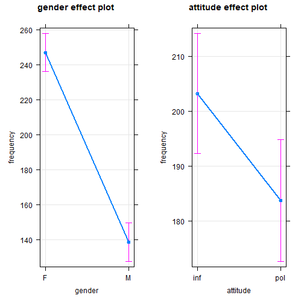

### Höflichkeit und Grundfrequenz

```{r message=FALSE, warning=FALSE}
library(tidyverse)
library(scales)
# detach("package:rlang", unload=TRUE)
```

Datensatz von: *Bodo Winter* [@winter2012phonetic; @winter2013linear]

Thema: Politeness and Pitch (F0)

Tutorials: 
- [Lineare Regression](http://www.bodowinter.com/tutorial/bw_LME_tutorial1.pdf)   
- [Lineare Regression mit gemischten Effekten](https://bodowinter.com/tutorial/bw_LME_tutorial.pdf)   

Artikel:   
[The phonetic profile of Korean formal and informal speech registers](https://www.academia.edu/5655036/The_phonetic_profile_of_Korean_formal_and_informal_speech_registers)   

Gliederung unserer quantitativen Analyse

1\. Laden der Datei

2\. Kennenlernen der Daten und Säubern

3\. Hypothesen

4\. Test und Ergebnisse

5\. Schluss


:::rmdnote 
Eine einfache `lineare Regression` oder einen `t-Test` kann man auch in *Excel* berechnen, aber in Statistikprogrammen ist das bequemer.
:::

#### Datei laden

```{r message=FALSE, warning=FALSE}
# politeness <- read.csv("/cloud/project/data/politeness_data.csv")
politeness <- read.csv("data/politeness_data.csv")

```

#### Kennenlernen der Daten und Säubern

Welche Variablen enthält die Datei?

```{r message=FALSE, warning=FALSE}
head(politeness)
  
```

Eine weitere Funktion, um die Datenstruktur zu betrachten:

```{r message=FALSE, warning=FALSE}
glimpse(politeness)
```

Und noch eine Übersicht, die uns noch mehr zeigt, z.B. ob bestimmte Datenzellen leer sind (NA). Die Variable `frequency` enthält eine leere Datenzelle (s. `n_missing`). Das müssen wir bei der Berechnung des Durchschnitts berücksichtigen.

```{r}
library(skimr)
skim(politeness)
```


Am Experiment nahmen 6 Versuchspersonen teil (F1, ..., M7). Von jeder Versuchsperson (subject) haben wir 14 Messpunkte (n = 14).

```{r message=FALSE, warning=FALSE}
politeness %>% 
  count(subject)
```

Versuchspersonen: je 3 sind weiblich bzw. männlich.

```{r message=FALSE, warning=FALSE}
politeness %>% 
  count(subject, gender)
```

Pro Verhaltensweise stehen uns 42 Messpunkte zur Verfügung, um unsere (unten folgende) Hypothese zu überprüfen.

```{r message=FALSE, warning=FALSE}
politeness %>% 
  count(attitude)
```

Berechnen wir mal die Grundfrequenz!

```{r message=FALSE, warning=FALSE}
politeness %>% 
  mean(frequency)
```

`NA`: Hoppla! In unserer Datenreihe fehlt eine Frequenz. Wir entfernen diese Datenzeile, um die durchschnittliche Frequenz mit `mean()` zu berechnen. Entfernen der leeren Datenzelle (NA) ist die einfachste Lösung.

```{r message=FALSE, warning=FALSE}
politeness %>% 
  drop_na(frequency) %>%
  summarise(av_freq = mean(frequency))
```

Wir haben gerade die Durchschnittsfrequenz für alle Versuchspersonen berechnet. Berechnen wir sie nun getrennt nach weiblichen und männlichen Versuchspersonen!

```{r message=FALSE, warning=FALSE}
politeness %>% 
  drop_na(frequency) %>%
  group_by(gender) %>% 
  summarise(av_freq = mean(frequency))
```

Erwartungsgemäß ist der Durchschnittswert bei Frauen höher als bei Männern: Frauen haben meist eine höhere Stimme als Männer.

Ein Blick auf die Durchschnittsfrequenzen bei höflicher und informeller Sprechweise: In unserer Stichprobe mit 6 Versuchspersonen (je 14 Frequenzmessungen) zeigt sich ein Unterschied von etwa 18,2 Hz, und zwar 202,59 - 184,36.

```{r message=FALSE, warning=FALSE}
politeness %>% 
  drop_na() %>% 
  group_by(attitude) %>% 
  summarise(avg_freq = mean(frequency),
            sd_freq = sd(frequency))

```

```{r message=FALSE, warning=FALSE}
# politeness %>% 
#   drop_na %>% 
#   transmute(attitude, frequency) %>% 
#   mutate(attitude = str_replace(attitude, "pol", "1"),
#          attitude = str_replace(attitude, "inf", "0")) %>% 
#   mutate(attitude = parse_number(attitude))

```

#### Hypothesen

-   $H_0$: Der durchschnittliche Grundfrequenzverlauf (F0) bei höflichem oder informellem *Sprechverhalten* (*attitude*) ist *gleich*.

-   $H_1$: Der durchschnittliche Grundfrequenzverlauf (F0) bei höflichem *Sprechverhalten* *unterscheidet* sich vom informellen.

Nach unserem bisherigen Wissen erwarten wir, dass unsere Daten die Hypothese $H_1$ bestätigen werden.

Das überprüfen wir zunächst mit einem t-Test, anschließend mit einer linearen Regression.

#### t-Test

Zunächst ein Blick auf die Durchschnittsfrequenzen bei höflicher und informeller Sprechweise. In unserer Stichprobe mit 6 Versuchspersonen (je 14 Frequenzmessungen) zeigt sich ein Unterschied von etwa 18,2 Hz.

Gemäß Hypothese $H_1$ ist der Unterschied nicht zufällig entstanden, sondern kann auf die Gesamtpopulation der Sprecher verallgemeinert werden.

Nicht so gemäß Hypothese $H_0$: Der Mittelwertunterschied zwischen den Stichproben kann zufällig entstanden sein, denn wenn wir eine andere Stichprobe genommen hätten, wäre der Unterschied vielleicht gleich Null gewesen.

Mit statistischen Tests können wir diese beiden Hypothesen überprüfen. Einer davon ist der t-Test.

```{r message=FALSE, warning=FALSE}
politeness %>% 
  drop_na() %>% 
  group_by(attitude) %>% 
  summarise(avg_freq = mean(frequency),
            sd_freq = sd(frequency))

```

Die Varianzen und damit auch die Standardabweichungen (`sd_freq`) vom Mittelwert (`avg_freq`) sind in beiden Gruppen (`inf` und `pol`) ungefähr gleich groß. Beim t-Test können wir dies berücksichtigen, und zwar mit der Option `var.equal = TRUE`. Die Option `paired = FALSE` besagt, dass die beiden Gruppen unabhängig vom Messzeitpunkt sind.

Der t-Test bestätigt $H_1$ nicht (p \> 0,05):

```{r message=FALSE, warning=FALSE}
t.test(frequency ~ attitude, data = politeness, 
       paired = FALSE, var.equal = TRUE)
```

Eine weitere Form, wie man den t-Test durchführen könnte. In den eckigen Klammern wird eine Bedingung oder Filter formuliert. 

```{r message=FALSE, warning=FALSE}
# frequencies if polite
pol = politeness$frequency[politeness$attitude == "pol"]
# frequencies if informal
inf = politeness$frequency[politeness$attitude == "inf"]
t.test(pol, inf, var.equal = TRUE)

```

Oder eine dritte (längere) Variante, den t-Test durchzuführen:

```{r message=FALSE, warning=FALSE}
polite <- politeness %>% 
  select(attitude, frequency) %>% 
  filter(attitude == "pol") %>% 
  select(-attitude)

informal <- politeness %>% 
  select(attitude, frequency) %>% 
  filter(attitude == "inf") %>% 
  select(-attitude)

t.test(polite, informal, var.equal = TRUE)

```

Wenn man die Option `var.equal = TRUE` nicht angibt, wird der *Welch-t-Test* durchgeführt, d.h. das Programm geht davon aus, dass die Varianzen (bzw. Standardabweichungen) der beiden Gruppen sich signifikant unterscheiden.


#### Lineare Regression

Mit dem *t-Test* konnten wir immer nur die Wirkung einer Variablen (z.B. attitude) auf den Frequenzverlauf prüfen. Mit einem linearen *Regressionsmodell* können wir dagegen die gleichzeitige Wirkung mehrerer Größen auf den Frequenzverlauf herausfinden. Eine lineare Regression hat den großen Vorteil, dass man mehr als eine unabhängige Variable (Prädiktor) verwenden kann, um eine Hypothese zu testen. 

Wir wählen *Geschlecht* (`gender`) und *Sprechverhalten* (`attitude`) als **unabhängige** Variablen, der *Grundfrequenzverlauf* (`frequency`) als **abhängige** Variable.

Die grundlegende Formulierung des Programmcodes (für eventuelle Vergleiche mit anderen Modellversionen haben wir dem Modell auch den neuen Namen "m1" gegeben): 

```{r}
m <- lm(frequency ~ gender + attitude, data = politeness)
m1 <- m 
summary(m)
```

Wie *liest* man die **Regressionsergebnisse**?^[https://moderndive.com/6-multiple-regression.html#model4interactiontable]    
Beginnen wir am Ende! Die *F-Statistik* am Ende besagt, dass das Regressionsmodell insgesamt gesehen einen signifikanten Beitrag zur Erklärung des Frequenzverlaufs leistet, denn der sehr kleine p-Wert (p-value: < 2.2e-16) liegt deutlich unter dem 5% Signifikanzniveau.   

Die vorletzte Zeile gibt den $R^2$-Wert (*Bestimmtheitsmaß*) an, also wie viel Prozent der gesamten Varianz vom Modell erklärt wird (hier: 0,71, demnach 71 % bzw. mit *adjusted* $R^2$ mehr als 70%, wenn die Korrektur berücksichtigt wird, die bei Einbezug mehr als einer unabhängigen Variable gilt).   

Der *Intercept* ist die Stelle, an der die Frequenzkurve die y-Achse schneidet (also die Oordinate). In diesem Fall beträgt der Wert etwa 257 Hz. Der Intercept-Wert ist meistens nicht sinnvoll interpretierbar (auch hier nicht). Aber wenn wir das folgende Diagramm *gender effect plot* betrachten und in Gedanken die Linie von dem Punkt für die weiblichen Versuchspersonen (*F*) in Richtung y-Achse verlängern, dann können wir uns vorstellen, dass die Linie etwa beim Wert 257 die y-Achse schneidet. Der Intercept ist somit der (mathematisch festgelegte) Basiswert für die weiblichen Versuchspersonen (weil das Programm alphabetisch vorgeht und *F* im Alphabet vor *M* erscheint). 

Der Koeffizient für *genderM* zeigt an, dass bei männlichen Versuchspersonen 108,35 Hz vom Basiswert der weiblichen Versuchspersonen (256,762) subtrahiert werden müssen. Das ist der Intercept für die männlichen Versuchspersonen. Der p-Wert ist erwartungsgemäß hochsignifikant (p < 2e-16).    

In der nächsten Zeile folgt der Koeffizient für *attitudepol* (polite). Der Koeffizient (-19,553) ist negativ und muss daher vom Basiswert, dem Intercept für die weiblichen Versuchspersonen (256,762), subtrahiert werden. Demnach ist die Tonlage beim höflichen Sprechverhalten (attitudepol) um 19,55 Hz tiefer als beim informellen Sprechverhalten. Der p-Wert ist signifikant (p = 0,0146).  

Grundfrequenz für *Frauen* bei *informellem* Sprechen:    
256.762 + (-108.349)\*0 + (-19.553)\*0 = 256.762 Hz
Grundfrequenz für *Frauen* bei *höflichem* Sprechen:    
256.762 + (-108.349)\*0 + (-19.553)\*1 = 237.209 Hz

Grundfrequenz für *Männer* bei *informellem* Sprechen:    
256.762 + (-108.349)\*1 + (-19.553)\*0 = 148.413 Hz
Grundfrequenz für *Männer* bei *höflichem* Sprechen:    
256.762 + (-108.349)\*1 + (-19.553)\*1 = 128.86 Hz

*Durchschnittliche* Grundfrequenz bei *informellem* Sprechen:   
(256.762 + 148.413)/2 = 202.5875 Hz. 
*Durchschnittliche* Grundfrequenz bei *höflichem* Sprechen:    
(237.209 + 128.86)/2 = 183.0345 Hz. 

Das lineare Regressionsmodell **bestätigt** somit die Hypothese $H_1$: F(2;80 = 98,38; p \< 0,001). Die Versuchspersonen sprechen demnach in einer tieferen Tonlage, wenn sie höflich sprechen, und zwar um ca. 19,5 Hz tiefer als wenn sie informell sprechen (p = 0,0146).

Außerdem bestätigt das Regressionsmodell (erwartungsgemäß) auch, dass die männlichen Versuchspersonen mit einer tieferen Stimme sprechen als die weiblichen, und zwar um durchschnittlich 108 Hz. 

Der $R^2$-Wert beträgt 0,71 (d.h. etwa 71%). Das bedeutet, dass mit dem Regressionsergebnis ca. 71% der Variabilität unserer Daten erklärt wird. Das ist ein guter Wert in den Sozialwissenschaften.

Das Regressionsmodell wollen wir auch mit Hilfe Programms `effects` graphisch veranschaulichen. 

```{r message=FALSE, warning=FALSE}
library(effects)
allEffects(m)
plot(allEffects(m), multiline=TRUE, grid=TRUE, rug=FALSE, as.table=TRUE, confint=list(style="bars"), x.var = "gender")
```

Man kann Regressionsmodelle auch mit `tidyverse`-Funktionen formulieren (der "." bedeutet, dass der Datensatz "politeness" aus der vorherigen Zeile übernommen werden soll). Die `tidy(()`-Funktion des `broom`-Pakets sorgt für die Umformung in eine Tabelle. 

```{r message=FALSE, warning=FALSE}
library(broom)
politeness %>% 
  lm(frequency ~ attitude + gender, data = .) %>% 
  summary() %>% 
  broom::tidy()
```

Die unterschiedliche Tonlage bei informellem und höflichem Sprechen veranschaulichen wir noch mit einem *Boxplot*. 

```{r message=FALSE, warning=FALSE}
politeness %>% 
  ggplot(aes(attitude, frequency, 
             group = attitude, fill = attitude)) +
  geom_boxplot() +
  stat_summary(fun.y=mean, geom="point", 
               shape="*", size=7, color="red", fill="red") + 
  geom_jitter(width = 0.2) + 
  # geom_hline(yintercept = c(202.5), 
  #            lty = 2, col = "darkred") + # Polite-Mittelwert
  # geom_hline(yintercept = c(184.3), 
             # lty = 2, col = "darkgreen") + # Informal-Mittelwert
  facet_wrap(~ gender)
```

Der *rote Stern* markiert den *Durchschnittswert* der jeweiligen Gruppe, der *schwarze Balken* den *Median* (d.h. den Wert, der genau in der Mitte aller Daten der jeweiligen Gruppe liegt). Im *Kasten* eines **Boxplots** liegen 50% aller Werte, darunter liegen 25% und darüber ebenfalls 25%. Bei den Männern (M) ist zu sehen, dass der Median (der schwarze Balken) und das arithmetische Mittel (der rote Stern) nicht übereinstimmen. Das deutet auf extremere Unterschiede zwischen den männlichen Versuchspersonen (Schiefe oder Asymmetrie). 

Die *Schiefe* (engl. *skewness*) oder Asymmetrie der Frequenzverteilung (Distribution) kann man in einem **Histogramm** oder Dichte-Diagramm (density) veranschaulichen. Das Histogram der weiblichen Versuchspersonen ist der Normalverteilung (einer Glockenform, mit den meisten Frequenzwerten in der Mitte) ähnlich, während das der männlichen deutlich schief ist. 

```{r}
politeness %>% 
  ggplot(aes(frequency, fill = attitude)) +
  geom_density(alpha = 0.7) + 
  facet_wrap(~ gender)

politeness %>% 
  ggplot(aes(frequency, fill = attitude)) +
  geom_histogram(aes(y = ..count..), # density
                 binwidth = 50, alpha = 0.7, color = "white") + 
  facet_wrap(~ gender)

politeness %>% 
  filter(gender == "F") %>% 
  ggplot(aes(frequency)) +
  geom_histogram(aes(y = ..density.., fill = attitude), # count
                 binwidth = 50, alpha = 0.7, color = "white") +
  stat_function(
    fun = dnorm, 
    args = list(
      mean = mean(
        politeness$frequency[politeness$gender == "F"], na.rm = T), 
      sd = sd(politeness$frequency[politeness$gender == "F"], 
              na.rm = T)), 
    col = "#1b98e0", 
    size = 2)

politeness %>% 
  filter(gender == "M") %>% 
  ggplot(aes(frequency)) +
  geom_histogram(aes(y = ..density.., fill = attitude), # count
                 binwidth = 50, alpha = 0.7, color = "white") +
  stat_function(
    fun = dnorm, 
    args = list(
      mean = mean(
        politeness$frequency[politeness$gender == "M"], na.rm = T), 
      sd = sd(politeness$frequency[politeness$gender == "M"], 
              na.rm = T)), 
    col = "#1b98e0", 
    size = 2)
```


Wird das Sprechverhalten (attitude) durch das Geschlecht (gender) modifiziert (z.B. verändern Frauen ihre Tonlage beim höflichem Sprechen, Männer dagegen nicht oder kaum)? Das kann man durch *Hinzufügung eines Interaktionsterms* prüfen. Eine Interaktion kennzeichnet man in der Regressionsgleichung mit einem Stern zwischen den beteiligten Variablen (also wie beim Multiplizieren). Hier prüfen wir die **Interaktion** zwischen den beiden unabhängigen Variablen *Geschlecht* (gender) und *Verhalten* (attitude). 

Die *Indikatorterme* *attitude* (informal vs. polite) und *gender* (female vs. male), beide also mit zwei Stufen oder levels, sind vergleichbar mit An-/Aus-Schaltern. Sie zeigen an, um welchen Wert die Frequenzkurve nach unten (bei negativem Koeffizient) oder oben (bei positivem Koeffizient) verschoben wird. Der *Interaktionsterm* der beiden Indikatorterme zeigt an, um welchen *zusätzlichen* Wert der Frequenzverlauf verändert wird. Wäre eine kontinuierliche Variable (z.B. Zeit) in der Interaktion einbezogen, dann würde der Koeffizient der Interaktion die zusätzliche Steigung (slope) der abhängigen Variable anzeigen. 

```{r}
m <- lm(frequency ~ attitude*gender, data = politeness)
m2 <- m 
summary(m)
```

Allerdings ist der p-Wert für die Interaktion in unserem Fall nicht signifikant (p = 0,3135 liegt oberhalb des 5% Signifikanzniveaus, p = 0,05). Das bedeutet, dass die Interaktion zur Erklärung des Frequenzverlaufs keinen Beitrag leistet. Daher ist es sinnvoll, den Interaktionsterm aus der Regressionsgleichung zu entfernen und nur die (signifkanten) Haupteffekte beizubehalten. Wir bevorzugen demnach immer das einfachere Modell, wenn das komplexere keinen signifikanten Erklärungsbeitrag leistet. 

Mit der `anova()`-Funktion kann man Regressionsmodelle (hier: *m1* und *m2*) miteinander vergleichen und prüfen, welches geeigneter ist, den Frequenzverlauf zu erklären. Modell m1 ist das Modell ohne Interaktion, Modell m2 das Modell mit Interaktionsterm. 

```{r}
anova(m1, m2)
```

Der p-Wert (p = 0,3135) ist nicht signifikant. In diesem Fall bevorzugen wir das einfachere Regressionsmodell, d.h. das Modell ohne Interaktion (m1). 

Mit Hilfe des Programms `effects` stellen wir das Regressionsmodell mit hinzugefügter **Interaktion** zwischen den beiden unabhängigen Variablen *Geschlecht* (gender) und *Verhalten* (attitude) auch graphisch dar. 

```{r message=FALSE, warning=FALSE}
library(effects)
allEffects(m)
plot(allEffects(m), multiline=TRUE, grid=TRUE, rug=FALSE, as.table=TRUE, confint=list(style="bars"), x.var = "gender")

```

Die sich überschneidenden Konfidenzintervalle im Diagramm zeigen, dass die Durchschnittswerte keinen signifikanten Unterschied aufweisen. Außerdem gilt sowohl für die weiblichen als auch die männlichen Versuchspersonen, dass Frequenzwerte beim höflichen Sprechverhalten geringer sind. Die Interaktion liefert somit keinen signifikanten Erklärungsbeitrag. Es ist sinnvoll, nur die beiden Haupteffekte beizubehalten und die Interaktion aus dem Regressionsmodell herauszunehmen. 




Das nächste Diagramm bestätigt, dass die Variablen Geschlecht (gender) und Verhalten (attitude) mit statistischer Signifikanz die Höhe des Grundfrequnezverlaufs (frequency) beeinflussen, nicht jedoch die Interaktion beider Variablen (deren Konfidenzintervall überschreitet im Diagramm die Null-Linie).

```{r message=FALSE, warning=FALSE}
library(parameters)
library(see)
p1 = plot(parameters(m)) +
  ggplot2::labs(title = "A Dot-and-Whisker Plot")
p1
```

Das nächste Diagramm bestätigt, dass die Residuen (d.h. die jeweiligen Abweichungen der einzelnen Werte vom Durchschnitt) normalverteilt sind (p = 0.396, also größer als der Grenzwert 0.05). Damit ist eine der erforderlichen Bedingungen für die Durchführung einer linearen Regression erfüllt. 

```{r message=FALSE, warning=FALSE}
library(performance)
check <- check_normality(m)
## Warning: Non-normality of residuals detected (p = 0.016).

p2 = plot(check, type = "qq")
p2
```


```{r message=FALSE, warning=FALSE}
library(performance)
check <- check_normality(m, effects = "fixed")
## Warning: Non-normality of residuals detected (p = 0.016).

p2a = plot(check, type = "pp")
p2a
```

$Omega^2$ ist eine alternative Größe zu $R^2$, womit ebenfalls die erklärte Varianz eines linearen Regressionsmodells angegeben wird. Im Diagramm ist zu sehen, dass die Variable *Geschlecht* (gender) den größten Beitrag leistet (fast 70%), die Variable *Verhalten* (attitude) ca. 5%, während die Interaktion beider Variablen keinen signifikanten Beitrag zu Erklärung der Varianz leistet (Wert liegt bei 0%).

```{r message=FALSE, warning=FALSE}
library(effectsize)
library(see)

m <- aov(frequency ~ attitude*gender, data = politeness)

p3 = plot(omega_squared(m))
p3
```

Das nächste Diagramm zeigt die Verteilung der Daten.

```{r message=FALSE, warning=FALSE}
p4 = ggplot(politeness, aes(x = attitude, y = frequency, color = gender)) +
  geom_point2() +
  theme_modern()
p4
```

Weitere Darstellungen der Datendistribution:

```{r message=FALSE, warning=FALSE}
p4 = ggplot(politeness, 
            aes(x = attitude, y = frequency, fill = gender)) +
  geom_violin() +
  theme_modern(axis.text.angle = 45) +
  scale_fill_material_d(palette = "ice")

p4

```

```{r message=FALSE, warning=FALSE}
p5 = ggplot(politeness, 
            aes(x = attitude, y = frequency, fill = gender)) +
  geom_violindot(fill_dots = "black") +
  geom_jitter(width = 0.05) +
  theme_modern() +
  scale_fill_material_d()
p5
```

Bedingungen für die Durchführung einer linearen Regression mit einem Befehl. Hier wählen wir das Modell ohne Interaktion (da diese nicht signifikant war).

```{r message=FALSE, warning=FALSE, out.width="100%", out.height="100%"}
library(performance)
m <- lm(frequency ~ attitude + gender, data = politeness)
summary(m)

check <- check_model(m)

p6 = plot(check)
p6

```

Collage mehrerer der oben einzeln gezeigten Diagramme:

```{r message=FALSE, warning=FALSE}
plots(p1,p2,p3,p4, 
      n_columns = 2, 
      tags = paste0("B", 1:4))
```

```{r message=FALSE, warning=FALSE}
library(bayestestR)
library(rstanarm)
library(see)

set.seed(123)
m <- stan_glm(frequency ~ attitude + gender, 
              data = politeness, refresh = 0)
result <- hdi(m, ci = c(0.5, 0.75, 0.89, 0.95))
plot(result)
```

#### Schluss

Die Regressionsanalyse hat $H_1$ bestätigt, d.h. die Grundfrequenz beim höflichen Sprechverhalten unterscheidet sich vom informellen Sprechen. Beim höflichen Sprechen sprachen die Versuchspersonen mit einer durchschnittlich 19,5 Hz tieferen Stimme: bei den weiblichen Versuchspersonen mehr als 27 Hz (261 - 233 Hz), bei den männlichen mehr als 11 Hz (144 - 133 Hz)).

```{r}
politeness %>% 
  drop_na() %>% 
  group_by(gender, attitude) %>% 
  summarise(M = mean(frequency))
```

