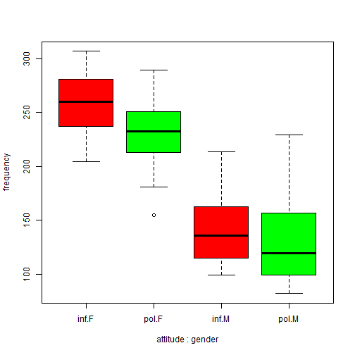
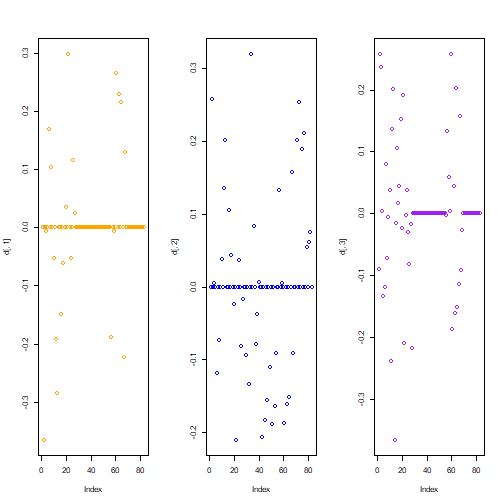

#### Lineare Regression

Politeness data (B. Winter tutorial)

Programme laden

```{r}
library(tidyverse)

```


Datei laden

```{r}
# LOAD
rm(list=ls(all=TRUE)) # clear memory
polite <- read.csv("data/politeness_data.csv", dec=".")

```

Ansicht der Datenlage

```{r}
head(polite)
```

Variablen festlegen

```{r}
polite$frequency = as.numeric(polite$frequency)
polite$scenario = as.factor(polite$scenario)
polite$subject = as.factor(polite$subject)
polite$gender = as.factor(polite$gender)
polite$attitude = as.factor(polite$attitude)

```

Kontraste für den statistischen Test setzen

```{r}
# In this session we use contr. sum contrasts
options(contrasts=c('contr.sum', 'contr.poly'))
options("contrasts")
```

Kontraste zurücksetzen

```{r}
# To reset default settings run: 
options(contrasts=c('contr.treatment', 'contr.poly')) 
# (all afex functions should be unaffected by this)

# # Setting contrasts of chosen variables only
# contrasts(polite$attitude) <- contr.treatment(2, base = 1)
 
```



```{r}
boxplot(frequency ~ attitude*gender, 
        col=c("red","green"), data = polite)
```

Bild speichern

```{r}
# 1. Open jpeg file
jpeg("pictures/politeness_boxplot.jpg", 
     width = 840, height = 535)
# 2. Create the plot
boxplot(frequency ~ attitude*gender, 
        col=c("red","green"), data = polite) 
# 3. Close the file
dev.off()
```

```{r}
# Open a pdf file
pdf("pictures/politeness_boxplot.pdf") 
# 2. Create a plot
boxplot(frequency ~ attitude*gender, 
        col=c("red","green"), data = polite) 
# Close the pdf file
dev.off() 
```


```{r}
# Inspect relationships between pairs of variables
# library(MASS)
```

Inspect relationships between pairs of variables

```{r}
library(psych)
pairs.panels(polite[c(2,4,5)])
```

Ordinary Least Squares Regression (OLS)

```{r}
# model 1
m <- lm(frequency ~ gender + attitude + subject + scenario, data = polite)
summary(m)
```


```{r}
# model 2
m <- lm(frequency ~ gender + attitude, data=polite)
summary(m)
```


```{r}
library(effects)
allEffects(m)
```


```{r}
plot(allEffects(m), multiline=TRUE, grid=TRUE, rug=FALSE, as.table=TRUE)
```


```{r}
# Save plot of the effects to disk
# 1. Open jpeg file
jpeg("pictures/politeness_lineplot.jpg", 
     width = 840, height = 535)
# 2. Create the plot
plot(allEffects(m), multiline=TRUE, grid=TRUE, rug=FALSE, as.table=TRUE)
# 3. Close the file
dev.off()
```


```{r}
# model 3 (with interaction)
m <- lm(frequency ~ gender*attitude, data=polite)
summary(m)
```


```{r}
library(effects)
allEffects(m)
```


```{r}
plot(allEffects(m), multiline=TRUE, grid=TRUE, rug=FALSE, as.table=TRUE)
```


```{r}
# Save plot of the effects to disk
# 1. Open jpeg file
jpeg("pictures/politeness_effects.jpg", 
     width = 840, height = 535)
# 2. Create the plot
plot(allEffects(m), multiline=TRUE, grid=TRUE, rug=FALSE, as.table=TRUE)
# 3. Close the file
dev.off()
```


```{r}
# Open a pdf file
pdf("pictures/politeness_effects.pdf") 
# 2. Create a plot
plot(allEffects(m), multiline=TRUE, grid=TRUE, rug=FALSE, as.table=TRUE)
# Close the pdf file
dev.off() 
```


```{r}
# plot diagnostic diagrams
par(mfrow = c(3,2))
plot(m, which = 1) # variance of residuals vs. fitted values?
plot(m, which = 2) # normal distributed residuals?
plot(m, which = 3) # variance of residuals standardized
plot(m, which = 4) # Cook's distance (outliers / influencing data points?)
plot(m, which = 5) # Leverage vs. standardized variance of residuals
plot(m, which = 6) # Cook's distance vs. Leverage
par(mfrow = c(1,1))

```


```{r}
# Change of estimates if one datapoint is removed from the model
d <- dfbetas(m)
head(d) %>% as.data.frame %>% rmarkdown::paged_table()
```


```{r}
# plot the dfbetas (are there any outliers or data points with high influence?)
par(mfrow = c(1,3))
plot(d[,1], col = "orange")
plot(d[,2], col = "blue")
plot(d[,3], col = "purple")
par(mfrow = c(1,1))
```



#### Regression mit gemischten Effekten
(Mixed effects Regression)

```{r message=FALSE, warning=FALSE}
# The variables 'subject' and 'scenario' have been chosen as random effects
library(afex)
```


```{r}
# random intercepts model
m <- lmer(frequency ~ gender + 
            (1|subject) + (1|scenario), 
          REML=F, data=polite)
m0 <- m
summary(m)
```


```{r}
m <- lmer(frequency ~ gender + attitude + 
          (1|subject) + (1|scenario), 
          REML=F, data=polite)
m1 <- m
summary(m)
```


```{r}
m <- lmer(frequency ~ gender*attitude + 
            (1|subject) + (1|scenario), 
          REML=F, data=polite)
m2 <- m
summary(m)
```

Vergleich der Modelle:

```{r}
anova(m0,m1,m2)
```


```{r}
# politeness affected pitch (χ2(1)=11.62, p=0.00065), 
# lowering it by about 19.7 Hz ± 5.6 (standard errors) 

# random slopes model
m <- lmer(frequency ~ gender + 
            (attitude + 1|subject) + (attitude + 1|scenario), 
          REML=F, data=polite)
```


```{r}
m00 <- m
summary(m)
```


```{r}
m <- lmer(frequency ~ gender + attitude + 
          (attitude + 1|subject) + (attitude + 1|scenario), 
          REML=F, data=polite)
```


```{r}
m01 <- m
summary(m)
```


```{r}
m <- lmer(frequency ~ gender + attitude + 
            (attitude + 1|subject), 
          REML=F, data=polite)
```


```{r}
library(effects)
allEffects(m)
```


```{r}
plot(allEffects(m), multiline=TRUE, grid=TRUE, rug=FALSE, as.table=TRUE)
```


```{r}
m <- lmer(frequency ~ gender + attitude + 
            (attitude + 1|scenario), 
          REML=F, data=polite)
```


```{r}
library(effects)
allEffects(m)
```


```{r}
plot(allEffects(m), multiline=TRUE, grid=TRUE, rug=FALSE, as.table=TRUE)
```


```{r}
m <- lmer(frequency ~ gender*attitude + 
            (attitude + 1|subject) + (attitude + 1|scenario), 
          REML=F, data=polite)
```


```{r}
m02 <- m
summary(m)
```

Vergleich der Modelle:

```{r}
anova(m00,m01,m02)
```


```{r message=FALSE, warning=FALSE}
library(lmerTest)
s <- step(m)
```


```{r}
s
```


```{r}
library(LMERConvenienceFunctions)

m <- lmer(frequency ~ gender + attitude + 
            (attitude + 1|subject) + (attitude + 1|scenario), 
          REML=F, data=polite)
```


```{r}
m01 <- m
summary(m)
```


```{r}
# Check model asumptions
mcp.fnc(m)
```


```{r}
fligner.test(frequency ~ attitude, polite)
```


```{r}
fligner.test(frequency ~ gender, polite)
```


```{r}
shapiro.test(polite$frequency)
```


```{r}
which(is.na(polite$frequency)) 
```


```{r}
# delete NA from data frame in row 39
polite1 <- polite[-39,]

# Remove outliers
freqout <- romr.fnc(m, polite1, trim=2.5)
```


```{r}
freqout$n.removed
```


```{r}
freqout$percent.removed
```


```{r message=FALSE, warning=FALSE}
freqout <- freqout$data
attach(freqout)
```


```{r}
# update model
m <- lmer(frequency ~ gender + attitude + 
            (attitude + 1|subject) + (attitude + 1|scenario), 
          REML=F, data=freqout)
```


```{r}
m01 <- m
summary(m)
```


```{r}
# Re-Check model asumptions
mcp.fnc(m)
```


```{r}
fligner.test(frequency ~ attitude, freqout)
```


```{r}
fligner.test(frequency ~ gender, freqout)
```


```{r}
shapiro.test(freqout$frequency)
```

