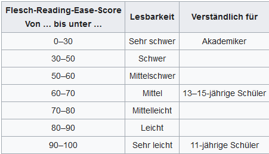

# Lesbarkeitsindices

(Reading ease indices)

## Zur theoretischen Begründung

https://de.wikipedia.org/wiki/Lesbarkeitsindex:
  
  "Lesbarkeitsformeln sind in der Forschung weitgehend etabliert. Viele, die sich mit Lesbarkeitsformeln befassen, stellen sich dennoch die Frage, wieso man bei Berücksichtigung nur sehr weniger Kriterien Aufschluss über die Lesbarkeit von Texten erhalten kann. Man hat ja doch leicht den Eindruck, dass Wort- und Satzlänge keine besonders triftigen Kriterien sein sollten. Schaut man sich aber an, mit welchen anderen Kriterien diese beiden genannten – und andere – verknüpft sind, kann man erkennen, dass zwar nur zwei Texteigenschaften direkt gemessen werden, damit aber indirekt eine ganze Reihe andere ebenfalls berücksichtigt werden."


## Programme

```{r message=FALSE, warning=FALSE}
library(tidyverse)
library(tidytext)
library(quanteda)
library(readtext)
library(nsyllable)

```

## Texte lesen

```{r}
stringsAsFactor = F
prozess = read_lines("novels/book05.txt")
enfants = read_lines("novels/book12.txt")

romane = readtext("novels/*.txt")
coronavirus2020 <- readtext("news/*.json", 
                            text_field = "text", encoding = "LATIN1")

```

## Flesch Reading Ease - deutsche Version

```{r}


```

## Romane (deutsche oder ins Deutsche übersetzte)

```{r}
lesbarkeitsindex_romane = as_tibble(romane) %>%
  mutate(sentences = nsentence(text),
         words = ntoken(text, remove_punct = TRUE),
         syllables = nsyllable(text),
         flesch_ease_de = 180 - (words/sentences) - 58.5*(syllables/words))

lesbarkeitsindex_romane %>% 
  select(doc_id, syllables, sentences, words, flesch_ease_de) %>% 
  arrange(flesch_ease_de) %>% 
  rmarkdown::paged_table()

```

```{r}
# write_excel_csv2(lesbarkeitsindex_romane, "data/lesbarkeitsindex_romane.csv")
```


```{r}
lesbarkeitsindex_romane = lesbarkeitsindex_romane %>% 
  mutate(book_name = str_sub(text, 1, 12)) # extract string in position 1-12

# reading score chart
ggplot(lesbarkeitsindex_romane, aes(x = syllables/words, y = flesch_ease_de, 
                                    color = book_name, name = book_name,
                                    size = sentences)) +
  geom_count(alpha = 0.5) +
  # scale_x_log10() +
  geom_smooth(se = FALSE, color = "red", method = "lm", size = 0.5, 
              linetype = "dashed") +
  scale_y_continuous(breaks = c(60,65,70,75,80,85)) +
  scale_x_continuous(breaks = c(1.3,1.4,1.5,1.6)) +
  scale_size_area(max_size = 12, guide = FALSE) +
  theme_minimal(base_size = 14) +
  labs(color = "Roman", x = "# Silben pro Wort", y = "Lesbarkeitsindex")

```

book <- book[str_sub(book, 1, 12) == "review/text:"] # extract string in position 1-12
book <- str_sub(book, start = 14) # extract substring starting in position 14


```{r}
library(plotly)
p <- lesbarkeitsindex_romane %>%
  ggplot(aes(syllables/words, flesch_ease_de, 
             color = book_name, name = book_name, size = sentences)) +
  geom_count() +
  geom_smooth(se = FALSE, color = "red", method = "lm", size = 0.5, 
              linetype = "dashed") +
  scale_y_continuous(breaks = c(60,65,70,75,80,85)) +
  scale_x_continuous(breaks = c(1.3,1.4,1.5,1.6)) +
  scale_size_area(max_size = 12, guide = FALSE) +
  theme_minimal(base_size = 14) +
  labs(color = "Roman", x = "# Silben pro Wort", y = "Lesbarkeitsindex")

ggplotly(p, height = 500)

```

## Zeitungen

```{r}
lesbarkeitsindex_news = as_tibble(coronavirus2020) %>%
  mutate(syllables = nsyllable(text),
         sentences = nsentence(text),
         words = ntoken(text, remove_punct = TRUE),
         flesch_ease_de = 180 - (words/sentences) - 58.5*(syllables/words))

lesbarkeitsindex_news %>% 
  select(doc_id, syllables, sentences, words, flesch_ease_de) %>%
  arrange(flesch_ease_de) %>% 
  rmarkdown::paged_table()

```

```{r}
# write_excel_csv2(lesbarkeitsindex_news,
#                  "data/lesbarkeitsindex_news_coronavirus_2020.csv")

```


```{r}
# reading score chart
ggplot(lesbarkeitsindex_news, aes(x = syllables/words, y = flesch_ease_de, 
                                  color = lubridate::month(date),
                                  size = sentences)) +
  geom_count(alpha = 0.5) +
  geom_jitter() +
  # scale_x_log10() +
  geom_smooth(se = FALSE, color = "red", method = "lm", size = 0.5, 
              linetype = "dashed") +
  scale_y_continuous(breaks = c(20,30,40,50,60,70,80,90,100)) +
  scale_x_continuous(limits = c(1,2.5), breaks = c(1.0,1.25,1.5,1.75,2.0,2.25,2.5)) +
  scale_size_area(max_size = 12, guide = "none") +
  theme_minimal(base_size = 14) +
  labs(color = "month 2020", x = "# Syllables per word", y = "Reading level")

```


```{r}
lesbarkeitsindex_news = lesbarkeitsindex_news %>% mutate(news_name = str_sub(doc_id, 1, 7))

# reading score chart
ggplot(lesbarkeitsindex_news, aes(x = syllables/words, y = flesch_ease_de, 
                                  color = news_name,
                                  name = news_name,
                                  size = sentences)) +
  geom_count(alpha = 0.5) +
  geom_jitter() +
  scale_y_continuous(breaks = c(20,30,40,50,60,70,80,90,100)) +
  scale_x_continuous(limits = c(1,2.5), breaks = c(1,1.5,2.0,2.5)) +
  facet_wrap(~ news_name) +
  geom_smooth(se = FALSE, color = 1, method = "lm", size = 0.5,
              linetype = "dashed") +
  scale_size_area(max_size = 12, guide = "none") +
  theme_light(base_size = 14) +
  labs(color = "Zeitung", x = "# Silben pro Wort", y = "Lesbarkeitsindex")

```

```{r}
library(plotly)
q = lesbarkeitsindex_news %>%
  ggplot(aes(syllables/words, flesch_ease_de, 
             color = lubridate::month(date), name = news_name, size = sentences)) +
  geom_point() +
  facet_wrap(~ news_name) +
  geom_jitter() +
  geom_smooth(se = FALSE, color = "black", method = "lm", size = 0.5, 
              linetype = "dashed") +
  scale_y_continuous(breaks = c(20,30,40,50,60,70,80,90,100)) +
  scale_x_continuous(limits = c(1,2.5), breaks = c(1,1.5,2.0,2.5)) +
  scale_size_area(max_size = 12, guide = "none") +
  theme_light(base_size = 14) +
  labs(color = "month 2020", x = "# Silben pro Wort", y = "Lesbarkeitsindex")

ggplotly(q, height = 500)

```


## Statistische Tests: News

Können wir statistisch signifikante Unterschiede zwischen den Lesbarkeitsindices nachweisen?
  
  Mit dem t-Test können wir immer nur zwei Stichproben miteinander vergleichn.

```{r}
lesbarkeitsindex_news %>% 
  filter(news_name != "welt_co" & news_name != "stern_g" & news_name != "focus_c") %>% 
  t.test(flesch_ease_de ~ news_name, data = ., paired = F, var.equal = T)

```

```{r}
lesbarkeitsindex_news %>% 
  filter(news_name != "spiegel" & news_name != "stern_g" & news_name != "focus_c") %>% 
  t.test(flesch_ease_de ~ news_name, data = ., paired = F, var.equal = T)

```

```{r}
lesbarkeitsindex_news %>% 
  filter(news_name != "faz_cor" & news_name != "stern_g" & news_name != "focus_c") %>% 
  t.test(flesch_ease_de ~ news_name, data = ., paired = F, var.equal = T)

```

Eine lineare Regression ermöglicht den Vergleich von mehreren Stichproben und mehreren Variablen (Faktoren, Prädiktoren).

```{r}
lesbarkeitsindex_news %>% 
  lm(flesch_ease_de ~ news_name, data = .) %>% 
  summary()

```

## Datensätze vereinen

```{r}
lesbarkeitsindex = lesbarkeitsindex_romane %>% 
  mutate(book_name = "romane") %>% 
  rename(news_name = book_name) %>% 
  bind_rows(lesbarkeitsindex_news[,c(1:2,7:11)])

```

```{r}
(les_mean = mean(lesbarkeitsindex$flesch_ease_de))
(les_sd = sd(lesbarkeitsindex$flesch_ease_de))
(syl_mean = mean(lesbarkeitsindex$syllables/lesbarkeitsindex$words))
```

```{r}
library(plotly)
p <- lesbarkeitsindex %>%
  ggplot(aes(syllables/words, flesch_ease_de, 
             color = news_name, name = news_name, size = sentences)) +
  geom_count() +
  geom_smooth(se = FALSE, color = "red", method = "lm", size = 0.5, 
              linetype = "dashed") +
  geom_vline(xintercept = syl_mean, lty = 2) +
  geom_hline(yintercept = les_mean, lty = 2) +
  geom_hline(yintercept = les_mean + 2*les_sd, lty = 3) +
  geom_hline(yintercept = les_mean - 2*les_sd, lty = 3) +
  scale_y_continuous(
    breaks = c(0,10,20,30,40,50,60,70,80,90,100,110)) +
  scale_x_continuous(
    breaks = c(1.0,1.2,1.4,1.6,1.8,2.0,2.2,2.4,2.6)) +
  scale_size_area(max_size = 12, guide = "none") +
  theme_minimal(base_size = 14) +
  labs(color = "Medium", x = "# Silben pro Wort", y = "Lesbarkeitsindex")

ggplotly(p, height = 400)

```


## Zeitungen im Vergleich

```{r}
# global options
# options(contrasts=c('contr.sum','contr.poly'))

lesbarkeitsindex$news_name = as.factor(lesbarkeitsindex$news_name)
# set contrast to "contr.sum"
contrasts(lesbarkeitsindex$news_name) <- "contr.sum"
contrasts(lesbarkeitsindex$news_name) # take a look

lesbarkeitsindex %>% 
  lm(flesch_ease_de ~ news_name, data = .) %>% 
  summary()

```

```{r}
lesbarkeitsindex %>% 
  lm(flesch_ease_de ~ news_name, data = .) %>% 
  tidy() %>% 
  # filter(term != "(Intercept)") %>% 
  mutate(term = str_replace(term, "news_name", "")) %>% 
  arrange(estimate)

```


```{r}
# global default option
# options(contrasts=c('contr.treatment','contr.poly'))

# set contrast back to default ("contr.treatment")
contrasts(lesbarkeitsindex$news_name) <- NULL
contrasts(lesbarkeitsindex$news_name) # take a look

lesbarkeitsindex %>% 
  lm(flesch_ease_de ~ news_name, data = .) %>% 
  summary()

```

```{r}
lesbarkeitsindex %>% 
  lm(flesch_ease_de ~ news_name, data = .) %>% 
  tidy() %>% 
  # filter(term != "(Intercept)") %>% 
  mutate(term = str_replace(term, "news_name", ""),
         term = str_replace(term, "(Intercept)", "faz_cor")) %>% 
  arrange(estimate)

```

```{r}
library(effects)
lesbarkeitsindex %>% 
  lm(flesch_ease_de ~ news_name, data = .) -> mymodel  
plot(allEffects(mymodel))

```

## Alle Texte im Vergleich

Die ausgewählten zwölf Romane haben einen deutlich höheren Lesbarkeitsindex als die Zeitungstexte. Woran liegt das: an der Wortlänge, der Silbenanzahl oder an der Satzlänge? 
  
```{r}
lesbarkeitsindex %>% 
  mutate(wordnum_utterance = (words/sentences),
         sylnum_utterance = (syllables/sentences)) %>% 
  lm(flesch_ease_de ~ news_name*wordnum_utterance + news_name*sylnum_utterance, data = .) %>% 
  tidy() %>% 
  mutate(term = str_replace(term, "news_name", "")) %>% 
  arrange(-estimate)

```

Nur statistisch signifikante Interaktionen:
  
```{r}
lesbarkeitsindex %>% 
  mutate(wordnum_utterance = (words/sentences),
         sylnum_utterance = (syllables/sentences)) %>% 
  lm(flesch_ease_de ~ news_name*wordnum_utterance + news_name*sylnum_utterance, data = .) %>% 
  tidy() %>% 
  mutate(term = str_replace(term, "news_name", "")) %>% 
  mutate(pval = case_when(
    p.value < 0.05 ~ "significant", 
    TRUE ~ "---")) %>% 
  mutate(pval = ifelse(term == "(Intercept)", "xxx", pval)) %>% 
  filter(pval == "significant" | pval == "xxx") %>% 
  filter(str_detect(term, ":")) %>% 
  arrange(-estimate)

```


In den Romanen sind die Wörter im Durchschnitt kürzer als in den Zeitungstexten (Spiegel ...).
"Tidy"-Version:
  
```{r}
lesbarkeitsindex %>% 
  group_by(news_name) %>% 
  summarise(syl_per_wrd = mean(syllables/words),
            sd_syl_per_wrd = sd(syllables/words))

```

Die Anzahl der Silben pro Äußerung in den Romanen ist vergleichbar mit der in Zeitungstexten (z.B. Spiegel).

```{r}
lesbarkeitsindex %>% 
  group_by(news_name) %>% 
  summarise(syl_per_utt = mean(syllables/sentences),
            sd_syl_per_utt = sd(syllables/sentences))

```

Die Romane haben durchschnittlich mehr Wörter pro Äußerung.

```{r}
lesbarkeitsindex %>% 
  group_by(news_name) %>% 
  summarise(wrds_per_utt = mean(words/sentences),
            sd_wrds_per_utt = sd(words/sentences))

```

```{r}
lesbarkeit = lesbarkeitsindex %>% 
  mutate(functiontype = case_when(
    news_name == "romane" ~ "literatur",
    news_name != "romane" ~ "zeitung",
    TRUE ~ "other"
  )) %>% 
  mutate(syl_per_wrd = (syllables/words),
         wordnum_utterance = (words/sentences),
         sylnum_utterance = (syllables/sentences))

lesbarkeit %>% 
  slice_sample(n = 30) %>% 
  select(-text) %>% 
  rmarkdown::paged_table()

```

Die Romane haben kürzere Wörter als die Zeitungstexte (d.h. weniger Silben).

```{r}
# set contrast back to default ("contr.treatment")
contrasts(lesbarkeitsindex$news_name) <- NULL
levels(lesbarkeitsindex$news_name)
contrasts(lesbarkeitsindex$news_name) <- contr.treatment(6, base = 3) # base = romane !
contrasts(lesbarkeitsindex$news_name) # take a look

lesbarkeit %>% 
  lm(syl_per_wrd ~ news_name, data = .) %>% 
  summary()

```

Die Romane haben durchschnittlich mehr Wörter pro Äußerung.

```{r}
contrasts(lesbarkeitsindex$news_name) <- NULL
levels(lesbarkeitsindex$news_name)
contrasts(lesbarkeitsindex$news_name) <- contr.treatment(6, base = 3) # base = romane !
contrasts(lesbarkeitsindex$news_name) # take a look

lesbarkeit %>% 
  lm(wordnum_utterance ~ news_name, data = .) %>% 
  summary()

```

Noch deutlicher sichtbar in der Gegenüberstellung (Literatur vs. Zeitung): 
  
```{r}
lesbarkeit %>% 
  lm(wordnum_utterance ~ functiontype, data = .) %>% 
  summary()

```

Längere Wörter (mehr Silben pro Wort) in Zeitungen als in Romanen.

```{r}
lesbarkeit %>% 
  lm(syl_per_wrd ~ functiontype, data = .) %>% 
  summary()

```

Aber die Anzahl der Silben pro Äußerung in den Romanen und Zeitungstexten unterscheidet sich nicht wesentlich (p = 0,979).

```{r}
lesbarkeit %>% 
  lm(sylnum_utterance ~ functiontype, data = .) %>% 
  summary()

```


## Flesch-Kincade Grade Level (USA, GB)

https://paldhous.github.io/NICAR/2019/r-text-analysis.html

The code below uses the **quanteda** functions `ntoken`, `nsentence` and `nsyllable` to count the words, sentences, and syllables in each addresss. Then it uses those values to calculate the [Flesch-Kincaid reading grade level](https://en.wikipedia.org/wiki/Flesch%E2%80%93Kincaid_readability_tests), a widely used measure of linguistic complexity.

```{r}
sou = read_csv("data/sou.csv")

```


```{r, message = FALSE}
# word, sentence, and syllable counts, plus reading scores
sou = sou %>%
  mutate(syllables = nsyllable(text),
         sentences = nsentence(text),
         words = ntoken(text, remove_punct = TRUE),
         fk_grade = 0.39*(words/sentences) + 11.8*(syllables/words) - 15.59) %>%
  arrange(date)
```

The following chart shows how the reading grade level of State of the Union addresses has declined over the years. The points on the chart are colored by party, and scaled by the length of the address in words.

```{r, message = FALSE}
# color palette for parties
party_pal <- c("#1482EE","#228B22","#E9967A","#686868","#FF3300","#EEC900")

# reading score chart
ggplot(sou, aes(x = date, y = fk_grade, color = party, size = words)) +
  geom_point(alpha = 0.5) +
  geom_smooth(se = FALSE, color = "black", method = "lm", size = 0.5, linetype = "dotted") +
  scale_size_area(max_size = 10, guide = "none") +
  scale_color_manual(values = party_pal, name = "", breaks = c("Democratic","Republican","Whig","Democratic-Republican","Federalist","None")) +
  scale_y_continuous(limits = c(4,27), breaks = c(5,10,15,20,25)) +
  theme_minimal(base_size = 18) +
  xlab("") +
  ylab("Reading level") +
  guides(col = guide_legend(ncol = 2, override.aes = list(size = 4))) +
  theme(legend.position = c(0.4,0.22),
        legend.text = element_text(color="#909090", size = 16),
        panel.grid.minor = element_blank())
```

```{r}
library(plotly)

# color palette for parties
party_pal <- c("#1482EE","#228B22","#E9967A","#686868","#FF3300","#EEC900")

# reading score chart
u <- ggplot(sou, aes(x = date, y = fk_grade, color = party, size = words)) +
  geom_point(alpha = 0.5) +
  geom_smooth(se = FALSE, color = "black", method = "lm", size = 0.5, linetype = "dotted") +
  scale_size_area(max_size = 10, guide = "none") +
  scale_color_manual(values = party_pal, name = "", breaks = c("Democratic","Republican","Whig","Democratic-Republican","Federalist","None")) +
  scale_y_continuous(limits = c(4,27), breaks = c(5,10,15,20,25)) +
  theme_minimal(base_size = 18) +
  xlab("") +
  ylab("Reading level") +
  guides(col = guide_legend(ncol = 2, override.aes = list(size = 4))) +
  theme(legend.position = c(0.4,0.22),
        legend.text = element_text(color="#909090", size = 16),
        panel.grid.minor = element_blank())

ggplotly(u, height = 500, width = 1000)

```


## Wiener Sachtextformel

https://de.wikipedia.org/wiki/Lesbarkeitsindex

Die Wiener Sachtextformel dient zur Berechnung der Lesbarkeit deutschsprachiger Texte. Sie gibt an, für welche Schulstufe ein Sachtext geeignet ist. Die Skala beginnt bei Schulstufe 4 und endet bei 15, wobei ab der Stufe 12 eher von Schwierigkeitsstufen als von Schulstufen gesprochen werden sollte. Ein Wert von 4 steht demnach für sehr leichten Text, dagegen bezeichnet 15 einen sehr schwierigen Text.

Die Formel wurde aufgestellt von Richard Bamberger und Erich Vanecek.

MS ist der Prozentanteil der Wörter mit drei oder mehr Silben,
SL ist die mittlere Satzlänge (Anzahl Wörter),
IW ist der Prozentanteil der Wörter mit mehr als sechs Buchstaben,
ES ist der Prozentanteil der einsilbigen Wörter.

**Die erste Wiener Sachtextformel**
  WSTF1 = 0.1935 * MS + 0.1672 * SL + 0.1297 * IW - 0.0327 * ES - 0.875 
**Die zweite Wiener Sachtextformel**
  WSTF2 = 0.2007 * MS + 0.1682 * SL + 0.1373 * IW - 2.7
**Die dritte Wiener Sachtextformel**
  WSTF3 = 0.2963 * MS + 0.1905 * SL - 1.114 
**Die vierte Wiener Sachtextformel („im Hinblick auf die Jahrgangsstufe“)**
  WSTF4 = 0.2744 * MS + 0.2656 * SL - 1.69

```{r}
# Das Beispiel mit den Entchen liefert mit der ersten WSTF einen Index von 3.8:
satz="Alle meine Entchen schwimmen auf dem See, Köpfchen unters Wasser, Schwänzchen in die Höh."
WSTF1 = 0.1935 * 0 + 0.1672 * 14 + 0.1297 * 29 - 0.0327 * 43 - 0.875

```

In unserem Korpus:
  
```{r}
lesbarkeitsindex %>% 
  filter(news_name == "faz_cor") %>% 
  add_count(news_name) %>% 
  unnest_tokens(word, text) %>% 
  mutate(ms = ifelse(nsyllable(word) > 2, 1, 0), # Wort mit mehr als 2 Silben
         iw = ifelse(nchar(word) > 5, 1, 0), # Wort mit mehr als 5 Buchstaben
         es = ifelse(nsyllable(word) < 2, 1, 0)) %>% # Wort mit einer Silbe
  drop_na() %>% 
  group_by(news_name) %>% 
  summarise(MS = sum(100*ms/(words*n)), # MS: Prozentanteil der Wörter mit 3 oder mehr Silben
            SL = mean(words/sentences), # SL: mittlere Satzlänge (Anzahl Wörter)
            IW = sum(100*iw/(words*n)), # IW: Prozentanteil der Wörter mit mehr als 6 Buchstaben
            ES = sum(100*es/(words*n))) %>% # ES: Prozentanteil der einsilbigen Wörter
  mutate(WSTF1 = 0.1935 * MS + 0.1672 * SL + 0.1297 * IW - 0.0327 * ES - 0.875,
         WSTF2 = 0.2007 * MS + 0.1682 * SL + 0.1373 * IW - 2.7, 
         WSTF3 = 0.2963 * MS + 0.1905 * SL - 1.114, 
         WSTF4 = 0.2744 * MS + 0.2656 * SL - 1.69)

```

```{r}
lesbarkeitsindex %>% 
  filter(news_name == "spiegel") %>% 
  add_count(news_name) %>% 
  unnest_tokens(word, text) %>% 
  mutate(ms = ifelse(nsyllable(word) > 2, 1, 0), # Wort mit mehr als 2 Silben
         iw = ifelse(nchar(word) > 5, 1, 0), # Wort mit mehr als 5 Buchstaben
         es = ifelse(nsyllable(word) < 2, 1, 0)) %>% # Wort mit einer Silbe
  drop_na() %>% 
  group_by(news_name) %>% 
  summarise(MS = sum(100*ms/(words*n)), # MS: Prozentanteil der Wörter mit 3 oder mehr Silben
            SL = mean(words/sentences), # SL: mittlere Satzlänge (Anzahl Wörter)
            IW = sum(100*iw/(words*n)), # IW: Prozentanteil der Wörter mit mehr als 6 Buchstaben
            ES = sum(100*es/(words*n))) %>% # ES: Prozentanteil der einsilbigen Wörter
  mutate(WSTF1 = 0.1935 * MS + 0.1672 * SL + 0.1297 * IW - 0.0327 * ES - 0.875,
         WSTF2 = 0.2007 * MS + 0.1682 * SL + 0.1373 * IW - 2.7, 
         WSTF3 = 0.2963 * MS + 0.1905 * SL - 1.114, 
         WSTF4 = 0.2744 * MS + 0.2656 * SL - 1.69)

```

```{r}
lesbarkeitsindex %>% 
  filter(news_name == "welt_co") %>% 
  add_count(news_name) %>% 
  unnest_tokens(word, text) %>% 
  mutate(ms = ifelse(nsyllable(word) > 2, 1, 0), # Wort mit mehr als 2 Silben
         iw = ifelse(nchar(word) > 5, 1, 0), # Wort mit mehr als 5 Buchstaben
         es = ifelse(nsyllable(word) < 2, 1, 0)) %>% # Wort mit einer Silbe
  drop_na() %>% 
  group_by(news_name) %>% 
  summarise(MS = sum(100*ms/(words*n)), # MS: Prozentanteil der Wörter mit 3 oder mehr Silben
            SL = mean(words/sentences), # SL: mittlere Satzlänge (Anzahl Wörter)
            IW = sum(100*iw/(words*n)), # IW: Prozentanteil der Wörter mit mehr als 6 Buchstaben
            ES = sum(100*es/(words*n))) %>% # ES: Prozentanteil der einsilbigen Wörter
  mutate(WSTF1 = 0.1935 * MS + 0.1672 * SL + 0.1297 * IW - 0.0327 * ES - 0.875,
         WSTF2 = 0.2007 * MS + 0.1682 * SL + 0.1373 * IW - 2.7, 
         WSTF3 = 0.2963 * MS + 0.1905 * SL - 1.114, 
         WSTF4 = 0.2744 * MS + 0.2656 * SL - 1.69)

```

```{r}
lesbarkeitsindex %>% 
  filter(news_name == "stern_g") %>% 
  add_count(news_name) %>% 
  unnest_tokens(word, text) %>% 
  mutate(ms = ifelse(nsyllable(word) > 2, 1, 0), # Wort mit mehr als 2 Silben
         iw = ifelse(nchar(word) > 5, 1, 0), # Wort mit mehr als 5 Buchstaben
         es = ifelse(nsyllable(word) < 2, 1, 0)) %>% # Wort mit einer Silbe
  drop_na() %>% 
  group_by(news_name) %>% 
  summarise(MS = sum(100*ms/(words*n)), # MS: Prozentanteil der Wörter mit 3 oder mehr Silben
            SL = mean(words/sentences), # SL: mittlere Satzlänge (Anzahl Wörter)
            IW = sum(100*iw/(words*n)), # IW: Prozentanteil der Wörter mit mehr als 6 Buchstaben
            ES = sum(100*es/(words*n))) %>% # ES: Prozentanteil der einsilbigen Wörter
  mutate(WSTF1 = 0.1935 * MS + 0.1672 * SL + 0.1297 * IW - 0.0327 * ES - 0.875,
         WSTF2 = 0.2007 * MS + 0.1682 * SL + 0.1373 * IW - 2.7, 
         WSTF3 = 0.2963 * MS + 0.1905 * SL - 1.114, 
         WSTF4 = 0.2744 * MS + 0.2656 * SL - 1.69)

```

```{r}
lesbarkeitsindex %>% 
  filter(news_name == "focus_c") %>% 
  add_count(news_name) %>% 
  unnest_tokens(word, text) %>% 
  mutate(ms = ifelse(nsyllable(word) > 2, 1, 0), # Wort mit mehr als 2 Silben
         iw = ifelse(nchar(word) > 5, 1, 0), # Wort mit mehr als 5 Buchstaben
         es = ifelse(nsyllable(word) < 2, 1, 0)) %>% # Wort mit einer Silbe
  drop_na() %>% 
  group_by(news_name) %>% 
  summarise(MS = sum(100*ms/(words*n)), # MS: Prozentanteil der Wörter mit 3 oder mehr Silben
            SL = mean(words/sentences), # SL: mittlere Satzlänge (Anzahl Wörter)
            IW = sum(100*iw/(words*n)), # IW: Prozentanteil der Wörter mit mehr als 6 Buchstaben
            ES = sum(100*es/(words*n))) %>% # ES: Prozentanteil der einsilbigen Wörter
  mutate(WSTF1 = 0.1935 * MS + 0.1672 * SL + 0.1297 * IW - 0.0327 * ES - 0.875,
         WSTF2 = 0.2007 * MS + 0.1682 * SL + 0.1373 * IW - 2.7, 
         WSTF3 = 0.2963 * MS + 0.1905 * SL - 1.114, 
         WSTF4 = 0.2744 * MS + 0.2656 * SL - 1.69)

```


```{r}
lesbarkeitsindex %>% 
  filter(news_name == "romane") %>% 
  add_count(news_name) %>% 
  unnest_tokens(word, text) %>% 
  mutate(ms = ifelse(nsyllable(word) > 2, 1, 0), # Wort mit mehr als 2 Silben
         iw = ifelse(nchar(word) > 5, 1, 0), # Wort mit mehr als 5 Buchstaben
         es = ifelse(nsyllable(word) < 2, 1, 0)) %>% # Wort mit einer Silbe
  drop_na() %>% 
  group_by(news_name) %>% 
  summarise(MS = sum(100*ms/(words*n)), # MS: Prozentanteil der Wörter mit 3 oder mehr Silben
            SL = mean(words/sentences), # SL: mittlere Satzlänge (Anzahl Wörter)
            IW = sum(100*iw/(words*n)), # IW: Prozentanteil der Wörter mit mehr als 6 Buchstaben
            ES = sum(100*es/(words*n))) %>% # ES: Prozentanteil der einsilbigen Wörter
  mutate(WSTF1 = 0.1935 * MS + 0.1672 * SL + 0.1297 * IW - 0.0327 * ES - 0.875,
         WSTF2 = 0.2007 * MS + 0.1682 * SL + 0.1373 * IW - 2.7, 
         WSTF3 = 0.2963 * MS + 0.1905 * SL - 1.114, 
         WSTF4 = 0.2744 * MS + 0.2656 * SL - 1.69)

```

```{r}
wstf1_idx = lesbarkeitsindex_romane %>% 
  unnest_tokens(word, text) %>% 
  mutate(ms = ifelse(nsyllable(word) > 2, 1, 0),
         iw = ifelse(nchar(word) > 5, 1, 0),
         es = ifelse(nsyllable(word) < 2, 1, 0)) %>% 
  drop_na() %>% 
  group_by(book_name) %>% 
  summarise(MS = sum(100*ms/words),
            SL = mean(words/sentences),
            IW = sum(100*iw/words),
            ES = sum(100*es/words))

wstf1_idx %>% rmarkdown::paged_table()

```


```{r}
lesbarkeitsindex_romane %>% 
  # filter(str_detect(book_name, "Der Prozess")) %>%
  unnest_tokens(word, text) %>% 
  mutate(ms = ifelse(nsyllable(word) > 2, 1, 0),
         iw = ifelse(nchar(word) > 5, 1, 0),
         es = ifelse(nsyllable(word) < 2, 1, 0)) %>% 
  drop_na() %>% 
  group_by(book_name) %>% 
  summarise(MS = sum(100*ms/words),
            SL = mean(words/sentences),
            IW = sum(100*iw/words),
            ES = sum(100*es/words)) %>% 
  mutate(WSTF1 = 0.1935 * MS + 0.1672 * SL + 0.1297 * IW - 0.0327 * ES - 0.875,
         WSTF2 = 0.2007 * MS + 0.1682 * SL + 0.1373 * IW - 2.7, 
         WSTF3 = 0.2963 * MS + 0.1905 * SL - 1.114, 
         WSTF4 = 0.2744 * MS + 0.2656 * SL - 1.69) %>% 
  rmarkdown::paged_table()


```

