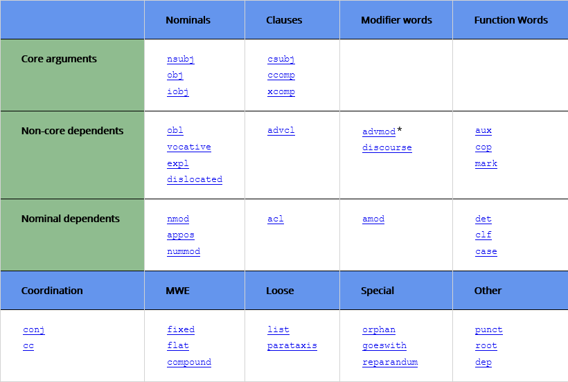

# Untertitel

## Programme starten

```{r message=FALSE, warning=FALSE}
library(tidyverse)
library(tidytext)
library(scales)
library(udpipe)
stringsAsFactors = FALSE
```

## Daten laden

Die englischen und deutschen Untertitel zum Film *Avatar* stammen aus der Datensammlung von *Natalia Levshina* [@levshina2015linguistics], die slowenischen Untertitel stammen von der Webseite [nachschauen](https://...).

Zuerst laden wir sechs Dateien mit Untertiteln zum Film *Avatar*. Hauptsächlich werden wir mit den Untertiteln in englischer, deutscher und slowenischer Sprache arbeiten.

```{r message=FALSE, warning=FALSE}
library(tidyverse)
avatar_eng = read_lines("data/sub/Avatar_eng.txt")
avatar_deu = read_lines("data/sub/Avatar_deu.txt")
avatar_slv = read_lines("data/sub/Avatar_slv.txt")

avatar_fra = read_lines("data/sub/Avatar_fra.txt")
avatar_ita = read_lines("data/sub/Avatar_ita.txt")
avatar_tur = read_lines("data/sub/Avatar_tur.txt")

```

```{r}
head(avatar_eng); head(avatar_deu); head(avatar_slv)
```

## Datensätze vorbereiten

### Textspalte vorbereiten

Untertitel haben ein besonderes Format. Recht einfach sind Datenmodifizierungen mit den tidyverse-Funktionen. Die Voraussetzung für ihre Verwendung ist die Umwandlung der Texte ins Tabellenformat. Dann können wir z.B. auch neue Tabellenspalten mit den Zeitangaben bilden.

```{r}
a1 = avatar_eng %>% 
  as_tibble() %>% 
  mutate(row_tc = row_number()) %>% 
  filter(str_detect(value, "-->")) %>% 
  rename(timecode = value)
a2 = avatar_eng %>% 
  as_tibble() %>% 
  mutate(row_id = row_number()) %>% 
  filter(str_detect(value, "[a-zA-Z]")) %>% 
  rename(text = value) %>% 
  mutate(language = "eng")

avatar_eng = bind_cols(a1,a2) %>% 
  select(timecode, text) %>% 
  separate(timecode, into = c("start", "end"), sep = "\\-\\-\\>") %>% 
  rmarkdown::paged_table()

a2a = a2 %>% 
  mutate(sentence_id = row_number())
  
```

Da die Anfangs- und Endzeit der Untertitel in den drei Sprachen nicht übereinstimmt, wollen wir lediglich die Untertiteltexte beibehalten.

```{r}
b1 = avatar_deu %>% 
  as_tibble() %>% 
  mutate(row_tc = row_number()) %>% 
  filter(str_detect(value, "-->")) %>% 
  rename(timecode = value)
b2 = avatar_deu %>% 
  as_tibble() %>% 
  mutate(row_id = row_number()) %>% 
  filter(str_detect(value, "[a-zA-Z]")) %>% 
  rename(text = value) %>% 
  mutate(language = "deu")

# avatar_deu = bind_cols(a1,a2)
#   select(timecode, text) %>% 
#   separate(timecode, into = c("start", "end"), sep = "\\-\\-\\>")
# tail(avatar_deu)

b2a = b2 %>% 
  mutate(sentence_id = row_number())

```

```{r}
c1 = avatar_slv %>% 
  as_tibble() %>% 
  mutate(row_tc = row_number()) %>% 
  filter(str_detect(value, "-->")) %>% 
  rename(timecode = value)
c2 = avatar_slv %>% 
  as_tibble() %>% 
  mutate(row_id = row_number()) %>% 
  filter(str_detect(value, "[a-zA-Z]")) %>% 
  rename(text = value) %>% 
  mutate(text = str_replace(text, "\\<i\\>", "")) %>% 
  mutate(text = str_replace(text, "\\</i\\>", "")) %>% 
  mutate(language = "slv")

# avatar_slv = bind_cols(a1,a2)
#   select(timecode, text) %>% 
#   separate(timecode, into = c("start", "end"), sep = "\\-\\-\\>")
# tail(avatar_slv)

c2a = c2 %>% 
  mutate(sentence_id = row_number())

```

```{r}
avatar_fra = avatar_fra %>% 
  as_tibble() %>% 
  mutate(row_id = row_number()) %>% 
  filter(str_detect(value, "[a-zA-Z]")) %>% 
  rename(text = value) %>% 
  mutate(text = str_replace(text, "\\<i\\>", "")) %>% 
  mutate(text = str_replace(text, "\\</i\\>", "")) %>% 
  mutate(language = "fra") %>% 
  mutate(sentence_id = row_number())


avatar_ita = avatar_ita %>% 
  as_tibble() %>% 
  mutate(row_id = row_number()) %>% 
  filter(str_detect(value, "[a-zA-Z]")) %>% 
  rename(text = value) %>% 
  mutate(text = str_replace(text, "\\<i\\>", "")) %>% 
  mutate(text = str_replace(text, "\\</i\\>", "")) %>% 
  mutate(language = "ita") %>% 
  mutate(sentence_id = row_number())

avatar_tur = avatar_tur %>% 
  as_tibble() %>% 
  mutate(row_id = row_number()) %>% 
  filter(str_detect(value, "[a-zA-Z]")) %>% 
  rename(text = value) %>% 
  mutate(text = str_replace(text, "\\<i\\>", "")) %>% 
  mutate(text = str_replace(text, "\\</i\\>", "")) %>% 
  mutate(language = "tur") %>% 
  mutate(sentence_id = row_number())

```

### Datensätze verknüpfen

Nun verknüpfen wir die drei Datensätze zu einem einzigen.

```{r}
avatar = bind_rows(a2a,b2a,c2a, avatar_fra, avatar_ita, avatar_tur)

```

### Merkmale hinzufügen

Mit Hilfe von *quanteda*-Funktionen fügen wir dem Datensatz noch weitere Kenngrößen hinzu, und zwar die Anzahl der Wortformerscheinungen oder Tokens pro Äußerung (sentlen), die Anzahl der Silben pro Äußerung (syllables), die Wortlänge (wordlen), die Anzahl der verschiedenen Wortformen (Types) und das Type-Token-Verhältnis als bekanntes Maß für lexikalische Diversität.

```{r}
avatar = avatar %>% 
  mutate(txt = str_replace_all(text, "[:punct:]", "")) %>% 
  mutate(sentlen = quanteda::ntoken(txt)) %>% 
  mutate(syllables = nsyllable::nsyllable(txt)) %>% 
  mutate(types = quanteda::ntype(txt)) %>% 
  mutate(wordlen = syllables/sentlen) %>% 
  mutate(ttr = types/sentlen) %>% 
  select(-txt)
```

Speichern für spätere Verwendung.

```{r}
write_rds(avatar, "data/avatar.rds")
write_csv(avatar, "data/avatar.csv")
```

```{r}
avatar = read_rds("data/avatar.rds")
```

### Konkordanzrecherche

Ein Beispiel einer Konkordanzrecherche mit Hilfe von *kwic* - dem Konkordanz-Tool in *quanteda*:

```{r message=FALSE, warning=FALSE}
x = quanteda::corpus(avatar, text_field = "text") %>% 
  quanteda::tokens()

quanteda::kwic(x, pattern = "planet") %>% as_tibble() %>% 
  rmarkdown::paged_table()
```

### Textzerlegung

Zerlegung der Untertitellinien in Wörter:

```{r message=FALSE, warning=FALSE}
library(tidytext)

avatar_words = avatar %>% 
  unnest_tokens(word, text, drop = FALSE) %>% 
  select(-text)

avatar_words %>% rmarkdown::paged_table()
```

### Zerlegung und Annotation

Zuerst müssen wir für jede Sprache ein **udpipe**-Sprachmodell laden, um für jede der drei Untertitelversionen eine morphosyntaktische Annotation vorzunehmen.

Englisch:

```{r message=FALSE, warning=FALSE}
library(udpipe)
destfile = "english-ewt-ud-2.5-191206.udpipe"

if(!file.exists(destfile)){
   language_model <- udpipe_download_model(language = "english")
   engmod <- udpipe_load_model(language_model$file_model)
   } else {
  file_model = destfile
  engmod <- udpipe_load_model(file_model)
}

```

```{r message=FALSE, warning=FALSE}
x = udpipe_annotate(engmod, x = avatar$text[avatar$language == "eng"], trace = FALSE)
udeng = as.data.frame(x)
```

Deutsch:

```{r message=FALSE, warning=FALSE}
library(udpipe)
destfile = "german-hdt-ud-2.5-191206.udpipe"
# destfile = "german-gsd-ud-2.5-191206.udpipe"

if(!file.exists(destfile)){
   language_model <- udpipe_download_model(language = "german")
   deumod <- udpipe_load_model(language_model$file_model)
   } else {
  file_model = destfile
  deumod <- udpipe_load_model(file_model)
}

```

```{r message=FALSE, warning=FALSE}
x = udpipe_annotate(deumod, x = avatar$text[avatar$language == "deu"], trace = F)
uddeu = as.data.frame(x)
```

Slowenisch:

```{r message=FALSE, warning=FALSE}
library(udpipe)
destfile = "slovenian-ssj-ud-2.5-191206.udpipe"
# destfile = "german-gsd-ud-2.5-191206.udpipe"

if(!file.exists(destfile)){
   language_model <- udpipe_download_model(language = "slovenian")
   slvmod <- udpipe_load_model(language_model$file_model)
   } else {
  file_model = destfile
  slvmod <- udpipe_load_model(file_model)
}

```

```{r message=FALSE, warning=FALSE}
x = udpipe_annotate(slvmod, x = avatar$text[avatar$language == "slv"], trace = F)
udslv = as.data.frame(x)
```

Französisch:

```{r}
library(udpipe)
destfile = "french-gsd-ud-2.5-191206.udpipe"

if(!file.exists(destfile)){
   language_model <- udpipe_download_model(language = "french-gsd")
   framod <- udpipe_load_model(language_model$file_model)
   } else {
  file_model = destfile
  framod <- udpipe_load_model(file_model)
}

```

```{r}
x = udpipe_annotate(framod, x = avatar$text[avatar$language == "fra"], trace = FALSE)
udfra = as.data.frame(x)
```

Italienisch:

```{r}
library(udpipe)
destfile = "italian-isdt-ud-2.5-191206.udpipe"

if(!file.exists(destfile)){
   language_model <- udpipe_download_model(language = "italian-isdt")
   itamod <- udpipe_load_model(language_model$file_model)
   } else {
  file_model = destfile
  itamod <- udpipe_load_model(file_model)
}

```

```{r}
x = udpipe_annotate(itamod, x = avatar$text[avatar$language == "ita"], trace = FALSE)
udita = as.data.frame(x)
```

Türkisch:

```{r}
library(udpipe)
destfile = "turkish-imst-ud-2.5-191206.udpipe"

if(!file.exists(destfile)){
   language_model <- udpipe_download_model(language = "turkish-imst")
   turmod <- udpipe_load_model(language_model$file_model)
   } else {
  file_model = destfile
  turmod <- udpipe_load_model(file_model)
}

```

```{r}
x = udpipe_annotate(turmod, x = avatar$text[avatar$language == "tur"], trace = FALSE)
udtur = as.data.frame(x)
```

Anpassung der Tabellenspalte "token_id" als *numeric()*.

```{r message=FALSE, warning=FALSE}
udfra = udfra %>% 
  separate(token_id, 
           into = c("token_id", "token_id2"), sep = "-") %>% 
  mutate(token_id = as.numeric(token_id)) %>% 
  select(-token_id2)

udita = udita %>% 
  separate(token_id, 
           into = c("token_id", "token_id2"), sep = "-") %>% 
  mutate(token_id = as.numeric(token_id)) %>% 
  select(-token_id2)

udtur = udtur %>% 
  separate(token_id, 
           into = c("token_id", "token_id2"), sep = "-") %>% 
  mutate(token_id = as.numeric(token_id)) %>% 
  select(-token_id2)
```


Die Datensätze wollen wir für anderweitige Verwendungen speichern, und zwar sowohl im *conllu*-Format als auch im *csv*-Format. In beiden Fällen erhalten wir Textdateien.

```{r}
write.table(as_conllu(udeng), file = "data/Avatar_ud_eng.conllu", 
            sep = "\t", quote = F, row.names = F)
write.table(as_conllu(uddeu), file = "data/Avatar_ud_deu.conllu", 
            sep = "\t", quote = F, row.names = F)
write.table(as_conllu(udslv), file = "data/Avatar_ud_slv.conllu", 
            sep = "\t", quote = F, row.names = F)

write.table(as_conllu(udfra), file = "data/Avatar_ud_fra.conllu", 
            sep = "\t", quote = F, row.names = F)
write.table(as_conllu(udita), file = "data/Avatar_ud_ita.conllu", 
            sep = "\t", quote = F, row.names = F)
write.table(as_conllu(udtur), file = "data/Avatar_ud_tur.conllu", 
            sep = "\t", quote = F, row.names = F)

```

```{r}
write_csv(udeng, "data/Avatar_ud_eng.csv")
write_csv(uddeu, "data/Avatar_ud_deu.csv")
write_csv(udslv, "data/Avatar_ud_slv.csv")

write_csv(udfra, "data/Avatar_ud_fra.csv")
write_csv(udita, "data/Avatar_ud_ita.csv")
write_csv(udtur, "data/Avatar_ud_tur.csv")

```

```{r message=FALSE, warning=FALSE}
udeng = read_csv("data/Avatar_ud_eng.csv")
uddeu = read_csv("data/Avatar_ud_deu.csv")
udslv = read_csv("data/Avatar_ud_slv.csv")

udfra = read_csv("data/Avatar_ud_fra.csv")
udita = read_csv("data/Avatar_ud_ita.csv")
udtur = read_csv("data/Avatar_ud_tur.csv")

```

Den drei annotierten Datensätzen wollen wir noch einige weitere Merkmale hinzufügen (und zwar mit den *mutate()*-Befehlen, in denen auch einfache *quanteda*-Funktionen verwendet werden). Außerdem soll die komplexe Tabellenspalte *feats* (features) in einzelne Spalten aufgeteilt werden (und zwar mit der *cbind_morphological()*-Funktion von *udpipe*).

Da wir dies mit allen drei Datensätzen anstellen wollen, bilden wir eine Funktion dazu, die als Input eine Tabelle (tbl) verlangt, in denen die Spalten "word, token, feats, sentence" zur Verfügung stehen:

```{r}
tokenize_annotate = function(tbl){
  tbl %>% 
  unnest_tokens(word, token, drop = F) %>% 
  cbind_morphological(term = "feats",  
                      which = c("PronType","NumType","Poss","Reflex",
                                "Foreign","Abbr","Typo",
                                "Gender","Animacy","NounClass",
                                "Case","Number","Definite","Degree",
                                "VerbForm","Person","Tense","Mood",
                                "Aspect","Voice","Evident",
                                "Polarity","Polite","Clusivity")) %>% 
  mutate(txt = str_replace_all(sentence, "[:punct:]", "")) %>% 
  mutate(sentlen = quanteda::ntoken(txt)) %>% 
  mutate(syllables = nsyllable::nsyllable(txt)) %>% 
  mutate(types = quanteda::ntype(txt)) %>% 
  mutate(wordlen = syllables/sentlen) %>% 
  mutate(ttr = types/sentlen) %>% 
  select(-txt, -feats)
}

```

Die für die Verwendung der Funktion entsprechenden Tabellen sind die zuvor gebildeten Tabellen "udeng", "uddeu" und "udslv". Nach der Anreicherung der Datensätze verknüpfen wir sie zu einem einzigen.

```{r}
avatar_eng_udpiped <- udeng %>% 
  tokenize_annotate() %>% mutate(language = "eng")
avatar_deu_udpiped <- uddeu %>% 
  tokenize_annotate() %>% mutate(language = "deu")
avatar_slv_udpiped <- udslv %>% 
  tokenize_annotate() %>% mutate(language = "slv")

avatar_fra_udpiped <- udfra %>% 
  tokenize_annotate() %>% mutate(language = "fra")
avatar_ita_udpiped <- udita %>% 
  tokenize_annotate() %>% mutate(language = "ita")
avatar_tur_udpiped <- udtur %>% 
  tokenize_annotate() %>% mutate(language = "tur")

avatar_words_udpiped = bind_rows(avatar_eng_udpiped,
                                 avatar_deu_udpiped,
                                 avatar_slv_udpiped,
                                 avatar_fra_udpiped,
                                 avatar_ita_udpiped,
                                 avatar_tur_udpiped)

avatar_words_udpiped %>% rmarkdown::paged_table()

```

Für spätere Verwendungen speichern wir den Datensatz in zwei verschiedenen Formaten.

```{r}
write_rds(avatar_words_udpiped, "data/avatar_words_udpiped.rds")
write_csv(avatar_words_udpiped, "data/avatar_words_udpiped.csv")
```

```{r}
avatar_words_udpiped = read_rds("data/avatar_words_udpiped.rds")

```

## Morphologie der Untertitel

Um einzelne Wörter und ihre Funktionen im Text aufzuspüren, brauchen wir nur die *filter()*- und die *select()*-Funktion einzugeben. Beispielsweise das Lemma "brother" in den englischen Untertiteln:

```{r}
avatar_words_udpiped %>% 
  filter(lemma == "brother") %>% 
  select(sentence, token, lemma, upos, dep_rel) %>% 
  rmarkdown::paged_table()

```

Dasselbe mit dem deutschen "Bruder" und dem slowenischen "brat":

```{r}
avatar_words_udpiped %>% 
  filter(lemma == "Bruder") %>% 
  select(sentence, token, lemma, upos, dep_rel) %>% 
  rmarkdown::paged_table()

```

```{r}
avatar_words_udpiped %>% 
  filter(lemma == "brat") %>% 
  select(sentence, token, lemma, upos, dep_rel) %>% 
  rmarkdown::paged_table()

```

Das Lemma "brother" bzw. scheint in den englischen Untertiteln ein wenig häufiger vorzukommen als die deutsche bzw. slowenische Entsprechung "Bruder" bzw. "brat".

### XRay Brother

An welchen Stellen kommt das Wort in den Untertiteln vor?

```{r message=FALSE, warning=FALSE}
quanteda.textplots::textplot_xray(
  quanteda::kwic(avatar %>% pull(text), 
                 pattern = c("brother","Bruder","brat")), 
  scale = "relative")

```

Um die Stellen aus drei Texten besser vergleichen zu können, müssen wir drei *xray*-Diagramme erstellen und sie mit Hilfe von *patchwork* zusammenkleben.

```{r message=FALSE, warning=FALSE}
p1 = quanteda.textplots::textplot_xray(
  quanteda::kwic(avatar %>% filter(language == "eng") %>% pull(text), 
                 pattern = "brother"), scale = "relative")

p2 = quanteda.textplots::textplot_xray(
  quanteda::kwic(avatar %>% filter(language == "deu") %>% pull(text), 
                 pattern = "Bruder"), scale = "relative")

p3 = quanteda.textplots::textplot_xray(
  quanteda::kwic(avatar %>% filter(language == "slv") %>% pull(text), 
                 pattern = "brat"), scale = "relative")

library(patchwork)
p1|p2|p3
```

### Substantive im Plural

Als nächstes wollen wir alle als Substantive (Noun) identifizierte Einheiten herausfinden, die im Plural auftreten.

```{r}
#Find all plural nouns (tokens)
avatar_words_udpiped %>% 
  filter(language == "eng" & 
           upos == "NOUN" & 
           morph_number == "Plur") %>% 
  select(sentence, token, lemma, upos, morph_number) %>% 
  rmarkdown::paged_table()
```

```{r}
avatar_words_udpiped %>% 
  filter(language == "deu" & 
           upos == "NOUN" & 
           morph_number == "Plur") %>% 
  select(sentence, token, lemma, upos, morph_number) %>% 
  rmarkdown::paged_table()
```

```{r}
avatar_words_udpiped %>% 
  filter(language == "slv" & 
           upos == "NOUN" & 
           morph_number == "Plur") %>% 
  select(sentence, token, lemma, upos, morph_number) %>% 
  rmarkdown::paged_table()
```

```{r message=FALSE, warning=FALSE}
avatar_words_udpiped %>% 
  select(language, token, lemma, upos, morph_number) %>% 
  group_by(language) %>% 
  filter(upos == "NOUN") %>% 
  count(morph_number) %>% 
  pivot_wider(names_from = language, values_from = n) %>% 
  mutate(across(everything(), ~ replace_na(.x, 0))) %>% 
  mutate(morph_number = 
           str_replace(morph_number, "0", "Unknown")) %>% 
  mutate(morph_number = 
           fct_relevel(
             morph_number, levels =
                         c("Sing","Plur","Dual","Unknown"))) %>% 
  arrange(morph_number) %>% 
  rmarkdown::paged_table()

```

### Adjektive im Komparativ

In unserer nächsten Recherche wollen wir Komparativformen von Adjektiven ausfindig machen und ihre Stelle im Untertitel.

Zuerst zählen wir die Wortarten (upos). Hier fällt auf, dass der Anteil einiger Wortarten in den slowenischen Untertiteln größer ist als in den anderen beiden Sprachen (z.B. Verben, Substantive), in anderen Fällen jedoch kleiner (z.B. Pronomen, die ja im Slowenischen nicht obligatorisch auftreten müssen).

```{r}
# Frequencies of parts of speech
avatar_words_udpiped %>% 
  group_by(language) %>% 
  count(upos, sort = TRUE) %>% 
  mutate(pct = round(100*n/sum(n),2)) %>% 
  pivot_wider(names_from = language, values_from = c(n, pct)) %>% 
  arrange(upos) %>% 
  rmarkdown::paged_table()

```

In den englischen Untertiteln wurden 17 Komparativformen identifiziert, in den deutschen 20 und in den slownischen 4. Der Anteil der Komparativformen ist also in den englischen und deutschen Untertiteln größer als in den slowenischen.

Ähnlich verhält es sich mit den Superlativformen: deutsch (35 = 6%), englisch (14 = 2,77%), slowenisch (6 = 1,65)

```{r}
avatar_words_udpiped %>% 
  group_by(language) %>% 
  filter(language == "eng" | 
           language == "deu" | language == "slv") %>% 
  filter(upos == "ADJ") %>% 
  count(morph_degree, sort = TRUE) %>% 
  mutate(pct = round(100*n/sum(n),2)) %>% 
  pivot_wider(names_from = language, values_from = c(n, pct)) %>% 
  mutate(across(everything(), ~ replace_na(.x, 0))) %>% 
  mutate(morph_degree = 
           str_replace(morph_degree, "0", "Unknown")) %>% 
  mutate(morph_degree = 
           fct_relevel(
             morph_degree, levels =
                         c("Pos","Cmp","Sup","Abs","Unkown"))) %>% 
  arrange(morph_degree) %>% 
  rmarkdown::paged_table()

```

Anmerkung: Die Klassifzierung für die deutsche Sprache (Variante: "german-gsd") enthält diese Kategorie nicht. Wir haben daher die "german-hdt"-Variante gewählt.

## Syntax: Dependenz

Programme wie *udpipe* oder *spacyr* sind auch in der Lage, syntaktische Dependenzrelationen gemäß der Stanforder sprachübergreifenden Typologie zu identifizieren und als Annotation auszugeben. Typologische Grundlage für die Annotation: [Universal Stanford Dependencies: A cross-linguistic typology (de Marneffe et al. 2014)](https://universaldependencies.org/u/dep/index.html).

```{r message=FALSE, warning=FALSE, out.width="100%"}

```

Mehr über das Datenformat: [CoNLL-U Format](https://universaldependencies.org/format.html)

Frequenzwerte der syntaktischen Abhängigkeitsrelationen in den Avatar-Untertiteln (englisch, deutsch, slowenisch):

```{r}
avatar_words_udpiped %>% 
  group_by(language) %>% 
  filter(language == "eng" | 
           language == "deu" | language == "slv") %>% 
  count(dep_rel, sort = TRUE) %>% 
  mutate(pct = round(100*n/sum(n),2)) %>% 
  pivot_wider(names_from = language, values_from = c(n, pct)) %>% 
  mutate(across(everything(), ~ replace_na(.x, 0))) %>% 
  mutate(dep_rel = 
           str_replace(dep_rel, "0", "Unknown")) %>% 
  rmarkdown::paged_table()

```

Gemäß *udpipe* erscheinen in den englischen und deutschen Untertiteln die Dependenzrelationen *root, nsubj, advmod, det, obj* am häufigsten. In den slowenischen Untertiteln haben die Relationen *root, advmod, obj, case, nsubj* die größten Frequenzwerte.

Die Dependenzrelation *root* gibt uns Auskunft darüber, ob eine Wortfolge als Satz identifiziert wurde. Sie wird gewöhnlich mit Hilfe des (finiten) Verbs im Satz bestimmt. In elliptischen Sätzen wird eine der vorkommenden Wortformen mit *root* assoziiert.

In der Tabelle ist (unter *root*) zu sehen, dass in den englischen Untertiteln 2026 satzwertige Einheiten identifiziert wurden, in den deutschen 2366 und in den slowenischen 1807.

In der Tabelle zeigen die Prozentzahlen beispielsweise einen bemerkenswerten Unterschied in der Häufigkeit der Dependenzrelation *nsubj*, d.h. die Anzahl der identifizierten Subjekte. In den slowenischen Untertiteln liegt der Anteil deutlich unter dem in den englischen und deutschen. Das hängt damit zusammen, dass Slowenisch eine Pro-drop-Sprache ist, dass also unbetonte Personalpronomen (in Subjekt-Funktion) nicht sprachlich realisiert zu sein brauchen. Besonder deutlich wird dies, wenn wir einen Beispielsatz aus allen drei Texten visualisieren.

Mit Hilfe der folgenden Funktion können wir die Dependenzrelationen im Satz visualisieren. Wir geben der Funktion den Namen *plot_annotation()*.

```{r message=FALSE, warning=FALSE}
library(igraph)
library(ggraph)
library(ggplot2)

plot_annotation <- function(x, size = 3){
  stopifnot(is.data.frame(x) & all(c("sentence_id", "token_id", "head_token_id", "dep_rel", "token_id", "token", "lemma", "upos", "xpos", "feats") %in% colnames(x)))
  x <- x[!is.na(x$head_token_id), ]
  x <- x[x$sentence_id %in% min(x$sentence_id), ]
  edges <- x[x$head_token_id != 0, c("token_id", "head_token_id", "dep_rel")]
  edges$label <- edges$dep_rel
  g <- graph_from_data_frame(edges,
                             vertices = x[, c("token_id", "token", "lemma", "upos", "xpos", "feats")],
                             directed = TRUE)
  windowsFonts("Arial Narrow" = windowsFont("Arial"))
  ggraph(g, layout = "linear") +
    geom_edge_arc(ggplot2::aes(label = dep_rel, vjust = -0.20),
                  arrow = grid::arrow(length = unit(4, 'mm'), ends = "last", type = "closed"),
                  end_cap = ggraph::label_rect("wordswordswords"),
                  label_colour = "red", check_overlap = TRUE, label_size = size) +
    geom_node_label(ggplot2::aes(label = token), col = "darkgreen", size = size, fontface = "bold") +
    geom_node_text(ggplot2::aes(label = upos), nudge_y = -0.35, size = size) +
    theme_graph(base_family = "Arial Narrow") +
    labs(title = "udpipe output", subtitle = "tokenisation, parts of speech tagging & dependency relations")
}

```

Hier ist ein Beispiel eines Avatar-Untertitels in drei Sprachen. Wegen der deutschen bzw. slowenischen Sonderzeichen wandeln wir den Text mit Hilfe der Funktion *enc2utf8()* ins erforderliche UTF8-Format um.

```{r}
# English
mytext = udpipe("I started having these dreams of flying", "english")
x1 = plot_annotation(mytext, size = 3)
# German
mytext = "Ich träumte auf einmal vom Fliegen" %>% enc2utf8()
x = udpipe(mytext, "german")
x2 = plot_annotation(x, size = 3)
# Slovenian
mytext = "Začel sem sanjati o letenju" %>% enc2utf8()
x = udpipe(mytext, "slovenian")
x3 = plot_annotation(x, size = 3)

```

Englischer Satz:

-   PRON: Personalpronomen mit Subjekt-Funktion (nsubj)

-   NOUN, VERB: Substantiv, Verb

-   AUX: das Hilfs- oder Auxiliarverb

-   xcomp: hier eine Relation zwischen zwei Verben, die gemeinsam das Prädikat des Satzes bilden

-   DET: Determiner (Determinans), Begleiter eines Substantivs (meist handelt es sich um einen Artikel)

-   obj: Objektfunktion (hier ist "these dreams" das Objekt des Verbs "have")

-   SCONJ: subordinierende Konjunktion (aber hier wäre "prep" für Präposition angebracht)

-   acl: gewöhnlich bezogen auf einen finiten oder infiniten Satz, der eine Nominalphrase modifiziert (im Kontrast zu advcl, die ein Prädikat modifizieren)

-   mark: ein Marker, der eine untergerodnete Phrase / Satz kennzeichnet.

```{r}
x1
```

Deutscher Satz:

-   PRON: Personalpronomen mit Subjekt-Funktion (nsubj)

-   NOUN, VERB, ADP, ADV: Substantiv, Verb, Adposition (hier: Präposition), Adverb

-   DET: Determiner (Determinans), Begleiter eines Substantivs (meist handelt es sich um einen Artikel)

-   obl: eine Art von Adjunkt, in der Valenzgrammatik gewöhnlich als Präpositionalobjekt klassifizert (hier ist "vom Fliegen" das Objekt des Verbs "have")

-   case: Element, das den Kasus einer Phrase regiert (z.B. "von" regiert den Dativ der Nominalphrase "dem Fliegen")

-   advmod: Element, das das Prädikat modifizert (Adverbialphrase).

```{r}
x2
```

Slowenischer Satz:

-   Das Personalpronomen mit Subjekt-Funktion fehlt, daher auch keine Subjekt-Relation (nsubj) angezeigt.

-   In slowenischen Nominalphrasen sind Begleiter (DET) nicht obligatorisch bzw. default (slow. "privzeto") wie etwa im Englischen oder Deutschen.

-   NOUN, VERB, ADP: Substantiv, Verb, Adposition (hier: Präposition)

-   AUX: das Hilfs- oder Auxiliarverb

-   DET: Determiner (Determinans), Begleiter eines Substantivs (meist handelt es sich um einen Artikel)

-   xcomp: hier eine Relation zwischen zwei Verben, die gemeinsam das Prädikat des Satzes bilden ("začel sanjati")

-   obl: eine Art von Adjunkt, in der Valenzgrammatik gewöhnlich als Präpositionalobjekt klassifizert (hier ist "o letenju" das Objekt des Verbs "sanjati")

-   case: Element, das den Kasus einer Phrase regiert (z.B. die Präposition "o" regiert den Dativ der Nominalphrase "letenju").

```{r}
x3
```

Aus den drei Diagrammen ist ersichtlich, dass die Subjekt-Relation (nsubj) im englischen und deutschen Satz mittels eines Personalpronomens (PRON) realisiert wird, während das Subjekt im slowenischen Satz mittels der finiten Verbform, einem Hilfs- oder Auxiliarverbs (AUX), (mit)ausgedrückt wird, also im Hilfsverb "versteckt" auftritt. Im slowenischen Satz ist PRON syntaktisch nicht notwendig, im englischen und deutschen schon. Das wirkt sich natürlich auf die Frequenzwerte bzw. den Pronzenanteil aus (s. Tabelle).

Die Diagramme zeigen strukturelle Ähnlichkeiten und Unterschiede zwischen den Sprachversionen:

-   sowohl im englischen Untertitel als auch in der slowenischen Version wird eine xcomp-Relation angegeben, d.h. dass das Satzprädikat mit Hilfe von zwei Verben konstituiert wird ("started having" vs. "začel sanjati"). Die Verben "started" bzw. "začeti" modifizeren das Hauptverb "have" bzw. "sanjati" temporal. Im deutschen Untertitel wird stattdessen ein einfaches Prädikat ("träumte") verwendet, dass durch eine Adverbialphrase ("auf einmal") temporal modifiziert wird.

-   das englische Substantiv "dream" wird im deutschen und slowenischen Untertitel im Satzprädikat ausgedrückt ("träumte", "sanjati")

-   der englische Subordinationsmarker "of", der sich sowohl auf Nominalphrasen als auch auf Sätze beziehen kann, wird im deutschen und slowenischen Untertitel mit einer spezifischeren Wortklasse ausgedrückt, nämlich mit einer Präposition (ADP, Adposition).

-   [Universal POS tags](https://universaldependencies.org/u/pos/index.html)

-   [Universal features](https://universaldependencies.org/u/feat/index.html)

-   [UDPipe](http://lindat.mff.cuni.cz/services/udpipe/)

### Aktiv und Passiv

Wie groß ist der Anteil aktivischer und passivischer Sätze in den drei Sprachversionen? Dies können wir mit Hilfe der nsubj-Relation erfahren. In den englischen und deutschen Untertiteln wurden je 34 passivische Subjekte identifizert, in den slowenischen keiner.

```{r}
avatar_words_udpiped %>% 
  group_by(language) %>% 
  filter(language == "eng" | 
           language == "deu" | language == "slv") %>% 
  filter(str_detect(dep_rel, "nsubj")) %>% 
  count(dep_rel, sort = TRUE) %>% 
  mutate(pct = round(100*n/sum(n),2)) %>% 
  pivot_wider(names_from = language, values_from = c(n, pct)) %>% 
  mutate(across(everything(), ~ replace_na(.x, 0))) %>% 
  mutate(dep_rel = 
           str_replace(dep_rel, "0", "Unknown")) %>% 
  rmarkdown::paged_table()

```

Schauen wir uns ein paar dieser Untertitel in allen drei Sprachen an:

```{r}
avatar_words_udpiped %>% 
  group_by(language) %>% 
  filter(language == "eng") %>% 
  filter(str_detect(dep_rel, "nsubj:pass")) %>% 
  ungroup() %>% 
  select(sentence, sentence_id) %>% 
  distinct() %>% 
  head(5) %>% rmarkdown::paged_table()
  
```

-   Wir wählen einen englischen Untertitel als Beispiel, und zwar: "And the concept is that ervery driver is matched to his own avatar\*".
-   Deutsche Version: "*Die Idee ist, dass jeder Operator auf seinen eigenen Avatar abgestimmt wird*".
-   Slowenische Version: "*Vsak upravljavec dobi svojega avatarja*".

```{r}
avatar %>% 
  filter(language == "deu") %>% 
  filter(str_detect(text, "jeder Operator auf") | str_detect(text, "Avatar abgestimmt")) %>% 
  select(text) %>% rmarkdown::paged_table()
```

```{r}
avatar %>% 
  filter(language == "slv") %>% 
  filter(str_detect(text, "dobi svojega avatarja")) %>% 
  select(text) %>% rmarkdown::paged_table()
```

Wiederum visualisieren wir die drei Sprachversionen.

```{r}
# English
mytext = udpipe("And the concept is that ervery driver is matched to his own avatar", "english")
x1 = plot_annotation(mytext, size = 3)
# German
mytext = "Die Idee ist, dass jeder Operator auf seinen eigenen Avatar abgestimmt wird" %>% enc2utf8()
x = udpipe(mytext, "german")
x2 = plot_annotation(x, size = 3)
# Slovenian
mytext = "Vsak upravljavec dobi svojega avatarja" %>% enc2utf8()
x = udpipe(mytext, "slovenian")
x3 = plot_annotation(x, size = 3)

```

```{r}
x1
```

```{r}
x2
```

```{r}
x3
```

-   Die slowenische Version ist syntaktisch am einfachsten, denn sie besteht lediglich aus einem Hauptsatz, im englischen und deutschen Untertitel dagegen aus Haupt- und Nebensatz, wobei letztere die hauptsächliche Information trägt (die auch im slowenischen Hauptsatz zu Tage tritt). Der Hauptsatz im englischen und deutschen Untertitel kann kommunikativ betrachtet als Vorreiter oder Vorschaltung eingeordnet werden, also als Ausdruck, der vor allem zur Orientierung oder Einordnung eines Gedankens (der im Nebensatz ausgedrückt wird) in ein Gedankenschema oder Frame dient.

-   Die passivische Relation, die im englischen und deutschen Untertitel mittels passivischer Verbformen realisiert wird, wird im slowenischen Untertitel mit dem Verb "dobiti" zum Ausdruck gebracht (deutsch: "bekommen", englisch: "get"). Das Subjekt des slowenischen Verb "dobiti" (hier: "vsak upravljalec") ist semantisch gesehen ein Benefaktiv oder Nutznießer (benefaktive Relation), also ein Rezipient, für den eine Handlung vorteilhaft oder nutzbringend ist. Entsprechendes gilt auch für das deutsche bekommen-Passiv (z.B. "jeder Operator bekommt einen Avatar".

-   Die Ausdrucksweise im slowenischen Untertitel ist im Vergleich zu den anderen Sprachversionen semantisch ungenau, denn es bleibt dem Leser überlassen, ob er die im Film realisierte symbiotische Verbindung zwischen Reiter und Tier nachvollziehen kann. Die Ausdrucksweise im englischen und deutschen Untertitel ist dagegen spezifischer, d.h. es handelt sich um eher eine technische (fachbezogene) Ausdrucksweise (engl. "matching", deutsch "Abstimmung").

-   Da es sich in diesem Fall um einen Vorgang oder Prozess handelt, gibt es keinen menschlichen Verursacher der Abstimmung, denn sowohl der Operator (driver, upravljalec) sind so wie das gerittene Tier lediglich Reagentien im Prozess. Das ist in allen drei Sprachversionen deckungsgleich.

-   In allen drei Sprachversionen wird wird der (menschliche) Benefaktiv (d.h. das syntaktische Subjekt) als Ausgangspunkt einer neuen oder wichtigen Information verwendet. Die neue Information "seinen eigenen Avatar" wird ins Rampenlicht gerückt, also zum Rhema des Satzes gemacht. Die typische Verteilung Thema vor Rhema wird hiermit in allen drei Sprachversionen gewahrt. Außerdem wird damit auch die häufigere Reihenfolge Subjekt vor Objekt eingehalten. Im slowenischen Satz handelt es sich um ein direktes Objekt (Akkusativobjekt), im englischen und deutschen dagegen um ein Präpositionalobjekt ("match to ...", "abstimmen auf ...").


### Substantive und Pronomen als Satzglieder

Nun lenken wir unsere Sichtweise auf die Wortklassen Substantiv (NOUN) und Pronomen (PRON) in Subjekt- oder Objekt-Funktion. 

```{r}
avatar_words_udpiped %>% 
  group_by(language) %>% 
  filter(upos == "NOUN" | upos == "PRON") %>% 
  filter(str_detect(dep_rel, "nsubj|obj|obl")) %>% 
  count(upos, dep_rel) %>% 
  mutate(pct = round(100*n/sum(n),2)) %>% 
  pivot_wider(names_from = language, values_from = c(n, pct)) %>% 
  mutate(across(everything(), ~ replace_na(.x, 0))) %>% 
  arrange(upos) %>% 
  rmarkdown::paged_table()

```

Ein erster Blick auf die Tabelle zeigt uns mehrere Unterschiede:
-   Pronomen erscheinen in den englischen und deutschen Untertiteln häufiger in Subjekt-Funktion als Substantive. In den slowenischen Untertiteln ist es umgekehrt, was wahrscheinlich damit zusammenhängt, dass Slowenisch eine Pro-Drop-Sprache ist (s.o.).
-   In Objekt-Funktion scheint das Verhältnis zwischen den beiden Wortklassen (NOUN, PRON) ausgewogener zu sein.
-   Das indirekte Objekt (iobj), dass sich, semantisch betrachtet, oft auf einen Adressaten oder Rezipienten bezieht, wird vorzugsweise mit einem Pronomen ausgedrückt, selten oder gar nicht mit einem Substantiv.
-   Für einige Satzglied-Funktionen liegen keine Zahlen vor. Das kann daran liegen, dass diese Funktionen in der verwendeten Grammatik einer der ausgewählten Sprachen nicht unterschieden wird.

Für genauere Feststellungen empfiehlt es sich, nur jeweils zwei Satzgliedfunktionen miteinander zu vergleichen.


### Subjekt nominal / pronominal

Wie viele Subjekte im Aktiv oder Passiv werden mit Hilfe von Substantiven oder Personalpronomen ausgedrückt?

```{r}
avatar_words_udpiped %>% 
  group_by(language) %>% 
  filter(language == "eng" | 
           language == "deu" | language == "slv") %>% 
  filter(upos == "NOUN" | upos == "PRON") %>% 
  filter(str_detect(dep_rel, "nsubj")) %>% 
  count(upos, dep_rel) %>% 
  mutate(pct = round(100*n/sum(n),2)) %>% 
  pivot_wider(names_from = language, values_from = c(n, pct)) %>% 
  mutate(across(everything(), ~ replace_na(.x, 0))) %>% 
  arrange(upos) %>% 
  rmarkdown::paged_table()

```

Treten Pronomen genau so häufig als Passiv-Subjekte auf wie Substantive? Die obige Tabelle scheint für die englischen und deutschen Untertitel das Gegenteil zu zeigen. Machen für doch für diese beiden Sprachversionen je einen Chi-Quadrat-Test!

```{r}
pivot_by_nsubj <- function(tbl) {
  tbl %>% 
  filter(upos == "NOUN" | upos == "PRON") %>% 
  filter(str_detect(dep_rel, "nsubj")) %>% 
  count(upos, dep_rel) %>% 
  group_by(upos) %>% 
  mutate(pct = round(100*n/sum(n),2)) %>% 
  pivot_wider(names_from = upos, values_from = c(n, pct)) %>% 
  mutate(across(everything(), ~ replace_na(.x, 0)))
}


x = avatar_words_udpiped %>% 
  filter(language == "eng") %>% 
  pivot_by_nsubj()

x %>% rmarkdown::paged_table()

```

In der letzten Tabelle fällt auf, dass der Anteil der Pronomen (pct_PRON) in der nsubj:pass-Funktion größer ist als der der Substantive (pct_NOUN). Ist dieser Unterschied zufällig (aufgrund der Stichprobenauswahl entstanden) oder können wir ihn auf die Grundgesamtheit (auf umgangssprachliche Dialoge in der englischen Sprache) verallgemeinern? Eine Antwort darauf soll uns der Chi-Quadrat-Test geben.

Für den Chi-Quadrat-Test benötigen wir lediglich die beiden Spalten mit den absoluten Zahlenwerten (also die zweite und dritte). In *Base-R* kann man dies sehr ökonomisch mit einer Bedingung in eckigen Klammern *[]* erreichen, mit der tidyverse-Funktion *select()* zwar transparenter und in Tabellenform, dafür muss man jedoch etwas mehr schreiben.

```{r}
# Base-R
chisq.test(x[,c(2:3)])

# tidyverse
x %>% select(n_NOUN, n_PRON) %>% chisq.test() %>% tidy()

```

Der Chi-Quadrat-Test bestätigt mit dem p-Wert (0,1339) die Null-Hypothese, d.h. das es zwischen Pronomen und Substantiven als Subjekte in den englischen Untertiteln keinen statistisch signifikanten Unterschied gibt und dass der prozentuelle Unterschied aufgrund unserer Stichprobenauswahl entstanden ist (also zufällig).

Dasselbe können wir mit den deutschen Pronomen und Substantiven in Subjekt-Funktion machen. In diesem Fall ist der prozentuelle Unterschied zwischen Substantiven und Pronomen als aktivische oder passivische Subjekte größer zu sein als in der englischen Stichprobe.

```{r}
x = avatar_words_udpiped %>% 
  filter(language == "deu") %>% 
  pivot_by_nsubj()

x %>% rmarkdown::paged_table()

```

In den deutschen Untertiteln können wir mit dem Chi-Quadrat-Test einen statistisch signifikanten Unterschied zwischen Pronomen und Substantiven nachweisen (p < 0,05): Pronomen scheinen in Subjekt-Funktion seltener in Passivsätzen verwendet worden zu sein als Substantive. Möglicherweise gilt dies auch für die Grundgesamtheit in deutsche Sprache (hier vor allem für umgangssprachliche Dialoge). Anders ausgedrückt: wir haben eine (nicht zufällige) Tendenz nachgewiesen, dass das Subjekt in den deutschen Passivsätzen häufiger mit Substantiven, also autosemantischen Ausdrücken realisiert wurde.

```{r message=FALSE, warning=FALSE}
# Base-R
chisq.test(x[,c(2:3)]) %>% tidy()

```

Wir können uns die entsprechenden Belege mit Passivsubjekten auch anschauen. Aus der Tabelle ist auch ersichtlich, dass die grammatische Analyse des Programms auch einige Fehler enthält (z.B. "Avatar" in "(auf) seinen eigenen Avatar abgestimmt wird" ist Bestandteil eines Präpositionalobjekts und kein Passivsubjekt) oder eine andere Klassifizierung sinnvoller wäre (z.B. "Was ist hier passiert?" - "was" wurde als Passivsubjekt des Verbs "passieren" eingeordnet). Im Untertitel "wenn du nicht gekommen wärst" scheint das Programm den sein-Passiv übergeneralisierend auf Sätze mit einem Verb im Perfekt anzuwenden. Einige Fehler kommen aufgrund unvollständiger Sätze als Input vor, andere wiederum aufgrund der Tatsache, dass bestimmte sprachliche Formen mehrere Funktionen in der Sprache erfüllen können.

```{r}
avatar_words_udpiped %>% 
  select(sentence, upos, dep_rel, language) %>% 
  filter(language == "deu") %>% 
  filter(upos == "NOUN" | upos == "PRON") %>% 
  filter(str_detect(dep_rel, "nsubj:pass")) %>% 
  rmarkdown::paged_table()

```


### Objekt nominal / pronominal

Wird das *direkte Objekt* (obj), im Deutschen und Slowenischen auch *Akkusativojekt* genannt, in den Untertiteln häufiger nominal oder pronominal ausgedrückt?

```{r}
x = avatar_words_udpiped %>% 
  group_by(language) %>% 
  filter(upos == "NOUN" | upos == "PRON") %>% 
  filter(dep_rel == "obj") %>% 
  count(upos, dep_rel) %>% 
  mutate(pct = round(100*n/sum(n),2)) %>% 
  pivot_wider(names_from = language, values_from = c(n, pct)) %>% 
  mutate(across(everything(), ~ replace_na(.x, 0))) %>% 
  arrange(upos)

x %>% rmarkdown::paged_table()

```

Die Tabelle deutet daraufhin, dass in den englischen Untertiteln kein wesentlicher Unterschied auftritt, in den deutschen und slowenischen Untertiteln dagegen schon. Das können wir wiederum testen. Der erste Chi-Quadrat-Test bestätigt für die englischen Untertitel die Null-Hypothese (bei p > 0,05 also keinen Unterschied), für die deutschen und slowenischen Untertitel dagegen die alternative Hypothese (d.h. dass es bei p < 0,05 einen Wahrscheinlichkeitsunterschied gibt, ob das Objekt nominal oder pronominal ausgedrückt ist). 

```{r}
englisch = chisq.test(x[,4]) %>% tidy() %>% mutate(language = "eng")
deutsch = chisq.test(x[,3]) %>% tidy() %>% mutate(language = "deu")
slowenisch = chisq.test(x[,5]) %>% tidy() %>% mutate(language = "slv")
chisqtabelle = bind_rows(englisch, deutsch, slowenisch) %>% 
  select(language, statistic, p.value)
chisqtabelle %>% rmarkdown::paged_table()
```

### Wortklasse von Subjekt / Objekt

Welche sprachübergreifende (cross-linguistic) Tendenz werden mit den englisch- und deutschsprachigen Daten bestätigt?

```{r}
avatar_words_udpiped %>% 
  group_by(language) %>% 
  filter(upos == "NOUN" | upos == "PRON") %>% 
  filter(dep_rel == "nsubj" | dep_rel == "obj") %>% 
  count(upos, dep_rel) %>% 
  # group_by(upos) %>% 
  mutate(pct = round(100*n/sum(n),2)) %>% 
  pivot_wider(names_from = language, values_from = c(n, pct)) %>% 
  mutate(across(everything(), ~ replace_na(.x, 0))) %>% 
  arrange(upos) %>% 
  rmarkdown::paged_table()

```

Englisch:

```{r}
pivot_by_obj <- function(tbl) {
  tbl %>% 
    filter(upos == "NOUN" | upos == "PRON") %>% 
    filter(dep_rel == "nsubj" | dep_rel == "obj") %>% 
    count(upos, dep_rel) %>% 
    group_by(upos) %>%
    mutate(pct = round(100*n/sum(n),2)) %>% 
    pivot_wider(names_from = upos, values_from = c(n, pct)) %>% 
    mutate(across(everything(), ~ replace_na(.x, 0)))
}

x = avatar_words_udpiped %>% 
  filter(language == "eng") %>% 
  pivot_by_obj()
  
x %>% rmarkdown::paged_table()

```

Deutsch:

```{r}
x = avatar_words_udpiped %>% 
  filter(language == "deu") %>% 
  pivot_by_obj()
  
x %>% rmarkdown::paged_table()

```

Sowohl in den englischen als auch deutschen Untertiteln wird das Subjekt häufiger pronominal und seltener nominal ausgedrückt. Beim direkten Objekt ist es umgekehrt, denn dieses wird häufiger nominal ausgedrückt. Das man darauf zurückgeführen, dass das Subjekt häufig definit ist (etwas vom Hörer / Leser Identifizierbares ausdrückt), das Objekt dagegen etwas (noch) nicht Identifziertes.

Dieses Verhältnis können wir in den slowenischen Untertiteln nicht nachweisen, was wir wiederum auf die Tatsache zurückführen können, dass Slowenisch eine Pro-Drop-Sprachen ist und daher die Anzahl pronominalisierter Subjekte wesentlich geringer sein muss, da ein pronominalisiertes Subjekt nur bei Hervorhebung obligatorisch im Satz vorkommt.

```{r}
x = avatar_words_udpiped %>% 
  filter(language == "slv") %>% 
  pivot_by_obj()
  
x %>% rmarkdown::paged_table()

```

### Gattungs- und Eigennamen

Treten Gattungsnamen (Appelativa) und Eigennamen häufiger in Subjekt- oder in Objekt-Funktion auf?

Englisch:

```{r}
pivot_by_propn <- function(tbl) {
  tbl %>% 
    filter(upos %in% c("NOUN", "PROPN")) %>% 
    filter(dep_rel == "nsubj" | dep_rel == "obj") %>% 
    count(upos, dep_rel) %>% 
    group_by(upos) %>%
    mutate(pct = round(100*n/sum(n),2)) %>% 
    pivot_wider(names_from = upos, values_from = c(n, pct)) %>% 
    mutate(across(everything(), ~ replace_na(.x, 0)))
}

x = avatar_words_udpiped %>% 
  filter(language == "eng") %>% 
  pivot_by_propn()
  
x %>% rmarkdown::paged_table()

```

Deutsch:

```{r}
x = avatar_words_udpiped %>% 
  filter(language == "deu") %>% 
  pivot_by_propn()
  
x %>% rmarkdown::paged_table()

```

Slowenisch:

```{r}
x = avatar_words_udpiped %>% 
  filter(language == "slv") %>% 
  pivot_by_propn()
  
x %>% rmarkdown::paged_table()

```

In allen drei Sprachversionen treten die Eigennamen (PROPN) häufiger in Subjekt-Funktion als in Objekt-Funktion auf, was man wieder darauf zurückführen kann, dass Eigennamen eine definite (d.h. identifizierbare) Einheit bezeichnen.

### Konstituentenfolge

In *SOV-Sprachen* ist die Reihenfolge *Modifizierer vor Kopf* häufiger zu beobachten, in *SVO-Sprachen* dagegen *Modifizierer nach Kopf*. Das prüfen wir in unserem bisherigen Sprachmaterial. Als Modifizierer wählen wird attributive Adjektive, als Kopf von Nominalphrasen die davor oder dahinter stehenden Substantive oder andere Wortklassen (z.B. Pronomen). 

Englisch und Slowenisch werden gewöhnlich als SVO-Sprachen eingeordnet, Deutsch mit der Konstituentenfolge SVO in Hauptsätzen und SOV in Nebensätzen wird im Atlas *Wals* (https://wals.info) dagegen als Sprache ohne dominante Konstituentenfolge bezeichnet. 

Was zeigt nun unser Sprachmaterial?

```{r}
avatar_words_udpiped %>% 
  group_by(language) %>% 
  filter(dep_rel == "amod" & 
           upos == "ADJ") %>% 
  mutate(word_order = ifelse(token_id < head_token_id, 
                             "adj before head", 
                             "adj after head")) %>% 
  count(dep_rel, word_order) %>% 
  mutate(pct = round(100*n/sum(n),2)) %>% 
  pivot_wider(names_from = language, values_from = c(n, pct)) %>% 
  mutate(across(everything(), ~ replace_na(.x, 0))) %>% 
  mutate(dep_rel = 
           str_replace(dep_rel, "0", "Unknown")) %>% 
  select(-dep_rel) %>% 
  rmarkdown::paged_table()

```

Im Englischen, Deutschen und Slowenischen und Türkischen dominiert die Reihenfolge Adjektiv vor Substantiv, also Modifizierer vor Kopf. Im Französischen und Italienischen dagegen ist die umgekehrte Reihenfolge dominant bzw. sind sowohl vor- als auch nachgestellte adjektivische Attribute fast gleich gut vertreten. 

Schauen wir uns noch an, in welchen Untertiteln unser Programm nachgestellte Adjektive identifiziert hat!

```{r}
avatar_words_udpiped %>% 
  group_by(language) %>% 
  filter(dep_rel == "amod" & 
           upos == "ADJ") %>% 
  mutate(word_order = ifelse(token_id < head_token_id, 
                             "adj before head", 
                             "adj after head")) %>% 
  filter(word_order == "adj after head") %>% 
  ungroup() %>% 
    select(sentence, token, word_order, -language)

```

Im slowenischen Untertitel "Gre za nekaj resničnega" wird das Adjektiv "resničnega" als nachgestelltes Attribut zum Kopf "nekaj", einem Pronomen, eingeordnet. Entsprechend im englischen Untertitel: "Something measurable". Aber einige der Belege entpuppen sich als Fehlmeldung. 


### Kontexte von Modifizierern

```{r}
avatar_words_udpiped %>% 
  group_by(language) %>% 
  filter(dep_rel == "amod" & 
           upos == "ADJ") %>% 
  mutate(word_order = ifelse(token_id < head_token_id, 
                             "adj before head", 
                             "adj after head")) %>% 
  filter(lemma == "big" | lemma == "groß" | lemma == "velik") %>% 
  ungroup() %>% 
  select(word_order, lemma, sentence)

```

```{r}
avatar_words_udpiped %>% 
  group_by(language) %>% 
  filter(dep_rel == "amod" & 
           upos == "ADJ") %>% 
  mutate(word_order = ifelse(token_id < head_token_id, 
                             "adj before head", 
                             "adj after head")) %>% 
  filter(lemma == "big" | lemma == "groß" | lemma == "velik") %>% 
  count(lemma)

```


### Greenbergs Universalie 25

"If the pronominal object follows the verb, so does the nominal object."

Zuerst wollen wir direkte Objekte (im Deutschen und Slowenischen auch als Akkusativobjekte bezeichnet) ausfinding machen, die sowohl Gattungsnamen als auch Eigennamen enthalten und die dem Kopf der Verbalphrase vorangehen (OV) oder folgen (VO). 

```{r}
pivot_by_verb_obj = function(tbl){
  tbl %>% 
      mutate(word_order = ifelse(token_id > head_token_id, 
                             "VO", 
                             "OV")) %>% 
  count(dep_rel, word_order) %>% 
  mutate(pct = round(100*n/sum(n),2)) %>% 
  pivot_wider(names_from = language, values_from = c(n, pct)) %>% 
  mutate(across(everything(), ~ replace_na(.x, 0))) %>% 
  mutate(dep_rel = 
           str_replace(dep_rel, "0", "Unknown")) %>% 
  select(-dep_rel)
}

vo_nominal = avatar_words_udpiped %>% 
  group_by(language) %>% 
  filter(dep_rel == "obj" & 
           upos %in% c("NOUN", "PROPN")) %>% 
  pivot_by_verb_obj() %>% 
  mutate(word_class = "NOUN")

```

Nun machen wir dasselbe mit den pronominalen Objekten.

```{r}
vo_pronominal = avatar_words_udpiped %>% 
  group_by(language) %>% 
  filter(dep_rel == "obj" & 
           upos %in% c("PRON")) %>% 
  pivot_by_verb_obj() %>% 
  mutate(word_class = "PRON")
```

Dann fügen wir beide Tabellen zusammen.

```{r}
verb_object = bind_rows(vo_nominal, vo_pronominal) %>% 
  select(word_class, word_order:pct_tur)
verb_object %>% rmarkdown::paged_table()
```

```{r}
verb_object %>% 
  select(word_class, word_order, pct_deu:pct_tur) %>% 
  pivot_longer(pct_deu:pct_tur, 
               names_to = "language", values_to = "pct") %>% 
  mutate(language = str_replace(language, "pct_", "")) %>% 
  ggplot(aes(pct, word_class, fill = word_order)) +
  geom_col() +
  facet_wrap(~ language) +
  theme(legend.position = "top")

```

```{r}
verb_object %>% 
  select(word_class, word_order, n_deu:n_tur) %>% 
  pivot_longer(n_deu:n_tur, 
               names_to = "language", values_to = "n") %>% 
  mutate(language = str_replace(language, "n_", "")) %>% 
  pivot_wider(names_from = c(word_order, word_class), 
              values_from = n) %>% 
  group_by(language) %>% 
  summarise(ov_nouns_prop = OV_NOUN/(VO_NOUN + OV_NOUN),
            ov_prons_prop = OV_PRON/(VO_PRON + OV_PRON)) %>% 
  ggplot(aes(ov_nouns_prop, ov_prons_prop, 
             fill = language, group = language)) +
  # geom_text(aes(label = language, check.overlap = TRUE)) +
  geom_label(aes(label = language, check.overlap = TRUE)) +
  theme(legend.position = "none") +
  labs(x = "OV-Anteil bei Substantiven", 
       y = "OV-Anteil bei Pronomen")
  
```

