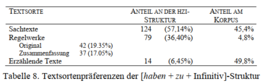
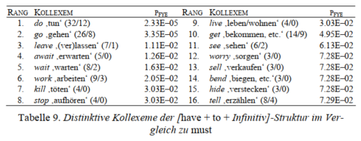

# Modals in Slovene Texts

## Programi

```{r message=FALSE, warning=FALSE}
library(tidyverse)
library(scales)
library(janitor)
library(readtext)
library(quanteda)
library(quanteda.textmodels)
library(quanteda.textstats)
library(quanteda.textplots)
library(tidytext)
library(readxl)
library(writexl)

```

## Branje besedil

Čivki slovenskih politikov.

```{r message=FALSE, warning=FALSE}
slovtwit1 <- read_rds("data/tmls_all_slo_politicians_2021-03-21.rds")
head(slovtwit1)

slovtwit <- read_rds("data/tmls_all_slo_politicians_2021-09-18.rds")
head(slovtwit)

```

Izbor časopisnih člankov, pretežno v rubriki zdravje oz. koronavirus.

```{r message=FALSE, warning=FALSE}
parent_folder<-"data/"
filenames <- list.files(parent_folder, recursive=TRUE, full.names = T, pattern = "\\.json$")
head(filenames, 3)

```

```{r message=FALSE, warning=FALSE}
# slovbes <- lapply(filenames,load,.GlobalEnv)
slovcas <- readtext(filenames, text_field = "text", encoding = "latin1", verbosity = 0,
                    ignore_missing_files = T)
slovcas


```

## Korpus

```{r message=FALSE, warning=FALSE}
sltwit_corp <- corpus(slovtwit, text_field = "text")

```

```{r message=FALSE, warning=FALSE}
slcas_corp <- corpus(slovcas)

```

```{r eval=requireNamespace("DT", quietly=TRUE)}
library(DT)
slcas_stat <- summary(slcas_corp, n = 2674)
# DT::datatable(slcas_stat, fillContainer = TRUE, filter = "top",
#               options = list(pageLength = 4))

DT::datatable(head(slcas_stat, 30), 
              filter = "top", fillContainer = TRUE, 
              extensions = 'Buttons', "ColReorder", 
              options = list(pageLength = 10, 
                             colReorder = TRUE,
                             dom = 'Bfrtip',
    buttons = c('colvis','copy', 'csv', 'excel', 'pdf', 'print')
  )) %>% 
  formatStyle("Text",
  target = 'row',
  backgroundColor = styleEqual(c(0, 1), c('gray30', 'lightblue')))

```

Ponovno združi statistiko in text v eno podatkovno zbirko.

```{r message=FALSE, warning=FALSE}
slcas <- slcas_stat %>% 
  rename(doc_id = Text) %>% 
  left_join(slovcas)

```

```{r message=FALSE, warning=FALSE}
slcas_summary <- textstat_summary(slcas_corp) %>% 
   rename(doc_id = document)
```

```{r message=FALSE, warning=FALSE}
slcas1 <- as_tibble(slcas) %>% 
  left_join(slcas_summary, by = "doc_id")

DT::datatable(head(slcas1, 30), 
              filter = "top", fillContainer = TRUE, 
              extensions = 'Buttons', "ColReorder", 
              options = list(pageLength = 10, 
                             colReorder = TRUE,
                             dom = 'Bfrtip',
    buttons = c('colvis','copy', 'csv', 'excel', 'pdf', 'print')
  )) %>% 
  formatStyle("doc_id",
  target = 'row',
  backgroundColor = styleEqual(c(0, 1), c('gray30', 'lightblue')))

```

#### Zapiši na disk.

```{r message=FALSE, warning=FALSE}
# write_csv2(slcas1, "data/slovenski_casniki.csv")

```

## Besedne oblike in matrika

```{r message=FALSE, warning=FALSE}
slcas_toks <- tokens(slcas_corp, remove_numbers = T, remove_punct = T, 
                     remove_symbols = T, remove_url = T)
slcas_dfm <- dfm(slcas_toks)

```

## Pogostnost oblik

```{r message=FALSE, warning=FALSE}
freqs <- textstat_frequency(slcas_dfm) 

DT::datatable(head(freqs, 30), 
              filter = "top", fillContainer = TRUE, 
              extensions = 'Buttons', "ColReorder", 
              options = list(pageLength = 10, 
                             colReorder = TRUE,
                             dom = 'Bfrtip',
    buttons = c('colvis','copy', 'csv', 'excel', 'pdf', 'print')
  )) %>% 
  formatStyle("feature",
  target = 'row',
  backgroundColor = styleEqual(c(0, 1), c('gray30', 'lightblue')))

```

## Konkordance

Za sestavo konkordanc, ki vsebujejo zaželene naklonske zgradbe,
uporabljamo funkcijo `kwic()` programa `quanteda`. Konkordanco lahko
ustvarimo iz jezikovnega gradiva (`corpus`) ali besednega seznama
(`tokens`). Prednostni način je slednji, saj nam omogoča tudi izločanje
nezaželenih izrazov (npr. url, številk idr.).

```{r message=FALSE, warning=FALSE}
slcas_toks2 <- tokens(slcas_corp, remove_numbers = T, 
                      remove_punct = FALSE, 
                     remove_symbols = T, remove_url = T)

```

```{r message=FALSE, warning=FALSE}
treba <- kwic(slcas_toks2, pattern = "treba")

```

S funkcijo `as_tibble()` pretvorimo konkordanćni seznam v podatkovni niz
ali tabelo (prim. `Excel`). To nam omogoča lepši in preglednejši izpis
preglednice in računanje deležev in drugih količin s funkcijami
programskega svežnja `tidyverse`.

```{r message=FALSE, warning=FALSE}
treba_kwic <- as_tibble(treba)

DT::datatable(treba_kwic, 
              filter = "top", fillContainer = TRUE, 
              extensions = 'Buttons', "ColReorder", 
              options = list(pageLength = 10, 
                             colReorder = TRUE,
                             dom = 'Bfrtip',
    buttons = c('colvis','copy', 'csv', 'excel', 'pdf', 'print')
  )) %>% 
  formatStyle("keyword",
  target = 'row',
  backgroundColor = styleEqual(c(0, 1), c('gray30', 'lightblue')))

```

```{r message=FALSE, warning=FALSE}
morati <- kwic(slcas_toks2, 
               pattern = c("morati", "mora", "moram", "moraš",
                           "morava", "morata", "morajo", "moramo",
                           "moral", "morala", "morali", "morale",
                           "moralo"))

```

```{r message=FALSE, warning=FALSE}
morati_kwic <- as_tibble(morati)

DT::datatable(morati_kwic, 
              filter = "top", fillContainer = TRUE, 
              extensions = 'Buttons', "ColReorder", 
              options = list(pageLength = 10, 
                             colReorder = TRUE,
                             dom = 'Bfrtip',
    buttons = c('colvis','copy', 'csv', 'excel', 'pdf', 'print')
  )) %>% 
  formatStyle("keyword",
  target = 'row',
  backgroundColor = styleEqual(c(0, 1), c('gray30', 'lightblue')))

```

```{r message=FALSE, warning=FALSE}
morati_kwic %>% 
  count(pattern, sort = T) %>% 
  mutate(pattern = fct_reorder(pattern, n)) %>% 
  ggplot(aes(n, pattern, fill = rainbow(12))) +
  geom_col() +
  theme(legend.position = "none")

```

Next, we calculate the frequency and dispersion of tokens per narrative,
which contain the terms 'dark' and 'light'.

```{r message=FALSE, warning=FALSE}
term1 <- kwic(slcas_toks2, "treba", valuetype = "regex", case_insensitive = T) %>% 
  group_by(docname) %>% 
  summarise(hits = n()) %>% 
  mutate(percentage = hits/(slcas_stat$Tokens[1:length(hits)]/100), searchterm = "treba") %>%
  arrange(desc(percentage))

term2 <- kwic(slcas_toks2, "mora*", valuetype = "regex", case_insensitive = T) %>%
  group_by(docname) %>% 
  summarise(hits = n()) %>% 
  mutate(percentage = hits/(slcas_stat$Tokens[1:length(hits)]/100), searchterm = "mora*") %>% arrange(desc(percentage))

```

```{r message=FALSE, warning=FALSE}
term1 %>% 
  arrange(-percentage) %>% 
  DT::datatable(fillContainer = TRUE, filter = "top",
                options = list(pageLength = 4))
```

```{r message=FALSE, warning=FALSE}
term2 %>% 
  arrange(-percentage) %>% 
  DT::datatable(fillContainer = TRUE, filter = "top",
                options = list(pageLength = 4))
```

## Kolokacije

```{r message=FALSE, warning=FALSE}
collo2 <- textstat_collocations(slcas_corp)
write_rds(collo2, "data/slcas_corp_collocations2.rds")
write_csv(collo2, "data/slcas_corp_collocations2.csv")
```

```{r message=FALSE, warning=FALSE}
collo2 %>% 
  filter(str_detect(collocation, "\\btreba\\b")) %>% 
DT::datatable(filter = "top", fillContainer = TRUE, 
              extensions = 'Buttons', "ColReorder", 
              options = list(pageLength = 10, 
                             colReorder = TRUE,
                             dom = 'Bfrtip',
    buttons = c('colvis','copy', 'csv', 'excel', 'pdf', 'print')
  )) %>% 
  formatStyle("collocation",
  target = 'row',
  backgroundColor = styleEqual(c(0, 1), c('gray30', 'lightblue')))

```

```{r message=FALSE, warning=FALSE}
collo2 %>% 
  filter(str_detect(collocation, "\\bmora")) %>% 
DT::datatable(filter = "top", fillContainer = TRUE, 
              extensions = 'Buttons', "ColReorder", 
              options = list(pageLength = 10, 
                             colReorder = TRUE,
                             dom = 'Bfrtip',
    buttons = c('colvis','copy', 'csv', 'excel', 'pdf', 'print')
  )) %>% 
  formatStyle("collocation",
  target = 'row',
  backgroundColor = styleEqual(c(0, 1), c('gray30', 'lightblue')))

```

```{r message=FALSE, warning=FALSE}
collo3 <- textstat_collocations(slcas_corp, size = 3, tolower = T)

```

```{r message=FALSE, warning=FALSE}
collo3 %>% 
  filter(str_detect(collocation, "\\btreba\\b")) %>% 
  arrange(-count) %>% 
  DT::datatable(filter = "top", fillContainer = TRUE, 
              extensions = 'Buttons', "ColReorder", 
              options = list(pageLength = 10, 
                             colReorder = TRUE,
                             dom = 'Bfrtip',
    buttons = c('colvis','copy', 'csv', 'excel', 'pdf', 'print')
  )) %>% 
  formatStyle("collocation",
  target = 'row',
  backgroundColor = styleEqual(c(0, 1), c('gray30', 'lightblue')))

```

```{r message=FALSE, warning=FALSE}
collo3 %>% 
  filter(str_detect(collocation, "\\bmora")) %>% 
  arrange(-count) %>% 
  DT::datatable(filter = "top", fillContainer = TRUE, 
              extensions = 'Buttons', "ColReorder", 
              options = list(pageLength = 10, 
                             colReorder = TRUE,
                             dom = 'Bfrtip',
    buttons = c('colvis','copy', 'csv', 'excel', 'pdf', 'print')
  )) %>% 
  formatStyle("collocation",
  target = 'row',
  backgroundColor = styleEqual(c(0, 1), c('gray30', 'lightblue')))

```

## Konkordance (po povedih)

Ena možnost je tokenizacija po povedih, tako da lahko izvlečemo zgradbo
iz posameznih povedi. To ima prednost, da lahko določim dolžino in
morebitne druge lastnosti povedi, ki vsebuje naklonsko zgradbo, v
primerjavi s povedmi brez naklonske zgradbe.

Nastavitev `window = 1` določa, da želimo zajeti eno poved pred iskano
zgradbo in eno po iskani zgradbi.

```{r message=FALSE, warning=FALSE}
text <- slovcas$text
toks <- tokens(text, what = 'sentence')

```

"Keyword" je v tem primeru poved z iskano naklonsko zgradbo, "pre" je
poved pred njo, "post" pa poved, ki ji sledi.

```{r message=FALSE, warning=FALSE}
kwic_mora_poved <- as_tibble(kwic(
  # toks, phrase('\\bmora*\\b\\s\\b[a-z]*ti\\b'), # follow each other
  toks, phrase('\\bmora*\\b'), # there may be other words in between
  valuetype = 'regex', window = 1))

DT::datatable(kwic_mora_poved, 
              filter = "top", fillContainer = TRUE, 
              extensions = 'Buttons', "ColReorder", 
              options = list(pageLength = 10, 
                             colReorder = TRUE,
                             dom = 'Bfrtip',
    buttons = c('colvis','copy', 'csv', 'excel', 'pdf', 'print')
  )) %>% 
  formatStyle("keyword",
  target = 'row',
  backgroundColor = styleEqual(c(0, 1), c('gray30', 'lightblue')))
```

To bi naredili še za druge naklonske zgradbe.

## Konkordance (fraze)

Druga možnost izvleče besedne zveze iz jezikovnega gradiva (`corpus`). V
tem primeru uporabljamo `kwic()` in kot vzorec (`pattern`) izberemo
`phrase()`.

```{r message=FALSE, warning=FALSE}
morati2 <- kwic(slcas_corp, valuetype = "glob",
               pattern = phrase(c("mora* *ti", "mora* *či")), case_insensitive = T)

morati2_kwic <- as_tibble(morati2)

morati2_kwic %>% 
DT::datatable(filter = "top", fillContainer = TRUE, 
              extensions = 'Buttons', "ColReorder", 
              options = list(pageLength = 10, 
                             colReorder = TRUE,
                             dom = 'Bfrtip',
    buttons = c('colvis','copy', 'csv', 'excel', 'pdf', 'print')
  )) %>% 
  formatStyle("keyword",
  target = 'row',
  backgroundColor = styleEqual(c(0, 1), c('gray30', 'lightblue')))

```

```{r message=FALSE, warning=FALSE}
treba2 <- kwic(slcas_corp, valuetype = "glob",
               pattern = phrase(c("treba *ti", "treba *či")), case_insensitive = T)

treba2_kwic <- as_tibble(treba2)

treba2_kwic %>% 
DT::datatable(filter = "top", fillContainer = TRUE, 
              extensions = 'Buttons', "ColReorder", 
              options = list(pageLength = 10, 
                             colReorder = TRUE,
                             dom = 'Bfrtip',
    buttons = c('colvis','copy', 'csv', 'excel', 'pdf', 'print')
  )) %>% 
  formatStyle("keyword",
  target = 'row',
  backgroundColor = styleEqual(c(0, 1), c('gray30', 'lightblue')))

```

```{r message=FALSE, warning=FALSE}
potrebno2 <- kwic(slcas_corp, valuetype = "glob",
               pattern = phrase(c("potrebno *ti", "potrebno *či")), case_insensitive = T)

potrebno2_kwic <- as_tibble(potrebno2)

potrebno2_kwic %>% 
DT::datatable(filter = "top", fillContainer = TRUE, 
              extensions = 'Buttons', "ColReorder", 
              options = list(pageLength = 10, 
                             colReorder = TRUE,
                             dom = 'Bfrtip',
    buttons = c('colvis','copy', 'csv', 'excel', 'pdf', 'print')
  )) %>% 
  formatStyle("keyword",
  target = 'row',
  backgroundColor = styleEqual(c(0, 1), c('gray30', 'lightblue')))

```

### časniki

Zgoraj smo že pridobili konkordance iz besednega seznama (`tokens`), ki
smo organizirali po povedih (`sentences`) namesto po besedilih
(`doc_id`). Konkordance so prikazovale tri povedi (`keyword`, `pre-` in
`post-`).

Spodnji način najprej predvideva pretvorbo jezikovnega gradiva
(`corpus`) v povedi (`sentences`), in sicer s funkcijo
`corpus_reshape()`, ki je sestavni del programa `quanteda`. Na tak način
prikazujemo naklonsko zgradbo kot `keyword`, funkcija `kwic()` pa ima
nastavljeno široko okno, tj. `window = 50`.

```{r message=FALSE, warning=FALSE}
slcas_corp_sent <- corpus_reshape(slcas_corp, to = "sentences", use_docvars = T)

```

Poizvedba: med naklonskim izrazom *morati* oz. *treba* in nedoločnikom
so lahko tudi druge besede. Vsi izrazi so znotraj določene povedi.

```{r message=FALSE, warning=FALSE}
morati3 <- kwic(slcas_corp_sent, valuetype = "glob", window = 50,
               pattern = phrase(c("mora* *ti", "mora* *či")), case_insensitive = T)

treba3 <- kwic(slcas_corp_sent, valuetype = "glob", window = 50, 
               pattern = phrase(c("treba *ti", "treba *či")), case_insensitive = T)
```

Prikaz konkordančne preglednice.

```{r message=FALSE, warning=FALSE}
morati3_kwic <- as_tibble(morati3)

morati3_kwic %>% 
  DT::datatable(filter = "top", fillContainer = TRUE, 
              extensions = 'Buttons', "ColReorder", 
              options = list(pageLength = 10, 
                             colReorder = TRUE,
                             dom = 'Bfrtip',
    buttons = c('colvis','copy', 'csv', 'excel', 'pdf', 'print')
  )) %>% 
  formatStyle("keyword",
  target = 'row',
  backgroundColor = styleEqual(c(0, 1), c('gray30', 'lightblue')))
```

```{r message=FALSE, warning=FALSE}
treba3_kwic <- as_tibble(treba3)

treba3_kwic %>% 
DT::datatable(filter = "top", fillContainer = TRUE, 
              extensions = 'Buttons', "ColReorder", 
              options = list(pageLength = 10, 
                             colReorder = TRUE,
                             dom = 'Bfrtip',
    buttons = c('colvis','copy', 'csv', 'excel', 'pdf', 'print')
  )) %>% 
  formatStyle("keyword",
  target = 'row',
  backgroundColor = styleEqual(c(0, 1), c('gray30', 'lightblue')))
```

```{r message=FALSE, warning=FALSE}
potrebno3 <- kwic(slcas_corp_sent, valuetype = "glob", window = 50,
               pattern = phrase(c("potrebno *ti", "potrebno *či")), case_insensitive = T)

potrebno3_kwic <- as_tibble(potrebno3)

potrebno3_kwic %>% 
  DT::datatable(filter = "top", fillContainer = TRUE, 
              extensions = 'Buttons', "ColReorder", 
              options = list(pageLength = 10, 
                             colReorder = TRUE,
                             dom = 'Bfrtip',
    buttons = c('colvis','copy', 'csv', 'excel', 'pdf', 'print')
  )) %>% 
  formatStyle("keyword",
  target = 'row',
  backgroundColor = styleEqual(c(0, 1), c('gray30', 'lightblue')))

```

### twitter

Pretvorba jezikovnega gradiva, tako da bo osnovna enota poved
(`sentences`).

```{r message=FALSE, warning=FALSE}
sltwit_corp_sent <- corpus_reshape(sltwit_corp, to = "sentences", use_docvars = T)

```

Poizvedba in prikaz konkordančne preglednice.

```{r message=FALSE, warning=FALSE}
morati3tw <- kwic(sltwit_corp_sent, valuetype = "glob", window = 50,
               pattern = phrase(c("mora* *ti", "mora* *či")), case_insensitive = T)

morati3tw_kwic <- as_tibble(morati3tw)

morati3tw_kwic %>% 
DT::datatable(filter = "top", fillContainer = TRUE, 
              extensions = 'Buttons', "ColReorder", 
              options = list(pageLength = 10, 
                             colReorder = TRUE,
                             dom = 'Bfrtip',
    buttons = c('colvis','copy', 'csv', 'excel', 'pdf', 'print')
  )) %>% 
  formatStyle("keyword",
  target = 'row',
  backgroundColor = styleEqual(c(0, 1), c('gray30', 'lightblue')))
```

```{r message=FALSE, warning=FALSE}
treba3tw <- kwic(sltwit_corp_sent, valuetype = "glob", window = 50,
               pattern = phrase(c("treba *ti", "treba *či")), case_insensitive = T)

treba3tw_kwic <- as_tibble(treba3tw)

treba3tw_kwic %>% 
DT::datatable(filter = "top", fillContainer = TRUE, 
              extensions = 'Buttons', "ColReorder", 
              options = list(pageLength = 10, 
                             colReorder = TRUE,
                             dom = 'Bfrtip',
    buttons = c('colvis','copy', 'csv', 'excel', 'pdf', 'print')
  )) %>% 
  formatStyle("keyword",
  target = 'row',
  backgroundColor = styleEqual(c(0, 1), c('gray30', 'lightblue')))
```

```{r message=FALSE, warning=FALSE}
potrebno3tw <- kwic(sltwit_corp_sent, valuetype = "glob", window = 50,
               pattern = phrase(c("potrebno *ti", "potrebno *či")), case_insensitive = T)

potrebno3tw_kwic <- as_tibble(potrebno3tw)

potrebno3tw_kwic %>% 
DT::datatable(filter = "top", fillContainer = TRUE, 
              extensions = 'Buttons', "ColReorder", 
              options = list(pageLength = 10, 
                             colReorder = TRUE,
                             dom = 'Bfrtip',
    buttons = c('colvis','copy', 'csv', 'excel', 'pdf', 'print')
  )) %>% 
  formatStyle("keyword",
  target = 'row',
  backgroundColor = styleEqual(c(0, 1), c('gray30', 'lightblue')))
```

```{r message=FALSE, warning=FALSE}
imeti3tw <- kwic(sltwit_corp_sent, valuetype = "glob", window = 50,
               pattern = phrase(c("ima* za *ti", "ima* za *či", 
                                  "imel* za *ti", "imel* za *či")), case_insensitive = T)

imeti3tw_kwic <- as_tibble(imeti3tw)

imeti3tw_kwic %>% 
  DT::datatable(filter = "top", fillContainer = TRUE, 
              extensions = 'Buttons', "ColReorder", 
              options = list(pageLength = 10, 
                             colReorder = TRUE,
                             dom = 'Bfrtip',
    buttons = c('colvis','copy', 'csv', 'excel', 'pdf', 'print')
  )) %>% 
  formatStyle("keyword",
  target = 'row',
  backgroundColor = styleEqual(c(0, 1), c('gray30', 'lightblue')))
```

```{r message=FALSE, warning=FALSE}
imeti3twr <- kwic(sltwit_corp_sent, valuetype = "regex", window = 50,
               pattern = phrase(c("\\bima*\\b \\bza\\b t$", 
                                  "\\bima*\\b \\bza\\b ti$")), case_insensitive = T)

imeti3twr_kwic <- as_tibble(imeti3twr)

imeti3twr_kwic %>% 
  DT::datatable(filter = "top", fillContainer = TRUE, 
              extensions = 'Buttons', "ColReorder", 
              options = list(pageLength = 10, 
                             colReorder = TRUE,
                             dom = 'Bfrtip',
    buttons = c('colvis','copy', 'csv', 'excel', 'pdf', 'print')
  )) %>% 
  formatStyle("keyword",
  target = 'row',
  backgroundColor = styleEqual(c(0, 1), c('gray30', 'lightblue')))
```

```{r message=FALSE, warning=FALSE}
rabiti3tw <- kwic(sltwit_corp_sent, valuetype = "glob", window = 50,
               pattern = phrase(c("rabi* za *ti", "rabi* za *či")), case_insensitive = T)

rabiti3tw_kwic <- as_tibble(rabiti3tw)

rabiti3tw_kwic %>% 
  DT::datatable(filter = "top", fillContainer = TRUE, 
              extensions = 'Buttons', "ColReorder", 
              options = list(pageLength = 3, 
                             colReorder = TRUE,
                             dom = 'Bfrtip',
    buttons = c('colvis','copy', 'csv', 'excel', 'pdf', 'print')
  )) %>% 
  formatStyle("keyword",
  target = 'row',
  backgroundColor = styleEqual(c(0, 1), c('gray30', 'lightblue')))
```

```{r message=FALSE, warning=FALSE}
rabiti3twr <- kwic(sltwit_corp_sent, valuetype = "regex", window = 50,
               pattern = phrase(c("\\brab*\\b \\bza\\b t$", 
                                  "\\brab*\\b \\bza\\b ti$")), case_insensitive = T)

rabiti3twr_kwic <- as_tibble(rabiti3twr)

rabiti3twr_kwic %>% 
  DT::datatable(filter = "top", fillContainer = TRUE, 
              extensions = 'Buttons', "ColReorder", 
              options = list(pageLength = 3, 
                             colReorder = TRUE,
                             dom = 'Bfrtip',
    buttons = c('colvis','copy', 'csv', 'excel', 'pdf', 'print')
  )) %>% 
  formatStyle("keyword",
  target = 'row',
  backgroundColor = styleEqual(c(0, 1), c('gray30', 'lightblue')))

```

## Deleži glagolov

V nadaljevanju uporabljajo konkordance iz prejšnjega odseka, ki
vsebujejo zveze naklonskega glagola in nedoločnika kot, tj. `phrase()`.
Izračunali bomo deleže nedoločnikov, ki spremljajo naklonski glagol
*morati* in *treba* (in nekatere druge).

### twitter

```{r message=FALSE, warning=FALSE}
m1tw <- morati3tw_kwic %>% 
  separate(keyword, into = c("modal", "inf"), sep = " ") %>% 
  count(inf, sort = T) %>% 
  mutate(procent = round(100*n / sum(n), 2)) %>% 
  mutate(syl_inf = nsyllable::nsyllable(inf)) %>% 
  mutate(modal = "morati", sample = "twitter")

m1tw %>% 
  DT::datatable(fillContainer = TRUE, filter = "top",
                options = list(pageLength = 4))

```

```{r message=FALSE, warning=FALSE}
morati3tw_kwic %>% 
  separate(keyword, into = c("modal", "inf"), sep = " ") %>% 
  count(inf, sort = T) %>% 
  mutate(procent = round(100*n / sum(n), 2)) %>% 
  filter(n >5) %>% 
  mutate(inf = fct_reorder(inf, n)) %>% 
  ggplot(aes(procent, inf, fill = inf)) +
  geom_col() +
  theme(legend.position = "none")

```

```{r message=FALSE, warning=FALSE}
t1tw <- treba3tw_kwic %>% 
  separate(keyword, into = c("modal", "inf"), sep = " ") %>% 
  count(inf, sort = T) %>% 
  mutate(procent = round(100*n / sum(n), 2)) %>% 
  mutate(syl_inf = nsyllable::nsyllable(inf)) %>% 
  mutate(modal = "treba", sample = "twitter")

t1tw %>% 
  DT::datatable(fillContainer = TRUE, filter = "top",
                options = list(pageLength = 4))

```

```{r message=FALSE, warning=FALSE}
treba3tw_kwic %>% 
  separate(keyword, into = c("modal", "inf"), sep = " ") %>% 
  count(inf, sort = T) %>% 
  mutate(procent = round(100*n / sum(n), 2)) %>% 
  filter(n > 2) %>% 
  mutate(inf = fct_reorder(inf, n)) %>% 
  ggplot(aes(procent, inf, fill = inf)) +
  geom_col() +
  theme(legend.position = "none")

```

```{r message=FALSE, warning=FALSE}
p1tw <- potrebno3tw_kwic %>% 
  separate(keyword, into = c("modal", "inf"), sep = " ") %>% 
  count(inf, sort = T) %>% 
  mutate(procent = round(100*n / sum(n), 2)) %>% 
  mutate(syl_inf = nsyllable::nsyllable(inf)) %>% 
  mutate(modal = "potrebno", sample = "twitter")

p1tw %>% 
  DT::datatable(fillContainer = TRUE, filter = "top",
                options = list(pageLength = 4))

```

```{r message=FALSE, warning=FALSE}
potrebno3tw_kwic %>% 
  separate(keyword, into = c("modal", "inf"), sep = " ") %>% 
  count(inf, sort = T) %>% 
  mutate(procent = round(100*n / sum(n), 2)) %>% 
  filter(n > 2) %>% 
  mutate(inf = fct_reorder(inf, n)) %>% 
  ggplot(aes(procent, inf, fill = inf)) +
  geom_col() +
  theme(legend.position = "none")

```

### časniki

```{r message=FALSE, warning=FALSE}
m1 <- morati3_kwic %>% 
  separate(keyword, into = c("modal", "inf"), sep = " ") %>% 
  count(inf, sort = T) %>% 
  mutate(procent = round(100*n / sum(n), 2)) %>% 
  mutate(syl_inf = nsyllable::nsyllable(inf)) %>% 
  mutate(modal = "morati", sample = "casniki")

m1 %>% 
  DT::datatable(fillContainer = TRUE, filter = "top",
                options = list(pageLength = 4))

```

```{r message=FALSE, warning=FALSE}
morati3_kwic %>% 
  separate(keyword, into = c("modal", "inf"), sep = " ") %>% 
  count(inf, sort = T) %>% 
  mutate(procent = round(100*n / sum(n), 2)) %>% 
  filter(n >15) %>% 
  mutate(inf = fct_reorder(inf, n)) %>% 
  ggplot(aes(procent, inf, fill = inf)) +
  geom_col() +
  theme(legend.position = "none")

```

```{r message=FALSE, warning=FALSE}
t1 <- treba3_kwic %>% 
  separate(keyword, into = c("modal", "inf"), sep = " ") %>% 
  count(inf, sort = T) %>% 
  mutate(procent = round(100*n / sum(n), 2)) %>% 
  mutate(syl_inf = nsyllable::nsyllable(inf)) %>% 
  mutate(modal = "treba", sample = "casniki")

t1 %>% 
  DT::datatable(fillContainer = TRUE, filter = "top",
                options = list(pageLength = 4))
```

```{r message=FALSE, warning=FALSE}
treba3_kwic %>% 
  separate(keyword, into = c("modal", "inf"), sep = " ") %>% 
  count(inf, sort = T) %>% 
  mutate(procent = round(100*n / sum(n), 2)) %>% 
  filter(n >5) %>% 
  mutate(inf = fct_reorder(inf, n)) %>% 
  ggplot(aes(procent, inf, fill = inf)) +
  geom_col() +
  theme(legend.position = "none")

```

```{r message=FALSE, warning=FALSE}
p1 <- potrebno3_kwic %>% 
  separate(keyword, into = c("modal", "inf"), sep = " ") %>% 
  count(inf, sort = T) %>% 
  mutate(procent = round(100*n / sum(n), 2)) %>% 
  mutate(syl_inf = nsyllable::nsyllable(inf)) %>% 
  mutate(modal = "potrebno", sample = "časniki")

p1 %>% 
  DT::datatable(fillContainer = TRUE, filter = "top",
                options = list(pageLength = 4))
```

```{r message=FALSE, warning=FALSE}
potrebno3_kwic %>% 
  separate(keyword, into = c("modal", "inf"), sep = " ") %>% 
  count(inf, sort = T) %>% 
  mutate(procent = round(100*n / sum(n), 2)) %>% 
  filter(n >5) %>% 
  mutate(inf = fct_reorder(inf, n)) %>% 
  ggplot(aes(procent, inf, fill = inf)) +
  geom_col() +
  theme(legend.position = "none")

```

### vsa besedila

```{r message=FALSE, warning=FALSE}
modalinf0 <- bind_rows(m1,t1,m1tw,t1tw) %>% 
  select(sample, modal, inf, n, procent, syl_inf) %>% 
  mutate(modal = tolower(modal), inf = tolower(inf))

modalinf0 %>% 
  DT::datatable(slcas_stat, fillContainer = TRUE, filter = "top",
                options = list(pageLength = 4))

modalinf0_all <- modalinf0 %>% 
  group_by(modal, inf) %>%
  arrange(inf) %>% 
  summarise(freq = sum(n)) %>% 
  mutate(pct = round(100*freq / sum(freq), 2)) %>% 
  mutate(syl_inf = nsyllable::nsyllable(inf)) %>% 
  arrange(-pct)

modalinf0_all %>% 
  DT::datatable(fillContainer = TRUE, filter = "top",
                options = list(pageLength = 4))

# write_rds(modalinf0, "data/modalinf0.rds")
# write_csv(modalinf0, "data/modalinf0.csv")
# write_rds(modalinf0_all, "data/modalinf0_all.rds")
# write_csv(modalinf0_all, "data/modalinf0_all.csv")
```

```{r message=FALSE, warning=FALSE}
modalinf <- rbind(m1,t1,p1,m1tw,t1tw,p1tw) %>% 
  select(sample, modal, inf, n, procent, syl_inf) %>% 
  mutate(modal = tolower(modal), inf = tolower(inf))

modalinf %>% 
  DT::datatable(fillContainer = TRUE, filter = "top",
                options = list(pageLength = 4))


modalinf_all <- modalinf %>% 
  group_by(modal, inf) %>%
  arrange(inf) %>% 
  summarise(freq = sum(n)) %>% 
  mutate(pct = round(100*freq / sum(freq), 2)) %>% 
  mutate(syl_inf = nsyllable::nsyllable(inf)) %>% 
  arrange(-pct)

modalinf_all %>% 
  DT::datatable(fillContainer = TRUE, filter = "top",
                options = list(pageLength = 4))

# write_rds(modalinf, "data/modalinf.rds")
# write_csv(modalinf, "data/modalinf.csv")
# write_rds(modalinf_all, "data/modalinf_all.rds")
# write_csv(modalinf_all, "data/modalinf_all.csv")
```

#### glmer

```{r message=FALSE, warning=FALSE}
library(lme4)

m000 <- glmer(n ~ 1 + (1|sample), poisson, data = modalinf0)
m001 <- glmer(n ~ 1 + modal*syl_inf +
               (1|sample), poisson, data = modalinf0)
anova(m000, m001)

```

```{r message=FALSE, warning=FALSE}
library(effects)
plot(allEffects(m001), multiline = T)

png("pictures/modalinf0_glmer.png")
plot(allEffects(m001), multiline = T)
dev.off()
```

#### časniki

```{r message=FALSE, warning=FALSE}
modalinf %>% 
  filter(sample == "časniki") %>% 
  top_n(30, procent) %>%
  ungroup() %>% 
  mutate(inf = reorder_within(inf, procent, paste0("(", procent, ")"), sep = " ")) %>% 
  ggplot(aes(procent, inf, fill = inf)) +
  geom_col() +
  theme(legend.position = "none") +
  facet_wrap(~ modal, scales = "free") # both scales are free (instead of free_x, free_y)

```

#### twitter

```{r message=FALSE, warning=FALSE}
modalinf %>% 
  filter(sample == "twitter") %>% 
  top_n(30, procent) %>%
  ungroup() %>% 
  mutate(inf = reorder_within(inf, procent, paste0("(", procent, ")"), sep = " ")) %>% 
  ggplot(aes(procent, inf, fill = inf)) +
  geom_col() +
  theme(legend.position = "none") +
  facet_wrap(~ modal, scales = "free") # both scales are free (instead of free_x, free_y)

```

#### vsa

```{r message=FALSE, warning=FALSE}
modalinf_all %>% 
  top_n(30, pct) %>%
  ungroup() %>%
  mutate(inf = reorder_within(inf, pct, paste0("(", pct, ")"), sep = " ")) %>% 
  ggplot(aes(pct, inf, fill = inf)) +
  geom_col() +
  scale_y_reordered() +
  theme(legend.position = "none") +
  facet_wrap(~ modal, scales = "free") +
  labs(x = "procent", y = "")

```

#### brez biti

```{r message=FALSE, warning=FALSE}
modalinf %>% 
  filter(procent > 1) %>% 
  filter(inf != "biti") %>% 
  mutate(inf = fct_reorder(inf, n)) %>% 
  ggplot(aes(procent, inf, fill = inf)) +
  geom_col() +
  theme(legend.position = "none") +
  facet_wrap(~ modal, scales = "free_x")

```

```{r message=FALSE, warning=FALSE}
modalinf_all %>% 
  filter(inf != "biti") %>% 
  top_n(30, pct) %>%
  ungroup() %>%
  mutate(inf = reorder_within(inf, pct, paste0("(", pct, ")"), sep = " ")) %>% 
  ggplot(aes(pct, inf, fill = inf)) +
  geom_col() +
  scale_y_reordered() +
  theme(legend.position = "none") +
  facet_wrap(~ modal, scales = "free") +
  labs(x = "procent", y = "")

```

### Večkratno pojavljanje

Glagoli se pojavljajo enkrat ali večkrat:

```{r message=FALSE, warning=FALSE}
x <- as_tibble(rbind(veckrat = c(212,82), 
                     enkrat = c(470-212,214-82))) %>% 
  rename(morati = V1, treba = V2)

chisq.test(x)

```

### imeti + nedoločnik

```{r message=FALSE, warning=FALSE}
imeti3 <- kwic(slcas_corp_sent, valuetype = "glob", window = 50,
               pattern = phrase(c("ima* za *ti", "ima* za *či", 
                                  "imel* za *ti", "imel* za *či")), case_insensitive = T)

imeti3_kwic <- as_tibble(imeti3)
imeti3_kwic %>% 
  DT::datatable(fillContainer = TRUE, filter = "top",
                options = list(pageLength = 4))


```

```{r message=FALSE, warning=FALSE}
imeti3tw <- kwic(sltwit_corp_sent, valuetype = "glob", window = 50,
               pattern = phrase(c("ima* za *ti", "ima* za *či", 
                                  "imel* za *ti", "imel* za *či",
                                  "ima* *ti", "ima* *či", 
                                  "imel* *ti", "imel* *či")), case_insensitive = T)

imeti3tw_kwic <- as_tibble(imeti3tw)
imeti3tw_kwic %>% 
  DT::datatable(fillContainer = TRUE, filter = "top",
                options = list(pageLength = 4))


```

### rabiti + nedoločnik

```{r message=FALSE, warning=FALSE}
rabiti3tw <- kwic(sltwit_corp_sent, valuetype = "glob", window = 50,
               pattern = phrase(c("rabi* za *ti", "rabi* za *či",
                                  "rabi* *ti", "rabi* *či")), case_insensitive = T)

rabiti3tw_kwic <- as_tibble(rabiti3tw)
rabiti3tw_kwic %>% 
  DT::datatable(fillContainer = TRUE, filter = "top",
                options = list(pageLength = 4))


```

## Udpipe analiza

### Load model

```{r message=FALSE, warning=FALSE}
library(udpipe)
destfile = "slovenian-ssj-ud-2.5-191206.udpipe"

if(!file.exists(destfile)){
   language_model <- udpipe_download_model(language = "slovenian")
   ud_sl <- udpipe_load_model(language_model$file_model)
   } else {
  file_model = destfile
  ud_sl <- udpipe_load_model(file_model)
}


```

### Annotate

```{r message=FALSE, warning=FALSE}
library(udpipe)
slovcas_udpiped <- udpipe_annotate(ud_sl, slovcas$text, trace = FALSE)
slovcas_udpiped <- as.data.frame(slovcas_udpiped)
```

#### Save

```{r message=FALSE, warning=FALSE}
# write_rds(slovcas_udpiped, "data/slovcas_udpiped.rds")
# write_csv(slovcas_udpiped, "data/slovcas_udpiped.csv")

```

### Clean tweets

```{r message=FALSE, warning=FALSE}
clean_tweet = gsub("&amp", " ", slovtwit$text)
clean_tweet = gsub("(RT|via)((?:\\b\\W*@\\w+)+)", " ", clean_tweet)
clean_tweet = gsub("@\\w+", " ", clean_tweet)
# clean_tweet = gsub("[[:punct:]]", " ", clean_tweet)
clean_tweet = gsub("[[:digit:]]", " ", clean_tweet)
# Get rid of URLs
clean_tweet = gsub(
  "\\s?(f|ht)(tp)(s?)(://)([^\\.]*)[\\.|/](\\S*)", "", clean_tweet)
# clean_tweet = gsub("https\\w+", " ", clean_tweet)
# clean_tweet = gsub("http\\w+", " ", clean_tweet)
clean_tweet = gsub("[ \t]{2,}", " ", clean_tweet)
clean_tweet = gsub("^\\s+|\\s+$", " ", clean_tweet) 

# Get rid of URLs
# clean_tweet <- str_replace_all(
#   clean_tweet,"http://t.co/[a-z,A-Z,0-9]*{8}","")

# Take out retweet header, there is only one
clean_tweet <- str_replace(clean_tweet,"RT @[a-z,A-Z]*: "," ")
# Get rid of hashtags
clean_tweet <- str_replace_all(clean_tweet,"#[a-z,A-Z]*"," ")
# Get rid of references to other screennames
clean_tweet <- str_replace_all(clean_tweet,"@[a-z,A-Z]*"," ")
 #get rid of unnecessary spaces
clean_tweet <- str_replace_all(clean_tweet," "," ")

slovtwit$text_cleaned <- clean_tweet
```

> The above expression explained: ? optional space (f\|ht) match "f" or
> "ht" tp match "tp" (s?) optionally match "s" if it's there (://) match
> "://" (.*) match every character (everything) up to [.\|/] a period or
> a forward-slash (.*) then everything after that

```{r message=FALSE, warning=FALSE}
# regex "((http|ftp|https):\/\/[\w\-]+(\.[\w\-]+)+([\w\-\.,@?^=%&amp;:/~\+#]*[\w\-\@?^=%&amp;/~\+#])?)"

```

### Annotate tweets

```{r message=FALSE, warning=FALSE}
slovtwit_udpiped <- udpipe_annotate(ud_sl, 
                                    slovtwit$text_cleaned, 
                                    trace = F)
slovtwit_udpiped <- as.data.frame(slovtwit_udpiped)
```

#### Save tweets

```{r message=FALSE, warning=FALSE}
# write_rds(slovtwit_udpiped, "data/slovtwit_udpiped.rds")
# write_csv(slovtwit_udpiped, "data/slovtwit_udpiped.csv")
```

### tidytext

```{r message=FALSE, warning=FALSE}
tokenize_annotate = function(tbl){
  tbl %>% 
  unnest_tokens(word, token, drop = F) %>% 
  cbind_morphological(term = "feats",  
                      which = c("PronType","NumType","Poss","Reflex",
                                "Foreign","Abbr","Typo",
                                "Gender","Animacy","NounClass",
                                "Case","Number","Definite","Degree",
                                "VerbForm","Person","Tense","Mood",
                                "Aspect","Voice","Evident",
                                "Polarity","Polite","Clusivity")) %>% 
  mutate(txt = str_replace_all(sentence, "[:punct:]", "")) %>% 
  mutate(sentlen = quanteda::ntoken(txt)) %>% 
  mutate(syllables = nsyllable::nsyllable(txt)) %>% 
  mutate(types = quanteda::ntype(txt)) %>% 
  mutate(wordlen = syllables/sentlen) %>% 
  mutate(ttr = types/sentlen) %>% 
  select(-txt, -feats)
}

```

#### Odpri udpiped

```{r message=FALSE, warning=FALSE}
# slovtwit_udpiped <- read_rds("data/slovtwit_udpiped.rds")
# slovcas_udpiped <- read_rds("data/slovcas_udpiped.rds")
```

```{r message=FALSE, warning=FALSE}
slovtwit_df <- slovtwit_udpiped %>% 
  tokenize_annotate() %>% mutate(language = "slv",
                                 texttype = "twitter")

```

```{r message=FALSE, warning=FALSE}
slovcas_df <- slovcas_udpiped %>% 
  tokenize_annotate() %>% mutate(language = "slv",
                                 texttype = "news")

```

```{r message=FALSE, warning=FALSE}
slovtxts <- bind_rows(slovtwit_df, slovcas_df)
```

#### Shrani ud

```{r message=FALSE, warning=FALSE}
# write_rds(slovtxts, "data/slovtxts.rds")
# write_csv(slovtxts, "data/slovtxts.csv")
```

#### Odpri ud

```{r message=FALSE, warning=FALSE}
# slovtxts <- read_rds("data/slovtxts.rds")
```

#### Sample ud

Majhen vzorec za oceno, kolikokrat je uporabljen morati v primeru
zunanje nujnosti (ali drugih pomenov).

```{r message=FALSE, warning=FALSE}
twitter100 <- slovtxts %>% 
  filter(texttype == "twitter") %>% 
  filter(lemma == "morati" | lemma == "treba") %>% 
  slice_sample(n = 100, replace = TRUE)
# writexl::write_xlsx(twitter100, "data/twitter100.xlsx")
```

### Dependenca

```{r message=FALSE, warning=FALSE}
slo_deprel <- slovtxts %>% 
  group_by(texttype) %>% 
  # filter(texttype == "news" | texttype == "twitter") %>% 
  count(dep_rel, sort = TRUE) %>% 
  mutate(pct = round(100*n/sum(n),2)) %>% 
  pivot_wider(names_from = texttype, values_from = c(n, pct)) %>% 
  mutate(across(everything(), ~ replace_na(.x, 0))) %>% 
  mutate(dep_rel = 
           str_replace(dep_rel, "0", "Unknown"))

slo_deprel %>% 
  DT::datatable(fillContainer = TRUE, filter = "top",
                options = list(pageLength = 4))
```

### Vizualizacija

```{r message=FALSE, warning=FALSE}
library(igraph)
library(ggraph)
library(ggplot2)

plot_annotation <- function(x, size = 3){
  stopifnot(is.data.frame(x) & all(c("sentence_id", "token_id", "head_token_id", "dep_rel", "token_id", "token", "lemma", "upos", "xpos", "feats") %in% colnames(x)))
  x <- x[!is.na(x$head_token_id), ]
  x <- x[x$sentence_id %in% min(x$sentence_id), ]
  edges <- x[x$head_token_id != 0, c("token_id", "head_token_id", "dep_rel")]
  edges$label <- edges$dep_rel
  g <- graph_from_data_frame(edges,
                             vertices = x[, c("token_id", "token", "lemma", "upos", "xpos", "feats")],
                             directed = TRUE)
  windowsFonts("Arial Narrow" = windowsFont("Arial"))
  ggraph(g, layout = "linear") +
    geom_edge_arc(ggplot2::aes(label = dep_rel, vjust = -0.20),
                  arrow = grid::arrow(length = unit(4, 'mm'), ends = "last", type = "closed"),
                  end_cap = ggraph::label_rect("wordswordswords"),
                  label_colour = "red", check_overlap = TRUE, label_size = size) +
    geom_node_label(ggplot2::aes(label = token), col = "darkgreen", size = size, fontface = "bold") +
    geom_node_text(ggplot2::aes(label = upos), nudge_y = -0.35, size = size) +
    theme_graph(base_family = "Arial Narrow") +
    labs(title = "udpipe output", subtitle = "tokenisation, parts of speech tagging & dependency relations")
}

```

```{r message=FALSE, warning=FALSE}
# Slovenian
mytext = "Ali jo bodo morali zapustiti" %>% enc2utf8()
x = udpipe(mytext, "slovenian")
x3 = plot_annotation(x, size = 3)
x3

png("pictures/morati_zapustiti.png")
x3
dev.off()
```

```{r message=FALSE, warning=FALSE}
# Slovenian
mytext = "Ali jo bo treba zapustiti" %>% enc2utf8()
x = udpipe(mytext, "slovenian")
x4 = plot_annotation(x, size = 3)
x4

png("pictures/treba_zapustiti.png")
x4
dev.off()
```

### Predmet pred/za modal

predmet je NOUN ali PRON

```{r message=FALSE, warning=FALSE}
x = slovtxts %>% 
  group_by(lemma) %>% 
  filter(lemma == "morati" | lemma == "treba" | lemma == "potreben")
x %>% 
  DT::datatable(fillContainer = TRUE, filter = "top",
                options = list(pageLength = 4))


```

```{r message=FALSE, warning=FALSE}
pivot_by_verb_obj = function(tbl){
  tbl %>% 
      mutate(word_order = ifelse(token_id > head_token_id, 
                             "VO", 
                             "OV")) %>% 
  count(dep_rel, word_order) %>% 
  mutate(pct = round(100*n/sum(n),2)) %>% 
  pivot_wider(names_from = texttype, values_from = c(n, pct)) %>% 
  mutate(across(everything(), ~ replace_na(.x, 0))) %>% 
  mutate(dep_rel = 
           str_replace(dep_rel, "0", "Unknown")) %>% 
  select(-dep_rel)
}

```

```{r message=FALSE, warning=FALSE}
vo_nominal_morati = slovtxts %>% 
  group_by(texttype) %>% 
  # filter(str_detect(sentence, "\\bmora*|\\btreba\\b")) %>%
  filter(str_detect(sentence, "\\bmora*")) %>%
  filter(dep_rel == "obj" & 
           upos %in% c("NOUN", "PROPN")) %>% 
  pivot_by_verb_obj() %>% 
  mutate(word_class = "NOUN") %>% 
  mutate(modal = "morati")

vo_nominal_morati %>% 
  DT::datatable(fillContainer = TRUE, filter = "top",
                options = list(pageLength = 4))

```

```{r message=FALSE, warning=FALSE}
vo_nominal_treba = slovtxts %>% 
  group_by(texttype) %>% 
  # filter(str_detect(sentence, "\\bmora*|\\btreba\\b")) %>%
  filter(str_detect(sentence, "\\btreba\\b")) %>%
  filter(dep_rel == "obj" & 
           upos %in% c("NOUN", "PROPN")) %>% 
  pivot_by_verb_obj() %>% 
  mutate(word_class = "NOUN") %>% 
  mutate(modal = "treba")

vo_nominal_treba %>% 
  DT::datatable(fillContainer = TRUE, filter = "top",
                options = list(pageLength = 4))

```

```{r message=FALSE, warning=FALSE}
vo_pronominal_morati = slovtxts %>% 
  group_by(texttype) %>% 
  # filter(str_detect(sentence, "\\bmora*|\\btreba\\b")) %>%
  filter(str_detect(sentence, "\\bmora*")) %>%
  filter(dep_rel == "obj" & 
           upos %in% c("PRON")) %>% 
  pivot_by_verb_obj() %>% 
  mutate(word_class = "PRON") %>% 
  mutate(modal = "morati")

vo_pronominal_morati %>% 
  DT::datatable(fillContainer = TRUE, filter = "top",
                options = list(pageLength = 4))

```

```{r message=FALSE, warning=FALSE}
vo_pronominal_treba = slovtxts %>% 
  group_by(texttype) %>% 
  # filter(str_detect(sentence, "\\bmora*|\\btreba\\b")) %>%
  filter(str_detect(sentence, "\\btreba\\b")) %>%
  filter(dep_rel == "obj" & 
           upos %in% c("PRON")) %>% 
  pivot_by_verb_obj() %>% 
  mutate(word_class = "PRON") %>% 
  mutate(modal = "treba")

vo_pronominal_treba %>% 
  DT::datatable(fillContainer = TRUE, filter = "top",
                options = list(pageLength = 4))

```

```{r message=FALSE, warning=FALSE}
verb_object = bind_rows(vo_nominal_morati, 
                        vo_nominal_treba,
                        vo_pronominal_morati, 
                        vo_pronominal_treba)

verb_object %>% 
  # select(-pct_news,-pct_twitter) %>% 
  DT::datatable(fillContainer = TRUE, filter = "top",
                options = list(pageLength = 4))

```

treba, noun: več OV kot VO v twitterju v primerjavi s časniki.

```{r message=FALSE, warning=FALSE}
verb_object[3:4,2:3]
verb_object[3:4,2:3] %>% 
  chisq.test()
```

treba, pron: več VO kot OV v twitterju v primerjavi s časniki.

```{r message=FALSE, warning=FALSE}
verb_object[7:8,2:3]
verb_object[7:8,2:3] %>% 
  chisq.test()
```

```{r message=FALSE, warning=FALSE}
# library(esquisse)
# esquisser(verb_object)

ggplot(verb_object) +
 aes(x = word_order, y = pct_twitter, fill = modal) +
 geom_boxplot(shape = "circle") +
 scale_fill_hue(direction = 1) +
 theme_minimal()

ggplot(verb_object) +
 aes(x = word_order, y = pct_news, fill = modal) +
 geom_boxplot(shape = "circle") +
 scale_fill_hue(direction = 1) +
 theme_minimal()

ggplot(verb_object) +
 aes(x = word_class, y = pct_news, fill = word_order) +
 geom_col() +
 scale_fill_hue(direction = 1) +
 theme_minimal() +
 facet_wrap(vars(modal))

ggplot(verb_object) +
 aes(x = word_class, y = pct_twitter, fill = word_order) +
 geom_col() +
 scale_fill_hue(direction = 1) +
 theme_minimal() +
 facet_wrap(vars(modal))

```

## Kwic udpipe

Cilj: analiza **nedoločnikov** z `udpipe` in funkcijo
`tokenize_annotate()`, ki sem jo sestavil zgoraj.

Izbral sem tabelo, ki vsebuje le naklonske zgradbe *morati /treba +
nedoločnik*.

```{r message=FALSE, warning=FALSE}
kwic_ud <- modalinf0 %>% 
  pull(inf) %>% 
  udpipe_annotate(ud_sl, ., trace = F)

kwic_ud <- as.data.frame(kwic_ud)

kwic_ud <- kwic_ud %>% 
  tokenize_annotate()

kwic_ud_select <- kwic_ud %>% 
  select(token, lemma, upos, xpos, morph_aspect, syllables)
```

### Združi

```{r message=FALSE, warning=FALSE}
modalinf0_ud <- modalinf0 %>% 
  bind_cols(kwic_ud_select) %>% 
  select(-token, -lemma, -syllables)
```

### Pregled napak

Kateri nedoločniki sploh niso nedoločniki in obratno?

```{r message=FALSE, warning=FALSE}
modalinf0_ud %>% 
  filter(upos != "VERB" & upos != "AUX") %>% 
  DT::datatable(fillContainer = TRUE, filter = "top",
                options = list(pageLength = 4))

```

#### Shrani

```{r message=FALSE, warning=FALSE}
write_lines(modalinf0_ud %>% pull(inf), "data/modalinf0_ud_inf.txt")
```

### Obeliks xml

Zgoraj sem uporabil `udpipe` za določevanje oblikoslovnih lastnosti
nedoločnikov.

Primerjam še z analizo programa `OBELIKS`, ki je analiziral nedoločnike
iz datoteke *data/modalinf0_ud_inf.txt*. Obeliksova izhodna datoteka ima
format `xml`. Datoteko moram pretvoriti. Pri tem mi pomaga
`library(xml2)`.

Poglej tudi tabele na spletni strani IJS za pretvorbo specifikacij
`josMSD`: <https://nl.ijs.si/jos/josMSD-en.html>.

Parsing of `xml` documents with `library(xml2)`:
[gastonsanchez](https://www.gastonsanchez.com/intro2cwd/parsing.html)

```{r message=FALSE, warning=FALSE}
library(rvest)
library(xml2)

obeliks <- read_xml("data/modalinf0_ud_inf.xml")
obeliks
```

We use the `xml_length()` to know how many elements or nodes are in the
root node:

```{r message=FALSE, warning=FALSE}
xml_length(obeliks)
```

Only one node in this xml document.

I need the information *msd* from *child5*.

```{r message=FALSE, warning=FALSE}
root = xml_root(obeliks)
child1 = xml_children(root)
child2 = xml_children(child1)
child3 = xml_children(child2)
child4 = xml_children(child3)
child5 = xml_children(child4)

# Access the children nodes of (root) node 1
xml_child(obeliks, search = 1)

# The function xml_attrs() gives you the attributes of a node. In this case, the node child5 has the attributes msd and lemma.
xml_attrs(child5)[1:3]

# Number of children nodes inside a given node. In this case it is 0.
xml_length(child5)[1:3]

# move along the children nodes
xml_name(xml_children(child5)) # no name
xml_name(xml_children(child4))[1:3] # name = "w"
xml_name(xml_children(child3))[1:3] # name = "s"
xml_name(xml_children(child2))[1:3] # name = "p"
xml_name(xml_children(child1)) # name = "body"
xml_name(xml_children(root)) # name = "text"

title1 <- xml_child(child4, "w") # in this case: NA
cont <- xml_contents(title1) # in this case: 0
titletxt <- xml_text(title1) # in this case : NA

```

#### Save child5 to csv file:

```{r message=FALSE, warning=FALSE}
child5char <- as.character(child5)
write_lines(child5char, "data/obeliks_child5char.txt")
```

#### Open child5char and parse into data frame.

```{r message=FALSE, warning=FALSE}
obeliks_delim <- read_delim("data/obeliks_child5char.txt", 
                            delim = " ",
                            col_names = F) %>% clean_names() %>% 
  select(-x1) %>% 
  separate(x2, into = c("x2", "xpos2"), 
           sep = "=", extra = "merge") %>% 
  separate(x3, into = c("x3", "inf2"), 
           sep = "=", extra = "merge") %>% 
  separate(inf2, into = c("inf2", "x4"), 
           sep = ">", extra = "merge") %>%
  separate(x4, into = c("inf0", "x4"), 
           sep = "<", extra = "merge") %>% 
    mutate(xpos2 = str_remove_all(xpos2, '"'),
         inf2 = str_remove_all(inf2, '"')) %>% 
  select(xpos2, inf0)
```

#### Save data frame.

```{r message=FALSE, warning=FALSE}
write_csv(obeliks_delim, "data/obeliks_delim.csv")
```

### Združi kwic in obeliks

Združim oba podatkovna niza in v nadaljevanju popravljam napake, ki jih
je naredil predvsem `udpipe`, v manjši meri `obeliks`. Slednji je
trainiran na slovenska besedila.

```{r message=FALSE, warning=FALSE}
# modalinf0_udobx

modalinf0_udoblx <- modalinf0_ud %>% 
  bind_cols(obeliks_delim) %>% 
  mutate(upos2 = case_when(
    str_detect(xpos2, "^Gg") ~ "VERB",
    str_detect(xpos2, "^Gp") ~ "AUX",
    TRUE ~ "UNK"
  )) %>% 
  mutate(morph_aspect2 = case_when(
    xpos2 == "Ggnn" ~ "Imp",
    xpos2 == "Ggdn" ~ "Perf",
    xpos2 == "Ggvn" ~ "Both",
    xpos2 == "Gp-n" ~ "Imp",
    TRUE ~ "UNK")) %>% 
    mutate(inf = str_replace(inf, "poceti", "početi"),
         inf = str_replace(inf, "bti", "biti"),
         inf = str_replace(inf, "povećavati", "povečavati"),
         inf = str_replace(inf, "prepricati", "prepričati"),
         inf = str_replace(inf, "splacati", "splačati"),
         inf = str_replace(inf, "spostovati", "spoštovati")) %>% 
  mutate(upos2 = case_when(
    upos == "VERB" & 
      upos2 == "UNK" ~ "VERB",
    TRUE ~ upos2
  )) %>% 
  mutate(upos2 = case_when(
    inf == "morebiti" ~ "UNK",
    inf == "biti" ~ "AUX",
    inf == "temeljiti" ~ "VERB",
    inf == "vesti" ~ "VERB",
    inf == "pasti" ~ "VERB",
    inf == "maksimizirati" ~ "VERB",
    inf == "početi" ~ "VERB",
    inf == "povečavati" ~ "VERB",
    inf == "prepričati" ~ "VERB",
    inf == "splačati" ~ "VERB",
    inf == "spoštovati" ~ "VERB",
    inf == "sesuti" ~ "VERB",
    TRUE ~ upos2
  )) %>% 
  mutate(morph_aspect2 = case_when(
    upos2 == "VERB" & 
      upos == "VERB" & 
      morph_aspect2 == "UNK" ~ morph_aspect,
    TRUE ~ morph_aspect2
  )) %>% 
  mutate(xpos2 = case_when(
    inf == "biti" ~ "Gp-n",
    inf == "sprejeti" ~ "Ggdn",
    inf == "reči" ~ "Ggdn",
    inf == "vesti" ~ "Ggnn",
    inf == "izraziti" ~ "Ggdn",
    inf == "zavzeti" ~ "Ggdn",
    inf == "pasti" ~ "Ggdn",
    inf == "temeljiti" ~ "Ggnn",
    inf == "maksimizirati" ~ "Ggvn",
    inf == "početi" ~ "Ggvn",
    inf == "prepričati" ~ "Ggdn",
    inf == "povečavati" ~ "Ggnn",
    inf == "razviti" ~ "Ggdn",
    inf == "splačati" ~ "Ggvn",
    inf == "sesuti" ~ "Ggdn",
    inf == "spoštovati" ~ "Ggnn",
    inf == "zaužiti" ~ "Ggdn",
    TRUE ~ xpos2
  )) %>% 
    mutate(morph_aspect2 = case_when(
    xpos2 == "Ggnn" ~ "Imp",
    xpos2 == "Ggdn" ~ "Perf",
    xpos2 == "Ggvn" ~ "Both",
    xpos2 == "Gp-n" ~ "Imp",
    TRUE ~ "UNK")) %>% 
  select(-upos, -xpos, -inf0, -morph_aspect) %>% 
  rename(upos = upos2, xpos = xpos2,
         morph_aspect = morph_aspect2)

  
```

#### Shrani združeno

```{r message=FALSE, warning=FALSE}
write_rds(modalinf0_udoblx,
          "data/casniki_twitter_modalinf0_udoblx.rds")
write_csv(modalinf0_udoblx,
          "data/casniki_twitter_modalinf0_udoblx.csv")
```

### Pretvorba josMSD sl\>en

Najprej odpremo in prilagodimo tabelo josMSD, ki sem jo dobil na spletni
strani IJS, `josMSD`: <https://nl.ijs.si/jos/josMSD-en.html>.

```{r message=FALSE, warning=FALSE}
josmsd = read.delim2(
  "data/josMSD.tbl", 
  # stolpci so ločeni tabulatorsko
  sep = "\t", 
  # univerzalno kodiranje črk
  encoding = "UTF-8", 
  # dodamo imena stolpcev (lemma, word)
  col.names = c("koda", "msdslo", "msdeng"),
  # preberi kot črkovne nize
  stringsAsFactors = F) %>% 
  select(-koda)

```

Drugi korak: pretvori podatkovni niz v ločena znakovna niza.

```{r message=FALSE, warning=FALSE}
# v tem stolpcu je osnovna oblika besede
lemma = as.character(josmsd$msdeng)
# v tem stolpcu je ena izmed besednih oblik
word = as.character(josmsd$msdslo)
```

S funkcijo `tokens_replace()` programa `quanteda` pretvorimo *slovensko*
specifikacijo v *angleško*.

```{r message=FALSE, warning=FALSE}
modalinf0_x <- 
  # zamenjava seznama (tokens_replace), s pomočjo pull()
  tokens_replace(
    modalinf0_udoblx %>% pull(xpos) %>% tokens(), 
    # obliko, ki jo želimo zamenjati
    pattern = word, 
    # zamenjava
    replacement = lemma, 
    # pazi na začetnico
    case_insensitive = FALSE, 
    # natančno ujemanje oblik
    valuetype = "fixed")

# zdaj imamo angleško specifikacijo (če je program našel zamenjavo)
modalinf0_x  %>% head(3)

```

```{r message=FALSE, warning=FALSE}
modalinf0_udoblx$xpos2 <- as.character(modalinf0_x)
```

```{r message=FALSE, warning=FALSE}
modalinf0_udoblx %>% 
  DT::datatable(fillContainer = TRUE, filter = "top",
                options = list(pageLength = 4))

```

#### shrani xpos eng

```{r message=FALSE, warning=FALSE}
write_rds(modalinf0_udoblx,
          "data/casniki_twitter_modalinf0_udoblx.rds")
write_csv(modalinf0_udoblx,
          "data/casniki_twitter_modalinf0_udoblx.csv")
```

#### Odpri

```{r message=FALSE, warning=FALSE}
modalinf0_udoblx <-
  read_rds("data/casniki_twitter_modalinf0_udoblx.rds")

```

### Oblikoslovje nedoločnikov

```{r message=FALSE, warning=FALSE}
aspekt <- modalinf0_udoblx %>% 
  filter(morph_aspect != "UNK") %>% 
  group_by(modal) %>% 
  count(morph_aspect) %>% 
  mutate(procent = round(100*n / sum(n), 2)) %>% 
  pivot_wider(names_from = "modal", 
              values_from = c("n", "procent"))

aspekt %>% 
  DT::datatable(fillContainer = TRUE, filter = "top",
                options = list(pageLength = 4))

```

Brez *biti*:

```{r message=FALSE, warning=FALSE}
aspekt_brez_biti <- modalinf0_udoblx %>% 
  filter(morph_aspect != "UNK") %>% 
  filter(inf != "biti") %>% 
  group_by(modal) %>% 
  count(morph_aspect) %>% 
  mutate(procent = round(100*n / sum(n), 2)) %>% 
  pivot_wider(names_from = "modal", 
              values_from = c("n", "procent"))

aspekt_brez_biti %>% 
  DT::datatable(fillContainer = TRUE, filter = "top",
                options = list(pageLength = 4))

```

```{r message=FALSE, warning=FALSE}
chisq.test(aspekt[,2:3])
chisq.test(aspekt_brez_biti[,2:3])
```

Namesto pojavnic različnice (types).

```{r message=FALSE, warning=FALSE}
aspect_types <- modalinf0_udoblx %>% 
  distinct(modal, inf, .keep_all = T) %>% 
  filter(morph_aspect != "UNK") %>% 
  # filter(inf != "biti") %>% 
  group_by(modal) %>% 
  count(morph_aspect) %>% 
  mutate(procent = round(100*n / sum(n), 2)) %>% 
  pivot_wider(names_from = "modal", 
              values_from = c("n", "procent"))

aspect_types %>% 
  DT::datatable(fillContainer = TRUE, filter = "top",
                options = list(pageLength = 4))
```

```{r message=FALSE, warning=FALSE}
chisq.test(aspect_types[,2:3])

```

## Slovnična prožnost

*Barkema (1996)*: grammatische Flexibilität Barkema je želel pokazati,
da je mnogo ustaljenih izrazov (feste Fügungen) mnogo prožnejših, kot se
na splošno trdi.

*Stefanowitsch (2006)*: obratno ta metoda smiselna tudi za dokazovanje,
da so mariskatere jezikovne zgradbe, ki se ravnajo po splošnem pravilu,
manj prožnih, kot na splošno pričakujejo. To formalno utemeljitev želi
uveljaviti za ugotavljanje neke zgradbe kot konstrukcije v smislu
konstrukcijske gramatike.

Najprej ustvarimo ustrezno konkordanco za vsa besedila v časnikih in
čivkih (tweetih).

### konkordanca dveh zgradb

```{r message=FALSE, warning=FALSE}
morati4_kwic <- morati3_kwic %>% mutate(sample = "casniki")
treba4_kwic <- treba3_kwic %>% mutate(sample = "casniki")
morati4tw_kwic <- morati3tw_kwic %>% mutate(sample = "twitter")
treba4tw_kwic <- treba3tw_kwic %>% mutate(sample = "twitter")
konkordance_all <- bind_rows(morati4_kwic, treba4_kwic,
                             morati4tw_kwic, treba4tw_kwic) %>% 
  mutate(keyword = str_to_lower(keyword)) %>% 
  separate(keyword, into = c("keyword", "inf"), 
           sep = " ", extra = "merge")

```

Naslednja preglednica prikazuje *oblikoslovni profil* glagolskih oblik
glagola *morati*.

```{r message=FALSE, warning=FALSE}
konkordance_all %>% 
  count(keyword, sort = TRUE) %>% 
    DT::datatable(fillContainer = TRUE, filter = "top",
                options = list(pageLength = 4))
```

```{r message=FALSE, warning=FALSE}
konkordance_all %>% 
  count(keyword, inf, sort = TRUE) %>% 
    DT::datatable(fillContainer = TRUE, filter = "top",
                options = list(pageLength = 4))
```

### Oblike glagolov (types)

Zgoraj smo izvedli oblikoslovno označevanje (`udpipe`).

Tu preizkušamo različnice (*types*) glagola *morati* in drugih glagolov.

```{r message=FALSE, warning=FALSE}
morati_oblike <- slovtxts %>% 
  filter(upos == "VERB" | upos == "AUX") %>% 
  filter(lemma != "biti") %>% 
  filter(lemma == "morati") %>% 
  group_by(lemma, token) %>% 
  count(xpos, morph_number, morph_person, morph_tense, 
        morph_mood, morph_aspect) %>% 
  arrange(desc(n, xpos))
  
```

```{r message=FALSE, warning=FALSE}
glagoli_oblike <- slovtxts %>% 
  filter(upos == "VERB" | upos == "AUX") %>% 
  filter(lemma != "biti") %>% 
  filter(lemma != "morati") %>% 
  group_by(lemma, token) %>% 
  count(xpos, morph_number, morph_person, morph_tense, 
        morph_mood, morph_aspect) %>% 
  arrange(desc(n, xpos))

```

#### morph_num

Glagol *morati* se pogosteje pojavlja v bolj zaznamovanih številih
*dvojina* in *množina* kot preostali glagoli v vzorcu.

```{r message=FALSE, warning=FALSE}
morati_num <- morati_oblike %>% ungroup() %>% 
  count(morph_number, sort = F, name = "n_morati") %>% 
  drop_na() %>% 
  mutate(pct_morati = round(100*n_morati / sum(n_morati), 2))

glagoli_num <- glagoli_oblike %>% ungroup() %>% 
  count(morph_number, sort = F, name = "n_glagoli") %>% 
  drop_na() %>% 
  mutate(pct_glagoli = round(100*n_glagoli / sum(n_glagoli), 2))

glagoli_morph_num <- bind_cols(morati_num, glagoli_num[,2:3])
```

```{r message=FALSE, warning=FALSE}
glagoli_morph_num[, c(2,4)] %>% chisq.test()
```

#### morph_pers

```{r message=FALSE, warning=FALSE}
morati_pers <- morati_oblike %>% ungroup() %>% 
  count(morph_person, sort = F, name = "n_morati") %>% 
  drop_na() %>% 
  mutate(pct_morati = round(100*n_morati / sum(n_morati), 2))

glagoli_pers <- glagoli_oblike %>% ungroup() %>% 
  count(morph_person, sort = F, name = "n_glagoli") %>% 
  drop_na() %>% 
  mutate(pct_glagoli = round(100*n_glagoli / sum(n_glagoli), 2))

glagoli_morph_pers <- bind_cols(morati_pers, glagoli_pers[,2:3])
```

```{r message=FALSE, warning=FALSE}
glagoli_morph_pers[, c(2,4)] %>% chisq.test()
```

#### morph_tense

```{r message=FALSE, warning=FALSE}
morati_tense <- morati_oblike %>% ungroup() %>% 
      mutate(morph_tense = ifelse(is.na(morph_tense), 
                        "other", morph_tense)) %>% 
  count(morph_tense, sort = F, name = "n_morati") %>% 
  # drop_na() %>% 
  mutate(pct_morati = round(100*n_morati / sum(n_morati), 2))


glagoli_tense <- glagoli_oblike %>% ungroup() %>% 
  mutate(morph_tense = ifelse(is.na(morph_tense), 
                        "other", morph_tense)) %>% 
  mutate(morph_tense = ifelse(morph_tense == "Fut", "other",
                              morph_tense)) %>% 
  count(morph_tense, sort = F, name = "n_glagoli") %>% 
  # drop_na() %>% 
  mutate(pct_glagoli = round(100*n_glagoli / sum(n_glagoli), 2))


glagoli_morph_tense <- bind_cols(morati_tense, glagoli_tense[,2:3])
```

```{r message=FALSE, warning=FALSE}
glagoli_morph_tense[, c(2,4)] %>% chisq.test()
```

#### morph_mood

```{r message=FALSE, warning=FALSE}
morati_mood <- morati_oblike %>% ungroup() %>% 
  mutate(morph_mood = ifelse(is.na(morph_mood), 
                        "other", morph_mood)) %>% 
  count(morph_mood, sort = F, name = "n_morati") %>% 
  # drop_na() %>% 
  mutate(pct_morati = round(100*n_morati / sum(n_morati), 2))

glagoli_mood <- glagoli_oblike %>% ungroup() %>% 
  mutate(morph_mood = ifelse(is.na(morph_mood), 
                        "other", morph_mood)) %>% 
  mutate(morph_mood = case_when(
    morph_mood == "Imp" ~ "other",
    morph_mood == "Cnd" ~ "other",
    TRUE ~ morph_mood)) %>%
  count(morph_mood, sort = F, name = "n_glagoli") %>%
  # drop_na() %>% 
  mutate(pct_glagoli = round(100*n_glagoli / sum(n_glagoli), 2))

glagoli_morph_mood <- bind_cols(morati_mood, glagoli_mood[,2:3])
```

```{r message=FALSE, warning=FALSE}
glagoli_morph_mood[, c(2,4)] %>% chisq.test()
```

#### morph_aspect

```{r message=FALSE, warning=FALSE}
morati_aspect <- morati_oblike %>% ungroup() %>% 
  mutate(morph_aspect = case_when(
    morph_aspect == "Perf" ~ "other",
    is.na(morph_aspect) ~ "other",
    TRUE ~ morph_aspect)) %>%
  count(morph_aspect, sort = F, name = "n_morati") %>% 
  # drop_na() %>% 
  mutate(pct_morati = round(100*n_morati / sum(n_morati), 2))

glagoli_aspect <- glagoli_oblike %>% ungroup() %>% 
  mutate(morph_aspect = case_when(
    morph_aspect == "Perf" ~ "other",
    is.na(morph_aspect) ~ "other",
    TRUE ~ morph_aspect)) %>%
  count(morph_aspect, sort = F, name = "n_glagoli") %>%
  # drop_na() %>% 
  mutate(pct_glagoli = round(100*n_glagoli / sum(n_glagoli), 2))

glagoli_morph_aspect <- bind_cols(morati_aspect, glagoli_aspect[,2:3])

```

```{r message=FALSE, warning=FALSE}
glagoli_morph_aspect[, c(2,4)] %>% chisq.test()
```

### Oblike glagolov (tokens)

```{r message=FALSE, warning=FALSE}
# slovtxts <- read_rds("data/slovtxts.rds")

```

```{r message=FALSE, warning=FALSE}
morati_count <- slovtxts %>% 
  mutate(lemma = str_to_lower(lemma),
         token = str_to_lower(token)) %>% 
  filter(upos == "VERB" | upos == "AUX") %>% 
  filter(lemma == "morati") %>% 
  count(token, sort = T, name = "freq") 

library(udpipe)
morati_ud <- morati_count %>% 
  pull(token) %>% 
  udpipe_annotate(ud_sl, ., trace = F) %>% 
  as.data.frame() %>% 
  cbind_morphological()

morati_types_token <- morati_ud %>% 
  left_join(morati_count, by = "token")

morati_xpos_freq <- morati_types_token %>% 
  select(token, lemma, upos, xpos, freq) %>% 
  filter(token != "morš" & token != "morijo") %>% 
  filter(upos == "VERB")
  
```

```{r message=FALSE, warning=FALSE}
glagoli_count <- slovtxts %>% 
  mutate(lemma = str_to_lower(lemma),
         token = str_to_lower(token)) %>% 
  filter(upos == "VERB" | upos == "AUX") %>% 
  filter(lemma != "morati") %>% 
  count(token, sort = T, name = "freq") 

glagoli_ud <- glagoli_count %>% 
  pull(token) %>% 
  udpipe_annotate(ud_sl, ., trace = F) %>% 
  as.data.frame() %>% 
  cbind_morphological()

glagoli_types_token <- glagoli_ud %>% 
  left_join(glagoli_count, by = "token") %>% 
  filter(lemma != "biti")

```

```{r message=FALSE, warning=FALSE}
glagoli_types_token %>% 
  filter(upos == "VERB") %>% 
  slice_sample(n = 100) %>% 
  select(token, lemma, upos, xpos, freq) %>% 
    DT::datatable(fillContainer = TRUE, filter = "top",
                options = list(pageLength = 4))
```

```{r message=FALSE, warning=FALSE}
oblike_glagolov <- "Vmpr3s$|Vmpp-pm$|Vmpr1p$|Vmpr3p$|Vmpp-sm$|Vmpp-sf$|Vmpr1s$|Vmpr2p$|Vmpp-sn$|Vmpr2s$|Vmpp-pf$|Vmpr3d$|Vmpr2d$"

glagoli_xpos_freq <- glagoli_types_token %>% 
  filter(upos == "VERB") %>% 
  select(xpos, freq) %>% 
  group_by(xpos) %>% 
  summarise(freq_sum = sum(freq)) %>% 
  arrange(desc(freq_sum)) %>% 
  filter(str_detect(xpos, oblike_glagolov))
  

```

Ali se pogostnost oblik glagola morati razlikuje od pogostnosti oblik
preostalih (polnopomenskih) glagolov?

Izvedemo lahko binomialni preizkus: `binom.test`(51, 235, 1/6,
alternative = "two.sided")

V nadaljevanju sem uporabil hi kvadrat preizkus `chisq.test()`.

Oba podatkovna združujemo in odstranimo nepotrebne stolpce.

```{r message=FALSE, warning=FALSE}
xpos_freq <- merge(morati_xpos_freq, glagoli_xpos_freq) %>% 
  select(-upos, -lemma, token, xpos, freq, freq_sum) %>% 
  rename(freq_morati = freq, freq_glagoli = freq_sum) %>% 
  arrange(xpos)

```

Hi kvadrat preizkus lahko opravimo za vsako glagolsko različnico
posebej, npr. za prvo na seznamu.

```{r message=FALSE, warning=FALSE}
x <- as_tibble(xpos_freq[1,3:4])
y <- bind_cols(sum(xpos_freq[2:12,3]), sum(xpos_freq[2:12,4])) %>% 
  rename(freq_morati = "...1", freq_glagoli = "...2")
z <- bind_rows(x,y)
chisq.test(z)
```

Elegantnejša je zanka `for()` ali funkcija `map()`. Preglednejša je
`for()`-zanka.

```{r message=FALSE, warning=FALSE}
options = (scipen = 999)

for(i in 1:length(xpos_freq)){
  # frequencies of verb types in question
  x <- xpos_freq[i,3:4]
  # sum of verb types frequencies without the above verb types
  y <- bind_cols(
    sum(xpos_freq[-i,3]), 
    sum(xpos_freq[-i,4])) %>% 
  rename(freq_morati = "...1", freq_glagoli = "...2")
  # create a little data frame
  z <- bind_rows(x,y)
  # chi-square test results
  chi <- chisq.test(z)
  # expected freuqencies
  expected_morati <- chi$expected[1,1] %>% as.numeric()
  expected_glagoli <- chi$expected[1,2] %>% as.numeric()
  # test the frequencies and pull the p-values out
  p_value <- chisq.test(z) %>% 
    tidy() %>% 
    pull(p.value) %>%
    as.numeric()
  # append the p-values row by row to the data frame
  xpos_freq$p_value[i] <- round(p_value, 5)
  # append the expected freqs row by row to the data frame
  xpos_freq$expected_morati[i] <- round(expected_morati, 2)
  xpos_freq$expected_glagoli[i] <- round(expected_glagoli, 2)
}

# Add percentages
xpos_freq <- xpos_freq %>% 
  mutate(pct_morati = 
           round(100*freq_morati/sum(freq_morati), 2),
         pct_glagoli = 
           round(100*freq_glagoli/sum(freq_glagoli), 2)) %>% 
  arrange(desc(pct_morati, pct_glagoli))

# write_rds(xpos_freq, "data/xpos_freq.rds")
# write_csv(xpos_freq, "data/xpos_freq.csv")

xpos_freq %>% 
  DT::datatable(fillContainer = TRUE, filter = "top",
                options = list(pageLength = 4))
```

Različnice glagola *morati* imajo statistično različno pogostnost od
različnic drugih glagolov v jezikovnem gradivu, z izjemo oblike
*Vmpp-sm* (deležnik na -l moškega spola, npr. *moral, gledal, obkljukal,
...*) in *Vmpp-sn* (npr. *moralo, gledalo, ...*).

```{r message=FALSE, warning=FALSE}
library(tidytext)
library(scales)
xpos_freq %>% 
  pivot_longer(pct_morati:pct_glagoli, 
               names_to = "types", values_to = "pct") %>% 
  group_by(types) %>% 
  # mutate(xpos = reorder_within(
  #   xpos, types, paste0(" (",pct,"%)"), sep = "")) %>% 
  mutate(xpos = fct_reorder(xpos, pct)) %>% 
  ggplot(aes(pct/100, xpos, fill = types)) +
  geom_col() +
  theme(legend.position = "none") +
  scale_x_continuous(labels = percent) +
  facet_wrap(~ types, scales = "free_y") +
  labs(x = "", y = "")
```

### Značilni nedoločniki

Kateri glagoli se pogosteje povezujejo z *morati* oz. s *treba*? Kateri
nedoločniki so *signifikantni distinktivni kolleksemi* enot *morati* in
*treba*?

```{r message=FALSE, warning=FALSE}
# modalinf0_all <- read_rds("data/modalinf0_all.rds")

```

```{r message=FALSE, warning=FALSE}
modalinf0_all_by_verbs <- modalinf0_all %>% 
  pivot_wider(names_from = modal, values_from = c(freq, pct)) %>% 
  select(inf, freq_morati:pct_treba, syl_inf) %>% 
  mutate(freq_morati = ifelse(is.na(freq_morati), 0, freq_morati),
         freq_treba = ifelse(is.na(freq_treba), 0, freq_treba))
```

```{r message=FALSE, warning=FALSE}
options = (scipen = 999)

for(i in 1:length(modalinf0_all_by_verbs)){
  # frequencies of verb types in question
  x <- modalinf0_all_by_verbs[i,2:3]
  # sum of verb types frequencies without the above verb types
  y <- bind_cols(
    sum(modalinf0_all_by_verbs[-i,2]), 
    sum(modalinf0_all_by_verbs[-i,3])) %>% 
  rename(freq_morati = "...1", freq_treba = "...2")
  # create a little data frame
  z <- bind_rows(x,y)
  # chi-square test results
  chi <- chisq.test(z)
  # expected frequencies
  expected_morati <- chi$expected[1,1] %>% as.numeric()
  expected_treba <- chi$expected[1,2] %>% as.numeric()
  # test the frequencies and pull the p-values out
  p_value <- chisq.test(z) %>% 
    tidy() %>% 
    pull(p.value) %>%
    as.numeric()
  # append the p-values / expected freqs row by row to the data frame
  modalinf0_all_by_verbs$p_value[i] <- round(p_value, 5)
  modalinf0_all_by_verbs$expected_morati[i] <- round(
    expected_morati, 2)
  modalinf0_all_by_verbs$expected_treba[i] <- round(
    expected_treba, 2)

}

# Add percentages
modalinf0_all_by_verbs <- modalinf0_all_by_verbs %>% 
  mutate(pct_morati =
           round(100*freq_morati/sum(freq_morati), 2),
         pct_treba = 
           round(100*freq_treba/sum(freq_treba), 2)) %>% 
  arrange(desc(pct_morati, pct_treba))

# write_rds(modalinf0_all_by_verbs, "data/modalinf0_all_by_verbs.rds")
# write_csv(modalinf0_all_by_verbs, "data/modalinf0_all_by_verbs.csv")

modalinf0_all_by_verbs %>% 
  DT::datatable(fillContainer = TRUE, filter = "top",
                options = list(pageLength = 4))
```

Pri naslednjih (maloštevilnih) glagolih ni statistično značilne razlike.

```{r message=FALSE, warning=FALSE}
modalinf0_all_by_verbs %>% 
  filter(p_value > .05)
```

### Hapax legomena

Produktivnost opredeljena z deležem nedoločnikov, ki se le enkrat
pojavljajo z *morati* oz. *treba*.

```{r message=FALSE, warning=FALSE}
s_morati <- modalinf0_all_by_verbs %>% 
  filter(freq_morati > 0) %>% 
  count()
  
h_morati <- modalinf0_all_by_verbs %>% 
  filter(freq_morati == 1) %>% 
  count()

produktiv_morati <- h_morati/s_morati
produktiv_morati
```

```{r message=FALSE, warning=FALSE}
s_treba <- modalinf0_all_by_verbs %>% 
  filter(freq_treba > 0) %>% 
  count()
  
h_treba <- modalinf0_all_by_verbs %>% 
  filter(freq_treba == 1) %>% 
  count()

produktiv_treba <- h_treba/s_treba
produktiv_treba
```

Z ozirom na Baayenovo (@Baayen 1991) kvantitativno opredelitev
produktivnosti bi bila zgradba treba + inf (0,589) nekoliko
produktivnejša kot morati + inf (0,51), razlika pa je statistično
značilna (p = 0,028).

```{r message=FALSE, warning=FALSE}
h = cbind(h_morati, h_treba)
s = cbind(s_morati, s_treba)
z = rbind(h, s-h)
chisq.test(z)
```


## Disperzijska analiza

*Carrols D2* (Carrol 1970) ima vrednosti med 0 in 1: V koliko različnih registrih, žanrih itd. (v uravnoteženem korpusu moramo imeti za vsak žanr / register eno datoteko).

$$a = log\Sigma{p_{1-n}}$$ 
$$b = \Sigma{p_{1-n}}\log{p_{1-n}}$$
$$c = \Sigma{p_{1-n}}$$

$$d = \log{n}$$

$$
D = \frac{log\Sigma{p_{1-n}} - (\frac{\Sigma{p_{1-n}}\log{p_{1-n}}}{\Sigma{p_{1-n}}})}{\log{n}}
$$

$$p_{1-n}$$ je verjetnost pojavljanja nekega obeležja v datotekah 1 do $$n$$, in $$n$$ je število korpusnih datotek.

Verjetnost pojavljanja je relativna količina, tj. pogostnost z ozirom na velikost datoteke. Za izračun disperzije (razpršenosti) besede, podajamo število vseh besed (konstrukcij), kar predstavlja velikost datoteke.

Ali je *treba* + nedoločnik manj razpršena kot *morati* + nedoločnik? Ali je torej za določene besedilne vrste bolj značilna, medtem ko v drugih redko kdaj nastopa?

Nemška *HZI*-konstrukcija ima manjšo disperzijo kot müssen. *HZI* je bolje zastopan v pravilnikih, manj pa pripovednih (narativnih) besedilih.

```{r message=FALSE, warning=FALSE, out.width="100%"}

```

## Semantika: kompozicijonalnost

>Stefanowitsch(2006: 21):
"Zunächst stellt sich aber aus konstruktionsgrammatischer Perspektive die Frage, ob sich diese spezielleren Beschränkungen kompositionell aus der Bedeutung der einzelnen Komponenten der Struktur ableiten lassen. A priori scheint es unwahrscheinlich, dass dies der Fall ist, da die Komponenten haben, zu und der Infinitiv eine Vielzahl grammatischer Funktionen haben, sodass fraglich ist, ob sie überhaupt invariante Bedeutungen haben. ... es gibt hier Erfolg versprechende Ansätze, die sich dieser Fragestellung über den Vergleich der Kollokate einer komplexen Struktur mit den Kollokaten der einzelnen Komponenten nähern. Diese Ansätze erfordern allerdings größere Datenmengen. Stattdessen will ich hier sprachvergleichende Überlegungen heranziehen ... Die allgemeine Bedeutung dieser Struktur ist, ebenso wie im Deutschen, VERPFLICHTUNG. ... Wenn diese sich kompositionell herleiten lassen, sollten sie sich auch bei der englischen Konstruktion finden. Betrachten wir aber die distinktiven Kollexeme der englischen Konstruktion
im Vergleich zum übergeordneten Verb must ‚müssen‘ ..., so findet sich keinerlei Evidenz für eine ähnliche speziellere Bedeutung. 
Wie das deutsche müssen hat auch must trotz des ausgewogeneren Häufigkeitsverhältnisses wenige distinktive Kollexeme, die stark an die von müssen erinnern: es sind be ‚sein‘ (have to 27/must 159, 4.80E–18), have ‚haben‘ (9/49, 1.10E–05), know ‚wissen/kennen‘ (1/13, 5.45E–03) und stand ‚stehen‘ (0/7, 2.23E–02). Für [have + to + Infinitiv] gibt es eine Reihe von distinktiven Kollexemen. Allerdings handelt es sich dabei ausschließlich um sehr gebräuchliche Verben, die keiner klaren semantischen Klasse zugeordnet werden können. Es
lässt sich allenfalls festhalten, dass es sich überwiegend um dynamische Verben handelt, während die wenigen distinktiven Kollexeme von must statische Verben sind.  Ebenso wie im Falle von müssen dürften die epistemischen Verwendungen von must die Ursache für diese Kollexeme sein, denn diese sind für have to zwar möglich, aber selten. Anders als bei der deutschen HZI-Struktur ergeben die distinktiven Kollexeme bei [have + to + Infinitiv] also keine klaren Hinweise auf
einen BEHÖRDEN-Frame oder eine andere spezifischere Bedeutung der Struktur."

```{r message=FALSE, warning=FALSE, out.width="100%"}

```

>"Dies wird auch durch eine Analyse der Dispersion von [have + to + Infinitiv] im BROWN-Korpus bestätigt, die eindeutig zeigt, dass diese Struktur auch in Bezug auf ihre typischen Gebrauchskontexte nicht eingeschränkt ist: sie hat eine Dispersion von 0,96 und ist damit genauso allgemein verwendbar wie [must + Infinitiv], das ebenfalls eine Dispersion von 0,96 im BROWN-Korpus hat. ... Da die deutsche Konstruktion aber die stärker eingeschränkte Bedeutung hat, scheint die Schlussfolgerung plausibel, dass es diese ist, die weniger kompositionell ist."


