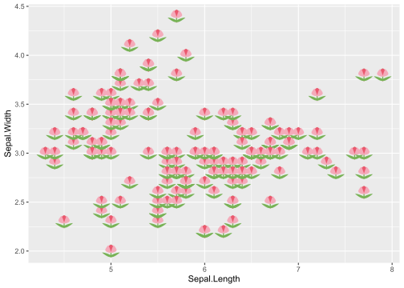
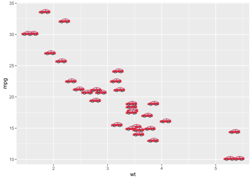
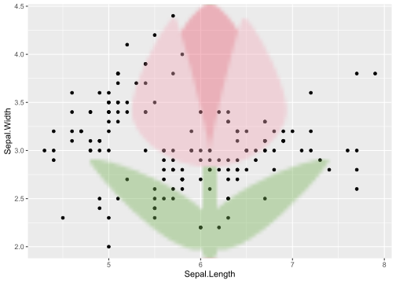
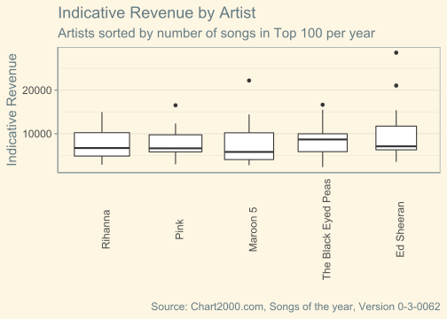
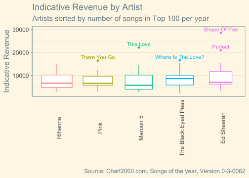

# Showcase

Einige Beispiele, was man mit den Funktionen in der Programmiersprache _R_ machen kann.

Graphische Darstellungen von Wolf Riepl (https://github.com/fjodor).

https://github.com/fjodor/dataviz_ideas


## ggplot with emojis


```r
# https://github.com/dill/emoGG
# devtools::install_github("dill/emoGG")
library(ggplot2)
library(emoGG)

emoji_search("tulip")
```

```
##              emoji             code keyword
## 1929         tulip            1f337 flowers
## 1930         tulip            1f337   plant
## 1931         tulip            1f337  nature
## 1932         tulip            1f337  summer
## 1933         tulip            1f337  spring
## 4595     copyright               a9      ip
## 5538 liechtenstein 1f1f1\\U0001f1ee      li
```

```r
# tulips
ggplot(iris, aes(Sepal.Length, Sepal.Width, color = Species)) +
  geom_emoji(emoji="1f337")
```



```r
# cars
ggplot(mtcars, aes(wt, mpg))+ geom_emoji(emoji="1f697")
```



```r
# random 
posx <- runif(50, 0, 10)
posy <- runif(50, 0, 10)
ggplot(data.frame(x = posx, y = posy), aes(x, y)) + geom_emoji(emoji="1f63b")
```


```r
# big emoji in background
qplot(x=Sepal.Length, y=Sepal.Width, data=iris, geom="point") + add_emoji(emoji="1f337")
```




## Data Preparation<br><br>We're using data from **Chart2000.com**:<br>Music Charts 2000 - 2020 {data-commentary-width="500"}


```r
library(knitr)
library(kableExtra)
library(flexdashboard)
library(tidyverse)
```

```
## -- Attaching packages --------------------------------------- tidyverse 1.3.1 --
```

```
## v tibble  3.1.6     v dplyr   1.0.8
## v tidyr   1.2.0     v stringr 1.4.0
## v readr   2.1.2     v forcats 0.5.1
## v purrr   0.3.4
```

```
## -- Conflicts ------------------------------------------ tidyverse_conflicts() --
## x dplyr::filter()     masks stats::filter()
## x dplyr::group_rows() masks kableExtra::group_rows()
## x dplyr::lag()        masks stats::lag()
```

```r
library(ggthemes)
library(DT)
library(plotly)
```

```
## 
## Attaching package: 'plotly'
```

```
## The following object is masked from 'package:ggplot2':
## 
##     last_plot
```

```
## The following object is masked from 'package:stats':
## 
##     filter
```

```
## The following object is masked from 'package:graphics':
## 
##     layout
```

```r
library(EnvStats)
```

```
## 
## Attaching package: 'EnvStats'
```

```
## The following objects are masked from 'package:stats':
## 
##     predict, predict.lm
```

```
## The following object is masked from 'package:base':
## 
##     print.default
```

```r
library(ggstatsplot)
```

```
## You can cite this package as:
##      Patil, I. (2021). Visualizations with statistical details: The 'ggstatsplot' approach.
##      Journal of Open Source Software, 6(61), 3167, doi:10.21105/joss.03167
```

```r
library(ggtext)

knitr::opts_chunk$set(echo = FALSE)

all_songs <- read_csv(file = "data/chart2000-songyear-0-3-0062.csv",
                  na = c("", "-"))
```

```
## Rows: 2100 Columns: 11
```

```
## -- Column specification --------------------------------------------------------
## Delimiter: ","
## chr (2): artist, song
## dbl (9): year, position, indicativerevenue, us, uk, de, fr, ca, au
## 
## i Use `spec()` to retrieve the full column specification for this data.
## i Specify the column types or set `show_col_types = FALSE` to quiet this message.
```

```r
attr(all_songs, "spec") <- NULL
```


```{=html}
<div id="htmlwidget-b5e8083aa5aeee9d28cf" style="width:100%;height:auto;" class="datatables html-widget"></div>
<script type="application/json" data-for="htmlwidget-b5e8083aa5aeee9d28cf">{"x":{"filter":"top","vertical":false,"filterHTML":"<tr>\n  <td><\/td>\n  <td data-type=\"number\" style=\"vertical-align: top;\">\n    <div class=\"form-group has-feedback\" style=\"margin-bottom: auto;\">\n      <input type=\"search\" placeholder=\"All\" class=\"form-control\" style=\"width: 100%;\"/>\n      <span class=\"glyphicon glyphicon-remove-circle form-control-feedback\"><\/span>\n    <\/div>\n    <div style=\"display: none;position: absolute;width: 200px;opacity: 1\">\n      <div data-min=\"2000\" data-max=\"2020\"><\/div>\n      <span style=\"float: left;\"><\/span>\n      <span style=\"float: right;\"><\/span>\n    <\/div>\n  <\/td>\n  <td data-type=\"number\" style=\"vertical-align: top;\">\n    <div class=\"form-group has-feedback\" style=\"margin-bottom: auto;\">\n      <input type=\"search\" placeholder=\"All\" class=\"form-control\" style=\"width: 100%;\"/>\n      <span class=\"glyphicon glyphicon-remove-circle form-control-feedback\"><\/span>\n    <\/div>\n    <div style=\"display: none;position: absolute;width: 200px;opacity: 1\">\n      <div data-min=\"1\" data-max=\"100\"><\/div>\n      <span style=\"float: left;\"><\/span>\n      <span style=\"float: right;\"><\/span>\n    <\/div>\n  <\/td>\n  <td data-type=\"factor\" style=\"vertical-align: top;\">\n    <div class=\"form-group has-feedback\" style=\"margin-bottom: auto;\">\n      <input type=\"search\" placeholder=\"All\" class=\"form-control\" style=\"width: 100%;\"/>\n      <span class=\"glyphicon glyphicon-remove-circle form-control-feedback\"><\/span>\n    <\/div>\n    <div style=\"width: 100%; display: none;\">\n      <select multiple=\"multiple\" style=\"width: 100%;\" data-options=\"[&quot;Rihanna&quot;,&quot;Pink&quot;,&quot;Maroon 5&quot;,&quot;The Black Eyed Peas&quot;,&quot;Ed Sheeran&quot;]\"><\/select>\n    <\/div>\n  <\/td>\n  <td data-type=\"character\" style=\"vertical-align: top;\">\n    <div class=\"form-group has-feedback\" style=\"margin-bottom: auto;\">\n      <input type=\"search\" placeholder=\"All\" class=\"form-control\" style=\"width: 100%;\"/>\n      <span class=\"glyphicon glyphicon-remove-circle form-control-feedback\"><\/span>\n    <\/div>\n  <\/td>\n  <td data-type=\"number\" style=\"vertical-align: top;\">\n    <div class=\"form-group has-feedback\" style=\"margin-bottom: auto;\">\n      <input type=\"search\" placeholder=\"All\" class=\"form-control\" style=\"width: 100%;\"/>\n      <span class=\"glyphicon glyphicon-remove-circle form-control-feedback\"><\/span>\n    <\/div>\n    <div style=\"display: none;position: absolute;width: 200px;opacity: 1\">\n      <div data-min=\"2358\" data-max=\"28616\"><\/div>\n      <span style=\"float: left;\"><\/span>\n      <span style=\"float: right;\"><\/span>\n    <\/div>\n  <\/td>\n  <td data-type=\"number\" style=\"vertical-align: top;\">\n    <div class=\"form-group has-feedback\" style=\"margin-bottom: auto;\">\n      <input type=\"search\" placeholder=\"All\" class=\"form-control\" style=\"width: 100%;\"/>\n      <span class=\"glyphicon glyphicon-remove-circle form-control-feedback\"><\/span>\n    <\/div>\n    <div style=\"display: none;position: absolute;width: 200px;opacity: 1\">\n      <div data-min=\"1\" data-max=\"53\"><\/div>\n      <span style=\"float: left;\"><\/span>\n      <span style=\"float: right;\"><\/span>\n    <\/div>\n  <\/td>\n  <td data-type=\"number\" style=\"vertical-align: top;\">\n    <div class=\"form-group has-feedback\" style=\"margin-bottom: auto;\">\n      <input type=\"search\" placeholder=\"All\" class=\"form-control\" style=\"width: 100%;\"/>\n      <span class=\"glyphicon glyphicon-remove-circle form-control-feedback\"><\/span>\n    <\/div>\n    <div style=\"display: none;position: absolute;width: 200px;opacity: 1\">\n      <div data-min=\"1\" data-max=\"64\"><\/div>\n      <span style=\"float: left;\"><\/span>\n      <span style=\"float: right;\"><\/span>\n    <\/div>\n  <\/td>\n  <td data-type=\"number\" style=\"vertical-align: top;\">\n    <div class=\"form-group has-feedback\" style=\"margin-bottom: auto;\">\n      <input type=\"search\" placeholder=\"All\" class=\"form-control\" style=\"width: 100%;\"/>\n      <span class=\"glyphicon glyphicon-remove-circle form-control-feedback\"><\/span>\n    <\/div>\n    <div style=\"display: none;position: absolute;width: 200px;opacity: 1\">\n      <div data-min=\"1\" data-max=\"83\"><\/div>\n      <span style=\"float: left;\"><\/span>\n      <span style=\"float: right;\"><\/span>\n    <\/div>\n  <\/td>\n  <td data-type=\"number\" style=\"vertical-align: top;\">\n    <div class=\"form-group has-feedback\" style=\"margin-bottom: auto;\">\n      <input type=\"search\" placeholder=\"All\" class=\"form-control\" style=\"width: 100%;\"/>\n      <span class=\"glyphicon glyphicon-remove-circle form-control-feedback\"><\/span>\n    <\/div>\n    <div style=\"display: none;position: absolute;width: 200px;opacity: 1\">\n      <div data-min=\"1\" data-max=\"167\"><\/div>\n      <span style=\"float: left;\"><\/span>\n      <span style=\"float: right;\"><\/span>\n    <\/div>\n  <\/td>\n  <td data-type=\"number\" style=\"vertical-align: top;\">\n    <div class=\"form-group has-feedback\" style=\"margin-bottom: auto;\">\n      <input type=\"search\" placeholder=\"All\" class=\"form-control\" style=\"width: 100%;\"/>\n      <span class=\"glyphicon glyphicon-remove-circle form-control-feedback\"><\/span>\n    <\/div>\n    <div style=\"display: none;position: absolute;width: 200px;opacity: 1\">\n      <div data-min=\"1\" data-max=\"46\"><\/div>\n      <span style=\"float: left;\"><\/span>\n      <span style=\"float: right;\"><\/span>\n    <\/div>\n  <\/td>\n  <td data-type=\"number\" style=\"vertical-align: top;\">\n    <div class=\"form-group has-feedback\" style=\"margin-bottom: auto;\">\n      <input type=\"search\" placeholder=\"All\" class=\"form-control\" style=\"width: 100%;\"/>\n      <span class=\"glyphicon glyphicon-remove-circle form-control-feedback\"><\/span>\n    <\/div>\n    <div style=\"display: none;position: absolute;width: 200px;opacity: 1\">\n      <div data-min=\"1\" data-max=\"46\"><\/div>\n      <span style=\"float: left;\"><\/span>\n      <span style=\"float: right;\"><\/span>\n    <\/div>\n  <\/td>\n<\/tr>","data":[["1","2","3","4","5","6","7","8","9","10","11","12","13","14","15","16","17","18","19","20","21","22","23","24","25","26","27","28","29","30","31","32","33","34","35","36","37","38","39","40","41","42","43","44","45","46","47","48","49","50","51","52","53","54","55","56","57","58","59","60","61","62","63","64","65","66","67","68","69","70","71","72","73","74","75","76","77","78","79","80","81","82","83","84","85","86","87","88","89","90","91","92","93","94","95","96","97"],[2000,2000,2002,2002,2002,2003,2003,2003,2004,2004,2004,2004,2004,2005,2005,2005,2005,2005,2005,2006,2006,2006,2006,2006,2006,2007,2007,2007,2007,2007,2007,2008,2008,2008,2008,2008,2009,2009,2009,2009,2009,2009,2009,2009,2009,2010,2010,2010,2010,2010,2010,2010,2010,2010,2010,2011,2011,2011,2011,2011,2011,2011,2011,2012,2012,2012,2012,2012,2013,2013,2013,2013,2013,2014,2014,2014,2014,2014,2014,2015,2015,2015,2015,2015,2016,2016,2017,2017,2017,2017,2017,2017,2018,2018,2019,2019,2020],[16,42,19,27,34,7,72,89,2,22,48,50,85,10,11,31,53,80,97,10,16,30,39,51,94,13,34,45,49,64,72,9,10,12,20,75,2,3,26,28,54,57,90,93,100,11,15,30,33,45,51,59,68,77,92,10,12,23,25,34,43,69,82,19,22,27,30,54,22,34,58,73,74,29,31,38,57,68,80,3,7,16,45,82,22,38,1,10,35,40,45,51,1,34,27,73,12],["Pink","Pink","Pink","Pink","Pink","The Black Eyed Peas","Pink","Maroon 5","Maroon 5","Maroon 5","The Black Eyed Peas","The Black Eyed Peas","The Black Eyed Peas","The Black Eyed Peas","Rihanna","The Black Eyed Peas","The Black Eyed Peas","Maroon 5","Maroon 5","Rihanna","Rihanna","The Black Eyed Peas","The Black Eyed Peas","Pink","Pink","Maroon 5","Pink","Rihanna","Pink","Maroon 5","Rihanna","Rihanna","Rihanna","Rihanna","Pink","Maroon 5","The Black Eyed Peas","The Black Eyed Peas","Pink","Pink","The Black Eyed Peas","Pink","Rihanna","Rihanna","Rihanna","The Black Eyed Peas","Rihanna","Rihanna","The Black Eyed Peas","The Black Eyed Peas","The Black Eyed Peas","Rihanna","Pink","Maroon 5","The Black Eyed Peas","Rihanna","The Black Eyed Peas","Pink","The Black Eyed Peas","Rihanna","Pink","Rihanna","Rihanna","Maroon 5","Rihanna","Rihanna","Pink","Ed Sheeran","Rihanna","Pink","Maroon 5","Maroon 5","Maroon 5","Ed Sheeran","Maroon 5","Ed Sheeran","Ed Sheeran","Maroon 5","Ed Sheeran","Ed Sheeran","Maroon 5","Ed Sheeran","Rihanna","Maroon 5","Rihanna","Pink","Ed Sheeran","Ed Sheeran","Pink","Ed Sheeran","Ed Sheeran","Rihanna","Ed Sheeran","Ed Sheeran","Maroon 5","Pink","Maroon 5"],["There You Go","Most Girls","Get The Party Started","Don't Let Me Get Me","Just Like A Pill","Where Is The Love?","Family Portrait","Harder To Breathe","This Love","She Will Be Loved","Let's Get It Started","Hey Mama","Shut Up!","Don't Phunk With My Heart","Pon de replay","My Humps","Don't Lie","She Will Be Loved","Sunday Morning","SOS","Unfaithful","Pump It","My Humps","Stupid Girls","Who Knew","Makes Me Wonder","U &amp; Ur Hand","Shut Up &amp; Drive","Who Knew","Wake Up Call","Don't Stop The Music","Take A Bow","Don't Stop The Music","Disturbia","So What","Won't Go Home Without You","I Gotta Feeling","Boom Boom Pow","Sober","Please Don't Leave Me","Meet Me Half Way","So What","Rehab","Disturbia","Russian Roulette","I Gotta Feeling","Rude Boy","Only Girl (In The World)","Meet Me Half Way","Rock That Body","Imma Be","Russian Roulette","Raise Your Glass","Misery","The Time (Dirty Bit)","S&amp;M","Just Can't Get Enough","F**kin' Perfect","The Time (Dirty Bit)","Only Girl (In The World)","Raise Your Glass","California King Bed","Cheers (Drink To That)","One More Night","Where Have You Been?","Diamonds","Blow Me (One Last Kiss)","The 'A' Team","Diamonds","Try","Daylight","One More Night","Love Somebody","Sing","Maps","Don't!","I See Fire","Animals","Thinking Out Loud","Thinking Out Loud","Sugar","Photograph","Bitch Better Have My Money","Animals","Needed Me","Just Like Fire","Shape Of You","Castle On The Hill","What About Us","Perfect","Galway Girl","Love On The Brain","Perfect","Shape Of You","Memories","Walk Me Home","Memories"],[16518,11361,12346,11361,10216,16651,6701,5808,22214,12845,9344,9146,5928,15516,14976,10603,8669,6278,5190,13000,11932,9041,8050,7585,4873,11301,8301,6878,6265,5432,5261,12329,12317,12055,10670,4029,14832,13269,6247,6075,4782,4704,3241,3192,2882,7882,7378,6101,5822,4220,3975,3417,2969,2767,2358,9366,8788,6843,6584,5709,4845,3672,3252,7673,7106,6534,6177,4390,7119,5737,4085,3311,3276,6610,6498,6290,4979,4282,3532,15394,12350,9660,5421,3529,9664,6560,28616,11733,7853,7103,6760,6222,21053,7180,9107,4862,14427],[7,4,4,8,8,8,20,18,5,5,21,23,null,3,2,3,14,17,31,1,6,18,6,13,null,1,9,15,9,19,47,1,3,1,1,48,1,1,15,17,7,14,18,19,9,9,1,1,8,9,1,43,1,14,4,2,3,2,7,7,4,37,7,1,5,1,5,17,2,9,7,5,10,13,6,9,null,3,6,2,2,10,15,8,7,10,1,6,13,22,53,5,1,13,4,49,2],[6,5,2,6,1,1,12,null,3,4,11,6,4,3,2,3,6,null,36,2,2,3,6,4,5,2,54,5,64,33,16,1,4,3,1,61,1,1,9,12,1,15,24,30,2,14,2,1,3,11,55,8,13,30,1,3,3,10,3,6,19,8,15,8,6,1,3,17,8,14,63,18,null,1,2,8,24,27,1,3,7,15,27,48,38,19,1,2,3,1,2,null,1,21,5,8,13],[65,null,2,10,2,1,8,null,5,25,18,5,1,8,6,5,12,62,83,2,2,19,4,5,12,11,16,null,null,41,1,6,5,5,1,11,3,3,3,8,1,7,4,20,2,11,4,2,3,10,49,5,5,30,2,2,9,7,1,8,18,8,null,17,17,1,10,9,1,3,75,45,null,7,6,17,2,11,6,6,41,4,17,22,57,21,1,2,3,1,5,21,1,12,21,33,20],[null,null,17,42,null,16,23,null,6,null,7,18,1,7,18,null,20,23,null,12,7,13,11,13,24,40,11,null,null,null,1,12,7,3,4,null,2,4,null,null,3,4,null,17,4,15,8,2,3,7,null,4,null,null,null,3,1,24,2,5,37,30,64,9,2,1,22,43,4,15,74,19,87,5,17,41,72,null,46,4,15,9,3,84,94,37,1,3,2,1,15,12,1,6,13,167,15],[null,null,null,null,null,null,null,null,null,null,null,null,null,null,null,null,null,null,null,null,null,null,null,null,null,1,31,6,46,6,4,1,2,2,1,16,1,1,8,8,5,12,19,17,9,7,7,1,6,41,5,22,2,13,1,3,5,2,1,5,4,20,6,2,5,1,4,29,3,5,5,11,10,4,1,7,39,2,7,2,2,4,11,4,25,11,1,2,6,1,16,22,1,9,2,17,2],[2,1,1,8,null,1,11,37,8,1,2,4,1,1,6,1,6,null,27,1,2,6,2,4,2,6,17,4,35,19,null,3,1,6,1,7,1,1,9,11,1,10,26,35,7,10,1,1,10,8,7,17,1,39,1,1,3,19,3,9,8,4,6,2,6,6,1,7,13,30,19,46,null,1,30,4,10,null,1,4,6,9,14,null,44,1,1,2,1,1,2,null,1,19,2,11,4]],"container":"<table class=\"display\">\n  <thead>\n    <tr>\n      <th> <\/th>\n      <th>year<\/th>\n      <th>position<\/th>\n      <th>artist<\/th>\n      <th>song<\/th>\n      <th>indicativerevenue<\/th>\n      <th>us<\/th>\n      <th>uk<\/th>\n      <th>de<\/th>\n      <th>fr<\/th>\n      <th>ca<\/th>\n      <th>au<\/th>\n    <\/tr>\n  <\/thead>\n<\/table>","options":{"columnDefs":[{"className":"dt-right","targets":[1,2,5,6,7,8,9,10,11]},{"orderable":false,"targets":0}],"order":[],"autoWidth":false,"orderClasses":false,"orderCellsTop":true}},"evals":[],"jsHooks":[]}</script>
```


From the site [**https://chart2000.com/about.htm\#fairuse**](https://chart2000.com/about.htm#fairuse){.uri} we downloaded the file *chart2000-songyear-0-3-0062*, which you can also find on my github profile at <https://github.com/fjodor/dataviz_ideas>. It contains the top 100 songs for each year from 2000 to 2020.


```r
library(knitr)
library(kableExtra)
library(flexdashboard)
library(tidyverse)
library(ggthemes)
library(DT)
library(plotly)
library(EnvStats)
library(ggstatsplot)
library(ggtext)

knitr::opts_chunk$set(echo = FALSE)

all_songs <- read_csv(file = "data/chart2000-songyear-0-3-0062.csv",
                  na = c("", "-"))
attr(all_songs, "spec") <- NULL
```

First we filter out the most successful artists: The Top 5 in terms of total score, i. e. the sum of Indicative Revenue (IR). According to <https://chart2000.com/about.htm>, IR is *an attempt to measure the complete revenue generated by a song or album over a certain period. It does take inflation and currency conversion into account and can approximately be related to total revenue generated across the whole music chain in thousands of dollars.*


```r
top_artists <- all_songs %>%
  group_by(artist) %>%
  summarise(total_score = sum(indicativerevenue)) %>% 
  arrange(desc(total_score)) %>% 
  head(n = 5) %>% 
  pull(artist)

songs <- all_songs %>% 
  filter(artist %in% top_artists) %>% 
  mutate(artist = fct_infreq(artist),
         indicativerevenue = round(indicativerevenue))

datatable(songs, filter = "top")
```

## First Boxplot: <br>Some tweaks to a basic ggplot2 chart<br><br>using **ggthemes** by **Jeffrey B. Arnold** {data-commentary-width="600"}


This is our first attempt at summarizing indicative revenue of the Top 10 artists.

What we have already done:

-   Chosen a new theme: **ggthemes::theme_solarized()**. Thanks to package author **Jeffrey B. Arnold** and contributors
-   Increased font size
-   Ordered artists by total number of songs in top 100 for each year 2000 - 2020
-   Rotated x axis labels
-   Removed x axis tickmarks
-   Removed vertical grid lines


```r
theme_set(theme_solarized(base_size = 15))

theme_update(axis.text.x = element_text(angle = 90),
             axis.ticks.x = element_blank(),
             panel.grid.major.x = element_blank())
```


```r
ggplot(songs, aes(x = artist, y = indicativerevenue)) +
  geom_boxplot() +
  labs(x = "", y = "Indicative Revenue",
       title = "Indicative Revenue by Artist",
       subtitle = "Artists sorted by number of songs in Top 100 per year",
       caption = "Source: Chart2000.com, Songs of the year, Version 0-3-0062")
```

## Show Ns Visually<br><br>by specifying **varwidth = TRUE** {data-commentary-width="600"}




The "trick" here is simply the *varwidth = TRUE* argument in the geom_boxplot() call.


```r
ggplot(songs, aes(x = artist, y = indicativerevenue)) +
  geom_boxplot(varwidth = TRUE) +
  labs(x = "", y = "Indicative Revenue",
       title = "Indicative Revenue by Artist",
       subtitle = "Artists sorted by number of songs in Top 100 per year",
       caption = "Source: Chart2000.com, Songs of the year, Version 0-3-0062")
```

## Show Ns Numerically <br><br>using **EnvStats::stat_n_text()** by **Steven Millard** and **Alexander Kowarik** {data-commentary-width="600"}


We could, of course, calculate Ns and display them using *geom_text()* or *geom_label()*, but we'll use the convencience function *stat_n_text()* from the **EnvStats** package by **Steven Millard** and **Alexander Kowarik** instead.


```r
ggplot(songs, aes(x = artist, y = indicativerevenue)) +
  geom_boxplot(varwidth = TRUE) +
  labs(x = "", y = "Indicative Revenue",
       title = "Indicative Revenue by Artist",
       subtitle = "Artists sorted by number of songs in Top 100 per year",
       caption = "Source: Chart2000.com, Songs of the year, Version 0-3-0062") +
  stat_n_text(y.pos = 900)
```

## Show Summary Statistics on Hover (Mouse-Over)<br><br>using **plotly** by **Carson Sievert** {data-commentary-width="600"}


```{=html}
<div id="htmlwidget-eb41ec70191b505e857e" style="width:672px;height:480px;" class="plotly html-widget"></div>
<script type="application/json" data-for="htmlwidget-eb41ec70191b505e857e">{"x":{"visdat":{"1445117128":["function () ","plotlyVisDat"]},"cur_data":"1445117128","attrs":{"1445117128":{"x":{},"y":{},"alpha_stroke":1,"sizes":[10,100],"spans":[1,20],"type":"box"}},"layout":{"margin":{"b":40,"l":60,"t":25,"r":10},"xaxis":{"domain":[0,1],"automargin":true,"title":"artist","type":"category","categoryorder":"array","categoryarray":["Rihanna","Pink","Maroon 5","The Black Eyed Peas","Ed Sheeran"]},"yaxis":{"domain":[0,1],"automargin":true,"title":"indicativerevenue"},"hovermode":"closest","showlegend":false},"source":"A","config":{"modeBarButtonsToAdd":["hoverclosest","hovercompare"],"showSendToCloud":false},"data":[{"fillcolor":"rgba(31,119,180,0.5)","x":["Pink","Pink","Pink","Pink","Pink","The Black Eyed Peas","Pink","Maroon 5","Maroon 5","Maroon 5","The Black Eyed Peas","The Black Eyed Peas","The Black Eyed Peas","The Black Eyed Peas","Rihanna","The Black Eyed Peas","The Black Eyed Peas","Maroon 5","Maroon 5","Rihanna","Rihanna","The Black Eyed Peas","The Black Eyed Peas","Pink","Pink","Maroon 5","Pink","Rihanna","Pink","Maroon 5","Rihanna","Rihanna","Rihanna","Rihanna","Pink","Maroon 5","The Black Eyed Peas","The Black Eyed Peas","Pink","Pink","The Black Eyed Peas","Pink","Rihanna","Rihanna","Rihanna","The Black Eyed Peas","Rihanna","Rihanna","The Black Eyed Peas","The Black Eyed Peas","The Black Eyed Peas","Rihanna","Pink","Maroon 5","The Black Eyed Peas","Rihanna","The Black Eyed Peas","Pink","The Black Eyed Peas","Rihanna","Pink","Rihanna","Rihanna","Maroon 5","Rihanna","Rihanna","Pink","Ed Sheeran","Rihanna","Pink","Maroon 5","Maroon 5","Maroon 5","Ed Sheeran","Maroon 5","Ed Sheeran","Ed Sheeran","Maroon 5","Ed Sheeran","Ed Sheeran","Maroon 5","Ed Sheeran","Rihanna","Maroon 5","Rihanna","Pink","Ed Sheeran","Ed Sheeran","Pink","Ed Sheeran","Ed Sheeran","Rihanna","Ed Sheeran","Ed Sheeran","Maroon 5","Pink","Maroon 5"],"y":[16518,11361,12346,11361,10216,16651,6701,5808,22214,12845,9344,9146,5928,15516,14976,10603,8669,6278,5190,13000,11932,9041,8050,7585,4873,11301,8301,6878,6265,5432,5261,12329,12317,12055,10670,4029,14832,13269,6247,6075,4782,4704,3241,3192,2882,7882,7378,6101,5822,4220,3975,3417,2969,2767,2358,9366,8788,6843,6584,5709,4845,3672,3252,7673,7106,6534,6177,4390,7119,5737,4085,3311,3276,6610,6498,6290,4979,4282,3532,15394,12350,9660,5421,3529,9664,6560,28616,11733,7853,7103,6760,6222,21053,7180,9107,4862,14427],"type":"box","marker":{"color":"rgba(31,119,180,1)","line":{"color":"rgba(31,119,180,1)"}},"line":{"color":"rgba(31,119,180,1)"},"xaxis":"x","yaxis":"y","frame":null}],"highlight":{"on":"plotly_click","persistent":false,"dynamic":false,"selectize":false,"opacityDim":0.2,"selected":{"opacity":1},"debounce":0},"shinyEvents":["plotly_hover","plotly_click","plotly_selected","plotly_relayout","plotly_brushed","plotly_brushing","plotly_clickannotation","plotly_doubleclick","plotly_deselect","plotly_afterplot","plotly_sunburstclick"],"base_url":"https://plot.ly"},"evals":[],"jsHooks":[]}</script>
```

***

Note that **plotly** uses a different calculation method, e. g. a different definition of outliers.


```r
songs %>%
  plot_ly(x = ~artist, y = ~indicativerevenue,
          type = "box")
```


## Label Outliers<br><br>via a **user-defined function** and **geom_text()** {data-commentary-width="600"}



***

A user-defined function (found on [Stackoverflow](https://stackoverflow.com/questions/33524669/labeling-outliers-of-boxplots-in-r), answer by JasonAizkalns) returns songs of outliers, NA otherwise. This newly calculated variable is passed to the **geom_text()** function.

Introducing color for a clearer group distinction. In this case we suppress the color legend, as the groups should be clear from the x axis labels.


```r
is_outlier <- function(x) {
  return(x < quantile(x, 0.25) - 1.5 * IQR(x) | x > quantile(x, 0.75) + 1.5 * IQR(x))
}

songs %>% 
  group_by(artist) %>% 
  mutate(outlier = ifelse(is_outlier(indicativerevenue), song, NA)) %>% 
  ggplot(aes(x = artist, y = indicativerevenue, color = artist)) +
  geom_boxplot(varwidth = TRUE) +
  geom_text(aes(label = outlier), na.rm = TRUE, nudge_y = 1500) +
  labs(x = "", y = "Indicative Revenue",
       title = "Indicative Revenue by Artist",
       subtitle = "Artists sorted by number of songs in Top 100 per year",
       caption = "Source: Chart2000.com, Songs of the year, Version 0-3-0062") +
  scale_color_discrete(guide = NULL)
```


## Display Individual Data Points<br><br>using **geom_jitter()** {data-commentary-width="600"}


You can get the same boxplot for different distributions, e. g. a normal distribution (most data points around the mean) vs. a u-shaped distribution (two peaks: one below and one above the mean, with very few data points near the mean).

So displaying all data points gives a better sense of the underlying distributions. It combines macro and micro levels. Inspired by **Edward Tufte**, see his great book *Envisioning Information*.

Note the use of *alpha* (opacity), *width* and *height* in **geom_jitter()**, which reduces overplotting.


```r
ggplot(songs, aes(x = artist, y = indicativerevenue, color = artist)) +
  geom_boxplot(varwidth = TRUE, outlier.color = NA) +
  geom_jitter(alpha = 0.6, width = 0.2, height = 0) +
  labs(x = "", y = "Indicative Revenue",
       title = "Indicative Revenue by Artist",
       subtitle = "Artists sorted by number of songs in Top 100 per year",
       caption = "Source: Chart2000.com, Songs of the year, Version 0-3-0062") +
  scale_color_discrete(guide = NULL) +
  stat_n_text(y.pos = 900)
```

You could use *plotly* here again to display information about songs on hover. At the moment, a hack is needed to remove outliers from the boxplot - maybe support for that will improve in a future version of *plotly*. Plotly's way seems to be to display the data points side-by-side to the boxplot, not overlay it.


## Use Aesthetics to Include Information on Another Variable<br><br>Combining **shape** and **color**, using **RColorBrewer** by **Erich Neuwirth** {data-commentary-width="600"}


***

* Aesthetics for color and shape defined inside **geom_jitter()** (otherwise, there would be separate boxplots for the groups)
* Two aesthetics represented by one legend, as they refer to the same variable **and** are named the same
* Using **RColorBrewer** by **Erich Neuwirth**


```r
songs %>% 
  rowwise() %>% 
  mutate(no1 = any(c_across(us:au) == 1, na.rm = TRUE)) %>% 
  ggplot(aes(x = artist, y = indicativerevenue)) +
    geom_boxplot(varwidth = TRUE, outlier.color = NA) +
    geom_jitter(alpha = 0.6, width = 0.2, height = 0,
                aes(shape = no1, color = no1)) +
    labs(x = "", y = "Indicative Revenue",
         title = "Indicative Revenue by Artist",
         subtitle = "Artists sorted by number of songs in Top 100 per year",
         caption = "Source: Chart2000.com, Songs of the year, Version 0-3-0062") +
    scale_color_brewer(palette = "Dark2", 
                       name = "No. 1\n(Any Country)?") +
    scale_shape_discrete(name = "No. 1\n(Any Country)?") +
    stat_n_text(y.pos = 900)
```


## Add Means<br><br>for comparison to medians {data-commentary-width="600"}


```
## Warning: Removed 5 rows containing missing values (geom_segment).
```


***

Interesting to see how in some cases (*The Black Eyed Peas*) median and mean seem to overlap, while in other cases (*Ed Sheeran*) there is a notable gap between median and mean. As is often the case, the mean is considerably higher, as it is influenced by outliers at the high end of the range of values.

Here I'd rather not show the individual data points to avoid information overflow. This chart focuses on summary statistics.


```r
ggplot(songs, aes(x = artist, y = indicativerevenue, color = artist)) +
  geom_boxplot(varwidth = TRUE) +
  # geom_jitter(alpha = 0.6, width = 0.2, height = 0) +
  stat_summary(fun = "mean", color = "black", shape = 8) +
  labs(x = "", y = "Indicative Revenue",
       title = "Indicative Revenue by Artist",
       subtitle = "Artists sorted by number of songs in Top 100 per year",
       caption = "* Mean\n\nSource: Chart2000.com, Songs of the year, Version 0-3-0062") +
  scale_color_discrete(guide = NULL) +
  stat_n_text(y.pos = 900)
```


## Calculate and Display Statistical Tests for Group Differences<br><br>using **ggstatsplot** by **Indrajeet Patil** {data-commentary-width="600"}


***

The **ggstatsplot** package by **Indrajeet Patil** is very powerful and flexible, well integrated with *ggplot2* and well documented, see *help(package = "ggstatsplot")*.

Note that this package adds a large number of dependencies.

There are several tests to choose from, including non-parametric, robust and Bayesian.

See *?ggbetweenstats()* and [Website Documentation](https://indrajeetpatil.github.io/ggstatsplot/articles/web_only/ggbetweenstats.html).


```r
ggstatsplot::ggbetweenstats(
  data = songs,
  x = artist, xlab = "",
  y = indicativerevenue,
  ylab = "Indicative Revenue",
  plot.type = "box",
  type = "p",
  conf.level = 0.95,
  title = "Indicative Revenue by Artist"
)
```


## Group Differences:<br><br>Example for a significant test {data-commentary-width="600"}


***

While **Ed Sheeran** reached the highest average indicative revenue, he also recorded a much higher standard deviation. Therefore, only **Justin Timberlake** averaged significantly higher than **Miley Cyrus** in this comparison. Note the p value correction for multiple comparisons (corrected Holm method).


```r
songs2 <- all_songs %>% 
  filter(artist %in% c("Ed Sheeran", "Justin Timberlake", "Miley Cyrus"))

ggstatsplot::ggbetweenstats(
  data = songs2,
  x = artist, xlab = "",
  y = indicativerevenue,
  ylab = "Indicative Revenue",
  plot.type = "box",
  type = "p",
  conf.level = 0.95,
  title = "Indicative Revenue by Artist"
)
```


## Use Images as Labels<br><br>via **ggtext** by **Claus Wilke** {data-commentary-width="600"}


***

This is made possible by **Claus Wilke**'s excellent **ggtext** package.

Downloaded the files beforehand and stored them in the report / dashboard folder.

A named vector of labels is passed to *scale_x_discrete()*; besides, *theme(axis.text.x)* needs an *element_markdown()* function.


```r
# Download and rename files
 
labels <- c(Rihanna = "<br>*Rihanna*",
            Pink = "<br>*Pink*",
            'Maroon 5' = "<br>*Maroon 5*",
            'The Black Eyed Peas' = 
              "<br>*Black Eyed Peas*",
            'Ed Sheeran' = "<br>*Ed Sheeran*"
            )

ggplot(songs, aes(x = artist, y = indicativerevenue, color = artist)) +
  geom_boxplot(varwidth = TRUE) +
  labs(x = "", y = "Indicative Revenue",
       title = "Indicative Revenue by Artist",
       subtitle = "Artists sorted by number of songs in Top 100 per year",
       caption = "Source: Chart2000.com, Songs of the year, Version 0-3-0062") +
  scale_color_discrete(guide = NULL) +
  scale_x_discrete(name = NULL, labels = labels) +
  stat_n_text(y.pos = 900) +
  theme_solarized(base_size = 14) +
  theme(axis.text.x = element_markdown(color = "black", angle = 0))
```


