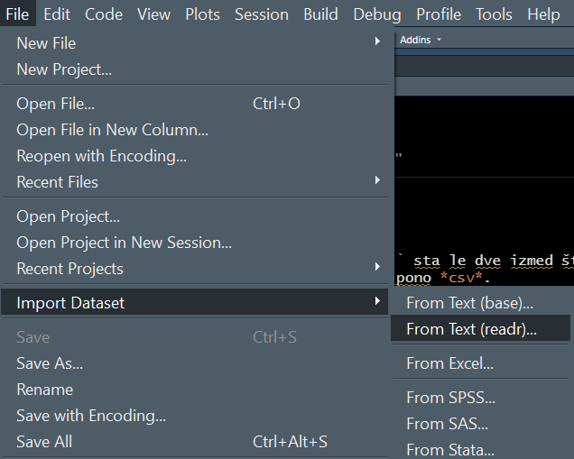
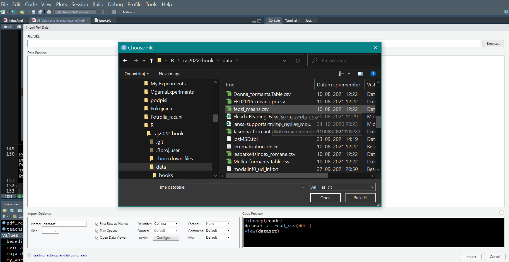

# R & RStudio

Eno izmed prvih vprašanj po namestitvi programov `R` in `RStudio` zadeva odpiranje, shranjevanje in urejanje datotek, ki jih imamo na svojem disku ali so dostopni v medmrežju.   

## Knjižnice

V tem poglavju uporabljamo tele knjižnice in zbirke knjžnic: 


```r
library(tidyverse) # zbirka knjižnic za delo s tabelami
library(readtext) # branje besedil 
library(readxl) # branje Excelovih preglednic
library(writexl) # pisanje & shranjevanje Excelovih tabel
library(rmarkdown) # tu: za lepši izgled tabel
library(kableExtra) # za lepši izgled tabel
```

Načinov za odpiranje in shranjevanje datotek je veliko. Tule bom pokazal nekaj najbolj razširjenih:


## Textdatei öffnen

Odpreti in prebrati želimo besedilo, kasneje pa analizirati. Ena izmed možnosti za odpiranje in ohranjanje besedila v pomnilniku je kombinacija dveh ukazov ali funkcij:    
- `read_lines()` za odpiranje in branje datoteke;   
- `file.choose()` za izbiranje datoteke z miško. 

Odpre se pogovorno okno in tako kot v urejevalniku besedil (npr. Word, Open Office, ...) ali pregledničnem programu (Excel, Calc) je treba poiskati mapo z zaželeno datoteko. V tem primeru je to besedilna datoteka *tom.txt* v mapi *.../data/books*). 

Vsebino besedilne datoteke shranimo v spremenljivko *besedilo*. 


Po navadi želimo ta postopek avtomatizirati in v programski skript zapišemo pot do datoteke (torej skozi katere mape se moramo prebiti) in ime datoteke, ki nas zanima. Uporabniki operacijskega sistema `Windows` se morajo navadati, da je treba namesto poševnice "\" uporabljati poševnico "/" (tako kot v operacijskem `Unix` ali `MacOS`). 

Navesti je treba pot do zaželene besedilne datoteke. Če besedila ne odpiramo v okviru RStudio projekta, moramo napisati celotno pot do ciljne datoteke.   

Če smo v `RStudiu` ustvarili projekt (*New project* v menuju *File*), potem ni potrebno napisati celotne poti do datoteke. Zadostuje navedba tistih map, ki so podrejene delovni mapi (*working directory*). 

Kako izvemo **pot do delovne mape**?   
- Napišemo ukaz `getwd()`. Izpisano pot lahko prekopiramo, lahko pa jo tudi shranimo v obliki konstante (ali spremenljivke). 
- V datotečnem upravitelju ali raziskovalcu, ki ga v `RStudiu` privzeto najdemo na desni strani, lahko z miško kliknemo opcijo *More* in nato izberemo opcijo *Copy Folder Path to Clipboard*. 

V menuju *More* najdemo tudi opcijo za spremembo delovne mape *Set as Working Directory* (kar v `RStudio` *projektu* po navadi ni potrebno). Nastavljanje delovne mape opravimo tudi s funkcijo `setwd()`.


```r
getwd()
```

```
## [1] "D:/Users/teodo/Documents/R/raj2022-book"
```

```r
moja_delovna_mapa <- getwd()
mein_arbeitsverzeichnis <- getwd()
my_working_directory <- getwd()
```

V našem primeru je pot do delovne mape: "D:/Users/teodo/Documents/R/raj2022-book". 

Zaželena besedilna datoteka *tom.txt* je v podmapi *.../data/books*). Če smo prej ustvarili `RStudio` *project*, zadostuje zapis podrejenih map in dodano ime ciljne datoteke - vse med narekovaji. 


```r
library(tidyverse)
# in RStudio project
besedilo = read_lines("data/books/tom.txt")
```

Celo pot do ciljne datoteke lahko prekopiramo in prilepimo. Da se izognemo pisnim napakam, je bolje sestaviti programske skripte v okvriu `RStudio` *projekta*, saj ni treba toliko pisati. 


```r
library(tidyverse)
# full path
besedilo <- read_lines("D:/Users/teodo/Documents/R/raj2022-book/data/books/tom.txt")
```

Še ena možnost je **lepljenje** naslovov ali poti do datoteke s funkcijo `paste()` ali `paste0()`. Prva funkcija lepi s presledkom med posameznimi lepljenimi deli poti, druga pa lepi brez presledka.  

V spodnjih dveh primerih lepimo tri sestavne dele oz. dva dela. 


```r
library(tidyverse)
# full path with paste0()
besedilo <- read_lines(paste0(moja_delovna_mapa,
                              "/",
                              "data/books/tom.txt"))
besedilo <- read_lines(paste0(moja_delovna_mapa,
                              "/data/books/tom.txt"))
```

Poleg funkcij `paste()` in `paste0()` uporabljamo za lepljenje tudi druge knjižnice, npr. `glue` in `here`. 

Za lepljenje sestavnih delov datotečne poti je priljubljena knjižnica `here`. Funkcija `here()` sama ugotavlja trenutno delovno mapo. Sestavne dele poti povezujemo na isti način kot s funkcijo `paste()` ali kar z vejicami. Prednost funkcije `here()` je potemtakem izogibanje poševnicam v datotečni poti. Uporabniki operacijskega sistema `Windows` bodo te funkcije še posebej veseli, saj sprva pogosto spregledajo, da uporabljajo napačno obrnjene poševnice v datotečni poti. 


```r
library(tidyverse)
library(here)

# full path with here()
besedilo <- read_lines(here("data", "books", "tom.txt"))

here("data", "books", "tom.txt")
```

```
## [1] "D:/Users/teodo/Documents/R/raj2022-book/data/books/tom.txt"
```

Odpiranje besedila s spletnega naslova (*url*) je tudi možno, vendar je večinoma dodaten zaplet potreba po odstranjevanju html kode. 


```r
url <- 
  "http://teachsam.de/deutsch/d_literatur/d_aut/bor/bor_kuech_txt.htm"
teachsam_kuechenuhr <- read_lines(url) 
head(teachsam_kuechenuhr)
```

```
## [1] "<html>"                                                                                                                                                                                                    
## [2] "<head>"                                                                                                                                                                                                    
## [3] "<meta NAME=\"author\" CONTENT=\"Gert Egle\">"                                                                                                                                                              
## [4] "<meta NAME=\"copyright\" CONTENT=\"Gert Egle/www.teachsam.de lizensiert unter Creative Commons Lizenz: Namensnennung und Weitergabe unter gleichen Bedingungen, CC-BY-SA 4.0 International licenxe, OER\">"
## [5] "<meta NAME=\"keywords\" CONTENT=\"Borchert,K<fc>chenuhr, Die K<fc>chenuhr,\">"                                                                                                                             
## [6] "<meta NAME=\"description\" CONTENT=\"In diesem teachSam-Arbeitsbereich k<f6>nnen Sie sich mit Die K<fc>chenuhr von Wolfgang Borchert befassen.\">"
```

"Čiščenje" spletne strani je vsekakor lažje z drugimi programi (npr. s knjižnico `rvest`). Pridobivanje besedila ali preglednice s spletnih strani (*webscraping*) je tehnika za naprednejše uporabnike. 


```r
library(rvest)
```

```
## Warning: package 'rvest' was built under R version 4.1.1
```

```
## 
## Attaching package: 'rvest'
```

```
## The following object is masked from 'package:readr':
## 
##     guess_encoding
```

```r
html_document <- read_html(url)

# detected with Selector Gadget in in Chrome browser
path <- "blockquote blockquote"
text <- html_document %>%
  html_node(path) %>%
  html_text(trim = T)
```

Besedilo, ki smo ga pridobili s knjižnico `rvest` s spletne strani, še očistimo s funkcijo `str_squish()`, ki odstrani nezaželene presledke. Besedilo si ogledamo s funkcijo `str_sub()`. V spodnjem primeru prikazujemo le prvih 200 znakov besedila. Ni priporočljivo, da zahtevate izpis celotnega besedila na ekran, ker to lahko traja precej časa in zaseda pomnilnik, ki ga potrebujete za analizo. 


```r
teachsam_kuechenuhr_rvest <- text %>% str_squish()
str_sub(teachsam_kuechenuhr_rvest, start = 1, end = 200)
```

```
## [1] "Wolfgang Borchert, Die Küchenuhr Sie sahen ihn schon von weitem auf sich zukommen, denn er fiel auf. Er hatte ein ganz altes Gesicht, aber wie er ging, daran sah man, dass er erst zwanzig war. Er setz"
```

Dokler gre le za vsebino ene spletne strani,  programiranje v programskem jeziku `R` ni nujno potrebno. Besedilo bi seveda lahko prekopirali s spletne strani v beležko (`Notepad`) ali urejevalnik besedil in potem shranili v datoteko. Vendar je *webscraping* s knjižnico `rvest` mnogo učinkovitejša tehnika, saj je v zelo kratkem času mogoče potegniti več tisoč besedil (npr. časopisne članke) s spletnih strani na računalniški disk. 


## Odpiranje več besedil

Uporaba funkcije `readtext()` je preprosta za odpiranje več besedil z diska. 

Če namesto imena datotek navedemo samo zvezdico + pripono datotek (npr. \*.txt) v izbrani mapi (npr. "data/books/"), potem bo program odprl vse besedilne datoteke s to pripono in to zbirko shranil v spremenljivki (npr. "besedila"). Program ustvari tabelo prebranih besedil.

`readtext()` odpira besedila z različnimi priponami: *txt, csv, docx, pdf, xml, ...*. 

Z opcijo `encoding` seznanimo program s kodno stranjo besedil. Privzeta je po navadi kodna stran "*UTF-8*". V narekovajih lahko določimo tudi drugo kodno stran, npr. "*latin1*" za zahodnoevropsko kodno stran. 


```r
library(readtext)
besedila = readtext("data/books/*.txt", encoding = "UTF-8")
besedila
```

```
## readtext object consisting of 2 documents and 0 docvars.
## # Description: df [2 x 2]
##   doc_id      text               
##   <chr>       <chr>              
## 1 prozess.txt "\"Der Prozes\"..."
## 2 tom.txt     "\"Tom Sawyer\"..."
```

Tudi odpiranje besedila s spletnega naslova (`url`) je mogoče, npr. PDF datoteke. Besedilo se shranjuje v obliki tabele, ki ima hkrati lastnosti podatkovnega niza (`data.frame`) in seznama (`list`). 


```r
library(readtext)
url <- 
  "https://www.moutard.de/wordpress/archiv/sek2dt/muster/kuechenuhr_i.pdf"
pdf_readtext = readtext(url)
pdf_readtext
```

```
## readtext object consisting of 1 document and 0 docvars.
## # Description: df [1 x 2]
##   doc_id           text               
##   <chr>            <chr>              
## 1 kuechenuhr_i.pdf "\"Wolfgang B\"..."
```


## Odpiranje preglednice

Funkcija `read_csv()` ali `read_csv2()` sta le dve izmed številnih funkcij za odpiranje preglednice s pripono *csv*. 

Začetnikom se bo zdel privlačen uvoz tabele s pomočjo menuja in miške (*File > Import Dataset > ...*).



Potem se odpre pogovorno okno s čarovnikom za uvoz tabele ali podatkovnega niza, podobno kot v statističnem programu `IBM SPSS`, ki omogoča opredeljevanje oblike. 



Poleg tega vam RStudio tudi pokaže, kateri programski ukaz za odpiranje tabele bi lahko vstavili v programski skript. Tako se lahko naučite potrebnih programskih korakov za odpiranje tabel. 

Za samodejno izvajanje programskega skripta pa je najboljše, da sestavimo ukazno vrstico za prebiranje tabele in (neobvezno) njen prikaz: 


```r
library(tidyverse)
# read data frame
tabela = read_csv2("data/plural_Subj_sum.csv")

# show first rows
head(tabela) %>% 
  rmarkdown::paged_table() # prettier
```

<div data-pagedtable="false">
  <script data-pagedtable-source type="application/json">
{"columns":[{"label":["SubjID"],"name":[1],"type":["dbl"],"align":["right"]},{"label":["WordType"],"name":[2],"type":["chr"],"align":["left"]},{"label":["Genus"],"name":[3],"type":["chr"],"align":["left"]},{"label":["Sigstark"],"name":[4],"type":["dbl"],"align":["right"]},{"label":["En"],"name":[5],"type":["dbl"],"align":["right"]},{"label":["E"],"name":[6],"type":["dbl"],"align":["right"]},{"label":["Er"],"name":[7],"type":["dbl"],"align":["right"]},{"label":["S"],"name":[8],"type":["dbl"],"align":["right"]},{"label":["Z"],"name":[9],"type":["dbl"],"align":["right"]}],"data":[{"1":"1","2":"NoRhyme","3":"Fem","4":"4.983333","5":"8","6":"4","7":"0","8":"0","9":"0"},{"1":"1","2":"NoRhyme","3":"Masc","4":"4.600000","5":"6","6":"6","7":"0","8":"0","9":"0"},{"1":"1","2":"NoRhyme","3":"Neut","4":"5.366667","5":"10","6":"2","7":"0","8":"0","9":"0"},{"1":"1","2":"Rhyme","3":"Fem","4":"3.836667","5":"3","6":"8","7":"0","8":"0","9":"1"},{"1":"1","2":"Rhyme","3":"Masc","4":"4.153333","5":"5","6":"5","7":"1","8":"0","9":"1"},{"1":"1","2":"Rhyme","3":"Neut","4":"3.784167","5":"3","6":"7","7":"1","8":"0","9":"1"}],"options":{"columns":{"min":{},"max":[10]},"rows":{"min":[10],"max":[10]},"pages":{}}}
  </script>
</div>

RStudio omogoča tudi uvoz podatkovnih niz iz nekaterih drugih statističnih programov (npr. `SPSS`, `STATA`) in pregledničnih programov (`Excel`). Z dodatnimi programskimi funkcijami pridobimo še več uvoznih možnosti (npr. s knjižnico `readxl` za uvoz Excelovih tabel). 

Odpiranje tabele s spletnega naslova (`url`) je prav tako mogoče, bodisi s funkcijo `read_csv()` oz. `read_csv2()` bodisi s funkcijo `read_delim()`.


```r
url <- 
  "https://perso.telecom-paristech.fr/eagan/class/igr204/data/cars.csv"

car_dataset <- read_delim(url, delim = ";",
                         # c = character, n = number
                         col_types = "cnnnnnnnn")

car_dataset <- read_csv2(url, 
                         # c = character, n = number
                         col_types = "cnnnnnnnn")
```

```
## i Using "','" as decimal and "'.'" as grouping mark. Use `read_delim()` for more control.
```

```r
car_dataset <- car_dataset[-1,] # remove first row after column name
head(car_dataset)
```

```
## Warning: One or more parsing issues, see `problems()` for details
```

```
## # A tibble: 6 x 9
##   Car     MPG Cylinders Displacement Horsepower Weight Acceleration Model Origin
##   <chr> <dbl>     <dbl>        <dbl>      <dbl>  <dbl>        <dbl> <dbl>  <dbl>
## 1 Chev~   180         8         3070       1300   3504          120    70     NA
## 2 Buic~   150         8         3500       1650   3693          115    70     NA
## 3 Plym~   180         8         3180       1500   3436          110    70     NA
## 4 AMC ~   160         8         3040       1500   3433          120    70     NA
## 5 Ford~   170         8         3020       1400   3449          105    70     NA
## 6 Ford~   150         8         4290       1980   4341          100    70     NA
```

Z opcijo *col_types* poskrbimo za ustrezen podatkovni format (črkovni niz, decimalno število, ...).


## Odpiranje Excelove tabele

Funkcija `read_xlsx()` ali `read_excel()` omogoča odpiranje Excelove preglednice s pripono *xlsx*.


```r
library(readxl)
excel = read_xlsx("data/S03_Vokalformanten_Diagramme.xlsx", sheet = "A1-4_alle")
head(excel) %>% 
  rmarkdown::paged_table()
```

<div data-pagedtable="false">
  <script data-pagedtable-source type="application/json">
{"columns":[{"label":["Studierende"],"name":[1],"type":["chr"],"align":["left"]},{"label":["Phrase"],"name":[2],"type":["chr"],"align":["left"]},{"label":["Wort"],"name":[3],"type":["chr"],"align":["left"]},{"label":["Vokal"],"name":[4],"type":["chr"],"align":["left"]},{"label":["Vowel"],"name":[5],"type":["chr"],"align":["left"]},{"label":["Dauer"],"name":[6],"type":["dbl"],"align":["right"]},{"label":["Länge"],"name":[7],"type":["chr"],"align":["left"]},{"label":["F1"],"name":[8],"type":["dbl"],"align":["right"]},{"label":["F2"],"name":[9],"type":["dbl"],"align":["right"]},{"label":["Sprecherin"],"name":[10],"type":["chr"],"align":["left"]},{"label":["L1_L2"],"name":[11],"type":["chr"],"align":["left"]}],"data":[{"1":"Monika","2":"Phrase 001","3":"bieten","4":"i:","5":"ii","6":"155","7":"lang","8":"296","9":"2750","10":"Deutsche","11":"L1"},{"1":"Metka","2":"Phrase 001","3":"bieten","4":"i:","5":"ii","6":"154","7":"lang","8":"269","9":"2752","10":"Deutsche","11":"L1"},{"1":"Adelina","2":"Phrase 001","3":"bieten","4":"i:","5":"ii","6":"155","7":"lang","8":"273","9":"2750","10":"Deutsche","11":"L1"},{"1":"Jasmina","2":"Phrase 001","3":"bieten","4":"i:","5":"ii","6":"152","7":"lang","8":"270","9":"2767","10":"Deutsche","11":"L1"},{"1":"Donna","2":"Phrase 001","3":"bieten","4":"i:","5":"ii","6":"66","7":"lang","8":"492","9":"2312","10":"Deutsche","11":"L1"},{"1":"Mateja","2":"Phrase 001","3":"bieten","4":"i:","5":"ii","6":"53","7":"lang","8":"1678","9":"2665","10":"Deutsche","11":"L1"}],"options":{"columns":{"min":{},"max":[10]},"rows":{"min":[10],"max":[10]},"pages":{}}}
  </script>
</div>


## Shranjevanje datotek

Privzeto spodnje programske funkcije shranjujejo podatkovni niz po kodni strani (codepage), ki omogoča tudi posebne jezikovne in druge simoble, tj. `encoding = "UTF-8"` / `fileEncoding = "UTF-8"`.


```r
library(tidyverse)

# shranjevanje posamičnega besedila
write_lines(besedilo, "moje_besedilo.txt")

# shranjevanje tabele, v kateri je zbirka besedil
write_csv2(besedila, "moja_tabela_z_besedili.csv")

library(writexl)
# shranjevanje preglednice
write_xlsx(tabela, "moja_tabela.xlsx")

# shranjevanje tabele, v kateri je zibrka besedil
# Excel dovoljuje do 32767 znakov.
# ta zbirko presega to mejo, zato je ne moremo shraniti v Excelovi preglednici

# write_xlsx(besedila, "moja_tabela_z_besedili.xlsx")
```


Basic operations in R: \* Download (zip) files \* Extract compressed files to a folder \* Check & Create a folder or subfolders \* List & Read files in a folder


## Nalaganje s spleta

Programska funkcija za nalaganje datoteke z medmrežja, in sicer s funkcijo `download.file()`, ki zahteva *url* in *pot* (*location*) za shranjevanje datoteke. 

V spodnjem primeru bomo stisnjeno datoteko shranili v *delovni mapi* tega `R` *projekta*. Da ne bi bilo treba toliko pisati, si spet pomagamo s funkcijo `here()`.


```r
url <- "https://github.com/tpetric7/tpetric7.github.io/archive/refs/heads/main.zip"
# location <- "d:/Users/teodo/Downloads/tpetric7-master.zip"
location <- here("tpetric7-master.zip")

download.file(url, location)
```


## Mape

### Preveri obstoj mape 

Ali mapa že obstaja? To preverimo s funkcijo `dir.exists()`, ki zahteva navedbo datotečne poti. Tudi tu si za navajanje datotečne poti pomagamo s funkcijo `here()`. 

Izpis `TRUE` pomeni, da mapa obstaja, izpis `FALSE`, da je še ni. 


```r
# pot <- "d:/Users/teodo/Downloads/tpetric7-master"
pot <- here("tpetric7-master")
exist <- dir.exists(pot)
exist
```

```
## [1] FALSE
```


### Ustvari mapo 

Če mapa ne obstaja, jo ustvari! Če mapa že obstaja, seznani uporabnika! Ustvarjanje nove mape opravimo s funkcijo `dir.create()`, ki zahteva ime poti nove mape. Ta programski ukaz pogosto združujemo s pogojnim stavkom `ifelse()`. Pogojni stavek začnemo s pogojem. V spodnjem primeru je to *exist == FALSE*. Če je pogoj izpolnjen (tj. da mape še ni), potem program izpiše `TRUE` in ustvari mapo z imenom po naši želji. To opravimo s funkcijo `dir.create()`. Če pogoj ni izpolnjen (tj. da mapa z navedenim imenom že obstaja), potem izpiši "*directory already exists*". 


```r
ifelse(exist == FALSE, 
       dir.create(pot, showWarnings = TRUE, recursive = TRUE), 
       "directory already exists")
```

```
## [1] TRUE
```


### Ustvari podrejene mape

Ustvariti želimo več map.    
- Najprej določimo vektor z njihovimi imeni. Ime vektorja subfolder_names bomo potrebovali v programski zanki.    
- Uporabljamo programsko zanko `for(){}`, ki se izvaja, dokler program ne dodeli vsaki mapi ime.    
- Kolikokrat se zanka izvaja, določimo s številko. Zapisali bi lahko številko 4, ker smo prej določili štiri imena za nove mape. Elegantnejša metoda je uporaba funkcije `length()`, ki programu pove zadnji člen zaporedja, tj. konec zanke. Števec *i* je najprej enak ena, po vsakem prehodu zanke pa se mu prišteje ena. Glede na to, da imamo v vektorja štiri imena, se izvajanje programske zanke konča po četrtem prehodu.    
- V zanki izvedemo funkcijo `dir.create()`. Rezultat zapišemo v spremenljivko z imenom *folder*. 

V spodnjem primeru bo program ustvaril podmape v mapi (spremenljivka ima ime *pot*), ki smo zgoraj ustvarili. 


```r
subfolder_names <- c("a","b","c","d") 
for (i in 1:length(subfolder_names)){
  folder <- dir.create(paste0(pot, "/", subfolder_names[i]))
}
```


### Odstrani mape

Program lahko tudi odstrani mape, in sicer s funkcijo `unlink()`. V spodnjem primeru bomo odstrani štiri (prazne) mape, ki smo jih malo prej ustvarili (imena map gl. zgoraj!). 

Odstranjujemo eno mapo. 


```r
unlink(here(pot, "a"), recursive = TRUE)
```

Odstranimo lahko tudi več map hkrati. V tem primeru potrebujemo programsko zanko. 

V spodnjem primeru odstranjujemo preostale tri podrejene mape (zato se števec *i* začne z 2 in konča s 4, kar je določeno z `length()`). Opcija *recursive = TRUE* pomeni, da program zbriše tudi vse podrejene mape v navedenih mapah. 


```r
for (i in 2:length(subfolder_names)){
  unlink(here(pot, subfolder_names[i]), recursive = TRUE)
}
```


## Stisnjene datoteke

Stisnjeno datoteko raztegnemo s funkcijo `unzip()`, pot ali kraj raztegnjene datoteke pa določimo z opcijo *exdir*. 

V spodnjem primeru je predpostavljeno, da ste zgoraj že naložili stistnjeno datoteko na disk, in sicer v delovno mapo. 


```r
# unzip("d:/Users/teodo/Downloads/tpetric7-master.zip", exdir = pot)
unzip("tpetric7-master.zip", exdir = pot)
```

Mape in stisnjene datoteke ne potrebujemo več. V nasdlednjih dveh programskih vsticah bomo oboje in vse, kar je v njih, spet odstranili. 


```r
unlink(pot, recursive = TRUE)
unlink("tpetric7-master.zip", recursive = TRUE)
```


## Pregledovanje datotek

Seznam datotek v mapi ali več mapah na računalniškem disku prikazujemo s funkcijo `list.files()`. 


```r
seznam <- list.files("data/books", pattern = "\\.txt$", recursive = TRUE, full.names = TRUE)
seznam
```

```
##  [1] "data/books/kleist/Kleist_Kohlhaas_Projekt_Gutenberg.txt"
##  [2] "data/books/kleist/Michael_Kohlhaas_english.txt"         
##  [3] "data/books/prozess.txt"                                 
##  [4] "data/books/tom.txt"                                     
##  [5] "data/books/translations/metamorph/metamorphosis.txt"    
##  [6] "data/books/translations/metamorph/verwandlung.txt"      
##  [7] "data/books/translations/prozess/prozess.txt"            
##  [8] "data/books/translations/prozess/trial.txt"              
##  [9] "data/books/translations/sawyer/tom_de.txt"              
## [10] "data/books/translations/sawyer/tom_en.txt"              
## [11] "data/books/verwandlung/verwandlung.txt"
```


## Prebiranje datotek

Funkcija `readtext()` zna prebrati več datotek v eni ali več mapah. Če te funkcije ne moremo uporabiti, imamo še druge možnosti. 


### tidyverse:

V zbirki `tidyverse` je na voljo knjižnica `purrr` s funkcijo `map()`, ki nadomešča klasično programsko zanko `for(){}`. 

V spodnjem primeru s funkcijo `read_lines()` odpremo besedilo s seznama, ki smo ga prej ustvarili s funkcijo `list.files()`. Funkcija `map()` pa ima isti namen kot `for()`-zanka, je pa krajša. Na ta način shranjujemo vsa besedila z datottečnega seznama v pomnilniku računalnika. 

S funkcijo `substr()` pa si lahko ogledamo besedilo oz. po navadi le del besedila. Podobno funkcijo smo uporabili tudi zgoraj, tj. `str_sub()`. V spodnjem primeru si želimo ogledati vsebino prve datoteke [1] in druge datoteke [2] na seznamu. Ne želimo izpisati celotnih besedil, temveč le prvih 50 oz. 70 znakov. 


```r
library(tidyverse)
alltxt <- seznam %>% map(read_lines)

substr(alltxt[1], 1, 50)
```

```
## [1] "c(\"Heinrich von Kleist\", \"Michael Kohlhaas\", \"Aus "
```

```r
substr(alltxt[2], 1, 70)
```

```
## [1] "c(\"Michael Kohlhaas\", \"\", \"\", \"\\t\\t\\t\\t\\tHeinrich von Kleist\", \"\", \"\","
```

### Base R:

V osnovnem funkcijskem naboru programskega jezika `R` ima funkcija `lapply()` podobno funkcijo kot `map()` ali `for()`-zanka. Funkcija `map()` ima več naprednejših možnosti. 


```r
alltxt <- lapply(seznam, readLines)

substr(alltxt[1], 1, 50)
```

```
## [1] "c(\"Heinrich von Kleist\", \"Michael Kohlhaas\", \"Aus "
```

```r
substr(alltxt[2], 1, 70)
```

```
## [1] "c(\"Michael Kohlhaas\", \"\", \"\", \"\\t\\t\\t\\t\\tHeinrich von Kleist\", \"\", \"\","
```

## Pretvorba kodne strani

Kodno stran lahko zamenjamo s funkciojo `iconv()`. V sledeči programski vrstici pretvarjamo besedilo *tom.txt* (gl. zgoraj) iz kodne strani "UTF-8" v kodno stran "latin1". 

S funkcijo `Encoding()` izvemo *kodno stran* besedila (*codepage*), funkcijo `str_sub()` za ogled besedilnega odlomka pa smo spoznali že zgoraj. 


```r
alltxt1_converted <- iconv(besedilo, from = "UTF-8", to = "latin1")
Encoding(alltxt1_converted)
```

```
## [1] "latin1"
```

```r
str_sub(alltxt1_converted, 4800, 4900)
```

```
## [1] "u führen .      Wenn ich ihn sich selbst überlasse , drückt mich mein Gewissen , und so oft ich ihn s"
```


## Priprava podatkovnega niza

Pogosto moramo podatkovni niz ali tabelo preoblikovati, da se dokopljemo do odgovora na raziskovalno vprašanje. Preoblikovanje podatkov v angleščini pogosto imenujejo *Data Wrangling* ("podatkovna rokoborba ali ravsanje"). V nadaljevanju se bomo seznanili z nekaj izmed pogostejših funkcij iz zbirke `tidyverse` za pripravo podatkovnega niza ali tabele:   
- `select()`   
- `group_by()`   
- `filter()`   
- `mutate()`   
- `count()`   
- `summarise()`   
- `arrange()`   
- `separate()`   
- `unite()`   
- `pivot_longer()`   
- `pivot_wider()`   
- `pull(`)   
- `Date()`.

Delovanje posameznih programskih funkcij ponazarjamo s podatkovnim nizom *tweets_rollingstones.rds*. 


```r
tweets_rollingstones <- read_rds("data/tweets_rollingstones.rds")
```

Če imenu podatkovnega niza dodamo znak `$` se nam prikažejo spremenljivke (stolpci tabele). Operator `%>%` (bližnjica: *Crtl+Shift+M*) povezuje posamezne programske korake ali vrstice med seboj: (a) koraki se izvajajo v časovnem zaporedju in (b) sledeči koraki prevzemajo predmet (object) iz prvega programskega koraka (tj. podatkovni niz). S funkcijo `head()` omejujemo število izpisanih vrstic.   


```r
tweets_rollingstones$created_at %>% head(3)
```

```
## [1] "2021-08-29 17:35:52 UTC" "2021-08-29 11:19:40 UTC"
## [3] "2021-08-25 16:39:18 UTC"
```

Drugi načini za izpis imena spremenljivk (stolpcev) v tabeli so npr. `names()` ali `colnames()`. Uporabljamo lahko tudi funkciji `glimpse()` ali `skim()` knjižnice `skim`. 

Izpis v sledečem izpisu je s omejen na 10 imen. To omogoča funkcija `head()`.


```r
names(tweets_rollingstones) %>% head(10)
```

```
##  [1] "user_id"              "status_id"            "created_at"          
##  [4] "screen_name"          "text"                 "source"              
##  [7] "display_text_width"   "reply_to_status_id"   "reply_to_user_id"    
## [10] "reply_to_screen_name"
```

```r
# colnames(tweets_rollingstones)
# glimpse(tweets_rollingstones)
# skimr::skim(tweets_rollingstones)
```


### select()

Funkcija `select()` omogoča izbiranje stolpcev v preglednici. Načinov izbiranja je več. Izberemo lahko samo en stolpec. 


```r
tweets_rollingstones %>% select(screen_name) %>% head(3)
```

```
## # A tibble: 3 x 1
##   screen_name
##   <chr>      
## 1 aliceinglen
## 2 MatjazDerin
## 3 MarliMarkez
```

Z dvopičjem med imeni spremenljivk (stolpcev v tabeli) lahko izberemo več zaporednih stolpcev. Vejico uporabljamo za spremenljivko, ki se ne pojavlja neposredno za ali pred že navedeno spremenljivko. V spodnjem primeru bomo izbrali štiri stolpce, slednji trije se pojavljajo zaporedno, zato uporabljamo dvopičje med spremenljivko *created_at* in *text*. Za prvim stolpcem *user_id* stoji vejica, saj je med njim in stolpcem *created_at* še en stolpec, ki ga pa nismo izbrali.


```r
tweets_rollingstones %>% 
  select(user_id, created_at:text) %>% # which columns?
  head(3) %>% # 3 rows only
  rmarkdown::paged_table() # prettier table
```

<div data-pagedtable="false">
  <script data-pagedtable-source type="application/json">
{"columns":[{"label":["user_id"],"name":[1],"type":["chr"],"align":["left"]},{"label":["created_at"],"name":[2],"type":["dttm"],"align":["right"]},{"label":["screen_name"],"name":[3],"type":["chr"],"align":["left"]},{"label":["text"],"name":[4],"type":["chr"],"align":["left"]}],"data":[{"1":"1410622722","2":"2021-08-29 17:35:52","3":"aliceinglen","4":"@RollingStones lovelovelovelovelovelovelovelovelovelovelovelovelove\\nlovelovelovelovelovelovelovelovelovelovelovelovelove\\nlovelovelovelovelovelovelovelovelovelovelovelovelove\\nlovelovelovelovelovelovelovelovelovelovelovelovelove\\nlovelovelovelovelovelovelovelovelovelovelovelovelove\\nlovelovelove"},{"1":"458920966","2":"2021-08-29 11:19:40","3":"MatjazDerin","4":"Rolling Stones so s Charlie-jem Watts-om bili glasbena skupina, sedaj so samo še skupina. #fact #rollingstones #CharlieWatts"},{"1":"2434026102","2":"2021-08-25 16:39:18","3":"MarliMarkez","4":"Nuša Lesar na @Svet_KanalA konstantno izgovarja Čarli Wets. #RollingStones  Križana gora, no. #osnove #CharlieWatts"}],"options":{"columns":{"min":{},"max":[10]},"rows":{"min":[10],"max":[10]},"pages":{}}}
  </script>
</div>

Predznak *minus* pred imenom stolpca pomeni, da želimo stolpec izločiti. Več stolpcev hkrati izločimo z znakom `c()`, ki mu predpostavimo predznak *minus*.


```r
tweets_rollingstones %>% 
  select(lang, location, user_id:status_id, 
         source, created_at:text) %>%
  select(-lang) %>% # remove one column
  select(-c(user_id, status_id)) %>%  # remove two columns
  select(-c(created_at, screen_name:text)) %>%  # multiple columns
  head(3) %>%
  rmarkdown::paged_table()
```

<div data-pagedtable="false">
  <script data-pagedtable-source type="application/json">
{"columns":[{"label":["location"],"name":[1],"type":["chr"],"align":["left"]},{"label":["source"],"name":[2],"type":["chr"],"align":["left"]}],"data":[{"1":"","2":"Twitter Web App"},{"1":"Lucija, Istra, Slovenija","2":"Twitter for Android"},{"1":"Ljubljana, Slovenia","2":"Twitter Web App"}],"options":{"columns":{"min":{},"max":[10]},"rows":{"min":[10],"max":[10]},"pages":{}}}
  </script>
</div>


### filter()

Medtem ko s funkcijo `select()` izberemo ali izločimo stolpce (spremenljivke), imamo funkcijo `filter()` za omejevanje števila vrstic. Navesti je treba en ali več pogojev. Pri tem je treba paziti na uporabo logičnih operatorjev (kot npr. *dvojini enačaj*: *==*). 

V spodnjem primeru je prikazano enostavno filtriranje podaktovnega niza. V kasnejših poglavjih bomo večkrat potrebovali bolj zapletene oblike, ki vključujejo tudi funkcije kot npr. `str_detect()` in poznavanje *regularnih izrazov* (*regular expressions*). 

Filtrirni pogoj je izbor čivkov v slovenščini, tj. v stolpcu *lang* mora biti znakovni niz "*sl*". Vrstice, ki tega pogoja ne izpolnjujejo, bodo odstranjene iz prikazane tabele. 


```r
tweets_rollingstones %>% 
  select(lang, user_id, created_at:text) %>% # which columns?
  filter(lang == "sl") %>% # Slovenian tweets only
  head(3) %>% # 3 rows only
  rmarkdown::paged_table() # prettier table
```

<div data-pagedtable="false">
  <script data-pagedtable-source type="application/json">
{"columns":[{"label":["lang"],"name":[1],"type":["chr"],"align":["left"]},{"label":["user_id"],"name":[2],"type":["chr"],"align":["left"]},{"label":["created_at"],"name":[3],"type":["dttm"],"align":["right"]},{"label":["screen_name"],"name":[4],"type":["chr"],"align":["left"]},{"label":["text"],"name":[5],"type":["chr"],"align":["left"]}],"data":[{"1":"sl","2":"1410622722","3":"2021-08-29 17:35:52","4":"aliceinglen","5":"@RollingStones lovelovelovelovelovelovelovelovelovelovelovelovelove\\nlovelovelovelovelovelovelovelovelovelovelovelovelove\\nlovelovelovelovelovelovelovelovelovelovelovelovelove\\nlovelovelovelovelovelovelovelovelovelovelovelovelove\\nlovelovelovelovelovelovelovelovelovelovelovelovelove\\nlovelovelove"},{"1":"sl","2":"458920966","3":"2021-08-29 11:19:40","4":"MatjazDerin","5":"Rolling Stones so s Charlie-jem Watts-om bili glasbena skupina, sedaj so samo še skupina. #fact #rollingstones #CharlieWatts"},{"1":"sl","2":"2434026102","3":"2021-08-25 16:39:18","4":"MarliMarkez","5":"Nuša Lesar na @Svet_KanalA konstantno izgovarja Čarli Wets. #RollingStones  Križana gora, no. #osnove #CharlieWatts"}],"options":{"columns":{"min":{},"max":[10]},"rows":{"min":[10],"max":[10]},"pages":{}}}
  </script>
</div>

Dokler tega rezultata ne shranimo (npr. pod imenom *tweets_rollingstones_slovenski*), ostane podatkovni niz nespremenjen. Enako velja tudi za vse ostale funkcije za prilagajanje tabele, ki smo jih navedli. Obliko ali rezultat, ki ga želimo obdržati, moramo shraniti pod nekim imenom. 


Uporaba več pogojev je mogoča. Pogoje med seboj povežemo z logičnim operatorjem: namesto znaka *plus (+)* vstavimo `&` (tj. *ampersand*), za uveljavitev alternativnega pogoja pa logični operator `|` (tj. *ali*). Logični operator `&` pomeni, da mora biti oba pogoja izpolnjena. Če bi vstavili logični operator `|`, bi zadostovalo, da je vsaj eden izmed navedenih pogojev izpolnjen, dopustno pa tudi bilo, če bi bila oba izpolnjena. 

V spodnjem primeru uporabljamo dva pogoja. čivk mora biti v slovenščini (stolpec *lang == "sl"*) in stolpec *location* ne sme biti prazen (*location != ""*). Prvi pogoj vsebuje logični operator `==` (dva enačaja!), drugi pogoj pa vsebuje logični operator `!=` (klicaj enačaj). S klicajem pred enačajem torej zanikamo enakost. 


```r
tweets_rollingstones %>% 
  select(lang, user_id, location, created_at:text) %>% # which columns?
  filter(lang == "sl" & location != "") %>% # Slovenian tweets only
  head(3) %>% # 3 rows only
  rmarkdown::paged_table() # prettier table
```

<div data-pagedtable="false">
  <script data-pagedtable-source type="application/json">
{"columns":[{"label":["lang"],"name":[1],"type":["chr"],"align":["left"]},{"label":["user_id"],"name":[2],"type":["chr"],"align":["left"]},{"label":["location"],"name":[3],"type":["chr"],"align":["left"]},{"label":["created_at"],"name":[4],"type":["dttm"],"align":["right"]},{"label":["screen_name"],"name":[5],"type":["chr"],"align":["left"]},{"label":["text"],"name":[6],"type":["chr"],"align":["left"]}],"data":[{"1":"sl","2":"458920966","3":"Lucija, Istra, Slovenija","4":"2021-08-29 11:19:40","5":"MatjazDerin","6":"Rolling Stones so s Charlie-jem Watts-om bili glasbena skupina, sedaj so samo še skupina. #fact #rollingstones #CharlieWatts"},{"1":"sl","2":"2434026102","3":"Ljubljana, Slovenia","4":"2021-08-25 16:39:18","5":"MarliMarkez","6":"Nuša Lesar na @Svet_KanalA konstantno izgovarja Čarli Wets. #RollingStones  Križana gora, no. #osnove #CharlieWatts"},{"1":"sl","2":"59062157","3":"Slovenija","4":"2021-08-25 08:11:04","5":"StatSlovenija","6":"V spomin na Charlija Wattsa, legendarnega bobnarja <U+0001F941> Rolling Stonsov. Navdihnil je mnogo glasbenikov. Morda tudi katerega od 795 učencev, ki so se v letu 2018/19 v Sloveniji učili igrati na tolkala. #RollingStones https://t.co/gtsBmsnbsq"}],"options":{"columns":{"min":{},"max":[10]},"rows":{"min":[10],"max":[10]},"pages":{}}}
  </script>
</div>


### group_by()


### mutate()


### count()


### summarise()


### arrange()


## Pretvorba R skripta

Programski skript ali zapis s pripono `R` lahko pretvorimo v `Rmarkdown` dokument (s pripono `Rmd`), in sicer če izvedemo:      

-   `[Ctrl + Shift + K]` ali   
-   `knitr::spin("t_preskus.R")`.   

V obeh primerih gre za besedilni format, tako da je pretvorba v razne druge formate razmeroma preprosta. 
