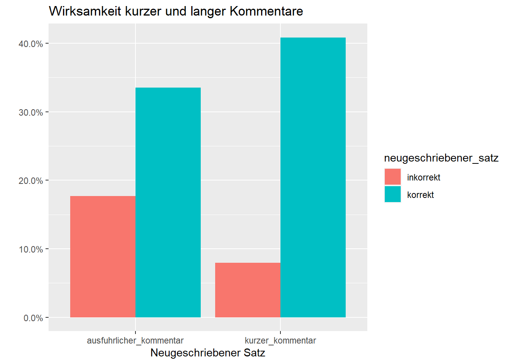

# Stichprobentests
## Nominalskalierte Größen

**Chi-Quadrat-Test** 
Der Chi-Quadrat-Test ist einer der grundlegenden statistischen Tests zum Vergleich von  nominalskalierten Kategorien, z.B. 

* biologisches Geschlecht: Frauen vs. Männer, 
* Größe: klein vs. groß
* Texte: Text A vs. Text B vs. Text C ...

### Lange und kurze Kommentare

Die Verwendung des Chi-Quadrat-Tests wollen wir zunächst am Beispiel eines erfundenen Datensatzes kennen lernen. 

<table>
 <thead>
  <tr>
   <th style="text-align:left;"> neugeschriebener_satz </th>
   <th style="text-align:right;"> kurzer_kommentar_a </th>
   <th style="text-align:right;"> ausf_a_lhrlicher_kommentar </th>
  </tr>
 </thead>
<tbody>
  <tr>
   <td style="text-align:left;"> inkorrekt </td>
   <td style="text-align:right;"> 13 </td>
   <td style="text-align:right;"> 29 </td>
  </tr>
  <tr>
   <td style="text-align:left;"> korrekt </td>
   <td style="text-align:right;"> 67 </td>
   <td style="text-align:right;"> 55 </td>
  </tr>
</tbody>
</table>

Im Datensatz wird zwischen langen und kurzen Kommentaren einer Lehrerin unterschieden und die jeweilige Anzahl sprachlicher Fehler von Schülern in ihren Aufsätzen. Geklärt werden soll die Frage, welche Wirkung lange und kurze Kommentare der Lehrerin auf die Anzahl der sprachlichen Fehler hatten. 

#### Programme


```r
library(tidyverse)
library(janitor)
library(scales)
library(rmarkdown)
library(kableExtra)
```


#### Kurzversion:
Wie sinnvoll sind lange bzw. kurze Kommentare einer Lehrerin zu sprachlichen Fehlern in Essays?


```r
library(tidyverse)
library(janitor)

# Datei laden und die Variablennamen vereinheitlichen
kommentare = read.delim("data/chisq_kommentare.txt", sep = "\t") %>% 
  clean_names()

head(kommentare)
```

```
##   neugeschriebener_satz kurzer_kommentar_a ausf_a_lhrlicher_kommentar
## 1             inkorrekt                 13                         29
## 2               korrekt                 67                         55
```

```r
library(janitor)
# Chi-Quadrat-Test
chisq.test(kommentare[,-1])
```

```
## 
## 	Pearson's Chi-squared test with Yates' continuity correction
## 
## data:  kommentare[, -1]
## X-squared = 6.2551, df = 1, p-value = 0.01238
```

Ergebnis:
Wir verwerfen die Hypothese H0 und nehmen die Hypothese H1 an: 
zwischen kurzen und langen Kommentaren besteht ein nicht zufälliger Unterschied.

#### Längere Version
##### Datei laden

Eine Lehrerin möchte wissen, ob es effektiver ist, wenn sie am Rand der Schüleressays kurze oder ausführlichere Kommentare zu den Fehlern der Schüler_innen notiert. Sie vergleicht somit zwei Schülergruppen (Schüler_innen mit kurzen vs. langen Kommentaren) und zwei Beurteilungskategorien (korrekte vs. inkorrekte Äußerungen in den Essays).


```r
library(tidyverse)

# von github laden
kommentare = read.delim(
  "https://raw.githubusercontent.com/tpetric7/tpetric7.github.io/main/data/chisq_kommentare.txt",
  sep = "\t", fileEncoding = "UTF-8")

library(janitor)

# Variablennamen konsequent schreiben
kommentare = kommentare %>% 
  clean_names()

# Von der Festplatte laden
kommentare = read.delim("data/chisq_kommentare.txt", sep = "\t", fileEncoding = "UTF-8") %>% 
  clean_names()
head(kommentare) %>% knitr::kable()
```

<table>
 <thead>
  <tr>
   <th style="text-align:left;"> neugeschriebener_satz </th>
   <th style="text-align:right;"> kurzer_kommentar </th>
   <th style="text-align:right;"> ausfuhrlicher_kommentar </th>
  </tr>
 </thead>
<tbody>
  <tr>
   <td style="text-align:left;"> inkorrekt </td>
   <td style="text-align:right;"> 13 </td>
   <td style="text-align:right;"> 29 </td>
  </tr>
  <tr>
   <td style="text-align:left;"> korrekt </td>
   <td style="text-align:right;"> 67 </td>
   <td style="text-align:right;"> 55 </td>
  </tr>
</tbody>
</table>

##### Chi-Quadrat-Test

Stichproben: kurzer Kommentar vs. langer Kommentar

* H0: Zwischen den beiden Stichproben besteht kein signifikanter Unterschied (Unterschiede zufällig).
* H1: Zwischen den beiden Stichproben besteht ein signifikanter Unterschied (Unterschiede nicht zufällig).


```r
library(janitor)
chisq.test(kommentare[,-1])
```

```
## 
## 	Pearson's Chi-squared test with Yates' continuity correction
## 
## data:  kommentare[, -1]
## X-squared = 6.2551, df = 1, p-value = 0.01238
```

Wir verwerfen H0 und nehmen H1 an: zwischen kurzen und langen Kommentaren besteht ein nicht zufälliger Unterschied.


##### Graphische Darstellung


```r
library(tidyverse)
library(scales)

kom_lang = kommentare %>% 
  as_tibble() %>% 
  pivot_longer(kurzer_kommentar:ausfuhrlicher_kommentar, 
               names_to = "Kommentar",
               values_to = "Fehler") %>% 
  mutate(pct = Fehler/sum(Fehler))

kom_lang %>% knitr::kable()
```

<table>
 <thead>
  <tr>
   <th style="text-align:left;"> neugeschriebener_satz </th>
   <th style="text-align:left;"> Kommentar </th>
   <th style="text-align:right;"> Fehler </th>
   <th style="text-align:right;"> pct </th>
  </tr>
 </thead>
<tbody>
  <tr>
   <td style="text-align:left;"> inkorrekt </td>
   <td style="text-align:left;"> kurzer_kommentar </td>
   <td style="text-align:right;"> 13 </td>
   <td style="text-align:right;"> 0.0792683 </td>
  </tr>
  <tr>
   <td style="text-align:left;"> inkorrekt </td>
   <td style="text-align:left;"> ausfuhrlicher_kommentar </td>
   <td style="text-align:right;"> 29 </td>
   <td style="text-align:right;"> 0.1768293 </td>
  </tr>
  <tr>
   <td style="text-align:left;"> korrekt </td>
   <td style="text-align:left;"> kurzer_kommentar </td>
   <td style="text-align:right;"> 67 </td>
   <td style="text-align:right;"> 0.4085366 </td>
  </tr>
  <tr>
   <td style="text-align:left;"> korrekt </td>
   <td style="text-align:left;"> ausfuhrlicher_kommentar </td>
   <td style="text-align:right;"> 55 </td>
   <td style="text-align:right;"> 0.3353659 </td>
  </tr>
</tbody>
</table>

```r
kom_lang  %>%  ggplot(aes(Kommentar, pct, fill = neugeschriebener_satz)) +
  geom_col(position = "dodge") +
  scale_y_continuous(labels = percent_format()) +
  labs(x = "Neugeschriebener Satz", y = "",
       title = "Wirksamkeit kurzer und langer Kommentare")
```



