# Stichprobentests

## Nominalskalierte Größen

**Chi-Quadrat-Test** ($\chi^2$-Test):    
Der $\chi^2$-Test ist einer der grundlegenden statistischen Tests zum Vergleich von nominalskalierten Kategorien, z.B.

-   *biologisches Geschlecht*: Frauen vs. Männer;   
-   *Größe*: klein vs. groß;   
-   *Texte*: Text A vs. Text B vs. Text C ...   

Mit dem $\chi^2$-Test testen wir, ob eine *beobachtete* Verteilung der Daten der *erwarteten* Verteilung entspricht. Der Test funktioniert auf allen Skalenniveaus. Es gibt aber verschiedene Anwendungsspielarten:   

- als *Anpassungstest* (z.B. ist ein Merkmal normalverteilt?);   
- als *Homogenitätstest* (z.B. ähneln sich Frauen und Männer bezüglich eines Merkmals, etwa ob sie rauchen oder nicht?);   
- als *Unabhängigkeitstest* (z.B. ist der Dieselverbrauch unabhängig von elektronischer Regulierung des Motors oder nicht?).   

Ein Beispiel aus einem empfehlenswerten Video aus [Kurzes Tutorium Statistik](https://www.youtube.com/watch?v=MCmZ-HXSZ4A), in dem der $@chi³2$-Test und seine Anwendungen erklärt werden. Im Beispiel geht es um den $@chi³2$-*Anpassungstest*:   

Eine Firma verkauft Armbanduhren in vier Farben (blau, grün, gelb, rot). Im letzten Monat wurden 1000 Stück verkauft. Ein Verkaufsleiter behauptet, dass die Nachfrage nach der Uhr in allen vier Farben gleich gut sei. Das können wir mit dem $\chi^2$-Test überprüfen. Wenn die Behauptung des Verkaufsleiters stimmt, dann **erwarten** wir, dass 250 blaue Uhren, 250 grüne Uhren, 250 gelbe Uhren und 250 rote Uhren verkauft wurden - dass also *Gleichverteilung* der *erwarteten Häufigkeiten* vorliegt (250 + 250 + 250 + 250). Also ein Viertel der verkauften Uhren war blau, ein Viertel war gelb, ein Viertel war rot und ein Viertel war grün.   

Wären die (**beobachteten**) Verkaufszahlen im vergangenen Monat (unserer Stichprobe) 245 + 252 + 254 + 249, dann würde der $@chi^2$-Test bestätigen, dass Gleichverteilung der Uhrfarben vorliegt und damit die Hypothese $H_0$ bestätigen. Die Unterschiede sind ja gering. Wenn aber die beobachteten Verkaufszahlen in unserer Stichprobe 60 + 320 + 100 + 520 wären, dann würde der $@chi^2$-Test die Gleichverteilung der Farben nicht bestätigen und die Nullhypothese $H_0$ verwerfen.   

Die Statistikexpertin erhält vom Verkaufsleiter die tatsächlichen Verkaufszahlen: 300 blaue Urhen + 200 gelbe Uhren + 400 rote Uhren + 100 grüne Uhren wurden im vergangenen Monat verkauft. Kann man das noch immer als Gleichverteilung der Farben auffassen?   

Wir verwenden die folgende Teststatistik:   
- Wir *subtrahieren* die jeweilige erwartete Häufikgeit von der beobachteten und erhalten somit Differenzen;   
- dann *quadrieren* wir jede *Differenz*, so dass wir nur mit positiven Zahlenwerten zu tun haben;    
- dann *dividieren* wir jede der *quadrierten Differenzen* mit der *erwarteten* Häufigkeit (hier: 250) und erhalten somit Quotienten;   
- dann *addieren* wir die *Quotienten* und erhalten somit den *empirischen* $@chi^2$-Wert (im Beispiel beträgt dieser 200).   

$$
\frac{(300 - 250)^2}{250} + \frac{(200 - 250)^2}{250} + \frac{(400 - 250)^2}{250} + \frac{(100 - 250)^2}{250} = 200 = \chi^2_{empirisch}
$$

Das **Test- oder Signifikanzniveau** (auch **Irrtumswahrscheinlichkeit** genannt) wird gewöhnlich auf 5% festgelegt (p = 0,05). Die Wahrscheinlichkeit, dass wir fälschlicherweise die Nullhypothese verwerfen, soll demnach bei diesem Testniveau höchstens 5% betragen.    

Da die Warscheinlichkeit ein Viertel pro Uhrfarbe beträgt (250 von 1000; siehe oben), liegt eine *Binomialverteilung* vor. Bei ausreichend großen Stichproben (wie der hier vorliegenden) kann man diese durch die *Normalverteilung* ersetzen. Mit der Normalverteilung lässt sich einfacher rechnen.    

Da wir in unserer Teststatistik die erwarteten Häufigkeiten von den beobachteten abziehen und danach dividieren, wird die Normalverteilung zum Nullpunkt des Koordinatensystems verschoben. Die Werte der Teststatistik werden durch diesen Rechenvorgang *normalisiert*.   

Durch Quadrieren der Differenzen erreichen wir, dass wir keine negativen Werte mehr erhalten können. Alle Werte sind damit positiv und befinden sich im ersten Quadranten des Koordinatensystems. Da wir mehrere Terme addieren (hier sind es 4) und damit potentiell mehrere Zufallsvariablen in die Summe einbeziehen, kann die *Verteilungskurve* verschiedene Formen annehmen. Das Ergebnis ist eine $\chi^2$-Verteilung. Diese Verteilung sagt uns, welche Werte die Teststatistik mit welcher Wahrscheinlichkeit annehmen wird, wenn die Nullhypothese $H_0$ stimmt. Danach sind die Werte in der Nähe des Koordinatenursprungs (der Null) wahrscheinlich. Die meisten Werte unserer Teststatistik sollten gemäß der Nullhypothese in diesem Bereich, dem *Annahmebereich*, liegen. Werte, die weit entfernt von der Null (dem Koordinatenursprung) vorkommen, sind weniger wahrscheinlich. Sie liegen im *Ablehnungsbereich* (Verwerfungsbereich).   

Eine grundlegende Bedingung für die Anwendung des $\chi^2$-Tests ist, dass die erwarteten Häufigkeiten nicht kleiner als fünf sein dürfen: $Freq_{erwartet}\geq{5}$. In unserem Beispiel ist das der Fall (hier: 250).    

In unserem Beispiel haben wir vier Summenterme, die die Gesamtsumme 1000 (Uhren) ergeben müssen. Die ersten drei Summen könnten vom Zufall abhängen, die letzte ist dagegen immer die Differenz zur Gesamtsumme (hier: 1000). In unserem Beispiel gibt es demnach nur drei Größen (Summen), die frei variieren können. In unserem Beispiel liegen demnach drei *Freiheitsgrade* vor. Das ist notwendig zu wissen, falls man (noch) mit Tabellen arbeitet und wenn man sich sicher sein möchte, dass man den Test richtig durchgeführt hat. Bei drei Freiheitsgraden und einem *Signifikanzniveau* von 5% beträgt der *kritische* $\chi^2$-Wert (*Schwellenwert* für die Annahme bzw. Ablehnung der Nullhypothese) etwa 7,815. Wenn die Nullhypothese stimmt, dann beträgt unsere Teststatistik mit 95%-iger Wahrscheinlichkeit höchstens 7,815. Unser empirischer $\chi^2$-Wert beträgt jedoch 200 und ist damit größer als der Schwellenwert (kritische Wert). Das bedeutet, dass wir die Nullhypothese verwerfen und die alternative Hypothese $H_1$ annehmen. 

**Zusammenfassung**   
Frage: Werden die Uhrfarben gleichhäufig verkauft?   
Hypothese $H_0$: Die Farben werden gleichhäufig verkauft.   
Hypothese $H_1$: Die Farben werden NICHT gleichhäufig verkauft.   
Testverteilung: $\chi^2$-Verteilung.   
Testniveau: $\alpha = 5%$   
Teststatistik:    

$$
\chi^2_{emp} = \Sigma{\frac{(Freq_{beobachtet} - Freq_{erwartet})^2}{Freq_{erwartet}}}
$$

*Ergebnis* (im obigen Beispiel):   
Die Nachfrage nach den verschiedenfarbigen Uhren ist NICHT gleichmäßig verteilt: $\chi^2_{empirisch} > \chi^2_{erwartet}$ bei 3 Freiheitsgraden und 5%-iger Irrtumswahrscheinlichkeit. Wir lehnen die Nullhypothese damit ab und akzeptieren die alternative Hypothese. 


### Lange und kurze Kommentare

Die Verwendung des $@chi³2$-Tests im sprachlichen Bereich wollen wir zunächst am Beispiel eines erfundenen Datensatzes kennen lernen.

<table>
 <thead>
  <tr>
   <th style="text-align:left;"> neugeschriebener_satz </th>
   <th style="text-align:right;"> kurzer_kommentar_a </th>
   <th style="text-align:right;"> ausf_a_lhrlicher_kommentar </th>
  </tr>
 </thead>
<tbody>
  <tr>
   <td style="text-align:left;"> inkorrekt </td>
   <td style="text-align:right;"> 13 </td>
   <td style="text-align:right;"> 29 </td>
  </tr>
  <tr>
   <td style="text-align:left;"> korrekt </td>
   <td style="text-align:right;"> 67 </td>
   <td style="text-align:right;"> 55 </td>
  </tr>
</tbody>
</table>

Im Datensatz wird zwischen langen und kurzen Kommentaren einer Lehrerin unterschieden und die jeweilige Anzahl sprachlicher Fehler von Schülern in ihren Aufsätzen. Geklärt werden soll die Frage, welche Wirkung lange und kurze Kommentare der Lehrerin auf die Anzahl der sprachlichen Fehler hatten.

#### Programme


```r
library(tidyverse)
library(janitor)
library(scales)
library(rmarkdown)
library(kableExtra)
```

#### Kurzversion:

Wie sinnvoll sind lange bzw. kurze Kommentare einer Lehrerin zu sprachlichen Fehlern in Essays?


```r
library(tidyverse)
library(janitor)

# Datei laden und die Variablennamen vereinheitlichen
kommentare = read.delim("data/chisq_kommentare.txt", sep = "\t") %>% 
  clean_names()

head(kommentare)
```

```
##   neugeschriebener_satz kurzer_kommentar_a ausf_a_lhrlicher_kommentar
## 1             inkorrekt                 13                         29
## 2               korrekt                 67                         55
```

```r
library(janitor)
# Chi-Quadrat-Test
chisq.test(kommentare[,-1])
```

```
## 
## 	Pearson's Chi-squared test with Yates' continuity correction
## 
## data:  kommentare[, -1]
## X-squared = 6.2551, df = 1, p-value = 0.01238
```

Ergebnis: Wir verwerfen die Hypothese H0 und nehmen die Hypothese H1 an: zwischen kurzen und langen Kommentaren besteht ein nicht zufälliger Unterschied.

#### Längere Version

##### Datei laden

Eine Lehrerin möchte wissen, ob es effektiver ist, wenn sie am Rand der Schüleressays kurze oder ausführlichere Kommentare zu den Fehlern der Schüler_innen notiert. Sie vergleicht somit zwei Schülergruppen (Schüler_innen mit kurzen vs. langen Kommentaren) und zwei Beurteilungskategorien (korrekte vs. inkorrekte Äußerungen in den Essays).


```r
library(tidyverse)

# von github laden
kommentare = read.delim(
  "https://raw.githubusercontent.com/tpetric7/tpetric7.github.io/main/data/chisq_kommentare.txt",
  sep = "\t", fileEncoding = "UTF-8")

library(janitor)

# Variablennamen konsequent schreiben
kommentare = kommentare %>% 
  clean_names()

# Von der Festplatte laden
kommentare = read.delim("data/chisq_kommentare.txt", sep = "\t", fileEncoding = "UTF-8") %>% 
  clean_names()
head(kommentare) %>% knitr::kable()
```

<table>
 <thead>
  <tr>
   <th style="text-align:left;"> neugeschriebener_satz </th>
   <th style="text-align:right;"> kurzer_kommentar </th>
   <th style="text-align:right;"> ausfuhrlicher_kommentar </th>
  </tr>
 </thead>
<tbody>
  <tr>
   <td style="text-align:left;"> inkorrekt </td>
   <td style="text-align:right;"> 13 </td>
   <td style="text-align:right;"> 29 </td>
  </tr>
  <tr>
   <td style="text-align:left;"> korrekt </td>
   <td style="text-align:right;"> 67 </td>
   <td style="text-align:right;"> 55 </td>
  </tr>
</tbody>
</table>

##### Chi-Quadrat-Test

Stichproben: kurzer Kommentar vs. langer Kommentar

-   H0: Zwischen den beiden Stichproben besteht kein signifikanter Unterschied (Unterschiede zufällig).
-   H1: Zwischen den beiden Stichproben besteht ein signifikanter Unterschied (Unterschiede nicht zufällig).


```r
library(janitor)
chisq.test(kommentare[,-1])
```

```
## 
## 	Pearson's Chi-squared test with Yates' continuity correction
## 
## data:  kommentare[, -1]
## X-squared = 6.2551, df = 1, p-value = 0.01238
```

Wir verwerfen H0 und nehmen H1 an: zwischen kurzen und langen Kommentaren besteht ein nicht zufälliger Unterschied.

##### Graphische Darstellung


```r
library(tidyverse)
library(scales)

kom_lang = kommentare %>% 
  as_tibble() %>% 
  pivot_longer(kurzer_kommentar:ausfuhrlicher_kommentar, 
               names_to = "Kommentar",
               values_to = "Fehler") %>% 
  mutate(pct = Fehler/sum(Fehler))

kom_lang %>% knitr::kable()
```

<table>
 <thead>
  <tr>
   <th style="text-align:left;"> neugeschriebener_satz </th>
   <th style="text-align:left;"> Kommentar </th>
   <th style="text-align:right;"> Fehler </th>
   <th style="text-align:right;"> pct </th>
  </tr>
 </thead>
<tbody>
  <tr>
   <td style="text-align:left;"> inkorrekt </td>
   <td style="text-align:left;"> kurzer_kommentar </td>
   <td style="text-align:right;"> 13 </td>
   <td style="text-align:right;"> 0.0792683 </td>
  </tr>
  <tr>
   <td style="text-align:left;"> inkorrekt </td>
   <td style="text-align:left;"> ausfuhrlicher_kommentar </td>
   <td style="text-align:right;"> 29 </td>
   <td style="text-align:right;"> 0.1768293 </td>
  </tr>
  <tr>
   <td style="text-align:left;"> korrekt </td>
   <td style="text-align:left;"> kurzer_kommentar </td>
   <td style="text-align:right;"> 67 </td>
   <td style="text-align:right;"> 0.4085366 </td>
  </tr>
  <tr>
   <td style="text-align:left;"> korrekt </td>
   <td style="text-align:left;"> ausfuhrlicher_kommentar </td>
   <td style="text-align:right;"> 55 </td>
   <td style="text-align:right;"> 0.3353659 </td>
  </tr>
</tbody>
</table>

```r
kom_lang  %>%  ggplot(aes(Kommentar, pct, fill = neugeschriebener_satz)) +
  geom_col(position = "dodge") +
  scale_y_continuous(labels = percent_format()) +
  labs(x = "Neugeschriebener Satz", y = "",
       title = "Wirksamkeit kurzer und langer Kommentare")
```


### Plural von Kunstwörtern

#### Programme laden


```r
library(tidyverse)
library(scales)
library(kableExtra)
```

#### Dateien laden

Für die Durchführung eines $\chi^2$-Tests solle eine Tabelle geladen werden, die Ergebnisse eines Experiments mit deutschen Kunstwörtern enthält, von denen slowenische Studierende der Germanistik den Plural bilden sollten. 


```r
# Branje datoteke je možno na več načinov
plural_subj1 = read.csv("data/plural_Subj_sum.csv", sep = ";")
plural_subj1 = read.csv2("data/plural_Subj_sum.csv")
plural_subj1 = read_csv2("data/plural_Subj_sum.csv")

# Pokaži prvih šest vrstic
head(plural_subj1) %>% knitr::kable()
```

<table>
 <thead>
  <tr>
   <th style="text-align:right;"> SubjID </th>
   <th style="text-align:left;"> WordType </th>
   <th style="text-align:left;"> Genus </th>
   <th style="text-align:right;"> Sigstark </th>
   <th style="text-align:right;"> En </th>
   <th style="text-align:right;"> E </th>
   <th style="text-align:right;"> Er </th>
   <th style="text-align:right;"> S </th>
   <th style="text-align:right;"> Z </th>
  </tr>
 </thead>
<tbody>
  <tr>
   <td style="text-align:right;"> 1 </td>
   <td style="text-align:left;"> NoRhyme </td>
   <td style="text-align:left;"> Fem </td>
   <td style="text-align:right;"> 4.983333 </td>
   <td style="text-align:right;"> 8 </td>
   <td style="text-align:right;"> 4 </td>
   <td style="text-align:right;"> 0 </td>
   <td style="text-align:right;"> 0 </td>
   <td style="text-align:right;"> 0 </td>
  </tr>
  <tr>
   <td style="text-align:right;"> 1 </td>
   <td style="text-align:left;"> NoRhyme </td>
   <td style="text-align:left;"> Masc </td>
   <td style="text-align:right;"> 4.600000 </td>
   <td style="text-align:right;"> 6 </td>
   <td style="text-align:right;"> 6 </td>
   <td style="text-align:right;"> 0 </td>
   <td style="text-align:right;"> 0 </td>
   <td style="text-align:right;"> 0 </td>
  </tr>
  <tr>
   <td style="text-align:right;"> 1 </td>
   <td style="text-align:left;"> NoRhyme </td>
   <td style="text-align:left;"> Neut </td>
   <td style="text-align:right;"> 5.366667 </td>
   <td style="text-align:right;"> 10 </td>
   <td style="text-align:right;"> 2 </td>
   <td style="text-align:right;"> 0 </td>
   <td style="text-align:right;"> 0 </td>
   <td style="text-align:right;"> 0 </td>
  </tr>
  <tr>
   <td style="text-align:right;"> 1 </td>
   <td style="text-align:left;"> Rhyme </td>
   <td style="text-align:left;"> Fem </td>
   <td style="text-align:right;"> 3.836667 </td>
   <td style="text-align:right;"> 3 </td>
   <td style="text-align:right;"> 8 </td>
   <td style="text-align:right;"> 0 </td>
   <td style="text-align:right;"> 0 </td>
   <td style="text-align:right;"> 1 </td>
  </tr>
  <tr>
   <td style="text-align:right;"> 1 </td>
   <td style="text-align:left;"> Rhyme </td>
   <td style="text-align:left;"> Masc </td>
   <td style="text-align:right;"> 4.153333 </td>
   <td style="text-align:right;"> 5 </td>
   <td style="text-align:right;"> 5 </td>
   <td style="text-align:right;"> 1 </td>
   <td style="text-align:right;"> 0 </td>
   <td style="text-align:right;"> 1 </td>
  </tr>
  <tr>
   <td style="text-align:right;"> 1 </td>
   <td style="text-align:left;"> Rhyme </td>
   <td style="text-align:left;"> Neut </td>
   <td style="text-align:right;"> 3.784167 </td>
   <td style="text-align:right;"> 3 </td>
   <td style="text-align:right;"> 7 </td>
   <td style="text-align:right;"> 1 </td>
   <td style="text-align:right;"> 0 </td>
   <td style="text-align:right;"> 1 </td>
  </tr>
</tbody>
</table>

#### Datensatz-Aggregation und Test

Zuerst müssen wir die Rohdaten in eine Tabelle umformen, so dass ein $\chi^2$-Test durchgeführt werden kann. Eine derartige Transformation eines Datensatzes wird oft als Aggregation bezeichnet (also eine Art von Zusammenfassung). In der neu gebildeten 2x2-Tabelle sind die Beobachtungsdaten (d.h. die Häufigkeiten oder Frequenzen) zu finden. Das Programm berechnet für uns die erwarteten Häufigkeiten (theoretischen Frequenzen) und bewertet dann, ob die Differenz zwischen den Stichproben statistisch signifikant ist.

Die statistischen Annahmen können folgendermaßen formuliert werden:   
- $H_0$: Die Versuchspersonen verwenden sowohl für Reimwörter als auch für Nicht-Reimwörter dieselben deutschen Pluralmarker. Der Worttyp hat demnach keinen Einfluss auf die Auswahl des Pluralmarkers.   
- $H_1$: Die Versuchspersonen verwenden für Reimwörter nicht dieselben deutschen Pluralmarker wie für Nicht-Reimwörterverschieden für die beiden Worttypen (Reimwort vs. Nicht-Reimwort). Der Worttyp hat demnach Einfluss auf die Auswahl des Pluralmarkers.   

Wenn der beim statistischen Test erhaltene p-Wert \< 0,05 ist (d.h. bei einer Fehlerwahrscheinlichkeit von weniger als 5%), dann gilt die alternative Hypothese $H_1$: die Differenz zwischen den beobachteten und den theoretisch erwarteten Häufigkeiten ist in diesem Fall statistisch signifikant, d.h. die Differenz ist nicht zufällig und bei 5% Fehlerwahrscheinlichkeit hinreichend groß.

Wenn der p-Wert jedoch p \> 0,05 ist, dann wird die Nullhypothese $H_0$ beibehalten. In diesem Fall wäre die Differenz nicht hinreichend groß und daher vermutlich zufällig entstanden (z.B. durch die geringe Größe der Stichproben oder die Auswahl der Stichprobendaten).

Im ersten statischen Test vergleichen wir die Häufigkeiten der Pluralmarker *--e* und *--s* miteinander.   


```r
# Povzemamo ("aggregate")
# Ergebnisse summieren
p = plural_subj1 %>% 
  group_by(WordType) %>% 
  summarise(Sigstark = mean(Sigstark),
            En = sum(En), E = sum(E), Er = sum(Er), 
            S = sum(S), Z = sum(Z)) 

# izpis tabele
knitr::kable(p)
```

<table>
 <thead>
  <tr>
   <th style="text-align:left;"> WordType </th>
   <th style="text-align:right;"> Sigstark </th>
   <th style="text-align:right;"> En </th>
   <th style="text-align:right;"> E </th>
   <th style="text-align:right;"> Er </th>
   <th style="text-align:right;"> S </th>
   <th style="text-align:right;"> Z </th>
  </tr>
 </thead>
<tbody>
  <tr>
   <td style="text-align:left;"> NoRhyme </td>
   <td style="text-align:right;"> 4.087337 </td>
   <td style="text-align:right;"> 1528 </td>
   <td style="text-align:right;"> 2169 </td>
   <td style="text-align:right;"> 302 </td>
   <td style="text-align:right;"> 307 </td>
   <td style="text-align:right;"> 26 </td>
  </tr>
  <tr>
   <td style="text-align:left;"> Rhyme </td>
   <td style="text-align:right;"> 3.916109 </td>
   <td style="text-align:right;"> 1425 </td>
   <td style="text-align:right;"> 2172 </td>
   <td style="text-align:right;"> 561 </td>
   <td style="text-align:right;"> 244 </td>
   <td style="text-align:right;"> 14 </td>
  </tr>
</tbody>
</table>

```r
# Izberemo tri stolpce
q = p %>% select(WordType, E, S)

# Razlika med deleži množinskih pripon E in S (npr. Bal-e oder Bal-s)
chisq.test(q[,-1]) # prvi stolpec naj se ne upošteva, zato [, -1]
```

```
## 
## 	Pearson's Chi-squared test with Yates' continuity correction
## 
## data:  q[, -1]
## X-squared = 6.2424, df = 1, p-value = 0.01247
```

#### Naslednji preizkus(i)

Wir machen noch einen $\chi^2$-Test mit einer 2x2-Tabelle, und zwar
mit den Pluralmarkern *--e* und *--er* durchgeführt.   


```r
# Izberemo tri stolpce za naslednji preizkus
q = p %>% select(WordType, E, Er)

# Razlika med deleži množinskih pripon E in Er (npr. Bal-e oder Bal-er)
chisq.test(q[,-1]) # prvi stolpec naj se ne upošteva, zato [, -1]
```

```
## 
## 	Pearson's Chi-squared test with Yates' continuity correction
## 
## data:  q[, -1]
## X-squared = 64.106, df = 1, p-value = 1.179e-15
```

#### Tabela 2 x 3

Der $\chi^2$-Test kann auch mit größeren Tabellen durchgeführt werden, z.B. mit einer 2x3-Tabelle. Dies ermöglicht den Vergleich von mehr als zwei Stichproben.   

Der $\chi^2$-Test kann statistisch signifikante Unterschiede zwischen Stichproben melden, kann aber leider nicht darüber Auskunft oben, welche Stichprobe sich von den übrigen unterscheidet.   


```r
# Izberemo tri stolpce za naslednji preizkus
q = p %>% select(WordType, Er, E, S)

# Razlika med deleži množinskih pripon E in Er (npr. Bal-e oder Bal-er)
chisq.test(q[,-1]) # prvi stolpec naj se ne upošteva, zato [, -1]
```

```
## 
## 	Pearson's Chi-squared test
## 
## data:  q[, -1]
## X-squared = 78.148, df = 2, p-value < 2.2e-16
```

#### Zweite Version

Es gibt verschiedene Wege, um die Rohdaten in eine Tabelle umzuformen, die für die Durchführung eines $\chi^2$-Tests geeignet ist. Hier folgt eine weitere Aggregationsvariante mit Hilfe von `tidyverse`-Funktionen. 
Zuerst gruppieren wir die Rohdaten nach der Spalte, in der die Versuchspersonen eingetragen sind. Dann lassen wir die Summe der ausgewählten Pluralmarker berechnen:


```r
(p = plural_subj1 %>% 
  group_by(WordType) %>% 
  summarise(En = sum(En), E = sum (E))
)
```

```
## # A tibble: 2 x 3
##   WordType    En     E
##   <chr>    <dbl> <dbl>
## 1 NoRhyme   1528  2169
## 2 Rhyme     1425  2172
```

Falls p \< 0,05 ist, gilt $H_1$ (die Stichproben unterscheiden sich). Falls p \> 0,05 ist, gilt $H_0$ (kein signifikanter Unterschied zwischen Stichproben).   


```r
(chi = chisq.test(p[,-1])
)
```

```
## 
## 	Pearson's Chi-squared test with Yates' continuity correction
## 
## data:  p[, -1]
## X-squared = 2.1535, df = 1, p-value = 0.1422
```

Zum Schluss werfen wir noch einen Blick auf beobachtete und erwartete Häufigkeiten: 


```r
tabelle <- as_tibble(cbind(chi$observed, chi$expected)) %>%
    # Spalte wieder hinzufügen
   mutate(Wordtyp = unlist(p[,1])) %>%
   # auf deutsch
   mutate(Wordtyp = str_replace(Wordtyp, "NoRhyme", "Nicht-Reimwort"), 
          Wordtyp = str_replace(Wordtyp, "Rhyme", "Reimwort")) %>%
   # erwartete Werte, wenn H0 richtig ist
   rename(En_erwartet = V3, E_erwartet = V4) %>% 
   # Reihenfolge der Variablen verändern
   select(Wordtyp, En, E, En_erwartet, E_erwartet)

tabelle %>% rmarkdown::paged_table()
```

<div data-pagedtable="false">
  <script data-pagedtable-source type="application/json">
{"columns":[{"label":["Wordtyp"],"name":[1],"type":["chr"],"align":["left"]},{"label":["En"],"name":[2],"type":["dbl"],"align":["right"]},{"label":["E"],"name":[3],"type":["dbl"],"align":["right"]},{"label":["En_erwartet"],"name":[4],"type":["dbl"],"align":["right"]},{"label":["E_erwartet"],"name":[5],"type":["dbl"],"align":["right"]}],"data":[{"1":"Nicht-Reimwort","2":"1528","3":"2169","4":"1496.743","5":"2200.257"},{"1":"Reimwort","2":"1425","3":"2172","4":"1456.257","5":"2140.743"}],"options":{"columns":{"min":{},"max":[10]},"rows":{"min":[10],"max":[10]},"pages":{}}}
  </script>
</div>

### Modalkonstruktionen 

In diesem Abschnitt wird die Vorkommenshäufigkeit (token frequency) der slowenischen Modalkonstruktionen *morati + Infinitiv* und *biti + treba + Infinitiv* in einer Auswahl von slowenischen Texten miteinander verglichen. Der statistische Vergleich wird mit dem $\chi^2$-Test durchgeführt. 

#### Packages


```r
library(tidyverse)
library(scales)
library(janitor)
library(readxl)
```

#### Datei laden

Bei Recherchen auf dem slowenischen *Gigafida*-Portal wurden Gebrauchsfrequenzen (Tokenfrequenzen) von zwei Modalkonstruktionen ermittelt, und zwar:   
- *morati + Infinitiv* und   
- *biti + treba + Infinitive*.   

Die erste Tabelle mit den Gebrauchsfrequenzen laden wir von der Festplatte: 


```r
naklonska <- read_xlsx("data/morati_treba.xlsx") %>% 
  clean_names()
naklonska
```

```
## # A tibble: 2 x 3
##   vrsta_besedila  treba  morati
##   <chr>           <dbl>   <dbl>
## 1 Časniki        550572 1501540
## 2 Drugo          169349  530345
```

Die zweite Tabelle zeigt die Distribution der beiden Modalkonstruktionen in fünf Funktionalstilen.


```r
naklonska2 <- read_xlsx("data/morati_treba.xlsx", 
                        sheet = "List2") %>% clean_names()
naklonska2
```

```
## # A tibble: 5 x 3
##   vrsta_besedila    treba  morati
##   <chr>             <dbl>   <dbl>
## 1 Časopisi         389479 1086280
## 2 Revije           161093  415260
## 3 Internet         124996  376433
## 4 Stvarna besedila  30998   98981
## 5 Leposlovje        13355   54931
```

Die Modalkonstruktion *morati + Infinitiv* wird ca. dreimal so häufig verwendet wie *biti + treba + Infinitiv*.

#### Graphische Darstellung

Die graphischen Darstellungen zeigen eher geringe Distributionsunterschiede.


```r
naklonska %>%
  pivot_longer(treba:morati, names_to = "konstruktion", 
               values_to = "freq") %>% 
  ggplot(aes(konstruktion, freq, fill = vrsta_besedila)) +
  geom_col(position = "fill") +
  scale_y_continuous(labels = percent_format()) +
  labs(x = "Modalkonstruktion", y = "Gebrauchsfrequenz", 
       fill = "Vrsta besedila")
```


Die Modalkonstruktion *morati + Infinitiv* scheint in den alltagssprachlich näherstehenden Funktionalstilen Belletristik (leposlovje), Internet und Sachtexten (stvarna besedila) etwas häufiger belegt zu sein als die Modalkonstruktion *biti + treba + Infinitiv*, dafür aber in Zeitungen (Časopisi) etwas seltener.


```r
naklonska2 %>%
  pivot_longer(treba:morati, names_to = "konstruktion", 
               values_to = "freq") %>% 
  ggplot(aes(konstruktion, freq, fill = vrsta_besedila)) +
  geom_col(position = "fill") +
  scale_y_continuous(labels = percent_format()) +
  labs(x = "Modalkonstruktion", y = "Gebrauchsfrequenz", 
       fill = "Vrsta besedila")
```

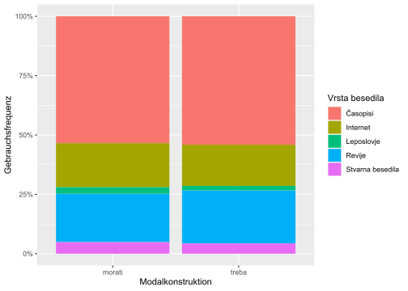

#### Chi-Quadrat-Test

Linguistische Annahme: Die Modalkonstruktion *morati + Infinitiv* ist weniger markiert (natürlicher) als die Modalkonstruktion *biti + treba + Infinitiv*.    

Formale Begründung: Die erste Konstruktion ist kürzer und daher ökonomischer als die zweite.   
Semantische Begründung: Die erste Konstruktion ist semantisch weniger spezifisch als die zweite.   
Dies sollte dazu führen, dass die erste Konstruktion in einer größeren Anzahl von Kontexten erscheint als die zweite.   

Die statistischen Annahmen lassen sich folgendermaßen formulieren:    
$H_0$: Die beiden Modalkonstruktionen kommen in denselben Funktionalstilen vor.    
$H_1$: Die beiden Modalkonstruktionen kommen nicht in denselben Funktionalstilen vor.

Der erste $\chi^2$-Test zeigt, dass die beiden Stichproben (*morati* vs. *treba*) unabhängig voneinander sind. Dies bestätigt der geringe p-Wert (p \< 0,001), der unterhalb dem Grenzwert von p = 0,05 (5%) liegt. Damit können wir die Nullhypothese ($H_0$) verwerfen und die alternative Hypothese ($H_1$) akzeptieren. Die beiden Modalkonstruktionen kommen demnach nicht im gleichen Maße in denselben Funktionalstilen vor.


```r
chisq.test(naklonska[ , -1])
```

```
## 
## 	Pearson's Chi-squared test with Yates' continuity correction
## 
## data:  naklonska[, -1]
## X-squared = 1862.9, df = 1, p-value < 2.2e-16
```

Der zweite $@chi³2$-Test, der mit den Zahlenwerten der zweiten Tabelle durchgeführt wird, bestätigt Hypothese $H_1$. Die Distribution der beiden Modalkonstruktionen unterscheidet sich. Die graphische Darstellung deutet an, dass dies vor allem am vergleichsweise selteneren Gebrauch der (natürlicheren) Modalkonstruktion *morati + Infinitiv* in publizistischen Texten liegen könnte. Nach unser Annahme wird die (weniger natürliche) Modalkonstruktion *biti + treba + Infinitiv* häufiger in weniger natürlichen Textsorten mit dem Merkmal [+Distanz] eingesetzt.


```r
chisq.test(naklonska2[ , -1])
```

```
## 
## 	Pearson's Chi-squared test
## 
## data:  naklonska2[, -1]
## X-squared = 3292, df = 4, p-value < 2.2e-16
```


## Intervallskalierte Größen

Statistische Tests:

-   t-Test,

-   lineare Regression,

-   lineare Regression mit gemischten Effekten.


### Äußerungslänge in einer Kurzgeschichte

Im *Wikipedia*-[Artikel](https://de.wikipedia.org/wiki/Satzl%C3%A4nge#Durchschnittliche_Satzl%C3%A4nge) zum Thema *Satzlänge* (nach unserer Terminologie: *Äußerungslänge*) wird angegeben, dass die durchschnittliche Satzlänge in Prosatexten für literarische Prosa im 20. Jahrhundert gemäß [Best(2002)](https://de.wikipedia.org/wiki/Satzl%C3%A4nge#Durchschnittliche_Satzl%C3%A4nge) zwischen 7,08 und 19,62 Wörtern liegt. 

#### Programme und Tabelle laden


```r
library(tidyverse)
library(scales)
library(janitor)
library(readxl)
wiki_utter_length <- 
  read_xlsx("data/wikipedia_satzlaenge_durchschnitt.xlsx")
wiki_utter_length %>% rmarkdown::paged_table()
```

<div data-pagedtable="false">
  <script data-pagedtable-source type="application/json">
{"columns":[{"label":["Textgruppe"],"name":[1],"type":["chr"],"align":["left"]},{"label":["untere Grenze der Satzlängen"],"name":[2],"type":["dbl"],"align":["right"]},{"label":["obere Grenze der Satzlängen"],"name":[3],"type":["dbl"],"align":["right"]}],"data":[{"1":"Pressetexte","2":"9.62","3":"22.91"},{"1":"Prosa für Kinder und Jugendliche","2":"6.21","3":"12.66"},{"1":"Literarische Prosa","2":"7.08","3":"19.62"},{"1":"Sprachwissenschaft","2":"25.67","3":"28.73"}],"options":{"columns":{"min":{},"max":[10]},"rows":{"min":[10],"max":[10]},"pages":{}}}
  </script>
</div>

Roman-Dialoge weisen laut [Pieper(1979)](https://de.wikipedia.org/wiki/Satzl%C3%A4nge#Durchschnittliche_Satzl%C3%A4nge) einen Medianwert von 6,01 Wörtern auf, Roman-Nichtdialoge dagegen einen Medianwert von 12,98 Wörtern. Der Median ist ein Mittelwert, der genau in der Mitte aller Werte liegt: 50% aller Werte liegen unterhalb des Medians, 50% oberhalb davon. 


```r
wiki_utter_length_median <- 
  read_xlsx("data/wikipedia_satzlaenge_median.xlsx")
wiki_utter_length_median %>% rmarkdown::paged_table()
```

<div data-pagedtable="false">
  <script data-pagedtable-source type="application/json">
{"columns":[{"label":["x"],"name":[1],"type":["dbl"],"align":["right"]},{"label":["Textgruppe"],"name":[2],"type":["chr"],"align":["left"]},{"label":["Satzlänge (Median)"],"name":[3],"type":["dbl"],"align":["right"]}],"data":[{"1":"1","2":"Hörspiel","3":"6.64"},{"1":"2","2":"Drama","3":"6.49"},{"1":"3","2":"Roman-Dialog","3":"6.01"},{"1":"4","2":"Diskussion","3":"11.83"},{"1":"5","2":"Roman-Nichtdialog","3":"12.98"},{"1":"6","2":"Briefe","3":"13.63"},{"1":"7","2":"Wissenschaftliche Texte","3":"19.22"},{"1":"8","2":"Allgemeine Gesetzestexte","3":"23.04"},{"1":"9","2":"Zeitung: Agenturberichte","3":"23.23"},{"1":"10","2":"Zeitung: Eigene Berichte","3":"16.37"},{"1":"11","2":"Zeitung: Feuilleton","3":"16.89"},{"1":"12","2":"Zeitung: Sportberichte","3":"15.09"}],"options":{"columns":{"min":{},"max":[10]},"rows":{"min":[10],"max":[10]},"pages":{}}}
  </script>
</div>

#### Hypothesen für den t-Test

Aufgrund der in den beiden Tabellen vorgestellten Mittelwerte gehen wir im Fall von *Borcherts* Kurzgeschichte *Die Küchenuhr* von der folgende *Nullhypothese* ($H_0$) aus:    
Die durchschnittliche Äußerungslänge beträgt so wie in literarischer Prosa etwa $\mu$ = 12 Wörter pro Äußerung. Die Kurzgeschichte ist ein Beispiel für literarische Prosa, in der auch Dialoge vorkommen. 
Die *Alternativhypothese* ($H_1$) besagt dagegen, dass das arithmetische Mittel (der Durchschnittswert) in Borcherts Kurzgeschichte von dem erwarteten Durchschnitt für literarische Prosa (mit Dialog- und Nicht-Dialog-Passagen) $\mu$ abweicht. 

Der t-Test wird auf folgende Weise berechnet:   

$$
t = \frac{m - \mu}{s/{\sqrt{n}}}
$$
- *m* ist der arithmetische Mittelwert der Stichprobe;   
- $\mu$ ist der arithmetische Mittelwert für literarische Prosa;   
- *n* ist die Stichprobengröße (d.h. die Anzahl der Äußerungen);   
- *s* ist die Standardabweichung mit $n - 1$ Freiheitsgraden. Da wir die Standardabweichung in der Grundgesamtheit $\sigma$ nicht kennen, sind wir bei diesem t-Test mit einer Stichprobe auf die Standardabweichung der Stichprobe $s$ (d.h. einer Zufallsvariable) angewiesen.    

Der *t-Wert* und der *p-Wert* werden bei *df* = $n - 1$ *Freiheitsgraden* berechnet. Falls der p-Wert < 0,05, verwerfen wir die Nullhypothese, liegt er dagegen oberhalb dieses Signifikanzniveaus, behalten wir die Nullhypothese bei.  


#### Textvorbereitung

Zuerst muss der Text geöffnet und dann in Äußerungen zerlegt werden. Dann kann `quanteda` die Anzahl der Tokens (d.h. Wörter + Interpunktionszeichen) zählen. Die Interpunktionszeichen werden hier der Einfachheit halber nicht herausgefiltert, so dass die ermittelten Zahlen etwas höher ausfallen. Für die Durchführung eines t-Test erstellen wir einen Datensatz, in dem die Wortanzahl (Tokenanzahl) für jede Äußerung auftritt. 


```r
library(quanteda)
library(quanteda.textstats)
# open the text file
borchert_kuechenuhr <- read_lines(
  "data/borchert/borchert_kuechenuhr.txt")
# create corpus
borchert_corp_basic <- corpus (borchert_kuechenuhr)
# corpus reshaped by utterances
borchert_corp_utter <- corpus_reshape(borchert_corp_basic, 
                                      to = "sentences")
# create a dataframe
borchert_df <- as.character(borchert_corp_utter) %>% 
  as.data.frame() %>% 
  rename(text = ".") %>% 
  rownames_to_column(., var = "doc_id")

# mandatory for t-test: count tokens per utterance
borchert_textstats <- summary(borchert_corp_utter, n = 130) %>% 
  rename(doc_id = Text)

# join both datasets
borchert_df_all <- left_join(borchert_df, borchert_textstats, 
                             by = "doc_id") %>% 
  filter(Tokens > 0)

# remove title and author from dataframe
# 109 sentences remain
borchert_df_all <- borchert_df_all %>% 
  filter(doc_id != "text1.1")
```


#### Durchführung des t-Tests

Nun führen wir den **Ein-Stichproben t-Test** durch. Dazu genügt der Datensatz *borchert_textstats*. 


```r
# install.packages("ggpubr")
library(ggpubr)
# remove 0 values and title
borchert_textstats <- borchert_textstats %>% 
  filter(Tokens > 0, doc_id != "text1.1")
# test
t.test(borchert_textstats$Tokens, mu = 12, alternative = "two.sided")
```

```
## 
## 	One Sample t-test
## 
## data:  borchert_textstats$Tokens
## t = -3.5698, df = 108, p-value = 0.0005346
## alternative hypothesis: true mean is not equal to 12
## 95 percent confidence interval:
##   9.288998 11.224764
## sample estimates:
## mean of x 
##  10.25688
```

Das *Ergebnis*: Die durchschnittliche Äußerungslänge in Borcherts Kurzgeschichte (mean = 9,25 Wörter pro Äußerung) unterscheidet sich signifikant vom erwarteten arithmetischen Mittelwert für literarische Prosa $\mu$ = 12 Wörter. 

Der folgende t-Test wird mit dem vollständigen Datensatz *borchert_df_all* durchgeführt, aber dieses Mal mit der Nullhypothese, dass der Mittelwert *m* der Stichprobe gleich dem Mittelwert $\mu$ = 7,08 beträgt (d.h. der Untergrenze der Äußerungslänge literarischer Prosa). 


```r
# install.packages("ggpubr")
library(ggpubr)
t.test(borchert_df_all$Tokens, mu = 7.08, alternative = "two.sided")
```

```
## 
## 	One Sample t-test
## 
## data:  borchert_df_all$Tokens
## t = 6.5061, df = 108, p-value = 2.48e-09
## alternative hypothesis: true mean is not equal to 7.08
## 95 percent confidence interval:
##   9.288998 11.224764
## sample estimates:
## mean of x 
##  10.25688
```

Die durchschnittliche Äußerungslänge in Borcherts Kurzgeschichte unterscheidet sich demnach mit statistischer Signifikanz sowohl vom angenommenen Mittelwert $\mu$ = 12 Wörter für literarische Prosa als auch von der Untergrenze $\mu$ = 7,08 Wörter. 

Der schwarze Balken im Boxplot zeigt den Medianwert unserer Stichprobe (median = 9 Wlrter bzw. genauer: Tokens), der nur knapp unter dem arithmetischen Mittelwert liegt (mean = 9,29 Tokens). Die gestrichelten blauen Linien kennzeichnen die Ober- und Untergrenze der durchschnittlichen Äußerungslängen für literarische Prosa (s. Wikipedia-Tabelle oben). Genau 50% aller Äußerungslängen aus Borcherts Kurzgeschichte liegen im blauen Kasten. 


```r
borchert_df_all %>% 
  ggplot(aes(y = Tokens)) +
  geom_boxplot(fill = "cyan") + 
  geom_hline(yintercept = 19.62, color = "blue", lty = 3, size = 2) +
  geom_hline(yintercept = 7.08, color = "blue", 
             linetype = "dotted", size = 2)
```

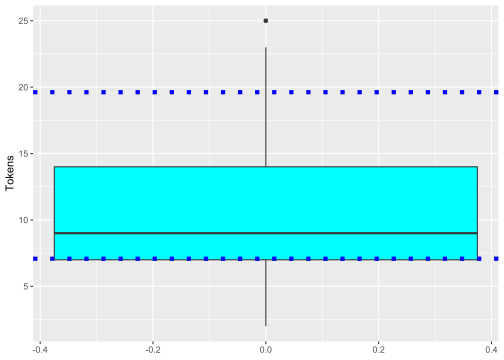


### Wirkung von Unterrichtsmethoden

Welche Wirkung haben zwei verschiedene Unterrichtsmethoden auf die Ergebnisse von Sprachtests? Welche Gruppe von Studierenden erreichte eine höhere Punktzahl beim Test? 

Diese Frage soll mit Hilfe eines *t-Tests für zwei unabhängige Stichproben* geprüft werden. 

#### Data


```r
# Two teaching methods and the scores in a language test.
metode <- read.csv("data/ttest2a.csv", dec=",")
attach(metode)

head(metode)
```

```
##   Testpersonen Resultat Methode
## 1            1       23       A
## 2            2       34       A
## 3            3       54       A
## 4            4       33       A
## 5            5       26       A
## 6            6       27       A
```


#### Deskriptive Statistik

Arithmetische Mittelwerte beider Studentengruppen (Average scores of students): 


```r
tapply(Resultat, list(Methode), mean)
```

```
##     A     B 
## 32.65 31.55
```

Standardabweichungen in beiden Studentengruppen (Standard deviations of averages): 


```r
tapply(Resultat, list(Methode), sd)
```

```
##        A        B 
## 9.906271 7.897201
```

Graphische Darstellung


```r
barplot(tapply(Resultat, list(Methode), mean), col=c(3:2))
```

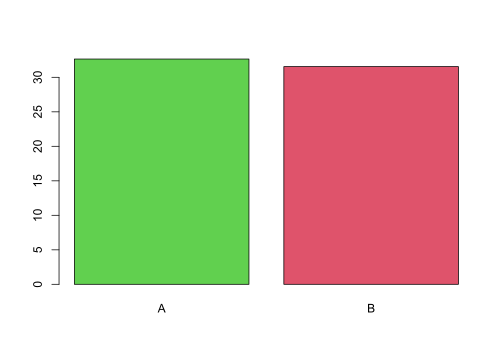

Flexiblere Gestaltung mit dem Programm `ggplot2`.


```r
metode %>% 
  ggplot(aes(Methode, Resultat, fill = Methode)) +
  geom_boxplot() +
  geom_jitter(width = 0.1) +
  theme(legend.position = "none")
```


#### Zwei-Stichproben t- Test

In diesem t-Test werden zwei die arithmetischen Mittelwerte von zwei Stichproben verglichen, die unabhängig voneinander sind. Eine Studentengruppe hatten Unterricht gemäß Methode A, die andere gemäß Methode B. Ist das durchschnittliche Ergebnis beider Gruppen gleich oder unterschiedlich?

Nullhypothese $H_0$: Die Ergebnisse beider Methoden unterscheiden sich nicht signifikant.    
Alternativhypothese $H_1$: Die Ergebnisse beider Mehtoden unterscheiden sich signifikant.   


```r
# Do the means of the two samples differ significantly?
# Hypothesis H0: they don't (if p > 0.05.
# Hypothesis H1: they do (if p < 0.05.
t.test(Resultat ~ Methode, data=metode, paired = F, var.equal = T)
```

```
## 
## 	Two Sample t-test
## 
## data:  Resultat by Methode
## t = 0.3883, df = 38, p-value = 0.7
## alternative hypothesis: true difference in means between group A and group B is not equal to 0
## 95 percent confidence interval:
##  -4.634791  6.834791
## sample estimates:
## mean in group A mean in group B 
##           32.65           31.55
```

*Ergebnis des t-Tests*: In unserem erfundenen Datensatz wird die Nullhypothese angenommen. Zwischen den Ergebnissen nach Methode A und B gab es keinen signifikanten Unterschied. Der *p-Wert* lag mit p = 0,7 oberhalb dem Signifikanzniveau von p = 0,05. 

Der t-test erfordert normalverteilte Daten. Ob Normalverteilung vorliegt, kann man    
- mit dem shapiro-Test oder    
- (meist zuverlässiger) mit Hilfe eines Histrogramms überprüfen. 

Die arithmetischen Mittelwert der Gruppe A sind gemäß dem Shapiro-Wilks-Test normalverteilt, denn p > 0,05. Bei einem p-Wert von weniger als 0,05 müssten wir die Nullhypothese, dass die Variable normalverteilt ist, verwerfen. 


```r
metode %>% 
  filter(Methode == "A") %>% 
  select(Resultat) %>% 
  pull() %>% 
  shapiro.test()
```

```
## 
## 	Shapiro-Wilk normality test
## 
## data:  .
## W = 0.98368, p-value = 0.9723
```

Die arithmetischen Mittelwert der Gruppe B sind gemäß dem Shapiro-Wilks-Test ebenfalls normalverteilt, denn p > 0,05.  


```r
metode %>% 
  filter(Methode == "B") %>% 
  select(Resultat) %>% 
  pull() %>% 
  shapiro.test()
```

```
## 
## 	Shapiro-Wilk normality test
## 
## data:  .
## W = 0.96007, p-value = 0.5452
```

Die beiden Dichte-Diagramme (oder Histogramme) bestätigen den Befund des Shapiro-Wilks-Tests, dass die Variable *Resultat* in beiden Gruppen (A und B) in etwa normalverteilt sind. Das ist eine der Voraussetzungen für die Durchführung des t-Tests. 


```r
metode %>% 
  filter(Methode == "A") %>% 
  ggplot(aes(Resultat)) + 
  geom_density() +
  geom_vline(xintercept = 31) # median
```


```r
metode %>% 
  filter(Methode == "B") %>% 
  ggplot(aes(Resultat)) + 
  geom_density() +
  geom_vline(xintercept = 31) # median
```


Stellt man nun fest, dass die geprüfte Variable nicht normalverteilt ist, kann man auf nicht-parametrische Tests zurückgreifen, z.B. den *Mann-Whitney-Wilcoxon-Test* (auch: **Mann-Whitney U-Test**, **Wilcoxon Rangsummentest**) für zwei abhängige Stichproben (paired = TRUE) bzw. für zwei unabhängige Stichproben (paired = FALSE. 


#### Vergleich von Medianwerten

Für den Vergleich von *Medianwerten* von nicht-normal verteilten Daten kann man den nicht-parametrischen `wilcox.test()` [Nonparametric statistics](https://sphweb.bumc.bu.edu/otlt/MPH-Modules/BS/R/R-Manual/R-Manual16.html) verwenden, bei dem die Rangzahlen von zwei Stichproben addiert und verglichen werden (in unserem Beispiel: Resultate der Methode A und B). 

In Fall unserer erfundenen Stichproben (zwei Studentengruppen, die sich durch die Unterrichtsmethode unterscheiden), ist der *p-Wert* p = 1, also oberhalb des Signifikanzniveaus von p = 0,05. Die Alternativhypothese konnte nicht bestätigt werden. Wir akzeptieren die Nullhypothese, dass zwischen den Ergebnissen der beiden Unterrichtsmethoden kein signifikanter Unterschied vorliegt. 


```r
# create two separated datasets
metodeA <- subset(metode, Methode = "A")
metodeB <- subset(metode, Methode = "B")

# both median values are equal
median(metodeA$Resultat)
```

```
## [1] 31
```

```r
median(metodeB$Resultat)
```

```
## [1] 31
```

```r
# wilcox.test
wtest <- wilcox.test(metodeA$Resultat, metodeB$Resultat, paired=FALSE)
wtest
```

```
## 
## 	Wilcoxon rank sum test with continuity correction
## 
## data:  metodeA$Resultat and metodeB$Resultat
## W = 800, p-value = 1
## alternative hypothesis: true location shift is not equal to 0
```

Mit der `summary()`-Funktion können wir den Medianwert, den Minimal- und Maximalwert sowie den interquartilen Bereich der Variable unseres erfundenen Datensatzes ausgeben lassen. 


```r
summary(metodeA$Resultat)
```

```
##    Min. 1st Qu.  Median    Mean 3rd Qu.    Max. 
##   16.00   26.00   31.00   32.10   37.25   54.00
```

```r
summary(metodeB$Resultat)
```

```
##    Min. 1st Qu.  Median    Mean 3rd Qu.    Max. 
##   16.00   26.00   31.00   32.10   37.25   54.00
```

#### Effektstärke

##### Nicht-parametrisch

Der *Wilcoxon-Rangsummentest* (*Mann-Whitney U-Test*) hat zwar keinen signifikanten Unterschied angezeigt, aber man **Cohen's Effektstärke** [@cohen1992power] nach einem nicht-parametrischen Mann-Whitney-Wilcoxon Test folgendermaßen berechnen lassen: 

$$
r = \frac{z}{\sqrt{n}}
$$

Die Variable `r` ist Pearsons **Korrelationskoeffizient** (Pearson product-moment correlation), der die Assoziationsstärke (d.h. die Stärke des linearen Zusammenhangs) zwischen zwei Variablen angibt. Ein Z-Score `z` beschreibt das Verhältnis eines Wertes zum Mittelwert einer Gruppe von Werten. Der Z-Score wird in Form von Standardabweichungen vom Mittelwert gemessen. Die Variable `n` steht für die Stichprobengröße. 


```r
wil <- wilcox.test(Resultat ~ Methode, 
                   paired = FALSE, exact = FALSE, data = metode)
z <- qnorm(wil$p.value)
r <- z/sqrt(length(metode$Resultat))
r
```

```
## [1] 0.1434898
```

Die Effektstärke für den Korrelationswert `r` = 0,14 (maximal r = 1) wird gemäß [@Cohen1992power] als schwache Effektstärke eingeschätzt (ab r = 0,3 moderate Effektstärke, ab r = 0,5 große Effektstärke). Der Unterschied zwischen den beiden Gruppen ist demnach nicht unbedingt zu vernachlässigen, da der (oben berechnete) nicht-signifikante `p`-Wert möglicherweise wegen einer zu kleinen Stichprobengröße zustande gekommen ist. 


##### Parametrisch

Die Effektstärke `d` kann man aus dem Unterschied zwischen den Mittelwerten, dividiert durch die *gepaarte Standardabweichung* `sd` (*pooled standard deviation*, berechnen:    
- `d` ist Cohens Effektstärke (*effect size*);    
- $means_1$, $means_2$ sind die beiden Mittelwerte,   
- $s_1$, $s_2$ die Standardabweichungen;    
- $n_1$, $n_2$ die Größen der beiden Stichproben.   

$$
d = \frac{mean_1 - mean_2}{\sqrt{(n_1-1)s_1^2 + (n_2-1)s_2^2}/{(n_1+n_2-2)}}
$$

Am schnellsten berechnet man die Effektstärke `d` wohl mit dem Programm `effectsize`. 


```r
library(effectsize)
coh <- cohens_d(Resultat ~ Methode, data = metode)
coh
```

```
## Cohen's d |        95% CI
## -------------------------
## 0.12      | [-0.50, 0.74]
## 
## - Estimated using pooled SD.
```

Die geschätzte Effekstärke (d.h. der geschätzte Unterschied zwischen den beiden Gruppen in unserer Stichprobe) beträgt etwa d = 0,12 (ab d = 0,2 gilt meist: schwacher Effekt). Cohen's `d` sagt uns, wie viele Standardabweichungen zwischen den beiden Mittelwerten liegen. 

Manuelle Berechnung: 


```r
test <- t.test(Resultat ~ Methode, var.equal = T, data = metode)

# means
mean1 = as.numeric(test$estimate[1])
mean2 = as.numeric(test$estimate[2])

#find sample standard deviation of each sample
s1 <- sd(metode$Resultat[metode$Method == "A"])
s2 <- sd(metode$Resultat[metode$Method == "B"])

#find sample size of each sample
n1 <- length(metode$Resultat[metode$Method == "A"])
n2 <- length(metode$Resultat[metode$Method == "B"])

#calculate pooled standard deviation
pooled_sd <- sqrt(((n1-1)*s1^2 + (n2-1)*s2^2) / (n1+n1-2))

d = (mean1 - mean2)/pooled_sd
d
```

```
## [1] 0.122792
```

Teilweise manuelle Berechung, aber Berechnung der gepaarten Standardabweichung mit Hilfe des Programms `effectsize`: 


```r
library(effectsize)
pooled_sd <- sd_pooled(metode$Resultat[metode$Methode == "A"],
          metode$Resultat[metode$Methode == "B"])

mean1 = mean(metode$Resultat[metode$Methode == "A"])
mean2 = mean(metode$Resultat[metode$Methode == "B"])

d = (mean1 - mean2)/pooled_sd
d
```

```
## [1] 0.122792
```


#### Lineare Regression

Statt des t-Tests kann man bei Mittelwert-Vergleichen auch eine lineare Regression durchführen. Da wir es in diesem Fall mit nur einem Prädiktor (*Methode*) zu tun haben, sind die Ergebnisse der linearen Regression (etwa der p-Wert) gleich denen, die uns der t-Test gebracht hat. Darüber hinaus erhalten wir noch andere Informationen und erweitern Vergleichsmöglichkeiten. 


```r
# Check the same hypotheses with the linear regression method
# Since there is only one predictor ("Methode"), we obtain the same result as with the t-test.
# Since p > 0.05, the score means of the two methods do not differ significantly.
m <- lm(Resultat ~ Methode, data=metode)
summary(m)
```

```
## 
## Call:
## lm(formula = Resultat ~ Methode, data = metode)
## 
## Residuals:
##    Min     1Q Median     3Q    Max 
## -16.65  -6.65  -0.55   5.45  21.35 
## 
## Coefficients:
##             Estimate Std. Error t value Pr(>|t|)    
## (Intercept)   32.650      2.003  16.300   <2e-16 ***
## MethodeB      -1.100      2.833  -0.388      0.7    
## ---
## Signif. codes:  0 '***' 0.001 '**' 0.01 '*' 0.05 '.' 0.1 ' ' 1
## 
## Residual standard error: 8.958 on 38 degrees of freedom
## Multiple R-squared:  0.003952,	Adjusted R-squared:  -0.02226 
## F-statistic: 0.1508 on 1 and 38 DF,  p-value: 0.7
```


```r
library(effects)
```

Predicted scores


```r
allEffects(m)
```

```
##  model: Resultat ~ Methode
## 
##  Methode effect
## Methode
##     A     B 
## 32.65 31.55
```

Das Diagramm zeigt deutlich, dass kein signifikanter Unterschied zwischen den Mittelwerten der Methoden A und B vorliegt: Die Konfidenzintervalle für beide arithmetische Mittelwerte überschneidet sich fast völlig und schließen damit den jeweiligen Mittelwert der anderen Methode ein. 


```r
plot(allEffects(m), multiline=TRUE, grid=TRUE, 
     rug=FALSE, as.table=TRUE)
```

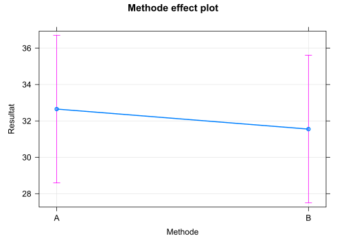


Zum Abschluss dieses Kapitels: 

Zur unkomplizierten Visualisierung von Datensatzvariablen, ohne  programmieren zu müssen, eignet sich die `library(esquisse)`. Das Programm ermöglicht die Auswahl von Variablen mit der Maus. 


### Höflichkeit und Grundfrequenz


```r
library(tidyverse)
library(scales)
# detach("package:rlang", unload=TRUE)
```

Datensatz von: *Bodo Winter* [@winter2012phonetic; @winter2013linear]

Thema: Politeness and Pitch (F0)

Tutorials: 
- [Lineare Regression](http://www.bodowinter.com/tutorial/bw_LME_tutorial1.pdf)   
- [Lineare Regression mit gemischten Effekten](https://bodowinter.com/tutorial/bw_LME_tutorial.pdf)   

Artikel:   
[The phonetic profile of Korean formal and informal speech registers](https://www.academia.edu/5655036/The_phonetic_profile_of_Korean_formal_and_informal_speech_registers)   

Gliederung unserer quantitativen Analyse

1\. Laden der Datei

2\. Kennenlernen der Daten und Säubern

3\. Hypothesen

4\. Test und Ergebnisse

5\. Schluss


:::rmdnote 
Eine einfache `lineare Regression` oder einen `t-Test` kann man auch in *Excel* berechnen, aber in Statistikprogrammen ist das bequemer.
:::

#### Datei laden


```r
# politeness <- read.csv("/cloud/project/data/politeness_data.csv")
politeness <- read.csv("data/politeness_data.csv")
```

#### Kennenlernen der Daten und Säubern

Welche Variablen enthält die Datei?


```r
head(politeness)
```

```
##   subject gender scenario attitude frequency
## 1      F1      F        1      pol     213.3
## 2      F1      F        1      inf     204.5
## 3      F1      F        2      pol     285.1
## 4      F1      F        2      inf     259.7
## 5      F1      F        3      pol     203.9
## 6      F1      F        3      inf     286.9
```

Eine weitere Funktion, um die Datenstruktur zu betrachten:


```r
glimpse(politeness)
```

```
## Rows: 84
## Columns: 5
## $ subject   <chr> "F1", "F1", "F1", "F1", "F1", "F1", "F1", "F1", "F1", "F1", ~
## $ gender    <chr> "F", "F", "F", "F", "F", "F", "F", "F", "F", "F", "F", "F", ~
## $ scenario  <int> 1, 1, 2, 2, 3, 3, 4, 4, 5, 5, 6, 6, 7, 7, 1, 1, 2, 2, 3, 3, ~
## $ attitude  <chr> "pol", "inf", "pol", "inf", "pol", "inf", "pol", "inf", "pol~
## $ frequency <dbl> 213.3, 204.5, 285.1, 259.7, 203.9, 286.9, 250.8, 276.8, 231.~
```

Und noch eine Übersicht, die uns noch mehr zeigt, z.B. ob bestimmte Datenzellen leer sind (NA). Die Variable `frequency` enthält eine leere Datenzelle (s. `n_missing`). Das müssen wir bei der Berechnung des Durchschnitts berücksichtigen.


```r
library(skimr)
skim(politeness)
```


<table style='width: auto;'
        class='table table-condensed'>
<caption>(\#tab:unnamed-chunk-52)Data summary</caption>
 <thead>
  <tr>
   <th style="text-align:left;">   </th>
   <th style="text-align:left;">   </th>
  </tr>
 </thead>
<tbody>
  <tr>
   <td style="text-align:left;"> Name </td>
   <td style="text-align:left;"> politeness </td>
  </tr>
  <tr>
   <td style="text-align:left;"> Number of rows </td>
   <td style="text-align:left;"> 84 </td>
  </tr>
  <tr>
   <td style="text-align:left;"> Number of columns </td>
   <td style="text-align:left;"> 5 </td>
  </tr>
  <tr>
   <td style="text-align:left;"> _______________________ </td>
   <td style="text-align:left;">  </td>
  </tr>
  <tr>
   <td style="text-align:left;"> Column type frequency: </td>
   <td style="text-align:left;">  </td>
  </tr>
  <tr>
   <td style="text-align:left;"> character </td>
   <td style="text-align:left;"> 3 </td>
  </tr>
  <tr>
   <td style="text-align:left;"> numeric </td>
   <td style="text-align:left;"> 2 </td>
  </tr>
  <tr>
   <td style="text-align:left;"> ________________________ </td>
   <td style="text-align:left;">  </td>
  </tr>
  <tr>
   <td style="text-align:left;"> Group variables </td>
   <td style="text-align:left;"> None </td>
  </tr>
</tbody>
</table>


**Variable type: character**

<table>
 <thead>
  <tr>
   <th style="text-align:left;"> skim_variable </th>
   <th style="text-align:right;"> n_missing </th>
   <th style="text-align:right;"> complete_rate </th>
   <th style="text-align:right;"> min </th>
   <th style="text-align:right;"> max </th>
   <th style="text-align:right;"> empty </th>
   <th style="text-align:right;"> n_unique </th>
   <th style="text-align:right;"> whitespace </th>
  </tr>
 </thead>
<tbody>
  <tr>
   <td style="text-align:left;"> subject </td>
   <td style="text-align:right;"> 0 </td>
   <td style="text-align:right;"> 1 </td>
   <td style="text-align:right;"> 2 </td>
   <td style="text-align:right;"> 2 </td>
   <td style="text-align:right;"> 0 </td>
   <td style="text-align:right;"> 6 </td>
   <td style="text-align:right;"> 0 </td>
  </tr>
  <tr>
   <td style="text-align:left;"> gender </td>
   <td style="text-align:right;"> 0 </td>
   <td style="text-align:right;"> 1 </td>
   <td style="text-align:right;"> 1 </td>
   <td style="text-align:right;"> 1 </td>
   <td style="text-align:right;"> 0 </td>
   <td style="text-align:right;"> 2 </td>
   <td style="text-align:right;"> 0 </td>
  </tr>
  <tr>
   <td style="text-align:left;"> attitude </td>
   <td style="text-align:right;"> 0 </td>
   <td style="text-align:right;"> 1 </td>
   <td style="text-align:right;"> 3 </td>
   <td style="text-align:right;"> 3 </td>
   <td style="text-align:right;"> 0 </td>
   <td style="text-align:right;"> 2 </td>
   <td style="text-align:right;"> 0 </td>
  </tr>
</tbody>
</table>


**Variable type: numeric**

<table>
 <thead>
  <tr>
   <th style="text-align:left;"> skim_variable </th>
   <th style="text-align:right;"> n_missing </th>
   <th style="text-align:right;"> complete_rate </th>
   <th style="text-align:right;"> mean </th>
   <th style="text-align:right;"> sd </th>
   <th style="text-align:right;"> p0 </th>
   <th style="text-align:right;"> p25 </th>
   <th style="text-align:right;"> p50 </th>
   <th style="text-align:right;"> p75 </th>
   <th style="text-align:right;"> p100 </th>
   <th style="text-align:left;"> hist </th>
  </tr>
 </thead>
<tbody>
  <tr>
   <td style="text-align:left;"> scenario </td>
   <td style="text-align:right;"> 0 </td>
   <td style="text-align:right;"> 1.00 </td>
   <td style="text-align:right;"> 4.00 </td>
   <td style="text-align:right;"> 2.01 </td>
   <td style="text-align:right;"> 1.0 </td>
   <td style="text-align:right;"> 2.00 </td>
   <td style="text-align:right;"> 4.0 </td>
   <td style="text-align:right;"> 6.00 </td>
   <td style="text-align:right;"> 7.0 </td>
   <td style="text-align:left;"> &lt;U+2587&gt;&lt;U+2583&gt;&lt;U+2583&gt;&lt;U+2583&gt;&lt;U+2587&gt; </td>
  </tr>
  <tr>
   <td style="text-align:left;"> frequency </td>
   <td style="text-align:right;"> 1 </td>
   <td style="text-align:right;"> 0.99 </td>
   <td style="text-align:right;"> 193.58 </td>
   <td style="text-align:right;"> 65.54 </td>
   <td style="text-align:right;"> 82.2 </td>
   <td style="text-align:right;"> 131.55 </td>
   <td style="text-align:right;"> 203.9 </td>
   <td style="text-align:right;"> 248.55 </td>
   <td style="text-align:right;"> 306.8 </td>
   <td style="text-align:left;"> &lt;U+2587&gt;&lt;U+2585&gt;&lt;U+2585&gt;&lt;U+2587&gt;&lt;U+2586&gt; </td>
  </tr>
</tbody>
</table>


Am Experiment nahmen 6 Versuchspersonen teil (F1, ..., M7). Von jeder Versuchsperson (subject) haben wir 14 Messpunkte (n = 14).


```r
politeness %>% 
  count(subject)
```

```
##   subject  n
## 1      F1 14
## 2      F2 14
## 3      F3 14
## 4      M3 14
## 5      M4 14
## 6      M7 14
```

Versuchspersonen: 3 weibliche und 3 männliche.


```r
politeness %>% 
  count(subject, gender)
```

```
##   subject gender  n
## 1      F1      F 14
## 2      F2      F 14
## 3      F3      F 14
## 4      M3      M 14
## 5      M4      M 14
## 6      M7      M 14
```

Pro Verhaltensweise (attitude) stehen uns 42 Messpunkte zur Verfügung, um unsere (unten folgende) Hypothese zu überprüfen.


```r
politeness %>% 
  count(attitude)
```

```
##   attitude  n
## 1      inf 42
## 2      pol 42
```

Berechnen wir mal die Grundfrequenz!


```r
politeness %>% 
  mean(frequency)
```

```
## [1] NA
```

`NA`: Hoppla! In unserer Datenreihe fehlt eine Frequenz. In solch einem Fall haben wir zwei Möglichkeiten: entweder entfernen wir diese Datenzeile aus unserer Berechnung oder wir lassen unser Programm eine Schätzung des Wertes vornehmen, die aber an der Datendistribution und am Mittelwert nichts verändert. Letzteres machen wir mit einer *impute*-Funktion, die beispielsweise den Medianwert für den fehlend Datenpunkt einsetzt.

Entfernen der leeren Datenzelle (`NA`) ist die einfachste Lösung, um die durchschnittliche Frequenz mit `mean()` berechnen zu können. Das erledigen wir mit der `tidyverse`-Funktion `drop_na()`.


```r
politeness %>% 
  drop_na(frequency) %>%
  summarise(av_freq = mean(frequency))
```

```
##    av_freq
## 1 193.5819
```

Eine andere Möglichkeit, eine leere Datenzeile aus der Mittelwertberechnung zu entfernen,  ist die Option `na.rm = TRUE` zur `mean()`-Funktion hinzuzufügen. 


```r
politeness %>% 
  summarise(av_freq = mean(frequency, na.rm = TRUE))
```

```
##    av_freq
## 1 193.5819
```

Wir haben gerade die Durchschnittsfrequenz für alle Versuchspersonen berechnet. Berechnen wir sie nun getrennt nach weiblichen und männlichen Versuchspersonen! Zu diesem Zweck müssen wir vor der Mittelwertberechnung die Daten mit der `group_by()`-Funktion gruppieren. 


```r
politeness %>% 
  drop_na(frequency) %>%
  group_by(gender) %>% 
  summarise(av_freq = mean(frequency))
```

```
## # A tibble: 2 x 2
##   gender av_freq
##   <chr>    <dbl>
## 1 F         247.
## 2 M         139.
```

Erwartungsgemäß ist der Durchschnittswert bei Frauen höher als bei Männern: Frauen haben ja meist eine höhere Stimme als Männer.

Ein Blick auf die Durchschnittsfrequenzen bei höflicher und informeller Sprechweise: In unserer Stichprobe mit 6 Versuchspersonen (je 14 Frequenzmessungen) zeigt sich ein Unterschied von etwa 18,2 Hz, und zwar 202,59 - 184,36. Um zu diesem Ergebnis zu gelangen, haben wir vor der `summarise()`-Funktion die `group_by()`-Funktion entsprechend angewandt.  


```r
politeness %>% 
  drop_na() %>% 
  group_by(attitude) %>% 
  summarise(avg_freq = mean(frequency),
            sd_freq = sd(frequency))
```

```
## # A tibble: 2 x 3
##   attitude avg_freq sd_freq
##   <chr>       <dbl>   <dbl>
## 1 inf          203.    66.9
## 2 pol          184.    63.6
```


```r
# politeness %>% 
#   drop_na %>% 
#   transmute(attitude, frequency) %>% 
#   mutate(attitude = str_replace(attitude, "pol", "1"),
#          attitude = str_replace(attitude, "inf", "0")) %>% 
#   mutate(attitude = parse_number(attitude))
```

#### Hypothesen

-   $H_0$: Der durchschnittliche Grundfrequenzverlauf (F0) bei höflichem oder informellem *Sprechverhalten* (*attitude*) ist *gleich*.

-   $H_1$: Der durchschnittliche Grundfrequenzverlauf (F0) bei höflichem *Sprechverhalten* *unterscheidet* sich vom informellen.

Nach unserem bisherigen Wissen erwarten wir, dass unsere Daten die Hypothese $H_1$ bestätigen werden.

Das überprüfen wir zunächst mit einem t-Test, anschließend mit einer linearen Regression.

#### t-Test

Zunächst ein Blick auf die Durchschnittsfrequenzen bei höflicher und informeller Sprechweise. In unserer Stichprobe mit 6 Versuchspersonen (je 14 Frequenzmessungen) zeigt sich ein Unterschied von etwa 18,2 Hz.

Gemäß Hypothese $H_1$ ist der Unterschied nicht zufällig entstanden, sondern kann auf die Gesamtpopulation der Sprecher verallgemeinert werden.

Nicht so gemäß Hypothese $H_0$: Der Mittelwertunterschied zwischen den Stichproben kann zufällig entstanden sein, denn wenn wir eine andere Stichprobe genommen hätten, wäre der Unterschied vielleicht gleich Null gewesen.

Mit statistischen Tests können wir diese beiden Hypothesen überprüfen. Einer davon ist der *t-Test*.


```r
politeness %>% 
  drop_na() %>% 
  group_by(attitude) %>% 
  summarise(avg_freq = mean(frequency),
            sd_freq = sd(frequency))
```

```
## # A tibble: 2 x 3
##   attitude avg_freq sd_freq
##   <chr>       <dbl>   <dbl>
## 1 inf          203.    66.9
## 2 pol          184.    63.6
```

Die Varianzen und damit auch die Standardabweichungen (`sd_freq`) vom Mittelwert (`avg_freq`) sind in beiden Gruppen (`inf` und `pol`) ungefähr gleich groß. Beim t-Test können wir dies berücksichtigen, und zwar mit der Option `var.equal = TRUE`. Die Option `paired = FALSE` besagt, dass die beiden Gruppen unabhängig vom Messzeitpunkt sind.

Der t-Test bestätigt $H_1$ nicht (p \> 0,05):


```r
t.test(frequency ~ attitude, data = politeness, 
       paired = FALSE, var.equal = TRUE)
```

```
## 
## 	Two Sample t-test
## 
## data:  frequency by attitude
## t = 1.2718, df = 81, p-value = 0.2071
## alternative hypothesis: true difference in means between group inf and group pol is not equal to 0
## 95 percent confidence interval:
##  -10.29058  46.75458
## sample estimates:
## mean in group inf mean in group pol 
##          202.5881          184.3561
```

Eine weitere Form, wie man den t-Test durchführen könnte. In den eckigen Klammern wird eine Bedingung oder Filter formuliert. 


```r
# frequencies if polite
pol = politeness$frequency[politeness$attitude == "pol"]
# frequencies if informal
inf = politeness$frequency[politeness$attitude == "inf"]
t.test(pol, inf, var.equal = TRUE)
```

```
## 
## 	Two Sample t-test
## 
## data:  pol and inf
## t = -1.2718, df = 81, p-value = 0.2071
## alternative hypothesis: true difference in means is not equal to 0
## 95 percent confidence interval:
##  -46.75458  10.29058
## sample estimates:
## mean of x mean of y 
##  184.3561  202.5881
```

Oder eine dritte (längere) Variante, den t-Test durchzuführen:


```r
polite <- politeness %>% 
  select(attitude, frequency) %>% 
  filter(attitude == "pol") %>% 
  select(-attitude)

informal <- politeness %>% 
  select(attitude, frequency) %>% 
  filter(attitude == "inf") %>% 
  select(-attitude)

t.test(polite, informal, var.equal = TRUE)
```

```
## 
## 	Two Sample t-test
## 
## data:  polite and informal
## t = -1.2718, df = 81, p-value = 0.2071
## alternative hypothesis: true difference in means is not equal to 0
## 95 percent confidence interval:
##  -46.75458  10.29058
## sample estimates:
## mean of x mean of y 
##  184.3561  202.5881
```

Wenn man die Option `var.equal = TRUE` nicht angibt, wird der *Welch-t-Test* durchgeführt, d.h. das Programm geht davon aus, dass die Varianzen (bzw. Standardabweichungen) der beiden Gruppen sich signifikant unterscheiden.


#### Lineare Regression

Mit dem *t-Test* konnten wir immer nur die Wirkung einer Variablen (z.B. attitude) auf den Frequenzverlauf prüfen. Mit einem linearen *Regressionsmodell* können wir dagegen die gleichzeitige Wirkung mehrerer Größen auf den Frequenzverlauf herausfinden. Eine lineare Regression hat den großen Vorteil, dass man mehr als eine unabhängige Variable (Prädiktor) verwenden kann, um eine Hypothese zu testen. 

Wir wählen *Geschlecht* (`gender`) und *Sprechverhalten* (`attitude`) als **unabhängige** Variablen, der *Grundfrequenzverlauf* (`frequency`) als **abhängige** Variable.

Die grundlegende Formulierung des Programmcodes (für eventuelle Vergleiche mit anderen Modellversionen haben wir dem Modell auch den neuen Namen "m1" gegeben): 


```r
m <- lm(frequency ~ gender + attitude, data = politeness)
m1 <- m 
summary(m)
```

```
## 
## Call:
## lm(formula = frequency ~ gender + attitude, data = politeness)
## 
## Residuals:
##     Min      1Q  Median      3Q     Max 
## -82.409 -26.561  -4.262  24.690 100.140 
## 
## Coefficients:
##             Estimate Std. Error t value Pr(>|t|)    
## (Intercept)  256.762      6.756  38.006   <2e-16 ***
## genderM     -108.349      7.833 -13.832   <2e-16 ***
## attitudepol  -19.553      7.833  -2.496   0.0146 *  
## ---
## Signif. codes:  0 '***' 0.001 '**' 0.01 '*' 0.05 '.' 0.1 ' ' 1
## 
## Residual standard error: 35.68 on 80 degrees of freedom
##   (1 observation deleted due to missingness)
## Multiple R-squared:  0.7109,	Adjusted R-squared:  0.7037 
## F-statistic: 98.38 on 2 and 80 DF,  p-value: < 2.2e-16
```

Wie *liest* man die **Regressionsergebnisse**?^[https://moderndive.com/6-multiple-regression.html#model4interactiontable]    
Beginnen wir am Ende! Die *F-Statistik* am Ende besagt, dass das Regressionsmodell insgesamt gesehen einen signifikanten Beitrag zur Erklärung des Frequenzverlaufs leistet, denn der sehr kleine p-Wert (p-value: < 2.2e-16) liegt deutlich unter dem 5% Signifikanzniveau.   

Die vorletzte Zeile gibt den $R^2$-Wert (*Bestimmtheitsmaß*) an, also wie viel Prozent der gesamten Varianz der abhängigen Variable (frequency) vom Modell erklärt wird (hier: 0,71, demnach 71 % bzw. mit *adjusted* $R^2$ mehr als 70%, wenn die Korrektur berücksichtigt wird, die bei Einbezug mehr als einer unabhängigen Variable gilt und immer etwas niedriger ist).   

Der *Intercept* oder Konstante ist die Stelle, an der die Frequenzkurve die y-Achse schneidet (also die Ordinate). In diesem Fall beträgt der Wert etwa 257 Hz. Der Intercept-Wert ist meistens nicht sinnvoll interpretierbar (auch hier nicht). Aber wenn wir das unten folgende Diagramm *gender effect plot* betrachten und in Gedanken die Linie von dem Punkt für die weiblichen Versuchspersonen (*F*) in Richtung y-Achse verlängern, dann können wir uns vorstellen, dass die Linie etwa beim Wert 257 die y-Achse schneidet. Der Intercept ist somit der (mathematisch festgelegte) Basiswert für die weiblichen Versuchspersonen. Die weiblichen Versuchspersonen werden als Basis verwendet, weil das Programm alphabetisch vorgeht und *F* im Alphabet vor *M* erscheint. 

Der Koeffizient für *genderM* zeigt an, dass bei männlichen Versuchspersonen 108,35 Hz vom Basiswert der weiblichen Versuchspersonen (256,762) subtrahiert werden müssen. Das ist der Intercept für die männlichen Versuchspersonen. Der p-Wert ist erwartungsgemäß hochsignifikant (p < 2e-16), denn die meisten Männer haben eine tiefere Stimme als Frauen.    

In der nächsten Zeile folgt der Koeffizient für *attitudepol* (polite). Der Koeffizient (-19,553) ist negativ und muss daher vom Basiswert, dem Intercept für die weiblichen Versuchspersonen (256,762), subtrahiert werden. Demnach ist die Tonlage beim höflichen Sprechverhalten (attitudepol) um 19,55 Hz tiefer als beim informellen Sprechverhalten. Der p-Wert ist signifikant (p = 0,0146).  

Grundfrequenz für *Frauen* bei *informellem* Sprechen:    
256.762 + (-108.349)\*0 + (-19.553)\*0 = 256.762 Hz
Grundfrequenz für *Frauen* bei *höflichem* Sprechen:    
256.762 + (-108.349)\*0 + (-19.553)\*1 = 237.209 Hz

Grundfrequenz für *Männer* bei *informellem* Sprechen:    
256.762 + (-108.349)\*1 + (-19.553)\*0 = 148.413 Hz
Grundfrequenz für *Männer* bei *höflichem* Sprechen:    
256.762 + (-108.349)\*1 + (-19.553)\*1 = 128.86 Hz

*Durchschnittliche* Grundfrequenz bei *informellem* Sprechen (Frauen + Männer):   
(256.762 + 148.413)/2 = 202.5875 Hz. 
*Durchschnittliche* Grundfrequenz bei *höflichem* Sprechen: (Frauen + Männer):    
(237.209 + 128.86)/2 = 183.0345 Hz. 

Das lineare Regressionsmodell **bestätigt** somit die Hypothese $H_1$: F(2;80 = 98,38; p \< 0,001). Die Versuchspersonen sprechen demnach in einer tieferen Tonlage, wenn sie höflich sprechen, und zwar um ca. 19,5 Hz tiefer als wenn sie informell sprechen (p = 0,0146).

Außerdem bestätigt das Regressionsmodell (erwartungsgemäß) auch, dass die männlichen Versuchspersonen mit einer tieferen Stimme sprechen als die weiblichen, und zwar um durchschnittlich 108 Hz. Aber da uns das bereits aus unserer Alltagserfahrung bekannt ist, interessiert uns dieses Ergebnis nicht.


Das Bestimmtheitmaß, d.h. der $R^2$-Wert, beträgt 0,71 (d.h. etwa 71%). Das bedeutet, dass mit dem Regressionsergebnis ca. 71% der Variabilität unserer abhängigen Variable (frequency) erklärt wird. Das ist ein guter Wert in den Sozialwissenschaften.

Das Regressionsmodell wollen wir auch mit Hilfe Programms `effects` graphisch veranschaulichen. 


```r
library(effects)
allEffects(m)
```

```
##  model: frequency ~ gender + attitude
## 
##  gender effect
## gender
##        F        M 
## 247.1035 138.7549 
## 
##  attitude effect
## attitude
##      inf      pol 
## 203.2408 183.6875
```

```r
plot(allEffects(m), multiline=TRUE, grid=TRUE, rug=FALSE, as.table=TRUE, confint=list(style="bars"), x.var = "gender")
```

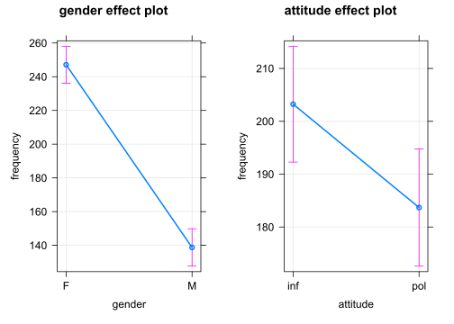

Man kann Regressionsmodelle auch mit `tidyverse`-Funktionen formulieren (der "." bedeutet, dass der Datensatz "politeness" aus der vorherigen Zeile übernommen werden soll). Die `tidy(()`-Funktion des `broom`-Pakets sorgt für die Umformung in eine Tabelle. 


```r
library(broom)
politeness %>% 
  lm(frequency ~ attitude + gender, data = .) %>% 
  summary() %>% 
  broom::tidy()
```

```
## # A tibble: 3 x 5
##   term        estimate std.error statistic  p.value
##   <chr>          <dbl>     <dbl>     <dbl>    <dbl>
## 1 (Intercept)    257.       6.76     38.0  5.75e-53
## 2 attitudepol    -19.6      7.83     -2.50 1.46e- 2
## 3 genderM       -108.       7.83    -13.8  6.40e-23
```

Die unterschiedliche Tonlage bei informellem und höflichem Sprechen veranschaulichen wir noch mit einem *Boxplot*. 


```r
politeness %>% 
  ggplot(aes(attitude, frequency, 
             group = attitude, fill = attitude)) +
  geom_boxplot() +
  stat_summary(fun.y=mean, geom="point", 
               shape="*", size=7, color="red", fill="red") + 
  geom_jitter(width = 0.2) + 
  # geom_hline(yintercept = c(202.5), 
  #            lty = 2, col = "darkred") + # Polite-Mittelwert
  # geom_hline(yintercept = c(184.3), 
             # lty = 2, col = "darkgreen") + # Informal-Mittelwert
  facet_wrap(~ gender)
```


Der *rote Stern* markiert den *Durchschnittswert* der jeweiligen Gruppe, der *schwarze Balken* den *Median* (d.h. den Wert, der genau in der Mitte aller Daten der jeweiligen Gruppe liegt). Im *Kasten* eines **Boxplots** liegen 50% aller Werte, darunter liegen 25% und darüber ebenfalls 25%. Bei den Männern (M) ist zu sehen, dass der Median (der schwarze Balken) und das arithmetische Mittel (der rote Stern) nicht übereinstimmen. Das deutet auf extremere Unterschiede zwischen den männlichen Versuchspersonen (Schiefe oder Asymmetrie). 

Die *Schiefe* (engl. *skewness*) oder Asymmetrie der Frequenzverteilung (Distribution) kann man in einem **Histogramm** oder Dichte-Diagramm (density) veranschaulichen. Das Histogram der weiblichen Versuchspersonen ist der Normalverteilung (einer Glockenform, mit den meisten Frequenzwerten in der Mitte) ähnlich, während das der männlichen deutlich schief ist. 


```r
politeness %>% 
  ggplot(aes(frequency, fill = attitude)) +
  geom_density(alpha = 0.7) + 
  facet_wrap(~ gender)
```


```r
politeness %>% 
  ggplot(aes(frequency, fill = attitude)) +
  geom_histogram(aes(y = ..count..), # density
                 binwidth = 50, alpha = 0.7, color = "white") + 
  facet_wrap(~ gender)
```

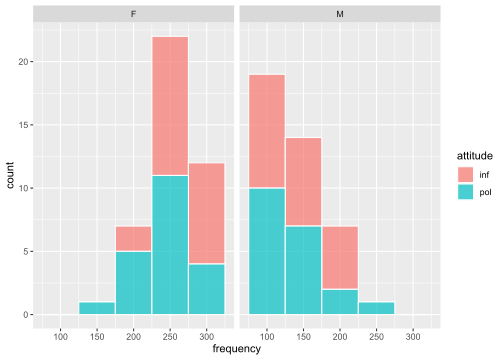

```r
politeness %>% 
  filter(gender == "F") %>% 
  ggplot(aes(frequency)) +
  geom_histogram(aes(y = ..density.., fill = attitude), # count
                 binwidth = 50, alpha = 0.7, color = "white") +
  stat_function(
    fun = dnorm, 
    args = list(
      mean = mean(
        politeness$frequency[politeness$gender == "F"], na.rm = T), 
      sd = sd(politeness$frequency[politeness$gender == "F"], 
              na.rm = T)), 
    col = "#1b98e0", 
    size = 2)
```


```r
politeness %>% 
  filter(gender == "M") %>% 
  ggplot(aes(frequency)) +
  geom_histogram(aes(y = ..density.., fill = attitude), # count
                 binwidth = 50, alpha = 0.7, color = "white") +
  stat_function(
    fun = dnorm, 
    args = list(
      mean = mean(
        politeness$frequency[politeness$gender == "M"], na.rm = T), 
      sd = sd(politeness$frequency[politeness$gender == "M"], 
              na.rm = T)), 
    col = "#1b98e0", 
    size = 2)
```


Wird das Sprechverhalten (attitude) durch das Geschlecht (gender) modifiziert (z.B. verändern Frauen ihre Tonlage beim höflichem Sprechen, Männer dagegen nicht oder kaum)? Das kann man durch *Hinzufügung eines Interaktionsterms* prüfen. Eine Interaktion kennzeichnet man in der Regressionsgleichung mit einem Stern zwischen den beteiligten Variablen (also wie beim Multiplizieren). Hier prüfen wir die **Interaktion** zwischen den beiden unabhängigen Variablen *Geschlecht* (gender) und *Verhalten* (attitude). 

Die *Indikatorterme* *attitude* (informal vs. polite) und *gender* (female vs. male), beide also mit zwei Stufen oder levels, sind vergleichbar mit An-/Aus-Schaltern. Sie zeigen an, um welchen Wert die Frequenzkurve nach unten (bei negativem Koeffizient) oder oben (bei positivem Koeffizient) verschoben wird. Der *Interaktionsterm* der beiden Indikatorterme zeigt an, um welchen *zusätzlichen* Wert der Frequenzverlauf verändert wird. Wäre eine kontinuierliche Variable (z.B. Zeit) in der Interaktion einbezogen, dann würde der Koeffizient der Interaktion die zusätzliche Steigung (slope) der abhängigen Variable anzeigen. 


```r
m <- lm(frequency ~ attitude*gender, data = politeness)
m2 <- m 
summary(m)
```

```
## 
## Call:
## lm(formula = frequency ~ attitude * gender, data = politeness)
## 
## Residuals:
##     Min      1Q  Median      3Q     Max 
## -78.486 -27.383  -0.986  20.570  96.020 
## 
## Coefficients:
##                     Estimate Std. Error t value Pr(>|t|)    
## (Intercept)          260.686      7.784  33.491   <2e-16 ***
## attitudepol          -27.400     11.008  -2.489   0.0149 *  
## genderM             -116.195     11.008 -10.556   <2e-16 ***
## attitudepol:genderM   15.890     15.664   1.014   0.3135    
## ---
## Signif. codes:  0 '***' 0.001 '**' 0.01 '*' 0.05 '.' 0.1 ' ' 1
## 
## Residual standard error: 35.67 on 79 degrees of freedom
##   (1 observation deleted due to missingness)
## Multiple R-squared:  0.7147,	Adjusted R-squared:  0.7038 
## F-statistic: 65.95 on 3 and 79 DF,  p-value: < 2.2e-16
```

Allerdings ist der p-Wert für die Interaktion in unserem Fall nicht signifikant (p = 0,3135 liegt oberhalb des 5% Signifikanzniveaus, p = 0,05). Das bedeutet, dass die Interaktion zur Erklärung des Frequenzverlaufs keinen Beitrag leistet. Daher ist es sinnvoll, den Interaktionsterm aus der Regressionsgleichung zu entfernen und nur die (signifkanten) Haupteffekte beizubehalten. Wir bevorzugen demnach immer das einfachere Modell, wenn das komplexere keinen signifikanten Erklärungsbeitrag leistet. 

Mit der `anova()`-Funktion kann man Regressionsmodelle (hier: *m1* und *m2*) miteinander vergleichen und prüfen, welches geeigneter ist, den Frequenzverlauf zu erklären. Modell m1 ist das Modell ohne Interaktion, Modell m2 das Modell mit Interaktionsterm. 


```r
anova(m1, m2)
```

```
## Analysis of Variance Table
## 
## Model 1: frequency ~ gender + attitude
## Model 2: frequency ~ attitude * gender
##   Res.Df    RSS Df Sum of Sq     F Pr(>F)
## 1     80 101820                          
## 2     79 100511  1    1309.1 1.029 0.3135
```

Der p-Wert (p = 0,3135) ist nicht signifikant. In diesem Fall bevorzugen wir das einfachere Regressionsmodell, d.h. das Modell ohne Interaktion (m1). 

Mit Hilfe des Programms `effects` stellen wir das Regressionsmodell mit hinzugefügter **Interaktion** zwischen den beiden unabhängigen Variablen *Geschlecht* (gender) und *Verhalten* (attitude) auch graphisch dar. 


```r
library(effects)
allEffects(m)
```

```
##  model: frequency ~ attitude * gender
## 
##  attitude*gender effect
##         gender
## attitude        F        M
##      inf 260.6857 144.4905
##      pol 233.2857 132.9800
```

```r
plot(allEffects(m), multiline=TRUE, grid=TRUE, rug=FALSE, as.table=TRUE, confint=list(style="bars"), x.var = "gender")
```


Die sich überschneidenden Konfidenzintervalle im Diagramm zeigen, dass die Durchschnittswerte keinen signifikanten Unterschied aufweisen. Außerdem gilt sowohl für die weiblichen als auch die männlichen Versuchspersonen, dass Frequenzwerte beim höflichen Sprechverhalten geringer sind. Die Interaktion liefert somit keinen signifikanten Erklärungsbeitrag. Es ist sinnvoll, nur die beiden Haupteffekte beizubehalten und die Interaktion aus dem Regressionsmodell herauszunehmen. 

Das nächste Diagramm bestätigt, dass die Variablen Geschlecht (gender) und Verhalten (attitude) mit statistischer Signifikanz die Höhe des Grundfrequnezverlaufs (frequency) beeinflussen, nicht jedoch die Interaktion beider Variablen (deren Konfidenzintervall überschreitet im Diagramm die Null-Linie).


```r
library(parameters)
library(see)
p1 = plot(parameters(m)) +
  ggplot2::labs(title = "A Dot-and-Whisker Plot")
p1
```

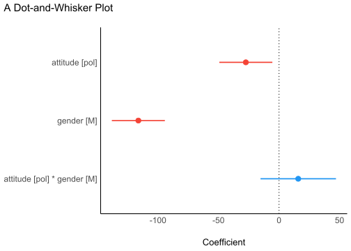

Das nächste Diagramm bestätigt, dass die Residuen (d.h. die jeweiligen Abweichungen der einzelnen Werte vom Durchschnitt) normalverteilt sind (p = 0.396, also größer als der Grenzwert 0.05). Damit ist eine der erforderlichen Bedingungen für die Durchführung einer linearen Regression erfüllt. 


```r
library(performance)
check <- check_normality(m)
```

```
## OK: residuals appear as normally distributed (p = 0.396).
```

```r
## Warning: Non-normality of residuals detected (p = 0.016).

p2 = plot(check, type = "qq")
p2
```

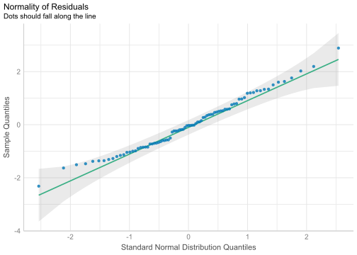


```r
library(performance)
check <- check_normality(m, effects = "fixed")
```

```
## OK: residuals appear as normally distributed (p = 0.396).
```

```r
## Warning: Non-normality of residuals detected (p = 0.016).

p2a = plot(check, type = "pp")
p2a
```


$Omega^2$ ist eine alternative Größe zu $R^2$, womit ebenfalls die erklärte Varianz eines linearen Regressionsmodells angegeben wird. Im Diagramm ist zu sehen, dass die Variable *Geschlecht* (gender) den größten Beitrag leistet (fast 70%), die Variable *Verhalten* (attitude) ca. 5%, während die Interaktion beider Variablen keinen signifikanten Beitrag zu Erklärung der Varianz leistet (Wert liegt bei 0%).


```r
library(effectsize)
library(see)

m <- aov(frequency ~ attitude*gender, data = politeness)

p3 = plot(omega_squared(m))
p3
```


Das nächste Diagramm zeigt die Verteilung der Daten für die beiden Geschlechter.


```r
p4 = ggplot(politeness, aes(x = attitude, y = frequency, color = gender)) +
  geom_point2() +
  theme_modern()
p4
```


Weitere Darstellungsmöglichkeiten der Datendistribution:


```r
p4 = ggplot(politeness, 
            aes(x = attitude, y = frequency, fill = gender)) +
  geom_violin() +
  theme_modern(axis.text.angle = 45) +
  scale_fill_material_d(palette = "ice")

p4
```

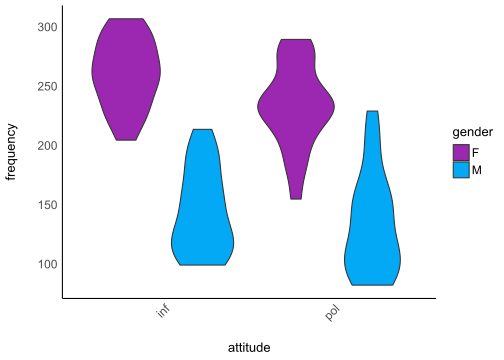


```r
p5 = ggplot(politeness, 
            aes(x = attitude, y = frequency, fill = gender)) +
  geom_violindot(fill_dots = "black") +
  geom_jitter(width = 0.05) +
  theme_modern() +
  scale_fill_material_d()
p5
```


Ob die Bedingungen für die Durchführung einer linearen Regression erfüllt sind, kann man mit einem Befehl ausführen, und zwar mit Hilfe des Programms `performance`. Hier wählen wir die Funktion `check_model()` mit dem Modell ohne Interaktion (da diese nicht signifikant war). 


```r
library(performance)
m <- lm(frequency ~ attitude + gender, data = politeness)
summary(m)
```

```
## 
## Call:
## lm(formula = frequency ~ attitude + gender, data = politeness)
## 
## Residuals:
##     Min      1Q  Median      3Q     Max 
## -82.409 -26.561  -4.262  24.690 100.140 
## 
## Coefficients:
##             Estimate Std. Error t value Pr(>|t|)    
## (Intercept)  256.762      6.756  38.006   <2e-16 ***
## attitudepol  -19.553      7.833  -2.496   0.0146 *  
## genderM     -108.349      7.833 -13.832   <2e-16 ***
## ---
## Signif. codes:  0 '***' 0.001 '**' 0.01 '*' 0.05 '.' 0.1 ' ' 1
## 
## Residual standard error: 35.68 on 80 degrees of freedom
##   (1 observation deleted due to missingness)
## Multiple R-squared:  0.7109,	Adjusted R-squared:  0.7037 
## F-statistic: 98.38 on 2 and 80 DF,  p-value: < 2.2e-16
```

```r
check <- check_model(m)

p6 = plot(check)
p6
```


Collage mehrerer der oben einzeln gezeigten Diagramme mit Hilfe der `plots()`-Funktion im Programm `performance`:


```r
plots(p1,p2,p3,p4, 
      n_columns = 2, 
      tags = paste0("B", 1:4))
```

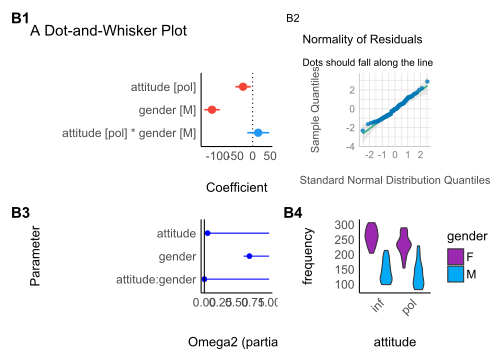

Eine Bayesianische Regressionsberechnung erlauben die Programmen `bayestestR` und `rstanarm`. Mit dem Programm `see` können wir die Datendistribution sichtbar machen. 


```r
library(bayestestR)
library(rstanarm)
library(see)

set.seed(123)
m <- stan_glm(frequency ~ attitude + gender, 
              data = politeness, refresh = 0)
result <- hdi(m, ci = c(0.5, 0.75, 0.89, 0.95))
plot(result)
```


#### Ergebnis

Die Regressionsanalyse hat $H_1$ bestätigt, d.h. die Grundfrequenz beim höflichen Sprechverhalten unterscheidet sich vom informellen Sprechen. Beim höflichen Sprechen sprachen die Versuchspersonen mit einer durchschnittlich 19,5 Hz tieferen Stimme: bei den weiblichen Versuchspersonen mehr als 27 Hz (261 - 233 Hz), bei den männlichen mehr als 11 Hz (144 - 133 Hz)).


#### Lineare Regression

Politeness data (B. Winter tutorial)

Programme laden: 


```r
library(tidyverse)
```


Datei laden: 


```r
# LOAD
polite <- read.csv("data/politeness_data.csv", dec=".")
```

Ansicht der Datenlage zu Orientierungszwecken: 


```r
head(polite)
```

```
##   subject gender scenario attitude frequency
## 1      F1      F        1      pol     213.3
## 2      F1      F        1      inf     204.5
## 3      F1      F        2      pol     285.1
## 4      F1      F        2      inf     259.7
## 5      F1      F        3      pol     203.9
## 6      F1      F        3      inf     286.9
```

Variablentyp festlegen: 


```r
polite$frequency = as.numeric(polite$frequency)
polite$scenario = as.factor(polite$scenario)
polite$subject = as.factor(polite$subject)
polite$gender = as.factor(polite$gender)
polite$attitude = as.factor(polite$attitude)
```

Kontraste für den statistischen Test setzen: 


```r
# In this session we use contr. sum contrasts
options(contrasts=c('contr.sum', 'contr.poly'))
options("contrasts")
```

```
## $contrasts
## [1] "contr.sum"  "contr.poly"
```

Kontraste zurücksetzen: 


```r
# To reset default settings run: 
options(contrasts=c('contr.treatment', 'contr.poly')) 
# (all afex functions should be unaffected by this)

# # Setting contrasts of chosen variables only
# contrasts(polite$attitude) <- contr.treatment(2, base = 1)
```

Einfacher Boxplot: 


```r
boxplot(frequency ~ attitude*gender, 
        col=c("red","green"), data = polite)
```


Bild speichern:   
- z.B. im *jpg*-Format oder    
- im *pdf*-Format.   


```r
# 1. Open jpeg file
jpeg("pictures/politeness_boxplot.jpg", 
     width = 840, height = 535)
# 2. Create the plot
boxplot(frequency ~ attitude*gender, 
        col=c("red","green"), data = polite) 
# 3. Close the file
dev.off()
```

```
## svg 
##   2
```


```r
# Open a pdf file
pdf("pictures/politeness_boxplot.pdf") 
# 2. Create a plot
boxplot(frequency ~ attitude*gender, 
        col=c("red","green"), data = polite) 
# Close the pdf file
dev.off() 
```

```
## svg 
##   2
```

Beziehungen zwischen Variablenpaaren anzeigen: 


```r
library(psych)
pairs.panels(polite[c(2,4,5)])
```

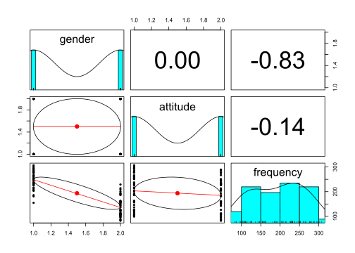

Lineare Regression mit mehreren unabhängigen Variablen und einer abhängigen Variable, im Englischen auch als *Ordinary Least Squares Regression (OLS)* bekannt.   

Mit allen unabhängigen Variablen: 


```r
# model 1
m <- lm(frequency ~ gender + attitude + subject + scenario, data = polite)
summary(m)
```

```
## 
## Call:
## lm(formula = frequency ~ gender + attitude + subject + scenario, 
##     data = polite)
## 
## Residuals:
##     Min      1Q  Median      3Q     Max 
## -53.673 -16.686   1.039  12.027  86.630 
## 
## Coefficients: (1 not defined because of singularities)
##             Estimate Std. Error t value Pr(>|t|)    
## (Intercept)  225.150     10.020  22.470  < 2e-16 ***
## genderM     -129.857      9.606 -13.518  < 2e-16 ***
## attitudepol  -19.794      5.585  -3.544 0.000707 ***
## subjectF2     26.150      9.606   2.722 0.008179 ** 
## subjectF3     18.700      9.606   1.947 0.055592 .  
## subjectM3     66.800      9.606   6.954 1.52e-09 ***
## subjectM4     41.854      9.807   4.268 6.09e-05 ***
## subjectM7         NA         NA      NA       NA    
## scenario2     25.017     10.376   2.411 0.018537 *  
## scenario3     31.025     10.376   2.990 0.003847 ** 
## scenario4     42.508     10.376   4.097 0.000111 ***
## scenario5     14.408     10.376   1.389 0.169351    
## scenario6      1.405     10.629   0.132 0.895227    
## scenario7      3.117     10.376   0.300 0.764783    
## ---
## Signif. codes:  0 '***' 0.001 '**' 0.01 '*' 0.05 '.' 0.1 ' ' 1
## 
## Residual standard error: 25.42 on 70 degrees of freedom
##   (1 observation deleted due to missingness)
## Multiple R-squared:  0.8716,	Adjusted R-squared:  0.8496 
## F-statistic: 39.61 on 12 and 70 DF,  p-value: < 2.2e-16
```

Regression mit denjenigen Variablen, die als Prädiktoren für die abhängige Variable gewählt wurden:    


```r
# model 2
m <- lm(frequency ~ gender + attitude, data=polite)
summary(m)
```

```
## 
## Call:
## lm(formula = frequency ~ gender + attitude, data = polite)
## 
## Residuals:
##     Min      1Q  Median      3Q     Max 
## -82.409 -26.561  -4.262  24.690 100.140 
## 
## Coefficients:
##             Estimate Std. Error t value Pr(>|t|)    
## (Intercept)  256.762      6.756  38.006   <2e-16 ***
## genderM     -108.349      7.833 -13.832   <2e-16 ***
## attitudepol  -19.553      7.833  -2.496   0.0146 *  
## ---
## Signif. codes:  0 '***' 0.001 '**' 0.01 '*' 0.05 '.' 0.1 ' ' 1
## 
## Residual standard error: 35.68 on 80 degrees of freedom
##   (1 observation deleted due to missingness)
## Multiple R-squared:  0.7109,	Adjusted R-squared:  0.7037 
## F-statistic: 98.38 on 2 and 80 DF,  p-value: < 2.2e-16
```

Koeffizienten der Variablen anzeigen: 


```r
library(effects)
allEffects(m)
```

```
##  model: frequency ~ gender + attitude
## 
##  gender effect
## gender
##        F        M 
## 247.1035 138.7549 
## 
##  attitude effect
## attitude
##      inf      pol 
## 203.2408 183.6875
```

Visuelle Darstellung der Regressionsergebnisse: 


```r
plot(allEffects(m), multiline=TRUE, grid=TRUE, rug=FALSE, as.table=TRUE)
```


Bild sichern: 


```r
# Save plot of the effects to disk
# 1. Open jpeg file
jpeg("pictures/politeness_lineplot.jpg", 
     width = 840, height = 535)
# 2. Create the plot
plot(allEffects(m), multiline=TRUE, grid=TRUE, rug=FALSE, as.table=TRUE)
# 3. Close the file
dev.off()
```

```
## svg 
##   2
```

Ein weiteres Regressionsmodell mit einer Interaktion zwischen den unabhängigen Variablen (Prädiktoren): 


```r
# model 3 (with interaction)
m <- lm(frequency ~ gender*attitude, data=polite)
summary(m)
```

```
## 
## Call:
## lm(formula = frequency ~ gender * attitude, data = polite)
## 
## Residuals:
##     Min      1Q  Median      3Q     Max 
## -78.486 -27.383  -0.986  20.570  96.020 
## 
## Coefficients:
##                     Estimate Std. Error t value Pr(>|t|)    
## (Intercept)          260.686      7.784  33.491   <2e-16 ***
## genderM             -116.195     11.008 -10.556   <2e-16 ***
## attitudepol          -27.400     11.008  -2.489   0.0149 *  
## genderM:attitudepol   15.890     15.664   1.014   0.3135    
## ---
## Signif. codes:  0 '***' 0.001 '**' 0.01 '*' 0.05 '.' 0.1 ' ' 1
## 
## Residual standard error: 35.67 on 79 degrees of freedom
##   (1 observation deleted due to missingness)
## Multiple R-squared:  0.7147,	Adjusted R-squared:  0.7038 
## F-statistic: 65.95 on 3 and 79 DF,  p-value: < 2.2e-16
```

Koeffizienten der Variablen anzeigen: 


```r
library(effects)
allEffects(m)
```

```
##  model: frequency ~ gender * attitude
## 
##  gender*attitude effect
##       attitude
## gender      inf      pol
##      F 260.6857 233.2857
##      M 144.4905 132.9800
```

Visuelle Darstellung der Regressionsergebnisse: 


```r
plot(allEffects(m), multiline=TRUE, grid=TRUE, rug=FALSE, as.table=TRUE)
```

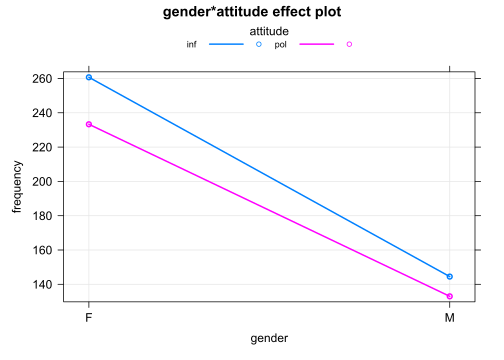

Bild als *jpg*-Datei sichern: 


```r
# Save plot of the effects to disk
# 1. Open jpeg file
jpeg("pictures/politeness_effects.jpg", 
     width = 840, height = 535)
# 2. Create the plot
plot(allEffects(m), multiline=TRUE, grid=TRUE, rug=FALSE, as.table=TRUE)
# 3. Close the file
dev.off()
```

```
## svg 
##   2
```

Bild als *pdf*-Datei sichern: 


```r
# Open a pdf file
pdf("pictures/politeness_effects.pdf") 
# 2. Create a plot
plot(allEffects(m), multiline=TRUE, grid=TRUE, rug=FALSE, as.table=TRUE)
# Close the pdf file
dev.off() 
```

```
## svg 
##   2
```

Diagnostische Analyse (sind die Bedingungen für eine Regression erfüllt?): 


```r
# plot diagnostic diagrams
par(mfrow = c(3,2))
plot(m, which = 1) # variance of residuals vs. fitted values?
plot(m, which = 2) # normal distributed residuals?
plot(m, which = 3) # variance of residuals standardized
plot(m, which = 4) # Cook's distance (outliers / influencing data points?)
plot(m, which = 5) # Leverage vs. standardized variance of residuals
plot(m, which = 6) # Cook's distance vs. Leverage
```

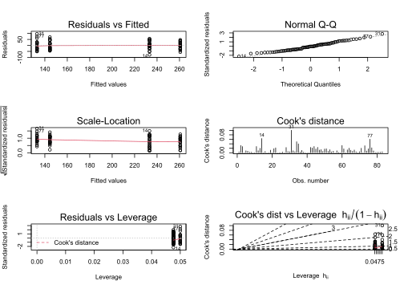

```r
par(mfrow = c(1,1))
```

Entfernung eines Datenpunktes und die dabei entstehende Veränderung des Koeffizienten: 


```r
# Change of estimates if one datapoint is removed from the model
d <- dfbetas(m)
head(d) %>% as.data.frame %>% rmarkdown::paged_table()
```

<div data-pagedtable="false">
  <script data-pagedtable-source type="application/json">
{"columns":[{"label":[""],"name":["_rn_"],"type":[""],"align":["left"]},{"label":["(Intercept)"],"name":[1],"type":["dbl"],"align":["right"]},{"label":["genderM"],"name":[2],"type":["dbl"],"align":["right"]},{"label":["attitudepol"],"name":[3],"type":["dbl"],"align":["right"]},{"label":["genderM:attitudepol"],"name":[4],"type":["dbl"],"align":["right"]}],"data":[{"1":"4.628647e-16","2":"-4.518405e-16","3":"-0.090392640","4":"0.063521473","_rn_":"1"},{"1":"-3.646937e-01","2":"2.578774e-01","3":"0.257877355","4":"-0.181217733","_rn_":"2"},{"1":"6.358180e-17","2":"-2.139049e-16","3":"0.237209532","4":"-0.166693867","_rn_":"3"},{"1":"-6.291782e-03","2":"4.448962e-03","3":"0.004448962","4":"-0.003126412","_rn_":"4"},{"1":"6.068721e-17","2":"-1.784827e-17","3":"-0.133232266","4":"0.093626093","_rn_":"5"},{"1":"1.679279e-01","2":"-1.187430e-01","3":"-0.118742974","4":"0.083444057","_rn_":"6"}],"options":{"columns":{"min":{},"max":[10]},"rows":{"min":[10],"max":[10]},"pages":{}}}
  </script>
</div>

Koeffizienten visuell darstellen: 


```r
# plot the dfbetas (are there any outliers or data points with high influence?)
par(mfrow = c(1,3))
plot(d[,1], col = "orange")
plot(d[,2], col = "blue")
plot(d[,3], col = "purple")
```

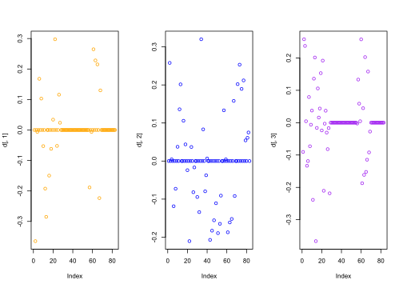

```r
par(mfrow = c(1,1))
```


#### Regression mit gemischten Effekten

(Mixed effects Regression, Multilevel Regression)

Programme laden: 


```r
# The variables 'subject' and 'scenario' have been chosen as random effects
library(afex)
library(lmerTest)
library(LMERConvenienceFunctions)
```

Regressionsmodell mit einem individuell variierenden Intercept (Ordinate): 


```r
# random intercepts model
m <- lmer(frequency ~ 
            (1|subject), 
          REML=F, data=politeness)
m0.1 <- m
summary(m)
```

```
## Linear mixed model fit by maximum likelihood . t-tests use Satterthwaite's
##   method [lmerModLmerTest]
## Formula: frequency ~ (1 | subject)
##    Data: politeness
## 
##      AIC      BIC   logLik deviance df.resid 
##    833.2    840.5   -413.6    827.2       80 
## 
## Scaled residuals: 
##     Min      1Q  Median      3Q     Max 
## -2.4921 -0.6514 -0.1596  0.6511  2.6732 
## 
## Random effects:
##  Groups   Name        Variance Std.Dev.
##  subject  (Intercept) 3289.7   57.36   
##  Residual              941.2   30.68   
## Number of obs: 83, groups:  subject, 6
## 
## Fixed effects:
##             Estimate Std. Error      df t value Pr(>|t|)    
## (Intercept)  193.027     23.656   6.001    8.16 0.000182 ***
## ---
## Signif. codes:  0 '***' 0.001 '**' 0.01 '*' 0.05 '.' 0.1 ' ' 1
```

Regressionsmodell mit zwei individuell variierenden Intercepts (Ordinaten): 


```r
# random intercepts model
m <- lmer(frequency ~ 
            (1|subject) + (1|scenario), 
          REML=F, data=politeness)
m0.2 <- m
summary(m)
```

```
## Linear mixed model fit by maximum likelihood . t-tests use Satterthwaite's
##   method [lmerModLmerTest]
## Formula: frequency ~ (1 | subject) + (1 | scenario)
##    Data: politeness
## 
##      AIC      BIC   logLik deviance df.resid 
##    826.6    836.3   -409.3    818.6       79 
## 
## Scaled residuals: 
##      Min       1Q   Median       3Q      Max 
## -2.40887 -0.53279 -0.09441  0.63269  2.80566 
## 
## Random effects:
##  Groups   Name        Variance Std.Dev.
##  scenario (Intercept)  202.5   14.23   
##  subject  (Intercept) 3344.0   57.83   
##  Residual              751.4   27.41   
## Number of obs: 83, groups:  scenario, 7; subject, 6
## 
## Fixed effects:
##             Estimate Std. Error      df t value Pr(>|t|)    
## (Intercept)  192.886     24.400   6.587   7.905 0.000135 ***
## ---
## Signif. codes:  0 '***' 0.001 '**' 0.01 '*' 0.05 '.' 0.1 ' ' 1
```

Regressionsmodell mit zwei individuell variierenden Intercepts (Ordinaten) und einer kategorischen Variable: 


```r
# random intercepts model
m <- lmer(frequency ~ gender + 
            (1|subject) + (1|scenario), 
          REML=F, data=politeness)
m1 <- m
summary(m)
```

```
## Linear mixed model fit by maximum likelihood . t-tests use Satterthwaite's
##   method [lmerModLmerTest]
## Formula: frequency ~ gender + (1 | subject) + (1 | scenario)
##    Data: politeness
## 
##      AIC      BIC   logLik deviance df.resid 
##    816.7    828.8   -403.4    806.7       78 
## 
## Scaled residuals: 
##      Min       1Q   Median       3Q      Max 
## -2.49969 -0.57100 -0.06373  0.60229  2.86559 
## 
## Random effects:
##  Groups   Name        Variance Std.Dev.
##  scenario (Intercept) 191.2    13.83   
##  subject  (Intercept) 409.6    20.24   
##  Residual             751.9    27.42   
## Number of obs: 83, groups:  scenario, 7; subject, 6
## 
## Fixed effects:
##             Estimate Std. Error       df t value Pr(>|t|)    
## (Intercept)  246.986     13.481    7.676  18.321  1.3e-07 ***
## genderM     -108.236     17.588    5.939  -6.154 0.000877 ***
## ---
## Signif. codes:  0 '***' 0.001 '**' 0.01 '*' 0.05 '.' 0.1 ' ' 1
## 
## Correlation of Fixed Effects:
##         (Intr)
## genderM -0.651
```

Regressionsmodell mit zwei individuell variierenden Intercepts (Ordinaten) und zwei Prädiktoren, zwei kategorischen Variablen. Von Interesse ist die Variable *attitude* (hier: sprachliches Verhalten). 


```r
m <- lmer(frequency ~ gender + attitude + 
          (1|subject) + (1|scenario), 
          REML=F, data=politeness)
m2 <- m
summary(m)
```

```
## Linear mixed model fit by maximum likelihood . t-tests use Satterthwaite's
##   method [lmerModLmerTest]
## Formula: frequency ~ gender + attitude + (1 | subject) + (1 | scenario)
##    Data: politeness
## 
##      AIC      BIC   logLik deviance df.resid 
##    807.1    821.6   -397.6    795.1       77 
## 
## Scaled residuals: 
##     Min      1Q  Median      3Q     Max 
## -2.2958 -0.6456 -0.0776  0.5448  3.5121 
## 
## Random effects:
##  Groups   Name        Variance Std.Dev.
##  scenario (Intercept) 205.2    14.33   
##  subject  (Intercept) 417.0    20.42   
##  Residual             637.4    25.25   
## Number of obs: 83, groups:  scenario, 7; subject, 6
## 
## Fixed effects:
##             Estimate Std. Error       df t value Pr(>|t|)    
## (Intercept)  256.847     13.827    8.500  18.576 3.53e-08 ***
## genderM     -108.517     17.571    5.929  -6.176 0.000866 ***
## attitudepol  -19.722      5.547   70.920  -3.555 0.000677 ***
## ---
## Signif. codes:  0 '***' 0.001 '**' 0.01 '*' 0.05 '.' 0.1 ' ' 1
## 
## Correlation of Fixed Effects:
##             (Intr) gendrM
## genderM     -0.635       
## attitudepol -0.201  0.004
```

Regressionsmodell mit zwei individuell variierenden Intercepts (Ordinaten) und zwei interagierenden Prädiktoren. Von Interesse ist die Variable *attitude*. 


```r
m <- lmer(frequency ~ gender*attitude + 
            (1|subject) + (1|scenario), 
          REML=F, data=politeness)
m3 <- m
summary(m)
```

```
## Linear mixed model fit by maximum likelihood . t-tests use Satterthwaite's
##   method [lmerModLmerTest]
## Formula: frequency ~ gender * attitude + (1 | subject) + (1 | scenario)
##    Data: politeness
## 
##      AIC      BIC   logLik deviance df.resid 
##    807.1    824.0   -396.6    793.1       76 
## 
## Scaled residuals: 
##     Min      1Q  Median      3Q     Max 
## -2.1678 -0.5559 -0.0628  0.5103  3.3903 
## 
## Random effects:
##  Groups   Name        Variance Std.Dev.
##  scenario (Intercept) 205.0    14.32   
##  subject  (Intercept) 418.8    20.47   
##  Residual             620.0    24.90   
## Number of obs: 83, groups:  scenario, 7; subject, 6
## 
## Fixed effects:
##                     Estimate Std. Error       df t value Pr(>|t|)    
## (Intercept)          260.686     14.086    9.140  18.506 1.48e-08 ***
## genderM             -116.195     18.392    7.094  -6.318 0.000376 ***
## attitudepol          -27.400      7.684   70.881  -3.566 0.000655 ***
## genderM:attitudepol   15.568     10.943   70.925   1.423 0.159229    
## ---
## Signif. codes:  0 '***' 0.001 '**' 0.01 '*' 0.05 '.' 0.1 ' ' 1
## 
## Correlation of Fixed Effects:
##             (Intr) gendrM atttdp
## genderM     -0.653              
## attitudepol -0.273  0.209       
## gndrM:tttdp  0.192 -0.293 -0.702
```

Mit dem Programm `jtools` erhält man die Regressionsergebnisse in übersichtlicherer Form und mit zusätzlichen Größenberechnungen:  


```r
library(jtools)
summ(m3)
```

<table class="table table-striped table-hover table-condensed table-responsive" style="width: auto !important; margin-left: auto; margin-right: auto;">
<tbody>
  <tr>
   <td style="text-align:left;font-weight: bold;"> Observations </td>
   <td style="text-align:right;"> 83 </td>
  </tr>
  <tr>
   <td style="text-align:left;font-weight: bold;"> Dependent variable </td>
   <td style="text-align:right;"> frequency </td>
  </tr>
  <tr>
   <td style="text-align:left;font-weight: bold;"> Type </td>
   <td style="text-align:right;"> Mixed effects linear regression </td>
  </tr>
</tbody>
</table> <table class="table table-striped table-hover table-condensed table-responsive" style="width: auto !important; margin-left: auto; margin-right: auto;">
<tbody>
  <tr>
   <td style="text-align:left;font-weight: bold;"> AIC </td>
   <td style="text-align:right;"> 807.11 </td>
  </tr>
  <tr>
   <td style="text-align:left;font-weight: bold;"> BIC </td>
   <td style="text-align:right;"> 824.04 </td>
  </tr>
  <tr>
   <td style="text-align:left;font-weight: bold;"> Pseudo-R2 (fixed effects) </td>
   <td style="text-align:right;"> 0.71 </td>
  </tr>
  <tr>
   <td style="text-align:left;font-weight: bold;"> Pseudo-R2 (total) </td>
   <td style="text-align:right;"> 0.86 </td>
  </tr>
</tbody>
</table> <table class="table table-striped table-hover table-condensed table-responsive" style="width: auto !important; margin-left: auto; margin-right: auto;border-bottom: 0;">
 <thead>
<tr><th style="border-bottom:hidden;padding-bottom:0; padding-left:3px;padding-right:3px;text-align: center; " colspan="6"><div style="border-bottom: 1px solid #ddd; padding-bottom: 5px; ">Fixed Effects</div></th></tr>
  <tr>
   <th style="text-align:left;">   </th>
   <th style="text-align:right;"> Est. </th>
   <th style="text-align:right;"> S.E. </th>
   <th style="text-align:right;"> t val. </th>
   <th style="text-align:right;"> d.f. </th>
   <th style="text-align:right;"> p </th>
  </tr>
 </thead>
<tbody>
  <tr>
   <td style="text-align:left;font-weight: bold;"> (Intercept) </td>
   <td style="text-align:right;"> 260.69 </td>
   <td style="text-align:right;"> 14.09 </td>
   <td style="text-align:right;"> 18.51 </td>
   <td style="text-align:right;"> 9.14 </td>
   <td style="text-align:right;"> 0.00 </td>
  </tr>
  <tr>
   <td style="text-align:left;font-weight: bold;"> genderM </td>
   <td style="text-align:right;"> -116.20 </td>
   <td style="text-align:right;"> 18.39 </td>
   <td style="text-align:right;"> -6.32 </td>
   <td style="text-align:right;"> 7.09 </td>
   <td style="text-align:right;"> 0.00 </td>
  </tr>
  <tr>
   <td style="text-align:left;font-weight: bold;"> attitudepol </td>
   <td style="text-align:right;"> -27.40 </td>
   <td style="text-align:right;"> 7.68 </td>
   <td style="text-align:right;"> -3.57 </td>
   <td style="text-align:right;"> 70.88 </td>
   <td style="text-align:right;"> 0.00 </td>
  </tr>
  <tr>
   <td style="text-align:left;font-weight: bold;"> genderM:attitudepol </td>
   <td style="text-align:right;"> 15.57 </td>
   <td style="text-align:right;"> 10.94 </td>
   <td style="text-align:right;"> 1.42 </td>
   <td style="text-align:right;"> 70.92 </td>
   <td style="text-align:right;"> 0.16 </td>
  </tr>
</tbody>
<tfoot><tr><td style="padding: 0; " colspan="100%">
<sup></sup>  p values calculated using Satterthwaite d.f. </td></tr></tfoot>
</table> <table class="table table-striped table-hover table-condensed table-responsive" style="width: auto !important; margin-left: auto; margin-right: auto;">
 <thead>
<tr><th style="border-bottom:hidden;padding-bottom:0; padding-left:3px;padding-right:3px;text-align: center; " colspan="3"><div style="border-bottom: 1px solid #ddd; padding-bottom: 5px; ">Random Effects</div></th></tr>
  <tr>
   <th> Group </th>
   <th> Parameter </th>
   <th> Std. Dev. </th>
  </tr>
 </thead>
<tbody>
  <tr>
   <td> scenario </td>
   <td> (Intercept) </td>
   <td> 14.32 </td>
  </tr>
  <tr>
   <td> subject </td>
   <td> (Intercept) </td>
   <td> 20.47 </td>
  </tr>
  <tr>
   <td> Residual </td>
   <td>  </td>
   <td> 24.90 </td>
  </tr>
</tbody>
</table> <table class="table table-striped table-hover table-condensed table-responsive" style="width: auto !important; margin-left: auto; margin-right: auto;">
 <thead>
<tr><th style="border-bottom:hidden;padding-bottom:0; padding-left:3px;padding-right:3px;text-align: center; " colspan="3"><div style="border-bottom: 1px solid #ddd; padding-bottom: 5px; ">Grouping Variables</div></th></tr>
  <tr>
   <th> Group </th>
   <th> # groups </th>
   <th> ICC </th>
  </tr>
 </thead>
<tbody>
  <tr>
   <td> scenario </td>
   <td> 7 </td>
   <td> 0.16 </td>
  </tr>
  <tr>
   <td> subject </td>
   <td> 6 </td>
   <td> 0.34 </td>
  </tr>
</tbody>
</table>

Vergleich der Modelle:


```r
anova(m0.1, m0.2,m1,m2,m3)
```

```
## Data: politeness
## Models:
## m0.1: frequency ~ (1 | subject)
## m0.2: frequency ~ (1 | subject) + (1 | scenario)
## m1: frequency ~ gender + (1 | subject) + (1 | scenario)
## m2: frequency ~ gender + attitude + (1 | subject) + (1 | scenario)
## m3: frequency ~ gender * attitude + (1 | subject) + (1 | scenario)
##      npar    AIC    BIC  logLik deviance   Chisq Df Pr(>Chisq)    
## m0.1    3 833.25 840.51 -413.62   827.25                          
## m0.2    4 826.63 836.30 -409.31   818.63  8.6246  1  0.0033166 ** 
## m1      5 816.72 828.81 -403.36   806.72 11.9059  1  0.0005596 ***
## m2      6 807.10 821.61 -397.55   795.10 11.6178  1  0.0006532 ***
## m3      7 807.11 824.04 -396.55   793.11  1.9963  1  0.1576796    
## ---
## Signif. codes:  0 '***' 0.001 '**' 0.01 '*' 0.05 '.' 0.1 ' ' 1
```

Mit Hilfe der `anova()`-Funktion kann man eine Anova-Tabelle erstellen. 


```r
anova(m3)
```

```
## Type III Analysis of Variance Table with Satterthwaite's method
##                  Sum Sq Mean Sq NumDF  DenDF F value    Pr(>F)    
## gender          23570.5 23570.5     1  5.929 38.0164 0.0008739 ***
## attitude         7969.4  7969.4     1 70.925 12.8536 0.0006146 ***
## gender:attitude  1254.8  1254.8     1 70.925  2.0239 0.1592288    
## ---
## Signif. codes:  0 '***' 0.001 '**' 0.01 '*' 0.05 '.' 0.1 ' ' 1
```

Die *Anova* (mit Grundfrequenz als abhängige Variable, Geschlecht, Verhalten und ihrer Interaktion als Prädiktoren sowie Versuchspersonen und Szenario als Zufallsvariablen) ergab *Geschlecht* als signifikanten Haupteffekt (F(1; 5,929) = 38,0164; p = 0,0009; $\eta_{p}^2$ = 0,87) und *Verhalten* als signifikanten Haupteffekt auf die Höhe der Grundfrequenz (F(1; 70,925) = 12,8536; p = 0,0006; $\eta_{p}^2$ = 0,15). Die *Interaktion* zwischen Geschlecht und Verhalten war nicht signifikant (F(1; 70,925) = 2,0239; p = 0,15923; $\eta_{p}^2$ = 0,03). 

Das Pseudo-$R^2$ für die Koeffizienten der Prädiktoren beträgt 0,71 (d.h. 71% der Varianz der Grundfrequenz wurden mit den Prädiktoren erklärt), das Pseudo-$R^2$ für die Koeffizienten aller Effekte (fixed effects + random effects) beträgt 0,857 (d.h. mit allen Variablen wurden fast 86% der Grundfrequenzvariation erklärt). 

Der Post-hoc-Test für die *Interaktion* von Geschlecht und Verhalten ergab außerdem signifikant Unterschiede zwischen weiblichen und männlichen Testpersonen hinsichtlich der Grundfrequenzhöhe, und zwar sowohl bei informellen Sprechen (p = 0,0003) als auch bei höflichem Sprechen (p = 0,001). Da unter beiden Bedingungen (informelles vs. höfliches sprachliches Verhalten) ein signifikante Unterschied zwischen weiblichen und männlichen Versuchspersonen festgestellt wurde, führte die Interaktion beider Prädiktoren zu keinem signifikanten Einfluss auf den Verlauf der Grundfrequenz. 

Die $\eta^2$-Funktion: 


```r
library(sjstats)
eta_sq(m3, partial = TRUE)
```

```
## # Effect Size for ANOVA (Type III)
## 
## Parameter       | Eta2 (partial) |       95% CI
## -----------------------------------------------
## gender          |           0.87 | [0.56, 1.00]
## attitude        |           0.15 | [0.05, 1.00]
## gender:attitude |           0.03 | [0.00, 1.00]
## 
## - One-sided CIs: upper bound fixed at (1).
```

```r
library(effectsize)
eta_squared(m3, partial = TRUE)
```

```
## # Effect Size for ANOVA (Type III)
## 
## Parameter       | Eta2 (partial) |       95% CI
## -----------------------------------------------
## gender          |           0.87 | [0.56, 1.00]
## attitude        |           0.15 | [0.05, 1.00]
## gender:attitude |           0.03 | [0.00, 1.00]
## 
## - One-sided CIs: upper bound fixed at (1).
```

Die Pseudo-$R^2$-Funktion: 


```r
library(MuMIn)
r.squaredGLMM(m3)
```

```
##            R2m       R2c
## [1,] 0.7122865 0.8565861
```

Der Post-hoc-Test für die Interaktion von Geschlecht und Verhalten: 


```r
library(emmeans)
emmeans(m3, pairwise ~ gender)
```

```
## $emmeans
##  gender emmean   SE   df lower.CL upper.CL
##  F         247 15.9 9.71      211      283
##  M         139 15.9 9.74      103      174
## 
## Results are averaged over the levels of: attitude 
## Degrees-of-freedom method: kenward-roger 
## Confidence level used: 0.95 
## 
## $contrasts
##  contrast estimate SE   df t.ratio p.value
##  F - M         108 21 8.18   5.155  0.0008
## 
## Results are averaged over the levels of: attitude 
## Degrees-of-freedom method: kenward-roger
```

```r
# with interaction
emmeans(m3, pairwise ~ gender | attitude)
```

```
## $emmeans
## attitude = inf:
##  gender emmean   SE   df lower.CL upper.CL
##  F         261 16.3 11.3    224.8      297
##  M         144 16.3 11.3    108.6      180
## 
## attitude = pol:
##  gender emmean   SE   df lower.CL upper.CL
##  F         233 16.3 11.3    197.4      269
##  M         133 16.4 11.5     96.8      169
## 
## Degrees-of-freedom method: kenward-roger 
## Confidence level used: 0.95 
## 
## $contrasts
## attitude = inf:
##  contrast estimate   SE   df t.ratio p.value
##  F - M         116 21.7 9.79   5.348  0.0003
## 
## attitude = pol:
##  contrast estimate   SE   df t.ratio p.value
##  F - M         101 21.8 9.88   4.623  0.0010
## 
## Degrees-of-freedom method: kenward-roger
```

Die oben berechneten Regressionsmodelle berücksichtigen die beiden Zufallsvariablen (random effects) Versuchsperson und Szenario. Damit berücksichtigen wir interindividuelle Unterschiede zwischen den Testpersonen und Unterschiede zwischen den verschiedenen Szenarien, die alle die Höhe der Grundfrequenz beeinflussen könnten. Dies ergibt individuelle Regressionskonstanten (Intercepts) für die einzelnen Versuchspersonen und Szenarien.

Unterscheiden sich die Versuchspersonen nun auch darin, dass z.B. bestimmte Szenarien sie eher zu Grundfrequenzvariationen bewegen, d.h. die Steigung des Regressionskoeffizienten individuell beeinflussen (*random slope*)?

Zuerst stellen wir ein Basismodell mit individuellen Steigungskoeffizienten auf: 


```r
# politeness affected pitch (χ2(1)=11.62, p=0.00065), 
# lowering it by about 19.7 Hz ± 5.6 (standard errors) 

# random slopes model
m <- lmer(frequency ~ gender + 
            (attitude + 1|subject) + (1|scenario), 
          REML=F, data=politeness)
m00 <- m
summary(m)
```

```
## Linear mixed model fit by maximum likelihood . t-tests use Satterthwaite's
##   method [lmerModLmerTest]
## Formula: frequency ~ gender + (attitude + 1 | subject) + (1 | scenario)
##    Data: politeness
## 
##      AIC      BIC   logLik deviance df.resid 
##    817.7    834.6   -401.9    803.7       76 
## 
## Scaled residuals: 
##     Min      1Q  Median      3Q     Max 
## -2.2027 -0.6377 -0.1128  0.5095  3.0282 
## 
## Random effects:
##  Groups   Name        Variance Std.Dev. Corr
##  scenario (Intercept) 197.9    14.07        
##  subject  (Intercept) 380.6    19.51        
##           attitudepol 276.8    16.64    0.64
##  Residual             670.4    25.89        
## Number of obs: 83, groups:  scenario, 7; subject, 6
## 
## Fixed effects:
##             Estimate Std. Error       df t value Pr(>|t|)    
## (Intercept)  267.329     13.337    7.798  20.044 5.47e-08 ***
## genderM     -120.049     17.301    5.919  -6.939 0.000471 ***
## ---
## Signif. codes:  0 '***' 0.001 '**' 0.01 '*' 0.05 '.' 0.1 ' ' 1
## 
## Correlation of Fixed Effects:
##         (Intr)
## genderM -0.648
```

Dann fügen wir die uns interessierende Variable *attitude* hinzu: 


```r
m <- lmer(frequency ~ gender + attitude + 
          (1|subject) + (attitude + 1|scenario), 
          REML=F, data=politeness)
m01 <- m
summary(m)
```

```
## Linear mixed model fit by maximum likelihood . t-tests use Satterthwaite's
##   method [lmerModLmerTest]
## Formula: frequency ~ gender + attitude + (1 | subject) + (attitude + 1 |  
##     scenario)
##    Data: politeness
## 
##      AIC      BIC   logLik deviance df.resid 
##    810.9    830.3   -397.5    794.9       75 
## 
## Scaled residuals: 
##     Min      1Q  Median      3Q     Max 
## -2.2155 -0.6618 -0.0594  0.5256  3.4391 
## 
## Random effects:
##  Groups   Name        Variance Std.Dev. Corr
##  scenario (Intercept) 183.3    13.538       
##           attitudepol  31.1     5.577   0.20
##  subject  (Intercept) 417.2    20.425       
##  Residual             628.3    25.066       
## Number of obs: 83, groups:  scenario, 7; subject, 6
## 
## Fixed effects:
##             Estimate Std. Error       df t value Pr(>|t|)    
## (Intercept)  256.863     13.704    8.129  18.744 5.61e-08 ***
## genderM     -108.550     17.563    5.931  -6.181 0.000862 ***
## attitudepol  -19.755      5.898    7.136  -3.350 0.011914 *  
## ---
## Signif. codes:  0 '***' 0.001 '**' 0.01 '*' 0.05 '.' 0.1 ' ' 1
## 
## Correlation of Fixed Effects:
##             (Intr) gendrM
## genderM     -0.641       
## attitudepol -0.161  0.004
```

Wenn das Regressionsmodell mit den individuell variierenden Steigungskoeffizienten nicht berechnet werden kann, könnte auch ein Modell mit nur einem individuell variierenden Intercept in Frage kommen, z.B. diesem hier: 


Eine weitere mögliche Variante mit nur einem individuell variierenden Steigungskoeffizienten: 


Die Steigungskoeffizienten: 


```r
m <- m01
library(effects)
allEffects(m)
```

```
##  model: frequency ~ gender + attitude
## 
##  gender effect
## gender
##        F        M 
## 247.1047 138.5548 
## 
##  attitude effect
## attitude
##      inf      pol 
## 203.2420 183.4873
```

Visuelle Darstellung der Regressionsergebnisse: 


```r
plot(allEffects(m), multiline=TRUE, grid=TRUE, rug=FALSE, as.table=TRUE)
```


Das volle Regressionsmodell mit zwei individuell variierenden Intercepts und einem individuell variierenden Steigungskoeffizienten sowie einer Interaktion zweier kategorieller Prädiktoren: 


```r
m <- lmer(frequency ~ gender*attitude + 
            (1|subject) + (attitude + 1|scenario), 
          REML=F, data=politeness)
```

Die Regressionsergebnisse: 


```r
m02 <- m
summary(m)
```

```
## Linear mixed model fit by maximum likelihood . t-tests use Satterthwaite's
##   method [lmerModLmerTest]
## Formula: frequency ~ gender * attitude + (1 | subject) + (attitude + 1 |  
##     scenario)
##    Data: politeness
## 
##      AIC      BIC   logLik deviance df.resid 
##    810.9    832.7   -396.5    792.9       74 
## 
## Scaled residuals: 
##     Min      1Q  Median      3Q     Max 
## -2.0820 -0.5585 -0.0174  0.4937  3.3116 
## 
## Random effects:
##  Groups   Name        Variance Std.Dev. Corr
##  scenario (Intercept) 186.40   13.653       
##           attitudepol  36.41    6.034   0.13
##  subject  (Intercept) 419.22   20.475       
##  Residual             609.35   24.685       
## Number of obs: 83, groups:  scenario, 7; subject, 6
## 
## Fixed effects:
##                     Estimate Std. Error       df t value Pr(>|t|)    
## (Intercept)          260.686     13.978    8.779  18.650  2.3e-08 ***
## genderM             -116.195     18.372    7.075  -6.325 0.000378 ***
## attitudepol          -27.400      7.952   22.083  -3.446 0.002296 ** 
## genderM:attitudepol   15.506     10.850   64.159   1.429 0.157813    
## ---
## Signif. codes:  0 '***' 0.001 '**' 0.01 '*' 0.05 '.' 0.1 ' ' 1
## 
## Correlation of Fixed Effects:
##             (Intr) gendrM atttdp
## genderM     -0.657              
## attitudepol -0.247  0.199       
## gndrM:tttdp  0.191 -0.291 -0.673
```

```r
library(jtools)
summ(m)
```

<table class="table table-striped table-hover table-condensed table-responsive" style="width: auto !important; margin-left: auto; margin-right: auto;">
<tbody>
  <tr>
   <td style="text-align:left;font-weight: bold;"> Observations </td>
   <td style="text-align:right;"> 83 </td>
  </tr>
  <tr>
   <td style="text-align:left;font-weight: bold;"> Dependent variable </td>
   <td style="text-align:right;"> frequency </td>
  </tr>
  <tr>
   <td style="text-align:left;font-weight: bold;"> Type </td>
   <td style="text-align:right;"> Mixed effects linear regression </td>
  </tr>
</tbody>
</table> <table class="table table-striped table-hover table-condensed table-responsive" style="width: auto !important; margin-left: auto; margin-right: auto;">
<tbody>
  <tr>
   <td style="text-align:left;font-weight: bold;"> AIC </td>
   <td style="text-align:right;"> 810.92 </td>
  </tr>
  <tr>
   <td style="text-align:left;font-weight: bold;"> BIC </td>
   <td style="text-align:right;"> 832.69 </td>
  </tr>
  <tr>
   <td style="text-align:left;font-weight: bold;"> Pseudo-R2 (fixed effects) </td>
   <td style="text-align:right;"> 0.71 </td>
  </tr>
  <tr>
   <td style="text-align:left;font-weight: bold;"> Pseudo-R2 (total) </td>
   <td style="text-align:right;"> 0.86 </td>
  </tr>
</tbody>
</table> <table class="table table-striped table-hover table-condensed table-responsive" style="width: auto !important; margin-left: auto; margin-right: auto;border-bottom: 0;">
 <thead>
<tr><th style="border-bottom:hidden;padding-bottom:0; padding-left:3px;padding-right:3px;text-align: center; " colspan="6"><div style="border-bottom: 1px solid #ddd; padding-bottom: 5px; ">Fixed Effects</div></th></tr>
  <tr>
   <th style="text-align:left;">   </th>
   <th style="text-align:right;"> Est. </th>
   <th style="text-align:right;"> S.E. </th>
   <th style="text-align:right;"> t val. </th>
   <th style="text-align:right;"> d.f. </th>
   <th style="text-align:right;"> p </th>
  </tr>
 </thead>
<tbody>
  <tr>
   <td style="text-align:left;font-weight: bold;"> (Intercept) </td>
   <td style="text-align:right;"> 260.69 </td>
   <td style="text-align:right;"> 13.98 </td>
   <td style="text-align:right;"> 18.65 </td>
   <td style="text-align:right;"> 8.78 </td>
   <td style="text-align:right;"> 0.00 </td>
  </tr>
  <tr>
   <td style="text-align:left;font-weight: bold;"> genderM </td>
   <td style="text-align:right;"> -116.20 </td>
   <td style="text-align:right;"> 18.37 </td>
   <td style="text-align:right;"> -6.32 </td>
   <td style="text-align:right;"> 7.07 </td>
   <td style="text-align:right;"> 0.00 </td>
  </tr>
  <tr>
   <td style="text-align:left;font-weight: bold;"> attitudepol </td>
   <td style="text-align:right;"> -27.40 </td>
   <td style="text-align:right;"> 7.95 </td>
   <td style="text-align:right;"> -3.45 </td>
   <td style="text-align:right;"> 22.08 </td>
   <td style="text-align:right;"> 0.00 </td>
  </tr>
  <tr>
   <td style="text-align:left;font-weight: bold;"> genderM:attitudepol </td>
   <td style="text-align:right;"> 15.51 </td>
   <td style="text-align:right;"> 10.85 </td>
   <td style="text-align:right;"> 1.43 </td>
   <td style="text-align:right;"> 64.16 </td>
   <td style="text-align:right;"> 0.16 </td>
  </tr>
</tbody>
<tfoot><tr><td style="padding: 0; " colspan="100%">
<sup></sup>  p values calculated using Satterthwaite d.f. </td></tr></tfoot>
</table> <table class="table table-striped table-hover table-condensed table-responsive" style="width: auto !important; margin-left: auto; margin-right: auto;">
 <thead>
<tr><th style="border-bottom:hidden;padding-bottom:0; padding-left:3px;padding-right:3px;text-align: center; " colspan="3"><div style="border-bottom: 1px solid #ddd; padding-bottom: 5px; ">Random Effects</div></th></tr>
  <tr>
   <th> Group </th>
   <th> Parameter </th>
   <th> Std. Dev. </th>
  </tr>
 </thead>
<tbody>
  <tr>
   <td> scenario </td>
   <td> (Intercept) </td>
   <td> 13.65 </td>
  </tr>
  <tr>
   <td> scenario </td>
   <td> attitudepol </td>
   <td> 6.03 </td>
  </tr>
  <tr>
   <td> subject </td>
   <td> (Intercept) </td>
   <td> 20.47 </td>
  </tr>
  <tr>
   <td> Residual </td>
   <td>  </td>
   <td> 24.68 </td>
  </tr>
</tbody>
</table> <table class="table table-striped table-hover table-condensed table-responsive" style="width: auto !important; margin-left: auto; margin-right: auto;">
 <thead>
<tr><th style="border-bottom:hidden;padding-bottom:0; padding-left:3px;padding-right:3px;text-align: center; " colspan="3"><div style="border-bottom: 1px solid #ddd; padding-bottom: 5px; ">Grouping Variables</div></th></tr>
  <tr>
   <th> Group </th>
   <th> # groups </th>
   <th> ICC </th>
  </tr>
 </thead>
<tbody>
  <tr>
   <td> scenario </td>
   <td> 7 </td>
   <td> 0.15 </td>
  </tr>
  <tr>
   <td> subject </td>
   <td> 6 </td>
   <td> 0.35 </td>
  </tr>
</tbody>
</table>

*Vergleich der Modelle*:   
Das Modell m02 (mit Interaktion) ist nicht signifikant besser als Modell m01 (ohne Interaktion). Demnach entscheiden wir uns für das einfachere Regressionsmodell (d.h. ohne Interaktion). Beide Modelle weisen individuell variierende Intercepts (random intercepts) und einen individuell variierenden Steigungskoeffizienten (random slope) auf.   


```r
anova(m00,m01,m02)
```

```
## Data: politeness
## Models:
## m00: frequency ~ gender + (attitude + 1 | subject) + (1 | scenario)
## m01: frequency ~ gender + attitude + (1 | subject) + (attitude + 1 | scenario)
## m02: frequency ~ gender * attitude + (1 | subject) + (attitude + 1 | scenario)
##     npar    AIC    BIC  logLik deviance  Chisq Df Pr(>Chisq)   
## m00    7 817.71 834.64 -401.85   803.71                        
## m01    8 810.93 830.28 -397.47   794.93 8.7733  1   0.003057 **
## m02    9 810.92 832.69 -396.46   792.92 2.0117  1   0.156095   
## ---
## Signif. codes:  0 '***' 0.001 '**' 0.01 '*' 0.05 '.' 0.1 ' ' 1
```

Die `step()`-Funktion ermittelt (mittels Rückwärtseliminierung nicht signifikanter Variablen) die entsprechenden Bestandteile der Regressionsgleichung: 


```r
library(lmerTest)
s <- step(m)
s
```

```
## Backward reduced random-effect table:
## 
##                                       Eliminated npar  logLik    AIC     LRT Df
## <none>                                              9 -396.46 810.92           
## attitude in (attitude + 1 | scenario)          1    7 -396.55 807.11  0.1827  2
## (1 | subject)                                  0    6 -410.45 832.90 27.7921  1
## (1 | scenario)                                 0    6 -402.35 816.71 11.6007  1
##                                       Pr(>Chisq)    
## <none>                                              
## attitude in (attitude + 1 | scenario)  0.9126813    
## (1 | subject)                          1.351e-07 ***
## (1 | scenario)                         0.0006593 ***
## ---
## Signif. codes:  0 '***' 0.001 '**' 0.01 '*' 0.05 '.' 0.1 ' ' 1
## 
## Backward reduced fixed-effect table:
## Degrees of freedom method: Satterthwaite 
## 
##                 Eliminated  Sum Sq Mean Sq NumDF  DenDF F value    Pr(>F)    
## gender:attitude          1  1254.8  1254.8     1 70.925  2.0239 0.1592288    
## gender                   0 24310.7 24310.7     1  5.929 38.1404 0.0008664 ***
## attitude                 0  8057.2  8057.2     1 70.920 12.6408 0.0006768 ***
## ---
## Signif. codes:  0 '***' 0.001 '**' 0.01 '*' 0.05 '.' 0.1 ' ' 1
## 
## Model found:
## frequency ~ gender + attitude + (1 | subject) + (1 | scenario)
```

**Diagnostik** mit Hilfe des Programms `library(LMERConvenienceFunctions)` am Beispiel des Modells ohne Interaktion, aber mit individuell variierenden Intercetps und Steigungskoeffizienten: 


```r
m <- lmer(frequency ~ gender + attitude + 
            (1|subject) + (attitude + 1|scenario), 
          REML=F, data=politeness)
m01 <- m
summary(m)
```

```
## Linear mixed model fit by maximum likelihood . t-tests use Satterthwaite's
##   method [lmerModLmerTest]
## Formula: frequency ~ gender + attitude + (1 | subject) + (attitude + 1 |  
##     scenario)
##    Data: politeness
## 
##      AIC      BIC   logLik deviance df.resid 
##    810.9    830.3   -397.5    794.9       75 
## 
## Scaled residuals: 
##     Min      1Q  Median      3Q     Max 
## -2.2155 -0.6618 -0.0594  0.5256  3.4391 
## 
## Random effects:
##  Groups   Name        Variance Std.Dev. Corr
##  scenario (Intercept) 183.3    13.538       
##           attitudepol  31.1     5.577   0.20
##  subject  (Intercept) 417.2    20.425       
##  Residual             628.3    25.066       
## Number of obs: 83, groups:  scenario, 7; subject, 6
## 
## Fixed effects:
##             Estimate Std. Error       df t value Pr(>|t|)    
## (Intercept)  256.863     13.704    8.129  18.744 5.61e-08 ***
## genderM     -108.550     17.563    5.931  -6.181 0.000862 ***
## attitudepol  -19.755      5.898    7.136  -3.350 0.011914 *  
## ---
## Signif. codes:  0 '***' 0.001 '**' 0.01 '*' 0.05 '.' 0.1 ' ' 1
## 
## Correlation of Fixed Effects:
##             (Intr) gendrM
## genderM     -0.641       
## attitudepol -0.161  0.004
```


```r
library(LMERConvenienceFunctions)
# Check model asumptions
mcp.fnc(m)
```


Das Programm `library(performance)` hat ebenfalls mehrere Funktionen, um zu überprüfen, ob die Bedingungen für die Durchführung der linearen Regression erfüllt sind: 


```r
library(performance)
model_parameters(m)
```

```
## # Fixed Effects
## 
## Parameter      | Coefficient |    SE |            95% CI | t(75) |      p
## -------------------------------------------------------------------------
## (Intercept)    |      256.86 | 13.70 | [ 229.56, 284.16] | 18.74 | < .001
## gender [M]     |     -108.55 | 17.56 | [-143.54, -73.56] | -6.18 | < .001
## attitude [pol] |      -19.75 |  5.90 | [ -31.50,  -8.01] | -3.35 | 0.001 
## 
## # Random Effects
## 
## Parameter                             | Coefficient
## ---------------------------------------------------
## SD (Intercept: scenario)              |       13.54
## SD (Intercept: subject)               |       20.43
## SD (attitudepol: scenario)            |        5.58
## Cor (Intercept~attitudepol: scenario) |        0.20
## SD (Residual)                         |       25.07
```

```r
model_performance(m)
```

```
## # Indices of model performance
## 
## AIC     |     BIC | R2 (cond.) | R2 (marg.) |   ICC |   RMSE |  Sigma
## ---------------------------------------------------------------------
## 810.934 | 830.285 |      0.855 |      0.709 | 0.501 | 23.346 | 25.066
```

```r
check_normality(m)
```

```
## OK: residuals appear as normally distributed (p = 0.109).
```

```r
check_heteroscedasticity(m)
```

```
## Warning: Heteroscedasticity (non-constant error variance) detected (p < .001).
```

```r
check_collinearity(m)
```

```
## # Check for Multicollinearity
## 
## Low Correlation
## 
##      Term  VIF Increased SE Tolerance
##    gender 1.00         1.00      1.00
##  attitude 1.00         1.00      1.00
```

```r
check_distribution(m)
```

```
## # Distribution of Model Family
## 
## Predicted Distribution of Residuals
## 
##  Distribution Probability
##        normal         72%
##       tweedie         12%
##         gamma          9%
## 
## Predicted Distribution of Response
## 
##  Distribution Probability
##     lognormal         22%
##       tweedie         22%
##       weibull         12%
```

```r
# check_model(m)
```

Überprüfung der Varianzhomogenität (für Regression ohne gemischte Effekte): 


```r
fligner.test(frequency ~ attitude, politeness)
```

```
## 
## 	Fligner-Killeen test of homogeneity of variances
## 
## data:  frequency by attitude
## Fligner-Killeen:med chi-squared = 0.21737, df = 1, p-value = 0.6411
```


```r
fligner.test(frequency ~ gender, politeness)
```

```
## 
## 	Fligner-Killeen test of homogeneity of variances
## 
## data:  frequency by gender
## Fligner-Killeen:med chi-squared = 0.7388, df = 1, p-value = 0.39
```

Überprüfung auf Normalität der abhängigen Variable mit Hilfe eines statistischen Tests, der aber bei großen Stichproben nicht zuverlässig ist: 


```r
shapiro.test(politeness$frequency)
```

```
## 
## 	Shapiro-Wilk normality test
## 
## data:  politeness$frequency
## W = 0.94456, p-value = 0.001347
```

Welcher Datenpunkt fehlt im Datensatz?


```r
which(is.na(politeness$frequency)) 
```

```
## [1] 39
```

Entfernen des fehlenden Datenpunktes aus dem Datensatz: 


```r
# delete NA from data frame in row 39
polite1 <- politeness[-39,]
```

Programmfunktion, die Ausreißer (outlier) im Datensatz feststellt und entfernt: 


```r
# Remove outliers
freqout <- romr.fnc(m, polite1, trim=2.5)
```

```
## n.removed = 1 
## percent.removed = 1.204819
```

Anzahl der entfernten Ausreißer: 


```r
freqout$n.removed
```

```
## [1] 1
```

Anteil der entfernten Ausreißer: 


```r
freqout$percent.removed
```

```
## [1] 1.204819
```

Auswahl des neuen Datensatzes, aus dem die Ausreißer entfernt wurden: 


```r
freqout <- freqout$data
attach(freqout)
```

Regression mit dem Datensatz, aus dem die Ausreißer entfernt wurden: 


```r
# update model
m <- lmer(frequency ~ gender + attitude + 
            (1|subject) + (1|scenario), 
          REML=F, data=freqout)
m01 <- m
summary(m)
```

```
## Linear mixed model fit by maximum likelihood . t-tests use Satterthwaite's
##   method [lmerModLmerTest]
## Formula: frequency ~ gender + attitude + (1 | subject) + (1 | scenario)
##    Data: freqout
## 
##      AIC      BIC   logLik deviance df.resid 
##    782.9    797.4   -385.5    770.9       76 
## 
## Scaled residuals: 
##      Min       1Q   Median       3Q      Max 
## -2.50453 -0.54969 -0.04816  0.55710  2.73489 
## 
## Random effects:
##  Groups   Name        Variance Std.Dev.
##  scenario (Intercept) 207.0    14.39   
##  subject  (Intercept) 417.6    20.44   
##  Residual             518.4    22.77   
## Number of obs: 82, groups:  scenario, 7; subject, 6
## 
## Fixed effects:
##             Estimate Std. Error       df t value Pr(>|t|)    
## (Intercept)  258.180     13.692    8.470  18.856 3.26e-08 ***
## genderM     -111.184     17.431    5.940  -6.378 0.000726 ***
## attitudepol  -22.389      5.043   70.028  -4.440 3.28e-05 ***
## ---
## Signif. codes:  0 '***' 0.001 '**' 0.01 '*' 0.05 '.' 0.1 ' ' 1
## 
## Correlation of Fixed Effects:
##             (Intr) gendrM
## genderM     -0.637       
## attitudepol -0.184  0.008
```

```r
library(jtools)
summ(m)
```

<table class="table table-striped table-hover table-condensed table-responsive" style="width: auto !important; margin-left: auto; margin-right: auto;">
<tbody>
  <tr>
   <td style="text-align:left;font-weight: bold;"> Observations </td>
   <td style="text-align:right;"> 82 </td>
  </tr>
  <tr>
   <td style="text-align:left;font-weight: bold;"> Dependent variable </td>
   <td style="text-align:right;"> frequency </td>
  </tr>
  <tr>
   <td style="text-align:left;font-weight: bold;"> Type </td>
   <td style="text-align:right;"> Mixed effects linear regression </td>
  </tr>
</tbody>
</table> <table class="table table-striped table-hover table-condensed table-responsive" style="width: auto !important; margin-left: auto; margin-right: auto;">
<tbody>
  <tr>
   <td style="text-align:left;font-weight: bold;"> AIC </td>
   <td style="text-align:right;"> 782.92 </td>
  </tr>
  <tr>
   <td style="text-align:left;font-weight: bold;"> BIC </td>
   <td style="text-align:right;"> 797.36 </td>
  </tr>
  <tr>
   <td style="text-align:left;font-weight: bold;"> Pseudo-R2 (fixed effects) </td>
   <td style="text-align:right;"> 0.74 </td>
  </tr>
  <tr>
   <td style="text-align:left;font-weight: bold;"> Pseudo-R2 (total) </td>
   <td style="text-align:right;"> 0.88 </td>
  </tr>
</tbody>
</table> <table class="table table-striped table-hover table-condensed table-responsive" style="width: auto !important; margin-left: auto; margin-right: auto;border-bottom: 0;">
 <thead>
<tr><th style="border-bottom:hidden;padding-bottom:0; padding-left:3px;padding-right:3px;text-align: center; " colspan="6"><div style="border-bottom: 1px solid #ddd; padding-bottom: 5px; ">Fixed Effects</div></th></tr>
  <tr>
   <th style="text-align:left;">   </th>
   <th style="text-align:right;"> Est. </th>
   <th style="text-align:right;"> S.E. </th>
   <th style="text-align:right;"> t val. </th>
   <th style="text-align:right;"> d.f. </th>
   <th style="text-align:right;"> p </th>
  </tr>
 </thead>
<tbody>
  <tr>
   <td style="text-align:left;font-weight: bold;"> (Intercept) </td>
   <td style="text-align:right;"> 258.18 </td>
   <td style="text-align:right;"> 13.69 </td>
   <td style="text-align:right;"> 18.86 </td>
   <td style="text-align:right;"> 8.47 </td>
   <td style="text-align:right;"> 0.00 </td>
  </tr>
  <tr>
   <td style="text-align:left;font-weight: bold;"> genderM </td>
   <td style="text-align:right;"> -111.18 </td>
   <td style="text-align:right;"> 17.43 </td>
   <td style="text-align:right;"> -6.38 </td>
   <td style="text-align:right;"> 5.94 </td>
   <td style="text-align:right;"> 0.00 </td>
  </tr>
  <tr>
   <td style="text-align:left;font-weight: bold;"> attitudepol </td>
   <td style="text-align:right;"> -22.39 </td>
   <td style="text-align:right;"> 5.04 </td>
   <td style="text-align:right;"> -4.44 </td>
   <td style="text-align:right;"> 70.03 </td>
   <td style="text-align:right;"> 0.00 </td>
  </tr>
</tbody>
<tfoot><tr><td style="padding: 0; " colspan="100%">
<sup></sup>  p values calculated using Satterthwaite d.f. </td></tr></tfoot>
</table> <table class="table table-striped table-hover table-condensed table-responsive" style="width: auto !important; margin-left: auto; margin-right: auto;">
 <thead>
<tr><th style="border-bottom:hidden;padding-bottom:0; padding-left:3px;padding-right:3px;text-align: center; " colspan="3"><div style="border-bottom: 1px solid #ddd; padding-bottom: 5px; ">Random Effects</div></th></tr>
  <tr>
   <th> Group </th>
   <th> Parameter </th>
   <th> Std. Dev. </th>
  </tr>
 </thead>
<tbody>
  <tr>
   <td> scenario </td>
   <td> (Intercept) </td>
   <td> 14.39 </td>
  </tr>
  <tr>
   <td> subject </td>
   <td> (Intercept) </td>
   <td> 20.44 </td>
  </tr>
  <tr>
   <td> Residual </td>
   <td>  </td>
   <td> 22.77 </td>
  </tr>
</tbody>
</table> <table class="table table-striped table-hover table-condensed table-responsive" style="width: auto !important; margin-left: auto; margin-right: auto;">
 <thead>
<tr><th style="border-bottom:hidden;padding-bottom:0; padding-left:3px;padding-right:3px;text-align: center; " colspan="3"><div style="border-bottom: 1px solid #ddd; padding-bottom: 5px; ">Grouping Variables</div></th></tr>
  <tr>
   <th> Group </th>
   <th> # groups </th>
   <th> ICC </th>
  </tr>
 </thead>
<tbody>
  <tr>
   <td> scenario </td>
   <td> 7 </td>
   <td> 0.18 </td>
  </tr>
  <tr>
   <td> subject </td>
   <td> 6 </td>
   <td> 0.37 </td>
  </tr>
</tbody>
</table>

Erneute Überprüfung der Varianzhomoskedastizität (Gleichförmigkeit der Varianz) und Normalität der Residuen (Abweichungen vom Mittelwert): 


```r
# Re-Check model asumptions
mcp.fnc(m)
```


Andere Varianztests (vor allem für Regression ohne gemischte Effekte geeignet): 


```r
fligner.test(frequency ~ attitude, freqout)
```

```
## 
## 	Fligner-Killeen test of homogeneity of variances
## 
## data:  frequency by attitude
## Fligner-Killeen:med chi-squared = 0.34994, df = 1, p-value = 0.5541
```


```r
fligner.test(frequency ~ gender, freqout)
```

```
## 
## 	Fligner-Killeen test of homogeneity of variances
## 
## data:  frequency by gender
## Fligner-Killeen:med chi-squared = 0.25815, df = 1, p-value = 0.6114
```

Normalitätstest (geeignet für kleinere Stichproben): 


```r
shapiro.test(freqout$frequency)
```

```
## 
## 	Shapiro-Wilk normality test
## 
## data:  freqout$frequency
## W = 0.9441, p-value = 0.001373
```


```r
politeness %>% 
  drop_na() %>% 
  group_by(gender, attitude) %>% 
  summarise(M = mean(frequency))
```

```
## # A tibble: 4 x 3
## # Groups:   gender [2]
##   gender attitude     M
##   <chr>  <chr>    <dbl>
## 1 F      inf       261.
## 2 F      pol       233.
## 3 M      inf       144.
## 4 M      pol       133.
```

