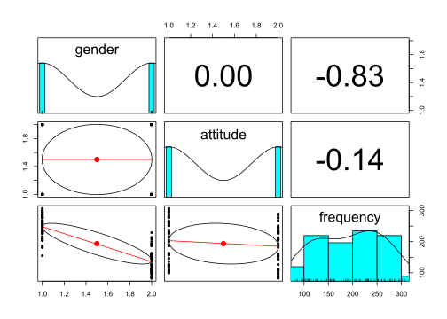
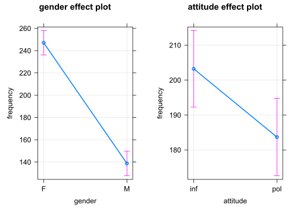
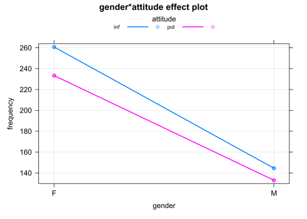
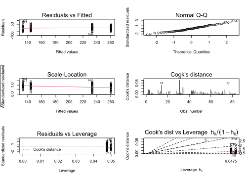
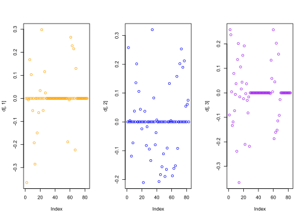
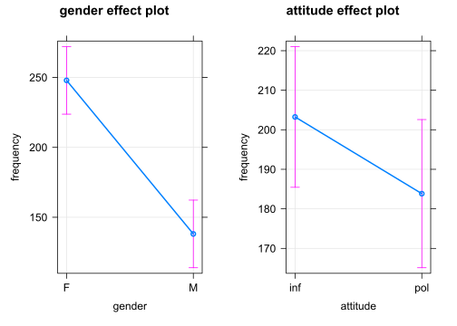
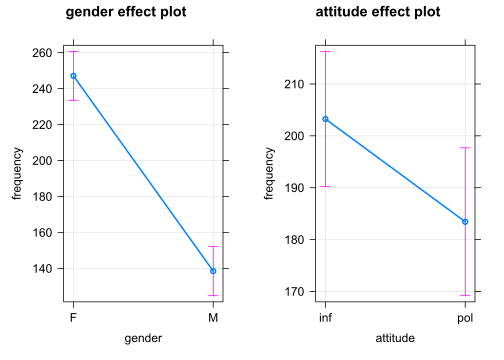
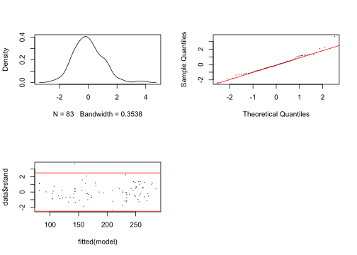
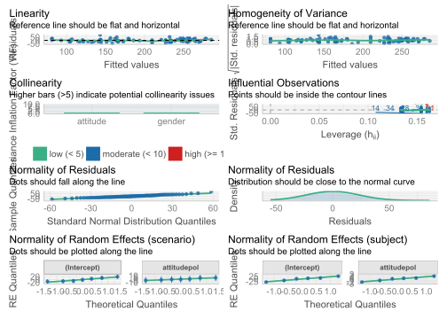
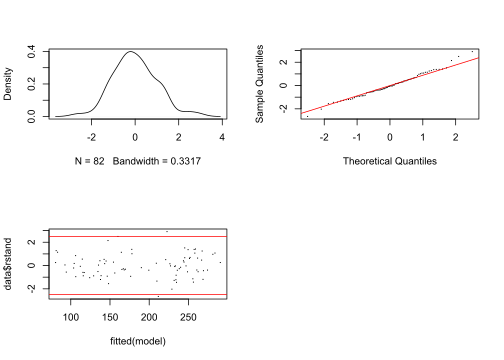

#### Lineare Regression

Politeness data (B. Winter tutorial)

Programme laden: 


```r
library(tidyverse)
```


Datei laden: 


```r
# LOAD
rm(list=ls(all=TRUE)) # clear memory
polite <- read.csv("data/politeness_data.csv", dec=".")
```

Ansicht der Datenlage zu Orientierungszwecken: 


```r
head(polite)
```

```
##   subject gender scenario attitude frequency
## 1      F1      F        1      pol     213.3
## 2      F1      F        1      inf     204.5
## 3      F1      F        2      pol     285.1
## 4      F1      F        2      inf     259.7
## 5      F1      F        3      pol     203.9
## 6      F1      F        3      inf     286.9
```

Variablentyp festlegen: 


```r
polite$frequency = as.numeric(polite$frequency)
polite$scenario = as.factor(polite$scenario)
polite$subject = as.factor(polite$subject)
polite$gender = as.factor(polite$gender)
polite$attitude = as.factor(polite$attitude)
```

Kontraste für den statistischen Test setzen: 


```r
# In this session we use contr. sum contrasts
options(contrasts=c('contr.sum', 'contr.poly'))
options("contrasts")
```

```
## $contrasts
## [1] "contr.sum"  "contr.poly"
```

Kontraste zurücksetzen: 


```r
# To reset default settings run: 
options(contrasts=c('contr.treatment', 'contr.poly')) 
# (all afex functions should be unaffected by this)

# # Setting contrasts of chosen variables only
# contrasts(polite$attitude) <- contr.treatment(2, base = 1)
```

Einfacher Boxplot: 


```r
boxplot(frequency ~ attitude*gender, 
        col=c("red","green"), data = polite)
```


Bild speichern:   
- z.B. im *jpg*-Format oder    
- im *pdf*-Format.   


```r
# 1. Open jpeg file
jpeg("pictures/politeness_boxplot.jpg", 
     width = 840, height = 535)
# 2. Create the plot
boxplot(frequency ~ attitude*gender, 
        col=c("red","green"), data = polite) 
# 3. Close the file
dev.off()
```

```
## svg 
##   2
```


```r
# Open a pdf file
pdf("pictures/politeness_boxplot.pdf") 
# 2. Create a plot
boxplot(frequency ~ attitude*gender, 
        col=c("red","green"), data = polite) 
# Close the pdf file
dev.off() 
```

```
## svg 
##   2
```

Beziehungen zwischen Variablenpaaren anzeigen: 


```r
library(psych)
pairs.panels(polite[c(2,4,5)])
```



Lineare Regression mit mehreren unabhängigen Variablen und einer abhängigen Variable, im Englischen auch als *Ordinary Least Squares Regression (OLS)* bekannt.   

Mit allen unabhängigen Variablen: 


```r
# model 1
m <- lm(frequency ~ gender + attitude + subject + scenario, data = polite)
summary(m)
```

```
## 
## Call:
## lm(formula = frequency ~ gender + attitude + subject + scenario, 
##     data = polite)
## 
## Residuals:
##     Min      1Q  Median      3Q     Max 
## -53.673 -16.686   1.039  12.027  86.630 
## 
## Coefficients: (1 not defined because of singularities)
##             Estimate Std. Error t value Pr(>|t|)    
## (Intercept)  225.150     10.020  22.470  < 2e-16 ***
## genderM     -129.857      9.606 -13.518  < 2e-16 ***
## attitudepol  -19.794      5.585  -3.544 0.000707 ***
## subjectF2     26.150      9.606   2.722 0.008179 ** 
## subjectF3     18.700      9.606   1.947 0.055592 .  
## subjectM3     66.800      9.606   6.954 1.52e-09 ***
## subjectM4     41.854      9.807   4.268 6.09e-05 ***
## subjectM7         NA         NA      NA       NA    
## scenario2     25.017     10.376   2.411 0.018537 *  
## scenario3     31.025     10.376   2.990 0.003847 ** 
## scenario4     42.508     10.376   4.097 0.000111 ***
## scenario5     14.408     10.376   1.389 0.169351    
## scenario6      1.405     10.629   0.132 0.895227    
## scenario7      3.117     10.376   0.300 0.764783    
## ---
## Signif. codes:  0 '***' 0.001 '**' 0.01 '*' 0.05 '.' 0.1 ' ' 1
## 
## Residual standard error: 25.42 on 70 degrees of freedom
##   (1 observation deleted due to missingness)
## Multiple R-squared:  0.8716,	Adjusted R-squared:  0.8496 
## F-statistic: 39.61 on 12 and 70 DF,  p-value: < 2.2e-16
```

Regression mit denjenigen Variablen, die als Prädiktoren für die abhängige Variable gewählt wurden:    


```r
# model 2
m <- lm(frequency ~ gender + attitude, data=polite)
summary(m)
```

```
## 
## Call:
## lm(formula = frequency ~ gender + attitude, data = polite)
## 
## Residuals:
##     Min      1Q  Median      3Q     Max 
## -82.409 -26.561  -4.262  24.690 100.140 
## 
## Coefficients:
##             Estimate Std. Error t value Pr(>|t|)    
## (Intercept)  256.762      6.756  38.006   <2e-16 ***
## genderM     -108.349      7.833 -13.832   <2e-16 ***
## attitudepol  -19.553      7.833  -2.496   0.0146 *  
## ---
## Signif. codes:  0 '***' 0.001 '**' 0.01 '*' 0.05 '.' 0.1 ' ' 1
## 
## Residual standard error: 35.68 on 80 degrees of freedom
##   (1 observation deleted due to missingness)
## Multiple R-squared:  0.7109,	Adjusted R-squared:  0.7037 
## F-statistic: 98.38 on 2 and 80 DF,  p-value: < 2.2e-16
```

Koeffizienten der Variablen anzeigen: 


```r
library(effects)
allEffects(m)
```

```
##  model: frequency ~ gender + attitude
## 
##  gender effect
## gender
##        F        M 
## 247.1035 138.7549 
## 
##  attitude effect
## attitude
##      inf      pol 
## 203.2408 183.6875
```

Visuelle Darstellung der Regressionsergebnisse: 


```r
plot(allEffects(m), multiline=TRUE, grid=TRUE, rug=FALSE, as.table=TRUE)
```



Bild sichern: 


```r
# Save plot of the effects to disk
# 1. Open jpeg file
jpeg("pictures/politeness_lineplot.jpg", 
     width = 840, height = 535)
# 2. Create the plot
plot(allEffects(m), multiline=TRUE, grid=TRUE, rug=FALSE, as.table=TRUE)
# 3. Close the file
dev.off()
```

```
## svg 
##   2
```

Ein weiteres Regressionsmodell mit einer Interaktion zwischen den unabhängigen Variablen (Prädiktoren): 


```r
# model 3 (with interaction)
m <- lm(frequency ~ gender*attitude, data=polite)
summary(m)
```

```
## 
## Call:
## lm(formula = frequency ~ gender * attitude, data = polite)
## 
## Residuals:
##     Min      1Q  Median      3Q     Max 
## -78.486 -27.383  -0.986  20.570  96.020 
## 
## Coefficients:
##                     Estimate Std. Error t value Pr(>|t|)    
## (Intercept)          260.686      7.784  33.491   <2e-16 ***
## genderM             -116.195     11.008 -10.556   <2e-16 ***
## attitudepol          -27.400     11.008  -2.489   0.0149 *  
## genderM:attitudepol   15.890     15.664   1.014   0.3135    
## ---
## Signif. codes:  0 '***' 0.001 '**' 0.01 '*' 0.05 '.' 0.1 ' ' 1
## 
## Residual standard error: 35.67 on 79 degrees of freedom
##   (1 observation deleted due to missingness)
## Multiple R-squared:  0.7147,	Adjusted R-squared:  0.7038 
## F-statistic: 65.95 on 3 and 79 DF,  p-value: < 2.2e-16
```

Koeffizienten der Variablen anzeigen: 


```r
library(effects)
allEffects(m)
```

```
##  model: frequency ~ gender * attitude
## 
##  gender*attitude effect
##       attitude
## gender      inf      pol
##      F 260.6857 233.2857
##      M 144.4905 132.9800
```

Visuelle Darstellung der Regressionsergebnisse: 


```r
plot(allEffects(m), multiline=TRUE, grid=TRUE, rug=FALSE, as.table=TRUE)
```



Bild als *jpg*-Datei sichern: 


```r
# Save plot of the effects to disk
# 1. Open jpeg file
jpeg("pictures/politeness_effects.jpg", 
     width = 840, height = 535)
# 2. Create the plot
plot(allEffects(m), multiline=TRUE, grid=TRUE, rug=FALSE, as.table=TRUE)
# 3. Close the file
dev.off()
```

```
## svg 
##   2
```

Bild als *pdf*-Datei sichern: 


```r
# Open a pdf file
pdf("pictures/politeness_effects.pdf") 
# 2. Create a plot
plot(allEffects(m), multiline=TRUE, grid=TRUE, rug=FALSE, as.table=TRUE)
# Close the pdf file
dev.off() 
```

```
## svg 
##   2
```

Diagnostische Analyse (sind die Bedingungen für eine Regression erfüllt?): 


```r
# plot diagnostic diagrams
par(mfrow = c(3,2))
plot(m, which = 1) # variance of residuals vs. fitted values?
plot(m, which = 2) # normal distributed residuals?
plot(m, which = 3) # variance of residuals standardized
plot(m, which = 4) # Cook's distance (outliers / influencing data points?)
plot(m, which = 5) # Leverage vs. standardized variance of residuals
plot(m, which = 6) # Cook's distance vs. Leverage
```



```r
par(mfrow = c(1,1))
```

Entfernung eines Datenpunktes und die dabei entstehende Veränderung des Koeffizienten: 


```r
# Change of estimates if one datapoint is removed from the model
d <- dfbetas(m)
head(d) %>% as.data.frame %>% rmarkdown::paged_table()
```

<div data-pagedtable="false">
  <script data-pagedtable-source type="application/json">
{"columns":[{"label":[""],"name":["_rn_"],"type":[""],"align":["left"]},{"label":["(Intercept)"],"name":[1],"type":["dbl"],"align":["right"]},{"label":["genderM"],"name":[2],"type":["dbl"],"align":["right"]},{"label":["attitudepol"],"name":[3],"type":["dbl"],"align":["right"]},{"label":["genderM:attitudepol"],"name":[4],"type":["dbl"],"align":["right"]}],"data":[{"1":"4.628647e-16","2":"-4.518405e-16","3":"-0.090392640","4":"0.063521473","_rn_":"1"},{"1":"-3.646937e-01","2":"2.578774e-01","3":"0.257877355","4":"-0.181217733","_rn_":"2"},{"1":"6.358180e-17","2":"-2.139049e-16","3":"0.237209532","4":"-0.166693867","_rn_":"3"},{"1":"-6.291782e-03","2":"4.448962e-03","3":"0.004448962","4":"-0.003126412","_rn_":"4"},{"1":"6.068721e-17","2":"-1.784827e-17","3":"-0.133232266","4":"0.093626093","_rn_":"5"},{"1":"1.679279e-01","2":"-1.187430e-01","3":"-0.118742974","4":"0.083444057","_rn_":"6"}],"options":{"columns":{"min":{},"max":[10]},"rows":{"min":[10],"max":[10]},"pages":{}}}
  </script>
</div>

Koeffizienten visuell darstellen: 


```r
# plot the dfbetas (are there any outliers or data points with high influence?)
par(mfrow = c(1,3))
plot(d[,1], col = "orange")
plot(d[,2], col = "blue")
plot(d[,3], col = "purple")
```



```r
par(mfrow = c(1,1))
```


#### Regression mit gemischten Effekten
(Mixed effects Regression, Multilevel Regression)

Programme laden: 


```r
# The variables 'subject' and 'scenario' have been chosen as random effects
library(afex)
```

Regressionsmodell mit einem individuell variierenden Intercept (Ordinate): 


```r
# random intercepts model
m <- lmer(frequency ~ 
            (1|subject), 
          REML=F, data=polite)
m0.1 <- m
summary(m)
```

```
## Linear mixed model fit by maximum likelihood . t-tests use Satterthwaite's
##   method [lmerModLmerTest]
## Formula: frequency ~ (1 | subject)
##    Data: polite
## 
##      AIC      BIC   logLik deviance df.resid 
##    833.2    840.5   -413.6    827.2       80 
## 
## Scaled residuals: 
##     Min      1Q  Median      3Q     Max 
## -2.4921 -0.6514 -0.1596  0.6511  2.6732 
## 
## Random effects:
##  Groups   Name        Variance Std.Dev.
##  subject  (Intercept) 3289.7   57.36   
##  Residual              941.2   30.68   
## Number of obs: 83, groups:  subject, 6
## 
## Fixed effects:
##             Estimate Std. Error      df t value Pr(>|t|)    
## (Intercept)  193.027     23.656   6.001    8.16 0.000182 ***
## ---
## Signif. codes:  0 '***' 0.001 '**' 0.01 '*' 0.05 '.' 0.1 ' ' 1
```

Regressionsmodell mit zwei individuell variierenden Intercepts (Ordinaten): 


```r
# random intercepts model
m <- lmer(frequency ~ 
            (1|subject) + (1|scenario), 
          REML=F, data=polite)
m0.2 <- m
summary(m)
```

```
## Linear mixed model fit by maximum likelihood . t-tests use Satterthwaite's
##   method [lmerModLmerTest]
## Formula: frequency ~ (1 | subject) + (1 | scenario)
##    Data: polite
## 
##      AIC      BIC   logLik deviance df.resid 
##    826.6    836.3   -409.3    818.6       79 
## 
## Scaled residuals: 
##      Min       1Q   Median       3Q      Max 
## -2.40887 -0.53279 -0.09441  0.63269  2.80566 
## 
## Random effects:
##  Groups   Name        Variance Std.Dev.
##  scenario (Intercept)  202.5   14.23   
##  subject  (Intercept) 3344.0   57.83   
##  Residual              751.4   27.41   
## Number of obs: 83, groups:  scenario, 7; subject, 6
## 
## Fixed effects:
##             Estimate Std. Error      df t value Pr(>|t|)    
## (Intercept)  192.886     24.400   6.587   7.905 0.000135 ***
## ---
## Signif. codes:  0 '***' 0.001 '**' 0.01 '*' 0.05 '.' 0.1 ' ' 1
```

Regressionsmodell mit zwei individuell variierenden Intercepts (Ordinaten) und einer kategorischen Variable: 


```r
# random intercepts model
m <- lmer(frequency ~ gender + 
            (1|subject) + (1|scenario), 
          REML=F, data=polite)
m1 <- m
summary(m)
```

```
## Linear mixed model fit by maximum likelihood . t-tests use Satterthwaite's
##   method [lmerModLmerTest]
## Formula: frequency ~ gender + (1 | subject) + (1 | scenario)
##    Data: polite
## 
##      AIC      BIC   logLik deviance df.resid 
##    816.7    828.8   -403.4    806.7       78 
## 
## Scaled residuals: 
##      Min       1Q   Median       3Q      Max 
## -2.49969 -0.57100 -0.06373  0.60229  2.86559 
## 
## Random effects:
##  Groups   Name        Variance Std.Dev.
##  scenario (Intercept) 191.2    13.83   
##  subject  (Intercept) 409.6    20.24   
##  Residual             751.9    27.42   
## Number of obs: 83, groups:  scenario, 7; subject, 6
## 
## Fixed effects:
##             Estimate Std. Error       df t value Pr(>|t|)    
## (Intercept)  246.986     13.481    7.676  18.321  1.3e-07 ***
## genderM     -108.236     17.588    5.939  -6.154 0.000877 ***
## ---
## Signif. codes:  0 '***' 0.001 '**' 0.01 '*' 0.05 '.' 0.1 ' ' 1
## 
## Correlation of Fixed Effects:
##         (Intr)
## genderM -0.651
```

Regressionsmodell mit zwei individuell variierenden Intercepts (Ordinaten) und zwei Prädiktoren, zwei kategorischen Variablen. Von Interesse ist die Variable *attitude* (hier: sprachliches Verhalten). 


```r
m <- lmer(frequency ~ gender + attitude + 
          (1|subject) + (1|scenario), 
          REML=F, data=polite)
m2 <- m
summary(m)
```

```
## Linear mixed model fit by maximum likelihood . t-tests use Satterthwaite's
##   method [lmerModLmerTest]
## Formula: frequency ~ gender + attitude + (1 | subject) + (1 | scenario)
##    Data: polite
## 
##      AIC      BIC   logLik deviance df.resid 
##    807.1    821.6   -397.6    795.1       77 
## 
## Scaled residuals: 
##     Min      1Q  Median      3Q     Max 
## -2.2958 -0.6456 -0.0776  0.5448  3.5121 
## 
## Random effects:
##  Groups   Name        Variance Std.Dev.
##  scenario (Intercept) 205.2    14.33   
##  subject  (Intercept) 417.0    20.42   
##  Residual             637.4    25.25   
## Number of obs: 83, groups:  scenario, 7; subject, 6
## 
## Fixed effects:
##             Estimate Std. Error       df t value Pr(>|t|)    
## (Intercept)  256.847     13.827    8.500  18.576 3.53e-08 ***
## genderM     -108.517     17.571    5.929  -6.176 0.000866 ***
## attitudepol  -19.722      5.547   70.920  -3.555 0.000677 ***
## ---
## Signif. codes:  0 '***' 0.001 '**' 0.01 '*' 0.05 '.' 0.1 ' ' 1
## 
## Correlation of Fixed Effects:
##             (Intr) gendrM
## genderM     -0.635       
## attitudepol -0.201  0.004
```

Regressionsmodell mit zwei individuell variierenden Intercepts (Ordinaten) und zwei interagierenden Prädiktoren. Von Interesse ist die Variable *attitude*. 


```r
m <- lmer(frequency ~ gender*attitude + 
            (1|subject) + (1|scenario), 
          REML=F, data=polite)
m3 <- m
summary(m)
```

```
## Linear mixed model fit by maximum likelihood . t-tests use Satterthwaite's
##   method [lmerModLmerTest]
## Formula: frequency ~ gender * attitude + (1 | subject) + (1 | scenario)
##    Data: polite
## 
##      AIC      BIC   logLik deviance df.resid 
##    807.1    824.0   -396.6    793.1       76 
## 
## Scaled residuals: 
##     Min      1Q  Median      3Q     Max 
## -2.1678 -0.5559 -0.0628  0.5103  3.3903 
## 
## Random effects:
##  Groups   Name        Variance Std.Dev.
##  scenario (Intercept) 205.0    14.32   
##  subject  (Intercept) 418.8    20.47   
##  Residual             620.0    24.90   
## Number of obs: 83, groups:  scenario, 7; subject, 6
## 
## Fixed effects:
##                     Estimate Std. Error       df t value Pr(>|t|)    
## (Intercept)          260.686     14.086    9.140  18.506 1.48e-08 ***
## genderM             -116.195     18.392    7.094  -6.318 0.000376 ***
## attitudepol          -27.400      7.684   70.881  -3.566 0.000655 ***
## genderM:attitudepol   15.568     10.943   70.925   1.423 0.159229    
## ---
## Signif. codes:  0 '***' 0.001 '**' 0.01 '*' 0.05 '.' 0.1 ' ' 1
## 
## Correlation of Fixed Effects:
##             (Intr) gendrM atttdp
## genderM     -0.653              
## attitudepol -0.273  0.209       
## gndrM:tttdp  0.192 -0.293 -0.702
```

Mit dem Programm `jtools` erhält man die Regressionsergebnisse in übersichtlicherer Form und mit zusätzlichen Größenberechnungen:  


```r
library(jtools)
summ(m3)
```

<table class="table table-striped table-hover table-condensed table-responsive" style="width: auto !important; margin-left: auto; margin-right: auto;">
<tbody>
  <tr>
   <td style="text-align:left;font-weight: bold;"> Observations </td>
   <td style="text-align:right;"> 83 </td>
  </tr>
  <tr>
   <td style="text-align:left;font-weight: bold;"> Dependent variable </td>
   <td style="text-align:right;"> frequency </td>
  </tr>
  <tr>
   <td style="text-align:left;font-weight: bold;"> Type </td>
   <td style="text-align:right;"> Mixed effects linear regression </td>
  </tr>
</tbody>
</table> <table class="table table-striped table-hover table-condensed table-responsive" style="width: auto !important; margin-left: auto; margin-right: auto;">
<tbody>
  <tr>
   <td style="text-align:left;font-weight: bold;"> AIC </td>
   <td style="text-align:right;"> 807.11 </td>
  </tr>
  <tr>
   <td style="text-align:left;font-weight: bold;"> BIC </td>
   <td style="text-align:right;"> 824.04 </td>
  </tr>
  <tr>
   <td style="text-align:left;font-weight: bold;"> Pseudo-R2 (fixed effects) </td>
   <td style="text-align:right;"> 0.71 </td>
  </tr>
  <tr>
   <td style="text-align:left;font-weight: bold;"> Pseudo-R2 (total) </td>
   <td style="text-align:right;"> 0.86 </td>
  </tr>
</tbody>
</table> <table class="table table-striped table-hover table-condensed table-responsive" style="width: auto !important; margin-left: auto; margin-right: auto;border-bottom: 0;">
 <thead>
<tr><th style="border-bottom:hidden;padding-bottom:0; padding-left:3px;padding-right:3px;text-align: center; " colspan="6"><div style="border-bottom: 1px solid #ddd; padding-bottom: 5px; ">Fixed Effects</div></th></tr>
  <tr>
   <th style="text-align:left;">   </th>
   <th style="text-align:right;"> Est. </th>
   <th style="text-align:right;"> S.E. </th>
   <th style="text-align:right;"> t val. </th>
   <th style="text-align:right;"> d.f. </th>
   <th style="text-align:right;"> p </th>
  </tr>
 </thead>
<tbody>
  <tr>
   <td style="text-align:left;font-weight: bold;"> (Intercept) </td>
   <td style="text-align:right;"> 260.69 </td>
   <td style="text-align:right;"> 14.09 </td>
   <td style="text-align:right;"> 18.51 </td>
   <td style="text-align:right;"> 9.14 </td>
   <td style="text-align:right;"> 0.00 </td>
  </tr>
  <tr>
   <td style="text-align:left;font-weight: bold;"> genderM </td>
   <td style="text-align:right;"> -116.20 </td>
   <td style="text-align:right;"> 18.39 </td>
   <td style="text-align:right;"> -6.32 </td>
   <td style="text-align:right;"> 7.09 </td>
   <td style="text-align:right;"> 0.00 </td>
  </tr>
  <tr>
   <td style="text-align:left;font-weight: bold;"> attitudepol </td>
   <td style="text-align:right;"> -27.40 </td>
   <td style="text-align:right;"> 7.68 </td>
   <td style="text-align:right;"> -3.57 </td>
   <td style="text-align:right;"> 70.88 </td>
   <td style="text-align:right;"> 0.00 </td>
  </tr>
  <tr>
   <td style="text-align:left;font-weight: bold;"> genderM:attitudepol </td>
   <td style="text-align:right;"> 15.57 </td>
   <td style="text-align:right;"> 10.94 </td>
   <td style="text-align:right;"> 1.42 </td>
   <td style="text-align:right;"> 70.92 </td>
   <td style="text-align:right;"> 0.16 </td>
  </tr>
</tbody>
<tfoot><tr><td style="padding: 0; " colspan="100%">
<sup></sup>  p values calculated using Satterthwaite d.f. </td></tr></tfoot>
</table> <table class="table table-striped table-hover table-condensed table-responsive" style="width: auto !important; margin-left: auto; margin-right: auto;">
 <thead>
<tr><th style="border-bottom:hidden;padding-bottom:0; padding-left:3px;padding-right:3px;text-align: center; " colspan="3"><div style="border-bottom: 1px solid #ddd; padding-bottom: 5px; ">Random Effects</div></th></tr>
  <tr>
   <th> Group </th>
   <th> Parameter </th>
   <th> Std. Dev. </th>
  </tr>
 </thead>
<tbody>
  <tr>
   <td> scenario </td>
   <td> (Intercept) </td>
   <td> 14.32 </td>
  </tr>
  <tr>
   <td> subject </td>
   <td> (Intercept) </td>
   <td> 20.47 </td>
  </tr>
  <tr>
   <td> Residual </td>
   <td>  </td>
   <td> 24.90 </td>
  </tr>
</tbody>
</table> <table class="table table-striped table-hover table-condensed table-responsive" style="width: auto !important; margin-left: auto; margin-right: auto;">
 <thead>
<tr><th style="border-bottom:hidden;padding-bottom:0; padding-left:3px;padding-right:3px;text-align: center; " colspan="3"><div style="border-bottom: 1px solid #ddd; padding-bottom: 5px; ">Grouping Variables</div></th></tr>
  <tr>
   <th> Group </th>
   <th> # groups </th>
   <th> ICC </th>
  </tr>
 </thead>
<tbody>
  <tr>
   <td> scenario </td>
   <td> 7 </td>
   <td> 0.16 </td>
  </tr>
  <tr>
   <td> subject </td>
   <td> 6 </td>
   <td> 0.34 </td>
  </tr>
</tbody>
</table>

Vergleich der Modelle:


```r
anova(m0.1, m0.2,m1,m2,m3)
```

```
## Data: polite
## Models:
## m0.1: frequency ~ (1 | subject)
## m0.2: frequency ~ (1 | subject) + (1 | scenario)
## m1: frequency ~ gender + (1 | subject) + (1 | scenario)
## m2: frequency ~ gender + attitude + (1 | subject) + (1 | scenario)
## m3: frequency ~ gender * attitude + (1 | subject) + (1 | scenario)
##      npar    AIC    BIC  logLik deviance   Chisq Df Pr(>Chisq)    
## m0.1    3 833.25 840.51 -413.62   827.25                          
## m0.2    4 826.63 836.30 -409.31   818.63  8.6246  1  0.0033166 ** 
## m1      5 816.72 828.81 -403.36   806.72 11.9059  1  0.0005596 ***
## m2      6 807.10 821.61 -397.55   795.10 11.6178  1  0.0006532 ***
## m3      7 807.11 824.04 -396.55   793.11  1.9963  1  0.1576796    
## ---
## Signif. codes:  0 '***' 0.001 '**' 0.01 '*' 0.05 '.' 0.1 ' ' 1
```

Mit Hilfe der `anova()`-Funktion kann man eine Anova-Tabelle erstellen. 


```r
anova(m3)
```

```
## Type III Analysis of Variance Table with Satterthwaite's method
##                  Sum Sq Mean Sq NumDF  DenDF F value    Pr(>F)    
## gender          23570.5 23570.5     1  5.929 38.0164 0.0008739 ***
## attitude         7969.4  7969.4     1 70.925 12.8536 0.0006146 ***
## gender:attitude  1254.8  1254.8     1 70.925  2.0239 0.1592288    
## ---
## Signif. codes:  0 '***' 0.001 '**' 0.01 '*' 0.05 '.' 0.1 ' ' 1
```

Die *Anova* (mit Grundfrequenz als abhängige Variable, Geschlecht, Verhalten und ihrer Interaktion als Prädiktoren sowie Versuchspersonen und Szenario als Zufallsvariablen) ergab *Geschlecht* als signifikanten Haupteffekt (F(1; 5,929) = 38,0164; p = 0,0009; $\eta_{p}^2$ = 0,87) und *Verhalten* als signifikanten Haupteffekt auf die Höhe der Grundfrequenz (F(1; 70,925) = 12,8536; p = 0,0006; $\eta_{p}^2$ = 0,15). Die *Interaktion* zwischen Geschlecht und Verhalten war nicht signifikant (F(1; 70,925) = 2,0239; p = 0,15923; $\eta_{p}^2$ = 0,03). 

Das Pseudo-$R^2$ für die Koeffizienten der Prädiktoren beträgt 0,71 (d.h. 71% der Varianz der Grundfrequenz wurden mit den Prädiktoren erklärt), das Pseudo-$R^2$ für die Koeffizienten aller Effekte (fixed effects + random effects) beträgt 0,857 (d.h. mit allen Variablen wurden fast 86% der Grundfrequenzvariation erklärt). 

Der Post-hoc-Test für die *Interaktion* von Geschlecht und Verhalten ergab außerdem signifikant Unterschiede zwischen weiblichen und männlichen Testpersonen hinsichtlich der Grundfrequenzhöhe, und zwar sowohl bei informellen Sprechen (p = 0,0003) als auch bei höflichem Sprechen (p = 0,001). Da unter beiden Bedingungen (informelles vs. höfliches sprachliches Verhalten) ein signifikante Unterschied zwischen weiblichen und männlichen Versuchspersonen festgestellt wurde, führte die Interaktion beider Prädiktoren zu keinem signifikanten Einfluss auf den Verlauf der Grundfrequenz. 

Die $\eta^2$-Funktion: 


```r
library(sjstats)
```

```
## 
## Attaching package: 'sjstats'
```

```
## The following object is masked from 'package:psych':
## 
##     phi
```

```r
eta_sq(m3, partial = TRUE)
```

```
## Warning: 'eta_sq' is deprecated.
## Use 'effectsize::eta_squared()' instead.
## See help("Deprecated")
```

```
## # Effect Size for ANOVA (Type III)
## 
## Parameter       | Eta2 (partial) |       95% CI
## -----------------------------------------------
## gender          |           0.87 | [0.56, 1.00]
## attitude        |           0.15 | [0.05, 1.00]
## gender:attitude |           0.03 | [0.00, 1.00]
## 
## - One-sided CIs: upper bound fixed at (1).
```

```r
library(effectsize)
```

```
## 
## Attaching package: 'effectsize'
```

```
## The following objects are masked from 'package:sjstats':
## 
##     cohens_f, phi
```

```
## The following object is masked from 'package:jtools':
## 
##     standardize
```

```
## The following object is masked from 'package:psych':
## 
##     phi
```

```r
eta_squared(m3, partial = TRUE)
```

```
## # Effect Size for ANOVA (Type III)
## 
## Parameter       | Eta2 (partial) |       95% CI
## -----------------------------------------------
## gender          |           0.87 | [0.56, 1.00]
## attitude        |           0.15 | [0.05, 1.00]
## gender:attitude |           0.03 | [0.00, 1.00]
## 
## - One-sided CIs: upper bound fixed at (1).
```

Die Pseudo-$R^2$-Funktion: 


```r
library(MuMIn)
r.squaredGLMM(m3)
```

```
## Warning: 'r.squaredGLMM' now calculates a revised statistic. See the help page.
```

```
##            R2m       R2c
## [1,] 0.7122865 0.8565861
```

Der Post-hoc-Test für die Interaktion von Geschlecht und Verhalten: 


```r
library(emmeans)
emmeans(m3, pairwise ~ gender)
```

```
## NOTE: Results may be misleading due to involvement in interactions
```

```
## $emmeans
##  gender emmean   SE   df lower.CL upper.CL
##  F         247 15.9 9.71      211      283
##  M         139 15.9 9.74      103      174
## 
## Results are averaged over the levels of: attitude 
## Degrees-of-freedom method: kenward-roger 
## Confidence level used: 0.95 
## 
## $contrasts
##  contrast estimate SE   df t.ratio p.value
##  F - M         108 21 8.18   5.155  0.0008
## 
## Results are averaged over the levels of: attitude 
## Degrees-of-freedom method: kenward-roger
```

```r
# with interaction
emmeans(m3, pairwise ~ gender | attitude)
```

```
## $emmeans
## attitude = inf:
##  gender emmean   SE   df lower.CL upper.CL
##  F         261 16.3 11.3    224.8      297
##  M         144 16.3 11.3    108.6      180
## 
## attitude = pol:
##  gender emmean   SE   df lower.CL upper.CL
##  F         233 16.3 11.3    197.4      269
##  M         133 16.4 11.5     96.8      169
## 
## Degrees-of-freedom method: kenward-roger 
## Confidence level used: 0.95 
## 
## $contrasts
## attitude = inf:
##  contrast estimate   SE   df t.ratio p.value
##  F - M         116 21.7 9.79   5.348  0.0003
## 
## attitude = pol:
##  contrast estimate   SE   df t.ratio p.value
##  F - M         101 21.8 9.88   4.623  0.0010
## 
## Degrees-of-freedom method: kenward-roger
```

Die oben berechneten Regressionsmodelle berücksichtigen die beiden Zufallsvariablen (random effects) Versuchsperson und Szenario. Damit berücksichtigen wir interindividuelle Unterschiede zwischen den Testpersonen und Unterschiede zwischen den verschiedenen Szenarien, die alle die Höhe der Grundfrequenz beeinflussen könnten. Dies ergibt individuelle Regressionskonstanten (Intercepts) für die einzelnen Versuchspersonen und Szenarien.

Unterscheiden sich die Versuchspersonen nun auch darin, dass z.B. bestimmte Szenarien sie eher zu Grundfrequenzvariationen bewegen, d.h. die Steigung des Regressionskoeffizienten individuell beeinflussen (*random slope*)?

Zuerst stellen wir ein Basismodell mit individuellen Steigungskoeffizienten auf: 


```r
# politeness affected pitch (χ2(1)=11.62, p=0.00065), 
# lowering it by about 19.7 Hz ± 5.6 (standard errors) 

# random slopes model
m <- lmer(frequency ~ gender + 
            (attitude + 1|subject) + (attitude + 1|scenario), 
          REML=F, data=polite)
m00 <- m
summary(m)
```

```
## Linear mixed model fit by maximum likelihood . t-tests use Satterthwaite's
##   method [lmerModLmerTest]
## Formula: frequency ~ gender + (attitude + 1 | subject) + (attitude + 1 |  
##     scenario)
##    Data: polite
## 
##      AIC      BIC   logLik deviance df.resid 
##    819.6    841.4   -400.8    801.6       74 
## 
## Scaled residuals: 
##      Min       1Q   Median       3Q      Max 
## -2.09487 -0.64641 -0.08678  0.60655  3.00531 
## 
## Random effects:
##  Groups   Name        Variance Std.Dev. Corr 
##  scenario (Intercept) 231.844  15.226        
##           attitudepol 410.086  20.251   -0.40
##  subject  (Intercept) 378.484  19.455        
##           attitudepol   5.443   2.333   1.00 
##  Residual             628.656  25.073        
## Number of obs: 83, groups:  scenario, 7; subject, 6
## 
## Fixed effects:
##             Estimate Std. Error       df t value Pr(>|t|)    
## (Intercept)  253.370     13.437    7.714  18.856  9.9e-08 ***
## genderM     -112.488     17.470    5.932  -6.439 0.000694 ***
## ---
## Signif. codes:  0 '***' 0.001 '**' 0.01 '*' 0.05 '.' 0.1 ' ' 1
## 
## Correlation of Fixed Effects:
##         (Intr)
## genderM -0.650
## optimizer (nloptwrap) convergence code: 0 (OK)
## boundary (singular) fit: see help('isSingular')
```

Dann fügen wir die uns interessierende Variable *attitude* hinzu: 


```r
m <- lmer(frequency ~ gender + attitude + 
          (attitude + 1|subject) + (attitude + 1|scenario), 
          REML=F, data=polite)
m01 <- m
summary(m)
```

```
## Linear mixed model fit by maximum likelihood . t-tests use Satterthwaite's
##   method [lmerModLmerTest]
## Formula: 
## frequency ~ gender + attitude + (attitude + 1 | subject) + (attitude +  
##     1 | scenario)
##    Data: polite
## 
##      AIC      BIC   logLik deviance df.resid 
##    814.9    839.1   -397.4    794.9       73 
## 
## Scaled residuals: 
##     Min      1Q  Median      3Q     Max 
## -2.1946 -0.6690 -0.0789  0.5256  3.4251 
## 
## Random effects:
##  Groups   Name        Variance Std.Dev. Corr
##  scenario (Intercept) 182.083  13.494       
##           attitudepol  31.244   5.590   0.22
##  subject  (Intercept) 392.344  19.808       
##           attitudepol   1.714   1.309   1.00
##  Residual             627.890  25.058       
## Number of obs: 83, groups:  scenario, 7; subject, 6
## 
## Fixed effects:
##             Estimate Std. Error       df t value Pr(>|t|)    
## (Intercept)  257.991     13.528    7.600  19.071 1.08e-07 ***
## genderM     -110.806     17.510    5.936  -6.328 0.000759 ***
## attitudepol  -19.747      5.922    7.062  -3.335 0.012354 *  
## ---
## Signif. codes:  0 '***' 0.001 '**' 0.01 '*' 0.05 '.' 0.1 ' ' 1
## 
## Correlation of Fixed Effects:
##             (Intr) gendrM
## genderM     -0.647       
## attitudepol -0.105  0.003
## optimizer (nloptwrap) convergence code: 0 (OK)
## boundary (singular) fit: see help('isSingular')
```

Wenn das Regressionsmodell mit den individuell variierenden Steigungskoeffizienten nicht berechnet werden kann, könnte auch ein Modell mit nur einem individuell variierenden Intercept in Frage kommen, z.B. diesem hier: 


```r
m <- lmer(frequency ~ gender + attitude + 
            (attitude + 1|subject), 
          REML=F, data=polite)
```

Die Steigungskoeffizienten: 


```r
library(effects)
allEffects(m)
```

```
##  model: frequency ~ gender + attitude
## 
##  gender effect
## gender
##        F        M 
## 247.9156 138.0861 
## 
##  attitude effect
## attitude
##      inf      pol 
## 203.2497 183.8414
```

Visuelle Darstellung der Regressionsergebnisse: 


```r
plot(allEffects(m), multiline=TRUE, grid=TRUE, rug=FALSE, as.table=TRUE)
```



Eine weitere Variante mit nur einem individuell variierenden Steigungskoeffizienten: 


```r
m <- lmer(frequency ~ gender + attitude + 
            (attitude + 1|scenario), 
          REML=F, data=polite)
```

Die Ergebnisse: 


```r
library(effects)
allEffects(m)
```

```
##  model: frequency ~ gender + attitude
## 
##  gender effect
## gender
##        F        M 
## 247.1051 138.4961 
## 
##  attitude effect
## attitude
##      inf      pol 
## 203.2424 183.4286
```

Visuelle Darstellung der Regressionsergebnisse: 


```r
plot(allEffects(m), multiline=TRUE, grid=TRUE, rug=FALSE, as.table=TRUE)
```



Das volle Regressionsmodell mit zwei individuell variierenden Intercepts und individuell variierenden Steigungskoeffizienten sowie einer Interaktion zweier kategorieller Prädiktoren: 


```r
m <- lmer(frequency ~ gender*attitude + 
            (attitude + 1|subject) + (attitude + 1|scenario), 
          REML=F, data=polite)
```

Die Regressionsergebnisse: 


```r
m02 <- m
summary(m)
```

```
## Linear mixed model fit by maximum likelihood . t-tests use Satterthwaite's
##   method [lmerModLmerTest]
## Formula: 
## frequency ~ gender * attitude + (attitude + 1 | subject) + (attitude +  
##     1 | scenario)
##    Data: polite
## 
##      AIC      BIC   logLik deviance df.resid 
##    814.9    841.5   -396.4    792.9       72 
## 
## Scaled residuals: 
##     Min      1Q  Median      3Q     Max 
## -2.0680 -0.5620 -0.0360  0.4953  3.3021 
## 
## Random effects:
##  Groups   Name        Variance Std.Dev. Corr
##  scenario (Intercept) 185.5388 13.6213      
##           attitudepol  36.4691  6.0390  0.14
##  subject  (Intercept) 400.9123 20.0228      
##           attitudepol   0.8331  0.9127  1.00
##  Residual             609.1686 24.6813      
## Number of obs: 83, groups:  scenario, 7; subject, 6
## 
## Fixed effects:
##                     Estimate Std. Error       df t value Pr(>|t|)    
## (Intercept)          260.686     13.753    7.594  18.955 1.14e-07 ***
## genderM             -116.195     18.036    6.060  -6.442 0.000636 ***
## attitudepol          -27.400      7.969   21.583  -3.438 0.002394 ** 
## genderM:attitudepol   15.516     10.874   58.553   1.427 0.158919    
## ---
## Signif. codes:  0 '***' 0.001 '**' 0.01 '*' 0.05 '.' 0.1 ' ' 1
## 
## Correlation of Fixed Effects:
##             (Intr) gendrM atttdp
## genderM     -0.656              
## attitudepol -0.194  0.159       
## gndrM:tttdp  0.153 -0.234 -0.673
## optimizer (nloptwrap) convergence code: 0 (OK)
## boundary (singular) fit: see help('isSingular')
```

```r
library(jtools)
summ(m)
```

<table class="table table-striped table-hover table-condensed table-responsive" style="width: auto !important; margin-left: auto; margin-right: auto;">
<tbody>
  <tr>
   <td style="text-align:left;font-weight: bold;"> Observations </td>
   <td style="text-align:right;"> 83 </td>
  </tr>
  <tr>
   <td style="text-align:left;font-weight: bold;"> Dependent variable </td>
   <td style="text-align:right;"> frequency </td>
  </tr>
  <tr>
   <td style="text-align:left;font-weight: bold;"> Type </td>
   <td style="text-align:right;"> Mixed effects linear regression </td>
  </tr>
</tbody>
</table> <table class="table table-striped table-hover table-condensed table-responsive" style="width: auto !important; margin-left: auto; margin-right: auto;">
<tbody>
  <tr>
   <td style="text-align:left;font-weight: bold;"> AIC </td>
   <td style="text-align:right;"> 814.89 </td>
  </tr>
  <tr>
   <td style="text-align:left;font-weight: bold;"> BIC </td>
   <td style="text-align:right;"> 841.50 </td>
  </tr>
  <tr>
   <td style="text-align:left;font-weight: bold;"> Pseudo-R2 (fixed effects) </td>
   <td style="text-align:right;"> 0.71 </td>
  </tr>
  <tr>
   <td style="text-align:left;font-weight: bold;"> Pseudo-R2 (total) </td>
   <td style="text-align:right;"> 0.86 </td>
  </tr>
</tbody>
</table> <table class="table table-striped table-hover table-condensed table-responsive" style="width: auto !important; margin-left: auto; margin-right: auto;border-bottom: 0;">
 <thead>
<tr><th style="border-bottom:hidden;padding-bottom:0; padding-left:3px;padding-right:3px;text-align: center; " colspan="6"><div style="border-bottom: 1px solid #ddd; padding-bottom: 5px; ">Fixed Effects</div></th></tr>
  <tr>
   <th style="text-align:left;">   </th>
   <th style="text-align:right;"> Est. </th>
   <th style="text-align:right;"> S.E. </th>
   <th style="text-align:right;"> t val. </th>
   <th style="text-align:right;"> d.f. </th>
   <th style="text-align:right;"> p </th>
  </tr>
 </thead>
<tbody>
  <tr>
   <td style="text-align:left;font-weight: bold;"> (Intercept) </td>
   <td style="text-align:right;"> 260.69 </td>
   <td style="text-align:right;"> 13.75 </td>
   <td style="text-align:right;"> 18.95 </td>
   <td style="text-align:right;"> 7.59 </td>
   <td style="text-align:right;"> 0.00 </td>
  </tr>
  <tr>
   <td style="text-align:left;font-weight: bold;"> genderM </td>
   <td style="text-align:right;"> -116.20 </td>
   <td style="text-align:right;"> 18.04 </td>
   <td style="text-align:right;"> -6.44 </td>
   <td style="text-align:right;"> 6.06 </td>
   <td style="text-align:right;"> 0.00 </td>
  </tr>
  <tr>
   <td style="text-align:left;font-weight: bold;"> attitudepol </td>
   <td style="text-align:right;"> -27.40 </td>
   <td style="text-align:right;"> 7.97 </td>
   <td style="text-align:right;"> -3.44 </td>
   <td style="text-align:right;"> 21.58 </td>
   <td style="text-align:right;"> 0.00 </td>
  </tr>
  <tr>
   <td style="text-align:left;font-weight: bold;"> genderM:attitudepol </td>
   <td style="text-align:right;"> 15.52 </td>
   <td style="text-align:right;"> 10.87 </td>
   <td style="text-align:right;"> 1.43 </td>
   <td style="text-align:right;"> 58.55 </td>
   <td style="text-align:right;"> 0.16 </td>
  </tr>
</tbody>
<tfoot><tr><td style="padding: 0; " colspan="100%">
<sup></sup>  p values calculated using Satterthwaite d.f. </td></tr></tfoot>
</table> <table class="table table-striped table-hover table-condensed table-responsive" style="width: auto !important; margin-left: auto; margin-right: auto;">
 <thead>
<tr><th style="border-bottom:hidden;padding-bottom:0; padding-left:3px;padding-right:3px;text-align: center; " colspan="3"><div style="border-bottom: 1px solid #ddd; padding-bottom: 5px; ">Random Effects</div></th></tr>
  <tr>
   <th> Group </th>
   <th> Parameter </th>
   <th> Std. Dev. </th>
  </tr>
 </thead>
<tbody>
  <tr>
   <td> scenario </td>
   <td> (Intercept) </td>
   <td> 13.62 </td>
  </tr>
  <tr>
   <td> scenario </td>
   <td> attitudepol </td>
   <td> 6.04 </td>
  </tr>
  <tr>
   <td> subject </td>
   <td> (Intercept) </td>
   <td> 20.02 </td>
  </tr>
  <tr>
   <td> subject </td>
   <td> attitudepol </td>
   <td> 0.91 </td>
  </tr>
  <tr>
   <td> Residual </td>
   <td>  </td>
   <td> 24.68 </td>
  </tr>
</tbody>
</table> <table class="table table-striped table-hover table-condensed table-responsive" style="width: auto !important; margin-left: auto; margin-right: auto;">
 <thead>
<tr><th style="border-bottom:hidden;padding-bottom:0; padding-left:3px;padding-right:3px;text-align: center; " colspan="3"><div style="border-bottom: 1px solid #ddd; padding-bottom: 5px; ">Grouping Variables</div></th></tr>
  <tr>
   <th> Group </th>
   <th> # groups </th>
   <th> ICC </th>
  </tr>
 </thead>
<tbody>
  <tr>
   <td> scenario </td>
   <td> 7 </td>
   <td> 0.16 </td>
  </tr>
  <tr>
   <td> subject </td>
   <td> 6 </td>
   <td> 0.34 </td>
  </tr>
</tbody>
</table>

Vergleich der Modelle:


```r
anova(m00,m01,m02)
```

```
## Data: polite
## Models:
## m00: frequency ~ gender + (attitude + 1 | subject) + (attitude + 1 | scenario)
## m01: frequency ~ gender + attitude + (attitude + 1 | subject) + (attitude + 1 | scenario)
## m02: frequency ~ gender * attitude + (attitude + 1 | subject) + (attitude + 1 | scenario)
##     npar    AIC    BIC  logLik deviance  Chisq Df Pr(>Chisq)   
## m00    9 819.61 841.37 -400.80   801.61                        
## m01   10 814.90 839.09 -397.45   794.90 6.7082  1   0.009597 **
## m02   11 814.89 841.50 -396.45   792.89 2.0023  1   0.157060   
## ---
## Signif. codes:  0 '***' 0.001 '**' 0.01 '*' 0.05 '.' 0.1 ' ' 1
```

Die `step()`-Funktion ermittelt (mittels Rückwärtseliminierung nicht signifikanter Variablen) die entsprechenden Bestandteile der Regressionsgleichung: 


```r
library(lmerTest)
s <- step(m)
s
```

```
## Backward reduced random-effect table:
## 
##                                       Eliminated npar  logLik    AIC     LRT Df
## <none>                                             11 -396.45 814.89           
## attitude in (attitude + 1 | subject)           1    9 -396.46 810.92  0.0279  2
## attitude in (attitude + 1 | scenario)          2    7 -396.55 807.11  0.1827  2
## (1 | subject)                                  0    6 -410.45 832.90 27.7921  1
## (1 | scenario)                                 0    6 -402.35 816.71 11.6007  1
##                                       Pr(>Chisq)    
## <none>                                              
## attitude in (attitude + 1 | subject)   0.9861435    
## attitude in (attitude + 1 | scenario)  0.9126813    
## (1 | subject)                          1.351e-07 ***
## (1 | scenario)                         0.0006593 ***
## ---
## Signif. codes:  0 '***' 0.001 '**' 0.01 '*' 0.05 '.' 0.1 ' ' 1
## 
## Backward reduced fixed-effect table:
## Degrees of freedom method: Satterthwaite 
## 
##                 Eliminated  Sum Sq Mean Sq NumDF  DenDF F value    Pr(>F)    
## gender:attitude          1  1254.8  1254.8     1 70.925  2.0239 0.1592288    
## gender                   0 24310.7 24310.7     1  5.929 38.1404 0.0008664 ***
## attitude                 0  8057.2  8057.2     1 70.920 12.6408 0.0006768 ***
## ---
## Signif. codes:  0 '***' 0.001 '**' 0.01 '*' 0.05 '.' 0.1 ' ' 1
## 
## Model found:
## frequency ~ gender + attitude + (1 | subject) + (1 | scenario)
```

**Diagnostik** mit Hilfe des Programms `library(LMERConvenienceFunctions)` am Beispiel des Modells ohne Interaktion, aber mit individuell variierenden Intercetps und Steigungskoeffizienten: 


```r
m <- lmer(frequency ~ gender + attitude + 
            (attitude + 1|subject) + (attitude + 1|scenario), 
          REML=F, data=polite)
m01 <- m
summary(m)
```

```
## Linear mixed model fit by maximum likelihood . t-tests use Satterthwaite's
##   method [lmerModLmerTest]
## Formula: 
## frequency ~ gender + attitude + (attitude + 1 | subject) + (attitude +  
##     1 | scenario)
##    Data: polite
## 
##      AIC      BIC   logLik deviance df.resid 
##    814.9    839.1   -397.4    794.9       73 
## 
## Scaled residuals: 
##     Min      1Q  Median      3Q     Max 
## -2.1946 -0.6690 -0.0789  0.5256  3.4251 
## 
## Random effects:
##  Groups   Name        Variance Std.Dev. Corr
##  scenario (Intercept) 182.083  13.494       
##           attitudepol  31.244   5.590   0.22
##  subject  (Intercept) 392.344  19.808       
##           attitudepol   1.714   1.309   1.00
##  Residual             627.890  25.058       
## Number of obs: 83, groups:  scenario, 7; subject, 6
## 
## Fixed effects:
##             Estimate Std. Error       df t value Pr(>|t|)    
## (Intercept)  257.991     13.528    7.600  19.071 1.08e-07 ***
## genderM     -110.806     17.510    5.936  -6.328 0.000759 ***
## attitudepol  -19.747      5.922    7.062  -3.335 0.012354 *  
## ---
## Signif. codes:  0 '***' 0.001 '**' 0.01 '*' 0.05 '.' 0.1 ' ' 1
## 
## Correlation of Fixed Effects:
##             (Intr) gendrM
## genderM     -0.647       
## attitudepol -0.105  0.003
## optimizer (nloptwrap) convergence code: 0 (OK)
## boundary (singular) fit: see help('isSingular')
```


```r
library(LMERConvenienceFunctions)
# Check model asumptions
mcp.fnc(m)
```



Das Programm `library(performance)` hat ebenfalls mehrere Funktionen, um zu überprüfen, ob die Bedingungen für die Durchführung der linearen Regression erfüllt sind: 


```r
library(performance)
check_model(m)
```



Überprüfung der Varianzhomogenität (für Regression ohne gemischte Effekte): 


```r
fligner.test(frequency ~ attitude, polite)
```

```
## 
## 	Fligner-Killeen test of homogeneity of variances
## 
## data:  frequency by attitude
## Fligner-Killeen:med chi-squared = 0.21737, df = 1, p-value = 0.6411
```


```r
fligner.test(frequency ~ gender, polite)
```

```
## 
## 	Fligner-Killeen test of homogeneity of variances
## 
## data:  frequency by gender
## Fligner-Killeen:med chi-squared = 0.7388, df = 1, p-value = 0.39
```

Überprüfung auf Normalität der abhängigen Variable mit Hilfe eines statistischen Tests, der aber bei großen Stichproben nicht zuverlässig ist: 


```r
shapiro.test(polite$frequency)
```

```
## 
## 	Shapiro-Wilk normality test
## 
## data:  polite$frequency
## W = 0.94456, p-value = 0.001347
```

Welcher Datenpunkt fehlt im Datensatz?


```r
which(is.na(polite$frequency)) 
```

```
## [1] 39
```

Entfernen des fehlenden Datenpunktes aus dem Datensatz: 


```r
# delete NA from data frame in row 39
polite1 <- polite[-39,]
```

Programmfunktion, die Ausreißer (outlier) im Datensatz feststellt und entfernt: 


```r
# Remove outliers
freqout <- romr.fnc(m, polite1, trim=2.5)
```

```
## n.removed = 1 
## percent.removed = 1.204819
```

Anzahl der entfernten Ausreißer: 


```r
freqout$n.removed
```

```
## [1] 1
```

Anteil der entfernten Ausreißer: 


```r
freqout$percent.removed
```

```
## [1] 1.204819
```

Auswahl des neuen Datensatzes, aus dem die Ausreißer entfernt wurden: 


```r
freqout <- freqout$data
attach(freqout)
```

Regression mit dem Datensatz, aus dem die Ausreißer entfernt wurden: 


```r
# update model
m <- lmer(frequency ~ gender + attitude + 
            (attitude + 1|subject) + (attitude + 1|scenario), 
          REML=F, data=freqout)
m01 <- m
summary(m)
```

```
## Linear mixed model fit by maximum likelihood . t-tests use Satterthwaite's
##   method [lmerModLmerTest]
## Formula: 
## frequency ~ gender + attitude + (attitude + 1 | subject) + (attitude +  
##     1 | scenario)
##    Data: freqout
## 
##      AIC      BIC   logLik deviance df.resid 
##    790.9    815.0   -385.5    770.9       72 
## 
## Scaled residuals: 
##      Min       1Q   Median       3Q      Max 
## -2.49611 -0.56183 -0.04681  0.55860  2.73929 
## 
## Random effects:
##  Groups   Name        Variance  Std.Dev. Corr
##  scenario (Intercept) 205.28012 14.3276      
##           attitudepol   0.01369  0.1170  1.00
##  subject  (Intercept) 410.89205 20.2705      
##           attitudepol   0.11135  0.3337  1.00
##  Residual             518.42987 22.7691      
## Number of obs: 82, groups:  scenario, 7; subject, 6
## 
## Fixed effects:
##             Estimate Std. Error       df t value Pr(>|t|)    
## (Intercept)  258.411     13.640    7.931  18.946 6.91e-08 ***
## genderM     -111.647     17.423    5.936  -6.408 0.000711 ***
## attitudepol  -22.391      5.045   68.398  -4.438 3.39e-05 ***
## ---
## Signif. codes:  0 '***' 0.001 '**' 0.01 '*' 0.05 '.' 0.1 ' ' 1
## 
## Correlation of Fixed Effects:
##             (Intr) gendrM
## genderM     -0.639       
## attitudepol -0.164  0.008
## optimizer (nloptwrap) convergence code: 0 (OK)
## boundary (singular) fit: see help('isSingular')
```

```r
library(jtools)
summ(m)
```

<table class="table table-striped table-hover table-condensed table-responsive" style="width: auto !important; margin-left: auto; margin-right: auto;">
<tbody>
  <tr>
   <td style="text-align:left;font-weight: bold;"> Observations </td>
   <td style="text-align:right;"> 82 </td>
  </tr>
  <tr>
   <td style="text-align:left;font-weight: bold;"> Dependent variable </td>
   <td style="text-align:right;"> frequency </td>
  </tr>
  <tr>
   <td style="text-align:left;font-weight: bold;"> Type </td>
   <td style="text-align:right;"> Mixed effects linear regression </td>
  </tr>
</tbody>
</table> <table class="table table-striped table-hover table-condensed table-responsive" style="width: auto !important; margin-left: auto; margin-right: auto;">
<tbody>
  <tr>
   <td style="text-align:left;font-weight: bold;"> AIC </td>
   <td style="text-align:right;"> 790.91 </td>
  </tr>
  <tr>
   <td style="text-align:left;font-weight: bold;"> BIC </td>
   <td style="text-align:right;"> 814.98 </td>
  </tr>
  <tr>
   <td style="text-align:left;font-weight: bold;"> Pseudo-R2 (fixed effects) </td>
   <td style="text-align:right;"> 0.74 </td>
  </tr>
  <tr>
   <td style="text-align:left;font-weight: bold;"> Pseudo-R2 (total) </td>
   <td style="text-align:right;"> 0.88 </td>
  </tr>
</tbody>
</table> <table class="table table-striped table-hover table-condensed table-responsive" style="width: auto !important; margin-left: auto; margin-right: auto;border-bottom: 0;">
 <thead>
<tr><th style="border-bottom:hidden;padding-bottom:0; padding-left:3px;padding-right:3px;text-align: center; " colspan="6"><div style="border-bottom: 1px solid #ddd; padding-bottom: 5px; ">Fixed Effects</div></th></tr>
  <tr>
   <th style="text-align:left;">   </th>
   <th style="text-align:right;"> Est. </th>
   <th style="text-align:right;"> S.E. </th>
   <th style="text-align:right;"> t val. </th>
   <th style="text-align:right;"> d.f. </th>
   <th style="text-align:right;"> p </th>
  </tr>
 </thead>
<tbody>
  <tr>
   <td style="text-align:left;font-weight: bold;"> (Intercept) </td>
   <td style="text-align:right;"> 258.41 </td>
   <td style="text-align:right;"> 13.64 </td>
   <td style="text-align:right;"> 18.95 </td>
   <td style="text-align:right;"> 7.93 </td>
   <td style="text-align:right;"> 0.00 </td>
  </tr>
  <tr>
   <td style="text-align:left;font-weight: bold;"> genderM </td>
   <td style="text-align:right;"> -111.65 </td>
   <td style="text-align:right;"> 17.42 </td>
   <td style="text-align:right;"> -6.41 </td>
   <td style="text-align:right;"> 5.94 </td>
   <td style="text-align:right;"> 0.00 </td>
  </tr>
  <tr>
   <td style="text-align:left;font-weight: bold;"> attitudepol </td>
   <td style="text-align:right;"> -22.39 </td>
   <td style="text-align:right;"> 5.04 </td>
   <td style="text-align:right;"> -4.44 </td>
   <td style="text-align:right;"> 68.40 </td>
   <td style="text-align:right;"> 0.00 </td>
  </tr>
</tbody>
<tfoot><tr><td style="padding: 0; " colspan="100%">
<sup></sup>  p values calculated using Satterthwaite d.f. </td></tr></tfoot>
</table> <table class="table table-striped table-hover table-condensed table-responsive" style="width: auto !important; margin-left: auto; margin-right: auto;">
 <thead>
<tr><th style="border-bottom:hidden;padding-bottom:0; padding-left:3px;padding-right:3px;text-align: center; " colspan="3"><div style="border-bottom: 1px solid #ddd; padding-bottom: 5px; ">Random Effects</div></th></tr>
  <tr>
   <th> Group </th>
   <th> Parameter </th>
   <th> Std. Dev. </th>
  </tr>
 </thead>
<tbody>
  <tr>
   <td> scenario </td>
   <td> (Intercept) </td>
   <td> 14.33 </td>
  </tr>
  <tr>
   <td> scenario </td>
   <td> attitudepol </td>
   <td> 0.12 </td>
  </tr>
  <tr>
   <td> subject </td>
   <td> (Intercept) </td>
   <td> 20.27 </td>
  </tr>
  <tr>
   <td> subject </td>
   <td> attitudepol </td>
   <td> 0.33 </td>
  </tr>
  <tr>
   <td> Residual </td>
   <td>  </td>
   <td> 22.77 </td>
  </tr>
</tbody>
</table> <table class="table table-striped table-hover table-condensed table-responsive" style="width: auto !important; margin-left: auto; margin-right: auto;">
 <thead>
<tr><th style="border-bottom:hidden;padding-bottom:0; padding-left:3px;padding-right:3px;text-align: center; " colspan="3"><div style="border-bottom: 1px solid #ddd; padding-bottom: 5px; ">Grouping Variables</div></th></tr>
  <tr>
   <th> Group </th>
   <th> # groups </th>
   <th> ICC </th>
  </tr>
 </thead>
<tbody>
  <tr>
   <td> scenario </td>
   <td> 7 </td>
   <td> 0.18 </td>
  </tr>
  <tr>
   <td> subject </td>
   <td> 6 </td>
   <td> 0.36 </td>
  </tr>
</tbody>
</table>

Erneute Überprüfung der Varianzhomoskedastizität (Gleichförmigkeit der Varianz) und Normalität der Residuen (Abweichungen vom Mittelwert): 


```r
# Re-Check model asumptions
mcp.fnc(m)
```



Andere Varianztests (vor allem für Regression ohne gemischte Effekte geeignet): 


```r
fligner.test(frequency ~ attitude, freqout)
```

```
## 
## 	Fligner-Killeen test of homogeneity of variances
## 
## data:  frequency by attitude
## Fligner-Killeen:med chi-squared = 0.34994, df = 1, p-value = 0.5541
```


```r
fligner.test(frequency ~ gender, freqout)
```

```
## 
## 	Fligner-Killeen test of homogeneity of variances
## 
## data:  frequency by gender
## Fligner-Killeen:med chi-squared = 0.25815, df = 1, p-value = 0.6114
```

Normalitätstest (geeignet für kleinere Stichproben): 


```r
shapiro.test(freqout$frequency)
```

```
## 
## 	Shapiro-Wilk normality test
## 
## data:  freqout$frequency
## W = 0.9441, p-value = 0.001373
```

