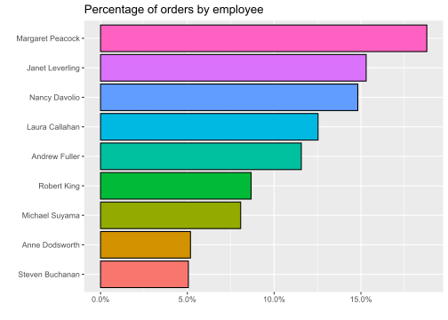

# Excel vs. R

## Programi


```r
library(tidyverse)
library(scales)
library(tidytext)
library(readxl)
library(rmarkdown)
```

## Podatki

Podatki in posamezne naloge za delo z Excelom so iz seminarja dr. Simone Sternad Zabukovšek in mag.
Zdenka Deželaka (Univerza v Mariboru, 21.5.2021).

Primerjamo z Excelom.

R:

Oba delovna lista iz datoteke "Narocila.xlsx") shranjujemo kot samostojni tabeli z imenoma "orders" in "zaposleni".


```r
orders = read_xlsx("data/Narocilo.xlsx", sheet = "Orders")
zaposleni = read_xlsx("data/Narocilo.xlsx", sheet = "Zaposleni")
```

Poglejmo prve podatke:


```r
head(orders) %>% paged_table()
```

<div data-pagedtable="false">
  <script data-pagedtable-source type="application/json">
{"columns":[{"label":["OrderID"],"name":[1],"type":["dbl"],"align":["right"]},{"label":["CustomerID"],"name":[2],"type":["chr"],"align":["left"]},{"label":["EmployeeID"],"name":[3],"type":["dbl"],"align":["right"]},{"label":["OrderDate"],"name":[4],"type":["dttm"],"align":["right"]}],"data":[{"1":"10248","2":"VINET","3":"5","4":"1994-08-04"},{"1":"10249","2":"TOMSP","3":"6","4":"1994-08-05"},{"1":"10250","2":"HANAR","3":"4","4":"1994-08-08"},{"1":"10251","2":"VICTE","3":"3","4":"1994-08-08"},{"1":"10252","2":"SUPRD","3":"4","4":"1994-08-09"},{"1":"10253","2":"HANAR","3":"3","4":"1994-08-10"}],"options":{"columns":{"min":{},"max":[10]},"rows":{"min":[10],"max":[10]},"pages":{}}}
  </script>
</div>

```r
head(zaposleni) %>% paged_table()
```

<div data-pagedtable="false">
  <script data-pagedtable-source type="application/json">
{"columns":[{"label":["EmployeeID"],"name":[1],"type":["dbl"],"align":["right"]},{"label":["LastName"],"name":[2],"type":["chr"],"align":["left"]},{"label":["FirstName"],"name":[3],"type":["chr"],"align":["left"]},{"label":["Title"],"name":[4],"type":["chr"],"align":["left"]},{"label":["TitleOfCourtesy"],"name":[5],"type":["chr"],"align":["left"]},{"label":["BirthDate"],"name":[6],"type":["dttm"],"align":["right"]},{"label":["HireDate"],"name":[7],"type":["dttm"],"align":["right"]},{"label":["Address"],"name":[8],"type":["chr"],"align":["left"]},{"label":["City"],"name":[9],"type":["chr"],"align":["left"]},{"label":["Region"],"name":[10],"type":["chr"],"align":["left"]},{"label":["PostalCode"],"name":[11],"type":["chr"],"align":["left"]},{"label":["Country"],"name":[12],"type":["chr"],"align":["left"]},{"label":["HomePhone"],"name":[13],"type":["chr"],"align":["left"]}],"data":[{"1":"1","2":"Davolio","3":"Nancy","4":"Sales Representative","5":"Ms.","6":"1948-12-08","7":"1992-05-01","8":"507 - 20th Ave. E.\\r\\r\\nApt. 2A","9":"Seattle","10":"WA","11":"98122","12":"USA","13":"(206) 555-9857"},{"1":"2","2":"Fuller","3":"Andrew","4":"Vice President, Sales","5":"Dr.","6":"1952-02-19","7":"1992-08-14","8":"908 W. Capital Way","9":"Tacoma","10":"WA","11":"98401","12":"USA","13":"(206) 555-9482"},{"1":"3","2":"Leverling","3":"Janet","4":"Sales Representative","5":"Ms.","6":"1963-08-30","7":"1992-04-01","8":"722 Moss Bay Blvd.","9":"Kirkland","10":"WA","11":"98033","12":"USA","13":"(206) 555-3412"},{"1":"4","2":"Peacock","3":"Margaret","4":"Sales Representative","5":"Mrs.","6":"1937-09-19","7":"1993-05-03","8":"4110 Old Redmond Rd.","9":"Redmond","10":"WA","11":"98052","12":"USA","13":"(206) 555-8122"},{"1":"5","2":"Buchanan","3":"Steven","4":"Sales Manager","5":"Mr.","6":"1955-03-04","7":"1993-10-17","8":"14 Garrett Hill","9":"London","10":"NA","11":"SW1 8JR","12":"UK","13":"(71) 555-4848"},{"1":"6","2":"Suyama","3":"Michael","4":"Sales Representative","5":"Mr.","6":"1963-07-02","7":"1993-10-17","8":"Coventry House\\r\\r\\nMiner Rd.","9":"London","10":"NA","11":"EC2 7JR","12":"UK","13":"(71) 555-7773"}],"options":{"columns":{"min":{},"max":[10]},"rows":{"min":[10],"max":[10]},"pages":{}}}
  </script>
</div>

## Število podatkov v nizu

R: Načinov je več.


```r
nrow(orders) # vrstice
```

```
## [1] 830
```

```r
ncol(orders) # stolpci
```

```
## [1] 4
```

```r
dim(orders) # vrstice x stolpci (dimenzije)
```

```
## [1] 830   4
```

## Lookup (Excel)

Excel (lookup):

-   Na delovnem listu Zaposleni dodajte: V celico P1 napišite besedilo »Vpišite številko ID«, v celici P2 vpišite besedilo »Telefonska številka«, v celico P3 pa »Datum zaposlitve«.

-   Nastavite, da se bo na podlagi vpisane ID številke v celici Q1, v celico Q2 izpisala telefonska številka (namig: Lookup).

-   Nastavite, da se bo na podlagi vpisane ID številke v celici Q1, v celico Q3 izpisal datum zaposlitve (namig: Lookup).

R:


```r
zaposleni %>% 
  dplyr::select(EmployeeID, HomePhone, HireDate) %>% 
  filter(EmployeeID == 1)
```

```
## # A tibble: 1 x 3
##   EmployeeID HomePhone      HireDate           
##        <dbl> <chr>          <dttm>             
## 1          1 (206) 555-9857 1992-05-01 00:00:00
```

## Vlookup, &, Concat

Excel:

-   Na delovnem listu Orders dodajte: Stolpec Priimek, v katerem naj bo izpisan Priimek zaposlenega glede na ID zaposlenega (namig: Vlookup).

-   Stolpec Ime, katerem naj bo izpisan Ime zaposlenega glede na ID zaposlenega o Stolpec Ime in priimek (združite predhodna dva).
    Preverite različne možnosti:

-   Bliskovita zapolnitev.

-   Formula (=Stolpec1&" "&Stolpec2).
    • Funkcija (CONCAT).

R:

Podatkovna niza "orders" in "zaposleni" imata skupen stolpec "EmployeeID".
Ta bo osnova za združevanje obeh podatkovnih nizov.
Nadaljnje iskanje ali filtriranje bo tako enostavno.


```r
zdruzena = orders %>% 
  left_join(zaposleni, by = "EmployeeID", keep = FALSE)

zdruzena %>% paged_table()
```

<div data-pagedtable="false">
  <script data-pagedtable-source type="application/json">
{"columns":[{"label":["OrderID"],"name":[1],"type":["dbl"],"align":["right"]},{"label":["CustomerID"],"name":[2],"type":["chr"],"align":["left"]},{"label":["EmployeeID"],"name":[3],"type":["dbl"],"align":["right"]},{"label":["OrderDate"],"name":[4],"type":["dttm"],"align":["right"]},{"label":["LastName"],"name":[5],"type":["chr"],"align":["left"]},{"label":["FirstName"],"name":[6],"type":["chr"],"align":["left"]},{"label":["Title"],"name":[7],"type":["chr"],"align":["left"]},{"label":["TitleOfCourtesy"],"name":[8],"type":["chr"],"align":["left"]},{"label":["BirthDate"],"name":[9],"type":["dttm"],"align":["right"]},{"label":["HireDate"],"name":[10],"type":["dttm"],"align":["right"]},{"label":["Address"],"name":[11],"type":["chr"],"align":["left"]},{"label":["City"],"name":[12],"type":["chr"],"align":["left"]},{"label":["Region"],"name":[13],"type":["chr"],"align":["left"]},{"label":["PostalCode"],"name":[14],"type":["chr"],"align":["left"]},{"label":["Country"],"name":[15],"type":["chr"],"align":["left"]},{"label":["HomePhone"],"name":[16],"type":["chr"],"align":["left"]}],"data":[{"1":"10248","2":"VINET","3":"5","4":"1994-08-04","5":"Buchanan","6":"Steven","7":"Sales Manager","8":"Mr.","9":"1955-03-04","10":"1993-10-17","11":"14 Garrett Hill","12":"London","13":"NA","14":"SW1 8JR","15":"UK","16":"(71) 555-4848"},{"1":"10249","2":"TOMSP","3":"6","4":"1994-08-05","5":"Suyama","6":"Michael","7":"Sales Representative","8":"Mr.","9":"1963-07-02","10":"1993-10-17","11":"Coventry House\\r\\r\\nMiner Rd.","12":"London","13":"NA","14":"EC2 7JR","15":"UK","16":"(71) 555-7773"},{"1":"10250","2":"HANAR","3":"4","4":"1994-08-08","5":"Peacock","6":"Margaret","7":"Sales Representative","8":"Mrs.","9":"1937-09-19","10":"1993-05-03","11":"4110 Old Redmond Rd.","12":"Redmond","13":"WA","14":"98052","15":"USA","16":"(206) 555-8122"},{"1":"10251","2":"VICTE","3":"3","4":"1994-08-08","5":"Leverling","6":"Janet","7":"Sales Representative","8":"Ms.","9":"1963-08-30","10":"1992-04-01","11":"722 Moss Bay Blvd.","12":"Kirkland","13":"WA","14":"98033","15":"USA","16":"(206) 555-3412"},{"1":"10252","2":"SUPRD","3":"4","4":"1994-08-09","5":"Peacock","6":"Margaret","7":"Sales Representative","8":"Mrs.","9":"1937-09-19","10":"1993-05-03","11":"4110 Old Redmond Rd.","12":"Redmond","13":"WA","14":"98052","15":"USA","16":"(206) 555-8122"},{"1":"10253","2":"HANAR","3":"3","4":"1994-08-10","5":"Leverling","6":"Janet","7":"Sales Representative","8":"Ms.","9":"1963-08-30","10":"1992-04-01","11":"722 Moss Bay Blvd.","12":"Kirkland","13":"WA","14":"98033","15":"USA","16":"(206) 555-3412"},{"1":"10254","2":"CHOPS","3":"5","4":"1994-08-11","5":"Buchanan","6":"Steven","7":"Sales Manager","8":"Mr.","9":"1955-03-04","10":"1993-10-17","11":"14 Garrett Hill","12":"London","13":"NA","14":"SW1 8JR","15":"UK","16":"(71) 555-4848"},{"1":"10255","2":"RICSU","3":"9","4":"1994-08-12","5":"Dodsworth","6":"Anne","7":"Sales Representative","8":"Ms.","9":"1966-01-27","10":"1994-11-15","11":"7 Houndstooth Rd.","12":"London","13":"NA","14":"WG2 7LT","15":"UK","16":"(71) 555-4444"},{"1":"10256","2":"WELLI","3":"3","4":"1994-08-15","5":"Leverling","6":"Janet","7":"Sales Representative","8":"Ms.","9":"1963-08-30","10":"1992-04-01","11":"722 Moss Bay Blvd.","12":"Kirkland","13":"WA","14":"98033","15":"USA","16":"(206) 555-3412"},{"1":"10257","2":"HILAA","3":"4","4":"1994-08-16","5":"Peacock","6":"Margaret","7":"Sales Representative","8":"Mrs.","9":"1937-09-19","10":"1993-05-03","11":"4110 Old Redmond Rd.","12":"Redmond","13":"WA","14":"98052","15":"USA","16":"(206) 555-8122"},{"1":"10258","2":"ERNSH","3":"1","4":"1994-08-17","5":"Davolio","6":"Nancy","7":"Sales Representative","8":"Ms.","9":"1948-12-08","10":"1992-05-01","11":"507 - 20th Ave. E.\\r\\r\\nApt. 2A","12":"Seattle","13":"WA","14":"98122","15":"USA","16":"(206) 555-9857"},{"1":"10259","2":"CENTC","3":"4","4":"1994-08-18","5":"Peacock","6":"Margaret","7":"Sales Representative","8":"Mrs.","9":"1937-09-19","10":"1993-05-03","11":"4110 Old Redmond Rd.","12":"Redmond","13":"WA","14":"98052","15":"USA","16":"(206) 555-8122"},{"1":"10260","2":"OTTIK","3":"4","4":"1994-08-19","5":"Peacock","6":"Margaret","7":"Sales Representative","8":"Mrs.","9":"1937-09-19","10":"1993-05-03","11":"4110 Old Redmond Rd.","12":"Redmond","13":"WA","14":"98052","15":"USA","16":"(206) 555-8122"},{"1":"10261","2":"QUEDE","3":"4","4":"1994-08-19","5":"Peacock","6":"Margaret","7":"Sales Representative","8":"Mrs.","9":"1937-09-19","10":"1993-05-03","11":"4110 Old Redmond Rd.","12":"Redmond","13":"WA","14":"98052","15":"USA","16":"(206) 555-8122"},{"1":"10262","2":"RATTC","3":"8","4":"1994-08-22","5":"Callahan","6":"Laura","7":"Inside Sales Coordinator","8":"Ms.","9":"1958-01-09","10":"1994-03-05","11":"4726 - 11th Ave. N.E.","12":"Seattle","13":"WA","14":"98105","15":"USA","16":"(206) 555-1189"},{"1":"10263","2":"ERNSH","3":"9","4":"1994-08-23","5":"Dodsworth","6":"Anne","7":"Sales Representative","8":"Ms.","9":"1966-01-27","10":"1994-11-15","11":"7 Houndstooth Rd.","12":"London","13":"NA","14":"WG2 7LT","15":"UK","16":"(71) 555-4444"},{"1":"10264","2":"FOLKO","3":"6","4":"1994-08-24","5":"Suyama","6":"Michael","7":"Sales Representative","8":"Mr.","9":"1963-07-02","10":"1993-10-17","11":"Coventry House\\r\\r\\nMiner Rd.","12":"London","13":"NA","14":"EC2 7JR","15":"UK","16":"(71) 555-7773"},{"1":"10265","2":"BLONP","3":"2","4":"1994-08-25","5":"Fuller","6":"Andrew","7":"Vice President, Sales","8":"Dr.","9":"1952-02-19","10":"1992-08-14","11":"908 W. Capital Way","12":"Tacoma","13":"WA","14":"98401","15":"USA","16":"(206) 555-9482"},{"1":"10266","2":"WARTH","3":"3","4":"1994-08-26","5":"Leverling","6":"Janet","7":"Sales Representative","8":"Ms.","9":"1963-08-30","10":"1992-04-01","11":"722 Moss Bay Blvd.","12":"Kirkland","13":"WA","14":"98033","15":"USA","16":"(206) 555-3412"},{"1":"10267","2":"FRANK","3":"4","4":"1994-08-29","5":"Peacock","6":"Margaret","7":"Sales Representative","8":"Mrs.","9":"1937-09-19","10":"1993-05-03","11":"4110 Old Redmond Rd.","12":"Redmond","13":"WA","14":"98052","15":"USA","16":"(206) 555-8122"},{"1":"10268","2":"GROSR","3":"8","4":"1994-08-30","5":"Callahan","6":"Laura","7":"Inside Sales Coordinator","8":"Ms.","9":"1958-01-09","10":"1994-03-05","11":"4726 - 11th Ave. N.E.","12":"Seattle","13":"WA","14":"98105","15":"USA","16":"(206) 555-1189"},{"1":"10269","2":"WHITC","3":"5","4":"1994-08-31","5":"Buchanan","6":"Steven","7":"Sales Manager","8":"Mr.","9":"1955-03-04","10":"1993-10-17","11":"14 Garrett Hill","12":"London","13":"NA","14":"SW1 8JR","15":"UK","16":"(71) 555-4848"},{"1":"10270","2":"WARTH","3":"1","4":"1994-09-01","5":"Davolio","6":"Nancy","7":"Sales Representative","8":"Ms.","9":"1948-12-08","10":"1992-05-01","11":"507 - 20th Ave. E.\\r\\r\\nApt. 2A","12":"Seattle","13":"WA","14":"98122","15":"USA","16":"(206) 555-9857"},{"1":"10271","2":"SPLIR","3":"6","4":"1994-09-01","5":"Suyama","6":"Michael","7":"Sales Representative","8":"Mr.","9":"1963-07-02","10":"1993-10-17","11":"Coventry House\\r\\r\\nMiner Rd.","12":"London","13":"NA","14":"EC2 7JR","15":"UK","16":"(71) 555-7773"},{"1":"10272","2":"RATTC","3":"6","4":"1994-09-02","5":"Suyama","6":"Michael","7":"Sales Representative","8":"Mr.","9":"1963-07-02","10":"1993-10-17","11":"Coventry House\\r\\r\\nMiner Rd.","12":"London","13":"NA","14":"EC2 7JR","15":"UK","16":"(71) 555-7773"},{"1":"10273","2":"QUICK","3":"3","4":"1994-09-05","5":"Leverling","6":"Janet","7":"Sales Representative","8":"Ms.","9":"1963-08-30","10":"1992-04-01","11":"722 Moss Bay Blvd.","12":"Kirkland","13":"WA","14":"98033","15":"USA","16":"(206) 555-3412"},{"1":"10274","2":"VINET","3":"6","4":"1994-09-06","5":"Suyama","6":"Michael","7":"Sales Representative","8":"Mr.","9":"1963-07-02","10":"1993-10-17","11":"Coventry House\\r\\r\\nMiner Rd.","12":"London","13":"NA","14":"EC2 7JR","15":"UK","16":"(71) 555-7773"},{"1":"10275","2":"MAGAA","3":"1","4":"1994-09-07","5":"Davolio","6":"Nancy","7":"Sales Representative","8":"Ms.","9":"1948-12-08","10":"1992-05-01","11":"507 - 20th Ave. E.\\r\\r\\nApt. 2A","12":"Seattle","13":"WA","14":"98122","15":"USA","16":"(206) 555-9857"},{"1":"10276","2":"TORTU","3":"8","4":"1994-09-08","5":"Callahan","6":"Laura","7":"Inside Sales Coordinator","8":"Ms.","9":"1958-01-09","10":"1994-03-05","11":"4726 - 11th Ave. N.E.","12":"Seattle","13":"WA","14":"98105","15":"USA","16":"(206) 555-1189"},{"1":"10277","2":"MORGK","3":"2","4":"1994-09-09","5":"Fuller","6":"Andrew","7":"Vice President, Sales","8":"Dr.","9":"1952-02-19","10":"1992-08-14","11":"908 W. Capital Way","12":"Tacoma","13":"WA","14":"98401","15":"USA","16":"(206) 555-9482"},{"1":"10278","2":"BERGS","3":"8","4":"1994-09-12","5":"Callahan","6":"Laura","7":"Inside Sales Coordinator","8":"Ms.","9":"1958-01-09","10":"1994-03-05","11":"4726 - 11th Ave. N.E.","12":"Seattle","13":"WA","14":"98105","15":"USA","16":"(206) 555-1189"},{"1":"10279","2":"LEHMS","3":"8","4":"1994-09-13","5":"Callahan","6":"Laura","7":"Inside Sales Coordinator","8":"Ms.","9":"1958-01-09","10":"1994-03-05","11":"4726 - 11th Ave. N.E.","12":"Seattle","13":"WA","14":"98105","15":"USA","16":"(206) 555-1189"},{"1":"10280","2":"BERGS","3":"2","4":"1994-09-14","5":"Fuller","6":"Andrew","7":"Vice President, Sales","8":"Dr.","9":"1952-02-19","10":"1992-08-14","11":"908 W. Capital Way","12":"Tacoma","13":"WA","14":"98401","15":"USA","16":"(206) 555-9482"},{"1":"10281","2":"ROMEY","3":"4","4":"1994-09-14","5":"Peacock","6":"Margaret","7":"Sales Representative","8":"Mrs.","9":"1937-09-19","10":"1993-05-03","11":"4110 Old Redmond Rd.","12":"Redmond","13":"WA","14":"98052","15":"USA","16":"(206) 555-8122"},{"1":"10282","2":"ROMEY","3":"4","4":"1994-09-15","5":"Peacock","6":"Margaret","7":"Sales Representative","8":"Mrs.","9":"1937-09-19","10":"1993-05-03","11":"4110 Old Redmond Rd.","12":"Redmond","13":"WA","14":"98052","15":"USA","16":"(206) 555-8122"},{"1":"10283","2":"LILAS","3":"3","4":"1994-09-16","5":"Leverling","6":"Janet","7":"Sales Representative","8":"Ms.","9":"1963-08-30","10":"1992-04-01","11":"722 Moss Bay Blvd.","12":"Kirkland","13":"WA","14":"98033","15":"USA","16":"(206) 555-3412"},{"1":"10284","2":"LEHMS","3":"4","4":"1994-09-19","5":"Peacock","6":"Margaret","7":"Sales Representative","8":"Mrs.","9":"1937-09-19","10":"1993-05-03","11":"4110 Old Redmond Rd.","12":"Redmond","13":"WA","14":"98052","15":"USA","16":"(206) 555-8122"},{"1":"10285","2":"QUICK","3":"1","4":"1994-09-20","5":"Davolio","6":"Nancy","7":"Sales Representative","8":"Ms.","9":"1948-12-08","10":"1992-05-01","11":"507 - 20th Ave. E.\\r\\r\\nApt. 2A","12":"Seattle","13":"WA","14":"98122","15":"USA","16":"(206) 555-9857"},{"1":"10286","2":"QUICK","3":"8","4":"1994-09-21","5":"Callahan","6":"Laura","7":"Inside Sales Coordinator","8":"Ms.","9":"1958-01-09","10":"1994-03-05","11":"4726 - 11th Ave. N.E.","12":"Seattle","13":"WA","14":"98105","15":"USA","16":"(206) 555-1189"},{"1":"10287","2":"RICAR","3":"8","4":"1994-09-22","5":"Callahan","6":"Laura","7":"Inside Sales Coordinator","8":"Ms.","9":"1958-01-09","10":"1994-03-05","11":"4726 - 11th Ave. N.E.","12":"Seattle","13":"WA","14":"98105","15":"USA","16":"(206) 555-1189"},{"1":"10288","2":"REGGC","3":"4","4":"1994-09-23","5":"Peacock","6":"Margaret","7":"Sales Representative","8":"Mrs.","9":"1937-09-19","10":"1993-05-03","11":"4110 Old Redmond Rd.","12":"Redmond","13":"WA","14":"98052","15":"USA","16":"(206) 555-8122"},{"1":"10289","2":"BSBEV","3":"7","4":"1994-09-26","5":"King","6":"Robert","7":"Sales Representative","8":"Mr.","9":"1960-05-29","10":"1994-01-02","11":"Edgeham Hollow\\r\\r\\nWinchester Way","12":"London","13":"NA","14":"RG1 9SP","15":"UK","16":"(71) 555-5598"},{"1":"10290","2":"COMMI","3":"8","4":"1994-09-27","5":"Callahan","6":"Laura","7":"Inside Sales Coordinator","8":"Ms.","9":"1958-01-09","10":"1994-03-05","11":"4726 - 11th Ave. N.E.","12":"Seattle","13":"WA","14":"98105","15":"USA","16":"(206) 555-1189"},{"1":"10291","2":"QUEDE","3":"6","4":"1994-09-27","5":"Suyama","6":"Michael","7":"Sales Representative","8":"Mr.","9":"1963-07-02","10":"1993-10-17","11":"Coventry House\\r\\r\\nMiner Rd.","12":"London","13":"NA","14":"EC2 7JR","15":"UK","16":"(71) 555-7773"},{"1":"10292","2":"TRADH","3":"1","4":"1994-09-28","5":"Davolio","6":"Nancy","7":"Sales Representative","8":"Ms.","9":"1948-12-08","10":"1992-05-01","11":"507 - 20th Ave. E.\\r\\r\\nApt. 2A","12":"Seattle","13":"WA","14":"98122","15":"USA","16":"(206) 555-9857"},{"1":"10293","2":"TORTU","3":"1","4":"1994-09-29","5":"Davolio","6":"Nancy","7":"Sales Representative","8":"Ms.","9":"1948-12-08","10":"1992-05-01","11":"507 - 20th Ave. E.\\r\\r\\nApt. 2A","12":"Seattle","13":"WA","14":"98122","15":"USA","16":"(206) 555-9857"},{"1":"10294","2":"RATTC","3":"4","4":"1994-09-30","5":"Peacock","6":"Margaret","7":"Sales Representative","8":"Mrs.","9":"1937-09-19","10":"1993-05-03","11":"4110 Old Redmond Rd.","12":"Redmond","13":"WA","14":"98052","15":"USA","16":"(206) 555-8122"},{"1":"10295","2":"VINET","3":"2","4":"1994-10-03","5":"Fuller","6":"Andrew","7":"Vice President, Sales","8":"Dr.","9":"1952-02-19","10":"1992-08-14","11":"908 W. Capital Way","12":"Tacoma","13":"WA","14":"98401","15":"USA","16":"(206) 555-9482"},{"1":"10296","2":"LILAS","3":"6","4":"1994-10-04","5":"Suyama","6":"Michael","7":"Sales Representative","8":"Mr.","9":"1963-07-02","10":"1993-10-17","11":"Coventry House\\r\\r\\nMiner Rd.","12":"London","13":"NA","14":"EC2 7JR","15":"UK","16":"(71) 555-7773"},{"1":"10297","2":"BLONP","3":"5","4":"1994-10-05","5":"Buchanan","6":"Steven","7":"Sales Manager","8":"Mr.","9":"1955-03-04","10":"1993-10-17","11":"14 Garrett Hill","12":"London","13":"NA","14":"SW1 8JR","15":"UK","16":"(71) 555-4848"},{"1":"10298","2":"HUNGO","3":"6","4":"1994-10-06","5":"Suyama","6":"Michael","7":"Sales Representative","8":"Mr.","9":"1963-07-02","10":"1993-10-17","11":"Coventry House\\r\\r\\nMiner Rd.","12":"London","13":"NA","14":"EC2 7JR","15":"UK","16":"(71) 555-7773"},{"1":"10299","2":"RICAR","3":"4","4":"1994-10-07","5":"Peacock","6":"Margaret","7":"Sales Representative","8":"Mrs.","9":"1937-09-19","10":"1993-05-03","11":"4110 Old Redmond Rd.","12":"Redmond","13":"WA","14":"98052","15":"USA","16":"(206) 555-8122"},{"1":"10300","2":"MAGAA","3":"2","4":"1994-10-10","5":"Fuller","6":"Andrew","7":"Vice President, Sales","8":"Dr.","9":"1952-02-19","10":"1992-08-14","11":"908 W. Capital Way","12":"Tacoma","13":"WA","14":"98401","15":"USA","16":"(206) 555-9482"},{"1":"10301","2":"WANDK","3":"8","4":"1994-10-10","5":"Callahan","6":"Laura","7":"Inside Sales Coordinator","8":"Ms.","9":"1958-01-09","10":"1994-03-05","11":"4726 - 11th Ave. N.E.","12":"Seattle","13":"WA","14":"98105","15":"USA","16":"(206) 555-1189"},{"1":"10302","2":"SUPRD","3":"4","4":"1994-10-11","5":"Peacock","6":"Margaret","7":"Sales Representative","8":"Mrs.","9":"1937-09-19","10":"1993-05-03","11":"4110 Old Redmond Rd.","12":"Redmond","13":"WA","14":"98052","15":"USA","16":"(206) 555-8122"},{"1":"10303","2":"GODOS","3":"7","4":"1994-10-12","5":"King","6":"Robert","7":"Sales Representative","8":"Mr.","9":"1960-05-29","10":"1994-01-02","11":"Edgeham Hollow\\r\\r\\nWinchester Way","12":"London","13":"NA","14":"RG1 9SP","15":"UK","16":"(71) 555-5598"},{"1":"10304","2":"TORTU","3":"1","4":"1994-10-13","5":"Davolio","6":"Nancy","7":"Sales Representative","8":"Ms.","9":"1948-12-08","10":"1992-05-01","11":"507 - 20th Ave. E.\\r\\r\\nApt. 2A","12":"Seattle","13":"WA","14":"98122","15":"USA","16":"(206) 555-9857"},{"1":"10305","2":"OLDWO","3":"8","4":"1994-10-14","5":"Callahan","6":"Laura","7":"Inside Sales Coordinator","8":"Ms.","9":"1958-01-09","10":"1994-03-05","11":"4726 - 11th Ave. N.E.","12":"Seattle","13":"WA","14":"98105","15":"USA","16":"(206) 555-1189"},{"1":"10306","2":"ROMEY","3":"1","4":"1994-10-17","5":"Davolio","6":"Nancy","7":"Sales Representative","8":"Ms.","9":"1948-12-08","10":"1992-05-01","11":"507 - 20th Ave. E.\\r\\r\\nApt. 2A","12":"Seattle","13":"WA","14":"98122","15":"USA","16":"(206) 555-9857"},{"1":"10307","2":"LONEP","3":"2","4":"1994-10-18","5":"Fuller","6":"Andrew","7":"Vice President, Sales","8":"Dr.","9":"1952-02-19","10":"1992-08-14","11":"908 W. Capital Way","12":"Tacoma","13":"WA","14":"98401","15":"USA","16":"(206) 555-9482"},{"1":"10308","2":"ANATR","3":"7","4":"1994-10-19","5":"King","6":"Robert","7":"Sales Representative","8":"Mr.","9":"1960-05-29","10":"1994-01-02","11":"Edgeham Hollow\\r\\r\\nWinchester Way","12":"London","13":"NA","14":"RG1 9SP","15":"UK","16":"(71) 555-5598"},{"1":"10309","2":"HUNGO","3":"3","4":"1994-10-20","5":"Leverling","6":"Janet","7":"Sales Representative","8":"Ms.","9":"1963-08-30","10":"1992-04-01","11":"722 Moss Bay Blvd.","12":"Kirkland","13":"WA","14":"98033","15":"USA","16":"(206) 555-3412"},{"1":"10310","2":"THEBI","3":"8","4":"1994-10-21","5":"Callahan","6":"Laura","7":"Inside Sales Coordinator","8":"Ms.","9":"1958-01-09","10":"1994-03-05","11":"4726 - 11th Ave. N.E.","12":"Seattle","13":"WA","14":"98105","15":"USA","16":"(206) 555-1189"},{"1":"10311","2":"DUMON","3":"1","4":"1994-10-21","5":"Davolio","6":"Nancy","7":"Sales Representative","8":"Ms.","9":"1948-12-08","10":"1992-05-01","11":"507 - 20th Ave. E.\\r\\r\\nApt. 2A","12":"Seattle","13":"WA","14":"98122","15":"USA","16":"(206) 555-9857"},{"1":"10312","2":"WANDK","3":"2","4":"1994-10-24","5":"Fuller","6":"Andrew","7":"Vice President, Sales","8":"Dr.","9":"1952-02-19","10":"1992-08-14","11":"908 W. Capital Way","12":"Tacoma","13":"WA","14":"98401","15":"USA","16":"(206) 555-9482"},{"1":"10313","2":"QUICK","3":"2","4":"1994-10-25","5":"Fuller","6":"Andrew","7":"Vice President, Sales","8":"Dr.","9":"1952-02-19","10":"1992-08-14","11":"908 W. Capital Way","12":"Tacoma","13":"WA","14":"98401","15":"USA","16":"(206) 555-9482"},{"1":"10314","2":"RATTC","3":"1","4":"1994-10-26","5":"Davolio","6":"Nancy","7":"Sales Representative","8":"Ms.","9":"1948-12-08","10":"1992-05-01","11":"507 - 20th Ave. E.\\r\\r\\nApt. 2A","12":"Seattle","13":"WA","14":"98122","15":"USA","16":"(206) 555-9857"},{"1":"10315","2":"ISLAT","3":"4","4":"1994-10-27","5":"Peacock","6":"Margaret","7":"Sales Representative","8":"Mrs.","9":"1937-09-19","10":"1993-05-03","11":"4110 Old Redmond Rd.","12":"Redmond","13":"WA","14":"98052","15":"USA","16":"(206) 555-8122"},{"1":"10316","2":"RATTC","3":"1","4":"1994-10-28","5":"Davolio","6":"Nancy","7":"Sales Representative","8":"Ms.","9":"1948-12-08","10":"1992-05-01","11":"507 - 20th Ave. E.\\r\\r\\nApt. 2A","12":"Seattle","13":"WA","14":"98122","15":"USA","16":"(206) 555-9857"},{"1":"10317","2":"LONEP","3":"6","4":"1994-10-31","5":"Suyama","6":"Michael","7":"Sales Representative","8":"Mr.","9":"1963-07-02","10":"1993-10-17","11":"Coventry House\\r\\r\\nMiner Rd.","12":"London","13":"NA","14":"EC2 7JR","15":"UK","16":"(71) 555-7773"},{"1":"10318","2":"ISLAT","3":"8","4":"1994-11-01","5":"Callahan","6":"Laura","7":"Inside Sales Coordinator","8":"Ms.","9":"1958-01-09","10":"1994-03-05","11":"4726 - 11th Ave. N.E.","12":"Seattle","13":"WA","14":"98105","15":"USA","16":"(206) 555-1189"},{"1":"10319","2":"TORTU","3":"7","4":"1994-11-02","5":"King","6":"Robert","7":"Sales Representative","8":"Mr.","9":"1960-05-29","10":"1994-01-02","11":"Edgeham Hollow\\r\\r\\nWinchester Way","12":"London","13":"NA","14":"RG1 9SP","15":"UK","16":"(71) 555-5598"},{"1":"10320","2":"WARTH","3":"5","4":"1994-11-03","5":"Buchanan","6":"Steven","7":"Sales Manager","8":"Mr.","9":"1955-03-04","10":"1993-10-17","11":"14 Garrett Hill","12":"London","13":"NA","14":"SW1 8JR","15":"UK","16":"(71) 555-4848"},{"1":"10321","2":"ISLAT","3":"3","4":"1994-11-03","5":"Leverling","6":"Janet","7":"Sales Representative","8":"Ms.","9":"1963-08-30","10":"1992-04-01","11":"722 Moss Bay Blvd.","12":"Kirkland","13":"WA","14":"98033","15":"USA","16":"(206) 555-3412"},{"1":"10322","2":"PERIC","3":"7","4":"1994-11-04","5":"King","6":"Robert","7":"Sales Representative","8":"Mr.","9":"1960-05-29","10":"1994-01-02","11":"Edgeham Hollow\\r\\r\\nWinchester Way","12":"London","13":"NA","14":"RG1 9SP","15":"UK","16":"(71) 555-5598"},{"1":"10323","2":"KOENE","3":"4","4":"1994-11-07","5":"Peacock","6":"Margaret","7":"Sales Representative","8":"Mrs.","9":"1937-09-19","10":"1993-05-03","11":"4110 Old Redmond Rd.","12":"Redmond","13":"WA","14":"98052","15":"USA","16":"(206) 555-8122"},{"1":"10324","2":"SAVEA","3":"9","4":"1994-11-08","5":"Dodsworth","6":"Anne","7":"Sales Representative","8":"Ms.","9":"1966-01-27","10":"1994-11-15","11":"7 Houndstooth Rd.","12":"London","13":"NA","14":"WG2 7LT","15":"UK","16":"(71) 555-4444"},{"1":"10325","2":"KOENE","3":"1","4":"1994-11-09","5":"Davolio","6":"Nancy","7":"Sales Representative","8":"Ms.","9":"1948-12-08","10":"1992-05-01","11":"507 - 20th Ave. E.\\r\\r\\nApt. 2A","12":"Seattle","13":"WA","14":"98122","15":"USA","16":"(206) 555-9857"},{"1":"10326","2":"BOLID","3":"4","4":"1994-11-10","5":"Peacock","6":"Margaret","7":"Sales Representative","8":"Mrs.","9":"1937-09-19","10":"1993-05-03","11":"4110 Old Redmond Rd.","12":"Redmond","13":"WA","14":"98052","15":"USA","16":"(206) 555-8122"},{"1":"10327","2":"FOLKO","3":"2","4":"1994-11-11","5":"Fuller","6":"Andrew","7":"Vice President, Sales","8":"Dr.","9":"1952-02-19","10":"1992-08-14","11":"908 W. Capital Way","12":"Tacoma","13":"WA","14":"98401","15":"USA","16":"(206) 555-9482"},{"1":"10328","2":"FURIB","3":"4","4":"1994-11-14","5":"Peacock","6":"Margaret","7":"Sales Representative","8":"Mrs.","9":"1937-09-19","10":"1993-05-03","11":"4110 Old Redmond Rd.","12":"Redmond","13":"WA","14":"98052","15":"USA","16":"(206) 555-8122"},{"1":"10329","2":"SPLIR","3":"4","4":"1994-11-15","5":"Peacock","6":"Margaret","7":"Sales Representative","8":"Mrs.","9":"1937-09-19","10":"1993-05-03","11":"4110 Old Redmond Rd.","12":"Redmond","13":"WA","14":"98052","15":"USA","16":"(206) 555-8122"},{"1":"10330","2":"LILAS","3":"3","4":"1994-11-16","5":"Leverling","6":"Janet","7":"Sales Representative","8":"Ms.","9":"1963-08-30","10":"1992-04-01","11":"722 Moss Bay Blvd.","12":"Kirkland","13":"WA","14":"98033","15":"USA","16":"(206) 555-3412"},{"1":"10331","2":"BONAP","3":"9","4":"1994-11-16","5":"Dodsworth","6":"Anne","7":"Sales Representative","8":"Ms.","9":"1966-01-27","10":"1994-11-15","11":"7 Houndstooth Rd.","12":"London","13":"NA","14":"WG2 7LT","15":"UK","16":"(71) 555-4444"},{"1":"10332","2":"MEREP","3":"3","4":"1994-11-17","5":"Leverling","6":"Janet","7":"Sales Representative","8":"Ms.","9":"1963-08-30","10":"1992-04-01","11":"722 Moss Bay Blvd.","12":"Kirkland","13":"WA","14":"98033","15":"USA","16":"(206) 555-3412"},{"1":"10333","2":"WARTH","3":"5","4":"1994-11-18","5":"Buchanan","6":"Steven","7":"Sales Manager","8":"Mr.","9":"1955-03-04","10":"1993-10-17","11":"14 Garrett Hill","12":"London","13":"NA","14":"SW1 8JR","15":"UK","16":"(71) 555-4848"},{"1":"10334","2":"VICTE","3":"8","4":"1994-11-21","5":"Callahan","6":"Laura","7":"Inside Sales Coordinator","8":"Ms.","9":"1958-01-09","10":"1994-03-05","11":"4726 - 11th Ave. N.E.","12":"Seattle","13":"WA","14":"98105","15":"USA","16":"(206) 555-1189"},{"1":"10335","2":"HUNGO","3":"7","4":"1994-11-22","5":"King","6":"Robert","7":"Sales Representative","8":"Mr.","9":"1960-05-29","10":"1994-01-02","11":"Edgeham Hollow\\r\\r\\nWinchester Way","12":"London","13":"NA","14":"RG1 9SP","15":"UK","16":"(71) 555-5598"},{"1":"10336","2":"PRINI","3":"7","4":"1994-11-23","5":"King","6":"Robert","7":"Sales Representative","8":"Mr.","9":"1960-05-29","10":"1994-01-02","11":"Edgeham Hollow\\r\\r\\nWinchester Way","12":"London","13":"NA","14":"RG1 9SP","15":"UK","16":"(71) 555-5598"},{"1":"10337","2":"FRANK","3":"4","4":"1994-11-24","5":"Peacock","6":"Margaret","7":"Sales Representative","8":"Mrs.","9":"1937-09-19","10":"1993-05-03","11":"4110 Old Redmond Rd.","12":"Redmond","13":"WA","14":"98052","15":"USA","16":"(206) 555-8122"},{"1":"10338","2":"OLDWO","3":"4","4":"1994-11-25","5":"Peacock","6":"Margaret","7":"Sales Representative","8":"Mrs.","9":"1937-09-19","10":"1993-05-03","11":"4110 Old Redmond Rd.","12":"Redmond","13":"WA","14":"98052","15":"USA","16":"(206) 555-8122"},{"1":"10339","2":"MEREP","3":"2","4":"1994-11-28","5":"Fuller","6":"Andrew","7":"Vice President, Sales","8":"Dr.","9":"1952-02-19","10":"1992-08-14","11":"908 W. Capital Way","12":"Tacoma","13":"WA","14":"98401","15":"USA","16":"(206) 555-9482"},{"1":"10340","2":"BONAP","3":"1","4":"1994-11-29","5":"Davolio","6":"Nancy","7":"Sales Representative","8":"Ms.","9":"1948-12-08","10":"1992-05-01","11":"507 - 20th Ave. E.\\r\\r\\nApt. 2A","12":"Seattle","13":"WA","14":"98122","15":"USA","16":"(206) 555-9857"},{"1":"10341","2":"SIMOB","3":"7","4":"1994-11-29","5":"King","6":"Robert","7":"Sales Representative","8":"Mr.","9":"1960-05-29","10":"1994-01-02","11":"Edgeham Hollow\\r\\r\\nWinchester Way","12":"London","13":"NA","14":"RG1 9SP","15":"UK","16":"(71) 555-5598"},{"1":"10342","2":"FRANK","3":"4","4":"1994-11-30","5":"Peacock","6":"Margaret","7":"Sales Representative","8":"Mrs.","9":"1937-09-19","10":"1993-05-03","11":"4110 Old Redmond Rd.","12":"Redmond","13":"WA","14":"98052","15":"USA","16":"(206) 555-8122"},{"1":"10343","2":"LEHMS","3":"4","4":"1994-12-01","5":"Peacock","6":"Margaret","7":"Sales Representative","8":"Mrs.","9":"1937-09-19","10":"1993-05-03","11":"4110 Old Redmond Rd.","12":"Redmond","13":"WA","14":"98052","15":"USA","16":"(206) 555-8122"},{"1":"10344","2":"WHITC","3":"4","4":"1994-12-02","5":"Peacock","6":"Margaret","7":"Sales Representative","8":"Mrs.","9":"1937-09-19","10":"1993-05-03","11":"4110 Old Redmond Rd.","12":"Redmond","13":"WA","14":"98052","15":"USA","16":"(206) 555-8122"},{"1":"10345","2":"QUICK","3":"2","4":"1994-12-05","5":"Fuller","6":"Andrew","7":"Vice President, Sales","8":"Dr.","9":"1952-02-19","10":"1992-08-14","11":"908 W. Capital Way","12":"Tacoma","13":"WA","14":"98401","15":"USA","16":"(206) 555-9482"},{"1":"10346","2":"RATTC","3":"3","4":"1994-12-06","5":"Leverling","6":"Janet","7":"Sales Representative","8":"Ms.","9":"1963-08-30","10":"1992-04-01","11":"722 Moss Bay Blvd.","12":"Kirkland","13":"WA","14":"98033","15":"USA","16":"(206) 555-3412"},{"1":"10347","2":"FAMIA","3":"4","4":"1994-12-07","5":"Peacock","6":"Margaret","7":"Sales Representative","8":"Mrs.","9":"1937-09-19","10":"1993-05-03","11":"4110 Old Redmond Rd.","12":"Redmond","13":"WA","14":"98052","15":"USA","16":"(206) 555-8122"},{"1":"10348","2":"WANDK","3":"4","4":"1994-12-08","5":"Peacock","6":"Margaret","7":"Sales Representative","8":"Mrs.","9":"1937-09-19","10":"1993-05-03","11":"4110 Old Redmond Rd.","12":"Redmond","13":"WA","14":"98052","15":"USA","16":"(206) 555-8122"},{"1":"10349","2":"SPLIR","3":"7","4":"1994-12-09","5":"King","6":"Robert","7":"Sales Representative","8":"Mr.","9":"1960-05-29","10":"1994-01-02","11":"Edgeham Hollow\\r\\r\\nWinchester Way","12":"London","13":"NA","14":"RG1 9SP","15":"UK","16":"(71) 555-5598"},{"1":"10350","2":"LAMAI","3":"6","4":"1994-12-12","5":"Suyama","6":"Michael","7":"Sales Representative","8":"Mr.","9":"1963-07-02","10":"1993-10-17","11":"Coventry House\\r\\r\\nMiner Rd.","12":"London","13":"NA","14":"EC2 7JR","15":"UK","16":"(71) 555-7773"},{"1":"10351","2":"ERNSH","3":"1","4":"1994-12-12","5":"Davolio","6":"Nancy","7":"Sales Representative","8":"Ms.","9":"1948-12-08","10":"1992-05-01","11":"507 - 20th Ave. E.\\r\\r\\nApt. 2A","12":"Seattle","13":"WA","14":"98122","15":"USA","16":"(206) 555-9857"},{"1":"10352","2":"FURIB","3":"3","4":"1994-12-13","5":"Leverling","6":"Janet","7":"Sales Representative","8":"Ms.","9":"1963-08-30","10":"1992-04-01","11":"722 Moss Bay Blvd.","12":"Kirkland","13":"WA","14":"98033","15":"USA","16":"(206) 555-3412"},{"1":"10353","2":"PICCO","3":"7","4":"1994-12-14","5":"King","6":"Robert","7":"Sales Representative","8":"Mr.","9":"1960-05-29","10":"1994-01-02","11":"Edgeham Hollow\\r\\r\\nWinchester Way","12":"London","13":"NA","14":"RG1 9SP","15":"UK","16":"(71) 555-5598"},{"1":"10354","2":"PERIC","3":"8","4":"1994-12-15","5":"Callahan","6":"Laura","7":"Inside Sales Coordinator","8":"Ms.","9":"1958-01-09","10":"1994-03-05","11":"4726 - 11th Ave. N.E.","12":"Seattle","13":"WA","14":"98105","15":"USA","16":"(206) 555-1189"},{"1":"10355","2":"AROUT","3":"6","4":"1994-12-16","5":"Suyama","6":"Michael","7":"Sales Representative","8":"Mr.","9":"1963-07-02","10":"1993-10-17","11":"Coventry House\\r\\r\\nMiner Rd.","12":"London","13":"NA","14":"EC2 7JR","15":"UK","16":"(71) 555-7773"},{"1":"10356","2":"WANDK","3":"6","4":"1994-12-19","5":"Suyama","6":"Michael","7":"Sales Representative","8":"Mr.","9":"1963-07-02","10":"1993-10-17","11":"Coventry House\\r\\r\\nMiner Rd.","12":"London","13":"NA","14":"EC2 7JR","15":"UK","16":"(71) 555-7773"},{"1":"10357","2":"LILAS","3":"1","4":"1994-12-20","5":"Davolio","6":"Nancy","7":"Sales Representative","8":"Ms.","9":"1948-12-08","10":"1992-05-01","11":"507 - 20th Ave. E.\\r\\r\\nApt. 2A","12":"Seattle","13":"WA","14":"98122","15":"USA","16":"(206) 555-9857"},{"1":"10358","2":"LAMAI","3":"5","4":"1994-12-21","5":"Buchanan","6":"Steven","7":"Sales Manager","8":"Mr.","9":"1955-03-04","10":"1993-10-17","11":"14 Garrett Hill","12":"London","13":"NA","14":"SW1 8JR","15":"UK","16":"(71) 555-4848"},{"1":"10359","2":"SEVES","3":"5","4":"1994-12-22","5":"Buchanan","6":"Steven","7":"Sales Manager","8":"Mr.","9":"1955-03-04","10":"1993-10-17","11":"14 Garrett Hill","12":"London","13":"NA","14":"SW1 8JR","15":"UK","16":"(71) 555-4848"},{"1":"10360","2":"BLONP","3":"4","4":"1994-12-23","5":"Peacock","6":"Margaret","7":"Sales Representative","8":"Mrs.","9":"1937-09-19","10":"1993-05-03","11":"4110 Old Redmond Rd.","12":"Redmond","13":"WA","14":"98052","15":"USA","16":"(206) 555-8122"},{"1":"10361","2":"QUICK","3":"1","4":"1994-12-23","5":"Davolio","6":"Nancy","7":"Sales Representative","8":"Ms.","9":"1948-12-08","10":"1992-05-01","11":"507 - 20th Ave. E.\\r\\r\\nApt. 2A","12":"Seattle","13":"WA","14":"98122","15":"USA","16":"(206) 555-9857"},{"1":"10362","2":"BONAP","3":"3","4":"1994-12-26","5":"Leverling","6":"Janet","7":"Sales Representative","8":"Ms.","9":"1963-08-30","10":"1992-04-01","11":"722 Moss Bay Blvd.","12":"Kirkland","13":"WA","14":"98033","15":"USA","16":"(206) 555-3412"},{"1":"10363","2":"DRACD","3":"4","4":"1994-12-27","5":"Peacock","6":"Margaret","7":"Sales Representative","8":"Mrs.","9":"1937-09-19","10":"1993-05-03","11":"4110 Old Redmond Rd.","12":"Redmond","13":"WA","14":"98052","15":"USA","16":"(206) 555-8122"},{"1":"10364","2":"EASTC","3":"1","4":"1994-12-27","5":"Davolio","6":"Nancy","7":"Sales Representative","8":"Ms.","9":"1948-12-08","10":"1992-05-01","11":"507 - 20th Ave. E.\\r\\r\\nApt. 2A","12":"Seattle","13":"WA","14":"98122","15":"USA","16":"(206) 555-9857"},{"1":"10365","2":"ANTON","3":"3","4":"1994-12-28","5":"Leverling","6":"Janet","7":"Sales Representative","8":"Ms.","9":"1963-08-30","10":"1992-04-01","11":"722 Moss Bay Blvd.","12":"Kirkland","13":"WA","14":"98033","15":"USA","16":"(206) 555-3412"},{"1":"10366","2":"GALED","3":"8","4":"1994-12-29","5":"Callahan","6":"Laura","7":"Inside Sales Coordinator","8":"Ms.","9":"1958-01-09","10":"1994-03-05","11":"4726 - 11th Ave. N.E.","12":"Seattle","13":"WA","14":"98105","15":"USA","16":"(206) 555-1189"},{"1":"10367","2":"VAFFE","3":"7","4":"1994-12-29","5":"King","6":"Robert","7":"Sales Representative","8":"Mr.","9":"1960-05-29","10":"1994-01-02","11":"Edgeham Hollow\\r\\r\\nWinchester Way","12":"London","13":"NA","14":"RG1 9SP","15":"UK","16":"(71) 555-5598"},{"1":"10368","2":"ERNSH","3":"2","4":"1994-12-30","5":"Fuller","6":"Andrew","7":"Vice President, Sales","8":"Dr.","9":"1952-02-19","10":"1992-08-14","11":"908 W. Capital Way","12":"Tacoma","13":"WA","14":"98401","15":"USA","16":"(206) 555-9482"},{"1":"10369","2":"SPLIR","3":"8","4":"1995-01-02","5":"Callahan","6":"Laura","7":"Inside Sales Coordinator","8":"Ms.","9":"1958-01-09","10":"1994-03-05","11":"4726 - 11th Ave. N.E.","12":"Seattle","13":"WA","14":"98105","15":"USA","16":"(206) 555-1189"},{"1":"10370","2":"CHOPS","3":"6","4":"1995-01-03","5":"Suyama","6":"Michael","7":"Sales Representative","8":"Mr.","9":"1963-07-02","10":"1993-10-17","11":"Coventry House\\r\\r\\nMiner Rd.","12":"London","13":"NA","14":"EC2 7JR","15":"UK","16":"(71) 555-7773"},{"1":"10371","2":"LAMAI","3":"1","4":"1995-01-03","5":"Davolio","6":"Nancy","7":"Sales Representative","8":"Ms.","9":"1948-12-08","10":"1992-05-01","11":"507 - 20th Ave. E.\\r\\r\\nApt. 2A","12":"Seattle","13":"WA","14":"98122","15":"USA","16":"(206) 555-9857"},{"1":"10372","2":"QUEEN","3":"5","4":"1995-01-04","5":"Buchanan","6":"Steven","7":"Sales Manager","8":"Mr.","9":"1955-03-04","10":"1993-10-17","11":"14 Garrett Hill","12":"London","13":"NA","14":"SW1 8JR","15":"UK","16":"(71) 555-4848"},{"1":"10373","2":"HUNGO","3":"4","4":"1995-01-05","5":"Peacock","6":"Margaret","7":"Sales Representative","8":"Mrs.","9":"1937-09-19","10":"1993-05-03","11":"4110 Old Redmond Rd.","12":"Redmond","13":"WA","14":"98052","15":"USA","16":"(206) 555-8122"},{"1":"10374","2":"WOLZA","3":"1","4":"1995-01-05","5":"Davolio","6":"Nancy","7":"Sales Representative","8":"Ms.","9":"1948-12-08","10":"1992-05-01","11":"507 - 20th Ave. E.\\r\\r\\nApt. 2A","12":"Seattle","13":"WA","14":"98122","15":"USA","16":"(206) 555-9857"},{"1":"10375","2":"HUNGC","3":"3","4":"1995-01-06","5":"Leverling","6":"Janet","7":"Sales Representative","8":"Ms.","9":"1963-08-30","10":"1992-04-01","11":"722 Moss Bay Blvd.","12":"Kirkland","13":"WA","14":"98033","15":"USA","16":"(206) 555-3412"},{"1":"10376","2":"MEREP","3":"1","4":"1995-01-09","5":"Davolio","6":"Nancy","7":"Sales Representative","8":"Ms.","9":"1948-12-08","10":"1992-05-01","11":"507 - 20th Ave. E.\\r\\r\\nApt. 2A","12":"Seattle","13":"WA","14":"98122","15":"USA","16":"(206) 555-9857"},{"1":"10377","2":"SEVES","3":"1","4":"1995-01-09","5":"Davolio","6":"Nancy","7":"Sales Representative","8":"Ms.","9":"1948-12-08","10":"1992-05-01","11":"507 - 20th Ave. E.\\r\\r\\nApt. 2A","12":"Seattle","13":"WA","14":"98122","15":"USA","16":"(206) 555-9857"},{"1":"10378","2":"FOLKO","3":"5","4":"1995-01-10","5":"Buchanan","6":"Steven","7":"Sales Manager","8":"Mr.","9":"1955-03-04","10":"1993-10-17","11":"14 Garrett Hill","12":"London","13":"NA","14":"SW1 8JR","15":"UK","16":"(71) 555-4848"},{"1":"10379","2":"QUEDE","3":"2","4":"1995-01-11","5":"Fuller","6":"Andrew","7":"Vice President, Sales","8":"Dr.","9":"1952-02-19","10":"1992-08-14","11":"908 W. Capital Way","12":"Tacoma","13":"WA","14":"98401","15":"USA","16":"(206) 555-9482"},{"1":"10380","2":"HUNGO","3":"8","4":"1995-01-12","5":"Callahan","6":"Laura","7":"Inside Sales Coordinator","8":"Ms.","9":"1958-01-09","10":"1994-03-05","11":"4726 - 11th Ave. N.E.","12":"Seattle","13":"WA","14":"98105","15":"USA","16":"(206) 555-1189"},{"1":"10381","2":"LILAS","3":"3","4":"1995-01-12","5":"Leverling","6":"Janet","7":"Sales Representative","8":"Ms.","9":"1963-08-30","10":"1992-04-01","11":"722 Moss Bay Blvd.","12":"Kirkland","13":"WA","14":"98033","15":"USA","16":"(206) 555-3412"},{"1":"10382","2":"ERNSH","3":"4","4":"1995-01-13","5":"Peacock","6":"Margaret","7":"Sales Representative","8":"Mrs.","9":"1937-09-19","10":"1993-05-03","11":"4110 Old Redmond Rd.","12":"Redmond","13":"WA","14":"98052","15":"USA","16":"(206) 555-8122"},{"1":"10383","2":"AROUT","3":"8","4":"1995-01-16","5":"Callahan","6":"Laura","7":"Inside Sales Coordinator","8":"Ms.","9":"1958-01-09","10":"1994-03-05","11":"4726 - 11th Ave. N.E.","12":"Seattle","13":"WA","14":"98105","15":"USA","16":"(206) 555-1189"},{"1":"10384","2":"BERGS","3":"3","4":"1995-01-16","5":"Leverling","6":"Janet","7":"Sales Representative","8":"Ms.","9":"1963-08-30","10":"1992-04-01","11":"722 Moss Bay Blvd.","12":"Kirkland","13":"WA","14":"98033","15":"USA","16":"(206) 555-3412"},{"1":"10385","2":"SPLIR","3":"1","4":"1995-01-17","5":"Davolio","6":"Nancy","7":"Sales Representative","8":"Ms.","9":"1948-12-08","10":"1992-05-01","11":"507 - 20th Ave. E.\\r\\r\\nApt. 2A","12":"Seattle","13":"WA","14":"98122","15":"USA","16":"(206) 555-9857"},{"1":"10386","2":"FAMIA","3":"9","4":"1995-01-18","5":"Dodsworth","6":"Anne","7":"Sales Representative","8":"Ms.","9":"1966-01-27","10":"1994-11-15","11":"7 Houndstooth Rd.","12":"London","13":"NA","14":"WG2 7LT","15":"UK","16":"(71) 555-4444"},{"1":"10387","2":"SANTG","3":"1","4":"1995-01-18","5":"Davolio","6":"Nancy","7":"Sales Representative","8":"Ms.","9":"1948-12-08","10":"1992-05-01","11":"507 - 20th Ave. E.\\r\\r\\nApt. 2A","12":"Seattle","13":"WA","14":"98122","15":"USA","16":"(206) 555-9857"},{"1":"10388","2":"SEVES","3":"2","4":"1995-01-19","5":"Fuller","6":"Andrew","7":"Vice President, Sales","8":"Dr.","9":"1952-02-19","10":"1992-08-14","11":"908 W. Capital Way","12":"Tacoma","13":"WA","14":"98401","15":"USA","16":"(206) 555-9482"},{"1":"10389","2":"BOTTM","3":"4","4":"1995-01-20","5":"Peacock","6":"Margaret","7":"Sales Representative","8":"Mrs.","9":"1937-09-19","10":"1993-05-03","11":"4110 Old Redmond Rd.","12":"Redmond","13":"WA","14":"98052","15":"USA","16":"(206) 555-8122"},{"1":"10390","2":"ERNSH","3":"6","4":"1995-01-23","5":"Suyama","6":"Michael","7":"Sales Representative","8":"Mr.","9":"1963-07-02","10":"1993-10-17","11":"Coventry House\\r\\r\\nMiner Rd.","12":"London","13":"NA","14":"EC2 7JR","15":"UK","16":"(71) 555-7773"},{"1":"10391","2":"DRACD","3":"3","4":"1995-01-23","5":"Leverling","6":"Janet","7":"Sales Representative","8":"Ms.","9":"1963-08-30","10":"1992-04-01","11":"722 Moss Bay Blvd.","12":"Kirkland","13":"WA","14":"98033","15":"USA","16":"(206) 555-3412"},{"1":"10392","2":"PICCO","3":"2","4":"1995-01-24","5":"Fuller","6":"Andrew","7":"Vice President, Sales","8":"Dr.","9":"1952-02-19","10":"1992-08-14","11":"908 W. Capital Way","12":"Tacoma","13":"WA","14":"98401","15":"USA","16":"(206) 555-9482"},{"1":"10393","2":"SAVEA","3":"1","4":"1995-01-25","5":"Davolio","6":"Nancy","7":"Sales Representative","8":"Ms.","9":"1948-12-08","10":"1992-05-01","11":"507 - 20th Ave. E.\\r\\r\\nApt. 2A","12":"Seattle","13":"WA","14":"98122","15":"USA","16":"(206) 555-9857"},{"1":"10394","2":"HUNGC","3":"1","4":"1995-01-25","5":"Davolio","6":"Nancy","7":"Sales Representative","8":"Ms.","9":"1948-12-08","10":"1992-05-01","11":"507 - 20th Ave. E.\\r\\r\\nApt. 2A","12":"Seattle","13":"WA","14":"98122","15":"USA","16":"(206) 555-9857"},{"1":"10395","2":"HILAA","3":"6","4":"1995-01-26","5":"Suyama","6":"Michael","7":"Sales Representative","8":"Mr.","9":"1963-07-02","10":"1993-10-17","11":"Coventry House\\r\\r\\nMiner Rd.","12":"London","13":"NA","14":"EC2 7JR","15":"UK","16":"(71) 555-7773"},{"1":"10396","2":"FRANK","3":"1","4":"1995-01-27","5":"Davolio","6":"Nancy","7":"Sales Representative","8":"Ms.","9":"1948-12-08","10":"1992-05-01","11":"507 - 20th Ave. E.\\r\\r\\nApt. 2A","12":"Seattle","13":"WA","14":"98122","15":"USA","16":"(206) 555-9857"},{"1":"10397","2":"PRINI","3":"5","4":"1995-01-27","5":"Buchanan","6":"Steven","7":"Sales Manager","8":"Mr.","9":"1955-03-04","10":"1993-10-17","11":"14 Garrett Hill","12":"London","13":"NA","14":"SW1 8JR","15":"UK","16":"(71) 555-4848"},{"1":"10398","2":"SAVEA","3":"2","4":"1995-01-30","5":"Fuller","6":"Andrew","7":"Vice President, Sales","8":"Dr.","9":"1952-02-19","10":"1992-08-14","11":"908 W. Capital Way","12":"Tacoma","13":"WA","14":"98401","15":"USA","16":"(206) 555-9482"},{"1":"10399","2":"VAFFE","3":"8","4":"1995-01-31","5":"Callahan","6":"Laura","7":"Inside Sales Coordinator","8":"Ms.","9":"1958-01-09","10":"1994-03-05","11":"4726 - 11th Ave. N.E.","12":"Seattle","13":"WA","14":"98105","15":"USA","16":"(206) 555-1189"},{"1":"10400","2":"EASTC","3":"1","4":"1995-02-01","5":"Davolio","6":"Nancy","7":"Sales Representative","8":"Ms.","9":"1948-12-08","10":"1992-05-01","11":"507 - 20th Ave. E.\\r\\r\\nApt. 2A","12":"Seattle","13":"WA","14":"98122","15":"USA","16":"(206) 555-9857"},{"1":"10401","2":"RATTC","3":"1","4":"1995-02-01","5":"Davolio","6":"Nancy","7":"Sales Representative","8":"Ms.","9":"1948-12-08","10":"1992-05-01","11":"507 - 20th Ave. E.\\r\\r\\nApt. 2A","12":"Seattle","13":"WA","14":"98122","15":"USA","16":"(206) 555-9857"},{"1":"10402","2":"ERNSH","3":"8","4":"1995-02-02","5":"Callahan","6":"Laura","7":"Inside Sales Coordinator","8":"Ms.","9":"1958-01-09","10":"1994-03-05","11":"4726 - 11th Ave. N.E.","12":"Seattle","13":"WA","14":"98105","15":"USA","16":"(206) 555-1189"},{"1":"10403","2":"ERNSH","3":"4","4":"1995-02-03","5":"Peacock","6":"Margaret","7":"Sales Representative","8":"Mrs.","9":"1937-09-19","10":"1993-05-03","11":"4110 Old Redmond Rd.","12":"Redmond","13":"WA","14":"98052","15":"USA","16":"(206) 555-8122"},{"1":"10404","2":"MAGAA","3":"2","4":"1995-02-03","5":"Fuller","6":"Andrew","7":"Vice President, Sales","8":"Dr.","9":"1952-02-19","10":"1992-08-14","11":"908 W. Capital Way","12":"Tacoma","13":"WA","14":"98401","15":"USA","16":"(206) 555-9482"},{"1":"10405","2":"LINOD","3":"1","4":"1995-02-06","5":"Davolio","6":"Nancy","7":"Sales Representative","8":"Ms.","9":"1948-12-08","10":"1992-05-01","11":"507 - 20th Ave. E.\\r\\r\\nApt. 2A","12":"Seattle","13":"WA","14":"98122","15":"USA","16":"(206) 555-9857"},{"1":"10406","2":"QUEEN","3":"7","4":"1995-02-07","5":"King","6":"Robert","7":"Sales Representative","8":"Mr.","9":"1960-05-29","10":"1994-01-02","11":"Edgeham Hollow\\r\\r\\nWinchester Way","12":"London","13":"NA","14":"RG1 9SP","15":"UK","16":"(71) 555-5598"},{"1":"10407","2":"OTTIK","3":"2","4":"1995-02-07","5":"Fuller","6":"Andrew","7":"Vice President, Sales","8":"Dr.","9":"1952-02-19","10":"1992-08-14","11":"908 W. Capital Way","12":"Tacoma","13":"WA","14":"98401","15":"USA","16":"(206) 555-9482"},{"1":"10408","2":"FOLIG","3":"8","4":"1995-02-08","5":"Callahan","6":"Laura","7":"Inside Sales Coordinator","8":"Ms.","9":"1958-01-09","10":"1994-03-05","11":"4726 - 11th Ave. N.E.","12":"Seattle","13":"WA","14":"98105","15":"USA","16":"(206) 555-1189"},{"1":"10409","2":"OCEAN","3":"3","4":"1995-02-09","5":"Leverling","6":"Janet","7":"Sales Representative","8":"Ms.","9":"1963-08-30","10":"1992-04-01","11":"722 Moss Bay Blvd.","12":"Kirkland","13":"WA","14":"98033","15":"USA","16":"(206) 555-3412"},{"1":"10410","2":"BOTTM","3":"3","4":"1995-02-10","5":"Leverling","6":"Janet","7":"Sales Representative","8":"Ms.","9":"1963-08-30","10":"1992-04-01","11":"722 Moss Bay Blvd.","12":"Kirkland","13":"WA","14":"98033","15":"USA","16":"(206) 555-3412"},{"1":"10411","2":"BOTTM","3":"9","4":"1995-02-10","5":"Dodsworth","6":"Anne","7":"Sales Representative","8":"Ms.","9":"1966-01-27","10":"1994-11-15","11":"7 Houndstooth Rd.","12":"London","13":"NA","14":"WG2 7LT","15":"UK","16":"(71) 555-4444"},{"1":"10412","2":"WARTH","3":"8","4":"1995-02-13","5":"Callahan","6":"Laura","7":"Inside Sales Coordinator","8":"Ms.","9":"1958-01-09","10":"1994-03-05","11":"4726 - 11th Ave. N.E.","12":"Seattle","13":"WA","14":"98105","15":"USA","16":"(206) 555-1189"},{"1":"10413","2":"LAMAI","3":"3","4":"1995-02-14","5":"Leverling","6":"Janet","7":"Sales Representative","8":"Ms.","9":"1963-08-30","10":"1992-04-01","11":"722 Moss Bay Blvd.","12":"Kirkland","13":"WA","14":"98033","15":"USA","16":"(206) 555-3412"},{"1":"10414","2":"FAMIA","3":"2","4":"1995-02-14","5":"Fuller","6":"Andrew","7":"Vice President, Sales","8":"Dr.","9":"1952-02-19","10":"1992-08-14","11":"908 W. Capital Way","12":"Tacoma","13":"WA","14":"98401","15":"USA","16":"(206) 555-9482"},{"1":"10415","2":"HUNGC","3":"3","4":"1995-02-15","5":"Leverling","6":"Janet","7":"Sales Representative","8":"Ms.","9":"1963-08-30","10":"1992-04-01","11":"722 Moss Bay Blvd.","12":"Kirkland","13":"WA","14":"98033","15":"USA","16":"(206) 555-3412"},{"1":"10416","2":"WARTH","3":"8","4":"1995-02-16","5":"Callahan","6":"Laura","7":"Inside Sales Coordinator","8":"Ms.","9":"1958-01-09","10":"1994-03-05","11":"4726 - 11th Ave. N.E.","12":"Seattle","13":"WA","14":"98105","15":"USA","16":"(206) 555-1189"},{"1":"10417","2":"SIMOB","3":"4","4":"1995-02-16","5":"Peacock","6":"Margaret","7":"Sales Representative","8":"Mrs.","9":"1937-09-19","10":"1993-05-03","11":"4110 Old Redmond Rd.","12":"Redmond","13":"WA","14":"98052","15":"USA","16":"(206) 555-8122"},{"1":"10418","2":"QUICK","3":"4","4":"1995-02-17","5":"Peacock","6":"Margaret","7":"Sales Representative","8":"Mrs.","9":"1937-09-19","10":"1993-05-03","11":"4110 Old Redmond Rd.","12":"Redmond","13":"WA","14":"98052","15":"USA","16":"(206) 555-8122"},{"1":"10419","2":"RICSU","3":"4","4":"1995-02-20","5":"Peacock","6":"Margaret","7":"Sales Representative","8":"Mrs.","9":"1937-09-19","10":"1993-05-03","11":"4110 Old Redmond Rd.","12":"Redmond","13":"WA","14":"98052","15":"USA","16":"(206) 555-8122"},{"1":"10420","2":"WELLI","3":"3","4":"1995-02-21","5":"Leverling","6":"Janet","7":"Sales Representative","8":"Ms.","9":"1963-08-30","10":"1992-04-01","11":"722 Moss Bay Blvd.","12":"Kirkland","13":"WA","14":"98033","15":"USA","16":"(206) 555-3412"},{"1":"10421","2":"QUEDE","3":"8","4":"1995-02-21","5":"Callahan","6":"Laura","7":"Inside Sales Coordinator","8":"Ms.","9":"1958-01-09","10":"1994-03-05","11":"4726 - 11th Ave. N.E.","12":"Seattle","13":"WA","14":"98105","15":"USA","16":"(206) 555-1189"},{"1":"10422","2":"FRANS","3":"2","4":"1995-02-22","5":"Fuller","6":"Andrew","7":"Vice President, Sales","8":"Dr.","9":"1952-02-19","10":"1992-08-14","11":"908 W. Capital Way","12":"Tacoma","13":"WA","14":"98401","15":"USA","16":"(206) 555-9482"},{"1":"10423","2":"GOURL","3":"6","4":"1995-02-23","5":"Suyama","6":"Michael","7":"Sales Representative","8":"Mr.","9":"1963-07-02","10":"1993-10-17","11":"Coventry House\\r\\r\\nMiner Rd.","12":"London","13":"NA","14":"EC2 7JR","15":"UK","16":"(71) 555-7773"},{"1":"10424","2":"MEREP","3":"7","4":"1995-02-23","5":"King","6":"Robert","7":"Sales Representative","8":"Mr.","9":"1960-05-29","10":"1994-01-02","11":"Edgeham Hollow\\r\\r\\nWinchester Way","12":"London","13":"NA","14":"RG1 9SP","15":"UK","16":"(71) 555-5598"},{"1":"10425","2":"LAMAI","3":"6","4":"1995-02-24","5":"Suyama","6":"Michael","7":"Sales Representative","8":"Mr.","9":"1963-07-02","10":"1993-10-17","11":"Coventry House\\r\\r\\nMiner Rd.","12":"London","13":"NA","14":"EC2 7JR","15":"UK","16":"(71) 555-7773"},{"1":"10426","2":"GALED","3":"4","4":"1995-02-27","5":"Peacock","6":"Margaret","7":"Sales Representative","8":"Mrs.","9":"1937-09-19","10":"1993-05-03","11":"4110 Old Redmond Rd.","12":"Redmond","13":"WA","14":"98052","15":"USA","16":"(206) 555-8122"},{"1":"10427","2":"PICCO","3":"4","4":"1995-02-27","5":"Peacock","6":"Margaret","7":"Sales Representative","8":"Mrs.","9":"1937-09-19","10":"1993-05-03","11":"4110 Old Redmond Rd.","12":"Redmond","13":"WA","14":"98052","15":"USA","16":"(206) 555-8122"},{"1":"10428","2":"REGGC","3":"7","4":"1995-02-28","5":"King","6":"Robert","7":"Sales Representative","8":"Mr.","9":"1960-05-29","10":"1994-01-02","11":"Edgeham Hollow\\r\\r\\nWinchester Way","12":"London","13":"NA","14":"RG1 9SP","15":"UK","16":"(71) 555-5598"},{"1":"10429","2":"HUNGO","3":"3","4":"1995-03-01","5":"Leverling","6":"Janet","7":"Sales Representative","8":"Ms.","9":"1963-08-30","10":"1992-04-01","11":"722 Moss Bay Blvd.","12":"Kirkland","13":"WA","14":"98033","15":"USA","16":"(206) 555-3412"},{"1":"10430","2":"ERNSH","3":"4","4":"1995-03-02","5":"Peacock","6":"Margaret","7":"Sales Representative","8":"Mrs.","9":"1937-09-19","10":"1993-05-03","11":"4110 Old Redmond Rd.","12":"Redmond","13":"WA","14":"98052","15":"USA","16":"(206) 555-8122"},{"1":"10431","2":"BOTTM","3":"4","4":"1995-03-02","5":"Peacock","6":"Margaret","7":"Sales Representative","8":"Mrs.","9":"1937-09-19","10":"1993-05-03","11":"4110 Old Redmond Rd.","12":"Redmond","13":"WA","14":"98052","15":"USA","16":"(206) 555-8122"},{"1":"10432","2":"SPLIR","3":"3","4":"1995-03-03","5":"Leverling","6":"Janet","7":"Sales Representative","8":"Ms.","9":"1963-08-30","10":"1992-04-01","11":"722 Moss Bay Blvd.","12":"Kirkland","13":"WA","14":"98033","15":"USA","16":"(206) 555-3412"},{"1":"10433","2":"PRINI","3":"3","4":"1995-03-06","5":"Leverling","6":"Janet","7":"Sales Representative","8":"Ms.","9":"1963-08-30","10":"1992-04-01","11":"722 Moss Bay Blvd.","12":"Kirkland","13":"WA","14":"98033","15":"USA","16":"(206) 555-3412"},{"1":"10434","2":"FOLKO","3":"3","4":"1995-03-06","5":"Leverling","6":"Janet","7":"Sales Representative","8":"Ms.","9":"1963-08-30","10":"1992-04-01","11":"722 Moss Bay Blvd.","12":"Kirkland","13":"WA","14":"98033","15":"USA","16":"(206) 555-3412"},{"1":"10435","2":"CONSH","3":"8","4":"1995-03-07","5":"Callahan","6":"Laura","7":"Inside Sales Coordinator","8":"Ms.","9":"1958-01-09","10":"1994-03-05","11":"4726 - 11th Ave. N.E.","12":"Seattle","13":"WA","14":"98105","15":"USA","16":"(206) 555-1189"},{"1":"10436","2":"BLONP","3":"3","4":"1995-03-08","5":"Leverling","6":"Janet","7":"Sales Representative","8":"Ms.","9":"1963-08-30","10":"1992-04-01","11":"722 Moss Bay Blvd.","12":"Kirkland","13":"WA","14":"98033","15":"USA","16":"(206) 555-3412"},{"1":"10437","2":"WARTH","3":"8","4":"1995-03-08","5":"Callahan","6":"Laura","7":"Inside Sales Coordinator","8":"Ms.","9":"1958-01-09","10":"1994-03-05","11":"4726 - 11th Ave. N.E.","12":"Seattle","13":"WA","14":"98105","15":"USA","16":"(206) 555-1189"},{"1":"10438","2":"TOMSP","3":"3","4":"1995-03-09","5":"Leverling","6":"Janet","7":"Sales Representative","8":"Ms.","9":"1963-08-30","10":"1992-04-01","11":"722 Moss Bay Blvd.","12":"Kirkland","13":"WA","14":"98033","15":"USA","16":"(206) 555-3412"},{"1":"10439","2":"MEREP","3":"6","4":"1995-03-10","5":"Suyama","6":"Michael","7":"Sales Representative","8":"Mr.","9":"1963-07-02","10":"1993-10-17","11":"Coventry House\\r\\r\\nMiner Rd.","12":"London","13":"NA","14":"EC2 7JR","15":"UK","16":"(71) 555-7773"},{"1":"10440","2":"SAVEA","3":"4","4":"1995-03-13","5":"Peacock","6":"Margaret","7":"Sales Representative","8":"Mrs.","9":"1937-09-19","10":"1993-05-03","11":"4110 Old Redmond Rd.","12":"Redmond","13":"WA","14":"98052","15":"USA","16":"(206) 555-8122"},{"1":"10441","2":"OLDWO","3":"3","4":"1995-03-13","5":"Leverling","6":"Janet","7":"Sales Representative","8":"Ms.","9":"1963-08-30","10":"1992-04-01","11":"722 Moss Bay Blvd.","12":"Kirkland","13":"WA","14":"98033","15":"USA","16":"(206) 555-3412"},{"1":"10442","2":"ERNSH","3":"3","4":"1995-03-14","5":"Leverling","6":"Janet","7":"Sales Representative","8":"Ms.","9":"1963-08-30","10":"1992-04-01","11":"722 Moss Bay Blvd.","12":"Kirkland","13":"WA","14":"98033","15":"USA","16":"(206) 555-3412"},{"1":"10443","2":"REGGC","3":"8","4":"1995-03-15","5":"Callahan","6":"Laura","7":"Inside Sales Coordinator","8":"Ms.","9":"1958-01-09","10":"1994-03-05","11":"4726 - 11th Ave. N.E.","12":"Seattle","13":"WA","14":"98105","15":"USA","16":"(206) 555-1189"},{"1":"10444","2":"BERGS","3":"3","4":"1995-03-15","5":"Leverling","6":"Janet","7":"Sales Representative","8":"Ms.","9":"1963-08-30","10":"1992-04-01","11":"722 Moss Bay Blvd.","12":"Kirkland","13":"WA","14":"98033","15":"USA","16":"(206) 555-3412"},{"1":"10445","2":"BERGS","3":"3","4":"1995-03-16","5":"Leverling","6":"Janet","7":"Sales Representative","8":"Ms.","9":"1963-08-30","10":"1992-04-01","11":"722 Moss Bay Blvd.","12":"Kirkland","13":"WA","14":"98033","15":"USA","16":"(206) 555-3412"},{"1":"10446","2":"TOMSP","3":"6","4":"1995-03-17","5":"Suyama","6":"Michael","7":"Sales Representative","8":"Mr.","9":"1963-07-02","10":"1993-10-17","11":"Coventry House\\r\\r\\nMiner Rd.","12":"London","13":"NA","14":"EC2 7JR","15":"UK","16":"(71) 555-7773"},{"1":"10447","2":"RICAR","3":"4","4":"1995-03-17","5":"Peacock","6":"Margaret","7":"Sales Representative","8":"Mrs.","9":"1937-09-19","10":"1993-05-03","11":"4110 Old Redmond Rd.","12":"Redmond","13":"WA","14":"98052","15":"USA","16":"(206) 555-8122"},{"1":"10448","2":"RANCH","3":"4","4":"1995-03-20","5":"Peacock","6":"Margaret","7":"Sales Representative","8":"Mrs.","9":"1937-09-19","10":"1993-05-03","11":"4110 Old Redmond Rd.","12":"Redmond","13":"WA","14":"98052","15":"USA","16":"(206) 555-8122"},{"1":"10449","2":"BLONP","3":"3","4":"1995-03-21","5":"Leverling","6":"Janet","7":"Sales Representative","8":"Ms.","9":"1963-08-30","10":"1992-04-01","11":"722 Moss Bay Blvd.","12":"Kirkland","13":"WA","14":"98033","15":"USA","16":"(206) 555-3412"},{"1":"10450","2":"VICTE","3":"8","4":"1995-03-22","5":"Callahan","6":"Laura","7":"Inside Sales Coordinator","8":"Ms.","9":"1958-01-09","10":"1994-03-05","11":"4726 - 11th Ave. N.E.","12":"Seattle","13":"WA","14":"98105","15":"USA","16":"(206) 555-1189"},{"1":"10451","2":"QUICK","3":"4","4":"1995-03-22","5":"Peacock","6":"Margaret","7":"Sales Representative","8":"Mrs.","9":"1937-09-19","10":"1993-05-03","11":"4110 Old Redmond Rd.","12":"Redmond","13":"WA","14":"98052","15":"USA","16":"(206) 555-8122"},{"1":"10452","2":"SAVEA","3":"8","4":"1995-03-23","5":"Callahan","6":"Laura","7":"Inside Sales Coordinator","8":"Ms.","9":"1958-01-09","10":"1994-03-05","11":"4726 - 11th Ave. N.E.","12":"Seattle","13":"WA","14":"98105","15":"USA","16":"(206) 555-1189"},{"1":"10453","2":"AROUT","3":"1","4":"1995-03-24","5":"Davolio","6":"Nancy","7":"Sales Representative","8":"Ms.","9":"1948-12-08","10":"1992-05-01","11":"507 - 20th Ave. E.\\r\\r\\nApt. 2A","12":"Seattle","13":"WA","14":"98122","15":"USA","16":"(206) 555-9857"},{"1":"10454","2":"LAMAI","3":"4","4":"1995-03-24","5":"Peacock","6":"Margaret","7":"Sales Representative","8":"Mrs.","9":"1937-09-19","10":"1993-05-03","11":"4110 Old Redmond Rd.","12":"Redmond","13":"WA","14":"98052","15":"USA","16":"(206) 555-8122"},{"1":"10455","2":"WARTH","3":"8","4":"1995-03-27","5":"Callahan","6":"Laura","7":"Inside Sales Coordinator","8":"Ms.","9":"1958-01-09","10":"1994-03-05","11":"4726 - 11th Ave. N.E.","12":"Seattle","13":"WA","14":"98105","15":"USA","16":"(206) 555-1189"},{"1":"10456","2":"KOENE","3":"8","4":"1995-03-28","5":"Callahan","6":"Laura","7":"Inside Sales Coordinator","8":"Ms.","9":"1958-01-09","10":"1994-03-05","11":"4726 - 11th Ave. N.E.","12":"Seattle","13":"WA","14":"98105","15":"USA","16":"(206) 555-1189"},{"1":"10457","2":"KOENE","3":"2","4":"1995-03-28","5":"Fuller","6":"Andrew","7":"Vice President, Sales","8":"Dr.","9":"1952-02-19","10":"1992-08-14","11":"908 W. Capital Way","12":"Tacoma","13":"WA","14":"98401","15":"USA","16":"(206) 555-9482"},{"1":"10458","2":"SUPRD","3":"7","4":"1995-03-29","5":"King","6":"Robert","7":"Sales Representative","8":"Mr.","9":"1960-05-29","10":"1994-01-02","11":"Edgeham Hollow\\r\\r\\nWinchester Way","12":"London","13":"NA","14":"RG1 9SP","15":"UK","16":"(71) 555-5598"},{"1":"10459","2":"VICTE","3":"4","4":"1995-03-30","5":"Peacock","6":"Margaret","7":"Sales Representative","8":"Mrs.","9":"1937-09-19","10":"1993-05-03","11":"4110 Old Redmond Rd.","12":"Redmond","13":"WA","14":"98052","15":"USA","16":"(206) 555-8122"},{"1":"10460","2":"FOLKO","3":"8","4":"1995-03-31","5":"Callahan","6":"Laura","7":"Inside Sales Coordinator","8":"Ms.","9":"1958-01-09","10":"1994-03-05","11":"4726 - 11th Ave. N.E.","12":"Seattle","13":"WA","14":"98105","15":"USA","16":"(206) 555-1189"},{"1":"10461","2":"LILAS","3":"1","4":"1995-03-31","5":"Davolio","6":"Nancy","7":"Sales Representative","8":"Ms.","9":"1948-12-08","10":"1992-05-01","11":"507 - 20th Ave. E.\\r\\r\\nApt. 2A","12":"Seattle","13":"WA","14":"98122","15":"USA","16":"(206) 555-9857"},{"1":"10462","2":"CONSH","3":"2","4":"1995-04-03","5":"Fuller","6":"Andrew","7":"Vice President, Sales","8":"Dr.","9":"1952-02-19","10":"1992-08-14","11":"908 W. Capital Way","12":"Tacoma","13":"WA","14":"98401","15":"USA","16":"(206) 555-9482"},{"1":"10463","2":"SUPRD","3":"5","4":"1995-04-04","5":"Buchanan","6":"Steven","7":"Sales Manager","8":"Mr.","9":"1955-03-04","10":"1993-10-17","11":"14 Garrett Hill","12":"London","13":"NA","14":"SW1 8JR","15":"UK","16":"(71) 555-4848"},{"1":"10464","2":"FURIB","3":"4","4":"1995-04-04","5":"Peacock","6":"Margaret","7":"Sales Representative","8":"Mrs.","9":"1937-09-19","10":"1993-05-03","11":"4110 Old Redmond Rd.","12":"Redmond","13":"WA","14":"98052","15":"USA","16":"(206) 555-8122"},{"1":"10465","2":"VAFFE","3":"1","4":"1995-04-05","5":"Davolio","6":"Nancy","7":"Sales Representative","8":"Ms.","9":"1948-12-08","10":"1992-05-01","11":"507 - 20th Ave. E.\\r\\r\\nApt. 2A","12":"Seattle","13":"WA","14":"98122","15":"USA","16":"(206) 555-9857"},{"1":"10466","2":"COMMI","3":"4","4":"1995-04-06","5":"Peacock","6":"Margaret","7":"Sales Representative","8":"Mrs.","9":"1937-09-19","10":"1993-05-03","11":"4110 Old Redmond Rd.","12":"Redmond","13":"WA","14":"98052","15":"USA","16":"(206) 555-8122"},{"1":"10467","2":"MAGAA","3":"8","4":"1995-04-06","5":"Callahan","6":"Laura","7":"Inside Sales Coordinator","8":"Ms.","9":"1958-01-09","10":"1994-03-05","11":"4726 - 11th Ave. N.E.","12":"Seattle","13":"WA","14":"98105","15":"USA","16":"(206) 555-1189"},{"1":"10468","2":"KOENE","3":"3","4":"1995-04-07","5":"Leverling","6":"Janet","7":"Sales Representative","8":"Ms.","9":"1963-08-30","10":"1992-04-01","11":"722 Moss Bay Blvd.","12":"Kirkland","13":"WA","14":"98033","15":"USA","16":"(206) 555-3412"},{"1":"10469","2":"WHITC","3":"1","4":"1995-04-10","5":"Davolio","6":"Nancy","7":"Sales Representative","8":"Ms.","9":"1948-12-08","10":"1992-05-01","11":"507 - 20th Ave. E.\\r\\r\\nApt. 2A","12":"Seattle","13":"WA","14":"98122","15":"USA","16":"(206) 555-9857"},{"1":"10470","2":"BONAP","3":"4","4":"1995-04-11","5":"Peacock","6":"Margaret","7":"Sales Representative","8":"Mrs.","9":"1937-09-19","10":"1993-05-03","11":"4110 Old Redmond Rd.","12":"Redmond","13":"WA","14":"98052","15":"USA","16":"(206) 555-8122"},{"1":"10471","2":"BSBEV","3":"2","4":"1995-04-11","5":"Fuller","6":"Andrew","7":"Vice President, Sales","8":"Dr.","9":"1952-02-19","10":"1992-08-14","11":"908 W. Capital Way","12":"Tacoma","13":"WA","14":"98401","15":"USA","16":"(206) 555-9482"},{"1":"10472","2":"SEVES","3":"8","4":"1995-04-12","5":"Callahan","6":"Laura","7":"Inside Sales Coordinator","8":"Ms.","9":"1958-01-09","10":"1994-03-05","11":"4726 - 11th Ave. N.E.","12":"Seattle","13":"WA","14":"98105","15":"USA","16":"(206) 555-1189"},{"1":"10473","2":"ISLAT","3":"1","4":"1995-04-13","5":"Davolio","6":"Nancy","7":"Sales Representative","8":"Ms.","9":"1948-12-08","10":"1992-05-01","11":"507 - 20th Ave. E.\\r\\r\\nApt. 2A","12":"Seattle","13":"WA","14":"98122","15":"USA","16":"(206) 555-9857"},{"1":"10474","2":"PERIC","3":"5","4":"1995-04-13","5":"Buchanan","6":"Steven","7":"Sales Manager","8":"Mr.","9":"1955-03-04","10":"1993-10-17","11":"14 Garrett Hill","12":"London","13":"NA","14":"SW1 8JR","15":"UK","16":"(71) 555-4848"},{"1":"10475","2":"SUPRD","3":"9","4":"1995-04-14","5":"Dodsworth","6":"Anne","7":"Sales Representative","8":"Ms.","9":"1966-01-27","10":"1994-11-15","11":"7 Houndstooth Rd.","12":"London","13":"NA","14":"WG2 7LT","15":"UK","16":"(71) 555-4444"},{"1":"10476","2":"HILAA","3":"8","4":"1995-04-17","5":"Callahan","6":"Laura","7":"Inside Sales Coordinator","8":"Ms.","9":"1958-01-09","10":"1994-03-05","11":"4726 - 11th Ave. N.E.","12":"Seattle","13":"WA","14":"98105","15":"USA","16":"(206) 555-1189"},{"1":"10477","2":"PRINI","3":"5","4":"1995-04-17","5":"Buchanan","6":"Steven","7":"Sales Manager","8":"Mr.","9":"1955-03-04","10":"1993-10-17","11":"14 Garrett Hill","12":"London","13":"NA","14":"SW1 8JR","15":"UK","16":"(71) 555-4848"},{"1":"10478","2":"VICTE","3":"2","4":"1995-04-18","5":"Fuller","6":"Andrew","7":"Vice President, Sales","8":"Dr.","9":"1952-02-19","10":"1992-08-14","11":"908 W. Capital Way","12":"Tacoma","13":"WA","14":"98401","15":"USA","16":"(206) 555-9482"},{"1":"10479","2":"RATTC","3":"3","4":"1995-04-19","5":"Leverling","6":"Janet","7":"Sales Representative","8":"Ms.","9":"1963-08-30","10":"1992-04-01","11":"722 Moss Bay Blvd.","12":"Kirkland","13":"WA","14":"98033","15":"USA","16":"(206) 555-3412"},{"1":"10480","2":"FOLIG","3":"6","4":"1995-04-20","5":"Suyama","6":"Michael","7":"Sales Representative","8":"Mr.","9":"1963-07-02","10":"1993-10-17","11":"Coventry House\\r\\r\\nMiner Rd.","12":"London","13":"NA","14":"EC2 7JR","15":"UK","16":"(71) 555-7773"},{"1":"10481","2":"RICAR","3":"8","4":"1995-04-20","5":"Callahan","6":"Laura","7":"Inside Sales Coordinator","8":"Ms.","9":"1958-01-09","10":"1994-03-05","11":"4726 - 11th Ave. N.E.","12":"Seattle","13":"WA","14":"98105","15":"USA","16":"(206) 555-1189"},{"1":"10482","2":"LAZYK","3":"1","4":"1995-04-21","5":"Davolio","6":"Nancy","7":"Sales Representative","8":"Ms.","9":"1948-12-08","10":"1992-05-01","11":"507 - 20th Ave. E.\\r\\r\\nApt. 2A","12":"Seattle","13":"WA","14":"98122","15":"USA","16":"(206) 555-9857"},{"1":"10483","2":"WHITC","3":"7","4":"1995-04-24","5":"King","6":"Robert","7":"Sales Representative","8":"Mr.","9":"1960-05-29","10":"1994-01-02","11":"Edgeham Hollow\\r\\r\\nWinchester Way","12":"London","13":"NA","14":"RG1 9SP","15":"UK","16":"(71) 555-5598"},{"1":"10484","2":"BSBEV","3":"3","4":"1995-04-24","5":"Leverling","6":"Janet","7":"Sales Representative","8":"Ms.","9":"1963-08-30","10":"1992-04-01","11":"722 Moss Bay Blvd.","12":"Kirkland","13":"WA","14":"98033","15":"USA","16":"(206) 555-3412"},{"1":"10485","2":"LINOD","3":"4","4":"1995-04-25","5":"Peacock","6":"Margaret","7":"Sales Representative","8":"Mrs.","9":"1937-09-19","10":"1993-05-03","11":"4110 Old Redmond Rd.","12":"Redmond","13":"WA","14":"98052","15":"USA","16":"(206) 555-8122"},{"1":"10486","2":"HILAA","3":"1","4":"1995-04-26","5":"Davolio","6":"Nancy","7":"Sales Representative","8":"Ms.","9":"1948-12-08","10":"1992-05-01","11":"507 - 20th Ave. E.\\r\\r\\nApt. 2A","12":"Seattle","13":"WA","14":"98122","15":"USA","16":"(206) 555-9857"},{"1":"10487","2":"QUEEN","3":"2","4":"1995-04-26","5":"Fuller","6":"Andrew","7":"Vice President, Sales","8":"Dr.","9":"1952-02-19","10":"1992-08-14","11":"908 W. Capital Way","12":"Tacoma","13":"WA","14":"98401","15":"USA","16":"(206) 555-9482"},{"1":"10488","2":"FRANK","3":"8","4":"1995-04-27","5":"Callahan","6":"Laura","7":"Inside Sales Coordinator","8":"Ms.","9":"1958-01-09","10":"1994-03-05","11":"4726 - 11th Ave. N.E.","12":"Seattle","13":"WA","14":"98105","15":"USA","16":"(206) 555-1189"},{"1":"10489","2":"PICCO","3":"6","4":"1995-04-28","5":"Suyama","6":"Michael","7":"Sales Representative","8":"Mr.","9":"1963-07-02","10":"1993-10-17","11":"Coventry House\\r\\r\\nMiner Rd.","12":"London","13":"NA","14":"EC2 7JR","15":"UK","16":"(71) 555-7773"},{"1":"10490","2":"HILAA","3":"7","4":"1995-05-01","5":"King","6":"Robert","7":"Sales Representative","8":"Mr.","9":"1960-05-29","10":"1994-01-02","11":"Edgeham Hollow\\r\\r\\nWinchester Way","12":"London","13":"NA","14":"RG1 9SP","15":"UK","16":"(71) 555-5598"},{"1":"10491","2":"FURIB","3":"8","4":"1995-05-01","5":"Callahan","6":"Laura","7":"Inside Sales Coordinator","8":"Ms.","9":"1958-01-09","10":"1994-03-05","11":"4726 - 11th Ave. N.E.","12":"Seattle","13":"WA","14":"98105","15":"USA","16":"(206) 555-1189"},{"1":"10492","2":"BOTTM","3":"3","4":"1995-05-02","5":"Leverling","6":"Janet","7":"Sales Representative","8":"Ms.","9":"1963-08-30","10":"1992-04-01","11":"722 Moss Bay Blvd.","12":"Kirkland","13":"WA","14":"98033","15":"USA","16":"(206) 555-3412"},{"1":"10493","2":"LAMAI","3":"4","4":"1995-05-03","5":"Peacock","6":"Margaret","7":"Sales Representative","8":"Mrs.","9":"1937-09-19","10":"1993-05-03","11":"4110 Old Redmond Rd.","12":"Redmond","13":"WA","14":"98052","15":"USA","16":"(206) 555-8122"},{"1":"10494","2":"COMMI","3":"4","4":"1995-05-03","5":"Peacock","6":"Margaret","7":"Sales Representative","8":"Mrs.","9":"1937-09-19","10":"1993-05-03","11":"4110 Old Redmond Rd.","12":"Redmond","13":"WA","14":"98052","15":"USA","16":"(206) 555-8122"},{"1":"10495","2":"LAUGB","3":"3","4":"1995-05-04","5":"Leverling","6":"Janet","7":"Sales Representative","8":"Ms.","9":"1963-08-30","10":"1992-04-01","11":"722 Moss Bay Blvd.","12":"Kirkland","13":"WA","14":"98033","15":"USA","16":"(206) 555-3412"},{"1":"10496","2":"TRADH","3":"7","4":"1995-05-05","5":"King","6":"Robert","7":"Sales Representative","8":"Mr.","9":"1960-05-29","10":"1994-01-02","11":"Edgeham Hollow\\r\\r\\nWinchester Way","12":"London","13":"NA","14":"RG1 9SP","15":"UK","16":"(71) 555-5598"},{"1":"10497","2":"LEHMS","3":"7","4":"1995-05-05","5":"King","6":"Robert","7":"Sales Representative","8":"Mr.","9":"1960-05-29","10":"1994-01-02","11":"Edgeham Hollow\\r\\r\\nWinchester Way","12":"London","13":"NA","14":"RG1 9SP","15":"UK","16":"(71) 555-5598"},{"1":"10498","2":"HILAA","3":"8","4":"1995-05-08","5":"Callahan","6":"Laura","7":"Inside Sales Coordinator","8":"Ms.","9":"1958-01-09","10":"1994-03-05","11":"4726 - 11th Ave. N.E.","12":"Seattle","13":"WA","14":"98105","15":"USA","16":"(206) 555-1189"},{"1":"10499","2":"LILAS","3":"4","4":"1995-05-09","5":"Peacock","6":"Margaret","7":"Sales Representative","8":"Mrs.","9":"1937-09-19","10":"1993-05-03","11":"4110 Old Redmond Rd.","12":"Redmond","13":"WA","14":"98052","15":"USA","16":"(206) 555-8122"},{"1":"10500","2":"LAMAI","3":"6","4":"1995-05-10","5":"Suyama","6":"Michael","7":"Sales Representative","8":"Mr.","9":"1963-07-02","10":"1993-10-17","11":"Coventry House\\r\\r\\nMiner Rd.","12":"London","13":"NA","14":"EC2 7JR","15":"UK","16":"(71) 555-7773"},{"1":"10501","2":"BLAUS","3":"9","4":"1995-05-10","5":"Dodsworth","6":"Anne","7":"Sales Representative","8":"Ms.","9":"1966-01-27","10":"1994-11-15","11":"7 Houndstooth Rd.","12":"London","13":"NA","14":"WG2 7LT","15":"UK","16":"(71) 555-4444"},{"1":"10502","2":"PERIC","3":"2","4":"1995-05-11","5":"Fuller","6":"Andrew","7":"Vice President, Sales","8":"Dr.","9":"1952-02-19","10":"1992-08-14","11":"908 W. Capital Way","12":"Tacoma","13":"WA","14":"98401","15":"USA","16":"(206) 555-9482"},{"1":"10503","2":"HUNGO","3":"6","4":"1995-05-12","5":"Suyama","6":"Michael","7":"Sales Representative","8":"Mr.","9":"1963-07-02","10":"1993-10-17","11":"Coventry House\\r\\r\\nMiner Rd.","12":"London","13":"NA","14":"EC2 7JR","15":"UK","16":"(71) 555-7773"},{"1":"10504","2":"WHITC","3":"4","4":"1995-05-12","5":"Peacock","6":"Margaret","7":"Sales Representative","8":"Mrs.","9":"1937-09-19","10":"1993-05-03","11":"4110 Old Redmond Rd.","12":"Redmond","13":"WA","14":"98052","15":"USA","16":"(206) 555-8122"},{"1":"10505","2":"MEREP","3":"3","4":"1995-05-15","5":"Leverling","6":"Janet","7":"Sales Representative","8":"Ms.","9":"1963-08-30","10":"1992-04-01","11":"722 Moss Bay Blvd.","12":"Kirkland","13":"WA","14":"98033","15":"USA","16":"(206) 555-3412"},{"1":"10506","2":"KOENE","3":"9","4":"1995-05-16","5":"Dodsworth","6":"Anne","7":"Sales Representative","8":"Ms.","9":"1966-01-27","10":"1994-11-15","11":"7 Houndstooth Rd.","12":"London","13":"NA","14":"WG2 7LT","15":"UK","16":"(71) 555-4444"},{"1":"10507","2":"ANTON","3":"7","4":"1995-05-16","5":"King","6":"Robert","7":"Sales Representative","8":"Mr.","9":"1960-05-29","10":"1994-01-02","11":"Edgeham Hollow\\r\\r\\nWinchester Way","12":"London","13":"NA","14":"RG1 9SP","15":"UK","16":"(71) 555-5598"},{"1":"10508","2":"OTTIK","3":"1","4":"1995-05-17","5":"Davolio","6":"Nancy","7":"Sales Representative","8":"Ms.","9":"1948-12-08","10":"1992-05-01","11":"507 - 20th Ave. E.\\r\\r\\nApt. 2A","12":"Seattle","13":"WA","14":"98122","15":"USA","16":"(206) 555-9857"},{"1":"10509","2":"BLAUS","3":"4","4":"1995-05-18","5":"Peacock","6":"Margaret","7":"Sales Representative","8":"Mrs.","9":"1937-09-19","10":"1993-05-03","11":"4110 Old Redmond Rd.","12":"Redmond","13":"WA","14":"98052","15":"USA","16":"(206) 555-8122"},{"1":"10510","2":"SAVEA","3":"6","4":"1995-05-19","5":"Suyama","6":"Michael","7":"Sales Representative","8":"Mr.","9":"1963-07-02","10":"1993-10-17","11":"Coventry House\\r\\r\\nMiner Rd.","12":"London","13":"NA","14":"EC2 7JR","15":"UK","16":"(71) 555-7773"},{"1":"10511","2":"BONAP","3":"4","4":"1995-05-19","5":"Peacock","6":"Margaret","7":"Sales Representative","8":"Mrs.","9":"1937-09-19","10":"1993-05-03","11":"4110 Old Redmond Rd.","12":"Redmond","13":"WA","14":"98052","15":"USA","16":"(206) 555-8122"},{"1":"10512","2":"FAMIA","3":"7","4":"1995-05-22","5":"King","6":"Robert","7":"Sales Representative","8":"Mr.","9":"1960-05-29","10":"1994-01-02","11":"Edgeham Hollow\\r\\r\\nWinchester Way","12":"London","13":"NA","14":"RG1 9SP","15":"UK","16":"(71) 555-5598"},{"1":"10513","2":"WANDK","3":"7","4":"1995-05-23","5":"King","6":"Robert","7":"Sales Representative","8":"Mr.","9":"1960-05-29","10":"1994-01-02","11":"Edgeham Hollow\\r\\r\\nWinchester Way","12":"London","13":"NA","14":"RG1 9SP","15":"UK","16":"(71) 555-5598"},{"1":"10514","2":"ERNSH","3":"3","4":"1995-05-23","5":"Leverling","6":"Janet","7":"Sales Representative","8":"Ms.","9":"1963-08-30","10":"1992-04-01","11":"722 Moss Bay Blvd.","12":"Kirkland","13":"WA","14":"98033","15":"USA","16":"(206) 555-3412"},{"1":"10515","2":"QUICK","3":"2","4":"1995-05-24","5":"Fuller","6":"Andrew","7":"Vice President, Sales","8":"Dr.","9":"1952-02-19","10":"1992-08-14","11":"908 W. Capital Way","12":"Tacoma","13":"WA","14":"98401","15":"USA","16":"(206) 555-9482"},{"1":"10516","2":"HUNGO","3":"2","4":"1995-05-25","5":"Fuller","6":"Andrew","7":"Vice President, Sales","8":"Dr.","9":"1952-02-19","10":"1992-08-14","11":"908 W. Capital Way","12":"Tacoma","13":"WA","14":"98401","15":"USA","16":"(206) 555-9482"},{"1":"10517","2":"NORTS","3":"3","4":"1995-05-25","5":"Leverling","6":"Janet","7":"Sales Representative","8":"Ms.","9":"1963-08-30","10":"1992-04-01","11":"722 Moss Bay Blvd.","12":"Kirkland","13":"WA","14":"98033","15":"USA","16":"(206) 555-3412"},{"1":"10518","2":"TORTU","3":"4","4":"1995-05-26","5":"Peacock","6":"Margaret","7":"Sales Representative","8":"Mrs.","9":"1937-09-19","10":"1993-05-03","11":"4110 Old Redmond Rd.","12":"Redmond","13":"WA","14":"98052","15":"USA","16":"(206) 555-8122"},{"1":"10519","2":"CHOPS","3":"6","4":"1995-05-29","5":"Suyama","6":"Michael","7":"Sales Representative","8":"Mr.","9":"1963-07-02","10":"1993-10-17","11":"Coventry House\\r\\r\\nMiner Rd.","12":"London","13":"NA","14":"EC2 7JR","15":"UK","16":"(71) 555-7773"},{"1":"10520","2":"SANTG","3":"7","4":"1995-05-30","5":"King","6":"Robert","7":"Sales Representative","8":"Mr.","9":"1960-05-29","10":"1994-01-02","11":"Edgeham Hollow\\r\\r\\nWinchester Way","12":"London","13":"NA","14":"RG1 9SP","15":"UK","16":"(71) 555-5598"},{"1":"10521","2":"CACTU","3":"8","4":"1995-05-30","5":"Callahan","6":"Laura","7":"Inside Sales Coordinator","8":"Ms.","9":"1958-01-09","10":"1994-03-05","11":"4726 - 11th Ave. N.E.","12":"Seattle","13":"WA","14":"98105","15":"USA","16":"(206) 555-1189"},{"1":"10522","2":"LEHMS","3":"4","4":"1995-05-31","5":"Peacock","6":"Margaret","7":"Sales Representative","8":"Mrs.","9":"1937-09-19","10":"1993-05-03","11":"4110 Old Redmond Rd.","12":"Redmond","13":"WA","14":"98052","15":"USA","16":"(206) 555-8122"},{"1":"10523","2":"SEVES","3":"7","4":"1995-06-01","5":"King","6":"Robert","7":"Sales Representative","8":"Mr.","9":"1960-05-29","10":"1994-01-02","11":"Edgeham Hollow\\r\\r\\nWinchester Way","12":"London","13":"NA","14":"RG1 9SP","15":"UK","16":"(71) 555-5598"},{"1":"10524","2":"BERGS","3":"1","4":"1995-06-01","5":"Davolio","6":"Nancy","7":"Sales Representative","8":"Ms.","9":"1948-12-08","10":"1992-05-01","11":"507 - 20th Ave. E.\\r\\r\\nApt. 2A","12":"Seattle","13":"WA","14":"98122","15":"USA","16":"(206) 555-9857"},{"1":"10525","2":"BONAP","3":"1","4":"1995-06-02","5":"Davolio","6":"Nancy","7":"Sales Representative","8":"Ms.","9":"1948-12-08","10":"1992-05-01","11":"507 - 20th Ave. E.\\r\\r\\nApt. 2A","12":"Seattle","13":"WA","14":"98122","15":"USA","16":"(206) 555-9857"},{"1":"10526","2":"WARTH","3":"4","4":"1995-06-05","5":"Peacock","6":"Margaret","7":"Sales Representative","8":"Mrs.","9":"1937-09-19","10":"1993-05-03","11":"4110 Old Redmond Rd.","12":"Redmond","13":"WA","14":"98052","15":"USA","16":"(206) 555-8122"},{"1":"10527","2":"QUICK","3":"7","4":"1995-06-05","5":"King","6":"Robert","7":"Sales Representative","8":"Mr.","9":"1960-05-29","10":"1994-01-02","11":"Edgeham Hollow\\r\\r\\nWinchester Way","12":"London","13":"NA","14":"RG1 9SP","15":"UK","16":"(71) 555-5598"},{"1":"10528","2":"GREAL","3":"6","4":"1995-06-06","5":"Suyama","6":"Michael","7":"Sales Representative","8":"Mr.","9":"1963-07-02","10":"1993-10-17","11":"Coventry House\\r\\r\\nMiner Rd.","12":"London","13":"NA","14":"EC2 7JR","15":"UK","16":"(71) 555-7773"},{"1":"10529","2":"MAISD","3":"5","4":"1995-06-07","5":"Buchanan","6":"Steven","7":"Sales Manager","8":"Mr.","9":"1955-03-04","10":"1993-10-17","11":"14 Garrett Hill","12":"London","13":"NA","14":"SW1 8JR","15":"UK","16":"(71) 555-4848"},{"1":"10530","2":"PICCO","3":"3","4":"1995-06-08","5":"Leverling","6":"Janet","7":"Sales Representative","8":"Ms.","9":"1963-08-30","10":"1992-04-01","11":"722 Moss Bay Blvd.","12":"Kirkland","13":"WA","14":"98033","15":"USA","16":"(206) 555-3412"},{"1":"10531","2":"OCEAN","3":"7","4":"1995-06-08","5":"King","6":"Robert","7":"Sales Representative","8":"Mr.","9":"1960-05-29","10":"1994-01-02","11":"Edgeham Hollow\\r\\r\\nWinchester Way","12":"London","13":"NA","14":"RG1 9SP","15":"UK","16":"(71) 555-5598"},{"1":"10532","2":"EASTC","3":"7","4":"1995-06-09","5":"King","6":"Robert","7":"Sales Representative","8":"Mr.","9":"1960-05-29","10":"1994-01-02","11":"Edgeham Hollow\\r\\r\\nWinchester Way","12":"London","13":"NA","14":"RG1 9SP","15":"UK","16":"(71) 555-5598"},{"1":"10533","2":"FOLKO","3":"8","4":"1995-06-12","5":"Callahan","6":"Laura","7":"Inside Sales Coordinator","8":"Ms.","9":"1958-01-09","10":"1994-03-05","11":"4726 - 11th Ave. N.E.","12":"Seattle","13":"WA","14":"98105","15":"USA","16":"(206) 555-1189"},{"1":"10534","2":"LEHMS","3":"8","4":"1995-06-12","5":"Callahan","6":"Laura","7":"Inside Sales Coordinator","8":"Ms.","9":"1958-01-09","10":"1994-03-05","11":"4726 - 11th Ave. N.E.","12":"Seattle","13":"WA","14":"98105","15":"USA","16":"(206) 555-1189"},{"1":"10535","2":"ANTON","3":"4","4":"1995-06-13","5":"Peacock","6":"Margaret","7":"Sales Representative","8":"Mrs.","9":"1937-09-19","10":"1993-05-03","11":"4110 Old Redmond Rd.","12":"Redmond","13":"WA","14":"98052","15":"USA","16":"(206) 555-8122"},{"1":"10536","2":"LEHMS","3":"3","4":"1995-06-14","5":"Leverling","6":"Janet","7":"Sales Representative","8":"Ms.","9":"1963-08-30","10":"1992-04-01","11":"722 Moss Bay Blvd.","12":"Kirkland","13":"WA","14":"98033","15":"USA","16":"(206) 555-3412"},{"1":"10537","2":"RICSU","3":"1","4":"1995-06-14","5":"Davolio","6":"Nancy","7":"Sales Representative","8":"Ms.","9":"1948-12-08","10":"1992-05-01","11":"507 - 20th Ave. E.\\r\\r\\nApt. 2A","12":"Seattle","13":"WA","14":"98122","15":"USA","16":"(206) 555-9857"},{"1":"10538","2":"BSBEV","3":"9","4":"1995-06-15","5":"Dodsworth","6":"Anne","7":"Sales Representative","8":"Ms.","9":"1966-01-27","10":"1994-11-15","11":"7 Houndstooth Rd.","12":"London","13":"NA","14":"WG2 7LT","15":"UK","16":"(71) 555-4444"},{"1":"10539","2":"BSBEV","3":"6","4":"1995-06-16","5":"Suyama","6":"Michael","7":"Sales Representative","8":"Mr.","9":"1963-07-02","10":"1993-10-17","11":"Coventry House\\r\\r\\nMiner Rd.","12":"London","13":"NA","14":"EC2 7JR","15":"UK","16":"(71) 555-7773"},{"1":"10540","2":"QUICK","3":"3","4":"1995-06-19","5":"Leverling","6":"Janet","7":"Sales Representative","8":"Ms.","9":"1963-08-30","10":"1992-04-01","11":"722 Moss Bay Blvd.","12":"Kirkland","13":"WA","14":"98033","15":"USA","16":"(206) 555-3412"},{"1":"10541","2":"HANAR","3":"2","4":"1995-06-19","5":"Fuller","6":"Andrew","7":"Vice President, Sales","8":"Dr.","9":"1952-02-19","10":"1992-08-14","11":"908 W. Capital Way","12":"Tacoma","13":"WA","14":"98401","15":"USA","16":"(206) 555-9482"},{"1":"10542","2":"KOENE","3":"1","4":"1995-06-20","5":"Davolio","6":"Nancy","7":"Sales Representative","8":"Ms.","9":"1948-12-08","10":"1992-05-01","11":"507 - 20th Ave. E.\\r\\r\\nApt. 2A","12":"Seattle","13":"WA","14":"98122","15":"USA","16":"(206) 555-9857"},{"1":"10543","2":"LILAS","3":"8","4":"1995-06-21","5":"Callahan","6":"Laura","7":"Inside Sales Coordinator","8":"Ms.","9":"1958-01-09","10":"1994-03-05","11":"4726 - 11th Ave. N.E.","12":"Seattle","13":"WA","14":"98105","15":"USA","16":"(206) 555-1189"},{"1":"10544","2":"LONEP","3":"4","4":"1995-06-21","5":"Peacock","6":"Margaret","7":"Sales Representative","8":"Mrs.","9":"1937-09-19","10":"1993-05-03","11":"4110 Old Redmond Rd.","12":"Redmond","13":"WA","14":"98052","15":"USA","16":"(206) 555-8122"},{"1":"10545","2":"LAZYK","3":"8","4":"1995-06-22","5":"Callahan","6":"Laura","7":"Inside Sales Coordinator","8":"Ms.","9":"1958-01-09","10":"1994-03-05","11":"4726 - 11th Ave. N.E.","12":"Seattle","13":"WA","14":"98105","15":"USA","16":"(206) 555-1189"},{"1":"10546","2":"VICTE","3":"1","4":"1995-06-23","5":"Davolio","6":"Nancy","7":"Sales Representative","8":"Ms.","9":"1948-12-08","10":"1992-05-01","11":"507 - 20th Ave. E.\\r\\r\\nApt. 2A","12":"Seattle","13":"WA","14":"98122","15":"USA","16":"(206) 555-9857"},{"1":"10547","2":"SEVES","3":"3","4":"1995-06-23","5":"Leverling","6":"Janet","7":"Sales Representative","8":"Ms.","9":"1963-08-30","10":"1992-04-01","11":"722 Moss Bay Blvd.","12":"Kirkland","13":"WA","14":"98033","15":"USA","16":"(206) 555-3412"},{"1":"10548","2":"TOMSP","3":"3","4":"1995-06-26","5":"Leverling","6":"Janet","7":"Sales Representative","8":"Ms.","9":"1963-08-30","10":"1992-04-01","11":"722 Moss Bay Blvd.","12":"Kirkland","13":"WA","14":"98033","15":"USA","16":"(206) 555-3412"},{"1":"10549","2":"QUICK","3":"5","4":"1995-06-27","5":"Buchanan","6":"Steven","7":"Sales Manager","8":"Mr.","9":"1955-03-04","10":"1993-10-17","11":"14 Garrett Hill","12":"London","13":"NA","14":"SW1 8JR","15":"UK","16":"(71) 555-4848"},{"1":"10550","2":"GODOS","3":"7","4":"1995-06-28","5":"King","6":"Robert","7":"Sales Representative","8":"Mr.","9":"1960-05-29","10":"1994-01-02","11":"Edgeham Hollow\\r\\r\\nWinchester Way","12":"London","13":"NA","14":"RG1 9SP","15":"UK","16":"(71) 555-5598"},{"1":"10551","2":"FURIB","3":"4","4":"1995-06-28","5":"Peacock","6":"Margaret","7":"Sales Representative","8":"Mrs.","9":"1937-09-19","10":"1993-05-03","11":"4110 Old Redmond Rd.","12":"Redmond","13":"WA","14":"98052","15":"USA","16":"(206) 555-8122"},{"1":"10552","2":"HILAA","3":"2","4":"1995-06-29","5":"Fuller","6":"Andrew","7":"Vice President, Sales","8":"Dr.","9":"1952-02-19","10":"1992-08-14","11":"908 W. Capital Way","12":"Tacoma","13":"WA","14":"98401","15":"USA","16":"(206) 555-9482"},{"1":"10553","2":"WARTH","3":"2","4":"1995-06-30","5":"Fuller","6":"Andrew","7":"Vice President, Sales","8":"Dr.","9":"1952-02-19","10":"1992-08-14","11":"908 W. Capital Way","12":"Tacoma","13":"WA","14":"98401","15":"USA","16":"(206) 555-9482"},{"1":"10554","2":"OTTIK","3":"4","4":"1995-06-30","5":"Peacock","6":"Margaret","7":"Sales Representative","8":"Mrs.","9":"1937-09-19","10":"1993-05-03","11":"4110 Old Redmond Rd.","12":"Redmond","13":"WA","14":"98052","15":"USA","16":"(206) 555-8122"},{"1":"10555","2":"SAVEA","3":"6","4":"1995-07-03","5":"Suyama","6":"Michael","7":"Sales Representative","8":"Mr.","9":"1963-07-02","10":"1993-10-17","11":"Coventry House\\r\\r\\nMiner Rd.","12":"London","13":"NA","14":"EC2 7JR","15":"UK","16":"(71) 555-7773"},{"1":"10556","2":"SIMOB","3":"2","4":"1995-07-04","5":"Fuller","6":"Andrew","7":"Vice President, Sales","8":"Dr.","9":"1952-02-19","10":"1992-08-14","11":"908 W. Capital Way","12":"Tacoma","13":"WA","14":"98401","15":"USA","16":"(206) 555-9482"},{"1":"10557","2":"LEHMS","3":"9","4":"1995-07-04","5":"Dodsworth","6":"Anne","7":"Sales Representative","8":"Ms.","9":"1966-01-27","10":"1994-11-15","11":"7 Houndstooth Rd.","12":"London","13":"NA","14":"WG2 7LT","15":"UK","16":"(71) 555-4444"},{"1":"10558","2":"AROUT","3":"1","4":"1995-07-05","5":"Davolio","6":"Nancy","7":"Sales Representative","8":"Ms.","9":"1948-12-08","10":"1992-05-01","11":"507 - 20th Ave. E.\\r\\r\\nApt. 2A","12":"Seattle","13":"WA","14":"98122","15":"USA","16":"(206) 555-9857"},{"1":"10559","2":"BLONP","3":"6","4":"1995-07-06","5":"Suyama","6":"Michael","7":"Sales Representative","8":"Mr.","9":"1963-07-02","10":"1993-10-17","11":"Coventry House\\r\\r\\nMiner Rd.","12":"London","13":"NA","14":"EC2 7JR","15":"UK","16":"(71) 555-7773"},{"1":"10560","2":"FRANK","3":"8","4":"1995-07-07","5":"Callahan","6":"Laura","7":"Inside Sales Coordinator","8":"Ms.","9":"1958-01-09","10":"1994-03-05","11":"4726 - 11th Ave. N.E.","12":"Seattle","13":"WA","14":"98105","15":"USA","16":"(206) 555-1189"},{"1":"10561","2":"FOLKO","3":"2","4":"1995-07-07","5":"Fuller","6":"Andrew","7":"Vice President, Sales","8":"Dr.","9":"1952-02-19","10":"1992-08-14","11":"908 W. Capital Way","12":"Tacoma","13":"WA","14":"98401","15":"USA","16":"(206) 555-9482"},{"1":"10562","2":"REGGC","3":"1","4":"1995-07-10","5":"Davolio","6":"Nancy","7":"Sales Representative","8":"Ms.","9":"1948-12-08","10":"1992-05-01","11":"507 - 20th Ave. E.\\r\\r\\nApt. 2A","12":"Seattle","13":"WA","14":"98122","15":"USA","16":"(206) 555-9857"},{"1":"10563","2":"RICAR","3":"2","4":"1995-07-11","5":"Fuller","6":"Andrew","7":"Vice President, Sales","8":"Dr.","9":"1952-02-19","10":"1992-08-14","11":"908 W. Capital Way","12":"Tacoma","13":"WA","14":"98401","15":"USA","16":"(206) 555-9482"},{"1":"10564","2":"RATTC","3":"4","4":"1995-07-11","5":"Peacock","6":"Margaret","7":"Sales Representative","8":"Mrs.","9":"1937-09-19","10":"1993-05-03","11":"4110 Old Redmond Rd.","12":"Redmond","13":"WA","14":"98052","15":"USA","16":"(206) 555-8122"},{"1":"10565","2":"MEREP","3":"8","4":"1995-07-12","5":"Callahan","6":"Laura","7":"Inside Sales Coordinator","8":"Ms.","9":"1958-01-09","10":"1994-03-05","11":"4726 - 11th Ave. N.E.","12":"Seattle","13":"WA","14":"98105","15":"USA","16":"(206) 555-1189"},{"1":"10566","2":"BLONP","3":"9","4":"1995-07-13","5":"Dodsworth","6":"Anne","7":"Sales Representative","8":"Ms.","9":"1966-01-27","10":"1994-11-15","11":"7 Houndstooth Rd.","12":"London","13":"NA","14":"WG2 7LT","15":"UK","16":"(71) 555-4444"},{"1":"10567","2":"HUNGO","3":"1","4":"1995-07-13","5":"Davolio","6":"Nancy","7":"Sales Representative","8":"Ms.","9":"1948-12-08","10":"1992-05-01","11":"507 - 20th Ave. E.\\r\\r\\nApt. 2A","12":"Seattle","13":"WA","14":"98122","15":"USA","16":"(206) 555-9857"},{"1":"10568","2":"GALED","3":"3","4":"1995-07-14","5":"Leverling","6":"Janet","7":"Sales Representative","8":"Ms.","9":"1963-08-30","10":"1992-04-01","11":"722 Moss Bay Blvd.","12":"Kirkland","13":"WA","14":"98033","15":"USA","16":"(206) 555-3412"},{"1":"10569","2":"RATTC","3":"5","4":"1995-07-17","5":"Buchanan","6":"Steven","7":"Sales Manager","8":"Mr.","9":"1955-03-04","10":"1993-10-17","11":"14 Garrett Hill","12":"London","13":"NA","14":"SW1 8JR","15":"UK","16":"(71) 555-4848"},{"1":"10570","2":"MEREP","3":"3","4":"1995-07-18","5":"Leverling","6":"Janet","7":"Sales Representative","8":"Ms.","9":"1963-08-30","10":"1992-04-01","11":"722 Moss Bay Blvd.","12":"Kirkland","13":"WA","14":"98033","15":"USA","16":"(206) 555-3412"},{"1":"10571","2":"ERNSH","3":"8","4":"1995-07-18","5":"Callahan","6":"Laura","7":"Inside Sales Coordinator","8":"Ms.","9":"1958-01-09","10":"1994-03-05","11":"4726 - 11th Ave. N.E.","12":"Seattle","13":"WA","14":"98105","15":"USA","16":"(206) 555-1189"},{"1":"10572","2":"BERGS","3":"3","4":"1995-07-19","5":"Leverling","6":"Janet","7":"Sales Representative","8":"Ms.","9":"1963-08-30","10":"1992-04-01","11":"722 Moss Bay Blvd.","12":"Kirkland","13":"WA","14":"98033","15":"USA","16":"(206) 555-3412"},{"1":"10573","2":"ANTON","3":"7","4":"1995-07-20","5":"King","6":"Robert","7":"Sales Representative","8":"Mr.","9":"1960-05-29","10":"1994-01-02","11":"Edgeham Hollow\\r\\r\\nWinchester Way","12":"London","13":"NA","14":"RG1 9SP","15":"UK","16":"(71) 555-5598"},{"1":"10574","2":"TRAIH","3":"4","4":"1995-07-20","5":"Peacock","6":"Margaret","7":"Sales Representative","8":"Mrs.","9":"1937-09-19","10":"1993-05-03","11":"4110 Old Redmond Rd.","12":"Redmond","13":"WA","14":"98052","15":"USA","16":"(206) 555-8122"},{"1":"10575","2":"MORGK","3":"5","4":"1995-07-21","5":"Buchanan","6":"Steven","7":"Sales Manager","8":"Mr.","9":"1955-03-04","10":"1993-10-17","11":"14 Garrett Hill","12":"London","13":"NA","14":"SW1 8JR","15":"UK","16":"(71) 555-4848"},{"1":"10576","2":"TORTU","3":"3","4":"1995-07-24","5":"Leverling","6":"Janet","7":"Sales Representative","8":"Ms.","9":"1963-08-30","10":"1992-04-01","11":"722 Moss Bay Blvd.","12":"Kirkland","13":"WA","14":"98033","15":"USA","16":"(206) 555-3412"},{"1":"10577","2":"TRAIH","3":"9","4":"1995-07-24","5":"Dodsworth","6":"Anne","7":"Sales Representative","8":"Ms.","9":"1966-01-27","10":"1994-11-15","11":"7 Houndstooth Rd.","12":"London","13":"NA","14":"WG2 7LT","15":"UK","16":"(71) 555-4444"},{"1":"10578","2":"BSBEV","3":"4","4":"1995-07-25","5":"Peacock","6":"Margaret","7":"Sales Representative","8":"Mrs.","9":"1937-09-19","10":"1993-05-03","11":"4110 Old Redmond Rd.","12":"Redmond","13":"WA","14":"98052","15":"USA","16":"(206) 555-8122"},{"1":"10579","2":"LETSS","3":"1","4":"1995-07-26","5":"Davolio","6":"Nancy","7":"Sales Representative","8":"Ms.","9":"1948-12-08","10":"1992-05-01","11":"507 - 20th Ave. E.\\r\\r\\nApt. 2A","12":"Seattle","13":"WA","14":"98122","15":"USA","16":"(206) 555-9857"},{"1":"10580","2":"OTTIK","3":"4","4":"1995-07-27","5":"Peacock","6":"Margaret","7":"Sales Representative","8":"Mrs.","9":"1937-09-19","10":"1993-05-03","11":"4110 Old Redmond Rd.","12":"Redmond","13":"WA","14":"98052","15":"USA","16":"(206) 555-8122"},{"1":"10581","2":"FAMIA","3":"3","4":"1995-07-27","5":"Leverling","6":"Janet","7":"Sales Representative","8":"Ms.","9":"1963-08-30","10":"1992-04-01","11":"722 Moss Bay Blvd.","12":"Kirkland","13":"WA","14":"98033","15":"USA","16":"(206) 555-3412"},{"1":"10582","2":"BLAUS","3":"3","4":"1995-07-28","5":"Leverling","6":"Janet","7":"Sales Representative","8":"Ms.","9":"1963-08-30","10":"1992-04-01","11":"722 Moss Bay Blvd.","12":"Kirkland","13":"WA","14":"98033","15":"USA","16":"(206) 555-3412"},{"1":"10583","2":"WARTH","3":"2","4":"1995-07-31","5":"Fuller","6":"Andrew","7":"Vice President, Sales","8":"Dr.","9":"1952-02-19","10":"1992-08-14","11":"908 W. Capital Way","12":"Tacoma","13":"WA","14":"98401","15":"USA","16":"(206) 555-9482"},{"1":"10584","2":"BLONP","3":"4","4":"1995-07-31","5":"Peacock","6":"Margaret","7":"Sales Representative","8":"Mrs.","9":"1937-09-19","10":"1993-05-03","11":"4110 Old Redmond Rd.","12":"Redmond","13":"WA","14":"98052","15":"USA","16":"(206) 555-8122"},{"1":"10585","2":"WELLI","3":"7","4":"1995-08-01","5":"King","6":"Robert","7":"Sales Representative","8":"Mr.","9":"1960-05-29","10":"1994-01-02","11":"Edgeham Hollow\\r\\r\\nWinchester Way","12":"London","13":"NA","14":"RG1 9SP","15":"UK","16":"(71) 555-5598"},{"1":"10586","2":"REGGC","3":"9","4":"1995-08-02","5":"Dodsworth","6":"Anne","7":"Sales Representative","8":"Ms.","9":"1966-01-27","10":"1994-11-15","11":"7 Houndstooth Rd.","12":"London","13":"NA","14":"WG2 7LT","15":"UK","16":"(71) 555-4444"},{"1":"10587","2":"QUEDE","3":"1","4":"1995-08-02","5":"Davolio","6":"Nancy","7":"Sales Representative","8":"Ms.","9":"1948-12-08","10":"1992-05-01","11":"507 - 20th Ave. E.\\r\\r\\nApt. 2A","12":"Seattle","13":"WA","14":"98122","15":"USA","16":"(206) 555-9857"},{"1":"10588","2":"QUICK","3":"2","4":"1995-08-03","5":"Fuller","6":"Andrew","7":"Vice President, Sales","8":"Dr.","9":"1952-02-19","10":"1992-08-14","11":"908 W. Capital Way","12":"Tacoma","13":"WA","14":"98401","15":"USA","16":"(206) 555-9482"},{"1":"10589","2":"GREAL","3":"8","4":"1995-08-04","5":"Callahan","6":"Laura","7":"Inside Sales Coordinator","8":"Ms.","9":"1958-01-09","10":"1994-03-05","11":"4726 - 11th Ave. N.E.","12":"Seattle","13":"WA","14":"98105","15":"USA","16":"(206) 555-1189"},{"1":"10590","2":"MEREP","3":"4","4":"1995-08-07","5":"Peacock","6":"Margaret","7":"Sales Representative","8":"Mrs.","9":"1937-09-19","10":"1993-05-03","11":"4110 Old Redmond Rd.","12":"Redmond","13":"WA","14":"98052","15":"USA","16":"(206) 555-8122"},{"1":"10591","2":"VAFFE","3":"1","4":"1995-08-07","5":"Davolio","6":"Nancy","7":"Sales Representative","8":"Ms.","9":"1948-12-08","10":"1992-05-01","11":"507 - 20th Ave. E.\\r\\r\\nApt. 2A","12":"Seattle","13":"WA","14":"98122","15":"USA","16":"(206) 555-9857"},{"1":"10592","2":"LEHMS","3":"3","4":"1995-08-08","5":"Leverling","6":"Janet","7":"Sales Representative","8":"Ms.","9":"1963-08-30","10":"1992-04-01","11":"722 Moss Bay Blvd.","12":"Kirkland","13":"WA","14":"98033","15":"USA","16":"(206) 555-3412"},{"1":"10593","2":"LEHMS","3":"7","4":"1995-08-09","5":"King","6":"Robert","7":"Sales Representative","8":"Mr.","9":"1960-05-29","10":"1994-01-02","11":"Edgeham Hollow\\r\\r\\nWinchester Way","12":"London","13":"NA","14":"RG1 9SP","15":"UK","16":"(71) 555-5598"},{"1":"10594","2":"OLDWO","3":"3","4":"1995-08-09","5":"Leverling","6":"Janet","7":"Sales Representative","8":"Ms.","9":"1963-08-30","10":"1992-04-01","11":"722 Moss Bay Blvd.","12":"Kirkland","13":"WA","14":"98033","15":"USA","16":"(206) 555-3412"},{"1":"10595","2":"ERNSH","3":"2","4":"1995-08-10","5":"Fuller","6":"Andrew","7":"Vice President, Sales","8":"Dr.","9":"1952-02-19","10":"1992-08-14","11":"908 W. Capital Way","12":"Tacoma","13":"WA","14":"98401","15":"USA","16":"(206) 555-9482"},{"1":"10596","2":"WHITC","3":"8","4":"1995-08-11","5":"Callahan","6":"Laura","7":"Inside Sales Coordinator","8":"Ms.","9":"1958-01-09","10":"1994-03-05","11":"4726 - 11th Ave. N.E.","12":"Seattle","13":"WA","14":"98105","15":"USA","16":"(206) 555-1189"},{"1":"10597","2":"PICCO","3":"7","4":"1995-08-11","5":"King","6":"Robert","7":"Sales Representative","8":"Mr.","9":"1960-05-29","10":"1994-01-02","11":"Edgeham Hollow\\r\\r\\nWinchester Way","12":"London","13":"NA","14":"RG1 9SP","15":"UK","16":"(71) 555-5598"},{"1":"10598","2":"RATTC","3":"1","4":"1995-08-14","5":"Davolio","6":"Nancy","7":"Sales Representative","8":"Ms.","9":"1948-12-08","10":"1992-05-01","11":"507 - 20th Ave. E.\\r\\r\\nApt. 2A","12":"Seattle","13":"WA","14":"98122","15":"USA","16":"(206) 555-9857"},{"1":"10599","2":"BSBEV","3":"6","4":"1995-08-15","5":"Suyama","6":"Michael","7":"Sales Representative","8":"Mr.","9":"1963-07-02","10":"1993-10-17","11":"Coventry House\\r\\r\\nMiner Rd.","12":"London","13":"NA","14":"EC2 7JR","15":"UK","16":"(71) 555-7773"},{"1":"10600","2":"HUNGC","3":"4","4":"1995-08-16","5":"Peacock","6":"Margaret","7":"Sales Representative","8":"Mrs.","9":"1937-09-19","10":"1993-05-03","11":"4110 Old Redmond Rd.","12":"Redmond","13":"WA","14":"98052","15":"USA","16":"(206) 555-8122"},{"1":"10601","2":"HILAA","3":"7","4":"1995-08-16","5":"King","6":"Robert","7":"Sales Representative","8":"Mr.","9":"1960-05-29","10":"1994-01-02","11":"Edgeham Hollow\\r\\r\\nWinchester Way","12":"London","13":"NA","14":"RG1 9SP","15":"UK","16":"(71) 555-5598"},{"1":"10602","2":"VAFFE","3":"8","4":"1995-08-17","5":"Callahan","6":"Laura","7":"Inside Sales Coordinator","8":"Ms.","9":"1958-01-09","10":"1994-03-05","11":"4726 - 11th Ave. N.E.","12":"Seattle","13":"WA","14":"98105","15":"USA","16":"(206) 555-1189"},{"1":"10603","2":"SAVEA","3":"8","4":"1995-08-18","5":"Callahan","6":"Laura","7":"Inside Sales Coordinator","8":"Ms.","9":"1958-01-09","10":"1994-03-05","11":"4726 - 11th Ave. N.E.","12":"Seattle","13":"WA","14":"98105","15":"USA","16":"(206) 555-1189"},{"1":"10604","2":"FURIB","3":"1","4":"1995-08-18","5":"Davolio","6":"Nancy","7":"Sales Representative","8":"Ms.","9":"1948-12-08","10":"1992-05-01","11":"507 - 20th Ave. E.\\r\\r\\nApt. 2A","12":"Seattle","13":"WA","14":"98122","15":"USA","16":"(206) 555-9857"},{"1":"10605","2":"MEREP","3":"1","4":"1995-08-21","5":"Davolio","6":"Nancy","7":"Sales Representative","8":"Ms.","9":"1948-12-08","10":"1992-05-01","11":"507 - 20th Ave. E.\\r\\r\\nApt. 2A","12":"Seattle","13":"WA","14":"98122","15":"USA","16":"(206) 555-9857"},{"1":"10606","2":"TRADH","3":"4","4":"1995-08-22","5":"Peacock","6":"Margaret","7":"Sales Representative","8":"Mrs.","9":"1937-09-19","10":"1993-05-03","11":"4110 Old Redmond Rd.","12":"Redmond","13":"WA","14":"98052","15":"USA","16":"(206) 555-8122"},{"1":"10607","2":"SAVEA","3":"5","4":"1995-08-22","5":"Buchanan","6":"Steven","7":"Sales Manager","8":"Mr.","9":"1955-03-04","10":"1993-10-17","11":"14 Garrett Hill","12":"London","13":"NA","14":"SW1 8JR","15":"UK","16":"(71) 555-4848"},{"1":"10608","2":"TOMSP","3":"4","4":"1995-08-23","5":"Peacock","6":"Margaret","7":"Sales Representative","8":"Mrs.","9":"1937-09-19","10":"1993-05-03","11":"4110 Old Redmond Rd.","12":"Redmond","13":"WA","14":"98052","15":"USA","16":"(206) 555-8122"},{"1":"10609","2":"DUMON","3":"7","4":"1995-08-24","5":"King","6":"Robert","7":"Sales Representative","8":"Mr.","9":"1960-05-29","10":"1994-01-02","11":"Edgeham Hollow\\r\\r\\nWinchester Way","12":"London","13":"NA","14":"RG1 9SP","15":"UK","16":"(71) 555-5598"},{"1":"10610","2":"LAMAI","3":"8","4":"1995-08-25","5":"Callahan","6":"Laura","7":"Inside Sales Coordinator","8":"Ms.","9":"1958-01-09","10":"1994-03-05","11":"4726 - 11th Ave. N.E.","12":"Seattle","13":"WA","14":"98105","15":"USA","16":"(206) 555-1189"},{"1":"10611","2":"WOLZA","3":"6","4":"1995-08-25","5":"Suyama","6":"Michael","7":"Sales Representative","8":"Mr.","9":"1963-07-02","10":"1993-10-17","11":"Coventry House\\r\\r\\nMiner Rd.","12":"London","13":"NA","14":"EC2 7JR","15":"UK","16":"(71) 555-7773"},{"1":"10612","2":"SAVEA","3":"1","4":"1995-08-28","5":"Davolio","6":"Nancy","7":"Sales Representative","8":"Ms.","9":"1948-12-08","10":"1992-05-01","11":"507 - 20th Ave. E.\\r\\r\\nApt. 2A","12":"Seattle","13":"WA","14":"98122","15":"USA","16":"(206) 555-9857"},{"1":"10613","2":"HILAA","3":"4","4":"1995-08-29","5":"Peacock","6":"Margaret","7":"Sales Representative","8":"Mrs.","9":"1937-09-19","10":"1993-05-03","11":"4110 Old Redmond Rd.","12":"Redmond","13":"WA","14":"98052","15":"USA","16":"(206) 555-8122"},{"1":"10614","2":"BLAUS","3":"8","4":"1995-08-29","5":"Callahan","6":"Laura","7":"Inside Sales Coordinator","8":"Ms.","9":"1958-01-09","10":"1994-03-05","11":"4726 - 11th Ave. N.E.","12":"Seattle","13":"WA","14":"98105","15":"USA","16":"(206) 555-1189"},{"1":"10615","2":"WILMK","3":"2","4":"1995-08-30","5":"Fuller","6":"Andrew","7":"Vice President, Sales","8":"Dr.","9":"1952-02-19","10":"1992-08-14","11":"908 W. Capital Way","12":"Tacoma","13":"WA","14":"98401","15":"USA","16":"(206) 555-9482"},{"1":"10616","2":"GREAL","3":"1","4":"1995-08-31","5":"Davolio","6":"Nancy","7":"Sales Representative","8":"Ms.","9":"1948-12-08","10":"1992-05-01","11":"507 - 20th Ave. E.\\r\\r\\nApt. 2A","12":"Seattle","13":"WA","14":"98122","15":"USA","16":"(206) 555-9857"},{"1":"10617","2":"GREAL","3":"4","4":"1995-08-31","5":"Peacock","6":"Margaret","7":"Sales Representative","8":"Mrs.","9":"1937-09-19","10":"1993-05-03","11":"4110 Old Redmond Rd.","12":"Redmond","13":"WA","14":"98052","15":"USA","16":"(206) 555-8122"},{"1":"10618","2":"MEREP","3":"1","4":"1995-09-01","5":"Davolio","6":"Nancy","7":"Sales Representative","8":"Ms.","9":"1948-12-08","10":"1992-05-01","11":"507 - 20th Ave. E.\\r\\r\\nApt. 2A","12":"Seattle","13":"WA","14":"98122","15":"USA","16":"(206) 555-9857"},{"1":"10619","2":"MEREP","3":"3","4":"1995-09-04","5":"Leverling","6":"Janet","7":"Sales Representative","8":"Ms.","9":"1963-08-30","10":"1992-04-01","11":"722 Moss Bay Blvd.","12":"Kirkland","13":"WA","14":"98033","15":"USA","16":"(206) 555-3412"},{"1":"10620","2":"LAUGB","3":"2","4":"1995-09-05","5":"Fuller","6":"Andrew","7":"Vice President, Sales","8":"Dr.","9":"1952-02-19","10":"1992-08-14","11":"908 W. Capital Way","12":"Tacoma","13":"WA","14":"98401","15":"USA","16":"(206) 555-9482"},{"1":"10621","2":"ISLAT","3":"4","4":"1995-09-05","5":"Peacock","6":"Margaret","7":"Sales Representative","8":"Mrs.","9":"1937-09-19","10":"1993-05-03","11":"4110 Old Redmond Rd.","12":"Redmond","13":"WA","14":"98052","15":"USA","16":"(206) 555-8122"},{"1":"10622","2":"RICAR","3":"4","4":"1995-09-06","5":"Peacock","6":"Margaret","7":"Sales Representative","8":"Mrs.","9":"1937-09-19","10":"1993-05-03","11":"4110 Old Redmond Rd.","12":"Redmond","13":"WA","14":"98052","15":"USA","16":"(206) 555-8122"},{"1":"10623","2":"FRANK","3":"8","4":"1995-09-07","5":"Callahan","6":"Laura","7":"Inside Sales Coordinator","8":"Ms.","9":"1958-01-09","10":"1994-03-05","11":"4726 - 11th Ave. N.E.","12":"Seattle","13":"WA","14":"98105","15":"USA","16":"(206) 555-1189"},{"1":"10624","2":"THECR","3":"4","4":"1995-09-07","5":"Peacock","6":"Margaret","7":"Sales Representative","8":"Mrs.","9":"1937-09-19","10":"1993-05-03","11":"4110 Old Redmond Rd.","12":"Redmond","13":"WA","14":"98052","15":"USA","16":"(206) 555-8122"},{"1":"10625","2":"ANATR","3":"3","4":"1995-09-08","5":"Leverling","6":"Janet","7":"Sales Representative","8":"Ms.","9":"1963-08-30","10":"1992-04-01","11":"722 Moss Bay Blvd.","12":"Kirkland","13":"WA","14":"98033","15":"USA","16":"(206) 555-3412"},{"1":"10626","2":"BERGS","3":"1","4":"1995-09-11","5":"Davolio","6":"Nancy","7":"Sales Representative","8":"Ms.","9":"1948-12-08","10":"1992-05-01","11":"507 - 20th Ave. E.\\r\\r\\nApt. 2A","12":"Seattle","13":"WA","14":"98122","15":"USA","16":"(206) 555-9857"},{"1":"10627","2":"SAVEA","3":"8","4":"1995-09-11","5":"Callahan","6":"Laura","7":"Inside Sales Coordinator","8":"Ms.","9":"1958-01-09","10":"1994-03-05","11":"4726 - 11th Ave. N.E.","12":"Seattle","13":"WA","14":"98105","15":"USA","16":"(206) 555-1189"},{"1":"10628","2":"BLONP","3":"4","4":"1995-09-12","5":"Peacock","6":"Margaret","7":"Sales Representative","8":"Mrs.","9":"1937-09-19","10":"1993-05-03","11":"4110 Old Redmond Rd.","12":"Redmond","13":"WA","14":"98052","15":"USA","16":"(206) 555-8122"},{"1":"10629","2":"GODOS","3":"4","4":"1995-09-12","5":"Peacock","6":"Margaret","7":"Sales Representative","8":"Mrs.","9":"1937-09-19","10":"1993-05-03","11":"4110 Old Redmond Rd.","12":"Redmond","13":"WA","14":"98052","15":"USA","16":"(206) 555-8122"},{"1":"10630","2":"KOENE","3":"1","4":"1995-09-13","5":"Davolio","6":"Nancy","7":"Sales Representative","8":"Ms.","9":"1948-12-08","10":"1992-05-01","11":"507 - 20th Ave. E.\\r\\r\\nApt. 2A","12":"Seattle","13":"WA","14":"98122","15":"USA","16":"(206) 555-9857"},{"1":"10631","2":"LAMAI","3":"8","4":"1995-09-14","5":"Callahan","6":"Laura","7":"Inside Sales Coordinator","8":"Ms.","9":"1958-01-09","10":"1994-03-05","11":"4726 - 11th Ave. N.E.","12":"Seattle","13":"WA","14":"98105","15":"USA","16":"(206) 555-1189"},{"1":"10632","2":"WANDK","3":"8","4":"1995-09-14","5":"Callahan","6":"Laura","7":"Inside Sales Coordinator","8":"Ms.","9":"1958-01-09","10":"1994-03-05","11":"4726 - 11th Ave. N.E.","12":"Seattle","13":"WA","14":"98105","15":"USA","16":"(206) 555-1189"},{"1":"10633","2":"ERNSH","3":"7","4":"1995-09-15","5":"King","6":"Robert","7":"Sales Representative","8":"Mr.","9":"1960-05-29","10":"1994-01-02","11":"Edgeham Hollow\\r\\r\\nWinchester Way","12":"London","13":"NA","14":"RG1 9SP","15":"UK","16":"(71) 555-5598"},{"1":"10634","2":"FOLIG","3":"4","4":"1995-09-15","5":"Peacock","6":"Margaret","7":"Sales Representative","8":"Mrs.","9":"1937-09-19","10":"1993-05-03","11":"4110 Old Redmond Rd.","12":"Redmond","13":"WA","14":"98052","15":"USA","16":"(206) 555-8122"},{"1":"10635","2":"MAGAA","3":"8","4":"1995-09-18","5":"Callahan","6":"Laura","7":"Inside Sales Coordinator","8":"Ms.","9":"1958-01-09","10":"1994-03-05","11":"4726 - 11th Ave. N.E.","12":"Seattle","13":"WA","14":"98105","15":"USA","16":"(206) 555-1189"},{"1":"10636","2":"WARTH","3":"4","4":"1995-09-19","5":"Peacock","6":"Margaret","7":"Sales Representative","8":"Mrs.","9":"1937-09-19","10":"1993-05-03","11":"4110 Old Redmond Rd.","12":"Redmond","13":"WA","14":"98052","15":"USA","16":"(206) 555-8122"},{"1":"10637","2":"QUEEN","3":"6","4":"1995-09-19","5":"Suyama","6":"Michael","7":"Sales Representative","8":"Mr.","9":"1963-07-02","10":"1993-10-17","11":"Coventry House\\r\\r\\nMiner Rd.","12":"London","13":"NA","14":"EC2 7JR","15":"UK","16":"(71) 555-7773"},{"1":"10638","2":"LINOD","3":"3","4":"1995-09-20","5":"Leverling","6":"Janet","7":"Sales Representative","8":"Ms.","9":"1963-08-30","10":"1992-04-01","11":"722 Moss Bay Blvd.","12":"Kirkland","13":"WA","14":"98033","15":"USA","16":"(206) 555-3412"},{"1":"10639","2":"SANTG","3":"7","4":"1995-09-20","5":"King","6":"Robert","7":"Sales Representative","8":"Mr.","9":"1960-05-29","10":"1994-01-02","11":"Edgeham Hollow\\r\\r\\nWinchester Way","12":"London","13":"NA","14":"RG1 9SP","15":"UK","16":"(71) 555-5598"},{"1":"10640","2":"WANDK","3":"4","4":"1995-09-21","5":"Peacock","6":"Margaret","7":"Sales Representative","8":"Mrs.","9":"1937-09-19","10":"1993-05-03","11":"4110 Old Redmond Rd.","12":"Redmond","13":"WA","14":"98052","15":"USA","16":"(206) 555-8122"},{"1":"10641","2":"HILAA","3":"4","4":"1995-09-22","5":"Peacock","6":"Margaret","7":"Sales Representative","8":"Mrs.","9":"1937-09-19","10":"1993-05-03","11":"4110 Old Redmond Rd.","12":"Redmond","13":"WA","14":"98052","15":"USA","16":"(206) 555-8122"},{"1":"10642","2":"SIMOB","3":"7","4":"1995-09-22","5":"King","6":"Robert","7":"Sales Representative","8":"Mr.","9":"1960-05-29","10":"1994-01-02","11":"Edgeham Hollow\\r\\r\\nWinchester Way","12":"London","13":"NA","14":"RG1 9SP","15":"UK","16":"(71) 555-5598"},{"1":"10643","2":"ALFKI","3":"6","4":"1995-09-25","5":"Suyama","6":"Michael","7":"Sales Representative","8":"Mr.","9":"1963-07-02","10":"1993-10-17","11":"Coventry House\\r\\r\\nMiner Rd.","12":"London","13":"NA","14":"EC2 7JR","15":"UK","16":"(71) 555-7773"},{"1":"10644","2":"WELLI","3":"3","4":"1995-09-25","5":"Leverling","6":"Janet","7":"Sales Representative","8":"Ms.","9":"1963-08-30","10":"1992-04-01","11":"722 Moss Bay Blvd.","12":"Kirkland","13":"WA","14":"98033","15":"USA","16":"(206) 555-3412"},{"1":"10645","2":"HANAR","3":"4","4":"1995-09-26","5":"Peacock","6":"Margaret","7":"Sales Representative","8":"Mrs.","9":"1937-09-19","10":"1993-05-03","11":"4110 Old Redmond Rd.","12":"Redmond","13":"WA","14":"98052","15":"USA","16":"(206) 555-8122"},{"1":"10646","2":"HUNGO","3":"9","4":"1995-09-27","5":"Dodsworth","6":"Anne","7":"Sales Representative","8":"Ms.","9":"1966-01-27","10":"1994-11-15","11":"7 Houndstooth Rd.","12":"London","13":"NA","14":"WG2 7LT","15":"UK","16":"(71) 555-4444"},{"1":"10647","2":"QUEDE","3":"4","4":"1995-09-27","5":"Peacock","6":"Margaret","7":"Sales Representative","8":"Mrs.","9":"1937-09-19","10":"1993-05-03","11":"4110 Old Redmond Rd.","12":"Redmond","13":"WA","14":"98052","15":"USA","16":"(206) 555-8122"},{"1":"10648","2":"RICAR","3":"5","4":"1995-09-28","5":"Buchanan","6":"Steven","7":"Sales Manager","8":"Mr.","9":"1955-03-04","10":"1993-10-17","11":"14 Garrett Hill","12":"London","13":"NA","14":"SW1 8JR","15":"UK","16":"(71) 555-4848"},{"1":"10649","2":"MAISD","3":"5","4":"1995-09-28","5":"Buchanan","6":"Steven","7":"Sales Manager","8":"Mr.","9":"1955-03-04","10":"1993-10-17","11":"14 Garrett Hill","12":"London","13":"NA","14":"SW1 8JR","15":"UK","16":"(71) 555-4848"},{"1":"10650","2":"FAMIA","3":"5","4":"1995-09-29","5":"Buchanan","6":"Steven","7":"Sales Manager","8":"Mr.","9":"1955-03-04","10":"1993-10-17","11":"14 Garrett Hill","12":"London","13":"NA","14":"SW1 8JR","15":"UK","16":"(71) 555-4848"},{"1":"10651","2":"WANDK","3":"8","4":"1995-10-02","5":"Callahan","6":"Laura","7":"Inside Sales Coordinator","8":"Ms.","9":"1958-01-09","10":"1994-03-05","11":"4726 - 11th Ave. N.E.","12":"Seattle","13":"WA","14":"98105","15":"USA","16":"(206) 555-1189"},{"1":"10652","2":"GOURL","3":"4","4":"1995-10-02","5":"Peacock","6":"Margaret","7":"Sales Representative","8":"Mrs.","9":"1937-09-19","10":"1993-05-03","11":"4110 Old Redmond Rd.","12":"Redmond","13":"WA","14":"98052","15":"USA","16":"(206) 555-8122"},{"1":"10653","2":"FRANK","3":"1","4":"1995-10-03","5":"Davolio","6":"Nancy","7":"Sales Representative","8":"Ms.","9":"1948-12-08","10":"1992-05-01","11":"507 - 20th Ave. E.\\r\\r\\nApt. 2A","12":"Seattle","13":"WA","14":"98122","15":"USA","16":"(206) 555-9857"},{"1":"10654","2":"BERGS","3":"5","4":"1995-10-03","5":"Buchanan","6":"Steven","7":"Sales Manager","8":"Mr.","9":"1955-03-04","10":"1993-10-17","11":"14 Garrett Hill","12":"London","13":"NA","14":"SW1 8JR","15":"UK","16":"(71) 555-4848"},{"1":"10655","2":"REGGC","3":"1","4":"1995-10-04","5":"Davolio","6":"Nancy","7":"Sales Representative","8":"Ms.","9":"1948-12-08","10":"1992-05-01","11":"507 - 20th Ave. E.\\r\\r\\nApt. 2A","12":"Seattle","13":"WA","14":"98122","15":"USA","16":"(206) 555-9857"},{"1":"10656","2":"GREAL","3":"6","4":"1995-10-05","5":"Suyama","6":"Michael","7":"Sales Representative","8":"Mr.","9":"1963-07-02","10":"1993-10-17","11":"Coventry House\\r\\r\\nMiner Rd.","12":"London","13":"NA","14":"EC2 7JR","15":"UK","16":"(71) 555-7773"},{"1":"10657","2":"SAVEA","3":"2","4":"1995-10-05","5":"Fuller","6":"Andrew","7":"Vice President, Sales","8":"Dr.","9":"1952-02-19","10":"1992-08-14","11":"908 W. Capital Way","12":"Tacoma","13":"WA","14":"98401","15":"USA","16":"(206) 555-9482"},{"1":"10658","2":"QUICK","3":"4","4":"1995-10-06","5":"Peacock","6":"Margaret","7":"Sales Representative","8":"Mrs.","9":"1937-09-19","10":"1993-05-03","11":"4110 Old Redmond Rd.","12":"Redmond","13":"WA","14":"98052","15":"USA","16":"(206) 555-8122"},{"1":"10659","2":"QUEEN","3":"7","4":"1995-10-06","5":"King","6":"Robert","7":"Sales Representative","8":"Mr.","9":"1960-05-29","10":"1994-01-02","11":"Edgeham Hollow\\r\\r\\nWinchester Way","12":"London","13":"NA","14":"RG1 9SP","15":"UK","16":"(71) 555-5598"},{"1":"10660","2":"HUNGC","3":"8","4":"1995-10-09","5":"Callahan","6":"Laura","7":"Inside Sales Coordinator","8":"Ms.","9":"1958-01-09","10":"1994-03-05","11":"4726 - 11th Ave. N.E.","12":"Seattle","13":"WA","14":"98105","15":"USA","16":"(206) 555-1189"},{"1":"10661","2":"HUNGO","3":"7","4":"1995-10-10","5":"King","6":"Robert","7":"Sales Representative","8":"Mr.","9":"1960-05-29","10":"1994-01-02","11":"Edgeham Hollow\\r\\r\\nWinchester Way","12":"London","13":"NA","14":"RG1 9SP","15":"UK","16":"(71) 555-5598"},{"1":"10662","2":"LONEP","3":"3","4":"1995-10-10","5":"Leverling","6":"Janet","7":"Sales Representative","8":"Ms.","9":"1963-08-30","10":"1992-04-01","11":"722 Moss Bay Blvd.","12":"Kirkland","13":"WA","14":"98033","15":"USA","16":"(206) 555-3412"},{"1":"10663","2":"BONAP","3":"2","4":"1995-10-11","5":"Fuller","6":"Andrew","7":"Vice President, Sales","8":"Dr.","9":"1952-02-19","10":"1992-08-14","11":"908 W. Capital Way","12":"Tacoma","13":"WA","14":"98401","15":"USA","16":"(206) 555-9482"},{"1":"10664","2":"FURIB","3":"1","4":"1995-10-11","5":"Davolio","6":"Nancy","7":"Sales Representative","8":"Ms.","9":"1948-12-08","10":"1992-05-01","11":"507 - 20th Ave. E.\\r\\r\\nApt. 2A","12":"Seattle","13":"WA","14":"98122","15":"USA","16":"(206) 555-9857"},{"1":"10665","2":"LONEP","3":"1","4":"1995-10-12","5":"Davolio","6":"Nancy","7":"Sales Representative","8":"Ms.","9":"1948-12-08","10":"1992-05-01","11":"507 - 20th Ave. E.\\r\\r\\nApt. 2A","12":"Seattle","13":"WA","14":"98122","15":"USA","16":"(206) 555-9857"},{"1":"10666","2":"RICSU","3":"7","4":"1995-10-13","5":"King","6":"Robert","7":"Sales Representative","8":"Mr.","9":"1960-05-29","10":"1994-01-02","11":"Edgeham Hollow\\r\\r\\nWinchester Way","12":"London","13":"NA","14":"RG1 9SP","15":"UK","16":"(71) 555-5598"},{"1":"10667","2":"ERNSH","3":"7","4":"1995-10-13","5":"King","6":"Robert","7":"Sales Representative","8":"Mr.","9":"1960-05-29","10":"1994-01-02","11":"Edgeham Hollow\\r\\r\\nWinchester Way","12":"London","13":"NA","14":"RG1 9SP","15":"UK","16":"(71) 555-5598"},{"1":"10668","2":"WANDK","3":"1","4":"1995-10-16","5":"Davolio","6":"Nancy","7":"Sales Representative","8":"Ms.","9":"1948-12-08","10":"1992-05-01","11":"507 - 20th Ave. E.\\r\\r\\nApt. 2A","12":"Seattle","13":"WA","14":"98122","15":"USA","16":"(206) 555-9857"},{"1":"10669","2":"SIMOB","3":"2","4":"1995-10-16","5":"Fuller","6":"Andrew","7":"Vice President, Sales","8":"Dr.","9":"1952-02-19","10":"1992-08-14","11":"908 W. Capital Way","12":"Tacoma","13":"WA","14":"98401","15":"USA","16":"(206) 555-9482"},{"1":"10670","2":"FRANK","3":"4","4":"1995-10-17","5":"Peacock","6":"Margaret","7":"Sales Representative","8":"Mrs.","9":"1937-09-19","10":"1993-05-03","11":"4110 Old Redmond Rd.","12":"Redmond","13":"WA","14":"98052","15":"USA","16":"(206) 555-8122"},{"1":"10671","2":"FRANR","3":"1","4":"1995-10-18","5":"Davolio","6":"Nancy","7":"Sales Representative","8":"Ms.","9":"1948-12-08","10":"1992-05-01","11":"507 - 20th Ave. E.\\r\\r\\nApt. 2A","12":"Seattle","13":"WA","14":"98122","15":"USA","16":"(206) 555-9857"},{"1":"10672","2":"BERGS","3":"9","4":"1995-10-18","5":"Dodsworth","6":"Anne","7":"Sales Representative","8":"Ms.","9":"1966-01-27","10":"1994-11-15","11":"7 Houndstooth Rd.","12":"London","13":"NA","14":"WG2 7LT","15":"UK","16":"(71) 555-4444"},{"1":"10673","2":"WILMK","3":"2","4":"1995-10-19","5":"Fuller","6":"Andrew","7":"Vice President, Sales","8":"Dr.","9":"1952-02-19","10":"1992-08-14","11":"908 W. Capital Way","12":"Tacoma","13":"WA","14":"98401","15":"USA","16":"(206) 555-9482"},{"1":"10674","2":"ISLAT","3":"4","4":"1995-10-19","5":"Peacock","6":"Margaret","7":"Sales Representative","8":"Mrs.","9":"1937-09-19","10":"1993-05-03","11":"4110 Old Redmond Rd.","12":"Redmond","13":"WA","14":"98052","15":"USA","16":"(206) 555-8122"},{"1":"10675","2":"FRANK","3":"5","4":"1995-10-20","5":"Buchanan","6":"Steven","7":"Sales Manager","8":"Mr.","9":"1955-03-04","10":"1993-10-17","11":"14 Garrett Hill","12":"London","13":"NA","14":"SW1 8JR","15":"UK","16":"(71) 555-4848"},{"1":"10676","2":"TORTU","3":"2","4":"1995-10-23","5":"Fuller","6":"Andrew","7":"Vice President, Sales","8":"Dr.","9":"1952-02-19","10":"1992-08-14","11":"908 W. Capital Way","12":"Tacoma","13":"WA","14":"98401","15":"USA","16":"(206) 555-9482"},{"1":"10677","2":"ANTON","3":"1","4":"1995-10-23","5":"Davolio","6":"Nancy","7":"Sales Representative","8":"Ms.","9":"1948-12-08","10":"1992-05-01","11":"507 - 20th Ave. E.\\r\\r\\nApt. 2A","12":"Seattle","13":"WA","14":"98122","15":"USA","16":"(206) 555-9857"},{"1":"10678","2":"SAVEA","3":"7","4":"1995-10-24","5":"King","6":"Robert","7":"Sales Representative","8":"Mr.","9":"1960-05-29","10":"1994-01-02","11":"Edgeham Hollow\\r\\r\\nWinchester Way","12":"London","13":"NA","14":"RG1 9SP","15":"UK","16":"(71) 555-5598"},{"1":"10679","2":"BLONP","3":"8","4":"1995-10-24","5":"Callahan","6":"Laura","7":"Inside Sales Coordinator","8":"Ms.","9":"1958-01-09","10":"1994-03-05","11":"4726 - 11th Ave. N.E.","12":"Seattle","13":"WA","14":"98105","15":"USA","16":"(206) 555-1189"},{"1":"10680","2":"OLDWO","3":"1","4":"1995-10-25","5":"Davolio","6":"Nancy","7":"Sales Representative","8":"Ms.","9":"1948-12-08","10":"1992-05-01","11":"507 - 20th Ave. E.\\r\\r\\nApt. 2A","12":"Seattle","13":"WA","14":"98122","15":"USA","16":"(206) 555-9857"},{"1":"10681","2":"GREAL","3":"3","4":"1995-10-26","5":"Leverling","6":"Janet","7":"Sales Representative","8":"Ms.","9":"1963-08-30","10":"1992-04-01","11":"722 Moss Bay Blvd.","12":"Kirkland","13":"WA","14":"98033","15":"USA","16":"(206) 555-3412"},{"1":"10682","2":"ANTON","3":"3","4":"1995-10-26","5":"Leverling","6":"Janet","7":"Sales Representative","8":"Ms.","9":"1963-08-30","10":"1992-04-01","11":"722 Moss Bay Blvd.","12":"Kirkland","13":"WA","14":"98033","15":"USA","16":"(206) 555-3412"},{"1":"10683","2":"DUMON","3":"2","4":"1995-10-27","5":"Fuller","6":"Andrew","7":"Vice President, Sales","8":"Dr.","9":"1952-02-19","10":"1992-08-14","11":"908 W. Capital Way","12":"Tacoma","13":"WA","14":"98401","15":"USA","16":"(206) 555-9482"},{"1":"10684","2":"OTTIK","3":"3","4":"1995-10-27","5":"Leverling","6":"Janet","7":"Sales Representative","8":"Ms.","9":"1963-08-30","10":"1992-04-01","11":"722 Moss Bay Blvd.","12":"Kirkland","13":"WA","14":"98033","15":"USA","16":"(206) 555-3412"},{"1":"10685","2":"GOURL","3":"4","4":"1995-10-30","5":"Peacock","6":"Margaret","7":"Sales Representative","8":"Mrs.","9":"1937-09-19","10":"1993-05-03","11":"4110 Old Redmond Rd.","12":"Redmond","13":"WA","14":"98052","15":"USA","16":"(206) 555-8122"},{"1":"10686","2":"PICCO","3":"2","4":"1995-10-31","5":"Fuller","6":"Andrew","7":"Vice President, Sales","8":"Dr.","9":"1952-02-19","10":"1992-08-14","11":"908 W. Capital Way","12":"Tacoma","13":"WA","14":"98401","15":"USA","16":"(206) 555-9482"},{"1":"10687","2":"HUNGO","3":"9","4":"1995-10-31","5":"Dodsworth","6":"Anne","7":"Sales Representative","8":"Ms.","9":"1966-01-27","10":"1994-11-15","11":"7 Houndstooth Rd.","12":"London","13":"NA","14":"WG2 7LT","15":"UK","16":"(71) 555-4444"},{"1":"10688","2":"VAFFE","3":"4","4":"1995-11-01","5":"Peacock","6":"Margaret","7":"Sales Representative","8":"Mrs.","9":"1937-09-19","10":"1993-05-03","11":"4110 Old Redmond Rd.","12":"Redmond","13":"WA","14":"98052","15":"USA","16":"(206) 555-8122"},{"1":"10689","2":"BERGS","3":"1","4":"1995-11-01","5":"Davolio","6":"Nancy","7":"Sales Representative","8":"Ms.","9":"1948-12-08","10":"1992-05-01","11":"507 - 20th Ave. E.\\r\\r\\nApt. 2A","12":"Seattle","13":"WA","14":"98122","15":"USA","16":"(206) 555-9857"},{"1":"10690","2":"HANAR","3":"1","4":"1995-11-02","5":"Davolio","6":"Nancy","7":"Sales Representative","8":"Ms.","9":"1948-12-08","10":"1992-05-01","11":"507 - 20th Ave. E.\\r\\r\\nApt. 2A","12":"Seattle","13":"WA","14":"98122","15":"USA","16":"(206) 555-9857"},{"1":"10691","2":"QUICK","3":"2","4":"1995-11-03","5":"Fuller","6":"Andrew","7":"Vice President, Sales","8":"Dr.","9":"1952-02-19","10":"1992-08-14","11":"908 W. Capital Way","12":"Tacoma","13":"WA","14":"98401","15":"USA","16":"(206) 555-9482"},{"1":"10692","2":"ALFKI","3":"4","4":"1995-11-03","5":"Peacock","6":"Margaret","7":"Sales Representative","8":"Mrs.","9":"1937-09-19","10":"1993-05-03","11":"4110 Old Redmond Rd.","12":"Redmond","13":"WA","14":"98052","15":"USA","16":"(206) 555-8122"},{"1":"10693","2":"WHITC","3":"3","4":"1995-11-06","5":"Leverling","6":"Janet","7":"Sales Representative","8":"Ms.","9":"1963-08-30","10":"1992-04-01","11":"722 Moss Bay Blvd.","12":"Kirkland","13":"WA","14":"98033","15":"USA","16":"(206) 555-3412"},{"1":"10694","2":"QUICK","3":"8","4":"1995-11-06","5":"Callahan","6":"Laura","7":"Inside Sales Coordinator","8":"Ms.","9":"1958-01-09","10":"1994-03-05","11":"4726 - 11th Ave. N.E.","12":"Seattle","13":"WA","14":"98105","15":"USA","16":"(206) 555-1189"},{"1":"10695","2":"WILMK","3":"7","4":"1995-11-07","5":"King","6":"Robert","7":"Sales Representative","8":"Mr.","9":"1960-05-29","10":"1994-01-02","11":"Edgeham Hollow\\r\\r\\nWinchester Way","12":"London","13":"NA","14":"RG1 9SP","15":"UK","16":"(71) 555-5598"},{"1":"10696","2":"WHITC","3":"8","4":"1995-11-08","5":"Callahan","6":"Laura","7":"Inside Sales Coordinator","8":"Ms.","9":"1958-01-09","10":"1994-03-05","11":"4726 - 11th Ave. N.E.","12":"Seattle","13":"WA","14":"98105","15":"USA","16":"(206) 555-1189"},{"1":"10697","2":"LINOD","3":"3","4":"1995-11-08","5":"Leverling","6":"Janet","7":"Sales Representative","8":"Ms.","9":"1963-08-30","10":"1992-04-01","11":"722 Moss Bay Blvd.","12":"Kirkland","13":"WA","14":"98033","15":"USA","16":"(206) 555-3412"},{"1":"10698","2":"ERNSH","3":"4","4":"1995-11-09","5":"Peacock","6":"Margaret","7":"Sales Representative","8":"Mrs.","9":"1937-09-19","10":"1993-05-03","11":"4110 Old Redmond Rd.","12":"Redmond","13":"WA","14":"98052","15":"USA","16":"(206) 555-8122"},{"1":"10699","2":"MORGK","3":"3","4":"1995-11-09","5":"Leverling","6":"Janet","7":"Sales Representative","8":"Ms.","9":"1963-08-30","10":"1992-04-01","11":"722 Moss Bay Blvd.","12":"Kirkland","13":"WA","14":"98033","15":"USA","16":"(206) 555-3412"},{"1":"10700","2":"SAVEA","3":"3","4":"1995-11-10","5":"Leverling","6":"Janet","7":"Sales Representative","8":"Ms.","9":"1963-08-30","10":"1992-04-01","11":"722 Moss Bay Blvd.","12":"Kirkland","13":"WA","14":"98033","15":"USA","16":"(206) 555-3412"},{"1":"10701","2":"HUNGO","3":"6","4":"1995-11-13","5":"Suyama","6":"Michael","7":"Sales Representative","8":"Mr.","9":"1963-07-02","10":"1993-10-17","11":"Coventry House\\r\\r\\nMiner Rd.","12":"London","13":"NA","14":"EC2 7JR","15":"UK","16":"(71) 555-7773"},{"1":"10702","2":"ALFKI","3":"4","4":"1995-11-13","5":"Peacock","6":"Margaret","7":"Sales Representative","8":"Mrs.","9":"1937-09-19","10":"1993-05-03","11":"4110 Old Redmond Rd.","12":"Redmond","13":"WA","14":"98052","15":"USA","16":"(206) 555-8122"},{"1":"10703","2":"FOLKO","3":"6","4":"1995-11-14","5":"Suyama","6":"Michael","7":"Sales Representative","8":"Mr.","9":"1963-07-02","10":"1993-10-17","11":"Coventry House\\r\\r\\nMiner Rd.","12":"London","13":"NA","14":"EC2 7JR","15":"UK","16":"(71) 555-7773"},{"1":"10704","2":"QUEEN","3":"6","4":"1995-11-14","5":"Suyama","6":"Michael","7":"Sales Representative","8":"Mr.","9":"1963-07-02","10":"1993-10-17","11":"Coventry House\\r\\r\\nMiner Rd.","12":"London","13":"NA","14":"EC2 7JR","15":"UK","16":"(71) 555-7773"},{"1":"10705","2":"HILAA","3":"9","4":"1995-11-15","5":"Dodsworth","6":"Anne","7":"Sales Representative","8":"Ms.","9":"1966-01-27","10":"1994-11-15","11":"7 Houndstooth Rd.","12":"London","13":"NA","14":"WG2 7LT","15":"UK","16":"(71) 555-4444"},{"1":"10706","2":"OLDWO","3":"8","4":"1995-11-16","5":"Callahan","6":"Laura","7":"Inside Sales Coordinator","8":"Ms.","9":"1958-01-09","10":"1994-03-05","11":"4726 - 11th Ave. N.E.","12":"Seattle","13":"WA","14":"98105","15":"USA","16":"(206) 555-1189"},{"1":"10707","2":"AROUT","3":"4","4":"1995-11-16","5":"Peacock","6":"Margaret","7":"Sales Representative","8":"Mrs.","9":"1937-09-19","10":"1993-05-03","11":"4110 Old Redmond Rd.","12":"Redmond","13":"WA","14":"98052","15":"USA","16":"(206) 555-8122"},{"1":"10708","2":"THEBI","3":"6","4":"1995-11-17","5":"Suyama","6":"Michael","7":"Sales Representative","8":"Mr.","9":"1963-07-02","10":"1993-10-17","11":"Coventry House\\r\\r\\nMiner Rd.","12":"London","13":"NA","14":"EC2 7JR","15":"UK","16":"(71) 555-7773"},{"1":"10709","2":"GOURL","3":"1","4":"1995-11-17","5":"Davolio","6":"Nancy","7":"Sales Representative","8":"Ms.","9":"1948-12-08","10":"1992-05-01","11":"507 - 20th Ave. E.\\r\\r\\nApt. 2A","12":"Seattle","13":"WA","14":"98122","15":"USA","16":"(206) 555-9857"},{"1":"10710","2":"FRANS","3":"1","4":"1995-11-20","5":"Davolio","6":"Nancy","7":"Sales Representative","8":"Ms.","9":"1948-12-08","10":"1992-05-01","11":"507 - 20th Ave. E.\\r\\r\\nApt. 2A","12":"Seattle","13":"WA","14":"98122","15":"USA","16":"(206) 555-9857"},{"1":"10711","2":"SAVEA","3":"5","4":"1995-11-21","5":"Buchanan","6":"Steven","7":"Sales Manager","8":"Mr.","9":"1955-03-04","10":"1993-10-17","11":"14 Garrett Hill","12":"London","13":"NA","14":"SW1 8JR","15":"UK","16":"(71) 555-4848"},{"1":"10712","2":"HUNGO","3":"3","4":"1995-11-21","5":"Leverling","6":"Janet","7":"Sales Representative","8":"Ms.","9":"1963-08-30","10":"1992-04-01","11":"722 Moss Bay Blvd.","12":"Kirkland","13":"WA","14":"98033","15":"USA","16":"(206) 555-3412"},{"1":"10713","2":"SAVEA","3":"1","4":"1995-11-22","5":"Davolio","6":"Nancy","7":"Sales Representative","8":"Ms.","9":"1948-12-08","10":"1992-05-01","11":"507 - 20th Ave. E.\\r\\r\\nApt. 2A","12":"Seattle","13":"WA","14":"98122","15":"USA","16":"(206) 555-9857"},{"1":"10714","2":"SAVEA","3":"5","4":"1995-11-22","5":"Buchanan","6":"Steven","7":"Sales Manager","8":"Mr.","9":"1955-03-04","10":"1993-10-17","11":"14 Garrett Hill","12":"London","13":"NA","14":"SW1 8JR","15":"UK","16":"(71) 555-4848"},{"1":"10715","2":"BONAP","3":"3","4":"1995-11-23","5":"Leverling","6":"Janet","7":"Sales Representative","8":"Ms.","9":"1963-08-30","10":"1992-04-01","11":"722 Moss Bay Blvd.","12":"Kirkland","13":"WA","14":"98033","15":"USA","16":"(206) 555-3412"},{"1":"10716","2":"RANCH","3":"4","4":"1995-11-24","5":"Peacock","6":"Margaret","7":"Sales Representative","8":"Mrs.","9":"1937-09-19","10":"1993-05-03","11":"4110 Old Redmond Rd.","12":"Redmond","13":"WA","14":"98052","15":"USA","16":"(206) 555-8122"},{"1":"10717","2":"FRANK","3":"1","4":"1995-11-24","5":"Davolio","6":"Nancy","7":"Sales Representative","8":"Ms.","9":"1948-12-08","10":"1992-05-01","11":"507 - 20th Ave. E.\\r\\r\\nApt. 2A","12":"Seattle","13":"WA","14":"98122","15":"USA","16":"(206) 555-9857"},{"1":"10718","2":"KOENE","3":"1","4":"1995-11-27","5":"Davolio","6":"Nancy","7":"Sales Representative","8":"Ms.","9":"1948-12-08","10":"1992-05-01","11":"507 - 20th Ave. E.\\r\\r\\nApt. 2A","12":"Seattle","13":"WA","14":"98122","15":"USA","16":"(206) 555-9857"},{"1":"10719","2":"LETSS","3":"8","4":"1995-11-27","5":"Callahan","6":"Laura","7":"Inside Sales Coordinator","8":"Ms.","9":"1958-01-09","10":"1994-03-05","11":"4726 - 11th Ave. N.E.","12":"Seattle","13":"WA","14":"98105","15":"USA","16":"(206) 555-1189"},{"1":"10720","2":"QUEDE","3":"8","4":"1995-11-28","5":"Callahan","6":"Laura","7":"Inside Sales Coordinator","8":"Ms.","9":"1958-01-09","10":"1994-03-05","11":"4726 - 11th Ave. N.E.","12":"Seattle","13":"WA","14":"98105","15":"USA","16":"(206) 555-1189"},{"1":"10721","2":"QUICK","3":"5","4":"1995-11-29","5":"Buchanan","6":"Steven","7":"Sales Manager","8":"Mr.","9":"1955-03-04","10":"1993-10-17","11":"14 Garrett Hill","12":"London","13":"NA","14":"SW1 8JR","15":"UK","16":"(71) 555-4848"},{"1":"10722","2":"SAVEA","3":"8","4":"1995-11-29","5":"Callahan","6":"Laura","7":"Inside Sales Coordinator","8":"Ms.","9":"1958-01-09","10":"1994-03-05","11":"4726 - 11th Ave. N.E.","12":"Seattle","13":"WA","14":"98105","15":"USA","16":"(206) 555-1189"},{"1":"10723","2":"WHITC","3":"3","4":"1995-11-30","5":"Leverling","6":"Janet","7":"Sales Representative","8":"Ms.","9":"1963-08-30","10":"1992-04-01","11":"722 Moss Bay Blvd.","12":"Kirkland","13":"WA","14":"98033","15":"USA","16":"(206) 555-3412"},{"1":"10724","2":"MEREP","3":"8","4":"1995-11-30","5":"Callahan","6":"Laura","7":"Inside Sales Coordinator","8":"Ms.","9":"1958-01-09","10":"1994-03-05","11":"4726 - 11th Ave. N.E.","12":"Seattle","13":"WA","14":"98105","15":"USA","16":"(206) 555-1189"},{"1":"10725","2":"FAMIA","3":"4","4":"1995-12-01","5":"Peacock","6":"Margaret","7":"Sales Representative","8":"Mrs.","9":"1937-09-19","10":"1993-05-03","11":"4110 Old Redmond Rd.","12":"Redmond","13":"WA","14":"98052","15":"USA","16":"(206) 555-8122"},{"1":"10726","2":"EASTC","3":"4","4":"1995-12-04","5":"Peacock","6":"Margaret","7":"Sales Representative","8":"Mrs.","9":"1937-09-19","10":"1993-05-03","11":"4110 Old Redmond Rd.","12":"Redmond","13":"WA","14":"98052","15":"USA","16":"(206) 555-8122"},{"1":"10727","2":"REGGC","3":"2","4":"1995-12-04","5":"Fuller","6":"Andrew","7":"Vice President, Sales","8":"Dr.","9":"1952-02-19","10":"1992-08-14","11":"908 W. Capital Way","12":"Tacoma","13":"WA","14":"98401","15":"USA","16":"(206) 555-9482"},{"1":"10728","2":"QUEEN","3":"4","4":"1995-12-05","5":"Peacock","6":"Margaret","7":"Sales Representative","8":"Mrs.","9":"1937-09-19","10":"1993-05-03","11":"4110 Old Redmond Rd.","12":"Redmond","13":"WA","14":"98052","15":"USA","16":"(206) 555-8122"},{"1":"10729","2":"LINOD","3":"8","4":"1995-12-05","5":"Callahan","6":"Laura","7":"Inside Sales Coordinator","8":"Ms.","9":"1958-01-09","10":"1994-03-05","11":"4726 - 11th Ave. N.E.","12":"Seattle","13":"WA","14":"98105","15":"USA","16":"(206) 555-1189"},{"1":"10730","2":"BONAP","3":"5","4":"1995-12-06","5":"Buchanan","6":"Steven","7":"Sales Manager","8":"Mr.","9":"1955-03-04","10":"1993-10-17","11":"14 Garrett Hill","12":"London","13":"NA","14":"SW1 8JR","15":"UK","16":"(71) 555-4848"},{"1":"10731","2":"CHOPS","3":"7","4":"1995-12-07","5":"King","6":"Robert","7":"Sales Representative","8":"Mr.","9":"1960-05-29","10":"1994-01-02","11":"Edgeham Hollow\\r\\r\\nWinchester Way","12":"London","13":"NA","14":"RG1 9SP","15":"UK","16":"(71) 555-5598"},{"1":"10732","2":"BONAP","3":"3","4":"1995-12-07","5":"Leverling","6":"Janet","7":"Sales Representative","8":"Ms.","9":"1963-08-30","10":"1992-04-01","11":"722 Moss Bay Blvd.","12":"Kirkland","13":"WA","14":"98033","15":"USA","16":"(206) 555-3412"},{"1":"10733","2":"BERGS","3":"1","4":"1995-12-08","5":"Davolio","6":"Nancy","7":"Sales Representative","8":"Ms.","9":"1948-12-08","10":"1992-05-01","11":"507 - 20th Ave. E.\\r\\r\\nApt. 2A","12":"Seattle","13":"WA","14":"98122","15":"USA","16":"(206) 555-9857"},{"1":"10734","2":"GOURL","3":"2","4":"1995-12-08","5":"Fuller","6":"Andrew","7":"Vice President, Sales","8":"Dr.","9":"1952-02-19","10":"1992-08-14","11":"908 W. Capital Way","12":"Tacoma","13":"WA","14":"98401","15":"USA","16":"(206) 555-9482"},{"1":"10735","2":"LETSS","3":"6","4":"1995-12-11","5":"Suyama","6":"Michael","7":"Sales Representative","8":"Mr.","9":"1963-07-02","10":"1993-10-17","11":"Coventry House\\r\\r\\nMiner Rd.","12":"London","13":"NA","14":"EC2 7JR","15":"UK","16":"(71) 555-7773"},{"1":"10736","2":"HUNGO","3":"9","4":"1995-12-12","5":"Dodsworth","6":"Anne","7":"Sales Representative","8":"Ms.","9":"1966-01-27","10":"1994-11-15","11":"7 Houndstooth Rd.","12":"London","13":"NA","14":"WG2 7LT","15":"UK","16":"(71) 555-4444"},{"1":"10737","2":"VINET","3":"2","4":"1995-12-12","5":"Fuller","6":"Andrew","7":"Vice President, Sales","8":"Dr.","9":"1952-02-19","10":"1992-08-14","11":"908 W. Capital Way","12":"Tacoma","13":"WA","14":"98401","15":"USA","16":"(206) 555-9482"},{"1":"10738","2":"SPECD","3":"2","4":"1995-12-13","5":"Fuller","6":"Andrew","7":"Vice President, Sales","8":"Dr.","9":"1952-02-19","10":"1992-08-14","11":"908 W. Capital Way","12":"Tacoma","13":"WA","14":"98401","15":"USA","16":"(206) 555-9482"},{"1":"10739","2":"VINET","3":"3","4":"1995-12-13","5":"Leverling","6":"Janet","7":"Sales Representative","8":"Ms.","9":"1963-08-30","10":"1992-04-01","11":"722 Moss Bay Blvd.","12":"Kirkland","13":"WA","14":"98033","15":"USA","16":"(206) 555-3412"},{"1":"10740","2":"WHITC","3":"4","4":"1995-12-14","5":"Peacock","6":"Margaret","7":"Sales Representative","8":"Mrs.","9":"1937-09-19","10":"1993-05-03","11":"4110 Old Redmond Rd.","12":"Redmond","13":"WA","14":"98052","15":"USA","16":"(206) 555-8122"},{"1":"10741","2":"AROUT","3":"4","4":"1995-12-15","5":"Peacock","6":"Margaret","7":"Sales Representative","8":"Mrs.","9":"1937-09-19","10":"1993-05-03","11":"4110 Old Redmond Rd.","12":"Redmond","13":"WA","14":"98052","15":"USA","16":"(206) 555-8122"},{"1":"10742","2":"BOTTM","3":"3","4":"1995-12-15","5":"Leverling","6":"Janet","7":"Sales Representative","8":"Ms.","9":"1963-08-30","10":"1992-04-01","11":"722 Moss Bay Blvd.","12":"Kirkland","13":"WA","14":"98033","15":"USA","16":"(206) 555-3412"},{"1":"10743","2":"AROUT","3":"1","4":"1995-12-18","5":"Davolio","6":"Nancy","7":"Sales Representative","8":"Ms.","9":"1948-12-08","10":"1992-05-01","11":"507 - 20th Ave. E.\\r\\r\\nApt. 2A","12":"Seattle","13":"WA","14":"98122","15":"USA","16":"(206) 555-9857"},{"1":"10744","2":"VAFFE","3":"6","4":"1995-12-18","5":"Suyama","6":"Michael","7":"Sales Representative","8":"Mr.","9":"1963-07-02","10":"1993-10-17","11":"Coventry House\\r\\r\\nMiner Rd.","12":"London","13":"NA","14":"EC2 7JR","15":"UK","16":"(71) 555-7773"},{"1":"10745","2":"QUICK","3":"9","4":"1995-12-19","5":"Dodsworth","6":"Anne","7":"Sales Representative","8":"Ms.","9":"1966-01-27","10":"1994-11-15","11":"7 Houndstooth Rd.","12":"London","13":"NA","14":"WG2 7LT","15":"UK","16":"(71) 555-4444"},{"1":"10746","2":"CHOPS","3":"1","4":"1995-12-20","5":"Davolio","6":"Nancy","7":"Sales Representative","8":"Ms.","9":"1948-12-08","10":"1992-05-01","11":"507 - 20th Ave. E.\\r\\r\\nApt. 2A","12":"Seattle","13":"WA","14":"98122","15":"USA","16":"(206) 555-9857"},{"1":"10747","2":"PICCO","3":"6","4":"1995-12-20","5":"Suyama","6":"Michael","7":"Sales Representative","8":"Mr.","9":"1963-07-02","10":"1993-10-17","11":"Coventry House\\r\\r\\nMiner Rd.","12":"London","13":"NA","14":"EC2 7JR","15":"UK","16":"(71) 555-7773"},{"1":"10748","2":"SAVEA","3":"3","4":"1995-12-21","5":"Leverling","6":"Janet","7":"Sales Representative","8":"Ms.","9":"1963-08-30","10":"1992-04-01","11":"722 Moss Bay Blvd.","12":"Kirkland","13":"WA","14":"98033","15":"USA","16":"(206) 555-3412"},{"1":"10749","2":"ISLAT","3":"4","4":"1995-12-21","5":"Peacock","6":"Margaret","7":"Sales Representative","8":"Mrs.","9":"1937-09-19","10":"1993-05-03","11":"4110 Old Redmond Rd.","12":"Redmond","13":"WA","14":"98052","15":"USA","16":"(206) 555-8122"},{"1":"10750","2":"WARTH","3":"9","4":"1995-12-22","5":"Dodsworth","6":"Anne","7":"Sales Representative","8":"Ms.","9":"1966-01-27","10":"1994-11-15","11":"7 Houndstooth Rd.","12":"London","13":"NA","14":"WG2 7LT","15":"UK","16":"(71) 555-4444"},{"1":"10751","2":"RICSU","3":"3","4":"1995-12-25","5":"Leverling","6":"Janet","7":"Sales Representative","8":"Ms.","9":"1963-08-30","10":"1992-04-01","11":"722 Moss Bay Blvd.","12":"Kirkland","13":"WA","14":"98033","15":"USA","16":"(206) 555-3412"},{"1":"10752","2":"NORTS","3":"2","4":"1995-12-25","5":"Fuller","6":"Andrew","7":"Vice President, Sales","8":"Dr.","9":"1952-02-19","10":"1992-08-14","11":"908 W. Capital Way","12":"Tacoma","13":"WA","14":"98401","15":"USA","16":"(206) 555-9482"},{"1":"10753","2":"FRANS","3":"3","4":"1995-12-26","5":"Leverling","6":"Janet","7":"Sales Representative","8":"Ms.","9":"1963-08-30","10":"1992-04-01","11":"722 Moss Bay Blvd.","12":"Kirkland","13":"WA","14":"98033","15":"USA","16":"(206) 555-3412"},{"1":"10754","2":"MAGAA","3":"6","4":"1995-12-26","5":"Suyama","6":"Michael","7":"Sales Representative","8":"Mr.","9":"1963-07-02","10":"1993-10-17","11":"Coventry House\\r\\r\\nMiner Rd.","12":"London","13":"NA","14":"EC2 7JR","15":"UK","16":"(71) 555-7773"},{"1":"10755","2":"BONAP","3":"4","4":"1995-12-27","5":"Peacock","6":"Margaret","7":"Sales Representative","8":"Mrs.","9":"1937-09-19","10":"1993-05-03","11":"4110 Old Redmond Rd.","12":"Redmond","13":"WA","14":"98052","15":"USA","16":"(206) 555-8122"},{"1":"10756","2":"SPLIR","3":"8","4":"1995-12-28","5":"Callahan","6":"Laura","7":"Inside Sales Coordinator","8":"Ms.","9":"1958-01-09","10":"1994-03-05","11":"4726 - 11th Ave. N.E.","12":"Seattle","13":"WA","14":"98105","15":"USA","16":"(206) 555-1189"},{"1":"10757","2":"SAVEA","3":"6","4":"1995-12-28","5":"Suyama","6":"Michael","7":"Sales Representative","8":"Mr.","9":"1963-07-02","10":"1993-10-17","11":"Coventry House\\r\\r\\nMiner Rd.","12":"London","13":"NA","14":"EC2 7JR","15":"UK","16":"(71) 555-7773"},{"1":"10758","2":"RICSU","3":"3","4":"1995-12-29","5":"Leverling","6":"Janet","7":"Sales Representative","8":"Ms.","9":"1963-08-30","10":"1992-04-01","11":"722 Moss Bay Blvd.","12":"Kirkland","13":"WA","14":"98033","15":"USA","16":"(206) 555-3412"},{"1":"10759","2":"ANATR","3":"3","4":"1995-12-29","5":"Leverling","6":"Janet","7":"Sales Representative","8":"Ms.","9":"1963-08-30","10":"1992-04-01","11":"722 Moss Bay Blvd.","12":"Kirkland","13":"WA","14":"98033","15":"USA","16":"(206) 555-3412"},{"1":"10760","2":"MAISD","3":"4","4":"1996-01-01","5":"Peacock","6":"Margaret","7":"Sales Representative","8":"Mrs.","9":"1937-09-19","10":"1993-05-03","11":"4110 Old Redmond Rd.","12":"Redmond","13":"WA","14":"98052","15":"USA","16":"(206) 555-8122"},{"1":"10761","2":"RATTC","3":"5","4":"1996-01-02","5":"Buchanan","6":"Steven","7":"Sales Manager","8":"Mr.","9":"1955-03-04","10":"1993-10-17","11":"14 Garrett Hill","12":"London","13":"NA","14":"SW1 8JR","15":"UK","16":"(71) 555-4848"},{"1":"10762","2":"FOLKO","3":"3","4":"1996-01-02","5":"Leverling","6":"Janet","7":"Sales Representative","8":"Ms.","9":"1963-08-30","10":"1992-04-01","11":"722 Moss Bay Blvd.","12":"Kirkland","13":"WA","14":"98033","15":"USA","16":"(206) 555-3412"},{"1":"10763","2":"FOLIG","3":"3","4":"1996-01-03","5":"Leverling","6":"Janet","7":"Sales Representative","8":"Ms.","9":"1963-08-30","10":"1992-04-01","11":"722 Moss Bay Blvd.","12":"Kirkland","13":"WA","14":"98033","15":"USA","16":"(206) 555-3412"},{"1":"10764","2":"ERNSH","3":"6","4":"1996-01-03","5":"Suyama","6":"Michael","7":"Sales Representative","8":"Mr.","9":"1963-07-02","10":"1993-10-17","11":"Coventry House\\r\\r\\nMiner Rd.","12":"London","13":"NA","14":"EC2 7JR","15":"UK","16":"(71) 555-7773"},{"1":"10765","2":"QUICK","3":"3","4":"1996-01-04","5":"Leverling","6":"Janet","7":"Sales Representative","8":"Ms.","9":"1963-08-30","10":"1992-04-01","11":"722 Moss Bay Blvd.","12":"Kirkland","13":"WA","14":"98033","15":"USA","16":"(206) 555-3412"},{"1":"10766","2":"OTTIK","3":"4","4":"1996-01-05","5":"Peacock","6":"Margaret","7":"Sales Representative","8":"Mrs.","9":"1937-09-19","10":"1993-05-03","11":"4110 Old Redmond Rd.","12":"Redmond","13":"WA","14":"98052","15":"USA","16":"(206) 555-8122"},{"1":"10767","2":"SUPRD","3":"4","4":"1996-01-05","5":"Peacock","6":"Margaret","7":"Sales Representative","8":"Mrs.","9":"1937-09-19","10":"1993-05-03","11":"4110 Old Redmond Rd.","12":"Redmond","13":"WA","14":"98052","15":"USA","16":"(206) 555-8122"},{"1":"10768","2":"AROUT","3":"3","4":"1996-01-08","5":"Leverling","6":"Janet","7":"Sales Representative","8":"Ms.","9":"1963-08-30","10":"1992-04-01","11":"722 Moss Bay Blvd.","12":"Kirkland","13":"WA","14":"98033","15":"USA","16":"(206) 555-3412"},{"1":"10769","2":"VAFFE","3":"3","4":"1996-01-08","5":"Leverling","6":"Janet","7":"Sales Representative","8":"Ms.","9":"1963-08-30","10":"1992-04-01","11":"722 Moss Bay Blvd.","12":"Kirkland","13":"WA","14":"98033","15":"USA","16":"(206) 555-3412"},{"1":"10770","2":"HANAR","3":"8","4":"1996-01-09","5":"Callahan","6":"Laura","7":"Inside Sales Coordinator","8":"Ms.","9":"1958-01-09","10":"1994-03-05","11":"4726 - 11th Ave. N.E.","12":"Seattle","13":"WA","14":"98105","15":"USA","16":"(206) 555-1189"},{"1":"10771","2":"ERNSH","3":"9","4":"1996-01-10","5":"Dodsworth","6":"Anne","7":"Sales Representative","8":"Ms.","9":"1966-01-27","10":"1994-11-15","11":"7 Houndstooth Rd.","12":"London","13":"NA","14":"WG2 7LT","15":"UK","16":"(71) 555-4444"},{"1":"10772","2":"LEHMS","3":"3","4":"1996-01-10","5":"Leverling","6":"Janet","7":"Sales Representative","8":"Ms.","9":"1963-08-30","10":"1992-04-01","11":"722 Moss Bay Blvd.","12":"Kirkland","13":"WA","14":"98033","15":"USA","16":"(206) 555-3412"},{"1":"10773","2":"ERNSH","3":"1","4":"1996-01-11","5":"Davolio","6":"Nancy","7":"Sales Representative","8":"Ms.","9":"1948-12-08","10":"1992-05-01","11":"507 - 20th Ave. E.\\r\\r\\nApt. 2A","12":"Seattle","13":"WA","14":"98122","15":"USA","16":"(206) 555-9857"},{"1":"10774","2":"FOLKO","3":"4","4":"1996-01-11","5":"Peacock","6":"Margaret","7":"Sales Representative","8":"Mrs.","9":"1937-09-19","10":"1993-05-03","11":"4110 Old Redmond Rd.","12":"Redmond","13":"WA","14":"98052","15":"USA","16":"(206) 555-8122"},{"1":"10775","2":"THECR","3":"7","4":"1996-01-12","5":"King","6":"Robert","7":"Sales Representative","8":"Mr.","9":"1960-05-29","10":"1994-01-02","11":"Edgeham Hollow\\r\\r\\nWinchester Way","12":"London","13":"NA","14":"RG1 9SP","15":"UK","16":"(71) 555-5598"},{"1":"10776","2":"ERNSH","3":"1","4":"1996-01-15","5":"Davolio","6":"Nancy","7":"Sales Representative","8":"Ms.","9":"1948-12-08","10":"1992-05-01","11":"507 - 20th Ave. E.\\r\\r\\nApt. 2A","12":"Seattle","13":"WA","14":"98122","15":"USA","16":"(206) 555-9857"},{"1":"10777","2":"GOURL","3":"7","4":"1996-01-15","5":"King","6":"Robert","7":"Sales Representative","8":"Mr.","9":"1960-05-29","10":"1994-01-02","11":"Edgeham Hollow\\r\\r\\nWinchester Way","12":"London","13":"NA","14":"RG1 9SP","15":"UK","16":"(71) 555-5598"},{"1":"10778","2":"BERGS","3":"3","4":"1996-01-16","5":"Leverling","6":"Janet","7":"Sales Representative","8":"Ms.","9":"1963-08-30","10":"1992-04-01","11":"722 Moss Bay Blvd.","12":"Kirkland","13":"WA","14":"98033","15":"USA","16":"(206) 555-3412"},{"1":"10779","2":"MORGK","3":"3","4":"1996-01-16","5":"Leverling","6":"Janet","7":"Sales Representative","8":"Ms.","9":"1963-08-30","10":"1992-04-01","11":"722 Moss Bay Blvd.","12":"Kirkland","13":"WA","14":"98033","15":"USA","16":"(206) 555-3412"},{"1":"10780","2":"LILAS","3":"2","4":"1996-01-16","5":"Fuller","6":"Andrew","7":"Vice President, Sales","8":"Dr.","9":"1952-02-19","10":"1992-08-14","11":"908 W. Capital Way","12":"Tacoma","13":"WA","14":"98401","15":"USA","16":"(206) 555-9482"},{"1":"10781","2":"WARTH","3":"2","4":"1996-01-17","5":"Fuller","6":"Andrew","7":"Vice President, Sales","8":"Dr.","9":"1952-02-19","10":"1992-08-14","11":"908 W. Capital Way","12":"Tacoma","13":"WA","14":"98401","15":"USA","16":"(206) 555-9482"},{"1":"10782","2":"CACTU","3":"9","4":"1996-01-17","5":"Dodsworth","6":"Anne","7":"Sales Representative","8":"Ms.","9":"1966-01-27","10":"1994-11-15","11":"7 Houndstooth Rd.","12":"London","13":"NA","14":"WG2 7LT","15":"UK","16":"(71) 555-4444"},{"1":"10783","2":"HANAR","3":"4","4":"1996-01-18","5":"Peacock","6":"Margaret","7":"Sales Representative","8":"Mrs.","9":"1937-09-19","10":"1993-05-03","11":"4110 Old Redmond Rd.","12":"Redmond","13":"WA","14":"98052","15":"USA","16":"(206) 555-8122"},{"1":"10784","2":"MAGAA","3":"4","4":"1996-01-18","5":"Peacock","6":"Margaret","7":"Sales Representative","8":"Mrs.","9":"1937-09-19","10":"1993-05-03","11":"4110 Old Redmond Rd.","12":"Redmond","13":"WA","14":"98052","15":"USA","16":"(206) 555-8122"},{"1":"10785","2":"GROSR","3":"1","4":"1996-01-18","5":"Davolio","6":"Nancy","7":"Sales Representative","8":"Ms.","9":"1948-12-08","10":"1992-05-01","11":"507 - 20th Ave. E.\\r\\r\\nApt. 2A","12":"Seattle","13":"WA","14":"98122","15":"USA","16":"(206) 555-9857"},{"1":"10786","2":"QUEEN","3":"8","4":"1996-01-19","5":"Callahan","6":"Laura","7":"Inside Sales Coordinator","8":"Ms.","9":"1958-01-09","10":"1994-03-05","11":"4726 - 11th Ave. N.E.","12":"Seattle","13":"WA","14":"98105","15":"USA","16":"(206) 555-1189"},{"1":"10787","2":"LAMAI","3":"2","4":"1996-01-19","5":"Fuller","6":"Andrew","7":"Vice President, Sales","8":"Dr.","9":"1952-02-19","10":"1992-08-14","11":"908 W. Capital Way","12":"Tacoma","13":"WA","14":"98401","15":"USA","16":"(206) 555-9482"},{"1":"10788","2":"QUICK","3":"1","4":"1996-01-22","5":"Davolio","6":"Nancy","7":"Sales Representative","8":"Ms.","9":"1948-12-08","10":"1992-05-01","11":"507 - 20th Ave. E.\\r\\r\\nApt. 2A","12":"Seattle","13":"WA","14":"98122","15":"USA","16":"(206) 555-9857"},{"1":"10789","2":"FOLIG","3":"1","4":"1996-01-22","5":"Davolio","6":"Nancy","7":"Sales Representative","8":"Ms.","9":"1948-12-08","10":"1992-05-01","11":"507 - 20th Ave. E.\\r\\r\\nApt. 2A","12":"Seattle","13":"WA","14":"98122","15":"USA","16":"(206) 555-9857"},{"1":"10790","2":"GOURL","3":"6","4":"1996-01-22","5":"Suyama","6":"Michael","7":"Sales Representative","8":"Mr.","9":"1963-07-02","10":"1993-10-17","11":"Coventry House\\r\\r\\nMiner Rd.","12":"London","13":"NA","14":"EC2 7JR","15":"UK","16":"(71) 555-7773"},{"1":"10791","2":"FRANK","3":"6","4":"1996-01-23","5":"Suyama","6":"Michael","7":"Sales Representative","8":"Mr.","9":"1963-07-02","10":"1993-10-17","11":"Coventry House\\r\\r\\nMiner Rd.","12":"London","13":"NA","14":"EC2 7JR","15":"UK","16":"(71) 555-7773"},{"1":"10792","2":"WOLZA","3":"1","4":"1996-01-23","5":"Davolio","6":"Nancy","7":"Sales Representative","8":"Ms.","9":"1948-12-08","10":"1992-05-01","11":"507 - 20th Ave. E.\\r\\r\\nApt. 2A","12":"Seattle","13":"WA","14":"98122","15":"USA","16":"(206) 555-9857"},{"1":"10793","2":"AROUT","3":"3","4":"1996-01-24","5":"Leverling","6":"Janet","7":"Sales Representative","8":"Ms.","9":"1963-08-30","10":"1992-04-01","11":"722 Moss Bay Blvd.","12":"Kirkland","13":"WA","14":"98033","15":"USA","16":"(206) 555-3412"},{"1":"10794","2":"QUEDE","3":"6","4":"1996-01-24","5":"Suyama","6":"Michael","7":"Sales Representative","8":"Mr.","9":"1963-07-02","10":"1993-10-17","11":"Coventry House\\r\\r\\nMiner Rd.","12":"London","13":"NA","14":"EC2 7JR","15":"UK","16":"(71) 555-7773"},{"1":"10795","2":"ERNSH","3":"8","4":"1996-01-24","5":"Callahan","6":"Laura","7":"Inside Sales Coordinator","8":"Ms.","9":"1958-01-09","10":"1994-03-05","11":"4726 - 11th Ave. N.E.","12":"Seattle","13":"WA","14":"98105","15":"USA","16":"(206) 555-1189"},{"1":"10796","2":"HILAA","3":"3","4":"1996-01-25","5":"Leverling","6":"Janet","7":"Sales Representative","8":"Ms.","9":"1963-08-30","10":"1992-04-01","11":"722 Moss Bay Blvd.","12":"Kirkland","13":"WA","14":"98033","15":"USA","16":"(206) 555-3412"},{"1":"10797","2":"DRACD","3":"7","4":"1996-01-25","5":"King","6":"Robert","7":"Sales Representative","8":"Mr.","9":"1960-05-29","10":"1994-01-02","11":"Edgeham Hollow\\r\\r\\nWinchester Way","12":"London","13":"NA","14":"RG1 9SP","15":"UK","16":"(71) 555-5598"},{"1":"10798","2":"ISLAT","3":"2","4":"1996-01-26","5":"Fuller","6":"Andrew","7":"Vice President, Sales","8":"Dr.","9":"1952-02-19","10":"1992-08-14","11":"908 W. Capital Way","12":"Tacoma","13":"WA","14":"98401","15":"USA","16":"(206) 555-9482"},{"1":"10799","2":"KOENE","3":"9","4":"1996-01-26","5":"Dodsworth","6":"Anne","7":"Sales Representative","8":"Ms.","9":"1966-01-27","10":"1994-11-15","11":"7 Houndstooth Rd.","12":"London","13":"NA","14":"WG2 7LT","15":"UK","16":"(71) 555-4444"},{"1":"10800","2":"SEVES","3":"1","4":"1996-01-26","5":"Davolio","6":"Nancy","7":"Sales Representative","8":"Ms.","9":"1948-12-08","10":"1992-05-01","11":"507 - 20th Ave. E.\\r\\r\\nApt. 2A","12":"Seattle","13":"WA","14":"98122","15":"USA","16":"(206) 555-9857"},{"1":"10801","2":"BOLID","3":"4","4":"1996-01-29","5":"Peacock","6":"Margaret","7":"Sales Representative","8":"Mrs.","9":"1937-09-19","10":"1993-05-03","11":"4110 Old Redmond Rd.","12":"Redmond","13":"WA","14":"98052","15":"USA","16":"(206) 555-8122"},{"1":"10802","2":"SIMOB","3":"4","4":"1996-01-29","5":"Peacock","6":"Margaret","7":"Sales Representative","8":"Mrs.","9":"1937-09-19","10":"1993-05-03","11":"4110 Old Redmond Rd.","12":"Redmond","13":"WA","14":"98052","15":"USA","16":"(206) 555-8122"},{"1":"10803","2":"WELLI","3":"4","4":"1996-01-30","5":"Peacock","6":"Margaret","7":"Sales Representative","8":"Mrs.","9":"1937-09-19","10":"1993-05-03","11":"4110 Old Redmond Rd.","12":"Redmond","13":"WA","14":"98052","15":"USA","16":"(206) 555-8122"},{"1":"10804","2":"SEVES","3":"6","4":"1996-01-30","5":"Suyama","6":"Michael","7":"Sales Representative","8":"Mr.","9":"1963-07-02","10":"1993-10-17","11":"Coventry House\\r\\r\\nMiner Rd.","12":"London","13":"NA","14":"EC2 7JR","15":"UK","16":"(71) 555-7773"},{"1":"10805","2":"THEBI","3":"2","4":"1996-01-30","5":"Fuller","6":"Andrew","7":"Vice President, Sales","8":"Dr.","9":"1952-02-19","10":"1992-08-14","11":"908 W. Capital Way","12":"Tacoma","13":"WA","14":"98401","15":"USA","16":"(206) 555-9482"},{"1":"10806","2":"VICTE","3":"3","4":"1996-01-31","5":"Leverling","6":"Janet","7":"Sales Representative","8":"Ms.","9":"1963-08-30","10":"1992-04-01","11":"722 Moss Bay Blvd.","12":"Kirkland","13":"WA","14":"98033","15":"USA","16":"(206) 555-3412"},{"1":"10807","2":"FRANS","3":"4","4":"1996-01-31","5":"Peacock","6":"Margaret","7":"Sales Representative","8":"Mrs.","9":"1937-09-19","10":"1993-05-03","11":"4110 Old Redmond Rd.","12":"Redmond","13":"WA","14":"98052","15":"USA","16":"(206) 555-8122"},{"1":"10808","2":"OLDWO","3":"2","4":"1996-02-01","5":"Fuller","6":"Andrew","7":"Vice President, Sales","8":"Dr.","9":"1952-02-19","10":"1992-08-14","11":"908 W. Capital Way","12":"Tacoma","13":"WA","14":"98401","15":"USA","16":"(206) 555-9482"},{"1":"10809","2":"WELLI","3":"7","4":"1996-02-01","5":"King","6":"Robert","7":"Sales Representative","8":"Mr.","9":"1960-05-29","10":"1994-01-02","11":"Edgeham Hollow\\r\\r\\nWinchester Way","12":"London","13":"NA","14":"RG1 9SP","15":"UK","16":"(71) 555-5598"},{"1":"10810","2":"LAUGB","3":"2","4":"1996-02-01","5":"Fuller","6":"Andrew","7":"Vice President, Sales","8":"Dr.","9":"1952-02-19","10":"1992-08-14","11":"908 W. Capital Way","12":"Tacoma","13":"WA","14":"98401","15":"USA","16":"(206) 555-9482"},{"1":"10811","2":"LINOD","3":"8","4":"1996-02-02","5":"Callahan","6":"Laura","7":"Inside Sales Coordinator","8":"Ms.","9":"1958-01-09","10":"1994-03-05","11":"4726 - 11th Ave. N.E.","12":"Seattle","13":"WA","14":"98105","15":"USA","16":"(206) 555-1189"},{"1":"10812","2":"REGGC","3":"5","4":"1996-02-02","5":"Buchanan","6":"Steven","7":"Sales Manager","8":"Mr.","9":"1955-03-04","10":"1993-10-17","11":"14 Garrett Hill","12":"London","13":"NA","14":"SW1 8JR","15":"UK","16":"(71) 555-4848"},{"1":"10813","2":"RICAR","3":"1","4":"1996-02-05","5":"Davolio","6":"Nancy","7":"Sales Representative","8":"Ms.","9":"1948-12-08","10":"1992-05-01","11":"507 - 20th Ave. E.\\r\\r\\nApt. 2A","12":"Seattle","13":"WA","14":"98122","15":"USA","16":"(206) 555-9857"},{"1":"10814","2":"VICTE","3":"3","4":"1996-02-05","5":"Leverling","6":"Janet","7":"Sales Representative","8":"Ms.","9":"1963-08-30","10":"1992-04-01","11":"722 Moss Bay Blvd.","12":"Kirkland","13":"WA","14":"98033","15":"USA","16":"(206) 555-3412"},{"1":"10815","2":"SAVEA","3":"2","4":"1996-02-05","5":"Fuller","6":"Andrew","7":"Vice President, Sales","8":"Dr.","9":"1952-02-19","10":"1992-08-14","11":"908 W. Capital Way","12":"Tacoma","13":"WA","14":"98401","15":"USA","16":"(206) 555-9482"},{"1":"10816","2":"GREAL","3":"4","4":"1996-02-06","5":"Peacock","6":"Margaret","7":"Sales Representative","8":"Mrs.","9":"1937-09-19","10":"1993-05-03","11":"4110 Old Redmond Rd.","12":"Redmond","13":"WA","14":"98052","15":"USA","16":"(206) 555-8122"},{"1":"10817","2":"KOENE","3":"3","4":"1996-02-06","5":"Leverling","6":"Janet","7":"Sales Representative","8":"Ms.","9":"1963-08-30","10":"1992-04-01","11":"722 Moss Bay Blvd.","12":"Kirkland","13":"WA","14":"98033","15":"USA","16":"(206) 555-3412"},{"1":"10818","2":"MAGAA","3":"7","4":"1996-02-07","5":"King","6":"Robert","7":"Sales Representative","8":"Mr.","9":"1960-05-29","10":"1994-01-02","11":"Edgeham Hollow\\r\\r\\nWinchester Way","12":"London","13":"NA","14":"RG1 9SP","15":"UK","16":"(71) 555-5598"},{"1":"10819","2":"CACTU","3":"2","4":"1996-02-07","5":"Fuller","6":"Andrew","7":"Vice President, Sales","8":"Dr.","9":"1952-02-19","10":"1992-08-14","11":"908 W. Capital Way","12":"Tacoma","13":"WA","14":"98401","15":"USA","16":"(206) 555-9482"},{"1":"10820","2":"RATTC","3":"3","4":"1996-02-07","5":"Leverling","6":"Janet","7":"Sales Representative","8":"Ms.","9":"1963-08-30","10":"1992-04-01","11":"722 Moss Bay Blvd.","12":"Kirkland","13":"WA","14":"98033","15":"USA","16":"(206) 555-3412"},{"1":"10821","2":"SPLIR","3":"1","4":"1996-02-08","5":"Davolio","6":"Nancy","7":"Sales Representative","8":"Ms.","9":"1948-12-08","10":"1992-05-01","11":"507 - 20th Ave. E.\\r\\r\\nApt. 2A","12":"Seattle","13":"WA","14":"98122","15":"USA","16":"(206) 555-9857"},{"1":"10822","2":"TRAIH","3":"6","4":"1996-02-08","5":"Suyama","6":"Michael","7":"Sales Representative","8":"Mr.","9":"1963-07-02","10":"1993-10-17","11":"Coventry House\\r\\r\\nMiner Rd.","12":"London","13":"NA","14":"EC2 7JR","15":"UK","16":"(71) 555-7773"},{"1":"10823","2":"LILAS","3":"5","4":"1996-02-09","5":"Buchanan","6":"Steven","7":"Sales Manager","8":"Mr.","9":"1955-03-04","10":"1993-10-17","11":"14 Garrett Hill","12":"London","13":"NA","14":"SW1 8JR","15":"UK","16":"(71) 555-4848"},{"1":"10824","2":"FOLKO","3":"8","4":"1996-02-09","5":"Callahan","6":"Laura","7":"Inside Sales Coordinator","8":"Ms.","9":"1958-01-09","10":"1994-03-05","11":"4726 - 11th Ave. N.E.","12":"Seattle","13":"WA","14":"98105","15":"USA","16":"(206) 555-1189"},{"1":"10825","2":"DRACD","3":"1","4":"1996-02-09","5":"Davolio","6":"Nancy","7":"Sales Representative","8":"Ms.","9":"1948-12-08","10":"1992-05-01","11":"507 - 20th Ave. E.\\r\\r\\nApt. 2A","12":"Seattle","13":"WA","14":"98122","15":"USA","16":"(206) 555-9857"},{"1":"10826","2":"BLONP","3":"6","4":"1996-02-12","5":"Suyama","6":"Michael","7":"Sales Representative","8":"Mr.","9":"1963-07-02","10":"1993-10-17","11":"Coventry House\\r\\r\\nMiner Rd.","12":"London","13":"NA","14":"EC2 7JR","15":"UK","16":"(71) 555-7773"},{"1":"10827","2":"BONAP","3":"1","4":"1996-02-12","5":"Davolio","6":"Nancy","7":"Sales Representative","8":"Ms.","9":"1948-12-08","10":"1992-05-01","11":"507 - 20th Ave. E.\\r\\r\\nApt. 2A","12":"Seattle","13":"WA","14":"98122","15":"USA","16":"(206) 555-9857"},{"1":"10828","2":"RANCH","3":"9","4":"1996-02-13","5":"Dodsworth","6":"Anne","7":"Sales Representative","8":"Ms.","9":"1966-01-27","10":"1994-11-15","11":"7 Houndstooth Rd.","12":"London","13":"NA","14":"WG2 7LT","15":"UK","16":"(71) 555-4444"},{"1":"10829","2":"ISLAT","3":"9","4":"1996-02-13","5":"Dodsworth","6":"Anne","7":"Sales Representative","8":"Ms.","9":"1966-01-27","10":"1994-11-15","11":"7 Houndstooth Rd.","12":"London","13":"NA","14":"WG2 7LT","15":"UK","16":"(71) 555-4444"},{"1":"10830","2":"TRADH","3":"4","4":"1996-02-13","5":"Peacock","6":"Margaret","7":"Sales Representative","8":"Mrs.","9":"1937-09-19","10":"1993-05-03","11":"4110 Old Redmond Rd.","12":"Redmond","13":"WA","14":"98052","15":"USA","16":"(206) 555-8122"},{"1":"10831","2":"SANTG","3":"3","4":"1996-02-14","5":"Leverling","6":"Janet","7":"Sales Representative","8":"Ms.","9":"1963-08-30","10":"1992-04-01","11":"722 Moss Bay Blvd.","12":"Kirkland","13":"WA","14":"98033","15":"USA","16":"(206) 555-3412"},{"1":"10832","2":"LAMAI","3":"2","4":"1996-02-14","5":"Fuller","6":"Andrew","7":"Vice President, Sales","8":"Dr.","9":"1952-02-19","10":"1992-08-14","11":"908 W. Capital Way","12":"Tacoma","13":"WA","14":"98401","15":"USA","16":"(206) 555-9482"},{"1":"10833","2":"OTTIK","3":"6","4":"1996-02-15","5":"Suyama","6":"Michael","7":"Sales Representative","8":"Mr.","9":"1963-07-02","10":"1993-10-17","11":"Coventry House\\r\\r\\nMiner Rd.","12":"London","13":"NA","14":"EC2 7JR","15":"UK","16":"(71) 555-7773"},{"1":"10834","2":"TRADH","3":"1","4":"1996-02-15","5":"Davolio","6":"Nancy","7":"Sales Representative","8":"Ms.","9":"1948-12-08","10":"1992-05-01","11":"507 - 20th Ave. E.\\r\\r\\nApt. 2A","12":"Seattle","13":"WA","14":"98122","15":"USA","16":"(206) 555-9857"},{"1":"10835","2":"ALFKI","3":"1","4":"1996-02-15","5":"Davolio","6":"Nancy","7":"Sales Representative","8":"Ms.","9":"1948-12-08","10":"1992-05-01","11":"507 - 20th Ave. E.\\r\\r\\nApt. 2A","12":"Seattle","13":"WA","14":"98122","15":"USA","16":"(206) 555-9857"},{"1":"10836","2":"ERNSH","3":"7","4":"1996-02-16","5":"King","6":"Robert","7":"Sales Representative","8":"Mr.","9":"1960-05-29","10":"1994-01-02","11":"Edgeham Hollow\\r\\r\\nWinchester Way","12":"London","13":"NA","14":"RG1 9SP","15":"UK","16":"(71) 555-5598"},{"1":"10837","2":"BERGS","3":"9","4":"1996-02-16","5":"Dodsworth","6":"Anne","7":"Sales Representative","8":"Ms.","9":"1966-01-27","10":"1994-11-15","11":"7 Houndstooth Rd.","12":"London","13":"NA","14":"WG2 7LT","15":"UK","16":"(71) 555-4444"},{"1":"10838","2":"LINOD","3":"3","4":"1996-02-19","5":"Leverling","6":"Janet","7":"Sales Representative","8":"Ms.","9":"1963-08-30","10":"1992-04-01","11":"722 Moss Bay Blvd.","12":"Kirkland","13":"WA","14":"98033","15":"USA","16":"(206) 555-3412"},{"1":"10839","2":"TRADH","3":"3","4":"1996-02-19","5":"Leverling","6":"Janet","7":"Sales Representative","8":"Ms.","9":"1963-08-30","10":"1992-04-01","11":"722 Moss Bay Blvd.","12":"Kirkland","13":"WA","14":"98033","15":"USA","16":"(206) 555-3412"},{"1":"10840","2":"LINOD","3":"4","4":"1996-02-19","5":"Peacock","6":"Margaret","7":"Sales Representative","8":"Mrs.","9":"1937-09-19","10":"1993-05-03","11":"4110 Old Redmond Rd.","12":"Redmond","13":"WA","14":"98052","15":"USA","16":"(206) 555-8122"},{"1":"10841","2":"SUPRD","3":"5","4":"1996-02-20","5":"Buchanan","6":"Steven","7":"Sales Manager","8":"Mr.","9":"1955-03-04","10":"1993-10-17","11":"14 Garrett Hill","12":"London","13":"NA","14":"SW1 8JR","15":"UK","16":"(71) 555-4848"},{"1":"10842","2":"TORTU","3":"1","4":"1996-02-20","5":"Davolio","6":"Nancy","7":"Sales Representative","8":"Ms.","9":"1948-12-08","10":"1992-05-01","11":"507 - 20th Ave. E.\\r\\r\\nApt. 2A","12":"Seattle","13":"WA","14":"98122","15":"USA","16":"(206) 555-9857"},{"1":"10843","2":"VICTE","3":"4","4":"1996-02-21","5":"Peacock","6":"Margaret","7":"Sales Representative","8":"Mrs.","9":"1937-09-19","10":"1993-05-03","11":"4110 Old Redmond Rd.","12":"Redmond","13":"WA","14":"98052","15":"USA","16":"(206) 555-8122"},{"1":"10844","2":"PICCO","3":"8","4":"1996-02-21","5":"Callahan","6":"Laura","7":"Inside Sales Coordinator","8":"Ms.","9":"1958-01-09","10":"1994-03-05","11":"4726 - 11th Ave. N.E.","12":"Seattle","13":"WA","14":"98105","15":"USA","16":"(206) 555-1189"},{"1":"10845","2":"QUICK","3":"8","4":"1996-02-21","5":"Callahan","6":"Laura","7":"Inside Sales Coordinator","8":"Ms.","9":"1958-01-09","10":"1994-03-05","11":"4726 - 11th Ave. N.E.","12":"Seattle","13":"WA","14":"98105","15":"USA","16":"(206) 555-1189"},{"1":"10846","2":"SUPRD","3":"2","4":"1996-02-22","5":"Fuller","6":"Andrew","7":"Vice President, Sales","8":"Dr.","9":"1952-02-19","10":"1992-08-14","11":"908 W. Capital Way","12":"Tacoma","13":"WA","14":"98401","15":"USA","16":"(206) 555-9482"},{"1":"10847","2":"SAVEA","3":"4","4":"1996-02-22","5":"Peacock","6":"Margaret","7":"Sales Representative","8":"Mrs.","9":"1937-09-19","10":"1993-05-03","11":"4110 Old Redmond Rd.","12":"Redmond","13":"WA","14":"98052","15":"USA","16":"(206) 555-8122"},{"1":"10848","2":"CONSH","3":"7","4":"1996-02-23","5":"King","6":"Robert","7":"Sales Representative","8":"Mr.","9":"1960-05-29","10":"1994-01-02","11":"Edgeham Hollow\\r\\r\\nWinchester Way","12":"London","13":"NA","14":"RG1 9SP","15":"UK","16":"(71) 555-5598"},{"1":"10849","2":"KOENE","3":"9","4":"1996-02-23","5":"Dodsworth","6":"Anne","7":"Sales Representative","8":"Ms.","9":"1966-01-27","10":"1994-11-15","11":"7 Houndstooth Rd.","12":"London","13":"NA","14":"WG2 7LT","15":"UK","16":"(71) 555-4444"},{"1":"10850","2":"VICTE","3":"1","4":"1996-02-23","5":"Davolio","6":"Nancy","7":"Sales Representative","8":"Ms.","9":"1948-12-08","10":"1992-05-01","11":"507 - 20th Ave. E.\\r\\r\\nApt. 2A","12":"Seattle","13":"WA","14":"98122","15":"USA","16":"(206) 555-9857"},{"1":"10851","2":"RICAR","3":"5","4":"1996-02-26","5":"Buchanan","6":"Steven","7":"Sales Manager","8":"Mr.","9":"1955-03-04","10":"1993-10-17","11":"14 Garrett Hill","12":"London","13":"NA","14":"SW1 8JR","15":"UK","16":"(71) 555-4848"},{"1":"10852","2":"RATTC","3":"8","4":"1996-02-26","5":"Callahan","6":"Laura","7":"Inside Sales Coordinator","8":"Ms.","9":"1958-01-09","10":"1994-03-05","11":"4726 - 11th Ave. N.E.","12":"Seattle","13":"WA","14":"98105","15":"USA","16":"(206) 555-1189"},{"1":"10853","2":"BLAUS","3":"9","4":"1996-02-27","5":"Dodsworth","6":"Anne","7":"Sales Representative","8":"Ms.","9":"1966-01-27","10":"1994-11-15","11":"7 Houndstooth Rd.","12":"London","13":"NA","14":"WG2 7LT","15":"UK","16":"(71) 555-4444"},{"1":"10854","2":"ERNSH","3":"3","4":"1996-02-27","5":"Leverling","6":"Janet","7":"Sales Representative","8":"Ms.","9":"1963-08-30","10":"1992-04-01","11":"722 Moss Bay Blvd.","12":"Kirkland","13":"WA","14":"98033","15":"USA","16":"(206) 555-3412"},{"1":"10855","2":"OLDWO","3":"3","4":"1996-02-27","5":"Leverling","6":"Janet","7":"Sales Representative","8":"Ms.","9":"1963-08-30","10":"1992-04-01","11":"722 Moss Bay Blvd.","12":"Kirkland","13":"WA","14":"98033","15":"USA","16":"(206) 555-3412"},{"1":"10856","2":"ANTON","3":"3","4":"1996-02-28","5":"Leverling","6":"Janet","7":"Sales Representative","8":"Ms.","9":"1963-08-30","10":"1992-04-01","11":"722 Moss Bay Blvd.","12":"Kirkland","13":"WA","14":"98033","15":"USA","16":"(206) 555-3412"},{"1":"10857","2":"BERGS","3":"8","4":"1996-02-28","5":"Callahan","6":"Laura","7":"Inside Sales Coordinator","8":"Ms.","9":"1958-01-09","10":"1994-03-05","11":"4726 - 11th Ave. N.E.","12":"Seattle","13":"WA","14":"98105","15":"USA","16":"(206) 555-1189"},{"1":"10858","2":"LACOR","3":"2","4":"1996-02-29","5":"Fuller","6":"Andrew","7":"Vice President, Sales","8":"Dr.","9":"1952-02-19","10":"1992-08-14","11":"908 W. Capital Way","12":"Tacoma","13":"WA","14":"98401","15":"USA","16":"(206) 555-9482"},{"1":"10859","2":"FRANK","3":"1","4":"1996-02-29","5":"Davolio","6":"Nancy","7":"Sales Representative","8":"Ms.","9":"1948-12-08","10":"1992-05-01","11":"507 - 20th Ave. E.\\r\\r\\nApt. 2A","12":"Seattle","13":"WA","14":"98122","15":"USA","16":"(206) 555-9857"},{"1":"10860","2":"FRANR","3":"3","4":"1996-02-29","5":"Leverling","6":"Janet","7":"Sales Representative","8":"Ms.","9":"1963-08-30","10":"1992-04-01","11":"722 Moss Bay Blvd.","12":"Kirkland","13":"WA","14":"98033","15":"USA","16":"(206) 555-3412"},{"1":"10861","2":"WHITC","3":"4","4":"1996-03-01","5":"Peacock","6":"Margaret","7":"Sales Representative","8":"Mrs.","9":"1937-09-19","10":"1993-05-03","11":"4110 Old Redmond Rd.","12":"Redmond","13":"WA","14":"98052","15":"USA","16":"(206) 555-8122"},{"1":"10862","2":"LEHMS","3":"8","4":"1996-03-01","5":"Callahan","6":"Laura","7":"Inside Sales Coordinator","8":"Ms.","9":"1958-01-09","10":"1994-03-05","11":"4726 - 11th Ave. N.E.","12":"Seattle","13":"WA","14":"98105","15":"USA","16":"(206) 555-1189"},{"1":"10863","2":"HILAA","3":"4","4":"1996-03-04","5":"Peacock","6":"Margaret","7":"Sales Representative","8":"Mrs.","9":"1937-09-19","10":"1993-05-03","11":"4110 Old Redmond Rd.","12":"Redmond","13":"WA","14":"98052","15":"USA","16":"(206) 555-8122"},{"1":"10864","2":"AROUT","3":"4","4":"1996-03-04","5":"Peacock","6":"Margaret","7":"Sales Representative","8":"Mrs.","9":"1937-09-19","10":"1993-05-03","11":"4110 Old Redmond Rd.","12":"Redmond","13":"WA","14":"98052","15":"USA","16":"(206) 555-8122"},{"1":"10865","2":"QUICK","3":"2","4":"1996-03-04","5":"Fuller","6":"Andrew","7":"Vice President, Sales","8":"Dr.","9":"1952-02-19","10":"1992-08-14","11":"908 W. Capital Way","12":"Tacoma","13":"WA","14":"98401","15":"USA","16":"(206) 555-9482"},{"1":"10866","2":"BERGS","3":"5","4":"1996-03-05","5":"Buchanan","6":"Steven","7":"Sales Manager","8":"Mr.","9":"1955-03-04","10":"1993-10-17","11":"14 Garrett Hill","12":"London","13":"NA","14":"SW1 8JR","15":"UK","16":"(71) 555-4848"},{"1":"10867","2":"LONEP","3":"6","4":"1996-03-05","5":"Suyama","6":"Michael","7":"Sales Representative","8":"Mr.","9":"1963-07-02","10":"1993-10-17","11":"Coventry House\\r\\r\\nMiner Rd.","12":"London","13":"NA","14":"EC2 7JR","15":"UK","16":"(71) 555-7773"},{"1":"10868","2":"QUEEN","3":"7","4":"1996-03-06","5":"King","6":"Robert","7":"Sales Representative","8":"Mr.","9":"1960-05-29","10":"1994-01-02","11":"Edgeham Hollow\\r\\r\\nWinchester Way","12":"London","13":"NA","14":"RG1 9SP","15":"UK","16":"(71) 555-5598"},{"1":"10869","2":"SEVES","3":"5","4":"1996-03-06","5":"Buchanan","6":"Steven","7":"Sales Manager","8":"Mr.","9":"1955-03-04","10":"1993-10-17","11":"14 Garrett Hill","12":"London","13":"NA","14":"SW1 8JR","15":"UK","16":"(71) 555-4848"},{"1":"10870","2":"WOLZA","3":"5","4":"1996-03-06","5":"Buchanan","6":"Steven","7":"Sales Manager","8":"Mr.","9":"1955-03-04","10":"1993-10-17","11":"14 Garrett Hill","12":"London","13":"NA","14":"SW1 8JR","15":"UK","16":"(71) 555-4848"},{"1":"10871","2":"BONAP","3":"9","4":"1996-03-07","5":"Dodsworth","6":"Anne","7":"Sales Representative","8":"Ms.","9":"1966-01-27","10":"1994-11-15","11":"7 Houndstooth Rd.","12":"London","13":"NA","14":"WG2 7LT","15":"UK","16":"(71) 555-4444"},{"1":"10872","2":"GODOS","3":"5","4":"1996-03-07","5":"Buchanan","6":"Steven","7":"Sales Manager","8":"Mr.","9":"1955-03-04","10":"1993-10-17","11":"14 Garrett Hill","12":"London","13":"NA","14":"SW1 8JR","15":"UK","16":"(71) 555-4848"},{"1":"10873","2":"WILMK","3":"4","4":"1996-03-08","5":"Peacock","6":"Margaret","7":"Sales Representative","8":"Mrs.","9":"1937-09-19","10":"1993-05-03","11":"4110 Old Redmond Rd.","12":"Redmond","13":"WA","14":"98052","15":"USA","16":"(206) 555-8122"},{"1":"10874","2":"GODOS","3":"5","4":"1996-03-08","5":"Buchanan","6":"Steven","7":"Sales Manager","8":"Mr.","9":"1955-03-04","10":"1993-10-17","11":"14 Garrett Hill","12":"London","13":"NA","14":"SW1 8JR","15":"UK","16":"(71) 555-4848"},{"1":"10875","2":"BERGS","3":"4","4":"1996-03-08","5":"Peacock","6":"Margaret","7":"Sales Representative","8":"Mrs.","9":"1937-09-19","10":"1993-05-03","11":"4110 Old Redmond Rd.","12":"Redmond","13":"WA","14":"98052","15":"USA","16":"(206) 555-8122"},{"1":"10876","2":"BONAP","3":"7","4":"1996-03-11","5":"King","6":"Robert","7":"Sales Representative","8":"Mr.","9":"1960-05-29","10":"1994-01-02","11":"Edgeham Hollow\\r\\r\\nWinchester Way","12":"London","13":"NA","14":"RG1 9SP","15":"UK","16":"(71) 555-5598"},{"1":"10877","2":"RICAR","3":"1","4":"1996-03-11","5":"Davolio","6":"Nancy","7":"Sales Representative","8":"Ms.","9":"1948-12-08","10":"1992-05-01","11":"507 - 20th Ave. E.\\r\\r\\nApt. 2A","12":"Seattle","13":"WA","14":"98122","15":"USA","16":"(206) 555-9857"},{"1":"10878","2":"QUICK","3":"4","4":"1996-03-12","5":"Peacock","6":"Margaret","7":"Sales Representative","8":"Mrs.","9":"1937-09-19","10":"1993-05-03","11":"4110 Old Redmond Rd.","12":"Redmond","13":"WA","14":"98052","15":"USA","16":"(206) 555-8122"},{"1":"10879","2":"WILMK","3":"3","4":"1996-03-12","5":"Leverling","6":"Janet","7":"Sales Representative","8":"Ms.","9":"1963-08-30","10":"1992-04-01","11":"722 Moss Bay Blvd.","12":"Kirkland","13":"WA","14":"98033","15":"USA","16":"(206) 555-3412"},{"1":"10880","2":"FOLKO","3":"7","4":"1996-03-12","5":"King","6":"Robert","7":"Sales Representative","8":"Mr.","9":"1960-05-29","10":"1994-01-02","11":"Edgeham Hollow\\r\\r\\nWinchester Way","12":"London","13":"NA","14":"RG1 9SP","15":"UK","16":"(71) 555-5598"},{"1":"10881","2":"CACTU","3":"4","4":"1996-03-13","5":"Peacock","6":"Margaret","7":"Sales Representative","8":"Mrs.","9":"1937-09-19","10":"1993-05-03","11":"4110 Old Redmond Rd.","12":"Redmond","13":"WA","14":"98052","15":"USA","16":"(206) 555-8122"},{"1":"10882","2":"SAVEA","3":"4","4":"1996-03-13","5":"Peacock","6":"Margaret","7":"Sales Representative","8":"Mrs.","9":"1937-09-19","10":"1993-05-03","11":"4110 Old Redmond Rd.","12":"Redmond","13":"WA","14":"98052","15":"USA","16":"(206) 555-8122"},{"1":"10883","2":"LONEP","3":"8","4":"1996-03-14","5":"Callahan","6":"Laura","7":"Inside Sales Coordinator","8":"Ms.","9":"1958-01-09","10":"1994-03-05","11":"4726 - 11th Ave. N.E.","12":"Seattle","13":"WA","14":"98105","15":"USA","16":"(206) 555-1189"},{"1":"10884","2":"LETSS","3":"4","4":"1996-03-14","5":"Peacock","6":"Margaret","7":"Sales Representative","8":"Mrs.","9":"1937-09-19","10":"1993-05-03","11":"4110 Old Redmond Rd.","12":"Redmond","13":"WA","14":"98052","15":"USA","16":"(206) 555-8122"},{"1":"10885","2":"SUPRD","3":"6","4":"1996-03-14","5":"Suyama","6":"Michael","7":"Sales Representative","8":"Mr.","9":"1963-07-02","10":"1993-10-17","11":"Coventry House\\r\\r\\nMiner Rd.","12":"London","13":"NA","14":"EC2 7JR","15":"UK","16":"(71) 555-7773"},{"1":"10886","2":"HANAR","3":"1","4":"1996-03-15","5":"Davolio","6":"Nancy","7":"Sales Representative","8":"Ms.","9":"1948-12-08","10":"1992-05-01","11":"507 - 20th Ave. E.\\r\\r\\nApt. 2A","12":"Seattle","13":"WA","14":"98122","15":"USA","16":"(206) 555-9857"},{"1":"10887","2":"GALED","3":"8","4":"1996-03-15","5":"Callahan","6":"Laura","7":"Inside Sales Coordinator","8":"Ms.","9":"1958-01-09","10":"1994-03-05","11":"4726 - 11th Ave. N.E.","12":"Seattle","13":"WA","14":"98105","15":"USA","16":"(206) 555-1189"},{"1":"10888","2":"GODOS","3":"1","4":"1996-03-18","5":"Davolio","6":"Nancy","7":"Sales Representative","8":"Ms.","9":"1948-12-08","10":"1992-05-01","11":"507 - 20th Ave. E.\\r\\r\\nApt. 2A","12":"Seattle","13":"WA","14":"98122","15":"USA","16":"(206) 555-9857"},{"1":"10889","2":"RATTC","3":"9","4":"1996-03-18","5":"Dodsworth","6":"Anne","7":"Sales Representative","8":"Ms.","9":"1966-01-27","10":"1994-11-15","11":"7 Houndstooth Rd.","12":"London","13":"NA","14":"WG2 7LT","15":"UK","16":"(71) 555-4444"},{"1":"10890","2":"DUMON","3":"7","4":"1996-03-18","5":"King","6":"Robert","7":"Sales Representative","8":"Mr.","9":"1960-05-29","10":"1994-01-02","11":"Edgeham Hollow\\r\\r\\nWinchester Way","12":"London","13":"NA","14":"RG1 9SP","15":"UK","16":"(71) 555-5598"},{"1":"10891","2":"LEHMS","3":"7","4":"1996-03-19","5":"King","6":"Robert","7":"Sales Representative","8":"Mr.","9":"1960-05-29","10":"1994-01-02","11":"Edgeham Hollow\\r\\r\\nWinchester Way","12":"London","13":"NA","14":"RG1 9SP","15":"UK","16":"(71) 555-5598"},{"1":"10892","2":"MAISD","3":"4","4":"1996-03-19","5":"Peacock","6":"Margaret","7":"Sales Representative","8":"Mrs.","9":"1937-09-19","10":"1993-05-03","11":"4110 Old Redmond Rd.","12":"Redmond","13":"WA","14":"98052","15":"USA","16":"(206) 555-8122"},{"1":"10893","2":"KOENE","3":"9","4":"1996-03-20","5":"Dodsworth","6":"Anne","7":"Sales Representative","8":"Ms.","9":"1966-01-27","10":"1994-11-15","11":"7 Houndstooth Rd.","12":"London","13":"NA","14":"WG2 7LT","15":"UK","16":"(71) 555-4444"},{"1":"10894","2":"SAVEA","3":"1","4":"1996-03-20","5":"Davolio","6":"Nancy","7":"Sales Representative","8":"Ms.","9":"1948-12-08","10":"1992-05-01","11":"507 - 20th Ave. E.\\r\\r\\nApt. 2A","12":"Seattle","13":"WA","14":"98122","15":"USA","16":"(206) 555-9857"},{"1":"10895","2":"ERNSH","3":"3","4":"1996-03-20","5":"Leverling","6":"Janet","7":"Sales Representative","8":"Ms.","9":"1963-08-30","10":"1992-04-01","11":"722 Moss Bay Blvd.","12":"Kirkland","13":"WA","14":"98033","15":"USA","16":"(206) 555-3412"},{"1":"10896","2":"MAISD","3":"7","4":"1996-03-21","5":"King","6":"Robert","7":"Sales Representative","8":"Mr.","9":"1960-05-29","10":"1994-01-02","11":"Edgeham Hollow\\r\\r\\nWinchester Way","12":"London","13":"NA","14":"RG1 9SP","15":"UK","16":"(71) 555-5598"},{"1":"10897","2":"HUNGO","3":"3","4":"1996-03-21","5":"Leverling","6":"Janet","7":"Sales Representative","8":"Ms.","9":"1963-08-30","10":"1992-04-01","11":"722 Moss Bay Blvd.","12":"Kirkland","13":"WA","14":"98033","15":"USA","16":"(206) 555-3412"},{"1":"10898","2":"OCEAN","3":"4","4":"1996-03-22","5":"Peacock","6":"Margaret","7":"Sales Representative","8":"Mrs.","9":"1937-09-19","10":"1993-05-03","11":"4110 Old Redmond Rd.","12":"Redmond","13":"WA","14":"98052","15":"USA","16":"(206) 555-8122"},{"1":"10899","2":"LILAS","3":"5","4":"1996-03-22","5":"Buchanan","6":"Steven","7":"Sales Manager","8":"Mr.","9":"1955-03-04","10":"1993-10-17","11":"14 Garrett Hill","12":"London","13":"NA","14":"SW1 8JR","15":"UK","16":"(71) 555-4848"},{"1":"10900","2":"WELLI","3":"1","4":"1996-03-22","5":"Davolio","6":"Nancy","7":"Sales Representative","8":"Ms.","9":"1948-12-08","10":"1992-05-01","11":"507 - 20th Ave. E.\\r\\r\\nApt. 2A","12":"Seattle","13":"WA","14":"98122","15":"USA","16":"(206) 555-9857"},{"1":"10901","2":"HILAA","3":"4","4":"1996-03-25","5":"Peacock","6":"Margaret","7":"Sales Representative","8":"Mrs.","9":"1937-09-19","10":"1993-05-03","11":"4110 Old Redmond Rd.","12":"Redmond","13":"WA","14":"98052","15":"USA","16":"(206) 555-8122"},{"1":"10902","2":"FOLKO","3":"1","4":"1996-03-25","5":"Davolio","6":"Nancy","7":"Sales Representative","8":"Ms.","9":"1948-12-08","10":"1992-05-01","11":"507 - 20th Ave. E.\\r\\r\\nApt. 2A","12":"Seattle","13":"WA","14":"98122","15":"USA","16":"(206) 555-9857"},{"1":"10903","2":"HANAR","3":"3","4":"1996-03-26","5":"Leverling","6":"Janet","7":"Sales Representative","8":"Ms.","9":"1963-08-30","10":"1992-04-01","11":"722 Moss Bay Blvd.","12":"Kirkland","13":"WA","14":"98033","15":"USA","16":"(206) 555-3412"},{"1":"10904","2":"WHITC","3":"3","4":"1996-03-26","5":"Leverling","6":"Janet","7":"Sales Representative","8":"Ms.","9":"1963-08-30","10":"1992-04-01","11":"722 Moss Bay Blvd.","12":"Kirkland","13":"WA","14":"98033","15":"USA","16":"(206) 555-3412"},{"1":"10905","2":"WELLI","3":"9","4":"1996-03-26","5":"Dodsworth","6":"Anne","7":"Sales Representative","8":"Ms.","9":"1966-01-27","10":"1994-11-15","11":"7 Houndstooth Rd.","12":"London","13":"NA","14":"WG2 7LT","15":"UK","16":"(71) 555-4444"},{"1":"10906","2":"WOLZA","3":"4","4":"1996-03-27","5":"Peacock","6":"Margaret","7":"Sales Representative","8":"Mrs.","9":"1937-09-19","10":"1993-05-03","11":"4110 Old Redmond Rd.","12":"Redmond","13":"WA","14":"98052","15":"USA","16":"(206) 555-8122"},{"1":"10907","2":"SPECD","3":"6","4":"1996-03-27","5":"Suyama","6":"Michael","7":"Sales Representative","8":"Mr.","9":"1963-07-02","10":"1993-10-17","11":"Coventry House\\r\\r\\nMiner Rd.","12":"London","13":"NA","14":"EC2 7JR","15":"UK","16":"(71) 555-7773"},{"1":"10908","2":"REGGC","3":"4","4":"1996-03-28","5":"Peacock","6":"Margaret","7":"Sales Representative","8":"Mrs.","9":"1937-09-19","10":"1993-05-03","11":"4110 Old Redmond Rd.","12":"Redmond","13":"WA","14":"98052","15":"USA","16":"(206) 555-8122"},{"1":"10909","2":"SANTG","3":"1","4":"1996-03-28","5":"Davolio","6":"Nancy","7":"Sales Representative","8":"Ms.","9":"1948-12-08","10":"1992-05-01","11":"507 - 20th Ave. E.\\r\\r\\nApt. 2A","12":"Seattle","13":"WA","14":"98122","15":"USA","16":"(206) 555-9857"},{"1":"10910","2":"WILMK","3":"1","4":"1996-03-28","5":"Davolio","6":"Nancy","7":"Sales Representative","8":"Ms.","9":"1948-12-08","10":"1992-05-01","11":"507 - 20th Ave. E.\\r\\r\\nApt. 2A","12":"Seattle","13":"WA","14":"98122","15":"USA","16":"(206) 555-9857"},{"1":"10911","2":"GODOS","3":"3","4":"1996-03-28","5":"Leverling","6":"Janet","7":"Sales Representative","8":"Ms.","9":"1963-08-30","10":"1992-04-01","11":"722 Moss Bay Blvd.","12":"Kirkland","13":"WA","14":"98033","15":"USA","16":"(206) 555-3412"},{"1":"10912","2":"HUNGO","3":"2","4":"1996-03-28","5":"Fuller","6":"Andrew","7":"Vice President, Sales","8":"Dr.","9":"1952-02-19","10":"1992-08-14","11":"908 W. Capital Way","12":"Tacoma","13":"WA","14":"98401","15":"USA","16":"(206) 555-9482"},{"1":"10913","2":"QUEEN","3":"4","4":"1996-03-28","5":"Peacock","6":"Margaret","7":"Sales Representative","8":"Mrs.","9":"1937-09-19","10":"1993-05-03","11":"4110 Old Redmond Rd.","12":"Redmond","13":"WA","14":"98052","15":"USA","16":"(206) 555-8122"},{"1":"10914","2":"QUEEN","3":"6","4":"1996-03-29","5":"Suyama","6":"Michael","7":"Sales Representative","8":"Mr.","9":"1963-07-02","10":"1993-10-17","11":"Coventry House\\r\\r\\nMiner Rd.","12":"London","13":"NA","14":"EC2 7JR","15":"UK","16":"(71) 555-7773"},{"1":"10915","2":"TORTU","3":"2","4":"1996-03-29","5":"Fuller","6":"Andrew","7":"Vice President, Sales","8":"Dr.","9":"1952-02-19","10":"1992-08-14","11":"908 W. Capital Way","12":"Tacoma","13":"WA","14":"98401","15":"USA","16":"(206) 555-9482"},{"1":"10916","2":"RANCH","3":"1","4":"1996-03-29","5":"Davolio","6":"Nancy","7":"Sales Representative","8":"Ms.","9":"1948-12-08","10":"1992-05-01","11":"507 - 20th Ave. E.\\r\\r\\nApt. 2A","12":"Seattle","13":"WA","14":"98122","15":"USA","16":"(206) 555-9857"},{"1":"10917","2":"ROMEY","3":"4","4":"1996-04-01","5":"Peacock","6":"Margaret","7":"Sales Representative","8":"Mrs.","9":"1937-09-19","10":"1993-05-03","11":"4110 Old Redmond Rd.","12":"Redmond","13":"WA","14":"98052","15":"USA","16":"(206) 555-8122"},{"1":"10918","2":"BOTTM","3":"3","4":"1996-04-01","5":"Leverling","6":"Janet","7":"Sales Representative","8":"Ms.","9":"1963-08-30","10":"1992-04-01","11":"722 Moss Bay Blvd.","12":"Kirkland","13":"WA","14":"98033","15":"USA","16":"(206) 555-3412"},{"1":"10919","2":"LINOD","3":"2","4":"1996-04-01","5":"Fuller","6":"Andrew","7":"Vice President, Sales","8":"Dr.","9":"1952-02-19","10":"1992-08-14","11":"908 W. Capital Way","12":"Tacoma","13":"WA","14":"98401","15":"USA","16":"(206) 555-9482"},{"1":"10920","2":"AROUT","3":"4","4":"1996-04-02","5":"Peacock","6":"Margaret","7":"Sales Representative","8":"Mrs.","9":"1937-09-19","10":"1993-05-03","11":"4110 Old Redmond Rd.","12":"Redmond","13":"WA","14":"98052","15":"USA","16":"(206) 555-8122"},{"1":"10921","2":"VAFFE","3":"1","4":"1996-04-02","5":"Davolio","6":"Nancy","7":"Sales Representative","8":"Ms.","9":"1948-12-08","10":"1992-05-01","11":"507 - 20th Ave. E.\\r\\r\\nApt. 2A","12":"Seattle","13":"WA","14":"98122","15":"USA","16":"(206) 555-9857"},{"1":"10922","2":"HANAR","3":"5","4":"1996-04-02","5":"Buchanan","6":"Steven","7":"Sales Manager","8":"Mr.","9":"1955-03-04","10":"1993-10-17","11":"14 Garrett Hill","12":"London","13":"NA","14":"SW1 8JR","15":"UK","16":"(71) 555-4848"},{"1":"10923","2":"LAMAI","3":"7","4":"1996-04-02","5":"King","6":"Robert","7":"Sales Representative","8":"Mr.","9":"1960-05-29","10":"1994-01-02","11":"Edgeham Hollow\\r\\r\\nWinchester Way","12":"London","13":"NA","14":"RG1 9SP","15":"UK","16":"(71) 555-5598"},{"1":"10924","2":"BERGS","3":"3","4":"1996-04-03","5":"Leverling","6":"Janet","7":"Sales Representative","8":"Ms.","9":"1963-08-30","10":"1992-04-01","11":"722 Moss Bay Blvd.","12":"Kirkland","13":"WA","14":"98033","15":"USA","16":"(206) 555-3412"},{"1":"10925","2":"HANAR","3":"3","4":"1996-04-03","5":"Leverling","6":"Janet","7":"Sales Representative","8":"Ms.","9":"1963-08-30","10":"1992-04-01","11":"722 Moss Bay Blvd.","12":"Kirkland","13":"WA","14":"98033","15":"USA","16":"(206) 555-3412"},{"1":"10926","2":"ANATR","3":"4","4":"1996-04-03","5":"Peacock","6":"Margaret","7":"Sales Representative","8":"Mrs.","9":"1937-09-19","10":"1993-05-03","11":"4110 Old Redmond Rd.","12":"Redmond","13":"WA","14":"98052","15":"USA","16":"(206) 555-8122"},{"1":"10927","2":"LACOR","3":"4","4":"1996-04-04","5":"Peacock","6":"Margaret","7":"Sales Representative","8":"Mrs.","9":"1937-09-19","10":"1993-05-03","11":"4110 Old Redmond Rd.","12":"Redmond","13":"WA","14":"98052","15":"USA","16":"(206) 555-8122"},{"1":"10928","2":"GALED","3":"1","4":"1996-04-04","5":"Davolio","6":"Nancy","7":"Sales Representative","8":"Ms.","9":"1948-12-08","10":"1992-05-01","11":"507 - 20th Ave. E.\\r\\r\\nApt. 2A","12":"Seattle","13":"WA","14":"98122","15":"USA","16":"(206) 555-9857"},{"1":"10929","2":"FRANK","3":"6","4":"1996-04-04","5":"Suyama","6":"Michael","7":"Sales Representative","8":"Mr.","9":"1963-07-02","10":"1993-10-17","11":"Coventry House\\r\\r\\nMiner Rd.","12":"London","13":"NA","14":"EC2 7JR","15":"UK","16":"(71) 555-7773"},{"1":"10930","2":"SUPRD","3":"4","4":"1996-04-05","5":"Peacock","6":"Margaret","7":"Sales Representative","8":"Mrs.","9":"1937-09-19","10":"1993-05-03","11":"4110 Old Redmond Rd.","12":"Redmond","13":"WA","14":"98052","15":"USA","16":"(206) 555-8122"},{"1":"10931","2":"RICSU","3":"4","4":"1996-04-05","5":"Peacock","6":"Margaret","7":"Sales Representative","8":"Mrs.","9":"1937-09-19","10":"1993-05-03","11":"4110 Old Redmond Rd.","12":"Redmond","13":"WA","14":"98052","15":"USA","16":"(206) 555-8122"},{"1":"10932","2":"BONAP","3":"8","4":"1996-04-05","5":"Callahan","6":"Laura","7":"Inside Sales Coordinator","8":"Ms.","9":"1958-01-09","10":"1994-03-05","11":"4726 - 11th Ave. N.E.","12":"Seattle","13":"WA","14":"98105","15":"USA","16":"(206) 555-1189"},{"1":"10933","2":"ISLAT","3":"6","4":"1996-04-05","5":"Suyama","6":"Michael","7":"Sales Representative","8":"Mr.","9":"1963-07-02","10":"1993-10-17","11":"Coventry House\\r\\r\\nMiner Rd.","12":"London","13":"NA","14":"EC2 7JR","15":"UK","16":"(71) 555-7773"},{"1":"10934","2":"LEHMS","3":"3","4":"1996-04-08","5":"Leverling","6":"Janet","7":"Sales Representative","8":"Ms.","9":"1963-08-30","10":"1992-04-01","11":"722 Moss Bay Blvd.","12":"Kirkland","13":"WA","14":"98033","15":"USA","16":"(206) 555-3412"},{"1":"10935","2":"WELLI","3":"4","4":"1996-04-08","5":"Peacock","6":"Margaret","7":"Sales Representative","8":"Mrs.","9":"1937-09-19","10":"1993-05-03","11":"4110 Old Redmond Rd.","12":"Redmond","13":"WA","14":"98052","15":"USA","16":"(206) 555-8122"},{"1":"10936","2":"GREAL","3":"3","4":"1996-04-08","5":"Leverling","6":"Janet","7":"Sales Representative","8":"Ms.","9":"1963-08-30","10":"1992-04-01","11":"722 Moss Bay Blvd.","12":"Kirkland","13":"WA","14":"98033","15":"USA","16":"(206) 555-3412"},{"1":"10937","2":"CACTU","3":"7","4":"1996-04-09","5":"King","6":"Robert","7":"Sales Representative","8":"Mr.","9":"1960-05-29","10":"1994-01-02","11":"Edgeham Hollow\\r\\r\\nWinchester Way","12":"London","13":"NA","14":"RG1 9SP","15":"UK","16":"(71) 555-5598"},{"1":"10938","2":"QUICK","3":"3","4":"1996-04-09","5":"Leverling","6":"Janet","7":"Sales Representative","8":"Ms.","9":"1963-08-30","10":"1992-04-01","11":"722 Moss Bay Blvd.","12":"Kirkland","13":"WA","14":"98033","15":"USA","16":"(206) 555-3412"},{"1":"10939","2":"MAGAA","3":"2","4":"1996-04-09","5":"Fuller","6":"Andrew","7":"Vice President, Sales","8":"Dr.","9":"1952-02-19","10":"1992-08-14","11":"908 W. Capital Way","12":"Tacoma","13":"WA","14":"98401","15":"USA","16":"(206) 555-9482"},{"1":"10940","2":"BONAP","3":"8","4":"1996-04-10","5":"Callahan","6":"Laura","7":"Inside Sales Coordinator","8":"Ms.","9":"1958-01-09","10":"1994-03-05","11":"4726 - 11th Ave. N.E.","12":"Seattle","13":"WA","14":"98105","15":"USA","16":"(206) 555-1189"},{"1":"10941","2":"SAVEA","3":"7","4":"1996-04-10","5":"King","6":"Robert","7":"Sales Representative","8":"Mr.","9":"1960-05-29","10":"1994-01-02","11":"Edgeham Hollow\\r\\r\\nWinchester Way","12":"London","13":"NA","14":"RG1 9SP","15":"UK","16":"(71) 555-5598"},{"1":"10942","2":"REGGC","3":"9","4":"1996-04-10","5":"Dodsworth","6":"Anne","7":"Sales Representative","8":"Ms.","9":"1966-01-27","10":"1994-11-15","11":"7 Houndstooth Rd.","12":"London","13":"NA","14":"WG2 7LT","15":"UK","16":"(71) 555-4444"},{"1":"10943","2":"BSBEV","3":"4","4":"1996-04-10","5":"Peacock","6":"Margaret","7":"Sales Representative","8":"Mrs.","9":"1937-09-19","10":"1993-05-03","11":"4110 Old Redmond Rd.","12":"Redmond","13":"WA","14":"98052","15":"USA","16":"(206) 555-8122"},{"1":"10944","2":"BOTTM","3":"6","4":"1996-04-11","5":"Suyama","6":"Michael","7":"Sales Representative","8":"Mr.","9":"1963-07-02","10":"1993-10-17","11":"Coventry House\\r\\r\\nMiner Rd.","12":"London","13":"NA","14":"EC2 7JR","15":"UK","16":"(71) 555-7773"},{"1":"10945","2":"MORGK","3":"4","4":"1996-04-11","5":"Peacock","6":"Margaret","7":"Sales Representative","8":"Mrs.","9":"1937-09-19","10":"1993-05-03","11":"4110 Old Redmond Rd.","12":"Redmond","13":"WA","14":"98052","15":"USA","16":"(206) 555-8122"},{"1":"10946","2":"VAFFE","3":"1","4":"1996-04-11","5":"Davolio","6":"Nancy","7":"Sales Representative","8":"Ms.","9":"1948-12-08","10":"1992-05-01","11":"507 - 20th Ave. E.\\r\\r\\nApt. 2A","12":"Seattle","13":"WA","14":"98122","15":"USA","16":"(206) 555-9857"},{"1":"10947","2":"BSBEV","3":"3","4":"1996-04-12","5":"Leverling","6":"Janet","7":"Sales Representative","8":"Ms.","9":"1963-08-30","10":"1992-04-01","11":"722 Moss Bay Blvd.","12":"Kirkland","13":"WA","14":"98033","15":"USA","16":"(206) 555-3412"},{"1":"10948","2":"GODOS","3":"3","4":"1996-04-12","5":"Leverling","6":"Janet","7":"Sales Representative","8":"Ms.","9":"1963-08-30","10":"1992-04-01","11":"722 Moss Bay Blvd.","12":"Kirkland","13":"WA","14":"98033","15":"USA","16":"(206) 555-3412"},{"1":"10949","2":"BOTTM","3":"2","4":"1996-04-12","5":"Fuller","6":"Andrew","7":"Vice President, Sales","8":"Dr.","9":"1952-02-19","10":"1992-08-14","11":"908 W. Capital Way","12":"Tacoma","13":"WA","14":"98401","15":"USA","16":"(206) 555-9482"},{"1":"10950","2":"MAGAA","3":"1","4":"1996-04-15","5":"Davolio","6":"Nancy","7":"Sales Representative","8":"Ms.","9":"1948-12-08","10":"1992-05-01","11":"507 - 20th Ave. E.\\r\\r\\nApt. 2A","12":"Seattle","13":"WA","14":"98122","15":"USA","16":"(206) 555-9857"},{"1":"10951","2":"RICSU","3":"9","4":"1996-04-15","5":"Dodsworth","6":"Anne","7":"Sales Representative","8":"Ms.","9":"1966-01-27","10":"1994-11-15","11":"7 Houndstooth Rd.","12":"London","13":"NA","14":"WG2 7LT","15":"UK","16":"(71) 555-4444"},{"1":"10952","2":"ALFKI","3":"1","4":"1996-04-15","5":"Davolio","6":"Nancy","7":"Sales Representative","8":"Ms.","9":"1948-12-08","10":"1992-05-01","11":"507 - 20th Ave. E.\\r\\r\\nApt. 2A","12":"Seattle","13":"WA","14":"98122","15":"USA","16":"(206) 555-9857"},{"1":"10953","2":"AROUT","3":"9","4":"1996-04-15","5":"Dodsworth","6":"Anne","7":"Sales Representative","8":"Ms.","9":"1966-01-27","10":"1994-11-15","11":"7 Houndstooth Rd.","12":"London","13":"NA","14":"WG2 7LT","15":"UK","16":"(71) 555-4444"},{"1":"10954","2":"LINOD","3":"5","4":"1996-04-16","5":"Buchanan","6":"Steven","7":"Sales Manager","8":"Mr.","9":"1955-03-04","10":"1993-10-17","11":"14 Garrett Hill","12":"London","13":"NA","14":"SW1 8JR","15":"UK","16":"(71) 555-4848"},{"1":"10955","2":"FOLKO","3":"8","4":"1996-04-16","5":"Callahan","6":"Laura","7":"Inside Sales Coordinator","8":"Ms.","9":"1958-01-09","10":"1994-03-05","11":"4726 - 11th Ave. N.E.","12":"Seattle","13":"WA","14":"98105","15":"USA","16":"(206) 555-1189"},{"1":"10956","2":"BLAUS","3":"6","4":"1996-04-16","5":"Suyama","6":"Michael","7":"Sales Representative","8":"Mr.","9":"1963-07-02","10":"1993-10-17","11":"Coventry House\\r\\r\\nMiner Rd.","12":"London","13":"NA","14":"EC2 7JR","15":"UK","16":"(71) 555-7773"},{"1":"10957","2":"HILAA","3":"8","4":"1996-04-17","5":"Callahan","6":"Laura","7":"Inside Sales Coordinator","8":"Ms.","9":"1958-01-09","10":"1994-03-05","11":"4726 - 11th Ave. N.E.","12":"Seattle","13":"WA","14":"98105","15":"USA","16":"(206) 555-1189"},{"1":"10958","2":"OCEAN","3":"7","4":"1996-04-17","5":"King","6":"Robert","7":"Sales Representative","8":"Mr.","9":"1960-05-29","10":"1994-01-02","11":"Edgeham Hollow\\r\\r\\nWinchester Way","12":"London","13":"NA","14":"RG1 9SP","15":"UK","16":"(71) 555-5598"},{"1":"10959","2":"GOURL","3":"6","4":"1996-04-17","5":"Suyama","6":"Michael","7":"Sales Representative","8":"Mr.","9":"1963-07-02","10":"1993-10-17","11":"Coventry House\\r\\r\\nMiner Rd.","12":"London","13":"NA","14":"EC2 7JR","15":"UK","16":"(71) 555-7773"},{"1":"10960","2":"HILAA","3":"3","4":"1996-04-18","5":"Leverling","6":"Janet","7":"Sales Representative","8":"Ms.","9":"1963-08-30","10":"1992-04-01","11":"722 Moss Bay Blvd.","12":"Kirkland","13":"WA","14":"98033","15":"USA","16":"(206) 555-3412"},{"1":"10961","2":"QUEEN","3":"8","4":"1996-04-18","5":"Callahan","6":"Laura","7":"Inside Sales Coordinator","8":"Ms.","9":"1958-01-09","10":"1994-03-05","11":"4726 - 11th Ave. N.E.","12":"Seattle","13":"WA","14":"98105","15":"USA","16":"(206) 555-1189"},{"1":"10962","2":"QUICK","3":"8","4":"1996-04-18","5":"Callahan","6":"Laura","7":"Inside Sales Coordinator","8":"Ms.","9":"1958-01-09","10":"1994-03-05","11":"4726 - 11th Ave. N.E.","12":"Seattle","13":"WA","14":"98105","15":"USA","16":"(206) 555-1189"},{"1":"10963","2":"FURIB","3":"9","4":"1996-04-18","5":"Dodsworth","6":"Anne","7":"Sales Representative","8":"Ms.","9":"1966-01-27","10":"1994-11-15","11":"7 Houndstooth Rd.","12":"London","13":"NA","14":"WG2 7LT","15":"UK","16":"(71) 555-4444"},{"1":"10964","2":"SPECD","3":"3","4":"1996-04-19","5":"Leverling","6":"Janet","7":"Sales Representative","8":"Ms.","9":"1963-08-30","10":"1992-04-01","11":"722 Moss Bay Blvd.","12":"Kirkland","13":"WA","14":"98033","15":"USA","16":"(206) 555-3412"},{"1":"10965","2":"OLDWO","3":"6","4":"1996-04-19","5":"Suyama","6":"Michael","7":"Sales Representative","8":"Mr.","9":"1963-07-02","10":"1993-10-17","11":"Coventry House\\r\\r\\nMiner Rd.","12":"London","13":"NA","14":"EC2 7JR","15":"UK","16":"(71) 555-7773"},{"1":"10966","2":"CHOPS","3":"4","4":"1996-04-19","5":"Peacock","6":"Margaret","7":"Sales Representative","8":"Mrs.","9":"1937-09-19","10":"1993-05-03","11":"4110 Old Redmond Rd.","12":"Redmond","13":"WA","14":"98052","15":"USA","16":"(206) 555-8122"},{"1":"10967","2":"TOMSP","3":"2","4":"1996-04-22","5":"Fuller","6":"Andrew","7":"Vice President, Sales","8":"Dr.","9":"1952-02-19","10":"1992-08-14","11":"908 W. Capital Way","12":"Tacoma","13":"WA","14":"98401","15":"USA","16":"(206) 555-9482"},{"1":"10968","2":"ERNSH","3":"1","4":"1996-04-22","5":"Davolio","6":"Nancy","7":"Sales Representative","8":"Ms.","9":"1948-12-08","10":"1992-05-01","11":"507 - 20th Ave. E.\\r\\r\\nApt. 2A","12":"Seattle","13":"WA","14":"98122","15":"USA","16":"(206) 555-9857"},{"1":"10969","2":"COMMI","3":"1","4":"1996-04-22","5":"Davolio","6":"Nancy","7":"Sales Representative","8":"Ms.","9":"1948-12-08","10":"1992-05-01","11":"507 - 20th Ave. E.\\r\\r\\nApt. 2A","12":"Seattle","13":"WA","14":"98122","15":"USA","16":"(206) 555-9857"},{"1":"10970","2":"BOLID","3":"9","4":"1996-04-23","5":"Dodsworth","6":"Anne","7":"Sales Representative","8":"Ms.","9":"1966-01-27","10":"1994-11-15","11":"7 Houndstooth Rd.","12":"London","13":"NA","14":"WG2 7LT","15":"UK","16":"(71) 555-4444"},{"1":"10971","2":"FRANR","3":"2","4":"1996-04-23","5":"Fuller","6":"Andrew","7":"Vice President, Sales","8":"Dr.","9":"1952-02-19","10":"1992-08-14","11":"908 W. Capital Way","12":"Tacoma","13":"WA","14":"98401","15":"USA","16":"(206) 555-9482"},{"1":"10972","2":"LACOR","3":"4","4":"1996-04-23","5":"Peacock","6":"Margaret","7":"Sales Representative","8":"Mrs.","9":"1937-09-19","10":"1993-05-03","11":"4110 Old Redmond Rd.","12":"Redmond","13":"WA","14":"98052","15":"USA","16":"(206) 555-8122"},{"1":"10973","2":"LACOR","3":"6","4":"1996-04-23","5":"Suyama","6":"Michael","7":"Sales Representative","8":"Mr.","9":"1963-07-02","10":"1993-10-17","11":"Coventry House\\r\\r\\nMiner Rd.","12":"London","13":"NA","14":"EC2 7JR","15":"UK","16":"(71) 555-7773"},{"1":"10974","2":"SPLIR","3":"3","4":"1996-04-24","5":"Leverling","6":"Janet","7":"Sales Representative","8":"Ms.","9":"1963-08-30","10":"1992-04-01","11":"722 Moss Bay Blvd.","12":"Kirkland","13":"WA","14":"98033","15":"USA","16":"(206) 555-3412"},{"1":"10975","2":"BOTTM","3":"1","4":"1996-04-24","5":"Davolio","6":"Nancy","7":"Sales Representative","8":"Ms.","9":"1948-12-08","10":"1992-05-01","11":"507 - 20th Ave. E.\\r\\r\\nApt. 2A","12":"Seattle","13":"WA","14":"98122","15":"USA","16":"(206) 555-9857"},{"1":"10976","2":"HILAA","3":"1","4":"1996-04-24","5":"Davolio","6":"Nancy","7":"Sales Representative","8":"Ms.","9":"1948-12-08","10":"1992-05-01","11":"507 - 20th Ave. E.\\r\\r\\nApt. 2A","12":"Seattle","13":"WA","14":"98122","15":"USA","16":"(206) 555-9857"},{"1":"10977","2":"FOLKO","3":"8","4":"1996-04-25","5":"Callahan","6":"Laura","7":"Inside Sales Coordinator","8":"Ms.","9":"1958-01-09","10":"1994-03-05","11":"4726 - 11th Ave. N.E.","12":"Seattle","13":"WA","14":"98105","15":"USA","16":"(206) 555-1189"},{"1":"10978","2":"MAISD","3":"9","4":"1996-04-25","5":"Dodsworth","6":"Anne","7":"Sales Representative","8":"Ms.","9":"1966-01-27","10":"1994-11-15","11":"7 Houndstooth Rd.","12":"London","13":"NA","14":"WG2 7LT","15":"UK","16":"(71) 555-4444"},{"1":"10979","2":"ERNSH","3":"8","4":"1996-04-25","5":"Callahan","6":"Laura","7":"Inside Sales Coordinator","8":"Ms.","9":"1958-01-09","10":"1994-03-05","11":"4726 - 11th Ave. N.E.","12":"Seattle","13":"WA","14":"98105","15":"USA","16":"(206) 555-1189"},{"1":"10980","2":"FOLKO","3":"4","4":"1996-04-26","5":"Peacock","6":"Margaret","7":"Sales Representative","8":"Mrs.","9":"1937-09-19","10":"1993-05-03","11":"4110 Old Redmond Rd.","12":"Redmond","13":"WA","14":"98052","15":"USA","16":"(206) 555-8122"},{"1":"10981","2":"HANAR","3":"1","4":"1996-04-26","5":"Davolio","6":"Nancy","7":"Sales Representative","8":"Ms.","9":"1948-12-08","10":"1992-05-01","11":"507 - 20th Ave. E.\\r\\r\\nApt. 2A","12":"Seattle","13":"WA","14":"98122","15":"USA","16":"(206) 555-9857"},{"1":"10982","2":"BOTTM","3":"2","4":"1996-04-26","5":"Fuller","6":"Andrew","7":"Vice President, Sales","8":"Dr.","9":"1952-02-19","10":"1992-08-14","11":"908 W. Capital Way","12":"Tacoma","13":"WA","14":"98401","15":"USA","16":"(206) 555-9482"},{"1":"10983","2":"SAVEA","3":"2","4":"1996-04-26","5":"Fuller","6":"Andrew","7":"Vice President, Sales","8":"Dr.","9":"1952-02-19","10":"1992-08-14","11":"908 W. Capital Way","12":"Tacoma","13":"WA","14":"98401","15":"USA","16":"(206) 555-9482"},{"1":"10984","2":"SAVEA","3":"1","4":"1996-04-29","5":"Davolio","6":"Nancy","7":"Sales Representative","8":"Ms.","9":"1948-12-08","10":"1992-05-01","11":"507 - 20th Ave. E.\\r\\r\\nApt. 2A","12":"Seattle","13":"WA","14":"98122","15":"USA","16":"(206) 555-9857"},{"1":"10985","2":"HUNGO","3":"2","4":"1996-04-29","5":"Fuller","6":"Andrew","7":"Vice President, Sales","8":"Dr.","9":"1952-02-19","10":"1992-08-14","11":"908 W. Capital Way","12":"Tacoma","13":"WA","14":"98401","15":"USA","16":"(206) 555-9482"},{"1":"10986","2":"OCEAN","3":"8","4":"1996-04-29","5":"Callahan","6":"Laura","7":"Inside Sales Coordinator","8":"Ms.","9":"1958-01-09","10":"1994-03-05","11":"4726 - 11th Ave. N.E.","12":"Seattle","13":"WA","14":"98105","15":"USA","16":"(206) 555-1189"},{"1":"10987","2":"EASTC","3":"8","4":"1996-04-30","5":"Callahan","6":"Laura","7":"Inside Sales Coordinator","8":"Ms.","9":"1958-01-09","10":"1994-03-05","11":"4726 - 11th Ave. N.E.","12":"Seattle","13":"WA","14":"98105","15":"USA","16":"(206) 555-1189"},{"1":"10988","2":"RATTC","3":"3","4":"1996-04-30","5":"Leverling","6":"Janet","7":"Sales Representative","8":"Ms.","9":"1963-08-30","10":"1992-04-01","11":"722 Moss Bay Blvd.","12":"Kirkland","13":"WA","14":"98033","15":"USA","16":"(206) 555-3412"},{"1":"10989","2":"QUEDE","3":"2","4":"1996-04-30","5":"Fuller","6":"Andrew","7":"Vice President, Sales","8":"Dr.","9":"1952-02-19","10":"1992-08-14","11":"908 W. Capital Way","12":"Tacoma","13":"WA","14":"98401","15":"USA","16":"(206) 555-9482"},{"1":"10990","2":"ERNSH","3":"2","4":"1996-05-01","5":"Fuller","6":"Andrew","7":"Vice President, Sales","8":"Dr.","9":"1952-02-19","10":"1992-08-14","11":"908 W. Capital Way","12":"Tacoma","13":"WA","14":"98401","15":"USA","16":"(206) 555-9482"},{"1":"10991","2":"QUICK","3":"1","4":"1996-05-01","5":"Davolio","6":"Nancy","7":"Sales Representative","8":"Ms.","9":"1948-12-08","10":"1992-05-01","11":"507 - 20th Ave. E.\\r\\r\\nApt. 2A","12":"Seattle","13":"WA","14":"98122","15":"USA","16":"(206) 555-9857"},{"1":"10992","2":"THEBI","3":"1","4":"1996-05-01","5":"Davolio","6":"Nancy","7":"Sales Representative","8":"Ms.","9":"1948-12-08","10":"1992-05-01","11":"507 - 20th Ave. E.\\r\\r\\nApt. 2A","12":"Seattle","13":"WA","14":"98122","15":"USA","16":"(206) 555-9857"},{"1":"10993","2":"FOLKO","3":"7","4":"1996-05-01","5":"King","6":"Robert","7":"Sales Representative","8":"Mr.","9":"1960-05-29","10":"1994-01-02","11":"Edgeham Hollow\\r\\r\\nWinchester Way","12":"London","13":"NA","14":"RG1 9SP","15":"UK","16":"(71) 555-5598"},{"1":"10994","2":"VAFFE","3":"2","4":"1996-05-02","5":"Fuller","6":"Andrew","7":"Vice President, Sales","8":"Dr.","9":"1952-02-19","10":"1992-08-14","11":"908 W. Capital Way","12":"Tacoma","13":"WA","14":"98401","15":"USA","16":"(206) 555-9482"},{"1":"10995","2":"PERIC","3":"1","4":"1996-05-02","5":"Davolio","6":"Nancy","7":"Sales Representative","8":"Ms.","9":"1948-12-08","10":"1992-05-01","11":"507 - 20th Ave. E.\\r\\r\\nApt. 2A","12":"Seattle","13":"WA","14":"98122","15":"USA","16":"(206) 555-9857"},{"1":"10996","2":"QUICK","3":"4","4":"1996-05-02","5":"Peacock","6":"Margaret","7":"Sales Representative","8":"Mrs.","9":"1937-09-19","10":"1993-05-03","11":"4110 Old Redmond Rd.","12":"Redmond","13":"WA","14":"98052","15":"USA","16":"(206) 555-8122"},{"1":"10997","2":"LILAS","3":"8","4":"1996-05-03","5":"Callahan","6":"Laura","7":"Inside Sales Coordinator","8":"Ms.","9":"1958-01-09","10":"1994-03-05","11":"4726 - 11th Ave. N.E.","12":"Seattle","13":"WA","14":"98105","15":"USA","16":"(206) 555-1189"},{"1":"10998","2":"WOLZA","3":"8","4":"1996-05-03","5":"Callahan","6":"Laura","7":"Inside Sales Coordinator","8":"Ms.","9":"1958-01-09","10":"1994-03-05","11":"4726 - 11th Ave. N.E.","12":"Seattle","13":"WA","14":"98105","15":"USA","16":"(206) 555-1189"},{"1":"10999","2":"OTTIK","3":"6","4":"1996-05-03","5":"Suyama","6":"Michael","7":"Sales Representative","8":"Mr.","9":"1963-07-02","10":"1993-10-17","11":"Coventry House\\r\\r\\nMiner Rd.","12":"London","13":"NA","14":"EC2 7JR","15":"UK","16":"(71) 555-7773"},{"1":"11000","2":"RATTC","3":"2","4":"1996-05-06","5":"Fuller","6":"Andrew","7":"Vice President, Sales","8":"Dr.","9":"1952-02-19","10":"1992-08-14","11":"908 W. Capital Way","12":"Tacoma","13":"WA","14":"98401","15":"USA","16":"(206) 555-9482"},{"1":"11001","2":"FOLKO","3":"2","4":"1996-05-06","5":"Fuller","6":"Andrew","7":"Vice President, Sales","8":"Dr.","9":"1952-02-19","10":"1992-08-14","11":"908 W. Capital Way","12":"Tacoma","13":"WA","14":"98401","15":"USA","16":"(206) 555-9482"},{"1":"11002","2":"SAVEA","3":"4","4":"1996-05-06","5":"Peacock","6":"Margaret","7":"Sales Representative","8":"Mrs.","9":"1937-09-19","10":"1993-05-03","11":"4110 Old Redmond Rd.","12":"Redmond","13":"WA","14":"98052","15":"USA","16":"(206) 555-8122"},{"1":"11003","2":"THECR","3":"3","4":"1996-05-06","5":"Leverling","6":"Janet","7":"Sales Representative","8":"Ms.","9":"1963-08-30","10":"1992-04-01","11":"722 Moss Bay Blvd.","12":"Kirkland","13":"WA","14":"98033","15":"USA","16":"(206) 555-3412"},{"1":"11004","2":"MAISD","3":"3","4":"1996-05-07","5":"Leverling","6":"Janet","7":"Sales Representative","8":"Ms.","9":"1963-08-30","10":"1992-04-01","11":"722 Moss Bay Blvd.","12":"Kirkland","13":"WA","14":"98033","15":"USA","16":"(206) 555-3412"},{"1":"11005","2":"WILMK","3":"2","4":"1996-05-07","5":"Fuller","6":"Andrew","7":"Vice President, Sales","8":"Dr.","9":"1952-02-19","10":"1992-08-14","11":"908 W. Capital Way","12":"Tacoma","13":"WA","14":"98401","15":"USA","16":"(206) 555-9482"},{"1":"11006","2":"GREAL","3":"3","4":"1996-05-07","5":"Leverling","6":"Janet","7":"Sales Representative","8":"Ms.","9":"1963-08-30","10":"1992-04-01","11":"722 Moss Bay Blvd.","12":"Kirkland","13":"WA","14":"98033","15":"USA","16":"(206) 555-3412"},{"1":"11007","2":"PRINI","3":"8","4":"1996-05-08","5":"Callahan","6":"Laura","7":"Inside Sales Coordinator","8":"Ms.","9":"1958-01-09","10":"1994-03-05","11":"4726 - 11th Ave. N.E.","12":"Seattle","13":"WA","14":"98105","15":"USA","16":"(206) 555-1189"},{"1":"11008","2":"ERNSH","3":"7","4":"1996-05-08","5":"King","6":"Robert","7":"Sales Representative","8":"Mr.","9":"1960-05-29","10":"1994-01-02","11":"Edgeham Hollow\\r\\r\\nWinchester Way","12":"London","13":"NA","14":"RG1 9SP","15":"UK","16":"(71) 555-5598"},{"1":"11009","2":"GODOS","3":"2","4":"1996-05-08","5":"Fuller","6":"Andrew","7":"Vice President, Sales","8":"Dr.","9":"1952-02-19","10":"1992-08-14","11":"908 W. Capital Way","12":"Tacoma","13":"WA","14":"98401","15":"USA","16":"(206) 555-9482"},{"1":"11010","2":"REGGC","3":"2","4":"1996-05-09","5":"Fuller","6":"Andrew","7":"Vice President, Sales","8":"Dr.","9":"1952-02-19","10":"1992-08-14","11":"908 W. Capital Way","12":"Tacoma","13":"WA","14":"98401","15":"USA","16":"(206) 555-9482"},{"1":"11011","2":"ALFKI","3":"3","4":"1996-05-09","5":"Leverling","6":"Janet","7":"Sales Representative","8":"Ms.","9":"1963-08-30","10":"1992-04-01","11":"722 Moss Bay Blvd.","12":"Kirkland","13":"WA","14":"98033","15":"USA","16":"(206) 555-3412"},{"1":"11012","2":"FRANK","3":"1","4":"1996-05-09","5":"Davolio","6":"Nancy","7":"Sales Representative","8":"Ms.","9":"1948-12-08","10":"1992-05-01","11":"507 - 20th Ave. E.\\r\\r\\nApt. 2A","12":"Seattle","13":"WA","14":"98122","15":"USA","16":"(206) 555-9857"},{"1":"11013","2":"ROMEY","3":"2","4":"1996-05-09","5":"Fuller","6":"Andrew","7":"Vice President, Sales","8":"Dr.","9":"1952-02-19","10":"1992-08-14","11":"908 W. Capital Way","12":"Tacoma","13":"WA","14":"98401","15":"USA","16":"(206) 555-9482"},{"1":"11014","2":"LINOD","3":"2","4":"1996-05-10","5":"Fuller","6":"Andrew","7":"Vice President, Sales","8":"Dr.","9":"1952-02-19","10":"1992-08-14","11":"908 W. Capital Way","12":"Tacoma","13":"WA","14":"98401","15":"USA","16":"(206) 555-9482"},{"1":"11015","2":"SANTG","3":"2","4":"1996-05-10","5":"Fuller","6":"Andrew","7":"Vice President, Sales","8":"Dr.","9":"1952-02-19","10":"1992-08-14","11":"908 W. Capital Way","12":"Tacoma","13":"WA","14":"98401","15":"USA","16":"(206) 555-9482"},{"1":"11016","2":"AROUT","3":"9","4":"1996-05-10","5":"Dodsworth","6":"Anne","7":"Sales Representative","8":"Ms.","9":"1966-01-27","10":"1994-11-15","11":"7 Houndstooth Rd.","12":"London","13":"NA","14":"WG2 7LT","15":"UK","16":"(71) 555-4444"},{"1":"11017","2":"ERNSH","3":"9","4":"1996-05-13","5":"Dodsworth","6":"Anne","7":"Sales Representative","8":"Ms.","9":"1966-01-27","10":"1994-11-15","11":"7 Houndstooth Rd.","12":"London","13":"NA","14":"WG2 7LT","15":"UK","16":"(71) 555-4444"},{"1":"11018","2":"LONEP","3":"4","4":"1996-05-13","5":"Peacock","6":"Margaret","7":"Sales Representative","8":"Mrs.","9":"1937-09-19","10":"1993-05-03","11":"4110 Old Redmond Rd.","12":"Redmond","13":"WA","14":"98052","15":"USA","16":"(206) 555-8122"},{"1":"11019","2":"RANCH","3":"6","4":"1996-05-13","5":"Suyama","6":"Michael","7":"Sales Representative","8":"Mr.","9":"1963-07-02","10":"1993-10-17","11":"Coventry House\\r\\r\\nMiner Rd.","12":"London","13":"NA","14":"EC2 7JR","15":"UK","16":"(71) 555-7773"},{"1":"11020","2":"OTTIK","3":"2","4":"1996-05-14","5":"Fuller","6":"Andrew","7":"Vice President, Sales","8":"Dr.","9":"1952-02-19","10":"1992-08-14","11":"908 W. Capital Way","12":"Tacoma","13":"WA","14":"98401","15":"USA","16":"(206) 555-9482"},{"1":"11021","2":"QUICK","3":"3","4":"1996-05-14","5":"Leverling","6":"Janet","7":"Sales Representative","8":"Ms.","9":"1963-08-30","10":"1992-04-01","11":"722 Moss Bay Blvd.","12":"Kirkland","13":"WA","14":"98033","15":"USA","16":"(206) 555-3412"},{"1":"11022","2":"HANAR","3":"9","4":"1996-05-14","5":"Dodsworth","6":"Anne","7":"Sales Representative","8":"Ms.","9":"1966-01-27","10":"1994-11-15","11":"7 Houndstooth Rd.","12":"London","13":"NA","14":"WG2 7LT","15":"UK","16":"(71) 555-4444"},{"1":"11023","2":"BSBEV","3":"1","4":"1996-05-14","5":"Davolio","6":"Nancy","7":"Sales Representative","8":"Ms.","9":"1948-12-08","10":"1992-05-01","11":"507 - 20th Ave. E.\\r\\r\\nApt. 2A","12":"Seattle","13":"WA","14":"98122","15":"USA","16":"(206) 555-9857"},{"1":"11024","2":"EASTC","3":"4","4":"1996-05-15","5":"Peacock","6":"Margaret","7":"Sales Representative","8":"Mrs.","9":"1937-09-19","10":"1993-05-03","11":"4110 Old Redmond Rd.","12":"Redmond","13":"WA","14":"98052","15":"USA","16":"(206) 555-8122"},{"1":"11025","2":"WARTH","3":"6","4":"1996-05-15","5":"Suyama","6":"Michael","7":"Sales Representative","8":"Mr.","9":"1963-07-02","10":"1993-10-17","11":"Coventry House\\r\\r\\nMiner Rd.","12":"London","13":"NA","14":"EC2 7JR","15":"UK","16":"(71) 555-7773"},{"1":"11026","2":"FRANS","3":"4","4":"1996-05-15","5":"Peacock","6":"Margaret","7":"Sales Representative","8":"Mrs.","9":"1937-09-19","10":"1993-05-03","11":"4110 Old Redmond Rd.","12":"Redmond","13":"WA","14":"98052","15":"USA","16":"(206) 555-8122"},{"1":"11027","2":"BOTTM","3":"1","4":"1996-05-16","5":"Davolio","6":"Nancy","7":"Sales Representative","8":"Ms.","9":"1948-12-08","10":"1992-05-01","11":"507 - 20th Ave. E.\\r\\r\\nApt. 2A","12":"Seattle","13":"WA","14":"98122","15":"USA","16":"(206) 555-9857"},{"1":"11028","2":"KOENE","3":"2","4":"1996-05-16","5":"Fuller","6":"Andrew","7":"Vice President, Sales","8":"Dr.","9":"1952-02-19","10":"1992-08-14","11":"908 W. Capital Way","12":"Tacoma","13":"WA","14":"98401","15":"USA","16":"(206) 555-9482"},{"1":"11029","2":"CHOPS","3":"4","4":"1996-05-16","5":"Peacock","6":"Margaret","7":"Sales Representative","8":"Mrs.","9":"1937-09-19","10":"1993-05-03","11":"4110 Old Redmond Rd.","12":"Redmond","13":"WA","14":"98052","15":"USA","16":"(206) 555-8122"},{"1":"11030","2":"SAVEA","3":"7","4":"1996-05-17","5":"King","6":"Robert","7":"Sales Representative","8":"Mr.","9":"1960-05-29","10":"1994-01-02","11":"Edgeham Hollow\\r\\r\\nWinchester Way","12":"London","13":"NA","14":"RG1 9SP","15":"UK","16":"(71) 555-5598"},{"1":"11031","2":"SAVEA","3":"6","4":"1996-05-17","5":"Suyama","6":"Michael","7":"Sales Representative","8":"Mr.","9":"1963-07-02","10":"1993-10-17","11":"Coventry House\\r\\r\\nMiner Rd.","12":"London","13":"NA","14":"EC2 7JR","15":"UK","16":"(71) 555-7773"},{"1":"11032","2":"WHITC","3":"2","4":"1996-05-17","5":"Fuller","6":"Andrew","7":"Vice President, Sales","8":"Dr.","9":"1952-02-19","10":"1992-08-14","11":"908 W. Capital Way","12":"Tacoma","13":"WA","14":"98401","15":"USA","16":"(206) 555-9482"},{"1":"11033","2":"RICSU","3":"7","4":"1996-05-17","5":"King","6":"Robert","7":"Sales Representative","8":"Mr.","9":"1960-05-29","10":"1994-01-02","11":"Edgeham Hollow\\r\\r\\nWinchester Way","12":"London","13":"NA","14":"RG1 9SP","15":"UK","16":"(71) 555-5598"},{"1":"11034","2":"OLDWO","3":"8","4":"1996-05-20","5":"Callahan","6":"Laura","7":"Inside Sales Coordinator","8":"Ms.","9":"1958-01-09","10":"1994-03-05","11":"4726 - 11th Ave. N.E.","12":"Seattle","13":"WA","14":"98105","15":"USA","16":"(206) 555-1189"},{"1":"11035","2":"SUPRD","3":"2","4":"1996-05-20","5":"Fuller","6":"Andrew","7":"Vice President, Sales","8":"Dr.","9":"1952-02-19","10":"1992-08-14","11":"908 W. Capital Way","12":"Tacoma","13":"WA","14":"98401","15":"USA","16":"(206) 555-9482"},{"1":"11036","2":"DRACD","3":"8","4":"1996-05-20","5":"Callahan","6":"Laura","7":"Inside Sales Coordinator","8":"Ms.","9":"1958-01-09","10":"1994-03-05","11":"4726 - 11th Ave. N.E.","12":"Seattle","13":"WA","14":"98105","15":"USA","16":"(206) 555-1189"},{"1":"11037","2":"GODOS","3":"7","4":"1996-05-21","5":"King","6":"Robert","7":"Sales Representative","8":"Mr.","9":"1960-05-29","10":"1994-01-02","11":"Edgeham Hollow\\r\\r\\nWinchester Way","12":"London","13":"NA","14":"RG1 9SP","15":"UK","16":"(71) 555-5598"},{"1":"11038","2":"SUPRD","3":"1","4":"1996-05-21","5":"Davolio","6":"Nancy","7":"Sales Representative","8":"Ms.","9":"1948-12-08","10":"1992-05-01","11":"507 - 20th Ave. E.\\r\\r\\nApt. 2A","12":"Seattle","13":"WA","14":"98122","15":"USA","16":"(206) 555-9857"},{"1":"11039","2":"LINOD","3":"1","4":"1996-05-21","5":"Davolio","6":"Nancy","7":"Sales Representative","8":"Ms.","9":"1948-12-08","10":"1992-05-01","11":"507 - 20th Ave. E.\\r\\r\\nApt. 2A","12":"Seattle","13":"WA","14":"98122","15":"USA","16":"(206) 555-9857"},{"1":"11040","2":"GREAL","3":"4","4":"1996-05-22","5":"Peacock","6":"Margaret","7":"Sales Representative","8":"Mrs.","9":"1937-09-19","10":"1993-05-03","11":"4110 Old Redmond Rd.","12":"Redmond","13":"WA","14":"98052","15":"USA","16":"(206) 555-8122"},{"1":"11041","2":"CHOPS","3":"3","4":"1996-05-22","5":"Leverling","6":"Janet","7":"Sales Representative","8":"Ms.","9":"1963-08-30","10":"1992-04-01","11":"722 Moss Bay Blvd.","12":"Kirkland","13":"WA","14":"98033","15":"USA","16":"(206) 555-3412"},{"1":"11042","2":"COMMI","3":"2","4":"1996-05-22","5":"Fuller","6":"Andrew","7":"Vice President, Sales","8":"Dr.","9":"1952-02-19","10":"1992-08-14","11":"908 W. Capital Way","12":"Tacoma","13":"WA","14":"98401","15":"USA","16":"(206) 555-9482"},{"1":"11043","2":"SPECD","3":"5","4":"1996-05-22","5":"Buchanan","6":"Steven","7":"Sales Manager","8":"Mr.","9":"1955-03-04","10":"1993-10-17","11":"14 Garrett Hill","12":"London","13":"NA","14":"SW1 8JR","15":"UK","16":"(71) 555-4848"},{"1":"11044","2":"WOLZA","3":"4","4":"1996-05-23","5":"Peacock","6":"Margaret","7":"Sales Representative","8":"Mrs.","9":"1937-09-19","10":"1993-05-03","11":"4110 Old Redmond Rd.","12":"Redmond","13":"WA","14":"98052","15":"USA","16":"(206) 555-8122"},{"1":"11045","2":"BOTTM","3":"6","4":"1996-05-23","5":"Suyama","6":"Michael","7":"Sales Representative","8":"Mr.","9":"1963-07-02","10":"1993-10-17","11":"Coventry House\\r\\r\\nMiner Rd.","12":"London","13":"NA","14":"EC2 7JR","15":"UK","16":"(71) 555-7773"},{"1":"11046","2":"WANDK","3":"8","4":"1996-05-23","5":"Callahan","6":"Laura","7":"Inside Sales Coordinator","8":"Ms.","9":"1958-01-09","10":"1994-03-05","11":"4726 - 11th Ave. N.E.","12":"Seattle","13":"WA","14":"98105","15":"USA","16":"(206) 555-1189"},{"1":"11047","2":"EASTC","3":"7","4":"1996-05-24","5":"King","6":"Robert","7":"Sales Representative","8":"Mr.","9":"1960-05-29","10":"1994-01-02","11":"Edgeham Hollow\\r\\r\\nWinchester Way","12":"London","13":"NA","14":"RG1 9SP","15":"UK","16":"(71) 555-5598"},{"1":"11048","2":"BOTTM","3":"7","4":"1996-05-24","5":"King","6":"Robert","7":"Sales Representative","8":"Mr.","9":"1960-05-29","10":"1994-01-02","11":"Edgeham Hollow\\r\\r\\nWinchester Way","12":"London","13":"NA","14":"RG1 9SP","15":"UK","16":"(71) 555-5598"},{"1":"11049","2":"GOURL","3":"3","4":"1996-05-24","5":"Leverling","6":"Janet","7":"Sales Representative","8":"Ms.","9":"1963-08-30","10":"1992-04-01","11":"722 Moss Bay Blvd.","12":"Kirkland","13":"WA","14":"98033","15":"USA","16":"(206) 555-3412"},{"1":"11050","2":"FOLKO","3":"8","4":"1996-05-27","5":"Callahan","6":"Laura","7":"Inside Sales Coordinator","8":"Ms.","9":"1958-01-09","10":"1994-03-05","11":"4726 - 11th Ave. N.E.","12":"Seattle","13":"WA","14":"98105","15":"USA","16":"(206) 555-1189"},{"1":"11051","2":"LAMAI","3":"7","4":"1996-05-27","5":"King","6":"Robert","7":"Sales Representative","8":"Mr.","9":"1960-05-29","10":"1994-01-02","11":"Edgeham Hollow\\r\\r\\nWinchester Way","12":"London","13":"NA","14":"RG1 9SP","15":"UK","16":"(71) 555-5598"},{"1":"11052","2":"HANAR","3":"3","4":"1996-05-27","5":"Leverling","6":"Janet","7":"Sales Representative","8":"Ms.","9":"1963-08-30","10":"1992-04-01","11":"722 Moss Bay Blvd.","12":"Kirkland","13":"WA","14":"98033","15":"USA","16":"(206) 555-3412"},{"1":"11053","2":"PICCO","3":"2","4":"1996-05-27","5":"Fuller","6":"Andrew","7":"Vice President, Sales","8":"Dr.","9":"1952-02-19","10":"1992-08-14","11":"908 W. Capital Way","12":"Tacoma","13":"WA","14":"98401","15":"USA","16":"(206) 555-9482"},{"1":"11054","2":"CACTU","3":"8","4":"1996-05-28","5":"Callahan","6":"Laura","7":"Inside Sales Coordinator","8":"Ms.","9":"1958-01-09","10":"1994-03-05","11":"4726 - 11th Ave. N.E.","12":"Seattle","13":"WA","14":"98105","15":"USA","16":"(206) 555-1189"},{"1":"11055","2":"HILAA","3":"7","4":"1996-05-28","5":"King","6":"Robert","7":"Sales Representative","8":"Mr.","9":"1960-05-29","10":"1994-01-02","11":"Edgeham Hollow\\r\\r\\nWinchester Way","12":"London","13":"NA","14":"RG1 9SP","15":"UK","16":"(71) 555-5598"},{"1":"11056","2":"EASTC","3":"8","4":"1996-05-28","5":"Callahan","6":"Laura","7":"Inside Sales Coordinator","8":"Ms.","9":"1958-01-09","10":"1994-03-05","11":"4726 - 11th Ave. N.E.","12":"Seattle","13":"WA","14":"98105","15":"USA","16":"(206) 555-1189"},{"1":"11057","2":"NORTS","3":"3","4":"1996-05-29","5":"Leverling","6":"Janet","7":"Sales Representative","8":"Ms.","9":"1963-08-30","10":"1992-04-01","11":"722 Moss Bay Blvd.","12":"Kirkland","13":"WA","14":"98033","15":"USA","16":"(206) 555-3412"},{"1":"11058","2":"BLAUS","3":"9","4":"1996-05-29","5":"Dodsworth","6":"Anne","7":"Sales Representative","8":"Ms.","9":"1966-01-27","10":"1994-11-15","11":"7 Houndstooth Rd.","12":"London","13":"NA","14":"WG2 7LT","15":"UK","16":"(71) 555-4444"},{"1":"11059","2":"RICAR","3":"2","4":"1996-05-29","5":"Fuller","6":"Andrew","7":"Vice President, Sales","8":"Dr.","9":"1952-02-19","10":"1992-08-14","11":"908 W. Capital Way","12":"Tacoma","13":"WA","14":"98401","15":"USA","16":"(206) 555-9482"},{"1":"11060","2":"FRANS","3":"2","4":"1996-05-30","5":"Fuller","6":"Andrew","7":"Vice President, Sales","8":"Dr.","9":"1952-02-19","10":"1992-08-14","11":"908 W. Capital Way","12":"Tacoma","13":"WA","14":"98401","15":"USA","16":"(206) 555-9482"},{"1":"11061","2":"GREAL","3":"4","4":"1996-05-30","5":"Peacock","6":"Margaret","7":"Sales Representative","8":"Mrs.","9":"1937-09-19","10":"1993-05-03","11":"4110 Old Redmond Rd.","12":"Redmond","13":"WA","14":"98052","15":"USA","16":"(206) 555-8122"},{"1":"11062","2":"REGGC","3":"4","4":"1996-05-30","5":"Peacock","6":"Margaret","7":"Sales Representative","8":"Mrs.","9":"1937-09-19","10":"1993-05-03","11":"4110 Old Redmond Rd.","12":"Redmond","13":"WA","14":"98052","15":"USA","16":"(206) 555-8122"},{"1":"11063","2":"HUNGO","3":"3","4":"1996-05-30","5":"Leverling","6":"Janet","7":"Sales Representative","8":"Ms.","9":"1963-08-30","10":"1992-04-01","11":"722 Moss Bay Blvd.","12":"Kirkland","13":"WA","14":"98033","15":"USA","16":"(206) 555-3412"},{"1":"11064","2":"SAVEA","3":"1","4":"1996-05-31","5":"Davolio","6":"Nancy","7":"Sales Representative","8":"Ms.","9":"1948-12-08","10":"1992-05-01","11":"507 - 20th Ave. E.\\r\\r\\nApt. 2A","12":"Seattle","13":"WA","14":"98122","15":"USA","16":"(206) 555-9857"},{"1":"11065","2":"LILAS","3":"8","4":"1996-05-31","5":"Callahan","6":"Laura","7":"Inside Sales Coordinator","8":"Ms.","9":"1958-01-09","10":"1994-03-05","11":"4726 - 11th Ave. N.E.","12":"Seattle","13":"WA","14":"98105","15":"USA","16":"(206) 555-1189"},{"1":"11066","2":"WHITC","3":"7","4":"1996-05-31","5":"King","6":"Robert","7":"Sales Representative","8":"Mr.","9":"1960-05-29","10":"1994-01-02","11":"Edgeham Hollow\\r\\r\\nWinchester Way","12":"London","13":"NA","14":"RG1 9SP","15":"UK","16":"(71) 555-5598"},{"1":"11067","2":"DRACD","3":"1","4":"1996-06-03","5":"Davolio","6":"Nancy","7":"Sales Representative","8":"Ms.","9":"1948-12-08","10":"1992-05-01","11":"507 - 20th Ave. E.\\r\\r\\nApt. 2A","12":"Seattle","13":"WA","14":"98122","15":"USA","16":"(206) 555-9857"},{"1":"11068","2":"QUEEN","3":"8","4":"1996-06-03","5":"Callahan","6":"Laura","7":"Inside Sales Coordinator","8":"Ms.","9":"1958-01-09","10":"1994-03-05","11":"4726 - 11th Ave. N.E.","12":"Seattle","13":"WA","14":"98105","15":"USA","16":"(206) 555-1189"},{"1":"11069","2":"TORTU","3":"1","4":"1996-06-03","5":"Davolio","6":"Nancy","7":"Sales Representative","8":"Ms.","9":"1948-12-08","10":"1992-05-01","11":"507 - 20th Ave. E.\\r\\r\\nApt. 2A","12":"Seattle","13":"WA","14":"98122","15":"USA","16":"(206) 555-9857"},{"1":"11070","2":"LEHMS","3":"2","4":"1996-06-04","5":"Fuller","6":"Andrew","7":"Vice President, Sales","8":"Dr.","9":"1952-02-19","10":"1992-08-14","11":"908 W. Capital Way","12":"Tacoma","13":"WA","14":"98401","15":"USA","16":"(206) 555-9482"},{"1":"11071","2":"LILAS","3":"1","4":"1996-06-04","5":"Davolio","6":"Nancy","7":"Sales Representative","8":"Ms.","9":"1948-12-08","10":"1992-05-01","11":"507 - 20th Ave. E.\\r\\r\\nApt. 2A","12":"Seattle","13":"WA","14":"98122","15":"USA","16":"(206) 555-9857"},{"1":"11072","2":"ERNSH","3":"4","4":"1996-06-04","5":"Peacock","6":"Margaret","7":"Sales Representative","8":"Mrs.","9":"1937-09-19","10":"1993-05-03","11":"4110 Old Redmond Rd.","12":"Redmond","13":"WA","14":"98052","15":"USA","16":"(206) 555-8122"},{"1":"11073","2":"PERIC","3":"2","4":"1996-06-04","5":"Fuller","6":"Andrew","7":"Vice President, Sales","8":"Dr.","9":"1952-02-19","10":"1992-08-14","11":"908 W. Capital Way","12":"Tacoma","13":"WA","14":"98401","15":"USA","16":"(206) 555-9482"},{"1":"11074","2":"SIMOB","3":"7","4":"1996-06-05","5":"King","6":"Robert","7":"Sales Representative","8":"Mr.","9":"1960-05-29","10":"1994-01-02","11":"Edgeham Hollow\\r\\r\\nWinchester Way","12":"London","13":"NA","14":"RG1 9SP","15":"UK","16":"(71) 555-5598"},{"1":"11075","2":"RICSU","3":"8","4":"1996-06-05","5":"Callahan","6":"Laura","7":"Inside Sales Coordinator","8":"Ms.","9":"1958-01-09","10":"1994-03-05","11":"4726 - 11th Ave. N.E.","12":"Seattle","13":"WA","14":"98105","15":"USA","16":"(206) 555-1189"},{"1":"11076","2":"BONAP","3":"4","4":"1996-06-05","5":"Peacock","6":"Margaret","7":"Sales Representative","8":"Mrs.","9":"1937-09-19","10":"1993-05-03","11":"4110 Old Redmond Rd.","12":"Redmond","13":"WA","14":"98052","15":"USA","16":"(206) 555-8122"},{"1":"11077","2":"RATTC","3":"1","4":"1996-06-05","5":"Davolio","6":"Nancy","7":"Sales Representative","8":"Ms.","9":"1948-12-08","10":"1992-05-01","11":"507 - 20th Ave. E.\\r\\r\\nApt. 2A","12":"Seattle","13":"WA","14":"98122","15":"USA","16":"(206) 555-9857"}],"options":{"columns":{"min":{},"max":[10]},"rows":{"min":[10],"max":[10]},"pages":{}}}
  </script>
</div>

Novo obliko tabele (gl. spodaj) bi lahko shranil pod novim imenom (npr. "zdruzena_nova").
Prvotna tabela "zdruzena" ostane, kot jo vidite zgoraj.


```r
zdruzena %>% 
  unite(EmployeeName, LastName:FirstName, sep = " ")
```

```
## # A tibble: 830 x 15
##    OrderID CustomerID EmployeeID OrderDate           EmployeeName     Title     
##      <dbl> <chr>           <dbl> <dttm>              <chr>            <chr>     
##  1   10248 VINET               5 1994-08-04 00:00:00 Buchanan Steven  Sales Man~
##  2   10249 TOMSP               6 1994-08-05 00:00:00 Suyama Michael   Sales Rep~
##  3   10250 HANAR               4 1994-08-08 00:00:00 Peacock Margaret Sales Rep~
##  4   10251 VICTE               3 1994-08-08 00:00:00 Leverling Janet  Sales Rep~
##  5   10252 SUPRD               4 1994-08-09 00:00:00 Peacock Margaret Sales Rep~
##  6   10253 HANAR               3 1994-08-10 00:00:00 Leverling Janet  Sales Rep~
##  7   10254 CHOPS               5 1994-08-11 00:00:00 Buchanan Steven  Sales Man~
##  8   10255 RICSU               9 1994-08-12 00:00:00 Dodsworth Anne   Sales Rep~
##  9   10256 WELLI               3 1994-08-15 00:00:00 Leverling Janet  Sales Rep~
## 10   10257 HILAA               4 1994-08-16 00:00:00 Peacock Margaret Sales Rep~
## # ... with 820 more rows, and 9 more variables: TitleOfCourtesy <chr>,
## #   BirthDate <dttm>, HireDate <dttm>, Address <chr>, City <chr>, Region <chr>,
## #   PostalCode <chr>, Country <chr>, HomePhone <chr>
```

```r
zdruzena_nova = zdruzena %>% 
  unite(EmployeeName, c(FirstName, LastName), sep = " ")

zdruzena_nova %>% paged_table()
```

<div data-pagedtable="false">
  <script data-pagedtable-source type="application/json">
{"columns":[{"label":["OrderID"],"name":[1],"type":["dbl"],"align":["right"]},{"label":["CustomerID"],"name":[2],"type":["chr"],"align":["left"]},{"label":["EmployeeID"],"name":[3],"type":["dbl"],"align":["right"]},{"label":["OrderDate"],"name":[4],"type":["dttm"],"align":["right"]},{"label":["EmployeeName"],"name":[5],"type":["chr"],"align":["left"]},{"label":["Title"],"name":[6],"type":["chr"],"align":["left"]},{"label":["TitleOfCourtesy"],"name":[7],"type":["chr"],"align":["left"]},{"label":["BirthDate"],"name":[8],"type":["dttm"],"align":["right"]},{"label":["HireDate"],"name":[9],"type":["dttm"],"align":["right"]},{"label":["Address"],"name":[10],"type":["chr"],"align":["left"]},{"label":["City"],"name":[11],"type":["chr"],"align":["left"]},{"label":["Region"],"name":[12],"type":["chr"],"align":["left"]},{"label":["PostalCode"],"name":[13],"type":["chr"],"align":["left"]},{"label":["Country"],"name":[14],"type":["chr"],"align":["left"]},{"label":["HomePhone"],"name":[15],"type":["chr"],"align":["left"]}],"data":[{"1":"10248","2":"VINET","3":"5","4":"1994-08-04","5":"Steven Buchanan","6":"Sales Manager","7":"Mr.","8":"1955-03-04","9":"1993-10-17","10":"14 Garrett Hill","11":"London","12":"NA","13":"SW1 8JR","14":"UK","15":"(71) 555-4848"},{"1":"10249","2":"TOMSP","3":"6","4":"1994-08-05","5":"Michael Suyama","6":"Sales Representative","7":"Mr.","8":"1963-07-02","9":"1993-10-17","10":"Coventry House\\r\\r\\nMiner Rd.","11":"London","12":"NA","13":"EC2 7JR","14":"UK","15":"(71) 555-7773"},{"1":"10250","2":"HANAR","3":"4","4":"1994-08-08","5":"Margaret Peacock","6":"Sales Representative","7":"Mrs.","8":"1937-09-19","9":"1993-05-03","10":"4110 Old Redmond Rd.","11":"Redmond","12":"WA","13":"98052","14":"USA","15":"(206) 555-8122"},{"1":"10251","2":"VICTE","3":"3","4":"1994-08-08","5":"Janet Leverling","6":"Sales Representative","7":"Ms.","8":"1963-08-30","9":"1992-04-01","10":"722 Moss Bay Blvd.","11":"Kirkland","12":"WA","13":"98033","14":"USA","15":"(206) 555-3412"},{"1":"10252","2":"SUPRD","3":"4","4":"1994-08-09","5":"Margaret Peacock","6":"Sales Representative","7":"Mrs.","8":"1937-09-19","9":"1993-05-03","10":"4110 Old Redmond Rd.","11":"Redmond","12":"WA","13":"98052","14":"USA","15":"(206) 555-8122"},{"1":"10253","2":"HANAR","3":"3","4":"1994-08-10","5":"Janet Leverling","6":"Sales Representative","7":"Ms.","8":"1963-08-30","9":"1992-04-01","10":"722 Moss Bay Blvd.","11":"Kirkland","12":"WA","13":"98033","14":"USA","15":"(206) 555-3412"},{"1":"10254","2":"CHOPS","3":"5","4":"1994-08-11","5":"Steven Buchanan","6":"Sales Manager","7":"Mr.","8":"1955-03-04","9":"1993-10-17","10":"14 Garrett Hill","11":"London","12":"NA","13":"SW1 8JR","14":"UK","15":"(71) 555-4848"},{"1":"10255","2":"RICSU","3":"9","4":"1994-08-12","5":"Anne Dodsworth","6":"Sales Representative","7":"Ms.","8":"1966-01-27","9":"1994-11-15","10":"7 Houndstooth Rd.","11":"London","12":"NA","13":"WG2 7LT","14":"UK","15":"(71) 555-4444"},{"1":"10256","2":"WELLI","3":"3","4":"1994-08-15","5":"Janet Leverling","6":"Sales Representative","7":"Ms.","8":"1963-08-30","9":"1992-04-01","10":"722 Moss Bay Blvd.","11":"Kirkland","12":"WA","13":"98033","14":"USA","15":"(206) 555-3412"},{"1":"10257","2":"HILAA","3":"4","4":"1994-08-16","5":"Margaret Peacock","6":"Sales Representative","7":"Mrs.","8":"1937-09-19","9":"1993-05-03","10":"4110 Old Redmond Rd.","11":"Redmond","12":"WA","13":"98052","14":"USA","15":"(206) 555-8122"},{"1":"10258","2":"ERNSH","3":"1","4":"1994-08-17","5":"Nancy Davolio","6":"Sales Representative","7":"Ms.","8":"1948-12-08","9":"1992-05-01","10":"507 - 20th Ave. E.\\r\\r\\nApt. 2A","11":"Seattle","12":"WA","13":"98122","14":"USA","15":"(206) 555-9857"},{"1":"10259","2":"CENTC","3":"4","4":"1994-08-18","5":"Margaret Peacock","6":"Sales Representative","7":"Mrs.","8":"1937-09-19","9":"1993-05-03","10":"4110 Old Redmond Rd.","11":"Redmond","12":"WA","13":"98052","14":"USA","15":"(206) 555-8122"},{"1":"10260","2":"OTTIK","3":"4","4":"1994-08-19","5":"Margaret Peacock","6":"Sales Representative","7":"Mrs.","8":"1937-09-19","9":"1993-05-03","10":"4110 Old Redmond Rd.","11":"Redmond","12":"WA","13":"98052","14":"USA","15":"(206) 555-8122"},{"1":"10261","2":"QUEDE","3":"4","4":"1994-08-19","5":"Margaret Peacock","6":"Sales Representative","7":"Mrs.","8":"1937-09-19","9":"1993-05-03","10":"4110 Old Redmond Rd.","11":"Redmond","12":"WA","13":"98052","14":"USA","15":"(206) 555-8122"},{"1":"10262","2":"RATTC","3":"8","4":"1994-08-22","5":"Laura Callahan","6":"Inside Sales Coordinator","7":"Ms.","8":"1958-01-09","9":"1994-03-05","10":"4726 - 11th Ave. N.E.","11":"Seattle","12":"WA","13":"98105","14":"USA","15":"(206) 555-1189"},{"1":"10263","2":"ERNSH","3":"9","4":"1994-08-23","5":"Anne Dodsworth","6":"Sales Representative","7":"Ms.","8":"1966-01-27","9":"1994-11-15","10":"7 Houndstooth Rd.","11":"London","12":"NA","13":"WG2 7LT","14":"UK","15":"(71) 555-4444"},{"1":"10264","2":"FOLKO","3":"6","4":"1994-08-24","5":"Michael Suyama","6":"Sales Representative","7":"Mr.","8":"1963-07-02","9":"1993-10-17","10":"Coventry House\\r\\r\\nMiner Rd.","11":"London","12":"NA","13":"EC2 7JR","14":"UK","15":"(71) 555-7773"},{"1":"10265","2":"BLONP","3":"2","4":"1994-08-25","5":"Andrew Fuller","6":"Vice President, Sales","7":"Dr.","8":"1952-02-19","9":"1992-08-14","10":"908 W. Capital Way","11":"Tacoma","12":"WA","13":"98401","14":"USA","15":"(206) 555-9482"},{"1":"10266","2":"WARTH","3":"3","4":"1994-08-26","5":"Janet Leverling","6":"Sales Representative","7":"Ms.","8":"1963-08-30","9":"1992-04-01","10":"722 Moss Bay Blvd.","11":"Kirkland","12":"WA","13":"98033","14":"USA","15":"(206) 555-3412"},{"1":"10267","2":"FRANK","3":"4","4":"1994-08-29","5":"Margaret Peacock","6":"Sales Representative","7":"Mrs.","8":"1937-09-19","9":"1993-05-03","10":"4110 Old Redmond Rd.","11":"Redmond","12":"WA","13":"98052","14":"USA","15":"(206) 555-8122"},{"1":"10268","2":"GROSR","3":"8","4":"1994-08-30","5":"Laura Callahan","6":"Inside Sales Coordinator","7":"Ms.","8":"1958-01-09","9":"1994-03-05","10":"4726 - 11th Ave. N.E.","11":"Seattle","12":"WA","13":"98105","14":"USA","15":"(206) 555-1189"},{"1":"10269","2":"WHITC","3":"5","4":"1994-08-31","5":"Steven Buchanan","6":"Sales Manager","7":"Mr.","8":"1955-03-04","9":"1993-10-17","10":"14 Garrett Hill","11":"London","12":"NA","13":"SW1 8JR","14":"UK","15":"(71) 555-4848"},{"1":"10270","2":"WARTH","3":"1","4":"1994-09-01","5":"Nancy Davolio","6":"Sales Representative","7":"Ms.","8":"1948-12-08","9":"1992-05-01","10":"507 - 20th Ave. E.\\r\\r\\nApt. 2A","11":"Seattle","12":"WA","13":"98122","14":"USA","15":"(206) 555-9857"},{"1":"10271","2":"SPLIR","3":"6","4":"1994-09-01","5":"Michael Suyama","6":"Sales Representative","7":"Mr.","8":"1963-07-02","9":"1993-10-17","10":"Coventry House\\r\\r\\nMiner Rd.","11":"London","12":"NA","13":"EC2 7JR","14":"UK","15":"(71) 555-7773"},{"1":"10272","2":"RATTC","3":"6","4":"1994-09-02","5":"Michael Suyama","6":"Sales Representative","7":"Mr.","8":"1963-07-02","9":"1993-10-17","10":"Coventry House\\r\\r\\nMiner Rd.","11":"London","12":"NA","13":"EC2 7JR","14":"UK","15":"(71) 555-7773"},{"1":"10273","2":"QUICK","3":"3","4":"1994-09-05","5":"Janet Leverling","6":"Sales Representative","7":"Ms.","8":"1963-08-30","9":"1992-04-01","10":"722 Moss Bay Blvd.","11":"Kirkland","12":"WA","13":"98033","14":"USA","15":"(206) 555-3412"},{"1":"10274","2":"VINET","3":"6","4":"1994-09-06","5":"Michael Suyama","6":"Sales Representative","7":"Mr.","8":"1963-07-02","9":"1993-10-17","10":"Coventry House\\r\\r\\nMiner Rd.","11":"London","12":"NA","13":"EC2 7JR","14":"UK","15":"(71) 555-7773"},{"1":"10275","2":"MAGAA","3":"1","4":"1994-09-07","5":"Nancy Davolio","6":"Sales Representative","7":"Ms.","8":"1948-12-08","9":"1992-05-01","10":"507 - 20th Ave. E.\\r\\r\\nApt. 2A","11":"Seattle","12":"WA","13":"98122","14":"USA","15":"(206) 555-9857"},{"1":"10276","2":"TORTU","3":"8","4":"1994-09-08","5":"Laura Callahan","6":"Inside Sales Coordinator","7":"Ms.","8":"1958-01-09","9":"1994-03-05","10":"4726 - 11th Ave. N.E.","11":"Seattle","12":"WA","13":"98105","14":"USA","15":"(206) 555-1189"},{"1":"10277","2":"MORGK","3":"2","4":"1994-09-09","5":"Andrew Fuller","6":"Vice President, Sales","7":"Dr.","8":"1952-02-19","9":"1992-08-14","10":"908 W. Capital Way","11":"Tacoma","12":"WA","13":"98401","14":"USA","15":"(206) 555-9482"},{"1":"10278","2":"BERGS","3":"8","4":"1994-09-12","5":"Laura Callahan","6":"Inside Sales Coordinator","7":"Ms.","8":"1958-01-09","9":"1994-03-05","10":"4726 - 11th Ave. N.E.","11":"Seattle","12":"WA","13":"98105","14":"USA","15":"(206) 555-1189"},{"1":"10279","2":"LEHMS","3":"8","4":"1994-09-13","5":"Laura Callahan","6":"Inside Sales Coordinator","7":"Ms.","8":"1958-01-09","9":"1994-03-05","10":"4726 - 11th Ave. N.E.","11":"Seattle","12":"WA","13":"98105","14":"USA","15":"(206) 555-1189"},{"1":"10280","2":"BERGS","3":"2","4":"1994-09-14","5":"Andrew Fuller","6":"Vice President, Sales","7":"Dr.","8":"1952-02-19","9":"1992-08-14","10":"908 W. Capital Way","11":"Tacoma","12":"WA","13":"98401","14":"USA","15":"(206) 555-9482"},{"1":"10281","2":"ROMEY","3":"4","4":"1994-09-14","5":"Margaret Peacock","6":"Sales Representative","7":"Mrs.","8":"1937-09-19","9":"1993-05-03","10":"4110 Old Redmond Rd.","11":"Redmond","12":"WA","13":"98052","14":"USA","15":"(206) 555-8122"},{"1":"10282","2":"ROMEY","3":"4","4":"1994-09-15","5":"Margaret Peacock","6":"Sales Representative","7":"Mrs.","8":"1937-09-19","9":"1993-05-03","10":"4110 Old Redmond Rd.","11":"Redmond","12":"WA","13":"98052","14":"USA","15":"(206) 555-8122"},{"1":"10283","2":"LILAS","3":"3","4":"1994-09-16","5":"Janet Leverling","6":"Sales Representative","7":"Ms.","8":"1963-08-30","9":"1992-04-01","10":"722 Moss Bay Blvd.","11":"Kirkland","12":"WA","13":"98033","14":"USA","15":"(206) 555-3412"},{"1":"10284","2":"LEHMS","3":"4","4":"1994-09-19","5":"Margaret Peacock","6":"Sales Representative","7":"Mrs.","8":"1937-09-19","9":"1993-05-03","10":"4110 Old Redmond Rd.","11":"Redmond","12":"WA","13":"98052","14":"USA","15":"(206) 555-8122"},{"1":"10285","2":"QUICK","3":"1","4":"1994-09-20","5":"Nancy Davolio","6":"Sales Representative","7":"Ms.","8":"1948-12-08","9":"1992-05-01","10":"507 - 20th Ave. E.\\r\\r\\nApt. 2A","11":"Seattle","12":"WA","13":"98122","14":"USA","15":"(206) 555-9857"},{"1":"10286","2":"QUICK","3":"8","4":"1994-09-21","5":"Laura Callahan","6":"Inside Sales Coordinator","7":"Ms.","8":"1958-01-09","9":"1994-03-05","10":"4726 - 11th Ave. N.E.","11":"Seattle","12":"WA","13":"98105","14":"USA","15":"(206) 555-1189"},{"1":"10287","2":"RICAR","3":"8","4":"1994-09-22","5":"Laura Callahan","6":"Inside Sales Coordinator","7":"Ms.","8":"1958-01-09","9":"1994-03-05","10":"4726 - 11th Ave. N.E.","11":"Seattle","12":"WA","13":"98105","14":"USA","15":"(206) 555-1189"},{"1":"10288","2":"REGGC","3":"4","4":"1994-09-23","5":"Margaret Peacock","6":"Sales Representative","7":"Mrs.","8":"1937-09-19","9":"1993-05-03","10":"4110 Old Redmond Rd.","11":"Redmond","12":"WA","13":"98052","14":"USA","15":"(206) 555-8122"},{"1":"10289","2":"BSBEV","3":"7","4":"1994-09-26","5":"Robert King","6":"Sales Representative","7":"Mr.","8":"1960-05-29","9":"1994-01-02","10":"Edgeham Hollow\\r\\r\\nWinchester Way","11":"London","12":"NA","13":"RG1 9SP","14":"UK","15":"(71) 555-5598"},{"1":"10290","2":"COMMI","3":"8","4":"1994-09-27","5":"Laura Callahan","6":"Inside Sales Coordinator","7":"Ms.","8":"1958-01-09","9":"1994-03-05","10":"4726 - 11th Ave. N.E.","11":"Seattle","12":"WA","13":"98105","14":"USA","15":"(206) 555-1189"},{"1":"10291","2":"QUEDE","3":"6","4":"1994-09-27","5":"Michael Suyama","6":"Sales Representative","7":"Mr.","8":"1963-07-02","9":"1993-10-17","10":"Coventry House\\r\\r\\nMiner Rd.","11":"London","12":"NA","13":"EC2 7JR","14":"UK","15":"(71) 555-7773"},{"1":"10292","2":"TRADH","3":"1","4":"1994-09-28","5":"Nancy Davolio","6":"Sales Representative","7":"Ms.","8":"1948-12-08","9":"1992-05-01","10":"507 - 20th Ave. E.\\r\\r\\nApt. 2A","11":"Seattle","12":"WA","13":"98122","14":"USA","15":"(206) 555-9857"},{"1":"10293","2":"TORTU","3":"1","4":"1994-09-29","5":"Nancy Davolio","6":"Sales Representative","7":"Ms.","8":"1948-12-08","9":"1992-05-01","10":"507 - 20th Ave. E.\\r\\r\\nApt. 2A","11":"Seattle","12":"WA","13":"98122","14":"USA","15":"(206) 555-9857"},{"1":"10294","2":"RATTC","3":"4","4":"1994-09-30","5":"Margaret Peacock","6":"Sales Representative","7":"Mrs.","8":"1937-09-19","9":"1993-05-03","10":"4110 Old Redmond Rd.","11":"Redmond","12":"WA","13":"98052","14":"USA","15":"(206) 555-8122"},{"1":"10295","2":"VINET","3":"2","4":"1994-10-03","5":"Andrew Fuller","6":"Vice President, Sales","7":"Dr.","8":"1952-02-19","9":"1992-08-14","10":"908 W. Capital Way","11":"Tacoma","12":"WA","13":"98401","14":"USA","15":"(206) 555-9482"},{"1":"10296","2":"LILAS","3":"6","4":"1994-10-04","5":"Michael Suyama","6":"Sales Representative","7":"Mr.","8":"1963-07-02","9":"1993-10-17","10":"Coventry House\\r\\r\\nMiner Rd.","11":"London","12":"NA","13":"EC2 7JR","14":"UK","15":"(71) 555-7773"},{"1":"10297","2":"BLONP","3":"5","4":"1994-10-05","5":"Steven Buchanan","6":"Sales Manager","7":"Mr.","8":"1955-03-04","9":"1993-10-17","10":"14 Garrett Hill","11":"London","12":"NA","13":"SW1 8JR","14":"UK","15":"(71) 555-4848"},{"1":"10298","2":"HUNGO","3":"6","4":"1994-10-06","5":"Michael Suyama","6":"Sales Representative","7":"Mr.","8":"1963-07-02","9":"1993-10-17","10":"Coventry House\\r\\r\\nMiner Rd.","11":"London","12":"NA","13":"EC2 7JR","14":"UK","15":"(71) 555-7773"},{"1":"10299","2":"RICAR","3":"4","4":"1994-10-07","5":"Margaret Peacock","6":"Sales Representative","7":"Mrs.","8":"1937-09-19","9":"1993-05-03","10":"4110 Old Redmond Rd.","11":"Redmond","12":"WA","13":"98052","14":"USA","15":"(206) 555-8122"},{"1":"10300","2":"MAGAA","3":"2","4":"1994-10-10","5":"Andrew Fuller","6":"Vice President, Sales","7":"Dr.","8":"1952-02-19","9":"1992-08-14","10":"908 W. Capital Way","11":"Tacoma","12":"WA","13":"98401","14":"USA","15":"(206) 555-9482"},{"1":"10301","2":"WANDK","3":"8","4":"1994-10-10","5":"Laura Callahan","6":"Inside Sales Coordinator","7":"Ms.","8":"1958-01-09","9":"1994-03-05","10":"4726 - 11th Ave. N.E.","11":"Seattle","12":"WA","13":"98105","14":"USA","15":"(206) 555-1189"},{"1":"10302","2":"SUPRD","3":"4","4":"1994-10-11","5":"Margaret Peacock","6":"Sales Representative","7":"Mrs.","8":"1937-09-19","9":"1993-05-03","10":"4110 Old Redmond Rd.","11":"Redmond","12":"WA","13":"98052","14":"USA","15":"(206) 555-8122"},{"1":"10303","2":"GODOS","3":"7","4":"1994-10-12","5":"Robert King","6":"Sales Representative","7":"Mr.","8":"1960-05-29","9":"1994-01-02","10":"Edgeham Hollow\\r\\r\\nWinchester Way","11":"London","12":"NA","13":"RG1 9SP","14":"UK","15":"(71) 555-5598"},{"1":"10304","2":"TORTU","3":"1","4":"1994-10-13","5":"Nancy Davolio","6":"Sales Representative","7":"Ms.","8":"1948-12-08","9":"1992-05-01","10":"507 - 20th Ave. E.\\r\\r\\nApt. 2A","11":"Seattle","12":"WA","13":"98122","14":"USA","15":"(206) 555-9857"},{"1":"10305","2":"OLDWO","3":"8","4":"1994-10-14","5":"Laura Callahan","6":"Inside Sales Coordinator","7":"Ms.","8":"1958-01-09","9":"1994-03-05","10":"4726 - 11th Ave. N.E.","11":"Seattle","12":"WA","13":"98105","14":"USA","15":"(206) 555-1189"},{"1":"10306","2":"ROMEY","3":"1","4":"1994-10-17","5":"Nancy Davolio","6":"Sales Representative","7":"Ms.","8":"1948-12-08","9":"1992-05-01","10":"507 - 20th Ave. E.\\r\\r\\nApt. 2A","11":"Seattle","12":"WA","13":"98122","14":"USA","15":"(206) 555-9857"},{"1":"10307","2":"LONEP","3":"2","4":"1994-10-18","5":"Andrew Fuller","6":"Vice President, Sales","7":"Dr.","8":"1952-02-19","9":"1992-08-14","10":"908 W. Capital Way","11":"Tacoma","12":"WA","13":"98401","14":"USA","15":"(206) 555-9482"},{"1":"10308","2":"ANATR","3":"7","4":"1994-10-19","5":"Robert King","6":"Sales Representative","7":"Mr.","8":"1960-05-29","9":"1994-01-02","10":"Edgeham Hollow\\r\\r\\nWinchester Way","11":"London","12":"NA","13":"RG1 9SP","14":"UK","15":"(71) 555-5598"},{"1":"10309","2":"HUNGO","3":"3","4":"1994-10-20","5":"Janet Leverling","6":"Sales Representative","7":"Ms.","8":"1963-08-30","9":"1992-04-01","10":"722 Moss Bay Blvd.","11":"Kirkland","12":"WA","13":"98033","14":"USA","15":"(206) 555-3412"},{"1":"10310","2":"THEBI","3":"8","4":"1994-10-21","5":"Laura Callahan","6":"Inside Sales Coordinator","7":"Ms.","8":"1958-01-09","9":"1994-03-05","10":"4726 - 11th Ave. N.E.","11":"Seattle","12":"WA","13":"98105","14":"USA","15":"(206) 555-1189"},{"1":"10311","2":"DUMON","3":"1","4":"1994-10-21","5":"Nancy Davolio","6":"Sales Representative","7":"Ms.","8":"1948-12-08","9":"1992-05-01","10":"507 - 20th Ave. E.\\r\\r\\nApt. 2A","11":"Seattle","12":"WA","13":"98122","14":"USA","15":"(206) 555-9857"},{"1":"10312","2":"WANDK","3":"2","4":"1994-10-24","5":"Andrew Fuller","6":"Vice President, Sales","7":"Dr.","8":"1952-02-19","9":"1992-08-14","10":"908 W. Capital Way","11":"Tacoma","12":"WA","13":"98401","14":"USA","15":"(206) 555-9482"},{"1":"10313","2":"QUICK","3":"2","4":"1994-10-25","5":"Andrew Fuller","6":"Vice President, Sales","7":"Dr.","8":"1952-02-19","9":"1992-08-14","10":"908 W. Capital Way","11":"Tacoma","12":"WA","13":"98401","14":"USA","15":"(206) 555-9482"},{"1":"10314","2":"RATTC","3":"1","4":"1994-10-26","5":"Nancy Davolio","6":"Sales Representative","7":"Ms.","8":"1948-12-08","9":"1992-05-01","10":"507 - 20th Ave. E.\\r\\r\\nApt. 2A","11":"Seattle","12":"WA","13":"98122","14":"USA","15":"(206) 555-9857"},{"1":"10315","2":"ISLAT","3":"4","4":"1994-10-27","5":"Margaret Peacock","6":"Sales Representative","7":"Mrs.","8":"1937-09-19","9":"1993-05-03","10":"4110 Old Redmond Rd.","11":"Redmond","12":"WA","13":"98052","14":"USA","15":"(206) 555-8122"},{"1":"10316","2":"RATTC","3":"1","4":"1994-10-28","5":"Nancy Davolio","6":"Sales Representative","7":"Ms.","8":"1948-12-08","9":"1992-05-01","10":"507 - 20th Ave. E.\\r\\r\\nApt. 2A","11":"Seattle","12":"WA","13":"98122","14":"USA","15":"(206) 555-9857"},{"1":"10317","2":"LONEP","3":"6","4":"1994-10-31","5":"Michael Suyama","6":"Sales Representative","7":"Mr.","8":"1963-07-02","9":"1993-10-17","10":"Coventry House\\r\\r\\nMiner Rd.","11":"London","12":"NA","13":"EC2 7JR","14":"UK","15":"(71) 555-7773"},{"1":"10318","2":"ISLAT","3":"8","4":"1994-11-01","5":"Laura Callahan","6":"Inside Sales Coordinator","7":"Ms.","8":"1958-01-09","9":"1994-03-05","10":"4726 - 11th Ave. N.E.","11":"Seattle","12":"WA","13":"98105","14":"USA","15":"(206) 555-1189"},{"1":"10319","2":"TORTU","3":"7","4":"1994-11-02","5":"Robert King","6":"Sales Representative","7":"Mr.","8":"1960-05-29","9":"1994-01-02","10":"Edgeham Hollow\\r\\r\\nWinchester Way","11":"London","12":"NA","13":"RG1 9SP","14":"UK","15":"(71) 555-5598"},{"1":"10320","2":"WARTH","3":"5","4":"1994-11-03","5":"Steven Buchanan","6":"Sales Manager","7":"Mr.","8":"1955-03-04","9":"1993-10-17","10":"14 Garrett Hill","11":"London","12":"NA","13":"SW1 8JR","14":"UK","15":"(71) 555-4848"},{"1":"10321","2":"ISLAT","3":"3","4":"1994-11-03","5":"Janet Leverling","6":"Sales Representative","7":"Ms.","8":"1963-08-30","9":"1992-04-01","10":"722 Moss Bay Blvd.","11":"Kirkland","12":"WA","13":"98033","14":"USA","15":"(206) 555-3412"},{"1":"10322","2":"PERIC","3":"7","4":"1994-11-04","5":"Robert King","6":"Sales Representative","7":"Mr.","8":"1960-05-29","9":"1994-01-02","10":"Edgeham Hollow\\r\\r\\nWinchester Way","11":"London","12":"NA","13":"RG1 9SP","14":"UK","15":"(71) 555-5598"},{"1":"10323","2":"KOENE","3":"4","4":"1994-11-07","5":"Margaret Peacock","6":"Sales Representative","7":"Mrs.","8":"1937-09-19","9":"1993-05-03","10":"4110 Old Redmond Rd.","11":"Redmond","12":"WA","13":"98052","14":"USA","15":"(206) 555-8122"},{"1":"10324","2":"SAVEA","3":"9","4":"1994-11-08","5":"Anne Dodsworth","6":"Sales Representative","7":"Ms.","8":"1966-01-27","9":"1994-11-15","10":"7 Houndstooth Rd.","11":"London","12":"NA","13":"WG2 7LT","14":"UK","15":"(71) 555-4444"},{"1":"10325","2":"KOENE","3":"1","4":"1994-11-09","5":"Nancy Davolio","6":"Sales Representative","7":"Ms.","8":"1948-12-08","9":"1992-05-01","10":"507 - 20th Ave. E.\\r\\r\\nApt. 2A","11":"Seattle","12":"WA","13":"98122","14":"USA","15":"(206) 555-9857"},{"1":"10326","2":"BOLID","3":"4","4":"1994-11-10","5":"Margaret Peacock","6":"Sales Representative","7":"Mrs.","8":"1937-09-19","9":"1993-05-03","10":"4110 Old Redmond Rd.","11":"Redmond","12":"WA","13":"98052","14":"USA","15":"(206) 555-8122"},{"1":"10327","2":"FOLKO","3":"2","4":"1994-11-11","5":"Andrew Fuller","6":"Vice President, Sales","7":"Dr.","8":"1952-02-19","9":"1992-08-14","10":"908 W. Capital Way","11":"Tacoma","12":"WA","13":"98401","14":"USA","15":"(206) 555-9482"},{"1":"10328","2":"FURIB","3":"4","4":"1994-11-14","5":"Margaret Peacock","6":"Sales Representative","7":"Mrs.","8":"1937-09-19","9":"1993-05-03","10":"4110 Old Redmond Rd.","11":"Redmond","12":"WA","13":"98052","14":"USA","15":"(206) 555-8122"},{"1":"10329","2":"SPLIR","3":"4","4":"1994-11-15","5":"Margaret Peacock","6":"Sales Representative","7":"Mrs.","8":"1937-09-19","9":"1993-05-03","10":"4110 Old Redmond Rd.","11":"Redmond","12":"WA","13":"98052","14":"USA","15":"(206) 555-8122"},{"1":"10330","2":"LILAS","3":"3","4":"1994-11-16","5":"Janet Leverling","6":"Sales Representative","7":"Ms.","8":"1963-08-30","9":"1992-04-01","10":"722 Moss Bay Blvd.","11":"Kirkland","12":"WA","13":"98033","14":"USA","15":"(206) 555-3412"},{"1":"10331","2":"BONAP","3":"9","4":"1994-11-16","5":"Anne Dodsworth","6":"Sales Representative","7":"Ms.","8":"1966-01-27","9":"1994-11-15","10":"7 Houndstooth Rd.","11":"London","12":"NA","13":"WG2 7LT","14":"UK","15":"(71) 555-4444"},{"1":"10332","2":"MEREP","3":"3","4":"1994-11-17","5":"Janet Leverling","6":"Sales Representative","7":"Ms.","8":"1963-08-30","9":"1992-04-01","10":"722 Moss Bay Blvd.","11":"Kirkland","12":"WA","13":"98033","14":"USA","15":"(206) 555-3412"},{"1":"10333","2":"WARTH","3":"5","4":"1994-11-18","5":"Steven Buchanan","6":"Sales Manager","7":"Mr.","8":"1955-03-04","9":"1993-10-17","10":"14 Garrett Hill","11":"London","12":"NA","13":"SW1 8JR","14":"UK","15":"(71) 555-4848"},{"1":"10334","2":"VICTE","3":"8","4":"1994-11-21","5":"Laura Callahan","6":"Inside Sales Coordinator","7":"Ms.","8":"1958-01-09","9":"1994-03-05","10":"4726 - 11th Ave. N.E.","11":"Seattle","12":"WA","13":"98105","14":"USA","15":"(206) 555-1189"},{"1":"10335","2":"HUNGO","3":"7","4":"1994-11-22","5":"Robert King","6":"Sales Representative","7":"Mr.","8":"1960-05-29","9":"1994-01-02","10":"Edgeham Hollow\\r\\r\\nWinchester Way","11":"London","12":"NA","13":"RG1 9SP","14":"UK","15":"(71) 555-5598"},{"1":"10336","2":"PRINI","3":"7","4":"1994-11-23","5":"Robert King","6":"Sales Representative","7":"Mr.","8":"1960-05-29","9":"1994-01-02","10":"Edgeham Hollow\\r\\r\\nWinchester Way","11":"London","12":"NA","13":"RG1 9SP","14":"UK","15":"(71) 555-5598"},{"1":"10337","2":"FRANK","3":"4","4":"1994-11-24","5":"Margaret Peacock","6":"Sales Representative","7":"Mrs.","8":"1937-09-19","9":"1993-05-03","10":"4110 Old Redmond Rd.","11":"Redmond","12":"WA","13":"98052","14":"USA","15":"(206) 555-8122"},{"1":"10338","2":"OLDWO","3":"4","4":"1994-11-25","5":"Margaret Peacock","6":"Sales Representative","7":"Mrs.","8":"1937-09-19","9":"1993-05-03","10":"4110 Old Redmond Rd.","11":"Redmond","12":"WA","13":"98052","14":"USA","15":"(206) 555-8122"},{"1":"10339","2":"MEREP","3":"2","4":"1994-11-28","5":"Andrew Fuller","6":"Vice President, Sales","7":"Dr.","8":"1952-02-19","9":"1992-08-14","10":"908 W. Capital Way","11":"Tacoma","12":"WA","13":"98401","14":"USA","15":"(206) 555-9482"},{"1":"10340","2":"BONAP","3":"1","4":"1994-11-29","5":"Nancy Davolio","6":"Sales Representative","7":"Ms.","8":"1948-12-08","9":"1992-05-01","10":"507 - 20th Ave. E.\\r\\r\\nApt. 2A","11":"Seattle","12":"WA","13":"98122","14":"USA","15":"(206) 555-9857"},{"1":"10341","2":"SIMOB","3":"7","4":"1994-11-29","5":"Robert King","6":"Sales Representative","7":"Mr.","8":"1960-05-29","9":"1994-01-02","10":"Edgeham Hollow\\r\\r\\nWinchester Way","11":"London","12":"NA","13":"RG1 9SP","14":"UK","15":"(71) 555-5598"},{"1":"10342","2":"FRANK","3":"4","4":"1994-11-30","5":"Margaret Peacock","6":"Sales Representative","7":"Mrs.","8":"1937-09-19","9":"1993-05-03","10":"4110 Old Redmond Rd.","11":"Redmond","12":"WA","13":"98052","14":"USA","15":"(206) 555-8122"},{"1":"10343","2":"LEHMS","3":"4","4":"1994-12-01","5":"Margaret Peacock","6":"Sales Representative","7":"Mrs.","8":"1937-09-19","9":"1993-05-03","10":"4110 Old Redmond Rd.","11":"Redmond","12":"WA","13":"98052","14":"USA","15":"(206) 555-8122"},{"1":"10344","2":"WHITC","3":"4","4":"1994-12-02","5":"Margaret Peacock","6":"Sales Representative","7":"Mrs.","8":"1937-09-19","9":"1993-05-03","10":"4110 Old Redmond Rd.","11":"Redmond","12":"WA","13":"98052","14":"USA","15":"(206) 555-8122"},{"1":"10345","2":"QUICK","3":"2","4":"1994-12-05","5":"Andrew Fuller","6":"Vice President, Sales","7":"Dr.","8":"1952-02-19","9":"1992-08-14","10":"908 W. Capital Way","11":"Tacoma","12":"WA","13":"98401","14":"USA","15":"(206) 555-9482"},{"1":"10346","2":"RATTC","3":"3","4":"1994-12-06","5":"Janet Leverling","6":"Sales Representative","7":"Ms.","8":"1963-08-30","9":"1992-04-01","10":"722 Moss Bay Blvd.","11":"Kirkland","12":"WA","13":"98033","14":"USA","15":"(206) 555-3412"},{"1":"10347","2":"FAMIA","3":"4","4":"1994-12-07","5":"Margaret Peacock","6":"Sales Representative","7":"Mrs.","8":"1937-09-19","9":"1993-05-03","10":"4110 Old Redmond Rd.","11":"Redmond","12":"WA","13":"98052","14":"USA","15":"(206) 555-8122"},{"1":"10348","2":"WANDK","3":"4","4":"1994-12-08","5":"Margaret Peacock","6":"Sales Representative","7":"Mrs.","8":"1937-09-19","9":"1993-05-03","10":"4110 Old Redmond Rd.","11":"Redmond","12":"WA","13":"98052","14":"USA","15":"(206) 555-8122"},{"1":"10349","2":"SPLIR","3":"7","4":"1994-12-09","5":"Robert King","6":"Sales Representative","7":"Mr.","8":"1960-05-29","9":"1994-01-02","10":"Edgeham Hollow\\r\\r\\nWinchester Way","11":"London","12":"NA","13":"RG1 9SP","14":"UK","15":"(71) 555-5598"},{"1":"10350","2":"LAMAI","3":"6","4":"1994-12-12","5":"Michael Suyama","6":"Sales Representative","7":"Mr.","8":"1963-07-02","9":"1993-10-17","10":"Coventry House\\r\\r\\nMiner Rd.","11":"London","12":"NA","13":"EC2 7JR","14":"UK","15":"(71) 555-7773"},{"1":"10351","2":"ERNSH","3":"1","4":"1994-12-12","5":"Nancy Davolio","6":"Sales Representative","7":"Ms.","8":"1948-12-08","9":"1992-05-01","10":"507 - 20th Ave. E.\\r\\r\\nApt. 2A","11":"Seattle","12":"WA","13":"98122","14":"USA","15":"(206) 555-9857"},{"1":"10352","2":"FURIB","3":"3","4":"1994-12-13","5":"Janet Leverling","6":"Sales Representative","7":"Ms.","8":"1963-08-30","9":"1992-04-01","10":"722 Moss Bay Blvd.","11":"Kirkland","12":"WA","13":"98033","14":"USA","15":"(206) 555-3412"},{"1":"10353","2":"PICCO","3":"7","4":"1994-12-14","5":"Robert King","6":"Sales Representative","7":"Mr.","8":"1960-05-29","9":"1994-01-02","10":"Edgeham Hollow\\r\\r\\nWinchester Way","11":"London","12":"NA","13":"RG1 9SP","14":"UK","15":"(71) 555-5598"},{"1":"10354","2":"PERIC","3":"8","4":"1994-12-15","5":"Laura Callahan","6":"Inside Sales Coordinator","7":"Ms.","8":"1958-01-09","9":"1994-03-05","10":"4726 - 11th Ave. N.E.","11":"Seattle","12":"WA","13":"98105","14":"USA","15":"(206) 555-1189"},{"1":"10355","2":"AROUT","3":"6","4":"1994-12-16","5":"Michael Suyama","6":"Sales Representative","7":"Mr.","8":"1963-07-02","9":"1993-10-17","10":"Coventry House\\r\\r\\nMiner Rd.","11":"London","12":"NA","13":"EC2 7JR","14":"UK","15":"(71) 555-7773"},{"1":"10356","2":"WANDK","3":"6","4":"1994-12-19","5":"Michael Suyama","6":"Sales Representative","7":"Mr.","8":"1963-07-02","9":"1993-10-17","10":"Coventry House\\r\\r\\nMiner Rd.","11":"London","12":"NA","13":"EC2 7JR","14":"UK","15":"(71) 555-7773"},{"1":"10357","2":"LILAS","3":"1","4":"1994-12-20","5":"Nancy Davolio","6":"Sales Representative","7":"Ms.","8":"1948-12-08","9":"1992-05-01","10":"507 - 20th Ave. E.\\r\\r\\nApt. 2A","11":"Seattle","12":"WA","13":"98122","14":"USA","15":"(206) 555-9857"},{"1":"10358","2":"LAMAI","3":"5","4":"1994-12-21","5":"Steven Buchanan","6":"Sales Manager","7":"Mr.","8":"1955-03-04","9":"1993-10-17","10":"14 Garrett Hill","11":"London","12":"NA","13":"SW1 8JR","14":"UK","15":"(71) 555-4848"},{"1":"10359","2":"SEVES","3":"5","4":"1994-12-22","5":"Steven Buchanan","6":"Sales Manager","7":"Mr.","8":"1955-03-04","9":"1993-10-17","10":"14 Garrett Hill","11":"London","12":"NA","13":"SW1 8JR","14":"UK","15":"(71) 555-4848"},{"1":"10360","2":"BLONP","3":"4","4":"1994-12-23","5":"Margaret Peacock","6":"Sales Representative","7":"Mrs.","8":"1937-09-19","9":"1993-05-03","10":"4110 Old Redmond Rd.","11":"Redmond","12":"WA","13":"98052","14":"USA","15":"(206) 555-8122"},{"1":"10361","2":"QUICK","3":"1","4":"1994-12-23","5":"Nancy Davolio","6":"Sales Representative","7":"Ms.","8":"1948-12-08","9":"1992-05-01","10":"507 - 20th Ave. E.\\r\\r\\nApt. 2A","11":"Seattle","12":"WA","13":"98122","14":"USA","15":"(206) 555-9857"},{"1":"10362","2":"BONAP","3":"3","4":"1994-12-26","5":"Janet Leverling","6":"Sales Representative","7":"Ms.","8":"1963-08-30","9":"1992-04-01","10":"722 Moss Bay Blvd.","11":"Kirkland","12":"WA","13":"98033","14":"USA","15":"(206) 555-3412"},{"1":"10363","2":"DRACD","3":"4","4":"1994-12-27","5":"Margaret Peacock","6":"Sales Representative","7":"Mrs.","8":"1937-09-19","9":"1993-05-03","10":"4110 Old Redmond Rd.","11":"Redmond","12":"WA","13":"98052","14":"USA","15":"(206) 555-8122"},{"1":"10364","2":"EASTC","3":"1","4":"1994-12-27","5":"Nancy Davolio","6":"Sales Representative","7":"Ms.","8":"1948-12-08","9":"1992-05-01","10":"507 - 20th Ave. E.\\r\\r\\nApt. 2A","11":"Seattle","12":"WA","13":"98122","14":"USA","15":"(206) 555-9857"},{"1":"10365","2":"ANTON","3":"3","4":"1994-12-28","5":"Janet Leverling","6":"Sales Representative","7":"Ms.","8":"1963-08-30","9":"1992-04-01","10":"722 Moss Bay Blvd.","11":"Kirkland","12":"WA","13":"98033","14":"USA","15":"(206) 555-3412"},{"1":"10366","2":"GALED","3":"8","4":"1994-12-29","5":"Laura Callahan","6":"Inside Sales Coordinator","7":"Ms.","8":"1958-01-09","9":"1994-03-05","10":"4726 - 11th Ave. N.E.","11":"Seattle","12":"WA","13":"98105","14":"USA","15":"(206) 555-1189"},{"1":"10367","2":"VAFFE","3":"7","4":"1994-12-29","5":"Robert King","6":"Sales Representative","7":"Mr.","8":"1960-05-29","9":"1994-01-02","10":"Edgeham Hollow\\r\\r\\nWinchester Way","11":"London","12":"NA","13":"RG1 9SP","14":"UK","15":"(71) 555-5598"},{"1":"10368","2":"ERNSH","3":"2","4":"1994-12-30","5":"Andrew Fuller","6":"Vice President, Sales","7":"Dr.","8":"1952-02-19","9":"1992-08-14","10":"908 W. Capital Way","11":"Tacoma","12":"WA","13":"98401","14":"USA","15":"(206) 555-9482"},{"1":"10369","2":"SPLIR","3":"8","4":"1995-01-02","5":"Laura Callahan","6":"Inside Sales Coordinator","7":"Ms.","8":"1958-01-09","9":"1994-03-05","10":"4726 - 11th Ave. N.E.","11":"Seattle","12":"WA","13":"98105","14":"USA","15":"(206) 555-1189"},{"1":"10370","2":"CHOPS","3":"6","4":"1995-01-03","5":"Michael Suyama","6":"Sales Representative","7":"Mr.","8":"1963-07-02","9":"1993-10-17","10":"Coventry House\\r\\r\\nMiner Rd.","11":"London","12":"NA","13":"EC2 7JR","14":"UK","15":"(71) 555-7773"},{"1":"10371","2":"LAMAI","3":"1","4":"1995-01-03","5":"Nancy Davolio","6":"Sales Representative","7":"Ms.","8":"1948-12-08","9":"1992-05-01","10":"507 - 20th Ave. E.\\r\\r\\nApt. 2A","11":"Seattle","12":"WA","13":"98122","14":"USA","15":"(206) 555-9857"},{"1":"10372","2":"QUEEN","3":"5","4":"1995-01-04","5":"Steven Buchanan","6":"Sales Manager","7":"Mr.","8":"1955-03-04","9":"1993-10-17","10":"14 Garrett Hill","11":"London","12":"NA","13":"SW1 8JR","14":"UK","15":"(71) 555-4848"},{"1":"10373","2":"HUNGO","3":"4","4":"1995-01-05","5":"Margaret Peacock","6":"Sales Representative","7":"Mrs.","8":"1937-09-19","9":"1993-05-03","10":"4110 Old Redmond Rd.","11":"Redmond","12":"WA","13":"98052","14":"USA","15":"(206) 555-8122"},{"1":"10374","2":"WOLZA","3":"1","4":"1995-01-05","5":"Nancy Davolio","6":"Sales Representative","7":"Ms.","8":"1948-12-08","9":"1992-05-01","10":"507 - 20th Ave. E.\\r\\r\\nApt. 2A","11":"Seattle","12":"WA","13":"98122","14":"USA","15":"(206) 555-9857"},{"1":"10375","2":"HUNGC","3":"3","4":"1995-01-06","5":"Janet Leverling","6":"Sales Representative","7":"Ms.","8":"1963-08-30","9":"1992-04-01","10":"722 Moss Bay Blvd.","11":"Kirkland","12":"WA","13":"98033","14":"USA","15":"(206) 555-3412"},{"1":"10376","2":"MEREP","3":"1","4":"1995-01-09","5":"Nancy Davolio","6":"Sales Representative","7":"Ms.","8":"1948-12-08","9":"1992-05-01","10":"507 - 20th Ave. E.\\r\\r\\nApt. 2A","11":"Seattle","12":"WA","13":"98122","14":"USA","15":"(206) 555-9857"},{"1":"10377","2":"SEVES","3":"1","4":"1995-01-09","5":"Nancy Davolio","6":"Sales Representative","7":"Ms.","8":"1948-12-08","9":"1992-05-01","10":"507 - 20th Ave. E.\\r\\r\\nApt. 2A","11":"Seattle","12":"WA","13":"98122","14":"USA","15":"(206) 555-9857"},{"1":"10378","2":"FOLKO","3":"5","4":"1995-01-10","5":"Steven Buchanan","6":"Sales Manager","7":"Mr.","8":"1955-03-04","9":"1993-10-17","10":"14 Garrett Hill","11":"London","12":"NA","13":"SW1 8JR","14":"UK","15":"(71) 555-4848"},{"1":"10379","2":"QUEDE","3":"2","4":"1995-01-11","5":"Andrew Fuller","6":"Vice President, Sales","7":"Dr.","8":"1952-02-19","9":"1992-08-14","10":"908 W. Capital Way","11":"Tacoma","12":"WA","13":"98401","14":"USA","15":"(206) 555-9482"},{"1":"10380","2":"HUNGO","3":"8","4":"1995-01-12","5":"Laura Callahan","6":"Inside Sales Coordinator","7":"Ms.","8":"1958-01-09","9":"1994-03-05","10":"4726 - 11th Ave. N.E.","11":"Seattle","12":"WA","13":"98105","14":"USA","15":"(206) 555-1189"},{"1":"10381","2":"LILAS","3":"3","4":"1995-01-12","5":"Janet Leverling","6":"Sales Representative","7":"Ms.","8":"1963-08-30","9":"1992-04-01","10":"722 Moss Bay Blvd.","11":"Kirkland","12":"WA","13":"98033","14":"USA","15":"(206) 555-3412"},{"1":"10382","2":"ERNSH","3":"4","4":"1995-01-13","5":"Margaret Peacock","6":"Sales Representative","7":"Mrs.","8":"1937-09-19","9":"1993-05-03","10":"4110 Old Redmond Rd.","11":"Redmond","12":"WA","13":"98052","14":"USA","15":"(206) 555-8122"},{"1":"10383","2":"AROUT","3":"8","4":"1995-01-16","5":"Laura Callahan","6":"Inside Sales Coordinator","7":"Ms.","8":"1958-01-09","9":"1994-03-05","10":"4726 - 11th Ave. N.E.","11":"Seattle","12":"WA","13":"98105","14":"USA","15":"(206) 555-1189"},{"1":"10384","2":"BERGS","3":"3","4":"1995-01-16","5":"Janet Leverling","6":"Sales Representative","7":"Ms.","8":"1963-08-30","9":"1992-04-01","10":"722 Moss Bay Blvd.","11":"Kirkland","12":"WA","13":"98033","14":"USA","15":"(206) 555-3412"},{"1":"10385","2":"SPLIR","3":"1","4":"1995-01-17","5":"Nancy Davolio","6":"Sales Representative","7":"Ms.","8":"1948-12-08","9":"1992-05-01","10":"507 - 20th Ave. E.\\r\\r\\nApt. 2A","11":"Seattle","12":"WA","13":"98122","14":"USA","15":"(206) 555-9857"},{"1":"10386","2":"FAMIA","3":"9","4":"1995-01-18","5":"Anne Dodsworth","6":"Sales Representative","7":"Ms.","8":"1966-01-27","9":"1994-11-15","10":"7 Houndstooth Rd.","11":"London","12":"NA","13":"WG2 7LT","14":"UK","15":"(71) 555-4444"},{"1":"10387","2":"SANTG","3":"1","4":"1995-01-18","5":"Nancy Davolio","6":"Sales Representative","7":"Ms.","8":"1948-12-08","9":"1992-05-01","10":"507 - 20th Ave. E.\\r\\r\\nApt. 2A","11":"Seattle","12":"WA","13":"98122","14":"USA","15":"(206) 555-9857"},{"1":"10388","2":"SEVES","3":"2","4":"1995-01-19","5":"Andrew Fuller","6":"Vice President, Sales","7":"Dr.","8":"1952-02-19","9":"1992-08-14","10":"908 W. Capital Way","11":"Tacoma","12":"WA","13":"98401","14":"USA","15":"(206) 555-9482"},{"1":"10389","2":"BOTTM","3":"4","4":"1995-01-20","5":"Margaret Peacock","6":"Sales Representative","7":"Mrs.","8":"1937-09-19","9":"1993-05-03","10":"4110 Old Redmond Rd.","11":"Redmond","12":"WA","13":"98052","14":"USA","15":"(206) 555-8122"},{"1":"10390","2":"ERNSH","3":"6","4":"1995-01-23","5":"Michael Suyama","6":"Sales Representative","7":"Mr.","8":"1963-07-02","9":"1993-10-17","10":"Coventry House\\r\\r\\nMiner Rd.","11":"London","12":"NA","13":"EC2 7JR","14":"UK","15":"(71) 555-7773"},{"1":"10391","2":"DRACD","3":"3","4":"1995-01-23","5":"Janet Leverling","6":"Sales Representative","7":"Ms.","8":"1963-08-30","9":"1992-04-01","10":"722 Moss Bay Blvd.","11":"Kirkland","12":"WA","13":"98033","14":"USA","15":"(206) 555-3412"},{"1":"10392","2":"PICCO","3":"2","4":"1995-01-24","5":"Andrew Fuller","6":"Vice President, Sales","7":"Dr.","8":"1952-02-19","9":"1992-08-14","10":"908 W. Capital Way","11":"Tacoma","12":"WA","13":"98401","14":"USA","15":"(206) 555-9482"},{"1":"10393","2":"SAVEA","3":"1","4":"1995-01-25","5":"Nancy Davolio","6":"Sales Representative","7":"Ms.","8":"1948-12-08","9":"1992-05-01","10":"507 - 20th Ave. E.\\r\\r\\nApt. 2A","11":"Seattle","12":"WA","13":"98122","14":"USA","15":"(206) 555-9857"},{"1":"10394","2":"HUNGC","3":"1","4":"1995-01-25","5":"Nancy Davolio","6":"Sales Representative","7":"Ms.","8":"1948-12-08","9":"1992-05-01","10":"507 - 20th Ave. E.\\r\\r\\nApt. 2A","11":"Seattle","12":"WA","13":"98122","14":"USA","15":"(206) 555-9857"},{"1":"10395","2":"HILAA","3":"6","4":"1995-01-26","5":"Michael Suyama","6":"Sales Representative","7":"Mr.","8":"1963-07-02","9":"1993-10-17","10":"Coventry House\\r\\r\\nMiner Rd.","11":"London","12":"NA","13":"EC2 7JR","14":"UK","15":"(71) 555-7773"},{"1":"10396","2":"FRANK","3":"1","4":"1995-01-27","5":"Nancy Davolio","6":"Sales Representative","7":"Ms.","8":"1948-12-08","9":"1992-05-01","10":"507 - 20th Ave. E.\\r\\r\\nApt. 2A","11":"Seattle","12":"WA","13":"98122","14":"USA","15":"(206) 555-9857"},{"1":"10397","2":"PRINI","3":"5","4":"1995-01-27","5":"Steven Buchanan","6":"Sales Manager","7":"Mr.","8":"1955-03-04","9":"1993-10-17","10":"14 Garrett Hill","11":"London","12":"NA","13":"SW1 8JR","14":"UK","15":"(71) 555-4848"},{"1":"10398","2":"SAVEA","3":"2","4":"1995-01-30","5":"Andrew Fuller","6":"Vice President, Sales","7":"Dr.","8":"1952-02-19","9":"1992-08-14","10":"908 W. Capital Way","11":"Tacoma","12":"WA","13":"98401","14":"USA","15":"(206) 555-9482"},{"1":"10399","2":"VAFFE","3":"8","4":"1995-01-31","5":"Laura Callahan","6":"Inside Sales Coordinator","7":"Ms.","8":"1958-01-09","9":"1994-03-05","10":"4726 - 11th Ave. N.E.","11":"Seattle","12":"WA","13":"98105","14":"USA","15":"(206) 555-1189"},{"1":"10400","2":"EASTC","3":"1","4":"1995-02-01","5":"Nancy Davolio","6":"Sales Representative","7":"Ms.","8":"1948-12-08","9":"1992-05-01","10":"507 - 20th Ave. E.\\r\\r\\nApt. 2A","11":"Seattle","12":"WA","13":"98122","14":"USA","15":"(206) 555-9857"},{"1":"10401","2":"RATTC","3":"1","4":"1995-02-01","5":"Nancy Davolio","6":"Sales Representative","7":"Ms.","8":"1948-12-08","9":"1992-05-01","10":"507 - 20th Ave. E.\\r\\r\\nApt. 2A","11":"Seattle","12":"WA","13":"98122","14":"USA","15":"(206) 555-9857"},{"1":"10402","2":"ERNSH","3":"8","4":"1995-02-02","5":"Laura Callahan","6":"Inside Sales Coordinator","7":"Ms.","8":"1958-01-09","9":"1994-03-05","10":"4726 - 11th Ave. N.E.","11":"Seattle","12":"WA","13":"98105","14":"USA","15":"(206) 555-1189"},{"1":"10403","2":"ERNSH","3":"4","4":"1995-02-03","5":"Margaret Peacock","6":"Sales Representative","7":"Mrs.","8":"1937-09-19","9":"1993-05-03","10":"4110 Old Redmond Rd.","11":"Redmond","12":"WA","13":"98052","14":"USA","15":"(206) 555-8122"},{"1":"10404","2":"MAGAA","3":"2","4":"1995-02-03","5":"Andrew Fuller","6":"Vice President, Sales","7":"Dr.","8":"1952-02-19","9":"1992-08-14","10":"908 W. Capital Way","11":"Tacoma","12":"WA","13":"98401","14":"USA","15":"(206) 555-9482"},{"1":"10405","2":"LINOD","3":"1","4":"1995-02-06","5":"Nancy Davolio","6":"Sales Representative","7":"Ms.","8":"1948-12-08","9":"1992-05-01","10":"507 - 20th Ave. E.\\r\\r\\nApt. 2A","11":"Seattle","12":"WA","13":"98122","14":"USA","15":"(206) 555-9857"},{"1":"10406","2":"QUEEN","3":"7","4":"1995-02-07","5":"Robert King","6":"Sales Representative","7":"Mr.","8":"1960-05-29","9":"1994-01-02","10":"Edgeham Hollow\\r\\r\\nWinchester Way","11":"London","12":"NA","13":"RG1 9SP","14":"UK","15":"(71) 555-5598"},{"1":"10407","2":"OTTIK","3":"2","4":"1995-02-07","5":"Andrew Fuller","6":"Vice President, Sales","7":"Dr.","8":"1952-02-19","9":"1992-08-14","10":"908 W. Capital Way","11":"Tacoma","12":"WA","13":"98401","14":"USA","15":"(206) 555-9482"},{"1":"10408","2":"FOLIG","3":"8","4":"1995-02-08","5":"Laura Callahan","6":"Inside Sales Coordinator","7":"Ms.","8":"1958-01-09","9":"1994-03-05","10":"4726 - 11th Ave. N.E.","11":"Seattle","12":"WA","13":"98105","14":"USA","15":"(206) 555-1189"},{"1":"10409","2":"OCEAN","3":"3","4":"1995-02-09","5":"Janet Leverling","6":"Sales Representative","7":"Ms.","8":"1963-08-30","9":"1992-04-01","10":"722 Moss Bay Blvd.","11":"Kirkland","12":"WA","13":"98033","14":"USA","15":"(206) 555-3412"},{"1":"10410","2":"BOTTM","3":"3","4":"1995-02-10","5":"Janet Leverling","6":"Sales Representative","7":"Ms.","8":"1963-08-30","9":"1992-04-01","10":"722 Moss Bay Blvd.","11":"Kirkland","12":"WA","13":"98033","14":"USA","15":"(206) 555-3412"},{"1":"10411","2":"BOTTM","3":"9","4":"1995-02-10","5":"Anne Dodsworth","6":"Sales Representative","7":"Ms.","8":"1966-01-27","9":"1994-11-15","10":"7 Houndstooth Rd.","11":"London","12":"NA","13":"WG2 7LT","14":"UK","15":"(71) 555-4444"},{"1":"10412","2":"WARTH","3":"8","4":"1995-02-13","5":"Laura Callahan","6":"Inside Sales Coordinator","7":"Ms.","8":"1958-01-09","9":"1994-03-05","10":"4726 - 11th Ave. N.E.","11":"Seattle","12":"WA","13":"98105","14":"USA","15":"(206) 555-1189"},{"1":"10413","2":"LAMAI","3":"3","4":"1995-02-14","5":"Janet Leverling","6":"Sales Representative","7":"Ms.","8":"1963-08-30","9":"1992-04-01","10":"722 Moss Bay Blvd.","11":"Kirkland","12":"WA","13":"98033","14":"USA","15":"(206) 555-3412"},{"1":"10414","2":"FAMIA","3":"2","4":"1995-02-14","5":"Andrew Fuller","6":"Vice President, Sales","7":"Dr.","8":"1952-02-19","9":"1992-08-14","10":"908 W. Capital Way","11":"Tacoma","12":"WA","13":"98401","14":"USA","15":"(206) 555-9482"},{"1":"10415","2":"HUNGC","3":"3","4":"1995-02-15","5":"Janet Leverling","6":"Sales Representative","7":"Ms.","8":"1963-08-30","9":"1992-04-01","10":"722 Moss Bay Blvd.","11":"Kirkland","12":"WA","13":"98033","14":"USA","15":"(206) 555-3412"},{"1":"10416","2":"WARTH","3":"8","4":"1995-02-16","5":"Laura Callahan","6":"Inside Sales Coordinator","7":"Ms.","8":"1958-01-09","9":"1994-03-05","10":"4726 - 11th Ave. N.E.","11":"Seattle","12":"WA","13":"98105","14":"USA","15":"(206) 555-1189"},{"1":"10417","2":"SIMOB","3":"4","4":"1995-02-16","5":"Margaret Peacock","6":"Sales Representative","7":"Mrs.","8":"1937-09-19","9":"1993-05-03","10":"4110 Old Redmond Rd.","11":"Redmond","12":"WA","13":"98052","14":"USA","15":"(206) 555-8122"},{"1":"10418","2":"QUICK","3":"4","4":"1995-02-17","5":"Margaret Peacock","6":"Sales Representative","7":"Mrs.","8":"1937-09-19","9":"1993-05-03","10":"4110 Old Redmond Rd.","11":"Redmond","12":"WA","13":"98052","14":"USA","15":"(206) 555-8122"},{"1":"10419","2":"RICSU","3":"4","4":"1995-02-20","5":"Margaret Peacock","6":"Sales Representative","7":"Mrs.","8":"1937-09-19","9":"1993-05-03","10":"4110 Old Redmond Rd.","11":"Redmond","12":"WA","13":"98052","14":"USA","15":"(206) 555-8122"},{"1":"10420","2":"WELLI","3":"3","4":"1995-02-21","5":"Janet Leverling","6":"Sales Representative","7":"Ms.","8":"1963-08-30","9":"1992-04-01","10":"722 Moss Bay Blvd.","11":"Kirkland","12":"WA","13":"98033","14":"USA","15":"(206) 555-3412"},{"1":"10421","2":"QUEDE","3":"8","4":"1995-02-21","5":"Laura Callahan","6":"Inside Sales Coordinator","7":"Ms.","8":"1958-01-09","9":"1994-03-05","10":"4726 - 11th Ave. N.E.","11":"Seattle","12":"WA","13":"98105","14":"USA","15":"(206) 555-1189"},{"1":"10422","2":"FRANS","3":"2","4":"1995-02-22","5":"Andrew Fuller","6":"Vice President, Sales","7":"Dr.","8":"1952-02-19","9":"1992-08-14","10":"908 W. Capital Way","11":"Tacoma","12":"WA","13":"98401","14":"USA","15":"(206) 555-9482"},{"1":"10423","2":"GOURL","3":"6","4":"1995-02-23","5":"Michael Suyama","6":"Sales Representative","7":"Mr.","8":"1963-07-02","9":"1993-10-17","10":"Coventry House\\r\\r\\nMiner Rd.","11":"London","12":"NA","13":"EC2 7JR","14":"UK","15":"(71) 555-7773"},{"1":"10424","2":"MEREP","3":"7","4":"1995-02-23","5":"Robert King","6":"Sales Representative","7":"Mr.","8":"1960-05-29","9":"1994-01-02","10":"Edgeham Hollow\\r\\r\\nWinchester Way","11":"London","12":"NA","13":"RG1 9SP","14":"UK","15":"(71) 555-5598"},{"1":"10425","2":"LAMAI","3":"6","4":"1995-02-24","5":"Michael Suyama","6":"Sales Representative","7":"Mr.","8":"1963-07-02","9":"1993-10-17","10":"Coventry House\\r\\r\\nMiner Rd.","11":"London","12":"NA","13":"EC2 7JR","14":"UK","15":"(71) 555-7773"},{"1":"10426","2":"GALED","3":"4","4":"1995-02-27","5":"Margaret Peacock","6":"Sales Representative","7":"Mrs.","8":"1937-09-19","9":"1993-05-03","10":"4110 Old Redmond Rd.","11":"Redmond","12":"WA","13":"98052","14":"USA","15":"(206) 555-8122"},{"1":"10427","2":"PICCO","3":"4","4":"1995-02-27","5":"Margaret Peacock","6":"Sales Representative","7":"Mrs.","8":"1937-09-19","9":"1993-05-03","10":"4110 Old Redmond Rd.","11":"Redmond","12":"WA","13":"98052","14":"USA","15":"(206) 555-8122"},{"1":"10428","2":"REGGC","3":"7","4":"1995-02-28","5":"Robert King","6":"Sales Representative","7":"Mr.","8":"1960-05-29","9":"1994-01-02","10":"Edgeham Hollow\\r\\r\\nWinchester Way","11":"London","12":"NA","13":"RG1 9SP","14":"UK","15":"(71) 555-5598"},{"1":"10429","2":"HUNGO","3":"3","4":"1995-03-01","5":"Janet Leverling","6":"Sales Representative","7":"Ms.","8":"1963-08-30","9":"1992-04-01","10":"722 Moss Bay Blvd.","11":"Kirkland","12":"WA","13":"98033","14":"USA","15":"(206) 555-3412"},{"1":"10430","2":"ERNSH","3":"4","4":"1995-03-02","5":"Margaret Peacock","6":"Sales Representative","7":"Mrs.","8":"1937-09-19","9":"1993-05-03","10":"4110 Old Redmond Rd.","11":"Redmond","12":"WA","13":"98052","14":"USA","15":"(206) 555-8122"},{"1":"10431","2":"BOTTM","3":"4","4":"1995-03-02","5":"Margaret Peacock","6":"Sales Representative","7":"Mrs.","8":"1937-09-19","9":"1993-05-03","10":"4110 Old Redmond Rd.","11":"Redmond","12":"WA","13":"98052","14":"USA","15":"(206) 555-8122"},{"1":"10432","2":"SPLIR","3":"3","4":"1995-03-03","5":"Janet Leverling","6":"Sales Representative","7":"Ms.","8":"1963-08-30","9":"1992-04-01","10":"722 Moss Bay Blvd.","11":"Kirkland","12":"WA","13":"98033","14":"USA","15":"(206) 555-3412"},{"1":"10433","2":"PRINI","3":"3","4":"1995-03-06","5":"Janet Leverling","6":"Sales Representative","7":"Ms.","8":"1963-08-30","9":"1992-04-01","10":"722 Moss Bay Blvd.","11":"Kirkland","12":"WA","13":"98033","14":"USA","15":"(206) 555-3412"},{"1":"10434","2":"FOLKO","3":"3","4":"1995-03-06","5":"Janet Leverling","6":"Sales Representative","7":"Ms.","8":"1963-08-30","9":"1992-04-01","10":"722 Moss Bay Blvd.","11":"Kirkland","12":"WA","13":"98033","14":"USA","15":"(206) 555-3412"},{"1":"10435","2":"CONSH","3":"8","4":"1995-03-07","5":"Laura Callahan","6":"Inside Sales Coordinator","7":"Ms.","8":"1958-01-09","9":"1994-03-05","10":"4726 - 11th Ave. N.E.","11":"Seattle","12":"WA","13":"98105","14":"USA","15":"(206) 555-1189"},{"1":"10436","2":"BLONP","3":"3","4":"1995-03-08","5":"Janet Leverling","6":"Sales Representative","7":"Ms.","8":"1963-08-30","9":"1992-04-01","10":"722 Moss Bay Blvd.","11":"Kirkland","12":"WA","13":"98033","14":"USA","15":"(206) 555-3412"},{"1":"10437","2":"WARTH","3":"8","4":"1995-03-08","5":"Laura Callahan","6":"Inside Sales Coordinator","7":"Ms.","8":"1958-01-09","9":"1994-03-05","10":"4726 - 11th Ave. N.E.","11":"Seattle","12":"WA","13":"98105","14":"USA","15":"(206) 555-1189"},{"1":"10438","2":"TOMSP","3":"3","4":"1995-03-09","5":"Janet Leverling","6":"Sales Representative","7":"Ms.","8":"1963-08-30","9":"1992-04-01","10":"722 Moss Bay Blvd.","11":"Kirkland","12":"WA","13":"98033","14":"USA","15":"(206) 555-3412"},{"1":"10439","2":"MEREP","3":"6","4":"1995-03-10","5":"Michael Suyama","6":"Sales Representative","7":"Mr.","8":"1963-07-02","9":"1993-10-17","10":"Coventry House\\r\\r\\nMiner Rd.","11":"London","12":"NA","13":"EC2 7JR","14":"UK","15":"(71) 555-7773"},{"1":"10440","2":"SAVEA","3":"4","4":"1995-03-13","5":"Margaret Peacock","6":"Sales Representative","7":"Mrs.","8":"1937-09-19","9":"1993-05-03","10":"4110 Old Redmond Rd.","11":"Redmond","12":"WA","13":"98052","14":"USA","15":"(206) 555-8122"},{"1":"10441","2":"OLDWO","3":"3","4":"1995-03-13","5":"Janet Leverling","6":"Sales Representative","7":"Ms.","8":"1963-08-30","9":"1992-04-01","10":"722 Moss Bay Blvd.","11":"Kirkland","12":"WA","13":"98033","14":"USA","15":"(206) 555-3412"},{"1":"10442","2":"ERNSH","3":"3","4":"1995-03-14","5":"Janet Leverling","6":"Sales Representative","7":"Ms.","8":"1963-08-30","9":"1992-04-01","10":"722 Moss Bay Blvd.","11":"Kirkland","12":"WA","13":"98033","14":"USA","15":"(206) 555-3412"},{"1":"10443","2":"REGGC","3":"8","4":"1995-03-15","5":"Laura Callahan","6":"Inside Sales Coordinator","7":"Ms.","8":"1958-01-09","9":"1994-03-05","10":"4726 - 11th Ave. N.E.","11":"Seattle","12":"WA","13":"98105","14":"USA","15":"(206) 555-1189"},{"1":"10444","2":"BERGS","3":"3","4":"1995-03-15","5":"Janet Leverling","6":"Sales Representative","7":"Ms.","8":"1963-08-30","9":"1992-04-01","10":"722 Moss Bay Blvd.","11":"Kirkland","12":"WA","13":"98033","14":"USA","15":"(206) 555-3412"},{"1":"10445","2":"BERGS","3":"3","4":"1995-03-16","5":"Janet Leverling","6":"Sales Representative","7":"Ms.","8":"1963-08-30","9":"1992-04-01","10":"722 Moss Bay Blvd.","11":"Kirkland","12":"WA","13":"98033","14":"USA","15":"(206) 555-3412"},{"1":"10446","2":"TOMSP","3":"6","4":"1995-03-17","5":"Michael Suyama","6":"Sales Representative","7":"Mr.","8":"1963-07-02","9":"1993-10-17","10":"Coventry House\\r\\r\\nMiner Rd.","11":"London","12":"NA","13":"EC2 7JR","14":"UK","15":"(71) 555-7773"},{"1":"10447","2":"RICAR","3":"4","4":"1995-03-17","5":"Margaret Peacock","6":"Sales Representative","7":"Mrs.","8":"1937-09-19","9":"1993-05-03","10":"4110 Old Redmond Rd.","11":"Redmond","12":"WA","13":"98052","14":"USA","15":"(206) 555-8122"},{"1":"10448","2":"RANCH","3":"4","4":"1995-03-20","5":"Margaret Peacock","6":"Sales Representative","7":"Mrs.","8":"1937-09-19","9":"1993-05-03","10":"4110 Old Redmond Rd.","11":"Redmond","12":"WA","13":"98052","14":"USA","15":"(206) 555-8122"},{"1":"10449","2":"BLONP","3":"3","4":"1995-03-21","5":"Janet Leverling","6":"Sales Representative","7":"Ms.","8":"1963-08-30","9":"1992-04-01","10":"722 Moss Bay Blvd.","11":"Kirkland","12":"WA","13":"98033","14":"USA","15":"(206) 555-3412"},{"1":"10450","2":"VICTE","3":"8","4":"1995-03-22","5":"Laura Callahan","6":"Inside Sales Coordinator","7":"Ms.","8":"1958-01-09","9":"1994-03-05","10":"4726 - 11th Ave. N.E.","11":"Seattle","12":"WA","13":"98105","14":"USA","15":"(206) 555-1189"},{"1":"10451","2":"QUICK","3":"4","4":"1995-03-22","5":"Margaret Peacock","6":"Sales Representative","7":"Mrs.","8":"1937-09-19","9":"1993-05-03","10":"4110 Old Redmond Rd.","11":"Redmond","12":"WA","13":"98052","14":"USA","15":"(206) 555-8122"},{"1":"10452","2":"SAVEA","3":"8","4":"1995-03-23","5":"Laura Callahan","6":"Inside Sales Coordinator","7":"Ms.","8":"1958-01-09","9":"1994-03-05","10":"4726 - 11th Ave. N.E.","11":"Seattle","12":"WA","13":"98105","14":"USA","15":"(206) 555-1189"},{"1":"10453","2":"AROUT","3":"1","4":"1995-03-24","5":"Nancy Davolio","6":"Sales Representative","7":"Ms.","8":"1948-12-08","9":"1992-05-01","10":"507 - 20th Ave. E.\\r\\r\\nApt. 2A","11":"Seattle","12":"WA","13":"98122","14":"USA","15":"(206) 555-9857"},{"1":"10454","2":"LAMAI","3":"4","4":"1995-03-24","5":"Margaret Peacock","6":"Sales Representative","7":"Mrs.","8":"1937-09-19","9":"1993-05-03","10":"4110 Old Redmond Rd.","11":"Redmond","12":"WA","13":"98052","14":"USA","15":"(206) 555-8122"},{"1":"10455","2":"WARTH","3":"8","4":"1995-03-27","5":"Laura Callahan","6":"Inside Sales Coordinator","7":"Ms.","8":"1958-01-09","9":"1994-03-05","10":"4726 - 11th Ave. N.E.","11":"Seattle","12":"WA","13":"98105","14":"USA","15":"(206) 555-1189"},{"1":"10456","2":"KOENE","3":"8","4":"1995-03-28","5":"Laura Callahan","6":"Inside Sales Coordinator","7":"Ms.","8":"1958-01-09","9":"1994-03-05","10":"4726 - 11th Ave. N.E.","11":"Seattle","12":"WA","13":"98105","14":"USA","15":"(206) 555-1189"},{"1":"10457","2":"KOENE","3":"2","4":"1995-03-28","5":"Andrew Fuller","6":"Vice President, Sales","7":"Dr.","8":"1952-02-19","9":"1992-08-14","10":"908 W. Capital Way","11":"Tacoma","12":"WA","13":"98401","14":"USA","15":"(206) 555-9482"},{"1":"10458","2":"SUPRD","3":"7","4":"1995-03-29","5":"Robert King","6":"Sales Representative","7":"Mr.","8":"1960-05-29","9":"1994-01-02","10":"Edgeham Hollow\\r\\r\\nWinchester Way","11":"London","12":"NA","13":"RG1 9SP","14":"UK","15":"(71) 555-5598"},{"1":"10459","2":"VICTE","3":"4","4":"1995-03-30","5":"Margaret Peacock","6":"Sales Representative","7":"Mrs.","8":"1937-09-19","9":"1993-05-03","10":"4110 Old Redmond Rd.","11":"Redmond","12":"WA","13":"98052","14":"USA","15":"(206) 555-8122"},{"1":"10460","2":"FOLKO","3":"8","4":"1995-03-31","5":"Laura Callahan","6":"Inside Sales Coordinator","7":"Ms.","8":"1958-01-09","9":"1994-03-05","10":"4726 - 11th Ave. N.E.","11":"Seattle","12":"WA","13":"98105","14":"USA","15":"(206) 555-1189"},{"1":"10461","2":"LILAS","3":"1","4":"1995-03-31","5":"Nancy Davolio","6":"Sales Representative","7":"Ms.","8":"1948-12-08","9":"1992-05-01","10":"507 - 20th Ave. E.\\r\\r\\nApt. 2A","11":"Seattle","12":"WA","13":"98122","14":"USA","15":"(206) 555-9857"},{"1":"10462","2":"CONSH","3":"2","4":"1995-04-03","5":"Andrew Fuller","6":"Vice President, Sales","7":"Dr.","8":"1952-02-19","9":"1992-08-14","10":"908 W. Capital Way","11":"Tacoma","12":"WA","13":"98401","14":"USA","15":"(206) 555-9482"},{"1":"10463","2":"SUPRD","3":"5","4":"1995-04-04","5":"Steven Buchanan","6":"Sales Manager","7":"Mr.","8":"1955-03-04","9":"1993-10-17","10":"14 Garrett Hill","11":"London","12":"NA","13":"SW1 8JR","14":"UK","15":"(71) 555-4848"},{"1":"10464","2":"FURIB","3":"4","4":"1995-04-04","5":"Margaret Peacock","6":"Sales Representative","7":"Mrs.","8":"1937-09-19","9":"1993-05-03","10":"4110 Old Redmond Rd.","11":"Redmond","12":"WA","13":"98052","14":"USA","15":"(206) 555-8122"},{"1":"10465","2":"VAFFE","3":"1","4":"1995-04-05","5":"Nancy Davolio","6":"Sales Representative","7":"Ms.","8":"1948-12-08","9":"1992-05-01","10":"507 - 20th Ave. E.\\r\\r\\nApt. 2A","11":"Seattle","12":"WA","13":"98122","14":"USA","15":"(206) 555-9857"},{"1":"10466","2":"COMMI","3":"4","4":"1995-04-06","5":"Margaret Peacock","6":"Sales Representative","7":"Mrs.","8":"1937-09-19","9":"1993-05-03","10":"4110 Old Redmond Rd.","11":"Redmond","12":"WA","13":"98052","14":"USA","15":"(206) 555-8122"},{"1":"10467","2":"MAGAA","3":"8","4":"1995-04-06","5":"Laura Callahan","6":"Inside Sales Coordinator","7":"Ms.","8":"1958-01-09","9":"1994-03-05","10":"4726 - 11th Ave. N.E.","11":"Seattle","12":"WA","13":"98105","14":"USA","15":"(206) 555-1189"},{"1":"10468","2":"KOENE","3":"3","4":"1995-04-07","5":"Janet Leverling","6":"Sales Representative","7":"Ms.","8":"1963-08-30","9":"1992-04-01","10":"722 Moss Bay Blvd.","11":"Kirkland","12":"WA","13":"98033","14":"USA","15":"(206) 555-3412"},{"1":"10469","2":"WHITC","3":"1","4":"1995-04-10","5":"Nancy Davolio","6":"Sales Representative","7":"Ms.","8":"1948-12-08","9":"1992-05-01","10":"507 - 20th Ave. E.\\r\\r\\nApt. 2A","11":"Seattle","12":"WA","13":"98122","14":"USA","15":"(206) 555-9857"},{"1":"10470","2":"BONAP","3":"4","4":"1995-04-11","5":"Margaret Peacock","6":"Sales Representative","7":"Mrs.","8":"1937-09-19","9":"1993-05-03","10":"4110 Old Redmond Rd.","11":"Redmond","12":"WA","13":"98052","14":"USA","15":"(206) 555-8122"},{"1":"10471","2":"BSBEV","3":"2","4":"1995-04-11","5":"Andrew Fuller","6":"Vice President, Sales","7":"Dr.","8":"1952-02-19","9":"1992-08-14","10":"908 W. Capital Way","11":"Tacoma","12":"WA","13":"98401","14":"USA","15":"(206) 555-9482"},{"1":"10472","2":"SEVES","3":"8","4":"1995-04-12","5":"Laura Callahan","6":"Inside Sales Coordinator","7":"Ms.","8":"1958-01-09","9":"1994-03-05","10":"4726 - 11th Ave. N.E.","11":"Seattle","12":"WA","13":"98105","14":"USA","15":"(206) 555-1189"},{"1":"10473","2":"ISLAT","3":"1","4":"1995-04-13","5":"Nancy Davolio","6":"Sales Representative","7":"Ms.","8":"1948-12-08","9":"1992-05-01","10":"507 - 20th Ave. E.\\r\\r\\nApt. 2A","11":"Seattle","12":"WA","13":"98122","14":"USA","15":"(206) 555-9857"},{"1":"10474","2":"PERIC","3":"5","4":"1995-04-13","5":"Steven Buchanan","6":"Sales Manager","7":"Mr.","8":"1955-03-04","9":"1993-10-17","10":"14 Garrett Hill","11":"London","12":"NA","13":"SW1 8JR","14":"UK","15":"(71) 555-4848"},{"1":"10475","2":"SUPRD","3":"9","4":"1995-04-14","5":"Anne Dodsworth","6":"Sales Representative","7":"Ms.","8":"1966-01-27","9":"1994-11-15","10":"7 Houndstooth Rd.","11":"London","12":"NA","13":"WG2 7LT","14":"UK","15":"(71) 555-4444"},{"1":"10476","2":"HILAA","3":"8","4":"1995-04-17","5":"Laura Callahan","6":"Inside Sales Coordinator","7":"Ms.","8":"1958-01-09","9":"1994-03-05","10":"4726 - 11th Ave. N.E.","11":"Seattle","12":"WA","13":"98105","14":"USA","15":"(206) 555-1189"},{"1":"10477","2":"PRINI","3":"5","4":"1995-04-17","5":"Steven Buchanan","6":"Sales Manager","7":"Mr.","8":"1955-03-04","9":"1993-10-17","10":"14 Garrett Hill","11":"London","12":"NA","13":"SW1 8JR","14":"UK","15":"(71) 555-4848"},{"1":"10478","2":"VICTE","3":"2","4":"1995-04-18","5":"Andrew Fuller","6":"Vice President, Sales","7":"Dr.","8":"1952-02-19","9":"1992-08-14","10":"908 W. Capital Way","11":"Tacoma","12":"WA","13":"98401","14":"USA","15":"(206) 555-9482"},{"1":"10479","2":"RATTC","3":"3","4":"1995-04-19","5":"Janet Leverling","6":"Sales Representative","7":"Ms.","8":"1963-08-30","9":"1992-04-01","10":"722 Moss Bay Blvd.","11":"Kirkland","12":"WA","13":"98033","14":"USA","15":"(206) 555-3412"},{"1":"10480","2":"FOLIG","3":"6","4":"1995-04-20","5":"Michael Suyama","6":"Sales Representative","7":"Mr.","8":"1963-07-02","9":"1993-10-17","10":"Coventry House\\r\\r\\nMiner Rd.","11":"London","12":"NA","13":"EC2 7JR","14":"UK","15":"(71) 555-7773"},{"1":"10481","2":"RICAR","3":"8","4":"1995-04-20","5":"Laura Callahan","6":"Inside Sales Coordinator","7":"Ms.","8":"1958-01-09","9":"1994-03-05","10":"4726 - 11th Ave. N.E.","11":"Seattle","12":"WA","13":"98105","14":"USA","15":"(206) 555-1189"},{"1":"10482","2":"LAZYK","3":"1","4":"1995-04-21","5":"Nancy Davolio","6":"Sales Representative","7":"Ms.","8":"1948-12-08","9":"1992-05-01","10":"507 - 20th Ave. E.\\r\\r\\nApt. 2A","11":"Seattle","12":"WA","13":"98122","14":"USA","15":"(206) 555-9857"},{"1":"10483","2":"WHITC","3":"7","4":"1995-04-24","5":"Robert King","6":"Sales Representative","7":"Mr.","8":"1960-05-29","9":"1994-01-02","10":"Edgeham Hollow\\r\\r\\nWinchester Way","11":"London","12":"NA","13":"RG1 9SP","14":"UK","15":"(71) 555-5598"},{"1":"10484","2":"BSBEV","3":"3","4":"1995-04-24","5":"Janet Leverling","6":"Sales Representative","7":"Ms.","8":"1963-08-30","9":"1992-04-01","10":"722 Moss Bay Blvd.","11":"Kirkland","12":"WA","13":"98033","14":"USA","15":"(206) 555-3412"},{"1":"10485","2":"LINOD","3":"4","4":"1995-04-25","5":"Margaret Peacock","6":"Sales Representative","7":"Mrs.","8":"1937-09-19","9":"1993-05-03","10":"4110 Old Redmond Rd.","11":"Redmond","12":"WA","13":"98052","14":"USA","15":"(206) 555-8122"},{"1":"10486","2":"HILAA","3":"1","4":"1995-04-26","5":"Nancy Davolio","6":"Sales Representative","7":"Ms.","8":"1948-12-08","9":"1992-05-01","10":"507 - 20th Ave. E.\\r\\r\\nApt. 2A","11":"Seattle","12":"WA","13":"98122","14":"USA","15":"(206) 555-9857"},{"1":"10487","2":"QUEEN","3":"2","4":"1995-04-26","5":"Andrew Fuller","6":"Vice President, Sales","7":"Dr.","8":"1952-02-19","9":"1992-08-14","10":"908 W. Capital Way","11":"Tacoma","12":"WA","13":"98401","14":"USA","15":"(206) 555-9482"},{"1":"10488","2":"FRANK","3":"8","4":"1995-04-27","5":"Laura Callahan","6":"Inside Sales Coordinator","7":"Ms.","8":"1958-01-09","9":"1994-03-05","10":"4726 - 11th Ave. N.E.","11":"Seattle","12":"WA","13":"98105","14":"USA","15":"(206) 555-1189"},{"1":"10489","2":"PICCO","3":"6","4":"1995-04-28","5":"Michael Suyama","6":"Sales Representative","7":"Mr.","8":"1963-07-02","9":"1993-10-17","10":"Coventry House\\r\\r\\nMiner Rd.","11":"London","12":"NA","13":"EC2 7JR","14":"UK","15":"(71) 555-7773"},{"1":"10490","2":"HILAA","3":"7","4":"1995-05-01","5":"Robert King","6":"Sales Representative","7":"Mr.","8":"1960-05-29","9":"1994-01-02","10":"Edgeham Hollow\\r\\r\\nWinchester Way","11":"London","12":"NA","13":"RG1 9SP","14":"UK","15":"(71) 555-5598"},{"1":"10491","2":"FURIB","3":"8","4":"1995-05-01","5":"Laura Callahan","6":"Inside Sales Coordinator","7":"Ms.","8":"1958-01-09","9":"1994-03-05","10":"4726 - 11th Ave. N.E.","11":"Seattle","12":"WA","13":"98105","14":"USA","15":"(206) 555-1189"},{"1":"10492","2":"BOTTM","3":"3","4":"1995-05-02","5":"Janet Leverling","6":"Sales Representative","7":"Ms.","8":"1963-08-30","9":"1992-04-01","10":"722 Moss Bay Blvd.","11":"Kirkland","12":"WA","13":"98033","14":"USA","15":"(206) 555-3412"},{"1":"10493","2":"LAMAI","3":"4","4":"1995-05-03","5":"Margaret Peacock","6":"Sales Representative","7":"Mrs.","8":"1937-09-19","9":"1993-05-03","10":"4110 Old Redmond Rd.","11":"Redmond","12":"WA","13":"98052","14":"USA","15":"(206) 555-8122"},{"1":"10494","2":"COMMI","3":"4","4":"1995-05-03","5":"Margaret Peacock","6":"Sales Representative","7":"Mrs.","8":"1937-09-19","9":"1993-05-03","10":"4110 Old Redmond Rd.","11":"Redmond","12":"WA","13":"98052","14":"USA","15":"(206) 555-8122"},{"1":"10495","2":"LAUGB","3":"3","4":"1995-05-04","5":"Janet Leverling","6":"Sales Representative","7":"Ms.","8":"1963-08-30","9":"1992-04-01","10":"722 Moss Bay Blvd.","11":"Kirkland","12":"WA","13":"98033","14":"USA","15":"(206) 555-3412"},{"1":"10496","2":"TRADH","3":"7","4":"1995-05-05","5":"Robert King","6":"Sales Representative","7":"Mr.","8":"1960-05-29","9":"1994-01-02","10":"Edgeham Hollow\\r\\r\\nWinchester Way","11":"London","12":"NA","13":"RG1 9SP","14":"UK","15":"(71) 555-5598"},{"1":"10497","2":"LEHMS","3":"7","4":"1995-05-05","5":"Robert King","6":"Sales Representative","7":"Mr.","8":"1960-05-29","9":"1994-01-02","10":"Edgeham Hollow\\r\\r\\nWinchester Way","11":"London","12":"NA","13":"RG1 9SP","14":"UK","15":"(71) 555-5598"},{"1":"10498","2":"HILAA","3":"8","4":"1995-05-08","5":"Laura Callahan","6":"Inside Sales Coordinator","7":"Ms.","8":"1958-01-09","9":"1994-03-05","10":"4726 - 11th Ave. N.E.","11":"Seattle","12":"WA","13":"98105","14":"USA","15":"(206) 555-1189"},{"1":"10499","2":"LILAS","3":"4","4":"1995-05-09","5":"Margaret Peacock","6":"Sales Representative","7":"Mrs.","8":"1937-09-19","9":"1993-05-03","10":"4110 Old Redmond Rd.","11":"Redmond","12":"WA","13":"98052","14":"USA","15":"(206) 555-8122"},{"1":"10500","2":"LAMAI","3":"6","4":"1995-05-10","5":"Michael Suyama","6":"Sales Representative","7":"Mr.","8":"1963-07-02","9":"1993-10-17","10":"Coventry House\\r\\r\\nMiner Rd.","11":"London","12":"NA","13":"EC2 7JR","14":"UK","15":"(71) 555-7773"},{"1":"10501","2":"BLAUS","3":"9","4":"1995-05-10","5":"Anne Dodsworth","6":"Sales Representative","7":"Ms.","8":"1966-01-27","9":"1994-11-15","10":"7 Houndstooth Rd.","11":"London","12":"NA","13":"WG2 7LT","14":"UK","15":"(71) 555-4444"},{"1":"10502","2":"PERIC","3":"2","4":"1995-05-11","5":"Andrew Fuller","6":"Vice President, Sales","7":"Dr.","8":"1952-02-19","9":"1992-08-14","10":"908 W. Capital Way","11":"Tacoma","12":"WA","13":"98401","14":"USA","15":"(206) 555-9482"},{"1":"10503","2":"HUNGO","3":"6","4":"1995-05-12","5":"Michael Suyama","6":"Sales Representative","7":"Mr.","8":"1963-07-02","9":"1993-10-17","10":"Coventry House\\r\\r\\nMiner Rd.","11":"London","12":"NA","13":"EC2 7JR","14":"UK","15":"(71) 555-7773"},{"1":"10504","2":"WHITC","3":"4","4":"1995-05-12","5":"Margaret Peacock","6":"Sales Representative","7":"Mrs.","8":"1937-09-19","9":"1993-05-03","10":"4110 Old Redmond Rd.","11":"Redmond","12":"WA","13":"98052","14":"USA","15":"(206) 555-8122"},{"1":"10505","2":"MEREP","3":"3","4":"1995-05-15","5":"Janet Leverling","6":"Sales Representative","7":"Ms.","8":"1963-08-30","9":"1992-04-01","10":"722 Moss Bay Blvd.","11":"Kirkland","12":"WA","13":"98033","14":"USA","15":"(206) 555-3412"},{"1":"10506","2":"KOENE","3":"9","4":"1995-05-16","5":"Anne Dodsworth","6":"Sales Representative","7":"Ms.","8":"1966-01-27","9":"1994-11-15","10":"7 Houndstooth Rd.","11":"London","12":"NA","13":"WG2 7LT","14":"UK","15":"(71) 555-4444"},{"1":"10507","2":"ANTON","3":"7","4":"1995-05-16","5":"Robert King","6":"Sales Representative","7":"Mr.","8":"1960-05-29","9":"1994-01-02","10":"Edgeham Hollow\\r\\r\\nWinchester Way","11":"London","12":"NA","13":"RG1 9SP","14":"UK","15":"(71) 555-5598"},{"1":"10508","2":"OTTIK","3":"1","4":"1995-05-17","5":"Nancy Davolio","6":"Sales Representative","7":"Ms.","8":"1948-12-08","9":"1992-05-01","10":"507 - 20th Ave. E.\\r\\r\\nApt. 2A","11":"Seattle","12":"WA","13":"98122","14":"USA","15":"(206) 555-9857"},{"1":"10509","2":"BLAUS","3":"4","4":"1995-05-18","5":"Margaret Peacock","6":"Sales Representative","7":"Mrs.","8":"1937-09-19","9":"1993-05-03","10":"4110 Old Redmond Rd.","11":"Redmond","12":"WA","13":"98052","14":"USA","15":"(206) 555-8122"},{"1":"10510","2":"SAVEA","3":"6","4":"1995-05-19","5":"Michael Suyama","6":"Sales Representative","7":"Mr.","8":"1963-07-02","9":"1993-10-17","10":"Coventry House\\r\\r\\nMiner Rd.","11":"London","12":"NA","13":"EC2 7JR","14":"UK","15":"(71) 555-7773"},{"1":"10511","2":"BONAP","3":"4","4":"1995-05-19","5":"Margaret Peacock","6":"Sales Representative","7":"Mrs.","8":"1937-09-19","9":"1993-05-03","10":"4110 Old Redmond Rd.","11":"Redmond","12":"WA","13":"98052","14":"USA","15":"(206) 555-8122"},{"1":"10512","2":"FAMIA","3":"7","4":"1995-05-22","5":"Robert King","6":"Sales Representative","7":"Mr.","8":"1960-05-29","9":"1994-01-02","10":"Edgeham Hollow\\r\\r\\nWinchester Way","11":"London","12":"NA","13":"RG1 9SP","14":"UK","15":"(71) 555-5598"},{"1":"10513","2":"WANDK","3":"7","4":"1995-05-23","5":"Robert King","6":"Sales Representative","7":"Mr.","8":"1960-05-29","9":"1994-01-02","10":"Edgeham Hollow\\r\\r\\nWinchester Way","11":"London","12":"NA","13":"RG1 9SP","14":"UK","15":"(71) 555-5598"},{"1":"10514","2":"ERNSH","3":"3","4":"1995-05-23","5":"Janet Leverling","6":"Sales Representative","7":"Ms.","8":"1963-08-30","9":"1992-04-01","10":"722 Moss Bay Blvd.","11":"Kirkland","12":"WA","13":"98033","14":"USA","15":"(206) 555-3412"},{"1":"10515","2":"QUICK","3":"2","4":"1995-05-24","5":"Andrew Fuller","6":"Vice President, Sales","7":"Dr.","8":"1952-02-19","9":"1992-08-14","10":"908 W. Capital Way","11":"Tacoma","12":"WA","13":"98401","14":"USA","15":"(206) 555-9482"},{"1":"10516","2":"HUNGO","3":"2","4":"1995-05-25","5":"Andrew Fuller","6":"Vice President, Sales","7":"Dr.","8":"1952-02-19","9":"1992-08-14","10":"908 W. Capital Way","11":"Tacoma","12":"WA","13":"98401","14":"USA","15":"(206) 555-9482"},{"1":"10517","2":"NORTS","3":"3","4":"1995-05-25","5":"Janet Leverling","6":"Sales Representative","7":"Ms.","8":"1963-08-30","9":"1992-04-01","10":"722 Moss Bay Blvd.","11":"Kirkland","12":"WA","13":"98033","14":"USA","15":"(206) 555-3412"},{"1":"10518","2":"TORTU","3":"4","4":"1995-05-26","5":"Margaret Peacock","6":"Sales Representative","7":"Mrs.","8":"1937-09-19","9":"1993-05-03","10":"4110 Old Redmond Rd.","11":"Redmond","12":"WA","13":"98052","14":"USA","15":"(206) 555-8122"},{"1":"10519","2":"CHOPS","3":"6","4":"1995-05-29","5":"Michael Suyama","6":"Sales Representative","7":"Mr.","8":"1963-07-02","9":"1993-10-17","10":"Coventry House\\r\\r\\nMiner Rd.","11":"London","12":"NA","13":"EC2 7JR","14":"UK","15":"(71) 555-7773"},{"1":"10520","2":"SANTG","3":"7","4":"1995-05-30","5":"Robert King","6":"Sales Representative","7":"Mr.","8":"1960-05-29","9":"1994-01-02","10":"Edgeham Hollow\\r\\r\\nWinchester Way","11":"London","12":"NA","13":"RG1 9SP","14":"UK","15":"(71) 555-5598"},{"1":"10521","2":"CACTU","3":"8","4":"1995-05-30","5":"Laura Callahan","6":"Inside Sales Coordinator","7":"Ms.","8":"1958-01-09","9":"1994-03-05","10":"4726 - 11th Ave. N.E.","11":"Seattle","12":"WA","13":"98105","14":"USA","15":"(206) 555-1189"},{"1":"10522","2":"LEHMS","3":"4","4":"1995-05-31","5":"Margaret Peacock","6":"Sales Representative","7":"Mrs.","8":"1937-09-19","9":"1993-05-03","10":"4110 Old Redmond Rd.","11":"Redmond","12":"WA","13":"98052","14":"USA","15":"(206) 555-8122"},{"1":"10523","2":"SEVES","3":"7","4":"1995-06-01","5":"Robert King","6":"Sales Representative","7":"Mr.","8":"1960-05-29","9":"1994-01-02","10":"Edgeham Hollow\\r\\r\\nWinchester Way","11":"London","12":"NA","13":"RG1 9SP","14":"UK","15":"(71) 555-5598"},{"1":"10524","2":"BERGS","3":"1","4":"1995-06-01","5":"Nancy Davolio","6":"Sales Representative","7":"Ms.","8":"1948-12-08","9":"1992-05-01","10":"507 - 20th Ave. E.\\r\\r\\nApt. 2A","11":"Seattle","12":"WA","13":"98122","14":"USA","15":"(206) 555-9857"},{"1":"10525","2":"BONAP","3":"1","4":"1995-06-02","5":"Nancy Davolio","6":"Sales Representative","7":"Ms.","8":"1948-12-08","9":"1992-05-01","10":"507 - 20th Ave. E.\\r\\r\\nApt. 2A","11":"Seattle","12":"WA","13":"98122","14":"USA","15":"(206) 555-9857"},{"1":"10526","2":"WARTH","3":"4","4":"1995-06-05","5":"Margaret Peacock","6":"Sales Representative","7":"Mrs.","8":"1937-09-19","9":"1993-05-03","10":"4110 Old Redmond Rd.","11":"Redmond","12":"WA","13":"98052","14":"USA","15":"(206) 555-8122"},{"1":"10527","2":"QUICK","3":"7","4":"1995-06-05","5":"Robert King","6":"Sales Representative","7":"Mr.","8":"1960-05-29","9":"1994-01-02","10":"Edgeham Hollow\\r\\r\\nWinchester Way","11":"London","12":"NA","13":"RG1 9SP","14":"UK","15":"(71) 555-5598"},{"1":"10528","2":"GREAL","3":"6","4":"1995-06-06","5":"Michael Suyama","6":"Sales Representative","7":"Mr.","8":"1963-07-02","9":"1993-10-17","10":"Coventry House\\r\\r\\nMiner Rd.","11":"London","12":"NA","13":"EC2 7JR","14":"UK","15":"(71) 555-7773"},{"1":"10529","2":"MAISD","3":"5","4":"1995-06-07","5":"Steven Buchanan","6":"Sales Manager","7":"Mr.","8":"1955-03-04","9":"1993-10-17","10":"14 Garrett Hill","11":"London","12":"NA","13":"SW1 8JR","14":"UK","15":"(71) 555-4848"},{"1":"10530","2":"PICCO","3":"3","4":"1995-06-08","5":"Janet Leverling","6":"Sales Representative","7":"Ms.","8":"1963-08-30","9":"1992-04-01","10":"722 Moss Bay Blvd.","11":"Kirkland","12":"WA","13":"98033","14":"USA","15":"(206) 555-3412"},{"1":"10531","2":"OCEAN","3":"7","4":"1995-06-08","5":"Robert King","6":"Sales Representative","7":"Mr.","8":"1960-05-29","9":"1994-01-02","10":"Edgeham Hollow\\r\\r\\nWinchester Way","11":"London","12":"NA","13":"RG1 9SP","14":"UK","15":"(71) 555-5598"},{"1":"10532","2":"EASTC","3":"7","4":"1995-06-09","5":"Robert King","6":"Sales Representative","7":"Mr.","8":"1960-05-29","9":"1994-01-02","10":"Edgeham Hollow\\r\\r\\nWinchester Way","11":"London","12":"NA","13":"RG1 9SP","14":"UK","15":"(71) 555-5598"},{"1":"10533","2":"FOLKO","3":"8","4":"1995-06-12","5":"Laura Callahan","6":"Inside Sales Coordinator","7":"Ms.","8":"1958-01-09","9":"1994-03-05","10":"4726 - 11th Ave. N.E.","11":"Seattle","12":"WA","13":"98105","14":"USA","15":"(206) 555-1189"},{"1":"10534","2":"LEHMS","3":"8","4":"1995-06-12","5":"Laura Callahan","6":"Inside Sales Coordinator","7":"Ms.","8":"1958-01-09","9":"1994-03-05","10":"4726 - 11th Ave. N.E.","11":"Seattle","12":"WA","13":"98105","14":"USA","15":"(206) 555-1189"},{"1":"10535","2":"ANTON","3":"4","4":"1995-06-13","5":"Margaret Peacock","6":"Sales Representative","7":"Mrs.","8":"1937-09-19","9":"1993-05-03","10":"4110 Old Redmond Rd.","11":"Redmond","12":"WA","13":"98052","14":"USA","15":"(206) 555-8122"},{"1":"10536","2":"LEHMS","3":"3","4":"1995-06-14","5":"Janet Leverling","6":"Sales Representative","7":"Ms.","8":"1963-08-30","9":"1992-04-01","10":"722 Moss Bay Blvd.","11":"Kirkland","12":"WA","13":"98033","14":"USA","15":"(206) 555-3412"},{"1":"10537","2":"RICSU","3":"1","4":"1995-06-14","5":"Nancy Davolio","6":"Sales Representative","7":"Ms.","8":"1948-12-08","9":"1992-05-01","10":"507 - 20th Ave. E.\\r\\r\\nApt. 2A","11":"Seattle","12":"WA","13":"98122","14":"USA","15":"(206) 555-9857"},{"1":"10538","2":"BSBEV","3":"9","4":"1995-06-15","5":"Anne Dodsworth","6":"Sales Representative","7":"Ms.","8":"1966-01-27","9":"1994-11-15","10":"7 Houndstooth Rd.","11":"London","12":"NA","13":"WG2 7LT","14":"UK","15":"(71) 555-4444"},{"1":"10539","2":"BSBEV","3":"6","4":"1995-06-16","5":"Michael Suyama","6":"Sales Representative","7":"Mr.","8":"1963-07-02","9":"1993-10-17","10":"Coventry House\\r\\r\\nMiner Rd.","11":"London","12":"NA","13":"EC2 7JR","14":"UK","15":"(71) 555-7773"},{"1":"10540","2":"QUICK","3":"3","4":"1995-06-19","5":"Janet Leverling","6":"Sales Representative","7":"Ms.","8":"1963-08-30","9":"1992-04-01","10":"722 Moss Bay Blvd.","11":"Kirkland","12":"WA","13":"98033","14":"USA","15":"(206) 555-3412"},{"1":"10541","2":"HANAR","3":"2","4":"1995-06-19","5":"Andrew Fuller","6":"Vice President, Sales","7":"Dr.","8":"1952-02-19","9":"1992-08-14","10":"908 W. Capital Way","11":"Tacoma","12":"WA","13":"98401","14":"USA","15":"(206) 555-9482"},{"1":"10542","2":"KOENE","3":"1","4":"1995-06-20","5":"Nancy Davolio","6":"Sales Representative","7":"Ms.","8":"1948-12-08","9":"1992-05-01","10":"507 - 20th Ave. E.\\r\\r\\nApt. 2A","11":"Seattle","12":"WA","13":"98122","14":"USA","15":"(206) 555-9857"},{"1":"10543","2":"LILAS","3":"8","4":"1995-06-21","5":"Laura Callahan","6":"Inside Sales Coordinator","7":"Ms.","8":"1958-01-09","9":"1994-03-05","10":"4726 - 11th Ave. N.E.","11":"Seattle","12":"WA","13":"98105","14":"USA","15":"(206) 555-1189"},{"1":"10544","2":"LONEP","3":"4","4":"1995-06-21","5":"Margaret Peacock","6":"Sales Representative","7":"Mrs.","8":"1937-09-19","9":"1993-05-03","10":"4110 Old Redmond Rd.","11":"Redmond","12":"WA","13":"98052","14":"USA","15":"(206) 555-8122"},{"1":"10545","2":"LAZYK","3":"8","4":"1995-06-22","5":"Laura Callahan","6":"Inside Sales Coordinator","7":"Ms.","8":"1958-01-09","9":"1994-03-05","10":"4726 - 11th Ave. N.E.","11":"Seattle","12":"WA","13":"98105","14":"USA","15":"(206) 555-1189"},{"1":"10546","2":"VICTE","3":"1","4":"1995-06-23","5":"Nancy Davolio","6":"Sales Representative","7":"Ms.","8":"1948-12-08","9":"1992-05-01","10":"507 - 20th Ave. E.\\r\\r\\nApt. 2A","11":"Seattle","12":"WA","13":"98122","14":"USA","15":"(206) 555-9857"},{"1":"10547","2":"SEVES","3":"3","4":"1995-06-23","5":"Janet Leverling","6":"Sales Representative","7":"Ms.","8":"1963-08-30","9":"1992-04-01","10":"722 Moss Bay Blvd.","11":"Kirkland","12":"WA","13":"98033","14":"USA","15":"(206) 555-3412"},{"1":"10548","2":"TOMSP","3":"3","4":"1995-06-26","5":"Janet Leverling","6":"Sales Representative","7":"Ms.","8":"1963-08-30","9":"1992-04-01","10":"722 Moss Bay Blvd.","11":"Kirkland","12":"WA","13":"98033","14":"USA","15":"(206) 555-3412"},{"1":"10549","2":"QUICK","3":"5","4":"1995-06-27","5":"Steven Buchanan","6":"Sales Manager","7":"Mr.","8":"1955-03-04","9":"1993-10-17","10":"14 Garrett Hill","11":"London","12":"NA","13":"SW1 8JR","14":"UK","15":"(71) 555-4848"},{"1":"10550","2":"GODOS","3":"7","4":"1995-06-28","5":"Robert King","6":"Sales Representative","7":"Mr.","8":"1960-05-29","9":"1994-01-02","10":"Edgeham Hollow\\r\\r\\nWinchester Way","11":"London","12":"NA","13":"RG1 9SP","14":"UK","15":"(71) 555-5598"},{"1":"10551","2":"FURIB","3":"4","4":"1995-06-28","5":"Margaret Peacock","6":"Sales Representative","7":"Mrs.","8":"1937-09-19","9":"1993-05-03","10":"4110 Old Redmond Rd.","11":"Redmond","12":"WA","13":"98052","14":"USA","15":"(206) 555-8122"},{"1":"10552","2":"HILAA","3":"2","4":"1995-06-29","5":"Andrew Fuller","6":"Vice President, Sales","7":"Dr.","8":"1952-02-19","9":"1992-08-14","10":"908 W. Capital Way","11":"Tacoma","12":"WA","13":"98401","14":"USA","15":"(206) 555-9482"},{"1":"10553","2":"WARTH","3":"2","4":"1995-06-30","5":"Andrew Fuller","6":"Vice President, Sales","7":"Dr.","8":"1952-02-19","9":"1992-08-14","10":"908 W. Capital Way","11":"Tacoma","12":"WA","13":"98401","14":"USA","15":"(206) 555-9482"},{"1":"10554","2":"OTTIK","3":"4","4":"1995-06-30","5":"Margaret Peacock","6":"Sales Representative","7":"Mrs.","8":"1937-09-19","9":"1993-05-03","10":"4110 Old Redmond Rd.","11":"Redmond","12":"WA","13":"98052","14":"USA","15":"(206) 555-8122"},{"1":"10555","2":"SAVEA","3":"6","4":"1995-07-03","5":"Michael Suyama","6":"Sales Representative","7":"Mr.","8":"1963-07-02","9":"1993-10-17","10":"Coventry House\\r\\r\\nMiner Rd.","11":"London","12":"NA","13":"EC2 7JR","14":"UK","15":"(71) 555-7773"},{"1":"10556","2":"SIMOB","3":"2","4":"1995-07-04","5":"Andrew Fuller","6":"Vice President, Sales","7":"Dr.","8":"1952-02-19","9":"1992-08-14","10":"908 W. Capital Way","11":"Tacoma","12":"WA","13":"98401","14":"USA","15":"(206) 555-9482"},{"1":"10557","2":"LEHMS","3":"9","4":"1995-07-04","5":"Anne Dodsworth","6":"Sales Representative","7":"Ms.","8":"1966-01-27","9":"1994-11-15","10":"7 Houndstooth Rd.","11":"London","12":"NA","13":"WG2 7LT","14":"UK","15":"(71) 555-4444"},{"1":"10558","2":"AROUT","3":"1","4":"1995-07-05","5":"Nancy Davolio","6":"Sales Representative","7":"Ms.","8":"1948-12-08","9":"1992-05-01","10":"507 - 20th Ave. E.\\r\\r\\nApt. 2A","11":"Seattle","12":"WA","13":"98122","14":"USA","15":"(206) 555-9857"},{"1":"10559","2":"BLONP","3":"6","4":"1995-07-06","5":"Michael Suyama","6":"Sales Representative","7":"Mr.","8":"1963-07-02","9":"1993-10-17","10":"Coventry House\\r\\r\\nMiner Rd.","11":"London","12":"NA","13":"EC2 7JR","14":"UK","15":"(71) 555-7773"},{"1":"10560","2":"FRANK","3":"8","4":"1995-07-07","5":"Laura Callahan","6":"Inside Sales Coordinator","7":"Ms.","8":"1958-01-09","9":"1994-03-05","10":"4726 - 11th Ave. N.E.","11":"Seattle","12":"WA","13":"98105","14":"USA","15":"(206) 555-1189"},{"1":"10561","2":"FOLKO","3":"2","4":"1995-07-07","5":"Andrew Fuller","6":"Vice President, Sales","7":"Dr.","8":"1952-02-19","9":"1992-08-14","10":"908 W. Capital Way","11":"Tacoma","12":"WA","13":"98401","14":"USA","15":"(206) 555-9482"},{"1":"10562","2":"REGGC","3":"1","4":"1995-07-10","5":"Nancy Davolio","6":"Sales Representative","7":"Ms.","8":"1948-12-08","9":"1992-05-01","10":"507 - 20th Ave. E.\\r\\r\\nApt. 2A","11":"Seattle","12":"WA","13":"98122","14":"USA","15":"(206) 555-9857"},{"1":"10563","2":"RICAR","3":"2","4":"1995-07-11","5":"Andrew Fuller","6":"Vice President, Sales","7":"Dr.","8":"1952-02-19","9":"1992-08-14","10":"908 W. Capital Way","11":"Tacoma","12":"WA","13":"98401","14":"USA","15":"(206) 555-9482"},{"1":"10564","2":"RATTC","3":"4","4":"1995-07-11","5":"Margaret Peacock","6":"Sales Representative","7":"Mrs.","8":"1937-09-19","9":"1993-05-03","10":"4110 Old Redmond Rd.","11":"Redmond","12":"WA","13":"98052","14":"USA","15":"(206) 555-8122"},{"1":"10565","2":"MEREP","3":"8","4":"1995-07-12","5":"Laura Callahan","6":"Inside Sales Coordinator","7":"Ms.","8":"1958-01-09","9":"1994-03-05","10":"4726 - 11th Ave. N.E.","11":"Seattle","12":"WA","13":"98105","14":"USA","15":"(206) 555-1189"},{"1":"10566","2":"BLONP","3":"9","4":"1995-07-13","5":"Anne Dodsworth","6":"Sales Representative","7":"Ms.","8":"1966-01-27","9":"1994-11-15","10":"7 Houndstooth Rd.","11":"London","12":"NA","13":"WG2 7LT","14":"UK","15":"(71) 555-4444"},{"1":"10567","2":"HUNGO","3":"1","4":"1995-07-13","5":"Nancy Davolio","6":"Sales Representative","7":"Ms.","8":"1948-12-08","9":"1992-05-01","10":"507 - 20th Ave. E.\\r\\r\\nApt. 2A","11":"Seattle","12":"WA","13":"98122","14":"USA","15":"(206) 555-9857"},{"1":"10568","2":"GALED","3":"3","4":"1995-07-14","5":"Janet Leverling","6":"Sales Representative","7":"Ms.","8":"1963-08-30","9":"1992-04-01","10":"722 Moss Bay Blvd.","11":"Kirkland","12":"WA","13":"98033","14":"USA","15":"(206) 555-3412"},{"1":"10569","2":"RATTC","3":"5","4":"1995-07-17","5":"Steven Buchanan","6":"Sales Manager","7":"Mr.","8":"1955-03-04","9":"1993-10-17","10":"14 Garrett Hill","11":"London","12":"NA","13":"SW1 8JR","14":"UK","15":"(71) 555-4848"},{"1":"10570","2":"MEREP","3":"3","4":"1995-07-18","5":"Janet Leverling","6":"Sales Representative","7":"Ms.","8":"1963-08-30","9":"1992-04-01","10":"722 Moss Bay Blvd.","11":"Kirkland","12":"WA","13":"98033","14":"USA","15":"(206) 555-3412"},{"1":"10571","2":"ERNSH","3":"8","4":"1995-07-18","5":"Laura Callahan","6":"Inside Sales Coordinator","7":"Ms.","8":"1958-01-09","9":"1994-03-05","10":"4726 - 11th Ave. N.E.","11":"Seattle","12":"WA","13":"98105","14":"USA","15":"(206) 555-1189"},{"1":"10572","2":"BERGS","3":"3","4":"1995-07-19","5":"Janet Leverling","6":"Sales Representative","7":"Ms.","8":"1963-08-30","9":"1992-04-01","10":"722 Moss Bay Blvd.","11":"Kirkland","12":"WA","13":"98033","14":"USA","15":"(206) 555-3412"},{"1":"10573","2":"ANTON","3":"7","4":"1995-07-20","5":"Robert King","6":"Sales Representative","7":"Mr.","8":"1960-05-29","9":"1994-01-02","10":"Edgeham Hollow\\r\\r\\nWinchester Way","11":"London","12":"NA","13":"RG1 9SP","14":"UK","15":"(71) 555-5598"},{"1":"10574","2":"TRAIH","3":"4","4":"1995-07-20","5":"Margaret Peacock","6":"Sales Representative","7":"Mrs.","8":"1937-09-19","9":"1993-05-03","10":"4110 Old Redmond Rd.","11":"Redmond","12":"WA","13":"98052","14":"USA","15":"(206) 555-8122"},{"1":"10575","2":"MORGK","3":"5","4":"1995-07-21","5":"Steven Buchanan","6":"Sales Manager","7":"Mr.","8":"1955-03-04","9":"1993-10-17","10":"14 Garrett Hill","11":"London","12":"NA","13":"SW1 8JR","14":"UK","15":"(71) 555-4848"},{"1":"10576","2":"TORTU","3":"3","4":"1995-07-24","5":"Janet Leverling","6":"Sales Representative","7":"Ms.","8":"1963-08-30","9":"1992-04-01","10":"722 Moss Bay Blvd.","11":"Kirkland","12":"WA","13":"98033","14":"USA","15":"(206) 555-3412"},{"1":"10577","2":"TRAIH","3":"9","4":"1995-07-24","5":"Anne Dodsworth","6":"Sales Representative","7":"Ms.","8":"1966-01-27","9":"1994-11-15","10":"7 Houndstooth Rd.","11":"London","12":"NA","13":"WG2 7LT","14":"UK","15":"(71) 555-4444"},{"1":"10578","2":"BSBEV","3":"4","4":"1995-07-25","5":"Margaret Peacock","6":"Sales Representative","7":"Mrs.","8":"1937-09-19","9":"1993-05-03","10":"4110 Old Redmond Rd.","11":"Redmond","12":"WA","13":"98052","14":"USA","15":"(206) 555-8122"},{"1":"10579","2":"LETSS","3":"1","4":"1995-07-26","5":"Nancy Davolio","6":"Sales Representative","7":"Ms.","8":"1948-12-08","9":"1992-05-01","10":"507 - 20th Ave. E.\\r\\r\\nApt. 2A","11":"Seattle","12":"WA","13":"98122","14":"USA","15":"(206) 555-9857"},{"1":"10580","2":"OTTIK","3":"4","4":"1995-07-27","5":"Margaret Peacock","6":"Sales Representative","7":"Mrs.","8":"1937-09-19","9":"1993-05-03","10":"4110 Old Redmond Rd.","11":"Redmond","12":"WA","13":"98052","14":"USA","15":"(206) 555-8122"},{"1":"10581","2":"FAMIA","3":"3","4":"1995-07-27","5":"Janet Leverling","6":"Sales Representative","7":"Ms.","8":"1963-08-30","9":"1992-04-01","10":"722 Moss Bay Blvd.","11":"Kirkland","12":"WA","13":"98033","14":"USA","15":"(206) 555-3412"},{"1":"10582","2":"BLAUS","3":"3","4":"1995-07-28","5":"Janet Leverling","6":"Sales Representative","7":"Ms.","8":"1963-08-30","9":"1992-04-01","10":"722 Moss Bay Blvd.","11":"Kirkland","12":"WA","13":"98033","14":"USA","15":"(206) 555-3412"},{"1":"10583","2":"WARTH","3":"2","4":"1995-07-31","5":"Andrew Fuller","6":"Vice President, Sales","7":"Dr.","8":"1952-02-19","9":"1992-08-14","10":"908 W. Capital Way","11":"Tacoma","12":"WA","13":"98401","14":"USA","15":"(206) 555-9482"},{"1":"10584","2":"BLONP","3":"4","4":"1995-07-31","5":"Margaret Peacock","6":"Sales Representative","7":"Mrs.","8":"1937-09-19","9":"1993-05-03","10":"4110 Old Redmond Rd.","11":"Redmond","12":"WA","13":"98052","14":"USA","15":"(206) 555-8122"},{"1":"10585","2":"WELLI","3":"7","4":"1995-08-01","5":"Robert King","6":"Sales Representative","7":"Mr.","8":"1960-05-29","9":"1994-01-02","10":"Edgeham Hollow\\r\\r\\nWinchester Way","11":"London","12":"NA","13":"RG1 9SP","14":"UK","15":"(71) 555-5598"},{"1":"10586","2":"REGGC","3":"9","4":"1995-08-02","5":"Anne Dodsworth","6":"Sales Representative","7":"Ms.","8":"1966-01-27","9":"1994-11-15","10":"7 Houndstooth Rd.","11":"London","12":"NA","13":"WG2 7LT","14":"UK","15":"(71) 555-4444"},{"1":"10587","2":"QUEDE","3":"1","4":"1995-08-02","5":"Nancy Davolio","6":"Sales Representative","7":"Ms.","8":"1948-12-08","9":"1992-05-01","10":"507 - 20th Ave. E.\\r\\r\\nApt. 2A","11":"Seattle","12":"WA","13":"98122","14":"USA","15":"(206) 555-9857"},{"1":"10588","2":"QUICK","3":"2","4":"1995-08-03","5":"Andrew Fuller","6":"Vice President, Sales","7":"Dr.","8":"1952-02-19","9":"1992-08-14","10":"908 W. Capital Way","11":"Tacoma","12":"WA","13":"98401","14":"USA","15":"(206) 555-9482"},{"1":"10589","2":"GREAL","3":"8","4":"1995-08-04","5":"Laura Callahan","6":"Inside Sales Coordinator","7":"Ms.","8":"1958-01-09","9":"1994-03-05","10":"4726 - 11th Ave. N.E.","11":"Seattle","12":"WA","13":"98105","14":"USA","15":"(206) 555-1189"},{"1":"10590","2":"MEREP","3":"4","4":"1995-08-07","5":"Margaret Peacock","6":"Sales Representative","7":"Mrs.","8":"1937-09-19","9":"1993-05-03","10":"4110 Old Redmond Rd.","11":"Redmond","12":"WA","13":"98052","14":"USA","15":"(206) 555-8122"},{"1":"10591","2":"VAFFE","3":"1","4":"1995-08-07","5":"Nancy Davolio","6":"Sales Representative","7":"Ms.","8":"1948-12-08","9":"1992-05-01","10":"507 - 20th Ave. E.\\r\\r\\nApt. 2A","11":"Seattle","12":"WA","13":"98122","14":"USA","15":"(206) 555-9857"},{"1":"10592","2":"LEHMS","3":"3","4":"1995-08-08","5":"Janet Leverling","6":"Sales Representative","7":"Ms.","8":"1963-08-30","9":"1992-04-01","10":"722 Moss Bay Blvd.","11":"Kirkland","12":"WA","13":"98033","14":"USA","15":"(206) 555-3412"},{"1":"10593","2":"LEHMS","3":"7","4":"1995-08-09","5":"Robert King","6":"Sales Representative","7":"Mr.","8":"1960-05-29","9":"1994-01-02","10":"Edgeham Hollow\\r\\r\\nWinchester Way","11":"London","12":"NA","13":"RG1 9SP","14":"UK","15":"(71) 555-5598"},{"1":"10594","2":"OLDWO","3":"3","4":"1995-08-09","5":"Janet Leverling","6":"Sales Representative","7":"Ms.","8":"1963-08-30","9":"1992-04-01","10":"722 Moss Bay Blvd.","11":"Kirkland","12":"WA","13":"98033","14":"USA","15":"(206) 555-3412"},{"1":"10595","2":"ERNSH","3":"2","4":"1995-08-10","5":"Andrew Fuller","6":"Vice President, Sales","7":"Dr.","8":"1952-02-19","9":"1992-08-14","10":"908 W. Capital Way","11":"Tacoma","12":"WA","13":"98401","14":"USA","15":"(206) 555-9482"},{"1":"10596","2":"WHITC","3":"8","4":"1995-08-11","5":"Laura Callahan","6":"Inside Sales Coordinator","7":"Ms.","8":"1958-01-09","9":"1994-03-05","10":"4726 - 11th Ave. N.E.","11":"Seattle","12":"WA","13":"98105","14":"USA","15":"(206) 555-1189"},{"1":"10597","2":"PICCO","3":"7","4":"1995-08-11","5":"Robert King","6":"Sales Representative","7":"Mr.","8":"1960-05-29","9":"1994-01-02","10":"Edgeham Hollow\\r\\r\\nWinchester Way","11":"London","12":"NA","13":"RG1 9SP","14":"UK","15":"(71) 555-5598"},{"1":"10598","2":"RATTC","3":"1","4":"1995-08-14","5":"Nancy Davolio","6":"Sales Representative","7":"Ms.","8":"1948-12-08","9":"1992-05-01","10":"507 - 20th Ave. E.\\r\\r\\nApt. 2A","11":"Seattle","12":"WA","13":"98122","14":"USA","15":"(206) 555-9857"},{"1":"10599","2":"BSBEV","3":"6","4":"1995-08-15","5":"Michael Suyama","6":"Sales Representative","7":"Mr.","8":"1963-07-02","9":"1993-10-17","10":"Coventry House\\r\\r\\nMiner Rd.","11":"London","12":"NA","13":"EC2 7JR","14":"UK","15":"(71) 555-7773"},{"1":"10600","2":"HUNGC","3":"4","4":"1995-08-16","5":"Margaret Peacock","6":"Sales Representative","7":"Mrs.","8":"1937-09-19","9":"1993-05-03","10":"4110 Old Redmond Rd.","11":"Redmond","12":"WA","13":"98052","14":"USA","15":"(206) 555-8122"},{"1":"10601","2":"HILAA","3":"7","4":"1995-08-16","5":"Robert King","6":"Sales Representative","7":"Mr.","8":"1960-05-29","9":"1994-01-02","10":"Edgeham Hollow\\r\\r\\nWinchester Way","11":"London","12":"NA","13":"RG1 9SP","14":"UK","15":"(71) 555-5598"},{"1":"10602","2":"VAFFE","3":"8","4":"1995-08-17","5":"Laura Callahan","6":"Inside Sales Coordinator","7":"Ms.","8":"1958-01-09","9":"1994-03-05","10":"4726 - 11th Ave. N.E.","11":"Seattle","12":"WA","13":"98105","14":"USA","15":"(206) 555-1189"},{"1":"10603","2":"SAVEA","3":"8","4":"1995-08-18","5":"Laura Callahan","6":"Inside Sales Coordinator","7":"Ms.","8":"1958-01-09","9":"1994-03-05","10":"4726 - 11th Ave. N.E.","11":"Seattle","12":"WA","13":"98105","14":"USA","15":"(206) 555-1189"},{"1":"10604","2":"FURIB","3":"1","4":"1995-08-18","5":"Nancy Davolio","6":"Sales Representative","7":"Ms.","8":"1948-12-08","9":"1992-05-01","10":"507 - 20th Ave. E.\\r\\r\\nApt. 2A","11":"Seattle","12":"WA","13":"98122","14":"USA","15":"(206) 555-9857"},{"1":"10605","2":"MEREP","3":"1","4":"1995-08-21","5":"Nancy Davolio","6":"Sales Representative","7":"Ms.","8":"1948-12-08","9":"1992-05-01","10":"507 - 20th Ave. E.\\r\\r\\nApt. 2A","11":"Seattle","12":"WA","13":"98122","14":"USA","15":"(206) 555-9857"},{"1":"10606","2":"TRADH","3":"4","4":"1995-08-22","5":"Margaret Peacock","6":"Sales Representative","7":"Mrs.","8":"1937-09-19","9":"1993-05-03","10":"4110 Old Redmond Rd.","11":"Redmond","12":"WA","13":"98052","14":"USA","15":"(206) 555-8122"},{"1":"10607","2":"SAVEA","3":"5","4":"1995-08-22","5":"Steven Buchanan","6":"Sales Manager","7":"Mr.","8":"1955-03-04","9":"1993-10-17","10":"14 Garrett Hill","11":"London","12":"NA","13":"SW1 8JR","14":"UK","15":"(71) 555-4848"},{"1":"10608","2":"TOMSP","3":"4","4":"1995-08-23","5":"Margaret Peacock","6":"Sales Representative","7":"Mrs.","8":"1937-09-19","9":"1993-05-03","10":"4110 Old Redmond Rd.","11":"Redmond","12":"WA","13":"98052","14":"USA","15":"(206) 555-8122"},{"1":"10609","2":"DUMON","3":"7","4":"1995-08-24","5":"Robert King","6":"Sales Representative","7":"Mr.","8":"1960-05-29","9":"1994-01-02","10":"Edgeham Hollow\\r\\r\\nWinchester Way","11":"London","12":"NA","13":"RG1 9SP","14":"UK","15":"(71) 555-5598"},{"1":"10610","2":"LAMAI","3":"8","4":"1995-08-25","5":"Laura Callahan","6":"Inside Sales Coordinator","7":"Ms.","8":"1958-01-09","9":"1994-03-05","10":"4726 - 11th Ave. N.E.","11":"Seattle","12":"WA","13":"98105","14":"USA","15":"(206) 555-1189"},{"1":"10611","2":"WOLZA","3":"6","4":"1995-08-25","5":"Michael Suyama","6":"Sales Representative","7":"Mr.","8":"1963-07-02","9":"1993-10-17","10":"Coventry House\\r\\r\\nMiner Rd.","11":"London","12":"NA","13":"EC2 7JR","14":"UK","15":"(71) 555-7773"},{"1":"10612","2":"SAVEA","3":"1","4":"1995-08-28","5":"Nancy Davolio","6":"Sales Representative","7":"Ms.","8":"1948-12-08","9":"1992-05-01","10":"507 - 20th Ave. E.\\r\\r\\nApt. 2A","11":"Seattle","12":"WA","13":"98122","14":"USA","15":"(206) 555-9857"},{"1":"10613","2":"HILAA","3":"4","4":"1995-08-29","5":"Margaret Peacock","6":"Sales Representative","7":"Mrs.","8":"1937-09-19","9":"1993-05-03","10":"4110 Old Redmond Rd.","11":"Redmond","12":"WA","13":"98052","14":"USA","15":"(206) 555-8122"},{"1":"10614","2":"BLAUS","3":"8","4":"1995-08-29","5":"Laura Callahan","6":"Inside Sales Coordinator","7":"Ms.","8":"1958-01-09","9":"1994-03-05","10":"4726 - 11th Ave. N.E.","11":"Seattle","12":"WA","13":"98105","14":"USA","15":"(206) 555-1189"},{"1":"10615","2":"WILMK","3":"2","4":"1995-08-30","5":"Andrew Fuller","6":"Vice President, Sales","7":"Dr.","8":"1952-02-19","9":"1992-08-14","10":"908 W. Capital Way","11":"Tacoma","12":"WA","13":"98401","14":"USA","15":"(206) 555-9482"},{"1":"10616","2":"GREAL","3":"1","4":"1995-08-31","5":"Nancy Davolio","6":"Sales Representative","7":"Ms.","8":"1948-12-08","9":"1992-05-01","10":"507 - 20th Ave. E.\\r\\r\\nApt. 2A","11":"Seattle","12":"WA","13":"98122","14":"USA","15":"(206) 555-9857"},{"1":"10617","2":"GREAL","3":"4","4":"1995-08-31","5":"Margaret Peacock","6":"Sales Representative","7":"Mrs.","8":"1937-09-19","9":"1993-05-03","10":"4110 Old Redmond Rd.","11":"Redmond","12":"WA","13":"98052","14":"USA","15":"(206) 555-8122"},{"1":"10618","2":"MEREP","3":"1","4":"1995-09-01","5":"Nancy Davolio","6":"Sales Representative","7":"Ms.","8":"1948-12-08","9":"1992-05-01","10":"507 - 20th Ave. E.\\r\\r\\nApt. 2A","11":"Seattle","12":"WA","13":"98122","14":"USA","15":"(206) 555-9857"},{"1":"10619","2":"MEREP","3":"3","4":"1995-09-04","5":"Janet Leverling","6":"Sales Representative","7":"Ms.","8":"1963-08-30","9":"1992-04-01","10":"722 Moss Bay Blvd.","11":"Kirkland","12":"WA","13":"98033","14":"USA","15":"(206) 555-3412"},{"1":"10620","2":"LAUGB","3":"2","4":"1995-09-05","5":"Andrew Fuller","6":"Vice President, Sales","7":"Dr.","8":"1952-02-19","9":"1992-08-14","10":"908 W. Capital Way","11":"Tacoma","12":"WA","13":"98401","14":"USA","15":"(206) 555-9482"},{"1":"10621","2":"ISLAT","3":"4","4":"1995-09-05","5":"Margaret Peacock","6":"Sales Representative","7":"Mrs.","8":"1937-09-19","9":"1993-05-03","10":"4110 Old Redmond Rd.","11":"Redmond","12":"WA","13":"98052","14":"USA","15":"(206) 555-8122"},{"1":"10622","2":"RICAR","3":"4","4":"1995-09-06","5":"Margaret Peacock","6":"Sales Representative","7":"Mrs.","8":"1937-09-19","9":"1993-05-03","10":"4110 Old Redmond Rd.","11":"Redmond","12":"WA","13":"98052","14":"USA","15":"(206) 555-8122"},{"1":"10623","2":"FRANK","3":"8","4":"1995-09-07","5":"Laura Callahan","6":"Inside Sales Coordinator","7":"Ms.","8":"1958-01-09","9":"1994-03-05","10":"4726 - 11th Ave. N.E.","11":"Seattle","12":"WA","13":"98105","14":"USA","15":"(206) 555-1189"},{"1":"10624","2":"THECR","3":"4","4":"1995-09-07","5":"Margaret Peacock","6":"Sales Representative","7":"Mrs.","8":"1937-09-19","9":"1993-05-03","10":"4110 Old Redmond Rd.","11":"Redmond","12":"WA","13":"98052","14":"USA","15":"(206) 555-8122"},{"1":"10625","2":"ANATR","3":"3","4":"1995-09-08","5":"Janet Leverling","6":"Sales Representative","7":"Ms.","8":"1963-08-30","9":"1992-04-01","10":"722 Moss Bay Blvd.","11":"Kirkland","12":"WA","13":"98033","14":"USA","15":"(206) 555-3412"},{"1":"10626","2":"BERGS","3":"1","4":"1995-09-11","5":"Nancy Davolio","6":"Sales Representative","7":"Ms.","8":"1948-12-08","9":"1992-05-01","10":"507 - 20th Ave. E.\\r\\r\\nApt. 2A","11":"Seattle","12":"WA","13":"98122","14":"USA","15":"(206) 555-9857"},{"1":"10627","2":"SAVEA","3":"8","4":"1995-09-11","5":"Laura Callahan","6":"Inside Sales Coordinator","7":"Ms.","8":"1958-01-09","9":"1994-03-05","10":"4726 - 11th Ave. N.E.","11":"Seattle","12":"WA","13":"98105","14":"USA","15":"(206) 555-1189"},{"1":"10628","2":"BLONP","3":"4","4":"1995-09-12","5":"Margaret Peacock","6":"Sales Representative","7":"Mrs.","8":"1937-09-19","9":"1993-05-03","10":"4110 Old Redmond Rd.","11":"Redmond","12":"WA","13":"98052","14":"USA","15":"(206) 555-8122"},{"1":"10629","2":"GODOS","3":"4","4":"1995-09-12","5":"Margaret Peacock","6":"Sales Representative","7":"Mrs.","8":"1937-09-19","9":"1993-05-03","10":"4110 Old Redmond Rd.","11":"Redmond","12":"WA","13":"98052","14":"USA","15":"(206) 555-8122"},{"1":"10630","2":"KOENE","3":"1","4":"1995-09-13","5":"Nancy Davolio","6":"Sales Representative","7":"Ms.","8":"1948-12-08","9":"1992-05-01","10":"507 - 20th Ave. E.\\r\\r\\nApt. 2A","11":"Seattle","12":"WA","13":"98122","14":"USA","15":"(206) 555-9857"},{"1":"10631","2":"LAMAI","3":"8","4":"1995-09-14","5":"Laura Callahan","6":"Inside Sales Coordinator","7":"Ms.","8":"1958-01-09","9":"1994-03-05","10":"4726 - 11th Ave. N.E.","11":"Seattle","12":"WA","13":"98105","14":"USA","15":"(206) 555-1189"},{"1":"10632","2":"WANDK","3":"8","4":"1995-09-14","5":"Laura Callahan","6":"Inside Sales Coordinator","7":"Ms.","8":"1958-01-09","9":"1994-03-05","10":"4726 - 11th Ave. N.E.","11":"Seattle","12":"WA","13":"98105","14":"USA","15":"(206) 555-1189"},{"1":"10633","2":"ERNSH","3":"7","4":"1995-09-15","5":"Robert King","6":"Sales Representative","7":"Mr.","8":"1960-05-29","9":"1994-01-02","10":"Edgeham Hollow\\r\\r\\nWinchester Way","11":"London","12":"NA","13":"RG1 9SP","14":"UK","15":"(71) 555-5598"},{"1":"10634","2":"FOLIG","3":"4","4":"1995-09-15","5":"Margaret Peacock","6":"Sales Representative","7":"Mrs.","8":"1937-09-19","9":"1993-05-03","10":"4110 Old Redmond Rd.","11":"Redmond","12":"WA","13":"98052","14":"USA","15":"(206) 555-8122"},{"1":"10635","2":"MAGAA","3":"8","4":"1995-09-18","5":"Laura Callahan","6":"Inside Sales Coordinator","7":"Ms.","8":"1958-01-09","9":"1994-03-05","10":"4726 - 11th Ave. N.E.","11":"Seattle","12":"WA","13":"98105","14":"USA","15":"(206) 555-1189"},{"1":"10636","2":"WARTH","3":"4","4":"1995-09-19","5":"Margaret Peacock","6":"Sales Representative","7":"Mrs.","8":"1937-09-19","9":"1993-05-03","10":"4110 Old Redmond Rd.","11":"Redmond","12":"WA","13":"98052","14":"USA","15":"(206) 555-8122"},{"1":"10637","2":"QUEEN","3":"6","4":"1995-09-19","5":"Michael Suyama","6":"Sales Representative","7":"Mr.","8":"1963-07-02","9":"1993-10-17","10":"Coventry House\\r\\r\\nMiner Rd.","11":"London","12":"NA","13":"EC2 7JR","14":"UK","15":"(71) 555-7773"},{"1":"10638","2":"LINOD","3":"3","4":"1995-09-20","5":"Janet Leverling","6":"Sales Representative","7":"Ms.","8":"1963-08-30","9":"1992-04-01","10":"722 Moss Bay Blvd.","11":"Kirkland","12":"WA","13":"98033","14":"USA","15":"(206) 555-3412"},{"1":"10639","2":"SANTG","3":"7","4":"1995-09-20","5":"Robert King","6":"Sales Representative","7":"Mr.","8":"1960-05-29","9":"1994-01-02","10":"Edgeham Hollow\\r\\r\\nWinchester Way","11":"London","12":"NA","13":"RG1 9SP","14":"UK","15":"(71) 555-5598"},{"1":"10640","2":"WANDK","3":"4","4":"1995-09-21","5":"Margaret Peacock","6":"Sales Representative","7":"Mrs.","8":"1937-09-19","9":"1993-05-03","10":"4110 Old Redmond Rd.","11":"Redmond","12":"WA","13":"98052","14":"USA","15":"(206) 555-8122"},{"1":"10641","2":"HILAA","3":"4","4":"1995-09-22","5":"Margaret Peacock","6":"Sales Representative","7":"Mrs.","8":"1937-09-19","9":"1993-05-03","10":"4110 Old Redmond Rd.","11":"Redmond","12":"WA","13":"98052","14":"USA","15":"(206) 555-8122"},{"1":"10642","2":"SIMOB","3":"7","4":"1995-09-22","5":"Robert King","6":"Sales Representative","7":"Mr.","8":"1960-05-29","9":"1994-01-02","10":"Edgeham Hollow\\r\\r\\nWinchester Way","11":"London","12":"NA","13":"RG1 9SP","14":"UK","15":"(71) 555-5598"},{"1":"10643","2":"ALFKI","3":"6","4":"1995-09-25","5":"Michael Suyama","6":"Sales Representative","7":"Mr.","8":"1963-07-02","9":"1993-10-17","10":"Coventry House\\r\\r\\nMiner Rd.","11":"London","12":"NA","13":"EC2 7JR","14":"UK","15":"(71) 555-7773"},{"1":"10644","2":"WELLI","3":"3","4":"1995-09-25","5":"Janet Leverling","6":"Sales Representative","7":"Ms.","8":"1963-08-30","9":"1992-04-01","10":"722 Moss Bay Blvd.","11":"Kirkland","12":"WA","13":"98033","14":"USA","15":"(206) 555-3412"},{"1":"10645","2":"HANAR","3":"4","4":"1995-09-26","5":"Margaret Peacock","6":"Sales Representative","7":"Mrs.","8":"1937-09-19","9":"1993-05-03","10":"4110 Old Redmond Rd.","11":"Redmond","12":"WA","13":"98052","14":"USA","15":"(206) 555-8122"},{"1":"10646","2":"HUNGO","3":"9","4":"1995-09-27","5":"Anne Dodsworth","6":"Sales Representative","7":"Ms.","8":"1966-01-27","9":"1994-11-15","10":"7 Houndstooth Rd.","11":"London","12":"NA","13":"WG2 7LT","14":"UK","15":"(71) 555-4444"},{"1":"10647","2":"QUEDE","3":"4","4":"1995-09-27","5":"Margaret Peacock","6":"Sales Representative","7":"Mrs.","8":"1937-09-19","9":"1993-05-03","10":"4110 Old Redmond Rd.","11":"Redmond","12":"WA","13":"98052","14":"USA","15":"(206) 555-8122"},{"1":"10648","2":"RICAR","3":"5","4":"1995-09-28","5":"Steven Buchanan","6":"Sales Manager","7":"Mr.","8":"1955-03-04","9":"1993-10-17","10":"14 Garrett Hill","11":"London","12":"NA","13":"SW1 8JR","14":"UK","15":"(71) 555-4848"},{"1":"10649","2":"MAISD","3":"5","4":"1995-09-28","5":"Steven Buchanan","6":"Sales Manager","7":"Mr.","8":"1955-03-04","9":"1993-10-17","10":"14 Garrett Hill","11":"London","12":"NA","13":"SW1 8JR","14":"UK","15":"(71) 555-4848"},{"1":"10650","2":"FAMIA","3":"5","4":"1995-09-29","5":"Steven Buchanan","6":"Sales Manager","7":"Mr.","8":"1955-03-04","9":"1993-10-17","10":"14 Garrett Hill","11":"London","12":"NA","13":"SW1 8JR","14":"UK","15":"(71) 555-4848"},{"1":"10651","2":"WANDK","3":"8","4":"1995-10-02","5":"Laura Callahan","6":"Inside Sales Coordinator","7":"Ms.","8":"1958-01-09","9":"1994-03-05","10":"4726 - 11th Ave. N.E.","11":"Seattle","12":"WA","13":"98105","14":"USA","15":"(206) 555-1189"},{"1":"10652","2":"GOURL","3":"4","4":"1995-10-02","5":"Margaret Peacock","6":"Sales Representative","7":"Mrs.","8":"1937-09-19","9":"1993-05-03","10":"4110 Old Redmond Rd.","11":"Redmond","12":"WA","13":"98052","14":"USA","15":"(206) 555-8122"},{"1":"10653","2":"FRANK","3":"1","4":"1995-10-03","5":"Nancy Davolio","6":"Sales Representative","7":"Ms.","8":"1948-12-08","9":"1992-05-01","10":"507 - 20th Ave. E.\\r\\r\\nApt. 2A","11":"Seattle","12":"WA","13":"98122","14":"USA","15":"(206) 555-9857"},{"1":"10654","2":"BERGS","3":"5","4":"1995-10-03","5":"Steven Buchanan","6":"Sales Manager","7":"Mr.","8":"1955-03-04","9":"1993-10-17","10":"14 Garrett Hill","11":"London","12":"NA","13":"SW1 8JR","14":"UK","15":"(71) 555-4848"},{"1":"10655","2":"REGGC","3":"1","4":"1995-10-04","5":"Nancy Davolio","6":"Sales Representative","7":"Ms.","8":"1948-12-08","9":"1992-05-01","10":"507 - 20th Ave. E.\\r\\r\\nApt. 2A","11":"Seattle","12":"WA","13":"98122","14":"USA","15":"(206) 555-9857"},{"1":"10656","2":"GREAL","3":"6","4":"1995-10-05","5":"Michael Suyama","6":"Sales Representative","7":"Mr.","8":"1963-07-02","9":"1993-10-17","10":"Coventry House\\r\\r\\nMiner Rd.","11":"London","12":"NA","13":"EC2 7JR","14":"UK","15":"(71) 555-7773"},{"1":"10657","2":"SAVEA","3":"2","4":"1995-10-05","5":"Andrew Fuller","6":"Vice President, Sales","7":"Dr.","8":"1952-02-19","9":"1992-08-14","10":"908 W. Capital Way","11":"Tacoma","12":"WA","13":"98401","14":"USA","15":"(206) 555-9482"},{"1":"10658","2":"QUICK","3":"4","4":"1995-10-06","5":"Margaret Peacock","6":"Sales Representative","7":"Mrs.","8":"1937-09-19","9":"1993-05-03","10":"4110 Old Redmond Rd.","11":"Redmond","12":"WA","13":"98052","14":"USA","15":"(206) 555-8122"},{"1":"10659","2":"QUEEN","3":"7","4":"1995-10-06","5":"Robert King","6":"Sales Representative","7":"Mr.","8":"1960-05-29","9":"1994-01-02","10":"Edgeham Hollow\\r\\r\\nWinchester Way","11":"London","12":"NA","13":"RG1 9SP","14":"UK","15":"(71) 555-5598"},{"1":"10660","2":"HUNGC","3":"8","4":"1995-10-09","5":"Laura Callahan","6":"Inside Sales Coordinator","7":"Ms.","8":"1958-01-09","9":"1994-03-05","10":"4726 - 11th Ave. N.E.","11":"Seattle","12":"WA","13":"98105","14":"USA","15":"(206) 555-1189"},{"1":"10661","2":"HUNGO","3":"7","4":"1995-10-10","5":"Robert King","6":"Sales Representative","7":"Mr.","8":"1960-05-29","9":"1994-01-02","10":"Edgeham Hollow\\r\\r\\nWinchester Way","11":"London","12":"NA","13":"RG1 9SP","14":"UK","15":"(71) 555-5598"},{"1":"10662","2":"LONEP","3":"3","4":"1995-10-10","5":"Janet Leverling","6":"Sales Representative","7":"Ms.","8":"1963-08-30","9":"1992-04-01","10":"722 Moss Bay Blvd.","11":"Kirkland","12":"WA","13":"98033","14":"USA","15":"(206) 555-3412"},{"1":"10663","2":"BONAP","3":"2","4":"1995-10-11","5":"Andrew Fuller","6":"Vice President, Sales","7":"Dr.","8":"1952-02-19","9":"1992-08-14","10":"908 W. Capital Way","11":"Tacoma","12":"WA","13":"98401","14":"USA","15":"(206) 555-9482"},{"1":"10664","2":"FURIB","3":"1","4":"1995-10-11","5":"Nancy Davolio","6":"Sales Representative","7":"Ms.","8":"1948-12-08","9":"1992-05-01","10":"507 - 20th Ave. E.\\r\\r\\nApt. 2A","11":"Seattle","12":"WA","13":"98122","14":"USA","15":"(206) 555-9857"},{"1":"10665","2":"LONEP","3":"1","4":"1995-10-12","5":"Nancy Davolio","6":"Sales Representative","7":"Ms.","8":"1948-12-08","9":"1992-05-01","10":"507 - 20th Ave. E.\\r\\r\\nApt. 2A","11":"Seattle","12":"WA","13":"98122","14":"USA","15":"(206) 555-9857"},{"1":"10666","2":"RICSU","3":"7","4":"1995-10-13","5":"Robert King","6":"Sales Representative","7":"Mr.","8":"1960-05-29","9":"1994-01-02","10":"Edgeham Hollow\\r\\r\\nWinchester Way","11":"London","12":"NA","13":"RG1 9SP","14":"UK","15":"(71) 555-5598"},{"1":"10667","2":"ERNSH","3":"7","4":"1995-10-13","5":"Robert King","6":"Sales Representative","7":"Mr.","8":"1960-05-29","9":"1994-01-02","10":"Edgeham Hollow\\r\\r\\nWinchester Way","11":"London","12":"NA","13":"RG1 9SP","14":"UK","15":"(71) 555-5598"},{"1":"10668","2":"WANDK","3":"1","4":"1995-10-16","5":"Nancy Davolio","6":"Sales Representative","7":"Ms.","8":"1948-12-08","9":"1992-05-01","10":"507 - 20th Ave. E.\\r\\r\\nApt. 2A","11":"Seattle","12":"WA","13":"98122","14":"USA","15":"(206) 555-9857"},{"1":"10669","2":"SIMOB","3":"2","4":"1995-10-16","5":"Andrew Fuller","6":"Vice President, Sales","7":"Dr.","8":"1952-02-19","9":"1992-08-14","10":"908 W. Capital Way","11":"Tacoma","12":"WA","13":"98401","14":"USA","15":"(206) 555-9482"},{"1":"10670","2":"FRANK","3":"4","4":"1995-10-17","5":"Margaret Peacock","6":"Sales Representative","7":"Mrs.","8":"1937-09-19","9":"1993-05-03","10":"4110 Old Redmond Rd.","11":"Redmond","12":"WA","13":"98052","14":"USA","15":"(206) 555-8122"},{"1":"10671","2":"FRANR","3":"1","4":"1995-10-18","5":"Nancy Davolio","6":"Sales Representative","7":"Ms.","8":"1948-12-08","9":"1992-05-01","10":"507 - 20th Ave. E.\\r\\r\\nApt. 2A","11":"Seattle","12":"WA","13":"98122","14":"USA","15":"(206) 555-9857"},{"1":"10672","2":"BERGS","3":"9","4":"1995-10-18","5":"Anne Dodsworth","6":"Sales Representative","7":"Ms.","8":"1966-01-27","9":"1994-11-15","10":"7 Houndstooth Rd.","11":"London","12":"NA","13":"WG2 7LT","14":"UK","15":"(71) 555-4444"},{"1":"10673","2":"WILMK","3":"2","4":"1995-10-19","5":"Andrew Fuller","6":"Vice President, Sales","7":"Dr.","8":"1952-02-19","9":"1992-08-14","10":"908 W. Capital Way","11":"Tacoma","12":"WA","13":"98401","14":"USA","15":"(206) 555-9482"},{"1":"10674","2":"ISLAT","3":"4","4":"1995-10-19","5":"Margaret Peacock","6":"Sales Representative","7":"Mrs.","8":"1937-09-19","9":"1993-05-03","10":"4110 Old Redmond Rd.","11":"Redmond","12":"WA","13":"98052","14":"USA","15":"(206) 555-8122"},{"1":"10675","2":"FRANK","3":"5","4":"1995-10-20","5":"Steven Buchanan","6":"Sales Manager","7":"Mr.","8":"1955-03-04","9":"1993-10-17","10":"14 Garrett Hill","11":"London","12":"NA","13":"SW1 8JR","14":"UK","15":"(71) 555-4848"},{"1":"10676","2":"TORTU","3":"2","4":"1995-10-23","5":"Andrew Fuller","6":"Vice President, Sales","7":"Dr.","8":"1952-02-19","9":"1992-08-14","10":"908 W. Capital Way","11":"Tacoma","12":"WA","13":"98401","14":"USA","15":"(206) 555-9482"},{"1":"10677","2":"ANTON","3":"1","4":"1995-10-23","5":"Nancy Davolio","6":"Sales Representative","7":"Ms.","8":"1948-12-08","9":"1992-05-01","10":"507 - 20th Ave. E.\\r\\r\\nApt. 2A","11":"Seattle","12":"WA","13":"98122","14":"USA","15":"(206) 555-9857"},{"1":"10678","2":"SAVEA","3":"7","4":"1995-10-24","5":"Robert King","6":"Sales Representative","7":"Mr.","8":"1960-05-29","9":"1994-01-02","10":"Edgeham Hollow\\r\\r\\nWinchester Way","11":"London","12":"NA","13":"RG1 9SP","14":"UK","15":"(71) 555-5598"},{"1":"10679","2":"BLONP","3":"8","4":"1995-10-24","5":"Laura Callahan","6":"Inside Sales Coordinator","7":"Ms.","8":"1958-01-09","9":"1994-03-05","10":"4726 - 11th Ave. N.E.","11":"Seattle","12":"WA","13":"98105","14":"USA","15":"(206) 555-1189"},{"1":"10680","2":"OLDWO","3":"1","4":"1995-10-25","5":"Nancy Davolio","6":"Sales Representative","7":"Ms.","8":"1948-12-08","9":"1992-05-01","10":"507 - 20th Ave. E.\\r\\r\\nApt. 2A","11":"Seattle","12":"WA","13":"98122","14":"USA","15":"(206) 555-9857"},{"1":"10681","2":"GREAL","3":"3","4":"1995-10-26","5":"Janet Leverling","6":"Sales Representative","7":"Ms.","8":"1963-08-30","9":"1992-04-01","10":"722 Moss Bay Blvd.","11":"Kirkland","12":"WA","13":"98033","14":"USA","15":"(206) 555-3412"},{"1":"10682","2":"ANTON","3":"3","4":"1995-10-26","5":"Janet Leverling","6":"Sales Representative","7":"Ms.","8":"1963-08-30","9":"1992-04-01","10":"722 Moss Bay Blvd.","11":"Kirkland","12":"WA","13":"98033","14":"USA","15":"(206) 555-3412"},{"1":"10683","2":"DUMON","3":"2","4":"1995-10-27","5":"Andrew Fuller","6":"Vice President, Sales","7":"Dr.","8":"1952-02-19","9":"1992-08-14","10":"908 W. Capital Way","11":"Tacoma","12":"WA","13":"98401","14":"USA","15":"(206) 555-9482"},{"1":"10684","2":"OTTIK","3":"3","4":"1995-10-27","5":"Janet Leverling","6":"Sales Representative","7":"Ms.","8":"1963-08-30","9":"1992-04-01","10":"722 Moss Bay Blvd.","11":"Kirkland","12":"WA","13":"98033","14":"USA","15":"(206) 555-3412"},{"1":"10685","2":"GOURL","3":"4","4":"1995-10-30","5":"Margaret Peacock","6":"Sales Representative","7":"Mrs.","8":"1937-09-19","9":"1993-05-03","10":"4110 Old Redmond Rd.","11":"Redmond","12":"WA","13":"98052","14":"USA","15":"(206) 555-8122"},{"1":"10686","2":"PICCO","3":"2","4":"1995-10-31","5":"Andrew Fuller","6":"Vice President, Sales","7":"Dr.","8":"1952-02-19","9":"1992-08-14","10":"908 W. Capital Way","11":"Tacoma","12":"WA","13":"98401","14":"USA","15":"(206) 555-9482"},{"1":"10687","2":"HUNGO","3":"9","4":"1995-10-31","5":"Anne Dodsworth","6":"Sales Representative","7":"Ms.","8":"1966-01-27","9":"1994-11-15","10":"7 Houndstooth Rd.","11":"London","12":"NA","13":"WG2 7LT","14":"UK","15":"(71) 555-4444"},{"1":"10688","2":"VAFFE","3":"4","4":"1995-11-01","5":"Margaret Peacock","6":"Sales Representative","7":"Mrs.","8":"1937-09-19","9":"1993-05-03","10":"4110 Old Redmond Rd.","11":"Redmond","12":"WA","13":"98052","14":"USA","15":"(206) 555-8122"},{"1":"10689","2":"BERGS","3":"1","4":"1995-11-01","5":"Nancy Davolio","6":"Sales Representative","7":"Ms.","8":"1948-12-08","9":"1992-05-01","10":"507 - 20th Ave. E.\\r\\r\\nApt. 2A","11":"Seattle","12":"WA","13":"98122","14":"USA","15":"(206) 555-9857"},{"1":"10690","2":"HANAR","3":"1","4":"1995-11-02","5":"Nancy Davolio","6":"Sales Representative","7":"Ms.","8":"1948-12-08","9":"1992-05-01","10":"507 - 20th Ave. E.\\r\\r\\nApt. 2A","11":"Seattle","12":"WA","13":"98122","14":"USA","15":"(206) 555-9857"},{"1":"10691","2":"QUICK","3":"2","4":"1995-11-03","5":"Andrew Fuller","6":"Vice President, Sales","7":"Dr.","8":"1952-02-19","9":"1992-08-14","10":"908 W. Capital Way","11":"Tacoma","12":"WA","13":"98401","14":"USA","15":"(206) 555-9482"},{"1":"10692","2":"ALFKI","3":"4","4":"1995-11-03","5":"Margaret Peacock","6":"Sales Representative","7":"Mrs.","8":"1937-09-19","9":"1993-05-03","10":"4110 Old Redmond Rd.","11":"Redmond","12":"WA","13":"98052","14":"USA","15":"(206) 555-8122"},{"1":"10693","2":"WHITC","3":"3","4":"1995-11-06","5":"Janet Leverling","6":"Sales Representative","7":"Ms.","8":"1963-08-30","9":"1992-04-01","10":"722 Moss Bay Blvd.","11":"Kirkland","12":"WA","13":"98033","14":"USA","15":"(206) 555-3412"},{"1":"10694","2":"QUICK","3":"8","4":"1995-11-06","5":"Laura Callahan","6":"Inside Sales Coordinator","7":"Ms.","8":"1958-01-09","9":"1994-03-05","10":"4726 - 11th Ave. N.E.","11":"Seattle","12":"WA","13":"98105","14":"USA","15":"(206) 555-1189"},{"1":"10695","2":"WILMK","3":"7","4":"1995-11-07","5":"Robert King","6":"Sales Representative","7":"Mr.","8":"1960-05-29","9":"1994-01-02","10":"Edgeham Hollow\\r\\r\\nWinchester Way","11":"London","12":"NA","13":"RG1 9SP","14":"UK","15":"(71) 555-5598"},{"1":"10696","2":"WHITC","3":"8","4":"1995-11-08","5":"Laura Callahan","6":"Inside Sales Coordinator","7":"Ms.","8":"1958-01-09","9":"1994-03-05","10":"4726 - 11th Ave. N.E.","11":"Seattle","12":"WA","13":"98105","14":"USA","15":"(206) 555-1189"},{"1":"10697","2":"LINOD","3":"3","4":"1995-11-08","5":"Janet Leverling","6":"Sales Representative","7":"Ms.","8":"1963-08-30","9":"1992-04-01","10":"722 Moss Bay Blvd.","11":"Kirkland","12":"WA","13":"98033","14":"USA","15":"(206) 555-3412"},{"1":"10698","2":"ERNSH","3":"4","4":"1995-11-09","5":"Margaret Peacock","6":"Sales Representative","7":"Mrs.","8":"1937-09-19","9":"1993-05-03","10":"4110 Old Redmond Rd.","11":"Redmond","12":"WA","13":"98052","14":"USA","15":"(206) 555-8122"},{"1":"10699","2":"MORGK","3":"3","4":"1995-11-09","5":"Janet Leverling","6":"Sales Representative","7":"Ms.","8":"1963-08-30","9":"1992-04-01","10":"722 Moss Bay Blvd.","11":"Kirkland","12":"WA","13":"98033","14":"USA","15":"(206) 555-3412"},{"1":"10700","2":"SAVEA","3":"3","4":"1995-11-10","5":"Janet Leverling","6":"Sales Representative","7":"Ms.","8":"1963-08-30","9":"1992-04-01","10":"722 Moss Bay Blvd.","11":"Kirkland","12":"WA","13":"98033","14":"USA","15":"(206) 555-3412"},{"1":"10701","2":"HUNGO","3":"6","4":"1995-11-13","5":"Michael Suyama","6":"Sales Representative","7":"Mr.","8":"1963-07-02","9":"1993-10-17","10":"Coventry House\\r\\r\\nMiner Rd.","11":"London","12":"NA","13":"EC2 7JR","14":"UK","15":"(71) 555-7773"},{"1":"10702","2":"ALFKI","3":"4","4":"1995-11-13","5":"Margaret Peacock","6":"Sales Representative","7":"Mrs.","8":"1937-09-19","9":"1993-05-03","10":"4110 Old Redmond Rd.","11":"Redmond","12":"WA","13":"98052","14":"USA","15":"(206) 555-8122"},{"1":"10703","2":"FOLKO","3":"6","4":"1995-11-14","5":"Michael Suyama","6":"Sales Representative","7":"Mr.","8":"1963-07-02","9":"1993-10-17","10":"Coventry House\\r\\r\\nMiner Rd.","11":"London","12":"NA","13":"EC2 7JR","14":"UK","15":"(71) 555-7773"},{"1":"10704","2":"QUEEN","3":"6","4":"1995-11-14","5":"Michael Suyama","6":"Sales Representative","7":"Mr.","8":"1963-07-02","9":"1993-10-17","10":"Coventry House\\r\\r\\nMiner Rd.","11":"London","12":"NA","13":"EC2 7JR","14":"UK","15":"(71) 555-7773"},{"1":"10705","2":"HILAA","3":"9","4":"1995-11-15","5":"Anne Dodsworth","6":"Sales Representative","7":"Ms.","8":"1966-01-27","9":"1994-11-15","10":"7 Houndstooth Rd.","11":"London","12":"NA","13":"WG2 7LT","14":"UK","15":"(71) 555-4444"},{"1":"10706","2":"OLDWO","3":"8","4":"1995-11-16","5":"Laura Callahan","6":"Inside Sales Coordinator","7":"Ms.","8":"1958-01-09","9":"1994-03-05","10":"4726 - 11th Ave. N.E.","11":"Seattle","12":"WA","13":"98105","14":"USA","15":"(206) 555-1189"},{"1":"10707","2":"AROUT","3":"4","4":"1995-11-16","5":"Margaret Peacock","6":"Sales Representative","7":"Mrs.","8":"1937-09-19","9":"1993-05-03","10":"4110 Old Redmond Rd.","11":"Redmond","12":"WA","13":"98052","14":"USA","15":"(206) 555-8122"},{"1":"10708","2":"THEBI","3":"6","4":"1995-11-17","5":"Michael Suyama","6":"Sales Representative","7":"Mr.","8":"1963-07-02","9":"1993-10-17","10":"Coventry House\\r\\r\\nMiner Rd.","11":"London","12":"NA","13":"EC2 7JR","14":"UK","15":"(71) 555-7773"},{"1":"10709","2":"GOURL","3":"1","4":"1995-11-17","5":"Nancy Davolio","6":"Sales Representative","7":"Ms.","8":"1948-12-08","9":"1992-05-01","10":"507 - 20th Ave. E.\\r\\r\\nApt. 2A","11":"Seattle","12":"WA","13":"98122","14":"USA","15":"(206) 555-9857"},{"1":"10710","2":"FRANS","3":"1","4":"1995-11-20","5":"Nancy Davolio","6":"Sales Representative","7":"Ms.","8":"1948-12-08","9":"1992-05-01","10":"507 - 20th Ave. E.\\r\\r\\nApt. 2A","11":"Seattle","12":"WA","13":"98122","14":"USA","15":"(206) 555-9857"},{"1":"10711","2":"SAVEA","3":"5","4":"1995-11-21","5":"Steven Buchanan","6":"Sales Manager","7":"Mr.","8":"1955-03-04","9":"1993-10-17","10":"14 Garrett Hill","11":"London","12":"NA","13":"SW1 8JR","14":"UK","15":"(71) 555-4848"},{"1":"10712","2":"HUNGO","3":"3","4":"1995-11-21","5":"Janet Leverling","6":"Sales Representative","7":"Ms.","8":"1963-08-30","9":"1992-04-01","10":"722 Moss Bay Blvd.","11":"Kirkland","12":"WA","13":"98033","14":"USA","15":"(206) 555-3412"},{"1":"10713","2":"SAVEA","3":"1","4":"1995-11-22","5":"Nancy Davolio","6":"Sales Representative","7":"Ms.","8":"1948-12-08","9":"1992-05-01","10":"507 - 20th Ave. E.\\r\\r\\nApt. 2A","11":"Seattle","12":"WA","13":"98122","14":"USA","15":"(206) 555-9857"},{"1":"10714","2":"SAVEA","3":"5","4":"1995-11-22","5":"Steven Buchanan","6":"Sales Manager","7":"Mr.","8":"1955-03-04","9":"1993-10-17","10":"14 Garrett Hill","11":"London","12":"NA","13":"SW1 8JR","14":"UK","15":"(71) 555-4848"},{"1":"10715","2":"BONAP","3":"3","4":"1995-11-23","5":"Janet Leverling","6":"Sales Representative","7":"Ms.","8":"1963-08-30","9":"1992-04-01","10":"722 Moss Bay Blvd.","11":"Kirkland","12":"WA","13":"98033","14":"USA","15":"(206) 555-3412"},{"1":"10716","2":"RANCH","3":"4","4":"1995-11-24","5":"Margaret Peacock","6":"Sales Representative","7":"Mrs.","8":"1937-09-19","9":"1993-05-03","10":"4110 Old Redmond Rd.","11":"Redmond","12":"WA","13":"98052","14":"USA","15":"(206) 555-8122"},{"1":"10717","2":"FRANK","3":"1","4":"1995-11-24","5":"Nancy Davolio","6":"Sales Representative","7":"Ms.","8":"1948-12-08","9":"1992-05-01","10":"507 - 20th Ave. E.\\r\\r\\nApt. 2A","11":"Seattle","12":"WA","13":"98122","14":"USA","15":"(206) 555-9857"},{"1":"10718","2":"KOENE","3":"1","4":"1995-11-27","5":"Nancy Davolio","6":"Sales Representative","7":"Ms.","8":"1948-12-08","9":"1992-05-01","10":"507 - 20th Ave. E.\\r\\r\\nApt. 2A","11":"Seattle","12":"WA","13":"98122","14":"USA","15":"(206) 555-9857"},{"1":"10719","2":"LETSS","3":"8","4":"1995-11-27","5":"Laura Callahan","6":"Inside Sales Coordinator","7":"Ms.","8":"1958-01-09","9":"1994-03-05","10":"4726 - 11th Ave. N.E.","11":"Seattle","12":"WA","13":"98105","14":"USA","15":"(206) 555-1189"},{"1":"10720","2":"QUEDE","3":"8","4":"1995-11-28","5":"Laura Callahan","6":"Inside Sales Coordinator","7":"Ms.","8":"1958-01-09","9":"1994-03-05","10":"4726 - 11th Ave. N.E.","11":"Seattle","12":"WA","13":"98105","14":"USA","15":"(206) 555-1189"},{"1":"10721","2":"QUICK","3":"5","4":"1995-11-29","5":"Steven Buchanan","6":"Sales Manager","7":"Mr.","8":"1955-03-04","9":"1993-10-17","10":"14 Garrett Hill","11":"London","12":"NA","13":"SW1 8JR","14":"UK","15":"(71) 555-4848"},{"1":"10722","2":"SAVEA","3":"8","4":"1995-11-29","5":"Laura Callahan","6":"Inside Sales Coordinator","7":"Ms.","8":"1958-01-09","9":"1994-03-05","10":"4726 - 11th Ave. N.E.","11":"Seattle","12":"WA","13":"98105","14":"USA","15":"(206) 555-1189"},{"1":"10723","2":"WHITC","3":"3","4":"1995-11-30","5":"Janet Leverling","6":"Sales Representative","7":"Ms.","8":"1963-08-30","9":"1992-04-01","10":"722 Moss Bay Blvd.","11":"Kirkland","12":"WA","13":"98033","14":"USA","15":"(206) 555-3412"},{"1":"10724","2":"MEREP","3":"8","4":"1995-11-30","5":"Laura Callahan","6":"Inside Sales Coordinator","7":"Ms.","8":"1958-01-09","9":"1994-03-05","10":"4726 - 11th Ave. N.E.","11":"Seattle","12":"WA","13":"98105","14":"USA","15":"(206) 555-1189"},{"1":"10725","2":"FAMIA","3":"4","4":"1995-12-01","5":"Margaret Peacock","6":"Sales Representative","7":"Mrs.","8":"1937-09-19","9":"1993-05-03","10":"4110 Old Redmond Rd.","11":"Redmond","12":"WA","13":"98052","14":"USA","15":"(206) 555-8122"},{"1":"10726","2":"EASTC","3":"4","4":"1995-12-04","5":"Margaret Peacock","6":"Sales Representative","7":"Mrs.","8":"1937-09-19","9":"1993-05-03","10":"4110 Old Redmond Rd.","11":"Redmond","12":"WA","13":"98052","14":"USA","15":"(206) 555-8122"},{"1":"10727","2":"REGGC","3":"2","4":"1995-12-04","5":"Andrew Fuller","6":"Vice President, Sales","7":"Dr.","8":"1952-02-19","9":"1992-08-14","10":"908 W. Capital Way","11":"Tacoma","12":"WA","13":"98401","14":"USA","15":"(206) 555-9482"},{"1":"10728","2":"QUEEN","3":"4","4":"1995-12-05","5":"Margaret Peacock","6":"Sales Representative","7":"Mrs.","8":"1937-09-19","9":"1993-05-03","10":"4110 Old Redmond Rd.","11":"Redmond","12":"WA","13":"98052","14":"USA","15":"(206) 555-8122"},{"1":"10729","2":"LINOD","3":"8","4":"1995-12-05","5":"Laura Callahan","6":"Inside Sales Coordinator","7":"Ms.","8":"1958-01-09","9":"1994-03-05","10":"4726 - 11th Ave. N.E.","11":"Seattle","12":"WA","13":"98105","14":"USA","15":"(206) 555-1189"},{"1":"10730","2":"BONAP","3":"5","4":"1995-12-06","5":"Steven Buchanan","6":"Sales Manager","7":"Mr.","8":"1955-03-04","9":"1993-10-17","10":"14 Garrett Hill","11":"London","12":"NA","13":"SW1 8JR","14":"UK","15":"(71) 555-4848"},{"1":"10731","2":"CHOPS","3":"7","4":"1995-12-07","5":"Robert King","6":"Sales Representative","7":"Mr.","8":"1960-05-29","9":"1994-01-02","10":"Edgeham Hollow\\r\\r\\nWinchester Way","11":"London","12":"NA","13":"RG1 9SP","14":"UK","15":"(71) 555-5598"},{"1":"10732","2":"BONAP","3":"3","4":"1995-12-07","5":"Janet Leverling","6":"Sales Representative","7":"Ms.","8":"1963-08-30","9":"1992-04-01","10":"722 Moss Bay Blvd.","11":"Kirkland","12":"WA","13":"98033","14":"USA","15":"(206) 555-3412"},{"1":"10733","2":"BERGS","3":"1","4":"1995-12-08","5":"Nancy Davolio","6":"Sales Representative","7":"Ms.","8":"1948-12-08","9":"1992-05-01","10":"507 - 20th Ave. E.\\r\\r\\nApt. 2A","11":"Seattle","12":"WA","13":"98122","14":"USA","15":"(206) 555-9857"},{"1":"10734","2":"GOURL","3":"2","4":"1995-12-08","5":"Andrew Fuller","6":"Vice President, Sales","7":"Dr.","8":"1952-02-19","9":"1992-08-14","10":"908 W. Capital Way","11":"Tacoma","12":"WA","13":"98401","14":"USA","15":"(206) 555-9482"},{"1":"10735","2":"LETSS","3":"6","4":"1995-12-11","5":"Michael Suyama","6":"Sales Representative","7":"Mr.","8":"1963-07-02","9":"1993-10-17","10":"Coventry House\\r\\r\\nMiner Rd.","11":"London","12":"NA","13":"EC2 7JR","14":"UK","15":"(71) 555-7773"},{"1":"10736","2":"HUNGO","3":"9","4":"1995-12-12","5":"Anne Dodsworth","6":"Sales Representative","7":"Ms.","8":"1966-01-27","9":"1994-11-15","10":"7 Houndstooth Rd.","11":"London","12":"NA","13":"WG2 7LT","14":"UK","15":"(71) 555-4444"},{"1":"10737","2":"VINET","3":"2","4":"1995-12-12","5":"Andrew Fuller","6":"Vice President, Sales","7":"Dr.","8":"1952-02-19","9":"1992-08-14","10":"908 W. Capital Way","11":"Tacoma","12":"WA","13":"98401","14":"USA","15":"(206) 555-9482"},{"1":"10738","2":"SPECD","3":"2","4":"1995-12-13","5":"Andrew Fuller","6":"Vice President, Sales","7":"Dr.","8":"1952-02-19","9":"1992-08-14","10":"908 W. Capital Way","11":"Tacoma","12":"WA","13":"98401","14":"USA","15":"(206) 555-9482"},{"1":"10739","2":"VINET","3":"3","4":"1995-12-13","5":"Janet Leverling","6":"Sales Representative","7":"Ms.","8":"1963-08-30","9":"1992-04-01","10":"722 Moss Bay Blvd.","11":"Kirkland","12":"WA","13":"98033","14":"USA","15":"(206) 555-3412"},{"1":"10740","2":"WHITC","3":"4","4":"1995-12-14","5":"Margaret Peacock","6":"Sales Representative","7":"Mrs.","8":"1937-09-19","9":"1993-05-03","10":"4110 Old Redmond Rd.","11":"Redmond","12":"WA","13":"98052","14":"USA","15":"(206) 555-8122"},{"1":"10741","2":"AROUT","3":"4","4":"1995-12-15","5":"Margaret Peacock","6":"Sales Representative","7":"Mrs.","8":"1937-09-19","9":"1993-05-03","10":"4110 Old Redmond Rd.","11":"Redmond","12":"WA","13":"98052","14":"USA","15":"(206) 555-8122"},{"1":"10742","2":"BOTTM","3":"3","4":"1995-12-15","5":"Janet Leverling","6":"Sales Representative","7":"Ms.","8":"1963-08-30","9":"1992-04-01","10":"722 Moss Bay Blvd.","11":"Kirkland","12":"WA","13":"98033","14":"USA","15":"(206) 555-3412"},{"1":"10743","2":"AROUT","3":"1","4":"1995-12-18","5":"Nancy Davolio","6":"Sales Representative","7":"Ms.","8":"1948-12-08","9":"1992-05-01","10":"507 - 20th Ave. E.\\r\\r\\nApt. 2A","11":"Seattle","12":"WA","13":"98122","14":"USA","15":"(206) 555-9857"},{"1":"10744","2":"VAFFE","3":"6","4":"1995-12-18","5":"Michael Suyama","6":"Sales Representative","7":"Mr.","8":"1963-07-02","9":"1993-10-17","10":"Coventry House\\r\\r\\nMiner Rd.","11":"London","12":"NA","13":"EC2 7JR","14":"UK","15":"(71) 555-7773"},{"1":"10745","2":"QUICK","3":"9","4":"1995-12-19","5":"Anne Dodsworth","6":"Sales Representative","7":"Ms.","8":"1966-01-27","9":"1994-11-15","10":"7 Houndstooth Rd.","11":"London","12":"NA","13":"WG2 7LT","14":"UK","15":"(71) 555-4444"},{"1":"10746","2":"CHOPS","3":"1","4":"1995-12-20","5":"Nancy Davolio","6":"Sales Representative","7":"Ms.","8":"1948-12-08","9":"1992-05-01","10":"507 - 20th Ave. E.\\r\\r\\nApt. 2A","11":"Seattle","12":"WA","13":"98122","14":"USA","15":"(206) 555-9857"},{"1":"10747","2":"PICCO","3":"6","4":"1995-12-20","5":"Michael Suyama","6":"Sales Representative","7":"Mr.","8":"1963-07-02","9":"1993-10-17","10":"Coventry House\\r\\r\\nMiner Rd.","11":"London","12":"NA","13":"EC2 7JR","14":"UK","15":"(71) 555-7773"},{"1":"10748","2":"SAVEA","3":"3","4":"1995-12-21","5":"Janet Leverling","6":"Sales Representative","7":"Ms.","8":"1963-08-30","9":"1992-04-01","10":"722 Moss Bay Blvd.","11":"Kirkland","12":"WA","13":"98033","14":"USA","15":"(206) 555-3412"},{"1":"10749","2":"ISLAT","3":"4","4":"1995-12-21","5":"Margaret Peacock","6":"Sales Representative","7":"Mrs.","8":"1937-09-19","9":"1993-05-03","10":"4110 Old Redmond Rd.","11":"Redmond","12":"WA","13":"98052","14":"USA","15":"(206) 555-8122"},{"1":"10750","2":"WARTH","3":"9","4":"1995-12-22","5":"Anne Dodsworth","6":"Sales Representative","7":"Ms.","8":"1966-01-27","9":"1994-11-15","10":"7 Houndstooth Rd.","11":"London","12":"NA","13":"WG2 7LT","14":"UK","15":"(71) 555-4444"},{"1":"10751","2":"RICSU","3":"3","4":"1995-12-25","5":"Janet Leverling","6":"Sales Representative","7":"Ms.","8":"1963-08-30","9":"1992-04-01","10":"722 Moss Bay Blvd.","11":"Kirkland","12":"WA","13":"98033","14":"USA","15":"(206) 555-3412"},{"1":"10752","2":"NORTS","3":"2","4":"1995-12-25","5":"Andrew Fuller","6":"Vice President, Sales","7":"Dr.","8":"1952-02-19","9":"1992-08-14","10":"908 W. Capital Way","11":"Tacoma","12":"WA","13":"98401","14":"USA","15":"(206) 555-9482"},{"1":"10753","2":"FRANS","3":"3","4":"1995-12-26","5":"Janet Leverling","6":"Sales Representative","7":"Ms.","8":"1963-08-30","9":"1992-04-01","10":"722 Moss Bay Blvd.","11":"Kirkland","12":"WA","13":"98033","14":"USA","15":"(206) 555-3412"},{"1":"10754","2":"MAGAA","3":"6","4":"1995-12-26","5":"Michael Suyama","6":"Sales Representative","7":"Mr.","8":"1963-07-02","9":"1993-10-17","10":"Coventry House\\r\\r\\nMiner Rd.","11":"London","12":"NA","13":"EC2 7JR","14":"UK","15":"(71) 555-7773"},{"1":"10755","2":"BONAP","3":"4","4":"1995-12-27","5":"Margaret Peacock","6":"Sales Representative","7":"Mrs.","8":"1937-09-19","9":"1993-05-03","10":"4110 Old Redmond Rd.","11":"Redmond","12":"WA","13":"98052","14":"USA","15":"(206) 555-8122"},{"1":"10756","2":"SPLIR","3":"8","4":"1995-12-28","5":"Laura Callahan","6":"Inside Sales Coordinator","7":"Ms.","8":"1958-01-09","9":"1994-03-05","10":"4726 - 11th Ave. N.E.","11":"Seattle","12":"WA","13":"98105","14":"USA","15":"(206) 555-1189"},{"1":"10757","2":"SAVEA","3":"6","4":"1995-12-28","5":"Michael Suyama","6":"Sales Representative","7":"Mr.","8":"1963-07-02","9":"1993-10-17","10":"Coventry House\\r\\r\\nMiner Rd.","11":"London","12":"NA","13":"EC2 7JR","14":"UK","15":"(71) 555-7773"},{"1":"10758","2":"RICSU","3":"3","4":"1995-12-29","5":"Janet Leverling","6":"Sales Representative","7":"Ms.","8":"1963-08-30","9":"1992-04-01","10":"722 Moss Bay Blvd.","11":"Kirkland","12":"WA","13":"98033","14":"USA","15":"(206) 555-3412"},{"1":"10759","2":"ANATR","3":"3","4":"1995-12-29","5":"Janet Leverling","6":"Sales Representative","7":"Ms.","8":"1963-08-30","9":"1992-04-01","10":"722 Moss Bay Blvd.","11":"Kirkland","12":"WA","13":"98033","14":"USA","15":"(206) 555-3412"},{"1":"10760","2":"MAISD","3":"4","4":"1996-01-01","5":"Margaret Peacock","6":"Sales Representative","7":"Mrs.","8":"1937-09-19","9":"1993-05-03","10":"4110 Old Redmond Rd.","11":"Redmond","12":"WA","13":"98052","14":"USA","15":"(206) 555-8122"},{"1":"10761","2":"RATTC","3":"5","4":"1996-01-02","5":"Steven Buchanan","6":"Sales Manager","7":"Mr.","8":"1955-03-04","9":"1993-10-17","10":"14 Garrett Hill","11":"London","12":"NA","13":"SW1 8JR","14":"UK","15":"(71) 555-4848"},{"1":"10762","2":"FOLKO","3":"3","4":"1996-01-02","5":"Janet Leverling","6":"Sales Representative","7":"Ms.","8":"1963-08-30","9":"1992-04-01","10":"722 Moss Bay Blvd.","11":"Kirkland","12":"WA","13":"98033","14":"USA","15":"(206) 555-3412"},{"1":"10763","2":"FOLIG","3":"3","4":"1996-01-03","5":"Janet Leverling","6":"Sales Representative","7":"Ms.","8":"1963-08-30","9":"1992-04-01","10":"722 Moss Bay Blvd.","11":"Kirkland","12":"WA","13":"98033","14":"USA","15":"(206) 555-3412"},{"1":"10764","2":"ERNSH","3":"6","4":"1996-01-03","5":"Michael Suyama","6":"Sales Representative","7":"Mr.","8":"1963-07-02","9":"1993-10-17","10":"Coventry House\\r\\r\\nMiner Rd.","11":"London","12":"NA","13":"EC2 7JR","14":"UK","15":"(71) 555-7773"},{"1":"10765","2":"QUICK","3":"3","4":"1996-01-04","5":"Janet Leverling","6":"Sales Representative","7":"Ms.","8":"1963-08-30","9":"1992-04-01","10":"722 Moss Bay Blvd.","11":"Kirkland","12":"WA","13":"98033","14":"USA","15":"(206) 555-3412"},{"1":"10766","2":"OTTIK","3":"4","4":"1996-01-05","5":"Margaret Peacock","6":"Sales Representative","7":"Mrs.","8":"1937-09-19","9":"1993-05-03","10":"4110 Old Redmond Rd.","11":"Redmond","12":"WA","13":"98052","14":"USA","15":"(206) 555-8122"},{"1":"10767","2":"SUPRD","3":"4","4":"1996-01-05","5":"Margaret Peacock","6":"Sales Representative","7":"Mrs.","8":"1937-09-19","9":"1993-05-03","10":"4110 Old Redmond Rd.","11":"Redmond","12":"WA","13":"98052","14":"USA","15":"(206) 555-8122"},{"1":"10768","2":"AROUT","3":"3","4":"1996-01-08","5":"Janet Leverling","6":"Sales Representative","7":"Ms.","8":"1963-08-30","9":"1992-04-01","10":"722 Moss Bay Blvd.","11":"Kirkland","12":"WA","13":"98033","14":"USA","15":"(206) 555-3412"},{"1":"10769","2":"VAFFE","3":"3","4":"1996-01-08","5":"Janet Leverling","6":"Sales Representative","7":"Ms.","8":"1963-08-30","9":"1992-04-01","10":"722 Moss Bay Blvd.","11":"Kirkland","12":"WA","13":"98033","14":"USA","15":"(206) 555-3412"},{"1":"10770","2":"HANAR","3":"8","4":"1996-01-09","5":"Laura Callahan","6":"Inside Sales Coordinator","7":"Ms.","8":"1958-01-09","9":"1994-03-05","10":"4726 - 11th Ave. N.E.","11":"Seattle","12":"WA","13":"98105","14":"USA","15":"(206) 555-1189"},{"1":"10771","2":"ERNSH","3":"9","4":"1996-01-10","5":"Anne Dodsworth","6":"Sales Representative","7":"Ms.","8":"1966-01-27","9":"1994-11-15","10":"7 Houndstooth Rd.","11":"London","12":"NA","13":"WG2 7LT","14":"UK","15":"(71) 555-4444"},{"1":"10772","2":"LEHMS","3":"3","4":"1996-01-10","5":"Janet Leverling","6":"Sales Representative","7":"Ms.","8":"1963-08-30","9":"1992-04-01","10":"722 Moss Bay Blvd.","11":"Kirkland","12":"WA","13":"98033","14":"USA","15":"(206) 555-3412"},{"1":"10773","2":"ERNSH","3":"1","4":"1996-01-11","5":"Nancy Davolio","6":"Sales Representative","7":"Ms.","8":"1948-12-08","9":"1992-05-01","10":"507 - 20th Ave. E.\\r\\r\\nApt. 2A","11":"Seattle","12":"WA","13":"98122","14":"USA","15":"(206) 555-9857"},{"1":"10774","2":"FOLKO","3":"4","4":"1996-01-11","5":"Margaret Peacock","6":"Sales Representative","7":"Mrs.","8":"1937-09-19","9":"1993-05-03","10":"4110 Old Redmond Rd.","11":"Redmond","12":"WA","13":"98052","14":"USA","15":"(206) 555-8122"},{"1":"10775","2":"THECR","3":"7","4":"1996-01-12","5":"Robert King","6":"Sales Representative","7":"Mr.","8":"1960-05-29","9":"1994-01-02","10":"Edgeham Hollow\\r\\r\\nWinchester Way","11":"London","12":"NA","13":"RG1 9SP","14":"UK","15":"(71) 555-5598"},{"1":"10776","2":"ERNSH","3":"1","4":"1996-01-15","5":"Nancy Davolio","6":"Sales Representative","7":"Ms.","8":"1948-12-08","9":"1992-05-01","10":"507 - 20th Ave. E.\\r\\r\\nApt. 2A","11":"Seattle","12":"WA","13":"98122","14":"USA","15":"(206) 555-9857"},{"1":"10777","2":"GOURL","3":"7","4":"1996-01-15","5":"Robert King","6":"Sales Representative","7":"Mr.","8":"1960-05-29","9":"1994-01-02","10":"Edgeham Hollow\\r\\r\\nWinchester Way","11":"London","12":"NA","13":"RG1 9SP","14":"UK","15":"(71) 555-5598"},{"1":"10778","2":"BERGS","3":"3","4":"1996-01-16","5":"Janet Leverling","6":"Sales Representative","7":"Ms.","8":"1963-08-30","9":"1992-04-01","10":"722 Moss Bay Blvd.","11":"Kirkland","12":"WA","13":"98033","14":"USA","15":"(206) 555-3412"},{"1":"10779","2":"MORGK","3":"3","4":"1996-01-16","5":"Janet Leverling","6":"Sales Representative","7":"Ms.","8":"1963-08-30","9":"1992-04-01","10":"722 Moss Bay Blvd.","11":"Kirkland","12":"WA","13":"98033","14":"USA","15":"(206) 555-3412"},{"1":"10780","2":"LILAS","3":"2","4":"1996-01-16","5":"Andrew Fuller","6":"Vice President, Sales","7":"Dr.","8":"1952-02-19","9":"1992-08-14","10":"908 W. Capital Way","11":"Tacoma","12":"WA","13":"98401","14":"USA","15":"(206) 555-9482"},{"1":"10781","2":"WARTH","3":"2","4":"1996-01-17","5":"Andrew Fuller","6":"Vice President, Sales","7":"Dr.","8":"1952-02-19","9":"1992-08-14","10":"908 W. Capital Way","11":"Tacoma","12":"WA","13":"98401","14":"USA","15":"(206) 555-9482"},{"1":"10782","2":"CACTU","3":"9","4":"1996-01-17","5":"Anne Dodsworth","6":"Sales Representative","7":"Ms.","8":"1966-01-27","9":"1994-11-15","10":"7 Houndstooth Rd.","11":"London","12":"NA","13":"WG2 7LT","14":"UK","15":"(71) 555-4444"},{"1":"10783","2":"HANAR","3":"4","4":"1996-01-18","5":"Margaret Peacock","6":"Sales Representative","7":"Mrs.","8":"1937-09-19","9":"1993-05-03","10":"4110 Old Redmond Rd.","11":"Redmond","12":"WA","13":"98052","14":"USA","15":"(206) 555-8122"},{"1":"10784","2":"MAGAA","3":"4","4":"1996-01-18","5":"Margaret Peacock","6":"Sales Representative","7":"Mrs.","8":"1937-09-19","9":"1993-05-03","10":"4110 Old Redmond Rd.","11":"Redmond","12":"WA","13":"98052","14":"USA","15":"(206) 555-8122"},{"1":"10785","2":"GROSR","3":"1","4":"1996-01-18","5":"Nancy Davolio","6":"Sales Representative","7":"Ms.","8":"1948-12-08","9":"1992-05-01","10":"507 - 20th Ave. E.\\r\\r\\nApt. 2A","11":"Seattle","12":"WA","13":"98122","14":"USA","15":"(206) 555-9857"},{"1":"10786","2":"QUEEN","3":"8","4":"1996-01-19","5":"Laura Callahan","6":"Inside Sales Coordinator","7":"Ms.","8":"1958-01-09","9":"1994-03-05","10":"4726 - 11th Ave. N.E.","11":"Seattle","12":"WA","13":"98105","14":"USA","15":"(206) 555-1189"},{"1":"10787","2":"LAMAI","3":"2","4":"1996-01-19","5":"Andrew Fuller","6":"Vice President, Sales","7":"Dr.","8":"1952-02-19","9":"1992-08-14","10":"908 W. Capital Way","11":"Tacoma","12":"WA","13":"98401","14":"USA","15":"(206) 555-9482"},{"1":"10788","2":"QUICK","3":"1","4":"1996-01-22","5":"Nancy Davolio","6":"Sales Representative","7":"Ms.","8":"1948-12-08","9":"1992-05-01","10":"507 - 20th Ave. E.\\r\\r\\nApt. 2A","11":"Seattle","12":"WA","13":"98122","14":"USA","15":"(206) 555-9857"},{"1":"10789","2":"FOLIG","3":"1","4":"1996-01-22","5":"Nancy Davolio","6":"Sales Representative","7":"Ms.","8":"1948-12-08","9":"1992-05-01","10":"507 - 20th Ave. E.\\r\\r\\nApt. 2A","11":"Seattle","12":"WA","13":"98122","14":"USA","15":"(206) 555-9857"},{"1":"10790","2":"GOURL","3":"6","4":"1996-01-22","5":"Michael Suyama","6":"Sales Representative","7":"Mr.","8":"1963-07-02","9":"1993-10-17","10":"Coventry House\\r\\r\\nMiner Rd.","11":"London","12":"NA","13":"EC2 7JR","14":"UK","15":"(71) 555-7773"},{"1":"10791","2":"FRANK","3":"6","4":"1996-01-23","5":"Michael Suyama","6":"Sales Representative","7":"Mr.","8":"1963-07-02","9":"1993-10-17","10":"Coventry House\\r\\r\\nMiner Rd.","11":"London","12":"NA","13":"EC2 7JR","14":"UK","15":"(71) 555-7773"},{"1":"10792","2":"WOLZA","3":"1","4":"1996-01-23","5":"Nancy Davolio","6":"Sales Representative","7":"Ms.","8":"1948-12-08","9":"1992-05-01","10":"507 - 20th Ave. E.\\r\\r\\nApt. 2A","11":"Seattle","12":"WA","13":"98122","14":"USA","15":"(206) 555-9857"},{"1":"10793","2":"AROUT","3":"3","4":"1996-01-24","5":"Janet Leverling","6":"Sales Representative","7":"Ms.","8":"1963-08-30","9":"1992-04-01","10":"722 Moss Bay Blvd.","11":"Kirkland","12":"WA","13":"98033","14":"USA","15":"(206) 555-3412"},{"1":"10794","2":"QUEDE","3":"6","4":"1996-01-24","5":"Michael Suyama","6":"Sales Representative","7":"Mr.","8":"1963-07-02","9":"1993-10-17","10":"Coventry House\\r\\r\\nMiner Rd.","11":"London","12":"NA","13":"EC2 7JR","14":"UK","15":"(71) 555-7773"},{"1":"10795","2":"ERNSH","3":"8","4":"1996-01-24","5":"Laura Callahan","6":"Inside Sales Coordinator","7":"Ms.","8":"1958-01-09","9":"1994-03-05","10":"4726 - 11th Ave. N.E.","11":"Seattle","12":"WA","13":"98105","14":"USA","15":"(206) 555-1189"},{"1":"10796","2":"HILAA","3":"3","4":"1996-01-25","5":"Janet Leverling","6":"Sales Representative","7":"Ms.","8":"1963-08-30","9":"1992-04-01","10":"722 Moss Bay Blvd.","11":"Kirkland","12":"WA","13":"98033","14":"USA","15":"(206) 555-3412"},{"1":"10797","2":"DRACD","3":"7","4":"1996-01-25","5":"Robert King","6":"Sales Representative","7":"Mr.","8":"1960-05-29","9":"1994-01-02","10":"Edgeham Hollow\\r\\r\\nWinchester Way","11":"London","12":"NA","13":"RG1 9SP","14":"UK","15":"(71) 555-5598"},{"1":"10798","2":"ISLAT","3":"2","4":"1996-01-26","5":"Andrew Fuller","6":"Vice President, Sales","7":"Dr.","8":"1952-02-19","9":"1992-08-14","10":"908 W. Capital Way","11":"Tacoma","12":"WA","13":"98401","14":"USA","15":"(206) 555-9482"},{"1":"10799","2":"KOENE","3":"9","4":"1996-01-26","5":"Anne Dodsworth","6":"Sales Representative","7":"Ms.","8":"1966-01-27","9":"1994-11-15","10":"7 Houndstooth Rd.","11":"London","12":"NA","13":"WG2 7LT","14":"UK","15":"(71) 555-4444"},{"1":"10800","2":"SEVES","3":"1","4":"1996-01-26","5":"Nancy Davolio","6":"Sales Representative","7":"Ms.","8":"1948-12-08","9":"1992-05-01","10":"507 - 20th Ave. E.\\r\\r\\nApt. 2A","11":"Seattle","12":"WA","13":"98122","14":"USA","15":"(206) 555-9857"},{"1":"10801","2":"BOLID","3":"4","4":"1996-01-29","5":"Margaret Peacock","6":"Sales Representative","7":"Mrs.","8":"1937-09-19","9":"1993-05-03","10":"4110 Old Redmond Rd.","11":"Redmond","12":"WA","13":"98052","14":"USA","15":"(206) 555-8122"},{"1":"10802","2":"SIMOB","3":"4","4":"1996-01-29","5":"Margaret Peacock","6":"Sales Representative","7":"Mrs.","8":"1937-09-19","9":"1993-05-03","10":"4110 Old Redmond Rd.","11":"Redmond","12":"WA","13":"98052","14":"USA","15":"(206) 555-8122"},{"1":"10803","2":"WELLI","3":"4","4":"1996-01-30","5":"Margaret Peacock","6":"Sales Representative","7":"Mrs.","8":"1937-09-19","9":"1993-05-03","10":"4110 Old Redmond Rd.","11":"Redmond","12":"WA","13":"98052","14":"USA","15":"(206) 555-8122"},{"1":"10804","2":"SEVES","3":"6","4":"1996-01-30","5":"Michael Suyama","6":"Sales Representative","7":"Mr.","8":"1963-07-02","9":"1993-10-17","10":"Coventry House\\r\\r\\nMiner Rd.","11":"London","12":"NA","13":"EC2 7JR","14":"UK","15":"(71) 555-7773"},{"1":"10805","2":"THEBI","3":"2","4":"1996-01-30","5":"Andrew Fuller","6":"Vice President, Sales","7":"Dr.","8":"1952-02-19","9":"1992-08-14","10":"908 W. Capital Way","11":"Tacoma","12":"WA","13":"98401","14":"USA","15":"(206) 555-9482"},{"1":"10806","2":"VICTE","3":"3","4":"1996-01-31","5":"Janet Leverling","6":"Sales Representative","7":"Ms.","8":"1963-08-30","9":"1992-04-01","10":"722 Moss Bay Blvd.","11":"Kirkland","12":"WA","13":"98033","14":"USA","15":"(206) 555-3412"},{"1":"10807","2":"FRANS","3":"4","4":"1996-01-31","5":"Margaret Peacock","6":"Sales Representative","7":"Mrs.","8":"1937-09-19","9":"1993-05-03","10":"4110 Old Redmond Rd.","11":"Redmond","12":"WA","13":"98052","14":"USA","15":"(206) 555-8122"},{"1":"10808","2":"OLDWO","3":"2","4":"1996-02-01","5":"Andrew Fuller","6":"Vice President, Sales","7":"Dr.","8":"1952-02-19","9":"1992-08-14","10":"908 W. Capital Way","11":"Tacoma","12":"WA","13":"98401","14":"USA","15":"(206) 555-9482"},{"1":"10809","2":"WELLI","3":"7","4":"1996-02-01","5":"Robert King","6":"Sales Representative","7":"Mr.","8":"1960-05-29","9":"1994-01-02","10":"Edgeham Hollow\\r\\r\\nWinchester Way","11":"London","12":"NA","13":"RG1 9SP","14":"UK","15":"(71) 555-5598"},{"1":"10810","2":"LAUGB","3":"2","4":"1996-02-01","5":"Andrew Fuller","6":"Vice President, Sales","7":"Dr.","8":"1952-02-19","9":"1992-08-14","10":"908 W. Capital Way","11":"Tacoma","12":"WA","13":"98401","14":"USA","15":"(206) 555-9482"},{"1":"10811","2":"LINOD","3":"8","4":"1996-02-02","5":"Laura Callahan","6":"Inside Sales Coordinator","7":"Ms.","8":"1958-01-09","9":"1994-03-05","10":"4726 - 11th Ave. N.E.","11":"Seattle","12":"WA","13":"98105","14":"USA","15":"(206) 555-1189"},{"1":"10812","2":"REGGC","3":"5","4":"1996-02-02","5":"Steven Buchanan","6":"Sales Manager","7":"Mr.","8":"1955-03-04","9":"1993-10-17","10":"14 Garrett Hill","11":"London","12":"NA","13":"SW1 8JR","14":"UK","15":"(71) 555-4848"},{"1":"10813","2":"RICAR","3":"1","4":"1996-02-05","5":"Nancy Davolio","6":"Sales Representative","7":"Ms.","8":"1948-12-08","9":"1992-05-01","10":"507 - 20th Ave. E.\\r\\r\\nApt. 2A","11":"Seattle","12":"WA","13":"98122","14":"USA","15":"(206) 555-9857"},{"1":"10814","2":"VICTE","3":"3","4":"1996-02-05","5":"Janet Leverling","6":"Sales Representative","7":"Ms.","8":"1963-08-30","9":"1992-04-01","10":"722 Moss Bay Blvd.","11":"Kirkland","12":"WA","13":"98033","14":"USA","15":"(206) 555-3412"},{"1":"10815","2":"SAVEA","3":"2","4":"1996-02-05","5":"Andrew Fuller","6":"Vice President, Sales","7":"Dr.","8":"1952-02-19","9":"1992-08-14","10":"908 W. Capital Way","11":"Tacoma","12":"WA","13":"98401","14":"USA","15":"(206) 555-9482"},{"1":"10816","2":"GREAL","3":"4","4":"1996-02-06","5":"Margaret Peacock","6":"Sales Representative","7":"Mrs.","8":"1937-09-19","9":"1993-05-03","10":"4110 Old Redmond Rd.","11":"Redmond","12":"WA","13":"98052","14":"USA","15":"(206) 555-8122"},{"1":"10817","2":"KOENE","3":"3","4":"1996-02-06","5":"Janet Leverling","6":"Sales Representative","7":"Ms.","8":"1963-08-30","9":"1992-04-01","10":"722 Moss Bay Blvd.","11":"Kirkland","12":"WA","13":"98033","14":"USA","15":"(206) 555-3412"},{"1":"10818","2":"MAGAA","3":"7","4":"1996-02-07","5":"Robert King","6":"Sales Representative","7":"Mr.","8":"1960-05-29","9":"1994-01-02","10":"Edgeham Hollow\\r\\r\\nWinchester Way","11":"London","12":"NA","13":"RG1 9SP","14":"UK","15":"(71) 555-5598"},{"1":"10819","2":"CACTU","3":"2","4":"1996-02-07","5":"Andrew Fuller","6":"Vice President, Sales","7":"Dr.","8":"1952-02-19","9":"1992-08-14","10":"908 W. Capital Way","11":"Tacoma","12":"WA","13":"98401","14":"USA","15":"(206) 555-9482"},{"1":"10820","2":"RATTC","3":"3","4":"1996-02-07","5":"Janet Leverling","6":"Sales Representative","7":"Ms.","8":"1963-08-30","9":"1992-04-01","10":"722 Moss Bay Blvd.","11":"Kirkland","12":"WA","13":"98033","14":"USA","15":"(206) 555-3412"},{"1":"10821","2":"SPLIR","3":"1","4":"1996-02-08","5":"Nancy Davolio","6":"Sales Representative","7":"Ms.","8":"1948-12-08","9":"1992-05-01","10":"507 - 20th Ave. E.\\r\\r\\nApt. 2A","11":"Seattle","12":"WA","13":"98122","14":"USA","15":"(206) 555-9857"},{"1":"10822","2":"TRAIH","3":"6","4":"1996-02-08","5":"Michael Suyama","6":"Sales Representative","7":"Mr.","8":"1963-07-02","9":"1993-10-17","10":"Coventry House\\r\\r\\nMiner Rd.","11":"London","12":"NA","13":"EC2 7JR","14":"UK","15":"(71) 555-7773"},{"1":"10823","2":"LILAS","3":"5","4":"1996-02-09","5":"Steven Buchanan","6":"Sales Manager","7":"Mr.","8":"1955-03-04","9":"1993-10-17","10":"14 Garrett Hill","11":"London","12":"NA","13":"SW1 8JR","14":"UK","15":"(71) 555-4848"},{"1":"10824","2":"FOLKO","3":"8","4":"1996-02-09","5":"Laura Callahan","6":"Inside Sales Coordinator","7":"Ms.","8":"1958-01-09","9":"1994-03-05","10":"4726 - 11th Ave. N.E.","11":"Seattle","12":"WA","13":"98105","14":"USA","15":"(206) 555-1189"},{"1":"10825","2":"DRACD","3":"1","4":"1996-02-09","5":"Nancy Davolio","6":"Sales Representative","7":"Ms.","8":"1948-12-08","9":"1992-05-01","10":"507 - 20th Ave. E.\\r\\r\\nApt. 2A","11":"Seattle","12":"WA","13":"98122","14":"USA","15":"(206) 555-9857"},{"1":"10826","2":"BLONP","3":"6","4":"1996-02-12","5":"Michael Suyama","6":"Sales Representative","7":"Mr.","8":"1963-07-02","9":"1993-10-17","10":"Coventry House\\r\\r\\nMiner Rd.","11":"London","12":"NA","13":"EC2 7JR","14":"UK","15":"(71) 555-7773"},{"1":"10827","2":"BONAP","3":"1","4":"1996-02-12","5":"Nancy Davolio","6":"Sales Representative","7":"Ms.","8":"1948-12-08","9":"1992-05-01","10":"507 - 20th Ave. E.\\r\\r\\nApt. 2A","11":"Seattle","12":"WA","13":"98122","14":"USA","15":"(206) 555-9857"},{"1":"10828","2":"RANCH","3":"9","4":"1996-02-13","5":"Anne Dodsworth","6":"Sales Representative","7":"Ms.","8":"1966-01-27","9":"1994-11-15","10":"7 Houndstooth Rd.","11":"London","12":"NA","13":"WG2 7LT","14":"UK","15":"(71) 555-4444"},{"1":"10829","2":"ISLAT","3":"9","4":"1996-02-13","5":"Anne Dodsworth","6":"Sales Representative","7":"Ms.","8":"1966-01-27","9":"1994-11-15","10":"7 Houndstooth Rd.","11":"London","12":"NA","13":"WG2 7LT","14":"UK","15":"(71) 555-4444"},{"1":"10830","2":"TRADH","3":"4","4":"1996-02-13","5":"Margaret Peacock","6":"Sales Representative","7":"Mrs.","8":"1937-09-19","9":"1993-05-03","10":"4110 Old Redmond Rd.","11":"Redmond","12":"WA","13":"98052","14":"USA","15":"(206) 555-8122"},{"1":"10831","2":"SANTG","3":"3","4":"1996-02-14","5":"Janet Leverling","6":"Sales Representative","7":"Ms.","8":"1963-08-30","9":"1992-04-01","10":"722 Moss Bay Blvd.","11":"Kirkland","12":"WA","13":"98033","14":"USA","15":"(206) 555-3412"},{"1":"10832","2":"LAMAI","3":"2","4":"1996-02-14","5":"Andrew Fuller","6":"Vice President, Sales","7":"Dr.","8":"1952-02-19","9":"1992-08-14","10":"908 W. Capital Way","11":"Tacoma","12":"WA","13":"98401","14":"USA","15":"(206) 555-9482"},{"1":"10833","2":"OTTIK","3":"6","4":"1996-02-15","5":"Michael Suyama","6":"Sales Representative","7":"Mr.","8":"1963-07-02","9":"1993-10-17","10":"Coventry House\\r\\r\\nMiner Rd.","11":"London","12":"NA","13":"EC2 7JR","14":"UK","15":"(71) 555-7773"},{"1":"10834","2":"TRADH","3":"1","4":"1996-02-15","5":"Nancy Davolio","6":"Sales Representative","7":"Ms.","8":"1948-12-08","9":"1992-05-01","10":"507 - 20th Ave. E.\\r\\r\\nApt. 2A","11":"Seattle","12":"WA","13":"98122","14":"USA","15":"(206) 555-9857"},{"1":"10835","2":"ALFKI","3":"1","4":"1996-02-15","5":"Nancy Davolio","6":"Sales Representative","7":"Ms.","8":"1948-12-08","9":"1992-05-01","10":"507 - 20th Ave. E.\\r\\r\\nApt. 2A","11":"Seattle","12":"WA","13":"98122","14":"USA","15":"(206) 555-9857"},{"1":"10836","2":"ERNSH","3":"7","4":"1996-02-16","5":"Robert King","6":"Sales Representative","7":"Mr.","8":"1960-05-29","9":"1994-01-02","10":"Edgeham Hollow\\r\\r\\nWinchester Way","11":"London","12":"NA","13":"RG1 9SP","14":"UK","15":"(71) 555-5598"},{"1":"10837","2":"BERGS","3":"9","4":"1996-02-16","5":"Anne Dodsworth","6":"Sales Representative","7":"Ms.","8":"1966-01-27","9":"1994-11-15","10":"7 Houndstooth Rd.","11":"London","12":"NA","13":"WG2 7LT","14":"UK","15":"(71) 555-4444"},{"1":"10838","2":"LINOD","3":"3","4":"1996-02-19","5":"Janet Leverling","6":"Sales Representative","7":"Ms.","8":"1963-08-30","9":"1992-04-01","10":"722 Moss Bay Blvd.","11":"Kirkland","12":"WA","13":"98033","14":"USA","15":"(206) 555-3412"},{"1":"10839","2":"TRADH","3":"3","4":"1996-02-19","5":"Janet Leverling","6":"Sales Representative","7":"Ms.","8":"1963-08-30","9":"1992-04-01","10":"722 Moss Bay Blvd.","11":"Kirkland","12":"WA","13":"98033","14":"USA","15":"(206) 555-3412"},{"1":"10840","2":"LINOD","3":"4","4":"1996-02-19","5":"Margaret Peacock","6":"Sales Representative","7":"Mrs.","8":"1937-09-19","9":"1993-05-03","10":"4110 Old Redmond Rd.","11":"Redmond","12":"WA","13":"98052","14":"USA","15":"(206) 555-8122"},{"1":"10841","2":"SUPRD","3":"5","4":"1996-02-20","5":"Steven Buchanan","6":"Sales Manager","7":"Mr.","8":"1955-03-04","9":"1993-10-17","10":"14 Garrett Hill","11":"London","12":"NA","13":"SW1 8JR","14":"UK","15":"(71) 555-4848"},{"1":"10842","2":"TORTU","3":"1","4":"1996-02-20","5":"Nancy Davolio","6":"Sales Representative","7":"Ms.","8":"1948-12-08","9":"1992-05-01","10":"507 - 20th Ave. E.\\r\\r\\nApt. 2A","11":"Seattle","12":"WA","13":"98122","14":"USA","15":"(206) 555-9857"},{"1":"10843","2":"VICTE","3":"4","4":"1996-02-21","5":"Margaret Peacock","6":"Sales Representative","7":"Mrs.","8":"1937-09-19","9":"1993-05-03","10":"4110 Old Redmond Rd.","11":"Redmond","12":"WA","13":"98052","14":"USA","15":"(206) 555-8122"},{"1":"10844","2":"PICCO","3":"8","4":"1996-02-21","5":"Laura Callahan","6":"Inside Sales Coordinator","7":"Ms.","8":"1958-01-09","9":"1994-03-05","10":"4726 - 11th Ave. N.E.","11":"Seattle","12":"WA","13":"98105","14":"USA","15":"(206) 555-1189"},{"1":"10845","2":"QUICK","3":"8","4":"1996-02-21","5":"Laura Callahan","6":"Inside Sales Coordinator","7":"Ms.","8":"1958-01-09","9":"1994-03-05","10":"4726 - 11th Ave. N.E.","11":"Seattle","12":"WA","13":"98105","14":"USA","15":"(206) 555-1189"},{"1":"10846","2":"SUPRD","3":"2","4":"1996-02-22","5":"Andrew Fuller","6":"Vice President, Sales","7":"Dr.","8":"1952-02-19","9":"1992-08-14","10":"908 W. Capital Way","11":"Tacoma","12":"WA","13":"98401","14":"USA","15":"(206) 555-9482"},{"1":"10847","2":"SAVEA","3":"4","4":"1996-02-22","5":"Margaret Peacock","6":"Sales Representative","7":"Mrs.","8":"1937-09-19","9":"1993-05-03","10":"4110 Old Redmond Rd.","11":"Redmond","12":"WA","13":"98052","14":"USA","15":"(206) 555-8122"},{"1":"10848","2":"CONSH","3":"7","4":"1996-02-23","5":"Robert King","6":"Sales Representative","7":"Mr.","8":"1960-05-29","9":"1994-01-02","10":"Edgeham Hollow\\r\\r\\nWinchester Way","11":"London","12":"NA","13":"RG1 9SP","14":"UK","15":"(71) 555-5598"},{"1":"10849","2":"KOENE","3":"9","4":"1996-02-23","5":"Anne Dodsworth","6":"Sales Representative","7":"Ms.","8":"1966-01-27","9":"1994-11-15","10":"7 Houndstooth Rd.","11":"London","12":"NA","13":"WG2 7LT","14":"UK","15":"(71) 555-4444"},{"1":"10850","2":"VICTE","3":"1","4":"1996-02-23","5":"Nancy Davolio","6":"Sales Representative","7":"Ms.","8":"1948-12-08","9":"1992-05-01","10":"507 - 20th Ave. E.\\r\\r\\nApt. 2A","11":"Seattle","12":"WA","13":"98122","14":"USA","15":"(206) 555-9857"},{"1":"10851","2":"RICAR","3":"5","4":"1996-02-26","5":"Steven Buchanan","6":"Sales Manager","7":"Mr.","8":"1955-03-04","9":"1993-10-17","10":"14 Garrett Hill","11":"London","12":"NA","13":"SW1 8JR","14":"UK","15":"(71) 555-4848"},{"1":"10852","2":"RATTC","3":"8","4":"1996-02-26","5":"Laura Callahan","6":"Inside Sales Coordinator","7":"Ms.","8":"1958-01-09","9":"1994-03-05","10":"4726 - 11th Ave. N.E.","11":"Seattle","12":"WA","13":"98105","14":"USA","15":"(206) 555-1189"},{"1":"10853","2":"BLAUS","3":"9","4":"1996-02-27","5":"Anne Dodsworth","6":"Sales Representative","7":"Ms.","8":"1966-01-27","9":"1994-11-15","10":"7 Houndstooth Rd.","11":"London","12":"NA","13":"WG2 7LT","14":"UK","15":"(71) 555-4444"},{"1":"10854","2":"ERNSH","3":"3","4":"1996-02-27","5":"Janet Leverling","6":"Sales Representative","7":"Ms.","8":"1963-08-30","9":"1992-04-01","10":"722 Moss Bay Blvd.","11":"Kirkland","12":"WA","13":"98033","14":"USA","15":"(206) 555-3412"},{"1":"10855","2":"OLDWO","3":"3","4":"1996-02-27","5":"Janet Leverling","6":"Sales Representative","7":"Ms.","8":"1963-08-30","9":"1992-04-01","10":"722 Moss Bay Blvd.","11":"Kirkland","12":"WA","13":"98033","14":"USA","15":"(206) 555-3412"},{"1":"10856","2":"ANTON","3":"3","4":"1996-02-28","5":"Janet Leverling","6":"Sales Representative","7":"Ms.","8":"1963-08-30","9":"1992-04-01","10":"722 Moss Bay Blvd.","11":"Kirkland","12":"WA","13":"98033","14":"USA","15":"(206) 555-3412"},{"1":"10857","2":"BERGS","3":"8","4":"1996-02-28","5":"Laura Callahan","6":"Inside Sales Coordinator","7":"Ms.","8":"1958-01-09","9":"1994-03-05","10":"4726 - 11th Ave. N.E.","11":"Seattle","12":"WA","13":"98105","14":"USA","15":"(206) 555-1189"},{"1":"10858","2":"LACOR","3":"2","4":"1996-02-29","5":"Andrew Fuller","6":"Vice President, Sales","7":"Dr.","8":"1952-02-19","9":"1992-08-14","10":"908 W. Capital Way","11":"Tacoma","12":"WA","13":"98401","14":"USA","15":"(206) 555-9482"},{"1":"10859","2":"FRANK","3":"1","4":"1996-02-29","5":"Nancy Davolio","6":"Sales Representative","7":"Ms.","8":"1948-12-08","9":"1992-05-01","10":"507 - 20th Ave. E.\\r\\r\\nApt. 2A","11":"Seattle","12":"WA","13":"98122","14":"USA","15":"(206) 555-9857"},{"1":"10860","2":"FRANR","3":"3","4":"1996-02-29","5":"Janet Leverling","6":"Sales Representative","7":"Ms.","8":"1963-08-30","9":"1992-04-01","10":"722 Moss Bay Blvd.","11":"Kirkland","12":"WA","13":"98033","14":"USA","15":"(206) 555-3412"},{"1":"10861","2":"WHITC","3":"4","4":"1996-03-01","5":"Margaret Peacock","6":"Sales Representative","7":"Mrs.","8":"1937-09-19","9":"1993-05-03","10":"4110 Old Redmond Rd.","11":"Redmond","12":"WA","13":"98052","14":"USA","15":"(206) 555-8122"},{"1":"10862","2":"LEHMS","3":"8","4":"1996-03-01","5":"Laura Callahan","6":"Inside Sales Coordinator","7":"Ms.","8":"1958-01-09","9":"1994-03-05","10":"4726 - 11th Ave. N.E.","11":"Seattle","12":"WA","13":"98105","14":"USA","15":"(206) 555-1189"},{"1":"10863","2":"HILAA","3":"4","4":"1996-03-04","5":"Margaret Peacock","6":"Sales Representative","7":"Mrs.","8":"1937-09-19","9":"1993-05-03","10":"4110 Old Redmond Rd.","11":"Redmond","12":"WA","13":"98052","14":"USA","15":"(206) 555-8122"},{"1":"10864","2":"AROUT","3":"4","4":"1996-03-04","5":"Margaret Peacock","6":"Sales Representative","7":"Mrs.","8":"1937-09-19","9":"1993-05-03","10":"4110 Old Redmond Rd.","11":"Redmond","12":"WA","13":"98052","14":"USA","15":"(206) 555-8122"},{"1":"10865","2":"QUICK","3":"2","4":"1996-03-04","5":"Andrew Fuller","6":"Vice President, Sales","7":"Dr.","8":"1952-02-19","9":"1992-08-14","10":"908 W. Capital Way","11":"Tacoma","12":"WA","13":"98401","14":"USA","15":"(206) 555-9482"},{"1":"10866","2":"BERGS","3":"5","4":"1996-03-05","5":"Steven Buchanan","6":"Sales Manager","7":"Mr.","8":"1955-03-04","9":"1993-10-17","10":"14 Garrett Hill","11":"London","12":"NA","13":"SW1 8JR","14":"UK","15":"(71) 555-4848"},{"1":"10867","2":"LONEP","3":"6","4":"1996-03-05","5":"Michael Suyama","6":"Sales Representative","7":"Mr.","8":"1963-07-02","9":"1993-10-17","10":"Coventry House\\r\\r\\nMiner Rd.","11":"London","12":"NA","13":"EC2 7JR","14":"UK","15":"(71) 555-7773"},{"1":"10868","2":"QUEEN","3":"7","4":"1996-03-06","5":"Robert King","6":"Sales Representative","7":"Mr.","8":"1960-05-29","9":"1994-01-02","10":"Edgeham Hollow\\r\\r\\nWinchester Way","11":"London","12":"NA","13":"RG1 9SP","14":"UK","15":"(71) 555-5598"},{"1":"10869","2":"SEVES","3":"5","4":"1996-03-06","5":"Steven Buchanan","6":"Sales Manager","7":"Mr.","8":"1955-03-04","9":"1993-10-17","10":"14 Garrett Hill","11":"London","12":"NA","13":"SW1 8JR","14":"UK","15":"(71) 555-4848"},{"1":"10870","2":"WOLZA","3":"5","4":"1996-03-06","5":"Steven Buchanan","6":"Sales Manager","7":"Mr.","8":"1955-03-04","9":"1993-10-17","10":"14 Garrett Hill","11":"London","12":"NA","13":"SW1 8JR","14":"UK","15":"(71) 555-4848"},{"1":"10871","2":"BONAP","3":"9","4":"1996-03-07","5":"Anne Dodsworth","6":"Sales Representative","7":"Ms.","8":"1966-01-27","9":"1994-11-15","10":"7 Houndstooth Rd.","11":"London","12":"NA","13":"WG2 7LT","14":"UK","15":"(71) 555-4444"},{"1":"10872","2":"GODOS","3":"5","4":"1996-03-07","5":"Steven Buchanan","6":"Sales Manager","7":"Mr.","8":"1955-03-04","9":"1993-10-17","10":"14 Garrett Hill","11":"London","12":"NA","13":"SW1 8JR","14":"UK","15":"(71) 555-4848"},{"1":"10873","2":"WILMK","3":"4","4":"1996-03-08","5":"Margaret Peacock","6":"Sales Representative","7":"Mrs.","8":"1937-09-19","9":"1993-05-03","10":"4110 Old Redmond Rd.","11":"Redmond","12":"WA","13":"98052","14":"USA","15":"(206) 555-8122"},{"1":"10874","2":"GODOS","3":"5","4":"1996-03-08","5":"Steven Buchanan","6":"Sales Manager","7":"Mr.","8":"1955-03-04","9":"1993-10-17","10":"14 Garrett Hill","11":"London","12":"NA","13":"SW1 8JR","14":"UK","15":"(71) 555-4848"},{"1":"10875","2":"BERGS","3":"4","4":"1996-03-08","5":"Margaret Peacock","6":"Sales Representative","7":"Mrs.","8":"1937-09-19","9":"1993-05-03","10":"4110 Old Redmond Rd.","11":"Redmond","12":"WA","13":"98052","14":"USA","15":"(206) 555-8122"},{"1":"10876","2":"BONAP","3":"7","4":"1996-03-11","5":"Robert King","6":"Sales Representative","7":"Mr.","8":"1960-05-29","9":"1994-01-02","10":"Edgeham Hollow\\r\\r\\nWinchester Way","11":"London","12":"NA","13":"RG1 9SP","14":"UK","15":"(71) 555-5598"},{"1":"10877","2":"RICAR","3":"1","4":"1996-03-11","5":"Nancy Davolio","6":"Sales Representative","7":"Ms.","8":"1948-12-08","9":"1992-05-01","10":"507 - 20th Ave. E.\\r\\r\\nApt. 2A","11":"Seattle","12":"WA","13":"98122","14":"USA","15":"(206) 555-9857"},{"1":"10878","2":"QUICK","3":"4","4":"1996-03-12","5":"Margaret Peacock","6":"Sales Representative","7":"Mrs.","8":"1937-09-19","9":"1993-05-03","10":"4110 Old Redmond Rd.","11":"Redmond","12":"WA","13":"98052","14":"USA","15":"(206) 555-8122"},{"1":"10879","2":"WILMK","3":"3","4":"1996-03-12","5":"Janet Leverling","6":"Sales Representative","7":"Ms.","8":"1963-08-30","9":"1992-04-01","10":"722 Moss Bay Blvd.","11":"Kirkland","12":"WA","13":"98033","14":"USA","15":"(206) 555-3412"},{"1":"10880","2":"FOLKO","3":"7","4":"1996-03-12","5":"Robert King","6":"Sales Representative","7":"Mr.","8":"1960-05-29","9":"1994-01-02","10":"Edgeham Hollow\\r\\r\\nWinchester Way","11":"London","12":"NA","13":"RG1 9SP","14":"UK","15":"(71) 555-5598"},{"1":"10881","2":"CACTU","3":"4","4":"1996-03-13","5":"Margaret Peacock","6":"Sales Representative","7":"Mrs.","8":"1937-09-19","9":"1993-05-03","10":"4110 Old Redmond Rd.","11":"Redmond","12":"WA","13":"98052","14":"USA","15":"(206) 555-8122"},{"1":"10882","2":"SAVEA","3":"4","4":"1996-03-13","5":"Margaret Peacock","6":"Sales Representative","7":"Mrs.","8":"1937-09-19","9":"1993-05-03","10":"4110 Old Redmond Rd.","11":"Redmond","12":"WA","13":"98052","14":"USA","15":"(206) 555-8122"},{"1":"10883","2":"LONEP","3":"8","4":"1996-03-14","5":"Laura Callahan","6":"Inside Sales Coordinator","7":"Ms.","8":"1958-01-09","9":"1994-03-05","10":"4726 - 11th Ave. N.E.","11":"Seattle","12":"WA","13":"98105","14":"USA","15":"(206) 555-1189"},{"1":"10884","2":"LETSS","3":"4","4":"1996-03-14","5":"Margaret Peacock","6":"Sales Representative","7":"Mrs.","8":"1937-09-19","9":"1993-05-03","10":"4110 Old Redmond Rd.","11":"Redmond","12":"WA","13":"98052","14":"USA","15":"(206) 555-8122"},{"1":"10885","2":"SUPRD","3":"6","4":"1996-03-14","5":"Michael Suyama","6":"Sales Representative","7":"Mr.","8":"1963-07-02","9":"1993-10-17","10":"Coventry House\\r\\r\\nMiner Rd.","11":"London","12":"NA","13":"EC2 7JR","14":"UK","15":"(71) 555-7773"},{"1":"10886","2":"HANAR","3":"1","4":"1996-03-15","5":"Nancy Davolio","6":"Sales Representative","7":"Ms.","8":"1948-12-08","9":"1992-05-01","10":"507 - 20th Ave. E.\\r\\r\\nApt. 2A","11":"Seattle","12":"WA","13":"98122","14":"USA","15":"(206) 555-9857"},{"1":"10887","2":"GALED","3":"8","4":"1996-03-15","5":"Laura Callahan","6":"Inside Sales Coordinator","7":"Ms.","8":"1958-01-09","9":"1994-03-05","10":"4726 - 11th Ave. N.E.","11":"Seattle","12":"WA","13":"98105","14":"USA","15":"(206) 555-1189"},{"1":"10888","2":"GODOS","3":"1","4":"1996-03-18","5":"Nancy Davolio","6":"Sales Representative","7":"Ms.","8":"1948-12-08","9":"1992-05-01","10":"507 - 20th Ave. E.\\r\\r\\nApt. 2A","11":"Seattle","12":"WA","13":"98122","14":"USA","15":"(206) 555-9857"},{"1":"10889","2":"RATTC","3":"9","4":"1996-03-18","5":"Anne Dodsworth","6":"Sales Representative","7":"Ms.","8":"1966-01-27","9":"1994-11-15","10":"7 Houndstooth Rd.","11":"London","12":"NA","13":"WG2 7LT","14":"UK","15":"(71) 555-4444"},{"1":"10890","2":"DUMON","3":"7","4":"1996-03-18","5":"Robert King","6":"Sales Representative","7":"Mr.","8":"1960-05-29","9":"1994-01-02","10":"Edgeham Hollow\\r\\r\\nWinchester Way","11":"London","12":"NA","13":"RG1 9SP","14":"UK","15":"(71) 555-5598"},{"1":"10891","2":"LEHMS","3":"7","4":"1996-03-19","5":"Robert King","6":"Sales Representative","7":"Mr.","8":"1960-05-29","9":"1994-01-02","10":"Edgeham Hollow\\r\\r\\nWinchester Way","11":"London","12":"NA","13":"RG1 9SP","14":"UK","15":"(71) 555-5598"},{"1":"10892","2":"MAISD","3":"4","4":"1996-03-19","5":"Margaret Peacock","6":"Sales Representative","7":"Mrs.","8":"1937-09-19","9":"1993-05-03","10":"4110 Old Redmond Rd.","11":"Redmond","12":"WA","13":"98052","14":"USA","15":"(206) 555-8122"},{"1":"10893","2":"KOENE","3":"9","4":"1996-03-20","5":"Anne Dodsworth","6":"Sales Representative","7":"Ms.","8":"1966-01-27","9":"1994-11-15","10":"7 Houndstooth Rd.","11":"London","12":"NA","13":"WG2 7LT","14":"UK","15":"(71) 555-4444"},{"1":"10894","2":"SAVEA","3":"1","4":"1996-03-20","5":"Nancy Davolio","6":"Sales Representative","7":"Ms.","8":"1948-12-08","9":"1992-05-01","10":"507 - 20th Ave. E.\\r\\r\\nApt. 2A","11":"Seattle","12":"WA","13":"98122","14":"USA","15":"(206) 555-9857"},{"1":"10895","2":"ERNSH","3":"3","4":"1996-03-20","5":"Janet Leverling","6":"Sales Representative","7":"Ms.","8":"1963-08-30","9":"1992-04-01","10":"722 Moss Bay Blvd.","11":"Kirkland","12":"WA","13":"98033","14":"USA","15":"(206) 555-3412"},{"1":"10896","2":"MAISD","3":"7","4":"1996-03-21","5":"Robert King","6":"Sales Representative","7":"Mr.","8":"1960-05-29","9":"1994-01-02","10":"Edgeham Hollow\\r\\r\\nWinchester Way","11":"London","12":"NA","13":"RG1 9SP","14":"UK","15":"(71) 555-5598"},{"1":"10897","2":"HUNGO","3":"3","4":"1996-03-21","5":"Janet Leverling","6":"Sales Representative","7":"Ms.","8":"1963-08-30","9":"1992-04-01","10":"722 Moss Bay Blvd.","11":"Kirkland","12":"WA","13":"98033","14":"USA","15":"(206) 555-3412"},{"1":"10898","2":"OCEAN","3":"4","4":"1996-03-22","5":"Margaret Peacock","6":"Sales Representative","7":"Mrs.","8":"1937-09-19","9":"1993-05-03","10":"4110 Old Redmond Rd.","11":"Redmond","12":"WA","13":"98052","14":"USA","15":"(206) 555-8122"},{"1":"10899","2":"LILAS","3":"5","4":"1996-03-22","5":"Steven Buchanan","6":"Sales Manager","7":"Mr.","8":"1955-03-04","9":"1993-10-17","10":"14 Garrett Hill","11":"London","12":"NA","13":"SW1 8JR","14":"UK","15":"(71) 555-4848"},{"1":"10900","2":"WELLI","3":"1","4":"1996-03-22","5":"Nancy Davolio","6":"Sales Representative","7":"Ms.","8":"1948-12-08","9":"1992-05-01","10":"507 - 20th Ave. E.\\r\\r\\nApt. 2A","11":"Seattle","12":"WA","13":"98122","14":"USA","15":"(206) 555-9857"},{"1":"10901","2":"HILAA","3":"4","4":"1996-03-25","5":"Margaret Peacock","6":"Sales Representative","7":"Mrs.","8":"1937-09-19","9":"1993-05-03","10":"4110 Old Redmond Rd.","11":"Redmond","12":"WA","13":"98052","14":"USA","15":"(206) 555-8122"},{"1":"10902","2":"FOLKO","3":"1","4":"1996-03-25","5":"Nancy Davolio","6":"Sales Representative","7":"Ms.","8":"1948-12-08","9":"1992-05-01","10":"507 - 20th Ave. E.\\r\\r\\nApt. 2A","11":"Seattle","12":"WA","13":"98122","14":"USA","15":"(206) 555-9857"},{"1":"10903","2":"HANAR","3":"3","4":"1996-03-26","5":"Janet Leverling","6":"Sales Representative","7":"Ms.","8":"1963-08-30","9":"1992-04-01","10":"722 Moss Bay Blvd.","11":"Kirkland","12":"WA","13":"98033","14":"USA","15":"(206) 555-3412"},{"1":"10904","2":"WHITC","3":"3","4":"1996-03-26","5":"Janet Leverling","6":"Sales Representative","7":"Ms.","8":"1963-08-30","9":"1992-04-01","10":"722 Moss Bay Blvd.","11":"Kirkland","12":"WA","13":"98033","14":"USA","15":"(206) 555-3412"},{"1":"10905","2":"WELLI","3":"9","4":"1996-03-26","5":"Anne Dodsworth","6":"Sales Representative","7":"Ms.","8":"1966-01-27","9":"1994-11-15","10":"7 Houndstooth Rd.","11":"London","12":"NA","13":"WG2 7LT","14":"UK","15":"(71) 555-4444"},{"1":"10906","2":"WOLZA","3":"4","4":"1996-03-27","5":"Margaret Peacock","6":"Sales Representative","7":"Mrs.","8":"1937-09-19","9":"1993-05-03","10":"4110 Old Redmond Rd.","11":"Redmond","12":"WA","13":"98052","14":"USA","15":"(206) 555-8122"},{"1":"10907","2":"SPECD","3":"6","4":"1996-03-27","5":"Michael Suyama","6":"Sales Representative","7":"Mr.","8":"1963-07-02","9":"1993-10-17","10":"Coventry House\\r\\r\\nMiner Rd.","11":"London","12":"NA","13":"EC2 7JR","14":"UK","15":"(71) 555-7773"},{"1":"10908","2":"REGGC","3":"4","4":"1996-03-28","5":"Margaret Peacock","6":"Sales Representative","7":"Mrs.","8":"1937-09-19","9":"1993-05-03","10":"4110 Old Redmond Rd.","11":"Redmond","12":"WA","13":"98052","14":"USA","15":"(206) 555-8122"},{"1":"10909","2":"SANTG","3":"1","4":"1996-03-28","5":"Nancy Davolio","6":"Sales Representative","7":"Ms.","8":"1948-12-08","9":"1992-05-01","10":"507 - 20th Ave. E.\\r\\r\\nApt. 2A","11":"Seattle","12":"WA","13":"98122","14":"USA","15":"(206) 555-9857"},{"1":"10910","2":"WILMK","3":"1","4":"1996-03-28","5":"Nancy Davolio","6":"Sales Representative","7":"Ms.","8":"1948-12-08","9":"1992-05-01","10":"507 - 20th Ave. E.\\r\\r\\nApt. 2A","11":"Seattle","12":"WA","13":"98122","14":"USA","15":"(206) 555-9857"},{"1":"10911","2":"GODOS","3":"3","4":"1996-03-28","5":"Janet Leverling","6":"Sales Representative","7":"Ms.","8":"1963-08-30","9":"1992-04-01","10":"722 Moss Bay Blvd.","11":"Kirkland","12":"WA","13":"98033","14":"USA","15":"(206) 555-3412"},{"1":"10912","2":"HUNGO","3":"2","4":"1996-03-28","5":"Andrew Fuller","6":"Vice President, Sales","7":"Dr.","8":"1952-02-19","9":"1992-08-14","10":"908 W. Capital Way","11":"Tacoma","12":"WA","13":"98401","14":"USA","15":"(206) 555-9482"},{"1":"10913","2":"QUEEN","3":"4","4":"1996-03-28","5":"Margaret Peacock","6":"Sales Representative","7":"Mrs.","8":"1937-09-19","9":"1993-05-03","10":"4110 Old Redmond Rd.","11":"Redmond","12":"WA","13":"98052","14":"USA","15":"(206) 555-8122"},{"1":"10914","2":"QUEEN","3":"6","4":"1996-03-29","5":"Michael Suyama","6":"Sales Representative","7":"Mr.","8":"1963-07-02","9":"1993-10-17","10":"Coventry House\\r\\r\\nMiner Rd.","11":"London","12":"NA","13":"EC2 7JR","14":"UK","15":"(71) 555-7773"},{"1":"10915","2":"TORTU","3":"2","4":"1996-03-29","5":"Andrew Fuller","6":"Vice President, Sales","7":"Dr.","8":"1952-02-19","9":"1992-08-14","10":"908 W. Capital Way","11":"Tacoma","12":"WA","13":"98401","14":"USA","15":"(206) 555-9482"},{"1":"10916","2":"RANCH","3":"1","4":"1996-03-29","5":"Nancy Davolio","6":"Sales Representative","7":"Ms.","8":"1948-12-08","9":"1992-05-01","10":"507 - 20th Ave. E.\\r\\r\\nApt. 2A","11":"Seattle","12":"WA","13":"98122","14":"USA","15":"(206) 555-9857"},{"1":"10917","2":"ROMEY","3":"4","4":"1996-04-01","5":"Margaret Peacock","6":"Sales Representative","7":"Mrs.","8":"1937-09-19","9":"1993-05-03","10":"4110 Old Redmond Rd.","11":"Redmond","12":"WA","13":"98052","14":"USA","15":"(206) 555-8122"},{"1":"10918","2":"BOTTM","3":"3","4":"1996-04-01","5":"Janet Leverling","6":"Sales Representative","7":"Ms.","8":"1963-08-30","9":"1992-04-01","10":"722 Moss Bay Blvd.","11":"Kirkland","12":"WA","13":"98033","14":"USA","15":"(206) 555-3412"},{"1":"10919","2":"LINOD","3":"2","4":"1996-04-01","5":"Andrew Fuller","6":"Vice President, Sales","7":"Dr.","8":"1952-02-19","9":"1992-08-14","10":"908 W. Capital Way","11":"Tacoma","12":"WA","13":"98401","14":"USA","15":"(206) 555-9482"},{"1":"10920","2":"AROUT","3":"4","4":"1996-04-02","5":"Margaret Peacock","6":"Sales Representative","7":"Mrs.","8":"1937-09-19","9":"1993-05-03","10":"4110 Old Redmond Rd.","11":"Redmond","12":"WA","13":"98052","14":"USA","15":"(206) 555-8122"},{"1":"10921","2":"VAFFE","3":"1","4":"1996-04-02","5":"Nancy Davolio","6":"Sales Representative","7":"Ms.","8":"1948-12-08","9":"1992-05-01","10":"507 - 20th Ave. E.\\r\\r\\nApt. 2A","11":"Seattle","12":"WA","13":"98122","14":"USA","15":"(206) 555-9857"},{"1":"10922","2":"HANAR","3":"5","4":"1996-04-02","5":"Steven Buchanan","6":"Sales Manager","7":"Mr.","8":"1955-03-04","9":"1993-10-17","10":"14 Garrett Hill","11":"London","12":"NA","13":"SW1 8JR","14":"UK","15":"(71) 555-4848"},{"1":"10923","2":"LAMAI","3":"7","4":"1996-04-02","5":"Robert King","6":"Sales Representative","7":"Mr.","8":"1960-05-29","9":"1994-01-02","10":"Edgeham Hollow\\r\\r\\nWinchester Way","11":"London","12":"NA","13":"RG1 9SP","14":"UK","15":"(71) 555-5598"},{"1":"10924","2":"BERGS","3":"3","4":"1996-04-03","5":"Janet Leverling","6":"Sales Representative","7":"Ms.","8":"1963-08-30","9":"1992-04-01","10":"722 Moss Bay Blvd.","11":"Kirkland","12":"WA","13":"98033","14":"USA","15":"(206) 555-3412"},{"1":"10925","2":"HANAR","3":"3","4":"1996-04-03","5":"Janet Leverling","6":"Sales Representative","7":"Ms.","8":"1963-08-30","9":"1992-04-01","10":"722 Moss Bay Blvd.","11":"Kirkland","12":"WA","13":"98033","14":"USA","15":"(206) 555-3412"},{"1":"10926","2":"ANATR","3":"4","4":"1996-04-03","5":"Margaret Peacock","6":"Sales Representative","7":"Mrs.","8":"1937-09-19","9":"1993-05-03","10":"4110 Old Redmond Rd.","11":"Redmond","12":"WA","13":"98052","14":"USA","15":"(206) 555-8122"},{"1":"10927","2":"LACOR","3":"4","4":"1996-04-04","5":"Margaret Peacock","6":"Sales Representative","7":"Mrs.","8":"1937-09-19","9":"1993-05-03","10":"4110 Old Redmond Rd.","11":"Redmond","12":"WA","13":"98052","14":"USA","15":"(206) 555-8122"},{"1":"10928","2":"GALED","3":"1","4":"1996-04-04","5":"Nancy Davolio","6":"Sales Representative","7":"Ms.","8":"1948-12-08","9":"1992-05-01","10":"507 - 20th Ave. E.\\r\\r\\nApt. 2A","11":"Seattle","12":"WA","13":"98122","14":"USA","15":"(206) 555-9857"},{"1":"10929","2":"FRANK","3":"6","4":"1996-04-04","5":"Michael Suyama","6":"Sales Representative","7":"Mr.","8":"1963-07-02","9":"1993-10-17","10":"Coventry House\\r\\r\\nMiner Rd.","11":"London","12":"NA","13":"EC2 7JR","14":"UK","15":"(71) 555-7773"},{"1":"10930","2":"SUPRD","3":"4","4":"1996-04-05","5":"Margaret Peacock","6":"Sales Representative","7":"Mrs.","8":"1937-09-19","9":"1993-05-03","10":"4110 Old Redmond Rd.","11":"Redmond","12":"WA","13":"98052","14":"USA","15":"(206) 555-8122"},{"1":"10931","2":"RICSU","3":"4","4":"1996-04-05","5":"Margaret Peacock","6":"Sales Representative","7":"Mrs.","8":"1937-09-19","9":"1993-05-03","10":"4110 Old Redmond Rd.","11":"Redmond","12":"WA","13":"98052","14":"USA","15":"(206) 555-8122"},{"1":"10932","2":"BONAP","3":"8","4":"1996-04-05","5":"Laura Callahan","6":"Inside Sales Coordinator","7":"Ms.","8":"1958-01-09","9":"1994-03-05","10":"4726 - 11th Ave. N.E.","11":"Seattle","12":"WA","13":"98105","14":"USA","15":"(206) 555-1189"},{"1":"10933","2":"ISLAT","3":"6","4":"1996-04-05","5":"Michael Suyama","6":"Sales Representative","7":"Mr.","8":"1963-07-02","9":"1993-10-17","10":"Coventry House\\r\\r\\nMiner Rd.","11":"London","12":"NA","13":"EC2 7JR","14":"UK","15":"(71) 555-7773"},{"1":"10934","2":"LEHMS","3":"3","4":"1996-04-08","5":"Janet Leverling","6":"Sales Representative","7":"Ms.","8":"1963-08-30","9":"1992-04-01","10":"722 Moss Bay Blvd.","11":"Kirkland","12":"WA","13":"98033","14":"USA","15":"(206) 555-3412"},{"1":"10935","2":"WELLI","3":"4","4":"1996-04-08","5":"Margaret Peacock","6":"Sales Representative","7":"Mrs.","8":"1937-09-19","9":"1993-05-03","10":"4110 Old Redmond Rd.","11":"Redmond","12":"WA","13":"98052","14":"USA","15":"(206) 555-8122"},{"1":"10936","2":"GREAL","3":"3","4":"1996-04-08","5":"Janet Leverling","6":"Sales Representative","7":"Ms.","8":"1963-08-30","9":"1992-04-01","10":"722 Moss Bay Blvd.","11":"Kirkland","12":"WA","13":"98033","14":"USA","15":"(206) 555-3412"},{"1":"10937","2":"CACTU","3":"7","4":"1996-04-09","5":"Robert King","6":"Sales Representative","7":"Mr.","8":"1960-05-29","9":"1994-01-02","10":"Edgeham Hollow\\r\\r\\nWinchester Way","11":"London","12":"NA","13":"RG1 9SP","14":"UK","15":"(71) 555-5598"},{"1":"10938","2":"QUICK","3":"3","4":"1996-04-09","5":"Janet Leverling","6":"Sales Representative","7":"Ms.","8":"1963-08-30","9":"1992-04-01","10":"722 Moss Bay Blvd.","11":"Kirkland","12":"WA","13":"98033","14":"USA","15":"(206) 555-3412"},{"1":"10939","2":"MAGAA","3":"2","4":"1996-04-09","5":"Andrew Fuller","6":"Vice President, Sales","7":"Dr.","8":"1952-02-19","9":"1992-08-14","10":"908 W. Capital Way","11":"Tacoma","12":"WA","13":"98401","14":"USA","15":"(206) 555-9482"},{"1":"10940","2":"BONAP","3":"8","4":"1996-04-10","5":"Laura Callahan","6":"Inside Sales Coordinator","7":"Ms.","8":"1958-01-09","9":"1994-03-05","10":"4726 - 11th Ave. N.E.","11":"Seattle","12":"WA","13":"98105","14":"USA","15":"(206) 555-1189"},{"1":"10941","2":"SAVEA","3":"7","4":"1996-04-10","5":"Robert King","6":"Sales Representative","7":"Mr.","8":"1960-05-29","9":"1994-01-02","10":"Edgeham Hollow\\r\\r\\nWinchester Way","11":"London","12":"NA","13":"RG1 9SP","14":"UK","15":"(71) 555-5598"},{"1":"10942","2":"REGGC","3":"9","4":"1996-04-10","5":"Anne Dodsworth","6":"Sales Representative","7":"Ms.","8":"1966-01-27","9":"1994-11-15","10":"7 Houndstooth Rd.","11":"London","12":"NA","13":"WG2 7LT","14":"UK","15":"(71) 555-4444"},{"1":"10943","2":"BSBEV","3":"4","4":"1996-04-10","5":"Margaret Peacock","6":"Sales Representative","7":"Mrs.","8":"1937-09-19","9":"1993-05-03","10":"4110 Old Redmond Rd.","11":"Redmond","12":"WA","13":"98052","14":"USA","15":"(206) 555-8122"},{"1":"10944","2":"BOTTM","3":"6","4":"1996-04-11","5":"Michael Suyama","6":"Sales Representative","7":"Mr.","8":"1963-07-02","9":"1993-10-17","10":"Coventry House\\r\\r\\nMiner Rd.","11":"London","12":"NA","13":"EC2 7JR","14":"UK","15":"(71) 555-7773"},{"1":"10945","2":"MORGK","3":"4","4":"1996-04-11","5":"Margaret Peacock","6":"Sales Representative","7":"Mrs.","8":"1937-09-19","9":"1993-05-03","10":"4110 Old Redmond Rd.","11":"Redmond","12":"WA","13":"98052","14":"USA","15":"(206) 555-8122"},{"1":"10946","2":"VAFFE","3":"1","4":"1996-04-11","5":"Nancy Davolio","6":"Sales Representative","7":"Ms.","8":"1948-12-08","9":"1992-05-01","10":"507 - 20th Ave. E.\\r\\r\\nApt. 2A","11":"Seattle","12":"WA","13":"98122","14":"USA","15":"(206) 555-9857"},{"1":"10947","2":"BSBEV","3":"3","4":"1996-04-12","5":"Janet Leverling","6":"Sales Representative","7":"Ms.","8":"1963-08-30","9":"1992-04-01","10":"722 Moss Bay Blvd.","11":"Kirkland","12":"WA","13":"98033","14":"USA","15":"(206) 555-3412"},{"1":"10948","2":"GODOS","3":"3","4":"1996-04-12","5":"Janet Leverling","6":"Sales Representative","7":"Ms.","8":"1963-08-30","9":"1992-04-01","10":"722 Moss Bay Blvd.","11":"Kirkland","12":"WA","13":"98033","14":"USA","15":"(206) 555-3412"},{"1":"10949","2":"BOTTM","3":"2","4":"1996-04-12","5":"Andrew Fuller","6":"Vice President, Sales","7":"Dr.","8":"1952-02-19","9":"1992-08-14","10":"908 W. Capital Way","11":"Tacoma","12":"WA","13":"98401","14":"USA","15":"(206) 555-9482"},{"1":"10950","2":"MAGAA","3":"1","4":"1996-04-15","5":"Nancy Davolio","6":"Sales Representative","7":"Ms.","8":"1948-12-08","9":"1992-05-01","10":"507 - 20th Ave. E.\\r\\r\\nApt. 2A","11":"Seattle","12":"WA","13":"98122","14":"USA","15":"(206) 555-9857"},{"1":"10951","2":"RICSU","3":"9","4":"1996-04-15","5":"Anne Dodsworth","6":"Sales Representative","7":"Ms.","8":"1966-01-27","9":"1994-11-15","10":"7 Houndstooth Rd.","11":"London","12":"NA","13":"WG2 7LT","14":"UK","15":"(71) 555-4444"},{"1":"10952","2":"ALFKI","3":"1","4":"1996-04-15","5":"Nancy Davolio","6":"Sales Representative","7":"Ms.","8":"1948-12-08","9":"1992-05-01","10":"507 - 20th Ave. E.\\r\\r\\nApt. 2A","11":"Seattle","12":"WA","13":"98122","14":"USA","15":"(206) 555-9857"},{"1":"10953","2":"AROUT","3":"9","4":"1996-04-15","5":"Anne Dodsworth","6":"Sales Representative","7":"Ms.","8":"1966-01-27","9":"1994-11-15","10":"7 Houndstooth Rd.","11":"London","12":"NA","13":"WG2 7LT","14":"UK","15":"(71) 555-4444"},{"1":"10954","2":"LINOD","3":"5","4":"1996-04-16","5":"Steven Buchanan","6":"Sales Manager","7":"Mr.","8":"1955-03-04","9":"1993-10-17","10":"14 Garrett Hill","11":"London","12":"NA","13":"SW1 8JR","14":"UK","15":"(71) 555-4848"},{"1":"10955","2":"FOLKO","3":"8","4":"1996-04-16","5":"Laura Callahan","6":"Inside Sales Coordinator","7":"Ms.","8":"1958-01-09","9":"1994-03-05","10":"4726 - 11th Ave. N.E.","11":"Seattle","12":"WA","13":"98105","14":"USA","15":"(206) 555-1189"},{"1":"10956","2":"BLAUS","3":"6","4":"1996-04-16","5":"Michael Suyama","6":"Sales Representative","7":"Mr.","8":"1963-07-02","9":"1993-10-17","10":"Coventry House\\r\\r\\nMiner Rd.","11":"London","12":"NA","13":"EC2 7JR","14":"UK","15":"(71) 555-7773"},{"1":"10957","2":"HILAA","3":"8","4":"1996-04-17","5":"Laura Callahan","6":"Inside Sales Coordinator","7":"Ms.","8":"1958-01-09","9":"1994-03-05","10":"4726 - 11th Ave. N.E.","11":"Seattle","12":"WA","13":"98105","14":"USA","15":"(206) 555-1189"},{"1":"10958","2":"OCEAN","3":"7","4":"1996-04-17","5":"Robert King","6":"Sales Representative","7":"Mr.","8":"1960-05-29","9":"1994-01-02","10":"Edgeham Hollow\\r\\r\\nWinchester Way","11":"London","12":"NA","13":"RG1 9SP","14":"UK","15":"(71) 555-5598"},{"1":"10959","2":"GOURL","3":"6","4":"1996-04-17","5":"Michael Suyama","6":"Sales Representative","7":"Mr.","8":"1963-07-02","9":"1993-10-17","10":"Coventry House\\r\\r\\nMiner Rd.","11":"London","12":"NA","13":"EC2 7JR","14":"UK","15":"(71) 555-7773"},{"1":"10960","2":"HILAA","3":"3","4":"1996-04-18","5":"Janet Leverling","6":"Sales Representative","7":"Ms.","8":"1963-08-30","9":"1992-04-01","10":"722 Moss Bay Blvd.","11":"Kirkland","12":"WA","13":"98033","14":"USA","15":"(206) 555-3412"},{"1":"10961","2":"QUEEN","3":"8","4":"1996-04-18","5":"Laura Callahan","6":"Inside Sales Coordinator","7":"Ms.","8":"1958-01-09","9":"1994-03-05","10":"4726 - 11th Ave. N.E.","11":"Seattle","12":"WA","13":"98105","14":"USA","15":"(206) 555-1189"},{"1":"10962","2":"QUICK","3":"8","4":"1996-04-18","5":"Laura Callahan","6":"Inside Sales Coordinator","7":"Ms.","8":"1958-01-09","9":"1994-03-05","10":"4726 - 11th Ave. N.E.","11":"Seattle","12":"WA","13":"98105","14":"USA","15":"(206) 555-1189"},{"1":"10963","2":"FURIB","3":"9","4":"1996-04-18","5":"Anne Dodsworth","6":"Sales Representative","7":"Ms.","8":"1966-01-27","9":"1994-11-15","10":"7 Houndstooth Rd.","11":"London","12":"NA","13":"WG2 7LT","14":"UK","15":"(71) 555-4444"},{"1":"10964","2":"SPECD","3":"3","4":"1996-04-19","5":"Janet Leverling","6":"Sales Representative","7":"Ms.","8":"1963-08-30","9":"1992-04-01","10":"722 Moss Bay Blvd.","11":"Kirkland","12":"WA","13":"98033","14":"USA","15":"(206) 555-3412"},{"1":"10965","2":"OLDWO","3":"6","4":"1996-04-19","5":"Michael Suyama","6":"Sales Representative","7":"Mr.","8":"1963-07-02","9":"1993-10-17","10":"Coventry House\\r\\r\\nMiner Rd.","11":"London","12":"NA","13":"EC2 7JR","14":"UK","15":"(71) 555-7773"},{"1":"10966","2":"CHOPS","3":"4","4":"1996-04-19","5":"Margaret Peacock","6":"Sales Representative","7":"Mrs.","8":"1937-09-19","9":"1993-05-03","10":"4110 Old Redmond Rd.","11":"Redmond","12":"WA","13":"98052","14":"USA","15":"(206) 555-8122"},{"1":"10967","2":"TOMSP","3":"2","4":"1996-04-22","5":"Andrew Fuller","6":"Vice President, Sales","7":"Dr.","8":"1952-02-19","9":"1992-08-14","10":"908 W. Capital Way","11":"Tacoma","12":"WA","13":"98401","14":"USA","15":"(206) 555-9482"},{"1":"10968","2":"ERNSH","3":"1","4":"1996-04-22","5":"Nancy Davolio","6":"Sales Representative","7":"Ms.","8":"1948-12-08","9":"1992-05-01","10":"507 - 20th Ave. E.\\r\\r\\nApt. 2A","11":"Seattle","12":"WA","13":"98122","14":"USA","15":"(206) 555-9857"},{"1":"10969","2":"COMMI","3":"1","4":"1996-04-22","5":"Nancy Davolio","6":"Sales Representative","7":"Ms.","8":"1948-12-08","9":"1992-05-01","10":"507 - 20th Ave. E.\\r\\r\\nApt. 2A","11":"Seattle","12":"WA","13":"98122","14":"USA","15":"(206) 555-9857"},{"1":"10970","2":"BOLID","3":"9","4":"1996-04-23","5":"Anne Dodsworth","6":"Sales Representative","7":"Ms.","8":"1966-01-27","9":"1994-11-15","10":"7 Houndstooth Rd.","11":"London","12":"NA","13":"WG2 7LT","14":"UK","15":"(71) 555-4444"},{"1":"10971","2":"FRANR","3":"2","4":"1996-04-23","5":"Andrew Fuller","6":"Vice President, Sales","7":"Dr.","8":"1952-02-19","9":"1992-08-14","10":"908 W. Capital Way","11":"Tacoma","12":"WA","13":"98401","14":"USA","15":"(206) 555-9482"},{"1":"10972","2":"LACOR","3":"4","4":"1996-04-23","5":"Margaret Peacock","6":"Sales Representative","7":"Mrs.","8":"1937-09-19","9":"1993-05-03","10":"4110 Old Redmond Rd.","11":"Redmond","12":"WA","13":"98052","14":"USA","15":"(206) 555-8122"},{"1":"10973","2":"LACOR","3":"6","4":"1996-04-23","5":"Michael Suyama","6":"Sales Representative","7":"Mr.","8":"1963-07-02","9":"1993-10-17","10":"Coventry House\\r\\r\\nMiner Rd.","11":"London","12":"NA","13":"EC2 7JR","14":"UK","15":"(71) 555-7773"},{"1":"10974","2":"SPLIR","3":"3","4":"1996-04-24","5":"Janet Leverling","6":"Sales Representative","7":"Ms.","8":"1963-08-30","9":"1992-04-01","10":"722 Moss Bay Blvd.","11":"Kirkland","12":"WA","13":"98033","14":"USA","15":"(206) 555-3412"},{"1":"10975","2":"BOTTM","3":"1","4":"1996-04-24","5":"Nancy Davolio","6":"Sales Representative","7":"Ms.","8":"1948-12-08","9":"1992-05-01","10":"507 - 20th Ave. E.\\r\\r\\nApt. 2A","11":"Seattle","12":"WA","13":"98122","14":"USA","15":"(206) 555-9857"},{"1":"10976","2":"HILAA","3":"1","4":"1996-04-24","5":"Nancy Davolio","6":"Sales Representative","7":"Ms.","8":"1948-12-08","9":"1992-05-01","10":"507 - 20th Ave. E.\\r\\r\\nApt. 2A","11":"Seattle","12":"WA","13":"98122","14":"USA","15":"(206) 555-9857"},{"1":"10977","2":"FOLKO","3":"8","4":"1996-04-25","5":"Laura Callahan","6":"Inside Sales Coordinator","7":"Ms.","8":"1958-01-09","9":"1994-03-05","10":"4726 - 11th Ave. N.E.","11":"Seattle","12":"WA","13":"98105","14":"USA","15":"(206) 555-1189"},{"1":"10978","2":"MAISD","3":"9","4":"1996-04-25","5":"Anne Dodsworth","6":"Sales Representative","7":"Ms.","8":"1966-01-27","9":"1994-11-15","10":"7 Houndstooth Rd.","11":"London","12":"NA","13":"WG2 7LT","14":"UK","15":"(71) 555-4444"},{"1":"10979","2":"ERNSH","3":"8","4":"1996-04-25","5":"Laura Callahan","6":"Inside Sales Coordinator","7":"Ms.","8":"1958-01-09","9":"1994-03-05","10":"4726 - 11th Ave. N.E.","11":"Seattle","12":"WA","13":"98105","14":"USA","15":"(206) 555-1189"},{"1":"10980","2":"FOLKO","3":"4","4":"1996-04-26","5":"Margaret Peacock","6":"Sales Representative","7":"Mrs.","8":"1937-09-19","9":"1993-05-03","10":"4110 Old Redmond Rd.","11":"Redmond","12":"WA","13":"98052","14":"USA","15":"(206) 555-8122"},{"1":"10981","2":"HANAR","3":"1","4":"1996-04-26","5":"Nancy Davolio","6":"Sales Representative","7":"Ms.","8":"1948-12-08","9":"1992-05-01","10":"507 - 20th Ave. E.\\r\\r\\nApt. 2A","11":"Seattle","12":"WA","13":"98122","14":"USA","15":"(206) 555-9857"},{"1":"10982","2":"BOTTM","3":"2","4":"1996-04-26","5":"Andrew Fuller","6":"Vice President, Sales","7":"Dr.","8":"1952-02-19","9":"1992-08-14","10":"908 W. Capital Way","11":"Tacoma","12":"WA","13":"98401","14":"USA","15":"(206) 555-9482"},{"1":"10983","2":"SAVEA","3":"2","4":"1996-04-26","5":"Andrew Fuller","6":"Vice President, Sales","7":"Dr.","8":"1952-02-19","9":"1992-08-14","10":"908 W. Capital Way","11":"Tacoma","12":"WA","13":"98401","14":"USA","15":"(206) 555-9482"},{"1":"10984","2":"SAVEA","3":"1","4":"1996-04-29","5":"Nancy Davolio","6":"Sales Representative","7":"Ms.","8":"1948-12-08","9":"1992-05-01","10":"507 - 20th Ave. E.\\r\\r\\nApt. 2A","11":"Seattle","12":"WA","13":"98122","14":"USA","15":"(206) 555-9857"},{"1":"10985","2":"HUNGO","3":"2","4":"1996-04-29","5":"Andrew Fuller","6":"Vice President, Sales","7":"Dr.","8":"1952-02-19","9":"1992-08-14","10":"908 W. Capital Way","11":"Tacoma","12":"WA","13":"98401","14":"USA","15":"(206) 555-9482"},{"1":"10986","2":"OCEAN","3":"8","4":"1996-04-29","5":"Laura Callahan","6":"Inside Sales Coordinator","7":"Ms.","8":"1958-01-09","9":"1994-03-05","10":"4726 - 11th Ave. N.E.","11":"Seattle","12":"WA","13":"98105","14":"USA","15":"(206) 555-1189"},{"1":"10987","2":"EASTC","3":"8","4":"1996-04-30","5":"Laura Callahan","6":"Inside Sales Coordinator","7":"Ms.","8":"1958-01-09","9":"1994-03-05","10":"4726 - 11th Ave. N.E.","11":"Seattle","12":"WA","13":"98105","14":"USA","15":"(206) 555-1189"},{"1":"10988","2":"RATTC","3":"3","4":"1996-04-30","5":"Janet Leverling","6":"Sales Representative","7":"Ms.","8":"1963-08-30","9":"1992-04-01","10":"722 Moss Bay Blvd.","11":"Kirkland","12":"WA","13":"98033","14":"USA","15":"(206) 555-3412"},{"1":"10989","2":"QUEDE","3":"2","4":"1996-04-30","5":"Andrew Fuller","6":"Vice President, Sales","7":"Dr.","8":"1952-02-19","9":"1992-08-14","10":"908 W. Capital Way","11":"Tacoma","12":"WA","13":"98401","14":"USA","15":"(206) 555-9482"},{"1":"10990","2":"ERNSH","3":"2","4":"1996-05-01","5":"Andrew Fuller","6":"Vice President, Sales","7":"Dr.","8":"1952-02-19","9":"1992-08-14","10":"908 W. Capital Way","11":"Tacoma","12":"WA","13":"98401","14":"USA","15":"(206) 555-9482"},{"1":"10991","2":"QUICK","3":"1","4":"1996-05-01","5":"Nancy Davolio","6":"Sales Representative","7":"Ms.","8":"1948-12-08","9":"1992-05-01","10":"507 - 20th Ave. E.\\r\\r\\nApt. 2A","11":"Seattle","12":"WA","13":"98122","14":"USA","15":"(206) 555-9857"},{"1":"10992","2":"THEBI","3":"1","4":"1996-05-01","5":"Nancy Davolio","6":"Sales Representative","7":"Ms.","8":"1948-12-08","9":"1992-05-01","10":"507 - 20th Ave. E.\\r\\r\\nApt. 2A","11":"Seattle","12":"WA","13":"98122","14":"USA","15":"(206) 555-9857"},{"1":"10993","2":"FOLKO","3":"7","4":"1996-05-01","5":"Robert King","6":"Sales Representative","7":"Mr.","8":"1960-05-29","9":"1994-01-02","10":"Edgeham Hollow\\r\\r\\nWinchester Way","11":"London","12":"NA","13":"RG1 9SP","14":"UK","15":"(71) 555-5598"},{"1":"10994","2":"VAFFE","3":"2","4":"1996-05-02","5":"Andrew Fuller","6":"Vice President, Sales","7":"Dr.","8":"1952-02-19","9":"1992-08-14","10":"908 W. Capital Way","11":"Tacoma","12":"WA","13":"98401","14":"USA","15":"(206) 555-9482"},{"1":"10995","2":"PERIC","3":"1","4":"1996-05-02","5":"Nancy Davolio","6":"Sales Representative","7":"Ms.","8":"1948-12-08","9":"1992-05-01","10":"507 - 20th Ave. E.\\r\\r\\nApt. 2A","11":"Seattle","12":"WA","13":"98122","14":"USA","15":"(206) 555-9857"},{"1":"10996","2":"QUICK","3":"4","4":"1996-05-02","5":"Margaret Peacock","6":"Sales Representative","7":"Mrs.","8":"1937-09-19","9":"1993-05-03","10":"4110 Old Redmond Rd.","11":"Redmond","12":"WA","13":"98052","14":"USA","15":"(206) 555-8122"},{"1":"10997","2":"LILAS","3":"8","4":"1996-05-03","5":"Laura Callahan","6":"Inside Sales Coordinator","7":"Ms.","8":"1958-01-09","9":"1994-03-05","10":"4726 - 11th Ave. N.E.","11":"Seattle","12":"WA","13":"98105","14":"USA","15":"(206) 555-1189"},{"1":"10998","2":"WOLZA","3":"8","4":"1996-05-03","5":"Laura Callahan","6":"Inside Sales Coordinator","7":"Ms.","8":"1958-01-09","9":"1994-03-05","10":"4726 - 11th Ave. N.E.","11":"Seattle","12":"WA","13":"98105","14":"USA","15":"(206) 555-1189"},{"1":"10999","2":"OTTIK","3":"6","4":"1996-05-03","5":"Michael Suyama","6":"Sales Representative","7":"Mr.","8":"1963-07-02","9":"1993-10-17","10":"Coventry House\\r\\r\\nMiner Rd.","11":"London","12":"NA","13":"EC2 7JR","14":"UK","15":"(71) 555-7773"},{"1":"11000","2":"RATTC","3":"2","4":"1996-05-06","5":"Andrew Fuller","6":"Vice President, Sales","7":"Dr.","8":"1952-02-19","9":"1992-08-14","10":"908 W. Capital Way","11":"Tacoma","12":"WA","13":"98401","14":"USA","15":"(206) 555-9482"},{"1":"11001","2":"FOLKO","3":"2","4":"1996-05-06","5":"Andrew Fuller","6":"Vice President, Sales","7":"Dr.","8":"1952-02-19","9":"1992-08-14","10":"908 W. Capital Way","11":"Tacoma","12":"WA","13":"98401","14":"USA","15":"(206) 555-9482"},{"1":"11002","2":"SAVEA","3":"4","4":"1996-05-06","5":"Margaret Peacock","6":"Sales Representative","7":"Mrs.","8":"1937-09-19","9":"1993-05-03","10":"4110 Old Redmond Rd.","11":"Redmond","12":"WA","13":"98052","14":"USA","15":"(206) 555-8122"},{"1":"11003","2":"THECR","3":"3","4":"1996-05-06","5":"Janet Leverling","6":"Sales Representative","7":"Ms.","8":"1963-08-30","9":"1992-04-01","10":"722 Moss Bay Blvd.","11":"Kirkland","12":"WA","13":"98033","14":"USA","15":"(206) 555-3412"},{"1":"11004","2":"MAISD","3":"3","4":"1996-05-07","5":"Janet Leverling","6":"Sales Representative","7":"Ms.","8":"1963-08-30","9":"1992-04-01","10":"722 Moss Bay Blvd.","11":"Kirkland","12":"WA","13":"98033","14":"USA","15":"(206) 555-3412"},{"1":"11005","2":"WILMK","3":"2","4":"1996-05-07","5":"Andrew Fuller","6":"Vice President, Sales","7":"Dr.","8":"1952-02-19","9":"1992-08-14","10":"908 W. Capital Way","11":"Tacoma","12":"WA","13":"98401","14":"USA","15":"(206) 555-9482"},{"1":"11006","2":"GREAL","3":"3","4":"1996-05-07","5":"Janet Leverling","6":"Sales Representative","7":"Ms.","8":"1963-08-30","9":"1992-04-01","10":"722 Moss Bay Blvd.","11":"Kirkland","12":"WA","13":"98033","14":"USA","15":"(206) 555-3412"},{"1":"11007","2":"PRINI","3":"8","4":"1996-05-08","5":"Laura Callahan","6":"Inside Sales Coordinator","7":"Ms.","8":"1958-01-09","9":"1994-03-05","10":"4726 - 11th Ave. N.E.","11":"Seattle","12":"WA","13":"98105","14":"USA","15":"(206) 555-1189"},{"1":"11008","2":"ERNSH","3":"7","4":"1996-05-08","5":"Robert King","6":"Sales Representative","7":"Mr.","8":"1960-05-29","9":"1994-01-02","10":"Edgeham Hollow\\r\\r\\nWinchester Way","11":"London","12":"NA","13":"RG1 9SP","14":"UK","15":"(71) 555-5598"},{"1":"11009","2":"GODOS","3":"2","4":"1996-05-08","5":"Andrew Fuller","6":"Vice President, Sales","7":"Dr.","8":"1952-02-19","9":"1992-08-14","10":"908 W. Capital Way","11":"Tacoma","12":"WA","13":"98401","14":"USA","15":"(206) 555-9482"},{"1":"11010","2":"REGGC","3":"2","4":"1996-05-09","5":"Andrew Fuller","6":"Vice President, Sales","7":"Dr.","8":"1952-02-19","9":"1992-08-14","10":"908 W. Capital Way","11":"Tacoma","12":"WA","13":"98401","14":"USA","15":"(206) 555-9482"},{"1":"11011","2":"ALFKI","3":"3","4":"1996-05-09","5":"Janet Leverling","6":"Sales Representative","7":"Ms.","8":"1963-08-30","9":"1992-04-01","10":"722 Moss Bay Blvd.","11":"Kirkland","12":"WA","13":"98033","14":"USA","15":"(206) 555-3412"},{"1":"11012","2":"FRANK","3":"1","4":"1996-05-09","5":"Nancy Davolio","6":"Sales Representative","7":"Ms.","8":"1948-12-08","9":"1992-05-01","10":"507 - 20th Ave. E.\\r\\r\\nApt. 2A","11":"Seattle","12":"WA","13":"98122","14":"USA","15":"(206) 555-9857"},{"1":"11013","2":"ROMEY","3":"2","4":"1996-05-09","5":"Andrew Fuller","6":"Vice President, Sales","7":"Dr.","8":"1952-02-19","9":"1992-08-14","10":"908 W. Capital Way","11":"Tacoma","12":"WA","13":"98401","14":"USA","15":"(206) 555-9482"},{"1":"11014","2":"LINOD","3":"2","4":"1996-05-10","5":"Andrew Fuller","6":"Vice President, Sales","7":"Dr.","8":"1952-02-19","9":"1992-08-14","10":"908 W. Capital Way","11":"Tacoma","12":"WA","13":"98401","14":"USA","15":"(206) 555-9482"},{"1":"11015","2":"SANTG","3":"2","4":"1996-05-10","5":"Andrew Fuller","6":"Vice President, Sales","7":"Dr.","8":"1952-02-19","9":"1992-08-14","10":"908 W. Capital Way","11":"Tacoma","12":"WA","13":"98401","14":"USA","15":"(206) 555-9482"},{"1":"11016","2":"AROUT","3":"9","4":"1996-05-10","5":"Anne Dodsworth","6":"Sales Representative","7":"Ms.","8":"1966-01-27","9":"1994-11-15","10":"7 Houndstooth Rd.","11":"London","12":"NA","13":"WG2 7LT","14":"UK","15":"(71) 555-4444"},{"1":"11017","2":"ERNSH","3":"9","4":"1996-05-13","5":"Anne Dodsworth","6":"Sales Representative","7":"Ms.","8":"1966-01-27","9":"1994-11-15","10":"7 Houndstooth Rd.","11":"London","12":"NA","13":"WG2 7LT","14":"UK","15":"(71) 555-4444"},{"1":"11018","2":"LONEP","3":"4","4":"1996-05-13","5":"Margaret Peacock","6":"Sales Representative","7":"Mrs.","8":"1937-09-19","9":"1993-05-03","10":"4110 Old Redmond Rd.","11":"Redmond","12":"WA","13":"98052","14":"USA","15":"(206) 555-8122"},{"1":"11019","2":"RANCH","3":"6","4":"1996-05-13","5":"Michael Suyama","6":"Sales Representative","7":"Mr.","8":"1963-07-02","9":"1993-10-17","10":"Coventry House\\r\\r\\nMiner Rd.","11":"London","12":"NA","13":"EC2 7JR","14":"UK","15":"(71) 555-7773"},{"1":"11020","2":"OTTIK","3":"2","4":"1996-05-14","5":"Andrew Fuller","6":"Vice President, Sales","7":"Dr.","8":"1952-02-19","9":"1992-08-14","10":"908 W. Capital Way","11":"Tacoma","12":"WA","13":"98401","14":"USA","15":"(206) 555-9482"},{"1":"11021","2":"QUICK","3":"3","4":"1996-05-14","5":"Janet Leverling","6":"Sales Representative","7":"Ms.","8":"1963-08-30","9":"1992-04-01","10":"722 Moss Bay Blvd.","11":"Kirkland","12":"WA","13":"98033","14":"USA","15":"(206) 555-3412"},{"1":"11022","2":"HANAR","3":"9","4":"1996-05-14","5":"Anne Dodsworth","6":"Sales Representative","7":"Ms.","8":"1966-01-27","9":"1994-11-15","10":"7 Houndstooth Rd.","11":"London","12":"NA","13":"WG2 7LT","14":"UK","15":"(71) 555-4444"},{"1":"11023","2":"BSBEV","3":"1","4":"1996-05-14","5":"Nancy Davolio","6":"Sales Representative","7":"Ms.","8":"1948-12-08","9":"1992-05-01","10":"507 - 20th Ave. E.\\r\\r\\nApt. 2A","11":"Seattle","12":"WA","13":"98122","14":"USA","15":"(206) 555-9857"},{"1":"11024","2":"EASTC","3":"4","4":"1996-05-15","5":"Margaret Peacock","6":"Sales Representative","7":"Mrs.","8":"1937-09-19","9":"1993-05-03","10":"4110 Old Redmond Rd.","11":"Redmond","12":"WA","13":"98052","14":"USA","15":"(206) 555-8122"},{"1":"11025","2":"WARTH","3":"6","4":"1996-05-15","5":"Michael Suyama","6":"Sales Representative","7":"Mr.","8":"1963-07-02","9":"1993-10-17","10":"Coventry House\\r\\r\\nMiner Rd.","11":"London","12":"NA","13":"EC2 7JR","14":"UK","15":"(71) 555-7773"},{"1":"11026","2":"FRANS","3":"4","4":"1996-05-15","5":"Margaret Peacock","6":"Sales Representative","7":"Mrs.","8":"1937-09-19","9":"1993-05-03","10":"4110 Old Redmond Rd.","11":"Redmond","12":"WA","13":"98052","14":"USA","15":"(206) 555-8122"},{"1":"11027","2":"BOTTM","3":"1","4":"1996-05-16","5":"Nancy Davolio","6":"Sales Representative","7":"Ms.","8":"1948-12-08","9":"1992-05-01","10":"507 - 20th Ave. E.\\r\\r\\nApt. 2A","11":"Seattle","12":"WA","13":"98122","14":"USA","15":"(206) 555-9857"},{"1":"11028","2":"KOENE","3":"2","4":"1996-05-16","5":"Andrew Fuller","6":"Vice President, Sales","7":"Dr.","8":"1952-02-19","9":"1992-08-14","10":"908 W. Capital Way","11":"Tacoma","12":"WA","13":"98401","14":"USA","15":"(206) 555-9482"},{"1":"11029","2":"CHOPS","3":"4","4":"1996-05-16","5":"Margaret Peacock","6":"Sales Representative","7":"Mrs.","8":"1937-09-19","9":"1993-05-03","10":"4110 Old Redmond Rd.","11":"Redmond","12":"WA","13":"98052","14":"USA","15":"(206) 555-8122"},{"1":"11030","2":"SAVEA","3":"7","4":"1996-05-17","5":"Robert King","6":"Sales Representative","7":"Mr.","8":"1960-05-29","9":"1994-01-02","10":"Edgeham Hollow\\r\\r\\nWinchester Way","11":"London","12":"NA","13":"RG1 9SP","14":"UK","15":"(71) 555-5598"},{"1":"11031","2":"SAVEA","3":"6","4":"1996-05-17","5":"Michael Suyama","6":"Sales Representative","7":"Mr.","8":"1963-07-02","9":"1993-10-17","10":"Coventry House\\r\\r\\nMiner Rd.","11":"London","12":"NA","13":"EC2 7JR","14":"UK","15":"(71) 555-7773"},{"1":"11032","2":"WHITC","3":"2","4":"1996-05-17","5":"Andrew Fuller","6":"Vice President, Sales","7":"Dr.","8":"1952-02-19","9":"1992-08-14","10":"908 W. Capital Way","11":"Tacoma","12":"WA","13":"98401","14":"USA","15":"(206) 555-9482"},{"1":"11033","2":"RICSU","3":"7","4":"1996-05-17","5":"Robert King","6":"Sales Representative","7":"Mr.","8":"1960-05-29","9":"1994-01-02","10":"Edgeham Hollow\\r\\r\\nWinchester Way","11":"London","12":"NA","13":"RG1 9SP","14":"UK","15":"(71) 555-5598"},{"1":"11034","2":"OLDWO","3":"8","4":"1996-05-20","5":"Laura Callahan","6":"Inside Sales Coordinator","7":"Ms.","8":"1958-01-09","9":"1994-03-05","10":"4726 - 11th Ave. N.E.","11":"Seattle","12":"WA","13":"98105","14":"USA","15":"(206) 555-1189"},{"1":"11035","2":"SUPRD","3":"2","4":"1996-05-20","5":"Andrew Fuller","6":"Vice President, Sales","7":"Dr.","8":"1952-02-19","9":"1992-08-14","10":"908 W. Capital Way","11":"Tacoma","12":"WA","13":"98401","14":"USA","15":"(206) 555-9482"},{"1":"11036","2":"DRACD","3":"8","4":"1996-05-20","5":"Laura Callahan","6":"Inside Sales Coordinator","7":"Ms.","8":"1958-01-09","9":"1994-03-05","10":"4726 - 11th Ave. N.E.","11":"Seattle","12":"WA","13":"98105","14":"USA","15":"(206) 555-1189"},{"1":"11037","2":"GODOS","3":"7","4":"1996-05-21","5":"Robert King","6":"Sales Representative","7":"Mr.","8":"1960-05-29","9":"1994-01-02","10":"Edgeham Hollow\\r\\r\\nWinchester Way","11":"London","12":"NA","13":"RG1 9SP","14":"UK","15":"(71) 555-5598"},{"1":"11038","2":"SUPRD","3":"1","4":"1996-05-21","5":"Nancy Davolio","6":"Sales Representative","7":"Ms.","8":"1948-12-08","9":"1992-05-01","10":"507 - 20th Ave. E.\\r\\r\\nApt. 2A","11":"Seattle","12":"WA","13":"98122","14":"USA","15":"(206) 555-9857"},{"1":"11039","2":"LINOD","3":"1","4":"1996-05-21","5":"Nancy Davolio","6":"Sales Representative","7":"Ms.","8":"1948-12-08","9":"1992-05-01","10":"507 - 20th Ave. E.\\r\\r\\nApt. 2A","11":"Seattle","12":"WA","13":"98122","14":"USA","15":"(206) 555-9857"},{"1":"11040","2":"GREAL","3":"4","4":"1996-05-22","5":"Margaret Peacock","6":"Sales Representative","7":"Mrs.","8":"1937-09-19","9":"1993-05-03","10":"4110 Old Redmond Rd.","11":"Redmond","12":"WA","13":"98052","14":"USA","15":"(206) 555-8122"},{"1":"11041","2":"CHOPS","3":"3","4":"1996-05-22","5":"Janet Leverling","6":"Sales Representative","7":"Ms.","8":"1963-08-30","9":"1992-04-01","10":"722 Moss Bay Blvd.","11":"Kirkland","12":"WA","13":"98033","14":"USA","15":"(206) 555-3412"},{"1":"11042","2":"COMMI","3":"2","4":"1996-05-22","5":"Andrew Fuller","6":"Vice President, Sales","7":"Dr.","8":"1952-02-19","9":"1992-08-14","10":"908 W. Capital Way","11":"Tacoma","12":"WA","13":"98401","14":"USA","15":"(206) 555-9482"},{"1":"11043","2":"SPECD","3":"5","4":"1996-05-22","5":"Steven Buchanan","6":"Sales Manager","7":"Mr.","8":"1955-03-04","9":"1993-10-17","10":"14 Garrett Hill","11":"London","12":"NA","13":"SW1 8JR","14":"UK","15":"(71) 555-4848"},{"1":"11044","2":"WOLZA","3":"4","4":"1996-05-23","5":"Margaret Peacock","6":"Sales Representative","7":"Mrs.","8":"1937-09-19","9":"1993-05-03","10":"4110 Old Redmond Rd.","11":"Redmond","12":"WA","13":"98052","14":"USA","15":"(206) 555-8122"},{"1":"11045","2":"BOTTM","3":"6","4":"1996-05-23","5":"Michael Suyama","6":"Sales Representative","7":"Mr.","8":"1963-07-02","9":"1993-10-17","10":"Coventry House\\r\\r\\nMiner Rd.","11":"London","12":"NA","13":"EC2 7JR","14":"UK","15":"(71) 555-7773"},{"1":"11046","2":"WANDK","3":"8","4":"1996-05-23","5":"Laura Callahan","6":"Inside Sales Coordinator","7":"Ms.","8":"1958-01-09","9":"1994-03-05","10":"4726 - 11th Ave. N.E.","11":"Seattle","12":"WA","13":"98105","14":"USA","15":"(206) 555-1189"},{"1":"11047","2":"EASTC","3":"7","4":"1996-05-24","5":"Robert King","6":"Sales Representative","7":"Mr.","8":"1960-05-29","9":"1994-01-02","10":"Edgeham Hollow\\r\\r\\nWinchester Way","11":"London","12":"NA","13":"RG1 9SP","14":"UK","15":"(71) 555-5598"},{"1":"11048","2":"BOTTM","3":"7","4":"1996-05-24","5":"Robert King","6":"Sales Representative","7":"Mr.","8":"1960-05-29","9":"1994-01-02","10":"Edgeham Hollow\\r\\r\\nWinchester Way","11":"London","12":"NA","13":"RG1 9SP","14":"UK","15":"(71) 555-5598"},{"1":"11049","2":"GOURL","3":"3","4":"1996-05-24","5":"Janet Leverling","6":"Sales Representative","7":"Ms.","8":"1963-08-30","9":"1992-04-01","10":"722 Moss Bay Blvd.","11":"Kirkland","12":"WA","13":"98033","14":"USA","15":"(206) 555-3412"},{"1":"11050","2":"FOLKO","3":"8","4":"1996-05-27","5":"Laura Callahan","6":"Inside Sales Coordinator","7":"Ms.","8":"1958-01-09","9":"1994-03-05","10":"4726 - 11th Ave. N.E.","11":"Seattle","12":"WA","13":"98105","14":"USA","15":"(206) 555-1189"},{"1":"11051","2":"LAMAI","3":"7","4":"1996-05-27","5":"Robert King","6":"Sales Representative","7":"Mr.","8":"1960-05-29","9":"1994-01-02","10":"Edgeham Hollow\\r\\r\\nWinchester Way","11":"London","12":"NA","13":"RG1 9SP","14":"UK","15":"(71) 555-5598"},{"1":"11052","2":"HANAR","3":"3","4":"1996-05-27","5":"Janet Leverling","6":"Sales Representative","7":"Ms.","8":"1963-08-30","9":"1992-04-01","10":"722 Moss Bay Blvd.","11":"Kirkland","12":"WA","13":"98033","14":"USA","15":"(206) 555-3412"},{"1":"11053","2":"PICCO","3":"2","4":"1996-05-27","5":"Andrew Fuller","6":"Vice President, Sales","7":"Dr.","8":"1952-02-19","9":"1992-08-14","10":"908 W. Capital Way","11":"Tacoma","12":"WA","13":"98401","14":"USA","15":"(206) 555-9482"},{"1":"11054","2":"CACTU","3":"8","4":"1996-05-28","5":"Laura Callahan","6":"Inside Sales Coordinator","7":"Ms.","8":"1958-01-09","9":"1994-03-05","10":"4726 - 11th Ave. N.E.","11":"Seattle","12":"WA","13":"98105","14":"USA","15":"(206) 555-1189"},{"1":"11055","2":"HILAA","3":"7","4":"1996-05-28","5":"Robert King","6":"Sales Representative","7":"Mr.","8":"1960-05-29","9":"1994-01-02","10":"Edgeham Hollow\\r\\r\\nWinchester Way","11":"London","12":"NA","13":"RG1 9SP","14":"UK","15":"(71) 555-5598"},{"1":"11056","2":"EASTC","3":"8","4":"1996-05-28","5":"Laura Callahan","6":"Inside Sales Coordinator","7":"Ms.","8":"1958-01-09","9":"1994-03-05","10":"4726 - 11th Ave. N.E.","11":"Seattle","12":"WA","13":"98105","14":"USA","15":"(206) 555-1189"},{"1":"11057","2":"NORTS","3":"3","4":"1996-05-29","5":"Janet Leverling","6":"Sales Representative","7":"Ms.","8":"1963-08-30","9":"1992-04-01","10":"722 Moss Bay Blvd.","11":"Kirkland","12":"WA","13":"98033","14":"USA","15":"(206) 555-3412"},{"1":"11058","2":"BLAUS","3":"9","4":"1996-05-29","5":"Anne Dodsworth","6":"Sales Representative","7":"Ms.","8":"1966-01-27","9":"1994-11-15","10":"7 Houndstooth Rd.","11":"London","12":"NA","13":"WG2 7LT","14":"UK","15":"(71) 555-4444"},{"1":"11059","2":"RICAR","3":"2","4":"1996-05-29","5":"Andrew Fuller","6":"Vice President, Sales","7":"Dr.","8":"1952-02-19","9":"1992-08-14","10":"908 W. Capital Way","11":"Tacoma","12":"WA","13":"98401","14":"USA","15":"(206) 555-9482"},{"1":"11060","2":"FRANS","3":"2","4":"1996-05-30","5":"Andrew Fuller","6":"Vice President, Sales","7":"Dr.","8":"1952-02-19","9":"1992-08-14","10":"908 W. Capital Way","11":"Tacoma","12":"WA","13":"98401","14":"USA","15":"(206) 555-9482"},{"1":"11061","2":"GREAL","3":"4","4":"1996-05-30","5":"Margaret Peacock","6":"Sales Representative","7":"Mrs.","8":"1937-09-19","9":"1993-05-03","10":"4110 Old Redmond Rd.","11":"Redmond","12":"WA","13":"98052","14":"USA","15":"(206) 555-8122"},{"1":"11062","2":"REGGC","3":"4","4":"1996-05-30","5":"Margaret Peacock","6":"Sales Representative","7":"Mrs.","8":"1937-09-19","9":"1993-05-03","10":"4110 Old Redmond Rd.","11":"Redmond","12":"WA","13":"98052","14":"USA","15":"(206) 555-8122"},{"1":"11063","2":"HUNGO","3":"3","4":"1996-05-30","5":"Janet Leverling","6":"Sales Representative","7":"Ms.","8":"1963-08-30","9":"1992-04-01","10":"722 Moss Bay Blvd.","11":"Kirkland","12":"WA","13":"98033","14":"USA","15":"(206) 555-3412"},{"1":"11064","2":"SAVEA","3":"1","4":"1996-05-31","5":"Nancy Davolio","6":"Sales Representative","7":"Ms.","8":"1948-12-08","9":"1992-05-01","10":"507 - 20th Ave. E.\\r\\r\\nApt. 2A","11":"Seattle","12":"WA","13":"98122","14":"USA","15":"(206) 555-9857"},{"1":"11065","2":"LILAS","3":"8","4":"1996-05-31","5":"Laura Callahan","6":"Inside Sales Coordinator","7":"Ms.","8":"1958-01-09","9":"1994-03-05","10":"4726 - 11th Ave. N.E.","11":"Seattle","12":"WA","13":"98105","14":"USA","15":"(206) 555-1189"},{"1":"11066","2":"WHITC","3":"7","4":"1996-05-31","5":"Robert King","6":"Sales Representative","7":"Mr.","8":"1960-05-29","9":"1994-01-02","10":"Edgeham Hollow\\r\\r\\nWinchester Way","11":"London","12":"NA","13":"RG1 9SP","14":"UK","15":"(71) 555-5598"},{"1":"11067","2":"DRACD","3":"1","4":"1996-06-03","5":"Nancy Davolio","6":"Sales Representative","7":"Ms.","8":"1948-12-08","9":"1992-05-01","10":"507 - 20th Ave. E.\\r\\r\\nApt. 2A","11":"Seattle","12":"WA","13":"98122","14":"USA","15":"(206) 555-9857"},{"1":"11068","2":"QUEEN","3":"8","4":"1996-06-03","5":"Laura Callahan","6":"Inside Sales Coordinator","7":"Ms.","8":"1958-01-09","9":"1994-03-05","10":"4726 - 11th Ave. N.E.","11":"Seattle","12":"WA","13":"98105","14":"USA","15":"(206) 555-1189"},{"1":"11069","2":"TORTU","3":"1","4":"1996-06-03","5":"Nancy Davolio","6":"Sales Representative","7":"Ms.","8":"1948-12-08","9":"1992-05-01","10":"507 - 20th Ave. E.\\r\\r\\nApt. 2A","11":"Seattle","12":"WA","13":"98122","14":"USA","15":"(206) 555-9857"},{"1":"11070","2":"LEHMS","3":"2","4":"1996-06-04","5":"Andrew Fuller","6":"Vice President, Sales","7":"Dr.","8":"1952-02-19","9":"1992-08-14","10":"908 W. Capital Way","11":"Tacoma","12":"WA","13":"98401","14":"USA","15":"(206) 555-9482"},{"1":"11071","2":"LILAS","3":"1","4":"1996-06-04","5":"Nancy Davolio","6":"Sales Representative","7":"Ms.","8":"1948-12-08","9":"1992-05-01","10":"507 - 20th Ave. E.\\r\\r\\nApt. 2A","11":"Seattle","12":"WA","13":"98122","14":"USA","15":"(206) 555-9857"},{"1":"11072","2":"ERNSH","3":"4","4":"1996-06-04","5":"Margaret Peacock","6":"Sales Representative","7":"Mrs.","8":"1937-09-19","9":"1993-05-03","10":"4110 Old Redmond Rd.","11":"Redmond","12":"WA","13":"98052","14":"USA","15":"(206) 555-8122"},{"1":"11073","2":"PERIC","3":"2","4":"1996-06-04","5":"Andrew Fuller","6":"Vice President, Sales","7":"Dr.","8":"1952-02-19","9":"1992-08-14","10":"908 W. Capital Way","11":"Tacoma","12":"WA","13":"98401","14":"USA","15":"(206) 555-9482"},{"1":"11074","2":"SIMOB","3":"7","4":"1996-06-05","5":"Robert King","6":"Sales Representative","7":"Mr.","8":"1960-05-29","9":"1994-01-02","10":"Edgeham Hollow\\r\\r\\nWinchester Way","11":"London","12":"NA","13":"RG1 9SP","14":"UK","15":"(71) 555-5598"},{"1":"11075","2":"RICSU","3":"8","4":"1996-06-05","5":"Laura Callahan","6":"Inside Sales Coordinator","7":"Ms.","8":"1958-01-09","9":"1994-03-05","10":"4726 - 11th Ave. N.E.","11":"Seattle","12":"WA","13":"98105","14":"USA","15":"(206) 555-1189"},{"1":"11076","2":"BONAP","3":"4","4":"1996-06-05","5":"Margaret Peacock","6":"Sales Representative","7":"Mrs.","8":"1937-09-19","9":"1993-05-03","10":"4110 Old Redmond Rd.","11":"Redmond","12":"WA","13":"98052","14":"USA","15":"(206) 555-8122"},{"1":"11077","2":"RATTC","3":"1","4":"1996-06-05","5":"Nancy Davolio","6":"Sales Representative","7":"Ms.","8":"1948-12-08","9":"1992-05-01","10":"507 - 20th Ave. E.\\r\\r\\nApt. 2A","11":"Seattle","12":"WA","13":"98122","14":"USA","15":"(206) 555-9857"}],"options":{"columns":{"min":{},"max":[10]},"rows":{"min":[10],"max":[10]},"pages":{}}}
  </script>
</div>

## Transpose

Excel:

-   Na nov delovni list kopirajte območje A1:M10 iz delovnega lista Zaposleni tako, da zamenjate vrstice s stolpci.

-   Izbrišite prvo vrstico.

-   Preimenujte delovni list v Vir.

R:

Transponiranje tabele ni potrebno, ker smo prej že ustvarili združen podatkovni niz.
Funkcija `t()` (tj. *transpose*) sicer deluje podobno kot v Excelu.


```r
vir = as.data.frame(t(zaposleni))

vir = vir[-1,] %>% # izbrišemo prvo vrstico
  rownames_to_column(var = "Lastnosti") # nov stolpec

vir %>% paged_table()
```

<div data-pagedtable="false">
  <script data-pagedtable-source type="application/json">
{"columns":[{"label":["Lastnosti"],"name":[1],"type":["chr"],"align":["left"]},{"label":["V1"],"name":[2],"type":["chr"],"align":["left"]},{"label":["V2"],"name":[3],"type":["chr"],"align":["left"]},{"label":["V3"],"name":[4],"type":["chr"],"align":["left"]},{"label":["V4"],"name":[5],"type":["chr"],"align":["left"]},{"label":["V5"],"name":[6],"type":["chr"],"align":["left"]},{"label":["V6"],"name":[7],"type":["chr"],"align":["left"]},{"label":["V7"],"name":[8],"type":["chr"],"align":["left"]},{"label":["V8"],"name":[9],"type":["chr"],"align":["left"]},{"label":["V9"],"name":[10],"type":["chr"],"align":["left"]}],"data":[{"1":"LastName","2":"Davolio","3":"Fuller","4":"Leverling","5":"Peacock","6":"Buchanan","7":"Suyama","8":"King","9":"Callahan","10":"Dodsworth"},{"1":"FirstName","2":"Nancy","3":"Andrew","4":"Janet","5":"Margaret","6":"Steven","7":"Michael","8":"Robert","9":"Laura","10":"Anne"},{"1":"Title","2":"Sales Representative","3":"Vice President, Sales","4":"Sales Representative","5":"Sales Representative","6":"Sales Manager","7":"Sales Representative","8":"Sales Representative","9":"Inside Sales Coordinator","10":"Sales Representative"},{"1":"TitleOfCourtesy","2":"Ms.","3":"Dr.","4":"Ms.","5":"Mrs.","6":"Mr.","7":"Mr.","8":"Mr.","9":"Ms.","10":"Ms."},{"1":"BirthDate","2":"1948-12-08","3":"1952-02-19","4":"1963-08-30","5":"1937-09-19","6":"1955-03-04","7":"1963-07-02","8":"1960-05-29","9":"1958-01-09","10":"1966-01-27"},{"1":"HireDate","2":"1992-05-01","3":"1992-08-14","4":"1992-04-01","5":"1993-05-03","6":"1993-10-17","7":"1993-10-17","8":"1994-01-02","9":"1994-03-05","10":"1994-11-15"},{"1":"Address","2":"507 - 20th Ave. E.\\r\\r\\nApt. 2A","3":"908 W. Capital Way","4":"722 Moss Bay Blvd.","5":"4110 Old Redmond Rd.","6":"14 Garrett Hill","7":"Coventry House\\r\\r\\nMiner Rd.","8":"Edgeham Hollow\\r\\r\\nWinchester Way","9":"4726 - 11th Ave. N.E.","10":"7 Houndstooth Rd."},{"1":"City","2":"Seattle","3":"Tacoma","4":"Kirkland","5":"Redmond","6":"London","7":"London","8":"London","9":"Seattle","10":"London"},{"1":"Region","2":"WA","3":"WA","4":"WA","5":"WA","6":"NA","7":"NA","8":"NA","9":"WA","10":"NA"},{"1":"PostalCode","2":"98122","3":"98401","4":"98033","5":"98052","6":"SW1 8JR","7":"EC2 7JR","8":"RG1 9SP","9":"98105","10":"WG2 7LT"},{"1":"Country","2":"USA","3":"USA","4":"USA","5":"USA","6":"UK","7":"UK","8":"UK","9":"USA","10":"UK"},{"1":"HomePhone","2":"(206) 555-9857","3":"(206) 555-9482","4":"(206) 555-3412","5":"(206) 555-8122","6":"(71) 555-4848","7":"(71) 555-7773","8":"(71) 555-5598","9":"(206) 555-1189","10":"(71) 555-4444"}],"options":{"columns":{"min":{},"max":[10]},"rows":{"min":[10],"max":[10]},"pages":{}}}
  </script>
</div>

## Dvojniki, razdružitev

Excel:

-   Z delovnega lista Orders kopirajte na nov delovni list stolpec Ime in Priimek (kot vrednosti).

-   Preimenujte delovni list v Kontakt.

-   Odstranite dvojnike iz celotnega stolpca.

-   Razdružite ime in priimek v ločena stolpca.

-   V naslednji stolpec v prvo celico napišite Rojstni datum in v stolpcu s pomočjo funkcije vstavite rojstne datume zaposlenih s tabele delovnega lista Vir (namig: Hlookup).
    Nastavite kratko obliko datuma.

-   V naslednji stolpec v prvo celico napišite Telefon in v stolpcu s pomočjo funkcije vstavite še telefonske številke zaposlenih.

R:


```r
kontakt = zdruzena_nova %>% 
  distinct(EmployeeName, .keep_all = T) %>% 
  separate(EmployeeName, into = c("Ime", "Priimek")) %>% 
  dplyr::select(Ime, Priimek, Title, BirthDate, HomePhone)

kontakt %>% paged_table()
```

<div data-pagedtable="false">
  <script data-pagedtable-source type="application/json">
{"columns":[{"label":["Ime"],"name":[1],"type":["chr"],"align":["left"]},{"label":["Priimek"],"name":[2],"type":["chr"],"align":["left"]},{"label":["Title"],"name":[3],"type":["chr"],"align":["left"]},{"label":["BirthDate"],"name":[4],"type":["dttm"],"align":["right"]},{"label":["HomePhone"],"name":[5],"type":["chr"],"align":["left"]}],"data":[{"1":"Steven","2":"Buchanan","3":"Sales Manager","4":"1955-03-04","5":"(71) 555-4848"},{"1":"Michael","2":"Suyama","3":"Sales Representative","4":"1963-07-02","5":"(71) 555-7773"},{"1":"Margaret","2":"Peacock","3":"Sales Representative","4":"1937-09-19","5":"(206) 555-8122"},{"1":"Janet","2":"Leverling","3":"Sales Representative","4":"1963-08-30","5":"(206) 555-3412"},{"1":"Anne","2":"Dodsworth","3":"Sales Representative","4":"1966-01-27","5":"(71) 555-4444"},{"1":"Nancy","2":"Davolio","3":"Sales Representative","4":"1948-12-08","5":"(206) 555-9857"},{"1":"Laura","2":"Callahan","3":"Inside Sales Coordinator","4":"1958-01-09","5":"(206) 555-1189"},{"1":"Andrew","2":"Fuller","3":"Vice President, Sales","4":"1952-02-19","5":"(206) 555-9482"},{"1":"Robert","2":"King","3":"Sales Representative","4":"1960-05-29","5":"(71) 555-5598"}],"options":{"columns":{"min":{},"max":[10]},"rows":{"min":[10],"max":[10]},"pages":{}}}
  </script>
</div>

## Xlookup

Excel:

-   Postavite se na delovni list Zaposleni.

-   V celico S1 napišite besedilo »Vpišite ime«, v celici S2 vpišite besedilo »Telefonska številka«, v celico S3 pa »Naslov«.

-   Nastavite, da se bo na podlagi vpisanega imena v celici T1, v celico T2 izpisala telefonska številka (namig: Xlookup).

-   Nastavite, da se bo na podlagi vpisanega imena v celici T1, v celico T3 izpisal celotni naslov -- Adress, City, Region, PostalCode, Country) (namig: Xlookup).

R:


```r
zdruzena_nova %>% 
  filter(EmployeeName == "Steven Buchanan") %>% 
  dplyr::select(EmployeeName, HomePhone, Address:Country) %>% 
  distinct() %>% 
  unite(Naslov, Address:Country, sep = ", ") %>% 
  rename(Telefon = HomePhone,
         Zaposleni = EmployeeName) %>% 
  paged_table()
```

<div data-pagedtable="false">
  <script data-pagedtable-source type="application/json">
{"columns":[{"label":["Zaposleni"],"name":[1],"type":["chr"],"align":["left"]},{"label":["Telefon"],"name":[2],"type":["chr"],"align":["left"]},{"label":["Naslov"],"name":[3],"type":["chr"],"align":["left"]}],"data":[{"1":"Steven Buchanan","2":"(71) 555-4848","3":"14 Garrett Hill, London, NA, SW1 8JR, UK"}],"options":{"columns":{"min":{},"max":[10]},"rows":{"min":[10],"max":[10]},"pages":{}}}
  </script>
</div>

## Index, Match

Excel:

-   Postavite se na delovni list Zaposleni v celico P6 in izpišite, kaj se vam nahaja v vrstici 5 in stolpcu 8 (namig: index).

-   V celico P7 izpišite številko vrstice, v kateri se nahaja priimek Fuller (namig: match).

-   Postavite se na delovni list Orders, v naslednji stolpec v prvo celico napišite Št.
    vrstice, ter na podlagi priimka poiščite v kateri vrstici se priimek nahaja v stolpcu Priimek v tabeli Zaposleni (namig: match).

-   Postavite se na delovni list Orders, v naslednji stolpec v prvo celico napišite Title, ter na podlagi stolpca Št.
    vrstice poiščite naziv zaposlenega iz tabele Zaposleni (stolpec Title; namig: index).

-   Postavite se na delovni list Orders, v naslednji stolpec v prvo celico napišite Title, ter na podlagi priimka s pomočjo funkcij Index in Match vstavite naziv zaposlenega s tabele delovnega lista Zaposleni.

-   V naslednji stolpec v prvo celico napišite Naslavljanje, ter na podlagi priimka s pomočjo funkcij Index in Match vstavite obliko naslavljanja zaposlenega s tabele delovnega lista Zaposleni.

R:


```r
zaposleni[5,8] # vrstica 5, stolpec 8
```

```
## # A tibble: 1 x 1
##   Address        
##   <chr>          
## 1 14 Garrett Hill
```

```r
zaposleni %>% 
  # add_rownames() %>% # opcionalen korak
  filter(str_detect(LastName, "Fuller")) %>% 
  dplyr::select(EmployeeID)
```

```
## # A tibble: 1 x 1
##   EmployeeID
##        <dbl>
## 1          2
```

```r
zdruzena_nova %>% 
  filter(str_detect(EmployeeName, "Fuller")) %>% paged_table()
```

<div data-pagedtable="false">
  <script data-pagedtable-source type="application/json">
{"columns":[{"label":["OrderID"],"name":[1],"type":["dbl"],"align":["right"]},{"label":["CustomerID"],"name":[2],"type":["chr"],"align":["left"]},{"label":["EmployeeID"],"name":[3],"type":["dbl"],"align":["right"]},{"label":["OrderDate"],"name":[4],"type":["dttm"],"align":["right"]},{"label":["EmployeeName"],"name":[5],"type":["chr"],"align":["left"]},{"label":["Title"],"name":[6],"type":["chr"],"align":["left"]},{"label":["TitleOfCourtesy"],"name":[7],"type":["chr"],"align":["left"]},{"label":["BirthDate"],"name":[8],"type":["dttm"],"align":["right"]},{"label":["HireDate"],"name":[9],"type":["dttm"],"align":["right"]},{"label":["Address"],"name":[10],"type":["chr"],"align":["left"]},{"label":["City"],"name":[11],"type":["chr"],"align":["left"]},{"label":["Region"],"name":[12],"type":["chr"],"align":["left"]},{"label":["PostalCode"],"name":[13],"type":["chr"],"align":["left"]},{"label":["Country"],"name":[14],"type":["chr"],"align":["left"]},{"label":["HomePhone"],"name":[15],"type":["chr"],"align":["left"]}],"data":[{"1":"10265","2":"BLONP","3":"2","4":"1994-08-25","5":"Andrew Fuller","6":"Vice President, Sales","7":"Dr.","8":"1952-02-19","9":"1992-08-14","10":"908 W. Capital Way","11":"Tacoma","12":"WA","13":"98401","14":"USA","15":"(206) 555-9482"},{"1":"10277","2":"MORGK","3":"2","4":"1994-09-09","5":"Andrew Fuller","6":"Vice President, Sales","7":"Dr.","8":"1952-02-19","9":"1992-08-14","10":"908 W. Capital Way","11":"Tacoma","12":"WA","13":"98401","14":"USA","15":"(206) 555-9482"},{"1":"10280","2":"BERGS","3":"2","4":"1994-09-14","5":"Andrew Fuller","6":"Vice President, Sales","7":"Dr.","8":"1952-02-19","9":"1992-08-14","10":"908 W. Capital Way","11":"Tacoma","12":"WA","13":"98401","14":"USA","15":"(206) 555-9482"},{"1":"10295","2":"VINET","3":"2","4":"1994-10-03","5":"Andrew Fuller","6":"Vice President, Sales","7":"Dr.","8":"1952-02-19","9":"1992-08-14","10":"908 W. Capital Way","11":"Tacoma","12":"WA","13":"98401","14":"USA","15":"(206) 555-9482"},{"1":"10300","2":"MAGAA","3":"2","4":"1994-10-10","5":"Andrew Fuller","6":"Vice President, Sales","7":"Dr.","8":"1952-02-19","9":"1992-08-14","10":"908 W. Capital Way","11":"Tacoma","12":"WA","13":"98401","14":"USA","15":"(206) 555-9482"},{"1":"10307","2":"LONEP","3":"2","4":"1994-10-18","5":"Andrew Fuller","6":"Vice President, Sales","7":"Dr.","8":"1952-02-19","9":"1992-08-14","10":"908 W. Capital Way","11":"Tacoma","12":"WA","13":"98401","14":"USA","15":"(206) 555-9482"},{"1":"10312","2":"WANDK","3":"2","4":"1994-10-24","5":"Andrew Fuller","6":"Vice President, Sales","7":"Dr.","8":"1952-02-19","9":"1992-08-14","10":"908 W. Capital Way","11":"Tacoma","12":"WA","13":"98401","14":"USA","15":"(206) 555-9482"},{"1":"10313","2":"QUICK","3":"2","4":"1994-10-25","5":"Andrew Fuller","6":"Vice President, Sales","7":"Dr.","8":"1952-02-19","9":"1992-08-14","10":"908 W. Capital Way","11":"Tacoma","12":"WA","13":"98401","14":"USA","15":"(206) 555-9482"},{"1":"10327","2":"FOLKO","3":"2","4":"1994-11-11","5":"Andrew Fuller","6":"Vice President, Sales","7":"Dr.","8":"1952-02-19","9":"1992-08-14","10":"908 W. Capital Way","11":"Tacoma","12":"WA","13":"98401","14":"USA","15":"(206) 555-9482"},{"1":"10339","2":"MEREP","3":"2","4":"1994-11-28","5":"Andrew Fuller","6":"Vice President, Sales","7":"Dr.","8":"1952-02-19","9":"1992-08-14","10":"908 W. Capital Way","11":"Tacoma","12":"WA","13":"98401","14":"USA","15":"(206) 555-9482"},{"1":"10345","2":"QUICK","3":"2","4":"1994-12-05","5":"Andrew Fuller","6":"Vice President, Sales","7":"Dr.","8":"1952-02-19","9":"1992-08-14","10":"908 W. Capital Way","11":"Tacoma","12":"WA","13":"98401","14":"USA","15":"(206) 555-9482"},{"1":"10368","2":"ERNSH","3":"2","4":"1994-12-30","5":"Andrew Fuller","6":"Vice President, Sales","7":"Dr.","8":"1952-02-19","9":"1992-08-14","10":"908 W. Capital Way","11":"Tacoma","12":"WA","13":"98401","14":"USA","15":"(206) 555-9482"},{"1":"10379","2":"QUEDE","3":"2","4":"1995-01-11","5":"Andrew Fuller","6":"Vice President, Sales","7":"Dr.","8":"1952-02-19","9":"1992-08-14","10":"908 W. Capital Way","11":"Tacoma","12":"WA","13":"98401","14":"USA","15":"(206) 555-9482"},{"1":"10388","2":"SEVES","3":"2","4":"1995-01-19","5":"Andrew Fuller","6":"Vice President, Sales","7":"Dr.","8":"1952-02-19","9":"1992-08-14","10":"908 W. Capital Way","11":"Tacoma","12":"WA","13":"98401","14":"USA","15":"(206) 555-9482"},{"1":"10392","2":"PICCO","3":"2","4":"1995-01-24","5":"Andrew Fuller","6":"Vice President, Sales","7":"Dr.","8":"1952-02-19","9":"1992-08-14","10":"908 W. Capital Way","11":"Tacoma","12":"WA","13":"98401","14":"USA","15":"(206) 555-9482"},{"1":"10398","2":"SAVEA","3":"2","4":"1995-01-30","5":"Andrew Fuller","6":"Vice President, Sales","7":"Dr.","8":"1952-02-19","9":"1992-08-14","10":"908 W. Capital Way","11":"Tacoma","12":"WA","13":"98401","14":"USA","15":"(206) 555-9482"},{"1":"10404","2":"MAGAA","3":"2","4":"1995-02-03","5":"Andrew Fuller","6":"Vice President, Sales","7":"Dr.","8":"1952-02-19","9":"1992-08-14","10":"908 W. Capital Way","11":"Tacoma","12":"WA","13":"98401","14":"USA","15":"(206) 555-9482"},{"1":"10407","2":"OTTIK","3":"2","4":"1995-02-07","5":"Andrew Fuller","6":"Vice President, Sales","7":"Dr.","8":"1952-02-19","9":"1992-08-14","10":"908 W. Capital Way","11":"Tacoma","12":"WA","13":"98401","14":"USA","15":"(206) 555-9482"},{"1":"10414","2":"FAMIA","3":"2","4":"1995-02-14","5":"Andrew Fuller","6":"Vice President, Sales","7":"Dr.","8":"1952-02-19","9":"1992-08-14","10":"908 W. Capital Way","11":"Tacoma","12":"WA","13":"98401","14":"USA","15":"(206) 555-9482"},{"1":"10422","2":"FRANS","3":"2","4":"1995-02-22","5":"Andrew Fuller","6":"Vice President, Sales","7":"Dr.","8":"1952-02-19","9":"1992-08-14","10":"908 W. Capital Way","11":"Tacoma","12":"WA","13":"98401","14":"USA","15":"(206) 555-9482"},{"1":"10457","2":"KOENE","3":"2","4":"1995-03-28","5":"Andrew Fuller","6":"Vice President, Sales","7":"Dr.","8":"1952-02-19","9":"1992-08-14","10":"908 W. Capital Way","11":"Tacoma","12":"WA","13":"98401","14":"USA","15":"(206) 555-9482"},{"1":"10462","2":"CONSH","3":"2","4":"1995-04-03","5":"Andrew Fuller","6":"Vice President, Sales","7":"Dr.","8":"1952-02-19","9":"1992-08-14","10":"908 W. Capital Way","11":"Tacoma","12":"WA","13":"98401","14":"USA","15":"(206) 555-9482"},{"1":"10471","2":"BSBEV","3":"2","4":"1995-04-11","5":"Andrew Fuller","6":"Vice President, Sales","7":"Dr.","8":"1952-02-19","9":"1992-08-14","10":"908 W. Capital Way","11":"Tacoma","12":"WA","13":"98401","14":"USA","15":"(206) 555-9482"},{"1":"10478","2":"VICTE","3":"2","4":"1995-04-18","5":"Andrew Fuller","6":"Vice President, Sales","7":"Dr.","8":"1952-02-19","9":"1992-08-14","10":"908 W. Capital Way","11":"Tacoma","12":"WA","13":"98401","14":"USA","15":"(206) 555-9482"},{"1":"10487","2":"QUEEN","3":"2","4":"1995-04-26","5":"Andrew Fuller","6":"Vice President, Sales","7":"Dr.","8":"1952-02-19","9":"1992-08-14","10":"908 W. Capital Way","11":"Tacoma","12":"WA","13":"98401","14":"USA","15":"(206) 555-9482"},{"1":"10502","2":"PERIC","3":"2","4":"1995-05-11","5":"Andrew Fuller","6":"Vice President, Sales","7":"Dr.","8":"1952-02-19","9":"1992-08-14","10":"908 W. Capital Way","11":"Tacoma","12":"WA","13":"98401","14":"USA","15":"(206) 555-9482"},{"1":"10515","2":"QUICK","3":"2","4":"1995-05-24","5":"Andrew Fuller","6":"Vice President, Sales","7":"Dr.","8":"1952-02-19","9":"1992-08-14","10":"908 W. Capital Way","11":"Tacoma","12":"WA","13":"98401","14":"USA","15":"(206) 555-9482"},{"1":"10516","2":"HUNGO","3":"2","4":"1995-05-25","5":"Andrew Fuller","6":"Vice President, Sales","7":"Dr.","8":"1952-02-19","9":"1992-08-14","10":"908 W. Capital Way","11":"Tacoma","12":"WA","13":"98401","14":"USA","15":"(206) 555-9482"},{"1":"10541","2":"HANAR","3":"2","4":"1995-06-19","5":"Andrew Fuller","6":"Vice President, Sales","7":"Dr.","8":"1952-02-19","9":"1992-08-14","10":"908 W. Capital Way","11":"Tacoma","12":"WA","13":"98401","14":"USA","15":"(206) 555-9482"},{"1":"10552","2":"HILAA","3":"2","4":"1995-06-29","5":"Andrew Fuller","6":"Vice President, Sales","7":"Dr.","8":"1952-02-19","9":"1992-08-14","10":"908 W. Capital Way","11":"Tacoma","12":"WA","13":"98401","14":"USA","15":"(206) 555-9482"},{"1":"10553","2":"WARTH","3":"2","4":"1995-06-30","5":"Andrew Fuller","6":"Vice President, Sales","7":"Dr.","8":"1952-02-19","9":"1992-08-14","10":"908 W. Capital Way","11":"Tacoma","12":"WA","13":"98401","14":"USA","15":"(206) 555-9482"},{"1":"10556","2":"SIMOB","3":"2","4":"1995-07-04","5":"Andrew Fuller","6":"Vice President, Sales","7":"Dr.","8":"1952-02-19","9":"1992-08-14","10":"908 W. Capital Way","11":"Tacoma","12":"WA","13":"98401","14":"USA","15":"(206) 555-9482"},{"1":"10561","2":"FOLKO","3":"2","4":"1995-07-07","5":"Andrew Fuller","6":"Vice President, Sales","7":"Dr.","8":"1952-02-19","9":"1992-08-14","10":"908 W. Capital Way","11":"Tacoma","12":"WA","13":"98401","14":"USA","15":"(206) 555-9482"},{"1":"10563","2":"RICAR","3":"2","4":"1995-07-11","5":"Andrew Fuller","6":"Vice President, Sales","7":"Dr.","8":"1952-02-19","9":"1992-08-14","10":"908 W. Capital Way","11":"Tacoma","12":"WA","13":"98401","14":"USA","15":"(206) 555-9482"},{"1":"10583","2":"WARTH","3":"2","4":"1995-07-31","5":"Andrew Fuller","6":"Vice President, Sales","7":"Dr.","8":"1952-02-19","9":"1992-08-14","10":"908 W. Capital Way","11":"Tacoma","12":"WA","13":"98401","14":"USA","15":"(206) 555-9482"},{"1":"10588","2":"QUICK","3":"2","4":"1995-08-03","5":"Andrew Fuller","6":"Vice President, Sales","7":"Dr.","8":"1952-02-19","9":"1992-08-14","10":"908 W. Capital Way","11":"Tacoma","12":"WA","13":"98401","14":"USA","15":"(206) 555-9482"},{"1":"10595","2":"ERNSH","3":"2","4":"1995-08-10","5":"Andrew Fuller","6":"Vice President, Sales","7":"Dr.","8":"1952-02-19","9":"1992-08-14","10":"908 W. Capital Way","11":"Tacoma","12":"WA","13":"98401","14":"USA","15":"(206) 555-9482"},{"1":"10615","2":"WILMK","3":"2","4":"1995-08-30","5":"Andrew Fuller","6":"Vice President, Sales","7":"Dr.","8":"1952-02-19","9":"1992-08-14","10":"908 W. Capital Way","11":"Tacoma","12":"WA","13":"98401","14":"USA","15":"(206) 555-9482"},{"1":"10620","2":"LAUGB","3":"2","4":"1995-09-05","5":"Andrew Fuller","6":"Vice President, Sales","7":"Dr.","8":"1952-02-19","9":"1992-08-14","10":"908 W. Capital Way","11":"Tacoma","12":"WA","13":"98401","14":"USA","15":"(206) 555-9482"},{"1":"10657","2":"SAVEA","3":"2","4":"1995-10-05","5":"Andrew Fuller","6":"Vice President, Sales","7":"Dr.","8":"1952-02-19","9":"1992-08-14","10":"908 W. Capital Way","11":"Tacoma","12":"WA","13":"98401","14":"USA","15":"(206) 555-9482"},{"1":"10663","2":"BONAP","3":"2","4":"1995-10-11","5":"Andrew Fuller","6":"Vice President, Sales","7":"Dr.","8":"1952-02-19","9":"1992-08-14","10":"908 W. Capital Way","11":"Tacoma","12":"WA","13":"98401","14":"USA","15":"(206) 555-9482"},{"1":"10669","2":"SIMOB","3":"2","4":"1995-10-16","5":"Andrew Fuller","6":"Vice President, Sales","7":"Dr.","8":"1952-02-19","9":"1992-08-14","10":"908 W. Capital Way","11":"Tacoma","12":"WA","13":"98401","14":"USA","15":"(206) 555-9482"},{"1":"10673","2":"WILMK","3":"2","4":"1995-10-19","5":"Andrew Fuller","6":"Vice President, Sales","7":"Dr.","8":"1952-02-19","9":"1992-08-14","10":"908 W. Capital Way","11":"Tacoma","12":"WA","13":"98401","14":"USA","15":"(206) 555-9482"},{"1":"10676","2":"TORTU","3":"2","4":"1995-10-23","5":"Andrew Fuller","6":"Vice President, Sales","7":"Dr.","8":"1952-02-19","9":"1992-08-14","10":"908 W. Capital Way","11":"Tacoma","12":"WA","13":"98401","14":"USA","15":"(206) 555-9482"},{"1":"10683","2":"DUMON","3":"2","4":"1995-10-27","5":"Andrew Fuller","6":"Vice President, Sales","7":"Dr.","8":"1952-02-19","9":"1992-08-14","10":"908 W. Capital Way","11":"Tacoma","12":"WA","13":"98401","14":"USA","15":"(206) 555-9482"},{"1":"10686","2":"PICCO","3":"2","4":"1995-10-31","5":"Andrew Fuller","6":"Vice President, Sales","7":"Dr.","8":"1952-02-19","9":"1992-08-14","10":"908 W. Capital Way","11":"Tacoma","12":"WA","13":"98401","14":"USA","15":"(206) 555-9482"},{"1":"10691","2":"QUICK","3":"2","4":"1995-11-03","5":"Andrew Fuller","6":"Vice President, Sales","7":"Dr.","8":"1952-02-19","9":"1992-08-14","10":"908 W. Capital Way","11":"Tacoma","12":"WA","13":"98401","14":"USA","15":"(206) 555-9482"},{"1":"10727","2":"REGGC","3":"2","4":"1995-12-04","5":"Andrew Fuller","6":"Vice President, Sales","7":"Dr.","8":"1952-02-19","9":"1992-08-14","10":"908 W. Capital Way","11":"Tacoma","12":"WA","13":"98401","14":"USA","15":"(206) 555-9482"},{"1":"10734","2":"GOURL","3":"2","4":"1995-12-08","5":"Andrew Fuller","6":"Vice President, Sales","7":"Dr.","8":"1952-02-19","9":"1992-08-14","10":"908 W. Capital Way","11":"Tacoma","12":"WA","13":"98401","14":"USA","15":"(206) 555-9482"},{"1":"10737","2":"VINET","3":"2","4":"1995-12-12","5":"Andrew Fuller","6":"Vice President, Sales","7":"Dr.","8":"1952-02-19","9":"1992-08-14","10":"908 W. Capital Way","11":"Tacoma","12":"WA","13":"98401","14":"USA","15":"(206) 555-9482"},{"1":"10738","2":"SPECD","3":"2","4":"1995-12-13","5":"Andrew Fuller","6":"Vice President, Sales","7":"Dr.","8":"1952-02-19","9":"1992-08-14","10":"908 W. Capital Way","11":"Tacoma","12":"WA","13":"98401","14":"USA","15":"(206) 555-9482"},{"1":"10752","2":"NORTS","3":"2","4":"1995-12-25","5":"Andrew Fuller","6":"Vice President, Sales","7":"Dr.","8":"1952-02-19","9":"1992-08-14","10":"908 W. Capital Way","11":"Tacoma","12":"WA","13":"98401","14":"USA","15":"(206) 555-9482"},{"1":"10780","2":"LILAS","3":"2","4":"1996-01-16","5":"Andrew Fuller","6":"Vice President, Sales","7":"Dr.","8":"1952-02-19","9":"1992-08-14","10":"908 W. Capital Way","11":"Tacoma","12":"WA","13":"98401","14":"USA","15":"(206) 555-9482"},{"1":"10781","2":"WARTH","3":"2","4":"1996-01-17","5":"Andrew Fuller","6":"Vice President, Sales","7":"Dr.","8":"1952-02-19","9":"1992-08-14","10":"908 W. Capital Way","11":"Tacoma","12":"WA","13":"98401","14":"USA","15":"(206) 555-9482"},{"1":"10787","2":"LAMAI","3":"2","4":"1996-01-19","5":"Andrew Fuller","6":"Vice President, Sales","7":"Dr.","8":"1952-02-19","9":"1992-08-14","10":"908 W. Capital Way","11":"Tacoma","12":"WA","13":"98401","14":"USA","15":"(206) 555-9482"},{"1":"10798","2":"ISLAT","3":"2","4":"1996-01-26","5":"Andrew Fuller","6":"Vice President, Sales","7":"Dr.","8":"1952-02-19","9":"1992-08-14","10":"908 W. Capital Way","11":"Tacoma","12":"WA","13":"98401","14":"USA","15":"(206) 555-9482"},{"1":"10805","2":"THEBI","3":"2","4":"1996-01-30","5":"Andrew Fuller","6":"Vice President, Sales","7":"Dr.","8":"1952-02-19","9":"1992-08-14","10":"908 W. Capital Way","11":"Tacoma","12":"WA","13":"98401","14":"USA","15":"(206) 555-9482"},{"1":"10808","2":"OLDWO","3":"2","4":"1996-02-01","5":"Andrew Fuller","6":"Vice President, Sales","7":"Dr.","8":"1952-02-19","9":"1992-08-14","10":"908 W. Capital Way","11":"Tacoma","12":"WA","13":"98401","14":"USA","15":"(206) 555-9482"},{"1":"10810","2":"LAUGB","3":"2","4":"1996-02-01","5":"Andrew Fuller","6":"Vice President, Sales","7":"Dr.","8":"1952-02-19","9":"1992-08-14","10":"908 W. Capital Way","11":"Tacoma","12":"WA","13":"98401","14":"USA","15":"(206) 555-9482"},{"1":"10815","2":"SAVEA","3":"2","4":"1996-02-05","5":"Andrew Fuller","6":"Vice President, Sales","7":"Dr.","8":"1952-02-19","9":"1992-08-14","10":"908 W. Capital Way","11":"Tacoma","12":"WA","13":"98401","14":"USA","15":"(206) 555-9482"},{"1":"10819","2":"CACTU","3":"2","4":"1996-02-07","5":"Andrew Fuller","6":"Vice President, Sales","7":"Dr.","8":"1952-02-19","9":"1992-08-14","10":"908 W. Capital Way","11":"Tacoma","12":"WA","13":"98401","14":"USA","15":"(206) 555-9482"},{"1":"10832","2":"LAMAI","3":"2","4":"1996-02-14","5":"Andrew Fuller","6":"Vice President, Sales","7":"Dr.","8":"1952-02-19","9":"1992-08-14","10":"908 W. Capital Way","11":"Tacoma","12":"WA","13":"98401","14":"USA","15":"(206) 555-9482"},{"1":"10846","2":"SUPRD","3":"2","4":"1996-02-22","5":"Andrew Fuller","6":"Vice President, Sales","7":"Dr.","8":"1952-02-19","9":"1992-08-14","10":"908 W. Capital Way","11":"Tacoma","12":"WA","13":"98401","14":"USA","15":"(206) 555-9482"},{"1":"10858","2":"LACOR","3":"2","4":"1996-02-29","5":"Andrew Fuller","6":"Vice President, Sales","7":"Dr.","8":"1952-02-19","9":"1992-08-14","10":"908 W. Capital Way","11":"Tacoma","12":"WA","13":"98401","14":"USA","15":"(206) 555-9482"},{"1":"10865","2":"QUICK","3":"2","4":"1996-03-04","5":"Andrew Fuller","6":"Vice President, Sales","7":"Dr.","8":"1952-02-19","9":"1992-08-14","10":"908 W. Capital Way","11":"Tacoma","12":"WA","13":"98401","14":"USA","15":"(206) 555-9482"},{"1":"10912","2":"HUNGO","3":"2","4":"1996-03-28","5":"Andrew Fuller","6":"Vice President, Sales","7":"Dr.","8":"1952-02-19","9":"1992-08-14","10":"908 W. Capital Way","11":"Tacoma","12":"WA","13":"98401","14":"USA","15":"(206) 555-9482"},{"1":"10915","2":"TORTU","3":"2","4":"1996-03-29","5":"Andrew Fuller","6":"Vice President, Sales","7":"Dr.","8":"1952-02-19","9":"1992-08-14","10":"908 W. Capital Way","11":"Tacoma","12":"WA","13":"98401","14":"USA","15":"(206) 555-9482"},{"1":"10919","2":"LINOD","3":"2","4":"1996-04-01","5":"Andrew Fuller","6":"Vice President, Sales","7":"Dr.","8":"1952-02-19","9":"1992-08-14","10":"908 W. Capital Way","11":"Tacoma","12":"WA","13":"98401","14":"USA","15":"(206) 555-9482"},{"1":"10939","2":"MAGAA","3":"2","4":"1996-04-09","5":"Andrew Fuller","6":"Vice President, Sales","7":"Dr.","8":"1952-02-19","9":"1992-08-14","10":"908 W. Capital Way","11":"Tacoma","12":"WA","13":"98401","14":"USA","15":"(206) 555-9482"},{"1":"10949","2":"BOTTM","3":"2","4":"1996-04-12","5":"Andrew Fuller","6":"Vice President, Sales","7":"Dr.","8":"1952-02-19","9":"1992-08-14","10":"908 W. Capital Way","11":"Tacoma","12":"WA","13":"98401","14":"USA","15":"(206) 555-9482"},{"1":"10967","2":"TOMSP","3":"2","4":"1996-04-22","5":"Andrew Fuller","6":"Vice President, Sales","7":"Dr.","8":"1952-02-19","9":"1992-08-14","10":"908 W. Capital Way","11":"Tacoma","12":"WA","13":"98401","14":"USA","15":"(206) 555-9482"},{"1":"10971","2":"FRANR","3":"2","4":"1996-04-23","5":"Andrew Fuller","6":"Vice President, Sales","7":"Dr.","8":"1952-02-19","9":"1992-08-14","10":"908 W. Capital Way","11":"Tacoma","12":"WA","13":"98401","14":"USA","15":"(206) 555-9482"},{"1":"10982","2":"BOTTM","3":"2","4":"1996-04-26","5":"Andrew Fuller","6":"Vice President, Sales","7":"Dr.","8":"1952-02-19","9":"1992-08-14","10":"908 W. Capital Way","11":"Tacoma","12":"WA","13":"98401","14":"USA","15":"(206) 555-9482"},{"1":"10983","2":"SAVEA","3":"2","4":"1996-04-26","5":"Andrew Fuller","6":"Vice President, Sales","7":"Dr.","8":"1952-02-19","9":"1992-08-14","10":"908 W. Capital Way","11":"Tacoma","12":"WA","13":"98401","14":"USA","15":"(206) 555-9482"},{"1":"10985","2":"HUNGO","3":"2","4":"1996-04-29","5":"Andrew Fuller","6":"Vice President, Sales","7":"Dr.","8":"1952-02-19","9":"1992-08-14","10":"908 W. Capital Way","11":"Tacoma","12":"WA","13":"98401","14":"USA","15":"(206) 555-9482"},{"1":"10989","2":"QUEDE","3":"2","4":"1996-04-30","5":"Andrew Fuller","6":"Vice President, Sales","7":"Dr.","8":"1952-02-19","9":"1992-08-14","10":"908 W. Capital Way","11":"Tacoma","12":"WA","13":"98401","14":"USA","15":"(206) 555-9482"},{"1":"10990","2":"ERNSH","3":"2","4":"1996-05-01","5":"Andrew Fuller","6":"Vice President, Sales","7":"Dr.","8":"1952-02-19","9":"1992-08-14","10":"908 W. Capital Way","11":"Tacoma","12":"WA","13":"98401","14":"USA","15":"(206) 555-9482"},{"1":"10994","2":"VAFFE","3":"2","4":"1996-05-02","5":"Andrew Fuller","6":"Vice President, Sales","7":"Dr.","8":"1952-02-19","9":"1992-08-14","10":"908 W. Capital Way","11":"Tacoma","12":"WA","13":"98401","14":"USA","15":"(206) 555-9482"},{"1":"11000","2":"RATTC","3":"2","4":"1996-05-06","5":"Andrew Fuller","6":"Vice President, Sales","7":"Dr.","8":"1952-02-19","9":"1992-08-14","10":"908 W. Capital Way","11":"Tacoma","12":"WA","13":"98401","14":"USA","15":"(206) 555-9482"},{"1":"11001","2":"FOLKO","3":"2","4":"1996-05-06","5":"Andrew Fuller","6":"Vice President, Sales","7":"Dr.","8":"1952-02-19","9":"1992-08-14","10":"908 W. Capital Way","11":"Tacoma","12":"WA","13":"98401","14":"USA","15":"(206) 555-9482"},{"1":"11005","2":"WILMK","3":"2","4":"1996-05-07","5":"Andrew Fuller","6":"Vice President, Sales","7":"Dr.","8":"1952-02-19","9":"1992-08-14","10":"908 W. Capital Way","11":"Tacoma","12":"WA","13":"98401","14":"USA","15":"(206) 555-9482"},{"1":"11009","2":"GODOS","3":"2","4":"1996-05-08","5":"Andrew Fuller","6":"Vice President, Sales","7":"Dr.","8":"1952-02-19","9":"1992-08-14","10":"908 W. Capital Way","11":"Tacoma","12":"WA","13":"98401","14":"USA","15":"(206) 555-9482"},{"1":"11010","2":"REGGC","3":"2","4":"1996-05-09","5":"Andrew Fuller","6":"Vice President, Sales","7":"Dr.","8":"1952-02-19","9":"1992-08-14","10":"908 W. Capital Way","11":"Tacoma","12":"WA","13":"98401","14":"USA","15":"(206) 555-9482"},{"1":"11013","2":"ROMEY","3":"2","4":"1996-05-09","5":"Andrew Fuller","6":"Vice President, Sales","7":"Dr.","8":"1952-02-19","9":"1992-08-14","10":"908 W. Capital Way","11":"Tacoma","12":"WA","13":"98401","14":"USA","15":"(206) 555-9482"},{"1":"11014","2":"LINOD","3":"2","4":"1996-05-10","5":"Andrew Fuller","6":"Vice President, Sales","7":"Dr.","8":"1952-02-19","9":"1992-08-14","10":"908 W. Capital Way","11":"Tacoma","12":"WA","13":"98401","14":"USA","15":"(206) 555-9482"},{"1":"11015","2":"SANTG","3":"2","4":"1996-05-10","5":"Andrew Fuller","6":"Vice President, Sales","7":"Dr.","8":"1952-02-19","9":"1992-08-14","10":"908 W. Capital Way","11":"Tacoma","12":"WA","13":"98401","14":"USA","15":"(206) 555-9482"},{"1":"11020","2":"OTTIK","3":"2","4":"1996-05-14","5":"Andrew Fuller","6":"Vice President, Sales","7":"Dr.","8":"1952-02-19","9":"1992-08-14","10":"908 W. Capital Way","11":"Tacoma","12":"WA","13":"98401","14":"USA","15":"(206) 555-9482"},{"1":"11028","2":"KOENE","3":"2","4":"1996-05-16","5":"Andrew Fuller","6":"Vice President, Sales","7":"Dr.","8":"1952-02-19","9":"1992-08-14","10":"908 W. Capital Way","11":"Tacoma","12":"WA","13":"98401","14":"USA","15":"(206) 555-9482"},{"1":"11032","2":"WHITC","3":"2","4":"1996-05-17","5":"Andrew Fuller","6":"Vice President, Sales","7":"Dr.","8":"1952-02-19","9":"1992-08-14","10":"908 W. Capital Way","11":"Tacoma","12":"WA","13":"98401","14":"USA","15":"(206) 555-9482"},{"1":"11035","2":"SUPRD","3":"2","4":"1996-05-20","5":"Andrew Fuller","6":"Vice President, Sales","7":"Dr.","8":"1952-02-19","9":"1992-08-14","10":"908 W. Capital Way","11":"Tacoma","12":"WA","13":"98401","14":"USA","15":"(206) 555-9482"},{"1":"11042","2":"COMMI","3":"2","4":"1996-05-22","5":"Andrew Fuller","6":"Vice President, Sales","7":"Dr.","8":"1952-02-19","9":"1992-08-14","10":"908 W. Capital Way","11":"Tacoma","12":"WA","13":"98401","14":"USA","15":"(206) 555-9482"},{"1":"11053","2":"PICCO","3":"2","4":"1996-05-27","5":"Andrew Fuller","6":"Vice President, Sales","7":"Dr.","8":"1952-02-19","9":"1992-08-14","10":"908 W. Capital Way","11":"Tacoma","12":"WA","13":"98401","14":"USA","15":"(206) 555-9482"},{"1":"11059","2":"RICAR","3":"2","4":"1996-05-29","5":"Andrew Fuller","6":"Vice President, Sales","7":"Dr.","8":"1952-02-19","9":"1992-08-14","10":"908 W. Capital Way","11":"Tacoma","12":"WA","13":"98401","14":"USA","15":"(206) 555-9482"},{"1":"11060","2":"FRANS","3":"2","4":"1996-05-30","5":"Andrew Fuller","6":"Vice President, Sales","7":"Dr.","8":"1952-02-19","9":"1992-08-14","10":"908 W. Capital Way","11":"Tacoma","12":"WA","13":"98401","14":"USA","15":"(206) 555-9482"},{"1":"11070","2":"LEHMS","3":"2","4":"1996-06-04","5":"Andrew Fuller","6":"Vice President, Sales","7":"Dr.","8":"1952-02-19","9":"1992-08-14","10":"908 W. Capital Way","11":"Tacoma","12":"WA","13":"98401","14":"USA","15":"(206) 555-9482"},{"1":"11073","2":"PERIC","3":"2","4":"1996-06-04","5":"Andrew Fuller","6":"Vice President, Sales","7":"Dr.","8":"1952-02-19","9":"1992-08-14","10":"908 W. Capital Way","11":"Tacoma","12":"WA","13":"98401","14":"USA","15":"(206) 555-9482"}],"options":{"columns":{"min":{},"max":[10]},"rows":{"min":[10],"max":[10]},"pages":{}}}
  </script>
</div>

```r
kontakt %>% 
  filter(str_detect(Priimek, "Fuller")) %>% paged_table()
```

<div data-pagedtable="false">
  <script data-pagedtable-source type="application/json">
{"columns":[{"label":["Ime"],"name":[1],"type":["chr"],"align":["left"]},{"label":["Priimek"],"name":[2],"type":["chr"],"align":["left"]},{"label":["Title"],"name":[3],"type":["chr"],"align":["left"]},{"label":["BirthDate"],"name":[4],"type":["dttm"],"align":["right"]},{"label":["HomePhone"],"name":[5],"type":["chr"],"align":["left"]}],"data":[{"1":"Andrew","2":"Fuller","3":"Vice President, Sales","4":"1952-02-19","5":"(206) 555-9482"}],"options":{"columns":{"min":{},"max":[10]},"rows":{"min":[10],"max":[10]},"pages":{}}}
  </script>
</div>

## Filtriranje

Excel:

-   Funkcionalnost Napredno filtriranje.

-   Dodajte nov list z imenom Napredno filtriranje.

-   V celico A1 napišite besedilo ID zaposlenega in v celico B1 zapiši številko ID zaposlenega (poljubna številka od 1 - 9).

-   V celico A2 napišite besedilo Število naročil in v celico B2 izpišite število naročil za ID zaposlenega iz celice B1 (namig: Countif).

-   Na delovnem listu Orders s filtriranjem preverite naročila zaposlenega, ki ste jih prešteli (osnovno filtriranje).

-   Izpisati želimo seznam naročil na podlagi ID zaposlenega (namig: napredno filtriranje).
    Seznam naj se izpiše v celico A10 na delovnem listu Napredno filtriranje.

-   Namesto naprednega filtriranja uporabite funkcionalnost tabele in razčlenjevalnike.

R:


```r
seznam = zdruzena_nova %>% 
  count(EmployeeID, OrderID) %>% 
  filter(EmployeeID == 9)

seznam %>% paged_table()
```

<div data-pagedtable="false">
  <script data-pagedtable-source type="application/json">
{"columns":[{"label":["EmployeeID"],"name":[1],"type":["dbl"],"align":["right"]},{"label":["OrderID"],"name":[2],"type":["dbl"],"align":["right"]},{"label":["n"],"name":[3],"type":["int"],"align":["right"]}],"data":[{"1":"9","2":"10255","3":"1"},{"1":"9","2":"10263","3":"1"},{"1":"9","2":"10324","3":"1"},{"1":"9","2":"10331","3":"1"},{"1":"9","2":"10386","3":"1"},{"1":"9","2":"10411","3":"1"},{"1":"9","2":"10475","3":"1"},{"1":"9","2":"10501","3":"1"},{"1":"9","2":"10506","3":"1"},{"1":"9","2":"10538","3":"1"},{"1":"9","2":"10557","3":"1"},{"1":"9","2":"10566","3":"1"},{"1":"9","2":"10577","3":"1"},{"1":"9","2":"10586","3":"1"},{"1":"9","2":"10646","3":"1"},{"1":"9","2":"10672","3":"1"},{"1":"9","2":"10687","3":"1"},{"1":"9","2":"10705","3":"1"},{"1":"9","2":"10736","3":"1"},{"1":"9","2":"10745","3":"1"},{"1":"9","2":"10750","3":"1"},{"1":"9","2":"10771","3":"1"},{"1":"9","2":"10782","3":"1"},{"1":"9","2":"10799","3":"1"},{"1":"9","2":"10828","3":"1"},{"1":"9","2":"10829","3":"1"},{"1":"9","2":"10837","3":"1"},{"1":"9","2":"10849","3":"1"},{"1":"9","2":"10853","3":"1"},{"1":"9","2":"10871","3":"1"},{"1":"9","2":"10889","3":"1"},{"1":"9","2":"10893","3":"1"},{"1":"9","2":"10905","3":"1"},{"1":"9","2":"10942","3":"1"},{"1":"9","2":"10951","3":"1"},{"1":"9","2":"10953","3":"1"},{"1":"9","2":"10963","3":"1"},{"1":"9","2":"10970","3":"1"},{"1":"9","2":"10978","3":"1"},{"1":"9","2":"11016","3":"1"},{"1":"9","2":"11017","3":"1"},{"1":"9","2":"11022","3":"1"},{"1":"9","2":"11058","3":"1"}],"options":{"columns":{"min":{},"max":[10]},"rows":{"min":[10],"max":[10]},"pages":{}}}
  </script>
</div>

```r
(napredno_filtriranje = seznam %>% 
  summarise(Narocila = sum(n))
)
```

```
## # A tibble: 1 x 1
##   Narocila
##      <int>
## 1       43
```


```r
zdruzena_nova %>%
  count(EmployeeName) %>%
  mutate(Procent = n / sum(n)) %>% 
  ungroup() %>% 
  mutate(EmployeeName = fct_reorder(EmployeeName, Procent)) %>% 
  ggplot(aes(Procent, EmployeeName, fill = EmployeeName)) +
  geom_col(color = "black") +
  scale_x_continuous(labels = percent_format()) +
  theme(legend.position = "none") +
  labs(x="", y="", title = "Percentage of orders by employee")
```


