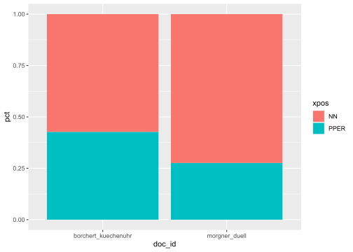
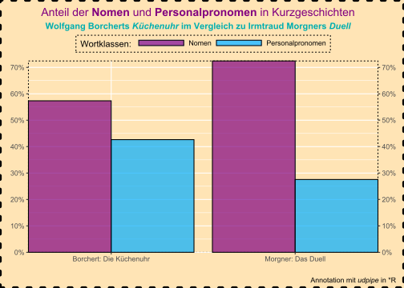
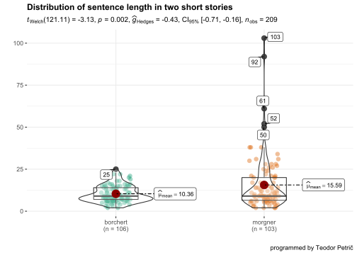

# Kurzgeschichten im Vergleich

In diesem Abschnitt vergleichen wir zwei Kurzgeschichten miteinander, und zwar:
- *Die Küchenuhr* von *Wolfgang Borchert* und   
- *Das Duell* von *Irmtraud Morgner*.   
Verglichen werden soll der Anteil der Pronomen und Substantive in beiden Texten.

Nach der Lektüre beider Texte haben wir den Eindruck, dass der Schreibstil unterschiedlich ist. Ein hervorstechendes Merkmal in Borcherts Kurzgeschichte ist der Gebrauch von Pronomen statt Substantiven bzw. Nominalphrasen mit substantivischem Kopf.   

*Null-Hypothese* ($H_0$): Der Anteil der Pronomen ist in beiden Kurzgeschichten ähnlich groß.
*alternative Hypothese* ($H_1$): Der Anteil der Pronomen in Borcherts Kurzgeschichte ist größer als in Morgners Kurzgeschichte.   

## Programme laden


```r
library(tidyverse)
library(scales)
library(quanteda)
library(quanteda.textstats)
library(quanteda.textplots)
library(readtext)
```

## Texte laden


```r
borchert <- read_lines("data/borchert/borchert_kuechenuhr.txt")
morgner <- read_lines("data/morgner/morgner_duell.txt")
```

## Textzerlegung und Annotation

Die grammatische Analyse führen wir mit `udpipe` durch. Zuerst laden wir ein entsprechendes Sprachmodell.


```r
library(udpipe)
destfile = "german-gsd-ud-2.5-191206.udpipe"

if(!file.exists(destfile)){
   sprachmodell <- udpipe_download_model(language = "german")
   udmodel_de <- udpipe_load_model(sprachmodell$file_model)
   } else {
  file_model = destfile
  udmodel_de <- udpipe_load_model(file_model)
}
```

Das Programm `udpipe` annotiert den Text mit Hilfe des Sprachmodells.


```r
x <- udpipe_annotate(udmodel_de, x = borchert, trace = FALSE)
b <- as.data.frame(x) %>% 
  mutate(doc_id = "borchert_kuechenuhr")

x <- udpipe_annotate(udmodel_de, x = morgner, trace = FALSE)
m <- as.data.frame(x) %>% 
  mutate(doc_id = "morgner_duell")
```


## Datensätze vereinen

Wir vereinen beide Datensätze in einem neuen Datensatz (*kurz*), und zwar mit Hilfe der Funktion `bind_rows()`.


```r
kurz <- bind_rows(b, m)
```


## Wortklassen zählen

Nun sind wir bereits in der Lage, Wortklassen zu zählen, die `udpipe` identifiziert hat. Dazu verwenden wir die Funktion `count()`. Gezählt werden die Kategorien in der Spalte *xpos*.


```r
kurz %>% 
  group_by(doc_id) %>% 
  count(xpos, sort = TRUE)
```

```
## # A tibble: 75 x 3
## # Groups:   doc_id [2]
##    doc_id              xpos      n
##    <chr>               <chr> <int>
##  1 morgner_duell       NN      318
##  2 morgner_duell       ART     185
##  3 morgner_duell       VVFIN   182
##  4 morgner_duell       PPER    121
##  5 borchert_kuechenuhr $.      120
##  6 borchert_kuechenuhr ADV     120
##  7 morgner_duell       $,      119
##  8 borchert_kuechenuhr VVFIN   118
##  9 borchert_kuechenuhr NN      117
## 10 morgner_duell       $.      112
## # ... with 65 more rows
```

Angesichts unserer oben angeführten Hypothese interessieren uns in der Spalte *xpos* nur die Kategorien *NN* (Nomen bzw. Substantive) und *PPER* (Personalpronomen). Deshalb filtern wir alle anderen Kategorien heraus. 


```r
tabelle_1 <- kurz %>% 
  group_by(doc_id) %>% 
  filter(xpos == "NN" | xpos == "PPER") %>% 
  count(xpos, sort = TRUE)
tabelle_1
```

```
## # A tibble: 4 x 3
## # Groups:   doc_id [2]
##   doc_id              xpos      n
##   <chr>               <chr> <int>
## 1 morgner_duell       NN      318
## 2 morgner_duell       PPER    121
## 3 borchert_kuechenuhr NN      117
## 4 borchert_kuechenuhr PPER     87
```

Da Morgners Erzählung länger ist als Borcherts, fügen wir noch Prozentzahlen zur Tabelle hinzu. Dann fällt der Vergleich leichter. 


```r
tabelle_1 %>% 
  mutate(pct = n/sum(n))
```

```
## # A tibble: 4 x 4
## # Groups:   doc_id [2]
##   doc_id              xpos      n   pct
##   <chr>               <chr> <int> <dbl>
## 1 morgner_duell       NN      318 0.724
## 2 morgner_duell       PPER    121 0.276
## 3 borchert_kuechenuhr NN      117 0.574
## 4 borchert_kuechenuhr PPER     87 0.426
```

Die Tabelle können wir umgestalten, so dass sie leichter zu lesen ist. Zu diesem Zweck setzen wir die Funktion `pivot_wider()` ein.


```r
tabelle_2 <- tabelle_1 %>% 
  mutate(Anteil = round(100*n/sum(n), 2)) %>% 
  rename(wortklasse = xpos) %>% 
  dplyr::select(-n) %>% 
  pivot_wider(names_from = doc_id, values_from = Anteil)
tabelle_2
```

```
## # A tibble: 2 x 3
##   wortklasse morgner_duell borchert_kuechenuhr
##   <chr>              <dbl>               <dbl>
## 1 NN                  72.4                57.4
## 2 PPER                27.6                42.6
```


Das Ergebnis können wir auch graphisch darstellen.


```r
tabelle_1 %>% 
  mutate(pct = n/sum(n)) %>% 
  ggplot(aes(doc_id, pct, fill = xpos)) +
  geom_col()
```



Eine etwas schönere Graphik - zu Demonstrationszwecken (in diesem Fall ein Mordsaufwand, der an Overkill grenzt):


```r
library(ggtext)

tabelle_1 %>% 
  mutate(pct = n/sum(n)) %>% 
  ggplot(aes(doc_id, pct, fill = xpos)) +
  geom_col(alpha = 0.7, color = "black", 
           width = 0.9, position = "dodge") +
  # geom_label(aes(label = xpos), size = 5, hjust = 1) +
  scale_x_discrete(labels = c("Borchert: Die Küchenuhr", 
                              "Morgner: Das Duell")) +
  scale_y_continuous(
    labels = percent_format(accuracy = 1), breaks = seq(0, 1, 0.1),
    sec.axis = dup_axis(name = NULL)) + 
  scale_fill_discrete(type = c("#810080", "#00aeff"),
                      labels = c("Nomen", "Personalpronomen")) +
  coord_cartesian(expand = FALSE, clip = "off") +
  theme(legend.position = "top", 
        legend.background = element_rect(color = "black", 
                                       fill = "moccasin", 
                                       size = 0.5, 
                                       linetype = "dotted"), 
        legend.key.height = unit(.5, "lines"), 
        legend.key.width = unit(4, "lines"), 
        panel.background = element_rect(color = "black", 
                                       fill = "moccasin",
                                       size = 0.5, 
                                       linetype = "dotted"),  
        plot.margin = margin(10, 10, 5, 0), 
        plot.title = element_markdown(color = "#810080", 
                                      size = 14, hjust = 0.5),
        plot.title.position = "plot", # default: panel
        plot.subtitle = element_markdown(color = "#00aeaf",
                                         hjust = 0.5),
        plot.caption = element_markdown(),
        plot.caption.position = "plot", # default: panel
        plot.background = element_rect(color = "black", 
                                       fill = "moccasin", 
                                       size = 2, 
                                       linetype = "dotted")) +
  labs(x = "", y = "", 
       title = "Anteil der **Nomen** und **Personalpronomen** in Kurzgeschichten",
       subtitle = "**Wolfgang Borcherts _Küchenuhr_ im Vergleich zu Irmtraud Morgners _Duell_**", 
       fill = "Wortklassen: ", 
       caption = "Annotation mit *udpipe* in *R")
```




## Nicht-parametrischer Test

Zum Abschluss machen wir noch den Chi-Quadrat-Test, um unsere Hypothese zu überprüfen. Die Formel für die Berechnung des $\chi^2$-Wertes:

$$
\tilde{\chi}^2=\sum_{k=1}^{n}\frac{(Observed_k - Expected_k)^2}{Expected_k}
$$

Für den $\chi^2$-Quadrat-Test benötigen wir eine 2 x 2 - Kreuztabelle mit den beobachteten Werten in beiden Stichproben. Die erwarteten (theoretischen) Werte werden von der `chisq.test()`-Funktion berechnet.


```r
tabelle_3 <- tabelle_1 %>% 
  rename(wortklasse = xpos) %>% 
  pivot_wider(names_from = doc_id, values_from = n)
tabelle_3
```

```
## # A tibble: 2 x 3
##   wortklasse morgner_duell borchert_kuechenuhr
##   <chr>              <int>               <int>
## 1 NN                   318                 117
## 2 PPER                 121                  87
```

Das Ergebnis (p = 0,0002) besagt, dass wir die Nullhypothese verwerfen und die alternative Hypothese akzeptieren können, denn p < 0,05. Der Anteil der Pronomen in Borcherts Kurzgeschichte ist mit statistischer Signifikanz größer als in Morgners Kurzgeschichte. 


```r
chires <- chisq.test(tabelle_3[,-1])
chires
```

```
## 
## 	Pearson's Chi-squared test with Yates' continuity correction
## 
## data:  tabelle_3[, -1]
## X-squared = 13.8, df = 1, p-value = 0.0002033
```

Bei Bedarf kann man aus der oben gespeicherten Variable *chires* außer den beobachteten Häufigkeiten (hier: *obs*) auch die erwarteten Häufigkeiten (hier: *ex(p)*) ausgeben lassen. Letztere zeigen, welche Werte man bei Gültikgeit der Nullhypothese (also 50% Nomen- vs. 50% Pronomen-Anteil) erwarten könnte.


```r
obs <- as_tibble(chires$observed) %>% 
  # shorter column names
  rename(morgner_obs = morgner_duell, 
         borchert_obs = borchert_kuechenuhr)

ex <- as_tibble(round(chires$expected, 0)) %>% 
  # shorter column names
  rename(morgner_exp = morgner_duell, 
         borchert_exp = borchert_kuechenuhr)

# choose first column of tabelle_3 and bind it with the other columns
freqenzen <- bind_cols(tabelle_3[, 1], obs, ex) %>% 
  # rename the word classes
  mutate(wortklasse = ifelse(wortklasse == "NN", 
                             "Nomen", "Pers.Pronomen"))
freqenzen
```

```
## # A tibble: 2 x 5
##   wortklasse    morgner_obs borchert_obs morgner_exp borchert_exp
##   <chr>               <int>        <int>       <dbl>        <dbl>
## 1 Nomen                 318          117         297          138
## 2 Pers.Pronomen         121           87         142           66
```

:::rmdrobot
Wie beeinflusst die Verwendung von Personalpronomen das Textverständnis? Oder anders gefragt: Versteht der Textrezipient einen Text leichter, wenn der Textproduzent Personalpronomen statt Nomen verwendet werden?   
:::


## Konnektoren

Die Anzahl der Konnektoren (nebenordnende und unterordnende Konjunktionen) in den Kurzegeschichten ist in der folgenden Tabelle zu sehen. Die Junktoren (CCONJ) überwiegen zahlenmäßig wie in den meisten Texten.  


```r
kurz %>% 
  group_by(doc_id) %>% 
  filter(upos == "CCONJ" | upos == "SCONJ") %>% 
  count(upos, sort = TRUE)
```

```
## # A tibble: 4 x 3
## # Groups:   doc_id [2]
##   doc_id              upos      n
##   <chr>               <chr> <int>
## 1 borchert_kuechenuhr CCONJ    48
## 2 morgner_duell       CCONJ    41
## 3 morgner_duell       SCONJ    19
## 4 borchert_kuechenuhr SCONJ    18
```

Welche Konnektoren kamen in den beiden Texten vor? 


```r
kurz_pivot_wid <- kurz %>% 
  group_by(doc_id, lemma) %>% 
  mutate(lemma = ifelse(lemma == "daß", "dass", lemma)) %>% 
  filter(upos == "CCONJ" | upos == "SCONJ") %>% 
  count(upos, sort = TRUE) %>% 
  pivot_wider(lemma:upos, names_from = doc_id, values_from = n)
kurz_pivot_wid %>% rmarkdown::paged_table()
```

<div data-pagedtable="false">
  <script data-pagedtable-source type="application/json">
{"columns":[{"label":["lemma"],"name":[1],"type":["chr"],"align":["left"]},{"label":["upos"],"name":[2],"type":["chr"],"align":["left"]},{"label":["borchert_kuechenuhr"],"name":[3],"type":["int"],"align":["right"]},{"label":["morgner_duell"],"name":[4],"type":["int"],"align":["right"]}],"data":[{"1":"und","2":"CCONJ","3":"34","4":"31"},{"1":"aber","2":"CCONJ","3":"12","4":"2"},{"1":"dass","2":"SCONJ","3":"5","4":"6"},{"1":"als","2":"SCONJ","3":"1","4":"5"},{"1":"wenn","2":"SCONJ","3":"4","4":"3"},{"1":"sowie","2":"CCONJ","3":"NA","4":"3"},{"1":"denn","2":"SCONJ","3":"2","4":"NA"},{"1":"weil","2":"SCONJ","3":"2","4":"NA"},{"1":"wie","2":"SCONJ","3":"2","4":"2"},{"1":"oder","2":"CCONJ","3":"1","4":"2"},{"1":"bis","2":"SCONJ","3":"1","4":"NA"},{"1":"ob","2":"SCONJ","3":"1","4":"1"},{"1":"wie","2":"CCONJ","3":"1","4":"1"},{"1":"da","2":"SCONJ","3":"NA","4":"1"},{"1":"denn","2":"CCONJ","3":"NA","4":"1"},{"1":"jedoch","2":"CCONJ","3":"NA","4":"1"},{"1":"obgleich","2":"SCONJ","3":"NA","4":"1"}],"options":{"columns":{"min":{},"max":[10]},"rows":{"min":[10],"max":[10]},"pages":{}}}
  </script>
</div>

In beiden (ähnlich langen) Geschichten hat der Junktor *und* den Löwenanteil (über 30 Vorkommnisse). 

In Borcherts Geschichte kommt der adversative Junktor *aber* häufiger vor als in Morgners Kurzgeschichte. 

Andere Unterschiede sind marginal bzw. aufgrund der geringen Anzahl kaum statistisch bewertbar. 

Ein $\chi^2$-Quadrat-Test soll bestätigen, dass der Junktor *aber* signifikant häufiger vorkommt als in Morgners Text. 

$H_0$: kein signifikanter Unterschied zwischen den beiden Geschichten bezüglich der Häufigkeit von *aber*.   
$H_1$: signifikanter Unterschied zwischen den beiden Geschichten bezüglich der Häufigkeit von *aber*.   

Vorbereitung: 


```r
b_aber <- kurz_pivot_wid$borchert_kuechenuhr[2]
b_konn <- sum(kurz_pivot_wid$borchert_kuechenuhr[-2], na.rm = TRUE)
m_aber <- kurz_pivot_wid$morgner_duell[2]
m_konn <- sum(kurz_pivot_wid$morgner_duell[-2], na.rm = TRUE)

b_freq <- rbind(b_aber, b_konn) %>% as_tibble() %>% rename(b = V1)
m_freq <- rbind(m_aber, m_konn) %>% as_tibble() %>% rename(m = V1)
bormor <- bind_cols(b_freq, m_freq)
bormor
```

```
## # A tibble: 2 x 2
##       b     m
##   <int> <int>
## 1    12     2
## 2    54    58
```

Test: 


```r
chi_res <- chisq.test(bormor)
chi_res
```

```
## 
## 	Pearson's Chi-squared test with Yates' continuity correction
## 
## data:  bormor
## X-squared = 5.593, df = 1, p-value = 0.01803
```

Der $\chi^2$-Test bestätigt einen signifikanten Unterschied im Gebrauch des Junktors *aber*. Adversativität wird in Borcherts Kurzgeschichte signifikant häufiger mit dem Junktor *aber* ausgedrückt als in Morgners Geschichte. 


## Äußerungslänge vergleichen

In welcher Kurzgeschichte sind die Äußerungen im Durchschnitt länger? Das wollen wir mit dem *t-Test* prüfen.   

Zu diesem Zweck kann man alternativ `quanteda`- oder `tidytext`-Funktionen nutzen.

Zuerst bereiten wir einen Datensatz mit beiden Texten vor.


```r
# Condense text, remove spaces and create dataframes
bfl <- borchert[-c(1, 41)] %>% 
  str_flatten(collapse = " ") %>% 
  str_squish() %>% 
  as_tibble() %>% 
  rename(text = value) %>% 
  mutate(doc_id = "borchert")
mfl <- morgner[-1] %>% 
  str_flatten(collapse = " ") %>% 
  str_squish() %>% 
  as_tibble() %>% 
  rename(text = value) %>% 
  mutate(doc_id = "morgner")

# Join dataframes
kurzgeschichten <- bind_rows(bfl, mfl)
```

Mit `quanteda` können wir unser Vorhaben folgendermaßen durchführen (in diesem Fall ohne das Programm `readtext()` zu verwenden):


```r
library(quanteda)
library(quanteda.textstats)
library(quanteda.textplots)

# Create corpus from dataframe
kurzcorp <- corpus(kurzgeschichten)

# Reshape corpus
kurzkorp <- corpus_reshape(kurzcorp, to = "sentences")
```

Mit der Funktion `summary()` erhalten wir auch die Anzahl der Wortformen (*Tokens*) und Äußerungen (*Sentences*). 


```r
kurzstats <- summary(kurzkorp, n = 209) %>% as_tibble()
kurzstats %>% slice_sample(n = 10)
```

```
## # A tibble: 10 x 4
##    Text        Types Tokens Sentences
##    <chr>       <int>  <int>     <int>
##  1 morgner.9      18     24         1
##  2 morgner.6       9      9         1
##  3 borchert.35     7      7         1
##  4 borchert.79     9      9         1
##  5 morgner.8      11     11         1
##  6 borchert.75    21     22         1
##  7 borchert.63     7      7         1
##  8 morgner.97      9      9         1
##  9 morgner.51      2      2         1
## 10 morgner.39     19     20         1
```

Daraus kann man die durchschnittliche Äußerungslänge der beiden Texte berechnen. Eine ähnliche `quanteda`-Funktion ist `textstat_summary()`.


```r
textstat_summary(kurzkorp) %>% slice_sample(n = 6)
```

```
##      document chars sents tokens types puncts numbers symbols urls tags emojis
## 1 borchert.89    39     1      9     9      2       0       0    0    0      0
## 2 borchert.67    20     1      6     6      2       0       0    0    0      0
## 3  morgner.12    64     1     17    16      5       0       0    0    0      0
## 4  morgner.16    43     1     12    11      4       0       0    0    0      0
## 5  morgner.46    43     1      5     5      1       0       0    0    0      0
## 6 borchert.70    29     1      7     7      1       0       0    0    0      0
```

Um einen t-Test durchzuführen, berechnen wir auch die Standardabweichung (also eine Größe, die Auskunft darüber gibt, wie stark die einzelnen Äußerungslängen vom Durchschnitt abweichen). Die statistische Funktion `t.test()` erledigt das für uns.

Vor dem t-Test spalten wir die *Text*-Spalte mit der Funktion `separate()` in zwei neue, so dass die erste Spalte *doc_id* nur die Namen der beiden Autoren (borchert, morgner) enthält. Das ist notwendig, weil man mit dem t-Test höchstens zwei Gruppen miteinander vergleichen kann. 


```r
kurzstats <- kurzstats %>% 
  separate(Text, into = c("doc_id", "number"), 
           sep = "\\.", extra = "merge")
kurzstats %>% slice_sample(n = 6)
```

```
## # A tibble: 6 x 5
##   doc_id   number Types Tokens Sentences
##   <chr>    <chr>  <int>  <int>     <int>
## 1 borchert 34        20     20         1
## 2 morgner  99        27     34         1
## 3 borchert 48         6      6         1
## 4 morgner  12        16     17         1
## 5 morgner  28         4      4         1
## 6 morgner  97         9      9         1
```

Wir führen einen *t-Test* mit zwei *unabhängigen Stichproben* (d.h. unseren beiden Kurzgeschichten) durch. 

*Null-Hypothese* $H_0$: kein Unterschied hinsichtlich der mittleren Äußerungslängen.   

*Alternative Hypothese* $H_1$: die beiden Kurzgeschichten unterscheiden sich hinsichtlich ihrer durchschnittlichen Äußerungslänge. 


```r
tres <- t.test(Tokens ~ doc_id, data = kurzstats, var.equal = FALSE)
tres
```

```
## 
## 	Welch Two Sample t-test
## 
## data:  Tokens by doc_id
## t = -3.1339, df = 121.11, p-value = 0.002164
## alternative hypothesis: true difference in means between group borchert and group morgner is not equal to 0
## 95 percent confidence interval:
##  -8.539975 -1.927510
## sample estimates:
## mean in group borchert  mean in group morgner 
##               10.35849               15.59223
```

Das **Ergebnis des t-Tests** (p = 0,002164) liegt unter dem 5 % Signifikanzniveau (p = 0,05). Demnach können wir die Nullhypothese verwerfen und die alternative Hypothese annehmen. 

Die *mittlere Äußerungslänge* in Borcherts Kurzgeschichte beträgt etwa 10,36 Tokens (Wörter + Interpunktion), die in Morgners Kurzgeschichte dagegen 15,59 Tokens (Wörter + Interpunktion).

Da wir das Ergebnis in der Variable *tres* gespeichert haben, können wir später auch andere Werte abrufen. 

Die *Standardabweichung* (sd) müssen wir allerdings auf andere Weise berechnen. 


```r
tapply(kurzstats$Tokens, list(kurzstats$doc_id), sd)
```

```
##  borchert   morgner 
##  5.048694 16.201814
```

Die Standardabweichung von Morgners Kurzgeschichte ist etwa 3-mal größer als die von Borcherts Kurzgeschichte. Mit anderen Worten: in Morgners Geschichte gibt es kurze, aber auch sehr lange Äußerungen. In Borcherts Geschichte sind die Schwankungen nicht so groß. Deshalb ist die Standardabweichung viel kleiner.

Deshalb war es richtig, dass wir oben beim `t.test()` die Option `var.equal = FALSE` angegeben haben. Das Programm hat den statistischen Test demgemäß angepasst.

Wir wandeln nun diese Werte in eine Tabelle um, weil wir eine Gesamttabelle zusammenstellen wollen. 


```r
kurz_sd <- tapply(kurzstats$Tokens, list(kurzstats$doc_id), sd) %>% 
  as_tibble() %>% rename(sd = value)
```

Die beiden *Durchschnittswerte* und die *Freiheitsgrade* (*df*) erhalten wir aus dem t-Test bzw. der oben gespeicherten Variable *tres*. Wir können diese Werte wiederum in eine Tabelle umwandeln. 


```r
kurz_mean <- tres$estimate %>% as_tibble() %>% rename(mean = value)
```

Die *Freiheitsgrade* (auch in eine Tabelle umgewandelt): 


```r
kurz_df <- tres$parameter %>% as_tibble() %>% rename(df = value)
```

Fügen wir noch den *t-Wert* und den *p-Wert* hinzu (wieder in Tabellen umgewandelt).


```r
kurz_t <- tres$statistic %>% as_tibble() %>% rename(t = value)
kurz_p <- tres$p.value %>% as_tibble() %>% rename(p = value)
```

Die einzelnen Tabellen und die erste Spalte aus der Tabelle *kurzstats* vereinen wir in einer Gesamttabelle. 


```r
kurz_tres <- bind_cols(kurzstats %>% 
                         dplyr::select(doc_id) %>% distinct(), 
                       kurz_mean, kurz_sd, 
                       kurz_t, kurz_p, kurz_df)
kurz_tres
```

```
## # A tibble: 2 x 6
##   doc_id    mean    sd     t       p    df
##   <chr>    <dbl> <dbl> <dbl>   <dbl> <dbl>
## 1 borchert  10.4  5.05 -3.13 0.00216  121.
## 2 morgner   15.6 16.2  -3.13 0.00216  121.
```

Bei Bedarf kann man noch eine kleine Schönheitskorrektur durchführen: 


```r
borchert_morgner_t_test <- kurz_tres %>% 
  mutate(t = ifelse(doc_id == "morgner", NA, t),
         p = ifelse(doc_id == "morgner", NA, p),
         df = ifelse(doc_id == "morgner", NA, df))
borchert_morgner_t_test %>% rmarkdown::paged_table()
```

<div data-pagedtable="false">
  <script data-pagedtable-source type="application/json">
{"columns":[{"label":["doc_id"],"name":[1],"type":["chr"],"align":["left"]},{"label":["mean"],"name":[2],"type":["dbl"],"align":["right"]},{"label":["sd"],"name":[3],"type":["dbl"],"align":["right"]},{"label":["t"],"name":[4],"type":["dbl"],"align":["right"]},{"label":["p"],"name":[5],"type":["dbl"],"align":["right"]},{"label":["df"],"name":[6],"type":["dbl"],"align":["right"]}],"data":[{"1":"borchert","2":"10.35849","3":"5.048694","4":"-3.133923","5":"0.002164088","6":"121.109"},{"1":"morgner","2":"15.59223","3":"16.201814","4":"NA","5":"NA","6":"NA"}],"options":{"columns":{"min":{},"max":[10]},"rows":{"min":[10],"max":[10]},"pages":{}}}
  </script>
</div>

Mit dem Programm `report` erhält man Beschreibungen eines Datensatzes oder statistischer Tests (z.B. des `t.test()`). 


```r
library(report)
kurzstats %>% group_by(doc_id) %>% report() %>% summary()
```

```
## The data contains 209 observations, grouped by doc_id, of the following 5 variables:
## 
## - borchert (n = 106):
##   - number: 106 entries, such as 1 (0.94%); 10 (0.94%); 100 (0.94%) and 103 others
##   - Types: Mean = 9.99, SD = 4.65, range: [2, 22]
##   - Tokens: Mean = 10.36, SD = 5.05, range: [2, 25]
##   - Sentences: Mean = 1.00, SD = 0.00, range: [1, 1]
## 
## - morgner (n = 103):
##   - number: 103 entries, such as 1 (0.97%); 10 (0.97%); 100 (0.97%) and 100 others
##   - Types: Mean = 13.95, SD = 11.95, range: [2, 70]
##   - Tokens: Mean = 15.59, SD = 16.20, range: [2, 103]
##   - Sentences: Mean = 1.00, SD = 0.00, range: [1, 1]
```

Bericht über den durchgeführten `t.test()`.


```r
report(t.test(Tokens ~ doc_id, data = kurzstats))
```

```
## Effect sizes were labelled following Cohen's (1988) recommendations.
## 
## The Welch Two Sample t-test testing the difference of Tokens by doc_id (mean in group borchert = 10.36, mean in group morgner = 15.59) suggests that the effect is negative, statistically significant, and medium (difference = -5.23, 95% CI [-8.54, -1.93], t(121.11) = -3.13, p = 0.002; Cohen's d = -0.57, 95% CI [-0.93, -0.21])
```


```r
library(ggstatsplot)
# for reproducibility
set.seed(2021)
# plot
kurzstats %>% 
  dplyr::select(doc_id, Tokens) %>% 
ggbetweenstats(
  x = doc_id, xlab = "", 
  y = Tokens, ylab = "",
  type = "parametric", 
  plot.type = "boxviolin", 
  pairwise.display = "significant",
  bf.message = FALSE,
  conf.level = 0.95, 
  outlier.tagging = TRUE, 
  title = "Distribution of sentence length in two short stories", 
  caption = "programmed by Teodor Petrič"
  )
```



