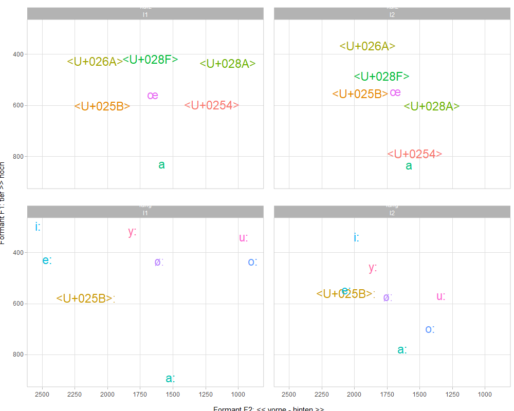

# Vokalformanten im Deutschen als Fremdsprache
(Vowel formants in German as a foreign language)


## Programme starten


```r
library(tidyverse)
library(scales)
library(readxl)
library(writexl)
library(phonR)
library(extrafont)
```

## Daten laden


```r
vokale <- read_xlsx("data/S03_Vokalformanten_Diagramme.xlsx", sheet ="A1-4_alle") %>% 
  janitor::clean_names() %>% 
  dplyr::select(-studierende) %>% 
  mutate(geschlecht = "f") %>% 
  dplyr::select(sprecherin, geschlecht, vokal, f1, f2, dauer, lange, wort, phrase) %>% 
  mutate(l1_l2 = ifelse(sprecherin == "Deutsche", "L1", "L2")) %>% 
  mutate(vokal = str_replace(vokal, "F:", "E:")) %>% 
  mutate(vowel = vokal)
head(vokale)
```

```
## # A tibble: 6 x 11
##   sprecherin geschlecht vokal    f1    f2 dauer lange wort  phrase   l1_l2 vowel
##   <chr>      <chr>      <chr> <dbl> <dbl> <dbl> <chr> <chr> <chr>    <chr> <chr>
## 1 Deutsche   f          a       764  1746    88 kurz  Stadt Phrase ~ L1    a    
## 2 Deutsche   f          a       724  1741   104 kurz  Stadt Phrase ~ L1    a    
## 3 Deutsche   f          a       810  1740    55 kurz  Stadt Phrase ~ L1    a    
## 4 Deutsche   f          a       735  1741    99 kurz  Stadt Phrase ~ L1    a    
## 5 Deutsche   f          a      1346  2487    59 kurz  Stadt Phrase ~ L1    a    
## 6 Deutsche   f          a       242  2236   162 kurz  Stadt Phrase ~ L1    a
```

```r
vergleich <- read_xlsx("data/S03_Vokalformanten_Diagramme.xlsx", sheet ="A10_Vgl_L1_L2_tab") %>% 
  janitor::clean_names() %>% 
  mutate(phonem = str_replace(phonem, "EE", "E:")) %>% 
  rename(f1_l1 = f1_in_hz,
         f2_l1 = f2_in_hz,
         dauer_l1 = dauer_in_ms,
         vokal = phonem)
```

```
## New names:
## * `Phonem IPA` -> `Phonem IPA...1`
## * `Phonem IPA` -> `Phonem IPA...2`
```

```r
head(vergleich)
```

```
## # A tibble: 6 x 10
##   phonem_ipa_1 phonem_ipa_2 vokal f1_l1 f2_l1 dauer_l1 f1_l2 f2_l2 dauer_l2
##   <chr>        <chr>        <chr> <dbl> <dbl>    <dbl> <dbl> <dbl>    <dbl>
## 1 a            /a/          a       836  1586     82.8  840. 1583.     73.7
## 2 aù           /a:/         a:      896  1517    154.   784  1632     208. 
## 3 eù           /e:/         e:      434  2461    118.   553. 2062.    140. 
## 4 E            /E/          E       608  2040     82.7  560  1953.     72.5
## 5 Eù           /E:/         E:      584  2166    126.   566. 2062.    142. 
## 6 I            /i:/         I       433  2095     86.8  372  1900      59.3
## # ... with 1 more variable: lange <chr>
```


```r
df0 <- read.csv("data/Deutsche_formants.Table.csv", stringsAsFactors = FALSE, fileEncoding = "UTF-8") 
df1a <- read.csv("data/Monika_I_formants.Table.csv", stringsAsFactors = FALSE, fileEncoding = "UTF-8") 
df1b <- read.csv("data/Monika_II_formants.Table.csv", stringsAsFactors = FALSE, fileEncoding = "UTF-8") 
df2 <- read.csv("data/Donna_formants.Table.csv", stringsAsFactors = FALSE, fileEncoding = "UTF-8")
df3 <- read.csv("data/Metka_formants.Table.csv", stringsAsFactors = FALSE, fileEncoding = "UTF-8") 
df4 <- read.csv("data/Jasmina_formants.Table.csv", stringsAsFactors = FALSE, fileEncoding = "UTF-8") 
df5 <- read.csv("data/Teodor_II_formants.Table.csv", stringsAsFactors = FALSE, fileEncoding = "UTF-8") 

df0 <- df0 %>% mutate(speaker = "Deutsche")
df1a <- df1a %>% mutate(speaker = "Monika1")
df1b <- df1b %>% mutate(speaker = "Monika2")
df2 <- df2 %>% mutate(speaker = "Donna")
df3 <- df3 %>% mutate(speaker = "Metka")
df4 <- df4 %>% mutate(speaker = "Jasmina")
df5 <- df5 %>% mutate(speaker = "Teodor")

df <- rbind(df0,df1a,df1b,df2,df3,df4,df5)
head(df)
```

```
##   vowel time_index v_time time_abs  F1   F2   F3  speaker
## 1    ii          1  0.000    0.210 250 2235 2721 Deutsche
## 2    ii          2  0.011    0.221 246 2777 3303 Deutsche
## 3    ii          3  0.022    0.231 246 2823 3601 Deutsche
## 4    ii          4  0.032    0.242 242 2820 3659 Deutsche
## 5    ii          5  0.043    0.253 232 2786 3792 Deutsche
## 6    ii          6  0.054    0.264 231 2814 3727 Deutsche
```


## IPA syms


```r
par(family='Helvetica')
par(family = "Charis SIL")

i = "i:"
I = "ɪ"
y = "y:"
Y = "ʏ"
e = "e:"
E = "ɛ"
EE = "ɛ\u02D0"
oe = "ø:"
oe = "ø\u02D0"
# oe = "\u00F8" # wird nicht gedruckt
# oe = "\u00D8" # ok, aber eigentlich ein anderes Phonem
# oe = "\u2205" # ok, aber eigentlich ein anderes Phonem
# oe = "&#248" # wird nicht gedruckt
OE = "œ"
# OE = "\u0153"
# OE = "&#339"
schwa = "ə"
a = "a"
A = "a:"
o = "o:"
O = "ɔ"
u = "u:"
U = "ʊ"

ipavow = c(a,A,e,E,EE,I,i,O,o,U,u,Y,y,OE,oe, schwa) %>%  as_tibble() %>% rename(vowel = value)

vergleich <- vergleich %>% cbind(ipavow) %>% dplyr::select(-phonem_ipa_1, -phonem_ipa_2)
```


```r
# Deutsche Vokale
vowel_lookup =
  c(
    ii = "i:",
    I = "ɪ",
    yy = "y:",
    Y = "ʏ",
    ee = "e:",
    E = "ɛ",
    EE = "ɛ\u02D0",
    Ea = "ɛa",
    oe = "ø:",
    oe = "ø\u02D0",
    # oe = "\u00F8" # wird nicht gedruckt
    # oe = "\u00D8" # ok, aber eigentlich ein anderes Phonem
    # oe = "\u2205" # ok, aber eigentlich ein anderes Phonem
    # oe = "&#248" # wird nicht gedruckt
    OE = "œ",
    OOE = "œ:",
    # OE = "\u0153"
    # OE = "&#339"
    schwa = "ə",
    a = "a",
    AA = "a:",
    oo = "o:",
    O = "ɔ",
    OO = "ɔ:",
    uu = "u:",
    U = "ʊ"
    
  )

df$IPA <- vowel_lookup[df$vowel]
```


## Vergleich der Vokalformanten

Verglichen werden Vokale deutscher Muttersprachler_innen mit Vokalen von Studierenden des Deutschen als Fremdsprache. Verglichen werden die ersten beiden Vokalformanten (F1 und F2). In den Diagrammen werden IPA-Symbole verwendet.


```r
vgl_pivot <- vergleich %>% 
  group_by(vokal) %>% 
  pivot_longer(f1_l1:dauer_l2, names_to = "category", values_to = "value") %>% 
  separate(category, into = c("category", "l1_l2")) %>% 
  drop_na() %>% 
  pivot_wider(names_from = category, values_from = value)
head(vgl_pivot)
```

```
## # A tibble: 6 x 7
## # Groups:   vokal [3]
##   vokal lange vowel l1_l2    f1    f2 dauer
##   <chr> <chr> <chr> <chr> <dbl> <dbl> <dbl>
## 1 a     kurz  a     l1     836  1586   82.8
## 2 a     kurz  a     l2     840. 1583.  73.7
## 3 a:    lang  a:    l1     896  1517  154. 
## 4 a:    lang  a:    l2     784  1632  208. 
## 5 e:    lang  e:    l1     434  2461  118. 
## 6 e:    lang  e:    l2     553. 2062. 140.
```

```r
# par(family='Charis SIL')
(graph4 <- vgl_pivot %>% 
  drop_na() %>% 
  group_by(vokal, l1_l2, lange) %>% 
  ggplot(aes(f2,f1, label = vowel)) +
  geom_hex(alpha = 0.2, show.legend = F) +
  theme(text=element_text(size=16)) + # family = "Charis SIL"
  geom_text(aes(label = vowel, color = vowel), # family = "Charis SIL"
            vjust = 1, hjust = 1, check_overlap = T, show.legend = F, size = 6) +
  # geom_label(aes(x = mean(f2), y = mean(f1)), color = "black") + 
  # stat_ellipse() +
  scale_y_reverse() +
  scale_x_reverse(breaks = c(1000, 1250, 1500, 1750, 2000, 2250, 2500)) +
  facet_wrap(~ lange + l1_l2) +
  theme_light() + 
  labs(y = "Formant F1: tief >> hoch",
       x = "Formant F2: << vorne - hinten >>") +
  theme(#panel.grid.major=element_blank(),
        #panel.grid.minor=element_blank(),
        # text = element_text(family='Charis SIL'),
        plot.title = element_text(hjust = 0.5),
        legend.position = "none")
)
```

<embed src="18-Vokalformanten_Dauer_files/figure-html/unnamed-chunk-6-1.pdf" width="672" type="application/pdf" />

```r
ggsave("pictures/vergleich_vokalformanten_lang_kurz_ipa.jpg")
```

```
## Saving 7 x 5 in image
```

```r
library(plotly)
```

```
## 
## Attaching package: 'plotly'
```

```
## The following object is masked from 'package:ggplot2':
## 
##     last_plot
```

```
## The following object is masked from 'package:stats':
## 
##     filter
```

```
## The following object is masked from 'package:graphics':
## 
##     layout
```

```r
ggplotly(graph4) %>% layout(showlegend = FALSE)
```

```{=html}
<div id="htmlwidget-55e043b5cf0828f08439" style="width:672px;height:480px;" class="plotly html-widget"></div>
<script type="application/json" data-for="htmlwidget-55e043b5cf0828f08439">{"x":{"data":[{"x":[-1561.800001,-1561.800001,-1561.800001,-1561.800001,-1561.800001,-1561.800001,-1561.800001,null,-2027.600001,-2027.600001,-2027.600001,-2027.600001,-2027.600001,-2027.600001,-2027.600001,null,-1205.600001,-1205.600001,-1205.600001,-1205.600001,-1205.600001,-1205.600001,-1205.600001,null,-1671.400001,-1671.400001,-1671.400001,-1671.400001,-1671.400001,-1671.400001,-1671.400001,null,-2082.400001,-2082.400001,-2082.400001,-2082.400001,-2082.400001,-2082.400001,-2082.400001,null,-1096.000001,-1096.000001,-1096.000001,-1096.000001,-1096.000001,-1096.000001,-1096.000001,null,-1671.400001,-1671.400001,-1671.400001,-1671.400001,-1671.400001,-1671.400001,-1671.400001],"y":[-833.888584926793,-834.616811083343,-834.980924161618,-834.616811083343,-833.888584926793,-833.524471848518,-833.888584926793,null,-610.973645992679,-611.701872149229,-612.065985227503,-611.701872149229,-610.973645992679,-610.609532914404,-610.973645992679,null,-610.973645992679,-611.701872149229,-612.065985227503,-611.701872149229,-610.973645992679,-610.609532914404,-610.973645992679,null,-559.531737007883,-560.259963164433,-560.624076242708,-560.259963164433,-559.531737007883,-559.167623929608,-559.531737007883,null,-439.50061604336,-440.22884219991,-440.592955278185,-440.22884219991,-439.50061604336,-439.136502965085,-439.50061604336,null,-439.50061604336,-440.22884219991,-440.592955278185,-440.22884219991,-439.50061604336,-439.136502965085,-439.50061604336,null,-422.353313048428,-423.081539204978,-423.445652283253,-423.081539204978,-422.353313048428,-421.989199970153,-422.353313048428],"text":"count: 1","type":"scatter","mode":"lines","line":{"width":3.36717625753829,"color":"transparent","dash":"solid"},"fill":"toself","fillcolor":"rgba(51,106,152,0.2)","hoveron":"fills","showlegend":false,"xaxis":"x","yaxis":"y","hoverinfo":"text","frame":null},{"x":[-1561.800001,-1561.800001,-1561.800001,-1561.800001,-1561.800001,-1561.800001,-1561.800001,null,-1561.800001,-1561.800001,-1561.800001,-1561.800001,-1561.800001,-1561.800001,-1561.800001,null,-1424.800001,-1424.800001,-1424.800001,-1424.800001,-1424.800001,-1424.800001,-1424.800001,null,-1945.400001,-1945.400001,-1945.400001,-1945.400001,-1945.400001,-1945.400001,-1945.400001,null,-1671.400001,-1671.400001,-1671.400001,-1671.400001,-1671.400001,-1671.400001,-1671.400001,null,-1781.000001,-1781.000001,-1781.000001,-1781.000001,-1781.000001,-1781.000001,-1781.000001,null,-1918.000001,-1918.000001,-1918.000001,-1918.000001,-1918.000001,-1918.000001,-1918.000001],"y":[-833.888584926793,-834.616811083343,-834.980924161618,-834.616811083343,-833.888584926793,-833.524471848518,-833.888584926793,null,-799.593978936929,-800.322205093479,-800.686318171754,-800.322205093479,-799.593978936929,-799.229865858655,-799.593978936929,null,-610.973645992679,-611.701872149229,-612.065985227503,-611.701872149229,-610.973645992679,-610.609532914404,-610.973645992679,null,-559.531737007883,-560.259963164433,-560.624076242708,-560.259963164433,-559.531737007883,-559.167623929608,-559.531737007883,null,-559.531737007883,-560.259963164433,-560.624076242708,-560.259963164433,-559.531737007883,-559.167623929608,-559.531737007883,null,-490.942525028156,-491.670751184705,-492.03486426298,-491.670751184705,-490.942525028156,-490.578411949881,-490.942525028156,null,-370.911404063632,-371.639630220182,-372.003743298457,-371.639630220182,-370.911404063632,-370.547290985357,-370.911404063632],"text":"count: 1","type":"scatter","mode":"lines","line":{"width":3.36717625753829,"color":"transparent","dash":"solid"},"fill":"toself","fillcolor":"rgba(51,106,152,0.2)","hoveron":"fills","showlegend":false,"xaxis":"x2","yaxis":"y","hoverinfo":"text","frame":null},{"x":[-1507.000001,-1507.000001,-1507.000001,-1507.000001,-1507.000001,-1507.000001,-1507.000001,null,-2164.600001,-2164.600001,-2164.600001,-2164.600001,-2164.600001,-2164.600001,-2164.600001,null,-1616.600001,-1616.600001,-1616.600001,-1616.600001,-1616.600001,-1616.600001,-1616.600001,null,-904.200001,-904.200001,-904.200001,-904.200001,-904.200001,-904.200001,-904.200001,null,-2466.000001,-2466.000001,-2466.000001,-2466.000001,-2466.000001,-2466.000001,-2466.000001,null,-959.000001,-959.000001,-959.000001,-959.000001,-959.000001,-959.000001,-959.000001,null,-1808.400001,-1808.400001,-1808.400001,-1808.400001,-1808.400001,-1808.400001,-1808.400001,null,-2520.800001,-2520.800001,-2520.800001,-2520.800001,-2520.800001,-2520.800001,-2520.800001],"y":[-893.288584926793,-894.016811083343,-894.380924161618,-894.016811083343,-893.288584926793,-892.924471848518,-893.288584926793,null,-584.637131018019,-585.365357174569,-585.729470252844,-585.365357174569,-584.637131018019,-584.273017939744,-584.637131018019,null,-447.458707058564,-448.186933215114,-448.551046293389,-448.186933215114,-447.458707058564,-447.094593980289,-447.458707058564,null,-447.458707058564,-448.186933215114,-448.551046293389,-448.186933215114,-447.458707058564,-447.094593980289,-447.458707058564,null,-430.311404063632,-431.039630220182,-431.403743298457,-431.039630220182,-430.311404063632,-429.947290985357,-430.311404063632,null,-344.574889088973,-345.303115245523,-345.667228323798,-345.303115245523,-344.574889088973,-344.210776010698,-344.574889088973,null,-327.427586094041,-328.155812250591,-328.519925328866,-328.155812250591,-327.427586094041,-327.063473015766,-327.427586094041,null,-293.132980104177,-293.861206260727,-294.225319339002,-293.861206260727,-293.132980104177,-292.768867025902,-293.132980104177],"text":"count: 1","type":"scatter","mode":"lines","line":{"width":3.36717625753829,"color":"transparent","dash":"solid"},"fill":"toself","fillcolor":"rgba(51,106,152,0.2)","hoveron":"fills","showlegend":false,"xaxis":"x","yaxis":"y2","hoverinfo":"text","frame":null},{"x":[-1644.000001,-1644.000001,-1644.000001,-1644.000001,-1644.000001,-1644.000001,-1644.000001,null,-1397.400001,-1397.400001,-1397.400001,-1397.400001,-1397.400001,-1397.400001,-1397.400001,null,-1753.600001,-1753.600001,-1753.600001,-1753.600001,-1753.600001,-1753.600001,-1753.600001,null,-2055.000001,-2055.000001,-2055.000001,-2055.000001,-2055.000001,-2055.000001,-2055.000001,null,-1342.600001,-1342.600001,-1342.600001,-1342.600001,-1342.600001,-1342.600001,-1342.600001,null,-2082.400001,-2082.400001,-2082.400001,-2082.400001,-2082.400001,-2082.400001,-2082.400001,null,-1835.800001,-1835.800001,-1835.800001,-1835.800001,-1835.800001,-1835.800001,-1835.800001,null,-1972.800001,-1972.800001,-1972.800001,-1972.800001,-1972.800001,-1972.800001,-1972.800001],"y":[-791.635887921725,-792.364114078275,-792.72822715655,-792.364114078275,-791.635887921725,-791.27177484345,-791.635887921725,null,-705.899372947066,-706.627599103616,-706.99171218189,-706.627599103616,-705.899372947066,-705.535259868791,-705.899372947066,null,-585.868251982542,-586.596478139092,-586.960591217367,-586.596478139092,-585.868251982542,-585.504138904268,-585.868251982542,null,-568.720948987611,-569.44917514416,-569.813288222435,-569.44917514416,-568.720948987611,-568.356835909336,-568.720948987611,null,-568.720948987611,-569.44917514416,-569.813288222435,-569.44917514416,-568.720948987611,-568.356835909336,-568.720948987611,null,-551.573645992679,-552.301872149229,-552.665985227503,-552.301872149229,-551.573645992679,-551.209532914404,-551.573645992679,null,-465.837131018019,-466.565357174569,-466.929470252844,-466.565357174569,-465.837131018019,-465.473017939744,-465.837131018019,null,-345.806010053496,-346.534236210046,-346.898349288321,-346.534236210046,-345.806010053496,-345.441896975221,-345.806010053496],"text":"count: 1","type":"scatter","mode":"lines","line":{"width":3.36717625753829,"color":"transparent","dash":"solid"},"fill":"toself","fillcolor":"rgba(51,106,152,0.2)","hoveron":"fills","showlegend":false,"xaxis":"x2","yaxis":"y2","hoverinfo":"text","frame":null},{"x":[-1200],"y":[-605],"text":"<U+0254>","hovertext":"f2: 1200.000<br />f1: 605.0000<br />vowel: <U+0254><br />vowel: <U+0254>","textfont":{"size":22.6771653543307,"color":"rgba(248,118,109,1)"},"type":"scatter","mode":"text","hoveron":"points","name":"<U+0254>","legendgroup":"<U+0254>","showlegend":true,"xaxis":"x","yaxis":"y","hoverinfo":"text","frame":null},{"x":[-1538],"y":[-796.5],"text":"<U+0254>","hovertext":"f2: 1538.000<br />f1: 796.5000<br />vowel: <U+0254><br />vowel: <U+0254>","textfont":{"size":22.6771653543307,"color":"rgba(248,118,109,1)"},"type":"scatter","mode":"text","hoveron":"points","name":"<U+0254>","legendgroup":"<U+0254>","showlegend":false,"xaxis":"x2","yaxis":"y","hoverinfo":"text","frame":null},{"x":[-2040],"y":[-608],"text":"<U+025B>","hovertext":"f2: 2040.000<br />f1: 608.0000<br />vowel: <U+025B><br />vowel: <U+025B>","textfont":{"size":22.6771653543307,"color":"rgba(229,135,0,1)"},"type":"scatter","mode":"text","hoveron":"points","name":"<U+025B>","legendgroup":"<U+025B>","showlegend":true,"xaxis":"x","yaxis":"y","hoverinfo":"text","frame":null},{"x":[-1953.16666666667],"y":[-560],"text":"<U+025B>","hovertext":"f2: 1953.167<br />f1: 560.0000<br />vowel: <U+025B><br />vowel: <U+025B>","textfont":{"size":22.6771653543307,"color":"rgba(229,135,0,1)"},"type":"scatter","mode":"text","hoveron":"points","name":"<U+025B>","legendgroup":"<U+025B>","showlegend":false,"xaxis":"x2","yaxis":"y","hoverinfo":"text","frame":null},{"x":[-2166],"y":[-584],"text":"<U+025B>ː","hovertext":"f2: 2166.000<br />f1: 584.0000<br />vowel: <U+025B><U+02D0><br />vowel: <U+025B><U+02D0>","textfont":{"size":22.6771653543307,"color":"rgba(201,152,0,1)"},"type":"scatter","mode":"text","hoveron":"points","name":"<U+025B>ː","legendgroup":"<U+025B>ː","showlegend":true,"xaxis":"x","yaxis":"y2","hoverinfo":"text","frame":null},{"x":[-2061.83333333333],"y":[-566.5],"text":"<U+025B>ː","hovertext":"f2: 2061.833<br />f1: 566.5000<br />vowel: <U+025B><U+02D0><br />vowel: <U+025B><U+02D0>","textfont":{"size":22.6771653543307,"color":"rgba(201,152,0,1)"},"type":"scatter","mode":"text","hoveron":"points","name":"<U+025B>ː","legendgroup":"<U+025B>ː","showlegend":false,"xaxis":"x2","yaxis":"y2","hoverinfo":"text","frame":null},{"x":[-2095],"y":[-433],"text":"<U+026A>","hovertext":"f2: 2095.000<br />f1: 433.0000<br />vowel: <U+026A><br />vowel: <U+026A>","textfont":{"size":22.6771653543307,"color":"rgba(163,165,0,1)"},"type":"scatter","mode":"text","hoveron":"points","name":"<U+026A>","legendgroup":"<U+026A>","showlegend":true,"xaxis":"x","yaxis":"y","hoverinfo":"text","frame":null},{"x":[-1900],"y":[-372],"text":"<U+026A>","hovertext":"f2: 1900.000<br />f1: 372.0000<br />vowel: <U+026A><br />vowel: <U+026A>","textfont":{"size":22.6771653543307,"color":"rgba(163,165,0,1)"},"type":"scatter","mode":"text","hoveron":"points","name":"<U+026A>","legendgroup":"<U+026A>","showlegend":false,"xaxis":"x2","yaxis":"y","hoverinfo":"text","frame":null},{"x":[-1081],"y":[-442],"text":"<U+028A>","hovertext":"f2: 1081.000<br />f1: 442.0000<br />vowel: <U+028A><br />vowel: <U+028A>","textfont":{"size":22.6771653543307,"color":"rgba(107,177,0,1)"},"type":"scatter","mode":"text","hoveron":"points","name":"<U+028A>","legendgroup":"<U+028A>","showlegend":true,"xaxis":"x","yaxis":"y","hoverinfo":"text","frame":null},{"x":[-1405.83333333333],"y":[-607.666666666667],"text":"<U+028A>","hovertext":"f2: 1405.833<br />f1: 607.6667<br />vowel: <U+028A><br />vowel: <U+028A>","textfont":{"size":22.6771653543307,"color":"rgba(107,177,0,1)"},"type":"scatter","mode":"text","hoveron":"points","name":"<U+028A>","legendgroup":"<U+028A>","showlegend":false,"xaxis":"x2","yaxis":"y","hoverinfo":"text","frame":null},{"x":[-1670],"y":[-426],"text":"<U+028F>","hovertext":"f2: 1670.000<br />f1: 426.0000<br />vowel: <U+028F><br />vowel: <U+028F>","textfont":{"size":22.6771653543307,"color":"rgba(0,186,56,1)"},"type":"scatter","mode":"text","hoveron":"points","name":"<U+028F>","legendgroup":"<U+028F>","showlegend":true,"xaxis":"x","yaxis":"y","hoverinfo":"text","frame":null},{"x":[-1790],"y":[-492.25],"text":"<U+028F>","hovertext":"f2: 1790.000<br />f1: 492.2500<br />vowel: <U+028F><br />vowel: <U+028F>","textfont":{"size":22.6771653543307,"color":"rgba(0,186,56,1)"},"type":"scatter","mode":"text","hoveron":"points","name":"<U+028F>","legendgroup":"<U+028F>","showlegend":false,"xaxis":"x2","yaxis":"y","hoverinfo":"text","frame":null},{"x":[-1586],"y":[-836],"text":"a","hovertext":"f2: 1586.000<br />f1: 836.0000<br />vowel: a<br />vowel: a","textfont":{"size":22.6771653543307,"color":"rgba(0,191,125,1)"},"type":"scatter","mode":"text","hoveron":"points","name":"a","legendgroup":"a","showlegend":true,"xaxis":"x","yaxis":"y","hoverinfo":"text","frame":null},{"x":[-1582.66666666667],"y":[-839.5],"text":"a","hovertext":"f2: 1582.667<br />f1: 839.5000<br />vowel: a<br />vowel: a","textfont":{"size":22.6771653543307,"color":"rgba(0,191,125,1)"},"type":"scatter","mode":"text","hoveron":"points","name":"a","legendgroup":"a","showlegend":false,"xaxis":"x2","yaxis":"y","hoverinfo":"text","frame":null},{"x":[-1517],"y":[-896],"text":"a:","hovertext":"f2: 1517.000<br />f1: 896.0000<br />vowel: a:<br />vowel: a:","textfont":{"size":22.6771653543307,"color":"rgba(0,192,175,1)"},"type":"scatter","mode":"text","hoveron":"points","name":"a:","legendgroup":"a:","showlegend":true,"xaxis":"x","yaxis":"y2","hoverinfo":"text","frame":null},{"x":[-1632],"y":[-784],"text":"a:","hovertext":"f2: 1632.000<br />f1: 784.0000<br />vowel: a:<br />vowel: a:","textfont":{"size":22.6771653543307,"color":"rgba(0,192,175,1)"},"type":"scatter","mode":"text","hoveron":"points","name":"a:","legendgroup":"a:","showlegend":false,"xaxis":"x2","yaxis":"y2","hoverinfo":"text","frame":null},{"x":[-2461],"y":[-434],"text":"e:","hovertext":"f2: 2461.000<br />f1: 434.0000<br />vowel: e:<br />vowel: e:","textfont":{"size":22.6771653543307,"color":"rgba(0,188,216,1)"},"type":"scatter","mode":"text","hoveron":"points","name":"e:","legendgroup":"e:","showlegend":true,"xaxis":"x","yaxis":"y2","hoverinfo":"text","frame":null},{"x":[-2062.5],"y":[-552.916666666667],"text":"e:","hovertext":"f2: 2062.500<br />f1: 552.9167<br />vowel: e:<br />vowel: e:","textfont":{"size":22.6771653543307,"color":"rgba(0,188,216,1)"},"type":"scatter","mode":"text","hoveron":"points","name":"e:","legendgroup":"e:","showlegend":false,"xaxis":"x2","yaxis":"y2","hoverinfo":"text","frame":null},{"x":[-2533],"y":[-302],"text":"i:","hovertext":"f2: 2533.000<br />f1: 302.0000<br />vowel: i:<br />vowel: i:","textfont":{"size":22.6771653543307,"color":"rgba(0,176,246,1)"},"type":"scatter","mode":"text","hoveron":"points","name":"i:","legendgroup":"i:","showlegend":true,"xaxis":"x","yaxis":"y2","hoverinfo":"text","frame":null},{"x":[-1981.83333333333],"y":[-344.333333333333],"text":"i:","hovertext":"f2: 1981.833<br />f1: 344.3333<br />vowel: i:<br />vowel: i:","textfont":{"size":22.6771653543307,"color":"rgba(0,176,246,1)"},"type":"scatter","mode":"text","hoveron":"points","name":"i:","legendgroup":"i:","showlegend":false,"xaxis":"x2","yaxis":"y2","hoverinfo":"text","frame":null},{"x":[-889],"y":[-440],"text":"o:","hovertext":"f2:  889.000<br />f1: 440.0000<br />vowel: o:<br />vowel: o:","textfont":{"size":22.6771653543307,"color":"rgba(97,156,255,1)"},"type":"scatter","mode":"text","hoveron":"points","name":"o:","legendgroup":"o:","showlegend":true,"xaxis":"x","yaxis":"y2","hoverinfo":"text","frame":null},{"x":[-1422.16666666667],"y":[-703.333333333333],"text":"o:","hovertext":"f2: 1422.167<br />f1: 703.3333<br />vowel: o:<br />vowel: o:","textfont":{"size":22.6771653543307,"color":"rgba(97,156,255,1)"},"type":"scatter","mode":"text","hoveron":"points","name":"o:","legendgroup":"o:","showlegend":false,"xaxis":"x2","yaxis":"y2","hoverinfo":"text","frame":null},{"x":[-1605],"y":[-440],"text":"øː","hovertext":"f2: 1605.000<br />f1: 440.0000<br />vowel: ø<U+02D0><br />vowel: ø<U+02D0>","textfont":{"size":22.6771653543307,"color":"rgba(185,131,255,1)"},"type":"scatter","mode":"text","hoveron":"points","name":"øː","legendgroup":"øː","showlegend":true,"xaxis":"x","yaxis":"y2","hoverinfo":"text","frame":null},{"x":[-1741],"y":[-579.5],"text":"øː","hovertext":"f2: 1741.000<br />f1: 579.5000<br />vowel: ø<U+02D0><br />vowel: ø<U+02D0>","textfont":{"size":22.6771653543307,"color":"rgba(185,131,255,1)"},"type":"scatter","mode":"text","hoveron":"points","name":"øː","legendgroup":"øː","showlegend":false,"xaxis":"x2","yaxis":"y2","hoverinfo":"text","frame":null},{"x":[-1654],"y":[-564],"text":"œ","hovertext":"f2: 1654.000<br />f1: 564.0000<br />vowel: œ<br />vowel: œ","textfont":{"size":22.6771653543307,"color":"rgba(231,107,243,1)"},"type":"scatter","mode":"text","hoveron":"points","name":"œ","legendgroup":"œ","showlegend":true,"xaxis":"x","yaxis":"y","hoverinfo":"text","frame":null},{"x":[-1686],"y":[-552.166666666667],"text":"œ","hovertext":"f2: 1686.000<br />f1: 552.1667<br />vowel: œ<br />vowel: œ","textfont":{"size":22.6771653543307,"color":"rgba(231,107,243,1)"},"type":"scatter","mode":"text","hoveron":"points","name":"œ","legendgroup":"œ","showlegend":false,"xaxis":"x2","yaxis":"y","hoverinfo":"text","frame":null},{"x":[-956],"y":[-345],"text":"u:","hovertext":"f2:  956.000<br />f1: 345.0000<br />vowel: u:<br />vowel: u:","textfont":{"size":22.6771653543307,"color":"rgba(253,97,209,1)"},"type":"scatter","mode":"text","hoveron":"points","name":"u:","legendgroup":"u:","showlegend":true,"xaxis":"x","yaxis":"y2","hoverinfo":"text","frame":null},{"x":[-1334.83333333333],"y":[-573.5],"text":"u:","hovertext":"f2: 1334.833<br />f1: 573.5000<br />vowel: u:<br />vowel: u:","textfont":{"size":22.6771653543307,"color":"rgba(253,97,209,1)"},"type":"scatter","mode":"text","hoveron":"points","name":"u:","legendgroup":"u:","showlegend":false,"xaxis":"x2","yaxis":"y2","hoverinfo":"text","frame":null},{"x":[-1810],"y":[-320],"text":"y:","hovertext":"f2: 1810.000<br />f1: 320.0000<br />vowel: y:<br />vowel: y:","textfont":{"size":22.6771653543307,"color":"rgba(255,103,164,1)"},"type":"scatter","mode":"text","hoveron":"points","name":"y:","legendgroup":"y:","showlegend":true,"xaxis":"x","yaxis":"y2","hoverinfo":"text","frame":null},{"x":[-1857.5],"y":[-461.25],"text":"y:","hovertext":"f2: 1857.500<br />f1: 461.2500<br />vowel: y:<br />vowel: y:","textfont":{"size":22.6771653543307,"color":"rgba(255,103,164,1)"},"type":"scatter","mode":"text","hoveron":"points","name":"y:","legendgroup":"y:","showlegend":false,"xaxis":"x2","yaxis":"y2","hoverinfo":"text","frame":null}],"layout":{"margin":{"t":37.9178082191781,"r":7.30593607305936,"b":40.1826484018265,"l":43.1050228310502},"plot_bgcolor":"rgba(255,255,255,1)","paper_bgcolor":"rgba(255,255,255,1)","font":{"color":"rgba(0,0,0,1)","family":"","size":14.6118721461187},"xaxis":{"domain":[0,0.489128071319852],"automargin":true,"type":"linear","autorange":false,"range":[-2615.2,-806.8],"tickmode":"array","ticktext":["1000","1250","1500","1750","2000","2250","2500"],"tickvals":[-1000,-1250,-1500,-1750,-2000,-2250,-2500],"categoryorder":"array","categoryarray":["1000","1250","1500","1750","2000","2250","2500"],"nticks":null,"ticks":"outside","tickcolor":"rgba(179,179,179,1)","ticklen":3.65296803652968,"tickwidth":0.33208800332088,"showticklabels":true,"tickfont":{"color":"rgba(77,77,77,1)","family":"","size":11.689497716895},"tickangle":-0,"showline":false,"linecolor":null,"linewidth":0,"showgrid":true,"gridcolor":"rgba(222,222,222,1)","gridwidth":0.33208800332088,"zeroline":false,"anchor":"y2","title":"","hoverformat":".2f"},"annotations":[{"text":"Formant F2: << vorne - hinten >>","x":0.5,"y":-0.0471841704718417,"showarrow":false,"ax":0,"ay":0,"font":{"color":"rgba(0,0,0,1)","family":"","size":14.6118721461187},"xref":"paper","yref":"paper","textangle":-0,"xanchor":"center","yanchor":"top","annotationType":"axis"},{"text":"Formant F1: tief >> hoch","x":-0.0424005218525767,"y":0.5,"showarrow":false,"ax":0,"ay":0,"font":{"color":"rgba(0,0,0,1)","family":"","size":14.6118721461187},"xref":"paper","yref":"paper","textangle":-90,"xanchor":"right","yanchor":"center","annotationType":"axis"},{"text":"kurz<br />l1","x":0.244564035659926,"y":1,"showarrow":false,"ax":0,"ay":0,"font":{"color":"rgba(255,255,255,1)","family":"","size":11.689497716895},"xref":"paper","yref":"paper","textangle":-0,"xanchor":"center","yanchor":"bottom"},{"text":"kurz<br />l2","x":0.755435964340074,"y":1,"showarrow":false,"ax":0,"ay":0,"font":{"color":"rgba(255,255,255,1)","family":"","size":11.689497716895},"xref":"paper","yref":"paper","textangle":-0,"xanchor":"center","yanchor":"bottom"},{"text":"lang<br />l1","x":0.244564035659926,"y":0.460426179604262,"showarrow":false,"ax":0,"ay":0,"font":{"color":"rgba(255,255,255,1)","family":"","size":11.689497716895},"xref":"paper","yref":"paper","textangle":-0,"xanchor":"center","yanchor":"bottom"},{"text":"lang<br />l2","x":0.755435964340074,"y":0.460426179604262,"showarrow":false,"ax":0,"ay":0,"font":{"color":"rgba(255,255,255,1)","family":"","size":11.689497716895},"xref":"paper","yref":"paper","textangle":-0,"xanchor":"center","yanchor":"bottom"}],"yaxis":{"domain":[0.539573820395738,1],"automargin":true,"type":"linear","autorange":false,"range":[-926.125145340877,-263.371947841575],"tickmode":"array","ticktext":["400","600","800"],"tickvals":[-400,-600,-800],"categoryorder":"array","categoryarray":["400","600","800"],"nticks":null,"ticks":"outside","tickcolor":"rgba(179,179,179,1)","ticklen":3.65296803652968,"tickwidth":0.33208800332088,"showticklabels":true,"tickfont":{"color":"rgba(77,77,77,1)","family":"","size":11.689497716895},"tickangle":-0,"showline":false,"linecolor":null,"linewidth":0,"showgrid":true,"gridcolor":"rgba(222,222,222,1)","gridwidth":0.33208800332088,"zeroline":false,"anchor":"x","title":"","hoverformat":".2f"},"shapes":[{"type":"rect","fillcolor":"transparent","line":{"color":"rgba(179,179,179,1)","width":0.66417600664176,"linetype":"solid"},"yref":"paper","xref":"paper","x0":0,"x1":0.489128071319852,"y0":0.539573820395738,"y1":1},{"type":"rect","fillcolor":"rgba(179,179,179,1)","line":{"color":"transparent","width":0.66417600664176,"linetype":"solid"},"yref":"paper","xref":"paper","x0":0,"x1":0.489128071319852,"y0":0,"y1":23.37899543379,"yanchor":1,"ysizemode":"pixel"},{"type":"rect","fillcolor":"transparent","line":{"color":"rgba(179,179,179,1)","width":0.66417600664176,"linetype":"solid"},"yref":"paper","xref":"paper","x0":0.510871928680148,"x1":1,"y0":0.539573820395738,"y1":1},{"type":"rect","fillcolor":"rgba(179,179,179,1)","line":{"color":"transparent","width":0.66417600664176,"linetype":"solid"},"yref":"paper","xref":"paper","x0":0.510871928680148,"x1":1,"y0":0,"y1":23.37899543379,"yanchor":1,"ysizemode":"pixel"},{"type":"rect","fillcolor":"transparent","line":{"color":"rgba(179,179,179,1)","width":0.66417600664176,"linetype":"solid"},"yref":"paper","xref":"paper","x0":0,"x1":0.489128071319852,"y0":0,"y1":0.460426179604262},{"type":"rect","fillcolor":"rgba(179,179,179,1)","line":{"color":"transparent","width":0.66417600664176,"linetype":"solid"},"yref":"paper","xref":"paper","x0":0,"x1":0.489128071319852,"y0":0,"y1":23.37899543379,"yanchor":0.460426179604262,"ysizemode":"pixel"},{"type":"rect","fillcolor":"transparent","line":{"color":"rgba(179,179,179,1)","width":0.66417600664176,"linetype":"solid"},"yref":"paper","xref":"paper","x0":0.510871928680148,"x1":1,"y0":0,"y1":0.460426179604262},{"type":"rect","fillcolor":"rgba(179,179,179,1)","line":{"color":"transparent","width":0.66417600664176,"linetype":"solid"},"yref":"paper","xref":"paper","x0":0.510871928680148,"x1":1,"y0":0,"y1":23.37899543379,"yanchor":0.460426179604262,"ysizemode":"pixel"}],"xaxis2":{"type":"linear","autorange":false,"range":[-2615.2,-806.8],"tickmode":"array","ticktext":["1000","1250","1500","1750","2000","2250","2500"],"tickvals":[-1000,-1250,-1500,-1750,-2000,-2250,-2500],"categoryorder":"array","categoryarray":["1000","1250","1500","1750","2000","2250","2500"],"nticks":null,"ticks":"outside","tickcolor":"rgba(179,179,179,1)","ticklen":3.65296803652968,"tickwidth":0.33208800332088,"showticklabels":true,"tickfont":{"color":"rgba(77,77,77,1)","family":"","size":11.689497716895},"tickangle":-0,"showline":false,"linecolor":null,"linewidth":0,"showgrid":true,"domain":[0.510871928680148,1],"gridcolor":"rgba(222,222,222,1)","gridwidth":0.33208800332088,"zeroline":false,"anchor":"y2","title":"","hoverformat":".2f"},"yaxis2":{"type":"linear","autorange":false,"range":[-926.125145340877,-263.371947841575],"tickmode":"array","ticktext":["400","600","800"],"tickvals":[-400,-600,-800],"categoryorder":"array","categoryarray":["400","600","800"],"nticks":null,"ticks":"outside","tickcolor":"rgba(179,179,179,1)","ticklen":3.65296803652968,"tickwidth":0.33208800332088,"showticklabels":true,"tickfont":{"color":"rgba(77,77,77,1)","family":"","size":11.689497716895},"tickangle":-0,"showline":false,"linecolor":null,"linewidth":0,"showgrid":true,"domain":[0,0.460426179604262],"gridcolor":"rgba(222,222,222,1)","gridwidth":0.33208800332088,"zeroline":false,"anchor":"x","title":"","hoverformat":".2f"},"showlegend":false,"legend":{"bgcolor":"rgba(255,255,255,1)","bordercolor":"transparent","borderwidth":1.88976377952756,"font":{"color":"rgba(0,0,0,1)","family":"","size":11.689497716895}},"hovermode":"closest","barmode":"relative"},"config":{"doubleClick":"reset","showSendToCloud":false},"source":"A","attrs":{"145c4e426d75":{"x":{},"y":{},"label":{},"type":"scatter"},"145c4aa948d3":{"x":{},"y":{},"label":{},"colour":{}}},"cur_data":"145c4e426d75","visdat":{"145c4e426d75":["function (y) ","x"],"145c4aa948d3":["function (y) ","x"]},"highlight":{"on":"plotly_click","persistent":false,"dynamic":false,"selectize":false,"opacityDim":0.2,"selected":{"opacity":1},"debounce":0},"shinyEvents":["plotly_hover","plotly_click","plotly_selected","plotly_relayout","plotly_brushed","plotly_brushing","plotly_clickannotation","plotly_doubleclick","plotly_deselect","plotly_afterplot","plotly_sunburstclick"],"base_url":"https://plot.ly"},"evals":[],"jsHooks":[]}</script>
```


```r
font = list(
  # family = 'Charis SIL',
  family = 'Arial',
  size = 15,
  color = "black"
)

label = list(
  bgcolor = "white",
  bordercolor = "transparent",
  font = font
)

library(plotly)
(graph4_interactive <- ggplotly(graph4, tooltip=c("x", "y", "text")) %>% 
  style(hoverlabel = label) %>%
  layout(showlegend = FALSE,
         font = font,
         yaxis = list(fixedrange = TRUE),
         xaxis = list(fixedrange = TRUE)) %>%
  config(displayModeBar = FALSE, showTips = T)
)
```

```{=html}
<div id="htmlwidget-8408ae2c781058438d57" style="width:672px;height:480px;" class="plotly html-widget"></div>
<script type="application/json" data-for="htmlwidget-8408ae2c781058438d57">{"x":{"data":[{"x":[-1561.800001,-1561.800001,-1561.800001,-1561.800001,-1561.800001,-1561.800001,-1561.800001,null,-2027.600001,-2027.600001,-2027.600001,-2027.600001,-2027.600001,-2027.600001,-2027.600001,null,-1205.600001,-1205.600001,-1205.600001,-1205.600001,-1205.600001,-1205.600001,-1205.600001,null,-1671.400001,-1671.400001,-1671.400001,-1671.400001,-1671.400001,-1671.400001,-1671.400001,null,-2082.400001,-2082.400001,-2082.400001,-2082.400001,-2082.400001,-2082.400001,-2082.400001,null,-1096.000001,-1096.000001,-1096.000001,-1096.000001,-1096.000001,-1096.000001,-1096.000001,null,-1671.400001,-1671.400001,-1671.400001,-1671.400001,-1671.400001,-1671.400001,-1671.400001],"y":[-833.888584926793,-834.616811083343,-834.980924161618,-834.616811083343,-833.888584926793,-833.524471848518,-833.888584926793,null,-610.973645992679,-611.701872149229,-612.065985227503,-611.701872149229,-610.973645992679,-610.609532914404,-610.973645992679,null,-610.973645992679,-611.701872149229,-612.065985227503,-611.701872149229,-610.973645992679,-610.609532914404,-610.973645992679,null,-559.531737007883,-560.259963164433,-560.624076242708,-560.259963164433,-559.531737007883,-559.167623929608,-559.531737007883,null,-439.50061604336,-440.22884219991,-440.592955278185,-440.22884219991,-439.50061604336,-439.136502965085,-439.50061604336,null,-439.50061604336,-440.22884219991,-440.592955278185,-440.22884219991,-439.50061604336,-439.136502965085,-439.50061604336,null,-422.353313048428,-423.081539204978,-423.445652283253,-423.081539204978,-422.353313048428,-421.989199970153,-422.353313048428],"text":"","type":"scatter","mode":"lines","line":{"width":3.36717625753829,"color":"transparent","dash":"solid"},"fill":"toself","fillcolor":"rgba(51,106,152,0.2)","hoveron":"fills","showlegend":false,"xaxis":"x","yaxis":"y","hoverinfo":"text","frame":null,"hoverlabel":{"bgcolor":"white","bordercolor":"transparent","font":{"family":"Arial","size":15,"color":"black"}}},{"x":[-1561.800001,-1561.800001,-1561.800001,-1561.800001,-1561.800001,-1561.800001,-1561.800001,null,-1561.800001,-1561.800001,-1561.800001,-1561.800001,-1561.800001,-1561.800001,-1561.800001,null,-1424.800001,-1424.800001,-1424.800001,-1424.800001,-1424.800001,-1424.800001,-1424.800001,null,-1945.400001,-1945.400001,-1945.400001,-1945.400001,-1945.400001,-1945.400001,-1945.400001,null,-1671.400001,-1671.400001,-1671.400001,-1671.400001,-1671.400001,-1671.400001,-1671.400001,null,-1781.000001,-1781.000001,-1781.000001,-1781.000001,-1781.000001,-1781.000001,-1781.000001,null,-1918.000001,-1918.000001,-1918.000001,-1918.000001,-1918.000001,-1918.000001,-1918.000001],"y":[-833.888584926793,-834.616811083343,-834.980924161618,-834.616811083343,-833.888584926793,-833.524471848518,-833.888584926793,null,-799.593978936929,-800.322205093479,-800.686318171754,-800.322205093479,-799.593978936929,-799.229865858655,-799.593978936929,null,-610.973645992679,-611.701872149229,-612.065985227503,-611.701872149229,-610.973645992679,-610.609532914404,-610.973645992679,null,-559.531737007883,-560.259963164433,-560.624076242708,-560.259963164433,-559.531737007883,-559.167623929608,-559.531737007883,null,-559.531737007883,-560.259963164433,-560.624076242708,-560.259963164433,-559.531737007883,-559.167623929608,-559.531737007883,null,-490.942525028156,-491.670751184705,-492.03486426298,-491.670751184705,-490.942525028156,-490.578411949881,-490.942525028156,null,-370.911404063632,-371.639630220182,-372.003743298457,-371.639630220182,-370.911404063632,-370.547290985357,-370.911404063632],"text":"","type":"scatter","mode":"lines","line":{"width":3.36717625753829,"color":"transparent","dash":"solid"},"fill":"toself","fillcolor":"rgba(51,106,152,0.2)","hoveron":"fills","showlegend":false,"xaxis":"x2","yaxis":"y","hoverinfo":"text","frame":null,"hoverlabel":{"bgcolor":"white","bordercolor":"transparent","font":{"family":"Arial","size":15,"color":"black"}}},{"x":[-1507.000001,-1507.000001,-1507.000001,-1507.000001,-1507.000001,-1507.000001,-1507.000001,null,-2164.600001,-2164.600001,-2164.600001,-2164.600001,-2164.600001,-2164.600001,-2164.600001,null,-1616.600001,-1616.600001,-1616.600001,-1616.600001,-1616.600001,-1616.600001,-1616.600001,null,-904.200001,-904.200001,-904.200001,-904.200001,-904.200001,-904.200001,-904.200001,null,-2466.000001,-2466.000001,-2466.000001,-2466.000001,-2466.000001,-2466.000001,-2466.000001,null,-959.000001,-959.000001,-959.000001,-959.000001,-959.000001,-959.000001,-959.000001,null,-1808.400001,-1808.400001,-1808.400001,-1808.400001,-1808.400001,-1808.400001,-1808.400001,null,-2520.800001,-2520.800001,-2520.800001,-2520.800001,-2520.800001,-2520.800001,-2520.800001],"y":[-893.288584926793,-894.016811083343,-894.380924161618,-894.016811083343,-893.288584926793,-892.924471848518,-893.288584926793,null,-584.637131018019,-585.365357174569,-585.729470252844,-585.365357174569,-584.637131018019,-584.273017939744,-584.637131018019,null,-447.458707058564,-448.186933215114,-448.551046293389,-448.186933215114,-447.458707058564,-447.094593980289,-447.458707058564,null,-447.458707058564,-448.186933215114,-448.551046293389,-448.186933215114,-447.458707058564,-447.094593980289,-447.458707058564,null,-430.311404063632,-431.039630220182,-431.403743298457,-431.039630220182,-430.311404063632,-429.947290985357,-430.311404063632,null,-344.574889088973,-345.303115245523,-345.667228323798,-345.303115245523,-344.574889088973,-344.210776010698,-344.574889088973,null,-327.427586094041,-328.155812250591,-328.519925328866,-328.155812250591,-327.427586094041,-327.063473015766,-327.427586094041,null,-293.132980104177,-293.861206260727,-294.225319339002,-293.861206260727,-293.132980104177,-292.768867025902,-293.132980104177],"text":"","type":"scatter","mode":"lines","line":{"width":3.36717625753829,"color":"transparent","dash":"solid"},"fill":"toself","fillcolor":"rgba(51,106,152,0.2)","hoveron":"fills","showlegend":false,"xaxis":"x","yaxis":"y2","hoverinfo":"text","frame":null,"hoverlabel":{"bgcolor":"white","bordercolor":"transparent","font":{"family":"Arial","size":15,"color":"black"}}},{"x":[-1644.000001,-1644.000001,-1644.000001,-1644.000001,-1644.000001,-1644.000001,-1644.000001,null,-1397.400001,-1397.400001,-1397.400001,-1397.400001,-1397.400001,-1397.400001,-1397.400001,null,-1753.600001,-1753.600001,-1753.600001,-1753.600001,-1753.600001,-1753.600001,-1753.600001,null,-2055.000001,-2055.000001,-2055.000001,-2055.000001,-2055.000001,-2055.000001,-2055.000001,null,-1342.600001,-1342.600001,-1342.600001,-1342.600001,-1342.600001,-1342.600001,-1342.600001,null,-2082.400001,-2082.400001,-2082.400001,-2082.400001,-2082.400001,-2082.400001,-2082.400001,null,-1835.800001,-1835.800001,-1835.800001,-1835.800001,-1835.800001,-1835.800001,-1835.800001,null,-1972.800001,-1972.800001,-1972.800001,-1972.800001,-1972.800001,-1972.800001,-1972.800001],"y":[-791.635887921725,-792.364114078275,-792.72822715655,-792.364114078275,-791.635887921725,-791.27177484345,-791.635887921725,null,-705.899372947066,-706.627599103616,-706.99171218189,-706.627599103616,-705.899372947066,-705.535259868791,-705.899372947066,null,-585.868251982542,-586.596478139092,-586.960591217367,-586.596478139092,-585.868251982542,-585.504138904268,-585.868251982542,null,-568.720948987611,-569.44917514416,-569.813288222435,-569.44917514416,-568.720948987611,-568.356835909336,-568.720948987611,null,-568.720948987611,-569.44917514416,-569.813288222435,-569.44917514416,-568.720948987611,-568.356835909336,-568.720948987611,null,-551.573645992679,-552.301872149229,-552.665985227503,-552.301872149229,-551.573645992679,-551.209532914404,-551.573645992679,null,-465.837131018019,-466.565357174569,-466.929470252844,-466.565357174569,-465.837131018019,-465.473017939744,-465.837131018019,null,-345.806010053496,-346.534236210046,-346.898349288321,-346.534236210046,-345.806010053496,-345.441896975221,-345.806010053496],"text":"","type":"scatter","mode":"lines","line":{"width":3.36717625753829,"color":"transparent","dash":"solid"},"fill":"toself","fillcolor":"rgba(51,106,152,0.2)","hoveron":"fills","showlegend":false,"xaxis":"x2","yaxis":"y2","hoverinfo":"text","frame":null,"hoverlabel":{"bgcolor":"white","bordercolor":"transparent","font":{"family":"Arial","size":15,"color":"black"}}},{"x":[-1200],"y":[-605],"text":"<U+0254>","hovertext":"f2: 1200.000<br />f1: 605.0000","textfont":{"size":22.6771653543307,"color":"rgba(248,118,109,1)"},"type":"scatter","mode":"text","hoveron":"points","name":"<U+0254>","legendgroup":"<U+0254>","showlegend":true,"xaxis":"x","yaxis":"y","hoverinfo":"text","frame":null,"hoverlabel":{"bgcolor":"white","bordercolor":"transparent","font":{"family":"Arial","size":15,"color":"black"}}},{"x":[-1538],"y":[-796.5],"text":"<U+0254>","hovertext":"f2: 1538.000<br />f1: 796.5000","textfont":{"size":22.6771653543307,"color":"rgba(248,118,109,1)"},"type":"scatter","mode":"text","hoveron":"points","name":"<U+0254>","legendgroup":"<U+0254>","showlegend":false,"xaxis":"x2","yaxis":"y","hoverinfo":"text","frame":null,"hoverlabel":{"bgcolor":"white","bordercolor":"transparent","font":{"family":"Arial","size":15,"color":"black"}}},{"x":[-2040],"y":[-608],"text":"<U+025B>","hovertext":"f2: 2040.000<br />f1: 608.0000","textfont":{"size":22.6771653543307,"color":"rgba(229,135,0,1)"},"type":"scatter","mode":"text","hoveron":"points","name":"<U+025B>","legendgroup":"<U+025B>","showlegend":true,"xaxis":"x","yaxis":"y","hoverinfo":"text","frame":null,"hoverlabel":{"bgcolor":"white","bordercolor":"transparent","font":{"family":"Arial","size":15,"color":"black"}}},{"x":[-1953.16666666667],"y":[-560],"text":"<U+025B>","hovertext":"f2: 1953.167<br />f1: 560.0000","textfont":{"size":22.6771653543307,"color":"rgba(229,135,0,1)"},"type":"scatter","mode":"text","hoveron":"points","name":"<U+025B>","legendgroup":"<U+025B>","showlegend":false,"xaxis":"x2","yaxis":"y","hoverinfo":"text","frame":null,"hoverlabel":{"bgcolor":"white","bordercolor":"transparent","font":{"family":"Arial","size":15,"color":"black"}}},{"x":[-2166],"y":[-584],"text":"<U+025B>ː","hovertext":"f2: 2166.000<br />f1: 584.0000","textfont":{"size":22.6771653543307,"color":"rgba(201,152,0,1)"},"type":"scatter","mode":"text","hoveron":"points","name":"<U+025B>ː","legendgroup":"<U+025B>ː","showlegend":true,"xaxis":"x","yaxis":"y2","hoverinfo":"text","frame":null,"hoverlabel":{"bgcolor":"white","bordercolor":"transparent","font":{"family":"Arial","size":15,"color":"black"}}},{"x":[-2061.83333333333],"y":[-566.5],"text":"<U+025B>ː","hovertext":"f2: 2061.833<br />f1: 566.5000","textfont":{"size":22.6771653543307,"color":"rgba(201,152,0,1)"},"type":"scatter","mode":"text","hoveron":"points","name":"<U+025B>ː","legendgroup":"<U+025B>ː","showlegend":false,"xaxis":"x2","yaxis":"y2","hoverinfo":"text","frame":null,"hoverlabel":{"bgcolor":"white","bordercolor":"transparent","font":{"family":"Arial","size":15,"color":"black"}}},{"x":[-2095],"y":[-433],"text":"<U+026A>","hovertext":"f2: 2095.000<br />f1: 433.0000","textfont":{"size":22.6771653543307,"color":"rgba(163,165,0,1)"},"type":"scatter","mode":"text","hoveron":"points","name":"<U+026A>","legendgroup":"<U+026A>","showlegend":true,"xaxis":"x","yaxis":"y","hoverinfo":"text","frame":null,"hoverlabel":{"bgcolor":"white","bordercolor":"transparent","font":{"family":"Arial","size":15,"color":"black"}}},{"x":[-1900],"y":[-372],"text":"<U+026A>","hovertext":"f2: 1900.000<br />f1: 372.0000","textfont":{"size":22.6771653543307,"color":"rgba(163,165,0,1)"},"type":"scatter","mode":"text","hoveron":"points","name":"<U+026A>","legendgroup":"<U+026A>","showlegend":false,"xaxis":"x2","yaxis":"y","hoverinfo":"text","frame":null,"hoverlabel":{"bgcolor":"white","bordercolor":"transparent","font":{"family":"Arial","size":15,"color":"black"}}},{"x":[-1081],"y":[-442],"text":"<U+028A>","hovertext":"f2: 1081.000<br />f1: 442.0000","textfont":{"size":22.6771653543307,"color":"rgba(107,177,0,1)"},"type":"scatter","mode":"text","hoveron":"points","name":"<U+028A>","legendgroup":"<U+028A>","showlegend":true,"xaxis":"x","yaxis":"y","hoverinfo":"text","frame":null,"hoverlabel":{"bgcolor":"white","bordercolor":"transparent","font":{"family":"Arial","size":15,"color":"black"}}},{"x":[-1405.83333333333],"y":[-607.666666666667],"text":"<U+028A>","hovertext":"f2: 1405.833<br />f1: 607.6667","textfont":{"size":22.6771653543307,"color":"rgba(107,177,0,1)"},"type":"scatter","mode":"text","hoveron":"points","name":"<U+028A>","legendgroup":"<U+028A>","showlegend":false,"xaxis":"x2","yaxis":"y","hoverinfo":"text","frame":null,"hoverlabel":{"bgcolor":"white","bordercolor":"transparent","font":{"family":"Arial","size":15,"color":"black"}}},{"x":[-1670],"y":[-426],"text":"<U+028F>","hovertext":"f2: 1670.000<br />f1: 426.0000","textfont":{"size":22.6771653543307,"color":"rgba(0,186,56,1)"},"type":"scatter","mode":"text","hoveron":"points","name":"<U+028F>","legendgroup":"<U+028F>","showlegend":true,"xaxis":"x","yaxis":"y","hoverinfo":"text","frame":null,"hoverlabel":{"bgcolor":"white","bordercolor":"transparent","font":{"family":"Arial","size":15,"color":"black"}}},{"x":[-1790],"y":[-492.25],"text":"<U+028F>","hovertext":"f2: 1790.000<br />f1: 492.2500","textfont":{"size":22.6771653543307,"color":"rgba(0,186,56,1)"},"type":"scatter","mode":"text","hoveron":"points","name":"<U+028F>","legendgroup":"<U+028F>","showlegend":false,"xaxis":"x2","yaxis":"y","hoverinfo":"text","frame":null,"hoverlabel":{"bgcolor":"white","bordercolor":"transparent","font":{"family":"Arial","size":15,"color":"black"}}},{"x":[-1586],"y":[-836],"text":"a","hovertext":"f2: 1586.000<br />f1: 836.0000","textfont":{"size":22.6771653543307,"color":"rgba(0,191,125,1)"},"type":"scatter","mode":"text","hoveron":"points","name":"a","legendgroup":"a","showlegend":true,"xaxis":"x","yaxis":"y","hoverinfo":"text","frame":null,"hoverlabel":{"bgcolor":"white","bordercolor":"transparent","font":{"family":"Arial","size":15,"color":"black"}}},{"x":[-1582.66666666667],"y":[-839.5],"text":"a","hovertext":"f2: 1582.667<br />f1: 839.5000","textfont":{"size":22.6771653543307,"color":"rgba(0,191,125,1)"},"type":"scatter","mode":"text","hoveron":"points","name":"a","legendgroup":"a","showlegend":false,"xaxis":"x2","yaxis":"y","hoverinfo":"text","frame":null,"hoverlabel":{"bgcolor":"white","bordercolor":"transparent","font":{"family":"Arial","size":15,"color":"black"}}},{"x":[-1517],"y":[-896],"text":"a:","hovertext":"f2: 1517.000<br />f1: 896.0000","textfont":{"size":22.6771653543307,"color":"rgba(0,192,175,1)"},"type":"scatter","mode":"text","hoveron":"points","name":"a:","legendgroup":"a:","showlegend":true,"xaxis":"x","yaxis":"y2","hoverinfo":"text","frame":null,"hoverlabel":{"bgcolor":"white","bordercolor":"transparent","font":{"family":"Arial","size":15,"color":"black"}}},{"x":[-1632],"y":[-784],"text":"a:","hovertext":"f2: 1632.000<br />f1: 784.0000","textfont":{"size":22.6771653543307,"color":"rgba(0,192,175,1)"},"type":"scatter","mode":"text","hoveron":"points","name":"a:","legendgroup":"a:","showlegend":false,"xaxis":"x2","yaxis":"y2","hoverinfo":"text","frame":null,"hoverlabel":{"bgcolor":"white","bordercolor":"transparent","font":{"family":"Arial","size":15,"color":"black"}}},{"x":[-2461],"y":[-434],"text":"e:","hovertext":"f2: 2461.000<br />f1: 434.0000","textfont":{"size":22.6771653543307,"color":"rgba(0,188,216,1)"},"type":"scatter","mode":"text","hoveron":"points","name":"e:","legendgroup":"e:","showlegend":true,"xaxis":"x","yaxis":"y2","hoverinfo":"text","frame":null,"hoverlabel":{"bgcolor":"white","bordercolor":"transparent","font":{"family":"Arial","size":15,"color":"black"}}},{"x":[-2062.5],"y":[-552.916666666667],"text":"e:","hovertext":"f2: 2062.500<br />f1: 552.9167","textfont":{"size":22.6771653543307,"color":"rgba(0,188,216,1)"},"type":"scatter","mode":"text","hoveron":"points","name":"e:","legendgroup":"e:","showlegend":false,"xaxis":"x2","yaxis":"y2","hoverinfo":"text","frame":null,"hoverlabel":{"bgcolor":"white","bordercolor":"transparent","font":{"family":"Arial","size":15,"color":"black"}}},{"x":[-2533],"y":[-302],"text":"i:","hovertext":"f2: 2533.000<br />f1: 302.0000","textfont":{"size":22.6771653543307,"color":"rgba(0,176,246,1)"},"type":"scatter","mode":"text","hoveron":"points","name":"i:","legendgroup":"i:","showlegend":true,"xaxis":"x","yaxis":"y2","hoverinfo":"text","frame":null,"hoverlabel":{"bgcolor":"white","bordercolor":"transparent","font":{"family":"Arial","size":15,"color":"black"}}},{"x":[-1981.83333333333],"y":[-344.333333333333],"text":"i:","hovertext":"f2: 1981.833<br />f1: 344.3333","textfont":{"size":22.6771653543307,"color":"rgba(0,176,246,1)"},"type":"scatter","mode":"text","hoveron":"points","name":"i:","legendgroup":"i:","showlegend":false,"xaxis":"x2","yaxis":"y2","hoverinfo":"text","frame":null,"hoverlabel":{"bgcolor":"white","bordercolor":"transparent","font":{"family":"Arial","size":15,"color":"black"}}},{"x":[-889],"y":[-440],"text":"o:","hovertext":"f2:  889.000<br />f1: 440.0000","textfont":{"size":22.6771653543307,"color":"rgba(97,156,255,1)"},"type":"scatter","mode":"text","hoveron":"points","name":"o:","legendgroup":"o:","showlegend":true,"xaxis":"x","yaxis":"y2","hoverinfo":"text","frame":null,"hoverlabel":{"bgcolor":"white","bordercolor":"transparent","font":{"family":"Arial","size":15,"color":"black"}}},{"x":[-1422.16666666667],"y":[-703.333333333333],"text":"o:","hovertext":"f2: 1422.167<br />f1: 703.3333","textfont":{"size":22.6771653543307,"color":"rgba(97,156,255,1)"},"type":"scatter","mode":"text","hoveron":"points","name":"o:","legendgroup":"o:","showlegend":false,"xaxis":"x2","yaxis":"y2","hoverinfo":"text","frame":null,"hoverlabel":{"bgcolor":"white","bordercolor":"transparent","font":{"family":"Arial","size":15,"color":"black"}}},{"x":[-1605],"y":[-440],"text":"øː","hovertext":"f2: 1605.000<br />f1: 440.0000","textfont":{"size":22.6771653543307,"color":"rgba(185,131,255,1)"},"type":"scatter","mode":"text","hoveron":"points","name":"øː","legendgroup":"øː","showlegend":true,"xaxis":"x","yaxis":"y2","hoverinfo":"text","frame":null,"hoverlabel":{"bgcolor":"white","bordercolor":"transparent","font":{"family":"Arial","size":15,"color":"black"}}},{"x":[-1741],"y":[-579.5],"text":"øː","hovertext":"f2: 1741.000<br />f1: 579.5000","textfont":{"size":22.6771653543307,"color":"rgba(185,131,255,1)"},"type":"scatter","mode":"text","hoveron":"points","name":"øː","legendgroup":"øː","showlegend":false,"xaxis":"x2","yaxis":"y2","hoverinfo":"text","frame":null,"hoverlabel":{"bgcolor":"white","bordercolor":"transparent","font":{"family":"Arial","size":15,"color":"black"}}},{"x":[-1654],"y":[-564],"text":"œ","hovertext":"f2: 1654.000<br />f1: 564.0000","textfont":{"size":22.6771653543307,"color":"rgba(231,107,243,1)"},"type":"scatter","mode":"text","hoveron":"points","name":"œ","legendgroup":"œ","showlegend":true,"xaxis":"x","yaxis":"y","hoverinfo":"text","frame":null,"hoverlabel":{"bgcolor":"white","bordercolor":"transparent","font":{"family":"Arial","size":15,"color":"black"}}},{"x":[-1686],"y":[-552.166666666667],"text":"œ","hovertext":"f2: 1686.000<br />f1: 552.1667","textfont":{"size":22.6771653543307,"color":"rgba(231,107,243,1)"},"type":"scatter","mode":"text","hoveron":"points","name":"œ","legendgroup":"œ","showlegend":false,"xaxis":"x2","yaxis":"y","hoverinfo":"text","frame":null,"hoverlabel":{"bgcolor":"white","bordercolor":"transparent","font":{"family":"Arial","size":15,"color":"black"}}},{"x":[-956],"y":[-345],"text":"u:","hovertext":"f2:  956.000<br />f1: 345.0000","textfont":{"size":22.6771653543307,"color":"rgba(253,97,209,1)"},"type":"scatter","mode":"text","hoveron":"points","name":"u:","legendgroup":"u:","showlegend":true,"xaxis":"x","yaxis":"y2","hoverinfo":"text","frame":null,"hoverlabel":{"bgcolor":"white","bordercolor":"transparent","font":{"family":"Arial","size":15,"color":"black"}}},{"x":[-1334.83333333333],"y":[-573.5],"text":"u:","hovertext":"f2: 1334.833<br />f1: 573.5000","textfont":{"size":22.6771653543307,"color":"rgba(253,97,209,1)"},"type":"scatter","mode":"text","hoveron":"points","name":"u:","legendgroup":"u:","showlegend":false,"xaxis":"x2","yaxis":"y2","hoverinfo":"text","frame":null,"hoverlabel":{"bgcolor":"white","bordercolor":"transparent","font":{"family":"Arial","size":15,"color":"black"}}},{"x":[-1810],"y":[-320],"text":"y:","hovertext":"f2: 1810.000<br />f1: 320.0000","textfont":{"size":22.6771653543307,"color":"rgba(255,103,164,1)"},"type":"scatter","mode":"text","hoveron":"points","name":"y:","legendgroup":"y:","showlegend":true,"xaxis":"x","yaxis":"y2","hoverinfo":"text","frame":null,"hoverlabel":{"bgcolor":"white","bordercolor":"transparent","font":{"family":"Arial","size":15,"color":"black"}}},{"x":[-1857.5],"y":[-461.25],"text":"y:","hovertext":"f2: 1857.500<br />f1: 461.2500","textfont":{"size":22.6771653543307,"color":"rgba(255,103,164,1)"},"type":"scatter","mode":"text","hoveron":"points","name":"y:","legendgroup":"y:","showlegend":false,"xaxis":"x2","yaxis":"y2","hoverinfo":"text","frame":null,"hoverlabel":{"bgcolor":"white","bordercolor":"transparent","font":{"family":"Arial","size":15,"color":"black"}}}],"layout":{"margin":{"t":37.9178082191781,"r":7.30593607305936,"b":40.1826484018265,"l":43.1050228310502},"plot_bgcolor":"rgba(255,255,255,1)","paper_bgcolor":"rgba(255,255,255,1)","font":{"color":"black","family":"Arial","size":15},"xaxis":{"domain":[0,0.489128071319852],"automargin":true,"type":"linear","autorange":false,"range":[-2615.2,-806.8],"tickmode":"array","ticktext":["1000","1250","1500","1750","2000","2250","2500"],"tickvals":[-1000,-1250,-1500,-1750,-2000,-2250,-2500],"categoryorder":"array","categoryarray":["1000","1250","1500","1750","2000","2250","2500"],"nticks":null,"ticks":"outside","tickcolor":"rgba(179,179,179,1)","ticklen":3.65296803652968,"tickwidth":0.33208800332088,"showticklabels":true,"tickfont":{"color":"rgba(77,77,77,1)","family":"","size":11.689497716895},"tickangle":-0,"showline":false,"linecolor":null,"linewidth":0,"showgrid":true,"gridcolor":"rgba(222,222,222,1)","gridwidth":0.33208800332088,"zeroline":false,"anchor":"y2","title":"","hoverformat":".2f","fixedrange":true},"annotations":[{"text":"Formant F2: << vorne - hinten >>","x":0.5,"y":-0.0471841704718417,"showarrow":false,"ax":0,"ay":0,"font":{"color":"rgba(0,0,0,1)","family":"","size":14.6118721461187},"xref":"paper","yref":"paper","textangle":-0,"xanchor":"center","yanchor":"top","annotationType":"axis"},{"text":"Formant F1: tief >> hoch","x":-0.0424005218525767,"y":0.5,"showarrow":false,"ax":0,"ay":0,"font":{"color":"rgba(0,0,0,1)","family":"","size":14.6118721461187},"xref":"paper","yref":"paper","textangle":-90,"xanchor":"right","yanchor":"center","annotationType":"axis"},{"text":"kurz<br />l1","x":0.244564035659926,"y":1,"showarrow":false,"ax":0,"ay":0,"font":{"color":"rgba(255,255,255,1)","family":"","size":11.689497716895},"xref":"paper","yref":"paper","textangle":-0,"xanchor":"center","yanchor":"bottom"},{"text":"kurz<br />l2","x":0.755435964340074,"y":1,"showarrow":false,"ax":0,"ay":0,"font":{"color":"rgba(255,255,255,1)","family":"","size":11.689497716895},"xref":"paper","yref":"paper","textangle":-0,"xanchor":"center","yanchor":"bottom"},{"text":"lang<br />l1","x":0.244564035659926,"y":0.460426179604262,"showarrow":false,"ax":0,"ay":0,"font":{"color":"rgba(255,255,255,1)","family":"","size":11.689497716895},"xref":"paper","yref":"paper","textangle":-0,"xanchor":"center","yanchor":"bottom"},{"text":"lang<br />l2","x":0.755435964340074,"y":0.460426179604262,"showarrow":false,"ax":0,"ay":0,"font":{"color":"rgba(255,255,255,1)","family":"","size":11.689497716895},"xref":"paper","yref":"paper","textangle":-0,"xanchor":"center","yanchor":"bottom"}],"yaxis":{"domain":[0.539573820395738,1],"automargin":true,"type":"linear","autorange":false,"range":[-926.125145340877,-263.371947841575],"tickmode":"array","ticktext":["400","600","800"],"tickvals":[-400,-600,-800],"categoryorder":"array","categoryarray":["400","600","800"],"nticks":null,"ticks":"outside","tickcolor":"rgba(179,179,179,1)","ticklen":3.65296803652968,"tickwidth":0.33208800332088,"showticklabels":true,"tickfont":{"color":"rgba(77,77,77,1)","family":"","size":11.689497716895},"tickangle":-0,"showline":false,"linecolor":null,"linewidth":0,"showgrid":true,"gridcolor":"rgba(222,222,222,1)","gridwidth":0.33208800332088,"zeroline":false,"anchor":"x","title":"","hoverformat":".2f","fixedrange":true},"shapes":[{"type":"rect","fillcolor":"transparent","line":{"color":"rgba(179,179,179,1)","width":0.66417600664176,"linetype":"solid"},"yref":"paper","xref":"paper","x0":0,"x1":0.489128071319852,"y0":0.539573820395738,"y1":1},{"type":"rect","fillcolor":"rgba(179,179,179,1)","line":{"color":"transparent","width":0.66417600664176,"linetype":"solid"},"yref":"paper","xref":"paper","x0":0,"x1":0.489128071319852,"y0":0,"y1":23.37899543379,"yanchor":1,"ysizemode":"pixel"},{"type":"rect","fillcolor":"transparent","line":{"color":"rgba(179,179,179,1)","width":0.66417600664176,"linetype":"solid"},"yref":"paper","xref":"paper","x0":0.510871928680148,"x1":1,"y0":0.539573820395738,"y1":1},{"type":"rect","fillcolor":"rgba(179,179,179,1)","line":{"color":"transparent","width":0.66417600664176,"linetype":"solid"},"yref":"paper","xref":"paper","x0":0.510871928680148,"x1":1,"y0":0,"y1":23.37899543379,"yanchor":1,"ysizemode":"pixel"},{"type":"rect","fillcolor":"transparent","line":{"color":"rgba(179,179,179,1)","width":0.66417600664176,"linetype":"solid"},"yref":"paper","xref":"paper","x0":0,"x1":0.489128071319852,"y0":0,"y1":0.460426179604262},{"type":"rect","fillcolor":"rgba(179,179,179,1)","line":{"color":"transparent","width":0.66417600664176,"linetype":"solid"},"yref":"paper","xref":"paper","x0":0,"x1":0.489128071319852,"y0":0,"y1":23.37899543379,"yanchor":0.460426179604262,"ysizemode":"pixel"},{"type":"rect","fillcolor":"transparent","line":{"color":"rgba(179,179,179,1)","width":0.66417600664176,"linetype":"solid"},"yref":"paper","xref":"paper","x0":0.510871928680148,"x1":1,"y0":0,"y1":0.460426179604262},{"type":"rect","fillcolor":"rgba(179,179,179,1)","line":{"color":"transparent","width":0.66417600664176,"linetype":"solid"},"yref":"paper","xref":"paper","x0":0.510871928680148,"x1":1,"y0":0,"y1":23.37899543379,"yanchor":0.460426179604262,"ysizemode":"pixel"}],"xaxis2":{"type":"linear","autorange":false,"range":[-2615.2,-806.8],"tickmode":"array","ticktext":["1000","1250","1500","1750","2000","2250","2500"],"tickvals":[-1000,-1250,-1500,-1750,-2000,-2250,-2500],"categoryorder":"array","categoryarray":["1000","1250","1500","1750","2000","2250","2500"],"nticks":null,"ticks":"outside","tickcolor":"rgba(179,179,179,1)","ticklen":3.65296803652968,"tickwidth":0.33208800332088,"showticklabels":true,"tickfont":{"color":"rgba(77,77,77,1)","family":"","size":11.689497716895},"tickangle":-0,"showline":false,"linecolor":null,"linewidth":0,"showgrid":true,"domain":[0.510871928680148,1],"gridcolor":"rgba(222,222,222,1)","gridwidth":0.33208800332088,"zeroline":false,"anchor":"y2","title":"","hoverformat":".2f"},"yaxis2":{"type":"linear","autorange":false,"range":[-926.125145340877,-263.371947841575],"tickmode":"array","ticktext":["400","600","800"],"tickvals":[-400,-600,-800],"categoryorder":"array","categoryarray":["400","600","800"],"nticks":null,"ticks":"outside","tickcolor":"rgba(179,179,179,1)","ticklen":3.65296803652968,"tickwidth":0.33208800332088,"showticklabels":true,"tickfont":{"color":"rgba(77,77,77,1)","family":"","size":11.689497716895},"tickangle":-0,"showline":false,"linecolor":null,"linewidth":0,"showgrid":true,"domain":[0,0.460426179604262],"gridcolor":"rgba(222,222,222,1)","gridwidth":0.33208800332088,"zeroline":false,"anchor":"x","title":"","hoverformat":".2f"},"showlegend":false,"legend":{"bgcolor":"rgba(255,255,255,1)","bordercolor":"transparent","borderwidth":1.88976377952756,"font":{"color":"rgba(0,0,0,1)","family":"","size":11.689497716895}},"hovermode":"closest","barmode":"relative"},"config":{"doubleClick":"reset","showSendToCloud":false,"displayModeBar":false,"showTips":true},"source":"A","attrs":{"145c39ed1e4f":{"x":{},"y":{},"label":{},"type":"scatter"},"145c53fd1ce3":{"x":{},"y":{},"label":{},"colour":{}}},"cur_data":"145c39ed1e4f","visdat":{"145c39ed1e4f":["function (y) ","x"],"145c53fd1ce3":["function (y) ","x"]},"highlight":{"on":"plotly_click","persistent":false,"dynamic":false,"selectize":false,"opacityDim":0.2,"selected":{"opacity":1},"debounce":0},"shinyEvents":["plotly_hover","plotly_click","plotly_selected","plotly_relayout","plotly_brushed","plotly_brushing","plotly_clickannotation","plotly_doubleclick","plotly_deselect","plotly_afterplot","plotly_sunburstclick"],"base_url":"https://plot.ly"},"evals":[],"jsHooks":[]}</script>
```

```r
library(htmlwidgets)
saveWidget(graph4_interactive, "pictures/vokalformanten_interaktiv_l1_l2_lang_kurz.html", 
           selfcontained = T)

# Sys.setenv("plotly_username"="dataslice")
# Sys.setenv("plotly_api_key"="x")
# 
# api_create(space_times, "Space Times")

# save it in html
library("htmlwidgets")
saveWidget(graph4_interactive,"tmp.html", selfcontained = F)

# and in pdf
library(webshot)
webshot("tmp.html","pictures/vokalformanten_interaktiv_l1_l2_lang_kurz.png", delay =5, vwidth = 1000, vheight=800)
```



```r
webshot("tmp.html","pictures/vokalformanten_interaktiv_l1_l2_lang_kurz.pdf", delay =5, vwidth = 800, vheight=600)
```

<embed src="18-Vokalformanten_Dauer_files/figure-html/unnamed-chunk-7-3.pdf" width="672" type="application/pdf" />


```r
vgl_pivot <- vergleich %>% 
  group_by(vokal) %>% 
  pivot_longer(f1_l1:dauer_l2, names_to = "category", values_to = "value") %>% 
  separate(category, into = c("category", "l1_l2")) %>% 
  drop_na() %>% 
  pivot_wider(names_from = category, values_from = value)
head(vgl_pivot)
```

```
## # A tibble: 6 x 7
## # Groups:   vokal [3]
##   vokal lange vowel l1_l2    f1    f2 dauer
##   <chr> <chr> <chr> <chr> <dbl> <dbl> <dbl>
## 1 a     kurz  a     l1     836  1586   82.8
## 2 a     kurz  a     l2     840. 1583.  73.7
## 3 a:    lang  a:    l1     896  1517  154. 
## 4 a:    lang  a:    l2     784  1632  208. 
## 5 e:    lang  e:    l1     434  2461  118. 
## 6 e:    lang  e:    l2     553. 2062. 140.
```

```r
(graph5 <- vgl_pivot %>% 
  drop_na() %>% 
  group_by(vokal, l1_l2, lange) %>% 
  ggplot(aes(f2,f1)) +
  geom_hex(alpha = 0.2, show.legend = F) +
  geom_text(aes(label = vowel, color = vowel), 
            vjust = 1, hjust = 1, check_overlap = T, show.legend = F, size = 6) +
  scale_y_reverse() +
  scale_x_reverse(breaks = c(1000, 1250, 1500, 1750, 2000, 2250, 2500)) +
  facet_wrap(~ l1_l2) +
  theme_light() + 
  labs(y = "Formant F1: tief >> hoch",
       x = "Formant F2: << vorne - hinten >>")
)
```

<embed src="18-Vokalformanten_Dauer_files/figure-html/unnamed-chunk-8-1.pdf" width="672" type="application/pdf" />

```r
ggsave("pictures/vergleich_vokalformanten_lang_kurz_ipa.jpg")
```

```
## Saving 7 x 5 in image
```

```r
library(plotly)
ggplotly(graph5) %>% layout(showlegend = FALSE)
```

```{=html}
<div id="htmlwidget-18f033e5e780c7b82da8" style="width:672px;height:480px;" class="plotly html-widget"></div>
<script type="application/json" data-for="htmlwidget-18f033e5e780c7b82da8">{"x":{"data":[{"x":[-1482.58937612295,-1482.58937612295,-1507.000001,-1531.41062587704,-1531.41062587704,-1507.000001,-1482.58937612295,null,-1564.78937612295,-1564.78937612295,-1589.200001,-1613.61062587704,-1613.61062587704,-1589.200001,-1564.78937612295,null,-2003.18937612295,-2003.18937612295,-2027.600001,-2052.01062587704,-2052.01062587704,-2027.600001,-2003.18937612295,null,-1181.18937612295,-1181.18937612295,-1205.600001,-1230.01062587704,-1230.01062587704,-1205.600001,-1181.18937612295,null,-2140.18937612295,-2140.18937612295,-2164.600001,-2189.01062587704,-2189.01062587704,-2164.600001,-2140.18937612295,null,-1619.58937612295,-1619.58937612295,-1644.000001,-1668.41062587704,-1668.41062587704,-1644.000001,-1619.58937612295,null,-1592.18937612295,-1592.18937612295,-1616.600001,-1641.01062587704,-1641.01062587704,-1616.600001,-1592.18937612295,null,-1044.18937612295,-1044.18937612295,-1068.600001,-1093.01062587704,-1093.01062587704,-1068.600001,-1044.18937612295,null,-879.789376122955,-879.789376122955,-904.200001,-928.610625877045,-928.610625877045,-904.200001,-879.789376122955,null,-2441.58937612295,-2441.58937612295,-2466.000001,-2490.41062587704,-2490.41062587704,-2466.000001,-2441.58937612295,null,-2057.98937612296,-2057.98937612296,-2082.400001,-2106.81062587704,-2106.81062587704,-2082.400001,-2057.98937612296,null,-1619.58937612295,-1619.58937612295,-1644.000001,-1668.41062587704,-1668.41062587704,-1644.000001,-1619.58937612295,null,-934.589376122955,-934.589376122955,-959.000001,-983.410625877045,-983.410625877045,-959.000001,-934.589376122955,null,-1783.98937612296,-1783.98937612296,-1808.400001,-1832.81062587704,-1832.81062587704,-1808.400001,-1783.98937612296,null,-2496.38937612295,-2496.38937612295,-2520.800001,-2545.21062587704,-2545.21062587704,-2520.800001,-2496.38937612295],"y":[-891.299034067699,-896.006361942438,-898.360025879807,-896.006361942438,-891.299034067699,-888.945370130329,-891.299034067699,null,-839.857125082903,-844.564452957642,-846.918116895012,-844.564452957642,-839.857125082903,-837.503461145533,-839.857125082903,null,-599.794883153857,-604.502211028596,-606.855874965965,-604.502211028596,-599.794883153857,-597.441219216487,-599.794883153857,null,-599.794883153857,-604.502211028596,-606.855874965965,-604.502211028596,-599.794883153857,-597.441219216487,-599.794883153857,null,-582.647580158925,-587.354908033664,-589.708571971033,-587.354908033664,-582.647580158925,-580.293916221555,-582.647580158925,null,-565.500277163993,-570.207605038732,-572.561268976101,-570.207605038732,-565.500277163993,-563.146613226623,-565.500277163993,null,-445.46915619947,-450.176484074209,-452.530148011578,-450.176484074209,-445.46915619947,-443.1154922621,-445.46915619947,null,-445.46915619947,-450.176484074209,-452.530148011578,-450.176484074209,-445.46915619947,-443.1154922621,-445.46915619947,null,-445.46915619947,-450.176484074209,-452.530148011578,-450.176484074209,-445.46915619947,-443.1154922621,-445.46915619947,null,-428.321853204538,-433.029181079277,-435.382845016646,-433.029181079277,-428.321853204538,-425.968189267168,-428.321853204538,null,-428.321853204538,-433.029181079277,-435.382845016646,-433.029181079277,-428.321853204538,-425.968189267168,-428.321853204538,null,-428.321853204538,-433.029181079277,-435.382845016646,-433.029181079277,-428.321853204538,-425.968189267168,-428.321853204538,null,-342.585338229878,-347.292666104617,-349.646330041987,-347.292666104617,-342.585338229878,-340.231674292509,-342.585338229878,null,-325.438035234946,-330.145363109685,-332.499027047055,-330.145363109685,-325.438035234946,-323.084371297577,-325.438035234946,null,-291.143429245083,-295.850757119822,-298.204421057191,-295.850757119822,-291.143429245083,-288.789765307713,-291.143429245083],"text":"count: 1","type":"scatter","mode":"lines","line":{"width":3.36717625753829,"color":"transparent","dash":"solid"},"fill":"toself","fillcolor":"rgba(19,43,67,0.2)","hoveron":"fills","showlegend":false,"xaxis":"x","yaxis":"y","hoverinfo":"text","frame":null},{"x":[-1537.38937612296,-1537.38937612296,-1561.800001,-1586.21062587705,-1586.21062587705,-1561.800001,-1537.38937612296,null,-1537.38937612296,-1537.38937612296,-1561.800001,-1586.21062587705,-1586.21062587705,-1561.800001,-1537.38937612296,null,-1619.58937612295,-1619.58937612295,-1644.000001,-1668.41062587704,-1668.41062587704,-1644.000001,-1619.58937612295,null,-1372.98937612296,-1372.98937612296,-1397.400001,-1421.81062587704,-1421.81062587704,-1397.400001,-1372.98937612296,null,-1400.38937612296,-1400.38937612296,-1424.800001,-1449.21062587705,-1449.21062587705,-1424.800001,-1400.38937612296,null,-1729.18937612296,-1729.18937612296,-1753.600001,-1778.01062587704,-1778.01062587704,-1753.600001,-1729.18937612296,null,-1290.78937612296,-1290.78937612296,-1315.200001,-1339.61062587705,-1339.61062587705,-1315.200001,-1290.78937612296,null,-1920.98937612296,-1920.98937612296,-1945.400001,-1969.81062587704,-1969.81062587704,-1945.400001,-1920.98937612296,null,-1646.98937612296,-1646.98937612296,-1671.400001,-1695.81062587704,-1695.81062587704,-1671.400001,-1646.98937612296,null,-1756.58937612295,-1756.58937612295,-1781.000001,-1805.41062587704,-1805.41062587704,-1781.000001,-1756.58937612295,null,-1811.38937612296,-1811.38937612296,-1835.800001,-1860.21062587705,-1860.21062587705,-1835.800001,-1811.38937612296,null,-1893.58937612295,-1893.58937612295,-1918.000001,-1942.41062587704,-1942.41062587704,-1918.000001,-1893.58937612295,null,-1948.38937612296,-1948.38937612296,-1972.800001,-1997.21062587705,-1997.21062587705,-1972.800001,-1948.38937612296],"y":[-831.899034067699,-836.606361942438,-838.960025879807,-836.606361942438,-831.899034067699,-829.545370130329,-831.899034067699,null,-797.604428077835,-802.311755952574,-804.665419889943,-802.311755952574,-797.604428077835,-795.250764140465,-797.604428077835,null,-780.457125082903,-785.164452957642,-787.518116895011,-785.164452957642,-780.457125082903,-778.103461145533,-780.457125082903,null,-694.720610108244,-699.427937982982,-701.781601920352,-699.427937982982,-694.720610108244,-692.366946170874,-694.720610108244,null,-608.984095133584,-613.691423008323,-616.045086945693,-613.691423008323,-608.984095133584,-606.630431196215,-608.984095133584,null,-574.68948914372,-579.396817018459,-581.750480955829,-579.396817018459,-574.68948914372,-572.335825206351,-574.68948914372,null,-574.68948914372,-579.396817018459,-581.750480955829,-579.396817018459,-574.68948914372,-572.335825206351,-574.68948914372,null,-557.542186148788,-562.249514023527,-564.603177960897,-562.249514023527,-557.542186148788,-555.188522211419,-557.542186148788,null,-557.542186148788,-562.249514023527,-564.603177960897,-562.249514023527,-557.542186148788,-555.188522211419,-557.542186148788,null,-488.952974169061,-493.6603020438,-496.013965981169,-493.6603020438,-488.952974169061,-486.599310231691,-488.952974169061,null,-454.658368179197,-459.365696053936,-461.719359991306,-459.365696053936,-454.658368179197,-452.304704241828,-454.658368179197,null,-368.921853204538,-373.629181079277,-375.982845016646,-373.629181079277,-368.921853204538,-366.568189267168,-368.921853204538,null,-334.627247214674,-339.334575089413,-341.688239026782,-339.334575089413,-334.627247214674,-332.273583277304,-334.627247214674],"text":"count: 1","type":"scatter","mode":"lines","line":{"width":3.36717625753829,"color":"transparent","dash":"solid"},"fill":"toself","fillcolor":"rgba(19,43,67,0.2)","hoveron":"fills","showlegend":false,"xaxis":"x2","yaxis":"y","hoverinfo":"text","frame":null},{"x":[-2030.58937612295,-2030.58937612295,-2055.000001,-2079.41062587704,-2079.41062587704,-2055.000001,-2030.58937612295],"y":[-557.542186148788,-562.249514023527,-564.603177960897,-562.249514023527,-557.542186148788,-555.188522211419,-557.542186148788],"text":"count: 2","type":"scatter","mode":"lines","line":{"width":3.36717625753829,"color":"transparent","dash":"solid"},"fill":"toself","fillcolor":"rgba(86,177,247,0.2)","hoveron":"fills","showlegend":false,"xaxis":"x2","yaxis":"y","hoverinfo":"text","frame":null},{"x":[-1200],"y":[-605],"text":"<U+0254>","hovertext":"f2: 1200.000<br />f1: 605.0000<br />vowel: <U+0254><br />vowel: <U+0254>","textfont":{"size":22.6771653543307,"color":"rgba(248,118,109,1)"},"type":"scatter","mode":"text","hoveron":"points","name":"<U+0254>","legendgroup":"<U+0254>","showlegend":true,"xaxis":"x","yaxis":"y","hoverinfo":"text","frame":null},{"x":[-1538],"y":[-796.5],"text":"<U+0254>","hovertext":"f2: 1538.000<br />f1: 796.5000<br />vowel: <U+0254><br />vowel: <U+0254>","textfont":{"size":22.6771653543307,"color":"rgba(248,118,109,1)"},"type":"scatter","mode":"text","hoveron":"points","name":"<U+0254>","legendgroup":"<U+0254>","showlegend":false,"xaxis":"x2","yaxis":"y","hoverinfo":"text","frame":null},{"x":[-2040],"y":[-608],"text":"<U+025B>","hovertext":"f2: 2040.000<br />f1: 608.0000<br />vowel: <U+025B><br />vowel: <U+025B>","textfont":{"size":22.6771653543307,"color":"rgba(229,135,0,1)"},"type":"scatter","mode":"text","hoveron":"points","name":"<U+025B>","legendgroup":"<U+025B>","showlegend":true,"xaxis":"x","yaxis":"y","hoverinfo":"text","frame":null},{"x":[-1953.16666666667],"y":[-560],"text":"<U+025B>","hovertext":"f2: 1953.167<br />f1: 560.0000<br />vowel: <U+025B><br />vowel: <U+025B>","textfont":{"size":22.6771653543307,"color":"rgba(229,135,0,1)"},"type":"scatter","mode":"text","hoveron":"points","name":"<U+025B>","legendgroup":"<U+025B>","showlegend":false,"xaxis":"x2","yaxis":"y","hoverinfo":"text","frame":null},{"x":[-2166],"y":[-584],"text":"<U+025B>ː","hovertext":"f2: 2166.000<br />f1: 584.0000<br />vowel: <U+025B><U+02D0><br />vowel: <U+025B><U+02D0>","textfont":{"size":22.6771653543307,"color":"rgba(201,152,0,1)"},"type":"scatter","mode":"text","hoveron":"points","name":"<U+025B>ː","legendgroup":"<U+025B>ː","showlegend":true,"xaxis":"x","yaxis":"y","hoverinfo":"text","frame":null},{"x":[-2061.83333333333],"y":[-566.5],"text":"<U+025B>ː","hovertext":"f2: 2061.833<br />f1: 566.5000<br />vowel: <U+025B><U+02D0><br />vowel: <U+025B><U+02D0>","textfont":{"size":22.6771653543307,"color":"rgba(201,152,0,1)"},"type":"scatter","mode":"text","hoveron":"points","name":"<U+025B>ː","legendgroup":"<U+025B>ː","showlegend":false,"xaxis":"x2","yaxis":"y","hoverinfo":"text","frame":null},{"x":[-2095],"y":[-433],"text":"<U+026A>","hovertext":"f2: 2095.000<br />f1: 433.0000<br />vowel: <U+026A><br />vowel: <U+026A>","textfont":{"size":22.6771653543307,"color":"rgba(163,165,0,1)"},"type":"scatter","mode":"text","hoveron":"points","name":"<U+026A>","legendgroup":"<U+026A>","showlegend":true,"xaxis":"x","yaxis":"y","hoverinfo":"text","frame":null},{"x":[-1900],"y":[-372],"text":"<U+026A>","hovertext":"f2: 1900.000<br />f1: 372.0000<br />vowel: <U+026A><br />vowel: <U+026A>","textfont":{"size":22.6771653543307,"color":"rgba(163,165,0,1)"},"type":"scatter","mode":"text","hoveron":"points","name":"<U+026A>","legendgroup":"<U+026A>","showlegend":false,"xaxis":"x2","yaxis":"y","hoverinfo":"text","frame":null},{"x":[-1081],"y":[-442],"text":"<U+028A>","hovertext":"f2: 1081.000<br />f1: 442.0000<br />vowel: <U+028A><br />vowel: <U+028A>","textfont":{"size":22.6771653543307,"color":"rgba(107,177,0,1)"},"type":"scatter","mode":"text","hoveron":"points","name":"<U+028A>","legendgroup":"<U+028A>","showlegend":true,"xaxis":"x","yaxis":"y","hoverinfo":"text","frame":null},{"x":[-1405.83333333333],"y":[-607.666666666667],"text":"<U+028A>","hovertext":"f2: 1405.833<br />f1: 607.6667<br />vowel: <U+028A><br />vowel: <U+028A>","textfont":{"size":22.6771653543307,"color":"rgba(107,177,0,1)"},"type":"scatter","mode":"text","hoveron":"points","name":"<U+028A>","legendgroup":"<U+028A>","showlegend":false,"xaxis":"x2","yaxis":"y","hoverinfo":"text","frame":null},{"x":[-1670],"y":[-426],"text":"<U+028F>","hovertext":"f2: 1670.000<br />f1: 426.0000<br />vowel: <U+028F><br />vowel: <U+028F>","textfont":{"size":22.6771653543307,"color":"rgba(0,186,56,1)"},"type":"scatter","mode":"text","hoveron":"points","name":"<U+028F>","legendgroup":"<U+028F>","showlegend":true,"xaxis":"x","yaxis":"y","hoverinfo":"text","frame":null},{"x":[-1790],"y":[-492.25],"text":"<U+028F>","hovertext":"f2: 1790.000<br />f1: 492.2500<br />vowel: <U+028F><br />vowel: <U+028F>","textfont":{"size":22.6771653543307,"color":"rgba(0,186,56,1)"},"type":"scatter","mode":"text","hoveron":"points","name":"<U+028F>","legendgroup":"<U+028F>","showlegend":false,"xaxis":"x2","yaxis":"y","hoverinfo":"text","frame":null},{"x":[-1586],"y":[-836],"text":"a","hovertext":"f2: 1586.000<br />f1: 836.0000<br />vowel: a<br />vowel: a","textfont":{"size":22.6771653543307,"color":"rgba(0,191,125,1)"},"type":"scatter","mode":"text","hoveron":"points","name":"a","legendgroup":"a","showlegend":true,"xaxis":"x","yaxis":"y","hoverinfo":"text","frame":null},{"x":[-1582.66666666667],"y":[-839.5],"text":"a","hovertext":"f2: 1582.667<br />f1: 839.5000<br />vowel: a<br />vowel: a","textfont":{"size":22.6771653543307,"color":"rgba(0,191,125,1)"},"type":"scatter","mode":"text","hoveron":"points","name":"a","legendgroup":"a","showlegend":false,"xaxis":"x2","yaxis":"y","hoverinfo":"text","frame":null},{"x":[-1517],"y":[-896],"text":"a:","hovertext":"f2: 1517.000<br />f1: 896.0000<br />vowel: a:<br />vowel: a:","textfont":{"size":22.6771653543307,"color":"rgba(0,192,175,1)"},"type":"scatter","mode":"text","hoveron":"points","name":"a:","legendgroup":"a:","showlegend":true,"xaxis":"x","yaxis":"y","hoverinfo":"text","frame":null},{"x":[-1632],"y":[-784],"text":"a:","hovertext":"f2: 1632.000<br />f1: 784.0000<br />vowel: a:<br />vowel: a:","textfont":{"size":22.6771653543307,"color":"rgba(0,192,175,1)"},"type":"scatter","mode":"text","hoveron":"points","name":"a:","legendgroup":"a:","showlegend":false,"xaxis":"x2","yaxis":"y","hoverinfo":"text","frame":null},{"x":[-2461],"y":[-434],"text":"e:","hovertext":"f2: 2461.000<br />f1: 434.0000<br />vowel: e:<br />vowel: e:","textfont":{"size":22.6771653543307,"color":"rgba(0,188,216,1)"},"type":"scatter","mode":"text","hoveron":"points","name":"e:","legendgroup":"e:","showlegend":true,"xaxis":"x","yaxis":"y","hoverinfo":"text","frame":null},{"x":[-2062.5],"y":[-552.916666666667],"text":"e:","hovertext":"f2: 2062.500<br />f1: 552.9167<br />vowel: e:<br />vowel: e:","textfont":{"size":22.6771653543307,"color":"rgba(0,188,216,1)"},"type":"scatter","mode":"text","hoveron":"points","name":"e:","legendgroup":"e:","showlegend":false,"xaxis":"x2","yaxis":"y","hoverinfo":"text","frame":null},{"x":[-2533],"y":[-302],"text":"i:","hovertext":"f2: 2533.000<br />f1: 302.0000<br />vowel: i:<br />vowel: i:","textfont":{"size":22.6771653543307,"color":"rgba(0,176,246,1)"},"type":"scatter","mode":"text","hoveron":"points","name":"i:","legendgroup":"i:","showlegend":true,"xaxis":"x","yaxis":"y","hoverinfo":"text","frame":null},{"x":[-1981.83333333333],"y":[-344.333333333333],"text":"i:","hovertext":"f2: 1981.833<br />f1: 344.3333<br />vowel: i:<br />vowel: i:","textfont":{"size":22.6771653543307,"color":"rgba(0,176,246,1)"},"type":"scatter","mode":"text","hoveron":"points","name":"i:","legendgroup":"i:","showlegend":false,"xaxis":"x2","yaxis":"y","hoverinfo":"text","frame":null},{"x":[-889],"y":[-440],"text":"o:","hovertext":"f2:  889.000<br />f1: 440.0000<br />vowel: o:<br />vowel: o:","textfont":{"size":22.6771653543307,"color":"rgba(97,156,255,1)"},"type":"scatter","mode":"text","hoveron":"points","name":"o:","legendgroup":"o:","showlegend":true,"xaxis":"x","yaxis":"y","hoverinfo":"text","frame":null},{"x":[-1422.16666666667],"y":[-703.333333333333],"text":"o:","hovertext":"f2: 1422.167<br />f1: 703.3333<br />vowel: o:<br />vowel: o:","textfont":{"size":22.6771653543307,"color":"rgba(97,156,255,1)"},"type":"scatter","mode":"text","hoveron":"points","name":"o:","legendgroup":"o:","showlegend":false,"xaxis":"x2","yaxis":"y","hoverinfo":"text","frame":null},{"x":[-1605],"y":[-440],"text":"øː","hovertext":"f2: 1605.000<br />f1: 440.0000<br />vowel: ø<U+02D0><br />vowel: ø<U+02D0>","textfont":{"size":22.6771653543307,"color":"rgba(185,131,255,1)"},"type":"scatter","mode":"text","hoveron":"points","name":"øː","legendgroup":"øː","showlegend":true,"xaxis":"x","yaxis":"y","hoverinfo":"text","frame":null},{"x":[-1741],"y":[-579.5],"text":"øː","hovertext":"f2: 1741.000<br />f1: 579.5000<br />vowel: ø<U+02D0><br />vowel: ø<U+02D0>","textfont":{"size":22.6771653543307,"color":"rgba(185,131,255,1)"},"type":"scatter","mode":"text","hoveron":"points","name":"øː","legendgroup":"øː","showlegend":false,"xaxis":"x2","yaxis":"y","hoverinfo":"text","frame":null},{"x":[-1654],"y":[-564],"text":"œ","hovertext":"f2: 1654.000<br />f1: 564.0000<br />vowel: œ<br />vowel: œ","textfont":{"size":22.6771653543307,"color":"rgba(231,107,243,1)"},"type":"scatter","mode":"text","hoveron":"points","name":"œ","legendgroup":"œ","showlegend":true,"xaxis":"x","yaxis":"y","hoverinfo":"text","frame":null},{"x":[-1686],"y":[-552.166666666667],"text":"œ","hovertext":"f2: 1686.000<br />f1: 552.1667<br />vowel: œ<br />vowel: œ","textfont":{"size":22.6771653543307,"color":"rgba(231,107,243,1)"},"type":"scatter","mode":"text","hoveron":"points","name":"œ","legendgroup":"œ","showlegend":false,"xaxis":"x2","yaxis":"y","hoverinfo":"text","frame":null},{"x":[-956],"y":[-345],"text":"u:","hovertext":"f2:  956.000<br />f1: 345.0000<br />vowel: u:<br />vowel: u:","textfont":{"size":22.6771653543307,"color":"rgba(253,97,209,1)"},"type":"scatter","mode":"text","hoveron":"points","name":"u:","legendgroup":"u:","showlegend":true,"xaxis":"x","yaxis":"y","hoverinfo":"text","frame":null},{"x":[-1334.83333333333],"y":[-573.5],"text":"u:","hovertext":"f2: 1334.833<br />f1: 573.5000<br />vowel: u:<br />vowel: u:","textfont":{"size":22.6771653543307,"color":"rgba(253,97,209,1)"},"type":"scatter","mode":"text","hoveron":"points","name":"u:","legendgroup":"u:","showlegend":false,"xaxis":"x2","yaxis":"y","hoverinfo":"text","frame":null},{"x":[-1810],"y":[-320],"text":"y:","hovertext":"f2: 1810.000<br />f1: 320.0000<br />vowel: y:<br />vowel: y:","textfont":{"size":22.6771653543307,"color":"rgba(255,103,164,1)"},"type":"scatter","mode":"text","hoveron":"points","name":"y:","legendgroup":"y:","showlegend":true,"xaxis":"x","yaxis":"y","hoverinfo":"text","frame":null},{"x":[-1857.5],"y":[-461.25],"text":"y:","hovertext":"f2: 1857.500<br />f1: 461.2500<br />vowel: y:<br />vowel: y:","textfont":{"size":22.6771653543307,"color":"rgba(255,103,164,1)"},"type":"scatter","mode":"text","hoveron":"points","name":"y:","legendgroup":"y:","showlegend":false,"xaxis":"x2","yaxis":"y","hoverinfo":"text","frame":null}],"layout":{"margin":{"t":37.9178082191781,"r":7.30593607305936,"b":40.1826484018265,"l":43.1050228310502},"plot_bgcolor":"rgba(255,255,255,1)","paper_bgcolor":"rgba(255,255,255,1)","font":{"color":"rgba(0,0,0,1)","family":"","size":14.6118721461187},"xaxis":{"domain":[0,0.489128071319852],"automargin":true,"type":"linear","autorange":false,"range":[-2615.2,-806.8],"tickmode":"array","ticktext":["1000","1250","1500","1750","2000","2250","2500"],"tickvals":[-1000,-1250,-1500,-1750,-2000,-2250,-2500],"categoryorder":"array","categoryarray":["1000","1250","1500","1750","2000","2250","2500"],"nticks":null,"ticks":"outside","tickcolor":"rgba(179,179,179,1)","ticklen":3.65296803652968,"tickwidth":0.33208800332088,"showticklabels":true,"tickfont":{"color":"rgba(77,77,77,1)","family":"","size":11.689497716895},"tickangle":-0,"showline":false,"linecolor":null,"linewidth":0,"showgrid":true,"gridcolor":"rgba(222,222,222,1)","gridwidth":0.33208800332088,"zeroline":false,"anchor":"y","title":"","hoverformat":".2f"},"annotations":[{"text":"Formant F2: << vorne - hinten >>","x":0.5,"y":-0.0471841704718417,"showarrow":false,"ax":0,"ay":0,"font":{"color":"rgba(0,0,0,1)","family":"","size":14.6118721461187},"xref":"paper","yref":"paper","textangle":-0,"xanchor":"center","yanchor":"top","annotationType":"axis"},{"text":"Formant F1: tief >> hoch","x":-0.0424005218525767,"y":0.5,"showarrow":false,"ax":0,"ay":0,"font":{"color":"rgba(0,0,0,1)","family":"","size":14.6118721461187},"xref":"paper","yref":"paper","textangle":-90,"xanchor":"right","yanchor":"center","annotationType":"axis"},{"text":"l1","x":0.244564035659926,"y":1,"showarrow":false,"ax":0,"ay":0,"font":{"color":"rgba(255,255,255,1)","family":"","size":11.689497716895},"xref":"paper","yref":"paper","textangle":-0,"xanchor":"center","yanchor":"bottom"},{"text":"l2","x":0.755435964340074,"y":1,"showarrow":false,"ax":0,"ay":0,"font":{"color":"rgba(255,255,255,1)","family":"","size":11.689497716895},"xref":"paper","yref":"paper","textangle":-0,"xanchor":"center","yanchor":"bottom"}],"yaxis":{"domain":[0,1],"automargin":true,"type":"linear","autorange":false,"range":[-926.125145340877,-263.371947841575],"tickmode":"array","ticktext":["400","600","800"],"tickvals":[-400,-600,-800],"categoryorder":"array","categoryarray":["400","600","800"],"nticks":null,"ticks":"outside","tickcolor":"rgba(179,179,179,1)","ticklen":3.65296803652968,"tickwidth":0.33208800332088,"showticklabels":true,"tickfont":{"color":"rgba(77,77,77,1)","family":"","size":11.689497716895},"tickangle":-0,"showline":false,"linecolor":null,"linewidth":0,"showgrid":true,"gridcolor":"rgba(222,222,222,1)","gridwidth":0.33208800332088,"zeroline":false,"anchor":"x","title":"","hoverformat":".2f"},"shapes":[{"type":"rect","fillcolor":"transparent","line":{"color":"rgba(179,179,179,1)","width":0.66417600664176,"linetype":"solid"},"yref":"paper","xref":"paper","x0":0,"x1":0.489128071319852,"y0":0,"y1":1},{"type":"rect","fillcolor":"rgba(179,179,179,1)","line":{"color":"transparent","width":0.66417600664176,"linetype":"solid"},"yref":"paper","xref":"paper","x0":0,"x1":0.489128071319852,"y0":0,"y1":23.37899543379,"yanchor":1,"ysizemode":"pixel"},{"type":"rect","fillcolor":"transparent","line":{"color":"rgba(179,179,179,1)","width":0.66417600664176,"linetype":"solid"},"yref":"paper","xref":"paper","x0":0.510871928680148,"x1":1,"y0":0,"y1":1},{"type":"rect","fillcolor":"rgba(179,179,179,1)","line":{"color":"transparent","width":0.66417600664176,"linetype":"solid"},"yref":"paper","xref":"paper","x0":0.510871928680148,"x1":1,"y0":0,"y1":23.37899543379,"yanchor":1,"ysizemode":"pixel"}],"xaxis2":{"type":"linear","autorange":false,"range":[-2615.2,-806.8],"tickmode":"array","ticktext":["1000","1250","1500","1750","2000","2250","2500"],"tickvals":[-1000,-1250,-1500,-1750,-2000,-2250,-2500],"categoryorder":"array","categoryarray":["1000","1250","1500","1750","2000","2250","2500"],"nticks":null,"ticks":"outside","tickcolor":"rgba(179,179,179,1)","ticklen":3.65296803652968,"tickwidth":0.33208800332088,"showticklabels":true,"tickfont":{"color":"rgba(77,77,77,1)","family":"","size":11.689497716895},"tickangle":-0,"showline":false,"linecolor":null,"linewidth":0,"showgrid":true,"domain":[0.510871928680148,1],"gridcolor":"rgba(222,222,222,1)","gridwidth":0.33208800332088,"zeroline":false,"anchor":"y","title":"","hoverformat":".2f"},"showlegend":false,"legend":{"bgcolor":"rgba(255,255,255,1)","bordercolor":"transparent","borderwidth":1.88976377952756,"font":{"color":"rgba(0,0,0,1)","family":"","size":11.689497716895},"y":1},"hovermode":"closest","barmode":"relative"},"config":{"doubleClick":"reset","showSendToCloud":false},"source":"A","attrs":{"145c6f563f19":{"x":{},"y":{},"type":"scatter"},"145c6904d8d":{"x":{},"y":{},"label":{},"colour":{}}},"cur_data":"145c6f563f19","visdat":{"145c6f563f19":["function (y) ","x"],"145c6904d8d":["function (y) ","x"]},"highlight":{"on":"plotly_click","persistent":false,"dynamic":false,"selectize":false,"opacityDim":0.2,"selected":{"opacity":1},"debounce":0},"shinyEvents":["plotly_hover","plotly_click","plotly_selected","plotly_relayout","plotly_brushed","plotly_brushing","plotly_clickannotation","plotly_doubleclick","plotly_deselect","plotly_afterplot","plotly_sunburstclick"],"base_url":"https://plot.ly"},"evals":[],"jsHooks":[]}</script>
```

Messungen von TP mit Praat-Script (👉 Matt Winn: https://github.com/mwinn83)


```r
library(ggrepel)

(graph6 <- df %>% 
   filter(speaker != "Monika1") %>% 
    group_by(vowel, speaker, IPA) %>% 
  summarise(f1 = mean(F1),
            f2 = mean(F2)) %>% 
  ggplot(aes(f2,f1)) +
  geom_hex(alpha = 0.2, show.legend = F) +
  geom_text(aes(label = IPA, color = IPA),
            vjust = 1, hjust = 1, check_overlap = T, show.legend = F, size = 5) +
  # geom_label_repel(aes(label = IPA, color = IPA),
  #           vjust = 1, hjust = 1, check_overlap = T, show.legend = F, size = 5) +
  scale_y_reverse() +
  scale_x_reverse(breaks = c(1000, 1250, 1500, 1750, 2000, 2250, 2500)) +
  facet_wrap(~ speaker) +
  # theme_light() + 
  theme(axis.text.x = element_text(angle = 60, hjust = 1)) +
  labs(y = "Formant F1: tief >> hoch",
       x = "Formant F2: << vorne - hinten >>")
 )
```

```
## `summarise()` has grouped output by 'vowel', 'speaker'. You can override using the `.groups` argument.
```

```
## Warning: Removed 1 rows containing missing values (geom_text).
```

<embed src="18-Vokalformanten_Dauer_files/figure-html/unnamed-chunk-9-1.pdf" width="672" type="application/pdf" />

```r
ggsave("pictures/messungen_tp_vokalformanten_ipa.jpg", dpi = 100, width = 10, height = 10)
```

```
## Warning: Removed 1 rows containing missing values (geom_text).
```

```r
library(plotly)
ggplotly(graph6) %>% layout(showlegend = FALSE)
```

```{=html}
<div id="htmlwidget-5a3b56e865d2b7ada313" style="width:672px;height:480px;" class="plotly html-widget"></div>
<script type="application/json" data-for="htmlwidget-5a3b56e865d2b7ada313">{"x":{"data":[{"x":[-1592.35555655556,-1592.35555655556,-1592.35555655556,-1592.35555655556,-1592.35555655556,-1592.35555655556,-1592.35555655556,null,-1751.59111211111,-1751.59111211111,-1751.59111211111,-1751.59111211111,-1751.59111211111,-1751.59111211111,-1751.59111211111,null,-2348.72444544444,-2348.72444544444,-2348.72444544444,-2348.72444544444,-2348.72444544444,-2348.72444544444,-2348.72444544444,null,-2308.91555655556,-2308.91555655556,-2308.91555655556,-2308.91555655556,-2308.91555655556,-2308.91555655556,-2308.91555655556,null,-1313.69333433333,-1313.69333433333,-1313.69333433333,-1313.69333433333,-1313.69333433333,-1313.69333433333,-1313.69333433333,null,-1791.400001,-1791.400001,-1791.400001,-1791.400001,-1791.400001,-1791.400001,-1791.400001,null,-875.795556555555,-875.795556555555,-875.795556555556,-875.795556555556,-875.795556555556,-875.795556555556,-875.795556555555,null,-995.222223222222,-995.222223222222,-995.222223222222,-995.222223222223,-995.222223222223,-995.222223222222,-995.222223222222,null,-2308.91555655556,-2308.91555655556,-2308.91555655556,-2308.91555655556,-2308.91555655556,-2308.91555655556,-2308.91555655556,null,-2667.19555655556,-2667.19555655556,-2667.19555655556,-2667.19555655556,-2667.19555655556,-2667.19555655556,-2667.19555655556,null,-1950.63555655556,-1950.63555655556,-1950.63555655556,-1950.63555655556,-1950.63555655556,-1950.63555655556,-1950.63555655556,null,-1234.07555655556,-1234.07555655556,-1234.07555655556,-1234.07555655556,-1234.07555655556,-1234.07555655556,-1234.07555655556,null,-1831.20888988889,-1831.20888988889,-1831.20888988889,-1831.20888988889,-1831.20888988889,-1831.20888988889,-1831.20888988889,null,-2746.81333433333,-2746.81333433333,-2746.81333433333,-2746.81333433333,-2746.81333433333,-2746.81333433333,-2746.81333433333,null,-2189.48888988889,-2189.48888988889,-2189.48888988889,-2189.48888988889,-2189.48888988889,-2189.48888988889,-2189.48888988889],"y":[-840.140009080897,-840.975548474658,-841.393318171538,-840.975548474658,-840.140009080897,-839.722239384017,-840.140009080897,null,-722.094973042387,-722.930512436147,-723.348282133028,-722.930512436147,-722.094973042387,-721.677203345506,-722.094973042387,null,-584.375764330791,-585.211303724551,-585.629073421432,-585.211303724551,-584.375764330791,-583.95799463391,-584.375764330791,null,-525.353246311535,-526.188785705296,-526.606555402176,-526.188785705296,-525.353246311535,-524.935476614655,-525.353246311535,null,-505.67907363845,-506.514613032211,-506.932382729091,-506.514613032211,-505.67907363845,-505.26130394157,-505.67907363845,null,-466.33072829228,-467.16626768604,-467.584037382921,-467.16626768604,-466.33072829228,-465.912958595399,-466.33072829228,null,-367.959864926854,-368.795404320615,-369.213174017495,-368.795404320615,-367.959864926854,-367.542095229974,-367.959864926854,null,-348.285692253769,-349.121231647529,-349.53900134441,-349.121231647529,-348.285692253769,-347.867922556888,-348.285692253769,null,-328.611519580684,-329.447058974444,-329.864828671325,-329.447058974444,-328.611519580684,-328.193749883803,-328.611519580684,null,-308.937346907599,-309.772886301359,-310.19065599824,-309.772886301359,-308.937346907599,-308.519577210718,-308.937346907599,null,-308.937346907599,-309.772886301359,-310.19065599824,-309.772886301359,-308.937346907599,-308.519577210718,-308.937346907599,null,-308.937346907599,-309.772886301359,-310.19065599824,-309.772886301359,-308.937346907599,-308.519577210718,-308.937346907599,null,-289.263174234513,-290.098713628274,-290.516483325154,-290.098713628274,-289.263174234513,-288.845404537633,-289.263174234513,null,-269.589001561428,-270.424540955189,-270.842310652069,-270.424540955189,-269.589001561428,-269.171231864548,-269.589001561428,null,-230.240656215258,-231.076195609019,-231.493965305899,-231.076195609019,-230.240656215258,-229.822886518378,-230.240656215258],"text":"count: 1","type":"scatter","mode":"lines","line":{"width":3.36717625753829,"color":"transparent","dash":"solid"},"fill":"toself","fillcolor":"rgba(51,106,152,0.2)","hoveron":"fills","showlegend":false,"xaxis":"x","yaxis":"y","hoverinfo":"text","frame":null},{"x":[-1273.88444544444,-1273.88444544444,-1273.88444544444,-1273.88444544444,-1273.88444544444,-1273.88444544444,-1273.88444544444,null,-1592.35555655556,-1592.35555655556,-1592.35555655556,-1592.35555655556,-1592.35555655556,-1592.35555655556,-1592.35555655556,null,-1313.69333433333,-1313.69333433333,-1313.69333433333,-1313.69333433333,-1313.69333433333,-1313.69333433333,-1313.69333433333,null,-2269.10666766667,-2269.10666766667,-2269.10666766667,-2269.10666766667,-2269.10666766667,-2269.10666766667,-2269.10666766667,null,-1791.400001,-1791.400001,-1791.400001,-1791.400001,-1791.400001,-1791.400001,-1791.400001,null,-2468.15111211111,-2468.15111211111,-2468.15111211111,-2468.15111211111,-2468.15111211111,-2468.15111211111,-2468.15111211111,null,-1990.44444544444,-1990.44444544444,-1990.44444544444,-1990.44444544444,-1990.44444544444,-1990.44444544444,-1990.44444544444,null,-1910.82666766667,-1910.82666766667,-1910.82666766667,-1910.82666766667,-1910.82666766667,-1910.82666766667,-1910.82666766667,null,-2149.680001,-2149.680001,-2149.680001,-2149.680001,-2149.680001,-2149.680001,-2149.680001,null,-796.177778777777,-796.177778777777,-796.177778777778,-796.177778777778,-796.177778777778,-796.177778777778,-796.177778777777,null,-2388.53333433333,-2388.53333433333,-2388.53333433333,-2388.53333433333,-2388.53333433333,-2388.53333433333,-2388.53333433333,null,-1831.20888988889,-1831.20888988889,-1831.20888988889,-1831.20888988889,-1831.20888988889,-1831.20888988889,-1831.20888988889,null,-716.560001,-716.560001,-716.560001,-716.560001,-716.560001,-716.560001,-716.560001,null,-2030.25333433333,-2030.25333433333,-2030.25333433333,-2030.25333433333,-2030.25333433333,-2030.25333433333,-2030.25333433333,null,-2707.00444544444,-2707.00444544444,-2707.00444544444,-2707.00444544444,-2707.00444544444,-2707.00444544444,-2707.00444544444],"y":[-749.268897969786,-750.104437363547,-750.522207060427,-750.104437363547,-749.268897969786,-748.851128272906,-749.268897969786,null,-709.920552623616,-710.756092017377,-711.173861714257,-710.756092017377,-709.920552623616,-709.502782926736,-709.920552623616,null,-650.898034604361,-651.733573998121,-652.151343695002,-651.733573998121,-650.898034604361,-650.48026490748,-650.898034604361,null,-532.85299856585,-533.68853795961,-534.106307656491,-533.68853795961,-532.85299856585,-532.435228868969,-532.85299856585,null,-532.85299856585,-533.68853795961,-534.106307656491,-533.68853795961,-532.85299856585,-532.435228868969,-532.85299856585,null,-513.178825892765,-514.014365286525,-514.432134983406,-514.014365286525,-513.178825892765,-512.761056195884,-513.178825892765,null,-513.178825892765,-514.014365286525,-514.432134983406,-514.014365286525,-513.178825892765,-512.761056195884,-513.178825892765,null,-513.178825892765,-514.014365286525,-514.432134983406,-514.014365286525,-513.178825892765,-512.761056195884,-513.178825892765,null,-473.830480546594,-474.666019940355,-475.083789637235,-474.666019940355,-473.830480546594,-473.412710849714,-473.830480546594,null,-473.830480546594,-474.666019940355,-475.083789637235,-474.666019940355,-473.830480546594,-473.412710849714,-473.830480546594,null,-434.482135200424,-435.317674594185,-435.735444291065,-435.317674594185,-434.482135200424,-434.064365503544,-434.482135200424,null,-434.482135200424,-435.317674594185,-435.735444291065,-435.317674594185,-434.482135200424,-434.064365503544,-434.482135200424,null,-395.133789854254,-395.969329248014,-396.387098944895,-395.969329248014,-395.133789854254,-394.716020157373,-395.133789854254,null,-296.762926488828,-297.598465882589,-298.016235579469,-297.598465882589,-296.762926488828,-296.345156791948,-296.762926488828,null,-277.088753815743,-277.924293209504,-278.342062906384,-277.924293209504,-277.088753815743,-276.670984118862,-277.088753815743],"text":"count: 1","type":"scatter","mode":"lines","line":{"width":3.36717625753829,"color":"transparent","dash":"solid"},"fill":"toself","fillcolor":"rgba(51,106,152,0.2)","hoveron":"fills","showlegend":false,"xaxis":"x2","yaxis":"y","hoverinfo":"text","frame":null},{"x":[-1313.69333433333,-1313.69333433333,-1313.69333433333,-1313.69333433333,-1313.69333433333,-1313.69333433333,-1313.69333433333,null,-1512.73777877778,-1512.73777877778,-1512.73777877778,-1512.73777877778,-1512.73777877778,-1512.73777877778,-1512.73777877778,null,-1313.69333433333,-1313.69333433333,-1313.69333433333,-1313.69333433333,-1313.69333433333,-1313.69333433333,-1313.69333433333,null,-1671.97333433333,-1671.97333433333,-1671.97333433333,-1671.97333433333,-1671.97333433333,-1671.97333433333,-1671.97333433333,null,-915.604445444444,-915.604445444444,-915.604445444445,-915.604445444445,-915.604445444445,-915.604445444445,-915.604445444444,null,-2507.960001,-2507.960001,-2507.960001,-2507.960001,-2507.960001,-2507.960001,-2507.960001,null,-2348.72444544444,-2348.72444544444,-2348.72444544444,-2348.72444544444,-2348.72444544444,-2348.72444544444,-2348.72444544444,null,-1831.20888988889,-1831.20888988889,-1831.20888988889,-1831.20888988889,-1831.20888988889,-1831.20888988889,-1831.20888988889,null,-2746.81333433333,-2746.81333433333,-2746.81333433333,-2746.81333433333,-2746.81333433333,-2746.81333433333,-2746.81333433333,null,-1950.63555655556,-1950.63555655556,-1950.63555655556,-1950.63555655556,-1950.63555655556,-1950.63555655556,-1950.63555655556,null,-875.795556555555,-875.795556555555,-875.795556555556,-875.795556555556,-875.795556555556,-875.795556555556,-875.795556555555,null,-756.368889888889,-756.368889888889,-756.368889888889,-756.368889888889,-756.368889888889,-756.368889888889,-756.368889888889],"y":[-911.336947518923,-912.172486912684,-912.590256609564,-912.172486912684,-911.336947518923,-910.919177822043,-911.336947518923,null,-773.617738807327,-774.453278201088,-774.871047897968,-774.453278201088,-773.617738807327,-773.199969110447,-773.617738807327,null,-714.595220788072,-715.430760181833,-715.848529878713,-715.430760181833,-714.595220788072,-714.177451091192,-714.595220788072,null,-616.224357422646,-617.059896816407,-617.477666513287,-617.059896816407,-616.224357422646,-615.806587725766,-616.224357422646,null,-517.85349405722,-518.689033450981,-519.106803147862,-518.689033450981,-517.85349405722,-517.43572436034,-517.85349405722,null,-478.50514871105,-479.340688104811,-479.758457801691,-479.340688104811,-478.50514871105,-478.08737901417,-478.50514871105,null,-478.50514871105,-479.340688104811,-479.758457801691,-479.340688104811,-478.50514871105,-478.08737901417,-478.50514871105,null,-380.134285345624,-380.969824739385,-381.387594436265,-380.969824739385,-380.134285345624,-379.716515648744,-380.134285345624,null,-360.460112672539,-361.2956520663,-361.71342176318,-361.2956520663,-360.460112672539,-360.042342975659,-360.460112672539,null,-360.460112672539,-361.2956520663,-361.71342176318,-361.2956520663,-360.460112672539,-360.042342975659,-360.460112672539,null,-340.785939999454,-341.621479393215,-342.039249090095,-341.621479393215,-340.785939999454,-340.368170302574,-340.785939999454,null,-321.111767326369,-321.94730672013,-322.36507641701,-321.94730672013,-321.111767326369,-320.693997629489,-321.111767326369],"text":"count: 1","type":"scatter","mode":"lines","line":{"width":3.36717625753829,"color":"transparent","dash":"solid"},"fill":"toself","fillcolor":"rgba(51,106,152,0.2)","hoveron":"fills","showlegend":false,"xaxis":"x3","yaxis":"y","hoverinfo":"text","frame":null},{"x":[-1154.45777877778,-1154.45777877778,-1154.45777877778,-1154.45777877778,-1154.45777877778,-1154.45777877778,-1154.45777877778,null,-1592.35555655556,-1592.35555655556,-1592.35555655556,-1592.35555655556,-1592.35555655556,-1592.35555655556,-1592.35555655556,null,-1114.64888988889,-1114.64888988889,-1114.64888988889,-1114.64888988889,-1114.64888988889,-1114.64888988889,-1114.64888988889,null,-1114.64888988889,-1114.64888988889,-1114.64888988889,-1114.64888988889,-1114.64888988889,-1114.64888988889,-1114.64888988889,null,-1353.50222322222,-1353.50222322222,-1353.50222322222,-1353.50222322222,-1353.50222322222,-1353.50222322222,-1353.50222322222,null,-1074.840001,-1074.840001,-1074.840001,-1074.840001,-1074.840001,-1074.840001,-1074.840001,null,-1154.45777877778,-1154.45777877778,-1154.45777877778,-1154.45777877778,-1154.45777877778,-1154.45777877778,-1154.45777877778,null,-1671.97333433333,-1671.97333433333,-1671.97333433333,-1671.97333433333,-1671.97333433333,-1671.97333433333,-1671.97333433333,null,-2189.48888988889,-2189.48888988889,-2189.48888988889,-2189.48888988889,-2189.48888988889,-2189.48888988889,-2189.48888988889,null,-2547.76888988889,-2547.76888988889,-2547.76888988889,-2547.76888988889,-2547.76888988889,-2547.76888988889,-2547.76888988889,null,-1433.120001,-1433.120001,-1433.120001,-1433.120001,-1433.120001,-1433.120001,-1433.120001,null,-3065.28444544444,-3065.28444544444,-3065.28444544444,-3065.28444544444,-3065.28444544444,-3065.28444544444,-3065.28444544444],"y":[-797.748058630034,-798.583598023795,-799.001367720675,-798.583598023795,-797.748058630034,-797.330288933154,-797.748058630034,null,-778.073885956949,-778.90942535071,-779.32719504759,-778.90942535071,-778.073885956949,-777.656116260069,-778.073885956949,null,-699.377195264609,-700.212734658369,-700.63050435525,-700.212734658369,-699.377195264609,-698.959425567728,-699.377195264609,null,-581.332159226098,-582.167698619858,-582.585468316739,-582.167698619858,-581.332159226098,-580.914389529217,-581.332159226098,null,-541.983813879928,-542.819353273688,-543.237122970569,-542.819353273688,-541.983813879928,-541.566044183047,-541.983813879928,null,-522.309641206842,-523.145180600603,-523.562950297484,-523.145180600603,-522.309641206842,-521.891871509962,-522.309641206842,null,-482.961295860672,-483.796835254433,-484.214604951313,-483.796835254433,-482.961295860672,-482.543526163792,-482.961295860672,null,-463.287123187587,-464.122662581348,-464.540432278228,-464.122662581348,-463.287123187587,-462.869353490707,-463.287123187587,null,-443.612950514502,-444.448489908263,-444.866259605143,-444.448489908263,-443.612950514502,-443.195180817621,-443.612950514502,null,-423.938777841417,-424.774317235177,-425.192086932058,-424.774317235177,-423.938777841417,-423.521008144536,-423.938777841417,null,-384.590432495246,-385.425971889007,-385.843741585887,-385.425971889007,-384.590432495246,-384.172662798366,-384.590432495246,null,-364.916259822161,-365.751799215922,-366.169568912802,-365.751799215922,-364.916259822161,-364.498490125281,-364.916259822161],"text":"count: 1","type":"scatter","mode":"lines","line":{"width":3.36717625753829,"color":"transparent","dash":"solid"},"fill":"toself","fillcolor":"rgba(51,106,152,0.2)","hoveron":"fills","showlegend":false,"xaxis":"x","yaxis":"y2","hoverinfo":"text","frame":null},{"x":[-1393.31111211111,-1393.31111211111,-1393.31111211111,-1393.31111211111,-1393.31111211111,-1393.31111211111,-1393.31111211111,null,-1154.45777877778,-1154.45777877778,-1154.45777877778,-1154.45777877778,-1154.45777877778,-1154.45777877778,-1154.45777877778,null,-1234.07555655556,-1234.07555655556,-1234.07555655556,-1234.07555655556,-1234.07555655556,-1234.07555655556,-1234.07555655556,null,-955.413334333333,-955.413334333333,-955.413334333333,-955.413334333334,-955.413334333334,-955.413334333333,-955.413334333333,null,-1711.78222322222,-1711.78222322222,-1711.78222322222,-1711.78222322222,-1711.78222322222,-1711.78222322222,-1711.78222322222,null,-1632.16444544444,-1632.16444544444,-1632.16444544444,-1632.16444544444,-1632.16444544444,-1632.16444544444,-1632.16444544444,null,-2189.48888988889,-2189.48888988889,-2189.48888988889,-2189.48888988889,-2189.48888988889,-2189.48888988889,-2189.48888988889,null,-1871.01777877778,-1871.01777877778,-1871.01777877778,-1871.01777877778,-1871.01777877778,-1871.01777877778,-1871.01777877778,null,-1711.78222322222,-1711.78222322222,-1711.78222322222,-1711.78222322222,-1711.78222322222,-1711.78222322222,-1711.78222322222,null,-1552.54666766667,-1552.54666766667,-1552.54666766667,-1552.54666766667,-1552.54666766667,-1552.54666766667,-1552.54666766667,null,-1791.400001,-1791.400001,-1791.400001,-1791.400001,-1791.400001,-1791.400001,-1791.400001,null,-676.751112111111,-676.751112111111,-676.751112111111,-676.751112111111,-676.751112111111,-676.751112111111,-676.751112111111,null,-716.560001,-716.560001,-716.560001,-716.560001,-716.560001,-716.560001,-716.560001,null,-2507.960001,-2507.960001,-2507.960001,-2507.960001,-2507.960001,-2507.960001,-2507.960001,null,-2707.00444544444,-2707.00444544444,-2707.00444544444,-2707.00444544444,-2707.00444544444,-2707.00444544444,-2707.00444544444],"y":[-775.030280852257,-775.865820246017,-776.283589942898,-775.865820246017,-775.030280852257,-774.612511155376,-775.030280852257,null,-735.681935506086,-736.517474899847,-736.935244596727,-736.517474899847,-735.681935506086,-735.264165809206,-735.681935506086,null,-656.985244813746,-657.820784207506,-658.238553904387,-657.820784207506,-656.985244813746,-656.567475116865,-656.985244813746,null,-637.311072140661,-638.146611534421,-638.564381231302,-638.146611534421,-637.311072140661,-636.89330244378,-637.311072140661,null,-617.636899467576,-618.472438861336,-618.890208558217,-618.472438861336,-617.636899467576,-617.219129770695,-617.636899467576,null,-617.636899467576,-618.472438861336,-618.890208558217,-618.472438861336,-617.636899467576,-617.219129770695,-617.636899467576,null,-538.940208775235,-539.775748168996,-540.193517865876,-539.775748168996,-538.940208775235,-538.522439078355,-538.940208775235,null,-499.591863429065,-500.427402822825,-500.845172519706,-500.427402822825,-499.591863429065,-499.174093732184,-499.591863429065,null,-499.591863429065,-500.427402822825,-500.845172519706,-500.427402822825,-499.591863429065,-499.174093732184,-499.591863429065,null,-499.591863429065,-500.427402822825,-500.845172519706,-500.427402822825,-499.591863429065,-499.174093732184,-499.591863429065,null,-460.243518082894,-461.079057476655,-461.496827173535,-461.079057476655,-460.243518082894,-459.825748386014,-460.243518082894,null,-381.546827390554,-382.382366784314,-382.800136481195,-382.382366784314,-381.546827390554,-381.129057693673,-381.546827390554,null,-361.872654717469,-362.708194111229,-363.12596380811,-362.708194111229,-361.872654717469,-361.454885020588,-361.872654717469,null,-302.850136698213,-303.685676091974,-304.103445788854,-303.685676091974,-302.850136698213,-302.432367001333,-302.850136698213,null,-283.175964025128,-284.011503418889,-284.429273115769,-284.011503418889,-283.175964025128,-282.758194328248,-283.175964025128],"text":"count: 1","type":"scatter","mode":"lines","line":{"width":3.36717625753829,"color":"transparent","dash":"solid"},"fill":"toself","fillcolor":"rgba(51,106,152,0.2)","hoveron":"fills","showlegend":false,"xaxis":"x2","yaxis":"y2","hoverinfo":"text","frame":null},{"x":[-1353.50222322222,-1353.50222322222,-1353.50222322222,-1353.50222322222,-1353.50222322222,-1353.50222322222,-1353.50222322222,null,-1393.31111211111,-1393.31111211111,-1393.31111211111,-1393.31111211111,-1393.31111211111,-1393.31111211111,-1393.31111211111,null,-1154.45777877778,-1154.45777877778,-1154.45777877778,-1154.45777877778,-1154.45777877778,-1154.45777877778,-1154.45777877778,null,-1831.20888988889,-1831.20888988889,-1831.20888988889,-1831.20888988889,-1831.20888988889,-1831.20888988889,-1831.20888988889,null,-1751.59111211111,-1751.59111211111,-1751.59111211111,-1751.59111211111,-1751.59111211111,-1751.59111211111,-1751.59111211111,null,-1512.73777877778,-1512.73777877778,-1512.73777877778,-1512.73777877778,-1512.73777877778,-1512.73777877778,-1512.73777877778,null,-955.413334333333,-955.413334333333,-955.413334333333,-955.413334333333,-955.413334333333,-955.413334333333,-955.413334333333,null,-875.795556555555,-875.795556555555,-875.795556555555,-875.795556555556,-875.795556555556,-875.795556555555,-875.795556555555,null,-1632.16444544444,-1632.16444544444,-1632.16444544444,-1632.16444544444,-1632.16444544444,-1632.16444544444,-1632.16444544444,null,-1671.97333433333,-1671.97333433333,-1671.97333433333,-1671.97333433333,-1671.97333433333,-1671.97333433333,-1671.97333433333,null,-2189.48888988889,-2189.48888988889,-2189.48888988889,-2189.48888988889,-2189.48888988889,-2189.48888988889,-2189.48888988889,null,-1950.63555655556,-1950.63555655556,-1950.63555655556,-1950.63555655556,-1950.63555655556,-1950.63555655556,-1950.63555655556,null,-1751.59111211111,-1751.59111211111,-1751.59111211111,-1751.59111211111,-1751.59111211111,-1751.59111211111,-1751.59111211111,null,-716.560001,-716.560001,-716.560001,-716.560001,-716.560001,-716.560001,-716.560001,null,-2269.10666766667,-2269.10666766667,-2269.10666766667,-2269.10666766667,-2269.10666766667,-2269.10666766667,-2269.10666766667],"y":[-726.551120192009,-727.386659585769,-727.80442928265,-727.386659585769,-726.551120192009,-726.133350495128,-726.551120192009,null,-667.528602172753,-668.364141566514,-668.781911263394,-668.364141566514,-667.528602172753,-667.110832475873,-667.528602172753,null,-628.180256826583,-629.015796220343,-629.433565917224,-629.015796220343,-628.180256826583,-627.762487129702,-628.180256826583,null,-529.809393461157,-530.644932854918,-531.062702551798,-530.644932854918,-529.809393461157,-529.391623764277,-529.809393461157,null,-529.809393461157,-530.644932854918,-531.062702551798,-530.644932854918,-529.809393461157,-529.391623764277,-529.809393461157,null,-529.809393461157,-530.644932854918,-531.062702551798,-530.644932854918,-529.809393461157,-529.391623764277,-529.809393461157,null,-411.764357422646,-412.599896816407,-413.017666513287,-412.599896816407,-411.764357422646,-411.346587725766,-411.764357422646,null,-411.764357422646,-412.599896816407,-413.017666513287,-412.599896816407,-411.764357422646,-411.346587725766,-411.764357422646,null,-392.090184749561,-392.925724143322,-393.343493840202,-392.925724143322,-392.090184749561,-391.672415052681,-392.090184749561,null,-372.416012076476,-373.251551470237,-373.669321167117,-373.251551470237,-372.416012076476,-371.998242379596,-372.416012076476,null,-352.741839403391,-353.577378797151,-353.995148494032,-353.577378797151,-352.741839403391,-352.32406970651,-352.741839403391,null,-352.741839403391,-353.577378797151,-353.995148494032,-353.577378797151,-352.741839403391,-352.32406970651,-352.741839403391,null,-293.719321384135,-294.554860777896,-294.972630474776,-294.554860777896,-293.719321384135,-293.301551687255,-293.719321384135,null,-293.719321384135,-294.554860777896,-294.972630474776,-294.554860777896,-293.719321384135,-293.301551687255,-293.719321384135,null,-274.04514871105,-274.880688104811,-275.298457801691,-274.880688104811,-274.04514871105,-273.62737901417,-274.04514871105],"text":"count: 1","type":"scatter","mode":"lines","line":{"width":3.36717625753829,"color":"transparent","dash":"solid"},"fill":"toself","fillcolor":"rgba(51,106,152,0.2)","hoveron":"fills","showlegend":false,"xaxis":"x3","yaxis":"y2","hoverinfo":"text","frame":null},{"x":[-1304.8],"y":[-514.533333333333],"text":"<U+0254>","hovertext":"f2: 1304.8000<br />f1: 514.5333<br />IPA: <U+0254><br />IPA: <U+0254>","textfont":{"size":18.8976377952756,"color":"rgba(248,118,109,1)"},"type":"scatter","mode":"text","hoveron":"points","name":"<U+0254>","legendgroup":"<U+0254>","showlegend":true,"xaxis":"x","yaxis":"y","hoverinfo":"text","frame":null},{"x":[-1321.8],"y":[-713.2],"text":"<U+0254>","hovertext":"f2: 1321.8000<br />f1: 713.2000<br />IPA: <U+0254><br />IPA: <U+0254>","textfont":{"size":18.8976377952756,"color":"rgba(248,118,109,1)"},"type":"scatter","mode":"text","hoveron":"points","name":"<U+0254>","legendgroup":"<U+0254>","showlegend":false,"xaxis":"x3","yaxis":"y","hoverinfo":"text","frame":null},{"x":[-1078.43333333333],"y":[-704.3],"text":"<U+0254>","hovertext":"f2: 1078.4333<br />f1: 704.3000<br />IPA: <U+0254><br />IPA: <U+0254>","textfont":{"size":18.8976377952756,"color":"rgba(248,118,109,1)"},"type":"scatter","mode":"text","hoveron":"points","name":"<U+0254>","legendgroup":"<U+0254>","showlegend":false,"xaxis":"x","yaxis":"y2","hoverinfo":"text","frame":null},{"x":[-1259.33333333333],"y":[-666.133333333333],"text":"<U+0254>","hovertext":"f2: 1259.3333<br />f1: 666.1333<br />IPA: <U+0254><br />IPA: <U+0254>","textfont":{"size":18.8976377952756,"color":"rgba(248,118,109,1)"},"type":"scatter","mode":"text","hoveron":"points","name":"<U+0254>","legendgroup":"<U+0254>","showlegend":false,"xaxis":"x2","yaxis":"y2","hoverinfo":"text","frame":null},{"x":[-1142.26666666667],"y":[-625.333333333333],"text":"<U+0254>","hovertext":"f2: 1142.2667<br />f1: 625.3333<br />IPA: <U+0254><br />IPA: <U+0254>","textfont":{"size":18.8976377952756,"color":"rgba(248,118,109,1)"},"type":"scatter","mode":"text","hoveron":"points","name":"<U+0254>","legendgroup":"<U+0254>","showlegend":false,"xaxis":"x3","yaxis":"y2","hoverinfo":"text","frame":null},{"x":[-1347.2],"y":[-645.4],"text":"<U+0254>:","hovertext":"f2: 1347.2000<br />f1: 645.4000<br />IPA: <U+0254>:<br />IPA: <U+0254>:","textfont":{"size":18.8976377952756,"color":"rgba(233,132,44,1)"},"type":"scatter","mode":"text","hoveron":"points","name":"<U+0254>:","legendgroup":"<U+0254>:","showlegend":true,"xaxis":"x2","yaxis":"y","hoverinfo":"text","frame":null},{"x":[-949.866666666667],"y":[-631.266666666667],"text":"<U+0254>:","hovertext":"f2:  949.8667<br />f1: 631.2667<br />IPA: <U+0254>:<br />IPA: <U+0254>:","textfont":{"size":18.8976377952756,"color":"rgba(233,132,44,1)"},"type":"scatter","mode":"text","hoveron":"points","name":"<U+0254>:","legendgroup":"<U+0254>:","showlegend":false,"xaxis":"x2","yaxis":"y2","hoverinfo":"text","frame":null},{"x":[-1991.06666666667],"y":[-506.733333333333],"text":"<U+0259>","hovertext":"f2: 1991.0667<br />f1: 506.7333<br />IPA: <U+0259><br />IPA: <U+0259>","textfont":{"size":18.8976377952756,"color":"rgba(214,145,0,1)"},"type":"scatter","mode":"text","hoveron":"points","name":"<U+0259>","legendgroup":"<U+0259>","showlegend":true,"xaxis":"x2","yaxis":"y","hoverinfo":"text","frame":null},{"x":[-2314.8],"y":[-519.666666666667],"text":"<U+025B>","hovertext":"f2: 2314.8000<br />f1: 519.6667<br />IPA: <U+025B><br />IPA: <U+025B>","textfont":{"size":18.8976377952756,"color":"rgba(188,157,0,1)"},"type":"scatter","mode":"text","hoveron":"points","name":"<U+025B>","legendgroup":"<U+025B>","showlegend":true,"xaxis":"x","yaxis":"y","hoverinfo":"text","frame":null},{"x":[-2254.6],"y":[-524.4],"text":"<U+025B>","hovertext":"f2: 2254.6000<br />f1: 524.4000<br />IPA: <U+025B><br />IPA: <U+025B>","textfont":{"size":18.8976377952756,"color":"rgba(188,157,0,1)"},"type":"scatter","mode":"text","hoveron":"points","name":"<U+025B>","legendgroup":"<U+025B>","showlegend":false,"xaxis":"x2","yaxis":"y","hoverinfo":"text","frame":null},{"x":[-1594.86666666667],"y":[-782.066666666667],"text":"<U+025B>","hovertext":"f2: 1594.8667<br />f1: 782.0667<br />IPA: <U+025B><br />IPA: <U+025B>","textfont":{"size":18.8976377952756,"color":"rgba(188,157,0,1)"},"type":"scatter","mode":"text","hoveron":"points","name":"<U+025B>","legendgroup":"<U+025B>","showlegend":false,"xaxis":"x","yaxis":"y2","hoverinfo":"text","frame":null},{"x":[-1646],"y":[-617.6],"text":"<U+025B>","hovertext":"f2: 1646.0000<br />f1: 617.6000<br />IPA: <U+025B><br />IPA: <U+025B>","textfont":{"size":18.8976377952756,"color":"rgba(188,157,0,1)"},"type":"scatter","mode":"text","hoveron":"points","name":"<U+025B>","legendgroup":"<U+025B>","showlegend":false,"xaxis":"x2","yaxis":"y2","hoverinfo":"text","frame":null},{"x":[-1782.4],"y":[-522.8],"text":"<U+025B>","hovertext":"f2: 1782.4000<br />f1: 522.8000<br />IPA: <U+025B><br />IPA: <U+025B>","textfont":{"size":18.8976377952756,"color":"rgba(188,157,0,1)"},"type":"scatter","mode":"text","hoveron":"points","name":"<U+025B>","legendgroup":"<U+025B>","showlegend":false,"xaxis":"x3","yaxis":"y2","hoverinfo":"text","frame":null},{"x":[-2332.33333333333],"y":[-594.933333333333],"text":"<U+025B>ː","hovertext":"f2: 2332.3333<br />f1: 594.9333<br />IPA: <U+025B><U+02D0><br />IPA: <U+025B><U+02D0>","textfont":{"size":18.8976377952756,"color":"rgba(156,167,0,1)"},"type":"scatter","mode":"text","hoveron":"points","name":"<U+025B>ː","legendgroup":"<U+025B>ː","showlegend":true,"xaxis":"x","yaxis":"y","hoverinfo":"text","frame":null},{"x":[-2446],"y":[-517.8],"text":"<U+025B>ː","hovertext":"f2: 2446.0000<br />f1: 517.8000<br />IPA: <U+025B><U+02D0><br />IPA: <U+025B><U+02D0>","textfont":{"size":18.8976377952756,"color":"rgba(156,167,0,1)"},"type":"scatter","mode":"text","hoveron":"points","name":"<U+025B>ː","legendgroup":"<U+025B>ː","showlegend":false,"xaxis":"x2","yaxis":"y","hoverinfo":"text","frame":null},{"x":[-1709.26666666667],"y":[-625.8],"text":"<U+025B>ː","hovertext":"f2: 1709.2667<br />f1: 625.8000<br />IPA: <U+025B><U+02D0><br />IPA: <U+025B><U+02D0>","textfont":{"size":18.8976377952756,"color":"rgba(156,167,0,1)"},"type":"scatter","mode":"text","hoveron":"points","name":"<U+025B>ː","legendgroup":"<U+025B>ː","showlegend":false,"xaxis":"x2","yaxis":"y2","hoverinfo":"text","frame":null},{"x":[-1828.93333333333],"y":[-531.4],"text":"<U+025B>ː","hovertext":"f2: 1828.9333<br />f1: 531.4000<br />IPA: <U+025B><U+02D0><br />IPA: <U+025B><U+02D0>","textfont":{"size":18.8976377952756,"color":"rgba(156,167,0,1)"},"type":"scatter","mode":"text","hoveron":"points","name":"<U+025B>ː","legendgroup":"<U+025B>ː","showlegend":false,"xaxis":"x3","yaxis":"y2","hoverinfo":"text","frame":null},{"x":[-2214.4],"y":[-536.466666666667],"text":"<U+025B>a","hovertext":"f2: 2214.4000<br />f1: 536.4667<br />IPA: <U+025B>a<br />IPA: <U+025B>a","textfont":{"size":18.8976377952756,"color":"rgba(111,176,0,1)"},"type":"scatter","mode":"text","hoveron":"points","name":"<U+025B>a","legendgroup":"<U+025B>a","showlegend":true,"xaxis":"x2","yaxis":"y2","hoverinfo":"text","frame":null},{"x":[-2313.73333333333],"y":[-338.933333333333],"text":"<U+026A>","hovertext":"f2: 2313.7333<br />f1: 338.9333<br />IPA: <U+026A><br />IPA: <U+026A>","textfont":{"size":18.8976377952756,"color":"rgba(0,184,19,1)"},"type":"scatter","mode":"text","hoveron":"points","name":"<U+026A>","legendgroup":"<U+026A>","showlegend":true,"xaxis":"x","yaxis":"y","hoverinfo":"text","frame":null},{"x":[-2113.06666666667],"y":[-469.6],"text":"<U+026A>","hovertext":"f2: 2113.0667<br />f1: 469.6000<br />IPA: <U+026A><br />IPA: <U+026A>","textfont":{"size":18.8976377952756,"color":"rgba(0,184,19,1)"},"type":"scatter","mode":"text","hoveron":"points","name":"<U+026A>","legendgroup":"<U+026A>","showlegend":false,"xaxis":"x2","yaxis":"y","hoverinfo":"text","frame":null},{"x":[-2313.26666666667],"y":[-486],"text":"<U+026A>","hovertext":"f2: 2313.2667<br />f1: 486.0000<br />IPA: <U+026A><br />IPA: <U+026A>","textfont":{"size":18.8976377952756,"color":"rgba(0,184,19,1)"},"type":"scatter","mode":"text","hoveron":"points","name":"<U+026A>","legendgroup":"<U+026A>","showlegend":false,"xaxis":"x3","yaxis":"y","hoverinfo":"text","frame":null},{"x":[-2561.33333333333],"y":[-428.133333333333],"text":"<U+026A>","hovertext":"f2: 2561.3333<br />f1: 428.1333<br />IPA: <U+026A><br />IPA: <U+026A>","textfont":{"size":18.8976377952756,"color":"rgba(0,184,19,1)"},"type":"scatter","mode":"text","hoveron":"points","name":"<U+026A>","legendgroup":"<U+026A>","showlegend":false,"xaxis":"x","yaxis":"y2","hoverinfo":"text","frame":null},{"x":[-2470.26666666667],"y":[-307],"text":"<U+026A>","hovertext":"f2: 2470.2667<br />f1: 307.0000<br />IPA: <U+026A><br />IPA: <U+026A>","textfont":{"size":18.8976377952756,"color":"rgba(0,184,19,1)"},"type":"scatter","mode":"text","hoveron":"points","name":"<U+026A>","legendgroup":"<U+026A>","showlegend":false,"xaxis":"x2","yaxis":"y2","hoverinfo":"text","frame":null},{"x":[-1959.73333333333],"y":[-354.933333333333],"text":"<U+026A>","hovertext":"f2: 1959.7333<br />f1: 354.9333<br />IPA: <U+026A><br />IPA: <U+026A>","textfont":{"size":18.8976377952756,"color":"rgba(0,184,19,1)"},"type":"scatter","mode":"text","hoveron":"points","name":"<U+026A>","legendgroup":"<U+026A>","showlegend":false,"xaxis":"x3","yaxis":"y2","hoverinfo":"text","frame":null},{"x":[-897.666666666667],"y":[-377],"text":"<U+028A>","hovertext":"f2:  897.6667<br />f1: 377.0000<br />IPA: <U+028A><br />IPA: <U+028A>","textfont":{"size":18.8976377952756,"color":"rgba(0,189,97,1)"},"type":"scatter","mode":"text","hoveron":"points","name":"<U+028A>","legendgroup":"<U+028A>","showlegend":true,"xaxis":"x","yaxis":"y","hoverinfo":"text","frame":null},{"x":[-785.066666666667],"y":[-473.466666666667],"text":"<U+028A>","hovertext":"f2:  785.0667<br />f1: 473.4667<br />IPA: <U+028A><br />IPA: <U+028A>","textfont":{"size":18.8976377952756,"color":"rgba(0,189,97,1)"},"type":"scatter","mode":"text","hoveron":"points","name":"<U+028A>","legendgroup":"<U+028A>","showlegend":false,"xaxis":"x2","yaxis":"y","hoverinfo":"text","frame":null},{"x":[-890.933333333333],"y":[-338.866666666667],"text":"<U+028A>","hovertext":"f2:  890.9333<br />f1: 338.8667<br />IPA: <U+028A><br />IPA: <U+028A>","textfont":{"size":18.8976377952756,"color":"rgba(0,189,97,1)"},"type":"scatter","mode":"text","hoveron":"points","name":"<U+028A>","legendgroup":"<U+028A>","showlegend":false,"xaxis":"x3","yaxis":"y","hoverinfo":"text","frame":null},{"x":[-1108.4],"y":[-521.933333333333],"text":"<U+028A>","hovertext":"f2: 1108.4000<br />f1: 521.9333<br />IPA: <U+028A><br />IPA: <U+028A>","textfont":{"size":18.8976377952756,"color":"rgba(0,189,97,1)"},"type":"scatter","mode":"text","hoveron":"points","name":"<U+028A>","legendgroup":"<U+028A>","showlegend":false,"xaxis":"x","yaxis":"y2","hoverinfo":"text","frame":null},{"x":[-693.933333333333],"y":[-359.133333333333],"text":"<U+028A>","hovertext":"f2:  693.9333<br />f1: 359.1333<br />IPA: <U+028A><br />IPA: <U+028A>","textfont":{"size":18.8976377952756,"color":"rgba(0,189,97,1)"},"type":"scatter","mode":"text","hoveron":"points","name":"<U+028A>","legendgroup":"<U+028A>","showlegend":false,"xaxis":"x2","yaxis":"y2","hoverinfo":"text","frame":null},{"x":[-916.2],"y":[-415.133333333333],"text":"<U+028A>","hovertext":"f2:  916.2000<br />f1: 415.1333<br />IPA: <U+028A><br />IPA: <U+028A>","textfont":{"size":18.8976377952756,"color":"rgba(0,189,97,1)"},"type":"scatter","mode":"text","hoveron":"points","name":"<U+028A>","legendgroup":"<U+028A>","showlegend":false,"xaxis":"x3","yaxis":"y2","hoverinfo":"text","frame":null},{"x":[-1977.26666666667],"y":[-311.2],"text":"<U+028F>","hovertext":"f2: 1977.2667<br />f1: 311.2000<br />IPA: <U+028F><br />IPA: <U+028F>","textfont":{"size":18.8976377952756,"color":"rgba(0,192,142,1)"},"type":"scatter","mode":"text","hoveron":"points","name":"<U+028F>","legendgroup":"<U+028F>","showlegend":true,"xaxis":"x","yaxis":"y","hoverinfo":"text","frame":null},{"x":[-1829.4],"y":[-444.2],"text":"<U+028F>","hovertext":"f2: 1829.4000<br />f1: 444.2000<br />IPA: <U+028F><br />IPA: <U+028F>","textfont":{"size":18.8976377952756,"color":"rgba(0,192,142,1)"},"type":"scatter","mode":"text","hoveron":"points","name":"<U+028F>","legendgroup":"<U+028F>","showlegend":false,"xaxis":"x2","yaxis":"y","hoverinfo":"text","frame":null},{"x":[-1841.13333333333],"y":[-371.066666666667],"text":"<U+028F>","hovertext":"f2: 1841.1333<br />f1: 371.0667<br />IPA: <U+028F><br />IPA: <U+028F>","textfont":{"size":18.8976377952756,"color":"rgba(0,192,142,1)"},"type":"scatter","mode":"text","hoveron":"points","name":"<U+028F>","legendgroup":"<U+028F>","showlegend":false,"xaxis":"x3","yaxis":"y","hoverinfo":"text","frame":null},{"x":[-1659.6],"y":[-455.866666666667],"text":"<U+028F>","hovertext":"f2: 1659.6000<br />f1: 455.8667<br />IPA: <U+028F><br />IPA: <U+028F>","textfont":{"size":18.8976377952756,"color":"rgba(0,192,142,1)"},"type":"scatter","mode":"text","hoveron":"points","name":"<U+028F>","legendgroup":"<U+028F>","showlegend":false,"xaxis":"x","yaxis":"y2","hoverinfo":"text","frame":null},{"x":[-1835.86666666667],"y":[-506.2],"text":"<U+028F>","hovertext":"f2: 1835.8667<br />f1: 506.2000<br />IPA: <U+028F><br />IPA: <U+028F>","textfont":{"size":18.8976377952756,"color":"rgba(0,192,142,1)"},"type":"scatter","mode":"text","hoveron":"points","name":"<U+028F>","legendgroup":"<U+028F>","showlegend":false,"xaxis":"x2","yaxis":"y2","hoverinfo":"text","frame":null},{"x":[-1662.53333333333],"y":[-372],"text":"<U+028F>","hovertext":"f2: 1662.5333<br />f1: 372.0000<br />IPA: <U+028F><br />IPA: <U+028F>","textfont":{"size":18.8976377952756,"color":"rgba(0,192,142,1)"},"type":"scatter","mode":"text","hoveron":"points","name":"<U+028F>","legendgroup":"<U+028F>","showlegend":false,"xaxis":"x3","yaxis":"y2","hoverinfo":"text","frame":null},{"x":[-1741.93333333333],"y":[-718.266666666667],"text":"a","hovertext":"f2: 1741.9333<br />f1: 718.2667<br />IPA: a<br />IPA: a","textfont":{"size":18.8976377952756,"color":"rgba(0,192,180,1)"},"type":"scatter","mode":"text","hoveron":"points","name":"a","legendgroup":"a","showlegend":true,"xaxis":"x","yaxis":"y","hoverinfo":"text","frame":null},{"x":[-1571.13333333333],"y":[-703.333333333333],"text":"a","hovertext":"f2: 1571.1333<br />f1: 703.3333<br />IPA: a<br />IPA: a","textfont":{"size":18.8976377952756,"color":"rgba(0,192,180,1)"},"type":"scatter","mode":"text","hoveron":"points","name":"a","legendgroup":"a","showlegend":false,"xaxis":"x2","yaxis":"y","hoverinfo":"text","frame":null},{"x":[-1533.8],"y":[-783.133333333333],"text":"a","hovertext":"f2: 1533.8000<br />f1: 783.1333<br />IPA: a<br />IPA: a","textfont":{"size":18.8976377952756,"color":"rgba(0,192,180,1)"},"type":"scatter","mode":"text","hoveron":"points","name":"a","legendgroup":"a","showlegend":false,"xaxis":"x3","yaxis":"y","hoverinfo":"text","frame":null},{"x":[-1123.8],"y":[-579.266666666667],"text":"a","hovertext":"f2: 1123.8000<br />f1: 579.2667<br />IPA: a<br />IPA: a","textfont":{"size":18.8976377952756,"color":"rgba(0,192,180,1)"},"type":"scatter","mode":"text","hoveron":"points","name":"a","legendgroup":"a","showlegend":false,"xaxis":"x","yaxis":"y2","hoverinfo":"text","frame":null},{"x":[-1357.73333333333],"y":[-779.266666666667],"text":"a","hovertext":"f2: 1357.7333<br />f1: 779.2667<br />IPA: a<br />IPA: a","textfont":{"size":18.8976377952756,"color":"rgba(0,192,180,1)"},"type":"scatter","mode":"text","hoveron":"points","name":"a","legendgroup":"a","showlegend":false,"xaxis":"x2","yaxis":"y2","hoverinfo":"text","frame":null},{"x":[-1368.26666666667],"y":[-660.666666666667],"text":"a","hovertext":"f2: 1368.2667<br />f1: 660.6667<br />IPA: a<br />IPA: a","textfont":{"size":18.8976377952756,"color":"rgba(0,192,180,1)"},"type":"scatter","mode":"text","hoveron":"points","name":"a","legendgroup":"a","showlegend":false,"xaxis":"x3","yaxis":"y2","hoverinfo":"text","frame":null},{"x":[-1578.4],"y":[-832.266666666667],"text":"a:","hovertext":"f2: 1578.4000<br />f1: 832.2667<br />IPA: a:<br />IPA: a:","textfont":{"size":18.8976377952756,"color":"rgba(0,189,212,1)"},"type":"scatter","mode":"text","hoveron":"points","name":"a:","legendgroup":"a:","showlegend":true,"xaxis":"x","yaxis":"y","hoverinfo":"text","frame":null},{"x":[-1262.73333333333],"y":[-742.266666666667],"text":"a:","hovertext":"f2: 1262.7333<br />f1: 742.2667<br />IPA: a:<br />IPA: a:","textfont":{"size":18.8976377952756,"color":"rgba(0,189,212,1)"},"type":"scatter","mode":"text","hoveron":"points","name":"a:","legendgroup":"a:","showlegend":false,"xaxis":"x2","yaxis":"y","hoverinfo":"text","frame":null},{"x":[-1335.8],"y":[-920.666666666667],"text":"a:","hovertext":"f2: 1335.8000<br />f1: 920.6667<br />IPA: a:<br />IPA: a:","textfont":{"size":18.8976377952756,"color":"rgba(0,189,212,1)"},"type":"scatter","mode":"text","hoveron":"points","name":"a:","legendgroup":"a:","showlegend":false,"xaxis":"x3","yaxis":"y","hoverinfo":"text","frame":null},{"x":[-1140.6],"y":[-801.333333333333],"text":"a:","hovertext":"f2: 1140.6000<br />f1: 801.3333<br />IPA: a:<br />IPA: a:","textfont":{"size":18.8976377952756,"color":"rgba(0,189,212,1)"},"type":"scatter","mode":"text","hoveron":"points","name":"a:","legendgroup":"a:","showlegend":false,"xaxis":"x","yaxis":"y2","hoverinfo":"text","frame":null},{"x":[-1116.86666666667],"y":[-738.6],"text":"a:","hovertext":"f2: 1116.8667<br />f1: 738.6000<br />IPA: a:<br />IPA: a:","textfont":{"size":18.8976377952756,"color":"rgba(0,189,212,1)"},"type":"scatter","mode":"text","hoveron":"points","name":"a:","legendgroup":"a:","showlegend":false,"xaxis":"x2","yaxis":"y2","hoverinfo":"text","frame":null},{"x":[-1338.2],"y":[-724.466666666667],"text":"a:","hovertext":"f2: 1338.2000<br />f1: 724.4667<br />IPA: a:<br />IPA: a:","textfont":{"size":18.8976377952756,"color":"rgba(0,189,212,1)"},"type":"scatter","mode":"text","hoveron":"points","name":"a:","legendgroup":"a:","showlegend":false,"xaxis":"x3","yaxis":"y2","hoverinfo":"text","frame":null},{"x":[-2704.86666666667],"y":[-302.866666666667],"text":"e:","hovertext":"f2: 2704.8667<br />f1: 302.8667<br />IPA: e:<br />IPA: e:","textfont":{"size":18.8976377952756,"color":"rgba(0,181,238,1)"},"type":"scatter","mode":"text","hoveron":"points","name":"e:","legendgroup":"e:","showlegend":true,"xaxis":"x","yaxis":"y","hoverinfo":"text","frame":null},{"x":[-2423.33333333333],"y":[-436.4],"text":"e:","hovertext":"f2: 2423.3333<br />f1: 436.4000<br />IPA: e:<br />IPA: e:","textfont":{"size":18.8976377952756,"color":"rgba(0,181,238,1)"},"type":"scatter","mode":"text","hoveron":"points","name":"e:","legendgroup":"e:","showlegend":false,"xaxis":"x2","yaxis":"y","hoverinfo":"text","frame":null},{"x":[-2508.4],"y":[-482.883333333333],"text":"e:","hovertext":"f2: 2508.4000<br />f1: 482.8833<br />IPA: e:<br />IPA: e:","textfont":{"size":18.8976377952756,"color":"rgba(0,181,238,1)"},"type":"scatter","mode":"text","hoveron":"points","name":"e:","legendgroup":"e:","showlegend":false,"xaxis":"x3","yaxis":"y","hoverinfo":"text","frame":null},{"x":[-2196.2],"y":[-439.066666666667],"text":"e:","hovertext":"f2: 2196.2000<br />f1: 439.0667<br />IPA: e:<br />IPA: e:","textfont":{"size":18.8976377952756,"color":"rgba(0,181,238,1)"},"type":"scatter","mode":"text","hoveron":"points","name":"e:","legendgroup":"e:","showlegend":false,"xaxis":"x","yaxis":"y2","hoverinfo":"text","frame":null},{"x":[-2214.86666666667],"y":[-350.066666666667],"text":"e:","hovertext":"f2: 2214.8667<br />f1: 350.0667<br />IPA: e:<br />IPA: e:","textfont":{"size":18.8976377952756,"color":"rgba(0,181,238,1)"},"type":"scatter","mode":"text","hoveron":"points","name":"e:","legendgroup":"e:","showlegend":false,"xaxis":"x3","yaxis":"y2","hoverinfo":"text","frame":null},{"x":[-2728.4],"y":[-270.533333333333],"text":"i:","hovertext":"f2: 2728.4000<br />f1: 270.5333<br />IPA: i:<br />IPA: i:","textfont":{"size":18.8976377952756,"color":"rgba(0,167,255,1)"},"type":"scatter","mode":"text","hoveron":"points","name":"i:","legendgroup":"i:","showlegend":true,"xaxis":"x","yaxis":"y","hoverinfo":"text","frame":null},{"x":[-2704.2],"y":[-277.933333333333],"text":"i:","hovertext":"f2: 2704.2000<br />f1: 277.9333<br />IPA: i:<br />IPA: i:","textfont":{"size":18.8976377952756,"color":"rgba(0,167,255,1)"},"type":"scatter","mode":"text","hoveron":"points","name":"i:","legendgroup":"i:","showlegend":false,"xaxis":"x2","yaxis":"y","hoverinfo":"text","frame":null},{"x":[-2745.73333333333],"y":[-359.533333333333],"text":"i:","hovertext":"f2: 2745.7333<br />f1: 359.5333<br />IPA: i:<br />IPA: i:","textfont":{"size":18.8976377952756,"color":"rgba(0,167,255,1)"},"type":"scatter","mode":"text","hoveron":"points","name":"i:","legendgroup":"i:","showlegend":false,"xaxis":"x3","yaxis":"y","hoverinfo":"text","frame":null},{"x":[-3037.13333333333],"y":[-373.666666666667],"text":"i:","hovertext":"f2: 3037.1333<br />f1: 373.6667<br />IPA: i:<br />IPA: i:","textfont":{"size":18.8976377952756,"color":"rgba(0,167,255,1)"},"type":"scatter","mode":"text","hoveron":"points","name":"i:","legendgroup":"i:","showlegend":false,"xaxis":"x","yaxis":"y2","hoverinfo":"text","frame":null},{"x":[-2723.33333333333],"y":[-277.533333333333],"text":"i:","hovertext":"f2: 2723.3333<br />f1: 277.5333<br />IPA: i:<br />IPA: i:","textfont":{"size":18.8976377952756,"color":"rgba(0,167,255,1)"},"type":"scatter","mode":"text","hoveron":"points","name":"i:","legendgroup":"i:","showlegend":false,"xaxis":"x2","yaxis":"y2","hoverinfo":"text","frame":null},{"x":[-2265.53333333333],"y":[-283.333333333333],"text":"i:","hovertext":"f2: 2265.5333<br />f1: 283.3333<br />IPA: i:<br />IPA: i:","textfont":{"size":18.8976377952756,"color":"rgba(0,167,255,1)"},"type":"scatter","mode":"text","hoveron":"points","name":"i:","legendgroup":"i:","showlegend":false,"xaxis":"x3","yaxis":"y2","hoverinfo":"text","frame":null},{"x":[-973.733333333333],"y":[-349.533333333333],"text":"o:","hovertext":"f2:  973.7333<br />f1: 349.5333<br />IPA: o:<br />IPA: o:","textfont":{"size":18.8976377952756,"color":"rgba(127,150,255,1)"},"type":"scatter","mode":"text","hoveron":"points","name":"o:","legendgroup":"o:","showlegend":true,"xaxis":"x","yaxis":"y","hoverinfo":"text","frame":null},{"x":[-918.2],"y":[-507.666666666667],"text":"o:","hovertext":"f2:  918.2000<br />f1: 507.6667<br />IPA: o:<br />IPA: o:","textfont":{"size":18.8976377952756,"color":"rgba(127,150,255,1)"},"type":"scatter","mode":"text","hoveron":"points","name":"o:","legendgroup":"o:","showlegend":false,"xaxis":"x3","yaxis":"y","hoverinfo":"text","frame":null},{"x":[-860.466666666667],"y":[-408.866666666667],"text":"o:","hovertext":"f2:  860.4667<br />f1: 408.8667<br />IPA: o:<br />IPA: o:","textfont":{"size":18.8976377952756,"color":"rgba(127,150,255,1)"},"type":"scatter","mode":"text","hoveron":"points","name":"o:","legendgroup":"o:","showlegend":false,"xaxis":"x3","yaxis":"y2","hoverinfo":"text","frame":null},{"x":[-1851.6],"y":[-283.8],"text":"ø:","hovertext":"f2: 1851.6000<br />f1: 283.8000<br />IPA: ø:<br />IPA: ø:","textfont":{"size":18.8976377952756,"color":"rgba(188,129,255,1)"},"type":"scatter","mode":"text","hoveron":"points","name":"ø:","legendgroup":"ø:","showlegend":true,"xaxis":"x","yaxis":"y","hoverinfo":"text","frame":null},{"x":[-1619.4],"y":[-402.4],"text":"ø:","hovertext":"f2: 1619.4000<br />f1: 402.4000<br />IPA: ø:<br />IPA: ø:","textfont":{"size":18.8976377952756,"color":"rgba(188,129,255,1)"},"type":"scatter","mode":"text","hoveron":"points","name":"ø:","legendgroup":"ø:","showlegend":false,"xaxis":"x3","yaxis":"y2","hoverinfo":"text","frame":null},{"x":[-1820.33333333333],"y":[-459.933333333333],"text":"œ","hovertext":"f2: 1820.3333<br />f1: 459.9333<br />IPA: œ<br />IPA: œ","textfont":{"size":18.8976377952756,"color":"rgba(226,110,247,1)"},"type":"scatter","mode":"text","hoveron":"points","name":"œ","legendgroup":"œ","showlegend":true,"xaxis":"x","yaxis":"y","hoverinfo":"text","frame":null},{"x":[-1830.66666666667],"y":[-534.066666666667],"text":"œ","hovertext":"f2: 1830.6667<br />f1: 534.0667<br />IPA: œ<br />IPA: œ","textfont":{"size":18.8976377952756,"color":"rgba(226,110,247,1)"},"type":"scatter","mode":"text","hoveron":"points","name":"œ","legendgroup":"œ","showlegend":false,"xaxis":"x2","yaxis":"y","hoverinfo":"text","frame":null},{"x":[-1700.1],"y":[-611.033333333333],"text":"œ","hovertext":"f2: 1700.1000<br />f1: 611.0333<br />IPA: œ<br />IPA: œ","textfont":{"size":18.8976377952756,"color":"rgba(226,110,247,1)"},"type":"scatter","mode":"text","hoveron":"points","name":"œ","legendgroup":"œ","showlegend":false,"xaxis":"x3","yaxis":"y","hoverinfo":"text","frame":null},{"x":[-1561.2],"y":[-508.666666666667],"text":"œ","hovertext":"f2: 1561.2000<br />f1: 508.6667<br />IPA: œ<br />IPA: œ","textfont":{"size":18.8976377952756,"color":"rgba(226,110,247,1)"},"type":"scatter","mode":"text","hoveron":"points","name":"œ","legendgroup":"œ","showlegend":false,"xaxis":"x2","yaxis":"y2","hoverinfo":"text","frame":null},{"x":[-1541.8],"y":[-538.2],"text":"œ","hovertext":"f2: 1541.8000<br />f1: 538.2000<br />IPA: œ<br />IPA: œ","textfont":{"size":18.8976377952756,"color":"rgba(226,110,247,1)"},"type":"scatter","mode":"text","hoveron":"points","name":"œ","legendgroup":"œ","showlegend":false,"xaxis":"x3","yaxis":"y2","hoverinfo":"text","frame":null},{"x":[-1911.66666666667],"y":[-501],"text":"œ:","hovertext":"f2: 1911.6667<br />f1: 501.0000<br />IPA: œ:<br />IPA: œ:","textfont":{"size":18.8976377952756,"color":"rgba(248,99,223,1)"},"type":"scatter","mode":"text","hoveron":"points","name":"œ:","legendgroup":"œ:","showlegend":true,"xaxis":"x2","yaxis":"y","hoverinfo":"text","frame":null},{"x":[-1376.63333333333],"y":[-534.566666666667],"text":"œ:","hovertext":"f2: 1376.6333<br />f1: 534.5667<br />IPA: œ:<br />IPA: œ:","textfont":{"size":18.8976377952756,"color":"rgba(248,99,223,1)"},"type":"scatter","mode":"text","hoveron":"points","name":"œ:","legendgroup":"œ:","showlegend":false,"xaxis":"x","yaxis":"y2","hoverinfo":"text","frame":null},{"x":[-1733.73333333333],"y":[-490.6],"text":"œ:","hovertext":"f2: 1733.7333<br />f1: 490.6000<br />IPA: œ:<br />IPA: œ:","textfont":{"size":18.8976377952756,"color":"rgba(248,99,223,1)"},"type":"scatter","mode":"text","hoveron":"points","name":"œ:","legendgroup":"œ:","showlegend":false,"xaxis":"x2","yaxis":"y2","hoverinfo":"text","frame":null},{"x":[-1255.73333333333],"y":[-307.933333333333],"text":"u:","hovertext":"f2: 1255.7333<br />f1: 307.9333<br />IPA: u:<br />IPA: u:","textfont":{"size":18.8976377952756,"color":"rgba(255,98,191,1)"},"type":"scatter","mode":"text","hoveron":"points","name":"u:","legendgroup":"u:","showlegend":true,"xaxis":"x","yaxis":"y","hoverinfo":"text","frame":null},{"x":[-731.333333333333],"y":[-313.2],"text":"u:","hovertext":"f2:  731.3333<br />f1: 313.2000<br />IPA: u:<br />IPA: u:","textfont":{"size":18.8976377952756,"color":"rgba(255,98,191,1)"},"type":"scatter","mode":"text","hoveron":"points","name":"u:","legendgroup":"u:","showlegend":false,"xaxis":"x3","yaxis":"y","hoverinfo":"text","frame":null},{"x":[-1138.26666666667],"y":[-473.733333333333],"text":"u:","hovertext":"f2: 1138.2667<br />f1: 473.7333<br />IPA: u:<br />IPA: u:","textfont":{"size":18.8976377952756,"color":"rgba(255,98,191,1)"},"type":"scatter","mode":"text","hoveron":"points","name":"u:","legendgroup":"u:","showlegend":false,"xaxis":"x","yaxis":"y2","hoverinfo":"text","frame":null},{"x":[-648.6],"y":[-378.466666666667],"text":"u:","hovertext":"f2:  648.6000<br />f1: 378.4667<br />IPA: u:<br />IPA: u:","textfont":{"size":18.8976377952756,"color":"rgba(255,98,191,1)"},"type":"scatter","mode":"text","hoveron":"points","name":"u:","legendgroup":"u:","showlegend":false,"xaxis":"x2","yaxis":"y2","hoverinfo":"text","frame":null},{"x":[-745.8],"y":[-302],"text":"u:","hovertext":"f2:  745.8000<br />f1: 302.0000<br />IPA: u:<br />IPA: u:","textfont":{"size":18.8976377952756,"color":"rgba(255,98,191,1)"},"type":"scatter","mode":"text","hoveron":"points","name":"u:","legendgroup":"u:","showlegend":false,"xaxis":"x3","yaxis":"y2","hoverinfo":"text","frame":null},{"x":[-2189.6],"y":[-239.133333333333],"text":"y:","hovertext":"f2: 2189.6000<br />f1: 239.1333<br />IPA: y:<br />IPA: y:","textfont":{"size":18.8976377952756,"color":"rgba(255,106,154,1)"},"type":"scatter","mode":"text","hoveron":"points","name":"y:","legendgroup":"y:","showlegend":true,"xaxis":"x","yaxis":"y","hoverinfo":"text","frame":null},{"x":[-2005.13333333333],"y":[-297.066666666667],"text":"y:","hovertext":"f2: 2005.1333<br />f1: 297.0667<br />IPA: y:<br />IPA: y:","textfont":{"size":18.8976377952756,"color":"rgba(255,106,154,1)"},"type":"scatter","mode":"text","hoveron":"points","name":"y:","legendgroup":"y:","showlegend":false,"xaxis":"x2","yaxis":"y","hoverinfo":"text","frame":null},{"x":[-1933.26666666667],"y":[-362.8],"text":"y:","hovertext":"f2: 1933.2667<br />f1: 362.8000<br />IPA: y:<br />IPA: y:","textfont":{"size":18.8976377952756,"color":"rgba(255,106,154,1)"},"type":"scatter","mode":"text","hoveron":"points","name":"y:","legendgroup":"y:","showlegend":false,"xaxis":"x3","yaxis":"y","hoverinfo":"text","frame":null},{"x":[-1422.33333333333],"y":[-394.666666666667],"text":"y:","hovertext":"f2: 1422.3333<br />f1: 394.6667<br />IPA: y:<br />IPA: y:","textfont":{"size":18.8976377952756,"color":"rgba(255,106,154,1)"},"type":"scatter","mode":"text","hoveron":"points","name":"y:","legendgroup":"y:","showlegend":false,"xaxis":"x","yaxis":"y2","hoverinfo":"text","frame":null},{"x":[-1787.86666666667],"y":[-456],"text":"y:","hovertext":"f2: 1787.8667<br />f1: 456.0000<br />IPA: y:<br />IPA: y:","textfont":{"size":18.8976377952756,"color":"rgba(255,106,154,1)"},"type":"scatter","mode":"text","hoveron":"points","name":"y:","legendgroup":"y:","showlegend":false,"xaxis":"x2","yaxis":"y2","hoverinfo":"text","frame":null},{"x":[-1737.06666666667],"y":[-303.933333333333],"text":"y:","hovertext":"f2: 1737.0667<br />f1: 303.9333<br />IPA: y:<br />IPA: y:","textfont":{"size":18.8976377952756,"color":"rgba(255,106,154,1)"},"type":"scatter","mode":"text","hoveron":"points","name":"y:","legendgroup":"y:","showlegend":false,"xaxis":"x3","yaxis":"y2","hoverinfo":"text","frame":null},{"x":[-712.733333333333],"y":[-403.4],"text":null,"hovertext":"f2:  712.7333<br />f1: 403.4000<br />IPA: NA<br />IPA: NA","textfont":{"size":18.8976377952756,"color":"rgba(127,127,127,1)"},"type":"scatter","mode":"text","hoveron":"points","name":"NA","legendgroup":"NA","showlegend":true,"xaxis":"x2","yaxis":"y","hoverinfo":"text","frame":null}],"layout":{"margin":{"t":37.9178082191781,"r":7.30593607305936,"b":40.1826484018265,"l":43.1050228310502},"plot_bgcolor":"rgba(235,235,235,1)","paper_bgcolor":"rgba(255,255,255,1)","font":{"color":"rgba(0,0,0,1)","family":"","size":14.6118721461187},"xaxis":{"domain":[0,0.322461404653185],"automargin":true,"type":"linear","autorange":false,"range":[-3186.11866771667,-527.765777727778],"tickmode":"array","ticktext":["1000","1250","1500","1750","2000","2250","2500"],"tickvals":[-1000,-1250,-1500,-1750,-2000,-2250,-2500],"categoryorder":"array","categoryarray":["1000","1250","1500","1750","2000","2250","2500"],"nticks":null,"ticks":"outside","tickcolor":"rgba(51,51,51,1)","ticklen":3.65296803652968,"tickwidth":0.66417600664176,"showticklabels":true,"tickfont":{"color":"rgba(77,77,77,1)","family":"","size":11.689497716895},"tickangle":-60,"showline":false,"linecolor":null,"linewidth":0,"showgrid":true,"gridcolor":"rgba(255,255,255,1)","gridwidth":0.66417600664176,"zeroline":false,"anchor":"y2","title":"","hoverformat":".2f"},"annotations":[{"text":"Formant F2: << vorne - hinten >>","x":0.5,"y":-0.0471841704718417,"showarrow":false,"ax":0,"ay":0,"font":{"color":"rgba(0,0,0,1)","family":"","size":14.6118721461187},"xref":"paper","yref":"paper","textangle":-0,"xanchor":"center","yanchor":"top","annotationType":"axis"},{"text":"Formant F1: tief >> hoch","x":-0.0424005218525767,"y":0.5,"showarrow":false,"ax":0,"ay":0,"font":{"color":"rgba(0,0,0,1)","family":"","size":14.6118721461187},"xref":"paper","yref":"paper","textangle":-90,"xanchor":"right","yanchor":"center","annotationType":"axis"},{"text":"Deutsche","x":0.161230702326593,"y":1,"showarrow":false,"ax":0,"ay":0,"font":{"color":"rgba(26,26,26,1)","family":"","size":11.689497716895},"xref":"paper","yref":"paper","textangle":-0,"xanchor":"center","yanchor":"bottom"},{"text":"Donna","x":0.5,"y":1,"showarrow":false,"ax":0,"ay":0,"font":{"color":"rgba(26,26,26,1)","family":"","size":11.689497716895},"xref":"paper","yref":"paper","textangle":-0,"xanchor":"center","yanchor":"bottom"},{"text":"Jasmina","x":0.838769297673407,"y":1,"showarrow":false,"ax":0,"ay":0,"font":{"color":"rgba(26,26,26,1)","family":"","size":11.689497716895},"xref":"paper","yref":"paper","textangle":-0,"xanchor":"center","yanchor":"bottom"},{"text":"Metka","x":0.161230702326593,"y":0.460426179604262,"showarrow":false,"ax":0,"ay":0,"font":{"color":"rgba(26,26,26,1)","family":"","size":11.689497716895},"xref":"paper","yref":"paper","textangle":-0,"xanchor":"center","yanchor":"bottom"},{"text":"Monika2","x":0.5,"y":0.460426179604262,"showarrow":false,"ax":0,"ay":0,"font":{"color":"rgba(26,26,26,1)","family":"","size":11.689497716895},"xref":"paper","yref":"paper","textangle":-0,"xanchor":"center","yanchor":"bottom"},{"text":"Teodor","x":0.838769297673407,"y":0.460426179604262,"showarrow":false,"ax":0,"ay":0,"font":{"color":"rgba(26,26,26,1)","family":"","size":11.689497716895},"xref":"paper","yref":"paper","textangle":-0,"xanchor":"center","yanchor":"bottom"}],"yaxis":{"domain":[0.539573820395738,1],"automargin":true,"type":"linear","autorange":false,"range":[-955.167078704393,-196.158013874412],"tickmode":"array","ticktext":["200","400","600","800"],"tickvals":[-200,-400,-600,-800],"categoryorder":"array","categoryarray":["200","400","600","800"],"nticks":null,"ticks":"outside","tickcolor":"rgba(51,51,51,1)","ticklen":3.65296803652968,"tickwidth":0.66417600664176,"showticklabels":true,"tickfont":{"color":"rgba(77,77,77,1)","family":"","size":11.689497716895},"tickangle":-0,"showline":false,"linecolor":null,"linewidth":0,"showgrid":true,"gridcolor":"rgba(255,255,255,1)","gridwidth":0.66417600664176,"zeroline":false,"anchor":"x","title":"","hoverformat":".2f"},"shapes":[{"type":"rect","fillcolor":null,"line":{"color":null,"width":0,"linetype":[]},"yref":"paper","xref":"paper","x0":0,"x1":0.322461404653185,"y0":0.539573820395738,"y1":1},{"type":"rect","fillcolor":"rgba(217,217,217,1)","line":{"color":"transparent","width":0.66417600664176,"linetype":"solid"},"yref":"paper","xref":"paper","x0":0,"x1":0.322461404653185,"y0":0,"y1":23.37899543379,"yanchor":1,"ysizemode":"pixel"},{"type":"rect","fillcolor":null,"line":{"color":null,"width":0,"linetype":[]},"yref":"paper","xref":"paper","x0":0.344205262013481,"x1":0.655794737986519,"y0":0.539573820395738,"y1":1},{"type":"rect","fillcolor":"rgba(217,217,217,1)","line":{"color":"transparent","width":0.66417600664176,"linetype":"solid"},"yref":"paper","xref":"paper","x0":0.344205262013481,"x1":0.655794737986519,"y0":0,"y1":23.37899543379,"yanchor":1,"ysizemode":"pixel"},{"type":"rect","fillcolor":null,"line":{"color":null,"width":0,"linetype":[]},"yref":"paper","xref":"paper","x0":0.677538595346814,"x1":1,"y0":0.539573820395738,"y1":1},{"type":"rect","fillcolor":"rgba(217,217,217,1)","line":{"color":"transparent","width":0.66417600664176,"linetype":"solid"},"yref":"paper","xref":"paper","x0":0.677538595346814,"x1":1,"y0":0,"y1":23.37899543379,"yanchor":1,"ysizemode":"pixel"},{"type":"rect","fillcolor":null,"line":{"color":null,"width":0,"linetype":[]},"yref":"paper","xref":"paper","x0":0,"x1":0.322461404653185,"y0":0,"y1":0.460426179604262},{"type":"rect","fillcolor":"rgba(217,217,217,1)","line":{"color":"transparent","width":0.66417600664176,"linetype":"solid"},"yref":"paper","xref":"paper","x0":0,"x1":0.322461404653185,"y0":0,"y1":23.37899543379,"yanchor":0.460426179604262,"ysizemode":"pixel"},{"type":"rect","fillcolor":null,"line":{"color":null,"width":0,"linetype":[]},"yref":"paper","xref":"paper","x0":0.344205262013481,"x1":0.655794737986519,"y0":0,"y1":0.460426179604262},{"type":"rect","fillcolor":"rgba(217,217,217,1)","line":{"color":"transparent","width":0.66417600664176,"linetype":"solid"},"yref":"paper","xref":"paper","x0":0.344205262013481,"x1":0.655794737986519,"y0":0,"y1":23.37899543379,"yanchor":0.460426179604262,"ysizemode":"pixel"},{"type":"rect","fillcolor":null,"line":{"color":null,"width":0,"linetype":[]},"yref":"paper","xref":"paper","x0":0.677538595346814,"x1":1,"y0":0,"y1":0.460426179604262},{"type":"rect","fillcolor":"rgba(217,217,217,1)","line":{"color":"transparent","width":0.66417600664176,"linetype":"solid"},"yref":"paper","xref":"paper","x0":0.677538595346814,"x1":1,"y0":0,"y1":23.37899543379,"yanchor":0.460426179604262,"ysizemode":"pixel"}],"xaxis2":{"type":"linear","autorange":false,"range":[-3186.11866771667,-527.765777727778],"tickmode":"array","ticktext":["1000","1250","1500","1750","2000","2250","2500"],"tickvals":[-1000,-1250,-1500,-1750,-2000,-2250,-2500],"categoryorder":"array","categoryarray":["1000","1250","1500","1750","2000","2250","2500"],"nticks":null,"ticks":"outside","tickcolor":"rgba(51,51,51,1)","ticklen":3.65296803652968,"tickwidth":0.66417600664176,"showticklabels":true,"tickfont":{"color":"rgba(77,77,77,1)","family":"","size":11.689497716895},"tickangle":-60,"showline":false,"linecolor":null,"linewidth":0,"showgrid":true,"domain":[0.344205262013481,0.655794737986519],"gridcolor":"rgba(255,255,255,1)","gridwidth":0.66417600664176,"zeroline":false,"anchor":"y2","title":"","hoverformat":".2f"},"xaxis3":{"type":"linear","autorange":false,"range":[-3186.11866771667,-527.765777727778],"tickmode":"array","ticktext":["1000","1250","1500","1750","2000","2250","2500"],"tickvals":[-1000,-1250,-1500,-1750,-2000,-2250,-2500],"categoryorder":"array","categoryarray":["1000","1250","1500","1750","2000","2250","2500"],"nticks":null,"ticks":"outside","tickcolor":"rgba(51,51,51,1)","ticklen":3.65296803652968,"tickwidth":0.66417600664176,"showticklabels":true,"tickfont":{"color":"rgba(77,77,77,1)","family":"","size":11.689497716895},"tickangle":-60,"showline":false,"linecolor":null,"linewidth":0,"showgrid":true,"domain":[0.677538595346814,1],"gridcolor":"rgba(255,255,255,1)","gridwidth":0.66417600664176,"zeroline":false,"anchor":"y2","title":"","hoverformat":".2f"},"yaxis2":{"type":"linear","autorange":false,"range":[-955.167078704393,-196.158013874412],"tickmode":"array","ticktext":["200","400","600","800"],"tickvals":[-200,-400,-600,-800],"categoryorder":"array","categoryarray":["200","400","600","800"],"nticks":null,"ticks":"outside","tickcolor":"rgba(51,51,51,1)","ticklen":3.65296803652968,"tickwidth":0.66417600664176,"showticklabels":true,"tickfont":{"color":"rgba(77,77,77,1)","family":"","size":11.689497716895},"tickangle":-0,"showline":false,"linecolor":null,"linewidth":0,"showgrid":true,"domain":[0,0.460426179604262],"gridcolor":"rgba(255,255,255,1)","gridwidth":0.66417600664176,"zeroline":false,"anchor":"x","title":"","hoverformat":".2f"},"showlegend":false,"legend":{"bgcolor":"rgba(255,255,255,1)","bordercolor":"transparent","borderwidth":1.88976377952756,"font":{"color":"rgba(0,0,0,1)","family":"","size":11.689497716895},"y":1},"hovermode":"closest","barmode":"relative"},"config":{"doubleClick":"reset","showSendToCloud":false},"source":"A","attrs":{"145c76e95099":{"x":{},"y":{},"type":"scatter"},"145c4357460":{"x":{},"y":{},"label":{},"colour":{}}},"cur_data":"145c76e95099","visdat":{"145c76e95099":["function (y) ","x"],"145c4357460":["function (y) ","x"]},"highlight":{"on":"plotly_click","persistent":false,"dynamic":false,"selectize":false,"opacityDim":0.2,"selected":{"opacity":1},"debounce":0},"shinyEvents":["plotly_hover","plotly_click","plotly_selected","plotly_relayout","plotly_brushed","plotly_brushing","plotly_clickannotation","plotly_doubleclick","plotly_deselect","plotly_afterplot","plotly_sunburstclick"],"base_url":"https://plot.ly"},"evals":[],"jsHooks":[]}</script>
```


```r
vowlist1 <- c("i:","I","ü:","Ü","e:","E","ö:","Ö","E:","a:","a","o:","O","u:","U") # unsere Symbole
vowlist2 = c("i:","I","ue:","Ue","e:","E","oe:","Oe","E:","a:","a","o:","O","u:","U") # Umlautsymbole ersetzt
vowlist3 = c("i:","I","y:","Y","e:","E","2:","9","E:","a:","a","o:","O","u:","U") # Sampa
vowlist4 = c("i:","I","ii:","II","e:","E","ee:","EE","E:","a:","a","o:","O","u:","U") # Verdoppelung langer Vokale
```


```r
vokale_agg <- vokale %>% 
  group_by(vokal, lange, l1_l2) %>% 
  summarise(f1_avg = mean(f1),
            f2_avg = mean(f2),
            dauer_avg = mean(dauer))
```

```
## `summarise()` has grouped output by 'vokal', 'lange'. You can override using the `.groups` argument.
```

```r
ipavow2 = c(a,A,E,e,EE,I,i,O,OE,o,oe,U,Y,u,y) %>%  as_tibble() %>% rename(vowel = value)

vokale_agg1 <- vokale_agg %>% filter(l1_l2 == "L1") %>% cbind(ipavow2)
vokale_agg2 <- vokale_agg %>% filter(l1_l2 == "L2") %>% cbind(ipavow2)
vokale_agg <- rbind(vokale_agg1, vokale_agg2) %>% as_tibble()
head(vokale_agg)
```

```
## # A tibble: 6 x 7
##   vokal lange l1_l2 f1_avg f2_avg dauer_avg vowel    
##   <chr> <chr> <chr>  <dbl>  <dbl>     <dbl> <chr>    
## 1 a     kurz  L1      770.  1948.      94.5 a        
## 2 a:    lang  L1      877   1711.     226   a:       
## 3 E     kurz  L1      515   2114.      55.8 <U+025B> 
## 4 e:    lang  L1      592.  2621.     131.  e:       
## 5 E:    lang  L1      630   2140.     135.  <U+025B><U+02D0>
## 6 I     kurz  L1      645.  2310.      49.8 <U+026A>
```


```r
library(tidytext)
library(ggrepel)

(graph <- vokale %>% 
  group_by(vokal, l1_l2, color = vokal, label = vokal, fill = vokal, shape = vokal) %>% 
  ggplot(aes(f2,f1)) +
  geom_hex(alpha = 0.2, show.legend = F) +
  geom_label(data = vokale_agg, label = vokale_agg$vowel, aes(x = f2_avg, y = f1_avg), color = "black") + 
  stat_ellipse(level = 0.67, geom = "polygon", alpha = 0.2) +
  scale_color_discrete(breaks = c("a","a:","e:","E","E:","I","i:","O","o:","U","u:","Y","y:","Ö","ö")) +
  # geom_text(aes(label = vokal, color = vokal), vjust = 1, hjust = 1, check_overlap = T, show.legend = F) +
  scale_y_reverse() +
  scale_x_reverse() +
  facet_wrap(~ l1_l2) +
  theme_light() + 
  guides(color = F) +
  labs(y = "Formant F1: tief >> hoch",
       x = "Formant F2: << vorne - hinten >>")
)
```

```
## Warning: `guides(<scale> = FALSE)` is deprecated. Please use `guides(<scale> =
## "none")` instead.
```

<embed src="18-Vokalformanten_Dauer_files/figure-html/unnamed-chunk-12-1.pdf" width="672" type="application/pdf" />


```r
(graph <- vokale_agg %>% 
  group_by(vokal, l1_l2, label = vowel) %>% 
  ggplot(aes(f2_avg,f1_avg)) +
  geom_hex(alpha = 0.2, show.legend = F) +
  geom_text(aes(label = vowel, color = vowel), 
            size = 6, vjust = 1, hjust = 1, check_overlap = T, show.legend = F) +
  scale_y_reverse() +
  scale_x_reverse() +
  facet_wrap(~ l1_l2) +
  theme_light() + 
  labs(y = "Formant F1: tief >> hoch",
       x = "Formant F2: << vorne - hinten >>")
)
```

<embed src="18-Vokalformanten_Dauer_files/figure-html/unnamed-chunk-13-1.pdf" width="672" type="application/pdf" />

```r
ggsave("pictures/vokalformanten.jpg")
```

```
## Saving 7 x 5 in image
```

```r
library(plotly)
ggplotly(graph) %>% layout(showlegend = FALSE)
```

```{=html}
<div id="htmlwidget-a8145b2fbd7c9a0b2881" style="width:672px;height:480px;" class="plotly html-widget"></div>
<script type="application/json" data-for="htmlwidget-a8145b2fbd7c9a0b2881">{"x":{"data":[{"x":[-1688.91666766667,-1688.91666766667,-1688.91666766667,-1688.91666766667,-1688.91666766667,-1688.91666766667,-1688.91666766667,null,-1948.750001,-1948.750001,-1948.750001,-1948.750001,-1948.750001,-1948.750001,-1948.750001,null,-1429.08333433333,-1429.08333433333,-1429.08333433333,-1429.08333433333,-1429.08333433333,-1429.08333433333,-1429.08333433333,null,-1974.73333433333,-1974.73333433333,-1974.73333433333,-1974.73333433333,-1974.73333433333,-1974.73333433333,-1974.73333433333,null,-2312.51666766667,-2312.51666766667,-2312.51666766667,-2312.51666766667,-2312.51666766667,-2312.51666766667,-2312.51666766667,null,-2130.63333433333,-2130.63333433333,-2130.63333433333,-2130.63333433333,-2130.63333433333,-2130.63333433333,-2130.63333433333,null,-2598.33333433333,-2598.33333433333,-2598.33333433333,-2598.33333433333,-2598.33333433333,-2598.33333433333,-2598.33333433333,null,-1325.150001,-1325.150001,-1325.150001,-1325.150001,-1325.150001,-1325.150001,-1325.150001,null,-2676.28333433333,-2676.28333433333,-2676.28333433333,-2676.28333433333,-2676.28333433333,-2676.28333433333,-2676.28333433333,null,-2234.56666766667,-2234.56666766667,-2234.56666766667,-2234.56666766667,-2234.56666766667,-2234.56666766667,-2234.56666766667,null,-2104.650001,-2104.650001,-2104.650001,-2104.650001,-2104.650001,-2104.650001,-2104.650001,null,-1948.750001,-1948.750001,-1948.750001,-1948.750001,-1948.750001,-1948.750001,-1948.750001,null,-1091.300001,-1091.300001,-1091.300001,-1091.300001,-1091.300001,-1091.300001,-1091.300001,null,-1455.06666766667,-1455.06666766667,-1455.06666766667,-1455.06666766667,-1455.06666766667,-1455.06666766667,-1455.06666766667,null,-2026.700001,-2026.700001,-2026.700001,-2026.700001,-2026.700001,-2026.700001,-2026.700001],"y":[-875.062914200437,-878.141256559226,-879.68042773862,-878.141256559226,-875.062914200437,-873.523743021042,-875.062914200437,null,-774.14208714609,-777.220429504879,-778.759600684274,-777.220429504879,-774.14208714609,-772.602915966695,-774.14208714609,null,-774.14208714609,-777.220429504879,-778.759600684274,-777.220429504879,-774.14208714609,-772.602915966695,-774.14208714609,null,-656.401122249352,-659.479464608142,-661.018635787536,-659.479464608142,-656.401122249352,-654.861951069958,-656.401122249352,null,-639.580984406961,-642.659326765751,-644.198497945145,-642.659326765751,-639.580984406961,-638.041813227567,-639.580984406961,null,-622.76084656457,-625.839188923359,-627.378360102754,-625.839188923359,-622.76084656457,-621.221675385176,-622.76084656457,null,-589.120570879788,-592.198913238577,-593.738084417972,-592.198913238577,-589.120570879788,-587.581399700393,-589.120570879788,null,-572.300433037397,-575.378775396186,-576.917946575581,-575.378775396186,-572.300433037397,-570.761261858002,-572.300433037397,null,-538.660157352615,-541.738499711404,-543.277670890799,-541.738499711404,-538.660157352615,-537.12098617322,-538.660157352615,null,-521.840019510223,-524.918361869013,-526.457533048407,-524.918361869013,-521.840019510223,-520.300848330829,-521.840019510223,null,-505.019881667832,-508.098224026622,-509.637395206016,-508.098224026622,-505.019881667832,-503.480710488438,-505.019881667832,null,-471.37960598305,-474.457948341839,-475.997119521234,-474.457948341839,-471.37960598305,-469.840434803656,-471.37960598305,null,-420.919192455877,-423.997534814666,-425.536705994061,-423.997534814666,-420.919192455877,-419.380021276482,-420.919192455877,null,-387.278916771095,-390.357259129884,-391.896430309279,-390.357259129884,-387.278916771095,-385.7397455917,-387.278916771095,null,-286.358089716748,-289.436432075537,-290.975603254932,-289.436432075537,-286.358089716748,-284.818918537354,-286.358089716748],"text":"count: 1","type":"scatter","mode":"lines","line":{"width":3.36717625753829,"color":"transparent","dash":"solid"},"fill":"toself","fillcolor":"rgba(51,106,152,0.2)","hoveron":"fills","showlegend":false,"xaxis":"x","yaxis":"y","hoverinfo":"text","frame":null},{"x":[-1584.98333433333,-1584.98333433333,-1584.98333433333,-1584.98333433333,-1584.98333433333,-1584.98333433333,-1584.98333433333,null,-1533.01666766667,-1533.01666766667,-1533.01666766667,-1533.01666766667,-1533.01666766667,-1533.01666766667,-1533.01666766667,null,-1610.96666766667,-1610.96666766667,-1610.96666766667,-1610.96666766667,-1610.96666766667,-1610.96666766667,-1610.96666766667,null,-1429.08333433333,-1429.08333433333,-1429.08333433333,-1429.08333433333,-1429.08333433333,-1429.08333433333,-1429.08333433333,null,-1429.08333433333,-1429.08333433333,-1429.08333433333,-1429.08333433333,-1429.08333433333,-1429.08333433333,-1429.08333433333,null,-2000.71666766667,-2000.71666766667,-2000.71666766667,-2000.71666766667,-2000.71666766667,-2000.71666766667,-2000.71666766667,null,-1948.750001,-1948.750001,-1948.750001,-1948.750001,-1948.750001,-1948.750001,-1948.750001,null,-1740.88333433333,-1740.88333433333,-1740.88333433333,-1740.88333433333,-1740.88333433333,-1740.88333433333,-1740.88333433333,null,-1325.150001,-1325.150001,-1325.150001,-1325.150001,-1325.150001,-1325.150001,-1325.150001,null,-1662.93333433333,-1662.93333433333,-1662.93333433333,-1662.93333433333,-1662.93333433333,-1662.93333433333,-1662.93333433333,null,-1792.850001,-1792.850001,-1792.850001,-1792.850001,-1792.850001,-1792.850001,-1792.850001,null,-2130.63333433333,-2130.63333433333,-2130.63333433333,-2130.63333433333,-2130.63333433333,-2130.63333433333,-2130.63333433333,null,-1792.850001,-1792.850001,-1792.850001,-1792.850001,-1792.850001,-1792.850001,-1792.850001,null,-1896.78333433333,-1896.78333433333,-1896.78333433333,-1896.78333433333,-1896.78333433333,-1896.78333433333,-1896.78333433333,null,-1974.73333433333,-1974.73333433333,-1974.73333433333,-1974.73333433333,-1974.73333433333,-1974.73333433333,-1974.73333433333],"y":[-836.218469755992,-839.296812114781,-840.835983294176,-839.296812114781,-836.218469755992,-834.679298576598,-836.218469755992,null,-802.57819407121,-805.656536429999,-807.195707609394,-805.656536429999,-802.57819407121,-801.039022891815,-802.57819407121,null,-785.758056228819,-788.836398587608,-790.375569767003,-788.836398587608,-785.758056228819,-784.218885049424,-785.758056228819,null,-701.657367016863,-704.735709375653,-706.274880555047,-704.735709375653,-701.657367016863,-700.118195837469,-701.657367016863,null,-600.736539962517,-603.814882321306,-605.354053500701,-603.814882321306,-600.736539962517,-599.197368783122,-600.736539962517,null,-567.096264277735,-570.174606636524,-571.713777815918,-570.174606636524,-567.096264277735,-565.55709309834,-567.096264277735,null,-567.096264277735,-570.174606636524,-571.713777815918,-570.174606636524,-567.096264277735,-565.55709309834,-567.096264277735,null,-567.096264277735,-570.174606636524,-571.713777815918,-570.174606636524,-567.096264277735,-565.55709309834,-567.096264277735,null,-567.096264277735,-570.174606636524,-571.713777815918,-570.174606636524,-567.096264277735,-565.55709309834,-567.096264277735,null,-550.276126435343,-553.354468794133,-554.893639973527,-553.354468794133,-550.276126435343,-548.736955255949,-550.276126435343,null,-533.455988592952,-536.534330951742,-538.073502131136,-536.534330951742,-533.455988592952,-531.916817413558,-533.455988592952,null,-516.635850750561,-519.714193109351,-521.253364288745,-519.714193109351,-516.635850750561,-515.096679571167,-516.635850750561,null,-432.535161538606,-435.613503897395,-437.15267507679,-435.613503897395,-432.535161538606,-430.995990359211,-432.535161538606,null,-365.254610169041,-368.332952527831,-369.872123707225,-368.332952527831,-365.254610169041,-363.715438989647,-365.254610169041,null,-348.43447232665,-351.51281468544,-353.051985864834,-351.51281468544,-348.43447232665,-346.895301147256,-348.43447232665],"text":"count: 1","type":"scatter","mode":"lines","line":{"width":3.36717625753829,"color":"transparent","dash":"solid"},"fill":"toself","fillcolor":"rgba(51,106,152,0.2)","hoveron":"fills","showlegend":false,"xaxis":"x2","yaxis":"y","hoverinfo":"text","frame":null},{"x":[-1337.5],"y":[-567],"text":"<U+0254>","hovertext":"f2_avg: 1337.500<br />f1_avg: 567.0000<br />vowel: <U+0254><br />vowel: <U+0254>","textfont":{"size":22.6771653543307,"color":"rgba(248,118,109,1)"},"type":"scatter","mode":"text","hoveron":"points","name":"<U+0254>","legendgroup":"<U+0254>","showlegend":true,"xaxis":"x","yaxis":"y","hoverinfo":"text","frame":null},{"x":[-1538],"y":[-796.5],"text":"<U+0254>","hovertext":"f2_avg: 1538.000<br />f1_avg: 796.5000<br />vowel: <U+0254><br />vowel: <U+0254>","textfont":{"size":22.6771653543307,"color":"rgba(248,118,109,1)"},"type":"scatter","mode":"text","hoveron":"points","name":"<U+0254>","legendgroup":"<U+0254>","showlegend":false,"xaxis":"x2","yaxis":"y","hoverinfo":"text","frame":null},{"x":[-2114.33333333333],"y":[-515],"text":"<U+025B>","hovertext":"f2_avg: 2114.333<br />f1_avg: 515.0000<br />vowel: <U+025B><br />vowel: <U+025B>","textfont":{"size":22.6771653543307,"color":"rgba(229,135,0,1)"},"type":"scatter","mode":"text","hoveron":"points","name":"<U+025B>","legendgroup":"<U+025B>","showlegend":true,"xaxis":"x","yaxis":"y","hoverinfo":"text","frame":null},{"x":[-1953.16666666667],"y":[-560],"text":"<U+025B>","hovertext":"f2_avg: 1953.167<br />f1_avg: 560.0000<br />vowel: <U+025B><br />vowel: <U+025B>","textfont":{"size":22.6771653543307,"color":"rgba(229,135,0,1)"},"type":"scatter","mode":"text","hoveron":"points","name":"<U+025B>","legendgroup":"<U+025B>","showlegend":false,"xaxis":"x2","yaxis":"y","hoverinfo":"text","frame":null},{"x":[-2140.16666666667],"y":[-630],"text":"<U+025B>ː","hovertext":"f2_avg: 2140.167<br />f1_avg: 630.0000<br />vowel: <U+025B><U+02D0><br />vowel: <U+025B><U+02D0>","textfont":{"size":22.6771653543307,"color":"rgba(201,152,0,1)"},"type":"scatter","mode":"text","hoveron":"points","name":"<U+025B>ː","legendgroup":"<U+025B>ː","showlegend":true,"xaxis":"x","yaxis":"y","hoverinfo":"text","frame":null},{"x":[-2015.57142857143],"y":[-572.857142857143],"text":"<U+025B>ː","hovertext":"f2_avg: 2015.571<br />f1_avg: 572.8571<br />vowel: <U+025B><U+02D0><br />vowel: <U+025B><U+02D0>","textfont":{"size":22.6771653543307,"color":"rgba(201,152,0,1)"},"type":"scatter","mode":"text","hoveron":"points","name":"<U+025B>ː","legendgroup":"<U+025B>ː","showlegend":false,"xaxis":"x2","yaxis":"y","hoverinfo":"text","frame":null},{"x":[-2309.83333333333],"y":[-644.666666666667],"text":"<U+026A>","hovertext":"f2_avg: 2309.833<br />f1_avg: 644.6667<br />vowel: <U+026A><br />vowel: <U+026A>","textfont":{"size":22.6771653543307,"color":"rgba(163,165,0,1)"},"type":"scatter","mode":"text","hoveron":"points","name":"<U+026A>","legendgroup":"<U+026A>","showlegend":true,"xaxis":"x","yaxis":"y","hoverinfo":"text","frame":null},{"x":[-1900],"y":[-372],"text":"<U+026A>","hovertext":"f2_avg: 1900.000<br />f1_avg: 372.0000<br />vowel: <U+026A><br />vowel: <U+026A>","textfont":{"size":22.6771653543307,"color":"rgba(163,165,0,1)"},"type":"scatter","mode":"text","hoveron":"points","name":"<U+026A>","legendgroup":"<U+026A>","showlegend":false,"xaxis":"x2","yaxis":"y","hoverinfo":"text","frame":null},{"x":[-1421.66666666667],"y":[-769.5],"text":"<U+028A>","hovertext":"f2_avg: 1421.667<br />f1_avg: 769.5000<br />vowel: <U+028A><br />vowel: <U+028A>","textfont":{"size":22.6771653543307,"color":"rgba(107,177,0,1)"},"type":"scatter","mode":"text","hoveron":"points","name":"<U+028A>","legendgroup":"<U+028A>","showlegend":true,"xaxis":"x","yaxis":"y","hoverinfo":"text","frame":null},{"x":[-1405.83333333333],"y":[-607.666666666667],"text":"<U+028A>","hovertext":"f2_avg: 1405.833<br />f1_avg: 607.6667<br />vowel: <U+028A><br />vowel: <U+028A>","textfont":{"size":22.6771653543307,"color":"rgba(107,177,0,1)"},"type":"scatter","mode":"text","hoveron":"points","name":"<U+028A>","legendgroup":"<U+028A>","showlegend":false,"xaxis":"x2","yaxis":"y","hoverinfo":"text","frame":null},{"x":[-1973.16666666667],"y":[-664.833333333333],"text":"<U+028F>","hovertext":"f2_avg: 1973.167<br />f1_avg: 664.8333<br />vowel: <U+028F><br />vowel: <U+028F>","textfont":{"size":22.6771653543307,"color":"rgba(0,186,56,1)"},"type":"scatter","mode":"text","hoveron":"points","name":"<U+028F>","legendgroup":"<U+028F>","showlegend":true,"xaxis":"x","yaxis":"y","hoverinfo":"text","frame":null},{"x":[-1814.66666666667],"y":[-531.833333333333],"text":"<U+028F>","hovertext":"f2_avg: 1814.667<br />f1_avg: 531.8333<br />vowel: <U+028F><br />vowel: <U+028F>","textfont":{"size":22.6771653543307,"color":"rgba(0,186,56,1)"},"type":"scatter","mode":"text","hoveron":"points","name":"<U+028F>","legendgroup":"<U+028F>","showlegend":false,"xaxis":"x2","yaxis":"y","hoverinfo":"text","frame":null},{"x":[-1948.5],"y":[-770.166666666667],"text":"a","hovertext":"f2_avg: 1948.500<br />f1_avg: 770.1667<br />vowel: a<br />vowel: a","textfont":{"size":22.6771653543307,"color":"rgba(0,191,125,1)"},"type":"scatter","mode":"text","hoveron":"points","name":"a","legendgroup":"a","showlegend":true,"xaxis":"x","yaxis":"y","hoverinfo":"text","frame":null},{"x":[-1582.66666666667],"y":[-839.5],"text":"a","hovertext":"f2_avg: 1582.667<br />f1_avg: 839.5000<br />vowel: a<br />vowel: a","textfont":{"size":22.6771653543307,"color":"rgba(0,191,125,1)"},"type":"scatter","mode":"text","hoveron":"points","name":"a","legendgroup":"a","showlegend":false,"xaxis":"x2","yaxis":"y","hoverinfo":"text","frame":null},{"x":[-1710.83333333333],"y":[-877],"text":"a:","hovertext":"f2_avg: 1710.833<br />f1_avg: 877.0000<br />vowel: a:<br />vowel: a:","textfont":{"size":22.6771653543307,"color":"rgba(0,192,175,1)"},"type":"scatter","mode":"text","hoveron":"points","name":"a:","legendgroup":"a:","showlegend":true,"xaxis":"x","yaxis":"y","hoverinfo":"text","frame":null},{"x":[-1632],"y":[-784],"text":"a:","hovertext":"f2_avg: 1632.000<br />f1_avg: 784.0000<br />vowel: a:<br />vowel: a:","textfont":{"size":22.6771653543307,"color":"rgba(0,192,175,1)"},"type":"scatter","mode":"text","hoveron":"points","name":"a:","legendgroup":"a:","showlegend":false,"xaxis":"x2","yaxis":"y","hoverinfo":"text","frame":null},{"x":[-2621.33333333333],"y":[-591.666666666667],"text":"e:","hovertext":"f2_avg: 2621.333<br />f1_avg: 591.6667<br />vowel: e:<br />vowel: e:","textfont":{"size":22.6771653543307,"color":"rgba(0,188,216,1)"},"type":"scatter","mode":"text","hoveron":"points","name":"e:","legendgroup":"e:","showlegend":true,"xaxis":"x","yaxis":"y","hoverinfo":"text","frame":null},{"x":[-2128.2],"y":[-525],"text":"e:","hovertext":"f2_avg: 2128.200<br />f1_avg: 525.0000<br />vowel: e:<br />vowel: e:","textfont":{"size":22.6771653543307,"color":"rgba(0,188,216,1)"},"type":"scatter","mode":"text","hoveron":"points","name":"e:","legendgroup":"e:","showlegend":false,"xaxis":"x2","yaxis":"y","hoverinfo":"text","frame":null},{"x":[-2666],"y":[-546.333333333333],"text":"i:","hovertext":"f2_avg: 2666.000<br />f1_avg: 546.3333<br />vowel: i:<br />vowel: i:","textfont":{"size":22.6771653543307,"color":"rgba(0,176,246,1)"},"type":"scatter","mode":"text","hoveron":"points","name":"i:","legendgroup":"i:","showlegend":true,"xaxis":"x","yaxis":"y","hoverinfo":"text","frame":null},{"x":[-1981.83333333333],"y":[-344.333333333333],"text":"i:","hovertext":"f2_avg: 1981.833<br />f1_avg: 344.3333<br />vowel: i:<br />vowel: i:","textfont":{"size":22.6771653543307,"color":"rgba(0,176,246,1)"},"type":"scatter","mode":"text","hoveron":"points","name":"i:","legendgroup":"i:","showlegend":false,"xaxis":"x2","yaxis":"y","hoverinfo":"text","frame":null},{"x":[-1107],"y":[-423.833333333333],"text":"o:","hovertext":"f2_avg: 1107.000<br />f1_avg: 423.8333<br />vowel: o:<br />vowel: o:","textfont":{"size":22.6771653543307,"color":"rgba(97,156,255,1)"},"type":"scatter","mode":"text","hoveron":"points","name":"o:","legendgroup":"o:","showlegend":true,"xaxis":"x","yaxis":"y","hoverinfo":"text","frame":null},{"x":[-1422.16666666667],"y":[-703.333333333333],"text":"o:","hovertext":"f2_avg: 1422.167<br />f1_avg: 703.3333<br />vowel: o:<br />vowel: o:","textfont":{"size":22.6771653543307,"color":"rgba(97,156,255,1)"},"type":"scatter","mode":"text","hoveron":"points","name":"o:","legendgroup":"o:","showlegend":false,"xaxis":"x2","yaxis":"y","hoverinfo":"text","frame":null},{"x":[-2007.33333333333],"y":[-294.333333333333],"text":"øː","hovertext":"f2_avg: 2007.333<br />f1_avg: 294.3333<br />vowel: ø<U+02D0><br />vowel: ø<U+02D0>","textfont":{"size":22.6771653543307,"color":"rgba(185,131,255,1)"},"type":"scatter","mode":"text","hoveron":"points","name":"øː","legendgroup":"øː","showlegend":true,"xaxis":"x","yaxis":"y","hoverinfo":"text","frame":null},{"x":[-1741],"y":[-579.5],"text":"øː","hovertext":"f2_avg: 1741.000<br />f1_avg: 579.5000<br />vowel: ø<U+02D0><br />vowel: ø<U+02D0>","textfont":{"size":22.6771653543307,"color":"rgba(185,131,255,1)"},"type":"scatter","mode":"text","hoveron":"points","name":"øː","legendgroup":"øː","showlegend":false,"xaxis":"x2","yaxis":"y","hoverinfo":"text","frame":null},{"x":[-1972.16666666667],"y":[-470.166666666667],"text":"œ","hovertext":"f2_avg: 1972.167<br />f1_avg: 470.1667<br />vowel: œ<br />vowel: œ","textfont":{"size":22.6771653543307,"color":"rgba(231,107,243,1)"},"type":"scatter","mode":"text","hoveron":"points","name":"œ","legendgroup":"œ","showlegend":true,"xaxis":"x","yaxis":"y","hoverinfo":"text","frame":null},{"x":[-1686],"y":[-552.166666666667],"text":"œ","hovertext":"f2_avg: 1686.000<br />f1_avg: 552.1667<br />vowel: œ<br />vowel: œ","textfont":{"size":22.6771653543307,"color":"rgba(231,107,243,1)"},"type":"scatter","mode":"text","hoveron":"points","name":"œ","legendgroup":"œ","showlegend":false,"xaxis":"x2","yaxis":"y","hoverinfo":"text","frame":null},{"x":[-1463.5],"y":[-396],"text":"u:","hovertext":"f2_avg: 1463.500<br />f1_avg: 396.0000<br />vowel: u:<br />vowel: u:","textfont":{"size":22.6771653543307,"color":"rgba(253,97,209,1)"},"type":"scatter","mode":"text","hoveron":"points","name":"u:","legendgroup":"u:","showlegend":true,"xaxis":"x","yaxis":"y","hoverinfo":"text","frame":null},{"x":[-1334.83333333333],"y":[-573.5],"text":"u:","hovertext":"f2_avg: 1334.833<br />f1_avg: 573.5000<br />vowel: u:<br />vowel: u:","textfont":{"size":22.6771653543307,"color":"rgba(253,97,209,1)"},"type":"scatter","mode":"text","hoveron":"points","name":"u:","legendgroup":"u:","showlegend":false,"xaxis":"x2","yaxis":"y","hoverinfo":"text","frame":null},{"x":[-2219],"y":[-520.5],"text":"y:","hovertext":"f2_avg: 2219.000<br />f1_avg: 520.5000<br />vowel: y:<br />vowel: y:","textfont":{"size":22.6771653543307,"color":"rgba(255,103,164,1)"},"type":"scatter","mode":"text","hoveron":"points","name":"y:","legendgroup":"y:","showlegend":true,"xaxis":"x","yaxis":"y","hoverinfo":"text","frame":null},{"x":[-1810.33333333333],"y":[-432],"text":"y:","hovertext":"f2_avg: 1810.333<br />f1_avg: 432.0000<br />vowel: y:<br />vowel: y:","textfont":{"size":22.6771653543307,"color":"rgba(255,103,164,1)"},"type":"scatter","mode":"text","hoveron":"points","name":"y:","legendgroup":"y:","showlegend":false,"xaxis":"x2","yaxis":"y","hoverinfo":"text","frame":null}],"layout":{"margin":{"t":37.9178082191781,"r":7.30593607305936,"b":40.1826484018265,"l":43.1050228310502},"plot_bgcolor":"rgba(255,255,255,1)","paper_bgcolor":"rgba(255,255,255,1)","font":{"color":"rgba(0,0,0,1)","family":"","size":14.6118721461187},"xaxis":{"domain":[0,0.489128071319852],"automargin":true,"type":"linear","autorange":false,"range":[-2755.532501,-1012.05083433333],"tickmode":"array","ticktext":["1500","2000","2500"],"tickvals":[-1500,-2000,-2500],"categoryorder":"array","categoryarray":["1500","2000","2500"],"nticks":null,"ticks":"outside","tickcolor":"rgba(179,179,179,1)","ticklen":3.65296803652968,"tickwidth":0.33208800332088,"showticklabels":true,"tickfont":{"color":"rgba(77,77,77,1)","family":"","size":11.689497716895},"tickangle":-0,"showline":false,"linecolor":null,"linewidth":0,"showgrid":true,"gridcolor":"rgba(222,222,222,1)","gridwidth":0.33208800332088,"zeroline":false,"anchor":"y","title":"","hoverformat":".2f"},"annotations":[{"text":"Formant F2: << vorne - hinten >>","x":0.5,"y":-0.0471841704718417,"showarrow":false,"ax":0,"ay":0,"font":{"color":"rgba(0,0,0,1)","family":"","size":14.6118721461187},"xref":"paper","yref":"paper","textangle":-0,"xanchor":"center","yanchor":"top","annotationType":"axis"},{"text":"Formant F1: tief >> hoch","x":-0.0424005218525767,"y":0.5,"showarrow":false,"ax":0,"ay":0,"font":{"color":"rgba(0,0,0,1)","family":"","size":14.6118721461187},"xref":"paper","yref":"paper","textangle":-90,"xanchor":"right","yanchor":"center","annotationType":"axis"},{"text":"L1","x":0.244564035659926,"y":1,"showarrow":false,"ax":0,"ay":0,"font":{"color":"rgba(255,255,255,1)","family":"","size":11.689497716895},"xref":"paper","yref":"paper","textangle":-0,"xanchor":"center","yanchor":"bottom"},{"text":"L2","x":0.755435964340074,"y":1,"showarrow":false,"ax":0,"ay":0,"font":{"color":"rgba(255,255,255,1)","family":"","size":11.689497716895},"xref":"paper","yref":"paper","textangle":-0,"xanchor":"center","yanchor":"bottom"}],"yaxis":{"domain":[0,1],"automargin":true,"type":"linear","autorange":false,"range":[-906.455136955193,-258.44212394095],"tickmode":"array","ticktext":["300","400","500","600","700","800","900"],"tickvals":[-300,-400,-500,-600,-700,-800,-900],"categoryorder":"array","categoryarray":["300","400","500","600","700","800","900"],"nticks":null,"ticks":"outside","tickcolor":"rgba(179,179,179,1)","ticklen":3.65296803652968,"tickwidth":0.33208800332088,"showticklabels":true,"tickfont":{"color":"rgba(77,77,77,1)","family":"","size":11.689497716895},"tickangle":-0,"showline":false,"linecolor":null,"linewidth":0,"showgrid":true,"gridcolor":"rgba(222,222,222,1)","gridwidth":0.33208800332088,"zeroline":false,"anchor":"x","title":"","hoverformat":".2f"},"shapes":[{"type":"rect","fillcolor":"transparent","line":{"color":"rgba(179,179,179,1)","width":0.66417600664176,"linetype":"solid"},"yref":"paper","xref":"paper","x0":0,"x1":0.489128071319852,"y0":0,"y1":1},{"type":"rect","fillcolor":"rgba(179,179,179,1)","line":{"color":"transparent","width":0.66417600664176,"linetype":"solid"},"yref":"paper","xref":"paper","x0":0,"x1":0.489128071319852,"y0":0,"y1":23.37899543379,"yanchor":1,"ysizemode":"pixel"},{"type":"rect","fillcolor":"transparent","line":{"color":"rgba(179,179,179,1)","width":0.66417600664176,"linetype":"solid"},"yref":"paper","xref":"paper","x0":0.510871928680148,"x1":1,"y0":0,"y1":1},{"type":"rect","fillcolor":"rgba(179,179,179,1)","line":{"color":"transparent","width":0.66417600664176,"linetype":"solid"},"yref":"paper","xref":"paper","x0":0.510871928680148,"x1":1,"y0":0,"y1":23.37899543379,"yanchor":1,"ysizemode":"pixel"}],"xaxis2":{"type":"linear","autorange":false,"range":[-2755.532501,-1012.05083433333],"tickmode":"array","ticktext":["1500","2000","2500"],"tickvals":[-1500,-2000,-2500],"categoryorder":"array","categoryarray":["1500","2000","2500"],"nticks":null,"ticks":"outside","tickcolor":"rgba(179,179,179,1)","ticklen":3.65296803652968,"tickwidth":0.33208800332088,"showticklabels":true,"tickfont":{"color":"rgba(77,77,77,1)","family":"","size":11.689497716895},"tickangle":-0,"showline":false,"linecolor":null,"linewidth":0,"showgrid":true,"domain":[0.510871928680148,1],"gridcolor":"rgba(222,222,222,1)","gridwidth":0.33208800332088,"zeroline":false,"anchor":"y","title":"","hoverformat":".2f"},"showlegend":false,"legend":{"bgcolor":"rgba(255,255,255,1)","bordercolor":"transparent","borderwidth":1.88976377952756,"font":{"color":"rgba(0,0,0,1)","family":"","size":11.689497716895},"y":1},"hovermode":"closest","barmode":"relative"},"config":{"doubleClick":"reset","showSendToCloud":false},"source":"A","attrs":{"145c670129d6":{"x":{},"y":{},"type":"scatter"},"145c7e8dac8":{"x":{},"y":{},"label":{},"colour":{}}},"cur_data":"145c670129d6","visdat":{"145c670129d6":["function (y) ","x"],"145c7e8dac8":["function (y) ","x"]},"highlight":{"on":"plotly_click","persistent":false,"dynamic":false,"selectize":false,"opacityDim":0.2,"selected":{"opacity":1},"debounce":0},"shinyEvents":["plotly_hover","plotly_click","plotly_selected","plotly_relayout","plotly_brushed","plotly_brushing","plotly_clickannotation","plotly_doubleclick","plotly_deselect","plotly_afterplot","plotly_sunburstclick"],"base_url":"https://plot.ly"},"evals":[],"jsHooks":[]}</script>
```


```r
vgl_pivot <- vergleich %>% 
  group_by(vokal) %>% 
  pivot_longer(f1_l1:dauer_l2, names_to = "category", values_to = "value") %>% 
  separate(category, into = c("category", "l1_l2")) %>% 
  drop_na() %>% 
  pivot_wider(names_from = category, values_from = value)
head(vgl_pivot)
```

```
## # A tibble: 6 x 7
## # Groups:   vokal [3]
##   vokal lange vowel l1_l2    f1    f2 dauer
##   <chr> <chr> <chr> <chr> <dbl> <dbl> <dbl>
## 1 a     kurz  a     l1     836  1586   82.8
## 2 a     kurz  a     l2     840. 1583.  73.7
## 3 a:    lang  a:    l1     896  1517  154. 
## 4 a:    lang  a:    l2     784  1632  208. 
## 5 e:    lang  e:    l1     434  2461  118. 
## 6 e:    lang  e:    l2     553. 2062. 140.
```

```r
(graph2 <- vgl_pivot %>% 
  drop_na() %>% 
  group_by(vokal, l1_l2) %>% 
  ggplot(aes(f2,f1)) +
  geom_hex(alpha = 0.2, show.legend = F) +
  geom_text(aes(label = vowel, color = vowel), 
            size = 6, vjust = 1, hjust = 1, check_overlap = T, show.legend = F) +
  scale_y_reverse() +
  scale_x_reverse(breaks = c(1000, 1250, 1500, 1750, 2000, 2250, 2500)) +
  facet_wrap(~ l1_l2) +
  theme_light() + 
  labs(y = "Formant F1: tief >> hoch",
       x = "Formant F2: << vorne - hinten >>")
)
```

<embed src="18-Vokalformanten_Dauer_files/figure-html/unnamed-chunk-14-1.pdf" width="672" type="application/pdf" />

```r
ggsave("pictures/vergleich_vokalformanten.jpg")
```

```
## Saving 7 x 5 in image
```

```r
library(plotly)
ggplotly(graph2) %>% layout(showlegend = FALSE)
```

```{=html}
<div id="htmlwidget-a9ef51dbe4109c1f01ef" style="width:672px;height:480px;" class="plotly html-widget"></div>
<script type="application/json" data-for="htmlwidget-a9ef51dbe4109c1f01ef">{"x":{"data":[{"x":[-1482.58937612295,-1482.58937612295,-1507.000001,-1531.41062587704,-1531.41062587704,-1507.000001,-1482.58937612295,null,-1564.78937612295,-1564.78937612295,-1589.200001,-1613.61062587704,-1613.61062587704,-1589.200001,-1564.78937612295,null,-2003.18937612295,-2003.18937612295,-2027.600001,-2052.01062587704,-2052.01062587704,-2027.600001,-2003.18937612295,null,-1181.18937612295,-1181.18937612295,-1205.600001,-1230.01062587704,-1230.01062587704,-1205.600001,-1181.18937612295,null,-2140.18937612295,-2140.18937612295,-2164.600001,-2189.01062587704,-2189.01062587704,-2164.600001,-2140.18937612295,null,-1619.58937612295,-1619.58937612295,-1644.000001,-1668.41062587704,-1668.41062587704,-1644.000001,-1619.58937612295,null,-1592.18937612295,-1592.18937612295,-1616.600001,-1641.01062587704,-1641.01062587704,-1616.600001,-1592.18937612295,null,-1044.18937612295,-1044.18937612295,-1068.600001,-1093.01062587704,-1093.01062587704,-1068.600001,-1044.18937612295,null,-879.789376122955,-879.789376122955,-904.200001,-928.610625877045,-928.610625877045,-904.200001,-879.789376122955,null,-2441.58937612295,-2441.58937612295,-2466.000001,-2490.41062587704,-2490.41062587704,-2466.000001,-2441.58937612295,null,-2057.98937612296,-2057.98937612296,-2082.400001,-2106.81062587704,-2106.81062587704,-2082.400001,-2057.98937612296,null,-1619.58937612295,-1619.58937612295,-1644.000001,-1668.41062587704,-1668.41062587704,-1644.000001,-1619.58937612295,null,-934.589376122955,-934.589376122955,-959.000001,-983.410625877045,-983.410625877045,-959.000001,-934.589376122955,null,-1783.98937612296,-1783.98937612296,-1808.400001,-1832.81062587704,-1832.81062587704,-1808.400001,-1783.98937612296,null,-2496.38937612295,-2496.38937612295,-2520.800001,-2545.21062587704,-2545.21062587704,-2520.800001,-2496.38937612295],"y":[-891.299034067699,-896.006361942438,-898.360025879807,-896.006361942438,-891.299034067699,-888.945370130329,-891.299034067699,null,-839.857125082903,-844.564452957642,-846.918116895012,-844.564452957642,-839.857125082903,-837.503461145533,-839.857125082903,null,-599.794883153857,-604.502211028596,-606.855874965965,-604.502211028596,-599.794883153857,-597.441219216487,-599.794883153857,null,-599.794883153857,-604.502211028596,-606.855874965965,-604.502211028596,-599.794883153857,-597.441219216487,-599.794883153857,null,-582.647580158925,-587.354908033664,-589.708571971033,-587.354908033664,-582.647580158925,-580.293916221555,-582.647580158925,null,-565.500277163993,-570.207605038732,-572.561268976101,-570.207605038732,-565.500277163993,-563.146613226623,-565.500277163993,null,-445.46915619947,-450.176484074209,-452.530148011578,-450.176484074209,-445.46915619947,-443.1154922621,-445.46915619947,null,-445.46915619947,-450.176484074209,-452.530148011578,-450.176484074209,-445.46915619947,-443.1154922621,-445.46915619947,null,-445.46915619947,-450.176484074209,-452.530148011578,-450.176484074209,-445.46915619947,-443.1154922621,-445.46915619947,null,-428.321853204538,-433.029181079277,-435.382845016646,-433.029181079277,-428.321853204538,-425.968189267168,-428.321853204538,null,-428.321853204538,-433.029181079277,-435.382845016646,-433.029181079277,-428.321853204538,-425.968189267168,-428.321853204538,null,-428.321853204538,-433.029181079277,-435.382845016646,-433.029181079277,-428.321853204538,-425.968189267168,-428.321853204538,null,-342.585338229878,-347.292666104617,-349.646330041987,-347.292666104617,-342.585338229878,-340.231674292509,-342.585338229878,null,-325.438035234946,-330.145363109685,-332.499027047055,-330.145363109685,-325.438035234946,-323.084371297577,-325.438035234946,null,-291.143429245083,-295.850757119822,-298.204421057191,-295.850757119822,-291.143429245083,-288.789765307713,-291.143429245083],"text":"count: 1","type":"scatter","mode":"lines","line":{"width":3.36717625753829,"color":"transparent","dash":"solid"},"fill":"toself","fillcolor":"rgba(19,43,67,0.2)","hoveron":"fills","showlegend":false,"xaxis":"x","yaxis":"y","hoverinfo":"text","frame":null},{"x":[-1537.38937612296,-1537.38937612296,-1561.800001,-1586.21062587705,-1586.21062587705,-1561.800001,-1537.38937612296,null,-1537.38937612296,-1537.38937612296,-1561.800001,-1586.21062587705,-1586.21062587705,-1561.800001,-1537.38937612296,null,-1619.58937612295,-1619.58937612295,-1644.000001,-1668.41062587704,-1668.41062587704,-1644.000001,-1619.58937612295,null,-1372.98937612296,-1372.98937612296,-1397.400001,-1421.81062587704,-1421.81062587704,-1397.400001,-1372.98937612296,null,-1400.38937612296,-1400.38937612296,-1424.800001,-1449.21062587705,-1449.21062587705,-1424.800001,-1400.38937612296,null,-1729.18937612296,-1729.18937612296,-1753.600001,-1778.01062587704,-1778.01062587704,-1753.600001,-1729.18937612296,null,-1290.78937612296,-1290.78937612296,-1315.200001,-1339.61062587705,-1339.61062587705,-1315.200001,-1290.78937612296,null,-1920.98937612296,-1920.98937612296,-1945.400001,-1969.81062587704,-1969.81062587704,-1945.400001,-1920.98937612296,null,-1646.98937612296,-1646.98937612296,-1671.400001,-1695.81062587704,-1695.81062587704,-1671.400001,-1646.98937612296,null,-1756.58937612295,-1756.58937612295,-1781.000001,-1805.41062587704,-1805.41062587704,-1781.000001,-1756.58937612295,null,-1811.38937612296,-1811.38937612296,-1835.800001,-1860.21062587705,-1860.21062587705,-1835.800001,-1811.38937612296,null,-1893.58937612295,-1893.58937612295,-1918.000001,-1942.41062587704,-1942.41062587704,-1918.000001,-1893.58937612295,null,-1948.38937612296,-1948.38937612296,-1972.800001,-1997.21062587705,-1997.21062587705,-1972.800001,-1948.38937612296],"y":[-831.899034067699,-836.606361942438,-838.960025879807,-836.606361942438,-831.899034067699,-829.545370130329,-831.899034067699,null,-797.604428077835,-802.311755952574,-804.665419889943,-802.311755952574,-797.604428077835,-795.250764140465,-797.604428077835,null,-780.457125082903,-785.164452957642,-787.518116895011,-785.164452957642,-780.457125082903,-778.103461145533,-780.457125082903,null,-694.720610108244,-699.427937982982,-701.781601920352,-699.427937982982,-694.720610108244,-692.366946170874,-694.720610108244,null,-608.984095133584,-613.691423008323,-616.045086945693,-613.691423008323,-608.984095133584,-606.630431196215,-608.984095133584,null,-574.68948914372,-579.396817018459,-581.750480955829,-579.396817018459,-574.68948914372,-572.335825206351,-574.68948914372,null,-574.68948914372,-579.396817018459,-581.750480955829,-579.396817018459,-574.68948914372,-572.335825206351,-574.68948914372,null,-557.542186148788,-562.249514023527,-564.603177960897,-562.249514023527,-557.542186148788,-555.188522211419,-557.542186148788,null,-557.542186148788,-562.249514023527,-564.603177960897,-562.249514023527,-557.542186148788,-555.188522211419,-557.542186148788,null,-488.952974169061,-493.6603020438,-496.013965981169,-493.6603020438,-488.952974169061,-486.599310231691,-488.952974169061,null,-454.658368179197,-459.365696053936,-461.719359991306,-459.365696053936,-454.658368179197,-452.304704241828,-454.658368179197,null,-368.921853204538,-373.629181079277,-375.982845016646,-373.629181079277,-368.921853204538,-366.568189267168,-368.921853204538,null,-334.627247214674,-339.334575089413,-341.688239026782,-339.334575089413,-334.627247214674,-332.273583277304,-334.627247214674],"text":"count: 1","type":"scatter","mode":"lines","line":{"width":3.36717625753829,"color":"transparent","dash":"solid"},"fill":"toself","fillcolor":"rgba(19,43,67,0.2)","hoveron":"fills","showlegend":false,"xaxis":"x2","yaxis":"y","hoverinfo":"text","frame":null},{"x":[-2030.58937612295,-2030.58937612295,-2055.000001,-2079.41062587704,-2079.41062587704,-2055.000001,-2030.58937612295],"y":[-557.542186148788,-562.249514023527,-564.603177960897,-562.249514023527,-557.542186148788,-555.188522211419,-557.542186148788],"text":"count: 2","type":"scatter","mode":"lines","line":{"width":3.36717625753829,"color":"transparent","dash":"solid"},"fill":"toself","fillcolor":"rgba(86,177,247,0.2)","hoveron":"fills","showlegend":false,"xaxis":"x2","yaxis":"y","hoverinfo":"text","frame":null},{"x":[-1200],"y":[-605],"text":"<U+0254>","hovertext":"f2: 1200.000<br />f1: 605.0000<br />vowel: <U+0254><br />vowel: <U+0254>","textfont":{"size":22.6771653543307,"color":"rgba(248,118,109,1)"},"type":"scatter","mode":"text","hoveron":"points","name":"<U+0254>","legendgroup":"<U+0254>","showlegend":true,"xaxis":"x","yaxis":"y","hoverinfo":"text","frame":null},{"x":[-1538],"y":[-796.5],"text":"<U+0254>","hovertext":"f2: 1538.000<br />f1: 796.5000<br />vowel: <U+0254><br />vowel: <U+0254>","textfont":{"size":22.6771653543307,"color":"rgba(248,118,109,1)"},"type":"scatter","mode":"text","hoveron":"points","name":"<U+0254>","legendgroup":"<U+0254>","showlegend":false,"xaxis":"x2","yaxis":"y","hoverinfo":"text","frame":null},{"x":[-2040],"y":[-608],"text":"<U+025B>","hovertext":"f2: 2040.000<br />f1: 608.0000<br />vowel: <U+025B><br />vowel: <U+025B>","textfont":{"size":22.6771653543307,"color":"rgba(229,135,0,1)"},"type":"scatter","mode":"text","hoveron":"points","name":"<U+025B>","legendgroup":"<U+025B>","showlegend":true,"xaxis":"x","yaxis":"y","hoverinfo":"text","frame":null},{"x":[-1953.16666666667],"y":[-560],"text":"<U+025B>","hovertext":"f2: 1953.167<br />f1: 560.0000<br />vowel: <U+025B><br />vowel: <U+025B>","textfont":{"size":22.6771653543307,"color":"rgba(229,135,0,1)"},"type":"scatter","mode":"text","hoveron":"points","name":"<U+025B>","legendgroup":"<U+025B>","showlegend":false,"xaxis":"x2","yaxis":"y","hoverinfo":"text","frame":null},{"x":[-2166],"y":[-584],"text":"<U+025B>ː","hovertext":"f2: 2166.000<br />f1: 584.0000<br />vowel: <U+025B><U+02D0><br />vowel: <U+025B><U+02D0>","textfont":{"size":22.6771653543307,"color":"rgba(201,152,0,1)"},"type":"scatter","mode":"text","hoveron":"points","name":"<U+025B>ː","legendgroup":"<U+025B>ː","showlegend":true,"xaxis":"x","yaxis":"y","hoverinfo":"text","frame":null},{"x":[-2061.83333333333],"y":[-566.5],"text":"<U+025B>ː","hovertext":"f2: 2061.833<br />f1: 566.5000<br />vowel: <U+025B><U+02D0><br />vowel: <U+025B><U+02D0>","textfont":{"size":22.6771653543307,"color":"rgba(201,152,0,1)"},"type":"scatter","mode":"text","hoveron":"points","name":"<U+025B>ː","legendgroup":"<U+025B>ː","showlegend":false,"xaxis":"x2","yaxis":"y","hoverinfo":"text","frame":null},{"x":[-2095],"y":[-433],"text":"<U+026A>","hovertext":"f2: 2095.000<br />f1: 433.0000<br />vowel: <U+026A><br />vowel: <U+026A>","textfont":{"size":22.6771653543307,"color":"rgba(163,165,0,1)"},"type":"scatter","mode":"text","hoveron":"points","name":"<U+026A>","legendgroup":"<U+026A>","showlegend":true,"xaxis":"x","yaxis":"y","hoverinfo":"text","frame":null},{"x":[-1900],"y":[-372],"text":"<U+026A>","hovertext":"f2: 1900.000<br />f1: 372.0000<br />vowel: <U+026A><br />vowel: <U+026A>","textfont":{"size":22.6771653543307,"color":"rgba(163,165,0,1)"},"type":"scatter","mode":"text","hoveron":"points","name":"<U+026A>","legendgroup":"<U+026A>","showlegend":false,"xaxis":"x2","yaxis":"y","hoverinfo":"text","frame":null},{"x":[-1081],"y":[-442],"text":"<U+028A>","hovertext":"f2: 1081.000<br />f1: 442.0000<br />vowel: <U+028A><br />vowel: <U+028A>","textfont":{"size":22.6771653543307,"color":"rgba(107,177,0,1)"},"type":"scatter","mode":"text","hoveron":"points","name":"<U+028A>","legendgroup":"<U+028A>","showlegend":true,"xaxis":"x","yaxis":"y","hoverinfo":"text","frame":null},{"x":[-1405.83333333333],"y":[-607.666666666667],"text":"<U+028A>","hovertext":"f2: 1405.833<br />f1: 607.6667<br />vowel: <U+028A><br />vowel: <U+028A>","textfont":{"size":22.6771653543307,"color":"rgba(107,177,0,1)"},"type":"scatter","mode":"text","hoveron":"points","name":"<U+028A>","legendgroup":"<U+028A>","showlegend":false,"xaxis":"x2","yaxis":"y","hoverinfo":"text","frame":null},{"x":[-1670],"y":[-426],"text":"<U+028F>","hovertext":"f2: 1670.000<br />f1: 426.0000<br />vowel: <U+028F><br />vowel: <U+028F>","textfont":{"size":22.6771653543307,"color":"rgba(0,186,56,1)"},"type":"scatter","mode":"text","hoveron":"points","name":"<U+028F>","legendgroup":"<U+028F>","showlegend":true,"xaxis":"x","yaxis":"y","hoverinfo":"text","frame":null},{"x":[-1790],"y":[-492.25],"text":"<U+028F>","hovertext":"f2: 1790.000<br />f1: 492.2500<br />vowel: <U+028F><br />vowel: <U+028F>","textfont":{"size":22.6771653543307,"color":"rgba(0,186,56,1)"},"type":"scatter","mode":"text","hoveron":"points","name":"<U+028F>","legendgroup":"<U+028F>","showlegend":false,"xaxis":"x2","yaxis":"y","hoverinfo":"text","frame":null},{"x":[-1586],"y":[-836],"text":"a","hovertext":"f2: 1586.000<br />f1: 836.0000<br />vowel: a<br />vowel: a","textfont":{"size":22.6771653543307,"color":"rgba(0,191,125,1)"},"type":"scatter","mode":"text","hoveron":"points","name":"a","legendgroup":"a","showlegend":true,"xaxis":"x","yaxis":"y","hoverinfo":"text","frame":null},{"x":[-1582.66666666667],"y":[-839.5],"text":"a","hovertext":"f2: 1582.667<br />f1: 839.5000<br />vowel: a<br />vowel: a","textfont":{"size":22.6771653543307,"color":"rgba(0,191,125,1)"},"type":"scatter","mode":"text","hoveron":"points","name":"a","legendgroup":"a","showlegend":false,"xaxis":"x2","yaxis":"y","hoverinfo":"text","frame":null},{"x":[-1517],"y":[-896],"text":"a:","hovertext":"f2: 1517.000<br />f1: 896.0000<br />vowel: a:<br />vowel: a:","textfont":{"size":22.6771653543307,"color":"rgba(0,192,175,1)"},"type":"scatter","mode":"text","hoveron":"points","name":"a:","legendgroup":"a:","showlegend":true,"xaxis":"x","yaxis":"y","hoverinfo":"text","frame":null},{"x":[-1632],"y":[-784],"text":"a:","hovertext":"f2: 1632.000<br />f1: 784.0000<br />vowel: a:<br />vowel: a:","textfont":{"size":22.6771653543307,"color":"rgba(0,192,175,1)"},"type":"scatter","mode":"text","hoveron":"points","name":"a:","legendgroup":"a:","showlegend":false,"xaxis":"x2","yaxis":"y","hoverinfo":"text","frame":null},{"x":[-2461],"y":[-434],"text":"e:","hovertext":"f2: 2461.000<br />f1: 434.0000<br />vowel: e:<br />vowel: e:","textfont":{"size":22.6771653543307,"color":"rgba(0,188,216,1)"},"type":"scatter","mode":"text","hoveron":"points","name":"e:","legendgroup":"e:","showlegend":true,"xaxis":"x","yaxis":"y","hoverinfo":"text","frame":null},{"x":[-2062.5],"y":[-552.916666666667],"text":"e:","hovertext":"f2: 2062.500<br />f1: 552.9167<br />vowel: e:<br />vowel: e:","textfont":{"size":22.6771653543307,"color":"rgba(0,188,216,1)"},"type":"scatter","mode":"text","hoveron":"points","name":"e:","legendgroup":"e:","showlegend":false,"xaxis":"x2","yaxis":"y","hoverinfo":"text","frame":null},{"x":[-2533],"y":[-302],"text":"i:","hovertext":"f2: 2533.000<br />f1: 302.0000<br />vowel: i:<br />vowel: i:","textfont":{"size":22.6771653543307,"color":"rgba(0,176,246,1)"},"type":"scatter","mode":"text","hoveron":"points","name":"i:","legendgroup":"i:","showlegend":true,"xaxis":"x","yaxis":"y","hoverinfo":"text","frame":null},{"x":[-1981.83333333333],"y":[-344.333333333333],"text":"i:","hovertext":"f2: 1981.833<br />f1: 344.3333<br />vowel: i:<br />vowel: i:","textfont":{"size":22.6771653543307,"color":"rgba(0,176,246,1)"},"type":"scatter","mode":"text","hoveron":"points","name":"i:","legendgroup":"i:","showlegend":false,"xaxis":"x2","yaxis":"y","hoverinfo":"text","frame":null},{"x":[-889],"y":[-440],"text":"o:","hovertext":"f2:  889.000<br />f1: 440.0000<br />vowel: o:<br />vowel: o:","textfont":{"size":22.6771653543307,"color":"rgba(97,156,255,1)"},"type":"scatter","mode":"text","hoveron":"points","name":"o:","legendgroup":"o:","showlegend":true,"xaxis":"x","yaxis":"y","hoverinfo":"text","frame":null},{"x":[-1422.16666666667],"y":[-703.333333333333],"text":"o:","hovertext":"f2: 1422.167<br />f1: 703.3333<br />vowel: o:<br />vowel: o:","textfont":{"size":22.6771653543307,"color":"rgba(97,156,255,1)"},"type":"scatter","mode":"text","hoveron":"points","name":"o:","legendgroup":"o:","showlegend":false,"xaxis":"x2","yaxis":"y","hoverinfo":"text","frame":null},{"x":[-1605],"y":[-440],"text":"øː","hovertext":"f2: 1605.000<br />f1: 440.0000<br />vowel: ø<U+02D0><br />vowel: ø<U+02D0>","textfont":{"size":22.6771653543307,"color":"rgba(185,131,255,1)"},"type":"scatter","mode":"text","hoveron":"points","name":"øː","legendgroup":"øː","showlegend":true,"xaxis":"x","yaxis":"y","hoverinfo":"text","frame":null},{"x":[-1741],"y":[-579.5],"text":"øː","hovertext":"f2: 1741.000<br />f1: 579.5000<br />vowel: ø<U+02D0><br />vowel: ø<U+02D0>","textfont":{"size":22.6771653543307,"color":"rgba(185,131,255,1)"},"type":"scatter","mode":"text","hoveron":"points","name":"øː","legendgroup":"øː","showlegend":false,"xaxis":"x2","yaxis":"y","hoverinfo":"text","frame":null},{"x":[-1654],"y":[-564],"text":"œ","hovertext":"f2: 1654.000<br />f1: 564.0000<br />vowel: œ<br />vowel: œ","textfont":{"size":22.6771653543307,"color":"rgba(231,107,243,1)"},"type":"scatter","mode":"text","hoveron":"points","name":"œ","legendgroup":"œ","showlegend":true,"xaxis":"x","yaxis":"y","hoverinfo":"text","frame":null},{"x":[-1686],"y":[-552.166666666667],"text":"œ","hovertext":"f2: 1686.000<br />f1: 552.1667<br />vowel: œ<br />vowel: œ","textfont":{"size":22.6771653543307,"color":"rgba(231,107,243,1)"},"type":"scatter","mode":"text","hoveron":"points","name":"œ","legendgroup":"œ","showlegend":false,"xaxis":"x2","yaxis":"y","hoverinfo":"text","frame":null},{"x":[-956],"y":[-345],"text":"u:","hovertext":"f2:  956.000<br />f1: 345.0000<br />vowel: u:<br />vowel: u:","textfont":{"size":22.6771653543307,"color":"rgba(253,97,209,1)"},"type":"scatter","mode":"text","hoveron":"points","name":"u:","legendgroup":"u:","showlegend":true,"xaxis":"x","yaxis":"y","hoverinfo":"text","frame":null},{"x":[-1334.83333333333],"y":[-573.5],"text":"u:","hovertext":"f2: 1334.833<br />f1: 573.5000<br />vowel: u:<br />vowel: u:","textfont":{"size":22.6771653543307,"color":"rgba(253,97,209,1)"},"type":"scatter","mode":"text","hoveron":"points","name":"u:","legendgroup":"u:","showlegend":false,"xaxis":"x2","yaxis":"y","hoverinfo":"text","frame":null},{"x":[-1810],"y":[-320],"text":"y:","hovertext":"f2: 1810.000<br />f1: 320.0000<br />vowel: y:<br />vowel: y:","textfont":{"size":22.6771653543307,"color":"rgba(255,103,164,1)"},"type":"scatter","mode":"text","hoveron":"points","name":"y:","legendgroup":"y:","showlegend":true,"xaxis":"x","yaxis":"y","hoverinfo":"text","frame":null},{"x":[-1857.5],"y":[-461.25],"text":"y:","hovertext":"f2: 1857.500<br />f1: 461.2500<br />vowel: y:<br />vowel: y:","textfont":{"size":22.6771653543307,"color":"rgba(255,103,164,1)"},"type":"scatter","mode":"text","hoveron":"points","name":"y:","legendgroup":"y:","showlegend":false,"xaxis":"x2","yaxis":"y","hoverinfo":"text","frame":null}],"layout":{"margin":{"t":37.9178082191781,"r":7.30593607305936,"b":40.1826484018265,"l":43.1050228310502},"plot_bgcolor":"rgba(255,255,255,1)","paper_bgcolor":"rgba(255,255,255,1)","font":{"color":"rgba(0,0,0,1)","family":"","size":14.6118721461187},"xaxis":{"domain":[0,0.489128071319852],"automargin":true,"type":"linear","autorange":false,"range":[-2615.2,-806.8],"tickmode":"array","ticktext":["1000","1250","1500","1750","2000","2250","2500"],"tickvals":[-1000,-1250,-1500,-1750,-2000,-2250,-2500],"categoryorder":"array","categoryarray":["1000","1250","1500","1750","2000","2250","2500"],"nticks":null,"ticks":"outside","tickcolor":"rgba(179,179,179,1)","ticklen":3.65296803652968,"tickwidth":0.33208800332088,"showticklabels":true,"tickfont":{"color":"rgba(77,77,77,1)","family":"","size":11.689497716895},"tickangle":-0,"showline":false,"linecolor":null,"linewidth":0,"showgrid":true,"gridcolor":"rgba(222,222,222,1)","gridwidth":0.33208800332088,"zeroline":false,"anchor":"y","title":"","hoverformat":".2f"},"annotations":[{"text":"Formant F2: << vorne - hinten >>","x":0.5,"y":-0.0471841704718417,"showarrow":false,"ax":0,"ay":0,"font":{"color":"rgba(0,0,0,1)","family":"","size":14.6118721461187},"xref":"paper","yref":"paper","textangle":-0,"xanchor":"center","yanchor":"top","annotationType":"axis"},{"text":"Formant F1: tief >> hoch","x":-0.0424005218525767,"y":0.5,"showarrow":false,"ax":0,"ay":0,"font":{"color":"rgba(0,0,0,1)","family":"","size":14.6118721461187},"xref":"paper","yref":"paper","textangle":-90,"xanchor":"right","yanchor":"center","annotationType":"axis"},{"text":"l1","x":0.244564035659926,"y":1,"showarrow":false,"ax":0,"ay":0,"font":{"color":"rgba(255,255,255,1)","family":"","size":11.689497716895},"xref":"paper","yref":"paper","textangle":-0,"xanchor":"center","yanchor":"bottom"},{"text":"l2","x":0.755435964340074,"y":1,"showarrow":false,"ax":0,"ay":0,"font":{"color":"rgba(255,255,255,1)","family":"","size":11.689497716895},"xref":"paper","yref":"paper","textangle":-0,"xanchor":"center","yanchor":"bottom"}],"yaxis":{"domain":[0,1],"automargin":true,"type":"linear","autorange":false,"range":[-926.125145340877,-263.371947841575],"tickmode":"array","ticktext":["400","600","800"],"tickvals":[-400,-600,-800],"categoryorder":"array","categoryarray":["400","600","800"],"nticks":null,"ticks":"outside","tickcolor":"rgba(179,179,179,1)","ticklen":3.65296803652968,"tickwidth":0.33208800332088,"showticklabels":true,"tickfont":{"color":"rgba(77,77,77,1)","family":"","size":11.689497716895},"tickangle":-0,"showline":false,"linecolor":null,"linewidth":0,"showgrid":true,"gridcolor":"rgba(222,222,222,1)","gridwidth":0.33208800332088,"zeroline":false,"anchor":"x","title":"","hoverformat":".2f"},"shapes":[{"type":"rect","fillcolor":"transparent","line":{"color":"rgba(179,179,179,1)","width":0.66417600664176,"linetype":"solid"},"yref":"paper","xref":"paper","x0":0,"x1":0.489128071319852,"y0":0,"y1":1},{"type":"rect","fillcolor":"rgba(179,179,179,1)","line":{"color":"transparent","width":0.66417600664176,"linetype":"solid"},"yref":"paper","xref":"paper","x0":0,"x1":0.489128071319852,"y0":0,"y1":23.37899543379,"yanchor":1,"ysizemode":"pixel"},{"type":"rect","fillcolor":"transparent","line":{"color":"rgba(179,179,179,1)","width":0.66417600664176,"linetype":"solid"},"yref":"paper","xref":"paper","x0":0.510871928680148,"x1":1,"y0":0,"y1":1},{"type":"rect","fillcolor":"rgba(179,179,179,1)","line":{"color":"transparent","width":0.66417600664176,"linetype":"solid"},"yref":"paper","xref":"paper","x0":0.510871928680148,"x1":1,"y0":0,"y1":23.37899543379,"yanchor":1,"ysizemode":"pixel"}],"xaxis2":{"type":"linear","autorange":false,"range":[-2615.2,-806.8],"tickmode":"array","ticktext":["1000","1250","1500","1750","2000","2250","2500"],"tickvals":[-1000,-1250,-1500,-1750,-2000,-2250,-2500],"categoryorder":"array","categoryarray":["1000","1250","1500","1750","2000","2250","2500"],"nticks":null,"ticks":"outside","tickcolor":"rgba(179,179,179,1)","ticklen":3.65296803652968,"tickwidth":0.33208800332088,"showticklabels":true,"tickfont":{"color":"rgba(77,77,77,1)","family":"","size":11.689497716895},"tickangle":-0,"showline":false,"linecolor":null,"linewidth":0,"showgrid":true,"domain":[0.510871928680148,1],"gridcolor":"rgba(222,222,222,1)","gridwidth":0.33208800332088,"zeroline":false,"anchor":"y","title":"","hoverformat":".2f"},"showlegend":false,"legend":{"bgcolor":"rgba(255,255,255,1)","bordercolor":"transparent","borderwidth":1.88976377952756,"font":{"color":"rgba(0,0,0,1)","family":"","size":11.689497716895},"y":1},"hovermode":"closest","barmode":"relative"},"config":{"doubleClick":"reset","showSendToCloud":false},"source":"A","attrs":{"145c2fe66168":{"x":{},"y":{},"type":"scatter"},"145c15aa150c":{"x":{},"y":{},"label":{},"colour":{}}},"cur_data":"145c2fe66168","visdat":{"145c2fe66168":["function (y) ","x"],"145c15aa150c":["function (y) ","x"]},"highlight":{"on":"plotly_click","persistent":false,"dynamic":false,"selectize":false,"opacityDim":0.2,"selected":{"opacity":1},"debounce":0},"shinyEvents":["plotly_hover","plotly_click","plotly_selected","plotly_relayout","plotly_brushed","plotly_brushing","plotly_clickannotation","plotly_doubleclick","plotly_deselect","plotly_afterplot","plotly_sunburstclick"],"base_url":"https://plot.ly"},"evals":[],"jsHooks":[]}</script>
```


```r
vgl_pivot <- vergleich %>% 
  group_by(vokal) %>% 
  pivot_longer(f1_l1:dauer_l2, names_to = "category", values_to = "value") %>% 
  separate(category, into = c("category", "l1_l2")) %>% 
  drop_na() %>% 
  pivot_wider(names_from = category, values_from = value)
head(vgl_pivot)
```

```
## # A tibble: 6 x 7
## # Groups:   vokal [3]
##   vokal lange vowel l1_l2    f1    f2 dauer
##   <chr> <chr> <chr> <chr> <dbl> <dbl> <dbl>
## 1 a     kurz  a     l1     836  1586   82.8
## 2 a     kurz  a     l2     840. 1583.  73.7
## 3 a:    lang  a:    l1     896  1517  154. 
## 4 a:    lang  a:    l2     784  1632  208. 
## 5 e:    lang  e:    l1     434  2461  118. 
## 6 e:    lang  e:    l2     553. 2062. 140.
```

```r
(graph3 <- vgl_pivot %>% 
  drop_na() %>% 
  group_by(vokal, l1_l2, lange) %>% 
  ggplot(aes(f2,f1)) +
  geom_hex(alpha = 0.2, show.legend = F) +
  geom_text(aes(label = vowel, color = vowel), 
            size = 6, vjust = 1, hjust = 1, check_overlap = T, show.legend = F) +
  scale_y_reverse() +
  scale_x_reverse(breaks = c(1000, 1250, 1500, 1750, 2000, 2250, 2500)) +
  facet_wrap(~ lange + l1_l2) +
  theme_light() + 
  labs(y = "Formant F1: tief >> hoch",
       x = "Formant F2: << vorne - hinten >>")
)
```

<embed src="18-Vokalformanten_Dauer_files/figure-html/unnamed-chunk-15-1.pdf" width="672" type="application/pdf" />

```r
ggsave("pictures/vergleich_vokalformanten_lang_kurz.jpg")
```

```
## Saving 7 x 5 in image
```

```r
library(plotly)
ggplotly(graph2) %>% layout(showlegend = FALSE)
```

```{=html}
<div id="htmlwidget-bea011794e7f3fdb2e51" style="width:672px;height:480px;" class="plotly html-widget"></div>
<script type="application/json" data-for="htmlwidget-bea011794e7f3fdb2e51">{"x":{"data":[{"x":[-1482.58937612295,-1482.58937612295,-1507.000001,-1531.41062587704,-1531.41062587704,-1507.000001,-1482.58937612295,null,-1564.78937612295,-1564.78937612295,-1589.200001,-1613.61062587704,-1613.61062587704,-1589.200001,-1564.78937612295,null,-2003.18937612295,-2003.18937612295,-2027.600001,-2052.01062587704,-2052.01062587704,-2027.600001,-2003.18937612295,null,-1181.18937612295,-1181.18937612295,-1205.600001,-1230.01062587704,-1230.01062587704,-1205.600001,-1181.18937612295,null,-2140.18937612295,-2140.18937612295,-2164.600001,-2189.01062587704,-2189.01062587704,-2164.600001,-2140.18937612295,null,-1619.58937612295,-1619.58937612295,-1644.000001,-1668.41062587704,-1668.41062587704,-1644.000001,-1619.58937612295,null,-1592.18937612295,-1592.18937612295,-1616.600001,-1641.01062587704,-1641.01062587704,-1616.600001,-1592.18937612295,null,-1044.18937612295,-1044.18937612295,-1068.600001,-1093.01062587704,-1093.01062587704,-1068.600001,-1044.18937612295,null,-879.789376122955,-879.789376122955,-904.200001,-928.610625877045,-928.610625877045,-904.200001,-879.789376122955,null,-2441.58937612295,-2441.58937612295,-2466.000001,-2490.41062587704,-2490.41062587704,-2466.000001,-2441.58937612295,null,-2057.98937612296,-2057.98937612296,-2082.400001,-2106.81062587704,-2106.81062587704,-2082.400001,-2057.98937612296,null,-1619.58937612295,-1619.58937612295,-1644.000001,-1668.41062587704,-1668.41062587704,-1644.000001,-1619.58937612295,null,-934.589376122955,-934.589376122955,-959.000001,-983.410625877045,-983.410625877045,-959.000001,-934.589376122955,null,-1783.98937612296,-1783.98937612296,-1808.400001,-1832.81062587704,-1832.81062587704,-1808.400001,-1783.98937612296,null,-2496.38937612295,-2496.38937612295,-2520.800001,-2545.21062587704,-2545.21062587704,-2520.800001,-2496.38937612295],"y":[-891.299034067699,-896.006361942438,-898.360025879807,-896.006361942438,-891.299034067699,-888.945370130329,-891.299034067699,null,-839.857125082903,-844.564452957642,-846.918116895012,-844.564452957642,-839.857125082903,-837.503461145533,-839.857125082903,null,-599.794883153857,-604.502211028596,-606.855874965965,-604.502211028596,-599.794883153857,-597.441219216487,-599.794883153857,null,-599.794883153857,-604.502211028596,-606.855874965965,-604.502211028596,-599.794883153857,-597.441219216487,-599.794883153857,null,-582.647580158925,-587.354908033664,-589.708571971033,-587.354908033664,-582.647580158925,-580.293916221555,-582.647580158925,null,-565.500277163993,-570.207605038732,-572.561268976101,-570.207605038732,-565.500277163993,-563.146613226623,-565.500277163993,null,-445.46915619947,-450.176484074209,-452.530148011578,-450.176484074209,-445.46915619947,-443.1154922621,-445.46915619947,null,-445.46915619947,-450.176484074209,-452.530148011578,-450.176484074209,-445.46915619947,-443.1154922621,-445.46915619947,null,-445.46915619947,-450.176484074209,-452.530148011578,-450.176484074209,-445.46915619947,-443.1154922621,-445.46915619947,null,-428.321853204538,-433.029181079277,-435.382845016646,-433.029181079277,-428.321853204538,-425.968189267168,-428.321853204538,null,-428.321853204538,-433.029181079277,-435.382845016646,-433.029181079277,-428.321853204538,-425.968189267168,-428.321853204538,null,-428.321853204538,-433.029181079277,-435.382845016646,-433.029181079277,-428.321853204538,-425.968189267168,-428.321853204538,null,-342.585338229878,-347.292666104617,-349.646330041987,-347.292666104617,-342.585338229878,-340.231674292509,-342.585338229878,null,-325.438035234946,-330.145363109685,-332.499027047055,-330.145363109685,-325.438035234946,-323.084371297577,-325.438035234946,null,-291.143429245083,-295.850757119822,-298.204421057191,-295.850757119822,-291.143429245083,-288.789765307713,-291.143429245083],"text":"count: 1","type":"scatter","mode":"lines","line":{"width":3.36717625753829,"color":"transparent","dash":"solid"},"fill":"toself","fillcolor":"rgba(19,43,67,0.2)","hoveron":"fills","showlegend":false,"xaxis":"x","yaxis":"y","hoverinfo":"text","frame":null},{"x":[-1537.38937612296,-1537.38937612296,-1561.800001,-1586.21062587705,-1586.21062587705,-1561.800001,-1537.38937612296,null,-1537.38937612296,-1537.38937612296,-1561.800001,-1586.21062587705,-1586.21062587705,-1561.800001,-1537.38937612296,null,-1619.58937612295,-1619.58937612295,-1644.000001,-1668.41062587704,-1668.41062587704,-1644.000001,-1619.58937612295,null,-1372.98937612296,-1372.98937612296,-1397.400001,-1421.81062587704,-1421.81062587704,-1397.400001,-1372.98937612296,null,-1400.38937612296,-1400.38937612296,-1424.800001,-1449.21062587705,-1449.21062587705,-1424.800001,-1400.38937612296,null,-1729.18937612296,-1729.18937612296,-1753.600001,-1778.01062587704,-1778.01062587704,-1753.600001,-1729.18937612296,null,-1290.78937612296,-1290.78937612296,-1315.200001,-1339.61062587705,-1339.61062587705,-1315.200001,-1290.78937612296,null,-1920.98937612296,-1920.98937612296,-1945.400001,-1969.81062587704,-1969.81062587704,-1945.400001,-1920.98937612296,null,-1646.98937612296,-1646.98937612296,-1671.400001,-1695.81062587704,-1695.81062587704,-1671.400001,-1646.98937612296,null,-1756.58937612295,-1756.58937612295,-1781.000001,-1805.41062587704,-1805.41062587704,-1781.000001,-1756.58937612295,null,-1811.38937612296,-1811.38937612296,-1835.800001,-1860.21062587705,-1860.21062587705,-1835.800001,-1811.38937612296,null,-1893.58937612295,-1893.58937612295,-1918.000001,-1942.41062587704,-1942.41062587704,-1918.000001,-1893.58937612295,null,-1948.38937612296,-1948.38937612296,-1972.800001,-1997.21062587705,-1997.21062587705,-1972.800001,-1948.38937612296],"y":[-831.899034067699,-836.606361942438,-838.960025879807,-836.606361942438,-831.899034067699,-829.545370130329,-831.899034067699,null,-797.604428077835,-802.311755952574,-804.665419889943,-802.311755952574,-797.604428077835,-795.250764140465,-797.604428077835,null,-780.457125082903,-785.164452957642,-787.518116895011,-785.164452957642,-780.457125082903,-778.103461145533,-780.457125082903,null,-694.720610108244,-699.427937982982,-701.781601920352,-699.427937982982,-694.720610108244,-692.366946170874,-694.720610108244,null,-608.984095133584,-613.691423008323,-616.045086945693,-613.691423008323,-608.984095133584,-606.630431196215,-608.984095133584,null,-574.68948914372,-579.396817018459,-581.750480955829,-579.396817018459,-574.68948914372,-572.335825206351,-574.68948914372,null,-574.68948914372,-579.396817018459,-581.750480955829,-579.396817018459,-574.68948914372,-572.335825206351,-574.68948914372,null,-557.542186148788,-562.249514023527,-564.603177960897,-562.249514023527,-557.542186148788,-555.188522211419,-557.542186148788,null,-557.542186148788,-562.249514023527,-564.603177960897,-562.249514023527,-557.542186148788,-555.188522211419,-557.542186148788,null,-488.952974169061,-493.6603020438,-496.013965981169,-493.6603020438,-488.952974169061,-486.599310231691,-488.952974169061,null,-454.658368179197,-459.365696053936,-461.719359991306,-459.365696053936,-454.658368179197,-452.304704241828,-454.658368179197,null,-368.921853204538,-373.629181079277,-375.982845016646,-373.629181079277,-368.921853204538,-366.568189267168,-368.921853204538,null,-334.627247214674,-339.334575089413,-341.688239026782,-339.334575089413,-334.627247214674,-332.273583277304,-334.627247214674],"text":"count: 1","type":"scatter","mode":"lines","line":{"width":3.36717625753829,"color":"transparent","dash":"solid"},"fill":"toself","fillcolor":"rgba(19,43,67,0.2)","hoveron":"fills","showlegend":false,"xaxis":"x2","yaxis":"y","hoverinfo":"text","frame":null},{"x":[-2030.58937612295,-2030.58937612295,-2055.000001,-2079.41062587704,-2079.41062587704,-2055.000001,-2030.58937612295],"y":[-557.542186148788,-562.249514023527,-564.603177960897,-562.249514023527,-557.542186148788,-555.188522211419,-557.542186148788],"text":"count: 2","type":"scatter","mode":"lines","line":{"width":3.36717625753829,"color":"transparent","dash":"solid"},"fill":"toself","fillcolor":"rgba(86,177,247,0.2)","hoveron":"fills","showlegend":false,"xaxis":"x2","yaxis":"y","hoverinfo":"text","frame":null},{"x":[-1200],"y":[-605],"text":"<U+0254>","hovertext":"f2: 1200.000<br />f1: 605.0000<br />vowel: <U+0254><br />vowel: <U+0254>","textfont":{"size":22.6771653543307,"color":"rgba(248,118,109,1)"},"type":"scatter","mode":"text","hoveron":"points","name":"<U+0254>","legendgroup":"<U+0254>","showlegend":true,"xaxis":"x","yaxis":"y","hoverinfo":"text","frame":null},{"x":[-1538],"y":[-796.5],"text":"<U+0254>","hovertext":"f2: 1538.000<br />f1: 796.5000<br />vowel: <U+0254><br />vowel: <U+0254>","textfont":{"size":22.6771653543307,"color":"rgba(248,118,109,1)"},"type":"scatter","mode":"text","hoveron":"points","name":"<U+0254>","legendgroup":"<U+0254>","showlegend":false,"xaxis":"x2","yaxis":"y","hoverinfo":"text","frame":null},{"x":[-2040],"y":[-608],"text":"<U+025B>","hovertext":"f2: 2040.000<br />f1: 608.0000<br />vowel: <U+025B><br />vowel: <U+025B>","textfont":{"size":22.6771653543307,"color":"rgba(229,135,0,1)"},"type":"scatter","mode":"text","hoveron":"points","name":"<U+025B>","legendgroup":"<U+025B>","showlegend":true,"xaxis":"x","yaxis":"y","hoverinfo":"text","frame":null},{"x":[-1953.16666666667],"y":[-560],"text":"<U+025B>","hovertext":"f2: 1953.167<br />f1: 560.0000<br />vowel: <U+025B><br />vowel: <U+025B>","textfont":{"size":22.6771653543307,"color":"rgba(229,135,0,1)"},"type":"scatter","mode":"text","hoveron":"points","name":"<U+025B>","legendgroup":"<U+025B>","showlegend":false,"xaxis":"x2","yaxis":"y","hoverinfo":"text","frame":null},{"x":[-2166],"y":[-584],"text":"<U+025B>ː","hovertext":"f2: 2166.000<br />f1: 584.0000<br />vowel: <U+025B><U+02D0><br />vowel: <U+025B><U+02D0>","textfont":{"size":22.6771653543307,"color":"rgba(201,152,0,1)"},"type":"scatter","mode":"text","hoveron":"points","name":"<U+025B>ː","legendgroup":"<U+025B>ː","showlegend":true,"xaxis":"x","yaxis":"y","hoverinfo":"text","frame":null},{"x":[-2061.83333333333],"y":[-566.5],"text":"<U+025B>ː","hovertext":"f2: 2061.833<br />f1: 566.5000<br />vowel: <U+025B><U+02D0><br />vowel: <U+025B><U+02D0>","textfont":{"size":22.6771653543307,"color":"rgba(201,152,0,1)"},"type":"scatter","mode":"text","hoveron":"points","name":"<U+025B>ː","legendgroup":"<U+025B>ː","showlegend":false,"xaxis":"x2","yaxis":"y","hoverinfo":"text","frame":null},{"x":[-2095],"y":[-433],"text":"<U+026A>","hovertext":"f2: 2095.000<br />f1: 433.0000<br />vowel: <U+026A><br />vowel: <U+026A>","textfont":{"size":22.6771653543307,"color":"rgba(163,165,0,1)"},"type":"scatter","mode":"text","hoveron":"points","name":"<U+026A>","legendgroup":"<U+026A>","showlegend":true,"xaxis":"x","yaxis":"y","hoverinfo":"text","frame":null},{"x":[-1900],"y":[-372],"text":"<U+026A>","hovertext":"f2: 1900.000<br />f1: 372.0000<br />vowel: <U+026A><br />vowel: <U+026A>","textfont":{"size":22.6771653543307,"color":"rgba(163,165,0,1)"},"type":"scatter","mode":"text","hoveron":"points","name":"<U+026A>","legendgroup":"<U+026A>","showlegend":false,"xaxis":"x2","yaxis":"y","hoverinfo":"text","frame":null},{"x":[-1081],"y":[-442],"text":"<U+028A>","hovertext":"f2: 1081.000<br />f1: 442.0000<br />vowel: <U+028A><br />vowel: <U+028A>","textfont":{"size":22.6771653543307,"color":"rgba(107,177,0,1)"},"type":"scatter","mode":"text","hoveron":"points","name":"<U+028A>","legendgroup":"<U+028A>","showlegend":true,"xaxis":"x","yaxis":"y","hoverinfo":"text","frame":null},{"x":[-1405.83333333333],"y":[-607.666666666667],"text":"<U+028A>","hovertext":"f2: 1405.833<br />f1: 607.6667<br />vowel: <U+028A><br />vowel: <U+028A>","textfont":{"size":22.6771653543307,"color":"rgba(107,177,0,1)"},"type":"scatter","mode":"text","hoveron":"points","name":"<U+028A>","legendgroup":"<U+028A>","showlegend":false,"xaxis":"x2","yaxis":"y","hoverinfo":"text","frame":null},{"x":[-1670],"y":[-426],"text":"<U+028F>","hovertext":"f2: 1670.000<br />f1: 426.0000<br />vowel: <U+028F><br />vowel: <U+028F>","textfont":{"size":22.6771653543307,"color":"rgba(0,186,56,1)"},"type":"scatter","mode":"text","hoveron":"points","name":"<U+028F>","legendgroup":"<U+028F>","showlegend":true,"xaxis":"x","yaxis":"y","hoverinfo":"text","frame":null},{"x":[-1790],"y":[-492.25],"text":"<U+028F>","hovertext":"f2: 1790.000<br />f1: 492.2500<br />vowel: <U+028F><br />vowel: <U+028F>","textfont":{"size":22.6771653543307,"color":"rgba(0,186,56,1)"},"type":"scatter","mode":"text","hoveron":"points","name":"<U+028F>","legendgroup":"<U+028F>","showlegend":false,"xaxis":"x2","yaxis":"y","hoverinfo":"text","frame":null},{"x":[-1586],"y":[-836],"text":"a","hovertext":"f2: 1586.000<br />f1: 836.0000<br />vowel: a<br />vowel: a","textfont":{"size":22.6771653543307,"color":"rgba(0,191,125,1)"},"type":"scatter","mode":"text","hoveron":"points","name":"a","legendgroup":"a","showlegend":true,"xaxis":"x","yaxis":"y","hoverinfo":"text","frame":null},{"x":[-1582.66666666667],"y":[-839.5],"text":"a","hovertext":"f2: 1582.667<br />f1: 839.5000<br />vowel: a<br />vowel: a","textfont":{"size":22.6771653543307,"color":"rgba(0,191,125,1)"},"type":"scatter","mode":"text","hoveron":"points","name":"a","legendgroup":"a","showlegend":false,"xaxis":"x2","yaxis":"y","hoverinfo":"text","frame":null},{"x":[-1517],"y":[-896],"text":"a:","hovertext":"f2: 1517.000<br />f1: 896.0000<br />vowel: a:<br />vowel: a:","textfont":{"size":22.6771653543307,"color":"rgba(0,192,175,1)"},"type":"scatter","mode":"text","hoveron":"points","name":"a:","legendgroup":"a:","showlegend":true,"xaxis":"x","yaxis":"y","hoverinfo":"text","frame":null},{"x":[-1632],"y":[-784],"text":"a:","hovertext":"f2: 1632.000<br />f1: 784.0000<br />vowel: a:<br />vowel: a:","textfont":{"size":22.6771653543307,"color":"rgba(0,192,175,1)"},"type":"scatter","mode":"text","hoveron":"points","name":"a:","legendgroup":"a:","showlegend":false,"xaxis":"x2","yaxis":"y","hoverinfo":"text","frame":null},{"x":[-2461],"y":[-434],"text":"e:","hovertext":"f2: 2461.000<br />f1: 434.0000<br />vowel: e:<br />vowel: e:","textfont":{"size":22.6771653543307,"color":"rgba(0,188,216,1)"},"type":"scatter","mode":"text","hoveron":"points","name":"e:","legendgroup":"e:","showlegend":true,"xaxis":"x","yaxis":"y","hoverinfo":"text","frame":null},{"x":[-2062.5],"y":[-552.916666666667],"text":"e:","hovertext":"f2: 2062.500<br />f1: 552.9167<br />vowel: e:<br />vowel: e:","textfont":{"size":22.6771653543307,"color":"rgba(0,188,216,1)"},"type":"scatter","mode":"text","hoveron":"points","name":"e:","legendgroup":"e:","showlegend":false,"xaxis":"x2","yaxis":"y","hoverinfo":"text","frame":null},{"x":[-2533],"y":[-302],"text":"i:","hovertext":"f2: 2533.000<br />f1: 302.0000<br />vowel: i:<br />vowel: i:","textfont":{"size":22.6771653543307,"color":"rgba(0,176,246,1)"},"type":"scatter","mode":"text","hoveron":"points","name":"i:","legendgroup":"i:","showlegend":true,"xaxis":"x","yaxis":"y","hoverinfo":"text","frame":null},{"x":[-1981.83333333333],"y":[-344.333333333333],"text":"i:","hovertext":"f2: 1981.833<br />f1: 344.3333<br />vowel: i:<br />vowel: i:","textfont":{"size":22.6771653543307,"color":"rgba(0,176,246,1)"},"type":"scatter","mode":"text","hoveron":"points","name":"i:","legendgroup":"i:","showlegend":false,"xaxis":"x2","yaxis":"y","hoverinfo":"text","frame":null},{"x":[-889],"y":[-440],"text":"o:","hovertext":"f2:  889.000<br />f1: 440.0000<br />vowel: o:<br />vowel: o:","textfont":{"size":22.6771653543307,"color":"rgba(97,156,255,1)"},"type":"scatter","mode":"text","hoveron":"points","name":"o:","legendgroup":"o:","showlegend":true,"xaxis":"x","yaxis":"y","hoverinfo":"text","frame":null},{"x":[-1422.16666666667],"y":[-703.333333333333],"text":"o:","hovertext":"f2: 1422.167<br />f1: 703.3333<br />vowel: o:<br />vowel: o:","textfont":{"size":22.6771653543307,"color":"rgba(97,156,255,1)"},"type":"scatter","mode":"text","hoveron":"points","name":"o:","legendgroup":"o:","showlegend":false,"xaxis":"x2","yaxis":"y","hoverinfo":"text","frame":null},{"x":[-1605],"y":[-440],"text":"øː","hovertext":"f2: 1605.000<br />f1: 440.0000<br />vowel: ø<U+02D0><br />vowel: ø<U+02D0>","textfont":{"size":22.6771653543307,"color":"rgba(185,131,255,1)"},"type":"scatter","mode":"text","hoveron":"points","name":"øː","legendgroup":"øː","showlegend":true,"xaxis":"x","yaxis":"y","hoverinfo":"text","frame":null},{"x":[-1741],"y":[-579.5],"text":"øː","hovertext":"f2: 1741.000<br />f1: 579.5000<br />vowel: ø<U+02D0><br />vowel: ø<U+02D0>","textfont":{"size":22.6771653543307,"color":"rgba(185,131,255,1)"},"type":"scatter","mode":"text","hoveron":"points","name":"øː","legendgroup":"øː","showlegend":false,"xaxis":"x2","yaxis":"y","hoverinfo":"text","frame":null},{"x":[-1654],"y":[-564],"text":"œ","hovertext":"f2: 1654.000<br />f1: 564.0000<br />vowel: œ<br />vowel: œ","textfont":{"size":22.6771653543307,"color":"rgba(231,107,243,1)"},"type":"scatter","mode":"text","hoveron":"points","name":"œ","legendgroup":"œ","showlegend":true,"xaxis":"x","yaxis":"y","hoverinfo":"text","frame":null},{"x":[-1686],"y":[-552.166666666667],"text":"œ","hovertext":"f2: 1686.000<br />f1: 552.1667<br />vowel: œ<br />vowel: œ","textfont":{"size":22.6771653543307,"color":"rgba(231,107,243,1)"},"type":"scatter","mode":"text","hoveron":"points","name":"œ","legendgroup":"œ","showlegend":false,"xaxis":"x2","yaxis":"y","hoverinfo":"text","frame":null},{"x":[-956],"y":[-345],"text":"u:","hovertext":"f2:  956.000<br />f1: 345.0000<br />vowel: u:<br />vowel: u:","textfont":{"size":22.6771653543307,"color":"rgba(253,97,209,1)"},"type":"scatter","mode":"text","hoveron":"points","name":"u:","legendgroup":"u:","showlegend":true,"xaxis":"x","yaxis":"y","hoverinfo":"text","frame":null},{"x":[-1334.83333333333],"y":[-573.5],"text":"u:","hovertext":"f2: 1334.833<br />f1: 573.5000<br />vowel: u:<br />vowel: u:","textfont":{"size":22.6771653543307,"color":"rgba(253,97,209,1)"},"type":"scatter","mode":"text","hoveron":"points","name":"u:","legendgroup":"u:","showlegend":false,"xaxis":"x2","yaxis":"y","hoverinfo":"text","frame":null},{"x":[-1810],"y":[-320],"text":"y:","hovertext":"f2: 1810.000<br />f1: 320.0000<br />vowel: y:<br />vowel: y:","textfont":{"size":22.6771653543307,"color":"rgba(255,103,164,1)"},"type":"scatter","mode":"text","hoveron":"points","name":"y:","legendgroup":"y:","showlegend":true,"xaxis":"x","yaxis":"y","hoverinfo":"text","frame":null},{"x":[-1857.5],"y":[-461.25],"text":"y:","hovertext":"f2: 1857.500<br />f1: 461.2500<br />vowel: y:<br />vowel: y:","textfont":{"size":22.6771653543307,"color":"rgba(255,103,164,1)"},"type":"scatter","mode":"text","hoveron":"points","name":"y:","legendgroup":"y:","showlegend":false,"xaxis":"x2","yaxis":"y","hoverinfo":"text","frame":null}],"layout":{"margin":{"t":37.9178082191781,"r":7.30593607305936,"b":40.1826484018265,"l":43.1050228310502},"plot_bgcolor":"rgba(255,255,255,1)","paper_bgcolor":"rgba(255,255,255,1)","font":{"color":"rgba(0,0,0,1)","family":"","size":14.6118721461187},"xaxis":{"domain":[0,0.489128071319852],"automargin":true,"type":"linear","autorange":false,"range":[-2615.2,-806.8],"tickmode":"array","ticktext":["1000","1250","1500","1750","2000","2250","2500"],"tickvals":[-1000,-1250,-1500,-1750,-2000,-2250,-2500],"categoryorder":"array","categoryarray":["1000","1250","1500","1750","2000","2250","2500"],"nticks":null,"ticks":"outside","tickcolor":"rgba(179,179,179,1)","ticklen":3.65296803652968,"tickwidth":0.33208800332088,"showticklabels":true,"tickfont":{"color":"rgba(77,77,77,1)","family":"","size":11.689497716895},"tickangle":-0,"showline":false,"linecolor":null,"linewidth":0,"showgrid":true,"gridcolor":"rgba(222,222,222,1)","gridwidth":0.33208800332088,"zeroline":false,"anchor":"y","title":"","hoverformat":".2f"},"annotations":[{"text":"Formant F2: << vorne - hinten >>","x":0.5,"y":-0.0471841704718417,"showarrow":false,"ax":0,"ay":0,"font":{"color":"rgba(0,0,0,1)","family":"","size":14.6118721461187},"xref":"paper","yref":"paper","textangle":-0,"xanchor":"center","yanchor":"top","annotationType":"axis"},{"text":"Formant F1: tief >> hoch","x":-0.0424005218525767,"y":0.5,"showarrow":false,"ax":0,"ay":0,"font":{"color":"rgba(0,0,0,1)","family":"","size":14.6118721461187},"xref":"paper","yref":"paper","textangle":-90,"xanchor":"right","yanchor":"center","annotationType":"axis"},{"text":"l1","x":0.244564035659926,"y":1,"showarrow":false,"ax":0,"ay":0,"font":{"color":"rgba(255,255,255,1)","family":"","size":11.689497716895},"xref":"paper","yref":"paper","textangle":-0,"xanchor":"center","yanchor":"bottom"},{"text":"l2","x":0.755435964340074,"y":1,"showarrow":false,"ax":0,"ay":0,"font":{"color":"rgba(255,255,255,1)","family":"","size":11.689497716895},"xref":"paper","yref":"paper","textangle":-0,"xanchor":"center","yanchor":"bottom"}],"yaxis":{"domain":[0,1],"automargin":true,"type":"linear","autorange":false,"range":[-926.125145340877,-263.371947841575],"tickmode":"array","ticktext":["400","600","800"],"tickvals":[-400,-600,-800],"categoryorder":"array","categoryarray":["400","600","800"],"nticks":null,"ticks":"outside","tickcolor":"rgba(179,179,179,1)","ticklen":3.65296803652968,"tickwidth":0.33208800332088,"showticklabels":true,"tickfont":{"color":"rgba(77,77,77,1)","family":"","size":11.689497716895},"tickangle":-0,"showline":false,"linecolor":null,"linewidth":0,"showgrid":true,"gridcolor":"rgba(222,222,222,1)","gridwidth":0.33208800332088,"zeroline":false,"anchor":"x","title":"","hoverformat":".2f"},"shapes":[{"type":"rect","fillcolor":"transparent","line":{"color":"rgba(179,179,179,1)","width":0.66417600664176,"linetype":"solid"},"yref":"paper","xref":"paper","x0":0,"x1":0.489128071319852,"y0":0,"y1":1},{"type":"rect","fillcolor":"rgba(179,179,179,1)","line":{"color":"transparent","width":0.66417600664176,"linetype":"solid"},"yref":"paper","xref":"paper","x0":0,"x1":0.489128071319852,"y0":0,"y1":23.37899543379,"yanchor":1,"ysizemode":"pixel"},{"type":"rect","fillcolor":"transparent","line":{"color":"rgba(179,179,179,1)","width":0.66417600664176,"linetype":"solid"},"yref":"paper","xref":"paper","x0":0.510871928680148,"x1":1,"y0":0,"y1":1},{"type":"rect","fillcolor":"rgba(179,179,179,1)","line":{"color":"transparent","width":0.66417600664176,"linetype":"solid"},"yref":"paper","xref":"paper","x0":0.510871928680148,"x1":1,"y0":0,"y1":23.37899543379,"yanchor":1,"ysizemode":"pixel"}],"xaxis2":{"type":"linear","autorange":false,"range":[-2615.2,-806.8],"tickmode":"array","ticktext":["1000","1250","1500","1750","2000","2250","2500"],"tickvals":[-1000,-1250,-1500,-1750,-2000,-2250,-2500],"categoryorder":"array","categoryarray":["1000","1250","1500","1750","2000","2250","2500"],"nticks":null,"ticks":"outside","tickcolor":"rgba(179,179,179,1)","ticklen":3.65296803652968,"tickwidth":0.33208800332088,"showticklabels":true,"tickfont":{"color":"rgba(77,77,77,1)","family":"","size":11.689497716895},"tickangle":-0,"showline":false,"linecolor":null,"linewidth":0,"showgrid":true,"domain":[0.510871928680148,1],"gridcolor":"rgba(222,222,222,1)","gridwidth":0.33208800332088,"zeroline":false,"anchor":"y","title":"","hoverformat":".2f"},"showlegend":false,"legend":{"bgcolor":"rgba(255,255,255,1)","bordercolor":"transparent","borderwidth":1.88976377952756,"font":{"color":"rgba(0,0,0,1)","family":"","size":11.689497716895},"y":1},"hovermode":"closest","barmode":"relative"},"config":{"doubleClick":"reset","showSendToCloud":false},"source":"A","attrs":{"145ce211113":{"x":{},"y":{},"type":"scatter"},"145c5e202a6b":{"x":{},"y":{},"label":{},"colour":{}}},"cur_data":"145ce211113","visdat":{"145ce211113":["function (y) ","x"],"145c5e202a6b":["function (y) ","x"]},"highlight":{"on":"plotly_click","persistent":false,"dynamic":false,"selectize":false,"opacityDim":0.2,"selected":{"opacity":1},"debounce":0},"shinyEvents":["plotly_hover","plotly_click","plotly_selected","plotly_relayout","plotly_brushed","plotly_brushing","plotly_clickannotation","plotly_doubleclick","plotly_deselect","plotly_afterplot","plotly_sunburstclick"],"base_url":"https://plot.ly"},"evals":[],"jsHooks":[]}</script>
```


```r
library(phonR)

par(mfrow = c(1, 1))
with(vokale_agg, plotVowels(f1_avg, f2_avg, vowel, group = lange, pch.tokens = vowel, cex.tokens = 1.2, 
    alpha.tokens = 0.3, plot.means = TRUE, pch.means = vowel, cex.means = 2, var.col.by = vowel, 
    var.sty.by = lange, hull.fill = TRUE, hull.line = TRUE, fill.opacity = 0.1, 
    pretty = TRUE))
```

<embed src="18-Vokalformanten_Dauer_files/figure-html/unnamed-chunk-16-1.pdf" width="672" type="application/pdf" />

```r
# 1. Open jpeg file
jpeg("pictures/phonR_vowel_space.jpg", 
     width = 840, height = 535)
# 2. Create the plot
with(vokale_agg, plotVowels(f1_avg, f2_avg, vowel, group = lange, pch.tokens = vowel, cex.tokens = 1.2, 
    alpha.tokens = 0.3, plot.means = TRUE, pch.means = vowel, cex.means = 2, var.col.by = vowel, 
    var.sty.by = lange, hull.fill = TRUE, hull.line = TRUE, fill.opacity = 0.1, 
    pretty = TRUE))
# 3. Close the file
dev.off()
```

```
## cairo_pdf 
##         2
```


```r
library(phonR)

par(mfrow = c(1, 1))
with(vokale, plotVowels(f1, f2, vokal, group = lange, pch.tokens = vokal, cex.tokens = 1.2, 
    alpha.tokens = 0.3, plot.means = TRUE, pch.means = vokal, cex.means = 2, var.col.by = lange, 
    var.sty.by = lange, hull.fill = TRUE, hull.line = TRUE, fill.opacity = 0.1, 
    pretty = TRUE))
```

<embed src="18-Vokalformanten_Dauer_files/figure-html/unnamed-chunk-17-1.pdf" width="672" type="application/pdf" />

```r
# 1. Open jpeg file
jpeg("pictures/phonR_vowel_space2.jpg", 
     width = 840, height = 535)
# 2. Create the plot
with(vokale, plotVowels(f1, f2, vokal, group = lange, pch.tokens = vokal, cex.tokens = 1.2, 
    alpha.tokens = 0.3, plot.means = TRUE, pch.means = vokal, cex.means = 2, var.col.by = lange, 
    var.sty.by = lange, hull.fill = TRUE, hull.line = TRUE, fill.opacity = 0.1, 
    pretty = TRUE))
# 3. Close the file
dev.off()
```

```
## cairo_pdf 
##         2
```


