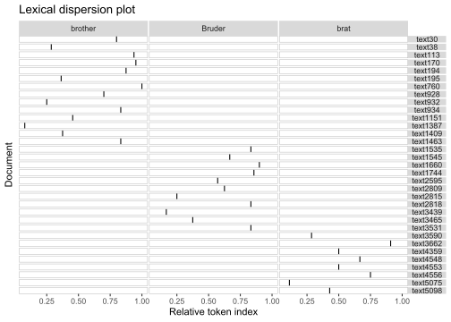
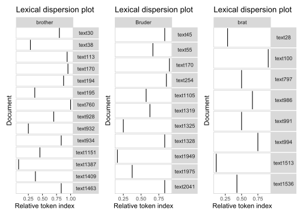
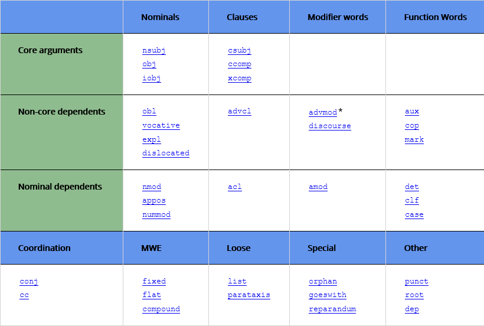
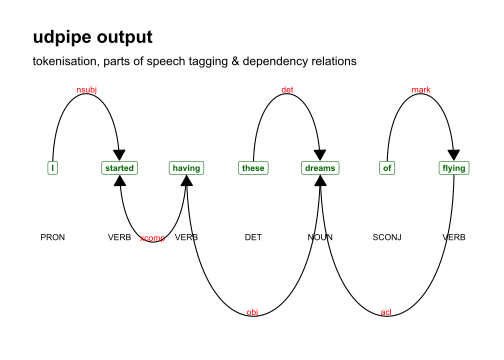
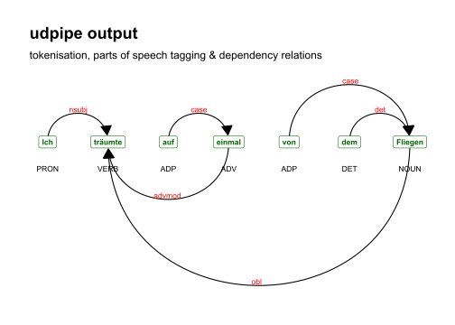
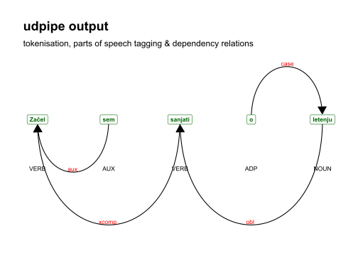
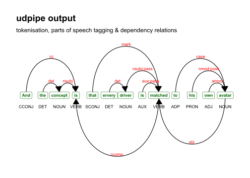
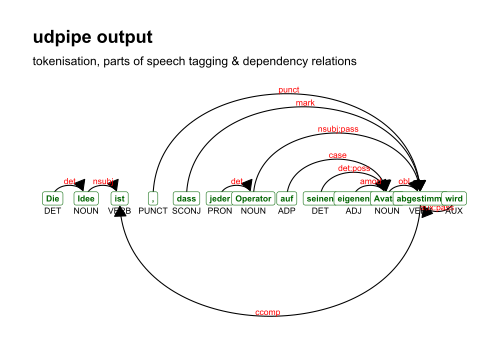
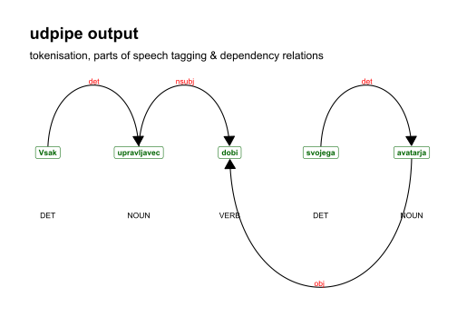

# Untertitel

## Programme starten


```r
library(tidyverse)
library(tidytext)
library(scales)
library(udpipe)
stringsAsFactors = FALSE
```

## Daten laden

Die englischen und deutschen Untertitel zum Film *Avatar* stammen aus
der Datensammlung von *Natalia Levshina* [@levshina2015linguistics], die
slowenischen Untertitel stammen von der Webseite *nachschauen*.

Zuerst laden wir die Untertitel zum Film *Avatar* in englischer,
deutscher und slowenischer Sprache.


```r
library(tidyverse)
avatar_eng = read_lines("data/sub/Avatar_eng.txt")
avatar_deu = read_lines("data/sub/Avatar_deu.txt")
avatar_slv = read_lines("data/sub/Avatar_slv.txt")
```


```r
head(avatar_eng); head(avatar_deu); head(avatar_slv)
```

```
## [1] "1"                                         
## [2] "00:00:39,799 --> 00:00:42,039"             
## [3] "When I was lying there in the VA hospital,"
## [4] ""                                          
## [5] "2"                                         
## [6] "00:00:42,176 --> 00:00:45,136"
```

```
## [1] "1"                                       
## [2] "00:00:39,798 --> 00:00:42,091"           
## [3] "Als ich da im Veteranen-Krankenhaus lag,"
## [4] ""                                        
## [5] "2"                                       
## [6] "00:00:42,176 --> 00:00:45,136"
```

```
## [1] ""                                           
## [2] "1"                                          
## [3] "00:00:38,160 --> 00:00:40,720"              
## [4] "<i>Ko sem ležal v veteranski bolnišnici</i>"
## [5] ""                                           
## [6] "2"
```

## Datensätze vorbereiten

### Textspalte vorbereiten

Untertitel haben ein besonderes Format. Recht einfach sind
Datenmodifizierungen mit den tidyverse-Funktionen. Die Voraussetzung für
ihre Verwendung ist die Umwandlung der Texte ins Tabellenformat. Dann
können wir z.B. auch neue Tabellenspalten mit den Zeitangaben bilden.


```r
a1 = avatar_eng %>% 
  as_tibble() %>% 
  mutate(row_tc = row_number()) %>% 
  filter(str_detect(value, "-->")) %>% 
  rename(timecode = value)
a2 = avatar_eng %>% 
  as_tibble() %>% 
  mutate(row_id = row_number()) %>% 
  filter(str_detect(value, "[a-zA-Z]")) %>% 
  rename(text = value) %>% 
  mutate(language = "eng")

avatar_eng = bind_cols(a1,a2) %>% 
  select(timecode, text) %>% 
  separate(timecode, into = c("start", "end"), sep = "\\-\\-\\>")
tail(avatar_eng)
```

```
## # A tibble: 6 x 3
##   start           end             text                                          
##   <chr>           <chr>           <chr>                                         
## 1 "02:49:47,566 " " 02:49:51,396" 'Cause whatever happens tonight, either way, ~
## 2 "02:49:52,406 " " 02:49:55,236" I'm not gonna be coming back to this place.   
## 3 "02:49:58,866 " " 02:50:00,996" Well, I guess I'd better go.                  
## 4 "02:50:03,576 " " 02:50:06,626" Yeah, I don't want to be late for my own part~
## 5 "02:50:09,956 " " 02:50:12,416" Yeah, it's my birthday, after all.            
## 6 "02:50:14,926 " " 02:50:17,256" This is Jake Sully signing off.
```

```r
a2a = a2 %>% 
  mutate(sentence_id = row_number())
```

Da die Anfangs- und Endzeit der Untertitel in den drei Sprachen nicht
übereinstimmt, wollen wir lediglich die Untertiteltexte beibehalten.


```r
b1 = avatar_deu %>% 
  as_tibble() %>% 
  mutate(row_tc = row_number()) %>% 
  filter(str_detect(value, "-->")) %>% 
  rename(timecode = value)
b2 = avatar_deu %>% 
  as_tibble() %>% 
  mutate(row_id = row_number()) %>% 
  filter(str_detect(value, "[a-zA-Z]")) %>% 
  rename(text = value) %>% 
  mutate(language = "deu")

# avatar_deu = bind_cols(a1,a2)
#   select(timecode, text) %>% 
#   separate(timecode, into = c("start", "end"), sep = "\\-\\-\\>")
# tail(avatar_deu)

b2a = b2 %>% 
  mutate(sentence_id = row_number())
```


```r
c1 = avatar_slv %>% 
  as_tibble() %>% 
  mutate(row_tc = row_number()) %>% 
  filter(str_detect(value, "-->")) %>% 
  rename(timecode = value)
c2 = avatar_slv %>% 
  as_tibble() %>% 
  mutate(row_id = row_number()) %>% 
  filter(str_detect(value, "[a-zA-Z]")) %>% 
  rename(text = value) %>% 
  mutate(text = str_replace(text, "\\<i\\>", "")) %>% 
  mutate(text = str_replace(text, "\\</i\\>", "")) %>% 
  mutate(language = "slv")

# avatar_slv = bind_cols(a1,a2)
#   select(timecode, text) %>% 
#   separate(timecode, into = c("start", "end"), sep = "\\-\\-\\>")
# tail(avatar_slv)

c2a = c2 %>% 
  mutate(sentence_id = row_number())
```

### Datensätze verknüpfen

Nun verknüpfen wir die drei Datensätze zu einem einzigen.


```r
avatar = bind_rows(a2a,b2a,c2a)
```

### Merkmale hinzufügen

Mit Hilfe von *quanteda*-Funktionen fügen wir dem Datensatz noch weitere
Kenngrößen hinzu, und zwar die Anzahl der Wortformerscheinungen oder
Tokens pro Äußerung (sentlen), die Anzahl der Silben pro Äußerung
(syllables), die Wortlänge (wordlen), die Anzahl der verschiedenen
Wortformen (Types) und das Type-Token-Verhältnis als bekanntes Maß für
lexikalische Diversität.


```r
avatar = avatar %>% 
  mutate(txt = str_replace_all(text, "[:punct:]", "")) %>% 
  mutate(sentlen = quanteda::ntoken(txt)) %>% 
  mutate(syllables = nsyllable::nsyllable(txt)) %>% 
  mutate(types = quanteda::ntype(txt)) %>% 
  mutate(wordlen = syllables/sentlen) %>% 
  mutate(ttr = types/sentlen) %>% 
  select(-txt)
```

Speichern für spätere Verwendung.


```r
write_rds(avatar, "data/avatar.rds")
write_csv(avatar, "data/avatar.csv")
```


```r
avatar = read_rds("data/avatar.rds")
```

### Konkordanzrecherche

Ein Beispiel einer Konkordanzrecherche mit Hilfe von *kwic* - dem
Konkordanz-Tool in *quanteda*:


```r
x = quanteda::corpus(avatar, text_field = "text") %>% 
  quanteda::tokens()
quanteda::kwic(x, pattern = "planet") %>% as_tibble()
```

```
## # A tibble: 2 x 7
##   docname   from    to pre                         keyword post  pattern
##   <chr>    <int> <int> <chr>                       <chr>   <chr> <fct>  
## 1 text18      11    11 , you're on the wrong       planet  .     planet 
## 2 text5157     8     8 se vrnili na svoj umirajoči planet  .     planet
```

### Textzerlegung

Zerlegung der Untertitellinien in Wörter:


```r
library(tidytext)

avatar_words = avatar %>% 
  unnest_tokens(word, text, drop = FALSE) %>% 
  select(-text)
head(avatar_words)  
```

```
## # A tibble: 6 x 9
##   row_id language sentence_id sentlen syllables types wordlen   ttr word 
##    <int> <chr>          <int>   <int>     <int> <int>   <dbl> <dbl> <chr>
## 1      3 eng                1       9        12     9    1.33     1 when 
## 2      3 eng                1       9        12     9    1.33     1 i    
## 3      3 eng                1       9        12     9    1.33     1 was  
## 4      3 eng                1       9        12     9    1.33     1 lying
## 5      3 eng                1       9        12     9    1.33     1 there
## 6      3 eng                1       9        12     9    1.33     1 in
```

### Zerlegung und Annotation

Zuerst müssen wir für jede Sprache ein **udpipe**-Sprachmodell laden, um
für jede der drei Untertitelversionen eine morphosyntaktische Annotation
vorzunehmen.


```r
library(udpipe)

file_model = "english-ewt-ud-2.5-191206.udpipe"
engmod <- udpipe_load_model(file_model)

x = udpipe_annotate(engmod, x = avatar$text[avatar$language == "eng"], trace = FALSE)
udeng = as.data.frame(x)
```


```r
# file_model = udpipe_download_model("german-hdt")
# file_model = "german-gsd-ud-2.5-191206.udpipe"
file_model = "german-hdt-ud-2.5-191206.udpipe"
deumod <- udpipe_load_model(file_model)

x = udpipe_annotate(deumod, x = avatar$text[avatar$language == "deu"], trace = F)
uddeu = as.data.frame(x)
```


```r
file_model = "slovenian-ssj-ud-2.5-191206.udpipe"
slvmod <- udpipe_load_model(file_model)

x = udpipe_annotate(slvmod, x = avatar$text[avatar$language == "slv"], trace = F)
udslv = as.data.frame(x)
```

Die Datensätze wollen wir für anderweitige Verwendungen speichern, und
zwar sowohl im *conllu*-Format als auch im *csv*-Format. In beiden
Fällen erhalten wir Textdateien.


```r
write.table(as_conllu(udeng), file = "data/Avatar_ud_eng.conllu", 
            sep = "\t", quote = F, row.names = F)
write.table(as_conllu(uddeu), file = "data/Avatar_ud_deu.conllu", 
            sep = "\t", quote = F, row.names = F)
write.table(as_conllu(udslv), file = "data/Avatar_ud_slv.conllu", 
            sep = "\t", quote = F, row.names = F)
```


```r
write_csv(udeng, "data/Avatar_ud_eng.csv")
write_csv(uddeu, "data/Avatar_ud_deu.csv")
write_csv(udslv, "data/Avatar_ud_slv.csv")
```


```r
udeng = read_csv("data/Avatar_ud_eng.csv")
uddeu = read_csv("data/Avatar_ud_deu.csv")
udslv = read_csv("data/Avatar_ud_slv.csv")
```

Den drei annotierten Datensätzen wollen wir noch einige weitere Merkmale
hinzufügen (und zwar mit den *mutate()*-Befehlen, in denen auch einfache
*quanteda*-Funktionen verwendet werden). Außerdem soll die komplexe
Tabellenspalte *feats* (features) in einzelne Spalten aufgeteilt werden
(und zwar mit der *cbind_morphological()*-Funktion von *udpipe*).

Da wir dies mit allen drei Datensätzen anstellen wollen, bilden wir eine
Funktion dazu, die als Input eine Tabelle (tbl) verlangt, in denen die
Spalten "word, token, feats, sentence" zur Verfügung stehen:


```r
tokenize_annotate = function(tbl){
  tbl %>% 
  unnest_tokens(word, token, drop = F) %>% 
  cbind_morphological(term = "feats",  
                      which = c("PronType","NumType","Poss","Reflex",
                                "Foreign","Abbr","Typo",
                                "Gender","Animacy","NounClass",
                                "Case","Number","Definite","Degree",
                                "VerbForm","Person","Tense","Mood",
                                "Aspect","Voice","Evident",
                                "Polarity","Polite","Clusivity")) %>% 
  mutate(txt = str_replace_all(sentence, "[:punct:]", "")) %>% 
  mutate(sentlen = quanteda::ntoken(txt)) %>% 
  mutate(syllables = nsyllable::nsyllable(txt)) %>% 
  mutate(types = quanteda::ntype(txt)) %>% 
  mutate(wordlen = syllables/sentlen) %>% 
  mutate(ttr = types/sentlen) %>% 
  select(-txt, -feats)
}
```

Die für die Verwendung der Funktion entsprechenden Tabellen sind die
zuvor gebildeten Tabellen "udeng", "uddeu" und "udslv". Nach der
Anreicherung der Datensätze verknüpfen wir sie zu einem einzigen.


```r
avatar_eng_udpiped <- udeng %>% 
  tokenize_annotate() %>% mutate(language = "eng")
avatar_deu_udpiped <- uddeu %>% 
  tokenize_annotate() %>% mutate(language = "deu")
avatar_slv_udpiped <- udslv %>% 
  tokenize_annotate() %>% mutate(language = "slv")
avatar_words_udpiped = bind_rows(avatar_eng_udpiped,
                                 avatar_deu_udpiped,
                                 avatar_slv_udpiped)
avatar_words_udpiped
```

```
##      doc_id paragraph_id sentence_id
## 1      doc1            1           1
## 2      doc1            1           1
## 3      doc1            1           1
## 4      doc1            1           1
## 5      doc1            1           1
## 6      doc1            1           1
## 7      doc1            1           1
## 8      doc1            1           1
## 9      doc1            1           1
## 10     doc2            1           1
## 11     doc2            1           1
## 12     doc2            1           1
## 13     doc2            1           1
## 14     doc2            1           1
## 15     doc2            1           1
## 16     doc2            1           1
## 17     doc2            1           1
## 18     doc2            1           1
## 19     doc2            1           1
## 20     doc2            1           1
## 21     doc3            1           1
## 22     doc3            1           1
## 23     doc3            1           1
## 24     doc3            1           1
## 25     doc3            1           1
## 26     doc3            1           1
## 27     doc3            1           1
## 28     doc4            1           1
## 29     doc4            1           1
## 30     doc4            1           1
## 31     doc5            1           1
## 32     doc5            1           1
## 33     doc5            1           1
## 34     doc5            1           1
## 35     doc5            1           1
## 36     doc5            1           1
## 37     doc5            1           1
## 38     doc5            1           1
## 39     doc5            1           1
## 40     doc5            1           1
## 41     doc6            1           1
## 42     doc6            1           1
## 43     doc6            1           1
## 44     doc6            1           1
## 45     doc6            1           1
## 46     doc6            1           1
## 47     doc6            1           1
## 48     doc6            1           1
## 49     doc6            1           1
## 50     doc6            1           1
## 51     doc7            1           1
## 52     doc7            1           1
## 53     doc7            1           1
## 54     doc7            1           1
## 55     doc7            1           1
## 56     doc7            1           1
## 57     doc7            1           1
## 58     doc7            1           1
## 59     doc7            1           1
## 60     doc8            1           1
## 61     doc8            1           1
## 62     doc8            1           1
## 63     doc8            1           1
## 64     doc8            1           1
## 65     doc8            1           1
## 66     doc8            1           1
## 67     doc8            1           1
## 68     doc8            1           1
## 69     doc8            1           1
## 70     doc8            1           1
## 71     doc8            1           1
## 72     doc8            1           1
## 73     doc9            1           1
## 74     doc9            1           1
## 75     doc9            1           1
## 76     doc9            1           1
## 77     doc9            1           1
## 78     doc9            1           1
## 79    doc10            1           1
## 80    doc10            1           1
## 81    doc10            1           1
## 82    doc10            1           1
## 83    doc10            1           1
## 84    doc10            1           1
## 85    doc10            1           1
## 86    doc10            1           1
## 87    doc10            1           1
## 88    doc10            1           1
## 89    doc10            1           1
## 90    doc10            1           1
## 91    doc11            1           1
## 92    doc11            1           1
## 93    doc11            1           1
## 94    doc11            1           1
## 95    doc11            1           1
## 96    doc11            1           1
## 97    doc11            1           1
## 98    doc11            1           1
## 99    doc11            1           1
## 100   doc11            1           1
## 101   doc11            1           1
## 102   doc11            1           1
## 103   doc11            1           1
## 104   doc11            1           1
## 105   doc11            1           1
## 106   doc11            1           1
## 107   doc12            1           1
## 108   doc12            1           1
## 109   doc12            1           1
## 110   doc12            1           1
## 111   doc12            1           1
## 112   doc12            1           1
## 113   doc12            1           1
## 114   doc12            1           1
## 115   doc12            1           1
## 116   doc12            1           1
## 117   doc12            1           1
## 118   doc12            1           1
## 119   doc13            1           1
## 120   doc13            1           1
## 121   doc13            1           1
## 122   doc13            1           1
## 123   doc13            1           1
## 124   doc13            1           1
## 125   doc13            1           1
## 126   doc13            1           2
## 127   doc13            1           2
## 128   doc13            1           2
## 129   doc13            1           2
## 130   doc13            1           2
## 131   doc13            1           2
## 132   doc13            1           2
## 133   doc13            1           2
## 134   doc14            1           1
## 135   doc14            1           1
## 136   doc14            1           1
## 137   doc14            1           1
## 138   doc14            1           1
## 139   doc14            1           1
## 140   doc14            1           1
## 141   doc14            1           1
## 142   doc14            1           1
## 143   doc14            1           1
## 144   doc14            1           1
## 145   doc14            1           1
## 146   doc15            1           1
## 147   doc15            1           2
## 148   doc15            1           3
## 149   doc15            1           4
## 150   doc15            1           5
## 151   doc16            1           1
## 152   doc16            1           1
## 153   doc16            1           1
## 154   doc16            1           1
## 155   doc16            1           1
## 156   doc16            1           1
## 157   doc17            1           1
## 158   doc17            1           1
## 159   doc17            1           1
## 160   doc17            1           1
## 161   doc17            1           1
## 162   doc17            1           1
## 163   doc18            1           1
## 164   doc18            1           1
## 165   doc18            1           1
## 166   doc18            1           1
## 167   doc18            1           1
## 168   doc18            1           1
## 169   doc18            1           1
## 170   doc18            1           1
## 171   doc18            1           1
## 172   doc18            1           1
## 173   doc18            1           1
## 174   doc19            1           1
## 175   doc19            1           1
## 176   doc19            1           1
## 177   doc19            1           1
## 178   doc19            1           1
## 179   doc19            1           1
## 180   doc20            1           1
## 181   doc20            1           1
## 182   doc20            1           1
## 183   doc20            1           1
## 184   doc20            1           1
## 185   doc20            1           1
## 186   doc20            1           1
## 187   doc21            1           1
## 188   doc21            1           1
## 189   doc21            1           1
## 190   doc21            1           1
## 191   doc21            1           1
## 192   doc21            1           1
## 193   doc22            1           1
## 194   doc22            1           1
## 195   doc22            1           2
## 196   doc22            1           2
## 197   doc22            1           2
## 198   doc22            1           2
## 199   doc23            1           1
## 200   doc23            1           1
## 201   doc23            1           1
## 202   doc23            1           1
## 203   doc23            1           1
## 204   doc23            1           1
## 205   doc23            1           1
## 206   doc23            1           1
## 207   doc23            1           1
## 208   doc23            1           1
## 209   doc23            1           1
## 210   doc23            1           1
## 211   doc23            1           1
## 212   doc23            1           1
## 213   doc23            1           1
## 214   doc23            1           1
## 215   doc24            1           1
## 216   doc24            1           1
## 217   doc24            1           1
## 218   doc24            1           1
## 219   doc24            1           1
## 220   doc24            1           1
## 221   doc24            1           1
## 222   doc24            1           1
## 223   doc24            1           1
## 224   doc24            1           1
## 225   doc25            1           1
## 226   doc25            1           1
## 227   doc25            1           1
## 228   doc26            1           1
## 229   doc26            1           1
## 230   doc26            1           1
## 231   doc26            1           1
## 232   doc26            1           1
## 233   doc26            1           1
## 234   doc26            1           1
## 235   doc26            1           1
## 236   doc26            1           1
## 237   doc27            1           2
## 238   doc27            1           2
## 239   doc27            1           2
## 240   doc27            1           2
## 241   doc27            1           2
## 242   doc27            1           2
## 243   doc27            1           3
## 244   doc27            1           3
## 245   doc27            1           3
## 246   doc28            1           1
## 247   doc28            1           1
## 248   doc28            1           1
## 249   doc29            1           1
## 250   doc29            1           1
## 251   doc29            1           2
## 252   doc29            1           2
## 253   doc29            1           2
## 254   doc29            1           2
## 255   doc29            1           2
## 256   doc29            1           2
## 257   doc30            1           1
## 258   doc30            1           1
## 259   doc30            1           1
## 260   doc30            1           1
## 261   doc30            1           1
## 262   doc31            1           1
## 263   doc31            1           1
## 264   doc31            1           1
## 265   doc31            1           1
## 266   doc31            1           1
## 267   doc31            1           1
## 268   doc32            1           1
## 269   doc32            1           1
## 270   doc33            1           1
## 271   doc33            1           1
## 272   doc34            1           1
## 273   doc34            1           1
## 274   doc34            1           1
## 275   doc34            1           1
## 276   doc34            1           1
## 277   doc34            1           1
## 278   doc35            1           1
## 279   doc35            1           1
## 280   doc35            1           1
## 281   doc35            1           1
## 282   doc35            1           1
## 283   doc35            1           1
## 284   doc35            1           1
## 285   doc35            1           1
## 286   doc35            1           1
## 287   doc35            1           1
## 288   doc35            1           1
## 289   doc36            1           1
## 290   doc36            1           1
## 291   doc36            1           1
## 292   doc36            1           1
## 293   doc36            1           1
## 294   doc36            1           1
## 295   doc37            1           1
## 296   doc37            1           1
## 297   doc37            1           1
## 298   doc37            1           1
## 299   doc37            1           1
## 300   doc37            1           1
## 301   doc37            1           1
## 302   doc38            1           1
## 303   doc38            1           1
## 304   doc38            1           1
## 305   doc38            1           1
## 306   doc38            1           1
## 307   doc38            1           1
## 308   doc39            1           1
## 309   doc39            1           1
## 310   doc39            1           1
## 311   doc39            1           1
## 312   doc39            1           1
## 313   doc39            1           1
## 314   doc39            1           1
## 315   doc39            1           1
## 316   doc39            1           1
## 317   doc39            1           1
## 318   doc39            1           1
## 319   doc39            1           1
## 320   doc40            1           1
## 321   doc40            1           1
## 322   doc40            1           1
## 323   doc40            1           1
## 324   doc40            1           1
## 325   doc40            1           1
## 326   doc40            1           1
## 327   doc40            1           1
## 328   doc40            1           1
## 329   doc40            1           1
## 330   doc40            1           1
## 331   doc40            1           1
## 332   doc40            1           1
## 333   doc40            1           1
## 334   doc41            1           1
## 335   doc41            1           1
## 336   doc41            1           1
## 337   doc42            1           1
## 338   doc42            1           1
## 339   doc42            1           1
## 340   doc42            1           1
## 341   doc42            1           1
## 342   doc42            1           1
## 343   doc42            1           1
## 344   doc42            1           1
## 345   doc42            1           1
## 346   doc42            1           1
## 347   doc43            1           1
## 348   doc43            1           1
## 349   doc43            1           1
## 350   doc43            1           1
## 351   doc43            1           1
## 352   doc43            1           2
## 353   doc43            1           2
## 354   doc43            1           2
## 355   doc43            1           2
## 356   doc43            1           2
## 357   doc44            1           1
## 358   doc44            1           1
## 359   doc44            1           1
## 360   doc44            1           1
## 361   doc44            1           1
## 362   doc45            1           1
## 363   doc45            1           1
## 364   doc46            1           1
## 365   doc46            1           1
## 366   doc46            1           1
## 367   doc46            1           1
## 368   doc46            1           1
## 369   doc46            1           1
## 370   doc47            1           1
## 371   doc47            1           1
## 372   doc47            1           1
## 373   doc47            1           1
## 374   doc47            1           1
## 375   doc47            1           1
## 376   doc47            1           1
## 377   doc47            1           1
## 378   doc47            1           1
## 379   doc47            1           1
## 380   doc47            1           1
## 381   doc47            1           1
## 382   doc47            1           1
## 383   doc47            1           1
## 384   doc48            1           1
## 385   doc48            1           1
## 386   doc48            1           1
## 387   doc48            1           1
## 388   doc49            1           1
## 389   doc49            1           1
## 390   doc49            1           1
## 391   doc49            1           1
## 392   doc49            1           1
## 393   doc49            1           1
## 394   doc49            1           1
## 395   doc49            1           1
## 396   doc49            1           1
## 397   doc49            1           1
## 398   doc49            1           1
## 399   doc49            1           1
## 400   doc49            1           1
## 401   doc49            1           1
## 402   doc49            1           1
## 403   doc50            1           1
## 404   doc50            1           1
## 405   doc50            1           1
## 406   doc50            1           1
## 407   doc50            1           1
## 408   doc50            1           1
## 409   doc50            1           1
## 410   doc50            1           1
## 411   doc51            1           1
## 412   doc51            1           1
## 413   doc51            1           1
## 414   doc51            1           1
## 415   doc51            1           1
## 416   doc51            1           1
## 417   doc51            1           1
## 418   doc52            1           1
## 419   doc52            1           1
## 420   doc52            1           1
## 421   doc52            1           1
## 422   doc52            1           1
## 423   doc52            1           1
## 424   doc52            1           1
## 425   doc52            1           1
## 426   doc52            1           1
## 427   doc52            1           1
## 428   doc53            1           1
## 429   doc53            1           1
## 430   doc53            1           1
## 431   doc53            1           1
## 432   doc54            1           1
## 433   doc54            1           1
## 434   doc54            1           1
## 435   doc54            1           1
## 436   doc54            1           1
## 437   doc55            1           1
## 438   doc55            1           1
## 439   doc55            1           1
## 440   doc56            1           1
## 441   doc56            1           1
## 442   doc56            1           1
## 443   doc56            1           1
## 444   doc56            1           1
## 445   doc56            1           1
## 446   doc56            1           1
## 447   doc56            1           1
## 448   doc56            1           1
## 449   doc56            1           1
## 450   doc56            1           1
## 451   doc56            1           1
## 452   doc56            1           1
## 453   doc57            1           1
## 454   doc57            1           1
## 455   doc57            1           1
## 456   doc57            1           1
## 457   doc57            1           2
## 458   doc57            1           2
## 459   doc57            1           2
## 460   doc57            1           2
## 461   doc58            1           1
## 462   doc58            1           1
## 463   doc58            1           1
## 464   doc58            1           1
## 465   doc58            1           1
## 466   doc58            1           1
## 467   doc58            1           1
## 468   doc58            1           1
## 469   doc58            1           1
## 470   doc58            1           1
## 471   doc58            1           1
## 472   doc58            1           1
## 473   doc59            1           1
## 474   doc59            1           1
## 475   doc59            1           1
## 476   doc59            1           1
## 477   doc59            1           1
## 478   doc59            1           1
## 479   doc60            1           1
## 480   doc60            1           1
## 481   doc60            1           1
## 482   doc60            1           1
## 483   doc61            1           1
## 484   doc61            1           1
## 485   doc61            1           1
## 486   doc61            1           1
## 487   doc61            1           1
## 488   doc61            1           1
## 489   doc61            1           1
## 490   doc61            1           1
## 491   doc61            1           1
## 492   doc61            1           1
## 493   doc61            1           1
## 494   doc61            1           1
## 495   doc61            1           1
## 496   doc61            1           1
## 497   doc61            1           1
## 498   doc62            1           1
## 499   doc62            1           1
## 500   doc62            1           1
## 501   doc62            1           1
## 502   doc63            1           1
## 503   doc63            1           1
## 504   doc63            1           1
## 505   doc63            1           1
## 506   doc63            1           1
## 507   doc63            1           1
## 508   doc63            1           1
## 509   doc63            1           1
## 510   doc63            1           1
## 511   doc63            1           1
## 512   doc63            1           1
## 513   doc63            1           1
## 514   doc63            1           1
## 515   doc63            1           1
## 516   doc63            1           1
## 517   doc64            1           1
## 518   doc64            1           1
## 519   doc64            1           1
## 520   doc64            1           2
## 521   doc64            1           2
## 522   doc64            1           2
## 523   doc64            1           2
## 524   doc64            1           2
## 525   doc64            1           2
## 526   doc64            1           2
## 527   doc64            1           2
## 528   doc64            1           2
## 529   doc64            1           2
## 530   doc65            1           2
## 531   doc65            1           2
## 532   doc65            1           2
## 533   doc65            1           3
## 534   doc65            1           3
## 535   doc65            1           3
## 536   doc65            1           4
## 537   doc65            1           4
## 538   doc65            1           4
## 539   doc65            1           5
## 540   doc65            1           5
## 541   doc65            1           5
## 542   doc65            1           6
## 543   doc65            1           6
## 544   doc65            1           6
## 545   doc66            1           1
## 546   doc66            1           1
## 547   doc66            1           1
## 548   doc66            1           1
## 549   doc66            1           1
## 550   doc66            1           1
## 551   doc67            1           1
## 552   doc67            1           1
## 553   doc67            1           1
## 554   doc67            1           1
## 555   doc67            1           1
## 556   doc67            1           1
## 557   doc67            1           1
## 558   doc67            1           1
## 559   doc67            1           1
## 560   doc67            1           1
## 561   doc67            1           1
## 562   doc67            1           1
## 563   doc68            1           1
## 564   doc68            1           1
## 565   doc68            1           1
## 566   doc68            1           1
## 567   doc68            1           1
## 568   doc68            1           1
## 569   doc68            1           2
## 570   doc68            1           2
## 571   doc68            1           2
## 572   doc68            1           2
## 573   doc68            1           2
## 574   doc68            1           2
## 575   doc69            1           1
## 576   doc69            1           1
## 577   doc69            1           1
## 578   doc69            1           1
## 579   doc69            1           1
## 580   doc69            1           1
## 581   doc69            1           1
## 582   doc69            1           1
## 583   doc69            1           1
## 584   doc69            1           1
## 585   doc69            1           1
## 586   doc70            1           1
## 587   doc70            1           1
## 588   doc70            1           1
## 589   doc70            1           2
## 590   doc70            1           2
## 591   doc70            1           2
## 592   doc70            1           2
## 593   doc71            1           1
## 594   doc71            1           1
## 595   doc71            1           2
## 596   doc71            1           2
## 597   doc71            1           2
## 598   doc72            1           2
## 599   doc72            1           2
## 600   doc72            1           2
## 601   doc72            1           2
## 602   doc72            1           2
## 603   doc72            1           2
## 604   doc72            1           3
## 605   doc72            1           3
## 606   doc72            1           3
## 607   doc72            1           4
## 608   doc72            1           4
## 609   doc72            1           5
## 610   doc72            1           5
## 611   doc73            1           1
## 612   doc73            1           1
## 613   doc73            1           1
## 614   doc73            1           1
## 615   doc73            1           1
## 616   doc73            1           1
## 617   doc73            1           1
## 618   doc73            1           1
## 619   doc73            1           1
## 620   doc73            1           1
## 621   doc73            1           2
## 622   doc73            1           2
## 623   doc73            1           2
## 624   doc74            1           1
## 625   doc74            1           1
## 626   doc74            1           1
## 627   doc74            1           2
## 628   doc74            1           2
## 629   doc74            1           2
## 630   doc74            1           2
## 631   doc75            1           1
## 632   doc75            1           1
## 633   doc75            1           1
## 634   doc75            1           1
## 635   doc75            1           2
## 636   doc75            1           2
## 637   doc75            1           2
## 638   doc75            1           2
## 639   doc75            1           3
## 640   doc75            1           3
## 641   doc75            1           4
## 642   doc75            1           4
## 643   doc75            1           4
## 644   doc75            1           4
## 645   doc75            1           4
## 646   doc75            1           4
## 647   doc76            1           1
## 648   doc76            1           1
## 649   doc76            1           1
## 650   doc76            1           1
## 651   doc76            1           1
## 652   doc76            1           1
## 653   doc76            1           1
## 654   doc76            1           1
## 655   doc76            1           1
## 656   doc77            1           1
## 657   doc77            1           1
## 658   doc77            1           1
## 659   doc77            1           1
## 660   doc77            1           1
## 661   doc77            1           1
## 662   doc77            1           1
## 663   doc77            1           1
## 664   doc77            1           1
## 665   doc77            1           1
## 666   doc78            1           1
## 667   doc78            1           1
## 668   doc78            1           1
## 669   doc78            1           1
## 670   doc78            1           1
## 671   doc78            1           2
## 672   doc78            1           2
## 673   doc78            1           2
## 674   doc78            1           2
## 675   doc78            1           2
## 676   doc78            1           2
## 677   doc78            1           2
## 678   doc79            1           1
## 679   doc79            1           1
## 680   doc79            1           1
## 681   doc80            1           1
## 682   doc80            1           1
## 683   doc80            1           1
## 684   doc80            1           1
## 685   doc80            1           1
## 686   doc80            1           1
## 687   doc81            1           1
## 688   doc81            1           1
## 689   doc81            1           1
## 690   doc81            1           1
## 691   doc81            1           1
## 692   doc81            1           1
## 693   doc81            1           1
## 694   doc81            1           1
## 695   doc81            1           1
## 696   doc82            1           1
## 697   doc82            1           1
## 698   doc82            1           1
## 699   doc83            1           1
## 700   doc83            1           1
## 701   doc83            1           1
## 702   doc83            1           1
## 703   doc84            1           1
## 704   doc84            1           1
## 705   doc84            1           1
## 706   doc84            1           1
## 707   doc84            1           1
## 708   doc84            1           1
## 709   doc84            1           1
## 710   doc84            1           1
## 711   doc85            1           1
## 712   doc85            1           1
## 713   doc85            1           1
## 714   doc85            1           1
## 715   doc85            1           1
## 716   doc85            1           1
## 717   doc85            1           1
## 718   doc86            1           1
## 719   doc86            1           1
## 720   doc86            1           1
## 721   doc86            1           1
## 722   doc87            1           1
## 723   doc87            1           1
## 724   doc87            1           1
## 725   doc88            1           1
## 726   doc88            1           1
## 727   doc88            1           1
## 728   doc88            1           1
## 729   doc88            1           1
## 730   doc88            1           1
## 731   doc89            1           1
## 732   doc89            1           1
## 733   doc89            1           1
## 734   doc89            1           1
## 735   doc89            1           1
## 736   doc89            1           1
## 737   doc89            1           1
## 738   doc89            1           1
## 739   doc89            1           1
## 740   doc90            1           1
## 741   doc90            1           1
## 742   doc90            1           2
## 743   doc90            1           2
## 744   doc91            1           1
## 745   doc91            1           1
## 746   doc91            1           1
## 747   doc91            1           1
## 748   doc91            1           1
## 749   doc91            1           1
## 750   doc92            1           1
## 751   doc92            1           1
## 752   doc92            1           1
## 753   doc92            1           1
## 754   doc92            1           1
## 755   doc92            1           1
## 756   doc92            1           1
## 757   doc93            1           1
## 758   doc93            1           1
## 759   doc93            1           1
## 760   doc93            1           1
## 761   doc93            1           1
## 762   doc93            1           1
## 763   doc93            1           1
## 764   doc93            1           1
## 765   doc94            1           1
## 766   doc94            1           1
## 767   doc94            1           1
## 768   doc94            1           1
## 769   doc94            1           1
## 770   doc95            1           1
## 771   doc95            1           1
## 772   doc95            1           1
## 773   doc95            1           1
## 774   doc95            1           1
## 775   doc95            1           1
## 776   doc95            1           1
## 777   doc95            1           1
## 778   doc95            1           1
## 779   doc95            1           1
## 780   doc95            1           1
## 781   doc95            1           1
## 782   doc95            1           1
## 783   doc95            1           1
## 784   doc95            1           1
## 785   doc96            1           1
## 786   doc96            1           1
## 787   doc96            1           1
## 788   doc96            1           1
## 789   doc96            1           1
## 790   doc97            1           1
## 791   doc97            1           1
## 792   doc97            1           1
## 793   doc97            1           1
## 794   doc97            1           1
## 795   doc97            1           1
## 796   doc97            1           1
## 797   doc97            1           1
## 798   doc97            1           1
## 799   doc97            1           1
## 800   doc97            1           1
## 801   doc98            1           1
## 802   doc98            1           1
## 803   doc98            1           1
## 804   doc98            1           1
## 805   doc98            1           1
## 806   doc98            1           1
## 807   doc98            1           1
## 808   doc98            1           1
## 809   doc98            1           1
## 810   doc98            1           1
## 811   doc99            1           1
## 812   doc99            1           1
## 813   doc99            1           1
## 814   doc99            1           1
## 815   doc99            1           1
## 816   doc99            1           1
## 817   doc99            1           1
## 818   doc99            1           1
## 819   doc99            1           1
## 820   doc99            1           1
## 821   doc99            1           1
## 822  doc100            1           1
## 823  doc100            1           1
## 824  doc100            1           1
## 825  doc100            1           1
## 826  doc100            1           1
## 827  doc100            1           1
## 828  doc100            1           1
## 829  doc100            1           1
## 830  doc100            1           1
## 831  doc101            1           1
## 832  doc101            1           1
## 833  doc101            1           1
## 834  doc101            1           1
## 835  doc101            1           1
## 836  doc101            1           1
## 837  doc101            1           1
## 838  doc101            1           1
## 839  doc102            1           1
## 840  doc102            1           1
## 841  doc102            1           1
## 842  doc102            1           1
## 843  doc102            1           1
## 844  doc102            1           1
## 845  doc102            1           1
## 846  doc102            1           1
## 847  doc102            1           1
## 848  doc102            1           1
## 849  doc103            1           1
## 850  doc103            1           1
## 851  doc103            1           1
## 852  doc103            1           1
## 853  doc103            1           1
## 854  doc103            1           1
## 855  doc104            1           1
## 856  doc104            1           1
## 857  doc104            1           1
## 858  doc104            1           1
## 859  doc104            1           1
## 860  doc104            1           1
## 861  doc104            1           1
## 862  doc104            1           1
## 863  doc104            1           1
## 864  doc104            1           1
## 865  doc104            1           1
## 866  doc104            1           1
## 867  doc105            1           1
## 868  doc105            1           1
## 869  doc105            1           1
## 870  doc105            1           1
## 871  doc106            1           1
## 872  doc106            1           1
## 873  doc106            1           1
## 874  doc106            1           1
## 875  doc106            1           1
## 876  doc107            1           1
## 877  doc107            1           1
## 878  doc107            1           1
## 879  doc107            1           1
## 880  doc107            1           1
## 881  doc108            1           1
## 882  doc108            1           1
## 883  doc108            1           1
## 884  doc108            1           1
## 885  doc108            1           1
## 886  doc108            1           1
## 887  doc108            1           1
## 888  doc108            1           1
## 889  doc109            1           1
## 890  doc109            1           1
## 891  doc109            1           1
## 892  doc109            1           1
## 893  doc109            1           1
## 894  doc109            1           1
## 895  doc109            1           1
## 896  doc110            1           1
## 897  doc110            1           1
## 898  doc111            1           1
## 899  doc111            1           1
## 900  doc111            1           1
## 901  doc112            1           1
## 902  doc112            1           1
## 903  doc112            1           1
## 904  doc112            1           1
## 905  doc112            1           1
## 906  doc112            1           1
## 907  doc112            1           1
## 908  doc112            1           1
## 909  doc112            1           1
## 910  doc112            1           1
## 911  doc112            1           1
## 912  doc112            1           1
## 913  doc112            1           1
## 914  doc112            1           1
## 915  doc112            1           1
## 916  doc113            1           1
## 917  doc113            1           1
## 918  doc113            1           2
## 919  doc113            1           2
## 920  doc113            1           3
## 921  doc113            1           4
## 922  doc113            1           4
## 923  doc113            1           4
## 924  doc113            1           4
## 925  doc113            1           5
## 926  doc113            1           5
## 927  doc113            1           5
## 928  doc114            1           1
## 929  doc114            1           2
## 930  doc114            1           2
## 931  doc114            1           2
## 932  doc114            1           2
## 933  doc114            1           2
## 934  doc115            1           1
## 935  doc115            1           1
## 936  doc115            1           1
## 937  doc115            1           1
## 938  doc115            1           2
## 939  doc115            1           3
## 940  doc115            1           3
## 941  doc115            1           3
## 942  doc115            1           3
## 943  doc115            1           3
## 944  doc115            1           3
## 945  doc115            1           3
## 946  doc116            1           1
## 947  doc116            1           1
## 948  doc116            1           1
## 949  doc116            1           1
## 950  doc117            1           1
## 951  doc117            1           1
## 952  doc117            1           1
## 953  doc117            1           1
## 954  doc117            1           1
## 955  doc117            1           1
## 956  doc117            1           1
## 957  doc117            1           1
## 958  doc117            1           1
## 959  doc117            1           1
## 960  doc117            1           1
## 961  doc117            1           2
## 962  doc117            1           3
## 963  doc117            1           3
## 964  doc117            1           3
## 965  doc117            1           4
## 966  doc117            1           4
## 967  doc117            1           4
## 968  doc118            1           1
## 969  doc118            1           1
## 970  doc119            1           1
## 971  doc119            1           2
## 972  doc119            1           2
## 973  doc119            1           2
## 974  doc119            1           2
## 975  doc119            1           2
## 976  doc119            1           2
## 977  doc119            1           2
## 978  doc120            1           1
## 979  doc120            1           1
## 980  doc120            1           1
## 981  doc120            1           1
## 982  doc120            1           1
## 983  doc120            1           1
## 984  doc120            1           1
## 985  doc120            1           1
## 986  doc120            1           1
## 987  doc121            1           1
## 988  doc121            1           1
## 989  doc121            1           1
## 990  doc121            1           1
## 991  doc121            1           1
## 992  doc121            1           1
## 993  doc121            1           1
## 994  doc122            1           1
## 995  doc122            1           1
## 996  doc122            1           1
## 997  doc122            1           1
## 998  doc122            1           1
## 999  doc122            1           1
## 1000 doc123            1           1
## 1001 doc123            1           1
## 1002 doc123            1           1
## 1003 doc123            1           1
## 1004 doc123            1           1
## 1005 doc123            1           1
## 1006 doc123            1           1
## 1007 doc123            1           1
## 1008 doc123            1           1
## 1009 doc123            1           1
## 1010 doc123            1           1
## 1011 doc123            1           1
## 1012 doc123            1           1
## 1013 doc123            1           1
## 1014 doc124            1           1
## 1015 doc124            1           2
## 1016 doc124            1           2
## 1017 doc125            1           1
## 1018 doc125            1           1
## 1019 doc125            1           1
## 1020 doc125            1           2
## 1021 doc125            1           2
## 1022 doc125            1           2
## 1023 doc125            1           2
## 1024 doc125            1           3
## 1025 doc126            1           1
## 1026 doc126            1           2
## 1027 doc126            1           2
## 1028 doc126            1           2
## 1029 doc127            1           1
## 1030 doc127            1           1
## 1031 doc127            1           1
## 1032 doc127            1           1
## 1033 doc127            1           1
## 1034 doc127            1           1
## 1035 doc127            1           1
## 1036 doc127            1           1
## 1037 doc128            1           1
## 1038 doc128            1           1
## 1039 doc128            1           1
## 1040 doc128            1           1
## 1041 doc128            1           1
## 1042 doc128            1           1
## 1043 doc128            1           1
## 1044 doc128            1           1
## 1045 doc128            1           1
## 1046 doc129            1           1
## 1047 doc129            1           1
## 1048 doc129            1           1
## 1049 doc129            1           1
## 1050 doc129            1           1
## 1051 doc129            1           1
## 1052 doc129            1           1
## 1053 doc130            1           1
## 1054 doc130            1           1
## 1055 doc130            1           1
## 1056 doc130            1           1
## 1057 doc130            1           1
## 1058 doc130            1           1
## 1059 doc130            1           1
## 1060 doc130            1           1
## 1061 doc130            1           1
## 1062 doc130            1           1
## 1063 doc130            1           1
## 1064 doc131            1           1
## 1065 doc131            1           1
## 1066 doc131            1           1
## 1067 doc131            1           1
## 1068 doc131            1           1
## 1069 doc131            1           1
## 1070 doc131            1           1
## 1071 doc131            1           1
## 1072 doc132            1           1
## 1073 doc132            1           1
## 1074 doc132            1           1
## 1075 doc133            1           1
## 1076 doc133            1           2
## 1077 doc133            1           2
## 1078 doc133            1           2
## 1079 doc134            1           1
## 1080 doc134            1           1
## 1081 doc134            1           1
## 1082 doc134            1           2
## 1083 doc134            1           2
## 1084 doc134            1           2
## 1085 doc134            1           2
## 1086 doc134            1           2
## 1087 doc134            1           2
## 1088 doc134            1           2
## 1089 doc134            1           2
## 1090 doc134            1           2
## 1091 doc135            1           1
## 1092 doc135            1           1
## 1093 doc135            1           1
## 1094 doc136            1           1
## 1095 doc136            1           1
## 1096 doc136            1           1
## 1097 doc136            1           1
## 1098 doc136            1           1
## 1099 doc137            1           1
## 1100 doc137            1           1
## 1101 doc137            1           1
## 1102 doc137            1           1
## 1103 doc137            1           1
## 1104 doc137            1           1
## 1105 doc138            1           1
## 1106 doc138            1           1
## 1107 doc138            1           1
## 1108 doc138            1           1
## 1109 doc138            1           1
## 1110 doc138            1           1
## 1111 doc138            1           1
## 1112 doc138            1           1
## 1113 doc138            1           1
## 1114 doc138            1           1
## 1115 doc138            1           1
## 1116 doc138            1           1
## 1117 doc138            1           1
## 1118 doc139            1           1
## 1119 doc139            1           1
## 1120 doc139            1           1
## 1121 doc139            1           1
## 1122 doc139            1           1
## 1123 doc139            1           1
## 1124 doc139            1           1
## 1125 doc139            1           1
## 1126 doc140            1           1
## 1127 doc140            1           1
## 1128 doc141            1           1
## 1129 doc141            1           1
## 1130 doc141            1           1
## 1131 doc141            1           1
## 1132 doc141            1           1
## 1133 doc141            1           1
## 1134 doc141            1           1
## 1135 doc141            1           1
## 1136 doc141            1           1
## 1137 doc141            1           1
## 1138 doc141            1           1
## 1139 doc141            1           1
## 1140 doc141            1           1
## 1141 doc141            1           1
## 1142 doc141            1           1
## 1143 doc141            1           1
## 1144 doc142            1           1
## 1145 doc142            1           1
## 1146 doc142            1           1
## 1147 doc142            1           1
## 1148 doc143            1           1
## 1149 doc143            1           1
## 1150 doc143            1           1
## 1151 doc143            1           2
## 1152 doc143            1           2
## 1153 doc143            1           2
## 1154 doc143            1           2
## 1155 doc143            1           2
## 1156 doc143            1           2
## 1157 doc143            1           2
## 1158 doc143            1           2
## 1159 doc144            1           1
## 1160 doc144            1           1
## 1161 doc144            1           1
## 1162 doc144            1           1
## 1163 doc144            1           1
## 1164 doc144            1           1
## 1165 doc144            1           1
## 1166 doc144            1           1
## 1167 doc144            1           1
## 1168 doc144            1           1
## 1169 doc144            1           1
## 1170 doc145            1           1
## 1171 doc145            1           1
## 1172 doc145            1           1
## 1173 doc145            1           1
## 1174 doc145            1           1
## 1175 doc145            1           1
## 1176 doc145            1           1
## 1177 doc145            1           1
## 1178 doc146            1           2
## 1179 doc146            1           2
## 1180 doc146            1           2
## 1181 doc146            1           2
## 1182 doc146            1           2
## 1183 doc146            1           2
## 1184 doc146            1           2
## 1185 doc146            1           3
## 1186 doc146            1           3
## 1187 doc146            1           3
## 1188 doc146            1           3
## 1189 doc146            1           3
## 1190 doc146            1           3
## 1191 doc147            1           1
## 1192 doc147            1           1
## 1193 doc147            1           1
## 1194 doc147            1           1
## 1195 doc147            1           1
## 1196 doc147            1           1
## 1197 doc147            1           1
## 1198 doc147            1           1
## 1199 doc147            1           1
## 1200 doc147            1           1
## 1201 doc147            1           1
## 1202 doc147            1           1
## 1203 doc147            1           1
## 1204 doc148            1           1
## 1205 doc148            1           1
## 1206 doc148            1           2
## 1207 doc149            1           1
## 1208 doc150            1           1
## 1209 doc150            1           1
## 1210 doc150            1           1
## 1211 doc150            1           1
## 1212 doc151            1           1
## 1213 doc151            1           1
## 1214 doc152            1           1
## 1215 doc152            1           1
## 1216 doc152            1           1
## 1217 doc152            1           1
## 1218 doc153            1           1
## 1219 doc153            1           2
## 1220 doc153            1           2
## 1221 doc153            1           2
## 1222 doc153            1           2
## 1223 doc153            1           2
## 1224 doc154            1           1
## 1225 doc154            1           1
## 1226 doc155            1           1
## 1227 doc155            1           1
## 1228 doc155            1           1
## 1229 doc155            1           1
## 1230 doc155            1           1
## 1231 doc155            1           2
## 1232 doc155            1           2
## 1233 doc155            1           2
## 1234 doc155            1           2
## 1235 doc155            1           2
## 1236 doc156            1           1
## 1237 doc156            1           1
## 1238 doc156            1           1
## 1239 doc156            1           1
## 1240 doc156            1           1
## 1241 doc156            1           1
## 1242 doc156            1           2
## 1243 doc156            1           3
## 1244 doc156            1           3
## 1245 doc156            1           3
## 1246 doc156            1           3
## 1247 doc156            1           3
## 1248 doc156            1           3
## 1249 doc157            1           2
## 1250 doc157            1           2
## 1251 doc157            1           3
## 1252 doc157            1           3
## 1253 doc157            1           3
## 1254 doc157            1           3
## 1255 doc157            1           3
## 1256 doc158            1           1
## 1257 doc158            1           1
## 1258 doc158            1           1
## 1259 doc158            1           1
## 1260 doc158            1           1
## 1261 doc158            1           1
## 1262 doc158            1           1
## 1263 doc158            1           1
## 1264 doc158            1           2
## 1265 doc158            1           2
## 1266 doc158            1           2
## 1267 doc158            1           2
## 1268 doc159            1           1
## 1269 doc159            1           1
## 1270 doc159            1           1
## 1271 doc159            1           1
## 1272 doc159            1           1
## 1273 doc159            1           1
## 1274 doc159            1           1
## 1275 doc159            1           1
## 1276 doc159            1           1
## 1277 doc160            1           1
## 1278 doc160            1           1
## 1279 doc160            1           1
## 1280 doc160            1           1
## 1281 doc160            1           1
## 1282 doc160            1           1
## 1283 doc160            1           1
## 1284 doc160            1           1
## 1285 doc160            1           1
## 1286 doc160            1           1
## 1287 doc161            1           1
## 1288 doc161            1           1
## 1289 doc161            1           1
## 1290 doc161            1           1
## 1291 doc161            1           1
## 1292 doc161            1           1
## 1293 doc161            1           1
## 1294 doc161            1           1
## 1295 doc162            1           1
## 1296 doc162            1           1
## 1297 doc162            1           1
## 1298 doc162            1           1
## 1299 doc162            1           1
## 1300 doc162            1           1
## 1301 doc162            1           1
## 1302 doc162            1           1
## 1303 doc162            1           1
## 1304 doc162            1           1
## 1305 doc162            1           1
## 1306 doc162            1           1
## 1307 doc163            1           1
## 1308 doc163            1           2
## 1309 doc163            1           2
## 1310 doc163            1           2
## 1311 doc163            1           2
## 1312 doc163            1           2
## 1313 doc163            1           2
## 1314 doc163            1           3
## 1315 doc163            1           3
## 1316 doc163            1           3
## 1317 doc163            1           3
## 1318 doc163            1           3
## 1319 doc164            1           1
## 1320 doc164            1           1
## 1321 doc164            1           1
## 1322 doc164            1           1
## 1323 doc165            1           1
## 1324 doc165            1           1
## 1325 doc165            1           1
## 1326 doc165            1           1
## 1327 doc165            1           1
## 1328 doc166            1           1
## 1329 doc166            1           1
## 1330 doc166            1           2
## 1331 doc166            1           2
## 1332 doc166            1           2
## 1333 doc166            1           2
## 1334 doc166            1           2
## 1335 doc167            1           1
## 1336 doc167            1           1
## 1337 doc167            1           1
## 1338 doc167            1           1
## 1339 doc167            1           1
## 1340 doc168            1           1
## 1341 doc168            1           1
## 1342 doc168            1           1
## 1343 doc168            1           1
## 1344 doc168            1           1
## 1345 doc168            1           1
## 1346 doc169            1           1
## 1347 doc169            1           2
## 1348 doc169            1           2
## 1349 doc169            1           2
## 1350 doc169            1           2
## 1351 doc169            1           3
## 1352 doc170            1           1
## 1353 doc170            1           1
## 1354 doc170            1           2
## 1355 doc170            1           2
## 1356 doc170            1           2
## 1357 doc170            1           2
## 1358 doc170            1           2
## 1359 doc170            1           2
## 1360 doc170            1           2
## 1361 doc170            1           2
## 1362 doc170            1           2
## 1363 doc170            1           2
## 1364 doc170            1           2
## 1365 doc170            1           3
## 1366 doc170            1           3
## 1367 doc170            1           3
## 1368 doc170            1           3
## 1369 doc171            1           1
## 1370 doc171            1           1
## 1371 doc171            1           1
## 1372 doc171            1           1
## 1373 doc171            1           1
## 1374 doc171            1           1
## 1375 doc171            1           1
## 1376 doc171            1           1
## 1377 doc171            1           1
## 1378 doc171            1           1
## 1379 doc171            1           1
## 1380 doc171            1           1
## 1381 doc172            1           1
## 1382 doc172            1           1
## 1383 doc172            1           1
## 1384 doc173            1           1
## 1385 doc173            1           1
## 1386 doc173            1           1
## 1387 doc173            1           1
## 1388 doc173            1           1
## 1389 doc173            1           1
## 1390 doc173            1           1
## 1391 doc173            1           1
## 1392 doc173            1           1
## 1393 doc174            1           2
## 1394 doc174            1           2
## 1395 doc174            1           2
## 1396 doc174            1           2
## 1397 doc174            1           2
## 1398 doc174            1           2
## 1399 doc174            1           2
## 1400 doc174            1           2
## 1401 doc174            1           2
## 1402 doc174            1           2
## 1403 doc174            1           2
## 1404 doc174            1           2
## 1405 doc175            1           1
## 1406 doc175            1           1
## 1407 doc175            1           2
## 1408 doc175            1           2
## 1409 doc175            1           3
## 1410 doc175            1           3
## 1411 doc175            1           3
## 1412 doc175            1           3
## 1413 doc175            1           3
## 1414 doc175            1           3
## 1415 doc175            1           3
## 1416 doc175            1           3
## 1417 doc176            1           1
## 1418 doc176            1           1
## 1419 doc176            1           1
## 1420 doc176            1           1
## 1421 doc176            1           1
## 1422 doc176            1           1
## 1423 doc176            1           1
## 1424 doc176            1           1
## 1425 doc177            1           2
## 1426 doc177            1           2
## 1427 doc177            1           2
## 1428 doc177            1           2
## 1429 doc177            1           2
## 1430 doc177            1           3
## 1431 doc177            1           3
## 1432 doc178            1           2
## 1433 doc178            1           2
## 1434 doc178            1           2
## 1435 doc178            1           2
## 1436 doc178            1           2
## 1437 doc178            1           2
## 1438 doc178            1           2
## 1439 doc178            1           2
## 1440 doc178            1           2
## 1441 doc178            1           2
## 1442 doc178            1           2
## 1443 doc178            1           2
## 1444 doc178            1           2
## 1445 doc178            1           2
## 1446 doc178            1           2
## 1447 doc179            1           1
## 1448 doc179            1           1
## 1449 doc179            1           1
## 1450 doc179            1           1
## 1451 doc179            1           1
## 1452 doc179            1           1
## 1453 doc179            1           1
## 1454 doc179            1           1
## 1455 doc180            1           1
## 1456 doc180            1           1
## 1457 doc180            1           1
## 1458 doc180            1           1
## 1459 doc180            1           1
## 1460 doc180            1           1
## 1461 doc180            1           1
## 1462 doc180            1           1
## 1463 doc180            1           1
## 1464 doc180            1           1
## 1465 doc181            1           1
## 1466 doc181            1           1
## 1467 doc181            1           1
## 1468 doc181            1           2
## 1469 doc181            1           2
## 1470 doc181            1           2
## 1471 doc181            1           2
## 1472 doc181            1           2
## 1473 doc182            1           1
## 1474 doc182            1           1
## 1475 doc182            1           1
## 1476 doc182            1           1
## 1477 doc182            1           1
## 1478 doc182            1           1
## 1479 doc182            1           1
## 1480 doc182            1           2
## 1481 doc182            1           2
## 1482 doc182            1           2
## 1483 doc182            1           2
## 1484 doc182            1           2
## 1485 doc182            1           2
## 1486 doc183            1           1
## 1487 doc183            1           1
## 1488 doc183            1           1
## 1489 doc183            1           1
## 1490 doc183            1           2
## 1491 doc183            1           2
## 1492 doc184            1           2
## 1493 doc184            1           2
## 1494 doc184            1           2
## 1495 doc184            1           2
## 1496 doc184            1           2
## 1497 doc185            1           1
## 1498 doc185            1           1
## 1499 doc185            1           1
## 1500 doc185            1           1
## 1501 doc185            1           2
## 1502 doc185            1           2
## 1503 doc185            1           2
## 1504 doc185            1           2
## 1505 doc185            1           2
## 1506 doc185            1           2
## 1507 doc186            1           1
## 1508 doc186            1           1
## 1509 doc186            1           1
## 1510 doc186            1           1
## 1511 doc186            1           1
## 1512 doc186            1           2
## 1513 doc186            1           2
## 1514 doc186            1           2
## 1515 doc186            1           2
## 1516 doc187            1           1
## 1517 doc187            1           1
## 1518 doc187            1           1
## 1519 doc187            1           1
## 1520 doc187            1           1
## 1521 doc187            1           1
## 1522 doc187            1           1
## 1523 doc187            1           1
## 1524 doc187            1           1
## 1525 doc187            1           1
## 1526 doc187            1           1
## 1527 doc188            1           1
## 1528 doc188            1           1
## 1529 doc188            1           1
## 1530 doc188            1           1
## 1531 doc188            1           1
## 1532 doc188            1           1
## 1533 doc188            1           1
## 1534 doc188            1           1
## 1535 doc188            1           1
## 1536 doc188            1           1
## 1537 doc189            1           1
## 1538 doc189            1           1
## 1539 doc189            1           1
## 1540 doc189            1           1
## 1541 doc189            1           1
## 1542 doc189            1           1
## 1543 doc189            1           1
## 1544 doc189            1           1
## 1545 doc190            1           1
## 1546 doc190            1           1
## 1547 doc190            1           1
## 1548 doc190            1           1
## 1549 doc190            1           2
## 1550 doc190            1           2
## 1551 doc190            1           2
## 1552 doc190            1           2
## 1553 doc191            1           1
## 1554 doc191            1           1
## 1555 doc191            1           1
## 1556 doc191            1           1
## 1557 doc191            1           1
## 1558 doc191            1           1
## 1559 doc191            1           1
## 1560 doc191            1           1
## 1561 doc191            1           1
## 1562 doc192            1           1
## 1563 doc192            1           2
## 1564 doc193            1           1
## 1565 doc193            1           1
## 1566 doc193            1           1
## 1567 doc193            1           1
## 1568 doc193            1           1
## 1569 doc193            1           1
## 1570 doc193            1           1
## 1571 doc194            1           1
## 1572 doc194            1           1
## 1573 doc194            1           1
## 1574 doc194            1           1
## 1575 doc194            1           1
## 1576 doc194            1           1
## 1577 doc194            1           1
## 1578 doc195            1           1
## 1579 doc195            1           1
## 1580 doc195            1           1
## 1581 doc195            1           1
## 1582 doc195            1           1
## 1583 doc195            1           1
## 1584 doc195            1           1
## 1585 doc195            1           1
## 1586 doc195            1           1
## 1587 doc195            1           1
## 1588 doc195            1           1
## 1589 doc196            1           1
## 1590 doc196            1           1
## 1591 doc196            1           1
## 1592 doc196            1           1
## 1593 doc196            1           1
## 1594 doc197            1           1
## 1595 doc197            1           1
## 1596 doc197            1           1
## 1597 doc197            1           1
## 1598 doc197            1           1
## 1599 doc197            1           1
## 1600 doc197            1           1
## 1601 doc197            1           1
## 1602 doc197            1           1
## 1603 doc197            1           1
## 1604 doc198            1           1
## 1605 doc198            1           1
## 1606 doc198            1           1
## 1607 doc198            1           1
## 1608 doc198            1           1
## 1609 doc198            1           1
## 1610 doc198            1           1
## 1611 doc198            1           1
## 1612 doc198            1           1
## 1613 doc198            1           1
## 1614 doc198            1           1
## 1615 doc198            1           1
## 1616 doc199            1           1
## 1617 doc199            1           1
## 1618 doc199            1           1
## 1619 doc199            1           1
## 1620 doc199            1           1
## 1621 doc199            1           1
## 1622 doc199            1           1
## 1623 doc199            1           1
## 1624 doc199            1           1
## 1625 doc199            1           1
## 1626 doc200            1           1
## 1627 doc200            1           1
## 1628 doc200            1           1
## 1629 doc200            1           1
## 1630 doc200            1           1
## 1631 doc200            1           1
## 1632 doc201            1           1
## 1633 doc201            1           1
## 1634 doc201            1           1
## 1635 doc201            1           1
## 1636 doc201            1           1
## 1637 doc201            1           1
## 1638 doc201            1           1
## 1639 doc201            1           1
## 1640 doc201            1           1
## 1641 doc201            1           1
## 1642 doc201            1           1
## 1643 doc202            1           1
## 1644 doc202            1           1
## 1645 doc202            1           1
## 1646 doc202            1           1
## 1647 doc202            1           1
## 1648 doc202            1           1
## 1649 doc202            1           1
## 1650 doc202            1           1
## 1651 doc202            1           1
## 1652 doc202            1           1
## 1653 doc203            1           1
## 1654 doc203            1           1
## 1655 doc203            1           1
## 1656 doc203            1           1
## 1657 doc203            1           1
## 1658 doc203            1           1
## 1659 doc204            1           1
## 1660 doc204            1           1
## 1661 doc204            1           1
## 1662 doc204            1           1
## 1663 doc204            1           1
## 1664 doc204            1           1
## 1665 doc204            1           1
## 1666 doc204            1           1
## 1667 doc204            1           1
## 1668 doc205            1           1
## 1669 doc205            1           1
## 1670 doc205            1           1
## 1671 doc205            1           1
## 1672 doc205            1           1
## 1673 doc205            1           1
## 1674 doc206            1           1
## 1675 doc206            1           1
## 1676 doc206            1           1
## 1677 doc206            1           1
## 1678 doc206            1           1
## 1679 doc206            1           1
## 1680 doc206            1           1
## 1681 doc206            1           1
## 1682 doc207            1           1
## 1683 doc207            1           1
## 1684 doc207            1           1
## 1685 doc207            1           1
## 1686 doc207            1           1
## 1687 doc207            1           1
## 1688 doc207            1           1
## 1689 doc207            1           1
## 1690 doc207            1           1
## 1691 doc207            1           1
## 1692 doc207            1           1
## 1693 doc207            1           1
## 1694 doc208            1           1
## 1695 doc208            1           2
## 1696 doc208            1           2
## 1697 doc209            1           1
## 1698 doc209            1           1
## 1699 doc209            1           1
## 1700 doc209            1           2
## 1701 doc209            1           2
## 1702 doc209            1           2
## 1703 doc210            1           1
## 1704 doc210            1           1
## 1705 doc210            1           1
## 1706 doc210            1           1
## 1707 doc210            1           1
## 1708 doc210            1           1
## 1709 doc210            1           2
## 1710 doc211            1           1
## 1711 doc211            1           1
## 1712 doc211            1           1
## 1713 doc211            1           1
## 1714 doc211            1           1
## 1715 doc211            1           1
## 1716 doc211            1           1
## 1717 doc211            1           1
## 1718 doc211            1           1
## 1719 doc211            1           1
## 1720 doc211            1           1
## 1721 doc212            1           1
## 1722 doc212            1           1
## 1723 doc212            1           1
## 1724 doc212            1           1
## 1725 doc212            1           1
## 1726 doc212            1           2
## 1727 doc212            1           2
## 1728 doc212            1           2
## 1729 doc212            1           2
## 1730 doc212            1           2
## 1731 doc212            1           2
## 1732 doc212            1           2
## 1733 doc212            1           2
## 1734 doc213            1           1
## 1735 doc213            1           1
## 1736 doc213            1           1
## 1737 doc213            1           1
## 1738 doc213            1           1
## 1739 doc213            1           1
## 1740 doc213            1           1
## 1741 doc214            1           1
## 1742 doc214            1           1
## 1743 doc214            1           1
## 1744 doc214            1           1
## 1745 doc214            1           1
## 1746 doc214            1           1
## 1747 doc214            1           1
## 1748 doc214            1           1
## 1749 doc215            1           1
## 1750 doc215            1           1
## 1751 doc215            1           1
## 1752 doc215            1           1
## 1753 doc215            1           1
## 1754 doc215            1           1
## 1755 doc215            1           1
## 1756 doc216            1           1
## 1757 doc216            1           1
## 1758 doc216            1           1
## 1759 doc216            1           1
## 1760 doc216            1           1
## 1761 doc216            1           1
## 1762 doc216            1           1
## 1763 doc216            1           1
## 1764 doc216            1           1
## 1765 doc216            1           1
## 1766 doc217            1           1
## 1767 doc217            1           1
## 1768 doc217            1           1
## 1769 doc217            1           1
## 1770 doc217            1           1
## 1771 doc217            1           1
## 1772 doc217            1           1
## 1773 doc217            1           1
## 1774 doc217            1           1
## 1775 doc217            1           1
## 1776 doc217            1           1
## 1777 doc218            1           1
## 1778 doc218            1           1
## 1779 doc218            1           1
## 1780 doc218            1           1
## 1781 doc218            1           1
## 1782 doc218            1           1
## 1783 doc218            1           1
## 1784 doc218            1           1
## 1785 doc219            1           1
## 1786 doc219            1           1
## 1787 doc219            1           1
## 1788 doc219            1           1
## 1789 doc219            1           1
## 1790 doc219            1           1
## 1791 doc220            1           1
## 1792 doc220            1           1
## 1793 doc220            1           1
## 1794 doc220            1           1
## 1795 doc220            1           2
## 1796 doc220            1           2
## 1797 doc220            1           2
## 1798 doc220            1           3
## 1799 doc220            1           3
## 1800 doc220            1           3
## 1801 doc220            1           3
## 1802 doc220            1           3
## 1803 doc221            1           1
## 1804 doc221            1           2
## 1805 doc221            1           2
## 1806 doc221            1           2
## 1807 doc221            1           2
## 1808 doc221            1           2
## 1809 doc222            1           1
## 1810 doc222            1           1
## 1811 doc222            1           1
## 1812 doc222            1           1
## 1813 doc222            1           1
## 1814 doc223            1           1
## 1815 doc223            1           1
## 1816 doc223            1           1
## 1817 doc224            1           1
## 1818 doc224            1           1
## 1819 doc224            1           1
## 1820 doc225            1           1
## 1821 doc225            1           1
## 1822 doc225            1           2
## 1823 doc225            1           2
## 1824 doc225            1           2
## 1825 doc226            1           1
## 1826 doc226            1           1
## 1827 doc226            1           1
## 1828 doc226            1           1
## 1829 doc226            1           1
## 1830 doc226            1           1
## 1831 doc226            1           1
## 1832 doc226            1           1
## 1833 doc226            1           1
## 1834 doc227            1           1
## 1835 doc227            1           1
## 1836 doc227            1           1
## 1837 doc227            1           1
## 1838 doc227            1           1
## 1839 doc227            1           1
## 1840 doc227            1           1
## 1841 doc227            1           1
## 1842 doc228            1           1
## 1843 doc228            1           1
## 1844 doc228            1           1
## 1845 doc228            1           1
## 1846 doc228            1           1
## 1847 doc228            1           1
## 1848 doc228            1           1
## 1849 doc228            1           1
## 1850 doc228            1           1
## 1851 doc228            1           1
## 1852 doc228            1           1
## 1853 doc229            1           1
## 1854 doc229            1           1
## 1855 doc229            1           1
## 1856 doc229            1           1
## 1857 doc229            1           1
## 1858 doc229            1           1
## 1859 doc230            1           1
## 1860 doc230            1           1
## 1861 doc230            1           1
## 1862 doc230            1           1
## 1863 doc230            1           1
## 1864 doc230            1           1
## 1865 doc230            1           1
## 1866 doc230            1           1
## 1867 doc230            1           1
## 1868 doc230            1           1
## 1869 doc230            1           1
## 1870 doc230            1           1
## 1871 doc230            1           1
## 1872 doc231            1           1
## 1873 doc231            1           1
## 1874 doc231            1           1
## 1875 doc231            1           1
## 1876 doc231            1           1
## 1877 doc231            1           1
## 1878 doc231            1           1
## 1879 doc232            1           1
## 1880 doc232            1           1
## 1881 doc232            1           1
## 1882 doc232            1           1
## 1883 doc232            1           1
## 1884 doc232            1           1
## 1885 doc232            1           1
## 1886 doc232            1           1
## 1887 doc233            1           1
## 1888 doc233            1           2
## 1889 doc233            1           2
## 1890 doc233            1           2
## 1891 doc233            1           2
## 1892 doc233            1           2
## 1893 doc233            1           2
## 1894 doc233            1           2
## 1895 doc233            1           2
## 1896 doc234            1           1
## 1897 doc234            1           1
## 1898 doc234            1           1
## 1899 doc234            1           1
## 1900 doc234            1           1
## 1901 doc234            1           1
## 1902 doc234            1           1
## 1903 doc235            1           1
## 1904 doc235            1           1
## 1905 doc235            1           1
## 1906 doc235            1           1
## 1907 doc235            1           1
## 1908 doc235            1           1
## 1909 doc235            1           1
## 1910 doc235            1           1
## 1911 doc236            1           1
## 1912 doc236            1           1
## 1913 doc237            1           1
## 1914 doc237            1           1
## 1915 doc237            1           1
## 1916 doc237            1           1
## 1917 doc237            1           2
## 1918 doc238            1           1
## 1919 doc239            1           1
## 1920 doc239            1           1
## 1921 doc239            1           1
## 1922 doc239            1           1
## 1923 doc239            1           1
## 1924 doc240            1           2
## 1925 doc240            1           2
## 1926 doc240            1           2
## 1927 doc240            1           2
## 1928 doc240            1           2
## 1929 doc240            1           3
## 1930 doc240            1           3
## 1931 doc240            1           4
## 1932 doc240            1           4
## 1933 doc241            1           1
## 1934 doc241            1           1
## 1935 doc241            1           1
## 1936 doc242            1           1
## 1937 doc242            1           1
## 1938 doc242            1           2
## 1939 doc242            1           2
## 1940 doc243            1           1
## 1941 doc243            1           1
## 1942 doc243            1           1
## 1943 doc243            1           1
## 1944 doc243            1           1
## 1945 doc243            1           1
## 1946 doc244            1           1
## 1947 doc244            1           1
## 1948 doc244            1           1
## 1949 doc244            1           2
## 1950 doc244            1           2
## 1951 doc244            1           2
## 1952 doc245            1           1
## 1953 doc245            1           1
## 1954 doc245            1           1
## 1955 doc245            1           2
## 1956 doc245            1           2
## 1957 doc245            1           2
## 1958 doc245            1           2
## 1959 doc245            1           2
## 1960 doc245            1           3
## 1961 doc245            1           3
## 1962 doc245            1           3
## 1963 doc245            1           3
## 1964 doc245            1           3
## 1965 doc246            1           1
## 1966 doc246            1           1
## 1967 doc246            1           1
## 1968 doc246            1           1
## 1969 doc247            1           1
## 1970 doc247            1           1
## 1971 doc247            1           1
## 1972 doc247            1           1
## 1973 doc247            1           2
## 1974 doc247            1           2
## 1975 doc247            1           2
## 1976 doc247            1           2
## 1977 doc248            1           1
## 1978 doc248            1           1
## 1979 doc249            1           1
## 1980 doc249            1           1
## 1981 doc249            1           1
## 1982 doc249            1           1
## 1983 doc249            1           1
## 1984 doc249            1           1
## 1985 doc250            1           1
## 1986 doc251            1           1
## 1987 doc251            1           1
## 1988 doc251            1           1
## 1989 doc251            1           1
## 1990 doc251            1           1
## 1991 doc251            1           1
## 1992 doc251            1           1
## 1993 doc251            1           1
## 1994 doc251            1           1
## 1995 doc251            1           1
## 1996 doc251            1           1
## 1997 doc252            1           2
## 1998 doc252            1           2
## 1999 doc252            1           2
## 2000 doc252            1           2
## 2001 doc252            1           2
## 2002 doc252            1           2
## 2003 doc252            1           2
## 2004 doc252            1           3
## 2005 doc253            1           2
## 2006 doc253            1           2
## 2007 doc253            1           2
## 2008 doc253            1           2
## 2009 doc253            1           2
## 2010 doc253            1           2
## 2011 doc254            1           1
## 2012 doc254            1           1
## 2013 doc254            1           1
## 2014 doc254            1           2
## 2015 doc254            1           2
## 2016 doc254            1           2
## 2017 doc254            1           2
## 2018 doc254            1           2
## 2019 doc254            1           2
## 2020 doc254            1           2
## 2021 doc254            1           2
## 2022 doc255            1           2
## 2023 doc255            1           2
## 2024 doc255            1           3
## 2025 doc255            1           3
## 2026 doc255            1           3
## 2027 doc255            1           3
## 2028 doc255            1           3
## 2029 doc255            1           3
## 2030 doc255            1           3
## 2031 doc256            1           1
## 2032 doc256            1           1
## 2033 doc256            1           1
## 2034 doc256            1           2
## 2035 doc256            1           2
## 2036 doc256            1           3
## 2037 doc256            1           3
## 2038 doc256            1           3
## 2039 doc257            1           1
## 2040 doc257            1           1
## 2041 doc257            1           1
## 2042 doc257            1           1
## 2043 doc257            1           2
## 2044 doc257            1           3
## 2045 doc257            1           3
## 2046 doc257            1           3
## 2047 doc257            1           3
## 2048 doc257            1           3
## 2049 doc257            1           3
## 2050 doc257            1           3
## 2051 doc257            1           3
## 2052 doc258            1           1
## 2053 doc258            1           1
## 2054 doc258            1           1
## 2055 doc258            1           1
## 2056 doc258            1           1
## 2057 doc258            1           1
## 2058 doc258            1           1
## 2059 doc258            1           1
## 2060 doc258            1           2
## 2061 doc258            1           2
## 2062 doc258            1           2
## 2063 doc258            1           2
## 2064 doc258            1           2
## 2065 doc259            1           1
## 2066 doc259            1           2
## 2067 doc259            1           3
## 2068 doc259            1           4
## 2069 doc259            1           4
## 2070 doc259            1           4
## 2071 doc260            1           1
## 2072 doc260            1           1
## 2073 doc260            1           1
## 2074 doc260            1           1
## 2075 doc260            1           1
## 2076 doc260            1           2
## 2077 doc260            1           2
## 2078 doc261            1           1
## 2079 doc261            1           1
## 2080 doc261            1           1
## 2081 doc261            1           1
## 2082 doc261            1           1
## 2083 doc261            1           1
## 2084 doc261            1           1
## 2085 doc262            1           1
## 2086 doc262            1           1
## 2087 doc262            1           1
## 2088 doc262            1           1
## 2089 doc262            1           2
## 2090 doc262            1           2
## 2091 doc262            1           2
## 2092 doc263            1           1
## 2093 doc263            1           1
## 2094 doc263            1           1
## 2095 doc263            1           2
## 2096 doc263            1           2
## 2097 doc263            1           2
## 2098 doc263            1           2
## 2099 doc263            1           2
## 2100 doc263            1           2
## 2101 doc263            1           2
## 2102 doc264            1           1
## 2103 doc264            1           1
## 2104 doc264            1           1
## 2105 doc264            1           1
## 2106 doc264            1           1
## 2107 doc264            1           1
## 2108 doc264            1           1
## 2109 doc264            1           1
## 2110 doc264            1           1
## 2111 doc264            1           1
## 2112 doc264            1           1
## 2113 doc264            1           1
## 2114 doc264            1           1
## 2115 doc265            1           1
## 2116 doc265            1           1
## 2117 doc265            1           1
## 2118 doc265            1           1
## 2119 doc265            1           2
## 2120 doc266            1           1
## 2121 doc266            1           2
## 2122 doc266            1           2
## 2123 doc266            1           2
## 2124 doc267            1           1
## 2125 doc267            1           2
## 2126 doc267            1           2
## 2127 doc267            1           2
## 2128 doc267            1           3
## 2129 doc268            1           2
## 2130 doc268            1           2
## 2131 doc268            1           2
## 2132 doc268            1           2
## 2133 doc268            1           2
## 2134 doc268            1           2
## 2135 doc268            1           3
## 2136 doc268            1           4
## 2137 doc268            1           4
## 2138 doc268            1           4
## 2139 doc269            1           1
## 2140 doc269            1           1
## 2141 doc269            1           1
## 2142 doc269            1           1
## 2143 doc269            1           2
## 2144 doc269            1           2
## 2145 doc269            1           2
## 2146 doc269            1           2
## 2147 doc269            1           3
## 2148 doc269            1           3
## 2149 doc269            1           3
## 2150 doc270            1           1
## 2151 doc270            1           1
## 2152 doc270            1           1
## 2153 doc270            1           1
## 2154 doc270            1           1
## 2155 doc270            1           1
## 2156 doc270            1           1
## 2157 doc270            1           1
## 2158 doc270            1           2
## 2159 doc270            1           2
## 2160 doc270            1           2
## 2161 doc270            1           2
## 2162 doc270            1           2
## 2163 doc270            1           2
## 2164 doc270            1           2
## 2165 doc270            1           2
## 2166 doc271            1           1
## 2167 doc271            1           1
## 2168 doc271            1           1
## 2169 doc271            1           2
## 2170 doc271            1           2
## 2171 doc271            1           2
## 2172 doc271            1           2
## 2173 doc271            1           2
## 2174 doc271            1           2
## 2175 doc271            1           2
## 2176 doc271            1           2
## 2177 doc271            1           2
## 2178 doc272            1           1
## 2179 doc272            1           1
## 2180 doc272            1           1
## 2181 doc272            1           1
## 2182 doc272            1           1
## 2183 doc272            1           1
## 2184 doc272            1           1
## 2185 doc272            1           1
## 2186 doc272            1           2
## 2187 doc272            1           3
## 2188 doc273            1           1
## 2189 doc273            1           1
## 2190 doc273            1           1
## 2191 doc273            1           1
## 2192 doc273            1           1
## 2193 doc273            1           2
## 2194 doc274            1           1
## 2195 doc274            1           2
## 2196 doc274            1           2
## 2197 doc274            1           3
## 2198 doc274            1           3
## 2199 doc274            1           3
## 2200 doc274            1           3
## 2201 doc274            1           3
## 2202 doc274            1           4
## 2203 doc275            1           1
## 2204 doc275            1           2
## 2205 doc275            1           3
## 2206 doc275            1           4
## 2207 doc276            1           1
## 2208 doc276            1           1
## 2209 doc276            1           1
## 2210 doc277            1           1
## 2211 doc277            1           2
## 2212 doc277            1           2
## 2213 doc277            1           3
## 2214 doc277            1           4
## 2215 doc277            1           4
## 2216 doc277            1           4
## 2217 doc278            1           1
## 2218 doc278            1           1
## 2219 doc278            1           1
## 2220 doc278            1           1
## 2221 doc278            1           1
## 2222 doc278            1           1
##                                                                              sentence
## 1                                          When I was lying there in the VA hospital,
## 2                                          When I was lying there in the VA hospital,
## 3                                          When I was lying there in the VA hospital,
## 4                                          When I was lying there in the VA hospital,
## 5                                          When I was lying there in the VA hospital,
## 6                                          When I was lying there in the VA hospital,
## 7                                          When I was lying there in the VA hospital,
## 8                                          When I was lying there in the VA hospital,
## 9                                          When I was lying there in the VA hospital,
## 10                               with a big hole blown through the middle of my life,
## 11                               with a big hole blown through the middle of my life,
## 12                               with a big hole blown through the middle of my life,
## 13                               with a big hole blown through the middle of my life,
## 14                               with a big hole blown through the middle of my life,
## 15                               with a big hole blown through the middle of my life,
## 16                               with a big hole blown through the middle of my life,
## 17                               with a big hole blown through the middle of my life,
## 18                               with a big hole blown through the middle of my life,
## 19                               with a big hole blown through the middle of my life,
## 20                               with a big hole blown through the middle of my life,
## 21                                           I started having these dreams of flying.
## 22                                           I started having these dreams of flying.
## 23                                           I started having these dreams of flying.
## 24                                           I started having these dreams of flying.
## 25                                           I started having these dreams of flying.
## 26                                           I started having these dreams of flying.
## 27                                           I started having these dreams of flying.
## 28                                                                        I was free.
## 29                                                                        I was free.
## 30                                                                        I was free.
## 31                               Sooner or later, though, you always have to wake up.
## 32                               Sooner or later, though, you always have to wake up.
## 33                               Sooner or later, though, you always have to wake up.
## 34                               Sooner or later, though, you always have to wake up.
## 35                               Sooner or later, though, you always have to wake up.
## 36                               Sooner or later, though, you always have to wake up.
## 37                               Sooner or later, though, you always have to wake up.
## 38                               Sooner or later, though, you always have to wake up.
## 39                               Sooner or later, though, you always have to wake up.
## 40                               Sooner or later, though, you always have to wake up.
## 41                                       They can fix a spinal, if you got the money,
## 42                                       They can fix a spinal, if you got the money,
## 43                                       They can fix a spinal, if you got the money,
## 44                                       They can fix a spinal, if you got the money,
## 45                                       They can fix a spinal, if you got the money,
## 46                                       They can fix a spinal, if you got the money,
## 47                                       They can fix a spinal, if you got the money,
## 48                                       They can fix a spinal, if you got the money,
## 49                                       They can fix a spinal, if you got the money,
## 50                                       They can fix a spinal, if you got the money,
## 51                                      but not on vet benefits, not in this economy.
## 52                                      but not on vet benefits, not in this economy.
## 53                                      but not on vet benefits, not in this economy.
## 54                                      but not on vet benefits, not in this economy.
## 55                                      but not on vet benefits, not in this economy.
## 56                                      but not on vet benefits, not in this economy.
## 57                                      but not on vet benefits, not in this economy.
## 58                                      but not on vet benefits, not in this economy.
## 59                                      but not on vet benefits, not in this economy.
## 60                              A VA check and 12 bucks will get you a cup of coffee.
## 61                              A VA check and 12 bucks will get you a cup of coffee.
## 62                              A VA check and 12 bucks will get you a cup of coffee.
## 63                              A VA check and 12 bucks will get you a cup of coffee.
## 64                              A VA check and 12 bucks will get you a cup of coffee.
## 65                              A VA check and 12 bucks will get you a cup of coffee.
## 66                              A VA check and 12 bucks will get you a cup of coffee.
## 67                              A VA check and 12 bucks will get you a cup of coffee.
## 68                              A VA check and 12 bucks will get you a cup of coffee.
## 69                              A VA check and 12 bucks will get you a cup of coffee.
## 70                              A VA check and 12 bucks will get you a cup of coffee.
## 71                              A VA check and 12 bucks will get you a cup of coffee.
## 72                              A VA check and 12 bucks will get you a cup of coffee.
## 73                                                  I'm what they call... waitlisted.
## 74                                                  I'm what they call... waitlisted.
## 75                                                  I'm what they call... waitlisted.
## 76                                                  I'm what they call... waitlisted.
## 77                                                  I'm what they call... waitlisted.
## 78                                                  I'm what they call... waitlisted.
## 79                 The Bengal Tiger, extinct for over a century is making a comeback.
## 80                 The Bengal Tiger, extinct for over a century is making a comeback.
## 81                 The Bengal Tiger, extinct for over a century is making a comeback.
## 82                 The Bengal Tiger, extinct for over a century is making a comeback.
## 83                 The Bengal Tiger, extinct for over a century is making a comeback.
## 84                 The Bengal Tiger, extinct for over a century is making a comeback.
## 85                 The Bengal Tiger, extinct for over a century is making a comeback.
## 86                 The Bengal Tiger, extinct for over a century is making a comeback.
## 87                 The Bengal Tiger, extinct for over a century is making a comeback.
## 88                 The Bengal Tiger, extinct for over a century is making a comeback.
## 89                 The Bengal Tiger, extinct for over a century is making a comeback.
## 90                 The Bengal Tiger, extinct for over a century is making a comeback.
## 91   These cloned tiger cubs at the Beijing Zoo are the latest of a number of species
## 92   These cloned tiger cubs at the Beijing Zoo are the latest of a number of species
## 93   These cloned tiger cubs at the Beijing Zoo are the latest of a number of species
## 94   These cloned tiger cubs at the Beijing Zoo are the latest of a number of species
## 95   These cloned tiger cubs at the Beijing Zoo are the latest of a number of species
## 96   These cloned tiger cubs at the Beijing Zoo are the latest of a number of species
## 97   These cloned tiger cubs at the Beijing Zoo are the latest of a number of species
## 98   These cloned tiger cubs at the Beijing Zoo are the latest of a number of species
## 99   These cloned tiger cubs at the Beijing Zoo are the latest of a number of species
## 100  These cloned tiger cubs at the Beijing Zoo are the latest of a number of species
## 101  These cloned tiger cubs at the Beijing Zoo are the latest of a number of species
## 102  These cloned tiger cubs at the Beijing Zoo are the latest of a number of species
## 103  These cloned tiger cubs at the Beijing Zoo are the latest of a number of species
## 104  These cloned tiger cubs at the Beijing Zoo are the latest of a number of species
## 105  These cloned tiger cubs at the Beijing Zoo are the latest of a number of species
## 106  These cloned tiger cubs at the Beijing Zoo are the latest of a number of species
## 107                 that have been cloned back into existence in the past five years.
## 108                 that have been cloned back into existence in the past five years.
## 109                 that have been cloned back into existence in the past five years.
## 110                 that have been cloned back into existence in the past five years.
## 111                 that have been cloned back into existence in the past five years.
## 112                 that have been cloned back into existence in the past five years.
## 113                 that have been cloned back into existence in the past five years.
## 114                 that have been cloned back into existence in the past five years.
## 115                 that have been cloned back into existence in the past five years.
## 116                 that have been cloned back into existence in the past five years.
## 117                 that have been cloned back into existence in the past five years.
## 118                 that have been cloned back into existence in the past five years.
## 119                                               I became a marine for the hardship.
## 120                                               I became a marine for the hardship.
## 121                                               I became a marine for the hardship.
## 122                                               I became a marine for the hardship.
## 123                                               I became a marine for the hardship.
## 124                                               I became a marine for the hardship.
## 125                                               I became a marine for the hardship.
## 126                                              To be hammered on the anvil of life.
## 127                                              To be hammered on the anvil of life.
## 128                                              To be hammered on the anvil of life.
## 129                                              To be hammered on the anvil of life.
## 130                                              To be hammered on the anvil of life.
## 131                                              To be hammered on the anvil of life.
## 132                                              To be hammered on the anvil of life.
## 133                                              To be hammered on the anvil of life.
## 134                                 I told myself I can pass any test a man can pass.
## 135                                 I told myself I can pass any test a man can pass.
## 136                                 I told myself I can pass any test a man can pass.
## 137                                 I told myself I can pass any test a man can pass.
## 138                                 I told myself I can pass any test a man can pass.
## 139                                 I told myself I can pass any test a man can pass.
## 140                                 I told myself I can pass any test a man can pass.
## 141                                 I told myself I can pass any test a man can pass.
## 142                                 I told myself I can pass any test a man can pass.
## 143                                 I told myself I can pass any test a man can pass.
## 144                                 I told myself I can pass any test a man can pass.
## 145                                 I told myself I can pass any test a man can pass.
## 146                                                                             Jake!
## 147                                                                             Jake!
## 148                                                                             Jake!
## 149                                                                             Jake!
## 150                                                                             Jake!
## 151                                                   Let's get it straight, upfront.
## 152                                                   Let's get it straight, upfront.
## 153                                                   Let's get it straight, upfront.
## 154                                                   Let's get it straight, upfront.
## 155                                                   Let's get it straight, upfront.
## 156                                                   Let's get it straight, upfront.
## 157                                                           I don't want your pity.
## 158                                                           I don't want your pity.
## 159                                                           I don't want your pity.
## 160                                                           I don't want your pity.
## 161                                                           I don't want your pity.
## 162                                                           I don't want your pity.
## 163                                 You want a fair deal, you're on the wrong planet.
## 164                                 You want a fair deal, you're on the wrong planet.
## 165                                 You want a fair deal, you're on the wrong planet.
## 166                                 You want a fair deal, you're on the wrong planet.
## 167                                 You want a fair deal, you're on the wrong planet.
## 168                                 You want a fair deal, you're on the wrong planet.
## 169                                 You want a fair deal, you're on the wrong planet.
## 170                                 You want a fair deal, you're on the wrong planet.
## 171                                 You want a fair deal, you're on the wrong planet.
## 172                                 You want a fair deal, you're on the wrong planet.
## 173                                 You want a fair deal, you're on the wrong planet.
## 174                                                      The strong prey on the weak.
## 175                                                      The strong prey on the weak.
## 176                                                      The strong prey on the weak.
## 177                                                      The strong prey on the weak.
## 178                                                      The strong prey on the weak.
## 179                                                      The strong prey on the weak.
## 180                                                   That's just the way things are.
## 181                                                   That's just the way things are.
## 182                                                   That's just the way things are.
## 183                                                   That's just the way things are.
## 184                                                   That's just the way things are.
## 185                                                   That's just the way things are.
## 186                                                   That's just the way things are.
## 187                                                     And nobody does a damn thing.
## 188                                                     And nobody does a damn thing.
## 189                                                     And nobody does a damn thing.
## 190                                                     And nobody does a damn thing.
## 191                                                     And nobody does a damn thing.
## 192                                                     And nobody does a damn thing.
## 193                                                                          Get off!
## 194                                                                          Get off!
## 195                                                                   Get off of him!
## 196                                                                   Get off of him!
## 197                                                                   Get off of him!
## 198                                                                   Get off of him!
## 199     All I ever wanted in my sorry-ass life was a single thing worth fighting for.
## 200     All I ever wanted in my sorry-ass life was a single thing worth fighting for.
## 201     All I ever wanted in my sorry-ass life was a single thing worth fighting for.
## 202     All I ever wanted in my sorry-ass life was a single thing worth fighting for.
## 203     All I ever wanted in my sorry-ass life was a single thing worth fighting for.
## 204     All I ever wanted in my sorry-ass life was a single thing worth fighting for.
## 205     All I ever wanted in my sorry-ass life was a single thing worth fighting for.
## 206     All I ever wanted in my sorry-ass life was a single thing worth fighting for.
## 207     All I ever wanted in my sorry-ass life was a single thing worth fighting for.
## 208     All I ever wanted in my sorry-ass life was a single thing worth fighting for.
## 209     All I ever wanted in my sorry-ass life was a single thing worth fighting for.
## 210     All I ever wanted in my sorry-ass life was a single thing worth fighting for.
## 211     All I ever wanted in my sorry-ass life was a single thing worth fighting for.
## 212     All I ever wanted in my sorry-ass life was a single thing worth fighting for.
## 213     All I ever wanted in my sorry-ass life was a single thing worth fighting for.
## 214     All I ever wanted in my sorry-ass life was a single thing worth fighting for.
## 215                            I hope you realized you just lost yourself a customer.
## 216                            I hope you realized you just lost yourself a customer.
## 217                            I hope you realized you just lost yourself a customer.
## 218                            I hope you realized you just lost yourself a customer.
## 219                            I hope you realized you just lost yourself a customer.
## 220                            I hope you realized you just lost yourself a customer.
## 221                            I hope you realized you just lost yourself a customer.
## 222                            I hope you realized you just lost yourself a customer.
## 223                            I hope you realized you just lost yourself a customer.
## 224                            I hope you realized you just lost yourself a customer.
## 225                                                                  Candy-ass bitch.
## 226                                                                  Candy-ass bitch.
## 227                                                                  Candy-ass bitch.
## 228                                           If it ain't raining, we ain't training.
## 229                                           If it ain't raining, we ain't training.
## 230                                           If it ain't raining, we ain't training.
## 231                                           If it ain't raining, we ain't training.
## 232                                           If it ain't raining, we ain't training.
## 233                                           If it ain't raining, we ain't training.
## 234                                           If it ain't raining, we ain't training.
## 235                                           If it ain't raining, we ain't training.
## 236                                           If it ain't raining, we ain't training.
## 237                                                         It doesn't look like him.
## 238                                                         It doesn't look like him.
## 239                                                         It doesn't look like him.
## 240                                                         It doesn't look like him.
## 241                                                         It doesn't look like him.
## 242                                                         It doesn't look like him.
## 243                                                                       - It's him.
## 244                                                                       - It's him.
## 245                                                                       - It's him.
## 246                                                                   You Jake Sully?
## 247                                                                   You Jake Sully?
## 248                                                                   You Jake Sully?
## 249                                                                         Step off.
## 250                                                                         Step off.
## 251                                                      You're ruining my good mood.
## 252                                                      You're ruining my good mood.
## 253                                                      You're ruining my good mood.
## 254                                                      You're ruining my good mood.
## 255                                                      You're ruining my good mood.
## 256                                                      You're ruining my good mood.
## 257                                                          It's about your brother.
## 258                                                          It's about your brother.
## 259                                                          It's about your brother.
## 260                                                          It's about your brother.
## 261                                                          It's about your brother.
## 262                                                       We're looking for Sully, T.
## 263                                                       We're looking for Sully, T.
## 264                                                       We're looking for Sully, T.
## 265                                                       We're looking for Sully, T.
## 266                                                       We're looking for Sully, T.
## 267                                                       We're looking for Sully, T.
## 268                                                                         In there.
## 269                                                                         In there.
## 270                                                                     Jesus, Tommy.
## 271                                                                     Jesus, Tommy.
## 272                                                      The strong prey on the weak.
## 273                                                      The strong prey on the weak.
## 274                                                      The strong prey on the weak.
## 275                                                      The strong prey on the weak.
## 276                                                      The strong prey on the weak.
## 277                                                      The strong prey on the weak.
## 278                                   A guy with a knife took all Tommy would ever be
## 279                                   A guy with a knife took all Tommy would ever be
## 280                                   A guy with a knife took all Tommy would ever be
## 281                                   A guy with a knife took all Tommy would ever be
## 282                                   A guy with a knife took all Tommy would ever be
## 283                                   A guy with a knife took all Tommy would ever be
## 284                                   A guy with a knife took all Tommy would ever be
## 285                                   A guy with a knife took all Tommy would ever be
## 286                                   A guy with a knife took all Tommy would ever be
## 287                                   A guy with a knife took all Tommy would ever be
## 288                                   A guy with a knife took all Tommy would ever be
## 289                                                      for the paper in his wallet.
## 290                                                      for the paper in his wallet.
## 291                                                      for the paper in his wallet.
## 292                                                      for the paper in his wallet.
## 293                                                      for the paper in his wallet.
## 294                                                      for the paper in his wallet.
## 295                                            The concern of the suits was touching.
## 296                                            The concern of the suits was touching.
## 297                                            The concern of the suits was touching.
## 298                                            The concern of the suits was touching.
## 299                                            The concern of the suits was touching.
## 300                                            The concern of the suits was touching.
## 301                                            The concern of the suits was touching.
## 302                                Your brother represented a significant investment.
## 303                                Your brother represented a significant investment.
## 304                                Your brother represented a significant investment.
## 305                                Your brother represented a significant investment.
## 306                                Your brother represented a significant investment.
## 307                                Your brother represented a significant investment.
## 308                          We'd like to talk to you about taking over his contract.
## 309                          We'd like to talk to you about taking over his contract.
## 310                          We'd like to talk to you about taking over his contract.
## 311                          We'd like to talk to you about taking over his contract.
## 312                          We'd like to talk to you about taking over his contract.
## 313                          We'd like to talk to you about taking over his contract.
## 314                          We'd like to talk to you about taking over his contract.
## 315                          We'd like to talk to you about taking over his contract.
## 316                          We'd like to talk to you about taking over his contract.
## 317                          We'd like to talk to you about taking over his contract.
## 318                          We'd like to talk to you about taking over his contract.
## 319                          We'd like to talk to you about taking over his contract.
## 320         And since your genome is identical to his, you could step into his shoes,
## 321         And since your genome is identical to his, you could step into his shoes,
## 322         And since your genome is identical to his, you could step into his shoes,
## 323         And since your genome is identical to his, you could step into his shoes,
## 324         And since your genome is identical to his, you could step into his shoes,
## 325         And since your genome is identical to his, you could step into his shoes,
## 326         And since your genome is identical to his, you could step into his shoes,
## 327         And since your genome is identical to his, you could step into his shoes,
## 328         And since your genome is identical to his, you could step into his shoes,
## 329         And since your genome is identical to his, you could step into his shoes,
## 330         And since your genome is identical to his, you could step into his shoes,
## 331         And since your genome is identical to his, you could step into his shoes,
## 332         And since your genome is identical to his, you could step into his shoes,
## 333         And since your genome is identical to his, you could step into his shoes,
## 334                                                                      so to speak.
## 335                                                                      so to speak.
## 336                                                                      so to speak.
## 337                                             It'd be a fresh start on a new world.
## 338                                             It'd be a fresh start on a new world.
## 339                                             It'd be a fresh start on a new world.
## 340                                             It'd be a fresh start on a new world.
## 341                                             It'd be a fresh start on a new world.
## 342                                             It'd be a fresh start on a new world.
## 343                                             It'd be a fresh start on a new world.
## 344                                             It'd be a fresh start on a new world.
## 345                                             It'd be a fresh start on a new world.
## 346                                             It'd be a fresh start on a new world.
## 347                                                 You could do something important.
## 348                                                 You could do something important.
## 349                                                 You could do something important.
## 350                                                 You could do something important.
## 351                                                 You could do something important.
## 352                                                        You can make a difference.
## 353                                                        You can make a difference.
## 354                                                        You can make a difference.
## 355                                                        You can make a difference.
## 356                                                        You can make a difference.
## 357                                                              And the pay is good.
## 358                                                              And the pay is good.
## 359                                                              And the pay is good.
## 360                                                              And the pay is good.
## 361                                                              And the pay is good.
## 362                                                                        Very good.
## 363                                                                        Very good.
## 364                                                  Tommy was the scientist, not me.
## 365                                                  Tommy was the scientist, not me.
## 366                                                  Tommy was the scientist, not me.
## 367                                                  Tommy was the scientist, not me.
## 368                                                  Tommy was the scientist, not me.
## 369                                                  Tommy was the scientist, not me.
## 370                    He was the one who wanted to get shot light-years out in space
## 371                    He was the one who wanted to get shot light-years out in space
## 372                    He was the one who wanted to get shot light-years out in space
## 373                    He was the one who wanted to get shot light-years out in space
## 374                    He was the one who wanted to get shot light-years out in space
## 375                    He was the one who wanted to get shot light-years out in space
## 376                    He was the one who wanted to get shot light-years out in space
## 377                    He was the one who wanted to get shot light-years out in space
## 378                    He was the one who wanted to get shot light-years out in space
## 379                    He was the one who wanted to get shot light-years out in space
## 380                    He was the one who wanted to get shot light-years out in space
## 381                    He was the one who wanted to get shot light-years out in space
## 382                    He was the one who wanted to get shot light-years out in space
## 383                    He was the one who wanted to get shot light-years out in space
## 384                                                              to find the answers.
## 385                                                              to find the answers.
## 386                                                              to find the answers.
## 387                                                              to find the answers.
## 388     Me, I was just another dumb grunt getting sent someplace he was gonna regret.
## 389     Me, I was just another dumb grunt getting sent someplace he was gonna regret.
## 390     Me, I was just another dumb grunt getting sent someplace he was gonna regret.
## 391     Me, I was just another dumb grunt getting sent someplace he was gonna regret.
## 392     Me, I was just another dumb grunt getting sent someplace he was gonna regret.
## 393     Me, I was just another dumb grunt getting sent someplace he was gonna regret.
## 394     Me, I was just another dumb grunt getting sent someplace he was gonna regret.
## 395     Me, I was just another dumb grunt getting sent someplace he was gonna regret.
## 396     Me, I was just another dumb grunt getting sent someplace he was gonna regret.
## 397     Me, I was just another dumb grunt getting sent someplace he was gonna regret.
## 398     Me, I was just another dumb grunt getting sent someplace he was gonna regret.
## 399     Me, I was just another dumb grunt getting sent someplace he was gonna regret.
## 400     Me, I was just another dumb grunt getting sent someplace he was gonna regret.
## 401     Me, I was just another dumb grunt getting sent someplace he was gonna regret.
## 402     Me, I was just another dumb grunt getting sent someplace he was gonna regret.
## 403                                                  In cryo, you don't dream at all.
## 404                                                  In cryo, you don't dream at all.
## 405                                                  In cryo, you don't dream at all.
## 406                                                  In cryo, you don't dream at all.
## 407                                                  In cryo, you don't dream at all.
## 408                                                  In cryo, you don't dream at all.
## 409                                                  In cryo, you don't dream at all.
## 410                                                  In cryo, you don't dream at all.
## 411                                                   It doesn't feel like six years.
## 412                                                   It doesn't feel like six years.
## 413                                                   It doesn't feel like six years.
## 414                                                   It doesn't feel like six years.
## 415                                                   It doesn't feel like six years.
## 416                                                   It doesn't feel like six years.
## 417                                                   It doesn't feel like six years.
## 418                                  More like a fifth of tequila and an ass-kicking.
## 419                                  More like a fifth of tequila and an ass-kicking.
## 420                                  More like a fifth of tequila and an ass-kicking.
## 421                                  More like a fifth of tequila and an ass-kicking.
## 422                                  More like a fifth of tequila and an ass-kicking.
## 423                                  More like a fifth of tequila and an ass-kicking.
## 424                                  More like a fifth of tequila and an ass-kicking.
## 425                                  More like a fifth of tequila and an ass-kicking.
## 426                                  More like a fifth of tequila and an ass-kicking.
## 427                                  More like a fifth of tequila and an ass-kicking.
## 428                                                                 Are we there yet?
## 429                                                                 Are we there yet?
## 430                                                                 Are we there yet?
## 431                                                                 Are we there yet?
## 432                                                      Yeah, we're there, sunshine.
## 433                                                      Yeah, we're there, sunshine.
## 434                                                      Yeah, we're there, sunshine.
## 435                                                      Yeah, we're there, sunshine.
## 436                                                      Yeah, we're there, sunshine.
## 437                                                                      We're there.
## 438                                                                      We're there.
## 439                                                                      We're there.
## 440                      You've been in cryo for five years, nine months and 22 days.
## 441                      You've been in cryo for five years, nine months and 22 days.
## 442                      You've been in cryo for five years, nine months and 22 days.
## 443                      You've been in cryo for five years, nine months and 22 days.
## 444                      You've been in cryo for five years, nine months and 22 days.
## 445                      You've been in cryo for five years, nine months and 22 days.
## 446                      You've been in cryo for five years, nine months and 22 days.
## 447                      You've been in cryo for five years, nine months and 22 days.
## 448                      You've been in cryo for five years, nine months and 22 days.
## 449                      You've been in cryo for five years, nine months and 22 days.
## 450                      You've been in cryo for five years, nine months and 22 days.
## 451                      You've been in cryo for five years, nine months and 22 days.
## 452                      You've been in cryo for five years, nine months and 22 days.
## 453                                                               You will be hungry.
## 454                                                               You will be hungry.
## 455                                                               You will be hungry.
## 456                                                               You will be hungry.
## 457                                                                 You will be weak.
## 458                                                                 You will be weak.
## 459                                                                 You will be weak.
## 460                                                                 You will be weak.
## 461           If you feel nausea, please use the sacks provided for your convenience.
## 462           If you feel nausea, please use the sacks provided for your convenience.
## 463           If you feel nausea, please use the sacks provided for your convenience.
## 464           If you feel nausea, please use the sacks provided for your convenience.
## 465           If you feel nausea, please use the sacks provided for your convenience.
## 466           If you feel nausea, please use the sacks provided for your convenience.
## 467           If you feel nausea, please use the sacks provided for your convenience.
## 468           If you feel nausea, please use the sacks provided for your convenience.
## 469           If you feel nausea, please use the sacks provided for your convenience.
## 470           If you feel nausea, please use the sacks provided for your convenience.
## 471           If you feel nausea, please use the sacks provided for your convenience.
## 472           If you feel nausea, please use the sacks provided for your convenience.
## 473                                                  The staff thanks you in advance.
## 474                                                  The staff thanks you in advance.
## 475                                                  The staff thanks you in advance.
## 476                                                  The staff thanks you in advance.
## 477                                                  The staff thanks you in advance.
## 478                                                  The staff thanks you in advance.
## 479                                                             Up ahead was Pandora.
## 480                                                             Up ahead was Pandora.
## 481                                                             Up ahead was Pandora.
## 482                                                             Up ahead was Pandora.
## 483             You grew up hearing about it, but I never figured I'd be going there.
## 484             You grew up hearing about it, but I never figured I'd be going there.
## 485             You grew up hearing about it, but I never figured I'd be going there.
## 486             You grew up hearing about it, but I never figured I'd be going there.
## 487             You grew up hearing about it, but I never figured I'd be going there.
## 488             You grew up hearing about it, but I never figured I'd be going there.
## 489             You grew up hearing about it, but I never figured I'd be going there.
## 490             You grew up hearing about it, but I never figured I'd be going there.
## 491             You grew up hearing about it, but I never figured I'd be going there.
## 492             You grew up hearing about it, but I never figured I'd be going there.
## 493             You grew up hearing about it, but I never figured I'd be going there.
## 494             You grew up hearing about it, but I never figured I'd be going there.
## 495             You grew up hearing about it, but I never figured I'd be going there.
## 496             You grew up hearing about it, but I never figured I'd be going there.
## 497             You grew up hearing about it, but I never figured I'd be going there.
## 498                                                             Valkyrie 1-6, copy...
## 499                                                             Valkyrie 1-6, copy...
## 500                                                             Valkyrie 1-6, copy...
## 501                                                             Valkyrie 1-6, copy...
## 502                     Valkyrie 1-6, you are clear for de-orbit burn at 2-2-4-niner.
## 503                     Valkyrie 1-6, you are clear for de-orbit burn at 2-2-4-niner.
## 504                     Valkyrie 1-6, you are clear for de-orbit burn at 2-2-4-niner.
## 505                     Valkyrie 1-6, you are clear for de-orbit burn at 2-2-4-niner.
## 506                     Valkyrie 1-6, you are clear for de-orbit burn at 2-2-4-niner.
## 507                     Valkyrie 1-6, you are clear for de-orbit burn at 2-2-4-niner.
## 508                     Valkyrie 1-6, you are clear for de-orbit burn at 2-2-4-niner.
## 509                     Valkyrie 1-6, you are clear for de-orbit burn at 2-2-4-niner.
## 510                     Valkyrie 1-6, you are clear for de-orbit burn at 2-2-4-niner.
## 511                     Valkyrie 1-6, you are clear for de-orbit burn at 2-2-4-niner.
## 512                     Valkyrie 1-6, you are clear for de-orbit burn at 2-2-4-niner.
## 513                     Valkyrie 1-6, you are clear for de-orbit burn at 2-2-4-niner.
## 514                     Valkyrie 1-6, you are clear for de-orbit burn at 2-2-4-niner.
## 515                     Valkyrie 1-6, you are clear for de-orbit burn at 2-2-4-niner.
## 516                     Valkyrie 1-6, you are clear for de-orbit burn at 2-2-4-niner.
## 517                                                               Copy, Venture Star.
## 518                                                               Copy, Venture Star.
## 519                                                               Copy, Venture Star.
## 520                                              Go for de-orbit burn at 2-2-4-niner.
## 521                                              Go for de-orbit burn at 2-2-4-niner.
## 522                                              Go for de-orbit burn at 2-2-4-niner.
## 523                                              Go for de-orbit burn at 2-2-4-niner.
## 524                                              Go for de-orbit burn at 2-2-4-niner.
## 525                                              Go for de-orbit burn at 2-2-4-niner.
## 526                                              Go for de-orbit burn at 2-2-4-niner.
## 527                                              Go for de-orbit burn at 2-2-4-niner.
## 528                                              Go for de-orbit burn at 2-2-4-niner.
## 529                                              Go for de-orbit burn at 2-2-4-niner.
## 530                                                                     Exo-packs on!
## 531                                                                     Exo-packs on!
## 532                                                                     Exo-packs on!
## 533                                                                         Let's go!
## 534                                                                         Let's go!
## 535                                                                         Let's go!
## 536                                                                     Exo-packs on!
## 537                                                                     Exo-packs on!
## 538                                                                     Exo-packs on!
## 539                                                                   - Exo-packs on!
## 540                                                                   - Exo-packs on!
## 541                                                                   - Exo-packs on!
## 542                                                                         Let's go!
## 543                                                                         Let's go!
## 544                                                                         Let's go!
## 545                                             Remember, people, you lose that mask,
## 546                                             Remember, people, you lose that mask,
## 547                                             Remember, people, you lose that mask,
## 548                                             Remember, people, you lose that mask,
## 549                                             Remember, people, you lose that mask,
## 550                                             Remember, people, you lose that mask,
## 551                    you're unconscious in 20 seconds, you're dead in four minutes!
## 552                    you're unconscious in 20 seconds, you're dead in four minutes!
## 553                    you're unconscious in 20 seconds, you're dead in four minutes!
## 554                    you're unconscious in 20 seconds, you're dead in four minutes!
## 555                    you're unconscious in 20 seconds, you're dead in four minutes!
## 556                    you're unconscious in 20 seconds, you're dead in four minutes!
## 557                    you're unconscious in 20 seconds, you're dead in four minutes!
## 558                    you're unconscious in 20 seconds, you're dead in four minutes!
## 559                    you're unconscious in 20 seconds, you're dead in four minutes!
## 560                    you're unconscious in 20 seconds, you're dead in four minutes!
## 561                    you're unconscious in 20 seconds, you're dead in four minutes!
## 562                    you're unconscious in 20 seconds, you're dead in four minutes!
## 563                                                       Let's nobody be dead today!
## 564                                                       Let's nobody be dead today!
## 565                                                       Let's nobody be dead today!
## 566                                                       Let's nobody be dead today!
## 567                                                       Let's nobody be dead today!
## 568                                                       Let's nobody be dead today!
## 569                                                      Looks very bad on my report.
## 570                                                      Looks very bad on my report.
## 571                                                      Looks very bad on my report.
## 572                                                      Looks very bad on my report.
## 573                                                      Looks very bad on my report.
## 574                                                      Looks very bad on my report.
## 575                                   Hell's Gate tower, this is TAV 1-6 on approach.
## 576                                   Hell's Gate tower, this is TAV 1-6 on approach.
## 577                                   Hell's Gate tower, this is TAV 1-6 on approach.
## 578                                   Hell's Gate tower, this is TAV 1-6 on approach.
## 579                                   Hell's Gate tower, this is TAV 1-6 on approach.
## 580                                   Hell's Gate tower, this is TAV 1-6 on approach.
## 581                                   Hell's Gate tower, this is TAV 1-6 on approach.
## 582                                   Hell's Gate tower, this is TAV 1-6 on approach.
## 583                                   Hell's Gate tower, this is TAV 1-6 on approach.
## 584                                   Hell's Gate tower, this is TAV 1-6 on approach.
## 585                                   Hell's Gate tower, this is TAV 1-6 on approach.
## 586                                                            Crossing outer marker.
## 587                                                            Crossing outer marker.
## 588                                                            Crossing outer marker.
## 589                                                                 Mine is in sight.
## 590                                                                 Mine is in sight.
## 591                                                                 Mine is in sight.
## 592                                                                 Mine is in sight.
## 593                                                                    Harnesses off!
## 594                                                                    Harnesses off!
## 595                                                                   Get your packs!
## 596                                                                   Get your packs!
## 597                                                                   Get your packs!
## 598                                                        Put it together, let's go!
## 599                                                        Put it together, let's go!
## 600                                                        Put it together, let's go!
## 601                                                        Put it together, let's go!
## 602                                                        Put it together, let's go!
## 603                                                        Put it together, let's go!
## 604                                                                         Let's go!
## 605                                                                         Let's go!
## 606                                                                         Let's go!
## 607                                                                  - Harnesses off!
## 608                                                                  - Harnesses off!
## 609                                                                       One minute!
## 610                                                                       One minute!
## 611                             When that ramp comes down, go directly into the base.
## 612                             When that ramp comes down, go directly into the base.
## 613                             When that ramp comes down, go directly into the base.
## 614                             When that ramp comes down, go directly into the base.
## 615                             When that ramp comes down, go directly into the base.
## 616                             When that ramp comes down, go directly into the base.
## 617                             When that ramp comes down, go directly into the base.
## 618                             When that ramp comes down, go directly into the base.
## 619                             When that ramp comes down, go directly into the base.
## 620                             When that ramp comes down, go directly into the base.
## 621                                                                      Do not stop!
## 622                                                                      Do not stop!
## 623                                                                      Do not stop!
## 624                                                               Go straight inside.
## 625                                                               Go straight inside.
## 626                                                               Go straight inside.
## 627                                                                 Wait for my mark!
## 628                                                                 Wait for my mark!
## 629                                                                 Wait for my mark!
## 630                                                                 Wait for my mark!
## 631                                                                   Go, go, go, go!
## 632                                                                   Go, go, go, go!
## 633                                                                   Go, go, go, go!
## 634                                                                   Go, go, go, go!
## 635                                                                 Get out of there!
## 636                                                                 Get out of there!
## 637                                                                 Get out of there!
## 638                                                                 Get out of there!
## 639                                                                      Keep moving!
## 640                                                                      Keep moving!
## 641                                                               Let's go, let's go!
## 642                                                               Let's go, let's go!
## 643                                                               Let's go, let's go!
## 644                                                               Let's go, let's go!
## 645                                                               Let's go, let's go!
## 646                                                               Let's go, let's go!
## 647                                            There's no such thing as an ex-Marine.
## 648                                            There's no such thing as an ex-Marine.
## 649                                            There's no such thing as an ex-Marine.
## 650                                            There's no such thing as an ex-Marine.
## 651                                            There's no such thing as an ex-Marine.
## 652                                            There's no such thing as an ex-Marine.
## 653                                            There's no such thing as an ex-Marine.
## 654                                            There's no such thing as an ex-Marine.
## 655                                            There's no such thing as an ex-Marine.
## 656                                  You may be out, but you never lose the attitude.
## 657                                  You may be out, but you never lose the attitude.
## 658                                  You may be out, but you never lose the attitude.
## 659                                  You may be out, but you never lose the attitude.
## 660                                  You may be out, but you never lose the attitude.
## 661                                  You may be out, but you never lose the attitude.
## 662                                  You may be out, but you never lose the attitude.
## 663                                  You may be out, but you never lose the attitude.
## 664                                  You may be out, but you never lose the attitude.
## 665                                  You may be out, but you never lose the attitude.
## 666                                                           Let's go, special case!
## 667                                                           Let's go, special case!
## 668                                                           Let's go, special case!
## 669                                                           Let's go, special case!
## 670                                                           Let's go, special case!
## 671                                                      Do not make me wait for you!
## 672                                                      Do not make me wait for you!
## 673                                                      Do not make me wait for you!
## 674                                                      Do not make me wait for you!
## 675                                                      Do not make me wait for you!
## 676                                                      Do not make me wait for you!
## 677                                                      Do not make me wait for you!
## 678                                                               Well, well, ladies.
## 679                                                               Well, well, ladies.
## 680                                                               Well, well, ladies.
## 681                                                      Look at all this fresh meat!
## 682                                                      Look at all this fresh meat!
## 683                                                      Look at all this fresh meat!
## 684                                                      Look at all this fresh meat!
## 685                                                      Look at all this fresh meat!
## 686                                                      Look at all this fresh meat!
## 687                                Back on Earth, these guys were Army dogs, Marines,
## 688                                Back on Earth, these guys were Army dogs, Marines,
## 689                                Back on Earth, these guys were Army dogs, Marines,
## 690                                Back on Earth, these guys were Army dogs, Marines,
## 691                                Back on Earth, these guys were Army dogs, Marines,
## 692                                Back on Earth, these guys were Army dogs, Marines,
## 693                                Back on Earth, these guys were Army dogs, Marines,
## 694                                Back on Earth, these guys were Army dogs, Marines,
## 695                                Back on Earth, these guys were Army dogs, Marines,
## 696                                                             fighting for freedom.
## 697                                                             fighting for freedom.
## 698                                                             fighting for freedom.
## 699                                                                Look out, hot rod!
## 700                                                                Look out, hot rod!
## 701                                                                Look out, hot rod!
## 702                                                                Look out, hot rod!
## 703                                             But out here they're just hired guns,
## 704                                             But out here they're just hired guns,
## 705                                             But out here they're just hired guns,
## 706                                             But out here they're just hired guns,
## 707                                             But out here they're just hired guns,
## 708                                             But out here they're just hired guns,
## 709                                             But out here they're just hired guns,
## 710                                             But out here they're just hired guns,
## 711                                        taking the money, working for the company.
## 712                                        taking the money, working for the company.
## 713                                        taking the money, working for the company.
## 714                                        taking the money, working for the company.
## 715                                        taking the money, working for the company.
## 716                                        taking the money, working for the company.
## 717                                        taking the money, working for the company.
## 718                                                              Check this out, man.
## 719                                                              Check this out, man.
## 720                                                              Check this out, man.
## 721                                                              Check this out, man.
## 722                                                                  Meals on wheels.
## 723                                                                  Meals on wheels.
## 724                                                                  Meals on wheels.
## 725                                                      Oh, man, that is just wrong.
## 726                                                      Oh, man, that is just wrong.
## 727                                                      Oh, man, that is just wrong.
## 728                                                      Oh, man, that is just wrong.
## 729                                                      Oh, man, that is just wrong.
## 730                                                      Oh, man, that is just wrong.
## 731                                          I got two guys free in about 20 minutes!
## 732                                          I got two guys free in about 20 minutes!
## 733                                          I got two guys free in about 20 minutes!
## 734                                          I got two guys free in about 20 minutes!
## 735                                          I got two guys free in about 20 minutes!
## 736                                          I got two guys free in about 20 minutes!
## 737                                          I got two guys free in about 20 minutes!
## 738                                          I got two guys free in about 20 minutes!
## 739                                          I got two guys free in about 20 minutes!
## 740                                                                           Got it!
## 741                                                                           Got it!
## 742                                                                        Need them!
## 743                                                                        Need them!
## 744                                                     You're not in Kansas anymore.
## 745                                                     You're not in Kansas anymore.
## 746                                                     You're not in Kansas anymore.
## 747                                                     You're not in Kansas anymore.
## 748                                                     You're not in Kansas anymore.
## 749                                                     You're not in Kansas anymore.
## 750                                         You are on Pandora, ladies and gentlemen.
## 751                                         You are on Pandora, ladies and gentlemen.
## 752                                         You are on Pandora, ladies and gentlemen.
## 753                                         You are on Pandora, ladies and gentlemen.
## 754                                         You are on Pandora, ladies and gentlemen.
## 755                                         You are on Pandora, ladies and gentlemen.
## 756                                         You are on Pandora, ladies and gentlemen.
## 757                                      Respect that fact every second of every day.
## 758                                      Respect that fact every second of every day.
## 759                                      Respect that fact every second of every day.
## 760                                      Respect that fact every second of every day.
## 761                                      Respect that fact every second of every day.
## 762                                      Respect that fact every second of every day.
## 763                                      Respect that fact every second of every day.
## 764                                      Respect that fact every second of every day.
## 765                                                               If there is a hell,
## 766                                                               If there is a hell,
## 767                                                               If there is a hell,
## 768                                                               If there is a hell,
## 769                                                               If there is a hell,
## 770                  you might want to go there for some R&R after a tour on Pandora.
## 771                  you might want to go there for some R&R after a tour on Pandora.
## 772                  you might want to go there for some R&R after a tour on Pandora.
## 773                  you might want to go there for some R&R after a tour on Pandora.
## 774                  you might want to go there for some R&R after a tour on Pandora.
## 775                  you might want to go there for some R&R after a tour on Pandora.
## 776                  you might want to go there for some R&R after a tour on Pandora.
## 777                  you might want to go there for some R&R after a tour on Pandora.
## 778                  you might want to go there for some R&R after a tour on Pandora.
## 779                  you might want to go there for some R&R after a tour on Pandora.
## 780                  you might want to go there for some R&R after a tour on Pandora.
## 781                  you might want to go there for some R&R after a tour on Pandora.
## 782                  you might want to go there for some R&R after a tour on Pandora.
## 783                  you might want to go there for some R&R after a tour on Pandora.
## 784                  you might want to go there for some R&R after a tour on Pandora.
## 785                                                     Out there, beyond that fence,
## 786                                                     Out there, beyond that fence,
## 787                                                     Out there, beyond that fence,
## 788                                                     Out there, beyond that fence,
## 789                                                     Out there, beyond that fence,
## 790                        every living thing that crawls, flies or squats in the mud
## 791                        every living thing that crawls, flies or squats in the mud
## 792                        every living thing that crawls, flies or squats in the mud
## 793                        every living thing that crawls, flies or squats in the mud
## 794                        every living thing that crawls, flies or squats in the mud
## 795                        every living thing that crawls, flies or squats in the mud
## 796                        every living thing that crawls, flies or squats in the mud
## 797                        every living thing that crawls, flies or squats in the mud
## 798                        every living thing that crawls, flies or squats in the mud
## 799                        every living thing that crawls, flies or squats in the mud
## 800                        every living thing that crawls, flies or squats in the mud
## 801                                  wants to kill you and eat your eyes for Jujubes.
## 802                                  wants to kill you and eat your eyes for Jujubes.
## 803                                  wants to kill you and eat your eyes for Jujubes.
## 804                                  wants to kill you and eat your eyes for Jujubes.
## 805                                  wants to kill you and eat your eyes for Jujubes.
## 806                                  wants to kill you and eat your eyes for Jujubes.
## 807                                  wants to kill you and eat your eyes for Jujubes.
## 808                                  wants to kill you and eat your eyes for Jujubes.
## 809                                  wants to kill you and eat your eyes for Jujubes.
## 810                                  wants to kill you and eat your eyes for Jujubes.
## 811                   We have an indigenous population of humanoids called the Na'vi.
## 812                   We have an indigenous population of humanoids called the Na'vi.
## 813                   We have an indigenous population of humanoids called the Na'vi.
## 814                   We have an indigenous population of humanoids called the Na'vi.
## 815                   We have an indigenous population of humanoids called the Na'vi.
## 816                   We have an indigenous population of humanoids called the Na'vi.
## 817                   We have an indigenous population of humanoids called the Na'vi.
## 818                   We have an indigenous population of humanoids called the Na'vi.
## 819                   We have an indigenous population of humanoids called the Na'vi.
## 820                   We have an indigenous population of humanoids called the Na'vi.
## 821                   We have an indigenous population of humanoids called the Na'vi.
## 822                                     They're fond of arrows dipped in a neurotoxin
## 823                                     They're fond of arrows dipped in a neurotoxin
## 824                                     They're fond of arrows dipped in a neurotoxin
## 825                                     They're fond of arrows dipped in a neurotoxin
## 826                                     They're fond of arrows dipped in a neurotoxin
## 827                                     They're fond of arrows dipped in a neurotoxin
## 828                                     They're fond of arrows dipped in a neurotoxin
## 829                                     They're fond of arrows dipped in a neurotoxin
## 830                                     They're fond of arrows dipped in a neurotoxin
## 831                                            that'll stop your heart in one minute.
## 832                                            that'll stop your heart in one minute.
## 833                                            that'll stop your heart in one minute.
## 834                                            that'll stop your heart in one minute.
## 835                                            that'll stop your heart in one minute.
## 836                                            that'll stop your heart in one minute.
## 837                                            that'll stop your heart in one minute.
## 838                                            that'll stop your heart in one minute.
## 839             And they have bones reinforced with naturally occurring carbon fiber.
## 840             And they have bones reinforced with naturally occurring carbon fiber.
## 841             And they have bones reinforced with naturally occurring carbon fiber.
## 842             And they have bones reinforced with naturally occurring carbon fiber.
## 843             And they have bones reinforced with naturally occurring carbon fiber.
## 844             And they have bones reinforced with naturally occurring carbon fiber.
## 845             And they have bones reinforced with naturally occurring carbon fiber.
## 846             And they have bones reinforced with naturally occurring carbon fiber.
## 847             And they have bones reinforced with naturally occurring carbon fiber.
## 848             And they have bones reinforced with naturally occurring carbon fiber.
## 849                                                       They are very hard to kill.
## 850                                                       They are very hard to kill.
## 851                                                       They are very hard to kill.
## 852                                                       They are very hard to kill.
## 853                                                       They are very hard to kill.
## 854                                                       They are very hard to kill.
## 855                              As head of security, it is my job to keep you alive.
## 856                              As head of security, it is my job to keep you alive.
## 857                              As head of security, it is my job to keep you alive.
## 858                              As head of security, it is my job to keep you alive.
## 859                              As head of security, it is my job to keep you alive.
## 860                              As head of security, it is my job to keep you alive.
## 861                              As head of security, it is my job to keep you alive.
## 862                              As head of security, it is my job to keep you alive.
## 863                              As head of security, it is my job to keep you alive.
## 864                              As head of security, it is my job to keep you alive.
## 865                              As head of security, it is my job to keep you alive.
## 866                              As head of security, it is my job to keep you alive.
## 867                                                               I will not succeed.
## 868                                                               I will not succeed.
## 869                                                               I will not succeed.
## 870                                                               I will not succeed.
## 871                                                              Not with all of you.
## 872                                                              Not with all of you.
## 873                                                              Not with all of you.
## 874                                                              Not with all of you.
## 875                                                              Not with all of you.
## 876                                                           If you wish to survive,
## 877                                                           If you wish to survive,
## 878                                                           If you wish to survive,
## 879                                                           If you wish to survive,
## 880                                                           If you wish to survive,
## 881                                   you need to cultivate a strong mental attitude.
## 882                                   you need to cultivate a strong mental attitude.
## 883                                   you need to cultivate a strong mental attitude.
## 884                                   you need to cultivate a strong mental attitude.
## 885                                   you need to cultivate a strong mental attitude.
## 886                                   you need to cultivate a strong mental attitude.
## 887                                   you need to cultivate a strong mental attitude.
## 888                                   you need to cultivate a strong mental attitude.
## 889                                                     You've got to obey the rules.
## 890                                                     You've got to obey the rules.
## 891                                                     You've got to obey the rules.
## 892                                                     You've got to obey the rules.
## 893                                                     You've got to obey the rules.
## 894                                                     You've got to obey the rules.
## 895                                                     You've got to obey the rules.
## 896                                                                    Pandora rules.
## 897                                                                    Pandora rules.
## 898                                                                Rule number one...
## 899                                                                Rule number one...
## 900                                                                Rule number one...
## 901         There's nothing like an old-school safety brief to put your mind at ease.
## 902         There's nothing like an old-school safety brief to put your mind at ease.
## 903         There's nothing like an old-school safety brief to put your mind at ease.
## 904         There's nothing like an old-school safety brief to put your mind at ease.
## 905         There's nothing like an old-school safety brief to put your mind at ease.
## 906         There's nothing like an old-school safety brief to put your mind at ease.
## 907         There's nothing like an old-school safety brief to put your mind at ease.
## 908         There's nothing like an old-school safety brief to put your mind at ease.
## 909         There's nothing like an old-school safety brief to put your mind at ease.
## 910         There's nothing like an old-school safety brief to put your mind at ease.
## 911         There's nothing like an old-school safety brief to put your mind at ease.
## 912         There's nothing like an old-school safety brief to put your mind at ease.
## 913         There's nothing like an old-school safety brief to put your mind at ease.
## 914         There's nothing like an old-school safety brief to put your mind at ease.
## 915         There's nothing like an old-school safety brief to put your mind at ease.
## 916                                                                        Excuse me.
## 917                                                                        Excuse me.
## 918                                                                        Excuse me.
## 919                                                                        Excuse me.
## 920                                                                             Jake!
## 921                                                               You're Jake, right?
## 922                                                               You're Jake, right?
## 923                                                               You're Jake, right?
## 924                                                               You're Jake, right?
## 925                                                                    Tom's brother.
## 926                                                                    Tom's brother.
## 927                                                                    Tom's brother.
## 928                                                                              Wow!
## 929                                                           You look just like him.
## 930                                                           You look just like him.
## 931                                                           You look just like him.
## 932                                                           You look just like him.
## 933                                                           You look just like him.
## 934                                                                  Sorry, I'm Norm.
## 935                                                                  Sorry, I'm Norm.
## 936                                                                  Sorry, I'm Norm.
## 937                                                                  Sorry, I'm Norm.
## 938                                                                         Spellman.
## 939                                          I went through avatar training with him.
## 940                                          I went through avatar training with him.
## 941                                          I went through avatar training with him.
## 942                                          I went through avatar training with him.
## 943                                          I went through avatar training with him.
## 944                                          I went through avatar training with him.
## 945                                          I went through avatar training with him.
## 946                                                              ...into the bio-lab.
## 947                                                              ...into the bio-lab.
## 948                                                              ...into the bio-lab.
## 949                                                              ...into the bio-lab.
## 950                                          We're gonna spend a lot of time up here.
## 951                                          We're gonna spend a lot of time up here.
## 952                                          We're gonna spend a lot of time up here.
## 953                                          We're gonna spend a lot of time up here.
## 954                                          We're gonna spend a lot of time up here.
## 955                                          We're gonna spend a lot of time up here.
## 956                                          We're gonna spend a lot of time up here.
## 957                                          We're gonna spend a lot of time up here.
## 958                                          We're gonna spend a lot of time up here.
## 959                                          We're gonna spend a lot of time up here.
## 960                                          We're gonna spend a lot of time up here.
## 961                                                                              Hey!
## 962                                                                    How you doing?
## 963                                                                    How you doing?
## 964                                                                    How you doing?
## 965                                                              Norm, avatar driver.
## 966                                                              Norm, avatar driver.
## 967                                                              Norm, avatar driver.
## 968                                                                      - Hi. - Hey.
## 969                                                                      - Hi. - Hey.
## 970                                                                           Link...
## 971                                                  Here's the link room right here.
## 972                                                  Here's the link room right here.
## 973                                                  Here's the link room right here.
## 974                                                  Here's the link room right here.
## 975                                                  Here's the link room right here.
## 976                                                  Here's the link room right here.
## 977                                                  Here's the link room right here.
## 978                                     This is where we're connecting to the avatar.
## 979                                     This is where we're connecting to the avatar.
## 980                                     This is where we're connecting to the avatar.
## 981                                     This is where we're connecting to the avatar.
## 982                                     This is where we're connecting to the avatar.
## 983                                     This is where we're connecting to the avatar.
## 984                                     This is where we're connecting to the avatar.
## 985                                     This is where we're connecting to the avatar.
## 986                                     This is where we're connecting to the avatar.
## 987                                                     Me and Norm are here to drive
## 988                                                     Me and Norm are here to drive
## 989                                                     Me and Norm are here to drive
## 990                                                     Me and Norm are here to drive
## 991                                                     Me and Norm are here to drive
## 992                                                     Me and Norm are here to drive
## 993                                                     Me and Norm are here to drive
## 994                                  these remotely controlled bodies called avatars.
## 995                                  these remotely controlled bodies called avatars.
## 996                                  these remotely controlled bodies called avatars.
## 997                                  these remotely controlled bodies called avatars.
## 998                                  these remotely controlled bodies called avatars.
## 999                                  these remotely controlled bodies called avatars.
## 1000              And they're grown from human DNA mixed with the DNA of the natives.
## 1001              And they're grown from human DNA mixed with the DNA of the natives.
## 1002              And they're grown from human DNA mixed with the DNA of the natives.
## 1003              And they're grown from human DNA mixed with the DNA of the natives.
## 1004              And they're grown from human DNA mixed with the DNA of the natives.
## 1005              And they're grown from human DNA mixed with the DNA of the natives.
## 1006              And they're grown from human DNA mixed with the DNA of the natives.
## 1007              And they're grown from human DNA mixed with the DNA of the natives.
## 1008              And they're grown from human DNA mixed with the DNA of the natives.
## 1009              And they're grown from human DNA mixed with the DNA of the natives.
## 1010              And they're grown from human DNA mixed with the DNA of the natives.
## 1011              And they're grown from human DNA mixed with the DNA of the natives.
## 1012              And they're grown from human DNA mixed with the DNA of the natives.
## 1013              And they're grown from human DNA mixed with the DNA of the natives.
## 1014                                                                           - Hey.
## 1015                                                                  Welcome. - Hey.
## 1016                                                                  Welcome. - Hey.
## 1017                                                            - Welcome to Pandora.
## 1018                                                            - Welcome to Pandora.
## 1019                                                            - Welcome to Pandora.
## 1020                                                                Good to have you.
## 1021                                                                Good to have you.
## 1022                                                                Good to have you.
## 1023                                                                Good to have you.
## 1024                                                                        - Thanks.
## 1025                                                                            Damn!
## 1026                                                                    They got big.
## 1027                                                                    They got big.
## 1028                                                                    They got big.
## 1029                                       Yeah, they fully mature on the flight out.
## 1030                                       Yeah, they fully mature on the flight out.
## 1031                                       Yeah, they fully mature on the flight out.
## 1032                                       Yeah, they fully mature on the flight out.
## 1033                                       Yeah, they fully mature on the flight out.
## 1034                                       Yeah, they fully mature on the flight out.
## 1035                                       Yeah, they fully mature on the flight out.
## 1036                                       Yeah, they fully mature on the flight out.
## 1037                             So the proprioceptive sims seem to work really well.
## 1038                             So the proprioceptive sims seem to work really well.
## 1039                             So the proprioceptive sims seem to work really well.
## 1040                             So the proprioceptive sims seem to work really well.
## 1041                             So the proprioceptive sims seem to work really well.
## 1042                             So the proprioceptive sims seem to work really well.
## 1043                             So the proprioceptive sims seem to work really well.
## 1044                             So the proprioceptive sims seem to work really well.
## 1045                             So the proprioceptive sims seem to work really well.
## 1046                                             Yeah, they've got great muscle tone.
## 1047                                             Yeah, they've got great muscle tone.
## 1048                                             Yeah, they've got great muscle tone.
## 1049                                             Yeah, they've got great muscle tone.
## 1050                                             Yeah, they've got great muscle tone.
## 1051                                             Yeah, they've got great muscle tone.
## 1052                                             Yeah, they've got great muscle tone.
## 1053                                  It'll take us a few hours to get them decanted,
## 1054                                  It'll take us a few hours to get them decanted,
## 1055                                  It'll take us a few hours to get them decanted,
## 1056                                  It'll take us a few hours to get them decanted,
## 1057                                  It'll take us a few hours to get them decanted,
## 1058                                  It'll take us a few hours to get them decanted,
## 1059                                  It'll take us a few hours to get them decanted,
## 1060                                  It'll take us a few hours to get them decanted,
## 1061                                  It'll take us a few hours to get them decanted,
## 1062                                  It'll take us a few hours to get them decanted,
## 1063                                  It'll take us a few hours to get them decanted,
## 1064                                         but you guys can take them out tomorrow.
## 1065                                         but you guys can take them out tomorrow.
## 1066                                         but you guys can take them out tomorrow.
## 1067                                         but you guys can take them out tomorrow.
## 1068                                         but you guys can take them out tomorrow.
## 1069                                         but you guys can take them out tomorrow.
## 1070                                         but you guys can take them out tomorrow.
## 1071                                         but you guys can take them out tomorrow.
## 1072                                                                   There's yours.
## 1073                                                                   There's yours.
## 1074                                                                   There's yours.
## 1075                                                                             Hey.
## 1076                                                               Dr. Norm Spellman.
## 1077                                                               Dr. Norm Spellman.
## 1078                                                               Dr. Norm Spellman.
## 1079                                                                 - Dr. Max Patel.
## 1080                                                                 - Dr. Max Patel.
## 1081                                                                 - Dr. Max Patel.
## 1082                                     Great to meet you. - Good to meet you, yeah.
## 1083                                     Great to meet you. - Good to meet you, yeah.
## 1084                                     Great to meet you. - Good to meet you, yeah.
## 1085                                     Great to meet you. - Good to meet you, yeah.
## 1086                                     Great to meet you. - Good to meet you, yeah.
## 1087                                     Great to meet you. - Good to meet you, yeah.
## 1088                                     Great to meet you. - Good to meet you, yeah.
## 1089                                     Great to meet you. - Good to meet you, yeah.
## 1090                                     Great to meet you. - Good to meet you, yeah.
## 1091                                                                  Looks like him.
## 1092                                                                  Looks like him.
## 1093                                                                  Looks like him.
## 1094                                                           No, it looks like you.
## 1095                                                           No, it looks like you.
## 1096                                                           No, it looks like you.
## 1097                                                           No, it looks like you.
## 1098                                                           No, it looks like you.
## 1099                                                   This is your avatar now, Jake.
## 1100                                                   This is your avatar now, Jake.
## 1101                                                   This is your avatar now, Jake.
## 1102                                                   This is your avatar now, Jake.
## 1103                                                   This is your avatar now, Jake.
## 1104                                                   This is your avatar now, Jake.
## 1105               And the concept is that every driver is matched to his own avatar,
## 1106               And the concept is that every driver is matched to his own avatar,
## 1107               And the concept is that every driver is matched to his own avatar,
## 1108               And the concept is that every driver is matched to his own avatar,
## 1109               And the concept is that every driver is matched to his own avatar,
## 1110               And the concept is that every driver is matched to his own avatar,
## 1111               And the concept is that every driver is matched to his own avatar,
## 1112               And the concept is that every driver is matched to his own avatar,
## 1113               And the concept is that every driver is matched to his own avatar,
## 1114               And the concept is that every driver is matched to his own avatar,
## 1115               And the concept is that every driver is matched to his own avatar,
## 1116               And the concept is that every driver is matched to his own avatar,
## 1117               And the concept is that every driver is matched to his own avatar,
## 1118                                       so that their nervous systems are in tune,
## 1119                                       so that their nervous systems are in tune,
## 1120                                       so that their nervous systems are in tune,
## 1121                                       so that their nervous systems are in tune,
## 1122                                       so that their nervous systems are in tune,
## 1123                                       so that their nervous systems are in tune,
## 1124                                       so that their nervous systems are in tune,
## 1125                                       so that their nervous systems are in tune,
## 1126                                                                    or something.
## 1127                                                                    or something.
## 1128    Which is why they offered me the gig, because I can link with Tommy's avatar,
## 1129    Which is why they offered me the gig, because I can link with Tommy's avatar,
## 1130    Which is why they offered me the gig, because I can link with Tommy's avatar,
## 1131    Which is why they offered me the gig, because I can link with Tommy's avatar,
## 1132    Which is why they offered me the gig, because I can link with Tommy's avatar,
## 1133    Which is why they offered me the gig, because I can link with Tommy's avatar,
## 1134    Which is why they offered me the gig, because I can link with Tommy's avatar,
## 1135    Which is why they offered me the gig, because I can link with Tommy's avatar,
## 1136    Which is why they offered me the gig, because I can link with Tommy's avatar,
## 1137    Which is why they offered me the gig, because I can link with Tommy's avatar,
## 1138    Which is why they offered me the gig, because I can link with Tommy's avatar,
## 1139    Which is why they offered me the gig, because I can link with Tommy's avatar,
## 1140    Which is why they offered me the gig, because I can link with Tommy's avatar,
## 1141    Which is why they offered me the gig, because I can link with Tommy's avatar,
## 1142    Which is why they offered me the gig, because I can link with Tommy's avatar,
## 1143    Which is why they offered me the gig, because I can link with Tommy's avatar,
## 1144                                                     which is insanely expensive.
## 1145                                                     which is insanely expensive.
## 1146                                                     which is insanely expensive.
## 1147                                                     which is insanely expensive.
## 1148                                                                   Is this right?
## 1149                                                                   Is this right?
## 1150                                                                   Is this right?
## 1151                                            I just say whatever to the video log?
## 1152                                            I just say whatever to the video log?
## 1153                                            I just say whatever to the video log?
## 1154                                            I just say whatever to the video log?
## 1155                                            I just say whatever to the video log?
## 1156                                            I just say whatever to the video log?
## 1157                                            I just say whatever to the video log?
## 1158                                            I just say whatever to the video log?
## 1159                       Yeah, we gotta get in the habit of documenting everything.
## 1160                       Yeah, we gotta get in the habit of documenting everything.
## 1161                       Yeah, we gotta get in the habit of documenting everything.
## 1162                       Yeah, we gotta get in the habit of documenting everything.
## 1163                       Yeah, we gotta get in the habit of documenting everything.
## 1164                       Yeah, we gotta get in the habit of documenting everything.
## 1165                       Yeah, we gotta get in the habit of documenting everything.
## 1166                       Yeah, we gotta get in the habit of documenting everything.
## 1167                       Yeah, we gotta get in the habit of documenting everything.
## 1168                       Yeah, we gotta get in the habit of documenting everything.
## 1169                       Yeah, we gotta get in the habit of documenting everything.
## 1170                                             You know, what we see, what we feel.
## 1171                                             You know, what we see, what we feel.
## 1172                                             You know, what we see, what we feel.
## 1173                                             You know, what we see, what we feel.
## 1174                                             You know, what we see, what we feel.
## 1175                                             You know, what we see, what we feel.
## 1176                                             You know, what we see, what we feel.
## 1177                                             You know, what we see, what we feel.
## 1178                                                  It's all part of the science. -
## 1179                                                  It's all part of the science. -
## 1180                                                  It's all part of the science. -
## 1181                                                  It's all part of the science. -
## 1182                                                  It's all part of the science. -
## 1183                                                  It's all part of the science. -
## 1184                                                  It's all part of the science. -
## 1185                                            And good science is good observation.
## 1186                                            And good science is good observation.
## 1187                                            And good science is good observation.
## 1188                                            And good science is good observation.
## 1189                                            And good science is good observation.
## 1190                                            And good science is good observation.
## 1191                         Plus it'll help to keep you sane for the next six years.
## 1192                         Plus it'll help to keep you sane for the next six years.
## 1193                         Plus it'll help to keep you sane for the next six years.
## 1194                         Plus it'll help to keep you sane for the next six years.
## 1195                         Plus it'll help to keep you sane for the next six years.
## 1196                         Plus it'll help to keep you sane for the next six years.
## 1197                         Plus it'll help to keep you sane for the next six years.
## 1198                         Plus it'll help to keep you sane for the next six years.
## 1199                         Plus it'll help to keep you sane for the next six years.
## 1200                         Plus it'll help to keep you sane for the next six years.
## 1201                         Plus it'll help to keep you sane for the next six years.
## 1202                         Plus it'll help to keep you sane for the next six years.
## 1203                         Plus it'll help to keep you sane for the next six years.
## 1204                                                                       All right.
## 1205                                                                       All right.
## 1206                                                                        Whatever.
## 1207                                                                            So...
## 1208                                                                 Well, here I am,
## 1209                                                                 Well, here I am,
## 1210                                                                 Well, here I am,
## 1211                                                                 Well, here I am,
## 1212                                                                   doing science.
## 1213                                                                   doing science.
## 1214                                                              They're coming out!
## 1215                                                              They're coming out!
## 1216                                                              They're coming out!
## 1217                                                              They're coming out!
## 1218                                                                       Attention.
## 1219                                                      Drivers coming out of link.
## 1220                                                      Drivers coming out of link.
## 1221                                                      Drivers coming out of link.
## 1222                                                      Drivers coming out of link.
## 1223                                                      Drivers coming out of link.
## 1224                                                                         Oh, God.
## 1225                                                                         Oh, God.
## 1226                                                            Where's the lab coat?
## 1227                                                            Where's the lab coat?
## 1228                                                            Where's the lab coat?
## 1229                                                            Where's the lab coat?
## 1230                                                            Where's the lab coat?
## 1231                                                            Where's the lab coat?
## 1232                                                            Where's the lab coat?
## 1233                                                            Where's the lab coat?
## 1234                                                            Where's the lab coat?
## 1235                                                            Where's the lab coat?
## 1236                                                  Who's got my goddamn cigarette?
## 1237                                                  Who's got my goddamn cigarette?
## 1238                                                  Who's got my goddamn cigarette?
## 1239                                                  Who's got my goddamn cigarette?
## 1240                                                  Who's got my goddamn cigarette?
## 1241                                                  Who's got my goddamn cigarette?
## 1242                                                                            Guys!
## 1243                                                  What's wrong with this picture?
## 1244                                                  What's wrong with this picture?
## 1245                                                  What's wrong with this picture?
## 1246                                                  What's wrong with this picture?
## 1247                                                  What's wrong with this picture?
## 1248                                                  What's wrong with this picture?
## 1249                                                                       Thank you!
## 1250                                                                       Thank you!
## 1251                                                   - Grace Augustine is a legend.
## 1252                                                   - Grace Augustine is a legend.
## 1253                                                   - Grace Augustine is a legend.
## 1254                                                   - Grace Augustine is a legend.
## 1255                                                   - Grace Augustine is a legend.
## 1256                                            She's the head of the Avatar Program.
## 1257                                            She's the head of the Avatar Program.
## 1258                                            She's the head of the Avatar Program.
## 1259                                            She's the head of the Avatar Program.
## 1260                                            She's the head of the Avatar Program.
## 1261                                            She's the head of the Avatar Program.
## 1262                                            She's the head of the Avatar Program.
## 1263                                            She's the head of the Avatar Program.
## 1264                                                              She wrote the book,
## 1265                                                              She wrote the book,
## 1266                                                              She wrote the book,
## 1267                                                              She wrote the book,
## 1268                             I mean, literally wrote the book on Pandoran botany.
## 1269                             I mean, literally wrote the book on Pandoran botany.
## 1270                             I mean, literally wrote the book on Pandoran botany.
## 1271                             I mean, literally wrote the book on Pandoran botany.
## 1272                             I mean, literally wrote the book on Pandoran botany.
## 1273                             I mean, literally wrote the book on Pandoran botany.
## 1274                             I mean, literally wrote the book on Pandoran botany.
## 1275                             I mean, literally wrote the book on Pandoran botany.
## 1276                             I mean, literally wrote the book on Pandoran botany.
## 1277                         Well, that's 'cause she likes plants better than people.
## 1278                         Well, that's 'cause she likes plants better than people.
## 1279                         Well, that's 'cause she likes plants better than people.
## 1280                         Well, that's 'cause she likes plants better than people.
## 1281                         Well, that's 'cause she likes plants better than people.
## 1282                         Well, that's 'cause she likes plants better than people.
## 1283                         Well, that's 'cause she likes plants better than people.
## 1284                         Well, that's 'cause she likes plants better than people.
## 1285                         Well, that's 'cause she likes plants better than people.
## 1286                         Well, that's 'cause she likes plants better than people.
## 1287                                      Here she is, Cinderella back from the ball.
## 1288                                      Here she is, Cinderella back from the ball.
## 1289                                      Here she is, Cinderella back from the ball.
## 1290                                      Here she is, Cinderella back from the ball.
## 1291                                      Here she is, Cinderella back from the ball.
## 1292                                      Here she is, Cinderella back from the ball.
## 1293                                      Here she is, Cinderella back from the ball.
## 1294                                      Here she is, Cinderella back from the ball.
## 1295                        Grace, I'd like you to meet Norm Spellman and Jake Sully.
## 1296                        Grace, I'd like you to meet Norm Spellman and Jake Sully.
## 1297                        Grace, I'd like you to meet Norm Spellman and Jake Sully.
## 1298                        Grace, I'd like you to meet Norm Spellman and Jake Sully.
## 1299                        Grace, I'd like you to meet Norm Spellman and Jake Sully.
## 1300                        Grace, I'd like you to meet Norm Spellman and Jake Sully.
## 1301                        Grace, I'd like you to meet Norm Spellman and Jake Sully.
## 1302                        Grace, I'd like you to meet Norm Spellman and Jake Sully.
## 1303                        Grace, I'd like you to meet Norm Spellman and Jake Sully.
## 1304                        Grace, I'd like you to meet Norm Spellman and Jake Sully.
## 1305                        Grace, I'd like you to meet Norm Spellman and Jake Sully.
## 1306                        Grace, I'd like you to meet Norm Spellman and Jake Sully.
## 1307                                                                            Norm.
## 1308                                                    I hear good things about you.
## 1309                                                    I hear good things about you.
## 1310                                                    I hear good things about you.
## 1311                                                    I hear good things about you.
## 1312                                                    I hear good things about you.
## 1313                                                    I hear good things about you.
## 1314                                                                How's your Na'vi?
## 1315                                                                How's your Na'vi?
## 1316                                                                How's your Na'vi?
## 1317                                                                How's your Na'vi?
## 1318                                                                How's your Na'vi?
## 1319                                                            May the All Mother...
## 1320                                                            May the All Mother...
## 1321                                                            May the All Mother...
## 1322                                                            May the All Mother...
## 1323                                                 ...smile upon our first meeting.
## 1324                                                 ...smile upon our first meeting.
## 1325                                                 ...smile upon our first meeting.
## 1326                                                 ...smile upon our first meeting.
## 1327                                                 ...smile upon our first meeting.
## 1328                                                                         Not bad.
## 1329                                                                         Not bad.
## 1330                                                       You sound a little formal.
## 1331                                                       You sound a little formal.
## 1332                                                       You sound a little formal.
## 1333                                                       You sound a little formal.
## 1334                                                       You sound a little formal.
## 1335                                                      I studied for five years...
## 1336                                                      I studied for five years...
## 1337                                                      I studied for five years...
## 1338                                                      I studied for five years...
## 1339                                                      I studied for five years...
## 1340                                                   ...but there is much to learn.
## 1341                                                   ...but there is much to learn.
## 1342                                                   ...but there is much to learn.
## 1343                                                   ...but there is much to learn.
## 1344                                                   ...but there is much to learn.
## 1345                                                   ...but there is much to learn.
## 1346                                                                         - Grace?
## 1347                                                              This is Jake Sully.
## 1348                                                              This is Jake Sully.
## 1349                                                              This is Jake Sully.
## 1350                                                              This is Jake Sully.
## 1351                                                                         - Ma'am.
## 1352                                                                      Yeah, yeah.
## 1353                                                                      Yeah, yeah.
## 1354                                        I know who you are, and I don't need you.
## 1355                                        I know who you are, and I don't need you.
## 1356                                        I know who you are, and I don't need you.
## 1357                                        I know who you are, and I don't need you.
## 1358                                        I know who you are, and I don't need you.
## 1359                                        I know who you are, and I don't need you.
## 1360                                        I know who you are, and I don't need you.
## 1361                                        I know who you are, and I don't need you.
## 1362                                        I know who you are, and I don't need you.
## 1363                                        I know who you are, and I don't need you.
## 1364                                        I know who you are, and I don't need you.
## 1365                                                             I need your brother.
## 1366                                                             I need your brother.
## 1367                                                             I need your brother.
## 1368                                                             I need your brother.
## 1369                  You know, the PhD who trained for three years for this mission?
## 1370                  You know, the PhD who trained for three years for this mission?
## 1371                  You know, the PhD who trained for three years for this mission?
## 1372                  You know, the PhD who trained for three years for this mission?
## 1373                  You know, the PhD who trained for three years for this mission?
## 1374                  You know, the PhD who trained for three years for this mission?
## 1375                  You know, the PhD who trained for three years for this mission?
## 1376                  You know, the PhD who trained for three years for this mission?
## 1377                  You know, the PhD who trained for three years for this mission?
## 1378                  You know, the PhD who trained for three years for this mission?
## 1379                  You know, the PhD who trained for three years for this mission?
## 1380                  You know, the PhD who trained for three years for this mission?
## 1381                                                                       He's dead.
## 1382                                                                       He's dead.
## 1383                                                                       He's dead.
## 1384                                    I know it's a big inconvenience for everyone.
## 1385                                    I know it's a big inconvenience for everyone.
## 1386                                    I know it's a big inconvenience for everyone.
## 1387                                    I know it's a big inconvenience for everyone.
## 1388                                    I know it's a big inconvenience for everyone.
## 1389                                    I know it's a big inconvenience for everyone.
## 1390                                    I know it's a big inconvenience for everyone.
## 1391                                    I know it's a big inconvenience for everyone.
## 1392                                    I know it's a big inconvenience for everyone.
## 1393                   How much lab training have you had? - I dissected a frog once.
## 1394                   How much lab training have you had? - I dissected a frog once.
## 1395                   How much lab training have you had? - I dissected a frog once.
## 1396                   How much lab training have you had? - I dissected a frog once.
## 1397                   How much lab training have you had? - I dissected a frog once.
## 1398                   How much lab training have you had? - I dissected a frog once.
## 1399                   How much lab training have you had? - I dissected a frog once.
## 1400                   How much lab training have you had? - I dissected a frog once.
## 1401                   How much lab training have you had? - I dissected a frog once.
## 1402                   How much lab training have you had? - I dissected a frog once.
## 1403                   How much lab training have you had? - I dissected a frog once.
## 1404                   How much lab training have you had? - I dissected a frog once.
## 1405                                                                         You see?
## 1406                                                                         You see?
## 1407                                                                         You see?
## 1408                                                                         You see?
## 1409                                               I mean, they're just pissing on us
## 1410                                               I mean, they're just pissing on us
## 1411                                               I mean, they're just pissing on us
## 1412                                               I mean, they're just pissing on us
## 1413                                               I mean, they're just pissing on us
## 1414                                               I mean, they're just pissing on us
## 1415                                               I mean, they're just pissing on us
## 1416                                               I mean, they're just pissing on us
## 1417                                    without even the courtesy of calling it rain.
## 1418                                    without even the courtesy of calling it rain.
## 1419                                    without even the courtesy of calling it rain.
## 1420                                    without even the courtesy of calling it rain.
## 1421                                    without even the courtesy of calling it rain.
## 1422                                    without even the courtesy of calling it rain.
## 1423                                    without even the courtesy of calling it rain.
## 1424                                    without even the courtesy of calling it rain.
## 1425                                                        I'm going to Selfridge. -
## 1426                                                        I'm going to Selfridge. -
## 1427                                                        I'm going to Selfridge. -
## 1428                                                        I'm going to Selfridge. -
## 1429                                                        I'm going to Selfridge. -
## 1430                                                                       No, Grace,
## 1431                                                                       No, Grace,
## 1432              I don't think that's a good idea. - No, man, this is such bullshit!
## 1433              I don't think that's a good idea. - No, man, this is such bullshit!
## 1434              I don't think that's a good idea. - No, man, this is such bullshit!
## 1435              I don't think that's a good idea. - No, man, this is such bullshit!
## 1436              I don't think that's a good idea. - No, man, this is such bullshit!
## 1437              I don't think that's a good idea. - No, man, this is such bullshit!
## 1438              I don't think that's a good idea. - No, man, this is such bullshit!
## 1439              I don't think that's a good idea. - No, man, this is such bullshit!
## 1440              I don't think that's a good idea. - No, man, this is such bullshit!
## 1441              I don't think that's a good idea. - No, man, this is such bullshit!
## 1442              I don't think that's a good idea. - No, man, this is such bullshit!
## 1443              I don't think that's a good idea. - No, man, this is such bullshit!
## 1444              I don't think that's a good idea. - No, man, this is such bullshit!
## 1445              I don't think that's a good idea. - No, man, this is such bullshit!
## 1446              I don't think that's a good idea. - No, man, this is such bullshit!
## 1447                                               I'm gonna kick his corporate butt.
## 1448                                               I'm gonna kick his corporate butt.
## 1449                                               I'm gonna kick his corporate butt.
## 1450                                               I'm gonna kick his corporate butt.
## 1451                                               I'm gonna kick his corporate butt.
## 1452                                               I'm gonna kick his corporate butt.
## 1453                                               I'm gonna kick his corporate butt.
## 1454                                               I'm gonna kick his corporate butt.
## 1455                           He has no business sticking his nose in my department.
## 1456                           He has no business sticking his nose in my department.
## 1457                           He has no business sticking his nose in my department.
## 1458                           He has no business sticking his nose in my department.
## 1459                           He has no business sticking his nose in my department.
## 1460                           He has no business sticking his nose in my department.
## 1461                           He has no business sticking his nose in my department.
## 1462                           He has no business sticking his nose in my department.
## 1463                           He has no business sticking his nose in my department.
## 1464                           He has no business sticking his nose in my department.
## 1465                                                             Here tomorrow, 0800.
## 1466                                                             Here tomorrow, 0800.
## 1467                                                             Here tomorrow, 0800.
## 1468                                                           Try and use big words.
## 1469                                                           Try and use big words.
## 1470                                                           Try and use big words.
## 1471                                                           Try and use big words.
## 1472                                                           Try and use big words.
## 1473                                           Scorpion Two-Hotel, Hell's Gate tower.
## 1474                                           Scorpion Two-Hotel, Hell's Gate tower.
## 1475                                           Scorpion Two-Hotel, Hell's Gate tower.
## 1476                                           Scorpion Two-Hotel, Hell's Gate tower.
## 1477                                           Scorpion Two-Hotel, Hell's Gate tower.
## 1478                                           Scorpion Two-Hotel, Hell's Gate tower.
## 1479                                           Scorpion Two-Hotel, Hell's Gate tower.
## 1480                                             You are cleared for south departure.
## 1481                                             You are cleared for south departure.
## 1482                                             You are cleared for south departure.
## 1483                                             You are cleared for south departure.
## 1484                                             You are cleared for south departure.
## 1485                                             You are cleared for south departure.
## 1486                                                        Hover taxi, Delta runway.
## 1487                                                        Hover taxi, Delta runway.
## 1488                                                        Hover taxi, Delta runway.
## 1489                                                        Hover taxi, Delta runway.
## 1490                                                                    Squawk ident.
## 1491                                                                    Squawk ident.
## 1492                                                        You see that? - Yes, sir.
## 1493                                                        You see that? - Yes, sir.
## 1494                                                        You see that? - Yes, sir.
## 1495                                                        You see that? - Yes, sir.
## 1496                                                        You see that? - Yes, sir.
## 1497                                                                  No, you didn't.
## 1498                                                                  No, you didn't.
## 1499                                                                  No, you didn't.
## 1500                                                                  No, you didn't.
## 1501                                                 You were looking at the monitor.
## 1502                                                 You were looking at the monitor.
## 1503                                                 You were looking at the monitor.
## 1504                                                 You were looking at the monitor.
## 1505                                                 You were looking at the monitor.
## 1506                                                 You were looking at the monitor.
## 1507                                                      I love this putter, Ronnie!
## 1508                                                      I love this putter, Ronnie!
## 1509                                                      I love this putter, Ronnie!
## 1510                                                      I love this putter, Ronnie!
## 1511                                                      I love this putter, Ronnie!
## 1512                                                              I love this putter.
## 1513                                                              I love this putter.
## 1514                                                              I love this putter.
## 1515                                                              I love this putter.
## 1516                         Parker, you know, I used to think it was benign neglect,
## 1517                         Parker, you know, I used to think it was benign neglect,
## 1518                         Parker, you know, I used to think it was benign neglect,
## 1519                         Parker, you know, I used to think it was benign neglect,
## 1520                         Parker, you know, I used to think it was benign neglect,
## 1521                         Parker, you know, I used to think it was benign neglect,
## 1522                         Parker, you know, I used to think it was benign neglect,
## 1523                         Parker, you know, I used to think it was benign neglect,
## 1524                         Parker, you know, I used to think it was benign neglect,
## 1525                         Parker, you know, I used to think it was benign neglect,
## 1526                         Parker, you know, I used to think it was benign neglect,
## 1527                             but now I see that you're intentionally screwing me.
## 1528                             but now I see that you're intentionally screwing me.
## 1529                             but now I see that you're intentionally screwing me.
## 1530                             but now I see that you're intentionally screwing me.
## 1531                             but now I see that you're intentionally screwing me.
## 1532                             but now I see that you're intentionally screwing me.
## 1533                             but now I see that you're intentionally screwing me.
## 1534                             but now I see that you're intentionally screwing me.
## 1535                             but now I see that you're intentionally screwing me.
## 1536                             but now I see that you're intentionally screwing me.
## 1537                                       Grace, you know, I enjoy our little talks.
## 1538                                       Grace, you know, I enjoy our little talks.
## 1539                                       Grace, you know, I enjoy our little talks.
## 1540                                       Grace, you know, I enjoy our little talks.
## 1541                                       Grace, you know, I enjoy our little talks.
## 1542                                       Grace, you know, I enjoy our little talks.
## 1543                                       Grace, you know, I enjoy our little talks.
## 1544                                       Grace, you know, I enjoy our little talks.
## 1545                                                             I need a researcher.
## 1546                                                             I need a researcher.
## 1547                                                             I need a researcher.
## 1548                                                             I need a researcher.
## 1549                                                        Not some jarhead dropout.
## 1550                                                        Not some jarhead dropout.
## 1551                                                        Not some jarhead dropout.
## 1552                                                        Not some jarhead dropout.
## 1553                                 Well, actually, I thought we got lucky with him.
## 1554                                 Well, actually, I thought we got lucky with him.
## 1555                                 Well, actually, I thought we got lucky with him.
## 1556                                 Well, actually, I thought we got lucky with him.
## 1557                                 Well, actually, I thought we got lucky with him.
## 1558                                 Well, actually, I thought we got lucky with him.
## 1559                                 Well, actually, I thought we got lucky with him.
## 1560                                 Well, actually, I thought we got lucky with him.
## 1561                                 Well, actually, I thought we got lucky with him.
## 1562                                                                         - Lucky?
## 1563                                                                          - Yeah.
## 1564                                                    How is this in any way lucky?
## 1565                                                    How is this in any way lucky?
## 1566                                                    How is this in any way lucky?
## 1567                                                    How is this in any way lucky?
## 1568                                                    How is this in any way lucky?
## 1569                                                    How is this in any way lucky?
## 1570                                                    How is this in any way lucky?
## 1571                                               Lucky your guy had a twin brother,
## 1572                                               Lucky your guy had a twin brother,
## 1573                                               Lucky your guy had a twin brother,
## 1574                                               Lucky your guy had a twin brother,
## 1575                                               Lucky your guy had a twin brother,
## 1576                                               Lucky your guy had a twin brother,
## 1577                                               Lucky your guy had a twin brother,
## 1578                  and lucky that brother wasn't some oral hygienist or something.
## 1579                  and lucky that brother wasn't some oral hygienist or something.
## 1580                  and lucky that brother wasn't some oral hygienist or something.
## 1581                  and lucky that brother wasn't some oral hygienist or something.
## 1582                  and lucky that brother wasn't some oral hygienist or something.
## 1583                  and lucky that brother wasn't some oral hygienist or something.
## 1584                  and lucky that brother wasn't some oral hygienist or something.
## 1585                  and lucky that brother wasn't some oral hygienist or something.
## 1586                  and lucky that brother wasn't some oral hygienist or something.
## 1587                  and lucky that brother wasn't some oral hygienist or something.
## 1588                  and lucky that brother wasn't some oral hygienist or something.
## 1589                                                             A Marine we can use.
## 1590                                                             A Marine we can use.
## 1591                                                             A Marine we can use.
## 1592                                                             A Marine we can use.
## 1593                                                             A Marine we can use.
## 1594                               I'm assigning him to your team as security escort.
## 1595                               I'm assigning him to your team as security escort.
## 1596                               I'm assigning him to your team as security escort.
## 1597                               I'm assigning him to your team as security escort.
## 1598                               I'm assigning him to your team as security escort.
## 1599                               I'm assigning him to your team as security escort.
## 1600                               I'm assigning him to your team as security escort.
## 1601                               I'm assigning him to your team as security escort.
## 1602                               I'm assigning him to your team as security escort.
## 1603                               I'm assigning him to your team as security escort.
## 1604                  The last thing I need is another trigger-happy moron out there!
## 1605                  The last thing I need is another trigger-happy moron out there!
## 1606                  The last thing I need is another trigger-happy moron out there!
## 1607                  The last thing I need is another trigger-happy moron out there!
## 1608                  The last thing I need is another trigger-happy moron out there!
## 1609                  The last thing I need is another trigger-happy moron out there!
## 1610                  The last thing I need is another trigger-happy moron out there!
## 1611                  The last thing I need is another trigger-happy moron out there!
## 1612                  The last thing I need is another trigger-happy moron out there!
## 1613                  The last thing I need is another trigger-happy moron out there!
## 1614                  The last thing I need is another trigger-happy moron out there!
## 1615                  The last thing I need is another trigger-happy moron out there!
## 1616                             Look, look, you're supposed to be winning the hearts
## 1617                             Look, look, you're supposed to be winning the hearts
## 1618                             Look, look, you're supposed to be winning the hearts
## 1619                             Look, look, you're supposed to be winning the hearts
## 1620                             Look, look, you're supposed to be winning the hearts
## 1621                             Look, look, you're supposed to be winning the hearts
## 1622                             Look, look, you're supposed to be winning the hearts
## 1623                             Look, look, you're supposed to be winning the hearts
## 1624                             Look, look, you're supposed to be winning the hearts
## 1625                             Look, look, you're supposed to be winning the hearts
## 1626                                                    and the minds of the natives.
## 1627                                                    and the minds of the natives.
## 1628                                                    and the minds of the natives.
## 1629                                                    and the minds of the natives.
## 1630                                                    and the minds of the natives.
## 1631                                                    and the minds of the natives.
## 1632                           Isn't that the whole point of your little puppet show?
## 1633                           Isn't that the whole point of your little puppet show?
## 1634                           Isn't that the whole point of your little puppet show?
## 1635                           Isn't that the whole point of your little puppet show?
## 1636                           Isn't that the whole point of your little puppet show?
## 1637                           Isn't that the whole point of your little puppet show?
## 1638                           Isn't that the whole point of your little puppet show?
## 1639                           Isn't that the whole point of your little puppet show?
## 1640                           Isn't that the whole point of your little puppet show?
## 1641                           Isn't that the whole point of your little puppet show?
## 1642                           Isn't that the whole point of your little puppet show?
## 1643                                    If you look like them and you talk like them,
## 1644                                    If you look like them and you talk like them,
## 1645                                    If you look like them and you talk like them,
## 1646                                    If you look like them and you talk like them,
## 1647                                    If you look like them and you talk like them,
## 1648                                    If you look like them and you talk like them,
## 1649                                    If you look like them and you talk like them,
## 1650                                    If you look like them and you talk like them,
## 1651                                    If you look like them and you talk like them,
## 1652                                    If you look like them and you talk like them,
## 1653                                                  then they'll start trusting us.
## 1654                                                  then they'll start trusting us.
## 1655                                                  then they'll start trusting us.
## 1656                                                  then they'll start trusting us.
## 1657                                                  then they'll start trusting us.
## 1658                                                  then they'll start trusting us.
## 1659                                   We build them a school, we teach them English,
## 1660                                   We build them a school, we teach them English,
## 1661                                   We build them a school, we teach them English,
## 1662                                   We build them a school, we teach them English,
## 1663                                   We build them a school, we teach them English,
## 1664                                   We build them a school, we teach them English,
## 1665                                   We build them a school, we teach them English,
## 1666                                   We build them a school, we teach them English,
## 1667                                   We build them a school, we teach them English,
## 1668                                                 but after, what, how many years?
## 1669                                                 but after, what, how many years?
## 1670                                                 but after, what, how many years?
## 1671                                                 but after, what, how many years?
## 1672                                                 but after, what, how many years?
## 1673                                                 but after, what, how many years?
## 1674                            Relations with the indigenous are only getting worse.
## 1675                            Relations with the indigenous are only getting worse.
## 1676                            Relations with the indigenous are only getting worse.
## 1677                            Relations with the indigenous are only getting worse.
## 1678                            Relations with the indigenous are only getting worse.
## 1679                            Relations with the indigenous are only getting worse.
## 1680                            Relations with the indigenous are only getting worse.
## 1681                            Relations with the indigenous are only getting worse.
## 1682                    Yeah, that tends to happen when you use machine guns on them.
## 1683                    Yeah, that tends to happen when you use machine guns on them.
## 1684                    Yeah, that tends to happen when you use machine guns on them.
## 1685                    Yeah, that tends to happen when you use machine guns on them.
## 1686                    Yeah, that tends to happen when you use machine guns on them.
## 1687                    Yeah, that tends to happen when you use machine guns on them.
## 1688                    Yeah, that tends to happen when you use machine guns on them.
## 1689                    Yeah, that tends to happen when you use machine guns on them.
## 1690                    Yeah, that tends to happen when you use machine guns on them.
## 1691                    Yeah, that tends to happen when you use machine guns on them.
## 1692                    Yeah, that tends to happen when you use machine guns on them.
## 1693                    Yeah, that tends to happen when you use machine guns on them.
## 1694                                                                           Right.
## 1695                                                                       Come here.
## 1696                                                                       Come here.
## 1697                                                                       I can't...
## 1698                                                                       I can't...
## 1699                                                                       I can't...
## 1700                                                                       I can't...
## 1701                                                                       I can't...
## 1702                                                                       I can't...
## 1703                                                          This is why we're here.
## 1704                                                          This is why we're here.
## 1705                                                          This is why we're here.
## 1706                                                          This is why we're here.
## 1707                                                          This is why we're here.
## 1708                                                          This is why we're here.
## 1709                                                                      Unobtanium.
## 1710                       Because this little gray rock sells for 20 million a kilo.
## 1711                       Because this little gray rock sells for 20 million a kilo.
## 1712                       Because this little gray rock sells for 20 million a kilo.
## 1713                       Because this little gray rock sells for 20 million a kilo.
## 1714                       Because this little gray rock sells for 20 million a kilo.
## 1715                       Because this little gray rock sells for 20 million a kilo.
## 1716                       Because this little gray rock sells for 20 million a kilo.
## 1717                       Because this little gray rock sells for 20 million a kilo.
## 1718                       Because this little gray rock sells for 20 million a kilo.
## 1719                       Because this little gray rock sells for 20 million a kilo.
## 1720                       Because this little gray rock sells for 20 million a kilo.
## 1721                                                          That's the only reason.
## 1722                                                          That's the only reason.
## 1723                                                          That's the only reason.
## 1724                                                          That's the only reason.
## 1725                                                          That's the only reason.
## 1726                                              It's what pays for the whole party.
## 1727                                              It's what pays for the whole party.
## 1728                                              It's what pays for the whole party.
## 1729                                              It's what pays for the whole party.
## 1730                                              It's what pays for the whole party.
## 1731                                              It's what pays for the whole party.
## 1732                                              It's what pays for the whole party.
## 1733                                              It's what pays for the whole party.
## 1734                                                 It's what pays for your science.
## 1735                                                 It's what pays for your science.
## 1736                                                 It's what pays for your science.
## 1737                                                 It's what pays for your science.
## 1738                                                 It's what pays for your science.
## 1739                                                 It's what pays for your science.
## 1740                                                 It's what pays for your science.
## 1741                          Now, those savages are threatening our whole operation,
## 1742                          Now, those savages are threatening our whole operation,
## 1743                          Now, those savages are threatening our whole operation,
## 1744                          Now, those savages are threatening our whole operation,
## 1745                          Now, those savages are threatening our whole operation,
## 1746                          Now, those savages are threatening our whole operation,
## 1747                          Now, those savages are threatening our whole operation,
## 1748                          Now, those savages are threatening our whole operation,
## 1749                                                       we're on the brink of war,
## 1750                                                       we're on the brink of war,
## 1751                                                       we're on the brink of war,
## 1752                                                       we're on the brink of war,
## 1753                                                       we're on the brink of war,
## 1754                                                       we're on the brink of war,
## 1755                                                       we're on the brink of war,
## 1756                         and you're supposed to be finding a diplomatic solution.
## 1757                         and you're supposed to be finding a diplomatic solution.
## 1758                         and you're supposed to be finding a diplomatic solution.
## 1759                         and you're supposed to be finding a diplomatic solution.
## 1760                         and you're supposed to be finding a diplomatic solution.
## 1761                         and you're supposed to be finding a diplomatic solution.
## 1762                         and you're supposed to be finding a diplomatic solution.
## 1763                         and you're supposed to be finding a diplomatic solution.
## 1764                         and you're supposed to be finding a diplomatic solution.
## 1765                         and you're supposed to be finding a diplomatic solution.
## 1766                                 So use what you've got, and get me some results.
## 1767                                 So use what you've got, and get me some results.
## 1768                                 So use what you've got, and get me some results.
## 1769                                 So use what you've got, and get me some results.
## 1770                                 So use what you've got, and get me some results.
## 1771                                 So use what you've got, and get me some results.
## 1772                                 So use what you've got, and get me some results.
## 1773                                 So use what you've got, and get me some results.
## 1774                                 So use what you've got, and get me some results.
## 1775                                 So use what you've got, and get me some results.
## 1776                                 So use what you've got, and get me some results.
## 1777                                          So, how much link time have you logged?
## 1778                                          So, how much link time have you logged?
## 1779                                          So, how much link time have you logged?
## 1780                                          So, how much link time have you logged?
## 1781                                          So, how much link time have you logged?
## 1782                                          So, how much link time have you logged?
## 1783                                          So, how much link time have you logged?
## 1784                                          So, how much link time have you logged?
## 1785                                                - About 520 hours. - That's good.
## 1786                                                - About 520 hours. - That's good.
## 1787                                                - About 520 hours. - That's good.
## 1788                                                - About 520 hours. - That's good.
## 1789                                                - About 520 hours. - That's good.
## 1790                                                - About 520 hours. - That's good.
## 1791                                                                 You're in there.
## 1792                                                                 You're in there.
## 1793                                                                 You're in there.
## 1794                                                                 You're in there.
## 1795                                                                     You're here.
## 1796                                                                     You're here.
## 1797                                                                     You're here.
## 1798                                                        How much have you logged?
## 1799                                                        How much have you logged?
## 1800                                                        How much have you logged?
## 1801                                                        How much have you logged?
## 1802                                                        How much have you logged?
## 1803                                                                             Zip.
## 1804                                                             But I read a manual.
## 1805                                                             But I read a manual.
## 1806                                                             But I read a manual.
## 1807                                                             But I read a manual.
## 1808                                                             But I read a manual.
## 1809                                                           Tell me you're joking.
## 1810                                                           Tell me you're joking.
## 1811                                                           Tell me you're joking.
## 1812                                                           Tell me you're joking.
## 1813                                                           Tell me you're joking.
## 1814                                                                    This is cool.
## 1815                                                                    This is cool.
## 1816                                                                    This is cool.
## 1817                                                                        Let's go.
## 1818                                                                        Let's go.
## 1819                                                                        Let's go.
## 1820                                                                           Don't.
## 1821                                                                           Don't.
## 1822                                                                      I got this.
## 1823                                                                      I got this.
## 1824                                                                      I got this.
## 1825                                         So you just figured you'd come out here,
## 1826                                         So you just figured you'd come out here,
## 1827                                         So you just figured you'd come out here,
## 1828                                         So you just figured you'd come out here,
## 1829                                         So you just figured you'd come out here,
## 1830                                         So you just figured you'd come out here,
## 1831                                         So you just figured you'd come out here,
## 1832                                         So you just figured you'd come out here,
## 1833                                         So you just figured you'd come out here,
## 1834                                    to the most hostile environment known to man,
## 1835                                    to the most hostile environment known to man,
## 1836                                    to the most hostile environment known to man,
## 1837                                    to the most hostile environment known to man,
## 1838                                    to the most hostile environment known to man,
## 1839                                    to the most hostile environment known to man,
## 1840                                    to the most hostile environment known to man,
## 1841                                    to the most hostile environment known to man,
## 1842                               with no training of any kind, and see how it went?
## 1843                               with no training of any kind, and see how it went?
## 1844                               with no training of any kind, and see how it went?
## 1845                               with no training of any kind, and see how it went?
## 1846                               with no training of any kind, and see how it went?
## 1847                               with no training of any kind, and see how it went?
## 1848                               with no training of any kind, and see how it went?
## 1849                               with no training of any kind, and see how it went?
## 1850                               with no training of any kind, and see how it went?
## 1851                               with no training of any kind, and see how it went?
## 1852                               with no training of any kind, and see how it went?
## 1853                                                What was going through your head?
## 1854                                                What was going through your head?
## 1855                                                What was going through your head?
## 1856                                                What was going through your head?
## 1857                                                What was going through your head?
## 1858                                                What was going through your head?
## 1859                       Maybe I was sick of doctors telling me what I couldn't do.
## 1860                       Maybe I was sick of doctors telling me what I couldn't do.
## 1861                       Maybe I was sick of doctors telling me what I couldn't do.
## 1862                       Maybe I was sick of doctors telling me what I couldn't do.
## 1863                       Maybe I was sick of doctors telling me what I couldn't do.
## 1864                       Maybe I was sick of doctors telling me what I couldn't do.
## 1865                       Maybe I was sick of doctors telling me what I couldn't do.
## 1866                       Maybe I was sick of doctors telling me what I couldn't do.
## 1867                       Maybe I was sick of doctors telling me what I couldn't do.
## 1868                       Maybe I was sick of doctors telling me what I couldn't do.
## 1869                       Maybe I was sick of doctors telling me what I couldn't do.
## 1870                       Maybe I was sick of doctors telling me what I couldn't do.
## 1871                       Maybe I was sick of doctors telling me what I couldn't do.
## 1872                                    - Biometrics are good. - Link three is ready.
## 1873                                    - Biometrics are good. - Link three is ready.
## 1874                                    - Biometrics are good. - Link three is ready.
## 1875                                    - Biometrics are good. - Link three is ready.
## 1876                                    - Biometrics are good. - Link three is ready.
## 1877                                    - Biometrics are good. - Link three is ready.
## 1878                                    - Biometrics are good. - Link three is ready.
## 1879                                          Keep your arms in, hands in, head down.
## 1880                                          Keep your arms in, hands in, head down.
## 1881                                          Keep your arms in, hands in, head down.
## 1882                                          Keep your arms in, hands in, head down.
## 1883                                          Keep your arms in, hands in, head down.
## 1884                                          Keep your arms in, hands in, head down.
## 1885                                          Keep your arms in, hands in, head down.
## 1886                                          Keep your arms in, hands in, head down.
## 1887                                                                            Down.
## 1888                                           Just relax and let your mind go blank.
## 1889                                           Just relax and let your mind go blank.
## 1890                                           Just relax and let your mind go blank.
## 1891                                           Just relax and let your mind go blank.
## 1892                                           Just relax and let your mind go blank.
## 1893                                           Just relax and let your mind go blank.
## 1894                                           Just relax and let your mind go blank.
## 1895                                           Just relax and let your mind go blank.
## 1896                                                  That shouldn't be hard for you.
## 1897                                                  That shouldn't be hard for you.
## 1898                                                  That shouldn't be hard for you.
## 1899                                                  That shouldn't be hard for you.
## 1900                                                  That shouldn't be hard for you.
## 1901                                                  That shouldn't be hard for you.
## 1902                                                  That shouldn't be hard for you.
## 1903                                        Kiss the darkest part of my lily white...
## 1904                                        Kiss the darkest part of my lily white...
## 1905                                        Kiss the darkest part of my lily white...
## 1906                                        Kiss the darkest part of my lily white...
## 1907                                        Kiss the darkest part of my lily white...
## 1908                                        Kiss the darkest part of my lily white...
## 1909                                        Kiss the darkest part of my lily white...
## 1910                                        Kiss the darkest part of my lily white...
## 1911                                                                   Initiate link.
## 1912                                                                   Initiate link.
## 1913                                                         Run sequence unit three.
## 1914                                                         Run sequence unit three.
## 1915                                                         Run sequence unit three.
## 1916                                                         Run sequence unit three.
## 1917                                                                              Go.
## 1918                                                                       Launching.
## 1919                                                     I have the first congruency.
## 1920                                                     I have the first congruency.
## 1921                                                     I have the first congruency.
## 1922                                                     I have the first congruency.
## 1923                                                     I have the first congruency.
## 1924                                                         That's a gorgeous brain.
## 1925                                                         That's a gorgeous brain.
## 1926                                                         That's a gorgeous brain.
## 1927                                                         That's a gorgeous brain.
## 1928                                                         That's a gorgeous brain.
## 1929                                                                 Nice activity. -
## 1930                                                                 Nice activity. -
## 1931                                                                       Go figure.
## 1932                                                                       Go figure.
## 1933                                                                  Phase-Iock 40%.
## 1934                                                                  Phase-Iock 40%.
## 1935                                                                  Phase-Iock 40%.
## 1936                                                                       All right.
## 1937                                                                       All right.
## 1938                                                                        Going in.
## 1939                                                                        Going in.
## 1940                                                            I'm going in in four.
## 1941                                                            I'm going in in four.
## 1942                                                            I'm going in in four.
## 1943                                                            I'm going in in four.
## 1944                                                            I'm going in in four.
## 1945                                                            I'm going in in four.
## 1946                                                                  Phase-Iock 99%.
## 1947                                                                  Phase-Iock 99%.
## 1948                                                                  Phase-Iock 99%.
## 1949                                                                  Link is stable.
## 1950                                                                  Link is stable.
## 1951                                                                  Link is stable.
## 1952                                                                         He's in.
## 1953                                                                         He's in.
## 1954                                                                         He's in.
## 1955                                                           Jake, can you hear me?
## 1956                                                           Jake, can you hear me?
## 1957                                                           Jake, can you hear me?
## 1958                                                           Jake, can you hear me?
## 1959                                                           Jake, can you hear me?
## 1960                                                           Can you hear me, Jake?
## 1961                                                           Can you hear me, Jake?
## 1962                                                           Can you hear me, Jake?
## 1963                                                           Can you hear me, Jake?
## 1964                                                           Can you hear me, Jake?
## 1965                                                        Pupillary reflex is good.
## 1966                                                        Pupillary reflex is good.
## 1967                                                        Pupillary reflex is good.
## 1968                                                        Pupillary reflex is good.
## 1969                                                           Pinna response normal.
## 1970                                                           Pinna response normal.
## 1971                                                           Pinna response normal.
## 1972                                                           Pinna response normal.
## 1973                                                           How you feeling, Jake?
## 1974                                                           How you feeling, Jake?
## 1975                                                           How you feeling, Jake?
## 1976                                                           How you feeling, Jake?
## 1977                                                                       Hey, guys.
## 1978                                                                       Hey, guys.
## 1979                                                  Welcome to your new body, Jake.
## 1980                                                  Welcome to your new body, Jake.
## 1981                                                  Welcome to your new body, Jake.
## 1982                                                  Welcome to your new body, Jake.
## 1983                                                  Welcome to your new body, Jake.
## 1984                                                  Welcome to your new body, Jake.
## 1985                                                                            Good!
## 1986                                 Yeah, we're gonna take this nice and easy, Jake.
## 1987                                 Yeah, we're gonna take this nice and easy, Jake.
## 1988                                 Yeah, we're gonna take this nice and easy, Jake.
## 1989                                 Yeah, we're gonna take this nice and easy, Jake.
## 1990                                 Yeah, we're gonna take this nice and easy, Jake.
## 1991                                 Yeah, we're gonna take this nice and easy, Jake.
## 1992                                 Yeah, we're gonna take this nice and easy, Jake.
## 1993                                 Yeah, we're gonna take this nice and easy, Jake.
## 1994                                 Yeah, we're gonna take this nice and easy, Jake.
## 1995                                 Yeah, we're gonna take this nice and easy, Jake.
## 1996                                 Yeah, we're gonna take this nice and easy, Jake.
## 1997                                            And touch your thumb to your fingers.
## 1998                                            And touch your thumb to your fingers.
## 1999                                            And touch your thumb to your fingers.
## 2000                                            And touch your thumb to your fingers.
## 2001                                            And touch your thumb to your fingers.
## 2002                                            And touch your thumb to your fingers.
## 2003                                            And touch your thumb to your fingers.
## 2004                                                                          - Yeah.
## 2005                                             Thumb to your fingers. - No problem.
## 2006                                             Thumb to your fingers. - No problem.
## 2007                                             Thumb to your fingers. - No problem.
## 2008                                             Thumb to your fingers. - No problem.
## 2009                                             Thumb to your fingers. - No problem.
## 2010                                             Thumb to your fingers. - No problem.
## 2011                                                                     That's good.
## 2012                                                                     That's good.
## 2013                                                                     That's good.
## 2014                                             I can see you can remember that one.
## 2015                                             I can see you can remember that one.
## 2016                                             I can see you can remember that one.
## 2017                                             I can see you can remember that one.
## 2018                                             I can see you can remember that one.
## 2019                                             I can see you can remember that one.
## 2020                                             I can see you can remember that one.
## 2021                                             I can see you can remember that one.
## 2022                                                                        Got it. -
## 2023                                                                        Got it. -
## 2024                                                     Well, if you want to sit up,
## 2025                                                     Well, if you want to sit up,
## 2026                                                     Well, if you want to sit up,
## 2027                                                     Well, if you want to sit up,
## 2028                                                     Well, if you want to sit up,
## 2029                                                     Well, if you want to sit up,
## 2030                                                     Well, if you want to sit up,
## 2031                                                                   - that's fine.
## 2032                                                                   - that's fine.
## 2033                                                                   - that's fine.
## 2034                                                                    - Okay, good.
## 2035                                                                    - Okay, good.
## 2036                                                                     Just take it
## 2037                                                                     Just take it
## 2038                                                                     Just take it
## 2039                                                             nice and slow, Jake.
## 2040                                                             nice and slow, Jake.
## 2041                                                             nice and slow, Jake.
## 2042                                                             nice and slow, Jake.
## 2043                                                                            Good.
## 2044                                      Okay, well, no truncal ataxia, that's good.
## 2045                                      Okay, well, no truncal ataxia, that's good.
## 2046                                      Okay, well, no truncal ataxia, that's good.
## 2047                                      Okay, well, no truncal ataxia, that's good.
## 2048                                      Okay, well, no truncal ataxia, that's good.
## 2049                                      Okay, well, no truncal ataxia, that's good.
## 2050                                      Okay, well, no truncal ataxia, that's good.
## 2051                                      Okay, well, no truncal ataxia, that's good.
## 2052                                     Are you feeling lightheaded or dizzy at all?
## 2053                                     Are you feeling lightheaded or dizzy at all?
## 2054                                     Are you feeling lightheaded or dizzy at all?
## 2055                                     Are you feeling lightheaded or dizzy at all?
## 2056                                     Are you feeling lightheaded or dizzy at all?
## 2057                                     Are you feeling lightheaded or dizzy at all?
## 2058                                     Are you feeling lightheaded or dizzy at all?
## 2059                                     Are you feeling lightheaded or dizzy at all?
## 2060                                                       You're wiggling your toes!
## 2061                                                       You're wiggling your toes!
## 2062                                                       You're wiggling your toes!
## 2063                                                       You're wiggling your toes!
## 2064                                                       You're wiggling your toes!
## 2065                                                                          - Good.
## 2066                                                                            Good,
## 2067                                                                          Jake. -
## 2068                                                                    That's great.
## 2069                                                                    That's great.
## 2070                                                                    That's great.
## 2071                                                    Distal motor control is good.
## 2072                                                    Distal motor control is good.
## 2073                                                    Distal motor control is good.
## 2074                                                    Distal motor control is good.
## 2075                                                    Distal motor control is good.
## 2076                                                                      Good, Jake.
## 2077                                                                      Good, Jake.
## 2078                                            Are you feeling any numbness or pain?
## 2079                                            Are you feeling any numbness or pain?
## 2080                                            Are you feeling any numbness or pain?
## 2081                                            Are you feeling any numbness or pain?
## 2082                                            Are you feeling any numbness or pain?
## 2083                                            Are you feeling any numbness or pain?
## 2084                                            Are you feeling any numbness or pain?
## 2085                                                              That's great, Jake.
## 2086                                                              That's great, Jake.
## 2087                                                              That's great, Jake.
## 2088                                                              That's great, Jake.
## 2089                                                                    Hold on, now.
## 2090                                                                    Hold on, now.
## 2091                                                                    Hold on, now.
## 2092                                                                    Take it easy.
## 2093                                                                    Take it easy.
## 2094                                                                    Take it easy.
## 2095                                               Don't get ahead of yourself, okay?
## 2096                                               Don't get ahead of yourself, okay?
## 2097                                               Don't get ahead of yourself, okay?
## 2098                                               Don't get ahead of yourself, okay?
## 2099                                               Don't get ahead of yourself, okay?
## 2100                                               Don't get ahead of yourself, okay?
## 2101                                               Don't get ahead of yourself, okay?
## 2102                    There's a few more sensory motor reflex tests we need to run,
## 2103                    There's a few more sensory motor reflex tests we need to run,
## 2104                    There's a few more sensory motor reflex tests we need to run,
## 2105                    There's a few more sensory motor reflex tests we need to run,
## 2106                    There's a few more sensory motor reflex tests we need to run,
## 2107                    There's a few more sensory motor reflex tests we need to run,
## 2108                    There's a few more sensory motor reflex tests we need to run,
## 2109                    There's a few more sensory motor reflex tests we need to run,
## 2110                    There's a few more sensory motor reflex tests we need to run,
## 2111                    There's a few more sensory motor reflex tests we need to run,
## 2112                    There's a few more sensory motor reflex tests we need to run,
## 2113                    There's a few more sensory motor reflex tests we need to run,
## 2114                    There's a few more sensory motor reflex tests we need to run,
## 2115                                                               - so take it easy.
## 2116                                                               - so take it easy.
## 2117                                                               - so take it easy.
## 2118                                                               - so take it easy.
## 2119                                                                          - Wait.
## 2120                                                                        - Jake. -
## 2121                                                                  Sit down, Jake.
## 2122                                                                  Sit down, Jake.
## 2123                                                                  Sit down, Jake.
## 2124                                                                            Jake!
## 2125                                                                    Listen to me.
## 2126                                                                    Listen to me.
## 2127                                                                    Listen to me.
## 2128                                                                            Jake!
## 2129                                                          I need you to sit down.
## 2130                                                          I need you to sit down.
## 2131                                                          I need you to sit down.
## 2132                                                          I need you to sit down.
## 2133                                                          I need you to sit down.
## 2134                                                          I need you to sit down.
## 2135                                                                          Jake! -
## 2136                                                                       It's okay.
## 2137                                                                       It's okay.
## 2138                                                                       It's okay.
## 2139                                                         - Buddy, listen to me. -
## 2140                                                         - Buddy, listen to me. -
## 2141                                                         - Buddy, listen to me. -
## 2142                                                         - Buddy, listen to me. -
## 2143                                                                   It's all good.
## 2144                                                                   It's all good.
## 2145                                                                   It's all good.
## 2146                                                                   It's all good.
## 2147                                                                      I got this.
## 2148                                                                      I got this.
## 2149                                                                      I got this.
## 2150                                          - Jake, you need to sit down right now.
## 2151                                          - Jake, you need to sit down right now.
## 2152                                          - Jake, you need to sit down right now.
## 2153                                          - Jake, you need to sit down right now.
## 2154                                          - Jake, you need to sit down right now.
## 2155                                          - Jake, you need to sit down right now.
## 2156                                          - Jake, you need to sit down right now.
## 2157                                          - Jake, you need to sit down right now.
## 2158                                          - Guys, get him back on the gurney now.
## 2159                                          - Guys, get him back on the gurney now.
## 2160                                          - Guys, get him back on the gurney now.
## 2161                                          - Guys, get him back on the gurney now.
## 2162                                          - Guys, get him back on the gurney now.
## 2163                                          - Guys, get him back on the gurney now.
## 2164                                          - Guys, get him back on the gurney now.
## 2165                                          - Guys, get him back on the gurney now.
## 2166                                                                    Listen to me.
## 2167                                                                    Listen to me.
## 2168                                                                    Listen to me.
## 2169                                       For your own safety, you need to sit down.
## 2170                                       For your own safety, you need to sit down.
## 2171                                       For your own safety, you need to sit down.
## 2172                                       For your own safety, you need to sit down.
## 2173                                       For your own safety, you need to sit down.
## 2174                                       For your own safety, you need to sit down.
## 2175                                       For your own safety, you need to sit down.
## 2176                                       For your own safety, you need to sit down.
## 2177                                       For your own safety, you need to sit down.
## 2178                                         You need time to adjust to the avatar...
## 2179                                         You need time to adjust to the avatar...
## 2180                                         You need time to adjust to the avatar...
## 2181                                         You need time to adjust to the avatar...
## 2182                                         You need time to adjust to the avatar...
## 2183                                         You need time to adjust to the avatar...
## 2184                                         You need time to adjust to the avatar...
## 2185                                         You need time to adjust to the avatar...
## 2186                                                                            Whoa!
## 2187                                                                            Jake!
## 2188                                                    - God, Jake, watch your tail.
## 2189                                                    - God, Jake, watch your tail.
## 2190                                                    - God, Jake, watch your tail.
## 2191                                                    - God, Jake, watch your tail.
## 2192                                                    - God, Jake, watch your tail.
## 2193                                                                          - Yeah!
## 2194                                                                          Sedate!
## 2195                                                                      Sedate him!
## 2196                                                                      Sedate him!
## 2197                                              A thousand milligrams of Supitocam!
## 2198                                              A thousand milligrams of Supitocam!
## 2199                                              A thousand milligrams of Supitocam!
## 2200                                              A thousand milligrams of Supitocam!
## 2201                                              A thousand milligrams of Supitocam!
## 2202                                                                            Stat!
## 2203                                                                            Guys!
## 2204                                                                            Guys!
## 2205                                                                            Whoa!
## 2206                                                                            Whoa!
## 2207                                                                  By the numbers.
## 2208                                                                  By the numbers.
## 2209                                                                  By the numbers.
## 2210                                                                          - Jake.
## 2211                                                                         Come on.
## 2212                                                                         Come on.
## 2213                                                                          - Jake!
## 2214                                                                    Listen to me.
## 2215                                                                    Listen to me.
## 2216                                                                    Listen to me.
## 2217                                             You're not used to your avatar body.
## 2218                                             You're not used to your avatar body.
## 2219                                             You're not used to your avatar body.
## 2220                                             You're not used to your avatar body.
## 2221                                             You're not used to your avatar body.
## 2222                                             You're not used to your avatar body.
##      token_id          token          lemma  upos xpos head_token_id
## 1           1           When           when   ADV  WRB             4
## 2           2              I              I  PRON  PRP             4
## 3           3            was             be   AUX  VBD             4
## 4           4          lying            lie  VERB  VBG             0
## 5           5          there          there   ADV   RB             4
## 6           6             in             in   ADP   IN             9
## 7           7            the            the   DET   DT             9
## 8           8             VA             VA PROPN  NNP             9
## 9           9       hospital       hospital  NOUN   NN             4
## 10          1           with           with   ADP   IN             4
## 11          2              a              a   DET   DT             4
## 12          3            big            big   ADJ   JJ             4
## 13          4           hole           hole  NOUN   NN             0
## 14          5          blown           blow  VERB  VBN             4
## 15          6        through        through   ADP   IN             8
## 16          7            the            the   DET   DT             8
## 17          8         middle         middle  NOUN   NN             5
## 18          9             of             of   ADP   IN            11
## 19         10             my             my  PRON PRP$            11
## 20         11           life           life  NOUN   NN             8
## 21          1              I              I  PRON  PRP             2
## 22          2        started          start  VERB  VBD             0
## 23          3         having           have  VERB  VBG             2
## 24          4          these          these   DET   DT             5
## 25          5         dreams          dream  NOUN  NNS             3
## 26          6             of             of SCONJ   IN             7
## 27          7         flying            fly  VERB  VBG             5
## 28          1              I              I  PRON  PRP             3
## 29          2            was             be   AUX  VBD             3
## 30          3           free           free   ADJ   JJ             0
## 31          1         Sooner         sooner PROPN  NNP             0
## 32          2             or             or CCONJ   CC             3
## 33          3          later          later   ADV  RBR             1
## 34          5         though         though   ADV   RB             1
## 35          7            you            you  PRON  PRP             9
## 36          8         always         always   ADV   RB             9
## 37          9           have           have  VERB  VBP             1
## 38         10             to             to  PART   TO            11
## 39         11           wake           wake  VERB   VB             9
## 40         12             up             up   ADP   RP            11
## 41          1           They           they  PRON  PRP             3
## 42          2            can            can   AUX   MD             3
## 43          3            fix            fix  VERB   VB             0
## 44          4              a              a   DET   DT             5
## 45          5         spinal         spinal  NOUN   NN             3
## 46          7             if             if SCONJ   IN             9
## 47          8            you            you  PRON  PRP             9
## 48          9            got            get  VERB  VBD             3
## 49         10            the            the   DET   DT            11
## 50         11          money          money  NOUN   NN             9
## 51          1            but            but CCONJ   CC             5
## 52          2            not            not   ADV   RB             5
## 53          3             on             on   ADP   IN             5
## 54          4            vet            vet  NOUN   NN             5
## 55          5       benefits        benefit  NOUN  NNS             0
## 56          7            not            not   ADV   RB            10
## 57          8             in             in   ADP   IN            10
## 58          9           this           this   DET   DT            10
## 59         10        economy        economy  NOUN   NN             5
## 60          1              A              a   DET   DT             6
## 61          2             VA             Va PROPN  NNP             6
## 62          3          check          check  NOUN   NN             6
## 63          4            and            and CCONJ   CC             5
## 64          5             12             12   NUM   CD             3
## 65          6          bucks          bucks  NOUN  NNS             8
## 66          7           will           will   AUX   MD             8
## 67          8            get            get  VERB   VB             0
## 68          9            you            you  PRON  PRP             8
## 69         10              a              a   DET   DT            11
## 70         11            cup            cup  NOUN   NN             8
## 71         12             of             of   ADP   IN            13
## 72         13         coffee         coffee  NOUN   NN            11
## 73          1              I              I  PRON  PRP             3
## 74          2             'm             be   AUX  VBP             3
## 75          3           what           what  PRON   WP             0
## 76          4           they           they  PRON  PRP             5
## 77          5           call           call  VERB  VBP             3
## 78          7     waitlisted       waitlist  VERB  VBD             3
## 79          1            The            the   DET   DT             3
## 80          2         Bengal         Bengal PROPN  NNP             3
## 81          3          Tiger          Tiger PROPN  NNP            11
## 82          5        extinct        extinct   ADJ   JJ            11
## 83          6            for            for   ADP   IN             9
## 84          7           over           over   ADP   IN             9
## 85          8              a              a   DET   DT             9
## 86          9        century        century  NOUN   NN             5
## 87         10             is             be   AUX  VBZ            11
## 88         11         making           make  VERB  VBG             0
## 89         12              a              a   DET   DT            13
## 90         13       comeback       comeback  NOUN   NN            11
## 91          1          These          these   DET   DT             4
## 92          2         cloned           clon   ADJ   JJ             4
## 93          3          tiger          tiger  NOUN   NN             4
## 94          4           cubs            cub  NOUN  NNS            11
## 95          5             at             at   ADP   IN             8
## 96          6            the            the   DET   DT             8
## 97          7        Beijing        Beijing PROPN  NNP             8
## 98          8            Zoo            zoo PROPN  NNP             4
## 99          9            are             be   AUX  VBP            11
## 100        10            the            the   DET   DT            11
## 101        11         latest         latest   ADJ  JJS             0
## 102        12             of             of   ADP   IN            14
## 103        13              a              a   DET   DT            14
## 104        14         number         number  NOUN   NN            11
## 105        15             of             of   ADP   IN            16
## 106        16        species        species  NOUN  NNS            14
## 107         1           that           that  PRON   DT             4
## 108         2           have           have   AUX  VBP             4
## 109         3           been             be   AUX  VBN             4
## 110         4         cloned           clon  VERB  VBN             0
## 111         5           back           back   ADV   RB             7
## 112         6           into           into   ADP   IN             7
## 113         7      existence      existence  NOUN   NN             4
## 114         8             in             in   ADP   IN            12
## 115         9            the            the   DET   DT            12
## 116        10           past           past   ADJ   JJ            12
## 117        11           five           five   NUM   CD            12
## 118        12          years           year  NOUN  NNS             4
## 119         1              I              I  PRON  PRP             2
## 120         2         became         become  VERB  VBD             0
## 121         3              a              a   DET   DT             4
## 122         4         marine         marine  NOUN   NN             2
## 123         5            for            for   ADP   IN             7
## 124         6            the            the   DET   DT             7
## 125         7       hardship       hardship  NOUN   NN             4
## 126         1             To             to  PART   TO             3
## 127         2             be             be   AUX   VB             3
## 128         3       hammered        hammere  VERB  VBN             0
## 129         4             on             on   ADP   IN             6
## 130         5            the            the   DET   DT             6
## 131         6          anvil          anvil  NOUN   NN             3
## 132         7             of             of   ADP   IN             8
## 133         8           life           life  NOUN   NN             6
## 134         1              I              I  PRON  PRP             2
## 135         2           told           tell  VERB  VBD             0
## 136         3         myself         myself  PRON  PRP             2
## 137         4              I              I  PRON  PRP             6
## 138         5            can            can   AUX   MD             6
## 139         6           pass           pass  VERB   VB             2
## 140         7            any            any   DET   DT             8
## 141         8           test           test  NOUN   NN             6
## 142         9              a              a   DET   DT            10
## 143        10            man            man  NOUN   NN            12
## 144        11            can            can   AUX   MD            12
## 145        12           pass           pass  VERB   VB             6
## 146         1           Jake           Jake PROPN  NNP             0
## 147         1           Jake           Jake PROPN  NNP             0
## 148         1           Jake           Jake PROPN  NNP             0
## 149         1           Jake           Jake PROPN  NNP             0
## 150         1           Jake           Jake PROPN  NNP             0
## 151         1            Let            let  VERB   VB             0
## 152         2             's             's  PRON  PRP             1
## 153         3            get            get  VERB   VB             1
## 154         4             it             it  PRON  PRP             3
## 155         5       straight       straight   ADJ   JJ             3
## 156         7        upfront        upfront   ADJ   JJ             5
## 157         1              I              I  PRON  PRP             4
## 158         2             do             do   AUX  VBP             4
## 159         3            n't            not  PART   RB             4
## 160         4           want           want  VERB   VB             0
## 161         5           your            you  PRON PRP$             6
## 162         6           pity           pity  NOUN   NN             4
## 163         1            You            you  PRON  PRP             2
## 164         2           want           want  VERB  VBP             0
## 165         3              a              a   DET   DT             5
## 166         4           fair           fair   ADJ   JJ             5
## 167         5           deal           deal  NOUN   NN             2
## 168         7            you            you  PRON  PRP            12
## 169         8            're             be   AUX  VBP            12
## 170         9             on             on   ADP   IN            12
## 171        10            the            the   DET   DT            12
## 172        11          wrong          wrong   ADJ   JJ            12
## 173        12         planet         planet  NOUN   NN             2
## 174         1            The            the   DET   DT             3
## 175         2         strong         strong   ADJ   JJ             3
## 176         3           prey           prey  NOUN   NN             0
## 177         4             on             on   ADP   IN             6
## 178         5            the            the   DET   DT             6
## 179         6           weak           weak  NOUN   NN             3
## 180         1           That           that  PRON   DT             6
## 181         2             's             be   AUX  VBZ             6
## 182         3           just           just   ADV   RB             6
## 183         4            the            the   DET   DT             6
## 184         5            way            way  NOUN   NN             6
## 185         6         things          thing  NOUN  NNS             0
## 186         7            are             be   AUX  VBP             6
## 187         1            And            and CCONJ   CC             6
## 188         2         nobody         nobody  PRON   NN             6
## 189         3           does             do   AUX  VBZ             6
## 190         4              a              a   DET   DT             6
## 191         5           damn           damn  NOUN   NN             6
## 192         6          thing          thing  NOUN   NN             0
## 193         1            Get            get  VERB   VB             0
## 194         2            off            off   ADP   RP             1
## 195         1            Get            get  VERB   VB             0
## 196         2            off            off   ADP   IN             4
## 197         3             of             of   ADP   IN             4
## 198         4            him             he  PRON  PRP             1
## 199         1            All            all   DET   DT            14
## 200         2              I              I  PRON  PRP             4
## 201         3           ever           ever   ADV   RB             4
## 202         4         wanted           want  VERB  VBD             1
## 203         5             in             in   ADP   IN            10
## 204         6             my             my  PRON PRP$            10
## 205         7          sorry          sorry   ADJ   JJ             9
## 206         9            ass            ass  NOUN   NN            10
## 207        10           life           life  NOUN   NN             4
## 208        11            was             be   AUX  VBD            14
## 209        12              a              a   DET   DT            14
## 210        13         single         single   ADJ   JJ            14
## 211        14          thing          thing  NOUN   NN             0
## 212        15          worth          worth  NOUN   NN            14
## 213        16       fighting          fight  VERB  VBG            15
## 214        17            for            for   ADP   IN            16
## 215         1              I              I  PRON  PRP             2
## 216         2           hope           hope  VERB  VBP             0
## 217         3            you            you  PRON  PRP             4
## 218         4       realized        realize  VERB  VBD             2
## 219         5            you            you  PRON  PRP             4
## 220         6           just           just   ADV   RB             7
## 221         7           lost           lose  VERB  VBD             4
## 222         8       yourself       yourself  PRON  PRP             7
## 223         9              a              a   DET   DT            10
## 224        10       customer       customer  NOUN   NN             7
## 225         1          Candy          Candy   ADJ   JJ             3
## 226         3            ass            ass  NOUN   NN             4
## 227         4          bitch          bitch  NOUN   NN             0
## 228         1             If             if SCONJ   IN             5
## 229         2             it             it  PRON  PRP             5
## 230         3             ai             be   AUX  VBZ             5
## 231         4            n't            not  PART   RB             5
## 232         5        raining          raine  VERB  VBG            10
## 233         7             we             we  PRON  PRP            10
## 234         8             ai             be   AUX  VBP            10
## 235         9            n't            not  PART   RB            10
## 236        10       training          train  VERB  VBG             0
## 237         1             It             it  PRON  PRP             4
## 238         2           does             do   AUX  VBZ             4
## 239         3            n't            not  PART   RB             4
## 240         4           look           look  VERB   VB             0
## 241         5           like           like   ADP   IN             6
## 242         6            him             he  PRON  PRP             4
## 243         2             It             it  PRON  PRP             4
## 244         3             's             be   AUX  VBZ             4
## 245         4            him             he  PRON  PRP             0
## 246         1            You            you  PRON  PRP             2
## 247         2           Jake           Jake  VERB  VBP             0
## 248         3          Sully          Sully   ADV   RB             2
## 249         1           Step           step  VERB   VB             0
## 250         2            off            off   ADP   RP             1
## 251         1            You            you  PRON  PRP             3
## 252         2            're             be   AUX  VBP             3
## 253         3        ruining           ruin  VERB  VBG             0
## 254         4             my             my  PRON PRP$             6
## 255         5           good           good   ADJ   JJ             6
## 256         6           mood           mood  NOUN   NN             3
## 257         1             It             it  PRON  PRP             5
## 258         2             's             be   AUX  VBZ             5
## 259         3          about          about   ADP   IN             5
## 260         4           your            you  PRON PRP$             5
## 261         5        brother        brother  NOUN   NN             0
## 262         1             We             we  PRON  PRP             3
## 263         2            're             be   AUX  VBP             3
## 264         3        looking           look  VERB  VBG             0
## 265         4            for            for   ADP   IN             5
## 266         5          Sully          Sully PROPN  NNP             3
## 267         7             T.             T. PROPN  NNP             3
## 268         1             In             in   ADP   IN             2
## 269         2          there          there   ADV   RB             3
## 270         1          Jesus          Jesus PROPN  NNP             0
## 271         3          Tommy          Tommy PROPN  NNP             1
## 272         1            The            the   DET   DT             3
## 273         2         strong         strong   ADJ   JJ             3
## 274         3           prey           prey  NOUN   NN             0
## 275         4             on             on   ADP   IN             6
## 276         5            the            the   DET   DT             6
## 277         6           weak           weak  NOUN   NN             3
## 278         1              A              a   DET   DT             2
## 279         2            guy            guy  NOUN   NN             6
## 280         3           with           with   ADP   IN             5
## 281         4              a              a   DET   DT             5
## 282         5          knife          knife  NOUN   NN             2
## 283         6           took           take  VERB  VBD             0
## 284         7            all            all   DET   DT             8
## 285         8          Tommy          Tommy PROPN  NNP             6
## 286         9          would          would   AUX   MD            10
## 287        10           ever           ever   ADV   RB             6
## 288        11             be             be   AUX   VB             6
## 289         1            for            for   ADP   IN             3
## 290         2            the            the   DET   DT             3
## 291         3          paper          paper  NOUN   NN             0
## 292         4             in             in   ADP   IN             6
## 293         5            his             he  PRON PRP$             6
## 294         6         wallet         wallet  NOUN   NN             3
## 295         1            The            the   DET   DT             2
## 296         2        concern        concern  NOUN   NN             7
## 297         3             of             of   ADP   IN             5
## 298         4            the            the   DET   DT             5
## 299         5          suits           suit  NOUN  NNS             2
## 300         6            was             be   AUX  VBD             7
## 301         7       touching          touch  VERB  VBG             0
## 302         1           Your            you  PRON PRP$             2
## 303         2        brother        brother  NOUN   NN             3
## 304         3    represented      represent  VERB  VBD             0
## 305         4              a              a   DET   DT             6
## 306         5    significant    significant   ADJ   JJ             6
## 307         6     investment     investment  NOUN   NN             3
## 308         1             We             we  PRON  PRP             3
## 309         2             'd          would   AUX   MD             3
## 310         3           like           like  VERB   VB             0
## 311         4             to             to  PART   TO             5
## 312         5           talk           talk  VERB   VB             3
## 313         6             to             to   ADP   IN             7
## 314         7            you            you  PRON  PRP             5
## 315         8          about          about SCONJ   IN             9
## 316         9         taking           take  VERB  VBG             5
## 317        10           over           over   ADP   RP             9
## 318        11            his             he  PRON PRP$            12
## 319        12       contract       contract  NOUN   NN             9
## 320         1            And            and CCONJ   CC            12
## 321         2          since          since SCONJ   IN             6
## 322         3           your            you  PRON PRP$             4
## 323         4         genome         genome  NOUN   NN             6
## 324         5             is             be   AUX  VBZ             6
## 325         6      identical      identical   ADJ   JJ            12
## 326         7             to             to   ADP   IN             8
## 327         8            his             he  PRON PRP$             6
## 328        10            you            you  PRON  PRP            12
## 329        11          could          could   AUX   MD            12
## 330        12           step           step  VERB   VB             0
## 331        13           into           into   ADP   IN            15
## 332        14            his             he  PRON PRP$            15
## 333        15          shoes           shoe  NOUN  NNS            12
## 334         1             so             so   ADV   RB             3
## 335         2             to             to  PART   TO             3
## 336         3          speak          speak  VERB   VB             0
## 337         1             It             it  PRON  PRP             6
## 338         2             'd          would   AUX   MD             6
## 339         3             be             be   AUX   VB             6
## 340         4              a              a   DET   DT             6
## 341         5          fresh          fresh   ADJ   JJ             6
## 342         6          start          start  NOUN   NN             0
## 343         7             on             on   ADP   IN            10
## 344         8              a              a   DET   DT            10
## 345         9            new            new   ADJ   JJ            10
## 346        10          world          world  NOUN   NN             6
## 347         1            You            you  PRON  PRP             3
## 348         2          could          could   AUX   MD             3
## 349         3             do             do  VERB   VB             0
## 350         4      something      something  PRON   NN             3
## 351         5      important      important   ADJ   JJ             4
## 352         1            You            you  PRON  PRP             3
## 353         2            can            can   AUX   MD             3
## 354         3           make           make  VERB   VB             0
## 355         4              a              a   DET   DT             5
## 356         5     difference     difference  NOUN   NN             3
## 357         1            And            and CCONJ   CC             5
## 358         2            the            the   DET   DT             3
## 359         3            pay            pay  NOUN   NN             5
## 360         4             is             be   AUX  VBZ             5
## 361         5           good           good   ADJ   JJ             0
## 362         1           Very           very   ADV   RB             2
## 363         2           good           good   ADJ   JJ             0
## 364         1          Tommy          Tommy PROPN  NNP             4
## 365         2            was             be   AUX  VBD             4
## 366         3            the            the   DET   DT             4
## 367         4      scientist      scientist  NOUN   NN             0
## 368         6            not            not CCONJ   CC             7
## 369         7             me              I  PRON  PRP             4
## 370         1             He             he  PRON  PRP             4
## 371         2            was             be   AUX  VBD             4
## 372         3            the            the   DET   DT             4
## 373         4            one            one  NOUN   NN             0
## 374         5            who            who  PRON   WP             6
## 375         6         wanted           want  VERB  VBD             4
## 376         7             to             to  PART   TO             8
## 377         8            get            get  VERB   VB             6
## 378         9           shot           shot  NOUN   NN            10
## 379        10          light          light  NOUN   NN            12
## 380        12          years           year  NOUN  NNS             8
## 381        13            out            out   ADP   RP             8
## 382        14             in             in   ADP   IN            15
## 383        15          space          space  NOUN   NN             8
## 384         1             to             to  PART   TO             2
## 385         2           find           find  VERB   VB             0
## 386         3            the            the   DET   DT             4
## 387         4        answers         answer  NOUN  NNS             2
## 388         1             Me              I  PRON  PRP             8
## 389         3              I              I  PRON  PRP             8
## 390         4            was             be   AUX  VBD             8
## 391         5           just           just   ADV   RB             8
## 392         6        another        another   DET   DT             8
## 393         7           dumb           dumb   ADJ   JJ             8
## 394         8          grunt          grunt  NOUN   NN             0
## 395         9        getting            get  VERB  VBG             8
## 396        10           sent           send   ADJ   JJ            11
## 397        11      someplace      someplace  NOUN   NN             9
## 398        12             he             he  PRON  PRP            14
## 399        13            was             be   AUX  VBD            14
## 400        14            gon             go  VERB  VBG            11
## 401        15             na             to  PART   TO            16
## 402        16         regret         regret  VERB   VB            14
## 403         1             In             in   ADP   IN             2
## 404         2           cryo           cryo  NOUN   NN             7
## 405         4            you            you  PRON  PRP             7
## 406         5             do             do   AUX  VBP             7
## 407         6            n't            not  PART   RB             7
## 408         7          dream          drebe  VERB   VB             0
## 409         8             at             at   ADV   RB             9
## 410         9            all            all   ADV   RB             7
## 411         1             It             it  PRON  PRP             4
## 412         2           does             do   AUX  VBZ             4
## 413         3            n't            not  PART   RB             4
## 414         4           feel           feel  VERB   VB             0
## 415         5           like           like   ADP   IN             7
## 416         6            six            six   NUM   CD             7
## 417         7          years           year  NOUN  NNS             4
## 418         1           More           more   ADV  RBR             4
## 419         2           like           like   ADP   IN             4
## 420         3              a              a   DET   DT             4
## 421         4          fifth          fifth  NOUN   NN             0
## 422         5             of             of   ADP   IN             6
## 423         6        tequila        tequila  NOUN   NN             4
## 424         7            and            and CCONJ   CC            10
## 425         8             an              a   DET   DT            10
## 426         9            ass            ass  NOUN   NN            10
## 427        10       -kicking          -kick  NOUN   NN             4
## 428         1            Are             be   AUX  VBP             3
## 429         2             we             we  PRON  PRP             3
## 430         3          there          there   ADV   RB             0
## 431         4            yet            yet   ADV   RB             3
## 432         1           Yeah           yeah  INTJ   UH             5
## 433         3             we             we  PRON  PRP             5
## 434         4            're             be   AUX  VBP             5
## 435         5          there          there   ADV   RB             0
## 436         7       sunshine       sunshine   NUM   CD             5
## 437         1             We             we  PRON  PRP             3
## 438         2            're             be   AUX  VBP             3
## 439         3          there          there   ADV   RB             0
## 440         1            You            you  PRON  PRP             5
## 441         2            've           have   AUX  VBP             5
## 442         3           been             be   AUX  VBN             5
## 443         4             in             in   ADP   IN             5
## 444         5           cryo           cryo  NOUN   NN             0
## 445         6            for            for   ADP   IN             8
## 446         7           five           five   NUM   CD             8
## 447         8          years           year  NOUN  NNS             5
## 448        10           nine           nine   NUM   CD            11
## 449        11         months         months  NOUN  NNS             5
## 450        12            and            and CCONJ   CC            14
## 451        13             22             22   NUM   CD            14
## 452        14           days            day  NOUN  NNS             5
## 453         1            You            you  PRON  PRP             4
## 454         2           will           will   AUX   MD             4
## 455         3             be             be   AUX   VB             4
## 456         4         hungry         hungry   ADJ   JJ             0
## 457         1            You            you  PRON  PRP             4
## 458         2           will           will   AUX   MD             4
## 459         3             be             be   AUX   VB             4
## 460         4           weak           weak   ADJ   JJ             0
## 461         1             If             if SCONJ   IN             3
## 462         2            you            you  PRON  PRP             3
## 463         3           feel           feel  VERB  VBP             7
## 464         4         nausea         nausea  NOUN   NN             3
## 465         6         please         please  INTJ   UH             7
## 466         7            use            use  VERB   VB             0
## 467         8            the            the   DET   DT             9
## 468         9          sacks           sack  NOUN  NNS             7
## 469        10       provided        provide  VERB  VBD             7
## 470        11            for            for   ADP   IN            13
## 471        12           your            you  PRON PRP$            13
## 472        13    convenience    convenience  NOUN   NN            10
## 473         1            The            the   DET   DT             2
## 474         2          staff          staff  NOUN   NN             3
## 475         3         thanks          thank  VERB  VBZ             0
## 476         4            you            you  PRON  PRP             3
## 477         5             in             in   ADP   IN             6
## 478         6        advance        advance  NOUN   NN             3
## 479         1             Up             up   ADP   IN             2
## 480         2          ahead          ahead  NOUN   NN             4
## 481         3            was             be   AUX  VBD             4
## 482         4        Pandora        Pandora PROPN  NNP             0
## 483         1            You            you  PRON  PRP             2
## 484         2           grew           grow  VERB  VBD             0
## 485         3             up             up   ADP   RP             2
## 486         4        hearing        hearing  VERB  VBG             2
## 487         5          about          about   ADP   IN             6
## 488         6             it             it  PRON  PRP             4
## 489         8            but            but CCONJ   CC            11
## 490         9              I              I  PRON  PRP            11
## 491        10          never          never   ADV   RB            11
## 492        11        figured         figure  VERB  VBD             2
## 493        12              I              I  PRON  PRP            15
## 494        13             'd          would   AUX   MD            15
## 495        14             be             be   AUX   VB            15
## 496        15          going             go  VERB  VBG            11
## 497        16          there          there   ADV   RB            15
## 498         1       Valkyrie       Valkyrie PROPN  NNP             0
## 499         2              1              1   NUM   CD             1
## 500         4              6              6   NUM   CD             2
## 501         6           copy           copy  NOUN   NN             1
## 502         1       Valkyrie       Valkyrie PROPN  NNP             8
## 503         2              1              1   NUM   CD             1
## 504         4              6              6   NUM   CD             2
## 505         6            you            you  PRON  PRP             8
## 506         7            are             be   AUX  VBP             8
## 507         8          clear          clear   ADJ   JJ             0
## 508         9            for            for   ADP   IN            12
## 509        10             de             de PROPN  NNP            12
## 510        12          orbit          orbit  NOUN   NN             8
## 511        13           burn           burn  VERB  VBN            12
## 512        14             at             at   ADP   IN            20
## 513        15              2              2   NUM   CD            20
## 514        17             2-             2-   SYM  SYM            20
## 515        18              4              4   NUM   CD            17
## 516        20          niner          niner  NOUN   NN            13
## 517         1           Copy           copy PROPN  NNP             0
## 518         3        Venture        venture PROPN  NNP             4
## 519         4           Star           Star PROPN  NNP             1
## 520         1             Go             go  VERB   VB             0
## 521         2            for            for   ADP   IN             4
## 522         3             de             de PROPN  NNP             4
## 523         4         -orbit         -orbit  NOUN   NN             1
## 524         5           burn           burn  VERB  VBN             4
## 525         6             at             at   ADP   IN            12
## 526         7              2              2   NUM   CD            12
## 527         9             2-             2-   SYM  SYM            12
## 528        10              4              4   NUM   CD             9
## 529        12          niner          niner  NOUN   NN             5
## 530         1            Exo            Exo  INTJ   UH             3
## 531         3          packs           pack  NOUN  NNS             0
## 532         4             on             on   ADP   IN             3
## 533         1            Let            let  VERB   VB             0
## 534         2             's             's  PRON  PRP             1
## 535         3             go             go  VERB   VB             1
## 536         1            Exo            Exo  INTJ   UH             3
## 537         3          packs           pack  NOUN  NNS             0
## 538         4             on             on   ADP   IN             3
## 539         2            Exo            Exo  NOUN   NN             4
## 540         4          packs           pack  NOUN  NNS             0
## 541         5             on             on   ADP   IN             4
## 542         1            Let            let  VERB   VB             0
## 543         2             's             's  PRON  PRP             1
## 544         3             go             go  VERB   VB             1
## 545         1       Remember       remember  VERB   VB             0
## 546         3         people         people  NOUN  NNS             1
## 547         5            you            you  PRON  PRP             6
## 548         6           lose           lose  VERB  VBP             1
## 549         7           that           that   DET   DT             8
## 550         8           mask           mask  NOUN   NN             6
## 551         1            you            you  PRON  PRP             3
## 552         2            're             be   AUX  VBP             3
## 553         3    unconscious    unconscious   ADJ   JJ             0
## 554         4             in             in   ADP   IN             6
## 555         5             20             20   NUM   CD             6
## 556         6        seconds        seconds  NOUN  NNS             3
## 557         8            you            you  PRON  PRP            10
## 558         9            're             be   AUX  VBP            10
## 559        10           dead           dead   ADJ   JJ             3
## 560        11             in             in   ADP   IN            13
## 561        12           four           four   NUM   CD            13
## 562        13        minutes         minute  NOUN  NNS            10
## 563         1            Let            let  VERB   VB             0
## 564         2             's             's  PRON  PRP             1
## 565         3         nobody         nobody  PRON   NN             5
## 566         4             be             be   AUX   VB             5
## 567         5           dead           dead   ADJ   JJ             1
## 568         6          today          today  NOUN   NN             1
## 569         1          Looks           look  VERB  VBZ             0
## 570         2           very           very   ADV   RB             3
## 571         3            bad            bad   ADJ   JJ             1
## 572         4             on             on   ADP   IN             6
## 573         5             my             my  PRON PRP$             6
## 574         6         report         report  NOUN   NN             1
## 575         1           Hell           Hell PROPN  NNP             4
## 576         2             's             's  PART  POS             1
## 577         3           Gate           gate PROPN  NNP             4
## 578         4          tower          tower  NOUN   NN             8
## 579         6           this           this  PRON   DT             8
## 580         7             is             be   AUX  VBZ             8
## 581         8            TAV            TAV  VERB  VBP             0
## 582         9              1              1   NUM   CD             8
## 583        11              6              6   NUM   CD             9
## 584        12             on             on   ADP   IN            13
## 585        13       approach       approach  NOUN   NN             8
## 586         1       Crossing          cross  VERB  VBG             3
## 587         2          outer          outer   ADJ   JJ             3
## 588         3         marker         marker  NOUN   NN             0
## 589         1           Mine           mine  PRON  PRP             4
## 590         2             is             be   AUX  VBZ             4
## 591         3             in             in   ADP   IN             4
## 592         4          sight          sight  NOUN   NN             0
## 593         1      Harnesses        Harness  VERB  VBZ             0
## 594         2            off            off   ADP   RP             1
## 595         1            Get            get  VERB   VB             0
## 596         2           your            you  PRON PRP$             3
## 597         3          packs           pack  NOUN  NNS             1
## 598         1            Put            put  VERB   VB             0
## 599         2             it             it  PRON  PRP             1
## 600         3       together       together   ADV   RB             1
## 601         5            let            let  VERB   VB             1
## 602         6             's             's  PRON  PRP             5
## 603         7             go             go  VERB   VB             5
## 604         1            Let            let  VERB   VB             0
## 605         2             's             's  PRON  PRP             1
## 606         3             go             go  VERB   VB             1
## 607         2      Harnesses        Harness  VERB  VBZ             0
## 608         3            off            off   ADP   RP             2
## 609         1            One            one   NUM   CD             2
## 610         2         minute         minute  NOUN   NN             0
## 611         1           When           when   ADV  WRB             4
## 612         2           that           that   DET   DT             3
## 613         3           ramp           ramp  NOUN   NN             4
## 614         4          comes           come  VERB  VBZ             7
## 615         5           down           down   ADV   RB             4
## 616         7             go             go  VERB   VB             0
## 617         8       directly       directly   ADV   RB            11
## 618         9           into           into   ADP   IN            11
## 619        10            the            the   DET   DT            11
## 620        11           base           base  NOUN   NN             7
## 621         1             Do             do   AUX   VB             3
## 622         2            not            not  PART   RB             3
## 623         3           stop           stop  VERB   VB             0
## 624         1             Go             go  VERB   VB             0
## 625         2       straight       straight   ADV   RB             3
## 626         3         inside         inside   ADV   RB             1
## 627         1           Wait           wait  VERB   VB             0
## 628         2            for            for   ADP   IN             4
## 629         3             my             my  PRON PRP$             4
## 630         4           mark           mark  NOUN   NN             1
## 631         1             Go             go  VERB   VB             0
## 632         3             go             go  VERB   VB             1
## 633         5             go             go  VERB   VB             1
## 634         7             go             go  VERB   VB             1
## 635         1            Get            get  VERB   VB             0
## 636         2            out            out   ADP   IN             4
## 637         3             of             of   ADP   IN             4
## 638         4          there          there   ADV   RB             1
## 639         1           Keep           keep  VERB   VB             0
## 640         2         moving           move  VERB  VBG             1
## 641         1            Let            let  VERB   VB             0
## 642         2             's             's  PRON  PRP             1
## 643         3             go             go  VERB   VB             1
## 644         5            let            let  VERB   VB             1
## 645         6             's             's  PRON  PRP             5
## 646         7             go             go  VERB   VB             5
## 647         1          There          there  PRON   EX             2
## 648         2             's             be  VERB  VBZ             0
## 649         3             no             no   DET   DT             5
## 650         4           such           such   ADJ   JJ             5
## 651         5          thing          thing  NOUN   NN             2
## 652         6             as             as   ADP   IN             8
## 653         7             an              a   DET   DT             8
## 654         8      ex-Marine      ex-Marine  NOUN   NN             5
## 655         8      ex-Marine      ex-Marine  NOUN   NN             5
## 656         1            You            you  PRON  PRP             4
## 657         2            may            may   AUX   MD             4
## 658         3             be             be   AUX   VB             4
## 659         4            out            out   ADV   RB             0
## 660         6            but            but CCONJ   CC             9
## 661         7            you            you  PRON  PRP             9
## 662         8          never          never   ADV   RB             9
## 663         9           lose           lose  VERB  VBP             4
## 664        10            the            the   DET   DT            11
## 665        11       attitude       attitude  NOUN   NN             9
## 666         1            Let            let  VERB   VB             6
## 667         2             's             's  PRON  PRP             1
## 668         3             go             go  VERB   VB             1
## 669         5        special        special   ADJ   JJ             6
## 670         6           case           case  NOUN   NN             0
## 671         1             Do             do   AUX   VB             3
## 672         2            not            not  PART   RB             3
## 673         3           make           make  VERB   VB             0
## 674         4             me              I  PRON  PRP             3
## 675         5           wait           wait  VERB   VB             3
## 676         6            for            for   ADP   IN             7
## 677         7            you            you  PRON  PRP             5
## 678         1           Well           well  INTJ   UH             5
## 679         3           well           well  INTJ   UH             5
## 680         5         ladies           lady  NOUN  NNS             0
## 681         1           Look           look  VERB   VB             0
## 682         2             at             at   ADV   RB             6
## 683         3            all            all   ADV   RB             6
## 684         4           this           this   DET   DT             6
## 685         5          fresh          fresh   ADJ   JJ             6
## 686         6           meat           meat  NOUN   NN             1
## 687         1           Back           back   ADV   RB             9
## 688         2             on             on   ADP   IN             3
## 689         3          Earth          Earth PROPN  NNP             1
## 690         5          these          these   DET   DT             6
## 691         6           guys            guy  NOUN  NNS             9
## 692         7           were             be   AUX  VBD             9
## 693         8           Army           Army   ADJ   JJ             9
## 694         9           dogs            dog  NOUN  NNS             0
## 695        11        Marines        Marines PROPN NNPS             9
## 696         1       fighting          fight  VERB  VBG             0
## 697         2            for            for   ADP   IN             3
## 698         3        freedom        freedom  NOUN   NN             1
## 699         1           Look           look  VERB   VB             0
## 700         2            out            out   ADV   RB             1
## 701         4            hot            hot   ADJ   JJ             5
## 702         5            rod            rod  NOUN   NN             1
## 703         1            But            but CCONJ   CC             7
## 704         2            out            out   ADV   RB             3
## 705         3           here           here   ADV   RB             7
## 706         4           they           they  PRON  PRP             7
## 707         5            're             be   AUX  VBP             7
## 708         6           just           just   ADV   RB             7
## 709         7          hired           hire  VERB  VBN             0
## 710         8           guns            gun  NOUN  NNS             7
## 711         1         taking           take  VERB  VBG             0
## 712         2            the            the   DET   DT             3
## 713         3          money          money  NOUN   NN             1
## 714         5        working           work  VERB  VBG             1
## 715         6            for            for   ADP   IN             8
## 716         7            the            the   DET   DT             8
## 717         8        company        company  NOUN   NN             5
## 718         1          Check          check  VERB   VB             0
## 719         2           this           this  PRON   DT             1
## 720         3            out            out   ADP   RP             1
## 721         5            man            man  NOUN   NN             1
## 722         1          Meals           meal  NOUN  NNS             0
## 723         2             on             on   ADP   IN             3
## 724         3         wheels          wheel  NOUN  NNS             1
## 725         1             Oh             oh  INTJ   UH             3
## 726         3            man            man  NOUN   NN             0
## 727         5           that           that  PRON   DT             8
## 728         6             is             be   AUX  VBZ             8
## 729         7           just           just   ADV   RB             8
## 730         8          wrong          wrong   ADJ   JJ             3
## 731         1              I              I  PRON  PRP             2
## 732         2            got            get  VERB  VBD             0
## 733         3            two            two   NUM   CD             4
## 734         4           guys            guy  NOUN  NNS             2
## 735         5           free           free   ADJ   JJ             2
## 736         6             in             in   ADP   IN             9
## 737         7          about          about   ADV   RB             8
## 738         8             20             20   NUM   CD             9
## 739         9        minutes         minute  NOUN  NNS             2
## 740         1            Got            get  VERB  VBD             0
## 741         2             it             it  PRON  PRP             1
## 742         1           Need           need  VERB  VBP             0
## 743         2           them           they  PRON  PRP             1
## 744         1            You            you  PRON  PRP             5
## 745         2            're             be   AUX  VBP             5
## 746         3            not            not  PART   RB             5
## 747         4             in             in   ADP   IN             5
## 748         5         Kansas         Kansas PROPN  NNP             0
## 749         6        anymore        anymore   ADV   RB             5
## 750         1            You            you  PRON  PRP             4
## 751         2            are             be   AUX  VBP             4
## 752         3             on             on   ADP   IN             4
## 753         4        Pandora        Pandora PROPN  NNP             0
## 754         6         ladies           lady  NOUN  NNS             4
## 755         7            and            and CCONJ   CC             8
## 756         8      gentlemen      gentleman  NOUN  NNS             6
## 757         1        Respect        respect  VERB   VB             0
## 758         2           that           that   DET   DT             3
## 759         3           fact           fact  NOUN   NN             1
## 760         4          every          every   DET   DT             5
## 761         5         second         second  NOUN   NN             1
## 762         6             of             of   ADP   IN             8
## 763         7          every          every   DET   DT             8
## 764         8            day            day  NOUN   NN             5
## 765         1             If             if SCONJ   IN             3
## 766         2          there          there  PRON   EX             3
## 767         3             is             be  VERB  VBZ             0
## 768         4              a              a   DET   DT             5
## 769         5           hell           hell  NOUN   NN             3
## 770         1            you            you  PRON  PRP             3
## 771         2          might          might   AUX   MD             3
## 772         3           want           want  VERB   VB             0
## 773         4             to             to  PART   TO             5
## 774         5             go             go  VERB   VB             3
## 775         6          there          there   ADV   RB             5
## 776         7            for            for   ADP   IN             9
## 777         8           some           some   DET   DT             9
## 778         9            R&R            R&r  NOUN   NN             5
## 779         9            R&R            R&r  NOUN   NN             5
## 780        10          after          after   ADP   IN            12
## 781        11              a              a   DET   DT            12
## 782        12           tour           tour  NOUN   NN             9
## 783        13             on             on   ADP   IN            14
## 784        14        Pandora        Pandora PROPN  NNP            12
## 785         1            Out            out   ADP   IN             2
## 786         2          there          there   ADV   RB             6
## 787         4         beyond         beyond   ADP   IN             6
## 788         5           that           that   DET   DT             6
## 789         6          fence          fence  NOUN   NN             0
## 790         1          every          every   DET   DT             3
## 791         2         living           live  NOUN   NN             3
## 792         3          thing          thing  NOUN   NN             0
## 793         4           that           that  PRON  WDT             5
## 794         5         crawls          crawl  VERB  VBZ             3
## 795         7          flies            fly  NOUN  NNS             5
## 796         8             or             or CCONJ   CC             9
## 797         9         squats          squat  NOUN  NNS             7
## 798        10             in             in   ADP   IN            12
## 799        11            the            the   DET   DT            12
## 800        12            mud            mud  NOUN   NN             7
## 801         1          wants           want  VERB  VBZ             0
## 802         2             to             to  PART   TO             3
## 803         3           kill           kill  VERB   VB             1
## 804         4            you            you  PRON  PRP             3
## 805         5            and            and CCONJ   CC             6
## 806         6            eat            eat  VERB   VB             1
## 807         7           your            you  PRON PRP$             8
## 808         8           eyes            eye  NOUN  NNS             6
## 809         9            for            for   ADP   IN            10
## 810        10        Jujubes        Jujubes  NOUN  NNS             6
## 811         1             We             we  PRON  PRP             2
## 812         2           have           have  VERB  VBP             0
## 813         3             an              a   DET   DT             5
## 814         4     indigenous     indigenous   ADJ   JJ             5
## 815         5     population     population  NOUN   NN             2
## 816         6             of             of   ADP   IN             7
## 817         7      humanoids       humanoid  NOUN  NNS             5
## 818         8         called           call  VERB  VBN             7
## 819         9            the            the   DET   DT            11
## 820        10             Na             na PROPN  NNP            11
## 821        11            'vi            'vi PROPN  NNP             8
## 822         1           They           they  PRON  PRP             5
## 823         2            're             be   AUX  VBP             5
## 824         3           fond           fond   ADP   IN             5
## 825         4             of             of   ADP   IN             5
## 826         5         arrows          arrow  NOUN  NNS             0
## 827         6         dipped            dip  VERB  VBN             5
## 828         7             in             in   ADP   IN             9
## 829         8              a              a   DET   DT             9
## 830         9     neurotoxin     neurotoxin  NOUN   NN             6
## 831         1           that           that  PRON   DT             3
## 832         2            'll           will   AUX   MD             3
## 833         3           stop           stop  VERB   VB             0
## 834         4           your            you  PRON PRP$             5
## 835         5          heart          heart  NOUN   NN             3
## 836         6             in             in   ADP   IN             8
## 837         7            one            one   NUM   CD             8
## 838         8         minute         minute  NOUN   NN             3
## 839         1            And            and CCONJ   CC             3
## 840         2           they           they  PRON  PRP             3
## 841         3           have           have  VERB  VBP             0
## 842         4          bones           bone  NOUN  NNS             3
## 843         5     reinforced      reinforce  VERB  VBN             3
## 844         6           with           with SCONJ   IN             8
## 845         7      naturally      naturally   ADV   RB             8
## 846         8      occurring          occur  VERB  VBG             5
## 847         9         carbon         carbon  NOUN   NN            10
## 848        10          fiber          fiber  NOUN   NN             8
## 849         1           They           they  PRON  PRP             4
## 850         2            are             be   AUX  VBP             4
## 851         3           very           very   ADV   RB             4
## 852         4           hard           hard   ADJ   JJ             0
## 853         5             to             to  PART   TO             6
## 854         6           kill           kill  VERB   VB             4
## 855         1             As             as   ADP   IN             2
## 856         2           head           head  NOUN   NN             9
## 857         3             of             of   ADP   IN             4
## 858         4       security       security  NOUN   NN             2
## 859         6             it             it  PRON  PRP             9
## 860         7             is             be   AUX  VBZ             9
## 861         8             my             my  PRON PRP$             9
## 862         9            job            job  NOUN   NN             0
## 863        10             to             to  PART   TO            11
## 864        11           keep           keep  VERB   VB             9
## 865        12            you            you  PRON  PRP            11
## 866        13          alive          alive   ADJ   JJ            11
## 867         1              I              I  PRON  PRP             4
## 868         2           will           will   AUX   MD             4
## 869         3            not            not  PART   RB             4
## 870         4        succeed        succeed  VERB   VB             0
## 871         1            Not            not  PART   RB             3
## 872         2           with           with   ADP   IN             3
## 873         3            all            all   DET   DT             0
## 874         4             of             of   ADP   IN             5
## 875         5            you            you  PRON  PRP             3
## 876         1             If             if SCONJ   IN             3
## 877         2            you            you  PRON  PRP             3
## 878         3           wish           wish  VERB  VBP             0
## 879         4             to             to  PART   TO             5
## 880         5        survive        survive  VERB   VB             3
## 881         1            you            you  PRON  PRP             2
## 882         2           need           need  VERB  VBP             0
## 883         3             to             to  PART   TO             4
## 884         4      cultivate      cultivate  VERB   VB             2
## 885         5              a              a   DET   DT             8
## 886         6         strong         strong   ADJ   JJ             8
## 887         7         mental         mental   ADJ   JJ             8
## 888         8       attitude       attitude  NOUN   NN             4
## 889         1            You            you  PRON  PRP             3
## 890         2            've           have   AUX  VBP             3
## 891         3            got            get  VERB  VBN             0
## 892         4             to             to  PART   TO             5
## 893         5           obey           obey  VERB   VB             3
## 894         6            the            the   DET   DT             7
## 895         7          rules           rule  NOUN  NNS             5
## 896         1        Pandora        Pandora PROPN  NNP             2
## 897         2          rules           rule  NOUN  NNS             0
## 898         1           Rule           rule  NOUN   NN             2
## 899         2         number         number  NOUN   NN             0
## 900         3            one            one   NUM   CD             2
## 901         1          There          there  PRON   EX             2
## 902         2             's             be  VERB  VBZ             0
## 903         3        nothing        nothing  PRON   NN             2
## 904         4           like           like   ADP   IN            10
## 905         5             an              a   DET   DT            10
## 906         6            old            old   ADJ   JJ             8
## 907         8         school         school  NOUN   NN             9
## 908         9         safety         safety  NOUN   NN            10
## 909        10          brief          brief   ADJ   JJ             3
## 910        11             to             to  PART   TO            12
## 911        12            put            put  VERB   VB            10
## 912        13           your            you  PRON PRP$            14
## 913        14           mind           mind  NOUN   NN            12
## 914        15             at             at   ADP   IN            16
## 915        16           ease           ease  NOUN   NN            12
## 916         1         Excuse         excuse   ADP   IN             2
## 917         2             me              I  PRON  PRP             0
## 918         1         Excuse         excuse   ADP   IN             2
## 919         2             me              I  PRON  PRP             0
## 920         1           Jake           Jake PROPN  NNP             0
## 921         1            You            you  PRON  PRP             3
## 922         2            're             be   AUX  VBP             3
## 923         3           Jake           Jake PROPN  NNP             0
## 924         5          right          right  INTJ   UH             3
## 925         1            Tom            Tom PROPN  NNP             3
## 926         2             's             's  PART  POS             1
## 927         3        brother        brother  NOUN   NN             0
## 928         1            Wow            wow  INTJ   UH             0
## 929         1            You            you  PRON  PRP             2
## 930         2           look           look  VERB  VBP             0
## 931         3           just           just   ADV   RB             5
## 932         4           like           like   ADP   IN             5
## 933         5            him             he  PRON  PRP             2
## 934         1          Sorry          sorry  INTJ   UH             5
## 935         3              I              I  PRON  PRP             5
## 936         4             'm             be   AUX  VBP             5
## 937         5           Norm           Norm PROPN  NNP             0
## 938         1       Spellman       Spellman PROPN  NNP             0
## 939         1              I              I  PRON  PRP             2
## 940         2           went             go  VERB  VBD             0
## 941         3        through        through   ADV   RB             2
## 942         4         avatar         avatar SCONJ   IN             5
## 943         5       training       training  VERB  VBG             2
## 944         6           with           with   ADP   IN             7
## 945         7            him             he  PRON  PRP             5
## 946         2           into           into   ADP   IN             6
## 947         3            the            the   DET   DT             6
## 948         4            bio            bio  NOUN   NN             6
## 949         6            lab            lab  NOUN   NN             0
## 950         1             We             we  PRON  PRP             3
## 951         2            're             be   AUX  VBP             3
## 952         3            gon             go  VERB  VBG             0
## 953         4             na             to  PART   TO             5
## 954         5          spend          spend  VERB   VB             3
## 955         6              a              a   DET   DT             7
## 956         7            lot            lot  NOUN   NN             5
## 957         8             of             of   ADP   IN             9
## 958         9           time           time  NOUN   NN             7
## 959        10             up             up   ADV   RB             5
## 960        11           here           here   ADV   RB             5
## 961         1            Hey            hey  INTJ   UH             0
## 962         1            How            how   ADV  WRB             3
## 963         2            you            you  PRON  PRP             3
## 964         3          doing             do  VERB  VBG             0
## 965         1           Norm           Norm   ADV   RB             4
## 966         3         avatar         avatar   ADJ   JJ             4
## 967         4         driver         driver  NOUN   NN             0
## 968         2             Hi             hi  INTJ   UH             5
## 969         5            Hey            hey  INTJ   UH             6
## 970         1           Link           link  NOUN   NN             0
## 971         1           Here           here   ADV   RB             0
## 972         2             's             be   AUX  VBZ             1
## 973         3            the            the   DET   DT             5
## 974         4           link           link  NOUN   NN             5
## 975         5           room           room  NOUN   NN             1
## 976         6          right          right   ADV   RB             7
## 977         7           here           here   ADV   RB             5
## 978         1           This           this  PRON   DT             3
## 979         2             is             be   AUX  VBZ             3
## 980         3          where          where   ADV  WRB             0
## 981         4             we             we  PRON  PRP             6
## 982         5            're             be   AUX  VBP             6
## 983         6     connecting        connect  VERB  VBG             3
## 984         7             to             to   ADP   IN             9
## 985         8            the            the   DET   DT             9
## 986         9         avatar         avatar  NOUN   NN             6
## 987         1             Me              I  PRON  PRP             5
## 988         2            and            and CCONJ   CC             3
## 989         3           Norm           Norm PROPN  NNP             1
## 990         4            are             be   AUX  VBP             5
## 991         5           here           here   ADV   RB             0
## 992         6             to             to  PART   TO             7
## 993         7          drive          drive  VERB   VB             5
## 994         1          these          these  PRON   DT             4
## 995         2       remotely       remotely   ADV   RB             3
## 996         3     controlled        control  VERB  VBN             4
## 997         4         bodies           body  NOUN  NNS             5
## 998         5         called           call  VERB  VBN             0
## 999         6        avatars         avatar  NOUN  NNS             5
## 1000        1            And            and CCONJ   CC             4
## 1001        2           they           they  PRON  PRP             4
## 1002        3            're             be   AUX  VBP             4
## 1003        4          grown           grow  VERB  VBN             0
## 1004        5           from           from   ADP   IN             7
## 1005        6          human          human   ADJ   JJ             7
## 1006        7            DNA            dna  NOUN   NN             4
## 1007        8          mixed            mix  VERB  VBN             7
## 1008        9           with           with   ADP   IN            11
## 1009       10            the            the   DET   DT            11
## 1010       11            DNA            dna  NOUN   NN             8
## 1011       12             of             of   ADP   IN            14
## 1012       13            the            the   DET   DT            14
## 1013       14        natives         native  NOUN  NNS            11
## 1014        2            Hey            hey  INTJ   UH             0
## 1015        1        Welcome        welcome  INTJ   UH             0
## 1016        4            Hey            hey  INTJ   UH             1
## 1017        2        Welcome        welcome  NOUN   NN             0
## 1018        3             to             to   ADP   IN             4
## 1019        4        Pandora        Pandora PROPN  NNP             2
## 1020        1           Good           good   ADJ   JJ             0
## 1021        2             to             to  PART   TO             3
## 1022        3           have           have  VERB   VB             1
## 1023        4            you            you  PRON  PRP             3
## 1024        2         Thanks         thanks  NOUN   NN             0
## 1025        1           Damn           damn PROPN  NNP             0
## 1026        1           They           they  PRON  PRP             2
## 1027        2            got            get  VERB  VBD             0
## 1028        3            big            big   ADJ   JJ             2
## 1029        1           Yeah           yeah  INTJ   UH             5
## 1030        3           they           they  PRON  PRP             5
## 1031        4          fully          fully   ADV   RB             5
## 1032        5         mature         mature  VERB  VBP             0
## 1033        6             on             on   ADP   IN             8
## 1034        7            the            the   DET   DT             8
## 1035        8         flight         flight  NOUN   NN             5
## 1036        9            out            out   ADV   RB             8
## 1037        1             So             so   ADV   RB             5
## 1038        2            the            the   DET   DT             4
## 1039        3 proprioceptive proprioceptive   ADJ   JJ             4
## 1040        4           sims            sim  NOUN  NNS             5
## 1041        5           seem           seem  VERB  VBP             0
## 1042        6             to             to  PART   TO             7
## 1043        7           work           work  VERB   VB             5
## 1044        8         really         really   ADV   RB             9
## 1045        9           well           well   ADV   RB             7
## 1046        1           Yeah           yeah  INTJ   UH             5
## 1047        3           they           they  PRON  PRP             5
## 1048        4            've           have   AUX  VBP             5
## 1049        5            got            get  VERB  VBN             0
## 1050        6          great          great   ADJ   JJ             8
## 1051        7         muscle         muscle  NOUN   NN             8
## 1052        8           tone           tone  NOUN   NN             5
## 1053        1             It             it  PRON  PRP             3
## 1054        2            'll           will   AUX   MD             3
## 1055        3           take           take  VERB   VB             0
## 1056        4             us             we  PRON  PRP             3
## 1057        5              a              a   DET   DT             7
## 1058        6            few            few   ADJ   JJ             7
## 1059        7          hours           hour  NOUN  NNS             3
## 1060        8             to             to  PART   TO             9
## 1061        9            get            get  VERB   VB             3
## 1062       10           them           they  PRON  PRP             9
## 1063       11       decanted         decant  VERB  VBN             9
## 1064        1            but            but CCONJ   CC             5
## 1065        2            you            you  PRON  PRP             3
## 1066        3           guys            guy  NOUN  NNS             5
## 1067        4            can            can   AUX   MD             5
## 1068        5           take           take  VERB   VB             0
## 1069        6           them           they  PRON  PRP             5
## 1070        7            out            out   ADP   RP             5
## 1071        8       tomorrow       tomorrow  NOUN   NN             5
## 1072        1          There          there  PRON   EX             2
## 1073        2             's             be  VERB  VBZ             0
## 1074        3          yours          yours  PRON  PRP             2
## 1075        1            Hey            hey  INTJ   UH             0
## 1076        1            Dr.            Dr. PROPN  NNP             0
## 1077        2           Norm           Norm PROPN  NNP             1
## 1078        3       Spellman       Spellman PROPN  NNP             1
## 1079        2            Dr.            Dr. PROPN  NNP             0
## 1080        3            Max            Max PROPN  NNP             2
## 1081        4          Patel          Patel PROPN  NNP             2
## 1082        1          Great          great   ADJ   JJ             0
## 1083        2             to             to  PART   TO             3
## 1084        3           meet           meet  VERB   VB             1
## 1085        4            you            you  PRON  PRP             3
## 1086        7           Good           good   ADJ   JJ             1
## 1087        8             to             to  PART   TO             9
## 1088        9           meet           meet  VERB   VB             7
## 1089       10            you            you  PRON  PRP             9
## 1090       12           yeah           yeah  INTJ   UH             7
## 1091        1          Looks           look  VERB  VBZ             0
## 1092        2           like           like   ADP   IN             3
## 1093        3            him             he  PRON  PRP             1
## 1094        1             No             no  INTJ   UH             4
## 1095        3             it             it  PRON  PRP             4
## 1096        4          looks           look  VERB  VBZ             0
## 1097        5           like           like   ADP   IN             6
## 1098        6            you            you  PRON  PRP             4
## 1099        1           This           this  PRON   DT             4
## 1100        2             is             be   AUX  VBZ             4
## 1101        3           your            you  PRON PRP$             4
## 1102        4         avatar         avatar  NOUN   NN             0
## 1103        5            now            now   ADV   RB             4
## 1104        7           Jake           Jake PROPN  NNP             4
## 1105        1            And            and CCONJ   CC             4
## 1106        2            the            the   DET   DT             3
## 1107        3        concept        concept  NOUN   NN             4
## 1108        4             is             be  VERB  VBZ             0
## 1109        5           that           that SCONJ   IN             9
## 1110        6          every          every   DET   DT             7
## 1111        7         driver         driver  NOUN   NN             9
## 1112        8             is             be   AUX  VBZ             9
## 1113        9        matched          match  VERB  VBN             4
## 1114       10             to             to   ADP   IN            13
## 1115       11            his             he  PRON PRP$            13
## 1116       12            own            own   ADJ   JJ            13
## 1117       13         avatar         avatar  NOUN   NN             9
## 1118        1             so             so   ADV   RB             8
## 1119        2           that           that SCONJ   IN             1
## 1120        3          their           they  PRON PRP$             5
## 1121        4        nervous        nervous   ADJ   JJ             5
## 1122        5        systems         system  NOUN  NNS             8
## 1123        6            are             be   AUX  VBP             8
## 1124        7             in             in   ADP   IN             8
## 1125        8           tune           tune  NOUN   NN             0
## 1126        1             or             or CCONJ   CC             2
## 1127        2      something      something  PRON   NN             0
## 1128        1          Which          which  PRON  WDT             2
## 1129        2             is             be  VERB  VBZ             0
## 1130        3            why            why   ADV  WRB             5
## 1131        4           they           they  PRON  PRP             5
## 1132        5        offered          offer  VERB  VBD             2
## 1133        6             me              I  PRON  PRP             5
## 1134        7            the            the   DET   DT             8
## 1135        8            gig            gig  NOUN   NN             5
## 1136       10        because        because SCONJ   IN            13
## 1137       11              I              I  PRON  PRP            13
## 1138       12            can            can   AUX   MD            13
## 1139       13           link           link  VERB   VB             2
## 1140       14           with           with   ADP   IN            17
## 1141       15          Tommy          Tommy PROPN  NNP            17
## 1142       16             's             's  PART  POS            15
## 1143       17         avatar         avatar  NOUN   NN            13
## 1144        1          which          which  PRON  WDT             4
## 1145        2             is             be   AUX  VBZ             4
## 1146        3       insanely       insanely   ADV   RB             4
## 1147        4      expensive      expensive   ADJ   JJ             0
## 1148        1             Is             be   AUX  VBZ             3
## 1149        2           this           this  PRON   DT             3
## 1150        3          right          right   ADJ   JJ             0
## 1151        1              I              I  PRON  PRP             3
## 1152        2           just           just   ADV   RB             3
## 1153        3            say            say  VERB  VBP             0
## 1154        4       whatever       whatever  PRON   WP             3
## 1155        5             to             to   ADP   IN             7
## 1156        6            the            the   DET   DT             7
## 1157        7          video          video  NOUN   NN             3
## 1158        8            log            log  VERB   VB             3
## 1159        1           Yeah           yeah  INTJ   UH             4
## 1160        3             we             we  PRON  PRP             4
## 1161        4            got            get  VERB  VBD             0
## 1162        5             ta             to  PART   TO             6
## 1163        6            get            get  VERB   VB             4
## 1164        7             in             in   ADP   IN             9
## 1165        8            the            the   DET   DT             9
## 1166        9          habit          habit  NOUN   NN             6
## 1167       10             of             of SCONJ   IN            11
## 1168       11    documenting       document  VERB  VBG             9
## 1169       12     everything     everything  PRON   NN            11
## 1170        1            You            you  PRON  PRP             2
## 1171        2           know           know  VERB  VBP             0
## 1172        4           what           what  PRON   WP             2
## 1173        5             we             we  PRON  PRP             6
## 1174        6            see            see  VERB  VBP             4
## 1175        8           what           what  PRON   WP            10
## 1176        9             we             we  PRON  PRP            10
## 1177       10           feel           feel  VERB  VBP             2
## 1178        1             It             it  PRON  PRP             4
## 1179        2             's             be   AUX  VBZ             4
## 1180        3            all            all   DET   DT             4
## 1181        4           part           part  NOUN   NN             0
## 1182        5             of             of   ADP   IN             7
## 1183        6            the            the   DET   DT             7
## 1184        7        science        science  NOUN   NN             4
## 1185        1            And            and CCONJ   CC             6
## 1186        2           good           good   ADJ   JJ             3
## 1187        3        science        science  NOUN   NN             6
## 1188        4             is             be   AUX  VBZ             6
## 1189        5           good           good   ADJ   JJ             6
## 1190        6    observation    observation  NOUN   NN             0
## 1191        1           Plus           plus CCONJ   CC             4
## 1192        2             it             it  PRON  PRP             4
## 1193        3            'll           will   AUX   MD             4
## 1194        4           help           help  VERB   VB             0
## 1195        5             to             to  PART   TO             6
## 1196        6           keep           keep  VERB   VB             4
## 1197        7            you            you  PRON  PRP             6
## 1198        8           sane           sane   ADJ   JJ             6
## 1199        9            for            for   ADP   IN            13
## 1200       10            the            the   DET   DT            13
## 1201       11           next           next   ADJ   JJ            13
## 1202       12            six            six   NUM   CD            13
## 1203       13          years           year  NOUN  NNS             6
## 1204        1            All            all   DET   DT             2
## 1205        2          right          right  NOUN   NN             0
## 1206        1       Whatever       whatever  INTJ   UH             0
## 1207        1             So             so   ADV   RB             0
## 1208        1           Well           well  INTJ   UH             3
## 1209        3           here           here   ADV   RB             0
## 1210        4              I              I  PRON  PRP             5
## 1211        5             am             be  VERB  VBP             3
## 1212        1          doing             do  VERB  VBG             0
## 1213        2        science        science  NOUN   NN             1
## 1214        1           They           they  PRON  PRP             3
## 1215        2            're             be   AUX  VBP             3
## 1216        3         coming           come  VERB  VBG             0
## 1217        4            out            out   ADV   RB             3
## 1218        1      Attention      attention  NOUN   NN             0
## 1219        1        Drivers        drivers  NOUN  NNS             0
## 1220        2         coming           come  VERB  VBG             1
## 1221        3            out            out   ADV   RB             2
## 1222        4             of             of   ADP   IN             5
## 1223        5           link           link  NOUN   NN             2
## 1224        1             Oh             oh  INTJ   UH             3
## 1225        3            God            God PROPN  NNP             0
## 1226        1          Where          where   ADV  WRB             0
## 1227        2             's             be   AUX  VBZ             1
## 1228        3            the            the   DET   DT             5
## 1229        4            lab            lab   ADJ   JJ             5
## 1230        5           coat           coat  NOUN   NN             1
## 1231        1          Where          where   ADV  WRB             0
## 1232        2             's             be   AUX  VBZ             1
## 1233        3            the            the   DET   DT             5
## 1234        4            lab            lab   ADJ   JJ             5
## 1235        5           coat           coat  NOUN   NN             1
## 1236        1            Who            who  PRON   WP             3
## 1237        2             's             be   AUX  VBZ             3
## 1238        3            got            get  VERB  VBN             0
## 1239        4             my             my  PRON PRP$             6
## 1240        5        goddamn        goddamn   ADJ   JJ             6
## 1241        6      cigarette      cigarette  NOUN   NN             3
## 1242        1           Guys            guy  NOUN  NNS             0
## 1243        1           What           what  PRON   WP             3
## 1244        2             's             be   AUX  VBZ             3
## 1245        3          wrong          wrong   ADJ   JJ             0
## 1246        4           with           with   ADP   IN             6
## 1247        5           this           this   DET   DT             6
## 1248        6        picture        picture  NOUN   NN             3
## 1249        1          Thank          thank  VERB  VBP             0
## 1250        2            you            you  PRON  PRP             1
## 1251        2          Grace          Grace PROPN  NNP             6
## 1252        3      Augustine      Augustine PROPN  NNP             2
## 1253        4             is             be   AUX  VBZ             6
## 1254        5              a              a   DET   DT             6
## 1255        6         legend         legend  NOUN   NN             0
## 1256        1            She            she  PRON  PRP             4
## 1257        2             's             be   AUX  VBZ             4
## 1258        3            the            the   DET   DT             4
## 1259        4           head           head  NOUN   NN             0
## 1260        5             of             of   ADP   IN             8
## 1261        6            the            the   DET   DT             8
## 1262        7         Avatar         Avatar PROPN  NNP             8
## 1263        8        Program        Program PROPN  NNP             4
## 1264        1            She            she  PRON  PRP             2
## 1265        2          wrote          write  VERB  VBD             0
## 1266        3            the            the   DET   DT             4
## 1267        4           book           book  NOUN   NN             2
## 1268        1              I              I  PRON  PRP             2
## 1269        2           mean           mean  VERB  VBP             5
## 1270        4      literally      literally   ADV   RB             5
## 1271        5          wrote          write  VERB  VBD             0
## 1272        6            the            the   DET   DT             7
## 1273        7           book           book  NOUN   NN             5
## 1274        8             on             on   ADP   IN            10
## 1275        9       Pandoran       Pandoran PROPN  NNP            10
## 1276       10         botany         botany  NOUN   NN             7
## 1277        1           Well           well  INTJ   UH             4
## 1278        3           that           that  PRON   DT             4
## 1279        4             's             be  VERB  VBZ             0
## 1280        6          cause          cause SCONJ   IN             8
## 1281        7            she            she  PRON  PRP             8
## 1282        8          likes           like  VERB  VBZ             4
## 1283        9         plants          plant  NOUN  NNS            10
## 1284       10         better         better   ADJ  JJR             8
## 1285       11           than           than   ADP   IN            12
## 1286       12         people         people  NOUN  NNS            10
## 1287        1           Here           here   ADV   RB             0
## 1288        2            she            she  PRON  PRP             1
## 1289        3             is             be   AUX  VBZ             1
## 1290        5     Cinderella     Cinderella PROPN  NNP             1
## 1291        6           back           back   ADV   RB             5
## 1292        7           from           from   ADP   IN             9
## 1293        8            the            the   DET   DT             9
## 1294        9           ball           ball  NOUN   NN             6
## 1295        1          Grace          Grace PROPN  NNP             5
## 1296        3              I              I  PRON  PRP             5
## 1297        4             'd          would   AUX   MD             5
## 1298        5           like           like  VERB   VB             0
## 1299        6            you            you  PRON  PRP             5
## 1300        7             to             to  PART   TO             8
## 1301        8           meet           meet  VERB   VB             5
## 1302        9           Norm           Norm PROPN  NNP             8
## 1303       10       Spellman       Spellman PROPN  NNP             9
## 1304       11            and            and CCONJ   CC            12
## 1305       12           Jake           Jake PROPN  NNP             9
## 1306       13          Sully          Sully   ADV   RB             8
## 1307        1           Norm           Norm  INTJ   UH             0
## 1308        1              I              I  PRON  PRP             2
## 1309        2           hear           hear  VERB  VBP             0
## 1310        3           good           good   ADJ   JJ             4
## 1311        4         things          thing  NOUN  NNS             2
## 1312        5          about          about   ADP   IN             6
## 1313        6            you            you  PRON  PRP             4
## 1314        1            How            how   ADV  WRB             0
## 1315        2             's             be   AUX  VBZ             1
## 1316        3           your            you  PRON PRP$             5
## 1317        4             Na             na PROPN  NNP             5
## 1318        5            'vi            'vi PROPN  NNP             1
## 1319        1            May            may   AUX   MD             0
## 1320        2            the            the   DET   DT             4
## 1321        3            All            all   DET   DT             4
## 1322        4         Mother         mother  NOUN   NN             1
## 1323        2          smile          smile  VERB   VB             0
## 1324        3           upon           upon   ADP   IN             6
## 1325        4            our             we  PRON PRP$             6
## 1326        5          first          first   ADJ   JJ             6
## 1327        6        meeting        meeting  NOUN   NN             2
## 1328        1            Not            not  PART   RB             2
## 1329        2            bad            bad   ADJ   JJ             0
## 1330        1            You            you  PRON  PRP             2
## 1331        2          sound          sound  VERB  VBP             0
## 1332        3              a              a   DET   DT             5
## 1333        4         little         little   ADJ   JJ             5
## 1334        5         formal         formal   ADJ   JJ             2
## 1335        1              I              I  PRON  PRP             2
## 1336        2        studied          study  VERB  VBD             0
## 1337        3            for            for   ADP   IN             5
## 1338        4           five           five   NUM   CD             5
## 1339        5          years           year  NOUN  NNS             2
## 1340        2            but            but CCONJ   CC             4
## 1341        3          there          there  PRON   EX             4
## 1342        4             is             be  VERB  VBZ             0
## 1343        5           much           much   ADJ   JJ             4
## 1344        6             to             to  PART   TO             7
## 1345        7          learn          learn  VERB   VB             5
## 1346        2          Grace          Grace PROPN  NNP             0
## 1347        1           This           this  PRON   DT             3
## 1348        2             is             be   AUX  VBZ             3
## 1349        3           Jake           Jake PROPN  NNP             0
## 1350        4          Sully          Sully PROPN  NNP             3
## 1351        2          Ma'am          Ma'am PROPN  NNP             0
## 1352        1           Yeah           yeah  INTJ   UH             0
## 1353        3           yeah           yeah  INTJ   UH             1
## 1354        1              I              I  PRON  PRP             2
## 1355        2           know           know  VERB  VBP             0
## 1356        3            who            who  PRON   WP             2
## 1357        4            you            you  PRON  PRP             5
## 1358        5            are             be  VERB  VBP             3
## 1359        7            and            and CCONJ   CC            11
## 1360        8              I              I  PRON  PRP            11
## 1361        9             do             do   AUX  VBP            11
## 1362       10            n't            not  PART   RB            11
## 1363       11           need           need  VERB   VB             2
## 1364       12            you            you  PRON  PRP            11
## 1365        1              I              I  PRON  PRP             2
## 1366        2           need           need  VERB  VBP             0
## 1367        3           your            you  PRON PRP$             4
## 1368        4        brother        brother  NOUN   NN             2
## 1369        1            You            you  PRON  PRP             2
## 1370        2           know           know  VERB  VBP             0
## 1371        4            the            the   DET   DT             5
## 1372        5            PhD            phd  NOUN   NN             2
## 1373        6            who            who  PRON   WP             7
## 1374        7        trained          train  VERB  VBD             5
## 1375        8            for            for   ADP   IN            10
## 1376        9          three          three   NUM   CD            10
## 1377       10          years           year  NOUN  NNS             7
## 1378       11            for            for   ADP   IN            13
## 1379       12           this           this   DET   DT            13
## 1380       13        mission        mission  NOUN   NN             7
## 1381        1             He             he  PRON  PRP             3
## 1382        2             's             be   AUX  VBZ             3
## 1383        3           dead           dead   ADJ   JJ             0
## 1384        1              I              I  PRON  PRP             2
## 1385        2           know           know  VERB  VBP             0
## 1386        3             it             it  PRON  PRP             7
## 1387        4             's             be   AUX  VBZ             7
## 1388        5              a              a   DET   DT             7
## 1389        6            big            big   ADJ   JJ             7
## 1390        7  inconvenience  inconvenience  NOUN   NN             2
## 1391        8            for            for   ADP   IN             9
## 1392        9       everyone       everyone  PRON   NN             7
## 1393        1            How            how   ADV  WRB             2
## 1394        2           much           much   ADJ   JJ             4
## 1395        3            lab            lab  NOUN   NN             4
## 1396        4       training       training  NOUN   NN             7
## 1397        5           have           have   AUX  VBP             7
## 1398        6            you            you  PRON  PRP             7
## 1399        7            had           have  VERB  VBN             0
## 1400       10              I              I  PRON  PRP            11
## 1401       11      dissected        dissect  VERB  VBD             7
## 1402       12              a              a   DET   DT            13
## 1403       13           frog           frog  NOUN   NN            11
## 1404       14           once           once   ADV   RB            11
## 1405        1            You            you  PRON  PRP             2
## 1406        2            see            see  VERB  VBP             0
## 1407        1            You            you  PRON  PRP             2
## 1408        2            see            see  VERB  VBP             0
## 1409        1              I              I  PRON  PRP             2
## 1410        2           mean           mean  VERB  VBP             7
## 1411        4           they           they  PRON  PRP             7
## 1412        5            're             be   AUX  VBP             7
## 1413        6           just           just   ADV   RB             7
## 1414        7        pissing          pisse  VERB  VBG             0
## 1415        8             on             on   ADP   IN             9
## 1416        9             us             we  PRON  PRP             7
## 1417        1        without        without   ADP   IN             4
## 1418        2           even           even   ADV   RB             4
## 1419        3            the            the   DET   DT             4
## 1420        4       courtesy       courtesy  NOUN   NN             0
## 1421        5             of             of SCONJ   IN             6
## 1422        6        calling           call  VERB  VBG             4
## 1423        7             it             it  PRON  PRP             6
## 1424        8           rain           rain  NOUN   NN             6
## 1425        1              I              I  PRON  PRP             3
## 1426        2             'm             be   AUX  VBP             3
## 1427        3          going             go  VERB  VBG             0
## 1428        4             to             to   ADP   IN             5
## 1429        5      Selfridge      Selfridge PROPN  NNP             3
## 1430        1             No             no  INTJ   UH             3
## 1431        3          Grace          Grace PROPN  NNP             0
## 1432        1              I              I  PRON  PRP             4
## 1433        2             do             do   AUX  VBP             4
## 1434        3            n't            not  PART   RB             4
## 1435        4          think          think  VERB   VB             0
## 1436        5           that           that  PRON   DT             9
## 1437        6             's             be   AUX  VBZ             9
## 1438        7              a              a   DET   DT             9
## 1439        8           good           good   ADJ   JJ             9
## 1440        9           idea           idea  NOUN   NN             4
## 1441       12             No             no  INTJ   UH            19
## 1442       14            man            man  NOUN   NN            19
## 1443       16           this           this  PRON   DT            19
## 1444       17             is             be   AUX  VBZ            19
## 1445       18           such           such   ADJ   JJ            19
## 1446       19       bullshit       bullshit  NOUN   NN             4
## 1447        1              I              I  PRON  PRP             3
## 1448        2             'm             be   AUX  VBP             3
## 1449        3            gon             go  VERB  VBG             0
## 1450        4             na             to  PART   TO             5
## 1451        5           kick           kick  VERB   VB             3
## 1452        6            his             he  PRON PRP$             8
## 1453        7      corporate      corporate   ADJ   JJ             8
## 1454        8           butt           butt  NOUN   NN             5
## 1455        1             He             he  PRON  PRP             2
## 1456        2            has           have  VERB  VBZ             0
## 1457        3             no             no   DET   DT             4
## 1458        4       business       business  NOUN   NN             2
## 1459        5       sticking          stick  VERB  VBG             4
## 1460        6            his             he  PRON PRP$             7
## 1461        7           nose           nose  NOUN   NN             5
## 1462        8             in             in   ADP   IN            10
## 1463        9             my             my  PRON PRP$            10
## 1464       10     department     department  NOUN   NN             5
## 1465        1           Here           here   ADV   RB             2
## 1466        2       tomorrow       tomorrow  NOUN   NN             0
## 1467        4           0800           0800   NUM   CD             2
## 1468        1            Try            try  VERB   VB             0
## 1469        2            and            and CCONJ   CC             3
## 1470        3            use            use  VERB   VB             1
## 1471        4            big            big   ADJ   JJ             5
## 1472        5          words           word  NOUN  NNS             3
## 1473        1       Scorpion       Scorpion PROPN  NNP             0
## 1474        2            Two            two   NUM   CD             4
## 1475        4          Hotel          Hotel  NOUN   NN             9
## 1476        6           Hell           Hell PROPN  NNP             9
## 1477        7             's             's  PART  POS             6
## 1478        8           Gate           gate PROPN  NNP             9
## 1479        9          tower          tower  NOUN   NN             1
## 1480        1            You            you  PRON  PRP             3
## 1481        2            are             be   AUX  VBP             3
## 1482        3        cleared          clear  VERB  VBN             0
## 1483        4            for            for   ADP   IN             6
## 1484        5          south          south  NOUN   NN             6
## 1485        6      departure      departure  NOUN   NN             3
## 1486        1          Hover          Hover  NOUN   NN             2
## 1487        2           taxi           taxi  NOUN   NN             0
## 1488        4          Delta          Delta PROPN  NNP             5
## 1489        5         runway         runway  NOUN   NN             2
## 1490        1         Squawk         Squawk   ADJ   JJ             2
## 1491        2          ident          ident  NOUN   NN             0
## 1492        1            You            you  PRON  PRP             2
## 1493        2            see            see  VERB  VBP             0
## 1494        3           that           that  PRON   DT             2
## 1495        6            Yes            yes  INTJ   UH             8
## 1496        8            sir            sir  NOUN   NN             2
## 1497        1             No             no  INTJ   UH             4
## 1498        3            you            you  PRON  PRP             4
## 1499        4            did             do   AUX  VBD             0
## 1500        5            n't            not  PART   RB             4
## 1501        1            You            you  PRON  PRP             3
## 1502        2           were             be   AUX  VBD             3
## 1503        3        looking           look  VERB  VBG             0
## 1504        4             at             at   ADP   IN             6
## 1505        5            the            the   DET   DT             6
## 1506        6        monitor        monitor  NOUN   NN             3
## 1507        1              I              I  PRON  PRP             2
## 1508        2           love           love  VERB  VBP             0
## 1509        3           this           this   DET   DT             4
## 1510        4         putter         putter  NOUN   NN             2
## 1511        6         Ronnie         Ronnie PROPN  NNP             2
## 1512        1              I              I  PRON  PRP             2
## 1513        2           love           love  VERB  VBP             0
## 1514        3           this           this   DET   DT             4
## 1515        4         putter         putter  NOUN   NN             2
## 1516        1         Parker         Parker  NOUN   NN             0
## 1517        3            you            you  PRON  PRP             4
## 1518        4           know           know  VERB  VBP             1
## 1519        6              I              I  PRON  PRP             7
## 1520        7           used            use  VERB  VBD             1
## 1521        8             to             to  PART   TO             9
## 1522        9          think          think  VERB   VB             7
## 1523       10             it             it  PRON  PRP            13
## 1524       11            was             be   AUX  VBD            13
## 1525       12         benign         benign   ADJ   JJ            13
## 1526       13        neglect        neglect  NOUN   NN             9
## 1527        1            but            but CCONJ   CC             4
## 1528        2            now            now   ADV   RB             4
## 1529        3              I              I  PRON  PRP             4
## 1530        4            see            see  VERB  VBP             0
## 1531        5           that           that SCONJ   IN             9
## 1532        6            you            you  PRON  PRP             9
## 1533        7            're             be   AUX  VBP             9
## 1534        8  intentionally  intentionally   ADV   RB             9
## 1535        9       screwing          screw  VERB  VBG             4
## 1536       10             me              I  PRON  PRP             9
## 1537        1          Grace          Grace PROPN  NNP             4
## 1538        3            you            you  PRON  PRP             4
## 1539        4           know           know  VERB  VBP             0
## 1540        6              I              I  PRON  PRP             7
## 1541        7          enjoy          enjoy  VERB  VBP             4
## 1542        8            our             we  PRON PRP$            10
## 1543        9         little         little   ADJ   JJ            10
## 1544       10          talks           talk  NOUN  NNS             7
## 1545        1              I              I  PRON  PRP             2
## 1546        2           need           need  VERB  VBP             0
## 1547        3              a              a   DET   DT             4
## 1548        4     researcher     researcher  NOUN   NN             2
## 1549        1            Not            not  PART   RB             4
## 1550        2           some           some   DET   DT             4
## 1551        3        jarhead        jarhead   ADJ   JJ             4
## 1552        4        dropout        dropout  NOUN   NN             0
## 1553        1           Well           well  INTJ   UH             6
## 1554        3       actually       actually   ADV   RB             6
## 1555        5              I              I  PRON  PRP             6
## 1556        6        thought          think  VERB  VBD             0
## 1557        7             we             we  PRON  PRP             8
## 1558        8            got            get  VERB  VBD             6
## 1559        9          lucky          lucky   ADJ   JJ             8
## 1560       10           with           with   ADP   IN            11
## 1561       11            him             he  PRON  PRP             9
## 1562        2          Lucky          lucky PROPN  NNP             0
## 1563        2           Yeah           yeah  INTJ   UH             0
## 1564        1            How            how   ADV  WRB             7
## 1565        2             is             be   AUX  VBZ             1
## 1566        3           this           this  PRON   DT             7
## 1567        4             in             in   ADP   IN             6
## 1568        5            any            any   DET   DT             6
## 1569        6            way            way  NOUN   NN             7
## 1570        7          lucky          lucky   ADJ   JJ             0
## 1571        1          Lucky          lucky  VERB   VB             0
## 1572        2           your            you  PRON PRP$             3
## 1573        3            guy            guy  NOUN   NN             4
## 1574        4            had           have  VERB  VBD             1
## 1575        5              a              a   DET   DT             7
## 1576        6           twin           twin  NOUN   NN             7
## 1577        7        brother        brother  NOUN   NN             4
## 1578        1            and            and CCONJ   CC             2
## 1579        2          lucky          lucky   ADJ   JJ             0
## 1580        3           that           that SCONJ   IN             9
## 1581        4        brother        brother  NOUN   NN             9
## 1582        5            was             be   AUX  VBD             9
## 1583        6            n't            not  PART   RB             9
## 1584        7           some           some   DET   DT             9
## 1585        8           oral           oral   ADJ   JJ             9
## 1586        9      hygienist      hygienist  NOUN   NN             2
## 1587       10             or             or CCONJ   CC            11
## 1588       11      something      something  PRON   NN             9
## 1589        1              A              a   DET   DT             2
## 1590        2         Marine         Marine PROPN  NNP             0
## 1591        3             we             we  PRON  PRP             5
## 1592        4            can            can   AUX   MD             5
## 1593        5            use            use  VERB   VB             2
## 1594        1              I              I  PRON  PRP             3
## 1595        2             'm             be   AUX  VBP             3
## 1596        3      assigning         assign  VERB  VBG             0
## 1597        4            him             he  PRON  PRP             3
## 1598        5             to             to   ADP   IN             7
## 1599        6           your            you  PRON PRP$             7
## 1600        7           team           team  NOUN   NN             3
## 1601        8             as             as   ADP   IN            10
## 1602        9       security       security  NOUN   NN            10
## 1603       10         escort         escort  NOUN   NN             3
## 1604        1            The            the   DET   DT             3
## 1605        2           last           last   ADJ   JJ             3
## 1606        3          thing          thing  NOUN   NN            11
## 1607        4              I              I  PRON  PRP             5
## 1608        5           need           need  VERB  VBP             3
## 1609        6             is             be   AUX  VBZ            11
## 1610        7        another        another   DET   DT            11
## 1611        8        trigger        trigger  NOUN   NN            10
## 1612       10          happy          happy   ADJ   JJ            11
## 1613       11          moron          moron  NOUN   NN             0
## 1614       12            out            out   ADV   RB            13
## 1615       13          there          there   ADV   RB            11
## 1616        1           Look           look  VERB   VB             0
## 1617        3           look           look  VERB   VB             1
## 1618        5            you            you  PRON  PRP             7
## 1619        6            're             be   AUX  VBP             7
## 1620        7       supposed        suppose  VERB  VBN             3
## 1621        8             to             to  PART   TO            10
## 1622        9             be             be   AUX   VB            10
## 1623       10        winning            win  VERB  VBG             7
## 1624       11            the            the   DET   DT            12
## 1625       12         hearts          heart  NOUN  NNS            10
## 1626        1            and            and CCONJ   CC             3
## 1627        2            the            the   DET   DT             3
## 1628        3          minds           mind  NOUN  NNS             0
## 1629        4             of             of   ADP   IN             6
## 1630        5            the            the   DET   DT             6
## 1631        6        natives         native  NOUN  NNS             3
## 1632        1             Is             be   AUX  VBZ            11
## 1633        2            n't            not  PART   RB            11
## 1634        3           that           that SCONJ   IN            11
## 1635        4            the            the   DET   DT             6
## 1636        5          whole          whole   ADJ   JJ             6
## 1637        6          point          point  NOUN   NN            11
## 1638        7             of             of   ADP   IN            11
## 1639        8           your            you  PRON PRP$            11
## 1640        9         little         little   ADJ   JJ            11
## 1641       10         puppet         puppet  NOUN   NN            11
## 1642       11           show           show  NOUN   NN             0
## 1643        1             If             if SCONJ   IN             3
## 1644        2            you            you  PRON  PRP             3
## 1645        3           look           look  VERB  VBP            11
## 1646        4           like           like   ADP   IN             5
## 1647        5           them           they  PRON  PRP             3
## 1648        6            and            and CCONJ   CC             8
## 1649        7            you            you  PRON  PRP             8
## 1650        8           talk           talk  VERB  VBP             3
## 1651        9           like           like   ADP   IN            10
## 1652       10           them           they  PRON  PRP             8
## 1653        1           then           then   ADV   RB             4
## 1654        2           they           they  PRON  PRP             4
## 1655        3            'll           will   AUX   MD             4
## 1656        4          start          start  VERB   VB             0
## 1657        5       trusting          trust  VERB  VBG             4
## 1658        6             us             we  PRON  PRP             5
## 1659        1             We             we  PRON  PRP             2
## 1660        2          build          build  VERB  VBP             0
## 1661        3           them           they  PRON  PRP             2
## 1662        4              a              a   DET   DT             5
## 1663        5         school         school  NOUN   NN             2
## 1664        7             we             we  PRON  PRP             8
## 1665        8          teach          teach  VERB  VBP             2
## 1666        9           them           they  PRON  PRP             8
## 1667       10        English        English PROPN  NNP             8
## 1668        1            but            but CCONJ   CC             4
## 1669        2          after          after   ADV   RB             4
## 1670        4           what           what  PRON   WP             0
## 1671        6            how            how   ADV  WRB             7
## 1672        7           many           many   ADJ   JJ             8
## 1673        8          years           year  NOUN  NNS             4
## 1674        1      Relations       relation  NOUN  NNS             7
## 1675        2           with           with   ADP   IN             4
## 1676        3            the            the   DET   DT             4
## 1677        4     indigenous     indigenous   ADJ   JJ             1
## 1678        5            are             be   AUX  VBP             7
## 1679        6           only           only   ADV   RB             7
## 1680        7        getting            get  VERB  VBG             0
## 1681        8          worse          worse   ADJ  JJR             7
## 1682        1           Yeah           yeah  INTJ   UH             4
## 1683        3           that           that  PRON   DT             4
## 1684        4          tends           tend  VERB  VBZ             0
## 1685        5             to             to  PART   TO             6
## 1686        6         happen         happen  VERB   VB             4
## 1687        7           when           when   ADV  WRB             9
## 1688        8            you            you  PRON  PRP             9
## 1689        9            use            use  VERB  VBP             6
## 1690       10        machine        machine  NOUN   NN            11
## 1691       11           guns            gun  NOUN  NNS             9
## 1692       12             on             on   ADP   IN            13
## 1693       13           them           they  PRON  PRP            11
## 1694        1          Right          right  INTJ   UH             0
## 1695        1           Come           come  VERB   VB             0
## 1696        2           here           here   ADV   RB             1
## 1697        1              I              I  PRON  PRP             2
## 1698        2             ca            can   AUX   MD             0
## 1699        3            n't            not  PART   RB             2
## 1700        1              I              I  PRON  PRP             2
## 1701        2             ca            can   AUX   MD             0
## 1702        3            n't            not  PART   RB             2
## 1703        1           This           this  PRON   DT             3
## 1704        2             is             be   AUX  VBZ             3
## 1705        3            why            why   ADV  WRB             0
## 1706        4             we             we  PRON  PRP             6
## 1707        5            're             be   AUX  VBP             6
## 1708        6           here           here   ADV   RB             3
## 1709        1     Unobtanium     Unobtanium  INTJ   UH             0
## 1710        1        Because        because SCONJ   IN             6
## 1711        2           this           this   DET   DT             6
## 1712        3         little         little   ADJ   JJ             6
## 1713        4           gray           gray   ADJ   JJ             6
## 1714        5           rock           rock  NOUN   NN             6
## 1715        6          sells           sell  NOUN  NNS             0
## 1716        7            for            for   ADP   IN            11
## 1717        8             20             20   NUM   CD             9
## 1718        9        million        million   NUM   CD            11
## 1719       10              a              a   DET   DT            11
## 1720       11           kilo           kilo  NOUN   NN             6
## 1721        1           That           that  PRON   DT             5
## 1722        2             's             be   AUX  VBZ             5
## 1723        3            the            the   DET   DT             5
## 1724        4           only           only   ADJ   JJ             5
## 1725        5         reason         reason  NOUN   NN             0
## 1726        1             It             it  PRON  PRP             4
## 1727        2             's             be   AUX  VBZ             4
## 1728        3           what           what  PRON   WP             4
## 1729        4           pays            pay  VERB  VBZ             0
## 1730        5            for            for   ADP   IN             8
## 1731        6            the            the   DET   DT             8
## 1732        7          whole          whole   ADJ   JJ             8
## 1733        8          party          party  NOUN   NN             4
## 1734        1             It             it  PRON  PRP             4
## 1735        2             's             be   AUX  VBZ             4
## 1736        3           what           what  PRON   WP             4
## 1737        4           pays            pay  VERB  VBZ             0
## 1738        5            for            for   ADP   IN             7
## 1739        6           your            you  PRON PRP$             7
## 1740        7        science        science  NOUN   NN             4
## 1741        1            Now            now   ADV   RB             6
## 1742        3          those          those   DET   DT             4
## 1743        4        savages         savage  NOUN  NNS             6
## 1744        5            are             be   AUX  VBP             6
## 1745        6    threatening       threaten  VERB  VBG             0
## 1746        7            our             we  PRON PRP$             9
## 1747        8          whole          whole   ADJ   JJ             9
## 1748        9      operation      operation  NOUN   NN             6
## 1749        1             we             we  PRON  PRP             5
## 1750        2            're             be   AUX  VBP             5
## 1751        3             on             on   ADP   IN             5
## 1752        4            the            the   DET   DT             5
## 1753        5          brink          brink  NOUN   NN             0
## 1754        6             of             of   ADP   IN             7
## 1755        7            war            war  NOUN   NN             5
## 1756        1            and            and CCONJ   CC             4
## 1757        2            you            you  PRON  PRP             4
## 1758        3            're             be   AUX  VBP             4
## 1759        4       supposed        suppose  VERB  VBN             0
## 1760        5             to             to  PART   TO             7
## 1761        6             be             be   AUX   VB             7
## 1762        7        finding           find  VERB  VBG             4
## 1763        8              a              a   DET   DT            10
## 1764        9     diplomatic     diplomatic   ADJ   JJ            10
## 1765       10       solution       solution  NOUN   NN             7
## 1766        1             So             so   ADV   RB             2
## 1767        2            use            use  VERB   VB             0
## 1768        3           what           what  PRON   WP             6
## 1769        4            you            you  PRON  PRP             6
## 1770        5            've           have   AUX  VBP             6
## 1771        6            got            get  VERB  VBN             2
## 1772        8            and            and CCONJ   CC             9
## 1773        9            get            get  VERB   VB             2
## 1774       10             me              I  PRON  PRP             9
## 1775       11           some           some   DET   DT            12
## 1776       12        results         result  NOUN  NNS             9
## 1777        1             So             so   ADV   RB             9
## 1778        3            how            how   ADV  WRB             4
## 1779        4           much           much   ADJ   JJ             6
## 1780        5           link           link  NOUN   NN             6
## 1781        6           time           time  NOUN   NN             9
## 1782        7           have           have   AUX  VBP             9
## 1783        8            you            you  PRON  PRP             9
## 1784        9         logged            log  VERB  VBN             0
## 1785        2          About          about   ADV   RB             3
## 1786        3            520            520   NUM   CD             4
## 1787        4          hours           hour  NOUN  NNS             0
## 1788        7           That           that  PRON   DT             9
## 1789        8             's             be   AUX  VBZ             9
## 1790        9           good           good   ADJ   JJ             4
## 1791        1            You            you  PRON  PRP             4
## 1792        2            're             be   AUX  VBP             4
## 1793        3             in             in   ADP   IN             4
## 1794        4          there          there   ADV   RB             0
## 1795        1            You            you  PRON  PRP             3
## 1796        2            're             be   AUX  VBP             3
## 1797        3           here           here   ADV   RB             0
## 1798        1            How            how   ADV  WRB             2
## 1799        2           much           much   ADV   RB             5
## 1800        3           have           have   AUX  VBP             5
## 1801        4            you            you  PRON  PRP             5
## 1802        5         logged            log  VERB  VBN             0
## 1803        1            Zip            Zip PROPN  NNP             0
## 1804        1            But            but CCONJ   CC             3
## 1805        2              I              I  PRON  PRP             3
## 1806        3           read           read  VERB  VBD             0
## 1807        4              a              a   DET   DT             5
## 1808        5         manual         manual  NOUN   NN             3
## 1809        1           Tell           tell  VERB   VB             0
## 1810        2             me              I  PRON  PRP             1
## 1811        3            you            you  PRON  PRP             5
## 1812        4            're             be   AUX  VBP             5
## 1813        5         joking           joke  VERB  VBG             1
## 1814        1           This           this  PRON   DT             3
## 1815        2             is             be   AUX  VBZ             3
## 1816        3           cool           cool   ADJ   JJ             0
## 1817        1            Let            let  VERB   VB             0
## 1818        2             's             's  PRON  PRP             1
## 1819        3             go             go  VERB   VB             1
## 1820        1             Do             do   AUX  VBP             0
## 1821        2            n't            not  PART   RB             1
## 1822        1              I              I  PRON  PRP             2
## 1823        2            got            get  VERB  VBD             0
## 1824        3           this           this  PRON   DT             2
## 1825        1             So             so   ADV   RB             4
## 1826        2            you            you  PRON  PRP             4
## 1827        3           just           just   ADV   RB             4
## 1828        4        figured         figure  VERB  VBD             0
## 1829        5            you            you  PRON  PRP             7
## 1830        6             'd          would   AUX   MD             7
## 1831        7           come           come  VERB   VB             4
## 1832        8            out            out   ADV   RB             7
## 1833        9           here           here   ADV   RB             7
## 1834        1             to             to   ADP   IN             5
## 1835        2            the            the   DET   DT             5
## 1836        3           most           most   ADV  RBS             4
## 1837        4        hostile        hostile   ADJ   JJ             5
## 1838        5    environment    environment  NOUN   NN             0
## 1839        6          known           know  VERB  VBN             5
## 1840        7             to             to   ADP   IN             8
## 1841        8            man            man  NOUN   NN             6
## 1842        1           with           with   ADP   IN             3
## 1843        2             no             no   DET   DT             3
## 1844        3       training       training  NOUN   NN             0
## 1845        4             of             of   ADP   IN             6
## 1846        5            any            any   DET   DT             6
## 1847        6           kind           kind  NOUN   NN             3
## 1848        8            and            and CCONJ   CC             9
## 1849        9            see            see  VERB  VBP             3
## 1850       10            how            how   ADV  WRB            12
## 1851       11             it             it  PRON  PRP            12
## 1852       12           went             go  VERB  VBD             9
## 1853        1           What           what  PRON   WP             3
## 1854        2            was             be   AUX  VBD             3
## 1855        3          going             go  VERB  VBG             0
## 1856        4        through        through   ADP   IN             6
## 1857        5           your            you  PRON PRP$             6
## 1858        6           head           head  NOUN   NN             3
## 1859        1          Maybe          maybe   ADV   RB             4
## 1860        2              I              I  PRON  PRP             4
## 1861        3            was             be   AUX  VBD             4
## 1862        4           sick           sick   ADJ   JJ             0
## 1863        5             of             of   ADP   IN             6
## 1864        6        doctors         doctor  NOUN  NNS             4
## 1865        7        telling           tell  VERB  VBG             6
## 1866        8             me              I  PRON  PRP             7
## 1867        9           what           what  PRON   WP             7
## 1868       10              I              I  PRON  PRP            13
## 1869       11          could          could   AUX   MD            13
## 1870       12            n't            not  PART   RB            13
## 1871       13             do             do  VERB   VB             9
## 1872        2     Biometrics      Biometric  NOUN  NNS             4
## 1873        3            are             be   AUX  VBP             4
## 1874        4           good           good   ADJ   JJ             0
## 1875        7           Link           link  NOUN   NN            10
## 1876        8          three          three   NUM   CD             7
## 1877        9             is             be   AUX  VBZ            10
## 1878       10          ready          ready   ADJ   JJ             4
## 1879        1           Keep           keep  VERB   VB             0
## 1880        2           your            you  PRON PRP$             3
## 1881        3           arms            arm  NOUN  NNS             1
## 1882        4             in             in   ADV   RB             1
## 1883        6          hands           hand  NOUN  NNS             1
## 1884        7             in             in   ADV   RB             1
## 1885        9           head           head  VERB   VB             1
## 1886       10           down           down   ADP   RP             9
## 1887        1           Down           down   ADV   RB             0
## 1888        1           Just           just   ADV   RB             2
## 1889        2          relax          relax  VERB   VB             0
## 1890        3            and            and CCONJ   CC             4
## 1891        4            let            let  VERB   VB             2
## 1892        5           your            you  PRON PRP$             6
## 1893        6           mind           mind  NOUN   NN             4
## 1894        7             go             go  VERB   VB             4
## 1895        8          blank          blank   ADJ   JJ             7
## 1896        1           That           that  PRON   DT             5
## 1897        2         should         should   AUX   MD             5
## 1898        3            n't            not  PART   RB             5
## 1899        4             be             be   AUX   VB             5
## 1900        5           hard           hard   ADJ   JJ             0
## 1901        6            for            for   ADP   IN             7
## 1902        7            you            you  PRON  PRP             5
## 1903        1           Kiss           kiss  VERB   VB             0
## 1904        2            the            the   DET   DT             4
## 1905        3        darkest        darkest   ADJ  JJS             4
## 1906        4           part           part  NOUN   NN             1
## 1907        5             of             of   ADP   IN             8
## 1908        6             my             my  PRON PRP$             8
## 1909        7           lily           lily   ADJ   JJ             8
## 1910        8          white          white  NOUN   NN             4
## 1911        1       Initiate       initiate   ADJ   JJ             2
## 1912        2           link           link  NOUN   NN             0
## 1913        1            Run            run  VERB   VB             0
## 1914        2       sequence       sequence  NOUN   NN             3
## 1915        3           unit           unit  NOUN   NN             1
## 1916        4          three          three   NUM   CD             3
## 1917        1             Go             go PROPN  NNP             0
## 1918        1      Launching         launch PROPN  NNP             0
## 1919        1              I              I  PRON  PRP             2
## 1920        2           have           have  VERB  VBP             0
## 1921        3            the            the   DET   DT             5
## 1922        4          first          first   ADJ   JJ             5
## 1923        5     congruency     congruency  NOUN   NN             2
## 1924        1           That           that  PRON   DT             5
## 1925        2             's             be   AUX  VBZ             5
## 1926        3              a              a   DET   DT             5
## 1927        4       gorgeous       gorgeous   ADJ   JJ             5
## 1928        5          brain          brain  NOUN   NN             0
## 1929        1           Nice           nice   ADJ   JJ             2
## 1930        2       activity       activity  NOUN   NN             0
## 1931        1             Go             go  VERB   VB             0
## 1932        2         figure         figure  NOUN   NN             1
## 1933        1          Phase          phase  NOUN   NN             3
## 1934        3           Iock           Iock  NOUN   NN             0
## 1935        4             40             40   NUM   CD             5
## 1936        1            All            all   DET   DT             2
## 1937        2          right          right  NOUN   NN             0
## 1938        1          Going             go  VERB  VBG             0
## 1939        2             in             in   ADV   RB             1
## 1940        1              I              I  PRON  PRP             3
## 1941        2             'm             be   AUX  VBP             3
## 1942        3          going             go  VERB  VBG             0
## 1943        4             in             in   ADP   IN             3
## 1944        5             in             in   ADP   IN             6
## 1945        6           four           four   NUM   CD             3
## 1946        1          Phase          phase  NOUN   NN             3
## 1947        3           Iock           Iock  NOUN   NN             0
## 1948        4             99             99   NUM   CD             5
## 1949        1           Link           link  NOUN   NN             3
## 1950        2             is             be   AUX  VBZ             3
## 1951        3         stable         stable   ADJ   JJ             0
## 1952        1             He             he  PRON  PRP             3
## 1953        2             's             be   AUX  VBZ             3
## 1954        3             in             in   ADV   RB             0
## 1955        1           Jake           Jake PROPN  NNP             5
## 1956        3            can            can   AUX   MD             5
## 1957        4            you            you  PRON  PRP             5
## 1958        5           hear           hear  VERB   VB             0
## 1959        6             me              I  PRON  PRP             5
## 1960        1            Can            can   AUX   MD             3
## 1961        2            you            you  PRON  PRP             3
## 1962        3           hear           hear  VERB   VB             0
## 1963        4             me              I  PRON  PRP             3
## 1964        6           Jake           Jake PROPN  NNP             4
## 1965        1      Pupillary      Pupillary   ADJ   JJ             2
## 1966        2         reflex         reflex  NOUN   NN             4
## 1967        3             is             be   AUX  VBZ             4
## 1968        4           good           good   ADJ   JJ             0
## 1969        1            Pin            pin  NOUN   NN             0
## 1970        2             na             to  PART   TO             4
## 1971        3       response       response  NOUN   NN             4
## 1972        4         normal         normal   ADJ   JJ             1
## 1973        1            How            how   ADV  WRB             3
## 1974        2            you            you  PRON  PRP             3
## 1975        3        feeling           feel  VERB  VBG             0
## 1976        5           Jake           Jake PROPN  NNP             3
## 1977        1            Hey            hey  INTJ   UH             3
## 1978        3           guys            guy  NOUN  NNS             0
## 1979        1        Welcome        welcome  VERB   VB             0
## 1980        2             to             to   ADP   IN             5
## 1981        3           your            you  PRON PRP$             5
## 1982        4            new            new   ADJ   JJ             5
## 1983        5           body           body  NOUN   NN             1
## 1984        7           Jake           Jake PROPN  NNP             5
## 1985        1           Good           good  INTJ   UH             0
## 1986        1           Yeah           yeah  INTJ   UH             5
## 1987        3             we             we  PRON  PRP             5
## 1988        4            're             be   AUX  VBP             5
## 1989        5            gon             go  VERB  VBG             0
## 1990        6             na             to  PART   TO             7
## 1991        7           take           take  VERB   VB             5
## 1992        8           this           this   DET   DT            13
## 1993        9           nice           nice   ADJ   JJ            13
## 1994       10            and            and CCONJ   CC            11
## 1995       11           easy           easy   ADJ   JJ             9
## 1996       13           Jake           Jake PROPN  NNP             7
## 1997        1            And            and CCONJ   CC             2
## 1998        2          touch          touch  VERB   VB             0
## 1999        3           your            you  PRON PRP$             4
## 2000        4          thumb          thumb  NOUN   NN             2
## 2001        5             to             to   ADP   IN             7
## 2002        6           your            you  PRON PRP$             7
## 2003        7        fingers         finger  NOUN  NNS             2
## 2004        2           Yeah           yeah  INTJ   UH             0
## 2005        1          Thumb          Thumb  VERB   VB             0
## 2006        2             to             to   ADP   IN             4
## 2007        3           your            you  PRON PRP$             4
## 2008        4        fingers         finger  NOUN  NNS             1
## 2009        7             No             no   DET   DT             8
## 2010        8        problem        problem  NOUN   NN             1
## 2011        1           That           that  PRON   DT             3
## 2012        2             's             be   AUX  VBZ             3
## 2013        3           good           good   ADJ   JJ             0
## 2014        1              I              I  PRON  PRP             3
## 2015        2            can            can   AUX   MD             3
## 2016        3            see            see  VERB   VB             0
## 2017        4            you            you  PRON  PRP             6
## 2018        5            can            can   AUX   MD             6
## 2019        6       remember       remember  VERB   VB             3
## 2020        7           that           that   DET   DT             8
## 2021        8            one            one  NOUN   NN             6
## 2022        1            Got            get  VERB  VBD             0
## 2023        2             it             it  PRON  PRP             1
## 2024        1           Well           well  INTJ   UH             5
## 2025        3             if             if SCONJ   IN             5
## 2026        4            you            you  PRON  PRP             5
## 2027        5           want           want  VERB  VBP             0
## 2028        6             to             to  PART   TO             7
## 2029        7            sit            sit  VERB   VB             5
## 2030        8             up             up   ADP   RP             7
## 2031        2           that           that  PRON   DT             4
## 2032        3             's             be   AUX  VBZ             4
## 2033        4           fine           fine   ADJ   JJ             0
## 2034        2           Okay           okay  INTJ   UH             4
## 2035        4           good           good   ADJ   JJ             0
## 2036        1           Just           just   ADV   RB             2
## 2037        2           take           take  VERB   VB             0
## 2038        3             it             it  PRON  PRP             2
## 2039        1           nice           nice   ADJ   JJ             0
## 2040        2            and            and CCONJ   CC             3
## 2041        3           slow           slow   ADJ   JJ             1
## 2042        5           Jake           Jake PROPN  NNP             1
## 2043        1           Good           good  INTJ   UH             0
## 2044        1           Okay           okay  INTJ   UH             7
## 2045        3           well           well  INTJ   UH             7
## 2046        5             no             no   DET   DT             7
## 2047        6        truncal        truncal   ADJ   JJ             7
## 2048        7         ataxia         ataxia  NOUN   NN             0
## 2049        9           that           that  PRON   DT            11
## 2050       10             's             be   AUX  VBZ            11
## 2051       11           good           good   ADJ   JJ             7
## 2052        1            Are             be   AUX  VBP             3
## 2053        2            you            you  PRON  PRP             3
## 2054        3        feeling           feel  VERB  VBG             0
## 2055        4    lightheaded    lightheaded   ADJ   JJ             3
## 2056        5             or             or CCONJ   CC             6
## 2057        6          dizzy          dizzy   ADJ   JJ             4
## 2058        7             at             at   ADV   RB             8
## 2059        8            all            all   ADV   RB             4
## 2060        1            You            you  PRON  PRP             3
## 2061        2            're             be   AUX  VBP             3
## 2062        3       wiggling          wiggl  VERB  VBG             0
## 2063        4           your            you  PRON PRP$             5
## 2064        5           toes            toe  NOUN  NNS             3
## 2065        2           Good           good PROPN  NNP             0
## 2066        1           Good           good  INTJ   UH             0
## 2067        1           Jake           Jake PROPN  NNP             0
## 2068        1           That           that  PRON   DT             3
## 2069        2             's             be   AUX  VBZ             3
## 2070        3          great          great   ADJ   JJ             0
## 2071        1         Distal         Distal   ADJ   JJ             3
## 2072        2          motor          motor  NOUN   NN             3
## 2073        3        control        control  NOUN   NN             5
## 2074        4             is             be   AUX  VBZ             5
## 2075        5           good           good   ADJ   JJ             0
## 2076        1           Good           good  INTJ   UH             3
## 2077        3           Jake           Jake PROPN  NNP             0
## 2078        1            Are             be   AUX  VBP             3
## 2079        2            you            you  PRON  PRP             3
## 2080        3        feeling           feel  VERB  VBG             0
## 2081        4            any            any   DET   DT             5
## 2082        5       numbness       numbness  NOUN   NN             3
## 2083        6             or             or CCONJ   CC             7
## 2084        7           pain           pain  NOUN   NN             5
## 2085        1           That           that  PRON   DT             3
## 2086        2             's             be   AUX  VBZ             3
## 2087        3          great          great   ADJ   JJ             0
## 2088        5           Jake           Jake PROPN  NNP             3
## 2089        1           Hold           hold  VERB   VB             0
## 2090        2             on             on   ADP   RP             1
## 2091        4            now            now   ADV   RB             1
## 2092        1           Take           take  VERB   VB             0
## 2093        2             it             it  PRON  PRP             1
## 2094        3           easy           easy   ADJ   JJ             1
## 2095        1             Do             do   AUX   VB             3
## 2096        2            n't            not  PART   RB             3
## 2097        3            get            get  VERB   VB             0
## 2098        4          ahead          ahead   ADV   RB             6
## 2099        5             of             of   ADP   IN             6
## 2100        6       yourself       yourself  PRON  PRP             3
## 2101        8           okay           okay  INTJ   UH             3
## 2102        1          There          there  PRON   EX             2
## 2103        2             's             be  VERB  VBZ             0
## 2104        3              a              a   DET   DT             9
## 2105        4            few            few   ADJ   JJ             9
## 2106        5           more           more   ADV  RBR             6
## 2107        6        sensory        sensory   ADJ   JJ             9
## 2108        7          motor          motor  NOUN   NN             8
## 2109        8         reflex         reflex  NOUN   NN             9
## 2110        9          tests           test  NOUN  NNS             2
## 2111       10             we             we  PRON  PRP            11
## 2112       11           need           need  VERB  VBP             9
## 2113       12             to             to  PART   TO            13
## 2114       13            run            run  VERB   VB            11
## 2115        2             so             so   ADV   RB             1
## 2116        3           take           take  VERB   VB             0
## 2117        4             it             it  PRON  PRP             3
## 2118        5           easy           easy   ADJ   JJ             3
## 2119        2           Wait           wait PROPN  NNP             0
## 2120        2           Jake           Jake PROPN  NNP             0
## 2121        1            Sit            sit  VERB   VB             0
## 2122        2           down           down   ADP   RP             1
## 2123        4           Jake           Jake PROPN  NNP             1
## 2124        1           Jake           Jake PROPN  NNP             0
## 2125        1         Listen         listen  VERB   VB             0
## 2126        2             to             to   ADP   IN             3
## 2127        3             me              I  PRON  PRP             1
## 2128        1           Jake           Jake PROPN  NNP             0
## 2129        1              I              I  PRON  PRP             2
## 2130        2           need           need  VERB  VBP             0
## 2131        3            you            you  PRON  PRP             2
## 2132        4             to             to  PART   TO             5
## 2133        5            sit            sit  VERB   VB             2
## 2134        6           down           down   ADP   RP             5
## 2135        1           Jake           Jake PROPN  NNP             0
## 2136        1             It             it  PRON  PRP             3
## 2137        2             's             be   AUX  VBZ             3
## 2138        3           okay           okay   ADJ   JJ             0
## 2139        2          Buddy          buddy PROPN  NNP             4
## 2140        4         listen         listen  VERB   VB             0
## 2141        5             to             to   ADP   IN             6
## 2142        6             me              I  PRON  PRP             4
## 2143        1             It             it  PRON  PRP             4
## 2144        2             's             be   AUX  VBZ             4
## 2145        3            all            all   ADV   RB             4
## 2146        4           good           good   ADJ   JJ             0
## 2147        1              I              I  PRON  PRP             2
## 2148        2            got            get  VERB  VBD             0
## 2149        3           this           this  PRON   DT             2
## 2150        2           Jake           Jake PROPN  NNP             0
## 2151        4            you            you  PRON  PRP             5
## 2152        5           need           need  VERB  VBP             2
## 2153        6             to             to  PART   TO             7
## 2154        7            sit            sit  VERB   VB             5
## 2155        8           down           down   ADP   RP             7
## 2156        9          right          right   ADV   RB            10
## 2157       10            now            now   ADV   RB             7
## 2158        2           Guys            guy  NOUN  NNS             0
## 2159        4            get            get  VERB   VB             2
## 2160        5            him             he  PRON  PRP             4
## 2161        6           back           back   ADV   RB             4
## 2162        7             on             on   ADP   IN             9
## 2163        8            the            the   DET   DT             9
## 2164        9         gurney         gurney  NOUN   NN             4
## 2165       10            now            now   ADV   RB             4
## 2166        1         Listen         listen  VERB   VB             0
## 2167        2             to             to   ADP   IN             3
## 2168        3             me              I  PRON  PRP             1
## 2169        1            For            for   ADP   IN             4
## 2170        2           your            you  PRON PRP$             4
## 2171        3            own            own   ADJ   JJ             4
## 2172        4         safety         safety  NOUN   NN             7
## 2173        6            you            you  PRON  PRP             7
## 2174        7           need           need  VERB  VBP             0
## 2175        8             to             to  PART   TO             9
## 2176        9            sit            sit  VERB   VB             7
## 2177       10           down           down   ADP   RP             9
## 2178        1            You            you  PRON  PRP             2
## 2179        2           need           need  VERB  VBP             0
## 2180        3           time           time  NOUN   NN             2
## 2181        4             to             to  PART   TO             5
## 2182        5         adjust         adjust  VERB   VB             3
## 2183        6             to             to   ADP   IN             8
## 2184        7            the            the   DET   DT             8
## 2185        8         avatar         avatar  NOUN   NN             5
## 2186        1           Whoa           Whoa PROPN  NNP             0
## 2187        1           Jake           Jake PROPN  NNP             0
## 2188        2            God            God PROPN  NNP             0
## 2189        4           Jake           Jake PROPN  NNP             2
## 2190        6          watch          watch  VERB   VB             2
## 2191        7           your            you  PRON PRP$             8
## 2192        8           tail           tail  NOUN   NN             6
## 2193        2           Yeah           yeah  INTJ   UH             0
## 2194        1         Sedate         Sedate   ADJ   JJ             0
## 2195        1         Sedate         Sedate  VERB   VB             0
## 2196        2            him             he  PRON  PRP             1
## 2197        1              A              a   DET   DT             3
## 2198        2       thousand       thousand   NUM   CD             3
## 2199        3     milligrams      milligram  NOUN  NNS             0
## 2200        4             of             of   ADP   IN             5
## 2201        5      Supitocam      Supitocam PROPN  NNP             3
## 2202        1           Stat           Stat PROPN  NNP             0
## 2203        1           Guys            guy  NOUN  NNS             0
## 2204        1           Guys            guy  NOUN  NNS             0
## 2205        1           Whoa           Whoa PROPN  NNP             0
## 2206        1           Whoa           Whoa PROPN  NNP             0
## 2207        1             By             by   ADP   IN             3
## 2208        2            the            the   DET   DT             3
## 2209        3        numbers         number  NOUN  NNS             0
## 2210        2           Jake           Jake PROPN  NNP             0
## 2211        1           Come           come  VERB   VB             0
## 2212        2             on             on   ADP   RP             1
## 2213        2           Jake           Jake PROPN  NNP             0
## 2214        1         Listen         listen  VERB   VB             0
## 2215        2             to             to   ADP   IN             3
## 2216        3             me              I  PRON  PRP             1
## 2217        1            You            you  PRON  PRP             4
## 2218        2            're             be   AUX  VBP             4
## 2219        3            not            not  PART   RB             4
## 2220        4           used            use  VERB  VBN             0
## 2221        5             to             to   ADP   IN             8
## 2222        6           your            you  PRON PRP$             8
##           dep_rel deps            misc           word has_morph morph_prontype
## 1            mark   NA            <NA>           when      TRUE            Int
## 2           nsubj   NA            <NA>              i      TRUE            Prs
## 3             aux   NA            <NA>            was      TRUE           <NA>
## 4            root   NA            <NA>          lying      TRUE           <NA>
## 5          advmod   NA            <NA>          there      TRUE            Dem
## 6            case   NA            <NA>             in     FALSE           <NA>
## 7             det   NA            <NA>            the      TRUE            Art
## 8        compound   NA            <NA>             va      TRUE           <NA>
## 9             obl   NA   SpaceAfter=No       hospital      TRUE           <NA>
## 10           case   NA            <NA>           with     FALSE           <NA>
## 11            det   NA            <NA>              a      TRUE            Art
## 12           amod   NA            <NA>            big      TRUE           <NA>
## 13           root   NA            <NA>           hole      TRUE           <NA>
## 14            acl   NA            <NA>          blown      TRUE           <NA>
## 15           case   NA            <NA>        through     FALSE           <NA>
## 16            det   NA            <NA>            the      TRUE            Art
## 17            obl   NA            <NA>         middle      TRUE           <NA>
## 18           case   NA            <NA>             of     FALSE           <NA>
## 19      nmod:poss   NA            <NA>             my      TRUE            Prs
## 20           nmod   NA   SpaceAfter=No           life      TRUE           <NA>
## 21          nsubj   NA            <NA>              i      TRUE            Prs
## 22           root   NA            <NA>        started      TRUE           <NA>
## 23          xcomp   NA            <NA>         having      TRUE           <NA>
## 24            det   NA            <NA>          these      TRUE            Dem
## 25            obj   NA            <NA>         dreams      TRUE           <NA>
## 26           mark   NA            <NA>             of     FALSE           <NA>
## 27            acl   NA   SpaceAfter=No         flying      TRUE           <NA>
## 28          nsubj   NA            <NA>              i      TRUE            Prs
## 29            cop   NA            <NA>            was      TRUE           <NA>
## 30           root   NA   SpaceAfter=No           free      TRUE           <NA>
## 31           root   NA            <NA>         sooner      TRUE           <NA>
## 32             cc   NA            <NA>             or     FALSE           <NA>
## 33           conj   NA   SpaceAfter=No          later      TRUE           <NA>
## 34         advmod   NA   SpaceAfter=No         though     FALSE           <NA>
## 35          nsubj   NA            <NA>            you      TRUE            Prs
## 36         advmod   NA            <NA>         always     FALSE           <NA>
## 37      parataxis   NA            <NA>           have      TRUE           <NA>
## 38           mark   NA            <NA>             to     FALSE           <NA>
## 39          xcomp   NA            <NA>           wake      TRUE           <NA>
## 40   compound:prt   NA   SpaceAfter=No             up     FALSE           <NA>
## 41          nsubj   NA            <NA>           they      TRUE            Prs
## 42            aux   NA            <NA>            can      TRUE           <NA>
## 43           root   NA            <NA>            fix      TRUE           <NA>
## 44            det   NA            <NA>              a      TRUE            Art
## 45            obj   NA   SpaceAfter=No         spinal      TRUE           <NA>
## 46           mark   NA            <NA>             if     FALSE           <NA>
## 47          nsubj   NA            <NA>            you      TRUE            Prs
## 48          advcl   NA            <NA>            got      TRUE           <NA>
## 49            det   NA            <NA>            the      TRUE            Art
## 50            obj   NA   SpaceAfter=No          money      TRUE           <NA>
## 51             cc   NA            <NA>            but     FALSE           <NA>
## 52         advmod   NA            <NA>            not     FALSE           <NA>
## 53           case   NA            <NA>             on     FALSE           <NA>
## 54       compound   NA            <NA>            vet      TRUE           <NA>
## 55           root   NA   SpaceAfter=No       benefits      TRUE           <NA>
## 56         advmod   NA            <NA>            not     FALSE           <NA>
## 57           case   NA            <NA>             in     FALSE           <NA>
## 58            det   NA            <NA>           this      TRUE            Dem
## 59           nmod   NA   SpaceAfter=No        economy      TRUE           <NA>
## 60            det   NA            <NA>              a      TRUE            Art
## 61       compound   NA            <NA>             va      TRUE           <NA>
## 62       compound   NA            <NA>          check      TRUE           <NA>
## 63             cc   NA            <NA>            and     FALSE           <NA>
## 64           conj   NA            <NA>             12      TRUE           <NA>
## 65          nsubj   NA            <NA>          bucks      TRUE           <NA>
## 66            aux   NA            <NA>           will      TRUE           <NA>
## 67           root   NA            <NA>            get      TRUE           <NA>
## 68           iobj   NA            <NA>            you      TRUE            Prs
## 69            det   NA            <NA>              a      TRUE            Art
## 70            obj   NA            <NA>            cup      TRUE           <NA>
## 71           case   NA            <NA>             of     FALSE           <NA>
## 72           nmod   NA   SpaceAfter=No         coffee      TRUE           <NA>
## 73          nsubj   NA   SpaceAfter=No              i      TRUE            Prs
## 74            cop   NA            <NA>              m      TRUE           <NA>
## 75           root   NA            <NA>           what      TRUE            Int
## 76          nsubj   NA            <NA>           they      TRUE            Prs
## 77      acl:relcl   NA   SpaceAfter=No           call      TRUE           <NA>
## 78      parataxis   NA   SpaceAfter=No     waitlisted      TRUE           <NA>
## 79            det   NA            <NA>            the      TRUE            Art
## 80       compound   NA            <NA>         bengal      TRUE           <NA>
## 81          nsubj   NA   SpaceAfter=No          tiger      TRUE           <NA>
## 82          nsubj   NA            <NA>        extinct      TRUE           <NA>
## 83           case   NA            <NA>            for     FALSE           <NA>
## 84           case   NA            <NA>           over     FALSE           <NA>
## 85            det   NA            <NA>              a      TRUE            Art
## 86            obl   NA            <NA>        century      TRUE           <NA>
## 87            aux   NA            <NA>             is      TRUE           <NA>
## 88           root   NA            <NA>         making      TRUE           <NA>
## 89            det   NA            <NA>              a      TRUE            Art
## 90            obj   NA   SpaceAfter=No       comeback      TRUE           <NA>
## 91            det   NA            <NA>          these      TRUE            Dem
## 92           amod   NA            <NA>         cloned      TRUE           <NA>
## 93       compound   NA            <NA>          tiger      TRUE           <NA>
## 94          nsubj   NA            <NA>           cubs      TRUE           <NA>
## 95           case   NA            <NA>             at     FALSE           <NA>
## 96            det   NA            <NA>            the      TRUE            Art
## 97       compound   NA            <NA>        beijing      TRUE           <NA>
## 98           nmod   NA            <NA>            zoo      TRUE           <NA>
## 99            cop   NA            <NA>            are      TRUE           <NA>
## 100           det   NA            <NA>            the      TRUE            Art
## 101          root   NA            <NA>         latest      TRUE           <NA>
## 102          case   NA            <NA>             of     FALSE           <NA>
## 103           det   NA            <NA>              a      TRUE            Art
## 104           obl   NA            <NA>         number      TRUE           <NA>
## 105          case   NA            <NA>             of     FALSE           <NA>
## 106          nmod   NA SpacesAfter=\\n        species      TRUE           <NA>
## 107    nsubj:pass   NA            <NA>           that      TRUE            Dem
## 108           aux   NA            <NA>           have      TRUE           <NA>
## 109      aux:pass   NA            <NA>           been      TRUE           <NA>
## 110          root   NA            <NA>         cloned      TRUE           <NA>
## 111        advmod   NA            <NA>           back     FALSE           <NA>
## 112          case   NA            <NA>           into     FALSE           <NA>
## 113           obl   NA            <NA>      existence      TRUE           <NA>
## 114          case   NA            <NA>             in     FALSE           <NA>
## 115           det   NA            <NA>            the      TRUE            Art
## 116          amod   NA            <NA>           past      TRUE           <NA>
## 117        nummod   NA            <NA>           five      TRUE           <NA>
## 118           obl   NA   SpaceAfter=No          years      TRUE           <NA>
## 119         nsubj   NA            <NA>              i      TRUE            Prs
## 120          root   NA            <NA>         became      TRUE           <NA>
## 121           det   NA            <NA>              a      TRUE            Art
## 122           obj   NA            <NA>         marine      TRUE           <NA>
## 123          case   NA            <NA>            for     FALSE           <NA>
## 124           det   NA            <NA>            the      TRUE            Art
## 125          nmod   NA   SpaceAfter=No       hardship      TRUE           <NA>
## 126          mark   NA            <NA>             to     FALSE           <NA>
## 127      aux:pass   NA            <NA>             be      TRUE           <NA>
## 128          root   NA            <NA>       hammered      TRUE           <NA>
## 129          case   NA            <NA>             on     FALSE           <NA>
## 130           det   NA            <NA>            the      TRUE            Art
## 131           obl   NA            <NA>          anvil      TRUE           <NA>
## 132          case   NA            <NA>             of     FALSE           <NA>
## 133          nmod   NA   SpaceAfter=No           life      TRUE           <NA>
## 134         nsubj   NA            <NA>              i      TRUE            Prs
## 135          root   NA            <NA>           told      TRUE           <NA>
## 136          iobj   NA            <NA>         myself      TRUE            Prs
## 137         nsubj   NA            <NA>              i      TRUE            Prs
## 138           aux   NA            <NA>            can      TRUE           <NA>
## 139         ccomp   NA            <NA>           pass      TRUE           <NA>
## 140           det   NA            <NA>            any     FALSE           <NA>
## 141           obj   NA            <NA>           test      TRUE           <NA>
## 142           det   NA            <NA>              a      TRUE            Art
## 143         nsubj   NA            <NA>            man      TRUE           <NA>
## 144           aux   NA            <NA>            can      TRUE           <NA>
## 145          conj   NA   SpaceAfter=No           pass      TRUE           <NA>
## 146          root   NA   SpaceAfter=No           jake      TRUE           <NA>
## 147          root   NA   SpaceAfter=No           jake      TRUE           <NA>
## 148          root   NA   SpaceAfter=No           jake      TRUE           <NA>
## 149          root   NA   SpaceAfter=No           jake      TRUE           <NA>
## 150          root   NA   SpaceAfter=No           jake      TRUE           <NA>
## 151          root   NA   SpaceAfter=No            let      TRUE           <NA>
## 152           obj   NA            <NA>              s      TRUE            Prs
## 153         xcomp   NA            <NA>            get      TRUE           <NA>
## 154           obj   NA            <NA>             it      TRUE            Prs
## 155         xcomp   NA   SpaceAfter=No       straight      TRUE           <NA>
## 156          conj   NA   SpaceAfter=No        upfront      TRUE           <NA>
## 157         nsubj   NA            <NA>              i      TRUE            Prs
## 158           aux   NA   SpaceAfter=No             do      TRUE           <NA>
## 159        advmod   NA            <NA>            n't     FALSE           <NA>
## 160          root   NA            <NA>           want      TRUE           <NA>
## 161     nmod:poss   NA            <NA>           your      TRUE            Prs
## 162           obj   NA   SpaceAfter=No           pity      TRUE           <NA>
## 163         nsubj   NA            <NA>            you      TRUE            Prs
## 164          root   NA            <NA>           want      TRUE           <NA>
## 165           det   NA            <NA>              a      TRUE            Art
## 166          amod   NA            <NA>           fair      TRUE           <NA>
## 167           obj   NA   SpaceAfter=No           deal      TRUE           <NA>
## 168         nsubj   NA   SpaceAfter=No            you      TRUE            Prs
## 169           cop   NA            <NA>             re      TRUE           <NA>
## 170          case   NA            <NA>             on     FALSE           <NA>
## 171           det   NA            <NA>            the      TRUE            Art
## 172          amod   NA            <NA>          wrong      TRUE           <NA>
## 173     parataxis   NA   SpaceAfter=No         planet      TRUE           <NA>
## 174           det   NA            <NA>            the      TRUE            Art
## 175          amod   NA            <NA>         strong      TRUE           <NA>
## 176          root   NA            <NA>           prey      TRUE           <NA>
## 177          case   NA            <NA>             on     FALSE           <NA>
## 178           det   NA            <NA>            the      TRUE            Art
## 179          nmod   NA   SpaceAfter=No           weak      TRUE           <NA>
## 180         nsubj   NA   SpaceAfter=No           that      TRUE            Dem
## 181           cop   NA            <NA>              s      TRUE           <NA>
## 182        advmod   NA            <NA>           just     FALSE           <NA>
## 183           det   NA            <NA>            the      TRUE            Art
## 184      compound   NA            <NA>            way      TRUE           <NA>
## 185          root   NA            <NA>         things      TRUE           <NA>
## 186           cop   NA   SpaceAfter=No            are      TRUE           <NA>
## 187            cc   NA            <NA>            and     FALSE           <NA>
## 188         nsubj   NA            <NA>         nobody      TRUE           <NA>
## 189           cop   NA            <NA>           does      TRUE           <NA>
## 190           det   NA            <NA>              a      TRUE            Art
## 191      compound   NA            <NA>           damn      TRUE           <NA>
## 192          root   NA   SpaceAfter=No          thing      TRUE           <NA>
## 193          root   NA            <NA>            get      TRUE           <NA>
## 194  compound:prt   NA   SpaceAfter=No            off     FALSE           <NA>
## 195          root   NA            <NA>            get      TRUE           <NA>
## 196          case   NA            <NA>            off     FALSE           <NA>
## 197          case   NA            <NA>             of     FALSE           <NA>
## 198           obl   NA   SpaceAfter=No            him      TRUE            Prs
## 199         nsubj   NA            <NA>            all     FALSE           <NA>
## 200         nsubj   NA            <NA>              i      TRUE            Prs
## 201        advmod   NA            <NA>           ever     FALSE           <NA>
## 202     acl:relcl   NA            <NA>         wanted      TRUE           <NA>
## 203          case   NA            <NA>             in     FALSE           <NA>
## 204     nmod:poss   NA            <NA>             my      TRUE            Prs
## 205          amod   NA   SpaceAfter=No          sorry      TRUE           <NA>
## 206      compound   NA            <NA>            ass      TRUE           <NA>
## 207           obl   NA            <NA>           life      TRUE           <NA>
## 208           cop   NA            <NA>            was      TRUE           <NA>
## 209           det   NA            <NA>              a      TRUE            Art
## 210          amod   NA            <NA>         single      TRUE           <NA>
## 211          root   NA            <NA>          thing      TRUE           <NA>
## 212           obl   NA            <NA>          worth      TRUE           <NA>
## 213           acl   NA            <NA>       fighting      TRUE           <NA>
## 214           obl   NA   SpaceAfter=No            for     FALSE           <NA>
## 215         nsubj   NA            <NA>              i      TRUE            Prs
## 216          root   NA            <NA>           hope      TRUE           <NA>
## 217         nsubj   NA            <NA>            you      TRUE            Prs
## 218         ccomp   NA            <NA>       realized      TRUE           <NA>
## 219           obj   NA            <NA>            you      TRUE            Prs
## 220        advmod   NA            <NA>           just     FALSE           <NA>
## 221         xcomp   NA            <NA>           lost      TRUE           <NA>
## 222          iobj   NA            <NA>       yourself      TRUE            Prs
## 223           det   NA            <NA>              a      TRUE            Art
## 224           obj   NA   SpaceAfter=No       customer      TRUE           <NA>
## 225          amod   NA   SpaceAfter=No          candy      TRUE           <NA>
## 226      compound   NA            <NA>            ass      TRUE           <NA>
## 227          root   NA   SpaceAfter=No          bitch      TRUE           <NA>
## 228          mark   NA            <NA>             if     FALSE           <NA>
## 229         nsubj   NA            <NA>             it      TRUE            Prs
## 230           aux   NA   SpaceAfter=No             ai      TRUE           <NA>
## 231        advmod   NA            <NA>            n't     FALSE           <NA>
## 232         advcl   NA   SpaceAfter=No        raining      TRUE           <NA>
## 233         nsubj   NA            <NA>             we      TRUE            Prs
## 234           aux   NA   SpaceAfter=No             ai      TRUE           <NA>
## 235        advmod   NA            <NA>            n't     FALSE           <NA>
## 236          root   NA   SpaceAfter=No       training      TRUE           <NA>
## 237         nsubj   NA            <NA>             it      TRUE            Prs
## 238           aux   NA   SpaceAfter=No           does      TRUE           <NA>
## 239        advmod   NA            <NA>            n't     FALSE           <NA>
## 240          root   NA            <NA>           look      TRUE           <NA>
## 241          case   NA            <NA>           like     FALSE           <NA>
## 242           obl   NA   SpaceAfter=No            him      TRUE            Prs
## 243         nsubj   NA   SpaceAfter=No             it      TRUE            Prs
## 244           cop   NA            <NA>              s      TRUE           <NA>
## 245          root   NA   SpaceAfter=No            him      TRUE            Prs
## 246         nsubj   NA            <NA>            you      TRUE            Prs
## 247          root   NA            <NA>           jake      TRUE           <NA>
## 248        advmod   NA   SpaceAfter=No          sully     FALSE           <NA>
## 249          root   NA            <NA>           step      TRUE           <NA>
## 250  compound:prt   NA   SpaceAfter=No            off     FALSE           <NA>
## 251         nsubj   NA   SpaceAfter=No            you      TRUE            Prs
## 252           aux   NA            <NA>             re      TRUE           <NA>
## 253          root   NA            <NA>        ruining      TRUE           <NA>
## 254     nmod:poss   NA            <NA>             my      TRUE            Prs
## 255          amod   NA            <NA>           good      TRUE           <NA>
## 256           obj   NA   SpaceAfter=No           mood      TRUE           <NA>
## 257         nsubj   NA   SpaceAfter=No             it      TRUE            Prs
## 258           cop   NA            <NA>              s      TRUE           <NA>
## 259          case   NA            <NA>          about     FALSE           <NA>
## 260     nmod:poss   NA            <NA>           your      TRUE            Prs
## 261          root   NA   SpaceAfter=No        brother      TRUE           <NA>
## 262         nsubj   NA   SpaceAfter=No             we      TRUE            Prs
## 263           aux   NA            <NA>             re      TRUE           <NA>
## 264          root   NA            <NA>        looking      TRUE           <NA>
## 265          case   NA            <NA>            for     FALSE           <NA>
## 266           obl   NA   SpaceAfter=No          sully      TRUE           <NA>
## 267           obj   NA SpacesAfter=\\n              t      TRUE           <NA>
## 268          case   NA            <NA>             in     FALSE           <NA>
## 269           obl   NA   SpaceAfter=No          there      TRUE            Dem
## 270          root   NA   SpaceAfter=No          jesus      TRUE           <NA>
## 271          flat   NA   SpaceAfter=No          tommy      TRUE           <NA>
## 272           det   NA            <NA>            the      TRUE            Art
## 273          amod   NA            <NA>         strong      TRUE           <NA>
## 274          root   NA            <NA>           prey      TRUE           <NA>
## 275          case   NA            <NA>             on     FALSE           <NA>
## 276           det   NA            <NA>            the      TRUE            Art
## 277          nmod   NA   SpaceAfter=No           weak      TRUE           <NA>
## 278           det   NA            <NA>              a      TRUE            Art
## 279         nsubj   NA            <NA>            guy      TRUE           <NA>
## 280          case   NA            <NA>           with     FALSE           <NA>
## 281           det   NA            <NA>              a      TRUE            Art
## 282          nmod   NA            <NA>          knife      TRUE           <NA>
## 283          root   NA            <NA>           took      TRUE           <NA>
## 284           det   NA            <NA>            all     FALSE           <NA>
## 285           obj   NA            <NA>          tommy      TRUE           <NA>
## 286           aux   NA            <NA>          would      TRUE           <NA>
## 287        advmod   NA            <NA>           ever     FALSE           <NA>
## 288           cop   NA SpacesAfter=\\n             be      TRUE           <NA>
## 289          case   NA            <NA>            for     FALSE           <NA>
## 290           det   NA            <NA>            the      TRUE            Art
## 291          root   NA            <NA>          paper      TRUE           <NA>
## 292          case   NA            <NA>             in     FALSE           <NA>
## 293     nmod:poss   NA            <NA>            his      TRUE            Prs
## 294          nmod   NA   SpaceAfter=No         wallet      TRUE           <NA>
## 295           det   NA            <NA>            the      TRUE            Art
## 296         nsubj   NA            <NA>        concern      TRUE           <NA>
## 297          case   NA            <NA>             of     FALSE           <NA>
## 298           det   NA            <NA>            the      TRUE            Art
## 299          nmod   NA            <NA>          suits      TRUE           <NA>
## 300           aux   NA            <NA>            was      TRUE           <NA>
## 301          root   NA   SpaceAfter=No       touching      TRUE           <NA>
## 302     nmod:poss   NA            <NA>           your      TRUE            Prs
## 303         nsubj   NA            <NA>        brother      TRUE           <NA>
## 304          root   NA            <NA>    represented      TRUE           <NA>
## 305           det   NA            <NA>              a      TRUE            Art
## 306          amod   NA            <NA>    significant      TRUE           <NA>
## 307           obj   NA   SpaceAfter=No     investment      TRUE           <NA>
## 308         nsubj   NA   SpaceAfter=No             we      TRUE            Prs
## 309           aux   NA            <NA>              d      TRUE           <NA>
## 310          root   NA            <NA>           like      TRUE           <NA>
## 311          mark   NA            <NA>             to     FALSE           <NA>
## 312         xcomp   NA            <NA>           talk      TRUE           <NA>
## 313          case   NA            <NA>             to     FALSE           <NA>
## 314           obl   NA            <NA>            you      TRUE            Prs
## 315          mark   NA            <NA>          about     FALSE           <NA>
## 316         advcl   NA            <NA>         taking      TRUE           <NA>
## 317  compound:prt   NA            <NA>           over     FALSE           <NA>
## 318     nmod:poss   NA            <NA>            his      TRUE            Prs
## 319           obj   NA   SpaceAfter=No       contract      TRUE           <NA>
## 320            cc   NA            <NA>            and     FALSE           <NA>
## 321          mark   NA            <NA>          since     FALSE           <NA>
## 322     nmod:poss   NA            <NA>           your      TRUE            Prs
## 323         nsubj   NA            <NA>         genome      TRUE           <NA>
## 324           cop   NA            <NA>             is      TRUE           <NA>
## 325         advcl   NA            <NA>      identical      TRUE           <NA>
## 326          case   NA            <NA>             to     FALSE           <NA>
## 327           obl   NA   SpaceAfter=No            his      TRUE            Prs
## 328         nsubj   NA            <NA>            you      TRUE            Prs
## 329           aux   NA            <NA>          could      TRUE           <NA>
## 330          root   NA            <NA>           step      TRUE           <NA>
## 331          case   NA            <NA>           into     FALSE           <NA>
## 332     nmod:poss   NA            <NA>            his      TRUE            Prs
## 333           obl   NA   SpaceAfter=No          shoes      TRUE           <NA>
## 334        advmod   NA            <NA>             so     FALSE           <NA>
## 335          mark   NA            <NA>             to     FALSE           <NA>
## 336          root   NA   SpaceAfter=No          speak      TRUE           <NA>
## 337         nsubj   NA   SpaceAfter=No             it      TRUE            Prs
## 338           aux   NA            <NA>              d      TRUE           <NA>
## 339           cop   NA            <NA>             be      TRUE           <NA>
## 340           det   NA            <NA>              a      TRUE            Art
## 341          amod   NA            <NA>          fresh      TRUE           <NA>
## 342          root   NA            <NA>          start      TRUE           <NA>
## 343          case   NA            <NA>             on     FALSE           <NA>
## 344           det   NA            <NA>              a      TRUE            Art
## 345          amod   NA            <NA>            new      TRUE           <NA>
## 346          nmod   NA   SpaceAfter=No          world      TRUE           <NA>
## 347         nsubj   NA            <NA>            you      TRUE            Prs
## 348           aux   NA            <NA>          could      TRUE           <NA>
## 349          root   NA            <NA>             do      TRUE           <NA>
## 350           obj   NA            <NA>      something      TRUE           <NA>
## 351          amod   NA   SpaceAfter=No      important      TRUE           <NA>
## 352         nsubj   NA            <NA>            you      TRUE            Prs
## 353           aux   NA            <NA>            can      TRUE           <NA>
## 354          root   NA            <NA>           make      TRUE           <NA>
## 355           det   NA            <NA>              a      TRUE            Art
## 356           obj   NA   SpaceAfter=No     difference      TRUE           <NA>
## 357            cc   NA            <NA>            and     FALSE           <NA>
## 358           det   NA            <NA>            the      TRUE            Art
## 359         nsubj   NA            <NA>            pay      TRUE           <NA>
## 360           cop   NA            <NA>             is      TRUE           <NA>
## 361          root   NA   SpaceAfter=No           good      TRUE           <NA>
## 362        advmod   NA            <NA>           very     FALSE           <NA>
## 363          root   NA   SpaceAfter=No           good      TRUE           <NA>
## 364         nsubj   NA            <NA>          tommy      TRUE           <NA>
## 365           cop   NA            <NA>            was      TRUE           <NA>
## 366           det   NA            <NA>            the      TRUE            Art
## 367          root   NA   SpaceAfter=No      scientist      TRUE           <NA>
## 368            cc   NA            <NA>            not     FALSE           <NA>
## 369          conj   NA   SpaceAfter=No             me      TRUE            Prs
## 370         nsubj   NA            <NA>             he      TRUE            Prs
## 371           cop   NA            <NA>            was      TRUE           <NA>
## 372           det   NA            <NA>            the      TRUE            Art
## 373          root   NA            <NA>            one      TRUE           <NA>
## 374         nsubj   NA            <NA>            who      TRUE            Rel
## 375     acl:relcl   NA            <NA>         wanted      TRUE           <NA>
## 376          mark   NA            <NA>             to     FALSE           <NA>
## 377         xcomp   NA            <NA>            get      TRUE           <NA>
## 378      compound   NA            <NA>           shot      TRUE           <NA>
## 379      compound   NA   SpaceAfter=No          light      TRUE           <NA>
## 380           obj   NA            <NA>          years      TRUE           <NA>
## 381  compound:prt   NA            <NA>            out     FALSE           <NA>
## 382          case   NA            <NA>             in     FALSE           <NA>
## 383           obl   NA SpacesAfter=\\n          space      TRUE           <NA>
## 384          mark   NA            <NA>             to     FALSE           <NA>
## 385          root   NA            <NA>           find      TRUE           <NA>
## 386           det   NA            <NA>            the      TRUE            Art
## 387           obj   NA   SpaceAfter=No        answers      TRUE           <NA>
## 388      vocative   NA   SpaceAfter=No             me      TRUE            Prs
## 389         nsubj   NA            <NA>              i      TRUE            Prs
## 390           cop   NA            <NA>            was      TRUE           <NA>
## 391        advmod   NA            <NA>           just     FALSE           <NA>
## 392           det   NA            <NA>        another     FALSE           <NA>
## 393          amod   NA            <NA>           dumb      TRUE           <NA>
## 394          root   NA            <NA>          grunt      TRUE           <NA>
## 395           acl   NA            <NA>        getting      TRUE           <NA>
## 396          amod   NA            <NA>           sent      TRUE           <NA>
## 397           obj   NA            <NA>      someplace      TRUE           <NA>
## 398         nsubj   NA            <NA>             he      TRUE            Prs
## 399           aux   NA            <NA>            was      TRUE           <NA>
## 400     acl:relcl   NA   SpaceAfter=No            gon      TRUE           <NA>
## 401          mark   NA            <NA>             na      TRUE           <NA>
## 402         xcomp   NA   SpaceAfter=No         regret      TRUE           <NA>
## 403          case   NA            <NA>             in     FALSE           <NA>
## 404           obl   NA   SpaceAfter=No           cryo      TRUE           <NA>
## 405         nsubj   NA            <NA>            you      TRUE            Prs
## 406           aux   NA   SpaceAfter=No             do      TRUE           <NA>
## 407        advmod   NA            <NA>            n't     FALSE           <NA>
## 408          root   NA            <NA>          dream      TRUE           <NA>
## 409          case   NA            <NA>             at     FALSE           <NA>
## 410           obl   NA   SpaceAfter=No            all     FALSE           <NA>
## 411         nsubj   NA            <NA>             it      TRUE            Prs
## 412           aux   NA   SpaceAfter=No           does      TRUE           <NA>
## 413        advmod   NA            <NA>            n't     FALSE           <NA>
## 414          root   NA            <NA>           feel      TRUE           <NA>
## 415          case   NA            <NA>           like     FALSE           <NA>
## 416        nummod   NA            <NA>            six      TRUE           <NA>
## 417           obl   NA   SpaceAfter=No          years      TRUE           <NA>
## 418        advmod   NA            <NA>           more     FALSE           <NA>
## 419          case   NA            <NA>           like     FALSE           <NA>
## 420           det   NA            <NA>              a      TRUE            Art
## 421          root   NA            <NA>          fifth      TRUE           <NA>
## 422          case   NA            <NA>             of     FALSE           <NA>
## 423          nmod   NA            <NA>        tequila      TRUE           <NA>
## 424            cc   NA            <NA>            and     FALSE           <NA>
## 425           det   NA            <NA>             an      TRUE            Art
## 426      compound   NA   SpaceAfter=No            ass      TRUE           <NA>
## 427          conj   NA   SpaceAfter=No        kicking      TRUE           <NA>
## 428           cop   NA            <NA>            are      TRUE           <NA>
## 429         nsubj   NA            <NA>             we      TRUE            Prs
## 430          root   NA            <NA>          there      TRUE            Dem
## 431        advmod   NA   SpaceAfter=No            yet     FALSE           <NA>
## 432     discourse   NA   SpaceAfter=No           yeah     FALSE           <NA>
## 433         nsubj   NA   SpaceAfter=No             we      TRUE            Prs
## 434           cop   NA            <NA>             re      TRUE           <NA>
## 435          root   NA   SpaceAfter=No          there      TRUE            Dem
## 436          conj   NA   SpaceAfter=No       sunshine      TRUE           <NA>
## 437         nsubj   NA   SpaceAfter=No             we      TRUE            Prs
## 438           cop   NA            <NA>             re      TRUE           <NA>
## 439          root   NA   SpaceAfter=No          there      TRUE            Dem
## 440         nsubj   NA   SpaceAfter=No            you      TRUE            Prs
## 441           aux   NA            <NA>             ve      TRUE           <NA>
## 442           cop   NA            <NA>           been      TRUE           <NA>
## 443          case   NA            <NA>             in     FALSE           <NA>
## 444          root   NA            <NA>           cryo      TRUE           <NA>
## 445          case   NA            <NA>            for     FALSE           <NA>
## 446        nummod   NA            <NA>           five      TRUE           <NA>
## 447           obl   NA   SpaceAfter=No          years      TRUE           <NA>
## 448        nummod   NA            <NA>           nine      TRUE           <NA>
## 449          conj   NA            <NA>         months      TRUE           <NA>
## 450            cc   NA            <NA>            and     FALSE           <NA>
## 451        nummod   NA            <NA>             22      TRUE           <NA>
## 452          conj   NA   SpaceAfter=No           days      TRUE           <NA>
## 453         nsubj   NA            <NA>            you      TRUE            Prs
## 454           aux   NA            <NA>           will      TRUE           <NA>
## 455           cop   NA            <NA>             be      TRUE           <NA>
## 456          root   NA   SpaceAfter=No         hungry      TRUE           <NA>
## 457         nsubj   NA            <NA>            you      TRUE            Prs
## 458           aux   NA            <NA>           will      TRUE           <NA>
## 459           cop   NA            <NA>             be      TRUE           <NA>
## 460          root   NA   SpaceAfter=No           weak      TRUE           <NA>
## 461          mark   NA            <NA>             if     FALSE           <NA>
## 462         nsubj   NA            <NA>            you      TRUE            Prs
## 463         advcl   NA            <NA>           feel      TRUE           <NA>
## 464           obj   NA   SpaceAfter=No         nausea      TRUE           <NA>
## 465     discourse   NA            <NA>         please     FALSE           <NA>
## 466          root   NA            <NA>            use      TRUE           <NA>
## 467           det   NA            <NA>            the      TRUE            Art
## 468           obj   NA            <NA>          sacks      TRUE           <NA>
## 469          conj   NA            <NA>       provided      TRUE           <NA>
## 470          case   NA            <NA>            for     FALSE           <NA>
## 471     nmod:poss   NA            <NA>           your      TRUE            Prs
## 472           obl   NA   SpaceAfter=No    convenience      TRUE           <NA>
## 473           det   NA            <NA>            the      TRUE            Art
## 474         nsubj   NA            <NA>          staff      TRUE           <NA>
## 475          root   NA            <NA>         thanks      TRUE           <NA>
## 476           obj   NA            <NA>            you      TRUE            Prs
## 477          case   NA            <NA>             in     FALSE           <NA>
## 478           obl   NA   SpaceAfter=No        advance      TRUE           <NA>
## 479          case   NA            <NA>             up     FALSE           <NA>
## 480           obl   NA            <NA>          ahead      TRUE           <NA>
## 481           cop   NA            <NA>            was      TRUE           <NA>
## 482          root   NA   SpaceAfter=No        pandora      TRUE           <NA>
## 483         nsubj   NA            <NA>            you      TRUE            Prs
## 484          root   NA            <NA>           grew      TRUE           <NA>
## 485  compound:prt   NA            <NA>             up     FALSE           <NA>
## 486         xcomp   NA            <NA>        hearing      TRUE           <NA>
## 487          case   NA            <NA>          about     FALSE           <NA>
## 488           obl   NA   SpaceAfter=No             it      TRUE            Prs
## 489            cc   NA            <NA>            but     FALSE           <NA>
## 490         nsubj   NA            <NA>              i      TRUE            Prs
## 491        advmod   NA            <NA>          never     FALSE           <NA>
## 492          conj   NA            <NA>        figured      TRUE           <NA>
## 493         nsubj   NA   SpaceAfter=No              i      TRUE            Prs
## 494           aux   NA            <NA>              d      TRUE           <NA>
## 495           aux   NA            <NA>             be      TRUE           <NA>
## 496         ccomp   NA            <NA>          going      TRUE           <NA>
## 497        advmod   NA   SpaceAfter=No          there      TRUE            Dem
## 498          root   NA            <NA>       valkyrie      TRUE           <NA>
## 499        nummod   NA   SpaceAfter=No              1      TRUE           <NA>
## 500          nmod   NA   SpaceAfter=No              6      TRUE           <NA>
## 501         appos   NA   SpaceAfter=No           copy      TRUE           <NA>
## 502      vocative   NA            <NA>       valkyrie      TRUE           <NA>
## 503        nummod   NA   SpaceAfter=No              1      TRUE           <NA>
## 504          nmod   NA   SpaceAfter=No              6      TRUE           <NA>
## 505         nsubj   NA            <NA>            you      TRUE            Prs
## 506           cop   NA            <NA>            are      TRUE           <NA>
## 507          root   NA            <NA>          clear      TRUE           <NA>
## 508          case   NA            <NA>            for     FALSE           <NA>
## 509      compound   NA   SpaceAfter=No             de      TRUE           <NA>
## 510           obl   NA            <NA>          orbit      TRUE           <NA>
## 511           acl   NA            <NA>           burn      TRUE           <NA>
## 512          case   NA            <NA>             at     FALSE           <NA>
## 513        nummod   NA   SpaceAfter=No              2      TRUE           <NA>
## 514      compound   NA   SpaceAfter=No              2     FALSE           <NA>
## 515        nummod   NA   SpaceAfter=No              4      TRUE           <NA>
## 516           obl   NA   SpaceAfter=No          niner      TRUE           <NA>
## 517          root   NA   SpaceAfter=No           copy      TRUE           <NA>
## 518      compound   NA            <NA>        venture      TRUE           <NA>
## 519         appos   NA   SpaceAfter=No           star      TRUE           <NA>
## 520          root   NA            <NA>             go      TRUE           <NA>
## 521          case   NA            <NA>            for     FALSE           <NA>
## 522      compound   NA   SpaceAfter=No             de      TRUE           <NA>
## 523           obl   NA            <NA>          orbit      TRUE           <NA>
## 524           acl   NA            <NA>           burn      TRUE           <NA>
## 525          case   NA            <NA>             at     FALSE           <NA>
## 526        nummod   NA   SpaceAfter=No              2      TRUE           <NA>
## 527      compound   NA   SpaceAfter=No              2     FALSE           <NA>
## 528        nummod   NA   SpaceAfter=No              4      TRUE           <NA>
## 529           obl   NA   SpaceAfter=No          niner      TRUE           <NA>
## 530     discourse   NA   SpaceAfter=No            exo     FALSE           <NA>
## 531          root   NA            <NA>          packs      TRUE           <NA>
## 532          nmod   NA   SpaceAfter=No             on     FALSE           <NA>
## 533          root   NA   SpaceAfter=No            let      TRUE           <NA>
## 534           obj   NA            <NA>              s      TRUE            Prs
## 535         xcomp   NA   SpaceAfter=No             go      TRUE           <NA>
## 536     discourse   NA   SpaceAfter=No            exo     FALSE           <NA>
## 537          root   NA            <NA>          packs      TRUE           <NA>
## 538          nmod   NA   SpaceAfter=No             on     FALSE           <NA>
## 539      compound   NA   SpaceAfter=No            exo      TRUE           <NA>
## 540          root   NA            <NA>          packs      TRUE           <NA>
## 541          nmod   NA   SpaceAfter=No             on     FALSE           <NA>
## 542          root   NA   SpaceAfter=No            let      TRUE           <NA>
## 543           obj   NA            <NA>              s      TRUE            Prs
## 544         xcomp   NA   SpaceAfter=No             go      TRUE           <NA>
## 545          root   NA   SpaceAfter=No       remember      TRUE           <NA>
## 546           obj   NA   SpaceAfter=No         people      TRUE           <NA>
## 547         nsubj   NA            <NA>            you      TRUE            Prs
## 548     parataxis   NA            <NA>           lose      TRUE           <NA>
## 549           det   NA            <NA>           that      TRUE            Dem
## 550           obj   NA   SpaceAfter=No           mask      TRUE           <NA>
## 551         nsubj   NA   SpaceAfter=No            you      TRUE            Prs
## 552           cop   NA            <NA>             re      TRUE           <NA>
## 553          root   NA            <NA>    unconscious      TRUE           <NA>
## 554          case   NA            <NA>             in     FALSE           <NA>
## 555        nummod   NA            <NA>             20      TRUE           <NA>
## 556           obl   NA   SpaceAfter=No        seconds      TRUE           <NA>
## 557         nsubj   NA   SpaceAfter=No            you      TRUE            Prs
## 558           cop   NA            <NA>             re      TRUE           <NA>
## 559     parataxis   NA            <NA>           dead      TRUE           <NA>
## 560          case   NA            <NA>             in     FALSE           <NA>
## 561        nummod   NA            <NA>           four      TRUE           <NA>
## 562           obl   NA   SpaceAfter=No        minutes      TRUE           <NA>
## 563          root   NA   SpaceAfter=No            let      TRUE           <NA>
## 564           obj   NA            <NA>              s      TRUE            Prs
## 565         nsubj   NA            <NA>         nobody      TRUE           <NA>
## 566           cop   NA            <NA>             be      TRUE           <NA>
## 567         xcomp   NA            <NA>           dead      TRUE           <NA>
## 568      obl:tmod   NA   SpaceAfter=No          today      TRUE           <NA>
## 569          root   NA            <NA>          looks      TRUE           <NA>
## 570        advmod   NA            <NA>           very     FALSE           <NA>
## 571        advmod   NA            <NA>            bad      TRUE           <NA>
## 572          case   NA            <NA>             on     FALSE           <NA>
## 573     nmod:poss   NA            <NA>             my      TRUE            Prs
## 574           obl   NA   SpaceAfter=No         report      TRUE           <NA>
## 575     nmod:poss   NA   SpaceAfter=No           hell      TRUE           <NA>
## 576          case   NA            <NA>              s     FALSE           <NA>
## 577      compound   NA            <NA>           gate      TRUE           <NA>
## 578         nsubj   NA   SpaceAfter=No          tower      TRUE           <NA>
## 579         nsubj   NA            <NA>           this      TRUE            Dem
## 580           cop   NA            <NA>             is      TRUE           <NA>
## 581          root   NA            <NA>            tav      TRUE           <NA>
## 582        advmod   NA   SpaceAfter=No              1      TRUE           <NA>
## 583          nmod   NA            <NA>              6      TRUE           <NA>
## 584          case   NA            <NA>             on     FALSE           <NA>
## 585           obl   NA   SpaceAfter=No       approach      TRUE           <NA>
## 586          amod   NA            <NA>       crossing      TRUE           <NA>
## 587          amod   NA            <NA>          outer      TRUE           <NA>
## 588          root   NA   SpaceAfter=No         marker      TRUE           <NA>
## 589         nsubj   NA            <NA>           mine     FALSE           <NA>
## 590           cop   NA            <NA>             is      TRUE           <NA>
## 591          case   NA            <NA>             in     FALSE           <NA>
## 592          root   NA   SpaceAfter=No          sight      TRUE           <NA>
## 593          root   NA            <NA>      harnesses      TRUE           <NA>
## 594  compound:prt   NA   SpaceAfter=No            off     FALSE           <NA>
## 595          root   NA            <NA>            get      TRUE           <NA>
## 596     nmod:poss   NA            <NA>           your      TRUE            Prs
## 597           obj   NA   SpaceAfter=No          packs      TRUE           <NA>
## 598          root   NA            <NA>            put      TRUE           <NA>
## 599           obj   NA            <NA>             it      TRUE            Prs
## 600        advmod   NA   SpaceAfter=No       together     FALSE           <NA>
## 601          conj   NA   SpaceAfter=No            let      TRUE           <NA>
## 602           obj   NA            <NA>              s      TRUE            Prs
## 603         xcomp   NA   SpaceAfter=No             go      TRUE           <NA>
## 604          root   NA   SpaceAfter=No            let      TRUE           <NA>
## 605           obj   NA            <NA>              s      TRUE            Prs
## 606         xcomp   NA   SpaceAfter=No             go      TRUE           <NA>
## 607          root   NA            <NA>      harnesses      TRUE           <NA>
## 608  compound:prt   NA   SpaceAfter=No            off     FALSE           <NA>
## 609        nummod   NA            <NA>            one      TRUE           <NA>
## 610          root   NA   SpaceAfter=No         minute      TRUE           <NA>
## 611          mark   NA            <NA>           when      TRUE            Int
## 612           det   NA            <NA>           that      TRUE            Dem
## 613         nsubj   NA            <NA>           ramp      TRUE           <NA>
## 614         advcl   NA            <NA>          comes      TRUE           <NA>
## 615        advmod   NA   SpaceAfter=No           down     FALSE           <NA>
## 616          root   NA            <NA>             go      TRUE           <NA>
## 617        advmod   NA            <NA>       directly     FALSE           <NA>
## 618          case   NA            <NA>           into     FALSE           <NA>
## 619           det   NA            <NA>            the      TRUE            Art
## 620           obl   NA   SpaceAfter=No           base      TRUE           <NA>
## 621           aux   NA            <NA>             do      TRUE           <NA>
## 622        advmod   NA            <NA>            not     FALSE           <NA>
## 623          root   NA   SpaceAfter=No           stop      TRUE           <NA>
## 624          root   NA            <NA>             go      TRUE           <NA>
## 625        advmod   NA            <NA>       straight     FALSE           <NA>
## 626        advmod   NA   SpaceAfter=No         inside     FALSE           <NA>
## 627          root   NA            <NA>           wait      TRUE           <NA>
## 628          case   NA            <NA>            for     FALSE           <NA>
## 629     nmod:poss   NA            <NA>             my      TRUE            Prs
## 630           obl   NA   SpaceAfter=No           mark      TRUE           <NA>
## 631          root   NA   SpaceAfter=No             go      TRUE           <NA>
## 632          conj   NA   SpaceAfter=No             go      TRUE           <NA>
## 633          conj   NA   SpaceAfter=No             go      TRUE           <NA>
## 634          conj   NA   SpaceAfter=No             go      TRUE           <NA>
## 635          root   NA            <NA>            get      TRUE           <NA>
## 636          case   NA            <NA>            out     FALSE           <NA>
## 637          case   NA            <NA>             of     FALSE           <NA>
## 638           obl   NA   SpaceAfter=No          there      TRUE            Dem
## 639          root   NA            <NA>           keep      TRUE           <NA>
## 640         xcomp   NA   SpaceAfter=No         moving      TRUE           <NA>
## 641          root   NA   SpaceAfter=No            let      TRUE           <NA>
## 642           obj   NA            <NA>              s      TRUE            Prs
## 643         xcomp   NA   SpaceAfter=No             go      TRUE           <NA>
## 644     parataxis   NA   SpaceAfter=No            let      TRUE           <NA>
## 645           obj   NA            <NA>              s      TRUE            Prs
## 646         xcomp   NA   SpaceAfter=No             go      TRUE           <NA>
## 647          expl   NA   SpaceAfter=No          there     FALSE           <NA>
## 648          root   NA            <NA>              s      TRUE           <NA>
## 649           det   NA            <NA>             no     FALSE           <NA>
## 650          amod   NA            <NA>           such      TRUE           <NA>
## 651         nsubj   NA            <NA>          thing      TRUE           <NA>
## 652          case   NA            <NA>             as     FALSE           <NA>
## 653           det   NA            <NA>             an      TRUE            Art
## 654          nmod   NA   SpaceAfter=No             ex      TRUE           <NA>
## 655          nmod   NA   SpaceAfter=No         marine      TRUE           <NA>
## 656         nsubj   NA            <NA>            you      TRUE            Prs
## 657           aux   NA            <NA>            may      TRUE           <NA>
## 658           cop   NA            <NA>             be      TRUE           <NA>
## 659          root   NA   SpaceAfter=No            out     FALSE           <NA>
## 660            cc   NA            <NA>            but     FALSE           <NA>
## 661         nsubj   NA            <NA>            you      TRUE            Prs
## 662        advmod   NA            <NA>          never     FALSE           <NA>
## 663          conj   NA            <NA>           lose      TRUE           <NA>
## 664           det   NA            <NA>            the      TRUE            Art
## 665           obj   NA   SpaceAfter=No       attitude      TRUE           <NA>
## 666     parataxis   NA   SpaceAfter=No            let      TRUE           <NA>
## 667           obj   NA            <NA>              s      TRUE            Prs
## 668         xcomp   NA   SpaceAfter=No             go      TRUE           <NA>
## 669          amod   NA            <NA>        special      TRUE           <NA>
## 670          root   NA   SpaceAfter=No           case      TRUE           <NA>
## 671           aux   NA            <NA>             do      TRUE           <NA>
## 672        advmod   NA            <NA>            not     FALSE           <NA>
## 673          root   NA            <NA>           make      TRUE           <NA>
## 674           obj   NA            <NA>             me      TRUE            Prs
## 675         xcomp   NA            <NA>           wait      TRUE           <NA>
## 676          case   NA            <NA>            for     FALSE           <NA>
## 677           obl   NA   SpaceAfter=No            you      TRUE            Prs
## 678     discourse   NA   SpaceAfter=No           well     FALSE           <NA>
## 679     discourse   NA   SpaceAfter=No           well     FALSE           <NA>
## 680          root   NA   SpaceAfter=No         ladies      TRUE           <NA>
## 681          root   NA            <NA>           look      TRUE           <NA>
## 682          case   NA            <NA>             at     FALSE           <NA>
## 683        advmod   NA            <NA>            all     FALSE           <NA>
## 684           det   NA            <NA>           this      TRUE            Dem
## 685          amod   NA            <NA>          fresh      TRUE           <NA>
## 686           obl   NA   SpaceAfter=No           meat      TRUE           <NA>
## 687        advmod   NA            <NA>           back     FALSE           <NA>
## 688          case   NA            <NA>             on     FALSE           <NA>
## 689           obl   NA   SpaceAfter=No          earth      TRUE           <NA>
## 690           det   NA            <NA>          these      TRUE            Dem
## 691         nsubj   NA            <NA>           guys      TRUE           <NA>
## 692           cop   NA            <NA>           were      TRUE           <NA>
## 693          amod   NA            <NA>           army      TRUE           <NA>
## 694          root   NA   SpaceAfter=No           dogs      TRUE           <NA>
## 695          conj   NA   SpaceAfter=No        marines      TRUE           <NA>
## 696          root   NA            <NA>       fighting      TRUE           <NA>
## 697          case   NA            <NA>            for     FALSE           <NA>
## 698           obl   NA   SpaceAfter=No        freedom      TRUE           <NA>
## 699          root   NA            <NA>           look      TRUE           <NA>
## 700        advmod   NA   SpaceAfter=No            out     FALSE           <NA>
## 701          amod   NA            <NA>            hot      TRUE           <NA>
## 702          conj   NA   SpaceAfter=No            rod      TRUE           <NA>
## 703            cc   NA            <NA>            but     FALSE           <NA>
## 704        advmod   NA            <NA>            out     FALSE           <NA>
## 705        advmod   NA            <NA>           here      TRUE            Dem
## 706         nsubj   NA   SpaceAfter=No           they      TRUE            Prs
## 707           aux   NA            <NA>             re      TRUE           <NA>
## 708        advmod   NA            <NA>           just     FALSE           <NA>
## 709          root   NA            <NA>          hired      TRUE           <NA>
## 710           obj   NA   SpaceAfter=No           guns      TRUE           <NA>
## 711          root   NA            <NA>         taking      TRUE           <NA>
## 712           det   NA            <NA>            the      TRUE            Art
## 713           obj   NA   SpaceAfter=No          money      TRUE           <NA>
## 714         advcl   NA            <NA>        working      TRUE           <NA>
## 715          case   NA            <NA>            for     FALSE           <NA>
## 716           det   NA            <NA>            the      TRUE            Art
## 717           obl   NA   SpaceAfter=No        company      TRUE           <NA>
## 718          root   NA            <NA>          check      TRUE           <NA>
## 719           obj   NA            <NA>           this      TRUE            Dem
## 720  compound:prt   NA   SpaceAfter=No            out     FALSE           <NA>
## 721           obj   NA   SpaceAfter=No            man      TRUE           <NA>
## 722          root   NA            <NA>          meals      TRUE           <NA>
## 723          case   NA            <NA>             on     FALSE           <NA>
## 724          nmod   NA   SpaceAfter=No         wheels      TRUE           <NA>
## 725     discourse   NA   SpaceAfter=No             oh     FALSE           <NA>
## 726          root   NA   SpaceAfter=No            man      TRUE           <NA>
## 727         nsubj   NA            <NA>           that      TRUE            Dem
## 728           cop   NA            <NA>             is      TRUE           <NA>
## 729        advmod   NA            <NA>           just     FALSE           <NA>
## 730     parataxis   NA   SpaceAfter=No          wrong      TRUE           <NA>
## 731         nsubj   NA            <NA>              i      TRUE            Prs
## 732          root   NA            <NA>            got      TRUE           <NA>
## 733        nummod   NA            <NA>            two      TRUE           <NA>
## 734           obj   NA            <NA>           guys      TRUE           <NA>
## 735        advmod   NA            <NA>           free      TRUE           <NA>
## 736          case   NA            <NA>             in     FALSE           <NA>
## 737        advmod   NA            <NA>          about     FALSE           <NA>
## 738        nummod   NA            <NA>             20      TRUE           <NA>
## 739           obl   NA   SpaceAfter=No        minutes      TRUE           <NA>
## 740          root   NA            <NA>            got      TRUE           <NA>
## 741           obj   NA   SpaceAfter=No             it      TRUE            Prs
## 742          root   NA            <NA>           need      TRUE           <NA>
## 743           obj   NA   SpaceAfter=No           them      TRUE            Prs
## 744         nsubj   NA   SpaceAfter=No            you      TRUE            Prs
## 745           cop   NA            <NA>             re      TRUE           <NA>
## 746        advmod   NA            <NA>            not     FALSE           <NA>
## 747          case   NA            <NA>             in     FALSE           <NA>
## 748          root   NA            <NA>         kansas      TRUE           <NA>
## 749        advmod   NA   SpaceAfter=No        anymore     FALSE           <NA>
## 750         nsubj   NA            <NA>            you      TRUE            Prs
## 751           cop   NA            <NA>            are      TRUE           <NA>
## 752          case   NA            <NA>             on     FALSE           <NA>
## 753          root   NA   SpaceAfter=No        pandora      TRUE           <NA>
## 754         appos   NA            <NA>         ladies      TRUE           <NA>
## 755            cc   NA            <NA>            and     FALSE           <NA>
## 756          conj   NA   SpaceAfter=No      gentlemen      TRUE           <NA>
## 757          root   NA            <NA>        respect      TRUE           <NA>
## 758           det   NA            <NA>           that      TRUE            Dem
## 759           obj   NA            <NA>           fact      TRUE           <NA>
## 760           det   NA            <NA>          every     FALSE           <NA>
## 761      obl:tmod   NA            <NA>         second      TRUE           <NA>
## 762          case   NA            <NA>             of     FALSE           <NA>
## 763           det   NA            <NA>          every     FALSE           <NA>
## 764          nmod   NA   SpaceAfter=No            day      TRUE           <NA>
## 765          mark   NA            <NA>             if     FALSE           <NA>
## 766          expl   NA            <NA>          there     FALSE           <NA>
## 767          root   NA            <NA>             is      TRUE           <NA>
## 768           det   NA            <NA>              a      TRUE            Art
## 769         nsubj   NA   SpaceAfter=No           hell      TRUE           <NA>
## 770         nsubj   NA            <NA>            you      TRUE            Prs
## 771           aux   NA            <NA>          might      TRUE           <NA>
## 772          root   NA            <NA>           want      TRUE           <NA>
## 773          mark   NA            <NA>             to     FALSE           <NA>
## 774         xcomp   NA            <NA>             go      TRUE           <NA>
## 775        advmod   NA            <NA>          there      TRUE            Dem
## 776          case   NA            <NA>            for     FALSE           <NA>
## 777           det   NA            <NA>           some     FALSE           <NA>
## 778           obl   NA            <NA>              r      TRUE           <NA>
## 779           obl   NA            <NA>              r      TRUE           <NA>
## 780          case   NA            <NA>          after     FALSE           <NA>
## 781           det   NA            <NA>              a      TRUE            Art
## 782          nmod   NA            <NA>           tour      TRUE           <NA>
## 783          case   NA            <NA>             on     FALSE           <NA>
## 784          nmod   NA   SpaceAfter=No        pandora      TRUE           <NA>
## 785          case   NA            <NA>            out     FALSE           <NA>
## 786           obl   NA   SpaceAfter=No          there      TRUE            Dem
## 787          case   NA            <NA>         beyond     FALSE           <NA>
## 788           det   NA            <NA>           that      TRUE            Dem
## 789          root   NA   SpaceAfter=No          fence      TRUE           <NA>
## 790           det   NA            <NA>          every     FALSE           <NA>
## 791      compound   NA            <NA>         living      TRUE           <NA>
## 792          root   NA            <NA>          thing      TRUE           <NA>
## 793         nsubj   NA            <NA>           that      TRUE            Rel
## 794     acl:relcl   NA   SpaceAfter=No         crawls      TRUE           <NA>
## 795           obj   NA            <NA>          flies      TRUE           <NA>
## 796            cc   NA            <NA>             or     FALSE           <NA>
## 797          conj   NA            <NA>         squats      TRUE           <NA>
## 798          case   NA            <NA>             in     FALSE           <NA>
## 799           det   NA            <NA>            the      TRUE            Art
## 800          nmod   NA SpacesAfter=\\n            mud      TRUE           <NA>
## 801          root   NA            <NA>          wants      TRUE           <NA>
## 802          mark   NA            <NA>             to     FALSE           <NA>
## 803         xcomp   NA            <NA>           kill      TRUE           <NA>
## 804           obj   NA            <NA>            you      TRUE            Prs
## 805            cc   NA            <NA>            and     FALSE           <NA>
## 806          conj   NA            <NA>            eat      TRUE           <NA>
## 807     nmod:poss   NA            <NA>           your      TRUE            Prs
## 808           obj   NA            <NA>           eyes      TRUE           <NA>
## 809          case   NA            <NA>            for     FALSE           <NA>
## 810           obl   NA   SpaceAfter=No        jujubes      TRUE           <NA>
## 811         nsubj   NA            <NA>             we      TRUE            Prs
## 812          root   NA            <NA>           have      TRUE           <NA>
## 813           det   NA            <NA>             an      TRUE            Art
## 814          amod   NA            <NA>     indigenous      TRUE           <NA>
## 815           obj   NA            <NA>     population      TRUE           <NA>
## 816          case   NA            <NA>             of     FALSE           <NA>
## 817          nmod   NA            <NA>      humanoids      TRUE           <NA>
## 818           acl   NA            <NA>         called      TRUE           <NA>
## 819           det   NA            <NA>            the      TRUE            Art
## 820      compound   NA   SpaceAfter=No             na      TRUE           <NA>
## 821         xcomp   NA   SpaceAfter=No             vi      TRUE           <NA>
## 822         nsubj   NA   SpaceAfter=No           they      TRUE            Prs
## 823           cop   NA            <NA>             re      TRUE           <NA>
## 824          case   NA            <NA>           fond     FALSE           <NA>
## 825          case   NA            <NA>             of     FALSE           <NA>
## 826          root   NA            <NA>         arrows      TRUE           <NA>
## 827           acl   NA            <NA>         dipped      TRUE           <NA>
## 828          case   NA            <NA>             in     FALSE           <NA>
## 829           det   NA            <NA>              a      TRUE            Art
## 830           obl   NA SpacesAfter=\\n     neurotoxin      TRUE           <NA>
## 831         nsubj   NA   SpaceAfter=No           that      TRUE            Dem
## 832           aux   NA            <NA>             ll      TRUE           <NA>
## 833          root   NA            <NA>           stop      TRUE           <NA>
## 834     nmod:poss   NA            <NA>           your      TRUE            Prs
## 835           obj   NA            <NA>          heart      TRUE           <NA>
## 836          case   NA            <NA>             in     FALSE           <NA>
## 837        nummod   NA            <NA>            one      TRUE           <NA>
## 838           obl   NA   SpaceAfter=No         minute      TRUE           <NA>
## 839            cc   NA            <NA>            and     FALSE           <NA>
## 840         nsubj   NA            <NA>           they      TRUE            Prs
## 841          root   NA            <NA>           have      TRUE           <NA>
## 842           obj   NA            <NA>          bones      TRUE           <NA>
## 843         xcomp   NA            <NA>     reinforced      TRUE           <NA>
## 844          mark   NA            <NA>           with     FALSE           <NA>
## 845        advmod   NA            <NA>      naturally     FALSE           <NA>
## 846         advcl   NA            <NA>      occurring      TRUE           <NA>
## 847      compound   NA            <NA>         carbon      TRUE           <NA>
## 848           obj   NA   SpaceAfter=No          fiber      TRUE           <NA>
## 849         nsubj   NA            <NA>           they      TRUE            Prs
## 850           cop   NA            <NA>            are      TRUE           <NA>
## 851        advmod   NA            <NA>           very     FALSE           <NA>
## 852          root   NA            <NA>           hard      TRUE           <NA>
## 853          mark   NA            <NA>             to     FALSE           <NA>
## 854         ccomp   NA   SpaceAfter=No           kill      TRUE           <NA>
## 855          case   NA            <NA>             as     FALSE           <NA>
## 856           obl   NA            <NA>           head      TRUE           <NA>
## 857          case   NA            <NA>             of     FALSE           <NA>
## 858          nmod   NA   SpaceAfter=No       security      TRUE           <NA>
## 859          expl   NA            <NA>             it      TRUE            Prs
## 860           cop   NA            <NA>             is      TRUE           <NA>
## 861     nmod:poss   NA            <NA>             my      TRUE            Prs
## 862          root   NA            <NA>            job      TRUE           <NA>
## 863          mark   NA            <NA>             to     FALSE           <NA>
## 864           acl   NA            <NA>           keep      TRUE           <NA>
## 865           obj   NA            <NA>            you      TRUE            Prs
## 866         xcomp   NA   SpaceAfter=No          alive      TRUE           <NA>
## 867         nsubj   NA            <NA>              i      TRUE            Prs
## 868           aux   NA            <NA>           will      TRUE           <NA>
## 869        advmod   NA            <NA>            not     FALSE           <NA>
## 870          root   NA   SpaceAfter=No        succeed      TRUE           <NA>
## 871        advmod   NA            <NA>            not     FALSE           <NA>
## 872          case   NA            <NA>           with     FALSE           <NA>
## 873          root   NA            <NA>            all     FALSE           <NA>
## 874          case   NA            <NA>             of     FALSE           <NA>
## 875          nmod   NA   SpaceAfter=No            you      TRUE            Prs
## 876          mark   NA            <NA>             if     FALSE           <NA>
## 877         nsubj   NA            <NA>            you      TRUE            Prs
## 878          root   NA            <NA>           wish      TRUE           <NA>
## 879          mark   NA            <NA>             to     FALSE           <NA>
## 880         xcomp   NA   SpaceAfter=No        survive      TRUE           <NA>
## 881         nsubj   NA            <NA>            you      TRUE            Prs
## 882          root   NA            <NA>           need      TRUE           <NA>
## 883          mark   NA            <NA>             to     FALSE           <NA>
## 884         xcomp   NA            <NA>      cultivate      TRUE           <NA>
## 885           det   NA            <NA>              a      TRUE            Art
## 886          amod   NA            <NA>         strong      TRUE           <NA>
## 887          amod   NA            <NA>         mental      TRUE           <NA>
## 888           obj   NA   SpaceAfter=No       attitude      TRUE           <NA>
## 889         nsubj   NA   SpaceAfter=No            you      TRUE            Prs
## 890           aux   NA            <NA>             ve      TRUE           <NA>
## 891          root   NA            <NA>            got      TRUE           <NA>
## 892          mark   NA            <NA>             to     FALSE           <NA>
## 893         xcomp   NA            <NA>           obey      TRUE           <NA>
## 894           det   NA            <NA>            the      TRUE            Art
## 895           obj   NA   SpaceAfter=No          rules      TRUE           <NA>
## 896      compound   NA            <NA>        pandora      TRUE           <NA>
## 897          root   NA   SpaceAfter=No          rules      TRUE           <NA>
## 898      compound   NA            <NA>           rule      TRUE           <NA>
## 899          root   NA            <NA>         number      TRUE           <NA>
## 900        nummod   NA   SpaceAfter=No            one      TRUE           <NA>
## 901          expl   NA   SpaceAfter=No          there     FALSE           <NA>
## 902          root   NA            <NA>              s      TRUE           <NA>
## 903         nsubj   NA            <NA>        nothing      TRUE           <NA>
## 904          case   NA            <NA>           like     FALSE           <NA>
## 905           det   NA            <NA>             an      TRUE            Art
## 906          amod   NA   SpaceAfter=No            old      TRUE           <NA>
## 907      compound   NA            <NA>         school      TRUE           <NA>
## 908      compound   NA            <NA>         safety      TRUE           <NA>
## 909          amod   NA            <NA>          brief      TRUE           <NA>
## 910          mark   NA            <NA>             to     FALSE           <NA>
## 911         advcl   NA            <NA>            put      TRUE           <NA>
## 912     nmod:poss   NA            <NA>           your      TRUE            Prs
## 913           obj   NA            <NA>           mind      TRUE           <NA>
## 914          case   NA            <NA>             at     FALSE           <NA>
## 915           obl   NA   SpaceAfter=No           ease      TRUE           <NA>
## 916          case   NA            <NA>         excuse      TRUE           <NA>
## 917          root   NA   SpaceAfter=No             me      TRUE            Prs
## 918          case   NA            <NA>         excuse      TRUE           <NA>
## 919          root   NA   SpaceAfter=No             me      TRUE            Prs
## 920          root   NA   SpaceAfter=No           jake      TRUE           <NA>
## 921         nsubj   NA   SpaceAfter=No            you      TRUE            Prs
## 922           cop   NA            <NA>             re      TRUE           <NA>
## 923          root   NA   SpaceAfter=No           jake      TRUE           <NA>
## 924     discourse   NA   SpaceAfter=No          right     FALSE           <NA>
## 925     nmod:poss   NA   SpaceAfter=No            tom      TRUE           <NA>
## 926          case   NA            <NA>              s     FALSE           <NA>
## 927          root   NA   SpaceAfter=No        brother      TRUE           <NA>
## 928          root   NA   SpaceAfter=No            wow     FALSE           <NA>
## 929         nsubj   NA            <NA>            you      TRUE            Prs
## 930          root   NA            <NA>           look      TRUE           <NA>
## 931        advmod   NA            <NA>           just     FALSE           <NA>
## 932          case   NA            <NA>           like     FALSE           <NA>
## 933           obl   NA   SpaceAfter=No            him      TRUE            Prs
## 934     discourse   NA   SpaceAfter=No          sorry     FALSE           <NA>
## 935         nsubj   NA   SpaceAfter=No              i      TRUE            Prs
## 936           cop   NA            <NA>              m      TRUE           <NA>
## 937          root   NA   SpaceAfter=No           norm      TRUE           <NA>
## 938          root   NA   SpaceAfter=No       spellman      TRUE           <NA>
## 939         nsubj   NA            <NA>              i      TRUE            Prs
## 940          root   NA            <NA>           went      TRUE           <NA>
## 941        advmod   NA            <NA>        through     FALSE           <NA>
## 942          mark   NA            <NA>         avatar     FALSE           <NA>
## 943         advcl   NA            <NA>       training      TRUE           <NA>
## 944          case   NA            <NA>           with     FALSE           <NA>
## 945           obl   NA   SpaceAfter=No            him      TRUE            Prs
## 946          case   NA            <NA>           into     FALSE           <NA>
## 947           det   NA            <NA>            the      TRUE            Art
## 948      compound   NA   SpaceAfter=No            bio      TRUE           <NA>
## 949          root   NA   SpaceAfter=No            lab      TRUE           <NA>
## 950         nsubj   NA   SpaceAfter=No             we      TRUE            Prs
## 951           aux   NA            <NA>             re      TRUE           <NA>
## 952          root   NA   SpaceAfter=No            gon      TRUE           <NA>
## 953          mark   NA            <NA>             na      TRUE           <NA>
## 954         xcomp   NA            <NA>          spend      TRUE           <NA>
## 955           det   NA            <NA>              a      TRUE            Art
## 956           obj   NA            <NA>            lot      TRUE           <NA>
## 957          case   NA            <NA>             of     FALSE           <NA>
## 958          nmod   NA            <NA>           time      TRUE           <NA>
## 959        advmod   NA            <NA>             up     FALSE           <NA>
## 960        advmod   NA   SpaceAfter=No           here      TRUE            Dem
## 961          root   NA   SpaceAfter=No            hey     FALSE           <NA>
## 962        advmod   NA            <NA>            how      TRUE            Int
## 963         nsubj   NA            <NA>            you      TRUE            Prs
## 964          root   NA   SpaceAfter=No          doing      TRUE           <NA>
## 965        advmod   NA   SpaceAfter=No           norm     FALSE           <NA>
## 966          amod   NA            <NA>         avatar      TRUE           <NA>
## 967          root   NA   SpaceAfter=No         driver      TRUE           <NA>
## 968     discourse   NA   SpaceAfter=No             hi     FALSE           <NA>
## 969     discourse   NA   SpaceAfter=No            hey     FALSE           <NA>
## 970          root   NA   SpaceAfter=No           link      TRUE           <NA>
## 971          root   NA   SpaceAfter=No           here      TRUE            Dem
## 972           cop   NA            <NA>              s      TRUE           <NA>
## 973           det   NA            <NA>            the      TRUE            Art
## 974      compound   NA            <NA>           link      TRUE           <NA>
## 975         nsubj   NA            <NA>           room      TRUE           <NA>
## 976        advmod   NA            <NA>          right     FALSE           <NA>
## 977        advmod   NA   SpaceAfter=No           here      TRUE            Dem
## 978         nsubj   NA            <NA>           this      TRUE            Dem
## 979           cop   NA            <NA>             is      TRUE           <NA>
## 980          root   NA            <NA>          where      TRUE            Int
## 981         nsubj   NA   SpaceAfter=No             we      TRUE            Prs
## 982           aux   NA            <NA>             re      TRUE           <NA>
## 983     acl:relcl   NA            <NA>     connecting      TRUE           <NA>
## 984          case   NA            <NA>             to     FALSE           <NA>
## 985           det   NA            <NA>            the      TRUE            Art
## 986           obl   NA   SpaceAfter=No         avatar      TRUE           <NA>
## 987         nsubj   NA            <NA>             me      TRUE            Prs
## 988            cc   NA            <NA>            and     FALSE           <NA>
## 989          conj   NA            <NA>           norm      TRUE           <NA>
## 990           cop   NA            <NA>            are      TRUE           <NA>
## 991          root   NA            <NA>           here      TRUE            Dem
## 992          mark   NA            <NA>             to     FALSE           <NA>
## 993         advcl   NA SpacesAfter=\\n          drive      TRUE           <NA>
## 994     nmod:poss   NA            <NA>          these      TRUE            Dem
## 995        advmod   NA            <NA>       remotely     FALSE           <NA>
## 996          amod   NA            <NA>     controlled      TRUE           <NA>
## 997         nsubj   NA            <NA>         bodies      TRUE           <NA>
## 998          root   NA            <NA>         called      TRUE           <NA>
## 999         xcomp   NA   SpaceAfter=No        avatars      TRUE           <NA>
## 1000           cc   NA            <NA>            and     FALSE           <NA>
## 1001        nsubj   NA   SpaceAfter=No           they      TRUE            Prs
## 1002          aux   NA            <NA>             re      TRUE           <NA>
## 1003         root   NA            <NA>          grown      TRUE           <NA>
## 1004         case   NA            <NA>           from     FALSE           <NA>
## 1005         amod   NA            <NA>          human      TRUE           <NA>
## 1006          obl   NA            <NA>            dna      TRUE           <NA>
## 1007          acl   NA            <NA>          mixed      TRUE           <NA>
## 1008         case   NA            <NA>           with     FALSE           <NA>
## 1009          det   NA            <NA>            the      TRUE            Art
## 1010          obl   NA            <NA>            dna      TRUE           <NA>
## 1011         case   NA            <NA>             of     FALSE           <NA>
## 1012          det   NA            <NA>            the      TRUE            Art
## 1013         nmod   NA   SpaceAfter=No        natives      TRUE           <NA>
## 1014         root   NA   SpaceAfter=No            hey     FALSE           <NA>
## 1015         root   NA   SpaceAfter=No        welcome     FALSE           <NA>
## 1016    discourse   NA   SpaceAfter=No            hey     FALSE           <NA>
## 1017         root   NA            <NA>        welcome      TRUE           <NA>
## 1018         case   NA            <NA>             to     FALSE           <NA>
## 1019         nmod   NA   SpaceAfter=No        pandora      TRUE           <NA>
## 1020         root   NA            <NA>           good      TRUE           <NA>
## 1021         mark   NA            <NA>             to     FALSE           <NA>
## 1022        advcl   NA            <NA>           have      TRUE           <NA>
## 1023          obj   NA   SpaceAfter=No            you      TRUE            Prs
## 1024         root   NA   SpaceAfter=No         thanks      TRUE           <NA>
## 1025         root   NA   SpaceAfter=No           damn      TRUE           <NA>
## 1026        nsubj   NA            <NA>           they      TRUE            Prs
## 1027         root   NA            <NA>            got      TRUE           <NA>
## 1028        xcomp   NA   SpaceAfter=No            big      TRUE           <NA>
## 1029    discourse   NA   SpaceAfter=No           yeah     FALSE           <NA>
## 1030        nsubj   NA            <NA>           they      TRUE            Prs
## 1031       advmod   NA            <NA>          fully     FALSE           <NA>
## 1032         root   NA            <NA>         mature      TRUE           <NA>
## 1033         case   NA            <NA>             on     FALSE           <NA>
## 1034          det   NA            <NA>            the      TRUE            Art
## 1035          obl   NA            <NA>         flight      TRUE           <NA>
## 1036       advmod   NA   SpaceAfter=No            out     FALSE           <NA>
## 1037       advmod   NA            <NA>             so     FALSE           <NA>
## 1038          det   NA            <NA>            the      TRUE            Art
## 1039         amod   NA            <NA> proprioceptive      TRUE           <NA>
## 1040        nsubj   NA            <NA>           sims      TRUE           <NA>
## 1041         root   NA            <NA>           seem      TRUE           <NA>
## 1042         mark   NA            <NA>             to     FALSE           <NA>
## 1043        xcomp   NA            <NA>           work      TRUE           <NA>
## 1044       advmod   NA            <NA>         really     FALSE           <NA>
## 1045       advmod   NA   SpaceAfter=No           well      TRUE           <NA>
## 1046    discourse   NA   SpaceAfter=No           yeah     FALSE           <NA>
## 1047        nsubj   NA   SpaceAfter=No           they      TRUE            Prs
## 1048          aux   NA            <NA>             ve      TRUE           <NA>
## 1049         root   NA            <NA>            got      TRUE           <NA>
## 1050         amod   NA            <NA>          great      TRUE           <NA>
## 1051     compound   NA            <NA>         muscle      TRUE           <NA>
## 1052          obj   NA   SpaceAfter=No           tone      TRUE           <NA>
## 1053        nsubj   NA   SpaceAfter=No             it      TRUE            Prs
## 1054          aux   NA            <NA>             ll      TRUE           <NA>
## 1055         root   NA            <NA>           take      TRUE           <NA>
## 1056         iobj   NA            <NA>             us      TRUE            Prs
## 1057          det   NA            <NA>              a      TRUE            Art
## 1058         amod   NA            <NA>            few      TRUE           <NA>
## 1059          obj   NA            <NA>          hours      TRUE           <NA>
## 1060         mark   NA            <NA>             to     FALSE           <NA>
## 1061        advcl   NA            <NA>            get      TRUE           <NA>
## 1062          obj   NA            <NA>           them      TRUE            Prs
## 1063        xcomp   NA   SpaceAfter=No       decanted      TRUE           <NA>
## 1064           cc   NA            <NA>            but     FALSE           <NA>
## 1065          det   NA            <NA>            you      TRUE            Prs
## 1066        nsubj   NA            <NA>           guys      TRUE           <NA>
## 1067          aux   NA            <NA>            can      TRUE           <NA>
## 1068         root   NA            <NA>           take      TRUE           <NA>
## 1069          obj   NA            <NA>           them      TRUE            Prs
## 1070 compound:prt   NA            <NA>            out     FALSE           <NA>
## 1071     obl:tmod   NA   SpaceAfter=No       tomorrow      TRUE           <NA>
## 1072         expl   NA   SpaceAfter=No          there     FALSE           <NA>
## 1073         root   NA            <NA>              s      TRUE           <NA>
## 1074        nsubj   NA   SpaceAfter=No          yours     FALSE           <NA>
## 1075         root   NA   SpaceAfter=No            hey     FALSE           <NA>
## 1076         root   NA            <NA>             dr      TRUE           <NA>
## 1077         flat   NA            <NA>           norm      TRUE           <NA>
## 1078         flat   NA   SpaceAfter=No       spellman      TRUE           <NA>
## 1079         root   NA            <NA>             dr      TRUE           <NA>
## 1080         flat   NA            <NA>            max      TRUE           <NA>
## 1081         flat   NA   SpaceAfter=No          patel      TRUE           <NA>
## 1082         root   NA            <NA>          great      TRUE           <NA>
## 1083         mark   NA            <NA>             to     FALSE           <NA>
## 1084        advcl   NA            <NA>           meet      TRUE           <NA>
## 1085          obj   NA   SpaceAfter=No            you      TRUE            Prs
## 1086    parataxis   NA            <NA>           good      TRUE           <NA>
## 1087         mark   NA            <NA>             to     FALSE           <NA>
## 1088        advcl   NA            <NA>           meet      TRUE           <NA>
## 1089          obj   NA   SpaceAfter=No            you      TRUE            Prs
## 1090    discourse   NA   SpaceAfter=No           yeah     FALSE           <NA>
## 1091         root   NA            <NA>          looks      TRUE           <NA>
## 1092         case   NA            <NA>           like     FALSE           <NA>
## 1093          obl   NA   SpaceAfter=No            him      TRUE            Prs
## 1094    discourse   NA   SpaceAfter=No             no     FALSE           <NA>
## 1095        nsubj   NA            <NA>             it      TRUE            Prs
## 1096         root   NA            <NA>          looks      TRUE           <NA>
## 1097         case   NA            <NA>           like     FALSE           <NA>
## 1098          obl   NA   SpaceAfter=No            you      TRUE            Prs
## 1099        nsubj   NA            <NA>           this      TRUE            Dem
## 1100          cop   NA            <NA>             is      TRUE           <NA>
## 1101    nmod:poss   NA            <NA>           your      TRUE            Prs
## 1102         root   NA            <NA>         avatar      TRUE           <NA>
## 1103       advmod   NA   SpaceAfter=No            now     FALSE           <NA>
## 1104        appos   NA   SpaceAfter=No           jake      TRUE           <NA>
## 1105           cc   NA            <NA>            and     FALSE           <NA>
## 1106          det   NA            <NA>            the      TRUE            Art
## 1107        nsubj   NA            <NA>        concept      TRUE           <NA>
## 1108         root   NA            <NA>             is      TRUE           <NA>
## 1109         mark   NA            <NA>           that     FALSE           <NA>
## 1110          det   NA            <NA>          every     FALSE           <NA>
## 1111   nsubj:pass   NA            <NA>         driver      TRUE           <NA>
## 1112     aux:pass   NA            <NA>             is      TRUE           <NA>
## 1113        ccomp   NA            <NA>        matched      TRUE           <NA>
## 1114         case   NA            <NA>             to     FALSE           <NA>
## 1115    nmod:poss   NA            <NA>            his      TRUE            Prs
## 1116         amod   NA            <NA>            own      TRUE           <NA>
## 1117          obl   NA   SpaceAfter=No         avatar      TRUE           <NA>
## 1118       advmod   NA            <NA>             so     FALSE           <NA>
## 1119        fixed   NA            <NA>           that     FALSE           <NA>
## 1120    nmod:poss   NA            <NA>          their      TRUE            Prs
## 1121         amod   NA            <NA>        nervous      TRUE           <NA>
## 1122        nsubj   NA            <NA>        systems      TRUE           <NA>
## 1123          cop   NA            <NA>            are      TRUE           <NA>
## 1124         case   NA            <NA>             in     FALSE           <NA>
## 1125         root   NA   SpaceAfter=No           tune      TRUE           <NA>
## 1126           cc   NA            <NA>             or     FALSE           <NA>
## 1127         root   NA   SpaceAfter=No      something      TRUE           <NA>
## 1128        nsubj   NA            <NA>          which      TRUE            Int
## 1129         root   NA            <NA>             is      TRUE           <NA>
## 1130       advmod   NA            <NA>            why      TRUE            Int
## 1131        nsubj   NA            <NA>           they      TRUE            Prs
## 1132        ccomp   NA            <NA>        offered      TRUE           <NA>
## 1133         iobj   NA            <NA>             me      TRUE            Prs
## 1134          det   NA            <NA>            the      TRUE            Art
## 1135          obj   NA   SpaceAfter=No            gig      TRUE           <NA>
## 1136         mark   NA            <NA>        because     FALSE           <NA>
## 1137        nsubj   NA            <NA>              i      TRUE            Prs
## 1138          aux   NA            <NA>            can      TRUE           <NA>
## 1139        advcl   NA            <NA>           link      TRUE           <NA>
## 1140         case   NA            <NA>           with     FALSE           <NA>
## 1141    nmod:poss   NA   SpaceAfter=No          tommy      TRUE           <NA>
## 1142         case   NA            <NA>              s     FALSE           <NA>
## 1143          obl   NA   SpaceAfter=No         avatar      TRUE           <NA>
## 1144        nsubj   NA            <NA>          which      TRUE            Int
## 1145          cop   NA            <NA>             is      TRUE           <NA>
## 1146       advmod   NA            <NA>       insanely     FALSE           <NA>
## 1147         root   NA   SpaceAfter=No      expensive      TRUE           <NA>
## 1148          cop   NA            <NA>             is      TRUE           <NA>
## 1149        nsubj   NA            <NA>           this      TRUE            Dem
## 1150         root   NA   SpaceAfter=No          right      TRUE           <NA>
## 1151        nsubj   NA            <NA>              i      TRUE            Prs
## 1152       advmod   NA            <NA>           just     FALSE           <NA>
## 1153         root   NA            <NA>            say      TRUE           <NA>
## 1154          obj   NA            <NA>       whatever      TRUE            Int
## 1155         case   NA            <NA>             to     FALSE           <NA>
## 1156          det   NA            <NA>            the      TRUE            Art
## 1157          obl   NA            <NA>          video      TRUE           <NA>
## 1158        ccomp   NA   SpaceAfter=No            log      TRUE           <NA>
## 1159    discourse   NA   SpaceAfter=No           yeah     FALSE           <NA>
## 1160        nsubj   NA            <NA>             we      TRUE            Prs
## 1161         root   NA   SpaceAfter=No            got      TRUE           <NA>
## 1162         mark   NA            <NA>             ta      TRUE           <NA>
## 1163        xcomp   NA            <NA>            get      TRUE           <NA>
## 1164         case   NA            <NA>             in     FALSE           <NA>
## 1165          det   NA            <NA>            the      TRUE            Art
## 1166          obl   NA            <NA>          habit      TRUE           <NA>
## 1167         mark   NA            <NA>             of     FALSE           <NA>
## 1168          acl   NA            <NA>    documenting      TRUE           <NA>
## 1169          obj   NA   SpaceAfter=No     everything      TRUE           <NA>
## 1170        nsubj   NA            <NA>            you      TRUE            Prs
## 1171         root   NA   SpaceAfter=No           know      TRUE           <NA>
## 1172          obj   NA            <NA>           what      TRUE            Int
## 1173        nsubj   NA            <NA>             we      TRUE            Prs
## 1174    acl:relcl   NA   SpaceAfter=No            see      TRUE           <NA>
## 1175          obj   NA            <NA>           what      TRUE            Int
## 1176        nsubj   NA            <NA>             we      TRUE            Prs
## 1177        ccomp   NA   SpaceAfter=No           feel      TRUE           <NA>
## 1178        nsubj   NA   SpaceAfter=No             it      TRUE            Prs
## 1179          cop   NA            <NA>              s      TRUE           <NA>
## 1180          det   NA            <NA>            all     FALSE           <NA>
## 1181         root   NA            <NA>           part      TRUE           <NA>
## 1182         case   NA            <NA>             of     FALSE           <NA>
## 1183          det   NA            <NA>            the      TRUE            Art
## 1184         nmod   NA   SpaceAfter=No        science      TRUE           <NA>
## 1185           cc   NA            <NA>            and     FALSE           <NA>
## 1186         amod   NA            <NA>           good      TRUE           <NA>
## 1187        nsubj   NA            <NA>        science      TRUE           <NA>
## 1188          cop   NA            <NA>             is      TRUE           <NA>
## 1189         amod   NA            <NA>           good      TRUE           <NA>
## 1190         root   NA   SpaceAfter=No    observation      TRUE           <NA>
## 1191           cc   NA            <NA>           plus     FALSE           <NA>
## 1192        nsubj   NA   SpaceAfter=No             it      TRUE            Prs
## 1193          aux   NA            <NA>             ll      TRUE           <NA>
## 1194         root   NA            <NA>           help      TRUE           <NA>
## 1195         mark   NA            <NA>             to     FALSE           <NA>
## 1196        xcomp   NA            <NA>           keep      TRUE           <NA>
## 1197          obj   NA            <NA>            you      TRUE            Prs
## 1198        xcomp   NA            <NA>           sane      TRUE           <NA>
## 1199         case   NA            <NA>            for     FALSE           <NA>
## 1200          det   NA            <NA>            the      TRUE            Art
## 1201         amod   NA            <NA>           next      TRUE           <NA>
## 1202       nummod   NA            <NA>            six      TRUE           <NA>
## 1203          obl   NA   SpaceAfter=No          years      TRUE           <NA>
## 1204          det   NA            <NA>            all     FALSE           <NA>
## 1205         root   NA   SpaceAfter=No          right      TRUE           <NA>
## 1206         root   NA   SpaceAfter=No       whatever     FALSE           <NA>
## 1207         root   NA   SpaceAfter=No             so     FALSE           <NA>
## 1208    discourse   NA   SpaceAfter=No           well     FALSE           <NA>
## 1209         root   NA            <NA>           here      TRUE            Dem
## 1210        nsubj   NA            <NA>              i      TRUE            Prs
## 1211    parataxis   NA   SpaceAfter=No             am      TRUE           <NA>
## 1212         root   NA            <NA>          doing      TRUE           <NA>
## 1213          obj   NA   SpaceAfter=No        science      TRUE           <NA>
## 1214        nsubj   NA   SpaceAfter=No           they      TRUE            Prs
## 1215          aux   NA            <NA>             re      TRUE           <NA>
## 1216         root   NA            <NA>         coming      TRUE           <NA>
## 1217       advmod   NA   SpaceAfter=No            out     FALSE           <NA>
## 1218         root   NA   SpaceAfter=No      attention      TRUE           <NA>
## 1219         root   NA            <NA>        drivers      TRUE           <NA>
## 1220          acl   NA            <NA>         coming      TRUE           <NA>
## 1221       advmod   NA            <NA>            out     FALSE           <NA>
## 1222         case   NA            <NA>             of     FALSE           <NA>
## 1223          obl   NA   SpaceAfter=No           link      TRUE           <NA>
## 1224    discourse   NA   SpaceAfter=No             oh     FALSE           <NA>
## 1225         root   NA   SpaceAfter=No            god      TRUE           <NA>
## 1226         root   NA   SpaceAfter=No          where      TRUE            Int
## 1227          cop   NA            <NA>              s      TRUE           <NA>
## 1228          det   NA            <NA>            the      TRUE            Art
## 1229         amod   NA            <NA>            lab      TRUE           <NA>
## 1230        nsubj   NA   SpaceAfter=No           coat      TRUE           <NA>
## 1231         root   NA   SpaceAfter=No          where      TRUE            Int
## 1232          cop   NA            <NA>              s      TRUE           <NA>
## 1233          det   NA            <NA>            the      TRUE            Art
## 1234         amod   NA            <NA>            lab      TRUE           <NA>
## 1235        nsubj   NA   SpaceAfter=No           coat      TRUE           <NA>
## 1236   nsubj:pass   NA   SpaceAfter=No            who      TRUE            Int
## 1237     aux:pass   NA            <NA>              s      TRUE           <NA>
## 1238         root   NA            <NA>            got      TRUE           <NA>
## 1239    nmod:poss   NA            <NA>             my      TRUE            Prs
## 1240         amod   NA            <NA>        goddamn      TRUE           <NA>
## 1241          obj   NA   SpaceAfter=No      cigarette      TRUE           <NA>
## 1242         root   NA   SpaceAfter=No           guys      TRUE           <NA>
## 1243        nsubj   NA   SpaceAfter=No           what      TRUE            Int
## 1244          cop   NA            <NA>              s      TRUE           <NA>
## 1245         root   NA            <NA>          wrong      TRUE           <NA>
## 1246         case   NA            <NA>           with     FALSE           <NA>
## 1247          det   NA            <NA>           this      TRUE            Dem
## 1248          obl   NA   SpaceAfter=No        picture      TRUE           <NA>
## 1249         root   NA            <NA>          thank      TRUE           <NA>
## 1250          obj   NA   SpaceAfter=No            you      TRUE            Prs
## 1251        nsubj   NA            <NA>          grace      TRUE           <NA>
## 1252         flat   NA            <NA>      augustine      TRUE           <NA>
## 1253          cop   NA            <NA>             is      TRUE           <NA>
## 1254          det   NA            <NA>              a      TRUE            Art
## 1255         root   NA   SpaceAfter=No         legend      TRUE           <NA>
## 1256        nsubj   NA   SpaceAfter=No            she      TRUE            Prs
## 1257          cop   NA            <NA>              s      TRUE           <NA>
## 1258          det   NA            <NA>            the      TRUE            Art
## 1259         root   NA            <NA>           head      TRUE           <NA>
## 1260         case   NA            <NA>             of     FALSE           <NA>
## 1261          det   NA            <NA>            the      TRUE            Art
## 1262     compound   NA            <NA>         avatar      TRUE           <NA>
## 1263         nmod   NA   SpaceAfter=No        program      TRUE           <NA>
## 1264        nsubj   NA            <NA>            she      TRUE            Prs
## 1265         root   NA            <NA>          wrote      TRUE           <NA>
## 1266          det   NA            <NA>            the      TRUE            Art
## 1267          obj   NA   SpaceAfter=No           book      TRUE           <NA>
## 1268        nsubj   NA            <NA>              i      TRUE            Prs
## 1269    discourse   NA   SpaceAfter=No           mean      TRUE           <NA>
## 1270       advmod   NA            <NA>      literally     FALSE           <NA>
## 1271         root   NA            <NA>          wrote      TRUE           <NA>
## 1272          det   NA            <NA>            the      TRUE            Art
## 1273          obj   NA            <NA>           book      TRUE           <NA>
## 1274         case   NA            <NA>             on     FALSE           <NA>
## 1275     compound   NA            <NA>       pandoran      TRUE           <NA>
## 1276         nmod   NA   SpaceAfter=No         botany      TRUE           <NA>
## 1277    discourse   NA   SpaceAfter=No           well     FALSE           <NA>
## 1278        nsubj   NA   SpaceAfter=No           that      TRUE            Dem
## 1279         root   NA            <NA>              s      TRUE           <NA>
## 1280         mark   NA            <NA>          cause     FALSE           <NA>
## 1281        nsubj   NA            <NA>            she      TRUE            Prs
## 1282        advcl   NA            <NA>          likes      TRUE           <NA>
## 1283        nsubj   NA            <NA>         plants      TRUE           <NA>
## 1284        ccomp   NA            <NA>         better      TRUE           <NA>
## 1285         case   NA            <NA>           than     FALSE           <NA>
## 1286          obl   NA   SpaceAfter=No         people      TRUE           <NA>
## 1287         root   NA            <NA>           here      TRUE            Dem
## 1288        nsubj   NA            <NA>            she      TRUE            Prs
## 1289          cop   NA   SpaceAfter=No             is      TRUE           <NA>
## 1290        appos   NA            <NA>     cinderella      TRUE           <NA>
## 1291       advmod   NA            <NA>           back     FALSE           <NA>
## 1292         case   NA            <NA>           from     FALSE           <NA>
## 1293          det   NA            <NA>            the      TRUE            Art
## 1294          obl   NA   SpaceAfter=No           ball      TRUE           <NA>
## 1295     vocative   NA   SpaceAfter=No          grace      TRUE           <NA>
## 1296        nsubj   NA   SpaceAfter=No              i      TRUE            Prs
## 1297          aux   NA            <NA>              d      TRUE           <NA>
## 1298         root   NA            <NA>           like      TRUE           <NA>
## 1299          obj   NA            <NA>            you      TRUE            Prs
## 1300         mark   NA            <NA>             to     FALSE           <NA>
## 1301        xcomp   NA            <NA>           meet      TRUE           <NA>
## 1302          obj   NA            <NA>           norm      TRUE           <NA>
## 1303         flat   NA            <NA>       spellman      TRUE           <NA>
## 1304           cc   NA            <NA>            and     FALSE           <NA>
## 1305         conj   NA            <NA>           jake      TRUE           <NA>
## 1306       advmod   NA   SpaceAfter=No          sully     FALSE           <NA>
## 1307         root   NA   SpaceAfter=No           norm     FALSE           <NA>
## 1308        nsubj   NA            <NA>              i      TRUE            Prs
## 1309         root   NA            <NA>           hear      TRUE           <NA>
## 1310         amod   NA            <NA>           good      TRUE           <NA>
## 1311          obj   NA            <NA>         things      TRUE           <NA>
## 1312         case   NA            <NA>          about     FALSE           <NA>
## 1313         nmod   NA   SpaceAfter=No            you      TRUE            Prs
## 1314         root   NA   SpaceAfter=No            how      TRUE            Int
## 1315          cop   NA            <NA>              s      TRUE           <NA>
## 1316    nmod:poss   NA            <NA>           your      TRUE            Prs
## 1317     compound   NA   SpaceAfter=No             na      TRUE           <NA>
## 1318        nsubj   NA   SpaceAfter=No             vi      TRUE           <NA>
## 1319         root   NA            <NA>            may      TRUE           <NA>
## 1320          det   NA            <NA>            the      TRUE            Art
## 1321          det   NA            <NA>            all     FALSE           <NA>
## 1322          obj   NA   SpaceAfter=No         mother      TRUE           <NA>
## 1323         root   NA            <NA>          smile      TRUE           <NA>
## 1324         case   NA            <NA>           upon     FALSE           <NA>
## 1325    nmod:poss   NA            <NA>            our      TRUE            Prs
## 1326         amod   NA            <NA>          first      TRUE           <NA>
## 1327          obl   NA   SpaceAfter=No        meeting      TRUE           <NA>
## 1328       advmod   NA            <NA>            not     FALSE           <NA>
## 1329         root   NA   SpaceAfter=No            bad      TRUE           <NA>
## 1330        nsubj   NA            <NA>            you      TRUE            Prs
## 1331         root   NA            <NA>          sound      TRUE           <NA>
## 1332          det   NA            <NA>              a      TRUE            Art
## 1333         amod   NA            <NA>         little      TRUE           <NA>
## 1334        xcomp   NA   SpaceAfter=No         formal      TRUE           <NA>
## 1335        nsubj   NA            <NA>              i      TRUE            Prs
## 1336         root   NA            <NA>        studied      TRUE           <NA>
## 1337         case   NA            <NA>            for     FALSE           <NA>
## 1338       nummod   NA            <NA>           five      TRUE           <NA>
## 1339          obl   NA   SpaceAfter=No          years      TRUE           <NA>
## 1340           cc   NA            <NA>            but     FALSE           <NA>
## 1341         expl   NA            <NA>          there     FALSE           <NA>
## 1342         root   NA            <NA>             is      TRUE           <NA>
## 1343        nsubj   NA            <NA>           much      TRUE           <NA>
## 1344         mark   NA            <NA>             to     FALSE           <NA>
## 1345          acl   NA   SpaceAfter=No          learn      TRUE           <NA>
## 1346         root   NA   SpaceAfter=No          grace      TRUE           <NA>
## 1347        nsubj   NA            <NA>           this      TRUE            Dem
## 1348          cop   NA            <NA>             is      TRUE           <NA>
## 1349         root   NA            <NA>           jake      TRUE           <NA>
## 1350         flat   NA   SpaceAfter=No          sully      TRUE           <NA>
## 1351         root   NA   SpaceAfter=No          ma'am      TRUE           <NA>
## 1352         root   NA   SpaceAfter=No           yeah     FALSE           <NA>
## 1353    discourse   NA   SpaceAfter=No           yeah     FALSE           <NA>
## 1354        nsubj   NA            <NA>              i      TRUE            Prs
## 1355         root   NA            <NA>           know      TRUE           <NA>
## 1356          obj   NA            <NA>            who      TRUE            Int
## 1357        nsubj   NA            <NA>            you      TRUE            Prs
## 1358    acl:relcl   NA   SpaceAfter=No            are      TRUE           <NA>
## 1359           cc   NA            <NA>            and     FALSE           <NA>
## 1360        nsubj   NA            <NA>              i      TRUE            Prs
## 1361          aux   NA   SpaceAfter=No             do      TRUE           <NA>
## 1362       advmod   NA            <NA>            n't     FALSE           <NA>
## 1363         conj   NA            <NA>           need      TRUE           <NA>
## 1364          obj   NA   SpaceAfter=No            you      TRUE            Prs
## 1365        nsubj   NA            <NA>              i      TRUE            Prs
## 1366         root   NA            <NA>           need      TRUE           <NA>
## 1367    nmod:poss   NA            <NA>           your      TRUE            Prs
## 1368          obj   NA   SpaceAfter=No        brother      TRUE           <NA>
## 1369        nsubj   NA            <NA>            you      TRUE            Prs
## 1370         root   NA   SpaceAfter=No           know      TRUE           <NA>
## 1371          det   NA            <NA>            the      TRUE            Art
## 1372          obj   NA            <NA>            phd      TRUE           <NA>
## 1373        nsubj   NA            <NA>            who      TRUE            Rel
## 1374    acl:relcl   NA            <NA>        trained      TRUE           <NA>
## 1375         case   NA            <NA>            for     FALSE           <NA>
## 1376       nummod   NA            <NA>          three      TRUE           <NA>
## 1377          obl   NA            <NA>          years      TRUE           <NA>
## 1378         case   NA            <NA>            for     FALSE           <NA>
## 1379          det   NA            <NA>           this      TRUE            Dem
## 1380          obl   NA   SpaceAfter=No        mission      TRUE           <NA>
## 1381        nsubj   NA   SpaceAfter=No             he      TRUE            Prs
## 1382          cop   NA            <NA>              s      TRUE           <NA>
## 1383         root   NA   SpaceAfter=No           dead      TRUE           <NA>
## 1384        nsubj   NA            <NA>              i      TRUE            Prs
## 1385         root   NA            <NA>           know      TRUE           <NA>
## 1386        nsubj   NA   SpaceAfter=No             it      TRUE            Prs
## 1387          cop   NA            <NA>              s      TRUE           <NA>
## 1388          det   NA            <NA>              a      TRUE            Art
## 1389         amod   NA            <NA>            big      TRUE           <NA>
## 1390        ccomp   NA            <NA>  inconvenience      TRUE           <NA>
## 1391         case   NA            <NA>            for     FALSE           <NA>
## 1392         nmod   NA   SpaceAfter=No       everyone      TRUE           <NA>
## 1393       advmod   NA            <NA>            how      TRUE            Int
## 1394         amod   NA            <NA>           much      TRUE           <NA>
## 1395     compound   NA            <NA>            lab      TRUE           <NA>
## 1396          obj   NA            <NA>       training      TRUE           <NA>
## 1397          aux   NA            <NA>           have      TRUE           <NA>
## 1398        nsubj   NA            <NA>            you      TRUE            Prs
## 1399         root   NA   SpaceAfter=No            had      TRUE           <NA>
## 1400        nsubj   NA            <NA>              i      TRUE            Prs
## 1401    parataxis   NA            <NA>      dissected      TRUE           <NA>
## 1402          det   NA            <NA>              a      TRUE            Art
## 1403          obj   NA            <NA>           frog      TRUE           <NA>
## 1404       advmod   NA   SpaceAfter=No           once      TRUE           <NA>
## 1405        nsubj   NA            <NA>            you      TRUE            Prs
## 1406         root   NA   SpaceAfter=No            see      TRUE           <NA>
## 1407        nsubj   NA            <NA>            you      TRUE            Prs
## 1408         root   NA   SpaceAfter=No            see      TRUE           <NA>
## 1409        nsubj   NA            <NA>              i      TRUE            Prs
## 1410    discourse   NA   SpaceAfter=No           mean      TRUE           <NA>
## 1411        nsubj   NA   SpaceAfter=No           they      TRUE            Prs
## 1412          aux   NA            <NA>             re      TRUE           <NA>
## 1413       advmod   NA            <NA>           just     FALSE           <NA>
## 1414         root   NA            <NA>        pissing      TRUE           <NA>
## 1415         case   NA            <NA>             on     FALSE           <NA>
## 1416          obl   NA SpacesAfter=\\n             us      TRUE            Prs
## 1417         case   NA            <NA>        without     FALSE           <NA>
## 1418       advmod   NA            <NA>           even     FALSE           <NA>
## 1419          det   NA            <NA>            the      TRUE            Art
## 1420         root   NA            <NA>       courtesy      TRUE           <NA>
## 1421         mark   NA            <NA>             of     FALSE           <NA>
## 1422          acl   NA            <NA>        calling      TRUE           <NA>
## 1423          obj   NA            <NA>             it      TRUE            Prs
## 1424          obj   NA   SpaceAfter=No           rain      TRUE           <NA>
## 1425        nsubj   NA   SpaceAfter=No              i      TRUE            Prs
## 1426          aux   NA            <NA>              m      TRUE           <NA>
## 1427         root   NA            <NA>          going      TRUE           <NA>
## 1428         case   NA            <NA>             to     FALSE           <NA>
## 1429          obl   NA   SpaceAfter=No      selfridge      TRUE           <NA>
## 1430    discourse   NA   SpaceAfter=No             no     FALSE           <NA>
## 1431         root   NA   SpaceAfter=No          grace      TRUE           <NA>
## 1432        nsubj   NA            <NA>              i      TRUE            Prs
## 1433          aux   NA   SpaceAfter=No             do      TRUE           <NA>
## 1434       advmod   NA            <NA>            n't     FALSE           <NA>
## 1435         root   NA            <NA>          think      TRUE           <NA>
## 1436        nsubj   NA   SpaceAfter=No           that      TRUE            Dem
## 1437          cop   NA            <NA>              s      TRUE           <NA>
## 1438          det   NA            <NA>              a      TRUE            Art
## 1439         amod   NA            <NA>           good      TRUE           <NA>
## 1440        ccomp   NA   SpaceAfter=No           idea      TRUE           <NA>
## 1441    discourse   NA   SpaceAfter=No             no     FALSE           <NA>
## 1442     vocative   NA   SpaceAfter=No            man      TRUE           <NA>
## 1443        nsubj   NA            <NA>           this      TRUE            Dem
## 1444          cop   NA            <NA>             is      TRUE           <NA>
## 1445         amod   NA            <NA>           such      TRUE           <NA>
## 1446        ccomp   NA   SpaceAfter=No       bullshit      TRUE           <NA>
## 1447        nsubj   NA   SpaceAfter=No              i      TRUE            Prs
## 1448          aux   NA            <NA>              m      TRUE           <NA>
## 1449         root   NA   SpaceAfter=No            gon      TRUE           <NA>
## 1450         mark   NA            <NA>             na      TRUE           <NA>
## 1451        xcomp   NA            <NA>           kick      TRUE           <NA>
## 1452    nmod:poss   NA            <NA>            his      TRUE            Prs
## 1453         amod   NA            <NA>      corporate      TRUE           <NA>
## 1454          obj   NA   SpaceAfter=No           butt      TRUE           <NA>
## 1455        nsubj   NA            <NA>             he      TRUE            Prs
## 1456         root   NA            <NA>            has      TRUE           <NA>
## 1457          det   NA            <NA>             no     FALSE           <NA>
## 1458          obj   NA            <NA>       business      TRUE           <NA>
## 1459          acl   NA            <NA>       sticking      TRUE           <NA>
## 1460    nmod:poss   NA            <NA>            his      TRUE            Prs
## 1461          obj   NA            <NA>           nose      TRUE           <NA>
## 1462         case   NA            <NA>             in     FALSE           <NA>
## 1463    nmod:poss   NA            <NA>             my      TRUE            Prs
## 1464          obl   NA   SpaceAfter=No     department      TRUE           <NA>
## 1465       advmod   NA            <NA>           here      TRUE            Dem
## 1466         root   NA   SpaceAfter=No       tomorrow      TRUE           <NA>
## 1467       nummod   NA   SpaceAfter=No           0800      TRUE           <NA>
## 1468         root   NA            <NA>            try      TRUE           <NA>
## 1469           cc   NA            <NA>            and     FALSE           <NA>
## 1470         conj   NA            <NA>            use      TRUE           <NA>
## 1471         amod   NA            <NA>            big      TRUE           <NA>
## 1472          obj   NA   SpaceAfter=No          words      TRUE           <NA>
## 1473         root   NA            <NA>       scorpion      TRUE           <NA>
## 1474       nummod   NA   SpaceAfter=No            two      TRUE           <NA>
## 1475     compound   NA   SpaceAfter=No          hotel      TRUE           <NA>
## 1476    nmod:poss   NA   SpaceAfter=No           hell      TRUE           <NA>
## 1477         case   NA            <NA>              s     FALSE           <NA>
## 1478     compound   NA            <NA>           gate      TRUE           <NA>
## 1479        appos   NA   SpaceAfter=No          tower      TRUE           <NA>
## 1480   nsubj:pass   NA            <NA>            you      TRUE            Prs
## 1481     aux:pass   NA            <NA>            are      TRUE           <NA>
## 1482         root   NA            <NA>        cleared      TRUE           <NA>
## 1483         case   NA            <NA>            for     FALSE           <NA>
## 1484     compound   NA            <NA>          south      TRUE           <NA>
## 1485          obl   NA   SpaceAfter=No      departure      TRUE           <NA>
## 1486     compound   NA            <NA>          hover      TRUE           <NA>
## 1487         root   NA   SpaceAfter=No           taxi      TRUE           <NA>
## 1488     compound   NA            <NA>          delta      TRUE           <NA>
## 1489        appos   NA   SpaceAfter=No         runway      TRUE           <NA>
## 1490         amod   NA            <NA>         squawk      TRUE           <NA>
## 1491         root   NA   SpaceAfter=No          ident      TRUE           <NA>
## 1492        nsubj   NA            <NA>            you      TRUE            Prs
## 1493         root   NA            <NA>            see      TRUE           <NA>
## 1494          obj   NA   SpaceAfter=No           that      TRUE            Dem
## 1495    discourse   NA   SpaceAfter=No            yes     FALSE           <NA>
## 1496    parataxis   NA   SpaceAfter=No            sir      TRUE           <NA>
## 1497    discourse   NA   SpaceAfter=No             no     FALSE           <NA>
## 1498        nsubj   NA            <NA>            you      TRUE            Prs
## 1499         root   NA   SpaceAfter=No            did      TRUE           <NA>
## 1500       advmod   NA   SpaceAfter=No            n't     FALSE           <NA>
## 1501        nsubj   NA            <NA>            you      TRUE            Prs
## 1502          aux   NA            <NA>           were      TRUE           <NA>
## 1503         root   NA            <NA>        looking      TRUE           <NA>
## 1504         case   NA            <NA>             at     FALSE           <NA>
## 1505          det   NA            <NA>            the      TRUE            Art
## 1506          obl   NA   SpaceAfter=No        monitor      TRUE           <NA>
## 1507        nsubj   NA            <NA>              i      TRUE            Prs
## 1508         root   NA            <NA>           love      TRUE           <NA>
## 1509          det   NA            <NA>           this      TRUE            Dem
## 1510          obj   NA   SpaceAfter=No         putter      TRUE           <NA>
## 1511     vocative   NA   SpaceAfter=No         ronnie      TRUE           <NA>
## 1512        nsubj   NA            <NA>              i      TRUE            Prs
## 1513         root   NA            <NA>           love      TRUE           <NA>
## 1514          det   NA            <NA>           this      TRUE            Dem
## 1515          obj   NA   SpaceAfter=No         putter      TRUE           <NA>
## 1516         root   NA   SpaceAfter=No         parker      TRUE           <NA>
## 1517        nsubj   NA            <NA>            you      TRUE            Prs
## 1518    parataxis   NA   SpaceAfter=No           know      TRUE           <NA>
## 1519        nsubj   NA            <NA>              i      TRUE            Prs
## 1520    parataxis   NA            <NA>           used      TRUE           <NA>
## 1521         mark   NA            <NA>             to     FALSE           <NA>
## 1522        xcomp   NA            <NA>          think      TRUE           <NA>
## 1523        nsubj   NA            <NA>             it      TRUE            Prs
## 1524          cop   NA            <NA>            was      TRUE           <NA>
## 1525         amod   NA            <NA>         benign      TRUE           <NA>
## 1526        ccomp   NA   SpaceAfter=No        neglect      TRUE           <NA>
## 1527           cc   NA            <NA>            but     FALSE           <NA>
## 1528       advmod   NA            <NA>            now     FALSE           <NA>
## 1529        nsubj   NA            <NA>              i      TRUE            Prs
## 1530         root   NA            <NA>            see      TRUE           <NA>
## 1531         mark   NA            <NA>           that     FALSE           <NA>
## 1532        nsubj   NA   SpaceAfter=No            you      TRUE            Prs
## 1533          aux   NA            <NA>             re      TRUE           <NA>
## 1534       advmod   NA            <NA>  intentionally     FALSE           <NA>
## 1535        ccomp   NA            <NA>       screwing      TRUE           <NA>
## 1536          obj   NA   SpaceAfter=No             me      TRUE            Prs
## 1537     vocative   NA   SpaceAfter=No          grace      TRUE           <NA>
## 1538        nsubj   NA            <NA>            you      TRUE            Prs
## 1539         root   NA   SpaceAfter=No           know      TRUE           <NA>
## 1540        nsubj   NA            <NA>              i      TRUE            Prs
## 1541        ccomp   NA            <NA>          enjoy      TRUE           <NA>
## 1542    nmod:poss   NA            <NA>            our      TRUE            Prs
## 1543         amod   NA            <NA>         little      TRUE           <NA>
## 1544          obj   NA   SpaceAfter=No          talks      TRUE           <NA>
## 1545        nsubj   NA            <NA>              i      TRUE            Prs
## 1546         root   NA            <NA>           need      TRUE           <NA>
## 1547          det   NA            <NA>              a      TRUE            Art
## 1548          obj   NA   SpaceAfter=No     researcher      TRUE           <NA>
## 1549       advmod   NA            <NA>            not     FALSE           <NA>
## 1550          det   NA            <NA>           some     FALSE           <NA>
## 1551         amod   NA            <NA>        jarhead      TRUE           <NA>
## 1552         root   NA   SpaceAfter=No        dropout      TRUE           <NA>
## 1553    discourse   NA   SpaceAfter=No           well     FALSE           <NA>
## 1554       advmod   NA   SpaceAfter=No       actually     FALSE           <NA>
## 1555        nsubj   NA            <NA>              i      TRUE            Prs
## 1556         root   NA            <NA>        thought      TRUE           <NA>
## 1557        nsubj   NA            <NA>             we      TRUE            Prs
## 1558        ccomp   NA            <NA>            got      TRUE           <NA>
## 1559       advmod   NA            <NA>          lucky      TRUE           <NA>
## 1560         case   NA            <NA>           with     FALSE           <NA>
## 1561          obl   NA   SpaceAfter=No            him      TRUE            Prs
## 1562         root   NA   SpaceAfter=No          lucky      TRUE           <NA>
## 1563         root   NA   SpaceAfter=No           yeah     FALSE           <NA>
## 1564       advmod   NA            <NA>            how      TRUE            Int
## 1565          cop   NA            <NA>             is      TRUE           <NA>
## 1566        nsubj   NA            <NA>           this      TRUE            Dem
## 1567         case   NA            <NA>             in     FALSE           <NA>
## 1568          det   NA            <NA>            any     FALSE           <NA>
## 1569          obl   NA            <NA>            way      TRUE           <NA>
## 1570         root   NA   SpaceAfter=No          lucky      TRUE           <NA>
## 1571         root   NA            <NA>          lucky      TRUE           <NA>
## 1572    nmod:poss   NA            <NA>           your      TRUE            Prs
## 1573        nsubj   NA            <NA>            guy      TRUE           <NA>
## 1574        ccomp   NA            <NA>            had      TRUE           <NA>
## 1575          det   NA            <NA>              a      TRUE            Art
## 1576     compound   NA            <NA>           twin      TRUE           <NA>
## 1577          obj   NA   SpaceAfter=No        brother      TRUE           <NA>
## 1578           cc   NA            <NA>            and     FALSE           <NA>
## 1579         root   NA            <NA>          lucky      TRUE           <NA>
## 1580         mark   NA            <NA>           that     FALSE           <NA>
## 1581        nsubj   NA            <NA>        brother      TRUE           <NA>
## 1582          cop   NA   SpaceAfter=No            was      TRUE           <NA>
## 1583       advmod   NA            <NA>            n't     FALSE           <NA>
## 1584          det   NA            <NA>           some     FALSE           <NA>
## 1585         amod   NA            <NA>           oral      TRUE           <NA>
## 1586        ccomp   NA            <NA>      hygienist      TRUE           <NA>
## 1587           cc   NA            <NA>             or     FALSE           <NA>
## 1588         conj   NA   SpaceAfter=No      something      TRUE           <NA>
## 1589          det   NA            <NA>              a      TRUE            Art
## 1590         root   NA            <NA>         marine      TRUE           <NA>
## 1591        nsubj   NA            <NA>             we      TRUE            Prs
## 1592          aux   NA            <NA>            can      TRUE           <NA>
## 1593    acl:relcl   NA   SpaceAfter=No            use      TRUE           <NA>
## 1594        nsubj   NA   SpaceAfter=No              i      TRUE            Prs
## 1595          aux   NA            <NA>              m      TRUE           <NA>
## 1596         root   NA            <NA>      assigning      TRUE           <NA>
## 1597          obj   NA            <NA>            him      TRUE            Prs
## 1598         case   NA            <NA>             to     FALSE           <NA>
## 1599    nmod:poss   NA            <NA>           your      TRUE            Prs
## 1600          obl   NA            <NA>           team      TRUE           <NA>
## 1601         case   NA            <NA>             as     FALSE           <NA>
## 1602     compound   NA            <NA>       security      TRUE           <NA>
## 1603          obl   NA   SpaceAfter=No         escort      TRUE           <NA>
## 1604          det   NA            <NA>            the      TRUE            Art
## 1605         amod   NA            <NA>           last      TRUE           <NA>
## 1606        nsubj   NA            <NA>          thing      TRUE           <NA>
## 1607        nsubj   NA            <NA>              i      TRUE            Prs
## 1608    acl:relcl   NA            <NA>           need      TRUE           <NA>
## 1609          cop   NA            <NA>             is      TRUE           <NA>
## 1610          det   NA            <NA>        another     FALSE           <NA>
## 1611    obl:npmod   NA   SpaceAfter=No        trigger      TRUE           <NA>
## 1612         amod   NA            <NA>          happy      TRUE           <NA>
## 1613         root   NA            <NA>          moron      TRUE           <NA>
## 1614       advmod   NA            <NA>            out     FALSE           <NA>
## 1615       advmod   NA   SpaceAfter=No          there      TRUE            Dem
## 1616         root   NA   SpaceAfter=No           look      TRUE           <NA>
## 1617    parataxis   NA   SpaceAfter=No           look      TRUE           <NA>
## 1618        nsubj   NA   SpaceAfter=No            you      TRUE            Prs
## 1619          aux   NA            <NA>             re      TRUE           <NA>
## 1620        ccomp   NA            <NA>       supposed      TRUE           <NA>
## 1621         mark   NA            <NA>             to     FALSE           <NA>
## 1622          aux   NA            <NA>             be      TRUE           <NA>
## 1623        xcomp   NA            <NA>        winning      TRUE           <NA>
## 1624          det   NA            <NA>            the      TRUE            Art
## 1625          obj   NA SpacesAfter=\\n         hearts      TRUE           <NA>
## 1626           cc   NA            <NA>            and     FALSE           <NA>
## 1627          det   NA            <NA>            the      TRUE            Art
## 1628         root   NA            <NA>          minds      TRUE           <NA>
## 1629         case   NA            <NA>             of     FALSE           <NA>
## 1630          det   NA            <NA>            the      TRUE            Art
## 1631         nmod   NA   SpaceAfter=No        natives      TRUE           <NA>
## 1632          cop   NA   SpaceAfter=No             is      TRUE           <NA>
## 1633       advmod   NA            <NA>            n't     FALSE           <NA>
## 1634         mark   NA            <NA>           that     FALSE           <NA>
## 1635          det   NA            <NA>            the      TRUE            Art
## 1636         amod   NA            <NA>          whole      TRUE           <NA>
## 1637        nsubj   NA            <NA>          point      TRUE           <NA>
## 1638         case   NA            <NA>             of     FALSE           <NA>
## 1639    nmod:poss   NA            <NA>           your      TRUE            Prs
## 1640         amod   NA            <NA>         little      TRUE           <NA>
## 1641     compound   NA            <NA>         puppet      TRUE           <NA>
## 1642         root   NA   SpaceAfter=No           show      TRUE           <NA>
## 1643         mark   NA            <NA>             if     FALSE           <NA>
## 1644        nsubj   NA            <NA>            you      TRUE            Prs
## 1645        advcl   NA            <NA>           look      TRUE           <NA>
## 1646         case   NA            <NA>           like     FALSE           <NA>
## 1647          obl   NA            <NA>           them      TRUE            Prs
## 1648           cc   NA            <NA>            and     FALSE           <NA>
## 1649        nsubj   NA            <NA>            you      TRUE            Prs
## 1650         conj   NA            <NA>           talk      TRUE           <NA>
## 1651         case   NA            <NA>           like     FALSE           <NA>
## 1652          obl   NA   SpaceAfter=No           them      TRUE            Prs
## 1653       advmod   NA            <NA>           then      TRUE            Dem
## 1654        nsubj   NA   SpaceAfter=No           they      TRUE            Prs
## 1655          aux   NA            <NA>             ll      TRUE           <NA>
## 1656         root   NA            <NA>          start      TRUE           <NA>
## 1657        xcomp   NA            <NA>       trusting      TRUE           <NA>
## 1658          obj   NA   SpaceAfter=No             us      TRUE            Prs
## 1659        nsubj   NA            <NA>             we      TRUE            Prs
## 1660         root   NA            <NA>          build      TRUE           <NA>
## 1661         iobj   NA            <NA>           them      TRUE            Prs
## 1662          det   NA            <NA>              a      TRUE            Art
## 1663          obj   NA   SpaceAfter=No         school      TRUE           <NA>
## 1664        nsubj   NA            <NA>             we      TRUE            Prs
## 1665    parataxis   NA            <NA>          teach      TRUE           <NA>
## 1666          obj   NA            <NA>           them      TRUE            Prs
## 1667        xcomp   NA   SpaceAfter=No        english      TRUE           <NA>
## 1668           cc   NA            <NA>            but     FALSE           <NA>
## 1669       advmod   NA   SpaceAfter=No          after     FALSE           <NA>
## 1670         root   NA   SpaceAfter=No           what      TRUE            Int
## 1671       advmod   NA            <NA>            how      TRUE            Int
## 1672         amod   NA            <NA>           many      TRUE           <NA>
## 1673        nsubj   NA   SpaceAfter=No          years      TRUE           <NA>
## 1674        nsubj   NA            <NA>      relations      TRUE           <NA>
## 1675         case   NA            <NA>           with     FALSE           <NA>
## 1676          det   NA            <NA>            the      TRUE            Art
## 1677         nmod   NA            <NA>     indigenous      TRUE           <NA>
## 1678          aux   NA            <NA>            are      TRUE           <NA>
## 1679       advmod   NA            <NA>           only     FALSE           <NA>
## 1680         root   NA            <NA>        getting      TRUE           <NA>
## 1681          obj   NA   SpaceAfter=No          worse      TRUE           <NA>
## 1682    discourse   NA   SpaceAfter=No           yeah     FALSE           <NA>
## 1683        nsubj   NA            <NA>           that      TRUE            Dem
## 1684         root   NA            <NA>          tends      TRUE           <NA>
## 1685         mark   NA            <NA>             to     FALSE           <NA>
## 1686        xcomp   NA            <NA>         happen      TRUE           <NA>
## 1687         mark   NA            <NA>           when      TRUE            Int
## 1688        nsubj   NA            <NA>            you      TRUE            Prs
## 1689        advcl   NA            <NA>            use      TRUE           <NA>
## 1690     compound   NA            <NA>        machine      TRUE           <NA>
## 1691          obj   NA            <NA>           guns      TRUE           <NA>
## 1692         case   NA            <NA>             on     FALSE           <NA>
## 1693         nmod   NA   SpaceAfter=No           them      TRUE            Prs
## 1694         root   NA   SpaceAfter=No          right     FALSE           <NA>
## 1695         root   NA            <NA>           come      TRUE           <NA>
## 1696       advmod   NA   SpaceAfter=No           here      TRUE            Dem
## 1697        nsubj   NA            <NA>              i      TRUE            Prs
## 1698         root   NA   SpaceAfter=No             ca      TRUE           <NA>
## 1699       advmod   NA   SpaceAfter=No            n't     FALSE           <NA>
## 1700        nsubj   NA            <NA>              i      TRUE            Prs
## 1701         root   NA   SpaceAfter=No             ca      TRUE           <NA>
## 1702       advmod   NA   SpaceAfter=No            n't     FALSE           <NA>
## 1703        nsubj   NA            <NA>           this      TRUE            Dem
## 1704          cop   NA            <NA>             is      TRUE           <NA>
## 1705         root   NA            <NA>            why      TRUE            Int
## 1706        nsubj   NA   SpaceAfter=No             we      TRUE            Prs
## 1707          cop   NA            <NA>             re      TRUE           <NA>
## 1708    acl:relcl   NA   SpaceAfter=No           here      TRUE            Dem
## 1709         root   NA   SpaceAfter=No     unobtanium     FALSE           <NA>
## 1710         case   NA            <NA>        because     FALSE           <NA>
## 1711          det   NA            <NA>           this      TRUE            Dem
## 1712         amod   NA            <NA>         little      TRUE           <NA>
## 1713         amod   NA            <NA>           gray      TRUE           <NA>
## 1714     compound   NA            <NA>           rock      TRUE           <NA>
## 1715         root   NA            <NA>          sells      TRUE           <NA>
## 1716         case   NA            <NA>            for     FALSE           <NA>
## 1717     compound   NA            <NA>             20      TRUE           <NA>
## 1718       nummod   NA            <NA>        million      TRUE           <NA>
## 1719          det   NA            <NA>              a      TRUE            Art
## 1720         nmod   NA   SpaceAfter=No           kilo      TRUE           <NA>
## 1721        nsubj   NA   SpaceAfter=No           that      TRUE            Dem
## 1722          cop   NA            <NA>              s      TRUE           <NA>
## 1723          det   NA            <NA>            the      TRUE            Art
## 1724         amod   NA            <NA>           only      TRUE           <NA>
## 1725         root   NA   SpaceAfter=No         reason      TRUE           <NA>
## 1726        nsubj   NA   SpaceAfter=No             it      TRUE            Prs
## 1727          cop   NA            <NA>              s      TRUE           <NA>
## 1728        nsubj   NA            <NA>           what      TRUE            Int
## 1729         root   NA            <NA>           pays      TRUE           <NA>
## 1730         case   NA            <NA>            for     FALSE           <NA>
## 1731          det   NA            <NA>            the      TRUE            Art
## 1732         amod   NA            <NA>          whole      TRUE           <NA>
## 1733          obl   NA   SpaceAfter=No          party      TRUE           <NA>
## 1734        nsubj   NA   SpaceAfter=No             it      TRUE            Prs
## 1735          cop   NA            <NA>              s      TRUE           <NA>
## 1736        nsubj   NA            <NA>           what      TRUE            Int
## 1737         root   NA            <NA>           pays      TRUE           <NA>
## 1738         case   NA            <NA>            for     FALSE           <NA>
## 1739    nmod:poss   NA            <NA>           your      TRUE            Prs
## 1740          obl   NA   SpaceAfter=No        science      TRUE           <NA>
## 1741       advmod   NA   SpaceAfter=No            now     FALSE           <NA>
## 1742          det   NA            <NA>          those      TRUE            Dem
## 1743        nsubj   NA            <NA>        savages      TRUE           <NA>
## 1744          aux   NA            <NA>            are      TRUE           <NA>
## 1745         root   NA            <NA>    threatening      TRUE           <NA>
## 1746    nmod:poss   NA            <NA>            our      TRUE            Prs
## 1747         amod   NA            <NA>          whole      TRUE           <NA>
## 1748          obj   NA   SpaceAfter=No      operation      TRUE           <NA>
## 1749        nsubj   NA   SpaceAfter=No             we      TRUE            Prs
## 1750          cop   NA            <NA>             re      TRUE           <NA>
## 1751         case   NA            <NA>             on     FALSE           <NA>
## 1752          det   NA            <NA>            the      TRUE            Art
## 1753         root   NA            <NA>          brink      TRUE           <NA>
## 1754         case   NA            <NA>             of     FALSE           <NA>
## 1755         nmod   NA   SpaceAfter=No            war      TRUE           <NA>
## 1756           cc   NA            <NA>            and     FALSE           <NA>
## 1757        nsubj   NA   SpaceAfter=No            you      TRUE            Prs
## 1758          aux   NA            <NA>             re      TRUE           <NA>
## 1759         root   NA            <NA>       supposed      TRUE           <NA>
## 1760         mark   NA            <NA>             to     FALSE           <NA>
## 1761          aux   NA            <NA>             be      TRUE           <NA>
## 1762        xcomp   NA            <NA>        finding      TRUE           <NA>
## 1763          det   NA            <NA>              a      TRUE            Art
## 1764         amod   NA            <NA>     diplomatic      TRUE           <NA>
## 1765          obj   NA   SpaceAfter=No       solution      TRUE           <NA>
## 1766       advmod   NA            <NA>             so     FALSE           <NA>
## 1767         root   NA            <NA>            use      TRUE           <NA>
## 1768          obj   NA            <NA>           what      TRUE            Int
## 1769        nsubj   NA   SpaceAfter=No            you      TRUE            Prs
## 1770          aux   NA            <NA>             ve      TRUE           <NA>
## 1771        ccomp   NA   SpaceAfter=No            got      TRUE           <NA>
## 1772           cc   NA            <NA>            and     FALSE           <NA>
## 1773         conj   NA            <NA>            get      TRUE           <NA>
## 1774         iobj   NA            <NA>             me      TRUE            Prs
## 1775          det   NA            <NA>           some     FALSE           <NA>
## 1776          obj   NA   SpaceAfter=No        results      TRUE           <NA>
## 1777       advmod   NA   SpaceAfter=No             so     FALSE           <NA>
## 1778       advmod   NA            <NA>            how      TRUE            Int
## 1779         amod   NA            <NA>           much      TRUE           <NA>
## 1780     compound   NA            <NA>           link      TRUE           <NA>
## 1781          obj   NA            <NA>           time      TRUE           <NA>
## 1782          aux   NA            <NA>           have      TRUE           <NA>
## 1783        nsubj   NA            <NA>            you      TRUE            Prs
## 1784         root   NA   SpaceAfter=No         logged      TRUE           <NA>
## 1785       advmod   NA            <NA>          about     FALSE           <NA>
## 1786       nummod   NA            <NA>            520      TRUE           <NA>
## 1787         root   NA   SpaceAfter=No          hours      TRUE           <NA>
## 1788        nsubj   NA   SpaceAfter=No           that      TRUE            Dem
## 1789          cop   NA            <NA>              s      TRUE           <NA>
## 1790    parataxis   NA   SpaceAfter=No           good      TRUE           <NA>
## 1791        nsubj   NA   SpaceAfter=No            you      TRUE            Prs
## 1792          cop   NA            <NA>             re      TRUE           <NA>
## 1793         case   NA            <NA>             in     FALSE           <NA>
## 1794         root   NA   SpaceAfter=No          there      TRUE            Dem
## 1795        nsubj   NA   SpaceAfter=No            you      TRUE            Prs
## 1796          cop   NA            <NA>             re      TRUE           <NA>
## 1797         root   NA   SpaceAfter=No           here      TRUE            Dem
## 1798       advmod   NA            <NA>            how      TRUE            Int
## 1799       advmod   NA            <NA>           much     FALSE           <NA>
## 1800          aux   NA            <NA>           have      TRUE           <NA>
## 1801        nsubj   NA            <NA>            you      TRUE            Prs
## 1802         root   NA   SpaceAfter=No         logged      TRUE           <NA>
## 1803         root   NA   SpaceAfter=No            zip      TRUE           <NA>
## 1804           cc   NA            <NA>            but     FALSE           <NA>
## 1805        nsubj   NA            <NA>              i      TRUE            Prs
## 1806         root   NA            <NA>           read      TRUE           <NA>
## 1807          det   NA            <NA>              a      TRUE            Art
## 1808          obj   NA   SpaceAfter=No         manual      TRUE           <NA>
## 1809         root   NA            <NA>           tell      TRUE           <NA>
## 1810         iobj   NA            <NA>             me      TRUE            Prs
## 1811        nsubj   NA   SpaceAfter=No            you      TRUE            Prs
## 1812          aux   NA            <NA>             re      TRUE           <NA>
## 1813        ccomp   NA   SpaceAfter=No         joking      TRUE           <NA>
## 1814        nsubj   NA            <NA>           this      TRUE            Dem
## 1815          cop   NA            <NA>             is      TRUE           <NA>
## 1816         root   NA   SpaceAfter=No           cool      TRUE           <NA>
## 1817         root   NA   SpaceAfter=No            let      TRUE           <NA>
## 1818          obj   NA            <NA>              s      TRUE            Prs
## 1819        xcomp   NA   SpaceAfter=No             go      TRUE           <NA>
## 1820         root   NA   SpaceAfter=No             do      TRUE           <NA>
## 1821       advmod   NA   SpaceAfter=No            n't     FALSE           <NA>
## 1822        nsubj   NA            <NA>              i      TRUE            Prs
## 1823         root   NA            <NA>            got      TRUE           <NA>
## 1824          obj   NA   SpaceAfter=No           this      TRUE            Dem
## 1825       advmod   NA            <NA>             so     FALSE           <NA>
## 1826        nsubj   NA            <NA>            you      TRUE            Prs
## 1827       advmod   NA            <NA>           just     FALSE           <NA>
## 1828         root   NA            <NA>        figured      TRUE           <NA>
## 1829        nsubj   NA   SpaceAfter=No            you      TRUE            Prs
## 1830          aux   NA            <NA>              d      TRUE           <NA>
## 1831        ccomp   NA            <NA>           come      TRUE           <NA>
## 1832       advmod   NA            <NA>            out     FALSE           <NA>
## 1833       advmod   NA   SpaceAfter=No           here      TRUE            Dem
## 1834         case   NA            <NA>             to     FALSE           <NA>
## 1835          det   NA            <NA>            the      TRUE            Art
## 1836       advmod   NA            <NA>           most     FALSE           <NA>
## 1837         amod   NA            <NA>        hostile      TRUE           <NA>
## 1838         root   NA            <NA>    environment      TRUE           <NA>
## 1839          acl   NA            <NA>          known      TRUE           <NA>
## 1840         case   NA            <NA>             to     FALSE           <NA>
## 1841          obl   NA   SpaceAfter=No            man      TRUE           <NA>
## 1842         case   NA            <NA>           with     FALSE           <NA>
## 1843          det   NA            <NA>             no     FALSE           <NA>
## 1844         root   NA            <NA>       training      TRUE           <NA>
## 1845         case   NA            <NA>             of     FALSE           <NA>
## 1846          det   NA            <NA>            any     FALSE           <NA>
## 1847         nmod   NA   SpaceAfter=No           kind      TRUE           <NA>
## 1848           cc   NA            <NA>            and     FALSE           <NA>
## 1849         conj   NA            <NA>            see      TRUE           <NA>
## 1850       advmod   NA            <NA>            how      TRUE            Int
## 1851        nsubj   NA            <NA>             it      TRUE            Prs
## 1852        ccomp   NA   SpaceAfter=No           went      TRUE           <NA>
## 1853        nsubj   NA            <NA>           what      TRUE            Int
## 1854          aux   NA            <NA>            was      TRUE           <NA>
## 1855         root   NA            <NA>          going      TRUE           <NA>
## 1856         case   NA            <NA>        through     FALSE           <NA>
## 1857    nmod:poss   NA            <NA>           your      TRUE            Prs
## 1858          obl   NA   SpaceAfter=No           head      TRUE           <NA>
## 1859       advmod   NA            <NA>          maybe     FALSE           <NA>
## 1860        nsubj   NA            <NA>              i      TRUE            Prs
## 1861          cop   NA            <NA>            was      TRUE           <NA>
## 1862         root   NA            <NA>           sick      TRUE           <NA>
## 1863         case   NA            <NA>             of     FALSE           <NA>
## 1864          obl   NA            <NA>        doctors      TRUE           <NA>
## 1865          acl   NA            <NA>        telling      TRUE           <NA>
## 1866         iobj   NA            <NA>             me      TRUE            Prs
## 1867          obj   NA            <NA>           what      TRUE            Int
## 1868        nsubj   NA            <NA>              i      TRUE            Prs
## 1869          aux   NA   SpaceAfter=No          could      TRUE           <NA>
## 1870       advmod   NA            <NA>            n't     FALSE           <NA>
## 1871    acl:relcl   NA   SpaceAfter=No             do      TRUE           <NA>
## 1872        nsubj   NA            <NA>     biometrics      TRUE           <NA>
## 1873          cop   NA            <NA>            are      TRUE           <NA>
## 1874         root   NA   SpaceAfter=No           good      TRUE           <NA>
## 1875        nsubj   NA            <NA>           link      TRUE           <NA>
## 1876       nummod   NA            <NA>          three      TRUE           <NA>
## 1877          cop   NA            <NA>             is      TRUE           <NA>
## 1878    parataxis   NA   SpaceAfter=No          ready      TRUE           <NA>
## 1879         root   NA            <NA>           keep      TRUE           <NA>
## 1880    nmod:poss   NA            <NA>           your      TRUE            Prs
## 1881          obj   NA            <NA>           arms      TRUE           <NA>
## 1882       advmod   NA   SpaceAfter=No             in     FALSE           <NA>
## 1883          obj   NA            <NA>          hands      TRUE           <NA>
## 1884       advmod   NA   SpaceAfter=No             in     FALSE           <NA>
## 1885         conj   NA            <NA>           head      TRUE           <NA>
## 1886 compound:prt   NA   SpaceAfter=No           down     FALSE           <NA>
## 1887         root   NA   SpaceAfter=No           down     FALSE           <NA>
## 1888       advmod   NA            <NA>           just     FALSE           <NA>
## 1889         root   NA            <NA>          relax      TRUE           <NA>
## 1890           cc   NA            <NA>            and     FALSE           <NA>
## 1891         conj   NA            <NA>            let      TRUE           <NA>
## 1892    nmod:poss   NA            <NA>           your      TRUE            Prs
## 1893          obj   NA            <NA>           mind      TRUE           <NA>
## 1894        xcomp   NA            <NA>             go      TRUE           <NA>
## 1895        xcomp   NA   SpaceAfter=No          blank      TRUE           <NA>
## 1896        nsubj   NA            <NA>           that      TRUE            Dem
## 1897          aux   NA   SpaceAfter=No         should      TRUE           <NA>
## 1898       advmod   NA            <NA>            n't     FALSE           <NA>
## 1899          cop   NA            <NA>             be      TRUE           <NA>
## 1900         root   NA            <NA>           hard      TRUE           <NA>
## 1901         case   NA            <NA>            for     FALSE           <NA>
## 1902          obl   NA   SpaceAfter=No            you      TRUE            Prs
## 1903         root   NA            <NA>           kiss      TRUE           <NA>
## 1904          det   NA            <NA>            the      TRUE            Art
## 1905         amod   NA            <NA>        darkest      TRUE           <NA>
## 1906          obj   NA            <NA>           part      TRUE           <NA>
## 1907         case   NA            <NA>             of     FALSE           <NA>
## 1908    nmod:poss   NA            <NA>             my      TRUE            Prs
## 1909         amod   NA            <NA>           lily      TRUE           <NA>
## 1910         nmod   NA   SpaceAfter=No          white      TRUE           <NA>
## 1911         amod   NA            <NA>       initiate      TRUE           <NA>
## 1912         root   NA   SpaceAfter=No           link      TRUE           <NA>
## 1913         root   NA            <NA>            run      TRUE           <NA>
## 1914     compound   NA            <NA>       sequence      TRUE           <NA>
## 1915          obj   NA            <NA>           unit      TRUE           <NA>
## 1916       nummod   NA   SpaceAfter=No          three      TRUE           <NA>
## 1917         root   NA   SpaceAfter=No             go      TRUE           <NA>
## 1918         root   NA   SpaceAfter=No      launching      TRUE           <NA>
## 1919        nsubj   NA            <NA>              i      TRUE            Prs
## 1920         root   NA            <NA>           have      TRUE           <NA>
## 1921          det   NA            <NA>            the      TRUE            Art
## 1922         amod   NA            <NA>          first      TRUE           <NA>
## 1923          obj   NA   SpaceAfter=No     congruency      TRUE           <NA>
## 1924        nsubj   NA   SpaceAfter=No           that      TRUE            Dem
## 1925          cop   NA            <NA>              s      TRUE           <NA>
## 1926          det   NA            <NA>              a      TRUE            Art
## 1927         amod   NA            <NA>       gorgeous      TRUE           <NA>
## 1928         root   NA   SpaceAfter=No          brain      TRUE           <NA>
## 1929         amod   NA            <NA>           nice      TRUE           <NA>
## 1930         root   NA   SpaceAfter=No       activity      TRUE           <NA>
## 1931         root   NA            <NA>             go      TRUE           <NA>
## 1932          obj   NA   SpaceAfter=No         figure      TRUE           <NA>
## 1933     compound   NA   SpaceAfter=No          phase      TRUE           <NA>
## 1934         root   NA            <NA>           iock      TRUE           <NA>
## 1935       nummod   NA   SpaceAfter=No             40      TRUE           <NA>
## 1936          det   NA            <NA>            all     FALSE           <NA>
## 1937         root   NA   SpaceAfter=No          right      TRUE           <NA>
## 1938         root   NA            <NA>          going      TRUE           <NA>
## 1939       advmod   NA   SpaceAfter=No             in     FALSE           <NA>
## 1940        nsubj   NA   SpaceAfter=No              i      TRUE            Prs
## 1941          aux   NA            <NA>              m      TRUE           <NA>
## 1942         root   NA            <NA>          going      TRUE           <NA>
## 1943       advmod   NA            <NA>             in     FALSE           <NA>
## 1944         case   NA            <NA>             in     FALSE           <NA>
## 1945          obl   NA   SpaceAfter=No           four      TRUE           <NA>
## 1946     compound   NA   SpaceAfter=No          phase      TRUE           <NA>
## 1947         root   NA            <NA>           iock      TRUE           <NA>
## 1948       nummod   NA   SpaceAfter=No             99      TRUE           <NA>
## 1949        nsubj   NA            <NA>           link      TRUE           <NA>
## 1950          cop   NA            <NA>             is      TRUE           <NA>
## 1951         root   NA   SpaceAfter=No         stable      TRUE           <NA>
## 1952        nsubj   NA   SpaceAfter=No             he      TRUE            Prs
## 1953          cop   NA            <NA>              s      TRUE           <NA>
## 1954         root   NA   SpaceAfter=No             in     FALSE           <NA>
## 1955     vocative   NA   SpaceAfter=No           jake      TRUE           <NA>
## 1956          aux   NA            <NA>            can      TRUE           <NA>
## 1957        nsubj   NA            <NA>            you      TRUE            Prs
## 1958         root   NA            <NA>           hear      TRUE           <NA>
## 1959          obj   NA   SpaceAfter=No             me      TRUE            Prs
## 1960          aux   NA            <NA>            can      TRUE           <NA>
## 1961        nsubj   NA            <NA>            you      TRUE            Prs
## 1962         root   NA            <NA>           hear      TRUE           <NA>
## 1963          obj   NA   SpaceAfter=No             me      TRUE            Prs
## 1964        appos   NA   SpaceAfter=No           jake      TRUE           <NA>
## 1965         amod   NA            <NA>      pupillary      TRUE           <NA>
## 1966        nsubj   NA            <NA>         reflex      TRUE           <NA>
## 1967          cop   NA            <NA>             is      TRUE           <NA>
## 1968         root   NA   SpaceAfter=No           good      TRUE           <NA>
## 1969         root   NA   SpaceAfter=No            pin      TRUE           <NA>
## 1970         mark   NA            <NA>             na      TRUE           <NA>
## 1971    obl:npmod   NA            <NA>       response      TRUE           <NA>
## 1972          acl   NA   SpaceAfter=No         normal      TRUE           <NA>
## 1973       advmod   NA            <NA>            how      TRUE            Int
## 1974        nsubj   NA            <NA>            you      TRUE            Prs
## 1975         root   NA   SpaceAfter=No        feeling      TRUE           <NA>
## 1976          obj   NA   SpaceAfter=No           jake      TRUE           <NA>
## 1977    discourse   NA   SpaceAfter=No            hey     FALSE           <NA>
## 1978         root   NA   SpaceAfter=No           guys      TRUE           <NA>
## 1979         root   NA            <NA>        welcome      TRUE           <NA>
## 1980         case   NA            <NA>             to     FALSE           <NA>
## 1981    nmod:poss   NA            <NA>           your      TRUE            Prs
## 1982         amod   NA            <NA>            new      TRUE           <NA>
## 1983          obl   NA   SpaceAfter=No           body      TRUE           <NA>
## 1984        appos   NA   SpaceAfter=No           jake      TRUE           <NA>
## 1985         root   NA   SpaceAfter=No           good     FALSE           <NA>
## 1986    discourse   NA   SpaceAfter=No           yeah     FALSE           <NA>
## 1987        nsubj   NA   SpaceAfter=No             we      TRUE            Prs
## 1988          aux   NA            <NA>             re      TRUE           <NA>
## 1989         root   NA   SpaceAfter=No            gon      TRUE           <NA>
## 1990         mark   NA            <NA>             na      TRUE           <NA>
## 1991        xcomp   NA            <NA>           take      TRUE           <NA>
## 1992          det   NA            <NA>           this      TRUE            Dem
## 1993         amod   NA            <NA>           nice      TRUE           <NA>
## 1994           cc   NA            <NA>            and     FALSE           <NA>
## 1995         conj   NA   SpaceAfter=No           easy      TRUE           <NA>
## 1996          obj   NA   SpaceAfter=No           jake      TRUE           <NA>
## 1997           cc   NA            <NA>            and     FALSE           <NA>
## 1998         root   NA            <NA>          touch      TRUE           <NA>
## 1999    nmod:poss   NA            <NA>           your      TRUE            Prs
## 2000          obj   NA            <NA>          thumb      TRUE           <NA>
## 2001         case   NA            <NA>             to     FALSE           <NA>
## 2002    nmod:poss   NA            <NA>           your      TRUE            Prs
## 2003          obl   NA   SpaceAfter=No        fingers      TRUE           <NA>
## 2004         root   NA   SpaceAfter=No           yeah     FALSE           <NA>
## 2005         root   NA            <NA>          thumb      TRUE           <NA>
## 2006         case   NA            <NA>             to     FALSE           <NA>
## 2007    nmod:poss   NA            <NA>           your      TRUE            Prs
## 2008          obl   NA   SpaceAfter=No        fingers      TRUE           <NA>
## 2009          det   NA            <NA>             no     FALSE           <NA>
## 2010    parataxis   NA   SpaceAfter=No        problem      TRUE           <NA>
## 2011        nsubj   NA   SpaceAfter=No           that      TRUE            Dem
## 2012          cop   NA            <NA>              s      TRUE           <NA>
## 2013         root   NA   SpaceAfter=No           good      TRUE           <NA>
## 2014        nsubj   NA            <NA>              i      TRUE            Prs
## 2015          aux   NA            <NA>            can      TRUE           <NA>
## 2016         root   NA            <NA>            see      TRUE           <NA>
## 2017        nsubj   NA            <NA>            you      TRUE            Prs
## 2018          aux   NA            <NA>            can      TRUE           <NA>
## 2019        ccomp   NA            <NA>       remember      TRUE           <NA>
## 2020          det   NA            <NA>           that      TRUE            Dem
## 2021          obj   NA   SpaceAfter=No            one      TRUE           <NA>
## 2022         root   NA            <NA>            got      TRUE           <NA>
## 2023          obj   NA   SpaceAfter=No             it      TRUE            Prs
## 2024    discourse   NA   SpaceAfter=No           well     FALSE           <NA>
## 2025         mark   NA            <NA>             if     FALSE           <NA>
## 2026        nsubj   NA            <NA>            you      TRUE            Prs
## 2027         root   NA            <NA>           want      TRUE           <NA>
## 2028         mark   NA            <NA>             to     FALSE           <NA>
## 2029        xcomp   NA            <NA>            sit      TRUE           <NA>
## 2030 compound:prt   NA   SpaceAfter=No             up     FALSE           <NA>
## 2031        nsubj   NA   SpaceAfter=No           that      TRUE            Dem
## 2032          cop   NA            <NA>              s      TRUE           <NA>
## 2033         root   NA   SpaceAfter=No           fine      TRUE           <NA>
## 2034    discourse   NA   SpaceAfter=No           okay     FALSE           <NA>
## 2035         root   NA   SpaceAfter=No           good      TRUE           <NA>
## 2036       advmod   NA            <NA>           just     FALSE           <NA>
## 2037         root   NA            <NA>           take      TRUE           <NA>
## 2038          obj   NA SpacesAfter=\\n             it      TRUE            Prs
## 2039         root   NA            <NA>           nice      TRUE           <NA>
## 2040           cc   NA            <NA>            and     FALSE           <NA>
## 2041         conj   NA   SpaceAfter=No           slow      TRUE           <NA>
## 2042        appos   NA   SpaceAfter=No           jake      TRUE           <NA>
## 2043         root   NA   SpaceAfter=No           good     FALSE           <NA>
## 2044    discourse   NA   SpaceAfter=No           okay     FALSE           <NA>
## 2045    discourse   NA   SpaceAfter=No           well     FALSE           <NA>
## 2046          det   NA            <NA>             no     FALSE           <NA>
## 2047         amod   NA            <NA>        truncal      TRUE           <NA>
## 2048         root   NA   SpaceAfter=No         ataxia      TRUE           <NA>
## 2049        nsubj   NA   SpaceAfter=No           that      TRUE            Dem
## 2050          cop   NA            <NA>              s      TRUE           <NA>
## 2051    parataxis   NA   SpaceAfter=No           good      TRUE           <NA>
## 2052          aux   NA            <NA>            are      TRUE           <NA>
## 2053        nsubj   NA            <NA>            you      TRUE            Prs
## 2054         root   NA            <NA>        feeling      TRUE           <NA>
## 2055        xcomp   NA            <NA>    lightheaded      TRUE           <NA>
## 2056           cc   NA            <NA>             or     FALSE           <NA>
## 2057         conj   NA            <NA>          dizzy      TRUE           <NA>
## 2058         case   NA            <NA>             at     FALSE           <NA>
## 2059          obl   NA   SpaceAfter=No            all     FALSE           <NA>
## 2060        nsubj   NA   SpaceAfter=No            you      TRUE            Prs
## 2061          aux   NA            <NA>             re      TRUE           <NA>
## 2062         root   NA            <NA>       wiggling      TRUE           <NA>
## 2063    nmod:poss   NA            <NA>           your      TRUE            Prs
## 2064          obj   NA   SpaceAfter=No           toes      TRUE           <NA>
## 2065         root   NA   SpaceAfter=No           good      TRUE           <NA>
## 2066         root   NA   SpaceAfter=No           good     FALSE           <NA>
## 2067         root   NA   SpaceAfter=No           jake      TRUE           <NA>
## 2068        nsubj   NA   SpaceAfter=No           that      TRUE            Dem
## 2069          cop   NA            <NA>              s      TRUE           <NA>
## 2070         root   NA   SpaceAfter=No          great      TRUE           <NA>
## 2071         amod   NA            <NA>         distal      TRUE           <NA>
## 2072     compound   NA            <NA>          motor      TRUE           <NA>
## 2073        nsubj   NA            <NA>        control      TRUE           <NA>
## 2074          cop   NA            <NA>             is      TRUE           <NA>
## 2075         root   NA   SpaceAfter=No           good      TRUE           <NA>
## 2076    discourse   NA   SpaceAfter=No           good     FALSE           <NA>
## 2077         root   NA   SpaceAfter=No           jake      TRUE           <NA>
## 2078          aux   NA            <NA>            are      TRUE           <NA>
## 2079        nsubj   NA            <NA>            you      TRUE            Prs
## 2080         root   NA            <NA>        feeling      TRUE           <NA>
## 2081          det   NA            <NA>            any     FALSE           <NA>
## 2082          obj   NA            <NA>       numbness      TRUE           <NA>
## 2083           cc   NA            <NA>             or     FALSE           <NA>
## 2084         conj   NA   SpaceAfter=No           pain      TRUE           <NA>
## 2085        nsubj   NA   SpaceAfter=No           that      TRUE            Dem
## 2086          cop   NA            <NA>              s      TRUE           <NA>
## 2087         root   NA   SpaceAfter=No          great      TRUE           <NA>
## 2088         conj   NA   SpaceAfter=No           jake      TRUE           <NA>
## 2089         root   NA            <NA>           hold      TRUE           <NA>
## 2090 compound:prt   NA   SpaceAfter=No             on     FALSE           <NA>
## 2091       advmod   NA   SpaceAfter=No            now     FALSE           <NA>
## 2092         root   NA            <NA>           take      TRUE           <NA>
## 2093          obj   NA            <NA>             it      TRUE            Prs
## 2094        xcomp   NA   SpaceAfter=No           easy      TRUE           <NA>
## 2095          aux   NA   SpaceAfter=No             do      TRUE           <NA>
## 2096       advmod   NA            <NA>            n't     FALSE           <NA>
## 2097         root   NA            <NA>            get      TRUE           <NA>
## 2098       advmod   NA            <NA>          ahead     FALSE           <NA>
## 2099         case   NA            <NA>             of     FALSE           <NA>
## 2100          obl   NA   SpaceAfter=No       yourself      TRUE            Prs
## 2101    discourse   NA   SpaceAfter=No           okay     FALSE           <NA>
## 2102         expl   NA   SpaceAfter=No          there     FALSE           <NA>
## 2103         root   NA            <NA>              s      TRUE           <NA>
## 2104          det   NA            <NA>              a      TRUE            Art
## 2105         amod   NA            <NA>            few      TRUE           <NA>
## 2106       advmod   NA            <NA>           more     FALSE           <NA>
## 2107         amod   NA            <NA>        sensory      TRUE           <NA>
## 2108     compound   NA            <NA>          motor      TRUE           <NA>
## 2109     compound   NA            <NA>         reflex      TRUE           <NA>
## 2110        nsubj   NA            <NA>          tests      TRUE           <NA>
## 2111        nsubj   NA            <NA>             we      TRUE            Prs
## 2112    acl:relcl   NA            <NA>           need      TRUE           <NA>
## 2113         mark   NA            <NA>             to     FALSE           <NA>
## 2114        xcomp   NA   SpaceAfter=No            run      TRUE           <NA>
## 2115       advmod   NA            <NA>             so     FALSE           <NA>
## 2116         root   NA            <NA>           take      TRUE           <NA>
## 2117          obj   NA            <NA>             it      TRUE            Prs
## 2118        xcomp   NA   SpaceAfter=No           easy      TRUE           <NA>
## 2119         root   NA   SpaceAfter=No           wait      TRUE           <NA>
## 2120         root   NA   SpaceAfter=No           jake      TRUE           <NA>
## 2121         root   NA            <NA>            sit      TRUE           <NA>
## 2122 compound:prt   NA   SpaceAfter=No           down     FALSE           <NA>
## 2123          obj   NA   SpaceAfter=No           jake      TRUE           <NA>
## 2124         root   NA   SpaceAfter=No           jake      TRUE           <NA>
## 2125         root   NA            <NA>         listen      TRUE           <NA>
## 2126         case   NA            <NA>             to     FALSE           <NA>
## 2127          obl   NA   SpaceAfter=No             me      TRUE            Prs
## 2128         root   NA   SpaceAfter=No           jake      TRUE           <NA>
## 2129        nsubj   NA            <NA>              i      TRUE            Prs
## 2130         root   NA            <NA>           need      TRUE           <NA>
## 2131          obj   NA            <NA>            you      TRUE            Prs
## 2132         mark   NA            <NA>             to     FALSE           <NA>
## 2133        xcomp   NA            <NA>            sit      TRUE           <NA>
## 2134 compound:prt   NA   SpaceAfter=No           down     FALSE           <NA>
## 2135         root   NA   SpaceAfter=No           jake      TRUE           <NA>
## 2136        nsubj   NA   SpaceAfter=No             it      TRUE            Prs
## 2137          cop   NA            <NA>              s      TRUE           <NA>
## 2138         root   NA   SpaceAfter=No           okay      TRUE           <NA>
## 2139        nsubj   NA   SpaceAfter=No          buddy      TRUE           <NA>
## 2140         root   NA            <NA>         listen      TRUE           <NA>
## 2141         case   NA            <NA>             to     FALSE           <NA>
## 2142          obl   NA   SpaceAfter=No             me      TRUE            Prs
## 2143        nsubj   NA   SpaceAfter=No             it      TRUE            Prs
## 2144          cop   NA            <NA>              s      TRUE           <NA>
## 2145       advmod   NA            <NA>            all     FALSE           <NA>
## 2146         root   NA   SpaceAfter=No           good      TRUE           <NA>
## 2147        nsubj   NA            <NA>              i      TRUE            Prs
## 2148         root   NA            <NA>            got      TRUE           <NA>
## 2149          obj   NA   SpaceAfter=No           this      TRUE            Dem
## 2150         root   NA   SpaceAfter=No           jake      TRUE           <NA>
## 2151        nsubj   NA            <NA>            you      TRUE            Prs
## 2152    acl:relcl   NA            <NA>           need      TRUE           <NA>
## 2153         mark   NA            <NA>             to     FALSE           <NA>
## 2154        xcomp   NA            <NA>            sit      TRUE           <NA>
## 2155 compound:prt   NA            <NA>           down     FALSE           <NA>
## 2156       advmod   NA            <NA>          right     FALSE           <NA>
## 2157       advmod   NA   SpaceAfter=No            now     FALSE           <NA>
## 2158         root   NA   SpaceAfter=No           guys      TRUE           <NA>
## 2159    parataxis   NA            <NA>            get      TRUE           <NA>
## 2160          obj   NA            <NA>            him      TRUE            Prs
## 2161       advmod   NA            <NA>           back     FALSE           <NA>
## 2162         case   NA            <NA>             on     FALSE           <NA>
## 2163          det   NA            <NA>            the      TRUE            Art
## 2164          obl   NA            <NA>         gurney      TRUE           <NA>
## 2165       advmod   NA   SpaceAfter=No            now     FALSE           <NA>
## 2166         root   NA            <NA>         listen      TRUE           <NA>
## 2167         case   NA            <NA>             to     FALSE           <NA>
## 2168          obl   NA   SpaceAfter=No             me      TRUE            Prs
## 2169         case   NA            <NA>            for     FALSE           <NA>
## 2170    nmod:poss   NA            <NA>           your      TRUE            Prs
## 2171         amod   NA            <NA>            own      TRUE           <NA>
## 2172          obl   NA   SpaceAfter=No         safety      TRUE           <NA>
## 2173        nsubj   NA            <NA>            you      TRUE            Prs
## 2174         root   NA            <NA>           need      TRUE           <NA>
## 2175         mark   NA            <NA>             to     FALSE           <NA>
## 2176        xcomp   NA            <NA>            sit      TRUE           <NA>
## 2177 compound:prt   NA   SpaceAfter=No           down     FALSE           <NA>
## 2178        nsubj   NA            <NA>            you      TRUE            Prs
## 2179         root   NA            <NA>           need      TRUE           <NA>
## 2180          obj   NA            <NA>           time      TRUE           <NA>
## 2181         mark   NA            <NA>             to     FALSE           <NA>
## 2182          acl   NA            <NA>         adjust      TRUE           <NA>
## 2183         case   NA            <NA>             to     FALSE           <NA>
## 2184          det   NA            <NA>            the      TRUE            Art
## 2185          obl   NA   SpaceAfter=No         avatar      TRUE           <NA>
## 2186         root   NA   SpaceAfter=No           whoa      TRUE           <NA>
## 2187         root   NA   SpaceAfter=No           jake      TRUE           <NA>
## 2188         root   NA   SpaceAfter=No            god      TRUE           <NA>
## 2189         flat   NA   SpaceAfter=No           jake      TRUE           <NA>
## 2190    parataxis   NA            <NA>          watch      TRUE           <NA>
## 2191    nmod:poss   NA            <NA>           your      TRUE            Prs
## 2192          obj   NA   SpaceAfter=No           tail      TRUE           <NA>
## 2193         root   NA   SpaceAfter=No           yeah     FALSE           <NA>
## 2194         root   NA   SpaceAfter=No         sedate      TRUE           <NA>
## 2195         root   NA            <NA>         sedate      TRUE           <NA>
## 2196          obj   NA   SpaceAfter=No            him      TRUE            Prs
## 2197          det   NA            <NA>              a      TRUE            Art
## 2198       nummod   NA            <NA>       thousand      TRUE           <NA>
## 2199         root   NA            <NA>     milligrams      TRUE           <NA>
## 2200         case   NA            <NA>             of     FALSE           <NA>
## 2201         nmod   NA   SpaceAfter=No      supitocam      TRUE           <NA>
## 2202         root   NA   SpaceAfter=No           stat      TRUE           <NA>
## 2203         root   NA   SpaceAfter=No           guys      TRUE           <NA>
## 2204         root   NA   SpaceAfter=No           guys      TRUE           <NA>
## 2205         root   NA   SpaceAfter=No           whoa      TRUE           <NA>
## 2206         root   NA   SpaceAfter=No           whoa      TRUE           <NA>
## 2207         case   NA            <NA>             by     FALSE           <NA>
## 2208          det   NA            <NA>            the      TRUE            Art
## 2209         root   NA   SpaceAfter=No        numbers      TRUE           <NA>
## 2210         root   NA   SpaceAfter=No           jake      TRUE           <NA>
## 2211         root   NA            <NA>           come      TRUE           <NA>
## 2212 compound:prt   NA   SpaceAfter=No             on     FALSE           <NA>
## 2213         root   NA   SpaceAfter=No           jake      TRUE           <NA>
## 2214         root   NA            <NA>         listen      TRUE           <NA>
## 2215         case   NA            <NA>             to     FALSE           <NA>
## 2216          obl   NA   SpaceAfter=No             me      TRUE            Prs
## 2217   nsubj:pass   NA   SpaceAfter=No            you      TRUE            Prs
## 2218     aux:pass   NA            <NA>             re      TRUE           <NA>
## 2219       advmod   NA            <NA>            not     FALSE           <NA>
## 2220         root   NA            <NA>           used      TRUE           <NA>
## 2221         case   NA            <NA>             to     FALSE           <NA>
## 2222    nmod:poss   NA            <NA>           your      TRUE            Prs
##      morph_numtype morph_poss morph_reflex morph_foreign morph_abbr morph_typo
## 1             <NA>       <NA>         <NA>          <NA>       <NA>       <NA>
## 2             <NA>       <NA>         <NA>          <NA>       <NA>       <NA>
## 3             <NA>       <NA>         <NA>          <NA>       <NA>       <NA>
## 4             <NA>       <NA>         <NA>          <NA>       <NA>       <NA>
## 5             <NA>       <NA>         <NA>          <NA>       <NA>       <NA>
## 6             <NA>       <NA>         <NA>          <NA>       <NA>       <NA>
## 7             <NA>       <NA>         <NA>          <NA>       <NA>       <NA>
## 8             <NA>       <NA>         <NA>          <NA>       <NA>       <NA>
## 9             <NA>       <NA>         <NA>          <NA>       <NA>       <NA>
## 10            <NA>       <NA>         <NA>          <NA>       <NA>       <NA>
## 11            <NA>       <NA>         <NA>          <NA>       <NA>       <NA>
## 12            <NA>       <NA>         <NA>          <NA>       <NA>       <NA>
## 13            <NA>       <NA>         <NA>          <NA>       <NA>       <NA>
## 14            <NA>       <NA>         <NA>          <NA>       <NA>       <NA>
## 15            <NA>       <NA>         <NA>          <NA>       <NA>       <NA>
## 16            <NA>       <NA>         <NA>          <NA>       <NA>       <NA>
## 17            <NA>       <NA>         <NA>          <NA>       <NA>       <NA>
## 18            <NA>       <NA>         <NA>          <NA>       <NA>       <NA>
## 19            <NA>        Yes         <NA>          <NA>       <NA>       <NA>
## 20            <NA>       <NA>         <NA>          <NA>       <NA>       <NA>
## 21            <NA>       <NA>         <NA>          <NA>       <NA>       <NA>
## 22            <NA>       <NA>         <NA>          <NA>       <NA>       <NA>
## 23            <NA>       <NA>         <NA>          <NA>       <NA>       <NA>
## 24            <NA>       <NA>         <NA>          <NA>       <NA>       <NA>
## 25            <NA>       <NA>         <NA>          <NA>       <NA>       <NA>
## 26            <NA>       <NA>         <NA>          <NA>       <NA>       <NA>
## 27            <NA>       <NA>         <NA>          <NA>       <NA>       <NA>
## 28            <NA>       <NA>         <NA>          <NA>       <NA>       <NA>
## 29            <NA>       <NA>         <NA>          <NA>       <NA>       <NA>
## 30            <NA>       <NA>         <NA>          <NA>       <NA>       <NA>
## 31            <NA>       <NA>         <NA>          <NA>       <NA>       <NA>
## 32            <NA>       <NA>         <NA>          <NA>       <NA>       <NA>
## 33            <NA>       <NA>         <NA>          <NA>       <NA>       <NA>
## 34            <NA>       <NA>         <NA>          <NA>       <NA>       <NA>
## 35            <NA>       <NA>         <NA>          <NA>       <NA>       <NA>
## 36            <NA>       <NA>         <NA>          <NA>       <NA>       <NA>
## 37            <NA>       <NA>         <NA>          <NA>       <NA>       <NA>
## 38            <NA>       <NA>         <NA>          <NA>       <NA>       <NA>
## 39            <NA>       <NA>         <NA>          <NA>       <NA>       <NA>
## 40            <NA>       <NA>         <NA>          <NA>       <NA>       <NA>
## 41            <NA>       <NA>         <NA>          <NA>       <NA>       <NA>
## 42            <NA>       <NA>         <NA>          <NA>       <NA>       <NA>
## 43            <NA>       <NA>         <NA>          <NA>       <NA>       <NA>
## 44            <NA>       <NA>         <NA>          <NA>       <NA>       <NA>
## 45            <NA>       <NA>         <NA>          <NA>       <NA>       <NA>
## 46            <NA>       <NA>         <NA>          <NA>       <NA>       <NA>
## 47            <NA>       <NA>         <NA>          <NA>       <NA>       <NA>
## 48            <NA>       <NA>         <NA>          <NA>       <NA>       <NA>
## 49            <NA>       <NA>         <NA>          <NA>       <NA>       <NA>
## 50            <NA>       <NA>         <NA>          <NA>       <NA>       <NA>
## 51            <NA>       <NA>         <NA>          <NA>       <NA>       <NA>
## 52            <NA>       <NA>         <NA>          <NA>       <NA>       <NA>
## 53            <NA>       <NA>         <NA>          <NA>       <NA>       <NA>
## 54            <NA>       <NA>         <NA>          <NA>       <NA>       <NA>
## 55            <NA>       <NA>         <NA>          <NA>       <NA>       <NA>
## 56            <NA>       <NA>         <NA>          <NA>       <NA>       <NA>
## 57            <NA>       <NA>         <NA>          <NA>       <NA>       <NA>
## 58            <NA>       <NA>         <NA>          <NA>       <NA>       <NA>
## 59            <NA>       <NA>         <NA>          <NA>       <NA>       <NA>
## 60            <NA>       <NA>         <NA>          <NA>       <NA>       <NA>
## 61            <NA>       <NA>         <NA>          <NA>       <NA>       <NA>
## 62            <NA>       <NA>         <NA>          <NA>       <NA>       <NA>
## 63            <NA>       <NA>         <NA>          <NA>       <NA>       <NA>
## 64            Card       <NA>         <NA>          <NA>       <NA>       <NA>
## 65            <NA>       <NA>         <NA>          <NA>       <NA>       <NA>
## 66            <NA>       <NA>         <NA>          <NA>       <NA>       <NA>
## 67            <NA>       <NA>         <NA>          <NA>       <NA>       <NA>
## 68            <NA>       <NA>         <NA>          <NA>       <NA>       <NA>
## 69            <NA>       <NA>         <NA>          <NA>       <NA>       <NA>
## 70            <NA>       <NA>         <NA>          <NA>       <NA>       <NA>
## 71            <NA>       <NA>         <NA>          <NA>       <NA>       <NA>
## 72            <NA>       <NA>         <NA>          <NA>       <NA>       <NA>
## 73            <NA>       <NA>         <NA>          <NA>       <NA>       <NA>
## 74            <NA>       <NA>         <NA>          <NA>       <NA>       <NA>
## 75            <NA>       <NA>         <NA>          <NA>       <NA>       <NA>
## 76            <NA>       <NA>         <NA>          <NA>       <NA>       <NA>
## 77            <NA>       <NA>         <NA>          <NA>       <NA>       <NA>
## 78            <NA>       <NA>         <NA>          <NA>       <NA>       <NA>
## 79            <NA>       <NA>         <NA>          <NA>       <NA>       <NA>
## 80            <NA>       <NA>         <NA>          <NA>       <NA>       <NA>
## 81            <NA>       <NA>         <NA>          <NA>       <NA>       <NA>
## 82            <NA>       <NA>         <NA>          <NA>       <NA>       <NA>
## 83            <NA>       <NA>         <NA>          <NA>       <NA>       <NA>
## 84            <NA>       <NA>         <NA>          <NA>       <NA>       <NA>
## 85            <NA>       <NA>         <NA>          <NA>       <NA>       <NA>
## 86            <NA>       <NA>         <NA>          <NA>       <NA>       <NA>
## 87            <NA>       <NA>         <NA>          <NA>       <NA>       <NA>
## 88            <NA>       <NA>         <NA>          <NA>       <NA>       <NA>
## 89            <NA>       <NA>         <NA>          <NA>       <NA>       <NA>
## 90            <NA>       <NA>         <NA>          <NA>       <NA>       <NA>
## 91            <NA>       <NA>         <NA>          <NA>       <NA>       <NA>
## 92            <NA>       <NA>         <NA>          <NA>       <NA>       <NA>
## 93            <NA>       <NA>         <NA>          <NA>       <NA>       <NA>
## 94            <NA>       <NA>         <NA>          <NA>       <NA>       <NA>
## 95            <NA>       <NA>         <NA>          <NA>       <NA>       <NA>
## 96            <NA>       <NA>         <NA>          <NA>       <NA>       <NA>
## 97            <NA>       <NA>         <NA>          <NA>       <NA>       <NA>
## 98            <NA>       <NA>         <NA>          <NA>       <NA>       <NA>
## 99            <NA>       <NA>         <NA>          <NA>       <NA>       <NA>
## 100           <NA>       <NA>         <NA>          <NA>       <NA>       <NA>
## 101           <NA>       <NA>         <NA>          <NA>       <NA>       <NA>
## 102           <NA>       <NA>         <NA>          <NA>       <NA>       <NA>
## 103           <NA>       <NA>         <NA>          <NA>       <NA>       <NA>
## 104           <NA>       <NA>         <NA>          <NA>       <NA>       <NA>
## 105           <NA>       <NA>         <NA>          <NA>       <NA>       <NA>
## 106           <NA>       <NA>         <NA>          <NA>       <NA>       <NA>
## 107           <NA>       <NA>         <NA>          <NA>       <NA>       <NA>
## 108           <NA>       <NA>         <NA>          <NA>       <NA>       <NA>
## 109           <NA>       <NA>         <NA>          <NA>       <NA>       <NA>
## 110           <NA>       <NA>         <NA>          <NA>       <NA>       <NA>
## 111           <NA>       <NA>         <NA>          <NA>       <NA>       <NA>
## 112           <NA>       <NA>         <NA>          <NA>       <NA>       <NA>
## 113           <NA>       <NA>         <NA>          <NA>       <NA>       <NA>
## 114           <NA>       <NA>         <NA>          <NA>       <NA>       <NA>
## 115           <NA>       <NA>         <NA>          <NA>       <NA>       <NA>
## 116           <NA>       <NA>         <NA>          <NA>       <NA>       <NA>
## 117           Card       <NA>         <NA>          <NA>       <NA>       <NA>
## 118           <NA>       <NA>         <NA>          <NA>       <NA>       <NA>
## 119           <NA>       <NA>         <NA>          <NA>       <NA>       <NA>
## 120           <NA>       <NA>         <NA>          <NA>       <NA>       <NA>
## 121           <NA>       <NA>         <NA>          <NA>       <NA>       <NA>
## 122           <NA>       <NA>         <NA>          <NA>       <NA>       <NA>
## 123           <NA>       <NA>         <NA>          <NA>       <NA>       <NA>
## 124           <NA>       <NA>         <NA>          <NA>       <NA>       <NA>
## 125           <NA>       <NA>         <NA>          <NA>       <NA>       <NA>
## 126           <NA>       <NA>         <NA>          <NA>       <NA>       <NA>
## 127           <NA>       <NA>         <NA>          <NA>       <NA>       <NA>
## 128           <NA>       <NA>         <NA>          <NA>       <NA>       <NA>
## 129           <NA>       <NA>         <NA>          <NA>       <NA>       <NA>
## 130           <NA>       <NA>         <NA>          <NA>       <NA>       <NA>
## 131           <NA>       <NA>         <NA>          <NA>       <NA>       <NA>
## 132           <NA>       <NA>         <NA>          <NA>       <NA>       <NA>
## 133           <NA>       <NA>         <NA>          <NA>       <NA>       <NA>
## 134           <NA>       <NA>         <NA>          <NA>       <NA>       <NA>
## 135           <NA>       <NA>         <NA>          <NA>       <NA>       <NA>
## 136           <NA>       <NA>         <NA>          <NA>       <NA>       <NA>
## 137           <NA>       <NA>         <NA>          <NA>       <NA>       <NA>
## 138           <NA>       <NA>         <NA>          <NA>       <NA>       <NA>
## 139           <NA>       <NA>         <NA>          <NA>       <NA>       <NA>
## 140           <NA>       <NA>         <NA>          <NA>       <NA>       <NA>
## 141           <NA>       <NA>         <NA>          <NA>       <NA>       <NA>
## 142           <NA>       <NA>         <NA>          <NA>       <NA>       <NA>
## 143           <NA>       <NA>         <NA>          <NA>       <NA>       <NA>
## 144           <NA>       <NA>         <NA>          <NA>       <NA>       <NA>
## 145           <NA>       <NA>         <NA>          <NA>       <NA>       <NA>
## 146           <NA>       <NA>         <NA>          <NA>       <NA>       <NA>
## 147           <NA>       <NA>         <NA>          <NA>       <NA>       <NA>
## 148           <NA>       <NA>         <NA>          <NA>       <NA>       <NA>
## 149           <NA>       <NA>         <NA>          <NA>       <NA>       <NA>
## 150           <NA>       <NA>         <NA>          <NA>       <NA>       <NA>
## 151           <NA>       <NA>         <NA>          <NA>       <NA>       <NA>
## 152           <NA>       <NA>         <NA>          <NA>       <NA>       <NA>
## 153           <NA>       <NA>         <NA>          <NA>       <NA>       <NA>
## 154           <NA>       <NA>         <NA>          <NA>       <NA>       <NA>
## 155           <NA>       <NA>         <NA>          <NA>       <NA>       <NA>
## 156           <NA>       <NA>         <NA>          <NA>       <NA>       <NA>
## 157           <NA>       <NA>         <NA>          <NA>       <NA>       <NA>
## 158           <NA>       <NA>         <NA>          <NA>       <NA>       <NA>
## 159           <NA>       <NA>         <NA>          <NA>       <NA>       <NA>
## 160           <NA>       <NA>         <NA>          <NA>       <NA>       <NA>
## 161           <NA>        Yes         <NA>          <NA>       <NA>       <NA>
## 162           <NA>       <NA>         <NA>          <NA>       <NA>       <NA>
## 163           <NA>       <NA>         <NA>          <NA>       <NA>       <NA>
## 164           <NA>       <NA>         <NA>          <NA>       <NA>       <NA>
## 165           <NA>       <NA>         <NA>          <NA>       <NA>       <NA>
## 166           <NA>       <NA>         <NA>          <NA>       <NA>       <NA>
## 167           <NA>       <NA>         <NA>          <NA>       <NA>       <NA>
## 168           <NA>       <NA>         <NA>          <NA>       <NA>       <NA>
## 169           <NA>       <NA>         <NA>          <NA>       <NA>       <NA>
## 170           <NA>       <NA>         <NA>          <NA>       <NA>       <NA>
## 171           <NA>       <NA>         <NA>          <NA>       <NA>       <NA>
## 172           <NA>       <NA>         <NA>          <NA>       <NA>       <NA>
## 173           <NA>       <NA>         <NA>          <NA>       <NA>       <NA>
## 174           <NA>       <NA>         <NA>          <NA>       <NA>       <NA>
## 175           <NA>       <NA>         <NA>          <NA>       <NA>       <NA>
## 176           <NA>       <NA>         <NA>          <NA>       <NA>       <NA>
## 177           <NA>       <NA>         <NA>          <NA>       <NA>       <NA>
## 178           <NA>       <NA>         <NA>          <NA>       <NA>       <NA>
## 179           <NA>       <NA>         <NA>          <NA>       <NA>       <NA>
## 180           <NA>       <NA>         <NA>          <NA>       <NA>       <NA>
## 181           <NA>       <NA>         <NA>          <NA>       <NA>       <NA>
## 182           <NA>       <NA>         <NA>          <NA>       <NA>       <NA>
## 183           <NA>       <NA>         <NA>          <NA>       <NA>       <NA>
## 184           <NA>       <NA>         <NA>          <NA>       <NA>       <NA>
## 185           <NA>       <NA>         <NA>          <NA>       <NA>       <NA>
## 186           <NA>       <NA>         <NA>          <NA>       <NA>       <NA>
## 187           <NA>       <NA>         <NA>          <NA>       <NA>       <NA>
## 188           <NA>       <NA>         <NA>          <NA>       <NA>       <NA>
## 189           <NA>       <NA>         <NA>          <NA>       <NA>       <NA>
## 190           <NA>       <NA>         <NA>          <NA>       <NA>       <NA>
## 191           <NA>       <NA>         <NA>          <NA>       <NA>       <NA>
## 192           <NA>       <NA>         <NA>          <NA>       <NA>       <NA>
## 193           <NA>       <NA>         <NA>          <NA>       <NA>       <NA>
## 194           <NA>       <NA>         <NA>          <NA>       <NA>       <NA>
## 195           <NA>       <NA>         <NA>          <NA>       <NA>       <NA>
## 196           <NA>       <NA>         <NA>          <NA>       <NA>       <NA>
## 197           <NA>       <NA>         <NA>          <NA>       <NA>       <NA>
## 198           <NA>       <NA>         <NA>          <NA>       <NA>       <NA>
## 199           <NA>       <NA>         <NA>          <NA>       <NA>       <NA>
## 200           <NA>       <NA>         <NA>          <NA>       <NA>       <NA>
## 201           <NA>       <NA>         <NA>          <NA>       <NA>       <NA>
## 202           <NA>       <NA>         <NA>          <NA>       <NA>       <NA>
## 203           <NA>       <NA>         <NA>          <NA>       <NA>       <NA>
## 204           <NA>        Yes         <NA>          <NA>       <NA>       <NA>
## 205           <NA>       <NA>         <NA>          <NA>       <NA>       <NA>
## 206           <NA>       <NA>         <NA>          <NA>       <NA>       <NA>
## 207           <NA>       <NA>         <NA>          <NA>       <NA>       <NA>
## 208           <NA>       <NA>         <NA>          <NA>       <NA>       <NA>
## 209           <NA>       <NA>         <NA>          <NA>       <NA>       <NA>
## 210           <NA>       <NA>         <NA>          <NA>       <NA>       <NA>
## 211           <NA>       <NA>         <NA>          <NA>       <NA>       <NA>
## 212           <NA>       <NA>         <NA>          <NA>       <NA>       <NA>
## 213           <NA>       <NA>         <NA>          <NA>       <NA>       <NA>
## 214           <NA>       <NA>         <NA>          <NA>       <NA>       <NA>
## 215           <NA>       <NA>         <NA>          <NA>       <NA>       <NA>
## 216           <NA>       <NA>         <NA>          <NA>       <NA>       <NA>
## 217           <NA>       <NA>         <NA>          <NA>       <NA>       <NA>
## 218           <NA>       <NA>         <NA>          <NA>       <NA>       <NA>
## 219           <NA>       <NA>         <NA>          <NA>       <NA>       <NA>
## 220           <NA>       <NA>         <NA>          <NA>       <NA>       <NA>
## 221           <NA>       <NA>         <NA>          <NA>       <NA>       <NA>
## 222           <NA>       <NA>          Yes          <NA>       <NA>       <NA>
## 223           <NA>       <NA>         <NA>          <NA>       <NA>       <NA>
## 224           <NA>       <NA>         <NA>          <NA>       <NA>       <NA>
## 225           <NA>       <NA>         <NA>          <NA>       <NA>       <NA>
## 226           <NA>       <NA>         <NA>          <NA>       <NA>       <NA>
## 227           <NA>       <NA>         <NA>          <NA>       <NA>       <NA>
## 228           <NA>       <NA>         <NA>          <NA>       <NA>       <NA>
## 229           <NA>       <NA>         <NA>          <NA>       <NA>       <NA>
## 230           <NA>       <NA>         <NA>          <NA>       <NA>       <NA>
## 231           <NA>       <NA>         <NA>          <NA>       <NA>       <NA>
## 232           <NA>       <NA>         <NA>          <NA>       <NA>       <NA>
## 233           <NA>       <NA>         <NA>          <NA>       <NA>       <NA>
## 234           <NA>       <NA>         <NA>          <NA>       <NA>       <NA>
## 235           <NA>       <NA>         <NA>          <NA>       <NA>       <NA>
## 236           <NA>       <NA>         <NA>          <NA>       <NA>       <NA>
## 237           <NA>       <NA>         <NA>          <NA>       <NA>       <NA>
## 238           <NA>       <NA>         <NA>          <NA>       <NA>       <NA>
## 239           <NA>       <NA>         <NA>          <NA>       <NA>       <NA>
## 240           <NA>       <NA>         <NA>          <NA>       <NA>       <NA>
## 241           <NA>       <NA>         <NA>          <NA>       <NA>       <NA>
## 242           <NA>       <NA>         <NA>          <NA>       <NA>       <NA>
## 243           <NA>       <NA>         <NA>          <NA>       <NA>       <NA>
## 244           <NA>       <NA>         <NA>          <NA>       <NA>       <NA>
## 245           <NA>       <NA>         <NA>          <NA>       <NA>       <NA>
## 246           <NA>       <NA>         <NA>          <NA>       <NA>       <NA>
## 247           <NA>       <NA>         <NA>          <NA>       <NA>       <NA>
## 248           <NA>       <NA>         <NA>          <NA>       <NA>       <NA>
## 249           <NA>       <NA>         <NA>          <NA>       <NA>       <NA>
## 250           <NA>       <NA>         <NA>          <NA>       <NA>       <NA>
## 251           <NA>       <NA>         <NA>          <NA>       <NA>       <NA>
## 252           <NA>       <NA>         <NA>          <NA>       <NA>       <NA>
## 253           <NA>       <NA>         <NA>          <NA>       <NA>       <NA>
## 254           <NA>        Yes         <NA>          <NA>       <NA>       <NA>
## 255           <NA>       <NA>         <NA>          <NA>       <NA>       <NA>
## 256           <NA>       <NA>         <NA>          <NA>       <NA>       <NA>
## 257           <NA>       <NA>         <NA>          <NA>       <NA>       <NA>
## 258           <NA>       <NA>         <NA>          <NA>       <NA>       <NA>
## 259           <NA>       <NA>         <NA>          <NA>       <NA>       <NA>
## 260           <NA>        Yes         <NA>          <NA>       <NA>       <NA>
## 261           <NA>       <NA>         <NA>          <NA>       <NA>       <NA>
## 262           <NA>       <NA>         <NA>          <NA>       <NA>       <NA>
## 263           <NA>       <NA>         <NA>          <NA>       <NA>       <NA>
## 264           <NA>       <NA>         <NA>          <NA>       <NA>       <NA>
## 265           <NA>       <NA>         <NA>          <NA>       <NA>       <NA>
## 266           <NA>       <NA>         <NA>          <NA>       <NA>       <NA>
## 267           <NA>       <NA>         <NA>          <NA>       <NA>       <NA>
## 268           <NA>       <NA>         <NA>          <NA>       <NA>       <NA>
## 269           <NA>       <NA>         <NA>          <NA>       <NA>       <NA>
## 270           <NA>       <NA>         <NA>          <NA>       <NA>       <NA>
## 271           <NA>       <NA>         <NA>          <NA>       <NA>       <NA>
## 272           <NA>       <NA>         <NA>          <NA>       <NA>       <NA>
## 273           <NA>       <NA>         <NA>          <NA>       <NA>       <NA>
## 274           <NA>       <NA>         <NA>          <NA>       <NA>       <NA>
## 275           <NA>       <NA>         <NA>          <NA>       <NA>       <NA>
## 276           <NA>       <NA>         <NA>          <NA>       <NA>       <NA>
## 277           <NA>       <NA>         <NA>          <NA>       <NA>       <NA>
## 278           <NA>       <NA>         <NA>          <NA>       <NA>       <NA>
## 279           <NA>       <NA>         <NA>          <NA>       <NA>       <NA>
## 280           <NA>       <NA>         <NA>          <NA>       <NA>       <NA>
## 281           <NA>       <NA>         <NA>          <NA>       <NA>       <NA>
## 282           <NA>       <NA>         <NA>          <NA>       <NA>       <NA>
## 283           <NA>       <NA>         <NA>          <NA>       <NA>       <NA>
## 284           <NA>       <NA>         <NA>          <NA>       <NA>       <NA>
## 285           <NA>       <NA>         <NA>          <NA>       <NA>       <NA>
## 286           <NA>       <NA>         <NA>          <NA>       <NA>       <NA>
## 287           <NA>       <NA>         <NA>          <NA>       <NA>       <NA>
## 288           <NA>       <NA>         <NA>          <NA>       <NA>       <NA>
## 289           <NA>       <NA>         <NA>          <NA>       <NA>       <NA>
## 290           <NA>       <NA>         <NA>          <NA>       <NA>       <NA>
## 291           <NA>       <NA>         <NA>          <NA>       <NA>       <NA>
## 292           <NA>       <NA>         <NA>          <NA>       <NA>       <NA>
## 293           <NA>        Yes         <NA>          <NA>       <NA>       <NA>
## 294           <NA>       <NA>         <NA>          <NA>       <NA>       <NA>
## 295           <NA>       <NA>         <NA>          <NA>       <NA>       <NA>
## 296           <NA>       <NA>         <NA>          <NA>       <NA>       <NA>
## 297           <NA>       <NA>         <NA>          <NA>       <NA>       <NA>
## 298           <NA>       <NA>         <NA>          <NA>       <NA>       <NA>
## 299           <NA>       <NA>         <NA>          <NA>       <NA>       <NA>
## 300           <NA>       <NA>         <NA>          <NA>       <NA>       <NA>
## 301           <NA>       <NA>         <NA>          <NA>       <NA>       <NA>
## 302           <NA>        Yes         <NA>          <NA>       <NA>       <NA>
## 303           <NA>       <NA>         <NA>          <NA>       <NA>       <NA>
## 304           <NA>       <NA>         <NA>          <NA>       <NA>       <NA>
## 305           <NA>       <NA>         <NA>          <NA>       <NA>       <NA>
## 306           <NA>       <NA>         <NA>          <NA>       <NA>       <NA>
## 307           <NA>       <NA>         <NA>          <NA>       <NA>       <NA>
## 308           <NA>       <NA>         <NA>          <NA>       <NA>       <NA>
## 309           <NA>       <NA>         <NA>          <NA>       <NA>       <NA>
## 310           <NA>       <NA>         <NA>          <NA>       <NA>       <NA>
## 311           <NA>       <NA>         <NA>          <NA>       <NA>       <NA>
## 312           <NA>       <NA>         <NA>          <NA>       <NA>       <NA>
## 313           <NA>       <NA>         <NA>          <NA>       <NA>       <NA>
## 314           <NA>       <NA>         <NA>          <NA>       <NA>       <NA>
## 315           <NA>       <NA>         <NA>          <NA>       <NA>       <NA>
## 316           <NA>       <NA>         <NA>          <NA>       <NA>       <NA>
## 317           <NA>       <NA>         <NA>          <NA>       <NA>       <NA>
## 318           <NA>        Yes         <NA>          <NA>       <NA>       <NA>
## 319           <NA>       <NA>         <NA>          <NA>       <NA>       <NA>
## 320           <NA>       <NA>         <NA>          <NA>       <NA>       <NA>
## 321           <NA>       <NA>         <NA>          <NA>       <NA>       <NA>
## 322           <NA>        Yes         <NA>          <NA>       <NA>       <NA>
## 323           <NA>       <NA>         <NA>          <NA>       <NA>       <NA>
## 324           <NA>       <NA>         <NA>          <NA>       <NA>       <NA>
## 325           <NA>       <NA>         <NA>          <NA>       <NA>       <NA>
## 326           <NA>       <NA>         <NA>          <NA>       <NA>       <NA>
## 327           <NA>        Yes         <NA>          <NA>       <NA>       <NA>
## 328           <NA>       <NA>         <NA>          <NA>       <NA>       <NA>
## 329           <NA>       <NA>         <NA>          <NA>       <NA>       <NA>
## 330           <NA>       <NA>         <NA>          <NA>       <NA>       <NA>
## 331           <NA>       <NA>         <NA>          <NA>       <NA>       <NA>
## 332           <NA>        Yes         <NA>          <NA>       <NA>       <NA>
## 333           <NA>       <NA>         <NA>          <NA>       <NA>       <NA>
## 334           <NA>       <NA>         <NA>          <NA>       <NA>       <NA>
## 335           <NA>       <NA>         <NA>          <NA>       <NA>       <NA>
## 336           <NA>       <NA>         <NA>          <NA>       <NA>       <NA>
## 337           <NA>       <NA>         <NA>          <NA>       <NA>       <NA>
## 338           <NA>       <NA>         <NA>          <NA>       <NA>       <NA>
## 339           <NA>       <NA>         <NA>          <NA>       <NA>       <NA>
## 340           <NA>       <NA>         <NA>          <NA>       <NA>       <NA>
## 341           <NA>       <NA>         <NA>          <NA>       <NA>       <NA>
## 342           <NA>       <NA>         <NA>          <NA>       <NA>       <NA>
## 343           <NA>       <NA>         <NA>          <NA>       <NA>       <NA>
## 344           <NA>       <NA>         <NA>          <NA>       <NA>       <NA>
## 345           <NA>       <NA>         <NA>          <NA>       <NA>       <NA>
## 346           <NA>       <NA>         <NA>          <NA>       <NA>       <NA>
## 347           <NA>       <NA>         <NA>          <NA>       <NA>       <NA>
## 348           <NA>       <NA>         <NA>          <NA>       <NA>       <NA>
## 349           <NA>       <NA>         <NA>          <NA>       <NA>       <NA>
## 350           <NA>       <NA>         <NA>          <NA>       <NA>       <NA>
## 351           <NA>       <NA>         <NA>          <NA>       <NA>       <NA>
## 352           <NA>       <NA>         <NA>          <NA>       <NA>       <NA>
## 353           <NA>       <NA>         <NA>          <NA>       <NA>       <NA>
## 354           <NA>       <NA>         <NA>          <NA>       <NA>       <NA>
## 355           <NA>       <NA>         <NA>          <NA>       <NA>       <NA>
## 356           <NA>       <NA>         <NA>          <NA>       <NA>       <NA>
## 357           <NA>       <NA>         <NA>          <NA>       <NA>       <NA>
## 358           <NA>       <NA>         <NA>          <NA>       <NA>       <NA>
## 359           <NA>       <NA>         <NA>          <NA>       <NA>       <NA>
## 360           <NA>       <NA>         <NA>          <NA>       <NA>       <NA>
## 361           <NA>       <NA>         <NA>          <NA>       <NA>       <NA>
## 362           <NA>       <NA>         <NA>          <NA>       <NA>       <NA>
## 363           <NA>       <NA>         <NA>          <NA>       <NA>       <NA>
## 364           <NA>       <NA>         <NA>          <NA>       <NA>       <NA>
## 365           <NA>       <NA>         <NA>          <NA>       <NA>       <NA>
## 366           <NA>       <NA>         <NA>          <NA>       <NA>       <NA>
## 367           <NA>       <NA>         <NA>          <NA>       <NA>       <NA>
## 368           <NA>       <NA>         <NA>          <NA>       <NA>       <NA>
## 369           <NA>       <NA>         <NA>          <NA>       <NA>       <NA>
## 370           <NA>       <NA>         <NA>          <NA>       <NA>       <NA>
## 371           <NA>       <NA>         <NA>          <NA>       <NA>       <NA>
## 372           <NA>       <NA>         <NA>          <NA>       <NA>       <NA>
## 373           <NA>       <NA>         <NA>          <NA>       <NA>       <NA>
## 374           <NA>       <NA>         <NA>          <NA>       <NA>       <NA>
## 375           <NA>       <NA>         <NA>          <NA>       <NA>       <NA>
## 376           <NA>       <NA>         <NA>          <NA>       <NA>       <NA>
## 377           <NA>       <NA>         <NA>          <NA>       <NA>       <NA>
## 378           <NA>       <NA>         <NA>          <NA>       <NA>       <NA>
## 379           <NA>       <NA>         <NA>          <NA>       <NA>       <NA>
## 380           <NA>       <NA>         <NA>          <NA>       <NA>       <NA>
## 381           <NA>       <NA>         <NA>          <NA>       <NA>       <NA>
## 382           <NA>       <NA>         <NA>          <NA>       <NA>       <NA>
## 383           <NA>       <NA>         <NA>          <NA>       <NA>       <NA>
## 384           <NA>       <NA>         <NA>          <NA>       <NA>       <NA>
## 385           <NA>       <NA>         <NA>          <NA>       <NA>       <NA>
## 386           <NA>       <NA>         <NA>          <NA>       <NA>       <NA>
## 387           <NA>       <NA>         <NA>          <NA>       <NA>       <NA>
## 388           <NA>       <NA>         <NA>          <NA>       <NA>       <NA>
## 389           <NA>       <NA>         <NA>          <NA>       <NA>       <NA>
## 390           <NA>       <NA>         <NA>          <NA>       <NA>       <NA>
## 391           <NA>       <NA>         <NA>          <NA>       <NA>       <NA>
## 392           <NA>       <NA>         <NA>          <NA>       <NA>       <NA>
## 393           <NA>       <NA>         <NA>          <NA>       <NA>       <NA>
## 394           <NA>       <NA>         <NA>          <NA>       <NA>       <NA>
## 395           <NA>       <NA>         <NA>          <NA>       <NA>       <NA>
## 396           <NA>       <NA>         <NA>          <NA>       <NA>       <NA>
## 397           <NA>       <NA>         <NA>          <NA>       <NA>       <NA>
## 398           <NA>       <NA>         <NA>          <NA>       <NA>       <NA>
## 399           <NA>       <NA>         <NA>          <NA>       <NA>       <NA>
## 400           <NA>       <NA>         <NA>          <NA>        Yes       <NA>
## 401           <NA>       <NA>         <NA>          <NA>        Yes       <NA>
## 402           <NA>       <NA>         <NA>          <NA>       <NA>       <NA>
## 403           <NA>       <NA>         <NA>          <NA>       <NA>       <NA>
## 404           <NA>       <NA>         <NA>          <NA>       <NA>       <NA>
## 405           <NA>       <NA>         <NA>          <NA>       <NA>       <NA>
## 406           <NA>       <NA>         <NA>          <NA>       <NA>       <NA>
## 407           <NA>       <NA>         <NA>          <NA>       <NA>       <NA>
## 408           <NA>       <NA>         <NA>          <NA>       <NA>       <NA>
## 409           <NA>       <NA>         <NA>          <NA>       <NA>       <NA>
## 410           <NA>       <NA>         <NA>          <NA>       <NA>       <NA>
## 411           <NA>       <NA>         <NA>          <NA>       <NA>       <NA>
## 412           <NA>       <NA>         <NA>          <NA>       <NA>       <NA>
## 413           <NA>       <NA>         <NA>          <NA>       <NA>       <NA>
## 414           <NA>       <NA>         <NA>          <NA>       <NA>       <NA>
## 415           <NA>       <NA>         <NA>          <NA>       <NA>       <NA>
## 416           Card       <NA>         <NA>          <NA>       <NA>       <NA>
## 417           <NA>       <NA>         <NA>          <NA>       <NA>       <NA>
## 418           <NA>       <NA>         <NA>          <NA>       <NA>       <NA>
## 419           <NA>       <NA>         <NA>          <NA>       <NA>       <NA>
## 420           <NA>       <NA>         <NA>          <NA>       <NA>       <NA>
## 421           <NA>       <NA>         <NA>          <NA>       <NA>       <NA>
## 422           <NA>       <NA>         <NA>          <NA>       <NA>       <NA>
## 423           <NA>       <NA>         <NA>          <NA>       <NA>       <NA>
## 424           <NA>       <NA>         <NA>          <NA>       <NA>       <NA>
## 425           <NA>       <NA>         <NA>          <NA>       <NA>       <NA>
## 426           <NA>       <NA>         <NA>          <NA>       <NA>       <NA>
## 427           <NA>       <NA>         <NA>          <NA>       <NA>       <NA>
## 428           <NA>       <NA>         <NA>          <NA>       <NA>       <NA>
## 429           <NA>       <NA>         <NA>          <NA>       <NA>       <NA>
## 430           <NA>       <NA>         <NA>          <NA>       <NA>       <NA>
## 431           <NA>       <NA>         <NA>          <NA>       <NA>       <NA>
## 432           <NA>       <NA>         <NA>          <NA>       <NA>       <NA>
## 433           <NA>       <NA>         <NA>          <NA>       <NA>       <NA>
## 434           <NA>       <NA>         <NA>          <NA>       <NA>       <NA>
## 435           <NA>       <NA>         <NA>          <NA>       <NA>       <NA>
## 436           Card       <NA>         <NA>          <NA>       <NA>       <NA>
## 437           <NA>       <NA>         <NA>          <NA>       <NA>       <NA>
## 438           <NA>       <NA>         <NA>          <NA>       <NA>       <NA>
## 439           <NA>       <NA>         <NA>          <NA>       <NA>       <NA>
## 440           <NA>       <NA>         <NA>          <NA>       <NA>       <NA>
## 441           <NA>       <NA>         <NA>          <NA>       <NA>       <NA>
## 442           <NA>       <NA>         <NA>          <NA>       <NA>       <NA>
## 443           <NA>       <NA>         <NA>          <NA>       <NA>       <NA>
## 444           <NA>       <NA>         <NA>          <NA>       <NA>       <NA>
## 445           <NA>       <NA>         <NA>          <NA>       <NA>       <NA>
## 446           Card       <NA>         <NA>          <NA>       <NA>       <NA>
## 447           <NA>       <NA>         <NA>          <NA>       <NA>       <NA>
## 448           Card       <NA>         <NA>          <NA>       <NA>       <NA>
## 449           <NA>       <NA>         <NA>          <NA>       <NA>       <NA>
## 450           <NA>       <NA>         <NA>          <NA>       <NA>       <NA>
## 451           Card       <NA>         <NA>          <NA>       <NA>       <NA>
## 452           <NA>       <NA>         <NA>          <NA>       <NA>       <NA>
## 453           <NA>       <NA>         <NA>          <NA>       <NA>       <NA>
## 454           <NA>       <NA>         <NA>          <NA>       <NA>       <NA>
## 455           <NA>       <NA>         <NA>          <NA>       <NA>       <NA>
## 456           <NA>       <NA>         <NA>          <NA>       <NA>       <NA>
## 457           <NA>       <NA>         <NA>          <NA>       <NA>       <NA>
## 458           <NA>       <NA>         <NA>          <NA>       <NA>       <NA>
## 459           <NA>       <NA>         <NA>          <NA>       <NA>       <NA>
## 460           <NA>       <NA>         <NA>          <NA>       <NA>       <NA>
## 461           <NA>       <NA>         <NA>          <NA>       <NA>       <NA>
## 462           <NA>       <NA>         <NA>          <NA>       <NA>       <NA>
## 463           <NA>       <NA>         <NA>          <NA>       <NA>       <NA>
## 464           <NA>       <NA>         <NA>          <NA>       <NA>       <NA>
## 465           <NA>       <NA>         <NA>          <NA>       <NA>       <NA>
## 466           <NA>       <NA>         <NA>          <NA>       <NA>       <NA>
## 467           <NA>       <NA>         <NA>          <NA>       <NA>       <NA>
## 468           <NA>       <NA>         <NA>          <NA>       <NA>       <NA>
## 469           <NA>       <NA>         <NA>          <NA>       <NA>        Yes
## 470           <NA>       <NA>         <NA>          <NA>       <NA>       <NA>
## 471           <NA>        Yes         <NA>          <NA>       <NA>       <NA>
## 472           <NA>       <NA>         <NA>          <NA>       <NA>       <NA>
## 473           <NA>       <NA>         <NA>          <NA>       <NA>       <NA>
## 474           <NA>       <NA>         <NA>          <NA>       <NA>       <NA>
## 475           <NA>       <NA>         <NA>          <NA>       <NA>       <NA>
## 476           <NA>       <NA>         <NA>          <NA>       <NA>       <NA>
## 477           <NA>       <NA>         <NA>          <NA>       <NA>       <NA>
## 478           <NA>       <NA>         <NA>          <NA>       <NA>       <NA>
## 479           <NA>       <NA>         <NA>          <NA>       <NA>       <NA>
## 480           <NA>       <NA>         <NA>          <NA>       <NA>       <NA>
## 481           <NA>       <NA>         <NA>          <NA>       <NA>       <NA>
## 482           <NA>       <NA>         <NA>          <NA>       <NA>       <NA>
## 483           <NA>       <NA>         <NA>          <NA>       <NA>       <NA>
## 484           <NA>       <NA>         <NA>          <NA>       <NA>       <NA>
## 485           <NA>       <NA>         <NA>          <NA>       <NA>       <NA>
## 486           <NA>       <NA>         <NA>          <NA>       <NA>       <NA>
## 487           <NA>       <NA>         <NA>          <NA>       <NA>       <NA>
## 488           <NA>       <NA>         <NA>          <NA>       <NA>       <NA>
## 489           <NA>       <NA>         <NA>          <NA>       <NA>       <NA>
## 490           <NA>       <NA>         <NA>          <NA>       <NA>       <NA>
## 491           <NA>       <NA>         <NA>          <NA>       <NA>       <NA>
## 492           <NA>       <NA>         <NA>          <NA>       <NA>       <NA>
## 493           <NA>       <NA>         <NA>          <NA>       <NA>       <NA>
## 494           <NA>       <NA>         <NA>          <NA>       <NA>       <NA>
## 495           <NA>       <NA>         <NA>          <NA>       <NA>       <NA>
## 496           <NA>       <NA>         <NA>          <NA>       <NA>       <NA>
## 497           <NA>       <NA>         <NA>          <NA>       <NA>       <NA>
## 498           <NA>       <NA>         <NA>          <NA>       <NA>       <NA>
## 499           Card       <NA>         <NA>          <NA>       <NA>       <NA>
## 500           Card       <NA>         <NA>          <NA>       <NA>       <NA>
## 501           <NA>       <NA>         <NA>          <NA>       <NA>       <NA>
## 502           <NA>       <NA>         <NA>          <NA>       <NA>       <NA>
## 503           Card       <NA>         <NA>          <NA>       <NA>       <NA>
## 504           Card       <NA>         <NA>          <NA>       <NA>       <NA>
## 505           <NA>       <NA>         <NA>          <NA>       <NA>       <NA>
## 506           <NA>       <NA>         <NA>          <NA>       <NA>       <NA>
## 507           <NA>       <NA>         <NA>          <NA>       <NA>       <NA>
## 508           <NA>       <NA>         <NA>          <NA>       <NA>       <NA>
## 509           <NA>       <NA>         <NA>          <NA>       <NA>       <NA>
## 510           <NA>       <NA>         <NA>          <NA>       <NA>       <NA>
## 511           <NA>       <NA>         <NA>          <NA>       <NA>       <NA>
## 512           <NA>       <NA>         <NA>          <NA>       <NA>       <NA>
## 513           Card       <NA>         <NA>          <NA>       <NA>       <NA>
## 514           <NA>       <NA>         <NA>          <NA>       <NA>       <NA>
## 515           Card       <NA>         <NA>          <NA>       <NA>       <NA>
## 516           <NA>       <NA>         <NA>          <NA>       <NA>       <NA>
## 517           <NA>       <NA>         <NA>          <NA>       <NA>       <NA>
## 518           <NA>       <NA>         <NA>          <NA>       <NA>       <NA>
## 519           <NA>       <NA>         <NA>          <NA>       <NA>       <NA>
## 520           <NA>       <NA>         <NA>          <NA>       <NA>       <NA>
## 521           <NA>       <NA>         <NA>          <NA>       <NA>       <NA>
## 522           <NA>       <NA>         <NA>          <NA>       <NA>       <NA>
## 523           <NA>       <NA>         <NA>          <NA>       <NA>       <NA>
## 524           <NA>       <NA>         <NA>          <NA>       <NA>       <NA>
## 525           <NA>       <NA>         <NA>          <NA>       <NA>       <NA>
## 526           Card       <NA>         <NA>          <NA>       <NA>       <NA>
## 527           <NA>       <NA>         <NA>          <NA>       <NA>       <NA>
## 528           Card       <NA>         <NA>          <NA>       <NA>       <NA>
## 529           <NA>       <NA>         <NA>          <NA>       <NA>       <NA>
## 530           <NA>       <NA>         <NA>          <NA>       <NA>       <NA>
## 531           <NA>       <NA>         <NA>          <NA>       <NA>       <NA>
## 532           <NA>       <NA>         <NA>          <NA>       <NA>       <NA>
## 533           <NA>       <NA>         <NA>          <NA>       <NA>       <NA>
## 534           <NA>       <NA>         <NA>          <NA>       <NA>       <NA>
## 535           <NA>       <NA>         <NA>          <NA>       <NA>       <NA>
## 536           <NA>       <NA>         <NA>          <NA>       <NA>       <NA>
## 537           <NA>       <NA>         <NA>          <NA>       <NA>       <NA>
## 538           <NA>       <NA>         <NA>          <NA>       <NA>       <NA>
## 539           <NA>       <NA>         <NA>          <NA>       <NA>       <NA>
## 540           <NA>       <NA>         <NA>          <NA>       <NA>       <NA>
## 541           <NA>       <NA>         <NA>          <NA>       <NA>       <NA>
## 542           <NA>       <NA>         <NA>          <NA>       <NA>       <NA>
## 543           <NA>       <NA>         <NA>          <NA>       <NA>       <NA>
## 544           <NA>       <NA>         <NA>          <NA>       <NA>       <NA>
## 545           <NA>       <NA>         <NA>          <NA>       <NA>       <NA>
## 546           <NA>       <NA>         <NA>          <NA>       <NA>       <NA>
## 547           <NA>       <NA>         <NA>          <NA>       <NA>       <NA>
## 548           <NA>       <NA>         <NA>          <NA>       <NA>       <NA>
## 549           <NA>       <NA>         <NA>          <NA>       <NA>       <NA>
## 550           <NA>       <NA>         <NA>          <NA>       <NA>       <NA>
## 551           <NA>       <NA>         <NA>          <NA>       <NA>       <NA>
## 552           <NA>       <NA>         <NA>          <NA>       <NA>       <NA>
## 553           <NA>       <NA>         <NA>          <NA>       <NA>       <NA>
## 554           <NA>       <NA>         <NA>          <NA>       <NA>       <NA>
## 555           Card       <NA>         <NA>          <NA>       <NA>       <NA>
## 556           <NA>       <NA>         <NA>          <NA>       <NA>       <NA>
## 557           <NA>       <NA>         <NA>          <NA>       <NA>       <NA>
## 558           <NA>       <NA>         <NA>          <NA>       <NA>       <NA>
## 559           <NA>       <NA>         <NA>          <NA>       <NA>       <NA>
## 560           <NA>       <NA>         <NA>          <NA>       <NA>       <NA>
## 561           Card       <NA>         <NA>          <NA>       <NA>       <NA>
## 562           <NA>       <NA>         <NA>          <NA>       <NA>       <NA>
## 563           <NA>       <NA>         <NA>          <NA>       <NA>       <NA>
## 564           <NA>       <NA>         <NA>          <NA>       <NA>       <NA>
## 565           <NA>       <NA>         <NA>          <NA>       <NA>       <NA>
## 566           <NA>       <NA>         <NA>          <NA>       <NA>       <NA>
## 567           <NA>       <NA>         <NA>          <NA>       <NA>       <NA>
## 568           <NA>       <NA>         <NA>          <NA>       <NA>       <NA>
## 569           <NA>       <NA>         <NA>          <NA>       <NA>       <NA>
## 570           <NA>       <NA>         <NA>          <NA>       <NA>       <NA>
## 571           <NA>       <NA>         <NA>          <NA>       <NA>       <NA>
## 572           <NA>       <NA>         <NA>          <NA>       <NA>       <NA>
## 573           <NA>        Yes         <NA>          <NA>       <NA>       <NA>
## 574           <NA>       <NA>         <NA>          <NA>       <NA>       <NA>
## 575           <NA>       <NA>         <NA>          <NA>       <NA>       <NA>
## 576           <NA>       <NA>         <NA>          <NA>       <NA>       <NA>
## 577           <NA>       <NA>         <NA>          <NA>       <NA>       <NA>
## 578           <NA>       <NA>         <NA>          <NA>       <NA>       <NA>
## 579           <NA>       <NA>         <NA>          <NA>       <NA>       <NA>
## 580           <NA>       <NA>         <NA>          <NA>       <NA>       <NA>
## 581           <NA>       <NA>         <NA>          <NA>        Yes       <NA>
## 582           Card       <NA>         <NA>          <NA>       <NA>       <NA>
## 583           Card       <NA>         <NA>          <NA>       <NA>       <NA>
## 584           <NA>       <NA>         <NA>          <NA>       <NA>       <NA>
## 585           <NA>       <NA>         <NA>          <NA>       <NA>       <NA>
## 586           <NA>       <NA>         <NA>          <NA>       <NA>       <NA>
## 587           <NA>       <NA>         <NA>          <NA>       <NA>       <NA>
## 588           <NA>       <NA>         <NA>          <NA>       <NA>       <NA>
## 589           <NA>       <NA>         <NA>          <NA>       <NA>       <NA>
## 590           <NA>       <NA>         <NA>          <NA>       <NA>       <NA>
## 591           <NA>       <NA>         <NA>          <NA>       <NA>       <NA>
## 592           <NA>       <NA>         <NA>          <NA>       <NA>       <NA>
## 593           <NA>       <NA>         <NA>          <NA>       <NA>       <NA>
## 594           <NA>       <NA>         <NA>          <NA>       <NA>       <NA>
## 595           <NA>       <NA>         <NA>          <NA>       <NA>       <NA>
## 596           <NA>        Yes         <NA>          <NA>       <NA>       <NA>
## 597           <NA>       <NA>         <NA>          <NA>       <NA>       <NA>
## 598           <NA>       <NA>         <NA>          <NA>       <NA>       <NA>
## 599           <NA>       <NA>         <NA>          <NA>       <NA>       <NA>
## 600           <NA>       <NA>         <NA>          <NA>       <NA>       <NA>
## 601           <NA>       <NA>         <NA>          <NA>       <NA>       <NA>
## 602           <NA>       <NA>         <NA>          <NA>       <NA>       <NA>
## 603           <NA>       <NA>         <NA>          <NA>       <NA>       <NA>
## 604           <NA>       <NA>         <NA>          <NA>       <NA>       <NA>
## 605           <NA>       <NA>         <NA>          <NA>       <NA>       <NA>
## 606           <NA>       <NA>         <NA>          <NA>       <NA>       <NA>
## 607           <NA>       <NA>         <NA>          <NA>       <NA>       <NA>
## 608           <NA>       <NA>         <NA>          <NA>       <NA>       <NA>
## 609           Card       <NA>         <NA>          <NA>       <NA>       <NA>
## 610           <NA>       <NA>         <NA>          <NA>       <NA>       <NA>
## 611           <NA>       <NA>         <NA>          <NA>       <NA>       <NA>
## 612           <NA>       <NA>         <NA>          <NA>       <NA>       <NA>
## 613           <NA>       <NA>         <NA>          <NA>       <NA>       <NA>
## 614           <NA>       <NA>         <NA>          <NA>       <NA>       <NA>
## 615           <NA>       <NA>         <NA>          <NA>       <NA>       <NA>
## 616           <NA>       <NA>         <NA>          <NA>       <NA>       <NA>
## 617           <NA>       <NA>         <NA>          <NA>       <NA>       <NA>
## 618           <NA>       <NA>         <NA>          <NA>       <NA>       <NA>
## 619           <NA>       <NA>         <NA>          <NA>       <NA>       <NA>
## 620           <NA>       <NA>         <NA>          <NA>       <NA>       <NA>
## 621           <NA>       <NA>         <NA>          <NA>       <NA>       <NA>
## 622           <NA>       <NA>         <NA>          <NA>       <NA>       <NA>
## 623           <NA>       <NA>         <NA>          <NA>       <NA>       <NA>
## 624           <NA>       <NA>         <NA>          <NA>       <NA>       <NA>
## 625           <NA>       <NA>         <NA>          <NA>       <NA>       <NA>
## 626           <NA>       <NA>         <NA>          <NA>       <NA>       <NA>
## 627           <NA>       <NA>         <NA>          <NA>       <NA>       <NA>
## 628           <NA>       <NA>         <NA>          <NA>       <NA>       <NA>
## 629           <NA>        Yes         <NA>          <NA>       <NA>       <NA>
## 630           <NA>       <NA>         <NA>          <NA>       <NA>       <NA>
## 631           <NA>       <NA>         <NA>          <NA>       <NA>       <NA>
## 632           <NA>       <NA>         <NA>          <NA>       <NA>       <NA>
## 633           <NA>       <NA>         <NA>          <NA>       <NA>       <NA>
## 634           <NA>       <NA>         <NA>          <NA>       <NA>       <NA>
## 635           <NA>       <NA>         <NA>          <NA>       <NA>       <NA>
## 636           <NA>       <NA>         <NA>          <NA>       <NA>       <NA>
## 637           <NA>       <NA>         <NA>          <NA>       <NA>       <NA>
## 638           <NA>       <NA>         <NA>          <NA>       <NA>       <NA>
## 639           <NA>       <NA>         <NA>          <NA>       <NA>       <NA>
## 640           <NA>       <NA>         <NA>          <NA>       <NA>       <NA>
## 641           <NA>       <NA>         <NA>          <NA>       <NA>       <NA>
## 642           <NA>       <NA>         <NA>          <NA>       <NA>       <NA>
## 643           <NA>       <NA>         <NA>          <NA>       <NA>       <NA>
## 644           <NA>       <NA>         <NA>          <NA>       <NA>       <NA>
## 645           <NA>       <NA>         <NA>          <NA>       <NA>       <NA>
## 646           <NA>       <NA>         <NA>          <NA>       <NA>       <NA>
## 647           <NA>       <NA>         <NA>          <NA>       <NA>       <NA>
## 648           <NA>       <NA>         <NA>          <NA>       <NA>       <NA>
## 649           <NA>       <NA>         <NA>          <NA>       <NA>       <NA>
## 650           <NA>       <NA>         <NA>          <NA>       <NA>       <NA>
## 651           <NA>       <NA>         <NA>          <NA>       <NA>       <NA>
## 652           <NA>       <NA>         <NA>          <NA>       <NA>       <NA>
## 653           <NA>       <NA>         <NA>          <NA>       <NA>       <NA>
## 654           <NA>       <NA>         <NA>          <NA>       <NA>       <NA>
## 655           <NA>       <NA>         <NA>          <NA>       <NA>       <NA>
## 656           <NA>       <NA>         <NA>          <NA>       <NA>       <NA>
## 657           <NA>       <NA>         <NA>          <NA>       <NA>       <NA>
## 658           <NA>       <NA>         <NA>          <NA>       <NA>       <NA>
## 659           <NA>       <NA>         <NA>          <NA>       <NA>       <NA>
## 660           <NA>       <NA>         <NA>          <NA>       <NA>       <NA>
## 661           <NA>       <NA>         <NA>          <NA>       <NA>       <NA>
## 662           <NA>       <NA>         <NA>          <NA>       <NA>       <NA>
## 663           <NA>       <NA>         <NA>          <NA>       <NA>       <NA>
## 664           <NA>       <NA>         <NA>          <NA>       <NA>       <NA>
## 665           <NA>       <NA>         <NA>          <NA>       <NA>       <NA>
## 666           <NA>       <NA>         <NA>          <NA>       <NA>       <NA>
## 667           <NA>       <NA>         <NA>          <NA>       <NA>       <NA>
## 668           <NA>       <NA>         <NA>          <NA>       <NA>       <NA>
## 669           <NA>       <NA>         <NA>          <NA>       <NA>       <NA>
## 670           <NA>       <NA>         <NA>          <NA>       <NA>       <NA>
## 671           <NA>       <NA>         <NA>          <NA>       <NA>       <NA>
## 672           <NA>       <NA>         <NA>          <NA>       <NA>       <NA>
## 673           <NA>       <NA>         <NA>          <NA>       <NA>       <NA>
## 674           <NA>       <NA>         <NA>          <NA>       <NA>       <NA>
## 675           <NA>       <NA>         <NA>          <NA>       <NA>       <NA>
## 676           <NA>       <NA>         <NA>          <NA>       <NA>       <NA>
## 677           <NA>       <NA>         <NA>          <NA>       <NA>       <NA>
## 678           <NA>       <NA>         <NA>          <NA>       <NA>       <NA>
## 679           <NA>       <NA>         <NA>          <NA>       <NA>       <NA>
## 680           <NA>       <NA>         <NA>          <NA>       <NA>       <NA>
## 681           <NA>       <NA>         <NA>          <NA>       <NA>       <NA>
## 682           <NA>       <NA>         <NA>          <NA>       <NA>       <NA>
## 683           <NA>       <NA>         <NA>          <NA>       <NA>       <NA>
## 684           <NA>       <NA>         <NA>          <NA>       <NA>       <NA>
## 685           <NA>       <NA>         <NA>          <NA>       <NA>       <NA>
## 686           <NA>       <NA>         <NA>          <NA>       <NA>       <NA>
## 687           <NA>       <NA>         <NA>          <NA>       <NA>       <NA>
## 688           <NA>       <NA>         <NA>          <NA>       <NA>       <NA>
## 689           <NA>       <NA>         <NA>          <NA>       <NA>       <NA>
## 690           <NA>       <NA>         <NA>          <NA>       <NA>       <NA>
## 691           <NA>       <NA>         <NA>          <NA>       <NA>       <NA>
## 692           <NA>       <NA>         <NA>          <NA>       <NA>       <NA>
## 693           <NA>       <NA>         <NA>          <NA>       <NA>       <NA>
## 694           <NA>       <NA>         <NA>          <NA>       <NA>       <NA>
## 695           <NA>       <NA>         <NA>          <NA>       <NA>       <NA>
## 696           <NA>       <NA>         <NA>          <NA>       <NA>       <NA>
## 697           <NA>       <NA>         <NA>          <NA>       <NA>       <NA>
## 698           <NA>       <NA>         <NA>          <NA>       <NA>       <NA>
## 699           <NA>       <NA>         <NA>          <NA>       <NA>       <NA>
## 700           <NA>       <NA>         <NA>          <NA>       <NA>       <NA>
## 701           <NA>       <NA>         <NA>          <NA>       <NA>       <NA>
## 702           <NA>       <NA>         <NA>          <NA>       <NA>       <NA>
## 703           <NA>       <NA>         <NA>          <NA>       <NA>       <NA>
## 704           <NA>       <NA>         <NA>          <NA>       <NA>       <NA>
## 705           <NA>       <NA>         <NA>          <NA>       <NA>       <NA>
## 706           <NA>       <NA>         <NA>          <NA>       <NA>       <NA>
## 707           <NA>       <NA>         <NA>          <NA>       <NA>       <NA>
## 708           <NA>       <NA>         <NA>          <NA>       <NA>       <NA>
## 709           <NA>       <NA>         <NA>          <NA>       <NA>       <NA>
## 710           <NA>       <NA>         <NA>          <NA>       <NA>       <NA>
## 711           <NA>       <NA>         <NA>          <NA>       <NA>       <NA>
## 712           <NA>       <NA>         <NA>          <NA>       <NA>       <NA>
## 713           <NA>       <NA>         <NA>          <NA>       <NA>       <NA>
## 714           <NA>       <NA>         <NA>          <NA>       <NA>       <NA>
## 715           <NA>       <NA>         <NA>          <NA>       <NA>       <NA>
## 716           <NA>       <NA>         <NA>          <NA>       <NA>       <NA>
## 717           <NA>       <NA>         <NA>          <NA>       <NA>       <NA>
## 718           <NA>       <NA>         <NA>          <NA>       <NA>       <NA>
## 719           <NA>       <NA>         <NA>          <NA>       <NA>       <NA>
## 720           <NA>       <NA>         <NA>          <NA>       <NA>       <NA>
## 721           <NA>       <NA>         <NA>          <NA>       <NA>       <NA>
## 722           <NA>       <NA>         <NA>          <NA>       <NA>       <NA>
## 723           <NA>       <NA>         <NA>          <NA>       <NA>       <NA>
## 724           <NA>       <NA>         <NA>          <NA>       <NA>       <NA>
## 725           <NA>       <NA>         <NA>          <NA>       <NA>       <NA>
## 726           <NA>       <NA>         <NA>          <NA>       <NA>       <NA>
## 727           <NA>       <NA>         <NA>          <NA>       <NA>       <NA>
## 728           <NA>       <NA>         <NA>          <NA>       <NA>       <NA>
## 729           <NA>       <NA>         <NA>          <NA>       <NA>       <NA>
## 730           <NA>       <NA>         <NA>          <NA>       <NA>       <NA>
## 731           <NA>       <NA>         <NA>          <NA>       <NA>       <NA>
## 732           <NA>       <NA>         <NA>          <NA>       <NA>       <NA>
## 733           Card       <NA>         <NA>          <NA>       <NA>       <NA>
## 734           <NA>       <NA>         <NA>          <NA>       <NA>       <NA>
## 735           <NA>       <NA>         <NA>          <NA>       <NA>       <NA>
## 736           <NA>       <NA>         <NA>          <NA>       <NA>       <NA>
## 737           <NA>       <NA>         <NA>          <NA>       <NA>       <NA>
## 738           Card       <NA>         <NA>          <NA>       <NA>       <NA>
## 739           <NA>       <NA>         <NA>          <NA>       <NA>       <NA>
## 740           <NA>       <NA>         <NA>          <NA>       <NA>       <NA>
## 741           <NA>       <NA>         <NA>          <NA>       <NA>       <NA>
## 742           <NA>       <NA>         <NA>          <NA>       <NA>       <NA>
## 743           <NA>       <NA>         <NA>          <NA>       <NA>       <NA>
## 744           <NA>       <NA>         <NA>          <NA>       <NA>       <NA>
## 745           <NA>       <NA>         <NA>          <NA>       <NA>       <NA>
## 746           <NA>       <NA>         <NA>          <NA>       <NA>       <NA>
## 747           <NA>       <NA>         <NA>          <NA>       <NA>       <NA>
## 748           <NA>       <NA>         <NA>          <NA>       <NA>       <NA>
## 749           <NA>       <NA>         <NA>          <NA>       <NA>       <NA>
## 750           <NA>       <NA>         <NA>          <NA>       <NA>       <NA>
## 751           <NA>       <NA>         <NA>          <NA>       <NA>       <NA>
## 752           <NA>       <NA>         <NA>          <NA>       <NA>       <NA>
## 753           <NA>       <NA>         <NA>          <NA>       <NA>       <NA>
## 754           <NA>       <NA>         <NA>          <NA>       <NA>       <NA>
## 755           <NA>       <NA>         <NA>          <NA>       <NA>       <NA>
## 756           <NA>       <NA>         <NA>          <NA>       <NA>       <NA>
## 757           <NA>       <NA>         <NA>          <NA>       <NA>       <NA>
## 758           <NA>       <NA>         <NA>          <NA>       <NA>       <NA>
## 759           <NA>       <NA>         <NA>          <NA>       <NA>       <NA>
## 760           <NA>       <NA>         <NA>          <NA>       <NA>       <NA>
## 761           <NA>       <NA>         <NA>          <NA>       <NA>       <NA>
## 762           <NA>       <NA>         <NA>          <NA>       <NA>       <NA>
## 763           <NA>       <NA>         <NA>          <NA>       <NA>       <NA>
## 764           <NA>       <NA>         <NA>          <NA>       <NA>       <NA>
## 765           <NA>       <NA>         <NA>          <NA>       <NA>       <NA>
## 766           <NA>       <NA>         <NA>          <NA>       <NA>       <NA>
## 767           <NA>       <NA>         <NA>          <NA>       <NA>       <NA>
## 768           <NA>       <NA>         <NA>          <NA>       <NA>       <NA>
## 769           <NA>       <NA>         <NA>          <NA>       <NA>       <NA>
## 770           <NA>       <NA>         <NA>          <NA>       <NA>       <NA>
## 771           <NA>       <NA>         <NA>          <NA>       <NA>       <NA>
## 772           <NA>       <NA>         <NA>          <NA>       <NA>       <NA>
## 773           <NA>       <NA>         <NA>          <NA>       <NA>       <NA>
## 774           <NA>       <NA>         <NA>          <NA>       <NA>       <NA>
## 775           <NA>       <NA>         <NA>          <NA>       <NA>       <NA>
## 776           <NA>       <NA>         <NA>          <NA>       <NA>       <NA>
## 777           <NA>       <NA>         <NA>          <NA>       <NA>       <NA>
## 778           <NA>       <NA>         <NA>          <NA>       <NA>       <NA>
## 779           <NA>       <NA>         <NA>          <NA>       <NA>       <NA>
## 780           <NA>       <NA>         <NA>          <NA>       <NA>       <NA>
## 781           <NA>       <NA>         <NA>          <NA>       <NA>       <NA>
## 782           <NA>       <NA>         <NA>          <NA>       <NA>       <NA>
## 783           <NA>       <NA>         <NA>          <NA>       <NA>       <NA>
## 784           <NA>       <NA>         <NA>          <NA>       <NA>       <NA>
## 785           <NA>       <NA>         <NA>          <NA>       <NA>       <NA>
## 786           <NA>       <NA>         <NA>          <NA>       <NA>       <NA>
## 787           <NA>       <NA>         <NA>          <NA>       <NA>       <NA>
## 788           <NA>       <NA>         <NA>          <NA>       <NA>       <NA>
## 789           <NA>       <NA>         <NA>          <NA>       <NA>       <NA>
## 790           <NA>       <NA>         <NA>          <NA>       <NA>       <NA>
## 791           <NA>       <NA>         <NA>          <NA>       <NA>       <NA>
## 792           <NA>       <NA>         <NA>          <NA>       <NA>       <NA>
## 793           <NA>       <NA>         <NA>          <NA>       <NA>       <NA>
## 794           <NA>       <NA>         <NA>          <NA>       <NA>       <NA>
## 795           <NA>       <NA>         <NA>          <NA>       <NA>       <NA>
## 796           <NA>       <NA>         <NA>          <NA>       <NA>       <NA>
## 797           <NA>       <NA>         <NA>          <NA>       <NA>       <NA>
## 798           <NA>       <NA>         <NA>          <NA>       <NA>       <NA>
## 799           <NA>       <NA>         <NA>          <NA>       <NA>       <NA>
## 800           <NA>       <NA>         <NA>          <NA>       <NA>       <NA>
## 801           <NA>       <NA>         <NA>          <NA>       <NA>       <NA>
## 802           <NA>       <NA>         <NA>          <NA>       <NA>       <NA>
## 803           <NA>       <NA>         <NA>          <NA>       <NA>       <NA>
## 804           <NA>       <NA>         <NA>          <NA>       <NA>       <NA>
## 805           <NA>       <NA>         <NA>          <NA>       <NA>       <NA>
## 806           <NA>       <NA>         <NA>          <NA>       <NA>       <NA>
## 807           <NA>        Yes         <NA>          <NA>       <NA>       <NA>
## 808           <NA>       <NA>         <NA>          <NA>       <NA>       <NA>
## 809           <NA>       <NA>         <NA>          <NA>       <NA>       <NA>
## 810           <NA>       <NA>         <NA>          <NA>       <NA>       <NA>
## 811           <NA>       <NA>         <NA>          <NA>       <NA>       <NA>
## 812           <NA>       <NA>         <NA>          <NA>       <NA>       <NA>
## 813           <NA>       <NA>         <NA>          <NA>       <NA>       <NA>
## 814           <NA>       <NA>         <NA>          <NA>       <NA>       <NA>
## 815           <NA>       <NA>         <NA>          <NA>       <NA>       <NA>
## 816           <NA>       <NA>         <NA>          <NA>       <NA>       <NA>
## 817           <NA>       <NA>         <NA>          <NA>       <NA>       <NA>
## 818           <NA>       <NA>         <NA>          <NA>       <NA>       <NA>
## 819           <NA>       <NA>         <NA>          <NA>       <NA>       <NA>
## 820           <NA>       <NA>         <NA>          <NA>       <NA>       <NA>
## 821           <NA>       <NA>         <NA>          <NA>       <NA>       <NA>
## 822           <NA>       <NA>         <NA>          <NA>       <NA>       <NA>
## 823           <NA>       <NA>         <NA>          <NA>       <NA>       <NA>
## 824           <NA>       <NA>         <NA>          <NA>       <NA>       <NA>
## 825           <NA>       <NA>         <NA>          <NA>       <NA>       <NA>
## 826           <NA>       <NA>         <NA>          <NA>       <NA>       <NA>
## 827           <NA>       <NA>         <NA>          <NA>       <NA>       <NA>
## 828           <NA>       <NA>         <NA>          <NA>       <NA>       <NA>
## 829           <NA>       <NA>         <NA>          <NA>       <NA>       <NA>
## 830           <NA>       <NA>         <NA>          <NA>       <NA>       <NA>
## 831           <NA>       <NA>         <NA>          <NA>       <NA>       <NA>
## 832           <NA>       <NA>         <NA>          <NA>       <NA>       <NA>
## 833           <NA>       <NA>         <NA>          <NA>       <NA>       <NA>
## 834           <NA>        Yes         <NA>          <NA>       <NA>       <NA>
## 835           <NA>       <NA>         <NA>          <NA>       <NA>       <NA>
## 836           <NA>       <NA>         <NA>          <NA>       <NA>       <NA>
## 837           Card       <NA>         <NA>          <NA>       <NA>       <NA>
## 838           <NA>       <NA>         <NA>          <NA>       <NA>       <NA>
## 839           <NA>       <NA>         <NA>          <NA>       <NA>       <NA>
## 840           <NA>       <NA>         <NA>          <NA>       <NA>       <NA>
## 841           <NA>       <NA>         <NA>          <NA>       <NA>       <NA>
## 842           <NA>       <NA>         <NA>          <NA>       <NA>       <NA>
## 843           <NA>       <NA>         <NA>          <NA>       <NA>       <NA>
## 844           <NA>       <NA>         <NA>          <NA>       <NA>       <NA>
## 845           <NA>       <NA>         <NA>          <NA>       <NA>       <NA>
## 846           <NA>       <NA>         <NA>          <NA>       <NA>       <NA>
## 847           <NA>       <NA>         <NA>          <NA>       <NA>       <NA>
## 848           <NA>       <NA>         <NA>          <NA>       <NA>       <NA>
## 849           <NA>       <NA>         <NA>          <NA>       <NA>       <NA>
## 850           <NA>       <NA>         <NA>          <NA>       <NA>       <NA>
## 851           <NA>       <NA>         <NA>          <NA>       <NA>       <NA>
## 852           <NA>       <NA>         <NA>          <NA>       <NA>       <NA>
## 853           <NA>       <NA>         <NA>          <NA>       <NA>       <NA>
## 854           <NA>       <NA>         <NA>          <NA>       <NA>       <NA>
## 855           <NA>       <NA>         <NA>          <NA>       <NA>       <NA>
## 856           <NA>       <NA>         <NA>          <NA>       <NA>       <NA>
## 857           <NA>       <NA>         <NA>          <NA>       <NA>       <NA>
## 858           <NA>       <NA>         <NA>          <NA>       <NA>       <NA>
## 859           <NA>       <NA>         <NA>          <NA>       <NA>       <NA>
## 860           <NA>       <NA>         <NA>          <NA>       <NA>       <NA>
## 861           <NA>        Yes         <NA>          <NA>       <NA>       <NA>
## 862           <NA>       <NA>         <NA>          <NA>       <NA>       <NA>
## 863           <NA>       <NA>         <NA>          <NA>       <NA>       <NA>
## 864           <NA>       <NA>         <NA>          <NA>       <NA>       <NA>
## 865           <NA>       <NA>         <NA>          <NA>       <NA>       <NA>
## 866           <NA>       <NA>         <NA>          <NA>       <NA>       <NA>
## 867           <NA>       <NA>         <NA>          <NA>       <NA>       <NA>
## 868           <NA>       <NA>         <NA>          <NA>       <NA>       <NA>
## 869           <NA>       <NA>         <NA>          <NA>       <NA>       <NA>
## 870           <NA>       <NA>         <NA>          <NA>       <NA>       <NA>
## 871           <NA>       <NA>         <NA>          <NA>       <NA>       <NA>
## 872           <NA>       <NA>         <NA>          <NA>       <NA>       <NA>
## 873           <NA>       <NA>         <NA>          <NA>       <NA>       <NA>
## 874           <NA>       <NA>         <NA>          <NA>       <NA>       <NA>
## 875           <NA>       <NA>         <NA>          <NA>       <NA>       <NA>
## 876           <NA>       <NA>         <NA>          <NA>       <NA>       <NA>
## 877           <NA>       <NA>         <NA>          <NA>       <NA>       <NA>
## 878           <NA>       <NA>         <NA>          <NA>       <NA>       <NA>
## 879           <NA>       <NA>         <NA>          <NA>       <NA>       <NA>
## 880           <NA>       <NA>         <NA>          <NA>       <NA>       <NA>
## 881           <NA>       <NA>         <NA>          <NA>       <NA>       <NA>
## 882           <NA>       <NA>         <NA>          <NA>       <NA>       <NA>
## 883           <NA>       <NA>         <NA>          <NA>       <NA>       <NA>
## 884           <NA>       <NA>         <NA>          <NA>       <NA>       <NA>
## 885           <NA>       <NA>         <NA>          <NA>       <NA>       <NA>
## 886           <NA>       <NA>         <NA>          <NA>       <NA>       <NA>
## 887           <NA>       <NA>         <NA>          <NA>       <NA>       <NA>
## 888           <NA>       <NA>         <NA>          <NA>       <NA>       <NA>
## 889           <NA>       <NA>         <NA>          <NA>       <NA>       <NA>
## 890           <NA>       <NA>         <NA>          <NA>       <NA>       <NA>
## 891           <NA>       <NA>         <NA>          <NA>       <NA>       <NA>
## 892           <NA>       <NA>         <NA>          <NA>       <NA>       <NA>
## 893           <NA>       <NA>         <NA>          <NA>       <NA>       <NA>
## 894           <NA>       <NA>         <NA>          <NA>       <NA>       <NA>
## 895           <NA>       <NA>         <NA>          <NA>       <NA>       <NA>
## 896           <NA>       <NA>         <NA>          <NA>       <NA>       <NA>
## 897           <NA>       <NA>         <NA>          <NA>       <NA>       <NA>
## 898           <NA>       <NA>         <NA>          <NA>       <NA>       <NA>
## 899           <NA>       <NA>         <NA>          <NA>       <NA>       <NA>
## 900           Card       <NA>         <NA>          <NA>       <NA>       <NA>
## 901           <NA>       <NA>         <NA>          <NA>       <NA>       <NA>
## 902           <NA>       <NA>         <NA>          <NA>       <NA>       <NA>
## 903           <NA>       <NA>         <NA>          <NA>       <NA>       <NA>
## 904           <NA>       <NA>         <NA>          <NA>       <NA>       <NA>
## 905           <NA>       <NA>         <NA>          <NA>       <NA>       <NA>
## 906           <NA>       <NA>         <NA>          <NA>       <NA>       <NA>
## 907           <NA>       <NA>         <NA>          <NA>       <NA>       <NA>
## 908           <NA>       <NA>         <NA>          <NA>       <NA>       <NA>
## 909           <NA>       <NA>         <NA>          <NA>       <NA>       <NA>
## 910           <NA>       <NA>         <NA>          <NA>       <NA>       <NA>
## 911           <NA>       <NA>         <NA>          <NA>       <NA>       <NA>
## 912           <NA>        Yes         <NA>          <NA>       <NA>       <NA>
## 913           <NA>       <NA>         <NA>          <NA>       <NA>       <NA>
## 914           <NA>       <NA>         <NA>          <NA>       <NA>       <NA>
## 915           <NA>       <NA>         <NA>          <NA>       <NA>       <NA>
## 916           <NA>       <NA>         <NA>          <NA>       <NA>        Yes
## 917           <NA>       <NA>         <NA>          <NA>       <NA>       <NA>
## 918           <NA>       <NA>         <NA>          <NA>       <NA>        Yes
## 919           <NA>       <NA>         <NA>          <NA>       <NA>       <NA>
## 920           <NA>       <NA>         <NA>          <NA>       <NA>       <NA>
## 921           <NA>       <NA>         <NA>          <NA>       <NA>       <NA>
## 922           <NA>       <NA>         <NA>          <NA>       <NA>       <NA>
## 923           <NA>       <NA>         <NA>          <NA>       <NA>       <NA>
## 924           <NA>       <NA>         <NA>          <NA>       <NA>       <NA>
## 925           <NA>       <NA>         <NA>          <NA>       <NA>       <NA>
## 926           <NA>       <NA>         <NA>          <NA>       <NA>       <NA>
## 927           <NA>       <NA>         <NA>          <NA>       <NA>       <NA>
## 928           <NA>       <NA>         <NA>          <NA>       <NA>       <NA>
## 929           <NA>       <NA>         <NA>          <NA>       <NA>       <NA>
## 930           <NA>       <NA>         <NA>          <NA>       <NA>       <NA>
## 931           <NA>       <NA>         <NA>          <NA>       <NA>       <NA>
## 932           <NA>       <NA>         <NA>          <NA>       <NA>       <NA>
## 933           <NA>       <NA>         <NA>          <NA>       <NA>       <NA>
## 934           <NA>       <NA>         <NA>          <NA>       <NA>       <NA>
## 935           <NA>       <NA>         <NA>          <NA>       <NA>       <NA>
## 936           <NA>       <NA>         <NA>          <NA>       <NA>       <NA>
## 937           <NA>       <NA>         <NA>          <NA>       <NA>       <NA>
## 938           <NA>       <NA>         <NA>          <NA>       <NA>       <NA>
## 939           <NA>       <NA>         <NA>          <NA>       <NA>       <NA>
## 940           <NA>       <NA>         <NA>          <NA>       <NA>       <NA>
## 941           <NA>       <NA>         <NA>          <NA>       <NA>       <NA>
## 942           <NA>       <NA>         <NA>          <NA>       <NA>       <NA>
## 943           <NA>       <NA>         <NA>          <NA>       <NA>       <NA>
## 944           <NA>       <NA>         <NA>          <NA>       <NA>       <NA>
## 945           <NA>       <NA>         <NA>          <NA>       <NA>       <NA>
## 946           <NA>       <NA>         <NA>          <NA>       <NA>       <NA>
## 947           <NA>       <NA>         <NA>          <NA>       <NA>       <NA>
## 948           <NA>       <NA>         <NA>          <NA>       <NA>       <NA>
## 949           <NA>       <NA>         <NA>          <NA>       <NA>       <NA>
## 950           <NA>       <NA>         <NA>          <NA>       <NA>       <NA>
## 951           <NA>       <NA>         <NA>          <NA>       <NA>       <NA>
## 952           <NA>       <NA>         <NA>          <NA>        Yes       <NA>
## 953           <NA>       <NA>         <NA>          <NA>        Yes       <NA>
## 954           <NA>       <NA>         <NA>          <NA>       <NA>       <NA>
## 955           <NA>       <NA>         <NA>          <NA>       <NA>       <NA>
## 956           <NA>       <NA>         <NA>          <NA>       <NA>       <NA>
## 957           <NA>       <NA>         <NA>          <NA>       <NA>       <NA>
## 958           <NA>       <NA>         <NA>          <NA>       <NA>       <NA>
## 959           <NA>       <NA>         <NA>          <NA>       <NA>       <NA>
## 960           <NA>       <NA>         <NA>          <NA>       <NA>       <NA>
## 961           <NA>       <NA>         <NA>          <NA>       <NA>       <NA>
## 962           <NA>       <NA>         <NA>          <NA>       <NA>       <NA>
## 963           <NA>       <NA>         <NA>          <NA>       <NA>       <NA>
## 964           <NA>       <NA>         <NA>          <NA>       <NA>       <NA>
## 965           <NA>       <NA>         <NA>          <NA>       <NA>       <NA>
## 966           <NA>       <NA>         <NA>          <NA>       <NA>       <NA>
## 967           <NA>       <NA>         <NA>          <NA>       <NA>       <NA>
## 968           <NA>       <NA>         <NA>          <NA>       <NA>       <NA>
## 969           <NA>       <NA>         <NA>          <NA>       <NA>       <NA>
## 970           <NA>       <NA>         <NA>          <NA>       <NA>       <NA>
## 971           <NA>       <NA>         <NA>          <NA>       <NA>       <NA>
## 972           <NA>       <NA>         <NA>          <NA>       <NA>       <NA>
## 973           <NA>       <NA>         <NA>          <NA>       <NA>       <NA>
## 974           <NA>       <NA>         <NA>          <NA>       <NA>       <NA>
## 975           <NA>       <NA>         <NA>          <NA>       <NA>       <NA>
## 976           <NA>       <NA>         <NA>          <NA>       <NA>       <NA>
## 977           <NA>       <NA>         <NA>          <NA>       <NA>       <NA>
## 978           <NA>       <NA>         <NA>          <NA>       <NA>       <NA>
## 979           <NA>       <NA>         <NA>          <NA>       <NA>       <NA>
## 980           <NA>       <NA>         <NA>          <NA>       <NA>       <NA>
## 981           <NA>       <NA>         <NA>          <NA>       <NA>       <NA>
## 982           <NA>       <NA>         <NA>          <NA>       <NA>       <NA>
## 983           <NA>       <NA>         <NA>          <NA>       <NA>       <NA>
## 984           <NA>       <NA>         <NA>          <NA>       <NA>       <NA>
## 985           <NA>       <NA>         <NA>          <NA>       <NA>       <NA>
## 986           <NA>       <NA>         <NA>          <NA>       <NA>       <NA>
## 987           <NA>       <NA>         <NA>          <NA>       <NA>       <NA>
## 988           <NA>       <NA>         <NA>          <NA>       <NA>       <NA>
## 989           <NA>       <NA>         <NA>          <NA>       <NA>       <NA>
## 990           <NA>       <NA>         <NA>          <NA>       <NA>       <NA>
## 991           <NA>       <NA>         <NA>          <NA>       <NA>       <NA>
## 992           <NA>       <NA>         <NA>          <NA>       <NA>       <NA>
## 993           <NA>       <NA>         <NA>          <NA>       <NA>       <NA>
## 994           <NA>       <NA>         <NA>          <NA>       <NA>       <NA>
## 995           <NA>       <NA>         <NA>          <NA>       <NA>       <NA>
## 996           <NA>       <NA>         <NA>          <NA>       <NA>       <NA>
## 997           <NA>       <NA>         <NA>          <NA>       <NA>       <NA>
## 998           <NA>       <NA>         <NA>          <NA>       <NA>       <NA>
## 999           <NA>       <NA>         <NA>          <NA>       <NA>       <NA>
## 1000          <NA>       <NA>         <NA>          <NA>       <NA>       <NA>
## 1001          <NA>       <NA>         <NA>          <NA>       <NA>       <NA>
## 1002          <NA>       <NA>         <NA>          <NA>       <NA>       <NA>
## 1003          <NA>       <NA>         <NA>          <NA>       <NA>       <NA>
## 1004          <NA>       <NA>         <NA>          <NA>       <NA>       <NA>
## 1005          <NA>       <NA>         <NA>          <NA>       <NA>       <NA>
## 1006          <NA>       <NA>         <NA>          <NA>       <NA>       <NA>
## 1007          <NA>       <NA>         <NA>          <NA>       <NA>       <NA>
## 1008          <NA>       <NA>         <NA>          <NA>       <NA>       <NA>
## 1009          <NA>       <NA>         <NA>          <NA>       <NA>       <NA>
## 1010          <NA>       <NA>         <NA>          <NA>       <NA>       <NA>
## 1011          <NA>       <NA>         <NA>          <NA>       <NA>       <NA>
## 1012          <NA>       <NA>         <NA>          <NA>       <NA>       <NA>
## 1013          <NA>       <NA>         <NA>          <NA>       <NA>       <NA>
## 1014          <NA>       <NA>         <NA>          <NA>       <NA>       <NA>
## 1015          <NA>       <NA>         <NA>          <NA>       <NA>       <NA>
## 1016          <NA>       <NA>         <NA>          <NA>       <NA>       <NA>
## 1017          <NA>       <NA>         <NA>          <NA>       <NA>       <NA>
## 1018          <NA>       <NA>         <NA>          <NA>       <NA>       <NA>
## 1019          <NA>       <NA>         <NA>          <NA>       <NA>       <NA>
## 1020          <NA>       <NA>         <NA>          <NA>       <NA>       <NA>
## 1021          <NA>       <NA>         <NA>          <NA>       <NA>       <NA>
## 1022          <NA>       <NA>         <NA>          <NA>       <NA>       <NA>
## 1023          <NA>       <NA>         <NA>          <NA>       <NA>       <NA>
## 1024          <NA>       <NA>         <NA>          <NA>       <NA>       <NA>
## 1025          <NA>       <NA>         <NA>          <NA>       <NA>       <NA>
## 1026          <NA>       <NA>         <NA>          <NA>       <NA>       <NA>
## 1027          <NA>       <NA>         <NA>          <NA>       <NA>       <NA>
## 1028          <NA>       <NA>         <NA>          <NA>       <NA>       <NA>
## 1029          <NA>       <NA>         <NA>          <NA>       <NA>       <NA>
## 1030          <NA>       <NA>         <NA>          <NA>       <NA>       <NA>
## 1031          <NA>       <NA>         <NA>          <NA>       <NA>       <NA>
## 1032          <NA>       <NA>         <NA>          <NA>       <NA>       <NA>
## 1033          <NA>       <NA>         <NA>          <NA>       <NA>       <NA>
## 1034          <NA>       <NA>         <NA>          <NA>       <NA>       <NA>
## 1035          <NA>       <NA>         <NA>          <NA>       <NA>       <NA>
## 1036          <NA>       <NA>         <NA>          <NA>       <NA>       <NA>
## 1037          <NA>       <NA>         <NA>          <NA>       <NA>       <NA>
## 1038          <NA>       <NA>         <NA>          <NA>       <NA>       <NA>
## 1039          <NA>       <NA>         <NA>          <NA>       <NA>       <NA>
## 1040          <NA>       <NA>         <NA>          <NA>       <NA>       <NA>
## 1041          <NA>       <NA>         <NA>          <NA>       <NA>       <NA>
## 1042          <NA>       <NA>         <NA>          <NA>       <NA>       <NA>
## 1043          <NA>       <NA>         <NA>          <NA>       <NA>       <NA>
## 1044          <NA>       <NA>         <NA>          <NA>       <NA>       <NA>
## 1045          <NA>       <NA>         <NA>          <NA>       <NA>       <NA>
## 1046          <NA>       <NA>         <NA>          <NA>       <NA>       <NA>
## 1047          <NA>       <NA>         <NA>          <NA>       <NA>       <NA>
## 1048          <NA>       <NA>         <NA>          <NA>       <NA>       <NA>
## 1049          <NA>       <NA>         <NA>          <NA>       <NA>       <NA>
## 1050          <NA>       <NA>         <NA>          <NA>       <NA>       <NA>
## 1051          <NA>       <NA>         <NA>          <NA>       <NA>       <NA>
## 1052          <NA>       <NA>         <NA>          <NA>       <NA>       <NA>
## 1053          <NA>       <NA>         <NA>          <NA>       <NA>       <NA>
## 1054          <NA>       <NA>         <NA>          <NA>       <NA>       <NA>
## 1055          <NA>       <NA>         <NA>          <NA>       <NA>       <NA>
## 1056          <NA>       <NA>         <NA>          <NA>       <NA>       <NA>
## 1057          <NA>       <NA>         <NA>          <NA>       <NA>       <NA>
## 1058          <NA>       <NA>         <NA>          <NA>       <NA>       <NA>
## 1059          <NA>       <NA>         <NA>          <NA>       <NA>       <NA>
## 1060          <NA>       <NA>         <NA>          <NA>       <NA>       <NA>
## 1061          <NA>       <NA>         <NA>          <NA>       <NA>       <NA>
## 1062          <NA>       <NA>         <NA>          <NA>       <NA>       <NA>
## 1063          <NA>       <NA>         <NA>          <NA>       <NA>       <NA>
## 1064          <NA>       <NA>         <NA>          <NA>       <NA>       <NA>
## 1065          <NA>       <NA>         <NA>          <NA>       <NA>       <NA>
## 1066          <NA>       <NA>         <NA>          <NA>       <NA>       <NA>
## 1067          <NA>       <NA>         <NA>          <NA>       <NA>       <NA>
## 1068          <NA>       <NA>         <NA>          <NA>       <NA>       <NA>
## 1069          <NA>       <NA>         <NA>          <NA>       <NA>       <NA>
## 1070          <NA>       <NA>         <NA>          <NA>       <NA>       <NA>
## 1071          <NA>       <NA>         <NA>          <NA>       <NA>       <NA>
## 1072          <NA>       <NA>         <NA>          <NA>       <NA>       <NA>
## 1073          <NA>       <NA>         <NA>          <NA>       <NA>       <NA>
## 1074          <NA>       <NA>         <NA>          <NA>       <NA>       <NA>
## 1075          <NA>       <NA>         <NA>          <NA>       <NA>       <NA>
## 1076          <NA>       <NA>         <NA>          <NA>       <NA>       <NA>
## 1077          <NA>       <NA>         <NA>          <NA>       <NA>       <NA>
## 1078          <NA>       <NA>         <NA>          <NA>       <NA>       <NA>
## 1079          <NA>       <NA>         <NA>          <NA>       <NA>       <NA>
## 1080          <NA>       <NA>         <NA>          <NA>       <NA>       <NA>
## 1081          <NA>       <NA>         <NA>          <NA>       <NA>       <NA>
## 1082          <NA>       <NA>         <NA>          <NA>       <NA>       <NA>
## 1083          <NA>       <NA>         <NA>          <NA>       <NA>       <NA>
## 1084          <NA>       <NA>         <NA>          <NA>       <NA>       <NA>
## 1085          <NA>       <NA>         <NA>          <NA>       <NA>       <NA>
## 1086          <NA>       <NA>         <NA>          <NA>       <NA>       <NA>
## 1087          <NA>       <NA>         <NA>          <NA>       <NA>       <NA>
## 1088          <NA>       <NA>         <NA>          <NA>       <NA>       <NA>
## 1089          <NA>       <NA>         <NA>          <NA>       <NA>       <NA>
## 1090          <NA>       <NA>         <NA>          <NA>       <NA>       <NA>
## 1091          <NA>       <NA>         <NA>          <NA>       <NA>       <NA>
## 1092          <NA>       <NA>         <NA>          <NA>       <NA>       <NA>
## 1093          <NA>       <NA>         <NA>          <NA>       <NA>       <NA>
## 1094          <NA>       <NA>         <NA>          <NA>       <NA>       <NA>
## 1095          <NA>       <NA>         <NA>          <NA>       <NA>       <NA>
## 1096          <NA>       <NA>         <NA>          <NA>       <NA>       <NA>
## 1097          <NA>       <NA>         <NA>          <NA>       <NA>       <NA>
## 1098          <NA>       <NA>         <NA>          <NA>       <NA>       <NA>
## 1099          <NA>       <NA>         <NA>          <NA>       <NA>       <NA>
## 1100          <NA>       <NA>         <NA>          <NA>       <NA>       <NA>
## 1101          <NA>        Yes         <NA>          <NA>       <NA>       <NA>
## 1102          <NA>       <NA>         <NA>          <NA>       <NA>       <NA>
## 1103          <NA>       <NA>         <NA>          <NA>       <NA>       <NA>
## 1104          <NA>       <NA>         <NA>          <NA>       <NA>       <NA>
## 1105          <NA>       <NA>         <NA>          <NA>       <NA>       <NA>
## 1106          <NA>       <NA>         <NA>          <NA>       <NA>       <NA>
## 1107          <NA>       <NA>         <NA>          <NA>       <NA>       <NA>
## 1108          <NA>       <NA>         <NA>          <NA>       <NA>       <NA>
## 1109          <NA>       <NA>         <NA>          <NA>       <NA>       <NA>
## 1110          <NA>       <NA>         <NA>          <NA>       <NA>       <NA>
## 1111          <NA>       <NA>         <NA>          <NA>       <NA>       <NA>
## 1112          <NA>       <NA>         <NA>          <NA>       <NA>       <NA>
## 1113          <NA>       <NA>         <NA>          <NA>       <NA>       <NA>
## 1114          <NA>       <NA>         <NA>          <NA>       <NA>       <NA>
## 1115          <NA>        Yes         <NA>          <NA>       <NA>       <NA>
## 1116          <NA>       <NA>         <NA>          <NA>       <NA>       <NA>
## 1117          <NA>       <NA>         <NA>          <NA>       <NA>       <NA>
## 1118          <NA>       <NA>         <NA>          <NA>       <NA>       <NA>
## 1119          <NA>       <NA>         <NA>          <NA>       <NA>       <NA>
## 1120          <NA>        Yes         <NA>          <NA>       <NA>       <NA>
## 1121          <NA>       <NA>         <NA>          <NA>       <NA>       <NA>
## 1122          <NA>       <NA>         <NA>          <NA>       <NA>       <NA>
## 1123          <NA>       <NA>         <NA>          <NA>       <NA>       <NA>
## 1124          <NA>       <NA>         <NA>          <NA>       <NA>       <NA>
## 1125          <NA>       <NA>         <NA>          <NA>       <NA>       <NA>
## 1126          <NA>       <NA>         <NA>          <NA>       <NA>       <NA>
## 1127          <NA>       <NA>         <NA>          <NA>       <NA>       <NA>
## 1128          <NA>       <NA>         <NA>          <NA>       <NA>       <NA>
## 1129          <NA>       <NA>         <NA>          <NA>       <NA>       <NA>
## 1130          <NA>       <NA>         <NA>          <NA>       <NA>       <NA>
## 1131          <NA>       <NA>         <NA>          <NA>       <NA>       <NA>
## 1132          <NA>       <NA>         <NA>          <NA>       <NA>       <NA>
## 1133          <NA>       <NA>         <NA>          <NA>       <NA>       <NA>
## 1134          <NA>       <NA>         <NA>          <NA>       <NA>       <NA>
## 1135          <NA>       <NA>         <NA>          <NA>       <NA>       <NA>
## 1136          <NA>       <NA>         <NA>          <NA>       <NA>       <NA>
## 1137          <NA>       <NA>         <NA>          <NA>       <NA>       <NA>
## 1138          <NA>       <NA>         <NA>          <NA>       <NA>       <NA>
## 1139          <NA>       <NA>         <NA>          <NA>       <NA>       <NA>
## 1140          <NA>       <NA>         <NA>          <NA>       <NA>       <NA>
## 1141          <NA>       <NA>         <NA>          <NA>       <NA>       <NA>
## 1142          <NA>       <NA>         <NA>          <NA>       <NA>       <NA>
## 1143          <NA>       <NA>         <NA>          <NA>       <NA>       <NA>
## 1144          <NA>       <NA>         <NA>          <NA>       <NA>       <NA>
## 1145          <NA>       <NA>         <NA>          <NA>       <NA>       <NA>
## 1146          <NA>       <NA>         <NA>          <NA>       <NA>       <NA>
## 1147          <NA>       <NA>         <NA>          <NA>       <NA>       <NA>
## 1148          <NA>       <NA>         <NA>          <NA>       <NA>       <NA>
## 1149          <NA>       <NA>         <NA>          <NA>       <NA>       <NA>
## 1150          <NA>       <NA>         <NA>          <NA>       <NA>       <NA>
## 1151          <NA>       <NA>         <NA>          <NA>       <NA>       <NA>
## 1152          <NA>       <NA>         <NA>          <NA>       <NA>       <NA>
## 1153          <NA>       <NA>         <NA>          <NA>       <NA>       <NA>
## 1154          <NA>       <NA>         <NA>          <NA>       <NA>       <NA>
## 1155          <NA>       <NA>         <NA>          <NA>       <NA>       <NA>
## 1156          <NA>       <NA>         <NA>          <NA>       <NA>       <NA>
## 1157          <NA>       <NA>         <NA>          <NA>       <NA>       <NA>
## 1158          <NA>       <NA>         <NA>          <NA>       <NA>       <NA>
## 1159          <NA>       <NA>         <NA>          <NA>       <NA>       <NA>
## 1160          <NA>       <NA>         <NA>          <NA>       <NA>       <NA>
## 1161          <NA>       <NA>         <NA>          <NA>       <NA>       <NA>
## 1162          <NA>       <NA>         <NA>          <NA>        Yes       <NA>
## 1163          <NA>       <NA>         <NA>          <NA>       <NA>       <NA>
## 1164          <NA>       <NA>         <NA>          <NA>       <NA>       <NA>
## 1165          <NA>       <NA>         <NA>          <NA>       <NA>       <NA>
## 1166          <NA>       <NA>         <NA>          <NA>       <NA>       <NA>
## 1167          <NA>       <NA>         <NA>          <NA>       <NA>       <NA>
## 1168          <NA>       <NA>         <NA>          <NA>       <NA>       <NA>
## 1169          <NA>       <NA>         <NA>          <NA>       <NA>       <NA>
## 1170          <NA>       <NA>         <NA>          <NA>       <NA>       <NA>
## 1171          <NA>       <NA>         <NA>          <NA>       <NA>       <NA>
## 1172          <NA>       <NA>         <NA>          <NA>       <NA>       <NA>
## 1173          <NA>       <NA>         <NA>          <NA>       <NA>       <NA>
## 1174          <NA>       <NA>         <NA>          <NA>       <NA>       <NA>
## 1175          <NA>       <NA>         <NA>          <NA>       <NA>       <NA>
## 1176          <NA>       <NA>         <NA>          <NA>       <NA>       <NA>
## 1177          <NA>       <NA>         <NA>          <NA>       <NA>       <NA>
## 1178          <NA>       <NA>         <NA>          <NA>       <NA>       <NA>
## 1179          <NA>       <NA>         <NA>          <NA>       <NA>       <NA>
## 1180          <NA>       <NA>         <NA>          <NA>       <NA>       <NA>
## 1181          <NA>       <NA>         <NA>          <NA>       <NA>       <NA>
## 1182          <NA>       <NA>         <NA>          <NA>       <NA>       <NA>
## 1183          <NA>       <NA>         <NA>          <NA>       <NA>       <NA>
## 1184          <NA>       <NA>         <NA>          <NA>       <NA>       <NA>
## 1185          <NA>       <NA>         <NA>          <NA>       <NA>       <NA>
## 1186          <NA>       <NA>         <NA>          <NA>       <NA>       <NA>
## 1187          <NA>       <NA>         <NA>          <NA>       <NA>       <NA>
## 1188          <NA>       <NA>         <NA>          <NA>       <NA>       <NA>
## 1189          <NA>       <NA>         <NA>          <NA>       <NA>       <NA>
## 1190          <NA>       <NA>         <NA>          <NA>       <NA>       <NA>
## 1191          <NA>       <NA>         <NA>          <NA>       <NA>       <NA>
## 1192          <NA>       <NA>         <NA>          <NA>       <NA>       <NA>
## 1193          <NA>       <NA>         <NA>          <NA>       <NA>       <NA>
## 1194          <NA>       <NA>         <NA>          <NA>       <NA>       <NA>
## 1195          <NA>       <NA>         <NA>          <NA>       <NA>       <NA>
## 1196          <NA>       <NA>         <NA>          <NA>       <NA>       <NA>
## 1197          <NA>       <NA>         <NA>          <NA>       <NA>       <NA>
## 1198          <NA>       <NA>         <NA>          <NA>       <NA>       <NA>
## 1199          <NA>       <NA>         <NA>          <NA>       <NA>       <NA>
## 1200          <NA>       <NA>         <NA>          <NA>       <NA>       <NA>
## 1201          <NA>       <NA>         <NA>          <NA>       <NA>       <NA>
## 1202          Card       <NA>         <NA>          <NA>       <NA>       <NA>
## 1203          <NA>       <NA>         <NA>          <NA>       <NA>       <NA>
## 1204          <NA>       <NA>         <NA>          <NA>       <NA>       <NA>
## 1205          <NA>       <NA>         <NA>          <NA>       <NA>       <NA>
## 1206          <NA>       <NA>         <NA>          <NA>       <NA>       <NA>
## 1207          <NA>       <NA>         <NA>          <NA>       <NA>       <NA>
## 1208          <NA>       <NA>         <NA>          <NA>       <NA>       <NA>
## 1209          <NA>       <NA>         <NA>          <NA>       <NA>       <NA>
## 1210          <NA>       <NA>         <NA>          <NA>       <NA>       <NA>
## 1211          <NA>       <NA>         <NA>          <NA>       <NA>       <NA>
## 1212          <NA>       <NA>         <NA>          <NA>       <NA>       <NA>
## 1213          <NA>       <NA>         <NA>          <NA>       <NA>       <NA>
## 1214          <NA>       <NA>         <NA>          <NA>       <NA>       <NA>
## 1215          <NA>       <NA>         <NA>          <NA>       <NA>       <NA>
## 1216          <NA>       <NA>         <NA>          <NA>       <NA>       <NA>
## 1217          <NA>       <NA>         <NA>          <NA>       <NA>       <NA>
## 1218          <NA>       <NA>         <NA>          <NA>       <NA>       <NA>
## 1219          <NA>       <NA>         <NA>          <NA>       <NA>       <NA>
## 1220          <NA>       <NA>         <NA>          <NA>       <NA>       <NA>
## 1221          <NA>       <NA>         <NA>          <NA>       <NA>       <NA>
## 1222          <NA>       <NA>         <NA>          <NA>       <NA>       <NA>
## 1223          <NA>       <NA>         <NA>          <NA>       <NA>       <NA>
## 1224          <NA>       <NA>         <NA>          <NA>       <NA>       <NA>
## 1225          <NA>       <NA>         <NA>          <NA>       <NA>       <NA>
## 1226          <NA>       <NA>         <NA>          <NA>       <NA>       <NA>
## 1227          <NA>       <NA>         <NA>          <NA>       <NA>       <NA>
## 1228          <NA>       <NA>         <NA>          <NA>       <NA>       <NA>
## 1229          <NA>       <NA>         <NA>          <NA>       <NA>       <NA>
## 1230          <NA>       <NA>         <NA>          <NA>       <NA>       <NA>
## 1231          <NA>       <NA>         <NA>          <NA>       <NA>       <NA>
## 1232          <NA>       <NA>         <NA>          <NA>       <NA>       <NA>
## 1233          <NA>       <NA>         <NA>          <NA>       <NA>       <NA>
## 1234          <NA>       <NA>         <NA>          <NA>       <NA>       <NA>
## 1235          <NA>       <NA>         <NA>          <NA>       <NA>       <NA>
## 1236          <NA>       <NA>         <NA>          <NA>       <NA>       <NA>
## 1237          <NA>       <NA>         <NA>          <NA>       <NA>       <NA>
## 1238          <NA>       <NA>         <NA>          <NA>       <NA>       <NA>
## 1239          <NA>        Yes         <NA>          <NA>       <NA>       <NA>
## 1240          <NA>       <NA>         <NA>          <NA>       <NA>       <NA>
## 1241          <NA>       <NA>         <NA>          <NA>       <NA>       <NA>
## 1242          <NA>       <NA>         <NA>          <NA>       <NA>       <NA>
## 1243          <NA>       <NA>         <NA>          <NA>       <NA>       <NA>
## 1244          <NA>       <NA>         <NA>          <NA>       <NA>       <NA>
## 1245          <NA>       <NA>         <NA>          <NA>       <NA>       <NA>
## 1246          <NA>       <NA>         <NA>          <NA>       <NA>       <NA>
## 1247          <NA>       <NA>         <NA>          <NA>       <NA>       <NA>
## 1248          <NA>       <NA>         <NA>          <NA>       <NA>       <NA>
## 1249          <NA>       <NA>         <NA>          <NA>       <NA>       <NA>
## 1250          <NA>       <NA>         <NA>          <NA>       <NA>       <NA>
## 1251          <NA>       <NA>         <NA>          <NA>       <NA>       <NA>
## 1252          <NA>       <NA>         <NA>          <NA>       <NA>       <NA>
## 1253          <NA>       <NA>         <NA>          <NA>       <NA>       <NA>
## 1254          <NA>       <NA>         <NA>          <NA>       <NA>       <NA>
## 1255          <NA>       <NA>         <NA>          <NA>       <NA>       <NA>
## 1256          <NA>       <NA>         <NA>          <NA>       <NA>       <NA>
## 1257          <NA>       <NA>         <NA>          <NA>       <NA>       <NA>
## 1258          <NA>       <NA>         <NA>          <NA>       <NA>       <NA>
## 1259          <NA>       <NA>         <NA>          <NA>       <NA>       <NA>
## 1260          <NA>       <NA>         <NA>          <NA>       <NA>       <NA>
## 1261          <NA>       <NA>         <NA>          <NA>       <NA>       <NA>
## 1262          <NA>       <NA>         <NA>          <NA>       <NA>       <NA>
## 1263          <NA>       <NA>         <NA>          <NA>       <NA>       <NA>
## 1264          <NA>       <NA>         <NA>          <NA>       <NA>       <NA>
## 1265          <NA>       <NA>         <NA>          <NA>       <NA>       <NA>
## 1266          <NA>       <NA>         <NA>          <NA>       <NA>       <NA>
## 1267          <NA>       <NA>         <NA>          <NA>       <NA>       <NA>
## 1268          <NA>       <NA>         <NA>          <NA>       <NA>       <NA>
## 1269          <NA>       <NA>         <NA>          <NA>       <NA>       <NA>
## 1270          <NA>       <NA>         <NA>          <NA>       <NA>       <NA>
## 1271          <NA>       <NA>         <NA>          <NA>       <NA>       <NA>
## 1272          <NA>       <NA>         <NA>          <NA>       <NA>       <NA>
## 1273          <NA>       <NA>         <NA>          <NA>       <NA>       <NA>
## 1274          <NA>       <NA>         <NA>          <NA>       <NA>       <NA>
## 1275          <NA>       <NA>         <NA>          <NA>       <NA>       <NA>
## 1276          <NA>       <NA>         <NA>          <NA>       <NA>       <NA>
## 1277          <NA>       <NA>         <NA>          <NA>       <NA>       <NA>
## 1278          <NA>       <NA>         <NA>          <NA>       <NA>       <NA>
## 1279          <NA>       <NA>         <NA>          <NA>       <NA>       <NA>
## 1280          <NA>       <NA>         <NA>          <NA>       <NA>       <NA>
## 1281          <NA>       <NA>         <NA>          <NA>       <NA>       <NA>
## 1282          <NA>       <NA>         <NA>          <NA>       <NA>       <NA>
## 1283          <NA>       <NA>         <NA>          <NA>       <NA>       <NA>
## 1284          <NA>       <NA>         <NA>          <NA>       <NA>       <NA>
## 1285          <NA>       <NA>         <NA>          <NA>       <NA>       <NA>
## 1286          <NA>       <NA>         <NA>          <NA>       <NA>       <NA>
## 1287          <NA>       <NA>         <NA>          <NA>       <NA>       <NA>
## 1288          <NA>       <NA>         <NA>          <NA>       <NA>       <NA>
## 1289          <NA>       <NA>         <NA>          <NA>       <NA>       <NA>
## 1290          <NA>       <NA>         <NA>          <NA>       <NA>       <NA>
## 1291          <NA>       <NA>         <NA>          <NA>       <NA>       <NA>
## 1292          <NA>       <NA>         <NA>          <NA>       <NA>       <NA>
## 1293          <NA>       <NA>         <NA>          <NA>       <NA>       <NA>
## 1294          <NA>       <NA>         <NA>          <NA>       <NA>       <NA>
## 1295          <NA>       <NA>         <NA>          <NA>       <NA>       <NA>
## 1296          <NA>       <NA>         <NA>          <NA>       <NA>       <NA>
## 1297          <NA>       <NA>         <NA>          <NA>       <NA>       <NA>
## 1298          <NA>       <NA>         <NA>          <NA>       <NA>       <NA>
## 1299          <NA>       <NA>         <NA>          <NA>       <NA>       <NA>
## 1300          <NA>       <NA>         <NA>          <NA>       <NA>       <NA>
## 1301          <NA>       <NA>         <NA>          <NA>       <NA>       <NA>
## 1302          <NA>       <NA>         <NA>          <NA>       <NA>       <NA>
## 1303          <NA>       <NA>         <NA>          <NA>       <NA>       <NA>
## 1304          <NA>       <NA>         <NA>          <NA>       <NA>       <NA>
## 1305          <NA>       <NA>         <NA>          <NA>       <NA>       <NA>
## 1306          <NA>       <NA>         <NA>          <NA>       <NA>       <NA>
## 1307          <NA>       <NA>         <NA>          <NA>       <NA>       <NA>
## 1308          <NA>       <NA>         <NA>          <NA>       <NA>       <NA>
## 1309          <NA>       <NA>         <NA>          <NA>       <NA>       <NA>
## 1310          <NA>       <NA>         <NA>          <NA>       <NA>       <NA>
## 1311          <NA>       <NA>         <NA>          <NA>       <NA>       <NA>
## 1312          <NA>       <NA>         <NA>          <NA>       <NA>       <NA>
## 1313          <NA>       <NA>         <NA>          <NA>       <NA>       <NA>
## 1314          <NA>       <NA>         <NA>          <NA>       <NA>       <NA>
## 1315          <NA>       <NA>         <NA>          <NA>       <NA>       <NA>
## 1316          <NA>        Yes         <NA>          <NA>       <NA>       <NA>
## 1317          <NA>       <NA>         <NA>          <NA>       <NA>       <NA>
## 1318          <NA>       <NA>         <NA>          <NA>       <NA>       <NA>
## 1319          <NA>       <NA>         <NA>          <NA>       <NA>       <NA>
## 1320          <NA>       <NA>         <NA>          <NA>       <NA>       <NA>
## 1321          <NA>       <NA>         <NA>          <NA>       <NA>       <NA>
## 1322          <NA>       <NA>         <NA>          <NA>       <NA>       <NA>
## 1323          <NA>       <NA>         <NA>          <NA>       <NA>       <NA>
## 1324          <NA>       <NA>         <NA>          <NA>       <NA>       <NA>
## 1325          <NA>        Yes         <NA>          <NA>       <NA>       <NA>
## 1326           Ord       <NA>         <NA>          <NA>       <NA>       <NA>
## 1327          <NA>       <NA>         <NA>          <NA>       <NA>       <NA>
## 1328          <NA>       <NA>         <NA>          <NA>       <NA>       <NA>
## 1329          <NA>       <NA>         <NA>          <NA>       <NA>       <NA>
## 1330          <NA>       <NA>         <NA>          <NA>       <NA>       <NA>
## 1331          <NA>       <NA>         <NA>          <NA>       <NA>       <NA>
## 1332          <NA>       <NA>         <NA>          <NA>       <NA>       <NA>
## 1333          <NA>       <NA>         <NA>          <NA>       <NA>       <NA>
## 1334          <NA>       <NA>         <NA>          <NA>       <NA>       <NA>
## 1335          <NA>       <NA>         <NA>          <NA>       <NA>       <NA>
## 1336          <NA>       <NA>         <NA>          <NA>       <NA>       <NA>
## 1337          <NA>       <NA>         <NA>          <NA>       <NA>       <NA>
## 1338          Card       <NA>         <NA>          <NA>       <NA>       <NA>
## 1339          <NA>       <NA>         <NA>          <NA>       <NA>       <NA>
## 1340          <NA>       <NA>         <NA>          <NA>       <NA>       <NA>
## 1341          <NA>       <NA>         <NA>          <NA>       <NA>       <NA>
## 1342          <NA>       <NA>         <NA>          <NA>       <NA>       <NA>
## 1343          <NA>       <NA>         <NA>          <NA>       <NA>       <NA>
## 1344          <NA>       <NA>         <NA>          <NA>       <NA>       <NA>
## 1345          <NA>       <NA>         <NA>          <NA>       <NA>       <NA>
## 1346          <NA>       <NA>         <NA>          <NA>       <NA>       <NA>
## 1347          <NA>       <NA>         <NA>          <NA>       <NA>       <NA>
## 1348          <NA>       <NA>         <NA>          <NA>       <NA>       <NA>
## 1349          <NA>       <NA>         <NA>          <NA>       <NA>       <NA>
## 1350          <NA>       <NA>         <NA>          <NA>       <NA>       <NA>
## 1351          <NA>       <NA>         <NA>          <NA>       <NA>       <NA>
## 1352          <NA>       <NA>         <NA>          <NA>       <NA>       <NA>
## 1353          <NA>       <NA>         <NA>          <NA>       <NA>       <NA>
## 1354          <NA>       <NA>         <NA>          <NA>       <NA>       <NA>
## 1355          <NA>       <NA>         <NA>          <NA>       <NA>       <NA>
## 1356          <NA>       <NA>         <NA>          <NA>       <NA>       <NA>
## 1357          <NA>       <NA>         <NA>          <NA>       <NA>       <NA>
## 1358          <NA>       <NA>         <NA>          <NA>       <NA>       <NA>
## 1359          <NA>       <NA>         <NA>          <NA>       <NA>       <NA>
## 1360          <NA>       <NA>         <NA>          <NA>       <NA>       <NA>
## 1361          <NA>       <NA>         <NA>          <NA>       <NA>       <NA>
## 1362          <NA>       <NA>         <NA>          <NA>       <NA>       <NA>
## 1363          <NA>       <NA>         <NA>          <NA>       <NA>       <NA>
## 1364          <NA>       <NA>         <NA>          <NA>       <NA>       <NA>
## 1365          <NA>       <NA>         <NA>          <NA>       <NA>       <NA>
## 1366          <NA>       <NA>         <NA>          <NA>       <NA>       <NA>
## 1367          <NA>        Yes         <NA>          <NA>       <NA>       <NA>
## 1368          <NA>       <NA>         <NA>          <NA>       <NA>       <NA>
## 1369          <NA>       <NA>         <NA>          <NA>       <NA>       <NA>
## 1370          <NA>       <NA>         <NA>          <NA>       <NA>       <NA>
## 1371          <NA>       <NA>         <NA>          <NA>       <NA>       <NA>
## 1372          <NA>       <NA>         <NA>          <NA>       <NA>       <NA>
## 1373          <NA>       <NA>         <NA>          <NA>       <NA>       <NA>
## 1374          <NA>       <NA>         <NA>          <NA>       <NA>       <NA>
## 1375          <NA>       <NA>         <NA>          <NA>       <NA>       <NA>
## 1376          Card       <NA>         <NA>          <NA>       <NA>       <NA>
## 1377          <NA>       <NA>         <NA>          <NA>       <NA>       <NA>
## 1378          <NA>       <NA>         <NA>          <NA>       <NA>       <NA>
## 1379          <NA>       <NA>         <NA>          <NA>       <NA>       <NA>
## 1380          <NA>       <NA>         <NA>          <NA>       <NA>       <NA>
## 1381          <NA>       <NA>         <NA>          <NA>       <NA>       <NA>
## 1382          <NA>       <NA>         <NA>          <NA>       <NA>       <NA>
## 1383          <NA>       <NA>         <NA>          <NA>       <NA>       <NA>
## 1384          <NA>       <NA>         <NA>          <NA>       <NA>       <NA>
## 1385          <NA>       <NA>         <NA>          <NA>       <NA>       <NA>
## 1386          <NA>       <NA>         <NA>          <NA>       <NA>       <NA>
## 1387          <NA>       <NA>         <NA>          <NA>       <NA>       <NA>
## 1388          <NA>       <NA>         <NA>          <NA>       <NA>       <NA>
## 1389          <NA>       <NA>         <NA>          <NA>       <NA>       <NA>
## 1390          <NA>       <NA>         <NA>          <NA>       <NA>       <NA>
## 1391          <NA>       <NA>         <NA>          <NA>       <NA>       <NA>
## 1392          <NA>       <NA>         <NA>          <NA>       <NA>       <NA>
## 1393          <NA>       <NA>         <NA>          <NA>       <NA>       <NA>
## 1394          <NA>       <NA>         <NA>          <NA>       <NA>       <NA>
## 1395          <NA>       <NA>         <NA>          <NA>       <NA>       <NA>
## 1396          <NA>       <NA>         <NA>          <NA>       <NA>       <NA>
## 1397          <NA>       <NA>         <NA>          <NA>       <NA>       <NA>
## 1398          <NA>       <NA>         <NA>          <NA>       <NA>       <NA>
## 1399          <NA>       <NA>         <NA>          <NA>       <NA>       <NA>
## 1400          <NA>       <NA>         <NA>          <NA>       <NA>       <NA>
## 1401          <NA>       <NA>         <NA>          <NA>       <NA>       <NA>
## 1402          <NA>       <NA>         <NA>          <NA>       <NA>       <NA>
## 1403          <NA>       <NA>         <NA>          <NA>       <NA>       <NA>
## 1404          Mult       <NA>         <NA>          <NA>       <NA>       <NA>
## 1405          <NA>       <NA>         <NA>          <NA>       <NA>       <NA>
## 1406          <NA>       <NA>         <NA>          <NA>       <NA>       <NA>
## 1407          <NA>       <NA>         <NA>          <NA>       <NA>       <NA>
## 1408          <NA>       <NA>         <NA>          <NA>       <NA>       <NA>
## 1409          <NA>       <NA>         <NA>          <NA>       <NA>       <NA>
## 1410          <NA>       <NA>         <NA>          <NA>       <NA>       <NA>
## 1411          <NA>       <NA>         <NA>          <NA>       <NA>       <NA>
## 1412          <NA>       <NA>         <NA>          <NA>       <NA>       <NA>
## 1413          <NA>       <NA>         <NA>          <NA>       <NA>       <NA>
## 1414          <NA>       <NA>         <NA>          <NA>       <NA>       <NA>
## 1415          <NA>       <NA>         <NA>          <NA>       <NA>       <NA>
## 1416          <NA>       <NA>         <NA>          <NA>       <NA>       <NA>
## 1417          <NA>       <NA>         <NA>          <NA>       <NA>       <NA>
## 1418          <NA>       <NA>         <NA>          <NA>       <NA>       <NA>
## 1419          <NA>       <NA>         <NA>          <NA>       <NA>       <NA>
## 1420          <NA>       <NA>         <NA>          <NA>       <NA>       <NA>
## 1421          <NA>       <NA>         <NA>          <NA>       <NA>       <NA>
## 1422          <NA>       <NA>         <NA>          <NA>       <NA>       <NA>
## 1423          <NA>       <NA>         <NA>          <NA>       <NA>       <NA>
## 1424          <NA>       <NA>         <NA>          <NA>       <NA>       <NA>
## 1425          <NA>       <NA>         <NA>          <NA>       <NA>       <NA>
## 1426          <NA>       <NA>         <NA>          <NA>       <NA>       <NA>
## 1427          <NA>       <NA>         <NA>          <NA>       <NA>       <NA>
## 1428          <NA>       <NA>         <NA>          <NA>       <NA>       <NA>
## 1429          <NA>       <NA>         <NA>          <NA>       <NA>       <NA>
## 1430          <NA>       <NA>         <NA>          <NA>       <NA>       <NA>
## 1431          <NA>       <NA>         <NA>          <NA>       <NA>       <NA>
## 1432          <NA>       <NA>         <NA>          <NA>       <NA>       <NA>
## 1433          <NA>       <NA>         <NA>          <NA>       <NA>       <NA>
## 1434          <NA>       <NA>         <NA>          <NA>       <NA>       <NA>
## 1435          <NA>       <NA>         <NA>          <NA>       <NA>       <NA>
## 1436          <NA>       <NA>         <NA>          <NA>       <NA>       <NA>
## 1437          <NA>       <NA>         <NA>          <NA>       <NA>       <NA>
## 1438          <NA>       <NA>         <NA>          <NA>       <NA>       <NA>
## 1439          <NA>       <NA>         <NA>          <NA>       <NA>       <NA>
## 1440          <NA>       <NA>         <NA>          <NA>       <NA>       <NA>
## 1441          <NA>       <NA>         <NA>          <NA>       <NA>       <NA>
## 1442          <NA>       <NA>         <NA>          <NA>       <NA>       <NA>
## 1443          <NA>       <NA>         <NA>          <NA>       <NA>       <NA>
## 1444          <NA>       <NA>         <NA>          <NA>       <NA>       <NA>
## 1445          <NA>       <NA>         <NA>          <NA>       <NA>       <NA>
## 1446          <NA>       <NA>         <NA>          <NA>       <NA>       <NA>
## 1447          <NA>       <NA>         <NA>          <NA>       <NA>       <NA>
## 1448          <NA>       <NA>         <NA>          <NA>       <NA>       <NA>
## 1449          <NA>       <NA>         <NA>          <NA>        Yes       <NA>
## 1450          <NA>       <NA>         <NA>          <NA>        Yes       <NA>
## 1451          <NA>       <NA>         <NA>          <NA>       <NA>       <NA>
## 1452          <NA>        Yes         <NA>          <NA>       <NA>       <NA>
## 1453          <NA>       <NA>         <NA>          <NA>       <NA>       <NA>
## 1454          <NA>       <NA>         <NA>          <NA>       <NA>       <NA>
## 1455          <NA>       <NA>         <NA>          <NA>       <NA>       <NA>
## 1456          <NA>       <NA>         <NA>          <NA>       <NA>       <NA>
## 1457          <NA>       <NA>         <NA>          <NA>       <NA>       <NA>
## 1458          <NA>       <NA>         <NA>          <NA>       <NA>       <NA>
## 1459          <NA>       <NA>         <NA>          <NA>       <NA>       <NA>
## 1460          <NA>        Yes         <NA>          <NA>       <NA>       <NA>
## 1461          <NA>       <NA>         <NA>          <NA>       <NA>       <NA>
## 1462          <NA>       <NA>         <NA>          <NA>       <NA>       <NA>
## 1463          <NA>        Yes         <NA>          <NA>       <NA>       <NA>
## 1464          <NA>       <NA>         <NA>          <NA>       <NA>       <NA>
## 1465          <NA>       <NA>         <NA>          <NA>       <NA>       <NA>
## 1466          <NA>       <NA>         <NA>          <NA>       <NA>       <NA>
## 1467          Card       <NA>         <NA>          <NA>       <NA>       <NA>
## 1468          <NA>       <NA>         <NA>          <NA>       <NA>       <NA>
## 1469          <NA>       <NA>         <NA>          <NA>       <NA>       <NA>
## 1470          <NA>       <NA>         <NA>          <NA>       <NA>       <NA>
## 1471          <NA>       <NA>         <NA>          <NA>       <NA>       <NA>
## 1472          <NA>       <NA>         <NA>          <NA>       <NA>       <NA>
## 1473          <NA>       <NA>         <NA>          <NA>       <NA>       <NA>
## 1474          Card       <NA>         <NA>          <NA>       <NA>       <NA>
## 1475          <NA>       <NA>         <NA>          <NA>       <NA>       <NA>
## 1476          <NA>       <NA>         <NA>          <NA>       <NA>       <NA>
## 1477          <NA>       <NA>         <NA>          <NA>       <NA>       <NA>
## 1478          <NA>       <NA>         <NA>          <NA>       <NA>       <NA>
## 1479          <NA>       <NA>         <NA>          <NA>       <NA>       <NA>
## 1480          <NA>       <NA>         <NA>          <NA>       <NA>       <NA>
## 1481          <NA>       <NA>         <NA>          <NA>       <NA>       <NA>
## 1482          <NA>       <NA>         <NA>          <NA>       <NA>       <NA>
## 1483          <NA>       <NA>         <NA>          <NA>       <NA>       <NA>
## 1484          <NA>       <NA>         <NA>          <NA>       <NA>       <NA>
## 1485          <NA>       <NA>         <NA>          <NA>       <NA>       <NA>
## 1486          <NA>       <NA>         <NA>          <NA>       <NA>       <NA>
## 1487          <NA>       <NA>         <NA>          <NA>       <NA>       <NA>
## 1488          <NA>       <NA>         <NA>          <NA>       <NA>       <NA>
## 1489          <NA>       <NA>         <NA>          <NA>       <NA>       <NA>
## 1490          <NA>       <NA>         <NA>          <NA>       <NA>       <NA>
## 1491          <NA>       <NA>         <NA>          <NA>       <NA>       <NA>
## 1492          <NA>       <NA>         <NA>          <NA>       <NA>       <NA>
## 1493          <NA>       <NA>         <NA>          <NA>       <NA>       <NA>
## 1494          <NA>       <NA>         <NA>          <NA>       <NA>       <NA>
## 1495          <NA>       <NA>         <NA>          <NA>       <NA>       <NA>
## 1496          <NA>       <NA>         <NA>          <NA>       <NA>       <NA>
## 1497          <NA>       <NA>         <NA>          <NA>       <NA>       <NA>
## 1498          <NA>       <NA>         <NA>          <NA>       <NA>       <NA>
## 1499          <NA>       <NA>         <NA>          <NA>       <NA>       <NA>
## 1500          <NA>       <NA>         <NA>          <NA>       <NA>       <NA>
## 1501          <NA>       <NA>         <NA>          <NA>       <NA>       <NA>
## 1502          <NA>       <NA>         <NA>          <NA>       <NA>       <NA>
## 1503          <NA>       <NA>         <NA>          <NA>       <NA>       <NA>
## 1504          <NA>       <NA>         <NA>          <NA>       <NA>       <NA>
## 1505          <NA>       <NA>         <NA>          <NA>       <NA>       <NA>
## 1506          <NA>       <NA>         <NA>          <NA>       <NA>       <NA>
## 1507          <NA>       <NA>         <NA>          <NA>       <NA>       <NA>
## 1508          <NA>       <NA>         <NA>          <NA>       <NA>       <NA>
## 1509          <NA>       <NA>         <NA>          <NA>       <NA>       <NA>
## 1510          <NA>       <NA>         <NA>          <NA>       <NA>       <NA>
## 1511          <NA>       <NA>         <NA>          <NA>       <NA>       <NA>
## 1512          <NA>       <NA>         <NA>          <NA>       <NA>       <NA>
## 1513          <NA>       <NA>         <NA>          <NA>       <NA>       <NA>
## 1514          <NA>       <NA>         <NA>          <NA>       <NA>       <NA>
## 1515          <NA>       <NA>         <NA>          <NA>       <NA>       <NA>
## 1516          <NA>       <NA>         <NA>          <NA>       <NA>       <NA>
## 1517          <NA>       <NA>         <NA>          <NA>       <NA>       <NA>
## 1518          <NA>       <NA>         <NA>          <NA>       <NA>       <NA>
## 1519          <NA>       <NA>         <NA>          <NA>       <NA>       <NA>
## 1520          <NA>       <NA>         <NA>          <NA>       <NA>       <NA>
## 1521          <NA>       <NA>         <NA>          <NA>       <NA>       <NA>
## 1522          <NA>       <NA>         <NA>          <NA>       <NA>       <NA>
## 1523          <NA>       <NA>         <NA>          <NA>       <NA>       <NA>
## 1524          <NA>       <NA>         <NA>          <NA>       <NA>       <NA>
## 1525          <NA>       <NA>         <NA>          <NA>       <NA>       <NA>
## 1526          <NA>       <NA>         <NA>          <NA>       <NA>       <NA>
## 1527          <NA>       <NA>         <NA>          <NA>       <NA>       <NA>
## 1528          <NA>       <NA>         <NA>          <NA>       <NA>       <NA>
## 1529          <NA>       <NA>         <NA>          <NA>       <NA>       <NA>
## 1530          <NA>       <NA>         <NA>          <NA>       <NA>       <NA>
## 1531          <NA>       <NA>         <NA>          <NA>       <NA>       <NA>
## 1532          <NA>       <NA>         <NA>          <NA>       <NA>       <NA>
## 1533          <NA>       <NA>         <NA>          <NA>       <NA>       <NA>
## 1534          <NA>       <NA>         <NA>          <NA>       <NA>       <NA>
## 1535          <NA>       <NA>         <NA>          <NA>       <NA>       <NA>
## 1536          <NA>       <NA>         <NA>          <NA>       <NA>       <NA>
## 1537          <NA>       <NA>         <NA>          <NA>       <NA>       <NA>
## 1538          <NA>       <NA>         <NA>          <NA>       <NA>       <NA>
## 1539          <NA>       <NA>         <NA>          <NA>       <NA>       <NA>
## 1540          <NA>       <NA>         <NA>          <NA>       <NA>       <NA>
## 1541          <NA>       <NA>         <NA>          <NA>       <NA>       <NA>
## 1542          <NA>        Yes         <NA>          <NA>       <NA>       <NA>
## 1543          <NA>       <NA>         <NA>          <NA>       <NA>       <NA>
## 1544          <NA>       <NA>         <NA>          <NA>       <NA>       <NA>
## 1545          <NA>       <NA>         <NA>          <NA>       <NA>       <NA>
## 1546          <NA>       <NA>         <NA>          <NA>       <NA>       <NA>
## 1547          <NA>       <NA>         <NA>          <NA>       <NA>       <NA>
## 1548          <NA>       <NA>         <NA>          <NA>       <NA>       <NA>
## 1549          <NA>       <NA>         <NA>          <NA>       <NA>       <NA>
## 1550          <NA>       <NA>         <NA>          <NA>       <NA>       <NA>
## 1551          <NA>       <NA>         <NA>          <NA>       <NA>       <NA>
## 1552          <NA>       <NA>         <NA>          <NA>       <NA>       <NA>
## 1553          <NA>       <NA>         <NA>          <NA>       <NA>       <NA>
## 1554          <NA>       <NA>         <NA>          <NA>       <NA>       <NA>
## 1555          <NA>       <NA>         <NA>          <NA>       <NA>       <NA>
## 1556          <NA>       <NA>         <NA>          <NA>       <NA>       <NA>
## 1557          <NA>       <NA>         <NA>          <NA>       <NA>       <NA>
## 1558          <NA>       <NA>         <NA>          <NA>       <NA>       <NA>
## 1559          <NA>       <NA>         <NA>          <NA>       <NA>       <NA>
## 1560          <NA>       <NA>         <NA>          <NA>       <NA>       <NA>
## 1561          <NA>       <NA>         <NA>          <NA>       <NA>       <NA>
## 1562          <NA>       <NA>         <NA>          <NA>       <NA>       <NA>
## 1563          <NA>       <NA>         <NA>          <NA>       <NA>       <NA>
## 1564          <NA>       <NA>         <NA>          <NA>       <NA>       <NA>
## 1565          <NA>       <NA>         <NA>          <NA>       <NA>       <NA>
## 1566          <NA>       <NA>         <NA>          <NA>       <NA>       <NA>
## 1567          <NA>       <NA>         <NA>          <NA>       <NA>       <NA>
## 1568          <NA>       <NA>         <NA>          <NA>       <NA>       <NA>
## 1569          <NA>       <NA>         <NA>          <NA>       <NA>       <NA>
## 1570          <NA>       <NA>         <NA>          <NA>       <NA>       <NA>
## 1571          <NA>       <NA>         <NA>          <NA>       <NA>       <NA>
## 1572          <NA>        Yes         <NA>          <NA>       <NA>       <NA>
## 1573          <NA>       <NA>         <NA>          <NA>       <NA>       <NA>
## 1574          <NA>       <NA>         <NA>          <NA>       <NA>       <NA>
## 1575          <NA>       <NA>         <NA>          <NA>       <NA>       <NA>
## 1576          <NA>       <NA>         <NA>          <NA>       <NA>       <NA>
## 1577          <NA>       <NA>         <NA>          <NA>       <NA>       <NA>
## 1578          <NA>       <NA>         <NA>          <NA>       <NA>       <NA>
## 1579          <NA>       <NA>         <NA>          <NA>       <NA>       <NA>
## 1580          <NA>       <NA>         <NA>          <NA>       <NA>       <NA>
## 1581          <NA>       <NA>         <NA>          <NA>       <NA>       <NA>
## 1582          <NA>       <NA>         <NA>          <NA>       <NA>       <NA>
## 1583          <NA>       <NA>         <NA>          <NA>       <NA>       <NA>
## 1584          <NA>       <NA>         <NA>          <NA>       <NA>       <NA>
## 1585          <NA>       <NA>         <NA>          <NA>       <NA>       <NA>
## 1586          <NA>       <NA>         <NA>          <NA>       <NA>       <NA>
## 1587          <NA>       <NA>         <NA>          <NA>       <NA>       <NA>
## 1588          <NA>       <NA>         <NA>          <NA>       <NA>       <NA>
## 1589          <NA>       <NA>         <NA>          <NA>       <NA>       <NA>
## 1590          <NA>       <NA>         <NA>          <NA>       <NA>       <NA>
## 1591          <NA>       <NA>         <NA>          <NA>       <NA>       <NA>
## 1592          <NA>       <NA>         <NA>          <NA>       <NA>       <NA>
## 1593          <NA>       <NA>         <NA>          <NA>       <NA>       <NA>
## 1594          <NA>       <NA>         <NA>          <NA>       <NA>       <NA>
## 1595          <NA>       <NA>         <NA>          <NA>       <NA>       <NA>
## 1596          <NA>       <NA>         <NA>          <NA>       <NA>       <NA>
## 1597          <NA>       <NA>         <NA>          <NA>       <NA>       <NA>
## 1598          <NA>       <NA>         <NA>          <NA>       <NA>       <NA>
## 1599          <NA>        Yes         <NA>          <NA>       <NA>       <NA>
## 1600          <NA>       <NA>         <NA>          <NA>       <NA>       <NA>
## 1601          <NA>       <NA>         <NA>          <NA>       <NA>       <NA>
## 1602          <NA>       <NA>         <NA>          <NA>       <NA>       <NA>
## 1603          <NA>       <NA>         <NA>          <NA>       <NA>       <NA>
## 1604          <NA>       <NA>         <NA>          <NA>       <NA>       <NA>
## 1605          <NA>       <NA>         <NA>          <NA>       <NA>       <NA>
## 1606          <NA>       <NA>         <NA>          <NA>       <NA>       <NA>
## 1607          <NA>       <NA>         <NA>          <NA>       <NA>       <NA>
## 1608          <NA>       <NA>         <NA>          <NA>       <NA>       <NA>
## 1609          <NA>       <NA>         <NA>          <NA>       <NA>       <NA>
## 1610          <NA>       <NA>         <NA>          <NA>       <NA>       <NA>
## 1611          <NA>       <NA>         <NA>          <NA>       <NA>       <NA>
## 1612          <NA>       <NA>         <NA>          <NA>       <NA>       <NA>
## 1613          <NA>       <NA>         <NA>          <NA>       <NA>       <NA>
## 1614          <NA>       <NA>         <NA>          <NA>       <NA>       <NA>
## 1615          <NA>       <NA>         <NA>          <NA>       <NA>       <NA>
## 1616          <NA>       <NA>         <NA>          <NA>       <NA>       <NA>
## 1617          <NA>       <NA>         <NA>          <NA>       <NA>       <NA>
## 1618          <NA>       <NA>         <NA>          <NA>       <NA>       <NA>
## 1619          <NA>       <NA>         <NA>          <NA>       <NA>       <NA>
## 1620          <NA>       <NA>         <NA>          <NA>       <NA>       <NA>
## 1621          <NA>       <NA>         <NA>          <NA>       <NA>       <NA>
## 1622          <NA>       <NA>         <NA>          <NA>       <NA>       <NA>
## 1623          <NA>       <NA>         <NA>          <NA>       <NA>       <NA>
## 1624          <NA>       <NA>         <NA>          <NA>       <NA>       <NA>
## 1625          <NA>       <NA>         <NA>          <NA>       <NA>       <NA>
## 1626          <NA>       <NA>         <NA>          <NA>       <NA>       <NA>
## 1627          <NA>       <NA>         <NA>          <NA>       <NA>       <NA>
## 1628          <NA>       <NA>         <NA>          <NA>       <NA>       <NA>
## 1629          <NA>       <NA>         <NA>          <NA>       <NA>       <NA>
## 1630          <NA>       <NA>         <NA>          <NA>       <NA>       <NA>
## 1631          <NA>       <NA>         <NA>          <NA>       <NA>       <NA>
## 1632          <NA>       <NA>         <NA>          <NA>       <NA>       <NA>
## 1633          <NA>       <NA>         <NA>          <NA>       <NA>       <NA>
## 1634          <NA>       <NA>         <NA>          <NA>       <NA>       <NA>
## 1635          <NA>       <NA>         <NA>          <NA>       <NA>       <NA>
## 1636          <NA>       <NA>         <NA>          <NA>       <NA>       <NA>
## 1637          <NA>       <NA>         <NA>          <NA>       <NA>       <NA>
## 1638          <NA>       <NA>         <NA>          <NA>       <NA>       <NA>
## 1639          <NA>        Yes         <NA>          <NA>       <NA>       <NA>
## 1640          <NA>       <NA>         <NA>          <NA>       <NA>       <NA>
## 1641          <NA>       <NA>         <NA>          <NA>       <NA>       <NA>
## 1642          <NA>       <NA>         <NA>          <NA>       <NA>       <NA>
## 1643          <NA>       <NA>         <NA>          <NA>       <NA>       <NA>
## 1644          <NA>       <NA>         <NA>          <NA>       <NA>       <NA>
## 1645          <NA>       <NA>         <NA>          <NA>       <NA>       <NA>
## 1646          <NA>       <NA>         <NA>          <NA>       <NA>       <NA>
## 1647          <NA>       <NA>         <NA>          <NA>       <NA>       <NA>
## 1648          <NA>       <NA>         <NA>          <NA>       <NA>       <NA>
## 1649          <NA>       <NA>         <NA>          <NA>       <NA>       <NA>
## 1650          <NA>       <NA>         <NA>          <NA>       <NA>       <NA>
## 1651          <NA>       <NA>         <NA>          <NA>       <NA>       <NA>
## 1652          <NA>       <NA>         <NA>          <NA>       <NA>       <NA>
## 1653          <NA>       <NA>         <NA>          <NA>       <NA>       <NA>
## 1654          <NA>       <NA>         <NA>          <NA>       <NA>       <NA>
## 1655          <NA>       <NA>         <NA>          <NA>       <NA>       <NA>
## 1656          <NA>       <NA>         <NA>          <NA>       <NA>       <NA>
## 1657          <NA>       <NA>         <NA>          <NA>       <NA>       <NA>
## 1658          <NA>       <NA>         <NA>          <NA>       <NA>       <NA>
## 1659          <NA>       <NA>         <NA>          <NA>       <NA>       <NA>
## 1660          <NA>       <NA>         <NA>          <NA>       <NA>       <NA>
## 1661          <NA>       <NA>         <NA>          <NA>       <NA>       <NA>
## 1662          <NA>       <NA>         <NA>          <NA>       <NA>       <NA>
## 1663          <NA>       <NA>         <NA>          <NA>       <NA>       <NA>
## 1664          <NA>       <NA>         <NA>          <NA>       <NA>       <NA>
## 1665          <NA>       <NA>         <NA>          <NA>       <NA>       <NA>
## 1666          <NA>       <NA>         <NA>          <NA>       <NA>       <NA>
## 1667          <NA>       <NA>         <NA>          <NA>       <NA>       <NA>
## 1668          <NA>       <NA>         <NA>          <NA>       <NA>       <NA>
## 1669          <NA>       <NA>         <NA>          <NA>       <NA>       <NA>
## 1670          <NA>       <NA>         <NA>          <NA>       <NA>       <NA>
## 1671          <NA>       <NA>         <NA>          <NA>       <NA>       <NA>
## 1672          <NA>       <NA>         <NA>          <NA>       <NA>       <NA>
## 1673          <NA>       <NA>         <NA>          <NA>       <NA>       <NA>
## 1674          <NA>       <NA>         <NA>          <NA>       <NA>       <NA>
## 1675          <NA>       <NA>         <NA>          <NA>       <NA>       <NA>
## 1676          <NA>       <NA>         <NA>          <NA>       <NA>       <NA>
## 1677          <NA>       <NA>         <NA>          <NA>       <NA>       <NA>
## 1678          <NA>       <NA>         <NA>          <NA>       <NA>       <NA>
## 1679          <NA>       <NA>         <NA>          <NA>       <NA>       <NA>
## 1680          <NA>       <NA>         <NA>          <NA>       <NA>       <NA>
## 1681          <NA>       <NA>         <NA>          <NA>       <NA>       <NA>
## 1682          <NA>       <NA>         <NA>          <NA>       <NA>       <NA>
## 1683          <NA>       <NA>         <NA>          <NA>       <NA>       <NA>
## 1684          <NA>       <NA>         <NA>          <NA>       <NA>       <NA>
## 1685          <NA>       <NA>         <NA>          <NA>       <NA>       <NA>
## 1686          <NA>       <NA>         <NA>          <NA>       <NA>       <NA>
## 1687          <NA>       <NA>         <NA>          <NA>       <NA>       <NA>
## 1688          <NA>       <NA>         <NA>          <NA>       <NA>       <NA>
## 1689          <NA>       <NA>         <NA>          <NA>       <NA>       <NA>
## 1690          <NA>       <NA>         <NA>          <NA>       <NA>       <NA>
## 1691          <NA>       <NA>         <NA>          <NA>       <NA>       <NA>
## 1692          <NA>       <NA>         <NA>          <NA>       <NA>       <NA>
## 1693          <NA>       <NA>         <NA>          <NA>       <NA>       <NA>
## 1694          <NA>       <NA>         <NA>          <NA>       <NA>       <NA>
## 1695          <NA>       <NA>         <NA>          <NA>       <NA>       <NA>
## 1696          <NA>       <NA>         <NA>          <NA>       <NA>       <NA>
## 1697          <NA>       <NA>         <NA>          <NA>       <NA>       <NA>
## 1698          <NA>       <NA>         <NA>          <NA>       <NA>       <NA>
## 1699          <NA>       <NA>         <NA>          <NA>       <NA>       <NA>
## 1700          <NA>       <NA>         <NA>          <NA>       <NA>       <NA>
## 1701          <NA>       <NA>         <NA>          <NA>       <NA>       <NA>
## 1702          <NA>       <NA>         <NA>          <NA>       <NA>       <NA>
## 1703          <NA>       <NA>         <NA>          <NA>       <NA>       <NA>
## 1704          <NA>       <NA>         <NA>          <NA>       <NA>       <NA>
## 1705          <NA>       <NA>         <NA>          <NA>       <NA>       <NA>
## 1706          <NA>       <NA>         <NA>          <NA>       <NA>       <NA>
## 1707          <NA>       <NA>         <NA>          <NA>       <NA>       <NA>
## 1708          <NA>       <NA>         <NA>          <NA>       <NA>       <NA>
## 1709          <NA>       <NA>         <NA>          <NA>       <NA>       <NA>
## 1710          <NA>       <NA>         <NA>          <NA>       <NA>       <NA>
## 1711          <NA>       <NA>         <NA>          <NA>       <NA>       <NA>
## 1712          <NA>       <NA>         <NA>          <NA>       <NA>       <NA>
## 1713          <NA>       <NA>         <NA>          <NA>       <NA>       <NA>
## 1714          <NA>       <NA>         <NA>          <NA>       <NA>       <NA>
## 1715          <NA>       <NA>         <NA>          <NA>       <NA>       <NA>
## 1716          <NA>       <NA>         <NA>          <NA>       <NA>       <NA>
## 1717          Card       <NA>         <NA>          <NA>       <NA>       <NA>
## 1718          Card       <NA>         <NA>          <NA>       <NA>       <NA>
## 1719          <NA>       <NA>         <NA>          <NA>       <NA>       <NA>
## 1720          <NA>       <NA>         <NA>          <NA>       <NA>       <NA>
## 1721          <NA>       <NA>         <NA>          <NA>       <NA>       <NA>
## 1722          <NA>       <NA>         <NA>          <NA>       <NA>       <NA>
## 1723          <NA>       <NA>         <NA>          <NA>       <NA>       <NA>
## 1724          <NA>       <NA>         <NA>          <NA>       <NA>       <NA>
## 1725          <NA>       <NA>         <NA>          <NA>       <NA>       <NA>
## 1726          <NA>       <NA>         <NA>          <NA>       <NA>       <NA>
## 1727          <NA>       <NA>         <NA>          <NA>       <NA>       <NA>
## 1728          <NA>       <NA>         <NA>          <NA>       <NA>       <NA>
## 1729          <NA>       <NA>         <NA>          <NA>       <NA>       <NA>
## 1730          <NA>       <NA>         <NA>          <NA>       <NA>       <NA>
## 1731          <NA>       <NA>         <NA>          <NA>       <NA>       <NA>
## 1732          <NA>       <NA>         <NA>          <NA>       <NA>       <NA>
## 1733          <NA>       <NA>         <NA>          <NA>       <NA>       <NA>
## 1734          <NA>       <NA>         <NA>          <NA>       <NA>       <NA>
## 1735          <NA>       <NA>         <NA>          <NA>       <NA>       <NA>
## 1736          <NA>       <NA>         <NA>          <NA>       <NA>       <NA>
## 1737          <NA>       <NA>         <NA>          <NA>       <NA>       <NA>
## 1738          <NA>       <NA>         <NA>          <NA>       <NA>       <NA>
## 1739          <NA>        Yes         <NA>          <NA>       <NA>       <NA>
## 1740          <NA>       <NA>         <NA>          <NA>       <NA>       <NA>
## 1741          <NA>       <NA>         <NA>          <NA>       <NA>       <NA>
## 1742          <NA>       <NA>         <NA>          <NA>       <NA>       <NA>
## 1743          <NA>       <NA>         <NA>          <NA>       <NA>       <NA>
## 1744          <NA>       <NA>         <NA>          <NA>       <NA>       <NA>
## 1745          <NA>       <NA>         <NA>          <NA>       <NA>       <NA>
## 1746          <NA>        Yes         <NA>          <NA>       <NA>       <NA>
## 1747          <NA>       <NA>         <NA>          <NA>       <NA>       <NA>
## 1748          <NA>       <NA>         <NA>          <NA>       <NA>       <NA>
## 1749          <NA>       <NA>         <NA>          <NA>       <NA>       <NA>
## 1750          <NA>       <NA>         <NA>          <NA>       <NA>       <NA>
## 1751          <NA>       <NA>         <NA>          <NA>       <NA>       <NA>
## 1752          <NA>       <NA>         <NA>          <NA>       <NA>       <NA>
## 1753          <NA>       <NA>         <NA>          <NA>       <NA>       <NA>
## 1754          <NA>       <NA>         <NA>          <NA>       <NA>       <NA>
## 1755          <NA>       <NA>         <NA>          <NA>       <NA>       <NA>
## 1756          <NA>       <NA>         <NA>          <NA>       <NA>       <NA>
## 1757          <NA>       <NA>         <NA>          <NA>       <NA>       <NA>
## 1758          <NA>       <NA>         <NA>          <NA>       <NA>       <NA>
## 1759          <NA>       <NA>         <NA>          <NA>       <NA>       <NA>
## 1760          <NA>       <NA>         <NA>          <NA>       <NA>       <NA>
## 1761          <NA>       <NA>         <NA>          <NA>       <NA>       <NA>
## 1762          <NA>       <NA>         <NA>          <NA>       <NA>       <NA>
## 1763          <NA>       <NA>         <NA>          <NA>       <NA>       <NA>
## 1764          <NA>       <NA>         <NA>          <NA>       <NA>       <NA>
## 1765          <NA>       <NA>         <NA>          <NA>       <NA>       <NA>
## 1766          <NA>       <NA>         <NA>          <NA>       <NA>       <NA>
## 1767          <NA>       <NA>         <NA>          <NA>       <NA>       <NA>
## 1768          <NA>       <NA>         <NA>          <NA>       <NA>       <NA>
## 1769          <NA>       <NA>         <NA>          <NA>       <NA>       <NA>
## 1770          <NA>       <NA>         <NA>          <NA>       <NA>       <NA>
## 1771          <NA>       <NA>         <NA>          <NA>       <NA>       <NA>
## 1772          <NA>       <NA>         <NA>          <NA>       <NA>       <NA>
## 1773          <NA>       <NA>         <NA>          <NA>       <NA>       <NA>
## 1774          <NA>       <NA>         <NA>          <NA>       <NA>       <NA>
## 1775          <NA>       <NA>         <NA>          <NA>       <NA>       <NA>
## 1776          <NA>       <NA>         <NA>          <NA>       <NA>       <NA>
## 1777          <NA>       <NA>         <NA>          <NA>       <NA>       <NA>
## 1778          <NA>       <NA>         <NA>          <NA>       <NA>       <NA>
## 1779          <NA>       <NA>         <NA>          <NA>       <NA>       <NA>
## 1780          <NA>       <NA>         <NA>          <NA>       <NA>       <NA>
## 1781          <NA>       <NA>         <NA>          <NA>       <NA>       <NA>
## 1782          <NA>       <NA>         <NA>          <NA>       <NA>       <NA>
## 1783          <NA>       <NA>         <NA>          <NA>       <NA>       <NA>
## 1784          <NA>       <NA>         <NA>          <NA>       <NA>       <NA>
## 1785          <NA>       <NA>         <NA>          <NA>       <NA>       <NA>
## 1786          Card       <NA>         <NA>          <NA>       <NA>       <NA>
## 1787          <NA>       <NA>         <NA>          <NA>       <NA>       <NA>
## 1788          <NA>       <NA>         <NA>          <NA>       <NA>       <NA>
## 1789          <NA>       <NA>         <NA>          <NA>       <NA>       <NA>
## 1790          <NA>       <NA>         <NA>          <NA>       <NA>       <NA>
## 1791          <NA>       <NA>         <NA>          <NA>       <NA>       <NA>
## 1792          <NA>       <NA>         <NA>          <NA>       <NA>       <NA>
## 1793          <NA>       <NA>         <NA>          <NA>       <NA>       <NA>
## 1794          <NA>       <NA>         <NA>          <NA>       <NA>       <NA>
## 1795          <NA>       <NA>         <NA>          <NA>       <NA>       <NA>
## 1796          <NA>       <NA>         <NA>          <NA>       <NA>       <NA>
## 1797          <NA>       <NA>         <NA>          <NA>       <NA>       <NA>
## 1798          <NA>       <NA>         <NA>          <NA>       <NA>       <NA>
## 1799          <NA>       <NA>         <NA>          <NA>       <NA>       <NA>
## 1800          <NA>       <NA>         <NA>          <NA>       <NA>       <NA>
## 1801          <NA>       <NA>         <NA>          <NA>       <NA>       <NA>
## 1802          <NA>       <NA>         <NA>          <NA>       <NA>       <NA>
## 1803          <NA>       <NA>         <NA>          <NA>       <NA>       <NA>
## 1804          <NA>       <NA>         <NA>          <NA>       <NA>       <NA>
## 1805          <NA>       <NA>         <NA>          <NA>       <NA>       <NA>
## 1806          <NA>       <NA>         <NA>          <NA>       <NA>       <NA>
## 1807          <NA>       <NA>         <NA>          <NA>       <NA>       <NA>
## 1808          <NA>       <NA>         <NA>          <NA>       <NA>       <NA>
## 1809          <NA>       <NA>         <NA>          <NA>       <NA>       <NA>
## 1810          <NA>       <NA>         <NA>          <NA>       <NA>       <NA>
## 1811          <NA>       <NA>         <NA>          <NA>       <NA>       <NA>
## 1812          <NA>       <NA>         <NA>          <NA>       <NA>       <NA>
## 1813          <NA>       <NA>         <NA>          <NA>       <NA>       <NA>
## 1814          <NA>       <NA>         <NA>          <NA>       <NA>       <NA>
## 1815          <NA>       <NA>         <NA>          <NA>       <NA>       <NA>
## 1816          <NA>       <NA>         <NA>          <NA>       <NA>       <NA>
## 1817          <NA>       <NA>         <NA>          <NA>       <NA>       <NA>
## 1818          <NA>       <NA>         <NA>          <NA>       <NA>       <NA>
## 1819          <NA>       <NA>         <NA>          <NA>       <NA>       <NA>
## 1820          <NA>       <NA>         <NA>          <NA>       <NA>       <NA>
## 1821          <NA>       <NA>         <NA>          <NA>       <NA>       <NA>
## 1822          <NA>       <NA>         <NA>          <NA>       <NA>       <NA>
## 1823          <NA>       <NA>         <NA>          <NA>       <NA>       <NA>
## 1824          <NA>       <NA>         <NA>          <NA>       <NA>       <NA>
## 1825          <NA>       <NA>         <NA>          <NA>       <NA>       <NA>
## 1826          <NA>       <NA>         <NA>          <NA>       <NA>       <NA>
## 1827          <NA>       <NA>         <NA>          <NA>       <NA>       <NA>
## 1828          <NA>       <NA>         <NA>          <NA>       <NA>       <NA>
## 1829          <NA>       <NA>         <NA>          <NA>       <NA>       <NA>
## 1830          <NA>       <NA>         <NA>          <NA>       <NA>       <NA>
## 1831          <NA>       <NA>         <NA>          <NA>       <NA>       <NA>
## 1832          <NA>       <NA>         <NA>          <NA>       <NA>       <NA>
## 1833          <NA>       <NA>         <NA>          <NA>       <NA>       <NA>
## 1834          <NA>       <NA>         <NA>          <NA>       <NA>       <NA>
## 1835          <NA>       <NA>         <NA>          <NA>       <NA>       <NA>
## 1836          <NA>       <NA>         <NA>          <NA>       <NA>       <NA>
## 1837          <NA>       <NA>         <NA>          <NA>       <NA>       <NA>
## 1838          <NA>       <NA>         <NA>          <NA>       <NA>       <NA>
## 1839          <NA>       <NA>         <NA>          <NA>       <NA>       <NA>
## 1840          <NA>       <NA>         <NA>          <NA>       <NA>       <NA>
## 1841          <NA>       <NA>         <NA>          <NA>       <NA>       <NA>
## 1842          <NA>       <NA>         <NA>          <NA>       <NA>       <NA>
## 1843          <NA>       <NA>         <NA>          <NA>       <NA>       <NA>
## 1844          <NA>       <NA>         <NA>          <NA>       <NA>       <NA>
## 1845          <NA>       <NA>         <NA>          <NA>       <NA>       <NA>
## 1846          <NA>       <NA>         <NA>          <NA>       <NA>       <NA>
## 1847          <NA>       <NA>         <NA>          <NA>       <NA>       <NA>
## 1848          <NA>       <NA>         <NA>          <NA>       <NA>       <NA>
## 1849          <NA>       <NA>         <NA>          <NA>       <NA>       <NA>
## 1850          <NA>       <NA>         <NA>          <NA>       <NA>       <NA>
## 1851          <NA>       <NA>         <NA>          <NA>       <NA>       <NA>
## 1852          <NA>       <NA>         <NA>          <NA>       <NA>       <NA>
## 1853          <NA>       <NA>         <NA>          <NA>       <NA>       <NA>
## 1854          <NA>       <NA>         <NA>          <NA>       <NA>       <NA>
## 1855          <NA>       <NA>         <NA>          <NA>       <NA>       <NA>
## 1856          <NA>       <NA>         <NA>          <NA>       <NA>       <NA>
## 1857          <NA>        Yes         <NA>          <NA>       <NA>       <NA>
## 1858          <NA>       <NA>         <NA>          <NA>       <NA>       <NA>
## 1859          <NA>       <NA>         <NA>          <NA>       <NA>       <NA>
## 1860          <NA>       <NA>         <NA>          <NA>       <NA>       <NA>
## 1861          <NA>       <NA>         <NA>          <NA>       <NA>       <NA>
## 1862          <NA>       <NA>         <NA>          <NA>       <NA>       <NA>
## 1863          <NA>       <NA>         <NA>          <NA>       <NA>       <NA>
## 1864          <NA>       <NA>         <NA>          <NA>       <NA>       <NA>
## 1865          <NA>       <NA>         <NA>          <NA>       <NA>       <NA>
## 1866          <NA>       <NA>         <NA>          <NA>       <NA>       <NA>
## 1867          <NA>       <NA>         <NA>          <NA>       <NA>       <NA>
## 1868          <NA>       <NA>         <NA>          <NA>       <NA>       <NA>
## 1869          <NA>       <NA>         <NA>          <NA>       <NA>       <NA>
## 1870          <NA>       <NA>         <NA>          <NA>       <NA>       <NA>
## 1871          <NA>       <NA>         <NA>          <NA>       <NA>       <NA>
## 1872          <NA>       <NA>         <NA>          <NA>       <NA>       <NA>
## 1873          <NA>       <NA>         <NA>          <NA>       <NA>       <NA>
## 1874          <NA>       <NA>         <NA>          <NA>       <NA>       <NA>
## 1875          <NA>       <NA>         <NA>          <NA>       <NA>       <NA>
## 1876          Card       <NA>         <NA>          <NA>       <NA>       <NA>
## 1877          <NA>       <NA>         <NA>          <NA>       <NA>       <NA>
## 1878          <NA>       <NA>         <NA>          <NA>       <NA>       <NA>
## 1879          <NA>       <NA>         <NA>          <NA>       <NA>       <NA>
## 1880          <NA>        Yes         <NA>          <NA>       <NA>       <NA>
## 1881          <NA>       <NA>         <NA>          <NA>       <NA>       <NA>
## 1882          <NA>       <NA>         <NA>          <NA>       <NA>       <NA>
## 1883          <NA>       <NA>         <NA>          <NA>       <NA>       <NA>
## 1884          <NA>       <NA>         <NA>          <NA>       <NA>       <NA>
## 1885          <NA>       <NA>         <NA>          <NA>       <NA>       <NA>
## 1886          <NA>       <NA>         <NA>          <NA>       <NA>       <NA>
## 1887          <NA>       <NA>         <NA>          <NA>       <NA>       <NA>
## 1888          <NA>       <NA>         <NA>          <NA>       <NA>       <NA>
## 1889          <NA>       <NA>         <NA>          <NA>       <NA>       <NA>
## 1890          <NA>       <NA>         <NA>          <NA>       <NA>       <NA>
## 1891          <NA>       <NA>         <NA>          <NA>       <NA>       <NA>
## 1892          <NA>        Yes         <NA>          <NA>       <NA>       <NA>
## 1893          <NA>       <NA>         <NA>          <NA>       <NA>       <NA>
## 1894          <NA>       <NA>         <NA>          <NA>       <NA>       <NA>
## 1895          <NA>       <NA>         <NA>          <NA>       <NA>       <NA>
## 1896          <NA>       <NA>         <NA>          <NA>       <NA>       <NA>
## 1897          <NA>       <NA>         <NA>          <NA>       <NA>       <NA>
## 1898          <NA>       <NA>         <NA>          <NA>       <NA>       <NA>
## 1899          <NA>       <NA>         <NA>          <NA>       <NA>       <NA>
## 1900          <NA>       <NA>         <NA>          <NA>       <NA>       <NA>
## 1901          <NA>       <NA>         <NA>          <NA>       <NA>       <NA>
## 1902          <NA>       <NA>         <NA>          <NA>       <NA>       <NA>
## 1903          <NA>       <NA>         <NA>          <NA>       <NA>       <NA>
## 1904          <NA>       <NA>         <NA>          <NA>       <NA>       <NA>
## 1905          <NA>       <NA>         <NA>          <NA>       <NA>       <NA>
## 1906          <NA>       <NA>         <NA>          <NA>       <NA>       <NA>
## 1907          <NA>       <NA>         <NA>          <NA>       <NA>       <NA>
## 1908          <NA>        Yes         <NA>          <NA>       <NA>       <NA>
## 1909          <NA>       <NA>         <NA>          <NA>       <NA>       <NA>
## 1910          <NA>       <NA>         <NA>          <NA>       <NA>       <NA>
## 1911          <NA>       <NA>         <NA>          <NA>       <NA>       <NA>
## 1912          <NA>       <NA>         <NA>          <NA>       <NA>       <NA>
## 1913          <NA>       <NA>         <NA>          <NA>       <NA>       <NA>
## 1914          <NA>       <NA>         <NA>          <NA>       <NA>       <NA>
## 1915          <NA>       <NA>         <NA>          <NA>       <NA>       <NA>
## 1916          Card       <NA>         <NA>          <NA>       <NA>       <NA>
## 1917          <NA>       <NA>         <NA>          <NA>       <NA>       <NA>
## 1918          <NA>       <NA>         <NA>          <NA>       <NA>       <NA>
## 1919          <NA>       <NA>         <NA>          <NA>       <NA>       <NA>
## 1920          <NA>       <NA>         <NA>          <NA>       <NA>       <NA>
## 1921          <NA>       <NA>         <NA>          <NA>       <NA>       <NA>
## 1922           Ord       <NA>         <NA>          <NA>       <NA>       <NA>
## 1923          <NA>       <NA>         <NA>          <NA>       <NA>       <NA>
## 1924          <NA>       <NA>         <NA>          <NA>       <NA>       <NA>
## 1925          <NA>       <NA>         <NA>          <NA>       <NA>       <NA>
## 1926          <NA>       <NA>         <NA>          <NA>       <NA>       <NA>
## 1927          <NA>       <NA>         <NA>          <NA>       <NA>       <NA>
## 1928          <NA>       <NA>         <NA>          <NA>       <NA>       <NA>
## 1929          <NA>       <NA>         <NA>          <NA>       <NA>       <NA>
## 1930          <NA>       <NA>         <NA>          <NA>       <NA>       <NA>
## 1931          <NA>       <NA>         <NA>          <NA>       <NA>       <NA>
## 1932          <NA>       <NA>         <NA>          <NA>       <NA>       <NA>
## 1933          <NA>       <NA>         <NA>          <NA>       <NA>       <NA>
## 1934          <NA>       <NA>         <NA>          <NA>       <NA>       <NA>
## 1935          Card       <NA>         <NA>          <NA>       <NA>       <NA>
## 1936          <NA>       <NA>         <NA>          <NA>       <NA>       <NA>
## 1937          <NA>       <NA>         <NA>          <NA>       <NA>       <NA>
## 1938          <NA>       <NA>         <NA>          <NA>       <NA>       <NA>
## 1939          <NA>       <NA>         <NA>          <NA>       <NA>       <NA>
## 1940          <NA>       <NA>         <NA>          <NA>       <NA>       <NA>
## 1941          <NA>       <NA>         <NA>          <NA>       <NA>       <NA>
## 1942          <NA>       <NA>         <NA>          <NA>       <NA>       <NA>
## 1943          <NA>       <NA>         <NA>          <NA>       <NA>       <NA>
## 1944          <NA>       <NA>         <NA>          <NA>       <NA>       <NA>
## 1945          Card       <NA>         <NA>          <NA>       <NA>       <NA>
## 1946          <NA>       <NA>         <NA>          <NA>       <NA>       <NA>
## 1947          <NA>       <NA>         <NA>          <NA>       <NA>       <NA>
## 1948          Card       <NA>         <NA>          <NA>       <NA>       <NA>
## 1949          <NA>       <NA>         <NA>          <NA>       <NA>       <NA>
## 1950          <NA>       <NA>         <NA>          <NA>       <NA>       <NA>
## 1951          <NA>       <NA>         <NA>          <NA>       <NA>       <NA>
## 1952          <NA>       <NA>         <NA>          <NA>       <NA>       <NA>
## 1953          <NA>       <NA>         <NA>          <NA>       <NA>       <NA>
## 1954          <NA>       <NA>         <NA>          <NA>       <NA>       <NA>
## 1955          <NA>       <NA>         <NA>          <NA>       <NA>       <NA>
## 1956          <NA>       <NA>         <NA>          <NA>       <NA>       <NA>
## 1957          <NA>       <NA>         <NA>          <NA>       <NA>       <NA>
## 1958          <NA>       <NA>         <NA>          <NA>       <NA>       <NA>
## 1959          <NA>       <NA>         <NA>          <NA>       <NA>       <NA>
## 1960          <NA>       <NA>         <NA>          <NA>       <NA>       <NA>
## 1961          <NA>       <NA>         <NA>          <NA>       <NA>       <NA>
## 1962          <NA>       <NA>         <NA>          <NA>       <NA>       <NA>
## 1963          <NA>       <NA>         <NA>          <NA>       <NA>       <NA>
## 1964          <NA>       <NA>         <NA>          <NA>       <NA>       <NA>
## 1965          <NA>       <NA>         <NA>          <NA>       <NA>       <NA>
## 1966          <NA>       <NA>         <NA>          <NA>       <NA>       <NA>
## 1967          <NA>       <NA>         <NA>          <NA>       <NA>       <NA>
## 1968          <NA>       <NA>         <NA>          <NA>       <NA>       <NA>
## 1969          <NA>       <NA>         <NA>          <NA>       <NA>       <NA>
## 1970          <NA>       <NA>         <NA>          <NA>        Yes       <NA>
## 1971          <NA>       <NA>         <NA>          <NA>       <NA>       <NA>
## 1972          <NA>       <NA>         <NA>          <NA>       <NA>       <NA>
## 1973          <NA>       <NA>         <NA>          <NA>       <NA>       <NA>
## 1974          <NA>       <NA>         <NA>          <NA>       <NA>       <NA>
## 1975          <NA>       <NA>         <NA>          <NA>       <NA>       <NA>
## 1976          <NA>       <NA>         <NA>          <NA>       <NA>       <NA>
## 1977          <NA>       <NA>         <NA>          <NA>       <NA>       <NA>
## 1978          <NA>       <NA>         <NA>          <NA>       <NA>       <NA>
## 1979          <NA>       <NA>         <NA>          <NA>       <NA>       <NA>
## 1980          <NA>       <NA>         <NA>          <NA>       <NA>       <NA>
## 1981          <NA>        Yes         <NA>          <NA>       <NA>       <NA>
## 1982          <NA>       <NA>         <NA>          <NA>       <NA>       <NA>
## 1983          <NA>       <NA>         <NA>          <NA>       <NA>       <NA>
## 1984          <NA>       <NA>         <NA>          <NA>       <NA>       <NA>
## 1985          <NA>       <NA>         <NA>          <NA>       <NA>       <NA>
## 1986          <NA>       <NA>         <NA>          <NA>       <NA>       <NA>
## 1987          <NA>       <NA>         <NA>          <NA>       <NA>       <NA>
## 1988          <NA>       <NA>         <NA>          <NA>       <NA>       <NA>
## 1989          <NA>       <NA>         <NA>          <NA>        Yes       <NA>
## 1990          <NA>       <NA>         <NA>          <NA>        Yes       <NA>
## 1991          <NA>       <NA>         <NA>          <NA>       <NA>       <NA>
## 1992          <NA>       <NA>         <NA>          <NA>       <NA>       <NA>
## 1993          <NA>       <NA>         <NA>          <NA>       <NA>       <NA>
## 1994          <NA>       <NA>         <NA>          <NA>       <NA>       <NA>
## 1995          <NA>       <NA>         <NA>          <NA>       <NA>       <NA>
## 1996          <NA>       <NA>         <NA>          <NA>       <NA>       <NA>
## 1997          <NA>       <NA>         <NA>          <NA>       <NA>       <NA>
## 1998          <NA>       <NA>         <NA>          <NA>       <NA>       <NA>
## 1999          <NA>        Yes         <NA>          <NA>       <NA>       <NA>
## 2000          <NA>       <NA>         <NA>          <NA>       <NA>       <NA>
## 2001          <NA>       <NA>         <NA>          <NA>       <NA>       <NA>
## 2002          <NA>        Yes         <NA>          <NA>       <NA>       <NA>
## 2003          <NA>       <NA>         <NA>          <NA>       <NA>       <NA>
## 2004          <NA>       <NA>         <NA>          <NA>       <NA>       <NA>
## 2005          <NA>       <NA>         <NA>          <NA>       <NA>       <NA>
## 2006          <NA>       <NA>         <NA>          <NA>       <NA>       <NA>
## 2007          <NA>        Yes         <NA>          <NA>       <NA>       <NA>
## 2008          <NA>       <NA>         <NA>          <NA>       <NA>       <NA>
## 2009          <NA>       <NA>         <NA>          <NA>       <NA>       <NA>
## 2010          <NA>       <NA>         <NA>          <NA>       <NA>       <NA>
## 2011          <NA>       <NA>         <NA>          <NA>       <NA>       <NA>
## 2012          <NA>       <NA>         <NA>          <NA>       <NA>       <NA>
## 2013          <NA>       <NA>         <NA>          <NA>       <NA>       <NA>
## 2014          <NA>       <NA>         <NA>          <NA>       <NA>       <NA>
## 2015          <NA>       <NA>         <NA>          <NA>       <NA>       <NA>
## 2016          <NA>       <NA>         <NA>          <NA>       <NA>       <NA>
## 2017          <NA>       <NA>         <NA>          <NA>       <NA>       <NA>
## 2018          <NA>       <NA>         <NA>          <NA>       <NA>       <NA>
## 2019          <NA>       <NA>         <NA>          <NA>       <NA>       <NA>
## 2020          <NA>       <NA>         <NA>          <NA>       <NA>       <NA>
## 2021          <NA>       <NA>         <NA>          <NA>       <NA>       <NA>
## 2022          <NA>       <NA>         <NA>          <NA>       <NA>       <NA>
## 2023          <NA>       <NA>         <NA>          <NA>       <NA>       <NA>
## 2024          <NA>       <NA>         <NA>          <NA>       <NA>       <NA>
## 2025          <NA>       <NA>         <NA>          <NA>       <NA>       <NA>
## 2026          <NA>       <NA>         <NA>          <NA>       <NA>       <NA>
## 2027          <NA>       <NA>         <NA>          <NA>       <NA>       <NA>
## 2028          <NA>       <NA>         <NA>          <NA>       <NA>       <NA>
## 2029          <NA>       <NA>         <NA>          <NA>       <NA>       <NA>
## 2030          <NA>       <NA>         <NA>          <NA>       <NA>       <NA>
## 2031          <NA>       <NA>         <NA>          <NA>       <NA>       <NA>
## 2032          <NA>       <NA>         <NA>          <NA>       <NA>       <NA>
## 2033          <NA>       <NA>         <NA>          <NA>       <NA>       <NA>
## 2034          <NA>       <NA>         <NA>          <NA>       <NA>       <NA>
## 2035          <NA>       <NA>         <NA>          <NA>       <NA>       <NA>
## 2036          <NA>       <NA>         <NA>          <NA>       <NA>       <NA>
## 2037          <NA>       <NA>         <NA>          <NA>       <NA>       <NA>
## 2038          <NA>       <NA>         <NA>          <NA>       <NA>       <NA>
## 2039          <NA>       <NA>         <NA>          <NA>       <NA>       <NA>
## 2040          <NA>       <NA>         <NA>          <NA>       <NA>       <NA>
## 2041          <NA>       <NA>         <NA>          <NA>       <NA>       <NA>
## 2042          <NA>       <NA>         <NA>          <NA>       <NA>       <NA>
## 2043          <NA>       <NA>         <NA>          <NA>       <NA>       <NA>
## 2044          <NA>       <NA>         <NA>          <NA>       <NA>       <NA>
## 2045          <NA>       <NA>         <NA>          <NA>       <NA>       <NA>
## 2046          <NA>       <NA>         <NA>          <NA>       <NA>       <NA>
## 2047          <NA>       <NA>         <NA>          <NA>       <NA>       <NA>
## 2048          <NA>       <NA>         <NA>          <NA>       <NA>       <NA>
## 2049          <NA>       <NA>         <NA>          <NA>       <NA>       <NA>
## 2050          <NA>       <NA>         <NA>          <NA>       <NA>       <NA>
## 2051          <NA>       <NA>         <NA>          <NA>       <NA>       <NA>
## 2052          <NA>       <NA>         <NA>          <NA>       <NA>       <NA>
## 2053          <NA>       <NA>         <NA>          <NA>       <NA>       <NA>
## 2054          <NA>       <NA>         <NA>          <NA>       <NA>       <NA>
## 2055          <NA>       <NA>         <NA>          <NA>       <NA>       <NA>
## 2056          <NA>       <NA>         <NA>          <NA>       <NA>       <NA>
## 2057          <NA>       <NA>         <NA>          <NA>       <NA>       <NA>
## 2058          <NA>       <NA>         <NA>          <NA>       <NA>       <NA>
## 2059          <NA>       <NA>         <NA>          <NA>       <NA>       <NA>
## 2060          <NA>       <NA>         <NA>          <NA>       <NA>       <NA>
## 2061          <NA>       <NA>         <NA>          <NA>       <NA>       <NA>
## 2062          <NA>       <NA>         <NA>          <NA>       <NA>       <NA>
## 2063          <NA>        Yes         <NA>          <NA>       <NA>       <NA>
## 2064          <NA>       <NA>         <NA>          <NA>       <NA>       <NA>
## 2065          <NA>       <NA>         <NA>          <NA>       <NA>       <NA>
## 2066          <NA>       <NA>         <NA>          <NA>       <NA>       <NA>
## 2067          <NA>       <NA>         <NA>          <NA>       <NA>       <NA>
## 2068          <NA>       <NA>         <NA>          <NA>       <NA>       <NA>
## 2069          <NA>       <NA>         <NA>          <NA>       <NA>       <NA>
## 2070          <NA>       <NA>         <NA>          <NA>       <NA>       <NA>
## 2071          <NA>       <NA>         <NA>          <NA>       <NA>       <NA>
## 2072          <NA>       <NA>         <NA>          <NA>       <NA>       <NA>
## 2073          <NA>       <NA>         <NA>          <NA>       <NA>       <NA>
## 2074          <NA>       <NA>         <NA>          <NA>       <NA>       <NA>
## 2075          <NA>       <NA>         <NA>          <NA>       <NA>       <NA>
## 2076          <NA>       <NA>         <NA>          <NA>       <NA>       <NA>
## 2077          <NA>       <NA>         <NA>          <NA>       <NA>       <NA>
## 2078          <NA>       <NA>         <NA>          <NA>       <NA>       <NA>
## 2079          <NA>       <NA>         <NA>          <NA>       <NA>       <NA>
## 2080          <NA>       <NA>         <NA>          <NA>       <NA>       <NA>
## 2081          <NA>       <NA>         <NA>          <NA>       <NA>       <NA>
## 2082          <NA>       <NA>         <NA>          <NA>       <NA>       <NA>
## 2083          <NA>       <NA>         <NA>          <NA>       <NA>       <NA>
## 2084          <NA>       <NA>         <NA>          <NA>       <NA>       <NA>
## 2085          <NA>       <NA>         <NA>          <NA>       <NA>       <NA>
## 2086          <NA>       <NA>         <NA>          <NA>       <NA>       <NA>
## 2087          <NA>       <NA>         <NA>          <NA>       <NA>       <NA>
## 2088          <NA>       <NA>         <NA>          <NA>       <NA>       <NA>
## 2089          <NA>       <NA>         <NA>          <NA>       <NA>       <NA>
## 2090          <NA>       <NA>         <NA>          <NA>       <NA>       <NA>
## 2091          <NA>       <NA>         <NA>          <NA>       <NA>       <NA>
## 2092          <NA>       <NA>         <NA>          <NA>       <NA>       <NA>
## 2093          <NA>       <NA>         <NA>          <NA>       <NA>       <NA>
## 2094          <NA>       <NA>         <NA>          <NA>       <NA>       <NA>
## 2095          <NA>       <NA>         <NA>          <NA>       <NA>       <NA>
## 2096          <NA>       <NA>         <NA>          <NA>       <NA>       <NA>
## 2097          <NA>       <NA>         <NA>          <NA>       <NA>       <NA>
## 2098          <NA>       <NA>         <NA>          <NA>       <NA>       <NA>
## 2099          <NA>       <NA>         <NA>          <NA>       <NA>       <NA>
## 2100          <NA>       <NA>          Yes          <NA>       <NA>       <NA>
## 2101          <NA>       <NA>         <NA>          <NA>       <NA>       <NA>
## 2102          <NA>       <NA>         <NA>          <NA>       <NA>       <NA>
## 2103          <NA>       <NA>         <NA>          <NA>       <NA>       <NA>
## 2104          <NA>       <NA>         <NA>          <NA>       <NA>       <NA>
## 2105          <NA>       <NA>         <NA>          <NA>       <NA>       <NA>
## 2106          <NA>       <NA>         <NA>          <NA>       <NA>       <NA>
## 2107          <NA>       <NA>         <NA>          <NA>       <NA>       <NA>
## 2108          <NA>       <NA>         <NA>          <NA>       <NA>       <NA>
## 2109          <NA>       <NA>         <NA>          <NA>       <NA>       <NA>
## 2110          <NA>       <NA>         <NA>          <NA>       <NA>       <NA>
## 2111          <NA>       <NA>         <NA>          <NA>       <NA>       <NA>
## 2112          <NA>       <NA>         <NA>          <NA>       <NA>       <NA>
## 2113          <NA>       <NA>         <NA>          <NA>       <NA>       <NA>
## 2114          <NA>       <NA>         <NA>          <NA>       <NA>       <NA>
## 2115          <NA>       <NA>         <NA>          <NA>       <NA>       <NA>
## 2116          <NA>       <NA>         <NA>          <NA>       <NA>       <NA>
## 2117          <NA>       <NA>         <NA>          <NA>       <NA>       <NA>
## 2118          <NA>       <NA>         <NA>          <NA>       <NA>       <NA>
## 2119          <NA>       <NA>         <NA>          <NA>       <NA>       <NA>
## 2120          <NA>       <NA>         <NA>          <NA>       <NA>       <NA>
## 2121          <NA>       <NA>         <NA>          <NA>       <NA>       <NA>
## 2122          <NA>       <NA>         <NA>          <NA>       <NA>       <NA>
## 2123          <NA>       <NA>         <NA>          <NA>       <NA>       <NA>
## 2124          <NA>       <NA>         <NA>          <NA>       <NA>       <NA>
## 2125          <NA>       <NA>         <NA>          <NA>       <NA>       <NA>
## 2126          <NA>       <NA>         <NA>          <NA>       <NA>       <NA>
## 2127          <NA>       <NA>         <NA>          <NA>       <NA>       <NA>
## 2128          <NA>       <NA>         <NA>          <NA>       <NA>       <NA>
## 2129          <NA>       <NA>         <NA>          <NA>       <NA>       <NA>
## 2130          <NA>       <NA>         <NA>          <NA>       <NA>       <NA>
## 2131          <NA>       <NA>         <NA>          <NA>       <NA>       <NA>
## 2132          <NA>       <NA>         <NA>          <NA>       <NA>       <NA>
## 2133          <NA>       <NA>         <NA>          <NA>       <NA>       <NA>
## 2134          <NA>       <NA>         <NA>          <NA>       <NA>       <NA>
## 2135          <NA>       <NA>         <NA>          <NA>       <NA>       <NA>
## 2136          <NA>       <NA>         <NA>          <NA>       <NA>       <NA>
## 2137          <NA>       <NA>         <NA>          <NA>       <NA>       <NA>
## 2138          <NA>       <NA>         <NA>          <NA>       <NA>       <NA>
## 2139          <NA>       <NA>         <NA>          <NA>       <NA>       <NA>
## 2140          <NA>       <NA>         <NA>          <NA>       <NA>       <NA>
## 2141          <NA>       <NA>         <NA>          <NA>       <NA>       <NA>
## 2142          <NA>       <NA>         <NA>          <NA>       <NA>       <NA>
## 2143          <NA>       <NA>         <NA>          <NA>       <NA>       <NA>
## 2144          <NA>       <NA>         <NA>          <NA>       <NA>       <NA>
## 2145          <NA>       <NA>         <NA>          <NA>       <NA>       <NA>
## 2146          <NA>       <NA>         <NA>          <NA>       <NA>       <NA>
## 2147          <NA>       <NA>         <NA>          <NA>       <NA>       <NA>
## 2148          <NA>       <NA>         <NA>          <NA>       <NA>       <NA>
## 2149          <NA>       <NA>         <NA>          <NA>       <NA>       <NA>
## 2150          <NA>       <NA>         <NA>          <NA>       <NA>       <NA>
## 2151          <NA>       <NA>         <NA>          <NA>       <NA>       <NA>
## 2152          <NA>       <NA>         <NA>          <NA>       <NA>       <NA>
## 2153          <NA>       <NA>         <NA>          <NA>       <NA>       <NA>
## 2154          <NA>       <NA>         <NA>          <NA>       <NA>       <NA>
## 2155          <NA>       <NA>         <NA>          <NA>       <NA>       <NA>
## 2156          <NA>       <NA>         <NA>          <NA>       <NA>       <NA>
## 2157          <NA>       <NA>         <NA>          <NA>       <NA>       <NA>
## 2158          <NA>       <NA>         <NA>          <NA>       <NA>       <NA>
## 2159          <NA>       <NA>         <NA>          <NA>       <NA>       <NA>
## 2160          <NA>       <NA>         <NA>          <NA>       <NA>       <NA>
## 2161          <NA>       <NA>         <NA>          <NA>       <NA>       <NA>
## 2162          <NA>       <NA>         <NA>          <NA>       <NA>       <NA>
## 2163          <NA>       <NA>         <NA>          <NA>       <NA>       <NA>
## 2164          <NA>       <NA>         <NA>          <NA>       <NA>       <NA>
## 2165          <NA>       <NA>         <NA>          <NA>       <NA>       <NA>
## 2166          <NA>       <NA>         <NA>          <NA>       <NA>       <NA>
## 2167          <NA>       <NA>         <NA>          <NA>       <NA>       <NA>
## 2168          <NA>       <NA>         <NA>          <NA>       <NA>       <NA>
## 2169          <NA>       <NA>         <NA>          <NA>       <NA>       <NA>
## 2170          <NA>        Yes         <NA>          <NA>       <NA>       <NA>
## 2171          <NA>       <NA>         <NA>          <NA>       <NA>       <NA>
## 2172          <NA>       <NA>         <NA>          <NA>       <NA>       <NA>
## 2173          <NA>       <NA>         <NA>          <NA>       <NA>       <NA>
## 2174          <NA>       <NA>         <NA>          <NA>       <NA>       <NA>
## 2175          <NA>       <NA>         <NA>          <NA>       <NA>       <NA>
## 2176          <NA>       <NA>         <NA>          <NA>       <NA>       <NA>
## 2177          <NA>       <NA>         <NA>          <NA>       <NA>       <NA>
## 2178          <NA>       <NA>         <NA>          <NA>       <NA>       <NA>
## 2179          <NA>       <NA>         <NA>          <NA>       <NA>       <NA>
## 2180          <NA>       <NA>         <NA>          <NA>       <NA>       <NA>
## 2181          <NA>       <NA>         <NA>          <NA>       <NA>       <NA>
## 2182          <NA>       <NA>         <NA>          <NA>       <NA>       <NA>
## 2183          <NA>       <NA>         <NA>          <NA>       <NA>       <NA>
## 2184          <NA>       <NA>         <NA>          <NA>       <NA>       <NA>
## 2185          <NA>       <NA>         <NA>          <NA>       <NA>       <NA>
## 2186          <NA>       <NA>         <NA>          <NA>       <NA>       <NA>
## 2187          <NA>       <NA>         <NA>          <NA>       <NA>       <NA>
## 2188          <NA>       <NA>         <NA>          <NA>       <NA>       <NA>
## 2189          <NA>       <NA>         <NA>          <NA>       <NA>       <NA>
## 2190          <NA>       <NA>         <NA>          <NA>       <NA>       <NA>
## 2191          <NA>        Yes         <NA>          <NA>       <NA>       <NA>
## 2192          <NA>       <NA>         <NA>          <NA>       <NA>       <NA>
## 2193          <NA>       <NA>         <NA>          <NA>       <NA>       <NA>
## 2194          <NA>       <NA>         <NA>          <NA>       <NA>       <NA>
## 2195          <NA>       <NA>         <NA>          <NA>       <NA>       <NA>
## 2196          <NA>       <NA>         <NA>          <NA>       <NA>       <NA>
## 2197          <NA>       <NA>         <NA>          <NA>       <NA>       <NA>
## 2198          Card       <NA>         <NA>          <NA>       <NA>       <NA>
## 2199          <NA>       <NA>         <NA>          <NA>       <NA>       <NA>
## 2200          <NA>       <NA>         <NA>          <NA>       <NA>       <NA>
## 2201          <NA>       <NA>         <NA>          <NA>       <NA>       <NA>
## 2202          <NA>       <NA>         <NA>          <NA>       <NA>       <NA>
## 2203          <NA>       <NA>         <NA>          <NA>       <NA>       <NA>
## 2204          <NA>       <NA>         <NA>          <NA>       <NA>       <NA>
## 2205          <NA>       <NA>         <NA>          <NA>       <NA>       <NA>
## 2206          <NA>       <NA>         <NA>          <NA>       <NA>       <NA>
## 2207          <NA>       <NA>         <NA>          <NA>       <NA>       <NA>
## 2208          <NA>       <NA>         <NA>          <NA>       <NA>       <NA>
## 2209          <NA>       <NA>         <NA>          <NA>       <NA>       <NA>
## 2210          <NA>       <NA>         <NA>          <NA>       <NA>       <NA>
## 2211          <NA>       <NA>         <NA>          <NA>       <NA>       <NA>
## 2212          <NA>       <NA>         <NA>          <NA>       <NA>       <NA>
## 2213          <NA>       <NA>         <NA>          <NA>       <NA>       <NA>
## 2214          <NA>       <NA>         <NA>          <NA>       <NA>       <NA>
## 2215          <NA>       <NA>         <NA>          <NA>       <NA>       <NA>
## 2216          <NA>       <NA>         <NA>          <NA>       <NA>       <NA>
## 2217          <NA>       <NA>         <NA>          <NA>       <NA>       <NA>
## 2218          <NA>       <NA>         <NA>          <NA>       <NA>       <NA>
## 2219          <NA>       <NA>         <NA>          <NA>       <NA>       <NA>
## 2220          <NA>       <NA>         <NA>          <NA>       <NA>       <NA>
## 2221          <NA>       <NA>         <NA>          <NA>       <NA>       <NA>
## 2222          <NA>        Yes         <NA>          <NA>       <NA>       <NA>
##      morph_gender morph_animacy morph_nounclass morph_case morph_number
## 1            <NA>          <NA>            <NA>       <NA>         <NA>
## 2            <NA>          <NA>            <NA>        Nom         Sing
## 3            <NA>          <NA>            <NA>       <NA>         Sing
## 4            <NA>          <NA>            <NA>       <NA>         <NA>
## 5            <NA>          <NA>            <NA>       <NA>         <NA>
## 6            <NA>          <NA>            <NA>       <NA>         <NA>
## 7            <NA>          <NA>            <NA>       <NA>         <NA>
## 8            <NA>          <NA>            <NA>       <NA>         Sing
## 9            <NA>          <NA>            <NA>       <NA>         Sing
## 10           <NA>          <NA>            <NA>       <NA>         <NA>
## 11           <NA>          <NA>            <NA>       <NA>         <NA>
## 12           <NA>          <NA>            <NA>       <NA>         <NA>
## 13           <NA>          <NA>            <NA>       <NA>         Sing
## 14           <NA>          <NA>            <NA>       <NA>         <NA>
## 15           <NA>          <NA>            <NA>       <NA>         <NA>
## 16           <NA>          <NA>            <NA>       <NA>         <NA>
## 17           <NA>          <NA>            <NA>       <NA>         Sing
## 18           <NA>          <NA>            <NA>       <NA>         <NA>
## 19           <NA>          <NA>            <NA>       <NA>         Sing
## 20           <NA>          <NA>            <NA>       <NA>         Sing
## 21           <NA>          <NA>            <NA>        Nom         Sing
## 22           <NA>          <NA>            <NA>       <NA>         <NA>
## 23           <NA>          <NA>            <NA>       <NA>         <NA>
## 24           <NA>          <NA>            <NA>       <NA>         Plur
## 25           <NA>          <NA>            <NA>       <NA>         Plur
## 26           <NA>          <NA>            <NA>       <NA>         <NA>
## 27           <NA>          <NA>            <NA>       <NA>         <NA>
## 28           <NA>          <NA>            <NA>        Nom         Sing
## 29           <NA>          <NA>            <NA>       <NA>         Sing
## 30           <NA>          <NA>            <NA>       <NA>         <NA>
## 31           <NA>          <NA>            <NA>       <NA>         Sing
## 32           <NA>          <NA>            <NA>       <NA>         <NA>
## 33           <NA>          <NA>            <NA>       <NA>         <NA>
## 34           <NA>          <NA>            <NA>       <NA>         <NA>
## 35           <NA>          <NA>            <NA>        Nom         <NA>
## 36           <NA>          <NA>            <NA>       <NA>         <NA>
## 37           <NA>          <NA>            <NA>       <NA>         <NA>
## 38           <NA>          <NA>            <NA>       <NA>         <NA>
## 39           <NA>          <NA>            <NA>       <NA>         <NA>
## 40           <NA>          <NA>            <NA>       <NA>         <NA>
## 41           <NA>          <NA>            <NA>        Nom         Plur
## 42           <NA>          <NA>            <NA>       <NA>         <NA>
## 43           <NA>          <NA>            <NA>       <NA>         <NA>
## 44           <NA>          <NA>            <NA>       <NA>         <NA>
## 45           <NA>          <NA>            <NA>       <NA>         Sing
## 46           <NA>          <NA>            <NA>       <NA>         <NA>
## 47           <NA>          <NA>            <NA>        Nom         <NA>
## 48           <NA>          <NA>            <NA>       <NA>         <NA>
## 49           <NA>          <NA>            <NA>       <NA>         <NA>
## 50           <NA>          <NA>            <NA>       <NA>         Sing
## 51           <NA>          <NA>            <NA>       <NA>         <NA>
## 52           <NA>          <NA>            <NA>       <NA>         <NA>
## 53           <NA>          <NA>            <NA>       <NA>         <NA>
## 54           <NA>          <NA>            <NA>       <NA>         Sing
## 55           <NA>          <NA>            <NA>       <NA>         Plur
## 56           <NA>          <NA>            <NA>       <NA>         <NA>
## 57           <NA>          <NA>            <NA>       <NA>         <NA>
## 58           <NA>          <NA>            <NA>       <NA>         Sing
## 59           <NA>          <NA>            <NA>       <NA>         Sing
## 60           <NA>          <NA>            <NA>       <NA>         <NA>
## 61           <NA>          <NA>            <NA>       <NA>         Sing
## 62           <NA>          <NA>            <NA>       <NA>         Sing
## 63           <NA>          <NA>            <NA>       <NA>         <NA>
## 64           <NA>          <NA>            <NA>       <NA>         <NA>
## 65           <NA>          <NA>            <NA>       <NA>         Plur
## 66           <NA>          <NA>            <NA>       <NA>         <NA>
## 67           <NA>          <NA>            <NA>       <NA>         <NA>
## 68           <NA>          <NA>            <NA>        Acc         <NA>
## 69           <NA>          <NA>            <NA>       <NA>         <NA>
## 70           <NA>          <NA>            <NA>       <NA>         Sing
## 71           <NA>          <NA>            <NA>       <NA>         <NA>
## 72           <NA>          <NA>            <NA>       <NA>         Sing
## 73           <NA>          <NA>            <NA>        Nom         Sing
## 74           <NA>          <NA>            <NA>       <NA>         <NA>
## 75           <NA>          <NA>            <NA>       <NA>         <NA>
## 76           <NA>          <NA>            <NA>        Nom         Plur
## 77           <NA>          <NA>            <NA>       <NA>         <NA>
## 78           <NA>          <NA>            <NA>       <NA>         <NA>
## 79           <NA>          <NA>            <NA>       <NA>         <NA>
## 80           <NA>          <NA>            <NA>       <NA>         Sing
## 81           <NA>          <NA>            <NA>       <NA>         Sing
## 82           <NA>          <NA>            <NA>       <NA>         <NA>
## 83           <NA>          <NA>            <NA>       <NA>         <NA>
## 84           <NA>          <NA>            <NA>       <NA>         <NA>
## 85           <NA>          <NA>            <NA>       <NA>         <NA>
## 86           <NA>          <NA>            <NA>       <NA>         Sing
## 87           <NA>          <NA>            <NA>       <NA>         Sing
## 88           <NA>          <NA>            <NA>       <NA>         <NA>
## 89           <NA>          <NA>            <NA>       <NA>         <NA>
## 90           <NA>          <NA>            <NA>       <NA>         Sing
## 91           <NA>          <NA>            <NA>       <NA>         Plur
## 92           <NA>          <NA>            <NA>       <NA>         <NA>
## 93           <NA>          <NA>            <NA>       <NA>         Sing
## 94           <NA>          <NA>            <NA>       <NA>         Plur
## 95           <NA>          <NA>            <NA>       <NA>         <NA>
## 96           <NA>          <NA>            <NA>       <NA>         <NA>
## 97           <NA>          <NA>            <NA>       <NA>         Sing
## 98           <NA>          <NA>            <NA>       <NA>         Sing
## 99           <NA>          <NA>            <NA>       <NA>         <NA>
## 100          <NA>          <NA>            <NA>       <NA>         <NA>
## 101          <NA>          <NA>            <NA>       <NA>         <NA>
## 102          <NA>          <NA>            <NA>       <NA>         <NA>
## 103          <NA>          <NA>            <NA>       <NA>         <NA>
## 104          <NA>          <NA>            <NA>       <NA>         Sing
## 105          <NA>          <NA>            <NA>       <NA>         <NA>
## 106          <NA>          <NA>            <NA>       <NA>         Plur
## 107          <NA>          <NA>            <NA>       <NA>         Sing
## 108          <NA>          <NA>            <NA>       <NA>         <NA>
## 109          <NA>          <NA>            <NA>       <NA>         <NA>
## 110          <NA>          <NA>            <NA>       <NA>         <NA>
## 111          <NA>          <NA>            <NA>       <NA>         <NA>
## 112          <NA>          <NA>            <NA>       <NA>         <NA>
## 113          <NA>          <NA>            <NA>       <NA>         Sing
## 114          <NA>          <NA>            <NA>       <NA>         <NA>
## 115          <NA>          <NA>            <NA>       <NA>         <NA>
## 116          <NA>          <NA>            <NA>       <NA>         <NA>
## 117          <NA>          <NA>            <NA>       <NA>         <NA>
## 118          <NA>          <NA>            <NA>       <NA>         Plur
## 119          <NA>          <NA>            <NA>        Nom         Sing
## 120          <NA>          <NA>            <NA>       <NA>         <NA>
## 121          <NA>          <NA>            <NA>       <NA>         <NA>
## 122          <NA>          <NA>            <NA>       <NA>         Sing
## 123          <NA>          <NA>            <NA>       <NA>         <NA>
## 124          <NA>          <NA>            <NA>       <NA>         <NA>
## 125          <NA>          <NA>            <NA>       <NA>         Sing
## 126          <NA>          <NA>            <NA>       <NA>         <NA>
## 127          <NA>          <NA>            <NA>       <NA>         <NA>
## 128          <NA>          <NA>            <NA>       <NA>         <NA>
## 129          <NA>          <NA>            <NA>       <NA>         <NA>
## 130          <NA>          <NA>            <NA>       <NA>         <NA>
## 131          <NA>          <NA>            <NA>       <NA>         Sing
## 132          <NA>          <NA>            <NA>       <NA>         <NA>
## 133          <NA>          <NA>            <NA>       <NA>         Sing
## 134          <NA>          <NA>            <NA>        Nom         Sing
## 135          <NA>          <NA>            <NA>       <NA>         <NA>
## 136          <NA>          <NA>            <NA>       <NA>         Sing
## 137          <NA>          <NA>            <NA>        Nom         Sing
## 138          <NA>          <NA>            <NA>       <NA>         <NA>
## 139          <NA>          <NA>            <NA>       <NA>         <NA>
## 140          <NA>          <NA>            <NA>       <NA>         <NA>
## 141          <NA>          <NA>            <NA>       <NA>         Sing
## 142          <NA>          <NA>            <NA>       <NA>         <NA>
## 143          <NA>          <NA>            <NA>       <NA>         Sing
## 144          <NA>          <NA>            <NA>       <NA>         <NA>
## 145          <NA>          <NA>            <NA>       <NA>         <NA>
## 146          <NA>          <NA>            <NA>       <NA>         Sing
## 147          <NA>          <NA>            <NA>       <NA>         Sing
## 148          <NA>          <NA>            <NA>       <NA>         Sing
## 149          <NA>          <NA>            <NA>       <NA>         Sing
## 150          <NA>          <NA>            <NA>       <NA>         Sing
## 151          <NA>          <NA>            <NA>       <NA>         <NA>
## 152          <NA>          <NA>            <NA>        Acc         Plur
## 153          <NA>          <NA>            <NA>       <NA>         <NA>
## 154          Neut          <NA>            <NA>        Acc         Sing
## 155          <NA>          <NA>            <NA>       <NA>         <NA>
## 156          <NA>          <NA>            <NA>       <NA>         <NA>
## 157          <NA>          <NA>            <NA>        Nom         Sing
## 158          <NA>          <NA>            <NA>       <NA>         <NA>
## 159          <NA>          <NA>            <NA>       <NA>         <NA>
## 160          <NA>          <NA>            <NA>       <NA>         <NA>
## 161          <NA>          <NA>            <NA>       <NA>         <NA>
## 162          <NA>          <NA>            <NA>       <NA>         Sing
## 163          <NA>          <NA>            <NA>        Nom         <NA>
## 164          <NA>          <NA>            <NA>       <NA>         <NA>
## 165          <NA>          <NA>            <NA>       <NA>         <NA>
## 166          <NA>          <NA>            <NA>       <NA>         <NA>
## 167          <NA>          <NA>            <NA>       <NA>         Sing
## 168          <NA>          <NA>            <NA>        Nom         <NA>
## 169          <NA>          <NA>            <NA>       <NA>         <NA>
## 170          <NA>          <NA>            <NA>       <NA>         <NA>
## 171          <NA>          <NA>            <NA>       <NA>         <NA>
## 172          <NA>          <NA>            <NA>       <NA>         <NA>
## 173          <NA>          <NA>            <NA>       <NA>         Sing
## 174          <NA>          <NA>            <NA>       <NA>         <NA>
## 175          <NA>          <NA>            <NA>       <NA>         <NA>
## 176          <NA>          <NA>            <NA>       <NA>         Sing
## 177          <NA>          <NA>            <NA>       <NA>         <NA>
## 178          <NA>          <NA>            <NA>       <NA>         <NA>
## 179          <NA>          <NA>            <NA>       <NA>         Sing
## 180          <NA>          <NA>            <NA>       <NA>         Sing
## 181          <NA>          <NA>            <NA>       <NA>         Sing
## 182          <NA>          <NA>            <NA>       <NA>         <NA>
## 183          <NA>          <NA>            <NA>       <NA>         <NA>
## 184          <NA>          <NA>            <NA>       <NA>         Sing
## 185          <NA>          <NA>            <NA>       <NA>         Plur
## 186          <NA>          <NA>            <NA>       <NA>         <NA>
## 187          <NA>          <NA>            <NA>       <NA>         <NA>
## 188          <NA>          <NA>            <NA>       <NA>         Sing
## 189          <NA>          <NA>            <NA>       <NA>         Sing
## 190          <NA>          <NA>            <NA>       <NA>         <NA>
## 191          <NA>          <NA>            <NA>       <NA>         Sing
## 192          <NA>          <NA>            <NA>       <NA>         Sing
## 193          <NA>          <NA>            <NA>       <NA>         <NA>
## 194          <NA>          <NA>            <NA>       <NA>         <NA>
## 195          <NA>          <NA>            <NA>       <NA>         <NA>
## 196          <NA>          <NA>            <NA>       <NA>         <NA>
## 197          <NA>          <NA>            <NA>       <NA>         <NA>
## 198          Masc          <NA>            <NA>        Acc         Sing
## 199          <NA>          <NA>            <NA>       <NA>         <NA>
## 200          <NA>          <NA>            <NA>        Nom         Sing
## 201          <NA>          <NA>            <NA>       <NA>         <NA>
## 202          <NA>          <NA>            <NA>       <NA>         <NA>
## 203          <NA>          <NA>            <NA>       <NA>         <NA>
## 204          <NA>          <NA>            <NA>       <NA>         Sing
## 205          <NA>          <NA>            <NA>       <NA>         <NA>
## 206          <NA>          <NA>            <NA>       <NA>         Sing
## 207          <NA>          <NA>            <NA>       <NA>         Sing
## 208          <NA>          <NA>            <NA>       <NA>         Sing
## 209          <NA>          <NA>            <NA>       <NA>         <NA>
## 210          <NA>          <NA>            <NA>       <NA>         <NA>
## 211          <NA>          <NA>            <NA>       <NA>         Sing
## 212          <NA>          <NA>            <NA>       <NA>         Sing
## 213          <NA>          <NA>            <NA>       <NA>         <NA>
## 214          <NA>          <NA>            <NA>       <NA>         <NA>
## 215          <NA>          <NA>            <NA>        Nom         Sing
## 216          <NA>          <NA>            <NA>       <NA>         <NA>
## 217          <NA>          <NA>            <NA>        Nom         <NA>
## 218          <NA>          <NA>            <NA>       <NA>         <NA>
## 219          <NA>          <NA>            <NA>        Acc         <NA>
## 220          <NA>          <NA>            <NA>       <NA>         <NA>
## 221          <NA>          <NA>            <NA>       <NA>         <NA>
## 222          <NA>          <NA>            <NA>        Acc         Sing
## 223          <NA>          <NA>            <NA>       <NA>         <NA>
## 224          <NA>          <NA>            <NA>       <NA>         Sing
## 225          <NA>          <NA>            <NA>       <NA>         <NA>
## 226          <NA>          <NA>            <NA>       <NA>         Sing
## 227          <NA>          <NA>            <NA>       <NA>         Sing
## 228          <NA>          <NA>            <NA>       <NA>         <NA>
## 229          Neut          <NA>            <NA>        Nom         Sing
## 230          <NA>          <NA>            <NA>       <NA>         Sing
## 231          <NA>          <NA>            <NA>       <NA>         <NA>
## 232          <NA>          <NA>            <NA>       <NA>         <NA>
## 233          <NA>          <NA>            <NA>        Nom         Plur
## 234          <NA>          <NA>            <NA>       <NA>         <NA>
## 235          <NA>          <NA>            <NA>       <NA>         <NA>
## 236          <NA>          <NA>            <NA>       <NA>         <NA>
## 237          Neut          <NA>            <NA>        Nom         Sing
## 238          <NA>          <NA>            <NA>       <NA>         Sing
## 239          <NA>          <NA>            <NA>       <NA>         <NA>
## 240          <NA>          <NA>            <NA>       <NA>         <NA>
## 241          <NA>          <NA>            <NA>       <NA>         <NA>
## 242          Masc          <NA>            <NA>        Acc         Sing
## 243          Neut          <NA>            <NA>        Nom         Sing
## 244          <NA>          <NA>            <NA>       <NA>         Sing
## 245          Masc          <NA>            <NA>        Acc         Sing
## 246          <NA>          <NA>            <NA>        Nom         <NA>
## 247          <NA>          <NA>            <NA>       <NA>         <NA>
## 248          <NA>          <NA>            <NA>       <NA>         <NA>
## 249          <NA>          <NA>            <NA>       <NA>         <NA>
## 250          <NA>          <NA>            <NA>       <NA>         <NA>
## 251          <NA>          <NA>            <NA>        Nom         <NA>
## 252          <NA>          <NA>            <NA>       <NA>         <NA>
## 253          <NA>          <NA>            <NA>       <NA>         <NA>
## 254          <NA>          <NA>            <NA>       <NA>         Sing
## 255          <NA>          <NA>            <NA>       <NA>         <NA>
## 256          <NA>          <NA>            <NA>       <NA>         Sing
## 257          Neut          <NA>            <NA>        Nom         Sing
## 258          <NA>          <NA>            <NA>       <NA>         Sing
## 259          <NA>          <NA>            <NA>       <NA>         <NA>
## 260          <NA>          <NA>            <NA>       <NA>         <NA>
## 261          <NA>          <NA>            <NA>       <NA>         Sing
## 262          <NA>          <NA>            <NA>        Nom         Plur
## 263          <NA>          <NA>            <NA>       <NA>         <NA>
## 264          <NA>          <NA>            <NA>       <NA>         <NA>
## 265          <NA>          <NA>            <NA>       <NA>         <NA>
## 266          <NA>          <NA>            <NA>       <NA>         Sing
## 267          <NA>          <NA>            <NA>       <NA>         Sing
## 268          <NA>          <NA>            <NA>       <NA>         <NA>
## 269          <NA>          <NA>            <NA>       <NA>         <NA>
## 270          <NA>          <NA>            <NA>       <NA>         Sing
## 271          <NA>          <NA>            <NA>       <NA>         Sing
## 272          <NA>          <NA>            <NA>       <NA>         <NA>
## 273          <NA>          <NA>            <NA>       <NA>         <NA>
## 274          <NA>          <NA>            <NA>       <NA>         Sing
## 275          <NA>          <NA>            <NA>       <NA>         <NA>
## 276          <NA>          <NA>            <NA>       <NA>         <NA>
## 277          <NA>          <NA>            <NA>       <NA>         Sing
## 278          <NA>          <NA>            <NA>       <NA>         <NA>
## 279          <NA>          <NA>            <NA>       <NA>         Sing
## 280          <NA>          <NA>            <NA>       <NA>         <NA>
## 281          <NA>          <NA>            <NA>       <NA>         <NA>
## 282          <NA>          <NA>            <NA>       <NA>         Sing
## 283          <NA>          <NA>            <NA>       <NA>         <NA>
## 284          <NA>          <NA>            <NA>       <NA>         <NA>
## 285          <NA>          <NA>            <NA>       <NA>         Sing
## 286          <NA>          <NA>            <NA>       <NA>         <NA>
## 287          <NA>          <NA>            <NA>       <NA>         <NA>
## 288          <NA>          <NA>            <NA>       <NA>         <NA>
## 289          <NA>          <NA>            <NA>       <NA>         <NA>
## 290          <NA>          <NA>            <NA>       <NA>         <NA>
## 291          <NA>          <NA>            <NA>       <NA>         Sing
## 292          <NA>          <NA>            <NA>       <NA>         <NA>
## 293          Masc          <NA>            <NA>       <NA>         Sing
## 294          <NA>          <NA>            <NA>       <NA>         Sing
## 295          <NA>          <NA>            <NA>       <NA>         <NA>
## 296          <NA>          <NA>            <NA>       <NA>         Sing
## 297          <NA>          <NA>            <NA>       <NA>         <NA>
## 298          <NA>          <NA>            <NA>       <NA>         <NA>
## 299          <NA>          <NA>            <NA>       <NA>         Plur
## 300          <NA>          <NA>            <NA>       <NA>         Sing
## 301          <NA>          <NA>            <NA>       <NA>         <NA>
## 302          <NA>          <NA>            <NA>       <NA>         <NA>
## 303          <NA>          <NA>            <NA>       <NA>         Sing
## 304          <NA>          <NA>            <NA>       <NA>         <NA>
## 305          <NA>          <NA>            <NA>       <NA>         <NA>
## 306          <NA>          <NA>            <NA>       <NA>         <NA>
## 307          <NA>          <NA>            <NA>       <NA>         Sing
## 308          <NA>          <NA>            <NA>        Nom         Plur
## 309          <NA>          <NA>            <NA>       <NA>         <NA>
## 310          <NA>          <NA>            <NA>       <NA>         <NA>
## 311          <NA>          <NA>            <NA>       <NA>         <NA>
## 312          <NA>          <NA>            <NA>       <NA>         <NA>
## 313          <NA>          <NA>            <NA>       <NA>         <NA>
## 314          <NA>          <NA>            <NA>        Acc         <NA>
## 315          <NA>          <NA>            <NA>       <NA>         <NA>
## 316          <NA>          <NA>            <NA>       <NA>         <NA>
## 317          <NA>          <NA>            <NA>       <NA>         <NA>
## 318          Masc          <NA>            <NA>       <NA>         Sing
## 319          <NA>          <NA>            <NA>       <NA>         Sing
## 320          <NA>          <NA>            <NA>       <NA>         <NA>
## 321          <NA>          <NA>            <NA>       <NA>         <NA>
## 322          <NA>          <NA>            <NA>       <NA>         <NA>
## 323          <NA>          <NA>            <NA>       <NA>         Sing
## 324          <NA>          <NA>            <NA>       <NA>         Sing
## 325          <NA>          <NA>            <NA>       <NA>         <NA>
## 326          <NA>          <NA>            <NA>       <NA>         <NA>
## 327          Masc          <NA>            <NA>       <NA>         Sing
## 328          <NA>          <NA>            <NA>        Nom         <NA>
## 329          <NA>          <NA>            <NA>       <NA>         <NA>
## 330          <NA>          <NA>            <NA>       <NA>         <NA>
## 331          <NA>          <NA>            <NA>       <NA>         <NA>
## 332          Masc          <NA>            <NA>       <NA>         Sing
## 333          <NA>          <NA>            <NA>       <NA>         Plur
## 334          <NA>          <NA>            <NA>       <NA>         <NA>
## 335          <NA>          <NA>            <NA>       <NA>         <NA>
## 336          <NA>          <NA>            <NA>       <NA>         <NA>
## 337          Neut          <NA>            <NA>        Nom         Sing
## 338          <NA>          <NA>            <NA>       <NA>         <NA>
## 339          <NA>          <NA>            <NA>       <NA>         <NA>
## 340          <NA>          <NA>            <NA>       <NA>         <NA>
## 341          <NA>          <NA>            <NA>       <NA>         <NA>
## 342          <NA>          <NA>            <NA>       <NA>         Sing
## 343          <NA>          <NA>            <NA>       <NA>         <NA>
## 344          <NA>          <NA>            <NA>       <NA>         <NA>
## 345          <NA>          <NA>            <NA>       <NA>         <NA>
## 346          <NA>          <NA>            <NA>       <NA>         Sing
## 347          <NA>          <NA>            <NA>        Nom         <NA>
## 348          <NA>          <NA>            <NA>       <NA>         <NA>
## 349          <NA>          <NA>            <NA>       <NA>         <NA>
## 350          <NA>          <NA>            <NA>       <NA>         Sing
## 351          <NA>          <NA>            <NA>       <NA>         <NA>
## 352          <NA>          <NA>            <NA>        Nom         <NA>
## 353          <NA>          <NA>            <NA>       <NA>         <NA>
## 354          <NA>          <NA>            <NA>       <NA>         <NA>
## 355          <NA>          <NA>            <NA>       <NA>         <NA>
## 356          <NA>          <NA>            <NA>       <NA>         Sing
## 357          <NA>          <NA>            <NA>       <NA>         <NA>
## 358          <NA>          <NA>            <NA>       <NA>         <NA>
## 359          <NA>          <NA>            <NA>       <NA>         Sing
## 360          <NA>          <NA>            <NA>       <NA>         Sing
## 361          <NA>          <NA>            <NA>       <NA>         <NA>
## 362          <NA>          <NA>            <NA>       <NA>         <NA>
## 363          <NA>          <NA>            <NA>       <NA>         <NA>
## 364          <NA>          <NA>            <NA>       <NA>         Sing
## 365          <NA>          <NA>            <NA>       <NA>         Sing
## 366          <NA>          <NA>            <NA>       <NA>         <NA>
## 367          <NA>          <NA>            <NA>       <NA>         Sing
## 368          <NA>          <NA>            <NA>       <NA>         <NA>
## 369          <NA>          <NA>            <NA>        Acc         Sing
## 370          Masc          <NA>            <NA>        Nom         Sing
## 371          <NA>          <NA>            <NA>       <NA>         Sing
## 372          <NA>          <NA>            <NA>       <NA>         <NA>
## 373          <NA>          <NA>            <NA>       <NA>         Sing
## 374          <NA>          <NA>            <NA>       <NA>         <NA>
## 375          <NA>          <NA>            <NA>       <NA>         <NA>
## 376          <NA>          <NA>            <NA>       <NA>         <NA>
## 377          <NA>          <NA>            <NA>       <NA>         <NA>
## 378          <NA>          <NA>            <NA>       <NA>         Sing
## 379          <NA>          <NA>            <NA>       <NA>         Sing
## 380          <NA>          <NA>            <NA>       <NA>         Plur
## 381          <NA>          <NA>            <NA>       <NA>         <NA>
## 382          <NA>          <NA>            <NA>       <NA>         <NA>
## 383          <NA>          <NA>            <NA>       <NA>         Sing
## 384          <NA>          <NA>            <NA>       <NA>         <NA>
## 385          <NA>          <NA>            <NA>       <NA>         <NA>
## 386          <NA>          <NA>            <NA>       <NA>         <NA>
## 387          <NA>          <NA>            <NA>       <NA>         Plur
## 388          <NA>          <NA>            <NA>        Acc         Sing
## 389          <NA>          <NA>            <NA>        Nom         Sing
## 390          <NA>          <NA>            <NA>       <NA>         Sing
## 391          <NA>          <NA>            <NA>       <NA>         <NA>
## 392          <NA>          <NA>            <NA>       <NA>         <NA>
## 393          <NA>          <NA>            <NA>       <NA>         <NA>
## 394          <NA>          <NA>            <NA>       <NA>         Sing
## 395          <NA>          <NA>            <NA>       <NA>         <NA>
## 396          <NA>          <NA>            <NA>       <NA>         <NA>
## 397          <NA>          <NA>            <NA>       <NA>         Sing
## 398          Masc          <NA>            <NA>        Nom         Sing
## 399          <NA>          <NA>            <NA>       <NA>         Sing
## 400          <NA>          <NA>            <NA>       <NA>         <NA>
## 401          <NA>          <NA>            <NA>       <NA>         <NA>
## 402          <NA>          <NA>            <NA>       <NA>         <NA>
## 403          <NA>          <NA>            <NA>       <NA>         <NA>
## 404          <NA>          <NA>            <NA>       <NA>         Sing
## 405          <NA>          <NA>            <NA>        Nom         <NA>
## 406          <NA>          <NA>            <NA>       <NA>         <NA>
## 407          <NA>          <NA>            <NA>       <NA>         <NA>
## 408          <NA>          <NA>            <NA>       <NA>         <NA>
## 409          <NA>          <NA>            <NA>       <NA>         <NA>
## 410          <NA>          <NA>            <NA>       <NA>         <NA>
## 411          Neut          <NA>            <NA>        Nom         Sing
## 412          <NA>          <NA>            <NA>       <NA>         Sing
## 413          <NA>          <NA>            <NA>       <NA>         <NA>
## 414          <NA>          <NA>            <NA>       <NA>         <NA>
## 415          <NA>          <NA>            <NA>       <NA>         <NA>
## 416          <NA>          <NA>            <NA>       <NA>         <NA>
## 417          <NA>          <NA>            <NA>       <NA>         Plur
## 418          <NA>          <NA>            <NA>       <NA>         <NA>
## 419          <NA>          <NA>            <NA>       <NA>         <NA>
## 420          <NA>          <NA>            <NA>       <NA>         <NA>
## 421          <NA>          <NA>            <NA>       <NA>         Sing
## 422          <NA>          <NA>            <NA>       <NA>         <NA>
## 423          <NA>          <NA>            <NA>       <NA>         Sing
## 424          <NA>          <NA>            <NA>       <NA>         <NA>
## 425          <NA>          <NA>            <NA>       <NA>         <NA>
## 426          <NA>          <NA>            <NA>       <NA>         Sing
## 427          <NA>          <NA>            <NA>       <NA>         Sing
## 428          <NA>          <NA>            <NA>       <NA>         <NA>
## 429          <NA>          <NA>            <NA>        Nom         Plur
## 430          <NA>          <NA>            <NA>       <NA>         <NA>
## 431          <NA>          <NA>            <NA>       <NA>         <NA>
## 432          <NA>          <NA>            <NA>       <NA>         <NA>
## 433          <NA>          <NA>            <NA>        Nom         Plur
## 434          <NA>          <NA>            <NA>       <NA>         <NA>
## 435          <NA>          <NA>            <NA>       <NA>         <NA>
## 436          <NA>          <NA>            <NA>       <NA>         <NA>
## 437          <NA>          <NA>            <NA>        Nom         Plur
## 438          <NA>          <NA>            <NA>       <NA>         <NA>
## 439          <NA>          <NA>            <NA>       <NA>         <NA>
## 440          <NA>          <NA>            <NA>        Nom         <NA>
## 441          <NA>          <NA>            <NA>       <NA>         <NA>
## 442          <NA>          <NA>            <NA>       <NA>         <NA>
## 443          <NA>          <NA>            <NA>       <NA>         <NA>
## 444          <NA>          <NA>            <NA>       <NA>         Sing
## 445          <NA>          <NA>            <NA>       <NA>         <NA>
## 446          <NA>          <NA>            <NA>       <NA>         <NA>
## 447          <NA>          <NA>            <NA>       <NA>         Plur
## 448          <NA>          <NA>            <NA>       <NA>         <NA>
## 449          <NA>          <NA>            <NA>       <NA>         Plur
## 450          <NA>          <NA>            <NA>       <NA>         <NA>
## 451          <NA>          <NA>            <NA>       <NA>         <NA>
## 452          <NA>          <NA>            <NA>       <NA>         Plur
## 453          <NA>          <NA>            <NA>        Nom         <NA>
## 454          <NA>          <NA>            <NA>       <NA>         <NA>
## 455          <NA>          <NA>            <NA>       <NA>         <NA>
## 456          <NA>          <NA>            <NA>       <NA>         <NA>
## 457          <NA>          <NA>            <NA>        Nom         <NA>
## 458          <NA>          <NA>            <NA>       <NA>         <NA>
## 459          <NA>          <NA>            <NA>       <NA>         <NA>
## 460          <NA>          <NA>            <NA>       <NA>         <NA>
## 461          <NA>          <NA>            <NA>       <NA>         <NA>
## 462          <NA>          <NA>            <NA>        Nom         <NA>
## 463          <NA>          <NA>            <NA>       <NA>         <NA>
## 464          <NA>          <NA>            <NA>       <NA>         Sing
## 465          <NA>          <NA>            <NA>       <NA>         <NA>
## 466          <NA>          <NA>            <NA>       <NA>         <NA>
## 467          <NA>          <NA>            <NA>       <NA>         <NA>
## 468          <NA>          <NA>            <NA>       <NA>         Plur
## 469          <NA>          <NA>            <NA>       <NA>         <NA>
## 470          <NA>          <NA>            <NA>       <NA>         <NA>
## 471          <NA>          <NA>            <NA>       <NA>         <NA>
## 472          <NA>          <NA>            <NA>       <NA>         Sing
## 473          <NA>          <NA>            <NA>       <NA>         <NA>
## 474          <NA>          <NA>            <NA>       <NA>         Sing
## 475          <NA>          <NA>            <NA>       <NA>         Sing
## 476          <NA>          <NA>            <NA>        Acc         <NA>
## 477          <NA>          <NA>            <NA>       <NA>         <NA>
## 478          <NA>          <NA>            <NA>       <NA>         Sing
## 479          <NA>          <NA>            <NA>       <NA>         <NA>
## 480          <NA>          <NA>            <NA>       <NA>         Sing
## 481          <NA>          <NA>            <NA>       <NA>         Sing
## 482          <NA>          <NA>            <NA>       <NA>         Sing
## 483          <NA>          <NA>            <NA>        Nom         <NA>
## 484          <NA>          <NA>            <NA>       <NA>         <NA>
## 485          <NA>          <NA>            <NA>       <NA>         <NA>
## 486          <NA>          <NA>            <NA>       <NA>         <NA>
## 487          <NA>          <NA>            <NA>       <NA>         <NA>
## 488          Neut          <NA>            <NA>        Acc         Sing
## 489          <NA>          <NA>            <NA>       <NA>         <NA>
## 490          <NA>          <NA>            <NA>        Nom         Sing
## 491          <NA>          <NA>            <NA>       <NA>         <NA>
## 492          <NA>          <NA>            <NA>       <NA>         <NA>
## 493          <NA>          <NA>            <NA>        Nom         Sing
## 494          <NA>          <NA>            <NA>       <NA>         <NA>
## 495          <NA>          <NA>            <NA>       <NA>         <NA>
## 496          <NA>          <NA>            <NA>       <NA>         <NA>
## 497          <NA>          <NA>            <NA>       <NA>         <NA>
## 498          <NA>          <NA>            <NA>       <NA>         Sing
## 499          <NA>          <NA>            <NA>       <NA>         <NA>
## 500          <NA>          <NA>            <NA>       <NA>         <NA>
## 501          <NA>          <NA>            <NA>       <NA>         Sing
## 502          <NA>          <NA>            <NA>       <NA>         Sing
## 503          <NA>          <NA>            <NA>       <NA>         <NA>
## 504          <NA>          <NA>            <NA>       <NA>         <NA>
## 505          <NA>          <NA>            <NA>        Nom         <NA>
## 506          <NA>          <NA>            <NA>       <NA>         <NA>
## 507          <NA>          <NA>            <NA>       <NA>         <NA>
## 508          <NA>          <NA>            <NA>       <NA>         <NA>
## 509          <NA>          <NA>            <NA>       <NA>         Sing
## 510          <NA>          <NA>            <NA>       <NA>         Sing
## 511          <NA>          <NA>            <NA>       <NA>         <NA>
## 512          <NA>          <NA>            <NA>       <NA>         <NA>
## 513          <NA>          <NA>            <NA>       <NA>         <NA>
## 514          <NA>          <NA>            <NA>       <NA>         <NA>
## 515          <NA>          <NA>            <NA>       <NA>         <NA>
## 516          <NA>          <NA>            <NA>       <NA>         Sing
## 517          <NA>          <NA>            <NA>       <NA>         Sing
## 518          <NA>          <NA>            <NA>       <NA>         Sing
## 519          <NA>          <NA>            <NA>       <NA>         Sing
## 520          <NA>          <NA>            <NA>       <NA>         <NA>
## 521          <NA>          <NA>            <NA>       <NA>         <NA>
## 522          <NA>          <NA>            <NA>       <NA>         Sing
## 523          <NA>          <NA>            <NA>       <NA>         Sing
## 524          <NA>          <NA>            <NA>       <NA>         <NA>
## 525          <NA>          <NA>            <NA>       <NA>         <NA>
## 526          <NA>          <NA>            <NA>       <NA>         <NA>
## 527          <NA>          <NA>            <NA>       <NA>         <NA>
## 528          <NA>          <NA>            <NA>       <NA>         <NA>
## 529          <NA>          <NA>            <NA>       <NA>         Sing
## 530          <NA>          <NA>            <NA>       <NA>         <NA>
## 531          <NA>          <NA>            <NA>       <NA>         Plur
## 532          <NA>          <NA>            <NA>       <NA>         <NA>
## 533          <NA>          <NA>            <NA>       <NA>         <NA>
## 534          <NA>          <NA>            <NA>        Acc         Plur
## 535          <NA>          <NA>            <NA>       <NA>         <NA>
## 536          <NA>          <NA>            <NA>       <NA>         <NA>
## 537          <NA>          <NA>            <NA>       <NA>         Plur
## 538          <NA>          <NA>            <NA>       <NA>         <NA>
## 539          <NA>          <NA>            <NA>       <NA>         Sing
## 540          <NA>          <NA>            <NA>       <NA>         Plur
## 541          <NA>          <NA>            <NA>       <NA>         <NA>
## 542          <NA>          <NA>            <NA>       <NA>         <NA>
## 543          <NA>          <NA>            <NA>        Acc         Plur
## 544          <NA>          <NA>            <NA>       <NA>         <NA>
## 545          <NA>          <NA>            <NA>       <NA>         <NA>
## 546          <NA>          <NA>            <NA>       <NA>         Plur
## 547          <NA>          <NA>            <NA>        Nom         <NA>
## 548          <NA>          <NA>            <NA>       <NA>         <NA>
## 549          <NA>          <NA>            <NA>       <NA>         Sing
## 550          <NA>          <NA>            <NA>       <NA>         Sing
## 551          <NA>          <NA>            <NA>        Nom         <NA>
## 552          <NA>          <NA>            <NA>       <NA>         <NA>
## 553          <NA>          <NA>            <NA>       <NA>         <NA>
## 554          <NA>          <NA>            <NA>       <NA>         <NA>
## 555          <NA>          <NA>            <NA>       <NA>         <NA>
## 556          <NA>          <NA>            <NA>       <NA>         Plur
## 557          <NA>          <NA>            <NA>        Nom         <NA>
## 558          <NA>          <NA>            <NA>       <NA>         <NA>
## 559          <NA>          <NA>            <NA>       <NA>         <NA>
## 560          <NA>          <NA>            <NA>       <NA>         <NA>
## 561          <NA>          <NA>            <NA>       <NA>         <NA>
## 562          <NA>          <NA>            <NA>       <NA>         Plur
## 563          <NA>          <NA>            <NA>       <NA>         <NA>
## 564          <NA>          <NA>            <NA>        Acc         Plur
## 565          <NA>          <NA>            <NA>       <NA>         Sing
## 566          <NA>          <NA>            <NA>       <NA>         <NA>
## 567          <NA>          <NA>            <NA>       <NA>         <NA>
## 568          <NA>          <NA>            <NA>       <NA>         Sing
## 569          <NA>          <NA>            <NA>       <NA>         Sing
## 570          <NA>          <NA>            <NA>       <NA>         <NA>
## 571          <NA>          <NA>            <NA>       <NA>         <NA>
## 572          <NA>          <NA>            <NA>       <NA>         <NA>
## 573          <NA>          <NA>            <NA>       <NA>         Sing
## 574          <NA>          <NA>            <NA>       <NA>         Sing
## 575          <NA>          <NA>            <NA>       <NA>         Sing
## 576          <NA>          <NA>            <NA>       <NA>         <NA>
## 577          <NA>          <NA>            <NA>       <NA>         Sing
## 578          <NA>          <NA>            <NA>       <NA>         Sing
## 579          <NA>          <NA>            <NA>       <NA>         Sing
## 580          <NA>          <NA>            <NA>       <NA>         Sing
## 581          <NA>          <NA>            <NA>       <NA>         <NA>
## 582          <NA>          <NA>            <NA>       <NA>         <NA>
## 583          <NA>          <NA>            <NA>       <NA>         <NA>
## 584          <NA>          <NA>            <NA>       <NA>         <NA>
## 585          <NA>          <NA>            <NA>       <NA>         Sing
## 586          <NA>          <NA>            <NA>       <NA>         <NA>
## 587          <NA>          <NA>            <NA>       <NA>         <NA>
## 588          <NA>          <NA>            <NA>       <NA>         Sing
## 589          <NA>          <NA>            <NA>       <NA>         <NA>
## 590          <NA>          <NA>            <NA>       <NA>         Sing
## 591          <NA>          <NA>            <NA>       <NA>         <NA>
## 592          <NA>          <NA>            <NA>       <NA>         Sing
## 593          <NA>          <NA>            <NA>       <NA>         Sing
## 594          <NA>          <NA>            <NA>       <NA>         <NA>
## 595          <NA>          <NA>            <NA>       <NA>         <NA>
## 596          <NA>          <NA>            <NA>       <NA>         <NA>
## 597          <NA>          <NA>            <NA>       <NA>         Plur
## 598          <NA>          <NA>            <NA>       <NA>         <NA>
## 599          Neut          <NA>            <NA>        Acc         Sing
## 600          <NA>          <NA>            <NA>       <NA>         <NA>
## 601          <NA>          <NA>            <NA>       <NA>         <NA>
## 602          <NA>          <NA>            <NA>        Acc         Plur
## 603          <NA>          <NA>            <NA>       <NA>         <NA>
## 604          <NA>          <NA>            <NA>       <NA>         <NA>
## 605          <NA>          <NA>            <NA>        Acc         Plur
## 606          <NA>          <NA>            <NA>       <NA>         <NA>
## 607          <NA>          <NA>            <NA>       <NA>         Sing
## 608          <NA>          <NA>            <NA>       <NA>         <NA>
## 609          <NA>          <NA>            <NA>       <NA>         <NA>
## 610          <NA>          <NA>            <NA>       <NA>         Sing
## 611          <NA>          <NA>            <NA>       <NA>         <NA>
## 612          <NA>          <NA>            <NA>       <NA>         Sing
## 613          <NA>          <NA>            <NA>       <NA>         Sing
## 614          <NA>          <NA>            <NA>       <NA>         Sing
## 615          <NA>          <NA>            <NA>       <NA>         <NA>
## 616          <NA>          <NA>            <NA>       <NA>         <NA>
## 617          <NA>          <NA>            <NA>       <NA>         <NA>
## 618          <NA>          <NA>            <NA>       <NA>         <NA>
## 619          <NA>          <NA>            <NA>       <NA>         <NA>
## 620          <NA>          <NA>            <NA>       <NA>         Sing
## 621          <NA>          <NA>            <NA>       <NA>         <NA>
## 622          <NA>          <NA>            <NA>       <NA>         <NA>
## 623          <NA>          <NA>            <NA>       <NA>         <NA>
## 624          <NA>          <NA>            <NA>       <NA>         <NA>
## 625          <NA>          <NA>            <NA>       <NA>         <NA>
## 626          <NA>          <NA>            <NA>       <NA>         <NA>
## 627          <NA>          <NA>            <NA>       <NA>         <NA>
## 628          <NA>          <NA>            <NA>       <NA>         <NA>
## 629          <NA>          <NA>            <NA>       <NA>         Sing
## 630          <NA>          <NA>            <NA>       <NA>         Sing
## 631          <NA>          <NA>            <NA>       <NA>         <NA>
## 632          <NA>          <NA>            <NA>       <NA>         <NA>
## 633          <NA>          <NA>            <NA>       <NA>         <NA>
## 634          <NA>          <NA>            <NA>       <NA>         <NA>
## 635          <NA>          <NA>            <NA>       <NA>         <NA>
## 636          <NA>          <NA>            <NA>       <NA>         <NA>
## 637          <NA>          <NA>            <NA>       <NA>         <NA>
## 638          <NA>          <NA>            <NA>       <NA>         <NA>
## 639          <NA>          <NA>            <NA>       <NA>         <NA>
## 640          <NA>          <NA>            <NA>       <NA>         <NA>
## 641          <NA>          <NA>            <NA>       <NA>         <NA>
## 642          <NA>          <NA>            <NA>        Acc         Plur
## 643          <NA>          <NA>            <NA>       <NA>         <NA>
## 644          <NA>          <NA>            <NA>       <NA>         <NA>
## 645          <NA>          <NA>            <NA>        Acc         Plur
## 646          <NA>          <NA>            <NA>       <NA>         <NA>
## 647          <NA>          <NA>            <NA>       <NA>         <NA>
## 648          <NA>          <NA>            <NA>       <NA>         Sing
## 649          <NA>          <NA>            <NA>       <NA>         <NA>
## 650          <NA>          <NA>            <NA>       <NA>         <NA>
## 651          <NA>          <NA>            <NA>       <NA>         Sing
## 652          <NA>          <NA>            <NA>       <NA>         <NA>
## 653          <NA>          <NA>            <NA>       <NA>         <NA>
## 654          <NA>          <NA>            <NA>       <NA>         Sing
## 655          <NA>          <NA>            <NA>       <NA>         Sing
## 656          <NA>          <NA>            <NA>        Nom         <NA>
## 657          <NA>          <NA>            <NA>       <NA>         <NA>
## 658          <NA>          <NA>            <NA>       <NA>         <NA>
## 659          <NA>          <NA>            <NA>       <NA>         <NA>
## 660          <NA>          <NA>            <NA>       <NA>         <NA>
## 661          <NA>          <NA>            <NA>        Nom         <NA>
## 662          <NA>          <NA>            <NA>       <NA>         <NA>
## 663          <NA>          <NA>            <NA>       <NA>         <NA>
## 664          <NA>          <NA>            <NA>       <NA>         <NA>
## 665          <NA>          <NA>            <NA>       <NA>         Sing
## 666          <NA>          <NA>            <NA>       <NA>         <NA>
## 667          <NA>          <NA>            <NA>        Acc         Plur
## 668          <NA>          <NA>            <NA>       <NA>         <NA>
## 669          <NA>          <NA>            <NA>       <NA>         <NA>
## 670          <NA>          <NA>            <NA>       <NA>         Sing
## 671          <NA>          <NA>            <NA>       <NA>         <NA>
## 672          <NA>          <NA>            <NA>       <NA>         <NA>
## 673          <NA>          <NA>            <NA>       <NA>         <NA>
## 674          <NA>          <NA>            <NA>        Acc         Sing
## 675          <NA>          <NA>            <NA>       <NA>         <NA>
## 676          <NA>          <NA>            <NA>       <NA>         <NA>
## 677          <NA>          <NA>            <NA>        Acc         <NA>
## 678          <NA>          <NA>            <NA>       <NA>         <NA>
## 679          <NA>          <NA>            <NA>       <NA>         <NA>
## 680          <NA>          <NA>            <NA>       <NA>         Plur
## 681          <NA>          <NA>            <NA>       <NA>         <NA>
## 682          <NA>          <NA>            <NA>       <NA>         <NA>
## 683          <NA>          <NA>            <NA>       <NA>         <NA>
## 684          <NA>          <NA>            <NA>       <NA>         Sing
## 685          <NA>          <NA>            <NA>       <NA>         <NA>
## 686          <NA>          <NA>            <NA>       <NA>         Sing
## 687          <NA>          <NA>            <NA>       <NA>         <NA>
## 688          <NA>          <NA>            <NA>       <NA>         <NA>
## 689          <NA>          <NA>            <NA>       <NA>         Sing
## 690          <NA>          <NA>            <NA>       <NA>         Plur
## 691          <NA>          <NA>            <NA>       <NA>         Plur
## 692          <NA>          <NA>            <NA>       <NA>         <NA>
## 693          <NA>          <NA>            <NA>       <NA>         <NA>
## 694          <NA>          <NA>            <NA>       <NA>         Plur
## 695          <NA>          <NA>            <NA>       <NA>         Plur
## 696          <NA>          <NA>            <NA>       <NA>         <NA>
## 697          <NA>          <NA>            <NA>       <NA>         <NA>
## 698          <NA>          <NA>            <NA>       <NA>         Sing
## 699          <NA>          <NA>            <NA>       <NA>         <NA>
## 700          <NA>          <NA>            <NA>       <NA>         <NA>
## 701          <NA>          <NA>            <NA>       <NA>         <NA>
## 702          <NA>          <NA>            <NA>       <NA>         Sing
## 703          <NA>          <NA>            <NA>       <NA>         <NA>
## 704          <NA>          <NA>            <NA>       <NA>         <NA>
## 705          <NA>          <NA>            <NA>       <NA>         <NA>
## 706          <NA>          <NA>            <NA>        Nom         Plur
## 707          <NA>          <NA>            <NA>       <NA>         <NA>
## 708          <NA>          <NA>            <NA>       <NA>         <NA>
## 709          <NA>          <NA>            <NA>       <NA>         <NA>
## 710          <NA>          <NA>            <NA>       <NA>         Plur
## 711          <NA>          <NA>            <NA>       <NA>         <NA>
## 712          <NA>          <NA>            <NA>       <NA>         <NA>
## 713          <NA>          <NA>            <NA>       <NA>         Sing
## 714          <NA>          <NA>            <NA>       <NA>         <NA>
## 715          <NA>          <NA>            <NA>       <NA>         <NA>
## 716          <NA>          <NA>            <NA>       <NA>         <NA>
## 717          <NA>          <NA>            <NA>       <NA>         Sing
## 718          <NA>          <NA>            <NA>       <NA>         <NA>
## 719          <NA>          <NA>            <NA>       <NA>         Sing
## 720          <NA>          <NA>            <NA>       <NA>         <NA>
## 721          <NA>          <NA>            <NA>       <NA>         Sing
## 722          <NA>          <NA>            <NA>       <NA>         Plur
## 723          <NA>          <NA>            <NA>       <NA>         <NA>
## 724          <NA>          <NA>            <NA>       <NA>         Plur
## 725          <NA>          <NA>            <NA>       <NA>         <NA>
## 726          <NA>          <NA>            <NA>       <NA>         Sing
## 727          <NA>          <NA>            <NA>       <NA>         Sing
## 728          <NA>          <NA>            <NA>       <NA>         Sing
## 729          <NA>          <NA>            <NA>       <NA>         <NA>
## 730          <NA>          <NA>            <NA>       <NA>         <NA>
## 731          <NA>          <NA>            <NA>        Nom         Sing
## 732          <NA>          <NA>            <NA>       <NA>         <NA>
## 733          <NA>          <NA>            <NA>       <NA>         <NA>
## 734          <NA>          <NA>            <NA>       <NA>         Plur
## 735          <NA>          <NA>            <NA>       <NA>         <NA>
## 736          <NA>          <NA>            <NA>       <NA>         <NA>
## 737          <NA>          <NA>            <NA>       <NA>         <NA>
## 738          <NA>          <NA>            <NA>       <NA>         <NA>
## 739          <NA>          <NA>            <NA>       <NA>         Plur
## 740          <NA>          <NA>            <NA>       <NA>         <NA>
## 741          Neut          <NA>            <NA>        Acc         Sing
## 742          <NA>          <NA>            <NA>       <NA>         <NA>
## 743          <NA>          <NA>            <NA>        Acc         Plur
## 744          <NA>          <NA>            <NA>        Nom         <NA>
## 745          <NA>          <NA>            <NA>       <NA>         <NA>
## 746          <NA>          <NA>            <NA>       <NA>         <NA>
## 747          <NA>          <NA>            <NA>       <NA>         <NA>
## 748          <NA>          <NA>            <NA>       <NA>         Sing
## 749          <NA>          <NA>            <NA>       <NA>         <NA>
## 750          <NA>          <NA>            <NA>        Nom         <NA>
## 751          <NA>          <NA>            <NA>       <NA>         <NA>
## 752          <NA>          <NA>            <NA>       <NA>         <NA>
## 753          <NA>          <NA>            <NA>       <NA>         Sing
## 754          <NA>          <NA>            <NA>       <NA>         Plur
## 755          <NA>          <NA>            <NA>       <NA>         <NA>
## 756          <NA>          <NA>            <NA>       <NA>         Plur
## 757          <NA>          <NA>            <NA>       <NA>         <NA>
## 758          <NA>          <NA>            <NA>       <NA>         Sing
## 759          <NA>          <NA>            <NA>       <NA>         Sing
## 760          <NA>          <NA>            <NA>       <NA>         <NA>
## 761          <NA>          <NA>            <NA>       <NA>         Sing
## 762          <NA>          <NA>            <NA>       <NA>         <NA>
## 763          <NA>          <NA>            <NA>       <NA>         <NA>
## 764          <NA>          <NA>            <NA>       <NA>         Sing
## 765          <NA>          <NA>            <NA>       <NA>         <NA>
## 766          <NA>          <NA>            <NA>       <NA>         <NA>
## 767          <NA>          <NA>            <NA>       <NA>         Sing
## 768          <NA>          <NA>            <NA>       <NA>         <NA>
## 769          <NA>          <NA>            <NA>       <NA>         Sing
## 770          <NA>          <NA>            <NA>        Nom         <NA>
## 771          <NA>          <NA>            <NA>       <NA>         <NA>
## 772          <NA>          <NA>            <NA>       <NA>         <NA>
## 773          <NA>          <NA>            <NA>       <NA>         <NA>
## 774          <NA>          <NA>            <NA>       <NA>         <NA>
## 775          <NA>          <NA>            <NA>       <NA>         <NA>
## 776          <NA>          <NA>            <NA>       <NA>         <NA>
## 777          <NA>          <NA>            <NA>       <NA>         <NA>
## 778          <NA>          <NA>            <NA>       <NA>         Sing
## 779          <NA>          <NA>            <NA>       <NA>         Sing
## 780          <NA>          <NA>            <NA>       <NA>         <NA>
## 781          <NA>          <NA>            <NA>       <NA>         <NA>
## 782          <NA>          <NA>            <NA>       <NA>         Sing
## 783          <NA>          <NA>            <NA>       <NA>         <NA>
## 784          <NA>          <NA>            <NA>       <NA>         Sing
## 785          <NA>          <NA>            <NA>       <NA>         <NA>
## 786          <NA>          <NA>            <NA>       <NA>         <NA>
## 787          <NA>          <NA>            <NA>       <NA>         <NA>
## 788          <NA>          <NA>            <NA>       <NA>         Sing
## 789          <NA>          <NA>            <NA>       <NA>         Sing
## 790          <NA>          <NA>            <NA>       <NA>         <NA>
## 791          <NA>          <NA>            <NA>       <NA>         Sing
## 792          <NA>          <NA>            <NA>       <NA>         Sing
## 793          <NA>          <NA>            <NA>       <NA>         <NA>
## 794          <NA>          <NA>            <NA>       <NA>         Sing
## 795          <NA>          <NA>            <NA>       <NA>         Plur
## 796          <NA>          <NA>            <NA>       <NA>         <NA>
## 797          <NA>          <NA>            <NA>       <NA>         Plur
## 798          <NA>          <NA>            <NA>       <NA>         <NA>
## 799          <NA>          <NA>            <NA>       <NA>         <NA>
## 800          <NA>          <NA>            <NA>       <NA>         Sing
## 801          <NA>          <NA>            <NA>       <NA>         Sing
## 802          <NA>          <NA>            <NA>       <NA>         <NA>
## 803          <NA>          <NA>            <NA>       <NA>         <NA>
## 804          <NA>          <NA>            <NA>        Acc         <NA>
## 805          <NA>          <NA>            <NA>       <NA>         <NA>
## 806          <NA>          <NA>            <NA>       <NA>         <NA>
## 807          <NA>          <NA>            <NA>       <NA>         <NA>
## 808          <NA>          <NA>            <NA>       <NA>         Plur
## 809          <NA>          <NA>            <NA>       <NA>         <NA>
## 810          <NA>          <NA>            <NA>       <NA>         Plur
## 811          <NA>          <NA>            <NA>        Nom         Plur
## 812          <NA>          <NA>            <NA>       <NA>         <NA>
## 813          <NA>          <NA>            <NA>       <NA>         <NA>
## 814          <NA>          <NA>            <NA>       <NA>         <NA>
## 815          <NA>          <NA>            <NA>       <NA>         Sing
## 816          <NA>          <NA>            <NA>       <NA>         <NA>
## 817          <NA>          <NA>            <NA>       <NA>         Plur
## 818          <NA>          <NA>            <NA>       <NA>         <NA>
## 819          <NA>          <NA>            <NA>       <NA>         <NA>
## 820          <NA>          <NA>            <NA>       <NA>         Sing
## 821          <NA>          <NA>            <NA>       <NA>         Sing
## 822          <NA>          <NA>            <NA>        Nom         Plur
## 823          <NA>          <NA>            <NA>       <NA>         <NA>
## 824          <NA>          <NA>            <NA>       <NA>         <NA>
## 825          <NA>          <NA>            <NA>       <NA>         <NA>
## 826          <NA>          <NA>            <NA>       <NA>         Plur
## 827          <NA>          <NA>            <NA>       <NA>         <NA>
## 828          <NA>          <NA>            <NA>       <NA>         <NA>
## 829          <NA>          <NA>            <NA>       <NA>         <NA>
## 830          <NA>          <NA>            <NA>       <NA>         Sing
## 831          <NA>          <NA>            <NA>       <NA>         Sing
## 832          <NA>          <NA>            <NA>       <NA>         <NA>
## 833          <NA>          <NA>            <NA>       <NA>         <NA>
## 834          <NA>          <NA>            <NA>       <NA>         <NA>
## 835          <NA>          <NA>            <NA>       <NA>         Sing
## 836          <NA>          <NA>            <NA>       <NA>         <NA>
## 837          <NA>          <NA>            <NA>       <NA>         <NA>
## 838          <NA>          <NA>            <NA>       <NA>         Sing
## 839          <NA>          <NA>            <NA>       <NA>         <NA>
## 840          <NA>          <NA>            <NA>        Nom         Plur
## 841          <NA>          <NA>            <NA>       <NA>         <NA>
## 842          <NA>          <NA>            <NA>       <NA>         Plur
## 843          <NA>          <NA>            <NA>       <NA>         <NA>
## 844          <NA>          <NA>            <NA>       <NA>         <NA>
## 845          <NA>          <NA>            <NA>       <NA>         <NA>
## 846          <NA>          <NA>            <NA>       <NA>         <NA>
## 847          <NA>          <NA>            <NA>       <NA>         Sing
## 848          <NA>          <NA>            <NA>       <NA>         Sing
## 849          <NA>          <NA>            <NA>        Nom         Plur
## 850          <NA>          <NA>            <NA>       <NA>         <NA>
## 851          <NA>          <NA>            <NA>       <NA>         <NA>
## 852          <NA>          <NA>            <NA>       <NA>         <NA>
## 853          <NA>          <NA>            <NA>       <NA>         <NA>
## 854          <NA>          <NA>            <NA>       <NA>         <NA>
## 855          <NA>          <NA>            <NA>       <NA>         <NA>
## 856          <NA>          <NA>            <NA>       <NA>         Sing
## 857          <NA>          <NA>            <NA>       <NA>         <NA>
## 858          <NA>          <NA>            <NA>       <NA>         Sing
## 859          Neut          <NA>            <NA>        Nom         Sing
## 860          <NA>          <NA>            <NA>       <NA>         Sing
## 861          <NA>          <NA>            <NA>       <NA>         Sing
## 862          <NA>          <NA>            <NA>       <NA>         Sing
## 863          <NA>          <NA>            <NA>       <NA>         <NA>
## 864          <NA>          <NA>            <NA>       <NA>         <NA>
## 865          <NA>          <NA>            <NA>        Acc         <NA>
## 866          <NA>          <NA>            <NA>       <NA>         <NA>
## 867          <NA>          <NA>            <NA>        Nom         Sing
## 868          <NA>          <NA>            <NA>       <NA>         <NA>
## 869          <NA>          <NA>            <NA>       <NA>         <NA>
## 870          <NA>          <NA>            <NA>       <NA>         <NA>
## 871          <NA>          <NA>            <NA>       <NA>         <NA>
## 872          <NA>          <NA>            <NA>       <NA>         <NA>
## 873          <NA>          <NA>            <NA>       <NA>         <NA>
## 874          <NA>          <NA>            <NA>       <NA>         <NA>
## 875          <NA>          <NA>            <NA>        Acc         <NA>
## 876          <NA>          <NA>            <NA>       <NA>         <NA>
## 877          <NA>          <NA>            <NA>        Nom         <NA>
## 878          <NA>          <NA>            <NA>       <NA>         <NA>
## 879          <NA>          <NA>            <NA>       <NA>         <NA>
## 880          <NA>          <NA>            <NA>       <NA>         <NA>
## 881          <NA>          <NA>            <NA>        Nom         <NA>
## 882          <NA>          <NA>            <NA>       <NA>         <NA>
## 883          <NA>          <NA>            <NA>       <NA>         <NA>
## 884          <NA>          <NA>            <NA>       <NA>         <NA>
## 885          <NA>          <NA>            <NA>       <NA>         <NA>
## 886          <NA>          <NA>            <NA>       <NA>         <NA>
## 887          <NA>          <NA>            <NA>       <NA>         <NA>
## 888          <NA>          <NA>            <NA>       <NA>         Sing
## 889          <NA>          <NA>            <NA>        Nom         <NA>
## 890          <NA>          <NA>            <NA>       <NA>         <NA>
## 891          <NA>          <NA>            <NA>       <NA>         <NA>
## 892          <NA>          <NA>            <NA>       <NA>         <NA>
## 893          <NA>          <NA>            <NA>       <NA>         <NA>
## 894          <NA>          <NA>            <NA>       <NA>         <NA>
## 895          <NA>          <NA>            <NA>       <NA>         Plur
## 896          <NA>          <NA>            <NA>       <NA>         Sing
## 897          <NA>          <NA>            <NA>       <NA>         Plur
## 898          <NA>          <NA>            <NA>       <NA>         Sing
## 899          <NA>          <NA>            <NA>       <NA>         Sing
## 900          <NA>          <NA>            <NA>       <NA>         <NA>
## 901          <NA>          <NA>            <NA>       <NA>         <NA>
## 902          <NA>          <NA>            <NA>       <NA>         Sing
## 903          <NA>          <NA>            <NA>       <NA>         Sing
## 904          <NA>          <NA>            <NA>       <NA>         <NA>
## 905          <NA>          <NA>            <NA>       <NA>         <NA>
## 906          <NA>          <NA>            <NA>       <NA>         <NA>
## 907          <NA>          <NA>            <NA>       <NA>         Sing
## 908          <NA>          <NA>            <NA>       <NA>         Sing
## 909          <NA>          <NA>            <NA>       <NA>         <NA>
## 910          <NA>          <NA>            <NA>       <NA>         <NA>
## 911          <NA>          <NA>            <NA>       <NA>         <NA>
## 912          <NA>          <NA>            <NA>       <NA>         <NA>
## 913          <NA>          <NA>            <NA>       <NA>         Sing
## 914          <NA>          <NA>            <NA>       <NA>         <NA>
## 915          <NA>          <NA>            <NA>       <NA>         Sing
## 916          <NA>          <NA>            <NA>       <NA>         <NA>
## 917          <NA>          <NA>            <NA>        Acc         Sing
## 918          <NA>          <NA>            <NA>       <NA>         <NA>
## 919          <NA>          <NA>            <NA>        Acc         Sing
## 920          <NA>          <NA>            <NA>       <NA>         Sing
## 921          <NA>          <NA>            <NA>        Nom         <NA>
## 922          <NA>          <NA>            <NA>       <NA>         <NA>
## 923          <NA>          <NA>            <NA>       <NA>         Sing
## 924          <NA>          <NA>            <NA>       <NA>         <NA>
## 925          <NA>          <NA>            <NA>       <NA>         Sing
## 926          <NA>          <NA>            <NA>       <NA>         <NA>
## 927          <NA>          <NA>            <NA>       <NA>         Sing
## 928          <NA>          <NA>            <NA>       <NA>         <NA>
## 929          <NA>          <NA>            <NA>        Nom         <NA>
## 930          <NA>          <NA>            <NA>       <NA>         <NA>
## 931          <NA>          <NA>            <NA>       <NA>         <NA>
## 932          <NA>          <NA>            <NA>       <NA>         <NA>
## 933          Masc          <NA>            <NA>        Acc         Sing
## 934          <NA>          <NA>            <NA>       <NA>         <NA>
## 935          <NA>          <NA>            <NA>        Nom         Sing
## 936          <NA>          <NA>            <NA>       <NA>         <NA>
## 937          <NA>          <NA>            <NA>       <NA>         Sing
## 938          <NA>          <NA>            <NA>       <NA>         Sing
## 939          <NA>          <NA>            <NA>        Nom         Sing
## 940          <NA>          <NA>            <NA>       <NA>         <NA>
## 941          <NA>          <NA>            <NA>       <NA>         <NA>
## 942          <NA>          <NA>            <NA>       <NA>         <NA>
## 943          <NA>          <NA>            <NA>       <NA>         <NA>
## 944          <NA>          <NA>            <NA>       <NA>         <NA>
## 945          Masc          <NA>            <NA>        Acc         Sing
## 946          <NA>          <NA>            <NA>       <NA>         <NA>
## 947          <NA>          <NA>            <NA>       <NA>         <NA>
## 948          <NA>          <NA>            <NA>       <NA>         Sing
## 949          <NA>          <NA>            <NA>       <NA>         Sing
## 950          <NA>          <NA>            <NA>        Nom         Plur
## 951          <NA>          <NA>            <NA>       <NA>         <NA>
## 952          <NA>          <NA>            <NA>       <NA>         <NA>
## 953          <NA>          <NA>            <NA>       <NA>         <NA>
## 954          <NA>          <NA>            <NA>       <NA>         <NA>
## 955          <NA>          <NA>            <NA>       <NA>         <NA>
## 956          <NA>          <NA>            <NA>       <NA>         Sing
## 957          <NA>          <NA>            <NA>       <NA>         <NA>
## 958          <NA>          <NA>            <NA>       <NA>         Sing
## 959          <NA>          <NA>            <NA>       <NA>         <NA>
## 960          <NA>          <NA>            <NA>       <NA>         <NA>
## 961          <NA>          <NA>            <NA>       <NA>         <NA>
## 962          <NA>          <NA>            <NA>       <NA>         <NA>
## 963          <NA>          <NA>            <NA>        Nom         <NA>
## 964          <NA>          <NA>            <NA>       <NA>         <NA>
## 965          <NA>          <NA>            <NA>       <NA>         <NA>
## 966          <NA>          <NA>            <NA>       <NA>         <NA>
## 967          <NA>          <NA>            <NA>       <NA>         Sing
## 968          <NA>          <NA>            <NA>       <NA>         <NA>
## 969          <NA>          <NA>            <NA>       <NA>         <NA>
## 970          <NA>          <NA>            <NA>       <NA>         Sing
## 971          <NA>          <NA>            <NA>       <NA>         <NA>
## 972          <NA>          <NA>            <NA>       <NA>         Sing
## 973          <NA>          <NA>            <NA>       <NA>         <NA>
## 974          <NA>          <NA>            <NA>       <NA>         Sing
## 975          <NA>          <NA>            <NA>       <NA>         Sing
## 976          <NA>          <NA>            <NA>       <NA>         <NA>
## 977          <NA>          <NA>            <NA>       <NA>         <NA>
## 978          <NA>          <NA>            <NA>       <NA>         Sing
## 979          <NA>          <NA>            <NA>       <NA>         Sing
## 980          <NA>          <NA>            <NA>       <NA>         <NA>
## 981          <NA>          <NA>            <NA>        Nom         Plur
## 982          <NA>          <NA>            <NA>       <NA>         <NA>
## 983          <NA>          <NA>            <NA>       <NA>         <NA>
## 984          <NA>          <NA>            <NA>       <NA>         <NA>
## 985          <NA>          <NA>            <NA>       <NA>         <NA>
## 986          <NA>          <NA>            <NA>       <NA>         Sing
## 987          <NA>          <NA>            <NA>        Acc         Sing
## 988          <NA>          <NA>            <NA>       <NA>         <NA>
## 989          <NA>          <NA>            <NA>       <NA>         Sing
## 990          <NA>          <NA>            <NA>       <NA>         <NA>
## 991          <NA>          <NA>            <NA>       <NA>         <NA>
## 992          <NA>          <NA>            <NA>       <NA>         <NA>
## 993          <NA>          <NA>            <NA>       <NA>         <NA>
## 994          <NA>          <NA>            <NA>       <NA>         Plur
## 995          <NA>          <NA>            <NA>       <NA>         <NA>
## 996          <NA>          <NA>            <NA>       <NA>         <NA>
## 997          <NA>          <NA>            <NA>       <NA>         Plur
## 998          <NA>          <NA>            <NA>       <NA>         <NA>
## 999          <NA>          <NA>            <NA>       <NA>         Plur
## 1000         <NA>          <NA>            <NA>       <NA>         <NA>
## 1001         <NA>          <NA>            <NA>        Nom         Plur
## 1002         <NA>          <NA>            <NA>       <NA>         <NA>
## 1003         <NA>          <NA>            <NA>       <NA>         <NA>
## 1004         <NA>          <NA>            <NA>       <NA>         <NA>
## 1005         <NA>          <NA>            <NA>       <NA>         <NA>
## 1006         <NA>          <NA>            <NA>       <NA>         Sing
## 1007         <NA>          <NA>            <NA>       <NA>         <NA>
## 1008         <NA>          <NA>            <NA>       <NA>         <NA>
## 1009         <NA>          <NA>            <NA>       <NA>         <NA>
## 1010         <NA>          <NA>            <NA>       <NA>         Sing
## 1011         <NA>          <NA>            <NA>       <NA>         <NA>
## 1012         <NA>          <NA>            <NA>       <NA>         <NA>
## 1013         <NA>          <NA>            <NA>       <NA>         Plur
## 1014         <NA>          <NA>            <NA>       <NA>         <NA>
## 1015         <NA>          <NA>            <NA>       <NA>         <NA>
## 1016         <NA>          <NA>            <NA>       <NA>         <NA>
## 1017         <NA>          <NA>            <NA>       <NA>         Sing
## 1018         <NA>          <NA>            <NA>       <NA>         <NA>
## 1019         <NA>          <NA>            <NA>       <NA>         Sing
## 1020         <NA>          <NA>            <NA>       <NA>         <NA>
## 1021         <NA>          <NA>            <NA>       <NA>         <NA>
## 1022         <NA>          <NA>            <NA>       <NA>         <NA>
## 1023         <NA>          <NA>            <NA>        Acc         <NA>
## 1024         <NA>          <NA>            <NA>       <NA>         Sing
## 1025         <NA>          <NA>            <NA>       <NA>         Sing
## 1026         <NA>          <NA>            <NA>        Nom         Plur
## 1027         <NA>          <NA>            <NA>       <NA>         <NA>
## 1028         <NA>          <NA>            <NA>       <NA>         <NA>
## 1029         <NA>          <NA>            <NA>       <NA>         <NA>
## 1030         <NA>          <NA>            <NA>        Nom         Plur
## 1031         <NA>          <NA>            <NA>       <NA>         <NA>
## 1032         <NA>          <NA>            <NA>       <NA>         <NA>
## 1033         <NA>          <NA>            <NA>       <NA>         <NA>
## 1034         <NA>          <NA>            <NA>       <NA>         <NA>
## 1035         <NA>          <NA>            <NA>       <NA>         Sing
## 1036         <NA>          <NA>            <NA>       <NA>         <NA>
## 1037         <NA>          <NA>            <NA>       <NA>         <NA>
## 1038         <NA>          <NA>            <NA>       <NA>         <NA>
## 1039         <NA>          <NA>            <NA>       <NA>         <NA>
## 1040         <NA>          <NA>            <NA>       <NA>         Plur
## 1041         <NA>          <NA>            <NA>       <NA>         <NA>
## 1042         <NA>          <NA>            <NA>       <NA>         <NA>
## 1043         <NA>          <NA>            <NA>       <NA>         <NA>
## 1044         <NA>          <NA>            <NA>       <NA>         <NA>
## 1045         <NA>          <NA>            <NA>       <NA>         <NA>
## 1046         <NA>          <NA>            <NA>       <NA>         <NA>
## 1047         <NA>          <NA>            <NA>        Nom         Plur
## 1048         <NA>          <NA>            <NA>       <NA>         <NA>
## 1049         <NA>          <NA>            <NA>       <NA>         <NA>
## 1050         <NA>          <NA>            <NA>       <NA>         <NA>
## 1051         <NA>          <NA>            <NA>       <NA>         Sing
## 1052         <NA>          <NA>            <NA>       <NA>         Sing
## 1053         Neut          <NA>            <NA>        Nom         Sing
## 1054         <NA>          <NA>            <NA>       <NA>         <NA>
## 1055         <NA>          <NA>            <NA>       <NA>         <NA>
## 1056         <NA>          <NA>            <NA>        Acc         Plur
## 1057         <NA>          <NA>            <NA>       <NA>         <NA>
## 1058         <NA>          <NA>            <NA>       <NA>         <NA>
## 1059         <NA>          <NA>            <NA>       <NA>         Plur
## 1060         <NA>          <NA>            <NA>       <NA>         <NA>
## 1061         <NA>          <NA>            <NA>       <NA>         <NA>
## 1062         <NA>          <NA>            <NA>        Acc         Plur
## 1063         <NA>          <NA>            <NA>       <NA>         <NA>
## 1064         <NA>          <NA>            <NA>       <NA>         <NA>
## 1065         <NA>          <NA>            <NA>        Nom         <NA>
## 1066         <NA>          <NA>            <NA>       <NA>         Plur
## 1067         <NA>          <NA>            <NA>       <NA>         <NA>
## 1068         <NA>          <NA>            <NA>       <NA>         <NA>
## 1069         <NA>          <NA>            <NA>        Acc         Plur
## 1070         <NA>          <NA>            <NA>       <NA>         <NA>
## 1071         <NA>          <NA>            <NA>       <NA>         Sing
## 1072         <NA>          <NA>            <NA>       <NA>         <NA>
## 1073         <NA>          <NA>            <NA>       <NA>         Sing
## 1074         <NA>          <NA>            <NA>       <NA>         <NA>
## 1075         <NA>          <NA>            <NA>       <NA>         <NA>
## 1076         <NA>          <NA>            <NA>       <NA>         Sing
## 1077         <NA>          <NA>            <NA>       <NA>         Sing
## 1078         <NA>          <NA>            <NA>       <NA>         Sing
## 1079         <NA>          <NA>            <NA>       <NA>         Sing
## 1080         <NA>          <NA>            <NA>       <NA>         Sing
## 1081         <NA>          <NA>            <NA>       <NA>         Sing
## 1082         <NA>          <NA>            <NA>       <NA>         <NA>
## 1083         <NA>          <NA>            <NA>       <NA>         <NA>
## 1084         <NA>          <NA>            <NA>       <NA>         <NA>
## 1085         <NA>          <NA>            <NA>        Acc         <NA>
## 1086         <NA>          <NA>            <NA>       <NA>         <NA>
## 1087         <NA>          <NA>            <NA>       <NA>         <NA>
## 1088         <NA>          <NA>            <NA>       <NA>         <NA>
## 1089         <NA>          <NA>            <NA>        Acc         <NA>
## 1090         <NA>          <NA>            <NA>       <NA>         <NA>
## 1091         <NA>          <NA>            <NA>       <NA>         Sing
## 1092         <NA>          <NA>            <NA>       <NA>         <NA>
## 1093         Masc          <NA>            <NA>        Acc         Sing
## 1094         <NA>          <NA>            <NA>       <NA>         <NA>
## 1095         Neut          <NA>            <NA>        Nom         Sing
## 1096         <NA>          <NA>            <NA>       <NA>         Sing
## 1097         <NA>          <NA>            <NA>       <NA>         <NA>
## 1098         <NA>          <NA>            <NA>        Acc         <NA>
## 1099         <NA>          <NA>            <NA>       <NA>         Sing
## 1100         <NA>          <NA>            <NA>       <NA>         Sing
## 1101         <NA>          <NA>            <NA>       <NA>         <NA>
## 1102         <NA>          <NA>            <NA>       <NA>         Sing
## 1103         <NA>          <NA>            <NA>       <NA>         <NA>
## 1104         <NA>          <NA>            <NA>       <NA>         Sing
## 1105         <NA>          <NA>            <NA>       <NA>         <NA>
## 1106         <NA>          <NA>            <NA>       <NA>         <NA>
## 1107         <NA>          <NA>            <NA>       <NA>         Sing
## 1108         <NA>          <NA>            <NA>       <NA>         Sing
## 1109         <NA>          <NA>            <NA>       <NA>         <NA>
## 1110         <NA>          <NA>            <NA>       <NA>         <NA>
## 1111         <NA>          <NA>            <NA>       <NA>         Sing
## 1112         <NA>          <NA>            <NA>       <NA>         Sing
## 1113         <NA>          <NA>            <NA>       <NA>         <NA>
## 1114         <NA>          <NA>            <NA>       <NA>         <NA>
## 1115         Masc          <NA>            <NA>       <NA>         Sing
## 1116         <NA>          <NA>            <NA>       <NA>         <NA>
## 1117         <NA>          <NA>            <NA>       <NA>         Sing
## 1118         <NA>          <NA>            <NA>       <NA>         <NA>
## 1119         <NA>          <NA>            <NA>       <NA>         <NA>
## 1120         <NA>          <NA>            <NA>       <NA>         Plur
## 1121         <NA>          <NA>            <NA>       <NA>         <NA>
## 1122         <NA>          <NA>            <NA>       <NA>         Plur
## 1123         <NA>          <NA>            <NA>       <NA>         <NA>
## 1124         <NA>          <NA>            <NA>       <NA>         <NA>
## 1125         <NA>          <NA>            <NA>       <NA>         Sing
## 1126         <NA>          <NA>            <NA>       <NA>         <NA>
## 1127         <NA>          <NA>            <NA>       <NA>         Sing
## 1128         <NA>          <NA>            <NA>       <NA>         <NA>
## 1129         <NA>          <NA>            <NA>       <NA>         Sing
## 1130         <NA>          <NA>            <NA>       <NA>         <NA>
## 1131         <NA>          <NA>            <NA>        Nom         Plur
## 1132         <NA>          <NA>            <NA>       <NA>         <NA>
## 1133         <NA>          <NA>            <NA>        Acc         Sing
## 1134         <NA>          <NA>            <NA>       <NA>         <NA>
## 1135         <NA>          <NA>            <NA>       <NA>         Sing
## 1136         <NA>          <NA>            <NA>       <NA>         <NA>
## 1137         <NA>          <NA>            <NA>        Nom         Sing
## 1138         <NA>          <NA>            <NA>       <NA>         <NA>
## 1139         <NA>          <NA>            <NA>       <NA>         <NA>
## 1140         <NA>          <NA>            <NA>       <NA>         <NA>
## 1141         <NA>          <NA>            <NA>       <NA>         Sing
## 1142         <NA>          <NA>            <NA>       <NA>         <NA>
## 1143         <NA>          <NA>            <NA>       <NA>         Sing
## 1144         <NA>          <NA>            <NA>       <NA>         <NA>
## 1145         <NA>          <NA>            <NA>       <NA>         Sing
## 1146         <NA>          <NA>            <NA>       <NA>         <NA>
## 1147         <NA>          <NA>            <NA>       <NA>         <NA>
## 1148         <NA>          <NA>            <NA>       <NA>         Sing
## 1149         <NA>          <NA>            <NA>       <NA>         Sing
## 1150         <NA>          <NA>            <NA>       <NA>         <NA>
## 1151         <NA>          <NA>            <NA>        Nom         Sing
## 1152         <NA>          <NA>            <NA>       <NA>         <NA>
## 1153         <NA>          <NA>            <NA>       <NA>         <NA>
## 1154         <NA>          <NA>            <NA>       <NA>         <NA>
## 1155         <NA>          <NA>            <NA>       <NA>         <NA>
## 1156         <NA>          <NA>            <NA>       <NA>         <NA>
## 1157         <NA>          <NA>            <NA>       <NA>         Sing
## 1158         <NA>          <NA>            <NA>       <NA>         <NA>
## 1159         <NA>          <NA>            <NA>       <NA>         <NA>
## 1160         <NA>          <NA>            <NA>        Nom         Plur
## 1161         <NA>          <NA>            <NA>       <NA>         <NA>
## 1162         <NA>          <NA>            <NA>       <NA>         <NA>
## 1163         <NA>          <NA>            <NA>       <NA>         <NA>
## 1164         <NA>          <NA>            <NA>       <NA>         <NA>
## 1165         <NA>          <NA>            <NA>       <NA>         <NA>
## 1166         <NA>          <NA>            <NA>       <NA>         Sing
## 1167         <NA>          <NA>            <NA>       <NA>         <NA>
## 1168         <NA>          <NA>            <NA>       <NA>         <NA>
## 1169         <NA>          <NA>            <NA>       <NA>         Sing
## 1170         <NA>          <NA>            <NA>        Nom         <NA>
## 1171         <NA>          <NA>            <NA>       <NA>         <NA>
## 1172         <NA>          <NA>            <NA>       <NA>         <NA>
## 1173         <NA>          <NA>            <NA>        Nom         Plur
## 1174         <NA>          <NA>            <NA>       <NA>         <NA>
## 1175         <NA>          <NA>            <NA>       <NA>         <NA>
## 1176         <NA>          <NA>            <NA>        Nom         Plur
## 1177         <NA>          <NA>            <NA>       <NA>         <NA>
## 1178         Neut          <NA>            <NA>        Nom         Sing
## 1179         <NA>          <NA>            <NA>       <NA>         Sing
## 1180         <NA>          <NA>            <NA>       <NA>         <NA>
## 1181         <NA>          <NA>            <NA>       <NA>         Sing
## 1182         <NA>          <NA>            <NA>       <NA>         <NA>
## 1183         <NA>          <NA>            <NA>       <NA>         <NA>
## 1184         <NA>          <NA>            <NA>       <NA>         Sing
## 1185         <NA>          <NA>            <NA>       <NA>         <NA>
## 1186         <NA>          <NA>            <NA>       <NA>         <NA>
## 1187         <NA>          <NA>            <NA>       <NA>         Sing
## 1188         <NA>          <NA>            <NA>       <NA>         Sing
## 1189         <NA>          <NA>            <NA>       <NA>         <NA>
## 1190         <NA>          <NA>            <NA>       <NA>         Sing
## 1191         <NA>          <NA>            <NA>       <NA>         <NA>
## 1192         Neut          <NA>            <NA>        Nom         Sing
## 1193         <NA>          <NA>            <NA>       <NA>         <NA>
## 1194         <NA>          <NA>            <NA>       <NA>         <NA>
## 1195         <NA>          <NA>            <NA>       <NA>         <NA>
## 1196         <NA>          <NA>            <NA>       <NA>         <NA>
## 1197         <NA>          <NA>            <NA>        Acc         <NA>
## 1198         <NA>          <NA>            <NA>       <NA>         <NA>
## 1199         <NA>          <NA>            <NA>       <NA>         <NA>
## 1200         <NA>          <NA>            <NA>       <NA>         <NA>
## 1201         <NA>          <NA>            <NA>       <NA>         <NA>
## 1202         <NA>          <NA>            <NA>       <NA>         <NA>
## 1203         <NA>          <NA>            <NA>       <NA>         Plur
## 1204         <NA>          <NA>            <NA>       <NA>         <NA>
## 1205         <NA>          <NA>            <NA>       <NA>         Sing
## 1206         <NA>          <NA>            <NA>       <NA>         <NA>
## 1207         <NA>          <NA>            <NA>       <NA>         <NA>
## 1208         <NA>          <NA>            <NA>       <NA>         <NA>
## 1209         <NA>          <NA>            <NA>       <NA>         <NA>
## 1210         <NA>          <NA>            <NA>        Nom         Sing
## 1211         <NA>          <NA>            <NA>       <NA>         Sing
## 1212         <NA>          <NA>            <NA>       <NA>         <NA>
## 1213         <NA>          <NA>            <NA>       <NA>         Sing
## 1214         <NA>          <NA>            <NA>        Nom         Plur
## 1215         <NA>          <NA>            <NA>       <NA>         <NA>
## 1216         <NA>          <NA>            <NA>       <NA>         <NA>
## 1217         <NA>          <NA>            <NA>       <NA>         <NA>
## 1218         <NA>          <NA>            <NA>       <NA>         Sing
## 1219         <NA>          <NA>            <NA>       <NA>         Plur
## 1220         <NA>          <NA>            <NA>       <NA>         <NA>
## 1221         <NA>          <NA>            <NA>       <NA>         <NA>
## 1222         <NA>          <NA>            <NA>       <NA>         <NA>
## 1223         <NA>          <NA>            <NA>       <NA>         Sing
## 1224         <NA>          <NA>            <NA>       <NA>         <NA>
## 1225         <NA>          <NA>            <NA>       <NA>         Sing
## 1226         <NA>          <NA>            <NA>       <NA>         <NA>
## 1227         <NA>          <NA>            <NA>       <NA>         Sing
## 1228         <NA>          <NA>            <NA>       <NA>         <NA>
## 1229         <NA>          <NA>            <NA>       <NA>         <NA>
## 1230         <NA>          <NA>            <NA>       <NA>         Sing
## 1231         <NA>          <NA>            <NA>       <NA>         <NA>
## 1232         <NA>          <NA>            <NA>       <NA>         Sing
## 1233         <NA>          <NA>            <NA>       <NA>         <NA>
## 1234         <NA>          <NA>            <NA>       <NA>         <NA>
## 1235         <NA>          <NA>            <NA>       <NA>         Sing
## 1236         <NA>          <NA>            <NA>       <NA>         <NA>
## 1237         <NA>          <NA>            <NA>       <NA>         Sing
## 1238         <NA>          <NA>            <NA>       <NA>         <NA>
## 1239         <NA>          <NA>            <NA>       <NA>         Sing
## 1240         <NA>          <NA>            <NA>       <NA>         <NA>
## 1241         <NA>          <NA>            <NA>       <NA>         Sing
## 1242         <NA>          <NA>            <NA>       <NA>         Plur
## 1243         <NA>          <NA>            <NA>       <NA>         <NA>
## 1244         <NA>          <NA>            <NA>       <NA>         Sing
## 1245         <NA>          <NA>            <NA>       <NA>         <NA>
## 1246         <NA>          <NA>            <NA>       <NA>         <NA>
## 1247         <NA>          <NA>            <NA>       <NA>         Sing
## 1248         <NA>          <NA>            <NA>       <NA>         Sing
## 1249         <NA>          <NA>            <NA>       <NA>         <NA>
## 1250         <NA>          <NA>            <NA>        Acc         <NA>
## 1251         <NA>          <NA>            <NA>       <NA>         Sing
## 1252         <NA>          <NA>            <NA>       <NA>         Sing
## 1253         <NA>          <NA>            <NA>       <NA>         Sing
## 1254         <NA>          <NA>            <NA>       <NA>         <NA>
## 1255         <NA>          <NA>            <NA>       <NA>         Sing
## 1256          Fem          <NA>            <NA>        Nom         Sing
## 1257         <NA>          <NA>            <NA>       <NA>         Sing
## 1258         <NA>          <NA>            <NA>       <NA>         <NA>
## 1259         <NA>          <NA>            <NA>       <NA>         Sing
## 1260         <NA>          <NA>            <NA>       <NA>         <NA>
## 1261         <NA>          <NA>            <NA>       <NA>         <NA>
## 1262         <NA>          <NA>            <NA>       <NA>         Sing
## 1263         <NA>          <NA>            <NA>       <NA>         Sing
## 1264          Fem          <NA>            <NA>        Nom         Sing
## 1265         <NA>          <NA>            <NA>       <NA>         <NA>
## 1266         <NA>          <NA>            <NA>       <NA>         <NA>
## 1267         <NA>          <NA>            <NA>       <NA>         Sing
## 1268         <NA>          <NA>            <NA>        Nom         Sing
## 1269         <NA>          <NA>            <NA>       <NA>         <NA>
## 1270         <NA>          <NA>            <NA>       <NA>         <NA>
## 1271         <NA>          <NA>            <NA>       <NA>         <NA>
## 1272         <NA>          <NA>            <NA>       <NA>         <NA>
## 1273         <NA>          <NA>            <NA>       <NA>         Sing
## 1274         <NA>          <NA>            <NA>       <NA>         <NA>
## 1275         <NA>          <NA>            <NA>       <NA>         Sing
## 1276         <NA>          <NA>            <NA>       <NA>         Sing
## 1277         <NA>          <NA>            <NA>       <NA>         <NA>
## 1278         <NA>          <NA>            <NA>       <NA>         Sing
## 1279         <NA>          <NA>            <NA>       <NA>         Sing
## 1280         <NA>          <NA>            <NA>       <NA>         <NA>
## 1281          Fem          <NA>            <NA>        Nom         Sing
## 1282         <NA>          <NA>            <NA>       <NA>         Sing
## 1283         <NA>          <NA>            <NA>       <NA>         Plur
## 1284         <NA>          <NA>            <NA>       <NA>         <NA>
## 1285         <NA>          <NA>            <NA>       <NA>         <NA>
## 1286         <NA>          <NA>            <NA>       <NA>         Plur
## 1287         <NA>          <NA>            <NA>       <NA>         <NA>
## 1288          Fem          <NA>            <NA>        Nom         Sing
## 1289         <NA>          <NA>            <NA>       <NA>         Sing
## 1290         <NA>          <NA>            <NA>       <NA>         Sing
## 1291         <NA>          <NA>            <NA>       <NA>         <NA>
## 1292         <NA>          <NA>            <NA>       <NA>         <NA>
## 1293         <NA>          <NA>            <NA>       <NA>         <NA>
## 1294         <NA>          <NA>            <NA>       <NA>         Sing
## 1295         <NA>          <NA>            <NA>       <NA>         Sing
## 1296         <NA>          <NA>            <NA>        Nom         Sing
## 1297         <NA>          <NA>            <NA>       <NA>         <NA>
## 1298         <NA>          <NA>            <NA>       <NA>         <NA>
## 1299         <NA>          <NA>            <NA>        Acc         <NA>
## 1300         <NA>          <NA>            <NA>       <NA>         <NA>
## 1301         <NA>          <NA>            <NA>       <NA>         <NA>
## 1302         <NA>          <NA>            <NA>       <NA>         Sing
## 1303         <NA>          <NA>            <NA>       <NA>         Sing
## 1304         <NA>          <NA>            <NA>       <NA>         <NA>
## 1305         <NA>          <NA>            <NA>       <NA>         Sing
## 1306         <NA>          <NA>            <NA>       <NA>         <NA>
## 1307         <NA>          <NA>            <NA>       <NA>         <NA>
## 1308         <NA>          <NA>            <NA>        Nom         Sing
## 1309         <NA>          <NA>            <NA>       <NA>         <NA>
## 1310         <NA>          <NA>            <NA>       <NA>         <NA>
## 1311         <NA>          <NA>            <NA>       <NA>         Plur
## 1312         <NA>          <NA>            <NA>       <NA>         <NA>
## 1313         <NA>          <NA>            <NA>        Acc         <NA>
## 1314         <NA>          <NA>            <NA>       <NA>         <NA>
## 1315         <NA>          <NA>            <NA>       <NA>         Sing
## 1316         <NA>          <NA>            <NA>       <NA>         <NA>
## 1317         <NA>          <NA>            <NA>       <NA>         Sing
## 1318         <NA>          <NA>            <NA>       <NA>         Sing
## 1319         <NA>          <NA>            <NA>       <NA>         <NA>
## 1320         <NA>          <NA>            <NA>       <NA>         <NA>
## 1321         <NA>          <NA>            <NA>       <NA>         <NA>
## 1322         <NA>          <NA>            <NA>       <NA>         Sing
## 1323         <NA>          <NA>            <NA>       <NA>         <NA>
## 1324         <NA>          <NA>            <NA>       <NA>         <NA>
## 1325         <NA>          <NA>            <NA>       <NA>         Plur
## 1326         <NA>          <NA>            <NA>       <NA>         <NA>
## 1327         <NA>          <NA>            <NA>       <NA>         Sing
## 1328         <NA>          <NA>            <NA>       <NA>         <NA>
## 1329         <NA>          <NA>            <NA>       <NA>         <NA>
## 1330         <NA>          <NA>            <NA>        Nom         <NA>
## 1331         <NA>          <NA>            <NA>       <NA>         <NA>
## 1332         <NA>          <NA>            <NA>       <NA>         <NA>
## 1333         <NA>          <NA>            <NA>       <NA>         <NA>
## 1334         <NA>          <NA>            <NA>       <NA>         <NA>
## 1335         <NA>          <NA>            <NA>        Nom         Sing
## 1336         <NA>          <NA>            <NA>       <NA>         <NA>
## 1337         <NA>          <NA>            <NA>       <NA>         <NA>
## 1338         <NA>          <NA>            <NA>       <NA>         <NA>
## 1339         <NA>          <NA>            <NA>       <NA>         Plur
## 1340         <NA>          <NA>            <NA>       <NA>         <NA>
## 1341         <NA>          <NA>            <NA>       <NA>         <NA>
## 1342         <NA>          <NA>            <NA>       <NA>         Sing
## 1343         <NA>          <NA>            <NA>       <NA>         <NA>
## 1344         <NA>          <NA>            <NA>       <NA>         <NA>
## 1345         <NA>          <NA>            <NA>       <NA>         <NA>
## 1346         <NA>          <NA>            <NA>       <NA>         Sing
## 1347         <NA>          <NA>            <NA>       <NA>         Sing
## 1348         <NA>          <NA>            <NA>       <NA>         Sing
## 1349         <NA>          <NA>            <NA>       <NA>         Sing
## 1350         <NA>          <NA>            <NA>       <NA>         Sing
## 1351         <NA>          <NA>            <NA>       <NA>         Sing
## 1352         <NA>          <NA>            <NA>       <NA>         <NA>
## 1353         <NA>          <NA>            <NA>       <NA>         <NA>
## 1354         <NA>          <NA>            <NA>        Nom         Sing
## 1355         <NA>          <NA>            <NA>       <NA>         <NA>
## 1356         <NA>          <NA>            <NA>       <NA>         <NA>
## 1357         <NA>          <NA>            <NA>        Nom         <NA>
## 1358         <NA>          <NA>            <NA>       <NA>         <NA>
## 1359         <NA>          <NA>            <NA>       <NA>         <NA>
## 1360         <NA>          <NA>            <NA>        Nom         Sing
## 1361         <NA>          <NA>            <NA>       <NA>         <NA>
## 1362         <NA>          <NA>            <NA>       <NA>         <NA>
## 1363         <NA>          <NA>            <NA>       <NA>         <NA>
## 1364         <NA>          <NA>            <NA>        Acc         <NA>
## 1365         <NA>          <NA>            <NA>        Nom         Sing
## 1366         <NA>          <NA>            <NA>       <NA>         <NA>
## 1367         <NA>          <NA>            <NA>       <NA>         <NA>
## 1368         <NA>          <NA>            <NA>       <NA>         Sing
## 1369         <NA>          <NA>            <NA>        Nom         <NA>
## 1370         <NA>          <NA>            <NA>       <NA>         <NA>
## 1371         <NA>          <NA>            <NA>       <NA>         <NA>
## 1372         <NA>          <NA>            <NA>       <NA>         Sing
## 1373         <NA>          <NA>            <NA>       <NA>         <NA>
## 1374         <NA>          <NA>            <NA>       <NA>         <NA>
## 1375         <NA>          <NA>            <NA>       <NA>         <NA>
## 1376         <NA>          <NA>            <NA>       <NA>         <NA>
## 1377         <NA>          <NA>            <NA>       <NA>         Plur
## 1378         <NA>          <NA>            <NA>       <NA>         <NA>
## 1379         <NA>          <NA>            <NA>       <NA>         Sing
## 1380         <NA>          <NA>            <NA>       <NA>         Sing
## 1381         Masc          <NA>            <NA>        Nom         Sing
## 1382         <NA>          <NA>            <NA>       <NA>         Sing
## 1383         <NA>          <NA>            <NA>       <NA>         <NA>
## 1384         <NA>          <NA>            <NA>        Nom         Sing
## 1385         <NA>          <NA>            <NA>       <NA>         <NA>
## 1386         Neut          <NA>            <NA>        Nom         Sing
## 1387         <NA>          <NA>            <NA>       <NA>         Sing
## 1388         <NA>          <NA>            <NA>       <NA>         <NA>
## 1389         <NA>          <NA>            <NA>       <NA>         <NA>
## 1390         <NA>          <NA>            <NA>       <NA>         Sing
## 1391         <NA>          <NA>            <NA>       <NA>         <NA>
## 1392         <NA>          <NA>            <NA>       <NA>         Sing
## 1393         <NA>          <NA>            <NA>       <NA>         <NA>
## 1394         <NA>          <NA>            <NA>       <NA>         <NA>
## 1395         <NA>          <NA>            <NA>       <NA>         Sing
## 1396         <NA>          <NA>            <NA>       <NA>         Sing
## 1397         <NA>          <NA>            <NA>       <NA>         <NA>
## 1398         <NA>          <NA>            <NA>        Nom         <NA>
## 1399         <NA>          <NA>            <NA>       <NA>         <NA>
## 1400         <NA>          <NA>            <NA>        Nom         Sing
## 1401         <NA>          <NA>            <NA>       <NA>         <NA>
## 1402         <NA>          <NA>            <NA>       <NA>         <NA>
## 1403         <NA>          <NA>            <NA>       <NA>         Sing
## 1404         <NA>          <NA>            <NA>       <NA>         <NA>
## 1405         <NA>          <NA>            <NA>        Nom         <NA>
## 1406         <NA>          <NA>            <NA>       <NA>         <NA>
## 1407         <NA>          <NA>            <NA>        Nom         <NA>
## 1408         <NA>          <NA>            <NA>       <NA>         <NA>
## 1409         <NA>          <NA>            <NA>        Nom         Sing
## 1410         <NA>          <NA>            <NA>       <NA>         <NA>
## 1411         <NA>          <NA>            <NA>        Nom         Plur
## 1412         <NA>          <NA>            <NA>       <NA>         <NA>
## 1413         <NA>          <NA>            <NA>       <NA>         <NA>
## 1414         <NA>          <NA>            <NA>       <NA>         <NA>
## 1415         <NA>          <NA>            <NA>       <NA>         <NA>
## 1416         <NA>          <NA>            <NA>        Acc         Plur
## 1417         <NA>          <NA>            <NA>       <NA>         <NA>
## 1418         <NA>          <NA>            <NA>       <NA>         <NA>
## 1419         <NA>          <NA>            <NA>       <NA>         <NA>
## 1420         <NA>          <NA>            <NA>       <NA>         Sing
## 1421         <NA>          <NA>            <NA>       <NA>         <NA>
## 1422         <NA>          <NA>            <NA>       <NA>         <NA>
## 1423         Neut          <NA>            <NA>        Acc         Sing
## 1424         <NA>          <NA>            <NA>       <NA>         Sing
## 1425         <NA>          <NA>            <NA>        Nom         Sing
## 1426         <NA>          <NA>            <NA>       <NA>         <NA>
## 1427         <NA>          <NA>            <NA>       <NA>         <NA>
## 1428         <NA>          <NA>            <NA>       <NA>         <NA>
## 1429         <NA>          <NA>            <NA>       <NA>         Sing
## 1430         <NA>          <NA>            <NA>       <NA>         <NA>
## 1431         <NA>          <NA>            <NA>       <NA>         Sing
## 1432         <NA>          <NA>            <NA>        Nom         Sing
## 1433         <NA>          <NA>            <NA>       <NA>         <NA>
## 1434         <NA>          <NA>            <NA>       <NA>         <NA>
## 1435         <NA>          <NA>            <NA>       <NA>         <NA>
## 1436         <NA>          <NA>            <NA>       <NA>         Sing
## 1437         <NA>          <NA>            <NA>       <NA>         Sing
## 1438         <NA>          <NA>            <NA>       <NA>         <NA>
## 1439         <NA>          <NA>            <NA>       <NA>         <NA>
## 1440         <NA>          <NA>            <NA>       <NA>         Sing
## 1441         <NA>          <NA>            <NA>       <NA>         <NA>
## 1442         <NA>          <NA>            <NA>       <NA>         Sing
## 1443         <NA>          <NA>            <NA>       <NA>         Sing
## 1444         <NA>          <NA>            <NA>       <NA>         Sing
## 1445         <NA>          <NA>            <NA>       <NA>         <NA>
## 1446         <NA>          <NA>            <NA>       <NA>         Sing
## 1447         <NA>          <NA>            <NA>        Nom         Sing
## 1448         <NA>          <NA>            <NA>       <NA>         <NA>
## 1449         <NA>          <NA>            <NA>       <NA>         <NA>
## 1450         <NA>          <NA>            <NA>       <NA>         <NA>
## 1451         <NA>          <NA>            <NA>       <NA>         <NA>
## 1452         Masc          <NA>            <NA>       <NA>         Sing
## 1453         <NA>          <NA>            <NA>       <NA>         <NA>
## 1454         <NA>          <NA>            <NA>       <NA>         Sing
## 1455         Masc          <NA>            <NA>        Nom         Sing
## 1456         <NA>          <NA>            <NA>       <NA>         Sing
## 1457         <NA>          <NA>            <NA>       <NA>         <NA>
## 1458         <NA>          <NA>            <NA>       <NA>         Sing
## 1459         <NA>          <NA>            <NA>       <NA>         <NA>
## 1460         Masc          <NA>            <NA>       <NA>         Sing
## 1461         <NA>          <NA>            <NA>       <NA>         Sing
## 1462         <NA>          <NA>            <NA>       <NA>         <NA>
## 1463         <NA>          <NA>            <NA>       <NA>         Sing
## 1464         <NA>          <NA>            <NA>       <NA>         Sing
## 1465         <NA>          <NA>            <NA>       <NA>         <NA>
## 1466         <NA>          <NA>            <NA>       <NA>         Sing
## 1467         <NA>          <NA>            <NA>       <NA>         <NA>
## 1468         <NA>          <NA>            <NA>       <NA>         <NA>
## 1469         <NA>          <NA>            <NA>       <NA>         <NA>
## 1470         <NA>          <NA>            <NA>       <NA>         <NA>
## 1471         <NA>          <NA>            <NA>       <NA>         <NA>
## 1472         <NA>          <NA>            <NA>       <NA>         Plur
## 1473         <NA>          <NA>            <NA>       <NA>         Sing
## 1474         <NA>          <NA>            <NA>       <NA>         <NA>
## 1475         <NA>          <NA>            <NA>       <NA>         Sing
## 1476         <NA>          <NA>            <NA>       <NA>         Sing
## 1477         <NA>          <NA>            <NA>       <NA>         <NA>
## 1478         <NA>          <NA>            <NA>       <NA>         Sing
## 1479         <NA>          <NA>            <NA>       <NA>         Sing
## 1480         <NA>          <NA>            <NA>        Nom         <NA>
## 1481         <NA>          <NA>            <NA>       <NA>         <NA>
## 1482         <NA>          <NA>            <NA>       <NA>         <NA>
## 1483         <NA>          <NA>            <NA>       <NA>         <NA>
## 1484         <NA>          <NA>            <NA>       <NA>         Sing
## 1485         <NA>          <NA>            <NA>       <NA>         Sing
## 1486         <NA>          <NA>            <NA>       <NA>         Sing
## 1487         <NA>          <NA>            <NA>       <NA>         Sing
## 1488         <NA>          <NA>            <NA>       <NA>         Sing
## 1489         <NA>          <NA>            <NA>       <NA>         Sing
## 1490         <NA>          <NA>            <NA>       <NA>         <NA>
## 1491         <NA>          <NA>            <NA>       <NA>         Sing
## 1492         <NA>          <NA>            <NA>        Nom         <NA>
## 1493         <NA>          <NA>            <NA>       <NA>         <NA>
## 1494         <NA>          <NA>            <NA>       <NA>         Sing
## 1495         <NA>          <NA>            <NA>       <NA>         <NA>
## 1496         <NA>          <NA>            <NA>       <NA>         Sing
## 1497         <NA>          <NA>            <NA>       <NA>         <NA>
## 1498         <NA>          <NA>            <NA>        Nom         <NA>
## 1499         <NA>          <NA>            <NA>       <NA>         <NA>
## 1500         <NA>          <NA>            <NA>       <NA>         <NA>
## 1501         <NA>          <NA>            <NA>        Nom         <NA>
## 1502         <NA>          <NA>            <NA>       <NA>         <NA>
## 1503         <NA>          <NA>            <NA>       <NA>         <NA>
## 1504         <NA>          <NA>            <NA>       <NA>         <NA>
## 1505         <NA>          <NA>            <NA>       <NA>         <NA>
## 1506         <NA>          <NA>            <NA>       <NA>         Sing
## 1507         <NA>          <NA>            <NA>        Nom         Sing
## 1508         <NA>          <NA>            <NA>       <NA>         <NA>
## 1509         <NA>          <NA>            <NA>       <NA>         Sing
## 1510         <NA>          <NA>            <NA>       <NA>         Sing
## 1511         <NA>          <NA>            <NA>       <NA>         Sing
## 1512         <NA>          <NA>            <NA>        Nom         Sing
## 1513         <NA>          <NA>            <NA>       <NA>         <NA>
## 1514         <NA>          <NA>            <NA>       <NA>         Sing
## 1515         <NA>          <NA>            <NA>       <NA>         Sing
## 1516         <NA>          <NA>            <NA>       <NA>         Sing
## 1517         <NA>          <NA>            <NA>        Nom         <NA>
## 1518         <NA>          <NA>            <NA>       <NA>         <NA>
## 1519         <NA>          <NA>            <NA>        Nom         Sing
## 1520         <NA>          <NA>            <NA>       <NA>         <NA>
## 1521         <NA>          <NA>            <NA>       <NA>         <NA>
## 1522         <NA>          <NA>            <NA>       <NA>         <NA>
## 1523         Neut          <NA>            <NA>        Nom         Sing
## 1524         <NA>          <NA>            <NA>       <NA>         Sing
## 1525         <NA>          <NA>            <NA>       <NA>         <NA>
## 1526         <NA>          <NA>            <NA>       <NA>         Sing
## 1527         <NA>          <NA>            <NA>       <NA>         <NA>
## 1528         <NA>          <NA>            <NA>       <NA>         <NA>
## 1529         <NA>          <NA>            <NA>        Nom         Sing
## 1530         <NA>          <NA>            <NA>       <NA>         <NA>
## 1531         <NA>          <NA>            <NA>       <NA>         <NA>
## 1532         <NA>          <NA>            <NA>        Nom         <NA>
## 1533         <NA>          <NA>            <NA>       <NA>         <NA>
## 1534         <NA>          <NA>            <NA>       <NA>         <NA>
## 1535         <NA>          <NA>            <NA>       <NA>         <NA>
## 1536         <NA>          <NA>            <NA>        Acc         Sing
## 1537         <NA>          <NA>            <NA>       <NA>         Sing
## 1538         <NA>          <NA>            <NA>        Nom         <NA>
## 1539         <NA>          <NA>            <NA>       <NA>         <NA>
## 1540         <NA>          <NA>            <NA>        Nom         Sing
## 1541         <NA>          <NA>            <NA>       <NA>         <NA>
## 1542         <NA>          <NA>            <NA>       <NA>         Plur
## 1543         <NA>          <NA>            <NA>       <NA>         <NA>
## 1544         <NA>          <NA>            <NA>       <NA>         Plur
## 1545         <NA>          <NA>            <NA>        Nom         Sing
## 1546         <NA>          <NA>            <NA>       <NA>         <NA>
## 1547         <NA>          <NA>            <NA>       <NA>         <NA>
## 1548         <NA>          <NA>            <NA>       <NA>         Sing
## 1549         <NA>          <NA>            <NA>       <NA>         <NA>
## 1550         <NA>          <NA>            <NA>       <NA>         <NA>
## 1551         <NA>          <NA>            <NA>       <NA>         <NA>
## 1552         <NA>          <NA>            <NA>       <NA>         Sing
## 1553         <NA>          <NA>            <NA>       <NA>         <NA>
## 1554         <NA>          <NA>            <NA>       <NA>         <NA>
## 1555         <NA>          <NA>            <NA>        Nom         Sing
## 1556         <NA>          <NA>            <NA>       <NA>         <NA>
## 1557         <NA>          <NA>            <NA>        Nom         Plur
## 1558         <NA>          <NA>            <NA>       <NA>         <NA>
## 1559         <NA>          <NA>            <NA>       <NA>         <NA>
## 1560         <NA>          <NA>            <NA>       <NA>         <NA>
## 1561         Masc          <NA>            <NA>        Acc         Sing
## 1562         <NA>          <NA>            <NA>       <NA>         Sing
## 1563         <NA>          <NA>            <NA>       <NA>         <NA>
## 1564         <NA>          <NA>            <NA>       <NA>         <NA>
## 1565         <NA>          <NA>            <NA>       <NA>         Sing
## 1566         <NA>          <NA>            <NA>       <NA>         Sing
## 1567         <NA>          <NA>            <NA>       <NA>         <NA>
## 1568         <NA>          <NA>            <NA>       <NA>         <NA>
## 1569         <NA>          <NA>            <NA>       <NA>         Sing
## 1570         <NA>          <NA>            <NA>       <NA>         <NA>
## 1571         <NA>          <NA>            <NA>       <NA>         <NA>
## 1572         <NA>          <NA>            <NA>       <NA>         <NA>
## 1573         <NA>          <NA>            <NA>       <NA>         Sing
## 1574         <NA>          <NA>            <NA>       <NA>         <NA>
## 1575         <NA>          <NA>            <NA>       <NA>         <NA>
## 1576         <NA>          <NA>            <NA>       <NA>         Sing
## 1577         <NA>          <NA>            <NA>       <NA>         Sing
## 1578         <NA>          <NA>            <NA>       <NA>         <NA>
## 1579         <NA>          <NA>            <NA>       <NA>         <NA>
## 1580         <NA>          <NA>            <NA>       <NA>         <NA>
## 1581         <NA>          <NA>            <NA>       <NA>         Sing
## 1582         <NA>          <NA>            <NA>       <NA>         Sing
## 1583         <NA>          <NA>            <NA>       <NA>         <NA>
## 1584         <NA>          <NA>            <NA>       <NA>         <NA>
## 1585         <NA>          <NA>            <NA>       <NA>         <NA>
## 1586         <NA>          <NA>            <NA>       <NA>         Sing
## 1587         <NA>          <NA>            <NA>       <NA>         <NA>
## 1588         <NA>          <NA>            <NA>       <NA>         Sing
## 1589         <NA>          <NA>            <NA>       <NA>         <NA>
## 1590         <NA>          <NA>            <NA>       <NA>         Sing
## 1591         <NA>          <NA>            <NA>        Nom         Plur
## 1592         <NA>          <NA>            <NA>       <NA>         <NA>
## 1593         <NA>          <NA>            <NA>       <NA>         <NA>
## 1594         <NA>          <NA>            <NA>        Nom         Sing
## 1595         <NA>          <NA>            <NA>       <NA>         <NA>
## 1596         <NA>          <NA>            <NA>       <NA>         <NA>
## 1597         Masc          <NA>            <NA>        Acc         Sing
## 1598         <NA>          <NA>            <NA>       <NA>         <NA>
## 1599         <NA>          <NA>            <NA>       <NA>         <NA>
## 1600         <NA>          <NA>            <NA>       <NA>         Sing
## 1601         <NA>          <NA>            <NA>       <NA>         <NA>
## 1602         <NA>          <NA>            <NA>       <NA>         Sing
## 1603         <NA>          <NA>            <NA>       <NA>         Sing
## 1604         <NA>          <NA>            <NA>       <NA>         <NA>
## 1605         <NA>          <NA>            <NA>       <NA>         <NA>
## 1606         <NA>          <NA>            <NA>       <NA>         Sing
## 1607         <NA>          <NA>            <NA>        Nom         Sing
## 1608         <NA>          <NA>            <NA>       <NA>         <NA>
## 1609         <NA>          <NA>            <NA>       <NA>         Sing
## 1610         <NA>          <NA>            <NA>       <NA>         <NA>
## 1611         <NA>          <NA>            <NA>       <NA>         Sing
## 1612         <NA>          <NA>            <NA>       <NA>         <NA>
## 1613         <NA>          <NA>            <NA>       <NA>         Sing
## 1614         <NA>          <NA>            <NA>       <NA>         <NA>
## 1615         <NA>          <NA>            <NA>       <NA>         <NA>
## 1616         <NA>          <NA>            <NA>       <NA>         <NA>
## 1617         <NA>          <NA>            <NA>       <NA>         <NA>
## 1618         <NA>          <NA>            <NA>        Nom         <NA>
## 1619         <NA>          <NA>            <NA>       <NA>         <NA>
## 1620         <NA>          <NA>            <NA>       <NA>         <NA>
## 1621         <NA>          <NA>            <NA>       <NA>         <NA>
## 1622         <NA>          <NA>            <NA>       <NA>         <NA>
## 1623         <NA>          <NA>            <NA>       <NA>         <NA>
## 1624         <NA>          <NA>            <NA>       <NA>         <NA>
## 1625         <NA>          <NA>            <NA>       <NA>         Plur
## 1626         <NA>          <NA>            <NA>       <NA>         <NA>
## 1627         <NA>          <NA>            <NA>       <NA>         <NA>
## 1628         <NA>          <NA>            <NA>       <NA>         Plur
## 1629         <NA>          <NA>            <NA>       <NA>         <NA>
## 1630         <NA>          <NA>            <NA>       <NA>         <NA>
## 1631         <NA>          <NA>            <NA>       <NA>         Plur
## 1632         <NA>          <NA>            <NA>       <NA>         Sing
## 1633         <NA>          <NA>            <NA>       <NA>         <NA>
## 1634         <NA>          <NA>            <NA>       <NA>         <NA>
## 1635         <NA>          <NA>            <NA>       <NA>         <NA>
## 1636         <NA>          <NA>            <NA>       <NA>         <NA>
## 1637         <NA>          <NA>            <NA>       <NA>         Sing
## 1638         <NA>          <NA>            <NA>       <NA>         <NA>
## 1639         <NA>          <NA>            <NA>       <NA>         <NA>
## 1640         <NA>          <NA>            <NA>       <NA>         <NA>
## 1641         <NA>          <NA>            <NA>       <NA>         Sing
## 1642         <NA>          <NA>            <NA>       <NA>         Sing
## 1643         <NA>          <NA>            <NA>       <NA>         <NA>
## 1644         <NA>          <NA>            <NA>        Nom         <NA>
## 1645         <NA>          <NA>            <NA>       <NA>         <NA>
## 1646         <NA>          <NA>            <NA>       <NA>         <NA>
## 1647         <NA>          <NA>            <NA>        Acc         Plur
## 1648         <NA>          <NA>            <NA>       <NA>         <NA>
## 1649         <NA>          <NA>            <NA>        Nom         <NA>
## 1650         <NA>          <NA>            <NA>       <NA>         <NA>
## 1651         <NA>          <NA>            <NA>       <NA>         <NA>
## 1652         <NA>          <NA>            <NA>        Acc         Plur
## 1653         <NA>          <NA>            <NA>       <NA>         <NA>
## 1654         <NA>          <NA>            <NA>        Nom         Plur
## 1655         <NA>          <NA>            <NA>       <NA>         <NA>
## 1656         <NA>          <NA>            <NA>       <NA>         <NA>
## 1657         <NA>          <NA>            <NA>       <NA>         <NA>
## 1658         <NA>          <NA>            <NA>        Acc         Plur
## 1659         <NA>          <NA>            <NA>        Nom         Plur
## 1660         <NA>          <NA>            <NA>       <NA>         <NA>
## 1661         <NA>          <NA>            <NA>        Acc         Plur
## 1662         <NA>          <NA>            <NA>       <NA>         <NA>
## 1663         <NA>          <NA>            <NA>       <NA>         Sing
## 1664         <NA>          <NA>            <NA>        Nom         Plur
## 1665         <NA>          <NA>            <NA>       <NA>         <NA>
## 1666         <NA>          <NA>            <NA>        Acc         Plur
## 1667         <NA>          <NA>            <NA>       <NA>         Sing
## 1668         <NA>          <NA>            <NA>       <NA>         <NA>
## 1669         <NA>          <NA>            <NA>       <NA>         <NA>
## 1670         <NA>          <NA>            <NA>       <NA>         <NA>
## 1671         <NA>          <NA>            <NA>       <NA>         <NA>
## 1672         <NA>          <NA>            <NA>       <NA>         <NA>
## 1673         <NA>          <NA>            <NA>       <NA>         Plur
## 1674         <NA>          <NA>            <NA>       <NA>         Plur
## 1675         <NA>          <NA>            <NA>       <NA>         <NA>
## 1676         <NA>          <NA>            <NA>       <NA>         <NA>
## 1677         <NA>          <NA>            <NA>       <NA>         <NA>
## 1678         <NA>          <NA>            <NA>       <NA>         <NA>
## 1679         <NA>          <NA>            <NA>       <NA>         <NA>
## 1680         <NA>          <NA>            <NA>       <NA>         <NA>
## 1681         <NA>          <NA>            <NA>       <NA>         <NA>
## 1682         <NA>          <NA>            <NA>       <NA>         <NA>
## 1683         <NA>          <NA>            <NA>       <NA>         Sing
## 1684         <NA>          <NA>            <NA>       <NA>         Sing
## 1685         <NA>          <NA>            <NA>       <NA>         <NA>
## 1686         <NA>          <NA>            <NA>       <NA>         <NA>
## 1687         <NA>          <NA>            <NA>       <NA>         <NA>
## 1688         <NA>          <NA>            <NA>        Nom         <NA>
## 1689         <NA>          <NA>            <NA>       <NA>         <NA>
## 1690         <NA>          <NA>            <NA>       <NA>         Sing
## 1691         <NA>          <NA>            <NA>       <NA>         Plur
## 1692         <NA>          <NA>            <NA>       <NA>         <NA>
## 1693         <NA>          <NA>            <NA>        Acc         Plur
## 1694         <NA>          <NA>            <NA>       <NA>         <NA>
## 1695         <NA>          <NA>            <NA>       <NA>         <NA>
## 1696         <NA>          <NA>            <NA>       <NA>         <NA>
## 1697         <NA>          <NA>            <NA>        Nom         Sing
## 1698         <NA>          <NA>            <NA>       <NA>         <NA>
## 1699         <NA>          <NA>            <NA>       <NA>         <NA>
## 1700         <NA>          <NA>            <NA>        Nom         Sing
## 1701         <NA>          <NA>            <NA>       <NA>         <NA>
## 1702         <NA>          <NA>            <NA>       <NA>         <NA>
## 1703         <NA>          <NA>            <NA>       <NA>         Sing
## 1704         <NA>          <NA>            <NA>       <NA>         Sing
## 1705         <NA>          <NA>            <NA>       <NA>         <NA>
## 1706         <NA>          <NA>            <NA>        Nom         Plur
## 1707         <NA>          <NA>            <NA>       <NA>         <NA>
## 1708         <NA>          <NA>            <NA>       <NA>         <NA>
## 1709         <NA>          <NA>            <NA>       <NA>         <NA>
## 1710         <NA>          <NA>            <NA>       <NA>         <NA>
## 1711         <NA>          <NA>            <NA>       <NA>         Sing
## 1712         <NA>          <NA>            <NA>       <NA>         <NA>
## 1713         <NA>          <NA>            <NA>       <NA>         <NA>
## 1714         <NA>          <NA>            <NA>       <NA>         Sing
## 1715         <NA>          <NA>            <NA>       <NA>         Plur
## 1716         <NA>          <NA>            <NA>       <NA>         <NA>
## 1717         <NA>          <NA>            <NA>       <NA>         <NA>
## 1718         <NA>          <NA>            <NA>       <NA>         <NA>
## 1719         <NA>          <NA>            <NA>       <NA>         <NA>
## 1720         <NA>          <NA>            <NA>       <NA>         Sing
## 1721         <NA>          <NA>            <NA>       <NA>         Sing
## 1722         <NA>          <NA>            <NA>       <NA>         Sing
## 1723         <NA>          <NA>            <NA>       <NA>         <NA>
## 1724         <NA>          <NA>            <NA>       <NA>         <NA>
## 1725         <NA>          <NA>            <NA>       <NA>         Sing
## 1726         Neut          <NA>            <NA>        Nom         Sing
## 1727         <NA>          <NA>            <NA>       <NA>         Sing
## 1728         <NA>          <NA>            <NA>       <NA>         <NA>
## 1729         <NA>          <NA>            <NA>       <NA>         Sing
## 1730         <NA>          <NA>            <NA>       <NA>         <NA>
## 1731         <NA>          <NA>            <NA>       <NA>         <NA>
## 1732         <NA>          <NA>            <NA>       <NA>         <NA>
## 1733         <NA>          <NA>            <NA>       <NA>         Sing
## 1734         Neut          <NA>            <NA>        Nom         Sing
## 1735         <NA>          <NA>            <NA>       <NA>         Sing
## 1736         <NA>          <NA>            <NA>       <NA>         <NA>
## 1737         <NA>          <NA>            <NA>       <NA>         Sing
## 1738         <NA>          <NA>            <NA>       <NA>         <NA>
## 1739         <NA>          <NA>            <NA>       <NA>         <NA>
## 1740         <NA>          <NA>            <NA>       <NA>         Sing
## 1741         <NA>          <NA>            <NA>       <NA>         <NA>
## 1742         <NA>          <NA>            <NA>       <NA>         Plur
## 1743         <NA>          <NA>            <NA>       <NA>         Plur
## 1744         <NA>          <NA>            <NA>       <NA>         <NA>
## 1745         <NA>          <NA>            <NA>       <NA>         <NA>
## 1746         <NA>          <NA>            <NA>       <NA>         Plur
## 1747         <NA>          <NA>            <NA>       <NA>         <NA>
## 1748         <NA>          <NA>            <NA>       <NA>         Sing
## 1749         <NA>          <NA>            <NA>        Nom         Plur
## 1750         <NA>          <NA>            <NA>       <NA>         <NA>
## 1751         <NA>          <NA>            <NA>       <NA>         <NA>
## 1752         <NA>          <NA>            <NA>       <NA>         <NA>
## 1753         <NA>          <NA>            <NA>       <NA>         Sing
## 1754         <NA>          <NA>            <NA>       <NA>         <NA>
## 1755         <NA>          <NA>            <NA>       <NA>         Sing
## 1756         <NA>          <NA>            <NA>       <NA>         <NA>
## 1757         <NA>          <NA>            <NA>        Nom         <NA>
## 1758         <NA>          <NA>            <NA>       <NA>         <NA>
## 1759         <NA>          <NA>            <NA>       <NA>         <NA>
## 1760         <NA>          <NA>            <NA>       <NA>         <NA>
## 1761         <NA>          <NA>            <NA>       <NA>         <NA>
## 1762         <NA>          <NA>            <NA>       <NA>         <NA>
## 1763         <NA>          <NA>            <NA>       <NA>         <NA>
## 1764         <NA>          <NA>            <NA>       <NA>         <NA>
## 1765         <NA>          <NA>            <NA>       <NA>         Sing
## 1766         <NA>          <NA>            <NA>       <NA>         <NA>
## 1767         <NA>          <NA>            <NA>       <NA>         <NA>
## 1768         <NA>          <NA>            <NA>       <NA>         <NA>
## 1769         <NA>          <NA>            <NA>        Nom         <NA>
## 1770         <NA>          <NA>            <NA>       <NA>         <NA>
## 1771         <NA>          <NA>            <NA>       <NA>         <NA>
## 1772         <NA>          <NA>            <NA>       <NA>         <NA>
## 1773         <NA>          <NA>            <NA>       <NA>         <NA>
## 1774         <NA>          <NA>            <NA>        Acc         Sing
## 1775         <NA>          <NA>            <NA>       <NA>         <NA>
## 1776         <NA>          <NA>            <NA>       <NA>         Plur
## 1777         <NA>          <NA>            <NA>       <NA>         <NA>
## 1778         <NA>          <NA>            <NA>       <NA>         <NA>
## 1779         <NA>          <NA>            <NA>       <NA>         <NA>
## 1780         <NA>          <NA>            <NA>       <NA>         Sing
## 1781         <NA>          <NA>            <NA>       <NA>         Sing
## 1782         <NA>          <NA>            <NA>       <NA>         <NA>
## 1783         <NA>          <NA>            <NA>        Nom         <NA>
## 1784         <NA>          <NA>            <NA>       <NA>         <NA>
## 1785         <NA>          <NA>            <NA>       <NA>         <NA>
## 1786         <NA>          <NA>            <NA>       <NA>         <NA>
## 1787         <NA>          <NA>            <NA>       <NA>         Plur
## 1788         <NA>          <NA>            <NA>       <NA>         Sing
## 1789         <NA>          <NA>            <NA>       <NA>         Sing
## 1790         <NA>          <NA>            <NA>       <NA>         <NA>
## 1791         <NA>          <NA>            <NA>        Nom         <NA>
## 1792         <NA>          <NA>            <NA>       <NA>         <NA>
## 1793         <NA>          <NA>            <NA>       <NA>         <NA>
## 1794         <NA>          <NA>            <NA>       <NA>         <NA>
## 1795         <NA>          <NA>            <NA>        Nom         <NA>
## 1796         <NA>          <NA>            <NA>       <NA>         <NA>
## 1797         <NA>          <NA>            <NA>       <NA>         <NA>
## 1798         <NA>          <NA>            <NA>       <NA>         <NA>
## 1799         <NA>          <NA>            <NA>       <NA>         <NA>
## 1800         <NA>          <NA>            <NA>       <NA>         <NA>
## 1801         <NA>          <NA>            <NA>        Nom         <NA>
## 1802         <NA>          <NA>            <NA>       <NA>         <NA>
## 1803         <NA>          <NA>            <NA>       <NA>         Sing
## 1804         <NA>          <NA>            <NA>       <NA>         <NA>
## 1805         <NA>          <NA>            <NA>        Nom         Sing
## 1806         <NA>          <NA>            <NA>       <NA>         <NA>
## 1807         <NA>          <NA>            <NA>       <NA>         <NA>
## 1808         <NA>          <NA>            <NA>       <NA>         Sing
## 1809         <NA>          <NA>            <NA>       <NA>         <NA>
## 1810         <NA>          <NA>            <NA>        Acc         Sing
## 1811         <NA>          <NA>            <NA>        Nom         <NA>
## 1812         <NA>          <NA>            <NA>       <NA>         <NA>
## 1813         <NA>          <NA>            <NA>       <NA>         <NA>
## 1814         <NA>          <NA>            <NA>       <NA>         Sing
## 1815         <NA>          <NA>            <NA>       <NA>         Sing
## 1816         <NA>          <NA>            <NA>       <NA>         <NA>
## 1817         <NA>          <NA>            <NA>       <NA>         <NA>
## 1818         <NA>          <NA>            <NA>        Acc         Plur
## 1819         <NA>          <NA>            <NA>       <NA>         <NA>
## 1820         <NA>          <NA>            <NA>       <NA>         <NA>
## 1821         <NA>          <NA>            <NA>       <NA>         <NA>
## 1822         <NA>          <NA>            <NA>        Nom         Sing
## 1823         <NA>          <NA>            <NA>       <NA>         <NA>
## 1824         <NA>          <NA>            <NA>       <NA>         Sing
## 1825         <NA>          <NA>            <NA>       <NA>         <NA>
## 1826         <NA>          <NA>            <NA>        Nom         <NA>
## 1827         <NA>          <NA>            <NA>       <NA>         <NA>
## 1828         <NA>          <NA>            <NA>       <NA>         <NA>
## 1829         <NA>          <NA>            <NA>        Nom         <NA>
## 1830         <NA>          <NA>            <NA>       <NA>         <NA>
## 1831         <NA>          <NA>            <NA>       <NA>         <NA>
## 1832         <NA>          <NA>            <NA>       <NA>         <NA>
## 1833         <NA>          <NA>            <NA>       <NA>         <NA>
## 1834         <NA>          <NA>            <NA>       <NA>         <NA>
## 1835         <NA>          <NA>            <NA>       <NA>         <NA>
## 1836         <NA>          <NA>            <NA>       <NA>         <NA>
## 1837         <NA>          <NA>            <NA>       <NA>         <NA>
## 1838         <NA>          <NA>            <NA>       <NA>         Sing
## 1839         <NA>          <NA>            <NA>       <NA>         <NA>
## 1840         <NA>          <NA>            <NA>       <NA>         <NA>
## 1841         <NA>          <NA>            <NA>       <NA>         Sing
## 1842         <NA>          <NA>            <NA>       <NA>         <NA>
## 1843         <NA>          <NA>            <NA>       <NA>         <NA>
## 1844         <NA>          <NA>            <NA>       <NA>         Sing
## 1845         <NA>          <NA>            <NA>       <NA>         <NA>
## 1846         <NA>          <NA>            <NA>       <NA>         <NA>
## 1847         <NA>          <NA>            <NA>       <NA>         Sing
## 1848         <NA>          <NA>            <NA>       <NA>         <NA>
## 1849         <NA>          <NA>            <NA>       <NA>         <NA>
## 1850         <NA>          <NA>            <NA>       <NA>         <NA>
## 1851         Neut          <NA>            <NA>        Nom         Sing
## 1852         <NA>          <NA>            <NA>       <NA>         <NA>
## 1853         <NA>          <NA>            <NA>       <NA>         <NA>
## 1854         <NA>          <NA>            <NA>       <NA>         Sing
## 1855         <NA>          <NA>            <NA>       <NA>         <NA>
## 1856         <NA>          <NA>            <NA>       <NA>         <NA>
## 1857         <NA>          <NA>            <NA>       <NA>         <NA>
## 1858         <NA>          <NA>            <NA>       <NA>         Sing
## 1859         <NA>          <NA>            <NA>       <NA>         <NA>
## 1860         <NA>          <NA>            <NA>        Nom         Sing
## 1861         <NA>          <NA>            <NA>       <NA>         Sing
## 1862         <NA>          <NA>            <NA>       <NA>         <NA>
## 1863         <NA>          <NA>            <NA>       <NA>         <NA>
## 1864         <NA>          <NA>            <NA>       <NA>         Plur
## 1865         <NA>          <NA>            <NA>       <NA>         <NA>
## 1866         <NA>          <NA>            <NA>        Acc         Sing
## 1867         <NA>          <NA>            <NA>       <NA>         <NA>
## 1868         <NA>          <NA>            <NA>        Nom         Sing
## 1869         <NA>          <NA>            <NA>       <NA>         <NA>
## 1870         <NA>          <NA>            <NA>       <NA>         <NA>
## 1871         <NA>          <NA>            <NA>       <NA>         <NA>
## 1872         <NA>          <NA>            <NA>       <NA>         Plur
## 1873         <NA>          <NA>            <NA>       <NA>         <NA>
## 1874         <NA>          <NA>            <NA>       <NA>         <NA>
## 1875         <NA>          <NA>            <NA>       <NA>         Sing
## 1876         <NA>          <NA>            <NA>       <NA>         <NA>
## 1877         <NA>          <NA>            <NA>       <NA>         Sing
## 1878         <NA>          <NA>            <NA>       <NA>         <NA>
## 1879         <NA>          <NA>            <NA>       <NA>         <NA>
## 1880         <NA>          <NA>            <NA>       <NA>         <NA>
## 1881         <NA>          <NA>            <NA>       <NA>         Plur
## 1882         <NA>          <NA>            <NA>       <NA>         <NA>
## 1883         <NA>          <NA>            <NA>       <NA>         Plur
## 1884         <NA>          <NA>            <NA>       <NA>         <NA>
## 1885         <NA>          <NA>            <NA>       <NA>         <NA>
## 1886         <NA>          <NA>            <NA>       <NA>         <NA>
## 1887         <NA>          <NA>            <NA>       <NA>         <NA>
## 1888         <NA>          <NA>            <NA>       <NA>         <NA>
## 1889         <NA>          <NA>            <NA>       <NA>         <NA>
## 1890         <NA>          <NA>            <NA>       <NA>         <NA>
## 1891         <NA>          <NA>            <NA>       <NA>         <NA>
## 1892         <NA>          <NA>            <NA>       <NA>         <NA>
## 1893         <NA>          <NA>            <NA>       <NA>         Sing
## 1894         <NA>          <NA>            <NA>       <NA>         <NA>
## 1895         <NA>          <NA>            <NA>       <NA>         <NA>
## 1896         <NA>          <NA>            <NA>       <NA>         Sing
## 1897         <NA>          <NA>            <NA>       <NA>         <NA>
## 1898         <NA>          <NA>            <NA>       <NA>         <NA>
## 1899         <NA>          <NA>            <NA>       <NA>         <NA>
## 1900         <NA>          <NA>            <NA>       <NA>         <NA>
## 1901         <NA>          <NA>            <NA>       <NA>         <NA>
## 1902         <NA>          <NA>            <NA>        Acc         <NA>
## 1903         <NA>          <NA>            <NA>       <NA>         <NA>
## 1904         <NA>          <NA>            <NA>       <NA>         <NA>
## 1905         <NA>          <NA>            <NA>       <NA>         <NA>
## 1906         <NA>          <NA>            <NA>       <NA>         Sing
## 1907         <NA>          <NA>            <NA>       <NA>         <NA>
## 1908         <NA>          <NA>            <NA>       <NA>         Sing
## 1909         <NA>          <NA>            <NA>       <NA>         <NA>
## 1910         <NA>          <NA>            <NA>       <NA>         Sing
## 1911         <NA>          <NA>            <NA>       <NA>         <NA>
## 1912         <NA>          <NA>            <NA>       <NA>         Sing
## 1913         <NA>          <NA>            <NA>       <NA>         <NA>
## 1914         <NA>          <NA>            <NA>       <NA>         Sing
## 1915         <NA>          <NA>            <NA>       <NA>         Sing
## 1916         <NA>          <NA>            <NA>       <NA>         <NA>
## 1917         <NA>          <NA>            <NA>       <NA>         Sing
## 1918         <NA>          <NA>            <NA>       <NA>         Sing
## 1919         <NA>          <NA>            <NA>        Nom         Sing
## 1920         <NA>          <NA>            <NA>       <NA>         <NA>
## 1921         <NA>          <NA>            <NA>       <NA>         <NA>
## 1922         <NA>          <NA>            <NA>       <NA>         <NA>
## 1923         <NA>          <NA>            <NA>       <NA>         Sing
## 1924         <NA>          <NA>            <NA>       <NA>         Sing
## 1925         <NA>          <NA>            <NA>       <NA>         Sing
## 1926         <NA>          <NA>            <NA>       <NA>         <NA>
## 1927         <NA>          <NA>            <NA>       <NA>         <NA>
## 1928         <NA>          <NA>            <NA>       <NA>         Sing
## 1929         <NA>          <NA>            <NA>       <NA>         <NA>
## 1930         <NA>          <NA>            <NA>       <NA>         Sing
## 1931         <NA>          <NA>            <NA>       <NA>         <NA>
## 1932         <NA>          <NA>            <NA>       <NA>         Sing
## 1933         <NA>          <NA>            <NA>       <NA>         Sing
## 1934         <NA>          <NA>            <NA>       <NA>         Sing
## 1935         <NA>          <NA>            <NA>       <NA>         <NA>
## 1936         <NA>          <NA>            <NA>       <NA>         <NA>
## 1937         <NA>          <NA>            <NA>       <NA>         Sing
## 1938         <NA>          <NA>            <NA>       <NA>         <NA>
## 1939         <NA>          <NA>            <NA>       <NA>         <NA>
## 1940         <NA>          <NA>            <NA>        Nom         Sing
## 1941         <NA>          <NA>            <NA>       <NA>         <NA>
## 1942         <NA>          <NA>            <NA>       <NA>         <NA>
## 1943         <NA>          <NA>            <NA>       <NA>         <NA>
## 1944         <NA>          <NA>            <NA>       <NA>         <NA>
## 1945         <NA>          <NA>            <NA>       <NA>         <NA>
## 1946         <NA>          <NA>            <NA>       <NA>         Sing
## 1947         <NA>          <NA>            <NA>       <NA>         Sing
## 1948         <NA>          <NA>            <NA>       <NA>         <NA>
## 1949         <NA>          <NA>            <NA>       <NA>         Sing
## 1950         <NA>          <NA>            <NA>       <NA>         Sing
## 1951         <NA>          <NA>            <NA>       <NA>         <NA>
## 1952         Masc          <NA>            <NA>        Nom         Sing
## 1953         <NA>          <NA>            <NA>       <NA>         Sing
## 1954         <NA>          <NA>            <NA>       <NA>         <NA>
## 1955         <NA>          <NA>            <NA>       <NA>         Sing
## 1956         <NA>          <NA>            <NA>       <NA>         <NA>
## 1957         <NA>          <NA>            <NA>        Nom         <NA>
## 1958         <NA>          <NA>            <NA>       <NA>         <NA>
## 1959         <NA>          <NA>            <NA>        Acc         Sing
## 1960         <NA>          <NA>            <NA>       <NA>         <NA>
## 1961         <NA>          <NA>            <NA>        Nom         <NA>
## 1962         <NA>          <NA>            <NA>       <NA>         <NA>
## 1963         <NA>          <NA>            <NA>        Acc         Sing
## 1964         <NA>          <NA>            <NA>       <NA>         Sing
## 1965         <NA>          <NA>            <NA>       <NA>         <NA>
## 1966         <NA>          <NA>            <NA>       <NA>         Sing
## 1967         <NA>          <NA>            <NA>       <NA>         Sing
## 1968         <NA>          <NA>            <NA>       <NA>         <NA>
## 1969         <NA>          <NA>            <NA>       <NA>         Sing
## 1970         <NA>          <NA>            <NA>       <NA>         <NA>
## 1971         <NA>          <NA>            <NA>       <NA>         Sing
## 1972         <NA>          <NA>            <NA>       <NA>         <NA>
## 1973         <NA>          <NA>            <NA>       <NA>         <NA>
## 1974         <NA>          <NA>            <NA>        Nom         <NA>
## 1975         <NA>          <NA>            <NA>       <NA>         <NA>
## 1976         <NA>          <NA>            <NA>       <NA>         Sing
## 1977         <NA>          <NA>            <NA>       <NA>         <NA>
## 1978         <NA>          <NA>            <NA>       <NA>         Plur
## 1979         <NA>          <NA>            <NA>       <NA>         <NA>
## 1980         <NA>          <NA>            <NA>       <NA>         <NA>
## 1981         <NA>          <NA>            <NA>       <NA>         <NA>
## 1982         <NA>          <NA>            <NA>       <NA>         <NA>
## 1983         <NA>          <NA>            <NA>       <NA>         Sing
## 1984         <NA>          <NA>            <NA>       <NA>         Sing
## 1985         <NA>          <NA>            <NA>       <NA>         <NA>
## 1986         <NA>          <NA>            <NA>       <NA>         <NA>
## 1987         <NA>          <NA>            <NA>        Nom         Plur
## 1988         <NA>          <NA>            <NA>       <NA>         <NA>
## 1989         <NA>          <NA>            <NA>       <NA>         <NA>
## 1990         <NA>          <NA>            <NA>       <NA>         <NA>
## 1991         <NA>          <NA>            <NA>       <NA>         <NA>
## 1992         <NA>          <NA>            <NA>       <NA>         Sing
## 1993         <NA>          <NA>            <NA>       <NA>         <NA>
## 1994         <NA>          <NA>            <NA>       <NA>         <NA>
## 1995         <NA>          <NA>            <NA>       <NA>         <NA>
## 1996         <NA>          <NA>            <NA>       <NA>         Sing
## 1997         <NA>          <NA>            <NA>       <NA>         <NA>
## 1998         <NA>          <NA>            <NA>       <NA>         <NA>
## 1999         <NA>          <NA>            <NA>       <NA>         <NA>
## 2000         <NA>          <NA>            <NA>       <NA>         Sing
## 2001         <NA>          <NA>            <NA>       <NA>         <NA>
## 2002         <NA>          <NA>            <NA>       <NA>         <NA>
## 2003         <NA>          <NA>            <NA>       <NA>         Plur
## 2004         <NA>          <NA>            <NA>       <NA>         <NA>
## 2005         <NA>          <NA>            <NA>       <NA>         <NA>
## 2006         <NA>          <NA>            <NA>       <NA>         <NA>
## 2007         <NA>          <NA>            <NA>       <NA>         <NA>
## 2008         <NA>          <NA>            <NA>       <NA>         Plur
## 2009         <NA>          <NA>            <NA>       <NA>         <NA>
## 2010         <NA>          <NA>            <NA>       <NA>         Sing
## 2011         <NA>          <NA>            <NA>       <NA>         Sing
## 2012         <NA>          <NA>            <NA>       <NA>         Sing
## 2013         <NA>          <NA>            <NA>       <NA>         <NA>
## 2014         <NA>          <NA>            <NA>        Nom         Sing
## 2015         <NA>          <NA>            <NA>       <NA>         <NA>
## 2016         <NA>          <NA>            <NA>       <NA>         <NA>
## 2017         <NA>          <NA>            <NA>        Nom         <NA>
## 2018         <NA>          <NA>            <NA>       <NA>         <NA>
## 2019         <NA>          <NA>            <NA>       <NA>         <NA>
## 2020         <NA>          <NA>            <NA>       <NA>         Sing
## 2021         <NA>          <NA>            <NA>       <NA>         Sing
## 2022         <NA>          <NA>            <NA>       <NA>         <NA>
## 2023         Neut          <NA>            <NA>        Acc         Sing
## 2024         <NA>          <NA>            <NA>       <NA>         <NA>
## 2025         <NA>          <NA>            <NA>       <NA>         <NA>
## 2026         <NA>          <NA>            <NA>        Nom         <NA>
## 2027         <NA>          <NA>            <NA>       <NA>         <NA>
## 2028         <NA>          <NA>            <NA>       <NA>         <NA>
## 2029         <NA>          <NA>            <NA>       <NA>         <NA>
## 2030         <NA>          <NA>            <NA>       <NA>         <NA>
## 2031         <NA>          <NA>            <NA>       <NA>         Sing
## 2032         <NA>          <NA>            <NA>       <NA>         Sing
## 2033         <NA>          <NA>            <NA>       <NA>         <NA>
## 2034         <NA>          <NA>            <NA>       <NA>         <NA>
## 2035         <NA>          <NA>            <NA>       <NA>         <NA>
## 2036         <NA>          <NA>            <NA>       <NA>         <NA>
## 2037         <NA>          <NA>            <NA>       <NA>         <NA>
## 2038         Neut          <NA>            <NA>        Acc         Sing
## 2039         <NA>          <NA>            <NA>       <NA>         <NA>
## 2040         <NA>          <NA>            <NA>       <NA>         <NA>
## 2041         <NA>          <NA>            <NA>       <NA>         <NA>
## 2042         <NA>          <NA>            <NA>       <NA>         Sing
## 2043         <NA>          <NA>            <NA>       <NA>         <NA>
## 2044         <NA>          <NA>            <NA>       <NA>         <NA>
## 2045         <NA>          <NA>            <NA>       <NA>         <NA>
## 2046         <NA>          <NA>            <NA>       <NA>         <NA>
## 2047         <NA>          <NA>            <NA>       <NA>         <NA>
## 2048         <NA>          <NA>            <NA>       <NA>         Sing
## 2049         <NA>          <NA>            <NA>       <NA>         Sing
## 2050         <NA>          <NA>            <NA>       <NA>         Sing
## 2051         <NA>          <NA>            <NA>       <NA>         <NA>
## 2052         <NA>          <NA>            <NA>       <NA>         <NA>
## 2053         <NA>          <NA>            <NA>        Nom         <NA>
## 2054         <NA>          <NA>            <NA>       <NA>         <NA>
## 2055         <NA>          <NA>            <NA>       <NA>         <NA>
## 2056         <NA>          <NA>            <NA>       <NA>         <NA>
## 2057         <NA>          <NA>            <NA>       <NA>         <NA>
## 2058         <NA>          <NA>            <NA>       <NA>         <NA>
## 2059         <NA>          <NA>            <NA>       <NA>         <NA>
## 2060         <NA>          <NA>            <NA>        Nom         <NA>
## 2061         <NA>          <NA>            <NA>       <NA>         <NA>
## 2062         <NA>          <NA>            <NA>       <NA>         <NA>
## 2063         <NA>          <NA>            <NA>       <NA>         <NA>
## 2064         <NA>          <NA>            <NA>       <NA>         Plur
## 2065         <NA>          <NA>            <NA>       <NA>         Sing
## 2066         <NA>          <NA>            <NA>       <NA>         <NA>
## 2067         <NA>          <NA>            <NA>       <NA>         Sing
## 2068         <NA>          <NA>            <NA>       <NA>         Sing
## 2069         <NA>          <NA>            <NA>       <NA>         Sing
## 2070         <NA>          <NA>            <NA>       <NA>         <NA>
## 2071         <NA>          <NA>            <NA>       <NA>         <NA>
## 2072         <NA>          <NA>            <NA>       <NA>         Sing
## 2073         <NA>          <NA>            <NA>       <NA>         Sing
## 2074         <NA>          <NA>            <NA>       <NA>         Sing
## 2075         <NA>          <NA>            <NA>       <NA>         <NA>
## 2076         <NA>          <NA>            <NA>       <NA>         <NA>
## 2077         <NA>          <NA>            <NA>       <NA>         Sing
## 2078         <NA>          <NA>            <NA>       <NA>         <NA>
## 2079         <NA>          <NA>            <NA>        Nom         <NA>
## 2080         <NA>          <NA>            <NA>       <NA>         <NA>
## 2081         <NA>          <NA>            <NA>       <NA>         <NA>
## 2082         <NA>          <NA>            <NA>       <NA>         Sing
## 2083         <NA>          <NA>            <NA>       <NA>         <NA>
## 2084         <NA>          <NA>            <NA>       <NA>         Sing
## 2085         <NA>          <NA>            <NA>       <NA>         Sing
## 2086         <NA>          <NA>            <NA>       <NA>         Sing
## 2087         <NA>          <NA>            <NA>       <NA>         <NA>
## 2088         <NA>          <NA>            <NA>       <NA>         Sing
## 2089         <NA>          <NA>            <NA>       <NA>         <NA>
## 2090         <NA>          <NA>            <NA>       <NA>         <NA>
## 2091         <NA>          <NA>            <NA>       <NA>         <NA>
## 2092         <NA>          <NA>            <NA>       <NA>         <NA>
## 2093         Neut          <NA>            <NA>        Acc         Sing
## 2094         <NA>          <NA>            <NA>       <NA>         <NA>
## 2095         <NA>          <NA>            <NA>       <NA>         <NA>
## 2096         <NA>          <NA>            <NA>       <NA>         <NA>
## 2097         <NA>          <NA>            <NA>       <NA>         <NA>
## 2098         <NA>          <NA>            <NA>       <NA>         <NA>
## 2099         <NA>          <NA>            <NA>       <NA>         <NA>
## 2100         <NA>          <NA>            <NA>        Acc         Sing
## 2101         <NA>          <NA>            <NA>       <NA>         <NA>
## 2102         <NA>          <NA>            <NA>       <NA>         <NA>
## 2103         <NA>          <NA>            <NA>       <NA>         Sing
## 2104         <NA>          <NA>            <NA>       <NA>         <NA>
## 2105         <NA>          <NA>            <NA>       <NA>         <NA>
## 2106         <NA>          <NA>            <NA>       <NA>         <NA>
## 2107         <NA>          <NA>            <NA>       <NA>         <NA>
## 2108         <NA>          <NA>            <NA>       <NA>         Sing
## 2109         <NA>          <NA>            <NA>       <NA>         Sing
## 2110         <NA>          <NA>            <NA>       <NA>         Plur
## 2111         <NA>          <NA>            <NA>        Nom         Plur
## 2112         <NA>          <NA>            <NA>       <NA>         <NA>
## 2113         <NA>          <NA>            <NA>       <NA>         <NA>
## 2114         <NA>          <NA>            <NA>       <NA>         <NA>
## 2115         <NA>          <NA>            <NA>       <NA>         <NA>
## 2116         <NA>          <NA>            <NA>       <NA>         <NA>
## 2117         Neut          <NA>            <NA>        Acc         Sing
## 2118         <NA>          <NA>            <NA>       <NA>         <NA>
## 2119         <NA>          <NA>            <NA>       <NA>         Sing
## 2120         <NA>          <NA>            <NA>       <NA>         Sing
## 2121         <NA>          <NA>            <NA>       <NA>         <NA>
## 2122         <NA>          <NA>            <NA>       <NA>         <NA>
## 2123         <NA>          <NA>            <NA>       <NA>         Sing
## 2124         <NA>          <NA>            <NA>       <NA>         Sing
## 2125         <NA>          <NA>            <NA>       <NA>         <NA>
## 2126         <NA>          <NA>            <NA>       <NA>         <NA>
## 2127         <NA>          <NA>            <NA>        Acc         Sing
## 2128         <NA>          <NA>            <NA>       <NA>         Sing
## 2129         <NA>          <NA>            <NA>        Nom         Sing
## 2130         <NA>          <NA>            <NA>       <NA>         <NA>
## 2131         <NA>          <NA>            <NA>        Acc         <NA>
## 2132         <NA>          <NA>            <NA>       <NA>         <NA>
## 2133         <NA>          <NA>            <NA>       <NA>         <NA>
## 2134         <NA>          <NA>            <NA>       <NA>         <NA>
## 2135         <NA>          <NA>            <NA>       <NA>         Sing
## 2136         Neut          <NA>            <NA>        Nom         Sing
## 2137         <NA>          <NA>            <NA>       <NA>         Sing
## 2138         <NA>          <NA>            <NA>       <NA>         <NA>
## 2139         <NA>          <NA>            <NA>       <NA>         Sing
## 2140         <NA>          <NA>            <NA>       <NA>         <NA>
## 2141         <NA>          <NA>            <NA>       <NA>         <NA>
## 2142         <NA>          <NA>            <NA>        Acc         Sing
## 2143         Neut          <NA>            <NA>        Nom         Sing
## 2144         <NA>          <NA>            <NA>       <NA>         Sing
## 2145         <NA>          <NA>            <NA>       <NA>         <NA>
## 2146         <NA>          <NA>            <NA>       <NA>         <NA>
## 2147         <NA>          <NA>            <NA>        Nom         Sing
## 2148         <NA>          <NA>            <NA>       <NA>         <NA>
## 2149         <NA>          <NA>            <NA>       <NA>         Sing
## 2150         <NA>          <NA>            <NA>       <NA>         Sing
## 2151         <NA>          <NA>            <NA>        Nom         <NA>
## 2152         <NA>          <NA>            <NA>       <NA>         <NA>
## 2153         <NA>          <NA>            <NA>       <NA>         <NA>
## 2154         <NA>          <NA>            <NA>       <NA>         <NA>
## 2155         <NA>          <NA>            <NA>       <NA>         <NA>
## 2156         <NA>          <NA>            <NA>       <NA>         <NA>
## 2157         <NA>          <NA>            <NA>       <NA>         <NA>
## 2158         <NA>          <NA>            <NA>       <NA>         Plur
## 2159         <NA>          <NA>            <NA>       <NA>         <NA>
## 2160         Masc          <NA>            <NA>        Acc         Sing
## 2161         <NA>          <NA>            <NA>       <NA>         <NA>
## 2162         <NA>          <NA>            <NA>       <NA>         <NA>
## 2163         <NA>          <NA>            <NA>       <NA>         <NA>
## 2164         <NA>          <NA>            <NA>       <NA>         Sing
## 2165         <NA>          <NA>            <NA>       <NA>         <NA>
## 2166         <NA>          <NA>            <NA>       <NA>         <NA>
## 2167         <NA>          <NA>            <NA>       <NA>         <NA>
## 2168         <NA>          <NA>            <NA>        Acc         Sing
## 2169         <NA>          <NA>            <NA>       <NA>         <NA>
## 2170         <NA>          <NA>            <NA>       <NA>         <NA>
## 2171         <NA>          <NA>            <NA>       <NA>         <NA>
## 2172         <NA>          <NA>            <NA>       <NA>         Sing
## 2173         <NA>          <NA>            <NA>        Nom         <NA>
## 2174         <NA>          <NA>            <NA>       <NA>         <NA>
## 2175         <NA>          <NA>            <NA>       <NA>         <NA>
## 2176         <NA>          <NA>            <NA>       <NA>         <NA>
## 2177         <NA>          <NA>            <NA>       <NA>         <NA>
## 2178         <NA>          <NA>            <NA>        Nom         <NA>
## 2179         <NA>          <NA>            <NA>       <NA>         <NA>
## 2180         <NA>          <NA>            <NA>       <NA>         Sing
## 2181         <NA>          <NA>            <NA>       <NA>         <NA>
## 2182         <NA>          <NA>            <NA>       <NA>         <NA>
## 2183         <NA>          <NA>            <NA>       <NA>         <NA>
## 2184         <NA>          <NA>            <NA>       <NA>         <NA>
## 2185         <NA>          <NA>            <NA>       <NA>         Sing
## 2186         <NA>          <NA>            <NA>       <NA>         Sing
## 2187         <NA>          <NA>            <NA>       <NA>         Sing
## 2188         <NA>          <NA>            <NA>       <NA>         Sing
## 2189         <NA>          <NA>            <NA>       <NA>         Sing
## 2190         <NA>          <NA>            <NA>       <NA>         <NA>
## 2191         <NA>          <NA>            <NA>       <NA>         <NA>
## 2192         <NA>          <NA>            <NA>       <NA>         Sing
## 2193         <NA>          <NA>            <NA>       <NA>         <NA>
## 2194         <NA>          <NA>            <NA>       <NA>         <NA>
## 2195         <NA>          <NA>            <NA>       <NA>         <NA>
## 2196         Masc          <NA>            <NA>        Acc         Sing
## 2197         <NA>          <NA>            <NA>       <NA>         <NA>
## 2198         <NA>          <NA>            <NA>       <NA>         <NA>
## 2199         <NA>          <NA>            <NA>       <NA>         Plur
## 2200         <NA>          <NA>            <NA>       <NA>         <NA>
## 2201         <NA>          <NA>            <NA>       <NA>         Sing
## 2202         <NA>          <NA>            <NA>       <NA>         Sing
## 2203         <NA>          <NA>            <NA>       <NA>         Plur
## 2204         <NA>          <NA>            <NA>       <NA>         Plur
## 2205         <NA>          <NA>            <NA>       <NA>         Sing
## 2206         <NA>          <NA>            <NA>       <NA>         Sing
## 2207         <NA>          <NA>            <NA>       <NA>         <NA>
## 2208         <NA>          <NA>            <NA>       <NA>         <NA>
## 2209         <NA>          <NA>            <NA>       <NA>         Plur
## 2210         <NA>          <NA>            <NA>       <NA>         Sing
## 2211         <NA>          <NA>            <NA>       <NA>         <NA>
## 2212         <NA>          <NA>            <NA>       <NA>         <NA>
## 2213         <NA>          <NA>            <NA>       <NA>         Sing
## 2214         <NA>          <NA>            <NA>       <NA>         <NA>
## 2215         <NA>          <NA>            <NA>       <NA>         <NA>
## 2216         <NA>          <NA>            <NA>        Acc         Sing
## 2217         <NA>          <NA>            <NA>        Nom         <NA>
## 2218         <NA>          <NA>            <NA>       <NA>         <NA>
## 2219         <NA>          <NA>            <NA>       <NA>         <NA>
## 2220         <NA>          <NA>            <NA>       <NA>         <NA>
## 2221         <NA>          <NA>            <NA>       <NA>         <NA>
## 2222         <NA>          <NA>            <NA>       <NA>         <NA>
##      morph_definite morph_degree morph_verbform morph_person morph_tense
## 1              <NA>         <NA>           <NA>         <NA>        <NA>
## 2              <NA>         <NA>           <NA>            1        <NA>
## 3              <NA>         <NA>            Fin            1        Past
## 4              <NA>         <NA>           Part         <NA>        Pres
## 5              <NA>         <NA>           <NA>         <NA>        <NA>
## 6              <NA>         <NA>           <NA>         <NA>        <NA>
## 7               Def         <NA>           <NA>         <NA>        <NA>
## 8              <NA>         <NA>           <NA>         <NA>        <NA>
## 9              <NA>         <NA>           <NA>         <NA>        <NA>
## 10             <NA>         <NA>           <NA>         <NA>        <NA>
## 11              Ind         <NA>           <NA>         <NA>        <NA>
## 12             <NA>          Pos           <NA>         <NA>        <NA>
## 13             <NA>         <NA>           <NA>         <NA>        <NA>
## 14             <NA>         <NA>           Part         <NA>        Past
## 15             <NA>         <NA>           <NA>         <NA>        <NA>
## 16              Def         <NA>           <NA>         <NA>        <NA>
## 17             <NA>         <NA>           <NA>         <NA>        <NA>
## 18             <NA>         <NA>           <NA>         <NA>        <NA>
## 19             <NA>         <NA>           <NA>            1        <NA>
## 20             <NA>         <NA>           <NA>         <NA>        <NA>
## 21             <NA>         <NA>           <NA>            1        <NA>
## 22             <NA>         <NA>            Fin         <NA>        Past
## 23             <NA>         <NA>            Ger         <NA>        <NA>
## 24             <NA>         <NA>           <NA>         <NA>        <NA>
## 25             <NA>         <NA>           <NA>         <NA>        <NA>
## 26             <NA>         <NA>           <NA>         <NA>        <NA>
## 27             <NA>         <NA>            Ger         <NA>        <NA>
## 28             <NA>         <NA>           <NA>            1        <NA>
## 29             <NA>         <NA>            Fin            3        Past
## 30             <NA>          Pos           <NA>         <NA>        <NA>
## 31             <NA>         <NA>           <NA>         <NA>        <NA>
## 32             <NA>         <NA>           <NA>         <NA>        <NA>
## 33             <NA>          Cmp           <NA>         <NA>        <NA>
## 34             <NA>         <NA>           <NA>         <NA>        <NA>
## 35             <NA>         <NA>           <NA>            2        <NA>
## 36             <NA>         <NA>           <NA>         <NA>        <NA>
## 37             <NA>         <NA>            Fin         <NA>        Pres
## 38             <NA>         <NA>           <NA>         <NA>        <NA>
## 39             <NA>         <NA>            Inf         <NA>        <NA>
## 40             <NA>         <NA>           <NA>         <NA>        <NA>
## 41             <NA>         <NA>           <NA>            3        <NA>
## 42             <NA>         <NA>            Fin         <NA>        <NA>
## 43             <NA>         <NA>            Inf         <NA>        <NA>
## 44              Ind         <NA>           <NA>         <NA>        <NA>
## 45             <NA>         <NA>           <NA>         <NA>        <NA>
## 46             <NA>         <NA>           <NA>         <NA>        <NA>
## 47             <NA>         <NA>           <NA>            2        <NA>
## 48             <NA>         <NA>            Fin         <NA>        Past
## 49              Def         <NA>           <NA>         <NA>        <NA>
## 50             <NA>         <NA>           <NA>         <NA>        <NA>
## 51             <NA>         <NA>           <NA>         <NA>        <NA>
## 52             <NA>         <NA>           <NA>         <NA>        <NA>
## 53             <NA>         <NA>           <NA>         <NA>        <NA>
## 54             <NA>         <NA>           <NA>         <NA>        <NA>
## 55             <NA>         <NA>           <NA>         <NA>        <NA>
## 56             <NA>         <NA>           <NA>         <NA>        <NA>
## 57             <NA>         <NA>           <NA>         <NA>        <NA>
## 58             <NA>         <NA>           <NA>         <NA>        <NA>
## 59             <NA>         <NA>           <NA>         <NA>        <NA>
## 60              Ind         <NA>           <NA>         <NA>        <NA>
## 61             <NA>         <NA>           <NA>         <NA>        <NA>
## 62             <NA>         <NA>           <NA>         <NA>        <NA>
## 63             <NA>         <NA>           <NA>         <NA>        <NA>
## 64             <NA>         <NA>           <NA>         <NA>        <NA>
## 65             <NA>         <NA>           <NA>         <NA>        <NA>
## 66             <NA>         <NA>            Fin         <NA>        <NA>
## 67             <NA>         <NA>            Inf         <NA>        <NA>
## 68             <NA>         <NA>           <NA>            2        <NA>
## 69              Ind         <NA>           <NA>         <NA>        <NA>
## 70             <NA>         <NA>           <NA>         <NA>        <NA>
## 71             <NA>         <NA>           <NA>         <NA>        <NA>
## 72             <NA>         <NA>           <NA>         <NA>        <NA>
## 73             <NA>         <NA>           <NA>            1        <NA>
## 74             <NA>         <NA>            Fin         <NA>        Pres
## 75             <NA>         <NA>           <NA>         <NA>        <NA>
## 76             <NA>         <NA>           <NA>            3        <NA>
## 77             <NA>         <NA>            Fin         <NA>        Pres
## 78             <NA>         <NA>            Fin         <NA>        Past
## 79              Def         <NA>           <NA>         <NA>        <NA>
## 80             <NA>         <NA>           <NA>         <NA>        <NA>
## 81             <NA>         <NA>           <NA>         <NA>        <NA>
## 82             <NA>          Pos           <NA>         <NA>        <NA>
## 83             <NA>         <NA>           <NA>         <NA>        <NA>
## 84             <NA>         <NA>           <NA>         <NA>        <NA>
## 85              Ind         <NA>           <NA>         <NA>        <NA>
## 86             <NA>         <NA>           <NA>         <NA>        <NA>
## 87             <NA>         <NA>            Fin            3        Pres
## 88             <NA>         <NA>           Part         <NA>        Pres
## 89              Ind         <NA>           <NA>         <NA>        <NA>
## 90             <NA>         <NA>           <NA>         <NA>        <NA>
## 91             <NA>         <NA>           <NA>         <NA>        <NA>
## 92             <NA>          Pos           <NA>         <NA>        <NA>
## 93             <NA>         <NA>           <NA>         <NA>        <NA>
## 94             <NA>         <NA>           <NA>         <NA>        <NA>
## 95             <NA>         <NA>           <NA>         <NA>        <NA>
## 96              Def         <NA>           <NA>         <NA>        <NA>
## 97             <NA>         <NA>           <NA>         <NA>        <NA>
## 98             <NA>         <NA>           <NA>         <NA>        <NA>
## 99             <NA>         <NA>            Fin         <NA>        Pres
## 100             Def         <NA>           <NA>         <NA>        <NA>
## 101            <NA>          Sup           <NA>         <NA>        <NA>
## 102            <NA>         <NA>           <NA>         <NA>        <NA>
## 103             Ind         <NA>           <NA>         <NA>        <NA>
## 104            <NA>         <NA>           <NA>         <NA>        <NA>
## 105            <NA>         <NA>           <NA>         <NA>        <NA>
## 106            <NA>         <NA>           <NA>         <NA>        <NA>
## 107            <NA>         <NA>           <NA>         <NA>        <NA>
## 108            <NA>         <NA>            Fin         <NA>        Pres
## 109            <NA>         <NA>           Part         <NA>        Past
## 110            <NA>         <NA>           Part         <NA>        Past
## 111            <NA>         <NA>           <NA>         <NA>        <NA>
## 112            <NA>         <NA>           <NA>         <NA>        <NA>
## 113            <NA>         <NA>           <NA>         <NA>        <NA>
## 114            <NA>         <NA>           <NA>         <NA>        <NA>
## 115             Def         <NA>           <NA>         <NA>        <NA>
## 116            <NA>          Pos           <NA>         <NA>        <NA>
## 117            <NA>         <NA>           <NA>         <NA>        <NA>
## 118            <NA>         <NA>           <NA>         <NA>        <NA>
## 119            <NA>         <NA>           <NA>            1        <NA>
## 120            <NA>         <NA>            Fin         <NA>        Past
## 121             Ind         <NA>           <NA>         <NA>        <NA>
## 122            <NA>         <NA>           <NA>         <NA>        <NA>
## 123            <NA>         <NA>           <NA>         <NA>        <NA>
## 124             Def         <NA>           <NA>         <NA>        <NA>
## 125            <NA>         <NA>           <NA>         <NA>        <NA>
## 126            <NA>         <NA>           <NA>         <NA>        <NA>
## 127            <NA>         <NA>            Inf         <NA>        <NA>
## 128            <NA>         <NA>           Part         <NA>        Past
## 129            <NA>         <NA>           <NA>         <NA>        <NA>
## 130             Def         <NA>           <NA>         <NA>        <NA>
## 131            <NA>         <NA>           <NA>         <NA>        <NA>
## 132            <NA>         <NA>           <NA>         <NA>        <NA>
## 133            <NA>         <NA>           <NA>         <NA>        <NA>
## 134            <NA>         <NA>           <NA>            1        <NA>
## 135            <NA>         <NA>            Fin         <NA>        Past
## 136            <NA>         <NA>           <NA>            1        <NA>
## 137            <NA>         <NA>           <NA>            1        <NA>
## 138            <NA>         <NA>            Fin         <NA>        <NA>
## 139            <NA>         <NA>            Inf         <NA>        <NA>
## 140            <NA>         <NA>           <NA>         <NA>        <NA>
## 141            <NA>         <NA>           <NA>         <NA>        <NA>
## 142             Ind         <NA>           <NA>         <NA>        <NA>
## 143            <NA>         <NA>           <NA>         <NA>        <NA>
## 144            <NA>         <NA>            Fin         <NA>        <NA>
## 145            <NA>         <NA>            Inf         <NA>        <NA>
## 146            <NA>         <NA>           <NA>         <NA>        <NA>
## 147            <NA>         <NA>           <NA>         <NA>        <NA>
## 148            <NA>         <NA>           <NA>         <NA>        <NA>
## 149            <NA>         <NA>           <NA>         <NA>        <NA>
## 150            <NA>         <NA>           <NA>         <NA>        <NA>
## 151            <NA>         <NA>            Fin         <NA>        <NA>
## 152            <NA>         <NA>           <NA>            1        <NA>
## 153            <NA>         <NA>            Inf         <NA>        <NA>
## 154            <NA>         <NA>           <NA>            3        <NA>
## 155            <NA>          Pos           <NA>         <NA>        <NA>
## 156            <NA>          Pos           <NA>         <NA>        <NA>
## 157            <NA>         <NA>           <NA>            1        <NA>
## 158            <NA>         <NA>            Fin         <NA>        Pres
## 159            <NA>         <NA>           <NA>         <NA>        <NA>
## 160            <NA>         <NA>            Inf         <NA>        <NA>
## 161            <NA>         <NA>           <NA>            2        <NA>
## 162            <NA>         <NA>           <NA>         <NA>        <NA>
## 163            <NA>         <NA>           <NA>            2        <NA>
## 164            <NA>         <NA>            Fin         <NA>        Pres
## 165             Ind         <NA>           <NA>         <NA>        <NA>
## 166            <NA>          Pos           <NA>         <NA>        <NA>
## 167            <NA>         <NA>           <NA>         <NA>        <NA>
## 168            <NA>         <NA>           <NA>            2        <NA>
## 169            <NA>         <NA>            Fin         <NA>        Pres
## 170            <NA>         <NA>           <NA>         <NA>        <NA>
## 171             Def         <NA>           <NA>         <NA>        <NA>
## 172            <NA>          Pos           <NA>         <NA>        <NA>
## 173            <NA>         <NA>           <NA>         <NA>        <NA>
## 174             Def         <NA>           <NA>         <NA>        <NA>
## 175            <NA>          Pos           <NA>         <NA>        <NA>
## 176            <NA>         <NA>           <NA>         <NA>        <NA>
## 177            <NA>         <NA>           <NA>         <NA>        <NA>
## 178             Def         <NA>           <NA>         <NA>        <NA>
## 179            <NA>         <NA>           <NA>         <NA>        <NA>
## 180            <NA>         <NA>           <NA>         <NA>        <NA>
## 181            <NA>         <NA>            Fin            3        Pres
## 182            <NA>         <NA>           <NA>         <NA>        <NA>
## 183             Def         <NA>           <NA>         <NA>        <NA>
## 184            <NA>         <NA>           <NA>         <NA>        <NA>
## 185            <NA>         <NA>           <NA>         <NA>        <NA>
## 186            <NA>         <NA>            Fin         <NA>        Pres
## 187            <NA>         <NA>           <NA>         <NA>        <NA>
## 188            <NA>         <NA>           <NA>         <NA>        <NA>
## 189            <NA>         <NA>            Fin            3        Pres
## 190             Ind         <NA>           <NA>         <NA>        <NA>
## 191            <NA>         <NA>           <NA>         <NA>        <NA>
## 192            <NA>         <NA>           <NA>         <NA>        <NA>
## 193            <NA>         <NA>            Fin         <NA>        <NA>
## 194            <NA>         <NA>           <NA>         <NA>        <NA>
## 195            <NA>         <NA>            Fin         <NA>        <NA>
## 196            <NA>         <NA>           <NA>         <NA>        <NA>
## 197            <NA>         <NA>           <NA>         <NA>        <NA>
## 198            <NA>         <NA>           <NA>            3        <NA>
## 199            <NA>         <NA>           <NA>         <NA>        <NA>
## 200            <NA>         <NA>           <NA>            1        <NA>
## 201            <NA>         <NA>           <NA>         <NA>        <NA>
## 202            <NA>         <NA>            Fin         <NA>        Past
## 203            <NA>         <NA>           <NA>         <NA>        <NA>
## 204            <NA>         <NA>           <NA>            1        <NA>
## 205            <NA>          Pos           <NA>         <NA>        <NA>
## 206            <NA>         <NA>           <NA>         <NA>        <NA>
## 207            <NA>         <NA>           <NA>         <NA>        <NA>
## 208            <NA>         <NA>            Fin            3        Past
## 209             Ind         <NA>           <NA>         <NA>        <NA>
## 210            <NA>          Pos           <NA>         <NA>        <NA>
## 211            <NA>         <NA>           <NA>         <NA>        <NA>
## 212            <NA>         <NA>           <NA>         <NA>        <NA>
## 213            <NA>         <NA>            Ger         <NA>        <NA>
## 214            <NA>         <NA>           <NA>         <NA>        <NA>
## 215            <NA>         <NA>           <NA>            1        <NA>
## 216            <NA>         <NA>            Fin         <NA>        Pres
## 217            <NA>         <NA>           <NA>            2        <NA>
## 218            <NA>         <NA>            Fin         <NA>        Past
## 219            <NA>         <NA>           <NA>            2        <NA>
## 220            <NA>         <NA>           <NA>         <NA>        <NA>
## 221            <NA>         <NA>            Fin         <NA>        Past
## 222            <NA>         <NA>           <NA>            2        <NA>
## 223             Ind         <NA>           <NA>         <NA>        <NA>
## 224            <NA>         <NA>           <NA>         <NA>        <NA>
## 225            <NA>          Pos           <NA>         <NA>        <NA>
## 226            <NA>         <NA>           <NA>         <NA>        <NA>
## 227            <NA>         <NA>           <NA>         <NA>        <NA>
## 228            <NA>         <NA>           <NA>         <NA>        <NA>
## 229            <NA>         <NA>           <NA>            3        <NA>
## 230            <NA>         <NA>            Fin            3        Pres
## 231            <NA>         <NA>           <NA>         <NA>        <NA>
## 232            <NA>         <NA>           Part         <NA>        Pres
## 233            <NA>         <NA>           <NA>            1        <NA>
## 234            <NA>         <NA>            Fin         <NA>        Pres
## 235            <NA>         <NA>           <NA>         <NA>        <NA>
## 236            <NA>         <NA>            Ger         <NA>        <NA>
## 237            <NA>         <NA>           <NA>            3        <NA>
## 238            <NA>         <NA>            Fin            3        Pres
## 239            <NA>         <NA>           <NA>         <NA>        <NA>
## 240            <NA>         <NA>            Inf         <NA>        <NA>
## 241            <NA>         <NA>           <NA>         <NA>        <NA>
## 242            <NA>         <NA>           <NA>            3        <NA>
## 243            <NA>         <NA>           <NA>            3        <NA>
## 244            <NA>         <NA>            Fin            3        Pres
## 245            <NA>         <NA>           <NA>            3        <NA>
## 246            <NA>         <NA>           <NA>            2        <NA>
## 247            <NA>         <NA>            Fin         <NA>        Pres
## 248            <NA>         <NA>           <NA>         <NA>        <NA>
## 249            <NA>         <NA>            Fin         <NA>        <NA>
## 250            <NA>         <NA>           <NA>         <NA>        <NA>
## 251            <NA>         <NA>           <NA>            2        <NA>
## 252            <NA>         <NA>            Fin         <NA>        Pres
## 253            <NA>         <NA>           Part         <NA>        Pres
## 254            <NA>         <NA>           <NA>            1        <NA>
## 255            <NA>          Pos           <NA>         <NA>        <NA>
## 256            <NA>         <NA>           <NA>         <NA>        <NA>
## 257            <NA>         <NA>           <NA>            3        <NA>
## 258            <NA>         <NA>            Fin            3        Pres
## 259            <NA>         <NA>           <NA>         <NA>        <NA>
## 260            <NA>         <NA>           <NA>            2        <NA>
## 261            <NA>         <NA>           <NA>         <NA>        <NA>
## 262            <NA>         <NA>           <NA>            1        <NA>
## 263            <NA>         <NA>            Fin         <NA>        Pres
## 264            <NA>         <NA>           Part         <NA>        Pres
## 265            <NA>         <NA>           <NA>         <NA>        <NA>
## 266            <NA>         <NA>           <NA>         <NA>        <NA>
## 267            <NA>         <NA>           <NA>         <NA>        <NA>
## 268            <NA>         <NA>           <NA>         <NA>        <NA>
## 269            <NA>         <NA>           <NA>         <NA>        <NA>
## 270            <NA>         <NA>           <NA>         <NA>        <NA>
## 271            <NA>         <NA>           <NA>         <NA>        <NA>
## 272             Def         <NA>           <NA>         <NA>        <NA>
## 273            <NA>          Pos           <NA>         <NA>        <NA>
## 274            <NA>         <NA>           <NA>         <NA>        <NA>
## 275            <NA>         <NA>           <NA>         <NA>        <NA>
## 276             Def         <NA>           <NA>         <NA>        <NA>
## 277            <NA>         <NA>           <NA>         <NA>        <NA>
## 278             Ind         <NA>           <NA>         <NA>        <NA>
## 279            <NA>         <NA>           <NA>         <NA>        <NA>
## 280            <NA>         <NA>           <NA>         <NA>        <NA>
## 281             Ind         <NA>           <NA>         <NA>        <NA>
## 282            <NA>         <NA>           <NA>         <NA>        <NA>
## 283            <NA>         <NA>            Fin         <NA>        Past
## 284            <NA>         <NA>           <NA>         <NA>        <NA>
## 285            <NA>         <NA>           <NA>         <NA>        <NA>
## 286            <NA>         <NA>            Fin         <NA>        <NA>
## 287            <NA>         <NA>           <NA>         <NA>        <NA>
## 288            <NA>         <NA>            Inf         <NA>        <NA>
## 289            <NA>         <NA>           <NA>         <NA>        <NA>
## 290             Def         <NA>           <NA>         <NA>        <NA>
## 291            <NA>         <NA>           <NA>         <NA>        <NA>
## 292            <NA>         <NA>           <NA>         <NA>        <NA>
## 293            <NA>         <NA>           <NA>            3        <NA>
## 294            <NA>         <NA>           <NA>         <NA>        <NA>
## 295             Def         <NA>           <NA>         <NA>        <NA>
## 296            <NA>         <NA>           <NA>         <NA>        <NA>
## 297            <NA>         <NA>           <NA>         <NA>        <NA>
## 298             Def         <NA>           <NA>         <NA>        <NA>
## 299            <NA>         <NA>           <NA>         <NA>        <NA>
## 300            <NA>         <NA>            Fin            3        Past
## 301            <NA>         <NA>           Part         <NA>        Pres
## 302            <NA>         <NA>           <NA>            2        <NA>
## 303            <NA>         <NA>           <NA>         <NA>        <NA>
## 304            <NA>         <NA>            Fin         <NA>        Past
## 305             Ind         <NA>           <NA>         <NA>        <NA>
## 306            <NA>          Pos           <NA>         <NA>        <NA>
## 307            <NA>         <NA>           <NA>         <NA>        <NA>
## 308            <NA>         <NA>           <NA>            1        <NA>
## 309            <NA>         <NA>            Fin         <NA>        <NA>
## 310            <NA>         <NA>            Inf         <NA>        <NA>
## 311            <NA>         <NA>           <NA>         <NA>        <NA>
## 312            <NA>         <NA>            Inf         <NA>        <NA>
## 313            <NA>         <NA>           <NA>         <NA>        <NA>
## 314            <NA>         <NA>           <NA>            2        <NA>
## 315            <NA>         <NA>           <NA>         <NA>        <NA>
## 316            <NA>         <NA>            Ger         <NA>        <NA>
## 317            <NA>         <NA>           <NA>         <NA>        <NA>
## 318            <NA>         <NA>           <NA>            3        <NA>
## 319            <NA>         <NA>           <NA>         <NA>        <NA>
## 320            <NA>         <NA>           <NA>         <NA>        <NA>
## 321            <NA>         <NA>           <NA>         <NA>        <NA>
## 322            <NA>         <NA>           <NA>            2        <NA>
## 323            <NA>         <NA>           <NA>         <NA>        <NA>
## 324            <NA>         <NA>            Fin            3        Pres
## 325            <NA>          Pos           <NA>         <NA>        <NA>
## 326            <NA>         <NA>           <NA>         <NA>        <NA>
## 327            <NA>         <NA>           <NA>            3        <NA>
## 328            <NA>         <NA>           <NA>            2        <NA>
## 329            <NA>         <NA>            Fin         <NA>        <NA>
## 330            <NA>         <NA>            Inf         <NA>        <NA>
## 331            <NA>         <NA>           <NA>         <NA>        <NA>
## 332            <NA>         <NA>           <NA>            3        <NA>
## 333            <NA>         <NA>           <NA>         <NA>        <NA>
## 334            <NA>         <NA>           <NA>         <NA>        <NA>
## 335            <NA>         <NA>           <NA>         <NA>        <NA>
## 336            <NA>         <NA>            Inf         <NA>        <NA>
## 337            <NA>         <NA>           <NA>            3        <NA>
## 338            <NA>         <NA>            Fin         <NA>        <NA>
## 339            <NA>         <NA>            Inf         <NA>        <NA>
## 340             Ind         <NA>           <NA>         <NA>        <NA>
## 341            <NA>          Pos           <NA>         <NA>        <NA>
## 342            <NA>         <NA>           <NA>         <NA>        <NA>
## 343            <NA>         <NA>           <NA>         <NA>        <NA>
## 344             Ind         <NA>           <NA>         <NA>        <NA>
## 345            <NA>          Pos           <NA>         <NA>        <NA>
## 346            <NA>         <NA>           <NA>         <NA>        <NA>
## 347            <NA>         <NA>           <NA>            2        <NA>
## 348            <NA>         <NA>            Fin         <NA>        <NA>
## 349            <NA>         <NA>            Inf         <NA>        <NA>
## 350            <NA>         <NA>           <NA>         <NA>        <NA>
## 351            <NA>          Pos           <NA>         <NA>        <NA>
## 352            <NA>         <NA>           <NA>            2        <NA>
## 353            <NA>         <NA>            Fin         <NA>        <NA>
## 354            <NA>         <NA>            Inf         <NA>        <NA>
## 355             Ind         <NA>           <NA>         <NA>        <NA>
## 356            <NA>         <NA>           <NA>         <NA>        <NA>
## 357            <NA>         <NA>           <NA>         <NA>        <NA>
## 358             Def         <NA>           <NA>         <NA>        <NA>
## 359            <NA>         <NA>           <NA>         <NA>        <NA>
## 360            <NA>         <NA>            Fin            3        Pres
## 361            <NA>          Pos           <NA>         <NA>        <NA>
## 362            <NA>         <NA>           <NA>         <NA>        <NA>
## 363            <NA>          Pos           <NA>         <NA>        <NA>
## 364            <NA>         <NA>           <NA>         <NA>        <NA>
## 365            <NA>         <NA>            Fin            3        Past
## 366             Def         <NA>           <NA>         <NA>        <NA>
## 367            <NA>         <NA>           <NA>         <NA>        <NA>
## 368            <NA>         <NA>           <NA>         <NA>        <NA>
## 369            <NA>         <NA>           <NA>            1        <NA>
## 370            <NA>         <NA>           <NA>            3        <NA>
## 371            <NA>         <NA>            Fin            3        Past
## 372             Def         <NA>           <NA>         <NA>        <NA>
## 373            <NA>         <NA>           <NA>         <NA>        <NA>
## 374            <NA>         <NA>           <NA>         <NA>        <NA>
## 375            <NA>         <NA>            Fin         <NA>        Past
## 376            <NA>         <NA>           <NA>         <NA>        <NA>
## 377            <NA>         <NA>            Inf         <NA>        <NA>
## 378            <NA>         <NA>           <NA>         <NA>        <NA>
## 379            <NA>         <NA>           <NA>         <NA>        <NA>
## 380            <NA>         <NA>           <NA>         <NA>        <NA>
## 381            <NA>         <NA>           <NA>         <NA>        <NA>
## 382            <NA>         <NA>           <NA>         <NA>        <NA>
## 383            <NA>         <NA>           <NA>         <NA>        <NA>
## 384            <NA>         <NA>           <NA>         <NA>        <NA>
## 385            <NA>         <NA>            Inf         <NA>        <NA>
## 386             Def         <NA>           <NA>         <NA>        <NA>
## 387            <NA>         <NA>           <NA>         <NA>        <NA>
## 388            <NA>         <NA>           <NA>            1        <NA>
## 389            <NA>         <NA>           <NA>            1        <NA>
## 390            <NA>         <NA>            Fin            3        Past
## 391            <NA>         <NA>           <NA>         <NA>        <NA>
## 392            <NA>         <NA>           <NA>         <NA>        <NA>
## 393            <NA>          Pos           <NA>         <NA>        <NA>
## 394            <NA>         <NA>           <NA>         <NA>        <NA>
## 395            <NA>         <NA>            Ger         <NA>        <NA>
## 396            <NA>          Pos           <NA>         <NA>        <NA>
## 397            <NA>         <NA>           <NA>         <NA>        <NA>
## 398            <NA>         <NA>           <NA>            3        <NA>
## 399            <NA>         <NA>            Fin            3        Past
## 400            <NA>         <NA>           Part         <NA>        Pres
## 401            <NA>         <NA>           <NA>         <NA>        <NA>
## 402            <NA>         <NA>            Inf         <NA>        <NA>
## 403            <NA>         <NA>           <NA>         <NA>        <NA>
## 404            <NA>         <NA>           <NA>         <NA>        <NA>
## 405            <NA>         <NA>           <NA>            2        <NA>
## 406            <NA>         <NA>            Fin         <NA>        Pres
## 407            <NA>         <NA>           <NA>         <NA>        <NA>
## 408            <NA>         <NA>            Inf         <NA>        <NA>
## 409            <NA>         <NA>           <NA>         <NA>        <NA>
## 410            <NA>         <NA>           <NA>         <NA>        <NA>
## 411            <NA>         <NA>           <NA>            3        <NA>
## 412            <NA>         <NA>            Fin            3        Pres
## 413            <NA>         <NA>           <NA>         <NA>        <NA>
## 414            <NA>         <NA>            Inf         <NA>        <NA>
## 415            <NA>         <NA>           <NA>         <NA>        <NA>
## 416            <NA>         <NA>           <NA>         <NA>        <NA>
## 417            <NA>         <NA>           <NA>         <NA>        <NA>
## 418            <NA>         <NA>           <NA>         <NA>        <NA>
## 419            <NA>         <NA>           <NA>         <NA>        <NA>
## 420             Ind         <NA>           <NA>         <NA>        <NA>
## 421            <NA>         <NA>           <NA>         <NA>        <NA>
## 422            <NA>         <NA>           <NA>         <NA>        <NA>
## 423            <NA>         <NA>           <NA>         <NA>        <NA>
## 424            <NA>         <NA>           <NA>         <NA>        <NA>
## 425             Ind         <NA>           <NA>         <NA>        <NA>
## 426            <NA>         <NA>           <NA>         <NA>        <NA>
## 427            <NA>         <NA>           <NA>         <NA>        <NA>
## 428            <NA>         <NA>            Fin         <NA>        Pres
## 429            <NA>         <NA>           <NA>            1        <NA>
## 430            <NA>         <NA>           <NA>         <NA>        <NA>
## 431            <NA>         <NA>           <NA>         <NA>        <NA>
## 432            <NA>         <NA>           <NA>         <NA>        <NA>
## 433            <NA>         <NA>           <NA>            1        <NA>
## 434            <NA>         <NA>            Fin         <NA>        Pres
## 435            <NA>         <NA>           <NA>         <NA>        <NA>
## 436            <NA>         <NA>           <NA>         <NA>        <NA>
## 437            <NA>         <NA>           <NA>            1        <NA>
## 438            <NA>         <NA>            Fin         <NA>        Pres
## 439            <NA>         <NA>           <NA>         <NA>        <NA>
## 440            <NA>         <NA>           <NA>            2        <NA>
## 441            <NA>         <NA>            Fin         <NA>        Pres
## 442            <NA>         <NA>           Part         <NA>        Past
## 443            <NA>         <NA>           <NA>         <NA>        <NA>
## 444            <NA>         <NA>           <NA>         <NA>        <NA>
## 445            <NA>         <NA>           <NA>         <NA>        <NA>
## 446            <NA>         <NA>           <NA>         <NA>        <NA>
## 447            <NA>         <NA>           <NA>         <NA>        <NA>
## 448            <NA>         <NA>           <NA>         <NA>        <NA>
## 449            <NA>         <NA>           <NA>         <NA>        <NA>
## 450            <NA>         <NA>           <NA>         <NA>        <NA>
## 451            <NA>         <NA>           <NA>         <NA>        <NA>
## 452            <NA>         <NA>           <NA>         <NA>        <NA>
## 453            <NA>         <NA>           <NA>            2        <NA>
## 454            <NA>         <NA>            Fin         <NA>        <NA>
## 455            <NA>         <NA>            Inf         <NA>        <NA>
## 456            <NA>          Pos           <NA>         <NA>        <NA>
## 457            <NA>         <NA>           <NA>            2        <NA>
## 458            <NA>         <NA>            Fin         <NA>        <NA>
## 459            <NA>         <NA>            Inf         <NA>        <NA>
## 460            <NA>          Pos           <NA>         <NA>        <NA>
## 461            <NA>         <NA>           <NA>         <NA>        <NA>
## 462            <NA>         <NA>           <NA>            2        <NA>
## 463            <NA>         <NA>            Fin         <NA>        Pres
## 464            <NA>         <NA>           <NA>         <NA>        <NA>
## 465            <NA>         <NA>           <NA>         <NA>        <NA>
## 466            <NA>         <NA>            Fin         <NA>        <NA>
## 467             Def         <NA>           <NA>         <NA>        <NA>
## 468            <NA>         <NA>           <NA>         <NA>        <NA>
## 469            <NA>         <NA>            Fin         <NA>        Past
## 470            <NA>         <NA>           <NA>         <NA>        <NA>
## 471            <NA>         <NA>           <NA>            2        <NA>
## 472            <NA>         <NA>           <NA>         <NA>        <NA>
## 473             Def         <NA>           <NA>         <NA>        <NA>
## 474            <NA>         <NA>           <NA>         <NA>        <NA>
## 475            <NA>         <NA>            Fin            3        Pres
## 476            <NA>         <NA>           <NA>            2        <NA>
## 477            <NA>         <NA>           <NA>         <NA>        <NA>
## 478            <NA>         <NA>           <NA>         <NA>        <NA>
## 479            <NA>         <NA>           <NA>         <NA>        <NA>
## 480            <NA>         <NA>           <NA>         <NA>        <NA>
## 481            <NA>         <NA>            Fin            3        Past
## 482            <NA>         <NA>           <NA>         <NA>        <NA>
## 483            <NA>         <NA>           <NA>            2        <NA>
## 484            <NA>         <NA>            Fin         <NA>        Past
## 485            <NA>         <NA>           <NA>         <NA>        <NA>
## 486            <NA>         <NA>            Ger         <NA>        <NA>
## 487            <NA>         <NA>           <NA>         <NA>        <NA>
## 488            <NA>         <NA>           <NA>            3        <NA>
## 489            <NA>         <NA>           <NA>         <NA>        <NA>
## 490            <NA>         <NA>           <NA>            1        <NA>
## 491            <NA>         <NA>           <NA>         <NA>        <NA>
## 492            <NA>         <NA>            Fin         <NA>        Past
## 493            <NA>         <NA>           <NA>            1        <NA>
## 494            <NA>         <NA>            Fin         <NA>        <NA>
## 495            <NA>         <NA>            Inf         <NA>        <NA>
## 496            <NA>         <NA>           Part         <NA>        Pres
## 497            <NA>         <NA>           <NA>         <NA>        <NA>
## 498            <NA>         <NA>           <NA>         <NA>        <NA>
## 499            <NA>         <NA>           <NA>         <NA>        <NA>
## 500            <NA>         <NA>           <NA>         <NA>        <NA>
## 501            <NA>         <NA>           <NA>         <NA>        <NA>
## 502            <NA>         <NA>           <NA>         <NA>        <NA>
## 503            <NA>         <NA>           <NA>         <NA>        <NA>
## 504            <NA>         <NA>           <NA>         <NA>        <NA>
## 505            <NA>         <NA>           <NA>            2        <NA>
## 506            <NA>         <NA>            Fin         <NA>        Pres
## 507            <NA>          Pos           <NA>         <NA>        <NA>
## 508            <NA>         <NA>           <NA>         <NA>        <NA>
## 509            <NA>         <NA>           <NA>         <NA>        <NA>
## 510            <NA>         <NA>           <NA>         <NA>        <NA>
## 511            <NA>         <NA>           Part         <NA>        Past
## 512            <NA>         <NA>           <NA>         <NA>        <NA>
## 513            <NA>         <NA>           <NA>         <NA>        <NA>
## 514            <NA>         <NA>           <NA>         <NA>        <NA>
## 515            <NA>         <NA>           <NA>         <NA>        <NA>
## 516            <NA>         <NA>           <NA>         <NA>        <NA>
## 517            <NA>         <NA>           <NA>         <NA>        <NA>
## 518            <NA>         <NA>           <NA>         <NA>        <NA>
## 519            <NA>         <NA>           <NA>         <NA>        <NA>
## 520            <NA>         <NA>            Fin         <NA>        <NA>
## 521            <NA>         <NA>           <NA>         <NA>        <NA>
## 522            <NA>         <NA>           <NA>         <NA>        <NA>
## 523            <NA>         <NA>           <NA>         <NA>        <NA>
## 524            <NA>         <NA>           Part         <NA>        Past
## 525            <NA>         <NA>           <NA>         <NA>        <NA>
## 526            <NA>         <NA>           <NA>         <NA>        <NA>
## 527            <NA>         <NA>           <NA>         <NA>        <NA>
## 528            <NA>         <NA>           <NA>         <NA>        <NA>
## 529            <NA>         <NA>           <NA>         <NA>        <NA>
## 530            <NA>         <NA>           <NA>         <NA>        <NA>
## 531            <NA>         <NA>           <NA>         <NA>        <NA>
## 532            <NA>         <NA>           <NA>         <NA>        <NA>
## 533            <NA>         <NA>            Fin         <NA>        <NA>
## 534            <NA>         <NA>           <NA>            1        <NA>
## 535            <NA>         <NA>            Inf         <NA>        <NA>
## 536            <NA>         <NA>           <NA>         <NA>        <NA>
## 537            <NA>         <NA>           <NA>         <NA>        <NA>
## 538            <NA>         <NA>           <NA>         <NA>        <NA>
## 539            <NA>         <NA>           <NA>         <NA>        <NA>
## 540            <NA>         <NA>           <NA>         <NA>        <NA>
## 541            <NA>         <NA>           <NA>         <NA>        <NA>
## 542            <NA>         <NA>            Fin         <NA>        <NA>
## 543            <NA>         <NA>           <NA>            1        <NA>
## 544            <NA>         <NA>            Inf         <NA>        <NA>
## 545            <NA>         <NA>            Fin         <NA>        <NA>
## 546            <NA>         <NA>           <NA>         <NA>        <NA>
## 547            <NA>         <NA>           <NA>            2        <NA>
## 548            <NA>         <NA>            Fin         <NA>        Pres
## 549            <NA>         <NA>           <NA>         <NA>        <NA>
## 550            <NA>         <NA>           <NA>         <NA>        <NA>
## 551            <NA>         <NA>           <NA>            2        <NA>
## 552            <NA>         <NA>            Fin         <NA>        Pres
## 553            <NA>          Pos           <NA>         <NA>        <NA>
## 554            <NA>         <NA>           <NA>         <NA>        <NA>
## 555            <NA>         <NA>           <NA>         <NA>        <NA>
## 556            <NA>         <NA>           <NA>         <NA>        <NA>
## 557            <NA>         <NA>           <NA>            2        <NA>
## 558            <NA>         <NA>            Fin         <NA>        Pres
## 559            <NA>          Pos           <NA>         <NA>        <NA>
## 560            <NA>         <NA>           <NA>         <NA>        <NA>
## 561            <NA>         <NA>           <NA>         <NA>        <NA>
## 562            <NA>         <NA>           <NA>         <NA>        <NA>
## 563            <NA>         <NA>            Fin         <NA>        <NA>
## 564            <NA>         <NA>           <NA>            1        <NA>
## 565            <NA>         <NA>           <NA>         <NA>        <NA>
## 566            <NA>         <NA>            Inf         <NA>        <NA>
## 567            <NA>          Pos           <NA>         <NA>        <NA>
## 568            <NA>         <NA>           <NA>         <NA>        <NA>
## 569            <NA>         <NA>            Fin            3        Pres
## 570            <NA>         <NA>           <NA>         <NA>        <NA>
## 571            <NA>          Pos           <NA>         <NA>        <NA>
## 572            <NA>         <NA>           <NA>         <NA>        <NA>
## 573            <NA>         <NA>           <NA>            1        <NA>
## 574            <NA>         <NA>           <NA>         <NA>        <NA>
## 575            <NA>         <NA>           <NA>         <NA>        <NA>
## 576            <NA>         <NA>           <NA>         <NA>        <NA>
## 577            <NA>         <NA>           <NA>         <NA>        <NA>
## 578            <NA>         <NA>           <NA>         <NA>        <NA>
## 579            <NA>         <NA>           <NA>         <NA>        <NA>
## 580            <NA>         <NA>            Fin            3        Pres
## 581            <NA>         <NA>            Fin         <NA>        Pres
## 582            <NA>         <NA>           <NA>         <NA>        <NA>
## 583            <NA>         <NA>           <NA>         <NA>        <NA>
## 584            <NA>         <NA>           <NA>         <NA>        <NA>
## 585            <NA>         <NA>           <NA>         <NA>        <NA>
## 586            <NA>         <NA>            Ger         <NA>        <NA>
## 587            <NA>          Pos           <NA>         <NA>        <NA>
## 588            <NA>         <NA>           <NA>         <NA>        <NA>
## 589            <NA>         <NA>           <NA>         <NA>        <NA>
## 590            <NA>         <NA>            Fin            3        Pres
## 591            <NA>         <NA>           <NA>         <NA>        <NA>
## 592            <NA>         <NA>           <NA>         <NA>        <NA>
## 593            <NA>         <NA>            Fin            3        Pres
## 594            <NA>         <NA>           <NA>         <NA>        <NA>
## 595            <NA>         <NA>            Fin         <NA>        <NA>
## 596            <NA>         <NA>           <NA>            2        <NA>
## 597            <NA>         <NA>           <NA>         <NA>        <NA>
## 598            <NA>         <NA>            Fin         <NA>        <NA>
## 599            <NA>         <NA>           <NA>            3        <NA>
## 600            <NA>         <NA>           <NA>         <NA>        <NA>
## 601            <NA>         <NA>            Fin         <NA>        <NA>
## 602            <NA>         <NA>           <NA>            1        <NA>
## 603            <NA>         <NA>            Inf         <NA>        <NA>
## 604            <NA>         <NA>            Fin         <NA>        <NA>
## 605            <NA>         <NA>           <NA>            1        <NA>
## 606            <NA>         <NA>            Inf         <NA>        <NA>
## 607            <NA>         <NA>            Fin            3        Pres
## 608            <NA>         <NA>           <NA>         <NA>        <NA>
## 609            <NA>         <NA>           <NA>         <NA>        <NA>
## 610            <NA>         <NA>           <NA>         <NA>        <NA>
## 611            <NA>         <NA>           <NA>         <NA>        <NA>
## 612            <NA>         <NA>           <NA>         <NA>        <NA>
## 613            <NA>         <NA>           <NA>         <NA>        <NA>
## 614            <NA>         <NA>            Fin            3        Pres
## 615            <NA>         <NA>           <NA>         <NA>        <NA>
## 616            <NA>         <NA>            Fin         <NA>        <NA>
## 617            <NA>         <NA>           <NA>         <NA>        <NA>
## 618            <NA>         <NA>           <NA>         <NA>        <NA>
## 619             Def         <NA>           <NA>         <NA>        <NA>
## 620            <NA>         <NA>           <NA>         <NA>        <NA>
## 621            <NA>         <NA>            Fin         <NA>        <NA>
## 622            <NA>         <NA>           <NA>         <NA>        <NA>
## 623            <NA>         <NA>            Fin         <NA>        <NA>
## 624            <NA>         <NA>            Fin         <NA>        <NA>
## 625            <NA>         <NA>           <NA>         <NA>        <NA>
## 626            <NA>         <NA>           <NA>         <NA>        <NA>
## 627            <NA>         <NA>            Fin         <NA>        <NA>
## 628            <NA>         <NA>           <NA>         <NA>        <NA>
## 629            <NA>         <NA>           <NA>            1        <NA>
## 630            <NA>         <NA>           <NA>         <NA>        <NA>
## 631            <NA>         <NA>            Fin         <NA>        <NA>
## 632            <NA>         <NA>            Fin         <NA>        <NA>
## 633            <NA>         <NA>            Fin         <NA>        <NA>
## 634            <NA>         <NA>            Fin         <NA>        <NA>
## 635            <NA>         <NA>            Fin         <NA>        <NA>
## 636            <NA>         <NA>           <NA>         <NA>        <NA>
## 637            <NA>         <NA>           <NA>         <NA>        <NA>
## 638            <NA>         <NA>           <NA>         <NA>        <NA>
## 639            <NA>         <NA>            Fin         <NA>        <NA>
## 640            <NA>         <NA>            Ger         <NA>        <NA>
## 641            <NA>         <NA>            Fin         <NA>        <NA>
## 642            <NA>         <NA>           <NA>            1        <NA>
## 643            <NA>         <NA>            Inf         <NA>        <NA>
## 644            <NA>         <NA>            Inf         <NA>        <NA>
## 645            <NA>         <NA>           <NA>            1        <NA>
## 646            <NA>         <NA>            Inf         <NA>        <NA>
## 647            <NA>         <NA>           <NA>         <NA>        <NA>
## 648            <NA>         <NA>            Fin            3        Pres
## 649            <NA>         <NA>           <NA>         <NA>        <NA>
## 650            <NA>          Pos           <NA>         <NA>        <NA>
## 651            <NA>         <NA>           <NA>         <NA>        <NA>
## 652            <NA>         <NA>           <NA>         <NA>        <NA>
## 653             Ind         <NA>           <NA>         <NA>        <NA>
## 654            <NA>         <NA>           <NA>         <NA>        <NA>
## 655            <NA>         <NA>           <NA>         <NA>        <NA>
## 656            <NA>         <NA>           <NA>            2        <NA>
## 657            <NA>         <NA>            Fin         <NA>        <NA>
## 658            <NA>         <NA>            Inf         <NA>        <NA>
## 659            <NA>         <NA>           <NA>         <NA>        <NA>
## 660            <NA>         <NA>           <NA>         <NA>        <NA>
## 661            <NA>         <NA>           <NA>            2        <NA>
## 662            <NA>         <NA>           <NA>         <NA>        <NA>
## 663            <NA>         <NA>            Fin         <NA>        Pres
## 664             Def         <NA>           <NA>         <NA>        <NA>
## 665            <NA>         <NA>           <NA>         <NA>        <NA>
## 666            <NA>         <NA>            Fin         <NA>        <NA>
## 667            <NA>         <NA>           <NA>            1        <NA>
## 668            <NA>         <NA>            Inf         <NA>        <NA>
## 669            <NA>          Pos           <NA>         <NA>        <NA>
## 670            <NA>         <NA>           <NA>         <NA>        <NA>
## 671            <NA>         <NA>            Fin         <NA>        <NA>
## 672            <NA>         <NA>           <NA>         <NA>        <NA>
## 673            <NA>         <NA>            Fin         <NA>        <NA>
## 674            <NA>         <NA>           <NA>            1        <NA>
## 675            <NA>         <NA>            Inf         <NA>        <NA>
## 676            <NA>         <NA>           <NA>         <NA>        <NA>
## 677            <NA>         <NA>           <NA>            2        <NA>
## 678            <NA>         <NA>           <NA>         <NA>        <NA>
## 679            <NA>         <NA>           <NA>         <NA>        <NA>
## 680            <NA>         <NA>           <NA>         <NA>        <NA>
## 681            <NA>         <NA>            Fin         <NA>        <NA>
## 682            <NA>         <NA>           <NA>         <NA>        <NA>
## 683            <NA>         <NA>           <NA>         <NA>        <NA>
## 684            <NA>         <NA>           <NA>         <NA>        <NA>
## 685            <NA>          Pos           <NA>         <NA>        <NA>
## 686            <NA>         <NA>           <NA>         <NA>        <NA>
## 687            <NA>         <NA>           <NA>         <NA>        <NA>
## 688            <NA>         <NA>           <NA>         <NA>        <NA>
## 689            <NA>         <NA>           <NA>         <NA>        <NA>
## 690            <NA>         <NA>           <NA>         <NA>        <NA>
## 691            <NA>         <NA>           <NA>         <NA>        <NA>
## 692            <NA>         <NA>            Fin         <NA>        Past
## 693            <NA>          Pos           <NA>         <NA>        <NA>
## 694            <NA>         <NA>           <NA>         <NA>        <NA>
## 695            <NA>         <NA>           <NA>         <NA>        <NA>
## 696            <NA>         <NA>            Ger         <NA>        <NA>
## 697            <NA>         <NA>           <NA>         <NA>        <NA>
## 698            <NA>         <NA>           <NA>         <NA>        <NA>
## 699            <NA>         <NA>            Fin         <NA>        <NA>
## 700            <NA>         <NA>           <NA>         <NA>        <NA>
## 701            <NA>          Pos           <NA>         <NA>        <NA>
## 702            <NA>         <NA>           <NA>         <NA>        <NA>
## 703            <NA>         <NA>           <NA>         <NA>        <NA>
## 704            <NA>         <NA>           <NA>         <NA>        <NA>
## 705            <NA>         <NA>           <NA>         <NA>        <NA>
## 706            <NA>         <NA>           <NA>            3        <NA>
## 707            <NA>         <NA>            Fin         <NA>        Pres
## 708            <NA>         <NA>           <NA>         <NA>        <NA>
## 709            <NA>         <NA>           Part         <NA>        Past
## 710            <NA>         <NA>           <NA>         <NA>        <NA>
## 711            <NA>         <NA>            Ger         <NA>        <NA>
## 712             Def         <NA>           <NA>         <NA>        <NA>
## 713            <NA>         <NA>           <NA>         <NA>        <NA>
## 714            <NA>         <NA>            Ger         <NA>        <NA>
## 715            <NA>         <NA>           <NA>         <NA>        <NA>
## 716             Def         <NA>           <NA>         <NA>        <NA>
## 717            <NA>         <NA>           <NA>         <NA>        <NA>
## 718            <NA>         <NA>            Fin         <NA>        <NA>
## 719            <NA>         <NA>           <NA>         <NA>        <NA>
## 720            <NA>         <NA>           <NA>         <NA>        <NA>
## 721            <NA>         <NA>           <NA>         <NA>        <NA>
## 722            <NA>         <NA>           <NA>         <NA>        <NA>
## 723            <NA>         <NA>           <NA>         <NA>        <NA>
## 724            <NA>         <NA>           <NA>         <NA>        <NA>
## 725            <NA>         <NA>           <NA>         <NA>        <NA>
## 726            <NA>         <NA>           <NA>         <NA>        <NA>
## 727            <NA>         <NA>           <NA>         <NA>        <NA>
## 728            <NA>         <NA>            Fin            3        Pres
## 729            <NA>         <NA>           <NA>         <NA>        <NA>
## 730            <NA>          Pos           <NA>         <NA>        <NA>
## 731            <NA>         <NA>           <NA>            1        <NA>
## 732            <NA>         <NA>            Fin         <NA>        Past
## 733            <NA>         <NA>           <NA>         <NA>        <NA>
## 734            <NA>         <NA>           <NA>         <NA>        <NA>
## 735            <NA>          Pos           <NA>         <NA>        <NA>
## 736            <NA>         <NA>           <NA>         <NA>        <NA>
## 737            <NA>         <NA>           <NA>         <NA>        <NA>
## 738            <NA>         <NA>           <NA>         <NA>        <NA>
## 739            <NA>         <NA>           <NA>         <NA>        <NA>
## 740            <NA>         <NA>            Fin         <NA>        Past
## 741            <NA>         <NA>           <NA>            3        <NA>
## 742            <NA>         <NA>            Fin         <NA>        Pres
## 743            <NA>         <NA>           <NA>            3        <NA>
## 744            <NA>         <NA>           <NA>            2        <NA>
## 745            <NA>         <NA>            Fin         <NA>        Pres
## 746            <NA>         <NA>           <NA>         <NA>        <NA>
## 747            <NA>         <NA>           <NA>         <NA>        <NA>
## 748            <NA>         <NA>           <NA>         <NA>        <NA>
## 749            <NA>         <NA>           <NA>         <NA>        <NA>
## 750            <NA>         <NA>           <NA>            2        <NA>
## 751            <NA>         <NA>            Fin         <NA>        Pres
## 752            <NA>         <NA>           <NA>         <NA>        <NA>
## 753            <NA>         <NA>           <NA>         <NA>        <NA>
## 754            <NA>         <NA>           <NA>         <NA>        <NA>
## 755            <NA>         <NA>           <NA>         <NA>        <NA>
## 756            <NA>         <NA>           <NA>         <NA>        <NA>
## 757            <NA>         <NA>            Fin         <NA>        <NA>
## 758            <NA>         <NA>           <NA>         <NA>        <NA>
## 759            <NA>         <NA>           <NA>         <NA>        <NA>
## 760            <NA>         <NA>           <NA>         <NA>        <NA>
## 761            <NA>         <NA>           <NA>         <NA>        <NA>
## 762            <NA>         <NA>           <NA>         <NA>        <NA>
## 763            <NA>         <NA>           <NA>         <NA>        <NA>
## 764            <NA>         <NA>           <NA>         <NA>        <NA>
## 765            <NA>         <NA>           <NA>         <NA>        <NA>
## 766            <NA>         <NA>           <NA>         <NA>        <NA>
## 767            <NA>         <NA>            Fin            3        Pres
## 768             Ind         <NA>           <NA>         <NA>        <NA>
## 769            <NA>         <NA>           <NA>         <NA>        <NA>
## 770            <NA>         <NA>           <NA>            2        <NA>
## 771            <NA>         <NA>            Fin         <NA>        <NA>
## 772            <NA>         <NA>            Inf         <NA>        <NA>
## 773            <NA>         <NA>           <NA>         <NA>        <NA>
## 774            <NA>         <NA>            Inf         <NA>        <NA>
## 775            <NA>         <NA>           <NA>         <NA>        <NA>
## 776            <NA>         <NA>           <NA>         <NA>        <NA>
## 777            <NA>         <NA>           <NA>         <NA>        <NA>
## 778            <NA>         <NA>           <NA>         <NA>        <NA>
## 779            <NA>         <NA>           <NA>         <NA>        <NA>
## 780            <NA>         <NA>           <NA>         <NA>        <NA>
## 781             Ind         <NA>           <NA>         <NA>        <NA>
## 782            <NA>         <NA>           <NA>         <NA>        <NA>
## 783            <NA>         <NA>           <NA>         <NA>        <NA>
## 784            <NA>         <NA>           <NA>         <NA>        <NA>
## 785            <NA>         <NA>           <NA>         <NA>        <NA>
## 786            <NA>         <NA>           <NA>         <NA>        <NA>
## 787            <NA>         <NA>           <NA>         <NA>        <NA>
## 788            <NA>         <NA>           <NA>         <NA>        <NA>
## 789            <NA>         <NA>           <NA>         <NA>        <NA>
## 790            <NA>         <NA>           <NA>         <NA>        <NA>
## 791            <NA>         <NA>           <NA>         <NA>        <NA>
## 792            <NA>         <NA>           <NA>         <NA>        <NA>
## 793            <NA>         <NA>           <NA>         <NA>        <NA>
## 794            <NA>         <NA>            Fin            3        Pres
## 795            <NA>         <NA>           <NA>         <NA>        <NA>
## 796            <NA>         <NA>           <NA>         <NA>        <NA>
## 797            <NA>         <NA>           <NA>         <NA>        <NA>
## 798            <NA>         <NA>           <NA>         <NA>        <NA>
## 799             Def         <NA>           <NA>         <NA>        <NA>
## 800            <NA>         <NA>           <NA>         <NA>        <NA>
## 801            <NA>         <NA>            Fin            3        Pres
## 802            <NA>         <NA>           <NA>         <NA>        <NA>
## 803            <NA>         <NA>            Inf         <NA>        <NA>
## 804            <NA>         <NA>           <NA>            2        <NA>
## 805            <NA>         <NA>           <NA>         <NA>        <NA>
## 806            <NA>         <NA>            Inf         <NA>        <NA>
## 807            <NA>         <NA>           <NA>            2        <NA>
## 808            <NA>         <NA>           <NA>         <NA>        <NA>
## 809            <NA>         <NA>           <NA>         <NA>        <NA>
## 810            <NA>         <NA>           <NA>         <NA>        <NA>
## 811            <NA>         <NA>           <NA>            1        <NA>
## 812            <NA>         <NA>            Fin         <NA>        Pres
## 813             Ind         <NA>           <NA>         <NA>        <NA>
## 814            <NA>          Pos           <NA>         <NA>        <NA>
## 815            <NA>         <NA>           <NA>         <NA>        <NA>
## 816            <NA>         <NA>           <NA>         <NA>        <NA>
## 817            <NA>         <NA>           <NA>         <NA>        <NA>
## 818            <NA>         <NA>           Part         <NA>        Past
## 819             Def         <NA>           <NA>         <NA>        <NA>
## 820            <NA>         <NA>           <NA>         <NA>        <NA>
## 821            <NA>         <NA>           <NA>         <NA>        <NA>
## 822            <NA>         <NA>           <NA>            3        <NA>
## 823            <NA>         <NA>            Fin         <NA>        Pres
## 824            <NA>         <NA>           <NA>         <NA>        <NA>
## 825            <NA>         <NA>           <NA>         <NA>        <NA>
## 826            <NA>         <NA>           <NA>         <NA>        <NA>
## 827            <NA>         <NA>           Part         <NA>        Past
## 828            <NA>         <NA>           <NA>         <NA>        <NA>
## 829             Ind         <NA>           <NA>         <NA>        <NA>
## 830            <NA>         <NA>           <NA>         <NA>        <NA>
## 831            <NA>         <NA>           <NA>         <NA>        <NA>
## 832            <NA>         <NA>            Fin         <NA>        <NA>
## 833            <NA>         <NA>            Inf         <NA>        <NA>
## 834            <NA>         <NA>           <NA>            2        <NA>
## 835            <NA>         <NA>           <NA>         <NA>        <NA>
## 836            <NA>         <NA>           <NA>         <NA>        <NA>
## 837            <NA>         <NA>           <NA>         <NA>        <NA>
## 838            <NA>         <NA>           <NA>         <NA>        <NA>
## 839            <NA>         <NA>           <NA>         <NA>        <NA>
## 840            <NA>         <NA>           <NA>            3        <NA>
## 841            <NA>         <NA>            Fin         <NA>        Pres
## 842            <NA>         <NA>           <NA>         <NA>        <NA>
## 843            <NA>         <NA>           Part         <NA>        Past
## 844            <NA>         <NA>           <NA>         <NA>        <NA>
## 845            <NA>         <NA>           <NA>         <NA>        <NA>
## 846            <NA>         <NA>            Ger         <NA>        <NA>
## 847            <NA>         <NA>           <NA>         <NA>        <NA>
## 848            <NA>         <NA>           <NA>         <NA>        <NA>
## 849            <NA>         <NA>           <NA>            3        <NA>
## 850            <NA>         <NA>            Fin         <NA>        Pres
## 851            <NA>         <NA>           <NA>         <NA>        <NA>
## 852            <NA>          Pos           <NA>         <NA>        <NA>
## 853            <NA>         <NA>           <NA>         <NA>        <NA>
## 854            <NA>         <NA>            Inf         <NA>        <NA>
## 855            <NA>         <NA>           <NA>         <NA>        <NA>
## 856            <NA>         <NA>           <NA>         <NA>        <NA>
## 857            <NA>         <NA>           <NA>         <NA>        <NA>
## 858            <NA>         <NA>           <NA>         <NA>        <NA>
## 859            <NA>         <NA>           <NA>            3        <NA>
## 860            <NA>         <NA>            Fin            3        Pres
## 861            <NA>         <NA>           <NA>            1        <NA>
## 862            <NA>         <NA>           <NA>         <NA>        <NA>
## 863            <NA>         <NA>           <NA>         <NA>        <NA>
## 864            <NA>         <NA>            Inf         <NA>        <NA>
## 865            <NA>         <NA>           <NA>            2        <NA>
## 866            <NA>          Pos           <NA>         <NA>        <NA>
## 867            <NA>         <NA>           <NA>            1        <NA>
## 868            <NA>         <NA>            Fin         <NA>        <NA>
## 869            <NA>         <NA>           <NA>         <NA>        <NA>
## 870            <NA>         <NA>            Inf         <NA>        <NA>
## 871            <NA>         <NA>           <NA>         <NA>        <NA>
## 872            <NA>         <NA>           <NA>         <NA>        <NA>
## 873            <NA>         <NA>           <NA>         <NA>        <NA>
## 874            <NA>         <NA>           <NA>         <NA>        <NA>
## 875            <NA>         <NA>           <NA>            2        <NA>
## 876            <NA>         <NA>           <NA>         <NA>        <NA>
## 877            <NA>         <NA>           <NA>            2        <NA>
## 878            <NA>         <NA>            Fin         <NA>        Pres
## 879            <NA>         <NA>           <NA>         <NA>        <NA>
## 880            <NA>         <NA>            Inf         <NA>        <NA>
## 881            <NA>         <NA>           <NA>            2        <NA>
## 882            <NA>         <NA>            Fin         <NA>        Pres
## 883            <NA>         <NA>           <NA>         <NA>        <NA>
## 884            <NA>         <NA>            Inf         <NA>        <NA>
## 885             Ind         <NA>           <NA>         <NA>        <NA>
## 886            <NA>          Pos           <NA>         <NA>        <NA>
## 887            <NA>          Pos           <NA>         <NA>        <NA>
## 888            <NA>         <NA>           <NA>         <NA>        <NA>
## 889            <NA>         <NA>           <NA>            2        <NA>
## 890            <NA>         <NA>            Fin         <NA>        Pres
## 891            <NA>         <NA>           Part         <NA>        Past
## 892            <NA>         <NA>           <NA>         <NA>        <NA>
## 893            <NA>         <NA>            Inf         <NA>        <NA>
## 894             Def         <NA>           <NA>         <NA>        <NA>
## 895            <NA>         <NA>           <NA>         <NA>        <NA>
## 896            <NA>         <NA>           <NA>         <NA>        <NA>
## 897            <NA>         <NA>           <NA>         <NA>        <NA>
## 898            <NA>         <NA>           <NA>         <NA>        <NA>
## 899            <NA>         <NA>           <NA>         <NA>        <NA>
## 900            <NA>         <NA>           <NA>         <NA>        <NA>
## 901            <NA>         <NA>           <NA>         <NA>        <NA>
## 902            <NA>         <NA>            Fin            3        Pres
## 903            <NA>         <NA>           <NA>         <NA>        <NA>
## 904            <NA>         <NA>           <NA>         <NA>        <NA>
## 905             Ind         <NA>           <NA>         <NA>        <NA>
## 906            <NA>          Pos           <NA>         <NA>        <NA>
## 907            <NA>         <NA>           <NA>         <NA>        <NA>
## 908            <NA>         <NA>           <NA>         <NA>        <NA>
## 909            <NA>          Pos           <NA>         <NA>        <NA>
## 910            <NA>         <NA>           <NA>         <NA>        <NA>
## 911            <NA>         <NA>            Inf         <NA>        <NA>
## 912            <NA>         <NA>           <NA>            2        <NA>
## 913            <NA>         <NA>           <NA>         <NA>        <NA>
## 914            <NA>         <NA>           <NA>         <NA>        <NA>
## 915            <NA>         <NA>           <NA>         <NA>        <NA>
## 916            <NA>         <NA>           <NA>         <NA>        <NA>
## 917            <NA>         <NA>           <NA>            1        <NA>
## 918            <NA>         <NA>           <NA>         <NA>        <NA>
## 919            <NA>         <NA>           <NA>            1        <NA>
## 920            <NA>         <NA>           <NA>         <NA>        <NA>
## 921            <NA>         <NA>           <NA>            2        <NA>
## 922            <NA>         <NA>            Fin         <NA>        Pres
## 923            <NA>         <NA>           <NA>         <NA>        <NA>
## 924            <NA>         <NA>           <NA>         <NA>        <NA>
## 925            <NA>         <NA>           <NA>         <NA>        <NA>
## 926            <NA>         <NA>           <NA>         <NA>        <NA>
## 927            <NA>         <NA>           <NA>         <NA>        <NA>
## 928            <NA>         <NA>           <NA>         <NA>        <NA>
## 929            <NA>         <NA>           <NA>            2        <NA>
## 930            <NA>         <NA>            Fin         <NA>        Pres
## 931            <NA>         <NA>           <NA>         <NA>        <NA>
## 932            <NA>         <NA>           <NA>         <NA>        <NA>
## 933            <NA>         <NA>           <NA>            3        <NA>
## 934            <NA>         <NA>           <NA>         <NA>        <NA>
## 935            <NA>         <NA>           <NA>            1        <NA>
## 936            <NA>         <NA>            Fin         <NA>        Pres
## 937            <NA>         <NA>           <NA>         <NA>        <NA>
## 938            <NA>         <NA>           <NA>         <NA>        <NA>
## 939            <NA>         <NA>           <NA>            1        <NA>
## 940            <NA>         <NA>            Fin         <NA>        Past
## 941            <NA>         <NA>           <NA>         <NA>        <NA>
## 942            <NA>         <NA>           <NA>         <NA>        <NA>
## 943            <NA>         <NA>            Ger         <NA>        <NA>
## 944            <NA>         <NA>           <NA>         <NA>        <NA>
## 945            <NA>         <NA>           <NA>            3        <NA>
## 946            <NA>         <NA>           <NA>         <NA>        <NA>
## 947             Def         <NA>           <NA>         <NA>        <NA>
## 948            <NA>         <NA>           <NA>         <NA>        <NA>
## 949            <NA>         <NA>           <NA>         <NA>        <NA>
## 950            <NA>         <NA>           <NA>            1        <NA>
## 951            <NA>         <NA>            Fin         <NA>        Pres
## 952            <NA>         <NA>           Part         <NA>        Pres
## 953            <NA>         <NA>           <NA>         <NA>        <NA>
## 954            <NA>         <NA>            Inf         <NA>        <NA>
## 955             Ind         <NA>           <NA>         <NA>        <NA>
## 956            <NA>         <NA>           <NA>         <NA>        <NA>
## 957            <NA>         <NA>           <NA>         <NA>        <NA>
## 958            <NA>         <NA>           <NA>         <NA>        <NA>
## 959            <NA>         <NA>           <NA>         <NA>        <NA>
## 960            <NA>         <NA>           <NA>         <NA>        <NA>
## 961            <NA>         <NA>           <NA>         <NA>        <NA>
## 962            <NA>         <NA>           <NA>         <NA>        <NA>
## 963            <NA>         <NA>           <NA>            2        <NA>
## 964            <NA>         <NA>           Part         <NA>        Pres
## 965            <NA>         <NA>           <NA>         <NA>        <NA>
## 966            <NA>          Pos           <NA>         <NA>        <NA>
## 967            <NA>         <NA>           <NA>         <NA>        <NA>
## 968            <NA>         <NA>           <NA>         <NA>        <NA>
## 969            <NA>         <NA>           <NA>         <NA>        <NA>
## 970            <NA>         <NA>           <NA>         <NA>        <NA>
## 971            <NA>         <NA>           <NA>         <NA>        <NA>
## 972            <NA>         <NA>            Fin            3        Pres
## 973             Def         <NA>           <NA>         <NA>        <NA>
## 974            <NA>         <NA>           <NA>         <NA>        <NA>
## 975            <NA>         <NA>           <NA>         <NA>        <NA>
## 976            <NA>         <NA>           <NA>         <NA>        <NA>
## 977            <NA>         <NA>           <NA>         <NA>        <NA>
## 978            <NA>         <NA>           <NA>         <NA>        <NA>
## 979            <NA>         <NA>            Fin            3        Pres
## 980            <NA>         <NA>           <NA>         <NA>        <NA>
## 981            <NA>         <NA>           <NA>            1        <NA>
## 982            <NA>         <NA>            Fin         <NA>        Pres
## 983            <NA>         <NA>           Part         <NA>        Pres
## 984            <NA>         <NA>           <NA>         <NA>        <NA>
## 985             Def         <NA>           <NA>         <NA>        <NA>
## 986            <NA>         <NA>           <NA>         <NA>        <NA>
## 987            <NA>         <NA>           <NA>            1        <NA>
## 988            <NA>         <NA>           <NA>         <NA>        <NA>
## 989            <NA>         <NA>           <NA>         <NA>        <NA>
## 990            <NA>         <NA>            Fin         <NA>        Pres
## 991            <NA>         <NA>           <NA>         <NA>        <NA>
## 992            <NA>         <NA>           <NA>         <NA>        <NA>
## 993            <NA>         <NA>            Inf         <NA>        <NA>
## 994            <NA>         <NA>           <NA>         <NA>        <NA>
## 995            <NA>         <NA>           <NA>         <NA>        <NA>
## 996            <NA>         <NA>           Part         <NA>        Past
## 997            <NA>         <NA>           <NA>         <NA>        <NA>
## 998            <NA>         <NA>           Part         <NA>        Past
## 999            <NA>         <NA>           <NA>         <NA>        <NA>
## 1000           <NA>         <NA>           <NA>         <NA>        <NA>
## 1001           <NA>         <NA>           <NA>            3        <NA>
## 1002           <NA>         <NA>            Fin         <NA>        Pres
## 1003           <NA>         <NA>           Part         <NA>        Past
## 1004           <NA>         <NA>           <NA>         <NA>        <NA>
## 1005           <NA>          Pos           <NA>         <NA>        <NA>
## 1006           <NA>         <NA>           <NA>         <NA>        <NA>
## 1007           <NA>         <NA>           Part         <NA>        Past
## 1008           <NA>         <NA>           <NA>         <NA>        <NA>
## 1009            Def         <NA>           <NA>         <NA>        <NA>
## 1010           <NA>         <NA>           <NA>         <NA>        <NA>
## 1011           <NA>         <NA>           <NA>         <NA>        <NA>
## 1012            Def         <NA>           <NA>         <NA>        <NA>
## 1013           <NA>         <NA>           <NA>         <NA>        <NA>
## 1014           <NA>         <NA>           <NA>         <NA>        <NA>
## 1015           <NA>         <NA>           <NA>         <NA>        <NA>
## 1016           <NA>         <NA>           <NA>         <NA>        <NA>
## 1017           <NA>         <NA>           <NA>         <NA>        <NA>
## 1018           <NA>         <NA>           <NA>         <NA>        <NA>
## 1019           <NA>         <NA>           <NA>         <NA>        <NA>
## 1020           <NA>          Pos           <NA>         <NA>        <NA>
## 1021           <NA>         <NA>           <NA>         <NA>        <NA>
## 1022           <NA>         <NA>            Inf         <NA>        <NA>
## 1023           <NA>         <NA>           <NA>            2        <NA>
## 1024           <NA>         <NA>           <NA>         <NA>        <NA>
## 1025           <NA>         <NA>           <NA>         <NA>        <NA>
## 1026           <NA>         <NA>           <NA>            3        <NA>
## 1027           <NA>         <NA>            Fin         <NA>        Past
## 1028           <NA>          Pos           <NA>         <NA>        <NA>
## 1029           <NA>         <NA>           <NA>         <NA>        <NA>
## 1030           <NA>         <NA>           <NA>            3        <NA>
## 1031           <NA>         <NA>           <NA>         <NA>        <NA>
## 1032           <NA>         <NA>            Fin         <NA>        Pres
## 1033           <NA>         <NA>           <NA>         <NA>        <NA>
## 1034            Def         <NA>           <NA>         <NA>        <NA>
## 1035           <NA>         <NA>           <NA>         <NA>        <NA>
## 1036           <NA>         <NA>           <NA>         <NA>        <NA>
## 1037           <NA>         <NA>           <NA>         <NA>        <NA>
## 1038            Def         <NA>           <NA>         <NA>        <NA>
## 1039           <NA>          Pos           <NA>         <NA>        <NA>
## 1040           <NA>         <NA>           <NA>         <NA>        <NA>
## 1041           <NA>         <NA>            Fin         <NA>        Pres
## 1042           <NA>         <NA>           <NA>         <NA>        <NA>
## 1043           <NA>         <NA>            Inf         <NA>        <NA>
## 1044           <NA>         <NA>           <NA>         <NA>        <NA>
## 1045           <NA>          Pos           <NA>         <NA>        <NA>
## 1046           <NA>         <NA>           <NA>         <NA>        <NA>
## 1047           <NA>         <NA>           <NA>            3        <NA>
## 1048           <NA>         <NA>            Fin         <NA>        Pres
## 1049           <NA>         <NA>           Part         <NA>        Past
## 1050           <NA>          Pos           <NA>         <NA>        <NA>
## 1051           <NA>         <NA>           <NA>         <NA>        <NA>
## 1052           <NA>         <NA>           <NA>         <NA>        <NA>
## 1053           <NA>         <NA>           <NA>            3        <NA>
## 1054           <NA>         <NA>            Fin         <NA>        <NA>
## 1055           <NA>         <NA>            Inf         <NA>        <NA>
## 1056           <NA>         <NA>           <NA>            1        <NA>
## 1057            Ind         <NA>           <NA>         <NA>        <NA>
## 1058           <NA>          Pos           <NA>         <NA>        <NA>
## 1059           <NA>         <NA>           <NA>         <NA>        <NA>
## 1060           <NA>         <NA>           <NA>         <NA>        <NA>
## 1061           <NA>         <NA>            Inf         <NA>        <NA>
## 1062           <NA>         <NA>           <NA>            3        <NA>
## 1063           <NA>         <NA>           Part         <NA>        Past
## 1064           <NA>         <NA>           <NA>         <NA>        <NA>
## 1065           <NA>         <NA>           <NA>            2        <NA>
## 1066           <NA>         <NA>           <NA>         <NA>        <NA>
## 1067           <NA>         <NA>            Fin         <NA>        <NA>
## 1068           <NA>         <NA>            Inf         <NA>        <NA>
## 1069           <NA>         <NA>           <NA>            3        <NA>
## 1070           <NA>         <NA>           <NA>         <NA>        <NA>
## 1071           <NA>         <NA>           <NA>         <NA>        <NA>
## 1072           <NA>         <NA>           <NA>         <NA>        <NA>
## 1073           <NA>         <NA>            Fin            3        Pres
## 1074           <NA>         <NA>           <NA>         <NA>        <NA>
## 1075           <NA>         <NA>           <NA>         <NA>        <NA>
## 1076           <NA>         <NA>           <NA>         <NA>        <NA>
## 1077           <NA>         <NA>           <NA>         <NA>        <NA>
## 1078           <NA>         <NA>           <NA>         <NA>        <NA>
## 1079           <NA>         <NA>           <NA>         <NA>        <NA>
## 1080           <NA>         <NA>           <NA>         <NA>        <NA>
## 1081           <NA>         <NA>           <NA>         <NA>        <NA>
## 1082           <NA>          Pos           <NA>         <NA>        <NA>
## 1083           <NA>         <NA>           <NA>         <NA>        <NA>
## 1084           <NA>         <NA>            Inf         <NA>        <NA>
## 1085           <NA>         <NA>           <NA>            2        <NA>
## 1086           <NA>          Pos           <NA>         <NA>        <NA>
## 1087           <NA>         <NA>           <NA>         <NA>        <NA>
## 1088           <NA>         <NA>            Inf         <NA>        <NA>
## 1089           <NA>         <NA>           <NA>            2        <NA>
## 1090           <NA>         <NA>           <NA>         <NA>        <NA>
## 1091           <NA>         <NA>            Fin            3        Pres
## 1092           <NA>         <NA>           <NA>         <NA>        <NA>
## 1093           <NA>         <NA>           <NA>            3        <NA>
## 1094           <NA>         <NA>           <NA>         <NA>        <NA>
## 1095           <NA>         <NA>           <NA>            3        <NA>
## 1096           <NA>         <NA>            Fin            3        Pres
## 1097           <NA>         <NA>           <NA>         <NA>        <NA>
## 1098           <NA>         <NA>           <NA>            2        <NA>
## 1099           <NA>         <NA>           <NA>         <NA>        <NA>
## 1100           <NA>         <NA>            Fin            3        Pres
## 1101           <NA>         <NA>           <NA>            2        <NA>
## 1102           <NA>         <NA>           <NA>         <NA>        <NA>
## 1103           <NA>         <NA>           <NA>         <NA>        <NA>
## 1104           <NA>         <NA>           <NA>         <NA>        <NA>
## 1105           <NA>         <NA>           <NA>         <NA>        <NA>
## 1106            Def         <NA>           <NA>         <NA>        <NA>
## 1107           <NA>         <NA>           <NA>         <NA>        <NA>
## 1108           <NA>         <NA>            Fin            3        Pres
## 1109           <NA>         <NA>           <NA>         <NA>        <NA>
## 1110           <NA>         <NA>           <NA>         <NA>        <NA>
## 1111           <NA>         <NA>           <NA>         <NA>        <NA>
## 1112           <NA>         <NA>            Fin            3        Pres
## 1113           <NA>         <NA>           Part         <NA>        Past
## 1114           <NA>         <NA>           <NA>         <NA>        <NA>
## 1115           <NA>         <NA>           <NA>            3        <NA>
## 1116           <NA>          Pos           <NA>         <NA>        <NA>
## 1117           <NA>         <NA>           <NA>         <NA>        <NA>
## 1118           <NA>         <NA>           <NA>         <NA>        <NA>
## 1119           <NA>         <NA>           <NA>         <NA>        <NA>
## 1120           <NA>         <NA>           <NA>            3        <NA>
## 1121           <NA>          Pos           <NA>         <NA>        <NA>
## 1122           <NA>         <NA>           <NA>         <NA>        <NA>
## 1123           <NA>         <NA>            Fin         <NA>        Pres
## 1124           <NA>         <NA>           <NA>         <NA>        <NA>
## 1125           <NA>         <NA>           <NA>         <NA>        <NA>
## 1126           <NA>         <NA>           <NA>         <NA>        <NA>
## 1127           <NA>         <NA>           <NA>         <NA>        <NA>
## 1128           <NA>         <NA>           <NA>         <NA>        <NA>
## 1129           <NA>         <NA>            Fin            3        Pres
## 1130           <NA>         <NA>           <NA>         <NA>        <NA>
## 1131           <NA>         <NA>           <NA>            3        <NA>
## 1132           <NA>         <NA>            Fin         <NA>        Past
## 1133           <NA>         <NA>           <NA>            1        <NA>
## 1134            Def         <NA>           <NA>         <NA>        <NA>
## 1135           <NA>         <NA>           <NA>         <NA>        <NA>
## 1136           <NA>         <NA>           <NA>         <NA>        <NA>
## 1137           <NA>         <NA>           <NA>            1        <NA>
## 1138           <NA>         <NA>            Fin         <NA>        <NA>
## 1139           <NA>         <NA>            Inf         <NA>        <NA>
## 1140           <NA>         <NA>           <NA>         <NA>        <NA>
## 1141           <NA>         <NA>           <NA>         <NA>        <NA>
## 1142           <NA>         <NA>           <NA>         <NA>        <NA>
## 1143           <NA>         <NA>           <NA>         <NA>        <NA>
## 1144           <NA>         <NA>           <NA>         <NA>        <NA>
## 1145           <NA>         <NA>            Fin            3        Pres
## 1146           <NA>         <NA>           <NA>         <NA>        <NA>
## 1147           <NA>          Pos           <NA>         <NA>        <NA>
## 1148           <NA>         <NA>            Fin            3        Pres
## 1149           <NA>         <NA>           <NA>         <NA>        <NA>
## 1150           <NA>          Pos           <NA>         <NA>        <NA>
## 1151           <NA>         <NA>           <NA>            1        <NA>
## 1152           <NA>         <NA>           <NA>         <NA>        <NA>
## 1153           <NA>         <NA>            Fin         <NA>        Pres
## 1154           <NA>         <NA>           <NA>         <NA>        <NA>
## 1155           <NA>         <NA>           <NA>         <NA>        <NA>
## 1156            Def         <NA>           <NA>         <NA>        <NA>
## 1157           <NA>         <NA>           <NA>         <NA>        <NA>
## 1158           <NA>         <NA>            Fin         <NA>        <NA>
## 1159           <NA>         <NA>           <NA>         <NA>        <NA>
## 1160           <NA>         <NA>           <NA>            1        <NA>
## 1161           <NA>         <NA>            Fin         <NA>        Past
## 1162           <NA>         <NA>           <NA>         <NA>        <NA>
## 1163           <NA>         <NA>            Inf         <NA>        <NA>
## 1164           <NA>         <NA>           <NA>         <NA>        <NA>
## 1165            Def         <NA>           <NA>         <NA>        <NA>
## 1166           <NA>         <NA>           <NA>         <NA>        <NA>
## 1167           <NA>         <NA>           <NA>         <NA>        <NA>
## 1168           <NA>         <NA>            Ger         <NA>        <NA>
## 1169           <NA>         <NA>           <NA>         <NA>        <NA>
## 1170           <NA>         <NA>           <NA>            2        <NA>
## 1171           <NA>         <NA>            Fin         <NA>        Pres
## 1172           <NA>         <NA>           <NA>         <NA>        <NA>
## 1173           <NA>         <NA>           <NA>            1        <NA>
## 1174           <NA>         <NA>            Fin         <NA>        Pres
## 1175           <NA>         <NA>           <NA>         <NA>        <NA>
## 1176           <NA>         <NA>           <NA>            1        <NA>
## 1177           <NA>         <NA>            Fin         <NA>        Pres
## 1178           <NA>         <NA>           <NA>            3        <NA>
## 1179           <NA>         <NA>            Fin            3        Pres
## 1180           <NA>         <NA>           <NA>         <NA>        <NA>
## 1181           <NA>         <NA>           <NA>         <NA>        <NA>
## 1182           <NA>         <NA>           <NA>         <NA>        <NA>
## 1183            Def         <NA>           <NA>         <NA>        <NA>
## 1184           <NA>         <NA>           <NA>         <NA>        <NA>
## 1185           <NA>         <NA>           <NA>         <NA>        <NA>
## 1186           <NA>          Pos           <NA>         <NA>        <NA>
## 1187           <NA>         <NA>           <NA>         <NA>        <NA>
## 1188           <NA>         <NA>            Fin            3        Pres
## 1189           <NA>          Pos           <NA>         <NA>        <NA>
## 1190           <NA>         <NA>           <NA>         <NA>        <NA>
## 1191           <NA>         <NA>           <NA>         <NA>        <NA>
## 1192           <NA>         <NA>           <NA>            3        <NA>
## 1193           <NA>         <NA>            Fin         <NA>        <NA>
## 1194           <NA>         <NA>            Inf         <NA>        <NA>
## 1195           <NA>         <NA>           <NA>         <NA>        <NA>
## 1196           <NA>         <NA>            Inf         <NA>        <NA>
## 1197           <NA>         <NA>           <NA>            2        <NA>
## 1198           <NA>          Pos           <NA>         <NA>        <NA>
## 1199           <NA>         <NA>           <NA>         <NA>        <NA>
## 1200            Def         <NA>           <NA>         <NA>        <NA>
## 1201           <NA>          Pos           <NA>         <NA>        <NA>
## 1202           <NA>         <NA>           <NA>         <NA>        <NA>
## 1203           <NA>         <NA>           <NA>         <NA>        <NA>
## 1204           <NA>         <NA>           <NA>         <NA>        <NA>
## 1205           <NA>         <NA>           <NA>         <NA>        <NA>
## 1206           <NA>         <NA>           <NA>         <NA>        <NA>
## 1207           <NA>         <NA>           <NA>         <NA>        <NA>
## 1208           <NA>         <NA>           <NA>         <NA>        <NA>
## 1209           <NA>         <NA>           <NA>         <NA>        <NA>
## 1210           <NA>         <NA>           <NA>            1        <NA>
## 1211           <NA>         <NA>            Fin            1        Pres
## 1212           <NA>         <NA>            Ger         <NA>        <NA>
## 1213           <NA>         <NA>           <NA>         <NA>        <NA>
## 1214           <NA>         <NA>           <NA>            3        <NA>
## 1215           <NA>         <NA>            Fin         <NA>        Pres
## 1216           <NA>         <NA>           Part         <NA>        Pres
## 1217           <NA>         <NA>           <NA>         <NA>        <NA>
## 1218           <NA>         <NA>           <NA>         <NA>        <NA>
## 1219           <NA>         <NA>           <NA>         <NA>        <NA>
## 1220           <NA>         <NA>            Ger         <NA>        <NA>
## 1221           <NA>         <NA>           <NA>         <NA>        <NA>
## 1222           <NA>         <NA>           <NA>         <NA>        <NA>
## 1223           <NA>         <NA>           <NA>         <NA>        <NA>
## 1224           <NA>         <NA>           <NA>         <NA>        <NA>
## 1225           <NA>         <NA>           <NA>         <NA>        <NA>
## 1226           <NA>         <NA>           <NA>         <NA>        <NA>
## 1227           <NA>         <NA>            Fin            3        Pres
## 1228            Def         <NA>           <NA>         <NA>        <NA>
## 1229           <NA>          Pos           <NA>         <NA>        <NA>
## 1230           <NA>         <NA>           <NA>         <NA>        <NA>
## 1231           <NA>         <NA>           <NA>         <NA>        <NA>
## 1232           <NA>         <NA>            Fin            3        Pres
## 1233            Def         <NA>           <NA>         <NA>        <NA>
## 1234           <NA>          Pos           <NA>         <NA>        <NA>
## 1235           <NA>         <NA>           <NA>         <NA>        <NA>
## 1236           <NA>         <NA>           <NA>         <NA>        <NA>
## 1237           <NA>         <NA>            Fin            3        Pres
## 1238           <NA>         <NA>           Part         <NA>        Past
## 1239           <NA>         <NA>           <NA>            1        <NA>
## 1240           <NA>          Pos           <NA>         <NA>        <NA>
## 1241           <NA>         <NA>           <NA>         <NA>        <NA>
## 1242           <NA>         <NA>           <NA>         <NA>        <NA>
## 1243           <NA>         <NA>           <NA>         <NA>        <NA>
## 1244           <NA>         <NA>            Fin            3        Pres
## 1245           <NA>          Pos           <NA>         <NA>        <NA>
## 1246           <NA>         <NA>           <NA>         <NA>        <NA>
## 1247           <NA>         <NA>           <NA>         <NA>        <NA>
## 1248           <NA>         <NA>           <NA>         <NA>        <NA>
## 1249           <NA>         <NA>            Fin         <NA>        Pres
## 1250           <NA>         <NA>           <NA>            2        <NA>
## 1251           <NA>         <NA>           <NA>         <NA>        <NA>
## 1252           <NA>         <NA>           <NA>         <NA>        <NA>
## 1253           <NA>         <NA>            Fin            3        Pres
## 1254            Ind         <NA>           <NA>         <NA>        <NA>
## 1255           <NA>         <NA>           <NA>         <NA>        <NA>
## 1256           <NA>         <NA>           <NA>            3        <NA>
## 1257           <NA>         <NA>            Fin            3        Pres
## 1258            Def         <NA>           <NA>         <NA>        <NA>
## 1259           <NA>         <NA>           <NA>         <NA>        <NA>
## 1260           <NA>         <NA>           <NA>         <NA>        <NA>
## 1261            Def         <NA>           <NA>         <NA>        <NA>
## 1262           <NA>         <NA>           <NA>         <NA>        <NA>
## 1263           <NA>         <NA>           <NA>         <NA>        <NA>
## 1264           <NA>         <NA>           <NA>            3        <NA>
## 1265           <NA>         <NA>            Fin         <NA>        Past
## 1266            Def         <NA>           <NA>         <NA>        <NA>
## 1267           <NA>         <NA>           <NA>         <NA>        <NA>
## 1268           <NA>         <NA>           <NA>            1        <NA>
## 1269           <NA>         <NA>            Fin         <NA>        Pres
## 1270           <NA>         <NA>           <NA>         <NA>        <NA>
## 1271           <NA>         <NA>            Fin         <NA>        Past
## 1272            Def         <NA>           <NA>         <NA>        <NA>
## 1273           <NA>         <NA>           <NA>         <NA>        <NA>
## 1274           <NA>         <NA>           <NA>         <NA>        <NA>
## 1275           <NA>         <NA>           <NA>         <NA>        <NA>
## 1276           <NA>         <NA>           <NA>         <NA>        <NA>
## 1277           <NA>         <NA>           <NA>         <NA>        <NA>
## 1278           <NA>         <NA>           <NA>         <NA>        <NA>
## 1279           <NA>         <NA>            Fin            3        Pres
## 1280           <NA>         <NA>           <NA>         <NA>        <NA>
## 1281           <NA>         <NA>           <NA>            3        <NA>
## 1282           <NA>         <NA>            Fin            3        Pres
## 1283           <NA>         <NA>           <NA>         <NA>        <NA>
## 1284           <NA>          Cmp           <NA>         <NA>        <NA>
## 1285           <NA>         <NA>           <NA>         <NA>        <NA>
## 1286           <NA>         <NA>           <NA>         <NA>        <NA>
## 1287           <NA>         <NA>           <NA>         <NA>        <NA>
## 1288           <NA>         <NA>           <NA>            3        <NA>
## 1289           <NA>         <NA>            Fin            3        Pres
## 1290           <NA>         <NA>           <NA>         <NA>        <NA>
## 1291           <NA>         <NA>           <NA>         <NA>        <NA>
## 1292           <NA>         <NA>           <NA>         <NA>        <NA>
## 1293            Def         <NA>           <NA>         <NA>        <NA>
## 1294           <NA>         <NA>           <NA>         <NA>        <NA>
## 1295           <NA>         <NA>           <NA>         <NA>        <NA>
## 1296           <NA>         <NA>           <NA>            1        <NA>
## 1297           <NA>         <NA>            Fin         <NA>        <NA>
## 1298           <NA>         <NA>            Inf         <NA>        <NA>
## 1299           <NA>         <NA>           <NA>            2        <NA>
## 1300           <NA>         <NA>           <NA>         <NA>        <NA>
## 1301           <NA>         <NA>            Inf         <NA>        <NA>
## 1302           <NA>         <NA>           <NA>         <NA>        <NA>
## 1303           <NA>         <NA>           <NA>         <NA>        <NA>
## 1304           <NA>         <NA>           <NA>         <NA>        <NA>
## 1305           <NA>         <NA>           <NA>         <NA>        <NA>
## 1306           <NA>         <NA>           <NA>         <NA>        <NA>
## 1307           <NA>         <NA>           <NA>         <NA>        <NA>
## 1308           <NA>         <NA>           <NA>            1        <NA>
## 1309           <NA>         <NA>            Fin         <NA>        Pres
## 1310           <NA>          Pos           <NA>         <NA>        <NA>
## 1311           <NA>         <NA>           <NA>         <NA>        <NA>
## 1312           <NA>         <NA>           <NA>         <NA>        <NA>
## 1313           <NA>         <NA>           <NA>            2        <NA>
## 1314           <NA>         <NA>           <NA>         <NA>        <NA>
## 1315           <NA>         <NA>            Fin            3        Pres
## 1316           <NA>         <NA>           <NA>            2        <NA>
## 1317           <NA>         <NA>           <NA>         <NA>        <NA>
## 1318           <NA>         <NA>           <NA>         <NA>        <NA>
## 1319           <NA>         <NA>            Fin         <NA>        <NA>
## 1320            Def         <NA>           <NA>         <NA>        <NA>
## 1321           <NA>         <NA>           <NA>         <NA>        <NA>
## 1322           <NA>         <NA>           <NA>         <NA>        <NA>
## 1323           <NA>         <NA>            Inf         <NA>        <NA>
## 1324           <NA>         <NA>           <NA>         <NA>        <NA>
## 1325           <NA>         <NA>           <NA>            1        <NA>
## 1326           <NA>          Pos           <NA>         <NA>        <NA>
## 1327           <NA>         <NA>           <NA>         <NA>        <NA>
## 1328           <NA>         <NA>           <NA>         <NA>        <NA>
## 1329           <NA>          Pos           <NA>         <NA>        <NA>
## 1330           <NA>         <NA>           <NA>            2        <NA>
## 1331           <NA>         <NA>            Fin         <NA>        Pres
## 1332            Ind         <NA>           <NA>         <NA>        <NA>
## 1333           <NA>          Pos           <NA>         <NA>        <NA>
## 1334           <NA>          Pos           <NA>         <NA>        <NA>
## 1335           <NA>         <NA>           <NA>            1        <NA>
## 1336           <NA>         <NA>            Fin         <NA>        Past
## 1337           <NA>         <NA>           <NA>         <NA>        <NA>
## 1338           <NA>         <NA>           <NA>         <NA>        <NA>
## 1339           <NA>         <NA>           <NA>         <NA>        <NA>
## 1340           <NA>         <NA>           <NA>         <NA>        <NA>
## 1341           <NA>         <NA>           <NA>         <NA>        <NA>
## 1342           <NA>         <NA>            Fin            3        Pres
## 1343           <NA>          Pos           <NA>         <NA>        <NA>
## 1344           <NA>         <NA>           <NA>         <NA>        <NA>
## 1345           <NA>         <NA>            Inf         <NA>        <NA>
## 1346           <NA>         <NA>           <NA>         <NA>        <NA>
## 1347           <NA>         <NA>           <NA>         <NA>        <NA>
## 1348           <NA>         <NA>            Fin            3        Pres
## 1349           <NA>         <NA>           <NA>         <NA>        <NA>
## 1350           <NA>         <NA>           <NA>         <NA>        <NA>
## 1351           <NA>         <NA>           <NA>         <NA>        <NA>
## 1352           <NA>         <NA>           <NA>         <NA>        <NA>
## 1353           <NA>         <NA>           <NA>         <NA>        <NA>
## 1354           <NA>         <NA>           <NA>            1        <NA>
## 1355           <NA>         <NA>            Fin         <NA>        Pres
## 1356           <NA>         <NA>           <NA>         <NA>        <NA>
## 1357           <NA>         <NA>           <NA>            2        <NA>
## 1358           <NA>         <NA>            Fin         <NA>        Pres
## 1359           <NA>         <NA>           <NA>         <NA>        <NA>
## 1360           <NA>         <NA>           <NA>            1        <NA>
## 1361           <NA>         <NA>            Fin         <NA>        Pres
## 1362           <NA>         <NA>           <NA>         <NA>        <NA>
## 1363           <NA>         <NA>            Inf         <NA>        <NA>
## 1364           <NA>         <NA>           <NA>            2        <NA>
## 1365           <NA>         <NA>           <NA>            1        <NA>
## 1366           <NA>         <NA>            Fin         <NA>        Pres
## 1367           <NA>         <NA>           <NA>            2        <NA>
## 1368           <NA>         <NA>           <NA>         <NA>        <NA>
## 1369           <NA>         <NA>           <NA>            2        <NA>
## 1370           <NA>         <NA>            Fin         <NA>        Pres
## 1371            Def         <NA>           <NA>         <NA>        <NA>
## 1372           <NA>         <NA>           <NA>         <NA>        <NA>
## 1373           <NA>         <NA>           <NA>         <NA>        <NA>
## 1374           <NA>         <NA>            Fin         <NA>        Past
## 1375           <NA>         <NA>           <NA>         <NA>        <NA>
## 1376           <NA>         <NA>           <NA>         <NA>        <NA>
## 1377           <NA>         <NA>           <NA>         <NA>        <NA>
## 1378           <NA>         <NA>           <NA>         <NA>        <NA>
## 1379           <NA>         <NA>           <NA>         <NA>        <NA>
## 1380           <NA>         <NA>           <NA>         <NA>        <NA>
## 1381           <NA>         <NA>           <NA>            3        <NA>
## 1382           <NA>         <NA>            Fin            3        Pres
## 1383           <NA>          Pos           <NA>         <NA>        <NA>
## 1384           <NA>         <NA>           <NA>            1        <NA>
## 1385           <NA>         <NA>            Fin         <NA>        Pres
## 1386           <NA>         <NA>           <NA>            3        <NA>
## 1387           <NA>         <NA>            Fin            3        Pres
## 1388            Ind         <NA>           <NA>         <NA>        <NA>
## 1389           <NA>          Pos           <NA>         <NA>        <NA>
## 1390           <NA>         <NA>           <NA>         <NA>        <NA>
## 1391           <NA>         <NA>           <NA>         <NA>        <NA>
## 1392           <NA>         <NA>           <NA>         <NA>        <NA>
## 1393           <NA>         <NA>           <NA>         <NA>        <NA>
## 1394           <NA>          Pos           <NA>         <NA>        <NA>
## 1395           <NA>         <NA>           <NA>         <NA>        <NA>
## 1396           <NA>         <NA>           <NA>         <NA>        <NA>
## 1397           <NA>         <NA>            Fin         <NA>        Pres
## 1398           <NA>         <NA>           <NA>            2        <NA>
## 1399           <NA>         <NA>           Part         <NA>        Past
## 1400           <NA>         <NA>           <NA>            1        <NA>
## 1401           <NA>         <NA>            Fin         <NA>        Past
## 1402            Ind         <NA>           <NA>         <NA>        <NA>
## 1403           <NA>         <NA>           <NA>         <NA>        <NA>
## 1404           <NA>         <NA>           <NA>         <NA>        <NA>
## 1405           <NA>         <NA>           <NA>            2        <NA>
## 1406           <NA>         <NA>            Fin         <NA>        Pres
## 1407           <NA>         <NA>           <NA>            2        <NA>
## 1408           <NA>         <NA>            Fin         <NA>        Pres
## 1409           <NA>         <NA>           <NA>            1        <NA>
## 1410           <NA>         <NA>            Fin         <NA>        Pres
## 1411           <NA>         <NA>           <NA>            3        <NA>
## 1412           <NA>         <NA>            Fin         <NA>        Pres
## 1413           <NA>         <NA>           <NA>         <NA>        <NA>
## 1414           <NA>         <NA>           Part         <NA>        Pres
## 1415           <NA>         <NA>           <NA>         <NA>        <NA>
## 1416           <NA>         <NA>           <NA>            1        <NA>
## 1417           <NA>         <NA>           <NA>         <NA>        <NA>
## 1418           <NA>         <NA>           <NA>         <NA>        <NA>
## 1419            Def         <NA>           <NA>         <NA>        <NA>
## 1420           <NA>         <NA>           <NA>         <NA>        <NA>
## 1421           <NA>         <NA>           <NA>         <NA>        <NA>
## 1422           <NA>         <NA>            Ger         <NA>        <NA>
## 1423           <NA>         <NA>           <NA>            3        <NA>
## 1424           <NA>         <NA>           <NA>         <NA>        <NA>
## 1425           <NA>         <NA>           <NA>            1        <NA>
## 1426           <NA>         <NA>            Fin         <NA>        Pres
## 1427           <NA>         <NA>           Part         <NA>        Pres
## 1428           <NA>         <NA>           <NA>         <NA>        <NA>
## 1429           <NA>         <NA>           <NA>         <NA>        <NA>
## 1430           <NA>         <NA>           <NA>         <NA>        <NA>
## 1431           <NA>         <NA>           <NA>         <NA>        <NA>
## 1432           <NA>         <NA>           <NA>            1        <NA>
## 1433           <NA>         <NA>            Fin         <NA>        Pres
## 1434           <NA>         <NA>           <NA>         <NA>        <NA>
## 1435           <NA>         <NA>            Inf         <NA>        <NA>
## 1436           <NA>         <NA>           <NA>         <NA>        <NA>
## 1437           <NA>         <NA>            Fin            3        Pres
## 1438            Ind         <NA>           <NA>         <NA>        <NA>
## 1439           <NA>          Pos           <NA>         <NA>        <NA>
## 1440           <NA>         <NA>           <NA>         <NA>        <NA>
## 1441           <NA>         <NA>           <NA>         <NA>        <NA>
## 1442           <NA>         <NA>           <NA>         <NA>        <NA>
## 1443           <NA>         <NA>           <NA>         <NA>        <NA>
## 1444           <NA>         <NA>            Fin            3        Pres
## 1445           <NA>          Pos           <NA>         <NA>        <NA>
## 1446           <NA>         <NA>           <NA>         <NA>        <NA>
## 1447           <NA>         <NA>           <NA>            1        <NA>
## 1448           <NA>         <NA>            Fin         <NA>        Pres
## 1449           <NA>         <NA>           Part         <NA>        Pres
## 1450           <NA>         <NA>           <NA>         <NA>        <NA>
## 1451           <NA>         <NA>            Inf         <NA>        <NA>
## 1452           <NA>         <NA>           <NA>            3        <NA>
## 1453           <NA>          Pos           <NA>         <NA>        <NA>
## 1454           <NA>         <NA>           <NA>         <NA>        <NA>
## 1455           <NA>         <NA>           <NA>            3        <NA>
## 1456           <NA>         <NA>            Fin            3        Pres
## 1457           <NA>         <NA>           <NA>         <NA>        <NA>
## 1458           <NA>         <NA>           <NA>         <NA>        <NA>
## 1459           <NA>         <NA>            Ger         <NA>        <NA>
## 1460           <NA>         <NA>           <NA>            3        <NA>
## 1461           <NA>         <NA>           <NA>         <NA>        <NA>
## 1462           <NA>         <NA>           <NA>         <NA>        <NA>
## 1463           <NA>         <NA>           <NA>            1        <NA>
## 1464           <NA>         <NA>           <NA>         <NA>        <NA>
## 1465           <NA>         <NA>           <NA>         <NA>        <NA>
## 1466           <NA>         <NA>           <NA>         <NA>        <NA>
## 1467           <NA>         <NA>           <NA>         <NA>        <NA>
## 1468           <NA>         <NA>            Fin         <NA>        <NA>
## 1469           <NA>         <NA>           <NA>         <NA>        <NA>
## 1470           <NA>         <NA>            Fin         <NA>        <NA>
## 1471           <NA>          Pos           <NA>         <NA>        <NA>
## 1472           <NA>         <NA>           <NA>         <NA>        <NA>
## 1473           <NA>         <NA>           <NA>         <NA>        <NA>
## 1474           <NA>         <NA>           <NA>         <NA>        <NA>
## 1475           <NA>         <NA>           <NA>         <NA>        <NA>
## 1476           <NA>         <NA>           <NA>         <NA>        <NA>
## 1477           <NA>         <NA>           <NA>         <NA>        <NA>
## 1478           <NA>         <NA>           <NA>         <NA>        <NA>
## 1479           <NA>         <NA>           <NA>         <NA>        <NA>
## 1480           <NA>         <NA>           <NA>            2        <NA>
## 1481           <NA>         <NA>            Fin         <NA>        Pres
## 1482           <NA>         <NA>           Part         <NA>        Past
## 1483           <NA>         <NA>           <NA>         <NA>        <NA>
## 1484           <NA>         <NA>           <NA>         <NA>        <NA>
## 1485           <NA>         <NA>           <NA>         <NA>        <NA>
## 1486           <NA>         <NA>           <NA>         <NA>        <NA>
## 1487           <NA>         <NA>           <NA>         <NA>        <NA>
## 1488           <NA>         <NA>           <NA>         <NA>        <NA>
## 1489           <NA>         <NA>           <NA>         <NA>        <NA>
## 1490           <NA>          Pos           <NA>         <NA>        <NA>
## 1491           <NA>         <NA>           <NA>         <NA>        <NA>
## 1492           <NA>         <NA>           <NA>            2        <NA>
## 1493           <NA>         <NA>            Fin         <NA>        Pres
## 1494           <NA>         <NA>           <NA>         <NA>        <NA>
## 1495           <NA>         <NA>           <NA>         <NA>        <NA>
## 1496           <NA>         <NA>           <NA>         <NA>        <NA>
## 1497           <NA>         <NA>           <NA>         <NA>        <NA>
## 1498           <NA>         <NA>           <NA>            2        <NA>
## 1499           <NA>         <NA>            Fin         <NA>        Past
## 1500           <NA>         <NA>           <NA>         <NA>        <NA>
## 1501           <NA>         <NA>           <NA>            2        <NA>
## 1502           <NA>         <NA>            Fin         <NA>        Past
## 1503           <NA>         <NA>           Part         <NA>        Pres
## 1504           <NA>         <NA>           <NA>         <NA>        <NA>
## 1505            Def         <NA>           <NA>         <NA>        <NA>
## 1506           <NA>         <NA>           <NA>         <NA>        <NA>
## 1507           <NA>         <NA>           <NA>            1        <NA>
## 1508           <NA>         <NA>            Fin         <NA>        Pres
## 1509           <NA>         <NA>           <NA>         <NA>        <NA>
## 1510           <NA>         <NA>           <NA>         <NA>        <NA>
## 1511           <NA>         <NA>           <NA>         <NA>        <NA>
## 1512           <NA>         <NA>           <NA>            1        <NA>
## 1513           <NA>         <NA>            Fin         <NA>        Pres
## 1514           <NA>         <NA>           <NA>         <NA>        <NA>
## 1515           <NA>         <NA>           <NA>         <NA>        <NA>
## 1516           <NA>         <NA>           <NA>         <NA>        <NA>
## 1517           <NA>         <NA>           <NA>            2        <NA>
## 1518           <NA>         <NA>            Fin         <NA>        Pres
## 1519           <NA>         <NA>           <NA>            1        <NA>
## 1520           <NA>         <NA>            Fin         <NA>        Past
## 1521           <NA>         <NA>           <NA>         <NA>        <NA>
## 1522           <NA>         <NA>            Inf         <NA>        <NA>
## 1523           <NA>         <NA>           <NA>            3        <NA>
## 1524           <NA>         <NA>            Fin            3        Past
## 1525           <NA>          Pos           <NA>         <NA>        <NA>
## 1526           <NA>         <NA>           <NA>         <NA>        <NA>
## 1527           <NA>         <NA>           <NA>         <NA>        <NA>
## 1528           <NA>         <NA>           <NA>         <NA>        <NA>
## 1529           <NA>         <NA>           <NA>            1        <NA>
## 1530           <NA>         <NA>            Fin         <NA>        Pres
## 1531           <NA>         <NA>           <NA>         <NA>        <NA>
## 1532           <NA>         <NA>           <NA>            2        <NA>
## 1533           <NA>         <NA>            Fin         <NA>        Pres
## 1534           <NA>         <NA>           <NA>         <NA>        <NA>
## 1535           <NA>         <NA>           Part         <NA>        Pres
## 1536           <NA>         <NA>           <NA>            1        <NA>
## 1537           <NA>         <NA>           <NA>         <NA>        <NA>
## 1538           <NA>         <NA>           <NA>            2        <NA>
## 1539           <NA>         <NA>            Fin         <NA>        Pres
## 1540           <NA>         <NA>           <NA>            1        <NA>
## 1541           <NA>         <NA>            Fin         <NA>        Pres
## 1542           <NA>         <NA>           <NA>            1        <NA>
## 1543           <NA>          Pos           <NA>         <NA>        <NA>
## 1544           <NA>         <NA>           <NA>         <NA>        <NA>
## 1545           <NA>         <NA>           <NA>            1        <NA>
## 1546           <NA>         <NA>            Fin         <NA>        Pres
## 1547            Ind         <NA>           <NA>         <NA>        <NA>
## 1548           <NA>         <NA>           <NA>         <NA>        <NA>
## 1549           <NA>         <NA>           <NA>         <NA>        <NA>
## 1550           <NA>         <NA>           <NA>         <NA>        <NA>
## 1551           <NA>          Pos           <NA>         <NA>        <NA>
## 1552           <NA>         <NA>           <NA>         <NA>        <NA>
## 1553           <NA>         <NA>           <NA>         <NA>        <NA>
## 1554           <NA>         <NA>           <NA>         <NA>        <NA>
## 1555           <NA>         <NA>           <NA>            1        <NA>
## 1556           <NA>         <NA>            Fin         <NA>        Past
## 1557           <NA>         <NA>           <NA>            1        <NA>
## 1558           <NA>         <NA>            Fin         <NA>        Past
## 1559           <NA>          Pos           <NA>         <NA>        <NA>
## 1560           <NA>         <NA>           <NA>         <NA>        <NA>
## 1561           <NA>         <NA>           <NA>            3        <NA>
## 1562           <NA>         <NA>           <NA>         <NA>        <NA>
## 1563           <NA>         <NA>           <NA>         <NA>        <NA>
## 1564           <NA>         <NA>           <NA>         <NA>        <NA>
## 1565           <NA>         <NA>            Fin            3        Pres
## 1566           <NA>         <NA>           <NA>         <NA>        <NA>
## 1567           <NA>         <NA>           <NA>         <NA>        <NA>
## 1568           <NA>         <NA>           <NA>         <NA>        <NA>
## 1569           <NA>         <NA>           <NA>         <NA>        <NA>
## 1570           <NA>          Pos           <NA>         <NA>        <NA>
## 1571           <NA>         <NA>            Fin         <NA>        <NA>
## 1572           <NA>         <NA>           <NA>            2        <NA>
## 1573           <NA>         <NA>           <NA>         <NA>        <NA>
## 1574           <NA>         <NA>            Fin         <NA>        Past
## 1575            Ind         <NA>           <NA>         <NA>        <NA>
## 1576           <NA>         <NA>           <NA>         <NA>        <NA>
## 1577           <NA>         <NA>           <NA>         <NA>        <NA>
## 1578           <NA>         <NA>           <NA>         <NA>        <NA>
## 1579           <NA>          Pos           <NA>         <NA>        <NA>
## 1580           <NA>         <NA>           <NA>         <NA>        <NA>
## 1581           <NA>         <NA>           <NA>         <NA>        <NA>
## 1582           <NA>         <NA>            Fin            3        Past
## 1583           <NA>         <NA>           <NA>         <NA>        <NA>
## 1584           <NA>         <NA>           <NA>         <NA>        <NA>
## 1585           <NA>          Pos           <NA>         <NA>        <NA>
## 1586           <NA>         <NA>           <NA>         <NA>        <NA>
## 1587           <NA>         <NA>           <NA>         <NA>        <NA>
## 1588           <NA>         <NA>           <NA>         <NA>        <NA>
## 1589            Ind         <NA>           <NA>         <NA>        <NA>
## 1590           <NA>         <NA>           <NA>         <NA>        <NA>
## 1591           <NA>         <NA>           <NA>            1        <NA>
## 1592           <NA>         <NA>            Fin         <NA>        <NA>
## 1593           <NA>         <NA>            Inf         <NA>        <NA>
## 1594           <NA>         <NA>           <NA>            1        <NA>
## 1595           <NA>         <NA>            Fin         <NA>        Pres
## 1596           <NA>         <NA>           Part         <NA>        Pres
## 1597           <NA>         <NA>           <NA>            3        <NA>
## 1598           <NA>         <NA>           <NA>         <NA>        <NA>
## 1599           <NA>         <NA>           <NA>            2        <NA>
## 1600           <NA>         <NA>           <NA>         <NA>        <NA>
## 1601           <NA>         <NA>           <NA>         <NA>        <NA>
## 1602           <NA>         <NA>           <NA>         <NA>        <NA>
## 1603           <NA>         <NA>           <NA>         <NA>        <NA>
## 1604            Def         <NA>           <NA>         <NA>        <NA>
## 1605           <NA>          Pos           <NA>         <NA>        <NA>
## 1606           <NA>         <NA>           <NA>         <NA>        <NA>
## 1607           <NA>         <NA>           <NA>            1        <NA>
## 1608           <NA>         <NA>            Fin         <NA>        Pres
## 1609           <NA>         <NA>            Fin            3        Pres
## 1610           <NA>         <NA>           <NA>         <NA>        <NA>
## 1611           <NA>         <NA>           <NA>         <NA>        <NA>
## 1612           <NA>          Pos           <NA>         <NA>        <NA>
## 1613           <NA>         <NA>           <NA>         <NA>        <NA>
## 1614           <NA>         <NA>           <NA>         <NA>        <NA>
## 1615           <NA>         <NA>           <NA>         <NA>        <NA>
## 1616           <NA>         <NA>            Fin         <NA>        <NA>
## 1617           <NA>         <NA>            Fin         <NA>        <NA>
## 1618           <NA>         <NA>           <NA>            2        <NA>
## 1619           <NA>         <NA>            Fin         <NA>        Pres
## 1620           <NA>         <NA>           Part         <NA>        Past
## 1621           <NA>         <NA>           <NA>         <NA>        <NA>
## 1622           <NA>         <NA>            Inf         <NA>        <NA>
## 1623           <NA>         <NA>            Ger         <NA>        <NA>
## 1624            Def         <NA>           <NA>         <NA>        <NA>
## 1625           <NA>         <NA>           <NA>         <NA>        <NA>
## 1626           <NA>         <NA>           <NA>         <NA>        <NA>
## 1627            Def         <NA>           <NA>         <NA>        <NA>
## 1628           <NA>         <NA>           <NA>         <NA>        <NA>
## 1629           <NA>         <NA>           <NA>         <NA>        <NA>
## 1630            Def         <NA>           <NA>         <NA>        <NA>
## 1631           <NA>         <NA>           <NA>         <NA>        <NA>
## 1632           <NA>         <NA>            Fin            3        Pres
## 1633           <NA>         <NA>           <NA>         <NA>        <NA>
## 1634           <NA>         <NA>           <NA>         <NA>        <NA>
## 1635            Def         <NA>           <NA>         <NA>        <NA>
## 1636           <NA>          Pos           <NA>         <NA>        <NA>
## 1637           <NA>         <NA>           <NA>         <NA>        <NA>
## 1638           <NA>         <NA>           <NA>         <NA>        <NA>
## 1639           <NA>         <NA>           <NA>            2        <NA>
## 1640           <NA>          Pos           <NA>         <NA>        <NA>
## 1641           <NA>         <NA>           <NA>         <NA>        <NA>
## 1642           <NA>         <NA>           <NA>         <NA>        <NA>
## 1643           <NA>         <NA>           <NA>         <NA>        <NA>
## 1644           <NA>         <NA>           <NA>            2        <NA>
## 1645           <NA>         <NA>            Fin         <NA>        Pres
## 1646           <NA>         <NA>           <NA>         <NA>        <NA>
## 1647           <NA>         <NA>           <NA>            3        <NA>
## 1648           <NA>         <NA>           <NA>         <NA>        <NA>
## 1649           <NA>         <NA>           <NA>            2        <NA>
## 1650           <NA>         <NA>            Fin         <NA>        Pres
## 1651           <NA>         <NA>           <NA>         <NA>        <NA>
## 1652           <NA>         <NA>           <NA>            3        <NA>
## 1653           <NA>         <NA>           <NA>         <NA>        <NA>
## 1654           <NA>         <NA>           <NA>            3        <NA>
## 1655           <NA>         <NA>            Fin         <NA>        <NA>
## 1656           <NA>         <NA>            Inf         <NA>        <NA>
## 1657           <NA>         <NA>            Ger         <NA>        <NA>
## 1658           <NA>         <NA>           <NA>            1        <NA>
## 1659           <NA>         <NA>           <NA>            1        <NA>
## 1660           <NA>         <NA>            Fin         <NA>        Pres
## 1661           <NA>         <NA>           <NA>            3        <NA>
## 1662            Ind         <NA>           <NA>         <NA>        <NA>
## 1663           <NA>         <NA>           <NA>         <NA>        <NA>
## 1664           <NA>         <NA>           <NA>            1        <NA>
## 1665           <NA>         <NA>            Fin         <NA>        Pres
## 1666           <NA>         <NA>           <NA>            3        <NA>
## 1667           <NA>         <NA>           <NA>         <NA>        <NA>
## 1668           <NA>         <NA>           <NA>         <NA>        <NA>
## 1669           <NA>         <NA>           <NA>         <NA>        <NA>
## 1670           <NA>         <NA>           <NA>         <NA>        <NA>
## 1671           <NA>         <NA>           <NA>         <NA>        <NA>
## 1672           <NA>          Pos           <NA>         <NA>        <NA>
## 1673           <NA>         <NA>           <NA>         <NA>        <NA>
## 1674           <NA>         <NA>           <NA>         <NA>        <NA>
## 1675           <NA>         <NA>           <NA>         <NA>        <NA>
## 1676            Def         <NA>           <NA>         <NA>        <NA>
## 1677           <NA>          Pos           <NA>         <NA>        <NA>
## 1678           <NA>         <NA>            Fin         <NA>        Pres
## 1679           <NA>         <NA>           <NA>         <NA>        <NA>
## 1680           <NA>         <NA>           Part         <NA>        Pres
## 1681           <NA>          Cmp           <NA>         <NA>        <NA>
## 1682           <NA>         <NA>           <NA>         <NA>        <NA>
## 1683           <NA>         <NA>           <NA>         <NA>        <NA>
## 1684           <NA>         <NA>            Fin            3        Pres
## 1685           <NA>         <NA>           <NA>         <NA>        <NA>
## 1686           <NA>         <NA>            Inf         <NA>        <NA>
## 1687           <NA>         <NA>           <NA>         <NA>        <NA>
## 1688           <NA>         <NA>           <NA>            2        <NA>
## 1689           <NA>         <NA>            Fin         <NA>        Pres
## 1690           <NA>         <NA>           <NA>         <NA>        <NA>
## 1691           <NA>         <NA>           <NA>         <NA>        <NA>
## 1692           <NA>         <NA>           <NA>         <NA>        <NA>
## 1693           <NA>         <NA>           <NA>            3        <NA>
## 1694           <NA>         <NA>           <NA>         <NA>        <NA>
## 1695           <NA>         <NA>            Fin         <NA>        <NA>
## 1696           <NA>         <NA>           <NA>         <NA>        <NA>
## 1697           <NA>         <NA>           <NA>            1        <NA>
## 1698           <NA>         <NA>            Fin         <NA>        <NA>
## 1699           <NA>         <NA>           <NA>         <NA>        <NA>
## 1700           <NA>         <NA>           <NA>            1        <NA>
## 1701           <NA>         <NA>            Fin         <NA>        <NA>
## 1702           <NA>         <NA>           <NA>         <NA>        <NA>
## 1703           <NA>         <NA>           <NA>         <NA>        <NA>
## 1704           <NA>         <NA>            Fin            3        Pres
## 1705           <NA>         <NA>           <NA>         <NA>        <NA>
## 1706           <NA>         <NA>           <NA>            1        <NA>
## 1707           <NA>         <NA>            Fin         <NA>        Pres
## 1708           <NA>         <NA>           <NA>         <NA>        <NA>
## 1709           <NA>         <NA>           <NA>         <NA>        <NA>
## 1710           <NA>         <NA>           <NA>         <NA>        <NA>
## 1711           <NA>         <NA>           <NA>         <NA>        <NA>
## 1712           <NA>          Pos           <NA>         <NA>        <NA>
## 1713           <NA>          Pos           <NA>         <NA>        <NA>
## 1714           <NA>         <NA>           <NA>         <NA>        <NA>
## 1715           <NA>         <NA>           <NA>         <NA>        <NA>
## 1716           <NA>         <NA>           <NA>         <NA>        <NA>
## 1717           <NA>         <NA>           <NA>         <NA>        <NA>
## 1718           <NA>         <NA>           <NA>         <NA>        <NA>
## 1719            Ind         <NA>           <NA>         <NA>        <NA>
## 1720           <NA>         <NA>           <NA>         <NA>        <NA>
## 1721           <NA>         <NA>           <NA>         <NA>        <NA>
## 1722           <NA>         <NA>            Fin            3        Pres
## 1723            Def         <NA>           <NA>         <NA>        <NA>
## 1724           <NA>          Pos           <NA>         <NA>        <NA>
## 1725           <NA>         <NA>           <NA>         <NA>        <NA>
## 1726           <NA>         <NA>           <NA>            3        <NA>
## 1727           <NA>         <NA>            Fin            3        Pres
## 1728           <NA>         <NA>           <NA>         <NA>        <NA>
## 1729           <NA>         <NA>            Fin            3        Pres
## 1730           <NA>         <NA>           <NA>         <NA>        <NA>
## 1731            Def         <NA>           <NA>         <NA>        <NA>
## 1732           <NA>          Pos           <NA>         <NA>        <NA>
## 1733           <NA>         <NA>           <NA>         <NA>        <NA>
## 1734           <NA>         <NA>           <NA>            3        <NA>
## 1735           <NA>         <NA>            Fin            3        Pres
## 1736           <NA>         <NA>           <NA>         <NA>        <NA>
## 1737           <NA>         <NA>            Fin            3        Pres
## 1738           <NA>         <NA>           <NA>         <NA>        <NA>
## 1739           <NA>         <NA>           <NA>            2        <NA>
## 1740           <NA>         <NA>           <NA>         <NA>        <NA>
## 1741           <NA>         <NA>           <NA>         <NA>        <NA>
## 1742           <NA>         <NA>           <NA>         <NA>        <NA>
## 1743           <NA>         <NA>           <NA>         <NA>        <NA>
## 1744           <NA>         <NA>            Fin         <NA>        Pres
## 1745           <NA>         <NA>           Part         <NA>        Pres
## 1746           <NA>         <NA>           <NA>            1        <NA>
## 1747           <NA>          Pos           <NA>         <NA>        <NA>
## 1748           <NA>         <NA>           <NA>         <NA>        <NA>
## 1749           <NA>         <NA>           <NA>            1        <NA>
## 1750           <NA>         <NA>            Fin         <NA>        Pres
## 1751           <NA>         <NA>           <NA>         <NA>        <NA>
## 1752            Def         <NA>           <NA>         <NA>        <NA>
## 1753           <NA>         <NA>           <NA>         <NA>        <NA>
## 1754           <NA>         <NA>           <NA>         <NA>        <NA>
## 1755           <NA>         <NA>           <NA>         <NA>        <NA>
## 1756           <NA>         <NA>           <NA>         <NA>        <NA>
## 1757           <NA>         <NA>           <NA>            2        <NA>
## 1758           <NA>         <NA>            Fin         <NA>        Pres
## 1759           <NA>         <NA>           Part         <NA>        Past
## 1760           <NA>         <NA>           <NA>         <NA>        <NA>
## 1761           <NA>         <NA>            Inf         <NA>        <NA>
## 1762           <NA>         <NA>            Ger         <NA>        <NA>
## 1763            Ind         <NA>           <NA>         <NA>        <NA>
## 1764           <NA>          Pos           <NA>         <NA>        <NA>
## 1765           <NA>         <NA>           <NA>         <NA>        <NA>
## 1766           <NA>         <NA>           <NA>         <NA>        <NA>
## 1767           <NA>         <NA>            Fin         <NA>        <NA>
## 1768           <NA>         <NA>           <NA>         <NA>        <NA>
## 1769           <NA>         <NA>           <NA>            2        <NA>
## 1770           <NA>         <NA>            Fin         <NA>        Pres
## 1771           <NA>         <NA>           Part         <NA>        Past
## 1772           <NA>         <NA>           <NA>         <NA>        <NA>
## 1773           <NA>         <NA>            Inf         <NA>        <NA>
## 1774           <NA>         <NA>           <NA>            1        <NA>
## 1775           <NA>         <NA>           <NA>         <NA>        <NA>
## 1776           <NA>         <NA>           <NA>         <NA>        <NA>
## 1777           <NA>         <NA>           <NA>         <NA>        <NA>
## 1778           <NA>         <NA>           <NA>         <NA>        <NA>
## 1779           <NA>          Pos           <NA>         <NA>        <NA>
## 1780           <NA>         <NA>           <NA>         <NA>        <NA>
## 1781           <NA>         <NA>           <NA>         <NA>        <NA>
## 1782           <NA>         <NA>            Fin         <NA>        Pres
## 1783           <NA>         <NA>           <NA>            2        <NA>
## 1784           <NA>         <NA>           Part         <NA>        Past
## 1785           <NA>         <NA>           <NA>         <NA>        <NA>
## 1786           <NA>         <NA>           <NA>         <NA>        <NA>
## 1787           <NA>         <NA>           <NA>         <NA>        <NA>
## 1788           <NA>         <NA>           <NA>         <NA>        <NA>
## 1789           <NA>         <NA>            Fin            3        Pres
## 1790           <NA>          Pos           <NA>         <NA>        <NA>
## 1791           <NA>         <NA>           <NA>            2        <NA>
## 1792           <NA>         <NA>            Fin         <NA>        Pres
## 1793           <NA>         <NA>           <NA>         <NA>        <NA>
## 1794           <NA>         <NA>           <NA>         <NA>        <NA>
## 1795           <NA>         <NA>           <NA>            2        <NA>
## 1796           <NA>         <NA>            Fin         <NA>        Pres
## 1797           <NA>         <NA>           <NA>         <NA>        <NA>
## 1798           <NA>         <NA>           <NA>         <NA>        <NA>
## 1799           <NA>         <NA>           <NA>         <NA>        <NA>
## 1800           <NA>         <NA>            Fin         <NA>        Pres
## 1801           <NA>         <NA>           <NA>            2        <NA>
## 1802           <NA>         <NA>           Part         <NA>        Past
## 1803           <NA>         <NA>           <NA>         <NA>        <NA>
## 1804           <NA>         <NA>           <NA>         <NA>        <NA>
## 1805           <NA>         <NA>           <NA>            1        <NA>
## 1806           <NA>         <NA>            Fin         <NA>        Past
## 1807            Ind         <NA>           <NA>         <NA>        <NA>
## 1808           <NA>         <NA>           <NA>         <NA>        <NA>
## 1809           <NA>         <NA>            Fin         <NA>        <NA>
## 1810           <NA>         <NA>           <NA>            1        <NA>
## 1811           <NA>         <NA>           <NA>            2        <NA>
## 1812           <NA>         <NA>            Fin         <NA>        Pres
## 1813           <NA>         <NA>           Part         <NA>        Pres
## 1814           <NA>         <NA>           <NA>         <NA>        <NA>
## 1815           <NA>         <NA>            Fin            3        Pres
## 1816           <NA>          Pos           <NA>         <NA>        <NA>
## 1817           <NA>         <NA>            Fin         <NA>        <NA>
## 1818           <NA>         <NA>           <NA>            1        <NA>
## 1819           <NA>         <NA>            Inf         <NA>        <NA>
## 1820           <NA>         <NA>            Fin         <NA>        Pres
## 1821           <NA>         <NA>           <NA>         <NA>        <NA>
## 1822           <NA>         <NA>           <NA>            1        <NA>
## 1823           <NA>         <NA>            Fin         <NA>        Past
## 1824           <NA>         <NA>           <NA>         <NA>        <NA>
## 1825           <NA>         <NA>           <NA>         <NA>        <NA>
## 1826           <NA>         <NA>           <NA>            2        <NA>
## 1827           <NA>         <NA>           <NA>         <NA>        <NA>
## 1828           <NA>         <NA>            Fin         <NA>        Past
## 1829           <NA>         <NA>           <NA>            2        <NA>
## 1830           <NA>         <NA>            Fin         <NA>        <NA>
## 1831           <NA>         <NA>            Inf         <NA>        <NA>
## 1832           <NA>         <NA>           <NA>         <NA>        <NA>
## 1833           <NA>         <NA>           <NA>         <NA>        <NA>
## 1834           <NA>         <NA>           <NA>         <NA>        <NA>
## 1835            Def         <NA>           <NA>         <NA>        <NA>
## 1836           <NA>         <NA>           <NA>         <NA>        <NA>
## 1837           <NA>          Pos           <NA>         <NA>        <NA>
## 1838           <NA>         <NA>           <NA>         <NA>        <NA>
## 1839           <NA>         <NA>           Part         <NA>        Past
## 1840           <NA>         <NA>           <NA>         <NA>        <NA>
## 1841           <NA>         <NA>           <NA>         <NA>        <NA>
## 1842           <NA>         <NA>           <NA>         <NA>        <NA>
## 1843           <NA>         <NA>           <NA>         <NA>        <NA>
## 1844           <NA>         <NA>           <NA>         <NA>        <NA>
## 1845           <NA>         <NA>           <NA>         <NA>        <NA>
## 1846           <NA>         <NA>           <NA>         <NA>        <NA>
## 1847           <NA>         <NA>           <NA>         <NA>        <NA>
## 1848           <NA>         <NA>           <NA>         <NA>        <NA>
## 1849           <NA>         <NA>            Fin         <NA>        Pres
## 1850           <NA>         <NA>           <NA>         <NA>        <NA>
## 1851           <NA>         <NA>           <NA>            3        <NA>
## 1852           <NA>         <NA>            Fin         <NA>        Past
## 1853           <NA>         <NA>           <NA>         <NA>        <NA>
## 1854           <NA>         <NA>            Fin            3        Past
## 1855           <NA>         <NA>           Part         <NA>        Pres
## 1856           <NA>         <NA>           <NA>         <NA>        <NA>
## 1857           <NA>         <NA>           <NA>            2        <NA>
## 1858           <NA>         <NA>           <NA>         <NA>        <NA>
## 1859           <NA>         <NA>           <NA>         <NA>        <NA>
## 1860           <NA>         <NA>           <NA>            1        <NA>
## 1861           <NA>         <NA>            Fin            3        Past
## 1862           <NA>          Pos           <NA>         <NA>        <NA>
## 1863           <NA>         <NA>           <NA>         <NA>        <NA>
## 1864           <NA>         <NA>           <NA>         <NA>        <NA>
## 1865           <NA>         <NA>            Ger         <NA>        <NA>
## 1866           <NA>         <NA>           <NA>            1        <NA>
## 1867           <NA>         <NA>           <NA>         <NA>        <NA>
## 1868           <NA>         <NA>           <NA>            1        <NA>
## 1869           <NA>         <NA>            Fin         <NA>        <NA>
## 1870           <NA>         <NA>           <NA>         <NA>        <NA>
## 1871           <NA>         <NA>            Inf         <NA>        <NA>
## 1872           <NA>         <NA>           <NA>         <NA>        <NA>
## 1873           <NA>         <NA>            Fin         <NA>        Pres
## 1874           <NA>          Pos           <NA>         <NA>        <NA>
## 1875           <NA>         <NA>           <NA>         <NA>        <NA>
## 1876           <NA>         <NA>           <NA>         <NA>        <NA>
## 1877           <NA>         <NA>            Fin            3        Pres
## 1878           <NA>          Pos           <NA>         <NA>        <NA>
## 1879           <NA>         <NA>            Fin         <NA>        <NA>
## 1880           <NA>         <NA>           <NA>            2        <NA>
## 1881           <NA>         <NA>           <NA>         <NA>        <NA>
## 1882           <NA>         <NA>           <NA>         <NA>        <NA>
## 1883           <NA>         <NA>           <NA>         <NA>        <NA>
## 1884           <NA>         <NA>           <NA>         <NA>        <NA>
## 1885           <NA>         <NA>            Fin         <NA>        <NA>
## 1886           <NA>         <NA>           <NA>         <NA>        <NA>
## 1887           <NA>         <NA>           <NA>         <NA>        <NA>
## 1888           <NA>         <NA>           <NA>         <NA>        <NA>
## 1889           <NA>         <NA>            Fin         <NA>        <NA>
## 1890           <NA>         <NA>           <NA>         <NA>        <NA>
## 1891           <NA>         <NA>            Fin         <NA>        <NA>
## 1892           <NA>         <NA>           <NA>            2        <NA>
## 1893           <NA>         <NA>           <NA>         <NA>        <NA>
## 1894           <NA>         <NA>            Inf         <NA>        <NA>
## 1895           <NA>          Pos           <NA>         <NA>        <NA>
## 1896           <NA>         <NA>           <NA>         <NA>        <NA>
## 1897           <NA>         <NA>            Fin         <NA>        <NA>
## 1898           <NA>         <NA>           <NA>         <NA>        <NA>
## 1899           <NA>         <NA>            Fin         <NA>        <NA>
## 1900           <NA>          Pos           <NA>         <NA>        <NA>
## 1901           <NA>         <NA>           <NA>         <NA>        <NA>
## 1902           <NA>         <NA>           <NA>            2        <NA>
## 1903           <NA>         <NA>            Fin         <NA>        <NA>
## 1904            Def         <NA>           <NA>         <NA>        <NA>
## 1905           <NA>          Sup           <NA>         <NA>        <NA>
## 1906           <NA>         <NA>           <NA>         <NA>        <NA>
## 1907           <NA>         <NA>           <NA>         <NA>        <NA>
## 1908           <NA>         <NA>           <NA>            1        <NA>
## 1909           <NA>          Pos           <NA>         <NA>        <NA>
## 1910           <NA>         <NA>           <NA>         <NA>        <NA>
## 1911           <NA>          Pos           <NA>         <NA>        <NA>
## 1912           <NA>         <NA>           <NA>         <NA>        <NA>
## 1913           <NA>         <NA>            Fin         <NA>        <NA>
## 1914           <NA>         <NA>           <NA>         <NA>        <NA>
## 1915           <NA>         <NA>           <NA>         <NA>        <NA>
## 1916           <NA>         <NA>           <NA>         <NA>        <NA>
## 1917           <NA>         <NA>           <NA>         <NA>        <NA>
## 1918           <NA>         <NA>           <NA>         <NA>        <NA>
## 1919           <NA>         <NA>           <NA>            1        <NA>
## 1920           <NA>         <NA>            Fin         <NA>        Pres
## 1921            Def         <NA>           <NA>         <NA>        <NA>
## 1922           <NA>          Pos           <NA>         <NA>        <NA>
## 1923           <NA>         <NA>           <NA>         <NA>        <NA>
## 1924           <NA>         <NA>           <NA>         <NA>        <NA>
## 1925           <NA>         <NA>            Fin            3        Pres
## 1926            Ind         <NA>           <NA>         <NA>        <NA>
## 1927           <NA>          Pos           <NA>         <NA>        <NA>
## 1928           <NA>         <NA>           <NA>         <NA>        <NA>
## 1929           <NA>          Pos           <NA>         <NA>        <NA>
## 1930           <NA>         <NA>           <NA>         <NA>        <NA>
## 1931           <NA>         <NA>            Fin         <NA>        <NA>
## 1932           <NA>         <NA>           <NA>         <NA>        <NA>
## 1933           <NA>         <NA>           <NA>         <NA>        <NA>
## 1934           <NA>         <NA>           <NA>         <NA>        <NA>
## 1935           <NA>         <NA>           <NA>         <NA>        <NA>
## 1936           <NA>         <NA>           <NA>         <NA>        <NA>
## 1937           <NA>         <NA>           <NA>         <NA>        <NA>
## 1938           <NA>         <NA>            Ger         <NA>        <NA>
## 1939           <NA>         <NA>           <NA>         <NA>        <NA>
## 1940           <NA>         <NA>           <NA>            1        <NA>
## 1941           <NA>         <NA>            Fin         <NA>        Pres
## 1942           <NA>         <NA>           Part         <NA>        Pres
## 1943           <NA>         <NA>           <NA>         <NA>        <NA>
## 1944           <NA>         <NA>           <NA>         <NA>        <NA>
## 1945           <NA>         <NA>           <NA>         <NA>        <NA>
## 1946           <NA>         <NA>           <NA>         <NA>        <NA>
## 1947           <NA>         <NA>           <NA>         <NA>        <NA>
## 1948           <NA>         <NA>           <NA>         <NA>        <NA>
## 1949           <NA>         <NA>           <NA>         <NA>        <NA>
## 1950           <NA>         <NA>            Fin            3        Pres
## 1951           <NA>          Pos           <NA>         <NA>        <NA>
## 1952           <NA>         <NA>           <NA>            3        <NA>
## 1953           <NA>         <NA>            Fin            3        Pres
## 1954           <NA>         <NA>           <NA>         <NA>        <NA>
## 1955           <NA>         <NA>           <NA>         <NA>        <NA>
## 1956           <NA>         <NA>            Fin         <NA>        <NA>
## 1957           <NA>         <NA>           <NA>            2        <NA>
## 1958           <NA>         <NA>            Inf         <NA>        <NA>
## 1959           <NA>         <NA>           <NA>            1        <NA>
## 1960           <NA>         <NA>            Fin         <NA>        <NA>
## 1961           <NA>         <NA>           <NA>            2        <NA>
## 1962           <NA>         <NA>            Inf         <NA>        <NA>
## 1963           <NA>         <NA>           <NA>            1        <NA>
## 1964           <NA>         <NA>           <NA>         <NA>        <NA>
## 1965           <NA>          Pos           <NA>         <NA>        <NA>
## 1966           <NA>         <NA>           <NA>         <NA>        <NA>
## 1967           <NA>         <NA>            Fin            3        Pres
## 1968           <NA>          Pos           <NA>         <NA>        <NA>
## 1969           <NA>         <NA>           <NA>         <NA>        <NA>
## 1970           <NA>         <NA>           <NA>         <NA>        <NA>
## 1971           <NA>         <NA>           <NA>         <NA>        <NA>
## 1972           <NA>          Pos           <NA>         <NA>        <NA>
## 1973           <NA>         <NA>           <NA>         <NA>        <NA>
## 1974           <NA>         <NA>           <NA>            2        <NA>
## 1975           <NA>         <NA>           Part         <NA>        Pres
## 1976           <NA>         <NA>           <NA>         <NA>        <NA>
## 1977           <NA>         <NA>           <NA>         <NA>        <NA>
## 1978           <NA>         <NA>           <NA>         <NA>        <NA>
## 1979           <NA>         <NA>            Fin         <NA>        <NA>
## 1980           <NA>         <NA>           <NA>         <NA>        <NA>
## 1981           <NA>         <NA>           <NA>            2        <NA>
## 1982           <NA>          Pos           <NA>         <NA>        <NA>
## 1983           <NA>         <NA>           <NA>         <NA>        <NA>
## 1984           <NA>         <NA>           <NA>         <NA>        <NA>
## 1985           <NA>         <NA>           <NA>         <NA>        <NA>
## 1986           <NA>         <NA>           <NA>         <NA>        <NA>
## 1987           <NA>         <NA>           <NA>            1        <NA>
## 1988           <NA>         <NA>            Fin         <NA>        Pres
## 1989           <NA>         <NA>           Part         <NA>        Pres
## 1990           <NA>         <NA>           <NA>         <NA>        <NA>
## 1991           <NA>         <NA>            Inf         <NA>        <NA>
## 1992           <NA>         <NA>           <NA>         <NA>        <NA>
## 1993           <NA>          Pos           <NA>         <NA>        <NA>
## 1994           <NA>         <NA>           <NA>         <NA>        <NA>
## 1995           <NA>          Pos           <NA>         <NA>        <NA>
## 1996           <NA>         <NA>           <NA>         <NA>        <NA>
## 1997           <NA>         <NA>           <NA>         <NA>        <NA>
## 1998           <NA>         <NA>            Inf         <NA>        <NA>
## 1999           <NA>         <NA>           <NA>            2        <NA>
## 2000           <NA>         <NA>           <NA>         <NA>        <NA>
## 2001           <NA>         <NA>           <NA>         <NA>        <NA>
## 2002           <NA>         <NA>           <NA>            2        <NA>
## 2003           <NA>         <NA>           <NA>         <NA>        <NA>
## 2004           <NA>         <NA>           <NA>         <NA>        <NA>
## 2005           <NA>         <NA>            Fin         <NA>        <NA>
## 2006           <NA>         <NA>           <NA>         <NA>        <NA>
## 2007           <NA>         <NA>           <NA>            2        <NA>
## 2008           <NA>         <NA>           <NA>         <NA>        <NA>
## 2009           <NA>         <NA>           <NA>         <NA>        <NA>
## 2010           <NA>         <NA>           <NA>         <NA>        <NA>
## 2011           <NA>         <NA>           <NA>         <NA>        <NA>
## 2012           <NA>         <NA>            Fin            3        Pres
## 2013           <NA>          Pos           <NA>         <NA>        <NA>
## 2014           <NA>         <NA>           <NA>            1        <NA>
## 2015           <NA>         <NA>            Fin         <NA>        <NA>
## 2016           <NA>         <NA>            Inf         <NA>        <NA>
## 2017           <NA>         <NA>           <NA>            2        <NA>
## 2018           <NA>         <NA>            Fin         <NA>        <NA>
## 2019           <NA>         <NA>            Inf         <NA>        <NA>
## 2020           <NA>         <NA>           <NA>         <NA>        <NA>
## 2021           <NA>         <NA>           <NA>         <NA>        <NA>
## 2022           <NA>         <NA>            Fin         <NA>        Past
## 2023           <NA>         <NA>           <NA>            3        <NA>
## 2024           <NA>         <NA>           <NA>         <NA>        <NA>
## 2025           <NA>         <NA>           <NA>         <NA>        <NA>
## 2026           <NA>         <NA>           <NA>            2        <NA>
## 2027           <NA>         <NA>            Fin         <NA>        Pres
## 2028           <NA>         <NA>           <NA>         <NA>        <NA>
## 2029           <NA>         <NA>            Inf         <NA>        <NA>
## 2030           <NA>         <NA>           <NA>         <NA>        <NA>
## 2031           <NA>         <NA>           <NA>         <NA>        <NA>
## 2032           <NA>         <NA>            Fin            3        Pres
## 2033           <NA>          Pos           <NA>         <NA>        <NA>
## 2034           <NA>         <NA>           <NA>         <NA>        <NA>
## 2035           <NA>          Pos           <NA>         <NA>        <NA>
## 2036           <NA>         <NA>           <NA>         <NA>        <NA>
## 2037           <NA>         <NA>            Fin         <NA>        <NA>
## 2038           <NA>         <NA>           <NA>            3        <NA>
## 2039           <NA>          Pos           <NA>         <NA>        <NA>
## 2040           <NA>         <NA>           <NA>         <NA>        <NA>
## 2041           <NA>          Pos           <NA>         <NA>        <NA>
## 2042           <NA>         <NA>           <NA>         <NA>        <NA>
## 2043           <NA>         <NA>           <NA>         <NA>        <NA>
## 2044           <NA>         <NA>           <NA>         <NA>        <NA>
## 2045           <NA>         <NA>           <NA>         <NA>        <NA>
## 2046           <NA>         <NA>           <NA>         <NA>        <NA>
## 2047           <NA>          Pos           <NA>         <NA>        <NA>
## 2048           <NA>         <NA>           <NA>         <NA>        <NA>
## 2049           <NA>         <NA>           <NA>         <NA>        <NA>
## 2050           <NA>         <NA>            Fin            3        Pres
## 2051           <NA>          Pos           <NA>         <NA>        <NA>
## 2052           <NA>         <NA>            Fin         <NA>        Pres
## 2053           <NA>         <NA>           <NA>            2        <NA>
## 2054           <NA>         <NA>           Part         <NA>        Pres
## 2055           <NA>          Pos           <NA>         <NA>        <NA>
## 2056           <NA>         <NA>           <NA>         <NA>        <NA>
## 2057           <NA>          Pos           <NA>         <NA>        <NA>
## 2058           <NA>         <NA>           <NA>         <NA>        <NA>
## 2059           <NA>         <NA>           <NA>         <NA>        <NA>
## 2060           <NA>         <NA>           <NA>            2        <NA>
## 2061           <NA>         <NA>            Fin         <NA>        Pres
## 2062           <NA>         <NA>           Part         <NA>        Pres
## 2063           <NA>         <NA>           <NA>            2        <NA>
## 2064           <NA>         <NA>           <NA>         <NA>        <NA>
## 2065           <NA>         <NA>           <NA>         <NA>        <NA>
## 2066           <NA>         <NA>           <NA>         <NA>        <NA>
## 2067           <NA>         <NA>           <NA>         <NA>        <NA>
## 2068           <NA>         <NA>           <NA>         <NA>        <NA>
## 2069           <NA>         <NA>            Fin            3        Pres
## 2070           <NA>          Pos           <NA>         <NA>        <NA>
## 2071           <NA>          Pos           <NA>         <NA>        <NA>
## 2072           <NA>         <NA>           <NA>         <NA>        <NA>
## 2073           <NA>         <NA>           <NA>         <NA>        <NA>
## 2074           <NA>         <NA>            Fin            3        Pres
## 2075           <NA>          Pos           <NA>         <NA>        <NA>
## 2076           <NA>         <NA>           <NA>         <NA>        <NA>
## 2077           <NA>         <NA>           <NA>         <NA>        <NA>
## 2078           <NA>         <NA>            Fin         <NA>        Pres
## 2079           <NA>         <NA>           <NA>            2        <NA>
## 2080           <NA>         <NA>           Part         <NA>        Pres
## 2081           <NA>         <NA>           <NA>         <NA>        <NA>
## 2082           <NA>         <NA>           <NA>         <NA>        <NA>
## 2083           <NA>         <NA>           <NA>         <NA>        <NA>
## 2084           <NA>         <NA>           <NA>         <NA>        <NA>
## 2085           <NA>         <NA>           <NA>         <NA>        <NA>
## 2086           <NA>         <NA>            Fin            3        Pres
## 2087           <NA>          Pos           <NA>         <NA>        <NA>
## 2088           <NA>         <NA>           <NA>         <NA>        <NA>
## 2089           <NA>         <NA>            Fin         <NA>        <NA>
## 2090           <NA>         <NA>           <NA>         <NA>        <NA>
## 2091           <NA>         <NA>           <NA>         <NA>        <NA>
## 2092           <NA>         <NA>            Fin         <NA>        <NA>
## 2093           <NA>         <NA>           <NA>            3        <NA>
## 2094           <NA>          Pos           <NA>         <NA>        <NA>
## 2095           <NA>         <NA>            Fin         <NA>        <NA>
## 2096           <NA>         <NA>           <NA>         <NA>        <NA>
## 2097           <NA>         <NA>            Fin         <NA>        <NA>
## 2098           <NA>         <NA>           <NA>         <NA>        <NA>
## 2099           <NA>         <NA>           <NA>         <NA>        <NA>
## 2100           <NA>         <NA>           <NA>            2        <NA>
## 2101           <NA>         <NA>           <NA>         <NA>        <NA>
## 2102           <NA>         <NA>           <NA>         <NA>        <NA>
## 2103           <NA>         <NA>            Fin            3        Pres
## 2104            Ind         <NA>           <NA>         <NA>        <NA>
## 2105           <NA>          Pos           <NA>         <NA>        <NA>
## 2106           <NA>         <NA>           <NA>         <NA>        <NA>
## 2107           <NA>          Pos           <NA>         <NA>        <NA>
## 2108           <NA>         <NA>           <NA>         <NA>        <NA>
## 2109           <NA>         <NA>           <NA>         <NA>        <NA>
## 2110           <NA>         <NA>           <NA>         <NA>        <NA>
## 2111           <NA>         <NA>           <NA>            1        <NA>
## 2112           <NA>         <NA>            Fin         <NA>        Pres
## 2113           <NA>         <NA>           <NA>         <NA>        <NA>
## 2114           <NA>         <NA>            Inf         <NA>        <NA>
## 2115           <NA>         <NA>           <NA>         <NA>        <NA>
## 2116           <NA>         <NA>            Fin         <NA>        <NA>
## 2117           <NA>         <NA>           <NA>            3        <NA>
## 2118           <NA>          Pos           <NA>         <NA>        <NA>
## 2119           <NA>         <NA>           <NA>         <NA>        <NA>
## 2120           <NA>         <NA>           <NA>         <NA>        <NA>
## 2121           <NA>         <NA>            Fin         <NA>        <NA>
## 2122           <NA>         <NA>           <NA>         <NA>        <NA>
## 2123           <NA>         <NA>           <NA>         <NA>        <NA>
## 2124           <NA>         <NA>           <NA>         <NA>        <NA>
## 2125           <NA>         <NA>            Fin         <NA>        <NA>
## 2126           <NA>         <NA>           <NA>         <NA>        <NA>
## 2127           <NA>         <NA>           <NA>            1        <NA>
## 2128           <NA>         <NA>           <NA>         <NA>        <NA>
## 2129           <NA>         <NA>           <NA>            1        <NA>
## 2130           <NA>         <NA>            Fin         <NA>        Pres
## 2131           <NA>         <NA>           <NA>            2        <NA>
## 2132           <NA>         <NA>           <NA>         <NA>        <NA>
## 2133           <NA>         <NA>            Inf         <NA>        <NA>
## 2134           <NA>         <NA>           <NA>         <NA>        <NA>
## 2135           <NA>         <NA>           <NA>         <NA>        <NA>
## 2136           <NA>         <NA>           <NA>            3        <NA>
## 2137           <NA>         <NA>            Fin            3        Pres
## 2138           <NA>          Pos           <NA>         <NA>        <NA>
## 2139           <NA>         <NA>           <NA>         <NA>        <NA>
## 2140           <NA>         <NA>            Inf         <NA>        <NA>
## 2141           <NA>         <NA>           <NA>         <NA>        <NA>
## 2142           <NA>         <NA>           <NA>            1        <NA>
## 2143           <NA>         <NA>           <NA>            3        <NA>
## 2144           <NA>         <NA>            Fin            3        Pres
## 2145           <NA>         <NA>           <NA>         <NA>        <NA>
## 2146           <NA>          Pos           <NA>         <NA>        <NA>
## 2147           <NA>         <NA>           <NA>            1        <NA>
## 2148           <NA>         <NA>            Fin         <NA>        Past
## 2149           <NA>         <NA>           <NA>         <NA>        <NA>
## 2150           <NA>         <NA>           <NA>         <NA>        <NA>
## 2151           <NA>         <NA>           <NA>            2        <NA>
## 2152           <NA>         <NA>            Fin         <NA>        Pres
## 2153           <NA>         <NA>           <NA>         <NA>        <NA>
## 2154           <NA>         <NA>            Inf         <NA>        <NA>
## 2155           <NA>         <NA>           <NA>         <NA>        <NA>
## 2156           <NA>         <NA>           <NA>         <NA>        <NA>
## 2157           <NA>         <NA>           <NA>         <NA>        <NA>
## 2158           <NA>         <NA>           <NA>         <NA>        <NA>
## 2159           <NA>         <NA>            Fin         <NA>        <NA>
## 2160           <NA>         <NA>           <NA>            3        <NA>
## 2161           <NA>         <NA>           <NA>         <NA>        <NA>
## 2162           <NA>         <NA>           <NA>         <NA>        <NA>
## 2163            Def         <NA>           <NA>         <NA>        <NA>
## 2164           <NA>         <NA>           <NA>         <NA>        <NA>
## 2165           <NA>         <NA>           <NA>         <NA>        <NA>
## 2166           <NA>         <NA>            Fin         <NA>        <NA>
## 2167           <NA>         <NA>           <NA>         <NA>        <NA>
## 2168           <NA>         <NA>           <NA>            1        <NA>
## 2169           <NA>         <NA>           <NA>         <NA>        <NA>
## 2170           <NA>         <NA>           <NA>            2        <NA>
## 2171           <NA>          Pos           <NA>         <NA>        <NA>
## 2172           <NA>         <NA>           <NA>         <NA>        <NA>
## 2173           <NA>         <NA>           <NA>            2        <NA>
## 2174           <NA>         <NA>            Fin         <NA>        Pres
## 2175           <NA>         <NA>           <NA>         <NA>        <NA>
## 2176           <NA>         <NA>            Inf         <NA>        <NA>
## 2177           <NA>         <NA>           <NA>         <NA>        <NA>
## 2178           <NA>         <NA>           <NA>            2        <NA>
## 2179           <NA>         <NA>            Fin         <NA>        Pres
## 2180           <NA>         <NA>           <NA>         <NA>        <NA>
## 2181           <NA>         <NA>           <NA>         <NA>        <NA>
## 2182           <NA>         <NA>            Inf         <NA>        <NA>
## 2183           <NA>         <NA>           <NA>         <NA>        <NA>
## 2184            Def         <NA>           <NA>         <NA>        <NA>
## 2185           <NA>         <NA>           <NA>         <NA>        <NA>
## 2186           <NA>         <NA>           <NA>         <NA>        <NA>
## 2187           <NA>         <NA>           <NA>         <NA>        <NA>
## 2188           <NA>         <NA>           <NA>         <NA>        <NA>
## 2189           <NA>         <NA>           <NA>         <NA>        <NA>
## 2190           <NA>         <NA>            Fin         <NA>        <NA>
## 2191           <NA>         <NA>           <NA>            2        <NA>
## 2192           <NA>         <NA>           <NA>         <NA>        <NA>
## 2193           <NA>         <NA>           <NA>         <NA>        <NA>
## 2194           <NA>          Pos           <NA>         <NA>        <NA>
## 2195           <NA>         <NA>            Fin         <NA>        <NA>
## 2196           <NA>         <NA>           <NA>            3        <NA>
## 2197            Ind         <NA>           <NA>         <NA>        <NA>
## 2198           <NA>         <NA>           <NA>         <NA>        <NA>
## 2199           <NA>         <NA>           <NA>         <NA>        <NA>
## 2200           <NA>         <NA>           <NA>         <NA>        <NA>
## 2201           <NA>         <NA>           <NA>         <NA>        <NA>
## 2202           <NA>         <NA>           <NA>         <NA>        <NA>
## 2203           <NA>         <NA>           <NA>         <NA>        <NA>
## 2204           <NA>         <NA>           <NA>         <NA>        <NA>
## 2205           <NA>         <NA>           <NA>         <NA>        <NA>
## 2206           <NA>         <NA>           <NA>         <NA>        <NA>
## 2207           <NA>         <NA>           <NA>         <NA>        <NA>
## 2208            Def         <NA>           <NA>         <NA>        <NA>
## 2209           <NA>         <NA>           <NA>         <NA>        <NA>
## 2210           <NA>         <NA>           <NA>         <NA>        <NA>
## 2211           <NA>         <NA>            Fin         <NA>        <NA>
## 2212           <NA>         <NA>           <NA>         <NA>        <NA>
## 2213           <NA>         <NA>           <NA>         <NA>        <NA>
## 2214           <NA>         <NA>            Fin         <NA>        <NA>
## 2215           <NA>         <NA>           <NA>         <NA>        <NA>
## 2216           <NA>         <NA>           <NA>            1        <NA>
## 2217           <NA>         <NA>           <NA>            2        <NA>
## 2218           <NA>         <NA>            Fin         <NA>        Pres
## 2219           <NA>         <NA>           <NA>         <NA>        <NA>
## 2220           <NA>         <NA>           Part         <NA>        Past
## 2221           <NA>         <NA>           <NA>         <NA>        <NA>
## 2222           <NA>         <NA>           <NA>            2        <NA>
##      morph_mood morph_aspect morph_voice morph_evident morph_polarity
## 1          <NA>         <NA>        <NA>          <NA>           <NA>
## 2          <NA>         <NA>        <NA>          <NA>           <NA>
## 3           Ind         <NA>        <NA>          <NA>           <NA>
## 4          <NA>         <NA>        <NA>          <NA>           <NA>
## 5          <NA>         <NA>        <NA>          <NA>           <NA>
## 6          <NA>         <NA>        <NA>          <NA>           <NA>
## 7          <NA>         <NA>        <NA>          <NA>           <NA>
## 8          <NA>         <NA>        <NA>          <NA>           <NA>
## 9          <NA>         <NA>        <NA>          <NA>           <NA>
## 10         <NA>         <NA>        <NA>          <NA>           <NA>
## 11         <NA>         <NA>        <NA>          <NA>           <NA>
## 12         <NA>         <NA>        <NA>          <NA>           <NA>
## 13         <NA>         <NA>        <NA>          <NA>           <NA>
## 14         <NA>         <NA>        <NA>          <NA>           <NA>
## 15         <NA>         <NA>        <NA>          <NA>           <NA>
## 16         <NA>         <NA>        <NA>          <NA>           <NA>
## 17         <NA>         <NA>        <NA>          <NA>           <NA>
## 18         <NA>         <NA>        <NA>          <NA>           <NA>
## 19         <NA>         <NA>        <NA>          <NA>           <NA>
## 20         <NA>         <NA>        <NA>          <NA>           <NA>
## 21         <NA>         <NA>        <NA>          <NA>           <NA>
## 22          Ind         <NA>        <NA>          <NA>           <NA>
## 23         <NA>         <NA>        <NA>          <NA>           <NA>
## 24         <NA>         <NA>        <NA>          <NA>           <NA>
## 25         <NA>         <NA>        <NA>          <NA>           <NA>
## 26         <NA>         <NA>        <NA>          <NA>           <NA>
## 27         <NA>         <NA>        <NA>          <NA>           <NA>
## 28         <NA>         <NA>        <NA>          <NA>           <NA>
## 29          Ind         <NA>        <NA>          <NA>           <NA>
## 30         <NA>         <NA>        <NA>          <NA>           <NA>
## 31         <NA>         <NA>        <NA>          <NA>           <NA>
## 32         <NA>         <NA>        <NA>          <NA>           <NA>
## 33         <NA>         <NA>        <NA>          <NA>           <NA>
## 34         <NA>         <NA>        <NA>          <NA>           <NA>
## 35         <NA>         <NA>        <NA>          <NA>           <NA>
## 36         <NA>         <NA>        <NA>          <NA>           <NA>
## 37          Ind         <NA>        <NA>          <NA>           <NA>
## 38         <NA>         <NA>        <NA>          <NA>           <NA>
## 39         <NA>         <NA>        <NA>          <NA>           <NA>
## 40         <NA>         <NA>        <NA>          <NA>           <NA>
## 41         <NA>         <NA>        <NA>          <NA>           <NA>
## 42         <NA>         <NA>        <NA>          <NA>           <NA>
## 43         <NA>         <NA>        <NA>          <NA>           <NA>
## 44         <NA>         <NA>        <NA>          <NA>           <NA>
## 45         <NA>         <NA>        <NA>          <NA>           <NA>
## 46         <NA>         <NA>        <NA>          <NA>           <NA>
## 47         <NA>         <NA>        <NA>          <NA>           <NA>
## 48          Ind         <NA>        <NA>          <NA>           <NA>
## 49         <NA>         <NA>        <NA>          <NA>           <NA>
## 50         <NA>         <NA>        <NA>          <NA>           <NA>
## 51         <NA>         <NA>        <NA>          <NA>           <NA>
## 52         <NA>         <NA>        <NA>          <NA>           <NA>
## 53         <NA>         <NA>        <NA>          <NA>           <NA>
## 54         <NA>         <NA>        <NA>          <NA>           <NA>
## 55         <NA>         <NA>        <NA>          <NA>           <NA>
## 56         <NA>         <NA>        <NA>          <NA>           <NA>
## 57         <NA>         <NA>        <NA>          <NA>           <NA>
## 58         <NA>         <NA>        <NA>          <NA>           <NA>
## 59         <NA>         <NA>        <NA>          <NA>           <NA>
## 60         <NA>         <NA>        <NA>          <NA>           <NA>
## 61         <NA>         <NA>        <NA>          <NA>           <NA>
## 62         <NA>         <NA>        <NA>          <NA>           <NA>
## 63         <NA>         <NA>        <NA>          <NA>           <NA>
## 64         <NA>         <NA>        <NA>          <NA>           <NA>
## 65         <NA>         <NA>        <NA>          <NA>           <NA>
## 66         <NA>         <NA>        <NA>          <NA>           <NA>
## 67         <NA>         <NA>        <NA>          <NA>           <NA>
## 68         <NA>         <NA>        <NA>          <NA>           <NA>
## 69         <NA>         <NA>        <NA>          <NA>           <NA>
## 70         <NA>         <NA>        <NA>          <NA>           <NA>
## 71         <NA>         <NA>        <NA>          <NA>           <NA>
## 72         <NA>         <NA>        <NA>          <NA>           <NA>
## 73         <NA>         <NA>        <NA>          <NA>           <NA>
## 74          Ind         <NA>        <NA>          <NA>           <NA>
## 75         <NA>         <NA>        <NA>          <NA>           <NA>
## 76         <NA>         <NA>        <NA>          <NA>           <NA>
## 77          Ind         <NA>        <NA>          <NA>           <NA>
## 78          Ind         <NA>        <NA>          <NA>           <NA>
## 79         <NA>         <NA>        <NA>          <NA>           <NA>
## 80         <NA>         <NA>        <NA>          <NA>           <NA>
## 81         <NA>         <NA>        <NA>          <NA>           <NA>
## 82         <NA>         <NA>        <NA>          <NA>           <NA>
## 83         <NA>         <NA>        <NA>          <NA>           <NA>
## 84         <NA>         <NA>        <NA>          <NA>           <NA>
## 85         <NA>         <NA>        <NA>          <NA>           <NA>
## 86         <NA>         <NA>        <NA>          <NA>           <NA>
## 87          Ind         <NA>        <NA>          <NA>           <NA>
## 88         <NA>         <NA>        <NA>          <NA>           <NA>
## 89         <NA>         <NA>        <NA>          <NA>           <NA>
## 90         <NA>         <NA>        <NA>          <NA>           <NA>
## 91         <NA>         <NA>        <NA>          <NA>           <NA>
## 92         <NA>         <NA>        <NA>          <NA>           <NA>
## 93         <NA>         <NA>        <NA>          <NA>           <NA>
## 94         <NA>         <NA>        <NA>          <NA>           <NA>
## 95         <NA>         <NA>        <NA>          <NA>           <NA>
## 96         <NA>         <NA>        <NA>          <NA>           <NA>
## 97         <NA>         <NA>        <NA>          <NA>           <NA>
## 98         <NA>         <NA>        <NA>          <NA>           <NA>
## 99          Ind         <NA>        <NA>          <NA>           <NA>
## 100        <NA>         <NA>        <NA>          <NA>           <NA>
## 101        <NA>         <NA>        <NA>          <NA>           <NA>
## 102        <NA>         <NA>        <NA>          <NA>           <NA>
## 103        <NA>         <NA>        <NA>          <NA>           <NA>
## 104        <NA>         <NA>        <NA>          <NA>           <NA>
## 105        <NA>         <NA>        <NA>          <NA>           <NA>
## 106        <NA>         <NA>        <NA>          <NA>           <NA>
## 107        <NA>         <NA>        <NA>          <NA>           <NA>
## 108         Ind         <NA>        <NA>          <NA>           <NA>
## 109        <NA>         <NA>        <NA>          <NA>           <NA>
## 110        <NA>         <NA>        Pass          <NA>           <NA>
## 111        <NA>         <NA>        <NA>          <NA>           <NA>
## 112        <NA>         <NA>        <NA>          <NA>           <NA>
## 113        <NA>         <NA>        <NA>          <NA>           <NA>
## 114        <NA>         <NA>        <NA>          <NA>           <NA>
## 115        <NA>         <NA>        <NA>          <NA>           <NA>
## 116        <NA>         <NA>        <NA>          <NA>           <NA>
## 117        <NA>         <NA>        <NA>          <NA>           <NA>
## 118        <NA>         <NA>        <NA>          <NA>           <NA>
## 119        <NA>         <NA>        <NA>          <NA>           <NA>
## 120         Ind         <NA>        <NA>          <NA>           <NA>
## 121        <NA>         <NA>        <NA>          <NA>           <NA>
## 122        <NA>         <NA>        <NA>          <NA>           <NA>
## 123        <NA>         <NA>        <NA>          <NA>           <NA>
## 124        <NA>         <NA>        <NA>          <NA>           <NA>
## 125        <NA>         <NA>        <NA>          <NA>           <NA>
## 126        <NA>         <NA>        <NA>          <NA>           <NA>
## 127        <NA>         <NA>        <NA>          <NA>           <NA>
## 128        <NA>         <NA>        Pass          <NA>           <NA>
## 129        <NA>         <NA>        <NA>          <NA>           <NA>
## 130        <NA>         <NA>        <NA>          <NA>           <NA>
## 131        <NA>         <NA>        <NA>          <NA>           <NA>
## 132        <NA>         <NA>        <NA>          <NA>           <NA>
## 133        <NA>         <NA>        <NA>          <NA>           <NA>
## 134        <NA>         <NA>        <NA>          <NA>           <NA>
## 135         Ind         <NA>        <NA>          <NA>           <NA>
## 136        <NA>         <NA>        <NA>          <NA>           <NA>
## 137        <NA>         <NA>        <NA>          <NA>           <NA>
## 138        <NA>         <NA>        <NA>          <NA>           <NA>
## 139        <NA>         <NA>        <NA>          <NA>           <NA>
## 140        <NA>         <NA>        <NA>          <NA>           <NA>
## 141        <NA>         <NA>        <NA>          <NA>           <NA>
## 142        <NA>         <NA>        <NA>          <NA>           <NA>
## 143        <NA>         <NA>        <NA>          <NA>           <NA>
## 144        <NA>         <NA>        <NA>          <NA>           <NA>
## 145        <NA>         <NA>        <NA>          <NA>           <NA>
## 146        <NA>         <NA>        <NA>          <NA>           <NA>
## 147        <NA>         <NA>        <NA>          <NA>           <NA>
## 148        <NA>         <NA>        <NA>          <NA>           <NA>
## 149        <NA>         <NA>        <NA>          <NA>           <NA>
## 150        <NA>         <NA>        <NA>          <NA>           <NA>
## 151         Imp         <NA>        <NA>          <NA>           <NA>
## 152        <NA>         <NA>        <NA>          <NA>           <NA>
## 153        <NA>         <NA>        <NA>          <NA>           <NA>
## 154        <NA>         <NA>        <NA>          <NA>           <NA>
## 155        <NA>         <NA>        <NA>          <NA>           <NA>
## 156        <NA>         <NA>        <NA>          <NA>           <NA>
## 157        <NA>         <NA>        <NA>          <NA>           <NA>
## 158         Ind         <NA>        <NA>          <NA>           <NA>
## 159        <NA>         <NA>        <NA>          <NA>           <NA>
## 160        <NA>         <NA>        <NA>          <NA>           <NA>
## 161        <NA>         <NA>        <NA>          <NA>           <NA>
## 162        <NA>         <NA>        <NA>          <NA>           <NA>
## 163        <NA>         <NA>        <NA>          <NA>           <NA>
## 164         Ind         <NA>        <NA>          <NA>           <NA>
## 165        <NA>         <NA>        <NA>          <NA>           <NA>
## 166        <NA>         <NA>        <NA>          <NA>           <NA>
## 167        <NA>         <NA>        <NA>          <NA>           <NA>
## 168        <NA>         <NA>        <NA>          <NA>           <NA>
## 169         Ind         <NA>        <NA>          <NA>           <NA>
## 170        <NA>         <NA>        <NA>          <NA>           <NA>
## 171        <NA>         <NA>        <NA>          <NA>           <NA>
## 172        <NA>         <NA>        <NA>          <NA>           <NA>
## 173        <NA>         <NA>        <NA>          <NA>           <NA>
## 174        <NA>         <NA>        <NA>          <NA>           <NA>
## 175        <NA>         <NA>        <NA>          <NA>           <NA>
## 176        <NA>         <NA>        <NA>          <NA>           <NA>
## 177        <NA>         <NA>        <NA>          <NA>           <NA>
## 178        <NA>         <NA>        <NA>          <NA>           <NA>
## 179        <NA>         <NA>        <NA>          <NA>           <NA>
## 180        <NA>         <NA>        <NA>          <NA>           <NA>
## 181         Ind         <NA>        <NA>          <NA>           <NA>
## 182        <NA>         <NA>        <NA>          <NA>           <NA>
## 183        <NA>         <NA>        <NA>          <NA>           <NA>
## 184        <NA>         <NA>        <NA>          <NA>           <NA>
## 185        <NA>         <NA>        <NA>          <NA>           <NA>
## 186         Ind         <NA>        <NA>          <NA>           <NA>
## 187        <NA>         <NA>        <NA>          <NA>           <NA>
## 188        <NA>         <NA>        <NA>          <NA>           <NA>
## 189         Ind         <NA>        <NA>          <NA>           <NA>
## 190        <NA>         <NA>        <NA>          <NA>           <NA>
## 191        <NA>         <NA>        <NA>          <NA>           <NA>
## 192        <NA>         <NA>        <NA>          <NA>           <NA>
## 193         Imp         <NA>        <NA>          <NA>           <NA>
## 194        <NA>         <NA>        <NA>          <NA>           <NA>
## 195         Imp         <NA>        <NA>          <NA>           <NA>
## 196        <NA>         <NA>        <NA>          <NA>           <NA>
## 197        <NA>         <NA>        <NA>          <NA>           <NA>
## 198        <NA>         <NA>        <NA>          <NA>           <NA>
## 199        <NA>         <NA>        <NA>          <NA>           <NA>
## 200        <NA>         <NA>        <NA>          <NA>           <NA>
## 201        <NA>         <NA>        <NA>          <NA>           <NA>
## 202         Ind         <NA>        <NA>          <NA>           <NA>
## 203        <NA>         <NA>        <NA>          <NA>           <NA>
## 204        <NA>         <NA>        <NA>          <NA>           <NA>
## 205        <NA>         <NA>        <NA>          <NA>           <NA>
## 206        <NA>         <NA>        <NA>          <NA>           <NA>
## 207        <NA>         <NA>        <NA>          <NA>           <NA>
## 208         Ind         <NA>        <NA>          <NA>           <NA>
## 209        <NA>         <NA>        <NA>          <NA>           <NA>
## 210        <NA>         <NA>        <NA>          <NA>           <NA>
## 211        <NA>         <NA>        <NA>          <NA>           <NA>
## 212        <NA>         <NA>        <NA>          <NA>           <NA>
## 213        <NA>         <NA>        <NA>          <NA>           <NA>
## 214        <NA>         <NA>        <NA>          <NA>           <NA>
## 215        <NA>         <NA>        <NA>          <NA>           <NA>
## 216         Ind         <NA>        <NA>          <NA>           <NA>
## 217        <NA>         <NA>        <NA>          <NA>           <NA>
## 218         Ind         <NA>        <NA>          <NA>           <NA>
## 219        <NA>         <NA>        <NA>          <NA>           <NA>
## 220        <NA>         <NA>        <NA>          <NA>           <NA>
## 221         Ind         <NA>        <NA>          <NA>           <NA>
## 222        <NA>         <NA>        <NA>          <NA>           <NA>
## 223        <NA>         <NA>        <NA>          <NA>           <NA>
## 224        <NA>         <NA>        <NA>          <NA>           <NA>
## 225        <NA>         <NA>        <NA>          <NA>           <NA>
## 226        <NA>         <NA>        <NA>          <NA>           <NA>
## 227        <NA>         <NA>        <NA>          <NA>           <NA>
## 228        <NA>         <NA>        <NA>          <NA>           <NA>
## 229        <NA>         <NA>        <NA>          <NA>           <NA>
## 230         Ind         <NA>        <NA>          <NA>           <NA>
## 231        <NA>         <NA>        <NA>          <NA>           <NA>
## 232        <NA>         <NA>        <NA>          <NA>           <NA>
## 233        <NA>         <NA>        <NA>          <NA>           <NA>
## 234         Ind         <NA>        <NA>          <NA>           <NA>
## 235        <NA>         <NA>        <NA>          <NA>           <NA>
## 236        <NA>         <NA>        <NA>          <NA>           <NA>
## 237        <NA>         <NA>        <NA>          <NA>           <NA>
## 238         Ind         <NA>        <NA>          <NA>           <NA>
## 239        <NA>         <NA>        <NA>          <NA>           <NA>
## 240        <NA>         <NA>        <NA>          <NA>           <NA>
## 241        <NA>         <NA>        <NA>          <NA>           <NA>
## 242        <NA>         <NA>        <NA>          <NA>           <NA>
## 243        <NA>         <NA>        <NA>          <NA>           <NA>
## 244         Ind         <NA>        <NA>          <NA>           <NA>
## 245        <NA>         <NA>        <NA>          <NA>           <NA>
## 246        <NA>         <NA>        <NA>          <NA>           <NA>
## 247         Ind         <NA>        <NA>          <NA>           <NA>
## 248        <NA>         <NA>        <NA>          <NA>           <NA>
## 249         Imp         <NA>        <NA>          <NA>           <NA>
## 250        <NA>         <NA>        <NA>          <NA>           <NA>
## 251        <NA>         <NA>        <NA>          <NA>           <NA>
## 252         Ind         <NA>        <NA>          <NA>           <NA>
## 253        <NA>         <NA>        <NA>          <NA>           <NA>
## 254        <NA>         <NA>        <NA>          <NA>           <NA>
## 255        <NA>         <NA>        <NA>          <NA>           <NA>
## 256        <NA>         <NA>        <NA>          <NA>           <NA>
## 257        <NA>         <NA>        <NA>          <NA>           <NA>
## 258         Ind         <NA>        <NA>          <NA>           <NA>
## 259        <NA>         <NA>        <NA>          <NA>           <NA>
## 260        <NA>         <NA>        <NA>          <NA>           <NA>
## 261        <NA>         <NA>        <NA>          <NA>           <NA>
## 262        <NA>         <NA>        <NA>          <NA>           <NA>
## 263         Ind         <NA>        <NA>          <NA>           <NA>
## 264        <NA>         <NA>        <NA>          <NA>           <NA>
## 265        <NA>         <NA>        <NA>          <NA>           <NA>
## 266        <NA>         <NA>        <NA>          <NA>           <NA>
## 267        <NA>         <NA>        <NA>          <NA>           <NA>
## 268        <NA>         <NA>        <NA>          <NA>           <NA>
## 269        <NA>         <NA>        <NA>          <NA>           <NA>
## 270        <NA>         <NA>        <NA>          <NA>           <NA>
## 271        <NA>         <NA>        <NA>          <NA>           <NA>
## 272        <NA>         <NA>        <NA>          <NA>           <NA>
## 273        <NA>         <NA>        <NA>          <NA>           <NA>
## 274        <NA>         <NA>        <NA>          <NA>           <NA>
## 275        <NA>         <NA>        <NA>          <NA>           <NA>
## 276        <NA>         <NA>        <NA>          <NA>           <NA>
## 277        <NA>         <NA>        <NA>          <NA>           <NA>
## 278        <NA>         <NA>        <NA>          <NA>           <NA>
## 279        <NA>         <NA>        <NA>          <NA>           <NA>
## 280        <NA>         <NA>        <NA>          <NA>           <NA>
## 281        <NA>         <NA>        <NA>          <NA>           <NA>
## 282        <NA>         <NA>        <NA>          <NA>           <NA>
## 283         Ind         <NA>        <NA>          <NA>           <NA>
## 284        <NA>         <NA>        <NA>          <NA>           <NA>
## 285        <NA>         <NA>        <NA>          <NA>           <NA>
## 286        <NA>         <NA>        <NA>          <NA>           <NA>
## 287        <NA>         <NA>        <NA>          <NA>           <NA>
## 288        <NA>         <NA>        <NA>          <NA>           <NA>
## 289        <NA>         <NA>        <NA>          <NA>           <NA>
## 290        <NA>         <NA>        <NA>          <NA>           <NA>
## 291        <NA>         <NA>        <NA>          <NA>           <NA>
## 292        <NA>         <NA>        <NA>          <NA>           <NA>
## 293        <NA>         <NA>        <NA>          <NA>           <NA>
## 294        <NA>         <NA>        <NA>          <NA>           <NA>
## 295        <NA>         <NA>        <NA>          <NA>           <NA>
## 296        <NA>         <NA>        <NA>          <NA>           <NA>
## 297        <NA>         <NA>        <NA>          <NA>           <NA>
## 298        <NA>         <NA>        <NA>          <NA>           <NA>
## 299        <NA>         <NA>        <NA>          <NA>           <NA>
## 300         Ind         <NA>        <NA>          <NA>           <NA>
## 301        <NA>         <NA>        <NA>          <NA>           <NA>
## 302        <NA>         <NA>        <NA>          <NA>           <NA>
## 303        <NA>         <NA>        <NA>          <NA>           <NA>
## 304         Ind         <NA>        <NA>          <NA>           <NA>
## 305        <NA>         <NA>        <NA>          <NA>           <NA>
## 306        <NA>         <NA>        <NA>          <NA>           <NA>
## 307        <NA>         <NA>        <NA>          <NA>           <NA>
## 308        <NA>         <NA>        <NA>          <NA>           <NA>
## 309        <NA>         <NA>        <NA>          <NA>           <NA>
## 310        <NA>         <NA>        <NA>          <NA>           <NA>
## 311        <NA>         <NA>        <NA>          <NA>           <NA>
## 312        <NA>         <NA>        <NA>          <NA>           <NA>
## 313        <NA>         <NA>        <NA>          <NA>           <NA>
## 314        <NA>         <NA>        <NA>          <NA>           <NA>
## 315        <NA>         <NA>        <NA>          <NA>           <NA>
## 316        <NA>         <NA>        <NA>          <NA>           <NA>
## 317        <NA>         <NA>        <NA>          <NA>           <NA>
## 318        <NA>         <NA>        <NA>          <NA>           <NA>
## 319        <NA>         <NA>        <NA>          <NA>           <NA>
## 320        <NA>         <NA>        <NA>          <NA>           <NA>
## 321        <NA>         <NA>        <NA>          <NA>           <NA>
## 322        <NA>         <NA>        <NA>          <NA>           <NA>
## 323        <NA>         <NA>        <NA>          <NA>           <NA>
## 324         Ind         <NA>        <NA>          <NA>           <NA>
## 325        <NA>         <NA>        <NA>          <NA>           <NA>
## 326        <NA>         <NA>        <NA>          <NA>           <NA>
## 327        <NA>         <NA>        <NA>          <NA>           <NA>
## 328        <NA>         <NA>        <NA>          <NA>           <NA>
## 329        <NA>         <NA>        <NA>          <NA>           <NA>
## 330        <NA>         <NA>        <NA>          <NA>           <NA>
## 331        <NA>         <NA>        <NA>          <NA>           <NA>
## 332        <NA>         <NA>        <NA>          <NA>           <NA>
## 333        <NA>         <NA>        <NA>          <NA>           <NA>
## 334        <NA>         <NA>        <NA>          <NA>           <NA>
## 335        <NA>         <NA>        <NA>          <NA>           <NA>
## 336        <NA>         <NA>        <NA>          <NA>           <NA>
## 337        <NA>         <NA>        <NA>          <NA>           <NA>
## 338        <NA>         <NA>        <NA>          <NA>           <NA>
## 339        <NA>         <NA>        <NA>          <NA>           <NA>
## 340        <NA>         <NA>        <NA>          <NA>           <NA>
## 341        <NA>         <NA>        <NA>          <NA>           <NA>
## 342        <NA>         <NA>        <NA>          <NA>           <NA>
## 343        <NA>         <NA>        <NA>          <NA>           <NA>
## 344        <NA>         <NA>        <NA>          <NA>           <NA>
## 345        <NA>         <NA>        <NA>          <NA>           <NA>
## 346        <NA>         <NA>        <NA>          <NA>           <NA>
## 347        <NA>         <NA>        <NA>          <NA>           <NA>
## 348        <NA>         <NA>        <NA>          <NA>           <NA>
## 349        <NA>         <NA>        <NA>          <NA>           <NA>
## 350        <NA>         <NA>        <NA>          <NA>           <NA>
## 351        <NA>         <NA>        <NA>          <NA>           <NA>
## 352        <NA>         <NA>        <NA>          <NA>           <NA>
## 353        <NA>         <NA>        <NA>          <NA>           <NA>
## 354        <NA>         <NA>        <NA>          <NA>           <NA>
## 355        <NA>         <NA>        <NA>          <NA>           <NA>
## 356        <NA>         <NA>        <NA>          <NA>           <NA>
## 357        <NA>         <NA>        <NA>          <NA>           <NA>
## 358        <NA>         <NA>        <NA>          <NA>           <NA>
## 359        <NA>         <NA>        <NA>          <NA>           <NA>
## 360         Ind         <NA>        <NA>          <NA>           <NA>
## 361        <NA>         <NA>        <NA>          <NA>           <NA>
## 362        <NA>         <NA>        <NA>          <NA>           <NA>
## 363        <NA>         <NA>        <NA>          <NA>           <NA>
## 364        <NA>         <NA>        <NA>          <NA>           <NA>
## 365         Ind         <NA>        <NA>          <NA>           <NA>
## 366        <NA>         <NA>        <NA>          <NA>           <NA>
## 367        <NA>         <NA>        <NA>          <NA>           <NA>
## 368        <NA>         <NA>        <NA>          <NA>           <NA>
## 369        <NA>         <NA>        <NA>          <NA>           <NA>
## 370        <NA>         <NA>        <NA>          <NA>           <NA>
## 371         Ind         <NA>        <NA>          <NA>           <NA>
## 372        <NA>         <NA>        <NA>          <NA>           <NA>
## 373        <NA>         <NA>        <NA>          <NA>           <NA>
## 374        <NA>         <NA>        <NA>          <NA>           <NA>
## 375         Ind         <NA>        <NA>          <NA>           <NA>
## 376        <NA>         <NA>        <NA>          <NA>           <NA>
## 377        <NA>         <NA>        <NA>          <NA>           <NA>
## 378        <NA>         <NA>        <NA>          <NA>           <NA>
## 379        <NA>         <NA>        <NA>          <NA>           <NA>
## 380        <NA>         <NA>        <NA>          <NA>           <NA>
## 381        <NA>         <NA>        <NA>          <NA>           <NA>
## 382        <NA>         <NA>        <NA>          <NA>           <NA>
## 383        <NA>         <NA>        <NA>          <NA>           <NA>
## 384        <NA>         <NA>        <NA>          <NA>           <NA>
## 385        <NA>         <NA>        <NA>          <NA>           <NA>
## 386        <NA>         <NA>        <NA>          <NA>           <NA>
## 387        <NA>         <NA>        <NA>          <NA>           <NA>
## 388        <NA>         <NA>        <NA>          <NA>           <NA>
## 389        <NA>         <NA>        <NA>          <NA>           <NA>
## 390         Ind         <NA>        <NA>          <NA>           <NA>
## 391        <NA>         <NA>        <NA>          <NA>           <NA>
## 392        <NA>         <NA>        <NA>          <NA>           <NA>
## 393        <NA>         <NA>        <NA>          <NA>           <NA>
## 394        <NA>         <NA>        <NA>          <NA>           <NA>
## 395        <NA>         <NA>        <NA>          <NA>           <NA>
## 396        <NA>         <NA>        <NA>          <NA>           <NA>
## 397        <NA>         <NA>        <NA>          <NA>           <NA>
## 398        <NA>         <NA>        <NA>          <NA>           <NA>
## 399         Ind         <NA>        <NA>          <NA>           <NA>
## 400        <NA>         <NA>        <NA>          <NA>           <NA>
## 401        <NA>         <NA>        <NA>          <NA>           <NA>
## 402        <NA>         <NA>        <NA>          <NA>           <NA>
## 403        <NA>         <NA>        <NA>          <NA>           <NA>
## 404        <NA>         <NA>        <NA>          <NA>           <NA>
## 405        <NA>         <NA>        <NA>          <NA>           <NA>
## 406         Ind         <NA>        <NA>          <NA>           <NA>
## 407        <NA>         <NA>        <NA>          <NA>           <NA>
## 408        <NA>         <NA>        <NA>          <NA>           <NA>
## 409        <NA>         <NA>        <NA>          <NA>           <NA>
## 410        <NA>         <NA>        <NA>          <NA>           <NA>
## 411        <NA>         <NA>        <NA>          <NA>           <NA>
## 412         Ind         <NA>        <NA>          <NA>           <NA>
## 413        <NA>         <NA>        <NA>          <NA>           <NA>
## 414        <NA>         <NA>        <NA>          <NA>           <NA>
## 415        <NA>         <NA>        <NA>          <NA>           <NA>
## 416        <NA>         <NA>        <NA>          <NA>           <NA>
## 417        <NA>         <NA>        <NA>          <NA>           <NA>
## 418        <NA>         <NA>        <NA>          <NA>           <NA>
## 419        <NA>         <NA>        <NA>          <NA>           <NA>
## 420        <NA>         <NA>        <NA>          <NA>           <NA>
## 421        <NA>         <NA>        <NA>          <NA>           <NA>
## 422        <NA>         <NA>        <NA>          <NA>           <NA>
## 423        <NA>         <NA>        <NA>          <NA>           <NA>
## 424        <NA>         <NA>        <NA>          <NA>           <NA>
## 425        <NA>         <NA>        <NA>          <NA>           <NA>
## 426        <NA>         <NA>        <NA>          <NA>           <NA>
## 427        <NA>         <NA>        <NA>          <NA>           <NA>
## 428         Ind         <NA>        <NA>          <NA>           <NA>
## 429        <NA>         <NA>        <NA>          <NA>           <NA>
## 430        <NA>         <NA>        <NA>          <NA>           <NA>
## 431        <NA>         <NA>        <NA>          <NA>           <NA>
## 432        <NA>         <NA>        <NA>          <NA>           <NA>
## 433        <NA>         <NA>        <NA>          <NA>           <NA>
## 434         Ind         <NA>        <NA>          <NA>           <NA>
## 435        <NA>         <NA>        <NA>          <NA>           <NA>
## 436        <NA>         <NA>        <NA>          <NA>           <NA>
## 437        <NA>         <NA>        <NA>          <NA>           <NA>
## 438         Ind         <NA>        <NA>          <NA>           <NA>
## 439        <NA>         <NA>        <NA>          <NA>           <NA>
## 440        <NA>         <NA>        <NA>          <NA>           <NA>
## 441         Ind         <NA>        <NA>          <NA>           <NA>
## 442        <NA>         <NA>        <NA>          <NA>           <NA>
## 443        <NA>         <NA>        <NA>          <NA>           <NA>
## 444        <NA>         <NA>        <NA>          <NA>           <NA>
## 445        <NA>         <NA>        <NA>          <NA>           <NA>
## 446        <NA>         <NA>        <NA>          <NA>           <NA>
## 447        <NA>         <NA>        <NA>          <NA>           <NA>
## 448        <NA>         <NA>        <NA>          <NA>           <NA>
## 449        <NA>         <NA>        <NA>          <NA>           <NA>
## 450        <NA>         <NA>        <NA>          <NA>           <NA>
## 451        <NA>         <NA>        <NA>          <NA>           <NA>
## 452        <NA>         <NA>        <NA>          <NA>           <NA>
## 453        <NA>         <NA>        <NA>          <NA>           <NA>
## 454        <NA>         <NA>        <NA>          <NA>           <NA>
## 455        <NA>         <NA>        <NA>          <NA>           <NA>
## 456        <NA>         <NA>        <NA>          <NA>           <NA>
## 457        <NA>         <NA>        <NA>          <NA>           <NA>
## 458        <NA>         <NA>        <NA>          <NA>           <NA>
## 459        <NA>         <NA>        <NA>          <NA>           <NA>
## 460        <NA>         <NA>        <NA>          <NA>           <NA>
## 461        <NA>         <NA>        <NA>          <NA>           <NA>
## 462        <NA>         <NA>        <NA>          <NA>           <NA>
## 463         Ind         <NA>        <NA>          <NA>           <NA>
## 464        <NA>         <NA>        <NA>          <NA>           <NA>
## 465        <NA>         <NA>        <NA>          <NA>           <NA>
## 466         Imp         <NA>        <NA>          <NA>           <NA>
## 467        <NA>         <NA>        <NA>          <NA>           <NA>
## 468        <NA>         <NA>        <NA>          <NA>           <NA>
## 469         Ind         <NA>        <NA>          <NA>           <NA>
## 470        <NA>         <NA>        <NA>          <NA>           <NA>
## 471        <NA>         <NA>        <NA>          <NA>           <NA>
## 472        <NA>         <NA>        <NA>          <NA>           <NA>
## 473        <NA>         <NA>        <NA>          <NA>           <NA>
## 474        <NA>         <NA>        <NA>          <NA>           <NA>
## 475         Ind         <NA>        <NA>          <NA>           <NA>
## 476        <NA>         <NA>        <NA>          <NA>           <NA>
## 477        <NA>         <NA>        <NA>          <NA>           <NA>
## 478        <NA>         <NA>        <NA>          <NA>           <NA>
## 479        <NA>         <NA>        <NA>          <NA>           <NA>
## 480        <NA>         <NA>        <NA>          <NA>           <NA>
## 481         Ind         <NA>        <NA>          <NA>           <NA>
## 482        <NA>         <NA>        <NA>          <NA>           <NA>
## 483        <NA>         <NA>        <NA>          <NA>           <NA>
## 484         Ind         <NA>        <NA>          <NA>           <NA>
## 485        <NA>         <NA>        <NA>          <NA>           <NA>
## 486        <NA>         <NA>        <NA>          <NA>           <NA>
## 487        <NA>         <NA>        <NA>          <NA>           <NA>
## 488        <NA>         <NA>        <NA>          <NA>           <NA>
## 489        <NA>         <NA>        <NA>          <NA>           <NA>
## 490        <NA>         <NA>        <NA>          <NA>           <NA>
## 491        <NA>         <NA>        <NA>          <NA>           <NA>
## 492         Ind         <NA>        <NA>          <NA>           <NA>
## 493        <NA>         <NA>        <NA>          <NA>           <NA>
## 494        <NA>         <NA>        <NA>          <NA>           <NA>
## 495        <NA>         <NA>        <NA>          <NA>           <NA>
## 496        <NA>         <NA>        <NA>          <NA>           <NA>
## 497        <NA>         <NA>        <NA>          <NA>           <NA>
## 498        <NA>         <NA>        <NA>          <NA>           <NA>
## 499        <NA>         <NA>        <NA>          <NA>           <NA>
## 500        <NA>         <NA>        <NA>          <NA>           <NA>
## 501        <NA>         <NA>        <NA>          <NA>           <NA>
## 502        <NA>         <NA>        <NA>          <NA>           <NA>
## 503        <NA>         <NA>        <NA>          <NA>           <NA>
## 504        <NA>         <NA>        <NA>          <NA>           <NA>
## 505        <NA>         <NA>        <NA>          <NA>           <NA>
## 506         Ind         <NA>        <NA>          <NA>           <NA>
## 507        <NA>         <NA>        <NA>          <NA>           <NA>
## 508        <NA>         <NA>        <NA>          <NA>           <NA>
## 509        <NA>         <NA>        <NA>          <NA>           <NA>
## 510        <NA>         <NA>        <NA>          <NA>           <NA>
## 511        <NA>         <NA>        <NA>          <NA>           <NA>
## 512        <NA>         <NA>        <NA>          <NA>           <NA>
## 513        <NA>         <NA>        <NA>          <NA>           <NA>
## 514        <NA>         <NA>        <NA>          <NA>           <NA>
## 515        <NA>         <NA>        <NA>          <NA>           <NA>
## 516        <NA>         <NA>        <NA>          <NA>           <NA>
## 517        <NA>         <NA>        <NA>          <NA>           <NA>
## 518        <NA>         <NA>        <NA>          <NA>           <NA>
## 519        <NA>         <NA>        <NA>          <NA>           <NA>
## 520         Imp         <NA>        <NA>          <NA>           <NA>
## 521        <NA>         <NA>        <NA>          <NA>           <NA>
## 522        <NA>         <NA>        <NA>          <NA>           <NA>
## 523        <NA>         <NA>        <NA>          <NA>           <NA>
## 524        <NA>         <NA>        <NA>          <NA>           <NA>
## 525        <NA>         <NA>        <NA>          <NA>           <NA>
## 526        <NA>         <NA>        <NA>          <NA>           <NA>
## 527        <NA>         <NA>        <NA>          <NA>           <NA>
## 528        <NA>         <NA>        <NA>          <NA>           <NA>
## 529        <NA>         <NA>        <NA>          <NA>           <NA>
## 530        <NA>         <NA>        <NA>          <NA>           <NA>
## 531        <NA>         <NA>        <NA>          <NA>           <NA>
## 532        <NA>         <NA>        <NA>          <NA>           <NA>
## 533         Imp         <NA>        <NA>          <NA>           <NA>
## 534        <NA>         <NA>        <NA>          <NA>           <NA>
## 535        <NA>         <NA>        <NA>          <NA>           <NA>
## 536        <NA>         <NA>        <NA>          <NA>           <NA>
## 537        <NA>         <NA>        <NA>          <NA>           <NA>
## 538        <NA>         <NA>        <NA>          <NA>           <NA>
## 539        <NA>         <NA>        <NA>          <NA>           <NA>
## 540        <NA>         <NA>        <NA>          <NA>           <NA>
## 541        <NA>         <NA>        <NA>          <NA>           <NA>
## 542         Imp         <NA>        <NA>          <NA>           <NA>
## 543        <NA>         <NA>        <NA>          <NA>           <NA>
## 544        <NA>         <NA>        <NA>          <NA>           <NA>
## 545         Imp         <NA>        <NA>          <NA>           <NA>
## 546        <NA>         <NA>        <NA>          <NA>           <NA>
## 547        <NA>         <NA>        <NA>          <NA>           <NA>
## 548         Ind         <NA>        <NA>          <NA>           <NA>
## 549        <NA>         <NA>        <NA>          <NA>           <NA>
## 550        <NA>         <NA>        <NA>          <NA>           <NA>
## 551        <NA>         <NA>        <NA>          <NA>           <NA>
## 552         Ind         <NA>        <NA>          <NA>           <NA>
## 553        <NA>         <NA>        <NA>          <NA>           <NA>
## 554        <NA>         <NA>        <NA>          <NA>           <NA>
## 555        <NA>         <NA>        <NA>          <NA>           <NA>
## 556        <NA>         <NA>        <NA>          <NA>           <NA>
## 557        <NA>         <NA>        <NA>          <NA>           <NA>
## 558         Ind         <NA>        <NA>          <NA>           <NA>
## 559        <NA>         <NA>        <NA>          <NA>           <NA>
## 560        <NA>         <NA>        <NA>          <NA>           <NA>
## 561        <NA>         <NA>        <NA>          <NA>           <NA>
## 562        <NA>         <NA>        <NA>          <NA>           <NA>
## 563         Imp         <NA>        <NA>          <NA>           <NA>
## 564        <NA>         <NA>        <NA>          <NA>           <NA>
## 565        <NA>         <NA>        <NA>          <NA>           <NA>
## 566        <NA>         <NA>        <NA>          <NA>           <NA>
## 567        <NA>         <NA>        <NA>          <NA>           <NA>
## 568        <NA>         <NA>        <NA>          <NA>           <NA>
## 569         Ind         <NA>        <NA>          <NA>           <NA>
## 570        <NA>         <NA>        <NA>          <NA>           <NA>
## 571        <NA>         <NA>        <NA>          <NA>           <NA>
## 572        <NA>         <NA>        <NA>          <NA>           <NA>
## 573        <NA>         <NA>        <NA>          <NA>           <NA>
## 574        <NA>         <NA>        <NA>          <NA>           <NA>
## 575        <NA>         <NA>        <NA>          <NA>           <NA>
## 576        <NA>         <NA>        <NA>          <NA>           <NA>
## 577        <NA>         <NA>        <NA>          <NA>           <NA>
## 578        <NA>         <NA>        <NA>          <NA>           <NA>
## 579        <NA>         <NA>        <NA>          <NA>           <NA>
## 580         Ind         <NA>        <NA>          <NA>           <NA>
## 581         Ind         <NA>        <NA>          <NA>           <NA>
## 582        <NA>         <NA>        <NA>          <NA>           <NA>
## 583        <NA>         <NA>        <NA>          <NA>           <NA>
## 584        <NA>         <NA>        <NA>          <NA>           <NA>
## 585        <NA>         <NA>        <NA>          <NA>           <NA>
## 586        <NA>         <NA>        <NA>          <NA>           <NA>
## 587        <NA>         <NA>        <NA>          <NA>           <NA>
## 588        <NA>         <NA>        <NA>          <NA>           <NA>
## 589        <NA>         <NA>        <NA>          <NA>           <NA>
## 590         Ind         <NA>        <NA>          <NA>           <NA>
## 591        <NA>         <NA>        <NA>          <NA>           <NA>
## 592        <NA>         <NA>        <NA>          <NA>           <NA>
## 593         Ind         <NA>        <NA>          <NA>           <NA>
## 594        <NA>         <NA>        <NA>          <NA>           <NA>
## 595         Imp         <NA>        <NA>          <NA>           <NA>
## 596        <NA>         <NA>        <NA>          <NA>           <NA>
## 597        <NA>         <NA>        <NA>          <NA>           <NA>
## 598         Imp         <NA>        <NA>          <NA>           <NA>
## 599        <NA>         <NA>        <NA>          <NA>           <NA>
## 600        <NA>         <NA>        <NA>          <NA>           <NA>
## 601         Imp         <NA>        <NA>          <NA>           <NA>
## 602        <NA>         <NA>        <NA>          <NA>           <NA>
## 603        <NA>         <NA>        <NA>          <NA>           <NA>
## 604         Imp         <NA>        <NA>          <NA>           <NA>
## 605        <NA>         <NA>        <NA>          <NA>           <NA>
## 606        <NA>         <NA>        <NA>          <NA>           <NA>
## 607         Ind         <NA>        <NA>          <NA>           <NA>
## 608        <NA>         <NA>        <NA>          <NA>           <NA>
## 609        <NA>         <NA>        <NA>          <NA>           <NA>
## 610        <NA>         <NA>        <NA>          <NA>           <NA>
## 611        <NA>         <NA>        <NA>          <NA>           <NA>
## 612        <NA>         <NA>        <NA>          <NA>           <NA>
## 613        <NA>         <NA>        <NA>          <NA>           <NA>
## 614         Ind         <NA>        <NA>          <NA>           <NA>
## 615        <NA>         <NA>        <NA>          <NA>           <NA>
## 616         Imp         <NA>        <NA>          <NA>           <NA>
## 617        <NA>         <NA>        <NA>          <NA>           <NA>
## 618        <NA>         <NA>        <NA>          <NA>           <NA>
## 619        <NA>         <NA>        <NA>          <NA>           <NA>
## 620        <NA>         <NA>        <NA>          <NA>           <NA>
## 621         Imp         <NA>        <NA>          <NA>           <NA>
## 622        <NA>         <NA>        <NA>          <NA>           <NA>
## 623         Imp         <NA>        <NA>          <NA>           <NA>
## 624         Imp         <NA>        <NA>          <NA>           <NA>
## 625        <NA>         <NA>        <NA>          <NA>           <NA>
## 626        <NA>         <NA>        <NA>          <NA>           <NA>
## 627         Imp         <NA>        <NA>          <NA>           <NA>
## 628        <NA>         <NA>        <NA>          <NA>           <NA>
## 629        <NA>         <NA>        <NA>          <NA>           <NA>
## 630        <NA>         <NA>        <NA>          <NA>           <NA>
## 631         Imp         <NA>        <NA>          <NA>           <NA>
## 632         Imp         <NA>        <NA>          <NA>           <NA>
## 633         Imp         <NA>        <NA>          <NA>           <NA>
## 634         Imp         <NA>        <NA>          <NA>           <NA>
## 635         Imp         <NA>        <NA>          <NA>           <NA>
## 636        <NA>         <NA>        <NA>          <NA>           <NA>
## 637        <NA>         <NA>        <NA>          <NA>           <NA>
## 638        <NA>         <NA>        <NA>          <NA>           <NA>
## 639         Imp         <NA>        <NA>          <NA>           <NA>
## 640        <NA>         <NA>        <NA>          <NA>           <NA>
## 641         Imp         <NA>        <NA>          <NA>           <NA>
## 642        <NA>         <NA>        <NA>          <NA>           <NA>
## 643        <NA>         <NA>        <NA>          <NA>           <NA>
## 644        <NA>         <NA>        <NA>          <NA>           <NA>
## 645        <NA>         <NA>        <NA>          <NA>           <NA>
## 646        <NA>         <NA>        <NA>          <NA>           <NA>
## 647        <NA>         <NA>        <NA>          <NA>           <NA>
## 648         Ind         <NA>        <NA>          <NA>           <NA>
## 649        <NA>         <NA>        <NA>          <NA>           <NA>
## 650        <NA>         <NA>        <NA>          <NA>           <NA>
## 651        <NA>         <NA>        <NA>          <NA>           <NA>
## 652        <NA>         <NA>        <NA>          <NA>           <NA>
## 653        <NA>         <NA>        <NA>          <NA>           <NA>
## 654        <NA>         <NA>        <NA>          <NA>           <NA>
## 655        <NA>         <NA>        <NA>          <NA>           <NA>
## 656        <NA>         <NA>        <NA>          <NA>           <NA>
## 657        <NA>         <NA>        <NA>          <NA>           <NA>
## 658        <NA>         <NA>        <NA>          <NA>           <NA>
## 659        <NA>         <NA>        <NA>          <NA>           <NA>
## 660        <NA>         <NA>        <NA>          <NA>           <NA>
## 661        <NA>         <NA>        <NA>          <NA>           <NA>
## 662        <NA>         <NA>        <NA>          <NA>           <NA>
## 663         Ind         <NA>        <NA>          <NA>           <NA>
## 664        <NA>         <NA>        <NA>          <NA>           <NA>
## 665        <NA>         <NA>        <NA>          <NA>           <NA>
## 666         Imp         <NA>        <NA>          <NA>           <NA>
## 667        <NA>         <NA>        <NA>          <NA>           <NA>
## 668        <NA>         <NA>        <NA>          <NA>           <NA>
## 669        <NA>         <NA>        <NA>          <NA>           <NA>
## 670        <NA>         <NA>        <NA>          <NA>           <NA>
## 671         Imp         <NA>        <NA>          <NA>           <NA>
## 672        <NA>         <NA>        <NA>          <NA>           <NA>
## 673         Imp         <NA>        <NA>          <NA>           <NA>
## 674        <NA>         <NA>        <NA>          <NA>           <NA>
## 675        <NA>         <NA>        <NA>          <NA>           <NA>
## 676        <NA>         <NA>        <NA>          <NA>           <NA>
## 677        <NA>         <NA>        <NA>          <NA>           <NA>
## 678        <NA>         <NA>        <NA>          <NA>           <NA>
## 679        <NA>         <NA>        <NA>          <NA>           <NA>
## 680        <NA>         <NA>        <NA>          <NA>           <NA>
## 681         Imp         <NA>        <NA>          <NA>           <NA>
## 682        <NA>         <NA>        <NA>          <NA>           <NA>
## 683        <NA>         <NA>        <NA>          <NA>           <NA>
## 684        <NA>         <NA>        <NA>          <NA>           <NA>
## 685        <NA>         <NA>        <NA>          <NA>           <NA>
## 686        <NA>         <NA>        <NA>          <NA>           <NA>
## 687        <NA>         <NA>        <NA>          <NA>           <NA>
## 688        <NA>         <NA>        <NA>          <NA>           <NA>
## 689        <NA>         <NA>        <NA>          <NA>           <NA>
## 690        <NA>         <NA>        <NA>          <NA>           <NA>
## 691        <NA>         <NA>        <NA>          <NA>           <NA>
## 692         Ind         <NA>        <NA>          <NA>           <NA>
## 693        <NA>         <NA>        <NA>          <NA>           <NA>
## 694        <NA>         <NA>        <NA>          <NA>           <NA>
## 695        <NA>         <NA>        <NA>          <NA>           <NA>
## 696        <NA>         <NA>        <NA>          <NA>           <NA>
## 697        <NA>         <NA>        <NA>          <NA>           <NA>
## 698        <NA>         <NA>        <NA>          <NA>           <NA>
## 699         Imp         <NA>        <NA>          <NA>           <NA>
## 700        <NA>         <NA>        <NA>          <NA>           <NA>
## 701        <NA>         <NA>        <NA>          <NA>           <NA>
## 702        <NA>         <NA>        <NA>          <NA>           <NA>
## 703        <NA>         <NA>        <NA>          <NA>           <NA>
## 704        <NA>         <NA>        <NA>          <NA>           <NA>
## 705        <NA>         <NA>        <NA>          <NA>           <NA>
## 706        <NA>         <NA>        <NA>          <NA>           <NA>
## 707         Ind         <NA>        <NA>          <NA>           <NA>
## 708        <NA>         <NA>        <NA>          <NA>           <NA>
## 709        <NA>         <NA>        <NA>          <NA>           <NA>
## 710        <NA>         <NA>        <NA>          <NA>           <NA>
## 711        <NA>         <NA>        <NA>          <NA>           <NA>
## 712        <NA>         <NA>        <NA>          <NA>           <NA>
## 713        <NA>         <NA>        <NA>          <NA>           <NA>
## 714        <NA>         <NA>        <NA>          <NA>           <NA>
## 715        <NA>         <NA>        <NA>          <NA>           <NA>
## 716        <NA>         <NA>        <NA>          <NA>           <NA>
## 717        <NA>         <NA>        <NA>          <NA>           <NA>
## 718         Imp         <NA>        <NA>          <NA>           <NA>
## 719        <NA>         <NA>        <NA>          <NA>           <NA>
## 720        <NA>         <NA>        <NA>          <NA>           <NA>
## 721        <NA>         <NA>        <NA>          <NA>           <NA>
## 722        <NA>         <NA>        <NA>          <NA>           <NA>
## 723        <NA>         <NA>        <NA>          <NA>           <NA>
## 724        <NA>         <NA>        <NA>          <NA>           <NA>
## 725        <NA>         <NA>        <NA>          <NA>           <NA>
## 726        <NA>         <NA>        <NA>          <NA>           <NA>
## 727        <NA>         <NA>        <NA>          <NA>           <NA>
## 728         Ind         <NA>        <NA>          <NA>           <NA>
## 729        <NA>         <NA>        <NA>          <NA>           <NA>
## 730        <NA>         <NA>        <NA>          <NA>           <NA>
## 731        <NA>         <NA>        <NA>          <NA>           <NA>
## 732         Ind         <NA>        <NA>          <NA>           <NA>
## 733        <NA>         <NA>        <NA>          <NA>           <NA>
## 734        <NA>         <NA>        <NA>          <NA>           <NA>
## 735        <NA>         <NA>        <NA>          <NA>           <NA>
## 736        <NA>         <NA>        <NA>          <NA>           <NA>
## 737        <NA>         <NA>        <NA>          <NA>           <NA>
## 738        <NA>         <NA>        <NA>          <NA>           <NA>
## 739        <NA>         <NA>        <NA>          <NA>           <NA>
## 740         Ind         <NA>        <NA>          <NA>           <NA>
## 741        <NA>         <NA>        <NA>          <NA>           <NA>
## 742         Ind         <NA>        <NA>          <NA>           <NA>
## 743        <NA>         <NA>        <NA>          <NA>           <NA>
## 744        <NA>         <NA>        <NA>          <NA>           <NA>
## 745         Ind         <NA>        <NA>          <NA>           <NA>
## 746        <NA>         <NA>        <NA>          <NA>           <NA>
## 747        <NA>         <NA>        <NA>          <NA>           <NA>
## 748        <NA>         <NA>        <NA>          <NA>           <NA>
## 749        <NA>         <NA>        <NA>          <NA>           <NA>
## 750        <NA>         <NA>        <NA>          <NA>           <NA>
## 751         Ind         <NA>        <NA>          <NA>           <NA>
## 752        <NA>         <NA>        <NA>          <NA>           <NA>
## 753        <NA>         <NA>        <NA>          <NA>           <NA>
## 754        <NA>         <NA>        <NA>          <NA>           <NA>
## 755        <NA>         <NA>        <NA>          <NA>           <NA>
## 756        <NA>         <NA>        <NA>          <NA>           <NA>
## 757         Imp         <NA>        <NA>          <NA>           <NA>
## 758        <NA>         <NA>        <NA>          <NA>           <NA>
## 759        <NA>         <NA>        <NA>          <NA>           <NA>
## 760        <NA>         <NA>        <NA>          <NA>           <NA>
## 761        <NA>         <NA>        <NA>          <NA>           <NA>
## 762        <NA>         <NA>        <NA>          <NA>           <NA>
## 763        <NA>         <NA>        <NA>          <NA>           <NA>
## 764        <NA>         <NA>        <NA>          <NA>           <NA>
## 765        <NA>         <NA>        <NA>          <NA>           <NA>
## 766        <NA>         <NA>        <NA>          <NA>           <NA>
## 767         Ind         <NA>        <NA>          <NA>           <NA>
## 768        <NA>         <NA>        <NA>          <NA>           <NA>
## 769        <NA>         <NA>        <NA>          <NA>           <NA>
## 770        <NA>         <NA>        <NA>          <NA>           <NA>
## 771        <NA>         <NA>        <NA>          <NA>           <NA>
## 772        <NA>         <NA>        <NA>          <NA>           <NA>
## 773        <NA>         <NA>        <NA>          <NA>           <NA>
## 774        <NA>         <NA>        <NA>          <NA>           <NA>
## 775        <NA>         <NA>        <NA>          <NA>           <NA>
## 776        <NA>         <NA>        <NA>          <NA>           <NA>
## 777        <NA>         <NA>        <NA>          <NA>           <NA>
## 778        <NA>         <NA>        <NA>          <NA>           <NA>
## 779        <NA>         <NA>        <NA>          <NA>           <NA>
## 780        <NA>         <NA>        <NA>          <NA>           <NA>
## 781        <NA>         <NA>        <NA>          <NA>           <NA>
## 782        <NA>         <NA>        <NA>          <NA>           <NA>
## 783        <NA>         <NA>        <NA>          <NA>           <NA>
## 784        <NA>         <NA>        <NA>          <NA>           <NA>
## 785        <NA>         <NA>        <NA>          <NA>           <NA>
## 786        <NA>         <NA>        <NA>          <NA>           <NA>
## 787        <NA>         <NA>        <NA>          <NA>           <NA>
## 788        <NA>         <NA>        <NA>          <NA>           <NA>
## 789        <NA>         <NA>        <NA>          <NA>           <NA>
## 790        <NA>         <NA>        <NA>          <NA>           <NA>
## 791        <NA>         <NA>        <NA>          <NA>           <NA>
## 792        <NA>         <NA>        <NA>          <NA>           <NA>
## 793        <NA>         <NA>        <NA>          <NA>           <NA>
## 794         Ind         <NA>        <NA>          <NA>           <NA>
## 795        <NA>         <NA>        <NA>          <NA>           <NA>
## 796        <NA>         <NA>        <NA>          <NA>           <NA>
## 797        <NA>         <NA>        <NA>          <NA>           <NA>
## 798        <NA>         <NA>        <NA>          <NA>           <NA>
## 799        <NA>         <NA>        <NA>          <NA>           <NA>
## 800        <NA>         <NA>        <NA>          <NA>           <NA>
## 801         Ind         <NA>        <NA>          <NA>           <NA>
## 802        <NA>         <NA>        <NA>          <NA>           <NA>
## 803        <NA>         <NA>        <NA>          <NA>           <NA>
## 804        <NA>         <NA>        <NA>          <NA>           <NA>
## 805        <NA>         <NA>        <NA>          <NA>           <NA>
## 806        <NA>         <NA>        <NA>          <NA>           <NA>
## 807        <NA>         <NA>        <NA>          <NA>           <NA>
## 808        <NA>         <NA>        <NA>          <NA>           <NA>
## 809        <NA>         <NA>        <NA>          <NA>           <NA>
## 810        <NA>         <NA>        <NA>          <NA>           <NA>
## 811        <NA>         <NA>        <NA>          <NA>           <NA>
## 812         Ind         <NA>        <NA>          <NA>           <NA>
## 813        <NA>         <NA>        <NA>          <NA>           <NA>
## 814        <NA>         <NA>        <NA>          <NA>           <NA>
## 815        <NA>         <NA>        <NA>          <NA>           <NA>
## 816        <NA>         <NA>        <NA>          <NA>           <NA>
## 817        <NA>         <NA>        <NA>          <NA>           <NA>
## 818        <NA>         <NA>        <NA>          <NA>           <NA>
## 819        <NA>         <NA>        <NA>          <NA>           <NA>
## 820        <NA>         <NA>        <NA>          <NA>           <NA>
## 821        <NA>         <NA>        <NA>          <NA>           <NA>
## 822        <NA>         <NA>        <NA>          <NA>           <NA>
## 823         Ind         <NA>        <NA>          <NA>           <NA>
## 824        <NA>         <NA>        <NA>          <NA>           <NA>
## 825        <NA>         <NA>        <NA>          <NA>           <NA>
## 826        <NA>         <NA>        <NA>          <NA>           <NA>
## 827        <NA>         <NA>        <NA>          <NA>           <NA>
## 828        <NA>         <NA>        <NA>          <NA>           <NA>
## 829        <NA>         <NA>        <NA>          <NA>           <NA>
## 830        <NA>         <NA>        <NA>          <NA>           <NA>
## 831        <NA>         <NA>        <NA>          <NA>           <NA>
## 832        <NA>         <NA>        <NA>          <NA>           <NA>
## 833        <NA>         <NA>        <NA>          <NA>           <NA>
## 834        <NA>         <NA>        <NA>          <NA>           <NA>
## 835        <NA>         <NA>        <NA>          <NA>           <NA>
## 836        <NA>         <NA>        <NA>          <NA>           <NA>
## 837        <NA>         <NA>        <NA>          <NA>           <NA>
## 838        <NA>         <NA>        <NA>          <NA>           <NA>
## 839        <NA>         <NA>        <NA>          <NA>           <NA>
## 840        <NA>         <NA>        <NA>          <NA>           <NA>
## 841         Ind         <NA>        <NA>          <NA>           <NA>
## 842        <NA>         <NA>        <NA>          <NA>           <NA>
## 843        <NA>         <NA>        <NA>          <NA>           <NA>
## 844        <NA>         <NA>        <NA>          <NA>           <NA>
## 845        <NA>         <NA>        <NA>          <NA>           <NA>
## 846        <NA>         <NA>        <NA>          <NA>           <NA>
## 847        <NA>         <NA>        <NA>          <NA>           <NA>
## 848        <NA>         <NA>        <NA>          <NA>           <NA>
## 849        <NA>         <NA>        <NA>          <NA>           <NA>
## 850         Ind         <NA>        <NA>          <NA>           <NA>
## 851        <NA>         <NA>        <NA>          <NA>           <NA>
## 852        <NA>         <NA>        <NA>          <NA>           <NA>
## 853        <NA>         <NA>        <NA>          <NA>           <NA>
## 854        <NA>         <NA>        <NA>          <NA>           <NA>
## 855        <NA>         <NA>        <NA>          <NA>           <NA>
## 856        <NA>         <NA>        <NA>          <NA>           <NA>
## 857        <NA>         <NA>        <NA>          <NA>           <NA>
## 858        <NA>         <NA>        <NA>          <NA>           <NA>
## 859        <NA>         <NA>        <NA>          <NA>           <NA>
## 860         Ind         <NA>        <NA>          <NA>           <NA>
## 861        <NA>         <NA>        <NA>          <NA>           <NA>
## 862        <NA>         <NA>        <NA>          <NA>           <NA>
## 863        <NA>         <NA>        <NA>          <NA>           <NA>
## 864        <NA>         <NA>        <NA>          <NA>           <NA>
## 865        <NA>         <NA>        <NA>          <NA>           <NA>
## 866        <NA>         <NA>        <NA>          <NA>           <NA>
## 867        <NA>         <NA>        <NA>          <NA>           <NA>
## 868        <NA>         <NA>        <NA>          <NA>           <NA>
## 869        <NA>         <NA>        <NA>          <NA>           <NA>
## 870        <NA>         <NA>        <NA>          <NA>           <NA>
## 871        <NA>         <NA>        <NA>          <NA>           <NA>
## 872        <NA>         <NA>        <NA>          <NA>           <NA>
## 873        <NA>         <NA>        <NA>          <NA>           <NA>
## 874        <NA>         <NA>        <NA>          <NA>           <NA>
## 875        <NA>         <NA>        <NA>          <NA>           <NA>
## 876        <NA>         <NA>        <NA>          <NA>           <NA>
## 877        <NA>         <NA>        <NA>          <NA>           <NA>
## 878         Ind         <NA>        <NA>          <NA>           <NA>
## 879        <NA>         <NA>        <NA>          <NA>           <NA>
## 880        <NA>         <NA>        <NA>          <NA>           <NA>
## 881        <NA>         <NA>        <NA>          <NA>           <NA>
## 882         Ind         <NA>        <NA>          <NA>           <NA>
## 883        <NA>         <NA>        <NA>          <NA>           <NA>
## 884        <NA>         <NA>        <NA>          <NA>           <NA>
## 885        <NA>         <NA>        <NA>          <NA>           <NA>
## 886        <NA>         <NA>        <NA>          <NA>           <NA>
## 887        <NA>         <NA>        <NA>          <NA>           <NA>
## 888        <NA>         <NA>        <NA>          <NA>           <NA>
## 889        <NA>         <NA>        <NA>          <NA>           <NA>
## 890         Ind         <NA>        <NA>          <NA>           <NA>
## 891        <NA>         <NA>        <NA>          <NA>           <NA>
## 892        <NA>         <NA>        <NA>          <NA>           <NA>
## 893        <NA>         <NA>        <NA>          <NA>           <NA>
## 894        <NA>         <NA>        <NA>          <NA>           <NA>
## 895        <NA>         <NA>        <NA>          <NA>           <NA>
## 896        <NA>         <NA>        <NA>          <NA>           <NA>
## 897        <NA>         <NA>        <NA>          <NA>           <NA>
## 898        <NA>         <NA>        <NA>          <NA>           <NA>
## 899        <NA>         <NA>        <NA>          <NA>           <NA>
## 900        <NA>         <NA>        <NA>          <NA>           <NA>
## 901        <NA>         <NA>        <NA>          <NA>           <NA>
## 902         Ind         <NA>        <NA>          <NA>           <NA>
## 903        <NA>         <NA>        <NA>          <NA>           <NA>
## 904        <NA>         <NA>        <NA>          <NA>           <NA>
## 905        <NA>         <NA>        <NA>          <NA>           <NA>
## 906        <NA>         <NA>        <NA>          <NA>           <NA>
## 907        <NA>         <NA>        <NA>          <NA>           <NA>
## 908        <NA>         <NA>        <NA>          <NA>           <NA>
## 909        <NA>         <NA>        <NA>          <NA>           <NA>
## 910        <NA>         <NA>        <NA>          <NA>           <NA>
## 911        <NA>         <NA>        <NA>          <NA>           <NA>
## 912        <NA>         <NA>        <NA>          <NA>           <NA>
## 913        <NA>         <NA>        <NA>          <NA>           <NA>
## 914        <NA>         <NA>        <NA>          <NA>           <NA>
## 915        <NA>         <NA>        <NA>          <NA>           <NA>
## 916        <NA>         <NA>        <NA>          <NA>           <NA>
## 917        <NA>         <NA>        <NA>          <NA>           <NA>
## 918        <NA>         <NA>        <NA>          <NA>           <NA>
## 919        <NA>         <NA>        <NA>          <NA>           <NA>
## 920        <NA>         <NA>        <NA>          <NA>           <NA>
## 921        <NA>         <NA>        <NA>          <NA>           <NA>
## 922         Ind         <NA>        <NA>          <NA>           <NA>
## 923        <NA>         <NA>        <NA>          <NA>           <NA>
## 924        <NA>         <NA>        <NA>          <NA>           <NA>
## 925        <NA>         <NA>        <NA>          <NA>           <NA>
## 926        <NA>         <NA>        <NA>          <NA>           <NA>
## 927        <NA>         <NA>        <NA>          <NA>           <NA>
## 928        <NA>         <NA>        <NA>          <NA>           <NA>
## 929        <NA>         <NA>        <NA>          <NA>           <NA>
## 930         Ind         <NA>        <NA>          <NA>           <NA>
## 931        <NA>         <NA>        <NA>          <NA>           <NA>
## 932        <NA>         <NA>        <NA>          <NA>           <NA>
## 933        <NA>         <NA>        <NA>          <NA>           <NA>
## 934        <NA>         <NA>        <NA>          <NA>           <NA>
## 935        <NA>         <NA>        <NA>          <NA>           <NA>
## 936         Ind         <NA>        <NA>          <NA>           <NA>
## 937        <NA>         <NA>        <NA>          <NA>           <NA>
## 938        <NA>         <NA>        <NA>          <NA>           <NA>
## 939        <NA>         <NA>        <NA>          <NA>           <NA>
## 940         Ind         <NA>        <NA>          <NA>           <NA>
## 941        <NA>         <NA>        <NA>          <NA>           <NA>
## 942        <NA>         <NA>        <NA>          <NA>           <NA>
## 943        <NA>         <NA>        <NA>          <NA>           <NA>
## 944        <NA>         <NA>        <NA>          <NA>           <NA>
## 945        <NA>         <NA>        <NA>          <NA>           <NA>
## 946        <NA>         <NA>        <NA>          <NA>           <NA>
## 947        <NA>         <NA>        <NA>          <NA>           <NA>
## 948        <NA>         <NA>        <NA>          <NA>           <NA>
## 949        <NA>         <NA>        <NA>          <NA>           <NA>
## 950        <NA>         <NA>        <NA>          <NA>           <NA>
## 951         Ind         <NA>        <NA>          <NA>           <NA>
## 952        <NA>         <NA>        <NA>          <NA>           <NA>
## 953        <NA>         <NA>        <NA>          <NA>           <NA>
## 954        <NA>         <NA>        <NA>          <NA>           <NA>
## 955        <NA>         <NA>        <NA>          <NA>           <NA>
## 956        <NA>         <NA>        <NA>          <NA>           <NA>
## 957        <NA>         <NA>        <NA>          <NA>           <NA>
## 958        <NA>         <NA>        <NA>          <NA>           <NA>
## 959        <NA>         <NA>        <NA>          <NA>           <NA>
## 960        <NA>         <NA>        <NA>          <NA>           <NA>
## 961        <NA>         <NA>        <NA>          <NA>           <NA>
## 962        <NA>         <NA>        <NA>          <NA>           <NA>
## 963        <NA>         <NA>        <NA>          <NA>           <NA>
## 964        <NA>         <NA>        <NA>          <NA>           <NA>
## 965        <NA>         <NA>        <NA>          <NA>           <NA>
## 966        <NA>         <NA>        <NA>          <NA>           <NA>
## 967        <NA>         <NA>        <NA>          <NA>           <NA>
## 968        <NA>         <NA>        <NA>          <NA>           <NA>
## 969        <NA>         <NA>        <NA>          <NA>           <NA>
## 970        <NA>         <NA>        <NA>          <NA>           <NA>
## 971        <NA>         <NA>        <NA>          <NA>           <NA>
## 972         Ind         <NA>        <NA>          <NA>           <NA>
## 973        <NA>         <NA>        <NA>          <NA>           <NA>
## 974        <NA>         <NA>        <NA>          <NA>           <NA>
## 975        <NA>         <NA>        <NA>          <NA>           <NA>
## 976        <NA>         <NA>        <NA>          <NA>           <NA>
## 977        <NA>         <NA>        <NA>          <NA>           <NA>
## 978        <NA>         <NA>        <NA>          <NA>           <NA>
## 979         Ind         <NA>        <NA>          <NA>           <NA>
## 980        <NA>         <NA>        <NA>          <NA>           <NA>
## 981        <NA>         <NA>        <NA>          <NA>           <NA>
## 982         Ind         <NA>        <NA>          <NA>           <NA>
## 983        <NA>         <NA>        <NA>          <NA>           <NA>
## 984        <NA>         <NA>        <NA>          <NA>           <NA>
## 985        <NA>         <NA>        <NA>          <NA>           <NA>
## 986        <NA>         <NA>        <NA>          <NA>           <NA>
## 987        <NA>         <NA>        <NA>          <NA>           <NA>
## 988        <NA>         <NA>        <NA>          <NA>           <NA>
## 989        <NA>         <NA>        <NA>          <NA>           <NA>
## 990         Ind         <NA>        <NA>          <NA>           <NA>
## 991        <NA>         <NA>        <NA>          <NA>           <NA>
## 992        <NA>         <NA>        <NA>          <NA>           <NA>
## 993        <NA>         <NA>        <NA>          <NA>           <NA>
## 994        <NA>         <NA>        <NA>          <NA>           <NA>
## 995        <NA>         <NA>        <NA>          <NA>           <NA>
## 996        <NA>         <NA>        <NA>          <NA>           <NA>
## 997        <NA>         <NA>        <NA>          <NA>           <NA>
## 998        <NA>         <NA>        <NA>          <NA>           <NA>
## 999        <NA>         <NA>        <NA>          <NA>           <NA>
## 1000       <NA>         <NA>        <NA>          <NA>           <NA>
## 1001       <NA>         <NA>        <NA>          <NA>           <NA>
## 1002        Ind         <NA>        <NA>          <NA>           <NA>
## 1003       <NA>         <NA>        <NA>          <NA>           <NA>
## 1004       <NA>         <NA>        <NA>          <NA>           <NA>
## 1005       <NA>         <NA>        <NA>          <NA>           <NA>
## 1006       <NA>         <NA>        <NA>          <NA>           <NA>
## 1007       <NA>         <NA>        <NA>          <NA>           <NA>
## 1008       <NA>         <NA>        <NA>          <NA>           <NA>
## 1009       <NA>         <NA>        <NA>          <NA>           <NA>
## 1010       <NA>         <NA>        <NA>          <NA>           <NA>
## 1011       <NA>         <NA>        <NA>          <NA>           <NA>
## 1012       <NA>         <NA>        <NA>          <NA>           <NA>
## 1013       <NA>         <NA>        <NA>          <NA>           <NA>
## 1014       <NA>         <NA>        <NA>          <NA>           <NA>
## 1015       <NA>         <NA>        <NA>          <NA>           <NA>
## 1016       <NA>         <NA>        <NA>          <NA>           <NA>
## 1017       <NA>         <NA>        <NA>          <NA>           <NA>
## 1018       <NA>         <NA>        <NA>          <NA>           <NA>
## 1019       <NA>         <NA>        <NA>          <NA>           <NA>
## 1020       <NA>         <NA>        <NA>          <NA>           <NA>
## 1021       <NA>         <NA>        <NA>          <NA>           <NA>
## 1022       <NA>         <NA>        <NA>          <NA>           <NA>
## 1023       <NA>         <NA>        <NA>          <NA>           <NA>
## 1024       <NA>         <NA>        <NA>          <NA>           <NA>
## 1025       <NA>         <NA>        <NA>          <NA>           <NA>
## 1026       <NA>         <NA>        <NA>          <NA>           <NA>
## 1027        Ind         <NA>        <NA>          <NA>           <NA>
## 1028       <NA>         <NA>        <NA>          <NA>           <NA>
## 1029       <NA>         <NA>        <NA>          <NA>           <NA>
## 1030       <NA>         <NA>        <NA>          <NA>           <NA>
## 1031       <NA>         <NA>        <NA>          <NA>           <NA>
## 1032        Ind         <NA>        <NA>          <NA>           <NA>
## 1033       <NA>         <NA>        <NA>          <NA>           <NA>
## 1034       <NA>         <NA>        <NA>          <NA>           <NA>
## 1035       <NA>         <NA>        <NA>          <NA>           <NA>
## 1036       <NA>         <NA>        <NA>          <NA>           <NA>
## 1037       <NA>         <NA>        <NA>          <NA>           <NA>
## 1038       <NA>         <NA>        <NA>          <NA>           <NA>
## 1039       <NA>         <NA>        <NA>          <NA>           <NA>
## 1040       <NA>         <NA>        <NA>          <NA>           <NA>
## 1041        Ind         <NA>        <NA>          <NA>           <NA>
## 1042       <NA>         <NA>        <NA>          <NA>           <NA>
## 1043       <NA>         <NA>        <NA>          <NA>           <NA>
## 1044       <NA>         <NA>        <NA>          <NA>           <NA>
## 1045       <NA>         <NA>        <NA>          <NA>           <NA>
## 1046       <NA>         <NA>        <NA>          <NA>           <NA>
## 1047       <NA>         <NA>        <NA>          <NA>           <NA>
## 1048        Ind         <NA>        <NA>          <NA>           <NA>
## 1049       <NA>         <NA>        <NA>          <NA>           <NA>
## 1050       <NA>         <NA>        <NA>          <NA>           <NA>
## 1051       <NA>         <NA>        <NA>          <NA>           <NA>
## 1052       <NA>         <NA>        <NA>          <NA>           <NA>
## 1053       <NA>         <NA>        <NA>          <NA>           <NA>
## 1054       <NA>         <NA>        <NA>          <NA>           <NA>
## 1055       <NA>         <NA>        <NA>          <NA>           <NA>
## 1056       <NA>         <NA>        <NA>          <NA>           <NA>
## 1057       <NA>         <NA>        <NA>          <NA>           <NA>
## 1058       <NA>         <NA>        <NA>          <NA>           <NA>
## 1059       <NA>         <NA>        <NA>          <NA>           <NA>
## 1060       <NA>         <NA>        <NA>          <NA>           <NA>
## 1061       <NA>         <NA>        <NA>          <NA>           <NA>
## 1062       <NA>         <NA>        <NA>          <NA>           <NA>
## 1063       <NA>         <NA>        <NA>          <NA>           <NA>
## 1064       <NA>         <NA>        <NA>          <NA>           <NA>
## 1065       <NA>         <NA>        <NA>          <NA>           <NA>
## 1066       <NA>         <NA>        <NA>          <NA>           <NA>
## 1067       <NA>         <NA>        <NA>          <NA>           <NA>
## 1068       <NA>         <NA>        <NA>          <NA>           <NA>
## 1069       <NA>         <NA>        <NA>          <NA>           <NA>
## 1070       <NA>         <NA>        <NA>          <NA>           <NA>
## 1071       <NA>         <NA>        <NA>          <NA>           <NA>
## 1072       <NA>         <NA>        <NA>          <NA>           <NA>
## 1073        Ind         <NA>        <NA>          <NA>           <NA>
## 1074       <NA>         <NA>        <NA>          <NA>           <NA>
## 1075       <NA>         <NA>        <NA>          <NA>           <NA>
## 1076       <NA>         <NA>        <NA>          <NA>           <NA>
## 1077       <NA>         <NA>        <NA>          <NA>           <NA>
## 1078       <NA>         <NA>        <NA>          <NA>           <NA>
## 1079       <NA>         <NA>        <NA>          <NA>           <NA>
## 1080       <NA>         <NA>        <NA>          <NA>           <NA>
## 1081       <NA>         <NA>        <NA>          <NA>           <NA>
## 1082       <NA>         <NA>        <NA>          <NA>           <NA>
## 1083       <NA>         <NA>        <NA>          <NA>           <NA>
## 1084       <NA>         <NA>        <NA>          <NA>           <NA>
## 1085       <NA>         <NA>        <NA>          <NA>           <NA>
## 1086       <NA>         <NA>        <NA>          <NA>           <NA>
## 1087       <NA>         <NA>        <NA>          <NA>           <NA>
## 1088       <NA>         <NA>        <NA>          <NA>           <NA>
## 1089       <NA>         <NA>        <NA>          <NA>           <NA>
## 1090       <NA>         <NA>        <NA>          <NA>           <NA>
## 1091        Ind         <NA>        <NA>          <NA>           <NA>
## 1092       <NA>         <NA>        <NA>          <NA>           <NA>
## 1093       <NA>         <NA>        <NA>          <NA>           <NA>
## 1094       <NA>         <NA>        <NA>          <NA>           <NA>
## 1095       <NA>         <NA>        <NA>          <NA>           <NA>
## 1096        Ind         <NA>        <NA>          <NA>           <NA>
## 1097       <NA>         <NA>        <NA>          <NA>           <NA>
## 1098       <NA>         <NA>        <NA>          <NA>           <NA>
## 1099       <NA>         <NA>        <NA>          <NA>           <NA>
## 1100        Ind         <NA>        <NA>          <NA>           <NA>
## 1101       <NA>         <NA>        <NA>          <NA>           <NA>
## 1102       <NA>         <NA>        <NA>          <NA>           <NA>
## 1103       <NA>         <NA>        <NA>          <NA>           <NA>
## 1104       <NA>         <NA>        <NA>          <NA>           <NA>
## 1105       <NA>         <NA>        <NA>          <NA>           <NA>
## 1106       <NA>         <NA>        <NA>          <NA>           <NA>
## 1107       <NA>         <NA>        <NA>          <NA>           <NA>
## 1108        Ind         <NA>        <NA>          <NA>           <NA>
## 1109       <NA>         <NA>        <NA>          <NA>           <NA>
## 1110       <NA>         <NA>        <NA>          <NA>           <NA>
## 1111       <NA>         <NA>        <NA>          <NA>           <NA>
## 1112        Ind         <NA>        <NA>          <NA>           <NA>
## 1113       <NA>         <NA>        Pass          <NA>           <NA>
## 1114       <NA>         <NA>        <NA>          <NA>           <NA>
## 1115       <NA>         <NA>        <NA>          <NA>           <NA>
## 1116       <NA>         <NA>        <NA>          <NA>           <NA>
## 1117       <NA>         <NA>        <NA>          <NA>           <NA>
## 1118       <NA>         <NA>        <NA>          <NA>           <NA>
## 1119       <NA>         <NA>        <NA>          <NA>           <NA>
## 1120       <NA>         <NA>        <NA>          <NA>           <NA>
## 1121       <NA>         <NA>        <NA>          <NA>           <NA>
## 1122       <NA>         <NA>        <NA>          <NA>           <NA>
## 1123        Ind         <NA>        <NA>          <NA>           <NA>
## 1124       <NA>         <NA>        <NA>          <NA>           <NA>
## 1125       <NA>         <NA>        <NA>          <NA>           <NA>
## 1126       <NA>         <NA>        <NA>          <NA>           <NA>
## 1127       <NA>         <NA>        <NA>          <NA>           <NA>
## 1128       <NA>         <NA>        <NA>          <NA>           <NA>
## 1129        Ind         <NA>        <NA>          <NA>           <NA>
## 1130       <NA>         <NA>        <NA>          <NA>           <NA>
## 1131       <NA>         <NA>        <NA>          <NA>           <NA>
## 1132        Ind         <NA>        <NA>          <NA>           <NA>
## 1133       <NA>         <NA>        <NA>          <NA>           <NA>
## 1134       <NA>         <NA>        <NA>          <NA>           <NA>
## 1135       <NA>         <NA>        <NA>          <NA>           <NA>
## 1136       <NA>         <NA>        <NA>          <NA>           <NA>
## 1137       <NA>         <NA>        <NA>          <NA>           <NA>
## 1138       <NA>         <NA>        <NA>          <NA>           <NA>
## 1139       <NA>         <NA>        <NA>          <NA>           <NA>
## 1140       <NA>         <NA>        <NA>          <NA>           <NA>
## 1141       <NA>         <NA>        <NA>          <NA>           <NA>
## 1142       <NA>         <NA>        <NA>          <NA>           <NA>
## 1143       <NA>         <NA>        <NA>          <NA>           <NA>
## 1144       <NA>         <NA>        <NA>          <NA>           <NA>
## 1145        Ind         <NA>        <NA>          <NA>           <NA>
## 1146       <NA>         <NA>        <NA>          <NA>           <NA>
## 1147       <NA>         <NA>        <NA>          <NA>           <NA>
## 1148        Ind         <NA>        <NA>          <NA>           <NA>
## 1149       <NA>         <NA>        <NA>          <NA>           <NA>
## 1150       <NA>         <NA>        <NA>          <NA>           <NA>
## 1151       <NA>         <NA>        <NA>          <NA>           <NA>
## 1152       <NA>         <NA>        <NA>          <NA>           <NA>
## 1153        Ind         <NA>        <NA>          <NA>           <NA>
## 1154       <NA>         <NA>        <NA>          <NA>           <NA>
## 1155       <NA>         <NA>        <NA>          <NA>           <NA>
## 1156       <NA>         <NA>        <NA>          <NA>           <NA>
## 1157       <NA>         <NA>        <NA>          <NA>           <NA>
## 1158        Imp         <NA>        <NA>          <NA>           <NA>
## 1159       <NA>         <NA>        <NA>          <NA>           <NA>
## 1160       <NA>         <NA>        <NA>          <NA>           <NA>
## 1161        Ind         <NA>        <NA>          <NA>           <NA>
## 1162       <NA>         <NA>        <NA>          <NA>           <NA>
## 1163       <NA>         <NA>        <NA>          <NA>           <NA>
## 1164       <NA>         <NA>        <NA>          <NA>           <NA>
## 1165       <NA>         <NA>        <NA>          <NA>           <NA>
## 1166       <NA>         <NA>        <NA>          <NA>           <NA>
## 1167       <NA>         <NA>        <NA>          <NA>           <NA>
## 1168       <NA>         <NA>        <NA>          <NA>           <NA>
## 1169       <NA>         <NA>        <NA>          <NA>           <NA>
## 1170       <NA>         <NA>        <NA>          <NA>           <NA>
## 1171        Ind         <NA>        <NA>          <NA>           <NA>
## 1172       <NA>         <NA>        <NA>          <NA>           <NA>
## 1173       <NA>         <NA>        <NA>          <NA>           <NA>
## 1174        Ind         <NA>        <NA>          <NA>           <NA>
## 1175       <NA>         <NA>        <NA>          <NA>           <NA>
## 1176       <NA>         <NA>        <NA>          <NA>           <NA>
## 1177        Ind         <NA>        <NA>          <NA>           <NA>
## 1178       <NA>         <NA>        <NA>          <NA>           <NA>
## 1179        Ind         <NA>        <NA>          <NA>           <NA>
## 1180       <NA>         <NA>        <NA>          <NA>           <NA>
## 1181       <NA>         <NA>        <NA>          <NA>           <NA>
## 1182       <NA>         <NA>        <NA>          <NA>           <NA>
## 1183       <NA>         <NA>        <NA>          <NA>           <NA>
## 1184       <NA>         <NA>        <NA>          <NA>           <NA>
## 1185       <NA>         <NA>        <NA>          <NA>           <NA>
## 1186       <NA>         <NA>        <NA>          <NA>           <NA>
## 1187       <NA>         <NA>        <NA>          <NA>           <NA>
## 1188        Ind         <NA>        <NA>          <NA>           <NA>
## 1189       <NA>         <NA>        <NA>          <NA>           <NA>
## 1190       <NA>         <NA>        <NA>          <NA>           <NA>
## 1191       <NA>         <NA>        <NA>          <NA>           <NA>
## 1192       <NA>         <NA>        <NA>          <NA>           <NA>
## 1193       <NA>         <NA>        <NA>          <NA>           <NA>
## 1194       <NA>         <NA>        <NA>          <NA>           <NA>
## 1195       <NA>         <NA>        <NA>          <NA>           <NA>
## 1196       <NA>         <NA>        <NA>          <NA>           <NA>
## 1197       <NA>         <NA>        <NA>          <NA>           <NA>
## 1198       <NA>         <NA>        <NA>          <NA>           <NA>
## 1199       <NA>         <NA>        <NA>          <NA>           <NA>
## 1200       <NA>         <NA>        <NA>          <NA>           <NA>
## 1201       <NA>         <NA>        <NA>          <NA>           <NA>
## 1202       <NA>         <NA>        <NA>          <NA>           <NA>
## 1203       <NA>         <NA>        <NA>          <NA>           <NA>
## 1204       <NA>         <NA>        <NA>          <NA>           <NA>
## 1205       <NA>         <NA>        <NA>          <NA>           <NA>
## 1206       <NA>         <NA>        <NA>          <NA>           <NA>
## 1207       <NA>         <NA>        <NA>          <NA>           <NA>
## 1208       <NA>         <NA>        <NA>          <NA>           <NA>
## 1209       <NA>         <NA>        <NA>          <NA>           <NA>
## 1210       <NA>         <NA>        <NA>          <NA>           <NA>
## 1211        Ind         <NA>        <NA>          <NA>           <NA>
## 1212       <NA>         <NA>        <NA>          <NA>           <NA>
## 1213       <NA>         <NA>        <NA>          <NA>           <NA>
## 1214       <NA>         <NA>        <NA>          <NA>           <NA>
## 1215        Ind         <NA>        <NA>          <NA>           <NA>
## 1216       <NA>         <NA>        <NA>          <NA>           <NA>
## 1217       <NA>         <NA>        <NA>          <NA>           <NA>
## 1218       <NA>         <NA>        <NA>          <NA>           <NA>
## 1219       <NA>         <NA>        <NA>          <NA>           <NA>
## 1220       <NA>         <NA>        <NA>          <NA>           <NA>
## 1221       <NA>         <NA>        <NA>          <NA>           <NA>
## 1222       <NA>         <NA>        <NA>          <NA>           <NA>
## 1223       <NA>         <NA>        <NA>          <NA>           <NA>
## 1224       <NA>         <NA>        <NA>          <NA>           <NA>
## 1225       <NA>         <NA>        <NA>          <NA>           <NA>
## 1226       <NA>         <NA>        <NA>          <NA>           <NA>
## 1227        Ind         <NA>        <NA>          <NA>           <NA>
## 1228       <NA>         <NA>        <NA>          <NA>           <NA>
## 1229       <NA>         <NA>        <NA>          <NA>           <NA>
## 1230       <NA>         <NA>        <NA>          <NA>           <NA>
## 1231       <NA>         <NA>        <NA>          <NA>           <NA>
## 1232        Ind         <NA>        <NA>          <NA>           <NA>
## 1233       <NA>         <NA>        <NA>          <NA>           <NA>
## 1234       <NA>         <NA>        <NA>          <NA>           <NA>
## 1235       <NA>         <NA>        <NA>          <NA>           <NA>
## 1236       <NA>         <NA>        <NA>          <NA>           <NA>
## 1237        Ind         <NA>        <NA>          <NA>           <NA>
## 1238       <NA>         <NA>        Pass          <NA>           <NA>
## 1239       <NA>         <NA>        <NA>          <NA>           <NA>
## 1240       <NA>         <NA>        <NA>          <NA>           <NA>
## 1241       <NA>         <NA>        <NA>          <NA>           <NA>
## 1242       <NA>         <NA>        <NA>          <NA>           <NA>
## 1243       <NA>         <NA>        <NA>          <NA>           <NA>
## 1244        Ind         <NA>        <NA>          <NA>           <NA>
## 1245       <NA>         <NA>        <NA>          <NA>           <NA>
## 1246       <NA>         <NA>        <NA>          <NA>           <NA>
## 1247       <NA>         <NA>        <NA>          <NA>           <NA>
## 1248       <NA>         <NA>        <NA>          <NA>           <NA>
## 1249        Ind         <NA>        <NA>          <NA>           <NA>
## 1250       <NA>         <NA>        <NA>          <NA>           <NA>
## 1251       <NA>         <NA>        <NA>          <NA>           <NA>
## 1252       <NA>         <NA>        <NA>          <NA>           <NA>
## 1253        Ind         <NA>        <NA>          <NA>           <NA>
## 1254       <NA>         <NA>        <NA>          <NA>           <NA>
## 1255       <NA>         <NA>        <NA>          <NA>           <NA>
## 1256       <NA>         <NA>        <NA>          <NA>           <NA>
## 1257        Ind         <NA>        <NA>          <NA>           <NA>
## 1258       <NA>         <NA>        <NA>          <NA>           <NA>
## 1259       <NA>         <NA>        <NA>          <NA>           <NA>
## 1260       <NA>         <NA>        <NA>          <NA>           <NA>
## 1261       <NA>         <NA>        <NA>          <NA>           <NA>
## 1262       <NA>         <NA>        <NA>          <NA>           <NA>
## 1263       <NA>         <NA>        <NA>          <NA>           <NA>
## 1264       <NA>         <NA>        <NA>          <NA>           <NA>
## 1265        Ind         <NA>        <NA>          <NA>           <NA>
## 1266       <NA>         <NA>        <NA>          <NA>           <NA>
## 1267       <NA>         <NA>        <NA>          <NA>           <NA>
## 1268       <NA>         <NA>        <NA>          <NA>           <NA>
## 1269        Ind         <NA>        <NA>          <NA>           <NA>
## 1270       <NA>         <NA>        <NA>          <NA>           <NA>
## 1271        Ind         <NA>        <NA>          <NA>           <NA>
## 1272       <NA>         <NA>        <NA>          <NA>           <NA>
## 1273       <NA>         <NA>        <NA>          <NA>           <NA>
## 1274       <NA>         <NA>        <NA>          <NA>           <NA>
## 1275       <NA>         <NA>        <NA>          <NA>           <NA>
## 1276       <NA>         <NA>        <NA>          <NA>           <NA>
## 1277       <NA>         <NA>        <NA>          <NA>           <NA>
## 1278       <NA>         <NA>        <NA>          <NA>           <NA>
## 1279        Ind         <NA>        <NA>          <NA>           <NA>
## 1280       <NA>         <NA>        <NA>          <NA>           <NA>
## 1281       <NA>         <NA>        <NA>          <NA>           <NA>
## 1282        Ind         <NA>        <NA>          <NA>           <NA>
## 1283       <NA>         <NA>        <NA>          <NA>           <NA>
## 1284       <NA>         <NA>        <NA>          <NA>           <NA>
## 1285       <NA>         <NA>        <NA>          <NA>           <NA>
## 1286       <NA>         <NA>        <NA>          <NA>           <NA>
## 1287       <NA>         <NA>        <NA>          <NA>           <NA>
## 1288       <NA>         <NA>        <NA>          <NA>           <NA>
## 1289        Ind         <NA>        <NA>          <NA>           <NA>
## 1290       <NA>         <NA>        <NA>          <NA>           <NA>
## 1291       <NA>         <NA>        <NA>          <NA>           <NA>
## 1292       <NA>         <NA>        <NA>          <NA>           <NA>
## 1293       <NA>         <NA>        <NA>          <NA>           <NA>
## 1294       <NA>         <NA>        <NA>          <NA>           <NA>
## 1295       <NA>         <NA>        <NA>          <NA>           <NA>
## 1296       <NA>         <NA>        <NA>          <NA>           <NA>
## 1297       <NA>         <NA>        <NA>          <NA>           <NA>
## 1298       <NA>         <NA>        <NA>          <NA>           <NA>
## 1299       <NA>         <NA>        <NA>          <NA>           <NA>
## 1300       <NA>         <NA>        <NA>          <NA>           <NA>
## 1301       <NA>         <NA>        <NA>          <NA>           <NA>
## 1302       <NA>         <NA>        <NA>          <NA>           <NA>
## 1303       <NA>         <NA>        <NA>          <NA>           <NA>
## 1304       <NA>         <NA>        <NA>          <NA>           <NA>
## 1305       <NA>         <NA>        <NA>          <NA>           <NA>
## 1306       <NA>         <NA>        <NA>          <NA>           <NA>
## 1307       <NA>         <NA>        <NA>          <NA>           <NA>
## 1308       <NA>         <NA>        <NA>          <NA>           <NA>
## 1309        Ind         <NA>        <NA>          <NA>           <NA>
## 1310       <NA>         <NA>        <NA>          <NA>           <NA>
## 1311       <NA>         <NA>        <NA>          <NA>           <NA>
## 1312       <NA>         <NA>        <NA>          <NA>           <NA>
## 1313       <NA>         <NA>        <NA>          <NA>           <NA>
## 1314       <NA>         <NA>        <NA>          <NA>           <NA>
## 1315        Ind         <NA>        <NA>          <NA>           <NA>
## 1316       <NA>         <NA>        <NA>          <NA>           <NA>
## 1317       <NA>         <NA>        <NA>          <NA>           <NA>
## 1318       <NA>         <NA>        <NA>          <NA>           <NA>
## 1319       <NA>         <NA>        <NA>          <NA>           <NA>
## 1320       <NA>         <NA>        <NA>          <NA>           <NA>
## 1321       <NA>         <NA>        <NA>          <NA>           <NA>
## 1322       <NA>         <NA>        <NA>          <NA>           <NA>
## 1323       <NA>         <NA>        <NA>          <NA>           <NA>
## 1324       <NA>         <NA>        <NA>          <NA>           <NA>
## 1325       <NA>         <NA>        <NA>          <NA>           <NA>
## 1326       <NA>         <NA>        <NA>          <NA>           <NA>
## 1327       <NA>         <NA>        <NA>          <NA>           <NA>
## 1328       <NA>         <NA>        <NA>          <NA>           <NA>
## 1329       <NA>         <NA>        <NA>          <NA>           <NA>
## 1330       <NA>         <NA>        <NA>          <NA>           <NA>
## 1331        Ind         <NA>        <NA>          <NA>           <NA>
## 1332       <NA>         <NA>        <NA>          <NA>           <NA>
## 1333       <NA>         <NA>        <NA>          <NA>           <NA>
## 1334       <NA>         <NA>        <NA>          <NA>           <NA>
## 1335       <NA>         <NA>        <NA>          <NA>           <NA>
## 1336        Ind         <NA>        <NA>          <NA>           <NA>
## 1337       <NA>         <NA>        <NA>          <NA>           <NA>
## 1338       <NA>         <NA>        <NA>          <NA>           <NA>
## 1339       <NA>         <NA>        <NA>          <NA>           <NA>
## 1340       <NA>         <NA>        <NA>          <NA>           <NA>
## 1341       <NA>         <NA>        <NA>          <NA>           <NA>
## 1342        Ind         <NA>        <NA>          <NA>           <NA>
## 1343       <NA>         <NA>        <NA>          <NA>           <NA>
## 1344       <NA>         <NA>        <NA>          <NA>           <NA>
## 1345       <NA>         <NA>        <NA>          <NA>           <NA>
## 1346       <NA>         <NA>        <NA>          <NA>           <NA>
## 1347       <NA>         <NA>        <NA>          <NA>           <NA>
## 1348        Ind         <NA>        <NA>          <NA>           <NA>
## 1349       <NA>         <NA>        <NA>          <NA>           <NA>
## 1350       <NA>         <NA>        <NA>          <NA>           <NA>
## 1351       <NA>         <NA>        <NA>          <NA>           <NA>
## 1352       <NA>         <NA>        <NA>          <NA>           <NA>
## 1353       <NA>         <NA>        <NA>          <NA>           <NA>
## 1354       <NA>         <NA>        <NA>          <NA>           <NA>
## 1355        Ind         <NA>        <NA>          <NA>           <NA>
## 1356       <NA>         <NA>        <NA>          <NA>           <NA>
## 1357       <NA>         <NA>        <NA>          <NA>           <NA>
## 1358        Ind         <NA>        <NA>          <NA>           <NA>
## 1359       <NA>         <NA>        <NA>          <NA>           <NA>
## 1360       <NA>         <NA>        <NA>          <NA>           <NA>
## 1361        Ind         <NA>        <NA>          <NA>           <NA>
## 1362       <NA>         <NA>        <NA>          <NA>           <NA>
## 1363       <NA>         <NA>        <NA>          <NA>           <NA>
## 1364       <NA>         <NA>        <NA>          <NA>           <NA>
## 1365       <NA>         <NA>        <NA>          <NA>           <NA>
## 1366        Ind         <NA>        <NA>          <NA>           <NA>
## 1367       <NA>         <NA>        <NA>          <NA>           <NA>
## 1368       <NA>         <NA>        <NA>          <NA>           <NA>
## 1369       <NA>         <NA>        <NA>          <NA>           <NA>
## 1370        Ind         <NA>        <NA>          <NA>           <NA>
## 1371       <NA>         <NA>        <NA>          <NA>           <NA>
## 1372       <NA>         <NA>        <NA>          <NA>           <NA>
## 1373       <NA>         <NA>        <NA>          <NA>           <NA>
## 1374        Ind         <NA>        <NA>          <NA>           <NA>
## 1375       <NA>         <NA>        <NA>          <NA>           <NA>
## 1376       <NA>         <NA>        <NA>          <NA>           <NA>
## 1377       <NA>         <NA>        <NA>          <NA>           <NA>
## 1378       <NA>         <NA>        <NA>          <NA>           <NA>
## 1379       <NA>         <NA>        <NA>          <NA>           <NA>
## 1380       <NA>         <NA>        <NA>          <NA>           <NA>
## 1381       <NA>         <NA>        <NA>          <NA>           <NA>
## 1382        Ind         <NA>        <NA>          <NA>           <NA>
## 1383       <NA>         <NA>        <NA>          <NA>           <NA>
## 1384       <NA>         <NA>        <NA>          <NA>           <NA>
## 1385        Ind         <NA>        <NA>          <NA>           <NA>
## 1386       <NA>         <NA>        <NA>          <NA>           <NA>
## 1387        Ind         <NA>        <NA>          <NA>           <NA>
## 1388       <NA>         <NA>        <NA>          <NA>           <NA>
## 1389       <NA>         <NA>        <NA>          <NA>           <NA>
## 1390       <NA>         <NA>        <NA>          <NA>           <NA>
## 1391       <NA>         <NA>        <NA>          <NA>           <NA>
## 1392       <NA>         <NA>        <NA>          <NA>           <NA>
## 1393       <NA>         <NA>        <NA>          <NA>           <NA>
## 1394       <NA>         <NA>        <NA>          <NA>           <NA>
## 1395       <NA>         <NA>        <NA>          <NA>           <NA>
## 1396       <NA>         <NA>        <NA>          <NA>           <NA>
## 1397        Ind         <NA>        <NA>          <NA>           <NA>
## 1398       <NA>         <NA>        <NA>          <NA>           <NA>
## 1399       <NA>         <NA>        <NA>          <NA>           <NA>
## 1400       <NA>         <NA>        <NA>          <NA>           <NA>
## 1401        Ind         <NA>        <NA>          <NA>           <NA>
## 1402       <NA>         <NA>        <NA>          <NA>           <NA>
## 1403       <NA>         <NA>        <NA>          <NA>           <NA>
## 1404       <NA>         <NA>        <NA>          <NA>           <NA>
## 1405       <NA>         <NA>        <NA>          <NA>           <NA>
## 1406        Ind         <NA>        <NA>          <NA>           <NA>
## 1407       <NA>         <NA>        <NA>          <NA>           <NA>
## 1408        Ind         <NA>        <NA>          <NA>           <NA>
## 1409       <NA>         <NA>        <NA>          <NA>           <NA>
## 1410        Ind         <NA>        <NA>          <NA>           <NA>
## 1411       <NA>         <NA>        <NA>          <NA>           <NA>
## 1412        Ind         <NA>        <NA>          <NA>           <NA>
## 1413       <NA>         <NA>        <NA>          <NA>           <NA>
## 1414       <NA>         <NA>        <NA>          <NA>           <NA>
## 1415       <NA>         <NA>        <NA>          <NA>           <NA>
## 1416       <NA>         <NA>        <NA>          <NA>           <NA>
## 1417       <NA>         <NA>        <NA>          <NA>           <NA>
## 1418       <NA>         <NA>        <NA>          <NA>           <NA>
## 1419       <NA>         <NA>        <NA>          <NA>           <NA>
## 1420       <NA>         <NA>        <NA>          <NA>           <NA>
## 1421       <NA>         <NA>        <NA>          <NA>           <NA>
## 1422       <NA>         <NA>        <NA>          <NA>           <NA>
## 1423       <NA>         <NA>        <NA>          <NA>           <NA>
## 1424       <NA>         <NA>        <NA>          <NA>           <NA>
## 1425       <NA>         <NA>        <NA>          <NA>           <NA>
## 1426        Ind         <NA>        <NA>          <NA>           <NA>
## 1427       <NA>         <NA>        <NA>          <NA>           <NA>
## 1428       <NA>         <NA>        <NA>          <NA>           <NA>
## 1429       <NA>         <NA>        <NA>          <NA>           <NA>
## 1430       <NA>         <NA>        <NA>          <NA>           <NA>
## 1431       <NA>         <NA>        <NA>          <NA>           <NA>
## 1432       <NA>         <NA>        <NA>          <NA>           <NA>
## 1433        Ind         <NA>        <NA>          <NA>           <NA>
## 1434       <NA>         <NA>        <NA>          <NA>           <NA>
## 1435       <NA>         <NA>        <NA>          <NA>           <NA>
## 1436       <NA>         <NA>        <NA>          <NA>           <NA>
## 1437        Ind         <NA>        <NA>          <NA>           <NA>
## 1438       <NA>         <NA>        <NA>          <NA>           <NA>
## 1439       <NA>         <NA>        <NA>          <NA>           <NA>
## 1440       <NA>         <NA>        <NA>          <NA>           <NA>
## 1441       <NA>         <NA>        <NA>          <NA>           <NA>
## 1442       <NA>         <NA>        <NA>          <NA>           <NA>
## 1443       <NA>         <NA>        <NA>          <NA>           <NA>
## 1444        Ind         <NA>        <NA>          <NA>           <NA>
## 1445       <NA>         <NA>        <NA>          <NA>           <NA>
## 1446       <NA>         <NA>        <NA>          <NA>           <NA>
## 1447       <NA>         <NA>        <NA>          <NA>           <NA>
## 1448        Ind         <NA>        <NA>          <NA>           <NA>
## 1449       <NA>         <NA>        <NA>          <NA>           <NA>
## 1450       <NA>         <NA>        <NA>          <NA>           <NA>
## 1451       <NA>         <NA>        <NA>          <NA>           <NA>
## 1452       <NA>         <NA>        <NA>          <NA>           <NA>
## 1453       <NA>         <NA>        <NA>          <NA>           <NA>
## 1454       <NA>         <NA>        <NA>          <NA>           <NA>
## 1455       <NA>         <NA>        <NA>          <NA>           <NA>
## 1456        Ind         <NA>        <NA>          <NA>           <NA>
## 1457       <NA>         <NA>        <NA>          <NA>           <NA>
## 1458       <NA>         <NA>        <NA>          <NA>           <NA>
## 1459       <NA>         <NA>        <NA>          <NA>           <NA>
## 1460       <NA>         <NA>        <NA>          <NA>           <NA>
## 1461       <NA>         <NA>        <NA>          <NA>           <NA>
## 1462       <NA>         <NA>        <NA>          <NA>           <NA>
## 1463       <NA>         <NA>        <NA>          <NA>           <NA>
## 1464       <NA>         <NA>        <NA>          <NA>           <NA>
## 1465       <NA>         <NA>        <NA>          <NA>           <NA>
## 1466       <NA>         <NA>        <NA>          <NA>           <NA>
## 1467       <NA>         <NA>        <NA>          <NA>           <NA>
## 1468        Imp         <NA>        <NA>          <NA>           <NA>
## 1469       <NA>         <NA>        <NA>          <NA>           <NA>
## 1470        Imp         <NA>        <NA>          <NA>           <NA>
## 1471       <NA>         <NA>        <NA>          <NA>           <NA>
## 1472       <NA>         <NA>        <NA>          <NA>           <NA>
## 1473       <NA>         <NA>        <NA>          <NA>           <NA>
## 1474       <NA>         <NA>        <NA>          <NA>           <NA>
## 1475       <NA>         <NA>        <NA>          <NA>           <NA>
## 1476       <NA>         <NA>        <NA>          <NA>           <NA>
## 1477       <NA>         <NA>        <NA>          <NA>           <NA>
## 1478       <NA>         <NA>        <NA>          <NA>           <NA>
## 1479       <NA>         <NA>        <NA>          <NA>           <NA>
## 1480       <NA>         <NA>        <NA>          <NA>           <NA>
## 1481        Ind         <NA>        <NA>          <NA>           <NA>
## 1482       <NA>         <NA>        Pass          <NA>           <NA>
## 1483       <NA>         <NA>        <NA>          <NA>           <NA>
## 1484       <NA>         <NA>        <NA>          <NA>           <NA>
## 1485       <NA>         <NA>        <NA>          <NA>           <NA>
## 1486       <NA>         <NA>        <NA>          <NA>           <NA>
## 1487       <NA>         <NA>        <NA>          <NA>           <NA>
## 1488       <NA>         <NA>        <NA>          <NA>           <NA>
## 1489       <NA>         <NA>        <NA>          <NA>           <NA>
## 1490       <NA>         <NA>        <NA>          <NA>           <NA>
## 1491       <NA>         <NA>        <NA>          <NA>           <NA>
## 1492       <NA>         <NA>        <NA>          <NA>           <NA>
## 1493        Ind         <NA>        <NA>          <NA>           <NA>
## 1494       <NA>         <NA>        <NA>          <NA>           <NA>
## 1495       <NA>         <NA>        <NA>          <NA>           <NA>
## 1496       <NA>         <NA>        <NA>          <NA>           <NA>
## 1497       <NA>         <NA>        <NA>          <NA>           <NA>
## 1498       <NA>         <NA>        <NA>          <NA>           <NA>
## 1499        Ind         <NA>        <NA>          <NA>           <NA>
## 1500       <NA>         <NA>        <NA>          <NA>           <NA>
## 1501       <NA>         <NA>        <NA>          <NA>           <NA>
## 1502        Ind         <NA>        <NA>          <NA>           <NA>
## 1503       <NA>         <NA>        <NA>          <NA>           <NA>
## 1504       <NA>         <NA>        <NA>          <NA>           <NA>
## 1505       <NA>         <NA>        <NA>          <NA>           <NA>
## 1506       <NA>         <NA>        <NA>          <NA>           <NA>
## 1507       <NA>         <NA>        <NA>          <NA>           <NA>
## 1508        Ind         <NA>        <NA>          <NA>           <NA>
## 1509       <NA>         <NA>        <NA>          <NA>           <NA>
## 1510       <NA>         <NA>        <NA>          <NA>           <NA>
## 1511       <NA>         <NA>        <NA>          <NA>           <NA>
## 1512       <NA>         <NA>        <NA>          <NA>           <NA>
## 1513        Ind         <NA>        <NA>          <NA>           <NA>
## 1514       <NA>         <NA>        <NA>          <NA>           <NA>
## 1515       <NA>         <NA>        <NA>          <NA>           <NA>
## 1516       <NA>         <NA>        <NA>          <NA>           <NA>
## 1517       <NA>         <NA>        <NA>          <NA>           <NA>
## 1518        Ind         <NA>        <NA>          <NA>           <NA>
## 1519       <NA>         <NA>        <NA>          <NA>           <NA>
## 1520        Ind         <NA>        <NA>          <NA>           <NA>
## 1521       <NA>         <NA>        <NA>          <NA>           <NA>
## 1522       <NA>         <NA>        <NA>          <NA>           <NA>
## 1523       <NA>         <NA>        <NA>          <NA>           <NA>
## 1524        Ind         <NA>        <NA>          <NA>           <NA>
## 1525       <NA>         <NA>        <NA>          <NA>           <NA>
## 1526       <NA>         <NA>        <NA>          <NA>           <NA>
## 1527       <NA>         <NA>        <NA>          <NA>           <NA>
## 1528       <NA>         <NA>        <NA>          <NA>           <NA>
## 1529       <NA>         <NA>        <NA>          <NA>           <NA>
## 1530        Ind         <NA>        <NA>          <NA>           <NA>
## 1531       <NA>         <NA>        <NA>          <NA>           <NA>
## 1532       <NA>         <NA>        <NA>          <NA>           <NA>
## 1533        Ind         <NA>        <NA>          <NA>           <NA>
## 1534       <NA>         <NA>        <NA>          <NA>           <NA>
## 1535       <NA>         <NA>        <NA>          <NA>           <NA>
## 1536       <NA>         <NA>        <NA>          <NA>           <NA>
## 1537       <NA>         <NA>        <NA>          <NA>           <NA>
## 1538       <NA>         <NA>        <NA>          <NA>           <NA>
## 1539        Ind         <NA>        <NA>          <NA>           <NA>
## 1540       <NA>         <NA>        <NA>          <NA>           <NA>
## 1541        Ind         <NA>        <NA>          <NA>           <NA>
## 1542       <NA>         <NA>        <NA>          <NA>           <NA>
## 1543       <NA>         <NA>        <NA>          <NA>           <NA>
## 1544       <NA>         <NA>        <NA>          <NA>           <NA>
## 1545       <NA>         <NA>        <NA>          <NA>           <NA>
## 1546        Ind         <NA>        <NA>          <NA>           <NA>
## 1547       <NA>         <NA>        <NA>          <NA>           <NA>
## 1548       <NA>         <NA>        <NA>          <NA>           <NA>
## 1549       <NA>         <NA>        <NA>          <NA>           <NA>
## 1550       <NA>         <NA>        <NA>          <NA>           <NA>
## 1551       <NA>         <NA>        <NA>          <NA>           <NA>
## 1552       <NA>         <NA>        <NA>          <NA>           <NA>
## 1553       <NA>         <NA>        <NA>          <NA>           <NA>
## 1554       <NA>         <NA>        <NA>          <NA>           <NA>
## 1555       <NA>         <NA>        <NA>          <NA>           <NA>
## 1556        Ind         <NA>        <NA>          <NA>           <NA>
## 1557       <NA>         <NA>        <NA>          <NA>           <NA>
## 1558        Ind         <NA>        <NA>          <NA>           <NA>
## 1559       <NA>         <NA>        <NA>          <NA>           <NA>
## 1560       <NA>         <NA>        <NA>          <NA>           <NA>
## 1561       <NA>         <NA>        <NA>          <NA>           <NA>
## 1562       <NA>         <NA>        <NA>          <NA>           <NA>
## 1563       <NA>         <NA>        <NA>          <NA>           <NA>
## 1564       <NA>         <NA>        <NA>          <NA>           <NA>
## 1565        Ind         <NA>        <NA>          <NA>           <NA>
## 1566       <NA>         <NA>        <NA>          <NA>           <NA>
## 1567       <NA>         <NA>        <NA>          <NA>           <NA>
## 1568       <NA>         <NA>        <NA>          <NA>           <NA>
## 1569       <NA>         <NA>        <NA>          <NA>           <NA>
## 1570       <NA>         <NA>        <NA>          <NA>           <NA>
## 1571        Imp         <NA>        <NA>          <NA>           <NA>
## 1572       <NA>         <NA>        <NA>          <NA>           <NA>
## 1573       <NA>         <NA>        <NA>          <NA>           <NA>
## 1574        Ind         <NA>        <NA>          <NA>           <NA>
## 1575       <NA>         <NA>        <NA>          <NA>           <NA>
## 1576       <NA>         <NA>        <NA>          <NA>           <NA>
## 1577       <NA>         <NA>        <NA>          <NA>           <NA>
## 1578       <NA>         <NA>        <NA>          <NA>           <NA>
## 1579       <NA>         <NA>        <NA>          <NA>           <NA>
## 1580       <NA>         <NA>        <NA>          <NA>           <NA>
## 1581       <NA>         <NA>        <NA>          <NA>           <NA>
## 1582        Ind         <NA>        <NA>          <NA>           <NA>
## 1583       <NA>         <NA>        <NA>          <NA>           <NA>
## 1584       <NA>         <NA>        <NA>          <NA>           <NA>
## 1585       <NA>         <NA>        <NA>          <NA>           <NA>
## 1586       <NA>         <NA>        <NA>          <NA>           <NA>
## 1587       <NA>         <NA>        <NA>          <NA>           <NA>
## 1588       <NA>         <NA>        <NA>          <NA>           <NA>
## 1589       <NA>         <NA>        <NA>          <NA>           <NA>
## 1590       <NA>         <NA>        <NA>          <NA>           <NA>
## 1591       <NA>         <NA>        <NA>          <NA>           <NA>
## 1592       <NA>         <NA>        <NA>          <NA>           <NA>
## 1593       <NA>         <NA>        <NA>          <NA>           <NA>
## 1594       <NA>         <NA>        <NA>          <NA>           <NA>
## 1595        Ind         <NA>        <NA>          <NA>           <NA>
## 1596       <NA>         <NA>        <NA>          <NA>           <NA>
## 1597       <NA>         <NA>        <NA>          <NA>           <NA>
## 1598       <NA>         <NA>        <NA>          <NA>           <NA>
## 1599       <NA>         <NA>        <NA>          <NA>           <NA>
## 1600       <NA>         <NA>        <NA>          <NA>           <NA>
## 1601       <NA>         <NA>        <NA>          <NA>           <NA>
## 1602       <NA>         <NA>        <NA>          <NA>           <NA>
## 1603       <NA>         <NA>        <NA>          <NA>           <NA>
## 1604       <NA>         <NA>        <NA>          <NA>           <NA>
## 1605       <NA>         <NA>        <NA>          <NA>           <NA>
## 1606       <NA>         <NA>        <NA>          <NA>           <NA>
## 1607       <NA>         <NA>        <NA>          <NA>           <NA>
## 1608        Ind         <NA>        <NA>          <NA>           <NA>
## 1609        Ind         <NA>        <NA>          <NA>           <NA>
## 1610       <NA>         <NA>        <NA>          <NA>           <NA>
## 1611       <NA>         <NA>        <NA>          <NA>           <NA>
## 1612       <NA>         <NA>        <NA>          <NA>           <NA>
## 1613       <NA>         <NA>        <NA>          <NA>           <NA>
## 1614       <NA>         <NA>        <NA>          <NA>           <NA>
## 1615       <NA>         <NA>        <NA>          <NA>           <NA>
## 1616        Imp         <NA>        <NA>          <NA>           <NA>
## 1617        Imp         <NA>        <NA>          <NA>           <NA>
## 1618       <NA>         <NA>        <NA>          <NA>           <NA>
## 1619        Ind         <NA>        <NA>          <NA>           <NA>
## 1620       <NA>         <NA>        <NA>          <NA>           <NA>
## 1621       <NA>         <NA>        <NA>          <NA>           <NA>
## 1622       <NA>         <NA>        <NA>          <NA>           <NA>
## 1623       <NA>         <NA>        <NA>          <NA>           <NA>
## 1624       <NA>         <NA>        <NA>          <NA>           <NA>
## 1625       <NA>         <NA>        <NA>          <NA>           <NA>
## 1626       <NA>         <NA>        <NA>          <NA>           <NA>
## 1627       <NA>         <NA>        <NA>          <NA>           <NA>
## 1628       <NA>         <NA>        <NA>          <NA>           <NA>
## 1629       <NA>         <NA>        <NA>          <NA>           <NA>
## 1630       <NA>         <NA>        <NA>          <NA>           <NA>
## 1631       <NA>         <NA>        <NA>          <NA>           <NA>
## 1632        Ind         <NA>        <NA>          <NA>           <NA>
## 1633       <NA>         <NA>        <NA>          <NA>           <NA>
## 1634       <NA>         <NA>        <NA>          <NA>           <NA>
## 1635       <NA>         <NA>        <NA>          <NA>           <NA>
## 1636       <NA>         <NA>        <NA>          <NA>           <NA>
## 1637       <NA>         <NA>        <NA>          <NA>           <NA>
## 1638       <NA>         <NA>        <NA>          <NA>           <NA>
## 1639       <NA>         <NA>        <NA>          <NA>           <NA>
## 1640       <NA>         <NA>        <NA>          <NA>           <NA>
## 1641       <NA>         <NA>        <NA>          <NA>           <NA>
## 1642       <NA>         <NA>        <NA>          <NA>           <NA>
## 1643       <NA>         <NA>        <NA>          <NA>           <NA>
## 1644       <NA>         <NA>        <NA>          <NA>           <NA>
## 1645        Ind         <NA>        <NA>          <NA>           <NA>
## 1646       <NA>         <NA>        <NA>          <NA>           <NA>
## 1647       <NA>         <NA>        <NA>          <NA>           <NA>
## 1648       <NA>         <NA>        <NA>          <NA>           <NA>
## 1649       <NA>         <NA>        <NA>          <NA>           <NA>
## 1650        Ind         <NA>        <NA>          <NA>           <NA>
## 1651       <NA>         <NA>        <NA>          <NA>           <NA>
## 1652       <NA>         <NA>        <NA>          <NA>           <NA>
## 1653       <NA>         <NA>        <NA>          <NA>           <NA>
## 1654       <NA>         <NA>        <NA>          <NA>           <NA>
## 1655       <NA>         <NA>        <NA>          <NA>           <NA>
## 1656       <NA>         <NA>        <NA>          <NA>           <NA>
## 1657       <NA>         <NA>        <NA>          <NA>           <NA>
## 1658       <NA>         <NA>        <NA>          <NA>           <NA>
## 1659       <NA>         <NA>        <NA>          <NA>           <NA>
## 1660        Ind         <NA>        <NA>          <NA>           <NA>
## 1661       <NA>         <NA>        <NA>          <NA>           <NA>
## 1662       <NA>         <NA>        <NA>          <NA>           <NA>
## 1663       <NA>         <NA>        <NA>          <NA>           <NA>
## 1664       <NA>         <NA>        <NA>          <NA>           <NA>
## 1665        Ind         <NA>        <NA>          <NA>           <NA>
## 1666       <NA>         <NA>        <NA>          <NA>           <NA>
## 1667       <NA>         <NA>        <NA>          <NA>           <NA>
## 1668       <NA>         <NA>        <NA>          <NA>           <NA>
## 1669       <NA>         <NA>        <NA>          <NA>           <NA>
## 1670       <NA>         <NA>        <NA>          <NA>           <NA>
## 1671       <NA>         <NA>        <NA>          <NA>           <NA>
## 1672       <NA>         <NA>        <NA>          <NA>           <NA>
## 1673       <NA>         <NA>        <NA>          <NA>           <NA>
## 1674       <NA>         <NA>        <NA>          <NA>           <NA>
## 1675       <NA>         <NA>        <NA>          <NA>           <NA>
## 1676       <NA>         <NA>        <NA>          <NA>           <NA>
## 1677       <NA>         <NA>        <NA>          <NA>           <NA>
## 1678        Ind         <NA>        <NA>          <NA>           <NA>
## 1679       <NA>         <NA>        <NA>          <NA>           <NA>
## 1680       <NA>         <NA>        <NA>          <NA>           <NA>
## 1681       <NA>         <NA>        <NA>          <NA>           <NA>
## 1682       <NA>         <NA>        <NA>          <NA>           <NA>
## 1683       <NA>         <NA>        <NA>          <NA>           <NA>
## 1684        Ind         <NA>        <NA>          <NA>           <NA>
## 1685       <NA>         <NA>        <NA>          <NA>           <NA>
## 1686       <NA>         <NA>        <NA>          <NA>           <NA>
## 1687       <NA>         <NA>        <NA>          <NA>           <NA>
## 1688       <NA>         <NA>        <NA>          <NA>           <NA>
## 1689        Ind         <NA>        <NA>          <NA>           <NA>
## 1690       <NA>         <NA>        <NA>          <NA>           <NA>
## 1691       <NA>         <NA>        <NA>          <NA>           <NA>
## 1692       <NA>         <NA>        <NA>          <NA>           <NA>
## 1693       <NA>         <NA>        <NA>          <NA>           <NA>
## 1694       <NA>         <NA>        <NA>          <NA>           <NA>
## 1695        Imp         <NA>        <NA>          <NA>           <NA>
## 1696       <NA>         <NA>        <NA>          <NA>           <NA>
## 1697       <NA>         <NA>        <NA>          <NA>           <NA>
## 1698       <NA>         <NA>        <NA>          <NA>           <NA>
## 1699       <NA>         <NA>        <NA>          <NA>           <NA>
## 1700       <NA>         <NA>        <NA>          <NA>           <NA>
## 1701       <NA>         <NA>        <NA>          <NA>           <NA>
## 1702       <NA>         <NA>        <NA>          <NA>           <NA>
## 1703       <NA>         <NA>        <NA>          <NA>           <NA>
## 1704        Ind         <NA>        <NA>          <NA>           <NA>
## 1705       <NA>         <NA>        <NA>          <NA>           <NA>
## 1706       <NA>         <NA>        <NA>          <NA>           <NA>
## 1707        Ind         <NA>        <NA>          <NA>           <NA>
## 1708       <NA>         <NA>        <NA>          <NA>           <NA>
## 1709       <NA>         <NA>        <NA>          <NA>           <NA>
## 1710       <NA>         <NA>        <NA>          <NA>           <NA>
## 1711       <NA>         <NA>        <NA>          <NA>           <NA>
## 1712       <NA>         <NA>        <NA>          <NA>           <NA>
## 1713       <NA>         <NA>        <NA>          <NA>           <NA>
## 1714       <NA>         <NA>        <NA>          <NA>           <NA>
## 1715       <NA>         <NA>        <NA>          <NA>           <NA>
## 1716       <NA>         <NA>        <NA>          <NA>           <NA>
## 1717       <NA>         <NA>        <NA>          <NA>           <NA>
## 1718       <NA>         <NA>        <NA>          <NA>           <NA>
## 1719       <NA>         <NA>        <NA>          <NA>           <NA>
## 1720       <NA>         <NA>        <NA>          <NA>           <NA>
## 1721       <NA>         <NA>        <NA>          <NA>           <NA>
## 1722        Ind         <NA>        <NA>          <NA>           <NA>
## 1723       <NA>         <NA>        <NA>          <NA>           <NA>
## 1724       <NA>         <NA>        <NA>          <NA>           <NA>
## 1725       <NA>         <NA>        <NA>          <NA>           <NA>
## 1726       <NA>         <NA>        <NA>          <NA>           <NA>
## 1727        Ind         <NA>        <NA>          <NA>           <NA>
## 1728       <NA>         <NA>        <NA>          <NA>           <NA>
## 1729        Ind         <NA>        <NA>          <NA>           <NA>
## 1730       <NA>         <NA>        <NA>          <NA>           <NA>
## 1731       <NA>         <NA>        <NA>          <NA>           <NA>
## 1732       <NA>         <NA>        <NA>          <NA>           <NA>
## 1733       <NA>         <NA>        <NA>          <NA>           <NA>
## 1734       <NA>         <NA>        <NA>          <NA>           <NA>
## 1735        Ind         <NA>        <NA>          <NA>           <NA>
## 1736       <NA>         <NA>        <NA>          <NA>           <NA>
## 1737        Ind         <NA>        <NA>          <NA>           <NA>
## 1738       <NA>         <NA>        <NA>          <NA>           <NA>
## 1739       <NA>         <NA>        <NA>          <NA>           <NA>
## 1740       <NA>         <NA>        <NA>          <NA>           <NA>
## 1741       <NA>         <NA>        <NA>          <NA>           <NA>
## 1742       <NA>         <NA>        <NA>          <NA>           <NA>
## 1743       <NA>         <NA>        <NA>          <NA>           <NA>
## 1744        Ind         <NA>        <NA>          <NA>           <NA>
## 1745       <NA>         <NA>        <NA>          <NA>           <NA>
## 1746       <NA>         <NA>        <NA>          <NA>           <NA>
## 1747       <NA>         <NA>        <NA>          <NA>           <NA>
## 1748       <NA>         <NA>        <NA>          <NA>           <NA>
## 1749       <NA>         <NA>        <NA>          <NA>           <NA>
## 1750        Ind         <NA>        <NA>          <NA>           <NA>
## 1751       <NA>         <NA>        <NA>          <NA>           <NA>
## 1752       <NA>         <NA>        <NA>          <NA>           <NA>
## 1753       <NA>         <NA>        <NA>          <NA>           <NA>
## 1754       <NA>         <NA>        <NA>          <NA>           <NA>
## 1755       <NA>         <NA>        <NA>          <NA>           <NA>
## 1756       <NA>         <NA>        <NA>          <NA>           <NA>
## 1757       <NA>         <NA>        <NA>          <NA>           <NA>
## 1758        Ind         <NA>        <NA>          <NA>           <NA>
## 1759       <NA>         <NA>        <NA>          <NA>           <NA>
## 1760       <NA>         <NA>        <NA>          <NA>           <NA>
## 1761       <NA>         <NA>        <NA>          <NA>           <NA>
## 1762       <NA>         <NA>        <NA>          <NA>           <NA>
## 1763       <NA>         <NA>        <NA>          <NA>           <NA>
## 1764       <NA>         <NA>        <NA>          <NA>           <NA>
## 1765       <NA>         <NA>        <NA>          <NA>           <NA>
## 1766       <NA>         <NA>        <NA>          <NA>           <NA>
## 1767        Imp         <NA>        <NA>          <NA>           <NA>
## 1768       <NA>         <NA>        <NA>          <NA>           <NA>
## 1769       <NA>         <NA>        <NA>          <NA>           <NA>
## 1770        Ind         <NA>        <NA>          <NA>           <NA>
## 1771       <NA>         <NA>        <NA>          <NA>           <NA>
## 1772       <NA>         <NA>        <NA>          <NA>           <NA>
## 1773       <NA>         <NA>        <NA>          <NA>           <NA>
## 1774       <NA>         <NA>        <NA>          <NA>           <NA>
## 1775       <NA>         <NA>        <NA>          <NA>           <NA>
## 1776       <NA>         <NA>        <NA>          <NA>           <NA>
## 1777       <NA>         <NA>        <NA>          <NA>           <NA>
## 1778       <NA>         <NA>        <NA>          <NA>           <NA>
## 1779       <NA>         <NA>        <NA>          <NA>           <NA>
## 1780       <NA>         <NA>        <NA>          <NA>           <NA>
## 1781       <NA>         <NA>        <NA>          <NA>           <NA>
## 1782        Ind         <NA>        <NA>          <NA>           <NA>
## 1783       <NA>         <NA>        <NA>          <NA>           <NA>
## 1784       <NA>         <NA>        <NA>          <NA>           <NA>
## 1785       <NA>         <NA>        <NA>          <NA>           <NA>
## 1786       <NA>         <NA>        <NA>          <NA>           <NA>
## 1787       <NA>         <NA>        <NA>          <NA>           <NA>
## 1788       <NA>         <NA>        <NA>          <NA>           <NA>
## 1789        Ind         <NA>        <NA>          <NA>           <NA>
## 1790       <NA>         <NA>        <NA>          <NA>           <NA>
## 1791       <NA>         <NA>        <NA>          <NA>           <NA>
## 1792        Ind         <NA>        <NA>          <NA>           <NA>
## 1793       <NA>         <NA>        <NA>          <NA>           <NA>
## 1794       <NA>         <NA>        <NA>          <NA>           <NA>
## 1795       <NA>         <NA>        <NA>          <NA>           <NA>
## 1796        Ind         <NA>        <NA>          <NA>           <NA>
## 1797       <NA>         <NA>        <NA>          <NA>           <NA>
## 1798       <NA>         <NA>        <NA>          <NA>           <NA>
## 1799       <NA>         <NA>        <NA>          <NA>           <NA>
## 1800        Ind         <NA>        <NA>          <NA>           <NA>
## 1801       <NA>         <NA>        <NA>          <NA>           <NA>
## 1802       <NA>         <NA>        <NA>          <NA>           <NA>
## 1803       <NA>         <NA>        <NA>          <NA>           <NA>
## 1804       <NA>         <NA>        <NA>          <NA>           <NA>
## 1805       <NA>         <NA>        <NA>          <NA>           <NA>
## 1806        Ind         <NA>        <NA>          <NA>           <NA>
## 1807       <NA>         <NA>        <NA>          <NA>           <NA>
## 1808       <NA>         <NA>        <NA>          <NA>           <NA>
## 1809        Imp         <NA>        <NA>          <NA>           <NA>
## 1810       <NA>         <NA>        <NA>          <NA>           <NA>
## 1811       <NA>         <NA>        <NA>          <NA>           <NA>
## 1812        Ind         <NA>        <NA>          <NA>           <NA>
## 1813       <NA>         <NA>        <NA>          <NA>           <NA>
## 1814       <NA>         <NA>        <NA>          <NA>           <NA>
## 1815        Ind         <NA>        <NA>          <NA>           <NA>
## 1816       <NA>         <NA>        <NA>          <NA>           <NA>
## 1817        Imp         <NA>        <NA>          <NA>           <NA>
## 1818       <NA>         <NA>        <NA>          <NA>           <NA>
## 1819       <NA>         <NA>        <NA>          <NA>           <NA>
## 1820        Ind         <NA>        <NA>          <NA>           <NA>
## 1821       <NA>         <NA>        <NA>          <NA>           <NA>
## 1822       <NA>         <NA>        <NA>          <NA>           <NA>
## 1823        Ind         <NA>        <NA>          <NA>           <NA>
## 1824       <NA>         <NA>        <NA>          <NA>           <NA>
## 1825       <NA>         <NA>        <NA>          <NA>           <NA>
## 1826       <NA>         <NA>        <NA>          <NA>           <NA>
## 1827       <NA>         <NA>        <NA>          <NA>           <NA>
## 1828        Ind         <NA>        <NA>          <NA>           <NA>
## 1829       <NA>         <NA>        <NA>          <NA>           <NA>
## 1830       <NA>         <NA>        <NA>          <NA>           <NA>
## 1831       <NA>         <NA>        <NA>          <NA>           <NA>
## 1832       <NA>         <NA>        <NA>          <NA>           <NA>
## 1833       <NA>         <NA>        <NA>          <NA>           <NA>
## 1834       <NA>         <NA>        <NA>          <NA>           <NA>
## 1835       <NA>         <NA>        <NA>          <NA>           <NA>
## 1836       <NA>         <NA>        <NA>          <NA>           <NA>
## 1837       <NA>         <NA>        <NA>          <NA>           <NA>
## 1838       <NA>         <NA>        <NA>          <NA>           <NA>
## 1839       <NA>         <NA>        <NA>          <NA>           <NA>
## 1840       <NA>         <NA>        <NA>          <NA>           <NA>
## 1841       <NA>         <NA>        <NA>          <NA>           <NA>
## 1842       <NA>         <NA>        <NA>          <NA>           <NA>
## 1843       <NA>         <NA>        <NA>          <NA>           <NA>
## 1844       <NA>         <NA>        <NA>          <NA>           <NA>
## 1845       <NA>         <NA>        <NA>          <NA>           <NA>
## 1846       <NA>         <NA>        <NA>          <NA>           <NA>
## 1847       <NA>         <NA>        <NA>          <NA>           <NA>
## 1848       <NA>         <NA>        <NA>          <NA>           <NA>
## 1849        Ind         <NA>        <NA>          <NA>           <NA>
## 1850       <NA>         <NA>        <NA>          <NA>           <NA>
## 1851       <NA>         <NA>        <NA>          <NA>           <NA>
## 1852        Ind         <NA>        <NA>          <NA>           <NA>
## 1853       <NA>         <NA>        <NA>          <NA>           <NA>
## 1854        Ind         <NA>        <NA>          <NA>           <NA>
## 1855       <NA>         <NA>        <NA>          <NA>           <NA>
## 1856       <NA>         <NA>        <NA>          <NA>           <NA>
## 1857       <NA>         <NA>        <NA>          <NA>           <NA>
## 1858       <NA>         <NA>        <NA>          <NA>           <NA>
## 1859       <NA>         <NA>        <NA>          <NA>           <NA>
## 1860       <NA>         <NA>        <NA>          <NA>           <NA>
## 1861        Ind         <NA>        <NA>          <NA>           <NA>
## 1862       <NA>         <NA>        <NA>          <NA>           <NA>
## 1863       <NA>         <NA>        <NA>          <NA>           <NA>
## 1864       <NA>         <NA>        <NA>          <NA>           <NA>
## 1865       <NA>         <NA>        <NA>          <NA>           <NA>
## 1866       <NA>         <NA>        <NA>          <NA>           <NA>
## 1867       <NA>         <NA>        <NA>          <NA>           <NA>
## 1868       <NA>         <NA>        <NA>          <NA>           <NA>
## 1869       <NA>         <NA>        <NA>          <NA>           <NA>
## 1870       <NA>         <NA>        <NA>          <NA>           <NA>
## 1871       <NA>         <NA>        <NA>          <NA>           <NA>
## 1872       <NA>         <NA>        <NA>          <NA>           <NA>
## 1873        Ind         <NA>        <NA>          <NA>           <NA>
## 1874       <NA>         <NA>        <NA>          <NA>           <NA>
## 1875       <NA>         <NA>        <NA>          <NA>           <NA>
## 1876       <NA>         <NA>        <NA>          <NA>           <NA>
## 1877        Ind         <NA>        <NA>          <NA>           <NA>
## 1878       <NA>         <NA>        <NA>          <NA>           <NA>
## 1879        Imp         <NA>        <NA>          <NA>           <NA>
## 1880       <NA>         <NA>        <NA>          <NA>           <NA>
## 1881       <NA>         <NA>        <NA>          <NA>           <NA>
## 1882       <NA>         <NA>        <NA>          <NA>           <NA>
## 1883       <NA>         <NA>        <NA>          <NA>           <NA>
## 1884       <NA>         <NA>        <NA>          <NA>           <NA>
## 1885        Imp         <NA>        <NA>          <NA>           <NA>
## 1886       <NA>         <NA>        <NA>          <NA>           <NA>
## 1887       <NA>         <NA>        <NA>          <NA>           <NA>
## 1888       <NA>         <NA>        <NA>          <NA>           <NA>
## 1889        Imp         <NA>        <NA>          <NA>           <NA>
## 1890       <NA>         <NA>        <NA>          <NA>           <NA>
## 1891        Imp         <NA>        <NA>          <NA>           <NA>
## 1892       <NA>         <NA>        <NA>          <NA>           <NA>
## 1893       <NA>         <NA>        <NA>          <NA>           <NA>
## 1894       <NA>         <NA>        <NA>          <NA>           <NA>
## 1895       <NA>         <NA>        <NA>          <NA>           <NA>
## 1896       <NA>         <NA>        <NA>          <NA>           <NA>
## 1897       <NA>         <NA>        <NA>          <NA>           <NA>
## 1898       <NA>         <NA>        <NA>          <NA>           <NA>
## 1899        Imp         <NA>        <NA>          <NA>           <NA>
## 1900       <NA>         <NA>        <NA>          <NA>           <NA>
## 1901       <NA>         <NA>        <NA>          <NA>           <NA>
## 1902       <NA>         <NA>        <NA>          <NA>           <NA>
## 1903        Imp         <NA>        <NA>          <NA>           <NA>
## 1904       <NA>         <NA>        <NA>          <NA>           <NA>
## 1905       <NA>         <NA>        <NA>          <NA>           <NA>
## 1906       <NA>         <NA>        <NA>          <NA>           <NA>
## 1907       <NA>         <NA>        <NA>          <NA>           <NA>
## 1908       <NA>         <NA>        <NA>          <NA>           <NA>
## 1909       <NA>         <NA>        <NA>          <NA>           <NA>
## 1910       <NA>         <NA>        <NA>          <NA>           <NA>
## 1911       <NA>         <NA>        <NA>          <NA>           <NA>
## 1912       <NA>         <NA>        <NA>          <NA>           <NA>
## 1913        Imp         <NA>        <NA>          <NA>           <NA>
## 1914       <NA>         <NA>        <NA>          <NA>           <NA>
## 1915       <NA>         <NA>        <NA>          <NA>           <NA>
## 1916       <NA>         <NA>        <NA>          <NA>           <NA>
## 1917       <NA>         <NA>        <NA>          <NA>           <NA>
## 1918       <NA>         <NA>        <NA>          <NA>           <NA>
## 1919       <NA>         <NA>        <NA>          <NA>           <NA>
## 1920        Ind         <NA>        <NA>          <NA>           <NA>
## 1921       <NA>         <NA>        <NA>          <NA>           <NA>
## 1922       <NA>         <NA>        <NA>          <NA>           <NA>
## 1923       <NA>         <NA>        <NA>          <NA>           <NA>
## 1924       <NA>         <NA>        <NA>          <NA>           <NA>
## 1925        Ind         <NA>        <NA>          <NA>           <NA>
## 1926       <NA>         <NA>        <NA>          <NA>           <NA>
## 1927       <NA>         <NA>        <NA>          <NA>           <NA>
## 1928       <NA>         <NA>        <NA>          <NA>           <NA>
## 1929       <NA>         <NA>        <NA>          <NA>           <NA>
## 1930       <NA>         <NA>        <NA>          <NA>           <NA>
## 1931        Imp         <NA>        <NA>          <NA>           <NA>
## 1932       <NA>         <NA>        <NA>          <NA>           <NA>
## 1933       <NA>         <NA>        <NA>          <NA>           <NA>
## 1934       <NA>         <NA>        <NA>          <NA>           <NA>
## 1935       <NA>         <NA>        <NA>          <NA>           <NA>
## 1936       <NA>         <NA>        <NA>          <NA>           <NA>
## 1937       <NA>         <NA>        <NA>          <NA>           <NA>
## 1938       <NA>         <NA>        <NA>          <NA>           <NA>
## 1939       <NA>         <NA>        <NA>          <NA>           <NA>
## 1940       <NA>         <NA>        <NA>          <NA>           <NA>
## 1941        Ind         <NA>        <NA>          <NA>           <NA>
## 1942       <NA>         <NA>        <NA>          <NA>           <NA>
## 1943       <NA>         <NA>        <NA>          <NA>           <NA>
## 1944       <NA>         <NA>        <NA>          <NA>           <NA>
## 1945       <NA>         <NA>        <NA>          <NA>           <NA>
## 1946       <NA>         <NA>        <NA>          <NA>           <NA>
## 1947       <NA>         <NA>        <NA>          <NA>           <NA>
## 1948       <NA>         <NA>        <NA>          <NA>           <NA>
## 1949       <NA>         <NA>        <NA>          <NA>           <NA>
## 1950        Ind         <NA>        <NA>          <NA>           <NA>
## 1951       <NA>         <NA>        <NA>          <NA>           <NA>
## 1952       <NA>         <NA>        <NA>          <NA>           <NA>
## 1953        Ind         <NA>        <NA>          <NA>           <NA>
## 1954       <NA>         <NA>        <NA>          <NA>           <NA>
## 1955       <NA>         <NA>        <NA>          <NA>           <NA>
## 1956       <NA>         <NA>        <NA>          <NA>           <NA>
## 1957       <NA>         <NA>        <NA>          <NA>           <NA>
## 1958       <NA>         <NA>        <NA>          <NA>           <NA>
## 1959       <NA>         <NA>        <NA>          <NA>           <NA>
## 1960       <NA>         <NA>        <NA>          <NA>           <NA>
## 1961       <NA>         <NA>        <NA>          <NA>           <NA>
## 1962       <NA>         <NA>        <NA>          <NA>           <NA>
## 1963       <NA>         <NA>        <NA>          <NA>           <NA>
## 1964       <NA>         <NA>        <NA>          <NA>           <NA>
## 1965       <NA>         <NA>        <NA>          <NA>           <NA>
## 1966       <NA>         <NA>        <NA>          <NA>           <NA>
## 1967        Ind         <NA>        <NA>          <NA>           <NA>
## 1968       <NA>         <NA>        <NA>          <NA>           <NA>
## 1969       <NA>         <NA>        <NA>          <NA>           <NA>
## 1970       <NA>         <NA>        <NA>          <NA>           <NA>
## 1971       <NA>         <NA>        <NA>          <NA>           <NA>
## 1972       <NA>         <NA>        <NA>          <NA>           <NA>
## 1973       <NA>         <NA>        <NA>          <NA>           <NA>
## 1974       <NA>         <NA>        <NA>          <NA>           <NA>
## 1975       <NA>         <NA>        <NA>          <NA>           <NA>
## 1976       <NA>         <NA>        <NA>          <NA>           <NA>
## 1977       <NA>         <NA>        <NA>          <NA>           <NA>
## 1978       <NA>         <NA>        <NA>          <NA>           <NA>
## 1979        Imp         <NA>        <NA>          <NA>           <NA>
## 1980       <NA>         <NA>        <NA>          <NA>           <NA>
## 1981       <NA>         <NA>        <NA>          <NA>           <NA>
## 1982       <NA>         <NA>        <NA>          <NA>           <NA>
## 1983       <NA>         <NA>        <NA>          <NA>           <NA>
## 1984       <NA>         <NA>        <NA>          <NA>           <NA>
## 1985       <NA>         <NA>        <NA>          <NA>           <NA>
## 1986       <NA>         <NA>        <NA>          <NA>           <NA>
## 1987       <NA>         <NA>        <NA>          <NA>           <NA>
## 1988        Ind         <NA>        <NA>          <NA>           <NA>
## 1989       <NA>         <NA>        <NA>          <NA>           <NA>
## 1990       <NA>         <NA>        <NA>          <NA>           <NA>
## 1991       <NA>         <NA>        <NA>          <NA>           <NA>
## 1992       <NA>         <NA>        <NA>          <NA>           <NA>
## 1993       <NA>         <NA>        <NA>          <NA>           <NA>
## 1994       <NA>         <NA>        <NA>          <NA>           <NA>
## 1995       <NA>         <NA>        <NA>          <NA>           <NA>
## 1996       <NA>         <NA>        <NA>          <NA>           <NA>
## 1997       <NA>         <NA>        <NA>          <NA>           <NA>
## 1998       <NA>         <NA>        <NA>          <NA>           <NA>
## 1999       <NA>         <NA>        <NA>          <NA>           <NA>
## 2000       <NA>         <NA>        <NA>          <NA>           <NA>
## 2001       <NA>         <NA>        <NA>          <NA>           <NA>
## 2002       <NA>         <NA>        <NA>          <NA>           <NA>
## 2003       <NA>         <NA>        <NA>          <NA>           <NA>
## 2004       <NA>         <NA>        <NA>          <NA>           <NA>
## 2005        Imp         <NA>        <NA>          <NA>           <NA>
## 2006       <NA>         <NA>        <NA>          <NA>           <NA>
## 2007       <NA>         <NA>        <NA>          <NA>           <NA>
## 2008       <NA>         <NA>        <NA>          <NA>           <NA>
## 2009       <NA>         <NA>        <NA>          <NA>           <NA>
## 2010       <NA>         <NA>        <NA>          <NA>           <NA>
## 2011       <NA>         <NA>        <NA>          <NA>           <NA>
## 2012        Ind         <NA>        <NA>          <NA>           <NA>
## 2013       <NA>         <NA>        <NA>          <NA>           <NA>
## 2014       <NA>         <NA>        <NA>          <NA>           <NA>
## 2015       <NA>         <NA>        <NA>          <NA>           <NA>
## 2016       <NA>         <NA>        <NA>          <NA>           <NA>
## 2017       <NA>         <NA>        <NA>          <NA>           <NA>
## 2018       <NA>         <NA>        <NA>          <NA>           <NA>
## 2019       <NA>         <NA>        <NA>          <NA>           <NA>
## 2020       <NA>         <NA>        <NA>          <NA>           <NA>
## 2021       <NA>         <NA>        <NA>          <NA>           <NA>
## 2022        Ind         <NA>        <NA>          <NA>           <NA>
## 2023       <NA>         <NA>        <NA>          <NA>           <NA>
## 2024       <NA>         <NA>        <NA>          <NA>           <NA>
## 2025       <NA>         <NA>        <NA>          <NA>           <NA>
## 2026       <NA>         <NA>        <NA>          <NA>           <NA>
## 2027        Ind         <NA>        <NA>          <NA>           <NA>
## 2028       <NA>         <NA>        <NA>          <NA>           <NA>
## 2029       <NA>         <NA>        <NA>          <NA>           <NA>
## 2030       <NA>         <NA>        <NA>          <NA>           <NA>
## 2031       <NA>         <NA>        <NA>          <NA>           <NA>
## 2032        Ind         <NA>        <NA>          <NA>           <NA>
## 2033       <NA>         <NA>        <NA>          <NA>           <NA>
## 2034       <NA>         <NA>        <NA>          <NA>           <NA>
## 2035       <NA>         <NA>        <NA>          <NA>           <NA>
## 2036       <NA>         <NA>        <NA>          <NA>           <NA>
## 2037        Imp         <NA>        <NA>          <NA>           <NA>
## 2038       <NA>         <NA>        <NA>          <NA>           <NA>
## 2039       <NA>         <NA>        <NA>          <NA>           <NA>
## 2040       <NA>         <NA>        <NA>          <NA>           <NA>
## 2041       <NA>         <NA>        <NA>          <NA>           <NA>
## 2042       <NA>         <NA>        <NA>          <NA>           <NA>
## 2043       <NA>         <NA>        <NA>          <NA>           <NA>
## 2044       <NA>         <NA>        <NA>          <NA>           <NA>
## 2045       <NA>         <NA>        <NA>          <NA>           <NA>
## 2046       <NA>         <NA>        <NA>          <NA>           <NA>
## 2047       <NA>         <NA>        <NA>          <NA>           <NA>
## 2048       <NA>         <NA>        <NA>          <NA>           <NA>
## 2049       <NA>         <NA>        <NA>          <NA>           <NA>
## 2050        Ind         <NA>        <NA>          <NA>           <NA>
## 2051       <NA>         <NA>        <NA>          <NA>           <NA>
## 2052        Ind         <NA>        <NA>          <NA>           <NA>
## 2053       <NA>         <NA>        <NA>          <NA>           <NA>
## 2054       <NA>         <NA>        <NA>          <NA>           <NA>
## 2055       <NA>         <NA>        <NA>          <NA>           <NA>
## 2056       <NA>         <NA>        <NA>          <NA>           <NA>
## 2057       <NA>         <NA>        <NA>          <NA>           <NA>
## 2058       <NA>         <NA>        <NA>          <NA>           <NA>
## 2059       <NA>         <NA>        <NA>          <NA>           <NA>
## 2060       <NA>         <NA>        <NA>          <NA>           <NA>
## 2061        Ind         <NA>        <NA>          <NA>           <NA>
## 2062       <NA>         <NA>        <NA>          <NA>           <NA>
## 2063       <NA>         <NA>        <NA>          <NA>           <NA>
## 2064       <NA>         <NA>        <NA>          <NA>           <NA>
## 2065       <NA>         <NA>        <NA>          <NA>           <NA>
## 2066       <NA>         <NA>        <NA>          <NA>           <NA>
## 2067       <NA>         <NA>        <NA>          <NA>           <NA>
## 2068       <NA>         <NA>        <NA>          <NA>           <NA>
## 2069        Ind         <NA>        <NA>          <NA>           <NA>
## 2070       <NA>         <NA>        <NA>          <NA>           <NA>
## 2071       <NA>         <NA>        <NA>          <NA>           <NA>
## 2072       <NA>         <NA>        <NA>          <NA>           <NA>
## 2073       <NA>         <NA>        <NA>          <NA>           <NA>
## 2074        Ind         <NA>        <NA>          <NA>           <NA>
## 2075       <NA>         <NA>        <NA>          <NA>           <NA>
## 2076       <NA>         <NA>        <NA>          <NA>           <NA>
## 2077       <NA>         <NA>        <NA>          <NA>           <NA>
## 2078        Ind         <NA>        <NA>          <NA>           <NA>
## 2079       <NA>         <NA>        <NA>          <NA>           <NA>
## 2080       <NA>         <NA>        <NA>          <NA>           <NA>
## 2081       <NA>         <NA>        <NA>          <NA>           <NA>
## 2082       <NA>         <NA>        <NA>          <NA>           <NA>
## 2083       <NA>         <NA>        <NA>          <NA>           <NA>
## 2084       <NA>         <NA>        <NA>          <NA>           <NA>
## 2085       <NA>         <NA>        <NA>          <NA>           <NA>
## 2086        Ind         <NA>        <NA>          <NA>           <NA>
## 2087       <NA>         <NA>        <NA>          <NA>           <NA>
## 2088       <NA>         <NA>        <NA>          <NA>           <NA>
## 2089        Imp         <NA>        <NA>          <NA>           <NA>
## 2090       <NA>         <NA>        <NA>          <NA>           <NA>
## 2091       <NA>         <NA>        <NA>          <NA>           <NA>
## 2092        Imp         <NA>        <NA>          <NA>           <NA>
## 2093       <NA>         <NA>        <NA>          <NA>           <NA>
## 2094       <NA>         <NA>        <NA>          <NA>           <NA>
## 2095        Imp         <NA>        <NA>          <NA>           <NA>
## 2096       <NA>         <NA>        <NA>          <NA>           <NA>
## 2097        Imp         <NA>        <NA>          <NA>           <NA>
## 2098       <NA>         <NA>        <NA>          <NA>           <NA>
## 2099       <NA>         <NA>        <NA>          <NA>           <NA>
## 2100       <NA>         <NA>        <NA>          <NA>           <NA>
## 2101       <NA>         <NA>        <NA>          <NA>           <NA>
## 2102       <NA>         <NA>        <NA>          <NA>           <NA>
## 2103        Ind         <NA>        <NA>          <NA>           <NA>
## 2104       <NA>         <NA>        <NA>          <NA>           <NA>
## 2105       <NA>         <NA>        <NA>          <NA>           <NA>
## 2106       <NA>         <NA>        <NA>          <NA>           <NA>
## 2107       <NA>         <NA>        <NA>          <NA>           <NA>
## 2108       <NA>         <NA>        <NA>          <NA>           <NA>
## 2109       <NA>         <NA>        <NA>          <NA>           <NA>
## 2110       <NA>         <NA>        <NA>          <NA>           <NA>
## 2111       <NA>         <NA>        <NA>          <NA>           <NA>
## 2112        Ind         <NA>        <NA>          <NA>           <NA>
## 2113       <NA>         <NA>        <NA>          <NA>           <NA>
## 2114       <NA>         <NA>        <NA>          <NA>           <NA>
## 2115       <NA>         <NA>        <NA>          <NA>           <NA>
## 2116        Imp         <NA>        <NA>          <NA>           <NA>
## 2117       <NA>         <NA>        <NA>          <NA>           <NA>
## 2118       <NA>         <NA>        <NA>          <NA>           <NA>
## 2119       <NA>         <NA>        <NA>          <NA>           <NA>
## 2120       <NA>         <NA>        <NA>          <NA>           <NA>
## 2121        Imp         <NA>        <NA>          <NA>           <NA>
## 2122       <NA>         <NA>        <NA>          <NA>           <NA>
## 2123       <NA>         <NA>        <NA>          <NA>           <NA>
## 2124       <NA>         <NA>        <NA>          <NA>           <NA>
## 2125        Imp         <NA>        <NA>          <NA>           <NA>
## 2126       <NA>         <NA>        <NA>          <NA>           <NA>
## 2127       <NA>         <NA>        <NA>          <NA>           <NA>
## 2128       <NA>         <NA>        <NA>          <NA>           <NA>
## 2129       <NA>         <NA>        <NA>          <NA>           <NA>
## 2130        Ind         <NA>        <NA>          <NA>           <NA>
## 2131       <NA>         <NA>        <NA>          <NA>           <NA>
## 2132       <NA>         <NA>        <NA>          <NA>           <NA>
## 2133       <NA>         <NA>        <NA>          <NA>           <NA>
## 2134       <NA>         <NA>        <NA>          <NA>           <NA>
## 2135       <NA>         <NA>        <NA>          <NA>           <NA>
## 2136       <NA>         <NA>        <NA>          <NA>           <NA>
## 2137        Ind         <NA>        <NA>          <NA>           <NA>
## 2138       <NA>         <NA>        <NA>          <NA>           <NA>
## 2139       <NA>         <NA>        <NA>          <NA>           <NA>
## 2140       <NA>         <NA>        <NA>          <NA>           <NA>
## 2141       <NA>         <NA>        <NA>          <NA>           <NA>
## 2142       <NA>         <NA>        <NA>          <NA>           <NA>
## 2143       <NA>         <NA>        <NA>          <NA>           <NA>
## 2144        Ind         <NA>        <NA>          <NA>           <NA>
## 2145       <NA>         <NA>        <NA>          <NA>           <NA>
## 2146       <NA>         <NA>        <NA>          <NA>           <NA>
## 2147       <NA>         <NA>        <NA>          <NA>           <NA>
## 2148        Ind         <NA>        <NA>          <NA>           <NA>
## 2149       <NA>         <NA>        <NA>          <NA>           <NA>
## 2150       <NA>         <NA>        <NA>          <NA>           <NA>
## 2151       <NA>         <NA>        <NA>          <NA>           <NA>
## 2152        Ind         <NA>        <NA>          <NA>           <NA>
## 2153       <NA>         <NA>        <NA>          <NA>           <NA>
## 2154       <NA>         <NA>        <NA>          <NA>           <NA>
## 2155       <NA>         <NA>        <NA>          <NA>           <NA>
## 2156       <NA>         <NA>        <NA>          <NA>           <NA>
## 2157       <NA>         <NA>        <NA>          <NA>           <NA>
## 2158       <NA>         <NA>        <NA>          <NA>           <NA>
## 2159        Imp         <NA>        <NA>          <NA>           <NA>
## 2160       <NA>         <NA>        <NA>          <NA>           <NA>
## 2161       <NA>         <NA>        <NA>          <NA>           <NA>
## 2162       <NA>         <NA>        <NA>          <NA>           <NA>
## 2163       <NA>         <NA>        <NA>          <NA>           <NA>
## 2164       <NA>         <NA>        <NA>          <NA>           <NA>
## 2165       <NA>         <NA>        <NA>          <NA>           <NA>
## 2166        Imp         <NA>        <NA>          <NA>           <NA>
## 2167       <NA>         <NA>        <NA>          <NA>           <NA>
## 2168       <NA>         <NA>        <NA>          <NA>           <NA>
## 2169       <NA>         <NA>        <NA>          <NA>           <NA>
## 2170       <NA>         <NA>        <NA>          <NA>           <NA>
## 2171       <NA>         <NA>        <NA>          <NA>           <NA>
## 2172       <NA>         <NA>        <NA>          <NA>           <NA>
## 2173       <NA>         <NA>        <NA>          <NA>           <NA>
## 2174        Ind         <NA>        <NA>          <NA>           <NA>
## 2175       <NA>         <NA>        <NA>          <NA>           <NA>
## 2176       <NA>         <NA>        <NA>          <NA>           <NA>
## 2177       <NA>         <NA>        <NA>          <NA>           <NA>
## 2178       <NA>         <NA>        <NA>          <NA>           <NA>
## 2179        Ind         <NA>        <NA>          <NA>           <NA>
## 2180       <NA>         <NA>        <NA>          <NA>           <NA>
## 2181       <NA>         <NA>        <NA>          <NA>           <NA>
## 2182       <NA>         <NA>        <NA>          <NA>           <NA>
## 2183       <NA>         <NA>        <NA>          <NA>           <NA>
## 2184       <NA>         <NA>        <NA>          <NA>           <NA>
## 2185       <NA>         <NA>        <NA>          <NA>           <NA>
## 2186       <NA>         <NA>        <NA>          <NA>           <NA>
## 2187       <NA>         <NA>        <NA>          <NA>           <NA>
## 2188       <NA>         <NA>        <NA>          <NA>           <NA>
## 2189       <NA>         <NA>        <NA>          <NA>           <NA>
## 2190        Imp         <NA>        <NA>          <NA>           <NA>
## 2191       <NA>         <NA>        <NA>          <NA>           <NA>
## 2192       <NA>         <NA>        <NA>          <NA>           <NA>
## 2193       <NA>         <NA>        <NA>          <NA>           <NA>
## 2194       <NA>         <NA>        <NA>          <NA>           <NA>
## 2195        Imp         <NA>        <NA>          <NA>           <NA>
## 2196       <NA>         <NA>        <NA>          <NA>           <NA>
## 2197       <NA>         <NA>        <NA>          <NA>           <NA>
## 2198       <NA>         <NA>        <NA>          <NA>           <NA>
## 2199       <NA>         <NA>        <NA>          <NA>           <NA>
## 2200       <NA>         <NA>        <NA>          <NA>           <NA>
## 2201       <NA>         <NA>        <NA>          <NA>           <NA>
## 2202       <NA>         <NA>        <NA>          <NA>           <NA>
## 2203       <NA>         <NA>        <NA>          <NA>           <NA>
## 2204       <NA>         <NA>        <NA>          <NA>           <NA>
## 2205       <NA>         <NA>        <NA>          <NA>           <NA>
## 2206       <NA>         <NA>        <NA>          <NA>           <NA>
## 2207       <NA>         <NA>        <NA>          <NA>           <NA>
## 2208       <NA>         <NA>        <NA>          <NA>           <NA>
## 2209       <NA>         <NA>        <NA>          <NA>           <NA>
## 2210       <NA>         <NA>        <NA>          <NA>           <NA>
## 2211        Imp         <NA>        <NA>          <NA>           <NA>
## 2212       <NA>         <NA>        <NA>          <NA>           <NA>
## 2213       <NA>         <NA>        <NA>          <NA>           <NA>
## 2214        Imp         <NA>        <NA>          <NA>           <NA>
## 2215       <NA>         <NA>        <NA>          <NA>           <NA>
## 2216       <NA>         <NA>        <NA>          <NA>           <NA>
## 2217       <NA>         <NA>        <NA>          <NA>           <NA>
## 2218        Ind         <NA>        <NA>          <NA>           <NA>
## 2219       <NA>         <NA>        <NA>          <NA>           <NA>
## 2220       <NA>         <NA>        Pass          <NA>           <NA>
## 2221       <NA>         <NA>        <NA>          <NA>           <NA>
## 2222       <NA>         <NA>        <NA>          <NA>           <NA>
##      morph_polite morph_clusivity sentlen syllables types  wordlen       ttr
## 1            <NA>            <NA>       9        12     9 1.333333 1.0000000
## 2            <NA>            <NA>       9        12     9 1.333333 1.0000000
## 3            <NA>            <NA>       9        12     9 1.333333 1.0000000
## 4            <NA>            <NA>       9        12     9 1.333333 1.0000000
## 5            <NA>            <NA>       9        12     9 1.333333 1.0000000
## 6            <NA>            <NA>       9        12     9 1.333333 1.0000000
## 7            <NA>            <NA>       9        12     9 1.333333 1.0000000
## 8            <NA>            <NA>       9        12     9 1.333333 1.0000000
## 9            <NA>            <NA>       9        12     9 1.333333 1.0000000
## 10           <NA>            <NA>      11        14    11 1.272727 1.0000000
## 11           <NA>            <NA>      11        14    11 1.272727 1.0000000
## 12           <NA>            <NA>      11        14    11 1.272727 1.0000000
## 13           <NA>            <NA>      11        14    11 1.272727 1.0000000
## 14           <NA>            <NA>      11        14    11 1.272727 1.0000000
## 15           <NA>            <NA>      11        14    11 1.272727 1.0000000
## 16           <NA>            <NA>      11        14    11 1.272727 1.0000000
## 17           <NA>            <NA>      11        14    11 1.272727 1.0000000
## 18           <NA>            <NA>      11        14    11 1.272727 1.0000000
## 19           <NA>            <NA>      11        14    11 1.272727 1.0000000
## 20           <NA>            <NA>      11        14    11 1.272727 1.0000000
## 21           <NA>            <NA>       7        10     7 1.428571 1.0000000
## 22           <NA>            <NA>       7        10     7 1.428571 1.0000000
## 23           <NA>            <NA>       7        10     7 1.428571 1.0000000
## 24           <NA>            <NA>       7        10     7 1.428571 1.0000000
## 25           <NA>            <NA>       7        10     7 1.428571 1.0000000
## 26           <NA>            <NA>       7        10     7 1.428571 1.0000000
## 27           <NA>            <NA>       7        10     7 1.428571 1.0000000
## 28           <NA>            <NA>       3         3     3 1.000000 1.0000000
## 29           <NA>            <NA>       3         3     3 1.000000 1.0000000
## 30           <NA>            <NA>       3         3     3 1.000000 1.0000000
## 31           <NA>            <NA>      10        15    10 1.500000 1.0000000
## 32           <NA>            <NA>      10        15    10 1.500000 1.0000000
## 33           <NA>            <NA>      10        15    10 1.500000 1.0000000
## 34           <NA>            <NA>      10        15    10 1.500000 1.0000000
## 35           <NA>            <NA>      10        15    10 1.500000 1.0000000
## 36           <NA>            <NA>      10        15    10 1.500000 1.0000000
## 37           <NA>            <NA>      10        15    10 1.500000 1.0000000
## 38           <NA>            <NA>      10        15    10 1.500000 1.0000000
## 39           <NA>            <NA>      10        15    10 1.500000 1.0000000
## 40           <NA>            <NA>      10        15    10 1.500000 1.0000000
## 41           <NA>            <NA>      10        12    10 1.200000 1.0000000
## 42           <NA>            <NA>      10        12    10 1.200000 1.0000000
## 43           <NA>            <NA>      10        12    10 1.200000 1.0000000
## 44           <NA>            <NA>      10        12    10 1.200000 1.0000000
## 45           <NA>            <NA>      10        12    10 1.200000 1.0000000
## 46           <NA>            <NA>      10        12    10 1.200000 1.0000000
## 47           <NA>            <NA>      10        12    10 1.200000 1.0000000
## 48           <NA>            <NA>      10        12    10 1.200000 1.0000000
## 49           <NA>            <NA>      10        12    10 1.200000 1.0000000
## 50           <NA>            <NA>      10        12    10 1.200000 1.0000000
## 51           <NA>            <NA>       9        14     8 1.555556 0.8888889
## 52           <NA>            <NA>       9        14     8 1.555556 0.8888889
## 53           <NA>            <NA>       9        14     8 1.555556 0.8888889
## 54           <NA>            <NA>       9        14     8 1.555556 0.8888889
## 55           <NA>            <NA>       9        14     8 1.555556 0.8888889
## 56           <NA>            <NA>       9        14     8 1.555556 0.8888889
## 57           <NA>            <NA>       9        14     8 1.555556 0.8888889
## 58           <NA>            <NA>       9        14     8 1.555556 0.8888889
## 59           <NA>            <NA>       9        14     8 1.555556 0.8888889
## 60           <NA>            <NA>      13        13    13 1.000000 1.0000000
## 61           <NA>            <NA>      13        13    13 1.000000 1.0000000
## 62           <NA>            <NA>      13        13    13 1.000000 1.0000000
## 63           <NA>            <NA>      13        13    13 1.000000 1.0000000
## 64           <NA>            <NA>      13        13    13 1.000000 1.0000000
## 65           <NA>            <NA>      13        13    13 1.000000 1.0000000
## 66           <NA>            <NA>      13        13    13 1.000000 1.0000000
## 67           <NA>            <NA>      13        13    13 1.000000 1.0000000
## 68           <NA>            <NA>      13        13    13 1.000000 1.0000000
## 69           <NA>            <NA>      13        13    13 1.000000 1.0000000
## 70           <NA>            <NA>      13        13    13 1.000000 1.0000000
## 71           <NA>            <NA>      13        13    13 1.000000 1.0000000
## 72           <NA>            <NA>      13        13    13 1.000000 1.0000000
## 73           <NA>            <NA>       5         7     5 1.400000 1.0000000
## 74           <NA>            <NA>       5         7     5 1.400000 1.0000000
## 75           <NA>            <NA>       5         7     5 1.400000 1.0000000
## 76           <NA>            <NA>       5         7     5 1.400000 1.0000000
## 77           <NA>            <NA>       5         7     5 1.400000 1.0000000
## 78           <NA>            <NA>       5         7     5 1.400000 1.0000000
## 79           <NA>            <NA>      12        21    11 1.750000 0.9166667
## 80           <NA>            <NA>      12        21    11 1.750000 0.9166667
## 81           <NA>            <NA>      12        21    11 1.750000 0.9166667
## 82           <NA>            <NA>      12        21    11 1.750000 0.9166667
## 83           <NA>            <NA>      12        21    11 1.750000 0.9166667
## 84           <NA>            <NA>      12        21    11 1.750000 0.9166667
## 85           <NA>            <NA>      12        21    11 1.750000 0.9166667
## 86           <NA>            <NA>      12        21    11 1.750000 0.9166667
## 87           <NA>            <NA>      12        21    11 1.750000 0.9166667
## 88           <NA>            <NA>      12        21    11 1.750000 0.9166667
## 89           <NA>            <NA>      12        21    11 1.750000 0.9166667
## 90           <NA>            <NA>      12        21    11 1.750000 0.9166667
## 91           <NA>            <NA>      16        24    14 1.500000 0.8750000
## 92           <NA>            <NA>      16        24    14 1.500000 0.8750000
## 93           <NA>            <NA>      16        24    14 1.500000 0.8750000
## 94           <NA>            <NA>      16        24    14 1.500000 0.8750000
## 95           <NA>            <NA>      16        24    14 1.500000 0.8750000
## 96           <NA>            <NA>      16        24    14 1.500000 0.8750000
## 97           <NA>            <NA>      16        24    14 1.500000 0.8750000
## 98           <NA>            <NA>      16        24    14 1.500000 0.8750000
## 99           <NA>            <NA>      16        24    14 1.500000 0.8750000
## 100          <NA>            <NA>      16        24    14 1.500000 0.8750000
## 101          <NA>            <NA>      16        24    14 1.500000 0.8750000
## 102          <NA>            <NA>      16        24    14 1.500000 0.8750000
## 103          <NA>            <NA>      16        24    14 1.500000 0.8750000
## 104          <NA>            <NA>      16        24    14 1.500000 0.8750000
## 105          <NA>            <NA>      16        24    14 1.500000 0.8750000
## 106          <NA>            <NA>      16        24    14 1.500000 0.8750000
## 107          <NA>            <NA>      12        19    12 1.583333 1.0000000
## 108          <NA>            <NA>      12        19    12 1.583333 1.0000000
## 109          <NA>            <NA>      12        19    12 1.583333 1.0000000
## 110          <NA>            <NA>      12        19    12 1.583333 1.0000000
## 111          <NA>            <NA>      12        19    12 1.583333 1.0000000
## 112          <NA>            <NA>      12        19    12 1.583333 1.0000000
## 113          <NA>            <NA>      12        19    12 1.583333 1.0000000
## 114          <NA>            <NA>      12        19    12 1.583333 1.0000000
## 115          <NA>            <NA>      12        19    12 1.583333 1.0000000
## 116          <NA>            <NA>      12        19    12 1.583333 1.0000000
## 117          <NA>            <NA>      12        19    12 1.583333 1.0000000
## 118          <NA>            <NA>      12        19    12 1.583333 1.0000000
## 119          <NA>            <NA>       7        12     7 1.714286 1.0000000
## 120          <NA>            <NA>       7        12     7 1.714286 1.0000000
## 121          <NA>            <NA>       7        12     7 1.714286 1.0000000
## 122          <NA>            <NA>       7        12     7 1.714286 1.0000000
## 123          <NA>            <NA>       7        12     7 1.714286 1.0000000
## 124          <NA>            <NA>       7        12     7 1.714286 1.0000000
## 125          <NA>            <NA>       7        12     7 1.714286 1.0000000
## 126          <NA>            <NA>       8        12     8 1.500000 1.0000000
## 127          <NA>            <NA>       8        12     8 1.500000 1.0000000
## 128          <NA>            <NA>       8        12     8 1.500000 1.0000000
## 129          <NA>            <NA>       8        12     8 1.500000 1.0000000
## 130          <NA>            <NA>       8        12     8 1.500000 1.0000000
## 131          <NA>            <NA>       8        12     8 1.500000 1.0000000
## 132          <NA>            <NA>       8        12     8 1.500000 1.0000000
## 133          <NA>            <NA>       8        12     8 1.500000 1.0000000
## 134          <NA>            <NA>      12        14     9 1.166667 0.7500000
## 135          <NA>            <NA>      12        14     9 1.166667 0.7500000
## 136          <NA>            <NA>      12        14     9 1.166667 0.7500000
## 137          <NA>            <NA>      12        14     9 1.166667 0.7500000
## 138          <NA>            <NA>      12        14     9 1.166667 0.7500000
## 139          <NA>            <NA>      12        14     9 1.166667 0.7500000
## 140          <NA>            <NA>      12        14     9 1.166667 0.7500000
## 141          <NA>            <NA>      12        14     9 1.166667 0.7500000
## 142          <NA>            <NA>      12        14     9 1.166667 0.7500000
## 143          <NA>            <NA>      12        14     9 1.166667 0.7500000
## 144          <NA>            <NA>      12        14     9 1.166667 0.7500000
## 145          <NA>            <NA>      12        14     9 1.166667 0.7500000
## 146          <NA>            <NA>       1         1     1 1.000000 1.0000000
## 147          <NA>            <NA>       1         1     1 1.000000 1.0000000
## 148          <NA>            <NA>       1         1     1 1.000000 1.0000000
## 149          <NA>            <NA>       1         1     1 1.000000 1.0000000
## 150          <NA>            <NA>       1         1     1 1.000000 1.0000000
## 151          <NA>            <NA>       5         6     5 1.200000 1.0000000
## 152          <NA>            <NA>       5         6     5 1.200000 1.0000000
## 153          <NA>            <NA>       5         6     5 1.200000 1.0000000
## 154          <NA>            <NA>       5         6     5 1.200000 1.0000000
## 155          <NA>            <NA>       5         6     5 1.200000 1.0000000
## 156          <NA>            <NA>       5         6     5 1.200000 1.0000000
## 157          <NA>            <NA>       5         6     5 1.200000 1.0000000
## 158          <NA>            <NA>       5         6     5 1.200000 1.0000000
## 159          <NA>            <NA>       5         6     5 1.200000 1.0000000
## 160          <NA>            <NA>       5         6     5 1.200000 1.0000000
## 161          <NA>            <NA>       5         6     5 1.200000 1.0000000
## 162          <NA>            <NA>       5         6     5 1.200000 1.0000000
## 163          <NA>            <NA>      10        12    10 1.200000 1.0000000
## 164          <NA>            <NA>      10        12    10 1.200000 1.0000000
## 165          <NA>            <NA>      10        12    10 1.200000 1.0000000
## 166          <NA>            <NA>      10        12    10 1.200000 1.0000000
## 167          <NA>            <NA>      10        12    10 1.200000 1.0000000
## 168          <NA>            <NA>      10        12    10 1.200000 1.0000000
## 169          <NA>            <NA>      10        12    10 1.200000 1.0000000
## 170          <NA>            <NA>      10        12    10 1.200000 1.0000000
## 171          <NA>            <NA>      10        12    10 1.200000 1.0000000
## 172          <NA>            <NA>      10        12    10 1.200000 1.0000000
## 173          <NA>            <NA>      10        12    10 1.200000 1.0000000
## 174          <NA>            <NA>       6         6     6 1.000000 1.0000000
## 175          <NA>            <NA>       6         6     6 1.000000 1.0000000
## 176          <NA>            <NA>       6         6     6 1.000000 1.0000000
## 177          <NA>            <NA>       6         6     6 1.000000 1.0000000
## 178          <NA>            <NA>       6         6     6 1.000000 1.0000000
## 179          <NA>            <NA>       6         6     6 1.000000 1.0000000
## 180          <NA>            <NA>       6         7     6 1.166667 1.0000000
## 181          <NA>            <NA>       6         7     6 1.166667 1.0000000
## 182          <NA>            <NA>       6         7     6 1.166667 1.0000000
## 183          <NA>            <NA>       6         7     6 1.166667 1.0000000
## 184          <NA>            <NA>       6         7     6 1.166667 1.0000000
## 185          <NA>            <NA>       6         7     6 1.166667 1.0000000
## 186          <NA>            <NA>       6         7     6 1.166667 1.0000000
## 187          <NA>            <NA>       6         8     6 1.333333 1.0000000
## 188          <NA>            <NA>       6         8     6 1.333333 1.0000000
## 189          <NA>            <NA>       6         8     6 1.333333 1.0000000
## 190          <NA>            <NA>       6         8     6 1.333333 1.0000000
## 191          <NA>            <NA>       6         8     6 1.333333 1.0000000
## 192          <NA>            <NA>       6         8     6 1.333333 1.0000000
## 193          <NA>            <NA>       2         2     2 1.000000 1.0000000
## 194          <NA>            <NA>       2         2     2 1.000000 1.0000000
## 195          <NA>            <NA>       4         4     4 1.000000 1.0000000
## 196          <NA>            <NA>       4         4     4 1.000000 1.0000000
## 197          <NA>            <NA>       4         4     4 1.000000 1.0000000
## 198          <NA>            <NA>       4         4     4 1.000000 1.0000000
## 199          <NA>            <NA>      15        21    15 1.400000 1.0000000
## 200          <NA>            <NA>      15        21    15 1.400000 1.0000000
## 201          <NA>            <NA>      15        21    15 1.400000 1.0000000
## 202          <NA>            <NA>      15        21    15 1.400000 1.0000000
## 203          <NA>            <NA>      15        21    15 1.400000 1.0000000
## 204          <NA>            <NA>      15        21    15 1.400000 1.0000000
## 205          <NA>            <NA>      15        21    15 1.400000 1.0000000
## 206          <NA>            <NA>      15        21    15 1.400000 1.0000000
## 207          <NA>            <NA>      15        21    15 1.400000 1.0000000
## 208          <NA>            <NA>      15        21    15 1.400000 1.0000000
## 209          <NA>            <NA>      15        21    15 1.400000 1.0000000
## 210          <NA>            <NA>      15        21    15 1.400000 1.0000000
## 211          <NA>            <NA>      15        21    15 1.400000 1.0000000
## 212          <NA>            <NA>      15        21    15 1.400000 1.0000000
## 213          <NA>            <NA>      15        21    15 1.400000 1.0000000
## 214          <NA>            <NA>      15        21    15 1.400000 1.0000000
## 215          <NA>            <NA>      10        16     9 1.600000 0.9000000
## 216          <NA>            <NA>      10        16     9 1.600000 0.9000000
## 217          <NA>            <NA>      10        16     9 1.600000 0.9000000
## 218          <NA>            <NA>      10        16     9 1.600000 0.9000000
## 219          <NA>            <NA>      10        16     9 1.600000 0.9000000
## 220          <NA>            <NA>      10        16     9 1.600000 0.9000000
## 221          <NA>            <NA>      10        16     9 1.600000 0.9000000
## 222          <NA>            <NA>      10        16     9 1.600000 0.9000000
## 223          <NA>            <NA>      10        16     9 1.600000 0.9000000
## 224          <NA>            <NA>      10        16     9 1.600000 0.9000000
## 225          <NA>            <NA>       2         3     2 1.500000 1.0000000
## 226          <NA>            <NA>       2         3     2 1.500000 1.0000000
## 227          <NA>            <NA>       2         3     2 1.500000 1.0000000
## 228          <NA>            <NA>       7         9     6 1.285714 0.8571429
## 229          <NA>            <NA>       7         9     6 1.285714 0.8571429
## 230          <NA>            <NA>       7         9     6 1.285714 0.8571429
## 231          <NA>            <NA>       7         9     6 1.285714 0.8571429
## 232          <NA>            <NA>       7         9     6 1.285714 0.8571429
## 233          <NA>            <NA>       7         9     6 1.285714 0.8571429
## 234          <NA>            <NA>       7         9     6 1.285714 0.8571429
## 235          <NA>            <NA>       7         9     6 1.285714 0.8571429
## 236          <NA>            <NA>       7         9     6 1.285714 0.8571429
## 237          <NA>            <NA>       5         6     5 1.200000 1.0000000
## 238          <NA>            <NA>       5         6     5 1.200000 1.0000000
## 239          <NA>            <NA>       5         6     5 1.200000 1.0000000
## 240          <NA>            <NA>       5         6     5 1.200000 1.0000000
## 241          <NA>            <NA>       5         6     5 1.200000 1.0000000
## 242          <NA>            <NA>       5         6     5 1.200000 1.0000000
## 243          <NA>            <NA>       2         2     2 1.000000 1.0000000
## 244          <NA>            <NA>       2         2     2 1.000000 1.0000000
## 245          <NA>            <NA>       2         2     2 1.000000 1.0000000
## 246          <NA>            <NA>       3         5     3 1.666667 1.0000000
## 247          <NA>            <NA>       3         5     3 1.666667 1.0000000
## 248          <NA>            <NA>       3         5     3 1.666667 1.0000000
## 249          <NA>            <NA>       2         2     2 1.000000 1.0000000
## 250          <NA>            <NA>       2         2     2 1.000000 1.0000000
## 251          <NA>            <NA>       5         7     5 1.400000 1.0000000
## 252          <NA>            <NA>       5         7     5 1.400000 1.0000000
## 253          <NA>            <NA>       5         7     5 1.400000 1.0000000
## 254          <NA>            <NA>       5         7     5 1.400000 1.0000000
## 255          <NA>            <NA>       5         7     5 1.400000 1.0000000
## 256          <NA>            <NA>       5         7     5 1.400000 1.0000000
## 257          <NA>            <NA>       4         6     4 1.500000 1.0000000
## 258          <NA>            <NA>       4         6     4 1.500000 1.0000000
## 259          <NA>            <NA>       4         6     4 1.500000 1.0000000
## 260          <NA>            <NA>       4         6     4 1.500000 1.0000000
## 261          <NA>            <NA>       4         6     4 1.500000 1.0000000
## 262          <NA>            <NA>       5         7     5 1.400000 1.0000000
## 263          <NA>            <NA>       5         7     5 1.400000 1.0000000
## 264          <NA>            <NA>       5         7     5 1.400000 1.0000000
## 265          <NA>            <NA>       5         7     5 1.400000 1.0000000
## 266          <NA>            <NA>       5         7     5 1.400000 1.0000000
## 267          <NA>            <NA>       5         7     5 1.400000 1.0000000
## 268          <NA>            <NA>       2         3     2 1.500000 1.0000000
## 269          <NA>            <NA>       2         3     2 1.500000 1.0000000
## 270          <NA>            <NA>       2         4     2 2.000000 1.0000000
## 271          <NA>            <NA>       2         4     2 2.000000 1.0000000
## 272          <NA>            <NA>       6         6     6 1.000000 1.0000000
## 273          <NA>            <NA>       6         6     6 1.000000 1.0000000
## 274          <NA>            <NA>       6         6     6 1.000000 1.0000000
## 275          <NA>            <NA>       6         6     6 1.000000 1.0000000
## 276          <NA>            <NA>       6         6     6 1.000000 1.0000000
## 277          <NA>            <NA>       6         6     6 1.000000 1.0000000
## 278          <NA>            <NA>      11        14    11 1.272727 1.0000000
## 279          <NA>            <NA>      11        14    11 1.272727 1.0000000
## 280          <NA>            <NA>      11        14    11 1.272727 1.0000000
## 281          <NA>            <NA>      11        14    11 1.272727 1.0000000
## 282          <NA>            <NA>      11        14    11 1.272727 1.0000000
## 283          <NA>            <NA>      11        14    11 1.272727 1.0000000
## 284          <NA>            <NA>      11        14    11 1.272727 1.0000000
## 285          <NA>            <NA>      11        14    11 1.272727 1.0000000
## 286          <NA>            <NA>      11        14    11 1.272727 1.0000000
## 287          <NA>            <NA>      11        14    11 1.272727 1.0000000
## 288          <NA>            <NA>      11        14    11 1.272727 1.0000000
## 289          <NA>            <NA>       6         8     6 1.333333 1.0000000
## 290          <NA>            <NA>       6         8     6 1.333333 1.0000000
## 291          <NA>            <NA>       6         8     6 1.333333 1.0000000
## 292          <NA>            <NA>       6         8     6 1.333333 1.0000000
## 293          <NA>            <NA>       6         8     6 1.333333 1.0000000
## 294          <NA>            <NA>       6         8     6 1.333333 1.0000000
## 295          <NA>            <NA>       7         9     7 1.285714 1.0000000
## 296          <NA>            <NA>       7         9     7 1.285714 1.0000000
## 297          <NA>            <NA>       7         9     7 1.285714 1.0000000
## 298          <NA>            <NA>       7         9     7 1.285714 1.0000000
## 299          <NA>            <NA>       7         9     7 1.285714 1.0000000
## 300          <NA>            <NA>       7         9     7 1.285714 1.0000000
## 301          <NA>            <NA>       7         9     7 1.285714 1.0000000
## 302          <NA>            <NA>       6        15     6 2.500000 1.0000000
## 303          <NA>            <NA>       6        15     6 2.500000 1.0000000
## 304          <NA>            <NA>       6        15     6 2.500000 1.0000000
## 305          <NA>            <NA>       6        15     6 2.500000 1.0000000
## 306          <NA>            <NA>       6        15     6 2.500000 1.0000000
## 307          <NA>            <NA>       6        15     6 2.500000 1.0000000
## 308          <NA>            <NA>      11        16    10 1.454545 0.9090909
## 309          <NA>            <NA>      11        16    10 1.454545 0.9090909
## 310          <NA>            <NA>      11        16    10 1.454545 0.9090909
## 311          <NA>            <NA>      11        16    10 1.454545 0.9090909
## 312          <NA>            <NA>      11        16    10 1.454545 0.9090909
## 313          <NA>            <NA>      11        16    10 1.454545 0.9090909
## 314          <NA>            <NA>      11        16    10 1.454545 0.9090909
## 315          <NA>            <NA>      11        16    10 1.454545 0.9090909
## 316          <NA>            <NA>      11        16    10 1.454545 0.9090909
## 317          <NA>            <NA>      11        16    10 1.454545 0.9090909
## 318          <NA>            <NA>      11        16    10 1.454545 0.9090909
## 319          <NA>            <NA>      11        16    10 1.454545 0.9090909
## 320          <NA>            <NA>      14        21    13 1.500000 0.9285714
## 321          <NA>            <NA>      14        21    13 1.500000 0.9285714
## 322          <NA>            <NA>      14        21    13 1.500000 0.9285714
## 323          <NA>            <NA>      14        21    13 1.500000 0.9285714
## 324          <NA>            <NA>      14        21    13 1.500000 0.9285714
## 325          <NA>            <NA>      14        21    13 1.500000 0.9285714
## 326          <NA>            <NA>      14        21    13 1.500000 0.9285714
## 327          <NA>            <NA>      14        21    13 1.500000 0.9285714
## 328          <NA>            <NA>      14        21    13 1.500000 0.9285714
## 329          <NA>            <NA>      14        21    13 1.500000 0.9285714
## 330          <NA>            <NA>      14        21    13 1.500000 0.9285714
## 331          <NA>            <NA>      14        21    13 1.500000 0.9285714
## 332          <NA>            <NA>      14        21    13 1.500000 0.9285714
## 333          <NA>            <NA>      14        21    13 1.500000 0.9285714
## 334          <NA>            <NA>       3         3     3 1.000000 1.0000000
## 335          <NA>            <NA>       3         3     3 1.000000 1.0000000
## 336          <NA>            <NA>       3         3     3 1.000000 1.0000000
## 337          <NA>            <NA>       9         9     8 1.000000 0.8888889
## 338          <NA>            <NA>       9         9     8 1.000000 0.8888889
## 339          <NA>            <NA>       9         9     8 1.000000 0.8888889
## 340          <NA>            <NA>       9         9     8 1.000000 0.8888889
## 341          <NA>            <NA>       9         9     8 1.000000 0.8888889
## 342          <NA>            <NA>       9         9     8 1.000000 0.8888889
## 343          <NA>            <NA>       9         9     8 1.000000 0.8888889
## 344          <NA>            <NA>       9         9     8 1.000000 0.8888889
## 345          <NA>            <NA>       9         9     8 1.000000 0.8888889
## 346          <NA>            <NA>       9         9     8 1.000000 0.8888889
## 347          <NA>            <NA>       5         9     5 1.800000 1.0000000
## 348          <NA>            <NA>       5         9     5 1.800000 1.0000000
## 349          <NA>            <NA>       5         9     5 1.800000 1.0000000
## 350          <NA>            <NA>       5         9     5 1.800000 1.0000000
## 351          <NA>            <NA>       5         9     5 1.800000 1.0000000
## 352          <NA>            <NA>       5         9     5 1.800000 1.0000000
## 353          <NA>            <NA>       5         9     5 1.800000 1.0000000
## 354          <NA>            <NA>       5         9     5 1.800000 1.0000000
## 355          <NA>            <NA>       5         9     5 1.800000 1.0000000
## 356          <NA>            <NA>       5         9     5 1.800000 1.0000000
## 357          <NA>            <NA>       5         5     5 1.000000 1.0000000
## 358          <NA>            <NA>       5         5     5 1.000000 1.0000000
## 359          <NA>            <NA>       5         5     5 1.000000 1.0000000
## 360          <NA>            <NA>       5         5     5 1.000000 1.0000000
## 361          <NA>            <NA>       5         5     5 1.000000 1.0000000
## 362          <NA>            <NA>       2         3     2 1.500000 1.0000000
## 363          <NA>            <NA>       2         3     2 1.500000 1.0000000
## 364          <NA>            <NA>       6         8     6 1.333333 1.0000000
## 365          <NA>            <NA>       6         8     6 1.333333 1.0000000
## 366          <NA>            <NA>       6         8     6 1.333333 1.0000000
## 367          <NA>            <NA>       6         8     6 1.333333 1.0000000
## 368          <NA>            <NA>       6         8     6 1.333333 1.0000000
## 369          <NA>            <NA>       6         8     6 1.333333 1.0000000
## 370          <NA>            <NA>      13        17    13 1.307692 1.0000000
## 371          <NA>            <NA>      13        17    13 1.307692 1.0000000
## 372          <NA>            <NA>      13        17    13 1.307692 1.0000000
## 373          <NA>            <NA>      13        17    13 1.307692 1.0000000
## 374          <NA>            <NA>      13        17    13 1.307692 1.0000000
## 375          <NA>            <NA>      13        17    13 1.307692 1.0000000
## 376          <NA>            <NA>      13        17    13 1.307692 1.0000000
## 377          <NA>            <NA>      13        17    13 1.307692 1.0000000
## 378          <NA>            <NA>      13        17    13 1.307692 1.0000000
## 379          <NA>            <NA>      13        17    13 1.307692 1.0000000
## 380          <NA>            <NA>      13        17    13 1.307692 1.0000000
## 381          <NA>            <NA>      13        17    13 1.307692 1.0000000
## 382          <NA>            <NA>      13        17    13 1.307692 1.0000000
## 383          <NA>            <NA>      13        17    13 1.307692 1.0000000
## 384          <NA>            <NA>       4         5     4 1.250000 1.0000000
## 385          <NA>            <NA>       4         5     4 1.250000 1.0000000
## 386          <NA>            <NA>       4         5     4 1.250000 1.0000000
## 387          <NA>            <NA>       4         5     4 1.250000 1.0000000
## 388          <NA>            <NA>      14        22    13 1.571429 0.9285714
## 389          <NA>            <NA>      14        22    13 1.571429 0.9285714
## 390          <NA>            <NA>      14        22    13 1.571429 0.9285714
## 391          <NA>            <NA>      14        22    13 1.571429 0.9285714
## 392          <NA>            <NA>      14        22    13 1.571429 0.9285714
## 393          <NA>            <NA>      14        22    13 1.571429 0.9285714
## 394          <NA>            <NA>      14        22    13 1.571429 0.9285714
## 395          <NA>            <NA>      14        22    13 1.571429 0.9285714
## 396          <NA>            <NA>      14        22    13 1.571429 0.9285714
## 397          <NA>            <NA>      14        22    13 1.571429 0.9285714
## 398          <NA>            <NA>      14        22    13 1.571429 0.9285714
## 399          <NA>            <NA>      14        22    13 1.571429 0.9285714
## 400          <NA>            <NA>      14        22    13 1.571429 0.9285714
## 401          <NA>            <NA>      14        22    13 1.571429 0.9285714
## 402          <NA>            <NA>      14        22    13 1.571429 0.9285714
## 403          <NA>            <NA>       7         7     7 1.000000 1.0000000
## 404          <NA>            <NA>       7         7     7 1.000000 1.0000000
## 405          <NA>            <NA>       7         7     7 1.000000 1.0000000
## 406          <NA>            <NA>       7         7     7 1.000000 1.0000000
## 407          <NA>            <NA>       7         7     7 1.000000 1.0000000
## 408          <NA>            <NA>       7         7     7 1.000000 1.0000000
## 409          <NA>            <NA>       7         7     7 1.000000 1.0000000
## 410          <NA>            <NA>       7         7     7 1.000000 1.0000000
## 411          <NA>            <NA>       6         7     6 1.166667 1.0000000
## 412          <NA>            <NA>       6         7     6 1.166667 1.0000000
## 413          <NA>            <NA>       6         7     6 1.166667 1.0000000
## 414          <NA>            <NA>       6         7     6 1.166667 1.0000000
## 415          <NA>            <NA>       6         7     6 1.166667 1.0000000
## 416          <NA>            <NA>       6         7     6 1.166667 1.0000000
## 417          <NA>            <NA>       6         7     6 1.166667 1.0000000
## 418          <NA>            <NA>       9        15     9 1.666667 1.0000000
## 419          <NA>            <NA>       9        15     9 1.666667 1.0000000
## 420          <NA>            <NA>       9        15     9 1.666667 1.0000000
## 421          <NA>            <NA>       9        15     9 1.666667 1.0000000
## 422          <NA>            <NA>       9        15     9 1.666667 1.0000000
## 423          <NA>            <NA>       9        15     9 1.666667 1.0000000
## 424          <NA>            <NA>       9        15     9 1.666667 1.0000000
## 425          <NA>            <NA>       9        15     9 1.666667 1.0000000
## 426          <NA>            <NA>       9        15     9 1.666667 1.0000000
## 427          <NA>            <NA>       9        15     9 1.666667 1.0000000
## 428          <NA>            <NA>       4         6     4 1.500000 1.0000000
## 429          <NA>            <NA>       4         6     4 1.500000 1.0000000
## 430          <NA>            <NA>       4         6     4 1.500000 1.0000000
## 431          <NA>            <NA>       4         6     4 1.500000 1.0000000
## 432          <NA>            <NA>       4         8     4 2.000000 1.0000000
## 433          <NA>            <NA>       4         8     4 2.000000 1.0000000
## 434          <NA>            <NA>       4         8     4 2.000000 1.0000000
## 435          <NA>            <NA>       4         8     4 2.000000 1.0000000
## 436          <NA>            <NA>       4         8     4 2.000000 1.0000000
## 437          <NA>            <NA>       2         4     2 2.000000 1.0000000
## 438          <NA>            <NA>       2         4     2 2.000000 1.0000000
## 439          <NA>            <NA>       2         4     2 2.000000 1.0000000
## 440          <NA>            <NA>      12        14    12 1.166667 1.0000000
## 441          <NA>            <NA>      12        14    12 1.166667 1.0000000
## 442          <NA>            <NA>      12        14    12 1.166667 1.0000000
## 443          <NA>            <NA>      12        14    12 1.166667 1.0000000
## 444          <NA>            <NA>      12        14    12 1.166667 1.0000000
## 445          <NA>            <NA>      12        14    12 1.166667 1.0000000
## 446          <NA>            <NA>      12        14    12 1.166667 1.0000000
## 447          <NA>            <NA>      12        14    12 1.166667 1.0000000
## 448          <NA>            <NA>      12        14    12 1.166667 1.0000000
## 449          <NA>            <NA>      12        14    12 1.166667 1.0000000
## 450          <NA>            <NA>      12        14    12 1.166667 1.0000000
## 451          <NA>            <NA>      12        14    12 1.166667 1.0000000
## 452          <NA>            <NA>      12        14    12 1.166667 1.0000000
## 453          <NA>            <NA>       4         5     4 1.250000 1.0000000
## 454          <NA>            <NA>       4         5     4 1.250000 1.0000000
## 455          <NA>            <NA>       4         5     4 1.250000 1.0000000
## 456          <NA>            <NA>       4         5     4 1.250000 1.0000000
## 457          <NA>            <NA>       4         4     4 1.000000 1.0000000
## 458          <NA>            <NA>       4         4     4 1.000000 1.0000000
## 459          <NA>            <NA>       4         4     4 1.000000 1.0000000
## 460          <NA>            <NA>       4         4     4 1.000000 1.0000000
## 461          <NA>            <NA>      12        20    12 1.666667 1.0000000
## 462          <NA>            <NA>      12        20    12 1.666667 1.0000000
## 463          <NA>            <NA>      12        20    12 1.666667 1.0000000
## 464          <NA>            <NA>      12        20    12 1.666667 1.0000000
## 465          <NA>            <NA>      12        20    12 1.666667 1.0000000
## 466          <NA>            <NA>      12        20    12 1.666667 1.0000000
## 467          <NA>            <NA>      12        20    12 1.666667 1.0000000
## 468          <NA>            <NA>      12        20    12 1.666667 1.0000000
## 469          <NA>            <NA>      12        20    12 1.666667 1.0000000
## 470          <NA>            <NA>      12        20    12 1.666667 1.0000000
## 471          <NA>            <NA>      12        20    12 1.666667 1.0000000
## 472          <NA>            <NA>      12        20    12 1.666667 1.0000000
## 473          <NA>            <NA>       6         8     6 1.333333 1.0000000
## 474          <NA>            <NA>       6         8     6 1.333333 1.0000000
## 475          <NA>            <NA>       6         8     6 1.333333 1.0000000
## 476          <NA>            <NA>       6         8     6 1.333333 1.0000000
## 477          <NA>            <NA>       6         8     6 1.333333 1.0000000
## 478          <NA>            <NA>       6         8     6 1.333333 1.0000000
## 479          <NA>            <NA>       4         7     4 1.750000 1.0000000
## 480          <NA>            <NA>       4         7     4 1.750000 1.0000000
## 481          <NA>            <NA>       4         7     4 1.750000 1.0000000
## 482          <NA>            <NA>       4         7     4 1.750000 1.0000000
## 483          <NA>            <NA>      14        20    14 1.428571 1.0000000
## 484          <NA>            <NA>      14        20    14 1.428571 1.0000000
## 485          <NA>            <NA>      14        20    14 1.428571 1.0000000
## 486          <NA>            <NA>      14        20    14 1.428571 1.0000000
## 487          <NA>            <NA>      14        20    14 1.428571 1.0000000
## 488          <NA>            <NA>      14        20    14 1.428571 1.0000000
## 489          <NA>            <NA>      14        20    14 1.428571 1.0000000
## 490          <NA>            <NA>      14        20    14 1.428571 1.0000000
## 491          <NA>            <NA>      14        20    14 1.428571 1.0000000
## 492          <NA>            <NA>      14        20    14 1.428571 1.0000000
## 493          <NA>            <NA>      14        20    14 1.428571 1.0000000
## 494          <NA>            <NA>      14        20    14 1.428571 1.0000000
## 495          <NA>            <NA>      14        20    14 1.428571 1.0000000
## 496          <NA>            <NA>      14        20    14 1.428571 1.0000000
## 497          <NA>            <NA>      14        20    14 1.428571 1.0000000
## 498          <NA>            <NA>       3         5     3 1.666667 1.0000000
## 499          <NA>            <NA>       3         5     3 1.666667 1.0000000
## 500          <NA>            <NA>       3         5     3 1.666667 1.0000000
## 501          <NA>            <NA>       3         5     3 1.666667 1.0000000
## 502          <NA>            <NA>      10        14    10 1.400000 1.0000000
## 503          <NA>            <NA>      10        14    10 1.400000 1.0000000
## 504          <NA>            <NA>      10        14    10 1.400000 1.0000000
## 505          <NA>            <NA>      10        14    10 1.400000 1.0000000
## 506          <NA>            <NA>      10        14    10 1.400000 1.0000000
## 507          <NA>            <NA>      10        14    10 1.400000 1.0000000
## 508          <NA>            <NA>      10        14    10 1.400000 1.0000000
## 509          <NA>            <NA>      10        14    10 1.400000 1.0000000
## 510          <NA>            <NA>      10        14    10 1.400000 1.0000000
## 511          <NA>            <NA>      10        14    10 1.400000 1.0000000
## 512          <NA>            <NA>      10        14    10 1.400000 1.0000000
## 513          <NA>            <NA>      10        14    10 1.400000 1.0000000
## 514          <NA>            <NA>      10        14    10 1.400000 1.0000000
## 515          <NA>            <NA>      10        14    10 1.400000 1.0000000
## 516          <NA>            <NA>      10        14    10 1.400000 1.0000000
## 517          <NA>            <NA>       3         6     3 2.000000 1.0000000
## 518          <NA>            <NA>       3         6     3 2.000000 1.0000000
## 519          <NA>            <NA>       3         6     3 2.000000 1.0000000
## 520          <NA>            <NA>       6         8     6 1.333333 1.0000000
## 521          <NA>            <NA>       6         8     6 1.333333 1.0000000
## 522          <NA>            <NA>       6         8     6 1.333333 1.0000000
## 523          <NA>            <NA>       6         8     6 1.333333 1.0000000
## 524          <NA>            <NA>       6         8     6 1.333333 1.0000000
## 525          <NA>            <NA>       6         8     6 1.333333 1.0000000
## 526          <NA>            <NA>       6         8     6 1.333333 1.0000000
## 527          <NA>            <NA>       6         8     6 1.333333 1.0000000
## 528          <NA>            <NA>       6         8     6 1.333333 1.0000000
## 529          <NA>            <NA>       6         8     6 1.333333 1.0000000
## 530          <NA>            <NA>       2         4     2 2.000000 1.0000000
## 531          <NA>            <NA>       2         4     2 2.000000 1.0000000
## 532          <NA>            <NA>       2         4     2 2.000000 1.0000000
## 533          <NA>            <NA>       2         2     2 1.000000 1.0000000
## 534          <NA>            <NA>       2         2     2 1.000000 1.0000000
## 535          <NA>            <NA>       2         2     2 1.000000 1.0000000
## 536          <NA>            <NA>       2         4     2 2.000000 1.0000000
## 537          <NA>            <NA>       2         4     2 2.000000 1.0000000
## 538          <NA>            <NA>       2         4     2 2.000000 1.0000000
## 539          <NA>            <NA>       2         4     2 2.000000 1.0000000
## 540          <NA>            <NA>       2         4     2 2.000000 1.0000000
## 541          <NA>            <NA>       2         4     2 2.000000 1.0000000
## 542          <NA>            <NA>       2         2     2 1.000000 1.0000000
## 543          <NA>            <NA>       2         2     2 1.000000 1.0000000
## 544          <NA>            <NA>       2         2     2 1.000000 1.0000000
## 545          <NA>            <NA>       6        10     6 1.666667 1.0000000
## 546          <NA>            <NA>       6        10     6 1.666667 1.0000000
## 547          <NA>            <NA>       6        10     6 1.666667 1.0000000
## 548          <NA>            <NA>       6        10     6 1.666667 1.0000000
## 549          <NA>            <NA>       6        10     6 1.666667 1.0000000
## 550          <NA>            <NA>       6        10     6 1.666667 1.0000000
## 551          <NA>            <NA>      10        16     8 1.600000 0.8000000
## 552          <NA>            <NA>      10        16     8 1.600000 0.8000000
## 553          <NA>            <NA>      10        16     8 1.600000 0.8000000
## 554          <NA>            <NA>      10        16     8 1.600000 0.8000000
## 555          <NA>            <NA>      10        16     8 1.600000 0.8000000
## 556          <NA>            <NA>      10        16     8 1.600000 0.8000000
## 557          <NA>            <NA>      10        16     8 1.600000 0.8000000
## 558          <NA>            <NA>      10        16     8 1.600000 0.8000000
## 559          <NA>            <NA>      10        16     8 1.600000 0.8000000
## 560          <NA>            <NA>      10        16     8 1.600000 0.8000000
## 561          <NA>            <NA>      10        16     8 1.600000 0.8000000
## 562          <NA>            <NA>      10        16     8 1.600000 0.8000000
## 563          <NA>            <NA>       5         8     5 1.600000 1.0000000
## 564          <NA>            <NA>       5         8     5 1.600000 1.0000000
## 565          <NA>            <NA>       5         8     5 1.600000 1.0000000
## 566          <NA>            <NA>       5         8     5 1.600000 1.0000000
## 567          <NA>            <NA>       5         8     5 1.600000 1.0000000
## 568          <NA>            <NA>       5         8     5 1.600000 1.0000000
## 569          <NA>            <NA>       6         8     6 1.333333 1.0000000
## 570          <NA>            <NA>       6         8     6 1.333333 1.0000000
## 571          <NA>            <NA>       6         8     6 1.333333 1.0000000
## 572          <NA>            <NA>       6         8     6 1.333333 1.0000000
## 573          <NA>            <NA>       6         8     6 1.333333 1.0000000
## 574          <NA>            <NA>       6         8     6 1.333333 1.0000000
## 575          <NA>            <NA>       9        11     9 1.222222 1.0000000
## 576          <NA>            <NA>       9        11     9 1.222222 1.0000000
## 577          <NA>            <NA>       9        11     9 1.222222 1.0000000
## 578          <NA>            <NA>       9        11     9 1.222222 1.0000000
## 579          <NA>            <NA>       9        11     9 1.222222 1.0000000
## 580          <NA>            <NA>       9        11     9 1.222222 1.0000000
## 581          <NA>            <NA>       9        11     9 1.222222 1.0000000
## 582          <NA>            <NA>       9        11     9 1.222222 1.0000000
## 583          <NA>            <NA>       9        11     9 1.222222 1.0000000
## 584          <NA>            <NA>       9        11     9 1.222222 1.0000000
## 585          <NA>            <NA>       9        11     9 1.222222 1.0000000
## 586          <NA>            <NA>       3         6     3 2.000000 1.0000000
## 587          <NA>            <NA>       3         6     3 2.000000 1.0000000
## 588          <NA>            <NA>       3         6     3 2.000000 1.0000000
## 589          <NA>            <NA>       4         5     4 1.250000 1.0000000
## 590          <NA>            <NA>       4         5     4 1.250000 1.0000000
## 591          <NA>            <NA>       4         5     4 1.250000 1.0000000
## 592          <NA>            <NA>       4         5     4 1.250000 1.0000000
## 593          <NA>            <NA>       2         4     2 2.000000 1.0000000
## 594          <NA>            <NA>       2         4     2 2.000000 1.0000000
## 595          <NA>            <NA>       3         3     3 1.000000 1.0000000
## 596          <NA>            <NA>       3         3     3 1.000000 1.0000000
## 597          <NA>            <NA>       3         3     3 1.000000 1.0000000
## 598          <NA>            <NA>       5         7     5 1.400000 1.0000000
## 599          <NA>            <NA>       5         7     5 1.400000 1.0000000
## 600          <NA>            <NA>       5         7     5 1.400000 1.0000000
## 601          <NA>            <NA>       5         7     5 1.400000 1.0000000
## 602          <NA>            <NA>       5         7     5 1.400000 1.0000000
## 603          <NA>            <NA>       5         7     5 1.400000 1.0000000
## 604          <NA>            <NA>       2         2     2 1.000000 1.0000000
## 605          <NA>            <NA>       2         2     2 1.000000 1.0000000
## 606          <NA>            <NA>       2         2     2 1.000000 1.0000000
## 607          <NA>            <NA>       2         4     2 2.000000 1.0000000
## 608          <NA>            <NA>       2         4     2 2.000000 1.0000000
## 609          <NA>            <NA>       2         5     2 2.500000 1.0000000
## 610          <NA>            <NA>       2         5     2 2.500000 1.0000000
## 611          <NA>            <NA>      10        15    10 1.500000 1.0000000
## 612          <NA>            <NA>      10        15    10 1.500000 1.0000000
## 613          <NA>            <NA>      10        15    10 1.500000 1.0000000
## 614          <NA>            <NA>      10        15    10 1.500000 1.0000000
## 615          <NA>            <NA>      10        15    10 1.500000 1.0000000
## 616          <NA>            <NA>      10        15    10 1.500000 1.0000000
## 617          <NA>            <NA>      10        15    10 1.500000 1.0000000
## 618          <NA>            <NA>      10        15    10 1.500000 1.0000000
## 619          <NA>            <NA>      10        15    10 1.500000 1.0000000
## 620          <NA>            <NA>      10        15    10 1.500000 1.0000000
## 621          <NA>            <NA>       3         3     3 1.000000 1.0000000
## 622          <NA>            <NA>       3         3     3 1.000000 1.0000000
## 623          <NA>            <NA>       3         3     3 1.000000 1.0000000
## 624          <NA>            <NA>       3         5     3 1.666667 1.0000000
## 625          <NA>            <NA>       3         5     3 1.666667 1.0000000
## 626          <NA>            <NA>       3         5     3 1.666667 1.0000000
## 627          <NA>            <NA>       4         4     4 1.000000 1.0000000
## 628          <NA>            <NA>       4         4     4 1.000000 1.0000000
## 629          <NA>            <NA>       4         4     4 1.000000 1.0000000
## 630          <NA>            <NA>       4         4     4 1.000000 1.0000000
## 631          <NA>            <NA>       4         4     2 1.000000 0.5000000
## 632          <NA>            <NA>       4         4     2 1.000000 0.5000000
## 633          <NA>            <NA>       4         4     2 1.000000 0.5000000
## 634          <NA>            <NA>       4         4     2 1.000000 0.5000000
## 635          <NA>            <NA>       4         5     4 1.250000 1.0000000
## 636          <NA>            <NA>       4         5     4 1.250000 1.0000000
## 637          <NA>            <NA>       4         5     4 1.250000 1.0000000
## 638          <NA>            <NA>       4         5     4 1.250000 1.0000000
## 639          <NA>            <NA>       2         3     2 1.500000 1.0000000
## 640          <NA>            <NA>       2         3     2 1.500000 1.0000000
## 641          <NA>            <NA>       4         4     3 1.000000 0.7500000
## 642          <NA>            <NA>       4         4     3 1.000000 0.7500000
## 643          <NA>            <NA>       4         4     3 1.000000 0.7500000
## 644          <NA>            <NA>       4         4     3 1.000000 0.7500000
## 645          <NA>            <NA>       4         4     3 1.000000 0.7500000
## 646          <NA>            <NA>       4         4     3 1.000000 0.7500000
## 647          <NA>            <NA>       7        11     7 1.571429 1.0000000
## 648          <NA>            <NA>       7        11     7 1.571429 1.0000000
## 649          <NA>            <NA>       7        11     7 1.571429 1.0000000
## 650          <NA>            <NA>       7        11     7 1.571429 1.0000000
## 651          <NA>            <NA>       7        11     7 1.571429 1.0000000
## 652          <NA>            <NA>       7        11     7 1.571429 1.0000000
## 653          <NA>            <NA>       7        11     7 1.571429 1.0000000
## 654          <NA>            <NA>       7        11     7 1.571429 1.0000000
## 655          <NA>            <NA>       7        11     7 1.571429 1.0000000
## 656          <NA>            <NA>      10        15    10 1.500000 1.0000000
## 657          <NA>            <NA>      10        15    10 1.500000 1.0000000
## 658          <NA>            <NA>      10        15    10 1.500000 1.0000000
## 659          <NA>            <NA>      10        15    10 1.500000 1.0000000
## 660          <NA>            <NA>      10        15    10 1.500000 1.0000000
## 661          <NA>            <NA>      10        15    10 1.500000 1.0000000
## 662          <NA>            <NA>      10        15    10 1.500000 1.0000000
## 663          <NA>            <NA>      10        15    10 1.500000 1.0000000
## 664          <NA>            <NA>      10        15    10 1.500000 1.0000000
## 665          <NA>            <NA>      10        15    10 1.500000 1.0000000
## 666          <NA>            <NA>       4         6     4 1.500000 1.0000000
## 667          <NA>            <NA>       4         6     4 1.500000 1.0000000
## 668          <NA>            <NA>       4         6     4 1.500000 1.0000000
## 669          <NA>            <NA>       4         6     4 1.500000 1.0000000
## 670          <NA>            <NA>       4         6     4 1.500000 1.0000000
## 671          <NA>            <NA>       7         8     7 1.142857 1.0000000
## 672          <NA>            <NA>       7         8     7 1.142857 1.0000000
## 673          <NA>            <NA>       7         8     7 1.142857 1.0000000
## 674          <NA>            <NA>       7         8     7 1.142857 1.0000000
## 675          <NA>            <NA>       7         8     7 1.142857 1.0000000
## 676          <NA>            <NA>       7         8     7 1.142857 1.0000000
## 677          <NA>            <NA>       7         8     7 1.142857 1.0000000
## 678          <NA>            <NA>       3         4     3 1.333333 1.0000000
## 679          <NA>            <NA>       3         4     3 1.333333 1.0000000
## 680          <NA>            <NA>       3         4     3 1.333333 1.0000000
## 681          <NA>            <NA>       6         6     6 1.000000 1.0000000
## 682          <NA>            <NA>       6         6     6 1.000000 1.0000000
## 683          <NA>            <NA>       6         6     6 1.000000 1.0000000
## 684          <NA>            <NA>       6         6     6 1.000000 1.0000000
## 685          <NA>            <NA>       6         6     6 1.000000 1.0000000
## 686          <NA>            <NA>       6         6     6 1.000000 1.0000000
## 687          <NA>            <NA>       9        14     9 1.555556 1.0000000
## 688          <NA>            <NA>       9        14     9 1.555556 1.0000000
## 689          <NA>            <NA>       9        14     9 1.555556 1.0000000
## 690          <NA>            <NA>       9        14     9 1.555556 1.0000000
## 691          <NA>            <NA>       9        14     9 1.555556 1.0000000
## 692          <NA>            <NA>       9        14     9 1.555556 1.0000000
## 693          <NA>            <NA>       9        14     9 1.555556 1.0000000
## 694          <NA>            <NA>       9        14     9 1.555556 1.0000000
## 695          <NA>            <NA>       9        14     9 1.555556 1.0000000
## 696          <NA>            <NA>       3         5     3 1.666667 1.0000000
## 697          <NA>            <NA>       3         5     3 1.666667 1.0000000
## 698          <NA>            <NA>       3         5     3 1.666667 1.0000000
## 699          <NA>            <NA>       4         4     4 1.000000 1.0000000
## 700          <NA>            <NA>       4         4     4 1.000000 1.0000000
## 701          <NA>            <NA>       4         4     4 1.000000 1.0000000
## 702          <NA>            <NA>       4         4     4 1.000000 1.0000000
## 703          <NA>            <NA>       7        10     7 1.428571 1.0000000
## 704          <NA>            <NA>       7        10     7 1.428571 1.0000000
## 705          <NA>            <NA>       7        10     7 1.428571 1.0000000
## 706          <NA>            <NA>       7        10     7 1.428571 1.0000000
## 707          <NA>            <NA>       7        10     7 1.428571 1.0000000
## 708          <NA>            <NA>       7        10     7 1.428571 1.0000000
## 709          <NA>            <NA>       7        10     7 1.428571 1.0000000
## 710          <NA>            <NA>       7        10     7 1.428571 1.0000000
## 711          <NA>            <NA>       7        12     6 1.714286 0.8571429
## 712          <NA>            <NA>       7        12     6 1.714286 0.8571429
## 713          <NA>            <NA>       7        12     6 1.714286 0.8571429
## 714          <NA>            <NA>       7        12     6 1.714286 0.8571429
## 715          <NA>            <NA>       7        12     6 1.714286 0.8571429
## 716          <NA>            <NA>       7        12     6 1.714286 0.8571429
## 717          <NA>            <NA>       7        12     6 1.714286 0.8571429
## 718          <NA>            <NA>       4         4     4 1.000000 1.0000000
## 719          <NA>            <NA>       4         4     4 1.000000 1.0000000
## 720          <NA>            <NA>       4         4     4 1.000000 1.0000000
## 721          <NA>            <NA>       4         4     4 1.000000 1.0000000
## 722          <NA>            <NA>       3         3     3 1.000000 1.0000000
## 723          <NA>            <NA>       3         3     3 1.000000 1.0000000
## 724          <NA>            <NA>       3         3     3 1.000000 1.0000000
## 725          <NA>            <NA>       6         6     6 1.000000 1.0000000
## 726          <NA>            <NA>       6         6     6 1.000000 1.0000000
## 727          <NA>            <NA>       6         6     6 1.000000 1.0000000
## 728          <NA>            <NA>       6         6     6 1.000000 1.0000000
## 729          <NA>            <NA>       6         6     6 1.000000 1.0000000
## 730          <NA>            <NA>       6         6     6 1.000000 1.0000000
## 731          <NA>            <NA>       9        11     9 1.222222 1.0000000
## 732          <NA>            <NA>       9        11     9 1.222222 1.0000000
## 733          <NA>            <NA>       9        11     9 1.222222 1.0000000
## 734          <NA>            <NA>       9        11     9 1.222222 1.0000000
## 735          <NA>            <NA>       9        11     9 1.222222 1.0000000
## 736          <NA>            <NA>       9        11     9 1.222222 1.0000000
## 737          <NA>            <NA>       9        11     9 1.222222 1.0000000
## 738          <NA>            <NA>       9        11     9 1.222222 1.0000000
## 739          <NA>            <NA>       9        11     9 1.222222 1.0000000
## 740          <NA>            <NA>       2         2     2 1.000000 1.0000000
## 741          <NA>            <NA>       2         2     2 1.000000 1.0000000
## 742          <NA>            <NA>       2         2     2 1.000000 1.0000000
## 743          <NA>            <NA>       2         2     2 1.000000 1.0000000
## 744          <NA>            <NA>       5        10     5 2.000000 1.0000000
## 745          <NA>            <NA>       5        10     5 2.000000 1.0000000
## 746          <NA>            <NA>       5        10     5 2.000000 1.0000000
## 747          <NA>            <NA>       5        10     5 2.000000 1.0000000
## 748          <NA>            <NA>       5        10     5 2.000000 1.0000000
## 749          <NA>            <NA>       5        10     5 2.000000 1.0000000
## 750          <NA>            <NA>       7        13     7 1.857143 1.0000000
## 751          <NA>            <NA>       7        13     7 1.857143 1.0000000
## 752          <NA>            <NA>       7        13     7 1.857143 1.0000000
## 753          <NA>            <NA>       7        13     7 1.857143 1.0000000
## 754          <NA>            <NA>       7        13     7 1.857143 1.0000000
## 755          <NA>            <NA>       7        13     7 1.857143 1.0000000
## 756          <NA>            <NA>       7        13     7 1.857143 1.0000000
## 757          <NA>            <NA>       8        14     7 1.750000 0.8750000
## 758          <NA>            <NA>       8        14     7 1.750000 0.8750000
## 759          <NA>            <NA>       8        14     7 1.750000 0.8750000
## 760          <NA>            <NA>       8        14     7 1.750000 0.8750000
## 761          <NA>            <NA>       8        14     7 1.750000 0.8750000
## 762          <NA>            <NA>       8        14     7 1.750000 0.8750000
## 763          <NA>            <NA>       8        14     7 1.750000 0.8750000
## 764          <NA>            <NA>       8        14     7 1.750000 0.8750000
## 765          <NA>            <NA>       5         6     5 1.200000 1.0000000
## 766          <NA>            <NA>       5         6     5 1.200000 1.0000000
## 767          <NA>            <NA>       5         6     5 1.200000 1.0000000
## 768          <NA>            <NA>       5         6     5 1.200000 1.0000000
## 769          <NA>            <NA>       5         6     5 1.200000 1.0000000
## 770          <NA>            <NA>      14        18    14 1.285714 1.0000000
## 771          <NA>            <NA>      14        18    14 1.285714 1.0000000
## 772          <NA>            <NA>      14        18    14 1.285714 1.0000000
## 773          <NA>            <NA>      14        18    14 1.285714 1.0000000
## 774          <NA>            <NA>      14        18    14 1.285714 1.0000000
## 775          <NA>            <NA>      14        18    14 1.285714 1.0000000
## 776          <NA>            <NA>      14        18    14 1.285714 1.0000000
## 777          <NA>            <NA>      14        18    14 1.285714 1.0000000
## 778          <NA>            <NA>      14        18    14 1.285714 1.0000000
## 779          <NA>            <NA>      14        18    14 1.285714 1.0000000
## 780          <NA>            <NA>      14        18    14 1.285714 1.0000000
## 781          <NA>            <NA>      14        18    14 1.285714 1.0000000
## 782          <NA>            <NA>      14        18    14 1.285714 1.0000000
## 783          <NA>            <NA>      14        18    14 1.285714 1.0000000
## 784          <NA>            <NA>      14        18    14 1.285714 1.0000000
## 785          <NA>            <NA>       5         7     5 1.400000 1.0000000
## 786          <NA>            <NA>       5         7     5 1.400000 1.0000000
## 787          <NA>            <NA>       5         7     5 1.400000 1.0000000
## 788          <NA>            <NA>       5         7     5 1.400000 1.0000000
## 789          <NA>            <NA>       5         7     5 1.400000 1.0000000
## 790          <NA>            <NA>      11        14    11 1.272727 1.0000000
## 791          <NA>            <NA>      11        14    11 1.272727 1.0000000
## 792          <NA>            <NA>      11        14    11 1.272727 1.0000000
## 793          <NA>            <NA>      11        14    11 1.272727 1.0000000
## 794          <NA>            <NA>      11        14    11 1.272727 1.0000000
## 795          <NA>            <NA>      11        14    11 1.272727 1.0000000
## 796          <NA>            <NA>      11        14    11 1.272727 1.0000000
## 797          <NA>            <NA>      11        14    11 1.272727 1.0000000
## 798          <NA>            <NA>      11        14    11 1.272727 1.0000000
## 799          <NA>            <NA>      11        14    11 1.272727 1.0000000
## 800          <NA>            <NA>      11        14    11 1.272727 1.0000000
## 801          <NA>            <NA>      10        12    10 1.200000 1.0000000
## 802          <NA>            <NA>      10        12    10 1.200000 1.0000000
## 803          <NA>            <NA>      10        12    10 1.200000 1.0000000
## 804          <NA>            <NA>      10        12    10 1.200000 1.0000000
## 805          <NA>            <NA>      10        12    10 1.200000 1.0000000
## 806          <NA>            <NA>      10        12    10 1.200000 1.0000000
## 807          <NA>            <NA>      10        12    10 1.200000 1.0000000
## 808          <NA>            <NA>      10        12    10 1.200000 1.0000000
## 809          <NA>            <NA>      10        12    10 1.200000 1.0000000
## 810          <NA>            <NA>      10        12    10 1.200000 1.0000000
## 811          <NA>            <NA>      10        21    10 2.100000 1.0000000
## 812          <NA>            <NA>      10        21    10 2.100000 1.0000000
## 813          <NA>            <NA>      10        21    10 2.100000 1.0000000
## 814          <NA>            <NA>      10        21    10 2.100000 1.0000000
## 815          <NA>            <NA>      10        21    10 2.100000 1.0000000
## 816          <NA>            <NA>      10        21    10 2.100000 1.0000000
## 817          <NA>            <NA>      10        21    10 2.100000 1.0000000
## 818          <NA>            <NA>      10        21    10 2.100000 1.0000000
## 819          <NA>            <NA>      10        21    10 2.100000 1.0000000
## 820          <NA>            <NA>      10        21    10 2.100000 1.0000000
## 821          <NA>            <NA>      10        21    10 2.100000 1.0000000
## 822          <NA>            <NA>       8        14     8 1.750000 1.0000000
## 823          <NA>            <NA>       8        14     8 1.750000 1.0000000
## 824          <NA>            <NA>       8        14     8 1.750000 1.0000000
## 825          <NA>            <NA>       8        14     8 1.750000 1.0000000
## 826          <NA>            <NA>       8        14     8 1.750000 1.0000000
## 827          <NA>            <NA>       8        14     8 1.750000 1.0000000
## 828          <NA>            <NA>       8        14     8 1.750000 1.0000000
## 829          <NA>            <NA>       8        14     8 1.750000 1.0000000
## 830          <NA>            <NA>       8        14     8 1.750000 1.0000000
## 831          <NA>            <NA>       7        10     7 1.428571 1.0000000
## 832          <NA>            <NA>       7        10     7 1.428571 1.0000000
## 833          <NA>            <NA>       7        10     7 1.428571 1.0000000
## 834          <NA>            <NA>       7        10     7 1.428571 1.0000000
## 835          <NA>            <NA>       7        10     7 1.428571 1.0000000
## 836          <NA>            <NA>       7        10     7 1.428571 1.0000000
## 837          <NA>            <NA>       7        10     7 1.428571 1.0000000
## 838          <NA>            <NA>       7        10     7 1.428571 1.0000000
## 839          <NA>            <NA>      10        21    10 2.100000 1.0000000
## 840          <NA>            <NA>      10        21    10 2.100000 1.0000000
## 841          <NA>            <NA>      10        21    10 2.100000 1.0000000
## 842          <NA>            <NA>      10        21    10 2.100000 1.0000000
## 843          <NA>            <NA>      10        21    10 2.100000 1.0000000
## 844          <NA>            <NA>      10        21    10 2.100000 1.0000000
## 845          <NA>            <NA>      10        21    10 2.100000 1.0000000
## 846          <NA>            <NA>      10        21    10 2.100000 1.0000000
## 847          <NA>            <NA>      10        21    10 2.100000 1.0000000
## 848          <NA>            <NA>      10        21    10 2.100000 1.0000000
## 849          <NA>            <NA>       6         8     6 1.333333 1.0000000
## 850          <NA>            <NA>       6         8     6 1.333333 1.0000000
## 851          <NA>            <NA>       6         8     6 1.333333 1.0000000
## 852          <NA>            <NA>       6         8     6 1.333333 1.0000000
## 853          <NA>            <NA>       6         8     6 1.333333 1.0000000
## 854          <NA>            <NA>       6         8     6 1.333333 1.0000000
## 855          <NA>            <NA>      12        17    12 1.416667 1.0000000
## 856          <NA>            <NA>      12        17    12 1.416667 1.0000000
## 857          <NA>            <NA>      12        17    12 1.416667 1.0000000
## 858          <NA>            <NA>      12        17    12 1.416667 1.0000000
## 859          <NA>            <NA>      12        17    12 1.416667 1.0000000
## 860          <NA>            <NA>      12        17    12 1.416667 1.0000000
## 861          <NA>            <NA>      12        17    12 1.416667 1.0000000
## 862          <NA>            <NA>      12        17    12 1.416667 1.0000000
## 863          <NA>            <NA>      12        17    12 1.416667 1.0000000
## 864          <NA>            <NA>      12        17    12 1.416667 1.0000000
## 865          <NA>            <NA>      12        17    12 1.416667 1.0000000
## 866          <NA>            <NA>      12        17    12 1.416667 1.0000000
## 867          <NA>            <NA>       4         5     4 1.250000 1.0000000
## 868          <NA>            <NA>       4         5     4 1.250000 1.0000000
## 869          <NA>            <NA>       4         5     4 1.250000 1.0000000
## 870          <NA>            <NA>       4         5     4 1.250000 1.0000000
## 871          <NA>            <NA>       5         5     5 1.000000 1.0000000
## 872          <NA>            <NA>       5         5     5 1.000000 1.0000000
## 873          <NA>            <NA>       5         5     5 1.000000 1.0000000
## 874          <NA>            <NA>       5         5     5 1.000000 1.0000000
## 875          <NA>            <NA>       5         5     5 1.000000 1.0000000
## 876          <NA>            <NA>       5         7     5 1.400000 1.0000000
## 877          <NA>            <NA>       5         7     5 1.400000 1.0000000
## 878          <NA>            <NA>       5         7     5 1.400000 1.0000000
## 879          <NA>            <NA>       5         7     5 1.400000 1.0000000
## 880          <NA>            <NA>       5         7     5 1.400000 1.0000000
## 881          <NA>            <NA>       8        15     8 1.875000 1.0000000
## 882          <NA>            <NA>       8        15     8 1.875000 1.0000000
## 883          <NA>            <NA>       8        15     8 1.875000 1.0000000
## 884          <NA>            <NA>       8        15     8 1.875000 1.0000000
## 885          <NA>            <NA>       8        15     8 1.875000 1.0000000
## 886          <NA>            <NA>       8        15     8 1.875000 1.0000000
## 887          <NA>            <NA>       8        15     8 1.875000 1.0000000
## 888          <NA>            <NA>       8        15     8 1.875000 1.0000000
## 889          <NA>            <NA>       6         9     6 1.500000 1.0000000
## 890          <NA>            <NA>       6         9     6 1.500000 1.0000000
## 891          <NA>            <NA>       6         9     6 1.500000 1.0000000
## 892          <NA>            <NA>       6         9     6 1.500000 1.0000000
## 893          <NA>            <NA>       6         9     6 1.500000 1.0000000
## 894          <NA>            <NA>       6         9     6 1.500000 1.0000000
## 895          <NA>            <NA>       6         9     6 1.500000 1.0000000
## 896          <NA>            <NA>       2         5     2 2.500000 1.0000000
## 897          <NA>            <NA>       2         5     2 2.500000 1.0000000
## 898          <NA>            <NA>       3         6     3 2.000000 1.0000000
## 899          <NA>            <NA>       3         6     3 2.000000 1.0000000
## 900          <NA>            <NA>       3         6     3 2.000000 1.0000000
## 901          <NA>            <NA>      13        20    13 1.538462 1.0000000
## 902          <NA>            <NA>      13        20    13 1.538462 1.0000000
## 903          <NA>            <NA>      13        20    13 1.538462 1.0000000
## 904          <NA>            <NA>      13        20    13 1.538462 1.0000000
## 905          <NA>            <NA>      13        20    13 1.538462 1.0000000
## 906          <NA>            <NA>      13        20    13 1.538462 1.0000000
## 907          <NA>            <NA>      13        20    13 1.538462 1.0000000
## 908          <NA>            <NA>      13        20    13 1.538462 1.0000000
## 909          <NA>            <NA>      13        20    13 1.538462 1.0000000
## 910          <NA>            <NA>      13        20    13 1.538462 1.0000000
## 911          <NA>            <NA>      13        20    13 1.538462 1.0000000
## 912          <NA>            <NA>      13        20    13 1.538462 1.0000000
## 913          <NA>            <NA>      13        20    13 1.538462 1.0000000
## 914          <NA>            <NA>      13        20    13 1.538462 1.0000000
## 915          <NA>            <NA>      13        20    13 1.538462 1.0000000
## 916          <NA>            <NA>       2         4     2 2.000000 1.0000000
## 917          <NA>            <NA>       2         4     2 2.000000 1.0000000
## 918          <NA>            <NA>       2         4     2 2.000000 1.0000000
## 919          <NA>            <NA>       2         4     2 2.000000 1.0000000
## 920          <NA>            <NA>       1         1     1 1.000000 1.0000000
## 921          <NA>            <NA>       3         5     3 1.666667 1.0000000
## 922          <NA>            <NA>       3         5     3 1.666667 1.0000000
## 923          <NA>            <NA>       3         5     3 1.666667 1.0000000
## 924          <NA>            <NA>       3         5     3 1.666667 1.0000000
## 925          <NA>            <NA>       2         3     2 1.500000 1.0000000
## 926          <NA>            <NA>       2         3     2 1.500000 1.0000000
## 927          <NA>            <NA>       2         3     2 1.500000 1.0000000
## 928          <NA>            <NA>       1         1     1 1.000000 1.0000000
## 929          <NA>            <NA>       5         6     5 1.200000 1.0000000
## 930          <NA>            <NA>       5         6     5 1.200000 1.0000000
## 931          <NA>            <NA>       5         6     5 1.200000 1.0000000
## 932          <NA>            <NA>       5         6     5 1.200000 1.0000000
## 933          <NA>            <NA>       5         6     5 1.200000 1.0000000
## 934          <NA>            <NA>       3         4     3 1.333333 1.0000000
## 935          <NA>            <NA>       3         4     3 1.333333 1.0000000
## 936          <NA>            <NA>       3         4     3 1.333333 1.0000000
## 937          <NA>            <NA>       3         4     3 1.333333 1.0000000
## 938          <NA>            <NA>       1         2     1 2.000000 1.0000000
## 939          <NA>            <NA>       7        10     7 1.428571 1.0000000
## 940          <NA>            <NA>       7        10     7 1.428571 1.0000000
## 941          <NA>            <NA>       7        10     7 1.428571 1.0000000
## 942          <NA>            <NA>       7        10     7 1.428571 1.0000000
## 943          <NA>            <NA>       7        10     7 1.428571 1.0000000
## 944          <NA>            <NA>       7        10     7 1.428571 1.0000000
## 945          <NA>            <NA>       7        10     7 1.428571 1.0000000
## 946          <NA>            <NA>       3         5     3 1.666667 1.0000000
## 947          <NA>            <NA>       3         5     3 1.666667 1.0000000
## 948          <NA>            <NA>       3         5     3 1.666667 1.0000000
## 949          <NA>            <NA>       3         5     3 1.666667 1.0000000
## 950          <NA>            <NA>       9        13     9 1.444444 1.0000000
## 951          <NA>            <NA>       9        13     9 1.444444 1.0000000
## 952          <NA>            <NA>       9        13     9 1.444444 1.0000000
## 953          <NA>            <NA>       9        13     9 1.444444 1.0000000
## 954          <NA>            <NA>       9        13     9 1.444444 1.0000000
## 955          <NA>            <NA>       9        13     9 1.444444 1.0000000
## 956          <NA>            <NA>       9        13     9 1.444444 1.0000000
## 957          <NA>            <NA>       9        13     9 1.444444 1.0000000
## 958          <NA>            <NA>       9        13     9 1.444444 1.0000000
## 959          <NA>            <NA>       9        13     9 1.444444 1.0000000
## 960          <NA>            <NA>       9        13     9 1.444444 1.0000000
## 961          <NA>            <NA>       1         1     1 1.000000 1.0000000
## 962          <NA>            <NA>       3         3     3 1.000000 1.0000000
## 963          <NA>            <NA>       3         3     3 1.000000 1.0000000
## 964          <NA>            <NA>       3         3     3 1.000000 1.0000000
## 965          <NA>            <NA>       3         6     3 2.000000 1.0000000
## 966          <NA>            <NA>       3         6     3 2.000000 1.0000000
## 967          <NA>            <NA>       3         6     3 2.000000 1.0000000
## 968          <NA>            <NA>       2         2     2 1.000000 1.0000000
## 969          <NA>            <NA>       2         2     2 1.000000 1.0000000
## 970          <NA>            <NA>       1         1     1 1.000000 1.0000000
## 971          <NA>            <NA>       6         8     6 1.333333 1.0000000
## 972          <NA>            <NA>       6         8     6 1.333333 1.0000000
## 973          <NA>            <NA>       6         8     6 1.333333 1.0000000
## 974          <NA>            <NA>       6         8     6 1.333333 1.0000000
## 975          <NA>            <NA>       6         8     6 1.333333 1.0000000
## 976          <NA>            <NA>       6         8     6 1.333333 1.0000000
## 977          <NA>            <NA>       6         8     6 1.333333 1.0000000
## 978          <NA>            <NA>       8        14     8 1.750000 1.0000000
## 979          <NA>            <NA>       8        14     8 1.750000 1.0000000
## 980          <NA>            <NA>       8        14     8 1.750000 1.0000000
## 981          <NA>            <NA>       8        14     8 1.750000 1.0000000
## 982          <NA>            <NA>       8        14     8 1.750000 1.0000000
## 983          <NA>            <NA>       8        14     8 1.750000 1.0000000
## 984          <NA>            <NA>       8        14     8 1.750000 1.0000000
## 985          <NA>            <NA>       8        14     8 1.750000 1.0000000
## 986          <NA>            <NA>       8        14     8 1.750000 1.0000000
## 987          <NA>            <NA>       7        10     7 1.428571 1.0000000
## 988          <NA>            <NA>       7        10     7 1.428571 1.0000000
## 989          <NA>            <NA>       7        10     7 1.428571 1.0000000
## 990          <NA>            <NA>       7        10     7 1.428571 1.0000000
## 991          <NA>            <NA>       7        10     7 1.428571 1.0000000
## 992          <NA>            <NA>       7        10     7 1.428571 1.0000000
## 993          <NA>            <NA>       7        10     7 1.428571 1.0000000
## 994          <NA>            <NA>       6        16     6 2.666667 1.0000000
## 995          <NA>            <NA>       6        16     6 2.666667 1.0000000
## 996          <NA>            <NA>       6        16     6 2.666667 1.0000000
## 997          <NA>            <NA>       6        16     6 2.666667 1.0000000
## 998          <NA>            <NA>       6        16     6 2.666667 1.0000000
## 999          <NA>            <NA>       6        16     6 2.666667 1.0000000
## 1000         <NA>            <NA>      13        18    11 1.384615 0.8461538
## 1001         <NA>            <NA>      13        18    11 1.384615 0.8461538
## 1002         <NA>            <NA>      13        18    11 1.384615 0.8461538
## 1003         <NA>            <NA>      13        18    11 1.384615 0.8461538
## 1004         <NA>            <NA>      13        18    11 1.384615 0.8461538
## 1005         <NA>            <NA>      13        18    11 1.384615 0.8461538
## 1006         <NA>            <NA>      13        18    11 1.384615 0.8461538
## 1007         <NA>            <NA>      13        18    11 1.384615 0.8461538
## 1008         <NA>            <NA>      13        18    11 1.384615 0.8461538
## 1009         <NA>            <NA>      13        18    11 1.384615 0.8461538
## 1010         <NA>            <NA>      13        18    11 1.384615 0.8461538
## 1011         <NA>            <NA>      13        18    11 1.384615 0.8461538
## 1012         <NA>            <NA>      13        18    11 1.384615 0.8461538
## 1013         <NA>            <NA>      13        18    11 1.384615 0.8461538
## 1014         <NA>            <NA>       1         1     1 1.000000 1.0000000
## 1015         <NA>            <NA>       2         4     2 2.000000 1.0000000
## 1016         <NA>            <NA>       2         4     2 2.000000 1.0000000
## 1017         <NA>            <NA>       3         7     3 2.333333 1.0000000
## 1018         <NA>            <NA>       3         7     3 2.333333 1.0000000
## 1019         <NA>            <NA>       3         7     3 2.333333 1.0000000
## 1020         <NA>            <NA>       4         5     4 1.250000 1.0000000
## 1021         <NA>            <NA>       4         5     4 1.250000 1.0000000
## 1022         <NA>            <NA>       4         5     4 1.250000 1.0000000
## 1023         <NA>            <NA>       4         5     4 1.250000 1.0000000
## 1024         <NA>            <NA>       1         1     1 1.000000 1.0000000
## 1025         <NA>            <NA>       1         1     1 1.000000 1.0000000
## 1026         <NA>            <NA>       3         3     3 1.000000 1.0000000
## 1027         <NA>            <NA>       3         3     3 1.000000 1.0000000
## 1028         <NA>            <NA>       3         3     3 1.000000 1.0000000
## 1029         <NA>            <NA>       8        11     8 1.375000 1.0000000
## 1030         <NA>            <NA>       8        11     8 1.375000 1.0000000
## 1031         <NA>            <NA>       8        11     8 1.375000 1.0000000
## 1032         <NA>            <NA>       8        11     8 1.375000 1.0000000
## 1033         <NA>            <NA>       8        11     8 1.375000 1.0000000
## 1034         <NA>            <NA>       8        11     8 1.375000 1.0000000
## 1035         <NA>            <NA>       8        11     8 1.375000 1.0000000
## 1036         <NA>            <NA>       8        11     8 1.375000 1.0000000
## 1037         <NA>            <NA>       9        14     9 1.555556 1.0000000
## 1038         <NA>            <NA>       9        14     9 1.555556 1.0000000
## 1039         <NA>            <NA>       9        14     9 1.555556 1.0000000
## 1040         <NA>            <NA>       9        14     9 1.555556 1.0000000
## 1041         <NA>            <NA>       9        14     9 1.555556 1.0000000
## 1042         <NA>            <NA>       9        14     9 1.555556 1.0000000
## 1043         <NA>            <NA>       9        14     9 1.555556 1.0000000
## 1044         <NA>            <NA>       9        14     9 1.555556 1.0000000
## 1045         <NA>            <NA>       9        14     9 1.555556 1.0000000
## 1046         <NA>            <NA>       6         9     6 1.500000 1.0000000
## 1047         <NA>            <NA>       6         9     6 1.500000 1.0000000
## 1048         <NA>            <NA>       6         9     6 1.500000 1.0000000
## 1049         <NA>            <NA>       6         9     6 1.500000 1.0000000
## 1050         <NA>            <NA>       6         9     6 1.500000 1.0000000
## 1051         <NA>            <NA>       6         9     6 1.500000 1.0000000
## 1052         <NA>            <NA>       6         9     6 1.500000 1.0000000
## 1053         <NA>            <NA>      10        13    10 1.300000 1.0000000
## 1054         <NA>            <NA>      10        13    10 1.300000 1.0000000
## 1055         <NA>            <NA>      10        13    10 1.300000 1.0000000
## 1056         <NA>            <NA>      10        13    10 1.300000 1.0000000
## 1057         <NA>            <NA>      10        13    10 1.300000 1.0000000
## 1058         <NA>            <NA>      10        13    10 1.300000 1.0000000
## 1059         <NA>            <NA>      10        13    10 1.300000 1.0000000
## 1060         <NA>            <NA>      10        13    10 1.300000 1.0000000
## 1061         <NA>            <NA>      10        13    10 1.300000 1.0000000
## 1062         <NA>            <NA>      10        13    10 1.300000 1.0000000
## 1063         <NA>            <NA>      10        13    10 1.300000 1.0000000
## 1064         <NA>            <NA>       8        11     8 1.375000 1.0000000
## 1065         <NA>            <NA>       8        11     8 1.375000 1.0000000
## 1066         <NA>            <NA>       8        11     8 1.375000 1.0000000
## 1067         <NA>            <NA>       8        11     8 1.375000 1.0000000
## 1068         <NA>            <NA>       8        11     8 1.375000 1.0000000
## 1069         <NA>            <NA>       8        11     8 1.375000 1.0000000
## 1070         <NA>            <NA>       8        11     8 1.375000 1.0000000
## 1071         <NA>            <NA>       8        11     8 1.375000 1.0000000
## 1072         <NA>            <NA>       2         3     2 1.500000 1.0000000
## 1073         <NA>            <NA>       2         3     2 1.500000 1.0000000
## 1074         <NA>            <NA>       2         3     2 1.500000 1.0000000
## 1075         <NA>            <NA>       1         1     1 1.000000 1.0000000
## 1076         <NA>            <NA>       3         3     3 1.000000 1.0000000
## 1077         <NA>            <NA>       3         3     3 1.000000 1.0000000
## 1078         <NA>            <NA>       3         3     3 1.000000 1.0000000
## 1079         <NA>            <NA>       3         3     3 1.000000 1.0000000
## 1080         <NA>            <NA>       3         3     3 1.000000 1.0000000
## 1081         <NA>            <NA>       3         3     3 1.000000 1.0000000
## 1082         <NA>            <NA>       9         9     6 1.000000 0.6666667
## 1083         <NA>            <NA>       9         9     6 1.000000 0.6666667
## 1084         <NA>            <NA>       9         9     6 1.000000 0.6666667
## 1085         <NA>            <NA>       9         9     6 1.000000 0.6666667
## 1086         <NA>            <NA>       9         9     6 1.000000 0.6666667
## 1087         <NA>            <NA>       9         9     6 1.000000 0.6666667
## 1088         <NA>            <NA>       9         9     6 1.000000 0.6666667
## 1089         <NA>            <NA>       9         9     6 1.000000 0.6666667
## 1090         <NA>            <NA>       9         9     6 1.000000 0.6666667
## 1091         <NA>            <NA>       3         4     3 1.333333 1.0000000
## 1092         <NA>            <NA>       3         4     3 1.333333 1.0000000
## 1093         <NA>            <NA>       3         4     3 1.333333 1.0000000
## 1094         <NA>            <NA>       5         6     5 1.200000 1.0000000
## 1095         <NA>            <NA>       5         6     5 1.200000 1.0000000
## 1096         <NA>            <NA>       5         6     5 1.200000 1.0000000
## 1097         <NA>            <NA>       5         6     5 1.200000 1.0000000
## 1098         <NA>            <NA>       5         6     5 1.200000 1.0000000
## 1099         <NA>            <NA>       6         9     6 1.500000 1.0000000
## 1100         <NA>            <NA>       6         9     6 1.500000 1.0000000
## 1101         <NA>            <NA>       6         9     6 1.500000 1.0000000
## 1102         <NA>            <NA>       6         9     6 1.500000 1.0000000
## 1103         <NA>            <NA>       6         9     6 1.500000 1.0000000
## 1104         <NA>            <NA>       6         9     6 1.500000 1.0000000
## 1105         <NA>            <NA>      13        20    12 1.538462 0.9230769
## 1106         <NA>            <NA>      13        20    12 1.538462 0.9230769
## 1107         <NA>            <NA>      13        20    12 1.538462 0.9230769
## 1108         <NA>            <NA>      13        20    12 1.538462 0.9230769
## 1109         <NA>            <NA>      13        20    12 1.538462 0.9230769
## 1110         <NA>            <NA>      13        20    12 1.538462 0.9230769
## 1111         <NA>            <NA>      13        20    12 1.538462 0.9230769
## 1112         <NA>            <NA>      13        20    12 1.538462 0.9230769
## 1113         <NA>            <NA>      13        20    12 1.538462 0.9230769
## 1114         <NA>            <NA>      13        20    12 1.538462 0.9230769
## 1115         <NA>            <NA>      13        20    12 1.538462 0.9230769
## 1116         <NA>            <NA>      13        20    12 1.538462 0.9230769
## 1117         <NA>            <NA>      13        20    12 1.538462 0.9230769
## 1118         <NA>            <NA>       8        12     8 1.500000 1.0000000
## 1119         <NA>            <NA>       8        12     8 1.500000 1.0000000
## 1120         <NA>            <NA>       8        12     8 1.500000 1.0000000
## 1121         <NA>            <NA>       8        12     8 1.500000 1.0000000
## 1122         <NA>            <NA>       8        12     8 1.500000 1.0000000
## 1123         <NA>            <NA>       8        12     8 1.500000 1.0000000
## 1124         <NA>            <NA>       8        12     8 1.500000 1.0000000
## 1125         <NA>            <NA>       8        12     8 1.500000 1.0000000
## 1126         <NA>            <NA>       2         4     2 2.000000 1.0000000
## 1127         <NA>            <NA>       2         4     2 2.000000 1.0000000
## 1128         <NA>            <NA>      15        22    15 1.466667 1.0000000
## 1129         <NA>            <NA>      15        22    15 1.466667 1.0000000
## 1130         <NA>            <NA>      15        22    15 1.466667 1.0000000
## 1131         <NA>            <NA>      15        22    15 1.466667 1.0000000
## 1132         <NA>            <NA>      15        22    15 1.466667 1.0000000
## 1133         <NA>            <NA>      15        22    15 1.466667 1.0000000
## 1134         <NA>            <NA>      15        22    15 1.466667 1.0000000
## 1135         <NA>            <NA>      15        22    15 1.466667 1.0000000
## 1136         <NA>            <NA>      15        22    15 1.466667 1.0000000
## 1137         <NA>            <NA>      15        22    15 1.466667 1.0000000
## 1138         <NA>            <NA>      15        22    15 1.466667 1.0000000
## 1139         <NA>            <NA>      15        22    15 1.466667 1.0000000
## 1140         <NA>            <NA>      15        22    15 1.466667 1.0000000
## 1141         <NA>            <NA>      15        22    15 1.466667 1.0000000
## 1142         <NA>            <NA>      15        22    15 1.466667 1.0000000
## 1143         <NA>            <NA>      15        22    15 1.466667 1.0000000
## 1144         <NA>            <NA>       4        10     4 2.500000 1.0000000
## 1145         <NA>            <NA>       4        10     4 2.500000 1.0000000
## 1146         <NA>            <NA>       4        10     4 2.500000 1.0000000
## 1147         <NA>            <NA>       4        10     4 2.500000 1.0000000
## 1148         <NA>            <NA>       3         3     3 1.000000 1.0000000
## 1149         <NA>            <NA>       3         3     3 1.000000 1.0000000
## 1150         <NA>            <NA>       3         3     3 1.000000 1.0000000
## 1151         <NA>            <NA>       8        11     8 1.375000 1.0000000
## 1152         <NA>            <NA>       8        11     8 1.375000 1.0000000
## 1153         <NA>            <NA>       8        11     8 1.375000 1.0000000
## 1154         <NA>            <NA>       8        11     8 1.375000 1.0000000
## 1155         <NA>            <NA>       8        11     8 1.375000 1.0000000
## 1156         <NA>            <NA>       8        11     8 1.375000 1.0000000
## 1157         <NA>            <NA>       8        11     8 1.375000 1.0000000
## 1158         <NA>            <NA>       8        11     8 1.375000 1.0000000
## 1159         <NA>            <NA>      10        18    10 1.800000 1.0000000
## 1160         <NA>            <NA>      10        18    10 1.800000 1.0000000
## 1161         <NA>            <NA>      10        18    10 1.800000 1.0000000
## 1162         <NA>            <NA>      10        18    10 1.800000 1.0000000
## 1163         <NA>            <NA>      10        18    10 1.800000 1.0000000
## 1164         <NA>            <NA>      10        18    10 1.800000 1.0000000
## 1165         <NA>            <NA>      10        18    10 1.800000 1.0000000
## 1166         <NA>            <NA>      10        18    10 1.800000 1.0000000
## 1167         <NA>            <NA>      10        18    10 1.800000 1.0000000
## 1168         <NA>            <NA>      10        18    10 1.800000 1.0000000
## 1169         <NA>            <NA>      10        18    10 1.800000 1.0000000
## 1170         <NA>            <NA>       8         8     6 1.000000 0.7500000
## 1171         <NA>            <NA>       8         8     6 1.000000 0.7500000
## 1172         <NA>            <NA>       8         8     6 1.000000 0.7500000
## 1173         <NA>            <NA>       8         8     6 1.000000 0.7500000
## 1174         <NA>            <NA>       8         8     6 1.000000 0.7500000
## 1175         <NA>            <NA>       8         8     6 1.000000 0.7500000
## 1176         <NA>            <NA>       8         8     6 1.000000 0.7500000
## 1177         <NA>            <NA>       8         8     6 1.000000 0.7500000
## 1178         <NA>            <NA>       6         7     6 1.166667 1.0000000
## 1179         <NA>            <NA>       6         7     6 1.166667 1.0000000
## 1180         <NA>            <NA>       6         7     6 1.166667 1.0000000
## 1181         <NA>            <NA>       6         7     6 1.166667 1.0000000
## 1182         <NA>            <NA>       6         7     6 1.166667 1.0000000
## 1183         <NA>            <NA>       6         7     6 1.166667 1.0000000
## 1184         <NA>            <NA>       6         7     6 1.166667 1.0000000
## 1185         <NA>            <NA>       6        10     5 1.666667 0.8333333
## 1186         <NA>            <NA>       6        10     5 1.666667 0.8333333
## 1187         <NA>            <NA>       6        10     5 1.666667 0.8333333
## 1188         <NA>            <NA>       6        10     5 1.666667 0.8333333
## 1189         <NA>            <NA>       6        10     5 1.666667 0.8333333
## 1190         <NA>            <NA>       6        10     5 1.666667 0.8333333
## 1191         <NA>            <NA>      12        13    12 1.083333 1.0000000
## 1192         <NA>            <NA>      12        13    12 1.083333 1.0000000
## 1193         <NA>            <NA>      12        13    12 1.083333 1.0000000
## 1194         <NA>            <NA>      12        13    12 1.083333 1.0000000
## 1195         <NA>            <NA>      12        13    12 1.083333 1.0000000
## 1196         <NA>            <NA>      12        13    12 1.083333 1.0000000
## 1197         <NA>            <NA>      12        13    12 1.083333 1.0000000
## 1198         <NA>            <NA>      12        13    12 1.083333 1.0000000
## 1199         <NA>            <NA>      12        13    12 1.083333 1.0000000
## 1200         <NA>            <NA>      12        13    12 1.083333 1.0000000
## 1201         <NA>            <NA>      12        13    12 1.083333 1.0000000
## 1202         <NA>            <NA>      12        13    12 1.083333 1.0000000
## 1203         <NA>            <NA>      12        13    12 1.083333 1.0000000
## 1204         <NA>            <NA>       2         2     2 1.000000 1.0000000
## 1205         <NA>            <NA>       2         2     2 1.000000 1.0000000
## 1206         <NA>            <NA>       1         3     1 3.000000 1.0000000
## 1207         <NA>            <NA>       1         1     1 1.000000 1.0000000
## 1208         <NA>            <NA>       4         5     4 1.250000 1.0000000
## 1209         <NA>            <NA>       4         5     4 1.250000 1.0000000
## 1210         <NA>            <NA>       4         5     4 1.250000 1.0000000
## 1211         <NA>            <NA>       4         5     4 1.250000 1.0000000
## 1212         <NA>            <NA>       2         3     2 1.500000 1.0000000
## 1213         <NA>            <NA>       2         3     2 1.500000 1.0000000
## 1214         <NA>            <NA>       3         5     3 1.666667 1.0000000
## 1215         <NA>            <NA>       3         5     3 1.666667 1.0000000
## 1216         <NA>            <NA>       3         5     3 1.666667 1.0000000
## 1217         <NA>            <NA>       3         5     3 1.666667 1.0000000
## 1218         <NA>            <NA>       1         3     1 3.000000 1.0000000
## 1219         <NA>            <NA>       5         7     5 1.400000 1.0000000
## 1220         <NA>            <NA>       5         7     5 1.400000 1.0000000
## 1221         <NA>            <NA>       5         7     5 1.400000 1.0000000
## 1222         <NA>            <NA>       5         7     5 1.400000 1.0000000
## 1223         <NA>            <NA>       5         7     5 1.400000 1.0000000
## 1224         <NA>            <NA>       2         2     2 1.000000 1.0000000
## 1225         <NA>            <NA>       2         2     2 1.000000 1.0000000
## 1226         <NA>            <NA>       4         5     4 1.250000 1.0000000
## 1227         <NA>            <NA>       4         5     4 1.250000 1.0000000
## 1228         <NA>            <NA>       4         5     4 1.250000 1.0000000
## 1229         <NA>            <NA>       4         5     4 1.250000 1.0000000
## 1230         <NA>            <NA>       4         5     4 1.250000 1.0000000
## 1231         <NA>            <NA>       4         5     4 1.250000 1.0000000
## 1232         <NA>            <NA>       4         5     4 1.250000 1.0000000
## 1233         <NA>            <NA>       4         5     4 1.250000 1.0000000
## 1234         <NA>            <NA>       4         5     4 1.250000 1.0000000
## 1235         <NA>            <NA>       4         5     4 1.250000 1.0000000
## 1236         <NA>            <NA>       5         9     5 1.800000 1.0000000
## 1237         <NA>            <NA>       5         9     5 1.800000 1.0000000
## 1238         <NA>            <NA>       5         9     5 1.800000 1.0000000
## 1239         <NA>            <NA>       5         9     5 1.800000 1.0000000
## 1240         <NA>            <NA>       5         9     5 1.800000 1.0000000
## 1241         <NA>            <NA>       5         9     5 1.800000 1.0000000
## 1242         <NA>            <NA>       1         1     1 1.000000 1.0000000
## 1243         <NA>            <NA>       5         7     5 1.400000 1.0000000
## 1244         <NA>            <NA>       5         7     5 1.400000 1.0000000
## 1245         <NA>            <NA>       5         7     5 1.400000 1.0000000
## 1246         <NA>            <NA>       5         7     5 1.400000 1.0000000
## 1247         <NA>            <NA>       5         7     5 1.400000 1.0000000
## 1248         <NA>            <NA>       5         7     5 1.400000 1.0000000
## 1249         <NA>            <NA>       2         2     2 1.000000 1.0000000
## 1250         <NA>            <NA>       2         2     2 1.000000 1.0000000
## 1251         <NA>            <NA>       5        10     5 2.000000 1.0000000
## 1252         <NA>            <NA>       5        10     5 2.000000 1.0000000
## 1253         <NA>            <NA>       5        10     5 2.000000 1.0000000
## 1254         <NA>            <NA>       5        10     5 2.000000 1.0000000
## 1255         <NA>            <NA>       5        10     5 2.000000 1.0000000
## 1256         <NA>            <NA>       7        10     6 1.428571 0.8571429
## 1257         <NA>            <NA>       7        10     6 1.428571 0.8571429
## 1258         <NA>            <NA>       7        10     6 1.428571 0.8571429
## 1259         <NA>            <NA>       7        10     6 1.428571 0.8571429
## 1260         <NA>            <NA>       7        10     6 1.428571 0.8571429
## 1261         <NA>            <NA>       7        10     6 1.428571 0.8571429
## 1262         <NA>            <NA>       7        10     6 1.428571 0.8571429
## 1263         <NA>            <NA>       7        10     6 1.428571 0.8571429
## 1264         <NA>            <NA>       4         5     4 1.250000 1.0000000
## 1265         <NA>            <NA>       4         5     4 1.250000 1.0000000
## 1266         <NA>            <NA>       4         5     4 1.250000 1.0000000
## 1267         <NA>            <NA>       4         5     4 1.250000 1.0000000
## 1268         <NA>            <NA>       9        17     9 1.888889 1.0000000
## 1269         <NA>            <NA>       9        17     9 1.888889 1.0000000
## 1270         <NA>            <NA>       9        17     9 1.888889 1.0000000
## 1271         <NA>            <NA>       9        17     9 1.888889 1.0000000
## 1272         <NA>            <NA>       9        17     9 1.888889 1.0000000
## 1273         <NA>            <NA>       9        17     9 1.888889 1.0000000
## 1274         <NA>            <NA>       9        17     9 1.888889 1.0000000
## 1275         <NA>            <NA>       9        17     9 1.888889 1.0000000
## 1276         <NA>            <NA>       9        17     9 1.888889 1.0000000
## 1277         <NA>            <NA>       9        13     9 1.444444 1.0000000
## 1278         <NA>            <NA>       9        13     9 1.444444 1.0000000
## 1279         <NA>            <NA>       9        13     9 1.444444 1.0000000
## 1280         <NA>            <NA>       9        13     9 1.444444 1.0000000
## 1281         <NA>            <NA>       9        13     9 1.444444 1.0000000
## 1282         <NA>            <NA>       9        13     9 1.444444 1.0000000
## 1283         <NA>            <NA>       9        13     9 1.444444 1.0000000
## 1284         <NA>            <NA>       9        13     9 1.444444 1.0000000
## 1285         <NA>            <NA>       9        13     9 1.444444 1.0000000
## 1286         <NA>            <NA>       9        13     9 1.444444 1.0000000
## 1287         <NA>            <NA>       8        12     8 1.500000 1.0000000
## 1288         <NA>            <NA>       8        12     8 1.500000 1.0000000
## 1289         <NA>            <NA>       8        12     8 1.500000 1.0000000
## 1290         <NA>            <NA>       8        12     8 1.500000 1.0000000
## 1291         <NA>            <NA>       8        12     8 1.500000 1.0000000
## 1292         <NA>            <NA>       8        12     8 1.500000 1.0000000
## 1293         <NA>            <NA>       8        12     8 1.500000 1.0000000
## 1294         <NA>            <NA>       8        12     8 1.500000 1.0000000
## 1295         <NA>            <NA>      11        16    11 1.454545 1.0000000
## 1296         <NA>            <NA>      11        16    11 1.454545 1.0000000
## 1297         <NA>            <NA>      11        16    11 1.454545 1.0000000
## 1298         <NA>            <NA>      11        16    11 1.454545 1.0000000
## 1299         <NA>            <NA>      11        16    11 1.454545 1.0000000
## 1300         <NA>            <NA>      11        16    11 1.454545 1.0000000
## 1301         <NA>            <NA>      11        16    11 1.454545 1.0000000
## 1302         <NA>            <NA>      11        16    11 1.454545 1.0000000
## 1303         <NA>            <NA>      11        16    11 1.454545 1.0000000
## 1304         <NA>            <NA>      11        16    11 1.454545 1.0000000
## 1305         <NA>            <NA>      11        16    11 1.454545 1.0000000
## 1306         <NA>            <NA>      11        16    11 1.454545 1.0000000
## 1307         <NA>            <NA>       1         1     1 1.000000 1.0000000
## 1308         <NA>            <NA>       6         7     6 1.166667 1.0000000
## 1309         <NA>            <NA>       6         7     6 1.166667 1.0000000
## 1310         <NA>            <NA>       6         7     6 1.166667 1.0000000
## 1311         <NA>            <NA>       6         7     6 1.166667 1.0000000
## 1312         <NA>            <NA>       6         7     6 1.166667 1.0000000
## 1313         <NA>            <NA>       6         7     6 1.166667 1.0000000
## 1314         <NA>            <NA>       3         4     3 1.333333 1.0000000
## 1315         <NA>            <NA>       3         4     3 1.333333 1.0000000
## 1316         <NA>            <NA>       3         4     3 1.333333 1.0000000
## 1317         <NA>            <NA>       3         4     3 1.333333 1.0000000
## 1318         <NA>            <NA>       3         4     3 1.333333 1.0000000
## 1319         <NA>            <NA>       4         5     4 1.250000 1.0000000
## 1320         <NA>            <NA>       4         5     4 1.250000 1.0000000
## 1321         <NA>            <NA>       4         5     4 1.250000 1.0000000
## 1322         <NA>            <NA>       4         5     4 1.250000 1.0000000
## 1323         <NA>            <NA>       5         8     5 1.600000 1.0000000
## 1324         <NA>            <NA>       5         8     5 1.600000 1.0000000
## 1325         <NA>            <NA>       5         8     5 1.600000 1.0000000
## 1326         <NA>            <NA>       5         8     5 1.600000 1.0000000
## 1327         <NA>            <NA>       5         8     5 1.600000 1.0000000
## 1328         <NA>            <NA>       2         2     2 1.000000 1.0000000
## 1329         <NA>            <NA>       2         2     2 1.000000 1.0000000
## 1330         <NA>            <NA>       5         7     5 1.400000 1.0000000
## 1331         <NA>            <NA>       5         7     5 1.400000 1.0000000
## 1332         <NA>            <NA>       5         7     5 1.400000 1.0000000
## 1333         <NA>            <NA>       5         7     5 1.400000 1.0000000
## 1334         <NA>            <NA>       5         7     5 1.400000 1.0000000
## 1335         <NA>            <NA>       5         7     5 1.400000 1.0000000
## 1336         <NA>            <NA>       5         7     5 1.400000 1.0000000
## 1337         <NA>            <NA>       5         7     5 1.400000 1.0000000
## 1338         <NA>            <NA>       5         7     5 1.400000 1.0000000
## 1339         <NA>            <NA>       5         7     5 1.400000 1.0000000
## 1340         <NA>            <NA>       6         7     6 1.166667 1.0000000
## 1341         <NA>            <NA>       6         7     6 1.166667 1.0000000
## 1342         <NA>            <NA>       6         7     6 1.166667 1.0000000
## 1343         <NA>            <NA>       6         7     6 1.166667 1.0000000
## 1344         <NA>            <NA>       6         7     6 1.166667 1.0000000
## 1345         <NA>            <NA>       6         7     6 1.166667 1.0000000
## 1346         <NA>            <NA>       1         2     1 2.000000 1.0000000
## 1347         <NA>            <NA>       4         6     4 1.500000 1.0000000
## 1348         <NA>            <NA>       4         6     4 1.500000 1.0000000
## 1349         <NA>            <NA>       4         6     4 1.500000 1.0000000
## 1350         <NA>            <NA>       4         6     4 1.500000 1.0000000
## 1351         <NA>            <NA>       1         1     1 1.000000 1.0000000
## 1352         <NA>            <NA>       2         2     2 1.000000 1.0000000
## 1353         <NA>            <NA>       2         2     2 1.000000 1.0000000
## 1354         <NA>            <NA>      10        11     8 1.100000 0.8000000
## 1355         <NA>            <NA>      10        11     8 1.100000 0.8000000
## 1356         <NA>            <NA>      10        11     8 1.100000 0.8000000
## 1357         <NA>            <NA>      10        11     8 1.100000 0.8000000
## 1358         <NA>            <NA>      10        11     8 1.100000 0.8000000
## 1359         <NA>            <NA>      10        11     8 1.100000 0.8000000
## 1360         <NA>            <NA>      10        11     8 1.100000 0.8000000
## 1361         <NA>            <NA>      10        11     8 1.100000 0.8000000
## 1362         <NA>            <NA>      10        11     8 1.100000 0.8000000
## 1363         <NA>            <NA>      10        11     8 1.100000 0.8000000
## 1364         <NA>            <NA>      10        11     8 1.100000 0.8000000
## 1365         <NA>            <NA>       4         5     4 1.250000 1.0000000
## 1366         <NA>            <NA>       4         5     4 1.250000 1.0000000
## 1367         <NA>            <NA>       4         5     4 1.250000 1.0000000
## 1368         <NA>            <NA>       4         5     4 1.250000 1.0000000
## 1369         <NA>            <NA>      12        13    11 1.083333 0.9166667
## 1370         <NA>            <NA>      12        13    11 1.083333 0.9166667
## 1371         <NA>            <NA>      12        13    11 1.083333 0.9166667
## 1372         <NA>            <NA>      12        13    11 1.083333 0.9166667
## 1373         <NA>            <NA>      12        13    11 1.083333 0.9166667
## 1374         <NA>            <NA>      12        13    11 1.083333 0.9166667
## 1375         <NA>            <NA>      12        13    11 1.083333 0.9166667
## 1376         <NA>            <NA>      12        13    11 1.083333 0.9166667
## 1377         <NA>            <NA>      12        13    11 1.083333 0.9166667
## 1378         <NA>            <NA>      12        13    11 1.083333 0.9166667
## 1379         <NA>            <NA>      12        13    11 1.083333 0.9166667
## 1380         <NA>            <NA>      12        13    11 1.083333 0.9166667
## 1381         <NA>            <NA>       2         2     2 1.000000 1.0000000
## 1382         <NA>            <NA>       2         2     2 1.000000 1.0000000
## 1383         <NA>            <NA>       2         2     2 1.000000 1.0000000
## 1384         <NA>            <NA>       8        15     8 1.875000 1.0000000
## 1385         <NA>            <NA>       8        15     8 1.875000 1.0000000
## 1386         <NA>            <NA>       8        15     8 1.875000 1.0000000
## 1387         <NA>            <NA>       8        15     8 1.875000 1.0000000
## 1388         <NA>            <NA>       8        15     8 1.875000 1.0000000
## 1389         <NA>            <NA>       8        15     8 1.875000 1.0000000
## 1390         <NA>            <NA>       8        15     8 1.875000 1.0000000
## 1391         <NA>            <NA>       8        15     8 1.875000 1.0000000
## 1392         <NA>            <NA>       8        15     8 1.875000 1.0000000
## 1393         <NA>            <NA>      12        17    12 1.416667 1.0000000
## 1394         <NA>            <NA>      12        17    12 1.416667 1.0000000
## 1395         <NA>            <NA>      12        17    12 1.416667 1.0000000
## 1396         <NA>            <NA>      12        17    12 1.416667 1.0000000
## 1397         <NA>            <NA>      12        17    12 1.416667 1.0000000
## 1398         <NA>            <NA>      12        17    12 1.416667 1.0000000
## 1399         <NA>            <NA>      12        17    12 1.416667 1.0000000
## 1400         <NA>            <NA>      12        17    12 1.416667 1.0000000
## 1401         <NA>            <NA>      12        17    12 1.416667 1.0000000
## 1402         <NA>            <NA>      12        17    12 1.416667 1.0000000
## 1403         <NA>            <NA>      12        17    12 1.416667 1.0000000
## 1404         <NA>            <NA>      12        17    12 1.416667 1.0000000
## 1405         <NA>            <NA>       2         2     2 1.000000 1.0000000
## 1406         <NA>            <NA>       2         2     2 1.000000 1.0000000
## 1407         <NA>            <NA>       2         2     2 1.000000 1.0000000
## 1408         <NA>            <NA>       2         2     2 1.000000 1.0000000
## 1409         <NA>            <NA>       7         9     7 1.285714 1.0000000
## 1410         <NA>            <NA>       7         9     7 1.285714 1.0000000
## 1411         <NA>            <NA>       7         9     7 1.285714 1.0000000
## 1412         <NA>            <NA>       7         9     7 1.285714 1.0000000
## 1413         <NA>            <NA>       7         9     7 1.285714 1.0000000
## 1414         <NA>            <NA>       7         9     7 1.285714 1.0000000
## 1415         <NA>            <NA>       7         9     7 1.285714 1.0000000
## 1416         <NA>            <NA>       7         9     7 1.285714 1.0000000
## 1417         <NA>            <NA>       8        13     8 1.625000 1.0000000
## 1418         <NA>            <NA>       8        13     8 1.625000 1.0000000
## 1419         <NA>            <NA>       8        13     8 1.625000 1.0000000
## 1420         <NA>            <NA>       8        13     8 1.625000 1.0000000
## 1421         <NA>            <NA>       8        13     8 1.625000 1.0000000
## 1422         <NA>            <NA>       8        13     8 1.625000 1.0000000
## 1423         <NA>            <NA>       8        13     8 1.625000 1.0000000
## 1424         <NA>            <NA>       8        13     8 1.625000 1.0000000
## 1425         <NA>            <NA>       4         6     4 1.500000 1.0000000
## 1426         <NA>            <NA>       4         6     4 1.500000 1.0000000
## 1427         <NA>            <NA>       4         6     4 1.500000 1.0000000
## 1428         <NA>            <NA>       4         6     4 1.500000 1.0000000
## 1429         <NA>            <NA>       4         6     4 1.500000 1.0000000
## 1430         <NA>            <NA>       2         3     2 1.500000 1.0000000
## 1431         <NA>            <NA>       2         3     2 1.500000 1.0000000
## 1432         <NA>            <NA>      13        15    13 1.153846 1.0000000
## 1433         <NA>            <NA>      13        15    13 1.153846 1.0000000
## 1434         <NA>            <NA>      13        15    13 1.153846 1.0000000
## 1435         <NA>            <NA>      13        15    13 1.153846 1.0000000
## 1436         <NA>            <NA>      13        15    13 1.153846 1.0000000
## 1437         <NA>            <NA>      13        15    13 1.153846 1.0000000
## 1438         <NA>            <NA>      13        15    13 1.153846 1.0000000
## 1439         <NA>            <NA>      13        15    13 1.153846 1.0000000
## 1440         <NA>            <NA>      13        15    13 1.153846 1.0000000
## 1441         <NA>            <NA>      13        15    13 1.153846 1.0000000
## 1442         <NA>            <NA>      13        15    13 1.153846 1.0000000
## 1443         <NA>            <NA>      13        15    13 1.153846 1.0000000
## 1444         <NA>            <NA>      13        15    13 1.153846 1.0000000
## 1445         <NA>            <NA>      13        15    13 1.153846 1.0000000
## 1446         <NA>            <NA>      13        15    13 1.153846 1.0000000
## 1447         <NA>            <NA>       6        10     6 1.666667 1.0000000
## 1448         <NA>            <NA>       6        10     6 1.666667 1.0000000
## 1449         <NA>            <NA>       6        10     6 1.666667 1.0000000
## 1450         <NA>            <NA>       6        10     6 1.666667 1.0000000
## 1451         <NA>            <NA>       6        10     6 1.666667 1.0000000
## 1452         <NA>            <NA>       6        10     6 1.666667 1.0000000
## 1453         <NA>            <NA>       6        10     6 1.666667 1.0000000
## 1454         <NA>            <NA>       6        10     6 1.666667 1.0000000
## 1455         <NA>            <NA>      10        16    10 1.600000 1.0000000
## 1456         <NA>            <NA>      10        16    10 1.600000 1.0000000
## 1457         <NA>            <NA>      10        16    10 1.600000 1.0000000
## 1458         <NA>            <NA>      10        16    10 1.600000 1.0000000
## 1459         <NA>            <NA>      10        16    10 1.600000 1.0000000
## 1460         <NA>            <NA>      10        16    10 1.600000 1.0000000
## 1461         <NA>            <NA>      10        16    10 1.600000 1.0000000
## 1462         <NA>            <NA>      10        16    10 1.600000 1.0000000
## 1463         <NA>            <NA>      10        16    10 1.600000 1.0000000
## 1464         <NA>            <NA>      10        16    10 1.600000 1.0000000
## 1465         <NA>            <NA>       3         5     3 1.666667 1.0000000
## 1466         <NA>            <NA>       3         5     3 1.666667 1.0000000
## 1467         <NA>            <NA>       3         5     3 1.666667 1.0000000
## 1468         <NA>            <NA>       5         6     5 1.200000 1.0000000
## 1469         <NA>            <NA>       5         6     5 1.200000 1.0000000
## 1470         <NA>            <NA>       5         6     5 1.200000 1.0000000
## 1471         <NA>            <NA>       5         6     5 1.200000 1.0000000
## 1472         <NA>            <NA>       5         6     5 1.200000 1.0000000
## 1473         <NA>            <NA>       5        10     5 2.000000 1.0000000
## 1474         <NA>            <NA>       5        10     5 2.000000 1.0000000
## 1475         <NA>            <NA>       5        10     5 2.000000 1.0000000
## 1476         <NA>            <NA>       5        10     5 2.000000 1.0000000
## 1477         <NA>            <NA>       5        10     5 2.000000 1.0000000
## 1478         <NA>            <NA>       5        10     5 2.000000 1.0000000
## 1479         <NA>            <NA>       5        10     5 2.000000 1.0000000
## 1480         <NA>            <NA>       6        11     6 1.833333 1.0000000
## 1481         <NA>            <NA>       6        11     6 1.833333 1.0000000
## 1482         <NA>            <NA>       6        11     6 1.833333 1.0000000
## 1483         <NA>            <NA>       6        11     6 1.833333 1.0000000
## 1484         <NA>            <NA>       6        11     6 1.833333 1.0000000
## 1485         <NA>            <NA>       6        11     6 1.833333 1.0000000
## 1486         <NA>            <NA>       4         8     4 2.000000 1.0000000
## 1487         <NA>            <NA>       4         8     4 2.000000 1.0000000
## 1488         <NA>            <NA>       4         8     4 2.000000 1.0000000
## 1489         <NA>            <NA>       4         8     4 2.000000 1.0000000
## 1490         <NA>            <NA>       2         3     2 1.500000 1.0000000
## 1491         <NA>            <NA>       2         3     2 1.500000 1.0000000
## 1492         <NA>            <NA>       5         5     5 1.000000 1.0000000
## 1493         <NA>            <NA>       5         5     5 1.000000 1.0000000
## 1494         <NA>            <NA>       5         5     5 1.000000 1.0000000
## 1495         <NA>            <NA>       5         5     5 1.000000 1.0000000
## 1496         <NA>            <NA>       5         5     5 1.000000 1.0000000
## 1497         <NA>            <NA>       3         3     3 1.000000 1.0000000
## 1498         <NA>            <NA>       3         3     3 1.000000 1.0000000
## 1499         <NA>            <NA>       3         3     3 1.000000 1.0000000
## 1500         <NA>            <NA>       3         3     3 1.000000 1.0000000
## 1501         <NA>            <NA>       6        10     6 1.666667 1.0000000
## 1502         <NA>            <NA>       6        10     6 1.666667 1.0000000
## 1503         <NA>            <NA>       6        10     6 1.666667 1.0000000
## 1504         <NA>            <NA>       6        10     6 1.666667 1.0000000
## 1505         <NA>            <NA>       6        10     6 1.666667 1.0000000
## 1506         <NA>            <NA>       6        10     6 1.666667 1.0000000
## 1507         <NA>            <NA>       5         8     5 1.600000 1.0000000
## 1508         <NA>            <NA>       5         8     5 1.600000 1.0000000
## 1509         <NA>            <NA>       5         8     5 1.600000 1.0000000
## 1510         <NA>            <NA>       5         8     5 1.600000 1.0000000
## 1511         <NA>            <NA>       5         8     5 1.600000 1.0000000
## 1512         <NA>            <NA>       4         6     4 1.500000 1.0000000
## 1513         <NA>            <NA>       4         6     4 1.500000 1.0000000
## 1514         <NA>            <NA>       4         6     4 1.500000 1.0000000
## 1515         <NA>            <NA>       4         6     4 1.500000 1.0000000
## 1516         <NA>            <NA>      11        15    11 1.363636 1.0000000
## 1517         <NA>            <NA>      11        15    11 1.363636 1.0000000
## 1518         <NA>            <NA>      11        15    11 1.363636 1.0000000
## 1519         <NA>            <NA>      11        15    11 1.363636 1.0000000
## 1520         <NA>            <NA>      11        15    11 1.363636 1.0000000
## 1521         <NA>            <NA>      11        15    11 1.363636 1.0000000
## 1522         <NA>            <NA>      11        15    11 1.363636 1.0000000
## 1523         <NA>            <NA>      11        15    11 1.363636 1.0000000
## 1524         <NA>            <NA>      11        15    11 1.363636 1.0000000
## 1525         <NA>            <NA>      11        15    11 1.363636 1.0000000
## 1526         <NA>            <NA>      11        15    11 1.363636 1.0000000
## 1527         <NA>            <NA>       9        15     9 1.666667 1.0000000
## 1528         <NA>            <NA>       9        15     9 1.666667 1.0000000
## 1529         <NA>            <NA>       9        15     9 1.666667 1.0000000
## 1530         <NA>            <NA>       9        15     9 1.666667 1.0000000
## 1531         <NA>            <NA>       9        15     9 1.666667 1.0000000
## 1532         <NA>            <NA>       9        15     9 1.666667 1.0000000
## 1533         <NA>            <NA>       9        15     9 1.666667 1.0000000
## 1534         <NA>            <NA>       9        15     9 1.666667 1.0000000
## 1535         <NA>            <NA>       9        15     9 1.666667 1.0000000
## 1536         <NA>            <NA>       9        15     9 1.666667 1.0000000
## 1537         <NA>            <NA>       8        11     8 1.375000 1.0000000
## 1538         <NA>            <NA>       8        11     8 1.375000 1.0000000
## 1539         <NA>            <NA>       8        11     8 1.375000 1.0000000
## 1540         <NA>            <NA>       8        11     8 1.375000 1.0000000
## 1541         <NA>            <NA>       8        11     8 1.375000 1.0000000
## 1542         <NA>            <NA>       8        11     8 1.375000 1.0000000
## 1543         <NA>            <NA>       8        11     8 1.375000 1.0000000
## 1544         <NA>            <NA>       8        11     8 1.375000 1.0000000
## 1545         <NA>            <NA>       4         6     4 1.500000 1.0000000
## 1546         <NA>            <NA>       4         6     4 1.500000 1.0000000
## 1547         <NA>            <NA>       4         6     4 1.500000 1.0000000
## 1548         <NA>            <NA>       4         6     4 1.500000 1.0000000
## 1549         <NA>            <NA>       4         7     4 1.750000 1.0000000
## 1550         <NA>            <NA>       4         7     4 1.750000 1.0000000
## 1551         <NA>            <NA>       4         7     4 1.750000 1.0000000
## 1552         <NA>            <NA>       4         7     4 1.750000 1.0000000
## 1553         <NA>            <NA>       9        12     9 1.333333 1.0000000
## 1554         <NA>            <NA>       9        12     9 1.333333 1.0000000
## 1555         <NA>            <NA>       9        12     9 1.333333 1.0000000
## 1556         <NA>            <NA>       9        12     9 1.333333 1.0000000
## 1557         <NA>            <NA>       9        12     9 1.333333 1.0000000
## 1558         <NA>            <NA>       9        12     9 1.333333 1.0000000
## 1559         <NA>            <NA>       9        12     9 1.333333 1.0000000
## 1560         <NA>            <NA>       9        12     9 1.333333 1.0000000
## 1561         <NA>            <NA>       9        12     9 1.333333 1.0000000
## 1562         <NA>            <NA>       1         2     1 2.000000 1.0000000
## 1563         <NA>            <NA>       1         1     1 1.000000 1.0000000
## 1564         <NA>            <NA>       7         9     7 1.285714 1.0000000
## 1565         <NA>            <NA>       7         9     7 1.285714 1.0000000
## 1566         <NA>            <NA>       7         9     7 1.285714 1.0000000
## 1567         <NA>            <NA>       7         9     7 1.285714 1.0000000
## 1568         <NA>            <NA>       7         9     7 1.285714 1.0000000
## 1569         <NA>            <NA>       7         9     7 1.285714 1.0000000
## 1570         <NA>            <NA>       7         9     7 1.285714 1.0000000
## 1571         <NA>            <NA>       7         9     7 1.285714 1.0000000
## 1572         <NA>            <NA>       7         9     7 1.285714 1.0000000
## 1573         <NA>            <NA>       7         9     7 1.285714 1.0000000
## 1574         <NA>            <NA>       7         9     7 1.285714 1.0000000
## 1575         <NA>            <NA>       7         9     7 1.285714 1.0000000
## 1576         <NA>            <NA>       7         9     7 1.285714 1.0000000
## 1577         <NA>            <NA>       7         9     7 1.285714 1.0000000
## 1578         <NA>            <NA>      10        18    10 1.800000 1.0000000
## 1579         <NA>            <NA>      10        18    10 1.800000 1.0000000
## 1580         <NA>            <NA>      10        18    10 1.800000 1.0000000
## 1581         <NA>            <NA>      10        18    10 1.800000 1.0000000
## 1582         <NA>            <NA>      10        18    10 1.800000 1.0000000
## 1583         <NA>            <NA>      10        18    10 1.800000 1.0000000
## 1584         <NA>            <NA>      10        18    10 1.800000 1.0000000
## 1585         <NA>            <NA>      10        18    10 1.800000 1.0000000
## 1586         <NA>            <NA>      10        18    10 1.800000 1.0000000
## 1587         <NA>            <NA>      10        18    10 1.800000 1.0000000
## 1588         <NA>            <NA>      10        18    10 1.800000 1.0000000
## 1589         <NA>            <NA>       5         8     5 1.600000 1.0000000
## 1590         <NA>            <NA>       5         8     5 1.600000 1.0000000
## 1591         <NA>            <NA>       5         8     5 1.600000 1.0000000
## 1592         <NA>            <NA>       5         8     5 1.600000 1.0000000
## 1593         <NA>            <NA>       5         8     5 1.600000 1.0000000
## 1594         <NA>            <NA>       9        15     9 1.666667 1.0000000
## 1595         <NA>            <NA>       9        15     9 1.666667 1.0000000
## 1596         <NA>            <NA>       9        15     9 1.666667 1.0000000
## 1597         <NA>            <NA>       9        15     9 1.666667 1.0000000
## 1598         <NA>            <NA>       9        15     9 1.666667 1.0000000
## 1599         <NA>            <NA>       9        15     9 1.666667 1.0000000
## 1600         <NA>            <NA>       9        15     9 1.666667 1.0000000
## 1601         <NA>            <NA>       9        15     9 1.666667 1.0000000
## 1602         <NA>            <NA>       9        15     9 1.666667 1.0000000
## 1603         <NA>            <NA>       9        15     9 1.666667 1.0000000
## 1604         <NA>            <NA>      11        18    11 1.636364 1.0000000
## 1605         <NA>            <NA>      11        18    11 1.636364 1.0000000
## 1606         <NA>            <NA>      11        18    11 1.636364 1.0000000
## 1607         <NA>            <NA>      11        18    11 1.636364 1.0000000
## 1608         <NA>            <NA>      11        18    11 1.636364 1.0000000
## 1609         <NA>            <NA>      11        18    11 1.636364 1.0000000
## 1610         <NA>            <NA>      11        18    11 1.636364 1.0000000
## 1611         <NA>            <NA>      11        18    11 1.636364 1.0000000
## 1612         <NA>            <NA>      11        18    11 1.636364 1.0000000
## 1613         <NA>            <NA>      11        18    11 1.636364 1.0000000
## 1614         <NA>            <NA>      11        18    11 1.636364 1.0000000
## 1615         <NA>            <NA>      11        18    11 1.636364 1.0000000
## 1616         <NA>            <NA>       9        13     9 1.444444 1.0000000
## 1617         <NA>            <NA>       9        13     9 1.444444 1.0000000
## 1618         <NA>            <NA>       9        13     9 1.444444 1.0000000
## 1619         <NA>            <NA>       9        13     9 1.444444 1.0000000
## 1620         <NA>            <NA>       9        13     9 1.444444 1.0000000
## 1621         <NA>            <NA>       9        13     9 1.444444 1.0000000
## 1622         <NA>            <NA>       9        13     9 1.444444 1.0000000
## 1623         <NA>            <NA>       9        13     9 1.444444 1.0000000
## 1624         <NA>            <NA>       9        13     9 1.444444 1.0000000
## 1625         <NA>            <NA>       9        13     9 1.444444 1.0000000
## 1626         <NA>            <NA>       6         8     5 1.333333 0.8333333
## 1627         <NA>            <NA>       6         8     5 1.333333 0.8333333
## 1628         <NA>            <NA>       6         8     5 1.333333 0.8333333
## 1629         <NA>            <NA>       6         8     5 1.333333 0.8333333
## 1630         <NA>            <NA>       6         8     5 1.333333 0.8333333
## 1631         <NA>            <NA>       6         8     5 1.333333 0.8333333
## 1632         <NA>            <NA>      10        13    10 1.300000 1.0000000
## 1633         <NA>            <NA>      10        13    10 1.300000 1.0000000
## 1634         <NA>            <NA>      10        13    10 1.300000 1.0000000
## 1635         <NA>            <NA>      10        13    10 1.300000 1.0000000
## 1636         <NA>            <NA>      10        13    10 1.300000 1.0000000
## 1637         <NA>            <NA>      10        13    10 1.300000 1.0000000
## 1638         <NA>            <NA>      10        13    10 1.300000 1.0000000
## 1639         <NA>            <NA>      10        13    10 1.300000 1.0000000
## 1640         <NA>            <NA>      10        13    10 1.300000 1.0000000
## 1641         <NA>            <NA>      10        13    10 1.300000 1.0000000
## 1642         <NA>            <NA>      10        13    10 1.300000 1.0000000
## 1643         <NA>            <NA>      10        12     7 1.200000 0.7000000
## 1644         <NA>            <NA>      10        12     7 1.200000 0.7000000
## 1645         <NA>            <NA>      10        12     7 1.200000 0.7000000
## 1646         <NA>            <NA>      10        12     7 1.200000 0.7000000
## 1647         <NA>            <NA>      10        12     7 1.200000 0.7000000
## 1648         <NA>            <NA>      10        12     7 1.200000 0.7000000
## 1649         <NA>            <NA>      10        12     7 1.200000 0.7000000
## 1650         <NA>            <NA>      10        12     7 1.200000 0.7000000
## 1651         <NA>            <NA>      10        12     7 1.200000 0.7000000
## 1652         <NA>            <NA>      10        12     7 1.200000 0.7000000
## 1653         <NA>            <NA>       5         6     5 1.200000 1.0000000
## 1654         <NA>            <NA>       5         6     5 1.200000 1.0000000
## 1655         <NA>            <NA>       5         6     5 1.200000 1.0000000
## 1656         <NA>            <NA>       5         6     5 1.200000 1.0000000
## 1657         <NA>            <NA>       5         6     5 1.200000 1.0000000
## 1658         <NA>            <NA>       5         6     5 1.200000 1.0000000
## 1659         <NA>            <NA>       9        10     8 1.111111 0.8888889
## 1660         <NA>            <NA>       9        10     8 1.111111 0.8888889
## 1661         <NA>            <NA>       9        10     8 1.111111 0.8888889
## 1662         <NA>            <NA>       9        10     8 1.111111 0.8888889
## 1663         <NA>            <NA>       9        10     8 1.111111 0.8888889
## 1664         <NA>            <NA>       9        10     8 1.111111 0.8888889
## 1665         <NA>            <NA>       9        10     8 1.111111 0.8888889
## 1666         <NA>            <NA>       9        10     8 1.111111 0.8888889
## 1667         <NA>            <NA>       9        10     8 1.111111 0.8888889
## 1668         <NA>            <NA>       6         8     6 1.333333 1.0000000
## 1669         <NA>            <NA>       6         8     6 1.333333 1.0000000
## 1670         <NA>            <NA>       6         8     6 1.333333 1.0000000
## 1671         <NA>            <NA>       6         8     6 1.333333 1.0000000
## 1672         <NA>            <NA>       6         8     6 1.333333 1.0000000
## 1673         <NA>            <NA>       6         8     6 1.333333 1.0000000
## 1674         <NA>            <NA>       8        17     8 2.125000 1.0000000
## 1675         <NA>            <NA>       8        17     8 2.125000 1.0000000
## 1676         <NA>            <NA>       8        17     8 2.125000 1.0000000
## 1677         <NA>            <NA>       8        17     8 2.125000 1.0000000
## 1678         <NA>            <NA>       8        17     8 2.125000 1.0000000
## 1679         <NA>            <NA>       8        17     8 2.125000 1.0000000
## 1680         <NA>            <NA>       8        17     8 2.125000 1.0000000
## 1681         <NA>            <NA>       8        17     8 2.125000 1.0000000
## 1682         <NA>            <NA>      12        16    12 1.333333 1.0000000
## 1683         <NA>            <NA>      12        16    12 1.333333 1.0000000
## 1684         <NA>            <NA>      12        16    12 1.333333 1.0000000
## 1685         <NA>            <NA>      12        16    12 1.333333 1.0000000
## 1686         <NA>            <NA>      12        16    12 1.333333 1.0000000
## 1687         <NA>            <NA>      12        16    12 1.333333 1.0000000
## 1688         <NA>            <NA>      12        16    12 1.333333 1.0000000
## 1689         <NA>            <NA>      12        16    12 1.333333 1.0000000
## 1690         <NA>            <NA>      12        16    12 1.333333 1.0000000
## 1691         <NA>            <NA>      12        16    12 1.333333 1.0000000
## 1692         <NA>            <NA>      12        16    12 1.333333 1.0000000
## 1693         <NA>            <NA>      12        16    12 1.333333 1.0000000
## 1694         <NA>            <NA>       1         1     1 1.000000 1.0000000
## 1695         <NA>            <NA>       2         4     2 2.000000 1.0000000
## 1696         <NA>            <NA>       2         4     2 2.000000 1.0000000
## 1697         <NA>            <NA>       2         2     2 1.000000 1.0000000
## 1698         <NA>            <NA>       2         2     2 1.000000 1.0000000
## 1699         <NA>            <NA>       2         2     2 1.000000 1.0000000
## 1700         <NA>            <NA>       2         2     2 1.000000 1.0000000
## 1701         <NA>            <NA>       2         2     2 1.000000 1.0000000
## 1702         <NA>            <NA>       2         2     2 1.000000 1.0000000
## 1703         <NA>            <NA>       5         7     5 1.400000 1.0000000
## 1704         <NA>            <NA>       5         7     5 1.400000 1.0000000
## 1705         <NA>            <NA>       5         7     5 1.400000 1.0000000
## 1706         <NA>            <NA>       5         7     5 1.400000 1.0000000
## 1707         <NA>            <NA>       5         7     5 1.400000 1.0000000
## 1708         <NA>            <NA>       5         7     5 1.400000 1.0000000
## 1709         <NA>            <NA>       1         4     1 4.000000 1.0000000
## 1710         <NA>            <NA>      11        15    11 1.363636 1.0000000
## 1711         <NA>            <NA>      11        15    11 1.363636 1.0000000
## 1712         <NA>            <NA>      11        15    11 1.363636 1.0000000
## 1713         <NA>            <NA>      11        15    11 1.363636 1.0000000
## 1714         <NA>            <NA>      11        15    11 1.363636 1.0000000
## 1715         <NA>            <NA>      11        15    11 1.363636 1.0000000
## 1716         <NA>            <NA>      11        15    11 1.363636 1.0000000
## 1717         <NA>            <NA>      11        15    11 1.363636 1.0000000
## 1718         <NA>            <NA>      11        15    11 1.363636 1.0000000
## 1719         <NA>            <NA>      11        15    11 1.363636 1.0000000
## 1720         <NA>            <NA>      11        15    11 1.363636 1.0000000
## 1721         <NA>            <NA>       4         6     4 1.500000 1.0000000
## 1722         <NA>            <NA>       4         6     4 1.500000 1.0000000
## 1723         <NA>            <NA>       4         6     4 1.500000 1.0000000
## 1724         <NA>            <NA>       4         6     4 1.500000 1.0000000
## 1725         <NA>            <NA>       4         6     4 1.500000 1.0000000
## 1726         <NA>            <NA>       7         9     7 1.285714 1.0000000
## 1727         <NA>            <NA>       7         9     7 1.285714 1.0000000
## 1728         <NA>            <NA>       7         9     7 1.285714 1.0000000
## 1729         <NA>            <NA>       7         9     7 1.285714 1.0000000
## 1730         <NA>            <NA>       7         9     7 1.285714 1.0000000
## 1731         <NA>            <NA>       7         9     7 1.285714 1.0000000
## 1732         <NA>            <NA>       7         9     7 1.285714 1.0000000
## 1733         <NA>            <NA>       7         9     7 1.285714 1.0000000
## 1734         <NA>            <NA>       6         7     6 1.166667 1.0000000
## 1735         <NA>            <NA>       6         7     6 1.166667 1.0000000
## 1736         <NA>            <NA>       6         7     6 1.166667 1.0000000
## 1737         <NA>            <NA>       6         7     6 1.166667 1.0000000
## 1738         <NA>            <NA>       6         7     6 1.166667 1.0000000
## 1739         <NA>            <NA>       6         7     6 1.166667 1.0000000
## 1740         <NA>            <NA>       6         7     6 1.166667 1.0000000
## 1741         <NA>            <NA>       8        18     8 2.250000 1.0000000
## 1742         <NA>            <NA>       8        18     8 2.250000 1.0000000
## 1743         <NA>            <NA>       8        18     8 2.250000 1.0000000
## 1744         <NA>            <NA>       8        18     8 2.250000 1.0000000
## 1745         <NA>            <NA>       8        18     8 2.250000 1.0000000
## 1746         <NA>            <NA>       8        18     8 2.250000 1.0000000
## 1747         <NA>            <NA>       8        18     8 2.250000 1.0000000
## 1748         <NA>            <NA>       8        18     8 2.250000 1.0000000
## 1749         <NA>            <NA>       6         7     6 1.166667 1.0000000
## 1750         <NA>            <NA>       6         7     6 1.166667 1.0000000
## 1751         <NA>            <NA>       6         7     6 1.166667 1.0000000
## 1752         <NA>            <NA>       6         7     6 1.166667 1.0000000
## 1753         <NA>            <NA>       6         7     6 1.166667 1.0000000
## 1754         <NA>            <NA>       6         7     6 1.166667 1.0000000
## 1755         <NA>            <NA>       6         7     6 1.166667 1.0000000
## 1756         <NA>            <NA>       9        18     9 2.000000 1.0000000
## 1757         <NA>            <NA>       9        18     9 2.000000 1.0000000
## 1758         <NA>            <NA>       9        18     9 2.000000 1.0000000
## 1759         <NA>            <NA>       9        18     9 2.000000 1.0000000
## 1760         <NA>            <NA>       9        18     9 2.000000 1.0000000
## 1761         <NA>            <NA>       9        18     9 2.000000 1.0000000
## 1762         <NA>            <NA>       9        18     9 2.000000 1.0000000
## 1763         <NA>            <NA>       9        18     9 2.000000 1.0000000
## 1764         <NA>            <NA>       9        18     9 2.000000 1.0000000
## 1765         <NA>            <NA>       9        18     9 2.000000 1.0000000
## 1766         <NA>            <NA>      10        14    10 1.400000 1.0000000
## 1767         <NA>            <NA>      10        14    10 1.400000 1.0000000
## 1768         <NA>            <NA>      10        14    10 1.400000 1.0000000
## 1769         <NA>            <NA>      10        14    10 1.400000 1.0000000
## 1770         <NA>            <NA>      10        14    10 1.400000 1.0000000
## 1771         <NA>            <NA>      10        14    10 1.400000 1.0000000
## 1772         <NA>            <NA>      10        14    10 1.400000 1.0000000
## 1773         <NA>            <NA>      10        14    10 1.400000 1.0000000
## 1774         <NA>            <NA>      10        14    10 1.400000 1.0000000
## 1775         <NA>            <NA>      10        14    10 1.400000 1.0000000
## 1776         <NA>            <NA>      10        14    10 1.400000 1.0000000
## 1777         <NA>            <NA>       8        11     8 1.375000 1.0000000
## 1778         <NA>            <NA>       8        11     8 1.375000 1.0000000
## 1779         <NA>            <NA>       8        11     8 1.375000 1.0000000
## 1780         <NA>            <NA>       8        11     8 1.375000 1.0000000
## 1781         <NA>            <NA>       8        11     8 1.375000 1.0000000
## 1782         <NA>            <NA>       8        11     8 1.375000 1.0000000
## 1783         <NA>            <NA>       8        11     8 1.375000 1.0000000
## 1784         <NA>            <NA>       8        11     8 1.375000 1.0000000
## 1785         <NA>            <NA>       5         5     5 1.000000 1.0000000
## 1786         <NA>            <NA>       5         5     5 1.000000 1.0000000
## 1787         <NA>            <NA>       5         5     5 1.000000 1.0000000
## 1788         <NA>            <NA>       5         5     5 1.000000 1.0000000
## 1789         <NA>            <NA>       5         5     5 1.000000 1.0000000
## 1790         <NA>            <NA>       5         5     5 1.000000 1.0000000
## 1791         <NA>            <NA>       3         5     3 1.666667 1.0000000
## 1792         <NA>            <NA>       3         5     3 1.666667 1.0000000
## 1793         <NA>            <NA>       3         5     3 1.666667 1.0000000
## 1794         <NA>            <NA>       3         5     3 1.666667 1.0000000
## 1795         <NA>            <NA>       2         4     2 2.000000 1.0000000
## 1796         <NA>            <NA>       2         4     2 2.000000 1.0000000
## 1797         <NA>            <NA>       2         4     2 2.000000 1.0000000
## 1798         <NA>            <NA>       5         7     5 1.400000 1.0000000
## 1799         <NA>            <NA>       5         7     5 1.400000 1.0000000
## 1800         <NA>            <NA>       5         7     5 1.400000 1.0000000
## 1801         <NA>            <NA>       5         7     5 1.400000 1.0000000
## 1802         <NA>            <NA>       5         7     5 1.400000 1.0000000
## 1803         <NA>            <NA>       1         1     1 1.000000 1.0000000
## 1804         <NA>            <NA>       5         6     5 1.200000 1.0000000
## 1805         <NA>            <NA>       5         6     5 1.200000 1.0000000
## 1806         <NA>            <NA>       5         6     5 1.200000 1.0000000
## 1807         <NA>            <NA>       5         6     5 1.200000 1.0000000
## 1808         <NA>            <NA>       5         6     5 1.200000 1.0000000
## 1809         <NA>            <NA>       4         6     4 1.500000 1.0000000
## 1810         <NA>            <NA>       4         6     4 1.500000 1.0000000
## 1811         <NA>            <NA>       4         6     4 1.500000 1.0000000
## 1812         <NA>            <NA>       4         6     4 1.500000 1.0000000
## 1813         <NA>            <NA>       4         6     4 1.500000 1.0000000
## 1814         <NA>            <NA>       3         3     3 1.000000 1.0000000
## 1815         <NA>            <NA>       3         3     3 1.000000 1.0000000
## 1816         <NA>            <NA>       3         3     3 1.000000 1.0000000
## 1817         <NA>            <NA>       2         2     2 1.000000 1.0000000
## 1818         <NA>            <NA>       2         2     2 1.000000 1.0000000
## 1819         <NA>            <NA>       2         2     2 1.000000 1.0000000
## 1820         <NA>            <NA>       1         1     1 1.000000 1.0000000
## 1821         <NA>            <NA>       1         1     1 1.000000 1.0000000
## 1822         <NA>            <NA>       3         3     3 1.000000 1.0000000
## 1823         <NA>            <NA>       3         3     3 1.000000 1.0000000
## 1824         <NA>            <NA>       3         3     3 1.000000 1.0000000
## 1825         <NA>            <NA>       8        12     8 1.500000 1.0000000
## 1826         <NA>            <NA>       8        12     8 1.500000 1.0000000
## 1827         <NA>            <NA>       8        12     8 1.500000 1.0000000
## 1828         <NA>            <NA>       8        12     8 1.500000 1.0000000
## 1829         <NA>            <NA>       8        12     8 1.500000 1.0000000
## 1830         <NA>            <NA>       8        12     8 1.500000 1.0000000
## 1831         <NA>            <NA>       8        12     8 1.500000 1.0000000
## 1832         <NA>            <NA>       8        12     8 1.500000 1.0000000
## 1833         <NA>            <NA>       8        12     8 1.500000 1.0000000
## 1834         <NA>            <NA>       8        13     7 1.625000 0.8750000
## 1835         <NA>            <NA>       8        13     7 1.625000 0.8750000
## 1836         <NA>            <NA>       8        13     7 1.625000 0.8750000
## 1837         <NA>            <NA>       8        13     7 1.625000 0.8750000
## 1838         <NA>            <NA>       8        13     7 1.625000 0.8750000
## 1839         <NA>            <NA>       8        13     7 1.625000 0.8750000
## 1840         <NA>            <NA>       8        13     7 1.625000 0.8750000
## 1841         <NA>            <NA>       8        13     7 1.625000 0.8750000
## 1842         <NA>            <NA>      11        13    11 1.181818 1.0000000
## 1843         <NA>            <NA>      11        13    11 1.181818 1.0000000
## 1844         <NA>            <NA>      11        13    11 1.181818 1.0000000
## 1845         <NA>            <NA>      11        13    11 1.181818 1.0000000
## 1846         <NA>            <NA>      11        13    11 1.181818 1.0000000
## 1847         <NA>            <NA>      11        13    11 1.181818 1.0000000
## 1848         <NA>            <NA>      11        13    11 1.181818 1.0000000
## 1849         <NA>            <NA>      11        13    11 1.181818 1.0000000
## 1850         <NA>            <NA>      11        13    11 1.181818 1.0000000
## 1851         <NA>            <NA>      11        13    11 1.181818 1.0000000
## 1852         <NA>            <NA>      11        13    11 1.181818 1.0000000
## 1853         <NA>            <NA>       6         6     6 1.000000 1.0000000
## 1854         <NA>            <NA>       6         6     6 1.000000 1.0000000
## 1855         <NA>            <NA>       6         6     6 1.000000 1.0000000
## 1856         <NA>            <NA>       6         6     6 1.000000 1.0000000
## 1857         <NA>            <NA>       6         6     6 1.000000 1.0000000
## 1858         <NA>            <NA>       6         6     6 1.000000 1.0000000
## 1859         <NA>            <NA>      12        15    11 1.250000 0.9166667
## 1860         <NA>            <NA>      12        15    11 1.250000 0.9166667
## 1861         <NA>            <NA>      12        15    11 1.250000 0.9166667
## 1862         <NA>            <NA>      12        15    11 1.250000 0.9166667
## 1863         <NA>            <NA>      12        15    11 1.250000 0.9166667
## 1864         <NA>            <NA>      12        15    11 1.250000 0.9166667
## 1865         <NA>            <NA>      12        15    11 1.250000 0.9166667
## 1866         <NA>            <NA>      12        15    11 1.250000 0.9166667
## 1867         <NA>            <NA>      12        15    11 1.250000 0.9166667
## 1868         <NA>            <NA>      12        15    11 1.250000 0.9166667
## 1869         <NA>            <NA>      12        15    11 1.250000 0.9166667
## 1870         <NA>            <NA>      12        15    11 1.250000 0.9166667
## 1871         <NA>            <NA>      12        15    11 1.250000 0.9166667
## 1872         <NA>            <NA>       7        11     7 1.571429 1.0000000
## 1873         <NA>            <NA>       7        11     7 1.571429 1.0000000
## 1874         <NA>            <NA>       7        11     7 1.571429 1.0000000
## 1875         <NA>            <NA>       7        11     7 1.571429 1.0000000
## 1876         <NA>            <NA>       7        11     7 1.571429 1.0000000
## 1877         <NA>            <NA>       7        11     7 1.571429 1.0000000
## 1878         <NA>            <NA>       7        11     7 1.571429 1.0000000
## 1879         <NA>            <NA>       8         8     7 1.000000 0.8750000
## 1880         <NA>            <NA>       8         8     7 1.000000 0.8750000
## 1881         <NA>            <NA>       8         8     7 1.000000 0.8750000
## 1882         <NA>            <NA>       8         8     7 1.000000 0.8750000
## 1883         <NA>            <NA>       8         8     7 1.000000 0.8750000
## 1884         <NA>            <NA>       8         8     7 1.000000 0.8750000
## 1885         <NA>            <NA>       8         8     7 1.000000 0.8750000
## 1886         <NA>            <NA>       8         8     7 1.000000 0.8750000
## 1887         <NA>            <NA>       1         1     1 1.000000 1.0000000
## 1888         <NA>            <NA>       8         9     8 1.125000 1.0000000
## 1889         <NA>            <NA>       8         9     8 1.125000 1.0000000
## 1890         <NA>            <NA>       8         9     8 1.125000 1.0000000
## 1891         <NA>            <NA>       8         9     8 1.125000 1.0000000
## 1892         <NA>            <NA>       8         9     8 1.125000 1.0000000
## 1893         <NA>            <NA>       8         9     8 1.125000 1.0000000
## 1894         <NA>            <NA>       8         9     8 1.125000 1.0000000
## 1895         <NA>            <NA>       8         9     8 1.125000 1.0000000
## 1896         <NA>            <NA>       6         6     6 1.000000 1.0000000
## 1897         <NA>            <NA>       6         6     6 1.000000 1.0000000
## 1898         <NA>            <NA>       6         6     6 1.000000 1.0000000
## 1899         <NA>            <NA>       6         6     6 1.000000 1.0000000
## 1900         <NA>            <NA>       6         6     6 1.000000 1.0000000
## 1901         <NA>            <NA>       6         6     6 1.000000 1.0000000
## 1902         <NA>            <NA>       6         6     6 1.000000 1.0000000
## 1903         <NA>            <NA>       8        11     8 1.375000 1.0000000
## 1904         <NA>            <NA>       8        11     8 1.375000 1.0000000
## 1905         <NA>            <NA>       8        11     8 1.375000 1.0000000
## 1906         <NA>            <NA>       8        11     8 1.375000 1.0000000
## 1907         <NA>            <NA>       8        11     8 1.375000 1.0000000
## 1908         <NA>            <NA>       8        11     8 1.375000 1.0000000
## 1909         <NA>            <NA>       8        11     8 1.375000 1.0000000
## 1910         <NA>            <NA>       8        11     8 1.375000 1.0000000
## 1911         <NA>            <NA>       2         5     2 2.500000 1.0000000
## 1912         <NA>            <NA>       2         5     2 2.500000 1.0000000
## 1913         <NA>            <NA>       4         7     4 1.750000 1.0000000
## 1914         <NA>            <NA>       4         7     4 1.750000 1.0000000
## 1915         <NA>            <NA>       4         7     4 1.750000 1.0000000
## 1916         <NA>            <NA>       4         7     4 1.750000 1.0000000
## 1917         <NA>            <NA>       1         1     1 1.000000 1.0000000
## 1918         <NA>            <NA>       1         2     1 2.000000 1.0000000
## 1919         <NA>            <NA>       5         8     5 1.600000 1.0000000
## 1920         <NA>            <NA>       5         8     5 1.600000 1.0000000
## 1921         <NA>            <NA>       5         8     5 1.600000 1.0000000
## 1922         <NA>            <NA>       5         8     5 1.600000 1.0000000
## 1923         <NA>            <NA>       5         8     5 1.600000 1.0000000
## 1924         <NA>            <NA>       4         5     4 1.250000 1.0000000
## 1925         <NA>            <NA>       4         5     4 1.250000 1.0000000
## 1926         <NA>            <NA>       4         5     4 1.250000 1.0000000
## 1927         <NA>            <NA>       4         5     4 1.250000 1.0000000
## 1928         <NA>            <NA>       4         5     4 1.250000 1.0000000
## 1929         <NA>            <NA>       2         6     2 3.000000 1.0000000
## 1930         <NA>            <NA>       2         6     2 3.000000 1.0000000
## 1931         <NA>            <NA>       2         4     2 2.000000 1.0000000
## 1932         <NA>            <NA>       2         4     2 2.000000 1.0000000
## 1933         <NA>            <NA>       2         2     2 1.000000 1.0000000
## 1934         <NA>            <NA>       2         2     2 1.000000 1.0000000
## 1935         <NA>            <NA>       2         2     2 1.000000 1.0000000
## 1936         <NA>            <NA>       2         2     2 1.000000 1.0000000
## 1937         <NA>            <NA>       2         2     2 1.000000 1.0000000
## 1938         <NA>            <NA>       2         2     2 1.000000 1.0000000
## 1939         <NA>            <NA>       2         2     2 1.000000 1.0000000
## 1940         <NA>            <NA>       5         5     4 1.000000 0.8000000
## 1941         <NA>            <NA>       5         5     4 1.000000 0.8000000
## 1942         <NA>            <NA>       5         5     4 1.000000 0.8000000
## 1943         <NA>            <NA>       5         5     4 1.000000 0.8000000
## 1944         <NA>            <NA>       5         5     4 1.000000 0.8000000
## 1945         <NA>            <NA>       5         5     4 1.000000 0.8000000
## 1946         <NA>            <NA>       2         2     2 1.000000 1.0000000
## 1947         <NA>            <NA>       2         2     2 1.000000 1.0000000
## 1948         <NA>            <NA>       2         2     2 1.000000 1.0000000
## 1949         <NA>            <NA>       3         4     3 1.333333 1.0000000
## 1950         <NA>            <NA>       3         4     3 1.333333 1.0000000
## 1951         <NA>            <NA>       3         4     3 1.333333 1.0000000
## 1952         <NA>            <NA>       2         2     2 1.000000 1.0000000
## 1953         <NA>            <NA>       2         2     2 1.000000 1.0000000
## 1954         <NA>            <NA>       2         2     2 1.000000 1.0000000
## 1955         <NA>            <NA>       5         6     5 1.200000 1.0000000
## 1956         <NA>            <NA>       5         6     5 1.200000 1.0000000
## 1957         <NA>            <NA>       5         6     5 1.200000 1.0000000
## 1958         <NA>            <NA>       5         6     5 1.200000 1.0000000
## 1959         <NA>            <NA>       5         6     5 1.200000 1.0000000
## 1960         <NA>            <NA>       5         6     5 1.200000 1.0000000
## 1961         <NA>            <NA>       5         6     5 1.200000 1.0000000
## 1962         <NA>            <NA>       5         6     5 1.200000 1.0000000
## 1963         <NA>            <NA>       5         6     5 1.200000 1.0000000
## 1964         <NA>            <NA>       5         6     5 1.200000 1.0000000
## 1965         <NA>            <NA>       4         8     4 2.000000 1.0000000
## 1966         <NA>            <NA>       4         8     4 2.000000 1.0000000
## 1967         <NA>            <NA>       4         8     4 2.000000 1.0000000
## 1968         <NA>            <NA>       4         8     4 2.000000 1.0000000
## 1969         <NA>            <NA>       3         7     3 2.333333 1.0000000
## 1970         <NA>            <NA>       3         7     3 2.333333 1.0000000
## 1971         <NA>            <NA>       3         7     3 2.333333 1.0000000
## 1972         <NA>            <NA>       3         7     3 2.333333 1.0000000
## 1973         <NA>            <NA>       4         6     4 1.500000 1.0000000
## 1974         <NA>            <NA>       4         6     4 1.500000 1.0000000
## 1975         <NA>            <NA>       4         6     4 1.500000 1.0000000
## 1976         <NA>            <NA>       4         6     4 1.500000 1.0000000
## 1977         <NA>            <NA>       2         2     2 1.000000 1.0000000
## 1978         <NA>            <NA>       2         2     2 1.000000 1.0000000
## 1979         <NA>            <NA>       6        10     6 1.666667 1.0000000
## 1980         <NA>            <NA>       6        10     6 1.666667 1.0000000
## 1981         <NA>            <NA>       6        10     6 1.666667 1.0000000
## 1982         <NA>            <NA>       6        10     6 1.666667 1.0000000
## 1983         <NA>            <NA>       6        10     6 1.666667 1.0000000
## 1984         <NA>            <NA>       6        10     6 1.666667 1.0000000
## 1985         <NA>            <NA>       1         1     1 1.000000 1.0000000
## 1986         <NA>            <NA>       9        15     9 1.666667 1.0000000
## 1987         <NA>            <NA>       9        15     9 1.666667 1.0000000
## 1988         <NA>            <NA>       9        15     9 1.666667 1.0000000
## 1989         <NA>            <NA>       9        15     9 1.666667 1.0000000
## 1990         <NA>            <NA>       9        15     9 1.666667 1.0000000
## 1991         <NA>            <NA>       9        15     9 1.666667 1.0000000
## 1992         <NA>            <NA>       9        15     9 1.666667 1.0000000
## 1993         <NA>            <NA>       9        15     9 1.666667 1.0000000
## 1994         <NA>            <NA>       9        15     9 1.666667 1.0000000
## 1995         <NA>            <NA>       9        15     9 1.666667 1.0000000
## 1996         <NA>            <NA>       9        15     9 1.666667 1.0000000
## 1997         <NA>            <NA>       7         8     6 1.142857 0.8571429
## 1998         <NA>            <NA>       7         8     6 1.142857 0.8571429
## 1999         <NA>            <NA>       7         8     6 1.142857 0.8571429
## 2000         <NA>            <NA>       7         8     6 1.142857 0.8571429
## 2001         <NA>            <NA>       7         8     6 1.142857 0.8571429
## 2002         <NA>            <NA>       7         8     6 1.142857 0.8571429
## 2003         <NA>            <NA>       7         8     6 1.142857 0.8571429
## 2004         <NA>            <NA>       1         1     1 1.000000 1.0000000
## 2005         <NA>            <NA>       6         8     6 1.333333 1.0000000
## 2006         <NA>            <NA>       6         8     6 1.333333 1.0000000
## 2007         <NA>            <NA>       6         8     6 1.333333 1.0000000
## 2008         <NA>            <NA>       6         8     6 1.333333 1.0000000
## 2009         <NA>            <NA>       6         8     6 1.333333 1.0000000
## 2010         <NA>            <NA>       6         8     6 1.333333 1.0000000
## 2011         <NA>            <NA>       2         2     2 1.000000 1.0000000
## 2012         <NA>            <NA>       2         2     2 1.000000 1.0000000
## 2013         <NA>            <NA>       2         2     2 1.000000 1.0000000
## 2014         <NA>            <NA>       8        11     7 1.375000 0.8750000
## 2015         <NA>            <NA>       8        11     7 1.375000 0.8750000
## 2016         <NA>            <NA>       8        11     7 1.375000 0.8750000
## 2017         <NA>            <NA>       8        11     7 1.375000 0.8750000
## 2018         <NA>            <NA>       8        11     7 1.375000 0.8750000
## 2019         <NA>            <NA>       8        11     7 1.375000 0.8750000
## 2020         <NA>            <NA>       8        11     7 1.375000 0.8750000
## 2021         <NA>            <NA>       8        11     7 1.375000 0.8750000
## 2022         <NA>            <NA>       2         2     2 1.000000 1.0000000
## 2023         <NA>            <NA>       2         2     2 1.000000 1.0000000
## 2024         <NA>            <NA>       7         7     7 1.000000 1.0000000
## 2025         <NA>            <NA>       7         7     7 1.000000 1.0000000
## 2026         <NA>            <NA>       7         7     7 1.000000 1.0000000
## 2027         <NA>            <NA>       7         7     7 1.000000 1.0000000
## 2028         <NA>            <NA>       7         7     7 1.000000 1.0000000
## 2029         <NA>            <NA>       7         7     7 1.000000 1.0000000
## 2030         <NA>            <NA>       7         7     7 1.000000 1.0000000
## 2031         <NA>            <NA>       2         3     2 1.500000 1.0000000
## 2032         <NA>            <NA>       2         3     2 1.500000 1.0000000
## 2033         <NA>            <NA>       2         3     2 1.500000 1.0000000
## 2034         <NA>            <NA>       2         3     2 1.500000 1.0000000
## 2035         <NA>            <NA>       2         3     2 1.500000 1.0000000
## 2036         <NA>            <NA>       3         4     3 1.333333 1.0000000
## 2037         <NA>            <NA>       3         4     3 1.333333 1.0000000
## 2038         <NA>            <NA>       3         4     3 1.333333 1.0000000
## 2039         <NA>            <NA>       4         6     4 1.500000 1.0000000
## 2040         <NA>            <NA>       4         6     4 1.500000 1.0000000
## 2041         <NA>            <NA>       4         6     4 1.500000 1.0000000
## 2042         <NA>            <NA>       4         6     4 1.500000 1.0000000
## 2043         <NA>            <NA>       1         1     1 1.000000 1.0000000
## 2044         <NA>            <NA>       7        11     7 1.571429 1.0000000
## 2045         <NA>            <NA>       7        11     7 1.571429 1.0000000
## 2046         <NA>            <NA>       7        11     7 1.571429 1.0000000
## 2047         <NA>            <NA>       7        11     7 1.571429 1.0000000
## 2048         <NA>            <NA>       7        11     7 1.571429 1.0000000
## 2049         <NA>            <NA>       7        11     7 1.571429 1.0000000
## 2050         <NA>            <NA>       7        11     7 1.571429 1.0000000
## 2051         <NA>            <NA>       7        11     7 1.571429 1.0000000
## 2052         <NA>            <NA>       8        13     8 1.625000 1.0000000
## 2053         <NA>            <NA>       8        13     8 1.625000 1.0000000
## 2054         <NA>            <NA>       8        13     8 1.625000 1.0000000
## 2055         <NA>            <NA>       8        13     8 1.625000 1.0000000
## 2056         <NA>            <NA>       8        13     8 1.625000 1.0000000
## 2057         <NA>            <NA>       8        13     8 1.625000 1.0000000
## 2058         <NA>            <NA>       8        13     8 1.625000 1.0000000
## 2059         <NA>            <NA>       8        13     8 1.625000 1.0000000
## 2060         <NA>            <NA>       4         6     4 1.500000 1.0000000
## 2061         <NA>            <NA>       4         6     4 1.500000 1.0000000
## 2062         <NA>            <NA>       4         6     4 1.500000 1.0000000
## 2063         <NA>            <NA>       4         6     4 1.500000 1.0000000
## 2064         <NA>            <NA>       4         6     4 1.500000 1.0000000
## 2065         <NA>            <NA>       1         1     1 1.000000 1.0000000
## 2066         <NA>            <NA>       1         1     1 1.000000 1.0000000
## 2067         <NA>            <NA>       1         2     1 2.000000 1.0000000
## 2068         <NA>            <NA>       2         2     2 1.000000 1.0000000
## 2069         <NA>            <NA>       2         2     2 1.000000 1.0000000
## 2070         <NA>            <NA>       2         2     2 1.000000 1.0000000
## 2071         <NA>            <NA>       5         8     5 1.600000 1.0000000
## 2072         <NA>            <NA>       5         8     5 1.600000 1.0000000
## 2073         <NA>            <NA>       5         8     5 1.600000 1.0000000
## 2074         <NA>            <NA>       5         8     5 1.600000 1.0000000
## 2075         <NA>            <NA>       5         8     5 1.600000 1.0000000
## 2076         <NA>            <NA>       2         3     2 1.500000 1.0000000
## 2077         <NA>            <NA>       2         3     2 1.500000 1.0000000
## 2078         <NA>            <NA>       7        11     7 1.571429 1.0000000
## 2079         <NA>            <NA>       7        11     7 1.571429 1.0000000
## 2080         <NA>            <NA>       7        11     7 1.571429 1.0000000
## 2081         <NA>            <NA>       7        11     7 1.571429 1.0000000
## 2082         <NA>            <NA>       7        11     7 1.571429 1.0000000
## 2083         <NA>            <NA>       7        11     7 1.571429 1.0000000
## 2084         <NA>            <NA>       7        11     7 1.571429 1.0000000
## 2085         <NA>            <NA>       3         4     3 1.333333 1.0000000
## 2086         <NA>            <NA>       3         4     3 1.333333 1.0000000
## 2087         <NA>            <NA>       3         4     3 1.333333 1.0000000
## 2088         <NA>            <NA>       3         4     3 1.333333 1.0000000
## 2089         <NA>            <NA>       3         3     3 1.000000 1.0000000
## 2090         <NA>            <NA>       3         3     3 1.000000 1.0000000
## 2091         <NA>            <NA>       3         3     3 1.000000 1.0000000
## 2092         <NA>            <NA>       3         5     3 1.666667 1.0000000
## 2093         <NA>            <NA>       3         5     3 1.666667 1.0000000
## 2094         <NA>            <NA>       3         5     3 1.666667 1.0000000
## 2095         <NA>            <NA>       6         9     6 1.500000 1.0000000
## 2096         <NA>            <NA>       6         9     6 1.500000 1.0000000
## 2097         <NA>            <NA>       6         9     6 1.500000 1.0000000
## 2098         <NA>            <NA>       6         9     6 1.500000 1.0000000
## 2099         <NA>            <NA>       6         9     6 1.500000 1.0000000
## 2100         <NA>            <NA>       6         9     6 1.500000 1.0000000
## 2101         <NA>            <NA>       6         9     6 1.500000 1.0000000
## 2102         <NA>            <NA>      12        18    12 1.500000 1.0000000
## 2103         <NA>            <NA>      12        18    12 1.500000 1.0000000
## 2104         <NA>            <NA>      12        18    12 1.500000 1.0000000
## 2105         <NA>            <NA>      12        18    12 1.500000 1.0000000
## 2106         <NA>            <NA>      12        18    12 1.500000 1.0000000
## 2107         <NA>            <NA>      12        18    12 1.500000 1.0000000
## 2108         <NA>            <NA>      12        18    12 1.500000 1.0000000
## 2109         <NA>            <NA>      12        18    12 1.500000 1.0000000
## 2110         <NA>            <NA>      12        18    12 1.500000 1.0000000
## 2111         <NA>            <NA>      12        18    12 1.500000 1.0000000
## 2112         <NA>            <NA>      12        18    12 1.500000 1.0000000
## 2113         <NA>            <NA>      12        18    12 1.500000 1.0000000
## 2114         <NA>            <NA>      12        18    12 1.500000 1.0000000
## 2115         <NA>            <NA>       4         6     4 1.500000 1.0000000
## 2116         <NA>            <NA>       4         6     4 1.500000 1.0000000
## 2117         <NA>            <NA>       4         6     4 1.500000 1.0000000
## 2118         <NA>            <NA>       4         6     4 1.500000 1.0000000
## 2119         <NA>            <NA>       1         1     1 1.000000 1.0000000
## 2120         <NA>            <NA>       1         2     1 2.000000 1.0000000
## 2121         <NA>            <NA>       3         4     3 1.333333 1.0000000
## 2122         <NA>            <NA>       3         4     3 1.333333 1.0000000
## 2123         <NA>            <NA>       3         4     3 1.333333 1.0000000
## 2124         <NA>            <NA>       1         1     1 1.000000 1.0000000
## 2125         <NA>            <NA>       3         4     3 1.333333 1.0000000
## 2126         <NA>            <NA>       3         4     3 1.333333 1.0000000
## 2127         <NA>            <NA>       3         4     3 1.333333 1.0000000
## 2128         <NA>            <NA>       1         1     1 1.000000 1.0000000
## 2129         <NA>            <NA>       6         6     6 1.000000 1.0000000
## 2130         <NA>            <NA>       6         6     6 1.000000 1.0000000
## 2131         <NA>            <NA>       6         6     6 1.000000 1.0000000
## 2132         <NA>            <NA>       6         6     6 1.000000 1.0000000
## 2133         <NA>            <NA>       6         6     6 1.000000 1.0000000
## 2134         <NA>            <NA>       6         6     6 1.000000 1.0000000
## 2135         <NA>            <NA>       1         2     1 2.000000 1.0000000
## 2136         <NA>            <NA>       2         3     2 1.500000 1.0000000
## 2137         <NA>            <NA>       2         3     2 1.500000 1.0000000
## 2138         <NA>            <NA>       2         3     2 1.500000 1.0000000
## 2139         <NA>            <NA>       4         6     4 1.500000 1.0000000
## 2140         <NA>            <NA>       4         6     4 1.500000 1.0000000
## 2141         <NA>            <NA>       4         6     4 1.500000 1.0000000
## 2142         <NA>            <NA>       4         6     4 1.500000 1.0000000
## 2143         <NA>            <NA>       3         3     3 1.000000 1.0000000
## 2144         <NA>            <NA>       3         3     3 1.000000 1.0000000
## 2145         <NA>            <NA>       3         3     3 1.000000 1.0000000
## 2146         <NA>            <NA>       3         3     3 1.000000 1.0000000
## 2147         <NA>            <NA>       3         3     3 1.000000 1.0000000
## 2148         <NA>            <NA>       3         3     3 1.000000 1.0000000
## 2149         <NA>            <NA>       3         3     3 1.000000 1.0000000
## 2150         <NA>            <NA>       8         9     8 1.125000 1.0000000
## 2151         <NA>            <NA>       8         9     8 1.125000 1.0000000
## 2152         <NA>            <NA>       8         9     8 1.125000 1.0000000
## 2153         <NA>            <NA>       8         9     8 1.125000 1.0000000
## 2154         <NA>            <NA>       8         9     8 1.125000 1.0000000
## 2155         <NA>            <NA>       8         9     8 1.125000 1.0000000
## 2156         <NA>            <NA>       8         9     8 1.125000 1.0000000
## 2157         <NA>            <NA>       8         9     8 1.125000 1.0000000
## 2158         <NA>            <NA>       8         9     8 1.125000 1.0000000
## 2159         <NA>            <NA>       8         9     8 1.125000 1.0000000
## 2160         <NA>            <NA>       8         9     8 1.125000 1.0000000
## 2161         <NA>            <NA>       8         9     8 1.125000 1.0000000
## 2162         <NA>            <NA>       8         9     8 1.125000 1.0000000
## 2163         <NA>            <NA>       8         9     8 1.125000 1.0000000
## 2164         <NA>            <NA>       8         9     8 1.125000 1.0000000
## 2165         <NA>            <NA>       8         9     8 1.125000 1.0000000
## 2166         <NA>            <NA>       3         4     3 1.333333 1.0000000
## 2167         <NA>            <NA>       3         4     3 1.333333 1.0000000
## 2168         <NA>            <NA>       3         4     3 1.333333 1.0000000
## 2169         <NA>            <NA>       9        11     9 1.222222 1.0000000
## 2170         <NA>            <NA>       9        11     9 1.222222 1.0000000
## 2171         <NA>            <NA>       9        11     9 1.222222 1.0000000
## 2172         <NA>            <NA>       9        11     9 1.222222 1.0000000
## 2173         <NA>            <NA>       9        11     9 1.222222 1.0000000
## 2174         <NA>            <NA>       9        11     9 1.222222 1.0000000
## 2175         <NA>            <NA>       9        11     9 1.222222 1.0000000
## 2176         <NA>            <NA>       9        11     9 1.222222 1.0000000
## 2177         <NA>            <NA>       9        11     9 1.222222 1.0000000
## 2178         <NA>            <NA>       8        12     7 1.500000 0.8750000
## 2179         <NA>            <NA>       8        12     7 1.500000 0.8750000
## 2180         <NA>            <NA>       8        12     7 1.500000 0.8750000
## 2181         <NA>            <NA>       8        12     7 1.500000 0.8750000
## 2182         <NA>            <NA>       8        12     7 1.500000 0.8750000
## 2183         <NA>            <NA>       8        12     7 1.500000 0.8750000
## 2184         <NA>            <NA>       8        12     7 1.500000 0.8750000
## 2185         <NA>            <NA>       8        12     7 1.500000 0.8750000
## 2186         <NA>            <NA>       1         1     1 1.000000 1.0000000
## 2187         <NA>            <NA>       1         1     1 1.000000 1.0000000
## 2188         <NA>            <NA>       5         6     5 1.200000 1.0000000
## 2189         <NA>            <NA>       5         6     5 1.200000 1.0000000
## 2190         <NA>            <NA>       5         6     5 1.200000 1.0000000
## 2191         <NA>            <NA>       5         6     5 1.200000 1.0000000
## 2192         <NA>            <NA>       5         6     5 1.200000 1.0000000
## 2193         <NA>            <NA>       1         1     1 1.000000 1.0000000
## 2194         <NA>            <NA>       1         2     1 2.000000 1.0000000
## 2195         <NA>            <NA>       2         4     2 2.000000 1.0000000
## 2196         <NA>            <NA>       2         4     2 2.000000 1.0000000
## 2197         <NA>            <NA>       5        11     5 2.200000 1.0000000
## 2198         <NA>            <NA>       5        11     5 2.200000 1.0000000
## 2199         <NA>            <NA>       5        11     5 2.200000 1.0000000
## 2200         <NA>            <NA>       5        11     5 2.200000 1.0000000
## 2201         <NA>            <NA>       5        11     5 2.200000 1.0000000
## 2202         <NA>            <NA>       1         1     1 1.000000 1.0000000
## 2203         <NA>            <NA>       1         1     1 1.000000 1.0000000
## 2204         <NA>            <NA>       1         1     1 1.000000 1.0000000
## 2205         <NA>            <NA>       1         1     1 1.000000 1.0000000
## 2206         <NA>            <NA>       1         1     1 1.000000 1.0000000
## 2207         <NA>            <NA>       3         4     3 1.333333 1.0000000
## 2208         <NA>            <NA>       3         4     3 1.333333 1.0000000
## 2209         <NA>            <NA>       3         4     3 1.333333 1.0000000
## 2210         <NA>            <NA>       1         2     1 2.000000 1.0000000
## 2211         <NA>            <NA>       2         3     2 1.500000 1.0000000
## 2212         <NA>            <NA>       2         3     2 1.500000 1.0000000
## 2213         <NA>            <NA>       1         2     1 2.000000 1.0000000
## 2214         <NA>            <NA>       3         4     3 1.333333 1.0000000
## 2215         <NA>            <NA>       3         4     3 1.333333 1.0000000
## 2216         <NA>            <NA>       3         4     3 1.333333 1.0000000
## 2217         <NA>            <NA>       7        12     7 1.714286 1.0000000
## 2218         <NA>            <NA>       7        12     7 1.714286 1.0000000
## 2219         <NA>            <NA>       7        12     7 1.714286 1.0000000
## 2220         <NA>            <NA>       7        12     7 1.714286 1.0000000
## 2221         <NA>            <NA>       7        12     7 1.714286 1.0000000
## 2222         <NA>            <NA>       7        12     7 1.714286 1.0000000
##      language
## 1         eng
## 2         eng
## 3         eng
## 4         eng
## 5         eng
## 6         eng
## 7         eng
## 8         eng
## 9         eng
## 10        eng
## 11        eng
## 12        eng
## 13        eng
## 14        eng
## 15        eng
## 16        eng
## 17        eng
## 18        eng
## 19        eng
## 20        eng
## 21        eng
## 22        eng
## 23        eng
## 24        eng
## 25        eng
## 26        eng
## 27        eng
## 28        eng
## 29        eng
## 30        eng
## 31        eng
## 32        eng
## 33        eng
## 34        eng
## 35        eng
## 36        eng
## 37        eng
## 38        eng
## 39        eng
## 40        eng
## 41        eng
## 42        eng
## 43        eng
## 44        eng
## 45        eng
## 46        eng
## 47        eng
## 48        eng
## 49        eng
## 50        eng
## 51        eng
## 52        eng
## 53        eng
## 54        eng
## 55        eng
## 56        eng
## 57        eng
## 58        eng
## 59        eng
## 60        eng
## 61        eng
## 62        eng
## 63        eng
## 64        eng
## 65        eng
## 66        eng
## 67        eng
## 68        eng
## 69        eng
## 70        eng
## 71        eng
## 72        eng
## 73        eng
## 74        eng
## 75        eng
## 76        eng
## 77        eng
## 78        eng
## 79        eng
## 80        eng
## 81        eng
## 82        eng
## 83        eng
## 84        eng
## 85        eng
## 86        eng
## 87        eng
## 88        eng
## 89        eng
## 90        eng
## 91        eng
## 92        eng
## 93        eng
## 94        eng
## 95        eng
## 96        eng
## 97        eng
## 98        eng
## 99        eng
## 100       eng
## 101       eng
## 102       eng
## 103       eng
## 104       eng
## 105       eng
## 106       eng
## 107       eng
## 108       eng
## 109       eng
## 110       eng
## 111       eng
## 112       eng
## 113       eng
## 114       eng
## 115       eng
## 116       eng
## 117       eng
## 118       eng
## 119       eng
## 120       eng
## 121       eng
## 122       eng
## 123       eng
## 124       eng
## 125       eng
## 126       eng
## 127       eng
## 128       eng
## 129       eng
## 130       eng
## 131       eng
## 132       eng
## 133       eng
## 134       eng
## 135       eng
## 136       eng
## 137       eng
## 138       eng
## 139       eng
## 140       eng
## 141       eng
## 142       eng
## 143       eng
## 144       eng
## 145       eng
## 146       eng
## 147       eng
## 148       eng
## 149       eng
## 150       eng
## 151       eng
## 152       eng
## 153       eng
## 154       eng
## 155       eng
## 156       eng
## 157       eng
## 158       eng
## 159       eng
## 160       eng
## 161       eng
## 162       eng
## 163       eng
## 164       eng
## 165       eng
## 166       eng
## 167       eng
## 168       eng
## 169       eng
## 170       eng
## 171       eng
## 172       eng
## 173       eng
## 174       eng
## 175       eng
## 176       eng
## 177       eng
## 178       eng
## 179       eng
## 180       eng
## 181       eng
## 182       eng
## 183       eng
## 184       eng
## 185       eng
## 186       eng
## 187       eng
## 188       eng
## 189       eng
## 190       eng
## 191       eng
## 192       eng
## 193       eng
## 194       eng
## 195       eng
## 196       eng
## 197       eng
## 198       eng
## 199       eng
## 200       eng
## 201       eng
## 202       eng
## 203       eng
## 204       eng
## 205       eng
## 206       eng
## 207       eng
## 208       eng
## 209       eng
## 210       eng
## 211       eng
## 212       eng
## 213       eng
## 214       eng
## 215       eng
## 216       eng
## 217       eng
## 218       eng
## 219       eng
## 220       eng
## 221       eng
## 222       eng
## 223       eng
## 224       eng
## 225       eng
## 226       eng
## 227       eng
## 228       eng
## 229       eng
## 230       eng
## 231       eng
## 232       eng
## 233       eng
## 234       eng
## 235       eng
## 236       eng
## 237       eng
## 238       eng
## 239       eng
## 240       eng
## 241       eng
## 242       eng
## 243       eng
## 244       eng
## 245       eng
## 246       eng
## 247       eng
## 248       eng
## 249       eng
## 250       eng
## 251       eng
## 252       eng
## 253       eng
## 254       eng
## 255       eng
## 256       eng
## 257       eng
## 258       eng
## 259       eng
## 260       eng
## 261       eng
## 262       eng
## 263       eng
## 264       eng
## 265       eng
## 266       eng
## 267       eng
## 268       eng
## 269       eng
## 270       eng
## 271       eng
## 272       eng
## 273       eng
## 274       eng
## 275       eng
## 276       eng
## 277       eng
## 278       eng
## 279       eng
## 280       eng
## 281       eng
## 282       eng
## 283       eng
## 284       eng
## 285       eng
## 286       eng
## 287       eng
## 288       eng
## 289       eng
## 290       eng
## 291       eng
## 292       eng
## 293       eng
## 294       eng
## 295       eng
## 296       eng
## 297       eng
## 298       eng
## 299       eng
## 300       eng
## 301       eng
## 302       eng
## 303       eng
## 304       eng
## 305       eng
## 306       eng
## 307       eng
## 308       eng
## 309       eng
## 310       eng
## 311       eng
## 312       eng
## 313       eng
## 314       eng
## 315       eng
## 316       eng
## 317       eng
## 318       eng
## 319       eng
## 320       eng
## 321       eng
## 322       eng
## 323       eng
## 324       eng
## 325       eng
## 326       eng
## 327       eng
## 328       eng
## 329       eng
## 330       eng
## 331       eng
## 332       eng
## 333       eng
## 334       eng
## 335       eng
## 336       eng
## 337       eng
## 338       eng
## 339       eng
## 340       eng
## 341       eng
## 342       eng
## 343       eng
## 344       eng
## 345       eng
## 346       eng
## 347       eng
## 348       eng
## 349       eng
## 350       eng
## 351       eng
## 352       eng
## 353       eng
## 354       eng
## 355       eng
## 356       eng
## 357       eng
## 358       eng
## 359       eng
## 360       eng
## 361       eng
## 362       eng
## 363       eng
## 364       eng
## 365       eng
## 366       eng
## 367       eng
## 368       eng
## 369       eng
## 370       eng
## 371       eng
## 372       eng
## 373       eng
## 374       eng
## 375       eng
## 376       eng
## 377       eng
## 378       eng
## 379       eng
## 380       eng
## 381       eng
## 382       eng
## 383       eng
## 384       eng
## 385       eng
## 386       eng
## 387       eng
## 388       eng
## 389       eng
## 390       eng
## 391       eng
## 392       eng
## 393       eng
## 394       eng
## 395       eng
## 396       eng
## 397       eng
## 398       eng
## 399       eng
## 400       eng
## 401       eng
## 402       eng
## 403       eng
## 404       eng
## 405       eng
## 406       eng
## 407       eng
## 408       eng
## 409       eng
## 410       eng
## 411       eng
## 412       eng
## 413       eng
## 414       eng
## 415       eng
## 416       eng
## 417       eng
## 418       eng
## 419       eng
## 420       eng
## 421       eng
## 422       eng
## 423       eng
## 424       eng
## 425       eng
## 426       eng
## 427       eng
## 428       eng
## 429       eng
## 430       eng
## 431       eng
## 432       eng
## 433       eng
## 434       eng
## 435       eng
## 436       eng
## 437       eng
## 438       eng
## 439       eng
## 440       eng
## 441       eng
## 442       eng
## 443       eng
## 444       eng
## 445       eng
## 446       eng
## 447       eng
## 448       eng
## 449       eng
## 450       eng
## 451       eng
## 452       eng
## 453       eng
## 454       eng
## 455       eng
## 456       eng
## 457       eng
## 458       eng
## 459       eng
## 460       eng
## 461       eng
## 462       eng
## 463       eng
## 464       eng
## 465       eng
## 466       eng
## 467       eng
## 468       eng
## 469       eng
## 470       eng
## 471       eng
## 472       eng
## 473       eng
## 474       eng
## 475       eng
## 476       eng
## 477       eng
## 478       eng
## 479       eng
## 480       eng
## 481       eng
## 482       eng
## 483       eng
## 484       eng
## 485       eng
## 486       eng
## 487       eng
## 488       eng
## 489       eng
## 490       eng
## 491       eng
## 492       eng
## 493       eng
## 494       eng
## 495       eng
## 496       eng
## 497       eng
## 498       eng
## 499       eng
## 500       eng
## 501       eng
## 502       eng
## 503       eng
## 504       eng
## 505       eng
## 506       eng
## 507       eng
## 508       eng
## 509       eng
## 510       eng
## 511       eng
## 512       eng
## 513       eng
## 514       eng
## 515       eng
## 516       eng
## 517       eng
## 518       eng
## 519       eng
## 520       eng
## 521       eng
## 522       eng
## 523       eng
## 524       eng
## 525       eng
## 526       eng
## 527       eng
## 528       eng
## 529       eng
## 530       eng
## 531       eng
## 532       eng
## 533       eng
## 534       eng
## 535       eng
## 536       eng
## 537       eng
## 538       eng
## 539       eng
## 540       eng
## 541       eng
## 542       eng
## 543       eng
## 544       eng
## 545       eng
## 546       eng
## 547       eng
## 548       eng
## 549       eng
## 550       eng
## 551       eng
## 552       eng
## 553       eng
## 554       eng
## 555       eng
## 556       eng
## 557       eng
## 558       eng
## 559       eng
## 560       eng
## 561       eng
## 562       eng
## 563       eng
## 564       eng
## 565       eng
## 566       eng
## 567       eng
## 568       eng
## 569       eng
## 570       eng
## 571       eng
## 572       eng
## 573       eng
## 574       eng
## 575       eng
## 576       eng
## 577       eng
## 578       eng
## 579       eng
## 580       eng
## 581       eng
## 582       eng
## 583       eng
## 584       eng
## 585       eng
## 586       eng
## 587       eng
## 588       eng
## 589       eng
## 590       eng
## 591       eng
## 592       eng
## 593       eng
## 594       eng
## 595       eng
## 596       eng
## 597       eng
## 598       eng
## 599       eng
## 600       eng
## 601       eng
## 602       eng
## 603       eng
## 604       eng
## 605       eng
## 606       eng
## 607       eng
## 608       eng
## 609       eng
## 610       eng
## 611       eng
## 612       eng
## 613       eng
## 614       eng
## 615       eng
## 616       eng
## 617       eng
## 618       eng
## 619       eng
## 620       eng
## 621       eng
## 622       eng
## 623       eng
## 624       eng
## 625       eng
## 626       eng
## 627       eng
## 628       eng
## 629       eng
## 630       eng
## 631       eng
## 632       eng
## 633       eng
## 634       eng
## 635       eng
## 636       eng
## 637       eng
## 638       eng
## 639       eng
## 640       eng
## 641       eng
## 642       eng
## 643       eng
## 644       eng
## 645       eng
## 646       eng
## 647       eng
## 648       eng
## 649       eng
## 650       eng
## 651       eng
## 652       eng
## 653       eng
## 654       eng
## 655       eng
## 656       eng
## 657       eng
## 658       eng
## 659       eng
## 660       eng
## 661       eng
## 662       eng
## 663       eng
## 664       eng
## 665       eng
## 666       eng
## 667       eng
## 668       eng
## 669       eng
## 670       eng
## 671       eng
## 672       eng
## 673       eng
## 674       eng
## 675       eng
## 676       eng
## 677       eng
## 678       eng
## 679       eng
## 680       eng
## 681       eng
## 682       eng
## 683       eng
## 684       eng
## 685       eng
## 686       eng
## 687       eng
## 688       eng
## 689       eng
## 690       eng
## 691       eng
## 692       eng
## 693       eng
## 694       eng
## 695       eng
## 696       eng
## 697       eng
## 698       eng
## 699       eng
## 700       eng
## 701       eng
## 702       eng
## 703       eng
## 704       eng
## 705       eng
## 706       eng
## 707       eng
## 708       eng
## 709       eng
## 710       eng
## 711       eng
## 712       eng
## 713       eng
## 714       eng
## 715       eng
## 716       eng
## 717       eng
## 718       eng
## 719       eng
## 720       eng
## 721       eng
## 722       eng
## 723       eng
## 724       eng
## 725       eng
## 726       eng
## 727       eng
## 728       eng
## 729       eng
## 730       eng
## 731       eng
## 732       eng
## 733       eng
## 734       eng
## 735       eng
## 736       eng
## 737       eng
## 738       eng
## 739       eng
## 740       eng
## 741       eng
## 742       eng
## 743       eng
## 744       eng
## 745       eng
## 746       eng
## 747       eng
## 748       eng
## 749       eng
## 750       eng
## 751       eng
## 752       eng
## 753       eng
## 754       eng
## 755       eng
## 756       eng
## 757       eng
## 758       eng
## 759       eng
## 760       eng
## 761       eng
## 762       eng
## 763       eng
## 764       eng
## 765       eng
## 766       eng
## 767       eng
## 768       eng
## 769       eng
## 770       eng
## 771       eng
## 772       eng
## 773       eng
## 774       eng
## 775       eng
## 776       eng
## 777       eng
## 778       eng
## 779       eng
## 780       eng
## 781       eng
## 782       eng
## 783       eng
## 784       eng
## 785       eng
## 786       eng
## 787       eng
## 788       eng
## 789       eng
## 790       eng
## 791       eng
## 792       eng
## 793       eng
## 794       eng
## 795       eng
## 796       eng
## 797       eng
## 798       eng
## 799       eng
## 800       eng
## 801       eng
## 802       eng
## 803       eng
## 804       eng
## 805       eng
## 806       eng
## 807       eng
## 808       eng
## 809       eng
## 810       eng
## 811       eng
## 812       eng
## 813       eng
## 814       eng
## 815       eng
## 816       eng
## 817       eng
## 818       eng
## 819       eng
## 820       eng
## 821       eng
## 822       eng
## 823       eng
## 824       eng
## 825       eng
## 826       eng
## 827       eng
## 828       eng
## 829       eng
## 830       eng
## 831       eng
## 832       eng
## 833       eng
## 834       eng
## 835       eng
## 836       eng
## 837       eng
## 838       eng
## 839       eng
## 840       eng
## 841       eng
## 842       eng
## 843       eng
## 844       eng
## 845       eng
## 846       eng
## 847       eng
## 848       eng
## 849       eng
## 850       eng
## 851       eng
## 852       eng
## 853       eng
## 854       eng
## 855       eng
## 856       eng
## 857       eng
## 858       eng
## 859       eng
## 860       eng
## 861       eng
## 862       eng
## 863       eng
## 864       eng
## 865       eng
## 866       eng
## 867       eng
## 868       eng
## 869       eng
## 870       eng
## 871       eng
## 872       eng
## 873       eng
## 874       eng
## 875       eng
## 876       eng
## 877       eng
## 878       eng
## 879       eng
## 880       eng
## 881       eng
## 882       eng
## 883       eng
## 884       eng
## 885       eng
## 886       eng
## 887       eng
## 888       eng
## 889       eng
## 890       eng
## 891       eng
## 892       eng
## 893       eng
## 894       eng
## 895       eng
## 896       eng
## 897       eng
## 898       eng
## 899       eng
## 900       eng
## 901       eng
## 902       eng
## 903       eng
## 904       eng
## 905       eng
## 906       eng
## 907       eng
## 908       eng
## 909       eng
## 910       eng
## 911       eng
## 912       eng
## 913       eng
## 914       eng
## 915       eng
## 916       eng
## 917       eng
## 918       eng
## 919       eng
## 920       eng
## 921       eng
## 922       eng
## 923       eng
## 924       eng
## 925       eng
## 926       eng
## 927       eng
## 928       eng
## 929       eng
## 930       eng
## 931       eng
## 932       eng
## 933       eng
## 934       eng
## 935       eng
## 936       eng
## 937       eng
## 938       eng
## 939       eng
## 940       eng
## 941       eng
## 942       eng
## 943       eng
## 944       eng
## 945       eng
## 946       eng
## 947       eng
## 948       eng
## 949       eng
## 950       eng
## 951       eng
## 952       eng
## 953       eng
## 954       eng
## 955       eng
## 956       eng
## 957       eng
## 958       eng
## 959       eng
## 960       eng
## 961       eng
## 962       eng
## 963       eng
## 964       eng
## 965       eng
## 966       eng
## 967       eng
## 968       eng
## 969       eng
## 970       eng
## 971       eng
## 972       eng
## 973       eng
## 974       eng
## 975       eng
## 976       eng
## 977       eng
## 978       eng
## 979       eng
## 980       eng
## 981       eng
## 982       eng
## 983       eng
## 984       eng
## 985       eng
## 986       eng
## 987       eng
## 988       eng
## 989       eng
## 990       eng
## 991       eng
## 992       eng
## 993       eng
## 994       eng
## 995       eng
## 996       eng
## 997       eng
## 998       eng
## 999       eng
## 1000      eng
## 1001      eng
## 1002      eng
## 1003      eng
## 1004      eng
## 1005      eng
## 1006      eng
## 1007      eng
## 1008      eng
## 1009      eng
## 1010      eng
## 1011      eng
## 1012      eng
## 1013      eng
## 1014      eng
## 1015      eng
## 1016      eng
## 1017      eng
## 1018      eng
## 1019      eng
## 1020      eng
## 1021      eng
## 1022      eng
## 1023      eng
## 1024      eng
## 1025      eng
## 1026      eng
## 1027      eng
## 1028      eng
## 1029      eng
## 1030      eng
## 1031      eng
## 1032      eng
## 1033      eng
## 1034      eng
## 1035      eng
## 1036      eng
## 1037      eng
## 1038      eng
## 1039      eng
## 1040      eng
## 1041      eng
## 1042      eng
## 1043      eng
## 1044      eng
## 1045      eng
## 1046      eng
## 1047      eng
## 1048      eng
## 1049      eng
## 1050      eng
## 1051      eng
## 1052      eng
## 1053      eng
## 1054      eng
## 1055      eng
## 1056      eng
## 1057      eng
## 1058      eng
## 1059      eng
## 1060      eng
## 1061      eng
## 1062      eng
## 1063      eng
## 1064      eng
## 1065      eng
## 1066      eng
## 1067      eng
## 1068      eng
## 1069      eng
## 1070      eng
## 1071      eng
## 1072      eng
## 1073      eng
## 1074      eng
## 1075      eng
## 1076      eng
## 1077      eng
## 1078      eng
## 1079      eng
## 1080      eng
## 1081      eng
## 1082      eng
## 1083      eng
## 1084      eng
## 1085      eng
## 1086      eng
## 1087      eng
## 1088      eng
## 1089      eng
## 1090      eng
## 1091      eng
## 1092      eng
## 1093      eng
## 1094      eng
## 1095      eng
## 1096      eng
## 1097      eng
## 1098      eng
## 1099      eng
## 1100      eng
## 1101      eng
## 1102      eng
## 1103      eng
## 1104      eng
## 1105      eng
## 1106      eng
## 1107      eng
## 1108      eng
## 1109      eng
## 1110      eng
## 1111      eng
## 1112      eng
## 1113      eng
## 1114      eng
## 1115      eng
## 1116      eng
## 1117      eng
## 1118      eng
## 1119      eng
## 1120      eng
## 1121      eng
## 1122      eng
## 1123      eng
## 1124      eng
## 1125      eng
## 1126      eng
## 1127      eng
## 1128      eng
## 1129      eng
## 1130      eng
## 1131      eng
## 1132      eng
## 1133      eng
## 1134      eng
## 1135      eng
## 1136      eng
## 1137      eng
## 1138      eng
## 1139      eng
## 1140      eng
## 1141      eng
## 1142      eng
## 1143      eng
## 1144      eng
## 1145      eng
## 1146      eng
## 1147      eng
## 1148      eng
## 1149      eng
## 1150      eng
## 1151      eng
## 1152      eng
## 1153      eng
## 1154      eng
## 1155      eng
## 1156      eng
## 1157      eng
## 1158      eng
## 1159      eng
## 1160      eng
## 1161      eng
## 1162      eng
## 1163      eng
## 1164      eng
## 1165      eng
## 1166      eng
## 1167      eng
## 1168      eng
## 1169      eng
## 1170      eng
## 1171      eng
## 1172      eng
## 1173      eng
## 1174      eng
## 1175      eng
## 1176      eng
## 1177      eng
## 1178      eng
## 1179      eng
## 1180      eng
## 1181      eng
## 1182      eng
## 1183      eng
## 1184      eng
## 1185      eng
## 1186      eng
## 1187      eng
## 1188      eng
## 1189      eng
## 1190      eng
## 1191      eng
## 1192      eng
## 1193      eng
## 1194      eng
## 1195      eng
## 1196      eng
## 1197      eng
## 1198      eng
## 1199      eng
## 1200      eng
## 1201      eng
## 1202      eng
## 1203      eng
## 1204      eng
## 1205      eng
## 1206      eng
## 1207      eng
## 1208      eng
## 1209      eng
## 1210      eng
## 1211      eng
## 1212      eng
## 1213      eng
## 1214      eng
## 1215      eng
## 1216      eng
## 1217      eng
## 1218      eng
## 1219      eng
## 1220      eng
## 1221      eng
## 1222      eng
## 1223      eng
## 1224      eng
## 1225      eng
## 1226      eng
## 1227      eng
## 1228      eng
## 1229      eng
## 1230      eng
## 1231      eng
## 1232      eng
## 1233      eng
## 1234      eng
## 1235      eng
## 1236      eng
## 1237      eng
## 1238      eng
## 1239      eng
## 1240      eng
## 1241      eng
## 1242      eng
## 1243      eng
## 1244      eng
## 1245      eng
## 1246      eng
## 1247      eng
## 1248      eng
## 1249      eng
## 1250      eng
## 1251      eng
## 1252      eng
## 1253      eng
## 1254      eng
## 1255      eng
## 1256      eng
## 1257      eng
## 1258      eng
## 1259      eng
## 1260      eng
## 1261      eng
## 1262      eng
## 1263      eng
## 1264      eng
## 1265      eng
## 1266      eng
## 1267      eng
## 1268      eng
## 1269      eng
## 1270      eng
## 1271      eng
## 1272      eng
## 1273      eng
## 1274      eng
## 1275      eng
## 1276      eng
## 1277      eng
## 1278      eng
## 1279      eng
## 1280      eng
## 1281      eng
## 1282      eng
## 1283      eng
## 1284      eng
## 1285      eng
## 1286      eng
## 1287      eng
## 1288      eng
## 1289      eng
## 1290      eng
## 1291      eng
## 1292      eng
## 1293      eng
## 1294      eng
## 1295      eng
## 1296      eng
## 1297      eng
## 1298      eng
## 1299      eng
## 1300      eng
## 1301      eng
## 1302      eng
## 1303      eng
## 1304      eng
## 1305      eng
## 1306      eng
## 1307      eng
## 1308      eng
## 1309      eng
## 1310      eng
## 1311      eng
## 1312      eng
## 1313      eng
## 1314      eng
## 1315      eng
## 1316      eng
## 1317      eng
## 1318      eng
## 1319      eng
## 1320      eng
## 1321      eng
## 1322      eng
## 1323      eng
## 1324      eng
## 1325      eng
## 1326      eng
## 1327      eng
## 1328      eng
## 1329      eng
## 1330      eng
## 1331      eng
## 1332      eng
## 1333      eng
## 1334      eng
## 1335      eng
## 1336      eng
## 1337      eng
## 1338      eng
## 1339      eng
## 1340      eng
## 1341      eng
## 1342      eng
## 1343      eng
## 1344      eng
## 1345      eng
## 1346      eng
## 1347      eng
## 1348      eng
## 1349      eng
## 1350      eng
## 1351      eng
## 1352      eng
## 1353      eng
## 1354      eng
## 1355      eng
## 1356      eng
## 1357      eng
## 1358      eng
## 1359      eng
## 1360      eng
## 1361      eng
## 1362      eng
## 1363      eng
## 1364      eng
## 1365      eng
## 1366      eng
## 1367      eng
## 1368      eng
## 1369      eng
## 1370      eng
## 1371      eng
## 1372      eng
## 1373      eng
## 1374      eng
## 1375      eng
## 1376      eng
## 1377      eng
## 1378      eng
## 1379      eng
## 1380      eng
## 1381      eng
## 1382      eng
## 1383      eng
## 1384      eng
## 1385      eng
## 1386      eng
## 1387      eng
## 1388      eng
## 1389      eng
## 1390      eng
## 1391      eng
## 1392      eng
## 1393      eng
## 1394      eng
## 1395      eng
## 1396      eng
## 1397      eng
## 1398      eng
## 1399      eng
## 1400      eng
## 1401      eng
## 1402      eng
## 1403      eng
## 1404      eng
## 1405      eng
## 1406      eng
## 1407      eng
## 1408      eng
## 1409      eng
## 1410      eng
## 1411      eng
## 1412      eng
## 1413      eng
## 1414      eng
## 1415      eng
## 1416      eng
## 1417      eng
## 1418      eng
## 1419      eng
## 1420      eng
## 1421      eng
## 1422      eng
## 1423      eng
## 1424      eng
## 1425      eng
## 1426      eng
## 1427      eng
## 1428      eng
## 1429      eng
## 1430      eng
## 1431      eng
## 1432      eng
## 1433      eng
## 1434      eng
## 1435      eng
## 1436      eng
## 1437      eng
## 1438      eng
## 1439      eng
## 1440      eng
## 1441      eng
## 1442      eng
## 1443      eng
## 1444      eng
## 1445      eng
## 1446      eng
## 1447      eng
## 1448      eng
## 1449      eng
## 1450      eng
## 1451      eng
## 1452      eng
## 1453      eng
## 1454      eng
## 1455      eng
## 1456      eng
## 1457      eng
## 1458      eng
## 1459      eng
## 1460      eng
## 1461      eng
## 1462      eng
## 1463      eng
## 1464      eng
## 1465      eng
## 1466      eng
## 1467      eng
## 1468      eng
## 1469      eng
## 1470      eng
## 1471      eng
## 1472      eng
## 1473      eng
## 1474      eng
## 1475      eng
## 1476      eng
## 1477      eng
## 1478      eng
## 1479      eng
## 1480      eng
## 1481      eng
## 1482      eng
## 1483      eng
## 1484      eng
## 1485      eng
## 1486      eng
## 1487      eng
## 1488      eng
## 1489      eng
## 1490      eng
## 1491      eng
## 1492      eng
## 1493      eng
## 1494      eng
## 1495      eng
## 1496      eng
## 1497      eng
## 1498      eng
## 1499      eng
## 1500      eng
## 1501      eng
## 1502      eng
## 1503      eng
## 1504      eng
## 1505      eng
## 1506      eng
## 1507      eng
## 1508      eng
## 1509      eng
## 1510      eng
## 1511      eng
## 1512      eng
## 1513      eng
## 1514      eng
## 1515      eng
## 1516      eng
## 1517      eng
## 1518      eng
## 1519      eng
## 1520      eng
## 1521      eng
## 1522      eng
## 1523      eng
## 1524      eng
## 1525      eng
## 1526      eng
## 1527      eng
## 1528      eng
## 1529      eng
## 1530      eng
## 1531      eng
## 1532      eng
## 1533      eng
## 1534      eng
## 1535      eng
## 1536      eng
## 1537      eng
## 1538      eng
## 1539      eng
## 1540      eng
## 1541      eng
## 1542      eng
## 1543      eng
## 1544      eng
## 1545      eng
## 1546      eng
## 1547      eng
## 1548      eng
## 1549      eng
## 1550      eng
## 1551      eng
## 1552      eng
## 1553      eng
## 1554      eng
## 1555      eng
## 1556      eng
## 1557      eng
## 1558      eng
## 1559      eng
## 1560      eng
## 1561      eng
## 1562      eng
## 1563      eng
## 1564      eng
## 1565      eng
## 1566      eng
## 1567      eng
## 1568      eng
## 1569      eng
## 1570      eng
## 1571      eng
## 1572      eng
## 1573      eng
## 1574      eng
## 1575      eng
## 1576      eng
## 1577      eng
## 1578      eng
## 1579      eng
## 1580      eng
## 1581      eng
## 1582      eng
## 1583      eng
## 1584      eng
## 1585      eng
## 1586      eng
## 1587      eng
## 1588      eng
## 1589      eng
## 1590      eng
## 1591      eng
## 1592      eng
## 1593      eng
## 1594      eng
## 1595      eng
## 1596      eng
## 1597      eng
## 1598      eng
## 1599      eng
## 1600      eng
## 1601      eng
## 1602      eng
## 1603      eng
## 1604      eng
## 1605      eng
## 1606      eng
## 1607      eng
## 1608      eng
## 1609      eng
## 1610      eng
## 1611      eng
## 1612      eng
## 1613      eng
## 1614      eng
## 1615      eng
## 1616      eng
## 1617      eng
## 1618      eng
## 1619      eng
## 1620      eng
## 1621      eng
## 1622      eng
## 1623      eng
## 1624      eng
## 1625      eng
## 1626      eng
## 1627      eng
## 1628      eng
## 1629      eng
## 1630      eng
## 1631      eng
## 1632      eng
## 1633      eng
## 1634      eng
## 1635      eng
## 1636      eng
## 1637      eng
## 1638      eng
## 1639      eng
## 1640      eng
## 1641      eng
## 1642      eng
## 1643      eng
## 1644      eng
## 1645      eng
## 1646      eng
## 1647      eng
## 1648      eng
## 1649      eng
## 1650      eng
## 1651      eng
## 1652      eng
## 1653      eng
## 1654      eng
## 1655      eng
## 1656      eng
## 1657      eng
## 1658      eng
## 1659      eng
## 1660      eng
## 1661      eng
## 1662      eng
## 1663      eng
## 1664      eng
## 1665      eng
## 1666      eng
## 1667      eng
## 1668      eng
## 1669      eng
## 1670      eng
## 1671      eng
## 1672      eng
## 1673      eng
## 1674      eng
## 1675      eng
## 1676      eng
## 1677      eng
## 1678      eng
## 1679      eng
## 1680      eng
## 1681      eng
## 1682      eng
## 1683      eng
## 1684      eng
## 1685      eng
## 1686      eng
## 1687      eng
## 1688      eng
## 1689      eng
## 1690      eng
## 1691      eng
## 1692      eng
## 1693      eng
## 1694      eng
## 1695      eng
## 1696      eng
## 1697      eng
## 1698      eng
## 1699      eng
## 1700      eng
## 1701      eng
## 1702      eng
## 1703      eng
## 1704      eng
## 1705      eng
## 1706      eng
## 1707      eng
## 1708      eng
## 1709      eng
## 1710      eng
## 1711      eng
## 1712      eng
## 1713      eng
## 1714      eng
## 1715      eng
## 1716      eng
## 1717      eng
## 1718      eng
## 1719      eng
## 1720      eng
## 1721      eng
## 1722      eng
## 1723      eng
## 1724      eng
## 1725      eng
## 1726      eng
## 1727      eng
## 1728      eng
## 1729      eng
## 1730      eng
## 1731      eng
## 1732      eng
## 1733      eng
## 1734      eng
## 1735      eng
## 1736      eng
## 1737      eng
## 1738      eng
## 1739      eng
## 1740      eng
## 1741      eng
## 1742      eng
## 1743      eng
## 1744      eng
## 1745      eng
## 1746      eng
## 1747      eng
## 1748      eng
## 1749      eng
## 1750      eng
## 1751      eng
## 1752      eng
## 1753      eng
## 1754      eng
## 1755      eng
## 1756      eng
## 1757      eng
## 1758      eng
## 1759      eng
## 1760      eng
## 1761      eng
## 1762      eng
## 1763      eng
## 1764      eng
## 1765      eng
## 1766      eng
## 1767      eng
## 1768      eng
## 1769      eng
## 1770      eng
## 1771      eng
## 1772      eng
## 1773      eng
## 1774      eng
## 1775      eng
## 1776      eng
## 1777      eng
## 1778      eng
## 1779      eng
## 1780      eng
## 1781      eng
## 1782      eng
## 1783      eng
## 1784      eng
## 1785      eng
## 1786      eng
## 1787      eng
## 1788      eng
## 1789      eng
## 1790      eng
## 1791      eng
## 1792      eng
## 1793      eng
## 1794      eng
## 1795      eng
## 1796      eng
## 1797      eng
## 1798      eng
## 1799      eng
## 1800      eng
## 1801      eng
## 1802      eng
## 1803      eng
## 1804      eng
## 1805      eng
## 1806      eng
## 1807      eng
## 1808      eng
## 1809      eng
## 1810      eng
## 1811      eng
## 1812      eng
## 1813      eng
## 1814      eng
## 1815      eng
## 1816      eng
## 1817      eng
## 1818      eng
## 1819      eng
## 1820      eng
## 1821      eng
## 1822      eng
## 1823      eng
## 1824      eng
## 1825      eng
## 1826      eng
## 1827      eng
## 1828      eng
## 1829      eng
## 1830      eng
## 1831      eng
## 1832      eng
## 1833      eng
## 1834      eng
## 1835      eng
## 1836      eng
## 1837      eng
## 1838      eng
## 1839      eng
## 1840      eng
## 1841      eng
## 1842      eng
## 1843      eng
## 1844      eng
## 1845      eng
## 1846      eng
## 1847      eng
## 1848      eng
## 1849      eng
## 1850      eng
## 1851      eng
## 1852      eng
## 1853      eng
## 1854      eng
## 1855      eng
## 1856      eng
## 1857      eng
## 1858      eng
## 1859      eng
## 1860      eng
## 1861      eng
## 1862      eng
## 1863      eng
## 1864      eng
## 1865      eng
## 1866      eng
## 1867      eng
## 1868      eng
## 1869      eng
## 1870      eng
## 1871      eng
## 1872      eng
## 1873      eng
## 1874      eng
## 1875      eng
## 1876      eng
## 1877      eng
## 1878      eng
## 1879      eng
## 1880      eng
## 1881      eng
## 1882      eng
## 1883      eng
## 1884      eng
## 1885      eng
## 1886      eng
## 1887      eng
## 1888      eng
## 1889      eng
## 1890      eng
## 1891      eng
## 1892      eng
## 1893      eng
## 1894      eng
## 1895      eng
## 1896      eng
## 1897      eng
## 1898      eng
## 1899      eng
## 1900      eng
## 1901      eng
## 1902      eng
## 1903      eng
## 1904      eng
## 1905      eng
## 1906      eng
## 1907      eng
## 1908      eng
## 1909      eng
## 1910      eng
## 1911      eng
## 1912      eng
## 1913      eng
## 1914      eng
## 1915      eng
## 1916      eng
## 1917      eng
## 1918      eng
## 1919      eng
## 1920      eng
## 1921      eng
## 1922      eng
## 1923      eng
## 1924      eng
## 1925      eng
## 1926      eng
## 1927      eng
## 1928      eng
## 1929      eng
## 1930      eng
## 1931      eng
## 1932      eng
## 1933      eng
## 1934      eng
## 1935      eng
## 1936      eng
## 1937      eng
## 1938      eng
## 1939      eng
## 1940      eng
## 1941      eng
## 1942      eng
## 1943      eng
## 1944      eng
## 1945      eng
## 1946      eng
## 1947      eng
## 1948      eng
## 1949      eng
## 1950      eng
## 1951      eng
## 1952      eng
## 1953      eng
## 1954      eng
## 1955      eng
## 1956      eng
## 1957      eng
## 1958      eng
## 1959      eng
## 1960      eng
## 1961      eng
## 1962      eng
## 1963      eng
## 1964      eng
## 1965      eng
## 1966      eng
## 1967      eng
## 1968      eng
## 1969      eng
## 1970      eng
## 1971      eng
## 1972      eng
## 1973      eng
## 1974      eng
## 1975      eng
## 1976      eng
## 1977      eng
## 1978      eng
## 1979      eng
## 1980      eng
## 1981      eng
## 1982      eng
## 1983      eng
## 1984      eng
## 1985      eng
## 1986      eng
## 1987      eng
## 1988      eng
## 1989      eng
## 1990      eng
## 1991      eng
## 1992      eng
## 1993      eng
## 1994      eng
## 1995      eng
## 1996      eng
## 1997      eng
## 1998      eng
## 1999      eng
## 2000      eng
## 2001      eng
## 2002      eng
## 2003      eng
## 2004      eng
## 2005      eng
## 2006      eng
## 2007      eng
## 2008      eng
## 2009      eng
## 2010      eng
## 2011      eng
## 2012      eng
## 2013      eng
## 2014      eng
## 2015      eng
## 2016      eng
## 2017      eng
## 2018      eng
## 2019      eng
## 2020      eng
## 2021      eng
## 2022      eng
## 2023      eng
## 2024      eng
## 2025      eng
## 2026      eng
## 2027      eng
## 2028      eng
## 2029      eng
## 2030      eng
## 2031      eng
## 2032      eng
## 2033      eng
## 2034      eng
## 2035      eng
## 2036      eng
## 2037      eng
## 2038      eng
## 2039      eng
## 2040      eng
## 2041      eng
## 2042      eng
## 2043      eng
## 2044      eng
## 2045      eng
## 2046      eng
## 2047      eng
## 2048      eng
## 2049      eng
## 2050      eng
## 2051      eng
## 2052      eng
## 2053      eng
## 2054      eng
## 2055      eng
## 2056      eng
## 2057      eng
## 2058      eng
## 2059      eng
## 2060      eng
## 2061      eng
## 2062      eng
## 2063      eng
## 2064      eng
## 2065      eng
## 2066      eng
## 2067      eng
## 2068      eng
## 2069      eng
## 2070      eng
## 2071      eng
## 2072      eng
## 2073      eng
## 2074      eng
## 2075      eng
## 2076      eng
## 2077      eng
## 2078      eng
## 2079      eng
## 2080      eng
## 2081      eng
## 2082      eng
## 2083      eng
## 2084      eng
## 2085      eng
## 2086      eng
## 2087      eng
## 2088      eng
## 2089      eng
## 2090      eng
## 2091      eng
## 2092      eng
## 2093      eng
## 2094      eng
## 2095      eng
## 2096      eng
## 2097      eng
## 2098      eng
## 2099      eng
## 2100      eng
## 2101      eng
## 2102      eng
## 2103      eng
## 2104      eng
## 2105      eng
## 2106      eng
## 2107      eng
## 2108      eng
## 2109      eng
## 2110      eng
## 2111      eng
## 2112      eng
## 2113      eng
## 2114      eng
## 2115      eng
## 2116      eng
## 2117      eng
## 2118      eng
## 2119      eng
## 2120      eng
## 2121      eng
## 2122      eng
## 2123      eng
## 2124      eng
## 2125      eng
## 2126      eng
## 2127      eng
## 2128      eng
## 2129      eng
## 2130      eng
## 2131      eng
## 2132      eng
## 2133      eng
## 2134      eng
## 2135      eng
## 2136      eng
## 2137      eng
## 2138      eng
## 2139      eng
## 2140      eng
## 2141      eng
## 2142      eng
## 2143      eng
## 2144      eng
## 2145      eng
## 2146      eng
## 2147      eng
## 2148      eng
## 2149      eng
## 2150      eng
## 2151      eng
## 2152      eng
## 2153      eng
## 2154      eng
## 2155      eng
## 2156      eng
## 2157      eng
## 2158      eng
## 2159      eng
## 2160      eng
## 2161      eng
## 2162      eng
## 2163      eng
## 2164      eng
## 2165      eng
## 2166      eng
## 2167      eng
## 2168      eng
## 2169      eng
## 2170      eng
## 2171      eng
## 2172      eng
## 2173      eng
## 2174      eng
## 2175      eng
## 2176      eng
## 2177      eng
## 2178      eng
## 2179      eng
## 2180      eng
## 2181      eng
## 2182      eng
## 2183      eng
## 2184      eng
## 2185      eng
## 2186      eng
## 2187      eng
## 2188      eng
## 2189      eng
## 2190      eng
## 2191      eng
## 2192      eng
## 2193      eng
## 2194      eng
## 2195      eng
## 2196      eng
## 2197      eng
## 2198      eng
## 2199      eng
## 2200      eng
## 2201      eng
## 2202      eng
## 2203      eng
## 2204      eng
## 2205      eng
## 2206      eng
## 2207      eng
## 2208      eng
## 2209      eng
## 2210      eng
## 2211      eng
## 2212      eng
## 2213      eng
## 2214      eng
## 2215      eng
## 2216      eng
## 2217      eng
## 2218      eng
## 2219      eng
## 2220      eng
## 2221      eng
## 2222      eng
##  [ reached 'max' / getOption("max.print") -- omitted 22434 rows ]
```

Für spätere Verwendungen speichern wir den Datensatz in zwei
verschiedenen Formaten.


```r
write_rds(avatar_words_udpiped, "data/avatar_words_udpiped.rds")
write_csv(avatar_words_udpiped, "data/avatar_words_udpiped.csv")
```


```r
avatar_words_udpiped = read_rds("data/avatar_words_udpiped.rds")
```

## Morphologie der Untertitel

Um einzelne Wörter und ihre Funktionen im Text aufzuspüren, brauchen wir
nur die *filter()*- und die *select()*-Funktion einzugeben.
Beispielsweise das Lemma "brother" in den englischen Untertiteln:


```r
avatar_words_udpiped %>% 
  filter(lemma == "brother") %>% 
  select(sentence, token, lemma, upos, dep_rel)
```

```
##                                                           sentence    token
## 1                                         It's about your brother.  brother
## 2               Your brother represented a significant investment.  brother
## 3                                                   Tom's brother.  brother
## 4                                             I need your brother.  brother
## 5                               Lucky your guy had a twin brother,  brother
## 6  and lucky that brother wasn't some oral hygienist or something.  brother
## 7                                                       ...Brother  Brother
## 8                                                       Brother...  Brother
## 9                                                 Brother, please.  Brother
## 10                                         You are not my brother!  brother
## 11                                       What's going on, brother?  brother
## 12                                                    My brothers! brothers
## 13                                Brother, I'm gonna punch a hole.  Brother
## 14                                           Brother, do you read?  Brother
## 15                                               See you, Brother.  Brother
## 16                                           And we were brothers. brothers
##      lemma  upos  dep_rel
## 1  brother  NOUN     root
## 2  brother  NOUN    nsubj
## 3  brother  NOUN     root
## 4  brother  NOUN      obj
## 5  brother  NOUN      obj
## 6  brother  NOUN    nsubj
## 7  brother PROPN     root
## 8  brother  NOUN     root
## 9  brother PROPN     root
## 10 brother  NOUN     root
## 11 brother  NOUN      obl
## 12 brother  NOUN     root
## 13 brother   ADV   advmod
## 14 brother PROPN vocative
## 15 brother PROPN     conj
## 16 brother  NOUN     root
```

Dasselbe mit dem deutschen "Bruder" und dem slowenischen "brat":


```r
avatar_words_udpiped %>% 
  filter(lemma == "Bruder") %>% 
  select(sentence, token, lemma, upos, dep_rel)
```

```
##                               sentence  token  lemma upos dep_rel
## 1             Es geht um Ihren Bruder. Bruder Bruder NOUN     obl
## 2                       Ihr Bruder war Bruder Bruder NOUN    root
## 3                         Toms Bruder. Bruder Bruder NOUN    root
## 4     nicht Sie, sondern Ihren Bruder. Bruder Bruder NOUN    conj
## 5                            Bruder... Bruder Bruder NOUN    root
## 6                       Bruder, bitte. Bruder Bruder NOUN    root
## 7           Du bist nicht mein Bruder! Bruder Bruder NOUN    root
## 8         Meine Brüder und Schwestern! Brüder Bruder NOUN    root
## 9  Bruder, ich versuche durchzustoßen. Bruder Bruder NOUN    root
## 10              Bruder, hörst du mich? Bruder Bruder NOUN    root
## 11              Ich sehe dich, Bruder. Bruder Bruder NOUN   appos
## 12               Und wir waren Brüder. Brüder Bruder NOUN    root
```


```r
avatar_words_udpiped %>% 
  filter(lemma == "brat") %>% 
  select(sentence, token, lemma, upos, dep_rel)
```

```
##                                    sentence  token lemma upos dep_rel
## 1                      Za vašega brata gre.  brata  brat NOUN     obl
## 2         Vaš brat je bil pomembna naložba.   brat  brat NOUN   nsubj
## 3  Ne potrebujem tebe, ampak tvojega brata.  brata  brat NOUN     obj
## 4                                     brat,   brat  brat NOUN    root
## 5                                     Brat.   Brat  brat NOUN    root
## 6                                     Brat,   Brat  brat VERB    root
## 7                            Nisi moj brat!   brat  brat NOUN    root
## 8                              Moji bratje! bratje  brat NOUN    root
## 9                      Brat, prebil se bom.   Brat  brat NOUN    root
## 10                         Brat, me slišiš?   Brat  brat VERB    root
```

Das Lemma "brother" bzw. scheint in den englischen Untertiteln ein wenig
häufiger vorzukommen als die deutsche bzw. slowenische Entsprechung
"Bruder" bzw. "brat".

### XRay Brother

An welchen Stellen kommt das Wort in den Untertiteln vor?


```r
quanteda.textplots::textplot_xray(
  quanteda::kwic(avatar %>% pull(text), 
                 pattern = c("brother","Bruder","brat")), 
  scale = "relative")
```



Um die Stellen aus drei Texten besser vergleichen zu können, müssen wir
drei *xray*-Diagramme erstellen und sie mit Hilfe von *patchwork*
zusammenkleben.


```r
p1 = quanteda.textplots::textplot_xray(
  quanteda::kwic(avatar %>% filter(language == "eng") %>% pull(text), 
                 pattern = "brother"), scale = "relative")

p2 = quanteda.textplots::textplot_xray(
  quanteda::kwic(avatar %>% filter(language == "deu") %>% pull(text), 
                 pattern = "Bruder"), scale = "relative")

p3 = quanteda.textplots::textplot_xray(
  quanteda::kwic(avatar %>% filter(language == "slv") %>% pull(text), 
                 pattern = "brat"), scale = "relative")

library(patchwork)
p1|p2|p3
```



### Substantive im Plural

Als nächstes wollen wir alle als Substantive (Noun) identifizierte
Einheiten herausfinden, die im Plural auftreten.


```r
#Find all plural nouns (tokens)
avatar_words_udpiped %>% 
  filter(language == "eng" & 
           upos == "NOUN" & 
           morph_number == "Plur") %>% 
  select(sentence, token, lemma, upos, morph_number)
```

```
##                                                                             sentence
## 1                                           I started having these dreams of flying.
## 2                                      but not on vet benefits, not in this economy.
## 3                              A VA check and 12 bucks will get you a cup of coffee.
## 4   These cloned tiger cubs at the Beijing Zoo are the latest of a number of species
## 5   These cloned tiger cubs at the Beijing Zoo are the latest of a number of species
## 6                  that have been cloned back into existence in the past five years.
## 7                                                    That's just the way things are.
## 8                                             The concern of the suits was touching.
## 9          And since your genome is identical to his, you could step into his shoes,
## 10                    He was the one who wanted to get shot light-years out in space
## 11                                                              to find the answers.
## 12                                                   It doesn't feel like six years.
## 13                      You've been in cryo for five years, nine months and 22 days.
## 14                      You've been in cryo for five years, nine months and 22 days.
## 15                      You've been in cryo for five years, nine months and 22 days.
## 16           If you feel nausea, please use the sacks provided for your convenience.
## 17                                                                     Exo-packs on!
## 18                                                                     Exo-packs on!
## 19                                                                   - Exo-packs on!
## 20                                             Remember, people, you lose that mask,
## 21                    you're unconscious in 20 seconds, you're dead in four minutes!
## 22                    you're unconscious in 20 seconds, you're dead in four minutes!
## 23                                                                   Get your packs!
## 24                                                               Well, well, ladies.
## 25                                Back on Earth, these guys were Army dogs, Marines,
## 26                                Back on Earth, these guys were Army dogs, Marines,
## 27                                             But out here they're just hired guns,
## 28                                                                  Meals on wheels.
## 29                                                                  Meals on wheels.
## 30                                          I got two guys free in about 20 minutes!
## 31                                          I got two guys free in about 20 minutes!
## 32                                         You are on Pandora, ladies and gentlemen.
## 33                                         You are on Pandora, ladies and gentlemen.
## 34                        every living thing that crawls, flies or squats in the mud
## 35                        every living thing that crawls, flies or squats in the mud
## 36                                  wants to kill you and eat your eyes for Jujubes.
## 37                                  wants to kill you and eat your eyes for Jujubes.
## 38                   We have an indigenous population of humanoids called the Na'vi.
## 39                                     They're fond of arrows dipped in a neurotoxin
## 40             And they have bones reinforced with naturally occurring carbon fiber.
## 41                                                     You've got to obey the rules.
## 42                                                                    Pandora rules.
## 43                                  these remotely controlled bodies called avatars.
## 44                                  these remotely controlled bodies called avatars.
## 45               And they're grown from human DNA mixed with the DNA of the natives.
## 46                              So the proprioceptive sims seem to work really well.
## 47                                   It'll take us a few hours to get them decanted,
## 48                                          but you guys can take them out tomorrow.
## 49                                        so that their nervous systems are in tune,
## 50                          Plus it'll help to keep you sane for the next six years.
## 51                                                       Drivers coming out of link.
## 52                                                                             Guys!
## 53                          Well, that's 'cause she likes plants better than people.
## 54                          Well, that's 'cause she likes plants better than people.
## 55                                                     I hear good things about you.
## 56                                                       I studied for five years...
## 57                   You know, the PhD who trained for three years for this mission?
## 58                                                            Try and use big words.
## 59                                        Grace, you know, I enjoy our little talks.
## 60                              Look, look, you're supposed to be winning the hearts
## 61                                                     and the minds of the natives.
## 62                                                     and the minds of the natives.
## 63                                                  but after, what, how many years?
## 64                             Relations with the indigenous are only getting worse.
## 65                     Yeah, that tends to happen when you use machine guns on them.
## 66                        Because this little gray rock sells for 20 million a kilo.
## 67                           Now, those savages are threatening our whole operation,
## 68                                  So use what you've got, and get me some results.
## 69                                                 - About 520 hours. - That's good.
## 70                        Maybe I was sick of doctors telling me what I couldn't do.
## 71                                     - Biometrics are good. - Link three is ready.
## 72                                           Keep your arms in, hands in, head down.
## 73                                           Keep your arms in, hands in, head down.
## 74                                                                        Hey, guys.
## 75                                             And touch your thumb to your fingers.
## 76                                              Thumb to your fingers. - No problem.
## 77                                                        You're wiggling your toes!
## 78                     There's a few more sensory motor reflex tests we need to run,
## 79                                           - Guys, get him back on the gurney now.
## 80                                               A thousand milligrams of Supitocam!
## 81                                                                             Guys!
## 82                                                                             Guys!
## 83                                                                   By the numbers.
## 84                                                   I gotta get out of these leads.
## 85                                           Oh, come on, you ain't got no skills. -
## 86                                                                        Hey, guys.
## 87                                      - Grace? - Well, who'd you expect, numbnuts?
## 88                                                      All right, gang, lights out.
## 89                                                                       Lights out!
## 90                                                       See you at dinner, kiddies.
## 91                                                    I fly all the science sorties.
## 92                                             You guys are packing some heavy gear.
## 93                                                         A few years ahead of you.
## 94                                               Three tours Nigeria, not a scratch.
## 95                                                Bunch of limp-dick science majors.
## 96                                                          Give me the goose bumps.
## 97                                                      Right in the hostiles' camp.
## 98                                I want you to learn these savages from the inside.
## 99                 Yeah, you walk like one of her science pukes, you quack like one,
## 100                      I'll see to it you get your legs back when you rotate home.
## 101                                                                  Your real legs.
## 102                                                        I have five congruencies.
## 103                              Looks like a bull, a dozen cows and some juveniles.
## 104                              Looks like a bull, a dozen cows and some juveniles.
## 105                                                                      Prolemuris.
## 106                                                         The kids were so bright.
## 107                                  So, we'll take a couple of these Ph monitors...
## 108                                                 The stingbats knocked them down.
## 109                                            - Keep moving, Norm. - Keep up, guys!
## 110                    Yeah, and why don't you bring back some of your friends, huh?
## 111                                                 I'm gonna have to call it, guys.
## 112                                              We're not allowed to run night ops.
## 113                                                                Colonel's orders.
## 114             Look, wait up, I just wanted to say thanks for killing those things.
## 115                                          If you love your little forest friends,
## 116                                                             People cannot learn.
## 117                                                        Seeds of the Sacred Tree.
## 118                                                               Very pure spirits.
## 119                                                               Calm people, calm.
## 120                                                 These demons are forbidden here.
## 121                                                   His alien smell fills my nose.
## 122                                         We have tried to teach other Sky People.
## 123                                             My daughter will teach you our ways.
## 124                                           You know, for reasons I cannot fathom,
## 125                                        Just find out what the blue monkeys want.
## 126                You know, I mean, we try to give them medicine, education, roads.
## 127                                              within 200 klicks in any direction.
## 128                but there's one thing that shareholders hate more than bad press,
## 129                                                      I didn't make up the rules.
## 130                                                            You got three months.
## 131                                               That's when the 'dozers get there.
## 132                       - Guys, right now... - Okay, let's run through them again.
## 133                                     Their goddess, made up of all living things.
## 134                                                              Just amazing girls.
## 135                                                            Feel her strong legs.
## 136                                                 There's an outer row of columns.
## 137                                 We're gonna need accurate scans on every column.
## 138                                                         way up in the mountains.
## 139                                     The legendary floating mountains of Pandora.
## 140                                                    Yeah, look at my instruments.
## 141                                          Means you gotta see where you're going.
## 142                                                       You should see your faces.
## 143                                      and the days are starting to blur together.
## 144                                                     My feet are getting tougher.
## 145                  Every day it's reading the trails, the tracks at the waterhole,
## 146                  Every day it's reading the trails, the tracks at the waterhole,
## 147                                                   the tiniest scents and sounds.
## 148                                                   the tiniest scents and sounds.
## 149          She's always going on about the flow of energy, the spirits of animals.
## 150          She's always going on about the flow of energy, the spirits of animals.
## 151                                          Try to see the forest through her eyes.
## 152                                                   the people have to the forest.
## 153                                            that flows through all living things.
## 154                                                      You were in 16 hours today.
## 155             And one day, she and a couple of other young hunters came running in
## 156                                         The troopers pursued them to the school.
## 157                                                        And then shot the others.
## 158                                                      I got most of the kids out.
## 159                                  But I put 10 years of my life into that school.
## 160                                                 ...to become part of The People.
## 161                                Learning to ride an ikran, we call them banshees,
## 162                             But to do that, you gotta go where the banshees are.
## 163                                                                        Let's go!
## 164                                 See the Flux Vortex in these false color images?
## 165                                      Yeah, that's what messes up my instruments.
## 166                                                      I would die to get samples.
## 167                                                Outsiders are strictly forbidden.
## 168                                            Our guys call it a Great Leonopteryx.
## 169               It has only happened five times since the time of the First Songs.
## 170                         He brought the clans together in a time of great sorrow.
## 171                                                 All Na'vi people know the story.
## 172                                It's hard to believe it's only been three months.
## 173                                      Haven't gotten lost in the woods, have you?
## 174                                    Your last report was more than two weeks ago.
## 175        Yeah, I got them by the balls with that when this turns into a shit fight
## 176                                                    you gonna get your legs back.
## 177                               And I can negotiate the terms of their relocation.
## 178                                                              The People forever.
## 179                                                      You are part of The People.
## 180                                         This is a place for prayers to be heard.
## 181                                                We call these trees Utraya Mokri.
## 182                                                              The Tree of Voices.
## 183                                                     The voices of our ancestors.
## 184                                                     The voices of our ancestors.
## 185                                                         We have many fine women.
## 186                                   These people have to learn that we don't stop.
## 187                                           The words are like stones in my heart.
## 188                                           The words are like stones in my heart.
## 189                    Yeah, can we just take this down a couple of notches, please?
## 190                                      You say you want to keep your people alive?
## 191                                         Those trees were sacred to the Omaticaya
## 192               between the roots of the trees, like the synapses between neurons.
## 193               between the roots of the trees, like the synapses between neurons.
## 194               between the roots of the trees, like the synapses between neurons.
## 195               between the roots of the trees, like the synapses between neurons.
## 196          And each tree has ten-to-the-fourth connections to the trees around it.
## 197          And each tree has ten-to-the-fourth connections to the trees around it.
## 198                               And there are ten-to-the-twelfth trees on Pandora.
## 199                                      It's more connections than the human brain.
## 200                                                                        Memories.
## 201                                        At sites like the one you just destroyed.
## 202                            What the hell have you people been smoking out there?
## 203                                                      They're just goddamn trees!
## 204                                                                  And blue jeans?
## 205                  So, since a deal can't be made, I guess things get real simple.
## 206                                   It looks like they hit it with banshees first.
## 207                                                                      Six bodies.
## 208                            I'll do it with minimal casualties to the indigenous.
## 209                                                                 Come on, people.
## 210                                   When people are sitting on shit that you want,
## 211                                                Quaritch is rolling the gunships.
## 212                                              These are people you're about to...
## 213                                  They're fly-bitten savages that live in a tree!
## 214                                I don't know about you, but I see a lot of trees!
## 215                                          Can you guys just please... - Yes, sir.
## 216                                                     There are families in there.
## 217                                                              There are children.
## 218                                                     Are you gonna kill children?
## 219                                 You don't want that kind of blood on your hands.
## 220                                                                  Thirty seconds.
## 221                                       Look, they sent me here to learn your ways
## 222                                               Look, at first it was just orders,
## 223                    I fell in love with the forest and with the Omaticaya people.
## 224                                             You will never be one of The People!
## 225                                          All right, people, let's get this done!
## 226                                   These dumb bastards ain't getting the message.
## 227                                                           - Switch incendiaries!
## 228                                                        - Switching incendiaries.
## 229                                          And that's how you scatter the roaches.
## 230                                                     He's gonna blow the columns!
## 231                                                 All call signs, switch missiles.
## 232                                                 All call signs, switch missiles.
## 233                                    Give me HE's at the base of the west columns.
## 234                                                  Rider section, switch missiles.
## 235                                                                - Two's rocks up.
## 236                                                                    - Solid hits.
## 237                                                         - Solid rocks on target.
## 238                                                        That's good work, people.
## 239                                                                    Let's boogie.
## 240                                                                - Thunder copies.
## 241                                                          - Rider section copies.
## 242                                                                      The People.
## 243                                                                        Let's go!
## 244              Personally, I don't feel these tree-hugging traitors deserve steak.
## 245                                                    Get us deep in the mountains.
## 246                                                  I don't believe in fairy tales.
## 247                                                         The People can help you.
## 248                                                The People say Eywa will provide.
## 249                         Sometimes your whole life boils down to one insane move.
## 250                                                                   For my people.
## 251                                          ...ready to serve the Omaticaya people.
## 252                                                     I need to take some samples.
## 253                                                         ...as one of The People.
## 254                                                       Her wounds were too great.
## 255                                            The Sky People have sent us a message
## 256                                                You tell the other clans to come.
## 257                                                                     My brothers!
## 258                                                                         Sisters!
## 259                                                   We rode out to the four winds.
## 260                                                 To the horse clans of the plain.
## 261                                                               Back to the stars!
## 262                                           To the ikran people ofthe Eastern Sea.
## 263                                                     For our children's children!
## 264                                                     For our children's children!
## 265                                                Now, these orbital images tell me
## 266                          that the hostiles' numbers have gone from a few hundred
## 267                          that the hostiles' numbers have gone from a few hundred
## 268                Now, the hostiles believe that this mountain stronghold of theirs
## 269               that they won't come within 1,000 klicks of this place ever again.
## 270                               They've got these huge pallets of mine explosives.
## 271                               They've got these huge pallets of mine explosives.
## 272                                                          Fricking daisy cutters!
## 273                            We're going up against gunships with bows and arrows.
## 274                            We're going up against gunships with bows and arrows.
## 275                            We're going up against gunships with bows and arrows.
## 276                                                       I have 15 clans out there.
## 277                                                      That's over 2,000 warriors.
## 278                                                    Now, we know these mountains.
## 279                                            Their instruments won't work up here.
## 280                               That's their direct line to Eywa, their ancestors.
## 281                                    If Grace is with you, look into her memories.
## 282                                                       Sky People are gonna come.
## 283                                      Our Great Mother does not take sides, Jake.
## 284                        Suit Team, go. - All right, ladies, let's bring the pain!
## 285                                                   And watch those thermal scans.
## 286                                All call signs, Papa has lead, pushing to target.
## 287                                               Escorts, stay close on my shuttle.
## 288                                           Gun crews, keep your head on a swivel.
## 289                                      Make no mistake, people, they're out there.
## 290                                              All right, people, target in sight.
## 291                                                              Range, four klicks.
## 292                                           We got movement out there, 500 meters.
## 293                                                                 Targets closing.
## 294                                                               Range, 400 meters.
## 295                                                      All aircraft, weapons free!
## 296                                                                    Weapons free!
## 297                                            Break formation, engage all hostiles.
## 298                                                   Scorpions, pursue and destroy.
## 299                                                       - Keep her in your sights.
## 300                                                                 Arming all pods.
## 301                                                     Time to target, two minutes.
## 302                                                      We got movement 200 meters.
## 303                                                             - Watch your flanks.
## 304                                                 Hundred meters and closing fast.
## 305                                            All escorts are down or falling back.
## 306                                                    Stand by to drop, 30 seconds.
## 307                                                                 The People safe?
## 308                                                                      The People.
## 309                                                            And we were brothers.
## 310                                       The aliens went back to their dying world.
##            token       lemma upos morph_number
## 1         dreams       dream NOUN         Plur
## 2       benefits     benefit NOUN         Plur
## 3          bucks       bucks NOUN         Plur
## 4           cubs         cub NOUN         Plur
## 5        species     species NOUN         Plur
## 6          years        year NOUN         Plur
## 7         things       thing NOUN         Plur
## 8          suits        suit NOUN         Plur
## 9          shoes        shoe NOUN         Plur
## 10         years        year NOUN         Plur
## 11       answers      answer NOUN         Plur
## 12         years        year NOUN         Plur
## 13         years        year NOUN         Plur
## 14        months      months NOUN         Plur
## 15          days         day NOUN         Plur
## 16         sacks        sack NOUN         Plur
## 17         packs        pack NOUN         Plur
## 18         packs        pack NOUN         Plur
## 19         packs        pack NOUN         Plur
## 20        people      people NOUN         Plur
## 21       seconds     seconds NOUN         Plur
## 22       minutes      minute NOUN         Plur
## 23         packs        pack NOUN         Plur
## 24        ladies        lady NOUN         Plur
## 25          guys         guy NOUN         Plur
## 26          dogs         dog NOUN         Plur
## 27          guns         gun NOUN         Plur
## 28         Meals        meal NOUN         Plur
## 29        wheels       wheel NOUN         Plur
## 30          guys         guy NOUN         Plur
## 31       minutes      minute NOUN         Plur
## 32        ladies        lady NOUN         Plur
## 33     gentlemen   gentleman NOUN         Plur
## 34         flies         fly NOUN         Plur
## 35        squats       squat NOUN         Plur
## 36          eyes         eye NOUN         Plur
## 37       Jujubes     Jujubes NOUN         Plur
## 38     humanoids    humanoid NOUN         Plur
## 39        arrows       arrow NOUN         Plur
## 40         bones        bone NOUN         Plur
## 41         rules        rule NOUN         Plur
## 42         rules        rule NOUN         Plur
## 43        bodies        body NOUN         Plur
## 44       avatars      avatar NOUN         Plur
## 45       natives      native NOUN         Plur
## 46          sims         sim NOUN         Plur
## 47         hours        hour NOUN         Plur
## 48          guys         guy NOUN         Plur
## 49       systems      system NOUN         Plur
## 50         years        year NOUN         Plur
## 51       Drivers     drivers NOUN         Plur
## 52          Guys         guy NOUN         Plur
## 53        plants       plant NOUN         Plur
## 54        people      people NOUN         Plur
## 55        things       thing NOUN         Plur
## 56         years        year NOUN         Plur
## 57         years        year NOUN         Plur
## 58         words        word NOUN         Plur
## 59         talks        talk NOUN         Plur
## 60        hearts       heart NOUN         Plur
## 61         minds        mind NOUN         Plur
## 62       natives      native NOUN         Plur
## 63         years        year NOUN         Plur
## 64     Relations    relation NOUN         Plur
## 65          guns         gun NOUN         Plur
## 66         sells        sell NOUN         Plur
## 67       savages      savage NOUN         Plur
## 68       results      result NOUN         Plur
## 69         hours        hour NOUN         Plur
## 70       doctors      doctor NOUN         Plur
## 71    Biometrics   Biometric NOUN         Plur
## 72          arms         arm NOUN         Plur
## 73         hands        hand NOUN         Plur
## 74          guys         guy NOUN         Plur
## 75       fingers      finger NOUN         Plur
## 76       fingers      finger NOUN         Plur
## 77          toes         toe NOUN         Plur
## 78         tests        test NOUN         Plur
## 79          Guys         guy NOUN         Plur
## 80    milligrams   milligram NOUN         Plur
## 81          Guys         guy NOUN         Plur
## 82          Guys         guy NOUN         Plur
## 83       numbers      number NOUN         Plur
## 84         leads        lead NOUN         Plur
## 85        skills       skill NOUN         Plur
## 86          guys         guy NOUN         Plur
## 87      numbnuts     numbnut NOUN         Plur
## 88        lights       light NOUN         Plur
## 89        Lights       light NOUN         Plur
## 90       kiddies      kiddie NOUN         Plur
## 91       sorties       sorty NOUN         Plur
## 92          guys         guy NOUN         Plur
## 93         years        year NOUN         Plur
## 94         tours        tour NOUN         Plur
## 95        majors       major NOUN         Plur
## 96         bumps        bump NOUN         Plur
## 97      hostiles     hostile NOUN         Plur
## 98       savages      savage NOUN         Plur
## 99         pukes        puke NOUN         Plur
## 100         legs         leg NOUN         Plur
## 101         legs         leg NOUN         Plur
## 102 congruencies  congruency NOUN         Plur
## 103         cows         cow NOUN         Plur
## 104    juveniles    juvenile NOUN         Plur
## 105   Prolemuris  Prolemuris NOUN         Plur
## 106         kids         kid NOUN         Plur
## 107     monitors     monitor NOUN         Plur
## 108    stingbats    stingbat NOUN         Plur
## 109         guys         guy NOUN         Plur
## 110      friends      friend NOUN         Plur
## 111         guys         guy NOUN         Plur
## 112          ops          op NOUN         Plur
## 113       orders       order NOUN         Plur
## 114       things       thing NOUN         Plur
## 115      friends      friend NOUN         Plur
## 116       People      people NOUN         Plur
## 117        Seeds        Seed NOUN         Plur
## 118      spirits      spirit NOUN         Plur
## 119       people      people NOUN         Plur
## 120       demons       demon NOUN         Plur
## 121        fills        fill NOUN         Plur
## 122       People      People NOUN         Plur
## 123         ways         way NOUN         Plur
## 124      reasons      reason NOUN         Plur
## 125      monkeys      monkey NOUN         Plur
## 126        roads        road NOUN         Plur
## 127       klicks       klick NOUN         Plur
## 128 shareholders shareholder NOUN         Plur
## 129        rules        rule NOUN         Plur
## 130       months       month NOUN         Plur
## 131       dozers       dozer NOUN         Plur
## 132         Guys         guy NOUN         Plur
## 133       things       thing NOUN         Plur
## 134        girls        girl NOUN         Plur
## 135         legs         leg NOUN         Plur
## 136      columns      column NOUN         Plur
## 137        scans        scan NOUN         Plur
## 138    mountains    mountain NOUN         Plur
## 139    mountains   mountains NOUN         Plur
## 140  instruments  instrument NOUN         Plur
## 141        Means        mean NOUN         Plur
## 142        faces        face NOUN         Plur
## 143         days         day NOUN         Plur
## 144         feet        foot NOUN         Plur
## 145       trails      trails NOUN         Plur
## 146       tracks       track NOUN         Plur
## 147       scents       scent NOUN         Plur
## 148       sounds       sound NOUN         Plur
## 149      spirits      spirit NOUN         Plur
## 150      animals      animal NOUN         Plur
## 151         eyes         eye NOUN         Plur
## 152       people      people NOUN         Plur
## 153       things       thing NOUN         Plur
## 154        hours        hour NOUN         Plur
## 155      hunters      hunter NOUN         Plur
## 156     troopers     trooper NOUN         Plur
## 157       others       other NOUN         Plur
## 158         kids         kid NOUN         Plur
## 159        years        year NOUN         Plur
## 160       People      People NOUN         Plur
## 161     banshees     banshee NOUN         Plur
## 162     banshees     banshee NOUN         Plur
## 163        Let's       Let's NOUN         Plur
## 164       images       image NOUN         Plur
## 165  instruments  instrument NOUN         Plur
## 166      samples      sample NOUN         Plur
## 167    Outsiders    outsider NOUN         Plur
## 168         guys         guy NOUN         Plur
## 169        times        time NOUN         Plur
## 170        clans       clans NOUN         Plur
## 171       people      people NOUN         Plur
## 172       months       month NOUN         Plur
## 173        woods        wood NOUN         Plur
## 174        weeks        week NOUN         Plur
## 175        balls        ball NOUN         Plur
## 176         legs         leg NOUN         Plur
## 177        terms        term NOUN         Plur
## 178       People      People NOUN         Plur
## 179       People      People NOUN         Plur
## 180      prayers      prayer NOUN         Plur
## 181        trees        tree NOUN         Plur
## 182       Voices       voice NOUN         Plur
## 183       voices       voice NOUN         Plur
## 184    ancestors    ancestor NOUN         Plur
## 185        women       woman NOUN         Plur
## 186       people      people NOUN         Plur
## 187        words        word NOUN         Plur
## 188       stones       stone NOUN         Plur
## 189      notches      notche NOUN         Plur
## 190       people      people NOUN         Plur
## 191        trees        tree NOUN         Plur
## 192        roots        root NOUN         Plur
## 193        trees        tree NOUN         Plur
## 194     synapses     synapse NOUN         Plur
## 195      neurons      neuron NOUN         Plur
## 196  connections  connection NOUN         Plur
## 197        trees        tree NOUN         Plur
## 198        trees        tree NOUN         Plur
## 199  connections connections NOUN         Plur
## 200     Memories    memories NOUN         Plur
## 201        sites        site NOUN         Plur
## 202       people      people NOUN         Plur
## 203        trees        tree NOUN         Plur
## 204        jeans       jeans NOUN         Plur
## 205       things       thing NOUN         Plur
## 206     banshees     banshee NOUN         Plur
## 207       bodies       bodie NOUN         Plur
## 208   casualties    casualty NOUN         Plur
## 209       people      people NOUN         Plur
## 210       people      people NOUN         Plur
## 211     gunships     gunship NOUN         Plur
## 212       people      people NOUN         Plur
## 213      savages      savage NOUN         Plur
## 214        trees        tree NOUN         Plur
## 215         guys         guy NOUN         Plur
## 216     families      family NOUN         Plur
## 217     children       child NOUN         Plur
## 218     children       child NOUN         Plur
## 219        hands        hand NOUN         Plur
## 220      seconds     seconds NOUN         Plur
## 221         ways         way NOUN         Plur
## 222       orders       order NOUN         Plur
## 223       people      people NOUN         Plur
## 224       People      People NOUN         Plur
## 225       people      people NOUN         Plur
## 226     bastards     bastard NOUN         Plur
## 227 incendiaries  incendiary NOUN         Plur
## 228 incendiaries  incendiary NOUN         Plur
## 229      roaches     roaches NOUN         Plur
## 230      columns      column NOUN         Plur
## 231        signs        sign NOUN         Plur
## 232     missiles     missile NOUN         Plur
## 233      columns      column NOUN         Plur
## 234     missiles     missile NOUN         Plur
## 235        rocks        rock NOUN         Plur
## 236         hits         hit NOUN         Plur
## 237        rocks        rock NOUN         Plur
## 238       people      people NOUN         Plur
## 239       boogie      boogie NOUN         Plur
## 240       copies        copy NOUN         Plur
## 241       copies        copy NOUN         Plur
## 242       People      People NOUN         Plur
## 243        Let's       Let's NOUN         Plur
## 244     traitors     traitor NOUN         Plur
## 245    mountains    mountain NOUN         Plur
## 246        tales        tale NOUN         Plur
## 247       People      people NOUN         Plur
## 248       People      people NOUN         Plur
## 249        boils        boil NOUN         Plur
## 250       people      people NOUN         Plur
## 251       people      people NOUN         Plur
## 252      samples      sample NOUN         Plur
## 253       People      People NOUN         Plur
## 254       wounds       wound NOUN         Plur
## 255       People      People NOUN         Plur
## 256        clans       clans NOUN         Plur
## 257     brothers     brother NOUN         Plur
## 258      Sisters      sister NOUN         Plur
## 259        winds        wind NOUN         Plur
## 260        clans        clan NOUN         Plur
## 261        stars        star NOUN         Plur
## 262       people      people NOUN         Plur
## 263     children       child NOUN         Plur
## 264     children       child NOUN         Plur
## 265       images       image NOUN         Plur
## 266     hostiles     hostile NOUN         Plur
## 267      numbers      number NOUN         Plur
## 268     hostiles     hostile NOUN         Plur
## 269       klicks       klick NOUN         Plur
## 270      pallets      pallet NOUN         Plur
## 271   explosives   explosive NOUN         Plur
## 272      cutters      cutter NOUN         Plur
## 273     gunships     gunship NOUN         Plur
## 274         bows         bow NOUN         Plur
## 275       arrows       arrow NOUN         Plur
## 276        clans       clans NOUN         Plur
## 277     warriors     warrior NOUN         Plur
## 278    mountains    mountain NOUN         Plur
## 279  instruments  instrument NOUN         Plur
## 280    ancestors    ancestor NOUN         Plur
## 281     memories      memory NOUN         Plur
## 282       People      people NOUN         Plur
## 283        sides        side NOUN         Plur
## 284       ladies        lady NOUN         Plur
## 285        scans        scan NOUN         Plur
## 286        signs        sign NOUN         Plur
## 287      Escorts     Escorts NOUN         Plur
## 288        crews        crew NOUN         Plur
## 289       people      people NOUN         Plur
## 290       people      people NOUN         Plur
## 291       klicks       klick NOUN         Plur
## 292       meters       meter NOUN         Plur
## 293      Targets      target NOUN         Plur
## 294       meters       meter NOUN         Plur
## 295      weapons      weapon NOUN         Plur
## 296      Weapons      weapon NOUN         Plur
## 297     hostiles    hostiles NOUN         Plur
## 298    Scorpions    Scorpion NOUN         Plur
## 299       sights       sight NOUN         Plur
## 300         pods         pod NOUN         Plur
## 301      minutes      minute NOUN         Plur
## 302       meters       meter NOUN         Plur
## 303       flanks       flank NOUN         Plur
## 304       meters      meters NOUN         Plur
## 305      escorts      escort NOUN         Plur
## 306      seconds     seconds NOUN         Plur
## 307       People      people NOUN         Plur
## 308       People      People NOUN         Plur
## 309     brothers     brother NOUN         Plur
## 310       aliens       alien NOUN         Plur
```


```r
avatar_words_udpiped %>% 
  filter(language == "deu" & 
           upos == "NOUN" & 
           morph_number == "Plur") %>% 
  select(sentence, token, lemma, upos, morph_number)
```

```
##                                         sentence              token
## 1                         Die Rente und 12 Mäuse              Mäuse
## 2            Jahren ausgestorben, ist wieder da.             Jahren
## 3             die man in den letzten fünf Jahren             Jahren
## 4               Die Starken jagen die Schwachen.            Starken
## 5               Die Starken jagen die Schwachen.            Starken
## 6         Die Sorge der Anzugträger war rührend.        Anzugträger
## 7                    in seine Fußstapfen treten.         Fußstapfen
## 8              Er wollte sich etliche Lichtjahre         Lichtjahre
## 9                        um Antworten zu finden.          Antworten
## 10                              wie sechs Jahre.              Jahre
## 11              Ihr wart fünf Jahre, neun Monate              Jahre
## 12              Ihr wart fünf Jahre, neun Monate             Monate
## 13                      und 22 Tage eingefroren.               Tage
## 14                    benutzt bitte die Tüten...              Tüten
## 15                        - Exo-Packs aufsetzen!          Exo-Packs
## 16                        - Exo-Packs aufsetzen!          Exo-Packs
## 17                                Exo-Packs auf!          Exo-Packs
## 18                                Exo-Packs auf!          Exo-Packs
## 19                        - Exo-Packs aufsetzen!          Exo-Packs
## 20                        - Exo-Packs aufsetzen!          Exo-Packs
## 21          seid ihr nach 20 Sekunden bewusstlos           Sekunden
## 22                    und nach vier Minuten tot!            Minuten
## 23                                Mine in Sicht.               Mine
## 24                                - Abschnallen!        Abschnallen
## 25                diese Typen Soldaten, Marines,              Typen
## 26                diese Typen Soldaten, Marines,           Soldaten
## 27          Aber hier sind sie nur noch Söldner,            Söldner
## 28                             Essen auf Rädern.             Rädern
## 29    ln 20 Minuten brauche ich hier zwei Leute!            Minuten
## 30    ln 20 Minuten brauche ich hier zwei Leute!              Leute
## 31                       meine Damen und Herren.              Damen
## 32                       meine Damen und Herren.             Herren
## 33         Sie umbringen und Ihre Augen fressen,              Augen
## 34                        als seien es Pralinen.           Pralinen
## 35           Es gibt hier humanoide Ureinwohner.        Ureinwohner
## 36        Sie tauchen gern Pfeile in Nervengift,             Pfeile
## 37           Und ihre Knochen sind mit natürlich            Knochen
## 38               Sie müssen die Regeln befolgen.             Regeln
## 39                           Die Pandora-Regeln.     Pandora-Regeln
## 40                           Die Pandora-Regeln.     Pandora-Regeln
## 41         He! Guten Tag! Norm, Avatar-Operator.              Guten
## 42                                      - Hallo.              Hallo
## 43                zu kontrollieren, die Avatare.            Avatare
## 44        und der DNS der Ureinwohner gezüchtet.        Ureinwohner
## 45                                      - Hallo.             Hallo.
## 46               Die propriozeptiven Simulatoren        Simulatoren
## 47           Wir brauchen noch ein paar Stunden,            Stunden
## 48                      damit Ihre Nervensysteme      Nervensysteme
## 49          in den nächsten sechs Jahren normal.             Jahren
## 50       Achtung, Operatoren beenden Verbindung.         Operatoren
## 51          Wer hat meine verdammten Zigaretten?         Zigaretten
## 52    Leute,... muss ich noch deutlicher werden?              Leute
## 53               Sie mag Pflanzen nämlich lieber           Pflanzen
## 54            Ich habe fünf Jahre lang studiert,              Jahre
## 55                    Den Doktor, der drei Jahre              Jahre
## 56           unsere kleinen Unterhaltungen sehr.     Unterhaltungen
## 57      Sie sollen die Herzen und die Zustimmung             Herzen
## 58                    der Eingeborenen gewinnen.       Eingeborenen
## 59    aber nach, was weiß ich, wie vielen Jahren             Jahren
## 60      verschlechtern sich die Beziehungen nur.        Beziehungen
## 61                bringen 20 Millionen pro Kilo.          Millionen
## 62        Sie finanzieren auch Ihre Forschungen.        Forschungen
## 63                              Und diese Wilden             Wilden
## 64            Also nutzen Sie Ihre Möglichkeiten      Möglichkeiten
## 65               und bringen Sie mir Ergebnisse.         Ergebnisse
## 66                           - Etwa 520 Stunden.            Stunden
## 67                  Wie viele Stunden haben Sie?            Stunden
## 68                     die es für Menschen gibt,           Menschen
## 69         Vielleicht war ich's leid, von Ärzten             Ärzten
## 70                 Lassen Sie die Arme angelegt.               Arme
## 71                   Hände anlegen, Kopf runter.              Hände
## 72                                    He, Leute.              Leute
## 73         - Die Finger mit dem Daumen berühren.             Finger
## 74                  - Die Finger mit dem Daumen.             Finger
## 75                    Sie wackeln mit den Zehen!              Zehen
## 76                    Haben Sie Taubheitsgefühle   Taubheitsgefühle
## 77                               oder Schmerzen?          Schmerzen
## 78           ein paar motorische Reflexe prüfen.            Reflexe
## 79                                        Leute!              Leute
## 80                                        Leute!              Leute
## 81                   An die Vorschriften halten!       Vorschriften
## 82                       Nehmt mir die Kabel ab.              Kabel
## 83                                    He, Leute.              Leute
## 84                 Alles klar, Leute, Licht aus.              Leute
## 85         Wir sehen uns zum Abendessen, Kinder.             Kinder
## 86                       die Forschungseinsätze. Forschungseinsätze
## 87                       Sie haben richtig Eier,               Eier
## 88                     Ein paar Jahre vor Ihnen.              Jahre
## 89  Drei Einsätze in Nigeria, nicht ein Kratzer.           Einsätze
## 90         Ein Haufen dämlicher Wissenschaftler.    Wissenschaftler
## 91            alle Informationen zusammentragen,      Informationen
## 92                               um meine Leute.              Leute
## 93            und Sie kriegen Ihre Beine zurück,              Beine
## 94                            Ihre echten Beine.              Beine
## 95                    Ich habe fünf Kongruenzen.        Kongruenzen
## 96     Sieht aus wie ein Bulle, ein Dutzend Kühe               Kühe
## 97                       und ein paar Jungtiere.          Jungtiere
## 98                     Die Kinder waren so klug.             Kinder
## 99                       dieser Ph-Messgeräte...      Ph-Messgeräte
## 100                      dieser Ph-Messgeräte...      Ph-Messgeräte
## 101      Die haben die Stingbats runtergeworfen.          Stingbats
## 102                     - Schritt halten, Leute.              Leute
## 103                    deine Freunde mitbringen.            Freunde
## 104                   Ich muss abbrechen, Leute.              Leute
## 105            Nacht-Operationen sind untersagt.  Nacht-Operationen
## 106            Nacht-Operationen sind untersagt.  Nacht-Operationen
## 107           dass du die Viecher umgelegt hast.            Viecher
## 108                      Warum bin ich der Böse?               Böse
## 109            Wenn du deine kleinen Waldfreunde        Waldfreunde
## 110                      Besonders reine Seelen.             Seelen
## 111                                     Scheiße!            Scheiße
## 112   Diese Dämonen haben hier nichts zu suchen.            Dämonen
## 113      Ein Krieger vom Stamme der Ledernacken.             Stamme
## 114      Ein Krieger vom Stamme der Ledernacken.        Ledernacken
## 115                        Lerne gut, Jakesully.              Lerne
## 116         Aus Gründen, unerklärlichen Gründen,            Gründen
## 117         Aus Gründen, unerklärlichen Gründen,            Gründen
## 118                "Vom Stamme der Ledernacken"?             Stamme
## 119                "Vom Stamme der Ledernacken"?        Ledernacken
## 120               was diese blauen Affen wollen.              Affen
## 121                Wir bieten ihnen Medikamente,        Medikamente
## 122                         Bildung und Straßen.            Straßen
## 123                       im Umkreis von 200 km.                 km
## 124                      Ureinwohner abzumetzeln        Ureinwohner
## 125                  aber eines hassen Aktionäre          Aktionäre
## 126                nämlich miese Quartalszahlen.     Quartalszahlen
## 127           Ich habe die Regeln nicht gemacht.             Regeln
## 128                       Sie haben drei Monate.             Monate
## 129                Dann rücken die Bulldozer an.          Bulldozer
## 130                     - Leute, jetzt sofort...              Leute
## 131                Einfach erstaunliche Mädchen.            Mädchen
## 132                           Pale ist weiblich.               Pale
## 133                               Ruhig, Kleine.             Kleine
## 134                          Ihre starken Beine.              Beine
## 135                Wir müssen jede dieser Säulen             Säulen
## 136        alles bis ins Kleinste kontrollieren.           Kleinste
## 137                          oben in den Bergen.             Bergen
## 138                       Den Hallelujah-Bergen?  Hallelujah-Bergen
## 139                       Den Hallelujah-Bergen?  Hallelujah-Bergen
## 140                           Berge von Pandora.              Berge
## 141     Ja, sehen Sie sich meine Instrumente an.        Instrumente
## 142            Ihr solltet eure Gesichter sehen.          Gesichter
## 143               Die macht am wenigsten Zicken.             Zicken
## 144                    Nicht in die Augen sehen!              Augen
## 145            Die Tage verschwimmen ineinander.               Tage
## 146                   Meine Füße werden stärker.               Füße
## 147                      Jeden Tag Spuren lesen.             Spuren
## 148             Die Fährten an der Wasserstelle.            Fährten
## 149       Die winzigsten Hinweise und Geräusche.           Hinweise
## 150       Die winzigsten Hinweise und Geräusche.          Geräusche
## 151                        den Seelen der Tiere.             Seelen
## 152                        den Seelen der Tiere.              Tiere
## 153          den Wald durch ihre Augen zu sehen.              Augen
## 154             Sie waren heute 16 Stunden drin.            Stunden
## 155                Heute habe ich Beute gemacht.              Beute
## 156         Dann können Sie mir Vorträge halten.           Vorträge
## 157           Sie war wütend wegen der Rodungen.           Rodungen
## 158              mit einigen jungen Jägern rein,             Jägern
## 159      Sie hatten Bulldozer in Brand gesteckt.          Bulldozer
## 160  Die Soldaten verfolgten sie bis zur Schule.           Soldaten
## 161                   Direkt vor Neytiris Augen.              Augen
## 162  Ich brachte fast alle Kinder in Sicherheit.             Kinder
## 163              Wir dürfen unsere Gefühle nicht            Gefühle
## 164       Aber ich habe zehn Jahre meines Lebens              Jahre
## 165                     wir nennen sie Banshees,           Banshees
## 166         die jeder junge Jäger bestehen muss.              Jäger
## 167                        wo die Banshees sind.           Banshees
## 168                    Hab keine Angst, Krieger.            Krieger
## 169                      Jetzt halt den Schnabel           Schnabel
## 170                         Der Baum der Seelen.             Seelen
## 171             auf diesen verfärbten Aufnahmen?          Aufnahmen
## 172             meine Instrumente durcheinander.        Instrumente
## 173      interessante biologische Abläufe statt.            Abläufe
## 174       Ich würde sterben für ein paar Proben.             Proben
## 175                      Unsere Leute nennen ihn              Leute
## 176                Reiter des letzten Schattens.             Reiter
## 177             seit der Zeit der ersten Lieder.             Lieder
## 178                        in Zeiten großer Not.             Zeiten
## 179        dass erst drei Monate vergangen sind.             Monate
## 180          ist schon mehr als zwei Wochen her.             Wochen
## 181       Ihre Berichte haben mir sehr geholfen.           Berichte
## 182                      Dieser Baum der Seelen.             Seelen
## 183             Damit habe ich sie an den Eiern,              Eiern
## 184               kriegen Sie Ihre Beine wieder.              Beine
## 185                Dann kann ich die Bedingungen        Bedingungen
## 186         Wir nennen diese Bäume Utraya Mokri.              Bäume
## 187                        Der Baum der Stimmen.            Stimmen
## 188                   Die Stimmen unserer Ahnen.            Stimmen
## 189                   Die Stimmen unserer Ahnen.              Ahnen
## 190                 Wir haben viele gute Frauen.             Frauen
## 191                   Diese Leute müssen lernen,              Leute
## 192                    Die Worte sind wie Steine              Worte
## 193                    Die Worte sind wie Steine             Steine
## 194                            in meinem Herzen.             Herzen
## 195                   Oder was, Sie Wichtigtuer!        Wichtigtuer
## 196       - Nehmen Sie Ihren Köter an die Leine.              Leine
## 197           dass Ihre Männer am Leben bleiben?             Männer
## 198              Diese Bäume waren den Omaticaya              Bäume
## 199    zwischen den Wurzeln der Bäume existiert.            Wurzeln
## 200    zwischen den Wurzeln der Bäume existiert.              Bäume
## 201      Wie die Synapsen zwischen Nervenzellen.           Synapsen
## 202      Wie die Synapsen zwischen Nervenzellen.       Nervenzellen
## 203       Jeder Baum hat unzählige Verknüpfungen      Verknüpfungen
## 204                    mit den Bäumen rundherum.             Bäumen
## 205                  Das sind mehr Verknüpfungen      Verknüpfungen
## 206                             Sie können Daten              Daten
## 207                                Erinnerungen.       Erinnerungen
## 208                            An Orten wie dem,              Orten
## 209          habt ihr Leute da draußen geraucht?              Leute
## 210                 Es sind nur verdammte Bäume!              Bäume
## 211                mit den Banshees angegriffen.           Banshees
## 212                               Sechs Leichen.            Leichen
## 213                    Ich halte die Opfer unter              Opfer
## 214      den Eingeborenen so gering wie möglich.       Eingeborenen
## 215                                Kommt, Leute.              Leute
## 216                   Packen wir alles zusammen.             Packen
## 217            platt, damit die Leute reagieren.              Leute
## 218     Quaritch lässt die Hubschrauber starten.       Hubschrauber
## 219         Das sind lebendige Wesen, die Sie...              Wesen
## 220                    Das sind verlauste Wilde,          verlauste
## 221                            sehe viele Bäume!              Bäume
## 222                    Da drinnen leben Familien           Familien
## 223                                  und Kinder.             Kinder
## 224                                       Babys.              Babys
## 225                     Wollen Sie Kinder töten?             Kinder
## 226                       an Ihren Händen haben.             Händen
## 227                    Kalibriere drei und vier.         Kalibriere
## 228                      - Start in 30 Sekunden.           Sekunden
## 229       Ok, Leute, dann erledigen wir das mal!              Leute
## 230                 Alle verfügbaren Gaspatronen        Gaspatronen
## 231   Diese dämlichen Idioten kapieren es nicht.            Idioten
## 232                         - Brandbomben laden!        Brandbomben
## 233                       - Brandbomben geladen.        Brandbomben
## 234        Er will die Säulen in die Luft jagen.             Säulen
## 235         Alle Einheiten, Raketen vorbereiten.          Einheiten
## 236         Alle Einheiten, Raketen vorbereiten.            Raketen
## 237     Massiver Beschuss der westlichen Säulen.             Säulen
## 238          Rider Section, Raketen feuerbereit!            Raketen
## 239                         Gute Arbeit, Männer.             Männer
## 240                         Gunrunner von links!          Gunrunner
## 241                                      Mörder!             Mörder
## 242      dass diese Öko-Freaks Steaks verdienen.             Steaks
## 243                         Sie bekommen Steaks?             Steaks
## 244                                  Masken auf!             Masken
## 245                    - Hol den Verbandskasten.     Verbandskasten
## 246                            - Verbandskasten!     Verbandskasten
## 247      Der Verbandskasten ist vorne am Schott.     Verbandskasten
## 248                 Flieg uns tief in die Berge.              Berge
## 249                    am Baum der Seelen, oder?             Seelen
## 250                 An Märchen glaube ich nicht.            Märchen
## 251                                    Verräter.           Verräter
## 252          Ich muss ein paar Proben entnehmen.             Proben
## 253                   Ihre Wunden waren zu groß.             Wunden
## 254                 Meine Brüder und Schwestern!             Brüder
## 255                 Meine Brüder und Schwestern!         Schwestern
## 256         Wir flogen in die vier Winde hinaus.              Winde
## 257            Zu den Reiterclans in den Ebenen.             Ebenen
## 258         Für die Kinder unserer Kindeskinder!             Kinder
## 259         Für die Kinder unserer Kindeskinder!       Kindeskinder
## 260                  Diese Luftaufnahmen zeigen,      Luftaufnahmen
## 261                   dass die Anzahl der Feinde             Feinde
## 262                unsere Stellungen überrollen.         Stellungen
## 263          auch nur auf 1000 Kilometer nähern.          Kilometer
## 264          Aus Shuttles werden Bomber gemacht.             Bomber
## 265                   Sie haben riesige Paletten           Paletten
## 266                     gegen Kampfhubschrauber.  Kampfhubschrauber
## 267              Das sind mehr als 2000 Krieger.            Krieger
## 268                      Wir kennen diese Berge.              Berge
## 269   Ihre Instrumente arbeiten hier oben nicht.        Instrumente
## 270                 zum Baum der Seelen steuern.             Seelen
## 271        Wenn sie den Baum der Seelen treffen,             Seelen
## 272                              zu ihren Ahnen.              Ahnen
## 273               sieh dir ihre Erinnerungen an.       Erinnerungen
## 274               Wir fliegen in den Fluxwirbel.         Fluxwirbel
## 275           Und achtet auf die Thermo-Scanner.     Thermo-Scanner
## 276           Und achtet auf die Thermo-Scanner.     Thermo-Scanner
## 277       Alle Einheiten, Papa hat das Kommando.          Einheiten
## 278                         Vordringen zum Ziel.         Vordringen
## 279                  Eskorten, bleiben Sie dicht           Eskorten
## 280                 ein paar Kratzer abbekommen.            Kratzer
## 281                      haltet die Augen offen.              Augen
## 282                    Ok, Leute, Ziel in Sicht.              Leute
## 283                               Distanz: 4 km.                 km
## 284                                       500 m.                  m
## 285                          Ziele kommen näher.              Ziele
## 286                            Entfernung 400 m.                  m
## 287              Alle Lufteinheiten, Feuer frei.      Lufteinheiten
## 288                               Waffen feuern!             Waffen
## 289             Jetzt geht's euch an den Kragen!             Kragen
## 290                    Rogue eins ist getroffen.              Rogue
## 291                   Rogue eins, hörst du mich?              Rogue
## 292                 Zeit zum Ziel: zwei Minuten.            Minuten
## 293                          Verschwinde von da.        Verschwinde
## 294                         - Bewegung in 200 m.                  m
## 295                   - Achtet auf eure Flanken.            Flanken
## 296                               Hundert Meter.              Meter
## 297            Alle Eskorten ziehen sich zurück.           Eskorten
## 298            Bereit zum Abwurf in 30 Sekunden.           Sekunden
## 299                        Und wir waren Brüder.             Brüder
## 300                                   Die Aliens             Aliens
##                 lemma upos morph_number
## 1                Maus NOUN         Plur
## 2                Jahr NOUN         Plur
## 3                Jahr NOUN         Plur
## 4               stark NOUN         Plur
## 5               stark NOUN         Plur
## 6         Anzugträger NOUN         Plur
## 7          Fußstapfen NOUN         Plur
## 8           Lichtjahr NOUN         Plur
## 9             Antwort NOUN         Plur
## 10               Jahr NOUN         Plur
## 11               Jahr NOUN         Plur
## 12              Monat NOUN         Plur
## 13                Tag NOUN         Plur
## 14               Tüte NOUN         Plur
## 15            unknown NOUN         Plur
## 16            unknown NOUN         Plur
## 17            unknown NOUN         Plur
## 18            unknown NOUN         Plur
## 19            unknown NOUN         Plur
## 20            unknown NOUN         Plur
## 21            Sekunde NOUN         Plur
## 22             Minute NOUN         Plur
## 23               Mine NOUN         Plur
## 24             Stelle NOUN         Plur
## 25              Typus NOUN         Plur
## 26             Soldat NOUN         Plur
## 27            Söldner NOUN         Plur
## 28                Rad NOUN         Plur
## 29             Minute NOUN         Plur
## 30               Leut NOUN         Plur
## 31               Dame NOUN         Plur
## 32               Herr NOUN         Plur
## 33               Auge NOUN         Plur
## 34            unknown NOUN         Plur
## 35        Ureinwohner NOUN         Plur
## 36              Pfeil NOUN         Plur
## 37            Knochen NOUN         Plur
## 38              Regel NOUN         Plur
## 39      Pandora-Regel NOUN         Plur
## 40      Pandora-Regel NOUN         Plur
## 41                Gut NOUN         Plur
## 42              Hallo NOUN         Plur
## 43             Avatar NOUN         Plur
## 44        Ureinwohner NOUN         Plur
## 45             Hallo. NOUN         Plur
## 46          Simulator NOUN         Plur
## 47             Stunde NOUN         Plur
## 48       Nervensystem NOUN         Plur
## 49               Jahr NOUN         Plur
## 50           Operator NOUN         Plur
## 51          Zigarette NOUN         Plur
## 52               Leut NOUN         Plur
## 53           Pflanzen NOUN         Plur
## 54               Jahr NOUN         Plur
## 55               Jahr NOUN         Plur
## 56       Unterhaltung NOUN         Plur
## 57             Herzen NOUN         Plur
## 58         Eingeboren NOUN         Plur
## 59               Jahr NOUN         Plur
## 60          Beziehung NOUN         Plur
## 61            Million NOUN         Plur
## 62          Forschung NOUN         Plur
## 63               Wild NOUN         Plur
## 64        Möglichkeit NOUN         Plur
## 65           Ergebnis NOUN         Plur
## 66             Stunde NOUN         Plur
## 67             Stunde NOUN         Plur
## 68             Mensch NOUN         Plur
## 69               Arzt NOUN         Plur
## 70                Arm NOUN         Plur
## 71               Hand NOUN         Plur
## 72               Leut NOUN         Plur
## 73             Finger NOUN         Plur
## 74             Finger NOUN         Plur
## 75              Zehen NOUN         Plur
## 76    Taubheitsgefuhl NOUN         Plur
## 77            Schmerz NOUN         Plur
## 78             Reflex NOUN         Plur
## 79               Leut NOUN         Plur
## 80               Leut NOUN         Plur
## 81         Vorschrift NOUN         Plur
## 82              Kabel NOUN         Plur
## 83               Leut NOUN         Plur
## 84               Leut NOUN         Plur
## 85               Kind NOUN         Plur
## 86  Forschungseinsatz NOUN         Plur
## 87                 Ei NOUN         Plur
## 88               Jahr NOUN         Plur
## 89            Einsatz NOUN         Plur
## 90    Wissenschaftler NOUN         Plur
## 91        Information NOUN         Plur
## 92               Leut NOUN         Plur
## 93               Bein NOUN         Plur
## 94               Bein NOUN         Plur
## 95          Kongruenz NOUN         Plur
## 96                Kuh NOUN         Plur
## 97           Jungtier NOUN         Plur
## 98               Kind NOUN         Plur
## 99              Gerät NOUN         Plur
## 100             Gerät NOUN         Plur
## 101          Stingbat NOUN         Plur
## 102              Leut NOUN         Plur
## 103            Freund NOUN         Plur
## 104              Leut NOUN         Plur
## 105          Funktion NOUN         Plur
## 106          Funktion NOUN         Plur
## 107             Viech NOUN         Plur
## 108               Bös NOUN         Plur
## 109             Kunde NOUN         Plur
## 110             Seele NOUN         Plur
## 111          Scheißen NOUN         Plur
## 112          Funktion NOUN         Plur
## 113             stamm NOUN         Plur
## 114       Ledernacken NOUN         Plur
## 115              Lern NOUN         Plur
## 116             Grund NOUN         Plur
## 117             Grund NOUN         Plur
## 118             stamm NOUN         Plur
## 119       Ledernacken NOUN         Plur
## 120              Affe NOUN         Plur
## 121        Medikament NOUN         Plur
## 122            Straße NOUN         Plur
## 123                km NOUN         Plur
## 124       Ureinwohner NOUN         Plur
## 125          Aktionär NOUN         Plur
## 126              Zahl NOUN         Plur
## 127             Regel NOUN         Plur
## 128             Monat NOUN         Plur
## 129           unknown NOUN         Plur
## 130              Leut NOUN         Plur
## 131           Mädchen NOUN         Plur
## 132              Pale NOUN         Plur
## 133             Klein NOUN         Plur
## 134              Bein NOUN         Plur
## 135             Säule NOUN         Plur
## 136           kleinst NOUN         Plur
## 137              Berg NOUN         Plur
## 138           unknown NOUN         Plur
## 139           unknown NOUN         Plur
## 140              Berg NOUN         Plur
## 141        Instrument NOUN         Plur
## 142           Gesicht NOUN         Plur
## 143            Zicken NOUN         Plur
## 144              Auge NOUN         Plur
## 145               Tag NOUN         Plur
## 146               Fuß NOUN         Plur
## 147              Spur NOUN         Plur
## 148             Karte NOUN         Plur
## 149           Hinweis NOUN         Plur
## 150          Geräusch NOUN         Plur
## 151             Seele NOUN         Plur
## 152              Tier NOUN         Plur
## 153              Auge NOUN         Plur
## 154            Stunde NOUN         Plur
## 155             Beute NOUN         Plur
## 156           Vortrag NOUN         Plur
## 157            Rodung NOUN         Plur
## 158             Jäger NOUN         Plur
## 159           unknown NOUN         Plur
## 160            Soldat NOUN         Plur
## 161              Auge NOUN         Plur
## 162              Kind NOUN         Plur
## 163            Gefühl NOUN         Plur
## 164              Jahr NOUN         Plur
## 165          Banshees NOUN         Plur
## 166             Jäger NOUN         Plur
## 167           Banshee NOUN         Plur
## 168           Krieger NOUN         Plur
## 169          Schnabel NOUN         Plur
## 170             Seele NOUN         Plur
## 171          Aufnahme NOUN         Plur
## 172        Instrument NOUN         Plur
## 173            Ablauf NOUN         Plur
## 174             Probe NOUN         Plur
## 175              Leut NOUN         Plur
## 176            Reiter NOUN         Plur
## 177              Lied NOUN         Plur
## 178              Zeit NOUN         Plur
## 179             Monat NOUN         Plur
## 180             Woche NOUN         Plur
## 181           Bericht NOUN         Plur
## 182             Seele NOUN         Plur
## 183             eiern NOUN         Plur
## 184              Bein NOUN         Plur
## 185         Bedingung NOUN         Plur
## 186              Baum NOUN         Plur
## 187            Stimme NOUN         Plur
## 188           Stimmen NOUN         Plur
## 189             ahnen NOUN         Plur
## 190              Frau NOUN         Plur
## 191              Leut NOUN         Plur
## 192              Wort NOUN         Plur
## 193             Stein NOUN         Plur
## 194            Herzen NOUN         Plur
## 195       Wichtigtuer NOUN         Plur
## 196             Leine NOUN         Plur
## 197              Mann NOUN         Plur
## 198              Baum NOUN         Plur
## 199            Wurzel NOUN         Plur
## 200              Baum NOUN         Plur
## 201             Apsis NOUN         Plur
## 202            Stelle NOUN         Plur
## 203       Verknüpfung NOUN         Plur
## 204              Baum NOUN         Plur
## 205       Verknüpfung NOUN         Plur
## 206             Datum NOUN         Plur
## 207      Erinnerungen NOUN         Plur
## 208             Orten NOUN         Plur
## 209              Leut NOUN         Plur
## 210              Baum NOUN         Plur
## 211           Banshee NOUN         Plur
## 212            Leiche NOUN         Plur
## 213             Opfer NOUN         Plur
## 214        Eingeboren NOUN         Plur
## 215              Leut NOUN         Plur
## 216            packen NOUN         Plur
## 217              Leut NOUN         Plur
## 218      Hubschrauber NOUN         Plur
## 219             Wesen NOUN         Plur
## 220          verlaust NOUN         Plur
## 221              Baum NOUN         Plur
## 222           Familie NOUN         Plur
## 223              Kind NOUN         Plur
## 224             Babys NOUN         Plur
## 225              Kind NOUN         Plur
## 226              Hand NOUN         Plur
## 227       Kalibrieren NOUN         Plur
## 228           Sekunde NOUN         Plur
## 229              Leut NOUN         Plur
## 230          Funktion NOUN         Plur
## 231             Idiot NOUN         Plur
## 232        Brandbombe NOUN         Plur
## 233        Brandbombe NOUN         Plur
## 234             Säule NOUN         Plur
## 235           Einheit NOUN         Plur
## 236            Rakete NOUN         Plur
## 237             Säule NOUN         Plur
## 238            Rakete NOUN         Plur
## 239              Mann NOUN         Plur
## 240         Gunrunner NOUN         Plur
## 241            Mörder NOUN         Plur
## 242             Steak NOUN         Plur
## 243             Steak NOUN         Plur
## 244             Maske NOUN         Plur
## 245            Dienst NOUN         Plur
## 246            Dienst NOUN         Plur
## 247            Dienst NOUN         Plur
## 248              Berg NOUN         Plur
## 249             Seele NOUN         Plur
## 250           Märchen NOUN         Plur
## 251          Verräter NOUN         Plur
## 252             Probe NOUN         Plur
## 253             Wunde NOUN         Plur
## 254            Bruder NOUN         Plur
## 255         Schwester NOUN         Plur
## 256              Wind NOUN         Plur
## 257             Ebene NOUN         Plur
## 258              Kind NOUN         Plur
## 259      Kindeskinder NOUN         Plur
## 260          Aufnahme NOUN         Plur
## 261             Feind NOUN         Plur
## 262          Stellung NOUN         Plur
## 263         Kilometer NOUN         Plur
## 264            Bomber NOUN         Plur
## 265           Palette NOUN         Plur
## 266 Kampfhubschrauber NOUN         Plur
## 267           Krieger NOUN         Plur
## 268              Berg NOUN         Plur
## 269        Instrument NOUN         Plur
## 270             Seele NOUN         Plur
## 271             Seele NOUN         Plur
## 272             ahnen NOUN         Plur
## 273        Erinnerung NOUN         Plur
## 274        Fluxwirbel NOUN         Plur
## 275    Thermo-Scanner NOUN         Plur
## 276    Thermo-Scanner NOUN         Plur
## 277           Einheit NOUN         Plur
## 278        Vordringen NOUN         Plur
## 279             Karte NOUN         Plur
## 280           Kratzer NOUN         Plur
## 281              Auge NOUN         Plur
## 282              Leut NOUN         Plur
## 283                km NOUN         Plur
## 284                 m NOUN         Plur
## 285              Ziel NOUN         Plur
## 286                 m NOUN         Plur
## 287       Lufteinheit NOUN         Plur
## 288             Waffe NOUN         Plur
## 289            Kragen NOUN         Plur
## 290             Rogue NOUN         Plur
## 291             Rogue NOUN         Plur
## 292            Minute NOUN         Plur
## 293        Verschwind NOUN         Plur
## 294                 m NOUN         Plur
## 295            Flanke NOUN         Plur
## 296             Meter NOUN         Plur
## 297             Karte NOUN         Plur
## 298           Sekunde NOUN         Plur
## 299            Bruder NOUN         Plur
## 300             Alien NOUN         Plur
```


```r
avatar_words_udpiped %>% 
  filter(language == "slv" & 
           upos == "NOUN" & 
           morph_number == "Plur") %>% 
  select(sentence, token, lemma, upos, morph_number)
```

```
##                                         sentence         token         lemma
## 1                        Ne zdi se kot šest let.           let          leto
## 2                             in najti odgovore.      odgovore       odgovor
## 3                         Teden dni pred odhodom           dni           dan
## 4    V kriu ste bili 5 let, 9 mesecev in 22 dni.           let          leto
## 5    V kriu ste bili 5 let, 9 mesecev in 22 dni.       mesecev         mesec
## 6    V kriu ste bili 5 let, 9 mesecev in 22 dni.           dni           dan
## 7                        v štirih minutah mrtev.       minutah        minuta
## 8              Peklenska vrata, TAV–16 pristaja.         vrata         vrata
## 9                            Bivših marincev ni.      marincev       marinec
## 10                       Nisem več pri marincih,      marincih       marinec
## 11          Na Zemlji so bili vojaki in marinci,        vojaki         vojak
## 12          Na Zemlji so bili vojaki in marinci,       marinci       marinec
## 13                      Tu pa so bili najemniki,     najemniki      najemnik
## 14                            Kosilo na kolesih.       kolesih         koles
## 15             Čez 20 minut bom imel dva prosta!         minut        minuta
## 16            Na Pandori ste, gospe in gospodje.         gospe         gospa
## 17       ki vas hočejo ubiti in vam požreti oči.           oči           oči
## 18    Tu živijo tudi humanoidi, imenovani Na'vi.     humanoidi      humanoid
## 19                     Puščice namakajo v strup,       Puščice       Puščica
## 20                           Kosti imajo ojačane         Kosti          kost
## 21               z naravnimi ogljikovimi vlakni.        vlakni        vlakno
## 22                       Vodja varnostnikov sem.  varnostnikov    varnostnik
## 23          Moja naloga je, da vas ohranim žive.          žive           živ
## 24                             Ubogajte pravila.       pravila       pravilo
## 25                             Varnostni napotki       napotki       napotek
## 26                           To je soba z linki.         linki         linek
## 27                   telesa, imenovana avatarji.      avatarji        avatar
## 28  Propriocepcijski simulatorji dobro delujejo.   simulatorji     simulator
## 29                     Čez nekaj ur bosta zunaj.            ur           ura
## 30                       Avatarji so zelo dragi.      Avatarji        Avatar
## 31           te bo ohranilo prihodnjih šest let.           let          leto
## 32  Pozor! Upravljavci se odklapljajo od linkov.        linkov         linek
## 33                        Ljudje, kaj tu manjka?        Ljudje        človek
## 34              Ker ima rastline raje kot ljudi.      rastline      rastlina
## 35              Ker ima rastline raje kot ljudi.         ljudi        človek
## 36                           Pet let se že učim,           let          leto
## 37           Vem, da imate sitnosti zaradi tega.      sitnosti       sitnost
## 38            Grace, uživam v najinih pogovorih.     pogovorih       pogovor
## 39                      Ni to namen tvojih lutk?         namen         namen
## 40                      Ni to namen tvojih lutk?          lutk         lutka
## 41                          Toda po toliko letih         letih          leto
## 42          so naši odnosi z njimi vedno slabši.        odnosi         odnos
## 43             če proti njim uporabiš strojnice.     strojnice     strojnica
## 44         Ker je kila tega vredna 20 milijonov.     milijonov       milijon
## 45           Ti divjaki ogrožajo našo operacijo,       divjaki        divjak
## 46       Uporabi, kar imaš, in pokaži rezultate.     rezultate      rezultat
## 47                         Koliko ur si opravil?            ur           ura
## 48                      Sem pa prebral navodila.      navodila      navodilo
## 49                       Sit sem bil zdravnikov,    zdravnikov      zdravnik
## 50           Roke noter, dlani noter, glavo dol.          Roke          roka
## 51             Sproži postopek za enoto 3. Zdaj.        Sproži         Sprož
## 52                             Čudoviti možgani.       možgani       možgani
## 53                              Jake, me slišiš?          Jake          Jaka
## 54                         Stakni palec s prsti.         prsti          prst
## 55                                Palec s prsti.         prsti          prst
## 56                       S prsti na nogah migaš.         prsti          prst
## 57                       S prsti na nogah migaš.         nogah          noga
## 58     Še nekaj testov motorike moramo opraviti.        testov          test
## 59               Umirite ga! 1000 mg supitocama!            mg            mg
## 60                                 Po navodilih.     navodilih      navodilo
## 61                     –Rešiti se moram teh žic.           žic          žica
## 62                           –Jake, pridi nazaj.         –Jake          –Jak
## 63                                Ugasnite luči.          luči           luč
## 64                                Ugasnite luči.          luči           luč
## 65                 Znanstvena plovila pilotiram.     pilotiram    pilotirati
## 66                 Prevzel boš puško pri vratih.        vratih         vrata
## 67                      Se vidiva pri hangarjih.     hangarjih        hangar
## 68            Tudi jaz sem bil v 1. izvidniškem.   izvidniškem   izvidniškma
## 69                          Nekaj let pred tabo.           let          leto
## 70           Tri izmene v Nigeriji, brez praske.        izmene        izmena
## 71               Trop nesposobnih znanstvenikov. znanstvenikov   znanstvenik
## 72                         Kar mravljince dobim.    mravljince    mravljinec
## 73                        informacije na terenu.   informacije   informacija
## 74                               Med sovražniki.    sovražniki     sovražnik
## 75                    Sully, spoznaj te divjake,       divjake        divjak
## 76                  Jaz poskrbim za svoje ljudi.         ljudi        človek
## 77                        ti bom priskrbel noge.          noge          noga
## 78                                   Prave noge.          noge          noga
## 79                             Imam pet ujemanj.       ujemanj      ujemanje
## 80                        med koreninami dreves.    koreninami      korenina
## 81                        med koreninami dreves.        dreves         drevo
## 82                         Steci nazaj k mamici.         Steci         Steec
## 83                    In pripelji še prijatelje.    prijatelje     prijatelj
## 84                                Vsekakor teci!          teci           tec
## 85    Če imaš tako rada svoje gozdne prijatelje,    prijatelje     prijatelj
## 86                    Ljudje z neba se ne morejo        Ljudje        človek
## 87                       Semena svetega drevesa.        Semena          seme
## 88                            Zelo čisti duhovi.        duhovi           duh
## 89                       Ti demoni ne smejo sem.        demoni         demon
## 90                   da sanjehodci ne smejo sem.    sanjehodci    sanjehodec
## 91             Ljudi z neba smo poskusili učiti.         Ljudi        človek
## 92                   Bojevnik iz klana marincev.      marincev       marinec
## 93              To je prvi bojevnik sanjehodcev,   sanjehodcev    sanjehodec
## 94                  ti ga boš učila naših navad.         navad        navada
## 95             Moja hči te bo učila naših navad.         navad        navada
## 96                                        –Jake!         –Jake          –Jak
## 97                    so Omaticayi izbrali tebe.     Omaticayi      Omaticay
## 98                              "Klan marincev"?      marincev       marinec
## 99                      Skoraj član družine sem.       družine       družina
## 100          ugotovi, kaj hočejo te modre opice.         opice         opica
## 101                 zdravila, izobrazbo, ceste …      zdravila      zdravilo
## 102                            Raje imajo blato.          Raje          raje
## 103                     ampak delničarji še bolj    delničarji      delničar
## 104                      Nisem jaz pisal pravil.        pravil       pravilo
## 105                             Tri mesece imaš.        mesece         mesec
## 106                    Potem pridejo buldožerji.    buldožerji      buldožer
## 107         Če bi bil na pripravah, bi to vedel.     pripravah      priprava
## 108                            Njene močne noge.          noge          noga
## 109               Lahko ji ukažeš, kaj naj dela.          dela        delati
## 110              Slika ne kaže notranje zgradbe.       zgradbe       zgradba
## 111                 Imajo zunanji obroč stebrov.       stebrov         stebr
## 112             Natančne slike bomo potrebovali.         slike         slika
## 113                       linkom na lokaciji 26,        linkom         linek
## 114                                     v gorah.         gorah          gora
## 115               Morali bi videti svoje obraze.        obraze         obraz
## 116                                  Zavij levo.         Zavij        Zavija
## 117                            Ne glej je v oči.           oči           oči
## 118                      Dnevi se zlivajo v eno.         Dnevi           dan
## 119               Najneznatnejše vonje in zvoke.         zvoke          zvok
## 120               energije in živalskih duhovih.       duhovih           duh
## 121                         Upam, da teh bedarij       bedarij       bedarij
## 122      Ne gre samo za koordinacijo oči in rok.           oči           oči
## 123          Poskusi videti gozd z njenimi očmi.       Poskusi     poskusiti
## 124          Poskusi videti gozd z njenimi očmi.          očmi           oči
## 125                 ali bi spustila Grace v vas.         Grace         Grace
## 126          ki se pretaka skozi vsa živa bitja.         bitja         bitje
## 127                     in bo postalo del ljudi.         ljudi        človek
## 128       Toda treba je iti tja, kjer so furije.        furije        furija
## 129                                      Oo-rah.           rah            ra
## 130                                 Misli, leti.          leti          leto
## 131                   Konji mi ne ležijo preveč,         Konji          konj
## 132      Vidiš Vrtinec na teh pobarvanih slikah?        slikah         slika
## 133                    To moti moje instrumente.   instrumente   instrumenta
## 134                Vse bi dala za nekaj vzorcev.       vzorcev        vzorec
## 135                          Tujci ne smejo tja.         Tujci         tujec
## 136                         V času od Prve pesmi         pesmi         pesem
## 137                 Vsi Na'vi poznajo to zgodbo.         Na'vi         Na'va
## 138              da so minili samo trije meseci.        meseci         mesec
## 139                  Dal si mi uporabne podatke.       podatke       podatek
## 140                jih bom s tem držal za jajca.         jajca         jajce
## 141                        noge boš dobil nazaj.          noge          noga
## 142    Na'vi pravijo, da se človek rodi dvakrat.         Na'vi         Na'va
## 143         Tu je kraj, kjer so molitve slišane.       molitve       molitev
## 144                                Drevo glasov.        glasov          glas
## 145                      Glasov naših prednikov.        Glasov          glas
## 146                      Glasov naših prednikov.     prednikov       prednik
## 147                   Veliko dobrih žensk imamo.         žensk        ženska
## 148               Nočem na silo hraniti kriplja.         Nočem        hoteti
## 149               Nočem na silo hraniti kriplja.       kriplja       kriplja
## 150                              Pokliči pilota.       Pokliči     Pokličiti
## 151                   Tu nimaš pravice govoriti.       pravice       pravica
## 152                     ne napadaj ljudi z neba.         ljudi        človek
## 153            Besede so kot kamni v mojem srcu.        Besede        beseda
## 154            Besede so kot kamni v mojem srcu.         kamni         kamen
## 155           Bi radi ohranili svoje ljudi žive?         ljudi        človek
## 156    Tista drevesa so bila za Omaticaye sveta.       drevesa         drevo
## 157                pade na kakšno sveto praprot,       praprot      praprota
## 158                       med koreninami dreves,    koreninami      korenina
## 159                       med koreninami dreves,        dreves         drevo
## 160                     kot sinapse med nevroni.       sinapse        sinaps
## 161                     kot sinapse med nevroni.       nevroni       nevrona
## 162      Vsako drevo ima deset na četrto povezav       povezav      povezava
## 163                        z drevesi okrog sebe.       drevesi         drevo
## 164             Tu je deset na dvanajsto dreves.        dreves         drevo
## 165  To je več povezav kot v človeških možganih.      možganih        možgan
## 166            Lahko prenašajo podatke, spomine.       podatke       podatek
## 167            Lahko prenašajo podatke, spomine.       spomine        spomin
## 168             Na krajih, kakšnega ste uničili.        krajih          kraj
## 169                             Samo drevesa so!       drevesa         drevo
## 170               Bogastvo tega sveta ni v tleh,          tleh           tla
## 171              Na'vi to vedo, zato ga branijo.         Na'vi         Na'va
## 172   Nikoli ne bodo zapustili Domačega drevesa.       drevesa         drevo
## 173                       žrtvami med domorodci.       žrtvami         žrtev
## 174                       žrtvami med domorodci.     domorodci     domorodec
## 175                               Dajmo, ljudje.        ljudje        človek
## 176                  Quaritch je poslal plovila.       plovila       plovilo
## 177                Ti ljudje, ki jih nameravaš …        ljudje        človek
## 178    To so ušivi divjaki, ki živijo v drevesu.       divjaki        divjak
## 179                         Veliko dreves vidim.        dreves         drevo
## 180                V drevesu so družine, otroci.       družine       družina
## 181                V drevesu so družine, otroci.        otroci         otrok
## 182                            Boš pobil otroke?        otroke         otrok
## 183                          Sprožam, 30 sekund.        sekund       sekunda
## 184                   Ljudje z neba bodo prišli,        Ljudje        človek
## 185                            napadi od zgoraj.        napadi         napad
## 186                         Opravimo to, ljudje.        ljudje        človek
## 187    Pošlji plinske naboje skozi glavna vrata.        Pošlji         Pošlj
## 188    Pošlji plinske naboje skozi glavna vrata.        naboje         naboj
## 189    Pošlji plinske naboje skozi glavna vrata.         vrata         vrata
## 190              Ti butci ne dojamejo sporočila.         butci         butec
## 191                             Zažigalne bombe.         bombe         bomba
## 192                    Prižigam zažigalne bombe.         bombe         bomba
## 193              Stran morava, uničil bo stolpe.        stolpe         stolp
## 194               Vse enote, vklopite izstrelke.     izstrelke     izstrelek
## 195                  k vznožju zahodnih stebrov.       stebrov        steber
## 196          Riderjev oddelek, vklopi izstrelke.     izstrelke     izstrelek
## 197                       –Izstrelite izstrelke.     izstrelke     izstrelek
## 198                                      Ponovi.        Ponovi      ponoviti
## 199                     Po mojem si ti izdajalci     izdajalci     izdajalec
## 200                                      Na tla.           tla           tla
## 201                                Čisto na tla.           tla           tla
## 202                                Težave imamo.        Težave        težava
## 203                                   Maske gor.         Maske         masek
## 204                             Norm, si v redu?          Norm         Norma
## 205                    Na sever, globoko v gore.          gore          gora
## 206                             Norm, si v redu?          Norm         Norma
## 207                     Ne verjamem v pravljice.     pravljice     pravljice
## 208   Če sem jim hotel še kdaj stopiti pred oči,           oči           oči
## 209                      Eywa, vir vse energije.      energije      energija
## 210                        Rane so bile prehude.       prehude        prehud
## 211              Ljudje z neba so nam sporočili,        Ljudje        človek
## 212       Pojezdili smo na vse štiri smeri neba.         smeri          smer
## 213                           … nazaj k zvezdam.       zvezdam      zvezdati
## 214                       Za otroke naših otrok.        otroke         otrok
## 215                       Za otroke naših otrok.         otrok         otrok
## 216                      Orbitalne slike kažejo,         slike         slika
## 217                        Sovražniki verjamejo,    Sovražniki     sovražnik
## 218             Imajo velike palete razstreliva.        palete         palet
## 219                          Proti bojnim ladjam        ladjam         ladja
## 220          se bomo borili z loki in puščicami.          loki           lok
## 221          se bomo borili z loki in puščicami.     puščicami       puščica
## 222                      Zbralo se je 15 klanov.        klanov          klan
## 223                     Več kot 2000 bojevnikov.    bojevnikov      bojevnik
## 224       Njihovi instrumenti tu ne bodo delali.   instrumenti    instrument
## 225  Če je Grace s tabo, poglej v njene spomine.       spomine        spomin
## 226               Še več ljudi z neba bo prišlo.         ljudi        človek
## 227                            Tu vodja skupine.       skupine       skupina
## 228                        Bravo 11, zavij levo.         zavij         zavij
## 229                In opazujte termalne naprave.       naprave       naprava
## 230     Spremljevalci, ostanite pri raketoplanu. Spremljevalci spremljevalec
## 231                     Malce ga bomo opraskali.         Malce         malce
## 232               Strelci, glejte na vse strani.       Strelci       Strelec
## 233               Strelci, glejte na vse strani.        strani         stran
## 234                              Razdalja: 4 km.            km             k
## 235                                  500 metrov.        metrov         meter
## 236                    Na tleh se nekaj premika.          tleh           tla
## 237                           Doseg: 400 metrov.        metrov         meter
## 238                      Vsa letala, streljajte!        letala        letalo
## 239                             Jake, me slišiš?          Jake          Jaka
## 240                        Ne spustite je z oči.           oči           oči
## 241                             Žal mi je, Jake.          Jake          Jake
## 242                      Čas do tarče: 2 minuti.        minuti        minuta
## 243                  Začel bom odmetavati bombe.         bombe         bomba
## 244                       Ostanite na položajih.     položajih       položaj
## 245        Bravo 11, nekaj velikega na zaslonih.      zaslonih        zaslon
## 246                         Gibanje, 200 metrov.        metrov         meter
## 247                                 Pazite boke.          boke           bok
## 248                                  100 metrov.        metrov         meter
## 249                    Jake, Eywa te je slišala.          Jake          Jake
## 250 Vsi spremljevalci so uničeni ali se umikajo. spremljevalci spremljevalec
## 251                      Pripravi se, 30 sekund.        sekund       sekunda
## 252 Tujci so se vrnili na svoj umirajoči planet.         Tujci         tujec
##     upos morph_number
## 1   NOUN         Plur
## 2   NOUN         Plur
## 3   NOUN         Plur
## 4   NOUN         Plur
## 5   NOUN         Plur
## 6   NOUN         Plur
## 7   NOUN         Plur
## 8   NOUN         Plur
## 9   NOUN         Plur
## 10  NOUN         Plur
## 11  NOUN         Plur
## 12  NOUN         Plur
## 13  NOUN         Plur
## 14  NOUN         Plur
## 15  NOUN         Plur
## 16  NOUN         Plur
## 17  NOUN         Plur
## 18  NOUN         Plur
## 19  NOUN         Plur
## 20  NOUN         Plur
## 21  NOUN         Plur
## 22  NOUN         Plur
## 23  NOUN         Plur
## 24  NOUN         Plur
## 25  NOUN         Plur
## 26  NOUN         Plur
## 27  NOUN         Plur
## 28  NOUN         Plur
## 29  NOUN         Plur
## 30  NOUN         Plur
## 31  NOUN         Plur
## 32  NOUN         Plur
## 33  NOUN         Plur
## 34  NOUN         Plur
## 35  NOUN         Plur
## 36  NOUN         Plur
## 37  NOUN         Plur
## 38  NOUN         Plur
## 39  NOUN         Plur
## 40  NOUN         Plur
## 41  NOUN         Plur
## 42  NOUN         Plur
## 43  NOUN         Plur
## 44  NOUN         Plur
## 45  NOUN         Plur
## 46  NOUN         Plur
## 47  NOUN         Plur
## 48  NOUN         Plur
## 49  NOUN         Plur
## 50  NOUN         Plur
## 51  NOUN         Plur
## 52  NOUN         Plur
## 53  NOUN         Plur
## 54  NOUN         Plur
## 55  NOUN         Plur
## 56  NOUN         Plur
## 57  NOUN         Plur
## 58  NOUN         Plur
## 59  NOUN         Plur
## 60  NOUN         Plur
## 61  NOUN         Plur
## 62  NOUN         Plur
## 63  NOUN         Plur
## 64  NOUN         Plur
## 65  NOUN         Plur
## 66  NOUN         Plur
## 67  NOUN         Plur
## 68  NOUN         Plur
## 69  NOUN         Plur
## 70  NOUN         Plur
## 71  NOUN         Plur
## 72  NOUN         Plur
## 73  NOUN         Plur
## 74  NOUN         Plur
## 75  NOUN         Plur
## 76  NOUN         Plur
## 77  NOUN         Plur
## 78  NOUN         Plur
## 79  NOUN         Plur
## 80  NOUN         Plur
## 81  NOUN         Plur
## 82  NOUN         Plur
## 83  NOUN         Plur
## 84  NOUN         Plur
## 85  NOUN         Plur
## 86  NOUN         Plur
## 87  NOUN         Plur
## 88  NOUN         Plur
## 89  NOUN         Plur
## 90  NOUN         Plur
## 91  NOUN         Plur
## 92  NOUN         Plur
## 93  NOUN         Plur
## 94  NOUN         Plur
## 95  NOUN         Plur
## 96  NOUN         Plur
## 97  NOUN         Plur
## 98  NOUN         Plur
## 99  NOUN         Plur
## 100 NOUN         Plur
## 101 NOUN         Plur
## 102 NOUN         Plur
## 103 NOUN         Plur
## 104 NOUN         Plur
## 105 NOUN         Plur
## 106 NOUN         Plur
## 107 NOUN         Plur
## 108 NOUN         Plur
## 109 NOUN         Plur
## 110 NOUN         Plur
## 111 NOUN         Plur
## 112 NOUN         Plur
## 113 NOUN         Plur
## 114 NOUN         Plur
## 115 NOUN         Plur
## 116 NOUN         Plur
## 117 NOUN         Plur
## 118 NOUN         Plur
## 119 NOUN         Plur
## 120 NOUN         Plur
## 121 NOUN         Plur
## 122 NOUN         Plur
## 123 NOUN         Plur
## 124 NOUN         Plur
## 125 NOUN         Plur
## 126 NOUN         Plur
## 127 NOUN         Plur
## 128 NOUN         Plur
## 129 NOUN         Plur
## 130 NOUN         Plur
## 131 NOUN         Plur
## 132 NOUN         Plur
## 133 NOUN         Plur
## 134 NOUN         Plur
## 135 NOUN         Plur
## 136 NOUN         Plur
## 137 NOUN         Plur
## 138 NOUN         Plur
## 139 NOUN         Plur
## 140 NOUN         Plur
## 141 NOUN         Plur
## 142 NOUN         Plur
## 143 NOUN         Plur
## 144 NOUN         Plur
## 145 NOUN         Plur
## 146 NOUN         Plur
## 147 NOUN         Plur
## 148 NOUN         Plur
## 149 NOUN         Plur
## 150 NOUN         Plur
## 151 NOUN         Plur
## 152 NOUN         Plur
## 153 NOUN         Plur
## 154 NOUN         Plur
## 155 NOUN         Plur
## 156 NOUN         Plur
## 157 NOUN         Plur
## 158 NOUN         Plur
## 159 NOUN         Plur
## 160 NOUN         Plur
## 161 NOUN         Plur
## 162 NOUN         Plur
## 163 NOUN         Plur
## 164 NOUN         Plur
## 165 NOUN         Plur
## 166 NOUN         Plur
## 167 NOUN         Plur
## 168 NOUN         Plur
## 169 NOUN         Plur
## 170 NOUN         Plur
## 171 NOUN         Plur
## 172 NOUN         Plur
## 173 NOUN         Plur
## 174 NOUN         Plur
## 175 NOUN         Plur
## 176 NOUN         Plur
## 177 NOUN         Plur
## 178 NOUN         Plur
## 179 NOUN         Plur
## 180 NOUN         Plur
## 181 NOUN         Plur
## 182 NOUN         Plur
## 183 NOUN         Plur
## 184 NOUN         Plur
## 185 NOUN         Plur
## 186 NOUN         Plur
## 187 NOUN         Plur
## 188 NOUN         Plur
## 189 NOUN         Plur
## 190 NOUN         Plur
## 191 NOUN         Plur
## 192 NOUN         Plur
## 193 NOUN         Plur
## 194 NOUN         Plur
## 195 NOUN         Plur
## 196 NOUN         Plur
## 197 NOUN         Plur
## 198 NOUN         Plur
## 199 NOUN         Plur
## 200 NOUN         Plur
## 201 NOUN         Plur
## 202 NOUN         Plur
## 203 NOUN         Plur
## 204 NOUN         Plur
## 205 NOUN         Plur
## 206 NOUN         Plur
## 207 NOUN         Plur
## 208 NOUN         Plur
## 209 NOUN         Plur
## 210 NOUN         Plur
## 211 NOUN         Plur
## 212 NOUN         Plur
## 213 NOUN         Plur
## 214 NOUN         Plur
## 215 NOUN         Plur
## 216 NOUN         Plur
## 217 NOUN         Plur
## 218 NOUN         Plur
## 219 NOUN         Plur
## 220 NOUN         Plur
## 221 NOUN         Plur
## 222 NOUN         Plur
## 223 NOUN         Plur
## 224 NOUN         Plur
## 225 NOUN         Plur
## 226 NOUN         Plur
## 227 NOUN         Plur
## 228 NOUN         Plur
## 229 NOUN         Plur
## 230 NOUN         Plur
## 231 NOUN         Plur
## 232 NOUN         Plur
## 233 NOUN         Plur
## 234 NOUN         Plur
## 235 NOUN         Plur
## 236 NOUN         Plur
## 237 NOUN         Plur
## 238 NOUN         Plur
## 239 NOUN         Plur
## 240 NOUN         Plur
## 241 NOUN         Plur
## 242 NOUN         Plur
## 243 NOUN         Plur
## 244 NOUN         Plur
## 245 NOUN         Plur
## 246 NOUN         Plur
## 247 NOUN         Plur
## 248 NOUN         Plur
## 249 NOUN         Plur
## 250 NOUN         Plur
## 251 NOUN         Plur
## 252 NOUN         Plur
```


```r
avatar_words_udpiped %>% 
  select(language, token, lemma, upos, morph_number) %>% 
  group_by(language) %>% 
  filter(upos == "NOUN") %>% 
  count(morph_number) %>% 
  pivot_wider(names_from = language, values_from = n) %>% 
  mutate(across(everything(), ~ replace_na(.x, 0))) %>% 
  mutate(morph_number = 
           str_replace(morph_number, "0", "Unknown")) %>% 
  mutate(morph_number = 
           fct_relevel(
             morph_number, levels =
                         c("Sing","Plur","Dual","Unknown"))) %>% 
  rmarkdown::paged_table()
```

<div data-pagedtable="false">
  <script data-pagedtable-source type="application/json">
{"columns":[{"label":["morph_number"],"name":[1],"type":["fct"],"align":["left"]},{"label":["deu"],"name":[2],"type":["dbl"],"align":["right"]},{"label":["eng"],"name":[3],"type":["dbl"],"align":["right"]},{"label":["slv"],"name":[4],"type":["dbl"],"align":["right"]}],"data":[{"1":"Plur","2":"300","3":"310","4":"252"},{"1":"Sing","2":"987","3":"1110","4":"897"},{"1":"Unknown","2":"25","3":"0","4":"0"},{"1":"Dual","2":"0","3":"0","4":"7"}],"options":{"columns":{"min":{},"max":[10]},"rows":{"min":[10],"max":[10]},"pages":{}}}
  </script>
</div>

### Adjektive im Komparativ

In unserer nächsten Recherche wollen wir Komparativformen von Adjektiven
ausfindig machen und ihre Stelle im Untertitel.

Zuerst zählen wir die Wortarten (upos). Hier fällt auf, dass der Anteil
einiger Wortarten in den slowenischen Untertiteln größer ist als in den
anderen beiden Sprachen (z.B. Verben, Substantive), in anderen Fällen
jedoch kleiner (z.B. Pronomen, die ja im Slowenischen nicht
obligatorisch auftreten müssen).


```r
# Frequencies of parts of speech
avatar_words_udpiped %>% 
  group_by(language) %>% 
  count(upos, sort = TRUE) %>% 
  mutate(pct = round(100*n/sum(n),2)) %>% 
  pivot_wider(names_from = language, values_from = c(n, pct))
```

```
## # A tibble: 17 x 7
##    upos  n_eng n_deu n_slv pct_eng pct_deu pct_slv
##    <chr> <int> <int> <int>   <dbl>   <dbl>   <dbl>
##  1 PRON   1791  1754   586   18.3    19.7     9.8 
##  2 VERB   1619  1184  1216   16.6    13.3    20.3 
##  3 NOUN   1420  1312  1156   14.5    14.7    19.3 
##  4 AUX     869   745   539    8.89    8.37    9.01
##  5 ADV     651   787   468    6.66    8.84    7.83
##  6 ADP     704   617   373    7.2     6.93    6.24
##  7 DET     682   647   336    6.98    7.27    5.62
##  8 ADJ     506   583   363    5.18    6.55    6.07
##  9 PROPN   500   503   190    5.11    5.65    3.18
## 10 PART    359   185   275    3.67    2.08    4.6 
## 11 INTJ    301    96     3    3.08    1.08    0.05
## 12 CCONJ   156   203   147    1.6     2.28    2.46
## 13 SCONJ    82   106   183    0.84    1.19    3.06
## 14 NUM     131   105   111    1.34    1.18    1.86
## 15 X         3    71    33    0.03    0.8     0.55
## 16 SYM       2    NA    NA    0.02   NA      NA   
## 17 PUNCT     1     1     1    0.01    0.01    0.02
```

In den englischen Untertiteln wurden 17 Komparativformen identifiziert,
in den deutschen 20 und in den slownischen 4. Der Anteil der
Komparativformen ist also in den englischen und deutschen Untertiteln
größer als in den slowenischen.

Ähnlich verhält es sich mit den Superlativformen: deutsch (35 = 6%),
englisch (14 = 2,77%), slowenisch (6 = 1,65)


```r
avatar_words_udpiped %>% 
  group_by(language) %>% 
  filter(upos == "ADJ") %>% 
  count(morph_degree, sort = TRUE) %>% 
  mutate(pct = round(100*n/sum(n),2)) %>% 
  pivot_wider(names_from = language, values_from = c(n, pct)) %>% 
  mutate(across(everything(), ~ replace_na(.x, 0))) %>% 
  mutate(morph_degree = 
           str_replace(morph_degree, "0", "Unknown"))
```

```
## # A tibble: 4 x 7
##   morph_degree n_deu n_eng n_slv pct_deu pct_eng pct_slv
##   <chr>        <dbl> <dbl> <dbl>   <dbl>   <dbl>   <dbl>
## 1 Pos            503   475   334   86.3    93.9    92.0 
## 2 Sup             35    14     6    6       2.77    1.65
## 3 Unknown         25     0    19    4.29    0       5.23
## 4 Cmp             20    17     4    3.43    3.36    1.1
```

Anmerkung: Die Klassifzierung für die deutsche Sprache (Variante:
"german-gsd") enthält diese Kategorie nicht. Wir haben daher die
"german-hdt"-Variante gewählt.

## Syntax: Dependenz

Programme wie *udpipe* oder *spacyr* sind auch in der Lage, syntaktische
Dependenzrelationen gemäß der Stanforder sprachübergreifenden Typologie
zu identifizieren und als Annotation auszugeben. Typologische Grundlage
für die Annotation: [Universal Stanford Dependencies: A cross-linguistic
typology (de Marneffe et al.
2014)](https://universaldependencies.org/u/dep/index.html).


```r

```


Mehr über das Datenformat: [CoNLL-U
Format](https://universaldependencies.org/format.html)

Frequenzwerte der syntaktischen Abhängigkeitsrelationen in den
Avatar-Untertiteln (englisch, deutsch, slowenisch):


```r
avatar_words_udpiped %>% 
  group_by(language) %>% 
  count(dep_rel, sort = TRUE) %>% 
  mutate(pct = round(100*n/sum(n),2)) %>% 
  pivot_wider(names_from = language, values_from = c(n, pct)) %>% 
  mutate(across(everything(), ~ replace_na(.x, 0))) %>% 
  mutate(dep_rel = 
           str_replace(dep_rel, "0", "Unknown"))
```

```
## # A tibble: 43 x 7
##    dep_rel n_deu n_eng n_slv pct_deu pct_eng pct_slv
##    <chr>   <dbl> <dbl> <dbl>   <dbl>   <dbl>   <dbl>
##  1 root     2366  2026  1807   26.6    20.7    30.2 
##  2 nsubj    1263  1254   378   14.2    12.8     6.32
##  3 advmod   1001   670   689   11.2     6.85   11.5 
##  4 det       781   666   168    8.78    6.81    2.81
##  5 obj       637   701   438    7.16    7.17    7.32
##  6 case      468   602   395    5.26    6.16    6.61
##  7 aux       256   442   327    2.88    4.52    5.47
##  8 cop       311   369   177    3.49    3.77    2.96
##  9 obl       246   315   256    2.76    3.22    4.28
## 10 mark      156   289   154    1.75    2.96    2.58
## # ... with 33 more rows
```

Gemäß *udpipe* erscheinen in den englischen und deutschen Untertiteln
die Dependenzrelationen *root, nsubj, advmod, det, obj* am häufigsten.
In den slowenischen Untertiteln haben die Relationen *root, advmod, obj,
case, nsubj* die größten Frequenzwerte.

Die Dependenzrelation *root* gibt uns Auskunft darüber, ob eine
Wortfolge als Satz identifiziert wurde. Sie wird gewöhnlich mit Hilfe
des (finiten) Verbs im Satz bestimmt. In elliptischen Sätzen wird eine
der vorkommenden Wortformen mit *root* assoziiert.

In der Tabelle ist (unter *root*) zu sehen, dass in den englischen
Untertiteln 2026 satzwertige Einheiten identifiziert wurden, in den
deutschen 2366 und in den slowenischen 1807.

In der Tabelle zeigen die Prozentzahlen beispielsweise einen
bemerkenswerten Unterschied in der Häufigkeit der Dependenzrelation
*nsubj*, d.h. die Anzahl der identifizierten Subjekte. In den
slowenischen Untertiteln liegt der Anteil deutlich unter dem in den
englischen und deutschen. Das hängt damit zusammen, dass Slowenisch eine
Pro-drop-Sprache ist, dass also unbetonte Personalpronomen (in
Subjekt-Funktion) nicht sprachlich realisiert zu sein brauchen. Besonder
deutlich wird dies, wenn wir einen Beispielsatz aus allen drei Texten
visualisieren.

Mit Hilfe der folgenden Funktion können wir die Dependenzrelationen im
Satz visualisieren. Wir geben der Funktion den Namen
*plot_annotation()*.


```r
library(igraph)
library(ggraph)
library(ggplot2)

plot_annotation <- function(x, size = 3){
  stopifnot(is.data.frame(x) & all(c("sentence_id", "token_id", "head_token_id", "dep_rel", "token_id", "token", "lemma", "upos", "xpos", "feats") %in% colnames(x)))
  x <- x[!is.na(x$head_token_id), ]
  x <- x[x$sentence_id %in% min(x$sentence_id), ]
  edges <- x[x$head_token_id != 0, c("token_id", "head_token_id", "dep_rel")]
  edges$label <- edges$dep_rel
  g <- graph_from_data_frame(edges,
                             vertices = x[, c("token_id", "token", "lemma", "upos", "xpos", "feats")],
                             directed = TRUE)
  windowsFonts("Arial Narrow" = windowsFont("Arial"))
  ggraph(g, layout = "linear") +
    geom_edge_arc(ggplot2::aes(label = dep_rel, vjust = -0.20),
                  arrow = grid::arrow(length = unit(4, 'mm'), ends = "last", type = "closed"),
                  end_cap = ggraph::label_rect("wordswordswords"),
                  label_colour = "red", check_overlap = TRUE, label_size = size) +
    geom_node_label(ggplot2::aes(label = token), col = "darkgreen", size = size, fontface = "bold") +
    geom_node_text(ggplot2::aes(label = upos), nudge_y = -0.35, size = size) +
    theme_graph(base_family = "Arial Narrow") +
    labs(title = "udpipe output", subtitle = "tokenisation, parts of speech tagging & dependency relations")
}
```

Hier ist ein Beispiel eines Avatar-Untertitels in drei Sprachen. Wegen
der deutschen bzw. slowenischen Sonderzeichen wandeln wir den Text mit
Hilfe der Funktion *enc2utf8()* ins erforderliche UTF8-Format um.


```r
# English
mytext = udpipe("I started having these dreams of flying", "english")
x1 = plot_annotation(mytext, size = 3)
# German
mytext = "Ich träumte auf einmal vom Fliegen" %>% enc2utf8()
x = udpipe(mytext, "german")
x2 = plot_annotation(x, size = 3)
# Slovenian
mytext = "Začel sem sanjati o letenju" %>% enc2utf8()
x = udpipe(mytext, "slovenian")
x3 = plot_annotation(x, size = 3)
```

Englischer Satz:

-   PRON: Personalpronomen mit Subjekt-Funktion (nsubj)

-   NOUN, VERB: Substantiv, Verb

-   AUX: das Hilfs- oder Auxiliarverb

-   xcomp: hier eine Relation zwischen zwei Verben, die gemeinsam das
    Prädikat des Satzes bilden

-   DET: Determiner (Determinans), Begleiter eines Substantivs (meist
    handelt es sich um einen Artikel)

-   obj: Objektfunktion (hier ist "these dreams" das Objekt des Verbs
    "have")

-   SCONJ: subordinierende Konjunktion (aber hier wäre "prep" für
    Präposition angebracht)

-   acl: gewöhnlich bezogen auf einen finiten oder infiniten Satz, der
    eine Nominalphrase modifiziert (im Kontrast zu advcl, die ein
    Prädikat modifizieren)

-   mark: ein Marker, der eine untergerodnete Phrase / Satz kennzeichnet.


```r
x1
```



Deutscher Satz:

-   PRON: Personalpronomen mit Subjekt-Funktion (nsubj)

-   NOUN, VERB, ADP, ADV: Substantiv, Verb, Adposition (hier:
    Präposition), Adverb

-   DET: Determiner (Determinans), Begleiter eines Substantivs (meist
    handelt es sich um einen Artikel)

-   obl: eine Art von Adjunkt, in der Valenzgrammatik gewöhnlich als
    Präpositionalobjekt klassifizert (hier ist "vom Fliegen" das Objekt
    des Verbs "have")

-   case: Element, das den Kasus einer Phrase regiert (z.B. "von"
    regiert den Dativ der Nominalphrase "dem Fliegen")

-   advmod: Element, das das Prädikat modifizert (Adverbialphrase).


```r
x2
```



Slowenischer Satz:

-   Das Personalpronomen mit Subjekt-Funktion fehlt, daher auch keine
    Subjekt-Relation (nsubj) angezeigt.

-   In slowenischen Nominalphrasen sind Begleiter (DET) nicht
    obligatorisch bzw. default (slow. "privzeto") wie etwa im Englischen
    oder Deutschen.

-   NOUN, VERB, ADP: Substantiv, Verb, Adposition (hier: Präposition)

-   AUX: das Hilfs- oder Auxiliarverb

-   DET: Determiner (Determinans), Begleiter eines Substantivs (meist
    handelt es sich um einen Artikel)

-   xcomp: hier eine Relation zwischen zwei Verben, die gemeinsam das
    Prädikat des Satzes bilden ("začel sanjati")

-   obl: eine Art von Adjunkt, in der Valenzgrammatik gewöhnlich als
    Präpositionalobjekt klassifizert (hier ist "o letenju" das Objekt
    des Verbs "sanjati")

-   case: Element, das den Kasus einer Phrase regiert (z.B. die
    Präposition "o" regiert den Dativ der Nominalphrase "letenju").


```r
x3
```



Aus den drei Diagrammen ist ersichtlich, dass die Subjekt-Relation
(nsubj) im englischen und deutschen Satz mittels eines Personalpronomens
(PRON) realisiert wird, während das Subjekt im slowenischen Satz mittels
der finiten Verbform, einem Hilfs- oder Auxiliarverbs (AUX),
(mit)ausgedrückt wird, also im Hilfsverb "versteckt" auftritt. Im
slowenischen Satz ist PRON syntaktisch nicht notwendig, im englischen
und deutschen schon. Das wirkt sich natürlich auf die Frequenzwerte bzw.
den Pronzenanteil aus (s. Tabelle).

Die Diagramme zeigen strukturelle Ähnlichkeiten und Unterschiede
zwischen den Sprachversionen: \* sowohl im englischen Untertitel als
auch in der slowenischen Version wird eine xcomp-Relation angegeben,
d.h. dass das Satzprädikat mit Hilfe von zwei Verben konstituiert wird
("started having" vs. "začel sanjati"). Die Verben "started" bzw.
"začeti" modifizeren das Hauptverb "have" bzw. "sanjati" temporal. Im
deutschen Untertitel wird stattdessen ein einfaches Prädikat ("träumte")
verwendet, dass durch eine Adverbialphrase ("auf einmal") temporal
modifiziert wird. \* das englische Substantiv "dream" wird im deutschen
und slowenischen Untertitel im Satzprädikat ausgedrückt ("träumte",
"sanjati") \* der englische Subordinationsmarker "of", der sich sowohl
auf Nominalphrasen als auch auf Sätze beziehen kann, wird im deutschen
und slowenischen Untertitel mit einer spezifischeren Wortklasse
ausgedrückt, nämlich mit einer Präposition (ADP, Adposition).

-   [Universal POS
    tags](https://universaldependencies.org/u/pos/index.html)
-   [Universal
    features](https://universaldependencies.org/u/feat/index.html)
-   [UDPipe](http://lindat.mff.cuni.cz/services/udpipe/)

### Aktiv und Passiv

Wie groß ist der Anteil aktivischer und passivischer Sätze in den drei
Sprachversionen? Dies können wir mit Hilfe der nsubj-Relation erfahren.
In den englischen und deutschen Untertiteln wurden je 34 passivische
Subjekte identifizert, in den slowenischen keiner.


```r
avatar_words_udpiped %>% 
  group_by(language) %>% 
  filter(str_detect(dep_rel, "nsubj")) %>% 
  count(dep_rel, sort = TRUE) %>% 
  mutate(pct = round(100*n/sum(n),2)) %>% 
  pivot_wider(names_from = language, values_from = c(n, pct)) %>% 
  mutate(across(everything(), ~ replace_na(.x, 0))) %>% 
  mutate(dep_rel = 
           str_replace(dep_rel, "0", "Unknown"))
```

```
## # A tibble: 2 x 7
##   dep_rel    n_deu n_eng n_slv pct_deu pct_eng pct_slv
##   <chr>      <dbl> <dbl> <dbl>   <dbl>   <dbl>   <dbl>
## 1 nsubj       1263  1254   378   97.4    97.4      100
## 2 nsubj:pass    34    34     0    2.62    2.64       0
```

Schauen wir uns ein paar dieser Untertitel in allen drei Sprachen an:


```r
avatar_words_udpiped %>% 
  group_by(language) %>% 
  filter(language == "eng") %>% 
  filter(str_detect(dep_rel, "nsubj:pass")) %>% 
  ungroup() %>% 
  select(sentence, sentence_id) %>% 
  distinct() %>% 
  head(5)
```

```
## # A tibble: 5 x 2
##   sentence                                                           sentence_id
##   <chr>                                                                    <dbl>
## 1 that have been cloned back into existence in the past five years.            1
## 2 And the concept is that every driver is matched to his own avatar,           1
## 3 Who's got my goddamn cigarette?                                              1
## 4 You are cleared for south departure.                                         2
## 5 You're not used to your avatar body.                                         1
```

-   Wir wählen einen englischen Untertitel als Beispiel, und zwar: "And
    the concept is that ervery driver is matched to his own avatar*".
-   Deutsche Version: "*Die Idee ist, dass jeder Operator auf seinen
    eigenen Avatar abgestimmt wird*".
-   Slowenische Version: "*Vsak upravljavec dobi svojega avatarja*".


```r
avatar %>% 
  filter(language == "deu") %>% 
  filter(str_detect(text, "jeder Operator auf") | str_detect(text, "Avatar abgestimmt")) %>% 
  select(text)
```

```
## # A tibble: 2 x 1
##   text                                  
##   <chr>                                 
## 1 Die Idee ist, dass jeder Operator auf 
## 2 seinen eigenen Avatar abgestimmt wird,
```


```r
avatar %>% 
  filter(language == "slv") %>% 
  filter(str_detect(text, "dobi svojega avatarja")) %>% 
  select(text)
```

```
## # A tibble: 1 x 1
##   text                                   
##   <chr>                                  
## 1 Vsak upravljavec dobi svojega avatarja,
```

Wiederum visualisieren wir die drei Sprachversionen.


```r
# English
mytext = udpipe("And the concept is that ervery driver is matched to his own avatar", "english")
x1 = plot_annotation(mytext, size = 3)
# German
mytext = "Die Idee ist, dass jeder Operator auf seinen eigenen Avatar abgestimmt wird" %>% enc2utf8()
x = udpipe(mytext, "german")
x2 = plot_annotation(x, size = 3)
# Slovenian
mytext = "Vsak upravljavec dobi svojega avatarja" %>% enc2utf8()
x = udpipe(mytext, "slovenian")
x3 = plot_annotation(x, size = 3)
```


```r
x1
```




```r
x2
```




```r
x3
```



Die slowenische Version ist syntaktisch am einfachsten, denn sie besteht lediglich aus einem Hauptsatz, im englischen und deutschen Untertitel dagegen aus Haupt- und Nebensatz, wobei letztere die hauptsächliche Information trägt (die auch im slowenischen Hauptsatz zu Tage tritt). Der Hauptsatz im englischen und deutschen Untertitel kann kommunikativ betrachtet als Vorreiter oder Vorschaltung eingeordnet werden, also als Ausdruck, der vor allem zur Orientierung oder Einordnung eines Gedankens (der im Nebensatz ausgedrückt wird)
in ein Gedankenschema oder Frame dient.

Die passivische Relation, die im englischen und deutschen Untertitel
mittels passivischer Verbformen realisiert wird, wird im slowenischen
Untertitel mit dem Verb "dobiti" zum Ausdruck gebracht (deutsch:
"bekommen", englisch: "get"). Das Subjekt des slowenischen Verb "dobiti" (hier: "vsak upravljalec") ist semantisch gesehen ein Benefaktiv oder Nutznießer (benefaktive Relation), also ein Rezipient, für den eine Handlung vorteilhaft oder nutzbringend ist. Entsprechendes gilt auch für das deutsche bekommen-Passiv (z.B. "jeder Operator bekommt einen Avatar".

Die Ausdrucksweise im slowenischen Untertitel ist im Vergleich zu den
anderen Sprachversionen umgangssprachlicher, die Ausdrucksweise im
englischen und deutschen Untertitel dagegen spezifischer, d.h. es
handelt sich um eher eine technische (fachbezogene) Ausdrucksweise
(engl. "matching", deutsch "Abstimmung").

Da es sich in diesem Fall um einen Vorgang oder Prozess handelt, gibt es keinen menschlichen Verursacher der Abstimmung, denn sowohl der Operator (driver, upravljalec) sind so wie das gerittene Tier lediglich
Reagentien im Prozess. Das ist in allen drei Sprachversionen
deckungsgleich.

In allen drei Sprachversionen wird wird der (menschliche) Benefaktiv
(d.h. das syntaktische Subjekt) als Ausgangspunkt einer neuen oder
wichtigen Information verwendet. Die neue Information "seinen eigenen
Avatar" wird ins Rampenlicht gerückt, also zum Rhema des Satzes gemacht. Die typische Verteilung Thema vor Rhema wird hiermit in allen drei Sprachversionen gewahrt. Außerdem wird damit auch die häufigere
Reihenfolge Subjekt vor Objekt eingehalten. Im slowenischen Satz handelt es sich um ein direktes Objekt (Akkusativobjekt), im englischen und deutschen dagegen um ein Präpositionalobjekt ("match to ...", "abstimmen
auf ...").

### Passiv: Substantiv vs. Pronomen

Combining different conditions. How many are nouns and how many are
pronouns?

length(which(x$dep_rel == "nsubj" & x$upos == "NOUN"))
length(which(x$dep_rel == "nsubj" & x$upos == "PRON"))

Exercise 5: how many passive subjects are nouns, and how many of them
are pronouns?

Let's extract the lemmas of all objects x$lemma[x$dep_rel == "obj"]

lemmas of all objects that are pronouns x$lemma[x$dep_rel == "obj" &
x\$upos == "PRON"]

Lemmas of all objects that are common nouns: x$lemma[x$dep_rel == "obj"
& x\$upos == "NOUN"]

How many such objects are there?
length(which(x$dep_rel == "obj" & x$upos == "NOUN"))

Which cross-linguistic tendency do these results confirm?
