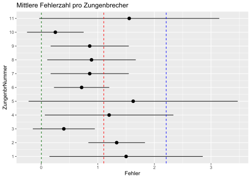
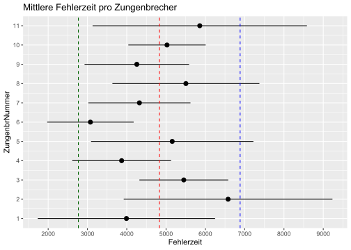
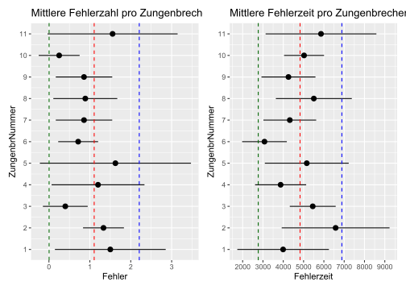
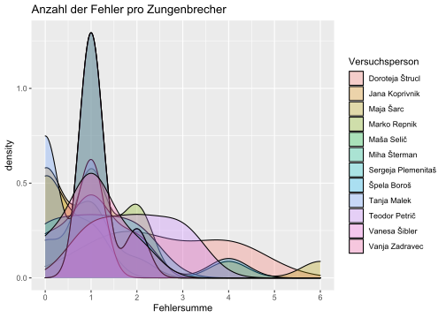
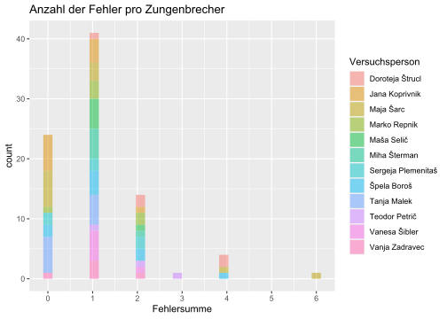
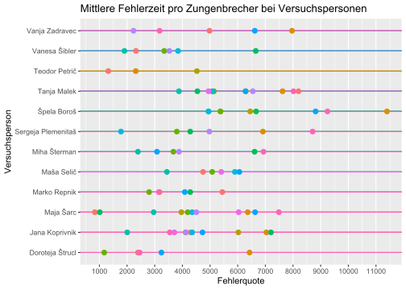
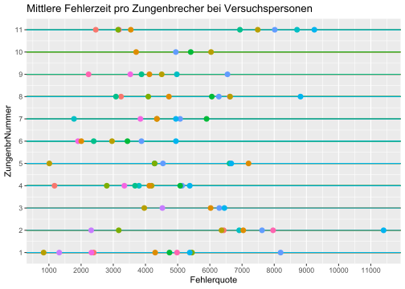
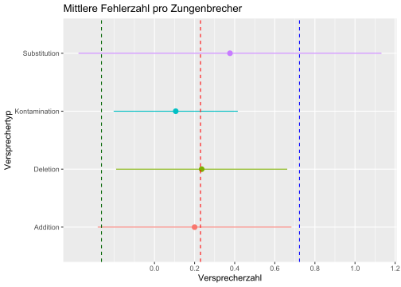

# Deutsche Zungenbrecher

Ein Experiment mit Studierenden der Germanistik in Maribor:\
- 11 deutsche Zungenbrecher (tongue twisters, lomilci jezika, besedna zavozlanka)\
- Webadresse: <https://www.youtube.com/watch?v=wuK_znJRKhU>

## Programme laden


```r
library(tidyverse)
library(scales)
library(janitor)
library(readxl)
library(writexl)
```

## Tabelle laden

Wir laden die gemeinsame Google-Tabelle:


```r
zungenbrecher = read_xlsx("data/Zungenbrecher.xlsx") %>% 
  mutate(across(where(is.numeric), 
                ~ if_else(is.na(.), 0, as.numeric(.))))
```

## EDA


```r
tabelle1 = zungenbrecher %>% 
  drop_na %>% 
  summarise(Fehler = mean(Fehlersumme),
            Fehlerzeit = mean(Fehlerquote),
            Fehler_sd = sd(Fehlersumme),
            Fehlerzeit_sd = sd(Fehlerquote))
tabelle1
```

```
## # A tibble: 1 x 4
##   Fehler Fehlerzeit Fehler_sd Fehlerzeit_sd
##    <dbl>      <dbl>     <dbl>         <dbl>
## 1   1.11      4826.      1.10         2058.
```

Im Durchschnitt etwa `{Fehler}` Versprecher pro Zungenbrecher.
Im Durchschnitt alle `{Fehlerzeit}` Millisekunden ein Versprecher.


```r
Fehler_insgesamt = tabelle1$Fehler
Fehler_sd_insgesamt = tabelle1$Fehler_sd

p1 = zungenbrecher %>% 
  group_by(ZungenbrNummer) %>% 
  drop_na %>% 
  summarise(Fehler = mean(Fehlersumme),
            Fehlerzeit = mean(Fehlerquote),
            Fehler_sd = sd(Fehlersumme),
            Fehlerzeit_sd = sd(Fehlerquote),
            .groups = "keep") %>% 
  ggplot(aes(Fehler, ZungenbrNummer)) +
  geom_pointrange(aes(xmin = Fehler - Fehler_sd,
                  xmax = Fehler + Fehler_sd)) +
  geom_vline(xintercept = Fehler_insgesamt, lty = 2, color = "red") +
  geom_vline(xintercept = Fehler_insgesamt + Fehler_sd_insgesamt, 
             lty = 2, color = "blue") +
  geom_vline(xintercept = Fehler_insgesamt - Fehler_sd_insgesamt, 
             lty = 2, color = "darkgreen") +
  scale_x_continuous(breaks = seq(0, 6, 1)) +
  scale_y_continuous(breaks = seq(0, 11, 1)) +
  theme(legend.position = "none") +
    labs(title = "Mittlere Fehlerzahl pro Zungenbrecher")
ggsave("pictures/zungenbrecher_versprecherzahl.png")
p1
```




```r
Fehlerzeit_insgesamt = tabelle1$Fehlerzeit
Fehlerzeit_sd_insgesamt = tabelle1$Fehlerzeit_sd

p2 = zungenbrecher %>% 
  group_by(ZungenbrNummer) %>% 
  drop_na %>% 
  summarise(Fehler = mean(Fehlersumme),
            Fehlerzeit = mean(Fehlerquote),
            Fehler_sd = sd(Fehlersumme),
            Fehlerzeit_sd = sd(Fehlerquote),
            .groups = "keep") %>% 
  ggplot(aes(Fehlerzeit, ZungenbrNummer)) +
  geom_pointrange(aes(xmin = Fehlerzeit - Fehlerzeit_sd,
                  xmax = Fehlerzeit + Fehlerzeit_sd)) +
  geom_vline(xintercept = 
               Fehlerzeit_insgesamt, lty = 2, color = "red") +
  geom_vline(xintercept = 
               Fehlerzeit_insgesamt + Fehlerzeit_sd_insgesamt, 
             lty = 2, color = "blue") +
  geom_vline(xintercept = 
               Fehlerzeit_insgesamt - Fehlerzeit_sd_insgesamt, 
             lty = 2, color = "darkgreen") +
  scale_x_continuous(breaks = seq(0, 12000, 1000)) +
  scale_y_continuous(breaks = seq(0, 11, 1)) +
  theme(legend.position = "none") +
    labs(title = "Mittlere Fehlerzeit pro Zungenbrecher")
ggsave("pictures/zungenbrecher_versprecherzeit.png")
p2
```




```r
library(patchwork)
p1+p2
```



```r
ggsave("pictures/zungenbrecher_patch1.png", width = 12, height = 7)
```


```r
zungenbrecher %>% 
  drop_na %>% 
  ggplot(aes(Fehlersumme, fill = Versuchsperson)) +
  geom_density(alpha = 0.3) +
  scale_x_continuous(breaks = seq(0, 6, 1)) +
  labs(title = "Anzahl der Fehler pro Zungenbrecher")
```




```r
zungenbrecher %>% 
  drop_na %>% 
  ggplot(aes(Fehlersumme, fill = Versuchsperson)) +
  geom_histogram(alpha = 0.5) +
  scale_x_continuous(breaks = seq(0, 6, 1)) +
  labs(title = "Anzahl der Fehler pro Zungenbrecher")
```



```r
ggsave("pictures/zungenbrecher_versprecherzahl_histogram.png")
```


```r
zungenbrecher %>% 
  drop_na %>% 
  ggplot(aes(Fehlerquote, Versuchsperson, 
             color = factor(ZungenbrNummer))) +
  geom_pointrange(xmin = 0, xmax = 12000) +
  scale_x_continuous(breaks = seq(0, 12000, 1000)) +
  theme(legend.position = "none") +
  labs(title = "Mittlere Fehlerzeit pro Zungenbrecher bei Versuchspersonen")
```



```r
ggsave("pictures/zungenbrecher_versprecherzeit_personen.png")
```


```r
zungenbrecher %>% 
  group_by(ZungenbrNummer) %>% 
  drop_na %>% 
  ggplot(aes(Fehlerquote, ZungenbrNummer, color = Versuchsperson)) +
  geom_pointrange(xmin = 0, xmax = 12000) +
  scale_x_continuous(breaks = seq(0, 12000, 1000)) +
  scale_y_continuous(breaks = seq(0, 11, 1)) +
  theme(legend.position = "none") +
    labs(title = "Mittlere Fehlerzeit pro Zungenbrecher bei Versuchspersonen")
```



```r
ggsave("pictures/zungenbrecher_versprecherzeit_personen.png")
```


```r
tabelle2 = zungenbrecher %>% 
  drop_na %>% 
  pivot_longer(Addition:Kontamination, 
               names_to = "Versprechertyp", 
               values_to = "Fehlerzahl") %>% 
  group_by(Versprechertyp) %>% 
  summarise(Versprecherzahl = mean(Fehlerzahl),
            Versprecherzahl_sd = sd(Fehlerzahl))
tabelle2
```

```
## # A tibble: 4 x 3
##   Versprechertyp Versprecherzahl Versprecherzahl_sd
##   <chr>                    <dbl>              <dbl>
## 1 Addition                 0.2                0.483
## 2 Deletion                 0.235              0.427
## 3 Kontamination            0.106              0.310
## 4 Substitution             0.376              0.756
```


```r
Versprecherzahl_insgesamt = mean(tabelle2$Versprecherzahl)
Versprecherzahl_sd_insgesamt = mean(tabelle2$Versprecherzahl_sd)

tabelle2 %>% 
  ggplot(aes(Versprecherzahl, Versprechertyp, 
             color = Versprechertyp)) +
  geom_pointrange(aes(xmin = Versprecherzahl - Versprecherzahl_sd,
                  xmax = Versprecherzahl + Versprecherzahl_sd)) +
  geom_vline(xintercept = 
               Versprecherzahl_insgesamt, lty = 2, color = "red") +
  geom_vline(xintercept = Versprecherzahl_insgesamt +
               Versprecherzahl_sd_insgesamt, 
             lty = 2, color = "blue") +
  geom_vline(xintercept = Versprecherzahl_insgesamt - 
               Versprecherzahl_sd_insgesamt, 
             lty = 2, color = "darkgreen") +
  scale_x_continuous(breaks = seq(0, 1.2, 0.2)) +
  # scale_y_continuous(breaks = seq(0, 11, 1)) +
  theme(legend.position = "none") +
    labs(title = "Mittlere Fehlerzahl pro Zungenbrecher")
```



```r
ggsave("pictures/zungenbrecher_versprecherzahl_errortype.png")
```

```
## Saving 7 x 5 in image
```

