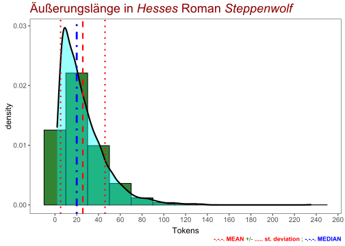
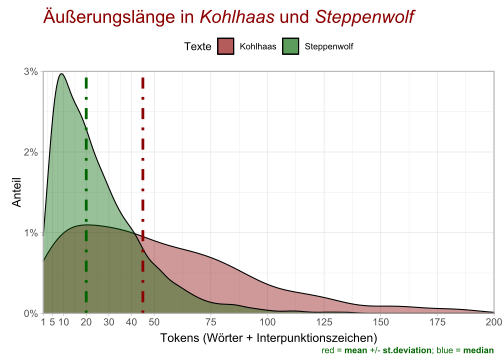
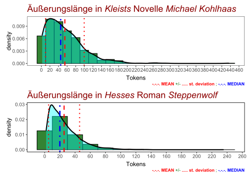
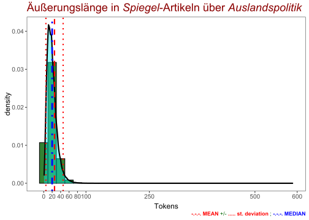
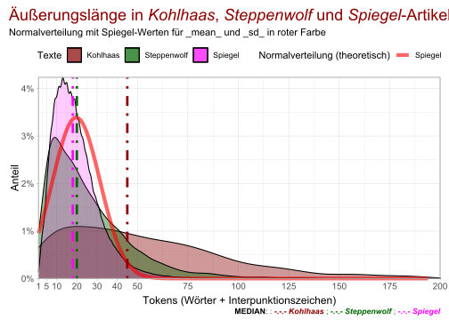
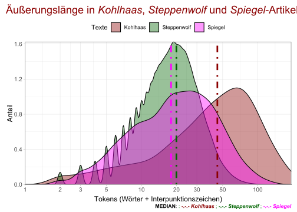
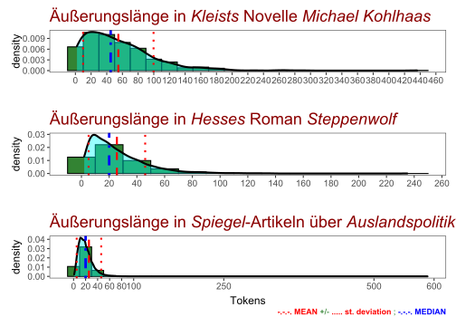

# Komplexe Äußerungen

## Packages


```r
library(tidyverse)
library(scales)
library(tidytext)
library(ggtext)
library(readtext)
library(quanteda)
library(quanteda.textstats)
library(quanteda.textplots)
library(udpipe)
library(ggstatsplot)
library(patchwork)
```


## Texte laden


```r
kohlhaas <- read_lines(
  "data/books/kleist/Kleist_Kohlhaas_Projekt_Gutenberg.txt")
steppenwolf <- read_lines(
  "data/books/hesse/Hermann Hesse Der Steppenwolf.txt")
ausland2 <- readRDS("data/spiegel_politik_deutschland2.rds")
```


## Text 1 zerlegen

Zunächst erstellen wir mit der `quanteda`-Funktion `corpus()` ein Korpus, das nach Dokumenten organisiert ist. Danach wird das Korpus mit der Funktion `corpus_reshape()` umgewandelt, so dass jede Einheit aus nur einer Äußerung besteht. 


```r
kohlcrp <- corpus(kohlhaas)
kohlcorp <- corpus_reshape(kohlcrp, to = "sentences")
```


## Texttabelle erstellen

Das Äußerungskorpus wird in eine Tabelle umgewandelt. 


```r
kohltxt <- kohlcorp %>% 
  as_tibble(rownames = "doc_id") %>% 
  rename(text = value) %>% 
  mutate(text = as.character(text) %>% str_squish())
```

Die Äußerungstatistik erhält ebenfalls Tabellenform. 


```r
kohlstats <- summary(kohlcorp, n = 803) %>% 
  as_tibble() %>% 
  rename(doc_id = Text)
```

Nun können wir die beiden Tabellen vereinen, und zwar mit Hilfe der gemeinsamen Spalte "doc_id", die wir vorher in beiden Einzeltabellen vorbereitet und entsprechend benannt haben. Außerdem filtern wir auch die leeren Zeilen (d.h. jene ohne Tokens) heraus. Von den 803 Zeilen bleiben 767 Zeilen übrig. 


```r
kohltab <- kohlstats %>% 
  full_join(kohltxt, by = "doc_id") %>% 
  filter(Tokens > 0)
```


## Speichern der Tabelle


```r
write_csv(kohltab, "data/kohlhaas_tabelle.csv")
```


## Auswahl nach Länge

Die Tabelle wird zunächst mit der Funktion `arrange()` sortiert. Dann können wir die längsten Äußerungen auswählen und speichern. 


```r
kohltab %>% arrange(-Tokens) %>% 
  select(-Sentences) %>% 
  rmarkdown::paged_table()
```

<div data-pagedtable="false">
  <script data-pagedtable-source type="application/json">
{"columns":[{"label":["doc_id"],"name":[1],"type":["chr"],"align":["left"]},{"label":["Types"],"name":[2],"type":["int"],"align":["right"]},{"label":["Tokens"],"name":[3],"type":["int"],"align":["right"]},{"label":["text"],"name":[4],"type":["chr"],"align":["left"]}],"data":[{"1":"text64.9","2":"236","3":"436","4":"Er hieß dem Sternbald, der zufällig in die Tür trat, dem Mann, der im Zimmer war, etliche Krebse abkaufen; und nachdem dies Geschäft abgemacht war, und beide sich ohne einander zu kennen, entfernt hatten, setzte er sich nieder und schrieb einen Brief folgenden Inhalts an den Nagelschmidt: »Zuvörderst daß er seinen Vorschlag, die Oberanführung seines Haufens im Altenburgischen betreffend, annähme; daß er dem gemäß, zur Befreiung aus der vorläufigen Haft, in welcher er mit seinen fünf Kindern gehalten werde, ihm einen Wagen mit zwei Pferden nach der Neustadt bei Dresden schicken solle; daß er auch, rascheren Fortkommens wegen, noch eines Gespannes von zwei Pferden auf der Straße nach Wittenberg bedürfe, auf welchem Umweg er allein, aus Gründen, die anzugeben zu weitläufig wären, zu ihm kommen könne; daß er die Landsknechte, die ihn bewachten, zwar durch Bestechung gewinnen zu können glaube, für den Fall aber daß Gewalt nötig sei, ein paar beherzte, gescheute und wohlbewaffnete Knechte, in der Neustadt bei Dresden gegenwärtig wissen wolle; daß er ihm zur Bestreitung der mit allen diesen Anstalten verbundenen Kosten, eine Rolle von zwanzig Goldkronen durch den Knecht zuschicke, über deren Verwendung er sich, nach abgemachter Sache, mit ihm berechnen wolle; daß er sich übrigens, weil sie unnötig sei, seine eigne Anwesenheit bei seiner Befreiung in Dresden verbitte, ja ihm vielmehr den bestimmten Befehl erteile, zur einstweiligen Anführung der Bande, die nicht ohne Oberhaupt sein könne, im Altenburgischen zurückzubleiben.« – Diesen Brief, als der Knecht gegen Abend kam, überlieferte er ihm; beschenkte ihn selbst reichlich, und schärfte ihm ein, denselben wohl in acht zu nehmen. – Seine Absicht war mit seinen fünf Kindern nach Hamburg zu gehen, und sich von dort nach der Levante oder nach Ostindien, oder so weit der Himmel über andere Menschen, als die er kannte, blau war, einzuschiffen: denn die Dickfütterung der Rappen hatte seine, von Gram sehr gebeugte Seele auch unabhängig von dem Widerwillen, mit dem Nagelschmidt deshalb gemeinschaftliche Sache zu machen, aufgegeben. – Kaum hatte der Kerl diese Antwort dem Schloßhauptmann überbracht, als der Großkanzler abgesetzt, der Präsident, Graf Kallheim, an dessen Stelle, zum Chef des Tribunals ernannt, und Kohlhaas, durch einen Kabinettsbefehl des Kurfürsten arretiert, und schwer mit Ketten beladen in die Stadttürme gebracht ward."},{"1":"text62.16","2":"176","3":"290","4":"Bald gaben sie vor, daß die Rappen des Kohlhaas, in Folge eines bloß eigenmächtigen Verfahrens des Schloßvogts und Verwalters, von welchem der Junker nichts oder nur Unvollständiges gewußt, auf der Tronkenburg zurückgehalten worden seien; bald versicherten sie, daß die Tiere schon, bei ihrer Ankunft daselbst, an einem heftigen und gefährlichen Husten krank gewesen wären, und beriefen sich deshalb auf Zeugen, die sie herbeizuschaffen sich anheischig machten; und als sie mit diesen Argumenten, nach weitläufigen Untersuchungen und Auseinandersetzungen, aus dem Felde geschlagen waren, brachten sie gar ein kurfürstliches Edikt bei, worin, vor einem Zeitraum von zwölf Jahren, einer Viehseuche wegen, die Einführung der Pferde aus dem Brandenburgischen ins Sächsische, in der Tat verboten worden war: zum sonnenklaren Beleg nicht nur der Befugnis, sondern sogar der Verpflichtung des Junkers, die von dem Kohlhaas über die Grenze gebrachten Pferde anzuhalten. – Kohlhaas, der inzwischen von dem wackern Amtmann zu Kohlhaasenbrück seine Meierei, gegen eine geringe Vergütigung des dabei gehabten Schadens, käuflich wieder erlangt hatte, wünschte, wie es scheint wegen gerichtlicher Abmachung dieses Geschäfts, Dresden auf einige Tage zu verlassen, und in diese seine Heimat zu reisen; ein Entschluß, an welchem gleichwohl, wie wir nicht zweifeln, weniger das besagte Geschäft, so dringend es auch in der Tat, wegen Bestellung der Wintersaat, sein mochte, als die Absicht unter so sonderbaren und bedenklichen Umständen seine Lage zu prüfen, Anteil hatte: zu welchem vielleicht auch noch Gründe anderer Art mitwirkten, die wir jedem, der in seiner Brust Bescheid weiß, zu erraten überlassen wollen."},{"1":"text22.11","2":"150","3":"267","4":"Er fügte nur noch hinzu: der Stadthauptmann ließe ihm sagen, er möchte sich in Geduld fassen; schien bedrängt, seine Reise fortzusetzen; und erst am Schluß der kurzen Unterredung erriet Kohlhaas, aus einigen hingeworfenen Worten, daß der Graf Kallheim mit dem Hause derer von Tronka verschwägert sei. – Kohlhaas, der keine Freude mehr, weder an seiner Pferdezucht, noch an Haus und Hof, kaum an Weib und Kind hatte, durchharrte, in trüber Ahndung der Zukunft, den nächsten Mond; und ganz seiner Erwartung gemäß kam, nach Verlauf dieser Zeit, Herse, dem das Bad einige Linderung verschafft hatte, von Brandenburg zurück, mit einem, ein größeres Reskript begleitenden, Schreiben des Stadthauptmanns, des Inhalts: es tue ihm leid, daß er nichts in seiner Sache tun könne; er schicke ihm eine, an ihn ergangene, Resolution der Staatskanzlei, und rate ihm, die Pferde, die er in der Tronkenburg zurückgelassen, wieder abführen, und die Sache übrigens ruhen zu lassen. – Die Resolution lautete: »er sei, nach dem Bericht des Tribunals in Dresden, ein unnützer Querulant; der Junker, bei dem er die Pferde zurückgelassen, halte ihm dieselben, auf keine Weise, zurück; er möchte nach der Burg schicken, und sie holen, oder dem Junker wenigstens wissen lassen, wohin er sie ihm senden solle; die Staatskanzlei aber, auf jeden Fall, mit solchen Plackereien und Stänkereien verschonen.«"},{"1":"text46.21","2":"158","3":"262","4":"Wenn, fuhr er fort, indem er den Finger an die Nase legte, bei dem Tribunal zu Dresden, gleichviel wie, das Erkenntnis der Rappen wegen gefallen ist; so hindert nichts, den Kohlhaas auf den Grund seiner Mordbrennereien und Räubereien einzustecken: eine staatskluge Wendung, die die Vorteile der Ansichten beider Staatsmänner vereinigt, und des Beifalls der Welt und Nachwelt gewiß ist. – Der Kurfürst, da der Prinz sowohl als der Großkanzler dem Mundschenk, Herrn Hinz, auf diese Rede mit einem bloßen Blick antworteten, und die Verhandlung mithin geschlossen schien, sagte: daß er die verschiedenen Meinungen, die sie ihm vorgetragen, bis zur nächsten Sitzung des Staatsrats bei sich selbst überlegen würde. – Es schien, die Präliminar-Maßregel, deren der Prinz gedacht, hatte seinem für Freundschaft sehr empfänglichen Herzen die Lust benommen, den Heereszug gegen den Kohlhaas, zu welchem schon alles vorbereitet war, auszuführen Wenigstens behielt er den Großkanzler, Grafen Wrede, dessen Meinung ihm die zweckmäßigste schien, bei sich zurück; und da dieser ihm Briefe vorzeigte, aus welchen hervorging, daß der Roßhändler in der Tat schon zu einer Stärke von vierhundert Mann herangewachsen sei; ja, bei der allgemeinen Unzufriedenheit, die wegen der Unziemlichkeiten des Kämmerers im Lande herrschte, in kurzem auf eine doppelte und dreifache Stärke rechnen könne: so entschloß sich der Kurfürst, ohne weiteren Anstand, den Rat, den ihm der Doktor Luther erteilt, anzunehmen."},{"1":"text74.6","2":"137","3":"229","4":"Das Trödelweib übernahm auch sogleich gegen die Verheißung einer beträchtlichen Belohnung, wovon der Kämmerer ihr auf ihre Forderung einen Teil im voraus bezahlen mußte, die Ausführung des besagten Geschäfts; und da die Mutter des bei Mühlberg gefallenen Knechts Herse, den Kohlhaas, mit Erlaubnis der Regierung, zuweilen besuchte, diese Frau ihr aber seit einigen Monden her, bekannt war: so gelang es ihr, an einem der nächsten Tage, vermittelst einer kleinen Gabe an den Kerkermeister, sich bei dem Roßkamm Eingang zu verschaffen. – Kohlhaas aber, als diese Frau zu ihm eintrat, meinte, an einem Siegelring, den sie an der Hand trug, und einer ihr vom Hals herabhängenden Korallenkette, die bekannte alte Zigeunerin selbst wieder zu erkennen, die ihm in Jüterbock den Zettel überreicht hatte; und wie denn die Wahrscheinlichkeit nicht immer auf Seiten der Wahrheit ist, so traf es sich, daß hier etwas geschehen war, das wir zwar berichten: die Freiheit aber, daran zu zweifeln, demjenigen, dem es wohlgefällt, zugestehen müssen: der Kämmerer hatte den ungeheuersten Mißgriff begangen, und in dem alten Trödelweib, das er in den Straßen von Berlin aufgriff, um die Zigeunerin nachzuahmen, die geheimnisreiche Zigeunerin selbst getroffen, die er nachgeahmt wissen wollte."},{"1":"text62.20","2":"133","3":"203","4":"Auf die Erkundigung Kohlhaasens bei seinem Advokaten, wie es zuginge, daß die Gubernial-Resolution von einem Freiherrn Siegfried von Wenk, und nicht von dem Prinzen Christiern von Meißen, an den er sich gewendet, unterschrieben sei, erhielt er zur Antwort: daß der Prinz vor drei Tagen auf seine Güter gereist, und die Gubernialgeschäfte während seiner Abwesenheit dem Schloßhauptmann Freiherrn Siegfried von Wenk, einem Vetter des oben erwähnten Herren gleiches Namens, übergeben worden wären. – Kohlhaas, dem das Herz unter allen diesen Umständen unruhig zu klopfen anfing, harrte durch mehrere Tage auf die Entscheidung seiner, der Person des Landesherrn mit befremdender Weitläufigkeit vorgelegten Bitte; doch es verging eine Woche, und es verging mehr, ohne daß weder diese Entscheidung einlief, noch auch das Rechtserkenntnis, so bestimmt man es ihm auch verkündigt hatte, bei dem Tribunal gefällt ward: dergestalt, daß er am zwölften Tage, fest entschlossen, die Gesinnung der Regierung gegen ihn, sie möge sein, welche man wolle, zur Sprache zu bringen, sich niedersetzte, und das Gubernium von neuem in einer dringenden Vorstellung um die erforderten Pässe bat."},{"1":"text20.7","2":"117","3":"190","4":"Er fragte, nachdem er mehrere Male von neuem bei dem Tribunal eingekommen war, seinen Rechtsgehülfen, in einem vertrauten Briefe, was eine so übergroße Verzögerung verursache; und erfuhr, daß die Klage, auf eine höhere Insinuation, bei dem Dresdner Gerichtshofe, gänzlich niedergeschlagen worden sei. – Auf die befremdete Rückschrift des Roßkamms, worin dies seinen Grund habe, meldete ihm jener: daß der Junker Wenzel von Tronka mit zwei Jungherren, Hinz und Kunz von Tronka, verwandt sei, deren einer, bei der Person des Herrn, Mundschenk, der andre gar Kämmerer sei. – Er riet ihm noch, er möchte, ohne weitere Bemühungen bei der Rechtsinstanz, seiner, auf der Tronkenburg befindlichen, Pferde wieder habhaft zu werden suchen; gab ihm zu verstehen, daß der Junker, der sich jetzt in der Hauptstadt aufhalte, seine Leute angewiesen zu haben scheine, sie ihm auszuliefern; und schloß mit dem Gesuch, ihn wenigstens, falls er sich hiermit nicht beruhigen wolle, mit ferneren Aufträgen in dieser Sache zu verschonen."},{"1":"text46.3","2":"117","3":"189","4":"Er schloß, daß man, in diesem außerordentlichen Fall, über die Bedenklichkeit, mit einem Staatsbürger, der die Waffen ergriffen, in Unterhandlung zu treten, hinweggehen müsse; daß derselbe in der Tat durch das Verfahren, das man gegen ihn beobachtet, auf gewisse Weise außer der Staatsverbindung gesetzt worden sei; und kurz, daß man ihn, um aus dem Handel zu kommen, mehr als eine fremde, in das Land gefallene Macht, wozu er sich auch, da er ein Ausländer sei, gewissermaßen qualifiziere, als einen Rebellen, der sich gegen den Thron auflehne, betrachten müsse. – Der Kurfürst erhielt diesen Brief eben, als der Prinz Christiern von Meißen, Generalissimus des Reichs, Oheim des bei Mühlberg geschlagenen und an seinen Wunden noch daniederliegenden Prinzen Friedrich von Meißen; der Großkanzler des Tribunals, Graf Wrede; Graf Kallheim, Präsident der Staatskanzlei; und die beiden Herren Hinz und Kunz von Tronka, dieser Kämmerer, jener Mundschenk, die Jugendfreunde und Vertrauten des Herrn, in dem Schlosse gegenwärtig waren."},{"1":"text74.1","2":"119","3":"187","4":"Kohlhaas, der inzwischen, wie schon gesagt, in Berlin angekommen, und, auf einen Spezialbefehl des Kurfürsten, in ein ritterliches Gefängnis gebracht worden war, das ihn mit seinen fünf Kindern, so bequem als es sich tun ließ, empfing, war gleich nach Erscheinung des kaiserlichen Anwalts aus Wien, auf den Grund wegen Verletzung des öffentlichen, kaiserlichen Landfriedens, vor den Schranken des Kammergerichts zur Rechenschaft gezogen worden; und ob er schon in seiner Verantwortung einwandte, daß er wegen seines bewaffneten Einfalls in Sachsen, und der dabei verübten Gewalttätigkeiten, kraft des mit dem Kurfürsten von Sachsen zu Lützen abgeschlossenen Vergleichs, nicht belangt werden könne: so erfuhr er doch, zu seiner Belehrung, daß des Kaisers Majestät, deren Anwalt hier die Beschwerde führe, darauf keine Rücksicht nehmen könne: ließ sich auch sehr bald, da man ihm die Sache auseinander setzte und erklärte, wie ihm dagegen von Dresden her, in seiner Sache gegen den Junker Wenzel von Tronka, völlige Genugtuung widerfahren werde, die Sache gefallen."},{"1":"text62.18","2":"111","3":"183","4":"Der Großkanzler, indem er mit einem mißvergnügten und bedenklichen Gesichte zur Erde sah, versetzte: er müsse gestehen, daß seine Anwesenheit grade jetzt notwendiger sei als jemals, indem das Gericht wegen arglistiger und winkelziehender Einwendungen der Gegenpart, seiner Aussagen und Erörterungen, in tausenderlei nicht vorherzusehenden Fällen, bedürfe; doch da Kohlhaas ihn auf seinen, von dem Rechtsfall wohl unterrichteten Advokaten verwies, und mit bescheidener Zudringlichkeit, indem er sich auf acht Tage einzuschränken versprach, auf seine Bitte beharrte, so sagte der Großkanzler nach einer Pause kurz, indem er ihn entließ: »er hoffe, daß er sich deshalb Pässe, bei dem Prinzen Christiern von Meißen, ausbitten würde.« – – Kohlhaas, der sich auf das Gesicht des Großkanzlers gar wohl verstand, setzte sich, in seinem Entschluß nur bestärkt, auf der Stelle nieder, und bat, ohne irgend einen Grund anzugeben, den Prinzen von Meißen, als Chef des Guberniums, um Pässe auf acht Tage nach Kohlhaasenbrück, und zurück."},{"1":"text76.2","2":"118","3":"183","4":"Dazu kam, daß der Kämmerer um diese Zeit seiner Frau, die im Begriff stand, ihm nach Berlin zu folgen, auftrug, dem Kurfürsten, bevor sie abreiste, auf eine geschickte Art beizubringen, wie mißlich es nach einem verunglückten Versuch, den er mit einem Weibe gemacht, das sich seitdem nicht wieder habe blicken lassen, mit der Hoffnung aussehe, des Zettels in dessen Besitz der Kohlhaas sei, habhaft zu werden, indem das über ihn gefällte Todesurteil, nunmehr, nach einer umständlichen Prüfung der Akten, von dem Kurfürsten von Brandenburg unterzeichnet, und der Hinrichtungstag bereits auf den Montag nach Palmarum festgesetzt sei; auf welche Nachricht der Kurfürst sich, das Herz von Kummer und Reue zerrissen, gleich einem ganz Verlorenen, in seinem Zimmer verschloß, während zwei Tage, des Lebens satt, keine Speise zu sich nahm, und am dritten plötzlich, unter der kurzen Anzeige an das Gubernium, daß er zu dem Fürsten von Dessau auf die Jagd reise, aus Dresden verschwand."},{"1":"text72.28","2":"118","3":"182","4":"Der Kurfürst sprach, er möchte das Zimmer verriegeln, und sich auf das Bett niedersetzen; und nachdem er seine Hand ergriffen, und mit einem Seufzer an sein Herz gedrückt hatte, begann er folgendergestalt: »Deine Frau hat dir, wie ich höre, schon erzählt, daß der Kurfürst von Brandenburg und ich, am dritten Tage der Zusammenkunft, die wir in Jüterbock hielten, auf eine Zigeunerin trafen; und da der Kurfürst, aufgeweckt wie er von Natur ist, beschloß, den Ruf dieser abenteuerlichen Frau, von deren Kunst, eben bei der Tafel, auf ungebührliche Weise die Rede gewesen war, durch einen Scherz im Angesicht alles Volks zu nichte zu machen: so trat er mit verschränkten Armen vor ihren Tisch, und forderte, der Weissagung wegen, die sie ihm machen sollte, ein Zeichen von ihr, das sich noch heute erproben ließe, vorschützend, daß er sonst nicht, und wäre sie auch die römische Sibylle selbst, an ihre Worte glauben könne."},{"1":"text74.10","2":"100","3":"182","4":"Die Absicht aber, in der sie komme, sei, ihm zu sagen, daß die Drohung ihn durch Arglist oder Gewalttätigkeit um den Zettel zu bringen, abgeschmackt, und ein leeres Trugbild sei; daß er unter dem Schutz des Kurfürsten von Brandenburg, in dessen Verwahrsam er sich befinde, nicht das Mindeste für denselben zu befürchten habe, ja, daß das Blatt bei ihm weit sicherer sei, als bei ihr, und daß er sich wohl hüten möchte, sich durch Ablieferung desselben, an wen und unter welchem Vorwand es auch sei, darum bringen zu lassen. – Gleichwohl schloß sie, daß sie es für klug hielte, von dem Zettel den Gebrauch zu machen, zu welchem sie ihm denselben auf dem Jahrmarkt zu Jüterbock eingehändigt, dem Antrag, den man ihm auf der Grenze durch den Junker vom Stein gemacht, Gehör zu geben, und den Zettel, der ihm selbst weiter nichts nutzen könne, für Freiheit und Leben an den Kurfürsten von Sachsen auszuliefern.«"},{"1":"text62.40","2":"108","3":"178","4":"und da der Roßkamm ihm auf ehrerbietige Weise sein Vorhaben, bei dem Verwalter in Lockewitz zu Mittag zu speisen, und den Wunsch, die Landsknechte deren er dabei nicht bedürfe zurücklassen zu dürfen, vorgetragen hatte, antwortete der Freiherr, die Farbe im Gesicht wechselnd, indem er eine andere Rede zu verschlucken schien: »er würde wohl tun, wenn er sich still in seinem Hause hielte, und den Schmaus bei dem Lockewitzer Amtmann vor der Hand noch aussetzte.« – Dabei wandte er sich, das ganze Gespräch zerschneidend, dem Offizianten zu, und sagte ihm: »daß es mit dem Befehl, den er ihm, in Bezug auf den Mann gegeben, sein Bewenden hätte, und daß derselbe anders nicht, als in Begleitung sechs berittener Landsknechte die Stadt verlassen dürfe.« – Kohlhaas fragte: ob er ein Gefangener wäre, und ob er glauben solle, daß die ihm feierlich, vor den Augen der ganzen Welt angelobte Amnestie gebrochen sei?"},{"1":"text76.4","2":"114","3":"173","4":"Gewiß ist, daß der Fürst von Dessau, unfähig zu jagen, um diese Zeit krank in Braunschweig, bei seinem Oheim, dem Herzog Heinrich, lag, und daß die Dame Heloise, am Abend des folgenden Tages, in Gesellschaft eines Grafen von Königstein, den sie für ihren Vetter ausgab, bei dem Kämmerer Herrn Kunz, ihrem Gemahl, in Berlin eintraf. – Inzwischen war dem Kohlhaas, auf Befehl des Kurfürsten, das Todesurteil vorgelesen, die Ketten abgenommen, und die über sein Vermögen lautenden Papiere, die ihm in Dresden abgesprochen worden waren, wieder zugestellt worden; und da die Räte, die das Gericht an ihn abgeordnet hatte, ihn fragten, wie er es mit dem, was er besitze, nach seinem Tode gehalten wissen wolle: so verfertigte er, mit Hülfe eines Notars, zu seiner Kinder Gunsten ein Testament, und setzte den Amtmann zu Kohlhaasenbrück, seinen wackern Freund, zum Vormund derselben ein."},{"1":"text62.3","2":"116","3":"171","4":"Dieser nichtsnutzige Kerl nannte sich, teils um den Häschern von denen er verfolgt ward, Furcht einzuflößen, teils um das Landvolk, auf die gewohnte Weise, zur Teilnahme an seinen Spitzbübereien zu verleiten, einen Statthalter des Kohlhaas; sprengte mit einer seinem Herrn abgelernten Klugheit aus, daß die Amnestie an mehreren, in ihre Heimat ruhig zurückgekehrten Knechten nicht gehalten, ja der Kohlhaas selbst, mit himmelschreiender Wortbrüchigkeit, bei seiner Ankunft in Dresden eingesteckt, und einer Wache übergeben worden sei; dergestalt, daß in Plakaten, die den Kohlhaasischen ganz ähnlich waren, sein Mordbrennerhaufen als ein zur bloßen Ehre Gottes aufgestandener Kriegshaufen erschien, bestimmt, über die Befolgung der ihnen von dem Kurfürsten angelobten Amnestie zu wachen; alles, wie schon gesagt, keineswegs zur Ehre Gottes, noch aus Anhänglichkeit an den Kohlhaas, dessen Schicksal ihnen völlig gleichgültig war, sondern um unter dem Schutz solcher Vorspiegelungen desto ungestrafter und bequemer zu sengen und zu plündern."},{"1":"text76.12","2":"110","3":"170","4":"Doch da der Kastellan antwortete: »Kohlhaas, das Weib« – – und in Mitten der Rede auf sonderbare Weise stockte, so konnte er, von dem Zuge, der in diesem Augenblick wieder antrat, fortgerissen, nicht vernehmen, was der Mann, der an allen Gliedern zu zittern schien, vorbrachte. – Als er auf dem Richtplatz ankam, fand er den Kurfürsten von Brandenburg mit seinem Gefolge, worunter sich auch der Erzkanzler, Herr Heinrich von Geusau befand, unter einer unermeßlichen Menschenmenge, daselbst zu Pferde halten: ihm zur Rechten der kaiserliche Anwalt Franz Müller, eine Abschrift des Todesurteils in der Hand; ihm zur Linken, mit dem Konklusum des Dresdner Hofgerichts, sein eigener Anwalt, der Rechtsgelehrte Anton Zäuner; ein Herold in der Mitte des halboffenen Kreises, den das Volk schloß, mit einem Bündel Sachen, und den beiden, von Wohlsein glänzenden, die Erde mit ihren Hufen stampfenden Rappen."},{"1":"text68.5","2":"106","3":"166","4":"Der Prinz, der obschon mit den Unziemlichkeiten die vorgefallen waren, wenig zufrieden, die Leitung der Kohlhaasischen Sache auf den Wunsch seines bedrängten Herrn, übernehmen mußte, fragte ihn, auf welchen Grund er nunmehr den Roßhändler bei dem Kammergericht zu Berlin verklagt wissen wolle; und da man sich auf den leidigen Brief desselben an den Nagelschmidt, wegen der zweideutigen und unklaren Umstände, unter welchen er geschrieben war, nicht berufen konnte, der früheren Plünderungen und Einäscherungen aber, wegen des Plakats, worin sie ihm vergeben worden waren, nicht erwähnen durfte: so beschloß der Kurfürst, der Majestät des Kaisers zu Wien einen Bericht über den bewaffneten Einfall des Kohlhaas in Sachsen vorzulegen, sich über den Bruch des von ihm eingesetzten öffentlichen Landfriedens zu beschweren, und sie, die allerdings durch keine Amnestie gebunden war, anzuliegen, den Kohlhaas bei dem Hofgericht zu Berlin deshalb durch einen Reichsankläger zur Rechenschaft zu ziehen."},{"1":"text72.30","2":"110","3":"164","4":"Nun mußt du wissen, daß dieser, für die Dresdner Küche bestimmte Rehbock, in einem mit Latten hoch verzäunten Verschlage, den die Eichen des Parks beschatteten, hinter Schloß und Riegel aufbewahrt ward, dergestalt, daß, da überdies anderen kleineren Wildes und Geflügels wegen, der Park überhaupt und obenein der Garten, der zu ihm führte, in sorgfältigem Beschluß gehalten ward, schlechterdings nicht abzusehen war, wie uns das Tier, diesem sonderbaren Vorgeben gemäß, bis auf dem Platz, wo wir standen, entgegenkommen würde; gleichwohl schickte der Kurfürst aus Besorgnis vor einer dahinter steckenden Schelmerei, nach einer kurzen Abrede mit mir, entschlossen, auf unabänderliche Weise, alles was sie noch vorbringen wurde, des Spaßes wegen, zu Schanden zu machen, ins Schloß, und befahl, daß der Rehbock augenblicklich getötet, und für die Tafel, an einem der nächsten Tage, zubereitet werden solle."},{"1":"text74.20","2":"107","3":"163","4":"Kohlhaas wiederholte seine Frage, den Inhalt des wunderbaren Zettels betreffend; er wünschte, da sie flüchtig antwortete: »daß er ihn ja eröffnen könne, obschon es eine bloße Neugierde wäre«, noch über tausend andere Dinge, bevor sie ihn verließe, Aufschluß zu erhalten; wer sie eigentlich sei, woher sie zu der Wissenschaft, die ihr inwohne, komme, warum sie dem Kurfürsten, für den er doch geschrieben, den Zettel verweigert, und grade ihm, unter so vielen tausend Menschen, der ihrer Wissenschaft nie begehrt, das Wunderblatt überreicht habe? – – Nun traf es sich, daß in eben diesem Augenblick ein Geräusch hörbar ward, das einige Polizei-Offizianten, die die Treppe heraufstiegen, verursachten; dergestalt, daß das Weib, von plötzlicher Besorgnis, in diesen Gemächern von ihnen betroffen zu werden, ergriffen, antwortete: »auf Wiedersehen Kohlhaas, auf Wiedersehn!"},{"1":"text76.1","2":"113","3":"161","4":"Inzwischen hatte der Kurfürst von Sachsen, seinen jammervollen Gedanken preisgegeben, zwei Astrologen, namens Oldenholm und Olearius, welche damals in Sachsen in großem Ansehen standen, herbeigerufen, und wegen des Inhalts des geheimnisvollen, ihm und dem ganzen Geschlecht seiner Nachkommen so wichtigen Zettels zu Rate gezogen; und da die Männer, nach einer, mehrere Tage lang im Schloßturm zu Dresden fortgesetzten, tiefsinnigen Untersuchung, nicht einig werden konnten, ob die Prophezeiung sich auf späte Jahrhunderte oder aber auf die jetzige Zeit beziehe, und vielleicht die Krone Polen, mit welcher die Verhältnisse immer noch sehr kriegerisch waren, damit gemeint sei: so wurde durch solchen gelehrten Streit, statt sie zu zerstreuen, die Unruhe, um nicht zu sagen, Verzweiflung, in welcher sich dieser unglückliche Herr befand, nur geschärft, und zuletzt bis auf einen Grad, der seiner Seele ganz unerträglich war, vermehrt."},{"1":"text68.7","2":"100","3":"160","4":"Es traf sich daß der Kurfürst von Sachsen auf die Einladung des Landdrosts, Grafen Aloysius von Kallheim, der damals an der Grenze von Sachsen beträchtliche Besitzungen hatte, in Gesellschaft des Kämmerers, Herrn Kunz, und seiner Gemahlin, der Dame Heloise, Tochter des Landdrosts und Schwester des Präsidenten, andrer glänzenden Herren und Damen, Jagdjunker und Hofherren, die dabei waren, nicht zu erwähnen, zu einem großen Hirschjagen, das man, um ihn zu erheitern, angestellt hatte, nach Dahme gereist war; dergestalt, daß unter dem Dach bewimpelter Zelte, die quer über die Straße auf einem Hügel erbaut waren, die ganze Gesellschaft vom Staub der Jagd noch bedeckt unter dem Schall einer heitern vom Stamm einer Eiche herschallenden Musik, von Pagen bedient und Edelknaben, an der Tafel saß, als der Roßhändler langsam mit seiner Reuterbedeckung die Straße von Dresden daher gezogen kam."},{"1":"text30.5","2":"95","3":"157","4":"Eben, unter dem Gemurmel eines entfernten Gewitters am Horizont, mit Fackeln, die er sich vor dem Ort angesteckt, zog er mit seiner Schar in den Klosterhof ein, und Waldmann, der Knecht, der ihm entgegen trat, meldete ihm, daß das Mandat richtig abgegeben sei, als er die Äbtissin und den Stiftsvogt, in einem verstörten Wortwechsel, unter das Portal des Klosters treten sah; und während jener, der Stiftsvogt, ein kleiner, alter, schneeweißer Mann, grimmige Blicke auf Kohlhaas schießend, sich den Harnisch anlegen ließ, und den Knechten, die ihn umringten, mit dreister Stimme zurief, die Sturmglocke zu ziehn: trat jene, die Stiftsfrau, das silberne Bildnis des Gekreuzigten in der Hand, bleich, wie Linnenzeug, von der Rampe herab, und warf sich mit allen ihren Jungfrauen, vor Kohlhaasens Pferd nieder."},{"1":"text30.11","2":"101","3":"157","4":"und da die Dame mit schwacher, kaum hörbarer Stimme, antwortete: eben jetzt! – »Wann?« – Zwei Stunden, so wahr mir Gott helfe, nach des Junkers, meines Vetters, bereits vollzogener Abreise! – – – und Waldmann, der Knecht, zu dem Kohlhaas sich, unter finsteren Blicken, umkehrte, stotternd diesen Umstand bestätigte, indem er sagte, daß die Gewässer der Mulde, vom Regen geschwellt, ihn verhindert hätten, früher, als eben jetzt, einzutreffen: so sammelte sich Kohlhaas; ein plötzlich furchtbarer Regenguß, der die Fackeln verlöschend, auf das Pflaster des Platzes niederrauschte, löste den Schmerz in seiner unglücklichen Brust; er wandte, indem er kurz den Hut vor der Dame rückte, sein Pferd, drückte ihm, mit den Worten: folgt mir meine Brüder; der Junker ist in Wittenberg!"},{"1":"text32.4","2":"102","3":"157","4":"Dabei klebte er, während die Knechte in der Vorstadt plünderten, ein Blatt an den Türpfeiler einer Kirche an, des Inhalts: »er, Kohlhaas, habe die Stadt in Brand gesteckt, und werde sie, wenn man ihm den Junker nicht ausliefere, dergestalt einäschern, daß er«, wie er sich ausdrückte, »hinter keiner Wand werde zu sehen brauchen, um ihn zu finden.« – Das Entsetzen der Einwohner, über diesen unerhörten Frevel, war unbeschreiblich; und die Flamme, die bei einer zum Glück ziemlich ruhigen Sommernacht, zwar nicht mehr als neunzehn Häuser, worunter gleichwohl eine Kirche war, in den Grund gelegt hatte, war nicht sobald, gegen Anbruch des Tages, einigermaßen gedämpft worden, als der alte Landvogt, Otto von Gorgas, bereits ein Fähnlein von funfzig Mann aussandte, um den entsetzlichen Wüterich aufzuheben."},{"1":"text70.7","2":"102","3":"156","4":"und ihn fortzog; und in eben diesem Augenblick ein paar Jagdjunker, die ihre Neugierde schon befriedigt hatten, aus dem Hause heraustreten, versichernd, daß in der Tat, vermöge einer Veranstaltung, die der Landdrost getroffen, weder der Ritter noch der Roßhändler wisse, welche Gesellschaft in der Gegend von Dahme versammelt sei; so drückte der Kurfürst sich den Hut lächelnd in die Augen, und sagte: »Torheit, du regierst die Welt, und dein Sitz ist ein schöner weiblicher Mund!« – Es traf sich daß Kohlhaas eben mit dem Rücken gegen die Wand auf einem Bund Stroh saß, und sein, ihm in Herzberg erkranktes Kind mit Semmel und Milch fütterte, als die Herrschaften, um ihn zu besuchen, in die Meierei traten; und da die Dame ihn, um ein Gespräch einzuleiten, fragte: wer er sei?"},{"1":"text24.12","2":"101","3":"154","4":"Denn da ein Geistlicher lutherischer Religion (zu welchem eben damals aufkeimenden Glauben sie sich, nach dem Beispiel ihres Mannes, bekannt hatte) neben ihrem Bette stand, und ihr mit lauter und empfindlich-feierlicher Stimme, ein Kapitel aus der Bibel vorlas: so sah sie ihn plötzlich, mit einem finstern Ausdruck, an, nahm ihm, als ob ihr daraus nichts vorzulesen wäre, die Bibel aus der Hand, blätterte und blätterte, und schien etwas darin zu suchen; und zeigte dem Kohlhaas, der an ihrem Bette saß, mit dem Zeigefinger, den Vers: »Vergib deinen Feinden; tue wohl auch denen, die dich hassen.« – Sie drückte ihm dabei mit einem überaus seelenvollen Blick die Hand, und starb. – Kohlhaas dachte: »so möge mir Gott nie vergeben, wie ich dem Junker vergebe!«"},{"1":"text74.3","2":"103","3":"154","4":"Der Kämmerer, der gleichwohl einsah, daß keine Zeit zu verlieren sein möchte, falls der Auftrag, den ihm sein Herr gegeben, in Erfüllung gehen sollte, fing sein Geschäft damit an, sich dem Kohlhaas, am Morgen eines Tages, da derselbe in harmloser Betrachtung der Vorübergehenden, am Fenster seines Gefängnisses stand, in seiner gewöhnlichen Hoftracht, genau und umständlich zu zeigen; und da er, aus einer plötzlichen Bewegung seines Kopfes, schloß, daß der Roßhändler ihn bemerkt hatte, und besonders, mit großem Vergnügen, einen unwillkürlichen Griff desselben mit der Hand auf die Gegend der Brust, wo die Kapsel lag, wahrnahm: so hielt er das, was in der Seele desselben in diesem Augenblick vorgegangen war, für eine hinlängliche Vorbereitung, um in dem Versuch, des Zettels habhaft zu werden, einen Schritt weiter vorzurücken."},{"1":"text74.5","2":"97","3":"153","4":"Dem gemäß, um sie dazu in Stand zu setzen, unterrichtete er sie umständlich von allem, was zwischen dem Kurfürsten und der gedachten Zigeunerin in Jüterbock vorgefallen war, wobei er, weil er nicht wußte, wie weit das Weib in ihren Eröffnungen gegen den Kohlhaas gegangen war, nicht vergaß, ihr besonders die drei geheimnisvollen, in dem Zettel enthaltenen Artikel einzuschärfen; und nachdem er ihr auseinandergesetzt hatte, was sie, auf abgerissene und unverständliche Weise, fallen lassen müsse, gewisser Anstalten wegen, die man getroffen, sei es durch List oder durch Gewalt, des Zettels, der dem sächsischen Hofe von der äußersten Wichtigkeit sei, habhaft zu werden, trug er ihr auf, dem Kohlhaas den Zettel, unter dem Vorwand, daß derselbe bei ihm nicht mehr sicher sei, zur Aufbewahrung während einiger verhängnisvollen Tage, abzufordern."},{"1":"text16.13","2":"91","3":"152","4":"Und da ich dem Schloßvogt, der sie daselbst einquartierte, die Rappen aus der Hand nahm, und fragte, wo die Tiere jetzo bleiben sollten, so zeigte er mir einen Schweinekoben an, der von Latten und Brettern an der Schloßmauer auferbaut war. – Du meinst, unterbrach ihn Kohlhaas, es war ein so schlechtes Behältnis für Pferde, daß es einem Schweinekoben ähnlicher war, als einem Stall. – Es war ein Schweinekoben, Herr, antwortete Herse; wirklich und wahrhaftig ein Schweinekoben, in welchem die Schweine aus- und einliefen, und ich nicht aufrecht stehen konnte. – Vielleicht war sonst kein Unterkommen für die Rappen aufzufinden, versetzte Kohlhaas; die Pferde der Ritter gingen, auf eine gewisse Art, vor. – Der Platz, erwiderte der Knecht, indem er die Stimme fallen ließ, war eng."},{"1":"text52.7","2":"101","3":"151","4":"Der Prinz, nach einem flüchtigen Blick, womit er ihn von Kopf zu Fuß überschaute, durchlief die in der Brieftasche befindlichen Papiere; ließ sich von ihm erklären, was es mit einem von dem Gericht zu Lützen ausgestellten Schein, den er darin fand, über die zu Gunsten des kurfürstlichen Schatzes gemachte Deposition für eine Bewandtnis habe; und nachdem er die Art des Mannes noch, durch Fragen mancherlei Gattung, nach seinen Kindern, seinem Vermögen und der Lebensart die er künftig zu führen denke, geprüft, und überall so, daß man wohl seinetwegen ruhig sein konnte, befunden hatte, gab er ihm die Briefschaften wieder, und sagte: daß seinem Prozeß nichts im Wege stünde, und daß er sich nur unmittelbar, um ihn einzuleiten, an den Großkanzler des Tribunals, Grafen Wrede, selbst wenden möchte."},{"1":"text48.2","2":"98","3":"146","4":"Kurfürst von Sachsen, erteilen, in besonders gnädiger Rücksicht auf die an Uns ergangene Fürsprache des Doktors Martin Luther, dem Michael Kohlhaas, Roßhändler aus dem Brandenburgischen, unter der Bedingung, binnen drei Tagen nach Sicht die Waffen, die er ergriffen, niederzulegen, behufs einer erneuerten Untersuchung seiner Sache, freies Geleit nach Dresden; dergestalt zwar, daß, wenn derselbe, wie nicht zu erwarten, bei dem Tribunal zu Dresden mit seiner Klage, der Rappen wegen, abgewiesen werden sollte, gegen ihn, seines eigenmächtigen Unternehmens wegen, sich selbst Recht zu verschaffen, mit der ganzen Strenge des Gesetzes verfahren werden solle; im entgegengesetzten Fall aber, ihm mit seinem ganzen Haufen, Gnade für Recht bewilligt, und völlige Amnestie, seiner in Sachsen ausgeübten Gewalttätigkeiten wegen, zugestanden sein solle.«"},{"1":"text70.1","2":"97","3":"144","4":"Nun begab es sich, daß gegen Abend, da die Herrschaften vom Wein und dem Genuß eines üppigen Nachtisches zerstreut, den ganzen Vorfall wieder vergessen hatten, der Landdrost den Gedanken auf die Bahn brachte, sich noch einmal, eines Rudels Hirsche wegen, der sich hatte blicken lassen, auf den Anstand zu stellen; welchen Vorschlag die ganze Gesellschaft mit Freuden ergriff, und paarweise nachdem sie sich mit Büchsen versorgt, über Gräben und Hecken in die nahe Forst eilte: dergestalt, daß der Kurfürst und die Dame Heloise, die sich, um dem Schauspiel beizuwohnen, an seinen Arm hing, von einem Boten, den man ihnen zugeordnet hatte, unmittelbar, zu ihrem Erstaunen, durch den Hof des Hauses geführt wurden, in welchem Kohlhaas mit den brandenburgischen Reutern befindlich war."},{"1":"text72.20","2":"98","3":"143","4":"Der Kaiser, in einer durch die Staatskanzlei ausgefertigten Note, antwortete ihm: »daß der Wechsel, der plötzlich in seiner Brust vorgegangen zu sein scheine, ihn aufs äußerste befremde; daß der sächsischerseits an ihn erlassene Bericht, die Sache des Kohlhaas zu einer Angelegenheit gesamten heiligen römischen Reichs gemacht hätte; daß demgemäß er, der Kaiser, als Oberhaupt desselben, sich verpflichtet gesehen hätte, als Ankläger in dieser Sache bei dem Hause Brandenburg aufzutreten; dergestalt, daß da bereits der Hof-Assessor Franz Müller, in der Eigenschaft als Anwalt nach Berlin gegangen wäre, um den Kohlhaas daselbst, wegen Verletzung des öffentlichen Landfriedens, zur Rechenschaft zu ziehen, die Beschwerde nunmehr auf keine Weise zurückgenommen werden könne, und die Sache den Gesetzen gemäß, ihren weiteren Fortgang nehmen müsse.«"},{"1":"text72.36","2":"91","3":"142","4":"Die Frau, nachdem sie einen Kasten, der ihr zur Seite stand, aufgemacht, und das Geld, nach Sorte und Menge, weitläufig und umständlich darin geordnet, und den Kasten wieder verschlossen hatte, schützte ihre Hand vor die Sonne, gleichsam als ob sie ihr lästig wäre, und sah mich an; und da ich die Frage an sie wiederholte, und, auf scherzhafte Weise, während sie meine Hand prüfte, zum Kurfürsten sagte: mir, scheint es, hat sie nichts, das eben angenehm wäre, zu verkündigen: so ergriff sie ihre Krücken, hob sich langsam daran vom Schemel empor, und indem sie sich, mit geheimnisvoll vorgehaltenen Händen, dicht zu mir heran drängte, flüsterte sie mir vernehmlich ins Ohr: nein! – So!"},{"1":"text72.51","2":"96","3":"138","4":"Der Blitz, der an einem Wintertag vom Himmel fällt, kann nicht vernichtender treffen, als mich dieser Anblick, und meine erste Bemühung, sobald ich der Gesellschaft in der ich mich befand, überhoben, war gleich, den Mann mit dem Federhut, den mir das Weib bezeichnet hatte, auszumitteln; doch keiner meiner Leute, unausgesetzt während drei Tage auf Kundschaft geschickt, war im Stande mir auch nur auf die entfernteste Weise Nachricht davon zu geben: und jetzt, Freund Kunz, vor wenig Wochen, in der Meierei zu Dahme, habe ich den Mann mit meinem eigenen Augen gesehn.« – Und damit ließ er die Hand des Kämmerers fahren; und während er sich den Schweiß abtrocknete, sank er wieder auf das Lager zurück."},{"1":"text32.14","2":"94","3":"137","4":"Diesem würdigen Herrn, der schon durch seine bloße Gegenwart dem Volk Ehrfurcht und Gehorsam einzuflößen gewohnt war, war es, gleichsam zum Ersatz für die fehlgeschlagene Unternehmung, von welcher er zurückkam, gelungen, dicht vor den Toren der Stadt drei zersprengte Knechte von der Bande des Mordbrenners aufzufangen; und da er, inzwischen die Kerle vor dem Angesicht des Volks mit Ketten belastet wurden, den Magistrat in einer klugen Anrede versicherte, den Kohlhaas selbst denke er in kurzem, indem er ihm auf die Spur sei, gefesselt einzubringen: so glückte es ihm, durch die Kraft aller dieser beschwichtigenden Umstände, die Angst des versammelten Volks zu entwaffnen, und über die Anwesenheit des Junkers, bis zur Zurückkunft des Eilboten aus Dresden, einigermaßen zu beruhigen."},{"1":"text62.11","2":"102","3":"136","4":"Nicht nur, daß zufolge seiner Bemerkung er, so wie die Sachen standen, überhaupt noch zur Entscheidung seines, im besten Fortgang begriffenen Rechtsstreits, keiner Hülfe von Seiten eines Dritten bedürfte: aus einigen Briefschaften, die er bei sich trug, und die er dem Prinzen vorzeigte, ging sogar eine Unwahrscheinlichkeit ganz eigner Art hervor, daß das Herz des Nagelschmidts gestimmt sein sollte, ihm dergleichen Hülfe zu leisten, indem er den Kerl, wegen auf dem platten Lande verübter Notzucht und anderer Schelmereien, kurz vor Auflösung des Haufens in Lützen hatte hängen lassen wollen; dergestalt, daß nur die Erscheinung der kurfürstlichen Amnestie, indem sie das ganze Verhältnis aufhob, ihn gerettet hatte, und beide Tags darauf, als Todfeinde auseinander gegangen waren."},{"1":"text64.8","2":"88","3":"135","4":"Kohlhaas, der den Brief, während die Kinder mit den Krebsen spielten, las, würde den Gauner gewiß unter andern Umständen beim Kragen genommen, und den Landsknechten, die vor seiner Tür standen, überliefert haben; doch da bei der Stimmung der Gemüter auch selbst dieser Schritt noch einer gleichgültigen Auslegung fähig war, und er sich vollkommen überzeugt hatte, daß nichts auf der Welt ihn aus dem Handel, in dem er verwickelt war, retten konnte: so sah er dem Kerl, mit einem traurigen Blick, in sein ihm wohlbekanntes Gesicht, fragte ihn, wo er wohnte, und beschied ihn, in einigen Stunden, wieder zu sich, wo er ihm, in Bezug auf seinen Herrn, seinen Beschluß eröffnen wolle."},{"1":"text22.4","2":"79","3":"132","4":"Der Stadthauptmann, der, während er mit dem Arzte sprach, bemerkte, daß Kohlhaas eine Träne auf den Brief, den er bekommen und eröffnet hatte, fallen ließ, näherte sich ihm, auf eine freundliche und herzliche Weise, und fragte ihn, was für ein Unfall ihn betroffen; und da der Roßhändler ihm, ohne ihm zu antworten, den Brief überreichte: so klopfte ihm dieser würdige Mann, dem die abscheuliche Ungerechtigkeit, die man auf der Tronkenburg an ihm verübt hatte, und an deren Folgen Herse eben, vielleicht auf die Lebenszeit, krank danieder lag, bekannt war, auf die Schulter, und sagte ihm: er solle nicht mutlos sein; er werde ihm zu seiner Genugtuung verhelfen!"},{"1":"text62.5","2":"90","3":"132","4":"Sie erinnerten mit weisen und mißvergnügten Seitenblicken an den Mißgriff, den man begangen, indem man dem Kohlhaas, ihren dringenden und wiederholten Warnungen zum Trotz, Amnestie erteilt, gleichsam als hätte man die Absicht gehabt Bösewichtern aller Art dadurch, zur Nachfolge auf seinem Wege, das Signal zu geben; und nicht zufrieden, dem Vorgeben des Nagelschmidt, zur bloßen Aufrechthaltung und Sicherheit seines unterdrückten Herrn die Waffen ergriffen zu haben, Glauben zu schenken, äußerten sie sogar die bestimmte Meinung, daß die ganze Erscheinung desselben nichts, als ein von dem Kohlhaas angezetteltes Unternehmen sei, um die Regierung in Furcht zu setzen, und den Fall des Rechtsspruchs, Punkt vor Punkt, seinem rasenden Eigensinn gemäß, durchzusetzen und zu beschleunigen."},{"1":"text26.12","2":"85","3":"131","4":"Gleichwohl, als der Knecht schreckenblaß, wenige Momente nachdem der Schuppen hinter ihm zusammenstürzte, mit den Pferden, die er an der Hand hielt, daraus hervortrat, fand er den Kohlhaas nicht mehr; und da er sich zu den Knechten auf den Schloßplatz begab, und den Roßhändler, der ihm mehreremal den Rücken zukehrte, fragte: was er mit den Tieren nun anfangen solle? – hob dieser plötzlich, mit einer fürchterlichen Gebärde, den Fuß, daß der Tritt, wenn er ihn getan hätte, sein Tod gewesen wäre: bestieg, ohne ihm zu antworten, seinen Braunen, setzte sich unter das Tor der Burg, und erharrte, inzwischen die Knechte ihr Wesen forttrieben, schweigend den Tag."},{"1":"text32.20","2":"84","3":"131","4":"Der Landvogt, der wohl einsah, daß eine Resolution dieser Art, das Volk keinesweges beruhigen konnte: denn nicht nur, daß mehrere kleine Vorteile, die der Roßhändler, an verschiedenen Punkten, vor der Stadt erfochten, über die Stärke, zu der er herangewachsen, äußerst unangenehme Gerüchte verbreiteten; der Krieg, den er, in der Finsternis der Nacht, durch verkleidetes Gesindel, mit Pech, Stroh und Schwefel führte, hätte, unerhört und beispiellos, wie er war, selbst einen größeren Schutz, als mit welchem der Prinz von Meißen heranrückte, unwirksam machen können: der Landvogt, nach einer kurzen Überlegung, entschloß sich, die Resolution, die er empfangen, ganz und gar zu unterdrücken."},{"1":"text22.25","2":"82","3":"128","4":"Der Amtmann, der den Kaufkontrakt noch einmal überlas, und darin auch von seiner Seite, auf eine sonderbare Art, die Freiheit stipuliert fand, zurückzutreten, sagte, schon halb entschlossen: daß er ja die Gestütpferde, die in seinen Ställen wären, nicht brauchen könne; doch da Kohlhaas erwiderte, daß er die Pferde auch gar nicht loszuschlagen willens sei, und daß er auch einige Waffen, die in der Rüstkammer hingen, für sich behalten wolle, so – zögerte jener noch und zögerte, und wiederholte endlich ein Gebot, das er ihm vor kurzem schon einmal, halb im Scherz, halb im Ernst, nichtswürdig gegen den Wert der Besitzung, auf einem Spaziergange gemacht hatte."},{"1":"text32.1","2":"89","3":"128","4":"Er kehrte, da die Nacht einbrach, in einem Wirtshause auf der Landstraße ein, wo er, wegen großer Ermüdung der Pferde, einen Tag ausruhen mußte, und da er wohl einsah, daß er mit einem Haufen von zehn Mann (denn so stark war er jetzt), einem Platz wie Wittenberg war, nicht trotzen konnte, so verfaßte er ein zweites Mandat, worin er, nach einer kurzen Erzählung dessen, was ihm im Lande begegnet, »jeden guten Christen«, wie er sich ausdrückte, »unter Angelobung eines Handgelds und anderer kriegerischen Vorteile«, aufforderte »seine Sache gegen den Junker von Tronka, als dem allgemeinen Feind aller Christen, zu ergreifen«."},{"1":"text32.13","2":"88","3":"128","4":"Zwei Bürgermeister, namens Jenkens und Otto, die in Amtskleidern an der Spitze des ganzen Magistrats gegenwärtig waren, bewiesen vergebens, daß man platterdings die Rückkehr eines Eilboten abwarten müsse, den man wegen Erlaubnis den Junker nach Dresden bringen zu dürfen, wohin er selbst aus mancherlei Gründen abzugehen wünsche, an den Präsidenten der Staatskanzlei geschickt habe; der unvernünftige, mit Spießen und Stangen bewaffnete Haufen gab auf diese Worte nichts, und eben war man, unter Mißhandlung einiger zu kräftigen Maßregeln auffordernden Räte, im Begriff das Haus worin der Junker war zu stürmen, und der Erde gleich zu machen, als der Landvogt, Otto von Gorgas, an der Spitze seines Reuterhaufens, in der Stadt erschien."},{"1":"text32.15","2":"83","3":"128","4":"Er stieg, in Begleitung einiger Ritter, vom Pferde, und verfügte sich, nach Wegräumung der Palisaden und Pfähle, in das Haus, wo er den Junker, der aus einer Ohnmacht in die andere fiel, unter den Händen zweier Ärzte fand, die ihn mit Essenzen und Irritanzen wieder ins Leben zurück zu bringen suchten; und da Herr Otto von Gorgas wohl fühlte, daß dies der Augenblick nicht war, wegen der Aufführung, die er sich zu Schulden kommen lasse, Worte mit ihm zu wechseln: so sagte er ihm bloß, mit einem Blick stiller Verachtung, daß er sich ankleiden, und ihm, zu seiner eigenen Sicherheit, in die Gemächer der Ritterhaft folgen möchte."},{"1":"text46.5","2":"84","3":"127","4":"Er bemerkte, daß, weder nach göttlichen noch menschlichen Gesetzen, der Roßkamm, um dieses Mißgriffs willen, befugt gewesen wäre, eine so ungeheure Selbstrache, als er sich erlaubt, auszuüben; schilderte den Glanz, der durch eine Verhandlung mit demselben, als einer rechtlichen Kriegsgewalt, auf sein gottverdammtes Haupt falle; und die Schmach, die dadurch auf die geheiligte Person des Kurfürsten zurückspringe, schien ihm so unerträglich, daß er, im Feuer der Beredsamkeit, lieber das Äußerste erleben, den Rechtsschluß des rasenden Rebellen erfüllt, und den Junker, seinen Vetter, zur Dickfütterung der Rappen nach Kohlhaasenbrück abgeführt sehen, als den Vorschlag, den der Doktor Luther gemacht, angenommen wissen wollte."},{"1":"text58.3","2":"79","3":"126","4":"Der Junker, der um den Karren herumgegangen war, und die jämmerlichen Tiere, die alle Augenblicke sterben zu wollen schienen, betrachtet hatte, sagte verlegen: das wären die Pferde nicht, die er dem Kohlhaas abgenommen; doch Herr Kunz, der Kämmerer, einen Blick sprachlosen Grimms voll auf ihn werfend, der, wenn er von Eisen gewesen wäre, ihn zerschmettert hätte, trat, indem er seinen Mantel, Orden und Kette entblößend, zurückschlug, zu dem Abdecker heran, und fragte ihn: ob das die Rappen wären, die der Schäfer von Wilsdruf an sich gebracht, und der Junker Wenzel von Tronka, dem sie gehörten, bei den Gerichten daselbst requiriert hätte?"},{"1":"text68.4","2":"87","3":"126","4":"Doch da die Krone Polen bereits zur Ausfechtung ihrer Ansprüche einen Heerhaufen von fünftausend Mann an der Grenze von Sachsen zusammenzog, und der Erzkanzler, Herr Heinrich von Geusau, erklärte: »daß Kohlhaasenbrück, der Ort, nach welchem der Roßhändler heiße, im Brandenburgischen liege, und daß man die Vollstreckung des über ihn ausgesprochenen Todesurteils für eine Verletzung des Völkerrechts halten würde«: so rief der Kurfürst, auf den Rat des Kämmerers, Herrn Kunz selbst, der sich aus diesem Handel zurückzuziehen wünschte, den Prinzen Christiern von Meißen von seinen Gütern herbei, und entschloß sich, auf wenige Worte dieses verständigen Herrn, den Kohlhaas, der Forderung gemäß, an den Berliner Hof auszuliefern."},{"1":"text70.13","2":"86","3":"126","4":"Sieben Monden mögen es etwa sein, genau am Tage nach dem Begräbnis meiner Frau; und von Kohlhaasenbrück, wie Euch vielleicht bekannt sein wird, war ich aufgebrochen, um des Junkers von Tronka, der mir viel Unrecht zugefügt, habhaft zu werden, als um einer Verhandlung willen, die mir unbekannt ist, der Kurfürst von Sachsen und der Kurfürst von Brandenburg in Jüterbock, einem Marktflecken, durch den der Streifzug mich führte, eine Zusammenkunft hielten; und da sie sich gegen Abend ihren Wünschen gemäß vereinigt hatten, so gingen sie, in freundschaftlichem Gespräch, durch die Straßen der Stadt, um den Jahrmarkt, der eben darin fröhlich abgehalten ward, in Augenschein zu nehmen."},{"1":"text66.2","2":"84","3":"125","4":"Denn der wackere Stadthauptmann, Herr Heinrich von Geusau, hatte ihn, auf einem Spaziergange an den Ufern der Spree, von der Geschichte dieses sonderbaren und nicht verwerflichen Mannes unterrichtet, bei welcher Gelegenheit er von den Fragen des erstaunten Herrn gedrängt, nicht umhin konnte, der Schuld zu erwähnen, die durch die Unziemlichkeiten seines Erzkanzlers, des Grafen Siegfried von Kallheim, seine eigene Person drückte: worüber der Kurfürst schwer entrüstet, den Erzkanzler, nachdem er ihn zur Rede gestellt und befunden, daß die Verwandtschaft desselben mit dem Hause derer von Tronka an allem schuld sei, ohne weiteres, mit mehreren Zeichen seiner Ungnade entsetzte, und den Herrn Heinrich von Geusau zum Erzkanzler ernannte."},{"1":"text58.13","2":"85","3":"124","4":"Der Kämmerer, der auf der Welt Gottes nicht wußte, was er mit Pferden, die der Schweinehirte von Hainichen an den Schinder in Döbbeln verkauft, machen solle, falls es nicht diejenigen wären, auf welchen der Teufel durch Sachsen ritt, forderte den Junker auf, ein Wort zu sprechen; doch da dieser mit bleichen, bebenden Lippen erwiderte: das Ratsamste wäre, daß man die Rappen kaufe, sie möchten dem Kohlhaas gehören oder nicht: so trat der Kämmerer, Vater und Mutter, die ihn geboren, verfluchend, indem er sich den Mantel zurückschlug, gänzlich unwissend, was er zu tun oder zu lassen habe, aus dem Haufen des Volks zurück."},{"1":"text68.3","2":"85","3":"124","4":"Der Kämmerer, Herr Kunz, der bei der Veränderung der Staatsämter in Sachsen zum Präsidenten der Staatskanzlei ernannt worden war, und der aus mancherlei Gründen den Berliner Hof, in der Bedrängnis in der er sich befand, nicht verletzen wollte, antwortete im Namen seines über die eingegangene Note sehr niedergeschlagenen Herrn: »daß man sich über die Unfreundschaftlichkeit und Unbilligkeit wundere, mit welcher man dem Hofe zu Dresden das Recht abspreche, den Kohlhaas wegen Verbrechen, die er im Lande begangen, den Gesetzen gemäß zu richten, da doch weltbekannt sei, daß derselbe ein beträchtliches Grundstück in der Hauptstadt besitze, und sich selbst in der Qualität als sächsischen Bürger gar nicht verleugne.«"},{"1":"text74.8","2":"86","3":"124","4":"Der Roßhändler, der eine sonderbare Ähnlichkeit zwischen ihr und seinem verstorbenen Weibe Lisbeth bemerkte, dergestalt, daß er sie hätte fragen können, ob sie ihre Großmutter sei: denn nicht nur, daß die Züge ihres Gesichts, ihre Hände, auch in ihrem knöchernen Bau noch schön, und besonders der Gebrauch, den sie davon im Reden machte, ihn aufs lebhafteste an sie erinnerten: auch ein Mal, womit seiner Frauen Hals bezeichnet war, bemerkte er an dem ihrigen – der Roßhändler nötigte sie, unter Gedanken, die sich seltsam in ihm kreuzten, auf einen Stuhl nieder, und fragte, was sie in aller Welt in Geschäften des Kämmerers zu ihm führe?"},{"1":"text76.19","2":"84","3":"124","4":"Hierauf rief Kohlhaas die alte Mutter Hersens, die er auf dem Platz wahrgenommen hatte, aus dem Haufen des Volks hervor, und indem er ihr die Sachen übergab, sprach er: »da, Mütterchen; das gehört dir!« – die Summe, die, als Schadenersatz für ihn, bei dem im Bündel liegenden Gelde befindlich war, als ein Geschenk noch, zur Pflege und Erquickung ihrer alten Tage, hinzufügend. – – Der Kurfürst rief: »nun, Kohlhaas, der Roßhändler, du, dem solchergestalt Genugtuung geworden, mache dich bereit, kaiserlicher Majestät, deren Anwalt hier steht, wegen des Bruchs ihres Landfriedens, deinerseits Genugtuung zu geben!«"},{"1":"text64.2","2":"83","3":"123","4":"Demnach schickte er einen Knecht, mit einem, in kaum leserlichem Deutsch abgefaßten Schreiben an ihn ab, des Inhalts: »Wenn er nach dem Altenburgischen kommen, und die Anführung des Haufens, der sich daselbst, aus Resten des aufgelösten zusammengefunden, wieder übernehmen wolle, so sei er erbötig, ihm zur Flucht aus seiner Haft in Dresden mit Pferden, Leuten und Geld an die Hand zu gehen; wobei er ihm versprach, künftig gehorsamer und überhaupt ordentlicher und besser zu sein, als vorher, und sich zum Beweis seiner Treue und Anhänglichkeit anheischig machte, selbst in die Gegend von Dresden zu kommen, um seine Befreiung aus seinem Kerker zu bewirken.«"},{"1":"text32.21","2":"86","3":"121","4":"Er plackte bloß einen Brief, in welchem ihm der Prinz von Meißen seine Ankunft meldete, an die Ecken der Stadt an; ein verdeckter Wagen, der, beim Anbruch des Tages, aus dem Hofe des Herrenzwingers kam, fuhr, von vier schwer bewaffneten Reutern begleitet, auf die Straße nach Leipzig hinaus, wobei die Reuter, auf eine unbestimmte Art verlauten ließen, daß es nach der Pleißenburg gehe; und da das Volk über den heillosen Junker, an dessen Dasein Feuer und Schwert gebunden, dergestalt beschwichtigt war, brach er selbst, mit einem Haufen von dreihundert Mann, auf, um sich mit dem Prinzen Friedrich von Meißen zu vereinigen."},{"1":"text68.1","2":"86","3":"121","4":"Es traf sich aber, daß die Krone Polen grade damals, indem sie mit dem Hause Sachsen, um welchen Gegenstandes willen wissen wir nicht, im Streit lag, den Kurfürsten von Brandenburg, in wiederholten und dringenden Vorstellungen anging, sich mit ihr in gemeinschaftlicher Sache gegen das Haus Sachsen zu verbinden; dergestalt, daß der Erzkanzler, Herr Geusau, der in solchen Dingen nicht ungeschickt war, wohl hoffen durfte, den Wunsch seines Herrn, dem Kohlhaas, es koste was es wolle, Gerechtigkeit zu verschaffen, zu erfüllen, ohne die Ruhe des Ganzen auf eine mißlichere Art, als die Rücksicht auf einen einzelnen erlaubt, aufs Spiel zu setzen."},{"1":"text74.4","2":"77","3":"121","4":"Er bestellte ein altes, auf Krücken herumwandelndes Trödelweib zu sich, das er in den Straßen von Berlin, unter einem Troß andern, mit Lumpen handelnden Gesindels bemerkt hatte, und das ihm, dem Alter und der Tracht nach, ziemlich mit dem, das ihm der Kurfürst beschrieben hatte, übereinzustimmen schien; und in der Voraussetzung, der Kohlhaas werde sich die Züge derjenigen, die ihm in einer flüchtigen Erscheinung den Zettel überreicht hatte, nicht eben tief eingeprägt haben, beschloß er, das gedachte Weib statt ihrer unterzuschieben, und bei Kohlhaas, wenn es sich tun ließe, die Rolle, als ob sie die Zigeunerin wäre, spielen zu lassen."},{"1":"text64.6","2":"80","3":"119","4":"Der Kurfürst weigerte sich standhaft, auf den Grund bloß dieses Briefes, dem Kohlhaas das freie Geleit, das er ihm angelobt, zu brechen; er war vielmehr der Meinung, daß eine Art von Wahrscheinlichkeit aus dem Briefe des Nagelschmidt hervorgehe, daß keine frühere Verbindung zwischen ihnen statt gefunden habe; und alles, wozu er sich, um hierüber aufs Reine zu kommen, auf den Vorschlag des Präsidenten, obschon nach großer Zögerung entschloß, war, den Brief durch den von dem Nagelschmidt abgeschickten Knecht, gleichsam als ob derselbe nach wie vor frei sei, an ihn abgeben zu lassen, und zu prüfen, ob er ihn beantworten würde."},{"1":"text64.7","2":"78","3":"118","4":"Dem gemäß ward der Knecht, den man in ein Gefängnis gesteckt hatte, am andern Morgen auf das Gubernium geführt, wo der Schloßhauptmann ihm den Brief wieder zustellte, und ihn unter dem Versprechen, daß er frei sein, und die Strafe die er verwirkt, ihm erlassen sein solle, aufforderte, das Schreiben, als sei nichts vorgefallen, dem Roßhändler zu übergeben; zu welcher List schlechter Art sich dieser Kerl auch ohne weiteres gebrauchen ließ, und auf scheinbar geheimnisvolle Weise, unter dem Vorwand, daß er Krebse zu verkaufen habe, womit ihn der Gubernial-Offiziant, auf dem Markte, versorgt hatte, zu Kohlhaas ins Zimmer trat."},{"1":"text60.5","2":"77","3":"117","4":"Gleichwohl, auf einen Brief, in welchem der Präsident, Graf Kallheim, im Namen des Kämmerers, den seine Krankheit abhielt, dem Großkanzler, einige Tage darauf, diesen Vorschlag machte, erließ derselbe zwar ein Schreiben an den Kohlhaas, worin er ihn ermahnte, einen solchen Antrag, wenn er an ihn ergehen sollte, nicht von der Hand zu weisen; den Präsidenten selbst aber bat er, in einer kurzen, wenig verbindlichen Antwort, ihn mit Privataufträgen in dieser Sache zu verschonen, und forderte den Kämmerer auf, sich an den Roßhändler selbst zu wenden, den er ihm als einen sehr billigen und bescheidenen Mann schilderte."},{"1":"text62.30","2":"79","3":"117","4":"Kohlhaas der mit der Ankleidung seiner Knaben beschäftigt, diese Bewegungen gleichfalls bemerkte, und den Wagen absichtlich länger, als eben nötig gewesen wäre, vor dem Hause halten ließ, trat, sobald er die Anstalten der Polizei vollendet sah, mit seinen Kindern, ohne darauf Rücksicht zu nehmen, vor das Haus hinaus; und während er dem Troß der Landsknechte, die unter der Tür standen, im Vorübergehen sagte, daß sie nicht nötig hätten, ihm zu folgen, hob er die Jungen in den Wagen und küßte und tröstete die kleinen weinenden Mädchen, die, seiner Anordnung gemäß, bei der Tochter des alten Hausmanns zurückbleiben sollten."},{"1":"text72.19","2":"84","3":"117","4":"Er forderte ihm noch an demselben Tage schriftlich, unter dem Vorwande, daß er die Sache, ihrer politischen Wichtigkeit wegen, selbst bearbeiten wolle, die sämtlichen Kohlhaasischen Akten ab; und da ihm der Gedanke, denjenigen zu verderben, von dem er allein über die Geheimnisse des Zettels Auskunft erhalten konnte, unerträglich war: so verfaßte er einen eigenhändigen Brief an den Kaiser, worin er ihn auf herzliche und dringende Weise bat, aus wichtigen Gründen, die er ihm vielleicht in kurzer Zeit bestimmter auseinander legen würde, die Klage, die der Eibenmayer gegen den Kohlhaas eingereicht, vorläufig bis auf einen weitern Beschluß, zurücknehmen zu dürfen."},{"1":"text70.46","2":"76","3":"116","4":"Der Roßhändler, der bereits Rang und Namen dessen, der beim Anblick der in Rede stehenden Kapsel, in der Meierei zu Dahme in Ohnmacht gefallen war, kannte, und der zur Krönung des Taumels, in welchen ihn diese Entdeckung versetzt hatte, nichts bedurfte, als Einsicht in die Geheimnisse des Zettels, den er, um mancherlei Gründe willen, entschlossen war, aus bloßer Neugierde nicht zu eröffnen: der Roßhändler sagte, eingedenk der unedelmütigen und unfürstlichen Behandlung, die er in Dresden, bei seiner gänzlichen Bereitwilligkeit, alle nur möglichen Opfer zu bringen, hatte erfahren müssen: »daß er den Zettel behalten wolle.«"},{"1":"text72.35","2":"77","3":"116","4":"Der Kurfürst, nach einer Pause, in welcher er die Frau gedankenvoll ansah, sagte halblaut, mit einem Schritte, den er zu mir tat, daß es ihm jetzo fast leid täte, einen Boten abgeschickt zu haben, um die Weissagung zu nichte zu machen; und während das Geld aus den Händen der Ritter, die ihm folgten, der Frau haufenweise unter vielem Jubel, in den Schoß regnete, fragte er sie, indem er selbst in die Tasche griff, und ein Goldstück dazu legte: ob der Gruß, den sie mir zu eröffnen hätte, auch von so silbernem Klang wäre, als der seinige?"},{"1":"text60.6","2":"81","3":"115","4":"Der Roßhändler, dessen Wille, durch den Vorfall, der sich auf dem Markt zugetragen, in der Tat gebrochen war, wartete auch nur, dem Rat des Großkanzlers gemäß, auf eine Eröffnung von Seiten des Junkers, oder seiner Angehörigen, um ihnen mit völliger Bereitwilligkeit und Vergebung alles Geschehenen, entgegenzukommen; doch eben diese Eröffnung war den stolzen Rittern zu tun empfindlich; und schwer erbittert über die Antwort, die sie von dem Großkanzler empfangen hatten, zeigten sie dieselbe dem Kurfürsten, der, am Morgen des nächstfolgenden Tages, den Kämmerer krank, wie er an seinen Wunden daniederlag, in seinem Zimmer besucht hatte."},{"1":"text70.45","2":"77","3":"115","4":"Der Ritter von Malzahn, dem der Junker sich als einen Fremden, der bei seiner Durchreise den seltsamen Mann, den er mit sich führe, in Augenschein zu nehmen wünsche, vorstellte, nötigte ihn sogleich auf zuvorkommende Art, indem er ihn mit dem Kohlhaas bekannt machte, an der Tafel nieder; und da der Ritter in Geschäften der Abreise ab und zuging, die Reuter aber an einem, auf des Hauses anderer Seite befindlichen Tisch, ihre Mahlzeit hielten: so traf sich die Gelegenheit bald, wo der Junker dem Roßhändler eröffnen konnte, wer er sei, und in welchen besonderen Aufträgen er zu ihm komme."},{"1":"text22.18","2":"75","3":"114","4":"Der Amtmann fragte, indem er ihn befremdet ansah, was ihn plötzlich auf so sonderbare Gedanken bringe; worauf jener, mit so viel Heiterkeit, als er erzwingen konnte, erwiderte: der Gedanke, seinen Meierhof, an den Ufern der Havel, zu verkaufen, sei nicht allzuneu; sie hätten beide schon oft über diesen Gegenstand verhandelt; sein Haus in der Vorstadt in Dresden sei, in Vergleich damit, ein bloßer Anhang, der nicht in Erwägung komme; und kurz, wenn er ihm seinen Willen tun, und beide Grundstücke übernehmen wolle, so sei er bereit, den Kontrakt darüber mit ihm abzuschließen."},{"1":"text72.22","2":"77","3":"114","4":"Er schützte vor, daß die Amnestie, die man diesem Manne angelobt, die Vollstreckung eines Todesurteils an demselben, füglicher Weise, nicht zulasse; versicherte ihn, daß es, trotz der scheinbaren Strenge, mit welcher man gegen ihn verfahren, nie seine Absicht gewesen wäre, ihn sterben zu lassen; und beschrieb ihm, wie trostlos er sein würde, wenn der Schutz, den man vorgegeben hätte, ihm von Berlin aus angedeihen lassen zu wollen, zuletzt, in einer unerwarteten Wendung, zu seinem größeren Nachteile ausschlage, als wenn er in Dresden geblieben, und seine Sache nach sächsischen Gesetzen entschieden worden wäre."},{"1":"text22.68","2":"77","3":"113","4":"Kohlhaas, der von ihrem Mut sowohl, als ihrer Klugheit, mancherlei Proben hatte, fragte, wie sie es denn anzustellen denke; worauf sie, indem sie verschämt vor sich niedersah, erwiderte: daß der Kastellan des kurfürstlichen Schlosses, in früheren Zeiten, da er zu Schwerin in Diensten gestanden, um sie geworben habe; daß derselbe zwar jetzt verheiratet sei, und mehrere Kinder habe; daß sie aber immer noch nicht ganz vergessen wäre; – und kurz, daß er es ihr nur überlassen möchte, aus diesem und manchem andern Umstand, der zu beschreiben zu weitläufig wäre, Vorteil zu ziehen."},{"1":"text60.9","2":"80","3":"113","4":"Der Graf antwortete: »gnädigster Herr, sie sind tot: sind in staatsrechtlicher Bedeutung tot, weil sie keinen Wert haben, und werden es physisch sein, bevor man sie, aus der Abdeckerei, in die Ställe der Ritter gebracht hat«; worauf der Kurfürst, indem er den Brief einsteckte, sagte, daß er mit dem Großkanzler selbst darüber sprechen wolle, den Kämmerer, der sich halb aufrichtete und seine Hand dankbar ergriff, beruhigte, und nachdem er ihm noch empfohlen hatte, für seine Gesundheit Sorge zu tragen, mit vieler Huld sich von seinem Sessel erhob, und das Zimmer verließ."},{"1":"text22.2","2":"77","3":"112","4":"Besonders war er bemüht, einen mineralischen Quell, der auf einem Dorf in der Gegend sprang, und von dessen Heilkräften man sich mehr, als die Zukunft nachher bewährte, versprach, für den Gebrauch der Preßhaften einzurichten; und da Kohlhaas ihm, wegen manchen Verkehrs, in dem er, zur Zeit seines Aufenthalts am Hofe, mit demselben gestanden hatte, bekannt war, so erlaubte er Hersen, dem Großknecht, dem ein Schmerz beim Atemholen über der Brust, seit jenem schlimmen Tage auf der Tronkenburg, zurückgeblieben war, die Wirkung der kleinen, mit Dach und Einfassung versehenen, Heilquelle zu versuchen."},{"1":"text32.5","2":"80","3":"112","4":"Der Hauptmann aber, der es führte, namens Gerstenberg, benahm sich so schlecht dabei, daß die ganze Expedition Kohlhaasen, statt ihn zu stürzen, vielmehr zu einem höchst gefährlichen kriegerischen Ruhm verhalf; denn da dieser Kriegsmann sich in mehrere Abteilungen auflösete, um ihn, wie er meinte, zu umzingeln und zu erdrücken, ward er von Kohlhaas, der seinen Haufen zusammenhielt, auf vereinzelten Punkten, angegriffen und geschlagen, dergestalt, daß schon, am Abend des nächstfolgenden Tages, kein Mann mehr von dem ganzen Haufen, auf den die Hoffnung des Landes gerichtet war, gegen ihm im Felde stand."},{"1":"text32.19","2":"77","3":"112","4":"Denn die Landesregierung, bei welcher die Bürgerschaft von Dresden, in einer dringenden Supplik, unmittelbar eingekommen war, wollte, vor Überwältigung des Mordbrenners, von dem Aufenthalt des Junkers in der Residenz nichts wissen; vielmehr verpflichtete sie den Landvogt, denselben da, wo er sei, weil er irgendwo sein müsse, mit der Macht, die ihm zu Gebote stehe, zu beschirmen: wogegen sie der guten Stadt Wittenberg, zu ihrer Beruhigung, meldete, daß bereits ein Heerhaufen von fünfhundert Mann, unter Anführung des Prinzen Friedrich von Meißen im Anzuge sei, um sie vor den ferneren Belästigungen desselben zu beschützen."},{"1":"text62.12","2":"83","3":"112","4":"Kohlhaas, auf seinen von dem Prinzen angenommenen Vorschlag, setzte sich nieder, und erließ ein Sendschreiben an den Nagelschmidt, worin er das Vorgeben desselben zur Aufrechthaltung der an ihm und seinen Haufen gebrochenen Amnestie aufgestanden zu sein, für eine schändliche und ruchlose Erfindung erklärte; ihm sagte, daß er bei seiner Ankunft in Dresden weder eingesteckt, noch einer Wache übergeben, auch seine Rechtssache ganz so, wie er es wünsche, im Fortgang sei; und ihn wegen der, nach Publikation der Amnestie im Erzgebirge ausgeübten Mordbrennereien, zur Warnung des um ihn versammelten Gesindels, der ganzen Rache der Gesetze preis gab."},{"1":"text70.15","2":"77","3":"112","4":"Ich, der mit meinem Haufen eben in einem Wirtshause abgestiegen, und auf dem Platz, wo dieser Vorfall sich zutrug, gegenwärtig war, konnte hinter allem Volk, am Eingang einer Kirche, wo ich stand, nicht vernehmen, was die wunderliche Frau den Herren sagte; dergestalt, daß, da die Leute lachend einander zuflüsterten, sie teile nicht jedermann ihre Wissenschaft mit, und sich des Schauspiels wegen das sich bereitete, sehr bedrängten, ich, weniger neugierig, in der Tat, als um den Neugierigen Platz zu machen, auf eine Bank stieg, die hinter mir im Kircheneingange ausgehauen war."},{"1":"text58.15","2":"71","3":"111","4":"Es traf sich, daß Kohlhaas eben, durch einen Gerichtsboten herbeigerufen, in dem Gemach des Großkanzlers, gewisser, die Deposition in Lützen betreffenden Erläuterungen wegen, die man von ihm bedurfte, gegenwärtig war, als der Freiherr, in der eben erwähnten Absicht, zu ihm ins Zimmer trat; und während der Großkanzler sich mit einem verdrießlichen Gesicht vom Sessel erhob, und den Roßhändler, dessen Person jenem unbekannt war, mit den Papieren, die er in der Hand hielt, zur Seite stehen ließ, stellte der Freiherr ihm die Verlegenheit, in welcher sich die Herren von Tronka befanden, vor."},{"1":"text64.1","2":"76","3":"111","4":"Inzwischen war der Nagelschmidt in den Wäldern des Erzgebirgs, durch Häscher und Landsknechte von allen Seiten so gedrängt worden, daß er bei dem gänzlichen Mangel an Hülfsmitteln, eine Rolle der Art, wie er sie übernommen, durchzuführen, auf den Gedanken verfiel, den Kohlhaas in der Tat ins Interesse zu ziehen; und da er von der Lage seines Rechtsstreits in Dresden durch einen Reisenden, der die Straße zog, mit ziemlicher Genauigkeit unterrichtet war: so glaubte er, der offenbaren Feindschaft, die unter ihnen bestand, zum Trotz, den Roßhändler bewegen zu können, eine neue Verbindung mit ihm einzugehen."},{"1":"text16.11","2":"78","3":"110","4":"Meine Ungefälligkeit, sprach er, bestand darin, daß ich die Pferde, als sie zu Mittag kaum ausgefressen hatten, nicht wieder ins Joch spannen wollte; und daß ich dem Schloßvogt und dem Verwalter, als sie mir vorschlugen frei Futter dafür anzunehmen, und das Geld, das Ihr mir für Futterkosten zurückgelassen hattet, in den Sack zu stecken, antwortete – ich würde ihnen sonst was tun; mich umkehrte und wegging. – Um dieser Ungefälligkeit aber, sagte Kohlhaas, bist du von der Tronkenburg nicht weggejagt worden. – Behüte Gott, rief der Knecht, um eine gottvergessene Missetat!"},{"1":"text68.2","2":"80","3":"110","4":"Demnach forderte der Erzkanzler nicht nur wegen gänzlich willkürlichen, Gott und Menschen mißgefälligen Verfahrens, die unbedingte und ungesäumte Auslieferung des Kohlhaas, um denselben, falls ihn eine Schuld drücke, nach brandenburgischen Gesetzen, auf Klageartikel, die der Dresdner Hof deshalb durch einen Anwalt in Berlin anhängig machen könne, zu richten; sondern er begehrte sogar selbst Pässe für einen Anwalt, den der Kurfürst nach Dresden zu schicken willens sei, um dem Kohlhaas, wegen der ihm auf sächsischem Grund und Boden abgenommenen Rappen und anderer himmelschreienden Mißhandlungen und Gewalttaten halber, gegen den Junker Wenzel von Tronka, Recht zu verschaffen."},{"1":"text72.50","2":"77","3":"108","4":"Aber wie groß war unser Erstaunen, da sich, noch während dieser Worte, ein Geschrei rings auf dem Platze erhob, und aller Augen sich einem großen, vom Schloßhof herantrabenden Schlächterhund zuwandten, der in der Küche den Rehbock als gute Beute beim Nacken erfaßt, und das Tier drei Schritte von uns, verfolgt von Knechten und Mägden, auf den Boden fallen ließ: dergestalt, daß in der Tat die Prophezeiung des Weibes, zum Unterpfand alles dessen, was sie vorgebracht, erfüllt, und der Rehbock uns bis auf den Markt, obschon allerdings tot, entgegen gekommen war."},{"1":"text22.22","2":"68","3":"107","4":"Kohlhaas, indem er demselben näher rückte, erklärte ihm, daß es ein von ihm aufgesetzter eventueller in vier Wochen verfallener Kaufkontrakt sei; zeigte ihm, daß darin nichts fehle, als die Unterschriften, und die Einrückung der Summen, sowohl was den Kaufpreis selbst, als auch den Reukauf, d. h. die Leistung betreffe, zu der er sich, falls er binnen vier Wochen zurückträte, verstehen wolle; und forderte ihn noch einmal munter auf, ein Gebot zu tun, indem er ihm versicherte, daß er billig sein, und keine großen Umstände machen würde."},{"1":"text44.40","2":"76","3":"107","4":"Inzwischen möchte er sich, auf dem Schlosse zu Lützen, still halten; wenn der Herr ihm freies Geleit bewillige, so werde man es ihm auf dem Wege öffentlicher Anplackung bekannt machen. – Zwar, fuhr er fort, da Kohlhaas sich herabbog, um seine Hand zu küssen: ob der Kurfürst Gnade für Recht ergehen lassen wird, weiß ich nicht; denn einen Heerhaufen, vernehm ich, zog er zusammen, und steht im Begriff, dich im Schlosse zu Lützen aufzuheben: inzwischen, wie ich dir schon gesagt habe, an meinem Bemühen soll es nicht liegen."},{"1":"text60.4","2":"74","3":"107","4":"Es war höchst unwahrscheinlich, daß die Pferde, die der Abdecker von Dresden jetzt besorgte, jemals wieder in den Stand, wie sie aus dem Stall zu Kohlhaasenbrück gekommen waren, hergestellt werden würden; doch gesetzt, daß es durch Kunst und anhaltende Pflege möglich gewesen wäre: die Schmach, die zufolge der bestehenden Umstände, dadurch auf die Familie des Junkers fiel, war so groß, daß bei dem staatsbürgerlichen Gewicht, den sie, als eine der ersten und edelsten, im Lande hatte, nichts billiger und zweckmäßiger schien, als eine Vergütigung der Pferde in Geld einzuleiten."},{"1":"text70.43","2":"72","3":"107","4":"und da der Junker, sobald er das Verhältnis nur, sonderbar wie es war, einigermaßen überschaute, versicherte, daß er ihm mit allen seinen Kräften zu Diensten stehe: so trug ihm der Kurfürst auf, dem Kohlhaas nachzureiten, und ihm, da demselben mit Geld wahrscheinlich nicht beizukommen sei, in einer mit Klugheit angeordneten Unterredung, Freiheit und Leben dafür anzubieten, ja ihm, wenn er darauf bestehe, unmittelbar, obschon mit Vorsicht, zur Flucht aus den Händen der brandenburgischen Reuter, die ihn transportierten, mit Pferden, Leuten und Geld an die Hand zu gehen."},{"1":"text46.4","2":"76","3":"106","4":"Der Kämmerer, Herr Kunz, der, in der Qualität eines Geheimenrats, des Herrn geheime Korrespondenz, mit der Befugnis, sich seines Namens und Wappens zu bedienen, besorgte, nahm zuerst das Wort, und nachdem er noch einmal weitläufig auseinander gelegt hatte, daß er die Klage, die der Roßhändler gegen den Junker, seinen Vetter, bei dem Tribunal eingereicht, nimmermehr durch eine eigenmächtige Verfügung niedergeschlagen haben würde, wenn er sie nicht, durch falsche Angaben verführt, für eine völlig grundlose und nichtsnutzige Plackerei gehalten hätte, kam er auf die gegenwärtige Lage der Dinge."},{"1":"text54.3","2":"76","3":"105","4":"Kohlhaas, ohne weiteren Verzug, verfügte sich in dessen Wohnung; und nachdem die Klage, ganz der ersten niedergeschlagenen gemäß, auf Bestrafung des Junkers nach den Gesetzen, Wiederherstellung der Pferde in den vorigen Stand, und Ersatz seines Schadens sowohl, als auch dessen, den sein bei Mühlberg gefallener Knecht Herse erlitten hatte, zu Gunsten der alten Mutter desselben, aufgesetzt war, begab er sich wieder, unter Begleitung des ihn immer noch angaffenden Volks, nach Hause zurück, wohl entschlossen, es anders nicht, als nur wenn notwendige Geschäfte ihn riefen, zu verlassen."},{"1":"text76.13","2":"69","3":"105","4":"Denn der Erzkanzler, Herr Heinrich, hatte die Klage, die er, im Namen seines Herrn, in Dresden anhängig gemacht, Punkt für Punkt, und ohne die mindeste Einschränkung gegen den Junker Wenzel von Tronka, durchgesetzt; dergestalt, daß die Pferde, nachdem man sie durch Schwingung einer Fahne über ihre Häupter, ehrlich gemacht, und aus den Händen des Abdeckers, der sie ernährt, zurückgezogen hatte, von den Leuten des Junkers dickgefüttert, und in Gegenwart einer eigens dazu niedergesetzten Kommission, dem Anwalt, auf dem Markt zu Dresden, übergeben worden waren."},{"1":"text50.2","2":"65","3":"104","4":"Er legte alles, was er an Geld, Waffen und Gerätschaften erbeutet haben mochte, bei den Gerichten zu Lützen, als kurfürstliches Eigentum, nieder; und nachdem er den Waldmann mit Briefen, wegen Wiederkaufs seiner Meierei, wenn es möglich sei, an den Amtmann nach Kohlhaasenbrück, und den Sternbald zur Abholung seiner Kinder, die er wieder bei sich zu haben wünschte, nach Schwerin geschickt hatte, verließ er das Schloß zu Lützen, und ging, unerkannt, mit dem Rest seines kleinen Vermögens, das er in Papieren bei sich trug, nach Dresden."},{"1":"text58.43","2":"70","3":"104","4":"Der Abdecker von Döbbeln, dessen Geschäft abgemacht war, und der sich nicht länger aufhalten wollte, band, da sich das Volk zu zerstreuen anfing, die Pferde an einen Laternenpfahl, wo sie, den ganzen Tag über, ohne daß sich jemand um sie bekümmerte, ein Spott der Straßenjungen und Tagediebe, stehen blieben; dergestalt, daß in Ermangelung aller Pflege und Wartung die Polizei sich ihrer annehmen mußte, und gegen Einbruch der Nacht den Abdecker von Dresden herbeirief, um sie, bis auf weitere Verfügung, auf der Schinderei vor der Stadt zu besorgen."},{"1":"text74.7","2":"73","3":"104","4":"Wenigstens berichtete das Weib, indem sie, auf ihre Krücken gestützt, die Wangen der Kinder streichelte, die sich, betroffen von ihrem wunderlichen Anblick, an den Vater lehnten: daß sie schon seit geraumer Zeit aus dem Sächsischen ins Brandenburgische zurückgekehrt sei, und sich, auf eine, in den Straßen von Berlin unvorsichtig gewagte Frage des Kämmerers, nach der Zigeunerin, die im Frühjahr des verflossenen Jahres, in Jüterbock gewesen, sogleich an ihn gedrängt, und, unter einem falschen Namen, zu dem Geschäfte, das er besorgt wissen wollte, angeraten habe."},{"1":"text28.4","2":"75","3":"103","4":"Kohlhaas, nachdem er sich von diesem Umstand unterrichtet hatte, bestieg den Turm der Vogtei, in dessen Innerem sich noch ein Zimmer, zur Bewohnung brauchbar, darbot, und verfaßte ein sogenanntes »Kohlhaasisches Mandat«, worin er das Land aufforderte, dem Junker Wenzel von Tronka, mit dem er in einem gerechten Krieg liege, keinen Vorschub zu tun, vielmehr jeden Bewohner, seine Verwandten und Freunde nicht ausgenommen, verpflichtete, denselben bei Strafe Leibes und des Lebens, und unvermeidlicher Einäscherung alles dessen, was ein Besitztum heißen mag, an ihn auszuliefern."},{"1":"text32.23","2":"75","3":"103","4":"Demnach griff er schon, Tags darauf, den Prinzen von Meißen, in einem nächtlichen Überfall, bei Mühlberg an; bei welchem Gefechte er zwar, zu seinem großen Leidwesen, den Herse einbüßte, der gleich durch die ersten Schüsse an seiner Seite zusammenstürzte: durch diesen Verlust erbittert aber, in einem drei Stunden langen Kampfe, den Prinzen, unfähig sich in dem Flecken zu sammeln, so zurichtete, daß er beim Anbruch des Tages, mehrerer schweren Wunden, und einer gänzlichen Unordnung seines Haufens wegen, genötigt war, den Rückweg nach Dresden einzuschlagen."},{"1":"text74.9","2":"72","3":"103","4":"Die Frau, während der alte Hund des Kohlhaas ihre Kniee umschnüffelte, und von ihrer Hand gekraut, mit dem Schwanz wedelte, antwortete: »der Auftrag, den ihr der Kämmerer gegeben, wäre, ihm zu eröffnen, auf welche drei dem sächsischen Hofe wichtigen Fragen der Zettel geheimnisvolle Antwort enthalte; ihn vor einem Abgesandten, der sich in Berlin befinde, um seiner habhaft zu werden, zu warnen: und ihm den Zettel, unter dem Vorwande, daß er an seiner Brust, wo er ihn trage, nicht mehr sicher sei, abzufordern."},{"1":"text62.6","2":"72","3":"100","4":"Ja, der Mundschenk, Herr Hinz, ging so weit, einigen Jagdjunkern und Hofherren, die sich nach der Tafel im Vorzimmer des Kurfürsten um ihn versammelt hatten, die Auflösung des Räuberhaufens in Lützen als eine verwünschte Spiegelfechterei darzustellen; und indem er sich über die Gerechtigkeitsliebe des Großkanzlers sehr lustig machte, erwies er aus mehreren witzig zusammengestellten Umständen, daß der Haufen, nach wie vor, noch in den Wäldern des Kurfürstentums vorhanden sei, und nur auf den Wink des Roßhändlers warte, um daraus von neuem mit Feuer und Schwert hervorzubrechen."},{"1":"text62.45","2":"71","3":"100","4":"Er ließ, da er zu Hause kam, die Pferde ausspannen, und begab sich, in Begleitung des Gubernial-Offizianten, sehr traurig und erschüttert in sein Zimmer; und während dieser Mann auf eine dem Roßhändler Ekel erregende Weise, versicherte, daß alles nur auf einem Mißverständnis beruhen müsse, das sich in Kurzem lösen würde, verriegelten die Häscher, auf seinen Wink, alle Ausgänge der Wohnung die auf den Hof führten; wobei der Offiziant ihm versicherte, daß ihm der vordere Haupteingang nach wie vor, zu seinem beliebigen Gebrauch offen stehe."},{"1":"text72.52","2":"65","3":"100","4":"Der Kämmerer, der es für vergebliche Mühe hielt, mit seiner Ansicht von diesem Vorfall die Ansicht, die der Kurfürst davon hatte, zu durchkreuzen und zu berichtigen, bat ihn, doch irgend ein Mittel zu versuchen, des Zettels habhaft zu werden, und den Kerl nachher seinem Schicksal zu überlassen; doch der Kurfürst antwortete, daß er platterdings kein Mittel dazu sähe, obschon der Gedanke, ihn entbehren zu müssen, oder wohl gar die Wissenschaft davon mit diesem Menschen untergehen zu sehen, ihn dem Jammer und der Verzweiflung nahe brächte."},{"1":"text58.20","2":"69","3":"99","4":"Er trat, während der Freiherr sich betroffen zu ihm umkehrte, wieder an den Tisch des Großkanzlers heran, und nachdem er demselben noch, aus den Papieren seiner Brieftasche, mehrere, die Deposition in Lützen betreffende Nachrichten gegeben hatte, beurlaubte er sich von ihm; der Freiherr, der, über das ganze Gesicht rot, ans Fenster getreten war, empfahl sich ihm gleichfalls; und beide gingen, begleitet von den drei durch den Prinzen von Meißen eingesetzten Landsknechten, unter dem Troß einer Menge von Menschen, nach dem Schloßplatz hin."},{"1":"text58.22","2":"67","3":"99","4":"Der Roßhändler, nachdem er, mit einer bescheidenen Wendung gegen den die Frage an ihn richtenden Herrn, den er nicht kannte, den Hut gerückt hatte, trat, ohne ihm zu antworten, im Gefolge sämtlicher Ritter, an den Schinderkarren heran; und die Tiere, die, auf wankenden Beinen, die Häupter zur Erde gebeugt, dastanden, und von dem Heu, das ihnen der Abdecker vorgelegt hatte, nicht fraßen, flüchtig, aus einer Ferne von zwölf Schritt, in welcher er stehen blieb, betrachtet: gnädigster Herr!"},{"1":"text76.8","2":"72","3":"99","4":"Eben trat er, in Begleitung einer starken Wache, seine beiden Knaben auf dem Arm (denn diese Vergünstigung hatte er sich ausdrücklich vor den Schranken des Gerichts ausgebeten), von dem Theologen Jakob Freising geführt, aus dem Tor seines Gefängnisses, als unter einem wehmütigen Gewimmel von Bekannten, die ihm die Hände drückten, und von ihm Abschied nahmen, der Kastellan des kurfürstlichen Schlosses, verstört im Gesicht, zu ihm herantrat, und ihm ein Blatt gab, das ihm, wie er sagte, ein altes Weib für ihn eingehändigt."},{"1":"text70.41","2":"73","3":"98","4":"Hierauf aber, unter zweideutigen Blicken auf den Kämmerer, dessen Willfährigkeit er in diesem Falle mißtraute, antwortete der Kurfürst nicht: starr, mit unruhig klopfendem Herzen lag er da, und sah auf die Spitze des Schnupftuches nieder, das er gedankenvoll zwischen den Händen hielt; und bat ihn plötzlich, den Jagdjunker vom Stein, einen jungen, rüstigen und gewandten Herrn, dessen er sich öfter schon zu geheimen Geschäften bedient hatte, unter dem Vorwand, daß er ein anderweitiges Geschäft mit ihm abzumachen habe, ins Zimmer zu rufen."},{"1":"text32.2","2":"71","3":"97","4":"In einem anderen Mandat, das bald darauf erschien, nannte er sich: »einen Reichs- und Weltfreien, Gott allein unterworfenen Herrn«; eine Schwärmerei krankhafter und mißgeschaffener Art, die ihm gleichwohl, bei dem Klang seines Geldes und der Aussicht auf Beute, unter dem Gesindel, das der Friede mit Polen außer Brot gesetzt hatte, Zulauf in Menge verschaffte: dergestalt, daß er in der Tat dreißig und etliche Köpfe zählte, als er sich, zur Einäscherung von Wittenberg, auf die rechte Seite der Elbe zurückbegab."},{"1":"text32.3","2":"67","3":"97","4":"Er lagerte sich, mit Pferden und Knechten, unter dem Dache einer alten verfallenen Ziegelscheune, in der Einsamkeit eines finsteren Waldes, der damals diesen Platz umschloß, und hatte nicht sobald durch Sternbald, den er, mit dem Mandat, verkleidet in die Stadt schickte, erfahren, daß das Mandat daselbst schon bekannt sei, als er auch mit seinen Haufen schon, am heiligen Abend vor Pfingsten, aufbrach, und den Platz, während die Bewohner im tiefsten Schlaf lagen, an mehreren Ecken zugleich, in Brand steckte."},{"1":"text32.32","2":"71","3":"97","4":"Er erteilte dem Herrn Otto von Gorgas einen schweren Verweis, wegen der zweideutigen und unüberlegten List, die er angewendet, um des Mordbrenners aus der Gegend von Wittenberg loszuwerden; und niemand beschreibt die Verwirrung, die ganz Sachsen und insbesondere die Residenz ergriff, als man daselbst erfuhr, daß, auf den Dörfern bei Leipzig, man wußte nicht von wem, eine Deklaration an den Kohlhaas angeschlagen worden sei, des Inhalts: »Wenzel, der Junker, befinde sich bei seinen Vettern Hinz und Kunz, in Dresden.«"},{"1":"text46.1","2":"72","3":"97","4":"Am anderen Morgen erließ Luther ein Sendschreiben an den Kurfürsten von Sachsen, worin er, nach einem bitteren Seitenblick auf die seine Person umgebenden Herren Hinz und Kunz, Kämmerer und Mundschenk von Tronka, welche die Klage, wie allgemein bekannt war, untergeschlagen hatten, dem Herrn, mit der Freimütigkeit, die ihm eigen war, eröffnete, daß bei so ärgerlichen Umständen, nichts anderes zu tun übrig sei, als den Vorschlag des Roßhändlers anzunehmen, und ihm des Vorgefallenen wegen, zur Erneuerung seines Prozesses, Amnestie zu erteilen."},{"1":"text46.7","2":"73","3":"97","4":"Er stellte dem Kurfürsten sein Bedenken vor, die Staatsgewalt, zur Durchsetzung einer offenbar unrechtlichen Maßregel, in Anspruch zu nehmen; bemerkte, mit einem bedeutenden Blick auf den Zulauf, den der Roßhändler fortdauernd im Lande fand, daß der Faden der Freveltaten sich auf diese Weise ins Unendliche fortzuspinnen drohe, und erklärte, daß nur ein schlichtes Rechttun, indem man unmittelbar und rücksichtslos den Fehltritt, den man sich zu Schulden kommen lassen, wieder gut machte, ihn abreißen und die Regierung glücklich aus diesem häßlichen Handel herausziehen könne."},{"1":"text58.8","2":"65","3":"97","4":"Der Kämmerer, der, von den Blicken der hohnlachenden Menge umstellt, den Kerl, der mit empfindungslosem Eifer seine Geschäfte betrieb, nicht bewegen konnte, daß er ihn ansah, sagte: daß er der Kämmerer, Kunz von Tronka, wäre; die Rappen aber, die er an sich bringen solle, müßten dem Junker, seinem Vetter, gehören; von einem Knecht, der bei Gelegenheit des Brandes aus der Tronkenburg entwichen, an den Schäfer zu Wilsdruf gekommen, und ursprünglich zwei dem Roßhändler Kohlhaas zugehörige Pferde sein!"},{"1":"text62.8","2":"70","3":"96","4":"Der Roßhändler, nicht ohne Befremden, durch einen Häscher in das Gubernium abgeführt, erschien, den Heinrich und Leopold, seine beiden kleinen Knaben auf dem Arm; denn Sternbald, der Knecht, war Tags zuvor mit seinen fünf Kindern aus dem Mecklenburgischen, wo sie sich aufgehalten hatten, bei ihm angekommen, und Gedanken mancherlei Art, die zu entwickeln zu weitläufig sind, bestimmten ihn, die Jungen, die ihn bei seiner Entfernung unter dem Erguß kindischer Tränen darum baten, aufzuheben, und in das Verhör mitzunehmen."},{"1":"text26.1","2":"60","3":"95","4":"Er fiel auch, mit diesem kleinen Haufen, schon, beim Einbruch der dritten Nacht, den Zollwärter und Torwächter, die im Gespräch unter dem Tor standen, niederreitend, in die Burg, und während, unter plötzlicher Aufprasselung aller Baracken im Schloßraum, die sie mit Feuer bewarfen, Herse, über die Windeltreppe, in den Turm der Vogtei eilte, und den Schloßvogt und Verwalter, die, halb entkleidet, beim Spiel saßen, mit Hieben und Stichen überfiel, stürzte Kohlhaas zum Junker Wenzel ins Schloß."},{"1":"text32.29","2":"64","3":"95","4":"Gleichwohl war die Bestürzung in der Stadt, über das Dasein des rasenden Mordbrenners, und den Wahn, in welchem derselbe stand, daß der Junker in Leipzig sei, unaussprechlich; und da ein Haufen von hundert und achtzig Reisigen, den man gegen ihn ausschickte, zersprengt in die Stadt zurückkam: so blieb dem Magistrat, der den Reichtum der Stadt nicht aussetzen wollte, nichts anderes übrig, als die Tore gänzlich zu sperren, und die Bürgerschaft Tag und Nacht, außerhalb der Mauern, wachen zu lassen."},{"1":"text42.3","2":"67","3":"95","4":"Eben kam er, während das Volk von beiden Seiten schüchtern auswich, in dem Aufzuge, der ihm, seit seinem letzten Mandat, gewöhnlich war, von dem Richtplatz zurück, ein großes Cherubsschwert, auf einem rotledernen Kissen, mit Quasten von Gold verziert, ward ihm vorangetragen, und zwölf Knechte, mit brennenden Fackeln folgten ihm, da traten die beiden Männer, ihre Schwerter unter dem Arm, so, daß es ihn befremden mußte, um den Pfeiler, an welchen das Plakat angeheftet war, herum."},{"1":"text44.35","2":"70","3":"95","4":"Fügt Euch in diesen Stücken meinem Willen, und laßt den Gerichtshof sprechen; in allem anderen, was sonst noch streitig sein mag, füge ich mich Euch. – Luther sagte: schau her, was du forderst, wenn anders die Umstände so sind, wie die öffentliche Stimme hören läßt, ist gerecht; und hättest du den Streit, bevor du eigenmächtig zur Selbstrache geschritten, zu des Landesherrn Entscheidung zu bringen gewußt, so wäre dir deine Forderung, zweifle ich nicht, Punkt vor Punkt bewilligt worden."},{"1":"text58.26","2":"71","3":"95","4":"Der Knecht, der auf den Ruf des Herrn, einen Kreis von Freunden und Verwandten, die er unter dem Volke besaß, verlassen hatte, trat auch, in der Tat, ein wenig rot im Gesicht, über eine große Mistpfütze, die sich zu ihren Füßen gebildet hatte, zu den Pferden heran; doch kaum hatte er ihre Halftern erfaßt, um sie loszubinden, als ihn Meister Himboldt, sein Vetter, schon beim Arm ergriff, und mit den Worten: du rührst die Schindmähren nicht an!"},{"1":"text58.29","2":"65","3":"95","4":"Der Kämmerer, der, vor Wut schäumend, den Meister auf einen Augenblick betrachtet hatte, kehrte sich um, und rief über die Häupter der Ritter, die ihn umringten, hinweg, nach der Wache; und sobald, auf die Bestellung des Freiherrn von Wenk, ein Offizier mit einigen kurfürstlichen Trabanten, aus dem Schloß erschienen war, forderte er denselben unter einer kurzen Darstellung der schändlichen Aufhetzerei, die sich die Bürger der Stadt erlaubten, auf, den Rädelsführer, Meister Himboldt, in Verhaft zu nehmen."},{"1":"text74.2","2":"73","3":"95","4":"Demnach traf es sich, daß grade am Tage der Ankunft des Kämmerers, das Gesetz über ihn sprach, und er verurteilt ward mit dem Schwerte vom Leben zum Tode gebracht zu werden; ein Urteil, an dessen Vollstreckung gleichwohl, bei der verwickelten Lage der Dinge, seiner Milde ungeachtet, niemand glaubte, ja, das die ganze Stadt, bei dem Wohlwollen das der Kurfürst für den Kohlhaas trug, unfehlbar durch ein Machtwort desselben, in eine bloße, vielleicht beschwerliche und langwierige Gefängnisstrafe verwandelt zu sehen hoffte."},{"1":"text76.16","2":"69","3":"95","4":"Bist du mit mir zufrieden? – Kohlhaas, während er das, ihm auf den Wink des Erzkanzlers eingehändigte Konklusum, mit großen, funkelnden Augen überlas, setzte die beiden Kinder, die er auf dem Arm trug, neben sich auf den Boden nieder; und da er auch einen Artikel darin fand, in welchem der Junker Wenzel zu zweijähriger Gefängnisstrafe verurteilt ward: so ließ er sich, aus der Ferne, ganz überwältigt von Gefühlen, mit kreuzweis auf die Brust gelegten Händen, vor dem Kurfürsten nieder."},{"1":"text12.3","2":"68","3":"94","4":"Dagegen sagte ihm ein ebenso vertreffliches Gefühl, und dies Gefühl faßte tiefere und tiefere Wurzeln, in dem Maße, als er weiter ritt, und überall, wo er einkehrte, von den Ungerechtigkeiten hörte, die täglich auf der Tronkenburg gegen die Reisenden verübt wurden: daß wenn der ganze Vorfall, wie es allen Anschein habe, bloß abgekartet sein sollte, er mit seinen Kräften der Welt in der Pflicht verfallen sei, sich Genugtuung für die erlittene Kränkung, und Sicherheit für zukünftige seinen Mitbürgern zu verschaffen."},{"1":"text42.1","2":"67","3":"94","4":"Kohlhaas wälzte eben, auf dem Schlosse zu Lützen, einen neuen Plan, Leipzig einzuäschern, in seiner zerrissenen Brust herum: – denn auf die, in den Dörfern angeschlagene Nachricht, daß der Junker Wenzel in Dresden sei, gab er nichts, weil sie von niemand, geschweige denn vom Magistrat, wie er verlangt hatte, unterschrieben war: – als Sternbald und Waldmann das Plakat, das, zur Nachtzeit, an den Torweg des Schlosses, angeschlagen worden war, zu ihrer großen Bestürzung, bemerkten."},{"1":"text46.14","2":"67","3":"94","4":"Denn wenn Notwendigkeit erfordere, den Schleier vor dem Thron der Gerechtigkeit niederzulassen, über eine Reihe von Freveltaten, die unabsehbar wie sie sich forterzeugt, vor den Schranken desselben zu erscheinen, nicht mehr Raum fänden, so gelte das nicht von der ersten, die sie veranlaßt; und allererst seine Anklage auf Leben und Tod könne den Staat zur Zermalmung des Roßhändlers bevollmächtigen, dessen Sache, wie bekannt, sehr gerecht sei, und dem man das Schwert, das er führe, selbst in die Hand gegeben."},{"1":"text56.8","2":"69","3":"94","4":"Die alte, von der Gicht geplagte Haushälterin des Junkers, die sich nach Meißen geflüchtet hatte, versicherte demselben, auf eine schriftliche Anfrage, daß der Knecht sich, am Morgen jener entsetzlichen Nacht, mit den Pferden nach der brandenburgischen Grenze gewandt habe; doch alle Nachfragen, die man daselbst anstellte, waren vergeblich, und es schien dieser Nachricht ein Irrtum zum Grunde zu liegen, indem der Junker keinen Knecht hatte, der im Brandenburgischen, oder auch nur auf der Straße dorthin, zu Hause war."},{"1":"text32.9","2":"63","3":"93","4":"Er gab dem Junker Wenzel von Tronka, auf seine schriftliche Bitte, eine Wache, die ihn vor der Gewalttätigkeit des Volks, das ihn platterdings aus der Stadt entfernt wissen wollte, schützte; und nachdem er, auf allen Dörfern in der Gegend, Wachen ausgestellt, auch die Ringmauer der Stadt, um sie vor einem Überfall zu decken, mit Posten besetzt hatte, zog er, am Tage des heiligen Gervasius, selbst aus, um den Drachen, der das Land verwüstete, zu fangen."},{"1":"text56.12","2":"66","3":"93","4":"Herr Wenzel von Tronka erließ demnach, als Erb-, Lehns- und Gerichtsherr, ein Schreiben an die Gerichte zu Wilsdruf, worin er dieselben, nach einer weitläufigen Beschreibung der Rappen, die, wie er sagte, ihm anvertraut und durch einen Unfall abhanden gekommen wären, dienstfreundlichst ersuchte, den dermaligen Aufenthalt derselben zu erforschen, und den Eigner, wer er auch sei, aufzufordern und anzuhalten, sie, gegen reichliche Wiedererstattung aller Kosten, in den Ställen des Kämmerers, Herrn Kunz, zu Dresden abzuliefern."},{"1":"text70.16","2":"71","3":"92","4":"Kaum hatte ich von diesem Standpunkt aus, mit völliger Freiheit der Aussicht, die Herrschaften und das Weib, das auf dem Schemel vor ihnen saß und etwas aufzukritzeln schien, erblickt: da steht sie plötzlich auf ihre Krücken gelehnt, indem sie sich im Volk umsieht, auf; faßt mich, der nie ein Wort mit ihr wechselte, noch ihrer Wissenschaft Zeit seines Lebens begehrte, ins Auge; drängt sich durch den ganzen dichten Auflauf der Menschen zu mir heran und spricht: ›da!"},{"1":"text8.1","2":"61","3":"91","4":"Er ritt einst, mit einer Koppel junger Pferde, wohlgenährt alle und glänzend, ins Ausland, und überschlug eben, wie er den Gewinst, den er auf den Märkten damit zu machen hoffte, anlegen wolle: teils, nach Art guter Wirte, auf neuen Gewinst, teils aber auch auf den Genuß der Gegenwart: als er an die Elbe kam, und bei einer stattlichen Ritterburg, auf sächsischem Gebiete, einen Schlagbaum traf, den er sonst auf diesem Wege nicht gefunden hatte."},{"1":"text8.39","2":"63","3":"91","4":"Zwei Ritter, die neben dem Junker standen, äußerten nicht undeutlich, daß die Pferde wohl so viel wert wären; doch der Junker meinte, daß er für den Schweißfuchs wohl, aber nicht eben für die Rappen, Geld ausgeben möchte, und machte Anstalten, aufzubrechen; worauf Kohlhaas sagte, er würde vielleicht das nächste Mal, wenn er wieder mit seinen Gaulen durchzöge, einen Handel mit ihm machen; sich dem Junker empfahl, und die Zügel seines Pferdes ergriff, um abzureisen."},{"1":"text46.17","2":"69","3":"91","4":"Mit demselben Rechte könne seinem Neffen, dem Prinzen Friedrich, der Prozeß gemacht werden; denn auch er hätte, auf dem Streifzug sonderbarer Art, den er gegen den Kohlhaas unternommen, seine Instruktion auf mancherlei Weise überschritten: dergestalt, daß wenn man nach der weitläufigen Schar derjenigen frage, die die Verlegenheit, in welcher man sich befinde, veranlaßt, er gleichfalls unter die Zahl derselben würde benannt, und von dem Landesherrn wegen dessen was bei Mühlberg vorgefallen, zur Rechenschaft gezogen werden müssen."},{"1":"text70.29","2":"69","3":"91","4":"Der Landdrost, während der Mundschenk einen reitenden Boten nach Luckau schickte, um einen Arzt herbeizuholen, ließ ihn, da er die Augen aufschlug, in einen Wagen bringen, und Schritt vor Schritt nach seinem in der Gegend befindlichen Jagdschloß abführen; aber diese Reise zog ihm, nach seiner Ankunft daselbst, zwei neue Ohnmachten zu: dergestalt, daß er sich erst spät am andern Morgen, bei der Ankunft des Arztes aus Luckau, unter gleichwohl entscheidenden Symptomen eines herannahenden Nervenfiebers, einigermaßen erholte."},{"1":"text22.7","2":"65","3":"90","4":"Kohlhaas lebhaft erfreut, dankte dem Stadthauptmann, für diesen neuen Beweis seiner Gewogenheit, aufs herzlichste; sagte, es tue ihm nur leid, daß er nicht, ohne irgend Schritte in Dresden zu tun, seine Sache gleich in Berlin anhängig gemacht habe; und nachdem er, in der Schreiberei des Stadtgerichts, die Beschwerde, ganz den Forderungen gemäß, verfaßt, und dem Stadthauptmann übergeben hatte, kehrte er, beruhigter über den Ausgang seiner Geschichte, als je, nach Kohlhaasenbrück zurück."},{"1":"text42.2","2":"65","3":"90","4":"Vergebens hofften sie, durch mehrere Tage, daß Kohlhaas, den sie nicht gern deshalb antreten wollten, es erblicken würde; finster und in sich gekehrt, in der Abendstunde erschien er zwar, aber bloß, um seine kurzen Befehle zu geben, und sah nichts: dergestalt, daß sie an einem Morgen, da er ein paar Knechte, die in der Gegend, wider seinen Willen, geplündert hatten, aufknöpfen lassen wollte, den Entschluß faßten, ihn darauf aufmerksam zu machen."},{"1":"text62.15","2":"66","3":"90","4":"Der Großkanzler, der gleichwohl die Gefahr, die über den Roßhändler schwebte, erkannte, tat sein Äußerstes, um die Sache desselben, bevor sie durch neue Ereignisse verwickelt und verworren würde, zu Ende zu bringen; das aber wünschten und bezweckten die staatsklugen Ritter eben, und statt, wie zuvor, mit stillschweigendem Eingeständnis der Schuld, ihren Widerstand auf ein bloß gemildertes Rechtserkenntnis einzuschränken, fingen sie jetzt an, in Wendungen arglistiger und rabulistischer Art, diese Schuld selbst gänzlich zu leugnen."},{"1":"text28.6","2":"61","3":"89","4":"Hierauf besprach er einige Tronkenburgische Knechte, die mit dem Junker unzufrieden waren, und von der Aussicht auf Beute gereizt, in seine Dienste zu treten wünschten; bewaffnete sie, nach Art des Fußvolks, mit Armbrüsten und Dolchen, und lehrte sie, hinter den berittenen Knechten aufsitzen; und nachdem er alles, was der Troß zusammengeschleppt hatte, zu Geld gemacht und das Geld unter denselben verteilt hatte, ruhete er einige Stunden, unter dem Burgtor, von seinen jämmerlichen Geschäften aus."},{"1":"text32.17","2":"63","3":"89","4":"Das Volk, von den Landsknechten nur mühsam zurückgehalten, nannte ihn einen Blutigel, einen elenden Landplager und Menschenquäler, den Fluch der Stadt Wittenberg, und das Verderben von Sachsen; und nach einem jämmerlichen Zuge durch die in Trümmern liegende Stadt, während welchem er mehreremal, ohne ihn zu vermissen, den Helm verlor, den ihm ein Ritter von hinten wieder aufsetzte, erreichte man endlich das Gefängnis, wo er in einem Turm, unter dem Schutz einer starken Wache, verschwand."},{"1":"text70.50","2":"59","3":"89","4":"Und damit, im Antlitz den Tod, rief er einen Reuter herbei, unter der Aufforderung, ein gutes Stück Essen, das in der Schüssel übrig geblieben war, zu sich zu nehmen; und für den ganzen Rest der Stunde, die er im Flecken zubrachte, für den Junker, der an der Tafel saß, wie nicht vorhanden, wandte er sich erst wieder, als er den Wagen bestieg, mit einem Blick, der ihn abschiedlich grüßte, zu ihm zurück."},{"1":"text6.2","2":"60","3":"88","4":"Er besaß in einem Dorfe, das noch von ihm den Namen führt, einen Meierhof, auf welchem er sich durch sein Gewerbe ruhig ernährte; die Kinder, die ihm sein Weib schenkte, erzog er, in der Furcht Gottes, zur Arbeitsamkeit und Treue; nicht einer war unter seinen Nachbarn, der sich nicht seiner Wohltätigkeit, oder seiner Gerechtigkeit erfreut hätte; kurz, die Welt würde sein Andenken haben segnen müssen, wenn er in einer Tugend nicht ausgeschweift hätte."},{"1":"text32.30","2":"51","3":"88","4":"Vergebens ließ der Magistrat, auf den Dörfern der umliegenden Gegend, Deklarationen anheften, mit der bestimmten Versicherung, daß der Junker nicht in der Pleißenburg sei; der Roßkamm, in ähnlichen Blättern, bestand darauf, daß er in der Pleißenburg sei, und erklärte, daß, wenn derselbe nicht darin befindlich wäre, er mindestens verfahren würde, als ob er darin wäre, bis man ihm den Ort, mit Namen genannt, werde angezeigt haben, worin er befindlich sei."},{"1":"text44.45","2":"61","3":"88","4":"Der Herr aber, dessen Leib du begehrst, vergab seinem Feind. – Willst du, setzte er, da jener ihn betreten ansah, hinzu, dem Junker, der dich beleidigt hat, gleichfalls vergeben: nach der Tronkenburg gehen, dich auf deine Rappen setzen, und sie zur Dickfütterung nach Kohlhaasenbrück heimreisen? – »Hochwürdiger Herr«, sagte Kohlhaas errötend, indem er seine Hand ergriff, – nun? – »der Herr auch vergab allen seinen Feinden nicht."},{"1":"text56.2","2":"64","3":"88","4":"Die Gebrüder Kämmerer und Mundschenk von Tronka, Lehnsvettern des Junkers, in deren Hause er abtrat, empfingen ihn mit der größesten Erbitterung und Verachtung; sie nannten ihn einen Elenden und Nichtswürdigen, der Schande und Schmach über die ganze Familie bringe, kündigten ihm an, daß er seinen Prozeß nunmehr unfehlbar verlieren würde, und forderten ihn auf, nur gleich zur Herbeischaffung der Rappen, zu deren Dickfütterung er, zum Hohngelächter der Welt, verdammt werden werde, Anstalt zu machen."},{"1":"text32.10","2":"60","3":"87","4":"Diesen Haufen war der Roßkamm klug genug, zu vermeiden; und nachdem er den Landvogt, durch geschickte Märsche, fünf Meilen von der Stadt hinweggelockt, und vermitteltet mehrerer Anstalten, die er traf, zu dem Wahn verleitet hatte, daß er sich, von der Übermacht gedrängt, ins Brandenburgische werfen würde: wandte er sich plötzlich, beim Einbruch der dritten Nacht, kehrte, in einem Gewaltritt, nach Wittenberg zurück, und steckte die Stadt zum drittenmal in Brand."},{"1":"text62.21","2":"62","3":"87","4":"Aber wie betreten war er, als er am Abend des folgenden, gleichfalls ohne die erwartete Antwort verstrichenen Tages, mit einem Schritt, den er gedankenvoll, in Erwägung seiner Lage, und besonders der ihm von dem Doktor Luther ausgewirkten Amnestie, an das Fenster seines Hinterstübchens tat, in dem kleinen, auf dem Hofe befindlichen Nebengebäude, das er ihr zum Aufenthalte angewiesen hatte, die Wache nicht erblickte, die ihm bei seiner Ankunft der Prinz von Meißen eingesetzt hatte."},{"1":"text70.49","2":"61","3":"87","4":"Wenn Euer Landesherr käme, und spräche, ich will mich, mit dem ganzen Troß derer, die mir das Szepter führen helfen, vernichten – vernichten, versteht Ihr, welches allerdings der größeste Wunsch ist, den meine Seele hegt: so würde ich ihm doch den Zettel noch, der ihm mehr wert ist, als das Dasein, verweigern und sprechen: du kannst mich auf das Schafott bringen, ich aber kann dir weh tun, und ich wills!«"},{"1":"text22.42","2":"66","3":"86","4":"Möcht ich alsdann noch, setzt' er hinzu, indem er sie küßte, bis an das Ende meines Lebens bei dir verharren! – Doch ratsam ist es, fuhr er fort, daß ich mich auf jeden Fall gefaßt mache; und daher wünschte ich, daß du dich, auf einige Zeit, wenn es sein kann, entferntest, und mit den Kindern zu deiner Muhme nach Schwerin gingst, die du überdies längst hast besuchen wollen. – Wie?"},{"1":"text28.2","2":"63","3":"86","4":"Er stieg vom Pferde, und untersuchte noch einmal, beim hellen Schein der Sonne, den ganzen, in allen seinen Winkeln jetzt von ihr erleuchteten Platz, und da er sich, so schwer es ihm auch ward, überzeugen mußte, daß die Unternehmung auf die Burg fehlgeschlagen war, so schickte er, die Brust voll Schmerz und Jammer, Hersen mit einigen Knechten aus, um über die Richtung, die der Junker auf seiner Flucht genommen, Nachricht einzuziehen."},{"1":"text32.22","2":"60","3":"86","4":"Inzwischen war Kohlhaas in der Tat, durch die sonderbare Stellung, die er in der Welt einnahm, auf hundert und neun Köpfe herangewachsen; und da er auch in Jassen einen Vorrat an Waffen aufgetrieben, und seine Schar, auf das vollständigste, damit ausgerüstet hatte: so faßte er, von dem doppelten Ungewitter, das auf ihn heranzog, benachrichtigt, den Entschluß, demselben, mit der Schnelligkeit des Sturmwinds, ehe es über ihn zusammenschlüge, zu begegnen."},{"1":"text32.26","2":"58","3":"86","4":"Fünf Tage, nach Zersprengung dieser beiden Haufen, stand er vor Leipzig, und steckte die Stadt an drei Seiten in Brand. – Er nannte sich in dem Mandat, das er, bei dieser Gelegenheit, ausstreute, »einen Statthalter Michaels, des Erzengels, der gekommen sei, an allen, die in dieser Streitsache des Junkers Partei ergreifen würden, mit Feuer und Schwert, die Arglist, in welcher die ganze Welt versunken sei, zu bestrafen«."},{"1":"text46.2","2":"66","3":"86","4":"Die öffentliche Meinung, bemerkte er, sei auf eine höchst gefährliche Weise, auf dieses Mannes Seite, dergestalt, daß selbst in dem dreimal von ihm eingeäscherten Wittenberg, eine Stimme zu seinem Vorteil spreche; und da er sein Anerbieten, falls er damit abgewiesen werden sollte, unfehlbar, unter gehässigen Bemerkungen, zur Wissenschaft des Volks bringen würde, so könne dasselbe leicht in dem Grade verführt werden, daß mit der Staatsgewalt gar nichts mehr gegen ihn auszurichten sei."},{"1":"text58.16","2":"62","3":"86","4":"Der Abdecker von Döbbeln sei, auf mangelhafte Requisition der Wilsdrufer Gerichte, mit Pferden erschienen, deren Zustand so heillos beschaffen wäre, daß der Junker Wenzel anstehen müsse, sie für die dem Kohlhaas gehörigen anzuerkennen; dergestalt, daß, falls man sie gleichwohl dem Abdecker abnehmen solle, um in den Ställen der Ritter, zu ihrer Wiederherstellung, einen Versuch zu machen, vorher eine Okular-Inspektion des Kohlhaas, um den besagten Umstand außer Zweifel zu setzen, notwendig sei."},{"1":"text58.21","2":"58","3":"86","4":"Der Kämmerer, Herr Kunz, der inzwischen den Vorstellungen mehrerer Freunde, die sich um ihn eingefunden hatten, zum Trotz, seinen Platz, dem Abdecker von Döbbeln gegenüber, unter dem Volke behauptet hatte, trat, sobald der Freiherr mit dem Roßhändler erschien, an den letzteren heran, und fragte ihn, indem er sein Schwert, mit Stolz und Ansehen, unter dem Arm hielt: ob die Pferde, die hinter dem Wagen stünden, die seinigen wären?"},{"1":"text68.13","2":"59","3":"86","4":"Der Kurfürst setzte, über und über rot, den seinigen auf einen Teller, den ihm ein Edelknabe auf den Wink des Kämmerers zu diesem Zweck vorhielt; und während der Ritter Friedrich von Malzahn, unter ehrfurchtsvoller Begrüßung der Gesellschaft, die er nicht kannte, langsam durch die Zeltleinen, die über die Straße liefen, nach Dahme weiter zog, begaben sich die Herrschaften, auf die Einladung des Landdrosts, ohne weiter davon Notiz zu nehmen, ins Zelt zurück."},{"1":"text72.21","2":"67","3":"86","4":"Dieser Brief schlug den Kurfürsten völlig nieder; und da, zu seiner äußersten Betrübnis, in einiger Zeit Privatschreiben aus Berlin einliefen, in welchen die Einleitung des Prozesses bei dem Kammergericht gemeldet, und bemerkt ward, daß der Kohlhaas wahrscheinlich, aller Bemühungen des ihm zugeordneten Advokaten ungeachtet, auf dem Schafott enden werde: so beschloß dieser unglückliche Herr noch einen Versuch zu machen, und bat den Kurfürsten von Brandenburg, in einer eigenhändigen Zuschrift, um des Roßhändlers Leben."},{"1":"text10.2","2":"63","3":"85","4":"Kohlhaas, dem die mißvergnügten Räte, auf sein Ansuchen, einen schriftlichen Schein über den Ungrund derselben gaben, lächelte über den Witz des dürren Junkers, obschon er noch nicht recht einsah, was er damit bezwecken mochte; und die Koppel der Pferde, die er bei sich führte, einige Wochen darauf, zu seiner Zufriedenheit, verkauft, kehrte er, ohne irgend weiter ein bitteres Gefühl, als das der allgemeinen Not der Welt, zur Tronkenburg zurück."},{"1":"text26.6","2":"58","3":"85","4":"Inzwischen war, vom Feuer der Baracken ergriffen, nun schon das Schloß, mit allen Seitengebäuden, starken Rauch gen Himmel qualmend, angegangen, und während Sternbald, mit drei geschäftigen Knechten, alles, was nicht niet- und nagelfest war, zusammenschleppten, und zwischen den Pferden, als gute Beute, umstürzten, flogen, unter dem Jubel Hersens, aus den offenen Fenstern der Vogtei, die Leichen des Schloßvogts und Verwalters, mit Weib und Kindern, herab."},{"1":"text28.3","2":"64","3":"85","4":"Besonders beunruhigte ihn ein reiches Fräuleinstift, namens Erlabrunn, das an den Ufern der Mulde lag, und dessen Äbtissin, Antonia von Tronka, als eine fromme, wohltätige und heilige Frau, in der Gegend bekannt war; denn es schien dem unglücklichen Kohlhaas nur zu wahrscheinlich, daß der Junker sich, entblößt von aller Notdurft, wie er war, in dieses Stift geflüchtet hatte, indem die Äbtissin seine leibliche Tante und die Erzieherin seiner ersten Kindheit war."},{"1":"text44.20","2":"59","3":"85","4":"Denn dieses Schutzes, zum Gedeihen meines friedlichen Gewerbes, bedarf ich; ja, er ist es, dessenhalb ich mich, mit dem Kreis dessen, was ich erworben, in diese Gemeinschaft flüchte; und wer mir ihn versagt, der stößt mich zu den Wilden der Einöde hinaus; er gibt mir, wie wollt Ihr das leugnen, die Keule, die mich selbst schützt, in die Hand. – Wer hat dir den Schutz der Gesetze versagt?"},{"1":"text8.36","2":"57","3":"84","4":"Der Junker, den der mächtige Schweißhengst sehr reizte, befragte ihn auch um den Preis; der Verwalter lag ihm an, ein Paar Rappen zu kaufen, die er, wegen Pferdemangels, in der Wirtschaft gebrauchen zu können glaubte; doch als der Roßkamm sich erklärt hatte, fanden die Ritter ihn zu teuer, und der Junker sagte, daß er nach der Tafelrunde reiten und sich den König Arthur aufsuchen müsse, wenn er die Pferde so anschlage."},{"1":"text62.26","2":"62","3":"84","4":"Nachdem er noch, unter dem Vorwande, ein Geschirr auszugießen, den vordern Fensterladen eröffnet, und sich von der Wahrheit des Umstands, den ihm der Alte entdeckt, überzeugt hatte: denn eben ward sogar in geräuschloser Ablösung die Wache erneuert, an welche Maßregel bisher, so lange die Einrichtung bestand, noch niemand gedacht hatte: so legte er sich, wenig schlaflustig allerdings, zu Bette, und sein Entschluß war für den kommenden Tag sogleich gefaßt."},{"1":"text10.1","2":"60","3":"83","4":"In Dresden, wo er, in einer der Vorstädte der Stadt, ein Haus mit einigen Ställen besaß, weil er von hier aus seinen Handel auf den kleineren Märkten des Landes zu bestreiten pflegte, begab er sich, gleich nach seiner Ankunft, auf die Geheimschreiberei, wo er von den Räten, deren er einige kannte, erfuhr, was ihm allerdings sein erster Glaube schon gesagt hatte, daß die Geschichte von dem Paßschein ein Märchen sei."},{"1":"text22.28","2":"60","3":"83","4":"so nahm jener zwar, mit einem bedenklichen Gesicht, die Feder, und schrieb; dagegen durchstrich er den Punkt, in welchem von der Leistung, falls dem Verkäufer der Handel gereuen sollte, die Rede war; verpflichtete sich zu einem Darlehn von 100 Goldgülden, auf die Hypothek des Dresdenschen Grundstücks, das er auf keine Weise käuflich an sich bringen wollte; und ließ ihm, binnen zwei Monaten völlige Freiheit, von dem Handel wieder zurückzutreten."},{"1":"text52.1","2":"56","3":"83","4":"Der Tag brach eben an, und die ganze Stadt schlief noch, als er an die Tür der kleinen, in der Pirnaischen Vorstadt gelegenen Besitzung, die ihm durch die Rechtschaffenheit des Amtmanns übrig geblieben war, anklopfte, und Thomas, dem alten, die Wirtschaft führenden Hausmann, der ihm mit Erstaunen und Bestürzung aufmachte, sagte: er möchte dem Prinzen von Meißen auf dem Gubernium melden, daß er, Kohlhaas der Roßhändler, da wäre."},{"1":"text58.1","2":"63","3":"83","4":"Sobald Herr Wenzel, in Gegenwart des Kämmerers, seines Vetters, durch ein unbestimmtes Gerücht vernommen hatte, daß ein Mann mit zwei schwarzen aus dem Brande der Tronkenburg entkommenen Pferden in der Stadt angelangt sei, begaben sich beide, in Begleitung einiger aus dem Hause zusammengerafften Knechte, auf den Schloßplatz, wo er stand, um sie demselben, falls es die dem Kohlhaas zugehörigen wären, gegen Erstattung der Kosten abzunehmen, und nach Hause zu führen."},{"1":"text58.14","2":"59","3":"83","4":"Er rief den Freiherrn von Wenk, einen Bekannten, der über die Straße ritt, zu sich heran, und trotzig, den Platz nicht zu verlassen, eben weil das Gesindel höhnisch auf ihn einblickte, und, mit vor dem Mund zusammengedrückten Schnupftüchern, nur auf seine Entfernung zu warten schien, um loszuplatzen, bat er ihn, bei dem Großkanzler, Grafen Wrede, abzusteigen, und durch dessen Vermittelung den Kohlhaas zur Besichtigung der Rappen herbeizuschaffen."},{"1":"text58.19","2":"55","3":"83","4":"Dabei stellte er ihm den Roßhändler, der hinter ihm stand, vor, und bat ihn, indem er sich niederließ und seine Brille wieder aufsetzte, sich in dieser Sache an ihn selbst zu wenden. – Kohlhaas, der mit keiner Miene, was in seiner Seele vorging, zu erkennen gab, sagte: daß er bereit wäre, ihm zur Besichtigung der Rappen, die der Abdecker in die Stadt gebracht, auf den Markt zu folgen."},{"1":"text62.17","2":"62","3":"83","4":"Demnach verfügte er sich, mit Zurücklassung der Wache, die ihm zugeordnet war, zum Großkanzler, und eröffnete ihm, die Briefe des Amtmanns in der Hand: daß er willens sei, falls man seiner, wie es den Anschein habe, bei dem Gericht nicht notwendig bedürfe, die Stadt zu verlassen, und auf einen Zeitraum von acht oder zwölf Tagen, binnen welcher Zeit er wieder zurück zu sein versprach, nach dem Brandenburgischen zu reisen."},{"1":"text64.3","2":"61","3":"83","4":"Nun hatte der, mit diesem Brief beauftragte Kerl das Unglück, in einem Dorf dicht vor Dresden, in Krämpfen häßlicher Art, denen er von Jugend auf unterworfen war, niederzusinken; bei welcher Gelegenheit der Brief, den er im Brustlatz trug, von Leuten, die ihm zu Hülfe kamen, gefunden, er selbst aber, sobald er sich erholt, arretiert, und durch eine Wache unter Begleitung vielen Volks, auf das Gubernium transportiert ward."},{"1":"text72.8","2":"66","3":"83","4":"Er setzte hinzu, daß im Staatsrat von einer Rücksprache mit dem Doktor Luther, auf keine Weise die Rede gewesen wäre; daß es früherhin vielleicht zweckmäßig gewesen sein möchte, diesen geistlichen Herrn, wegen der Verwendung, die er dem Kohlhaas angedeihen lassen, zu berücksichtigen, nicht aber jetzt mehr, nachdem man demselben die Amnestie vor den Augen der ganzen Welt gebrochen, ihn arretiert, und zur Verurteilung und Hinrichtung an die brandenburgischen Gerichte ausgeliefert hätte."},{"1":"text72.25","2":"67","3":"83","4":"Dabei stellte er ihm vor, wie notwendig bei den fortdauernden Gewalttätigkeiten des Nagelschmidt, die sich sogar schon, mit unerhörter Dreistigkeit, bis aufs brandenburgische Gebiet erstreckten, die Statuierung eines abschreckenden Beispiels wäre, und bat ihn, falls er dies alles nicht berücksichtigen wolle, sich an des Kaisers Majestät selbst zu wenden, indem, wenn dem Kohlhaas zu Gunsten ein Machtspruch fallen sollte, dies allein auf eine Erklärung von dieser Seite her geschehen könne.«"},{"1":"text8.54","2":"64","3":"82","4":"Kohlhaas, über eine so unverschämte Forderung betreten, sagte dem Junker, der sich die Wamsschöße frierend vor den Leib hielt, daß er die Rappen ja verkaufen wolle; doch dieser, da in demselben Augenblick ein Windstoß eine ganze Last von Regen und Hagel durchs Tor jagte, rief, um der Sache ein Ende zu machen: wenn er die Pferde nicht loslassen will, so schmeißt ihn wieder über den Schlagbaum zurück; und ging ab."},{"1":"text10.27","2":"57","3":"81","4":"Der Schloßvogt, als er fragte, was vorgefallen sei, nahm sogleich das Wort, und während die Hunde, beim Anblick des Fremden, von der einen Seite, ein Mordgeheul gegen ihn anstimmten, und die Ritter ihnen, von der andern, zu schweigen geboten, zeigte er ihm, unter der gehässigsten Entstellung der Sache, an, was dieser Roßkamm, weil seine Rappen ein wenig gebraucht worden wären, für eine Rebellion verführe."},{"1":"text22.8","2":"58","3":"81","4":"Er hatte aber schon, in wenig Wochen, den Kummer, durch einen Gerichtsherrn, der in Geschäften des Stadthauptmanns nach Potsdam ging, zu erfahren, daß der Kurfürst die Supplik seinem Kanzler, dem Grafen Kallheim, übergeben habe, und daß dieser nicht unmittelbar, wie es zweckmäßig schien, bei dem Hofe zu Dresden, um Untersuchung und Bestrafung der Gewalttat, sondern um vorläufige, nähere Information bei dem Junker von Tronka eingekommen sei."},{"1":"text58.36","2":"59","3":"81","4":"und da dieser schüchtern, indem er sich unter die Bürger mischte, erwiderte: die Pferde müßten erst ehrlich gemacht werden, bevor man ihm das zumute; so folgte ihm der Kämmerer von hinten, riß ihm den Hut ab, der mit seinem Hauszeichen geschmückt war, zog, nachdem er den Hut mit Füßen getreten, von Leder, und jagte den Knecht mit wütenden Hieben der Klinge augenblicklich vom Platz weg und aus seinen Diensten."},{"1":"text10.23","2":"61","3":"80","4":"Doch sein Rechtgefühl, das einer Goldwaage glich, wankte noch; er war, vor der Schranke seiner eigenen Brust, noch nicht gewiß, ob eine Schuld seinen Gegner drücke; und während er, die Schimpfreden niederschluckend, zu den Pferden trat, und ihnen, in stiller Erwägung der Umstände, die Mähnen zurecht legte, fragte er mit gesenkter Stimme: um welchen Versehens halber der Knecht denn aus der Burg entfernt worden sei?"},{"1":"text68.14","2":"58","3":"80","4":"Der Landdrost, sobald sich der Kurfürst niedergelassen hatte, schickte unter der Hand nach Dahme, um bei dem Magistrat daselbst die unmittelbare Weiterschaffung des Roßhändlers bewirken zu lassen; doch da der Ritter, wegen bereits zu weit vorgerückter Tageszeit, bestimmt in dem Ort übernachten zu wollen erklärte, so mußte man sich begnügen, ihn in einer dem Magistrat zugehörigen Meierei, die, in Gebüschen versteckt, auf der Seite lag, geräuschlos unterzubringen."},{"1":"text20.1","2":"51","3":"79","4":"Hier verfaßte er, mit Hülfe eines Rechtsgelehrten, den er kannte, eine Beschwerde, in welcher er, nach einer umständlichen Schilderung des Frevels, den der Junker Wenzel von Tronka, an ihm sowohl, als an seinem Knecht Herse, verübt hatte, auf gesetzmäßige Bestrafung desselben, Wiederherstellung der Pferde in den vorigen Stand, und auf Ersatz des Schadens antrug, den er sowohl, als sein Knecht, dadurch erlitten hatten."},{"1":"text22.13","2":"61","3":"79","4":"Er sah, so oft sich ein Geräusch im Hofe hören ließ, mit der widerwärtigsten Erwartung, die seine Brust jemals bewegt hatte, nach dem Torwege, ob die Leute des Jungherren erscheinen, und ihm, vielleicht gar mit einer Entschuldigung, die Pferde, abgehungert und abgehärmt, wieder zustellen würden; der einzige Fall, in welchem seine von der Welt wohlerzogene Seele, auf nichts das ihrem Gefühl völlig entsprach gefaßt war."},{"1":"text44.23","2":"63","3":"79","4":"Wenn Staatsdiener hinter seinem Rücken Prozesse unterschlagen, oder sonst seines geheiligten Namens, in seiner Unwissenheit, spotten; wer anders als Gott darf ihn wegen der Wahl solcher Diener zur Rechenschaft ziehen, und bist du, gottverdammter und entsetzlicher Mensch, befugt, ihn deshalb zu richten? – Wohlan, versetzte Kohlhaas, wenn mich der Landesherr nicht verstößt, so kehre ich auch wieder in die Gemeinschaft, die er beschirmt, zurück."},{"1":"text58.18","2":"52","3":"79","4":"Der Großkanzler, indem er sich eine Brille von der Nase nahm, sagte: daß er in einem doppelten Irrtum stünde; einmal, wenn er glaube, daß der in Rede stehende Umstand anders nicht, als durch eine Okular-Inspektion des Kohlhaas auszumitteln sei; und dann, wenn er sich einbilde, er, der Kanzler, sei befugt, den Kohlhaas durch eine Wache, wohin es dem Junker beliebe, abführen zu lassen."},{"1":"text62.7","2":"57","3":"79","4":"Der Prinz Christiern von Meißen, über diese Wendung der Dinge, die seines Herrn Ruhm auf die empfindlichste Weise zu beflecken drohete, sehr mißvergnügt, begab sich sogleich zu demselben aufs Schloß; und das Interesse der Ritter, den Kohlhaas, wenn es möglich wäre, auf den Grund neuer Vergehungen zu stürzen, wohl durchschauend, bat er sich von demselben die Erlaubnis aus, unverzüglich ein Verhör über den Roßhändler anstellen zu dürfen."},{"1":"text62.14","2":"57","3":"79","4":"Dem gemäß beruhigte der Prinz den Kohlhaas über den Verdacht, den man ihm, durch die Umstände notgedrungen, in diesem Verhör habe äußern müssen; versicherte ihn, daß so lange er in Dresden wäre, die ihm erteilte Amnestie auf keine Weise gebrochen werden solle; reichte den Knaben noch einmal, indem er sie mit Obst, das auf seinem Tische stand, beschenkte, die Hand, grüßte den Kohlhaas und entließ ihn."},{"1":"text70.35","2":"63","3":"79","4":"Der Kämmerer, der Mühe hatte, seine Verlegenheit zu verbergen, versicherte ihn: daß, falls dieser Zettel einigen Wert für ihn hätte, nichts auf der Welt notwendiger wäre, als dem Kohlhaas diesen Umstand zu verschweigen; indem, sobald derselbe durch eine unvorsichtige Äußerung Kenntnis davon nähme, alle Reichtümer, die er besäße, nicht hinreichen würden, ihn aus den Händen dieses grimmigen, in seiner Rachsucht unersättlichen Kerls zu erkaufen."},{"1":"text44.49","2":"56","3":"78","4":"worauf dieser, über den Besuch, den er erblickte, ein wenig befremdet, den Hausschlüssel von der Wand nahm, und sich, auf die Entfernung desselben wartend, unter die halboffene Tür des Zimmers zurückbegab. – Kohlhaas sprach, indem er seinen Hut bewegt zwischen beide Hände nahm: und so kann ich, hochwürdigster Herr, der Wohltat versöhnt zu werden, die ich mir von Euch erbat, nicht teilhaftig werden?"},{"1":"text56.7","2":"56","3":"78","4":"Aber alles, was sie bei der gänzlichen Verwüstung des Platzes, und der Niedermetzelung fast aller Einwohner, erfahren konnten, war, daß ein Knecht sie, von den flachen Hieben des Mordbrenners getrieben, aus dem brennenden Schuppen, in welchem sie standen, gerettet, nachher aber auf die Frage, wo er sie hinführen, und was er damit anfangen solle, von dem grimmigen Wüterich einen Fußtritt zur Antwort erhalten habe."},{"1":"text60.7","2":"54","3":"78","4":"Der Kämmerer, mit einer, durch seinen Zustand, schwachen und rührenden Stimme, fragte ihn, ob er, nachdem er sein Leben daran gesetzt, um diese Sache, seinen Wünschen gemäß, beizulegen, auch noch seine Ehre dem Tadel der Welt aussetzen, und mit einer Bitte um Vergleich und Nachgiebigkeit, vor einem Manne erscheinen solle, der alle nur erdenkliche Schmach und Schande über ihn und seine Familie gebracht habe."},{"1":"text62.35","2":"57","3":"78","4":"Kohlhaas versetzte ernsthaft: »daß ihm der Prinz von Meißen, bei seiner Ankunft in Dresden, freigestellt, ob er sich der Wache bedienen wolle oder nicht«; und da der Offiziant sich über diesen Umstand wunderte, und sich mit vorsichtigen Wendungen auf den Gebrauch, während der ganzen Zeit seiner Anwesenheit, berief: so erzählte der Roßhändler ihm den Vorfall, der die Einsetzung der Wache in seinem Hause veranlaßt hatte."},{"1":"text62.37","2":"56","3":"78","4":"Kohlhaas, mit einem sprechenden Blick, den er auf den Offizianten warf, sagte, entschlossen die Sache zu beugen oder zu brechen: »daß er dies tun wolle«; stieg mit klopfendem Herzen von dem Wagen, ließ die Kinder durch den Hausmann in den Flur tragen, und verfügte sich, während der Knecht mit dem Fuhrwerk vor dem Hause halten blieb, mit dem Offizianten und seiner Wache in das Gubernium."},{"1":"text8.56","2":"56","3":"77","4":"Er ließ einen Knecht bei ihnen zurück, versah ihn mit Geld, ermahnte ihn, die Pferde, bis zu seiner Zurückkunft, wohl in acht zu nehmen, und setzte seine Reise, mit dem Rest der Koppel, halb und halb ungewiß, ob nicht doch wohl, wegen aufkeimender Pferdezucht, ein solches Gebot, im Sächsischen, erschienen sein könne nach Leipzig, wo er auf die Messe wollte, fort."},{"1":"text16.4","2":"60","3":"77","4":"antwortete er; denn einen Schwefelfaden, den ich durch Gottes Fügung bei mir trug, um das Raubnest, aus dem ich verjagt worden war, in Brand zu stecken, warf ich, als ich ein Kind darin jammern hörte, in das Elbwasser, und dachte: mag es Gottes Blitz einäschern; ich wills nicht! – Kohlhaas sagte betroffen: wodurch aber hast du dir die Verjagung aus der Tronkenburg zugezogen?"},{"1":"text24.22","2":"53","3":"77","4":"Da die drei Tage, ohne Überlieferung der Pferde, verflossen, so rief er Hersen; eröffnete ihm, was er dem Jungherrn, die Dickfütterung derselben anbetreffend, aufgegeben; fragte ihn zweierlei, ob er mit ihm nach der Tronkenburg reiten und den Jungherrn holen; auch, ob er über den Hergeholten, wenn er bei Erfüllung des Rechtsschlusses in den Ställen von Kohlhaasenbrück, faul sei, die Peitsche führen wolle?"},{"1":"text42.12","2":"57","3":"77","4":"Er warf sich in die Verkleidung eines thüringischen Landpächters; sagte Sternbald, daß ein Geschäft, von bedeutender Wichtigkeit, ihn nach Wittenberg zu reisen nötige; übergab ihm, in Gegenwart einiger der vorzüglichsten Knechte, die Anführung des in Lützen zurückbleibenden Haufens; und zog, unter der Versicherung, daß er in drei Tagen, binnen welcher Zeit kein Angriff zu fürchten sei, wieder zurück sein werde, nach Wittenberg ab."},{"1":"text58.10","2":"60","3":"77","4":"Und ob sie der Schweinehirte von Hainichen nicht vielleicht, auf welchen Umstand alles ankomme, von dem Wilsdrufer Schäfer, oder von einem Dritten, der sie seinerseits von demselben gekauft, erstanden hätte? – Der Abdecker, der sich an den Wagen gestellt und sein Wasser abgeschlagen hatte, sagte: »er wäre mit den Rappen nach Dresden bestellt, um in dem Hause derer von Tronka sein Geld dafür zu empfangen."},{"1":"text62.9","2":"55","3":"77","4":"Der Prinz, nachdem er die Kinder, die Kohlhaas neben sich niedergesetzt hatte, wohlgefällig betrachtet und auf eine freundliche Weise nach ihrem Alter und Namen gefragt hatte, eröffnete ihm, was der Nagelschmidt, sein ehemaliger Knecht, sich in den Tälern des Erzgebirges für Freiheiten herausnehme; und indem er ihm die sogenannten Mandate desselben überreichte, forderte er ihn auf, dagegen vorzubringen, was er zu seiner Rechtfertigung vorzubringen wüßte."},{"1":"text62.38","2":"54","3":"77","4":"Es traf sich, daß der Schloßhauptmann, Freiherr Wenk eben mit der Besichtigung einer Bande, am Abend zuvor eingebrachter Nagelschmidtscher Knechte, die man in der Gegend von Leipzig aufgefangen hatte, beschäftigt war, und die Kerle über manche Dinge, die man gern von ihnen gehört hätte, von den Rittern, die bei ihm waren, befragt wurden, als der Roßhändler mit seiner Begleitung zu ihm in den Saal trat."},{"1":"text70.22","2":"61","3":"77","4":"fuhr Kohlhaas gutmütig fort: »die Wahrheit zu gestehen, hats mir in Dresden, so scharf es herging, das Leben nicht gekostet; und wie es mir in Berlin gehen wird, und ob ich auch dort damit bestehen werde, soll die Zukunft lehren.« – Bei diesen Worten setzte sich der Kurfürst auf eine Bank; und ob er schon auf die betretne Frage der Dame: was ihm fehle?"},{"1":"text70.44","2":"57","3":"77","4":"Der Jagdjunker, nachdem er sich ein Blatt von der Hand des Kurfürsten zur Beglaubigung ausgebeten, brach auch sogleich mit einigen Knechten auf, und hatte, da er den Odem der Pferde nicht sparte, das Glück, den Kohlhaas auf einem Grenzdorf zu treffen, wo derselbe mit dem Ritter von Malzahn und seinen fünf Kindern ein Mittagsmahl, das im Freien vor der Tür eines Hauses angerichtet war, zu sich nahm."},{"1":"text76.23","2":"52","3":"77","4":"Kohlhaas löste sich, indem er mit einem plötzlichen, die Wache, die ihn umringte, befremdenden Schritt, dicht vor ihn trat, die Kapsel von der Brust; er nahm den Zettel heraus, entsiegelte ihn, und überlas ihn: und das Auge unverwandt auf den Mann mit blauen und weißen Federbüschen gerichtet, der bereits süßen Hoffnungen Raum zu geben anfing, steckte er ihn in den Mund und verschlang ihn."},{"1":"text26.11","2":"51","3":"76","4":"und da dieser, indem er den Schlüssel in die Stalltür steckte, antwortete: der Schuppen stehe ja schon in Flammen; so warf Kohlhaas den Schlüssel, nachdem er ihm mit Heftigkeit aus der Stalltüre gerissen, über die Mauer, trieb den Knecht, mit hageldichten, flachen Hieben der Klinge, in den brennenden Schuppen hinein, und zwang ihn, unter entsetzlichem Gelächter der Umstehenden, die Rappen zu retten."},{"1":"text44.46","2":"56","3":"76","4":"Laßt mich den Kurfürsten, meinen beiden Herren, dem Schloßvogt und Verwalter, den Herren Hinz und Kunz, und wer mich sonst in dieser Sache gekränkt haben mag, vergeben: den Junker aber, wenn es sein kann, nötigen, daß er mir die Rappen wieder dick füttere.« – Bei diesen Worten kehrte ihm Luther, mit einem mißvergnüglichen Blick, den Rücken zu, und zog die Klingel."},{"1":"text56.10","2":"56","3":"76","4":"Es schien mancherlei Gründe wegen sehr wahrscheinlich, daß dies die in Untersuchung stehenden Rappen waren; aber der Schäfer aus Wilsdruf hatte sie, wie Leute, die dorther kamen, versicherten, schon wieder, man wußte nicht an wen, verhandelt; und ein drittes Gerücht, dessen Urheber unentdeckt blieb, sagte gar aus, daß die Pferde bereits in Gott verschieden, und in der Knochengrube zu Wilsdruf begraben wären."},{"1":"text58.4","2":"51","3":"76","4":"Der Abdecker, der, einen Eimer Wasser in der Hand, beschäftigt war, einen dicken, wohlbeleibten Gaul, der seinen Karren zog, zu tränken, sagte: »die schwarzen?« – Er streifte dem Gaul, nachdem er den Eimer niedergesetzt, das Gebiß aus dem Maul, und sagte: »die Rappen, die an die Runge gebunden wären, hätte ihm der Schweinehirte von Hainichen verkauft."},{"1":"text64.5","2":"58","3":"76","4":"Die Herren waren der Meinung, daß der Kohlhaas ohne weiteres arretiert, und ihm, auf den Grund geheimer Einverständnisse mit dem Nagelschmidt, der Prozeß gemacht werden müsse; indem sie bewiesen, daß ein solcher Brief nicht, ohne daß frühere auch von Seiten des Roßhändlers vorangegangen, und ohne daß überhaupt eine frevelhafte und verbrecherische Verbindung, zu Schmiedung neuer Greuel, unter ihnen statt finden sollte, geschrieben sein könne."},{"1":"text70.38","2":"55","3":"76","4":"Der Kämmerer, der seinen Sinnen nicht traute, versetzte: daß leider allen wahrscheinlichen Berechnungen zufolge, der Roßhändler Dahme bereits verlassen haben, und sich jenseits der Grenze, auf brandenburgischem Grund und Boden befinden müsse, wo das Unternehmen, die Fortschaffung desselben zu hemmen, oder wohl gar rückgängig zu machen, die unangenehmsten und weitläufigsten, ja solche Schwierigkeiten, die vielleicht gar nicht zu beseitigen wären, veranlassen würde."},{"1":"text76.11","2":"55","3":"76","4":"Die Absicht, in der er kömmt, brauche ich dir nicht zu sagen; er will die Kapsel, sobald du verscharrt bist, ausgraben, und den Zettel, der darin befindlich ist, eröffnen lassen. – Deine Elisabeth.« – Kohlhaas, indem er sich auf das äußerste bestürzt zu dem Kastellan umwandte, fragte ihn: ob er das wunderbare Weib, das ihm den Zettel übergeben, kenne?"},{"1":"text22.6","2":"55","3":"75","4":"Er versprach ihm, die Bittschrift, unter einem anderen Paket, das schon bereit liege, in die Hände des Kurfürsten zu bringen, der seinethalb unfehlbar, wenn es die Verhältnisse zuließen, bei dem Kurfürsten von Sachsen einkommen würde; und mehr als eines solchen Schrittes bedürfe es nicht, um ihm bei dem Tribunal in Dresden, den Künsten des Junkers und seines Anhanges zum Trotz, Gerechtigkeit zu verschaffen."},{"1":"text22.15","2":"53","3":"75","4":"Er lud einen Amtmann, seinen Nachbar, zu sich, der längst mit dem Plan umgegangen war, seine Besitzungen durch den Ankauf der, ihre Grenze berührenden, Grundstücke zu vergrößern, und fragte ihn, nachdem sich derselbe bei ihm niedergelassen, was er für seine Besitzungen, im Brandenburgischen und im Sächsischen, Haus und Hof, in Pausch und Bogen, es sei nagelfest oder nicht, geben wolle?"},{"1":"text34.1","2":"55","3":"75","4":"Unter diesen Umständen übernahm der Doktor Martin Luther das Geschäft, den Kohlhaas, durch die Kraft beschwichtigender Worte, von dem Ansehn, das ihm seine Stellung in der Welt gab, unterstützt, in den Damm der menschlichen Ordnung zurückzudrücken, und auf ein tüchtiges Element in der Brust des Mordbrenners bauend, erließ er ein Plakat folgenden Inhalts an ihn, das in allen Städten und Flecken des Kurfürstentums angeschlagen ward:"},{"1":"text62.24","2":"56","3":"75","4":"es ist nicht alles wie es sein soll; die Landsknechte, deren heute mehr sind wie gewöhnlich, haben sich bei Einbruch der Nacht um das ganze Haus verteilt; zwei stehen, mit Schild und Spieß, an der vordern Tür auf der Straße; zwei an der hintern im Garten: und noch zwei andere liegen im Vorsaal auf ein Bund Stroh, und sagen, daß sie daselbst schlafen würden."},{"1":"text62.27","2":"51","3":"74","4":"Denn nichts mißgönnte er der Regierung, mit der er zu tun hatte, mehr, als den Schein der Gerechtigkeit, während sie in der Tat die Amnestie, die sie ihm angelobt hatte, an ihm brach; und falls er wirklich ein Gefangener sein sollte, wie es keinem Zweifel mehr unterworfen war, wollte er derselben auch die bestimmte und unumwundene Erklärung, daß es so sei, abnötigen."},{"1":"text68.9","2":"56","3":"74","4":"Der Kurfürst, der mit halboffener Brust, den Federhut, nach Art der Jäger, mit Tannenzweigen geschmückt, neben der Dame Heloise saß, die, in Zeiten früherer Jugend, seine erste Liebe gewesen war, sagte von der Anmut des Festes, das ihn umgaukelte, heiter gestimmt: »Lasset uns hingehen, und dem Unglücklichen, wer es auch sei, diesen Becher mit Wein reichen!«"},{"1":"text68.10","2":"51","3":"74","4":"Die Dame Heloise, mit einem herzlichen Blick auf ihn, stand sogleich auf, und füllte, die ganze Tafel plündernd, ein silbernes Geschirr, das ihr ein Page reichte, mit Früchten, Kuchen und Brot an; und schon hatte, mit Erquickungen jeglicher Art, die ganze Gesellschaft wimmelnd das Zelt verlassen, als der Landdrost ihnen mit einem verlegenen Gesicht entgegen kam, und sie bat zurückzubleiben."},{"1":"text72.55","2":"57","3":"74","4":"Nun traf es sich, daß der Kämmerer, mehrerer beträchtlichen Güter wegen, die seiner Frau aus der Hinterlassenschaft des abgesetzten und bald darauf verstorbenen Erzkanzlers, Grafen Kallheim, in der Neumark zugefallen waren, nach Berlin reisen wollte; dergestalt, daß, da er den Kurfürsten in der Tat liebte, er ihn nach einer kurzen Überlegung fragte: ob er ihm in dieser Sache freie Hand lassen wolle?"},{"1":"text8.25","2":"56","3":"73","4":"Der Roßkamm versicherte, daß er siebzehn Mal in seinem Leben, ohne einen solchen Schein, über die Grenze gezogen sei; daß er alle landesherrlichen Verfügungen, die sein Gewerbe angingen, genau kennte; daß dies wohl nur ein Irrtum sein würde, wegen dessen er sich zu bedenken bitte, und daß man ihn, da seine Tagereise lang sei, nicht länger unnützer Weise hier aufhalten möge."},{"1":"text22.14","2":"55","3":"73","4":"Er hörte aber in kurzer Zeit schon, durch einen Bekannten, der die Straße gereiset war, daß die Gaule auf der Tronkenburg, nach wie vor, den übrigen Pferden des Landjunkers gleich, auf dem Felde gebraucht würden; und mitten durch den Schmerz, die Welt in einer so ungeheuren Unordnung zu erblicken, zuckte die innerliche Zufriedenheit empor, seine eigne Brust nunmehr in Ordnung zu sehen."},{"1":"text44.24","2":"53","3":"73","4":"Verschafft mir, ich wiederhol es, freies Geleit nach Dresden: so lasse ich den Haufen, den ich im Schloß zu Lützen versammelt, auseinander gehen, und bringe die Klage, mit der ich abgewiesen worden bin, noch einmal bei dem Tribunal des Landes vor. – Luther, mit einem verdrießlichen Gesicht, warf die Papiere, die auf seinem Tisch lagen, übereinander, und schwieg."},{"1":"text12.1","2":"53","3":"72","4":"Spornstreichs auf dem Wege nach Dresden war er schon, als er, bei dem Gedanken an den Knecht, und an die Klage, die man auf der Burg gegen ihn führte, schrittweis zu reiten anfing, sein Pferd, ehe er noch tausend Schritt gemacht hatte, wieder wandte, und zur vorgängigen Vernehmung des Knechts, wie es ihm klug und gerecht schien, nach Kohlhaasenbrück einbog."},{"1":"text22.5","2":"53","3":"72","4":"Am Abend, da sich der Roßkamm, seinem Befehl gemäß, zu ihm aufs Schloß begeben hatte, sagte er ihm, daß er nur eine Supplik, mit einer kurzen Darstellung des Vorfalls, an den Kurfürsten von Brandenburg aufsetzen, den Brief des Advokaten beilegen, und wegen der Gewalttätigkeit, die man sich, auf sächsischem Gebiet, gegen ihn erlaubt, den landesherrlichen Schutz aufrufen möchte."},{"1":"text22.52","2":"56","3":"72","4":"Gott hat mich mit Weib und Kindern und Gütern gesegnet; soll ich heute zum erstenmal wünschen, daß es anders wäre? – – – Er setzte sich zu ihr, die ihm, bei diesen Worten, errötend um den Hals gefallen war, freundlich nieder. – Sag mir an, sprach er, indem er ihr die Locken von der Stirne strich: was soll ich tun?"},{"1":"text24.14","2":"49","3":"72","4":"Er nahm die hundert Goldgülden, die ihm der Amtmann schon, für die Ställe in Dresden, zugefertigt hatte, und bestellte ein Leichenbegräbnis, das weniger für sie, als für eine Fürstin, angeordnet schien: ein eichener Sarg, stark mit Metall beschlagen, Kissen von Seide, mit goldnen und silbernen Troddeln, und ein Grab von acht Ellen Tiefe, mit Feldsteinen gefüttert und Kalk."},{"1":"text26.4","2":"48","3":"72","4":"Kohlhaas, der, beim Eintritt in den Saal, einen Junker Hans von Tronka, der ihm entgegen kam, bei der Brust faßte, und in den Winkel des Saals schleuderte, daß er sein Hirn an den Steinen versprützte, fragte, während die Knechte die anderen Ritter, die zu den Waffen gegriffen hatten, überwältigten, und zerstreuten: wo der Junker Wenzel von Tronka sei?"},{"1":"text32.12","2":"52","3":"72","4":"Der Landvogt, der seinen Gegner, beim Anbruch des Tages, im Brandenburgischen glaubte, fand, als er von dem, was vorgefallen, benachrichtigt, in bestürzten Märschen zurückkehrte, die Stadt in allgemeinem Aufruhr; das Volk hatte sich zu Tausenden vor dem, mit Balken und Pfählen versammelten, Hause des Junkers gelagert, und forderte, mit rasendem Geschrei, seine Abführung aus der Stadt."},{"1":"text72.26","2":"53","3":"72","4":"Der Kurfürst, aus Gram und Ärger über alle diese mißglückten Versuche, verfiel in eine neue Krankheit; und da der Kämmerer ihn an einem Morgen besuchte, zeigte er ihm die Briefe, die er, um dem Kohlhaas das Leben zu fristen, und somit wenigstens Zeit zu gewinnen, des Zettels, den er besäße, habhaft zu werden, an den Wiener und Berliner Hof erlassen."},{"1":"text44.39","2":"52","3":"71","4":"Doch, weil sie mir einmal so teuer zu stehen gekommen sind, so habe es denn, meine ich, seinen Lauf: laßt das Erkenntnis, wie es mir zukömmt, sprechen, und den Junker mir die Rappen auffüttern. – – Luther sagte, indem er, unter mancherlei Gedanken, wieder zu seinen Papieren griff: er wolle mit dem Kurfürsten seinethalben in Unterhandlung treten."},{"1":"text52.15","2":"52","3":"71","4":"Der Prinz erwiderte: das bedürfe der Rede nicht; und nachdem er drei Landsknechten, die man ihm zu diesem Zweck vorstellte, bedeutet hatte: daß der Mann, in dessen Hause sie zurückblieben, frei wäre, und daß sie ihm bloß zu seinem Schutz, wenn er ausginge, folgen sollten, grüßte er den Roßhändler mit einer herablassenden Bewegung der Hand, und entfernte sich."},{"1":"text56.9","2":"54","3":"71","4":"Männer aus Dresden, die wenige Tage nach dem Brande der Tronkenburg in Wilsdruf gewesen waren, sagten aus, daß um die benannte Zeit ein Knecht mit zwei an der Halfter gehenden Pferden dort angekommen, und die Tiere, weil sie sehr elend gewesen wären, und nicht weiter fort gekonnt hätten, im Kuhstall eines Schäfers, der sie wieder hätte aufbringen wollen, stehen gelassen hätte."},{"1":"text70.34","2":"53","3":"71","4":"Er setzte noch mancherlei zur Erklärung dieses Umstands, das der Kämmerer nicht verstand, hinzu; versicherte ihn plötzlich, indem er seine Hand zwischen die seinigen drückte, daß ihm der Besitz dieses Zettels von der äußersten Wichtigkeit sei; und bat ihn, unverzüglich aufzusitzen, nach Dahme zu reiten, und ihm den Zettel, um welchen Preis es immer sei, von demselben zu erhandeln."},{"1":"text72.13","2":"56","3":"71","4":"Eine Verzögerung, bemerkte der Prinz, würde in diesem Fall um so unschicklicher gewesen sein, da der brandenburgische Anwalt Zäuner, gegen den Junker Wenzel von Tronka mit dem trotzigsten Nachdruck verfahre, und bereits auf eine vorläufige Zurückziehung der Rappen, aus den Händen des Abdeckers, behufs ihrer künftigen Wiederherstellung, bei dem Gerichtshof angetragen, und auch aller Einwendungen der Gegenpart ungeachtet, durchgesetzt habe."},{"1":"text22.29","2":"57","3":"70","4":"Der Roßkamm, von diesem Verfahren gerührt, schüttelte ihm mit vieler Herzlichkeit die Hand; und nachdem sie noch, welches eine Hauptbedingung war, übereingekommen waren, daß des Kaufpreises vierter Teil unfehlbar gleich bar, und der Rest, in drei Monaten, in der Hamburger Bank, gezahlt werden sollte, rief jener nach Wein, um sich eines so glücklich abgemachten Geschäfts zu erfreuen."},{"1":"text22.30","2":"48","3":"70","4":"Er sagte einer Magd, die mit den Flaschen hereintrat, Sternbald, der Knecht, solle ihm den Fuchs satteln; er müsse, gab er an, nach der Hauptstadt reiten, wo er Verrichtungen habe; und gab zu verstehen, daß er in kurzem, wenn er zurückkehre, sich offenherziger über das, was er jetzt noch für sich behalten müsse, auslassen würde."},{"1":"text24.4","2":"50","3":"70","4":"Der Kastellan war, wie der Knecht sagte, nicht zu Hause gewesen; man war also genötigt worden, in einem Wirtshause, das in der Nähe des Schlosses lag, abzusteigen; dies Wirtshaus hatte Lisbeth am andern Morgen verlassen, und dem Knecht befohlen, bei den Pferden zurückzubleiben; und eher nicht, als am Abend, sei sie, in diesem Zustand, zurückgekommen."},{"1":"text30.3","2":"51","3":"70","4":"Wenigstens berichtete Herse, daß er, in einem Elbdorf, zum Befremden der Leute, die wegen des Brandes in der Tronkenburg versammelt gewesen, um Mitternacht, in einem Nachen, ohne Steuer und Ruder, angekommen, und mit einem Dorffuhrwerk nach Erlabrunn weiter gereiset sei. – – – Kohlhaas seufzte bei dieser Nachricht tief auf; er fragte, ob die Pferde gefressen hätten?"},{"1":"text52.8","2":"53","3":"70","4":"Inzwischen, sagte der Prinz, nach einer Pause, indem er ans Fenster trat, und mit großen Augen das Volk, das vor dem Hause versammelt war, überschaute: du wirst auf die ersten Tage eine Wache annehmen müssen, die dich, in deinem Hause sowohl, als wenn du ausgehst, schütze! – – Kohlhaas sah betroffen vor sich nieder, und schwieg."},{"1":"text58.25","2":"49","3":"70","4":"Bei diesen Worten trat der Kämmerer, mit einem raschen, seinen Helmbusch erschütternden Schritt zu dem Abdecker heran, und warf ihm einen Beutel mit Geld zu; und während dieser sich, den Beutel in der Hand, mit einem bleiernen Kamm die Haare über die Stirn zurückkämmte, und das Geld betrachtete, befahl er einem Knecht, die Pferde abzulösen und nach Hause zu führen!"},{"1":"text16.19","2":"51","3":"69","4":"Aber der folgende Tag verfloß, ohne daß es geschah; und als der dritte anbrach, hieß es, die Herren würden noch einige Wochen auf der Burg verweilen. – Am Ende wars nicht so schlimm, Herse, im Schweinekoben, sagte Kohlhaas, als es dir, da du zuerst die Nase hineinstecktest, vorkam. – 's ist wahr, erwiderte jener."},{"1":"text32.11","2":"48","3":"69","4":"Herse, der sich verkleidet in die Stadt schlich, führte dieses entsetzliche Kunststück aus; und die Feuersbrunst war, wegen eines scharf wehenden Nordwindes, so verderblich und um sich fressend, daß, in weniger als drei Stunden, zwei und vierzig Häuser, zwei Kirchen, mehrere Klöster und Schulen, und das Gebäude der kurfürstlichen Landvogtei selbst, in Schutt und Asche lagen."},{"1":"text32.25","2":"57","3":"69","4":"Ja, er würde den Landvogt, der sich in den Kirchhof zu Damerow geworfen hatte, am andern Morgen unfehlbar mit dem Rest seines Haufens wieder angegriffen haben, wenn derselbe nicht durch Kundschafter von der Niederlage, die der Prinz bei Mühlberg erlitten, benachrichtigt worden wäre, und somit für ratsamer gehalten hätte, gleichfalls, bis auf einen besseren Zeitpunkt, nach Wittenberg zurückzukehren."},{"1":"text60.2","2":"53","3":"69","4":"Man fand das Verhältnis desselben zum Staat ganz unerträglich, und in Privathäusern und auf öffentlichen Plätzen, erhob sich die Meinung, daß es besser sei, ein offenbares Unrecht an ihm zu verüben, und die ganze Sache von neuem niederzuschlagen, als ihm Gerechtigkeit, durch Gewalttaten ertrotzt, in einer so nichtigen Sache, zur bloßen Befriedigung seines rasenden Starrsinns, zukommen zu lassen."},{"1":"text76.17","2":"50","3":"69","4":"Er versicherte freudig dem Erzkanzler, indem er aufstand, und die Hand auf seinen Schoß legte, daß sein höchster Wunsch auf Erden erfüllt sei; trat an die Pferde heran, musterte sie, und klopfte ihren feisten Hals; und erklärte dem Kanzler, indem er wieder zu ihm zurückkam, heiter: »daß er sie seinen beiden Söhnen Heinrich und Leopold schenke!«"},{"1":"text10.25","2":"51","3":"68","4":"Weil er sich gegen einen notwendigen Stallwechsel gesträubt, und verlangt hat, daß die Pferde zweier Jungherren, die auf die Tronkenburg kamen, um seiner Mähren willen, auf der freien Straße übernachten sollten! – Kohlhaas hätte den Wert der Pferde darum gegeben, wenn er den Knecht zur Hand gehabt, und dessen Aussage mit der Aussage dieses dickmäuligen Burgvogts hätte vergleichen können."},{"1":"text42.6","2":"53","3":"68","4":"Eine dunkle Röte stieg in sein Antlitz empor; er durchlas es, indem er den Helm abnahm, zweimal von Anfang bis zu Ende; wandte sich, mit ungewissen Blicken, mitten unter die Knechte zurück, als ob er etwas sagen wollte, und sagte nichts; löste das Blatt von der Wand los, durchlas es noch einmal; und rief: Waldmann!"},{"1":"text44.33","2":"54","3":"68","4":"Nachdem dein Schwert sich, an dem Junker, Rache, die grimmigste, genommen, die sich erdenken läßt: was treibt dich, auf ein Erkenntnis gegen ihn zu bestehen, dessen Schärfe, wenn es zuletzt fällt, ihn mit einem Gewicht von so geringer Erheblichkeit nur trifft? – Kohlhaas erwiderte, indem ihm eine Träne über die Wangen rollte: hochwürdiger Herr!"},{"1":"text46.9","2":"51","3":"68","4":"äußerte, mit Verehrung gegen den Großkanzler gewandt: die Denkungsart, die er an den Tag lege, erfülle ihn zwar mit dem größesten Respekt; indem er aber dem Kohlhaas zu seinem Recht verhelfen wolle, bedenke er nicht daß er Wittenberg und Leipzig, und das ganze durch ihn mißhandelte Land, in seinem gerechten Anspruch auf Schadenersatz, oder wenigstens Bestrafung, beeinträchtige."},{"1":"text54.2","2":"50","3":"68","4":"Der Großkanzler, der ihn mit Milde und Freundlichkeit in seinem Vorgemach empfing, unterhielt sich während zwei ganzer Stunden mit ihm, und nachdem er sich den ganzen Verlauf der Sache, von Anfang bis zu Ende, hatte erzählen lassen, wies er ihn, zur unmittelbaren Abfassung und Einreichung der Klage, an einen, bei dem Gericht angestellten, berühmten Advokaten der Stadt."},{"1":"text56.4","2":"52","3":"68","4":"Er verschwor sich, daß er von dem ganzen verwünschten Handel, der ihn ins Unglück stürze, nur wenig gewußt, und daß der Schloßvogt und der Verwalter an allem schuld wären, indem sie die Pferde, ohne sein entferntestes Wissen und Wollen, bei der Ernte gebraucht, und durch unmäßige Anstrengungen, zum Teil auf ihren eigenen Feldern, zu Grunde gerichtet hätten."},{"1":"text70.36","2":"52","3":"68","4":"Er fügte, um ihn zu beruhigen, hinzu, daß man auf ein anderes Mittel denken müsse, und daß es vielleicht durch List, vermöge eines Dritten ganz Unbefangenen, indem der Bösewicht wahrscheinlich, an und für sich, nicht sehr daran hänge, möglich sein würde, sich den Besitz des Zettels, an dem ihm so viel gelegen sei, zu verschaffen."},{"1":"text72.46","2":"48","3":"68","4":"Und damit, ehe ich noch recht begriffen, was sie sagt, auf dem Platz, vor Erstaunen sprachlos, läßt sie mich stehen; und während sie den Kasten, der hinter ihr stand, zusammenschlug, und über den Rücken warf, mischt sie sich, ohne daß ich weiter bemerken konnte, was sie tut, unter den Haufen des uns umringenden Volks."},{"1":"text76.6","2":"53","3":"68","4":"Ja, er hatte noch die Genugtuung, den Theologen Jakob Freising, als einen Abgesandten Doktor Luthers, mit einem eigenhändigen, ohne Zweifel sehr merkwürdigen Brief, der aber verloren gegangen ist, in sein Gefängnis treten zu sehen, und von diesem geistlichen Herrn in Gegenwart zweier brandenburgischen Dechanten, die ihm an die Hand gingen, die Wohltat der heiligen Kommunion zu empfangen."},{"1":"text22.19","2":"50","3":"67","4":"Er setzte, mit einem etwas erzwungenen Scherz hinzu, Kohlhaasenbrück sei ja nicht die Welt; es könne Zwecke geben, in Vergleich mit welchen, seinem Hauswesen, als ein ordentlicher Vater, vorzustehen, untergeordnet und nichtswürdig sei; und kurz, seine Seele, müsse er ihm sagen, sei auf große Dinge gestellt, von welchen er vielleicht bald hören werde."},{"1":"text22.31","2":"55","3":"67","4":"Hierauf, indem er die Gläser einschenkte, fragte er nach dem Polen und Türken, die gerade damals mit einander im Streit lagen; verwickelte den Amtmann in mancherlei politische Konjekturen darüber; trank ihm schlüßlich hierauf noch einmal das Gedeihen ihres Geschäfts zu, und entließ ihn. – Als der Amtmann das Zimmer verlassen hatte, fiel Lisbeth auf Knieen vor ihm nieder."},{"1":"text26.8","2":"49","3":"67","4":"und da sie ihm, mit schwacher, zitternder Stimme, zur Antwort gab: sie glaube, er habe sich in die Kapelle geflüchtet; so rief er zwei Knechte mit Fackeln, ließ in Ermangelung der Schlüssel, den Eingang mit Brechstangen und Beilen eröffnen, kehrte Altäre und Bänke um, und fand gleichwohl, zu seinem grimmigen Schmerz, den Junker nicht."},{"1":"text44.47","2":"49","3":"67","4":"Kohlhaas, während, dadurch herbeigerufen, ein Famulus sich mit Licht in dem Vorsaal meldete, stand betreten, indem er sich die Augen trocknete, vom Boden auf; und da der Famulus vergebens, weil der Riegel vorgeschoben war, an der Türe wirkte, Luther aber sich wieder zu seinen Papieren niedergesetzt hatte: so machte Kohlhaas dem Mann die Türe auf."},{"1":"text60.8","2":"50","3":"67","4":"Der Kurfürst, nachdem er den Brief gelesen hatte, fragte den Grafen Kallheim verlegen: ob das Tribunal nicht befugt sei, ohne weitere Rücksprache mit dem Kohlhaas, auf den Umstand, daß die Pferde nicht wieder herzustellen wären, zu fußen, und dem gemäß das Urteil, gleich, als ob sie tot wären, auf bloße Vergütigung derselben in Geld abzufassen?"},{"1":"text62.36","2":"53","3":"67","4":"Der Offiziant versicherte ihn, daß die Befehle des Schloßhauptmanns, Freiherrn von Wenk, der in diesem Augenblick Chef der Polizei sei, ihm die unausgesetzte Beschützung seiner Person zur Pflicht mache; und bat ihn, falls er sich die Begleitung nicht gefallen lassen wolle, selbst auf das Gubernium zu gehen, um den Irrtum, der dabei obwalten müsse, zu berichtigen."},{"1":"text16.24","2":"46","3":"66","4":"Weil sie die Pferde, so lange ich dabei war, nicht zu Grunde richten konnten. überall schnitten sie mir, im Hofe und in der Gesindestube, widerwärtige Gesichter; und weil ich dachte, zieht ihr die Mäuler, daß sie verrenken, so brachen sie die Gelegenheit vom Zaune, und warfen mich vom Hofe herunter. – Aber die Veranlassung!"},{"1":"text26.2","2":"49","3":"66","4":"Der Engel des Gerichts fährt also vom Himmel herab; und der Junker, der eben, unter vielem Gelächter, dem Troß junger Freunde, der bei ihm war, den Rechtsschluß, den ihm der Roßkamm übermacht hatte, vorlas, hatte nicht sobald dessen Stimme im Schloßhof vernommen: als er den Herren schon, plötzlich leichenbleich: Brüder, rettet euch!"},{"1":"text32.27","2":"47","3":"66","4":"Dabei rief er, von dem Lützner Schloß aus, das er überrumpelt, und worin er sich festgesetzt hatte, das Volk auf, sich zur Errichtung einer besseren Ordnung der Dinge, an ihn anzuschließen; und das Mandat war, mit einer Art von Verrückung, unterzeichnet: »Gegeben auf dem Sitz unserer provisorischen Weltregierung, dem Erzschlosse zu Lützen.«"},{"1":"text62.2","2":"52","3":"66","4":"Johann Nagelschmidt nämlich, einer von den durch den Roßhändler zusammengebrachten, und nach Erscheinung der kurfürstlichen Amnestie wieder abgedankten Knechten, hatte für gut befunden, wenige Wochen nachher, an der böhmischen Grenze, einen Teil dieses zu allen Schandtaten aufgelegten Gesindels von neuem zusammenzuraffen, und das Gewerbe, auf dessen Spur ihn Kohlhaas geführt hatte, auf seine eigne Hand fortzusetzen."},{"1":"text62.32","2":"53","3":"66","4":"Auf die Antwort Kohlhaasens: »daß er zu seinem Freund, dem Amtmann nach Lockewitz fahren wolle, der ihn vor einigen Tagen mit seinen beiden Knaben zu sich aufs Land geladen«, antwortete der Gubernial-Offiziant: daß er in diesem Fall einige Augenblicke warten müsse, indem einige berittene Landsknechte, dem Befehl des Prinzen von Meißen gemäß, ihn begleiten würden."},{"1":"text16.23","2":"50","3":"65","4":"Sie guckten nun, wie Gänse, aus dem Dach vor, und sahen sich nach Kohlhaasenbrück, oder sonst, wo es besser ist, um. – Nun denn, fragte Kohlhaas, warum also, in aller Welt, jagte man dich fort? – Herr, ich sags Euch, versetzte der Knecht, weil man meiner los sein wollte."},{"1":"text22.69","2":"48","3":"65","4":"Kohlhaas küßte sie mit vieler Freude, sagte, daß er ihren Vorschlag annähme, belehrte sie, daß es weiter nichts bedürfe, als einer Wohnung bei der Frau desselben, um den Landesherrn, im Schlosse selbst, anzutreten, gab ihr die Bittschrift, ließ die Braunen anspannen, und schickte sie mit Sternbald, seinem treuen Knecht, wohleingepackt ab."},{"1":"text52.3","2":"49","3":"65","4":"Die Nachricht, daß der Würgengel da sei, der die Volksbedrücker mit Feuer und Schwert verfolgte, hatte ganz Dresden, Stadt und Vorstadt, auf die Beine gebracht; man mußte die Haustür vor dem Andrang des neugierigen Haufens verriegeln, und die Jungen kletterten an den Fenstern heran, um den Mordbrenner, der darin frühstückte, in Augenschein zu nehmen."},{"1":"text56.13","2":"49","3":"65","4":"Dem gemäß erschien auch wirklich, wenige Tage darauf, der Mann an den sie der Schäfer aus Wilsdruf verhandelt hatte, und führte sie, dürr und wankend, an die Runge seines Karrens gebunden, auf den Markt der Stadt; das Unglück aber Herrn Wenzels, und noch mehr des ehrlichen Kohlhaas wollte, daß es der Abdecker aus Döbbeln war."},{"1":"text58.39","2":"50","3":"65","4":"Vergebens rief der Junker Wenzel, indem er sich aus dem Tumult rettete, den Rittern zu, seinem Vetter beizuspringen; ehe sie noch einen Schritt dazu getan hatten, waren sie schon von dem Andrang des Volks zerstreut, dergestalt, daß der Kämmerer, der sich den Kopf beim Fallen verletzt hatte, der ganzen Wut der Menge preis gegeben war."},{"1":"text46.13","2":"46","3":"64","4":"Der Prinz, indem er den Stuhl, ohne sich zu setzen, in der Hand hielt, und ihn ansah, versicherte ihn: daß er gar nicht Ursache hätte sich deshalb zu freuen, indem die damit verbundene Maßregel notwendig die wäre, einen Verhaftungsbefehl vorher gegen ihn zu erlassen, und wegen Mißbrauchs des landesherrlichen Namens den Prozeß zu machen."},{"1":"text58.2","2":"47","3":"64","4":"Aber wie betreten waren die Ritter, als sie bereits einen, von Augenblick zu Augenblick sich vergrößernden Haufen von Menschen, den das Schauspiel herbeigezogen, um den zweirädrigen Karren, an dem die Tiere befestigt waren, erblickten; unter unendlichem Gelächter einander zurufend, daß die Pferde schon, um derenthalben der Staat wanke, an den Schinder gekommen wären!"},{"1":"text62.13","2":"47","3":"64","4":"Dabei wurden einige Fragmente der Kriminalverhandlung, die der Roßhändler auf dem Schlosse zu Lützen, in Bezug auf die oben erwähnten Schändlichkeiten, über ihn hatte anstellen lassen, zur Belehrung des Volks über diesen nichtsnutzigen, schon damals dem Galgen bestimmten, und, wie schon erwähnt, nur durch das Patent das der Kurfürst erließ, geretteten Kerl, angehängt."},{"1":"text72.3","2":"52","3":"64","4":"Sobald er in dieser Stadt angekommen war, ließ er den Prinzen Christiern von Meißen rufen, und fragte denselben: wie es mit der Abfertigung des Gerichtsrats Eibenmayer stünde, den man, als Anwalt in der Sache des Kohlhaas, nach Wien zu schicken gesonnen gewesen wäre, um kaiserlicher Majestät daselbst die Beschwerde wegen gebrochenen, kaiserlichen Landfriedens, vorzulegen?"},{"1":"text72.4","2":"50","3":"64","4":"Der Prinz antwortete ihm: daß derselbe, dem, bei seiner Abreise nach Dahme hinterlassenen Befehl gemäß, gleich nach Ankunft des Rechtsgelehrten Zäuner, den der Kurfürst von Brandenburg als Anwalt nach Dresden geschickt hätte, um die Klage desselben, gegen den Junker Wenzel von Tronka, der Rappen wegen, vor Gericht zu bringen, nach Wien abgegangen wäre."},{"1":"text72.54","2":"49","3":"64","4":"erwiderte der Kurfürst, daß das Gubernium, auf einen Befehl, den er unter einem falschen Vorwand an dasselbe erlassen, diesem Weibe vergebens, bis auf den heutigen Tag, in allen Plätzen des Kurfürstentums nachspüre: wobei er, aus Gründen, die er jedoch näher zu entwickeln sich weigerte, überhaupt zweifelte, daß sie in Sachsen auszumitteln sei."},{"1":"text16.6","2":"46","3":"63","4":"Ich wollte die Pferde nicht auf der Feldarbeit zu Grunde richten lassen, und sagte, daß sie noch jung wären und nicht gezogen hätten. – Kohlhaas erwiderte, indem er seine Verwirrung zu verbergen suchte, daß er hierin nicht ganz die Wahrheit gesagt, indem die Pferde schon zu Anfange des verflossenen Frühjahrs ein wenig im Geschirr gewesen wären."},{"1":"text24.20","2":"44","3":"63","4":"Er setzte sich nieder und verfaßte einen Rechtsschluß, in welchem er den Junker Wenzel von Tronka, kraft der ihm angebotenen Macht, verdammte, die Rappen, die er ihm abgenommen, und auf den Feldern zu Grunde gerichtet, binnen drei Tagen nach Sicht, nach Kohlhaasenbrück zu führen, und in Person in seinen Ställen dick zu füttern."},{"1":"text62.28","2":"47","3":"63","4":"Demnach ließ er, sobald der Morgen des nächsten Tages anbrach, durch Sternbald, seinen Knecht, den Wagen anspannen und vorführen, um wie er vorgab, zu dem Verwalter nach Lockewitz zu fahren, der ihn, als ein alter Bekannter, einige Tage zuvor in Dresden gesprochen und eingeladen hatte, ihn einmal mit seinen Kindern zu besuchen."},{"1":"text62.44","2":"45","3":"63","4":"Hierauf verließ Kohlhaas den Saal, und ob er schon einsah, daß er sich das einzige Rettungsmittel, das ihm übrig blieb, die Flucht, durch die Schritte die er getan, sehr erschwert hatte, so lobte er sein Verfahren gleichwohl, weil er sich nunmehr auch seinerseits von der Verbindlichkeit den Artikeln der Amnestie nachzukommen, befreit sah."},{"1":"text76.27","2":"47","3":"63","4":"Man legte die Leiche unter einer allgemeinen Klage des Volks in einen Sarg; und während die Träger sie aufhoben, um sie anständig auf den Kirchhof der Vorstadt zu begraben, rief der Kurfürst die Söhne des Abgeschiedenen herbei und schlug sie, mit der Erklärung an den Erzkanzler, daß sie in seiner Pagenschule erzogen werden sollten, zu Rittern."},{"1":"text8.44","2":"48","3":"62","4":"Kohlhaas versicherte ihn, daß es gar nicht seine Absicht sei, die Verordnungen, die wegen Ausführung der Pferde bestehen möchten, zu umgehen; versprach, bei seinem Durchzug durch Dresden, den Paß in der Geheimschreiberei zu lösen, und bat, ihn nur diesmal, da er von dieser Forderung durchaus nichts gewußt, ziehen zu lassen."},{"1":"text10.11","2":"49","3":"62","4":"Kohlhaas fluchte über diese schändliche und abgekartete Gewalttätigkeit, verbiß jedoch, im Gefühl seiner Ohnmacht, seinen Ingrimm, und machte schon, da doch nichts anders übrig blieb, Anstalten, das Raubnest mit den Pferden nur wieder zu verlassen, als der Schloßvogt, von dem Wortwechsel herbeigerufen, erschien, und fragte, was es hier gäbe?"},{"1":"text20.4","2":"46","3":"62","4":"Es fehlte Kohlhaas auch, während er sich in der Residenz umsah, keineswegs an Freunden, die seine Sache lebhaft zu unterstützen versprachen; der ausgebreitete Handel, den er mit Pferden trieb, hatte ihm die Bekanntschaft, und die Redlichkeit, mit welcher er dabei zu Werke ging, ihm das Wohlwollen der bedeutendsten Männer des Landes verschafft."},{"1":"text32.24","2":"50","3":"62","4":"Durch diesen Vorteil tollkühn gemacht, wandte er sich, ehe derselbe noch davon unterrichtet sein konnte, zu dem Landvogt zurück, fiel ihn bei dem Dorfe Damerow, am hellen Mittag, auf freiem Felde an, und schlug sich, unter mörderischem Verlust zwar, aber mit gleichen Vorteilen, bis in die sinkende Nacht mit ihm herum."},{"1":"text52.2","2":"49","3":"62","4":"Der Prinz von Meißen, der auf diese Meldung für zweckmäßig hielt, augenblicklich sich selbst von dem Verhältnis, in welchem man mit diesem Mann stand, zu unterrichten, fand, als er mit einem Gefolge von Rittern und Troßknechten bald darauf erschien, in den Straßen, die zu Kohlhaasens Wohnung führten, schon eine unermeßliche Menschenmenge versammelt."},{"1":"text56.1","2":"50","3":"62","4":"Inzwischen war auch der Junker seiner Haft in Wittenberg entlassen, und nach Herstellung von einer gefährlichen Rose, die seinen Fuß entzündet hatte, von dem Landesgericht unter peremtorischen Bedingungen aufgefordert worden, sich zur Verantwortung auf die von dem Roßhändler Kohlhaas gegen ihn eingereichte Klage, wegen widerrechtlich abgenommener und zu Grunde gerichteter Rappen, in Dresden zu stellen."},{"1":"text68.12","2":"46","3":"62","4":"antwortete der Landdrost stotternd gegen den Kämmerer gewandt, daß der Kohlhaas im Wagen sei; auf welche jedermann unbegreifliche Nachricht, indem weltbekannt war, daß derselbe bereits vor sechs Tagen abgereist war, der Kämmerer, Herr Kunz, seinen Becher mit Wein nahm, und ihn, mit einer Rückwendung gegen das Zelt, in den Sand schüttete."},{"1":"text72.7","2":"49","3":"62","4":"Der Prinz, nach einer Pause, in welcher er ihn mit großen Augen ansah, versetzte, daß es ihm leid täte, wenn er seine Zufriedenheit in dieser Sache verfehlt habe; inzwischen könne er ihm den Beschluß des Staatsrats vorzeigen, worin ihm die Abschickung des Rechtsanwalts, zu dem besagten Zeitpunkt, zur Pflicht gemacht worden wäre."},{"1":"text72.9","2":"49","3":"62","4":"Der Kurfürst sagte: das Versehen, den Eibenmayer abgeschickt zu haben, wäre auch in der Tat nicht groß; inzwischen wünsche er, daß derselbe vorläufig, bis auf weiteren Befehl, in seiner Eigenschaft als Ankläger zu Wien nicht aufträte, und bat den Prinzen, deshalb das Erforderliche unverzüglich durch einen Expressen, an ihn zu erlassen."},{"1":"text72.24","2":"44","3":"62","4":"Er bemerkte, daß die ihm vorgelegte Besorgnis in der Tat zu weit ginge, indem die Beschwerde, wegen der dem Kohlhaas in der Amnestie verziehenen Verbrechen ja nicht von ihm, der demselben die Amnestie erteilt, sondern von dem Reichsoberhaupt, das daran auf keine Weise gebunden sei, bei dem Kammergericht zu Berlin anhängig gemacht worden wäre."},{"1":"text14.10","2":"46","3":"61","4":"Denn da sich der Herse immer wahrhaftig gezeigt hat, und so getreu uns, in der Tat wie kein anderer, so kam es mir nicht zu, in seine Aussage, von so viel Merkmalen unterstützt, einen Zweifel zu setzen, und etwa zu glauben, daß er der Pferde auf eine andere Art verlustig gegangen wäre."},{"1":"text20.5","2":"47","3":"61","4":"Er speisete bei seinem Advokaten, der selbst ein ansehnlicher Mann war, mehrere Mal heiter zu Tisch; legte eine Summe Geldes, zur Bestreitung der Prozeßkosten, bei ihm nieder; und kehrte, nach Verlauf einiger Wochen, völlig von demselben über den Ausgang seiner Rechtssache beruhigt, zu Lisbeth, seinem Weibe, nach Kohlhaasenbrück zurück."},{"1":"text26.5","2":"44","3":"61","4":"Und da er, bei der Unwissenheit der betäubten Männer, die Türen zweier Gemächer, die in die Seitenflügel des Schlosses führten, mit einem Fußtritt sprengte, und in allen Richtungen, in denen er das weitläufige Gebäude durchkreuzte, niemanden fand, so stieg er fluchend in den Schloßhof hinab, um die Ausgänge besetzen zu lassen."},{"1":"text36.7","2":"47","3":"61","4":"daß der Landesherr, gegen den du dich auflehnst, auch deinen Namen nicht kennt, dergestalt, daß wenn dereinst du vor Gottes Thron trittst, in der Meinung, ihn anzuklagen, er, heiteren Antlitzes, wird sprechen können: diesem Mann, Herr, tat ich kein Unrecht, denn sein Dasein ist meiner Seele fremd?"},{"1":"text42.4","2":"45","3":"60","4":"Kohlhaas, als er, mit auf dem Rücken zusammengelegten Händen, in Gedanken vertieft, unter das Portal kam, schlug die Augen auf und stutzte; und da die Knechte, bei seinem Anblick, ehrerbietig auswichen: so trat er, indem er sie zerstreut ansah, mit einigen raschen Schritten, an den Pfeiler heran."},{"1":"text44.36","2":"47","3":"60","4":"Doch hättest du nicht, alles wohl erwogen, besser getan, du hättest, um deines Erlösers willen, dem Junker vergeben, die Rappen, dürre und abgehärmt, wie sie waren, bei der Hand genommen, dich aufgesetzt, und zur Dickfütterung in deinen Stall nach Kohlhaasenbrück heimgeritten? – Kohlhaas antwortete: kann sein!"},{"1":"text56.6","2":"48","3":"60","4":"Am andern Tage schrieben die Herren Hinz und Kunz, die in der Gegend der eingeäscherten Tronkenburg Güter besaßen, auf Ansuchen des Junkers, ihres Vetters, weil doch nichts anders übrig blieb, an ihre dort befindlichen Verwalter und Pächter, um Nachricht über die an jenem unglücklichen Tage abhanden gekommenen und seitdem gänzlich verschollenen Rappen einzuziehn."},{"1":"text22.40","2":"48","3":"59","4":"Wenn du dem Herrn bescheiden, wie es dir zukommt, mit deiner Bittschrift nahst: woher weißt du, daß sie beiseite geworfen, oder mit Verweigerung, dich zu hören, beantwortet werden wird? – Wohlan, antwortete Kohlhaas, wenn meine Furcht hierin ungegründet ist, so ist auch mein Haus noch nicht verkauft."},{"1":"text22.41","2":"42","3":"59","4":"Der Herr selbst, weiß ich, ist gerecht; und wenn es mir nur gelingt, durch die, die ihn umringen, bis an seine Person zu kommen, so zweifle ich nicht, ich verschaffe mir Recht, und kehre fröhlich, noch ehe die Woche verstreicht, zu dir und meinen alten Geschäften zurück."},{"1":"text24.17","2":"49","3":"59","4":"Der Geistliche hatte eben eine rührende Rede an ihrer Bahre vollendet, als ihm die landesherrliche Resolution auf die Bittschrift zugestellt ward, welche die Abgeschiedene übergeben hatte, des Inhalts: er solle die Pferde von der Tronkenburg abholen, und bei Strafe, in das Gefängnis geworfen zu werden, nicht weiter in dieser Sache einkommen."},{"1":"text44.43","2":"44","3":"59","4":"Zu Pfingsten nämlich, wo er an den Tisch des Herrn zu gehen pflege, habe er die Kirche, dieser seiner kriegerischen Unternehmungen wegen, versäumt; ob er die Gewogenheit haben wolle, ohne weitere Vorbereitung, seine Beichte zu empfangen, und ihm, zur Auswechselung dagegen, die Wohltat des heiligen Sakraments zu erteilen?"},{"1":"text56.11","2":"47","3":"59","4":"Die Herren Hinz und Kunz, denen diese Wendung der Dinge, wie man leicht begreift, die erwünschteste war, indem sie dadurch, bei des Junkers ihres Vetters Ermangelung eigener Ställe, der Notwendigkeit, die Rappen in den ihrigen aufzufüttern, überhoben waren, wünschten gleichwohl, völliger Sicherheit wegen, diesen Umstand zu bewahrheiten."},{"1":"text68.6","2":"46","3":"59","4":"Acht Tage darauf ward der Roßkamm durch den Ritter Friedrich von Malzahn, den der Kurfürst von Brandenburg mit sechs Reutern nach Dresden geschickt hatte, geschlossen wie er war, auf einen Wagen geladen, und mit seinen fünf Kindern, die man auf seine Bitte aus Findel- und Waisenhäusern wieder zusammengesucht hatte, nach Berlin transportiert."},{"1":"text68.8","2":"45","3":"59","4":"Denn die Erkrankung eines der kleinen, zarten Kinder des Kohlhaas, hatte den Ritter von Malzahn, der ihn begleitete, genötigt, drei Tage lang in Herzberg zurückzubleiben; von welcher Maßregel er, dem Fürsten dem er diente deshalb allein verantwortlich, nicht nötig befunden hatte, der Regierung zu Dresden weitere Kenntnis zu geben."},{"1":"text76.5","2":"49","3":"59","4":"Demnach glich nichts der Ruhe und Zufriedenheit seiner letzten Tage; denn auf eine sonderbare Spezial-Verordnung des Kurfürsten war bald darauf auch noch der Zwinger, in welchem er sich befand, eröffnet, und allen seinen Freunden, deren er sehr viele in der Stadt besaß, bei Tag und Nacht freier Zutritt zu ihm verstattet worden."},{"1":"text76.7","2":"46","3":"59","4":"Hierauf erschien nun, unter einer allgemeinen Bewegung der Stadt, die sich immer noch nicht entwöhnen konnte, auf ein Machtwort, das ihn rettete, zu hoffen, der verhängnisvolle Montag nach Palmarum, an welchem er die Welt, wegen des allzuraschen Versuchs, sich selbst in ihr Recht verschaffen zu wollen, versöhnen sollte."},{"1":"text10.8","2":"47","3":"58","4":"Wie groß war aber sein Erstaunen, als er, statt seiner zwei glatten und wohlgenährten Rappen, ein Paar dürre, abgehärmte Mähren erblickte; Knochen, denen man, wie Riegeln, hätte Sachen aufhängen können; Mähnen und Haare, ohne Wartung und Pflege, zusammengeknetet: das wahre Bild des Elends im Tierreiche!"},{"1":"text18.2","2":"43","3":"58","4":"Denn sie sagte, daß noch mancher andre Reisende, vielleicht minder duldsam, als er, über jene Burg ziehen würde; daß es ein Werk Gottes wäre, Unordnungen, gleich diesen, Einhalt zu tun; und daß sie die Kosten, die ihm die Führung des Prozesses verursachen würde, schon beitreiben wolle."},{"1":"text22.24","2":"46","3":"58","4":"Der Amtmann sagte, daß er ja den Wert der Besitzung in Dresden keineswegs beurteilen könne; worauf ihm Kohlhaas, Briefe, die bei ihrem Ankauf gewechselt worden waren, hinschiebend, antwortete: daß er sie zu 100 Goldgülden anschlage; obschon daraus hervorging, daß sie ihm fast um die Hälfte mehr gekostet hatte."},{"1":"text32.16","2":"45","3":"58","4":"Als man dem Junker ein Wams angelegt, und einen Helm aufgesetzt hatte, und er, die Brust, wegen Mangels an Luft, noch halb offen, am Arm des Landvogts und seines Schwagers, des Grafen von Gerschau, auf der Straße erschien, stiegen gotteslästerliche und entsetzliche Verwünschungen gegen ihn zum Himmel auf."},{"1":"text58.6","2":"45","3":"58","4":"Ihm hätte«, sprach er, während er den Eimer wieder aufnahm, und zwischen Deichsel und Knie anstemmte: »ihm hätte der Gerichtsbote aus Wilsdruf gesagt, daß er sie nach Dresden in das Haus derer von Tronka bringen solle; aber der Junker, an den er gewiesen sei, heiße Kunz.«"},{"1":"text74.17","2":"44","3":"58","4":"»Wer mir sein Wort einmal gebrochen«, sprach er, »mit dem wechsle ich keins mehr; und nur deine Forderung, bestimmt und unzweideutig, trennt mich, gutes Mütterchen, von dem Blatt, durch welches mir für alles, was ich erlitten, auf so wunderbare Weise Genugtuung geworden ist.«"},{"1":"text76.22","2":"45","3":"58","4":"Eben knüpfte er sich das Tuch vom Hals ab und öffnete seinen Brustlatz: als er, mit einem flüchtigen Blick auf den Kreis, den das Volk bildete, in geringer Entfernung von sich, zwischen zwei Rittern, die ihn mit ihren Leibern halb deckten, den wohlbekannten Mann mit blauen und weißen Federbüschen wahrnahm."},{"1":"text10.26","2":"40","3":"57","4":"Er stand noch, und streifte den Rappen die Zoddeln aus, und sann, was in seiner Lage zu tun sei, als sich die Szene plötzlich änderte, und der Junker Wenzel von Tronka, mit einem Schwarm von Rittern, Knechten und Hunden, von der Hasenhetze kommend, in den Schloßplatz sprengte."},{"1":"text22.17","2":"38","3":"57","4":"Sie wandte sich, und hob ihr Jüngstes auf, das hinter ihr auf dem Boden spielte, Blicke, in welchen sich der Tod malte, bei den roten Wangen des Knaben vorbei, der mit ihren Halsbändern spielte, auf den Roßkamm, und ein Papier werfend, das er in der Hand hielt."},{"1":"text58.38","2":"41","3":"57","4":"und während die Bürger, von diesem Auftritt empört, zusammentraten, und die Wache hinwegdrängten, warf er den Kämmerer von hinten nieder, riß ihm Mantel, Kragen und Helm ab, wand ihm das Schwert aus der Hand, und schleuderte es, in einem grimmigen Wurf, weit über den Platz hinweg."},{"1":"text70.28","2":"44","3":"57","4":"Die Jagdjunker hoben ihn auf und trugen ihn auf ein im Nebenzimmer befindliches Bett; und die Bestürzung erreichte ihren Gipfel, als der Kämmerer, den ein Page herbeirief, nach mehreren vergeblichen Bemühungen, ihn ins Leben zurückzubringen, erklärte: er gebe alle Zeichen von sich, als ob ihn der Schlag gerührt!"},{"1":"text76.15","2":"43","3":"57","4":"Schau her, hier liefere ich dir alles, was du auf der Tronkenburg gewaltsamer Weise eingebüßt, und was ich, als dein Landesherr, dir wieder zu verschaffen, schuldig war, zurück: Rappen, Halstuch, Reichsgulden, Wäsche, bis auf die Kurkosten sogar für deinen bei Mühlberg gefallenen Knecht Herse."},{"1":"text6.1","2":"48","3":"56","4":"An den Ufern der Havel lebte, um die Mitte des sechzehnten Jahrhunderts, ein Roßhändler, namens Michael Kohlhaas, Sohn eines Schulmeisters, einer der rechtschaffensten zugleich und entsetzlichsten Menschen seiner Zeit. – Dieser außerordentliche Mann würde, bis in sein dreißigstes Jahr für das Muster eines guten Staatsbürgers haben gelten können."},{"1":"text20.3","2":"47","3":"56","4":"Der Umstand, daß die Pferde gesetzwidriger Weise festgehalten worden waren, warf ein entscheidendes Licht auf alles übrige; und selbst wenn man hätte annehmen wollen, daß die Pferde durch einen bloßen Zufall erkrankt wären, so würde die Forderung des Roßkamms, sie ihm gesund wieder zuzustellen, noch gerecht gewesen sein."},{"1":"text24.8","2":"47","3":"56","4":"Sternbald sagte, daß es sein Wille gewesen sei, sich gleich auf ein Pferd zu setzen, und ihm von diesem unglücklichen Vorfall Nachricht zu geben; doch sie habe, trotz der Vorstellungen des herbeigerufenen Wundarztes, darauf bestanden, ohne alle vorgängige Benachrichtigungen, zu ihrem Manne nach Kohlhaasenbrück abgeführt zu werden."},{"1":"text24.25","2":"42","3":"56","4":"so verkaufte Kohlhaas das Haus, schickte die Kinder, in einen Wagen gepackt, über die Grenze; rief, bei Anbruch der Nacht, auch die übrigen Knechte zusammen, sieben an der Zahl, treu ihm jedweder, wie Gold; bewaffnete und beritt sie, und brach nach der Tronkenburg auf."},{"1":"text44.26","2":"42","3":"56","4":"Kohlhaas antwortete: Bestrafung des Junkers, den Gesetzen gemäß; Wiederherstellung der Pferde in den vorigen Stand; und Ersatz des Schadens, den ich sowohl, als mein bei Mühlberg gefallener Knecht Herse, durch die Gewalttat, die man an uns verübte, erlitten. – Luther rief: Ersatz des Schadens!"},{"1":"text44.31","2":"45","3":"56","4":"Hersens alte Mutter wird eine Berechnung der Heilkosten, und eine Spezifikation dessen, was ihr Sohn in der Tronkenburg eingebüßt, beibringen; und den Schaden, den ich wegen Nichtverkaufs der Rappen erlitten, mag die Regierung durch einen Sachverständigen abschätzen lassen. – Luther sagte: rasender, unbegreiflicher und entsetzlicher Mensch!"},{"1":"text62.29","2":"47","3":"56","4":"Die Landsknechte, welche mit zusammengesteckten Köpfen, die dadurch veranlaßten Bewegungen im Hause wahrnahmen, schickten einen aus ihrer Mitte heimlich in die Stadt, worauf binnen wenigen Minuten ein Gubernial-Offiziant an der Spitze mehrerer Häscher erschien, und sich, als ob er daselbst ein Geschäft hätte, in das gegenüberliegende Haus begab."},{"1":"text72.47","2":"42","3":"56","4":"Nun trat, zu meinem in der Tat herzlichen Trost, in eben diesem Augenblick der Ritter auf, den der Kurfürst ins Schloß geschickt hatte, und meldete ihm, mit lachendem Munde, daß der Rehbock getötet, und durch zwei Jäger, vor seinen Augen, in die Küche geschleppt worden sei."},{"1":"text76.10","2":"46","3":"56","4":"Aber wer beschreibt das Erstaunen, das ihn ergriff, als er folgende Nachricht darin fand: »Kohlhaas, der Kurfürst von Sachsen ist in Berlin; auf den Richtplatz schon ist er vorangegangen, und wird, wenn dir daran liegt, an einem Hut, mit blauen und weißen Federbüschen kenntlich sein."},{"1":"text12.2","2":"42","3":"55","4":"Denn ein richtiges, mit der gebrechlichen Einrichtung der Welt schon bekanntes Gefühl machte ihn, trotz der erlittenen Beleidigungen, geneigt, falls nur wirklich dem Knecht, wie der Schloßvogt behauptete, eine Art von Schuld beizumessen sei, den Verlust der Pferde, als eine gerechte Folge davon, zu verschmerzen."},{"1":"text22.32","2":"44","3":"55","4":"Wenn du mich irgend, rief sie, mich und die Kinder, die ich dir geboren habe, in deinem Herzen trägst; wenn wir nicht im voraus schon, um welcher Ursach willen, weiß ich nicht, verstoßen sind: so sage mir, was diese entsetzlichen Anstalten zu bedeuten haben!"},{"1":"text70.42","2":"42","3":"55","4":"Den Jagdjunker, nachdem er ihm die Sache auseinandergelegt, und von der Wichtigkeit des Zettels, in dessen Besitz der Kohlhaas war, unterrichtet hatte, fragte er, ob er sich ein ewiges Recht auf seine Freundschaft erwerben, und ihm den Zettel, noch ehe derselbe Berlin erreicht, verschaffen wolle?"},{"1":"text72.5","2":"45","3":"55","4":"Der Kurfürst, indem er errötend an seinen Arbeitstisch trat, wunderte sich über diese Eilfertigkeit, indem er seines Wissens erklärt hätte, die definitive Abreise des Eibenmayer, wegen vorher notwendiger Rücksprache mit dem Doktor Luther, der dem Kohlhaas die Amnestie ausgewirkt, einem näheren und bestimmteren Befehl vorbehalten zu wollen."},{"1":"text72.29","2":"42","3":"55","4":"Die Frau, indem sie uns flüchtig von Kopf zu Fuß maß, sagte: das Zeichen würde sein, daß uns der große, gehörnte Rehbock, den der Sohn des Gärtners im Park erzog, auf dem Markt, worauf wir uns befanden, bevor wir ihn noch verlassen, entgegenkommen würde."},{"1":"text36.2","2":"36","3":"54","4":"Weil der Landesherr dir, dem du untertan bist, dein Recht verweigert hat, dein Recht in dem Streit um ein nichtiges Gut, erhebst du dich, Heilloser, mit Feuer und Schwert, und brichst, wie der Wolf der Wüste, in die friedliche Gemeinheit, die er beschirmt."},{"1":"text36.8","2":"34","3":"54","4":"Das Schwert, wisse, das du führst, ist das Schwert des Raubes und der Mordlust, ein Rebell bist du und kein Krieger des gerechten Gottes, und dein Ziel auf Erden ist Rad und Galgen, und jenseits die Verdammnis, die über die Missetat und die Gottlosigkeit verhängt ist."},{"1":"text44.11","2":"45","3":"54","4":"rief Luther, durch diese Worte verwirrt zugleich und beruhigt: »wer gab dir das Recht, den Junker von Tronka, in Verfolg eigenmächtiger Rechtsschlüsse, zu überfallen, und da du ihn auf seiner Burg nicht fandst mit Feuer und Schwert die ganze Gemeinschaft heimzusuchen, die ihn beschirmt?«"},{"1":"text46.6","2":"41","3":"54","4":"Der Großkanzler des Tribunals, Graf Wrede, äußerte, halb zu ihm gewandt, sein Bedauern, daß eine so zarte Sorgfalt, als er, bei der Auflösung dieser allerdings mißlichen Sache, für den Ruhm des Herrn zeige, ihn nicht, bei der ersten Veranlassung derselben, erfüllt hätte."},{"1":"text16.7","2":"44","3":"53","4":"Du hättest dich auf der Burg, fuhr er fort, wo du doch eine Art von Gast warest, schon ein oder etliche Mal, wenn gerade, wegen schleunigst Einführung der Ernte Not war, gefällig zeigen können. – Das habe ich auch getan, Herr, sprach Herse."},{"1":"text18.1","2":"41","3":"53","4":"Hierauf erzählte er Lisbeth, seiner Frau, den ganzen Verlauf und inneren Zusammenhang der Geschichte, erklärte ihr, wie er entschlossen sei, die öffentliche Gerechtigkeit für sich aufzufordern, und hatte die Freude, zu sehen, daß sie ihn, in diesem Vorsatz, aus voller Seele bestärkte."},{"1":"text22.3","2":"43","3":"53","4":"Es traf sich, daß der Stadthauptmann eben, am Rande des Kessels, in welchen Kohlhaas den Herse gelegt hatte, gegenwärtig war, um einige Anordnungen zu treffen, als jener, durch einen Boten, den ihm seine Frau nachschickte, den niederschlagenden Brief seines Rechtsgehülfen aus Dresden empfing."},{"1":"text32.6","2":"42","3":"53","4":"Kohlhaas, der durch diese Gefechte einige Leute eingebüßt hatte, steckte die Stadt, am Morgen des nächsten Tages, von neuem in Brand, und seine mörderischen Anstalten waren so gut, daß wiederum eine Menge Häuser, und fast alle Scheunen der Vorstadt, in die Asche gelegt wurden."},{"1":"text46.12","2":"44","3":"53","4":"Der Kämmerer, indem er für ihn und den Kurfürsten Stühle von der Wand nahm, und auf eine verbindliche Weise ins Zimmer setzte, sagte: er freue sich, daß ein Mann von seiner Rechtschaffenheit und Einsicht mit ihm in dem Mittel, diese Sache zweideutiger Art beizulegen, übereinstimme."},{"1":"text64.10","2":"40","3":"53","4":"Man machte ihm auf den Grund dieses Briefes, der an alle Ecken der Stadt angeschlagen ward, den Prozeß; und da er vor den Schranken des Tribunals auf die Frage, ob er die Handschrift anerkenne, dem Rat, der sie ihm vorhielt, antwortete: »ja!«"},{"1":"text70.31","2":"41","3":"53","4":"Der Kämmerer, der seine Frage mißverstand, sagte, indem er seine Hand ergriff: daß er sich dieses entsetzlichen Menschen wegen beruhigen möchte, indem derselbe, seiner Bestimmung gemäß, nach jenem sonderbaren und unbegreiflichen Vorfall, in der Meierei zu Dahme, unter brandenburgischer Bedeckung, zurückgeblieben wäre."},{"1":"text72.23","2":"40","3":"53","4":"Der Kurfürst von Brandenburg, dem in dieser Angabe mancherlei zweideutig und unklar schien, antwortete ihm: »daß der Nachdruck, mit welchem der Anwalt kaiserlicher Majestät verführe, platterdings nicht erlaube, dem Wunsch, den er ihm geäußert, gemäß, von der strengen Vorschrift der Gesetze abzuweichen."},{"1":"text76.18","2":"45","3":"53","4":"Der Kanzler, Herr Heinrich von Geusau, vom Pferde herab mild zu ihm gewandt, versprach ihm, in des Kurfürsten Namen, daß sein letzter Wille heilig gehalten werden solle: und forderte ihn auf, auch über die übrigen im Bündel befindlichen Sachen, nach seinem Gutdünken zu schalten."},{"1":"text26.7","2":"36","3":"52","4":"Kohlhaas, dem sich, als er die Treppe vom Schloß niederstieg, die alte, von der Gicht geplagte Haushälterin, die dem Junker die Wirtschaft führte, zu Füßen warf, fragte sie, indem er auf der Stufe stehen blieb: wo der Junker Wenzel von Tronka sei?"},{"1":"text62.10","2":"41","3":"52","4":"Der Roßhändler, so schwer er auch in der Tat über diese schändlichen und verräterischen Papiere erschrak, hatte gleichwohl, einem so rechtschaffenen Manne, als der Prinz war, gegenüber, wenig Mühe, die Grundlosigkeit der gegen ihn auf die Bahn gebrachten Beschuldigungen, befriedigend auseinander zu legen."},{"1":"text62.19","2":"43","3":"52","4":"Auf dieses Schreiben erhielt er eine, von dem Schloßhauptmann, Freiherrn Siegfried von Wenk, unterzeichnete Gubernial-Resolution, des Inhalts: »sein Gesuch um Pässe nach Kohlhaasenbrück werde des Kurfürsten Durchlaucht vorgelegt werden, auf dessen höchster Bewilligung, sobald sie eingingen ihm die Pässe zugeschickt werden würden.«"},{"1":"text10.10","2":"41","3":"51","4":"Der Junge, der bei ihm stand, antwortete, daß ihnen weiter kein Unglück zugestoßen wäre, daß sie auch das gehörige Futter bekommen hätten, daß sie aber, da gerade Ernte gewesen sei, wegen Mangels an Zugvieh, ein wenig auf den Feldern gebraucht worden wären."},{"1":"text16.65","2":"39","3":"51","4":"Und damit stand er auf, fertigte ein Verzeichnis der Sachen an, die der Großknecht im Schweinekoben zurückgelassen; spezifizierte den Wert derselben, fragte ihn auch, wie hoch er die Kurkosten anschlage; und ließ ihn, nachdem er ihm noch einmal die Hand gereicht, abtreten."},{"1":"text46.11","2":"39","3":"51","4":"Daher stimme er, nach der Meinung des Kämmerers, dafür, das Mittel, das für solche Fälle eingesetzt sei, ins Spiel zu ziehen: einen Kriegshaufen, von hinreichender Größe zusammenzuraffen, und den Roßhändler, der in Lützen aufgepflanzt sei, damit aufzuheben oder zu erdrücken."},{"1":"text46.18","2":"41","3":"51","4":"Der Mundschenk, Herr Hinz von Tronka, während der Kurfürst mit ungewissen Blicken an seinen Tisch trat, nahm das Wort und sagte: er begriffe nicht, wie der Staatsbeschluß, der zu fassen sei, Männern von solcher Weisheit, als hier versammelt wären, entgehen könne."},{"1":"text70.32","2":"39","3":"51","4":"Er fragte ihn, unter der Versicherung seiner lebhaftesten Teilnahme und der Beteurung, daß er seiner Frau, wegen des unverantwortlichen Leichtsinns, ihn mit diesem Mann zusammenzubringen, die bittersten Vorwürfe gemacht hätte: was ihn denn so wunderbar und ungeheuer in der Unterredung mit demselben ergriffen hätte?"},{"1":"text74.16","2":"36","3":"51","4":"Zudem fragte er, wer ihn, nach der Erfahrung, die er gemacht, vor einem neuen Betrug sicher stelle, und ob er nicht zuletzt, unnützer Weise, den Zettel, wie jüngst den Kriegshaufen, den er in Lützen zusammengebracht, an den Kurfürsten aufopfern würde?"},{"1":"text8.12","2":"38","3":"50","4":"Ein würdiger alter Herr, der seine Freude am Verkehr der Menschen hatte, Handel und Wandel, wo er nur vermochte, forthalf, und einen Steindamm einst bauen ließ, weil mir eine Stute, draußen, wo der Weg ins Dorf geht, das Bein gebrochen."},{"1":"text14.5","2":"39","3":"50","4":"Wie er von dir mit Pferden, denen man den Durchgang nicht verstattet, auf der Tronkenburg zurückgelassen worden sei, wie man ihn, durch die schändlichsten Mißhandlungen, gezwungen habe, die Burg zu verlassen, und wie es ihm unmöglich gewesen wäre, die Pferde mitzunehmen."},{"1":"text14.13","2":"42","3":"50","4":"Kurz, du wirst sehen, fuhr sie fort, daß alles seine Richtigkeit hat, und daß diese Begebenheit einer von den Freveln ist, die man sich seit kurzem auf der Tronkenburg gegen die Fremden erlaubt. – Das muß ich doch erst untersuchen, erwiderte Kohlhaas."},{"1":"text22.1","2":"39","3":"50","4":"Kohlhaas befand sich um diese Zeit gerade in Brandenburg, wo der Stadthauptmann, Heinrich von Geusau, unter dessen Regierungsbezirk Kohlhaasenbrück gehörte, eben beschäftigt war, aus einem beträchtlichen Fonds, der der Stadt zugefallen war, mehrere wohltätige Anstalten, für Kranke und Arme, einzurichten."},{"1":"text22.63","2":"39","3":"50","4":"Sie erhob sich, wischte sich die Tränen aus den Augen, und fragte ihn, der sich an einem Pult niedergesetzt hatte: ob er ihr die Bittschrift geben, und sie, statt seiner, nach Berlin gehen lassen wolle, um sie dem Landesherrn zu überreichen."},{"1":"text32.28","2":"37","3":"50","4":"Das Glück der Einwohner von Leipzig wollte, daß das Feuer, wegen eines anhaltenden Regens der vom Himmel fiel, nicht um sich griff, dergestalt, daß bei der Schnelligkeit der bestehenden Löschanstalten, nur einige Kramläden, die um die Pleißenburg lagen, in Flammen aufloderten."},{"1":"text44.19","2":"39","3":"50","4":"Ja, wo ist, so lange Staaten bestehen, ein Fall, daß jemand, wer es auch sei, daraus verstoßen worden wäre? – Verstoßen, antwortete Kohlhaas, indem er die Hand zusammendrückte, nenne ich den, dem der Schutz der Gesetze versagt ist!"},{"1":"text50.1","2":"44","3":"50","4":"Kohlhaas hatte nicht sobald, durch den Doktor Luther, ein Exemplar dieses in allen Plätzen des Landes angeschlagenen Plakats erhalten, als er, so bedingungsweise auch die darin geführte Sprache war, seinen ganzen Haufen schon, mit Geschenken, Danksagungen und zweckmäßigen Ermahnungen auseinander gehen ließ."},{"1":"text70.11","2":"43","3":"50","4":"Der Kurfürst, der hinter den Jagdjunkern stand, und eine kleine bleierne Kapsel, die ihm an einem seidenen Faden vom Halse herabhing, bemerkte, fragte ihn, da sich grade nichts Besseres zur Unterhaltung darbot: was diese zu bedeuten hätte und was darin befindlich wäre?"},{"1":"text72.2","2":"43","3":"50","4":"Gleichwohl stellte er sich, durch die Kraft seiner natürlichen Gesundheit, nach dem Krankenlager einiger peinlich zugebrachten Wochen wieder her; dergestalt wenigstens, daß man ihn in einen Wagen bringen, und mit Kissen und Decken wohl versehen, nach Dresden zu seinen Regierungsgeschäften wieder zurückführen konnte."},{"1":"text8.55","2":"39","3":"49","4":"Der Roßkamm, der wohl sah, daß er hier der Gewalttätigkeit weichen mußte, entschloß sich, die Forderung, weil doch nichts anders übrig blieb, zu erfüllen; spannte die Rappen aus, und führte sie in einen Stall, den ihm der Schloßvogt anwies."},{"1":"text16.46","2":"38","3":"49","4":"ruf ich, Sielzeug und Decken liegen, und ein Bündel Wäsche von mir, im Stall; doch er und die Knechte, indessen der Verwalter die Pferde wegführt, mit Füßen und Peitschen und Prügeln über mich her, daß ich halbtot hinter dem Schloßtor niedersinke."},{"1":"text30.1","2":"41","3":"49","4":"Gegen Mittag kam Herse und bestätigte ihm, was ihm sein Herz, immer auf die trübsten Ahnungen gestellt, schon gesagt hatte: nämlich, daß der Junker in dem Stift zu Erlabrunn, bei der alten Dame Antonia von Tronka, seiner Tante, befindlich sei."},{"1":"text70.37","2":"39","3":"49","4":"Der Kurfürst, indem er sich den Schweiß abtrocknete, fragte: ob man nicht unmittelbar zu diesem Zweck nach Dahme schicken, und den weiteren Transport des Roßhändlers, vorläufig, bis man des Blattes, auf welche Weise es sei, habhaft geworden, einstellen könne?"},{"1":"text72.37","2":"40","3":"49","4":"sagt ich verwirrt, und trat einen Schritt vor der Gestalt zurück, die sich, mit einem Blick, kalt und leblos, wie aus marmornen Augen, auf den Schemel, der hinter ihr stand, zurücksetzte: von welcher Seite her droht meinem Hause Gefahr?"},{"1":"text14.1","2":"37","3":"48","4":"Sobald er, bei seiner Ankunft in Kohlhaasenbrück, Lisbeth, sein treues Weib, umarmt, und seine Kinder, die um seine Kniee frohlockten, geküßt hatte, fragte er gleich nach Herse, dem Großknecht: und ob man nichts von ihm gehört habe?"},{"1":"text16.55","2":"41","3":"48","4":"gellt eine Pfeife; die Hunde in den Hof, die Torflügel zusammen, der Riegel vor: und auf der Straße ohnmächtig sink ich nieder. – Kohlhaas sagte, bleich im Gesicht, mit erzwungener Schelmerei: hast du auch nicht entweichen wollen, Herse?"},{"1":"text22.46","2":"37","3":"48","4":"Und das Entsetzen erstickte ihr die Sprache. – Allerdings, antwortete Kohlhaas, und das, wenn es sein kann, gleich, damit ich in den Schritten, die ich für meine Sache tun will, durch keine Rücksichten gestört werde. – »O!"},{"1":"text30.2","2":"34","3":"48","4":"Es schien, er hatte sich, durch eine Tür, die, an der hinteren Wand des Schlosses, in die Luft hinausging, über eine schmale, steinerne Treppe gerettet, die, unter einem kleinen Dach, zu einigen Kähnen in die Elbe hinablief."},{"1":"text32.31","2":"38","3":"48","4":"Der Kurfürst, durch einen Eilboten, von der Not, in welcher sich die Stadt Leipzig befand, benachrichtigt, erklärte, daß er bereits einen Heerhaufen von zweitausend Mann zusammenzöge, und sich selbst an dessen Spitze setzen würde, um den Kohlhaas zu fangen."},{"1":"text44.4","2":"38","3":"48","4":"und der Mann, der seinen Hut ehrerbietig in der Hand hielt, hatte nicht sobald, mit dem schüchternen Vorgefühl des Schreckens, den er verursachen würde, erwidert: daß er Michael Kohlhaas, der Roßhändler sei; als Luther schon: weiche fern hinweg!"},{"1":"text54.1","2":"39","3":"48","4":"Gegen Mittag begab sich Kohlhaas, von seinen drei Landsknechten begleitet, unter dem Gefolge einer unabsehbaren Menge, die ihm aber auf keine Weise, weil sie durch die Polizei gewarnt war, etwas zu Leide tat, zu dem Großkanzler des Tribunals, Grafen Wrede."},{"1":"text64.4","2":"39","3":"48","4":"Sobald der Schloßhauptmann von Wenk diesen Brief gelesen hatte, verfügte er sich unverzüglich zum Kurfürsten aufs Schloß, wo er die Herren Kunz und Hinz, welcher ersterer von seinen Wunden wieder hergestellt war, und den Präsidenten der Staatskanzelei, Grafen Kallheim, gegenwärtig fand."},{"1":"text70.14","2":"34","3":"48","4":"Da trafen sie auf eine Zigeunerin, die, auf einem Schemel sitzend, dem Volk, das sie umringte, aus dem Kalender wahrsagte, und fragten sie scherzhafter Weise: ob sie ihnen nicht auch etwas, das ihnen lieb wäre, zu eröffnen hätte?"},{"1":"text72.1","2":"39","3":"48","4":"Der Zustand des Kurfürsten, als er diese Nachricht bekam, verschlimmerte sich in dem Grade, daß der Arzt, während drei verhängnisvoller Tage, seines Lebens wegen, das zu gleicher Zeit, von so vielen Seiten angegriffen ward, in der größesten Besorgnis war."},{"1":"text24.5","2":"36","3":"47","4":"Es schien, sie hatte sich zu dreist an die Person des Landesherrn vorgedrängt, und, ohne Verschulden desselben, von dem bloßen rohen Eifer einer Wache, die ihn umringte, einen Stoß, mit dem Schaft einer Lanze, vor die Brust erhalten."},{"1":"text26.9","2":"36","3":"47","4":"Es traf sich, daß ein junger, zum Gesinde der Tronkenburg gehöriger Knecht, in dem Augenblick, da Kohlhaas aus der Kapelle zurückkam, herbeieilte, um aus einem weitläufigen, steinernen Stall, den die Flamme bedrohte, die Streithengste des Junkers herauszuziehen."},{"1":"text36.4","2":"35","3":"47","4":"Wie kannst du sagen, daß dir dein Recht verweigert worden ist, du, dessen grimmige Brust, vom Kitzel schnöder Selbstrache gereizt, nach den ersten, leichtfertigen Versuchen, die dir gescheitert, die Bemühung gänzlich aufgegeben hat, es dir zu verschaffen?"},{"1":"text44.1","2":"34","3":"47","4":"Er kehrte, unter einem fremden Namen, in ein Wirtshaus ein, wo er, sobald die Nacht angebrochen war, in seinem Mantel, und mit einem Paar Pistolen versehen, die er in der Tronkenburg erbeutet hatte, zu Luthern ins Zimmer trat."},{"1":"text72.10","2":"41","3":"47","4":"Der Prinz antwortete: daß dieser Befehl leider um einen Tag zu spät käme, indem der Eibenmayer bereits nach einem Berichte, der eben heute eingelaufen, in seiner Qualität als Anwalt aufgetreten, und mit Einreichung der Klage bei der Wiener Staatskanzlei vorgegangen wäre."},{"1":"text72.45","2":"38","3":"47","4":"und wendet sich und hebt ihrer Krücken eine empor: ›von jenem Mann dort, der, mit dem Federhut, auf der Bank steht, hinter allem Volk, am Kircheneingang, lösest du, wenn es dir beliebt, den Zettel ein!‹"},{"1":"text74.11","2":"32","3":"47","4":"Kohlhaas, der über die Macht jauchzte, die ihm gegeben war, seines Feindes Ferse, in dem Augenblick, da sie ihn in den Staub trat, tödlich zu verwunden, antwortete: nicht um die Welt, Mütterchen, nicht um die Welt!"},{"1":"text10.4","2":"38","3":"46","4":"Kohlhaas hatte aber schon, da er über den Hof ging, den unangenehmen Auftritt, zu erfahren, daß sein Knecht, ungebührlichen Betragens halber, wie es hieß, wenige Tage nach dessen Zurücklassung in der Tronkenburg, zerprügelt und weggejagt worden sei."},{"1":"text44.25","2":"35","3":"46","4":"Die trotzige Stellung, die dieser seltsame Mensch im Staat einnahm, verdroß ihn; und den Rechtsschluß, den er, von Kohlhaasenbrück aus, an den Junker erlassen, erwägend, fragte er: was er denn von dem Tribunal zu Dresden verlange?"},{"1":"text66.1","2":"37","3":"46","4":"So standen die Sachen für den armen Kohlhaas in Dresden, als der Kurfürst von Brandenburg zu seiner Rettung aus den Händen der Übermacht und Willkür auftrat, und ihn, in einer bei der kurfürstlichen Staatskanzlei daselbst eingereichten Note, als brandenburgischen Untertan reklamierte."},{"1":"text16.16","2":"40","3":"45","4":"Ich sagte, ich wolle mir im Dorf einen Stall zu mieten suchen; doch der Schloßvogt versetzte, daß er die Pferde unter seinen Augen behalten müsse, und daß ich mich nicht unterstehen solle, sie vom Hofe wegzuführen. – Hm!"},{"1":"text28.5","2":"35","3":"45","4":"Diese Erklärung streute er, durch Reisende und Fremde, in der Gegend aus; ja, er gab Waldmann, dem Knecht, eine Abschrift davon, mit dem bestimmten Auftrage, sie in die Hände der Dame Antonia nach Erlabrunn zu bringen."},{"1":"text58.28","2":"36","3":"45","4":"Er setzte, indem er sich mit ungewissen Schritten über die Mistpfütze wieder zu dem Kämmerer, der über diesen Vorfall sprachlos dastand, zurück wandte, hinzu: daß er sich einen Schinderknecht anschaffen müsse, um ihm einen solchen Dienst zu leisten!"},{"1":"text58.41","2":"37","3":"45","4":"Der Offizier, nachdem er den Haufen verjagt, ergriff den wütenden Meister, und während derselbe durch einige Reuter nach dem Gefängnis gebracht ward, hoben zwei Freunde den unglücklichen mit Blut bedeckten Kämmerer vom Boden auf, und führten ihn nach Hause."},{"1":"text62.25","2":"36","3":"45","4":"Kohlhaas, der seine Farbe verlor, wandte sich und versetzte: »es wäre gleichviel, wenn sie nur da wären; und er möchte den Landsknechten, sobald er auf den Flur käme, Licht hinsetzen, damit sie sehen könnten.«"},{"1":"text70.12","2":"37","3":"45","4":"Kohlhaas erwiderte: »ja, gestrenger Herr, diese Kapsel!« – und damit streifte er sie vom Nacken ab, öffnete sie und nahm einen kleinen mit Mundlack versiegelten Zettel heraus – »mit dieser Kugel hat es eine wunderliche Bewandtnis!"},{"1":"text74.13","2":"36","3":"45","4":"Die Frau, inzwischen sie das Jüngste, das sich zu ihren Füßen niedergekauert hatte, auf den Schoß nahm, sprach: »nicht um die Welt, Kohlhaas, der Roßhändler; aber um diesen hübschen, kleinen, blonden Jungen!«"},{"1":"text8.29","2":"34","3":"44","4":"Es traf sich, daß der Junker eben, mit einigen muntern Freunden, beim Becher saß, und, um eines Schwanks willen, ein unendliches Gelächter unter ihnen erscholl, als Kohlhaas, um seine Beschwerde anzubringen, sich ihm näherte."},{"1":"text24.19","2":"33","3":"44","4":"Sobald der Hügel geworfen, das Kreuz darauf gepflanzt, und die Gäste, die die Leiche bestattet hatten, entlassen waren, warf er sich noch einmal vor ihrem, nun verödeten Bette nieder, und übernahm sodann das Geschäft der Rache."},{"1":"text32.7","2":"33","3":"44","4":"Dabei plackte er das bewußte Mandat wieder, und zwar an die Ecken des Rathauses selbst, an, und fügte eine Nachricht über das Schicksal des, von dem Landvogt abgeschickten und von ihm zu Grunde gerichteten, Hauptmanns von Gerstenberg bei."},{"1":"text44.10","2":"39","3":"44","4":"Ihr habt mir in Eurem Plakat gesagt, daß meine Obrigkeit von meiner Sache nichts weiß: wohlan, verschafft mir freies Geleit, so gehe ich nach Dresden, und lege sie ihr vor. – »Heilloser und entsetzlicher Mann!«"},{"1":"text52.4","2":"35","3":"44","4":"Sobald der Prinz, mit Hülfe der ihm Platz machenden Wache, ins Haus gedrungen, und in Kohlhaasens Zimmer getreten war, fragte er diesen, welcher halb entkleidet an einem Tische stand: ob er Kohlhaas, der Roßhändler, wäre?"},{"1":"text58.35","2":"33","3":"44","4":"Bei diesen Worten wandte sich der Kämmerer zu dem Knecht herum, und fragte ihn: ob er irgend Anstand nähme, seinen Befehl zu erfüllen, und die Pferde, die dem Kohlhaas gehörten, loszubinden, und nach Hause zu führen?"},{"1":"text8.34","2":"35","3":"43","4":"Der eine lobte den Schweißfuchs mit der Blesse, dem andern gefiel der Kastanienbraune, der dritte streichelte den Schecken mit schwarzgelben Flecken; und alle meinten, daß die Pferde wie Hirsche wären, und im Lande keine bessern gezogen würden."},{"1":"text8.37","2":"33","3":"43","4":"Kohlhaas, der den Schloßvogt und den Verwalter, indem sie sprechende Blicke auf die Rappen warfen, mit einander flüstern sah, ließ es, aus einer dunkeln Vorahndung, an nichts fehlen, die Pferde an sie los zu werden."},{"1":"text10.3","2":"35","3":"43","4":"Der Schloßvogt, dem er den Schein zeigte, ließ sich nicht weiter darüber aus, und sagte, auf die Frage des Roßkamms, ob er die Pferde jetzt wieder bekommen könne: er möchte nur hinunter gehen und sie holen."},{"1":"text16.28","2":"31","3":"43","4":"Und da ich eben unter dem Schloßtore bin, und mich wenden will, hör ich den Vogt und den Verwalter, mit Knechten, Hunden und Prügeln, aus der Gesindestube hinter mir herstürzen, und: halt, den Spitzbuben!"},{"1":"text36.1","2":"31","3":"43","4":"»Kohlhaas, der du dich gesandt zu sein vorgibst, das Schwert der Gerechtigkeit zu handhaben, was unterfängst du dich, Vermessener, im Wahnsinn stockblinder Leidenschaft, du, den Ungerechtigkeit selbst, vom Wirbel bis zur Sohle erfüllt?"},{"1":"text42.5","2":"34","3":"43","4":"Aber wer beschreibt, was in seiner Seele vorging, als er das Blatt, dessen Inhalt ihn der Ungerechtigkeit zieh, daran erblickte: unterzeichnet von dem teuersten und verehrungswürdigsten Namen, den er kannte, von dem Namen Martin Luthers!"},{"1":"text44.38","2":"37","3":"43","4":"Hätte ich gewußt, daß ich sie mit Blut aus dem Herzen meiner lieben Frau würde auf die Beine bringen müssen: kann sein, ich hätte getan, wie Ihr gesagt, hochwürdiger Herr, und einen Scheffel Hafer nicht gescheut!"},{"1":"text58.11","2":"31","3":"43","4":"Was er da vorbrächte, verstände er nicht; und ob sie, vor dem Schweinehirten aus Hainichen, Peter oder Paul besessen hätte, oder der Schäfer aus Wilsdruf, gelte ihm, da sie nicht gestohlen wären, gleich.«"},{"1":"text62.1","2":"36","3":"43","4":"So standen die Sachen in Dresden, als sich über den armen Kohlhaas, noch ein anderes, bedeutenderes Gewitter, von Lützen her, zusammenzog, dessen Strahl die arglistigen Ritter geschickt genug waren, auf das unglückliche Haupt desselben herabzuleiten."},{"1":"text72.42","2":"34","3":"43","4":"dreierlei schreib ich dir auf: den Namen des letzten Regenten deines Hauses, die Jahreszahl, da er sein Reich verlieren, und den Namen dessen, der es, durch die Gewalt der Waffen, an sich reißen wird.‹"},{"1":"text76.3","2":"34","3":"43","4":"Wohin er eigentlich ging, und ob er sich nach Dessau wandte, lassen wir dahin gestellt sein, indem die Chroniken, aus deren Vergleichung wir Bericht erstatten, an dieser Stelle, auf befremdende Weise, einander widersprechen und aufheben."},{"1":"text76.21","2":"33","3":"43","4":"übergab die Kinder, nachdem er sie noch einmal vom Boden erhoben, und an seine Brust gedrückt hatte, dem Amtmann von Kohlhaasenbrück, und trat, während dieser sie unter stillen Tränen, vom Platz hinwegführte, an den Block."},{"1":"text8.23","2":"35","3":"42","4":"Er sagte ein wenig betreten, daß er, soviel er wisse, keinen habe; daß man ihm aber nur beschreiben möchte, was dies für ein Ding des Herrn sei: so werde er vielleicht zufälligerweise damit versehen sein."},{"1":"text8.26","2":"34","3":"42","4":"Doch der Vogt erwiderte, daß er das achtzehnte Mal nicht durchschlüpfen würde, daß die Verordnung deshalb erst neuerlich erschienen wäre, und daß er entweder den Paßschein noch hier lösen, oder zurückkehren müsse, wo er hergekommen sei."},{"1":"text8.30","2":"33","3":"42","4":"Der Junker fragte, was er wolle; die Ritter, als sie den fremden Mann erblickten, wurden still; doch kaum hatte dieser sein Gesuch, die Pferde betreffend, angefangen, als der ganze Troß schon: Pferde?"},{"1":"text8.33","2":"33","3":"42","4":"Sie flogen, da sie die glänzende Koppel sahen, auf den Vorschlag des Junkers, in den Hof hinab; der Regen hatte aufgehört; Schloßvogt und Verwalter und Knechte versammelten sich um sie, und alle musterten die Tiere."},{"1":"text18.3","2":"36","3":"42","4":"Kohlhaas nannte sie ein wackeres Weib, erfreute sich diesen und den folgenden Tag in ihrer und seiner Kinder Mitte, und brach sobald es seine Geschäfte irgend zuließen, nach Dresden auf, um seine Klage vor Gericht zu bringen."},{"1":"text20.6","2":"32","3":"42","4":"Gleichwohl vergingen Monate, und das Jahr war daran, abzuschließen, bevor er, von Sachsen aus, auch nur eine Erklärung über die Klage, die er daselbst anhängig gemacht hatte, geschweige denn die Resolution selbst, erhielt."},{"1":"text72.12","2":"35","3":"42","4":"hinzu: daß bereits, seit der Abreise dieses Mannes drei Wochen verstrichen wären, und daß die Instruktion, die er erhalten, ihm eine ungesäumte Abmachung dieses Geschäfts, gleich nach seiner Ankunft in Wien zur Pflicht gemacht hätte."},{"1":"text10.39","2":"30","3":"41","4":"Er ließ die Gaule, ohne sich um sie zu bekümmern, auf dem Platz stehen, schwang sich, indem er versicherte, daß er sich Recht zu verschaffen wissen würde, auf seinen Braunen, und ritt davon."},{"1":"text16.3","2":"36","3":"41","4":"Ich bin nicht eben wohl mit dir zufrieden. – Der Knecht, auf dessen blassem Gesicht sich, bei diesen Worten, eine Röte fleckig zeigte, schwieg eine Weile; und: da habt Ihr recht, Herr!"},{"1":"text16.54","2":"33","3":"41","4":"Drauf brech ich, war es eine Latte, ich weiß nicht was, vom Zaune, und drei Hunde tot streck ich neben mir nieder; doch da ich, von jämmerlichen Zerfleischungen gequält, weichen muß: Flüt!"},{"1":"text36.3","2":"32","3":"41","4":"Du, der die Menschen mit dieser Angabe, voll Unwahrhaftigkeit und Arglist, verführt: meinst du, Sünder, vor Gott dereinst, an dem Tage, der in die Falten aller Herzen scheinen wird, damit auszukommen?"},{"1":"text44.42","2":"39","3":"41","4":"Kohlhaas meinte, daß seine Fürsprache ihn über diesen Punkt völlig beruhige; worauf Luther ihn mit der Hand grüßte, jener aber plötzlich ein Knie vor ihm senkte und sprach: er habe noch eine Bitte auf seinem Herzen."},{"1":"text52.6","2":"36","3":"41","4":"und hinzusetzte: er finde sich nach Auflösung seines Kriegshaufens, der ihm erteilten landesherrlichen Freiheit gemäß, in Dresden ein, um seine Klage, der Rappen wegen, gegen den Junker Wenzel von Tronka vor Gericht zu bringen."},{"1":"text62.33","2":"37","3":"41","4":"Kohlhaas fragte lächelnd von dem Wagen herab: »ob er glaube, daß seine Person in dem Hause eines Freundes, der sich erboten, ihn auf einen Tag an seiner Tafel zu bewirten, nicht sicher sei?«"},{"1":"text70.3","2":"32","3":"41","4":"und versteckte die Kette, die ihm vom Halse herabhing, schäkernd in seinen seidenen Brustlatz: »laßt uns ehe der Troß nachkommt in die Meierei schleichen, und den wunderlichen Mann, der darin übernachtet, betrachten!«"},{"1":"text70.20","2":"36","3":"41","4":"antwortete sie, nach vielem unvernehmlichen Zeug, worunter ich jedoch zu meinem großen Befremden meinen Namen höre: ›ein Amulett, Kohlhaas, der Roßhändler; verwahr es wohl, es wird dir dereinst das Leben retten!‹"},{"1":"text74.15","2":"33","3":"41","4":"Kohlhaas sagte verwirrt: daß die Kinder selbst, wenn sie groß wären, ihn, um seines Verfahrens loben würden, und daß er, für sie und ihre Enkel nichts Heilsameres tun könne, als den Zettel behalten."},{"1":"text8.27","2":"33","3":"40","4":"Der Roßhändler, den diese ungesetzlichen Erpressungen zu erbittern anfingen, stieg, nach einer kurzen Besinnung, vom Pferde, gab es einem Knecht, und sagte, daß er den Junker von Tronka selbst darüber sprechen würde."},{"1":"text10.21","2":"35","3":"40","4":"Er schloß, daß er hier keine Flausen machen möchte, oder daß er die Hunde rufen, und sich durch sie Ruhe im Hofe zu verschaffen wissen würde. – Dem Roßhändler schlug das Herz gegen den Wams."},{"1":"text16.64","2":"33","3":"40","4":"Es tut mir leid, daß es dir in meinen Diensten nicht besser ergangen ist; geh, Herse, geh zu Bett, laß dir eine Flasche Wein geben, und tröste dich: dir soll Gerechtigkeit widerfahren!"},{"1":"text22.37","2":"31","3":"40","4":"Der Roßkamm, indem er sie sanft an seine Brust drückte, erwiderte: weil ich in einem Lande, liebste Lisbeth, in welchem man mich, in meinen Rechten, nicht schützen will, nicht bleiben mag."},{"1":"text24.10","2":"31","3":"40","4":"Man versuchte vergebens, ihr das Bewußtsein wieder zu geben, um über das, was vorgefallen war, einige Aufschlüsse zu erhalten; sie lag, mit starrem, schon gebrochenen Auge, da, und antwortete nicht."},{"1":"text30.8","2":"31","3":"40","4":"antwortete, und, mit bebender Stimme, hinzusetzte: fürchte Gott und tue kein Unrecht! – so wandte Kohlhaas, in die Hölle unbefriedigter Rache zurückgeschleudert, das Pferd, und war im Begriff: steckt an!"},{"1":"text70.33","2":"34","3":"40","4":"Der Kurfürst sagte: er müsse ihm nur gestehen, daß der Anblick eines nichtigen Zettels, den der Mann in einer bleiernen Kapsel mit sich führe, schuld an dem ganzen unangenehmen Zufall sei, der ihm zugestoßen."},{"1":"text74.14","2":"28","3":"40","4":"und damit lachte sie ihn an, hetzte und küßte ihn, der sie mit großen Augen ansah, und reichte ihm, mit ihren dürren Händen, einen Apfel, den sie in ihrer Tasche trug, dar."},{"1":"text8.2","2":"29","3":"39","4":"Er hielt, in einem Augenblick, da eben der Regen heftig stürmte, mit den Pferden still, und rief den Schlagwärter, der auch bald darauf, mit einem grämlichen Gesicht, aus dem Fenster sah."},{"1":"text8.17","2":"34","3":"39","4":"murmelte, und über die Witterung fluchte: »wenn der Baum im Walde stehen geblieben wäre, wärs besser gewesen, für mich und Euch«; und damit gab er ihm das Geld und wollte reiten."},{"1":"text16.43","2":"29","3":"39","4":"und schmeißt mich, mit einem hämischen Mordzug, er und der Verwalter, der mir das Bein gefaßt hat, vom Pferd herunter, daß ich mich, lang wie ich bin, in den Kot messe."},{"1":"text16.56","2":"34","3":"39","4":"Und da dieser, mit dunkler Röte, vor sich niedersah: gesteh mirs, sagte er; es gefiel dir im Schweinekoben nicht; du dachtest, im Stall zu Kohlhaasenbrück ists doch besser. – Himmelschlag!"},{"1":"text58.33","2":"31","3":"39","4":"Befragt ihn, ob er sich gegen Herkommen und Schicklichkeit mit den Pferden, die an die Karre gebunden sind, befassen will; will er es, nach dem, was ich gesagt, tun: sei's!"},{"1":"text72.43","2":"30","3":"39","4":"Dies, vor den Augen allen Volks abgemacht, erhebt sie sich, verklebt den Zettel mit Lack, den sie in ihrem welken Munde befeuchtet, und drückt einen bleiernen, an ihrem Mittelfinger befindlichen Siegelring darauf."},{"1":"text22.9","2":"32","3":"38","4":"Der Gerichtsherr, der, vor Kohlhaasens Wohnung, im Wagen haltend, den Auftrag zu haben schien, dem Roßhändler diese Eröffnung zu machen, konnte ihm auf die betroffene Frage: warum man also verfahren?"},{"1":"text30.6","2":"31","3":"38","4":"Kohlhaas, während Herse und Sternbald den Stiftsvogt, der kein Schwert in der Hand hatte, überwältigten, und als Gefangenen zwischen die Pferde führten, fragte sie: wo der Junker Wenzel von Tronka sei?"},{"1":"text44.6","2":"30","3":"38","4":"Kohlhaas, indem er, ohne sich vom Platz zu regen, sein Pistol zog, sagte: Hochwürdiger Herr, dies Pistol, wenn Ihr die Klingel rührt, streckt mich leblos zu Euren Füßen nieder!"},{"1":"text46.19","2":"32","3":"38","4":"Der Roßhändler habe, seines Wissens, gegen bloß freies Geleit nach Dresden, und erneuerte Untersuchung seiner Sache, versprochen, den Haufen, mit dem er in das Land gefallen, auseinander gehen zu lassen."},{"1":"text62.39","2":"30","3":"38","4":"Der Freiherr, sobald er den Roßhändler erblickte, ging, während die Ritter plötzlich still wurden, und mit dem Verhör der Knechte einhielten, auf ihn zu, und fragte ihn: was er wolle?"},{"1":"text8.22","2":"31","3":"37","4":"Der Burgvogt, indem er sich noch eine Weste über seinen weitläufigen Leib zuknüpfte, kam, und fragte, schief gegen die Witterung gestellt, nach dem Paßschein. – Kohlhaas fragte: der Paßschein?"},{"1":"text8.28","2":"33","3":"37","4":"Er ging auch auf die Burg; der Vogt folgte ihm, indem er von filzigen Geldraffern und nützlichen Aderlässen derselben murmelte; und beide traten, mit ihren Blicken einander messend, in den Saal."},{"1":"text10.31","2":"31","3":"37","4":"Ich will meine wohlgenährten und gesunden Pferde wieder haben!« – Der Junker, indem ihm eine flüchtige Blässe ins Gesicht trat, stieg vom Pferde, und sagte: wenn der H..."},{"1":"text22.12","2":"30","3":"37","4":"Kohlhaas, dem es nicht um die Pferde zu tun war – er hätte gleichen Schmerz empfunden, wenn es ein Paar Hunde gegolten hätte – Kohlhaas schäumte vor Wut, als er diesen Brief empfing."},{"1":"text22.60","2":"29","3":"37","4":"»Wenn du fühlst, daß mir, falls ich mein Gewerbe forttreiben soll, Recht werden muß: so gönne mir auch die Freiheit, die mir nötig ist, es mir zu verschaffen!«"},{"1":"text22.61","2":"33","3":"37","4":"Und damit stand er auf, und sagte dem Knecht, der ihm meldete, daß der Fuchs gesattelt stünde: morgen müßten auch die Braunen eingeschirrt werden, um seine Frau nach Schwerin zu führen."},{"1":"text24.2","2":"31","3":"37","4":"Denn schon nach wenigen Tagen zog Sternbald in den Hof wieder ein, Schritt vor Schritt den Wagen führend, in welchem die Frau, mit einer gefährlichen Quetschung an der Brust, ausgestreckt darnieder lag."},{"1":"text72.34","2":"29","3":"37","4":"Deine Gnaden wird lange regieren, das Haus, aus dem du stammst, lange bestehen, und deine Nachkommen groß und herrlich werden und zu Macht gelangen, vor allen Fürsten und Herren der Welt!"},{"1":"text14.11","2":"32","3":"36","4":"Doch er beschwört mich, niemandem zuzumuten, sich in diesem Raubneste zu zeigen, und die Tiere aufzugeben, wenn ich keinen Menschen dafür aufopfern wolle. – Liegt er denn noch im Bette?"},{"1":"text16.18","2":"33","3":"36","4":"Was gabst du darauf an? – Weil der Verwalter sprach, die beiden Gäste würden bloß übernachten, und am andern Morgen weiter reiten, so führte ich die Pferde in den Schweinekoben hinein."},{"1":"text16.22","2":"29","3":"36","4":"Und den Tag über bewerkstelligte ich auch, daß die Pferde aufrecht stehen konnten, indem ich die Bretter oben, wenn der Morgen dämmerte, von den Latten abnahm, und abends wieder auflegte."},{"1":"text24.6","2":"29","3":"36","4":"Wenigstens berichteten die Leute so, die sie, in bewußtlosem Zustand, gegen Abend in den Gasthof brachten; denn sie selbst konnte, von aus dem Mund vorquellendem Blute gehindert, wenig sprechen."},{"1":"text58.12","2":"29","3":"36","4":"Und damit ging er, die Peitsche quer über seinen breiten Rücken, nach einer Kneipe, die auf dem Platze lag, in der Absicht, hungrig wie er war, ein Frühstück einzunehmen."},{"1":"text58.24","2":"28","3":"36","4":"Und damit, indem er sich in dem ganzen Kreise der Herren umsah, rückte er den Hut noch einmal, und begab sich, von seiner Wache begleitet, wieder von dem Platz hinweg."},{"1":"text60.1","2":"31","3":"36","4":"Dieser Vorfall, so wenig der Roßhändler ihn in der Tat verschuldet hatte, erweckte gleichwohl, auch bei den Gemäßigtern und Besseren, eine, dem Ausgang seiner Streitsache höchst gefährliche Stimmung im Lande."},{"1":"text60.3","2":"31","3":"36","4":"Zum völligen Verderben des armen Kohlhaas mußte der Großkanzler selbst, aus übergroßer Rechtlichkeit, und einem davon herrührenden Haß gegen die Familie von Tronka, beitragen, diese Stimmung zu befestigen und zu verbreiten."},{"1":"text10.38","2":"29","3":"35","4":"Kohlhaas sagte, daß er eher den Abdecker rufen, und die Pferde auf den Schindanger schmeißen lassen, als sie so, wie sie wären, in seinen Stall zu Kohlhaasenbrück führen wolle."},{"1":"text16.10","2":"30","3":"35","4":"Kohlhaas, dem das Herz emporquoll, schlug die Augen zu Boden, und versetzte: davon hat man mir nichts gesagt, Herse! – Herse versicherte ihn, daß es so sei."},{"1":"text22.20","2":"30","3":"35","4":"Der Amtmann, durch diese Worte beruhigt, sagte, auf eine lustige Art, zur Frau, die das Kind einmal über das andere küßte: er werde doch nicht gleich Bezahlung verlangen?"},{"1":"text22.21","2":"27","3":"35","4":"legte Hut und Stock, die er zwischen den Knieen gehalten hatte, auf den Tisch, und nahm das Blatt, das der Roßkamm in der Hand hielt, um es zu durchlesen."},{"1":"text22.26","2":"30","3":"35","4":"Kohlhaas schob ihm Tinte und Feder hin, um zu schreiben; und da der Amtmann, der seinen Sinnen nicht traute, ihn noch einmal gefragt hatte, ob es sein Ernst sei?"},{"1":"text22.35","2":"33","3":"35","4":"Und weil hier ein Mißverständnis obwalten muß: so habe ich mich entschlossen, meine Klage noch einmal, persönlich bei dem Landesherrn selbst, einzureichen. – Warum willst du dein Haus verkaufen?"},{"1":"text22.54","2":"31","3":"35","4":"Soll ich nach der Tronkenburg gehen, und den Ritter bitten, daß er mir die Pferde wieder gebe, mich aufschwingen, und sie dir herreiten? – Lisbeth wagte nicht: ja!"},{"1":"text24.9","2":"28","3":"35","4":"Kohlhaas brachte sie, die von der Reise völlig zu Grunde gerichtet worden war, in ein Bett, wo sie, unter schmerzhaften Bemühungen, Atem zu holen, noch einige Tage lebte."},{"1":"text46.20","2":"30","3":"35","4":"Daraus aber folge nicht, daß man ihm, wegen dieser frevelhaften Selbstrache, Amnestie erteilen müsse: zwei Rechtsbegriffe, die der Doktor Luther sowohl, als auch der Staatsrat zu verwechseln scheine."},{"1":"text62.34","2":"31","3":"35","4":"Der Offiziant erwiderte auf eine heitere und angenehme Art: daß die Gefahr allerdings nicht groß sei; wobei er hinzusetzte: daß ihm die Knechte auch auf keine Weise zur Last fallen sollten."},{"1":"text72.57","2":"29","3":"35","4":"so beschleunigte der Kämmerer, nachdem er seine Geschäfte abgegeben, um einige Tage seine Abreise, und fuhr, mit Zurücklassung seiner Frau, bloß von einigen Bedienten begleitet, nach Berlin ab."},{"1":"text76.9","2":"30","3":"35","4":"Kohlhaas, während er den Mann der ihm nur wenig bekannt war, befremdet ansah, eröffnete das Blatt, dessen Siegelring ihn, im Mundlack ausgedrückt, sogleich an die bekannte Zigeunerin erinnerte."},{"1":"text76.14","2":"28","3":"35","4":"Demnach sprach der Kurfürst, als Kohlhaas von der Wache begleitet, auf den Hügel zu ihm heranschritt: Nun, Kohlhaas, heut ist der Tag, an dem dir dein Recht geschieht!"},{"1":"text14.3","2":"27","3":"34","4":"Denke dir, daß dieser unselige Mensch, vor etwa vierzehn Tagen, auf das jämmerlichste zerschlagen, hier eintrifft; nein, so zerschlagen, daß er auch nicht frei atmen kann."},{"1":"text22.64","2":"29","3":"34","4":"Kohlhaas, von dieser Wendung, um mehr als einer Ursach willen, gerührt, zog sie auf seinen Schoß nieder, und sprach: liebste Frau, das ist nicht wohl möglich!"},{"1":"text24.24","2":"27","3":"34","4":"aufjauchzte, und, indem er die Mütze in die Höhe warf, versicherte: einen Riemen, mit zehn Knoten, um ihm das Striegeln zu lehren, lasse er sich flechten!"},{"1":"text26.10","2":"27","3":"34","4":"Kohlhaas, der, in eben diesem Augenblick, in einem kleinen, mit Stroh bedeckten Schuppen, seine beiden Rappen erblickte, fragte den Knecht: warum er die Rappen nicht rette?"},{"1":"text44.2","2":"29","3":"34","4":"Luther, der unter Schriften und Büchern an seinem Pulte saß, und den fremden, besonderen Mann die Tür öffnen und hinter sich verriegeln sah, fragte ihn: wer er sei?"},{"1":"text46.10","2":"29","3":"34","4":"Die Ordnung des Staats sei, in Beziehung auf diesen Mann, so verrückt, daß man sie schwerlich durch einen Grundsatz, aus der Wissenschaft des Rechts entlehnt, werde einrenken können."},{"1":"text58.40","2":"27","3":"34","4":"Nichts, als die Erscheinung eines Trupps berittener Landsknechte, die zufällig über den Platz zogen, und die der Offizier der kurfürstlichen Trabanten zu seiner Unterstützung herbeirief, konnte den Kämmerer retten."},{"1":"text62.31","2":"30","3":"34","4":"Kaum hatte er selbst den Wagen bestiegen, als der Gubernial-Offiziant mit seinem Gefolge von Häschern, aus dem gegenüberliegenden Hause, zu ihm herantrat, und ihn fragte: wohin er wolle?"},{"1":"text74.18","2":"27","3":"34","4":"Die Frau, indem sie das Kind auf den Boden setzte, sagte: daß er in mancherlei Hinsicht recht hätte, und daß er tun und lassen könnte, was er wollte!"},{"1":"text10.7","2":"27","3":"33","4":"worauf dieser aber erwiderte, er wisse es nicht, und darauf dem Roßkamm, dem das Herz schon von Ahnungen schwoll, den Stall, in welchem sie standen, öffnete."},{"1":"text16.63","2":"26","3":"33","4":"Was du gesagt hast, schau, Wort für Wort, ich glaub es dir; und das Abendmahl, wenn es zur Sprache kommt, will ich selbst nun darauf nehmen."},{"1":"text22.23","2":"29","3":"33","4":"Die Frau ging in der Stube auf und ab; ihre Brust flog, daß das Tuch, an welchem der Knabe gezupft hatte, ihr völlig von der Schulter herabzufallen drohte."},{"1":"text22.39","2":"29","3":"33","4":"Ich bin gewiß, daß meine Frau hierin so denkt, als ich. – Woher weißt du, fragte jene wild, daß man dich in deinen Rechten nicht schützen wird?"},{"1":"text22.67","2":"29","3":"33","4":"Gib mir die Bittschrift, wiederholte sie; und wenn du weiter nichts willst, als sie in seinen Händen wissen, so verbürge ich mich dafür: er soll sie bekommen!"},{"1":"text44.14","2":"27","3":"33","4":"Der Krieg, den ich mit der Gemeinheit der Menschen führe, ist eine Missetat, sobald ich aus ihr nicht, wie Ihr mir die Versicherung gegeben habt, verstoßen war!"},{"1":"text46.22","2":"29","3":"33","4":"Dem gemäß übergab er dem Grafen Wrede die ganze Leitung der Kohlhaasischen Sache; und schon nach wenigen Tagen erschien ein Plakat, das wir, dem Hauptinhalt nach, folgendermaßen mitteilen:"},{"1":"text56.5","2":"28","3":"33","4":"Er setzte sich, indem er dies sagte, und bat ihn nicht durch Kränkungen und Beleidigungen in das Übel, von dem er nur soeben erst erstanden sei, mutwillig zurückzustürzen."},{"1":"text58.17","2":"28","3":"33","4":"»Habt demnach die Güte, schloß er, den Roßhändler durch eine Wache aus seinem Hause abholen und auf den Markt, wo die Pferde stehen, hinführen zu lassen.«"},{"1":"text76.25","2":"28","3":"33","4":"Kohlhaas aber, während die bestürzten Begleiter desselben sich herabbeugten, und ihn vom Boden aufhoben, wandte sich zu dem Schafott, wo sein Haupt unter dem Beil des Scharfrichters fiel."},{"1":"text16.27","2":"27","3":"32","4":"Ich nahm, am Abend des zweiten Tages, den ich im Schweinekoben zugebracht, die Pferde, die sich darin doch zugesudelt hatten, und wollte sie zur Schwemme reiten."},{"1":"text36.5","2":"26","3":"32","4":"Ist eine Bank voll Gerichtsdienern und Schergen, die einen Brief, der gebracht wird, unterschlagen, oder ein Erkenntnis, das sie abliefern sollen, zurückhalten, deine Obrigkeit?"},{"1":"text52.11","2":"29","3":"32","4":"»Was daraus entsteht, du hast es dir selbst beizumessen«; und damit wandte er sich wieder nach der Tür, in der Absicht, das Haus zu verlassen."},{"1":"text58.30","2":"29","3":"32","4":"Er verklagte den Meister, indem er ihn bei der Brust faßte: daß er seinen, die Rappen auf seinen Befehl losbindenden Knecht von dem Karren hinwegeschleudert und mißhandelt hätte."},{"1":"text62.41","2":"27","3":"32","4":"worauf der Freiherr sich plötzlich glutrot im Gesichte zu ihm wandte, und, indem er dicht vor ihn trat, und ihm in das Auge sah, antwortete: ja!"},{"1":"text72.27","2":"25","3":"32","4":"Der Kämmerer warf sich auf Knieen vor ihm nieder, und bat ihn, um alles was ihm heilig und teuer sei, ihm zu sagen, was dieser Zettel enthalte?"},{"1":"text72.44","2":"27","3":"32","4":"Und da ich den Zettel, neugierig, wie du leicht begreifst, mehr als Worte sagen können, erfassen will, spricht sie: ›mit nichten, Hoheit!‹"},{"1":"text8.38","2":"30","3":"31","4":"Er sagte zum Junker: »Herr, die Rappen habe ich vor sechs Monaten für 25 Goldgülden gekauft; gebt mir 30, so sollt Ihr sie haben.«"},{"1":"text28.1","2":"26","3":"31","4":"Als der Morgen anbrach, war das ganze Schloß, bis auf die Mauern, niedergebrannt, und niemand befand sich mehr darin, als Kohlhaas und seine sieben Knechte."},{"1":"text46.16","2":"25","3":"31","4":"Der Graf Kallheim, nach einer verlegenen Pause von allen Seiten, sagte, daß man auf diese Weise aus dem Zauberkreise, in dem man befangen, nicht herauskäme."},{"1":"text58.7","2":"29","3":"31","4":"Bei diesen Worten wandte er sich mit dem Rest des Wassers, den der Gaul im Eimer übrig gelassen hatte, und schüttete ihn auf das Pflaster der Straße aus."},{"1":"text24.21","2":"28","3":"30","4":"Diesen Schluß sandte er durch einen reitenden Boten an ihn ab, und instruierte denselben, flugs nach Übergabe des Papiers, wieder bei ihm in Kohlhaasenbrück zu sein."},{"1":"text44.52","2":"25","3":"30","4":"Kohlhaas legte, mit dem Ausdruck schmerzlicher Empfindung, seine beiden Hände auf die Brust; folgte dem Mann, der ihm die Treppe hinunter leuchtete, und verschwand."},{"1":"text64.11","2":"25","3":"30","4":"zur Antwort aber auf die Frage, ob er zu seiner Verteidigung etwas vorzubringen wisse, indem er den Blick zur Erde schlug, erwiderte, »nein!«"},{"1":"text72.56","2":"25","3":"30","4":"und da dieser, indem er seine Hand herzlich an seine Brust drückte, antwortete: »denke, du seist ich, und schaff mir den Zettel!«"},{"1":"text8.24","2":"26","3":"29","4":"Der Schloßvogt, indem er ihn von der Seite ansah, versetzte, daß ohne einen landesherrlichen Erlaubnisschein, kein Roßkamm mit Pferden über die Grenze gelassen würde."},{"1":"text14.15","2":"23","3":"29","4":"Mit diesen Worten setzte er sich in den Lehnstuhl; und die Hausfrau, die sich über seine Gelassenheit sehr freute, ging, und holte den Knecht."},{"1":"text32.8","2":"25","3":"29","4":"Der Landvogt, von diesem Trotz aufs äußerste entrüstet, setzte sich selbst, mit mehreren Rittern, an die Spitze eines Haufens von hundert und funfzig Mann."},{"1":"text46.15","2":"26","3":"29","4":"Der Kurfürst, den der Junker bei diesen Worten betroffen ansah, wandte sich, indem er über das ganze Gesicht rot ward, und trat ans Fenster."},{"1":"text62.4","2":"27","3":"29","4":"Die Ritter, sobald die ersten Nachrichten davon nach Dresden kamen, konnten ihre Freude über diesen, dem ganzen Handel eine andere Gestalt gebenden Vorfall nicht unterdrücken."},{"1":"text70.6","2":"23","3":"29","4":"Doch da sie, indem sie ihn betreten ansah, versetzte: »daß ihn ja in der Jägertracht, die ihn decke, kein Mensch erkenne!«"},{"1":"text70.47","2":"27","3":"29","4":"Auf die Frage des Jagdjunkers: was ihn zu dieser sonderbaren Weigerung, da man ihm doch nichts Minderes, als Freiheit und Leben dafür anbiete, veranlasse?"},{"1":"text72.48","2":"24","3":"29","4":"Der Kurfürst, indem er seinen Arm munter in den meinigen legte, in der Absicht, mich von dem Platz hinwegzuführen, sagte: nun, wohlan!"},{"1":"text8.14","2":"26","3":"28","4":"Was bin ich schuldig? – fragte er; und holte die Groschen, die der Zollwärter verlangte, mühselig unter dem im Winde flatternden Mantel hervor."},{"1":"text8.35","2":"22","3":"28","4":"Kohlhaas erwiderte munter, daß die Pferde nicht besser wären, als die Ritter, die sie reiten sollten; und forderte sie auf, zu kaufen."},{"1":"text8.41","2":"25","3":"28","4":"Kohlhaas wandte sich und fragte den Junker, ob es denn mit diesem Umstand, der sein ganzes Gewerbe zerstöre, in der Tat seine Richtigkeit habe?"},{"1":"text10.9","2":"23","3":"28","4":"Kohlhaas, den die Pferde, mit einer schwachen Bewegung, anwieherten, war auf das äußerste entrüstet, und fragte, was seinen Gaulen widerfahren wäre?"},{"1":"text16.12","2":"22","3":"28","4":"Denn auf den Abend wurden die Pferde zweier Ritter, welche auf die Tronkenburg kamen, in den Stall geführt, und meine an die Stalltür angebunden."},{"1":"text16.31","2":"25","3":"28","4":"Der Torwächter tritt mir in den Weg; und da ich ihn und den rasenden Haufen, der auf mich anläuft, frage: was auch gibts?"},{"1":"text52.5","2":"26","3":"28","4":"worauf Kohlhaas, indem er eine Brieftasche mit mehreren über sein Verhältnis lautenden Papieren aus seinem Gurt nahm, und ihm ehrerbietig überreichte, antwortete: ja!"},{"1":"text58.23","2":"25","3":"28","4":"wandte er sich wieder zu dem Kämmerer zurück, der Abdecker hat ganz recht; die Pferde, die an seinen Karren gebunden sind, gehören mir!"},{"1":"text70.10","2":"24","3":"28","4":"so rückte er seine lederne Mütze vor ihr, und gab ihr auf alle diese Fragen, indem er sein Geschäft fortsetzte, unreichliche aber befriedigende Antwort."},{"1":"text70.30","2":"25","3":"28","4":"Sobald er seiner Sinne mächtig geworden war, richtete er sich halb im Bette auf, und seine erste Frage war gleich: wo der Kohlhaas sei?"},{"1":"text70.39","2":"24","3":"28","4":"Er fragte ihn, da der Kurfürst sich schweigend, mit der Gebärde eines ganz Hoffnungslosen, auf das Kissen zurücklegte: was denn der Zettel enthalte?"},{"1":"text76.28","2":"26","3":"28","4":"Der Kurfürst von Sachsen kam bald darauf, zerrissen an Leib und Seele, nach Dresden zurück, wo man das Weitere in der Geschichte nachlesen muß."},{"1":"text8.9","2":"24","3":"27","4":"Ist der alte Herr tot? – Am Schlagfluß gestorben, erwiderte der Zöllner, indem er den Baum in die Höhe ließ. – Hm!"},{"1":"text8.49","2":"21","3":"27","4":"Der Schloßvogt sagte, zum Junker gewandt, daß er wenigstens ein Pfand, zur Sicherheit, daß er den Schein lösen würde, zurücklassen müsse."},{"1":"text14.4","2":"23","3":"27","4":"Wir bringen ihn zu Bett, wo er heftig Blut speit, und vernehmen, auf unsre wiederholten Fragen, eine Geschichte, die keiner versteht."},{"1":"text14.12","2":"24","3":"27","4":"fragte Kohlhaas, indem er sich von der Halsbinde befreite. – Er geht, erwiderte sie, seit einigen Tagen schon wieder im Hofe umher."},{"1":"text24.16","2":"24","3":"27","4":"Als der Begräbnistag kam, ward die Leiche, weiß wie Schnee, in einen Saal aufgestellt, den er mit schwarzem Tuch hatte beschlagen lassen."},{"1":"text44.30","2":"22","3":"27","4":"Haus und Hof, und den Wohlstand, den ich besessen, fordere ich nicht zurück; so wenig als die Kosten des Begräbnisses meiner Frau!"},{"1":"text64.12","2":"22","3":"27","4":"so ward er verurteilt, mit glühenden Zangen von Schinderknechten gekniffen, gevierteilt, und sein Körper, zwischen Rad und Galgen, verbrannt zu werden."},{"1":"text72.38","2":"24","3":"27","4":"Die Frau, indem sie eine Kohle und ein Papier zur Hand nahm und ihre Kniee kreuzte, fragte: ob sie es mir aufschreiben solle?"},{"1":"text72.39","2":"23","3":"27","4":"und da ich, verlegen in der Tat, bloß weil mir, unter den bestehenden Umständen, nichts anders übrig blieb, antwortete: ja!"},{"1":"text8.40","2":"23","3":"26","4":"In diesem Augenblick trat der Schloßvogt aus dem Haufen vor, und sagte, er höre, daß er ohne einen Paßschein nicht reisen dürfe."},{"1":"text8.53","2":"21","3":"26","4":"Allerdings, sagte der Schloßvogt, das ist das Zweckmäßigste; ist der Paß gelöst, so kann er sie zu jeder Zeit wieder abholen."},{"1":"text14.9","2":"22","3":"26","4":"Ich wollte sogleich einen Knecht nach der Tronkenburg schicken, um die Pflege der Rosse, bis zu deiner Ankunft daselbst, besorgen zu lassen."},{"1":"text16.5","2":"25","3":"26","4":"Drauf Herse: durch einen schlechten Streich, Herr; und trocknete sich den Schweiß von der Stirn: Geschehenes ist aber nicht zu ändern."},{"1":"text22.34","2":"24","3":"26","4":"Ich habe eine Resolution erhalten, in welcher man mir sagt, daß meine Klage gegen den Junker Wenzel von Tronka eine nichtsnutzige Stänkerei sei."},{"1":"text42.11","2":"21","3":"26","4":"Mehr als dieser wenigen Worte bedurfte es nicht, um ihn, in der ganzen Verderblichkeit, in der er dastand, plötzlich zu entwaffnen."},{"1":"text44.5","2":"22","3":"26","4":"ausrief, und indem er, vom Pult erstehend, nach einer Klingel eilte, hinzusetzte: dein Odem ist Pest und deine Nähe Verderben!"},{"1":"text58.9","2":"24","3":"26","4":"Er fragte den Kerl, der mit gespreizten Beinen dastand, und sich die Hosen in die Höhe zog: ob er davon nichts wisse?"},{"1":"text58.42","2":"24","3":"26","4":"Einen so heillosen Ausgang nahm der wohlgemeinte und redliche Versuch, dem Roßhändler wegen des Unrechts, das man ihm zugefügt, Genugtuung zu verschaffen."},{"1":"text72.31","2":"23","3":"26","4":"Hierauf wandte er sich zu der Frau, vor welcher diese Sache laut verhandelt worden war, zurück, und sagte: nun, Wohlan!"},{"1":"text10.20","2":"22","3":"25","4":"Ob es nicht billig gewesen wäre, daß die Pferde das Futter, das man ihnen gereicht habe, auf den Feldern abverdient hätten?"},{"1":"text22.57","2":"22","3":"25","4":"zu sagen – sie schüttelte weinend mit dem Kopf, sie drückte ihn heftig an sich, und überdeckte mit heißen Küssen seine Brust."},{"1":"text44.7","2":"22","3":"25","4":"Setzt Euch und hört mich an; unter den Engeln, deren Psalmen Ihr aufschreibt, seid Ihr nicht sicherer, als bei mir."},{"1":"text44.27","2":"20","3":"25","4":"Summen zu Tausenden, bei Juden und Christen, auf Wechseln und Pfändern, hast du, zur Bestreitung deiner wilden Selbstrache, aufgenommen."},{"1":"text44.50","2":"22","3":"25","4":"Luther antwortete kurz: deinem Heiland, nein; dem Landesherrn, – das bleibt einem Versuch, wie ich dir versprach, vorbehalten!"},{"1":"text52.14","2":"22","3":"25","4":"Gebt mir Euer Wort, die Wache, sobald ich es wünsche, wieder aufzuheben: so habe ich gegen diese Maßregel nichts einzuwenden!"},{"1":"text70.24","2":"24","3":"25","4":"so fiel er doch schon ohnmächtig auf den Boden nieder, ehe sie noch Zeit hatte ihm beizuspringen, und in ihre Arme aufzunehmen."},{"1":"text72.18","2":"21","3":"25","4":"zu dem Prinzen zurückgewandt hatte: grüßte er ihn, unfähig seinen innersten Zustand zu verbergen, mit der Hand, und entließ ihn."},{"1":"text8.46","2":"23","3":"24","4":"sprach der Junker, da eben das Wetter wieder zu stürmen anfing, und seine dürren Glieder durchsauste: laßt den Schlucker laufen."},{"1":"text8.51","2":"19","3":"24","4":"Kohlhaas fragte, welchen Wert er denn, an Geld oder an Sachen, zum Pfande, wegen der Rappen, zurücklassen solle?"},{"1":"text10.14","2":"24","3":"24","4":"Wer hat dem Junker von Tronka und dessen Leuten die Erlaubnis gegeben, sich meiner bei ihm zurückgelassenen Rappen zur Feldarbeit zu bedienen?"},{"1":"text30.4","2":"22","3":"24","4":"und da man ihm antwortete: ja: so ließ er den Haufen aufsitzen, und stand schon in drei Stunden vor Erlabrunn."},{"1":"text44.22","2":"16","3":"24","4":"Schrieb ich dir nicht, daß die Klage, die du eingereicht, dem Landesherrn, dem du sie eingereicht, fremd ist?"},{"1":"text44.44","2":"20","3":"24","4":"Luther, nach einer kurzen Besinnung, indem er ihn scharf ansah, sagte: ja, Kohlhaas, das will ich tun!"},{"1":"text70.19","2":"20","3":"24","4":"Und da ich betreten, während sich alles Volk zu mir umwendet, spreche: Mütterchen, was auch verehrst du mir da?"},{"1":"text70.25","2":"21","3":"24","4":"Der Ritter von Malzahn, der in eben diesem Augenblick, eines Geschäfts halber, ins Zimmer trat, sprach: heiliger Gott!"},{"1":"text74.22","2":"18","3":"24","4":"Und damit, indem sie sich gegen die Tür wandte, rief sie: »lebt wohl, Kinderchen, lebt wohl!«"},{"1":"text8.6","2":"20","3":"23","4":"Landesherrliches Privilegium, antwortete dieser, indem er aufschloß: dem Junker Wenzel von Tronka verliehen. – So, sagte Kohlhaas."},{"1":"text8.42","2":"20","3":"23","4":"Der Junker antwortete, mit einem verlegnen Gesicht, indem er abging: ja, Kohlhaas, den Paß mußt du lösen."},{"1":"text10.22","2":"19","3":"23","4":"Es drängte ihn, den nichtswürdigen Dickwanst in den Kot zu werfen, und den Fuß auf sein kupfernes Antlitz zu setzen."},{"1":"text16.58","2":"20","3":"23","4":"Würd ich drei Reichsgülden nicht zu mir gesteckt haben, die ich, im rotseidnen Halstuch, hinter der Krippe versteckt hatte?"},{"1":"text22.27","2":"21","3":"23","4":"und der Roßkamm ihm ein wenig empfindlich geantwortet hatte: ob er glaube, daß er bloß seinen Scherz mit ihm treibe?"},{"1":"text24.3","2":"19","3":"23","4":"Kohlhaas, der bleich an das Fuhrwerk trat, konnte nichts Zusammenhängendes über das, was dieses Unglück verursacht hatte, erfahren."},{"1":"text58.31","2":"20","3":"23","4":"Der Meister, indem er den Kämmerer mit einer geschickten Wendung, die ihn befreiete, zurückwies, sagte: gnädigster Herr!"},{"1":"text72.6","2":"20","3":"23","4":"Dabei warf er einige Briefschaften und Akten, die auf dem Tisch lagen, mit dem Ausdruck zurückgehaltenen Unwillens, über einander."},{"1":"text74.12","2":"21","3":"23","4":"und drückte der Alten Hand, und wollte nur wissen, was für Antworten auf die ungeheuren Fragen im Zettel enthalten wären?"},{"1":"text8.18","2":"21","3":"22","4":"Er war aber noch kaum unter den Schlagbaum gekommen, als eine neue Stimme schon: halt dort, der Roßkamm!"},{"1":"text30.7","2":"20","3":"22","4":"und da sie, einen großen Ring mit Schlüsseln von ihrem Gurt loslösend: in Wittenberg, Kohlhaas, würdiger Mann!"},{"1":"text44.28","2":"20","3":"22","4":"Wirst du den Wert auch, auf der Rechnung, wenn es zur Nachfrage kommt, ansetzen? – Gott behüte!"},{"1":"text44.34","2":"22","3":"22","4":"es hat mich meine Frau gekostet; Kohlhaas will der Welt zeigen, daß sie in keinem ungerechten Handel umgekommen ist."},{"1":"text76.20","2":"19","3":"22","4":"Kohlhaas, indem er seinen Hut abnahm, und auf die Erde warf, sagte: daß er bereit dazu wäre!"},{"1":"text10.16","2":"19","3":"21","4":"versuchte, die erschöpften Gaule durch einen Gertenstreich zu erregen, und zeigte ihm, daß sie sich nicht rührten."},{"1":"text22.33","2":"18","3":"21","4":"Kohlhaas sagte: liebstes Weib, nichts, das dich noch, so wie die Sachen stehn, beunruhigen dürfte."},{"1":"text22.49","2":"20","3":"21","4":"»Du brauchst jetzt nichts mehr, als Waffen und Pferde; alles andere kann nehmen, wer will!«"},{"1":"text22.66","2":"19","3":"21","4":"Lisbeth versetzte, daß es in tausend Fällen einer Frau leichter sei, als einem Mann, ihm zu nahen."},{"1":"text24.13","2":"18","3":"21","4":"küßte sie, indem ihm häufig die Tränen flossen, drückte ihr die Augen zu, und verließ das Gemach."},{"1":"text36.6","2":"19","3":"21","4":"Und muß ich dir sagen, Gottvergessener, daß deine Obrigkeit von deiner Sache nichts weiß – was sag ich?"},{"1":"text44.51","2":"16","3":"21","4":"Und damit winkte er dem Famulus, das Geschäft, das er ihm aufgetragen, ohne weiteren Aufschub, abzumachen."},{"1":"text14.8","2":"18","3":"20","4":"Ist er denn schon wieder hergestellt? – Bis auf das Blutspeien, antwortete sie, halb und halb."},{"1":"text16.26","2":"19","3":"20","4":"Sie werden doch irgend eine Veranlassung gehabt haben! – O allerdings, antwortete Herse, und die allergerechteste."},{"1":"text16.60","2":"15","3":"20","4":"Wenn Ihr so sprecht, so möcht ich nur gleich den Schwefelfaden, den ich wegwarf, wieder anzünden!"},{"1":"text24.1","2":"19","3":"20","4":"Diese Reise war aber von allen erfolglosen Schritten, die er in seiner Sache getan hatte, der allerunglücklichste."},{"1":"text24.15","2":"17","3":"20","4":"Er stand selbst, sein jüngstes auf dem Arm, bei der Gruft, und sah der Arbeit zu."},{"1":"text58.5","2":"18","3":"20","4":"Wo der sie her hätte, und ob sie von dem Wilsdrufer Schäfer kämen, das wisse er nicht."},{"1":"text62.43","2":"18","3":"20","4":"ja! – ihm den Rücken zukehrte, ihn stehen ließ, und wieder zu den Nagelschmidtschen Knechten ging."},{"1":"text72.49","2":"17","3":"20","4":"so war die Prophezeiung eine alltägliche Gaunerei, und Zeit und Gold, die sie uns gekostet nicht wert!"},{"1":"text8.19","2":"17","3":"19","4":"hinter ihm vom Turm erscholl, und er den Burgvogt ein Fenster zuwerfen und zu ihm herabeilen sah."},{"1":"text10.37","2":"18","3":"19","4":"rief er noch, da er mit den Rittern unter der Tür war; und ging ins Haus."},{"1":"text16.8","2":"18","3":"19","4":"Ich dachte, da sie mir grämliche Gesichter machten, es wird doch die Rappen just nicht kosten."},{"1":"text16.57","2":"17","3":"19","4":"rief Herse: Sielzeug und Decken ließ ich ja, und einen Bündel Wäsche, im Schweinekoben zurück."},{"1":"text24.23","2":"18","3":"19","4":"und da Herse, so wie er ihn nur verstanden hatte: »Herr, heute noch!«"},{"1":"text30.10","2":"16","3":"19","4":"Kohlhaas, indem er sein Pferd zu ihr zurückwandte, fragte sie: ob sie sein Mandat erhalten?"},{"1":"text44.48","2":"17","3":"19","4":"Luther, mit einem kurzen, auf den fremden Mann gerichteten Seitenblick, sagte dem Famulus: leuchte!"},{"1":"text56.3","2":"17","3":"19","4":"Der Junker sagte, mit schwacher, zitternder Stimme: er sei der bejammernswürdigste Mensch von der Welt."},{"1":"text58.32","2":"17","3":"19","4":"einem Burschen von zwanzig Jahren bedeuten, was er zu tun hat, heißt nicht, ihn verhetzen!"},{"1":"text70.40","2":"17","3":"19","4":"und durch welchen Zufall befremdlicher und unerklärlicher Art ihm, daß der Inhalt ihn betreffe, bekannt sei?"},{"1":"text72.11","2":"19","3":"19","4":"Er setzte auf die betroffene Frage des Kurfürsten: wie dies überall in so kurzer Zeit möglich sei?"},{"1":"text72.53","2":"18","3":"19","4":"Auf die Frage des Freundes: ob er denn Versuche gemacht, die Person der Zigeunerin selbst auszuforschen?"},{"1":"text76.24","2":"17","3":"19","4":"Der Mann mit blauen und weißen Federbüschen sank, bei diesem Anblick, ohnmächtig, in Krämpfen nieder."},{"1":"text76.29","2":"17","3":"19","4":"Vom Kohlhaas aber haben noch im vergangenen Jahrhundert, im Mecklenburgischen, einige frohe und rüstige Nachkommen gelebt."},{"1":"text10.17","2":"17","3":"18","4":"Der Schloßvogt, nachdem er ihn eine Weile trotzig angesehen hatte, versetzte: seht den Grobian!"},{"1":"text10.28","2":"15","3":"18","4":"Er sagte, mit Hohngelächter, daß er sich weigere, die Pferde als die seinigen anzuerkennen."},{"1":"text10.36","2":"17","3":"18","4":"indem er sich den Staub mit der Hand von den Beinkleidern schüttelte; und: schafft Wein!"},{"1":"text32.18","2":"16","3":"18","4":"Mittlerweile setzte die Rückkehr des Eilboten, mit der kurfürstlichen Resolution, die Stadt in neue Besorgnis."},{"1":"text62.22","2":"17","3":"18","4":"Thomas, der alte Hausmann, den er herbeirief und fragte: was dies zu bedeuten habe?"},{"1":"text70.2","2":"15","3":"18","4":"Die Dame als sie dies hörte, sagte: »kommt, gnädigster Herr, kommt!«"},{"1":"text70.18","2":"17","3":"18","4":"Und damit, gestrenger Herr, reichte sie mir mit ihren dürren knöchernen Händen diesen Zettel dar."},{"1":"text72.33","2":"17","3":"18","4":"Die Frau, indem sie in seine Hand sah, sprach: Heil meinem Kurfürsten und Herrn!"},{"1":"text74.21","2":"17","3":"18","4":"Es soll dir, wenn wir uns wiedertreffen, an Kenntnis über dies alles nicht fehlen!«"},{"1":"text8.5","2":"15","3":"17","4":"fragte er, da der Zöllner, nach einer geraumen Zeit, aus dem Hause trat."},{"1":"text8.48","2":"16","3":"17","4":"sagte er zu den Rittern, kehrte sich um, und wollte nach dem Schlosse gehen."},{"1":"text8.52","2":"16","3":"17","4":"Der Verwalter meinte, in den Bart murmelnd, er könne ja die Rappen selbst zurücklassen."},{"1":"text10.32","2":"14","3":"17","4":"A... die Pferde nicht wiedernehmen will, so mag er es bleiben lassen."},{"1":"text22.38","2":"15","3":"17","4":"Lieber ein Hund sein, wenn ich von Füßen getreten werden soll, als ein Mensch!"},{"1":"text44.9","2":"16","3":"17","4":"Kohlhaas erwiderte: Eure Meinung von mir, daß ich ein ungerechter Mann sei, widerlegen!"},{"1":"text46.8","2":"16","3":"17","4":"Der Prinz Christiern von Meißen, auf die Frage des Herrn, was er davon halte?"},{"1":"text8.8","2":"14","3":"16","4":"und sah sich das Schloß an, das mit glänzenden Zinnen über das Feld blickte."},{"1":"text8.15","2":"14","3":"16","4":"»Ja, Alter«, setzte er noch hinzu, da dieser: hurtig!"},{"1":"text10.5","2":"15","3":"16","4":"Er fragte den Jungen, der ihm diese Nachricht gab, was denn derselbe getan?"},{"1":"text16.9","2":"15","3":"16","4":"Am dritten Vormittag spannt ich sie vor, und drei Fuhren Getreide führt ich ein."},{"1":"text22.50","2":"14","3":"16","4":"Und damit wandte sie sich, warf sich auf einen Sessel nieder, und weinte."},{"1":"text22.65","2":"13","3":"16","4":"Der Landesherr ist vielfach umringt, mancherlei Verdrießlichkeiten ist der ausgesetzt, der ihm naht."},{"1":"text30.9","2":"14","3":"16","4":"zu rufen, als ein ungeheurer Wetterschlag, dicht neben ihm, zur Erde niederfiel."},{"1":"text44.13","2":"13","3":"16","4":"Eine Nachricht, die ich aus Dresden erhielt, hat mich getäuscht, mich verführt!"},{"1":"text44.18","2":"15","3":"16","4":"Wer hätte dich aus der Gemeinschaft des Staats, in welchem du lebtest, verstoßen?"},{"1":"text68.11","2":"16","3":"16","4":"Auf die betretene Frage des Kurfürsten was vorgefallen wäre, daß er so bestürzt sei?"},{"1":"text10.18","2":"15","3":"15","4":"Ob der Flegel nicht Gott danken sollte, daß die Mähren überhaupt noch leben?"},{"1":"text10.19","2":"13","3":"15","4":"Er fragte, wer sie, da der Knecht weggelaufen, hätte pflegen sollen?"},{"1":"text16.15","2":"14","3":"15","4":"Wenn Ihr es gewesen wäret, Ihr hättet die Pferde ein wenig zusammenrücken lassen."},{"1":"text16.42","2":"13","3":"15","4":"Ich will dich, Gauner, auf der Heerstraße, nach Kohlhaasenbrück schwimmen lehren!"},{"1":"text24.18","2":"13","3":"15","4":"Kohlhaas steckte den Brief ein, und ließ den Sarg auf den Wagen bringen."},{"1":"text70.17","2":"15","3":"15","4":"wenn es der Herr wissen will, so mag er dich danach fragen!‹"},{"1":"text72.16","2":"15","3":"15","4":"und nachdem er sich mit gleichgültigen Fragen: wie es sonst in Dresden stehe?"},{"1":"text14.14","2":"12","3":"14","4":"Ruf ihn mir, Lisbeth, wenn er auf ist, doch her!"},{"1":"text16.21","2":"14","3":"14","4":"Ich gab der Magd einen Groschen, daß sie die Schweine woanders einstecke."},{"1":"text44.41","2":"13","3":"14","4":"Und damit stand er auf, und machte Anstalt, ihn zu entlassen."},{"1":"text70.4","2":"13","3":"14","4":"Der Kurfürst, indem er errötend ihre Hand ergriff, sagte: Heloise!"},{"1":"text72.14","2":"13","3":"14","4":"Der Kurfürst, indem er die Klingel zog, sagte: »gleichviel!"},{"1":"text74.19","2":"14","3":"14","4":"Und damit nahm sie ihre Krücken wieder zur Hand, und wollte gehn."},{"1":"text8.21","2":"13","3":"13","4":"fragte Kohlhaas bei sich selbst, und hielt mit den Pferden an."},{"1":"text8.32","2":"12","3":"13","4":"ausrief, und an die Fenster eilte, um sie zu betrachten."},{"1":"text10.24","2":"13","3":"13","4":"Der Schloßvogt erwiderte: weil der Schlingel trotzig im Hofe gewesen ist!"},{"1":"text10.29","2":"13","3":"13","4":"Kohlhaas rief: »das sind nicht meine Pferde, gestrenger Herr!"},{"1":"text16.33","2":"13","3":"13","4":"antwortete der Schloßvogt; und greift meinen beiden Rappen in den Zügel."},{"1":"text16.53","2":"13","3":"13","4":"und eine Koppel von mehr denn zwölf Hunden fällt über mich her."},{"1":"text22.45","2":"13","3":"13","4":"über die Grenze mit den Kindern, zu meiner Muhme nach Schwerin?"},{"1":"text24.11","2":"13","3":"13","4":"Nur kurz vor ihrem Tode kehrte ihr noch einmal die Besinnung wieder."},{"1":"text44.8","2":"12","3":"13","4":"Luther, indem er sich niedersetzte, fragte: was willst du?"},{"1":"text70.9","2":"13","3":"13","4":"auch was er verbrochen und wohin man ihn unter solcher Bedeckung abführe?"},{"1":"text10.30","2":"11","3":"12","4":"Das sind die Pferde nicht, die dreißig Goldgülden wert waren!"},{"1":"text16.2","2":"12","3":"12","4":"fragte Kohlhaas, da Lisbeth mit ihm in das Zimmer trat."},{"1":"text22.36","2":"10","3":"12","4":"rief sie, indem sie mit einer verstörten Gebärde, aufstand."},{"1":"text44.37","2":"12","3":"12","4":"indem er ans Fenster trat: kann sein, auch nicht!"},{"1":"text52.12","2":"11","3":"12","4":"Kohlhaas, der sich besonnen hatte, sprach: Gnädigster Herr!"},{"1":"text58.37","2":"12","3":"12","4":"Meister Himboldt rief: schmeißt den Mordwüterich doch gleich zu Boden!"},{"1":"text74.23","2":"12","3":"12","4":"küßte das kleine Geschlecht nach der Reihe, und ging ab."},{"1":"text16.14","2":"11","3":"11","4":"Es hauseten jetzt in allem sieben Ritter auf der Burg."},{"1":"text16.20","2":"11","3":"11","4":"Da ich den Ort ein bissel ausfegte, gings an."},{"1":"text16.62","2":"11","3":"11","4":"sagte der Roßhändler; es war eben nicht böse gemeint!"},{"1":"text22.51","2":"11","3":"11","4":"Kohlhaas sagte betroffen: liebste Lisbeth, was machst du?"},{"1":"text24.7","2":"11","3":"11","4":"Die Bittschrift war ihr nachher durch einen Ritter abgenommen worden."},{"1":"text6.3","2":"10","3":"10","4":"Das Rechtgefühl aber machte ihn zum Räuber und Mörder."},{"1":"text8.3","2":"10","3":"10","4":"Der Roßhändler sagte, daß er ihm öffnen solle."},{"1":"text8.43","2":"10","3":"10","4":"Sprich mit dem Schloßvogt, und zieh deiner Wege."},{"1":"text10.15","2":"10","3":"10","4":"Er setzte hinzu, ob das wohl menschlich wäre?"},{"1":"text14.2","2":"10","3":"10","4":"Lisbeth sagte: ja liebster Michael, dieser Herse!"},{"1":"text16.35","2":"10","3":"10","4":"fragt er, und packt mich an die Brust."},{"1":"text16.50","2":"9","3":"10","4":"schreit der Vogt, und: hetz, Kaiser!"},{"1":"text22.16","2":"9","3":"10","4":"Lisbeth, sein Weib, erblaßte bei diesen Worten."},{"1":"text44.12","2":"9","3":"10","4":"Kohlhaas erwiderte: hochwürdiger Herr, niemand, fortan!"},{"1":"text72.32","2":"10","3":"10","4":"was hast du mir für die Zukunft zu entdecken?"},{"1":"text8.50","2":"9","3":"9","4":"Der Junker blieb wieder unter dem Schloßtor stehen."},{"1":"text10.6","2":"9","3":"9","4":"und wer während dessen die Pferde besorgt hätte?"},{"1":"text14.7","2":"9","3":"9","4":"sagte Kohlhaas, indem er den Mantel ablegte."},{"1":"text16.49","2":"9","3":"9","4":"und mich erhebe: heraus aus dem Schloßhof!"},{"1":"text16.52","2":"8","3":"9","4":"erschallt es, und: hetz, Spitz!"},{"1":"text30.12","2":"9","3":"9","4":"die Sporen ein, und verließ das Stift."},{"1":"text58.34","2":"9","3":"9","4":"Meinethalb mag er sie jetzt abludern und häuten!"},{"1":"text16.1","2":"8","3":"8","4":"Was hast du in der Tronkenburg gemacht?"},{"1":"text16.34","2":"8","3":"8","4":"Wo will Er hin mit den Pferden?"},{"1":"text16.36","2":"8","3":"8","4":"Ich sage, wo ich hin will?"},{"1":"text16.47","2":"8","3":"8","4":"Und da ich sage: die Raubhunde!"},{"1":"text16.48","2":"8","3":"8","4":"Wo führen sie mir die Pferde hin?"},{"1":"text20.2","2":"8","3":"8","4":"Die Rechtssache war in der Tat klar."},{"1":"text22.62","2":"8","3":"8","4":"Lisbeth sagte: sie habe einen Einfall!"},{"1":"text44.16","2":"8","3":"8","4":"rief Luther, indem er ihn ansah."},{"1":"text44.17","2":"8","3":"8","4":"Welch eine Raserei der Gedanken ergriff dich?"},{"1":"text52.9","2":"8","3":"8","4":"Der Prinz sagte: »gleichviel!«"},{"1":"text70.27","2":"8","3":"8","4":"Die Dame rief: schafft Wasser her!"},{"1":"text72.17","2":"8","3":"8","4":"und was in seiner Abwesenheit vorgefallen sei?"},{"1":"text16.29","2":"7","3":"7","4":"rufen: halt, den Galgenstrick!"},{"1":"text16.39","2":"7","3":"7","4":"Denkt Er, daß ich –?"},{"1":"text52.10","2":"7","3":"7","4":"indem er das Fenster wieder verließ."},{"1":"text70.21","2":"7","3":"7","4":"und verschwindet. – Nun!«"},{"1":"text70.23","2":"6","3":"7","4":"antwortete: nichts, gar nichts!"},{"1":"text70.48","2":"7","3":"7","4":"antwortete Kohlhaas: »Edler Herr!"},{"1":"text72.15","2":"7","3":"7","4":"es hätte nichts zu bedeuten!«"},{"1":"text72.41","2":"7","3":"7","4":"so versetzte sie: ›wohlan!"},{"1":"text76.26","2":"7","3":"7","4":"Hier endigt die Geschichte vom Kohlhaas."},{"1":"text8.20","2":"6","3":"6","4":"Nun, was gibts Neues?"},{"1":"text16.30","2":"6","3":"6","4":"als ob sie besessen wären."},{"1":"text16.38","2":"6","3":"6","4":"Zur Schwemme will ich reiten."},{"1":"text16.59","2":"6","3":"6","4":"Blitz, Höll und Teufel!"},{"1":"text22.44","2":"6","3":"6","4":"Ich soll nach Schwerin gehen?"},{"1":"text22.53","2":"6","3":"6","4":"Soll ich meine Sache aufgeben?"},{"1":"text42.7","2":"6","3":"6","4":"laß mir mein Pferd satteln!"},{"1":"text48.1","2":"5","3":"6","4":"»Wir etc, etc."},{"1":"text52.13","2":"6","3":"6","4":"tut, was Ihr wollt!"},{"1":"text62.23","2":"6","3":"6","4":"antwortete ihm seufzend: Herr!"},{"1":"text70.8","2":"6","3":"6","4":"und was dem Kinde fehle?"},{"1":"text8.4","2":"5","3":"5","4":"Was gibts hier Neues?"},{"1":"text8.7","2":"5","3":"5","4":"Wenzel heißt der Junker?"},{"1":"text10.34","2":"5","3":"5","4":"rief er – Hans!"},{"1":"text22.10","2":"5","3":"5","4":"keine befriedigende Auskunft geben."},{"1":"text22.47","2":"5","3":"5","4":"ich verstehe dich!«"},{"1":"text22.58","2":"5","3":"5","4":"»Nun also!«"},{"1":"text26.3","2":"5","3":"5","4":"zurief, und verschwand."},{"1":"text42.9","2":"5","3":"5","4":"folge mir ins Schloß!"},{"1":"text44.3","2":"5","3":"5","4":"und was er wolle?"},{"1":"text44.32","2":"5","3":"5","4":"und sah ihn an."},{"1":"text58.27","2":"5","3":"5","4":"von dem Karren hinwegschleuderte."},{"1":"text70.5","2":"5","3":"5","4":"was fällt Euch ein?"},{"1":"text70.26","2":"5","3":"5","4":"was fehlt dem Herrn?"},{"1":"text3.1","2":"4","3":"4","4":"Aus einer alten Chronik"},{"1":"text8.31","2":"4","3":"4","4":"Wo sind sie?"},{"1":"text10.12","2":"4","3":"4","4":"Was es gibt?"},{"1":"text10.33","2":"4","3":"4","4":"Komm, Günther!"},{"1":"text16.32","2":"4","3":"4","4":"was es gibt?"},{"1":"text16.41","2":"4","3":"4","4":"ruft der Schloßvogt."},{"1":"text16.51","2":"4","3":"4","4":"hetz, Jäger!"},{"1":"text16.61","2":"4","3":"4","4":"Nun, nun!"},{"1":"text22.43","2":"4","3":"4","4":"rief die Hausfrau."},{"1":"text38.1","2":"4","3":"4","4":"Wittenberg, usw."},{"1":"text40.1","2":"4","3":"4","4":"Martin Luther.«"},{"1":"text42.8","2":"4","3":"4","4":"sodann: Sternbald!"},{"1":"text1.1","2":"3","3":"3","4":"Heinrich von Kleist"},{"1":"text4.1","2":"3","3":"3","4":"(1810)"},{"1":"text8.11","2":"3","3":"3","4":"versetzte Kohlhaas."},{"1":"text10.13","2":"3","3":"3","4":"antwortete Kohlhaas."},{"1":"text16.17","2":"3","3":"3","4":"sagte Kohlhaas."},{"1":"text16.25","2":"3","3":"3","4":"rief Kohlhaas."},{"1":"text16.40","2":"3","3":"3","4":"Zur Schwemme?"},{"1":"text22.48","2":"3","3":"3","4":"rief sie."},{"1":"text22.59","2":"3","3":"3","4":"rief Kohlhaas."},{"1":"text42.10","2":"3","3":"3","4":"und verschwand."},{"1":"text44.21","2":"3","3":"3","4":"rief Luther."},{"1":"text44.29","2":"3","3":"3","4":"erwiderte Kohlhaas."},{"1":"text72.40","2":"3","3":"3","4":"das tu!"},{"1":"text2.1","2":"2","3":"2","4":"Michael Kohlhaas"},{"1":"text8.10","2":"2","3":"2","4":"Schade!"},{"1":"text8.13","2":"2","3":"2","4":"Nun!"},{"1":"text8.16","2":"2","3":"2","4":"hurtig!"},{"1":"text8.45","2":"2","3":"2","4":"Nun!"},{"1":"text8.47","2":"2","3":"2","4":"Kommt!"},{"1":"text10.35","2":"2","3":"2","4":"Kommt!"},{"1":"text14.6","2":"2","3":"2","4":"So?"},{"1":"text16.37","2":"2","3":"2","4":"Himmeldonner!"},{"1":"text16.44","2":"2","3":"2","4":"Mord!"},{"1":"text16.45","2":"2","3":"2","4":"Hagel!"},{"1":"text22.55","2":"2","3":"2","4":"ja!"},{"1":"text22.56","2":"2","3":"2","4":"ja!"},{"1":"text44.15","2":"2","3":"2","4":"Verstoßen!"},{"1":"text62.42","2":"2","3":"2","4":"ja!"}],"options":{"columns":{"min":{},"max":[10]},"rows":{"min":[10],"max":[10]},"pages":{}}}
  </script>
</div>

Die längste Äußerung enthält 437 Tokens (Interpunktionszeichen sind inbegriffen). Schauen wir uns mal diese Äußerung genauer an! Derartige Äußerungen mit mehreren Satzverbindungen vielen ineinander verschachtelten Nebensätzen nennt man eine *Periode*. 


```r
kohlhaas_periode1 <- kohltab %>% 
  filter(doc_id == "text64.9") %>% 
  pull(text)

write_lines(
  kohlhaas_periode1, "data/kohlhaas_periode1.txt")
```

Die zweitlängste Äußerung in der Novelle Michael Kohlhaas ist ... 

Noch eine Periode.


```r
kohlhaas_periode2 <- kohltab %>% 
  filter(doc_id == "text62.16") %>% 
  pull(text)

write_lines(
  kohlhaas_periode2, "data/kohlhaas_periode2.txt")
```

Perioden über Perioden. Hier sind eigentlich zwei zu sehen. Unser Programm hat die Interpunktionsfolge Punkt + Bindestrich wahrscheinlich nicht als Ende der ersten Äußerung gewertet. 


```r
kohlhaas_periode3 <- kohltab %>% 
  filter(doc_id == "text22.11") %>% 
  pull(text)

write_lines(
  kohlhaas_periode3, "data/kohlhaas_periode3.txt")
```

Das ist eine der mittellangen Äußerungen im Kohlhaas. 


```r
kohlhaas_periode4 <- kohltab %>% 
  filter(doc_id == "text22.18") %>% 
  pull(text)

write_lines(
  kohlhaas_periode4, "data/kohlhaas_periode4.txt")
```

Suchen wir mal die mittellangen Äußerungen heraus! Zu diesem Zweck verändern wir unsere Filtermethode. Wir wählen alle Äußerungen, die 50 bis 60 Tokens lang sind. Unser Programm hat 70 Äußerungen von dieser Länge gefunden. 


```r
kohlhaas_utterances_50_60 <- kohltab %>% 
  filter(Tokens > 49 & Tokens < 61) %>% 
  pull(text)

write_lines(
  kohlhaas_utterances_50_60, "data/kohlhaas_utterances_50_60.txt")
```

Äußerungen mit 20 bis 30 Tokens.


```r
kohlhaas_utterances_20_30 <- kohltab %>% 
  filter(Tokens > 19 & Tokens < 31) %>% 
  pull(text)

write_lines(
  kohlhaas_utterances_20_30, "data/kohlhaas_utterances_20_30.txt")
```

Äußerungen mit 30 bis 40 Tokens.


```r
kohlhaas_utterances_30_40 <- kohltab %>% 
  filter(Tokens > 29 & Tokens < 41) %>% 
  pull(text)

write_lines(
  kohlhaas_utterances_30_40, "data/kohlhaas_utterances_30_40.txt")
```


## Durchschnittslänge

Wie lang sind die Äußerungen im Durchschnitt? - Etwa 54,76 Tokens pro Äußerung. 


```r
kohl_mean <- kohltab %>% 
  summarise(median_laenge = median(Tokens) %>% round(2), 
            mittlere_laenge = mean(Tokens) %>% round(2), 
            sd_laenge = sd(Tokens) %>% round(2))
kohl_mean
```

```
## # A tibble: 1 x 3
##   median_laenge mittlere_laenge sd_laenge
##           <dbl>           <dbl>     <dbl>
## 1            45            54.8      45.0
```

Ist das viel? Das kann uns eigentlich nur ein Vergleich mit anderen Texten sagen. 

Das Histogramm zeigt die Spannbreite und welche Äußerungslängen für die Novelle charakteristisch sind. 


```r
library(ggtext)
ggk <- kohltab %>% 
  ggplot(aes(Tokens)) +
  geom_histogram(aes(y=..density..), binwidth = 20,
                 fill = "darkgreen", alpha = 0.8, color = "black") +
  scale_x_continuous(breaks = seq(0,500,20)) +
  # geom_freqpoly(binwidth = 20) +
  geom_density(fill = "cyan", alpha = 0.4, size = 1) +
  geom_vline(xintercept = kohl_mean$median_laenge, 
             color = "blue", lty = 4, size = 1.3) +
  geom_vline(xintercept = kohl_mean$mittlere_laenge, 
             color = "red", lty = 2, size = 1) +
  geom_vline(xintercept = 
               kohl_mean$mittlere_laenge + kohl_mean$sd_laenge, 
             color = "red", lty = 3, size = 1) +
  geom_vline(xintercept = 
               kohl_mean$mittlere_laenge - kohl_mean$sd_laenge, 
             color = "red", lty = 3, size = 1) +
  labs(title = 
         "Äußerungslänge in _Kleists_ Novelle _Michael Kohlhaas_",
       caption = '<span style="color:red;">**-.-.-. MEAN**</span> +/- <span style="color:red;">**..... st. deviation**</span> ; <span style="color:blue;">**-.-.-. MEDIAN**</span>') +
  theme_bw() + 
  theme(plot.title=element_markdown(size=18, color = "darkred"),
        plot.caption = element_markdown(color = "darkgreen"),
        axis.title.y=element_text(size = 12, vjust=+0.2),
        axis.title.x=element_text(size = 12, vjust=-0.2),
        axis.text.y=element_text(size = 10),
        axis.text.x=element_text(size = 10),
        panel.grid.major = element_blank(),
        panel.grid.minor = element_blank())
ggk
```


## Auswahl nach Konnektoren


```r
kohlhaas_utterances_aber1 <- kohltab %>% 
  filter(str_detect(text, "aber")) %>% 
  # filter(Tokens > 29 & Tokens < 41) %>% 
  pull(text)

write_lines(
  kohlhaas_utterances_aber1, "data/kohlhaas_utterances_aber1.txt")
```


## Welche Konnektoren?

Die grammatische Analyse führen wir mit `udpipe` durch. Zuerst laden wir ein entsprechendes Sprachmodell.


```r
library(udpipe)
destfile = "german-gsd-ud-2.5-191206.udpipe"

if(!file.exists(destfile)){
   sprachmodell <- udpipe_download_model(language = "german")
   udmodel_de <- udpipe_load_model(sprachmodell$file_model)
   } else {
  file_model = destfile
  udmodel_de <- udpipe_load_model(file_model)
}
```

Das Programm `udpipe` annotiert den Text mit Hilfe des Sprachmodells.


```r
x <- udpipe_annotate(udmodel_de, x = kohlhaas, trace = FALSE)
k <- as.data.frame(x) %>% 
  mutate(doc_id = "kleist_kohlhaas")
```

Nun sind wir in der Lage, Wortklassen zu zählen, die `udpipe` identifiziert hat. Dazu verwenden wir die Funktion `count()`. Gezählt werden die Kategorien in der Spalte *upos*.


```r
k %>% 
  group_by(doc_id) %>% 
  count(upos, sort = TRUE) %>% 
  rmarkdown::paged_table()
```

<div data-pagedtable="false">
  <script data-pagedtable-source type="application/json">
{"columns":[{"label":["doc_id"],"name":[1],"type":["chr"],"align":["left"]},{"label":["upos"],"name":[2],"type":["chr"],"align":["left"]},{"label":["n"],"name":[3],"type":["int"],"align":["right"]}],"data":[{"1":"kleist_kohlhaas","2":"PUNCT","3":"7757"},{"1":"kleist_kohlhaas","2":"NOUN","3":"6717"},{"1":"kleist_kohlhaas","2":"DET","3":"5102"},{"1":"kleist_kohlhaas","2":"PRON","3":"4737"},{"1":"kleist_kohlhaas","2":"VERB","3":"4264"},{"1":"kleist_kohlhaas","2":"ADP","3":"4156"},{"1":"kleist_kohlhaas","2":"ADV","3":"2132"},{"1":"kleist_kohlhaas","2":"ADJ","3":"1989"},{"1":"kleist_kohlhaas","2":"AUX","3":"1345"},{"1":"kleist_kohlhaas","2":"CCONJ","3":"1232"},{"1":"kleist_kohlhaas","2":"SCONJ","3":"1072"},{"1":"kleist_kohlhaas","2":"PROPN","3":"1056"},{"1":"kleist_kohlhaas","2":"PART","3":"647"},{"1":"kleist_kohlhaas","2":"NA","3":"362"},{"1":"kleist_kohlhaas","2":"NUM","3":"123"},{"1":"kleist_kohlhaas","2":"X","3":"9"}],"options":{"columns":{"min":{},"max":[10]},"rows":{"min":[10],"max":[10]},"pages":{}}}
  </script>
</div>

In der Spalte *upos* interessieren uns nur die Kategorien *CCONJ* (Junktoren) und *SCONJ* (Subjunktoren). Deshalb filtern wir alle anderen Kategorien heraus. 


```r
k %>% 
  filter(upos == "CCONJ" | upos == "SCONJ") %>% 
  count(upos, sort = TRUE) %>% 
  mutate(pct = round(100*n/sum(n), 2))
```

```
##    upos    n   pct
## 1 CCONJ 1232 53.47
## 2 SCONJ 1072 46.53
```

Die Anzahl der Junktoren und Subjunktoren ist ziemlich ausgeglichen. Der Anteil der Nebensätze in Kleists Novelle scheint demnach höher zu sein in alltagssprachlichen Texten oder in modernen Zeitungstexten. 


```r
tabelle_cconj_sconj <- k %>% 
  filter(upos == "CCONJ" | upos == "SCONJ") %>% 
  mutate(lemma = str_remove(lemma, "[:PUNCT:]"), 
         lemma = str_to_lower(lemma),
         token = str_remove(token, "[:PUNCT:]")) %>% 
  count(lemma, sort = TRUE)
tabelle_cconj_sconj %>% rmarkdown::paged_table()
```

<div data-pagedtable="false">
  <script data-pagedtable-source type="application/json">
{"columns":[{"label":["lemma"],"name":[1],"type":["chr"],"align":["left"]},{"label":["n"],"name":[2],"type":["int"],"align":["right"]}],"data":[{"1":"und","2":"1122"},{"1":"daß","2":"371"},{"1":"indem","2":"122"},{"1":"als","2":"110"},{"1":"da","2":"105"},{"1":"wenn","2":"73"},{"1":"ob","2":"62"},{"1":"wie","2":"52"},{"1":"nachdem","2":"42"},{"1":"während","2":"34"},{"1":"oder","2":"31"},{"1":"weil","2":"26"},{"1":"sobald","2":"23"},{"1":"denn","2":"19"},{"1":"falls","2":"16"},{"1":"aber","2":"15"},{"1":"ehe","2":"9"},{"1":"noch","2":"9"},{"1":"sowohl","2":"9"},{"1":"bevor","2":"8"},{"1":"bis","2":"7"},{"1":"sondern","2":"5"},{"1":"weder","2":"5"},{"1":"dass","2":"3"},{"1":"ohne","2":"3"},{"1":"damit","2":"2"},{"1":"doch","2":"2"},{"1":"sogleich","2":"2"},{"1":"statt","2":"2"},{"1":"bedingungsweise","2":"1"},{"1":"befahl","2":"1"},{"1":"bleich","2":"1"},{"1":"deshalb","2":"1"},{"1":"dessenhalb","2":"1"},{"1":"durchstrich","2":"1"},{"1":"entweder","2":"1"},{"1":"gleichwohl","2":"1"},{"1":"hoch","2":"1"},{"1":"laß","2":"1"},{"1":"platterdings","2":"1"},{"1":"so","2":"1"},{"1":"streck","2":"1"},{"1":"warum","2":"1"},{"1":"woher","2":"1"}],"options":{"columns":{"min":{},"max":[10]},"rows":{"min":[10],"max":[10]},"pages":{}}}
  </script>
</div>


Steppenwolf von Hermann Hesse

## Text 2 zerlegen

Die einzelnen Textparapgraphen werden in einen einzigen vereint. 


```r
steppenwolf <- steppenwolf %>% paste(collapse = " ") %>% str_squish()
str_sub(steppenwolf, start = 1, end = 227)
```

```
## [1] "Hermann Hesse Der Steppenwolf Erzählung Vorwort des Herausgebers Dieses Buch enthält die uns geblichenen Aufzeichnungen jenes Mannes, welchen wir mit einem Ausdruck, den er selbst mehrmals gebrauchte, den «Steppenwolf» nannten."
```

Wir erstellen nun ein Korpus, das aus einzelnen Äußerungen besteht, und zwar mit dem Namen *stepcorp*.


```r
stepcrp <- corpus(steppenwolf)
stepcorp <- corpus_reshape(stepcrp, to = "sentences")
```


## Texttabelle erstellen

Das Äußerungskorpus wird in eine Tabelle umgewandelt. 


```r
steptxt <- stepcorp %>% 
  as_tibble(rownames = "doc_id") %>% 
  rename(text = value) %>% 
  mutate(text = as.character(text) %>% str_squish())
```

Die Äußerungstatistik erhält ebenfalls Tabellenform. 


```r
stepstats <- summary(stepcorp, n = 3142) %>% 
  as_tibble() %>% 
  rename(doc_id = Text)
```

Nun können wir die beiden Tabellen vereinen, und zwar mit Hilfe der gemeinsamen Spalte "doc_id", die wir vorher in beiden Einzeltabellen vorbereitet und entsprechend benannt haben. Außerdem filtern wir auch die leeren Zeilen (d.h. jene ohne Tokens) heraus. 


```r
steptab <- stepstats %>% 
  full_join(steptxt, by = "doc_id") %>% 
  filter(Tokens > 0)
```


## Speichern der Tabelle


```r
write_csv(steptab, "data/steppenwolf_tabelle.csv")
```


## Auswahl nach Länge

Die Tabelle wird zunächst mit der Funktion `arrange()` sortiert. Dann können wir die längsten Äußerungen auswählen und speichern. 


```r
steptab %>% arrange(-Tokens) %>% 
  select(-Sentences) %>% 
  rmarkdown::paged_table()
```

<div data-pagedtable="false">
  <script data-pagedtable-source type="application/json">
{"columns":[{"label":["doc_id"],"name":[1],"type":["chr"],"align":["left"]},{"label":["Types"],"name":[2],"type":["int"],"align":["right"]},{"label":["Tokens"],"name":[3],"type":["int"],"align":["right"]},{"label":["text"],"name":[4],"type":["chr"],"align":["left"]}],"data":[{"1":"text1.232","2":"157","3":"235","4":"Wer die anderen Tage geschmeckt hat, die bösen, die mit den Gichtanfällen oder die mit jenem schlimmen, hinter den Augäpfeln festgewurzelten, teuflisch jede Tätigkeit von Auge und Ohr aus einer Freude zur Qual verhexenden Kopfweh, oder jene Tage des Seelensterbens, jene argen Tage der inneren Leere und Verzweiflung, an denen uns, inmitten der zerstörten und von Aktiengesellschaften ausgesogenen Erde, die Menschenwelt und sogenannte Kultur in ihrem verlogenen und gemeinen blechernen Jahrmarktsglanz auf 20 Schritt und Tritt wie ein Brechmittel entgegengrinst, konzentriert und zum Gipfel der Unleidlichkeit getrieben im eigenen kranken Ich — wer jene Höllentage geschmeckt hat, der ist mit solchen Normal und Halbundhalbtagen gleich dem heutigen sehr zufrieden, dankbar sitzt er am warmen Ofen, dankbar stellt er beim Lesen des Morgenblattes fest, daß auch heute wieder kein Krieg ausgebrochen, keine neue Diktatur errichtet, keine besonders krasse Schweinerei in Politik und Wirtschaft aufgedeckt worden ist, dankbar stimmt er die Saiten seiner verrosteten Leier zu einem gemäßigten, einem leidlich frohen, einem nahezu vergnügten Dankpsalm, mit dem er seinen stillen, sanften, etwas mit Brom betäubten Zufriedenheitshalbundhalbgott langweilt, und in der laudicken Luft dieser zufriedenen Langeweile, dieser sehr dankenswerten Schmerzlosigkeit sehen die beiden, der öde nickende Halbundhalbgott und der leicht angegraute, den gedämpften Psalm singende Halbundhalbmensch, einander wie Zwillinge ähnlich."},{"1":"text1.230","2":"94","3":"136","4":"19 HARRY HALLERS AUFZEICHNUNGEN Nur für Verrückte Der Tag war vergangen, wie eben die Tage so vergehen; ich hatte ihn herumgebracht, hatte ihn sanft umgebracht, mit meiner primitiven und schüchternen Art von Lebenskunst; ich hatte einige Stunden gearbeitet, alte Bücher gewälzt, ich hatte zwei Stunden lang Schmerzen gehabt, wie ältere Leute sie eben haben, hatte ein Pulver genommen und mich gefreut, daß die Schmerzen sich überlisten ließen, hatte in einem heißen Bad gelegen und die liebe Wärme eingesogen, hatte dreimal die Post empfangen und all die entbehrlichen Briefe und Drucksachen durchgesehen, hatte meine Atemübungen gemacht, die Gedankenübungen aber heut aus Bequemlichkeit weggelassen, war eine Stunde spazieren gewesen und hatte schöne, zarte, kostbare Federwölkchenmuster in den Himmel gezeichnet gefunden."},{"1":"text1.231","2":"92","3":"136","4":"Das war sehr hübsch, ebenso wie das Lesen in den alten Büchern, wie das Liegen im warmen Bad, aber — alles in allem — war es nicht gerade ein entzückender, nicht eben ein strahlender, ein Glücks und Freudentag gewesen, sondern eben einer von diesen Tagen, wie sie für mich nun seit langer Zeit die normalen und gewohnten sein sollten: maßvoll angenehme, durchaus erträgliche, leidliche, laue Tage eines älteren unzufriedenen Herrn, Tage ohne besondere Schmerzen, ohne besondere Sorgen, ohne eigentlichen Kummer, ohne Verzweiflung, Tage, an welchen selbst die Frage, ob es nicht an der Zeit sei, dem Beispiele Adalbert Stifters zu folgen und beim Rasieren zu verunglücken, ohne Aufregung oder Angstgefühle sachlich und ruhig erwogen wird."},{"1":"text1.3037","2":"90","3":"134","4":"Gerade so, mein Lieber, wie das Radio die herrlichste Musik der Welt zehn Minuten lang wahllos in die unmöglichsten Räume wirft, in bürgerliche Salons und in Dachkammern, zwischen schwatzende, fressende, gähnende, schlafende Abonnenten hinein, so, wie er diese Musik ihrer sinnlichen Schönheit beraubt, sie verdirbt, verkratzt und verschleimt und dennoch ihren Geist nicht ganz umbringen kann — gerade so schmeißt das Leben, die sogenannte Wirklichkeit, mit dem herrlichen Bilderspiel der Welt um sich, läßt auf Händel einen Vortrag über die Technik der Bilanzverschleierung in mittleren industriellen Betrieben folgen, macht aus zauberhaften Orchesterklängen einen unappetitlichen Töneschleim, schiebt seine Technik, seine Betriebsamkeit, seine wüste Notdurft und Eitelkeit überall zwischen Idee und Wirklichkeit, zwischen Orchester und Ohr."},{"1":"text1.2320","2":"85","3":"130","4":"Jenes Strahlen in den trunkenen Augen eines Entrückten, eines von sich selbst Erlösten, jenes Lächeln und halb irre Versunkensein dessen, der im Rausch der Gemeinschaft aufgeht, hatte ich hundertmal im Leben an edlen und an gemeinen Beispielen gesehen, an besoffenen Rekruten und Matrosen ebenso wie an großen Künstlern, etwa im Enthusiasmus festlicher Aufführungen, und nicht minder an jungen Soldaten, die in den Krieg zogen, und noch in jüngster Zeit hatte ich dies Strahlen und Lächeln des glücklich Entrückten bewundert, geliebt, bespöttelt und beneidet an meinem Freunde Pablo, wenn er selig im Rausch des Musizierens im Orchester über seinem Saxophon hing oder dem Dirigenten, dem Trommler, dem Mann mit dem Banjo zuschaute, entzückt, ekstatisch."},{"1":"text1.787","2":"84","3":"129","4":"Zugleich dachte ich: so wie ich jetzt mich anziehe und ausgehe, den Professor besuche und mehr oder weniger erlogene Artigkeiten mit ihm austausche, alles ohne es eigentlich zu wollen, so tun und leben und handeln die meisten Menschen Tag für Tag, Stunde um Stunde zwanghaft und ohne es eigentlich zu wollen, machen Besuche, führen Unterhaltungen, sitzen Amts und Bureaustunden ab, alles zwanghaft, mechanisch, ungewollt, alles könnte ebensogut von Maschinen gemacht werden oder unterbleiben; und diese ewig fortlaufende Mechanik ist es, die sie hindert, gleich mir, Kritik am eigenen Leben zu üben, seine Dummheit und Seichtheit, seine scheußlich grinsende Fragwürdigkeit, seine hoffnungslose Trauer und öde zu erkennen und zu fühlen."},{"1":"text1.2217","2":"93","3":"126","4":"Ich sah ihn am Roten Meer zu Gott beten, und sah das Rote Meer auseinandergehen und eine Straße freigeben, einen Hohlweg zwischen gestauten Wasserbergen (auf welche Weise dies von den Kinoleuten bewerkstelligt worden war, darüber konnten sich die vom Pfarrer in diesen Religionsfilm geführten Konfirmanden lange streiten), ich sah den Propheten und das furchtsame Volk hindurchschreiten, sah hinter ihnen die Streitwagen des Pharao auftauchen, sah die Ägypter am Meeresufer stutzen und scheuen, sich dann mutig hineinwagen, und sah über dem prächtigen, goldgeharnischten Pharao und all seinen Wagen 140 und Mannen die Wasserberge zusammenschlagen, nicht ohne mich eines wundervollen Duetts für zwei Bässe von Händel zu erinnern, worin dies Ereignis herrlich besungen wird."},{"1":"text1.2407","2":"83","3":"126","4":"Er hielt mir das Spiegelein vor die Augen (ein Kindervers fiel mir ein: «Spiegelein, Spiegelein in der Hand»), und ich sah, etwas zerflossen und wolkig, 152 ein unheimliches, in sich selbst bewegtes, in sich selbst heftig arbeitendes und gärendes Bild: mich selber, Harry Haller, und innen in diesem Harry den Steppenwolf, einen scheuen, schönen, aber verirrt und geängstigt blickenden Wolf, die Augen bald böse, bald traurig glimmend, und diese Wolfgestalt floß in unablässiger Bewegung durch Harry, so wie in einem Strome ein Nebenfluß von andrer Farbe wölkt und wühlt, kämpfend, leidvoll, einer im ändern fressend, voll unerlöster Sehnsucht nach Gestaltung."},{"1":"text1.2799","2":"85","3":"122","4":"Ich hatte gesehen, zum erstenmal in meinem Leben, wie schön dies Mädchen war, wie schön und traumhaft dies Spiel des Windes in ihrem zarten Haar, wie schön und sehnsuchtweckend der Fall ihres dünnen blauen Kleides über die jungen Glieder hinab, und ebenso, wie mich mit dem bitterwürzigen Geschmack der zerkauten Knospe die ganze bange süße Lust und Angst des Frühlings durchtränkte, so erfüllte mich beim Anblick des Mädchens die ganze tödliche Ahnung der Liebe, die Ahnung vom Weibe, das erschütternde Vorgefühl ungeheurer Möglichkeiten und Versprechungen, namenloser Wonnen, unausdenklicher Verwirrungen, Ängste und Leiden, innigster Erlösung und 173 tiefster Schuld. 0 wie brannte der bittre Frühlingsgeschmack auf meiner Zunge!"},{"1":"text1.783","2":"73","3":"119","4":"Dort endete, so schien mir, an jenem dreckigen Lehmloch, bei den dummen verlegenen Worten des Predigers, bei den dummen verlegenen Mienen der Trauerversammlung, bei dem trostlosen Anblick all der Kreuze und Tafeln aus Blech und Marmor, bei all den falschen Draht und Glasblumen, dort endete nicht nur der Unbekannte, dort würde nicht nur morgen oder übermorgen auch ich enden, verscharrt, unter Verlegenheit und Verlogenheit der Teilnehmer in den Dreck gescharrt, nein, so endete alles, unser ganzes Streben, unsre ganze Kultur, unser ganzer Glaube, unsre ganze Lebensfreude und Lebenslust, die so sehr krank war und bald auch 66 dort eingescharrt werden würde."},{"1":"text1.2153","2":"86","3":"118","4":"Sie lauteten: Die Unsterblichen Immer wieder aus der Erde Tälern Dampft zu uns empor des Lebens Drang, Wilde Not, berauschter Überschwang, Blutiger Rauch von tausend Henkersmählern, Krampf der Lust, Begierde ohne Ende, Mörderhände, Wuchererhände, Beterhände, Angst und lustgepeitschter Menschenschwarm Dunstet schwül und faulig, roh und warm, Atmet Seligkeit und wilde 135 Brünste, Frißt sich selbst und speit sich wieder aus, Brütet Kriege aus und holde Künste, Schmückt mit Wahn das brennende Freudenhaus, Schlingt und zehrt und hurt sich durch die grellen Jahrmarktsfreuden ihrer Kinderwelt, Hebt für jeden neu sich aus den Wellen, Wie sie jedem einst zu Kot zerfällt."},{"1":"text1.1125","2":"81","3":"115","4":"«Sie haben, Herr von Goethe, gleich allen großen Geistern die Fragwürdigkeit, die Hoffnungslosigkeit des Menschenlebens deutlich erkannt und gefühlt: die Herrlichkeit des Augenblicks und sein elendes Verwelken, die Unmöglichkeit, eine schöne Höhe des Gefühls anders zu bezahlen als durch die Kerkerhaft des Alltags, die brennende Sehnsucht nach dem Reich des Geistes, die mit der ebenso brennenden und ebenso heiligen Liebe zur verlernen Unschuld der Natur in ewigem tödlichem Kampfe liegt, dies ganze furchtbare Schweben im Leeren und Ungewissen, dies Verurteiltsein zum Vergänglichen, niemals Vollgültigen, ewig Versuchhaften und Dilettantischen — kurz, die ganze Aussichtslosigkeit, Verstiegenheit und brennende Verzweiflung des Menschseins."},{"1":"text1.245","2":"70","3":"113","4":"Ich habe das gern, auf der Treppe diesen Geruch von Stille, Ordnung, Sauberkeit, Anstand 22 und Zahmheit zu atmen, der trotz meinem Bürgerhaß immer etwas Rührendes für mich hat, und habe es gern, dann über die Schwelle meines Zimmers zu treten, wo das alles aufhört, wo zwischen den Bücherhaufen die Zigarrenreste liegen und die Weinflaschen stehen, wo alles unordentlich, unheimisch und verwahrlost ist und wo alles, Bücher, Manuskripte, Gedanken, gezeichnet und durchtränkt ist von der Not der Einsamen, von der Problematik des Menschseins, von der Sehnsucht nach einer neuen Sinngebung für das sinnlos gewordene Menschenleben."},{"1":"text1.1033","2":"69","3":"113","4":"«Aber erstens tat es mir wegen Goethe leid, der ist mir nämlich sehr, sehr lieb, und dann war es so, daß ich dachte — — nun, ich dachte oder fühlte etwa so: da sitze ich nun bei Leuten, die ich für meinesgleichen ansehe und von denen ich dachte, auch sie werden den Goethe ähnlich wie ich lieben und sich etwa ein ähnliches Bild von ihm machen wie ich, und nun haben sie da dieses geschmacklose, verfälschte, versüßte Bild stehen und finden es herrlich und merken gar nicht, daß der Geist dieses Bildes genau das Gegenteil von Goethes Geist ist."},{"1":"text1.413","2":"80","3":"112","4":"Zum Beispiel, wenn Harry als Mensch einen schönen Gedanken hatte, eine feine, edle Empfindung fühlte oder eine sogenannte gute Tat verrichtete, dann bleckte der Wolf in ihm die Zähne und lachte und zeigte ihm mit blutigem Hohn, wie lächerlich dieses ganze edle Theater einem Steppentier zu 35 Gesicht stehe, einem Wolf, der ja in seinem Herzen ganz genau darüber Bescheid wußte, was ihm behage, nämlich einsam durch Steppen zu traben, zuzeiten Blut zu saufen oder eine Wölfin zu jagen, — und, vom Wolf aus gesehen, wurde dann jede menschliche Handlung schauerlich komisch und verlegen, dumm und eitel."},{"1":"text1.772","2":"80","3":"112","4":"Und während ich, Harry Haller, da auf der Straße stand, überrumpelt und geschmeichelt, höflich und beflissen, und dem freundlichen Mann in das kurzsichtige gute Gesicht lächelte, stand der andere Harry daneben und grinste ebenfalls, stand grinsend und dachte, was ich doch für ein eigentümlicher, verdrehter und verlogener Bruder sei, daß ich vor zwei Minuten noch gegen die ganze verfluchte Welt grimmig die Zähne gefletscht hatte und jetzt beim ersten Anruf, beim ersten harmlosen Gruß eines achtbaren Biedermanns gerührt und übereifrig ja und amen sagte und mich im Genuß von ein bißchen Wohlwollen, Achtung und Freundlichkeit wie ein Ferkel wälzte."},{"1":"text1.266","2":"69","3":"111","4":"Ich kann weder in einem Theater noch in einem Kino lange aushallen, kann kaum eine Zeitung lesen, selten ein modernes Buch, ich kann nicht verstehen, welche Lust und Freude es ist, die die Menschen in den überfüllten Eisenbahnen und Hotels, in den überfüllten Cafes bei schwüler aufdringlicher Musik, in den Bars und Varietes der eleganten Luxusstädte suchen, in den Weltausstellungen, auf den Korsos, in den Vorträgen für Bildungsdurstige, auf den großen Sportplätzen — ich kann all diese Freuden, die mir ja erreichbar wären und um die tausend andre sich mühen und drängen, nicht verstehen, nicht teilen."},{"1":"text1.314","2":"82","3":"109","4":"War ich auch ein verirrtes Tier, das seine Umwelt nicht begriff, so war doch ein Sinn in meinem törichten Leben, etwas in mir gab Antwort, war Empfänger für Anrufe aus fernen hohen Welten, in meinem Gehirn waren tausend Bilder gestapelt: Giottosche Engelscharen aus einem kleinen blauen Kirchengewölbe in Padua, und neben ihnen gingen Hamlet und die bekränzte Ophelia, schöne Gleichnisse aller Trauer und alles Mißverständnisses in der Welt, da stand im brennenden Ballon der Luftschiffer Gianozzo und stieß ins Hörn, trug Attila Schmelzle seinen neuen Hut in der Hand, stieß der Borobudur sein Skulpturengebirg in die Lüfte."},{"1":"text1.438","2":"72","3":"108","4":"Alle diese Menschen, mögen ihre Taten und Werke heißen wie sie wollen, haben eigentlich überhaupt kein Leben, das heißt, ihr Leben ist kein Sein, hat keine Gestalt, sie sind nicht Helden oder Künstler oder Denker in der Art, wie andere Richter, Ärzte, Schuhmacher oder Lehrer sind, sondern ihr Leben ist eine ewige, leidvolle Bewegung und Brandung, ist unglücklich und schmerzvoll zerrissen und ist schauerlich und sinnlos, sobald man den Sinn nicht in ebenjenen seltenen Erlebnissen, Taten, Gedanken und Werken zu sehen bereit ist, die über dem Chaos eines solchen Lebens aufstrahlen."},{"1":"text1.23","2":"74","3":"107","4":"Er mietete das Zimmer, mietete noch die Schla fkammer zu, ließ sich über Heizung, Wasser, Bedienung und Hausordnung unterrichten, hörte alles aufmerksam und freundlich an, war mit allem einverstanden, bot auch sogleich eine Vorauszahlung auf die Miete an, und doch schien er bei alledem nicht recht dabei zu sein, schien sich selber in seinem Tun komisch zu finden und nicht ernst zu nehmen, so, als sei es ihm seltsam und neu, ein Zimmer zu mieten und mit Leuten Deutsch zu sprechen, während er eigentlich und im Innern mit ganz anderen Sachen beschäftigt wäre."},{"1":"text1.2482","2":"72","3":"106","4":"Wilde, prachtvoll auf reizende Plakate an allen Wänden forderten in Riesenbuchstaben, die wie Fackeln brannten, die Nation auf, endlich sich einzusetzen für die Menschen gegen die Maschinen, endlich die fetten, schöngekleideten, duftenden Reichen, die mit Hilfe der Maschinen das Fett aus den ändern preßten, samt ihren großen, hustenden, böse knurrenden, teuflisch schnurrenden Automobilen totzuschlagen, endlich die Fabriken anzuzünden und die geschändete Erde ein wenig auszuräumen und zu entvölkern, damit wieder Gras wachsen, wieder aus der verstaubten Zementwelt etwas wie Wald, Wiese, Heide, Bach und Moor werden könne."},{"1":"text1.391","2":"60","3":"103","4":"Am Efeu, am Rasen, an der kleinen Tanne vorbei erreichte ich die Haustür, fand das Schlüsselloch, fand den Drücker für das Licht, schlich an den Glastüren, an den polierten Schränken und Topfpflanzen vorüber und schloß meine Stube auf, meine kleine Scheinheimat, wo der Lehnstuhl und der Ofen, das Tintenfaß und die Malschachtel, der Novalis und der Dostojewski auf mich warteten, so, wie auf andere, auf richtige Menschen, wenn sie heimkommen, die Mutter oder Frau, die Kinder, die Mägde, die Hunde, die Katzen warten."},{"1":"text1.429","2":"72","3":"102","4":"Er weiß nicht, daß es (wie keine Regel ohne Ausnahme und wie ein einziger Sünder unter Umständen Gott lieber ist als neunundneunzig Gerechte) — daß es bei Harry immerhin auch Ausnahmen und Glücksfälle gab, daß er zuweilen den Wolf, zuweilen den Menschen auch rein und ungestört in sich atmen, denken und fühlen konnte, ja, daß beide manchmal, in sehr seltenen Stunden, Frieden schlossen und einander zu Liebe lebten, so daß nicht bloß der eine schlief, während der andre wachte, sondern beide einander stärkten und jeder den andern verdoppelte."},{"1":"text1.784","2":"71","3":"102","4":"Ein Friedhof war unsre Kulturwelt, hier waren Jesus Christus und Sokrates, hier waren Mozart und Haydn, waren Dante und Goethe bloß noch erblindete Namen auf rostenden Blechtafeln, umstanden von verlegenen und verlogenen Trauernden, die viel dafür gegeben hätten, wenn sie an die Blechtafeln noch hätten glauben können, die ihnen einst heilig gewesen waren, die viel dafür gegeben hätten, auch nur wenigstens ein redliches, ernstes Wort der Trauer und Verzweiflung über diese untergegangene Welt sagen zu können, und denen statt allem nichts blieb als das verlegne grinsende Herumstehen an einem Grab."},{"1":"text1.69","2":"62","3":"100","4":"Er durchleuchtete mit seiner verzweifelten Helligkeit nicht bloß die Person des eitlen Redners, ironisierte und erledigte die Situation des Augenblicks, die Erwartung und Stimmung des Publikums, den etwas anmaßenden Titel der angekündigten Ansprache — nein, der Blick des Steppenwolfes durchdrang unsre ganze Zeit, das ganze betriebsame Getue, die ganze Streberei, die ganze Eitelkeit, das ganze oberflächliche Spiel einer eingebildeten, seichten Geistigkeit — ach, und leider ging der Blick noch tiefer, ging noch viel weiter als bloß auf Mängel und Hoffnungslosigkeiten unsrer Zeit, unsrer Geistigkeit, unsrer Kultur."},{"1":"text1.207","2":"70","3":"100","4":"Er lebt noch, er geht irgendwo auf seinen müden Beinen die Treppen fremder Häuser auf und ab, starrt irgendwo auf blankgescheuerte Parkettböden und auf sauber gepflegte Araukarien, sitzt Tage in Bibliotheken und Nächte in 17 Wirtshäusern oder liegt auf einem gemieteten Kanapee, hört hinter den Fenstern die Welt und die Menschen leben und weiß sich ausgeschlossen, tötet sich aber nicht, denn ein Rest von Glaube sagt ihm, daß er dies Leiden, dies böse Leiden in seinem Herzen zu Ende kosten und daß dies Leiden es sei, woran er sterben müsse."},{"1":"text1.1304","2":"73","3":"100","4":"Und während die Spannung und Ungeduld mir beinahe unerträglich wurde, tat sie zugleich doch wunderbar wohl: unausdenklich schön und neu war es für mich, den Ernüchterten, der seit langer Zeit auf nichts gewartet, sich auf nichts gefreut hatte — wunderbar war es, diesen ganzen Tag voll Unruhe, Bangigkeit und heftiger Erwartung hin und her zu rennen, sich die Begegnung, die Gespräche, die Ergebnisse des Abends im voraus auszudenken, sich dafür zu rasieren und anzukleiden (mit besonderer Sorgfalt, neuem Hemd, neuer Krawatte, neuen Schuhnesteln)."},{"1":"text1.742","2":"70","3":"98","4":"Unser Toter wurde aber nicht verbrannt, sondern sein Sarg vor einem schlichten Erdloch abgeladen, und ich sah dem Pfarrer und den übrigen Aasgeiern, Angestellten einer Begräbnisanstalt, bei ihren Verrichtungen zu, welchen sie den Anschein einer hohen Feierlichkeit und Trauer zu geben suchten, so daß sie sich vor lauter Theater und Verlegenheit und Verlogenheit überanstrengten und ins Komische gerieten, sah, wie die schwarze Berufsuniform an ihnen niederwallte und wie sie sich Mühe gaben, die Trauergesellschaft in Stimmung zu bringen und zur Kniebeuge vor der Majestät des Todes zu zwingen."},{"1":"text1.1914","2":"69","3":"97","4":"Immer hatte ich von den Frauen, die ich geliebt hatte, Geist und Bildung verlangt, ohne je ganz zu merken, daß auch die geistvollste und verhältnismäßig gebildetste Frau niemals dem Logos in mir Antwort gab, sondern stets ihm entgegenstand; ich brachte meine Probleme und Gedanken zu den Frauen mit, und völlig unmöglich hätte es mir geschienen, ein Mädchen länger als eine Stunde zu lieben, das kaum ein Buch gelesen hatte, kaum wußte, was Lesen ist, und einen Tschaikowsky von einem Beethoven nicht hätte unterscheiden können."},{"1":"text1.2189","2":"74","3":"97","4":"Aber heut abend zog es mich ganz von selbst wieder dorthin; in jener bangfrohen Stimmung von Schicksal und Abschied, die mich zur Zeit beherrschte, gewannen alle Stationen und Gedenkorte meines Lebens noch einmal jenen schmerzlich schönen Glanz des Vergangenen, und so auch die kleine rauchige Kneipe, wo ich vor kurzem noch zu den Stammgästen gehört, wo vor kurzem noch das primitive Betäubungsmittel einer Flasche Landwein mir genügt hatte, um wieder für eine Nacht in mein einsames Bett gehen, um wieder für einen Tag das Leben ertragen zu können."},{"1":"text1.270","2":"69","3":"96","4":"Da stand gegenüber, jenseits der Gasse, in der Finsternis eine alte graue Steinmauer, die ich immer gerne sah, sie stand immer so alt und unbekümmert da, zwischen einer kleinen Kirche und einem alten Hospital, auf ihrer rauhen Fläche ließ ich bei Tage oft meine Augen ausruhen, es gab wenige so stille, gute, schweigende Flächen in der Innern Stadt, wo ja sonst auf jedem halben Quadratmeter ein Geschäft, ein Advokat, ein Erfinder, ein Arzt, ein Barbier oder Hühneraugenheilkünstler einem seinen Namen entgegenschrie."},{"1":"text1.90","2":"67","3":"95","4":"Was die anderen, was die Umwelt betraf, so machte er beständig die heldenhaftesten und ernstesten Versuche, sie zu lieben, ihnen gerecht zu werden, ihnen nicht weh zu tun, denn das «Liebe deinen Nächsten» war ihm ebenso tief eingebläut wie das Hassen seiner selbst, und so war sein ganzes Leben ein Beispiel dafür, daß ohne Liebe zu sich selbst auch die Nächstenliebe unmöglich ist, daß der Selbsthaß genau dasselbe ist und am Ende genau dieselbe grausige Isoliertheit und Verzweiflung erzeugt wie der grelle Egoismus."},{"1":"text1.808","2":"65","3":"95","4":"Er hielt eine Zeitung in Händen, das Blatt, auf das er abonniert war, eine Zeitung der Militaristen und Kriegshetzepartei, und nachdem er mir die Hand gegeben hatte, deutete er auf das Blatt und erzählte, darin stehe etwas über einen Namensvetter von mir, einen Publizisten Haller, der ein übler Kerl und vaterlandsloser Geselle sein müsse, er habe sich über den Kaiser lustig gemacht und sich zu der Ansicht bekannt, daß sein Vaterland am Entstehen des Krieges um nichts minder schuldig sei als die feindlichen Länder."},{"1":"text1.839","2":"71","3":"95","4":"Ich dankte ihm und sagte, daß dies sehr freundliche Worte seien, daß aber leider mein Interesse für Krischna ebenso wie meine Lust zu wissenschaftlichen Gesprächen ganz und gar geschwunden sei, daß ich ihn heute mehrmals angelogen habe, so sei ich zum Beispiel nicht seit einigen Tagen hier in der Stadt, sondern seit vielen Monaten, lebe aber für mich allein und sei nicht mehr für den Verkehr in besseren Häusern geeignet, denn erstens sei ich stets sehr 71 schlechter Laune und mit Gicht behaftet und zweitens meistens betrunken."},{"1":"text1.1831","2":"65","3":"94","4":"So von Gedanken und vom Nachklang der Musik erfüllt, das Herz schwer von Trauer und verzweifelter Sehnsucht nach Leben, nach Wirklichkeit, nach Sinn, nach unwiederbringlich Verlorenem, war ich endlich heimgekehrt, hatte meine Treppen erstiegen, hatte im Wohnzimmer Licht gemacht und vergebens ein 118 wenig zu lesen versucht, hatte an die Verabredung gedacht, die mich zwang, morgen abend zu Whisky und Tanz in die CecilBar zu gehen, und hatte nicht nur gegen mich selbst, sondern auch gegen Hermine Groll und Bitterkeit empfunden."},{"1":"text1.1927","2":"66","3":"94","4":"Ich lernte vor allem, daß diese kleinen Spielzeuge, Mode und Luxussachen nicht bloß Tand und Kitsch sind und eine Erfindung geldgieriger Fabrikanten und Händler, sondern berechtigt, schön, mannigfaltig, eine kleine oder vielmehr große Welt von Dingen, welche alle den einzigen Zweck haben, der Liebe zu dienen, die Sinne zu verfeinern, die tote Umwelt zu beleben und zauberhaft mit neuen Liebesorganen zu begaben, vom Puder und Parfüm bis zum Tanzschuh, vom Fingerring bis zur Zigarettendose, von der Gürtelschnalle bis zur Handtasche."},{"1":"text1.165","2":"71","3":"93","4":"Er zog vor unsrer Zugängerin, einer braven Frau, den Hut jedesmal mit einer wahren Ehrfurcht, und wenn meine Tante sich einmal mit ihm ein wenig unterhielt oder ihn auf eine Reparaturbedürftigkeit an seiner Wäsche, auf einen hängenden Knopf an seinem Mantel aufmerksam machte, dann hörte er mit einer merkwürdigen Aufmerksamkeit und Wichtigkeit zu, als gäbe er sich eine unsägliche und hoffnungslose Mühe, durch irgendeinen Spalt in diese kleine, friedliche Welt einzudringen und dort heimisch zu werden, sei es auch nur für eine Stunde."},{"1":"text1.61","2":"74","3":"92","4":"Wenn man mit ihm sprach und er, was nicht immer der Fall war, die Grenzen des Konventionellen überschritt und aus seiner Fremdheit heraus persönliche, eigene Worte sagte, dann mußte unsereiner sich ihm ohne weiteres unterordnen, er hatte mehr gedacht als andre Menschen und hatte in geistigen Angelegenheiten jene beinah kühle Sachlichkeit, jenes sichere Gedachthaben und Wissen, wie es nur wahrhaft geistige Menschen haben, welchen jeder Ehrgeiz fehlt, welche niemals zu glänzen oder den ändern zu überreden oder recht zu 6 behalten wünschen."},{"1":"text1.236","2":"67","3":"92","4":"Es brennt alsdann in mir eine wilde Begierde nach starken Gefühlen, nach Sensationen, eine Wut auf dies abgetönte, flache, normierte und sterilisierte Leben und eine rasende Lust, irgend etwas kaputt zu schlagen, etwa ein Warenhaus oder eine Kathedrale oder mich selbst, verwegene Dummheiten zu begehen, ein paar verehrten Götzen die Perücken abzureißen, ein paar rebellische Schulbuben mit der ersehnten Fahrkarte nach 21 Hamburg auszurüsten, ein kleines Mädchen zu verführen oder einigen Vertretern der bürgerlichen Weltordnung das Gesicht ins Genick zu drehen."},{"1":"text1.2815","2":"60","3":"92","4":"Wir standen und atmeten, wir setzten uns ins Gras, und ich streichelte ihre Hand, und sie fuhr mir mit der ändern Hand schüchtern übers Haar, und dann standen wir wieder auf und probierten zu messen, wer von uns größer sei, und eigentlich war ich um einen Fingerbreit größer, aber ich gab es nicht zu, sondern stellte fest, daß wir ganz genau gleich groß seien, und daß der liebe Gott uns füreinander bestimmt habe, und daß wir uns später heiraten würden."},{"1":"text1.7","2":"68","3":"91","4":"Er lebte sehr still und für sich, und wenn nicht die nachbarliche Lage unsrer Schlaf räume manche zufällige Begegnung auf Treppe und Korridor herbeigeführt hätte, wären wir wohl überhaupt nicht miteinander bekannt geworden, denn gesellig war dieser Mann nicht, er war in einem hohen, von mir bisher bei niemandem beobachteten Grade ungesellig, er war wirklich, wie er sich zuweilen nannte, ein Steppenwolf, ein fremdes, wildes und auch scheues, sogar sehr scheues Wesen aus einer anderen Welt als der meinigen."},{"1":"text1.799","2":"71","3":"91","4":"Vermutlich war dieses Bild nicht dümmer als alle Bilder dieser Art, alle diese von fleißigen Kunsthandwerkern hergestellten holden Heilande, Apostel, Heroen, Geisteshelden und Staatsmänner, vielleicht wirkte es nur durch eine gewisse virtuose Gekonntheit so aufreizend auf mich; sei dem wie ihm wolle, auf jeden Fall schrie mir, der ich schon hinlänglich gereizt und geladen war, diese eitle und selbstgefällige Darstellung des alten Goethe sogleich als ein fataler Mißklang entgegen und zeigte mir, daß ich hier nicht am richtigen Orte sei."},{"1":"text1.8","2":"70","3":"90","4":"In wie tiefe Vereinsamung er sich auf Grund seiner Anlage und seines Schicksals hineingelebt hatte und wie bewußt er diese Vereinsamung als sein Schicksal erkannte, dies erfuhr ich allerdings erst aus den von ihm hier zurückgelassenen Aufzeichnungen; doch habe ich ihn immerhin schon vorher durch manche kleine Begegnungen und Gespräche einigermaßen kennengelernt und fand das Bild, das ich aus seinen 2 Aufzeichnungen von ihm gewann, im Grunde übereinstimmend mit dem freilich blasseren und lückenhafteren, wie es sich mir aus unsrer persönlichen Bekanntschaft ergeben haue."},{"1":"text1.1750","2":"64","3":"90","4":"Harry Haller hatte sich zwar wundervoll als Idealist und Weltverächter, als wehmütiger Einsiedler und als grollender Prophet verkleidet, im Grunde aber war er ein Bourgeois, fand ein Leben wie das Herminens verwerflich, ärgerte sich über die im Restaurant vertanen Nächte, über die ebendort vergeudeten Taler, hatte ein schlechtes Gewissen und sehnte sich keineswegs nach seiner Befreiung und Vollendung, sondern sehnte sich im Gegenteil heftig zurück in die bequemen Zeiten, als seine geistigen Spielereien ihm noch Spaß gemacht und Ruhm eingebracht hatten."},{"1":"text1.252","2":"64","3":"89","4":"Meine vergessenen Jünglingsjahre fielen mir ein — wie habe ich damals solche finstre und trübe Abende im Spätherbst und Winter geliebt, wie gierig und berauscht sog ich damals die Stimmungen der Einsamkeit und Melancholie, wenn ich halbe 23 Nächte, in den Mantel gehüllt, bei Regen und Sturm durch die feindliche, entblätterte Natur lief, einsam auch damals schon, aber voll tiefen Genießens und voll von Versen, die ich nachher bei Kerzenlicht in meiner Kammer, auf dem Bettrand sitzend, aufschrieb!"},{"1":"text1.687","2":"69","3":"89","4":"Und wieder um Jahre, um schwere bittere Jahre später, nachdem ich mir . in strenger Einsamkeit und mühsamer Selbstzucht ein neues, asketischgeistiges Leben und Ideal gebaut und wieder eine gewisse Stille und Höhe des Lebens erreicht hatte, hingegeben an abstrakte Denkübung und an streng geregelte Meditation, da war auch diese Lebensgestaltung wieder zusammengebrochen und hatte ihren edlen hohen Sinn mit einemmal verloren; auf wilden anstrengenden Reisen riß es mich aufs neue durch die Welt, neue Leiden türmten sich und neue Schuld."},{"1":"text1.480","2":"70","3":"88","4":"Metaphysisch betrachtet sieht die Sache anders und viel klarer aus, denn bei solcher Betrachtung stellen die «Selbstmörder» sich uns dar als die vom Schuldgefühl der Individuation Betroffenen, als jene Seelen, welchen nicht mehr die Vollendung und Ausgestaltung ihrer selbst als Lebensziel erscheint, sondern ihre Auflösung, zurück zur Mutter, zurück zu Gott, zurück ins All. Von diesen Naturen sind sehr viele vollkommen unfähig, jemals den realen Selbstmord zu begehen, weil sie dessen Sünde tief erkannt haben."},{"1":"text1.1898","2":"63","3":"88","4":"Auch meine Frau erschien, mit der ich manche Jahre gelebt, die mich Kameradschaft, Konflikt, Resignation gelehrt hatte, zu der trotz aller Lebensungenüge ein tiefes Vertrauen in mir lebendig geblieben war bis zu dem Tage, da sie mich, irr und krank geworden, in plötzlicher Flucht und wilder Auflehnung verließ — und ich erkannte, wie sehr ich sie geliebt und wie tief ich ihr vertraut haben mußte, daß ihr Vertrauensbruch mich so schwer und fürs Leben hatte treffen können."},{"1":"text1.2173","2":"65","3":"88","4":"Durch sie hatte ich gelernt, noch einmal vor dem Ende mich kindlich dem Spiel der Oberfläche anzuvertrauen, flüchtigste Freuden zu suchen, Kind und Tier zu sein in der Unschuld des Geschlechts — ein Zustand, den ich in meinem früheren Leben nur als seltene Ausnahme gekannt hatte, denn Sinnenleben und Geschlecht hatten für mich fast immer den bittern Beigeschmack von Schuld gehabt, den süßen, aber bangen Geschmack der verbotenen Frucht, vor der ein geistiger Mensch auf der Hut sein muß."},{"1":"text1.2816","2":"58","3":"88","4":"Da sagte Rosa, sie rieche Veilchen, und wir knieten im kurzen Frühlingsgras und suchten und fanden ein paar Veilchen mit kurzen Stielchen, und jedes schenkte die seinen dem ändern, und als es kühler wurde und das Licht schon schräg über die Felsen fiel, sagte Rosa, sie müsse heim, und da wurden wir beide sehr traurig, denn begleiten durfte ich sie nicht, aber nun hatten wir ein Geheimnis miteinander, und das war das Holdeste, was wir besaßen."},{"1":"text1.239","2":"72","3":"87","4":"Ich beschloß ihn nicht auf die für einen etwas leidenden Mann normale und bekömmliche Weise, indem ich mich von dem bereitstehenden und mit einer Wärmflasche als Köder versehenen Bett einfangen ließ, sondern indem ich unbefriedigt und angeekelt von meinem bißchen Tagewerk voll Mißmut meine Schuhe anzog, in den Mantel schlüpfte und mich bei Finsternis und Nebel in die Stadt begab, um im Gasthaus zum Stahlhelm das zu trinken, was trinkende Männer nach einer alten Konvention «ein Gläschen Wein» nennen."},{"1":"text1.1753","2":"68","3":"87","4":"Und dennoch klammerte ich mich an ihn oder an seine schon sich auflösende Larve, an sein Kokettieren mit dem Geistigen, an seine Bürgerfurcht vor dem Ungeordneten und Zufälligen (wozu auch der Tod gehörte) und verglich den werdenden neuen Harry, diesen etwas schüchternen und komischen Dilettanten der Tanzsäle, höhnisch und voll Neid mit jenem einstigen, verlogenidealen Harrybild, an welchem er inzwischen alle fatalen Züge entdeckt hatte, die ihn damals an des Professors 113 GoetheRadierung so sehr gestört hatten."},{"1":"text1.2260","2":"57","3":"87","4":"Eben noch hatten mich die Lackschuhe gedrückt, hatte mich die dicke parfümierte Luft angewidert, die Hitze mich erschlafft; jetzt lief ich hurtig auf federnden Füßen im Onesteptakt durch alle Säle, der Hölle entgegen, fühlte die Luft voll Zauber, wurde gewiegt und getragen von der Wärme, von all der brausenden Musik, vom Taumel der Farben, vom Duft der Frauenschultern, vom Rausch der Hunderte, vom Lachen, vom Tanztakt, vom Glanz all der 143 entzündeten Augen."},{"1":"text1.317","2":"58","3":"86","4":"Die alten Bücher der Mönche, mit den sanft leuchtenden Miniaturen, und die von ihrem Volk vergessenen Bücher der deutschen Dichter vor zweihundert und vor hundert Jahren, alle die abgegriffenen und stockfleckigen Bände, und die Drucke und Handschriften der alten Musiker, die festen, gelblichen Notenblätter mit ihren erstarrten Tonträumen — wer hörte ihre geistvollen, ihre schelmischen und sehnsüchtigen 29 Stimmen, wer trug ein Herz voll von ihrem Geist und ihrem Zauber durch eine andere, ihnen entfremdete Zeit?"},{"1":"text1.786","2":"65","3":"86","4":"Aber ein Stück von Harry spielte wieder Theater, nannte den Professor einen sympathischen Kerl, sehnte sich nach ein wenig Menschengeruch, Schwatz und Geselligkeit, erinnerte sich an des Professors hübsche Frau, fand den Gedanken an einen Abend bei freundlichen Gastgebern im Grunde doch recht ermunternd und half mir ein englisches Pflaster aufs Kinn kleben, half mir mich anziehen und eine anständige Krawatte umbinden und brachte mich sanft davon ab, meinem eigentlichen Wunsch zu folgen und zu Hause zu bleiben."},{"1":"text1.2485","2":"60","3":"86","4":"Nun, die Hauptsache war klar: es war Krieg, ein heftiger, rassiger und höchst sympathischer Krieg, worin es sich nicht um Kaiser, Republik, Landesgrenzen, um Fahnen und Farben und dergleichen mehr dekorative und theatralische Sachen handelte, um Lumpereien im Grunde, 157 sondern wo ein jeder, dem die Luft zu eng wurde und dem das Leben nicht recht mehr mundete, seinem Verdruß schlagenden Ausdruck verlieh und die allgemeine Zerstörung der blechernen zivilisierten Welt anzubahnen strebte."},{"1":"text1.524","2":"56","3":"85","4":"Nie wird er sich aufgeben, sich hingeben, weder dem Rausch noch der Askese, nie wird er Märtyrer sein, nie in seine Vernichtung willigen — im Gegenteil, sein Ideal ist nicht Hingabe, sondern Erhaltung des Ichs, sein Streben gilt weder der Heiligkeit noch deren Gegenteil, Unbedingtheit ist ihm unerträglich, er will zwar Gott dienen, aber auch dem Rausche, will zwar tugendhaft sein, es aber auch ein bißchen gut und bequem auf Erden haben."},{"1":"text1.636","2":"65","3":"85","4":"Wenn er seine Lieblinge unter den Unsterblichen anbetet, etwa Mozart, so sieht er ihn letzten Endes doch immer noch mit Bürgeraugen an und ist geneigt, Mozarts Vollendung recht wie ein Schullehrer bloß aus seiner hohen Spezialistenbegabung zu erklären, statt aus der Größe seiner Hingabe und Leidensbereitschaft, seiner Gleichgültigkeit gegen die Ideale der Bürger und dem Erdulden jener äußersten Vereinsamung, die um den Leidenden, den Menschwerdenden alle Bürgeratmosphäre zu eisigem Weltäther verdünnt, jener Vereinsamung im Garten Gethsemane."},{"1":"text1.2170","2":"60","3":"85","4":"Und doch war das nur die Schale: innen war alles voll Bedeutung, Spannung, Schicksal, und während ich liebevoll und zärtlich mit den süßen, rührenden Kleinigkeiten der Liebe beschäftigt war, scheinbar in lauter lauem Glücke schwamm, spürte ich im Herzen, wie mein Schicksal Hals über Kopf nach vorwärts strebte, jagend und schlagend wie ein scheues Roß, dem Abgrund entgegen, dem Sturz entgegen, voll Angst, voll Sehnsucht, voll Hingabe an den Tod."},{"1":"text1.2329","2":"63","3":"85","4":"Und als Pablo mich so strahlen sah, mich, den er immer als einen sehr beklagenswerten armen Teufel angesehen hatte, da blitzten seine Augen mich glückselig an, er stand begeistert von seinem Orchesterstuhl auf, stieß heftig in sein Horn, stieg auf den Stuhl, stand oben und blies mit vollen Backen und wiegte sich und sein Instrument dazu wild und selig im Takt des Yearning, und ich und meine Tänzerin warfen ihm Kußhände zu und sangen laut mit."},{"1":"text1.3016","2":"62","3":"85","4":"In der Tat spuckte, zu meinem unbeschreiblichen Erstaunen und Entsetzen, der teuflische Blechtrichter nun alsbald jene Mischung von Bronchialschleim und zerkautem Gummi aus, welchen die Besitzer von Grammophonen und Abonnenten des Radios übereingekommen sind, Musik zu nennen, — und hinter dem trüben Geschleime und Gekrächze war wahrhaftig, wie hinter dicker Schmutzkruste ein altes köstliches Bild, die edle Struktur dieser göttlichen Musik zu erkennen, der königliche Aufbau, der kühle weite Atem, der satte breite Streicherklang."},{"1":"text1.293","2":"62","3":"84","4":"Zwar war es nur eine Zuflucht wie etwa die auf der Treppe bei der Araukarie, auch hier fand ich nicht Heimat und Gemeinschaft, fand nur einen stillen Zuschauerplatz, vor einer 27 Bühne, auf der fremde Leute fremde Stücke spielten, aber schon dieser stille Platz war etwas wert: keine Menschenmenge, kein Geschrei, keine Musik, bloß ein paar ruhige Bürger an ungedeckten Holztischen (kein Marmor, kein Emailblech, kein Plüsch, kein Messing!)"},{"1":"text1.594","2":"61","3":"84","4":"Und wenn in besonders begabten und zart organisierten Menschenseelen die Ahnung ihrer Vielspältigkeit aufdämmert, wenn sie, wie 49 jedes Genie, den Wahn der Persönlichkeitseinheit durchbrechen und sich als mehrteilig, als ein Bündel aus vielen Ichs empfinden, so brauchen sie das nur zu äußern, und alsbald sperrt die Majorität sie ein, ruft die Wissenschaft zu Hilfe, konstatiert Schizophrenie und beschützt die Menschheit davor, aus dem Munde dieser Unglücklichen einen Ruf der Wahrheit vernehmen zu müssen."},{"1":"text1.2057","2":"57","3":"84","4":"«Du hattest ein Bild vom Leben in dir, einen Glauben, eine Forderung, du warst zu Taten, Leiden und Opfern bereit — und dann merktest du allmählich, daß die Welt gar keine Taten und Opfer und dergleichen von dir verlangt, daß 130 das Leben keine heroische Dichtung ist, mit Heldenrollen und dergleichen, sondern eine bürgerliche gute Stube, wo man mit Essen und Trinken, Kaffee und Strickstrumpf, Tarockspiel und Radiomusik vollkommen zufrieden ist."},{"1":"text1.2795","2":"73","3":"84","4":"Ich stand auf dem Hügel, der Wind strich mir durchs lange Haar; mit irrender Hand, in träumerische Liebessehnsucht verloren, riß ich vom eben ergrünenden Gebüsch eine junge halboffne Blattknospe, hielt sie vors Auge, roch an ihr (und schon bei diesem Geruch fiel alles von damals mir wieder glühend ein), dann faßte ich das kleine grüne Ding spielend mit den Lippen, die noch immer kein Mädchen geküßt hatten, und begann es zu kauen."},{"1":"text1.708","2":"66","3":"83","4":"Ganz zu äußerst aber, an der letzten Grenze des Bewußtseins im Augenblick des Einschlafens, blitzte sekundenschnell jene merkwürdige Stelle des Steppenwolfbüchleins vor mir auf, wo von den «Unsterblichen» die Rede war, und damit verband sich die aufzuckende Erinnerung daran, daß ich manche Male und erst noch ganz vor kurzem mich den Unsterblichen nah genug gefühlt hatte, um in einem Takt alter Musik die ganze kühle, helle, hart lächelnde Weisheit der Unsterblichen mitzukosten."},{"1":"text1.745","2":"57","3":"83","4":"Nun, sie ging zu Ende, die beiden vordersten unter den Mitchristen drückten dem Redner die Hand, rieben sich am nächsten Rasenbord den feuchten Lehm, in den sie ihren Toten gelegt hatten, von den Schuhen, die Gesichter wurden unverweilt wieder gewöhnlich und menschlich, und eines von ihnen schien mir plötzlich bekannt — es war, so schien mir, der Mann, der damals das Plakat getragen und mir das Büchlein in die Hand gedrückt hatte."},{"1":"text1.1285","2":"63","3":"83","4":"Man werde, vielleicht schon sehr bald, entdecken, daß nicht nur gegenwärtige, augenblickliche Bilder und Geschehnisse uns beständig umfluten, so, wie die Musik aus Paris und Berlin jetzt in Frankfurt oder Zürich hörbar gemacht wird, sondern daß alles je Geschehene ganz ebenso registriert und vorhanden sei und daß wir wohl eines Tages, mit oder ohne Draht, mit oder ohne störende Nebengeräusche, den König Salomo und den Walther von der Vogelweide werden sprechen hören."},{"1":"text1.1897","2":"62","3":"83","4":"Es schaute Kindheit und Mutter zart und verklärt wie ein fernes, unendlich blau entrücktes Stück Gebirge herüber, es klang ehern und klar der Chor meiner Freundschaften, mit dem sagenhaften Hermann beginnend, dem Seelenbruder Herminens; duftend und unirdisch, wie feucht aus dem Wasser heraufblühende Seeblumen, schwammen die Bildnisse vieler Frauen heran, die ich geliebt, die ich begehrt und besungen, 122 von denen ich nur wenige erreicht und zu eigen zu haben versucht hatte."},{"1":"text1.661","2":"53","3":"81","4":"Er nennt alles Wilde in sich Wolf und empfindet es als böse, als gefährlich, als Bürgerschreck — aber er, der doch ein Künstler zu sein und zarte Sinne zu haben glaubt, vermag nicht zu sehen, daß außer dem Wolf, hinter dem Wolf, noch viel 55 andres in ihm lebt, daß nicht alles Wolf ist, was beißt, daß da auch noch Fuchs, Drache, Tiger, Affe und Paradiesvogel wohnen."},{"1":"text1.1097","2":"58","3":"81","4":"Gehorsam machte ich die Augen zu, lehnte den Kopf an die Wand, hörte hundert heftige Geräusche mich umtosen, lächelte über die Idee, an diesem Ort zu schlafen, beschloß, an die Saaltür zu gehen und einen Blick in den Tanzsaal zu erhaschen — ich mußte doch mein schönes Mädchen tanzen sehen —, bewegte unterm Stuhl die Füße, fühlte erst jetzt, wie unendlich müde ich vom stundenlangen Umherirren war, und blieb sitzen."},{"1":"text1.1899","2":"54","3":"81","4":"Diese Bilder — es waren Hunderte, mit und ohne Namen — waren alle wieder da, stiegen jung und neu aus dem Brunnen dieser Liebesnacht, und ich wußte wieder, was ich lang im Elend vergessen hatte, daß sie der Besitz und Wert meines Lebens waren und unzerstörbar fortbestanden, sterngewordene Erlebnisse, die ich vergessen und doch nicht vernichten konnte, deren Reihe die Sage meines Lebens, deren Sternglanz der unzerstörbare Wert meines Daseins war."},{"1":"text1.2051","2":"57","3":"81","4":"Aber je mehr das Leben dich geweckt und zu dir selber gebracht hat, desto größer ist deine Not geworden, desto tiefer bist du in Leiden, Bangigkeit und Verzweiflung geraten, bis an den Hals, und alles, was du einst Schönes und Heiliges gekannt und geliebt und verehrt hast, all dein einstiger Glaube an die Menschen und an unsre hohe Bestimmung, hat dir nicht helfen können und ist wertlos geworden und in Scherben gegangen."},{"1":"text1.2820","2":"58","3":"81","4":"Wenig war es, was wir Kinder einander geben konnten, und unser Kuß war noch ohne Glut und ohne Fülle, und das lose Haargekräusel um ihre Ohren wagte ich nur leise zu streicheln, aber alles war unser, wessen wir an Liebe und Freude fähig waren, und mit jeder schüchternen Berührung, mit jedem unreifen Liebeswort, mit jedem bangen Aufeinanderwarten lernten wir ein neues Glück, stiegen wir eine kleine Stufe an der Liebesleiter empor."},{"1":"text1.2949","2":"56","3":"81","4":"Und doch war er seither einige hundert Jährchen älter geworden, hatte Musik und Philosophie getrieben und satt gekriegt, hatte im «Stahlhelm» Elsässer gesoffen und mit biederen Gelehrten über Krischna disputiert, hatte Erika und Maria geliebt, war Herminens Freund geworden, hatte Automobile abgeschossen und mit der glatten Chinesin geschlafen, hatte Goethe und Mozart angetroffen und verschiedene Löcher in das Netz der Zeit und der Scheinwirklichkeit gerissen, in dem er noch gefangen war."},{"1":"text1.2311","2":"63","3":"80","4":"Mir aber ward allmählich dies ganze tönende Haus voll tanzbrausender Säle, dieses berauschte Volk von Masken zu einem tollen Traumparadies, Blüte um Blüte warb mit ihrem Duft, Frucht um Frucht umspielte ich suchend mit probenden Fingern, Schlangen blickten mich aus grünem Laubschatten verführend an, Lotosblüte geisterte über schwarzem Sumpf, Zaubervögel lockten im Gezweige, und alles führte mich doch zu einem ersehnten Ziel, alles lud mich neu mit Sehnsucht nach der Einzigen."},{"1":"text1.2324","2":"53","3":"80","4":"Ich tanzte mit dieser oder jener Frau, aber nicht nur sie war es, die ich im Arm hatte, deren Haar mich streifte, deren Duft ich einsog, sondern alle, alle die ändern Frauen mit, die im selben Saal, im selben Tanz, in derselben Musik wie ich schwammen und deren strahlende Gesichter wie große phantastische Blumen mir vorüberschwebten, alle gehörten mir, allen gehörte ich, alle hatten wir aneinander teil."},{"1":"text1.2762","2":"57","3":"80","4":"Der Wolf gehorchte aufmerksam jedem Befehl, reagierte hündisch auf jeden Zuruf und Peitschenknall, er fiel in die Knie, stellte sich tot, machte das Männchen, er trug einen Brotlaib, ein Ei, ein Stück Fleisch, ein Körbchen folgsam und artig in der Schnauze, ja, er mußte dem Bändiger die Peitsche, die dieser hatte fallen lassen, aufheben und im Maule nachtragen, wozu er unerträglich kriecherisch mit dem Schwänze wedelte."},{"1":"text1.261","2":"61","3":"79","4":"Es hatte nicht lange gedauert, vielleicht eine Viertels tunde, aber es war im Traum jener Nacht wiedergekehrt und hatte seither, durch alle die öden Tage, hin und wieder heimlich aufgeglänzt, ich sah es zuweilen für Minuten deutlich wie eine goldene göttliche Spur durch mein Leben gehen, fast immer tief im Kot und Staub verschüttet, dann wieder in goldnen Funken vorleuchtend, nie mehr verlierbar scheinend und dennoch bald wieder tief verloren."},{"1":"text1.1818","2":"64","3":"79","4":"Bei einem Haydnschen Duett waren mir plötzlich die Tränen gekommen, ich hatte den Schluß des Konzertes nicht abgewartet, hatte auf das Wiedersehen mit der Sängerin verzichtet (oh, wieviel strahlende Abende hatte ich einst nach solchen Konzerten mit den Künstlern hingebracht!), hatte mich aus dem Münster hinweggeschlichen und in den nächtlichen Gassen müde gelaufen, wo da und 117 dort hinter den Fenstern der Restaurants Jazzkapellen die Melodien meines jetzigen Lebens spielten."},{"1":"text1.2483","2":"59","3":"79","4":"Andre Plakate hingegen, wunderbar gemalt, prachtvoll stilisiert, in zarteren, weniger kindlichen Farben, außerordentlich klug und geistvoll abgefaßt, warnten im Gegenteil alle Besitzenden und alle Besonnenen beweglich vor dem drohenden Chaos der Anarchie, schilderten wahrhaft ergreifend den Segen der Ordnung, der Arbeit, des Besitzes, der Kultur, des Rechtes und priesen die Maschinen als höchste und letzte Erfindung der Menschen, mit deren Hilfe sie zu Göttern werden würden."},{"1":"text1.2825","2":"53","3":"79","4":"Ich begriff, daß ich jetzt der hübsche glühende kleine Jüngling war, den ich zuvor so eifrig nach der Liebespforte hatte laufen sehen, daß ich jetzt dies Stück von mir, dies nur zu einem Zehntel, einem Tausendstel erfüllte Stück meines Wesens und Lebens auslebte und wachsen ließ, unbeschwert von allen den ändern Figuren meines Ichs, ungestört vom Denker, ungequält vom Steppenwolf, ungeschmälert vom Dichter, vom Phantasten, vom Moralisten."},{"1":"text1.260","2":"58","3":"78","4":"Es war bei einem Konzert gewesen, eine herrliche alte Musik wurde gespielt, da war zwischen zwei Takten eines von Holzbläsern gespielten Piano mir plötzlich wieder die Tür zum Jenseits aufgegangen, ich hatte Himmel durchflogen und Gott an der Arbeit gesehen, hatte selige Schmerzen gelitten und mich gegen nichts mehr in der Welt gewehrt, mich vor nichts mehr in der Welt gefürchtet, hatte alles bejaht, hatte an alles mein Herz hingegeben."},{"1":"text1.793","2":"46","3":"78","4":"Da wohnt dieser Mann, dachte ich, und tut Jahr um Jahr seine Arbeit weiter, liest und kommentiert Texte, sucht nach Zusammenhängen zwischen vorderasiatischen und indischen Mythologien und ist vergnügt dabei, denn er glaubt an den Wert seines Tuns, er glaubt an die Wissenschaft, deren Diener er ist, er glaubt an den Wert des bloßen Wissens, des Aufspeicherns, denn er glaubt an den Fortschritt, an die Entwicklung."},{"1":"text1.1739","2":"57","3":"78","4":"Die paar Fähigkeiten und Übungen, in denen ich zufällig stark war, hatte ich allein gelten lassen und hatte das Bild eines Harry gemalt und das Leben eines Harry gelebt, der eigentlich nichts war als ein sehr zart ausgebildeter Spezialis t für Dichtung, Musik und Philosophie — den ganzen Rest meiner Person, das ganze übrige Chaos von Fähigkeiten, Trieben, Strebungen hatte ich als lästig empfunden und mit dem Namen Steppenwolf belegt."},{"1":"text1.2794","2":"57","3":"78","4":"Ich stand auf einem der Felshügel über meiner kleinen Heimatstadt, es roch nach Tauwind und ersten Veilchen, aus dem Städtchen blitzte der Fluß herauf und die Fenster meines Vaterhauses, und das alles blickte, klang und roch so rauschend voll, so neu und schöpfungstrunken, strahlte so farbentief und wehte im Frühlingswinde so überwirklich und verklärt, wie ich einst in den vollsten, dichterischen Stunden meiner ersten Jugend die Welt gesehen hatte."},{"1":"text1.268","2":"49","3":"77","4":"Und in der Tat, wenn die Welt recht hat, wenn diese Musik in den Cafes, diese Massenvergnügungen, diese amerikanischen, mit so wenigem zufriedenen Menschen recht haben, dann habe ich unrecht, dann bin ich verrückt, dann bin ich wirklich der Steppenwolf, den ich mich oft nannte, das in eine ihm fremde und unverständliche Welt verirrte Tier, das seine Heimat, Luft und Nahrung nicht mehr findet."},{"1":"text1.1655","2":"56","3":"77","4":"Hermine ließ mich führen und paßte sich zart und leicht wie ein Blumenblatt an, und auch bei ihr fand und fühlte ich jetzt alle jene bald entgegenkommenden, bald wegfliehenden Schönheiten, auch sie duftete nach Weib und Liebe, auch ihr Tanz sang zart und innig das holde lockende Lied des Geschlechts — und doch konnte ich auf dies alles nicht ganz frei und heiter antworten, konnte mich nicht völlig vergessen und hingeben."},{"1":"text1.402","2":"53","3":"76","4":"Es mögen sich kluge Menschen darüber streiten, ob er nun wirklich ein Wolf war, ob er einmal, vielleicht schon vor seiner Geburt, aus einem Wolf in einen Menschen verzaubert worden war oder ob er als Mensch geboren, aber mit der Seele eines Steppenwolfes begabt und von ihr besessen war oder aber ob dieser Glaube, daß er eigentlich ein Wolf sei, bloß eine Einbildung oder Krankheit von ihm war."},{"1":"text1.773","2":"58","3":"76","4":"So standen die beiden Harrys, beides außerordentlich unsympathische Figuren, dem artigen Professor gegenüber, verhöhnten einander, beobachteten einander, spuckten voreinander aus und stellten sich, wie immer in solchen Lagen, wieder einmal die Frage: ob das nun einfach menschliche Dummheit und Schwäche sei, allgemeines Menschenlos, oder ob dieser sentimentale Egoismus, diese Charakterlosigkeit, diese Unsauberkeit und Zwiespältigkeit der Gefühle bloß eine persönliche, steppenwölfische Spezialität sei."},{"1":"text1.795","2":"55","3":"76","4":"Ich gab mir einen Ruck und trat ein, wurde vom weißbeschürzten Dienstmädchen empfangen, aus irgendeiner Ahnung mir genau die Stelle merkend, wohin sie meinen Hut und Mantel brachte, ich wurde in ein warmes helles Zimmer geführt und zu warten gebeten, und statt ein Gebet zu sprechen oder ein wenig zu schlafen, folgte ich einem spielerischen Trieb und nahm den nächsten Gegenstand in die Hände, der sich mir anbot."},{"1":"text1.2763","2":"59","3":"76","4":"Es wurde dem Wolf ein Kaninchen vorgeführt und dann ein weißes Lamm, und er bleckte zwar die Zähne und ließ den Speichel tropfen vor zitternder Begierde, berührte aber keines der Tiere, sondern sprang auf Befehl über sie, die bebend am Boden kauerten, in elegantem Schwung hinweg, ja, er legte sich zwischen Hase und Lamm nieder, umarmte beide mit den Vorderpfoten und bildete mit ihnen eine rührende Familiengruppe."},{"1":"text1.336","2":"52","3":"75","4":"Nun, in Gottes Namen, ich wollte mir die gute Abendlaune nicht verderben lassen, nicht vom Regen, nicht von der Gicht, nicht von der Araukarie, und wenn kein Kammerorchester zu haben und auch kein einsamer Freund mit einer Violine zu finden war, so klang jene holde Melodie doch in mir innen, und ich konnte sie, leise summend im rhythmischen Atemholen, doch andeutend mir selber vorspielen."},{"1":"text1.1869","2":"46","3":"75","4":"Die Welt der Tanz und Vergnügungslokale, der Kinos, der Bars und Hotelteehallen, die für mich, den Einsiedler und Ästheten, noch immer etwas Minderwertiges, Verbotenes und Entwürdigendes hatte, war für Maria, für Hermine und ihre Kameradinnen die Welt schlechthin, war weder gut noch böse, weder begehrens noch hassenswert, in dieser Welt blühte ihr kurzes sehnsüchtiges Leben, in ihr waren sie heimisch und erfahren."},{"1":"text1.2693","2":"53","3":"75","4":"Inzwischen kam unten ein Fußgänger daher, sah die kaputten Automobile liegen, schnüffelte an ihnen herum, beugte sich in eines hinein, zog einen bunten Sonnenschirm, eine lederne Damentasche, eine Weinflasche heraus, setzte sich friedevoll auf die Mauer, trank aus der Flasche, aß etwas in Stanniol Gewickeltes aus der Tasche, trank die Flasche vollends leer, ging vergnügt weiter, den Sonnenschirm unter den Arm geklemmt."},{"1":"text1.2831","2":"57","3":"75","4":"Ich fand Frauen, die nur eilig und im Sturm zu gewinnen waren, und andre, um welche lang und sorgfältig zu werben ein Glück war; jeder dämmernde Winkel meines Lebens tauchte wieder auf, in welchem einst, sei es nur eine Minute lang, 176 die Stimme des Geschlechts mir gerufen, ein Frauenblick mich entzündet, ein Schimmer weißer Mädchenhaut mich gelockt hatte, und alles Versäumte ward eingeholt."},{"1":"text1.426","2":"51","3":"74","4":"Es gab aber auch solche, die gerade den Wolf in ihm liebten, gerade das Freie, Wilde, Unzähmbare, Gefährliche und Starke, und diesen wieder 36 war es dann außerordentlich enttäuschend und jämmerlich, wenn plötzlich der wilde, böse Wolf auch noch ein Mensch war, auch noch Sehnsucht nach Güte und Zartheit in sich hatte, auch noch Mozart hören, Verse lesen und Menschheitsideale haben wollte."},{"1":"text1.474","2":"58","3":"74","4":"Aber dem Selbstmörder ist es eigentümlich, daß er sein Ich, einerlei, ob mit Recht oder Unrecht, als einen besonders gefährlichen, zweifelhaften und gefährdeten Keim der Natur empfindet, daß er sich stets außerordentlich exponiert und gefährdet vorkommt, so, als stunde er auf allerschmalster Felsenspitze, wo ein kleiner Stoß von außen oder eine winzige Schwäche von innen genügt, um ihn ins Leere fallen zu lassen."},{"1":"text1.593","2":"55","3":"74","4":"Der Richter, der dem Mörder gegenübersitzt und in sein Auge sieht und einen Augenblick lang den Mörder mit seiner eigenen (des Richters) Stimme reden hört und alle seine Regungen, Fähigkeiten, Möglichkeiten auch in seinem eigenen Innern vorfindet, er ist schon im nächsten Augenblick wieder Eins, ist Richter, schnellt in die Schale seines eingebildeten Ichs zurück, tut seine Pflicht und verurteilt den Mörder zum Tode."},{"1":"text1.1867","2":"58","3":"74","4":"Emsig und geschäftig, sorgenvoll und leichtsinnig, klug und doch besinnungslos lebten diese Schmetterlinge ihr ebenso kindliches wie raffiniertes Leben, unabhängig, nicht für jeden käuflich, vom Glück und guten Wetter das Ihre erwartend, ins Leben verliebt und doch viel weniger an ihm hängend als die Bürger, stets bereit, einem Märchenprinzen in sein Schloß zu folgen, stets mit halbem Bewußtsein eines schweren und traurigen Endes gewiß."},{"1":"text1.2337","2":"52","3":"74","4":"Nun sah ich plötzlich, einen Augenblick halb erwachend, unter den letzten, noch gebliebenen Gästen, die jetzt einen der kleinen Säle überfüllten, den letzten, in dem noch Musik erklang — nun sah ich plötzlich eine schwarze Pierrette mit 148 weißgemaltem Gesicht, ein schönes frisches Mädchen, als einzige mit einer Gesichtsmaske bedeckt, eine entzückende Figur, die ich in dieser ganzen Nacht noch nie gesehen hatte."},{"1":"text1.2470","2":"49","3":"74","4":"Fünfzigjährige und zwanzigjährige Harrys liefen und sprangen durcheinander, dreißigjährige und fünfjährige, ernste und lustige, würdige und komische, gutgekleidete und zerlumpte und auch ganz nackte, haarlose und langlockige, und alle waren ich, und jeder wurde blitzschnell von mir gesehen und erkannt und war verschwunden, nach allen Seiten liefen sie auseinander, nach links, nach rechts, in die Spiegeltiefe hinein, aus dem Spiegel heraus."},{"1":"text1.542","2":"55","3":"73","4":"Und so lagern um die eigentliche Masse des echten Bürgertums weite Schichten der Menschheit, viele Tausende von Leben und Intelligenzen, deren jede dem Bürgertum zwar entwachsen und für ein Leben im Unbedingten berufen wäre, deren jede aber, durch infantile Gefühle der Bürgerlichkeit anhängend und von ihrer Schwächung der Lebensintensität ein Stuck weit angesteckt, dennoch irgendwie im Bürgertum verharrt, ihm Irgendwie hörig, verpflichtet und dienstbar bleibt."},{"1":"text1.1119","2":"59","3":"73","4":"Der kleine alte Mann bewegte den strengen Kopf etwas nach vorn, und indem sein harter, amtlich gefalteter Mund sich in einem kleinen Lächeln entspannte und entzückend lebendig wurde, schlug mir plötzlich das Herz, denn es fiel mir auf einmal das Gedicht ein «Dämmrung senkte sich von oben» und daß dieser 82 Mann und dieser Mund es sei, aus dem die Worte jenes Gedichtes gekommen waren."},{"1":"text1.1916","2":"50","3":"73","4":"Mit den ihr gegebenen Sinnen, mit ihrer besonderen Figur, ihren Farben, ihrem Haar, ihrer Stimme, ihrer Haut, ihrem Temperament so viel Sinnen und Liebesglück als irgend möglich zu erringen, für jede Fähigkeit, für jede Biegung ihrer Linien, jede zarteste Modellierung ihres Körpers beim Liebenden Antwort, Verständnis und lebendiges, beglückendes Gegenspiel zu finden und hervorzuzaubern, dies war ihre Kunst und Aufgabe."},{"1":"text1.2742","2":"49","3":"73","4":"Mit den stillen, klugen Fingern griff er meine Figuren, alle die Greise, Jünglinge, Kinder, Frauen, alle die heitern und traurigen, starken und zarten, flinken und unbeholfenen Figuren, ordnete sie rasch auf seinem Brett zu einem Spiel, in welchem sie alsbald zu Gruppen, Familien, zu Spielen und Kämpfen, zu Freundschaften und Gegnerschaften sich aufbauten, eine Welt im kleinen bildend."},{"1":"text1.715","2":"52","3":"72","4":"Ich schlief zwar ein und lag einige Stunden in vollkommener Betäubung, wurde dann aber, zu meiner furchtbaren Enttäuschung, durch heftige Zuckungen des Magens halb erweckt, erbrach, ohne ganz zu mir zu kommen, das ganze Gift und schlief wieder ein, um in der Mitte des nächsten Tages endgültig aufzuwachen, zu einer grauenhaften Nüchternheit, mit verbranntem, leerem Gehirn und fast ganz ohne Gedächtnis."},{"1":"text1.2219","2":"59","3":"72","4":"Es war mir so wunderlich und unglaublich, dies alles mit anzusehen, und die heiligen Geschichten, ihre Helden und Wunder, die über unsre Kindheit einst die erste dämmernde Ahnung einer ändern Welt, eines Übermenschlichen ergehen ließen, hier vor dankbarem Publikum, welches still seine mitgebrachten Brötchen aß, gegen Eintrittsgeld vorgespielt zu sehen, ein hübsches kleines Einzelbild aus dem riesigen Ramsch und Kulturausverkauf dieser Zeit."},{"1":"text1.2801","2":"50","3":"72","4":"Dann war sie mir nahe gekommen, hatte aufgeblickt und mich erkannt, war einen Augenblick schwach errötet und hatte beiseite geblickt; dann grüßte ich sie, mit gezogenem Konfirmandenhut, und Rosa, alsbald gefaßt, grüßte lächelnd und ein wenig damenhaft zurück, erhobenen Gesichts, und ging langsam, sicher und überlegen weiter, umsponnen von tausend Liebeswünschen, Forderungen und Huldigungen, die ich ihr nachsandte."},{"1":"text1.3031","2":"58","3":"72","4":"Achten Sie darauf, wie diese irrsinnige Schallröhre scheinbar das Dümmste, Unnützeste und Verbotenste von der Welt tut und eine irgendwo gespielte Musik wahllos, dumm und roh, dazu jämmerlich entstellt, in einen fremden, nicht zu ihr gehörigen Raum hinein schmeißt — und wie sie dennoch den Urgeist dieser Musik nicht zerstören kann, sondern an ihr nur ihre eigene ratlose Technik und geistlose Betriebmacherei erweisen muß!"},{"1":"text1.33","2":"56","3":"71","4":"Aber da stellte sich heraus, daß die Tante ihm die Erfüllung seines Wunsches schon zugesagt hatte, und daß sie überhaupt sich von dem fremden Menschen schon hatte einfangen und bezaubern lassen; denn sie hat niemals Mieter aufgenommen, zu denen sie nicht in irgendein menschliches, freundliches und tantenhaftes oder vielmehr mütterliches Verhältnis treten konnte, was denn auch von manchen früheren Mietern reichlich ausgenützt worden ist."},{"1":"text1.653","2":"48","3":"71","4":"Es ist hier nicht die Rede vom Menschen, den die Schule, die Nationalökonomie, die Statistik kennt, nicht vom Menschen, wie er zu Millionen auf den Straßen herumläuft und von dem nichts andres zu halten ist als vom Sand am Meer oder von den Spritzern einer Brandung: es kommt auf ein paar Millionen mehr oder weniger nicht an, sie sind Material, sonst nichts."},{"1":"text1.794","2":"52","3":"71","4":"Er hat den Krieg nicht miterlebt, nicht die Erschütterung der bisherigen Denkgrundlagen durch Einstein (das, denkt er, geht nur die Mathematiker an), er sieht nichts davon, wie rings um ihn der nächste Krieg vorbereitet wird, er hält Juden und Kommunisten für hassenswert, er ist ein gutes, gedankenloses, vergnügtes, sich wichtig nehmendes Kind, er ist sehr zu beneiden."},{"1":"text1.1109","2":"52","3":"71","4":"Der Skorpion aber, wenn auch gefährlich und vielleicht in meiner nächsten Nähe versteckt, war doch vielleicht nicht so schlimm; er konnte, so schien mir, vielleicht auch Freundliches bedeuten, es schien mir sehr möglich, daß er irgend etwas mit Molly zu tun habe, eine Art Bote von ihr sei oder ihr Wappentier, ein schönes, gefährliches Wappentier der Weiblichkeit und der Sünde."},{"1":"text1.1526","2":"59","3":"71","4":"Ich habe ein paarmal die Meinung geäußert, jedes Volk und sogar jeder einzelne Mensch müsse, statt sich mit verlogenen politischen «Schuldfragen» in Schlummer zu wiegen, bei sich selber nachforschen, wie weit es selbst durch Fehler, Versäumnisse und üble Gewohnheiten mit am Kriege und an allem ändern Weltelend schuldig sei, das sei der einzige Weg, um den nächsten Krieg vielleicht zu vermeiden."},{"1":"text1.2793","2":"51","3":"71","4":"Ich war ein Knabe, fünfzehn oder sechzehn Jahre alt, mein Kopf war voll von Latein und Griechisch und schönen Dichterversen, meine Gedanken voll von Streben und Ehrgeiz, meine Phantasien voll von Künstlertraum, aber viel tiefer, stärker und furchtbarer als all diese lodernden Feuer brannte und zuckte in mir 172 das Feuer der Liebe, der Hunger des Geschlechts, die zehrende Vorahnung der Wollust."},{"1":"text1.173","2":"55","3":"70","4":"Dann kam ein anderes Stück, eine kleine Symphonie von Friedemann Bach, und da war ich ganz erstaunt zu sehen, wie nach wenigen Takten mein Fremdling anfing zu lächeln und sich hinzugeben, er sank ganz in sich hinein und sah, wohl zehn Minuten lang, so glücklich versunken und in gute Träume verloren aus, daß ich mehr auf ihn als auf die Musik achtete."},{"1":"text1.412","2":"44","3":"70","4":"Bei unsrem Steppenwolfe nun war es so, daß er in seinem Gefühl zwar bald als Wolf, bald als Mensch lebte, wie es bei allen Mischwesen der Fall ist, daß aber, wenn er Wolf war, der Mensch in ihm stets zuschauend, urteilend und richtend auf der Lauer lag — und in den Zeiten, wo er Mensch war, tat der Wolf ebenso."},{"1":"text1.777","2":"55","3":"70","4":"Heftig tobte die Schlacht in meinem Innern, und während ich mechanisch die steifen Finger krümmte und wieder streckte, im Kampf mit der heimlich wühlenden Gicht, mußte ich mir gestehen, daß ich mich da hatte übertölpeln lassen, daß ich mir nun eine Einladung auf halb acht Uhr zum Abendessen auf den Hals geladen hatte samt Verpflichtung zu Höflichkeiten, wissenschaftlichem Geschwatze und Betrachtung fremden Familienglücks."},{"1":"text1.1626","2":"49","3":"70","4":"Fest hielt ich die rechte Hand über ihrer Taille, folgte beglückt und eifrig den Bewegungen ihrer Beine, ihrer Arme, ihrer Schultern, trat ihr zu meinem Erstaunen kein einziges Mal auf die Füße, und als die Musik zu Ende war, blieben wir beide stehen und klatschten, bis der Tanz nochmals gespielt wurde und ich nochmals eifrig, verliebt und andächtig den Ritus vollzog."},{"1":"text1.2344","2":"50","3":"70","4":"Und nun fühlten wir alle plötzlich den Morgen, sahen das fahle Licht hinter den Vorhängen, spürten das nahe Ende der Lust, ahnten die kommende Müdigkeit und stürzten uns blind, auflachend und verzweifelt nochmals in den Tanz, in die Musik, in die Lichtflut, schritten tobend im Takt, Paar an Paar gepreßt, fühlten noch einmal selig die große Woge über uns zusammenschlagen."},{"1":"text1.162","2":"54","3":"69","4":"Er hatte vor mir, wie vor der Araukarie, geradezu Hochachtung, er war von seiner Vereinsamung, seinem Schwimmen im Wasser, seiner Entwurzelung so bewußt überzeugt, daß tatsächlich und ohne jeden Hohn zuweilen der Anblick einer alltäglichen bürgerlichen Handlung, die Pünktlichkeit zum Beispiel, mit der ich zu meinen Bureaustunden ging, oder der Ausspruch eines Dienstboten oder Trambahnschaffners, ihn begeistern konnte."},{"1":"text1.472","2":"51","3":"69","4":"Unter den Menschen ohne Persönlichkeit, ohne starke Prägung, ohne starkes Schicksal, unter den Dutzend und Herdenmenschen sind manche, die durch Selbstmord umkommen, ohne darum in ihrer ganzen Signatur und Prägung dem Typus der Selbstmörder anzugehören, während wiederum von jenen, welche dem Wesen nach zu den Selbstmördern zählen, sehr viele, vielleicht die meisten, niemals tatsächlich Hand an sich legen."},{"1":"text1.601","2":"57","3":"69","4":"An der bisherigen Dichtung schätzen die Fachleute, die Kenner am höchsten das Drama, und mit Recht, denn es bietet (oder böte) die größte Möglichkeit zur Darstellung des Ichs als einer Vielheit -wenn dem nicht der grobe Augenschein widerspräche, der uns jede einzelne Person eines Dramas, da sie in einem unweigerlich einmaligen, einheitlichen, abgeschlossenen Körper steckt, als Einheit vortäuscht."},{"1":"text1.603","2":"53","3":"69","4":"Nur von ferne erst und allmählich dämmert die Ahnung in einzelnen, daß das vielleicht alles eine billige Oberflächenästhetik ist, daß wir irren, wenn wir auf unsre großen Dramatiker die herrlichen, uns aber nicht eingeborenen, sondern bloß aufgeschwatzten Schönheitsbegriffe der Antike anwenden, welche, überall vom sichtbaren Leibe ausgehend, recht eigentlich die Fiktion vom Ich, von der Person, erfunden hat."},{"1":"text1.630","2":"57","3":"69","4":"Daß der «Mensch» nicht schon Erschaffenes sei, sondern eine Forderung des Geistes, eine ferne, ebenso ersehnte wie gefürchtete Möglichkeit, und daß der Weg dahin immer nur ein kleines Stückchen weit und unter furchtbaren Quälen und Ekstasen zurückgelegt wird, eben von jenen seltenen Einzelnen, denen heute das Schafott, morgen das Ehrendenkmal bereitet wird — dies Ahnen lebt auch im Steppenwolf."},{"1":"text1.2300","2":"48","3":"69","4":"Denn sie unterhielt sich mit mir über Hermann und über die Kindheit, über meine und ihre, über jene Jahre vor der Geschlechtsreife, in denen das jugendliche Liebesvermögen nicht nur beide Geschlechter, sondern alles und jedes umfaßt, Sinnliches und Geistiges, und alles mit dem Liebeszauber und der märchenhaften Verwandlungsfähigkeit begabt, die nur Auserwählten und Dichtern auch noch in späteren Lebensaltern zuzeiten wiederkehrt."},{"1":"text1.2322","2":"49","3":"69","4":"Aber heute, in dieser gesegneten Nacht, strahlte ich selbst, der Steppenwolf Harry, dies Lächeln, schwamm ich selbst in diesem tiefen, kindhaften, märchenhaften Glück, atmete ich selbst diesen süßen Traum und Rausch aus Gemeinschaft, Musik, Rhythmus, Wein und Geschlechtslust, dessen Lobpreis im Ballbericht irgendeines Studenten ich einst so oft mit Spott und armer Überlegenheit mit angehört hatte."},{"1":"text1.3137","2":"51","3":"69","4":"Oh, ich begriff alles, begriff Pablo, begriff Mozart, hörte irgendwo hinter mir sein furchtbares Lachen, wußte alle hunderttausend Figuren des Lebensspiels in 190 meiner Tasche, ahnte erschüttert den Sinn, war gewillt, das Spiel nochmals zu beginnen, seine Qualen nochmals zu kosten, vor seinem Unsinn nochmals zu schaudern, die Hölle meines Innern nochmals und noch oft zu durchwandern."},{"1":"text1.139","2":"49","3":"68","4":"Aber 12 wenn ich auch ein alter und etwas ruppiger Steppenwolf bin, so bin doch auch ich der Sohn einer Mutter, und auch meine Mutter war eine Bürgersfrau und zog Blumen und wachte über Stube und Treppe, Möbel und Gardinen und bemühte sich, ihrer Wohnung und ihrem Leben so viel Sauberkeit, Reinheit und Ordentlichkeit zu geben, als nur immer gehen wollte."},{"1":"text1.2750","2":"58","3":"68","4":"Sogar Gelehrte haben dies schon halb erkannt, wie man zum Beispiel in des Prinzen Wunderhorn nachlesen mag, jenem entzückenden Buch, in welchem die mühevolle und fleißige Arbeit eines Gelehrten durch die geniale Mitarbeit einer Anzahl von verrückten und in Anstalten eingesperrten Künstlern geadelt wird. — Hier, stecken Sie Ihre Figürchen nur zu sich, das Spiel wird Ihnen noch oft Freude machen."},{"1":"text1.26","2":"54","3":"67","4":"Und dann kam, um mich versöhnlicher zu stimmen, dazu, daß seine Art von Höflichkeit und Freundlichkeit, obwohl sie ihm etwas Mühe zu machen schien, doch ganz ohne Hochmut war — im Gegenteil, es war darin etwas beinah Rührendes, etwas wie Flehendes, wofür ich erst später die Erklärung fand, das mich aber sofort ein wenig für ihn einnahm."},{"1":"text1.110","2":"52","3":"67","4":"Eine strohumflochtene Flasche war meist mit italienischem Rotwein gefüllt, den er in der Nähe in einem kleinen Laden holte, manchmal war auch eine Flasche Burgunder zu sehen sowie 10 Malaga, und eine dicke Flasche mit Kirschgeist sah ich innerhalb recht kurzer Zeit nahezu leer werden, dann aber in eine Stubenecke verschwinden und, ohne daß der Rest sich weiter verminderte, verstauben."},{"1":"text1.214","2":"49","3":"67","4":"Ich sehe in ihnen aber etwas mehr, ein Dokument der Zeit, denn Hallers Seelenkrankheit ist — das weiß ich heute — nicht die Schrulle eines einzelnen, sondern die Krankheit der Zeit selbst, die Neurose jener Generation, welcher Haller angehört, und von welcher keineswegs nur die schwachen und minderwertigen Individuen befallen scheinen, sondern gerade die starken, geistigsten, begabtesten."},{"1":"text1.487","2":"56","3":"67","4":"Die Vertrautheit mit dem Gedanken, daß jener Notausgang beständig offen stehe, gab ihm Kraft, machte ihn 41 neugierig auf das Auskosten von Schmerzen und üblen Zuständen, und wenn es ihm recht elend ging, konnte er zuweilen mit grimmiger Freude, einer Art Schadenfreude, empfinden: «Ich bin doch neugierig zu sehen, wie viel eigentlich ein Mensch auszuhalten vermag!"},{"1":"text1.703","2":"53","3":"67","4":"Mochte der Selbstmord dumm, feig und schäbig, mochte er ein unrühmlicher und schmachvoller Notausgang sein — aus dieser Mühle der Leiden war jeder, auch der schmählichste Ausgang innig zu wünschen, hier gab es kein Theater des Edelmuts und Heroismus mehr, hier war ich vor die einfache Wahl gestellt zwischen einem kleinen, flüchtigen Schmerz und einem unausdenklich brennenden, endlosen Leid."},{"1":"text1.763","2":"50","3":"67","4":"Als ich an der Bibliothek vorüberkam, begegnete mir ein junger Professor, mit dem ich früher hie und da ein Gespräch geführt hatte, den ich bei meinem letzten Aufenthalt in dieser Stadt, vor einigen Jahren, sogar mehrmals in seiner Wohnung aufgesucht hatte, um mit ihm über orientalische Mythologien zu reden, ein Gebiet, mit dem ich damals viel beschäftigt war."},{"1":"text1.1291","2":"54","3":"67","4":"Ich brauchte mir nur vorzustellen, sie würde unsere Verabredung brechen oder vergessen können, dann sah ich deutlich, wie es mit mir stand; dann wäre die Welt wieder leer, wäre ein Tag so grau und wertlos wie der andre, wäre um mich her wieder die ganze grauenvolle Stille und Erstorbenheit gewesen und kein Ausgang aus dieser schweigsamen Hölle als das Rasiermesser."},{"1":"text1.1537","2":"47","3":"67","4":"Es hat keinen Sinn, irgend etwas Menschliches zu denken, zu sagen, zu schreiben, es 102 hat keinen Sinn, gute Gedanken in seinem Kopf zu bewegen — auf zwei, drei Menschen, welche das tun, kommen Tag für Tag tausend Zeitungen, Zeitschriften, Reden, öffentliche und geheime Sitzungen, die alle das Gegenteil anstreben und auch erreichen.»"},{"1":"text1.1596","2":"53","3":"67","4":"Zu meiner eigenen Verwunderung empfand ich gegen diesen harmlosen, hübschen Musikanten etwas wie Eifersucht, nicht Liebeseifersucht, 105 denn von Liebe war ja zwischen mir und Hermine gar nicht die Rede, aber eine mehr geistige Freundschaftseifersucht, denn er schien mir des Interesses und der auffallenden Auszeichnung, ja Verehrung, die sie für ihn zeigte, nicht so recht würdig zu sein."},{"1":"text1.2070","2":"54","3":"67","4":"Daß eine Frau von meiner Art keine andere Wahl fand, als an einer Schreibmaschine im Dienst eines Geldverdieners ärmlich und sinnlos zu altern, oder einen solchen Geldverdiener um seines Geldes willen zu heiraten, oder aber eine Art von Dirne zu werden, das war ebensowenig richtig, als daß ein Mensch wie du einsam, scheu und verzweifelt nach dem Rasiermesser greifen muß."},{"1":"text1.272","2":"56","3":"66","4":"Alt sah es ohne Zweifel aus, uralt; vermutlich hatte die kleine geschlossene Pforte mit ihrer dunklen Holztür schon vor Jahrhunderten in irgendeinen verschlafenen Klosterhof geführt und tat es heute noch, •wenn auch das Kloster nicht mehr stand, und wahrscheinlich hatte ich das Tor hundertmal gesehen und bloß nie beachtet, vielleicht war es frisch bemalt und fiel mir darum auf."},{"1":"text1.279","2":"47","3":"66","4":"Der Mann, der damit sein Geschäft machen wollte, war nicht tüchtig, er war ein Steppenwolf, armer Kerl; warum ließ er seine Buchstaben hier auf dieser Mauer im finstersten Gäßchen der Altstadt spielen, zu dieser Tageszeit, bei Regenwetter, wo niemand hier unterwegs war, und warum waren sie so flüchtig, so hingeweht, so launisch und unleserlich?"},{"1":"text1.403","2":"50","3":"66","4":"Zum Beispiel wäre es ja möglich, daß dieser Mensch etwa in seiner Kindheit wild und unbändig und unordentlich war, daß seine Erzieher versucht hatten, die Bestie in ihm totzukriegen, und ihm gerade dadurch die Einbildung und den Glauben schufen, daß er in der Tat eigentlich eine Bestie sei, nur mit einem 34 dünnen Überzug von Erziehung und Menschentum darüber."},{"1":"text1.461","2":"48","3":"66","4":"Aber mitten in der erreichten Freiheit nahm Harry plötzlich wahr, daß seine Freiheit ein Tod war, daß er allein stand, daß die Welt ihn auf eine unheimliche Weise in Ruhe ließ, daß die Menschen ihn nichts mehr angingen, ja er selbst sich nicht, daß er in einer immer dünner und dünner werdenden Luft von Beziehungslosigkeit und Vereinsamung langsam erstickte."},{"1":"text1.462","2":"47","3":"66","4":"Denn nun stand es so, daß Alleinsein und Unabhängigkeit nicht mehr sein Wunsch und Ziel war, sondern sein Los, seine Verurteilung, daß der Zauberwunsch getan und nicht mehr zurückzunehmen war, daß es nichts mehr half, wenn er voll Sehnsucht 39 und guten Willens die Arme ausstreckte und zu Bindung und Gemeinsamkeit bereit war: man ließ ihn jetzt allein."},{"1":"text1.691","2":"49","3":"66","4":"Ich war im Lauf der Jahre berufslos, familienlos, heimatlos geworden, stand außerhalb aller sozialen Gruppen, allein, von niemand geliebt, von vielen beargwöhnt, in ständigem, bitterm Konflikt mit der öffentlichen Meinung und Moral, und wenn ich auch noch im bürgerlichen Rahmen lebte, war ich doch inmitten dieser Welt mit meinem ganzen Fühlen und Denken ein Fremder."},{"1":"text1.846","2":"46","3":"66","4":"Denn, das war mir sofort klar, diese unerquickliche Abendstunde hatte für mich viel mehr Bedeutung als für den indignierten Professor; für ihn war sie eine Enttäuschung und ein kleines Ärgernis, für mich aber war sie ein letztes Mißlingen und Davonlaufen, war mein Abschied von der bürgerlichen, der moralischen, der gelehrten Welt, war ein vollkommener Sieg des Steppenwolfes."},{"1":"text1.1479","2":"46","3":"66","4":"«Und wenn ein Mensch sehr traurig ist, nicht weil er Zahnweh hat oder Geld verloren, sondern weil er einmal 99 für eine Stunde spürt, wie alles ist, das ganze Leben, und er ist dann richtig traurig, dann sieht er immer ein wenig einem Tier ähnlich — er sieht dann traurig aus, aber richtiger und schöner als sonst."},{"1":"text1.1816","2":"49","3":"66","4":"Im hohen gotischen Raum der Kirche, deren schöne Netzgewölbe im Spiel der wenigen Lichter geisterhaft lebendig hin und wider schwangen, hatte ich Stücke von Buxtehude, Pachelbel, Bach, Haydn gehört, war die geliebten alten Wege wieder gegangen, hatte die herrliche Stimme einer Bachsängerin wieder gehört, mit der ich einst befreundet gewesen war und viele außerordentliche Aufführungen erlebt hatte."},{"1":"text1.2351","2":"53","3":"66","4":"Dann — wir standen noch verschlungen und schwer atmend vom letzten gierigen Tanz — schlug mit einem Knall der Klavierdeckel zu, fielen unsre Arme müde herab wie die der Bläser und Geiger, und der Flötist packte blinzelnd seine Flöte ins Futteral, Türen gingen auf, kalte Luft strömte herein, Diener erschienen mit Mänteln, und der Barkellner drehte das Licht ab."},{"1":"text1.66","2":"50","3":"65","4":"Als er nun zu reden begann und zum Beginn den Zuhörern einige Schmeicheleien sagte und für ihr zahlreiches Erscheinen dankte, da warf mir der Steppenwolf einen ganz kurzen Blick zu, einen Blick der Kritik über diese Worte und über die ganze Person des Redners, oh, einen unvergeßlichen und furchtbaren Blick, über dessen Bedeutung man ein ganzes Buch schreiben könnte!"},{"1":"text1.289","2":"52","3":"65","4":"Ich hatte inzwischen die Marktgegend betreten, wo es an Abendunterhaltungen nicht fehlte, alle paar Schritte hing ein Plakat und warb eine Tafel: Damenkapelle — Variete — Kino — Tanzabend —, aber dies alles war nichts für mich, es war für «Jedermann», für Normale, welche ich denn auch überall in Scharen durch die Pforten drängen sah."},{"1":"text1.595","2":"53","3":"65","4":"Nun, wozu hier Worte verlieren, wozu Dinge aussprechen, welche zu wissen sich für jeden Denkenden von selbst versteht, welche zu äußern jedoch nicht Sitte ist? — Wenn nun also ein Mensch schon dazu vorschreitet, die eingebildete Einheit des Ichs zur Zweiheit auszudehnen, so ist er schon beinahe ein Genie, jedenfalls aber eine seltene und interessante Ausnahme."},{"1":"text1.1531","2":"44","3":"65","4":"Zwei Drittel von meinen Landsleuten lesen diese Art von Zeitungen, lesen jeden Morgen und Abend diese Töne, werden jeden Tag bearbeitet, ermahnt, verhetzt, unzufrieden und böse gemacht, und das Ziel und Ende von dem allem ist wieder der Krieg, ist der nächste, kommende Krieg, der wohl noch scheußlicher sein wird, als dieser es war."},{"1":"text1.1747","2":"50","3":"65","4":"Dieser begabte und interessante Herr Haller hatte zwar Vernunft und Menschlichkeit gepredigt und gegen die Roheit des Krieges protestiert, er hatte sich aber während des Krieges nicht an die Wand stellen und erschießen lassen, wie es die eigentliche Konsequenz seines Denkens gewesen wäre, sondern hatte irgendeine Anpassung gefunden, eine äußerst anständige und edle natürlich, aber doch eben einen Kompromiß."},{"1":"text1.2073","2":"43","3":"65","4":"Allzu gut versteh ich sie, und ebenso deinen Abscheu vor der Politik, deine Trauer über das Geschwätz und verantwortungslose Getue der Parteien, der Presse, deine Verzweiflung über den 131 Krieg, über den gewesenen und über die kommenden, über die Art, wie man heute denkt, liest, baut, Musik macht, Feste feiert, Bildung betreibt!"},{"1":"text1.2348","2":"35","3":"65","4":"Alle Frauen dieser fiebernden Nacht, alle, mit denen ich getanzt, alle, die ich entzündet, alle, die mich entzündet hatten, alle, um die ich geworben, alle, an die ich mich verlangend geschmiegt, alle, denen ich mit Liebessehnsucht nachgeblickt hatte, waren zusammengeschmolzen und eine 149 einzige geworden, die in meinen Armen blühte."},{"1":"text1.83","2":"44","3":"64","4":"Zugleich erkannte ich, daß nicht 8 Weltverachtung, sondern Selbstverachtung die Basis seines Pessimismus sei, denn so schonungslos und vernichtend er von Institutionen oder Personen reden konnte, nie schloß er sich aus, immer war er selbst der erste, gegen den er seine Pfeile richtete, war er selbst der erste, den er haßte und verneinte . . ."},{"1":"text1.175","2":"45","3":"64","4":"Und auch der Steppenwolf, der anfangs noch aufmerksam und gutwillig zugehört hatte, fiel wieder ab, er steckte die Hände in die Taschen und sank wieder in sich hinein, diesmal aber nicht glücklich und träumerisch, sondern traurig und schließlich böse, sein Gesicht war wieder fern, grau und erloschen, er sah alt und krank und unzufrieden aus."},{"1":"text1.431","2":"52","3":"64","4":"Ob nun diese kurzen, seltenen Glücksstunden das schlimme Los des Steppenwolfes ausglichen und milderten, so daß Glück und Leid sich schließlich die Waage hielten, oder ob vielleicht sogar das kurze, aber starke Glück jener wenigen Stunden alles Leid aufsog und ein Plus ergab, das ist nun wieder eine Frage, über welche müßige Leute nach Belieben brüten mögen."},{"1":"text1.692","2":"47","3":"64","4":"Religion, Vaterland, Familie, Staat waren mir entwertet und gingen mich nichts mehr an, die Wichtigtuerei der Wissenschaft, der Zünfte, der Künste ekelte mich an; meine Anschauungen, mein Geschmack, mein ganzes Denken, mit dem ich einst als ein begabter und beliebter Mann geglänzt hatte, war jetzt verwahrlost und verwildert und den Leuten verdächtig."},{"1":"text1.744","2":"53","3":"64","4":"Auch war niemand zu frommen Stimmungen zu überreden, und als der Pfarrer die Gesellschaft immer wieder als «liebe Mitchristen» anredete, sahen alle die schweigsamen Geschäftsgesichter dieser Kaufleute und Bäckermeister und ihrer Frauen in krampfhaftem Ernst vor sich nieder, verlegen und verlogen und von keinem ändern Wunsche bewegt, als daß diese unbehagliche Veranstaltung bald ihr Ende finden möchte."},{"1":"text1.1970","2":"47","3":"64","4":"Aus Neugierde, und ein wenig auch zur Selbstbestrafung, ging ich mit zu Agostino, dem er Milch und Medizin in seine Dachkammer brachte, eine recht elende Dachkammer, dem er das Bett frisch aufschüttelte, das Zimmer lüftete und eine hübsche kunstgerechte Kompresse um den fiebernden Kopf machte, alles rasch und zart und sachkundig, wie eine gute Krankenschwester."},{"1":"text1.2258","2":"44","3":"64","4":"Wie eine Marionette, deren Draht dem Spieler einen Augenblick entglitten war, nach kurzem, steifem Tod und Stumpfsinn wieder auflebt, wieder ins Spiel gehört, tanzt und agiert, so lief ich, am magischen Draht gerissen, in das Getümmel, dem ich soeben müde, lustlos und alt entflohen war, elastisch, jung und eifrig wieder zurück."},{"1":"text1.2843","2":"49","3":"64","4":"Als letzte Figur in meiner tausendgestaltigen Mythologie, als letzter Name in der unendlichen Reihe tauchte sie auf, Hermine, und zugleich kehrte mir das Bewußtsein wieder und machte dem Liebesmärchen ein Ende, denn ihr wollte ich nicht hier in der Dämmerung eines Zauberspiegels begegnen, ihr gehörte nicht nur jene eine Figur meines Schachspiels, ihr gehörte der ganze Harry."},{"1":"text1.368","2":"47","3":"63","4":"Aus einer schwarzen Gassenschlucht dicht vor mir gespien erschreckte mich ein Mensch, ein einsamer später Heimkehrer mit müdem Schritt, eine Mütze auf dem Kopf, mit einer blauen Bluse angetan, über die Schulter trug er eine Stange mit einem Plakat, vor dem Bauche trug er am Riemen eine offene Lade, wie sie die Verkäufer an Jahrmärkten tragen."},{"1":"text1.408","2":"39","3":"63","4":"Bei diesen Menschen lebte eben der Mensch und der Fuchs, der Mensch und der Fisch nebeneinander her, und keiner tat dem ändern weh, einer half sogar dem ändern, und in manchem Manne, der es weit gebracht hat und beneidet wird, war es mehr der Fuchs oder Affe als der Mensch, der sein Glück gemacht hat."},{"1":"text1.586","2":"50","3":"63","4":"Denn kein einziger Mensch, auch nicht der primitive Neger, auch nicht der Idiot, ist so angenehm einfach, daß sein Wesen sich als die Summe von nur zweien oder dreien Hauptelementen erklären ließe; und gar einen so sehr differenzierten Menschen wie Harry mit der naiven Einteilung in Wolf und Mensch zu erklären, ist ein hoffnungslos kindlicher Versuch."},{"1":"text1.790","2":"49","3":"63","4":"Ich aber, der ich nun einmal so weit gegangen bin und am Rande des Lebens stehe, wo es ins bodenlose Dunkel fällt, ich tue unrecht und lüge, wenn ich mir und ändern vorzutäuschen versuche, als laufe auch für mich jene Mechanik noch, als sei auch ich noch zu jener holden kindlichen Welt des ewigen Spiels gehörig!"},{"1":"text1.1128","2":"42","3":"63","4":"Sie haben jahrzehntelang so getan, als sei das Anhäufen von Wissen, von Sammlungen, das Schreiben und Sammeln von Briefen, als sei Ihre ganze Weimarer Altersexistenz in der Tat ein Weg, um den Augenblick zu verewigen, den Sie doch nur mumifizieren konnten, um die Natur zu vergeistigen, die Sie doch nur zur Maske stilisieren konnten."},{"1":"text1.1992","2":"47","3":"63","4":"In jener kurzen Zeit, zwischen meinem Bekanntwerden mit Maria und dem großen Maskenball, war ich geradezu glücklich und hatte dabei doch niemals das Gefühl, dies sei nun eine Erlösung, eine erreichte Seligkeit, sondern spürte sehr deutlich, daß dies alles Vorspiel und Vorbereitung sei, daß alles heftig nach vorwärts dränge, daß das Eigentliche erst komme."},{"1":"text1.2171","2":"50","3":"63","4":"So wie ich noch vor kurzem mich mit Scheu und Furcht gegen den angenehmen Leichtsinn der nur sinnlichen Liebe gewehrt, wie ich vor Marias lachender, sich zu verschenken bereiter Schönheit Angst gespürt hatte, so spürte ich jetzt Angst vor dem Tode — aber eine Angst, welche schon wußte, daß sie bald zu Hingabe und Erlösung werden würde."},{"1":"text1.22","2":"45","3":"62","4":"Er war, wie ich nicht 3 anders sagen kann, höflich, ja freundlich, er war auch mit dem Haus, dem Zimmer, dem Preis für Miete und Frühstück und allem sofort und ohne Einwände einverstanden, und dennoch war um den ganzen Mann herum eine fremde und, wie mir scheinen wollte, ungute oder feindliche Atmosphäre."},{"1":"text1.164","2":"46","3":"62","4":"Aber mehr und mehr mußte ich sehen, daß er in der Tat unsre kleine bürgerliche Welt aus seinem luftleeren Räume, aus seiner Fremd heit und Steppenwolfigkeit heraus geradezu bewunderte und liebte, als das Feste und Sichere, als das ihm Ferne und Unerreichbare, als die Heimat und den Frieden, zu denen ihm kein Weg gebahnt war."},{"1":"text1.410","2":"50","3":"62","4":"Bei Harry hingegen war es anders, in ihm liefen Mensch und Wolf nicht nebeneinander her, und noch viel weniger halfen sie einander, sondern sie lagen in ständiger Todfeindschaft gegeneinander, und einer lebte dem ändern lediglich zu Leide, und wenn Zwei in Einem Blut und Einer Seele miteinander todfeind sind, dann ist das ein übles Leben."},{"1":"text1.552","2":"48","3":"62","4":"Die friedlosen Steppenwölfe, diese beständig und furchtbar Leidenden, denen die zur Tragik, zum Durchbruch in den Sternenraum erforderliche Wucht versagt ist, die sich zum Unbedingten berufen fühlen und doch in ihm nicht zu leben vermögen: ihnen bietet sich, wenn ihr Geist im Leiden stark und elastisch geworden ist, der versöhnliche Ausweg in den Humor."},{"1":"text1.557","2":"44","3":"62","4":"In der Welt zu leben, als sei es nicht die Welt, das Gesetz zu achten und doch über ihm zu stehen, zu besitzen, «als besäße man nicht», zu verzichten, als sei es kein Verzicht — alle diese beliebten und oft formulierten Forderungen einer 46 hohen Lebensweisheit ist einzig der Humor zu verwirklichen fähig."},{"1":"text1.582","2":"46","3":"62","4":"Die Zweiteilung in Wolf und Mensch, in Trieb und Geist, durch welche Harry sich sein Schicksal verständlicher zu machen sucht, ist eine sehr grobe Vereinfachung, eine Vergewaltigung des Wirklichen zugunsten einer plausiblen, aber irrigen Erklärung der Widersprüche, welche dieser Mensch in sich vorfindet und die ihm die Quelle seiner nicht geringen Leiden zu sein scheinen."},{"1":"text1.679","2":"43","3":"62","4":"Da hatte ich nun zwei Bildnisse von mir in Händen, das eine ein Selbstbildnis in Knittelversen, traurig und angstvoll wie ich selbst, das andre kühl und mit dem Anschein hoher Objektivität gezeichnet, von einem Außenstehenden, von außen und von oben gesehen, geschrieben von einem, der mehr und doch auch weniger wußte als ich selbst."},{"1":"text1.1279","2":"49","3":"62","4":"In ihrem Salon mit den schönen Großväterbildern und Großvätermöbeln bekam ich Tee vorgesetzt, und wir schwatzten ein wenig, die freundliche Frau erfuhr, ohne eigentlich zu fragen, dies und jenes aus meinem 89 Leben und meinen Gedanken und hörte zu mit der Mischung von Achtung und mütterlichem NichtganzernstNehmen, welche kluge Frauen für die Verschrobenheiten der Männer haben."},{"1":"text1.1644","2":"50","3":"62","4":"Aber darauf ging er gar nicht ein, und während ich, aus Höflichkeit gegen ihn oder eigentlich gegen Hermine, etwas wie eine musiktheoretische Rechtfertigung des Jazz unternahm, lächelte er harmlos an mir und meinen Anstrengungen vorüber, und vermutlich war es ihm völlig unbekannt, daß es vor und außer Jazz auch noch einige andere Musik gegeben habe."},{"1":"text1.1886","2":"44","3":"62","4":"Schau, wenn du mir den Hals oder das Ohr küßt, dann spüre ich, daß du mich gern hast, daß ich dir gefalle; du kannst so auf eine Art küssen, ein bißchen wie schüchtern, und das sagt zu mir: er hat dich gern, er ist dir dafür dankbar, daß du hübsch bist."},{"1":"text1.1932","2":"45","3":"62","4":"Und so erfuhr und wußte ich Geheimes über diesen und jenen, vom Jazzmusiker, vom Schauspieler, von manchen Frauen, von Mädchen und Männern unsres Milieus, wußte allerlei Geheimnisse, sah unter der Oberfläche Verbindungen und Feindschaften, wurde langsam (ich, der ich in dieser Welt ein völlig beziehungsloser Fremdkörper gewesen war) vertraut und einbezogen."},{"1":"text1.2114","2":"42","3":"62","4":"Ich denke mir: wir Menschen alle, wir Anspruchsvolleren, wir mit der Sehnsucht, mit der Dimension zuviel, könnten gar nicht leben, wenn es nicht außer der Luft dieser Welt auch noch eine andre Luft zu atmen gäbe, wenn nicht außer der Zeit auch noch die Ewigkeit bestünde, und die ist das Reich des Echten."},{"1":"text1.235","2":"51","3":"61","4":"Wenn ich eine Weile ohne Lust und ohne Schmerz war und die laue fade Erträglichkeit sogenannter guter Tage geatmet habe, dann wird mir in meiner kindischen Seele so windig weh und elend, daß ich die verrostete Dankbarkeitsleier dem schläfrigen Zufriedenheitsgott ins zufriedene Gesicht schmeiße und lieber einen recht teuflischen Schmerz in mir brennen fühle als diese bekömmliche Zimmertemperatur."},{"1":"text1.1559","2":"48","3":"61","4":"103 Wir gingen zusammen — es war unser erster gemeinsamer Gang in der Stadt — in ein Musikaliengeschäft und sahen Grammophone an, klappten sie auf und zu, ließen sie uns vorspielen, und als wir eines davon sehr passend und nett und wohlfeil gefunden hatten, wollte ich es kaufen, aber so schnell war Hermine nicht fertig."},{"1":"text1.1645","2":"48","3":"61","4":"Nett war er, nett und artig, hübsch lächelte er aus seinen großen leeren Augen; aber zwischen ihm und mir schien es nichts Gemeinsames zu geben — nichts von dem, was ihm etwa wichtig und heilig war, könnte es auch für mich sein, wir kamen aus entgegengesetzten Erdteilen, hatten kein Wort unsrer Sprachen gemeinsam."},{"1":"text1.1802","2":"46","3":"61","4":"Der Mozart wird vielleicht auch noch in hundert Jahren gespielt werden und der Valencia vielleicht schon in zwei Jahren nicht mehr — ich glaube, das können wir ruhig dem lieben Gott überlassen, er ist gerecht und hat unser aller Lebensdauer in der Hand, auch die jedes Walzers und jedes Foxtrott, er wird sicher das Richtige tun."},{"1":"text1.1894","2":"44","3":"61","4":"Sie war kaum weniger hübsch als Maria, wenn auch nicht so blühend und erlöst, und an kleinen genialen Liebeskünsten ärmer, und sie stand eine Weile als Bild vor mir, deutlich und schmerzlich, geliebt und tief in mein Schicksal verwoben, und sank wieder dahin, in Schlaf, in Vergessenheit, in halb betrauerte Ferne."},{"1":"text1.1999","2":"47","3":"61","4":"In diesen Tagen sah ich Hermine wenig, aber am Tag vor dem Ball war sie eine Weile bei mir — sie kam, um ihre Eintrittskarte abzuholen, die ich besorgt hatte — und saß friedlich bei mir in meinem Zimmer, und da kam es zu einem 128 Gespräch, das mir merkwürdig war und tiefen Eindruck machte."},{"1":"text1.2048","2":"46","3":"61","4":"Langsam, die Worte einzeln suchend und nebeneinander stellend, sagte sie — so leise, daß ich mich anstrengen mußte, um es zu hören: «Ich will dir heut etwas sagen, etwas, was ich schon lange weiß, und auch du weißt es schon, aber vielleicht hast du es dir selber noch nicht gesagt."},{"1":"text1.2333","2":"47","3":"61","4":"Die meisten waren schon fortgegangen, in den Korridoren war es still geworden, und viele der Lichter waren erloschen, das Treppenhaus lag ausgestorben, in den oberen Sälen war eine Musikkapelle um die andere verstummt und weggegangen; nur im Hauptsaal und in der Hölle unten tobte noch, beständig an Glut sich steigernd, der bunte Festrausch."},{"1":"text1.2339","2":"48","3":"61","4":"Es zog mich zu ihr, ich umfaßte sie, zog sie in den Tanz, duftend kitzelte ihre Krause mein Kinn, streifte ihr Haar meine Wange, zarter und inniger als jede andre Tänzerin dieser Nacht kam ihr straffer junger Leib meinen Bewegungen entgegen, wich ihnen aus, zwang und lockte sie spielend zu immer neuen Berührungen."},{"1":"text1.2472","2":"46","3":"61","4":"Und einer, der mir ganz besonders gefiel, ein hübscher, reizender Junge von sechzehn oder siebzehn Jahren, lief wie der Blitz in den Korridor hinein, las gierig die Inschriften an all den Türen, ich lief hinterher, vor einer Türe blieb er stehen, ich las an ihr die Aufschrift: Alle Mädchen sind dein!"},{"1":"text1.437","2":"49","3":"60","4":"So entstehen, als kostbarer flüchtiger Glücksschaum über dem Meer des Leides, alle jene Kunstwerke, in welchen ein einzelner leidender Mensch sich für eine Stunde so hoch über sein eigenes Schicksal erhob, daß sein Glück wie ein Stern strahlt und allen denen, die es sehen, wie etwas Ewiges und wie ihr eigener Glückstraum erscheint."},{"1":"text1.541","2":"43","3":"60","4":"Er, der weit über das dem Bürger mögliche Maß hinaus zum Individuum entwickelt ist, er, der die Wonne der Meditation ebenso wie die dustern Freuden des Hasses und Selbsthasses kennt, er, der das Gesetz, die Tugend und den common sense verachtet, ist dennoch ein Zwangshäftling des Bürgertums und kann ihm nicht entrinnen."},{"1":"text1.583","2":"33","3":"60","4":"Harry findet in sich einen «Menschen», das heißt eine Welt von Gedanken, Gefühlen, von Kultur, von gezähmter und sublimierter Natur, und er findet daneben in sich auch noch einen «Wolf», das heißt eine dunkle Welt von Trieben, von Wildheit, Grausamkeit, von nicht sublimierter, roher Natur."},{"1":"text1.701","2":"50","3":"60","4":"Mochte nun das, was in dem Steppenwolfbüchlein über die «Selbstmörder» behauptet wurde, sich so oder anders verhalten, niemand konnte mir das Vergnügen verwehren, mir mit Hilfe von Kohlengas, Rasiermesser oder 59 Pistole die Wiederholung eines Prozesses zu ersparen, dessen bittere Schmerzlichkeit ich nun wahrlich oft und tief genug hatte auskosten müssen."},{"1":"text1.718","2":"48","3":"60","4":"Aber ich gab meinem Entschluß nun diese Form: sobald es mit mir wieder dahin kommen würde, daß ich zu jenem Opiat greifen mu ßte, sollte es mir erlaubt sein, statt dieser kurzen Erlösung die große zu schlürfen, den Tod, und zwar einen sichern, zuverlässigen Tod, mit der Kugel oder dem Rasiermesser."},{"1":"text1.1132","2":"50","3":"60","4":"83 Und noch ehe ich protestieren konnte, fuhr er fort: «Die Zauberflöte stellt das Leben als einen köstlichen Gesang dar, sie preist unsere Gefühle, die doch vergänglich sind, wie etwas Ewiges und Göttliches, sie stimmt weder dem Herrn von Kleist noch dem Herrn Beethoven zu, sondern predigt Optimismus und Glauben.»"},{"1":"text1.1230","2":"49","3":"60","4":"Wenn ich so einen süßen dummen Heiland oder heiligen Franz sehe und sehe, wie andere diese Bilder schön und erbaulich finden, dann spüre ich es wie eine Beleidigung des richtigen Heilands und denke: ach, wozu hat er gelebt und so furchtbar gelitten, wenn den Leuten schon so ein dummes Bild von ih m genügt!"},{"1":"text1.1599","2":"36","3":"60","4":"Lieber Gott, dachte ich, nun soll ich also hier eingeführt und heimisch werden, in dieser mir so fremden und widerwärtigen, in dieser bisher von mir so sorgfältig gemiedenen, so tief verachteten Welt der Bummler und Vergnügungsmenschen, in dieser glatten, klischierten Welt der Marmortischchen, der Jazzmusik, der Kokotten, der Handlungsreisenden!"},{"1":"text1.1864","2":"47","3":"60","4":"Sie saßen zuweilen ein paar Monate an einer Schreibmaschine, waren zeitweise die Geliebten wohlhabender Lebemänner, bekamen Taschengelder und Geschenke, lebten zu Zeiten in Pelz, Auto und Grand Hotel, zu ändern Zeiten in Dachkammern und waren zur Ehe zwar unter Umständen durch ein hohes Angebot zu gewinnen, im ganzen aber keineswegs auf sie erpicht."},{"1":"text1.2830","2":"42","3":"60","4":"Viel Liebe, viel Glück, viel Wollust, viel Verwirrung auch und Leid bekam ich zu kosten, alle versäumte Liebe meines Lebens blühte in dieser Traumstunde zauberhaft in meinem Garten, keusche zarte Blumen, grelle lodernde Blumen, dunkle schnellwelkende Blumen, flackernde Wollust, innige Träumerei, glühende Schwermut, angstvolles Sterben, strahlende Neugeburt."},{"1":"text1.2850","2":"48","3":"60","4":"Schnell aufzuckend leuchtete ein Erinnerungsbild in mir, eine Sekunde lang: Hermine, am Tisch eines Restaurants, plötzlich von Wein und Speisen weg in ein abgründiges Gespräch verloren, furchtbaren Ernst im Blick, wie sie mir sagte, daß sie mich nur darum in sich verliebt machen werde, um von meiner Hand getötet zu werden."},{"1":"text1.2920","2":"40","3":"60","4":"Ich sah mich selbst, einen todmüden Pilger, durch die Wüste des Jenseits ziehen, beladen mit den vielen entbehrlichen Büchern, die ich geschrieben, mit all den Aufsätzen, mit allen den Feuilletons, gefolgt vom Heer der Setzer, die daran hatten arbeiten, vom Heer der Leser, die das alles hatten schlucken müssen."},{"1":"text1.185","2":"49","3":"59","4":"Ich ging und empfahl mich, und er kam erst sehr spät in der Nacht nach Hause, aber sein Schritt war der gewohnte, und wie immer ging er nicht sogleich zu Bett (ich hörte das als sein Zimmernachbar ja genau), sondern hielt sich wohl noch eine Stunde bei Licht in seinem Wohnzimmer auf."},{"1":"text1.248","2":"47","3":"59","4":"Auf einem Parkettboden, den zu betreten man sich scheut, stehen da zwei zierliche Schemel und auf jedem Schemel ein großer Pflanzentopf, im einen wächst eine Azalee, im ändern eine ziemlich stattliche Araukarie, ein gesunder, strammer Kinderbaum von größter Vollkommenheit, und noch die letzte Nadel am letzten Zweig strahlt von frischester Abgewaschenheit."},{"1":"text1.271","2":"46","3":"59","4":"Auch jetzt wieder sah ich die alte Mauer still in ihrem Frieden liegen, und doch, war etwas an ihr verändert, ich sah ein kleines hübsches Portal mit einem Spitzbogen in der Mitte der Mauer und wurde irr, 25 denn ich wußte wahrhaftig nicht mehr, ob dies Portal immer dagewesen oder neu hinzugekommen war."},{"1":"text1.273","2":"46","3":"59","4":"Immerhin blieb ich stehen und blickte aufmerksam hinüber, ohne doch hinüber zu gehen, die Straße dazwischen war gar so bodenlos erweicht und naß; ich blieb auf dem Trottoir und schaute bloß hinüber, es war alles schon sehr nächtig, und mir schien, um die Pforte sei ein Kranz oder sonst etwas Buntes geflochten."},{"1":"text1.291","2":"44","3":"59","4":"Ich suchte die kleine altväterische Kneipe auf, in der sich seit meinem ersten Aufenthalt in dieser Stadt, vor wohl fünfundzwanzig Jahren, nichts geändert hat, auch die \"Wirtin ist noch die von damals, und manche von den heutigen Gästen saßen auch damals schon hier, am gleichen Platz, vor den gleichen Gläsern."},{"1":"text1.295","2":"48","3":"59","4":"Vielleicht waren diese paar Stammgäste, die ich vom Sehen alle kannte, richtige Philister und hatten zu Hause in ihren Philisterwohnungen öde Hausaltäre vor blöden Zufriedenheitsgötzen stehen, vielleicht auch waren sie vereinsamte und entgleiste Burschen wie ich, stille gedankenvolle Säufer über bankrotten Idealen, Steppenwölfe und arme Teufel auch sie; ich wußte es nicht."},{"1":"text1.296","2":"45","3":"59","4":"Jeden von ihnen zog ein Heimweh, eine Enttäuschung, ein Bedürfnis nach Ersatz hierher, der Verheiratete suchte hier die Atmosphäre seiner Junggesellenzeit, der alte Beamte die Anklänge seiner Studentenjahre, alle waren sie ziemlich schweigsam, und alle waren sie Trinker und saßen gleich mir lieber vor einem halben Liter Elsässer als vor einer Damenkapelle."},{"1":"text1.639","2":"44","3":"59","4":"Vermutlich hat er nie einen wirklichen Wolf genau beobachtet — er hätte dann vielleicht gesehen, daß auch die Tiere keine einheitliche Seele haben, daß auch bei ihnen hinter der schönen straffen Form des Leibes eine Vielfalt von Strebungen und Zuständen wohnt, daß auch der Wolf Abgründe in sich hat, daß auch der Wolf leidet."},{"1":"text1.1281","2":"49","3":"59","4":"Da saß der fleißige junge Mensch an seinen Abenden und stocherte eine solche Maschine zusammen, hingerissen von der Idee der Drahtlosigkeit, anbetend auf frommen Knien vor dem Gott der Technik, welcher es fertiggebracht hat, nach Jahrtausenden Dinge zu entdecken und höchst unvollkommen darzustellen, welche jeder Denker schon immer gewußt und klüger benutzt hat."},{"1":"text1.1316","2":"42","3":"59","4":"Du wolltest mir ein Geschenk machen, nicht wahr, und wußtest nicht recht, was wählen, du wußtest nicht so ganz, wieweit du eigentlich berechtigt seiest, mich zu beschenken, ob ich nicht beleidigt sein werde, und da hast du denn Orchideen gekauft, das sind bloß Blumen und sind doch hübsch teuer."},{"1":"text1.1389","2":"48","3":"59","4":"Der Mund sprach schwer und wie behindert, etwa so, wie man spricht, wenn einem großer Frost das Gesicht erstarrt hat; aber zwischen den Lippen, in den Mundwinkeln, im Spiel der nur selten sichtbar werdenden Zungenspitze floß, im Widerspruch zu 95 Blick und Stimme, lauter süße spielende Sinnlichkeit, inniges Lustverlangen."},{"1":"text1.1423","2":"45","3":"59","4":"Also sieh, Kleiner, dies hier ist ein Entenbeinchen, und wenn man das helle hübsche Fleisch vom Knochen löst, dann ist das ein Fest, und es muß einem dabei gerade so appetitlich und spannend und dankbar ums Herz sein, wie einem Verliebten, wenn er seinem Mädchen zum erstenmal aus der Jacke hilft."},{"1":"text1.1832","2":"45","3":"59","4":"Mochte sie es gut und herzlich meinen, mochte sie ein wundervolles Wesen sein — sie hätte mich doch damals lieber zugrunde gehen lassen sollen, statt mich in diese wirre, fremde, flirrende Spielwelt hinein und hinabzuziehen, wo ich doch immer ein Fremder bleiben würde und wo das Beste in mir verkam und Not litt!"},{"1":"text1.2394","2":"46","3":"59","4":"Jeder von uns rauchte nun, in seinem Sessel zurückgelehnt, langsam seine Zigarette, deren Rauch dick wie Weihrauch war, und trank in kleinen langsamen Schlucken die herbsüße, wunderlich unbekannt und fremd schmeckende Flüssigkeit, die in der Tat unendlich belebend und beglückend wirkte, als werde man mit Gas gefüllt und verliere seine Schwere."},{"1":"text1.2774","2":"46","3":"59","4":"Ein schönes Mädchen kam auf die Bühne, näherte sich dem dressierten Mann, streichelte ihm das Kinn, rieb ihre Wange an seiner, aber er blieb auf allen vieren, blieb Vieh, schüttelte den Kopf und fing an, der Schönen die Zähne zu zeigen, zuletzt so drohend und wölfisch, daß sie entfloh."},{"1":"text1.184","2":"47","3":"58","4":"Und als ich nun scherzend auf diese Anspielung einging und andeutete, wie unwahrscheinlich es mir sei, daß gerade er an Astrologie glaube, da nahm er wieder den zu höflichen Ton an, der mich oft verletzte, und sagte: «Ganz richtig, auch an diese Wissenschaft kann ich leider nicht glauben.»"},{"1":"text1.190","2":"49","3":"58","4":"Aber eine kleine Stunde später kam er schon wieder nach Hause, allein, mit schwerem, traurigem Schritt, mühte sich die Treppe hinauf und schlich dann stundenlang in seinem Wohnzimmer leise auf und ab, richtig wie ein Wolf im Käfig geht, die ganze Nacht bis fast zum Morgen war Licht in seinem Zimmer."},{"1":"text1.309","2":"49","3":"58","4":"Auch das war wunderlich, daß da irgendwo in grünen Tälern von gesunden 28 braven Menschen Reben gebaut wurden und Wein gekeltert wurde, damit hier und dort in der Welt, weit von ihnen entfernt, einige enttäuschte, still schöppelnde Bürger und ratlose Steppenwölfe sich ein wenig Mut und Laune aus ihren Bechern saugen konnten."},{"1":"text1.581","2":"48","3":"58","4":"Harry ist gar kein Wolfsmensch, und wenn wir seine, von ihm selbst erfundene und geglaubte Lüge scheinbar unbesehen mit übernahmen und ihn tatsächlich als Doppelwesen, als Steppenwolf zu betrachten und zu deuten suchten, so machten wir uns in der Hoffnung auf leichteres Verstandenwerden eine Täuschung zunutze, deren Richtigstellung jetzt versucht werden soll."},{"1":"text1.622","2":"43","3":"58","4":"Wie alle Menschen, so glaubt auch Harry recht wohl zu wissen, was der Mensch sei, und weiß es doch durchaus nicht, obschon er es, in Träumen und anderen schwer kontrollierbaren Bewußtseinszuständen, nicht selten ahnt, Möchte er diese Ahnungen nicht vergessen, möchte er sie sich doch möglichst zu eigen machen!"},{"1":"text1.635","2":"48","3":"58","4":"Obwohl ihm vom Ziel der Menschwerdung mehr bewußt ist als den Bürgern, macht er doch die Augen zu und will nicht wissen, daß das verzweifelte Hängen am Ich, das verzweifelte Nichtsterbenwollen der sicherste Weg zum ewigen Tode ist, während Sterbenkönnen, Hüllenabstreifen, ewige Hingabe des Ichs an die Wandlung zur Unsterblichkeit führt."},{"1":"text1.815","2":"45","3":"58","4":"In diesem Augenblick nämlich, während der Professor vom Vaterlandsverräter Haller sprach, verdichtete sich in mir das schlimme Gefühl von Depression und Verzweiflung, das sich seit der Begräbnisszene in mir angehäuft und immer verstärkt hatte, zu einem wüsten Druck, zu einer körperlich (im Unterleib) fühlbaren Not, einem würgend angstvollen Schicksalsgefühl."},{"1":"text1.1624","2":"44","3":"58","4":"Sie tanzte wunderbar, und mich nahm es mit, ich vergaß für Augenblicke alle meine Tanzpflichten und Regeln, schwamm einfach mit, fühlte die straffen Hüften, die raschen geschmeidigen Knie meiner Tänzerin, sah ihr in das junge, strahlende Gesicht, gestand ihr, daß ich heute zum erstenmal in meinem Leben tanze."},{"1":"text1.2378","2":"45","3":"58","4":"Zart und sorglich nahm er uns am Arm, Hermine rechts, mich links, und führte uns über eine Treppe hinan in ein kleines rundes Zimmer, das war von oben bläulich erleuchtet und beinahe ganz leer, es war nichts darin als ein kleiner runder Tisch und drei Sessel, in die wir uns setzten."},{"1":"text1.2875","2":"45","3":"58","4":"Ich wandte mich um, durchfroren und beseligt von diesem Lachen, und da kam Mozart gegangen, lachend ging er an mir vorüber, schlenderte gelassen auf eine der Logentüren zu, öffnete sie und trat ein, und ich folgte ihm begierig, dem Gott meiner Jugend, dem lebenslangen Ziel meiner Liebe und Verehrung."},{"1":"text1.3123","2":"46","3":"58","4":"Und indes er es sagte und eine Zigarette aus der \"Westentasche zauberte, die er mir anbot, war er plötzlich nicht Mozart mehr, sondern blickte warm aus dunklen Exotenaugen, und war mein Freund Pablo, und glich auch wie ein Zwillingsbruder dem Mann, der mich das Schachspiel mit den Figürchen gelehrt hatte."},{"1":"text1.174","2":"45","3":"57","4":"Als das Stück zu Ende war, erwachte er, setzte sich gerader, machte Miene aufzustehen und schien gehen zu wollen, blieb dann aber doch sitzen und hörte auch das letzte Stück noch an, es waren Variationen von Reger, eine Musik, die von vielen als etwas lang und ermüdend empfunden wurde."},{"1":"text1.205","2":"51","3":"57","4":"Gleich darauf folgte allerdings eine neue schwere Depression, er blieb tagelang im Bett, ohne Essen zu begehren, und in jene Zeit fiel auch ein außerordentlich heftiger, ja brutaler Zank mit seiner wieder aufgetauchten Geliebten, der das ganze Haus revoltierte und für welchen Haller tags darauf meine Tante um Entschuldigung gebeten hat."},{"1":"text1.262","2":"43","3":"57","4":"Einmal geschah es nachts, daß ich im Wachliegen plötzlich Verse sagte, Verse viel zu schön und viel zu wunderlich, als daß ich daran hätte denken dürfen, sie aufzuschreiben, die ich am Morgen nicht mehr wußte und die doch in mir verborgen lagen wie die schwere Nuß in einer alten brüchigen Schale."},{"1":"text1.702","2":"42","3":"57","4":"Nein, bei allen Teufeln, es gab keine Macht in der Welt, die von mir verlangen konnte, nochmals eine Selbstbegegnung mit ihren Todesschauern und nochmals eine Neugestaltung, eine neue Inkarnation durchzumachen, deren Ziel und Ende ja nicht Friede und Ruhe war, sondern nur immer neue Selbstvernichtung, immer neue Selbstgestaltung!"},{"1":"text1.838","2":"44","3":"57","4":"Der betretene Herr erhob zwar noch einige Einwände, kam auch wieder darauf zu sprechen, wie schön und anregend unsre einstigen Unterredungen gewesen seien, ja, daß meine Vermutungen über Mithras und Krishna ihm damals tiefen Eindruck gemacht hätten und daß er gehofft habe, auch heute wieder... und so weiter."},{"1":"text1.873","2":"43","3":"57","4":"Obwohl ich keinen ändern Ausweg sah, obwohl Ekel, Leid und Verzweiflung rings um mich getürmt standen, obwohl nichts mehr mich zu locken, mir Freude und Hoffnung zu machen imstande war, graute mir doch unaussprechlich vor der Hinrichtung, vor dem letzten Augenblick, vor dem kalten klaffenden Schnitt ins eigene Fleisch!"},{"1":"text1.1305","2":"44","3":"57","4":"Mochte dies kluge und geheimnisvolle kleine Mädchen sein, wer sie wollte, mochte sie auf diese oder auf jene Weise in diese Beziehung zu mir geraten sein, mir war es einerlei; sie war da, das Wunder war geschehen, daß ich nochmals einen Menschen und ein neues Interesse am Leben gefunden hatte!"},{"1":"text1.1639","2":"46","3":"57","4":"Seine Beschäftigung war das Saxophonblasen in der Jazzkapelle, und diesem Berufe schien er mit Liebe und Leidenschaft obzuliegen, manchmal klatschte er während des Musizierens auch plötzlich in die Hände oder erlaubte sich andere Begeisterungsausbrüche, stieß etwa laute gesungene Worte aus wie: «o o o o, ha ha, hallo!»"},{"1":"text1.1745","2":"44","3":"57","4":"Mit der fortschreitenden Zerstörung dessen, was ich früher meine Persönlichkeit genannt hatte, begann ich auch zu verstehen, warum ich trotz aller 112 Verzweiflung den Tod so entsetzlich hatte fürchten müssen, und begann zu merken, daß auch diese scheußliche und schmähliche Todesfurcht ein Stück meiner alten, bürgerlichen, verlogenen Existenz war."},{"1":"text1.2468","2":"42","3":"57","4":"Aber kaum, daß ich ihn erkannt hatte, fiel er auseinander, löste sich eine zweite Figur von ihm ab, eine dritte, eine zehnte, eine zwanzigste, und der ganze Riesenspiegel war voll von lauter Harrys oder HarryStücken, zahllosen Harrys, deren jeden ich nur einen blitzhaften Moment erblickte und erkannte."},{"1":"text1.2498","2":"45","3":"57","4":"Von einem kleinen Kraftwagen, der uns eben schnaubend entgegenkam, schoß er den Führer herunter, sprang flink wie ein Affe auf den Wagen, brachte ihn zum Stehen und ließ mich aufsteigen, dann fuhren wir schnell wie der Teufel zwischen Flintenkugeln und gestürzten Wagen hindurch, davon, zur Stadt und Vorstadt hinaus."},{"1":"text1.187","2":"38","3":"56","4":"Da war ich allein zu Hause, die Tante war nicht da, und es läutete an der Haustür, und als ich öffnete, stand da eine junge, sehr hübsche Dame, und als sie nach Herrn Haller fragte, erkannte ich sie: es war die auf der Photographie in seinem Zimmer."},{"1":"text1.597","2":"47","3":"56","4":"Daß jeder einzelne dies Chaos für eine Einheit anzusehen bestrebt ist und von seinem Ich redet, als sei dies eine einfache, fest geformte, klar umrissene Erscheinung: diese, jedem Menschen (auch dem höchsten) geläufige Täuschung scheint eine Notwendigkeit zu sein, eine Forderung des Lebens wie Atemholen und Essen."},{"1":"text1.644","2":"40","3":"56","4":"Der sympathische, aber sentimentale Mann, der das Lied vom seligen Kinde singt, möchte ebenfalls zur Natur, zur Unschuld, zu den Anfängen zurück und hat ganz vergessen, daß die Kinder keineswegs selig sind, daß sie vieler Konflikte, daß sie vieler Zwiespältigkeiten, daß sie aller Leiden fähig sind."},{"1":"text1.1519","2":"48","3":"56","4":"Den Aufsatz hatte Hermine gelesen und hatte daraus erfahren, daß Harry Haller ein Schädling und vaterlandsloser Geselle sei und daß es natürlich mit dem Vaterland nicht anders als übel stehen könne, solange solche Menschen und solche Gedanken geduldet würden und die Jugend zu sentimentalen Menschheitsgedanken statt zur kriegerischen Rache am Erbfeind erzogen werde."},{"1":"text1.1833","2":"44","3":"56","4":"Und so hatte ich traurig mein Licht gelöscht, traurig mein Schlafzimmer aufgesucht, traurig mit dem Entkleiden begonnen, da machte ein ungewohnter Duft mich stutzig, es roch leicht nach Parfüm, und umblickend sah ich in meinem Bett die schöne Maria liegen, lächelnd, etwas bange, mit großen blauen Augen."},{"1":"text1.2068","2":"39","3":"56","4":"Und weil ich gute Augen und Ohren hatte und auch etwas neugierig war, sah ich mir das sogenannte Leben recht genau an, meine Bekannten und Nachbarn, fünfzig und mehr Menschen und Schicksale, und da sah ich, Harry: meine Träume hatten recht gehabt, tausendmal recht, ebenso wie deine."},{"1":"text1.2218","2":"48","3":"56","4":"Ich sah weiterhin den Moses auf den Sinai steigen, einen düstren Helden in düstrer Felsenwildnis, und sah zu, wie ihm dort Jehova vermittelst Sturm, Gewitter und Lichtsignalen die zehn Gebote mitteilte, während unterdessen sein nichtswürdiges Volk am Fuß des Berges das Goldene Kalb aufrichtete und sich ziemlich heftigen Belustigungen hingab."},{"1":"text1.2354","2":"48","3":"56","4":"Langsam hob sie die Arme und strich sich das Haar zurück, ihre Achselhöhle glänzte im Lichte auf, ein dünner unendlich zarter Schatten lief von da zur verdeckten Brust, und die kleine schwebende Schattenlinie schien mir all ihren Reiz, alle Spiele und Möglichkeiten ihres schönen Leibes zusammenzufassen, •wie ein Lächeln."},{"1":"text1.2393","2":"36","3":"56","4":"Aus einer Wandnische nahm er drei Gläschen und eine kleine drollige Flasche, nahm eine kleine exotische Schachtel aus farbigen Hölzern, schenkte aus der Flasche die drei Gläschen voll, nahm aus der Schachtel drei dünne, lange, gelbe Zigaretten, zog aus der seidenen Jacke ein Feuerzeug und bot uns Feuer an."},{"1":"text1.234","2":"44","3":"55","4":"Nur steht es mit mir leider so, daß ich gerade diese Zufriedenheit gar nicht gut vertrage, daß sie mir nach kurzer Dauer unausstehlich verhaßt und ekelhaft wird und ich mich verzweiflungsvoll in andre Temperaturen flüchten muß, womöglich auf dem Wege der Lustgefühle, nötigenfalls aber auch auf dem Wege der Schmerzen."},{"1":"text1.249","2":"43","3":"55","4":"Zuweilen, wenn ich mich unbeobachtet weiß, benütze ich diese Stätte als Tempel, setze mich über der Araukarie auf eine Treppenstufe, ruhe ein wenig, falte die Hände und blicke andächtig hinab in diesen kleinen Garten der Ordnung, dessen rührende Haltung und einsame Lächerlichkeit mich irgendwie in der Seele ergreift."},{"1":"text1.511","2":"39","3":"55","4":"Er war weder in der Luft der Gewalt und Ausnahmemenschen zu Hause noch bei den Verbrechern oder Entrechteten, sondern blieb immer in der Provinz der Bürger wohnen, zu deren Gewohnheiten, zu deren Norm und Atmosphäre er stets in Beziehung stand, sei es auch in der des Gegensatzes und der Revolte."},{"1":"text1.1746","2":"39","3":"55","4":"Dieser bisherige Herr Haller, der begabte Autor, der Kenner Mozarts und Goethes, der Verfasser lesenswerter Betrachtungen über die Metaphysik der Kunst, über Genie und Tragik, über Menschlichkeit, der melancholische Einsiedler in seiner mit Büchern überfüllten Klause, wurde Zug für Zug der Selbstkritik ausgeliefert und bewährte sich nirgends."},{"1":"text1.1902","2":"43","3":"55","4":"Es ist schon wieder eine Weile her, und vieles ist seither geschehen und anders geworden, ich kann mich nur noch an weniges Einzelne aus jener Nacht erinnern, an einzelne Worte zwischen uns, an einzelne Gebärden und Taten tiefer Liebeszärtlichkeit, an sternhelle Augenblicke des Erwachens aus schwerem Schlaf der Liebesermattung."},{"1":"text1.2232","2":"44","3":"55","4":"Um Mitternacht hatte ich noch niemand gefunden; obwohl ich noch nicht getanzt hatte, war mir schon heiß und schwindlig, ich warf mich in den nächsten Stuhl, zwischen lauter Fremden, ließ mir Wein geben und fand, das Mitmachen solcher lärmiger Feste sei nichts für einen alten Mann wie mich."},{"1":"text1.2310","2":"40","3":"55","4":"Wir sahen eine sehr schöne junge Frau, die etwas leidend und unzufrieden aussah, Hermann tanzte mit ihr, brachte sie zum Blühen, verschwand mit ihr in eine Sektlaube und erzählte mir nachher, sie habe diese Frau nicht als Mann erobert, sondern als Frau, mit dem Zauber von Lesbos."},{"1":"text1.2318","2":"39","3":"55","4":"Ein Erlebnis, das mir in fünfzig Jahren unbekannt geblieben war, obwohl jeder Backfisch und Student es kennt, wurde mir in dieser Ballnacht zuteil: das Erlebnis des Festes, der Rausch der Festgemeinschaft, das Geheimnis vom 146 Untergang der Person in der Menge, von der Unio mystica der Freude."},{"1":"text1.2414","2":"44","3":"55","4":"Wir erhoben uns, lächelnd ging Pablo voran, öffnete eine Tür, zog einen Vorhang beiseite, und da standen wir im runden, hufeisenförmigen Korridor eines Theaters, genau in der Mitte, und nach beiden Seiten hin führte der gebogene Gang an sehr vielen, an unglaublich vielen schmalen Logentüren vorüber."},{"1":"text1.2484","2":"39","3":"55","4":"Nachdenklich und bewundernd las ich die Plakate, die roten und die grünen, fabelhaft wirkte auf mich ihre flammende Beredsamkeit, ihre zwingende Logik, recht hatten sie, und tief überzeugt stand ich bald vor dem einen, bald vor dem andern, immerhin merklich gestört durch die ziemlich saftige Schießerei ringsum."},{"1":"text1.2523","2":"47","3":"55","4":"Schon kam wieder ein Wagen gerannt, klein saßen die drei oder vier Insassen in den Polstern, vom Kopf einer Frau wehte ein Stück Schleier starr und waagrecht hinterher, ein hellblauer Schleier, es tat mir eigentlich leid um ihn, wer weiß, ob nicht das schönste Frauengesicht unter ihm lachte."},{"1":"text1.2798","2":"44","3":"55","4":"Damals hatte ich dem schönen Mädchen, das allein und träumerisch bergaufwärts gegangen kam und mich noch nicht sah, voll banger Erwartung entgegengesehen, hatte ihr Haar gesehen, das in dicken Zöpfen aufgebunden war und doch noch zu beiden Seiten der Wangen offne Strähnen hatte, die im Winde spielten und flossen."},{"1":"text1.2813","2":"41","3":"55","4":"Wir gaben einander die Hände, und Hand in Hand gingen wir langsam weiter, unsäglich glücklich, sehr verlegen, wußten nicht, was sagen und was tun, begannen aus Verlegenheit schneller zu laufen und trabten, bis wir den Atem 174 verloren und stehenbleiben mußten, ohne aber unsre Hände loszulassen."},{"1":"text1.3012","2":"44","3":"55","4":"Er setzte sich und beschäftigte sich eingehend mit einigen kleinen Apparaten und Instrumenten, welche da herumstanden, er hatte es damit sehr wichtig, rückte und schraubte an dem Zeug herum, und ich blickte mit Bewunderung auf seine geschickten, flinken Finger, die ich so gern einmal hätte Klavier spielen sehen."},{"1":"text1.79","2":"46","3":"54","4":"Ich spürte (und meine Tante, die im Gegensatz zu mir ja ganz und gar kein intellektueller Mensch ist, spürte ziemlich genau dasselbe) — ich spürte, daß der Mann krank sei, auf irgendeine Art geistes- oder gemüts-oder charakterkrank, und wehrte mich dagegen mit dem Instinkt des Gesunden."},{"1":"text1.724","2":"45","3":"54","4":"Den Traktat vom Steppenwolf las ich noch manchmal durch, bald mit Hingabe und Dankbarkeit, als wisse ich einen unsichtbaren Magier mein Schicksal weise leiten, bald mit Hohn und Verachtung gegen die Nüchternheit 61 des Traktates, der mir die spezifische Stimmung und Spannung meines Lebens gar nicht zu verstehen schien."},{"1":"text1.759","2":"34","3":"54","4":"Ach, wohin ich blicken, wohin ich die Gedanken schicken mochte, nirgends wartete eine Freude, nirgends ein Zuruf auf mich, nirgends war Lockung zu spüren, es stank alles nach fauler Verbrauchtheit, nach fauler Halbundhalbzufriedenheit, es war alles alt, welk, grau, schlapp, erschöpft."},{"1":"text1.785","2":"45","3":"54","4":"Wütend kratzte ich mir am Kinn die ewige Stelle wieder auf und ätzte eine Weile an der Wunde, mußte aber dennoch den eben angelegten frischen Kragen nochmals wechseln und wußte durchaus nicht, warum ich das alles tue, denn ich fühlte nicht die mindeste Lust, zu jener Einladung zu gehen."},{"1":"text1.1047","2":"41","3":"54","4":"«Also», fing sie dann wieder an, «also der Goethe ist vor hundert Jahren gestorben, und der Harry hat ihn sehr gern, und er macht sich eine wunderbare Vorstellung von ihm, wie er ausgesehen haben mag, und dazu hat Harry auch das Recht, nicht?"},{"1":"text1.1165","2":"43","3":"54","4":"Ich streckte die Hand aus und wollte das kleine Bein an mich nehmen, das mich ganz verliebt machte, aber sowie ich mit zwei Fingern zugreifen wollte, schien das Spielzeug sich mit einem winzigen Zuck zu bewegen, und es kam mir plötzlich der Verdacht, dies könne der Skorpion sein."},{"1":"text1.1283","2":"46","3":"54","4":"Ich sagte ihr, die Allgegenwart aller Kräfte und Taten sei den alten Indern sehr wohl bekannt gewesen und die Technik habe lediglich ein kleines Stück dieser Tatsache dadurch ins allgemeine Bewußtsein gebracht, daß sie dafür, nämlich für die Tonwellen, einen vorerst noch grauenhaft unvollkommenen Empfänger und Sender konstruiert habe."},{"1":"text1.1300","2":"41","3":"54","4":"Ich sah diesen Kerl, dieses Vieh von 91 Steppenwolf vor mir wie eine Fliege im Netz, und sah zu, wie sein Schicksal der Entscheidung zutrieb, wie er verstrickt und wehrlos im Netze hing, wie die Spinne zum Zubeißen bereit war, wie eine rettende Hand ebenso nahe schien."},{"1":"text1.1765","2":"40","3":"54","4":"Hermine erzählte mir, daß Pablo viele solche Mittel habe, die er auf geheimen Wegen erhalte, die er zuweilen Freunden vorsetze und in deren Mischung und Dosierung er ein Meister sei: Mittel zum Betäuben von Schmerzen, zum Schlafen, zur Erzeugung schöner Träume, zum Lustigmachen, zum Verliebtmachen."},{"1":"text1.2100","2":"44","3":"54","4":"Weltgeschichte' heißen und was man da auswendig lernen muß für die Bildung, mit allen den Helden, Genies, großen Taten und Gefühlen — das 132 ist bloß ein Schwindel, von den Schullehrern erfunden, für Bildungszwecke und damit die Kinder während der vorgeschriebenen Jahre doch mit etwas beschäftigt sind."},{"1":"text1.2185","2":"40","3":"54","4":"In frühern Zeiten hatte ich zwar solche Feste je und je besucht, sie zuweilen auch hübsch gefunden, aber ich hatte nicht getanzt und war nur Zuschauer gewesen, und die Begeisterung, mit der ich andre davon hatte erzählen, sich darauf hatte freuen hören, war mir immer komisch erschienen."},{"1":"text1.2291","2":"41","3":"54","4":"Es war Hermine, nur wenig umfrisiert und leicht geschminkt, apart und bleich blickte ihr kluges Gesicht aus dem modischen Stehkragen, wunderlich klein kamen ihre Hände aus den weiten schwarzen Frackärmeln und weißen Manschetten hervor, wunderlich zierlich, in schwarzweißen seidenen Herrensocken, ihre Füße aus den langen schwarzen Hosen."},{"1":"text1.2817","2":"42","3":"54","4":"Ich blieb oben in den Felsen, roch an Rosas Veilchen, legte mich über einem Absturz an den Boden, das Gesicht über der Tiefe, und schaute hinab auf die Stadt und lauerte, bis ihre süße kleine Gestalt tief unten erschien und am Brunnen vorbei und über die Brücke lief."},{"1":"text1.2833","2":"47","3":"54","4":"Die Frau mit den merkwürdigen tiefbraunen Augen unter flachshellem Haar war da, neben der ich einst eine Viertelstunde am Fenster im Gang eines Schnellzugs gestanden, und die später mehrmals in meinen Träumen erschienen war, — sie sprach kein Wort, aber sie lehrte mich ungeahnte, erschreckende, tödliche Liebeskünste."},{"1":"text1.29","2":"44","3":"53","4":"Als ich am Abend wiederkam, erzählte sie mir, der Fremde habe gemietet und werde dieser Tage einziehen, er habe nur darum gebeten, seine Ankunft nicht polizeilich zu melden, da ihm, einem kränklichen Mann, diese Formalitäten und das Herumstehen in Polizeischreibstuben und so weiter unerträglich seien."},{"1":"text1.115","2":"42","3":"53","4":"Seine Gesundheit schien nicht gut zu sein; außer der Hemmung in den Beinen, mit denen er oft recht mühsam seine Treppen stieg, schien er auch von andren Störungen geplagt zu sein, und einmal sagte er nebenbei, er habe seit Jahren nicht mehr richtig verdaut noch richtig geschlafen."},{"1":"text1.176","2":"44","3":"53","4":"Nach dem Konzert sah ich ihn auf der Straße wieder und ging hinter ihm her; in seinen Mantel verkrochen schritt er unlustig und müde in der Richtung nach unsrem Viertel davon, vor einem kleinen altmodischen Wirtshause aber blieb er stehen, sah unschlüssig auf die Uhr und ging dann hinein."},{"1":"text1.242","2":"43","3":"53","4":"Ich wohne weder in Palästen noch in Proletarierhäusern, sondern ausgerechnet stets in diesen hochanständigen, hochlangweiligen, tadellos gehaltenen Kleinbürgernestern, wo es nach etwas Terpentin und etwas Seife riecht und wo man erschrickt, wenn man einmal die Haustür laut ins Schloß hat fallen lassen oder mit schmutzigen Schuhen hereinkommt."},{"1":"text1.287","2":"44","3":"53","4":"Während ich noch stand und dachte, wie hübsch die zarten bunten Buchstabenirrlichter über die feuchte Mauer und den schwarzglänzenden Asphalt gegeistert waren, fiel mir plötzlich wieder ein Bruchstück aus meinen vorigen Gedanken ein: das Gleichnis von der golden aufleuchtenden Spur, die so plötzlich wieder fern und unauffindbar ist."},{"1":"text1.335","2":"41","3":"53","4":"Mochte ich den Weg noch so langsam zurücklegen, allzubald würde ich wieder in meiner Mansarde sitzen, in meiner 30 kleinen Scheinheimat, die ich nicht liebte und doch nicht entbehren konnte, denn die Zeit war für mich vorüber, wo ich eine winterliche Regennacht laufend im Freien verbringen konnte."},{"1":"text1.430","2":"39","3":"53","4":"Auch im Leben dieses Mannes schien, wie überall in der Welt, zuweilen alles Gewohnte, Alltägliche, Erkannte und Regelmäßige bloß den Zweck zu haben, hie und da eine sekundenkurze Pause zu erleben, durchbrochen zu werden und dem Außerordentlichen, dem Wunder, der Gnade Platz zu machen."},{"1":"text1.436","2":"45","3":"53","4":"Und diese Menschen, deren Leben ein sehr unruhiges ist, erleben 37 zuweilen in ihren seltenen Glücksaugenblicken so Starkes und unnennbar Schönes, der Schaum des Augenblicksglückes spritzt zuweilen so hoch und blendend über das Meer des Leides hinaus, daß dies kurze aufleuchtende Glück ausstrahlend auch andere berührt und bezaubert."},{"1":"text1.491","2":"43","3":"53","4":"Jeder weiß, in irgendeinem Winkel seiner Seele, recht wohl, daß Selbstmord zwar ein Ausweg, aber doch nur ein etwas schäbiger und illegitimer Notausgang ist, daß es im Grunde edler und schöner ist, sich vom Leben selbst besiegen und hinstrecken zu lassen als von der eigenen Hand."},{"1":"text1.516","2":"45","3":"53","4":"In einem kultivierten Biirgerhause auf gewachsen, in fester Form und Sitte, war er mit einem Teil seiner Seele stets an den Ordnungen dieser Welt hängengeblieben, auch nachdem er sich längst über das im Bürgerlichen mögliche Maß hinaus individualisiert und sich vom Inhalt bürgerlichen Ideals und Glaubens längst befreit hatte."},{"1":"text1.556","2":"41","3":"53","4":"Einzig der Humor, die herrliche Erfindung der in ihrer Berufung zum Größten Gehemmten, der beinahe Tragischen, der höchstbegabten Unglücklichen, einzig der Humor (vielleicht die eigenste und genialste Leistung des Menschentums) vollbringt dies Unmögliche, überzieht und vereinigt alle Bezirke des Menschenwesens mit den Strahlungen seiner Prismen."},{"1":"text1.634","2":"42","3":"53","4":"Er fühlt recht wohl: das führt zu noch größeren Leiden, zur Achtung, zum letzten Verzicht, vielleicht zum Schafott, — und wenn auch am Ende dieses Weges Unsterblichkeit lockt, so ist er doch nicht gewillt, all diese Leiden zu leiden, alle diese Tode zu sterben."},{"1":"text1.725","2":"44","3":"53","4":"Was da von Steppenwölfen und Selbstmördern geschrieben stand, mochte ganz gut und klug sein, es galt für die Gattung, für den Typus, war geistreiche Abstraktion; meine Person hingegen, meine eigentliche Seele, mein eigenes, einmaliges Einzelschicksal schien mir mit so grobem Netze doch nicht einzufangen."},{"1":"text1.1293","2":"43","3":"53","4":"Dies eben war ja das Häßliche: ich hatte ein tiefe, herzerdrückende Angst vor dem Schnitt durch meine Kehle, ich fürchtete mich vor dem Sterben mit ebenso wilder, zäher, sich wehrender und bäumender Kraft, als wenn ich der gesundeste Mensch und mein Leben ein Paradies gewesen wäre."},{"1":"text1.1560","2":"42","3":"53","4":"Sie hielt mich zurück, und ich mußte erst noch einen zweiten Laden mit ihr aufsuchen und auch dort alle Systeme und Größen vom teuersten bis zum billigsten ansehen und anhören, und erst jetzt war sie damit einverstanden, in den ersten Laden zurückzugehen und den dort gefundenen Apparat zu kaufen."},{"1":"text1.1809","2":"39","3":"53","4":"Der alte Harry 116 schien manchmal ganz und gar tot zu sein, gestorben und begraben, und plötzlich stand er dann wieder da, befahl und tyrannisierte und wußte alles besser, und der neue, kleine, junge Harry schämte sich, schwieg und ließ sich an die Wand drücken."},{"1":"text1.1817","2":"44","3":"53","4":"Die Stimmen der alten Musik, ihre unendliche Würde und Heiligkeit hatte mir alle Erhebungen, Entzückungen und Begeisterungen der Jugend wachgerufen, traurig und versunken saß ich im hohen Chor der Kirche, für eine Stunde zu Gast in dieser edlen, seligen Welt, die einst meine Heimat gewesen war."},{"1":"text1.1896","2":"41","3":"53","4":"Jetzt, vom Eros zauberhaft erschlossen, sprang die Quelle der Bilder tief und reich, und für Augenblicke stand das Herz mir still vor Entzücken und vor Trauer darüber, wie reich der Bildersaal meines Lebens, wie voll hoher ewiger Sterne und Sternbilder die Seele des armen Steppenwolfes gewesen sei."},{"1":"text1.1904","2":"40","3":"53","4":"Meine Seele atmete wieder, mein Auge sah wieder, und für Augenblicke ahnte ich glühend, daß ich nur die zerstreute Bilderwelt zusammenzuraffen, daß ich nur mein Harry Hallersches Steppenwolfleben als Ganzes zum Bilde zu erheben brauche, um selber in die Welt der Bilder einzugehen und unsterblich zu sein."},{"1":"text1.2210","2":"40","3":"53","4":"Auch spürte ich, wie es mir bei allen diesen Vergnügungen in letzter Zeit ergangen war, mancherlei Widerstände und Hemmungen, eine Abneigung gegen das Eintreten in große, überfüllte, geräuschvolle Räume, eine schülerhafte Schüchternheit vor der fremden Atmosphäre, vor der Welt der Lebemänner, vor dem Tanzen."},{"1":"text1.2223","2":"42","3":"53","4":"Es war spät geworden und der Ball längst in vollem Gang, nüchtern und schüchtern geriet ich sogleich, noch eh ich abgelegt hatte, in ein heftiges Maskengewühl, wurde vertraulich angepufft, von Mädchen zum Besuch der Champagnerstuben aufgefordert, von Clowns auf die Schulter gehauen und mit du angeredet."},{"1":"text1.2224","2":"44","3":"53","4":"Ich ging auf nichts ein, drückte mich in den überfüllten Räumen mühselig zur Garderobe durch, und als ich meine Garderobennummer bekam, steckte ich sie mit großer Sorgfalt in die Tasche, im Gedanken, sie vielleicht schon bald wieder zu brauchen, wenn ich genug von dem Trubel hätte."},{"1":"text1.2338","2":"41","3":"53","4":"Während allen ändern die späte Stunde anzusehen war, den roten erhitzten Gesichtern, den zerdrückten Kostümen, den verwelkten Kragen und Krausen, stand die schwarze Pierrette frisch und neu mit dem weißen Gesicht hinter der Maske, in faltenlosem Kostüm, mit unberührter Krause, blanken Spitzenmanschetten und frischer Frisur."},{"1":"text1.2923","2":"43","3":"53","4":"Alles dieses also war abzubüßen, endloses Fegefeuer, und erst dann würde die Frage entstehen, ob hinter alledem auch noch etwas Persönliches, etwas Eigenes vorhanden, oder ob all mein Tun und seine Folgen bloß leerer Schaum auf dem Meere, bloß sinnloses Spiel im Fluß des Geschehens war!"},{"1":"text1.211","2":"39","3":"52","4":"Was nun die Aufzeichnungen Hallers betrifft, diese wunderlichen, zum Teil krankhaften, zum Teil schönen und gedankenvollen Phantasien, so muß ich sagen, daß ich diese Blätter, wären sie mir zufällig in die Hand gefallen und ihr Urheber mir nicht bekannt gewesen, gewiß entrüstet weggeworfen hätte."},{"1":"text1.585","2":"37","3":"52","4":"Wollte Harry in jedem einzelnen Moment seines Lebens, in jeder seiner 48 Taten, in jeder seiner Empfindungen festzustellen versuchen, welchen Anteil daran der Mensch, welchen Anteil der Wolf habe, so käme er sofort in die Klemme, und seine ganze hübsche Wolftheorie ginge in die Bruche."},{"1":"text1.664","2":"42","3":"52","4":"Wenn nun der Gärtner dieses Gartens keine andre botanische Unterscheidung kennt als «eßbar» und «Unkraut», dann wird er mit neun Zehnteln seines Gartens nichts anzufangen wissen, er wird die zauberhaftesten Blumen ausreißen, die edelsten Bäume abhauen oder wird sie doch hassen und scheel ansehen."},{"1":"text1.670","2":"36","3":"52","4":"Wäre er schon bei den Unsterblichen, wäre er schon dort, wohin sein schwerer Weg zu zielen scheint, wie würde er diesem Hin und Her, diesem wilden, unentschlossnen Zickzack seiner Bahn verwundert zuschauen, wie würde er diesem Steppenwolf ermunternd, tadelnd, mitleidig, belustigt zulächeln!"},{"1":"text1.860","2":"42","3":"52","4":"Und da ich, wie es schien, auch die Einsamkeit nicht mehr ertragen konnte, da auch meine eigene Gesellschaft mir so unsäglich verhaßt und zum Ekel geworden war, da ich im luftleeren Raum meiner Hölle erstickend um mich schlug, was gab es da noch für einen Ausweg?"},{"1":"text1.1048","2":"35","3":"52","4":"Aber der Maler, der auch für den Goethe schwärmt und sich ein Bild von ihm macht, der hat kein Recht dazu, und der Professor auch nicht, und überhaupt niemand, denn das paßt Harry nicht, er verträgt das nicht, er muß dann schimpfen und davonlaufen!"},{"1":"text1.1356","2":"40","3":"52","4":"Eigentlich sollten alle Menschen füreinander solche Spiegel sein und einander so antworten und entsprechen, aber solche Käuze wie du sind eben wunderlich und verlaufen sich leicht in eine Verzauberung, daß sie in den Augen andrer Menschen nichts mehr sehen und lesen können, daß es sie nichts mehr angeht."},{"1":"text1.1442","2":"43","3":"52","4":"Es mochte sein, daß sie mein geistiges Leben vielleicht nicht ganz verstanden hätte; in meine Beziehungen zur Musik, zu Goethe, zu Novalis oder Baudelaire vermöchte sie mir möglicherweise nicht zu folgen — aber auch dies war sehr fraglich, wahrscheinlich würde auch dies ihr keine Mühe machen."},{"1":"text1.1588","2":"48","3":"52","4":"Ich hatte Angst vor morgen; der Gedanke war mir entsetzlich, daß ich alter, scheuer und empfindlicher Sonderling nicht nur eines dieser öden modernen Tee und Tanzlokale mit Jazzmusik besuchen, sondern mich dort unter den fremden Menschen als Tänzer zeigen sollte, ohne noch irgend etwas zu können."},{"1":"text1.1990","2":"40","3":"52","4":"Als ich wieder mit Maria zusammenkam, war es mir wunderlich und geheimnisvoll, zu wissen, daß sie Hermine ebenso an ihrem Herzen gehabt hatte wie mich, daß sie deren Glieder, Haar und Haut genau so befühlt, geküßt, gekostet und geprüft habe, wie die meinen."},{"1":"text1.2142","2":"38","3":"52","4":"Es war ohne Gegenstand, dies Lachen, es war nur Licht, nur Helligkeit, es war das, was übrigbleibt, wenn 134 ein echter Mensch durch die Leiden, Laster, Irrtümer, Leidenschaften und Mißverständnisse der Menschen hindurchgegangen und ins Ewige, in den Weltraum durchgestoßen ist."},{"1":"text1.2336","2":"35","3":"52","4":"Aufgelöst schwamm ich im trunkenen Tanzgewühl, von Düften, Tönen, Seufzern, Worten berührt, von fremden Augen begrüßt, befeuert, von fremden Gesichtern, Lippen, Wangen, Armen, Brüsten, Knien umgeben, von der Musik wie eine Welle im Takt hin und wider geworfen."},{"1":"text1.2444","2":"44","3":"52","4":"Dann 154 wich die leichte Beklemmung einem neuen Gefühl, jenem ähnlich, das man empfindet, wenn aus dem mit Kokain betäubten Kiefer ein kranker Zahn gezogen worden ist, ein Gefühl von Erleichterung und tiefem Aufatmen und zugleich von Verwunderung, daß es so gar nicht weh getan hat."},{"1":"text1.2755","2":"41","3":"52","4":"Eigentlich hatte ich mir gedacht, ich würde nun alsbald im Korridor mich an den Boden setzen und stundenlang, eine Ewigkeit lang, mit den Figuren spielen, aber kaum stand ich wieder in dem hellen runden Theatergang, so zogen neue Strömungen, stärker als ich, mich davon."},{"1":"text1.2824","2":"34","3":"52","4":"Wünsche, Träume und Möglichkeiten, die einst einzig in meiner Phantasie gelebt hatten, waren jetzt Wirklichkeit und wurden gelebt. 0 ihr schönen Blumen alle, Ida und Lore, ihr alle, die ich einst einen Sommer lang, einen Monat lang, einen Tag lang geliebt habe!"},{"1":"text1.85","2":"42","3":"51","4":"Obgleich ich über das Leben des Steppenwolfes sehr wenig weiß, habe ich doch allen Grund zu vermuten, daß er von liebevollen, aber strengen und sehr frommen Eltern und Lehrern in jenem Sinne erzogen wurde, der das «Brechen des Willens» zur Grundlage der Erziehung macht."},{"1":"text1.114","2":"42","3":"51","4":"An manchen Tagen ging er überhaupt nicht aus und nahm außer dem Morgenkaffee gar nichts zu sich, zuweilen fand die Tante als einzigen Rest seiner Mahlzeit eine Bananenschale liegen, aber an andern Tagen speiste er in Restaurants, bald in guten und eleganten, bald in kleinen Vorstadtkneipen."},{"1":"text1.216","2":"31","3":"51","4":"Sie bedeuten, ganz wörtlich, einen Gang durch die Hölle, einen bald angstvollen, bald mutigen Gang durch das Chaos einer verfinsterten Seelenwelt, gegangen mit dem Willen, die Hölle zu durchqueren, dem Chaos die Stirn zu bieten, das Böse bis zu Ende zu erleiden."},{"1":"text1.312","2":"40","3":"51","4":"Über den Wortbrei des Zeitungsartikels stieg mir nachträglich ein erleichterndes Gelächter auf, und urplötzlich fiel mir die vergessene Melodie jenes Bläserpiano wieder ein, wie eine kleine spiegelnde Seifenblase stieg sie in mir hoch, glänzte, spiegelte bunt und klein die ganze Welt und ging sanft wieder auseinander."},{"1":"text1.525","2":"41","3":"51","4":"Kurz, er versucht es, in der Mitte zwischen den Extremen sich anzusiedeln, in einer gemäßigten und bekömmlichen Zone ohne heftige Stürme und Gewitter, und dies gelingt ihm auch, jedoch auf Kosten jener Lebens und Gefühlsintensität, die ein aufs Unbedingte und Extreme gerichtetes Leben verleiht."},{"1":"text1.548","2":"42","3":"51","4":"Nur die stärksten von ihnen durchstoßen die Atmosphäre der Bürgererde und gelangen ins Kosmische, die andern alle resignieren oder schließen Kompromisse, verachten das Bürgertum und gehören ihm dennoch an und stärken und verherrlichen es, indem sie letzten Endes es bejahen müssen, um noch leben zu können."},{"1":"text1.569","2":"37","3":"51","4":"Möglich, daß er eines Tages sich erkennen lernt, sei es, daß er einen unsrer kleinen Spiegel in die Hand bekomme, sei es, daß er den Unsterblichen begegne oder vielleicht in einem unsrer magischen Theater dasjenige finde, wessen er zur Befreiung seiner verwahrlosten Seele bedarf."},{"1":"text1.668","2":"37","3":"51","4":"Alles Felge, alles Affenhafte, alles Dumme und Kleinliche, wenn es nur nicht gerade wölfisch ist, zählt er zum «Menschen», ebenso wie er alles Starke und Edle, nur weil es ihm noch nicht gelang, seiner Herr zu werden, dem Wölfischen zuschreibt."},{"1":"text1.771","2":"44","3":"51","4":"Und als er mich nun herzlich einlud, doch diesen Abend bei ihm zu verbringen, da nahm ich ihn dankbar an, bat ihn seine Frau zu grüßen, und dabei taten mir beim eifrigen Reden und Lächeln die Backen weh, welche dieser Anstrengungen nicht mehr gewohnt waren."},{"1":"text1.788","2":"37","3":"51","4":"Oh, und sie haben recht, unendlich recht, die Menschen, daß sie so leben, daß sie ihre Spielchen spielen und ihren Wichtigkeiten nachlaufen, statt sich gegen die 67 betrübende Mechanik zu wehren und verzweifelt ins Leere zu starren, wie ich entgleister Mensch es tue."},{"1":"text1.797","2":"46","3":"51","4":"Es war eine Radierung und stellte den Dichter Goethe dar, einen charaktervollen, genial frisierten Greis mit schön modelliertem Gesicht, in welchem weder das berühmte Feuerauge fehlte noch der Zug von leicht hofmännisch übertünchter Einsamkeit und Tragik, auf 68 welche der Künstler ganz besondere Mühe verwandt hatte."},{"1":"text1.870","2":"38","3":"51","4":"Dem entging ich nicht, auch wenn ich noch viele Stunden herumlief, nicht der Rückkehr zu meiner Tür, zum Tisch mit den Büchern, zum Diwan mit dem Bild meiner Geliebten darüber, nicht dem Augenblick, da ich das Rasiermesser abziehen und mir die Kehle durchschneiden mußte."},{"1":"text1.1093","2":"40","3":"51","4":"In diesem Jahrmarkt schlafen, am Tisch sitzend, zwischen den klappernden Bierkrügen; Ich nippte am Wein, zog eine Zigarre aus der Tasche, sah mich nach Streichhölzern um, aber eigentlich war mir nichts am Rauchen gelegen, ich legte die Zigarre vor mir auf den Tisch."},{"1":"text1.1721","2":"42","3":"51","4":"Wofür ich aber zu sorgen habe, das ist, daß du die kleinen, leichten Künste und Spiele im Leben etwas besser erlernst, auf diesem Gebiet bin ich deine Lehrerin und werde dir eine bessere Lehrerin sein, als deine ideale Geliebte es war, darauf verlasse dich!"},{"1":"text1.1737","2":"40","3":"51","4":"Wie das Grammophon die Luft von asketischer Geistigkeit in meinem Studierzimmer verdarb, wie die amerikanischen Tänze fremd und störend, ja vernichtend in meine gepflegte Musikwelt drangen, so drang von allen Seiten Neues, Gefürchtetes, Auflösendes in mein bisher so scharf umrissenes und so streng abgeschlossenes Leben."},{"1":"text1.1738","2":"42","3":"51","4":"Der Steppenwolftraktat und Hermine hatten recht mit ihrer Lehre von den tausend Seelen, täglich zeigten sich neben all den alten auch noch einige neue Seelen in mir, machten Ansprüche, machten Lärm, und ich sah nun deutlich wie ein Bild vor mir den Wahn meiner bisherigen Persönlichkeit."},{"1":"text1.1847","2":"41","3":"51","4":"Dann setzte ich mich zu ihr aufs Bett, hielt ihre Hand, bat sie, leise zu reden, da man uns nicht hören dürfe, und sah in ihr schönes, volles Gesicht hinab, das fremd und wunderbar wie eine große Blume da auf meinem Kissen lag."},{"1":"text1.1871","2":"42","3":"51","4":"Maria erzählte mir von jenem hübschen Saxophonbläser Pablo und sprach von einem amerikanischen Song, den er ihnen zuweilen gesungen habe, und sie sprach davon mit einer Hingerissenheit, Bewunderung und Liebe, die mich rührte und ergriff weit mehr als die Ekstasen irgendeines Hochgebildeten über ausgesucht vornehme Kunstgenüsse."},{"1":"text1.1945","2":"43","3":"51","4":"Ich lehnte brüsk ab, mir war dergleichen nicht möglich, doch schielte ich immerhin einen Augenblick zu Maria hinüber, wie sie sich dazu verhalte, und obwohl sie meiner Ablehnung sofort zustimmte, sah ich doch das Glimmen in ihren Augen und spürte ihr Bedauern über den Verzicht."},{"1":"text1.2169","2":"39","3":"51","4":"136 Es war Glück, was ich empfand: die Schönheit und Hingabe Marias, das Genießen, Betasten, Einatmen von hundert feinen holden Sinnlichkeiten, die ich erst so spät, als alternder Mensch, hatte kennenlernen, das Plätschern in einer sanften, wiegenden Welle von Genuß."},{"1":"text1.2222","2":"43","3":"51","4":"Meine heimlichen Hemmungen, meine uneingestandene Scheu vor dem Maskenball war durch das Kino und dessen Anregungen nicht kleiner geworden, sondern unangenehm angewachsen, und ich mußte mir, im Gedanken an Hermine, einen Ruck geben, um nun endlich zu den Globussälen zu fahren und dort einzutreten."},{"1":"text1.3008","2":"38","3":"51","4":"Verse kamen mir in den Sinn, die ich einst, in einer frühern Zeit, irgendwo gefunden hatte: Wir dagegen haben uns gefunden In des Äthers sterndurchglänztem Eis, Kennen keine Tage, keine Stunden, Sind nicht Mann noch Weib, nicht jung noch Greis ..."},{"1":"text1.17","2":"41","3":"50","4":"Er war nicht sehr groß, hatte aber den Gang und die Kopfhaltung von großgewachsenen Menschen, er trug einen modernen bequemen Wintermantel und war im übrigen anständig, aber unsorgfältig gekleidet, glatt rasiert und mit ganz kurzem Kopfhaar, das hier und dort ein wenig grau flimmerte."},{"1":"text1.129","2":"39","3":"50","4":"Auf dem kleinen parkettbelegten Platz zwischen Treppe, Fenster und Glastüre stand ein hoher Mahagonischrank an der Wand, mit altem Zinn darauf, und vor dem Schrank am Boden standen, auf zwei kleinen niedern Ständerchen, zwei Pflanzen in großen Töpfen, eine Azalee und eine Araukarie."},{"1":"text1.477","2":"36","3":"50","4":"Aber so wie es Naturen gibt, die bei der kleinsten Erkrankung zu Fieber neigen, so neigen diese Naturen, die wir «Selbstmörder» heißen und die stets sehr empfindlich und sensibel sind, bei der kleinsten Erschütterung dazu, sich intensiv der Vorstellung des Selbstmordes hinzugeben."},{"1":"text1.508","2":"38","3":"50","4":"Dennoch lebte er in mancher Hinsicht ganz und gar bürgerlich, er hatte Geld auf der Bank und unterstützte arme Verwandte, er kleidete sich zwar sorglos, doch anständig und unauffällig, er suchte mit der Polizei, dem Steueramt und ähnlichen Mächten in gutem Frieden zu leben."},{"1":"text1.573","2":"32","3":"50","4":"Er ahnt seine Stellung im Weltgebäude, er ahnt und kennt die Unsterblichen, er ahnt und fürchtet die Möglichkeit einer Selbstbegegnung, er weiß vom Vorhandsein jenes Spiegels, in den zu blicken er so bitter nötig hätte, in den zu blicken er sich so tödlich fürchtet."},{"1":"text1.589","2":"42","3":"50","4":"Daß ein so unterrichteter und kluger Mensch wie Harry sich für einen «Steppenwolf» halten kann, daß er das reiche und komplizierte Gebilde seines Lebens in einer so schlichten, so brutalen, so primitiven Formel glaubt unterbringen zu können, darf uns nicht in Verwunderung setzen."},{"1":"text1.712","2":"42","3":"50","4":"Ich besaß in meiner Reiseapotheke ein vorzügliches Mittel, um Schmerzen zu stillen, ein besonders starkes Opiumpräparat, dessen Genuß ich mir nur sehr selten gönnte und oft monatelang vorenthielt; ich nahm dies schwer betäubende Mittel nur dann, wenn körperliche Schmerzen mich bis zur Unerträglichkeit plagten."},{"1":"text1.811","2":"39","3":"50","4":"Wir gingen jedoch zu anderem über, als er sah, daß dies Thema mich nicht interessiere, und die beiden dachten wirklich nicht von ferne an die Möglichkeit, daß jenes Scheusal vor ihnen sitzen könne, und doch war es so, das Scheusal war ich selbst."},{"1":"text1.1351","2":"42","3":"50","4":"Von allem, was mir an ihr gefiel und mich bezauberte, war dies das hübscheste und eigenartigste, daß sie ganz plötzlich vom tiefsten Ernst zur drolligsten Lustigkeit übergehen konnte und umgekehrt und sich dabei gar nicht änderte und verzerrte, es war wie bei einem begabten Kinde."},{"1":"text1.1694","2":"38","3":"50","4":"Aber nun fällt mir etwas ein: in dem Steppenwolftraktat, von dem ich dir erzählt habe, steht etwas darüber, daß es nur eine Einbildung von Harry sei, wenn er glaubt, eine oder zwei Seelen zu haben, aus einer oder zwei Persönlichkeiten zu bestehen."},{"1":"text1.1762","2":"42","3":"50","4":"Als ich bei einem dieser ergebnislosen Gespräche einmal gereizt und beinahe grob wurde, sah er mir bestürzt und traurig ins Gesicht, nahm meine linke Hand und streichelte sie, und bot mir aus einer kleinen vergoldeten Dose etwas zum Schnupfen an, das werde mir gut tun."},{"1":"text1.1803","2":"35","3":"50","4":"Wir Musikanten aber, wir müssen das Unsere tun, das, was unsere Pflicht und Aufgabe ist: wir müssen das spielen, was gerade im Augenblick von den Leuten begehrt wird, und wir müssen es so gut und schön und eindringlich spielen wie nur möglich.»"},{"1":"text1.2181","2":"38","3":"50","4":"Ich fuhr am Morgen ins Bad, fuhr nach Hause, todmüde, machte mein Schlafzimmer dunkel, fand beim Entkleiden mein Gedicht in der Tasche, vergaß es wieder, legte mich sogleich nieder, vergaß Maria, Hermine und den Maskenball und schlief den ganzen Tag hindurch."},{"1":"text1.2350","2":"36","3":"50","4":"Zweimal, dreimal erlahmte die Musik, ließen die Bläser ihre Instrumente sinken, stand der Klavierspieler vom Flügel auf, schüttelte der Primgeiger versagend den Kopf, und jedesmal wurden sie vom flehenden Taumel der letzten Tänzer nochmals entflammt, spielten nochmals, spielten schneller, spielten wilder."},{"1":"text1.2786","2":"41","3":"50","4":"Aufatmend erinnerte ich mich jener Inschrift, der ich vorher, beim Beginn des Theaters, jenen hübschen Jüngling so stürmisch hatte folgen sehen, der Inschrift: Alle Mädchen sind dein und es schien mir, alles in allem, doch eigentlich nichts anderes so begehrenswert wie dieses."},{"1":"text1.2893","2":"41","3":"50","4":"Er hob die Hände, als dirigierte er, und ein Mond oder sonst ein bleiches Gestirn ging irgendwo auf, über die Brüstung blickte ich in unmeßbare Raumtiefen, Nebel und Wolken zogen darin, Gebirge dämmerten und Meergestade, unter uns dehnte sich weltenweit eine wüstenähnliche Ebene."},{"1":"text1.60","2":"40","3":"49","4":"Er machte durchaus und gleich beim ersten Anblick den Eindruck eines bedeutenden, eines seltenen und ungewöhnlich begabten Menschen, sein Gesicht war voll Geist, und das außerordentlich zarte und bewegliche Spie l seiner Züge spiegelte ein interessantes, höchst bewegtes, ungemein zartes und sensibles Seelenleben."},{"1":"text1.193","2":"42","3":"49","4":"Aber auch an jenem Tage kam er abends traurig und elend nach Hause; ich traf ihn an der Haustür an, er hatte, wie manches Mal, unterm Mantel die italienische Weinflasche bei sich und saß mit ihr die halbe Nacht in seiner 16 Höhle oben."},{"1":"text1.247","2":"41","3":"49","4":"Nämlich im ersten Stockwerk dieses Hauses führt die Treppe am kleinen Vorplatz einer Wohnung vorüber, die ist ohne Zweifel noch tadelloser, sauberer und gebürsteter als die andern, denn dieser kleine Vorplatz strahlt von einer übermenschlichen Gepflegtheit, er ist ein leuchtender kleiner Tempel der Ordnung."},{"1":"text1.316","2":"39","3":"49","4":"Die alte Hospitalmauer mit dem alten, verwitterten, fleckigen Graugrün, in deren Rissen und Verwitterungen tausend Fresken zu ahnen waren — wer gab ihr Antwort, wer ließ sie in seine Seele ein, wer liebte sie, wer empfand den Zauber ihrer zart hinsterbenden Farben?"},{"1":"text1.466","2":"37","3":"49","4":"Aber es war immer nur Sympathie und Freundlichkeit, was er fand, man lud ihn ein, man beschenkte ihn, schrieb ihm nette Briefe, aber nahe an ihn heran kam niemand, Bindung entstand nirgends, sein Leben zu teilen war niemand gewillt und fähig."},{"1":"text1.500","2":"42","3":"49","4":"Wenn es ihm aus irgendwelchem Grunde besonders schlecht ging, wenn zur Verödung, Vereinsamung und Verwilderung seines Lebens noch besondere Schmerzen oder Verluste hinzukamen, dann konnte er zu den Schmerzen sagen: «Wartet nur, noch zwei Jahre, dann bin ich euer Herr!»"},{"1":"text1.514","2":"38","3":"49","4":"Den politischen Verbrecher, den Revolutionär oder den geistigen Verführer, den Staat und Gesellschaft ächteten, vermochte er als seinen Bruder zu lieben, aber mit einem Dieb, Einbrecher, Lustmörder hätte er nichts anzufangen gewußt, als sie auf eine ziemlich bürgerliche Art zu bedauern."},{"1":"text1.545","2":"44","3":"49","4":"Wir sehen, daß er sowohl nach dem Heiligen wie nach dem Wüstling hin 45 starke Antriebe in sich hat, jedoch aus irgendeiner Schwächung oder Trägheit heraus den Schwung in den freien wilden Weltraum nicht nehmen konnte und an das schwere mütterliche Gestirn des Bürgertums gebannt bleibt."},{"1":"text1.660","2":"40","3":"49","4":"Nur aus Feigheit lebt er in ihr, und wenn seine Dimensionen ihn bedrängen, wenn die enge Bürgerstube ihm zu eng wird, dann schiebt er es dem «Wolf» in die Schuhe und will nicht wissen, daß der Wolf zuzeiten sein bestes Teil ist."},{"1":"text1.710","2":"42","3":"49","4":"Gegen Mittag erwacht, fand ich in mir alsbald die geklärte Situation wieder, das kleine Büchlein lag auf dem Nachttisch und mein Gedicht, und freundlich kühl blickte aus dem Wirrsal meines jüngsten Lebens mein Entschluß mich an, über Nacht im Schlafe rund und fest geworden."},{"1":"text1.746","2":"38","3":"49","4":"In dem Augenblick, da ich ihn zu erkennen glaubte, wandte er sich um, bückte sich, machte sich an seinen schwarzen Hosen zu schaffen, die er umständlich über den Schuhen hochkrempelte, und lief dann hurtig davon, einen Regenschirm unter den Arm geklemmt."},{"1":"text1.779","2":"42","3":"49","4":"Als es mir endlich gelungen war, eine Weile in «Sophiens Reise von Memel nach Sachsen» zu lesen, einem entzückenden Schmöker aus dem achtzehnten Jahrhundert, fiel mir plötzlich die Einladung wieder ein und daß ich nicht rasiert war und daß ich mich anziehen müsse."},{"1":"text1.798","2":"42","3":"49","4":"Es war ihm gelungen, diesem dämonischen Alten, seiner Tiefe unbeschadet, einen etwas professoralen oder auch schauspielerischen Zug von Beherrschtheit und Biederkeit mitzugeben und ihn, alles in allem, zu einem wahrhaft schönen alten Herrn zu gestalten, welcher jedem Bürgerhause zum Schmuck gereichen konnte."},{"1":"text1.1287","2":"38","3":"49","4":"Aber ich sagte alle diese mir geläufigen Dinge nicht mit dem gewohnten Ton von Erbitterung und Hohn gegen die Zeit und gegen die Technik, sondern scherzhaft und spielend, und die Tante lächelte, und wir saßen wohl eine Stunde beisammen, tranken Tee und waren zufrieden."},{"1":"text1.1299","2":"39","3":"49","4":"An keinem Wissen, an keiner Einsicht war mir mehr das mindeste gelegen, eben damit war ich ja überfüttert, eben darin lag die schärfste und höhnendste Qual und Schmach für mich, daß ich meinen eigenen Zustand so deutlich sah, seiner so sehr bewußt war."},{"1":"text1.1352","2":"37","3":"49","4":"Jetzt war sie eine Weile lustig, neckte mich mit dem Foxtrott, stieß mich sogar mit den Füßen an, lobte das Essen mit Eifer, bemerkte, daß ich mir mit dem Anziehen Mühe gegeben habe, hatte aber noch eine Menge an meinem Äußeren auszusetzen."},{"1":"text1.1410","2":"41","3":"49","4":"Mit dem Blick noch bei der Orchidee, verstummte sie, ihr Gesicht entspannte sich, wie eine aufgehende Blumenknospe entrollte es sich aus Druck und Spannung, und plötzlich stand ein entzückendes Lächeln auf ihren Lippen, während die Augen noch einen Augenblick starr und gebannt blieben."},{"1":"text1.1594","2":"37","3":"49","4":"Ich mußte zwei, dreimal mit ihr tanzen, und zwischenein machte sie mich mit dem Saxophonbläser bekannt, einem dunklen, schönen, jungen Menschen von spanischer oder südamerikanischer Herkunft, der, wie sie sagte, alle Instrumente spielen und alle Sprachen der Welt sprechen konnte."},{"1":"text1.1815","2":"42","3":"49","4":"Ich war an jenem Abend ausnahmsweise nicht mit Hermine zusammen gewesen, sondern hatte im Münster eine gute Aufführung alter Kirchenmusik angehört — es war ein schöner und wehmütiger Ausflug in mein ehemaliges Leben gewesen, in die Gefilde meiner Jugend, in die Gebiete des idealen Harry."},{"1":"text1.1870","2":"35","3":"49","4":"Sie liebten einen Champagner oder eine Spezialplatte im Grill Room, wie unsereiner einen Komponisten oder Dichter liebte, und sie verschwendeten an einen neuen Tanzschlager oder an das sentimentale, schmalzige Lied eines Jazzsängers dieselbe Begeisterung, Ergriffenheit und Rührung wie unsereiner an Nietzsche oder an Hamsun."},{"1":"text1.2298","2":"34","3":"49","4":"Da sie Herrenkleider trug, konnte ich nicht mit ihr tanzen, konnte mir keine Zärtlichkeit, keinen Angriff erlauben, und während sie fern und neutral erschien in ihrer Männermaske, umgab sie mich in Blicken, in Worten, in Gebärden mit allen Reizen ihrer Weiblichkeit."},{"1":"text1.2519","2":"38","3":"49","4":"Der Mann sank zusammen, der Wagen sauste weiter, stieß gegen die Wand, prallte zurück, stieß schwer und wütend wie eine große dicke Hummel gegen die niedere Mauer, überschlug sich und krachte mit einem kurzen leisen Knall über die Mauer in die Tiefe hinunter."},{"1":"text1.2743","2":"40","3":"49","4":"Vor meinen entzückten Augen ließ er die belebte und doch wohlgeordnete kleine Welt eine Weile sich bewegen, spielen und kämpfen, Bündnisse schließen und Schlachten schlagen, untereinander werben, heiraten, sich vermehren; es war in der Tat ein vielfiguriges, bewegtes und spannendes Drama."},{"1":"text1.2822","2":"32","3":"49","4":"Rosa verlor sich, und Irmgard erschien, und die Sonne wurde heißer, die Sterne trunkener, aber nicht Rosa noch Irmgard wurde mein, Stufe um Stufe mußte ich steigen, viel erleben, viel lernen, mu ßte auch Irmgard, auch Anna wieder verlieren."},{"1":"text1.25","2":"35","3":"48","4":"Vor allem war es das Gesicht des Mannes, das mir von Anfang an gefiel; trotz jenem Ausdruck von Fremdheit gefie l es mir, es war ein vielleicht etwas eigenartiges und auch trauriges Gesicht, aber ein waches, sehr gedankenvolles, durchgearbeitetes und vergeistigtes."},{"1":"text1.75","2":"37","3":"48","4":"Nachdem ich nun denn so vorgegriffen habe, erübrigt es sich, noch weiter über die rätselhafte «Fremdheit» Hallers zu sprechen und im einzelnen zu berichten, wie ich allmählich die Gründe und Bedeutungen dieser Fremdheit, dieser außerordentlichen und furchtbaren Vereinsamung ahnte und erkannte."},{"1":"text1.159","2":"39","3":"48","4":"13 Er hatte mich nun eingefangen und interessiert, und ich blieb eine kleine Weile bei ihm, und von da an kam es nicht selten vor, daß wir auf der Treppe oder auf der Straße, wenn wir uns trafen, ein wenig miteinander sprachen."},{"1":"text1.192","2":"37","3":"48","4":"Sie gingen Arm in Arm, und er sah glücklich aus, ich wunderte mich wieder, wieviel Anmut, ja Kindlichkeit sein versorgtes einsames Gesicht gelegentlich haben konnte, und begriff die Frau und begriff auch die Teilnahme, die meine Tante für diesen Mann hatte."},{"1":"text1.264","2":"30","3":"48","4":"Ach, es ist schwer, diese Gottesspur zu finden inmitten dieses Lebens, das wir führen, 24 inmitten dieser so sehr zufriedenen, so sehr bürgerlichen, so sehr geistlosen Zeit, im Anblick dieser Architekturen, dieser Geschäfte, dieser Politik, dieser Menschen!"},{"1":"text1.353","2":"32","3":"48","4":"War das, was wir «Kultur», was wir Geist, was wir Seele, was wir schön, was wir heilig nannten, war das bloß ein Gespenst, schon lange tot und nur von uns paar Narren noch für echt und lebendig gehalten?"},{"1":"text1.476","2":"44","3":"48","4":"Voraussetzung dieser Stimmung, 40 welche fast immer schon in früher Jugend sichtbar wird und diese Menschen ihr Leben lang begleitet, ist nicht etwa eine besonders schwache Lebenskraft, man findet im Gegenteil unter den «Selbstmördern» außerordentlich zähe, begehrliche und auch kühne Naturen."},{"1":"text1.607","2":"35","3":"48","4":"Wer etwa den Faust auf diese Art betrachtet, für den wird aus Faust, Mephisto, Wagner und allen ändern eine Einheit, eine Überperson, und erst in dieser höhern Einheit, nicht in den Einzelfiguren, ist etwas vom wahren Wesen der Seele angedeutet."},{"1":"text1.623","2":"39","3":"48","4":"Der Mensch ist ja keine feste und dauernde Gestaltung (dies war, trotz entgegengesetzter Ahnungen ihrer Weisen, das Ideal der Antike), er ist vielmehr ein Versuch und Übergang, er ist nichts andres als die schmale, gefährliche Brücke zwischen Natur und Geist."},{"1":"text1.662","2":"33","3":"48","4":"Und daß diese ganze Welt, dieser ganze Paradiesgarten von holden und schrecklichen, großen und kleinen, starken und zarten Gestaltungen erdrückt und gefangengehalten wird von dem Wolfmärchen, ebenso wie der wahre Mensch in ihm vom Scheinmenschen, vom Burger, erdrückt und gefangengehalten wird."},{"1":"text1.842","2":"40","3":"48","4":"Dieser «Bursche» und vaterlandslose Geselle Haller aber sei ich selber, und es stünde besser um unser Land und um die Welt, wenn wenigstens die paar denkfähigen Menschen sich zu Vernunft und Friedensliebe bekennten, statt blind und besessen auf einen neuen Krieg loszusteuern."},{"1":"text1.1734","2":"35","3":"48","4":"Bisher hast du alle diese Tanz und Jazzmusik nicht leiden können, sie war dir zu wenig ernsthaft 111 und tief, und nun hast du gesehen, daß man sie gar nicht ernst zu nehmen braucht, daß sie aber sehr nett und entzückend sein kann."},{"1":"text1.2200","2":"37","3":"48","4":"Lieb war mir mein harter Sitz, mein bäurisches Glas, lieb der kühle fruchtige Geschmack des Elsässers, lieb meine Vertrautheit mit allem und jedem in diesem Raum, lieb die Gesichter der träumerisch hockenden Trinker, der Enttäuschten, deren Bruder ich lang gewesen war."},{"1":"text1.2783","2":"42","3":"48","4":"sang es in mir, und mit Entsetzen erinnerte ich mich an jene scheußlichen Photographien von der Front, die man während des Krieges zuweilen zu Gesicht 171 bekommen hatte, an jene Haufen ineinander verknäuelter Leichname, deren Gesichter durch Gasmasken in grinsende Teufelsfratzen verwandelt waren."},{"1":"text1.13","2":"41","3":"47","4":"Er aber, der Steppenwolf, hatte seinen scharfen kurzhaarigen Kopf witternd in die Höhe gereckt, schnupperte mit der nervösen Nase um sich her und sagte, noch ehe er Antwort gab oder seinen Namen nannte: «Oh, hier riecht es gut.»"},{"1":"text1.78","2":"41","3":"47","4":"Schon beim allerersten Anblick, als er durch die Glastür der Tante hereintrat, den Kopf so vogelartig reckte und den guten Geruch des Hauses rühmte, war mir irgendwie das Besondere an diesem Manne aufgefallen, und meine erste naive Reaktion darauf war Widerwille gewesen."},{"1":"text1.109","2":"40","3":"47","4":"Auf dem größern Tisch zwischen den vielen Büchern und Schriften stand häufig ein Blumenstrauß, dort trieb sich auch ein Aquarellierkasten herum, der aber stets voller Staub war, daneben die Aschenschalen und, um auch dies nicht zu verschweigen, allerlei Flaschen mit Getränken."},{"1":"text1.435","2":"33","3":"47","4":"Diese Menschen haben alle zwei Seelen, zwei Wesen in sich, in ihnen ist Göttliches und Teuflisches, ist mütterliches und väterliches Blut, ist Glücksfähigkeit und Leidensfähigkeit ebenso feindlich und verworren neben und ineinander vorhanden, wie Wolf und Mensch in Harry es waren."},{"1":"text1.478","2":"34","3":"47","4":"Hätten wir eine Wissenschaft, die den Mut und die Verantwortungskraft besäße, sich mit dem Menschen zu beschäftigen, statt bloß mit den Mechanismen der Lebenserscheinungen, hätten wir etwas wie eine Anthropologie, etwas wie eine Psychologie, so wären diese Tatsachen jedem bekannt."},{"1":"text1.510","2":"38","3":"47","4":"Es gefiel ihm, seine kleinen Laster und Extravaganzen zu haben, sich als außerbürgerlich, als Sonderling oder Genie zu fühlen, doch hauste und lebte er, um es so auszudrücken, niemals in den Provinzen des Lebens, wo keine Bürgerlichkeit mehr existiert."},{"1":"text1.564","2":"43","3":"47","4":"Um dies zu erreichen, oder um vielleicht am Ende doch noch den Sprung ins Weltall wagen zu können, müßte solch ein Steppenwolf einmal sich selbst gegenübergestellt werden, müßte tief in das Chaos der eigenen Seele blicken und zum vollen Bewußtsein seiner seihst kommen."},{"1":"text1.648","2":"37","3":"47","4":"Auch mit dem Selbstmord wird dir, armer Steppenwolf, nicht ernstlich gedient sein, du wirst schon den längeren, den mühevolleren und schwereren Weg der Menschwerdung gehen, du wirst deine Zweiheit noch oft vervielfachen, deine Kompliziertheit noch •viel weiter komplizieren müssen."},{"1":"text1.1150","2":"37","3":"47","4":"Und Goethes Gesicht war jetzt rosig und jung und lachte und glich bald dem Mozart, bald dem 84 Schubert wie ein Bruder, und der Stern auf seiner Brust bestand aus lauter Wiesenblumen, eine gelbe Primel blühte froh und feist aus seiner Mitte hervor."},{"1":"text1.1255","2":"37","3":"47","4":"Und sie hatte mir auch, die wunderbare Freundin, von den Heiligen erzählt und mir gezeigt, daß ich sogar in meinen wunderlichsten Verstiegenheiten gar nicht allein und unverstanden und eine krankhafte 88 Ausnahme sei, daß ich Geschwister habe, daß man mich verstehe."},{"1":"text1.1437","2":"39","3":"47","4":"Mochte das nun hohe Weisheit sein oder einfachste Naivität: wer so dem Augenblick zu leben verstand, wer so gegenwärtig lebte und so freundlichsorgsam jede kleine Blume am Weg, jeden kleinen spielerischen Augenblicks wert zu schätzen wußte, dem konnte das Leben nichts anhaben."},{"1":"text1.1756","2":"41","3":"47","4":"Wie ein von Straßenräubern geplünderter Würdenträger in zerfetzten Hosen sah er aus, der klug daran getan hätte, jetzt die Rolle des Abgerissenen zu lernen, der aber seine Lumpen trug, als hingen noch Orden dran, und die verlorene Würde weinerlich weiter prätendierte."},{"1":"text1.1931","2":"39","3":"47","4":"Ich hätte diesen Pablo in der Liebe für etwas schläfrig, verwöhnt und passiv gehalten, aber Maria versicherte mir, daß er zwar nur langsam in Glut zu bringen, dann aber gespannter, härter, männlicher und fordernder sei als irgendein Boxer oder Herrenreiter."},{"1":"text1.2152","2":"37","3":"47","4":"Bezaubert saß ich, bezaubert suchte ich aus der Westentasche meinen Bleistift hervor, suchte nach Papier, fand die Weinkarte vor mir liegen, drehte sie um und schrieb auf ihre Rückseite, schrieb Verse, die ich erst ändern Tags in meiner Tasche wiederfand."},{"1":"text1.2744","2":"36","3":"47","4":"Dann strich er mit heiterer Gebärde über das Brett, warf alle Figuren sachte um, schob sie auf einen Haufen und baute nachdenklich, ein wählerischer Künstler, aus denselben Figuren ein ganz neues Spiel auf, mit ganz anderen Gruppierungen, Beziehungen und Verflechtungen."},{"1":"text1.2948","2":"41","3":"47","4":"Lange sah ich Harry im Spiegel an: noch kannte ich ihn wohl, noch immer glich er ein ganz klein wenig dem Harry von fünfzehn Jahren, der an einem Märzsonntag in den Felsen der Rosa begegnet war und seinen Konfirmandenhut vor ihr gezogen hatte."},{"1":"text1.2999","2":"32","3":"47","4":"Und von dem toten Gesicht, den toten weißen Schultern, den toten weißen Armen hauchte, langsam schleichend, ein Schauder aus, eine winterliche öde und Einsamkeit, eine langsam, langsam wachsende Kälte, in der mir Hände und Lippen zu erstarren begannen."},{"1":"text1.74","2":"39","3":"46","4":"Ich habe damit weit vorgegriffen und, eigentlich gegen meinen Plan und Willen, im Grunde schon das Wesentliche über Haller gesagt, während es ursprünglich meine Absicht war, sein Bild nur allmählich, im Erzählen meines stufenweisen Bekanntwerdens mit ihm, zu enthüllen."},{"1":"text1.89","2":"27","3":"46","4":"Denn darin war er, trotz allem, durch und durch Christ und durch und durch Märtyrer, daß er jede Schärfe, jede Kritik, jede Bosheit, jeden Haß, dessen er fähig war, vor allem und zuerst auf sich selbst losließ."},{"1":"text1.215","2":"38","3":"46","4":"Diese Aufzeichnungen — einerlei, wie viel oder wenig realen Erlebens ihnen zugrunde liegen mag — sind ein Versuch, die große Zeitkrankheit nicht durch Umgehen und Beschönigen zu überwinden, sondern durch den Versuch, die Krankheit selber zum Gegenstand der Darstellung zu machen."},{"1":"text1.290","2":"38","3":"46","4":"Trotzdem war meine Traurigkeit ein wenig aufgehellt, es halte mich doch ein Gruß der ändern Welt berührt, ein paar farbige Buchstaben hatten getanzt und auf meiner Seele gespielt und an verborgene Akkorde gerührt, ein Schimmer der goldenen Spur war wieder sichtbar gewesen."},{"1":"text1.404","2":"41","3":"46","4":"Man könnte hierüber lang und unterhaltend sprechen und sogar Bücher darüber schreiben; dem Steppenwolf aber wäre damit nicht gedient, denn für ihn war es ganz einerlei, ob der Wolf in ihn hineingehext oder -geprügelt oder aber nur eine Einbildung seiner Seele sei."},{"1":"text1.531","2":"40","3":"46","4":"Es ist klar, daß dies schwache und ängstliche Wesen, existierte es auch in noch so großer Anzahl, sich nicht halten kann, daß es vermöge seiner Eigenschaften in der Welt keine andre Rolle spielen könnte als die einer Lämmerherde zwischen freischweifenden Wölfen."},{"1":"text1.554","2":"39","3":"46","4":"In seiner imaginären Sphäre wird das verzwickte, vielspältige Ideal aller Steppenwölfe verwirklicht: hier ist es möglich, nicht nur gleichzeitig den Heiligen und den Wüstling zu bejahen, die Pole zueinander zu biegen, sondern auch noch den Bürger in die Bejahung einzubeziehen."},{"1":"text1.627","2":"39","3":"46","4":"Der «Mensch» dieser Konvention ist, wie jedes Bürgerideal, ein Kompromiß, ein schüchterner und naivschlauer Versuch, sowohl die böse Urmutter Natur wie den lästigen Urvater Geist um ihre heftigen Forderungen zu prellen und in lauer Mitte zwischen ihnen zu wohnen."},{"1":"text1.688","2":"37","3":"46","4":"Und jedesmal war dem Abreißen einer Maske, dem Zusammenbruch eines Ideals diese grausige Leere und Stille vorangegangen, diese tödliche Einschnürung, Vereinsamung und Beziehungslosigkeit, diese leere öde Hölle der Lieblosigkeit und Verzweiflung, wie ich sie auch jetzt wieder zu durchwandern hatte."},{"1":"text1.831","2":"38","3":"46","4":"Die Hausfrau schenkte den Kaffee vollends ein, mit einem tief leidenden Gesicht, dann eilte sie aus dem Zimmer, und ihr Mann eröffnete mir, halb verlegen, halb vorwurfsvoll, dies Goethebild gehöre seiner Frau und werde von ihr ganz besonders geliebt."},{"1":"text1.859","2":"33","3":"46","4":"Natürlich war es dumm von mir gewesen, den guten Leuten ihren Salonschmuck zu bespucken, es war dumm und unartig, aber ich konnte und konnte nun einmal nicht anders, 72 ich konnte dies zahme, verlogene, artige Leben nicht mehr ertragen."},{"1":"text1.1126","2":"33","3":"46","4":"Dies alles haben Sie gekannt, sich je und je auch dazu bekannt, und dennoch haben Sie mit Ihrem ganzen Leben das Gegenteil gepredigt, haben Glauben und Optimismus geäußert, haben sich und ändern eine Dauer und einen Sinn unsrer geistigen Anstrengungen vorgespielt."},{"1":"text1.1168","2":"35","3":"46","4":"Während er mich mit dem holden gefährlichen Ding neckte, war er wieder ganz alt geworden, uralt, tausend Jahre alt, mit schneeweißem Haar, und sein welkes Greisengesicht lachte still und lautlos, lachte heftig in sich hinein mit einem abgründigen Greisenhumor."},{"1":"text1.1413","2":"34","3":"46","4":"Alles, was sie sagte, klang mir überzeugend und schicksalhaft, ich nahm es an und wehrte mich nicht dagegen, und doch war alles, trotz dem grauenhaften Ernst, mit dem sie gesprochen hatte, für mich ohne volle Wirklichkeit und Ernsthaftigkeit."},{"1":"text1.1438","2":"38","3":"46","4":"Und dieses frohe Kind mit seinem guten Appetit, mit seiner spielerischen Feinschmeckerei sollte zugleich eine Träumerin und Hysterikerin sein, die sich den Tod wünschte, oder eine wachsame Rechnerin, die mich bewußt und kühlen Herzens verliebt und zu ihrem Sklaven machen wollte?"},{"1":"text1.1770","2":"39","3":"46","4":"Ich habe mehrmals den Versuch gemacht, mit Ihnen über Musik zu sprechen — es hätte mich interessiert, Ihre Meinung, Ihren Widerspruch, Ihr Urteil zu hören; aber Sie haben es verschmäht, mir auch nur die geringste Antwort zu geben.»"},{"1":"text1.1997","2":"35","3":"46","4":"Maria, als ich sie zum Ball einladen wollte, erklärte mir, daß sie für dies Fest schon einen Kavalier habe, besaß auch wirklich schon eine Eintrittskarte, und ich sah etwas enttäuscht, daß ich das Fest nun allein werde besuchen müssen."},{"1":"text1.2198","2":"32","3":"46","4":"So gab ich mich den Erinnerungen der alten Kneipe, meiner Anhänglichkeit an die alten klobigen Stühle, gab mich dem Duft von Rauch und Wein, dem Schimmer von Gewohnheit, von Wärme, von Heimatähnlichkeit hin, den das alles für mich hatte."},{"1":"text1.2220","2":"37","3":"46","4":"Mein Gott, um diese Schweinerei zu verhüten, hätten damals, außer den Ägyptern, auch die Juden und alle andern Menschen lieber gleich untergehen sollen, eines gewaltsamen und anständigen Todes, statt dieses grausigen Schein und Halbundhalbtodes, den wir heute starben."},{"1":"text1.2233","2":"38","3":"46","4":"Resigniert trank ich mein Glas Wein, starrte auf die nackten Arme und Rücken der Weiber, sah die vielen grotesken Maskenfiguren vorbeiwehen, ließ mich puffen und schickte die paar Mädchen schweigend weiter, die auf meinem Schoß sitzen oder mit mir tanzen wollten."},{"1":"text1.2420","2":"38","3":"46","4":"Ohne Zweifel haben Sie ja längst erraten, daß die Überwindung der Zeit, die Erlösung von der Wirklichkeit, und was immer für Namen Sie Ihrer Sehnsucht geben mögen, nichts andres bedeuten als den Wunsch, Ihrer sogenannten Persönlichkeit ledig 153 zu werden."},{"1":"text1.2746","2":"38","3":"46","4":"Und so baute der kluge Aufbauer aus den Gestalten, deren jede ein Stück meiner selbst war, ein Spiel ums andre auf, alle einander von ferne ähnlich, alle erkennbar als derselben Welt angehörig, derselben Herkunft verpflichtet, dennoch jedes völlig neu."},{"1":"text1.2781","2":"37","3":"46","4":"Angstvoll lief ich auf und ab, spürte den Geschmack von Blut und den Geschmack von Schokolade im Munde, einen ebenso häßlich wie den andern, wünschte sehnsüchtig dieser trüben Welle zu entrinnen, rang inbrünstig in mir selbst um erträglichere, freundlichere Bilder."},{"1":"text1.2797","2":"38","3":"46","4":"Ich erlebte eine Stunde aus meinem letzten Knabenjahre wieder, einen Sonntagnachmittag im ersten Frühling, jenen Tag, an dem ich auf meinem einsamen Spaziergang die Rosa Kreisler angetroffen, und sie so schüchtern gegrüßt, und mich so betäubend in sie verliebt hatte."},{"1":"text1.3079","2":"38","3":"46","4":"Ein kahler Hof zwischen vier Mauern mit kleinen vergitterten Fenstern, ein sauber hergerichtetes Fallbeil, ein Dutzend Herren in Talaren und Gehröcken, und inmitten stand ich fröstelnd in einer grauen Frühmorgenluft, das Herz zusammengezogen von jammervoller Bangigkeit, aber bereit und einverstanden."},{"1":"text1.63","2":"36","3":"45","4":"Da hatte ein berühmter Geschichtsphilosoph und Kulturkritiker, ein Mann von europäischem Namen, einen Vortrag in der Aula angekündigt, und es war mir gelungen, den Steppenwolf, der erst gar keine Lust dazu hatte, zum Besuch des Vertrags zu überreden."},{"1":"text1.111","2":"40","3":"45","4":"Ich will mich über die von mir getriebene Spionage nicht rechtfertigen und gestehe auch offen, daß in der ersten Zeit alle diese Anzeichen eines zwar von geistigen Interessen erfüllten, aber doch recht verbummelten und zuchtlosen Lebens bei mir Abscheu und Mißtrauen hervorriefen."},{"1":"text1.168","2":"40","3":"45","4":"Aber ich lernte den Ausdruck nicht nur durch Gewöhnung gelten zu lassen, sondern bald nannte ich den Mann bei mir selbst, in meinen Gedanken, nie mehr anders als den Steppenwolf und wüßte auch heute noch kein treffenderes Wort für diese Erscheinung."},{"1":"text1.280","2":"37","3":"45","4":"Aber halt, jetzt gelang es mir, hintereinander konnte ich mehrere Worte erhaschen, die hießen: Magisches Theater Eintritt nicht für jedermann — nicht für jedermann Ich versuchte die Pforte zu öffnen, die schwere alte Klinke bewegte sich auf keinen Druck."},{"1":"text1.575","2":"35","3":"45","4":"Alle «Erklärungen», alle Psychologie, alle Versuche des Verstehens bedürfen ja der Hilfsmittel, der Theorien, der Mythologien, der Lügen; und ein anständiger Autor sollte es nicht unterlassen, am Schluß einer Darstellung diese Lügen nach Möglichkeit aufzulösen."},{"1":"text1.637","2":"38","3":"45","4":"Immerhin hat unser Steppenwolf wenigstens die faustische Zweiheit in sich entdeckt, er hat herausgefunden, daß der Einheit seines Leibes nicht eine Seeleneinheit innewohnt, sondern daß er bestenfalls nur auf dem Wege, in langer Pilgerschaft zum Ideal dieser Harmonie begriffen ist."},{"1":"text1.680","2":"36","3":"45","4":"Und diese beiden Bildnisse zusammen, mein schwermütig stammelndes Gedicht und die kluge Studie von unbekannter Hand, taten mir 57 beide weh, hatten beide recht, zeichneten beide ungeschminkt meine trostlose Existenz, zeigten beide deutlich die Unerträglichkeit und Unhaltbarkeit meines Zustandes."},{"1":"text1.711","2":"38","3":"45","4":"Eile tat nicht not, mein Todesentschluß war nicht die Laune einer Stunde, er war eine reife, haltbare Frucht, langsam gewachsen und schwer geworden, vom Wind des Schicksals leis 60 geschaukelt, dessen nächster Stoß sie zum Fallen bringen mußte."},{"1":"text1.766","2":"37","3":"45","4":"Er war erfreut und wurde lebhaft, erinnerte mich an Einzelheiten aus unsern einstigen Ge sprächen, versicherte, daß er meinen Anregungen viel verdanke und oft an mich gedacht habe; selten habe er seither so angeregte und ergiebige Auseinandersetzungen mit Kollegen gehabt."},{"1":"text1.804","2":"40","3":"45","4":"Die Frau beglückwünschte mich zu meinem guten Aussehen, während mi r nur allzu bewußt war, wie sehr ich in den Jahren seit unsrer letzten Begegnung gealtert war; schon bei ihrem Händedruck hatte der Schmerz in den Gichtfingern mich fatal daran erinnert."},{"1":"text1.904","2":"37","3":"45","4":"Sie wischte mir meine Brille ab; nun sah ich sie erst deutlich, das bleiche feste Gesicht mit dem blutrot gemalten Mund, mit den hellen grauen Augen, mit der glatten, kühlen Stirn, mit der kurzen straffen Locke vorm Ohr."},{"1":"text1.1016","2":"31","3":"45","4":"Ich war eingeladen, bei einem Professor — ich selber bin aber keiner —, und eigentlich hätte ich gar nicht hingehen sollen, ich bin es nicht mehr gewohnt, so bei Leuten zu sitzen und zu schwatzen, ich habe es verlernt."},{"1":"text1.1089","2":"36","3":"45","4":"Ich machte ihr Platz, und sie ging; ihr Rockchen streifte meine Knie, im Gehen blickte sie in einen runden, winzig kleinen Taschenspiegel, zog die Augenbrauen hoch, wischte mit einem winzigen Puderquästchen über ihr Kinn und verschwand im Tanzsaal."},{"1":"text1.1240","2":"35","3":"45","4":"Sie ging, und mich führte ein greiser Hausdiener zwei Treppen hinauf, vielmehr, erst fragte er nach meinem Gepäck, und als er hörte, es sei keines da, mußte ich das, was er «Schlafgeld» nannte, vorausbezahlen."},{"1":"text1.1298","2":"38","3":"45","4":"Woher sie diese Kräfte nahm, woher die Magie ihr kam, aus welchen geheimnisvollen Gründen ihr diese tiefe Bedeutung für mich erwachsen war, darüber konnte ich nicht nachdenken, es war auch einerlei; mir lag nichts daran, dies zu wissen."},{"1":"text1.1355","2":"33","3":"45","4":"Begreifst du das nicht, du gelehrter Herr: daß ich dir darum gefalle und für dich wichtig bin, weil ich wie eine Art Spiegel für dich bin, weil in mir innen etwas ist, was dir Antwort gibt und dich versteht?"},{"1":"text1.1363","2":"36","3":"45","4":"Und jetzt floß über ihr Gesicht, das mir in der Tat wie ein Zauberspiegel war, eine schwere Wolke von Ernst, plötzlich sprach dies ganze Gesicht nur noch Ernst, nur noch Tragik, bodenlos wie aus den leeren Augen einer Maske."},{"1":"text1.1371","2":"39","3":"45","4":"Sie schüttelte das nur mit einem Zucken der Augenbrauen von sich, sah mich zwingend an und fuhr fort, mit ganz kalter Stimme: «Du mußt dein Wort halten, Kleiner, das sage ich dir, oder du sollst es bereuen."},{"1":"text1.1866","2":"38","3":"45","4":"Andre, und zu ihnen gehörte Maria, waren ungewöhnlich liebesbegabt und liebesbedürftig, die meisten auch in der Liebe mit beiden Geschlechtern erfahren; sie lebten einzig der Liebe wegen und hatten stets neben den offiziellen und zahlenden Freunden noch andre Liebesbeziehungen blühen."},{"1":"text1.1903","2":"37","3":"45","4":"Aber jene Nacht war es, in der zum erstenmal wieder seit der Zeit meines Niedergangs mein eigenes Leben mich mit den unerbittlich strahlenden Augen anblickte, wo ich den Zufall wieder als Schicksal, das Trümmerfeld meines Daseins wieder als göttliches Fragment erkannte."},{"1":"text1.2785","2":"31","3":"45","4":"Heute wußte ich, daß kein Tierbändiger, kein Minister, kein General, kein Irrsinniger Gedanken und Bilder in seinem Gehirn auszubrüten fähig war, die nicht ebenso scheußlich, ebenso wild und böse, ebenso roh und dumm in mir selber wohnten."},{"1":"text1.2818","2":"33","3":"45","4":"Und jetzt wußte ich sie in ihres Vaters Haus angekommen, und dort ging sie durch die Stuben, und ich lag hier oben weit von ihr, aber von mir zu ihr lief ein Band, lief ein Strom, wehte ein Geheimnis."},{"1":"text1.2840","2":"36","3":"45","4":"Auch jene Verführung kehrte wieder, die mir Pablo einst angeboten hatte, und andre, frühere, die ich zu ihrer Zeit nicht einmal ganz begriffen hatte, phantastische Spiele zu dreien und vieren, lächelnd nahmen sie mich in ihren Reigen mit."},{"1":"text1.2946","2":"31","3":"45","4":"Aber das lag weit zurück, Jahre, Jahrhunderte; Harry war älter geworden, er hatte tanzen gelernt, hatte magische Theater besucht, er hatte Mozart lachen gehört, er hatte vor Tänzen, vor Frauen, vor Messern keine Angst mehr."},{"1":"text1.3051","2":"38","3":"45","4":"Ich bin ein Vieh, Mozart, ein dummes böses Vieh, krank und verdorben, da haben Sie tausendmal recht. — Aber was dieses Mädchen betrifft: sie hat es selbst so gewollt, ich habe nur ihren eigenen Wunsch erfüllt.»"},{"1":"text1.101","2":"29","3":"44","4":"Bücher füllten nicht nur den großen Bücherschrank, sondern lagen auch überall auf den Tischen, auf dem hübschen alten Sekretär, auf dem Diwan, auf den Stühlen, auf dem Boden herum, Bücher mit eingelegten Papierzeichen, die beständig wechselten."},{"1":"text1.134","2":"33","3":"44","4":"Wie da der Geruch von Bodenwachs und ein schwacher Nachklang von Terpentin zusammen mit dem Mahagoni, den abgewaschenen Pflanzenblättern und allem einen Duft ergibt, einen Superlativ von bürgerlicher Reinheit, von Sorgfalt und Genauigkeit, von Pflichterfüllung und Treue im kleinen."},{"1":"text1.544","2":"41","3":"44","4":"Prüfen wir daraufhin die Seele des Steppenwolfes, so stellt er sich dar als ein Mensch, den schon sein hoher Grad von Individuation zum Nichtbürger bestimmt — denn alle hochgetriebene Individuation kehrt sich gegen das Ich und neigt wieder zu dessen Zerstörung."},{"1":"text1.555","2":"33","3":"44","4":"Es ist ja dem Gottbesessenen sehr wohl möglich, 3den Verbrecher zu bejahen, und ebenso umgekehrt, ihnen beiden aber, und allen anderen Unbedingten, ist es unmöglich, auch noch jene neutrale laue Mitte, das Bürgerliche, zu bejahen."},{"1":"text1.565","2":"35","3":"44","4":"Seine fragwürdige Existenz würde sich ihm alsdann in ihrer ganzen Unabänderlichkeit enthüllen, und es würde ihm fernerhin unmöglich werden, sich immer wieder aus der Hölle seiner Triebe in sentimentalphilosophische Tröstungen und aus diesen wieder in den blinden Rausch seines Wolftums hinüberzuflüchten."},{"1":"text1.590","2":"36","3":"44","4":"Der Mensch ist des Denkens nicht in hohem Maße fähig, und auch noch der geistigste und gebildetste Mensch sieht die Welt und sich selbst beständig durch die Brille sehr naiver, vereinfachender und umlügender Formeln an — am meisten aber sich selbst!"},{"1":"text1.646","2":"33","3":"44","4":"Am Anfang der Dinge ist nicht Unschuld und Einfalt; alles Erschaffene, auch das scheinbar Einfachste, ist schon schuldig, ist schon vielspältig, ist in den schmutzigen Strom des Werdens geworfen und kann nie mehr, nie mehr stromaufwärts schwimmen."},{"1":"text1.659","2":"34","3":"44","4":"Ein Mensch, der fähig ist, Buddha zu begreifen, ein Mensch, der eine Ahnung hat von den Himmeln und Abgründen des Menschentums, sollte nicht in einer Welt leben, in welcher common sense, Demokratie und bürgerliche Bildung herrschen."},{"1":"text1.685","2":"39","3":"44","4":"Das andre Mal war über Nacht mein Familienleben zusammengebrochen; meine geisteskrank gewordene Frau hatte mich aus Haus und Behagen vertrieben, Liebe und Vertrauen hatte sich plötzlich in Haß und tödlichen Kampf verwandelt, mitleidig und verächtlich blickten die Nachbarn mir nach."},{"1":"text1.1303","2":"41","3":"44","4":"Obwohl ich in jenen paar Tagen des Wartens niemals daran zweifelte, daß meine Freundin ihr Wort halten werde, war ich am letzten Tage doch sehr erregt und ungewiß; nie im Leben habe ich ungeduldiger auf den Abend eines Tages gewartet."},{"1":"text1.1436","2":"34","3":"44","4":"Diese Frau, die mich so vollkommen durchschaut hatte, die mehr über das Leben zu wissen schien als alle Weisen, betrieb das Kindsein, das kleine Lebensspiel des Augenblicks mit einer Kunst, die mich ohne weiteres zu ihrem Schüler machte."},{"1":"text1.1536","2":"34","3":"44","4":"Es hat mich, seit ich es weiß, gelähmt und zur Verzweiflung gebracht, es gibt für mich kein «Vaterland» und keine Ideale mehr, das ist alles ja bloß Dekoration für die Herren, die das nächste Schlachten vorbereiten."},{"1":"text1.1826","2":"35","3":"44","4":"Nun ja, oft hatte ich diesen Gedanken durchgedacht, nicht ohne zuweilen eine heftige Sehnsucht danach zu fühlen, einmal Wirklichkeit mit zu gestalten, einmal ernsthaft und verantwortlich tätig zu sein, statt immer bloß Ästhetik zu treiben und geistiges Kunstgewerbe."},{"1":"text1.2044","2":"36","3":"44","4":"Aber wenn das Glück mir manchmal eine Stunde Zeit läßt, zum Wachwerden und zum Sehnsuchthaben, dann geht alle meine Sehnsucht nicht dahin, dies Glück immer zu behalten, sondern wieder zu leiden, nur schöner und weniger ärmlich als früher."},{"1":"text1.2147","2":"36","3":"44","4":"Die Unsterblichen, wie sie im zeitlosen Räume leben, entrückt, Bild geworden und die kristallne Ewigkeit wie Äther um sie gegossen, und die kühle, sternhaft strahlende Heiterkeit dieser außerirdischen Welt — woher denn war dies alles mir so vertraut?"},{"1":"text1.2193","2":"37","3":"44","4":"Und während ich aß und trank, steigerte sich in mir dies Gefühl des Abwelkens und Abschiedfeierns, dies süße und schmerzlichinnige Gefühl einer nie ganz gelösten, nun aber zur Lösung reifwerdenden Verwachsenheit mit all den Schauplätzen und Dingen meines früheren Lebens."},{"1":"text1.2328","2":"31","3":"44","4":"Ich tanzte ununterbrochen, mit jeder Frau, die mir eben in den Weg lief, mit ganz jungen Mädchen, mit blühenden jungen Frauen, mit sommerlich Vollreifen, mit wehmütig verblühenden: von allen entzückt, lachend, glücklich, strahlend."},{"1":"text1.2334","2":"34","3":"44","4":"Da ich mit Hermine, dem Jüngling, nicht tanzen durfte, hatten wir uns immer nur in Tanzpausen flüchtig wieder getroffen und begrüßt, und zuletzt war sie mir ganz und gar entschwunden, nicht dem Auge nur, sogar den Gedanken."},{"1":"text1.2357","2":"30","3":"44","4":"Irgendwo, in einer unbestimmbaren Ferne und Höhe, hörte ich ein Gelächter klingen, ein ungemein helles und frohes, dennoch schauerliches und fremdes Gelächter, ein Lachen wie aus Kristall und Eis, hell und strahlend, aber kalt und unerbittlich."},{"1":"text1.2756","2":"39","3":"44","4":"Ein Plakat flammte grell vor meinen Augen auf: Wunder der Steppenwolfdressur Vielerlei Gefühle regte diese Inschrift in mir auf; allerlei Ängste und Zwänge aus meinem gewesenen Leben, aus der verlassenen 169 Wirklichkeit her, zogen mir peinlich das Herz zusammen."},{"1":"text1.2811","2":"37","3":"44","4":"Dazu strahlten ihre braunen Augen aus dem kräftigen Gesicht, und ich spürte: mein ganzes vergangenes Leben und Lieben war falsch und verworren und voll dummen Unglücks gewesen von dem Augenblick an, wo ich Rosa an jenem Sonntag hatte davonlaufen lassen."},{"1":"text1.2827","2":"32","3":"44","4":"Schon Irmgard hatte mich tanzen, Ida mich küssen gelehrt, und die Schönste, Emma, war die erste, die mir, am Herbstabend unterm wehenden Ulmenlaub, ihre bräunlichen Brüste zu küssen und den Becher der Lust zu trinken gab."},{"1":"text1.20","2":"34","3":"43","4":"Mit einem eigentümlichen Lächeln, das mir damals ebenfalls unangenehm war, betrachtete er die Treppe, die Wände und Fenster und die alten hohen Schränke im Treppenhaus, dies alles schien ihm zu gefallen und schien ihm doch zugleich irgendwie lächerlich."},{"1":"text1.132","2":"33","3":"43","4":"Auch bei Ihrer Frau Tante duftet es ja gut und herrscht Ordnung und höchste Sauberkeit, aber der Araukarienplatz hier, der ist so strahlend rein, so abgestaubt und gewichst und abgewaschen, so unantastbar sauber, daß er förmlich ausstrahlt."},{"1":"text1.263","2":"36","3":"43","4":"Ein andermal kam es beim Lesen eines Dichters, beim Nachdenken eines Gedankens von Descartes, von Pascal, ein andres Mal leuchtete es wieder auf und führte mit goldner Spur weiter in die Himmel, wenn ich bei meiner Geliebten war."},{"1":"text1.393","2":"38","3":"43","4":"Ich zog es heraus, es war ein dünnes, schlecht auf schlechtem Papier 33 gedrucktes Jahrmarktsbüchlein, so wie jene Hefte «Der Mensch im Januar geboren» oder «Wie werde ich in acht Tagen um zwanzig Jahre jünger?»"},{"1":"text1.449","2":"34","3":"43","4":"Er hat sich nie für Geld und Wohlleben, nie an Frauen oder an Mächtige verkauft und hat hundertmal das, was in aller Welt Augen sein Vorteil und Glück war, weggeworfen und ausgeschlagen, um dafür seine Freiheit zu bewahren."},{"1":"text1.498","2":"36","3":"43","4":"Mochte ihm nun geschehen was da wollte, mochte er krank werden, verarmen, Leid und Bitternis erfahren — alles war befristet, alles konnte allerhöchstens nur diese wenigen Jahre, Monate, Tage andauern, deren Zahl täglich kleiner wurde!"},{"1":"text1.501","2":"35","3":"43","4":"Und dann vertiefte er sich mit Liebe in die Vorstellung, wie an seinem fünfzigsten Geburtstag morgens die Briefe und Gratulationen ankommen würden, während er, seines Rasiermessers sicher, Abschied von allen Schmerzen nahm und die Tür hinter sich zuzog."},{"1":"text1.611","2":"34","3":"43","4":"Die Brust, der Leib, ist eben immer eines, der darin wohnenden Seelen aber sind nicht zwei, oder fünf, sondern unzählige; der Mensch ist eine aus hundert Schalen bestehende Zwiebel, ein aus vielen Fäden bestehendes Gewebe."},{"1":"text1.643","2":"34","3":"43","4":"Auch der Wolf hat zwei und mehr als zwei Seelen in seiner Wolfsbrust, und wer ein Wolf zu sein begehrt, begeht dieselbe Vergeßlichkeit wie der Mann mit jenem Liede: «O selig, ein Kind noch zu sein!»"},{"1":"text1.737","2":"35","3":"43","4":"Sie kam zuweilen zu mir, oder ich reiste zu ihr, und da wir beide einsame und schwierige Menschen sind, irgendwo in der Seele und in der Seelenkrankheit einander verwandt, blieb trotz allem eine 62 Bindung zwischen uns bestehen."},{"1":"text1.881","2":"33","3":"43","4":"Todmüde saß ich zuweilen auf einer Bank, auf einem Brunnenrand, auf einem Prellstein, hörte mein Herz klopfen, wischte mir den Schweiß von der Stirn, lief wieder weiter, voll tödlicher Angst, voll flackernder Sehnsucht nach Leben."},{"1":"text1.1114","2":"37","3":"43","4":"Denn kaum hatte er mich erblickt, so nickte er ruckend mit dem Kopf wie ein alter Rabe und sprach feierlich: «Nun, ihr jungen Leute, ihr seid ja wohl mit uns und unseren Bemühungen recht wenig einverstanden?»"},{"1":"text1.1286","2":"36","3":"43","4":"Und daß dies alles, ebenso wie heute die Anfänge des Radios, den Menschen nur dazu dienen werde, von sich und ihrem Ziele weg zu fliehen und sich mit einem immer dichteren Netz von Zerstreuung und nutzlosem Beschäftigtsein zu umgeben."},{"1":"text1.1368","2":"36","3":"43","4":"Als ich dich neulich im Schwarzen Adler hereinkommen sah, so müd und abwesend und schon beinah nicht mehr auf dieser Welt, da spürte ich gleich: der wird mir gehorchen, der sehnt sich danach, daß ich ihm befehle!"},{"1":"text1.1392","2":"34","3":"43","4":"«Du hast mich gern», fuhr sie fort, «aus dem Grunde, den ich dir schon gesagt habe; ich habe deine Einsamkeit durchbrochen, ich habe dich gerade vor dem Tor der Hölle aufgefangen und wieder aufgeweckt."},{"1":"text1.1412","2":"37","3":"43","4":"96 Ich hatte Wort für Wort ihrer unheiml ichen Rede deutlich gehört, hatte sogar ihren «letzten Befehl» erraten, noch ehe sie ihn aussprach, und war über das «Du •wirst mich töten» nicht mehr erschrocken."},{"1":"text1.1545","2":"36","3":"43","4":"»Das ist vielleicht wahr», rief ich heftig, «aber mit solchen Wahrheiten wie der, daß wir doch alle bald sterben müssen und also alles wurst und egal ist, macht man das ganze Leben flach und dumm."},{"1":"text1.1589","2":"34","3":"43","4":"Und ich gestehe, daß ich über mich selber lachte und mich vor mir selber geschämt habe, als ich allein in meinem stillen Studierzimmer den Apparat aufzog und laufen ließ und leise, auf Socken, die Schritte meines Fox repetierte."},{"1":"text1.1789","2":"35","3":"43","4":"Es kann jemand allein in seinem Bett liegen und in seinen Gedanken eine Melodie aus der Zauberflöte oder aus der Matthäuspassion erwecken, dann findet Musik statt, ohne daß ein einziger Mensch in eine Flöte bläst oder eine Geige streicht.»"},{"1":"text1.1822","2":"32","3":"43","4":"Wir Geistigen, statt uns mannhaft dagegen zu wehren und dem Geist, dem Logos, dem Wort Gehorsam zu leisten und Gehör zu verschaffen, träumen alle von einer Sprache ohne Worte, welche das Unaussprechliche sagt, das Ungestaltbare darstellt."},{"1":"text1.1825","2":"32","3":"43","4":"Wir Geistigen alle waren in der Wirklichkeit nicht zu Hause, waren ihr fremd und feind, darum war auch in unsrer deutschen Wirklichkeit, in unsrer Geschichte, unsrer Politik, unsrer öffentlichen Meinung die Rolle des Geistes eine so klägliche."},{"1":"text1.1952","2":"35","3":"43","4":"Als ich mich nachher ein wenig unwohl fühlte, legte mich Pablo aufs Bett, gab mir einige Tropfen Medizin, und als ich für einige Minuten die Augen schloß, spürte ich auf jedem Augenlid einen ganz flüchtigen, gehauchten Kuß."},{"1":"text1.2123","2":"37","3":"43","4":"Die Gemeinschaft der Heiligen, die wurde in früheren Zeiten von den Malern 133 dargestellt in einem goldenen Himmel, strahlend, schön und friedevoll — sie ist nichts andres als das, was ich vorher die ,Ewigkeit' genannt habe."},{"1":"text1.2136","2":"30","3":"43","4":"Dies alles waren, so schien mir, vielleicht nicht ihre eigenen Gedanken, sondern die meinigen, die die Hellsichtige gelesen und eingeatmet hatte und die sie mir wiedergab, so daß sie nun Gestalt hatten und neu vor mir standen."},{"1":"text1.2179","2":"34","3":"43","4":"Ich war voll brennender Sehnsucht, voll erstickender Angst, und ich klammerte mich wild an Maria, lief noch einmal flackernd und gierig durch alle Pfade und Dickichte ihres Gartens, verbiß mich noch einmal in die süße Frucht des Paradiesbaumes."},{"1":"text1.2188","2":"38","3":"43","4":"Den «Stahlhelm», meine einstige Zuflucht, wo die enttäuschten Männer ihre Abende versaßen, ihren Wein sogen und Junggesellen spielten, hatte ich in letzter Zeit selten mehr besucht, er paßte nicht mehr zum Stil meines jetzigen Lebens."},{"1":"text1.2267","2":"33","3":"43","4":"«Gern hätte ich noch einmal mit dir getanzt», sagte ich, berauscht von ihrer Wärme, «komm ein paar Schritte mit, Maria, ich bin verliebt in deinen schönen Arm, laß ihn mir noch einen Augenblick!"},{"1":"text1.2369","2":"33","3":"43","4":"Jetzt erschien in der Tür Pablo, der Musikant, und leuchtete uns aus den frohen Augen an, welche eigentlich Tieraugen waren, aber Tieraugen sind immer ernst, und seine lachten immer, und ihr Lachen machte sie zu Menschenaugen."},{"1":"text1.2389","2":"33","3":"43","4":"Er, den ich nie zusammenhängend hatte reden hören, den kein Disput, keine Formulierung interessierte, dem ich kaum ein Denken zugetraut hatte, er sprach nun, er redete mit seiner guten, 151 warmen Stimme fließend und fehlerlos."},{"1":"text1.2605","2":"31","3":"43","4":"Und diesmal töte ich nicht mit Widerwillen, ich habe mich in die Schuld ergeben, ich habe nichts dagegen, daß diese dumme, verstopfte Welt in Scherben geht, ich helfe gerne mit und gehe selber gerne mit zugrunde.»"},{"1":"text1.2698","2":"35","3":"43","4":"Kaum hatten wir einen Menschen zu Gesicht bekommen, der noch harmlos, friedlich und kindlich sich benahm, der noch im Stand der Unschuld lebte, da schien uns unser ganzes so löbliches und notwendiges Tun auf einmal dumm und widerlich."},{"1":"text1.2745","2":"31","3":"43","4":"Das zweite Spiel war dem ersten verwandt: es war dieselbe Welt, dasselbe Material, aus dem er es aufbaute, aber die Tonart war verändert, das Tempo gewechselt, die Motive 168 anders betont, die Situationen anders gestellt."},{"1":"text1.2802","2":"34","3":"43","4":"So war es einst gewesen, an einem Sonntag vor fünfunddreißig Jahren, und alles Damalige war in diesem Augenblick wiedergekehrt: Hügel und Stadt, Märzwind und Knospengeruch, Rosa und ihr braunes Haar, aufschwellende Sehnsucht und süße würgende Angst."},{"1":"text1.2836","2":"31","3":"43","4":"Sie kamen und gingen, der Strom führte sie mir zu, spülte mich zu ihnen hin, von ihnen weg, es war ein spielendes, kindliches Schwimmen im Strom des Geschlechts, voll Reiz, voll Gefahr, voll Überraschung."},{"1":"text1.250","2":"34","3":"42","4":"Ich vermute hinter diesem Vorplatz, gewissermaßen im heiligen Schatten der Araukarie, eine Wohnung voll von strahlendem Mahagoni und ein Leben voll Anstand und Gesundheit, mit Frühaufstehen, Pflichterfüllung, gemäßigt heitern Familienfesten, sonntäglichem Kirchgang und frühem Schlafengehen."},{"1":"text1.258","2":"31","3":"42","4":"Aber Gott sei gelobt, es gab auch Ausnahmen, es gab zuweilen, selten, auch andre Stunden, die brachten Erschütterungen, brachten Geschenke, rissen Wände ein und brachten mich Verirrten wieder zurück ans lebendige Herz der Welt."},{"1":"text1.329","2":"37","3":"42","4":"Hätte ich in diesem Augenblick über einen Wunschzauber verfügt, so hätte sich mir nun ein kleiner hübscher Saal dargeboten, Stil Louis Seize, wo ein paar gute Musiker mir zwei, drei Stücke von Händel und Mozart gespielt hätten."},{"1":"text1.345","2":"30","3":"42","4":"Die eine Hälfte dieser Musik, die lyrische, war schmalzig, überzuckert und troff von Sentimentalität, die andre Hälfte war wild, launisch und kraftvoll, und doch gingen beide Hälften naiv und friedlich zusammen und gaben ein Ganzes."},{"1":"text1.448","2":"33","3":"42","4":"In seiner Jugendzeit, als er noch arm war und Muhe hatte, sein Brot zu verdienen, zog er es vor, zu hungern und in zerrissenen Kleidern zu gehen, nur um dafür ein Stückchen 38 Unabhängigkeit zu retten."},{"1":"text1.482","2":"35","3":"42","4":"Wie jede Kraft auch zu einer Schwäche werden kann (ja unter Umständen werden muß), so kann umgekehrt der typische Selbstmörder aus seiner anscheinenden Schwäche oft eine Kraft und eine Stütze machen, ja er tut dies außerordentlich häufig."},{"1":"text1.584","2":"36","3":"42","4":"Trotz dieser scheinbar so klaren Einteilung seines Wesens in zwei Sphären, die einander feindlich sind, hat er es aber je und je erlebt, daß Wolf und Mensch sich für eine Weile, für einen glücklichen Augenblick miteinander vertrugen."},{"1":"text1.613","2":"33","3":"42","4":"Lustig und vielfältig ist das Spiel der Menschheit: der Wahn, zu dessen Entlarvung Indien tausend fahre lang sich so sehr angestrengt hat, ist derselbe, zu dessen Stützung und Stärkung der Okzident sich ebenso viele Muhe gegeben bat."},{"1":"text1.649","2":"29","3":"42","4":"Statt deine Welt zu verengern, deine Seele zu vereinfachen, wirst du. immer mehr Welt, wirst schließlich die ganze Welt in deine schmerzlich erweiterte Seele aufnehmen müssen, um vielleicht einmal zum Ende, zur Ruhe zu kommen."},{"1":"text1.672","2":"33","3":"42","4":"Ich suchte danach im Papiergestöber meines vollgestopften Schreibtisches, fand es und las: 56 Ich Steppenwolf trabe und trabe, Die Welt liegt voll Schnee, Vom Birkenbaum flügelt der Rabe, Aber nirgends ein Hase, nirgends ein Reh!"},{"1":"text1.689","2":"30","3":"42","4":"Bei jeder solchen Erschütterung meines Lebens hatte ich am Ende irgend etwas gewonnen, das war nicht zu leugnen, etwas an Freiheit, an Geist, an Tiefe, 58 aber auch an Einsamkeit, an Unverstandensein, an Erkältung."},{"1":"text1.789","2":"33","3":"42","4":"Wenn ich in diesen Blättern zuweilen die Menschen verachte und auch verspotte, so glaube doch darum niemand, daß ich ihnen die Schuld zuwälzen, daß ich sie anklagen, daß ich andre für mein persönliches Elend verantwortlich machen möchte!"},{"1":"text1.820","2":"32","3":"42","4":"Deutlich fühlte ich, daß auch meine Gastgeber sich gar nicht wohl fühlten und daß ihre Munterkeit ihnen Mühe mache, sei es nun, daß ich so lähmend wirkte, sei es, daß sonst eine Verstimmung im Hause war."},{"1":"text1.1034","2":"34","3":"42","4":"Sie finden das Bild wunderbar, und meinetwegen können sie das ja auch — aber für mich ist dann auf einmal alles Vertrauen zu diesen Leuten, alle Freundschaft für sie und alles Gefühl von Verwandtschaft und Zusammengehören aus und vorbei."},{"1":"text1.1104","2":"34","3":"42","4":"Auch war ich nicht ganz sicher, ob man mich nicht aus Versehen, statt bei Goethe, bei Matthisson angemeldet habe, den ich aber im Traum mit Bürger verwechselte, denn ich schrieb ihm die Gedichte an Molly zu."},{"1":"text1.1152","2":"35","3":"42","4":"Da neigte er sich vor und brachte seinen Mund, den schon ganz kindlich gewordenen Mund, dicht an mein Ohr und flüsterte leise in mein Ohr hinein: «Mein Junge, du nimmst den alten Goethe viel zu ernst."},{"1":"text1.1367","2":"29","3":"42","4":"Du mußt wissen, kleiner Harry: so, wie es dir mit mir geht, daß mein Gesicht dir Antwort gibt, daß etwas in mir dir entgegenkommt und dir Vertrauen macht — ebenso geht es mir auch mit dir."},{"1":"text1.1414","2":"33","3":"42","4":"Ein Teil meiner Seele sog ihre Worte auf und glaubte ihnen, ein andrer Teil meiner Seele nickte begütigend und nahm zur Kenntnis, daß also doch auch diese so kluge, gesunde und sichere Hermine ihre Phantasien und Dämmerzustände habe."},{"1":"text1.1656","2":"29","3":"42","4":"Hermine stand mir allzu nah, sie war mein Kamerad, meine Schwester, war meinesgleichen, sie glich mir selbst und glich meinem Jugendfreund Hermann, dem Schwärmer, dem Dichter, dem glühenden Genossen meiner geistigen Übungen und Ausschweifungen."},{"1":"text1.1744","2":"36","3":"42","4":"Aber Hermine war immer da; obwohl ich sie nicht jeden Tag sah, -war ich doch stets von ihr gesehen, geleitet, bewacht, begutachtet, — auch alle meine wütenden Auflehnungs-und Fluchtgedanken las sie mir lächelnd vom Gesicht."},{"1":"text1.1754","2":"35","3":"42","4":"Er selbst, der alte Harry, war genau solch ein bürgerlich idealisierter Goethe gewesen, so ein Geistesheld mit allzu edlem Blick, von Erhabenheit, Geist und Menschlichkeit strahlend wie von Brillantine und beinahe über den eigenen Seelenadel gerührt!"},{"1":"text1.1758","2":"35","3":"42","4":"Ich hatte Pablo in meinem Gedächtnis als eine hübsche Null verzeichnet, einen kleinen, etwas eitlen Beau, ein vergnügtes und problemloses Kind, das mit Freude in seine Jahrmarktstrompete faucht und mit Lob und Schokolade leicht zu regieren ist."},{"1":"text1.1863","2":"31","3":"42","4":"Diese Mädchen, von Hause meist arm, zu klug und zu hübsch, um ihr ganzes Leben einzig auf irgendeinen schlecht bezahlten und freudlosen Broterwerb zu stellen, lebten alle bald von Gelegenheitsarbeit, bald von ihrer Anmut und Liebenswürdigkeit."},{"1":"text1.1880","2":"37","3":"42","4":"Aber sag mir, Maria, wie kannst du daneben auch noch mich liebhaben, einen langweiligen alten Kerl, der nicht hübsch ist und schon graue Haare bekommt und kein 121 Saxophon blasen und keine englischen Liebeslieder singen kann?»"},{"1":"text1.1900","2":"29","3":"42","4":"Mein Leben war mühsam, irrläufig und unglücklich gewesen, es führte zu Verzicht und Verneinung, es war bitter vom Schicksalssalz alles Menschentums, aber es war reich, stolz und reich gewesen, auch noch im Elend ein Königsleben."},{"1":"text1.1928","2":"21","3":"42","4":"Diese Tasche war keine Tasche, der Geldbeutel kein Geldbeutel, Blumen keine Blumen, der Fächer kein Fächer, alles war plastisches Material der Liebe, der Magie, der Reizung, war Bote, Schleichhändler, Waffe, Schlachtruf."},{"1":"text1.2156","2":"34","3":"42","4":"Still zu eurem zuckenden Leben nickend, Still in die sich drehenden Sterne blickend Atmen wir des Weltraums Winter ein, Sind befreundet mit dem Himmelsdrachen, Kühl und wandellos ist unser ewiges Sein, Kühl und sternhell unser ewiges Lachen."},{"1":"text1.2214","2":"38","3":"42","4":"Der Film war einer von jenen, welche angeblich nicht des Geldverdienens wegen, sondern um edler und heiliger Ziele willen mit großem Aufwand und Raffinement hergestellt worden sind und zu welchem am Nachmittag sogar Schüler von ihren Religionslehrern geführt wurden."},{"1":"text1.2361","2":"35","3":"42","4":"Einen Augenblick lang wurde ich wach und nüchtern, fühlte ungeheure Müdigkeit mich von hinten überfallen, fühlte die durchschwitzten Kleider widerlich feucht und lau um mich hangen, sah meine Hände rot und dickgeädert aus zerdrückten und verschwitzten Manschetten hervorkommen."},{"1":"text1.2513","2":"38","3":"42","4":"Und kaum hatten wir uns ein wenig gekühlt und im Jagdstand eingerichtet, da klang schon von der nächsten Kurve her heiser und herrschgierig die Hupe eines großen Luxuswagens, der fuhr schnurrend mit hoher Geschwindigkeit auf der blanken Bergstraße daher."},{"1":"text1.2549","2":"37","3":"42","4":"Es war ein Herr mit kurzen grauen Haaren, er hatte die klugen hellgrauen Augen offen, schien aber tüchtig verletzt zu sein, wenigstens floß ihm Blut aus dem Munde, und den Hals hielt er unheimlich schief und steif."},{"1":"text1.2968","2":"34","3":"42","4":"Auf Teppichen am Boden fand ich zwei nackte Menschen liegen, die schöne Hermine und den schönen Pablo, Seite an Seite, tief schlafend, tief erschöpft vom Liebesspiel, das so unersättlich scheint und doch so schnell satt macht."},{"1":"text1.54","2":"38","3":"41","4":"Ein sehr schöner Lederkoffer machte mir einen guten Eindruck, und ein großer flacher Kabinenkoffer schien auf frühere weite Reisen zu deuten, wenigstens war er beklebt mit den vergilbten Firmenzetteln von Hotels und Transportgesellschaften verschiedener, auch überseeischer Länder."},{"1":"text1.57","2":"32","3":"41","4":"Obwohl ich mich für Haller von der ersten Minute an, in der ich ihn sah, interessierte, tat ich in den ersten paar Wochen doch keinen Schritt, um ihn anzutreffen oder ins Gespräch mit ihm zu kommen."},{"1":"text1.81","2":"35","3":"41","4":"In dieser Periode kam mir mehr und mehr zum Bewußtsein, daß die Krankheit dieses Leidenden nicht auf irgendwelchen Mängeln seiner Natur beruhe, sondern im Gegenteil nur auf dem nicht zur Harmonie gelangten großen Reichtum seiner Gaben und Kräfte."},{"1":"text1.112","2":"35","3":"41","4":"Ich bin nicht nur ein bürgerlicher, regelmäßig lebender Mensch, an Arbeit und genaue Zeiteinteilung gewohnt, ich bin auch Abstinent und Nichtraucher, und jene Flaschen in Hallers Zimmer gefielen mir noch weniger als die übrige malerische Unordnung."},{"1":"text1.140","2":"33","3":"41","4":"Daran erinnert mich der Hauch von Terpentin, daran die Araukarie, und da sitze ich denn hie und da, sehe in diesen stillen kle inen Garten der Ordnung und freue mich, daß es das noch gibt.»"},{"1":"text1.227","2":"32","3":"41","4":"Haller gehört zu denen, die zwischen zwei Zeiten hineingeraten, die aus aller Geborgenheit und Unschuld herausgefallen sind, zu denen, deren Schicksal es ist, alle Fragwürdigkeit des Menschenlebens gesteigert als persönliche Qual und Hölle zu erleben."},{"1":"text1.240","2":"32","3":"41","4":"So stieg ich denn die Treppen von meiner Mansarde hinab, diese schwer zu steigenden Treppen der Fremde, diese durch und durch bürgerlichen, gebürsteten, sauberen Treppen eines hochanständigen Dreifamilienmiethauses, in dessen Dach ich meine Klause habe."},{"1":"text1.267","2":"33","3":"41","4":"Und was hingegen mir in meinen seltnen Freudenstunden geschieht, was für mich Wonne, Erlebnis, Ekstase und Erhebung ist, das kennt und sucht und liebt die Welt höchstens in Dichtungen, im Leben findet sie es verrückt."},{"1":"text1.300","2":"38","3":"41","4":"Wohl zehn Minuten las ich in einer Zeitung, ließ durch das Auge den Geist eines verantwortungslosen Menschen in mich hinein, der die Worte anderer im Munde breit kaut und sie eingespeichelt, aber unverdaut wieder von sich gibt."},{"1":"text1.439","2":"34","3":"41","4":"Unter den Menschen dieser Art ist der gefährliche und schreckliche Gedanke entstanden, daß vielleicht das ganze Menschenleben nur ein arger Irrtum, eine heftige und mißglückte Fehlgeburt der Urmutter, ein wilder und grausig fehlgeschlagener Versuch der Natur sei."},{"1":"text1.484","2":"36","3":"41","4":"Wie Tausende von seinesgleichen, machte er aus der Vorstellung, daß ihm zu jeder Stunde der Weg in den Tod offenstehe, nicht bloß ein jugendlichmelancholisches Phantasiespiel, sondern baute sich aus ebendiesem Gedanken einen Trost und eine Stütze."},{"1":"text1.632","2":"34","3":"41","4":"Den Weg zum wahren Menschen, den Weg zu den Unsterblichen kann Harry zwar recht wohl ahnen, geht ihn auch hie und da ein winziges, zögerndes Stückchen weit und bezahlt das mit schweren Leiden, mit schmerzlicher Vereinsamung."},{"1":"text1.683","2":"36","3":"41","4":"Jedesmal war bei diesem schwer aufwühlenden Erlebnis mein jeweiliges Ich in Scherben zerbrochen, jedesmal hatten Mächte der Tiefe es aufgerüttelt und zerstört, jedesmal war dabei ein gehegtes und besonders geliebtes Stück meines Lebens mir untreu geworden und verlorengegangen."},{"1":"text1.827","2":"36","3":"41","4":"Ich war wie besessen von dem Gefühl, daß die Situation unerträglich sei, daß es mir jetzt gelingen müsse, meine Wirte entweder zu erwärmen, mitzureißen und auf meinen Ton zu stimmen oder aber vollends eine Explosion herbeizuführen."},{"1":"text1.865","2":"34","3":"41","4":"In einer trostlosen Vorstadtkneipe ruhte ich einen Augenblick aus, trank Wasser und Kognak, lief wieder weiter, vom Teufel gejagt, die steilen krummen Gassen der Altstadt hinauf und hinab, durch die Alleen, über den Bahnhofplatz."},{"1":"text1.1158","2":"36","3":"41","4":"In der Tat war kein ernstes Wort mehr mit dem Mann zu reden, er tänzelte vergnügt und gelenkig auf und nieder und ließ die Primel aus seinem Stern bald wie eine Rakete herausschießen, bald klein werden und verschwinden."},{"1":"text1.1231","2":"37","3":"41","4":"Aber ich weiß trotzdem, daß auch mein Heilandoder Franzbild bloß ein Menschenbild ist und an das Urbild nicht hinreicht, daß dem Heiland selbst mein inneres Heilandbild gerade so dumm und unzulänglich vorkommen würde wie mir jene süßlichen Nachbilder."},{"1":"text1.1235","2":"35","3":"41","4":"Ich habe nämlich gemerkt, gelehrter Herr, daß du ein bißchen in Verlegenheit kamst, wie du mir deine Goethegeschichte erzählen solltest — du mußtest dich anstrengen, um deine idealen Sachen so einem einfachen Mädchen verständlich zu machen."},{"1":"text1.1294","2":"32","3":"41","4":"Ich erkannte meinen Zustand mit voller, rücksichtsloser Deutlichkeit und erkannte, daß die unerträgliche Spannung zwischen Nichtlebenkönnen und Nichtsterbcnkönnen es war, die mir die Unbekannte, die kleine hübsche Tänzerin aus dem Schwarzen Adler, so wichtig machte."},{"1":"text1.1527","2":"30","3":"41","4":"Das verzeihen sie mir nicht, denn natürlich sind sie selber vollkommen unschuldig: der Kaiser, die Generäle, die Großindustriellen, die Politiker, die Zeitungen — niemand hat sich das geringste vorzuwerfen, niemand hat irgendeine Schuld!"},{"1":"text1.1581","2":"36","3":"41","4":"Ich dachte darüber anders und war sehr enttäuscht über 104 meine Dummheit und Schwerfälligkeit, ich hatte, wie mir schien, in dieser Stunde überhaupt nichts gelernt und glaubte nicht daran, daß es ein andermal besser gehen werde."},{"1":"text1.1595","2":"36","3":"41","4":"Dieser Senor schien mit Hermine sehr gut bekannt und befreundet zu sein, er hatte zwei Saxophone von verschiedener Größe vor sich stehen, die er abwechselnd blies, während seine schwarzen gleißenden Augen aufmerksam und vergnügt die Tanzenden studierten."},{"1":"text1.1768","2":"33","3":"41","4":"114 «Herr Pablo», sagte ich zu ihm, der mit einem dünnen schwarz und silbernen Stöckchen spielte, «Sie sind ein Freund von Hermine, dies ist der Grund, weshalb ich mich für Sie interessiere."},{"1":"text1.1812","2":"35","3":"41","4":"Ein solcher Augenblick war der, in dem ich wenige Tage nach meinem ersten öffentlichen Tanzversuch am Abend mein Schlafzimmer betrat und zu meinem namenlosen Erstaunen, Befremden, Schreck und Entzücken die schöne Maria in meinem Bett liegen fand."},{"1":"text1.2148","2":"31","3":"41","4":"Ich sann, und es fielen mir Studie aus Mozarts «Cassations», aus Bachs «Wohltemperiertem Klavier» ein, und überall in dieser Musik schien mir diese kühle sternige Helligkeit zu leuchten, diese Ätherklarheit zu schwingen."},{"1":"text1.2230","2":"35","3":"41","4":"Von der Menge geschoben, gelangte ich in diesen und jenen Raum, Treppen hinauf, Treppen hinunter; ein Gang im Kellergeschoß war von den Künstlern als Hölle ausgestattet, und eine Musikbande von Teufeln paukte darin wie rasend."},{"1":"text1.2246","2":"35","3":"41","4":"Mehrmals während meiner traurigen Wanderungen durch die Säle, während meines Sitzens beim faden Wein hatte ich in die Tasche gegriffen, mit dem Entschluß zum Wiederfortgehen kämpfend, und hatte stets die runde flache Marke an ihrem Ort gefühlt."},{"1":"text1.2481","2":"32","3":"41","4":"Überall lagen Tote und Zerfetzte herum, überall auch zerschmissene, verbogene, halbverbrannte Automobile, über dem wüsten Durcheinander kreisten Flugzeuge, und auch auf sie wurde von vielen Dächern und Fenstern aus mit Büchsen und mit Maschinengewehren geschossen."},{"1":"text1.2758","2":"33","3":"41","4":"Auf der Bühne aber sah ich einen Tierbändiger stehen, einen etwas marktschreierisch aussehenden und wichtigtuenden Herrn, der trotz großem Schnauzbart, trotz muskelstrotzendem Oberarm und geckenhafter Zirkuskleidung mir selbst auf eine hämische, recht widerwärtige Weise ähnlich sah."},{"1":"text1.2806","2":"34","3":"41","4":"Und statt wieder den Hut zu ziehen und feierlich mit gezogenem Hut zu stehen, bis sie vorüber wäre, tat ich diesmal trotz Angst und Beklemmung, was mein Blut mich tun hieß, und rief: «Rosa!"},{"1":"text1.2870","2":"32","3":"41","4":"Und ich hörte, aus den leeren Räumen im Innern des Theaters her, eine Musik tönen, eine schöne und schreckliche Musik, jene Musik aus dem «Don Juan», die das Auftreten des steinernen Gastes begleitet."},{"1":"text1.3045","2":"32","3":"41","4":"Und Sie haben, wie ich sehe, da ein so hübsches, ein so entzückendes junges Mädchen zu nichts andrem zu brauchen gewußt, als daß Sie ihm ein Messer in den Leib gestochen und es kaputt gemacht haben!"},{"1":"text1.3128","2":"36","3":"41","4":"«Wir sind», lächelte er, «in meinem magischen Theater, und falls du den Tango lernen oder General werden oder dich mit Alexander dem Großen unterhalten willst, so steht das alles nächstesmal zu deiner Verfügung."},{"1":"text1.106","2":"37","3":"40","4":"Eine Zeitlang lagen auf dem Diwan, wo er oft ganze Tage liegend zubrachte, alle sechs dicken Bände eines Werkes herum mit dem Titel «Sophiens Reise von Memel nach Sachsen», vom Ende des achtzehnten Jahrhunderts."},{"1":"text1.143","2":"35","3":"40","4":"Wir gingen langsam miteinander die Treppen hinauf, und vor seiner Türe, schon die Schlüssel in der Hand, blickte er mir nochmals voll und sehr freundlich ins Gesicht und sagte: «Sie kommen aus Ihrem Geschäft?"},{"1":"text1.158","2":"33","3":"40","4":"Ja, und wer denkt, wer das Denken zur Hauptsache macht, der kann es darin zwar weit bringen, aber er hat doch eben den Boden mit dem Wasser vertauscht, und einmal wird er ersaufen.»"},{"1":"text1.414","2":"30","3":"40","4":"Aber ganz ebenso war es, wenn Harry sich als Wolf fühlte und benahm, wenn er andern die Zähne zeigte, wenn er Haß und Todfeindschaft gegen alle Menschen und ihre verlogenen und entarteten Manieren und Sitten fühlte."},{"1":"text1.596","2":"29","3":"40","4":"In Wirklichkeit aber ist kein Ich, auch nicht das naivste, eine Einheit, sondern eine höchst vielfältige Welt, ein kleiner Sternhimmel, ein Chaos von Formen, von Stufen und Zuständen, von Erbschaften und Möglichkeiten."},{"1":"text1.606","2":"31","3":"40","4":"Wer dies erkennen will, der muß sich entschließen, einmal die Figuren einer solchen Dichtung nicht als Einzelwesen anzusehen, sondern als Teile, als Seiten, als verschiedene Aspekte einer höhern Einheit (meinetwegen der Dichterseele)."},{"1":"text1.621","2":"32","3":"40","4":"Harry rechnet, so fürchten wir, ganze Provinzen seiner Seele schon zum «Menschen», die noch lange nicht Mensch sind, und rechnet Teile seines Wesens zum Wolfe, die längst über den Wolf hinaus sind."},{"1":"text1.681","2":"34","3":"40","4":"Dieser Steppenwolf mußte sterben, er mußte mit eigener Hand seinem verhaßten Dasein ein Ende machen — oder er mußte, geschmolzen im Todesfeuer einer erneuten Selbstschau, sich wandeln, seine Maske abreißen und eine neue Ichwerdung begehen."},{"1":"text1.732","2":"29","3":"40","4":"Und dennoch verstand ich im Innersten den Zuruf recht wohl, die Aufforderung zum Verrücktsein, zum Wegwerfen der Vernunft, der Hemmung, der Bürgerlichkeit, zur Hingabe an die flutende gesetzlose Welt der Seele, der Phantasie."},{"1":"text1.733","2":"33","3":"40","4":"Eines Tages, nachdem ich wieder einmal vergeblich Straßen und Plätze nach dem Mann mit der Plakatstange abgesucht hatte und mehrmals lauernd an der Mauer mit dem unsichtbaren Tor vorbeigestreift war, begegnete ich in der Martinsvorstadt einem Leichenzug."},{"1":"text1.736","2":"36","3":"40","4":"Da war zwar Erika, meine Geliebte, nun ja; aber wir lebten seit langem in sehr loser Verbindung, sahen uns selten, ohne Streit zu bekommen, und zur Zeit wußte ich nicht einmal ihren Aufenthaltsort."},{"1":"text1.818","2":"29","3":"40","4":"Wir gingen ins Speisezimmer, und während ich mich bemühte, immer wieder irgend etwas Harmloses zu sagen oder zu fragen, aß ich mehr, als ich gewohnt war, und fühlte mich von Augenblick zu Augenblick jämmerlicher."},{"1":"text1.823","2":"34","3":"40","4":"Aber ich traf den Ton nicht, meine Anläufe zum Humor wirkten verstimmend, wir kamen mehr und mehr auseinander, in mir lachte der Steppenwolf mit grinsendem Gebiß, und beim Nachtisch waren wir alle drei recht schweigsam."},{"1":"text1.880","2":"30","3":"40","4":"Da und dort blieb ich in einer Kneipe hängen, einen Becher lang, zwei Becher lang, dann jagte es mich weiter, im weiten Kreise um das Ziel, um das Rasiermesser, um den Tod herum."},{"1":"text1.886","2":"36","3":"40","4":"Vom Gedränge durch den Raum gestoßen, ward ich neben dem Büfett an einen Tisch gedrängt, ein hübsches bleiches Mädchen saß auf der Wandbank, in einem dünnen, tief ausgeschnittenen Ballkleidchen, eine verwelkte Blume im Haar."},{"1":"text1.1284","2":"36","3":"40","4":"Die Hauptsache jener alten Erkenntnis, die Unwirklichkeit der Zeit, sei bisher von der Technik noch nicht bemerkt worden, schließlich werde aber natürlich auch sie «entdeckt» werden und den geschäftigen Ingenieuren in die Finger geraten."},{"1":"text1.1390","2":"31","3":"40","4":"In die stille glatte Stirn hing eine kurze Locke herab, von dort aus, von dieser Stirnecke mit der Locke her, strömte von Zeit zu Zeit wie lebendiger Atem jene Welle von Knabenähnlichkeit, von hermaphroditischer Magie."},{"1":"text1.1508","2":"32","3":"40","4":"Aber nun so Schlag auf Schlag, das war mir zu rasch und heftig, und ich spürte alles in mir Widerstand leisten, was ich als alter verwöhnter Musikkenner gegen Grammophone, Jazz und moderne Tanzmusiken einzuwenden hatte."},{"1":"text1.1546","2":"33","3":"40","4":"Ja sollen wir denn also alles wegwerfen, auf allen Geist, auf alles Streben, auf alle Menschlichkeit verzichten, den Ehrgeiz und das Geld weiter regieren lassen und bei einem Glas Bier die nächste Mobilmachung abwarten?»"},{"1":"text1.1637","2":"32","3":"40","4":"Auch das mit der Vielsprachigkeit 107 machte er sich leicht, er sprach nämlich überhaupt nichts, nur Worte wie bitte, danke, jawohl, gewiß, hallo und ähnliche, die er allerdings m mehreren Sprachen konnte."},{"1":"text1.1642","2":"34","3":"40","4":"Seine dunklen schönen Kreolenaugen, seine schwarzen Locken verbargen keine Romantik, keine Probleme, keine Gedanken — aus der Nähe besehen war der schöne exotische Halbgott ein vergnügter und etwas verwöhnter Junge mit angenehmen Manieren, nichts weiter."},{"1":"text1.1742","2":"35","3":"40","4":"Und manchmal, wenn ich in irgendeinem Moderestaurant zwischen allen den eleganten Lebemann und Hochstaplerfiguren meine Onesteps tanzte, kam ich mir wie ein Verräter an allem vor, was mir je im Leben ehrwürdig und heilig gewesen war."},{"1":"text1.2101","2":"26","3":"40","4":"Immer ist es so gewesen und wird immer so sein, daß die Zeit und die Welt, das Geld und die Macht den Kleinen und Flachen gehört, und den ändern, den eigentlichen Menschen, gehört nichts."},{"1":"text1.2174","2":"33","3":"40","4":"Jetzt hatten Hermine und Maria mir diesen Garten in seiner Unschuld gezeigt, dankbar war ich sein Gast gewesen — aber es wurde bald Zeit für mich, weiterzugehen, es war zu hübsch und warm in diesem Garten."},{"1":"text1.2312","2":"32","3":"40","4":"Einmal tanzte ich mit einem unbekannten Mädchen, glühend, werbend, riß sie mit in Taumel und Rausch, und während wir im Unwirklichen schwebten, sagte sie, plötzlich auflachend: «Man kennt dich nicht wieder."},{"1":"text1.2340","2":"29","3":"40","4":"Und plötzlich, während ich mich im Tanzen niederbeugte und ihren Mund mit meinem suchte, lächelte dieser Mund überlegen und altvertraut, ich erkannte das feste Kinn, erkannte glücklich die Schultern, die Ellbogen, die Hände."},{"1":"text1.2545","2":"33","3":"40","4":"Es kreiselte toll betrunken eine Strecke weiter, stürzte dann und blieb keuchend liegen, ein Insasse blieb still im Innern sitzen, ein hübsches junges Mädchen aber stieg unverletzt, wenn auch bleich und heftig zitternd, heraus."},{"1":"text1.2638","2":"31","3":"40","4":"Dem Fräulein wurde oben schlecht, aber sie bekam einen Kognak, und bald war sie so weit erholt, daß sie die prachtvolle Aussicht auf See und Gebirge anerkennen und uns mitteilen konnte, daß sie Dora heiße."},{"1":"text1.2788","2":"33","3":"40","4":"Wunderlich — so sagenhaft und zugleich so tief vertraut, daß ich aufschauerte — kam mir hier der Duft meiner Jugend entgegengeweht, die Atmosphäre meiner Knaben und Jünglingszeit, und in meinem Herzen floß das Blut von damals."},{"1":"text1.3015","2":"32","3":"40","4":"Es war aber ein Radioapparat, den er da aufgestellt hatte und in Gang brachte, und jetzt schaltete er den Lautsprecher ein und sagte: «Man hört München, das Concerto grosso in F-dur von Händel.»"},{"1":"text1.3035","2":"35","3":"40","4":"Und nun hören Sie ja nicht bloß einen durch das Radio vergewaltigten Händel, der dennoch auch in dieser scheußlichsten Erscheinungsform noch göttlich ist, — Sie hören und sehen, Wertester, zugleich ein vortreffliches Gleichnis alles Lebens."},{"1":"text1.3083","2":"35","3":"40","4":"Haller hat nicht nur die hohe Kunst beleidigt, indem er unsern schönen Bildersaal mit der sogenannten Wirklichkeit verwechselte und ein gespiegeltes Mädchen mit einem gespiegelten Messer totgestochen hat, er hat sich außerdem unsres Theaters humorloserweise als einer ."},{"1":"text1.51","2":"32","3":"39","4":"Im Innern aber, in der Seele, hat dieser Mann uns beide, die Tante und mich, doch sehr viel gestört und belästigt, und offen gesagt, bin ich noch lange nicht mit ihm fertig."},{"1":"text1.58","2":"34","3":"39","4":"Dagegen habe ich allerdings, dies muß ich gestehen, schon von allem Anfang an den Mann ein wenig beobachtet, auch zuweilen während seiner Abwesenheit sein Zimmer betreten und überhaupt aus Neugierde ein klein wenig Spionage getrieben."},{"1":"text1.117","2":"33","3":"39","4":"Später, als ich ihn zuweilen in eines seiner Wirtshäuser begleitete, war ich manchmal Zeuge, wie er rasch und launisch die Weine hinuntergoß, richtig betrunken aber habe weder ich noch sonst jemand ihn je gesehen."},{"1":"text1.138","2":"31","3":"39","4":"Es ist ja richtig, ich selbst lebe in einer ändern \"Welt, nicht in dieser, und vielleicht wäre ich nicht imstande, es auch nur einen Tag lang in einer Wohnung mit solchen Araukarien auszuhalten."},{"1":"text1.149","2":"31","3":"39","4":"«Auch das ist gut, sehr gut», sagte er, «hören Sie einmal den Satz: ,Man sollte stolz auf den Schmerz sein — jeder Schmerz ist eine Erinnerung unsres hohen Ranges.'"},{"1":"text1.237","2":"30","3":"39","4":"Denn dies haßte, verabscheute und verfluchte ich von allem doch am innigsten: diese Zufriedenheit, diese Gesundheit, Behaglichkeit, diesen gepflegten Optimismus des Bürgers, diese fette gedeihliche Zucht des Mittelmäßigen, Normalen, Durchschnittlichen."},{"1":"text1.315","2":"34","3":"39","4":"Und mochten alle diese schönen Gestalten auch in tausend ändern Herzen leben, es waren noch zehntausend andere, unbekannte Bilder und Klänge da, deren Heimat und sehendes Auge und hörendes Ohr einzig in mir innen lebte."},{"1":"text1.343","2":"34","3":"39","4":"Jazz war mir zuwider, aber sie war mir zehnmal lieber als alle akademische Musik von heute, sie traf mit ihrer frohen rohen Wildheit auch bei mir tief in die Triebwelt und atmete eine naive redliche Sinnlichkeit."},{"1":"text1.347","2":"27","3":"39","4":"Natürlich war sie, mit Bach und Mozart und wirklicher Musik verglichen, eine Schweinerei — aber das war all unsre Kunst, all unser Denken, all unsre Scheinkultur, sobald man sie mit wirklicher Kultur verglich."},{"1":"text1.417","2":"36","3":"39","4":"Doch soll damit nicht gesagt sein, daß er in ganz besonderem Grade unglücklich gewesen sei (obwohl es ihm selber allerdings so erschien, wie denn jeder Mensch die ihm zufallenden Leiden für die größten hält)."},{"1":"text1.425","2":"34","3":"39","4":"Und das mußten sie, denn Harry wollte, wie jedes Wesen, als Ganzes geliebt werden und konnte darum gerade vor denen, an deren Liebe ihm viel gelegen war, den Wolf nicht verbergen und weglügen."},{"1":"text1.517","2":"35","3":"39","4":"Das «Bürgerliche» nun, als ein stets vorhandener Zustand des Menschlichen, ist nichts andres als der Versuch eines Ausgleiches, als das Streben nach einer ausgeglichenen Mitte zwischen den zahllosen Extremen und Gegensatzpaaren menschlichen Verhaltens."},{"1":"text1.538","2":"33","3":"39","4":"In der Tat beruht die vitale Kraft des Bürgertums keineswegs auf den Eigenschaften seiner normalen Mitglieder, sondern auf denen der außerordentlich zahlreichen Outsiders, die es infolge der Verschwommenheit und Dehnbarkeit seiner Ideale mit zu umschließen vermag."},{"1":"text1.588","2":"28","3":"39","4":"Sein Leben schwingt (wie jedes Menschen Leben) nicht bloß zwischen zwei Polen, etwa dem Trieb und dem Geist, oder dem Heiligen und dem Wüstling, sondern es schwingt zwischen tausenden, zwischen unzählbaren Polpaaren."},{"1":"text1.693","2":"33","3":"39","4":"Mochte ich bei all meinen so schmerzlichen Wandlungen irgendetwas Unsichtbares und Unwägbares gewonnen haben — ich hatte es teuer bezahlen müssen, und von Mal zu Mal war mein Leben härter, schwieriger, einsamer, gefährdeter geworden."},{"1":"text1.696","2":"26","3":"39","4":"Ich kannte sie, wie ein ehrgeiziger, aber erfolgloser Jäger die Etappen einer Jagdunternehmung, wie ein alter Börsenspieler die Etappen der Spekulation, des Gewinns, des Unsicherwerdens, des Wankens, des Bankerotts kennen mag."},{"1":"text1.734","2":"32","3":"39","4":"Indem ich die Gesichter der Leidtragenden betrachtete, die hinter dem Sargwagen hertrottelten, war mein Gedanke: Wo in dieser Stadt, wo in dieser Welt lebt der Mensch, dessen Tod mir einen Verlust bedeuten würde?"},{"1":"text1.782","2":"33","3":"39","4":"Und während ich mich einseifte, dachte ich an das dreckige Lehmloch im Friedhof, in das man heut den Unbekannten hinuntergeseilt hatte, und an die verkniffenen Gesichter der gelangweilten Mitchristen und konnte nicht einmal darüber lachen."},{"1":"text1.1017","2":"34","3":"39","4":"Ich ging auch schon in das Haus hinein mit dem Gefühl, es werde nicht gut gehen — als ich meinen Hut aufhängte, kam mir schon der Gedanke, ich würde ihn vielleicht schon bald wieder brauchen."},{"1":"text1.1027","2":"37","3":"39","4":"«Schon vorher war ich mit dem Professor uneins; er ist, wie die Professoren fast alle, ein großer Patriot und hat während des Krieges brav mitgeholfen, das Volk anzulügen — im besten Glauben natürlich."},{"1":"text1.1308","2":"33","3":"39","4":"Ich saß an einem kleinen Tisch des alten behaglichen Restaurants, den ich unnötigerweise vorher telephonisch bestellt hatte, studierte die Speisekarte und hatte im Wasserglase zwei schöne Orchideen stehen, die ich für meine Freundin gekauft hatte."},{"1":"text1.1509","2":"32","3":"39","4":"Daß jetzt in meiner Stube, neben Novalis und Jean Paul, in meiner Gedankenklause und Zuflucht amerikanische Tanzschlager erklingen und ich dazu tanzen sollte, das war eigentlich mehr, als ein Mensch von mir verlangen konnte."},{"1":"text1.1640","2":"32","3":"39","4":"Sonst aber war er sichtlich zu nichts andrem in der Welt, als um schön zu sein, den Frauen zu gefallen, die Kragen und Schlipse neuester Mode zu tragen, auch viele Ringe an den Fingern."},{"1":"text1.1686","2":"29","3":"39","4":"Und ich, Freund, wundere mich, daß du vom Leben so enttäuscht bist, da du doch gerade in den schönsten und tiefsten Dingen heimisch bist, im Geist, in der Kunst, im Denken!"},{"1":"text1.1782","2":"34","3":"39","4":"Wenn ich aber mein Blaserohr nehme und einen zügigen Shimmy spiele, so mag der Shimmy gut sein oder schlecht, er wird doch den Leuten Freude machen, er fährt ihnen in die Beine und ins Blut."},{"1":"text1.1784","2":"31","3":"39","4":"Sehen Sie einmal in einem Ballsaal die Gesichter an in dem Augenblick, wo nach einer längeren Pause die Musik wieder loslegt — wie da die Augen blitzen, die Beine zucken, die Gesichter zu lachen anfangen!"},{"1":"text1.1791","2":"35","3":"39","4":"Auch der Yearning und der Valencia wird jede Nacht von vielen einsamen und träumerischen Menschen stumm reproduziert; noch das ärmste Schreibmaschinenmädel in seinem Bureau hat den letzten Onestep im Kopf und trommelt ihre Tasten nach seinem Takt."},{"1":"text1.1824","2":"31","3":"39","4":"Und in der Musik, in wunderbaren seligen Tongebilden, in wunderbaren holden Gefühlen und Stimmungen, welche nie zur • Verwirklichung gedrängt wurden, hat der deutsche Geist sich ausgeschwelgt und die Mehrzahl seiner tatsächlichen Aufgaben versäumt."},{"1":"text1.1868","2":"31","3":"39","4":"Maria lehrte mich — in jener wunderlichen ersten Nacht und in den folgenden 120 Tagen — vieles, nicht nur holde neue Spiele und Beglückungen der Sinne, sondern auch neues Verständnis, neue Einsichten, neue Liebe."},{"1":"text1.1876","2":"34","3":"39","4":"War nicht Marias blühende Kinderrührung über den Song aus Amerika ein ebenso reines, schönes, über jeden Zweifel erhabenes Kunsterlebnis wie die Ergriffenheit irgendeines Studienrats über den Tristan oder die Ekstase eines Dirigenten bei der Neunten Symphonie?"},{"1":"text1.1901","2":"32","3":"39","4":"Mochte das Stückchen Weges bis zum Untergang vollends noch so kläglich vertan werden, der Kern dieses Lebens war edel, es hatte Gesicht und Rasse, es ging nicht um Pfennige, es ging um die Sterne."},{"1":"text1.2066","2":"28","3":"39","4":"Das Leben, dachte ich, muß doch schließlich immer recht haben, und wenn das Leben meine schönen Träume verhöhnte, so dachte ich, es werden eben meine Träume dumm gewesen sein und unrecht gehabt haben."},{"1":"text1.2231","2":"31","3":"39","4":"Allmählich begann ich nach Hermine, nach Maria auszuspähen, begab mich auf die Suche, bemühte mich mehrmals, in den Hauptsaal zu dringen, lief aber jedesmal fehl oder hatte den Strom der Menge gegen mich."},{"1":"text1.2301","2":"34","3":"39","4":"Sie spielte durchaus den Jüngling, rauchte Zigaretten und plauderte leicht und geistvoll, oft ein wenig spottlustig, aber alles war von Eros durchschienen, alles verwandelte sich auf dem Wege zu meinen Sinnen in holde Verführung."},{"1":"text1.2342","2":"33","3":"39","4":"Glühend trafen unsre Lippen zusammen, einen Augenblick schmiegte ihr ganzer Leib, bis hinab zu den Knien, sich verlangend und hingegeben an mich an, dann entzog sie mir ihren Mund und tanzte zurückhaltend und fliehend."},{"1":"text1.2511","2":"33","3":"39","4":"Hell lachte Gustav mich an, aus den blauen Augen listig zwinkernd, und eilig stiegen wir beide aus unsrem Wagen und kletterten am Stamm empor, verbargen uns tief atmend im Auslug, der uns sehr gefiel."},{"1":"text1.2810","2":"32","3":"39","4":"Rosa machte kein Damengesicht und ging nicht weiter, Rosa blieb stehen, sah mich an und wurde noch röter als vorher und sagte: «Grüß Gott, Harry, hast du mich denn wirklich gern?»"},{"1":"text1.2863","2":"27","3":"39","4":"Im Spiegel stand Ich, stand Harry, mit grauem Gesicht, von allen Spielen verlassen, von allen Lastern ermüdet, scheußlich bleich, aber immerhin ein Mensch, immerhin jemand, mit dem man reden konnte."},{"1":"text1.2888","2":"32","3":"39","4":"Aber das alles, so schön es sei, hat schon etwas von Bruchstück, von Auflösung in sich, ein Werk von so vollkommenem Guß ist seit dem Don Giovanni nicht mehr von Menschen gemacht worden.»"},{"1":"text1.2991","2":"36","3":"39","4":"Über ihre bleiche Stirn hing die Knabenlocke herab, der Mund strahlte rot aus dem ganz erblaßten Gesicht und war ein wenig geöffnet, 183 ihr Haar duftete zart und ließ das kleine, reichgeformte Ohr halb durchschimmern."},{"1":"text1.98","2":"32","3":"38","4":"Eine südliche Landschaft, Photographien aus einem deutschen Landstädtchen, offenbar der Heimat Hallers, hingen da, farbige, leuchtende Aquarelle dazwischen, von denen wir erst spät erfuhren, daß er selbst sie gemalt hatte."},{"1":"text1.169","2":"30","3":"38","4":"Ein zu uns, in die Städte und ins Herdenleben verirrter Steppenwolf — schlagender konnte kein andres Bild ihn zeigen, seine scheue Vereinsamung, seine Wildheit, seine Unruhe, sein 14 Heimweh und seine Heimatlosigkeit."},{"1":"text1.199","2":"30","3":"38","4":"Zurück ließ er nichts als sein Manuskript, das er während seines hiesigen Aufenthaltes geschrieben hat und das er mit wenigen Zeilen mir zueignete, mit dem Bemerken, ich könne damit machen, was ich wolle."},{"1":"text1.208","2":"28","3":"38","4":"Ich denke oft an ihn, er hat mir das Leben nicht leichter gemacht, er hatte nicht die Gabe, das Starke und Frohe in mir zu stützen und zu fördern, oh, im Gegenteil!"},{"1":"text1.220","2":"28","3":"38","4":"Jede Zeit, jede Kultur, jede Sitte und Tradition hat ihren Stil, hat ihre ihr zukommenden Zartheiten und Härten, Schönheiten und Grausamkeiten, hält gewisse Leiden für selbstverständlich, nimmt gewisse Übel geduldig hin."},{"1":"text1.313","2":"36","3":"38","4":"Wenn es möglich gewesen war, daß diese himmlische kleine Melodie heimlich in meiner Seele wurzelte und eines Tages in mir ihre holde Blume wieder mit allen lieben Farben emportrieb, konnte ich da ganz verloren sein?"},{"1":"text1.352","2":"30","3":"38","4":"Waren wir alten Kenner und Verehrer des einstigen Europa, der einstigen echten Musik, der ehemaligen echten Dichtung, waren wir bloß eine kleine dumme Minorität von komplizierten Neurotikern, die morgen vergessen und verlacht würden?"},{"1":"text1.455","2":"33","3":"38","4":"Es ging ihm, wie es allen ergeht: was er, aus einem innersten Trieb seines Wesens, aufs hartnäckigste suchte und anstrebte, das ward ihm zuteil, aber mehr als für Menschen gut ist."},{"1":"text1.647","2":"26","3":"38","4":"Der Weg in die Unschuld, ins Unerschaffene, zu Gott führt nicht zurück, sondern vorwärts, nicht zum Wolf oder Kind, sondern immer weiter in die Schuld, immer tiefer in die Menschwerdung hinein."},{"1":"text1.678","2":"31","3":"38","4":"Und nun trab ich und träume von Rehen, Trabe und träume von Hasen, Höre den Wind in der Winternacht blasen, Tränke mit Schnee meine brennende Kehle, Trage dem Teufel zu meine arme Seele."},{"1":"text1.750","2":"34","3":"38","4":"Aber es war allzu lange her, seit solche mimische Übungen mir geläufig waren, hatte ich bei meiner Lebensweise doch beinahe das Sprechen verlernt; ich fühlte selbst, daß ich nur eine dumme Grimasse schneide."},{"1":"text1.762","2":"28","3":"38","4":"Wie war das so langsam und schleichend über mich gekommen, diese Lähmung, dieser Haß gegen mich und alle, diese Verstopftheit aller Gefühle, diese tiefe böse Verdrossenheit, diese Dreckhölle der Herzensleere und Verzweiflung?"},{"1":"text1.774","2":"34","3":"38","4":"War die Schweinerei 65 allgemein menschlich, nun, dann konnte sich meine Weltverachtung mit erneuter Wucht darauf stürzen; war es nur meine persönliche Schwäche, so ergab sich daraus Anlaß zu einer Orgie der Selbstverachtung."},{"1":"text1.893","2":"27","3":"38","4":"Sie nickte, als verstünde sie mich, und indem sie nickte, betrachtete ich die Locke, die von ihrer Stirn am Ohr vorbeifiel, und ich sah, daß die welke Blume eine Kamelie war."},{"1":"text1.947","2":"32","3":"38","4":"Indem ich sie ansah, wollte mir scheinen, sie gleiche der Rosa Kreisler, dem ersten Mädchen, in das ich mich einst als Knabe verliebt hatte, aber die war ja bräunlich und dunkelhaarig gewesen."},{"1":"text1.1024","2":"35","3":"38","4":"Sondern Irgendein moderner Maler hatte den Goethe da so zurechtfrisiert, wie er sich ihn vorstellt, und dieses Bild ärgerte mich und war mir scheußlich zuwider — ich weiß nicht, ob Sie das verstehen?»"},{"1":"text1.1164","2":"32","3":"38","4":"Da lag klein, tadellos und schimmernd ein winziges Frauenbein auf dem dunklen Samt, ein entzückendes Bein, im Knie ein wenig gebogen, der Fuß nach unten gestreckt, in die zierlichsten Zehen spitz auslaufend."},{"1":"text1.1260","2":"31","3":"38","4":"Es war zehn Uhr vorüber, als ich aufwachte, in zerknitterten Kleidern, zerschlagen, müde, die Erinnerung an irgend etwas Gräßliches von gestern im Kopf, aber lebendig, hoffnungsvoll, voll guter Gedanken."},{"1":"text1.1265","2":"33","3":"38","4":"Sonst respektierte sie mein Verlangen nach Alleinbleiben und Nichtbeachtetwerden stets, heut aber schien in der Tat zwischen mir und der Umwelt ein Schleier zerrissen, eine Schranke gefallen zu sein — sie lachte und blieb stehen."},{"1":"text1.1357","2":"32","3":"38","4":"Und wenn dann so ein Kauz plötzlich doch wieder ein Gesicht findet, das ihn wirklich anschaut, in dem er etwas wie Antwort und Verwandtschaft spürt, ja, dann hat er natürlich eine Freude.»"},{"1":"text1.1446","2":"29","3":"38","4":"Bald würde ich mit ihr über den Steppenwolf, über den Traktat, über alles und alles reden, was bisher nur für mich allein existiert, worüber ich nie mit einem Menschen ein Wort gesprochen hatte."},{"1":"text1.1464","2":"29","3":"38","4":"Heute bist du kein Wolf, aber neulich, wie du da in den Saal hereinkamst, wie vom Mond gefallen, da warst du schon so ein Stück Bestie, gerade das hat mir gefallen.»"},{"1":"text1.1516","2":"33","3":"38","4":"Ich war während des Krieges Kriegsgegner gewesen, ich hatte nach dem Kriege gelegentlich zu Ruhe, Geduld, Menschlichkeit und Selbstkritik gemahnt und mich gegen die täglich schärfer, törichter und wilder werdende nationalistische Hetzerei gewehrt."},{"1":"text1.1794","2":"31","3":"38","4":"Sie holen sie bei uns, bei den Musikanten, sie muß zuerst gespielt und gehört und ins Blut gegangen sein, eh einer daheim in seiner Kammer an sie denken und von ihr träumen kann.»"},{"1":"text1.2201","2":"32","3":"38","4":"Bürgerliche Sentimentalitäten waren es, die ich hier empfand, leicht gewürzt mit einem Duft von altmodischer Wirtshausromantik aus der Knabenzeit her, wo Wirtshaus, Wein und Zigarre noch verbotene, fremde, herrliche Dinge waren."},{"1":"text1.2216","2":"34","3":"38","4":"Ich sah den Moses, der ein wenig nach dem Vorbilde von Walt Whitman frisiert war, einen prachtvollen Theatermoses, am langen Stab mit Wotansschritten feurig und düster durch die Wüste wandern, den Juden voraus."},{"1":"text1.2505","2":"31","3":"38","4":"Schnell wie der Wind, das himmlische Kind, knatterten wir davon, in eine grüne ruhige Landschaft hinein, viele Meilen weit, durch eine große Ebene und dann langsam steigend in ein gewaltiges Gebirg hinein."},{"1":"text1.2672","2":"31","3":"38","4":"Dann entstehen solche Ideale wie das des Amerikaners oder das der Bolschewiken, die beide außerordentlich vernünftig sind, und die doch das Leben, weil sie es gar so naiv vereinfachen, furchtbar vergewaltigen und berauben."},{"1":"text1.2731","2":"33","3":"38","4":"Eintönig sprach er dazu, wie ein Mann, der eine oft gehaltene Rede oder Lektion wiederholt: «Die fehlerhafte und Unglück bringende Auffassung, als sei ein Mensch eine dauernde Einheit, ist Ihnen bekannt."},{"1":"text1.2760","2":"34","3":"38","4":"Und es war nun ebenso ekelhaft wie spannend, ebenso scheußlich wie dennoch heimlichlustvoll, diesen brutalen Bändiger das edle und doch so schmählich gehorsame Raubtier in einer Reihe von Tricks und sensationellen Szenen vorführen zu sehen."},{"1":"text1.2790","2":"29","3":"38","4":"Noch vor einer Stunde, noch vor Augenblicken hatte ich recht wohl zu wissen geglaubt, was Liebe, was Begehren, was Sehnsucht sei, aber das war die Liebe und Sehnsucht eines alten Mannes gewesen."},{"1":"text1.2791","2":"28","3":"38","4":"Jetzt war ich wieder jung, und was ich in mir fühlte, dieses glühend fließende Feuer, diese gewaltig ziehende Sehnsucht, diese wie Tauwind im März auflösende Leidenschaft, war jung, neu und echt."},{"1":"text1.2805","2":"26","3":"38","4":"Ich sah ihr Erröten, als sie mich erkannte, sah ihr Bemühen, das Erröten zu verbergen, und wußte sofort, daß sie mich gern habe, daß ihr diese Begegnung dasselbe bedeute wie mir."},{"1":"text1.2819","2":"28","3":"38","4":"Wir sahen uns wieder, hier und dort, auf den Felsen, bei den Gartenzäunen, diesen ganzen Frühling lang, und gaben uns, als der Flieder anfing zu blühen, den ersten ängstlichen Kuß."},{"1":"text1.2899","2":"34","3":"38","4":"Und gleich darauf sahen wir an der Spitze eines ebenso großen Heeres Richard Wagner marschieren und fühlten, wie die schweren Tausende an ihm zogen und sogen; müde mit Dulderschritten sahen wir auch ihn sich schleppen."},{"1":"text1.32","2":"32","3":"37","4":"Ich legte meiner Tante dar, daß sie auf dies ohnehin etwas eigentümliche Ansinnen, dessen Erfüllung unter Umständen recht widerliche Folgen für sie haben könne, einem völlig Fremden gegenüber unter keinen Umständen eingehen dürfe."},{"1":"text1.124","2":"30","3":"37","4":"Langsam begann er zu lächeln, sein hübsches und 11 jämmerliches Lächeln, mit dem er mir so oft das Herz schwer gemacht hat, dann lud er mich ein, mich neben ihn zu setzen."},{"1":"text1.188","2":"32","3":"37","4":"Ich zeigte ihr seine Tür und zog mich zurück, sie blieb eine Weile oben, bald darauf aber hörte ich sie miteinander die Treppe hinab und ausgehen, lebhaft und sehr vergnügt in scherzendem Gespräch."},{"1":"text1.197","2":"32","3":"37","4":"Aber dennoch glaube ich nicht, daß er sich das Leben genommen hat, damals, als er unversehens und ohne Abschied, aber nach Bezahlung aller Rückstände unsre Stadt eines Tages verließ und verschwunden war."},{"1":"text1.201","2":"31","3":"37","4":"Ich zweifle nicht daran, daß sie zum größten Teil Dichtung sind, nicht aber im Sinn willkürlicher Erfindung, sondern im Sinne eines Ausdrucksversuches, der tief erlebte seelische Vorgänge im Kleide sichtbarer Ereignisse darstellt."},{"1":"text1.233","2":"30","3":"37","4":"Es ist eine schöne Sache um die Zufriedenheit, um die Schmerzlosigkeit, um diese erträglichen geduckten Tage, wo weder Schmerz noch Lust zu schreien wagt, wo alles nur flüstert und auf Zehen schleicht."},{"1":"text1.278","2":"31","3":"37","4":"Indessen entzifferte ich einige der flüchtig erscheinenden Worte, sie waren schwer zu lesen und mußten halb erraten werden, die Buchstaben kamen mit ungleichen Zwischenräumen, so blaß und hinfällig, und erloschen so rasch."},{"1":"text1.306","2":"30","3":"37","4":"Ich liebe am meisten ganz reine, leichte, bescheidene Landweine ohne besondere Namen, man kann viel davon vertragen, und sie schmecken so gut und freundlich nach Land und Erde und Himmel und Gehölz."},{"1":"text1.558","2":"31","3":"37","4":"Und falls es dem Steppenwolf, dem es an Gaben und Ansätzen dazu nicht fehlt, in der schwülen Wirrnis seiner Hölle noch gelingen sollte, diesen Zaubertrank auszukochen, auszuschwitzen, dann wäre er gerettet."},{"1":"text1.631","2":"30","3":"37","4":"Was er aber, im 52 Gegensatz zu seinem «Wolf», in sich «Mensch» nennt, das ist zum großen Teil nichts andres als eben jener mediokre «Mensch» der Bürgerkonvention."},{"1":"text1.642","2":"30","3":"37","4":"Harry kann niemals wieder ganz zum Wolfe werden, und würde er es, so sähe er, daß auch der Wolf wieder nichts Einfaches und Anfängliches ist, sondern schon etwas sehr Vielfaches und Kompliziertes."},{"1":"text1.891","2":"23","3":"37","4":"«Danke», sagte ich, «ich kann unmöglich nach Hause gehen, ich kann nicht, ich kann nicht, ich will hie r bleiben, bei Ihnen, wenn Sie es erlauben."},{"1":"text1.1268","2":"30","3":"37","4":"«Ja», sagte ich und mußte auch lachen, «es ging heut nacht etwas lebhaft zu, und weil ich den Stil Ihres Hauses nicht stören wollte, schlief ich in einem Hotel."},{"1":"text1.1460","2":"31","3":"37","4":"Sie sah mir mit forschender Aufmerksamkeit in die Augen, sah auf meine Hände, und für einen Moment kam in ihren Blick und ihr Gesicht wieder der tiefe Ernst und die düstere Leidenschaftlichkeit von vorhin."},{"1":"text1.1534","2":"30","3":"37","4":"Eine Stunde nachdenken, eine Weile in sich gehen und sich fragen, wie weit man selber an der Unordnung und Bosheit in der Welt teil hat und mitschuldig ist — sieh, das will niemand!"},{"1":"text1.1820","2":"32","3":"37","4":"Lange hatte ich auf diesem Nachtgang auch über mein merkwürdiges Verhältnis zur Musik nachgedacht und hatte, einmal wieder, dies ebenso rührende wie fatale Verhältnis zur Musik als das Schicksal der ganzen deutschen Geistigkeit erkannt."},{"1":"text1.1888","2":"36","3":"37","4":"Und dann wieder bei einem ändern Mann habe ich gerade das Gegenteil gern, daß er sich nichts aus mir zu machen scheint und mich so küßt, als sei es eine Gnade von ihm.»"},{"1":"text1.2077","2":"26","3":"37","4":"Wer statt Gedudel Musik, statt Vergnügen Freude, statt Geld Seele, statt Betrieb echte Arbeit, statt Spielerei echte Leidenschaft verlangt, für den ist diese hübsche Welt hier keine Heimat ...»"},{"1":"text1.2131","2":"33","3":"37","4":"Ihre letzten Worte hatte sie wieder ganz leise gesprochen, und jetzt war es friedlich still in dem Zimmer, die Sonne war am Untergehen und machte die Goldschriften auf den vielen Bücherrücken meiner Bibliothek schimmern."},{"1":"text1.2265","2":"32","3":"37","4":"Und nun tanzten wir auch schon, die Lippen noch aufeinander, und tanzten an Pablo vorbei, der hing verliebt über seiner zärtlich heulenden Tonröhre, strahlend und halb abwesend umfing uns sein schöner Tierblick."},{"1":"text1.2603","2":"25","3":"37","4":"Indem eine Mutter mich geboren hat, bin ich schuldig, bin ich verurteilt zu leben, bin verpflichtet, einem Staat anzugehören, Soldat zu sein, zu töten, Steuern für Rüstungen zu bezahlen."},{"1":"text1.2680","2":"32","3":"37","4":"Ein Überlebender, ein feister rotköpfiger Mann, gestikulierte wild neben den Trümmern, glotzte hinab und hinauf, entdeckte unser Versteck, kam brüllend gelaufen und schoß aus einem Revolver viele Male gegen uns herauf."},{"1":"text1.2710","2":"33","3":"37","4":"Und überall, an allen unzähligen Türen, lockten die Inschriften: Mutabor Verwandlung in beliebige Tiere und Pflanzen Kamasutram Unterricht in der indischen Liebeskunst Kurs für Anfänger: 42 verschiedene Methoden der Liebesübung Genußreicher Selbstmord!"},{"1":"text1.2730","2":"34","3":"37","4":"Die Figuren waren aber jetzt sehr klein, so groß etwa wie handliche Schachfiguren, und der Spieler nahm mit stillen, sichern Fingergriffen einige Dutzend davon und stellte sie neben dem Schachbrett an den Boden."},{"1":"text1.2777","2":"30","3":"37","4":"Mit Fingern und Zähnen packte er die schreienden Tierchen, riß ihnen Fetzen von Fell und Fleisch heraus, kaute grinsend ihr lebendiges Fleisch und soff hingegeben, trunken mit wollustgeschlossenen Augen, ihr warmes Blut."},{"1":"text1.2829","2":"25","3":"37","4":"Alle Mädchen, die ich je geliebt, waren nun mein, jede gab mir, was nur sie allein zu geben hatte, jeder gab ich, was nur sie von mir zu nehmen wußte."},{"1":"text1.1","2":"32","3":"36","4":"Hermann Hesse Der Steppenwolf Erzählung Vorwort des Herausgebers Dieses Buch enthält die uns geblichenen Aufzeichnungen jenes Mannes, welchen wir mit einem Ausdruck, den er selbst mehrmals gebrauchte, den «Steppenwolf» nannten."},{"1":"text1.2","2":"33","3":"36","4":"Ob sein Manuskript eines einführenden Vorwortes bedürfe, sei dahingestellt; mir jedenfalls ist es ein Bedürfnis, den Blättern des Steppenwolfes einige beizufügen, auf denen ich versuche, meine Erinnerung an ihn aufzuzeichnen."},{"1":"text1.65","2":"31","3":"36","4":"Als der Redner seine Kanzel bestieg und seine Ansprache begann, enttäuschte er manche Zuhörer, welche eine Art von Propheten in ihm vermutet hatten, durch die etwas geschniegelte und eitle Art seines Auftretens."},{"1":"text1.68","2":"29","3":"36","4":"Der Blick war viel eher traurig als ironisch, er war sogar abgründig und hoffnungslos traurig; eine stille, gewissermaßen sichere, gewissermaßen schon Gewohnheit und Form gewordene Verzweiflung war der Inhalt dieses Blickes."},{"1":"text1.202","2":"34","3":"36","4":"Die zum Teil phantastischen Vorgänge in Hallers Dichtung stammen vermutlich aus der letzten Zeit seines hiesigen Aufenthaltes, und ich zweifle nicht daran, daß ihnen auch ein Stück wirklichen, äußeren Erlebens zugrunde liegt."},{"1":"text1.241","2":"29","3":"36","4":"Ich weiß nicht, wie das zugeht, aber ich, der heimatlose Steppenwolf und einsame Hasser der kleinbürgerlichen Welt, ich wohne immerzu in richtigen Bürgerhäusern, das ist eine alte Sentimentalität von mir."},{"1":"text1.244","2":"25","3":"36","4":"Nun ja, und ich habe auch den Kontrast gern, in dem mein Leben, mein einsames, liebloses und gehetztes, durch und durch unordentliches Leben, zu diesem Familien und Bürgermilieu steht."},{"1":"text1.318","2":"32","3":"36","4":"Wer gedachte noch jener kleinen, zähen Zypresse hoch am Berge über Gubbio, die von einem Steinsturz geknickt und gespalten war und doch das Leben festgehalten und einen neuen, spärlichen Notwipfel getrieben hatte?"},{"1":"text1.396","2":"32","3":"36","4":"Und folgendes war der Inhalt der Schrift, die ich mit stets wachsender Spannung in einem Zuge las: TRACTAT VOM STEPPENWOLF Nur für Verrückte Es war einmal einer namens Harry, genannt der Steppenwolf."},{"1":"text1.407","2":"31","3":"36","4":"Es sollen schon viele Menschen gesehen worden sein, welche viel vom Hund oder vom Fuchs, vom Fisch oder von der Schlange in sich hatten, ohne daß sie darum besondre Schwierigkeiten gehabt hätten."},{"1":"text1.415","2":"30","3":"36","4":"Dann nämlich lag das Menschenteil in ihm auf der Lauer, beobachtete den Wolf, nannte ihn Vieh und Bestie und verdarb und vergällte ihm alle Freude an seinem einfachen, gesunden und wilden Wolfswesen."},{"1":"text1.509","2":"32","3":"36","4":"Außerdem aber zog ihn eine starke, heimliche Sehnsucht beständig zur bürgerlichen Kleinwelt, zu den stillen, anständigen Familienhäusern mit sauberen Gärtchen, blankgehaltnem Treppenhaus und ihrer ganzen bescheidenen Atmosphäre von Ordnung und Wohlanständigkeit."},{"1":"text1.577","2":"29","3":"36","4":"Oben» oder «Unten», so ist das )a schon eine Behauptung, welche Erklärung fordert, denn ein Oben und Unten gibt es nur im Denken, nur in der Abstraktion."},{"1":"text1.624","2":"32","3":"36","4":"Nach dem Geiste hin, zu Gott hin treibt ihn die innerste Bestimmung—nach der Natur, zur Mutter zurück zieht ihn die innigste Sehnsucht: zwischen beiden Mächten schwankt angstvoll bebend sein Leben."},{"1":"text1.714","2":"30","3":"36","4":"Da hatte ich in einer Zeit, als wieder einmal Verzweiflung mich umgab, eine hübsche Menge davon geschluckt, genug, um sechs Menschen zu töten, und es hatte mich doch nicht getötet."},{"1":"text1.768","2":"31","3":"36","4":"Ich blickte dem artigen Mann in sein gelehrtes gutes Gesicht, fand die Szene eigentlich lächerlich, genoß aber doch wie ein verhungerter Hund den Brocken Wärme, den Schluck Liebe, den Bissen Anerkennung."},{"1":"text1.1041","2":"30","3":"36","4":"«Nein, ich habe geschimpft und bin fortgelaufen, ich wollte nach Hause, aber — —» «Aber da wäre keine Mama gewesen, um den dummen Buben zu trösten oder auszuschelten."},{"1":"text1.1076","2":"29","3":"36","4":"Da sie Miene machte aufzustehen, sank plötzlich meine Stimmung tief, ich bekam Angst, sie würde gehen und mich allein lassen, und dann würde alles wieder, wie es vorher gewesen war."},{"1":"text1.1290","2":"26","3":"36","4":"Ich dachte nur an sie, ich erwartete alles von ihr, ich war bereit, ihr alles zu opfern und zu Füßen zu legen, ohne doch im mindesten in sie verliebt zu sein."},{"1":"text1.1297","2":"32","3":"36","4":"Sie mußte mich leben lehren oder sterben lehren, sie mit ihrer festen und hübschen Hand mußte mein erstarrtes Herz antasten, damit es unter der Berührung des Lebens entweder aufblühe oder in Asche zerfalle."},{"1":"text1.1440","2":"31","3":"36","4":"Nein, sie war einfach so ganz dem Augenblick ergeben, daß sie, ebenso wie jedem lustigen Einfall, auch jedem flüchtigen dunklen Schauer aus fernen Seelentiefen her offenstand und ihn sich ausleben ließ."},{"1":"text1.1623","2":"28","3":"36","4":"Ich umfaßte sie und tat die ersten Schritte, noch verwundert darüber, daß sie mich nicht weggeschickt hatte, da merkte sie schon, wie es mit mir stehe, und übernahm die Führung."},{"1":"text1.2058","2":"26","3":"36","4":"Und wer das andere will und in sich hat, das Heldenhafte und Schöne, die Verehrung der großen Dichter oder die Verehrung der Heiligen, der ist ein Narr und ein Ritter Don Quichotte."},{"1":"text1.2087","2":"34","3":"36","4":"Die Führer arbeiten stramm und erfolgreich auf den nächsten Krieg los, wir anderen tanzen unterdessen Foxtrott, verdienen Geld und essen Pralines — in einer solchen Zeit muß ja die Welt recht bescheiden aussehen."},{"1":"text1.2115","2":"28","3":"36","4":"Dazu gehört die Musik von Mozart und die Gedichte deiner großen Dichter, es gehören die Heiligen dazu, die Wunder getan, die den Märtyrertod erlitten und den Menschen ein großes Beispiel gegeben haben."},{"1":"text1.2194","2":"31","3":"36","4":"Der «moderne» Mensch nennt dies Sentimentalität; er liebt die Dinge nicht mehr, nicht einmal sein Heiligstes, sein Automobil, das er baldmöglichst gegen eine bessere Marke hofft tauschen zu können."},{"1":"text1.2225","2":"29","3":"36","4":"In allen Räumen des großen Gebäudes war Festbetrieb, in allen Sälen wurde getanzt, auch im Kellergeschoß, alle Korridore und Treppen waren von Masken, Tanz, Musik, Gelächter und Gejage überflutet."},{"1":"text1.2226","2":"27","3":"36","4":"Beklommen schlich ich durch das 141 Gewühl, von der Negerkapelle zur Bauernmusik, vom großen strahlenden Hauptsaal in die Gänge, Stiegen, in die Bars, zu den Büfetts, in die Sektstuben."},{"1":"text1.2284","2":"30","3":"36","4":"Während ich trank, sah ich das Profil des jungen Mannes, es sah so bekannt und reizend aus, wie ein Bild aus sehr ferner Zeit, kostbar durch den stillen Staubschleier der Vergangenheit."},{"1":"text1.2330","2":"27","3":"36","4":"Ach, dachte ich zwischenein, mag mit mir geschehen, was da wolle, einmal bin doch auch ich glücklich gewesen, strahlend, meiner selbst entbunden, ein Bruder Pablos, ein Kind."},{"1":"text1.2488","2":"30","3":"36","4":"Das Schönste von allem aber war, daß neben mir plötzlich mein Schulkamerad Gustav auftauchte, der seit Jahrzehnten mir Verschollene, einst der wildeste, kräftigste und lebensdurstigste von den Freunden meiner frühen Kindheit."},{"1":"text1.2772","2":"28","3":"36","4":"Er ging, je nachdem der Menschenbändiger befahl, auf zweien oder auf vieren, machte das Männchen, stellte sich tot, ließ den Wolf auf sich reiten, trug ihm die Peitsche nach."},{"1":"text1.2792","2":"27","3":"36","4":"Oh, wie brannten die vergessenen Feuer wieder auf, wie schwellend und dunkel klangen die Töne des Ehemals, wie blühte es flackernd im Blut, wie schrie es und sang in der Seele!"},{"1":"text1.2842","2":"26","3":"36","4":"Aus dem unendlichen Strom der Lockungen, der Laster, der Verstrickungen tauchte ich wieder empor, still, schweigend, gerüstet, mit Wissen gesättigt, weise, tief erfahren, reif für Hermine."},{"1":"text1.2994","2":"27","3":"36","4":"Ich hatte das Unausdenkliche getan, und nun kniete ich und starrte und wußte nicht, was diese Tat bedeute, wußte nicht einmal, ob sie gut und richtig gewesen sei oder das Gegenteil."},{"1":"text1.6","2":"32","3":"35","4":"Er mietete die Mansarde oben im Dachstock und die kleine Schlafkammer daneben, kam nach einigen Tagen mit zwei Koffern und einer großen Bücherkiste wieder und hat neun oder zehn Monate bei uns gewohnt."},{"1":"text1.21","2":"31","3":"35","4":"Überhaupt machte der ganze Mann den Eindruck, als komme er aus einer fremden Welt, etwa aus überseeischen Ländern, zu uns und finde hier alles zwar hübsch, aber ein wenig komisch."},{"1":"text1.70","2":"32","3":"35","4":"Er ging bis ins Herz alles Menschentums, er sprach beredt in einer einzigen Sekunde den ganzen Zweifel eines Denkers, eines vielleicht Wissenden aus an der Würde, am Sinn des Menschenlebens überhaupt."},{"1":"text1.131","2":"29","3":"35","4":"«Sehen Sie», fuhr Haller fort, «dieser kleine Vorplatz mit der Araukarie, der riecht so fabelhaft, ich kann hier oft gar nicht vorbeigehen, ohne eine Weile haltzumachen."},{"1":"text1.135","2":"30","3":"35","4":"Ich weiß nicht, wer da wohnt, aber es muß hinter dieser Glastür ein Paradies von Reinlichkeit und abgestaubter Bürgerlichkeit wohnen, von Ordnung und ängstlichrührender Hingabe an kleine Gewohnheiten und Pflichten.»"},{"1":"text1.189","2":"28","3":"35","4":"Ich war sehr erstaunt, daß der Einsiedler eine Geliebte habe, und eine so junge, hübsche und elegante, und alle meine Vermutungen über ihn und sein Leben wurden mir wieder ungewiß."},{"1":"text1.210","2":"30","3":"35","4":"Und so können wir seiner in Ruhe und Freundschaft denken, ich und meine Tante, welche mehr über ihn zu sagen wüßte als ich, aber das bleibt in ihrem gütigen Herzen verborgen."},{"1":"text1.276","2":"28","3":"35","4":"Da sah ich über dem Portal auf dem alten Graugrün der Mauer einen Fleck matt beschienen, und über den Fleck liefen bewegliche bunte Buchstaben und verschwanden alsbald wieder, kamen wieder und verflogen."},{"1":"text1.333","2":"29","3":"35","4":"Oft hatte ich dies Glück gekostet, einst, in vergangenen Jahren, aber auch dies hatte sich mit der Zeit von mir entfernt und losgelöst, verwelkte Jahre lagen zwischen hier und dort."},{"1":"text1.367","2":"26","3":"35","4":"Die Zeit wird kommen, da sie dich einreißen oder dich mit ihren habgierigen Firmenschildern bekleben, aber noch bist du da, noch bist du schön und still und bist mir lieb.»"},{"1":"text1.390","2":"30","3":"35","4":"Ich lief rascher und war bald durch die schlafende Vorstadtgasse in meine Gegend zwischen den Wallanlagen gelangt, wo in kleinen saubern Miethäusern hinter etwas Rasen und Efeu die Beamten und kleinen Rentner wohnen."},{"1":"text1.394","2":"32","3":"35","4":"Aber als ich mich in den Lehnstuhl genistet und die Lesebrille aufgesetzt hatte, las ich mit Verwunderung und plötzlich aufschießendem Schicksalsgefühl auf dem Umschlag dieses Jahrmarktheftes den Titel: «Traktat vom Steppenwolf."},{"1":"text1.401","2":"31","3":"35","4":"Das kam wahrscheinlich daher, daß er im Grunde seines Herzens jederzeit wußte (oder zu wissen glaubte), daß er eigentlich gar kein Mensch, sondern ein Wolf aus der Steppe sei."},{"1":"text1.451","2":"27","3":"35","4":"Ein Bureau, eine Kanzlei, eine Amtsstube, das war ihm verhaßt wie der Tod, und das Entsetzlichste, was er im Traum erleben konnte, war die Gefangenschaft in einer Kaserne."},{"1":"text1.459","2":"26","3":"35","4":"Er erreichte sein Ziel, er wurde immer unabhängiger, niemand hatte ihm zu befehlen, nach niemandem hatte er sich zu richten, frei und allein bestimmte er über sein Tun und Lassen."},{"1":"text1.473","2":"31","3":"35","4":"Der «Selbstmörder» — und Harry war einer — braucht nicht notwendig in einem besonders starken Verhältnis zum Tode zu leben — dies kann man tun, auc h ohne Selbstmörder zu sein."},{"1":"text1.492","2":"32","3":"35","4":"Dies Wissen, dies schlechte Gewissen, dessen Quelle dieselbe ist wie etwa für das böse Gewissen der sogenannten Selbstbefriediger, veranlaßt die meisten «Selbstmörder» zu einem dauernden Kampf gegen ihre Versuchung."},{"1":"text1.532","2":"31","3":"35","4":"Dennoch sehen wir, daß zwar in Zeiten des Regiments sehr starker Naturen der Bürger sofort an die Wand gedrückt wird, daß er aber niemals untergeht, zuzeiten sogar anscheinend die Welt beherrscht."},{"1":"text1.620","2":"30","3":"35","4":"Aber so simpel wie in unsern Gedanken, so grob wie in unsrer armen Idiotensprache geht es im Leben nicht zu, und Harry belügt sich doppelt, wenn er diese negerhafle Wolfsmethode anwendet."},{"1":"text1.626","2":"29","3":"35","4":"Gewisse roheste Triebe werden von dieser Konvention abgelehnt und verpönt, ein Stück Bewußtsein, Gesittung und Entbestialisierung wird verlangt, ein klein wenig Geist ist nicht nur erlaubt, sondern wird sogar gefordert."},{"1":"text1.633","2":"30","3":"35","4":"Aber jene höchste Forderung, jene echte, vom Geist gesuchte Menschwerdung zu bejahen und anzustreben, den einzigen schmalen Weg zur Unsterblichkeit zu gehen, davor scheut er sich doch in tiefster Seele."},{"1":"text1.719","2":"31","3":"35","4":"Damit war die Lage geklärt — bis zu meinem fünfzigsten Geburtstage zu warten, nach dem witzigen Rezept des Steppenwolfbüchleins, das schien mir doch allzulange, es waren noch zwei Jahre bis dahin."},{"1":"text1.1101","2":"28","3":"35","4":"Leider war ich nicht ganz als Privatmann hier, sondern als Korrespondent einer Zeitschrift, das störte mich sehr, und ich konnte nicht begreifen, welcher Teufel mich in diese Situation hineingeritten habe."},{"1":"text1.1149","2":"30","3":"35","4":"Und die Luft um uns her war jetzt ganz voll von lauter Melodien, lauter Goetheliedern, ich hörte Mozarts «Veilchen» und Schuberts «Füllest wieder Busch und Tal» deutlich heraus."},{"1":"text1.1229","2":"29","3":"35","4":"Von ihnen sehe ich nun manchmal Bilder und auch vom Heiland und der Muttergottes, solche verlogene, verfälschte verdummte Bilder, und die kann ich gerade so wenig ausstehen wie du jenes Goethebild."},{"1":"text1.1262","2":"28","3":"35","4":"Auf der Treppe, oberhalb der Araukarie, traf ich mit der «Tante» zusammen, meiner Vermieterin, die ich selten zu Gesicht bekam, deren freundliches Wesen mir aber sehr gefiel."},{"1":"text1.1411","2":"32","3":"35","4":"Und jetzt schüttelte sie den Kopf mit der kleinen Bubenlocke, trank einen Schluck Wasser, sah plötzlich wieder, daß wir am Essen waren und fiel mit freudigem Appetit über die Speisen her."},{"1":"text1.1471","2":"27","3":"35","4":"«Nun, sieh dir doch ein Tier an, eine Katze, einen Hund, einen Vogel oder gar eins von den schönen großen Tieren im Zoologischen, einen Puma oder eine Giraffe!"},{"1":"text1.1547","2":"26","3":"35","4":"Merkwürdig war der Blick, mit dem Hermine mich nun ansah, ein Blick voll Belustigung, voll Spott und Schelmerei und verständnisvoller Kameradschaft und zugleich so voll Schwere, Wissen und abgründigem Ernst!"},{"1":"text1.1579","2":"33","3":"35","4":"Du wirst jetzt weniger ungeduldig darüber werden, daß die Menschen sich das Denken nicht angewöhnen wollen, sondern lieber den Herrn Haller einen Landesverräter heißen und ruhig den nächsten Krieg kommen lassen.»"},{"1":"text1.1598","2":"30","3":"35","4":"Dann wurde Hermine einmal ums andre zum Tanz gebeten, ich blieb allein beim Tee sitzen, hörte der Musik zu, einer Art von Musik, die ich bisher nicht hatte ausstehen können."},{"1":"text1.1625","2":"28","3":"35","4":"Sie lächelte und ermunterte mich und antwortete auf meine entzückten Blicke und schmeichelnden Worte wunderbar geschmeidig, nicht mit Worten, aber mit leisen, entzückenden Bewegungen, die uns näher und reizender zusammenbrachten."},{"1":"text1.1771","2":"33","3":"35","4":"Er lachte mich herzlich an und blieb diesmal die Antwort nicht schuldig, sondern sagte gleichmütig: «Sehen Sie, es hat nach meiner Meinung gar keinen Wert, über Musik zu sprechen."},{"1":"text1.1861","2":"29","3":"35","4":"Ich hatte über diese Art von Wesen und Leben sehr wenig gewußt, nur beim Theater hatte ich früher gelegentlich ähnliche Existenzen, Frauen wie Männer, angetroffen, halb Künstler, halb Lebewelt."},{"1":"text1.2050","2":"27","3":"35","4":"Du, Harry, bist ein Künstler und Denker gewesen, ein Mensch voll Freude und Glauben, immer auf der Spur des Großen und Ewigen, nie mit dem Hübschen und Kleinen zufrieden."},{"1":"text1.2172","2":"31","3":"35","4":"Während wir schweigend in die geschäftigen Spiele unsrer Liebe vertieft waren und einander inniger angehörten als jemals, nahm meine Seele Abschied von Maria, Abschied von alledem, was sie mir bedeutet hatte."},{"1":"text1.2238","2":"30","3":"35","4":"Ich war ja in bester Absicht gekommen, aber ich konnte hier nicht froh werden, und die laute brausende Freude, das Gelächter und die ganze Tollerei ringsum erschien mir dumm und erzwungen."},{"1":"text1.2319","2":"28","3":"35","4":"Oft hatte ich davon sprechen hören, jeder Dienstmagd war es bekannt, und oft hatte ich das Leuchten im Auge der Erzählenden gesehen und hatte immer halb überlegen, halb neidisch dazu gelächelt."},{"1":"text1.2321","2":"31","3":"35","4":"Solch ein Lächeln, solch ein kindhaftes Strahlen, hatte ich zuweilen gedacht, sei nur ganz jungen Menschen möglich oder solchen Völkern, die sich keine starke Individuation und Differenzierung der einzelnen gestatteten."},{"1":"text1.2416","2":"30","3":"35","4":"Dabei lachte er laut auf, nur ein paar Töne, aber sie durchführen mich heftig, es war wieder das helle, fremdartige Lachen, das ich schon vorher von oben gehört hatte."},{"1":"text1.2424","2":"27","3":"35","4":"Der hübsche Tanzabend, den Sie hinter sich haben, der Traktat vom Steppenwolf, schließlich noch das kleine Anregungsmittel, das wir eben zu uns genommen haben, dürfte Sie genügend vorbereitet haben."},{"1":"text1.2455","2":"26","3":"35","4":"Und wenn du dann noch Wert darauf legst, dann können wir auch miteinander philosophieren und disputieren und über Musik und über Mozart und Gluck und Plato und Goethe sprechen, soviel du willst."},{"1":"text1.2475","2":"27","3":"35","4":"Ich spürte, daß ich jetzt mir selber und dem Theater überlassen sei und trat neugierig von Tür zu Tür, und an jeder las ich eine Inschrift, eine Lockung, ein Versprechen."},{"1":"text1.2526","2":"27","3":"35","4":"Der Chauffeur zuckte, sank in sich zusammen, der Wagen sprang am senkrechten Fels in die Höhe, fiel zurück 159 und klatschte, die Räder nach oben, auf die Straße zurück."},{"1":"text1.2714","2":"31","3":"35","4":"Noch immer unübertroffen Inbegriff der Kunst Die Verwandlung von Zeit in Raum durch die Musik Die lachende Träne Kabinett für Humor Einsiedlerspiele Vollwertiger Ersatz für jede Geselligkeit 166 Endlos lief die Reihe der Inschriften."},{"1":"text1.2716","2":"29","3":"35","4":"Es empfing mich ein dämmriger, stiller Raum, darin saß, ohne Stuhl nach morgenländische Art, ein Mann auf dem Boden, der hatte vor sich etwas wie ein großes Schachbrett stehen."},{"1":"text1.2740","2":"29","3":"35","4":"Wie der Dichter aus einer Handvoll Figuren ein Drama schafft, so bauen wir aus den Figuren unsres zerlegten Ichs immerzu neue Gruppen, mit neuen Spielen und Spannungen, mit ewig neuen Situationen."},{"1":"text1.3011","2":"30","3":"35","4":"Dicht neben mir setzte er sich hin, beinah hätte ich ihn berührt und zurückgehalten, daß er sich nicht an dem Blut beschmutze, das aus Herminens Brust an den Boden geronnen war."},{"1":"text1.3082","2":"31","3":"35","4":"Er hielt ein feierliches Papier vor sich entfaltet, daraus las er vor: «Meine Herren, vor Ihnen steht Harry Haller, angeklagt und schuldig befunden des mutwilligen Mißbrauchs unsres magischen Theaters."},{"1":"text1.18","2":"28","3":"34","4":"Sein Gang gefiel mir anfangs gar nicht, er hatte etwas Mühsames und Unentschlossenes, das nicht zu dem scharfen, heftigen Profil und auch nicht zum Ton und Temperament seiner Rede paßte."},{"1":"text1.52","2":"30","3":"34","4":"Ich träume nachts manchmal von ihm und fühle mich durch ihn, durch die bloße Existenz eines solchen Wesens, im Grunde gestört und beunruhigt, obwohl er mir geradezu lieb geworden ist."},{"1":"text1.274","2":"26","3":"34","4":"Und jetzt, wo ich mir Mühe gab, genauer zu sehen, sah ich über dem Portal ein helles Schild, auf dem stand, so schien mir, irgend etwas geschrieben."},{"1":"text1.282","2":"28","3":"34","4":"Ich trat einige Schritte zurück, trat tief in den Schmutz, es kamen keine Buchstaben mehr, das Spiel war erloschen, lange blieb ich im Schmutz stehen und wartete, vergebens."},{"1":"text1.332","2":"29","3":"34","4":"Wie hätte ich ihn in seiner Nachtstille beschlichen, •wäre lautlos durchs winklige Treppenhaus emporgeklettert und hätte ihn überrascht, und wir hätten mit Gespräch und Musik ein paar überirdische Nachtstunden gefeiert!"},{"1":"text1.406","2":"24","3":"34","4":"Der Steppenwolf hatte also zwei Naturen, eine menschliche und eine wölfische, dies war sein Schicksal, und es mag wohl sein, daß dies Schicksal kein so besonderes und seltenes war."},{"1":"text1.444","2":"31","3":"34","4":"Nie ist er an irgendeinem Morgen seines Lebens richtig froh gewesen, nie hat er in den Stunden vor Mittag Gutes getan, gute Einfälle gehabt, sich und anderen Freude bereiten können."},{"1":"text1.481","2":"25","3":"34","4":"Für uns sind sie dennoch Selbstmörder, denn sie sehen im Tod, nicht im Leben den Erlöser, sie sind bereit, sich wegzuwerfen und hinzugeben, auszulöschen und zum Anfang zurückzukehren."},{"1":"text1.628","2":"27","3":"34","4":"Darum erlaubt und duldet der Bürger das, was er «Persönlichkeit» nennt, liefert die Persönlichkeit aber gleichzeitig jenem Moloch «Staat» aus und spielt beständig die beiden gegeneinander aus."},{"1":"text1.656","2":"30","3":"34","4":"Der Steppenwolf Harry, so scheint es uns, wäre Genie genug, um das Wagnis der Menschwerdung zu versuchen, statt sich bei jeder Schwierigkeit wehleidig au) seinen dummen Steppenwolf hinauszureden."},{"1":"text1.675","2":"31","3":"34","4":"Ich wäre der Holden so von Herzen gut, Fräße mich tief in ihre zärtlichen Keulen, Tränke mich satt an ihrem hellroten Blut, Um nachher die ganze Nacht einsam zu heulen."},{"1":"text1.676","2":"32","3":"34","4":"Sogar mit einem Hasen war ich zufrieden, Süß schmeckt sein warmes Fleisch in der Nacht— Ach, ist denn alles von mir geschieden, Was das Leben ein bißchen fröhlicher macht?"},{"1":"text1.770","2":"27","3":"34","4":"Ja, ich log mich also eifrig heraus, daß ich nur vorübergehend hier sei, studienhalber, und mich auch nicht recht wohl fühle, sonst hätte ich ihn natürlich einmal besucht."},{"1":"text1.1244","2":"29","3":"34","4":"Wenigstens war Wasser und ein kleines Handtuch da, ich konnte mich waschen, dann legte ich mich in den Kleidern aufs Bett, ließ das Licht brennen und hatte Zeit zum Nachdenken."},{"1":"text1.1344","2":"29","3":"34","4":"Und als ich mir eine Minute Zeit ließ, begann das Gesicht zu mir zu sprechen und erinnerte mich an meine eigene Knabenzeit und an meinen damaligen Freund, der hatte Hermann geheißen."},{"1":"text1.1434","2":"24","3":"34","4":"97 Jetzt aß sie, und das Entenbein und der Salat, die Torte und der Likör wurde ernst genommen, wurde zum Gegenstand von Freude und Urteil, von Gespräch und Phantasie."},{"1":"text1.1584","2":"30","3":"34","4":"Aber siehe, beim nächsten Mal ging es in der Tat besser und begann mir sogar Spaß zu machen, und am Schluß der Stunde behauptete Hermine, den Foxtrott könne ich jetzt."},{"1":"text1.1607","2":"27","3":"34","4":"Ich zeigte ihr die eine, schönere, die eben in unsrer Nähe stand und in ihrem hübschen Sammetröckchen, mit den kurzgeschnittenen kräftigen Blondhaaren und den vollen, fraulichen Armen entzückend aussah."},{"1":"text1.1643","2":"28","3":"34","4":"Ich sprach mit ihm über sein Instrument und über Klangfarben in der Jazzmusik, er mußte sehen, daß er es mit einem alten Genießer und Kenner in musikalischen Dingen zu tun habe."},{"1":"text1.2075","2":"29","3":"34","4":"Du bist für diese einfache, bequeme, mit so wenigem zufriedene Welt von heute viel zu anspruchsvoll und hungrig, sie speit dich aus, du hast für sie eine Dimension zuviel."},{"1":"text1.2116","2":"28","3":"34","4":"Aber es gehört zur Ewigkeit ebenso das Bild jeder echten Tat, die Kraft jedes echten Gefühls, auch wenn niemand davon weiß und es sieht und aufschreibt und für die Nachwelt aufbewahrt."},{"1":"text1.2192","2":"32","3":"34","4":"Ein gebratenes Hähnlein wurde mir empfohlen und gebracht, ins bäurische dicke Glas floß hell der junge Elsässer Wein, freundlich sahen die sauberen weißen Holztische, das alte gelbe Getäfel mich an."},{"1":"text1.2215","2":"29","3":"34","4":"Es wurde da die Geschichte des Moses und der Israeliten in Ägypten gespielt, mit einem gewaltigen Aufgebot an Menschen, Pferden, Kamelen, Palästen, Pharaonenglanz und Judenmühsal im heißen Wüstensand."},{"1":"text1.2244","2":"28","3":"34","4":"Nun stand ich am Schalter, der höfliche Mann hinter der Schranke hielt schon die Hand nach meiner Nummer ausgestreckt, ich griff in die Westentasche — die Nummer war nicht mehr da!"},{"1":"text1.2325","2":"24","3":"34","4":"Und auch die Männer gehörten dazu, auch in ihnen war ich, auch sie waren mir nicht fremd, ihr Lächeln das meine, ihr Werben das meine, meines das ihre."},{"1":"text1.2371","2":"31","3":"34","4":"Er hatte eine buntseidene Hausjacke angetan, über deren roten Aufschlägen sein durchweichter Hemdkragen und sein übermüdetes bleiches Gesicht merkwürdig welk und fahl erschien, aber die strahlenden schwarzen Augen löschten das aus."},{"1":"text1.2486","2":"30","3":"34","4":"Ich sah, wie allen die Zerstörungs-und Mordlust so hell und aufrichtig aus den Augen lachte, und in mir selbst blühten diese roten wilden Blumen hoch und feist und lachten nicht minder."},{"1":"text1.2532","2":"29","3":"34","4":"Er war sehr rasch ausgebrannt, wir hatten inzwischen aus jungem Holz Hebebäume gemacht und lüpften ihn beiseite und über den Straßenrand in den Abgrund, daß es lang in den Gebüschen knackste."},{"1":"text1.2694","2":"30","3":"34","4":"Friedlich zog er dahin, und ich sagte zu Gustav: «Wäre es dir nun möglich, auf diesen netten Kerl zu schießen und ihm ein Loch in den Kopf zu machen?"},{"1":"text1.2736","2":"31","3":"34","4":"Dieser Irrtum der Wissenschaft hat manche unangenehme Folgen, sein Wert liegt lediglich darin, daß die staatlich angestellten Lehrer und Erzieher sich ihre Arbeit vereinfacht und das Denken und Experimentieren erspart sehen."},{"1":"text1.2739","2":"31","3":"34","4":"Wir zeigen demjenigen, der das Auseinanderfallen seines Ichs erlebt hat, daß er die Stücke jederzeit in beliebiger Ordnung neu zusammenstellen und daß er damit eine unendliche Mannigfaltigkeit des Lebensspieles erzielen kann."},{"1":"text1.2814","2":"30","3":"34","4":"Wir waren beide noch in der Kindheit und wußten nicht recht was miteinander anzufangen, wir kamen an jenem Sonntag nicht einmal bis zu einem ersten Kuß, aber wir waren ungeheuer glücklich."},{"1":"text1.3013","2":"29","3":"34","4":"Gedankenvoll sah ich ihm zu, oder eigentlich nicht gedankenvoll, sondern träumerisch und in den Anblick seiner schönen, klugen Hände verloren, vom Gefühl seiner Nähe erwärmt und auch etwas beängstigt."},{"1":"text1.3054","2":"31","3":"34","4":"Als einst Hermine — so erinnerte ich mich plötzlich — über Zeit und Ewigkeit gesprochen hatte; da war ich sofort bereit gewesen, ihre Gedanken für ein Spiegelbild meiner eigenen Gedanken anzusehen."},{"1":"text1.31","2":"29","3":"33","4":"Gerade zu dem Unvertrauten und Fremden, das der Mann an sich hatte, schien mir diese Scheu vor der Polizei 4 allzu gut zu passen, um nicht als verdächtig aufzufallen."},{"1":"text1.34","2":"31","3":"33","4":"Und in den ersten 'Wochen blieb es denn auch so, daß ich an dem neuen Mieter mancherlei auszusetzen hatte, während meine Tante ihn jedesmal mit Wärme in Schutz nahm."},{"1":"text1.38","2":"29","3":"33","4":"Eigentlich paßte es der Tante nicht, daß er nur für so kurze Zeit mieten wollte, aber er hatte sie offenbar schon für sich gewonnen, trotz seinem etwas sonderbaren Auftreten."},{"1":"text1.82","2":"26","3":"33","4":"Ich erkannte, daß Haller ein Genie des Leidens sei, daß er, im Sinne mancher Aussprüche Nietzsches, in sich eine geniale, eine unbegrenzte, furchtbare Leidensfähigkeit herangebildet habe."},{"1":"text1.95","2":"31","3":"33","4":"Dies Wohnzimmer, eine große und freundliche Mansarde mit zwei 9 Fenstern, sah schon nach wenigen Tagen anders aus als zur Zeit, da es von ändern Mietern bewohnt gewesen war."},{"1":"text1.223","2":"24","3":"33","4":"Es gibt nun Zeiten, wo eine ganze Generation so zwischen zwei Zeiten, zwischen zwei Lebensstile hineingerät, daß ihr jede Selbstverständlichkeit, jede Sitte, jede Geborgenheit und Unschuld verlorengeht."},{"1":"text1.257","2":"25","3":"33","4":"Schade war es um das Jetzt und Heute, um all diese ungezählten Stunden und Tage, die ich verlor, die ich nur erlitt, die weder Geschenke noch Erschütterungen brachten."},{"1":"text1.322","2":"28","3":"33","4":"Und wer suchte über den Trümmern seines Lebens den zerflatternden Sinn, litt das scheinbar Unsinnige, lebte das scheinbar Verrückte, hoffte heimlich im letzten irren Chaos noch Offenbarung und Gottesnähe?"},{"1":"text1.428","2":"29","3":"33","4":"Wer nun aber meint, den Steppenwolf zu kennen und sein klägliches, zerrissenes Leben sich vorstellen zu können, der ist dennoch im Irrtum, er weiß noch lange nicht alles."},{"1":"text1.445","2":"25","3":"33","4":"Erst im Laufe des Nachmittags wurde er langsam warm und lebendig, und erst gegen Abend wurde er, an seinen guten Tagen, fruchtbar, regsam und zuweilen glühend und freudig."},{"1":"text1.467","2":"28","3":"33","4":"Es umgab ihn jetzt die Luft der Einsamen, eine stille Atmosphäre, ein Weggleiten der Umwelt, eine Unfähigkeit zu Beziehungen, gegen welche kein Wille und keine Sehnsucht etwas vermochte."},{"1":"text1.485","2":"26","3":"33","4":"Zwar rief in ihm, wie in allen Menschen seiner Art, jede Erschütterung, jeder Schmerz, jede üble Lebenslage sofort den Wunsch wach, sich durch den Tod zu entziehen."},{"1":"text1.506","2":"26","3":"33","4":"Er fühlte sich durchaus als Einzelnen, als Sonderling bald und krankhaften Einsiedler, bald auch als übernormal, als ein geniemäßig veranlagtes, über die kleinen Normen des Durchschnittslebens erhabenes Individuum."},{"1":"text1.520","2":"29","3":"33","4":"Er hat umgekehrt auch die Möglichkeit, sich ganz und gar dem Triebleben, dem Verlangen seiner Sinne hinzugeben und, sein ganzes Streben auf den Gewinn von augenblicklicher Lust zu richten."},{"1":"text1.551","2":"28","3":"33","4":"Den andern aber, den Gebundenbleibenden, deren Talenten oft das Bürgertum große Ehren zollt, ihnen steht ein drittes Reich offen, eine imaginäre, aber souveräne Welt: der Humor."},{"1":"text1.619","2":"25","3":"33","4":"In den «Menschen» packt er alles Geistige, Sublimierte oder doch Kultivierte hinein, das er in sich vorfindet, und in den Wolf alles Triebhafte, Wilde und Chaotische."},{"1":"text1.671","2":"28","3":"33","4":"Als ich zu Ende gelesen hatte, fiel mir ein, daß ich vor einigen Wochen einmal in der Nacht ein etwas sonderbares Gedicht aufgeschrieben hatte, das ebenfalls vom Steppenwolf handelte."},{"1":"text1.684","2":"30","3":"33","4":"Das eine Mal hatte ich meinen bürgerlichen Ruf samt meinem Vermögen verloren und hatte lernen müssen, auf die Achtung derer zu verzichten, die bisher vor mir den Hut gezogen hatten."},{"1":"text1.690","2":"29","3":"33","4":"Von der bürgerlichen Seite her gesehen war mein Leben, von jeder solchen Erschütterung zur ändern, ein beständiger Abstieg, eine immer größere Entfernung vom Normalen, Erlaubten, Gesunden gewesen."},{"1":"text1.698","2":"23","3":"33","4":"All diese Qual, all diese irre Not, all diese Einblicke in die Niedrigkeit und Wertlosigkeit des eigenen Ich, all diese furchtbare Angst vor dem Erliegen, all diese Todesfurcht?"},{"1":"text1.741","2":"29","3":"33","4":"Unterdessen hatte ich mich, einer Laune folgend, dem Trauerzuge angeschlossen und trabte hinter den Leidtragenden her zum Friedhof mit, einem modernen zementenen Patentfriedhof mit Kre matorium und allen Schikanen."},{"1":"text1.781","2":"25","3":"33","4":"Also, Harry, steh auf, lege dein Buch weg, seife dich ein, kratze dir das Kinn blutig, zieh dich an und habe ein Wohlgefallen an den Menschen!"},{"1":"text1.805","2":"27","3":"33","4":"Ja, und dann fragte sie, wie es denn meiner lieben Frau gehe, und ich mußte ihr sagen, daß meine Frau mich verlassen habe und unsre Ehe geschieden sei."},{"1":"text1.826","2":"27","3":"33","4":"Ich kam nicht los von ihm, und, nicht ohne warnende Stimmen in mir zu vernehmen, 70 nahm ich ihn wieder in die Hand und begann mich mit ihm auseinanderzusetzen."},{"1":"text1.830","2":"27","3":"33","4":"Man kann ja gewiß viel gegen ihn haben, auch ich habe oft viel gegen den alten Wichtigtuer, aber ihn so darzustellen, nein, das geht doch zu weit.»"},{"1":"text1.834","2":"31","3":"33","4":"«Es ist leider eine Gewohnheit, ein Laster von mir, mich immer für den möglichst krassen Ausdruck zu entscheiden, was übrigens Goethe in seinen guten Stunden auch getan hat."},{"1":"text1.875","2":"27","3":"33","4":"Würde im Kampf zwischen Verzweiflung und Feigheit heute auch vielleicht die Feigheit siegen, morgen und jeden Tag würde von neuem die Verzweiflung vor mir stehen, noch erhöht durch die Selbstverachtung."},{"1":"text1.911","2":"27","3":"33","4":"Und sie war genau so mit mir, wie es in diesem Augenblick für mich gut war — oh, und so ist sie auch seither zu jeder Stunde mit mir gewesen."},{"1":"text1.1100","2":"25","3":"33","4":"Zuerst wußte ich nur, daß ich bei einer Exzellenz angemeldet sei, dann fiel mir ein, daß es ja Herr von Goethe sei, von dem ich empfangen werden sollte."},{"1":"text1.1213","2":"23","3":"33","4":"Sie gab mir die Hand, und erst Jetzt fiel diese Hand mir auf, eine Hand, die ganz zu ihrer Stimme paßte, schön und voll, klug und gütig."},{"1":"text1.1216","2":"27","3":"33","4":"Schau, so, wie es dir mit dem Goethe gegangen ist, daß du das Bild von ihm nicht vertragen konntest, so geht es mir manchmal mit den Heiligen.»"},{"1":"text1.1242","2":"25","3":"33","4":"Da stand ein dürres Holzbett, sehr kurz und hart, und an der Wand hing ein Säbel und ein farbiges Bildnis von Garibaldi, auch ein verwelkter Kranz von einer Vereinsfeier."},{"1":"text1.1404","2":"24","3":"33","4":"Ich werde dir, wenn du in mich verliebt sein wirst, meinen letzten Befehl geben, und du wirst gehorchen, und das wird für dich und mich gut sein.»"},{"1":"text1.1449","2":"26","3":"33","4":"Da gab ein Unbekannter mir ein kleines gedrucktes Büchlein, ein Ding wie ein 98 Jahrmarktsheft, und darin stand meine ganze Geschichte und alles, was mich angeht, genau beschrieben."},{"1":"text1.1472","2":"29","3":"33","4":"Du mußt doch sehen, daß sie alle richtig sind, daß gar kein einziges Tier in Verlegenheit ist oder nicht weiß, was es tun und wie es sich benehmen soll."},{"1":"text1.1491","2":"29","3":"33","4":"Es kann klein sein, das macht nichts, bloß darf nicht gerade irgendeiner unter dir wohnen, der dann heraufkommt und Skandal macht, wenn es über ihm ein wenig wackelt."},{"1":"text1.1507","2":"26","3":"33","4":"So gelegentlich, hatte ich gedacht, konnte man es ja einmal probieren, obwohl ich überzeugt war, ich sei viel zu alt und steif und würde es nicht mehr lernen."},{"1":"text1.1725","2":"20","3":"33","4":"Und ebenso, wie du zu bequem warst, um tanzen zu lernen, bis es beinah zu spät war, so warst du auch zu bequem, um lieben zu lernen."},{"1":"text1.1757","2":"30","3":"33","4":"Immer wieder traf ich mit dem Musikanten Pablo zusammen, und mein Urteil über ihn mußte schon darum revidiert werden, weil Hermine ihn so gern hatte und seine Gesellschaft eifrig suchte."},{"1":"text1.1951","2":"30","3":"33","4":"Wir bekamen jeder einige Züge Opium zu rauchen, und regungslos sitzend, bei offenen Augen, erlebten wir alle drei die von ihm suggerierte Szene, wobei Maria vor Entzücken zitierte."},{"1":"text1.2196","2":"28","3":"33","4":"Mir lag nichts daran, ich war kein moderner Mensch noch auch ein altmodischer, ich war aus der Zeit herausgefallen und trieb dahin, dem Tode nah, zum Tod gewillt."},{"1":"text1.2343","2":"27","3":"33","4":"Als die Musik abbrach, blieben wir umschlungen stehen, alle die entzündeten Paare rings um uns klatschten, stampften, schrien, peitschten die erschöpfte Kapelle zur Wiederholung des Yearning auf."},{"1":"text1.2423","2":"31","3":"33","4":"Sie werden darum eingeladen, sich dieser Brille zu entledigen und diese sehr geehrte Persönlichkeit freundlichst hier in der Garderobe abzulegen, wo sie auf Wunsch jederzeit wieder zu Ihrer Verfügung steht."},{"1":"text1.2425","2":"27","3":"33","4":"Sie, Harry, werden nach Ablegung Ihrer werten Persönlichkeit die linke Seite des Theaters zu Ihrer Verfügung haben, Hermine die rechte, im Innern können Sie sich beliebig wieder treffen."},{"1":"text1.2437","2":"27","3":"33","4":"Wieder blickte mir der wirre, wolkige, von der ringenden Wolfsgestalt durchflossene Harry entgegen, ein mir wohlbekanntes und wahrlich nicht sympathisches Bild, dessen Vernichtung mir keine Sorge bereiten konnte."},{"1":"text1.2506","2":"30","3":"33","4":"Hier machten wir halt 158 auf einer glatten, gleißenden Straße, die führte zwischen steiler Felswand und niedriger Schutzmauer in kühnen Kurven hoch, hoch über einem blauen leuchtenden See dahin."},{"1":"text1.2524","2":"30","3":"33","4":"Herrgott, wenn wir schon Räuber spielten, so wäre es vielleicht richtiger und hübscher gewesen, dem Beispiel großer Vorbilder folgend, unsre brave Mordlust nicht auf hübsche Damen mit auszudehnen."},{"1":"text1.2548","2":"29","3":"33","4":"«Na, sehen wir erst mal nach dem alten Herrn», sagte Gustav und wandte sich dem Passagier zu, der noch immer hinter dem toten Chauffeur im Sitze hing."},{"1":"text1.2769","2":"29","3":"33","4":"Der Wolf aber leckte sich lachend das Maul, Krampf und Verlogenheit fielen von ihm ab, sein Blick leuchtete, sein ganzer Leib wurde straff und blühte in wiedererlangter Wildheit auf."},{"1":"text1.2776","2":"29","3":"33","4":"Und zuletzt wurde das weiße Lamm und das fette gescheckte Kaninchen wieder hereingebracht, und der gelehrige Mensch gab sein Letztes her und spielte den Wolf, daß es eine Lust war."},{"1":"text1.2823","2":"25","3":"33","4":"Jedes Mädchen, das ich einst in meiner Jugend geliebt, liebte ich wieder, aber jedem vermochte ich Liebe einzuflößen, jeder etwas zu geben, von jeder beschenkt zu werden."},{"1":"text1.2933","2":"26","3":"33","4":"Ich packte Mozart am Zopf, er flog davon, der Zopf wurde länger und länger, wie ein Kometenschweif, an dessen Ende ich hing und durch die Welt gewirbelt wurde."},{"1":"text1.2987","2":"30","3":"33","4":"Behutsam schlug Pablo eine Ecke des Teppichs um und deckte Hermine zu bis zur Brust, daß die Wunde nicht mehr zu sehen war, und ging dann unhörbar aus der Loge."},{"1":"text1.3130","2":"27","3":"33","4":"Du hast dich da arg vergessen, du hast den Humor meines kleinen Theaters durchbrochen und eine Schweinerei angerichtet, du hast mit Messern gestochen und unsre hübsche Bilderwelt mit Wirklichkeitsflecken besudelt."},{"1":"text1.35","2":"29","3":"32","4":"Da diese Sache mit dem Unterlassen der polizeilichen Meldung mir nicht gefiel, wollte ich wenigstens erfahren, was die Tante über den Fremden, über seine Herkunft und Absichten wisse."},{"1":"text1.80","2":"29","3":"32","4":"Diese Abwehr wurde im Lauf der Zeit abgelöst durch Sympathie, beruhend auf einem großen Mitleid mit diesem tief und dauernd Leidenden, dessen Vereinsamung und inneres Sterben ich mit ansah."},{"1":"text1.92","2":"27","3":"32","4":"Das erste also, was ich über Herrn Haller in Erfahrung brachte, teils durch meine Spionage, teils durch Bemerkungen meiner Tante, bezog sich auf die Art seiner Lebensführung."},{"1":"text1.170","2":"26","3":"32","4":"Einmal konnte ich ihn einen ganzen Abend lang beobachten, in einem Symphoniekonzert, wo ich ihn zu meiner Überraschung in meiner Nähe sitzen sah, ohne daß er mich bemerkte."},{"1":"text1.203","2":"29","3":"32","4":"In jener Zeit zeigte unser Gast in der Tat ein verändertes Benehmen und Aussehen, war sehr viel außer Hause, zuweilen auch ganze Nächte, und seine Bücher lagen unberührt."},{"1":"text1.225","2":"29","3":"32","4":"Eine Natur wie Nietzsche hat das heutige Elend um mehr als eine Generation voraus erleiden müssen, — was er einsam und unverstanden auszukosten hatte, das erleiden heute Tausende.»"},{"1":"text1.243","2":"29","3":"32","4":"Ich liebe diese Atmosphäre ohne Zweifel aus meinen Kinderzeiten her, und meine heimliche Sehnsucht nach so etwas wie Heimat führt mich, hoffnungslos, immer wieder diese alten dummen Wege."},{"1":"text1.251","2":"30","3":"32","4":"Mit gespielter Munterkeit trabte ich über den feucht beschlagenen Asphalt der Gassen, tränend und umflort blickten die Laternenlichter durch die kühlfeuchte Trübe und sogen träge Spiegellichter aus dem nassen Boden."},{"1":"text1.370","2":"28","3":"32","4":"Im Licht der nächsten Laterne versuchte ich seine Standarte zu lesen, sein rotes Plakat an der Stange, aber es schwankte hin und her, ich konnte nichts 32 entziffern."},{"1":"text1.528","2":"25","3":"32","4":"Auf Kosten der Intensität also erreicht er Erhaltung und Sicherheit, statt Gottbesessenheit erntet er Gewissensruhe, statt Lust Behagen, statt Freiheit Bequemlichkeit, statt tödlicher Glut eine angenehme Temperatur."},{"1":"text1.605","2":"28","3":"32","4":"Und in unsrer modernen Welt gibt es Dichtungen, in denen hinter dem Schleier des Personen und Charakterspiels, dem Autor wohl kaum ganz bewußt, eine Seelenvielfalt darzustellen versucht wird."},{"1":"text1.655","2":"25","3":"32","4":"Das Genie ist nicht so selten, wie es uns oft scheinen will, ist freilich auch nicht so häufig, wie die Literatur und Weltgeschichten oder gar die Zeitungen meinen."},{"1":"text1.722","2":"26","3":"32","4":"Er machte mich ein wenig gleichgültiger gegen Beschwerden, ein wenig unbesorgter im Gebrauch von Opium und Wein, ein wenig neugieriger auf die Grenze des Ertragbaren, das war alles."},{"1":"text1.821","2":"30","3":"32","4":"Sie fragten mich nach lauter Dingen, auf welche eine aufrichtige Antwort nicht zu geben war, bald hatte ich mich richtig festgelogen und kämpfte mit dem Ekel bei jedem Wort."},{"1":"text1.960","2":"28","3":"32","4":"Ich will wetten, du bist zehn oder zwölf Jahre in der Schule gesessen und hast womöglich auch noch studiert und hast vielleicht sogar den Doktortitel und kannst Chinesisch oder Spanisch."},{"1":"text1.1144","2":"28","3":"32","4":"Daß man am Ende dennoch sterben muß, dies hingegen, mein junger Freund, habe ich mit zweiundachtzig Jahren ebenso bündig bewiesen, wie wenn ich als Schulknabe gestorben wäre."},{"1":"text1.1145","2":"27","3":"32","4":"Wenn es zu meiner Rechtfertigung dienen kann, möchte ich dies noch sagen: in meiner Natur ist viel Kindliches gewesen, viel Neugierde und Spieltrieb, viel Lust zum Zeitvergeuden."},{"1":"text1.1167","2":"28","3":"32","4":"Er hielt mir das reizende 85 Skorpiönchen ganz nahe vors Gesicht, sah mich danach verlangen, sah mich davor zurückschaudern, und dies schien ihm ein großes Vergnügen zu machen."},{"1":"text1.1225","2":"27","3":"32","4":"Du kannst nicht ernstlich fromm sein und zugleich in der Wirklichkeit leben und sie auch noch ernst nehmen: die Zeit, das Geld, die OdeonBar und all das.»"},{"1":"text1.1234","2":"29","3":"32","4":"Ihr Gelehrte und Künstler habt ja allerlei aparte Sachen in euren Köpfen, aber ihr seid Menschen wie andre, und auch wir andern haben unsre Träume und Spiele im Kopf."},{"1":"text1.1567","2":"27","3":"32","4":"Hermine betrachtete mein Wohnzimmer genau, lobte den Ofen und den Diwan, probierte die Stühle, nahm Bücher in die Hand, blieb lang vor der Photographie meiner Geliebten stehen."},{"1":"text1.1603","2":"28","3":"32","4":"Ich sei nicht hier, schalt sie, um ein solches Gesicht zu machen und regungslos am Teetisch zu sitzen, ich möge mir jetzt bitte einen Ruck geben und tanzen."},{"1":"text1.1621","2":"30","3":"32","4":"«Ich bin eigentlich nicht frei», sagte sie und blickte mich neugierig aus den großen frischen Augen an, «aber mein Tänzer scheint in der Bar drüben hängenzubleiben."},{"1":"text1.1661","2":"28","3":"32","4":"Ich zeige dir mein kleines Theater, ich lehre dich tanzen und ein bißchen vergnügt und dumm sein, und du zeigst mir deine Gedanken und etwas von deinem Wissen.»"},{"1":"text1.1740","2":"27","3":"32","4":"Indessen war diese Bekehrung von meinem Wahn, diese Auflösung meiner Persönlichkeit keineswegs nur ein angenehmes und amüsantes Abenteuer, sie war im Gegenteil oft bitter schmerzhaft, oft nahezu unerträglich."},{"1":"text1.1751","2":"30","3":"32","4":"Genau so sehnten sich die von ihm verachteten und verhöhnten Zeitungsleser nach der idealen Zeit vor dem Kriege zurück, weil das bequemer war, als aus dem Erlittenen zu lernen."},{"1":"text1.1828","2":"30","3":"32","4":"Die Herren Generäle und Schwerindustriellen hatten ganz recht: es war nichts los mit uns «Geistigen», wir waren eine entbehrliche, wirklichkeitsfremde, verantwortungslose Gesellschaft von geistreichen Schwätzern."},{"1":"text1.2255","2":"30","3":"32","4":"Da stand in kleinen taumelnden Buchstaben, schwer zu lesen, etwas gekritzelt: Heut nacht von vier Uhr an magisches Theater — nur für Verrückte — Eintritt kostet den Verstand."},{"1":"text1.2345","2":"26","3":"32","4":"In diesem Tanz ließ Hermine ihre Überlegenheit, ihren Spott, ihre Kühle fahren — sie wußte, daß sie nichts mehr zu tun brauche, um mich verliebt zu machen."},{"1":"text1.2435","2":"28","3":"32","4":"Sie werden jetzt, ohne Angst und mit herzlichem Vergnügen, in unsre Scheinwelt eintreten, indem Sie sich durch einen kleinen Scheinselbstmord einführen, wie das so Sitte ist.»"},{"1":"text1.2601","2":"27","3":"32","4":"Das, was mir Pflicht schien und was mir von Autoritäten und Vorgesetzten jeweils befohlen worden ist, war alles gar nicht gut, ich hätte stets lieber das Gegenteil getan."},{"1":"text1.2737","2":"24","3":"32","4":"Infolge jenes Irrtums gelten viele Menschen für 'normal' ja für sozial hochwertig, welche unheilbar verrückt sind, und umgekehrt werden manche für verrückt angesehen, welche Genies sind."},{"1":"text1.2852","2":"27","3":"32","4":"Verzweifelnd griff ich in meine Tasche, um die Figuren hervorzulangen, um ein wenig Magie zu treiben und die Ordnung meines Schachbretts umzustellen, Es waren keine Figuren mehr da."},{"1":"text1.3010","2":"25","3":"32","4":"Da ging die Logentür auf, und herein kam, erst beim zweiten Blick von mir 184 erkannt, Mozart, ohne Zopf, ohne Kniehosen und Schnallenschuhe, modern gekleidet."},{"1":"text1.3055","2":"27","3":"32","4":"Daß aber der Gedanke, sich von mir töten zu lassen, Herminens eigenster Einfall und Wunsch und von mir nicht im mindesten beeinflußt sei, hatte ich als selbstverständlich angenommen."},{"1":"text1.10","2":"26","3":"31","4":"Er kam in der Mittagszeit, die Teller standen noch auf dem Tisch, und ich hatte noch eine halbe Stunde Freizeit, ehe ich in mein Bureau gehen mußte."},{"1":"text1.77","2":"29","3":"31","4":"Ich will nicht meine Bekenntnisse vortragen oder Novellen erzählen oder Psychologie treiben, sondern lediglich als Augenzeuge etwas zum Bild des eigentümlichen Mannes beitragen, der diese Steppenwolfmanuskripte hinterlassen hat."},{"1":"text1.86","2":"25","3":"31","4":"Dieses Vernichten der Persönlichkeit und Brechen des Willens nun war bei diesem Schüler nicht gelungen, dazu war er viel zu stark und hart, viel zu stolz und geistig."},{"1":"text1.94","2":"30","3":"31","4":"Er lag immer sehr lange im Bett, oft stand er erst kurz vor Mittag auf und ging im Schlafrock die paar Schritte von der Schlafkammer zu seinem Wohnzimmer hinüber."},{"1":"text1.100","2":"28","3":"31","4":"Eine Zeitlang hing ein siamesischer Buddha an der Wand, er wurde abgelöst durch eine Reproduktion der «Nacht» von Michelangelo, dann von einem Bildnis des Mahatma Gandhi."},{"1":"text1.145","2":"26","3":"31","4":"Aber ich glaube, Sie haben auch Interesse für Bücher und dergleichen, Ihre Tante sagte mir einmal, daß Sie das Gymnasium absolviert haben und ein guter Grieche waren."},{"1":"text1.148","2":"25","3":"31","4":"Er nahm mich mit in sein Zimmer, wo es stark nach Tabak roch, zog ein Buch aus einem der Haufen heraus, blätterte, suchte...."},{"1":"text1.171","2":"26","3":"31","4":"Erst wurde Händel gespielt, eine edle und schöne Musik, aber der Steppenwolf saß in sich versunken und ohne Anschluß, weder an die Musik noch an seine Umgebung."},{"1":"text1.209","2":"23","3":"31","4":"Aber ich bin nicht er, und ich führe nicht seine Art von Leben, sondern das meine, ein kleines und bürgerliches, aber gesichertes und von Pflichten erfülltes."},{"1":"text1.405","2":"27","3":"31","4":"Was andre darüber denken mochten und auch was er selbst darüber denken mochte, das war für ihn nichts wert, das holte den Wolf doch nicht aus ihm heraus."},{"1":"text1.563","2":"26","3":"31","4":"Sein Verhältnis zur Bürgerwelt, in Liebe und Haß, würde die Sentimentalität verlieren, und sein Gebundensein an diese Welt würde aufhören, ihn beständig als Schande zu quälen."},{"1":"text1.567","2":"28","3":"31","4":"Dann würden sie entweder explodieren und für immer auseinandergehen, so daß es keinen Steppenwolf mehr gäbe, oder sie würden unter dem aufgehenden Licht des Humors eine Vernunftehe schließen."},{"1":"text1.731","2":"23","3":"31","4":"Mein Gott, war ich denn nicht längst weit genug entfernt vom Leben jedermanns, vom Dasein und Denken der Normalen, war ich nicht längst reichlich abgesondert und verrückt?"},{"1":"text1.761","2":"20","3":"31","4":"Wie hatte es mit mir dahin kommen können, mit mir, dem beflügelten Jüngling, dem Dichter, dem Freund der Musen, dem Weltwanderer, dem glühenden Idealisten?"},{"1":"text1.882","2":"26","3":"31","4":"So zog es mich, spät in der Nacht, in einer entlegenen und mir wenig bekannten Vorstadt, in ein Wirtshaus hinein, hinter dessen Fenstern heftige Tanzmusik erscholl."},{"1":"text1.1301","2":"24","3":"31","4":"Ich hätte über die Zusammenhänge und Ursachen meines Leidens, meiner Seelenkrankheit, meiner Verhextheit und Neurose die klügsten und einsichtsvollsten Sachen sagen können, die Mechanik war mir durchsichtig."},{"1":"text1.1533","2":"25","3":"31","4":"Aber keiner will das, keiner will den nächsten Krieg vermeiden, keiner will sich und seinen Kindern die nächste Millionenschlächterei ersparen, wenn er es nicht billiger haben kann."},{"1":"text1.1542","2":"25","3":"31","4":"Es ist gerade so, wie wenn einer darüber traurig ist, daß er trotz allem und allem, was er dagegen tun mag, unweigerlich einmal wird sterben müssen."},{"1":"text1.1571","2":"26","3":"31","4":"Ich trabte gehorsam mit, stieß an Stühle, hörte auf ihre Befehle, verstand sie nicht, trat sie auf die Füße und war ebenso ungeschickt •wie pflichteifrig."},{"1":"text1.1601","2":"26","3":"31","4":"Zwei schöne Mädchen zogen meine Blicke an, beide gute Tänzerinnen, denen ich mit Bewunderung und Neid nachblickte, wie sie elastisch, schön, fröhlich und sicher dahintanzten."},{"1":"text1.1633","2":"25","3":"31","4":"Es war Tanzpause, wir hatten uns gesetzt, und nun kam auch der hübsche junge Herr Pablo, der Saxophonbläser, nickte uns zu und setzte sich neben Hermine."},{"1":"text1.1647","2":"29","3":"31","4":"Sie erzählte, daß Pablo nach jenem Gespräch ihr über mich gesagt habe, sie möchte doch mit diesem Menschen recht sorgsam umgehen, er sei ja so sehr unglücklich."},{"1":"text1.1680","2":"27","3":"31","4":"Du wirst ja mit dem Leben so spielend fertig, du hast ja diese wunderbare Hochachtung vor den kleinen Dingen und Genüssen, du bist eine solche Künstlerin im Leben."},{"1":"text1.1748","2":"28","3":"31","4":"Er war ferner ein Gegner der Macht und Ausbeutung, aber er hatte auf der Bank mehrere Wertpapiere von industriellen Unternehmungen liegen, deren Zinsen er ohne alle Gewissensbisse verzehrte."},{"1":"text1.1810","2":"25","3":"31","4":"Zu ändern Stunden nahm der junge Harry den alten an der Kehle und drückte wacker zu, es gab viel Gestöhne, viel Todeskampf, viel Gedanken an das Rasiermesser."},{"1":"text1.1939","2":"28","3":"31","4":"Mein Urteil über diesen frohen, klugen, kindlichen und dabei unergründlichen Menschen änderte sich beständig, wir wurden Freunde, nicht selten nahm ich etwas von seinen Mitteln an."},{"1":"text1.1972","2":"21","3":"31","4":"Mit Hermine sprach ich oft lange und sachlich über Maria, über ihre Hände, Schultern, Hüften, über ihre Art zu lachen, zu küssen, zu tanzen."},{"1":"text1.2097","2":"24","3":"31","4":"Wer hat zu seinen Zeiten die Welt regiert, den Rahm abgeschöpft, den Ton angegeben und etwas gegolten: Mozart oder die Geschäftemacher, Mozart oder die flachen Dutzendmenschen?"},{"1":"text1.2146","2":"24","3":"31","4":"Alle diese Gedanken, die da zwischen Hermine und mir aufgetaucht waren, erschienen mir so tief vertraut, so altbekannt, so aus meiner eigensten Mythologie und Bilderwelt geschöpft!"},{"1":"text1.2149","2":"27","3":"31","4":"Ja, das war es, diese Musik war so etwas wie zu Raum gefrorene Zeit, und über ihr schwang unendlich eine übermenschliche Heiterkeit, ein ewiges göttliches Lachen."},{"1":"text1.2253","2":"28","3":"31","4":"Als ich aber die kleine runde Kartonmünze ans Auge hob, um nach der Nummer zu sehen, stand gar keine Nummer darauf, sondern ein Gekritzel in kleiner Schrift."},{"1":"text1.2261","2":"23","3":"31","4":"Eine spanische Tänzerin flog mir in die Arme: «Tanz mit mir!» — «Geht nicht», sagte ich, «ich muß in die Hölle."},{"1":"text1.2398","2":"20","3":"31","4":"Sie sehnen sich danach, diese Zeit, diese Welt, diese Wirklichkeit zu verlassen und in eine andre, Ihnen gemäßere Wirklichkeit einzugehen, in eine Welt ohne Zeit."},{"1":"text1.2417","2":"26","3":"31","4":"«Mein Theaterchen hat so viele Logentüren, als ihr wollt, zehn oder hundert oder tausend, und hinter jeder Tür erwartet euch das, was ihr gerade sucht."},{"1":"text1.2422","2":"24","3":"31","4":"Und wenn Sie so, wie Sie sind, in das Theater träten, so sähen Sie alles mit den Augen Harrys, alles durch die alte Brille des Steppenwolfes."},{"1":"text1.2469","2":"23","3":"31","4":"Einige von diesen vielen Harrys waren so alt wie ich, einige älter, einige uralt, andere ganz jung, Jünglinge, Knaben, Schulknaben, Lausbuben, Kinder."},{"1":"text1.2479","2":"26","3":"31","4":"Auf den Straßen jagten Automobile, zum Teil gepanzerte, und machten Jagd auf die Fußgänger, überfuhren sie zu Brei, drückten sie an den Mauern der Häuser zuschanden."},{"1":"text1.2639","2":"29","3":"31","4":"Gleich darauf war unten schon wieder ein Wagen angekommen, der in vorsichtiger Fahrt an dem gestürzten Auto vorübersteuerte, ohne zu halten, und dann sein Tempo sofort beschleunigte."},{"1":"text1.2974","2":"26","3":"31","4":"Nun tat ich es nicht; ich sah nur zu, wie das Blut lief, und sah ihre Augen sich eine kleine Weile öffnen, schmerzvoll, tief verwundert."},{"1":"text1.2980","2":"29","3":"31","4":"Sie drehte sich nur ein wenig auf die Seite, von der Achselhöhle zur Brust sah ich einen feinen zarten Schatten spielen, der wollte mich an irgend etwas erinnern."},{"1":"text1.3029","2":"27","3":"31","4":"Hören Sie einmal, Sie Männlein, ohne Pathos und ohne Spott, hinter dem in der Tat hoffnungslos idiotischen Schleier dieses lächerlichen Apparates die ferne Gestalt dieser Göttermusik vorüberwandeln!"},{"1":"text1.3076","2":"27","3":"31","4":"Gut, dann gehen Sie zum Staatsanwalt, und lassen Sie den ganzen humorlosen Apparat der Gerichtsmenschen über sich ergehen, bis zum kühlen Kopfabhacken in früher Morgenstunde im Gefängnis."},{"1":"text1.73","2":"22","3":"30","4":"7 und alle Berühmtheit, alle Gescheitheit, alle Errungenschaften des Geistes, alle Anläufe zu Erhabenheit, Größe und Dauer im Menschlichen fielen zusammen und waren ein Affenspiel!"},{"1":"text1.183","2":"26","3":"30","4":"Ich habe auch jahrelang enthaltsam gelebt und auch lange Zeiten gefastet, aber zur Zeit stehe ich wieder im Zeichen des Wassermanns, einem dunklen und feuchten Zeichen.»"},{"1":"text1.308","2":"26","3":"30","4":"Nun aber hatte ich schon eine Portion Leber in mir, aparter Genuß für mich, der selten Fleisch ißt, und hatte den zweiten Becher vor mir stehen."},{"1":"text1.326","2":"20","3":"30","4":"Ich konnte wieder für eine Stunde atmen, konnte leben, durfte dasein, brauchte nicht Qualen zu leiden, mich nicht zu fürchten, mich nicht zu schämen."},{"1":"text1.340","2":"25","3":"30","4":"Sie war kalt, o ja, sie war aber auch still, wunderbar still und groß wie der kalte stille Raum, in dem die Sterne sich drehen."},{"1":"text1.361","2":"25","3":"30","4":"Prüfend blickte ich zu der alten Mauer hinüber, heimlich wünschend, der Zauber möge wieder beginnen, die Inschrift mich Verrückten einladen, das kleine Tor mich einlassen."},{"1":"text1.427","2":"27","3":"30","4":"Gerade diese waren meistens besonders enttäuscht und böse, und so brachte der Steppenwolf seine eigene Doppeltheit und Zwiespältigkeit auch in alle fremden Schicksale hinein, die er berührte."},{"1":"text1.440","2":"27","3":"30","4":"Unter ihnen ist aber auch der andere Gedanke entstanden, daß der Mensch vielleicht nicht bloß ein halbwegs vernünftiges Tier, sondern ein Götterkind und zur Unsterblichkeit bestimmt sei."},{"1":"text1.497","2":"27","3":"30","4":"An diesem Tag, so vereinbarte er mit sich selber, sollte es ihm freistehen, den Notausgang zu benützen oder nicht, je nach der Laune des Tages."},{"1":"text1.503","2":"27","3":"30","4":"Es erübrigt noch, das Einzelphänomen des Steppenwolfes, und namentlich sein eigentümliches Verhältnis zum Bürgertum, dadurch zu erklären, daß wir diese Erscheinungen auf ihre Grundgesetze zurückführen."},{"1":"text1.534","2":"23","3":"30","4":"Weder die große Zahl seiner Herde, noch die Tugend, noch der common sense, noch die Organisation wären stark genug, ihn vor dem Untergang zu retten."},{"1":"text1.549","2":"28","3":"30","4":"Es reicht diesen zahllosen Existenzen nicht zur Tragik, wohl aber zu einem recht ansehnlichen Mißgeschick und Unstern, in dessen Hölle ihre Talente gar gekocht und fruchtbar werden."},{"1":"text1.638","2":"27","3":"30","4":"Er möchte entweder den Wolf in sich überwinden und ganz Mensch werden oder aber auf den Menschen verzichten und wenigstens als Wolf ein 53 einheitliches, unzerrissenes Leben leben."},{"1":"text1.704","2":"27","3":"30","4":"Oft genug in meinem so schwierigen, so verrückten Leben war ich der edle Don Quichotte gewesen, hatte die Ehre dem Behagen und den Heroismus der Vernunft vorgezogen."},{"1":"text1.840","2":"28","3":"30","4":"Ferner, um reinen Tisch zu schaffen und wenigstens nicht als Lügner wegzugehen, müsse ich dem verehrten Herrn erklären, daß er mich heute recht sehr beleidigt habe."},{"1":"text1.948","2":"23","3":"30","4":"Nein, ich wußte nicht, an wen dies fremde Mädchen mich erinnerte, ich wußte nur, es war etwas aus sehr früher Jugend, aus der Knabenzeit."},{"1":"text1.991","2":"26","3":"30","4":"Sie besorgte mir nochmals ein Brötchen, tat etwas Salz daran, strich ein wenig Senf darauf, schnitt ein Stückchen für sich selber ab und hieß mich essen."},{"1":"text1.1098","2":"22","3":"30","4":"Und da schlief ich schon, dem mütterlichen Befehl getreu, schlief gierig und dankbar und träumte, träumte klarer und hübscher, als ich seit langem geträumt hatte."},{"1":"text1.1136","2":"26","3":"30","4":"Aber Mozart ist nicht zweiundachtzig Jahre alt geworden und hat nicht in seinem persönlichen Leben diese Ansprüche an Dauer, an Ordnung, an steife Würde gestellt wie Sie!"},{"1":"text1.1151","2":"28","3":"30","4":"Es paßte mir nicht ganz, daß der alte Mann sich meinen Fragen und Anklagen auf eine so scherzhafte Art entziehen wollte, und ich blickte ihn vorwurfsvoll an."},{"1":"text1.1163","2":"27","3":"30","4":"Er ging zu seinem Tisch, schloß ein Schubfach auf, nahm eine kostbare lederne oder samtene Dose heraus, öffnete sie und hielt sie mir unter die Augen."},{"1":"text1.1288","2":"28","3":"30","4":"90 Auf Dienstag abend hatte ich das schöne, merkwürdige Mädchen aus dem Schwarzen Adler eingeladen, und die Zeit bis dahin herumzubringen, machte mir nicht wenig Mühe."},{"1":"text1.1386","2":"23","3":"30","4":"Ich will mit dir um Leben und Tod spielen, Brüderchen, und ich will dir meine Karten, noch eh wir anfangen zu spielen, offen zeigen.»"},{"1":"text1.1441","2":"26","3":"30","4":"Diese Hermine, die ich heut zum zweiten Male sah, wußte alles von mir, es schien mir nicht möglich, je vor ihr ein Geheimnis zu haben."},{"1":"text1.1798","2":"28","3":"30","4":"Als Pablo die Erregtheit in meiner Stimme wahrnahm, machte er alsbald sein liebstes Gesicht, strich mir kosend über den Arm und gab seiner Stimme eine unglaubliche Sanftheit."},{"1":"text1.1873","2":"25","3":"30","4":"Wohl gab es einiges Schöne, einiges wenige auserlesen Schöne, das mir über jeden Streit und Zweifel erhaben schien, obenan Mozart, aber wo war die Grenze?"},{"1":"text1.1917","2":"27","3":"30","4":"Schon bei Jenem ersten schüchternen Tanz mit ihr hatte ich das empfunden, hatte diesen Duft einer genialen, entzückend hochkultivierten Sinnlichkeit gewittert und war von ihr bezaubert gewesen."},{"1":"text1.1930","2":"23","3":"30","4":"Am meisten, glaube ich, liebte sie den Jüngling Pablo vom Saxophon, mit den verlorenen schwarzen Augen und den langen, bleichen, edlen und melancholischen Händen."},{"1":"text1.1935","2":"24","3":"30","4":"Zuweilen brauchte sie auch von seinen geheimen Mitteln, auch mir verschaffte sie je und je diese Genüsse, und immer stand Pablo mir mit besonderem Eifer zu Diensten."},{"1":"text1.1995","2":"23","3":"30","4":"Ich werde sie schon erkennen, meinte sie, und sollte ich es daran fehlen lassen, so werde sie mir helfen, aber vorher dürfe ich nichts wissen."},{"1":"text1.2061","2":"26","3":"30","4":"Ich war ein Mädchen von guten Gaben und dafür bestimmt, nach einem hohen Vorbild zu leben, hohe Forderungen an mich zu stellen, würdige Aufgaben zu erfüllen."},{"1":"text1.2062","2":"21","3":"30","4":"Ich konnte ein großes Los auf mich nehmen, die Frau eines Königs sein, die Geliebte eines Revolutionärs, die Schwester eines Genies, die Mutter eines Märtyrers."},{"1":"text1.2072","2":"26","3":"30","4":"Glaubst du, ich könne deine Angst vor dem Foxtrott, deinen Widerwillen gegen die Bars und Tanzdielen, dein Sichsträuben gegen Jazzmusik und all den Kram nicht verstehen?"},{"1":"text1.2132","2":"27","3":"30","4":"Ich nahm Herminens Kopf in meine Hände, küßte sie auf die Stirn und lehnte ihn Wange an Wange zu mir, geschwisterlich, so blieben wir einen Augenblick."},{"1":"text1.2158","2":"25","3":"30","4":"Sie war an diesem Abend schöner, wärmer und inniger als je und gab mir Zärtlichkeiten und Spiele zu kosten, die ich als das Letzte an Hingabe empfand."},{"1":"text1.2178","2":"26","3":"30","4":"Vielleicht war dies der Schluß, vielleicht hatte Maria recht mit ihrer Ahnung, und 137 wir lagen heut zum letztenmal beisammen, vielleicht begann morgen der neue Schicksalsgang?"},{"1":"text1.2182","2":"27","3":"30","4":"Als ich am Abend aufstand, fiel mir erst während des Rasierens wieder ein, daß in einer Stunde schon der Maskenball beginne und ich ein Frackhemd heraussuchen müsse."},{"1":"text1.2306","2":"25","3":"30","4":"Sie zeigte mir Frauen, mit denen zu tanzen sie mich aufforderte, und gab mir Ratschläge über die Verführungskünste, welche bei dieser und bei jener anzuwenden seien."},{"1":"text1.2671","2":"25","3":"30","4":"Es ist nicht gut, wenn die Menschheit den Verstand überanstrengt und Dinge mit Hilfe der Vernunft zu ordnen sucht, die der Vernunft noch gar nicht zugänglich sind."},{"1":"text1.2687","2":"27","3":"30","4":"Jenseits des Sees lag eine kleine Stadt in der Tiefe, dort stieg Rauch auf, und bald sahen wir, wie das Feuer von Dach zu Dach lief."},{"1":"text1.2771","2":"25","3":"30","4":"Auf Befehl sank der Mensch in die Knie nieder, spielte den Wolf, ließ die Zunge heraushängen, riß sich mit den plombierten Zähnen die Kleider vom Leibe."},{"1":"text1.2835","2":"20","3":"30","4":"Jede hatte ihr Geheimnis, duftete nach ihrem Erdreich, küßte, lachte auf ihre Weise, war auf ihre besondere Art schamhaft, auf ihre besondere Art schamlos."},{"1":"text1.2838","2":"22","3":"30","4":"Ich hatte sie fast alle versäumt und geflohen, war über sie hinweggestolpert, hatte sie schleunigst vergessen — aber hier waren sie alle aufbewahrt, lückenlos, Hunderte."},{"1":"text1.2910","2":"27","3":"30","4":"Erst wenn sie die Schuld ihrer Zeit abgetragen haben, wird sich zeigen, ob noch so viel Persönliches übrig ist, daß sich eine Abrechnung darüber lohnt.»"},{"1":"text1.2945","2":"24","3":"30","4":"Er sah nicht gut aus, er sah nicht viel anders aus, als er in jener Nacht nach dem Professorenbesuch und dem Ball im Schwarzen Adler ausgesehen hatte."},{"1":"text1.2998","2":"26","3":"30","4":"So war mein ganzes Leben gewesen, so war me in bißchen Glück und Liebe gewesen wie dieser starre Mund: ein wenig Rot, auf ein Totengesicht gemalt."},{"1":"text1.3069","2":"21","3":"30","4":"Ich begehre ja nichts anderes als zu büßen, zu büßen, zu büßen, den Kopf unters Beil zu legen und mich strafen und vernichten zu lassen.»"},{"1":"text1.3088","2":"24","3":"30","4":"Und auf drei stimmten sämtliche Anwesende mit tadellosem Einsatz ein Gelächter an, ein Gelächter im höhern Chor, ein furchtbares, für Menschen kaum erträgliches Gelächter des Jenseits."},{"1":"text1.5","2":"28","3":"29","4":"•Der Steppenwolf war ein Mann von annähernd fünfzig Jahren, der vor einigen Jahren eines Tages im Hause meiner Tante vorsprach und nach einem möblierten Zimmer suchte."},{"1":"text1.12","2":"23","3":"29","4":"Er kam durch die Glastür, wo er vorher die Glocke gezogen hatte, herein, und die Tante fragte ihn im halbdunkeln Flur, was er wünsche."},{"1":"text1.50","2":"26","3":"29","4":"Der Mieter, obwohl 5 er keineswegs ein ordentliches und vernünftiges Leben führte, hat uns nicht belästigt noch geschädigt, wir denken noch heute gerne an ihn."},{"1":"text1.62","2":"27","3":"29","4":"Eines solchen Ausspruches, welcher aber nicht einmal ein Ausspruch war, sondern lediglich in einem Blick bestand, erinnere ich mich aus der letzten Zeit seines Hierseins."},{"1":"text1.120","2":"27","3":"29","4":"Da kam ich eines Abends aus dem Geschäft nach Hause und fand zu meinem Erstaunen Herrn Haller beim Absatz der Treppe zwischen dem ersten und zweiten Stockwerk sitzen."},{"1":"text1.265","2":"25","3":"29","4":"Wie sollte ich nicht ein Steppenwolf und ruppiger Eremit sein inmitten einer Welt, von deren Zielen ich keines teile, von deren Freuden keine zu mir spricht!"},{"1":"text1.422","2":"23","3":"29","4":"Er war meistens sehr unglücklich, das ist nicht zu leugnen, und unglücklich konnte er auch andre machen, nämlich wenn er sie liebte und sie ihn."},{"1":"text1.616","2":"27","3":"29","4":"Sie sind aber im Gegenteil viel zu wenig, und Harry vergewaltigt seine arme Seele furchtbar, wenn er sie in einem so primitiven Bilde zu begreifen sucht."},{"1":"text1.618","2":"23","3":"29","4":"Er nennt ein Stück von sich Mensch, ein andres Wolf, und damit glaubt er schon am Ende 51 zu. sein und sich erschöpft zu haben."},{"1":"text1.682","2":"24","3":"29","4":"Ach, dieser Vorgang war mir nicht neu und unbekannt, ich kannte ihn, ich hatte ihn mehrmals schon erlebt, jedesmal in Zeiten der äußersten Verzweiflung."},{"1":"text1.694","2":"25","3":"29","4":"Wahrlich, ich hatte keinen Grund, eine Fortsetzung dieses Weges zu wünschen, der mich in immer dünnere Lüfte führte, jenem Rauche in Nietzsches Herbstlied gleich."},{"1":"text1.695","2":"21","3":"29","4":"Ach ja, ich kannte diese Erlebnisse, diese Wandlungen, die das Schicksal seinen Sorgenkindern, seinen heikelsten Kindern bestimmt hat, allzu gut kannte ich sie."},{"1":"text1.726","2":"27","3":"29","4":"Tiefer als alles andre aber beschäftigte mich jene Halluzination oder Vision an der Kirchenmauer, die verheißungsvolle Ankündigung jener tanzenden Lichtschrift, die mit Andeutungen des Traktates übereinstimmte."},{"1":"text1.871","2":"25","3":"29","4":"Immer deutlicher tat dies Bild sich vor mir auf, und immer deutlicher, mit rasend klopfendem Herzen, fühlte ich die Angst aller Ängste: die Todesfurcht!"},{"1":"text1.885","2":"26","3":"29","4":"Ich blieb im vordern Räume, wo lauter einfache, zum Teil ärmlich gekleidete Leute sich aufhielten, während hinten im Ballsaal auch elegante Erscheinungen zu erspähen waren."},{"1":"text1.944","2":"24","3":"29","4":"Ich kann keinen Shimmy tanzen, und auch keinen Walzer und keine Polka und wie die Dinger alle heißen, ich habe nie in meinem Leben tanzen gelernt."},{"1":"text1.1018","2":"22","3":"29","4":"Ja, und bei diesem Professor also, da stand auf dem Tisch so ein Bild herum, ein dummes Bild, das mich ärgerte ...»"},{"1":"text1.1248","2":"21","3":"29","4":"Plötzlich ein Mensch, ein lebendiger Mensch, der die trübe Glasglocke meiner Abgestorbenheit zerschlug und mir die Hand hereinstreckte, eine gute, schöne, warme Hand!"},{"1":"text1.1327","2":"20","3":"29","4":"Du hast mir gesagt, daß du dir nichts Besseres wünschest, als Befehle von mir zu erhalten, dir sei nichts lieber, als mir zu gehorchen."},{"1":"text1.1372","2":"22","3":"29","4":"Du wirst viele Befehle von mir erhalten und wirst ihnen folgen, hübsche Befehle, angenehme Befehle, es wird dir eine Lust sein, ihnen zu gehorchen."},{"1":"text1.1397","2":"24","3":"29","4":"Ich will machen, daß du es wirst, das gehört zu meinem Beruf; ich lebe ja davon, daß ich Männer in mich verliebt machen kann."},{"1":"text1.1401","2":"25","3":"29","4":"Du brauchst mich jetzt, im Augenblick, weil du verzweifelt bist und einen Stoß nötig hast, der dich ins Wasser wirft und dich wieder lebendig macht."},{"1":"text1.1462","2":"23","3":"29","4":"«Es ist natürlich eine Einbildung von dir», sagte sie, sich zurück ins Heitere wandelnd, «oder, wenn du willst, eine Poesie."},{"1":"text1.1506","2":"26","3":"29","4":"In meinem Studierstübchen mit den Büchern konnte ich mir einen solchen, mir keineswegs sympathischen Apparat nicht vorstellen, und auch gegen das Tanzen hatte ich vieles einzuwenden."},{"1":"text1.1517","2":"26","3":"29","4":"Da stand nun wieder solch ein Angriff, schlecht geschrieben, halb vom Redakteur selbst verfaßt, halb aus den vielen ähnlichen Aufsätzen der ihm nahestehenden Presse zusammengestohlen."},{"1":"text1.1543","2":"22","3":"29","4":"Der Kampf gegen den Tod, lieber Harry, ist immer eine schöne, edle, wunderbare und ehrwürdige Sache, also auch der Kampf gegen den Krieg."},{"1":"text1.1553","2":"25","3":"29","4":"Nein, wir leben, um ihn zu fürchten und dann wieder zu lieben, und gerade seinetwegen glüht das bißchen Leben manchmal eine Stunde lang so schön."},{"1":"text1.1627","2":"26","3":"29","4":"Als der Tanz zu Ende war, allzu früh, zog das schöne Sammetmädchen sich zurück, und plötzlich stand Hermine neben mir, die uns zugesehen hatte."},{"1":"text1.1632","2":"25","3":"29","4":"Den Fox kannst du jetzt, Gott sei Dank, morgen gehen wir auf den Boston los, und in drei Wochen ist Maskenball in den Globussälen.»"},{"1":"text1.1674","2":"22","3":"29","4":"Weil ich gerade so allein bin wie du und das Leben und die Menschen und mich selber gerade so wenig lieben und ernst nehmen kann 109 wie du."},{"1":"text1.1717","2":"28","3":"29","4":"Ich weiß ja, du hast irgendwo in der Welt eine Geliebte sitzen und siehst sie alle halbe Jahre einmal, um dich dann mit ihr zu streiten."},{"1":"text1.1718","2":"27","3":"29","4":"Es ist ja sehr hübsch von dir, wenn du dieser merkwürdigen Freundin treu bleiben willst, aber erlaube mir, das nicht so ganz ernst zu nehmen!"},{"1":"text1.1720","2":"22","3":"29","4":"Das magst du tun, du magst auf deine ideale Art lieben, soviel du willst, es ist deine Sache, ich habe dafür nicht zu sorgen."},{"1":"text1.1823","2":"25","3":"29","4":"Statt sein Instrument möglichst treu und redlich zu spielen, hat der geistige Deutsche stets gegen das Wort und gegen die Vernunft frondiert und mit der Musik geliebäugelt."},{"1":"text1.1846","2":"26","3":"29","4":"Ich hatte mich etwas zu ihr hinabgebeugt, da faßte sie meinen Kopf mit ihren beiden großen, festen Händen, zog ihn herab und küßte mich lange."},{"1":"text1.1895","2":"26","3":"29","4":"Und so stiegen viele Bilder meines Lebens in dieser schönen, zärtlichen Nacht vor mir auf, der ich so lange leer und arm und bilderlos gelebt hatte."},{"1":"text1.1923","2":"27","3":"29","4":"Aber Geschenke nahm sie gerne, und wenn ich ihr etwa ein neues kleines Portemonnaie aus rotlackiertem Leder schenkte, durften auch zwei, drei Goldstücke darin stecken."},{"1":"text1.1965","2":"24","3":"29","4":"Dann schlafen Sie also heute nacht nicht bei Maria, wenn Ihnen das lieber ist, und geben Sie mir das Geld so, Sie werden es zurückbekommen."},{"1":"text1.1993","2":"27","3":"29","4":"Vom Tanzen hatte ich so viel gelernt, daß es mir nun möglich schien, den Ball mitzumachen, von dem mit jedem Tage mehr die Rede war."},{"1":"text1.2154","2":"23","3":"29","4":"Wir dagegen haben uns gefunden In des Äthers sterndurchglänztem Eis, Kennen keine Tage, keine Stunden, Sind nicht Mann noch Weib, nicht jung noch Greis."},{"1":"text1.2211","2":"25","3":"29","4":"Im Schlendern kam ich an einem Kino vorüber, sah Lichtbündel und farbige Riesenplakate aufglänzen, ging ein paar Schritte weiter, kehrte wieder um und ging hinein."},{"1":"text1.2473","2":"26","3":"29","4":"Einwurf eine Mark Der liebe Junge schnellte sich mit einem Sprung empor, Kopf voran, stürzte sich selbst in den Einwurf und war hinter der Tür verschwunden."},{"1":"text1.2678","2":"27","3":"29","4":"Jeden Augenblick können wieder 164 ein paar Rehböckchen gelaufen kommen, die können wir nicht mit Philosophie tots chießen, es müssen immerhin Kugeln im Rohr sein.»"},{"1":"text1.2767","2":"27","3":"29","4":"Nach Abwickelung jenes raffinierten Dressurprogramms nämlich und nachdem der Bändiger über der Lamm und Wolfgruppe sich triumphierend mit süßem Lächeln verbeugt hatte, 170 wurden die Rollen vertauscht."},{"1":"text1.2768","2":"27","3":"29","4":"Der harryähnliche Tierbändiger legte plötzlich seine Peitsche mit tiefem Bückling dem Wolfe zu Füßen und begann ebenso zu zittern, einzuschrumpfen und elend auszusehen wie vorher das Tier."},{"1":"text1.2834","2":"26","3":"29","4":"Und die glatte, stille, glasig lächelnde Chinesin vom Hafen in Marseille, mit dem glatten tiefschwarzen Haar und den schwimmenden Augen, auch sie wußte Unerhörtes."},{"1":"text1.2837","2":"22","3":"29","4":"Und ich staunte darüber, wie reich mein Leben, mein scheinbar so armes und liebloses Steppenwolfleben, an Verliebtheiten, an Gelegenheiten, an Lockungen gewesen war."},{"1":"text1.2851","2":"25","3":"29","4":"Eine schwere Woge von Angst und Dunkelheit flutete über mein Herz, plötzlich stand wieder alles vor mir, plötzlich spürte ich im Innersten wieder Not und Schicksal."},{"1":"text1.2937","2":"23","3":"29","4":"Es durchdrang mich eine bitterscharfe, stahlblanke, eisige Heiterkeit, eine Lust, ebenso hell, wild und außerirdisch zu lachen, wie Mozart es getan hatte."},{"1":"text1.3038","2":"22","3":"29","4":"Das ganze Leben ist so, mein Kleiner, und wir müssen es so sein lassen, und wenn wir keine Esel 186 sind, lachen wir dazu."},{"1":"text1.3089","2":"26","3":"29","4":"Als ich wieder zu mir kam, saß Mozart neben mir wie zuvor, klopfte mir auf die Schulter und sagte: «Sie haben Ihr Urteil gehört."},{"1":"text1.3135","2":"25","3":"29","4":"Er nahm Hermine, die in seinen Fingern alsbald zum Spielfigürchen verzwergte, und steckte sie in ebenjene Westentasche, aus der er vorher die Zigarette genommen hatte."},{"1":"text1.102","2":"26","3":"28","4":"Die Bücher nahmen beständig zu, denn er brachte nicht nur ganze Packen von den Bibliotheken mit, sondern bekam auch sehr häufig Pakete mit der Post."},{"1":"text1.142","2":"25","3":"28","4":"Ich blieb schweigsam, aber ich unterlag, ebenso wie es zuvor meiner Tante ergangen war, irgendeinem Zauber, den der seltsame Mensch zuweilen haben konnte."},{"1":"text1.179","2":"25","3":"28","4":"Eine Stunde saßen wir dort, und während ich zwei Gläser Mineralwasser trank, ließ er sich einen halben und dann noch einen viertel Liter Rotwein geben."},{"1":"text1.182","2":"25","3":"28","4":"Als er hörte, daß ich nie Wein trinke, machte er wieder sein hilfloses Gesicht und sagte: «Ja, 15 da haben Sie recht."},{"1":"text1.191","2":"28","3":"28","4":"Ich weiß über dies Verhältnis gar nichts und will nur hinzufügen: noch einmal sah ich ihn mit jener Frau zusammen, in einer Straße der Stadt."},{"1":"text1.338","2":"23","3":"28","4":"Nein, es ging auch ohne die Kammermusik und ohne den Freund, und es war lächerlich, sich in machtlosem Verlangen nach \"Wärme zu verzehren."},{"1":"text1.387","2":"26","3":"28","4":"Während ich an meinem Mantel knöpfte und Geld hervorsuchen wollte, bog er seitwärts in einen Torweg, zog das Tor hinter sich zu und war verschwunden."},{"1":"text1.424","2":"25","3":"28","4":"Manche liebten ihn als einen feinen, klugen und eigenartigen Menschen und waren dann entsetzt und enttäuscht, wenn sie plötzlich den Wolf in ihm entdecken mußten."},{"1":"text1.499","2":"27","3":"28","4":"Und in der Tat ertrug er manches Ungemach jetzt viel leichter, das ihn früher tiefer und länger gequält, ja vielleicht bis zur Wurzel erschüttert hatte."},{"1":"text1.513","2":"25","3":"28","4":"Er hatte theoretisch nicht das mindeste gegen das Dirnentum, wäre aber unfähig gewesen, persönlich eine Dirne ernst zu nehmen und wirklich als seinesgleichen zu betrachten."},{"1":"text1.515","2":"23","3":"28","4":"Auf diese Weise anerkannte und bejahte er stets mit der einen Hälfte seines Wesens 43 und Tuns das, was er mit der andern bekämpfte und verneinte."},{"1":"text1.591","2":"25","3":"28","4":"Denn es ist ein, wie es scheint, eingeborenes und völlig zwanghaft wirkendes Bedürfnis aller Menschen, daß jeder sein Ich als eine Einheit sich vorstelle."},{"1":"text1.608","2":"25","3":"28","4":"Wenn Faust den unter den Schullehrern berühmten, vom Philister mit Schauer bewunderten Spruch sagt: «Zwei Seelen wohnen, ach, in meiner Brust!»"},{"1":"text1.612","2":"26","3":"28","4":"Erkannt und genau gewußt haben dies die alten Asiaten, und im buddhistischen Yoga ist eine genaue Technik dafür erfunden, den Wahn der Persönlichkeit zu entlarven."},{"1":"text1.727","2":"27","3":"28","4":"Viel war mir da versprochen worden, gewaltig hatten die Stimmen jener fremden Welt meine Neugierde angestachelt, oft sann ich lange Stunden ganz versunken darüber nach."},{"1":"text1.841","2":"23","3":"28","4":"Er habe sich jene dumme, stiernackige, eines beschäftigungslosen Offiziers, nicht aber eines Gelehrten würdige Stellung eines reaktionären Blattes zu Hallers Meinungen zu eigen gemacht."},{"1":"text1.847","2":"22","3":"28","4":"Und e< war ein Abschiednehmen als Flüchtling und Besiegter, eine Bankrotterklärung vor mir selber, ein Abschied ohne Trost, ohne Überlegenheit, ohne Humor."},{"1":"text1.848","2":"25","3":"28","4":"Ich hatte von meiner ehemaligen Welt und Heimat, von Bürgerlichkeit, Sitte, Gelehrsamkeit nicht anders Abschied genommen als der Mann mit dem Magengeschwür vom Schweinebraten."},{"1":"text1.1023","2":"25","3":"28","4":"Er war aber darauf nicht so, wie er wirklich ausgesehen hat — das weiß man nämlich überhaupt nicht genau, er ist seit hundert Jahren tot."},{"1":"text1.1103","2":"25","3":"28","4":"Ich 81 hatte mich zwar gegen das kleine schwarze Kriechtier gewehrt und geschüttelt, wußte aber nicht, wo es jetzt stecke, und wagte nirgends hinzugreifen."},{"1":"text1.1107","2":"25","3":"28","4":"Mein Unmut hierüber stieg mehr und mehr und übertrug sich allmählich auch auf Goethe, gegen den ich nun mit einemmal alle möglichen Bedenken und Vorwürfe hatte."},{"1":"text1.1143","2":"24","3":"28","4":"Ich glaube, der Kampf gegen den Tod, das unbedingte und eigensinnige Lebenwollen ist der Antrieb, aus welchem alle hervorragenden Menschen gehandelt und gelebt haben."},{"1":"text1.1157","2":"25","3":"28","4":"In der Ewigkeit aber, siehst du, gibt es keine Zeit; die Ewigkeit ist bloß ein Augenblick, gerade lange genug für einen Spaß.»"},{"1":"text1.1161","2":"25","3":"28","4":"Da fiel der Skorpion mir wieder ein, oder vielmehr Molly, und ich rief Goethe zu: «Sagen Sie, ist Molly nicht da?»"},{"1":"text1.1166","2":"23","3":"28","4":"Goethe schien das zu begreifen, schien sogar gerade dies gewollt und bezweckt zu haben, diese tiefe Verlegenheit, diesen zuckenden Zwiespalt von Begehren und Angst."},{"1":"text1.1232","2":"24","3":"28","4":"Ich sage dir das nicht, um dir in deiner Verstimmung und Wut gegen das Goethebild recht zu geben, nein, du bist da im Unrecht."},{"1":"text1.1254","2":"19","3":"28","4":"Ein Mädchen hatte mich essen, trinken, schlafen geheißen, hatte mir Freundliches erwiesen, hatte mich ausgelacht, hatte mich einen dummen kleinen Jungen genannt."},{"1":"text1.1302","2":"23","3":"28","4":"Aber nicht Wissen und Verstehen war es, was not tat, wonach ich mich so verzweifelt sehnte, sondern Erleben, Entscheidung, Stoß und Sprung."},{"1":"text1.1353","2":"25","3":"28","4":"Zwischenein fragte ich sie: «Wie hast du das gemacht, daß du plötzlich wie ein Knabe aussähest und daß ich deinen Namen erraten konnte?»"},{"1":"text1.1429","2":"24","3":"28","4":"Jetzt hat er, weiß Gott, zu den andern Leuten hinübergeschielt, ob sie es nicht sehen, wenn er einen Bissen von meiner Gabel kriegt!"},{"1":"text1.1486","2":"24","3":"28","4":"Sie bat um Kaffee und schien eine Weile unaufmerksam und zerstreut, dann plötzlich strahlte sie und schien mit ihren Grübeleien zu einem Ziel gelangt zu sein."},{"1":"text1.1503","2":"23","3":"28","4":"«Herrlich», rief ich, «und wenn es dir wirklich gelingt, mir das Tanzen beizubringen, dann bekommst du das Grammophon als Honorar."},{"1":"text1.1636","2":"22","3":"28","4":"Schön war er, das war nicht zu leugnen, schön von Wuchs und schön von Gesicht, weitere Vorzüge aber konnte ich an ihm nicht entdecken."},{"1":"text1.1641","2":"23","3":"28","4":"Seine Unterhaltung bestand darin, daß er bei uns saß, uns anlächelte, auf seine Armbanduhr sah und Zigaretten drehte, worin er sehr geschickt war."},{"1":"text1.1788","2":"18","3":"28","4":"Es gibt nicht bloß die, die im Augenblick gerade gespielt wird, sondern auch unsterbliche, die weiterlebt, auch wenn sie nicht gerade gespielt wird."},{"1":"text1.1792","2":"24","3":"28","4":"Sie haben recht, alle diese einsamen Menschen, ich gönne ihnen allen ihre stumme Musik, sei es der Yearning oder die Zauberflöte oder der Valencia!"},{"1":"text1.1872","2":"26","3":"28","4":"Ich war bereit mitzuschwärmen, sei der Song, wie er wolle; Marias liebevolle Worte, ihr sehnsüchtig aufblühender Blick riß breite Breschen in meine Ästhetik."},{"1":"text1.1986","2":"24","3":"28","4":"Ich habe ihr viel über dich gesagt, natürlich, viel mehr, als dir damals lieb gewesen wäre — ich mußte sie doch für dich verführen!"},{"1":"text1.1991","2":"23","3":"28","4":"Neue, indirekte, komplizierte Beziehungen und Verbindungen tauchten vor mir auf, neue Liebes und Lebensmöglichkeiten, und ich dachte an die tausend Seelen des Steppenwolftraktates."},{"1":"text1.2010","2":"24","3":"28","4":"Wenn du sie nicht mit ändern teilen müßtest, wenn sie bei dir nicht immer bloß ein flüchtiger Gast wäre, ginge es nicht so gut.»"},{"1":"text1.2028","2":"22","3":"28","4":"Das Unglück, das ich brauche und ersehne, ist anders; es ist so, daß es mich mit Begier leiden und mit Wollust sterben läßt."},{"1":"text1.2126","2":"20","3":"28","4":"Dort findest du deinen Goethe wieder und deinen Novalis und den Mozart, und ich meine Heiligen, den Christoffer, den Philipp von Neri und alle."},{"1":"text1.2155","2":"24","3":"28","4":"Eure Sünden sind und eure Ängste, Euer Mord und eure geilen Wonnen Schauspiel uns gleichwie die kreisenden Sonnen, Jeder einzige Tag ist uns der längste."},{"1":"text1.2213","2":"27","3":"28","4":"Vom Boy mit der Blendlaterne geführt, stolperte ich durch die Vorhänge in den finstern Saal, fand einen Platz und war plötzlich mitten im Alten Testament."},{"1":"text1.2229","2":"27","3":"28","4":"In einem der Orchester saß Mister Pablo und blies begeistert in sein geschweiftes Rohr; als er mich erkannte, sang er mir laut seinen Gruß entgegen."},{"1":"text1.2327","2":"24","3":"28","4":"Dieser Yearning wurde einmal ums andre gespielt und immer neu begehrt, alle waren wir von ihm durchtränkt und berauscht, alle summten wir seine Melodie mit."},{"1":"text1.2352","2":"23","3":"28","4":"Gespenstisch und schauerlich floh alles auseinander, fröstelnd drängten sich die Tänzer, die eben noch hellauf geglüht, in ihre Mäntel und schlugen die Kragen hoch."},{"1":"text1.2363","2":"25","3":"28","4":"Vor ihrem Blick, aus dem meine eigene Seele mich anzuschauen schien, sank alle Wirklichkeit zusammen, auch die Wirklichkeit 150 meines sinnlichen Verlangens nach ihr."},{"1":"text1.2373","2":"26","3":"28","4":"Wir folgten seinem Wink, und unter der Tür sagte er leise zu mir: «Bruder Harry, ich lade Sie zu einer kleinen Unterhaltung ein."},{"1":"text1.2480","2":"23","3":"28","4":"Ich begriff sofort: es war der Kampf zwischen Menschen und Maschinen, lang vorbereitet, lang erwartet, lang gefürchtet, nun endlich zum Ausbruch gekommen."},{"1":"text1.2502","2":"25","3":"28","4":"Aber nein, warte mal, ich bin mehr dafür, daß wir die andere Partei wählen, wenn es auch im Grunde natürlich ganz egal ist."},{"1":"text1.2729","2":"27","3":"28","4":"Er hielt mir einen Spiegel vor, wieder sah ich darin die Einheit meiner Person in viele Ichs zerfallen, ihre Zahl schien noch gewachsen zu sein."},{"1":"text1.2757","2":"26","3":"28","4":"Mit bebender Hand öffnete ich die Türe und kam in eine Jahrmarktbude, darin sah ich ein Eisengitter errichtet, das mich von der dürftigen Schaubühne trennte."},{"1":"text1.2759","2":"25","3":"28","4":"Dieser starke Mann führte — jämmerlicher Anblick! — einen großen, schönen, aber furchtbar abgemagerten und sklavischscheu blickenden Wolf an der Leine wie einen Hund."},{"1":"text1.2765","2":"26","3":"28","4":"Es war eine Qual mitanzusehen, bis zu welch phantastischem Grade dieser Wolf seine Natur hatte verleugnen lernen, und mir standen dabei die Haare zu Berg."},{"1":"text1.2894","2":"26","3":"28","4":"In dieser Ebene sahen wir einen ehrwürdig aussehenden alten Herrn mit langem Barte, der mit wehmütigem Gesicht einen gewaltigen Zug von einigen zehntausend schwarzgekleideten Männern anführte."},{"1":"text1.2985","2":"20","3":"28","4":"Da sah ich Pablo sich dehnen, sah ihn die Augen öffnen und die Glieder recken, sah ihn sich über die schöne Tote beugen und lächeln."},{"1":"text1.3036","2":"20","3":"28","4":"Wenn Sie dem Radio zuhören, so hören und sehen Sie den Urkampf zwischen Idee und Erscheinung, zwischen Ewigkeit und Zeit, zwischen Göttlichem und Menschlichem."},{"1":"text1.27","2":"24","3":"27","4":"Noch ehe die Besichtigung der beiden Räume und die ändern Verhandlungen beendet waren, war meine Mittagszeit abgelaufen, und ich mußte in mein Geschäft gehen."},{"1":"text1.67","2":"25","3":"27","4":"Der Blick kritisierte nicht bloß jenen Redner und machte den berühmten Mann durch seine zwingende, obwohl sanfte Ironie zunichte, das war das Wenigste daran."},{"1":"text1.222","2":"24","3":"27","4":"Ein Mensch der Antike, der im Mittelalter hätte leben müssen, wäre daran jämmerlich erstickt, ebenso wie ein Wilder inmitten unsrer Zivilisation ersticken müßte."},{"1":"text1.283","2":"25","3":"27","4":"Da, als ich es aufgab und schon auf den Bürgersteig zurückgekehrt war, tropften vor mir her ein paar farbige Lichtbuchstaben über den spiegelnden Asphalt."},{"1":"text1.305","2":"24","3":"27","4":"Ich habe die wilden heftigen Weine nicht gern, wenigstens nicht für den Alltag, die mit starken Reizen um sich werfen und berühmte Spezialgeschmäcke haben."},{"1":"text1.331","2":"23","3":"27","4":"Oh, wenn ich jetzt einen Freund gehabt hätte, einen Freund in irgendeiner Dachkammer, der bei einer Kerze grübelt und die Violine danebenliegen hat!"},{"1":"text1.341","2":"24","3":"27","4":"Aus einem Tanzlokal, an dem ich vorüberkam, scholl mir, heiß und roh wie der Dampf von rohem Fleisch, eine heftige Jazzmusik entgegen."},{"1":"text1.357","2":"21","3":"27","4":"Plötzlich fiel mir das Erlebnis vom Abend wieder ein, mit der rätselhaften Spitzbogentür, mit der rätselhaften Tafel darüber, mit den spöttisch tanzenden Lichtbuchstaben."},{"1":"text1.475","2":"23","3":"27","4":"Diese Art von Menschen ist in ihrer Schicksalslinie dadurch gekennzeichnet, daß der Selbstmord für sie die wahrscheinlichste Todesart ist, wenigstens in ihrer eigenen Vorstellung."},{"1":"text1.550","2":"23","3":"27","4":"Die wenigen, die sich losreißen, finden ins Unbedingte und gehen auf bewundernswerte Weise unter, sie sind die Tragischen, ihre Zahl ist klein."},{"1":"text1.570","2":"25","3":"27","4":"Tausend solche Möglichkeiten warten auf ihn, sein Schicksal zieht sie unwiderstehlich an, alle diese Außenseiter des Bürgertums leben in der Atmosphäre dieser magischen Möglichkeiten."},{"1":"text1.604","2":"25","3":"27","4":"In den Dichtungen des alten Indien ist dieser Begriff ganz unbekannt, die Helden 50 der indischen Epen sind nicht Personen, sondern Personenknäuel, Inkarnationsreihen."},{"1":"text1.610","2":"25","3":"27","4":"Auch unser Steppenwolf glaubt ja, zwei Seelen (Wolf und Mensch) in seiner Brust zu tragen und findet seine Brust dadurch schon arg beengt."},{"1":"text1.650","2":"22","3":"27","4":"Diesen Weg ist 54 Buddha, ist jeder große Mensch gegangen, der eine wissend, der andre unbewußt, soweit ihm eben das Wagnis glückte."},{"1":"text1.652","2":"24","3":"27","4":"Rückkehr ins All, Aufhebung der leidvollen Individuation, Gottwerden bedeutet: seine Seele so erweitert haben, daß sie das All wieder zu umfassen vermag."},{"1":"text1.654","2":"21","3":"27","4":"Nein, wir sprechen hier vom Menschen im hohen Sinn, vom Ziel des langen Weges der Menschwerdung, vom königlichen Menschen, von den Unsterblichen."},{"1":"text1.756","2":"22","3":"27","4":"Scheußlich bitter schmeckte das Leben, ich fühlte, wie der seit langem gewachsene Ekel seine Höhe erreichte, wie das Leben mich ausstieß und wegwarf."},{"1":"text1.764","2":"23","3":"27","4":"Der Gelehrte kam mir entgegen, steif und etwas kurzsichtig, und erkannte mich erst, als ich schon im Begriff war, an ihm vorüberzugehen."},{"1":"text1.775","2":"26","3":"27","4":"Über dem Streit zwischen den beiden Harrys wurde der Professor beinah vergessen; plötzlich war er mir wieder lästig, und ich eilte, ihn loszuwerden."},{"1":"text1.776","2":"24","3":"27","4":"Lange sah ich ihm nach, wie er unter der kahlen Allee davonging, mit dem gutmütigen und etwas komischen Gang eines Idealisten, eines Gläubigen."},{"1":"text1.778","2":"24","3":"27","4":"Zornig ging ich nach Hause, mischte Kognak und Wasser, schluckte dazu meine Gichtpillen hinunter, legte mich auf den Diwan und versuchte zu lesen."},{"1":"text1.850","2":"22","3":"27","4":"Was war das für ein trostloser, beschämender, böser Tag gewesen, vom Morgen bis zum Abend, vom Friedhof bis zur Szene beim Professor!"},{"1":"text1.879","2":"23","3":"27","4":"Zuckend riß es mich weiter durch die Stadt, in weiten Bogen umkreiste ich meine Wohnung, stets die Heimkehr im Sinn, stets sie verzögernd."},{"1":"text1.887","2":"22","3":"27","4":"Das Mädchen blickte mich, als es mich kommen sah, aufmerksam und freundlich an, lächelnd rückte es ein wenig beiseite und machte mir Platz."},{"1":"text1.905","2":"24","3":"27","4":"Gütig und ein klein wenig spöttisch nahm sie sich meiner an, bestellte Wein, stieß mit mir an und sah dabei auf meine Schuhe hinunter."},{"1":"text1.977","2":"21","3":"27","4":"Ich habe studiert, Musik gemacht, Bücher gelesen, Bücher geschrieben, Reisen gemacht —» «Merkwürdige Ansichten, die du vom Leben hast!"},{"1":"text1.1008","2":"23","3":"27","4":"Einen Schatz habe ich schon, aber er wohnt nicht hier, ich sehe ihn nur selten, wir kommen nicht sehr gut miteinander aus.»"},{"1":"text1.1077","2":"24","3":"27","4":"Wie ein vorübergehend verschwundener Zahnschmerz plötzlich wieder da ist und wie Feuer brennt, so war in einem Augenblick die Angst und das Grauen wieder da."},{"1":"text1.1155","2":"22","3":"27","4":"Der Ernst, mein Junge, ist eine Angelegenheit der Zeit; er entsteht, soviel will ich dir verraten, aus einer Oberschätzung der Zeit."},{"1":"text1.1276","2":"24","3":"27","4":"Ich habe schon manche sehr, sehr achtbare Mieter gehabt, Juwelen an Achtbarkeit, aber keiner war ruhiger und hat uns weniger gestört als Sie."},{"1":"text1.1370","2":"24","3":"27","4":"Sie sprach so voll schweren Ernstes, so unter hohem Druck der Seele, daß ich nicht ganz mitkam und sie zu beruhigen und abzulenken suchte."},{"1":"text1.1465","2":"24","3":"27","4":"Sie unterbrach sich mit einem plötzlichen Einfall und sagte wie betroffen: «Das klingt so dumm, so ein Wort wie ,Bestie' oder ."},{"1":"text1.1485","2":"25","3":"27","4":"Oder nein, wenn ich einmal wieder zum Lesen kommen sollte, dann gib mir eins von den Büchern, die du selber geschrieben hast.»"},{"1":"text1.1585","2":"24","3":"27","4":"Aber als sie daraus folgerte, nun müsse ich morgen mit ihr in einem Restaurant tanzen gehen, erschrak ich heftig und wehrte mich mit Leidenschaft."},{"1":"text1.1618","2":"26","3":"27","4":"Also riskiere, Harry, und im schlimmsten Fall laß dich eben 106 auslachen — sonst ist es mit meinem Glauben an deinen Gehorsam vorbei.»"},{"1":"text1.1669","2":"24","3":"27","4":"Denke an den Abend, wo du kaputt und verzweifelt aus deiner Qual und Einsamkeit heraus mir über den Weg gelaufen und mein Kamerad geworden bist!"},{"1":"text1.1775","2":"22","3":"27","4":"Aber sehen Sie, ich bin Musikant, nicht Gelehrter, und ich glaube nicht, daß in der Musik das Rechthaben den geringsten Wert hat."},{"1":"text1.1781","2":"26","3":"27","4":"Wenn ich sämtliche Werke von Bach und Haydn im Kopf habe und die gescheitesten Sachen darüber sagen kann, so ist damit noch keinem Menschen gedient."},{"1":"text1.1969","2":"23","3":"27","4":"Er ist schon acht Tage krank, und niemand sieht nach ihm, Geld hat er keinen Pfennig, und jetzt ist auch meines ausgegangen.»"},{"1":"text1.2127","2":"22","3":"27","4":"Es gibt viele Heilige, die zuerst arge Sünder waren, auch die Sünde kann ein Weg zur Heiligkeit sein, die Sünde und das Laster."},{"1":"text1.2139","2":"25","3":"27","4":"Das heilige Jenseits, das Zeitlose, die Welt des ewigen Wertes, der göttlichen Substanz war mir heute von meiner Freundin und Tanzlehrerin wiedergeschenkt worden."},{"1":"text1.2140","2":"25","3":"27","4":"Ich mußte an meinen Goethetraum denken, an das Bild des alten Weisen, der so unmenschlich gelacht und seinen unsterblichen Spaß mit mir getrieben hatte."},{"1":"text1.2143","2":"23","3":"27","4":"Und die «Ewigkeit» war nichts andres als die Erlösung der Zeit, war gewissermaßen ihre Rückkehr zur Unschuld, ihre Rückverwandlung in den Raum."},{"1":"text1.2177","2":"25","3":"27","4":"Aus Andeutungen der Mädchen schloß ich, daß für den Ball morgen, oder im Anschluß an ihn, ganz besondere Genüsse und Ausschweifungen geplant waren."},{"1":"text1.2195","2":"23","3":"27","4":"Dieser moderne Mensch ist schneidig, tüchtig, gesund, kühl und straff, ein vortrefflicher Typ, er wird sich im nächsten Krieg fabelhaft bewähren."},{"1":"text1.2308","2":"20","3":"27","4":"Und doch war dies alles nur Maskenspiel, war nur ein Spiel zwischen uns beiden, flocht uns beide enger zusammen, entzündete uns beide füreinander."},{"1":"text1.2356","2":"23","3":"27","4":"Irgendwo unten hörte ich eine Tür schlagen, ein Glas zerschellen, ein Gekicher sich verlieren, vermischt mit dem bösen, eiligen Lärm ankurbelnder Automobile."},{"1":"text1.2387","2":"24","3":"27","4":"Blickte nicht auch aus seinen schwarzen Augen nur meine eigene Seele mich an, der verlerne bange Vogel, ebenso wie aus den grauen Augen Herminens?"},{"1":"text1.2396","2":"26","3":"27","4":"Dazu sprach Pablo gedämpft mit seiner warmen Stimme: «Es ist mir eine Freude, lieber Harry, Sie heut ein wenig bewirten zu dürfen."},{"1":"text1.2445","2":"25","3":"27","4":"Und zu diesem Gefühl gesellte sich eine frische Aufgeräumtheit und Lachlust, der ich nicht widerstehen konnte, so daß ich in ein erlösendes Gelächter ausbrach."},{"1":"text1.2462","2":"24","3":"27","4":"(Wieder lachte er so schön und schrecklich.) — So, und jetzt ist bloß noch eine ganz kleine, lustige Zeremonie zu vollziehen."},{"1":"text1.2503","2":"25","3":"27","4":"Ich bin Theolog, und mein Vorfahr Luther hat seinerzeit den Fürsten und Reichen gegen die Bauern geholfen, das wollen wir jetzt ein bißchen korrigieren."},{"1":"text1.2510","2":"24","3":"27","4":"Eine große Pinie stand am Weg, und oben in der Pinie sahen wir aus Brettern etwas wie eine Hütte gebaut, einen Auslug und Hochstand."},{"1":"text1.2528","2":"24","3":"27","4":"Der schnurrte und rasselte noch und drehte die Räder drollig in der Luft, aber plötzlich tat er einen schrecklichen Knall und stand in hellen Flammen."},{"1":"text1.2702","2":"22","3":"27","4":"«Wir wollen nicht länger hier bleiben», klagte Dora, «wir wollen hinuntergehen, gewiß finden wir in den Wagen etwas zum Essen."},{"1":"text1.2749","2":"19","3":"27","4":"So wie die Verrücktheit, m einem höhern Sinn, der Anfang aller Weisheit ist, so ist Schizophrenie der Anfang aller Kunst, aller Phantasie."},{"1":"text1.2897","2":"25","3":"27","4":"Ich erfuhr, daß die schwarzen Tausende alle die Spieler jener Stimmen und Noten waren, welche nach göttlichem Urteil in seinen Partituren überflüssig gewesen wären."},{"1":"text1.2927","2":"16","3":"27","4":"Denkst an deine Leser, die Äser, die armen Gefräßer, und an deine Setzer, die Ketzer, die verfluchten Hetzer, die Säbelwetzer?"},{"1":"text1.2954","2":"24","3":"27","4":"Langsam ging ich durch den hallenden Gang, aufmerksam betrachtete ich die Türen, die soviel Hübsches versprochen hatten: an keiner mehr stand eine Inschrift."},{"1":"text1.3118","2":"21","3":"27","4":"Sie sollen die verfluchte 189 Radiomusik des Lebens anhören lernen, sollen den Geist hinter ihr verehren, sollen über den Klimbim in ihr lachen lernen."},{"1":"text1.24","2":"22","3":"26","4":"So etwa war mein Eindruck, und er wäre kein guter gewesen, wenn er nicht durch allerlei kleine Züge durchkreuzt und korrigiert worden wäre."},{"1":"text1.30","2":"23","3":"26","4":"Ich erinnere mich noch genau daran, wie das mich damals stutzig machte und wie ich meine Tante davor warnte, auf diese Bedingung einzugehen."},{"1":"text1.37","2":"23","3":"26","4":"Er hatte ihr gesagt, er gedenke sich einige Monate in unsrer Stadt aufzuhalten, die Bibliotheken zu benützen und die Altertümer der Stadt anzusehen."},{"1":"text1.46","2":"23","3":"26","4":"«Aber», sagte ich, «wenn er an ein ordentliches und anständiges Leben nicht gewöhnt ist, wie soll dann das werden?"},{"1":"text1.88","2":"23","3":"26","4":"Gegen sich selber, gegen dies unschuldige und edle Objekt richtete er nun zeitlebens die ganze Genialität seiner Phantasie, die ganze Stärke seines Denkvermögens."},{"1":"text1.107","2":"22","3":"26","4":"Eine Gesamtausgabe von Goethe und eine von Jean Paul schien viel benützt zu werden, ebenso Novalis, aber auch Lessing, Jacobi und Lichtenberg."},{"1":"text1.166","2":"22","3":"26","4":"Schon bei jenem ersten Gespräch, bei der Araukarie, nannte er sich den Steppenwolf, und auch dies befremdete und störte mich ein wenig."},{"1":"text1.178","2":"23","3":"26","4":"Da saß er an einem kleinbürgerlichen Wirtstisch, Wirtin und Kellnerin begrüßten ihn als bekannten Gast, und ich grüßte und setzte mich zu ihm."},{"1":"text1.213","2":"22","3":"26","4":"Ich würde Bedenken tragen, sie anderen mitzuteilen, wenn ich in ihnen bloß die pathologischen Phantasien eines einzelnen, eines armen Gemütskranken sehen würde."},{"1":"text1.228","2":"22","3":"26","4":"Darin, scheint mir, liegt der Sinn, den seine Aufzeichnungen für uns haben können, und darum entschloß ich mich, sie mitzuteilen."},{"1":"text1.450","2":"23","3":"26","4":"Keine Vorstellung war ihm verhaßter und grauenhafter als die, daß er ein Amt ausüben, eine Tages und Jahreseinteilung innehalten, anderen gehorchen müßte."},{"1":"text1.479","2":"23","3":"26","4":"Was wir hier über die Selbstmörder sagten, bezieht sich alles selbstverständlich nur auf die Oberfläche, es ist Psychologie, also ein Stück Physik."},{"1":"text1.530","2":"18","3":"26","4":"Er 44 hat darum an Stelle der Macht die Majorität gesetzt, an Stelle der Gewalt das Gesetz, an Stelle der Verantwortung das Abstimmungsverfahren."},{"1":"text1.580","2":"25","3":"26","4":"Wenn Harry sich selbst als Wolfsmenschen empfindet und aus zwei feindlichen und gegensätzlichen Wesen zu bestehen meint, so ist das lediglich eine vereinfachende Mythologie."},{"1":"text1.677","2":"25","3":"26","4":"An meinem Schwanz ist das Haar schon grau, Auch kann ich nicht mehr ganz deutlich sehen, Schon vor Jahren starb meine liebe Frau."},{"1":"text1.730","2":"24","3":"26","4":"Verrückt also mußte ich sein und weit abgerückt von «jedermann», wenn jene Stimmen mich erreichen, jene Welten zu mir sprechen sollten."},{"1":"text1.765","2":"22","3":"26","4":"Er stürzte sich mit großer Herzlichkeit auf 64 mich, und ich, in meiner jämmerlichen Verfassung, war ihm halb und halb dankbar dafür."},{"1":"text1.767","2":"23","3":"26","4":"Er fragte, seit wann ich in der Stadt sei (ich log: seit wenigen Tagen) und warum ich ihn nicht aufgesucht habe."},{"1":"text1.867","2":"21","3":"26","4":"dachte ich, ging in den Bahnhof, starrte auf die Fahrpläne an den Wänden, trank etwas Wein, versuchte, mich zu besinnen."},{"1":"text1.878","2":"21","3":"26","4":"Vernünftig sprach ich mir selber zu, wie einem geängstigten Kind, aber das Kind hörte nicht, es lief davon, es wollte leben."},{"1":"text1.926","2":"22","3":"26","4":"Vielleicht, Freund, könnte ich dir auch sagen, was das ist, was daheim auf dich wartet und wovor du solche Angst hast."},{"1":"text1.965","2":"22","3":"26","4":"76 «Es waren meine Eltern», rechtfertigte ich mich, «sie haben mich Latein und Griechisch und all das Zeug lernen lassen."},{"1":"text1.1090","2":"23","3":"26","4":"Ich blickte um mich: fremde Gesichter, rauchende Männer, verschüttetes Bier auf dem Marmortisch, Geschrei und Gekreische überall, nebenan die Tanzmusik."},{"1":"text1.1127","2":"21","3":"26","4":"Sie haben die Bekenner der Tiefe, die Stimmen der verzweifelten Wahrheit abgelehnt und unterdrückt, in sich selbst ebenso wie in Kleist und Beethoven."},{"1":"text1.1138","2":"22","3":"26","4":"Er hat seine göttlichen Melodien gesungen und ist arm gewesen und ist früh gestorben, arm, verkannt -—» Der Atem ging mir aus."},{"1":"text1.1159","2":"24","3":"26","4":"Während er mit seinen Tanzschritten und Figuren glänzte, mußte ich denken, daß dieser Mann es wenigstens nicht versäumt habe, tanzen zu lernen."},{"1":"text1.1215","2":"26","3":"26","4":"Und im letzten Augenblick wandte sie sich nochmals zu mir um und sagte: «Ich will dir noch etwas sagen, wegen des Goethe."},{"1":"text1.1310","2":"25","3":"26","4":"Und nun kam sie, blieb vor der Garderobe stehen und grüßte mich nur durch einen aufmerksamen, etwas prüfenden Blick aus ihren hellgrauen Augen."},{"1":"text1.1364","2":"22","3":"26","4":"Langsam, \"Wort für Wort wie widerwillig hergebend, sagte sie: «Du, vergiß nicht, was du zu mir gesagt hast!"},{"1":"text1.1388","2":"24","3":"26","4":"In den Augen kühl und hell schwamm wissende Trauer, diese Augen schienen schon alles irgend erdenkliche Leid gelitten und ja dazu gesagt zu haben."},{"1":"text1.1514","2":"24","3":"26","4":"Hermine saß schon dort, als ich kam, trank Tee und zeigte mir lächelnd eine Zeitung, in der sie meinen Namen entdeckt hatte."},{"1":"text1.1578","2":"20","3":"26","4":"Schau, das Tanzen ist, wenn man es kann, gerade so einfach wie das Denken, und zu lernen ist es viel leichter."},{"1":"text1.1591","2":"20","3":"26","4":"Ich versuchte Hermine zu bestechen, setzte ihr Kuchen vor, versuchte, sie zu einer Flasche guten Wein einzuladen, aber sie blieb unerbittlich."},{"1":"text1.1675","2":"25","3":"26","4":"Es gibt ja immer einige solche Menschen, die vom Leben das Höchste verlangen und sich mit seiner Dummheit und Roheit schlecht abfinden können.»"},{"1":"text1.1685","2":"24","3":"26","4":"Du wunderst dich, daß ich nicht glücklich bin, weil ich doch tanzen kann und mich an der Oberfläche des Lebens so gut auskenne."},{"1":"text1.1776","2":"21","3":"26","4":"Es kommt ja in der Musik nicht darauf an, daß man recht hat, daß man Geschmack und Bildung hat und all das.»"},{"1":"text1.1909","2":"23","3":"26","4":"Sie war streng und unerbittlich und erließ mir keine Stunde, denn es war beschlossen, daß ich mit ihr den nächsten Maskenball besuchen werde."},{"1":"text1.1936","2":"23","3":"26","4":"Einmal sagte er es mir ohne Umschweife: «Sie sind so viel unglücklich, das ist nicht gut, man soll nicht so sein."},{"1":"text1.1985","2":"24","3":"26","4":"Maria ist wunderbar, du hast Glück gehabt, aber zwischen dir und mir gibt es Dinge, von 127 denen sie keine Ahnung hat."},{"1":"text1.2063","2":"24","3":"26","4":"Und das Leben hat mir nur eben erlaubt, eine Kurtisane von leidlich gutem Geschmack zu werden -schon das ist mir schwer genug gemacht worden!"},{"1":"text1.2095","2":"23","3":"26","4":"Aber ich denke jetzt an deinen Liebling, mein Freund, von dem du mir zuweilen erzählt und auch Briefe vorgelesen hast, an Mozart."},{"1":"text1.2235","2":"23","3":"26","4":"Ich beschloß, mir etwas Mut und Laune anzutrinken, aber auch der Wein schmeckte mir nicht, ich brachte kaum das zweite Glas hinunter."},{"1":"text1.2239","2":"23","3":"26","4":"So kam es, daß ich um ein Uhr enttäuscht und böse mich wieder zur Garderobe zurückpirschte, um den Mantel anzuziehen und zu gehen."},{"1":"text1.2307","2":"22","3":"26","4":"Wir traten als Nebenbuhler auf, strichen beide eine Weile derselben Frau nach, tanzten abwechselnd beide mit ihr, suchten beide sie zu gewinnen."},{"1":"text1.2390","2":"23","3":"26","4":"«Freunde, ich habe euch zu einer Unterhaltung eingeladen, die Harry sich schon lange wünscht, von der er schon lang geträumt hat."},{"1":"text1.2402","2":"22","3":"26","4":"Ich kann Ihnen nichts geben, was nicht in Ihnen selbst schon existiert, ich kann Ihnen keinen ändern Bildersaal öffnen als den Ihrer Seele."},{"1":"text1.2456","2":"22","3":"26","4":"Du wirst jetzt begreifen, warum es früher nicht ging. — Hoffentlich glückt es dir, und du wirst den Steppenwolf für heute los."},{"1":"text1.2602","2":"22","3":"26","4":"Aber wenn ich auch den Begriff der Pflicht nicht mehr kenne, so kenne ich doch den der Schuld — vielleicht sind sie beide dasselbe."},{"1":"text1.2613","2":"25","3":"26","4":"Wir zogen das Mädchen ein wenig beiseite, drückten uns an die Felsen und ließen den ankommenden Wagen in die Trümmer des 'ändern hineinfahren."},{"1":"text1.2667","2":"20","3":"26","4":"Natürlich ist das, was wir da tun, nicht vernünftig, es ist eine Kinderei, wie auch der Krieg eine riesige Kinderei war."},{"1":"text1.2675","2":"24","3":"26","4":"Lachend gab Gustav Antwort: «Junge, du redest wunderbar klug, es ist eine Freude und bringt Gewinn, diesem Weisheitsborn zu lauschen."},{"1":"text1.2717","2":"26","3":"26","4":"Im ersten Augenblick schien es mir Freund Pablo zu sein, wenigstens trug der Mann eine ähnliche buntseidene Jacke und hatte dieselben dunkel strahlenden Augen."},{"1":"text1.2754","2":"23","3":"26","4":"Ich verbeugte mich tief und dankbar vor diesem begabten Schachspieler, steckte die Figürchen in meine Tasche und zog mich durch die schmale Türe zurück."},{"1":"text1.2809","2":"23","3":"26","4":"Das war vielleicht nicht das Geistreichste, was sich in diesem Augenblick sagen ließ, allein es bedurfte hier keines Geistes, es genügte vollkommen."},{"1":"text1.2874","2":"21","3":"26","4":"Da klang hinter mir ein Gelächter, ein helles und eiskaltes Gelächter, aus einem den Menschen unerhörten Jenseits von Gelittenhaben, von Götterhumor geboren."},{"1":"text1.3004","2":"19","3":"26","4":"Die Kälte, die von ihnen ausströmte, war tödlich und war dennoch schön: sie klang, sie schwang wunderbar, sie war Musik!"},{"1":"text1.3092","2":"23","3":"26","4":"Sie sind ungewöhnlich schwach begabt, lieber dummer Kerl, aber so allmählich werden Sie nun doch begriffen haben, was von Ihnen verlangt wird."},{"1":"text1.327","2":"24","3":"25","4":"Der vom kalten Wind gezauste dünne Sprühregen klirrte um die Laternen und blitzte mit glasigem Geflimmer, als ich auf die stillgcwordene Straße hinaustrat."},{"1":"text1.342","2":"23","3":"25","4":"Ich blieb einen Augenblick stehen; immer hatte diese Art von Musik, so sehr ich sie verabscheute, einen heimlichen Reiz für mich."},{"1":"text1.349","2":"22","3":"25","4":"Sie hatte etwas vom Neger und etwas vom Amerikaner, der uns Europäern in all seiner Stärke so knabenhaft frisch und 31 kindlich erscheint."},{"1":"text1.369","2":"23","3":"25","4":"Müde schritt er vor mir her, sah sich nicht nach mir um, sonst hätte ich ihn gegrüßt und ihm eine Zigarre geschenkt."},{"1":"text1.416","2":"23","3":"25","4":"So war dies mit dem Steppenwolf beschaffen, und man kann sich vorstellen, daß Harry nicht gerade ein angenehmes und glückliches Leben hatte."},{"1":"text1.495","2":"23","3":"25","4":"Schließlich kam er, im Alter von etwa siebenundvierzig Jahren, auf einen glücklichen und nicht humorlosen Einfall, der ihm oft Freude machte."},{"1":"text1.519","2":"20","3":"25","4":"Der Mensch hat die Möglichkeit, sich ganz und gar dem Geistigen, dem Annäherungsversuch ans Göttliche, hinzugeben, dem Ideal des Helligen."},{"1":"text1.529","2":"23","3":"25","4":"Der Bürger ist deshalb seinem Wesen nach ein Geschöpf von schwachem Lebensantrieb, ängstlich, jede Preisgabe seiner selbst fürchtend, leicht zu regieren."},{"1":"text1.832","2":"22","3":"25","4":"«Und selbst, wenn Sie objektiv recht hätten, was ich übrigens bestreite, durften Sie sich doch nicht so kraß ausdrücken.»"},{"1":"text1.910","2":"22","3":"25","4":"Sie gefiel mir sehr, und ich war darüber verwundert, denn solche junge Mädchen hatte ich bisher gemieden und eher mit Mißtrauen betrachtet."},{"1":"text1.959","2":"20","3":"25","4":"«Aber lesen und schreiben hast du gelernt, gelt, und rechnen und wahrscheinlich auch noch Latein und Französisch und allerlei solche Sachen?"},{"1":"text1.967","2":"21","3":"25","4":"Ganz kalt sah sie mich an, voller Verachtung, und wieder sprach aus ihrem Gesicht etwas, was mich an frühe Jugendzeiten erinnerte."},{"1":"text1.1113","2":"19","3":"25","4":"Immer noch schien er zu regieren, immer noch Audienzen zu empfangen, immer noch die Welt von seinem Weimarer Museum aus zu kontrollieren."},{"1":"text1.1170","2":"23","3":"25","4":"Ich hatte wohl gegen eine Stunde geschlafen, mitten in Musik und Getriebe, am Wirtstisch, nie hätte ich das für möglich gehalten."},{"1":"text1.1174","2":"21","3":"25","4":"«So, jetzt kann ich noch ein kleines Weilchen bei dir sitzen, dann muß ich gehen, ich habe eine Verabredung.»"},{"1":"text1.1405","2":"25","3":"25","4":"Sie hob eine von den braunvioletten grüngeäderten Orchideen ein wenig im Glase, beugte ihr Gesicht einen Augenblick darüber und starrte die Blume an."},{"1":"text1.1461","2":"22","3":"25","4":"Ich glaubte, ihre Gedanken zu erraten, ob ich nämlich Wolf genug sei, um ihren «letzten Befehl» vollziehen zu können."},{"1":"text1.1550","2":"21","3":"25","4":"Es ist viel flacher, Harry, wenn du für etwas Gutes und Ideales kämpfst und nun meinst, du müssest es auch erreichen."},{"1":"text1.1761","2":"21","3":"25","4":"Dagegen schien ich trotzdem sein Interesse erregt zu haben, er gab sich sichtlich Mühe, mir zu gefallen und mir Wohlwollen zu zeigen."},{"1":"text1.1821","2":"24","3":"25","4":"Im deutschen Geist herrscht das Mutterrecht, die Naturgebundenheit in Form einer Hegemonie der Musik, wie sie nie ein andres Volk gekannt hat."},{"1":"text1.1845","2":"21","3":"25","4":"Nur bin ich gerade heut abend sehr traurig, lustig sein kann ich heute nicht, das kann ich dann morgen vielleicht wieder.»"},{"1":"text1.1848","2":"21","3":"25","4":"Langsam zog sie meine Hand an ihren Mund, zog sie unter die Decke und legte sie auf ihre warme, still atmende Brust."},{"1":"text1.1856","2":"24","3":"25","4":"Die Liebkosungen Marias taten der wunderbaren 119 Musik nicht weh, die ich heut gehört hatte, sie waren ihr würdig und ihre Erfüllung."},{"1":"text1.1860","2":"24","3":"25","4":"Und zwischen den Schlafzeiten trank ich ihre schöne heitere Jugend und erfuhr im leisen Plaudern eine Menge wissenswerter Dinge über ihr und Herminens Leben."},{"1":"text1.1884","2":"19","3":"25","4":"Auch du gefällst mir, auch du hast etwas Hübsches, Liebes und Besonderes, du darfst nicht anders sein, als du bist."},{"1":"text1.1907","2":"24","3":"25","4":"Noch am selben Tage mietete ich für sie und mich in einem nahen Stadtteil ein Zimmerchen, das nur für unsre Zusammenkünfte bestimmt war."},{"1":"text1.1944","2":"22","3":"25","4":"Und dann, als ich sehr guter Laune geworden war, schlug er uns leuchtenden Auges vor, eine Liebesorgie zu dreien zu feiern."},{"1":"text1.2099","2":"20","3":"25","4":"Und so, meine ich, ist es vielleicht immer gewesen und wird immer sein, und das, was sie in den Schulen ."},{"1":"text1.2125","2":"21","3":"25","4":"Dorthin gehören wir, dort ist unsre Heimat, dorthin strebt unser Herz, Steppenwolf, und darum sehnen wir uns nach dem Tod."},{"1":"text1.2197","2":"24","3":"25","4":"Ich hatte nichts gegen Sentimentalitäten, ich war froh und dankbar, in meinem verbrannten Herzen nur noch irgend etwas wie Gefühle zu spüren."},{"1":"text1.2242","2":"25","3":"25","4":"Ich hatte auf dem mühsamen Weg durchs Gedränge bis zur Garderobe nochmals sorgfältig um mich geschaut, ob 142 ich keine der Freundinnen sähe."},{"1":"text1.2299","2":"22","3":"25","4":"Ohne sie nur berührt zu haben, unterlag ich ihrem Zauber, und dieser Zauber selbst blieb in ihrer Rolle, war ein hermaphroditischer."},{"1":"text1.2303","2":"22","3":"25","4":"Wie sanft und unmerklich zog sie das ersehnte Netz um mich, wie spielend und nixenhaft gab sie mir das süße Gift zu trinken!"},{"1":"text1.2418","2":"21","3":"25","4":"Es ist ein hübsches Bilderkabinett, lieber Freund, aber es würde Ihnen nichts nützen, es so zu durchlaufen, wie Sie sind."},{"1":"text1.2446","2":"21","3":"25","4":"Das trübe Spiegelbildchen zuckte auf und erlosch, die kleine runde Spiegelfläche war plötzlich wie verbrannt, war grau und rauh und undurchsichtig geworden."},{"1":"text1.2457","2":"23","3":"25","4":"Denn natürlich ist dein Selbstmord kein endgültiger; wir sind hier in einem magischen Theater, es gibt hier nur Bilder, keine Wirklichkeit."},{"1":"text1.2459","2":"22","3":"25","4":"Solltest du sie aber dennoch zurückbegehren, so brauchst du nur wieder in den Spiegel zu schauen, den ich dir jetzt zeigen werde."},{"1":"text1.2467","2":"21","3":"25","4":"Ich sah, einen winzigen Moment lang, den mir bekannten Harry, nur mit 155 einem ungewöhnlich gutgelaunten, hellen, lachenden Gesicht."},{"1":"text1.2573","2":"21","3":"25","4":"Und nun steigen Sie bitte aus, oder lassen Sie sich von uns aus dem Wagen ziehen, denn der Wagen wird vernichtet.»"},{"1":"text1.2604","2":"21","3":"25","4":"Und jetzt, in diesem Augenblick, hat die Lebensschuld mich wieder, wie einst im Kriege, dazu geführt, töten zu müssen."},{"1":"text1.2670","2":"18","3":"25","4":"«Ja», sagte ich, «was wir tun, ist wahrscheinlich verrückt, und wahrscheinlich ist es dennoch gut und notwendig."},{"1":"text1.2734","2":"23","3":"25","4":"Die Wissenschaft hat damit insofern recht, als natürlich keine Vielheit ohne Führung, ohne eine 167 gewisse Ordnung und Gruppierung zu bändigen ist."},{"1":"text1.2735","2":"21","3":"25","4":"Unrecht dagegen hat sie darin, daß sie glaubt, es sei nur eine einmalige, bindende, lebenslängliche Ordnung der vielen Unter-Ichs möglich."},{"1":"text1.2748","2":"23","3":"25","4":"«Sie selbst mögen künftig das Spiel Ihres Lebens beliebig weiter gestalten und beleben, verwickeln und bereichern, es liegt in Ihrer Hand."},{"1":"text1.2751","2":"23","3":"25","4":"Sie werden die Figur, die heute sich zum unerträglichen Popanz ausgewachsen hat und Ihnen das Spiel verdirbt, morgen zur harmlosen Nebenfigur degradieren."},{"1":"text1.2752","2":"23","3":"25","4":"Sie werden das arme liebe Figürchen, das eine Weile zu lauter Pech und Unstern verurteilt schien, im nächsten Spiel zur Prinzessin machen."},{"1":"text1.2784","2":"22","3":"25","4":"Wie war ich damals noch dumm und kindlich gewesen, als ich mich, ein menschenfreundlich gesinnter Kriegsgegner, über diese Bilder entsetzt hatte!"},{"1":"text1.2803","2":"20","3":"25","4":"Alles war wie damals, und mir schien, ich habe niemals mehr in meinem Leben so geliebt, wie ich damals Rosa liebte."},{"1":"text1.2856","2":"23","3":"25","4":"Flackernd blinzelte er mich an, lachte ein wenig, daß die Lefzen sich einen Augenblick trennten und die rote Zunge zu sehen war."},{"1":"text1.2884","2":"23","3":"25","4":"Wenn sie auch noch allerlei sehr Menschliches in sich hat, man spürt doch schon das Jenseits heraus, das Lachen — nicht?»"},{"1":"text1.2886","2":"20","3":"25","4":"«Gewiß, es kam noch Schubert, es kam noch Hugo Wolf, und auch den armen herrlichen Chopin darf ich nicht vergessen."},{"1":"text1.2936","2":"23","3":"25","4":"Aber sie machte 181 vergnügt, diese eisige Luft, das spürte ich noch in dem kurzen Augenblick, eh mir die Sinne vergingen."},{"1":"text1.3019","2":"24","3":"25","4":"Daß Sie diesen scheußlichen Apparat auf uns loslassen, den Triumph unsrer Zeit, ihre letzte siegreiche \"Waffe im Vernichtungskampf gegen die Kunst?"},{"1":"text1.3027","2":"21","3":"25","4":"Ja, und nun lassen Sie einmal, Sie ungeduldiger Mensch, den Gedanken dieses Ritardando in sich hinein — hören Sie die Bässe?"},{"1":"text1.14","2":"21","3":"24","4":"Er lächelte dazu, und meine gute Tante lächelte auch, ich aber fand diese Begrüßungsworte eher komisch und hatte etwas gegen ihn."},{"1":"text1.105","2":"23","3":"24","4":"Ein großer Teil der Bücher jedoch war nicht gelehrten Inhalts, die große Mehrzahl waren Werke der Dichter aus allen Zeiten und Völkern."},{"1":"text1.218","2":"23","3":"24","4":"Er sagte einmal zu mir, nachdem wir über sogenannte Grausamkeiten im Mittelalter gesprochen hatten: «Diese Grausamkeiten sind in Wirklichkeit keine."},{"1":"text1.221","2":"21","3":"24","4":"Zum wirklichen Leiden, zur Hölle wird das menschliche Leben nur da, wo zwei Zeiten, zwei Kulturen und Religionen einander überschneiden."},{"1":"text1.288","2":"22","3":"24","4":"Ich fror und ging nun weiter, jener Spur nachträumend, voll Sehnsucht nach der Pforte zu einem Zaubertheater, nur für Verrückte."},{"1":"text1.389","2":"19","3":"24","4":"Und plötzlich war auch ich sehr müde und hatte das Gefühl, es sei sehr spät und es sei gut, jetzt heimzukommen."},{"1":"text1.457","2":"16","3":"24","4":"Der Machtmensch geht an der Macht zugrunde, der Geldmensch am Geld, der Unterwürfige am Dienen, der Lustsucher an der Lust."},{"1":"text1.505","2":"22","3":"24","4":"Der Steppenwolf stand, seiner eigenen Auffassung zufolge, gänzlich außerhalb der bürgerlichen Welt, da er weder Familienleben noch sozialen Ehrgeiz kannte."},{"1":"text1.518","2":"22","3":"24","4":"Nehmen wir irgendeines dieser Gegensatzpaare als Beispiel, etwa das des Heiligen und des Wüstlings, so wird unser Gleichnis alsbald verständlich werden."},{"1":"text1.572","2":"23","3":"24","4":"Und dies alles ist dem Steppenwolf, auch wenn er niemals diesen Abriß seiner innern Biographie zu Gesicht bekommt, sehr wohl bekannt."},{"1":"text1.602","2":"24","3":"24","4":"Am höchsten schätzt denn auch die naive Ästhetik das sogenannte Charakterdrama, in dem jede Figur recht kenntlich und abgesondert als Einheit auftritt."},{"1":"text1.614","2":"22","3":"24","4":"Betrachten wir von diesem Standpunkt aus den Steppenwolf, so wird uns klar, warum er so sehr unter seiner lächerlichen Zweiheit leidet."},{"1":"text1.769","2":"21","3":"24","4":"Gerührt grinste der Steppenwolf Harry, im trocknen Schlunde lief ihm der Geifer zusammen, Sentimentalität bog ihm wider seinen Willen den Rücken."},{"1":"text1.796","2":"23","3":"24","4":"Es war ein kleines gerahmtes Bild, das auf dem runden Tisch seinen Standort hatte, durch eine steife Kartonklappe zum Schrägstehen gezwungen."},{"1":"text1.810","2":"23","3":"24","4":"Na, hier kriege der Bursche es gesagt, die Redaktion habe 69 diesen Schädling recht schneidig erledigt und an den Pranger gestellt."},{"1":"text1.829","2":"22","3":"24","4":"Diese Eitelkeit und edle Pose, diese mit den verehrten Anwesenden liebäugelnde Würde und unter der männlichen Oberfläche diese Welt von holdester Sentimentalität!"},{"1":"text1.844","2":"22","3":"24","4":"Und so erhob ich mich, nahm Abschied von Goethe und dem Professor, riß draußen meine Sachen vom Kleiderhaken und lief davon."},{"1":"text1.884","2":"20","3":"24","4":"Drinnen war Freinacht, lautes Menschengetümmel, Rauch, Weindunst und Geschrei, im hintern Saale wurde getanzt, dort wütete die Tanzmusik."},{"1":"text1.955","2":"20","3":"24","4":"Ja, wie kannst du sagen, du habest dir mit dem Leben Mühe gegeben, wenn du nicht einmal tanzen willst?»"},{"1":"text1.994","2":"17","3":"24","4":"Es tat ungeheuer wohl, jemand zu gehorchen, neben jemand zu sitzen, der einen ausfragte, einem befahl, einen ausschalt."},{"1":"text1.1088","2":"23","3":"24","4":"Ich will dir was sagen: mach die Augen zu und schlafe ein wenig; das ist, was du nötig hast.»"},{"1":"text1.1121","2":"23","3":"24","4":"Aber ich hielt mich stramm und hörte aus seinem lächelnden Munde die Worte: «Ei, also der Unaufrichtigkeit zeihen Sie mich?"},{"1":"text1.1146","2":"21","3":"24","4":"Nun, und da habe ich eben etwas lange gebraucht, bis ich einsah, es müsse des Spielens einmal genug sein.»"},{"1":"text1.1228","2":"21","3":"24","4":"«Ja, da gibt es manche Heilige, die habe ich besonders gern: den Stefan, den heiligen Franz und andere."},{"1":"text1.1269","2":"23","3":"24","4":"Mein Respekt vor der Ruhe und Achtbarkeit Ihres Hauses ist groß, manchmal komme ich mir darin sehr wie ein Fremdkörper vor.»"},{"1":"text1.1322","2":"22","3":"24","4":"Neulich hast du ausgesehen, als hätte man dich grade vom Strick abgeschnitten, und jetzt bist du schon beinah wieder ein Mensch."},{"1":"text1.1365","2":"21","3":"24","4":"Du hast gesagt, ich solle dir 94 befehlen, und es würde dir eine Freude sein, allen meinen Befehlen zu gehorchen."},{"1":"text1.1396","2":"19","3":"24","4":"Du hast mich sehr gern, das spüre ich, und du bist mir dankbar, aber in mich verliebt bist du nicht."},{"1":"text1.1422","2":"22","3":"24","4":"Ich glaube, du mußt alles erst lernen, was sich bei andern Menschen von selber versteht, sogar die Freude am Essen."},{"1":"text1.1510","2":"20","3":"24","4":"Aber es war ja nicht «ein Mensch», der es verlangte; es war Hermine, und sie hatte zu befehlen."},{"1":"text1.1515","2":"23","3":"24","4":"Es war eines der reaktionären Hetzblätter meiner Heimat, in welchen immer von Zeit zu Zeit heftige Schmähartikel gegen mich die Runde machten."},{"1":"text1.1524","2":"22","3":"24","4":"Ich las einige Zeilen, es war das Gewohnte, jedes einzelne dieser klischierten Schmähworte war mir seit Jahren bis zum Überdruß bekannt."},{"1":"text1.1638","2":"20","3":"24","4":"Nein, er sprach nichts, der Senor Pablo, und er schien auch nicht eben viel zu denken, dieser hübsche Caballero."},{"1":"text1.1654","2":"21","3":"24","4":"Auch mit ihr tanzte ich nun leichter, freier und fröhlicher, wenn auch nicht so unbeschwert und selbstvergessen wie mit jener andern."},{"1":"text1.1779","2":"16","3":"24","4":"«Darauf, daß man musiziert, Herr Haller, daß man so gut und so viel und so intensiv wie möglich musiziert!"},{"1":"text1.1849","2":"21","3":"24","4":"«Du brauchst nicht lustig zu sein», sagte sie, «Hermine hat mir schon gesagt, daß du Kummer hast."},{"1":"text1.1926","2":"20","3":"24","4":"In diesen Dingen, von welchen ich bisher weniger gewußt und verstanden hatte als von irgendeiner Eskimosprache, lernte ich von Maria viel."},{"1":"text1.2022","2":"21","3":"24","4":"Nun, das hast du ja reichlich gehabt, damals, als du wegen des Rasiermessers nicht mehr nach Hause gehen konntest.»"},{"1":"text1.2086","2":"19","3":"24","4":"Ich will zur Ehre der Welt annehmen, es sei bloß unsere Zeit, es sei bloß eine Krankheit, ein momentanes Unglück."},{"1":"text1.2162","2":"22","3":"24","4":"Ich fürchte, mein liebes Blümchen, es sei ein Märchenprinz und du werdest von ihm entführt und nie mehr zu mir zurückfinden."},{"1":"text1.2278","2":"22","3":"24","4":"Gierig und ängstlich beobachtete ich alle Frauen, die meisten waren noch maskiert, einige lachten mich an, aber keine war Hermine."},{"1":"text1.2383","2":"20","3":"24","4":"Nein, ich saß im blau erleuchteten runden Raum, in einer verdünnten Luft, in einer Schicht von sehr undicht gewordener Wirklichkeit."},{"1":"text1.2400","2":"19","3":"24","4":"Sie wissen ja, wo diese andre Welt verborgen liegt, daß es die Welt Ihrer eigenen Seele ist, die Sie suchen."},{"1":"text1.2412","2":"22","3":"24","4":"Wenn ihr euch nicht mehr müde fühlt, dann will ich euch jetzt in meinen Guckkasten führen und euch mein kleines Theater zeigen."},{"1":"text1.2415","2":"19","3":"24","4":"«Das ist unser Theater», erklärte Pablo, «ein vergnügtes Theater, hoffentlich werdet ihr allerlei zu lachen finden.»"},{"1":"text1.2443","2":"17","3":"24","4":"Einen Augenblick zuckte es in mir, tief innen, leise, aber schmerzlich, wie Erinnerung, wie Heimweh, wie Reue."},{"1":"text1.2495","2":"21","3":"24","4":"Professor der Theologie bin ich geworden, so, nun weißt du es, aber jetzt findet zum Glück keine Theologie mehr statt."},{"1":"text1.2854","2":"21","3":"24","4":"Zu Tode erschrocken lief ich durch den Korridor, an den Türen vorbei, stand plötzlich dem riesigen Spiegel gegenüber, blickte hinein."},{"1":"text1.2929","2":"20","3":"24","4":"0 du gläubiges Herze, mit deiner Druckerschwärze, mit deinem Seelenschmerze, ich stifte dir eine Kerze, nur so zum Scherze."},{"1":"text1.2931","2":"21","3":"24","4":"Gott befohlen, der Teufel wird dich holen, verhauen und versohlen für dein Schreiben und Kohlen, hast ja alles zusammengestohlen.»"},{"1":"text1.3021","2":"20","3":"24","4":"0 wie lachte da der unheimliche Mann, wie lachte er kalt und geisterhaft, lautlos und doch alles durch sein Lachen zertrümmernd!"},{"1":"text1.3056","2":"22","3":"24","4":"Aber warum hatte ich damals diesen so schrecklichen und so befremdlichen Gedanken nicht bloß angenommen und geglaubt, sondern sogar im voraus erraten?"},{"1":"text1.3102","2":"20","3":"24","4":"Für jede dumme und humorlose Veranstaltung sind Sie zu haben, Sie großzügiger Herr, für alles, was pathetisch und witzlos ist!"},{"1":"text1.3121","2":"22","3":"24","4":"Und wenn ich Ihnen, Herr Mozart, das Recht abspreche, über den Steppenwolf zu verfügen und in sein Schicksal einzugreifen?»"},{"1":"text1.3122","2":"20","3":"24","4":"«Dann», sagte Mozart friedlich, «würde ich dir vorschlagen, noch eine von meinen hübschen Zigaretten zu rauchen.»"},{"1":"text1.3","2":"20","3":"23","4":"Es ist nur wenig, was ich über ihn weiß, und namentlich ist seine ganze Vergangenheit und Herkunft mir unbekannt geblieben."},{"1":"text1.9","2":"23","3":"23","4":"Zufällig war ich in dem Augenblick zugegen, wo der Steppenwolf zum erstenmal unser Haus betrat und bei meiner Tante sich einmietete."},{"1":"text1.36","2":"23","3":"23","4":"Und da wußte sie schon dies und jenes, obwohl er nach meinem Weggang um Mittag nur noch ganz kurz dageblieben war."},{"1":"text1.43","2":"19","3":"23","4":"Es riecht hier bei uns nach Sauberkeit und Ordnung und nach einem freundlichen und anständigen Leben, und das hat ihm gefallen."},{"1":"text1.160","2":"21","3":"23","4":"Dabei hatte ich im Anfang, ebenso wie bei der Araukarie, immer ein wenig das Gefühl, daß er mich ironisiere."},{"1":"text1.194","2":"20","3":"23","4":"Er tat mir leid, aber was war das auch für ein trostloses, verlorenes und wehrloses Leben, das er führte!"},{"1":"text1.200","2":"21","3":"23","4":"Es war mir nicht mö glich, die Erlebnisse, von denen Hallers Manuskript erzählt, auf ihren Gehalt an Realität nachzuprüfen."},{"1":"text1.229","2":"22","3":"23","4":"Im übrigen will ich sie nicht in Schutz nehmen noch über sie aburteilen, möge jeder Leser dies nach seinem Gewissen tun!"},{"1":"text1.298","2":"19","3":"23","4":"Kaum hatte ich einen Schluck Elsässer genommen, so spürte ich, daß ich heut noch nichts gegessen hatte außer dem Frühstücksbrot."},{"1":"text1.385","2":"21","3":"23","4":"Ohne anzuhalten, griff der Mann in seinen Kasten, mechanisch, zog ein kleines Büchlein heraus und hielt es mir hin."},{"1":"text1.388","2":"19","3":"23","4":"Im Hof klangen seine schweren Schritte, auf Steinpflaster erst, dann auf einer hölzernen Treppe, dann hörte ich nichts mehr."},{"1":"text1.470","2":"21","3":"23","4":"Hier muß gesagt werden, daß es falsch ist, wenn man nur jene Menschen Selbstmörder nennt, welche sich wirklich umbringen."},{"1":"text1.471","2":"22","3":"23","4":"Unter diesen sind sogar viele, die nur gewissermaßen aus Zufall Selbstmörder werden, zu deren Wesen das Selbstmördertum nicht notwendig gehört."},{"1":"text1.615","2":"21","3":"23","4":"Er glaubt, wie Faust, daß zwei Seelen für eine einzige Brust schon zu viel seien und die Brust zerreißen müßten."},{"1":"text1.617","2":"20","3":"23","4":"Harry verfährt, obwohl er ein hochgebildeter Mensch ist, etwa wie ein Wilder, der nicht über zwei hinaus zählen kann."},{"1":"text1.706","2":"20","3":"23","4":"Der Morgen gähnte schon durch die Scheiben, der bleierne, verdammte Morgen eines Winterregentages, als ich endlich zu Bette kam."},{"1":"text1.755","2":"17","3":"23","4":"Enttäuscht ging ich weiter, ich wußte nicht wohin, es gab keine Ziele, keine Bestrebungen, keine Pflichten für mich."},{"1":"text1.824","2":"22","3":"23","4":"Wir kehrten in jenes erste Zimmer zurück, um Kaffee und Schnaps zu trinken, vielleicht würde uns das ein wenig aufhelfen."},{"1":"text1.862","2":"19","3":"23","4":"0 Vater und Mutter, o ferne heilige Feuer meiner Jugend, o ihr tausend Freuden, Arbeiten und Ziele meines Lebens!"},{"1":"text1.966","2":"21","3":"23","4":"Aber tanzen lernen ließen sie mich nicht, es war bei uns nicht Mode, meine Eltern haben selber nie getanzt.»"},{"1":"text1.982","2":"20","3":"23","4":"Aber dann so tun, als hättest du das Leben durchprobiert und nichts daran gefunden, nein, das geht nicht!»"},{"1":"text1.1105","2":"19","3":"23","4":"Übrigens wäre mir ein Zusammentreffen mit Molly höchst erwünscht gewesen, ich dachte sie mir wundervoll, weich, musikalisch, abendlich."},{"1":"text1.1142","2":"22","3":"23","4":"Sie haben recht: ein großes Verlangen nach Dauer hat mich stets erfüllt, ich habe stets den Tod gefürchtet und bekämpft."},{"1":"text1.1219","2":"17","3":"23","4":"«Nein, ich bin nicht fromm, leider, aber ich bin es einmal gewesen und werde es einmal wieder sein."},{"1":"text1.1249","2":"17","3":"23","4":"Plötzlich wieder Dinge, die mich etwas angingen, an die ich mit Freude, mit Sorge, mit Spannung denken konnte!"},{"1":"text1.1261","2":"22","3":"23","4":"Bei der Heimkehr in meine Wohnung empfand ich nichts mehr von den Schrecken, die diese Heimkehr gestern für mich gehabt hatte."},{"1":"text1.1280","2":"22","3":"23","4":"Es war auch von ihrem Neffen die Rede, und sie zeigte mir in einem Nebenzimmer dessen neueste Feierabendarbeit, einen Radioapparat."},{"1":"text1.1289","2":"22","3":"23","4":"Und als endlich der Dienstag gekommen war, war mir die Wichtigkeit meiner Beziehung zu dem unbekannten Mädchen bis zum Erschrecken klargeworden."},{"1":"text1.1432","2":"22","3":"23","4":"Immer unwirklicher wurde die vorige Szene, immer unglaublicher, daß diese Augen noch vor Minuten so schwer und grauenvoll gestarrt hatten."},{"1":"text1.1528","2":"20","3":"23","4":"Man könnte meinen, es stehe alles herrlich in der Welt, nur liegen ein Dutzend Millionen totgeschlagener Menschen in der Erde."},{"1":"text1.1532","2":"21","3":"23","4":"Alles das ist klar und einfach, jeder Mensch könnte es begreifen, könnte in einer einzigen Stunde Nachdenkens dasselbe Ergebnis finden."},{"1":"text1.1535","2":"21","3":"23","4":"Und so wird es also weitergehen, und der nächste Krieg wird von vielen tausend Menschen Tag für Tag mit Eifer vorbereitet."},{"1":"text1.1570","2":"21","3":"23","4":"Sie ließ einen Foxtrott spielen, machte mir die ersten Schritte vor, nahm meine Hand und begann, mich zu führen."},{"1":"text1.1697","2":"22","3":"23","4":"«Bei dir zum Beispiel ist das Geistige sehr hoch ausgebildet, und dafür bist du in allerlei kleinen Lebenskünsten sehr zurückgeblieben."},{"1":"text1.1699","2":"21","3":"23","4":"Den wollen wir jetzt weiterbringen und alle seine kleinen Brüderlein, die ebenso klein und dumm und unerwachsen sind wie er.»"},{"1":"text1.1726","2":"20","3":"23","4":"Ideal und tragisch lieben, o Freund, das kannst du gewiß vortrefflich, ich zweifle nicht daran, alle Achtung davor!"},{"1":"text1.1865","2":"22","3":"23","4":"Manche von ihnen waren in der Liebe ohne Begehrlichkeit und gaben ihre Gunst nur widerwillig und unter Feilschen um den höchsten Preis."},{"1":"text1.1874","2":"21","3":"23","4":"Hatten wir Kenner und Kritiker nicht alle als Jünglinge Kunstwerke und Künstler glühend geliebt, die uns heute zweifelhaft und fatal erschienen?"},{"1":"text1.1915","2":"21","3":"23","4":"Maria hatte keine Bildung, sie hatte diese Umwege und Ersatzwelten nicht nötig, ihre Probleme wuchsen alle unmittelbar aus den Sinnen."},{"1":"text1.1956","2":"20","3":"23","4":"Er erschien in meiner Wohnung, erzählte mir, daß er zwanzig Franken brauche und daß er mich um dies Geld bitte."},{"1":"text1.1977","2":"21","3":"23","4":"Ich fragte sie, woher sie denn Marias Kußkünste und manche geheime, nur dem liebenden Mann bekannte Besonderheiten ihres Lebens kenne."},{"1":"text1.2071","2":"20","3":"23","4":"Bei mir war das Elend vielleicht mehr materiell und mora lisch, bei dir mehr geistig — der Weg war der gleiche."},{"1":"text1.2122","2":"18","3":"23","4":"Zu ihnen unterwegs sind wir unser Leben lang, mit jeder guten Tat, mit jedem tapferen Gedanken, mit jeder Liebe."},{"1":"text1.2144","2":"21","3":"23","4":"Ich suchte Maria an dem Ort, wo wir an unsern Abenden zu speisen pflegten, doch war sie noch nicht gekommen."},{"1":"text1.2168","2":"22","3":"23","4":"Nie habe ich das charakteristische Gefühl jener Tage, jene wunderlich bittersüße Doppelstimmung heftiger empfunden als in jener Nacht vor dem Ball."},{"1":"text1.2186","2":"22","3":"23","4":"Heute nun war auch für mich der Ball ein Ereignis, auf das ich mich mit Spannung und nicht ohne Ängstlichkeit freute."},{"1":"text1.2206","2":"20","3":"23","4":"Erst als ich zahlen wollte und vergebens nach der gewohnten Rocktasche griff, merkte ich wieder, daß ich im Frack war."},{"1":"text1.2276","2":"21","3":"23","4":"Auf einem hohen Barstuhl saß ein hübscher Jüngling ohne Maske, im Frack, der musterte mich kurz mit einem spöttischen Blick."},{"1":"text1.2302","2":"22","3":"23","4":"Wie gut und genau hatte ich Hermine zu kennen gemeint, und wie vollkommen neu offenbarte sie sich mir in dieser Nacht!"},{"1":"text1.2326","2":"21","3":"23","4":"Ein neuer Tanz, ein Foxtrott, eroberte sich in jenem Winter die Welt, mit dem 147 Titel «Yearning»."},{"1":"text1.2395","2":"20","3":"23","4":"So saßen wir, rauchten in kleinen Zügen, ruhten, nippten an den Gläsern, fühlten uns leicht und froh werden."},{"1":"text1.2471","2":"21","3":"23","4":"Einer, ein junger eleganter Kerl, sprang dem Pablo lachend an die Brust, umarmte ihn und lief mit ihm davon."},{"1":"text1.2588","2":"19","3":"23","4":"Nur töten wir nicht aus Pflicht, sondern zum Vergnügen, oder vielmehr: aus Mißvergnügen, aus Verzweiflung an der Welt."},{"1":"text1.2642","2":"21","3":"23","4":"Der Wagen tanzte ein wenig, machte einen Satz gegen die Mauer, drückte sie ein und blieb schräg überm Abgrund hängen."},{"1":"text1.2666","2":"20","3":"23","4":"Aber jetzt, wo jeder nicht bloß Luft atmen, sondern auch ein Auto haben will, jetzt merkt man es eben."},{"1":"text1.2733","2":"23","3":"23","4":"Die scheinbare Einheit der Person in diese vielen Figuren auseinanderzuspalten gilt für verrückt, die Wissenschaft hat dafür den Namen Schizophrenie erfunden."},{"1":"text1.2789","2":"18","3":"23","4":"Was ich eben noch getan und gedacht hatte und gewesen war, sank hinter mir hinab, und ich war wieder jung."},{"1":"text1.2821","2":"21","3":"23","4":"So lebte ich, mit Rosa und den Veilchen beginnend, mein ganzes Liebesleben 175 noch einmal durch, unter glücklicheren Sternen."},{"1":"text1.2826","2":"18","3":"23","4":"Nein, jetzt war ich nichts andres als Liebender, atmete kein andres Glück und kein andres Leid als das der Liebe."},{"1":"text1.2839","2":"20","3":"23","4":"Und jetzt sah ich sie, gab mich ihnen hin, stand ihnen offen, sank in ihre rosig dämmernde Unterwelt hinab."},{"1":"text1.3005","2":"21","3":"23","4":"Hatte ich nicht einst, in einer frühern Zeit, schon einmal diesen Schauder gefühlt, der zugleich etwas wie Glück war?"},{"1":"text1.3095","2":"21","3":"23","4":"Aber natürlich sind Sie zu alle m in der Welt bereit, nur nicht zu dem, was von Ihnen verlangt wird!"},{"1":"text1.15","2":"18","3":"22","4":"«Nun ja», sagte er, «ich komme wegen des Zimmers, das Sie zu vermieten haben.»"},{"1":"text1.47","2":"20","3":"22","4":"Was willst du machen, wenn er unreinlich ist und alles verdreckt oder wenn er zu allen Nachtstunden besoffen heimkommt?»"},{"1":"text1.113","2":"20","3":"22","4":"Wie mit Schlaf und Arbeit, so lebte der Fremde auch in bezug auf Essen und Trinken sehr ungleichmäßig und launisch."},{"1":"text1.122","2":"19","3":"22","4":"Ich fragte ihn, ob er nicht wohl sei, und bot mich an, ihn vollends nach oben zu begleiten."},{"1":"text1.127","2":"20","3":"22","4":"Aber warten Sie noch einen Augenblick, ich muß Ihnen doch zeigen, warum ich hier ein wenig sitzenbleiben mußte.»"},{"1":"text1.130","2":"21","3":"22","4":"Die Pflanzen sahen hübsch aus und waren immer sehr sauber und tadellos gehalten, das war auch mir schon angenehm aufgefallen."},{"1":"text1.141","2":"21","3":"22","4":"Er wollte aufstehen, hatte aber Mühe damit und wies mich nicht ab, als ich ihm dabei ein wenig half."},{"1":"text1.181","2":"21","3":"22","4":"Er las die Etikette meiner Wasserflasche und fragte, ob ich keinen Wein trinken wolle, zu dem er mich einlade."},{"1":"text1.198","2":"21","3":"22","4":"Wir haben nie mehr etwas von ihm gehört und bewahren noch immer einige Briefe auf, die noch für ihn ankamen."},{"1":"text1.204","2":"19","3":"22","4":"Die wenigen Male, die ich ihn damals antraf, schien er auffallend lebendig und verjüngt, einige Male geradezu vergnügt."},{"1":"text1.219","2":"22","3":"22","4":"Ein Mensch des Mittelalters würde den ganzen Stil unseres heutigen Lebens noch ganz anders als grausam, entsetzlich und barbarisch verabscheuen!"},{"1":"text1.269","2":"20","3":"22","4":"Mit diesen gewohnten Gedanken lief ich auf der nassen Straße weiter, durch eins der stillsten und ältesten Quartiere der Stadt."},{"1":"text1.302","2":"22","3":"22","4":"Und alsdann fraß ich ein gutes Stück von der Leber, die man aus dem Leib eines totgeschlagenen Kalbes geschnitten hatte."},{"1":"text1.344","2":"21","3":"22","4":"Ich stand einen Augenblick schnuppernd, roch an der blutigen grellen Musik, witterte böse und lüstern die Atmosphäre dieser Säle."},{"1":"text1.372","2":"21","3":"22","4":"Er blieb stehen und hielt seine Stange etwas gerader, da konnte ich tanzende, taumelnde Buchstaben lesen: Anarchistische Abendunterhaltung!"},{"1":"text1.397","2":"19","3":"22","4":"Er ging auf zwei Beinen, trug Kleider und war ein Mensch, aber eigentlich war er doch eben ein Steppenwolf."},{"1":"text1.398","2":"21","3":"22","4":"Er hatte vieles von dem gelernt, was Menschen mit gutem Verstande lernen können, und war ein ziemlich kluger Mann."},{"1":"text1.434","2":"19","3":"22","4":"Es gibt ziemlich viele Menschen von ähnlicher Art, wie Harry einer war, viele Künstler namentlich gehören dieser Art an."},{"1":"text1.453","2":"17","3":"22","4":"Hierin lag seine Stärke und Tugend, hier war er unbeugsam und unbestechlich, hier war sein Charakter fest und gradlinig."},{"1":"text1.488","2":"21","3":"22","4":"Ist die Grenze des noch Erträglichen erreicht, dann brauche ich ja bloß die Tür zu öffnen und bin entronnen.»"},{"1":"text1.502","2":"20","3":"22","4":"Dann konnte die Gicht in den 42 Knochen, dann konnten Schwermut, Kopfschmerz und Magenweh sehen, wo sie blieben."},{"1":"text1.566","2":"19","3":"22","4":"Mensch und Wolf würden genötigt sein, einander ohne fälschende Gefühlsmasken zu erkennen, einander nackt in die Augen zu sehen."},{"1":"text1.600","2":"17","3":"22","4":"Auch in der Dichtung, selbst in der raffiniertesten, wird herkömmlicherweise stets mit scheinbar ganzen, scheinbar einheitlichen Personen operiert."},{"1":"text1.699","2":"20","3":"22","4":"War es nicht klüger und einfacher, die Wiederholung so vieler Leiden zu verhüten, sich aus dem Staube zu machen?"},{"1":"text1.709","2":"19","3":"22","4":"Das tauchte auf, glänzte, erlosch, und schwer •wie ein Berg legte sich der Schlaf auf meine Stirn."},{"1":"text1.747","2":"18","3":"22","4":"Ich lief ihm nach, holte ihn ein, nickte 63 ihm zu, doch schien er mich nicht zu erkennen."},{"1":"text1.813","2":"21","3":"22","4":"Ich lachte in mich hinein, gab aber jetzt die Hoffnung verloren, an diesem Abend noch etwas Angenehmes zu erleben."},{"1":"text1.912","2":"14","3":"22","4":"Sie behandelte mich so schonend, wie ich es nötig hatte, und so spöttisch, wie ich es nötig hatte."},{"1":"text1.929","2":"16","3":"22","4":"Entweder einer hängt sich auf, nun ja, dann hängt er sich eben auf, er wird Grund dazu haben."},{"1":"text1.1011","2":"22","3":"22","4":"Aber sag jetzt: was war denn heut abend Besonderes los, daß du so vergeistert in der Welt herumgelaufen bist?"},{"1":"text1.1063","2":"18","3":"22","4":"Seit einer Stunde hörst du, daß ich du zu dir sage, und du sagst immer noch Sie zu mir."},{"1":"text1.1065","2":"18","3":"22","4":"Wenn ein Mädchen du zu dir sagt und sie dir nicht zuwider ist, dann sagst du auch du zu ihr."},{"1":"text1.1081","2":"16","3":"22","4":"Natürlich kannst du tanzen, soviel du willst, aber bleib nicht lange fort, komm wieder, komm wieder!»"},{"1":"text1.1112","2":"20","3":"22","4":"Da stand der alte Goethe, klein und sehr steif, und richtig hatte er einen dicken Ordensstern auf seiner Klassikerbrust."},{"1":"text1.1131","2":"22","3":"22","4":"Dann fragte er zu meiner Verwunderung: «Die Zauberflöte von Mozart muß Ihnen dann wohl recht sehr zuwider sein?»"},{"1":"text1.1135","2":"19","3":"22","4":"«Weiß Gott, wie Sie gerade auf die Zauberflöte verfallen sind, die mir das Liebste auf der Welt ist!"},{"1":"text1.1282","2":"21","3":"22","4":"Wir sprachen darüber, denn die Tante neigt ein klein wenig zur Frömmigkeit, und religiöse Gespräche sind ihr nicht unlieb."},{"1":"text1.1292","2":"21","3":"22","4":"Und das Rasiermesser war mir in diesen paar Tagen um nichts lieber geworden, es hatte nichts von seinen Schrecken verloren."},{"1":"text1.1431","2":"21","3":"22","4":"Aber wenn du zu deinem Vergnügen erst die Erlaubnis anderer Leute brauchst, dann bist du wirklich ein armer Tropf.»"},{"1":"text1.1497","2":"21","3":"22","4":"Also paß auf, die Musik wirst du dir kaufen, das kostet höchstens soviel wie ein Tanzkurs bei einer Lehrerin."},{"1":"text1.1518","2":"22","3":"22","4":"Nie mand schreibt bekanntlich so schlecht wie die Verteidiger alternder Ideologien, niemand treibt sein Handwerk mit weniger Sauberkeit und Mühewaltung."},{"1":"text1.1549","2":"20","3":"22","4":"«Dein Leben wird auch dadurch nicht flach und dumm, wenn du weißt, daß dein Kampf erfolglos sein wird."},{"1":"text1.1582","2":"18","3":"22","4":"Nein, zum Tanzen mußte man Fähigkeiten mitbringen, die mir vollkommen fehlten: Fröhlichkeit, Unschuld, Leichtsinn, Schwung."},{"1":"text1.1890","2":"17","3":"22","4":"Wieder erwachte ich, ohne aufgehört zu haben, sie mit den Armen zu umschlingen, meine schöne, schöne Blume."},{"1":"text1.1906","2":"20","3":"22","4":"Am Morgen mußte ich Maria, nachdem sie mein Frühstück geteilt hatte, aus dem Hause schmuggeln, und es gelang."},{"1":"text1.1994","2":"19","3":"22","4":"Hermine hatte ein Geheimnis, sie blieb fest dabei, mir nicht zu verraten, in welcher Maskentracht sie erscheinen werde."},{"1":"text1.2081","2":"19","3":"22","4":"Aber wie meinst du das: daß Menschen wie wir, Menschen mit einer Dimension zuviel, hier nicht leben können?"},{"1":"text1.2128","2":"21","3":"22","4":"Du wirst lachen, aber ich denke mir oft, daß vielleicht auch mein Freund Pablo ein versteckter Heiliger sein könnte."},{"1":"text1.2135","2":"20","3":"22","4":"Auf dem Wege zu ihr aber dachte ich nicht an Maria, sondern nur an das, was Hermine gesagt hatte."},{"1":"text1.2273","2":"16","3":"22","4":"Abschied war es, Herbst war es, Schicksal war es, wonach die Sommerrose so reif und voll geduftet hatte."},{"1":"text1.2296","2":"21","3":"22","4":"Dies taten wir, auf unsern hohen Barstühlen hockend, während nebenan der Tanz weiterging und die heiße heftige Streichmusik schwoll."},{"1":"text1.2315","2":"21","3":"22","4":"Nun glaubte sie mich zu haben, aber im nächsten Tanz war es schon eine andere, an der ich glühte."},{"1":"text1.2317","2":"20","3":"22","4":"Immer wieder tauchte in meiner Nähe Hermann auf, der lächelnde Jüngling, nic kte mir zu, verschwand im Gewühl."},{"1":"text1.2332","2":"19","3":"22","4":"Auch bemerkte ich es nicht, daß das Fest, je glühender es wurde, sich auf desto engeren Raum zusammenzog."},{"1":"text1.2458","2":"21","3":"22","4":"Suche dir schöne und heitere Bilder aus und zeige, daß du wirklich nicht mehr in deine fragwürdige Persönlichkeit verliebt bist!"},{"1":"text1.2460","2":"21","3":"22","4":"Du kennst ja aber das alte weise Wort: ein Spiegelein in der Hand ist besser als zwei an der Wand."},{"1":"text1.2509","2":"20","3":"22","4":"Wir können sie Achsenstraße heißen, es sollen hier diverse Achsen zum Krachen kommen, Harrychen, paß mal auf!»"},{"1":"text1.2527","2":"19","3":"22","4":"Wir warteten, nichts regte sich, lautlos lagen, wie in einer Falle gefangen, die Menschen unter ihrem Wagen."},{"1":"text1.2534","2":"20","3":"22","4":"Einer hatte den Rock noch ziemlich wohlerhalten, ich untersuchte seine Taschen, ob wir fänden, wer er gewesen sei."},{"1":"text1.2540","2":"21","3":"22","4":"Diese Welt muß kaputt gehen und wir mit, Sie zehn Minuten unter Wasser zu setzen, wäre die schmerzloseste Lösung."},{"1":"text1.2555","2":"20","3":"22","4":"«Sie haben nicht bloß meinen armen Chauffeur umgebracht, sondern auch mich, ich spüre, es geht zu Ende."},{"1":"text1.2623","2":"21","3":"22","4":"«Dann haben Sie die Güte, den Herrn hier vorsichtig aus seinem Sitz zu befreien, er ist schwer verletzt."},{"1":"text1.2646","2":"18","3":"22","4":"Aber Gustav erklärte ihr, es sei Krieg und sie möge zeigen, daß sie ein braves, tapferes Mädel sei."},{"1":"text1.2669","2":"21","3":"22","4":"Vorderhand reagieren wir auf die unerträglichen Zustände ziemlich unvernünftig, tun aber im Grunde doch das Richtige: wir reduzieren.»"},{"1":"text1.2715","2":"22","3":"22","4":"Eine hieß: Anleitung zum Aufbau der Persönlichkeit Erfolg garantiert Das schien mir beachtenswert, und ich trat in diese Tür."},{"1":"text1.2766","2":"19","3":"22","4":"Für diese Qual wurde jedoch der erregte Zuschauer im zweiten Teil der Vorführung, ebenso wie der Wolf selbst, entschädigt."},{"1":"text1.2796","2":"19","3":"22","4":"Und bei diesem herben, aromatisch bitteren Geschmack wußte ich plötzlich genau, was ich erlebe, alles war wieder da."},{"1":"text1.2844","2":"21","3":"22","4":"Oh, ich würde nun mein 177 Figurenspiel so umbauen, daß alles sich auf sie bezog und zur Erfüllung führte."},{"1":"text1.2855","2":"18","3":"22","4":"Im Spiegel stand, hoch wie ich, ein riesiger schöner Wolf, stand still, blitzte scheu aus unruhigen Augen."},{"1":"text1.2900","2":"19","3":"22","4":"«In meiner Jugendzeit», bemerkte ich traurig, «galten diese beiden Musikanten für die denkbar größten Gegensätze.»"},{"1":"text1.2926","2":"18","3":"22","4":"Dazu schrie er mich an: «He, mein Junge, beißt dich die Zunge, zwickt dich die Lunge?"},{"1":"text1.3014","2":"18","3":"22","4":"Was er da eigentlich treibe, was er da zu schrauben und zu hantieren habe, darauf achtete ich gar nicht."},{"1":"text1.3023","2":"20","3":"22","4":"Lachend ließ er die entstellte, entseelte und vergiftete Musik weiter in den Raum sickern, lachend gab er mir Antwort."},{"1":"text1.3058","2":"20","3":"22","4":"Und warum hatte ich Hermine gerade in dem Augenblick umgebracht, wo ich sie nackt in den Armen eines andern fand?"},{"1":"text1.4","2":"19","3":"21","4":"Doch habe ich von seiner Persönlichkeit einen starken und, wie ich trotz allem sagen muß, sympathischen Eindruck behalten."},{"1":"text1.144","2":"16","3":"21","4":"Nun ja, davon verstehe ich nichts, ich lebe so etwas abseits, etwas am Rande, wissen Sie."},{"1":"text1.196","2":"20","3":"21","4":"Es bedarf weiter keiner Berichte und Schilderungen, um zu zeigen, daß der Steppenwolf das Leben eines Selbstmörders führte."},{"1":"text1.212","2":"19","3":"21","4":"Aber durch meine Bekanntschaft mit Haller ist es mir möglich geworden, sie teilweise zu verstehen, ja zu billigen."},{"1":"text1.348","2":"18","3":"21","4":"Und diese Musik hatte den Vorzug einer großen Aufrichtigkeit, einer liebenswerten unverlogenen Negerhaftigkeit und einer frohen, kindlichen Laune."},{"1":"text1.363","2":"18","3":"21","4":"Gelassen sah die dunkle steinerne Wand mich an, in tiefer Dämmerung, zugeschlossen, tief in ihren Traum versunken."},{"1":"text1.543","2":"17","3":"21","4":"Denn dem Bürgertum gilt der umgekehrte Grundsatz der Großen: Wer nicht wider mich ist, der ist für mich!"},{"1":"text1.663","2":"15","3":"21","4":"Man stelle sich einen Garten vor, mit hunderterlei Bäumen, mit tausenderlei Blumen, hunderterlei Obst, hunderterlei Kräutern."},{"1":"text1.758","2":"19","3":"21","4":"Nein, an meinem Grabe durfte keiner von diesen Totenvögeln stehen, mit seinem Talar und seinem sentimentalen mitchristlichen Gesäusel!"},{"1":"text1.876","2":"21","3":"21","4":"Ich würde so lange das Messer zur Hand nehmen und wieder wegwerfen, bis es endlich doch einmal getan war."},{"1":"text1.1087","2":"18","3":"21","4":"80 «Ich komme wieder, aber es kann eine Weile dauern, eine halbe Stunde oder auch eine ganze."},{"1":"text1.1095","2":"15","3":"21","4":"Weiß Gott, woher das Mädchen diese Stimme hatte, diese etwas tiefe, gute Stimme, eine mütterliche Stimme."},{"1":"text1.1252","2":"19","3":"21","4":"Meine Seele, in der Kälte eingeschlafen und nahezu erfroren, atmete wieder, schlug schläfrig mit kleinen schwachen Flügeln."},{"1":"text1.1263","2":"16","3":"21","4":"Die Begegnung war mir nicht angenehm, ich war immerhin etwas verwahrlost und übernächtig, nicht gekämmt und nicht rasiert."},{"1":"text1.1309","2":"21","3":"21","4":"Ich mußte eine ganze Weile auf sie warten, fühlte mich aber ihres Kommens sicher und war nicht mehr erregt."},{"1":"text1.1343","2":"17","3":"21","4":"Ja, indem ich jetzt ihr Gesicht genau betrachtete, mußte ich ihr recht geben, es war ein Knabengesicht."},{"1":"text1.1369","2":"18","3":"21","4":"Und das werde ich auch tun, darum habe ich dich angesprochen, und darum sind wir Freunde geworden.»"},{"1":"text1.1445","2":"18","3":"21","4":"Aber meine anderen, meine persönlichsten Probleme und Anliegen, die würde sie alle verstehen, daran zweifelte ich nicht."},{"1":"text1.1458","2":"17","3":"21","4":"Ich bin einer, der halb ein Mensch ist und halb ein Wolf, oder der sich das einbildet.»"},{"1":"text1.1480","2":"19","3":"21","4":"So ist es, und so has t du ausgesehen, Steppenwolf, als ich dich zuerst gesehen habe.»"},{"1":"text1.1657","2":"15","3":"21","4":"«Ich weiß es», sagte sie nachher, als ich davon sprach, «ich weiß es wohl."},{"1":"text1.1659","2":"16","3":"21","4":"Vorerst sind wir Kameraden, wir sind Leute, welche Freunde zu werden hoffen, weil wir einander erkannt haben."},{"1":"text1.1688","2":"15","3":"21","4":"Ich werde dich lehren, zu tanzen und zu spielen und zu lächeln, und doch nicht zufrieden zu sein."},{"1":"text1.1723","2":"16","3":"21","4":"«Hermine», rief ich gepeinigt, «sieh mich doch an, ich bin ein alter Mann!»"},{"1":"text1.1743","2":"21","3":"21","4":"Hätte Hermine mich nur acht Tage allein gelassen, so wäre ich diesen mühsamen und lächerlichen Lebemannsversuchen alsbald wieder entflohen."},{"1":"text1.1755","2":"20","3":"21","4":"Teufel, dies holde Bild hatte nun allerdings arge Löcher bekommen, kläglich war der ideale Herr Haller demontiert worden!"},{"1":"text1.1800","2":"20","3":"21","4":"Ich habe gewiß nichts dagegen, daß Sie Mozart und Haydn und den Valencia auf jede Ihnen beliebende Stufe stellen!"},{"1":"text1.1801","2":"18","3":"21","4":"Mir ist das ganz einerlei, ich habe über die Stufen nicht zu entscheiden, ich werde nicht hierüber gefragt."},{"1":"text1.1806","2":"17","3":"21","4":"In manchen Augenblicken war Altes und Neues, war Schmerz und Lust, Furcht und Freude ganz wunderlich durcheinander gemischt."},{"1":"text1.1857","2":"20","3":"21","4":"Langsam zog ich die Decke von der schönen Frau, bis ich mit meinen Küssen zu ihren Füßen gelangt war."},{"1":"text1.1859","2":"19","3":"21","4":"In dieser Nacht, an Marias Seite, schlief ich nicht lange, aber tief und gut wie ein Kind."},{"1":"text1.1920","2":"20","3":"21","4":"124 Ich hatte nicht das Glück, Marias einziger oder bevorzugter Geliebter zu sein, ich war einer von mehreren."},{"1":"text1.1988","2":"19","3":"21","4":"Ich habe auch von ihr noch einiges zugelernt — ich weiß über dich, soweit Maria dich kennt, Bescheid."},{"1":"text1.1996","2":"18","3":"21","4":"So war sie auch gar nicht neugierig auf meine Maskenpläne, und ich beschloß, mich gar nicht zu kostümieren."},{"1":"text1.2046","2":"20","3":"21","4":"Hermine sah mir zärtlich in die Augen, mit dem dunklen Blick, der so plötzlich bei ihr erscheinen konnte."},{"1":"text1.2107","2":"20","3":"21","4":"Und glaubst du denn, daß alle wirklich echten und vollen Menschen berühmt geworden und der Nachwelt bekannt seien?»"},{"1":"text1.2175","2":"17","3":"21","4":"Weiter um die Krone des Lebens zu werben, weiter die endlose Schuld des Lebens zu büßen war mir bestimmt."},{"1":"text1.2187","2":"17","3":"21","4":"Da ich keine Dame hinzuführen hatte, beschloß ich, erst spät hinzugehen, dies hatte mir auch Hermine empfohlen."},{"1":"text1.2205","2":"21","3":"21","4":"Es kam eine alte Frau mit Blumen, ich kaufte ein paar Nelken von ihr und schenkte sie der Wirtin."},{"1":"text1.2209","2":"20","3":"21","4":"Aber es war noch reichlich früh, ich konnte mich nicht entschließen, schon jetzt in die Globussäle zu gehen."},{"1":"text1.2266","2":"20","3":"21","4":"Aber eh wir zwanzig Tanzschritte getan hatten, brach die Musik ab, ungern ließ ich Maria aus meinen Händen."},{"1":"text1.2297","2":"20","3":"21","4":"Und ohne daß Hermine sich darum irgendwelche Mühe zu geben schien, wurde ich sehr bald in, sie verliebt."},{"1":"text1.2309","2":"15","3":"21","4":"Alles war Märchen, alles war um eine Dimension reicher, um eine Bedeutung tiefer, war Spiel und Symbol."},{"1":"text1.2388","2":"18","3":"21","4":"Mit all seiner guten und etwas zeremoniösen Freundlichkeit blickte Freund Pablo uns an und sprach, sprach viel und lang."},{"1":"text1.2409","2":"21","3":"21","4":"«So haben Sie sich selbst gesehen», wiederholte Pablo sanft und steckte den Spiegel wieder in die Tasche."},{"1":"text1.2411","2":"17","3":"21","4":"«Wir haben nun ausgeruht», sagte Pablo, «wir haben uns gestärkt und haben ein wenig geplaudert."},{"1":"text1.2427","2":"20","3":"21","4":"Hermine verschwand nach rechts, an einem riesengroßen Spiegel vorbei, der die Rückwand vom Boden bis zur Wölbung bedeckte."},{"1":"text1.2430","2":"19","3":"21","4":"Sie lachen zu lehren, ist der Zweck dieser ganzen Veranstaltung — ich hoffe, Sie machen es mir leicht."},{"1":"text1.2560","2":"19","3":"21","4":"Wir sind heute der Meinung, es sei jegliche Geschwindigkeit, mit welcher ein Auto fahren möge, zu groß."},{"1":"text1.2732","2":"19","3":"21","4":"Es ist Ihnen auch bekannt, daß der Mensch aus einer Menge von Seelen, aus sehr vielen Ichs besteht."},{"1":"text1.2885","2":"18","3":"21","4":"«Es ist die letzte große Musik, die geschrieben worden ist», sagte ich feierlich wie ein Schullehrer."},{"1":"text1.2887","2":"16","3":"21","4":"Sie runzeln die Stirn, Maestro — o ja, auch Beethoven ist ja da, auch er ist wunderbar."},{"1":"text1.2904","2":"20","3":"21","4":"Das dicke Instrumentieren war übrigens weder Wagners noch Brahms' persönlicher Fehler, es war ein Irrtum ihrer Zeit.»"},{"1":"text1.2913","2":"20","3":"21","4":"Sie können auch nichts dafür, daß Adam den Apfel gefressen 180 hat, und müssen es doch büßen.»"},{"1":"text1.2953","2":"19","3":"21","4":"Ich spuckte den Harry im Spiegel an, ich trat mit dem Fuß gegen ihn und trat ihn in Scherben."},{"1":"text1.2970","2":"19","3":"21","4":"Unter Herminens linker Brust war ein frisches rundes Mal, dunkel unterlaufen, ein Liebesbiß von Pablos schönen schimmernden Zähnen."},{"1":"text1.3085","2":"21","3":"21","4":"Wir verurteilen infolgedessen den Haller zur Strafe des ewigen Lebens 188 und zum zwölfstündigen Entzug der Eintrittsbewilligung in unser Theater."},{"1":"text1.3103","2":"19","3":"21","4":"Nun, ich aber bin dafür nicht zu haben, ich gebe Ihnen für Ihre ganze romantische Buße keinen Groschen."},{"1":"text1.48","2":"18","3":"20","4":"«Das werden wir ja sehen», sagte sie und lachte, und ich ließ es gut sein."},{"1":"text1.55","2":"19","3":"20","4":"Dann erschien er selbst, und es begann die Zeit, in der ich diesen sonderbaren Mann allmählich kennenlernte."},{"1":"text1.97","2":"17","3":"20","4":"An den Wänden wurden Bilder aufgehängt, Zeichnungen angeheftet, zuweilen aus Zeitschriften ausgeschnittene Bilder, die häufig wechselten."},{"1":"text1.123","2":"18","3":"20","4":"Haller sah mich an, und ich merkte, daß ich ihn aus einer Art von Traumzustand geweckt hatte."},{"1":"text1.125","2":"19","3":"20","4":"Ich dankte und sagte, ich sei nicht gewohnt, auf der Treppe vor anderer Leute Wohnungen zu sitzen."},{"1":"text1.172","2":"18","3":"20","4":"Unzugehörig, einsam und fremd saß er, mit einem kühlen, aber sorgenvollen Gesicht vor sich nieder blickend."},{"1":"text1.330","2":"19","3":"20","4":"Dazu wäre ich jetzt gestimmt gewesen und hätte die kühle, edle Musik geschlürft, wie Götter Nektar schlürfen."},{"1":"text1.441","2":"13","3":"20","4":"Jede Menschenart hat ihre Kennzeichen, ihre Signaturen, jede hat ihre Tugenden und Laster, jede ihre Todsünde."},{"1":"text1.443","2":"19","3":"20","4":"Der Morgen war für ihn eine schlimme Tageszeit, die er fürchtete und die ihm niemals Gutes gebracht hat."},{"1":"text1.504","2":"18","3":"20","4":"Nehmen wir, da dies sich von selbst anbietet, ebenjenes sein Verhältnis zum «Bürgerlichen» zum Ausgangspunkt!"},{"1":"text1.512","2":"18","3":"20","4":"Außerdem war er in kleinbürgerlicher Erziehung auf gewachsen und hatte von dorther eine Menge von Begriffen und Schablonen beibehalten."},{"1":"text1.562","2":"19","3":"20","4":"Er würde dadurch zwar für immer im Bürgerlichen verharren bleiben, aber seine Leiden wären erträglich, würden fruchtbar."},{"1":"text1.609","2":"19","3":"20","4":"dann vergißt er den Mephisto und eine ganze Menge andrer Seelen, die er ebenfalls in seiner Brust hat."},{"1":"text1.625","2":"20","3":"20","4":"Was die Menschen jeweils unter dem Begriff «Mensch» verstehen, ist stets nur eine vergängliche bürgerliche Übereinkunft."},{"1":"text1.629","2":"17","3":"20","4":"Darum verbrennt der Bürger heute den als Ketzer, hängt den als Verbrecher, dem er übermorgen Denkmäler setzt."},{"1":"text1.658","2":"19","3":"20","4":"behelfen, ist ebenso verwunderlich und betrübend, wie daß sie so oft jene feige Liebe zum Bürgerlichen haben."},{"1":"text1.666","2":"17","3":"20","4":"Was nicht in die Rubriken «Mensch» oder «Wolf» faßt, das sieht er gar nicht."},{"1":"text1.720","2":"17","3":"20","4":"Sei es in einem Jahr oder in einem Monat, sei es morgen schon — die Pforte stand offen."},{"1":"text1.801","2":"19","3":"20","4":"Wäre jetzt der Hausherr eingetreten, so wäre es mir vielleicht geglückt, unter annehmbaren Vorwänden meinen Rückzug auszuführen."},{"1":"text1.807","2":"19","3":"20","4":"Auch er begrüßte mich herzlich, und die Schiefheit und Komik der Situation fand alsbald den denkbar hübschesten Ausdruck."},{"1":"text1.816","2":"18","3":"20","4":"Es lag etwas gegen mich auf der Lauer, fühlte ich, es beschlich mich von hinten eine Gefahr."},{"1":"text1.822","2":"17","3":"20","4":"Schließlich begann ich, um abzulenken, von dem Begräbnis zu erzählen, dessen Zuschauer ich heut gewesen war."},{"1":"text1.825","2":"20","3":"20","4":"Aber da fiel der Dichterfürst mir wieder ins Auge, obwohl er beiseite auf eine Kommode gestellt worden war."},{"1":"text1.836","2":"18","3":"20","4":"Ich bitte Sie und Ihre Frau sehr um Entschuldigung — sagen Sie ihr bitte, daß ich Schizophrene bin."},{"1":"text1.853","2":"16","3":"20","4":"Hatte es einen Sinn, noch mehr solche Tage auf sich zu laden, noch mehr solche Suppen auszufressen?"},{"1":"text1.898","2":"19","3":"20","4":"Zu Hause wartet etwas auf mich — nein, ich kann nicht, es ist 74 zu schrecklich.»"},{"1":"text1.917","2":"19","3":"20","4":"Wollen wir wetten, daß es lange her ist, seit du zum letztenmal jemandem hast gehorchen müssen?»"},{"1":"text1.995","2":"20","3":"20","4":"Hätte der Professor oder seine Frau das vor ein paar Stunden getan, es wäre mir viel erspart geblieben."},{"1":"text1.1022","2":"16","3":"20","4":"«Ja, es war ein Bild, das den Goethe vorstellte — wissen Sie, den Dichter Goethe."},{"1":"text1.1036","2":"17","3":"20","4":"Also da wurde ich wütend und traurig und sah, daß ich ganz allein war und niemand mich verstand."},{"1":"text1.1092","2":"18","3":"20","4":"Ach, gutes Kind, du hast eine Ahnung von meinem Schlaf, der scheuer ist als ein Wiesel!"},{"1":"text1.1102","2":"20","3":"20","4":"Außerdem beunruhigte mich ein Skorpion, der soeben noch sichtbar gewesen war und an meinem Bein hochzuklettern versucht hatte."},{"1":"text1.1140","2":"20","3":"20","4":"Goethe aber sagte sehr freundlich: «Daß ich zweiundachtzig Jahre alt geworden bin, mag immerhin unverzeihlich sein."},{"1":"text1.1153","2":"17","3":"20","4":"Alte Leute, die schon gestorben sind, muß man nicht ernst nehmen, man tut ihnen sonst unrecht."},{"1":"text1.1172","2":"17","3":"20","4":"«Gib mir zwei oder drei Mark», sagte sie, «ich habe drüben etwas verzehrt.»"},{"1":"text1.1241","2":"18","3":"20","4":"Dann brachte er mich, durch ein altes finstres Treppenhaus, in eine Kammer hinauf und ließ mich allein."},{"1":"text1.1433","2":"19","3":"20","4":"Oh, darin war Hermine wie das Leben selbst: stets nur Augenblick, nie im voraus zu berechnen."},{"1":"text1.1481","2":"18","3":"20","4":"«Nun, Hermine, und was denkst du über jenes Buch, in dem ich beschrieben stehe?»"},{"1":"text1.1490","2":"20","3":"20","4":"Also sag: hast du ein Zimmer, in dem wir zwei hie und da eine Stunde tanzen könnten?"},{"1":"text1.1563","2":"20","3":"20","4":"Und dann hätten wir vielleicht morgen den gleichen Apparat in einem andern Schaufenster um zwanzig Franken billiger ausgestellt gesehen."},{"1":"text1.1580","2":"19","3":"20","4":"Nach einer Stunde ging sie fort, mit der Versicherung, das nächste Mal werde es schon besser gehen."},{"1":"text1.1586","2":"19","3":"20","4":"Kühl erinnerte sie mich an mein Gelübde des Gehorsams und bestellte mich für morgen zum Tee ins Hotel Balances."},{"1":"text1.1613","2":"20","3":"20","4":"Aber so ein alter Steifer Trottel, der nicht einmal tanzen kann — sie würde mich ja auslachen!»"},{"1":"text1.1648","2":"17","3":"20","4":"Und als sie fragte, woraus er das schließe, habe er gesagt: «Armer, armer Mensch."},{"1":"text1.1662","2":"17","3":"20","4":"«Ach, Hermine, da ist nicht viel zu zeigen, du weißt ja viel mehr als ich."},{"1":"text1.1698","2":"17","3":"20","4":"Der Denker Harry ist hundert Jahre alt, aber der Tänzer Harry ist kaum erst einen halben Tag alt."},{"1":"text1.1710","2":"18","3":"20","4":"«Sie gefiel mir, und ich war froh, daß sie mit meinem Tanzen so nachsichtig war.»"},{"1":"text1.1764","2":"19","3":"20","4":"In der Tat wurde ich in kurzem frischer und munterer, wahrscheinlich war etwas Kokain in dem Pulver gewesen."},{"1":"text1.1766","2":"19","3":"20","4":"Einmal traf ich ihn auf der Straße, am Kai, und er schloß sich mir ohne weiteres an."},{"1":"text1.1797","2":"20","3":"20","4":"Und es ist nicht einerlei, ob Sie den Leuten göttliche und ewige Musik vorspielen oder billige Eintagsmusik.»"},{"1":"text1.2027","2":"20","3":"20","4":"«Weil ich sonst nicht diese Angst vor dem Tode hätte haben müssen, den Ich mir doch wünschte!"},{"1":"text1.2034","2":"17","3":"20","4":"«Ich habe nichts gegen dieses Glück, o nein, ich liebe es, ich bin ihm dankbar."},{"1":"text1.2076","2":"19","3":"20","4":"Wer heute leben und seines Lebens froh werden will, der darf kein Mensch sein wie du und ich."},{"1":"text1.2088","2":"16","3":"20","4":"Hoffen wir, daß andere Zeiten besser waren und wieder besser sein werden, reicher, weiter, tiefer."},{"1":"text1.2092","2":"16","3":"20","4":"Immer nur eine Welt für Politiker, Schieber, Kellner und Lebemänner, und keine Luft für Menschen?»"},{"1":"text1.2137","2":"20","3":"20","4":"Daß sie den Gedanken der Ewigkeit ausgesprochen hatte, besonders dafür war ich ihr in jener Stunde tief dankbar."},{"1":"text1.2202","2":"18","3":"20","4":"Aber kein Steppenwolf erhob sich, um die Zähne zu fletschen und mir meine Sentimentalitäten zu Fetzen zu reißen."},{"1":"text1.2228","2":"16","3":"20","4":"Alles war da, Künstler, Journalisten, Gelehrte, Geschäftsleute, dazu natürlich die ganze Lebewelt der Stadt."},{"1":"text1.2252","2":"20","3":"20","4":"Während ich sie mechanisch annahm und in den Fingern drehte, war der flinke kleine Kerl schon wieder verschwunden."},{"1":"text1.2274","2":"16","3":"20","4":"Weiter lief ich, durch die langen Korridore voll zärtlichen Gedränges, die Treppen hinab, in die Hölle."},{"1":"text1.2305","2":"18","3":"20","4":"Wir schlenderten beobachtend durch die Säle, abenteuernde Entdecker, suchten uns Paare aus, deren Liebesspiel wir belauschten."},{"1":"text1.2316","2":"18","3":"20","4":"Ich tanzte zwei Stunden oder länger immerzu, jeden Tanz, auch Tänze, die ich nie gelernt hatte."},{"1":"text1.2439","2":"18","3":"20","4":"Es genügt, daß Sie, wenn Ihre Laune es zuläßt, dieses Bild mit einem aufrichtigen Lachen betrachten."},{"1":"text1.2441","2":"19","3":"20","4":"Nun, aller höhere Humor fängt damit an, daß man die eigene Person nicht mehr ernst nimmt.»"},{"1":"text1.2442","2":"15","3":"20","4":"Fest blickte ich in das Spiegelein, Spiegelein in der Hand, in dem der Harrywolf seine Zuckungen vollführte."},{"1":"text1.2448","2":"17","3":"20","4":"«Gut gelacht, Harry», rief Pablo, «du wirst noch lachen lernen wie die Unsterblichen."},{"1":"text1.2533","2":"20","3":"20","4":"Zwei von den Toten waren beim Drehen des Wagens herausgefallen und lagen da, die Kleider zum Teil verbrannt."},{"1":"text1.2570","2":"20","3":"20","4":"Zum Beispiel um die junge hübsche Dame hätte es mir leid getan — sie ist wohl Ihre Tochter?»"},{"1":"text1.2673","2":"17","3":"20","4":"Das Bild des Menschen, einst ein hohes Ideal, ist im Begriff, zu einem Klischee zu werden."},{"1":"text1.2779","2":"18","3":"20","4":"Dieses magische Theater, sah ich, war kein reines Paradies, alle Höllen lagen unter seiner hübschen Oberfläche."},{"1":"text1.2928","2":"13","3":"20","4":"Das ist ja zum Lachen, du Drachen, zum lauten Lachen, zum Verkrachen, zum In-die -Hosen-Machen!"},{"1":"text1.2950","2":"19","3":"20","4":"Hatte er auch seine hübschen Schachfiguren wieder verloren, so hatte er doch ein braves Messer in der Tasche."},{"1":"text1.3003","2":"16","3":"20","4":"Schaudernd starrte ich auf die steingewordene Stirn, auf die starre Locke, auf den bleichkühlen Schimmer der Ohrmuschel."},{"1":"text1.3028","2":"19","3":"20","4":"sie schreiten wie Götter — und lassen Sie diesen Einfall des alten Händel Ihr unruhiges Herz durchdringen und beruhigen!"},{"1":"text1.3053","2":"19","3":"20","4":"Meine Verteidigung klang mir selbst, der ich eben noch treuherzig an sie geglaubt hatte, unversehens recht töricht."},{"1":"text1.3064","2":"20","3":"20","4":"Es wäre nun vielleicht an der Zeit, daß Sie sich die Folgen Ihrer Galanterie gegen diese Dame klarmachten."},{"1":"text1.3133","2":"19","3":"20","4":"Mit dieser Figur hast du leider nicht umzugehen verstanden — ich glaubte, du habest das Spiel besser gelernt."},{"1":"text1.3136","2":"19","3":"20","4":"Angenehm duftete der süße schwere Rauch, ich fühlte mich ausgehöhlt und bereit, ein Jahr lang zu schlafen."},{"1":"text1.11","2":"18","3":"19","4":"Ich habe den sonderbaren und sehr zwiespältigen Eindruck nicht vergessen, den er mir beim ersten Begegnen machte."},{"1":"text1.19","2":"17","3":"19","4":"Erst später merkte und erfuhr ich, daß er krank war und daß das Gehen ihm Mühe machte."},{"1":"text1.42","2":"19","3":"19","4":"Da sagte meine Tante, welche manchmal recht gute Ahnungen hat: «Das weiß ich ganz genau."},{"1":"text1.136","2":"17","3":"19","4":"Da ich schwieg, fuhr er fort: «Glauben Sie bitte nicht, daß ich ironisch spreche!"},{"1":"text1.146","2":"17","3":"19","4":"Nun, ich habe da heut morgen einen Satz bei Novalis gefunden, darf ich Ihnen den zeigen?"},{"1":"text1.152","2":"17","3":"19","4":"Aber das ist nicht der Spruch, den ich meinte — warten Sie — da habe ich ihn."},{"1":"text1.163","2":"16","3":"19","4":"Zuerst erschien mir das recht lächerlich und übertrieben, so eine Herren und Bummlerlaune, eine spielerische Sentimentalität."},{"1":"text1.281","2":"17","3":"19","4":"Das Buchstabenspiel war zu Ende, plötzlich hatte es aufgehört, 26 traurig, seiner Vergeblichkeit inne geworden."},{"1":"text1.325","2":"15","3":"19","4":"Die goldne Spur war aufgeblitzt, ich war ans Ewige erinnert, an Mozart, an die Sterne."},{"1":"text1.334","2":"17","3":"19","4":"Zögernd trat ich den Heimweg an, schlug den Mantelkragen hoch und stieß den Stock aufs nasse Pflaster."},{"1":"text1.399","2":"19","3":"19","4":"Was er aber nicht gelernt hatte, war dies: mit sich und seinem Leben zufrieden zu sein."},{"1":"text1.496","2":"18","3":"19","4":"Er setzte seinen fünfzigsten Geburtstag als den Tag fest, an welchem er sich den Selbstmord erlauben wolle."},{"1":"text1.535","2":"19","3":"19","4":"Wessen Lebensintensität von vornherein so sehr geschwächt ist, den kann keine Medizin der Welt am Leben erhalten."},{"1":"text1.592","2":"16","3":"19","4":"Mag dieser Wahn noch so oft, noch so schwer erschüttert werden, er heilt stets wieder zusammen."},{"1":"text1.674","2":"15","3":"19","4":"Ich nähm's in die Zähne, in die Hände, Das ist das Schönste, was es gibt."},{"1":"text1.757","2":"19","3":"19","4":"Wütend lief ich durch die graue Stadt, alles schien mir nach feuchter Erde und Begräbnis zu riechen."},{"1":"text1.802","2":"17","3":"19","4":"Es kam jedoch seine Frau herein, und ich ergab mich ins Geschick, obwohl ich Unheil ahnte."},{"1":"text1.845","2":"19","3":"19","4":"Laut heulte in meiner Seele der schadenfrohe Wolf, ein gewaltiges Theater fand zwischen den beiden Harrys statt."},{"1":"text1.864","2":"17","3":"19","4":"Nie, so schien mir, hatte das bloße Leben müssen so weh getan wie in dieser Stunde."},{"1":"text1.933","2":"17","3":"19","4":"Ich habe mich, bei Gott, genug um das Leben gekümmert, und es hat nichts genützt."},{"1":"text1.938","2":"15","3":"19","4":"Den Anfang haben wir schon gemacht, du hast deine Brille geputzt, hast gegessen, hast getrunken."},{"1":"text1.978","2":"17","3":"19","4":"Du hast also immer schwierige und komplizierte Sachen getrieben, und die einfachen hast du gar nicht gelernt?"},{"1":"text1.1051","2":"17","3":"19","4":"Da er aber bloß ein kleiner Bub ist, läuft er heim und will sich aufhängen — —."},{"1":"text1.1120","2":"18","3":"19","4":"Eigentlich war ich in diesem Augenblick schon vollkommen entwaffnet und übermannt und wäre am liebsten vor ihn hingekniet."},{"1":"text1.1139","2":"19","3":"19","4":"Tausend Dinge hätten jetzt in zehn Worten gesagt werden müssen, ich begann an der Stirn zu schwitzen."},{"1":"text1.1201","2":"18","3":"19","4":"Aber wenn du wirklich nicht heimgehen kannst, dann bleib hier im Haus, es sind Fremdenzimmer da."},{"1":"text1.1306","2":"16","3":"19","4":"Wichtig war nur, daß dies weiterging, daß ich mich dieser Anziehung überließ, diesem Stern folgte."},{"1":"text1.1312","2":"16","3":"19","4":"Nein, Gott sei Dank, keine Vertraulichkeit, kein Mangel an Distanz, er war tadellos höflich."},{"1":"text1.1346","2":"15","3":"19","4":"«Wenn du ein Knabe wärst», sagte ich staunend, «müßtest du Hermann heißen.»"},{"1":"text1.1347","2":"17","3":"19","4":"«Wer weiß, vielleicht bin ich einer und bin bloß verkleidet», sagte sie 93 spielerisch."},{"1":"text1.1362","2":"16","3":"19","4":"«So kommt es dir vor», sagte sie lakonisch, «und das ist gut.»"},{"1":"text1.1398","2":"17","3":"19","4":"Aber paß gut auf, ich tue das nicht darum, weil ich gerade dich so entzückend fände."},{"1":"text1.1415","2":"19","3":"19","4":"Kaum war ihr letztes Wort gesprochen, so überzog eine Schicht von Unwirklichkeit und Unwirksamkeit die ganze Szene."},{"1":"text1.1416","2":"19","3":"19","4":"Immerhin konnte ich nicht mit derselben seiltänzerischen Leichtigkeit wie Hermine den Sprung ins Wahrscheinliche und Wirkliche zurück tun."},{"1":"text1.1525","2":"15","3":"19","4":"«Nein», sagte ich, «es ärgert mich nicht, ich bin längst daran gewöhnt."},{"1":"text1.1530","2":"17","3":"19","4":"Hermine, wenn solche Schmähartikel mich auch nicht mehr ärgern können, manchmal machen sie mich doch traurig."},{"1":"text1.1540","2":"17","3":"19","4":"Natürlich wird es wieder Krieg geben, man braucht keine Zeitungen zu lesen, um das zu wissen."},{"1":"text1.1620","2":"18","3":"19","4":"Beklommen stand ich auf und ging auf das schöne Mädchen zu, als eben die Musik wieder anfing."},{"1":"text1.1689","2":"15","3":"19","4":"Und werde von dir lernen, zu denken und zu wissen, und doch nicht zufrieden zu sein."},{"1":"text1.1713","2":"18","3":"19","4":"Sie ist sehr hübsch und tanzt so gut, und verliebt bist du ja auch schon in sie."},{"1":"text1.1741","2":"19","3":"19","4":"Das Grammophon klang oft wahrhaft teuflisch inmitten dieser Umgebung, wo alles auf so andre Töne gestimmt war."},{"1":"text1.1814","2":"18","3":"19","4":"Denn daran zweifelte ich keinen Augenblick, daß sie es war, die mir diesen Paradiesvogel zugesandt habe."},{"1":"text1.1862","2":"16","3":"19","4":"Jetzt erst sah ich ein wenig in diese merkwürdigen, diese seltsam unschuldigen, seltsam verdorbenen Leben hinein."},{"1":"text1.1891","2":"17","3":"19","4":"Und wunderlich! — beständig blieb die schöne Blume dennoch das Geschenk, das mir Hermine gemacht hatte!"},{"1":"text1.1893","2":"15","3":"19","4":"Und zwischenein plötzlich dachte ich an Erika, an meine ferne böse Geliebte, an meine arme Freundin."},{"1":"text1.1911","2":"17","3":"19","4":"Sie zu besuchen oder auch nur zu wissen, wo sie wohne, war mir noch immer verboten."},{"1":"text1.1918","2":"17","3":"19","4":"Gewiß auch war es kein Zufall, daß Hermine, die Allwissende, mir diese Maria zugeführt hatte."},{"1":"text1.1921","2":"17","3":"19","4":"Oft hatte sie keine Zeit für mich, manchmal eine Stunde am Nachmittag, wenige Male eine Nacht."},{"1":"text1.1959","2":"17","3":"19","4":"Seine Geliebte an einen ändern für Geld abtreten, das gilt bei uns für das 126 Allerschimp flichstc."},{"1":"text1.1987","2":"16","3":"19","4":"Aber verstehen, Freund, so wie ich dich verstehe, wird Maria dich nie und keine andere."},{"1":"text1.1998","2":"16","3":"19","4":"Es war der vornehmste Kostümball der Stadt, der alljährlich in den Globussälen von der Künstlerschaft veranstaltet wurde."},{"1":"text1.2000","2":"16","3":"19","4":"«Es geht dir jetzt eigentlich recht gut», sagte sie, «das Tanzen bekommt dir."},{"1":"text1.2002","2":"17","3":"19","4":"«Ja», gab ich zu, «es ist mir seit Jahren nicht so gut gegangen."},{"1":"text1.2009","2":"17","3":"19","4":"Hübsch, jung, guter Laune, in der Liebe sehr klug und nicht jeden Tag zu haben."},{"1":"text1.2019","2":"15","3":"19","4":"Ich bin mit Glücklichsein nicht zufrieden, ich bin nicht dafür geschaffen, es ist nicht meine Bestimmung."},{"1":"text1.2120","2":"16","3":"19","4":"Sie haben darum die Heiligen aufgestellt und das, was sie ,die Gemeinschaft der Heiligen' heißen."},{"1":"text1.2129","2":"18","3":"19","4":"Ach Harry, wir müssen durch so viel Dreck und Unsinn tappen, um nach Hause zu kommen!"},{"1":"text1.2145","2":"19","3":"19","4":"In dem stillen Vorstadtkneipchen saß ich wartend am gedeckten Tisch, mit meinen Gedanken noch bei unsrem Gespräch."},{"1":"text1.2163","2":"17","3":"19","4":"Du liebst mich heute beinahe so, wie gute Liebende es beim Abschied tun, beim letztenmal.»"},{"1":"text1.2191","2":"17","3":"19","4":"Lächelnd betrat ich die alte Bude, vom Gruß der Wirtin und vom Nicken der schweigsamen Stammgäste empfangen."},{"1":"text1.2203","2":"16","3":"19","4":"Friedlich saß ich da, angeglüht von der Vergangenheit, von der schwachen Strahlung eines inzwischen untergegangenen Gestirns."},{"1":"text1.2240","2":"18","3":"19","4":"Es war eine Niederlage, ein Rückfall in den Steppenwolf, und Hermine würde es mir kaum verzeihen."},{"1":"text1.2251","2":"17","3":"19","4":"«Da, Kamerad, kannst die meine haben», und streckte sie mir auch schon dar."},{"1":"text1.2277","2":"19","3":"19","4":"Ich ward vom Tanzstrudel an die Wand gedrückt, gegen zwanzig Paare tanzten in dem sehr engen Raum."},{"1":"text1.2292","2":"17","3":"19","4":"«Ist dies das Kostüm, Hermine, in dem du mich in dich verliebt machen willst?»"},{"1":"text1.2419","2":"17","3":"19","4":"Sie würden durch das gehemmt und geblendet werden, was Sie gewohnt sind, Ihre Persönlichkeit zu nennen."},{"1":"text1.2538","2":"17","3":"19","4":"«Es ist aber in der Tat gleichgültig, wie die Leute heißen, die wir da umbringen."},{"1":"text1.2579","2":"16","3":"19","4":"Sie leben davon, daß Sie andere Leute, zumeist arme Teufel, anklagen und zu Strafen verurteilen."},{"1":"text1.2677","2":"19","3":"19","4":"Aber sei so gut und lade jetzt deine Flinte wieder, du bist mir ein wenig zu träumerisch."},{"1":"text1.2685","2":"18","3":"19","4":"Dann blieb die Straße still und leer, die Nachricht von ihrer Gefährlichkeit schien sich verbreitet zu haben."},{"1":"text1.2828","2":"19","3":"19","4":"Vieles erlebte ich in Pablos kleinem Theater, und kein Tausendstel da von ist mit Worten zu sagen."},{"1":"text1.2871","2":"18","3":"19","4":"Schauerlich hallten die eisigen Klänge durch das gespenstische Haus, aus dem Jenseits, von den Unsterblichen kommend."},{"1":"text1.2877","2":"18","3":"19","4":"Mozart stand an der Logenbrüstung, vom Theater war nichts zu sehen, den grenzenlosen Raum füllte Finsternis."},{"1":"text1.2895","2":"17","3":"19","4":"Es sah betrübt und hoffnungslos aus, und Mozart sagte: «Sehen Sie, das ist Brahms."},{"1":"text1.2932","2":"16","3":"19","4":"Dies hingegen war mir zu stark, der Zorn ließ mir keine Zeit mehr, der Wehmut nachzuhängen."},{"1":"text1.2941","2":"14","3":"19","4":"Ich war noch immer im Diesseits der Rätsel, der Leiden, der Steppenwölfe, der qualvollen Verwicklungen."},{"1":"text1.2971","2":"16","3":"19","4":"Dort, wo das Mal war, stieß ich mein Messer hinein, so lang die Klinge war."},{"1":"text1.3022","2":"18","3":"19","4":"Mit innigem Vergnügen sah er meinen Qualen zu, drehte an den verfluchten Schrauben, rückte am Blechtrichter."},{"1":"text1.3039","2":"17","3":"19","4":"Leuten von Ihrer Art steht es durchaus nicht zu, am Radio oder am Leben Kritik zu üben."},{"1":"text1.16","2":"18","3":"18","4":"Erst als wir alle drei die Treppe zum Dachboden hinaufstiegen, konnte ich den Mann genauer ansehen."},{"1":"text1.44","2":"18","3":"18","4":"Er sieht aus, wie wenn er daran nicht mehr gewöhnt wäre und es entbehrt hätte.»"},{"1":"text1.87","2":"16","3":"18","4":"Statt seine Persönlichkeit zu vernichten, war es nur gelungen, ihn sich selbst hassen zu lehren."},{"1":"text1.104","2":"15","3":"18","4":"Dazu paßte auch der Zigarrenrauch, der alles einhüllte, und die überall herumliegenden Zigarrenreste und Aschenschalen."},{"1":"text1.121","2":"18","3":"18","4":"Er hatte sich auf die oberste Treppenstufe gesetzt und rückte beiseite, um mich vorbei zu lassen."},{"1":"text1.137","2":"17","3":"18","4":"Lieber Herr, nichts liegt mir ferner, als diese Bürgerlichkeit und Ordnung etwa verlachen zu wollen."},{"1":"text1.153","2":"17","3":"18","4":"Also: ,Die meisten Menschen wollen nicht eher schwimmen, als bis sie es können.'"},{"1":"text1.157","2":"15","3":"18","4":"Und natürlich wollen sie nicht denken; sie sind ja fürs Leben geschaffen, nicht fürs Denken!"},{"1":"text1.277","2":"17","3":"18","4":"Nun haben sie, dachte ich, richtig auch diese alte gute Mauer zu einer Lichtreklame mißbraucht!"},{"1":"text1.285","2":"18","3":"18","4":"Ich hatte nasse Füße bekommen und fror, dennoch blieb ich noch eine ganze Weile wartend stehen."},{"1":"text1.323","2":"17","3":"18","4":"Ich hielt meinen Becher fest, den die Wirtin mir wieder füllen wollte, und stand auf."},{"1":"text1.420","2":"16","3":"18","4":"Und auch das unglücklichste Leben hat seine Sonnenstunden und seine kleinen Glücksblumen zwischen dem Sand und Gestein."},{"1":"text1.494","2":"18","3":"18","4":"Auch dem Steppenwolf war dieser Kampf wohl bekannt, mit vielerlei wechselnden Waffen hatte er ihn gestritten."},{"1":"text1.522","2":"16","3":"18","4":"Der andre Weg führt zum Wüstling, zum Märtyrer der Triebe, zur Selbstaufgabe an die Verwesung."},{"1":"text1.527","2":"17","3":"18","4":"Der Bürger nun schätzt nichts höher als das Ich (ein nur rudimentär entwickeltes Ich allerdings)."},{"1":"text1.553","2":"17","3":"18","4":"Der Humor bleibt stets irgendwie bürgerlich, obwohl der echte Bürger unfähig ist, ihn zu verstehen."},{"1":"text1.579","2":"17","3":"18","4":"So ist denn auch, um es kurz zu sagen, der «Steppenwolf» eine Fiktion."},{"1":"text1.728","2":"18","3":"18","4":"Und immer deutlicher sprach dann die Warnung jener Inschriften zu mir: «Nicht für jedermann!»"},{"1":"text1.738","2":"17","3":"18","4":"Aber würde sie nicht vielleicht aufatmen und sich sehr erleichtert fühlen, wenn sie meinen Tod erführe?"},{"1":"text1.868","2":"16","3":"18","4":"Immer näher, immer deutlicher begann ich das Gespenst zu sehen, vor dem ich mich fürchtete."},{"1":"text1.916","2":"16","3":"18","4":"«Du bist brav», meinte sie ermunternd, «du machst es einem nicht schwer."},{"1":"text1.921","2":"18","3":"18","4":"Gehorchen ist wie Essen und Trinken — wer es lang entbehrt hat, dem geht nichts darüber."},{"1":"text1.953","2":"16","3":"18","4":"Und dabei behauptest du, weiß Gott, welche Mühe du dir mit dem Leben gegeben habest!"},{"1":"text1.1003","2":"16","3":"18","4":"Du bist ein Bub, und du solltest jemand haben, der ein wenig nach dir schaut."},{"1":"text1.1042","2":"15","3":"18","4":"Nun ja, Harry, du tust mir beinah leid, du bist ein Kindskopf ohnegleichen.»"},{"1":"text1.1117","2":"13","3":"18","4":"Sie sind uns zu feierlich, Exzellenz, und zu eitel und wichtigtuerisch und zu wenig aufrichtig."},{"1":"text1.1148","2":"16","3":"18","4":"Seine Gestalt war größer geworden, die steife Haltung und die krampfhafte Würde im Gesicht war verschwunden."},{"1":"text1.1156","2":"17","3":"18","4":"Auch ich habe den Wert der Zeit einst überschätzt, darum wollte ich hundert Jahre alt werden."},{"1":"text1.1169","2":"16","3":"18","4":"Als ich erwachte, hatte ich den Traum vergessen, erst später fiel er mir wieder ein."},{"1":"text1.1192","2":"13","3":"18","4":"Aber schau, ein Wort ist ein Wort, ich habe angenommen, und ich werde hingehen."},{"1":"text1.1236","2":"17","3":"18","4":"Nun, und da möchte ich dir doch zeigen, daß du dich nicht so anzustrengen brauchst."},{"1":"text1.1266","2":"16","3":"18","4":"«Sie haben gebummelt, Herr Haller, Sie waren ja heut nacht gar nicht im Bett."},{"1":"text1.1384","2":"11","3":"18","4":"Du wirst es hören, wirst es wieder vergessen, wirst darüber lachen, wirst darüber weinen."},{"1":"text1.1403","2":"16","3":"18","4":"Ich aber brauche dich, nicht heute, später, auch zu etwas sehr Wichtigem und Schönem."},{"1":"text1.1418","2":"17","3":"18","4":"fragte ich, leise nachträumend, während sie schon wieder lachte und voll Eifer ihr Geflügel zerschnitt."},{"1":"text1.1651","2":"18","3":"18","4":"108 Als nun der Schwarzäugige sich empfohlen hatte und die Musik wieder anfing, stand Hermine auf."},{"1":"text1.1701","2":"17","3":"18","4":"Und fragte leise, mit veränderter Stimme: «Und wie hat denn Maria dir gefallen?»"},{"1":"text1.1722","2":"17","3":"18","4":"Du hast es recht nötig, wieder einmal bei einem hübschen Mädchen zu schlafen, Steppenwolf.»"},{"1":"text1.1759","2":"18","3":"18","4":"Aber Pablo fragte nicht nach meinen Urteilen, sie waren ihm ebenso gleichgültig wie meine musikalischen Theorien."},{"1":"text1.1760","2":"17","3":"18","4":"Höflich und freundlich hörte er mich an, immerzu lächelnd, gab jedoch nie eine wirkliche Antwort."},{"1":"text1.1796","2":"18","3":"18","4":"«Dennoch geht es nicht an, Mozart und den neusten Foxtrott auf eine Stufe zu stellen."},{"1":"text1.1836","2":"17","3":"18","4":"Und mein erster Gedanke war, daß meine Hauswirtin mir kundigen würde, wenn sie das wüßte."},{"1":"text1.1879","2":"16","3":"18","4":"«Er ist ein schöner Mensch», sagte ich, «auch mir gefällt er sehr."},{"1":"text1.1905","2":"18","3":"18","4":"War denn nicht dies das Ziel, nach welchem jedes Menschenleben einen Anlauf 123 und Versuch bedeutete?"},{"1":"text1.1910","2":"18","3":"18","4":"Sie hatte mich um Geld für ihr Kostüm gebeten, über das sie aber jede Auskunft verweigerte."},{"1":"text1.1958","2":"14","3":"18","4":"«Pablo», sagte ich erschrocken, «Sie wissen nicht, was Sie da sagen."},{"1":"text1.1975","2":"15","3":"18","4":"Ich bat sie, es mir doch selbst zu zeigen, doch wies sie mich ernsthaft ab."},{"1":"text1.1976","2":"15","3":"18","4":"«Das kommt später», sagte sie, «noch bin ich nicht deine Geliebte.»"},{"1":"text1.1981","2":"17","3":"18","4":"Nun ja, du hast da ein schönes Mädchen erwischt, die kann mehr als andre.»"},{"1":"text1.2032","2":"13","3":"18","4":"Aber was hast du gegen das Glück, das du jetzt, mit Maria, gefunden hast?"},{"1":"text1.2065","2":"18","3":"18","4":"Ich war eine Weile trostlos, und ich habe lange Zeit die Schuld an mir selber gesucht."},{"1":"text1.2119","2":"16","3":"18","4":"«Die Frommen», fuhr sie nachdenklich fort, «haben doch am meisten davon gewußt."},{"1":"text1.2134","2":"17","3":"18","4":"Aber für diese Nacht, die letzte vor dem großen Ball, hatte Maria sich mir versprochen."},{"1":"text1.2176","2":"17","3":"18","4":"Ein leichtes Leben, eine leichte Liebe, ein leichter Tod — das war nichts für mich."},{"1":"text1.2263","2":"18","3":"18","4":"Der rote Mund unter der Maske kam mir entgegen, und erst im Kuß erkannte ich Maria."},{"1":"text1.2282","2":"18","3":"18","4":"Ich ging zur Bar hinüber, die in eine Ecke des kleinen niedern Raumes geklemmt wa r."},{"1":"text1.2331","2":"17","3":"18","4":"Das Zeitgefühl war mir verlorengegangen, ich weiß nicht, wieviel Stunden oder Augenblicke dies Rauschglück dauerte."},{"1":"text1.2347","2":"12","3":"18","4":"Und sie gab sich hin, im Tanz, im Blick, im Kuß, im Lächeln."},{"1":"text1.2397","2":"16","3":"18","4":"Sie sind oft Ihres Lebens sehr überdrüssig gewesen, Sie strebten fort von hier, nicht wahr?"},{"1":"text1.2438","2":"17","3":"18","4":"«Dieses entbehrlich gewordene Spiegelbild werden Sie jetzt auslöschen, lieber Freund, mehr ist nicht vonnöten."},{"1":"text1.2465","2":"18","3":"18","4":"Unter Lachen und kleinen drolligen Liebkosungen drehte er mich um, daß ich dem riesengroßen Wandspiegel gegenüberstand."},{"1":"text1.2474","2":"17","3":"18","4":"Auch Pablo war verschwunden, auch der Spiegel schien verschwunden und mit ihm alle die zahllosen Harryfiguren."},{"1":"text1.2547","2":"18","3":"18","4":"Sie war allzu sehr erschrocken, konnte nicht sprechen und starrte uns eine Weile wie irrsinnig an."},{"1":"text1.2626","2":"17","3":"18","4":"Bald war der alte Herr im ändern Wagen gebettet, Gustav kommandierte, und alle fuhren los."},{"1":"text1.2668","2":"18","3":"18","4":"Später einmal wird die Menschheit lernen müssen, ihre Vermehrung durch vernünftige Mittel im Zaum zu halten."},{"1":"text1.2849","2":"18","3":"18","4":"Willenlos las ich die nächste Aufschrift und schauderte: Wie man durch Liebe tötet stand da geschrieben."},{"1":"text1.2939","2":"18","3":"18","4":"Verwirrt und zerschlagen fand ich mich wieder, das weiße Licht des Korridors spiegelte im blanken Boden."},{"1":"text1.3132","2":"17","3":"18","4":"Hoffentlich hast du es wenigstens aus Eifersucht getan, als du Hermine und mich da liegen sähest."},{"1":"text1.93","2":"16","3":"17","4":"Daß er ein Gedanken-und Büchermensch war und keinen praktischen Beruf ausübte, war bald zu sehen."},{"1":"text1.128","2":"17","3":"17","4":"Dabei deutete er auf den Vorplatz der Wohnung im ersten Stock, wo eine Witwe wohnte."},{"1":"text1.180","2":"16","3":"17","4":"Ich sagte, daß ich im Konzert gewesen sei, aber er ging nicht darauf ein."},{"1":"text1.253","2":"15","3":"17","4":"Nun, dies war vorüber, dieser Becher war ausgetrunken und wurde mir nicht mehr gefüllt."},{"1":"text1.259","2":"16","3":"17","4":"Traurig und doch zu innerst angeregt suchte ich mich des letzten Erlebnisses dieser Art zu erinnern."},{"1":"text1.297","2":"15","3":"17","4":"Hier warf ich Anker, hier war es für eine Stunde auszuhalten, auch für zwei."},{"1":"text1.355","2":"16","3":"17","4":"War das, worum wir Narren uns mühten, schon immer vielleicht nur ein Phantom gewesen?"},{"1":"text1.356","2":"17","3":"17","4":"Das alte Stadtviertel nahm mich auf, erloschen und unwirklich stand im Grau die kleine Kirche."},{"1":"text1.364","2":"13","3":"17","4":"Und nirgends ein Tor, nirgends ein Spitzbogen, nur dunkle, stille Mauer ohne Loch."},{"1":"text1.380","2":"15","3":"17","4":"«Nicht für jedermann», sagte er gleichgültig, mit schläfriger Stimme, und lief."},{"1":"text1.392","2":"17","3":"17","4":"Als ich den nassen Mantel auszog, fiel das kleine Buch mir wieder in die Hände."},{"1":"text1.423","2":"15","3":"17","4":"Denn alle, die ihn lieb gewannen, sahen immer nur die eine Seite in ihm."},{"1":"text1.521","2":"15","3":"17","4":"Der eine Weg führt zum Heiligen, zum Märtyrer des Geistes, zur Selbstaufgabe an Gott."},{"1":"text1.651","2":"14","3":"17","4":"Jede Geburt bedeutet Trennung vom All, bedeutet Umgrenzung, Absonderung von Gott, leidvolle Neuwerdung."},{"1":"text1.713","2":"17","3":"17","4":"Zum Selbstmord war es leider nicht geeignet, ich hatte dies vor mehreren Jahren einmal ausprobiert."},{"1":"text1.740","2":"17","3":"17","4":"Man muß im Normalen und Möglichen leben, um über solche Dinge etwas wissen zu können."},{"1":"text1.792","2":"17","3":"17","4":"Vor dem Hause meines Bekannten blieb ich einen Augenblick stehen und sah zu den Fenstern empor."},{"1":"text1.828","2":"15","3":"17","4":"«Hoffen wir», sagte ich, «daß Goethe nicht wirklich so ausgesehen hat!"},{"1":"text1.835","2":"15","3":"17","4":"Dieser süße spießige Salongoethe freilich hätte nie einen krassen, einen echten, unmittelbaren Ausdruck gebraucht."},{"1":"text1.869","2":"15","3":"17","4":"Es war die Heimkehr, die Rückkehr in meine Stube, das Stillhaltenmüssen vor der Verzweiflung!"},{"1":"text1.890","2":"12","3":"17","4":"«Gewiß, du darfst», sagte sie, «wer bist du denn?»"},{"1":"text1.895","2":"16","3":"17","4":"«Bleib nur hier», sagte sie mit einer Stimme, die mir wohl tat."},{"1":"text1.930","2":"16","3":"17","4":"Oder er lebt noch, und dann hat er sich bloß um das Leben zu kümmern."},{"1":"text1.939","2":"16","3":"17","4":"Jetzt gehen wir und bürsten deine Hosen und Schuhe ein wenig, sie haben es nötig."},{"1":"text1.941","2":"14","3":"17","4":"«Da sehen Sie», rief ich eifrig, «daß ich doch recht hatte!"},{"1":"text1.945","2":"15","3":"17","4":"Sehen Sie jetzt, daß doch nicht alles so einfach ist, wie Sie meinen?»"},{"1":"text1.946","2":"17","3":"17","4":"Das schöne Mädchen lächelte mit seinen blutroten Lippen und schüttelte den festen, knabenhaft frisierten Kopf."},{"1":"text1.954","2":"16","3":"17","4":"Da hast du geflunkert, Junge, das sollte man in deinem Alter nicht mehr tun."},{"1":"text1.969","2":"16","3":"17","4":"Hast du sie auch gefragt, ob du heut abend in den Schwarzen Adler gehen dürfest?"},{"1":"text1.987","2":"14","3":"17","4":"Du bist keineswegs verrückt, Herr Professor, du bist mir sogar viel zu wenig verrückt!"},{"1":"text1.988","2":"16","3":"17","4":"Du bist so auf eine dumme Art gescheit, scheint mir, richtig wie ein Professor."},{"1":"text1.1002","2":"16","3":"17","4":"Und ein Bub bist du auch, Harry, trotz den paar grauen Flecken im Haar."},{"1":"text1.1049","2":"15","3":"17","4":"Wenn er klug wäre, so würde er über den Maler und den Professor einfach lachen."},{"1":"text1.1059","2":"14","3":"17","4":"«O ja», bat ich zufrieden, «sagen Sie mir nur alles.»"},{"1":"text1.1224","2":"14","3":"17","4":"Zum Frommsein braucht man Zeit, man braucht sogar noch mehr: Unabhängigkeit von der Zeit!"},{"1":"text1.1233","2":"16","3":"17","4":"Ich sage es bloß, um dir 87 zu zeigen, daß ich dich verstehen kann."},{"1":"text1.1377","2":"17","3":"17","4":"Sie schüttelte sich wie unter einem leichten Frostschauer und schien aus ihrer Versunkenheit langsam zu erwachen."},{"1":"text1.1399","2":"14","3":"17","4":"Ich bin nicht in dich verliebt, Harry, so wenig, wie du in mich."},{"1":"text1.1402","2":"11","3":"17","4":"Du brauchst mich, um tanzen zu lernen, lachen zu lernen, leben zu lernen."},{"1":"text1.1427","2":"16","3":"17","4":"Paß auf, ich gebe dir ein Stück von diesem schönen Entenbeinchen, du wirst sehen."},{"1":"text1.1428","2":"15","3":"17","4":"So, mach den Mund auf! — Oh, was für ein Scheusal du bist!"},{"1":"text1.1468","2":"16","3":"17","4":"Sie sind ja oft schrecklich, aber sie sind doch viel richtiger als die Menschen.»"},{"1":"text1.1475","2":"13","3":"17","4":"Sie sind, wie sie sind, wie Steine und Blumen oder wie Sterne am Himmel."},{"1":"text1.1499","2":"15","3":"17","4":"Dann haben wir Musik, sooft wir wollen, und das Grammophon bleibt uns obendrein.»"},{"1":"text1.1561","2":"14","3":"17","4":"«Siehst du», sagte ich, «das hätten wir einfacher haben können.»"},{"1":"text1.1590","2":"17","3":"17","4":"Im Hotel Balances andern Tages spielte eine kleine Kapelle, es wurde Tee und Whisky serviert."},{"1":"text1.1617","2":"16","3":"17","4":"Das Ausgelachtwerden riskiert ein jeder, der sich einem Mädchen nähert; das ist der Einsatz."},{"1":"text1.1635","2":"16","3":"17","4":"Mir aber, gestehe ich, wollte bei jenem ersten Zusammensein dieser Herr durchaus nicht gefallen."},{"1":"text1.1658","2":"17","3":"17","4":"Ich werde dich zwar doch noch in mich verliebt machen, aber das hat keine Eile."},{"1":"text1.1728","2":"17","3":"17","4":"Der Anfang ist ja gemacht, man kann dich schon bald an einen Ball gehen lassen."},{"1":"text1.1763","2":"15","3":"17","4":"Ich fragte Hermine mit einem Blick, sie nickte ja, und ich nahm und schnupfte."},{"1":"text1.1808","2":"15","3":"17","4":"Der alte Harry und der neue lebten bald im bittern Streit, bald im Frieden miteinander."},{"1":"text1.1875","2":"14","3":"17","4":"War es uns nicht mit Liszt, mit Wagner, vielen sogar mit Beethoven so gegangen?"},{"1":"text1.1877","2":"17","3":"17","4":"Und stimmte das nicht merkwürdig gut zu den Ansichten des Herrn Pablo und gab ihm recht?"},{"1":"text1.1934","2":"17","3":"17","4":"Besonders aber kam ich nun häufig mit 125 Herrn Pablo zusammen, den Maria sehr liebte."},{"1":"text1.1943","2":"15","3":"17","4":"Er gab uns zu trinken, einen aus drei Fläschchen zusammengegossenen, geheimnisvollen, wunderbaren Likör."},{"1":"text1.1971","2":"15","3":"17","4":"Am gleichen Abend sah ich ihn, bis in die Morgenstunden, in der CityBar musizieren."},{"1":"text1.2043","2":"17","3":"17","4":"Ich bin sehr zufrieden mit meinem Glück, ich kann es noch eine ganze Welle ertragen."},{"1":"text1.2049","2":"15","3":"17","4":"Ich sage dir jetzt, was ich über mich und dich und über unser Schicksal weiß."},{"1":"text1.2079","2":"14","3":"17","4":"«Hermine», rief ich zärtlich, «Schwester, wie gute Augen du hast!"},{"1":"text1.2130","2":"16","3":"17","4":"Und wir haben niemand, der uns führt, unser einziger Führer ist das Heimweh.»"},{"1":"text1.2157","2":"17","3":"17","4":"Dann kam Maria, und nach einer heitern Mahlzeit ging ich mit ihr in unser Zimmerchen."},{"1":"text1.2164","2":"17","3":"17","4":"Sie schmiegte die Lippen ganz in mein Ohr und flüsterte: «Sprich nicht, Harry!"},{"1":"text1.2183","2":"17","3":"17","4":"In guter Laune machte ich mich fertig und ging aus, um zunächst einmal zu essen."},{"1":"text1.2204","2":"17","3":"17","4":"Es kam ein Straßenhändler mit gebratenen Kastanien, und ich kaufte ihm eine 139 Handvoll ab."},{"1":"text1.2264","2":"17","3":"17","4":"Fest schloß ich sie in die Arme, wie eine reife Sommerrose blühte ihr voller Mund."},{"1":"text1.2314","2":"16","3":"17","4":"Und ich erkannte die, die vor Stunden «alter Brummbär» zu mir gesagt hatte."},{"1":"text1.2323","2":"15","3":"17","4":"Ich war nicht mehr ich, meine Persönlichkeit war aufgelöst im Festrausch wie Salz im Wasser."},{"1":"text1.2341","2":"14","3":"17","4":"Es war Hermine, nicht mehr Hermann, umgekleidet, frisch, leicht parfümiert und gepudert."},{"1":"text1.2355","2":"13","3":"17","4":"Wir standen und blickten einander an, die letzten im Saal, die letzten im Haus."},{"1":"text1.2366","2":"16","3":"17","4":"fragte Hermine, und ihr Lächeln verflog, wie der Schatten über ihrer Brust verflogen war."},{"1":"text1.2408","2":"16","3":"17","4":"Traurig, traurig blickte der fließende, halbgestaltete Wolf mich aus den schönen scheuen Augen an."},{"1":"text1.2426","2":"15","3":"17","4":"Bitte, Hermine, geh einstweilen hinter den Vorhang, ich möchte erst Harry einführen.»"},{"1":"text1.2447","2":"17","3":"17","4":"Lachend warf Pablo die Scherbe weg, rollend verlor sie sich am Boden des unendlichen Korridors."},{"1":"text1.2463","2":"17","3":"17","4":"Du hast jetzt deine Persönlichkeitsbrille weggeworfen, nun komm einmal und schaue in einen richtigen Spiegel!"},{"1":"text1.2477","2":"17","3":"17","4":"Hochjagd auf Automobile 156 lockte mich an, ich öffnete die schmale Türe und trat ein."},{"1":"text1.2491","2":"14","3":"17","4":"«Herrgott, Gustav», rief ich glücklich, «daß man dich einmal wiedersieht!"},{"1":"text1.2606","2":"17","3":"17","4":"Der Staatsanwalt strengte sich sehr an, um mit seinen blutverklebten Lippen ein wenig zu lächeln."},{"1":"text1.2637","2":"16","3":"17","4":"Nun kletterten wir alle drei, so rasch es gehen wollte, in unsre Baumhütte hinauf."},{"1":"text1.2644","2":"16","3":"17","4":"Sie konnte es nicht, aber sie lernte von uns, wie man ein Gewehr lädt."},{"1":"text1.2645","2":"16","3":"17","4":"Zuerst war sie ungeschickt und riß sich einen Finger blutig, heulte und verlangte englisches Pflaster."},{"1":"text1.2651","2":"16","3":"17","4":"«Mein Freund Harry hat hübsche Frauen gern, 163 er wird Ihr Freund sein.»"},{"1":"text1.2661","2":"15","3":"17","4":"«Komisch», sagte ich, «daß das Schießen so viel Spaß machen kann!"},{"1":"text1.2738","2":"16","3":"17","4":"Wir ergänzen daher die lückenhafte Seelenlehre der Wissenschaft durch den Begriff, den wir Aufbaukunst nennen."},{"1":"text1.2812","2":"14","3":"17","4":"Jetzt aber war der Fehler gutgemacht, und es wurde alles anders, wurde alles gut."},{"1":"text1.2845","2":"17","3":"17","4":"Der Strom hatte mich an Land gespült, wieder stand ich im schweigenden Logengang des Theaters."},{"1":"text1.2847","2":"17","3":"17","4":"Ich griff nach den Figürchen in meiner Tasche, aber schon war dieser Antrieb wieder verblaßt."},{"1":"text1.2882","2":"17","3":"17","4":"«Wir sind im letzten Akt des Don Giovanni, Leporello liegt schon auf den Knien."},{"1":"text1.2930","2":"13","3":"17","4":"Geschnickelt, geschnakelt, spektakelt, schabernackelt, mit dem Schwanz gewackelt, nicht lang gefackelt."},{"1":"text1.2973","2":"14","3":"17","4":"Dies Blut hätte ich weggeküßt, wenn alles etwas anders gewesen, etwas anders gegangen wäre."},{"1":"text1.3009","2":"11","3":"17","4":"Kühl und wandellos ist unser ewiges Sein, Kühl und sternhell unser ewiges Lachen ..."},{"1":"text1.3041","2":"16","3":"17","4":"Lernen Sie ernst nehmen, was des Ernstnehmens wert ist, und lachen über das andre!"},{"1":"text1.3061","2":"17","3":"17","4":"Sollte wirklich dieses schöne Mädchen von Ihnen nichts andres zu wünschen gehabt haben als einen Messerstich?"},{"1":"text1.3078","2":"17","3":"17","4":"Eine Inschrift blitzte plötzlich vor mir auf: Harrys Hinrichtung und ich nickte dazu mein Einverständnis."},{"1":"text1.3081","2":"16","3":"17","4":"Der Staatsanwalt nahm seine Mütze ab und räusperte sich, auch alle ändern Herren räusperten sich."},{"1":"text1.3111","2":"17","3":"17","4":"«Wir könnten zum Beispiel das Mädchen wieder lebendig machen und Sie mit ihr verheiraten.»"},{"1":"text1.3120","2":"15","3":"17","4":"Leise, hinter zusammengebissenen Zähnen hervor, fragte ich: «Und wenn ich mich weigere?"},{"1":"text1.40","2":"16","3":"16","4":"«Warum hat er wohl das gesagt, daß es hier so gut rieche?»"},{"1":"text1.53","2":"16","3":"16","4":"Zwei Tage später brachte ein Fuhrmann die Sachen des Fremden, der Harry Haller hieß."},{"1":"text1.76","2":"16","3":"16","4":"Es ist besser so, denn ich möchte meine eigene Person möglichst im Hintergrunde lassen."},{"1":"text1.91","2":"16","3":"16","4":"Aber es wird nun Zeit, daß ich meine Gedanken hintanstelle und von Wirklichkeiten spreche."},{"1":"text1.126","2":"14","3":"16","4":"«Ach ja», sagte er und lächelte stärker, «Sie haben recht."},{"1":"text1.206","2":"15","3":"16","4":"Nein, ich bin davon überzeugt, daß er sich nicht das Leben genommen hat."},{"1":"text1.275","2":"15","3":"16","4":"Ich strengte die Augen an, und schließlich ging ich trotz Schmutz und Pfützen hinüber."},{"1":"text1.307","2":"16","3":"16","4":"Ein Becher Elsässer und ein Stück gutes Brot, das ist die beste aller Mahlzeiten."},{"1":"text1.339","2":"15","3":"16","4":"Einsamkeit ist Unabhängigkeit, ich hatte sie mir gewünscht und mir erworben in langen Jahren."},{"1":"text1.346","2":"15","3":"16","4":"Untergangsmusik war es, im Rom der letzten Kaiser mußte es ähnliche Musik gegeben haben."},{"1":"text1.362","2":"14","3":"16","4":"Dort vielleicht war das, was ich begehrte, dort vielleicht würde meine Musik gespielt?"},{"1":"text1.432","2":"15","3":"16","4":"Auch der Wolf brütete oft darüber, und das waren seine müßigen und unnützen Tage."},{"1":"text1.460","2":"16","3":"16","4":"Denn jeder starke Mensch erreicht unfehlbar das, was ein wirklicher Trieb ihn suchen heißt."},{"1":"text1.561","2":"14","3":"16","4":"Wer ihn liebt, wer an ihm Teil nimmt, mag ihm diese Rettung wünschen."},{"1":"text1.574","2":"15","3":"16","4":"47 Zum Schluß unsrer Studie bleibt noch eine letzte Fiktion, eine grundsätzliche Täuschung aufzulösen."},{"1":"text1.657","2":"16","3":"16","4":"Daß Menschen von solchen Möglichkeiten sich mit Steppenwölfen und «zwei Seelen, ach!»"},{"1":"text1.721","2":"16","3":"16","4":"Ich kann nicht sagen, daß der «Entschluß» mein Leben stark verändert hätte."},{"1":"text1.743","2":"15","3":"16","4":"Es war vergebliche Mühe, niemand weinte, der Tote schien allen entbehrlich zu sein."},{"1":"text1.749","2":"16","3":"16","4":"fragte ich und versuchte ihm zuzublinzeln, so wie Mitwisser von Geheimnissen es untereinander tun."},{"1":"text1.753","2":"14","3":"16","4":"«Gehen Sie in den Schwarzen Adler, Mensch, wenn Sie Bedürfnisse haben.»"},{"1":"text1.863","2":"15","3":"16","4":"Nichts von allem war mir geblieben, nicht einmal Reue, nur Ekel und Schmerz."},{"1":"text1.894","2":"15","3":"16","4":"Von drüben schmetterte die Musik, am Büfett riefen die Kellnerinnen hastig ihre Bestellungen aus."},{"1":"text1.900","2":"15","3":"16","4":"Komm, wische dir erst die Brille ab, du kannst ja gar nichts sehen."},{"1":"text1.914","2":"16","3":"16","4":"Sie schenkte mir ein und hieß mich einen Schluck trinken, aber nicht zu rasch."},{"1":"text1.927","2":"15","3":"16","4":"Aber du weißt es ja selber, wir brauchen nicht davon zu reden, gelt?"},{"1":"text1.942","2":"16","3":"16","4":"Nichts tut mir mehr leid, als einen Befehl von Ihnen nicht ausführen zu können."},{"1":"text1.973","2":"16","3":"16","4":"Wenn du aus lauter Folgsamkeit in deiner Jugend nicht hast tanzen lernen wollen — meinetwegen!"},{"1":"text1.1010","2":"16","3":"16","4":"«Du scheinst ein recht schwieriger Herr zu sein, daß keine bei dir bleibt."},{"1":"text1.1015","2":"14","3":"16","4":"«Sehen Sie», fing ich an, «es war eigentlich eine Kleinigkeit."},{"1":"text1.1080","2":"14","3":"16","4":"«Halt», rief ich flehend, «gehen Sie — geh nicht fort!"},{"1":"text1.1083","2":"14","3":"16","4":"Ich hatte sie mir stehend größer gedacht, sie war schlank, aber nicht groß."},{"1":"text1.1111","2":"16","3":"16","4":"Aber da riß ein Diener die Tür auf, ich erhob mich und ging hinein."},{"1":"text1.1116","2":"16","3":"16","4":"«Wir jungen Leute sind in der Tat nicht mit Ihnen einverstanden, alter Herr."},{"1":"text1.1130","2":"16","3":"16","4":"Nachdenklich blickte der alte Geheimrat mir in die Augen, sein Mund lächelte noch immer."},{"1":"text1.1188","2":"14","3":"16","4":"«Ach», sagte ich bittend, «laß dich doch von mir einladen!"},{"1":"text1.1194","2":"14","3":"16","4":"Komm, nimm noch einen Schluck, wir haben ja noch Wein in der Flasche."},{"1":"text1.1275","2":"13","3":"16","4":"Sie sollen leben, wie es Ihnen gefällt, und treiben, was Sie mögen."},{"1":"text1.1350","2":"15","3":"16","4":"Eben kam die Suppe, wir begannen zu essen, und sie wurde kindlich vergnügt."},{"1":"text1.1391","2":"14","3":"16","4":"Angstvoll hörte ich ihr zu, und doch wie betäubt, wie nur halb anwesend."},{"1":"text1.1419","2":"13","3":"16","4":"«Natürlich», nickte sie obenhin, «genug davon, es ist Essenszeit."},{"1":"text1.1443","2":"16","3":"16","4":"Und wenn auch — was war denn von meinem «geistigen Leben» noch übrig?"},{"1":"text1.1572","2":"16","3":"16","4":"Nach dem zweiten Tanz warf sie sich in den Diwan und lachte wie ein Kind."},{"1":"text1.1670","2":"15","3":"16","4":"Warum denn, glaubst du, habe ich dich damals erkennen und verstehen können?»"},{"1":"text1.1769","2":"15","3":"16","4":"Aber Sie machen mir, das muß ich sagen, die Unterhaltung nicht eben leicht."},{"1":"text1.1773","2":"16","3":"16","4":"Was hätte ich Ihnen denn auch antworten sollen auf Ihre sehr klugen und richtigen Worte?"},{"1":"text1.1799","2":"15","3":"16","4":"«Ach, lieber Herr, mit den Stufen mögen Sie ja ganz recht haben."},{"1":"text1.1807","2":"14","3":"16","4":"Bald war ich im Himmel, bald in der Hölle, meistens in beiden zugleich."},{"1":"text1.1813","2":"15","3":"16","4":"Von allen Überraschungen, denen Hermine mich bisher ausgesetzt hatte, war dies die heftigste."},{"1":"text1.1858","2":"14","3":"16","4":"Als ich mich zu ihr legte, lächelte ihr Blumengesicht mich allwissend und gütig an."},{"1":"text1.1913","2":"15","3":"16","4":"Maria schien mir die erste wirkliche Geliebte zu sein, die ich je gehabt hatte."},{"1":"text1.1941","2":"16","3":"16","4":"Einmal veranstaltete er ein «Fest» auf seinem Zimmer, der Mansarde eines Vorstadthotels."},{"1":"text1.1942","2":"16","3":"16","4":"Es gab dort nur einen Stuhl, Maria und ich mußten auf dem Bett sitzen."},{"1":"text1.1953","2":"15","3":"16","4":"Ich nahm ihn hin, als sei ich der Meinung, er komme von Maria."},{"1":"text1.1968","2":"15","3":"16","4":"«Für Agostino — wissen Sie, das ist der Kleine von der zweiten Violine."},{"1":"text1.1989","2":"16","3":"16","4":"Ich kenne dich beinah so gut, wie wenn wir oft miteinander geschlafen hätten.»"},{"1":"text1.2014","2":"15","3":"16","4":"Ich habe etwas sehr Schönes und Entzückendes, eine große Freude, einen lieben Trost."},{"1":"text1.2045","2":"15","3":"16","4":"Ich sehne mich nach Leiden, die mich bereit und willig machen zum Sterben.»"},{"1":"text1.2110","2":"16","3":"16","4":"Der Ruhm existiert nur so für die Bildung, er ist eine Angelegenheit der Schullehrer."},{"1":"text1.2151","2":"15","3":"16","4":"Und plötzlich hörte ich dies unergründliche Lachen um mich her, hörte die Unsterblichen lachen."},{"1":"text1.2159","2":"14","3":"16","4":"«Maria», sagte ich, «du bist heut verschwenderisch wie eine Göttin."},{"1":"text1.2236","2":"16","3":"16","4":"Und allmählich spürte ich, wie der Steppenwolf hinter mir stand und die Zunge herausstreckte."},{"1":"text1.2293","2":"14","3":"16","4":"«Bisher», nickte sie, «habe ich erst einige Damen verliebt gemacht."},{"1":"text1.2386","2":"14","3":"16","4":"War nicht vielleicht ich es, der ihn sprechen machte, der aus ihm sprach?"},{"1":"text1.2401","2":"16","3":"16","4":"Nur in Ihrem eigenen Innern lebt jene andre Wirklichkeit, nach der Sie sich sehnen."},{"1":"text1.2403","2":"13","3":"16","4":"Ich kann Ihnen nichts geben, nur die Gelegenheit, den Anstoß, den Schlüssel."},{"1":"text1.2405","2":"16","3":"16","4":"Er griff wieder in die Tasche seiner bunten Jacke und brachte einen runden Taschenspiegel heraus."},{"1":"text1.2501","2":"14","3":"16","4":"«Ach was, das ist Geschmacksache, wir werden uns das dann draußen überlegen."},{"1":"text1.2561","2":"14","3":"16","4":"Wir machen die Autos jetzt kaputt, alle, und die ändern Maschinen auch.»"},{"1":"text1.2563","2":"16","3":"16","4":"«Auch sie sollen an die Reihe kommen, falls wir noch Zeit dazu finden."},{"1":"text1.2584","2":"16","3":"16","4":"Ebenso wie es das Amt des Henkers ist, die von mir Verurteilten zu töten."},{"1":"text1.2599","2":"15","3":"16","4":"Früher hatte ich amtlich viel mit ihm zu tun, ich war Professor der Theologie."},{"1":"text1.2619","2":"15","3":"16","4":"Es waren drei Männer, die aus dem Wagen stiegen und gehorsam die Hände hochhielten."},{"1":"text1.2656","2":"16","3":"16","4":"Oder wir nehmen selber einen Wagen, fahren davon und lassen andre auf uns schießen."},{"1":"text1.2704","2":"16","3":"16","4":"Drunten in der brennenden Stadt fingen die Glocken an zu läuten, aufgeregt und angstvoll."},{"1":"text1.2708","2":"14","3":"16","4":"Aber da gab das Gestänge nach, und wir stürzten beide ins Leere ..."},{"1":"text1.2859","2":"14","3":"16","4":"Wo war der kluge Kerl, der so hübsch vom Aufbau der Persönlichkeit geschwatzt hatte?"},{"1":"text1.2883","2":"15","3":"16","4":"Eine vortreffliche Szene, und auch die Musik kann sich hören lassen, nun ja."},{"1":"text1.2947","2":"15","3":"16","4":"Auch der mäßig Begabte, wenn er ein paar Jahrhunderte durchrannt hat, wird reif."},{"1":"text1.2986","2":"15","3":"16","4":"Nie wird dieser Kerl ernsthaft werden, dachte ich, alles bringt ihn zum Lächeln."},{"1":"text1.3017","2":"13","3":"16","4":"«Mein Gott», rief ich entsetzt, «was tun Sie, Mozart?"},{"1":"text1.3042","2":"14","3":"16","4":"Oder haben Sie selber es denn etwa besser gemacht, edler, klüger, geschmackvoller?"},{"1":"text1.3044","2":"15","3":"16","4":"Sie haben aus Ihrem Leben eine scheußliche Krankengeschichte gemacht, aus Ihrer Begabung ein Unglück."},{"1":"text1.3050","2":"14","3":"16","4":"«Mein Gott, alles ist ja so falsch, so höllisch dumm und schlecht!"},{"1":"text1.3052","2":"15","3":"16","4":"Mozart lachte lautlos, hatte nun aber doch die große Güte, das Radio abzustellen."},{"1":"text1.3098","2":"15","3":"16","4":"Sie wären gewiß auch bereit, hundert Jahre lang sich zu kasteien und zu geißeln."},{"1":"text1.119","2":"15","3":"15","4":"Wir kannten einander nur so, wie eben Zimmernachbarn in einem Miethaus sich kennen."},{"1":"text1.133","2":"15","3":"15","4":"Ich muß da immer eine Nase voll einatmen — riechen Sie es nicht auch?"},{"1":"text1.371","2":"14","3":"15","4":"Da rief ich ihn an und bat ihn, mir das Plakat zu zeigen."},{"1":"text1.419","2":"15","3":"15","4":"Auch wer keinen Wolf in sich hat, braucht darum nicht glücklich zu sein."},{"1":"text1.447","2":"14","3":"15","4":"Nie hat ein Mensch ein tieferes, leidenschaftlicheres Bedürfnis nach Unabhängigkeit gehabt als er."},{"1":"text1.486","2":"15","3":"15","4":"Allmählich aber schuf er sich aus dieser Neigung gerade eine dem Leben dienliche Philosophie."},{"1":"text1.507","2":"15","3":"15","4":"Mit Bewußtsein verachtete er den Bourgeois und war stolz darauf, keiner zu sein."},{"1":"text1.539","2":"15","3":"15","4":"Es lebt im Bürgertum stets eine große Menge von starken und wilden Naturen mit."},{"1":"text1.716","2":"15","3":"15","4":"Außer einer Periode von Schlaflosigkeit und lästigen Magenschmerzen blieb keine Wirkung des Giftes übrig."},{"1":"text1.739","2":"14","3":"15","4":"Ich wußte es nicht, wußte auch nichts über die Zuverlässigkeit meiner eigenen Gefühle."},{"1":"text1.819","2":"14","3":"15","4":"Mein Gott, dachte ich beständig, warum strengen wir uns denn so an?"},{"1":"text1.932","2":"13","3":"15","4":"75 «Oh», rief ich, «wenn das so einfach wäre!"},{"1":"text1.963","2":"15","3":"15","4":"Aber das bißchen Zeit und Geld für ein paar Tanzstunden hast du nicht aufgebracht!"},{"1":"text1.975","2":"14","3":"15","4":"Aber nachher — was hast du denn nachher alle die Jahre lang getrieben?»"},{"1":"text1.976","2":"12","3":"15","4":"«Ach», gestand ich, «ich weiß es selber nicht mehr."},{"1":"text1.993","2":"12","3":"15","4":"Ich hätte alles getan, was sie mich geheißen hätte, alles außer Tanzen."},{"1":"text1.1050","2":"14","3":"15","4":"Wenn er verrückt wäre, würde er ihnen ihren 79 Goethe ins Gesicht schmeißen."},{"1":"text1.1067","2":"15","3":"15","4":"Und zweitens: seit einer halben Stunde weiß ich, daß du Harry heißt."},{"1":"text1.1295","2":"14","3":"15","4":"Sie war das kleine Fensterchen, das winzige lichte Loch in meiner finstcrn Angsthöhle."},{"1":"text1.1318","2":"12","3":"15","4":"Übrigens will ich dir gleich sagen: ich will nicht von dir beschenkt werden."},{"1":"text1.1332","2":"15","3":"15","4":"«Kann man denn das so schnell, bloß in ein paar Tagen?»"},{"1":"text1.1361","2":"15","3":"15","4":"Du bist ja mein Gegenteil; du hast alles, was mir fehlt.»"},{"1":"text1.1430","2":"14","3":"15","4":"Sei ohne Sorge, du verlorener Sohn, ich werde dir keine Schande machen."},{"1":"text1.1448","2":"13","3":"15","4":"«Hermine», sagte ich, «mir ist neulich etwas Wunderliches begegnet."},{"1":"text1.1502","2":"13","3":"15","4":"Du kaufst so einen kleinen Apparat und ein paar Tanzplatten dazu ...»"},{"1":"text1.1539","2":"13","3":"15","4":"«Ja», sagte sie nun, «da hast du schon recht."},{"1":"text1.1555","2":"15","3":"15","4":"Sei jetzt folgsam und komm mit mir, wir haben heut viel zu tun."},{"1":"text1.1564","2":"12","3":"15","4":"Und außerdem macht Einkaufen Spaß, und was Spaß macht, muß man auskosten."},{"1":"text1.1719","2":"15","3":"15","4":"Ich habe dich überhaupt im Verdacht, daß du die Liebe furchtbar ernst nimmst."},{"1":"text1.1729","2":"14","3":"15","4":"Nun, den Boston mußt du erst noch lernen, damit beginnen wir morgen."},{"1":"text1.1957","2":"15","3":"15","4":"Er biete mir dafür an, diese Nacht statt seiner über Maria zu verfügen."},{"1":"text1.1982","2":"14","3":"15","4":"«Ich glaube doch, Hermine, daß auch ihr noch Geheimnisse voreinander habt."},{"1":"text1.1983","2":"14","3":"15","4":"Oder hast du ihr auch über mich alles gesagt, was du weißt?»"},{"1":"text1.2001","2":"14","3":"15","4":"Wer dich vier Wochen nicht mehr gesehen hat, würde dich kaum wiederkennen.»"},{"1":"text1.2074","2":"12","3":"15","4":"Recht hast du, Steppenwolf, tausendmal recht, und doch mußt du untergehen."},{"1":"text1.2106","2":"14","3":"15","4":"«Nein, Wölfchen, nicht den Ruhm — hat denn der einen Wert?"},{"1":"text1.2121","2":"13","3":"15","4":"Die Heiligen, das sind die echten Menschen, die jüngeren Brüder des Heilands."},{"1":"text1.2138","2":"13","3":"15","4":"Ich brauchte ihn, ich konnte ohne ihn nicht leben und auch nicht sterben."},{"1":"text1.2150","2":"15","3":"15","4":"Oh, und dazu paßte ja auch der alte Goethe meines Traumes so gut!"},{"1":"text1.2190","2":"14","3":"15","4":"Andre Mittel, heftigere Reize hatte 138 ich seither gekostet, süßere Gifte geschlürft."},{"1":"text1.2254","2":"14","3":"15","4":"Ich bat den Garderobenmann zu warten, ging unter den nächsten Leuchter und las."},{"1":"text1.2275","2":"15","3":"15","4":"Dort brannten an pechschwarzen Wänden grelle böse Lampen, und die Teufelskapelle spielte fiebernd."},{"1":"text1.2280","2":"14","3":"15","4":"In der nächsten Tanzpause, dachte ich, würde sie kommen und mich anrufen."},{"1":"text1.2283","2":"15","3":"15","4":"Neben dem Stuhl des Jünglings stellte ich mich an und ließ mir Whisky geben."},{"1":"text1.2285","2":"13","3":"15","4":"Oh, da durchzuckte es mich: es war ja Hermann, mein Jugendfreund!"},{"1":"text1.2391","2":"14","3":"15","4":"Es ist ein wenig spät, und wahrscheinlich sind wir alle ein bißchen müde."},{"1":"text1.2428","2":"13","3":"15","4":"«So, Harry, nun kommen Sie und seien Sie recht guter Laune."},{"1":"text1.2489","2":"15","3":"15","4":"Mir lachte das Herz, als ich seine hellblauen Augen mir wieder zuzwinkern sah."},{"1":"text1.2518","2":"15","3":"15","4":"Und schon zielte ich und drückte los, dem Lenker in die blaue Mütze."},{"1":"text1.2536","2":"15","3":"15","4":"Ich nahm eine und las darauf die Worte: «Tat twam asi.»"},{"1":"text1.2539","2":"15","3":"15","4":"Sie sind arme Teufel wie wir, auf die Namen kommt es nicht an."},{"1":"text1.2559","2":"14","3":"15","4":"«Was gestern normal war, ist es heute nicht mehr, Herr Oberstaatsanwalt."},{"1":"text1.2595","2":"15","3":"15","4":"Es kam aber nur ein wenig Blut, das an seinem Kinn kleben blieb."},{"1":"text1.2614","2":"15","3":"15","4":"Er bremste heftig und bäumte sich in die Höhe, blieb aber unbeschädigt stehen."},{"1":"text1.2643","2":"12","3":"15","4":"«Dora», sagte ich, «können Sie mit Flinten umgehen?»"},{"1":"text1.2655","2":"15","3":"15","4":"Entweder bleiben wir ruhig hier oben und schießen alle Wagen zusammen, die vorbeiwollen."},{"1":"text1.2725","2":"15","3":"15","4":"«Dann stellen Sie mir freundlichst ein paar Dutzend Ihrer Figuren zur Verfügung.»"},{"1":"text1.2787","2":"14","3":"15","4":"Froh darüber, der verfluchten Wolfswelt wieder entrinnen zu können, ging ich hinein."},{"1":"text1.2800","2":"15","3":"15","4":"0 wie strömte der spielende Wind durch das lose Haar neben ihren roten Wangen!"},{"1":"text1.2841","2":"14","3":"15","4":"Viele Dinge geschahen, viele Spiele wurde gespielt, nicht mit Worten zu sagen."},{"1":"text1.2848","2":"12","3":"15","4":"Unerschöpflich umgab mich diese Welt der Türen, der Inschriften, der magischen Spiegel."},{"1":"text1.2865","2":"13","3":"15","4":"178 «Nichts», sagte der im Spiegel, «ich warte nur."},{"1":"text1.2878","2":"13","3":"15","4":"«Sie sehen», sagte Mozart, «es geht auch ohne Saxophon."},{"1":"text1.2891","2":"12","3":"15","4":"Nun, ich habe das Metier aufgegeben, ich habe mich zur Ruhe gesetzt."},{"1":"text1.2896","2":"15","3":"15","4":"Er strebt nach der Erlösung, aber damit hat es noch gute Weile.»"},{"1":"text1.2918","2":"14","3":"15","4":"Sie müssen einen merkwürdigen Religionsunterricht genossen haben, wenn Sie das nicht wußten.»"},{"1":"text1.2922","2":"14","3":"15","4":"Und Adam und der Apfel und die ganze übrige Erbsünde war außerdem noch da."},{"1":"text1.2925","2":"15","3":"15","4":"Vor Lachen überschlug er sich in der Luft und schlug Triller mit den Beinen."},{"1":"text1.2961","2":"13","3":"15","4":"In einer trüben Welle schwamm ich dahin, trüb gezogen, Sklave, Steppenwolf."},{"1":"text1.2990","2":"14","3":"15","4":"Ich blieb, allein mit der halbverhüllten Toten, die ich liebte und beneidete."},{"1":"text1.3063","2":"14","3":"15","4":"Na, wenigstens haben Sie brav 187 zugestochen, das arme Kind ist mausetot."},{"1":"text1.3090","2":"15","3":"15","4":"Sie werden sich also daran gewöhnen müssen, der Radiomusik des Lebens weiter zuzuhören."},{"1":"text1.3100","2":"14","3":"15","4":"«O ja, von Herzen bereit», rief ich in meinem Elend."},{"1":"text1.3104","2":"11","3":"15","4":"Sie wollen hingerichtet werden, Sie wollen den Kopf abgehackt kriegen, Sie Berserker!"},{"1":"text1.3114","2":"15","3":"15","4":"«Als ob es nicht schon genug Unglück wäre, was Sie angerichtet haben!"},{"1":"text1.39","2":"13","3":"14","4":"Kurz, die Zimmer waren vermietet, und meine Einwände kamen zu spät."},{"1":"text1.319","2":"14","3":"14","4":"Wer ward der fleißigen Hausmutter im ersten Stock und ihrer blanken Araukarie gerecht?"},{"1":"text1.442","2":"14","3":"14","4":"Es gehörte zu den Zeichen des Steppenwolfes, daß er ein Abendmensch war."},{"1":"text1.452","2":"14","3":"14","4":"All diesen Verhältnissen wußte er sich zu entziehen, oft unter großen Opfern."},{"1":"text1.454","2":"14","3":"14","4":"Allein mit dieser Tugend hing wieder sein Leid und Schicksal aufs engste zusammen."},{"1":"text1.489","2":"14","3":"14","4":"Es gibt sehr viele Selbstmörder, denen aus diesem Gedanken ungewöhnliche Kräfte kommen."},{"1":"text1.490","2":"14","3":"14","4":"Andrerseits ist allen Selbstmördern auch der Kampf gegen die Versuchung zum Selbstmord vertraut."},{"1":"text1.536","2":"14","3":"14","4":"Und dennoch lebt das Bürgertum, ist stark und gedeiht. — Warum?"},{"1":"text1.547","2":"13","3":"14","4":"Die allermeisten Intellektuellen, der größte Teil der Künstlermenschen gehört demselben Typus an."},{"1":"text1.587","2":"11","3":"14","4":"Harry besteht nicht aus zwei Wesen, sondern aus hundert, aus lausenden."},{"1":"text1.645","2":"12","3":"14","4":"Zurück führt überhaupt kein Weg, nicht zum Wolf, noch zum Kinde."},{"1":"text1.669","2":"14","3":"14","4":"Wir nehmen Abschied von Harry, wir lassen ihn seinen Weg allein weitergehen."},{"1":"text1.673","2":"13","3":"14","4":"In die Rehe bin ich so verliebt, Wenn ich doch eins fände!"},{"1":"text1.754","2":"14","3":"14","4":"Ich war in der Tat nicht mehr gewiß, ob er es sei."},{"1":"text1.800","2":"14","3":"14","4":"Hier waren schön stilisierte Altmeister und nationale Größen zu Hause, keine Steppenwölfe."},{"1":"text1.883","2":"14","3":"14","4":"Überm Tor las ich im Hineingehen ein altes Schild: Zum schwarzen Adler."},{"1":"text1.907","2":"14","3":"14","4":"Du siehst aus, wie wenn du zu Fuß von Paris gekommen wärst."},{"1":"text1.909","2":"13","3":"14","4":"Ich sagte ja und nein, lachte ein wenig, ließ sie reden."},{"1":"text1.996","2":"12","3":"14","4":"Aber nein, es war gut so, es wäre mir viel entgangen!"},{"1":"text1.1046","2":"14","3":"14","4":"Zwischenein aber sah ich für Augenblicke, wie schön und jung sie war."},{"1":"text1.1078","2":"13","3":"14","4":"0 Gott, hatte ich denn vergessen können, was auf mich wartete?"},{"1":"text1.1096","2":"13","3":"14","4":"Es war gut, dieser Stimme zu gehorchen, ich hatte es erfahren."},{"1":"text1.1173","2":"14","3":"14","4":"Ich gab ihr meinen Geldbeutel, sie ging damit und kam bald wieder."},{"1":"text1.1180","2":"13","3":"14","4":"«Oh, ich dachte, du würdest mich nicht allein lassen.»"},{"1":"text1.1251","2":"11","3":"14","4":"Ich konnte vielleicht wieder leben, ich konnte vielleicht wieder ein Mensch werden."},{"1":"text1.1319","2":"13","3":"14","4":"Ich lebe von den Männern, aber von dir will ich nicht leben."},{"1":"text1.1387","2":"13","3":"14","4":"Wie schön war ihr Gesicht, wie überirdisch, als sie das sagte!"},{"1":"text1.1406","2":"12","3":"14","4":"«Du wirst es nicht leicht haben, aber du wirst es tun."},{"1":"text1.1487","2":"11","3":"14","4":"«Hallo», rief sie freudig, «jetzt hab ich's!»"},{"1":"text1.1489","2":"14","3":"14","4":"«Das mit dem Foxtrott, ich mußte die ganze Zeit daran denken."},{"1":"text1.1505","2":"14","3":"14","4":"100 Ich sagte das sehr forsch, aber es kam nicht von Herzen."},{"1":"text1.1522","2":"13","3":"14","4":"«Nun, da hast 101 du dir ordentlich Feinde gemacht, Harry."},{"1":"text1.1541","2":"14","3":"14","4":"Darüber kann man natürlich traurig sein, einen Wert hat das aber nicht."},{"1":"text1.1556","2":"14","3":"14","4":"Ich werde mich heut nicht mehr um den Krieg und die Zeitungen kümmern."},{"1":"text1.1587","2":"14","3":"14","4":"An jenem Abend saß ich zu Hause, wollte lesen und konnte nicht."},{"1":"text1.1678","2":"12","3":"14","4":"«Ich verstehe dich, Kamerad, niemand versteht dich so wie ich."},{"1":"text1.1695","2":"11","3":"14","4":"Jeder Mensch bestehe aus zehn, aus hundert, aus tausend Seelen.»"},{"1":"text1.1706","2":"14","3":"14","4":"Du warst ein wenig in sie verliebt, soviel ich sehen konnte.»"},{"1":"text1.1727","2":"14","3":"14","4":"Du wirst nun lernen, auch ein wenig gewöhnlich und menschlich zu lieben."},{"1":"text1.1733","2":"12","3":"14","4":"«Siehst du, das ist auch ein Fortschritt, du hast zugelernt."},{"1":"text1.1827","2":"12","3":"14","4":"Es endete aber immer mit der Resignation, mit der Ergebung ins Verhängnis."},{"1":"text1.1912","2":"13","3":"14","4":"Diese Zeit vor dem Maskenball, etwa drei Wochen, war außerordentlich schön."},{"1":"text1.1974","2":"14","3":"14","4":"fragte Hermine einmal und beschrieb mir ein besonderes Spiel der Zunge beim Kuß."},{"1":"text1.1984","2":"13","3":"14","4":"«Nein, das sind andere Sachen, die sie nicht verstehen würde."},{"1":"text1.2237","2":"13","3":"14","4":"Es war nichts los mit mir, ich war hier am falschen Ort."},{"1":"text1.2259","2":"14","3":"14","4":"Nie hat ein Sünder es eiliger gehabt, in die Hölle zu kommen."},{"1":"text1.2362","2":"14","3":"14","4":"Aber sofort war das wieder vorbei, ein Blick Herminens löschte es aus."},{"1":"text1.2364","2":"13","3":"14","4":"Verzaubert blickten wir einander an, blickte meine arme kleine Seele mich an."},{"1":"text1.2404","2":"14","3":"14","4":"Ich helfe Ihnen Ihre eigene Welt sichtbar machen, das ist alles.»"},{"1":"text1.2436","2":"14","3":"14","4":"Er zog wieder den kleinen Taschenspiegel hervor und hielt ihn mir vors Gesicht."},{"1":"text1.2440","2":"13","3":"14","4":"Sie sind hier in einer Schule des Humors, Sie sollen lachen lernen."},{"1":"text1.2612","2":"14","3":"14","4":"In diesem Augenblick tutete wieder ein Wagen und kam in voller Fahrt dahergerannt."},{"1":"text1.2615","2":"14","3":"14","4":"Schnell nahmen wir unsere Büchsen zur Hand und legten auf die Neuen an."},{"1":"text1.2624","2":"14","3":"14","4":"Und dann nehmen Sie ihn in Ihrem Wagen bis zur nächsten Stadt mit."},{"1":"text1.2627","2":"14","3":"14","4":"Inzwischen war unsre Stenographin wieder zu sich gekommen und hatte den Vorgängen zugesehen."},{"1":"text1.2629","2":"12","3":"14","4":"«Fräulein», sagte Gustav, «Sie haben Ihren Arbeitgeber verloren."},{"1":"text1.2652","2":"13","3":"14","4":"«Aber sie werden mit Polizei und Soldaten kommen und uns totmachen.»"},{"1":"text1.2660","2":"13","3":"14","4":"Er war bald erledigt und blieb, die Räder zu oberst, liegen."},{"1":"text1.2664","2":"14","3":"14","4":"«Ja, es sind eben gar zu viele Menschen auf der Welt."},{"1":"text1.2706","2":"13","3":"14","4":"Als ich Dora über die Brüstung klettern half, küßte ich ihre Knie."},{"1":"text1.2727","2":"14","3":"14","4":"«Der Figuren, in welche Sie Ihre sogenannte Persönlichkeit haben zerfallen sehen."},{"1":"text1.2761","2":"13","3":"14","4":"Der Mann, mein verfluchter Zerrspiegelzwilling, hatte seinen Wolf allerdings fabelhaft gezähmt."},{"1":"text1.2804","2":"14","3":"14","4":"Aber diesmal war es mir gegeben, sie anders zu empfangen als jenesmal."},{"1":"text1.2807","2":"11","3":"14","4":"Gott sei Dank, daß du gekommen bist, du schönes schönes Mädchen."},{"1":"text1.2862","2":"14","3":"14","4":"Kein Wolf stand hinter dem hohen Glas und rollte die Zunge im Maul."},{"1":"text1.2864","2":"11","3":"14","4":"«Harry», sagte ich, «was tust du da?»"},{"1":"text1.2873","2":"13","3":"14","4":"dachte ich und beschwor damit die geliebtesten und höchsten Bilder meines inneren Lebens."},{"1":"text1.2889","2":"13","3":"14","4":"«Strengen Sie sich nicht an», lachte Mozart, furchtbar spöttisch."},{"1":"text1.2903","2":"14","3":"14","4":"Aus einiger Entfernung gesehen, pflegen solche Gegensätze einander immer ähnlicher zu werden."},{"1":"text1.2967","2":"14","3":"14","4":"Was ich hinter der Türe fand, war ein einfaches und schönes Bild."},{"1":"text1.2993","2":"14","3":"14","4":"Noch eh sie ganz mein geworden war, hatte ich meine Geliebte getötet."},{"1":"text1.3018","2":"14","3":"14","4":"Ist es Ihr Ernst, daß Sie sich und mir diese Schweinerei antun?"},{"1":"text1.3073","2":"14","3":"14","4":"Humor ist immer Galgenhumor, und nötigenfalls lernen Sie ihn eben am Galgen."},{"1":"text1.3087","2":"13","3":"14","4":"Meine Herren, stimmen Sie an: Eins — zwei — drei!»"},{"1":"text1.3109","2":"14","3":"14","4":"Es geschähe Ihnen recht, wenn Sie zur schwersten Strafe verurteilt würden.»"},{"1":"text1.3115","2":"14","3":"14","4":"Aber mit der Pathetik und den Totschlägen soll es jetzt ein Ende haben."},{"1":"text1.3129","2":"13","3":"14","4":"Aber ich muß sagen, Harry, du hast mich ein wenig enttäuscht."},{"1":"text1.96","2":"13","3":"13","4":"Es füllte sich, und mit der Zeit wurde es immer voller."},{"1":"text1.103","2":"12","3":"13","4":"Der Mann, der diese Stube bewohnte, konnte ein Gelehrter sein."},{"1":"text1.217","2":"13","3":"13","4":"18 Ein Wort Hallers hat mir den Schlüssel zu diesem Verständnis gegeben."},{"1":"text1.238","2":"13","3":"13","4":"In solcher Stimmung also beschloß ich diesen leidlichen Dutzendtag bei einbrechender Dunkelheit."},{"1":"text1.456","2":"12","3":"13","4":"Es wurde anfänglich sein Traum und Glück, dann sein bittres Schicksal."},{"1":"text1.546","2":"12","3":"13","4":"Dies ist seine Lage im Raum der Welt, dies seine Gebundenheit."},{"1":"text1.568","2":"13","3":"13","4":"Möglich, daß Harry eines Tages vor diese letzte Möglichkeit geführt wird."},{"1":"text1.837","2":"13","3":"13","4":"Und zugleich bitte ich um Erlaubnis, mich empfehlen zu dürfen.»"},{"1":"text1.855","2":"13","3":"13","4":"Und so würde ich denn heut nacht der Komödie ein Ende machen."},{"1":"text1.858","2":"13","3":"13","4":"Hin und her lief ich durch die Straßen, vom Elend geritten."},{"1":"text1.913","2":"13","3":"13","4":"Sie bestellte ein belegtes Brot und befahl mir, es zu essen."},{"1":"text1.974","2":"13","3":"13","4":"Obwohl ich nicht glaube, daß du damals so ein Musterknabe warst."},{"1":"text1.1031","2":"11","3":"13","4":"Ich hätte ja das Bild gar nicht anzusehen brauchen ...»"},{"1":"text1.1094","2":"12","3":"13","4":"«Mach die Augen zu», hatte sie zu mir gesagt."},{"1":"text1.1115","2":"12","3":"13","4":"«Ganz richtig», sagte ich, von seinem Ministerblick durchkältet."},{"1":"text1.1147","2":"11","3":"13","4":"Während er dies sagte, lächelte er ganz durchtrieben, geradezu schlingelhaft."},{"1":"text1.1171","2":"13","3":"13","4":"Das liebe Mädchen stand vor mir, eine Hand auf meiner Schulter."},{"1":"text1.1190","2":"11","3":"13","4":"Laß dich einladen, wohin du willst, ich bitte dich.»"},{"1":"text1.1195","2":"12","3":"13","4":"Den trinkst du aus und gehst dann hübsch nach Hause und schläfst."},{"1":"text1.1197","2":"12","3":"13","4":"«Nein, du, nach Hause kann ich nicht gehen.»"},{"1":"text1.1203","2":"13","3":"13","4":"Ich war damit zufrieden und fragte, wo ich sie wiedersehen könne."},{"1":"text1.1206","2":"13","3":"13","4":"Ich solle nur ein wenig suchen, dann fände ich sie schon."},{"1":"text1.1247","2":"13","3":"13","4":"Und dieses wunderbare Mädchen — wenn ich doch ihren Namen gewußt hätte!"},{"1":"text1.1250","2":"13","3":"13","4":"Plötzlich eine Türe offen, durch die das Leben zu mir hereinkam!"},{"1":"text1.1311","2":"13","3":"13","4":"Mißtrauisch kontrollierte ich, wie sich der Kellner gegen sie 92 benehme."},{"1":"text1.1314","2":"13","3":"13","4":"Als ich ihr die Orchideen gab, war sie erfreut und lachte."},{"1":"text1.1341","2":"13","3":"13","4":"Ist dir noch nicht aufgefallen, daß ich manchmal ein Knabengesicht habe?"},{"1":"text1.1373","2":"13","3":"13","4":"Und zuletzt wirst du auch meinen letzten Befehl erfüllen, Harry.»"},{"1":"text1.1380","2":"13","3":"13","4":"«Es wäre klug von mir, dir das nicht zu sagen."},{"1":"text1.1420","2":"13","3":"13","4":"Harry, sei nett und bestelle mir noch ein wenig grünen Salat!"},{"1":"text1.1684","2":"13","3":"13","4":"Aber am Leben leiden — o ja, darin bin ich erfahren."},{"1":"text1.1692","2":"13","3":"13","4":"Der Teufel ist der Geist, und seine unglücklichen Kinder sind wir."},{"1":"text1.1774","2":"12","3":"13","4":"Sie hatten ja so sehr recht mit allem, was Sie sagten."},{"1":"text1.1787","2":"11","3":"13","4":"Aber es gibt nicht bloß sinnliche Musik, es gibt auch geistige."},{"1":"text1.1811","2":"13","3":"13","4":"Oft aber schlug Leid und Glück in einer Welle über mir zusammen."},{"1":"text1.1819","2":"13","3":"13","4":"Oh, was für ein trübes Irrsal war aus meinem Leben geworden!"},{"1":"text1.1854","2":"13","3":"13","4":"Eben noch hatte ich an Hermine gedacht, bitter und mit Vorwürfen."},{"1":"text1.1878","2":"12","3":"13","4":"Diesen Pablo, den Schönen, schien auch Maria sehr zu lieben!"},{"1":"text1.1908","2":"13","3":"13","4":"Meine Tanzlehrerin Hermine erschien pflichtgetreu, und ich mußte den Boston lernen."},{"1":"text1.1922","2":"13","3":"13","4":"Sie wollte kein Geld von mir nehmen, dahinter steckte wohl Hermine."},{"1":"text1.1925","2":"11","3":"13","4":"Es war entzückend, aber es war ein Ladenhüter, verschollene Mode."},{"1":"text1.1947","2":"11","3":"13","4":"«Schade», sagte er, «Harry bedenkt zuviel moralisch."},{"1":"text1.1978","2":"11","3":"13","4":"«Oh», rief sie, «wir sind doch Freunde."},{"1":"text1.2012","2":"12","3":"13","4":"«Also hast du jetzt eigentlich alles, was du brauchst?»"},{"1":"text1.2029","2":"12","3":"13","4":"Das ist das Unglück oder Glück, auf das ich warte.»"},{"1":"text1.2093","2":"11","3":"13","4":"«Nun ja, ich weiß es nicht, niemand weiß das."},{"1":"text1.2105","2":"12","3":"13","4":"«Du meinst den Namen, den Ruhm bei der Nachwelt?»"},{"1":"text1.2160","2":"13","3":"13","4":"Mach uns beide nicht ganz tot, morgen ist doch der Maskenball."},{"1":"text1.2212","2":"13","3":"13","4":"Da konnte ich bis gegen elf Uhr hübsch ruhig im Dunkeln sitzen."},{"1":"text1.2227","2":"13","3":"13","4":"Die Wände waren zumeist mit wilden lustigen Malereien der jüngsten Künstler behangen."},{"1":"text1.2250","2":"13","3":"13","4":"fragte ein kleiner rot und gelber Teufel neben mir mit schriller Stimme."},{"1":"text1.2392","2":"13","3":"13","4":"Wir wollen darum hier erst ein wenig ausruhen und uns stärken.»"},{"1":"text1.2399","2":"11","3":"13","4":"Tun Sie das, lieber Freund, ich lade Sie dazu ein."},{"1":"text1.2406","2":"12","3":"13","4":"«Sehen Sie: so haben Sie bisher sich selbst gesehen!»"},{"1":"text1.2504","2":"13","3":"13","4":"Schlechter Wagen, hoffentlich hält er's noch ein paar Kilometer aus!»"},{"1":"text1.2517","2":"13","3":"13","4":"befahl Gustav schnell, eben rannte der schwere Wagen unter uns vorbei."},{"1":"text1.2578","2":"13","3":"13","4":"Es war mir immer unbegreiflich, wie ein Mensch Staatsanwalt sein kann."},{"1":"text1.2593","2":"10","3":"13","4":"161 Wenn der Begriff der Pflicht Ihnen unbekannt ist ...»"},{"1":"text1.2598","2":"12","3":"13","4":"«Den Begriff der Pflicht allerdings kenne ich nicht, nicht mehr."},{"1":"text1.2607","2":"13","3":"13","4":"Es gelang ihm nicht glänzend, doch war die gute Absicht erkennbar."},{"1":"text1.2611","2":"13","3":"13","4":"Das hübsche Mädchen hatte sich inzwischen am Straßenrande niedergelassen und war ohnmächtig."},{"1":"text1.2631","2":"12","3":"13","4":"Sie sind von mir engagiert, seien Sie uns ein guter Kamerad!"},{"1":"text1.2636","2":"13","3":"13","4":"Also los, wir nehmen Sie zwischen uns und helfen Ihnen.»"},{"1":"text1.2681","2":"13","3":"13","4":"«Gehen Sie jetzt oder ich schieße», schrie Gustav hinunter."},{"1":"text1.2709","2":"13","3":"13","4":"Wieder befand ich mich im runden Korridor, angeregt von dem Jagdabenteuer."},{"1":"text1.2721","2":"11","3":"13","4":"«Wir tragen hier keine Namen, wir sind hier keine Personen."},{"1":"text1.2773","2":"12","3":"13","4":"Hündisch und begabt ging er auf jede Demütigung und Perversion phantasievoll ein."},{"1":"text1.2879","2":"13","3":"13","4":"Obwohl ich diesem famosen Instrument gewiß nicht zu nahe treten möchte.»"},{"1":"text1.2898","2":"12","3":"13","4":"«Zu dick instrumentiert, zuviel Material vergeudet», nickte Mozart."},{"1":"text1.2924","2":"13","3":"13","4":"Mozart begann laut zu lachen, als er mein langes Gesicht sah."},{"1":"text1.2955","2":"13","3":"13","4":"Langsam 182 schritt ich alle die hundert Türen des magischen Theaters ab."},{"1":"text1.2977","2":"12","3":"13","4":"Dann dachte ich daran, daß ich ihr die Augen zudrücken müsse."},{"1":"text1.2995","2":"12","3":"13","4":"Was würde der kluge Schachspieler, was würde Pablo zu ihr sagen?"},{"1":"text1.3060","2":"11","3":"13","4":"«Harry», sagte er, «Sie sind ein Spaßvogel."},{"1":"text1.3094","2":"11","3":"13","4":"Sie sollen den Humor des Lebens, den Galgenhumor dieses Lebens erfassen."},{"1":"text1.59","2":"12","3":"12","4":"Ober das Äußere des Steppenwolfes habe ich einige Angaben schon gemacht."},{"1":"text1.99","2":"11","3":"12","4":"Dann die Photographie einer hübschen jungen Frau oder eines jungen Mädchens."},{"1":"text1.156","2":"12","3":"12","4":"Sie sind ja für den Boden geboren, nicht fürs Wasser."},{"1":"text1.284","2":"9","3":"12","4":"Ich las: Nur —— für —— Ver — — rückte!"},{"1":"text1.294","2":"11","3":"12","4":"und vor jedem ein Abendtrunk, ein guter solider \"Wein."},{"1":"text1.375","2":"11","3":"12","4":"«Sie habe ich ja gesucht», rief ich freudig."},{"1":"text1.411","2":"11","3":"12","4":"Nun, jeder hat sein Los, und leicht ist keines."},{"1":"text1.446","2":"11","3":"12","4":"Damit hing auch sein Bedürfnis nach Einsamkeit und nach Unabhängigkeit zusammen."},{"1":"text1.523","2":"12","3":"12","4":"Zwischen beiden nun versucht in temperierter Mitte der Bürger zu leben."},{"1":"text1.665","2":"12","3":"12","4":"So macht es der Steppenwolf mit den tausend Blumen seiner Seele."},{"1":"text1.735","2":"12","3":"12","4":"Und wo der Mensch, dem mein Tod etwas bedeuten könnte?"},{"1":"text1.803","2":"12","3":"12","4":"Wir begrüßten uns, und dem ersten Mißklang folgten lauter neue."},{"1":"text1.817","2":"12","3":"12","4":"Zum Glück kam jetzt die Meldung, daß das Essen bereitstelle."},{"1":"text1.849","2":"12","3":"12","4":"Wütend lief ich unter den Laternen hin, wütend und todestraurig."},{"1":"text1.856","2":"11","3":"12","4":"Geh heim, Harry, und schneide dir die Kehle durch!"},{"1":"text1.937","2":"11","3":"12","4":"«Nun, du wirst sehen, daß es kinderleicht ist."},{"1":"text1.981","2":"12","3":"12","4":"Na meinetwegen, Gott sei Dank bin ich nicht deine Mutter."},{"1":"text1.1058","2":"12","3":"12","4":"Ihr Blick war streng und ermahnend wie der einer sechzigjährigen Gouvernante."},{"1":"text1.1070","2":"12","3":"12","4":"«O doch, sehr gern will ich es wissen.»"},{"1":"text1.1099","2":"12","3":"12","4":"Mir träumte: Ich saß und wartete in einem altmodischen Vorzimmer."},{"1":"text1.1141","2":"12","3":"12","4":"Mein Vergnügen daran war indessen geringer, als Sie denken mögen."},{"1":"text1.1154","2":"11","3":"12","4":"Wir Unsterblichen lieben das Ernstnehmen nicht, wir lieben den Spaß."},{"1":"text1.1189","2":"12","3":"12","4":"Ich hielt das für selbstverständlich, wir sind doch Freunde geworden."},{"1":"text1.1200","2":"12","3":"12","4":"(In diesem Augenblick fiel mir der Goethetraum wieder ein.)"},{"1":"text1.1211","2":"11","3":"12","4":"Am Dienstag zum Abendessen im Alten Franziskaner, im ersten Stock."},{"1":"text1.1259","2":"10","3":"12","4":"Und schon schlief ich wieder, schlief vier, fünf Stunden."},{"1":"text1.1334","2":"11","3":"12","4":"Fox kannst du in einer Stunde lernen, Boston in zwei."},{"1":"text1.1335","2":"12","3":"12","4":"Tango geht länger, aber den brauchst du gar nicht.»"},{"1":"text1.1339","2":"12","3":"12","4":"Es wäre mir sehr lieb, wenn du ihn erraten würdest."},{"1":"text1.1358","2":"11","3":"12","4":"«Du weißt alles, Hermine», rief ich erstaunt."},{"1":"text1.1360","2":"12","3":"12","4":"Und doch bist du so ganz und gar anders als ich!"},{"1":"text1.1381","2":"10","3":"12","4":"Ich will aber nicht klug sein, Harry, diesmal nicht."},{"1":"text1.1444","2":"12","3":"12","4":"Lag das nicht alles in Scherben und hatte seinen Sinn verloren?"},{"1":"text1.1473","2":"9","3":"12","4":"Sie wollen dir nicht schmeicheln, sie wollen dir nicht imponieren."},{"1":"text1.1494","2":"10","3":"12","4":"«Ja», sagte ich schüchtern, «desto besser."},{"1":"text1.1548","2":"12","3":"12","4":"«Das sollst du nicht», sagte sie ganz mütterlich."},{"1":"text1.1552","2":"10","3":"12","4":"Leben wir denn, wir Menschen, um den Tod abzuschaffen?"},{"1":"text1.1574","2":"12","3":"12","4":"Geh doch einfach vor dich hin, wie wenn du spazierengehst!"},{"1":"text1.1600","2":"12","3":"12","4":"Betrübt sog ich meinen Tee und starrte in die halbelegante Menge."},{"1":"text1.1606","2":"12","3":"12","4":"Ob denn gar keine Mädchen da seien, die mir gefielen?"},{"1":"text1.1608","2":"12","3":"12","4":"Hermine bestand darauf, daß ich sofort hingehe und sie auffordere."},{"1":"text1.1615","2":"12","3":"12","4":"«Und ob ich dich auslache, ist dir natürlich einerlei."},{"1":"text1.1652","2":"12","3":"12","4":"«Jetzt könntest du wieder einmal mit mir tanzen, Harry."},{"1":"text1.1690","2":"12","3":"12","4":"Weißt du, daß wir beide Kinder des Teufels sind?»"},{"1":"text1.1752","2":"11","3":"12","4":"Pfui Teufel, er war zum Erbrechen, dieser Herr Haller!"},{"1":"text1.1767","2":"12","3":"12","4":"Diesmal gelang es mir endlich, ihn zum Sprechen zu bringen."},{"1":"text1.1793","2":"12","3":"12","4":"Aber woher nehmen denn diese Menschen ihre einsame, stumme Musik?"},{"1":"text1.1853","2":"11","3":"12","4":"Ich küßte sie auf Augen, Mund, Hals und Brüste."},{"1":"text1.1892","2":"11","3":"12","4":"Beständig stand jene hinter ihr, war maskenhaft von ihr umschlossen!"},{"1":"text1.1919","2":"11","3":"12","4":"Ihr Duft und ihre ganze Signatur war sommerlich, war rosenhaft."},{"1":"text1.1924","2":"12","3":"12","4":"Übrigens mit dem roten Geldbeutelchen wurde ich von ihr sehr ausgelacht!"},{"1":"text1.1980","2":"11","3":"12","4":"Ich habe oft genug bei ihr geschlafen und mit ihr gespielt."},{"1":"text1.2008","2":"10","3":"12","4":"«Sie ist die Geliebte, die du brauchtest, Steppenwolf."},{"1":"text1.2035","2":"12","3":"12","4":"129 Es ist schön wie ein Sonnentag mitten in einem Regensommer."},{"1":"text1.2038","2":"12","3":"12","4":"Es macht zufrieden, aber Zufriedenheit ist keine Speise für mich."},{"1":"text1.2040","2":"12","3":"12","4":"Aber es ist kein Glück, um darum zu sterben.»"},{"1":"text1.2117","2":"12","3":"12","4":"Es gibt in der Ewigkeit keine Nachwelt, nur Mitwelt.»"},{"1":"text1.2133","2":"12","3":"12","4":"Am liebsten wäre ich so geblieben und heute nicht mehr ausgegangen."},{"1":"text1.2141","2":"11","3":"12","4":"Nun erst verstand ich Goethes Lachen, das Lachen der Unsterblichen."},{"1":"text1.2166","2":"12","3":"12","4":"Wenn Hermine dich nimmt, kommst du nicht mehr zu mir."},{"1":"text1.2372","2":"11","3":"12","4":"Auch sie löschten die 'Wirklichkeit aus, auch sie zauberten."},{"1":"text1.2454","2":"12","3":"12","4":"Lieber, nie hast du mir so gut gefallen wie heut."},{"1":"text1.2490","2":"12","3":"12","4":"Er winkte mir, und ich folgte ihm sofort mit Freuden."},{"1":"text1.2494","2":"12","3":"12","4":"«Rindvieh, muß denn gleich wieder gefragt und geschwatzt werden?"},{"1":"text1.2530","2":"12","3":"12","4":"«Wir müssen hinunter und die Straße wieder frei machen.»"},{"1":"text1.2550","2":"11","3":"12","4":"«Erlauben Sie, alter Herr, mein Name ist Gustav."},{"1":"text1.2552","2":"11","3":"12","4":"Dürfen wir fragen, mit wem wir die Ehre haben?»"},{"1":"text1.2553","2":"12","3":"12","4":"160 Der Alte blickte kühl und traurig aus den kleinen Grauaugen."},{"1":"text1.2554","2":"12","3":"12","4":"«Ich bin der Oberstaatsanwalt Loering», sagte er langsam."},{"1":"text1.2574","2":"12","3":"12","4":"«Ich ziehe es vor, mit vernichtet zu werden.»"},{"1":"text1.2592","2":"11","3":"12","4":"Haben Sie die Güte, Ihre Arbeit zu Ende zu führen."},{"1":"text1.2594","2":"12","3":"12","4":"Er schwieg und verzog die Lippen, als wolle er ausspucken."},{"1":"text1.2628","2":"12","3":"12","4":"Es gefiel mir, daß wir diese hübsche Beute gemacht hatten."},{"1":"text1.2659","2":"12","3":"12","4":"Unten war wieder ein Wagen, hell tönte seine Hupe herauf."},{"1":"text1.2679","2":"12","3":"12","4":"Ein Auto kam und fiel sogleich, die Straße war gesperrt."},{"1":"text1.2689","2":"12","3":"12","4":"Dora weinte ein wenig, ich streichelte ihr die nassen Wangen."},{"1":"text1.2701","2":"12","3":"12","4":"Aber es sollen im Kriege sogar Generäle zuweilen so empfunden haben."},{"1":"text1.2770","2":"11","3":"12","4":"Und nun befahl der Wolf, und der Mensch mußte gehorchen."},{"1":"text1.2775","2":"12","3":"12","4":"Schokolade wurde ihm vorgesetzt, die er verächtlich beschnoberte und wegstieß."},{"1":"text1.2892","2":"12","3":"12","4":"Nur Spaßes halber sehe ich zuweilen dem Betrieb noch zu.»"},{"1":"text1.2965","2":"10","3":"12","4":"0 Rosa, o ferne Jugend, o Goethe und Mozart!"},{"1":"text1.3032","2":"11","3":"12","4":"Hören Sie gut zu, Männlein, es tut Ihnen not!"},{"1":"text1.3080","2":"10","3":"12","4":"Auf Befehl trat ich vor, auf Befehl kniete ich nieder."},{"1":"text1.3086","2":"12","3":"12","4":"Auch kann dem Angeklagten die Strafe einmaligen Ausgelachtwerdens nicht erlassen werden."},{"1":"text1.3110","2":"12","3":"12","4":"«Oh, und was für eine Strafe wäre das?»"},{"1":"text1.71","2":"11","3":"11","4":"Dieser Blick sagte: «Schau solche Affen sind wir!"},{"1":"text1.226","2":"11","3":"11","4":"Dieses Wortes mußte ich beim Lesen der Aufzeichnungen oft gedenken."},{"1":"text1.292","2":"11","3":"11","4":"Ich trat in das bescheidene Wirtshaus, hier war Zuflucht."},{"1":"text1.301","2":"11","3":"11","4":"Das nahm ich zu mir, eine ganze Spalte lang."},{"1":"text1.311","2":"10","3":"11","4":"Es war gut, es half, die Laune kam."},{"1":"text1.320","2":"11","3":"11","4":"Wer las nachts überm Rhein die Wolkenschriften der ziehenden Nebel?"},{"1":"text1.365","2":"11","3":"11","4":"Lächelnd ging ich weiter, nickte dem Gemäuer freundlich zu."},{"1":"text1.366","2":"10","3":"11","4":"«Schlaf wohl, Mauer, ich wecke dich nicht."},{"1":"text1.382","2":"11","3":"11","4":"«Halt», rief ich und lief ihm nach."},{"1":"text1.400","2":"10","3":"11","4":"Dies konnte er nicht, er war ein unzufriedener Mensch."},{"1":"text1.463","2":"11","3":"11","4":"Dabei war er nicht etwa verhaßt und den Menschen zuwider."},{"1":"text1.469","2":"11","3":"11","4":"Ein anderes war, daß er zu den Selbstmördern gehörte."},{"1":"text1.483","2":"11","3":"11","4":"Zu diesen Fällen gehört auch der Harrys, des Steppenwolfes."},{"1":"text1.493","2":"11","3":"11","4":"Sie kämpfen, wie der Kleptomane gegen sein Laster kämpft."},{"1":"text1.599","2":"11","3":"11","4":"Als Körper ist jeder Mensch eins, als Seele nie."},{"1":"text1.667","2":"11","3":"11","4":"Und was zählt er nicht alles zum «Menschen»!"},{"1":"text1.833","2":"11","3":"11","4":"«Da haben Sie recht», gab ich zu."},{"1":"text1.872","2":"11","3":"11","4":"Ja, ich hatte eine grauenhafte Furcht vor dem Tode."},{"1":"text1.934","2":"11","3":"11","4":"Sich aufhängen ist vielleicht schwer, ich weiß es nicht."},{"1":"text1.940","2":"11","3":"11","4":"Und dann wirst du einen Shimmy mit mir tanzen.»"},{"1":"text1.985","2":"11","3":"11","4":"«Ich weiß schon, daß ich verrückt bin.»"},{"1":"text1.1007","2":"11","3":"11","4":"«Ich habe keine Frau mehr, wir sind geschieden."},{"1":"text1.1025","2":"11","3":"11","4":"«Kann ich sehr gut verstehen, sei ohne Sorge."},{"1":"text1.1040","2":"11","3":"11","4":"Hast du ihnen das Bild an die Köpfe gehauen?»"},{"1":"text1.1043","2":"10","3":"11","4":"Gewiß, das sah ich ein, wie mir schien."},{"1":"text1.1045","2":"11","3":"11","4":"Sie war in der Tat wie eine Mama mit mir."},{"1":"text1.1056","2":"11","3":"11","4":"Burgunder trinkt man langsam, er macht sonst zu heiß."},{"1":"text1.1057","2":"11","3":"11","4":"Aber dir muß man alles sagen, kleiner Bub.»"},{"1":"text1.1069","2":"11","3":"11","4":"Du aber willst nicht wissen, wie ich heiße.»"},{"1":"text1.1073","2":"11","3":"11","4":"Wenn wir uns einmal wiedersehen, kannst du wieder fragen."},{"1":"text1.1106","2":"11","3":"11","4":"Wäre ich nur nicht im Auftrag jener verwünschten Redaktion dagesessen!"},{"1":"text1.1118","2":"11","3":"11","4":"Dies dürfte das Wesentliche sein: zu wenig aufrichtig.»"},{"1":"text1.1129","2":"10","3":"11","4":"Das ist die Unaufrichtigkeit, die wir Ihnen vorwerfen.»"},{"1":"text1.1209","2":"9","3":"11","4":"«Wohin du magst, und wann du magst.»"},{"1":"text1.1214","2":"11","3":"11","4":"Sie lachte spöttisch, als ich ihr die Hand küßte."},{"1":"text1.1246","2":"11","3":"11","4":"Herrlich, daß er im Traum zu mir gekommen war!"},{"1":"text1.1271","2":"11","3":"11","4":"«Oh, ich spotte bloß über mich selber.»"},{"1":"text1.1313","2":"10","3":"11","4":"Und doch kannten sie sich, sie nannte ihn Emil."},{"1":"text1.1331","2":"11","3":"11","4":"«Und doch hast du noch nicht tanzen gelernt?»"},{"1":"text1.1336","2":"11","3":"11","4":"«Aber jetzt muß ich endlich deinen Namen wissen!»"},{"1":"text1.1375","2":"11","3":"11","4":"«Was wird dein letzter Befehl für mich sein?»"},{"1":"text1.1435","2":"11","3":"11","4":"War der Teller weggetragen, so begann ein neues Kapitel."},{"1":"text1.1478","2":"11","3":"11","4":"«Meistens sind Tiere traurig», fuhr sie fort."},{"1":"text1.1482","2":"11","3":"11","4":"«Ach weißt du, ich mag nicht immer denken."},{"1":"text1.1495","2":"11","3":"11","4":"Aber ich dachte, man brauche auch Musik dazu.»"},{"1":"text1.1566","2":"11","3":"11","4":"Mit einem Dienstmann brachten wir unsern Einkauf in meine Wohnung."},{"1":"text1.1568","2":"11","3":"11","4":"Das Grammophon hatten wir zwischen Bücherhaufen auf eine Kommode gestellt."},{"1":"text1.1597","2":"10","3":"11","4":"Komische Bekanntschaften muß ich da machen, dachte ich mißmutig."},{"1":"text1.1612","2":"11","3":"11","4":"«Ja, wenn ich ein hübscher junger Kerl wäre!"},{"1":"text1.1630","2":"11","3":"11","4":"«Hast du entdeckt, daß Frauenbeine keine Tischbeine sind?"},{"1":"text1.1663","2":"10","3":"11","4":"Was bist du für ein merkwürdiger Mensch, du Mädchen!"},{"1":"text1.1687","2":"10","3":"11","4":"Darum haben wir einander angezogen, darum sind wir Geschwister."},{"1":"text1.1693","2":"11","3":"11","4":"Wir sind aus der Natur herausgefallen und hängen im Leeren."},{"1":"text1.1704","2":"11","3":"11","4":"«Das ist die, mit der du getanzt hast."},{"1":"text1.1712","2":"11","3":"11","4":"Du solltest ihr ein wenig den Hof machen, Harry."},{"1":"text1.1855","2":"11","3":"11","4":"Nun hielt ich ihr Geschenk in Händen und war dankbar."},{"1":"text1.1885","2":"11","3":"11","4":"Man soll über diese Sachen nicht reden und Rechenschaft verlangen."},{"1":"text1.1929","2":"11","3":"11","4":"Wen Maria eigentlich liebe, darüber dachte ich oftmals nach."},{"1":"text1.1946","2":"11","3":"11","4":"Pablo war enttäuscht über meine Ablehnung, aber nicht verletzt."},{"1":"text1.1954","2":"11","3":"11","4":"Aber ich wußte wohl, daß er von ihm war."},{"1":"text1.2025","2":"10","3":"11","4":"Aber es war ein dummes Unglück, ein unfruchtbares.»"},{"1":"text1.2039","2":"11","3":"11","4":"Es schläfert den Steppenwolf ein, es macht ihn satt."},{"1":"text1.2090","2":"9","3":"11","4":"Und vielleicht ist es immer so gewesen . ..»"},{"1":"text1.2124","2":"11","3":"11","4":"Es ist das Reich jenseits der Zeit und des Scheins."},{"1":"text1.2180","2":"11","3":"11","4":"Den versäumten Schlaf dieser Nacht holte ich am Tage nach."},{"1":"text1.2184","2":"11","3":"11","4":"Es war der erste Maskenball, den ich mitmachen sollte."},{"1":"text1.2234","2":"11","3":"11","4":"«Alter Brummbär», rief eine und hatte recht."},{"1":"text1.2262","2":"11","3":"11","4":"Aber einen Kuß von dir nehm ich gerne mit.»"},{"1":"text1.2271","2":"10","3":"11","4":"Leb wohl, Harry, ich behalte dich lieb.»"},{"1":"text1.2367","2":"11","3":"11","4":"Fern und hoch verklang jenes fremde Lachen in unbekannten Räumen."},{"1":"text1.2478","2":"11","3":"11","4":"Da riß es mich in eine laute und aufgeregte Welt."},{"1":"text1.2493","2":"11","3":"11","4":"Ärgerlich lachte er auf, ganz wie in der Knabenzeit."},{"1":"text1.2512","2":"10","3":"11","4":"Wir fanden dort Flinten, Pistolen, Kisten mit Patronen."},{"1":"text1.2531","2":"11","3":"11","4":"Wir stiegen hinab und sahen uns den brennenden Haufen an."},{"1":"text1.2567","2":"11","3":"11","4":"«Schießen Sie denn auf jedermann, ohne Wahl?»"},{"1":"text1.2610","2":"11","3":"11","4":"Tun Sie nun bitte Ihre Pflicht, Herr Kollege.»"},{"1":"text1.2684","2":"11","3":"11","4":"Noch zwei Wagen kamen, die wir zur Strecke brachten."},{"1":"text1.2696","2":"11","3":"11","4":"«Wird auch nicht verlangt», brummte mein Freund."},{"1":"text1.2703","2":"10","3":"11","4":"Habt ihr denn 165 keinen Hunger, ihr Bolschewiken?»"},{"1":"text1.2764","2":"11","3":"11","4":"Dazu fraß er aus des Menschen Hand eine Tafel Schokolade."},{"1":"text1.2780","2":"11","3":"11","4":"0 Gott, gab es denn auch hier keine Erlösung?"},{"1":"text1.2853","2":"10","3":"11","4":"Statt der Figuren zog ich ein Messer aus der Tasche."},{"1":"text1.2906","2":"11","3":"11","4":"Und für den müssen sie nun so schwer büßen?»"},{"1":"text1.2969","2":"9","3":"11","4":"Schöne, schöne Menschen, herrliche Bilder, wundervolle Körper."},{"1":"text1.2997","2":"11","3":"11","4":"Immer röter glühte der gemalte Mund aus dem erlöschenden Gesicht."},{"1":"text1.3030","2":"11","3":"11","4":"Merken Sie auf, es läßt sich etwas dabei lernen."},{"1":"text1.3043","2":"10","3":"11","4":"0 nein, Monsieur Harry, das haben Sie nicht."},{"1":"text1.3065","2":"11","3":"11","4":"Oder sollten Sie sich um die Folgen drücken wollen?»"},{"1":"text1.3093","2":"11","3":"11","4":"Sie sollen lachen lernen, das wird von Ihnen verlangt."},{"1":"text1.3105","2":"11","3":"11","4":"Für dieses blöde Ideal würden Sie noch zehn Totschläge begehen."},{"1":"text1.3117","2":"9","3":"11","4":"Sie sollen leben, und Sie sollen das Lachen lernen."},{"1":"text1.64","2":"10","3":"10","4":"Wir gingen zusammen hin und saßen im Hörsaal nebeneinander."},{"1":"text1.177","2":"10","3":"10","4":"Ich folgte einem augenblicklichen Gelüste und ging ihm nach."},{"1":"text1.256","2":"9","3":"10","4":"Es war um nichts schade, was vorüber war."},{"1":"text1.354","2":"10","3":"10","4":"War es vielleicht überhaupt nie echt und lebendig gewesen?"},{"1":"text1.458","2":"10","3":"10","4":"Und so ging der Steppenwolf an seiner Unabhängigkeit zugrunde."},{"1":"text1.526","2":"10","3":"10","4":"Intensiv leben kann man nur auf Kosten des Ichs."},{"1":"text1.571","2":"10","3":"10","4":"Ein Nichts genügt, und der Blitz schlägt ein."},{"1":"text1.640","2":"10","3":"10","4":"Nein, mit dem «Zurück zur Natur!»"},{"1":"text1.641","2":"10","3":"10","4":"geht der Mensch stets einen leidvollen und hoffnungslosen Irrweg."},{"1":"text1.697","2":"10","3":"10","4":"Sollte ich all dies nun wirklich noch einmal durchleben?"},{"1":"text1.752","2":"10","3":"10","4":"brummte der Mann und sah mir fremd ins Gesicht."},{"1":"text1.780","2":"10","3":"10","4":"Weiß Gott, warum ich mir das angetan hatte!"},{"1":"text1.812","2":"10","3":"10","4":"Na, wozu Lärm machen und die Leute beunruhigen!"},{"1":"text1.874","2":"10","3":"10","4":"Ich sah keinen Weg, dem Gefürchteten zu entrinnen."},{"1":"text1.908","2":"10","3":"10","4":"So kommt man doch nicht an einen Ball.»"},{"1":"text1.949","2":"8","3":"10","4":"«Langsam», rief sie, «langsam!"},{"1":"text1.968","2":"10","3":"10","4":"«So, also deine Eltern müssen schuldig sein!"},{"1":"text1.986","2":"10","3":"10","4":"«Ach was, sing mir keine Lieder vor!"},{"1":"text1.1006","2":"10","3":"10","4":"Hast du denn keine Frau, keinen Schatz?»"},{"1":"text1.1068","2":"10","3":"10","4":"Ich weiß es, weil ich dich gefragt habe."},{"1":"text1.1084","2":"9","3":"10","4":"Wieder erinnerte sie mich an jemand — an wen?"},{"1":"text1.1199","2":"10","3":"10","4":"Bist du noch immer nicht mit dem Goethe fertig?"},{"1":"text1.1277","2":"10","3":"10","4":"Und jetzt — wollen Sie einen Tee haben?»"},{"1":"text1.1296","2":"10","3":"10","4":"Sie war die Erlösung, der Weg ins Freie."},{"1":"text1.1326","2":"10","3":"10","4":"Ich meine, ob du jetzt Foxtrott tanzen kannst?"},{"1":"text1.1329","2":"10","3":"10","4":"«O ja, und dabei soll es bleiben!"},{"1":"text1.1345","2":"10","3":"10","4":"Einen Augenblick schien sie ganz in diesen Hermann verwandelt."},{"1":"text1.1354","2":"10","3":"10","4":"«Oh, das hast alles du selber gemacht."},{"1":"text1.1359","2":"10","3":"10","4":"«Es ist genau so, wie du sagst."},{"1":"text1.1374","2":"10","3":"10","4":"«Ich werde», sagte ich halb willenlos."},{"1":"text1.1376","2":"10","3":"10","4":"Ich ahnte ihn aber schon, Gott weiß warum."},{"1":"text1.1393","2":"9","3":"10","4":"Aber ich will mehr von dir, viel mehr."},{"1":"text1.1395","2":"9","3":"10","4":"Nein, widersprich mir nicht, laß mich reden!"},{"1":"text1.1400","2":"10","3":"10","4":"Aber ich brauche dich, wie du mich brauchst."},{"1":"text1.1407","2":"9","3":"10","4":"Du wirst meinen Befehl erfüllen und wirst mich töten."},{"1":"text1.1453","2":"10","3":"10","4":"«Es heißt ,Traktat vom Steppenwolf'.»"},{"1":"text1.1484","2":"10","3":"10","4":"Du kannst es mir ja einmal zu lesen geben."},{"1":"text1.1498","2":"10","3":"10","4":"Die Lehrerin sparst du, die mache ich selber."},{"1":"text1.1513","2":"10","3":"10","4":"Wir trafen uns am nächsten Nachmittag in einem Cafe."},{"1":"text1.1544","2":"10","3":"10","4":"Aber er ist auch immer eine hoffnungslose Donquichotterie.»"},{"1":"text1.1576","2":"10","3":"10","4":"Ich glaube, dir ist sogar schon heiß geworden?"},{"1":"text1.1583","2":"10","3":"10","4":"Nun, ich hatte es mir ja längst gedacht."},{"1":"text1.1602","2":"10","3":"10","4":"Da erschien Hermine wieder und war mit mir unzufrieden."},{"1":"text1.1634","2":"10","3":"10","4":"Er schien mit ihr sehr gut Freund zu sein."},{"1":"text1.1660","2":"10","3":"10","4":"Jetzt wollen wir beide voneinander lernen und miteinander spielen."},{"1":"text1.1696","2":"10","3":"10","4":"«Das gefällt mir sehr», rief Hermine."},{"1":"text1.1705","2":"8","3":"10","4":"Ein schönes Mädchen, ein sehr schönes 110 Mädchen."},{"1":"text1.1708","2":"10","3":"10","4":"«O ja, wir kennen uns recht gut."},{"1":"text1.1715","2":"10","3":"10","4":"«Ach, das ist nicht mein Ehrgeiz.»"},{"1":"text1.1731","2":"10","3":"10","4":"Wie hat dir übrigens die Musik hier gefallen?»"},{"1":"text1.1735","2":"10","3":"10","4":"Übrigens, ohne Pablo wäre die ganze Kapelle nichts."},{"1":"text1.1837","2":"10","3":"10","4":"«Ich bin gekommen», sagte sie leise."},{"1":"text1.1840","2":"10","3":"10","4":"Ich weiß, Hermine hat Ihnen den Schlüssel gegeben."},{"1":"text1.1940","2":"10","3":"10","4":"Etwas belustigt sah er meiner Verliebtheit in Maria zu."},{"1":"text1.1949","2":"8","3":"10","4":"Wäre doch so schön gewesen, so sehr schön!"},{"1":"text1.1960","2":"10","3":"10","4":"Ich habe Ihren Vorschlag nicht gehört, Pablo.»"},{"1":"text1.2004","2":"10","3":"10","4":"«Oh, nicht von deiner schönen Maria?»"},{"1":"text1.2013","2":"9","3":"10","4":"«Nein, Hermine, so ist es nicht."},{"1":"text1.2023","2":"9","3":"10","4":"«Nein, Hermine, es ist doch anders."},{"1":"text1.2036","2":"10","3":"10","4":"Aber ich spüre, daß es nicht dauern kann."},{"1":"text1.2060","2":"10","3":"10","4":"Und mir ist es ebenso gegangen, mein Freund!"},{"1":"text1.2069","2":"9","3":"10","4":"Das Leben aber, die Wirklichkeit, hatte unrecht."},{"1":"text1.2279","2":"10","3":"10","4":"Spöttisch blickte der schöne Jüngling vom hohen Barstuhl herüber."},{"1":"text1.2281","2":"10","3":"10","4":"Der Tanz ging zu Ende, aber niemand kam."},{"1":"text1.2313","2":"10","3":"10","4":"Heut abend warst du so dumm und fad.»"},{"1":"text1.2368","2":"9","3":"10","4":"Ich nickte. 0 ja, ich war bereit."},{"1":"text1.2370","2":"10","3":"10","4":"Mit all seiner herzlichen Freundlichkeit winkte er uns zu."},{"1":"text1.2410","2":"10","3":"10","4":"Dankbar schloß ich die Augen und nippte am Elixier."},{"1":"text1.2421","2":"9","3":"10","4":"Sie ist das Gefängnis, in dem Sie sitzen."},{"1":"text1.2535","2":"10","3":"10","4":"Eine Ledermappe kam zum Vorschein, darin waren Visitenkarten."},{"1":"text1.2544","2":"10","3":"10","4":"Das schossen wir gleich von der Straße aus zusammen."},{"1":"text1.2546","2":"10","3":"10","4":"Freundlich begrüßten wir sie und boten unsre Dienste an."},{"1":"text1.2551","2":"10","3":"10","4":"Wir haben uns gestattet, Ihren Chauffeur zu erschießen."},{"1":"text1.2564","2":"10","3":"10","4":"Vermutlich werden wir morgen oder übermorgen alle erledigt sein."},{"1":"text1.2565","2":"10","3":"10","4":"Sie wissen ja, unser Erdteil war scheußlich übervölkert."},{"1":"text1.2569","2":"10","3":"10","4":"Für manche mag es ja ohne Zweifel schade sein."},{"1":"text1.2600","2":"10","3":"10","4":"Außerdem war ich Soldat und habe den Krieg mitgemacht."},{"1":"text1.2630","2":"10","3":"10","4":"Hoffentlich stand der alte Herr Ihnen sonst nicht nahe."},{"1":"text1.2683","2":"10","3":"10","4":"Da schossen wir ihn ab, mit zwei Schüssen."},{"1":"text1.2686","2":"10","3":"10","4":"Wir hatten Zeit, die schöne Aussicht zu betrachten."},{"1":"text1.2697","2":"10","3":"10","4":"Aber es war auch ihm unbehaglich ums Herz geworden."},{"1":"text1.2712","2":"10","3":"10","4":"Weisheit des Ostens 0 daß ich tausend Zungen hätte!"},{"1":"text1.2720","2":"10","3":"10","4":"«Ich bin niemand», erklärte er freundlich."},{"1":"text1.2723","2":"10","3":"10","4":"Wünschen Sie Unterricht über den Aufbau der Persönlichkeit?»"},{"1":"text1.2747","2":"10","3":"10","4":"«Dies ist Lebenskunst», sprach er dozierend."},{"1":"text1.2911","2":"10","3":"10","4":"«Aber sie können doch beide nichts dafür!»"},{"1":"text1.2917","2":"10","3":"10","4":"Man wird geboren, und schon ist man schuldig."},{"1":"text1.2940","2":"9","3":"10","4":"Ich war nicht bei den Unsterblichen, noch nicht."},{"1":"text1.2959","2":"9","3":"10","4":"Etwas war noch zu tun, Hermine wartete noch."},{"1":"text1.2984","2":"10","3":"10","4":"Endlich schauerte ich wie erwachend auf und wollte gehen."},{"1":"text1.3072","2":"10","3":"10","4":"Aber Sie werden schon noch Humor lernen, Harry."},{"1":"text1.3097","2":"10","3":"10","4":"Sie sind bereit, sich feierlich hinrichten zu lassen."},{"1":"text1.3108","2":"10","3":"10","4":"Zum Teufel, aber leben sollen Sie ja gerade!"},{"1":"text1.3119","2":"10","3":"10","4":"Fertig, mehr wird nicht von Ihnen verlangt.»"},{"1":"text1.28","2":"9","3":"9","4":"Ich empfahl mich und überließ ihn der Tante."},{"1":"text1.49","2":"9","3":"9","4":"Und in der Tat waren meine Befürchtungen unbegründet."},{"1":"text1.56","2":"9","3":"9","4":"Anfangs tat ich von meiner Seite nichts dazu."},{"1":"text1.116","2":"9","3":"9","4":"Ich schrieb es vor allem seinem Trinken zu."},{"1":"text1.186","2":"9","3":"9","4":"Auch einen ändern Abend habe ich nicht vergessen."},{"1":"text1.224","2":"9","3":"9","4":"Natürlich spürt das nicht ein jeder gleich stark."},{"1":"text1.246","2":"9","3":"9","4":"Und nun kam ich an der Araukarie vorbei."},{"1":"text1.299","2":"9","3":"9","4":"Wunderlich, was der Mensch alles schlucken kann!"},{"1":"text1.383","2":"9","3":"9","4":"«Was haben Sie da in Ihrem Kasten?"},{"1":"text1.386","2":"8","3":"9","4":"Ich nahm es schnell und steckte es ein."},{"1":"text1.421","2":"9","3":"9","4":"So war es denn auch bei dem Steppenwolf."},{"1":"text1.464","2":"9","3":"9","4":"Im Gegenteil, er hatte sehr viele Freunde."},{"1":"text1.468","2":"9","3":"9","4":"Dies war eins der wichtigen Kennzeichen seines Lebens."},{"1":"text1.560","2":"9","3":"9","4":"Die Möglichkeit aber, die Hoffnung ist vorhanden."},{"1":"text1.578","2":"9","3":"9","4":"Die Welt selbst kennt kein Oben noch Unten."},{"1":"text1.700","2":"9","3":"9","4":"Ge wiß, es war einfacher und klüger."},{"1":"text1.723","2":"9","3":"9","4":"Stärker wirkten die andern Erlebnisse jenes Abends nach."},{"1":"text1.806","2":"9","3":"9","4":"Wir waren froh, als der Professor eintrat."},{"1":"text1.896","2":"9","3":"9","4":"«Warum kannst du denn nicht heimgehen?»"},{"1":"text1.899","2":"9","3":"9","4":"«Dann laß es warten und bleib da."},{"1":"text1.906","2":"9","3":"9","4":"«Mein Gott, woher kommst du denn?"},{"1":"text1.918","2":"9","3":"9","4":"«Ja, Sie haben die Wette gewonnen."},{"1":"text1.922","2":"9","3":"9","4":"Nicht wahr, du gehorchst mir gern?»"},{"1":"text1.936","2":"9","3":"9","4":"Weiß Gott, wie schwer es ist!»"},{"1":"text1.971","2":"9","3":"9","4":"Sie sind schon lange tot, sagst du?"},{"1":"text1.1044","2":"9","3":"9","4":"Sie gab mir ein Glas Wein zu trinken."},{"1":"text1.1052","2":"9","3":"9","4":"Ich habe deine Geschichte gut verstanden, Harry."},{"1":"text1.1064","2":"9","3":"9","4":"Immer Lateinisch und Griechisch, immer möglichst kompliziert!"},{"1":"text1.1075","2":"9","3":"9","4":"So, und jetzt will ich tanzen.»"},{"1":"text1.1179","2":"9","3":"9","4":"Er hat mich in die OdeonBar eingeladen.»"},{"1":"text1.1181","2":"9","3":"9","4":"«Dann hättest eben du mich einladen müssen."},{"1":"text1.1220","2":"9","3":"9","4":"Man hat ja keine Zelt zum Frommsein.»"},{"1":"text1.1227","2":"9","3":"9","4":"Aber wie ist das mit den Heiligen?»"},{"1":"text1.1245","2":"9","3":"9","4":"Also mit Goethe war ich jetzt in Ordnung."},{"1":"text1.1270","2":"9","3":"9","4":"«Spotten Sie nicht, Herr Haller!»"},{"1":"text1.1273","2":"9","3":"9","4":"Sie sollen sich in meinem Haus nicht als ."},{"1":"text1.1315","2":"9","3":"9","4":"«Das ist hübsch von dir, Harry."},{"1":"text1.1340","2":"9","3":"9","4":"Paß einmal auf und sieh mich gut an!"},{"1":"text1.1349","2":"9","3":"9","4":"Sie nickte strahlend, froh über mein Erraten."},{"1":"text1.1417","2":"9","3":"9","4":"«Also ich werde dich einmal töten?»"},{"1":"text1.1447","2":"9","3":"9","4":"Ich konnte nicht widerstehen, gleich zu beginnen."},{"1":"text1.1467","2":"9","3":"9","4":"Man sollte nicht so von den Tieren reden."},{"1":"text1.1493","2":"9","3":"9","4":"Dann kannst du zu Hause tanzen lernen.»"},{"1":"text1.1573","2":"9","3":"9","4":"«Mein Gott, wie steif du bist!"},{"1":"text1.1592","2":"9","3":"9","4":"«Du bist heute nicht zum Vergnügen hier."},{"1":"text1.1664","2":"9","3":"9","4":"Überall verstehst du mich und bist mir voraus."},{"1":"text1.1668","2":"9","3":"9","4":"«So höre ich dich nicht gerne reden."},{"1":"text1.1714","2":"9","3":"9","4":"Ich glaube, du wirst Erfolg haben.»"},{"1":"text1.1736","2":"9","3":"9","4":"Er führt sie, er heizt ein.»"},{"1":"text1.1778","2":"9","3":"9","4":"Aber auf was denn kommt es an?»"},{"1":"text1.1785","2":"9","3":"9","4":"Das ist es, wofür man musiziert.»"},{"1":"text1.1844","2":"8","3":"9","4":"«Nein, schöne Maria, bleiben Sie!"},{"1":"text1.1852","2":"9","3":"9","4":"Neulich beim Tanzen warst du sehr verliebt.»"},{"1":"text1.1955","2":"9","3":"9","4":"Und eines Abends überraschte er mich noch mehr."},{"1":"text1.1973","2":"9","3":"9","4":"«Hat sie dir das schon gezeigt?»"},{"1":"text1.1979","2":"9","3":"9","4":"Glaubst du denn, wir hätten Geheimnisse voreinander?"},{"1":"text1.2003","2":"9","3":"9","4":"Das kommt alles von dir, Hermine.»"},{"1":"text1.2024","2":"8","3":"9","4":"Damals war ich, zugegeben, sehr unglücklich."},{"1":"text1.2041","2":"9","3":"9","4":"«Also gestorben muß sein, Steppenwolf?»"},{"1":"text1.2052","2":"9","3":"9","4":"Dein Glaube fand keine Luft mehr zum Atmen."},{"1":"text1.2080","2":"9","3":"9","4":"Und doch hast du mich den Foxtrott gelehrt!"},{"1":"text1.2083","2":"9","3":"9","4":"Ist das nur in unsrer heutigen Zeit so?"},{"1":"text1.2098","2":"9","3":"9","4":"Und wie ist er gestorben und begraben worden?"},{"1":"text1.2109","2":"9","3":"9","4":"«Also, der Ruhm ist es nicht."},{"1":"text1.2111","2":"9","3":"9","4":"Der Ruhm ist es nicht, o nein!"},{"1":"text1.2118","2":"9","3":"9","4":"«Du hast recht», sagte ich."},{"1":"text1.2161","2":"9","3":"9","4":"Was wirst du morgen für einen Kavalier haben?"},{"1":"text1.2295","2":"9","3":"9","4":"Laß uns erst ein Glas Champagner trinken.»"},{"1":"text1.2304","2":"8","3":"9","4":"145 Wir saßen und plauderten und tranken Champagner."},{"1":"text1.2358","2":"9","3":"9","4":"Woher doch klang dies wunderliche Lachen mir bekannt?"},{"1":"text1.2374","2":"9","3":"9","4":"Eintritt nur für Verrückte, kostet den Verstand."},{"1":"text1.2452","2":"9","3":"9","4":"Gleich wirst du die dumme Wirklichkeit verlassen können."},{"1":"text1.2499","2":"9","3":"9","4":"«Stehst du auf Seiten der Fabrikanten?»"},{"1":"text1.2514","2":"9","3":"9","4":"Wir hatten schon die Flinten in der Hand."},{"1":"text1.2556","2":"9","3":"9","4":"Warum haben Sie denn auf uns geschossen?»"},{"1":"text1.2558","2":"9","3":"9","4":"«Wir sind mit normaler Geschwindigkeit gefahren.»"},{"1":"text1.2566","2":"9","3":"9","4":"Na, jetzt soll es Luft geben.»"},{"1":"text1.2571","2":"9","3":"9","4":"«Nein, es ist meine Stenographin.»"},{"1":"text1.2585","2":"9","3":"9","4":"Sie selbst haben ja das gleiche Amt übernommen."},{"1":"text1.2589","2":"9","3":"9","4":"Darum macht das Töten uns einen gewissen Spaß."},{"1":"text1.2590","2":"9","3":"9","4":"Hat Ihnen das Töten nie Spaß gemacht?»"},{"1":"text1.2620","2":"9","3":"9","4":"162 «Ist einer von Ihnen Arzt?»"},{"1":"text1.2632","2":"9","3":"9","4":"So, und nun pressiert es ein wenig."},{"1":"text1.2648","2":"9","3":"9","4":"«Aber was soll aus uns werden?»"},{"1":"text1.2650","2":"9","3":"9","4":"«Ich weiß nicht», sagte Gustav."},{"1":"text1.2653","2":"9","3":"9","4":"«Polizei und dergleichen gibt es nicht mehr."},{"1":"text1.2657","2":"9","3":"9","4":"Es ist einerlei, welche Partei wir ergreifen."},{"1":"text1.2674","2":"9","3":"9","4":"Wir Verrückten werden es vielleicht wieder adeln.»"},{"1":"text1.2676","2":"9","3":"9","4":"Und vielleicht hast du sogar ein bißchen recht."},{"1":"text1.2682","2":"9","3":"9","4":"Der Mann zielte auf ihn und schoß nochmals."},{"1":"text1.2695","2":"9","3":"9","4":"Weiß Gott, ich könnte es nicht.»"},{"1":"text1.2711","2":"9","3":"9","4":"Du lachst dich kaputt Wollen Sie sich vergeistigen?"},{"1":"text1.2713","2":"9","3":"9","4":"Nur für Herren Untergang des Abendlandes Ermäßigte Preise."},{"1":"text1.2728","2":"9","3":"9","4":"Ohne Figuren kann ich ja nicht spielen.»"},{"1":"text1.2753","2":"9","3":"9","4":"Ich wünsche viel Vergnügen, mein Herr.»"},{"1":"text1.2782","2":"9","3":"9","4":"«O Freunde, nicht diese Töne!»"},{"1":"text1.2832","2":"9","3":"9","4":"Jede wurde mein, jede auf ihre Art."},{"1":"text1.2869","2":"9","3":"9","4":"«Er kommt», sagte der andre."},{"1":"text1.2890","2":"9","3":"9","4":"«Sie sind ja 179 wohl selber Musikant?"},{"1":"text1.2915","2":"9","3":"9","4":"«Gewiß, das Leben ist immer furchtbar."},{"1":"text1.2916","2":"9","3":"9","4":"Wir können nichts dafür und sind doch verantwortlich."},{"1":"text1.2934","2":"9","3":"9","4":"Teufel, war es kalt in dieser Welt!"},{"1":"text1.2938","2":"9","3":"9","4":"Aber da war Atem und Bewußtsein zu Ende."},{"1":"text1.2951","2":"7","3":"9","4":"Vorwärts, alter Harry, alter müder Kerl!"},{"1":"text1.2952","2":"9","3":"9","4":"Pfui Teufel, wie schmeckte das Leben bitter!"},{"1":"text1.2956","2":"9","3":"9","4":"War ich nicht heute an einem Maskenball gewesen?"},{"1":"text1.2996","2":"9","3":"9","4":"Ich wußte nichts, ich konnte nicht denken."},{"1":"text1.3006","2":"9","3":"9","4":"Hatte ich nicht schon einmal diese Musik vernommen?"},{"1":"text1.3007","2":"7","3":"9","4":"Ja, bei Mozart, bei den Unsterblichen."},{"1":"text1.3024","2":"9","3":"9","4":"185 «Bitte kein Pathos, Herr Nachbar!"},{"1":"text1.3057","2":"9","3":"9","4":"Vielleicht doch, weil es mein eigener war?"},{"1":"text1.3059","2":"9","3":"9","4":"Allwissend und voll Spott klang Mozarts lautloses Lachen."},{"1":"text1.3112","2":"9","3":"9","4":"«Nein, dazu wäre ich nicht bereit."},{"1":"text1.3127","2":"9","3":"9","4":"Pablo gab mir die Zigarette und Feuer dazu."},{"1":"text1.45","2":"7","3":"8","4":"Nun ja, dachte ich, meinetwegen."},{"1":"text1.72","2":"8","3":"8","4":"Schau, so ist der Mensch!»"},{"1":"text1.84","2":"8","3":"8","4":"Hier muß ich eine psychologische Anmerkung einfügen."},{"1":"text1.108","2":"8","3":"8","4":"Einige Dostojewskibände staken voll von beschriebenen Zetteln."},{"1":"text1.118","2":"8","3":"8","4":"Nie vergesse ich unsre erste persönlichere Begegnung."},{"1":"text1.147","2":"8","3":"8","4":"Sie werden auch Freude daran haben.»"},{"1":"text1.351","2":"8","3":"8","4":"War es schon auf dem Weg dazu?"},{"1":"text1.360","2":"8","3":"8","4":"Und: «Nur für Verrückte.»"},{"1":"text1.376","2":"8","3":"8","4":"«Was ist das mit Ihrer Abendunterhaltung?"},{"1":"text1.381","2":"8","3":"8","4":"Er hatte genug, er wollte heim."},{"1":"text1.418","2":"8","3":"8","4":"Man sollte das von keinem Menschen sagen."},{"1":"text1.537","2":"8","3":"8","4":"Die Antwort lautet: Wegen der Steppenwölfe."},{"1":"text1.540","2":"8","3":"8","4":"Unser Steppenwolf Harry ist ein charakteristisches Beispiel."},{"1":"text1.598","2":"8","3":"8","4":"Die Täuschung beruht auf einer einfachen Übertragung."},{"1":"text1.686","2":"8","3":"8","4":"Damals hatte meine Vereinsamung ihren Anfang genommen."},{"1":"text1.707","2":"8","3":"8","4":"Ins Bett nahm ich meinen Entschluß mit."},{"1":"text1.717","2":"8","3":"8","4":"Dies Mittel also kam nicht in Betracht."},{"1":"text1.760","2":"8","3":"8","4":"Lieber Gott, wie war es möglich?"},{"1":"text1.791","2":"8","3":"8","4":"Der Abend wurde denn auch entsprechend wunderbar."},{"1":"text1.809","2":"8","3":"8","4":"Was das für ein Kerl sein müsse!"},{"1":"text1.814","2":"8","3":"8","4":"Ich habe den Augenblick deutlich in Erinnerung."},{"1":"text1.889","2":"8","3":"8","4":"fragte ich und setzte mich neben sie."},{"1":"text1.892","2":"8","3":"8","4":"Nein, ich kann nicht heimgehen.»"},{"1":"text1.935","2":"7","3":"8","4":"Aber leben ist viel, viel schwerer!"},{"1":"text1.956","2":"8","3":"8","4":"«Wenn ich es doch nicht kann!"},{"1":"text1.1032","2":"8","3":"8","4":"78 «Hättest du allerdings nicht.»"},{"1":"text1.1035","2":"8","3":"8","4":"Übrigens war die Freundschaft ohnehin nicht groß."},{"1":"text1.1060","2":"8","3":"8","4":"«Was soll ich dir sagen?»"},{"1":"text1.1061","2":"8","3":"8","4":"«Alles, was Sie mögen.»"},{"1":"text1.1062","2":"8","3":"8","4":"«Gut, ich sage dir etwas."},{"1":"text1.1066","2":"8","3":"8","4":"So, da hast du etwas zugelernt."},{"1":"text1.1091","2":"8","3":"8","4":"Ich solle schlafen, hatte sie gesagt."},{"1":"text1.1110","2":"8","3":"8","4":"Konnte das Tier nicht vielleicht Vulpius heißen?"},{"1":"text1.1123","2":"8","3":"8","4":"Wollen Sie sich nicht näher erklären?»"},{"1":"text1.1124","2":"8","3":"8","4":"Gerne wollte ich das, sehr gerne."},{"1":"text1.1133","2":"7","3":"8","4":"«Ich weiß, ich weiß!»"},{"1":"text1.1137","2":"8","3":"8","4":"Er hat sich nicht so wichtig gemacht!"},{"1":"text1.1178","2":"8","3":"8","4":"«Mit einem Herrn, kleiner Harry."},{"1":"text1.1183","2":"8","3":"8","4":"Nun, du sparst hübsch Geld dabei."},{"1":"text1.1186","2":"7","3":"8","4":"Klubsessel, Negerkapelle, sehr fein.»"},{"1":"text1.1198","2":"8","3":"8","4":"«Ach du, mit deinen Geschichten!"},{"1":"text1.1207","2":"8","3":"8","4":"«Darf ich dich nicht einladen?»"},{"1":"text1.1243","2":"8","3":"8","4":"Für ein Nachthemd hätte ich viel gegeben."},{"1":"text1.1257","2":"7","3":"8","4":"Ja, gewiß, sie war zuverlässig."},{"1":"text1.1258","2":"7","3":"8","4":"«Ein Wort ist ein Wort.»"},{"1":"text1.1272","2":"8","3":"8","4":"«Eben das sollten Sie nicht tun."},{"1":"text1.1307","2":"8","3":"8","4":"Unvergeßlicher Augenblick, als ich sie wiedersah!"},{"1":"text1.1323","2":"8","3":"8","4":"Hast du übrigens meinen Befehl ausgeführt?»"},{"1":"text1.1337","2":"8","3":"8","4":"Sie blickte mich eine Weile schweigend an."},{"1":"text1.1394","2":"8","3":"8","4":"Ich will dich in mich verliebt machen."},{"1":"text1.1450","2":"8","3":"8","4":"Sag, ist das nicht merkwürdig?»"},{"1":"text1.1451","2":"8","3":"8","4":"«Wie heißt denn das Büchlein?»"},{"1":"text1.1521","2":"8","3":"8","4":"fragte Hermine und zeigte auf meinen Namen."},{"1":"text1.1558","2":"8","3":"8","4":"0 nein, auch ich war bereit."},{"1":"text1.1577","2":"8","3":"8","4":"Na, ruhen wir fünf Minuten aus!"},{"1":"text1.1646","2":"8","3":"8","4":"(Aber später erzählte mir Hermine Merkwürdiges."},{"1":"text1.1666","2":"8","3":"8","4":"Bin ich dir denn nicht langweilig?»"},{"1":"text1.1667","2":"8","3":"8","4":"Sie sah mit verdunkeltem Blick zu Boden."},{"1":"text1.1679","2":"8","3":"8","4":"Und doch bist du mir ein Rätsel."},{"1":"text1.1709","2":"8","3":"8","4":"Ist dir viel an ihr gelegen?»"},{"1":"text1.1711","2":"8","3":"8","4":"«Na, wenn das alles ist!"},{"1":"text1.1795","2":"8","3":"8","4":"«Einverstanden», sagte ich kühl."},{"1":"text1.1842","2":"8","3":"8","4":"«Oh, Sie sind böse darüber."},{"1":"text1.1851","2":"8","3":"8","4":"Gefalle ich dir denn noch, du?"},{"1":"text1.1887","2":"7","3":"8","4":"Das habe ich sehr, sehr gern."},{"1":"text1.1962","2":"8","3":"8","4":"«Sie wollen nicht, Herr Harry."},{"1":"text1.2006","2":"8","3":"8","4":"Auch die hast ja du mir geschenkt."},{"1":"text1.2011","2":"8","3":"8","4":"Ja, auch das mußte ich zugeben."},{"1":"text1.2015","2":"6","3":"8","4":"Ich bin geradezu glücklich ...»"},{"1":"text1.2112","2":"8","3":"8","4":"Aber das, was ich Ewigkeit nenne."},{"1":"text1.2199","2":"8","3":"8","4":"Abschiednehmen ist schön, es stimmt sanft."},{"1":"text1.2268","2":"8","3":"8","4":"Aber sieh, Hermine hat mich gerufen."},{"1":"text1.2294","2":"8","3":"8","4":"Aber jetzt kommst du an die Reihe."},{"1":"text1.2360","2":"8","3":"8","4":"Wir beide standen und blickten einander an."},{"1":"text1.2382","2":"8","3":"8","4":"Saß ich in einem Auto und fuhr?"},{"1":"text1.2449","2":"8","3":"8","4":"Nun hast du endlich den Steppenwolf umgebracht."},{"1":"text1.2451","2":"8","3":"8","4":"Paß auf, daß er tot bleibt!"},{"1":"text1.2453","2":"8","3":"8","4":"Wir werden beim nächsten Anlaß Brüderschaft trinken."},{"1":"text1.2487","2":"8","3":"8","4":"Freudig schloß ich mich dem Kampfe an."},{"1":"text1.2492","2":"8","3":"8","4":"Was ist denn aus dir geworden?»"},{"1":"text1.2507","2":"8","3":"8","4":"«Schöne Gegend», sagte ich."},{"1":"text1.2529","2":"8","3":"8","4":"«Ein Fordwagen», sagte Gustav."},{"1":"text1.2537","2":"8","3":"8","4":"«Sehr witzig», sagte Gustav."},{"1":"text1.2542","2":"8","3":"8","4":"Wir warfen die Toten dem Wagen nach."},{"1":"text1.2608","2":"8","3":"8","4":"Es ist gut», sagte er."},{"1":"text1.2633","2":"8","3":"8","4":"In Bälde wird es hier ungemütlich werden."},{"1":"text1.2641","2":"8","3":"8","4":"lachte Gustav und schoß den Lenker ab."},{"1":"text1.2690","2":"8","3":"8","4":"«Müssen wir denn alle sterben?»"},{"1":"text1.2726","2":"6","3":"8","4":"«Meiner Figuren ...?»"},{"1":"text1.2778","2":"8","3":"8","4":"Entsetzt floh ich durch die Tür hinaus."},{"1":"text1.2867","2":"8","3":"8","4":"«Wo ist denn der Tod?»"},{"1":"text1.2902","2":"8","3":"8","4":"«Ja, das ist immer so."},{"1":"text1.2935","2":"8","3":"8","4":"Diese Unsterblichen vertrugen eine scheußlich dünne Eisluft."},{"1":"text1.2942","2":"8","3":"8","4":"Kein guter Ort, kein erträglicher Aufenthalt."},{"1":"text1.2944","2":"8","3":"8","4":"Im großen Wandspiegel stand Harry mir gegenüber."},{"1":"text1.2958","2":"8","3":"8","4":"Bald wird es keine Jahre mehr geben."},{"1":"text1.2963","2":"8","3":"8","4":"An der letzten Tür blieb ich stehen."},{"1":"text1.2964","2":"8","3":"8","4":"Dorthin hatte die trübe Welle mich gezogen."},{"1":"text1.2972","2":"8","3":"8","4":"Blut lief über Herminens weiße zarte Haut."},{"1":"text1.2978","2":"8","3":"8","4":"Aber sie schlossen sich von selbst wieder."},{"1":"text1.3001","2":"8","3":"8","4":"Hatte ich das Herz alles Lebens getötet?"},{"1":"text1.3025","2":"8","3":"8","4":"Haben Sie übrigens das Ritardando da beachtet?"},{"1":"text1.3046","2":"8","3":"8","4":"Halten Sie denn das für richtig?»"},{"1":"text1.3126","2":"8","3":"8","4":"«Pablo, wo sind wir?»"},{"1":"text1.3134","2":"8","3":"8","4":"Nun, es läßt sich korrigieren.»"},{"1":"text1.3138","2":"8","3":"8","4":"Einmal würde ich das Figurenspiel besser spielen."},{"1":"text1.167","2":"7","3":"7","4":"Was waren das für Ausdrücke?!"},{"1":"text1.195","2":"7","3":"7","4":"Nun, es ist genug geplaudert."},{"1":"text1.310","2":"7","3":"7","4":"Meinetwegen, mochte es wunderlich sein!"},{"1":"text1.359","2":"7","3":"7","4":"«Eintritt nicht für jedermann.»"},{"1":"text1.374","2":"5","3":"7","4":"Eintritt nicht für jed ..."},{"1":"text1.384","2":"7","3":"7","4":"Ich will Ihnen etwas abkaufen.»"},{"1":"text1.433","2":"7","3":"7","4":"Hierzu muß eines noch gesagt werden."},{"1":"text1.729","2":"7","3":"7","4":"und «Nur für Verrückte!»"},{"1":"text1.748","2":"7","3":"7","4":"«Ist heute keine Abendunterhaltung?»"},{"1":"text1.843","2":"7","3":"7","4":"So, und damit Gott befohlen."},{"1":"text1.857","2":"7","3":"7","4":"Lang genug hast du damit gewartet."},{"1":"text1.919","2":"7","3":"7","4":"Woher wußten Sie denn das?»"},{"1":"text1.925","2":"7","3":"7","4":"«Du machst es einem leicht."},{"1":"text1.943","2":"7","3":"7","4":"Aber diesen kann ich nicht ausführen."},{"1":"text1.957","2":"7","3":"7","4":"Ich habe es nie gelernt.»"},{"1":"text1.989","2":"7","3":"7","4":"Komm, iß noch ein Brötchen!"},{"1":"text1.997","2":"7","3":"7","4":"«Wie heißt du eigentlich?»"},{"1":"text1.1004","2":"7","3":"7","4":"Vom Tanzen sage ich nichts mehr."},{"1":"text1.1009","2":"7","3":"7","4":"Sie pfiff leise durch die Zähne."},{"1":"text1.1014","2":"7","3":"7","4":"Das war nun schwierig zu sagen."},{"1":"text1.1038","2":"7","3":"7","4":"«Leicht zu begreifen, Harry."},{"1":"text1.1055","2":"7","3":"7","4":"Halt, trink nicht so rasch!"},{"1":"text1.1108","2":"7","3":"7","4":"Das konnte eine schöne Audienz geben!"},{"1":"text1.1187","2":"7","3":"7","4":"Dies alles hatte ich nicht bedacht."},{"1":"text1.1191","2":"7","3":"7","4":"«Das ist nett von dir."},{"1":"text1.1202","2":"7","3":"7","4":"Soll ich dir eins besorgen?»"},{"1":"text1.1222","2":"7","3":"7","4":"Braucht man denn Zeit dazu?»"},{"1":"text1.1267","2":"7","3":"7","4":"Sie werden schön müde sein!»"},{"1":"text1.1320","2":"7","3":"7","4":"Aber wie du dich verändert hast!"},{"1":"text1.1338","2":"7","3":"7","4":"«Du kannst ihn vielleicht erraten."},{"1":"text1.1378","2":"7","3":"7","4":"Ihre Augen ließen mich nicht los."},{"1":"text1.1454","2":"7","3":"7","4":"«Oh, Steppenwolf ist großartig!"},{"1":"text1.1457","2":"7","3":"7","4":"«Ja, ich bin es."},{"1":"text1.1469","2":"7","3":"7","4":"«Was ist ,richtig'?"},{"1":"text1.1551","2":"7","3":"7","4":"Sind denn Ideale zum Erreichen da?"},{"1":"text1.1554","2":"7","3":"7","4":"Du bist ein Kind, Harry."},{"1":"text1.1565","2":"7","3":"7","4":"Du mußt noch viel lernen.»"},{"1":"text1.1610","2":"7","3":"7","4":"«Ich kann doch nicht!»"},{"1":"text1.1616","2":"7","3":"7","4":"Was du für ein Feigling bist!"},{"1":"text1.1653","2":"7","3":"7","4":"Oder magst du nicht mehr?»"},{"1":"text1.1673","2":"7","3":"7","4":"«Weil ich bin wie du."},{"1":"text1.1681","2":"7","3":"7","4":"Wie kannst du am Leben leiden?"},{"1":"text1.1683","2":"7","3":"7","4":"«Ich verzweifle nicht, Harry."},{"1":"text1.1691","2":"7","3":"7","4":"«Ja, das sind wir."},{"1":"text1.1707","2":"7","3":"7","4":"«Kennst du sie denn?»"},{"1":"text1.1716","2":"7","3":"7","4":"«Jetzt lügst du ein wenig."},{"1":"text1.1724","2":"7","3":"7","4":"«Ein kleiner Junge bist du."},{"1":"text1.1749","2":"7","3":"7","4":"Und so stand es mit allem."},{"1":"text1.1786","2":"7","3":"7","4":"«Sehr gut, Herr Pablo."},{"1":"text1.1790","2":"7","3":"7","4":"115 «Gewiß, Herr Haller."},{"1":"text1.1838","2":"7","3":"7","4":"«Sind Sie mir böse?»"},{"1":"text1.1881","2":"7","3":"7","4":"«Rede nicht so häßlich!»"},{"1":"text1.1883","2":"7","3":"7","4":"«Es ist doch ganz natürlich."},{"1":"text1.1933","2":"7","3":"7","4":"Auch über Hermine erfuhr ich viel."},{"1":"text1.1964","2":"7","3":"7","4":"Sie machen immer sich selber Schwierigkeiten."},{"1":"text1.2020","2":"7","3":"7","4":"Meine Bestimmung ist das Gegenteil.»"},{"1":"text1.2033","2":"7","3":"7","4":"Warum bist du nicht zufrieden?»"},{"1":"text1.2053","2":"7","3":"7","4":"Und Ersticken ist ein harter Tod."},{"1":"text1.2056","2":"4","3":"7","4":"Ich nickte, nickte, nickte."},{"1":"text1.2078","2":"7","3":"7","4":"Sie blickte zu Boden und sann."},{"1":"text1.2089","2":"7","3":"7","4":"Aber uns ist damit nicht geholfen."},{"1":"text1.2096","2":"7","3":"7","4":"Wie war es denn mit dem?"},{"1":"text1.2104","2":"7","3":"7","4":"«Doch, die Ewigkeit.»"},{"1":"text1.2108","2":"7","3":"7","4":"«Nein, natürlich nicht.»"},{"1":"text1.2113","2":"7","3":"7","4":"Die Frommen nennen es Reich Gottes."},{"1":"text1.2167","2":"7","3":"7","4":"Vielleicht nimmt sie dich morgen.»"},{"1":"text1.2245","2":"7","3":"7","4":"Teufel, das hatte noch gefehlt."},{"1":"text1.2269","2":"7","3":"7","4":"Sie ist in der Hölle.»"},{"1":"text1.2353","2":"7","3":"7","4":"Hermine stand bleich, aber lächelnd."},{"1":"text1.2384","2":"7","3":"7","4":"Warum war denn Hermine so bleich?"},{"1":"text1.2429","2":"7","3":"7","4":"Sie in gute Laune zu bringen."},{"1":"text1.2464","2":"7","3":"7","4":"Es wird dir Spaß machen.»"},{"1":"text1.2476","2":"7","3":"7","4":"Die Inschrift Auf zum fröhlichen Jagen!"},{"1":"text1.2516","2":"7","3":"7","4":"«Auf den Chauffeur zielen!»"},{"1":"text1.2522","2":"7","3":"7","4":"«Den nächsten nehme ich.»"},{"1":"text1.2541","2":"7","3":"7","4":"Na, an die Arbeit!»"},{"1":"text1.2543","2":"7","3":"7","4":"Schon tutete ein neues Auto heran."},{"1":"text1.2557","2":"7","3":"7","4":"«Wegen zu schnellen Fahrens.»"},{"1":"text1.2654","2":"7","3":"7","4":"Wir haben die Wahl, Dora."},{"1":"text1.2662","2":"7","3":"7","4":"Dabei war ich früher Kriegsgegner!»"},{"1":"text1.2665","2":"7","3":"7","4":"Früher merkte man es nicht so."},{"1":"text1.2699","2":"7","3":"7","4":"Pfui Teufel, all das Blut!"},{"1":"text1.2705","2":"7","3":"7","4":"Wir machten uns an den Abstieg."},{"1":"text1.2808","2":"7","3":"7","4":"Ich habe dich so lieb.»"},{"1":"text1.2860","2":"7","3":"7","4":"Nochmals blickte ich in den Spiegel."},{"1":"text1.2866","2":"7","3":"7","4":"Ich warte auf den Tod.»"},{"1":"text1.2914","2":"7","3":"7","4":"«Das ist aber furchtbar.»"},{"1":"text1.2943","2":"7","3":"7","4":"Dem mußte ein Ende gemacht werden."},{"1":"text1.2960","2":"7","3":"7","4":"Eine sonderbare Hochzeit würde das sein."},{"1":"text1.2975","2":"7","3":"7","4":"«Warum ist sie verwundert?»"},{"1":"text1.3002","2":"7","3":"7","4":"Brach die Todeskälte des Weltraums herein?"},{"1":"text1.3020","2":"7","3":"7","4":"Muß das sein, Mozart?»"},{"1":"text1.3062","2":"7","3":"7","4":"Machen Sie das einem ändern weis!"},{"1":"text1.3066","2":"7","3":"7","4":"«Nein», schrie ich."},{"1":"text1.3067","2":"7","3":"7","4":"«Verstehen Sie denn gar nicht?"},{"1":"text1.3068","2":"7","3":"7","4":"Ich mich um die Folgen drücken!"},{"1":"text1.3070","2":"7","3":"7","4":"Unerträglich spöttisch sah Mozart mich an."},{"1":"text1.3071","2":"7","3":"7","4":"«Wie pathetisch Sie immer sind!"},{"1":"text1.3077","2":"7","3":"7","4":"Sie sind also bereit dazu?»"},{"1":"text1.3084","2":"7","3":"7","4":"Selbstmordmechanik zu bedienen die Absicht gezeigt."},{"1":"text1.3096","2":"7","3":"7","4":"Sie sind bereit, Mädchen totzustechen."},{"1":"text1.3107","2":"7","3":"7","4":"Sie Feigling, aber nicht leben."},{"1":"text1.3131","2":"7","3":"7","4":"Das war nicht hübsch von dir."},{"1":"text1.3139","2":"7","3":"7","4":"Einmal würde ich das Lachen lernen."},{"1":"text1.155","2":"6","3":"6","4":"Natürlich wollen sie nicht schwimmen!"},{"1":"text1.161","2":"6","3":"6","4":"Aber es war nicht so."},{"1":"text1.255","2":"6","3":"6","4":"Es war nicht schade darum."},{"1":"text1.304","2":"6","3":"6","4":"Das Beste war der Elsässer."},{"1":"text1.324","2":"6","3":"6","4":"Ich brauchte keinen Wein mehr."},{"1":"text1.350","2":"6","3":"6","4":"Würde Europa auch so werden?"},{"1":"text1.358","2":"6","3":"6","4":"Wie hatten ihre Inschriften gelautet?"},{"1":"text1.409","2":"6","3":"6","4":"Dies ist ja jedermann bekannt."},{"1":"text1.559","2":"6","3":"6","4":"Noch fehlt ihm dazu vieles."},{"1":"text1.877","2":"6","3":"6","4":"Dann 73 lieber heute noch!"},{"1":"text1.901","2":"6","3":"6","4":"So, gib dein Taschentuch."},{"1":"text1.902","2":"6","3":"6","4":"Was wollen wir denn trinken?"},{"1":"text1.915","2":"6","3":"6","4":"Dann lobte sie meine Folgsamkeit."},{"1":"text1.950","2":"6","3":"6","4":"Du kannst also nicht tanzen?"},{"1":"text1.983","2":"6","3":"6","4":"«Schelten Sie nicht!»"},{"1":"text1.990","2":"6","3":"6","4":"Nachher erzählst du weiter.»"},{"1":"text1.1005","2":"6","3":"6","4":"Aber wie du frisiert bist!"},{"1":"text1.1019","2":"6","3":"6","4":"«Was für ein Bild?"},{"1":"text1.1028","2":"6","3":"6","4":"Ich aber bin ein Kriegsgegner."},{"1":"text1.1053","2":"6","3":"6","4":"Es ist eine komische Geschichte."},{"1":"text1.1074","2":"6","3":"6","4":"Heut sag ich's nicht mehr."},{"1":"text1.1079","2":"6","3":"6","4":"War denn etwas anders geworden?"},{"1":"text1.1085","2":"6","3":"6","4":"Es war nicht zu finden."},{"1":"text1.1086","2":"6","3":"6","4":"«Du kommst wieder?»"},{"1":"text1.1122","2":"6","3":"6","4":"Was das für Worte sind!"},{"1":"text1.1176","2":"6","3":"6","4":"«Mit wem denn?»"},{"1":"text1.1182","2":"6","3":"6","4":"Es ist dir einer zuvorgekommen."},{"1":"text1.1193","2":"6","3":"6","4":"Gib dir keine Mühe mehr!"},{"1":"text1.1204","2":"6","3":"6","4":"Wo sie 86 denn wohne?"},{"1":"text1.1205","2":"6","3":"6","4":"Das sagte sie mir nicht."},{"1":"text1.1218","2":"6","3":"6","4":"Bist du so fromm?»"},{"1":"text1.1238","2":"6","3":"6","4":"So, und jetzt Schluß!"},{"1":"text1.1239","2":"6","3":"6","4":"Du gehörst ins Bett.»"},{"1":"text1.1253","2":"6","3":"6","4":"Goethe war bei mir gewesen."},{"1":"text1.1256","2":"6","3":"6","4":"Ob ich sie wiedersehen würde?"},{"1":"text1.1264","2":"6","3":"6","4":"Ich grüßte und wollte vorübergehen."},{"1":"text1.1321","2":"6","3":"6","4":"Man kennt dich nicht wieder."},{"1":"text1.1330","2":"6","3":"6","4":"Es war mir Ernst.»"},{"1":"text1.1348","2":"6","3":"6","4":"«Heißt du Hermine?»"},{"1":"text1.1379","2":"6","3":"6","4":"Sie wurde plötzlich noch finsterer."},{"1":"text1.1382","2":"6","3":"6","4":"Ich will etwas ganz anderes."},{"1":"text1.1383","2":"6","3":"6","4":"Paß auf, hör zu!"},{"1":"text1.1421","2":"6","3":"6","4":"Hast du denn keinen Appetit?"},{"1":"text1.1455","2":"6","3":"6","4":"Und der Steppenwolf bist du?"},{"1":"text1.1456","2":"6","3":"6","4":"Das sollst du sein?»"},{"1":"text1.1470","2":"6","3":"6","4":"Wie meinst du das?»"},{"1":"text1.1483","2":"6","3":"6","4":"Wir sprechen ein andermal davon."},{"1":"text1.1492","2":"5","3":"6","4":"Also gut, sehr gut!"},{"1":"text1.1520","2":"6","3":"6","4":"«Bist du das?»"},{"1":"text1.1538","2":"6","3":"6","4":"Hermine hatte mit Teilnahme zugehört."},{"1":"text1.1569","2":"6","3":"6","4":"Und nun begann mein Unterricht."},{"1":"text1.1575","2":"6","3":"6","4":"Anstrengungen sind gar nicht nötig."},{"1":"text1.1604","2":"6","3":"6","4":"Wie, ich kenne niemanden?"},{"1":"text1.1614","2":"6","3":"6","4":"Verächtlich sah Hermine mich an."},{"1":"text1.1622","2":"6","3":"6","4":"Na, kommen Sie!»"},{"1":"text1.1628","2":"6","3":"6","4":"«Merkst du was?»"},{"1":"text1.1650","2":"6","3":"6","4":"Kann nicht lachen.»)"},{"1":"text1.1665","2":"6","3":"6","4":"Bin ich dir denn etwas?"},{"1":"text1.1676","2":"6","3":"6","4":"«Du, du!»"},{"1":"text1.1682","2":"6","3":"6","4":"Wie kannst du verzweifeln?»"},{"1":"text1.1700","2":"6","3":"6","4":"Lächelnd sah sie mich an."},{"1":"text1.1730","2":"6","3":"6","4":"Ich komme um drei Uhr."},{"1":"text1.1772","2":"6","3":"6","4":"Ich spreche niemals über Musik."},{"1":"text1.1780","2":"6","3":"6","4":"Das ist es, Monsieur."},{"1":"text1.1783","2":"6","3":"6","4":"Darauf allein kommt es an."},{"1":"text1.1804","2":"6","3":"6","4":"Seufzend gab ich es auf."},{"1":"text1.1805","2":"6","3":"6","4":"Diesem Menschen war nicht beizukommen."},{"1":"text1.1938","2":"6","3":"6","4":"Nehmen Sie leichte Opiumpfeife.»"},{"1":"text1.1950","2":"6","3":"6","4":"Aber ich weiß Ersatz.»"},{"1":"text1.1961","2":"6","3":"6","4":"Mitleidig sah er mich an."},{"1":"text1.1966","2":"6","3":"6","4":"Ich brauche es notwendig.»"},{"1":"text1.2017","2":"6","3":"6","4":"Was willst du mehr?»"},{"1":"text1.2037","2":"6","3":"6","4":"Auch dies Glück ist unfruchtbar."},{"1":"text1.2042","2":"6","3":"6","4":"«Ich glaube, ja!"},{"1":"text1.2054","2":"6","3":"6","4":"Ist es richtig, Harry?"},{"1":"text1.2055","2":"6","3":"6","4":"Ist das dein Schicksal?»"},{"1":"text1.2064","2":"6","3":"6","4":"So ist es mir gegangen."},{"1":"text1.2067","2":"6","3":"6","4":"Aber das half gar nichts."},{"1":"text1.2084","2":"6","3":"6","4":"Oder war das immer?»"},{"1":"text1.2091","2":"6","3":"6","4":"«Immer so wie heute?"},{"1":"text1.2102","2":"6","3":"6","4":"Nichts als der Tod.»"},{"1":"text1.2103","2":"6","3":"6","4":"«Sonst gar nichts?»"},{"1":"text1.2165","2":"6","3":"6","4":"Jedesmal kann das letztemal sein."},{"1":"text1.2241","2":"6","3":"6","4":"Aber ich konnte nicht anders."},{"1":"text1.2247","2":"6","3":"6","4":"Und jetzt war sie fort."},{"1":"text1.2257","2":"6","3":"6","4":"Hermine ist in der Hölle."},{"1":"text1.2270","2":"6","3":"6","4":"«Ich dachte es mir."},{"1":"text1.2290","2":"6","3":"6","4":"Hast du mich gefunden?»"},{"1":"text1.2335","2":"6","3":"6","4":"Es gab keine Gedanken mehr."},{"1":"text1.2365","2":"6","3":"6","4":"«Du bist bereit?»"},{"1":"text1.2385","2":"6","3":"6","4":"Warum sprach Pablo so viel?"},{"1":"text1.2431","2":"6","3":"6","4":"Sie fühlen sich doch wohl?"},{"1":"text1.2434","2":"5","3":"6","4":"Also gut, sehr gut."},{"1":"text1.2450","2":"6","3":"6","4":"Mit Rasiermessern geht das nicht."},{"1":"text1.2466","2":"6","3":"6","4":"In dem sah ich mich."},{"1":"text1.2525","2":"6","3":"6","4":"Gustav hatte aber schon geschossen."},{"1":"text1.2562","2":"6","3":"6","4":"«Auch Ihre Flinten?»"},{"1":"text1.2576","2":"6","3":"6","4":"Erlauben Sie noch eine Frage!"},{"1":"text1.2586","2":"6","3":"6","4":"Sie töten ja auch.»"},{"1":"text1.2609","2":"6","3":"6","4":"«Wir sind also Kollegen."},{"1":"text1.2634","2":"6","3":"6","4":"Können Sie klettern, Fräulein?"},{"1":"text1.2658","2":"6","3":"6","4":"Ich bin fürs Hierbleiben.»"},{"1":"text1.2718","2":"6","3":"6","4":"«Sind Sie Pablo?»"},{"1":"text1.2724","2":"6","3":"6","4":"«Ja, bitte.»"},{"1":"text1.2880","2":"6","3":"6","4":"«Wo sind wir?»"},{"1":"text1.2919","2":"6","3":"6","4":"Mir war recht elend geworden."},{"1":"text1.2957","2":"6","3":"6","4":"Hundert Jahre waren seither vergangen."},{"1":"text1.2983","2":"6","3":"6","4":"Lange sah ich sie an."},{"1":"text1.2992","2":"6","3":"6","4":"Nun war ihr Wunsch erfüllt."},{"1":"text1.3000","2":"6","3":"6","4":"Hatte ich die Sonne ausgelöscht?"},{"1":"text1.3040","2":"6","3":"6","4":"Lernen Sie lieber erst zuhören!"},{"1":"text1.3091","2":"6","3":"6","4":"Es wird Ihnen gut tun."},{"1":"text1.3113","2":"6","3":"6","4":"Es gäbe ein Unglück.»"},{"1":"text1.3116","2":"6","3":"6","4":"Nehmen Sie endlich Vernunft an!"},{"1":"text1.151","2":"5","3":"5","4":"Achtzig Jahre vor Nietzsche!"},{"1":"text1.154","2":"5","3":"5","4":"Ist das nicht witzig?"},{"1":"text1.254","2":"5","3":"5","4":"War es schade darum?"},{"1":"text1.321","2":"5","3":"5","4":"Es war der Steppenwolf."},{"1":"text1.337","2":"5","3":"5","4":"Sinnend schritt ich weiter."},{"1":"text1.379","2":"5","3":"5","4":"Er lief schon wieder."},{"1":"text1.395","2":"5","3":"5","4":"Nicht für jedermann.»"},{"1":"text1.465","2":"5","3":"5","4":"Viele hatten ihn gern."},{"1":"text1.533","2":"5","3":"5","4":"Wie ist das möglich?"},{"1":"text1.576","2":"5","3":"5","4":"Wenn ich sage «."},{"1":"text1.705","2":"5","3":"5","4":"Genug und Schluß damit!"},{"1":"text1.888","2":"5","3":"5","4":"«Darf ich?»"},{"1":"text1.897","2":"5","3":"5","4":"«Ich kann nicht."},{"1":"text1.924","2":"5","3":"5","4":"Sie wissen alles.»"},{"1":"text1.931","2":"5","3":"5","4":"Nichts ist einfacher.»"},{"1":"text1.952","2":"5","3":"5","4":"Nicht einmal einen Onestep?"},{"1":"text1.1054","2":"5","3":"5","4":"Sie macht mich lachen."},{"1":"text1.1082","2":"5","3":"5","4":"Lachend stand sie auf."},{"1":"text1.1160","2":"5","3":"5","4":"Er konnte es wundervoll."},{"1":"text1.1184","2":"5","3":"5","4":"Kennst du das Odeon?"},{"1":"text1.1185","2":"5","3":"5","4":"Nach Mitternacht nur Champagner."},{"1":"text1.1237","2":"5","3":"5","4":"Ich verstehe dich schon."},{"1":"text1.1324","2":"5","3":"5","4":"«Welchen Befehl?»"},{"1":"text1.1328","2":"5","3":"5","4":"Erinnerst du dich?»"},{"1":"text1.1342","2":"5","3":"5","4":"Zum Beispiel jetzt?»"},{"1":"text1.1385","2":"5","3":"5","4":"Paß auf, Kleiner!"},{"1":"text1.1409","2":"5","3":"5","4":"Frage nicht mehr!»"},{"1":"text1.1426","2":"5","3":"5","4":"Du bist ein Schaf."},{"1":"text1.1439","2":"5","3":"5","4":"Das konnte nicht sein."},{"1":"text1.1459","2":"5","3":"5","4":"Sie gab keine Antwort."},{"1":"text1.1463","2":"5","3":"5","4":"Aber es hat etwas."},{"1":"text1.1488","2":"5","3":"5","4":"«Was denn?»"},{"1":"text1.1496","2":"5","3":"5","4":"«Natürlich braucht man."},{"1":"text1.1500","2":"5","3":"5","4":"«Das Grammophon?»"},{"1":"text1.1523","2":"5","3":"5","4":"Ärgert es dich?»"},{"1":"text1.1593","2":"5","3":"5","4":"Es ist Tanzstunde.»"},{"1":"text1.1605","2":"5","3":"5","4":"Das sei ganz unnötig."},{"1":"text1.1609","2":"5","3":"5","4":"Ich wehrte mich verzweifelt."},{"1":"text1.1619","2":"5","3":"5","4":"Sie gab nicht nach."},{"1":"text1.1649","2":"5","3":"5","4":"Sieh seine Augen an!"},{"1":"text1.1671","2":"5","3":"5","4":"«Warum, Hermine?"},{"1":"text1.1672","2":"5","3":"5","4":"Sag es mir!»"},{"1":"text1.1677","2":"5","3":"5","4":"rief ich tief verwundert."},{"1":"text1.1703","2":"5","3":"5","4":"Wer ist das?»"},{"1":"text1.1839","2":"5","3":"5","4":"«Nein, nein."},{"1":"text1.1843","2":"5","3":"5","4":"Ich gehe wieder.»"},{"1":"text1.1850","2":"5","3":"5","4":"Das versteht ja jeder."},{"1":"text1.1889","2":"5","3":"5","4":"Wieder schliefen wir ein."},{"1":"text1.1967","2":"5","3":"5","4":"«Wofür denn?»"},{"1":"text1.2007","2":"5","3":"5","4":"Sie ist wunderbar.»"},{"1":"text1.2018","2":"5","3":"5","4":"«Ich will mehr."},{"1":"text1.2021","2":"5","3":"5","4":"«Also unglücklich sein?"},{"1":"text1.2026","2":"5","3":"5","4":"«Warum denn?»"},{"1":"text1.2030","2":"5","3":"5","4":"«Ich verstehe dich."},{"1":"text1.2031","2":"5","3":"5","4":"Darin sind wir Geschwister."},{"1":"text1.2047","2":"5","3":"5","4":"Herrliche, furchtbare Augen!"},{"1":"text1.2082","2":"5","3":"5","4":"An was liegt das?"},{"1":"text1.2085","2":"5","3":"5","4":"«Ich weiß nicht."},{"1":"text1.2094","2":"5","3":"5","4":"Es ist auch einerlei."},{"1":"text1.2248","2":"5","3":"5","4":"Alles war gegen mich."},{"1":"text1.2249","2":"5","3":"5","4":"«Nummer verloren?»"},{"1":"text1.2286","2":"5","3":"5","4":"144 «Hermann!»"},{"1":"text1.2349","2":"5","3":"5","4":"Lange dauerte dieser Hochzeitstanz."},{"1":"text1.2359","2":"5","3":"5","4":"Ich fand es nicht."},{"1":"text1.2375","2":"5","3":"5","4":"Sind Sie bereit?»"},{"1":"text1.2381","2":"5","3":"5","4":"War ich zu Hause?"},{"1":"text1.2413","2":"5","3":"5","4":"Seid ihr einverstanden?»"},{"1":"text1.2433","2":"5","3":"5","4":"Haben nicht etwa Angst?"},{"1":"text1.2496","2":"5","3":"5","4":"Junge, sondern Krieg."},{"1":"text1.2500","2":"5","3":"5","4":"fragte ich meinen Freund."},{"1":"text1.2515","2":"5","3":"5","4":"Es war wunderbar spannend."},{"1":"text1.2575","2":"5","3":"5","4":"«Wie Sie wünschen."},{"1":"text1.2581","2":"5","3":"5","4":"«Es ist so."},{"1":"text1.2582","2":"5","3":"5","4":"Ich tat meine Pflicht."},{"1":"text1.2583","2":"5","3":"5","4":"Es war mein Amt."},{"1":"text1.2591","2":"5","3":"5","4":"«Sie langweilen mich."},{"1":"text1.2596","2":"5","3":"5","4":"«Warten Sie!»"},{"1":"text1.2618","2":"5","3":"5","4":"«Hände hoch!»"},{"1":"text1.2625","2":"5","3":"5","4":"Vorwärts, angefaßt!»"},{"1":"text1.2688","2":"5","3":"5","4":"Man hörte auch schießen."},{"1":"text1.2722","2":"5","3":"5","4":"Ich bin ein Schachspieler."},{"1":"text1.2741","2":"5","3":"5","4":"Sehen Sie!»."},{"1":"text1.2861","2":"5","3":"5","4":"Ich war toll gewesen."},{"1":"text1.2876","2":"5","3":"5","4":"Die Musik erklang weiter."},{"1":"text1.2909","2":"5","3":"5","4":"Es ist der Instanzenweg."},{"1":"text1.2982","2":"5","3":"5","4":"Dann lag sie still."},{"1":"text1.2988","2":"5","3":"5","4":"Wo ging er hin?"},{"1":"text1.2989","2":"5","3":"5","4":"Ließen alle mich allein?"},{"1":"text1.3026","2":"5","3":"5","4":"Ein Einfall, hm?"},{"1":"text1.3033","2":"5","3":"5","4":"Also, Ohren auf!"},{"1":"text1.3074","2":"5","3":"5","4":"Sind Sie dazu bereit?"},{"1":"text1.3140","2":"5","3":"5","4":"Pablo wartete auf mich."},{"1":"text1.3141","2":"5","3":"5","4":"Mozart wartete auf mich."},{"1":"text1.377","2":"4","3":"4","4":"Wo ist sie?"},{"1":"text1.751","2":"4","3":"4","4":"«Abendunterhaltung?»"},{"1":"text1.861","2":"4","3":"4","4":"Es gab keinen."},{"1":"text1.920","2":"4","3":"4","4":"«Keine Kunst."},{"1":"text1.923","2":"4","3":"4","4":"«Sehr gern."},{"1":"text1.998","2":"4","3":"4","4":"fragte sie plötzlich."},{"1":"text1.999","2":"4","3":"4","4":"«Harry.»"},{"1":"text1.1000","2":"4","3":"4","4":"77 «Harry?"},{"1":"text1.1013","2":"4","3":"4","4":"Geld verspielt?»"},{"1":"text1.1020","2":"4","3":"4","4":"Warum ärgerte?»"},{"1":"text1.1021","2":"4","3":"4","4":"unterbrach sie mich."},{"1":"text1.1029","2":"4","3":"4","4":"Na, einerlei."},{"1":"text1.1037","2":"4","3":"4","4":"Begreifen Sie?»"},{"1":"text1.1071","2":"4","3":"4","4":"«Zu spät."},{"1":"text1.1134","2":"4","3":"4","4":"rief ich wütend."},{"1":"text1.1162","2":"4","3":"4","4":"Goethe lachte laut."},{"1":"text1.1177","2":"4","3":"4","4":"fragte ich schnell."},{"1":"text1.1196","2":"4","3":"4","4":"Versprich mir's.»"},{"1":"text1.1208","2":"4","3":"4","4":"«Wohin?»"},{"1":"text1.1212","2":"4","3":"4","4":"Auf Wiedersehen!»"},{"1":"text1.1217","2":"4","3":"4","4":"«Den Heiligen?"},{"1":"text1.1221","2":"4","3":"4","4":"«Keine Zeit?"},{"1":"text1.1223","2":"4","3":"4","4":"«O ja."},{"1":"text1.1226","2":"4","3":"4","4":"«Ich verstehe."},{"1":"text1.1274","2":"4","3":"4","4":"Fremdkörper' fühlen."},{"1":"text1.1278","2":"4","3":"4","4":"Ich widerstand nicht."},{"1":"text1.1317","2":"4","3":"4","4":"Also danke schön."},{"1":"text1.1325","2":"4","3":"4","4":"«So vergeßlich?"},{"1":"text1.1366","2":"4","3":"4","4":"Vergiß das nicht!"},{"1":"text1.1408","2":"4","3":"4","4":"Das ist es."},{"1":"text1.1424","2":"4","3":"4","4":"Hast du verstanden?"},{"1":"text1.1452","2":"4","3":"4","4":"fragte sie leichthin."},{"1":"text1.1476","2":"4","3":"4","4":"Verstehst du?»"},{"1":"text1.1512","2":"4","3":"4","4":"Natürlich gehorchte ich."},{"1":"text1.1557","2":"4","3":"4","4":"Und du?»"},{"1":"text1.1562","2":"4","3":"4","4":"«Meinst du?"},{"1":"text1.1611","2":"4","3":"4","4":"sagte ich unglücklich."},{"1":"text1.1629","2":"4","3":"4","4":"lachte sie lobend."},{"1":"text1.1631","2":"4","3":"4","4":"Na, bravo!"},{"1":"text1.1732","2":"4","3":"4","4":"«Ausgezeichnet.»"},{"1":"text1.1777","2":"4","3":"4","4":"«Nun ja."},{"1":"text1.1834","2":"4","3":"4","4":"«Maria!»"},{"1":"text1.1841","2":"4","3":"4","4":"Nun ja.»"},{"1":"text1.1937","2":"4","3":"4","4":"Tut mir leid."},{"1":"text1.1948","2":"4","3":"4","4":"Nichts zu machen."},{"1":"text1.2016","2":"4","3":"4","4":"«Na also!"},{"1":"text1.2256","2":"4","3":"4","4":"Nicht für jedermann."},{"1":"text1.2272","2":"4","3":"4","4":"Sie nahm Abschied."},{"1":"text1.2287","2":"4","3":"4","4":"sagte ich zögernd."},{"1":"text1.2346","2":"4","3":"4","4":"Ich gehörte ihr."},{"1":"text1.2376","2":"4","3":"4","4":"Wieder nickte ich."},{"1":"text1.2379","2":"4","3":"4","4":"Wo waren wir?"},{"1":"text1.2497","2":"4","3":"4","4":"Na komm!»"},{"1":"text1.2508","2":"4","3":"4","4":"«Sehr hübsch."},{"1":"text1.2520","2":"4","3":"4","4":"«Erledigt!»"},{"1":"text1.2572","2":"4","3":"4","4":"«Desto besser."},{"1":"text1.2577","2":"4","3":"4","4":"Sie sind Staatsanwalt."},{"1":"text1.2597","2":"4","3":"4","4":"sagte Gustav höflich."},{"1":"text1.2616","2":"4","3":"4","4":"«Aussteigen!»"},{"1":"text1.2640","2":"4","3":"4","4":"«Drückeberger!»"},{"1":"text1.2647","2":"4","3":"4","4":"Da ging es."},{"1":"text1.2649","2":"4","3":"4","4":"fragte sie dann."},{"1":"text1.2692","2":"4","3":"4","4":"Niemand gab Antwort."},{"1":"text1.2700","2":"4","3":"4","4":"Wir schämten uns."},{"1":"text1.2707","2":"4","3":"4","4":"Sie lachte hell."},{"1":"text1.2857","2":"4","3":"4","4":"Wo war Pablo?"},{"1":"text1.2858","2":"4","3":"4","4":"Wo war Hermine?"},{"1":"text1.2872","2":"4","3":"4","4":"«Mozart!»"},{"1":"text1.2907","2":"4","3":"4","4":"rief ich anklagend."},{"1":"text1.2912","2":"4","3":"4","4":"«Natürlich nicht."},{"1":"text1.2979","2":"4","3":"4","4":"Es war getan."},{"1":"text1.3048","2":"4","3":"4","4":"0 nein!»"},{"1":"text1.3049","2":"4","3":"4","4":"rief ich verzweifelt."},{"1":"text1.3099","2":"4","3":"4","4":"Oder nicht?»"},{"1":"text1.3106","2":"4","3":"4","4":"Sie wollen sterben."},{"1":"text1.3124","2":"4","3":"4","4":"«Pablo!»"},{"1":"text1.3125","2":"4","3":"4","4":"rief ich aufzuckend."},{"1":"text1.41","2":"3","3":"3","4":"fragte ich."},{"1":"text1.286","2":"3","3":"3","4":"Nichts mehr."},{"1":"text1.328","2":"3","3":"3","4":"Jetzt wohin?"},{"1":"text1.373","2":"3","3":"3","4":"Magisches Theater!"},{"1":"text1.378","2":"3","3":"3","4":"Wann?»"},{"1":"text1.903","2":"3","3":"3","4":"Burgunder?»"},{"1":"text1.928","2":"3","3":"3","4":"Dummes Zeug!"},{"1":"text1.951","2":"3","3":"3","4":"Überhaupt nicht?"},{"1":"text1.958","2":"3","3":"3","4":"Sie lachte."},{"1":"text1.961","2":"3","3":"3","4":"Oder nicht?"},{"1":"text1.964","2":"3","3":"3","4":"Na!»"},{"1":"text1.970","2":"3","3":"3","4":"Hast du?"},{"1":"text1.972","2":"3","3":"3","4":"Na also!"},{"1":"text1.979","2":"3","3":"3","4":"Keine Zeit?"},{"1":"text1.980","2":"3","3":"3","4":"Keine Lust?"},{"1":"text1.984","2":"3","3":"3","4":"bat ich."},{"1":"text1.992","2":"3","3":"3","4":"Ich aß."},{"1":"text1.1001","2":"3","3":"3","4":"Ein Bubenname!"},{"1":"text1.1012","2":"3","3":"3","4":"Krach gehabt?"},{"1":"text1.1026","2":"3","3":"3","4":"Weiter!»"},{"1":"text1.1030","2":"3","3":"3","4":"Also weiter."},{"1":"text1.1039","2":"3","3":"3","4":"Und dann?"},{"1":"text1.1175","2":"3","3":"3","4":"Ich erschrak."},{"1":"text1.1210","2":"3","3":"3","4":"«Gut."},{"1":"text1.1333","2":"3","3":"3","4":"«Natürlich."},{"1":"text1.1466","2":"3","3":"3","4":"Raubtier'!"},{"1":"text1.1474","2":"3","3":"3","4":"Kein Theater."},{"1":"text1.1477","2":"3","3":"3","4":"Ich verstand."},{"1":"text1.1501","2":"3","3":"3","4":"«Selbstverständlich."},{"1":"text1.1504","2":"3","3":"3","4":"Einverstanden?»"},{"1":"text1.1511","2":"3","3":"3","4":"Ich gehorchte."},{"1":"text1.1529","2":"3","3":"3","4":"Und sieh."},{"1":"text1.1702","2":"3","3":"3","4":"«Maria?"},{"1":"text1.1829","2":"3","3":"3","4":"Pfui Teufel!"},{"1":"text1.1835","2":"3","3":"3","4":"sagte ich."},{"1":"text1.1882","2":"3","3":"3","4":"schalt sie."},{"1":"text1.2005","2":"3","3":"3","4":"«Nein."},{"1":"text1.2221","2":"3","3":"3","4":"Na ja!"},{"1":"text1.2288","2":"3","3":"3","4":"Er lächelte."},{"1":"text1.2289","2":"3","3":"3","4":"«Harry?"},{"1":"text1.2377","2":"3","3":"3","4":"Lieber Kerl!"},{"1":"text1.2380","2":"3","3":"3","4":"Schlief ich?"},{"1":"text1.2521","2":"3","3":"3","4":"lachte Gustav."},{"1":"text1.2568","2":"3","3":"3","4":"«Gewiß."},{"1":"text1.2580","2":"3","3":"3","4":"Nicht?»"},{"1":"text1.2587","2":"3","3":"3","4":"«Richtig."},{"1":"text1.2617","2":"3","3":"3","4":"kommandierte Gustav."},{"1":"text1.2621","2":"3","3":"3","4":"fragte Gustav."},{"1":"text1.2622","2":"3","3":"3","4":"Sie verneinten."},{"1":"text1.2663","2":"3","3":"3","4":"Gustav lächelte."},{"1":"text1.2691","2":"3","3":"3","4":"fragte sie."},{"1":"text1.2719","2":"3","3":"3","4":"fragte ich."},{"1":"text1.2846","2":"3","3":"3","4":"Was nun?"},{"1":"text1.2868","2":"3","3":"3","4":"fragte ich."},{"1":"text1.2881","2":"3","3":"3","4":"fragte ich."},{"1":"text1.2901","2":"3","3":"3","4":"Mozart lachte."},{"1":"text1.2905","2":"3","3":"3","4":"«Wie?"},{"1":"text1.2908","2":"3","3":"3","4":"«Selbstverständlich."},{"1":"text1.2921","2":"3","3":"3","4":"Mein Gott!"},{"1":"text1.2962","2":"3","3":"3","4":"Pfui Teufel!"},{"1":"text1.2966","2":"3","3":"3","4":"Ich öffnete."},{"1":"text1.2976","2":"3","3":"3","4":"dachte ich."},{"1":"text1.3047","2":"3","3":"3","4":"«Richtig?"},{"1":"text1.3101","2":"3","3":"3","4":"«Natürlich!"},{"1":"text1.150","2":"2","3":"2","4":"Fein!"},{"1":"text1.303","2":"2","3":"2","4":"Wunderlich!"},{"1":"text1.851","2":"2","3":"2","4":"Wozu?"},{"1":"text1.852","2":"2","3":"2","4":"Warum?"},{"1":"text1.854","2":"2","3":"2","4":"Nein!"},{"1":"text1.866","2":"2","3":"2","4":"Fortreisen!"},{"1":"text1.962","2":"2","3":"2","4":"Also."},{"1":"text1.1072","2":"2","3":"2","4":"Kleiner!"},{"1":"text1.1425","2":"2","3":"2","4":"Nicht?"},{"1":"text1.1830","2":"2","3":"2","4":"Rasiermesser!"},{"1":"text1.1963","2":"2","3":"2","4":"Gut."},{"1":"text1.2059","2":"2","3":"2","4":"Gut."},{"1":"text1.2207","2":"2","3":"2","4":"Maskenball!"},{"1":"text1.2208","2":"2","3":"2","4":"Hermine!"},{"1":"text1.2243","2":"2","3":"2","4":"Vergebens."},{"1":"text1.2432","2":"2","3":"2","4":"Ja?"},{"1":"text1.2461","2":"2","3":"2","4":"Haha!"},{"1":"text1.2635","2":"2","3":"2","4":"Ja?"},{"1":"text1.2981","2":"2","3":"2","4":"Vergessen!"},{"1":"text1.3034","2":"2","3":"2","4":"So."},{"1":"text1.3075","2":"2","3":"2","4":"Ja?"},{"1":"text1.3142","2":"2","3":"2","4":"Ende 191"}],"options":{"columns":{"min":{},"max":[10]},"rows":{"min":[10],"max":[10]},"pages":{}}}
  </script>
</div>

Die längste Äußerung enthält 157 Tokens (Interpunktionszeichen sind inbegriffen). Schauen wir uns mal diese Äußerung genauer an! Derartige Äußerungen mit mehreren Satzverbindungen vielen ineinander verschachtelten Nebensätzen nennt man eine *Periode*. 


```r
steppenwolf_periode1 <- steptab %>% 
  filter(doc_id == "text1.232") %>% 
  pull(text)

write_lines(
  steppenwolf_periode1, "data/steppenwolf_periode1.txt")
```

Die zweitlängste Äußerung in der Novelle Michael Kohlhaas ist ... 

Noch eine Periode.


```r
steppenwolf_periode2 <- steptab %>% 
  filter(doc_id == "text1.230") %>% 
  pull(text)

write_lines(
  steppenwolf_periode2, "data/steppenwolf_periode2.txt")
```

Perioden über Perioden. Hier sind eigentlich zwei zu sehen. Unser Programm hat die Interpunktionsfolge Punkt + Bindestrich wahrscheinlich nicht als Ende der ersten Äußerung gewertet. 


```r
steppenwolf_periode3 <- steptab %>% 
  filter(doc_id == "text1.231") %>% 
  pull(text)

write_lines(
  steppenwolf_periode3, "data/steppenwolf_periode3.txt")
```

Das ist eine der mittellangen Äußerungen im Kohlhaas. 


```r
steppenwolf_periode4 <- steptab %>% 
  filter(doc_id == "text1.3037") %>% 
  pull(text)

write_lines(
  steppenwolf_periode4, "data/steppenwolf_periode4.txt")
```

Suchen wir mal die mittellangen Äußerungen heraus! Zu diesem Zweck verändern wir unsere Filtermethode. Wir wählen alle Äußerungen, die 50 bis 60 Tokens lang sind. Unser Programm hat 70 Äußerungen von dieser Länge gefunden. 


```r
steppenwolf_utterances_50_60 <- steptab %>% 
  filter(Tokens > 49 & Tokens < 61) %>% 
  pull(text)

write_lines(
  steppenwolf_utterances_50_60, "data/steppenwolf_utterances_50_60.txt")
```

Äußerungen mit 20 bis 30 Tokens.


```r
steppenwolf_utterances_20_30 <- steptab %>% 
  filter(Tokens > 19 & Tokens < 31) %>% 
  pull(text)

write_lines(
  steppenwolf_utterances_20_30, "data/steppenwolf_utterances_20_30.txt")
```

Äußerungen mit 30 bis 40 Tokens.


```r
steppenwolf_utterances_30_40 <- steptab %>% 
  filter(Tokens > 29 & Tokens < 41) %>% 
  pull(text)

write_lines(
  steppenwolf_utterances_30_40, "data/steppenwolf_utterances_30_40.txt")
```


## Durchschnittslänge

Wie lang sind die Äußerungen im Durchschnitt? - Etwa 25,58 Tokens pro Äußerung. Vergleichen Sie mit Kleists Kohlhaas: 54,76 Tokens pro Äußerung. 


```r
step_mean <- steptab %>% 
  summarise(median_laenge = median(Tokens) %>% round(2), 
            mittlere_laenge = mean(Tokens) %>% round(2), 
            sd_laenge = sd(Tokens) %>% round(2))
step_mean
```

```
## # A tibble: 1 x 3
##   median_laenge mittlere_laenge sd_laenge
##           <dbl>           <dbl>     <dbl>
## 1            20            25.6      20.4
```

Das Histogramm zeigt die Spannbreite und welche Äußerungslängen für die Novelle charakteristisch sind. 


```r
library(ggtext)
ggs <- steptab %>% 
  ggplot(aes(Tokens)) +
  geom_histogram(aes(y=..density..), binwidth = 20,
                 fill = "darkgreen", alpha = 0.8, color = "black") +
  scale_x_continuous(breaks = seq(0,500,20)) +
  # geom_freqpoly(binwidth = 20) +
  geom_density(fill = "cyan", alpha = 0.4, size = 1) +
  geom_vline(xintercept = step_mean$median_laenge, 
             color = "blue", lty = 4, size = 1.3) +
  geom_vline(xintercept = step_mean$mittlere_laenge, 
             color = "red", lty = 2, size = 1) +
  geom_vline(xintercept = 
               step_mean$mittlere_laenge + step_mean$sd_laenge, 
             color = "red", lty = 3, size = 1) +
  geom_vline(xintercept = 
               step_mean$mittlere_laenge - step_mean$sd_laenge, 
             color = "red", lty = 3, size = 1) +
  labs(title = 
         "Äußerungslänge in _Hesses_ Roman _Steppenwolf_",
       caption = '<span style="color:red;">**-.-.-. MEAN**</span> +/- <span style="color:red;">**..... st. deviation**</span> ; <span style="color:blue;">**-.-.-. MEDIAN**</span>') +
  theme_bw() + 
  theme(plot.title=element_markdown(size=18, color = "darkred"),
        plot.caption = element_markdown(color = "darkgreen"),
        axis.title.y=element_text(size = 12, vjust=+0.2),
        axis.title.x=element_text(size = 12, vjust=-0.2),
        axis.text.y=element_text(size = 10),
        axis.text.x=element_text(size = 10),
        panel.grid.major = element_blank(),
        panel.grid.minor = element_blank())
ggs
```




## Auswahl nach Konnektoren


```r
steppenwolf_utterances_aber1 <- steptab %>% 
  filter(str_detect(text, "aber")) %>% 
  # filter(Tokens > 29 & Tokens < 41) %>% 
  pull(text)

write_lines(
  steppenwolf_utterances_aber1, "data/steppenwolf_utterances_aber1.txt")
```


## Welche Konnektoren?

Die grammatische Analyse führen wir mit `udpipe` durch. Zuerst laden wir ein entsprechendes Sprachmodell.


```r
library(udpipe)
destfile = "german-gsd-ud-2.5-191206.udpipe"

if(!file.exists(destfile)){
   sprachmodell <- udpipe_download_model(language = "german")
   udmodel_de <- udpipe_load_model(sprachmodell$file_model)
   } else {
  file_model = destfile
  udmodel_de <- udpipe_load_model(file_model)
}
```

Das Programm `udpipe` annotiert den Text mit Hilfe des Sprachmodells.


```r
x <- udpipe_annotate(udmodel_de, x = steppenwolf, trace = FALSE)
s <- as.data.frame(x) %>% 
  mutate(doc_id = "hesse_steppenwolf")
```

Nun sind wir in der Lage, Wortklassen zu zählen, die `udpipe` identifiziert hat. Dazu verwenden wir die Funktion `count()`. Gezählt werden die Kategorien in der Spalte *upos*.


```r
s %>% 
  group_by(doc_id) %>% 
  count(upos, sort = TRUE) %>% 
  rmarkdown::paged_table()
```

<div data-pagedtable="false">
  <script data-pagedtable-source type="application/json">
{"columns":[{"label":["doc_id"],"name":[1],"type":["chr"],"align":["left"]},{"label":["upos"],"name":[2],"type":["chr"],"align":["left"]},{"label":["n"],"name":[3],"type":["int"],"align":["right"]}],"data":[{"1":"hesse_steppenwolf","2":"PUNCT","3":"12672"},{"1":"hesse_steppenwolf","2":"NOUN","3":"11652"},{"1":"hesse_steppenwolf","2":"PRON","3":"10260"},{"1":"hesse_steppenwolf","2":"VERB","3":"7833"},{"1":"hesse_steppenwolf","2":"DET","3":"7329"},{"1":"hesse_steppenwolf","2":"ADJ","3":"6798"},{"1":"hesse_steppenwolf","2":"ADV","3":"6732"},{"1":"hesse_steppenwolf","2":"ADP","3":"6216"},{"1":"hesse_steppenwolf","2":"CCONJ","3":"3857"},{"1":"hesse_steppenwolf","2":"AUX","3":"3376"},{"1":"hesse_steppenwolf","2":"PROPN","3":"1473"},{"1":"hesse_steppenwolf","2":"PART","3":"1404"},{"1":"hesse_steppenwolf","2":"SCONJ","3":"1017"},{"1":"hesse_steppenwolf","2":"NA","3":"805"},{"1":"hesse_steppenwolf","2":"NUM","3":"376"},{"1":"hesse_steppenwolf","2":"X","3":"34"},{"1":"hesse_steppenwolf","2":"SYM","3":"1"}],"options":{"columns":{"min":{},"max":[10]},"rows":{"min":[10],"max":[10]},"pages":{}}}
  </script>
</div>

In der Spalte *xpos* interessieren uns nur die Kategorien *CCONJ* (Junktoren) und *SCONJ* (Subjunktoren). Deshalb filtern wir alle anderen Kategorien heraus. 


```r
s %>% 
  filter(upos == "CCONJ" | upos == "SCONJ") %>% 
  count(upos, sort = TRUE) %>% 
  mutate(pct = round(100*n/sum(n), 2))
```

```
##    upos    n   pct
## 1 CCONJ 3857 79.13
## 2 SCONJ 1017 20.87
```

Der Anteil der Junktoren beträgt fast vier Fünftel, der der Subjunktoren dagegen nur ein Fünftel. Der Anteil der Nebensätze in Kleists Novelle scheint höher zu sein als in Hesses Roman, einem Text aus dem 20. Jahrhundert. 


```r
tabelle_cconj_sconj <- s %>% 
  filter(upos == "CCONJ" | upos == "SCONJ") %>% 
  mutate(lemma = str_remove(lemma, "[:PUNCT:]"), 
         lemma = str_to_lower(lemma),
         token = str_remove(token, "[:PUNCT:]")) %>% 
  count(lemma, sort = TRUE)
tabelle_cconj_sconj %>% rmarkdown::paged_table()
```

<div data-pagedtable="false">
  <script data-pagedtable-source type="application/json">
{"columns":[{"label":["lemma"],"name":[1],"type":["chr"],"align":["left"]},{"label":["n"],"name":[2],"type":["int"],"align":["right"]}],"data":[{"1":"und","2":"3184"},{"1":"daß","2":"379"},{"1":"aber","2":"263"},{"1":"oder","2":"184"},{"1":"wenn","2":"153"},{"1":"als","2":"122"},{"1":"wie","2":"118"},{"1":"sondern","2":"85"},{"1":"denn","2":"54"},{"1":"da","2":"50"},{"1":"ob","2":"35"},{"1":"während","2":"35"},{"1":"obwohl","2":"23"},{"1":"weil","2":"19"},{"1":"noch","2":"15"},{"1":"weder","2":"14"},{"1":"bis","2":"11"},{"1":"indem","2":"11"},{"1":"nachdem","2":"9"},{"1":"laß","2":"7"},{"1":"entweder","2":"6"},{"1":"statt","2":"6"},{"1":"o","2":"5"},{"1":"schrie","2":"5"},{"1":"ehe","2":"4"},{"1":"strich","2":"4"},{"1":"woher","2":"4"},{"1":"doch","2":"3"},{"1":"du","2":"3"},{"1":"falls","2":"3"},{"1":"aß","2":"2"},{"1":"damit","2":"2"},{"1":"dass","2":"2"},{"1":"halb","2":"2"},{"1":"jedermann","2":"2"},{"1":"kühl","2":"2"},{"1":"oh","2":"2"},{"1":"paß","2":"2"},{"1":"satt","2":"2"},{"1":"sehe","2":"2"},{"1":"sobald","2":"2"},{"1":"soweit","2":"2"},{"1":"sowie","2":"2"},{"1":"sowohl","2":"2"},{"1":"speit","2":"2"},{"1":"vergaß","2":"2"},{"1":"bald","2":"1"},{"1":"befahl","2":"1"},{"1":"d","2":"1"},{"1":"dazu","2":"1"},{"1":"dennoch","2":"1"},{"1":"desto","2":"1"},{"1":"e","2":"1"},{"1":"hoch","2":"1"},{"1":"hoher","2":"1"},{"1":"ida","2":"1"},{"1":"jawohl","2":"1"},{"1":"jedoch","2":"1"},{"1":"kraß","2":"1"},{"1":"oberhalb","2":"1"},{"1":"obgleich","2":"1"},{"1":"ohne","2":"1"},{"1":"roher","2":"1"},{"1":"scheu","2":"1"},{"1":"seit","2":"1"},{"1":"solange","2":"1"},{"1":"strahlendem","2":"1"},{"1":"um","2":"1"},{"1":"vor","2":"1"},{"1":"weit","2":"1"},{"1":"weshalb","2":"1"},{"1":"widersprich","2":"1"},{"1":"wieweit","2":"1"},{"1":"worum","2":"1"}],"options":{"columns":{"min":{},"max":[10]},"rows":{"min":[10],"max":[10]},"pages":{}}}
  </script>
</div>

Signifikanter Unterschied zwischen den durchschnittlichen Äußerungslängen im Kohlhaas und im Steppenwolf. 


```r
step_tokens <- steptab[,3] %>% rename(step_tokens = Tokens)
kohl_tokens <- kohltab[,3] %>% rename(kohl_tokens = Tokens)
t.test(kohl_tokens, step_tokens, var.equal = FALSE)
```

```
## 
## 	Welch Two Sample t-test
## 
## data:  kohl_tokens and step_tokens
## t = 17.538, df = 844.34, p-value < 2.2e-16
## alternative hypothesis: true difference in means is not equal to 0
## 95 percent confidence interval:
##  25.91454 32.44608
## sample estimates:
## mean of x mean of y 
##  54.76402  25.58370
```

Nur Äußerungen mit weniger als 200 Tokens. 


```r
kohltab_200 <- kohltab %>% filter(Tokens < 200)
steptab_200 <- steptab %>% filter(Tokens < 200)

ggks <- ggplot() +
  geom_density(aes(Tokens, fill = "kohltab_200"), 
               alpha = .4, data = kohltab_200) +
  geom_density(aes(Tokens, fill = "steptab_200"), 
               alpha = .4, data = steptab_200) +
  expand_limits(x = c(1,200), y = c(0, 0.03)) +
  scale_fill_manual(name = "Texte", 
                    labels = c("Kohlhaas", "Steppenwolf"), 
                    values = c(kohltab_200 = "darkred", 
                               steptab_200 = "darkgreen")) +
  scale_y_continuous(labels = percent_format(accuracy = 1)) +
  scale_x_continuous(breaks = 
                       c(1,5,10,20,30,40,50,75,100,125,150,175,200)) +
  coord_cartesian(expand = FALSE, 
                  clip = "off") + # don't expand margin + no clipping
  geom_vline(xintercept = step_mean$median_laenge, 
             color = "darkgreen", lty = 4, size = 1.3) +
  geom_vline(xintercept = kohl_mean$median_laenge, 
             color = "darkred", lty = 4, size = 1.3) +
  labs(x = "Tokens (Wörter + Interpunktionszeichen)", 
       y = "Anteil", 
       title = 
         "Äußerungslänge in _Kohlhaas_ und _Steppenwolf_",
       caption = 
         "red = **mean** +/- **st.deviation**; blue = **median**") +
  theme_light() +
  theme(legend.position = "top", 
        plot.margin = margin(10, 10, 5, 10),
        plot.title=element_markdown(size=18, color = "darkred"),
        plot.title.position = "panel",
        plot.caption = element_markdown(color = "darkgreen"),
        axis.title.y=element_text(size = 12, vjust=+0.2),
        axis.title.x=element_text(size = 12, vjust=-0.2),
        axis.text.y=element_text(size = 10),
        axis.text.x=element_text(size = 10)#,
        # panel.grid.major = element_blank(),
        # panel.grid.minor = element_blank()
        )
ggsave("pictures/kohlhaas_steppenwolf_utterance_length.png")
ggks
```



Mit `library(patchwork)` alle Äußerungen. 


```r
library(patchwork)
p1 <- ggk / ggs
ggsave("pictures/patch1_utterances_kohlhaas_steppenwolf.png")
p1
```




## Text 3 zerlegen

Wir erstellen ein Korpus, das aus einzelnen Äußerungen besteht, und zwar mit dem Namen *spiegelcorp*.


```r
spiegelcrp <- corpus(ausland2, text_field = "text")
spiegelcorp <- corpus_reshape(spiegelcrp, to = "sentences")
```


## Texttabelle erstellen

Das Äußerungskorpus wird in eine Tabelle umgewandelt. 


```r
spiegeltxt <- spiegelcorp %>% 
  as_tibble(rownames = "doc_id") %>% 
  rename(text = value) %>% 
  mutate(text = as.character(text) %>% str_squish())
```

Die Äußerungstatistik erhält ebenfalls Tabellenform. 


```r
spiegelstats <- summary(spiegelcorp, n = 430041) %>% 
  as_tibble() %>% 
  rename(doc_id = Text)
```

Nun können wir die beiden Tabellen vereinen, und zwar mit Hilfe der gemeinsamen Spalte "doc_id", die wir vorher in beiden Einzeltabellen vorbereitet und entsprechend benannt haben. Außerdem filtern wir auch die leeren Zeilen (d.h. jene ohne Tokens) heraus. 


```r
spiegeltab <- spiegelstats %>% 
  full_join(spiegeltxt, by = "doc_id") %>% 
  filter(Tokens > 0)
```


## Speichern der Tabelle


```r
# write_csv(spiegeltab, "data/spiegel_ausland2_tabelle.csv")
# write_rds(spiegeltab, "data/spiegel_ausland2_tabelle.rds")
```


## Auswahl nach Länge

Die Tabelle wird zunächst mit der Funktion `arrange()` sortiert. Dann können wir die längsten Äußerungen auswählen und speichern. 


```r
spiegeltab %>% arrange(-Tokens) %>% 
  select(-Sentences) %>% 
  head(10) %>% 
  rmarkdown::paged_table()
```

<div data-pagedtable="false">
  <script data-pagedtable-source type="application/json">
{"columns":[{"label":["doc_id"],"name":[1],"type":["chr"],"align":["left"]},{"label":["Types"],"name":[2],"type":["int"],"align":["right"]},{"label":["Tokens"],"name":[3],"type":["int"],"align":["right"]},{"label":["date"],"name":[4],"type":["date"],"align":["right"]},{"label":["title"],"name":[5],"type":["chr"],"align":["left"]},{"label":["intro"],"name":[6],"type":["chr"],"align":["left"]},{"label":["url"],"name":[7],"type":["chr"],"align":["left"]},{"label":["text"],"name":[8],"type":["chr"],"align":["left"]}],"data":[{"1":"text930.21","2":"278","3":"589","4":"2020-01-08","5":"Love, oh, love","6":"Hat der deutsche Pop ein neues Traumpaar? Angeblich sind Mark Forster und Lena Meyer-Landrut schwer verliebt. Wie konnte denn das passieren? Wir haben in den Songs der beiden nach Spuren gesucht.","7":"https://www.spiegel.de/kultur/musik/lena-meyer-landrut-und-mark-forster-love-oh-love-a-e97aa252-b712-4826-a911-25c55885408d","8":"(\"Chöre\") Lena: Hello, little darling, could you, please/ Hold me tight when I'm alone/ When I'm with you I feel safe/ I feel safe and I feel warm (\"Goosebumps\") Mark: Ich glaub' es ist was Ernstes/ Mehr als ein Infekt/ Bringt mir Schwestern und Ärzte/ Ich hab mich angesteckt/ Es hat mich so erwischt, ist was Chronisches/ Gebt mir die stärkste Medizin (\"Was Ernstes\") Lena: Love, oh, love/ I gotta tell you how I feel about you/ 'Cause I, oh, I/ Can't go a minute without your love/ Like a satellite, I'm in an orbit all the way around you (\"Satellite\") Mark: Was ich such'/ Baby, das bist du/ Das ist die Story, die ich immer wollte/ Ey, komm, wir drehen noch ne Folge/ Wir sind für immer/ Forever/ Von jetzt an bis zum Schluss/ Ich geh nicht mehr weg/ Never ever/ Bin bei dir, wenn wer mich sucht/ Tätowier mir nen Anker auf meinen Arm/ Darüber 'n Herz mit deinem Namen/ Denn wir sind für immer/ Forever/ Für immer/ Forever/ Ey (\"Für immer forever\") Lena: So I would color my hair pink, blue and green, boy/ For you, boy/ And I'll cook the whole day, hope you're satisfied/ I'll love to show you today how much I love you/ Tomorrow I'll love you more, though/ I would grab some stars for you/ But I know I’m not allowed to/ I will take a plane and fly straight to the moon/ And then steal the stars and come back to you (\"To The Moon\") Mark: Ich seh' uns pennen in 'nem Zelt/ Am letzten Ende der Welt/ Uns verändern und altern/ Unsere Hände mit Falten/ Und sonst seh' ich nichts/ Will mit dir nach Las Vegas/ Ich will Elvis als Redner/ Ich will 'n Ring aus Plastik/ Der mir sagt, ich hab' dich/ Und sonst will ich nichts (\"Liebe\") Lena: Let's go ow oh oho oh/ Go oh oho oh/ We are who we wanna be/ Running wild and free, yeah/ Let's go ow oh oho oh/ Go oh oho oh/ We are more than powerful/ It's all possible (\"Wild & Free\") Mark: Wir könn' das Buch selber schreiben/ Es gibt genug freie Seiten/ Für immer bunteste Zeiten/ Ich weiß, für uns wird's so bleiben (\"Wir sind groß\") Es gibt 1000 gute Gründe hier zu bleiben/ Ich werd noch 1000 Liebeslieder für dich schreiben/ Oh Love Love Love/ Oh Love Love Love (\"Oh Love\") Lena: Taken by a stranger/ Stranger things are starting to begin/ Lured into the danger (It's a risky business)/ Trip me up and spin me round again (\"Taken By A Stranger\") I need a love O.D."},{"1":"text697.1","2":"197","3":"455","4":"2020-02-09","5":"Alle Oscar-Nominierten in der Übersicht","6":"\"Joker\", \"The Irishman\", \"1917\" und \"Once Upon a Time in Hollywood\" gehören zu den großen Favoriten in diesem Jahr: Sehen Sie hier alle Oscaranwärter 2020 in der Übersicht.","7":"https://www.spiegel.de/kultur/kino/oscars-2020-alle-nominierten-in-der-uebersicht-a-94d33175-ea89-41a4-8ccb-d296a6ec3320","8":"\"Le Mans 66 - Gegen jede Chance\" \"The Irishman\" (Filmkritik) \"Jojo Rabbit\" (Filmkritik) \"Joker\" (Filmkritik) \"Little Women\" (Filmkritik) \"Marriage Story\" (Filmkritik) \"1917\" (Filmkritik) \"Once Upon a Time in Hollywood\" (Filmkritik) \"Parasite\" (Filmkritik) Cynthia Erivo (\"Harriet\") Scarlett Johansson (\"Marriage Story\") Saoirse Ronan (\"Little Women\") Charlize Theron (\"Bombshell - Das Ende des Schweigens\") Renée Zellweger (\"Judy\") (Filmkritik) Antonio Banderas (\"Leid und Herrlichkeit\") (Filmkritik) Leonardo DiCaprio (\"Once Upon a Time in Hollywood\") Adam Driver (\"Marriage Story\") Joaquin Phoenix (\"Joker\") Jonathan Pryce (\"Die zwei Päpste\") (Filmkritik) Kathy Bates (\"Der Fall Richard Jewell\") Laura Dern (\"Marriage Story\") Scarlett Johansson (\"Jojo Rabbit\") Florence Pugh (\"Little Women\") Margot Robbie (\"Bombshell - Das Ende des Schweigens\") Tom Hanks (\"Der wunderbare Mr. Rogers\") Anthony Hopkins (\"Die zwei Päpste\") Al Pacino (\"The Irishman\") Joe Pesci (\"The Irishman\") Brad Pitt (\"Once Upon a Time in Hollywood\") \"The Irishman\" Martin Scorsese \"Joker\" Todd Phillips \"1917\" Sam Mendes \"Once Upon a Time in Hollywood\" Quentin Tarantino \"Parasite\" Bong Joon-ho \"The Irishman\" Rodrigo Prieto \"Joker\" Lawrence Sher \"Der Leuchtturm\" Jarin Blaschke \"1917\" Roger Deakins \"Once Upon a Time in Hollywood\" Robert Richardson \"Brotherhood\" Meryam Joobeur und Maria Gracia Turgeon \"Nefta Football Club\" Yves Piat und Damien Megherbi \"The Neighbors' Window\" Marshall Curry \"Saria\" Bryan Buckley und Matt Lefebvre \"A Sister\" Delphine Girard \"Drachenzähmen leicht gemacht 3: Die geheime Welt\" Dean DeBlois, Bradford Lewis und Bonnie Arnold \"I Lost My Body\" Jérémy Clapin und Marc du Pontavice \"Klaus\" Sergio Pablos, Jinko Gotoh und Marisa Román \"Mister Link - Ein fellig verrücktes Abenteuer\" Chris Butler, Arianne Sutner und Travis Knight \"Toy Story 4: Alles hört auf kein Kommando\" Josh Cooley, Mark Nielsen und Jonas Rivera (Filmkritik) \"Dcera (Tochter)\" Daria Kashcheeva \"Hair Love\" Matthew A."},{"1":"text697.4","2":"199","3":"365","4":"2020-02-09","5":"Alle Oscar-Nominierten in der Übersicht","6":"\"Joker\", \"The Irishman\", \"1917\" und \"Once Upon a Time in Hollywood\" gehören zu den großen Favoriten in diesem Jahr: Sehen Sie hier alle Oscaranwärter 2020 in der Übersicht.","7":"https://www.spiegel.de/kultur/kino/oscars-2020-alle-nominierten-in-der-uebersicht-a-94d33175-ea89-41a4-8ccb-d296a6ec3320","8":"Louis Superman\" Smriti Mundhra und Sami Khan \"Walk Run Cha-Cha\" Laura Nix und Colette Sandstedt \"Le Mans 66 - Gegen jede Chance\" Michael McCusker und Andrew Buckland \"The Irishman\" Thelma Schoonmaker \"Jojo Rabbit\" Tom Eagles \"Joker\" Jeff Groth \"Parasite\" Yang Jin-mo \"Bombshell - Das Ende des Schweigens\" Kazu Hiro, Anne Morgan und Vivian Baker \"Joker\" Nicki Ledermann und Kay Georgiou \"Judy\" Jeremy Woodhead \"Maleficent: Mächte der Finsternis\" Paul Gooch, Arjen Tuiten und David White \"1917\" Naomi Donne, Tristan Versluis und Rebecca Cole \"Joker\" Hildur Gudnadóttir \"Little Women\" Alexandre Desplat \"Marriage Story\" Randy Newman \"1917\" Thomas Newman \"Star Wars: Der Aufstieg Skywalkers\" John Williams (Filmkritik) \"I Can't Let You Throw Yourself Away\" aus \"Toy Story 4\" von Randy Newman \"(I'm Gonna) Love Me Again\" aus \"Rocketman\" von Elton John und Bernie Taupin (Filmkritik) \"I'm Standing With You\" aus \"Breakthrough - Zurück ins Leben\" von Diane Warren \"Into the Unknown\" aus \"Die Eiskönigin 2\" von Kristen Anderson-Lopez und Robert Lopez (Filmkritik) \"Stand Up\" aus \"Harriet\" von Joshuah Brian Campbell und Cynthia Erivo \"The Irishman\" Bob Shaw und Regina Graves \"Jojo Rabbit\" Ra Vincent und Nora Sopková \"1917\" Dennis Gassner und Lee Sandales \"Once Upon a Time in Hollywood\" Barbara Ling und Nancy Haigh \"Parasite\" Lee Ha-jun und Cho Won-woo \"Le Mans 66 - Gegen jede Chance\" Donald Sylvester \"Joker\" Alan Robert Murray \"1917\" Oliver Tarney and Rachael Tate \"Once Upon a Time in Hollywood\" Wylie Stateman \"Stars Wars: Der Aufstieg Skywalkers\" Matthew Wood und David Acord \"Ad Astra - Zu den Sternen\" Gary Rydstrom, Tom Johnson und Mark Ulano \"Le Mans 66 - Gegen jede Chance\" Paul Massey, David Giammarco und Steven A."},{"1":"text2951.29","2":"180","3":"356","4":"2019-04-18","5":"Maradona trifft auf Elton John","6":"Filmstars, Popgrößen, Fußballer: Mit einem wild gemischten Programm versprechen die Filmfestspiele von Cannes große Unterhaltung. Dabei ist unklar, was eigentlich mit Quentin Tarantinos neuem Film ist.","7":"https://www.spiegel.de/kultur/kino/cannes-2019-malick-jarmusch-loach-almodovar-im-wettbewerb-tarantino-fehlt-a-1263543.html","8":"(Arnaud Desplechin) \"Parasite\" (Bong Joon Ho) \"Portrait of a Young Girl on Fire\" (Céline Sciamma) \"Sibyl\" (Justine Triet) \"Sorry We Missed You\" (Ken Loach) \"Pain and Glory\" (Pedro Almodóvar) \"The Traitor\" (Marco Bellocchio) \"The Whistlers\" (Corneliu Porumboiu) \"The Wild Goose Lake\" (Diao Yinan) \"The Young Ahmed\" (Jean-Pierre Dardenne & Luc Dardenne) Un Certain Regard\"Adam\" (Maryam Touzani) \"Beanpole\" OR \"Dylda\" (Kantemir Balagov) \"A Brother's Love\" (Monia Chokri) \"Bull\" (Annie Silverstein) \"The Climb\" (Michael Covino) \"Evge\" (Nariman Aliev) \"Freedom\" OR \"Liberté\" (Albert Serra) \"Invisible Life\" OR \"Vida Invisivel\" (Karim Ainouz) \"Joan of Arc\" OR \"Jeanne\" (Bruno Dumont) \"Chambre 212\" OR \"Room 212\" (Christophe Honoré) \"Papicha\" (Mounia Meddour) \"Port Authority\" (Danielle Lessovitz) \"Summer of Changsha\" OR \"Liu Yu Tian\" (Zu Feng) \"The Swallows of Kabul\" (Zabou Breitman & Eléa Gobé Mévellec) \"A Sun That Never Sets\" OR \"O Que Arde\" (Olivier Laxe) \"Zhuo Ren Mi Mi\" (Midi Z) Außer Konkurrenz\"The Best Years of a Life\" (Claude Lelouch) \"Diego Maradona\" (Asif Kapadia) \"La Belle Époque\" (Nicolas Bedos) \"Rocketman\" (Dexter Fletcher) \"Too Old to Die Young - North of Hollywood, West of Hell\" (Nicolas Winding Refn) \"The Gangster, the Cop, the Devil\" (Lee Won-Tae) Midnight Screening \"Etre vivant et le savoir\" (Alain Cavalier) Special Screenings \"Family Romance, LLC.\""},{"1":"text271.7","2":"102","3":"327","4":"2020-05-12","5":"Diese Stars müssen ihre Konzerte absagen","6":"Eric Clapton, Pearl Jam, Rammstein: Wegen des Coronavirus mussten zahlreiche Musiker ihre Auftritte absagen oder verschieben. Der SPIEGEL gibt einen Überblick.","7":"https://www.spiegel.de/kultur/musik/corona-krise-in-deutschland-diese-konzerte-fallen-aus-a-f6f3ec0c-4f46-4a7f-8ede-413c1a9e4c9c","8":"Die Prinzen: 22 Termine verschoben auf Oktober/November 2020 Sasha: Drei Termine verschoben auf Oktober 2020 Simple Minds: 15 Termine verschoben auf Februar/März 2021 David Gray: Ein Termin vorerst abgesagt Böhse Onkelz: 18 Termine verschoben auf September/Oktober 2020 Madsen: Neun Termine verschoben auf Januar/Februar 2021 Within Temptation with Evanescence: Zwei Termine verschoben auf September 2020 Rammstein: Termine wurden vorerst abgesagt Udo Lindenberg: Termine wurden abgesagt Tim Bendzko: 16 Termine wurden verschoben auf Januar 2021 Robbie Williams: Ein Termin verschoben auf August 2020 Dua Lipa: Drei Termine verschoben auf Januar 2021 Howard Carpendale: Termine wurden verschoben auf September und November 2020 Max Giesinger: Termine wurden noch nicht abgesagt/verschoben Pet Shop Boys: Termine wurden verschoben auf Mai 2021 Eric Clapton: Drei Termine verschoben auf Sommer 2021 Guns N' Roses: Termine wurden vorerst abgesagt Iron Maiden: Vier Termine verschoben auf Sommer 2021 Kiss: Termine wurden noch nicht abgesagt/verschoben Pearl Jam: Zwei Termine verschoben auf Sommer 2021 Lenny Kravitz: Termine wurden noch nicht abgesagt/verschoben Marius Müller-Westernhagen: Termine wurden noch nicht abgesagt/verschoben Sting: Elf Termine wurden verschoben auf Sommer 2021 Rammstein: Termine wurden vorerst abgesagt Die Toten Hosen: Termine wurden abgesagt - sollen nachgeholt werden Alicia Keys: Termine wurden noch nicht abgesagt/verschoben Rock am Ring: Festival wurde abgesagt Rock im Park: Festival wurde abgesagt Hurricane Festival: Festival wurde abgesagt Southside Festival: Festival wurde abgesagt Billie Eilish: Termine wurden noch nicht abgesagt/verschoben Alicia Keys: Termine wurden noch nicht abgesagt/verschoben Sting: Elf Termine wurden verschoben auf Sommer 2021 Kiss: Termine wurden noch nicht abgesagt/verschoben Rammstein: Termine wurden vorerst abgesagt Parookaville: Festival wurde abgesagt Melt!: Festival wurde abgesagt Wacken: Festival wurde abgesagt"},{"1":"text782.47","2":"148","3":"303","4":"2020-01-29","5":"\"Berlin Alexanderplatz\" und Petzolds \"Undine\" im Wettbewerb","6":"Die neue Berlinale-Leitung hat ein Wettbewerbsprogramm vorgestellt, das neugierig macht: Sechs Beiträge stammen von Frauen, ein Schwerpunkt liegt auf Berlin, und es gibt neue Filme von Christian Petzold und Abel Ferrara.","7":"https://www.spiegel.de/kultur/kino/berlinale-2020-berlin-alexanderplatz-und-petzolds-undine-im-wettbewerb-a-1771d766-c4c2-4d76-9439-9a9a3ccca36d","8":"Natasha(Deutschland/ Ukraine/ UK/ Russland) von Ilya Khrzhanovskiy, Jekaterina Oertel, Weltpremiere Domangchin yeoja (The Woman Who Ran)(Republik Korea) von Hong Sangsoo, Weltpremiere Effacer l'historique (Delete History)(Frankreich/Belgien) von Benoît Delépine, Weltpremiere El prófugo (The Intruder)(Argentinien/Mexiko) von Natalia Meta, Weltpremiere Favolacce (Bad Tales)(Italien/Schweiz) von Damiano & Fabio D’Innocenzo, Weltpremiere First Cow(USA) von Kelly Reichardt, Internationale Premiere Irradiés (Irradiated)(Frankreich/Kambodscha) von Rithy Panh, Dokumentation, Weltpremiere Le sel des larmes (The Salt of Tears)(Frankreich/Schweiz) von Philippe Garrel, Weltpremiere Never Rarely Sometimes Always(USA) von Eliza Hittman, Internationale Premiere Rizi (Days)(Taiwan) von Tsai Ming-Liang, Weltpremiere The Roads Not Taken(UK) von Sally Potter, Weltpremiere Schwesterlein (My Little Sister)(Schweiz) von Stéphanie Chuat, Véronique Reymond, Weltpremiere Sheytan vojud nadarad (There Is No Evil)(Deutschland/Tschechien/Iran) von Mohammad Rasoulof, Weltpremiere Siberia(Italien/Deutschland/Mexiko) von Abel Ferrara, Weltpremiere Todos os mortos (All the Dead Ones)(Brasilien/Frankreich) von Caetano Gotardo, Marco Dutra, Weltpremiere Undine(Deutschland/Frankreich) von Christian Petzold, Weltpremiere Volevo nascondermi (Hidden Away)(Italien) von Giorgio Diritti, Weltpremiere Berlinale Special und Berlinale Special Gala: Onward (ONWARD: Keine halben Sachen)(USA) von Dan Scanlon, Animationsfilm, Internationale Premiere Curveball(Deutschland) von Johannes Naber, Weltpremiere DAU."},{"1":"text6114.12","2":"135","3":"277","4":"2018-02-06","5":"19 Filme konkurrieren um Goldenen Bären","6":"Das Programm für die 68. Berlinale steht: In diesem Jahr gehen 19 Filme in das Rennen um den Goldenen Bären, darunter vier aus Deutschland.","7":"https://www.spiegel.de/kultur/kino/berlinale-2018-wettbewerbsprogramm-steht-a-1192006.html","8":"(Russische Föderation/Polen/Serbien) Eva von Benoit Jacquot (Frankreich/Belgien) Figlia mia (Daughter of Mine) von Laura Bispuri (Italien/Deutschland/Schweiz) Las herederas (The Heiresses) von Marcelo Martinessi (Paraguay/Uruguay/Deutschland/Brasilien/Norwegen/Frankreich) - Debütfilm In den Gängen von Thomas Stuber (Deutschland) Isle of Dogs (Isle of Dogs - Ataris Reise) von Wes Anderson (Großbritannien/ Deutschland) - Animationsfilm Khook (Schwein) von Mani Haghighi (Iran) Mein Bruder heißt Robert und ist ein Idiot von Philip Gröning (Deutschland/Frankreich/Schweiz) Museo (Museum) von Alonso Ruizpalacios (Mexiko) La priere (The Prayer) von Cédric Kahn (Frankreich) Toppen av ingenting (The Real Estate) von Mans Mansson und Axel Petersén (Schweden/Großbritannien) Touch Me Not von Adina Pintilie (Rumänien/Deutschland/Tschechische Republik/Bulgarien/Frankreich) - Debütfilm Transit von Christian Petzold (Deutschland/Frankreich) Twarz (Mug) von Magorzata Szumowska (Polen) Utoya 22. juli (U - July 22) von Erik Poppe (Norwegen) Außer Konkurrenz: Ága von Milko Lazarov (Bulgarien/Deutschland/Frankreich) Eldorado von Markus Imhoof (Schweiz/Deutschland) - Dokumentarfilm 7 Days in Entebbe (7 Tage in Entebbe) von José Padilha (USA /Großbritannien) Black 47 von Lance Daly (Irland/Luxemburg) Unsane (Unsane - Ausgeliefert) von Steven Soderbergh (USA)"},{"1":"text3844.3","2":"127","3":"255","4":"2018-12-20","5":"Die SPIEGEL-Artikel von Claas Relotius (Jahre 2011 bis 2016)","6":"Claas Relotius hat Dutzende Artikel im SPIEGEL und bei SPIEGEL ONLINE veröffentlicht. Hier eine Liste aller seiner Texte aus den Jahren 2011 bis 2016, die digital verfügbar sind - inklusive der Texte, bei denen er als Co-Autor auftrat.","7":"https://www.spiegel.de/kultur/gesellschaft/fall-claas-relotius-seine-spiegel-artikel-von-2011-bis-2016-a-1244901.html","8":"Eine Meldung und ihre Geschichte: Ruhig Blut, Bruder Unschuldig in Guantanamo: Nummer 440 2015: Eine Meldung und ihre Geschichte: Hanswurst Stimmungen: Angespannt Eine Meldung und ihre Geschichte: Der Geschmack von Keksen Eine Meldung und ihre Geschichte: Blindgänger Heimat: Von Mülltonnen, Arschlöchern (\"Dankeschön\") und Mädchen, die in Unterwäsche auf die Straße gehen Eine Meldung und ihre Geschichte: Verlust Eine Meldung und ihre Geschichte: Liebesbeweis Bürgersinn: Weltklasse mit Herz Ein Foto und seine Geschichte: Der Mann in der Menge Hoffnung: Mathys großer Schlaf Eine Meldung und ihre Geschichte: Auge um Auge Homestory: Jedi-Radler Eine Meldung und ihre Geschichte: Pizza Francescana Eine Meldung und ihre Geschichte: Rinderwahn Eine Meldung und ihre Geschichte: Die letzte Passage Christentum: Gottes Diener Eine Meldung und ihre Geschichte: Zeit ist Geld 2014: Verbrechen: Stadt ohne Gewissen Ein Video und seine Geschichte: Das hässliche Entlein Verbrechen: Heim in die Hölle Eine Meldung und ihre Geschichte: Offener Vollzug Alzheimerkranke in US-Gefängnis: Wenn Mörder zu Pflegern werden Ein Tweet und seine Geschichte: 90 Zeichen Stuss Eine Meldung und ihre Geschichte: Ins Mehl geboren 2013: \"Before Midnight\"-Star Delpy: \"Die Männer sind schuld\" 2011: Attraktivität im Beruf: \"Schönheit zahlt sich buchstäblich aus\" Drogenkrieg in Mexiko: Wer bloggt, dem droht der Tod Hier finden sich die Artikel der Jahre 2017-18."},{"1":"text5711.41","2":"139","3":"251","4":"2018-04-12","5":"Politisches unter Palmen","6":"Alles neu: Cannes mischt sein Programm mächtig auf - allerdings nicht ganz freiwillig, denn im Streit mit dem Festival hatte Netflix seine Filme zurückgezogen.","7":"https://www.spiegel.de/kultur/kino/cannes-programm-2018-politisches-unter-palmen-a-1202518.html","8":"Shawky) Un Certain Regard\"Angel Face\" (Vanessa Filho) \"Border\" (Ali Abbasi) \"El Angel\" (Luis Ortega) \"Euphoria\" (Valeria Golino) \"Friend\" (Wanuri Kahiu) \"The Gentle Indifference of the World\" (Adilkhan Yerzhanov) \"Girl\" (Lukas Dhont) \"The Harvesters\" (Etienne Kallos) \"In My Room\" (Ulrich Köhler) \"Little Tickles\" (Andréa Bescond & Eric Métayer) \"My Favorite Fabric\" (Gaya Jiji) \"On Your Knees, Guys\" (Sextape) (Antoine Desrosieres) Sofia\" (Meyem Benm'Barek) Außer Konkurrenz\"Le Grand Bain\" (Gilles Lellouche) \"Solo: A Star Wars Story\" (Ron Howard) Midnight Screenings\"Arctic\" (Joe Penna) \"Gongjak\" AKA \"The Spy Gone North\" (Yoon Jong-Bing) Special Screenings\"Dead Souls\" (Wang Bing) \"La Traversée\" (Romain Goupil) \"O Grande Circo Místico\" (Carlo Diegues) \"Pope Francis - A Man of His Word\" (Wim Wenders) \"The State Against Mandela and the Others\" (Nicolas Champeaux & Gilles Porte) \"10 Years in Thailand\" (Aditya Assarat, Wisit Sasanatieng, Chulayarnon Sriphol & Apichatpong Weerasethakul) \"To the Four Winds\" (Michel Toesca)"},{"1":"text5003.42","2":"103","3":"220","4":"2018-07-25","5":"Coens, Cuarón und Donnersmarck im Wettbewerb","6":"Zum 75. Geburtstag verteidigt das Filmfestival von Venedig seinen Status als Oscar-Rampe: Im Wettbewerb gibt es Neues von den Coen-Brüdern und Alfonso Cuarón zu sehen. Florian Henckel von Donnersmarck feiert sein Comeback am Lido.","7":"https://www.spiegel.de/kultur/kino/filmfestival-venedig-coens-cuaron-und-donnersmarck-im-wettbewerb-a-1220133.html","8":"Filmfestspiele von Venedig: \"First Man\" - Damien Chazelle (USA)\"The Mountain\" - Rick Alverson (USA)\"Doubles Vies\" - Olivier Assayas (Frankreich)\"The Sisters Brothers\" - Jacques Audiard (Frankreich, Belgien, Rumänien, Spanien)\"The Ballad of Buster Scruggs\" - Ethan und Joel Coen (USA)\"Vox Lux\" - Brady Corbet (USA)\"Roma\" - Alfonso Cuarón (Mexiko)\"22 July\" - Paul Greengrass (Norwegen, Island)\"Suspiria\" - Luca Guadagnino (Italien)\"Werk Ohne Autor\" - Florian Henkel Von Donnersmark (Deutschland)\"The Nightingale\" - Jennifer Kent (Australien)\"The Favorite\" - Yorgos Lanthimos (USA)\"Peterloo\" - Mike Leigh (UK, USA)\"Capri-Revolution\" - Mario Martone (Italien, Frankreich)\"What You Gonna Do When The World's On Fire?\" - Roberto Minervini (Italien) \"Sunset\" - László Nemes (Ungarn, Frankreich)\"Freres Ennemis\" - David Oelhoffen (Frankreich, Belgien)\"Neustro Tiempo\" - Carlos Reygadas (Mexiko, Frankreich, Deutschland, u.a.)\""}],"options":{"columns":{"min":{},"max":[10]},"rows":{"min":[10],"max":[10]},"pages":{}}}
  </script>
</div>

Die längsten Äußerungen in den Spiegel-Artikeln enthalten lange Aufzählungen von Personen, Orten und Titeln (möglicherweise in Tabellenform). Sie sind eigentlich nicht repräsentativ für den Schreibstil in Spiegel-Artikeln zum Thema Auslandspolitik. 

Die längste Äußerung enthält 589 Tokens (Interpunktionszeichen sind inbegriffen). Mit dem Befehl `cat(spiegel_periode1)` können wir sie uns ansehen. 


```r
spiegel_periode1 <- spiegeltab %>% 
  filter(doc_id == "text930.21") %>% 
  pull(text)

write_lines(
  spiegel_periode1, "data/spiegel_periode1.txt")
```

Suchen wir mal mittellange Äußerungen in den Spiegel-Artikeln heraus! Zu diesem Zweck verändern wir unsere Filtermethode. Wir wählen alle Äußerungen, die 50 bis 60 Tokens lang sind. Unser Programm hat mehr als 1000 Äußerungen von dieser Länge gefunden. 


```r
spiegel_utterances_50_60 <- spiegeltab %>% 
  filter(Tokens > 49 & Tokens < 61) %>% 
  pull(text)

write_lines(
  spiegel_utterances_50_60, "data/spiegel_utterances_50_60.txt")

cat(spiegel_utterances_50_60[25])
```

```
## Nachdem der NDR im Zuge eines Sparprogramms das Ende der Literatursendung "Bücherjournal" bekannt gegeben hatte, hatte es Proteste von namhaften Schriftstellern und Verlegerinnen gegeben, Felicitas von Lovenberg gab etwa zu bedenken: "Leser*in wird und bleibt nur, wer die passenden Bücher für sich findet.
```


## Durchschnittslänge

Wie lang sind die Äußerungen im Durchschnitt? - Etwa 19,71 Tokens pro Äußerung. Im Vergleich mit *Hermann Hesses Steppenwolf* (25,58 Tokens) und *Kleists Kohlhaas* (54,76 Tokens) deutlich weniger. 


```r
spiegel_mean <- spiegeltab %>% 
  summarise(median_laenge = median(Tokens) %>% round(2), 
            mittlere_laenge = mean(Tokens) %>% round(2), 
            sd_laenge = sd(Tokens) %>% round(2))
spiegel_mean
```

```
## # A tibble: 1 x 3
##   median_laenge mittlere_laenge sd_laenge
##           <dbl>           <dbl>     <dbl>
## 1            18            19.7      11.8
```

Das Histogramm zeigt die Spannbreite und welche Äußerungslängen für die Novelle charakteristisch sind. 


```r
library(ggtext)
ggsp <- spiegeltab %>% 
  ggplot(aes(Tokens)) +
  geom_histogram(aes(y=..density..), binwidth = 20,
                 fill = "darkgreen", alpha = 0.8, color = "black") +
  scale_x_continuous(breaks = c(0,20,40,60,80,100,250,500,600)) +
  # geom_freqpoly(binwidth = 20) +
  geom_density(fill = "cyan", alpha = 0.4, size = 1) +
  geom_vline(xintercept = step_mean$median_laenge, 
             color = "blue", lty = 4, size = 1.3) +
  geom_vline(xintercept = step_mean$mittlere_laenge, 
             color = "red", lty = 2, size = 1) +
  geom_vline(xintercept = 
               step_mean$mittlere_laenge + step_mean$sd_laenge, 
             color = "red", lty = 3, size = 1) +
  geom_vline(xintercept = 
               step_mean$mittlere_laenge - step_mean$sd_laenge, 
             color = "red", lty = 3, size = 1) +
  labs(title = 
         "Äußerungslänge in _Spiegel_-Artikeln über _Auslandspolitik_",
       caption = '<span style="color:red;">**-.-.-. MEAN**</span> +/- <span style="color:red;">**..... st. deviation**</span> ; <span style="color:blue;">**-.-.-. MEDIAN**</span>') +
  theme_bw() + 
  theme(plot.title=element_markdown(size=18, color = "darkred"),
        plot.caption = element_markdown(color = "darkgreen"),
        axis.title.y=element_text(size = 12, vjust=+0.2),
        axis.title.x=element_text(size = 12, vjust=-0.2),
        axis.text.y=element_text(size = 10),
        axis.text.x=element_text(size = 10),
        panel.grid.major = element_blank(),
        panel.grid.minor = element_blank())
ggsp
```




## Auswahl nach Konnektoren


```r
spiegel_utterances_aber1 <- spiegeltab %>% 
  filter(str_detect(text, "aber")) %>% 
  # filter(Tokens > 29 & Tokens < 41) %>% 
  pull(text)

write_lines(
  spiegel_utterances_aber1, "data/spiegel_utterances_aber1.txt")

cat(spiegel_utterances_aber1[1])
```

```
## Für deutsche Bewerber in der Schweiz heißt das: Durchaus selbstbewusst, aber bitte nicht arrogant auftreten und nicht zu dick auftragen.
```


## Welche Konnektoren?

Die grammatische Analyse führen wir mit `udpipe` durch. Zuerst laden wir ein entsprechendes Sprachmodell (falls es noch nicht geladen ist).


```r
library(udpipe)
destfile = "german-gsd-ud-2.5-191206.udpipe"

if(!file.exists(destfile)){
   sprachmodell <- udpipe_download_model(language = "german")
   udmodel_de <- udpipe_load_model(sprachmodell$file_model)
   } else {
  file_model = destfile
  udmodel_de <- udpipe_load_model(file_model)
}
```

Das Programm `udpipe` annotiert die Texte mit Hilfe des Sprachmodells. Da es sich um Abertausende von Artikeln handelt, dauert das auf handelsüblichen Computern im Jahr 2021 mehr als 10 Minuten. Falls man nicht so lange warten möchte, nimmt man nur eine Stichprobe. Zu Demonstrationszwecken sollen 100 Artikel mal genug sein. 


```r
set.seed(2020)
spiegel_sample <- slice_sample(ausland2, n = 100)

x <- udpipe_annotate(udmodel_de, 
                     x = as.character(spiegel_sample$text), 
                     trace = FALSE)
sp <- as.data.frame(x) %>% 
  mutate(doc_id = "spiegel_auslandspolitik")
```

Nun sind wir in der Lage, Wortklassen zu zählen, die `udpipe` identifiziert hat. Dazu verwenden wir die Funktion `count()`. Gezählt werden die Kategorien in der Spalte *upos*.


```r
sp %>% 
  group_by(doc_id) %>% 
  count(upos, sort = TRUE) %>% 
  rmarkdown::paged_table()
```

<div data-pagedtable="false">
  <script data-pagedtable-source type="application/json">
{"columns":[{"label":["doc_id"],"name":[1],"type":["chr"],"align":["left"]},{"label":["upos"],"name":[2],"type":["chr"],"align":["left"]},{"label":["n"],"name":[3],"type":["int"],"align":["right"]}],"data":[{"1":"spiegel_auslandspolitik","2":"NOUN","3":"10691"},{"1":"spiegel_auslandspolitik","2":"PUNCT","3":"10311"},{"1":"spiegel_auslandspolitik","2":"DET","3":"7845"},{"1":"spiegel_auslandspolitik","2":"ADP","3":"6401"},{"1":"spiegel_auslandspolitik","2":"PROPN","3":"5897"},{"1":"spiegel_auslandspolitik","2":"VERB","3":"4920"},{"1":"spiegel_auslandspolitik","2":"ADJ","3":"4310"},{"1":"spiegel_auslandspolitik","2":"PRON","3":"3892"},{"1":"spiegel_auslandspolitik","2":"ADV","3":"3684"},{"1":"spiegel_auslandspolitik","2":"AUX","3":"2482"},{"1":"spiegel_auslandspolitik","2":"CCONJ","3":"1526"},{"1":"spiegel_auslandspolitik","2":"NA","3":"970"},{"1":"spiegel_auslandspolitik","2":"PART","3":"698"},{"1":"spiegel_auslandspolitik","2":"NUM","3":"641"},{"1":"spiegel_auslandspolitik","2":"SCONJ","3":"620"},{"1":"spiegel_auslandspolitik","2":"X","3":"32"},{"1":"spiegel_auslandspolitik","2":"SYM","3":"10"}],"options":{"columns":{"min":{},"max":[10]},"rows":{"min":[10],"max":[10]},"pages":{}}}
  </script>
</div>

In der Spalte *upos* interessieren uns nur die Kategorien *CCONJ* (Junktoren) und *SCONJ* (Subjunktoren). Deshalb filtern wir alle anderen Kategorien heraus. 


```r
sp %>% 
  filter(upos == "CCONJ" | upos == "SCONJ") %>% 
  count(upos, sort = TRUE) %>% 
  mutate(pct = round(100*n/sum(n), 2))
```

```
##    upos    n   pct
## 1 CCONJ 1526 71.11
## 2 SCONJ  620 28.89
```

Der Anteil der Junktoren beträgt fast drei Viertel, der der Subjunktoren mehr als ein Viertel. Der Anteil der Nebensätze in Kleists Novelle scheint höher zu sein in modernen Zeitungstexten. 


```r
tabelle_cconj_sconj <- sp %>% 
  filter(upos == "CCONJ" | upos == "SCONJ") %>% 
  mutate(lemma = str_remove(lemma, "[:PUNCT:]"), 
         lemma = str_to_lower(lemma),
         token = str_remove(token, "[:PUNCT:]")) %>% 
  count(lemma, sort = TRUE)
tabelle_cconj_sconj %>% rmarkdown::paged_table()
```

<div data-pagedtable="false">
  <script data-pagedtable-source type="application/json">
{"columns":[{"label":["lemma"],"name":[1],"type":["chr"],"align":["left"]},{"label":["n"],"name":[2],"type":["int"],"align":["right"]}],"data":[{"1":"und","2":"1202"},{"1":"dass","2":"236"},{"1":"aber","2":"103"},{"1":"wenn","2":"92"},{"1":"oder","2":"80"},{"1":"als","2":"58"},{"1":"wie","2":"50"},{"1":"weil","2":"48"},{"1":"sondern","2":"37"},{"1":"ob","2":"33"},{"1":"denn","2":"23"},{"1":"daß","2":"17"},{"1":"doch","2":"17"},{"1":"da","2":"16"},{"1":"während","2":"15"},{"1":"sowie","2":"14"},{"1":"damit","2":"11"},{"1":"nachdem","2":"11"},{"1":"obwohl","2":"10"},{"1":"bis","2":"9"},{"1":"bevor","2":"8"},{"1":"sowohl","2":"4"},{"1":"weder","2":"4"},{"1":"zumal","2":"4"},{"1":"entweder","2":"3"},{"1":"indem","2":"3"},{"1":"ohne","2":"3"},{"1":"weshalb","2":"3"},{"1":"and","2":"2"},{"1":"sehe","2":"2"},{"1":"statt","2":"2"},{"1":"wann","2":"2"},{"1":"worum","2":"2"},{"1":"by","2":"1"},{"1":"desto","2":"1"},{"1":"drück","2":"1"},{"1":"et","2":"1"},{"1":"fairy","2":"1"},{"1":"fuck","2":"1"},{"1":"hoch","2":"1"},{"1":"implizit","2":"1"},{"1":"inwieweit","2":"1"},{"1":"irgendwie","2":"1"},{"1":"noch","2":"1"},{"1":"or","2":"1"},{"1":"pauschal","2":"1"},{"1":"pudelwohl","2":"1"},{"1":"seit","2":"1"},{"1":"seitdem","2":"1"},{"1":"sodass","2":"1"},{"1":"solange","2":"1"},{"1":"soweit","2":"1"},{"1":"sprich","2":"1"},{"1":"tütenweise","2":"1"},{"1":"your","2":"1"}],"options":{"columns":{"min":{},"max":[10]},"rows":{"min":[10],"max":[10]},"pages":{}}}
  </script>
</div>


## Vergleich der Äußerungslängen 

Wir prüfen das noch mit einem parametrischen Test, einer *Anova*, und einem nicht-parametrischen Test, einem *Kruskal-Wallis-Test*, ob sich die durchschnittlichen Äußerungslängen voneinander signifikant unterscheiden. Zu diesem Zweck vereinen wir die drei Datensätze in den Datensatz *utter_length*.

Eine **Anova** mit einer einzigen unabhängigen Variable (hier: *doc_id*) und einer numerischen abhängigen Variable (hier: *Tokens*) kann man in `R` mit Hilfe der Funktion `oneway.test()` durchführen, einen entsprechenden nicht-parametrischen Test, den **Kruskal-Wallis-Test**, mit der Funktion `kruskal.test()`. 


```r
step_tokens <- steptab[,3] %>% 
  mutate(doc_id = "steppenwolf")
kohl_tokens <- kohltab[,3] %>% 
  mutate(doc_id = "kohlhaas")
spiegel_tokens <- spiegeltab[,3] %>% 
  mutate(doc_id = "spiegel")

utter_length <- rbind(kohl_tokens, step_tokens, spiegel_tokens)

# parametric test (One-Way Anova)
anova1 <- oneway.test(Tokens ~ doc_id, data = utter_length)
anova1
```

```
## 
## 	One-way analysis of means (not assuming equal variances)
## 
## data:  Tokens and doc_id
## F = 362.58, num df = 2.0, denom df = 1644.1, p-value < 2.2e-16
```

```r
# non-parametric test (Kruskal-Wallis-Test)
kruskal1 <- kruskal.test(Tokens ~ doc_id, data = utter_length)
kruskal1
```

```
## 
## 	Kruskal-Wallis rank sum test
## 
## data:  Tokens by doc_id
## Kruskal-Wallis chi-squared = 808.87, df = 2, p-value < 2.2e-16
```

Sowohl der parametrische als auch der nicht-parametrische Test bestätigen signifikante Unterschiede. Die Signifikanz der Unterschiede zwischen den Gruppen (*Kohlhaas, Steppenwolf, Spiegel*) lässt sich mit einem **Post-hoc-Test** bestätigen, hier mit den Funktionen `aov()` und `TukeyHSD()`. 


```r
anova2 <- aov(Tokens ~ doc_id, data = utter_length)
TukeyHSD(anova2, which = "doc_id")
```

```
##   Tukey multiple comparisons of means
##     95% family-wise confidence level
## 
## Fit: aov(formula = Tokens ~ doc_id, data = utter_length)
## 
## $doc_id
##                            diff        lwr        upr p adj
## spiegel-kohlhaas     -35.051679 -36.066812 -34.036545     0
## steppenwolf-kohlhaas -29.180311 -30.311580 -28.049042     0
## steppenwolf-spiegel    5.871368   5.368433   6.374302     0
```

Mit dem Package `ggstatsplot` kann man gleichzeitig einen statistischen Test und eine graphische Darstellung ausgeben lassen. 


```r
library(ggstatsplot)
set.seed(2020)
plot1 <- utter_length %>% 
  ggbetweenstats(x = doc_id, y = Tokens, type = "parametric",
                 pairwise.comparisons = TRUE,
                 p.adjust.method = "holm", bf.message = FALSE,
                 var.equal = FALSE)
plot1
```


In der folgenden graphischen Darstellung werden nur Äußerungen mit weniger als 200 Tokens berücksichtigt. 


```r
kohltab_200 <- kohltab %>% filter(Tokens < 200)
steptab_200 <- steptab %>% filter(Tokens < 200)
spiegeltab_200 <- spiegeltab %>% filter(Tokens < 200)

# Normal distribution with Spiegel data
x <- seq(from = 1, to = 100, length.out = 300)
x <- spiegeltab_200$Tokens
dens <- data.frame(x = x, y = dnorm(x, mean = 19.71, sd = 11.76))

mycaption <- '<span style="color:black;">**MEDIAN**:</span> : <span style="color:darkred;">**-.-.- _Kohlhaas_**</span> ; <span style="color:darkgreen;">**-.-.- _Steppenwolf_**</span> ; <span style="color:magenta;">**-.-.- _Spiegel_**</span>'

ggksp <- ggplot() +
  geom_density(aes(Tokens, fill = "kohltab_200"), 
               alpha = .4, data = kohltab_200) +
  geom_density(aes(Tokens, fill = "steptab_200"), 
               alpha = .4, data = steptab_200) +
  geom_density(aes(Tokens, fill = "spiegeltab_200"), 
               alpha = .2, data = spiegeltab_200) +
  # normal distribution with Spiegel mean and sd values
  geom_line(aes(x,y, color = "red"), size = 2,
               alpha = .6, data = dens) +
  expand_limits(x = c(1,200), y = c(0, 0.03)) +
  scale_color_manual(name = "Normalverteilung (theoretisch)", 
                     labels = "Spiegel",
                     values = "red") +
  scale_fill_manual(name = "Texte", 
                    labels = c("Kohlhaas", "Steppenwolf", "Spiegel"), 
                    values = c(kohltab_200 = "darkred", 
                               steptab_200 = "darkgreen",
                               spiegeltab_200 = "magenta")) +
  scale_y_continuous(labels = percent_format(accuracy = 1)) +
  scale_x_continuous(breaks = 
                       c(1,5,10,20,30,40,50,75,100,125,150,175,200)) +
  coord_cartesian(expand = FALSE, 
                  clip = "off") + # don't expand margin + no clipping
  geom_vline(xintercept = kohl_mean$median_laenge, 
             color = "darkred", lty = 4, size = 1.3) +
  geom_vline(xintercept = step_mean$median_laenge, 
             color = "darkgreen", lty = 4, size = 1.3) +
  geom_vline(xintercept = spiegel_mean$median_laenge, 
             color = "magenta", lty = 4, size = 1.3) +
  labs(x = "Tokens (Wörter + Interpunktionszeichen)", 
       y = "Anteil", 
       title = "Äußerungslänge in _Kohlhaas_, _Steppenwolf_ und _Spiegel_-Artikeln",
       subtitle = "Normalverteilung mit Spiegel-Werten für _mean_ und _sd_ in roter Farbe",
       caption = mycaption
       ) +
  theme_light() +
  theme(legend.position = "top", 
        plot.margin = margin(10, 10, 5, 10),
        plot.title=element_markdown(size=18, color = "darkred"),
        plot.title.position = "plot",
        plot.caption = element_markdown(color = "darkgreen"),
        axis.title.y=element_text(size = 12, vjust=+0.2),
        axis.title.x=element_text(size = 12, vjust=-0.2),
        axis.text.y=element_text(size = 10),
        axis.text.x=element_text(size = 10)#,
        # panel.grid.major = element_blank(),
        # panel.grid.minor = element_blank()
        )
ggsave("pictures/kohlhaas_steppenwolf_spiegel_utterance_length.png")
ggksp
```



Mit logarithmierter x-Achsenskala (bei Verwendung des Datensatzes *utter_length*). 


```r
ggksp2 <- utter_length %>% 
  filter(Tokens < 200 & Tokens > 0) %>% 
  ggplot() +
  geom_density(aes(Tokens, fill = doc_id), alpha = .4) +
  scale_fill_manual(name = "Texte",
                    labels = c("Kohlhaas", "Steppenwolf", "Spiegel"),
                    values = c("darkred", "darkgreen", "magenta")) +
  scale_x_log10(breaks = breaks_log(n = 10, base = 10)) +
  # scale_y_continuous(labels = percent_format(accuracy = 1)) +
  # expand_limits(x = c(1,200), y = c(0, 0.03)) +
  coord_cartesian(expand = FALSE, 
                  clip = "off") + # don't expand margin + no clipping
  geom_vline(xintercept = kohl_mean$median_laenge, 
             color = "darkred", lty = 4, size = 1.3) +
  geom_vline(xintercept = step_mean$median_laenge, 
             color = "darkgreen", lty = 4, size = 1.3) +
  geom_vline(xintercept = spiegel_mean$median_laenge, 
             color = "magenta", lty = 4, size = 1.3) +
  labs(x = "Tokens (Wörter + Interpunktionszeichen)", 
       y = "Anteil", 
       title = "Äußerungslänge in _Kohlhaas_, _Steppenwolf_ und _Spiegel_-Artikeln",
       caption = mycaption) +
  theme_light() +
  theme(legend.position = "top", 
        plot.margin = margin(10, 10, 5, 10),
        plot.title=element_markdown(size=18, color = "darkred"),
        plot.title.position = "plot",
        plot.caption = element_markdown(color = "darkgreen"),
        axis.title.y=element_text(size = 12, vjust=+0.2),
        axis.title.x=element_text(size = 12, vjust=-0.2),
        axis.text.y=element_text(size = 10),
        axis.text.x=element_text(size = 10)#,
        # panel.grid.major = element_blank(),
        # panel.grid.minor = element_blank()
        )
ggsave("pictures/kohlhaas_steppenwolf_spiegel_utterance_length2.png")
ggksp2
```




Mit dem Package `(patchwork)` kann man eine Collage der graphischen Darstellungen zusammenstellen. 


```r
library(patchwork)
p2 <- (ggk+labs(x = "", caption = "")) / (ggs+labs(x = "", caption = "")) / ggsp
ggsave("pictures/patch1_utterances_kohlhaas_steppenwolf.png")
p2
```


